
# arxiv digest (quant-ph + cond-mat) — 2026-06-12

*119 papers · 37 relevant · 2 highlighted*

## 🔥 Most relevant (37)

*Every paper with at least one nonzero topic score, sorted by best-matching score. 🔥 marks scores ≥4/5. Click the title to jump to the full entry below; click [arXiv] to open the paper page. `(secondary)` marks papers from de-prioritized cond-mat archives.*

Show 37 relevant papers

- [Driven-dissipative entanglement of distant giant atoms](#paper-2606.13375) [[arXiv]](http://arxiv.org/abs/2606.13375v1) — 🔥 `correlated / nonlocal dissipation` **5/5** · 🔥 `QC/QI experiment` **4/5** · 🔥 `methods for driven-dissipative` **4/5** · `Tavis-Cummings & cavity-many-emitter` **3/5** · `correlated cavity matter` **3/5** · `driven-dissipative phase transition` **3/5** · `entanglement & information structure` **3/5** · `non-equilibrium dynamics` **3/5** · `non-equilibrium universality` **2/5** · `quantum optics experiment` **2/5** · `Keldysh / 2PI / non-Gaussian methods` **1/5** · `analog quantum simulation` **1/5** · `interference shaping light` **1/5** · `measurement-induced transitions` **1/5** · `quantum measurements` **1/5** · `superradiant laser` **1/5**
- [Interference of critical dynamics associated with zero modes](#paper-2606.13200) [[arXiv]](http://arxiv.org/abs/2606.13200v1) — 🔥 `non-equilibrium dynamics` **5/5** · 🔥 `analog quantum simulation` **4/5** · 🔥 `non-equilibrium universality` **4/5** · `Keldysh / 2PI / non-Gaussian methods` **3/5** · `driven-dissipative phase transition` **3/5** · `methods for driven-dissipative` **3/5** · `Frenkel-Kontorova` **1/5** · `correlated / nonlocal dissipation` **1/5** · `entanglement & information structure` **1/5** · `interference shaping light` **1/5**
- [Experiment-compatible measurement--feedback quantum state preparation with reinforcement learning](#paper-2606.13005) [[arXiv]](http://arxiv.org/abs/2606.13005v1) — 🔥 `quantum measurements` **5/5** · 🔥 `analog quantum simulation` **4/5** · `measurement-induced transitions` **3/5** · `methods for driven-dissipative` **3/5** · `entanglement & information structure` **2/5** · `non-equilibrium dynamics` **2/5** · `QC/QI experiment` **1/5** · `correlated cavity matter` **1/5** · `driven-dissipative phase transition` **1/5**
- [Quantized time in quantum walks under weak rank-K measurements](#paper-2606.13552) [[arXiv]](http://arxiv.org/abs/2606.13552v1) — 🔥 `quantum measurements` **5/5** · 🔥 `measurement-induced transitions` **4/5** · `correlated / nonlocal dissipation` **1/5** · `driven-dissipative phase transition` **1/5** · `methods for driven-dissipative` **1/5**
- ⭐ [Fibonacci Steady-States and Persistent Oscillations in an Ordered Multimode Dicke Model](#paper-2606.13072) [[arXiv]](http://arxiv.org/abs/2606.13072v1) — 🔥 `Dicke superradiance` **4/5** · 🔥 `analog quantum simulation` **4/5** · 🔥 `correlated cavity matter` **4/5** · `Keldysh / 2PI / non-Gaussian methods` **3/5** · `Tavis-Cummings & cavity-many-emitter` **3/5** · `driven-dissipative phase transition` **3/5** · `methods for driven-dissipative` **3/5** · `non-equilibrium dynamics` **2/5** · `non-equilibrium universality` **2/5** · `superradiant laser` **2/5** · `Frenkel-Kontorova` **1/5** · `correlated / nonlocal dissipation` **1/5** · `entanglement & information structure` **1/5** · `exotic spin models in light-matter` **1/5**
- [Supersymmetry of dissipative Bose-Fermi systems with application to Jaynes-Cummings and Dicke models](#paper-2606.12682) [[arXiv]](http://arxiv.org/abs/2606.12682v1) — 🔥 `Tavis-Cummings & cavity-many-emitter` **4/5** · 🔥 `methods for driven-dissipative` **4/5** · `Dicke superradiance` **3/5** · `analog quantum simulation` **3/5** · `correlated / nonlocal dissipation` **3/5** · `correlated cavity matter` **3/5** · `driven-dissipative phase transition` **3/5** · `non-equilibrium dynamics` **2/5** · `non-equilibrium universality` **2/5** · `superradiant laser` **2/5** · `Keldysh / 2PI / non-Gaussian methods` **1/5** · `Kondo & dissipative impurity` **1/5** · `entanglement & information structure` **1/5** · `exotic spin models in light-matter` **1/5**
- [Dynamical Control of Superconductivity in Superconductor-Ferromagnet Bilayers](#paper-2606.12544) [[arXiv]](http://arxiv.org/abs/2606.12544v1) — 🔥 `spintronics-quantum-optics interface` **4/5** · `Keldysh / 2PI / non-Gaussian methods` **3/5** · `analog quantum simulation` **3/5** · `driven-dissipative phase transition` **3/5** · `exotic spin models in light-matter` **3/5** · `methods for driven-dissipative` **3/5** · `Tavis-Cummings & cavity-many-emitter` **2/5** · `correlated cavity matter` **2/5** · `non-equilibrium dynamics` **2/5** · `non-equilibrium universality` **2/5** · `correlated / nonlocal dissipation` **1/5** · `entanglement & information structure` **1/5** · `interference shaping light` **1/5**
- [Thermoelectric information engine driven by an autonomous Maxwell demon across quantum-to-classical transitions](#paper-2606.13500) [[arXiv]](http://arxiv.org/abs/2606.13500v1) — 🔥 `methods for driven-dissipative` **4/5** · 🔥 `non-equilibrium dynamics` **4/5** · `Keldysh / 2PI / non-Gaussian methods` **3/5** · `correlated / nonlocal dissipation` **3/5** · `driven-dissipative phase transition` **3/5** · `entanglement & information structure` **3/5** · `non-equilibrium universality` **3/5** · `Kondo & dissipative impurity` **2/5** · `measurement-induced transitions` **2/5** · `quantum measurements` **2/5** · `scars & prethermalization` **1/5**
- [Invariant Measures and Weak-Magic-Injection Asymptotics in Random Monitored Quantum Circuits](#paper-2606.13470) [[arXiv]](http://arxiv.org/abs/2606.13470v1) — 🔥 `measurement-induced transitions` **4/5** · 🔥 `methods for driven-dissipative` **4/5** · `correlated / nonlocal dissipation` **3/5** · `driven-dissipative phase transition` **3/5** · `quantum measurements` **3/5** · `Keldysh / 2PI / non-Gaussian methods` **2/5** · `entanglement & information structure` **2/5** · `non-equilibrium dynamics` **2/5** · `non-equilibrium universality` **2/5** · `scars & prethermalization` **1/5**
- [Observation of Non-Gaussian Magnon Dynamics in a Two-Dimensional Long-Range XY Model](#paper-2606.13499) [[arXiv]](http://arxiv.org/abs/2606.13499v1) — 🔥 `analog quantum simulation` **4/5** · `QC/QI experiment` **3/5** · `exotic spin models in light-matter` **3/5** · `non-equilibrium dynamics` **3/5** · `spintronics-quantum-optics interface` **3/5** · `Keldysh / 2PI / non-Gaussian methods` **2/5** · `entanglement & information structure` **2/5** · `non-equilibrium universality` **2/5** · `driven-dissipative phase transition` **1/5** · `methods for driven-dissipative` **1/5** · `quantum measurements` **1/5** · `quantum optics experiment` **1/5**
- [Driven dynamics of an attractive Bose polaron](#paper-2606.13645) [[arXiv]](http://arxiv.org/abs/2606.13645v1) — 🔥 `non-equilibrium dynamics` **4/5** · `Kondo & dissipative impurity` **3/5** · `analog quantum simulation` **3/5** · `methods for driven-dissipative` **3/5** · `non-equilibrium universality` **3/5** · `Frenkel-Kontorova` **2/5** · `Keldysh / 2PI / non-Gaussian methods` **2/5** · `correlated / nonlocal dissipation` **1/5** · `driven-dissipative phase transition` **1/5** · `entanglement & information structure` **1/5** · `scars & prethermalization` **1/5**
- [Reservoir-controlled electromagnetically induced gratings in a weakly driven two-level medium](#paper-2606.13085) [[arXiv]](http://arxiv.org/abs/2606.13085v1) — 🔥 `interference shaping light` **4/5** · `correlated / nonlocal dissipation` **3/5** · `driven-dissipative phase transition` **3/5** · `methods for driven-dissipative` **3/5** · `non-equilibrium dynamics` **3/5** · `analog quantum simulation` **2/5** · `non-equilibrium universality` **2/5** · `Keldysh / 2PI / non-Gaussian methods` **1/5** · `Tavis-Cummings & cavity-many-emitter` **1/5** · `correlated cavity matter` **1/5** · `quantum measurements` **1/5**
- [A refined thermodynamic analysis of nonsecular master equations](#paper-2606.13504) [[arXiv]](http://arxiv.org/abs/2606.13504v1) — 🔥 `methods for driven-dissipative` **4/5** · 🔥 `non-equilibrium dynamics` **4/5** · `Keldysh / 2PI / non-Gaussian methods` **3/5** · `correlated / nonlocal dissipation` **3/5** · `driven-dissipative phase transition` **3/5** · `non-equilibrium universality` **2/5** · `entanglement & information structure` **1/5** · `scars & prethermalization` **1/5**
- [Influence-solvability: a systematic theory of $(1+1)D$ solvability and its application to brickwork circuits](#paper-2606.12538) [[arXiv]](http://arxiv.org/abs/2606.12538v1) — 🔥 `methods for driven-dissipative` **4/5** · `correlated / nonlocal dissipation` **3/5** · `driven-dissipative phase transition` **3/5** · `non-equilibrium dynamics` **3/5** · `Keldysh / 2PI / non-Gaussian methods` **2/5** · `non-equilibrium universality` **2/5** · `Kondo & dissipative impurity` **1/5** · `analog quantum simulation` **1/5** · `entanglement & information structure` **1/5** · `scars & prethermalization` **1/5**
- [Beyond the Unruh vacuum: multi-time correlations in black hole collapse and evaporation](#paper-2606.13383) [[arXiv]](http://arxiv.org/abs/2606.13383v1) — 🔥 `Keldysh / 2PI / non-Gaussian methods` **4/5** · 🔥 `entanglement & information structure` **4/5** · `methods for driven-dissipative` **3/5** · `non-equilibrium dynamics` **3/5** · `correlated / nonlocal dissipation` **2/5** · `driven-dissipative phase transition` **2/5** · `non-equilibrium universality` **1/5** · `quantum measurements` **1/5**
- [Diffusive Dynamics of Nonstabilizerness](#paper-2606.13606) [[arXiv]](http://arxiv.org/abs/2606.13606v1) — 🔥 `entanglement & information structure` **4/5** · `methods for driven-dissipative` **3/5** · `non-equilibrium dynamics` **3/5** · `non-equilibrium universality` **3/5** · `analog quantum simulation` **2/5** · `driven-dissipative phase transition` **2/5** · `Keldysh / 2PI / non-Gaussian methods` **1/5** · `correlated / nonlocal dissipation` **1/5** · `scars & prethermalization` **1/5**
- [Kerr-induced nonreciprocal transparency and group delay in a hybrid cavity magnomechanical system](#paper-2606.13412) [[arXiv]](http://arxiv.org/abs/2606.13412v1) — 🔥 `spintronics-quantum-optics interface` **4/5** · `interference shaping light` **3/5** · `Keldysh / 2PI / non-Gaussian methods` **2/5** · `Tavis-Cummings & cavity-many-emitter` **2/5** · `exotic spin models in light-matter` **2/5** · `methods for driven-dissipative` **2/5** · `analog quantum simulation` **1/5** · `correlated / nonlocal dissipation` **1/5** · `correlated cavity matter` **1/5** · `driven-dissipative phase transition` **1/5** · `non-equilibrium dynamics` **1/5**
- [Statistical Mechanics and Symmetries of Non-Abelian Anyon Proliferation: From Deformation to Decoherence](#paper-2606.12527) [[arXiv]](http://arxiv.org/abs/2606.12527v1) — 🔥 `methods for driven-dissipative` **4/5** · `analog quantum simulation` **3/5** · `driven-dissipative phase transition` **3/5** · `exotic spin models in light-matter` **3/5** · `correlated / nonlocal dissipation` **2/5** · `non-equilibrium universality` **2/5** · `Keldysh / 2PI / non-Gaussian methods` **1/5** · `entanglement & information structure` **1/5** · `non-equilibrium dynamics` **1/5**
- [Multi-entropy in heavy local quenches](#paper-2606.12526) [[arXiv]](http://arxiv.org/abs/2606.12526v1) — 🔥 `entanglement & information structure` **4/5** · 🔥 `non-equilibrium dynamics` **4/5** · `non-equilibrium universality` **3/5** · `scars & prethermalization` **2/5** · `Keldysh / 2PI / non-Gaussian methods` **1/5** · `correlated / nonlocal dissipation` **1/5** · `driven-dissipative phase transition` **1/5** · `methods for driven-dissipative` **1/5**
- [Quantum charge pumping in helical systems: A comparative study of short- and long-range hopping](#paper-2606.12914) [[arXiv]](http://arxiv.org/abs/2606.12914v1) — 🔥 `Keldysh / 2PI / non-Gaussian methods` **4/5** · `methods for driven-dissipative` **3/5** · `non-equilibrium dynamics` **3/5** · `driven-dissipative phase transition` **2/5** · `non-equilibrium universality` **2/5** · `Frenkel-Kontorova` **1/5** · `analog quantum simulation` **1/5** · `correlated / nonlocal dissipation` **1/5**
- [Accidental Symmetry in the Tavis-Cummings Model via the Schwinger Boson Representation](#paper-2606.12813) [[arXiv]](http://arxiv.org/abs/2606.12813v1) — 🔥 `Tavis-Cummings & cavity-many-emitter` **4/5** · `analog quantum simulation` **3/5** · `correlated cavity matter` **3/5** · `entanglement & information structure` **2/5** · `Keldysh / 2PI / non-Gaussian methods` **1/5** · `driven-dissipative phase transition` **1/5** · `methods for driven-dissipative` **1/5** · `superradiant laser` **1/5**
- [Quantum-Driven Neuromorphic Computing for Million-Qubit-Scale Workloads](#paper-2606.12968) [[arXiv]](http://arxiv.org/abs/2606.12968v1) — 🔥 `QC/QI experiment` **4/5** · `exotic spin models in light-matter` **3/5** · `driven-dissipative phase transition` **2/5** · `non-equilibrium dynamics` **2/5** · `analog quantum simulation` **1/5** · `correlated / nonlocal dissipation` **1/5** · `methods for driven-dissipative` **1/5** · `non-equilibrium universality` **1/5** · `spintronics-quantum-optics interface` **1/5**
- [Quasi-2D trapped tilted dipoles at zero and finite temperatures in the strongly dipolar regime](#paper-2606.13502) [[arXiv]](http://arxiv.org/abs/2606.13502v1) — 🔥 `analog quantum simulation` **4/5** · `Keldysh / 2PI / non-Gaussian methods` **3/5** · `methods for driven-dissipative` **3/5** · `driven-dissipative phase transition` **2/5** · `correlated cavity matter` **1/5** · `non-equilibrium dynamics` **1/5** · `non-equilibrium universality` **1/5**
- [Spectral analysis of equilibration: information leakage in isolated quantum systems](#paper-2606.12545) [[arXiv]](http://arxiv.org/abs/2606.12545v1) — 🔥 `entanglement & information structure` **4/5** · `non-equilibrium dynamics` **3/5** · `non-equilibrium universality` **2/5** · `Keldysh / 2PI / non-Gaussian methods` **1/5** · `analog quantum simulation` **1/5** · `correlated / nonlocal dissipation` **1/5** · `driven-dissipative phase transition` **1/5** · `methods for driven-dissipative` **1/5** · `scars & prethermalization` **1/5**
- [Vacuum photon emission and mean electromagnetic field in pair-creating external backgrounds](#paper-2606.12547) [[arXiv]](http://arxiv.org/abs/2606.12547v1) — 🔥 `Keldysh / 2PI / non-Gaussian methods` **4/5** · `methods for driven-dissipative` **3/5** · `non-equilibrium dynamics` **3/5** · `non-equilibrium universality` **2/5** · `correlated / nonlocal dissipation` **1/5** · `driven-dissipative phase transition` **1/5**
- [Frustration effects on the magnetization plateau physics in a trimerized quantum spin-1/2 chain](#paper-2606.13265) [[arXiv]](http://arxiv.org/abs/2606.13265v1) — 🔥 `analog quantum simulation` **4/5** · `entanglement & information structure` **3/5** · `exotic spin models in light-matter` **3/5** · `Frenkel-Kontorova` **1/5** · `methods for driven-dissipative` **1/5** · `non-equilibrium dynamics` **1/5**
- [Quantum Otto engine powered by an anisotropic Heisenberg XYZ model under independent local magnetic fields](#paper-2606.12877) [[arXiv]](http://arxiv.org/abs/2606.12877v1) — 🔥 `entanglement & information structure` **4/5** · `analog quantum simulation` **2/5** · `non-equilibrium dynamics` **2/5** · `correlated / nonlocal dissipation` **1/5** · `driven-dissipative phase transition` **1/5** · `exotic spin models in light-matter` **1/5** · `methods for driven-dissipative` **1/5** · `non-equilibrium universality` **1/5**
- [Hidden antiferromagnetism, persistent valley fluctuations, and $U(6)$ crossovers in triangular-lattice M-point moiré materials via determinantal quantum Monte Carlo](#paper-2606.12530) [[arXiv]](http://arxiv.org/abs/2606.12530v1) — 🔥 `analog quantum simulation` **4/5** · `exotic spin models in light-matter` **3/5** · `Keldysh / 2PI / non-Gaussian methods` **1/5** · `Kondo & dissipative impurity` **1/5** · `entanglement & information structure` **1/5** · `methods for driven-dissipative` **1/5** · `non-equilibrium dynamics` **1/5**
- [Multiple Topological Haldane Phases for Symmetry-Protected Quantum Information Processing](#paper-2606.12685) [[arXiv]](http://arxiv.org/abs/2606.12685v1) — 🔥 `analog quantum simulation` **4/5** · `exotic spin models in light-matter` **3/5** · `entanglement & information structure` **2/5** · `methods for driven-dissipative` **1/5** · `spintronics-quantum-optics interface` **1/5**
- [Global Control with the Tavis-Cummings Interaction](#paper-2606.12906) [[arXiv]](http://arxiv.org/abs/2606.12906v1) — 🔥 `Tavis-Cummings & cavity-many-emitter` **4/5** · `Keldysh / 2PI / non-Gaussian methods` **1/5** · `analog quantum simulation` **1/5** · `correlated cavity matter` **1/5** · `driven-dissipative phase transition` **1/5** · `entanglement & information structure` **1/5** · `methods for driven-dissipative` **1/5**
- [Spin correlations, low-energy scales, and anisotropy scaling in kagome frustrated magnets](#paper-2606.12512) [[arXiv]](http://arxiv.org/abs/2606.12512v1) — 🔥 `analog quantum simulation` **4/5** · `exotic spin models in light-matter` **3/5** · `spintronics-quantum-optics interface` **1/5**
- [Instabilities in a Non-KAM System via Information Scrambling: A Note](#paper-2606.12761) [[arXiv]](http://arxiv.org/abs/2606.12761v1) — 🔥 `entanglement & information structure` **4/5** · `non-equilibrium dynamics` **2/5** · `non-equilibrium universality` **1/5**
- [Phase diagram of the Kitaev-Heisenberg-$Γ$ model: Classical and quantum magnetism, frustration, and subdominant interactions](#paper-2606.13263) [[arXiv]](http://arxiv.org/abs/2606.13263v1) — 🔥 `analog quantum simulation` **4/5** · `exotic spin models in light-matter` **3/5**
- [Mixed-dimensional quantum Monte Carlo studies of M-point moiré materials](#paper-2606.12508) [[arXiv]](http://arxiv.org/abs/2606.12508v1) — 🔥 `analog quantum simulation` **4/5** · `methods for driven-dissipative` **1/5**
- [QuBE/Qubex: an integrated hardware-software system for superconducting qubit experiments with broadband control](#paper-2606.13010) [[arXiv]](http://arxiv.org/abs/2606.13010v1) — 🔥 `QC/QI experiment` **4/5** · `quantum measurements` **1/5**
- [Toward Entanglement Bootstrap for Conformal Field Theory in Any Dimension](#paper-2606.12540) [[arXiv]](http://arxiv.org/abs/2606.12540v1) — 🔥 `entanglement & information structure` **4/5** · `correlated cavity matter` **1/5**
- [Roto-Reflection Geometry of Pure Two-Qubit Entanglement](#paper-2606.12637) [[arXiv]](http://arxiv.org/abs/2606.12637v1) — 🔥 `entanglement & information structure` **4/5**

## ⭐ Highlighted (2)

*Papers by authors on your watch list. Click the title to jump to the full entry below; click [arXiv] to open the paper page.*

Show 2 highlighted papers

- ⭐ [Composite Quantum Geometry and Semiclassical Dynamics](#paper-2606.12525) [[arXiv]](http://arxiv.org/abs/2606.12525v1) — Johannes Knolle
- ⭐ [Fibonacci Steady-States and Persistent Oscillations in an Ordered Multimode Dicke Model](#paper-2606.13072) [[arXiv]](http://arxiv.org/abs/2606.13072v1) — Andrew J. Daley

## All papers (97, sorted by relevance)

*Papers from quant-ph and your primary cond-mat archives (quant-gas, stat-mech, str-el, dis-nn). Highlighted papers (⭐) come first, then everything else sorted by topic-relevance score, highest first.*

### ⭐ [Fibonacci Steady-States and Persistent Oscillations in an Ordered Multimode Dicke Model](http://arxiv.org/abs/2606.13072v1)

**Highlighted author(s):** Andrew J. Daley  
**Authors:** Miriam J. Leonhardt, Kai Müller, Oliver Lunt, Andrew J. Daley  
**Type:** theory · **Category:** other · **PDF:** <https://arxiv.org/pdf/2606.13072v1>  
**Analysis basis:** full PDF text, analyzed in chunks
**Topic relevance:** 🔥 `Dicke superradiance` **4/5** · 🔥 `analog quantum simulation` **4/5** · 🔥 `correlated cavity matter` **4/5** · `Keldysh / 2PI / non-Gaussian methods` **3/5** · `Tavis-Cummings & cavity-many-emitter` **3/5** · `driven-dissipative phase transition` **3/5** · `methods for driven-dissipative` **3/5** · `non-equilibrium dynamics` **2/5** · `non-equilibrium universality` **2/5** · `superradiant laser` **2/5** · `Frenkel-Kontorova` **1/5** · `correlated / nonlocal dissipation` **1/5** · `entanglement & information structure` **1/5** · `exotic spin models in light-matter` **1/5**

↔ Scroll figures horizontally

<figure class="paper-figure-card">
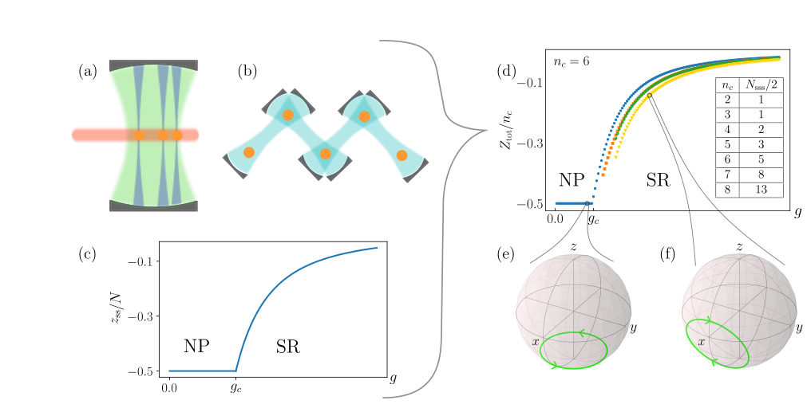
<figcaption class="paper-figure-caption"><b>Fig 1.</b> FIG. 1. (a) Schematic diagram of a confocal multimode cavity QED apparatus like those in [21, 30, 37–41]. Multiple atomic spin clusters (orange) are located at distinct positions (ri) in the central plane of the confocal cavity, and are illuminated by the transverse pumping laser (red) causing light to be scattered into the cavity. The cavity field has both a local component (blue), and a non-local component (green) through which the interactions between the spin clusters are mediated. (b) Schematic diagram of intersecting single-mode cavities (cavity fields shown in light blue), with two atomic clusters (orange) in each cavity, arranged to realize the nearest-neighbor coupling geometry of...</figcaption>
</figure>
<figure class="paper-figure-card">
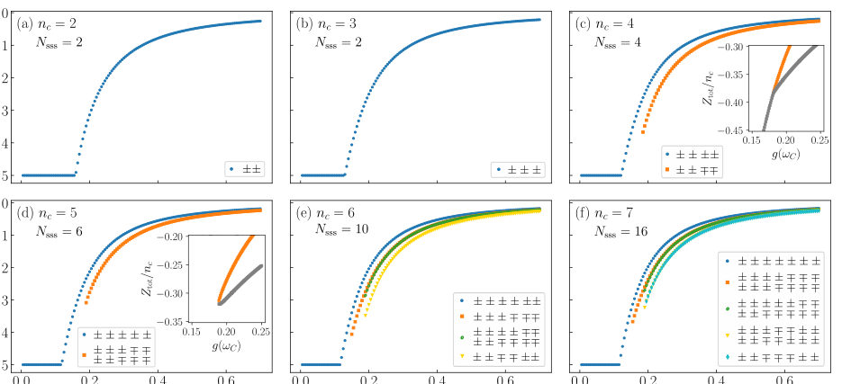
<figcaption class="paper-figure-caption"><b>Fig 2.</b> FIG. 2. Stable steady-state solutions shown through the total z-spin components scaled by the number of clusters plotted as a function of the coupling strength, g, for different values of nc. As the number of clusters in the system is increased, the number of stable steady-state solutions in the superradiant phase increases, as given by Eq. (14). The legends label the pairs of solutions based on the sign of the x-spin component of each cluster. Note that some values of Ztot correspond to multiple distinct solution pairs due to reflection symmetry about the central cluster. In addition, some of the solutions pairs that are not linked via symmetries, but have the same amount of groups of...</figcaption>
</figure>
<figure class="paper-figure-card">
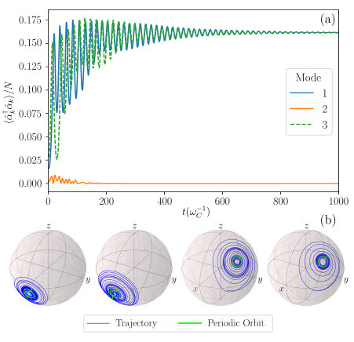
<figcaption class="paper-figure-caption"><b>Fig 3.</b> FIG. 3. Example mean-field evolution of a four cluster system towards an oscillatory steady-state solution in the superradiant phase. (a) The cavity field occupations converge to fixed values, with finite occupation in the cavity modes that connect clusters within superradiant pairs (modes 1 and 3), and with zero occupation in the cavity mode connecting two superradiant pairs (mode 2). (b) The paths traced out by the spin of each cluster on its own generalized Bloch sphere (blue) converge to closed phase space orbits (green), leading to oscillations in the spin components. The orbits for the first two clusters are identical and the orbits for the last two clusters are identical, and the two...</figcaption>
</figure>
<figure class="paper-figure-card">
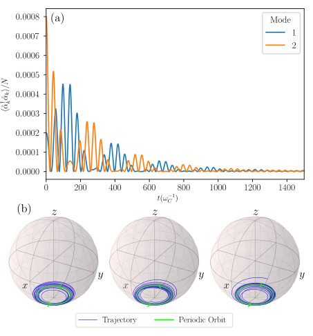
<figcaption class="paper-figure-caption"><b>Fig 4.</b> FIG. 4. Example mean-field evolution of a three cluster sys- tem towards an oscillatory steady-state solution in the normal phase. (a) The cavity field occupations for both modes con- verge to zero as expected for the normal phase. (b) The paths traced out by the spin of each cluster on its own generalized Bloch sphere (blue) converge to closed phase space orbits (green), leading to oscillations in the spin components. The orbits for all three clusters trace out the same circle, but the orbit of the middle cluster is out of phase with that of the two edge clusters so that xi = −xi+1 and yi = −yi+1. The initial conditions used to generate these plots are (xi, 0, − p</figcaption>
</figure>
<figure class="paper-figure-card">
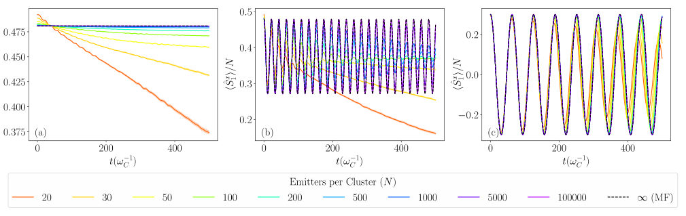
<figcaption class="paper-figure-caption"><b>Fig 5.</b> FIG. 5. Comparison of the mean-field solutions (dashed black curve) with results obtained using TWA for finite-size clusters with varying numbers of emitters per cluster. The comparison is made for the expectation value of the x-spin component of the first cluster scaled by the cluster size N. (a) Non-oscillatory superradiant steady-state solution, ± ± ± ∓∓, for five clusters. For large clusters the deviations from the mean-field solution are small indicating stability of the non-oscillatory solution even for finite-size clusters. (b) Superradiant phase oscillations for two clusters. (c) Normal phase oscillations for two clusters. Oscillations are observed in both phases even for...</figcaption>
</figure>

**Summary.** This paper analyzes the multimode Dicke model using an ordered nearest-neighbor coupling geometry realized with ultracold atoms in optical cavities. It demonstrates that the system exhibits Fibonacci scaling in the number of stable steady states within the superradiant phase, and these states can host persistent quantum oscillations. The findings are robustly confirmed by comparing mean-field results against treatments incorporating quantum fluctuations.

**Why it may be interesting.** This work provides deep insights into how geometric constraints (nearest-neighbor coupling) dictate complex collective behavior, leading to mathematically rich structures like Fibonacci sequences in the number of stable solutions. The combination of mean-field theory with rigorous fluctuation treatments makes it highly relevant for modern quantum optics research.

Detailed structure

**Main problem.** The study investigates the stable steady-states and persistent oscillations within the multimode Dicke model when subjected to an ordered nearest-neighbor coupling geometry.

**Main result.** The number of mean-field stable steady-states in the superradiant phase exhibits Fibonacci scaling with the number of atomic clusters, and a subset of these states show persistent oscillations.

**Method.** Analysis employs mean-field theory, supplemented by advanced techniques like the Truncated Wigner Approximation (TWA) to account for quantum fluctuations beyond the classical limit.

**Model / system.** The system is an ordered multimode Dicke model realized using ultracold atoms in optical cavities with nearest-neighbor coupling. Dynamics are governed by a Lindblad master equation, which is simplified into an atom-only description via cavity mode elimination.

**Key observables.** Stable steady-state solutions (characterized by spin components $x_i, y_i, z_i$), and the presence of persistent oscillations observed as closed orbits in phase space.

**Important parameters / regimes.** The system is analyzed across a phase transition from Normal Phase to Superradiant Phase, controlled by coupling strengths ($g$) relative to critical values ($g_c$).

**Assumptions / limitations.** Initial analyses rely on the mean-field limit or the TWA; stability proofs are contingent on small parameters ($\epsilon \ll 1$); the nearest-neighbor geometry is a key focus.

**Figures summary.** Figures illustrate schematics of cavity setups, show multiple stable pairs of solutions exhibiting Fibonacci scaling in the superradiant phase, and depict closed orbits corresponding to persistent oscillations in both normal and superradiant regimes.

**Paper structure.** The paper progresses from defining the physical model (Dicke model with ordered coupling) to deriving mean-field equations. It then analyzes stability using perturbative methods, confirming Fibonacci scaling for steady states, before extending the analysis to include quantum fluctuations via TWA to confirm persistence in finite systems.

Abstract

Ultracold atoms in multimode optical cavities provide a rich testbed for many-body phenomena enabled by light-mediated interactions. Recent experiments include realizations of spin glasses and associative memories, as described by multimode Dicke models with disordered couplings. However, the properties of multimode Dicke models with ordered coupling geometries remain largely unexplored. In this work, we investigate the stable steady-states of the multimode Dicke model with an ordered nearest-neighbor coupling geometry, where $n_c$ atomic clusters are coupled via $n_c-1$ cavity modes. We show that the number of mean-field stable steady-states in the superradiant phase exhibits Fibonacci scaling with the number of atomic clusters, and that a subset of these steady-states exhibit persistent oscillations. Using both the truncated Wigner approximation and the numerically-exact hierarchy of pure states, we further demonstrate that these features of the stable steady-state solutions persist for finite cluster sizes. Ordered multimode Dicke models, such as the nearest-neighbor coupling geometry considered here, are accessible with current experimental technologies and point toward a broader class of strongly interacting dissipative systems with similarly rich behavior.

[↑ back to top](#top)

### ⭐ [Composite Quantum Geometry and Semiclassical Dynamics](http://arxiv.org/abs/2606.12525v1)

**Highlighted author(s):** Johannes Knolle  
**Authors:** Henry Davenport, Yoonseok Hwang, Johannes Knolle, Frank Schindler  
**Type:** theory · **Category:** strongly correlated electrons · **PDF:** <https://arxiv.org/pdf/2606.12525v1>  
**Analysis basis:** full PDF text, analyzed in chunks
**Topic relevance:** `non-equilibrium dynamics` **2/5** · `Keldysh / 2PI / non-Gaussian methods` **1/5** · `analog quantum simulation` **1/5** · `driven-dissipative phase transition` **1/5** · `methods for driven-dissipative` **1/5**

↔ Scroll figures horizontally

<figure class="paper-figure-card">
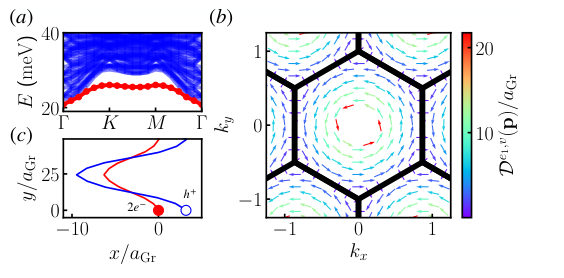
<figcaption class="paper-figure-caption"><b>Fig 1.</b> FIG. 1. Trions in MATBG at filling ν = 0, in the chiral limit w0/w1 = 0 with gate distance ξ = 20 nm [18]. (a) Trion dispersion with gapped trion away from the Γ point. (b) QGD [De1,h(p)] for the lowest energy bound trion. (c) Dynamics of trion starting at k = (0, 0.75) with applied field in ˆx direction.</figcaption>
</figure>

**Summary.** The paper develops a theoretical framework to describe the semiclassical dynamics of composite bound states, such as trions, by generalizing topological concepts like Berry curvature. It introduces the Quantum Geometric Dipole (QGD) term into the equations of motion, showing that this geometric contribution dictates unique physical behaviors, including transverse drifts, which are absent in single-particle descriptions.

**Why it may be interesting.** This work provides a powerful generalization of Berry curvature physics to multi-particle excitations (composites), which is crucial for understanding transport phenomena in strongly correlated or excitonic systems where simple single-band models fail.

Detailed structure

**Main problem.** The study derives semiclassical equations of motion for general composite bound states (like excitons and trions) in insulators, extending topological concepts beyond single-electron dynamics.

**Main result.** The equations of motion are modified by a Quantum Geometric Dipole (QGD) term, which is necessary to describe the physics of neutral composites when an external electric field is applied. This QGD can induce unique dynamics, such as transverse drift in trions.

**Method.** The authors use adiabatic approximations and gauge transformations on the Hamiltonian to derive semiclassical equations for position expectation values, generalizing concepts like Berry curvature to composite systems.

**Model / system.** The model concerns composite bound states (e.g., excitons, trions) in semiconductors/insulators, analyzed using Bloch Hamiltonians and projected position operators. The analysis is extended to specific materials like magic-angle twisted bilayer graphene (MATBG).

**Key observables.** Berry connection ($A_\alpha(p)$), Quantum Geometric Dipole ($D_{\alpha,eta}(p)$), and the expectation values of composite position operators $\langle \hat{R}_\alpha 
angle$.

**Important parameters / regimes.** External electric field ($\mathbf{E}$), momentum ($\mathbf{p}$), and the nature of the composite (neutral vs. charged).

**Assumptions / limitations.** The derivation relies on the adiabatic approximation, assuming the bound state follows instantaneous eigenstates, and involves careful handling of gauge invariance.

**Figures summary.** Figures illustrate Berry curvatures ($\Omega$) and QGDs ($D$) for trions in MATBG, showing their spatial dependence across the Brillouin zone.

**Paper structure.** The paper systematically derives generalized semiclassical equations of motion by first defining species-specific position operators and calculating gauge-invariant quantities like the QGD. It then applies these to analyze the dynamics of composite particles under an electric field, culminating in specific examples like trions in MATBG.

Abstract

We derive semiclassical equations of motion for general composite bound states in insulators and semiconductors, covering excitations such as excitons and trions. For neutral composites we find that a uniform external electric field does not couple to a Berry curvature term, contrary to the naive expectation from single-electron dynamics. Instead, a distinct quantum geometric quantity appears generically in the equations of motion. This quantity is the difference between inequivalent Berry connections that can be defined for the composite, generalising the concept of the quantum geometric dipole previously studied for excitons. In the case of charged composites such as trions, we find an additional Berry curvature contribution to the equations of motion. As we demonstrate, however, there is an infinite family of inequivalent composite Berry curvatures, and so care must be taken to make the correct choice that describes the physical dynamics. We explain how this choice should be made dependent on the definition of a spatial centre for the composite. We end by discussing composite dynamics that have no single-electron counterpart. We find that trions in magic-angle twisted bilayer graphene undergo a transverse drift under an applied electric field and that this is driven not only by the Berry curvature contribution but also by the quantum geometric dipole. The interplay of these two geometric contributions further imprints itself on the trion's internal dynamics, causing its dipole moment to oscillate in time.

[↑ back to top](#top)

### [Driven-dissipative entanglement of distant giant atoms](http://arxiv.org/abs/2606.13375v1)

**Authors:** Aziza Almanakly, Ariadna Soro, Alejandro Vivas-Viaña, Beatriz Yankelevich, Caspar Groiseau, David Pahl, Junyoung An, Gabriel Cutter, Michael E. Gingras, Bethany M. Niedzielski, Hannah Stickler, Renée DePéncier Piñero, Mollie E. Schwartz, Kyle Serniak, Max Hays, Jeffrey A. Grover, Anton Frisk Kockum, William D. Oliver  
**Type:** experiment · **Category:** quantum information and computing · **PDF:** <https://arxiv.org/pdf/2606.13375v1>  
**Analysis basis:** full PDF text, analyzed in chunks
**Topic relevance:** 🔥 `correlated / nonlocal dissipation` **5/5** · 🔥 `QC/QI experiment` **4/5** · 🔥 `methods for driven-dissipative` **4/5** · `Tavis-Cummings & cavity-many-emitter` **3/5** · `correlated cavity matter` **3/5** · `driven-dissipative phase transition` **3/5** · `entanglement & information structure` **3/5** · `non-equilibrium dynamics` **3/5** · `non-equilibrium universality` **2/5** · `quantum optics experiment` **2/5** · `Keldysh / 2PI / non-Gaussian methods` **1/5** · `analog quantum simulation` **1/5** · `interference shaping light` **1/5** · `measurement-induced transitions` **1/5** · `quantum measurements` **1/5** · `superradiant laser` **1/5**

↔ Scroll figures horizontally

<figure class="paper-figure-card">
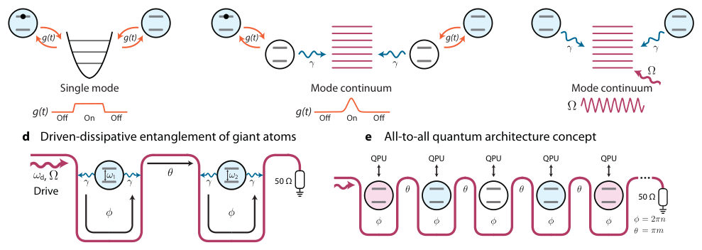
<figcaption class="paper-figure-caption"><b>Fig 1.</b> FIG. 1. The interactions underpinning remote entanglement generation. a) Coherent interactions in closed quantum systems. Remote entanglement generation is often mediated by another mode. The qubit on the left begins in the excited state. The distant qubits interact with the shared mode using a time-dependent coherent coupling g(t), resulting in a two-qubit entangled state indicated by the color blue. b) Combined coherent and dissipative interactions in open systems. Alternatively, entanglement generation schemes emit and absorb itinerant photons into a mode continuum, such as in waveguide. These approaches combine dissipation (γ) and time-dependent coherent interactions (g(t)) to precisely...</figcaption>
</figure>
<figure class="paper-figure-card">
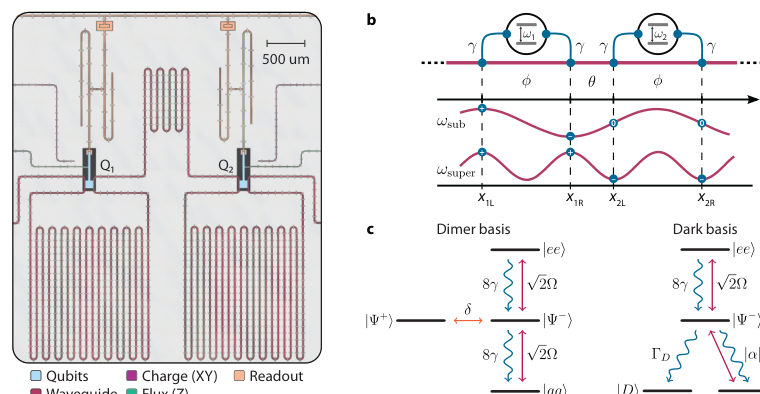
<figcaption class="paper-figure-caption"><b>Fig 2.</b> FIG. 2. Sequential giant atoms device and experimental set up. a) False-colored optical micrograph of the device. Giant atoms are realized using transmon qubits (light blue) coupled twice with strength γ to a common waveguide (red). XY (purple) and Z (green) control lines and dispersive readout circuitry (orange) enable in situ qubit tuning and state characterization. b) Schematic of the sequential giant-atom configuration. The phase difference between the coupling points of an individual atom is ϕ(ω) = ω(x1R −x1L)/ν = ω(x2R −x2L)/ν, while the phase separating the atoms is θ(ω) = ω(x2L −x1R)/ν, where ν is the speed of light in the waveguide. For qubit frequency ω = ωsub [ϕ(ωsub) = π(2n +...</figcaption>
</figure>
<figure class="paper-figure-card">
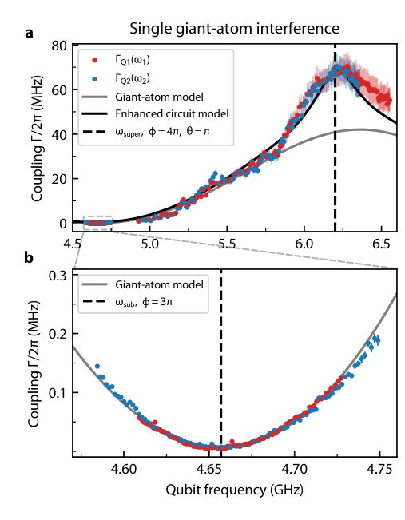
<figcaption class="paper-figure-caption"><b>Fig 3.</b> FIG. 3. Single giant-atom superradiance and sub- radiance. a) Individual waveguide coupling rates ΓQ1(ω1) and ΓQ2(ω2) across the qubit spectrum. For large cou- plings, decay rates are extracted from waveguide transmis- sion spectroscopy while the other qubit idles at the subradi- ant frequency ωsub/2π = 4.656 GHz. We observe superradi- ance, or maximal waveguide coupling, of the individual giant atoms at ωsuper/2π = 6.208 GHz and determine the value of the individual waveguide coupling points Γ(ωsuper)/8π = γ(ωsuper)/2π ≈14.7 MHz. We fit the Γ1(ω1) data to an en- hanced circuit model that combines the expected giant-atom dissipation spectrum in Eq. (1) with a Lorentzian response to a low-Q...</figcaption>
</figure>
<figure class="paper-figure-card">
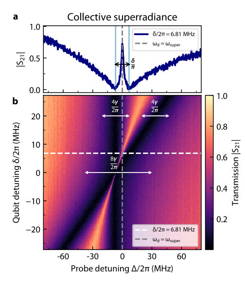
<figcaption class="paper-figure-caption"><b>Fig 4.</b> FIG. 4. Collective superradiance. a) Waveguide trans- mission spectroscopy of the giant atoms each detuned by δ/2π = 6.81 MHz from the superradiant frequency ωsuper = 6.208 GHz, where ∆is the detuning of the transmission probe frequency from ωsuper. To begin the driven-dissipative entan- glement generation protocol, we operate the qubits in this fre- quency configuration and input a coherent drive at frequency ωd = ωsuper through the waveguide. b) Collective superra- diant crossing. We measure transmission as a function of qubit detuning δ near ωsuper. At zero detuning (δ = 0), the qubits exhibit collective superradiance, characterized by an enhanced linewidth of 8γ(ωsuper).</figcaption>
</figure>
<figure class="paper-figure-card">
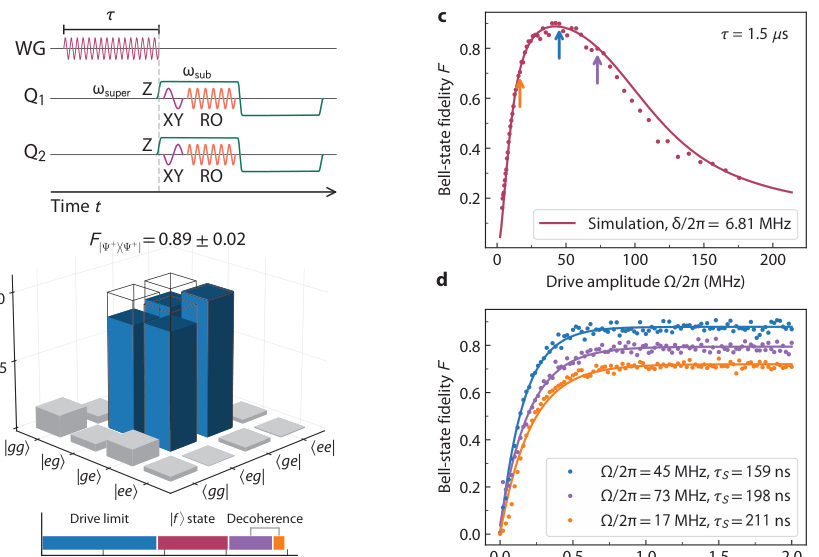
<figcaption class="paper-figure-caption"><b>Fig 5.</b> FIG. 5. Driven-dissipative entanglement generation using giant atoms. a) Experimental pulse scheme. Starting with qubits near ωsuper, a coherent drive of amplitude Ωis applied at frequency ωd = ωsuper for time duration τ. Upon reaching steady state, the qubits are flux-tuned (Z, green) to ωsub to decouple the atoms from the waveguide, protecting the generated entangled state. We perform qubit state tomography using XY pulses (purple) and dispersive readout (orange) to quantify the Bell-state fidelity. To mitigate flux transients, we implement net-zero predistorted flux pulses. b) Average Bell-state fidelity. For Ω/2π = 45 MHz and τ = 1.5 µs, we measure an average fidelity F = 0.89 ± 0.02...</figcaption>
</figure>

**Summary.** The research demonstrates the generation and preservation of remote entanglement between two distant superconducting giant atoms using driven-dissipative protocols. By continuously driving the coupled system, they exploit correlated dissipation to create an entangled state, which is then protected by tuning the qubit frequencies away from the high-dissipation regime. This proves that engineered dissipation is a robust pathway for quantum network distribution.

**Why it may be interesting.** This work provides an experimental realization of reservoir engineering principles—using engineered dissipation to drive a quantum system into a desired entangled steady state—which is highly relevant for building scalable quantum networks.

Detailed structure

**Main problem.** The primary goal is demonstrating a viable method for distributing entanglement across quantum networks using driven-dissipative protocols, contrasting with traditional coherent methods.

**Main result.** The authors successfully generated remote entanglement between two distant giant atoms, achieving a Bell-state fidelity of $F = 0.89 \pm 0.02$.

**Method.** Entanglement is generated by continuously driving the superconducting system through the waveguide, exploiting correlated dissipation, followed by in situ frequency tuning to preserve the entangled state.

**Model / system.** The physical platform is a superconducting circuit containing two giant artificial atoms coupled sequentially to a waveguide (wQED setup). The dynamics are modeled using master equations incorporating tunable individual and correlated dissipation via interference effects (superradiance/subradiance).

**Key observables.** Bell-state fidelity ($F$), Concurrence ($C$), transmission spectrum $|S_{21}|$, and qubit decay rates ($\Gamma$).

**Important parameters / regimes.** Optimal drive amplitude ($\Omega/2\pi = 45 	ext{ MHz}$), stabilization time $	au$, and the ratio of coupling strengths to dissipation rates.

**Assumptions / limitations.** The primary assumption is that suppressing individual dissipation post-generation (by tuning to subradiant states) is sufficient to preserve entanglement, despite the initial dissipative generation mechanism.

**Figures summary.** Figures illustrate various entanglement schemes (coherent vs. driven-dissipative), show spectroscopy measurements of single and two atoms, and plot fidelity dependence on drive amplitude ($\Omega$) and time ($	au$).

**Paper structure.** The paper progresses from establishing the need for dissipative protocols to detailing the physical system (giant atoms in a waveguide), demonstrating entanglement generation via driving near superradiance, and finally showing state preservation by tuning into protected subradiant states.

Abstract

Quantum interconnects distribute entanglement via controlled light-matter interactions for quantum computing and sensing applications. Many entanglement generation schemes use coherent, reversible interactions that require precisely calibrated pulses to execute. In contrast, driven-dissipative protocols use a continuous-wave drive in the presence of correlated dissipation to stabilize entanglement in protected (dark) states. However, the same dissipation that generates the entanglement also limits its utility once the stabilization protocol ends. Here, we engineer a superconducting system of two giant artificial atoms coupled sequentially to a waveguide, with tunable individual and correlated dissipation enabled by interference between coupling points. Continuously driving the atoms through the waveguide exploits correlated dissipation to generate remote entanglement. We then tune the qubit frequencies in situ to suppress individual dissipation and thereby preserve the entanglement, achieving a Bell-state fidelity F = 0.89 +/- 0.02. This demonstration indicates that the driven dissipation of giant atoms is a viable approach for distributing entanglement across quantum networks.

[↑ back to top](#top)

### [Interference of critical dynamics associated with zero modes](http://arxiv.org/abs/2606.13200v1)

**Authors:** Zhi-Han Zhang, Han-Chuan Kou, Peng Li  
**Type:** theory · **Category:** statistical mechanics · **PDF:** <https://arxiv.org/pdf/2606.13200v1>  
**Analysis basis:** full PDF text, analyzed in chunks
**Topic relevance:** 🔥 `non-equilibrium dynamics` **5/5** · 🔥 `analog quantum simulation` **4/5** · 🔥 `non-equilibrium universality` **4/5** · `Keldysh / 2PI / non-Gaussian methods` **3/5** · `driven-dissipative phase transition` **3/5** · `methods for driven-dissipative` **3/5** · `Frenkel-Kontorova` **1/5** · `correlated / nonlocal dissipation` **1/5** · `entanglement & information structure` **1/5** · `interference shaping light` **1/5**

↔ Scroll figures horizontally

<figure class="paper-figure-card">
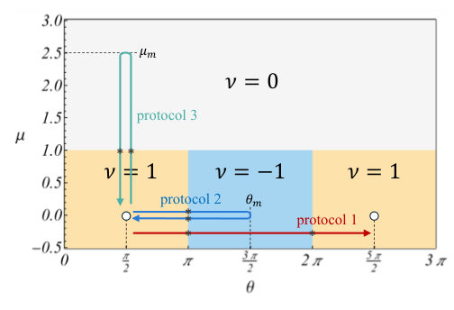
<figcaption class="paper-figure-caption"><b>Fig 1.</b> FIG. 1. Phase diagram and quench protocols of the gener- alized Creutz ladders with ϕ = 0 and JX = JD = K. The vertical axis is µ = JY /(2K). The colored regions are labeled by the winding number ν. The equivalent solvable endpoints θ = π/2, µ = 0 and θ = 5π/2, µ = 0 host OBC zero modes exactly localized on boundary rungs. In protocol 1, θ is varied from π/2 to 5π/2 at fixed µ = 0. In protocol 2, θ is varied from π/2 to the turning point θm = 3π/2 and then back to π/2 at fixed µ = 0. In protocol 3, µ is varied from 0 to the turning point µm = 2.5 and then back to 0 at fixed θ = π/2. Small offsets of the arrows are used only for visibility. Aster- isks (*) denote the critical points where...</figcaption>
</figure>
<figure class="paper-figure-card">
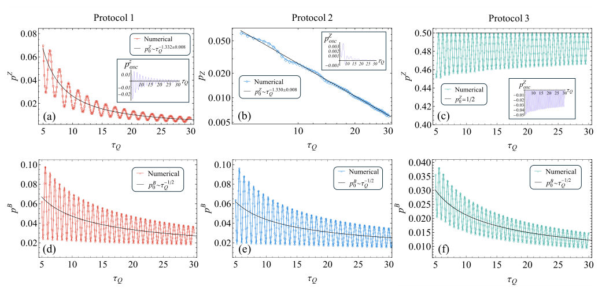
<figcaption class="paper-figure-caption"><b>Fig 2.</b> FIG. 2. Zero-mode transfer probability pZ and bulk excitation density pB for the three quench protocols. (a)-(c) Zero-mode transfer probability pZ. The black curves denote the smooth component pZ 0, and the insets show the oscillatory part pZ osc. (d)-(f) Bulk excitation density pB. The black curves show the KZ scaling pB 0 ∼τ −1/2 Q . Panels (a,d), (b,e), (c,f) correspond to protocols 1, 2, and 3, respectively. The numerical parameters are L = 500, K = 1, and R = 1.</figcaption>
</figure>
<figure class="paper-figure-card">
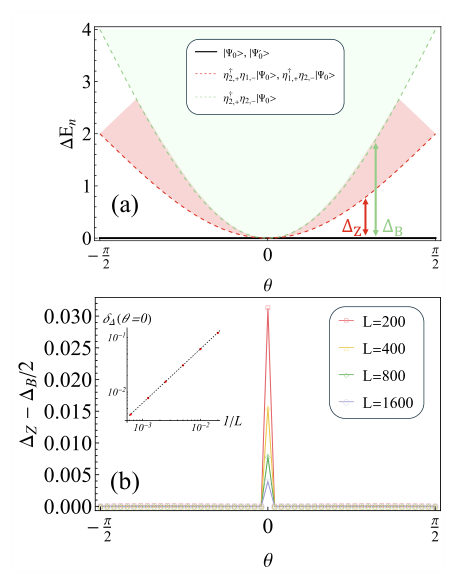
<figcaption class="paper-figure-caption"><b>Fig 3.</b> FIG. 3. Relation between the OBC energy gap and the PBC bulk gap. (a) Many-body energy level structure. The red dashed line denotes the energy of the two degenerate excited states, η† 2,+η1,−|Ψ0⟩and η† 1,+η2,−|Ψ0⟩, which mark the low- est energy bound of excitations involving zero modes, namely the OBC energy gap∆Z = E2,+ + E1,−≃E2,+. The green dashed line corresponds to the energy of the excited state, η† 2,+η2,−|Ψ0⟩, with bulk gap ∆B = E2,+ +E2,−= 2E2,+. The light red region marks excitations with zero modes, while the light green region marks bulk many-body excitations under PBC. (b) Difference between the OBC energy gap and half the PBC bulk gap, ∆Z −∆B/2, as a function of the quench...</figcaption>
</figure>
<figure class="paper-figure-card">
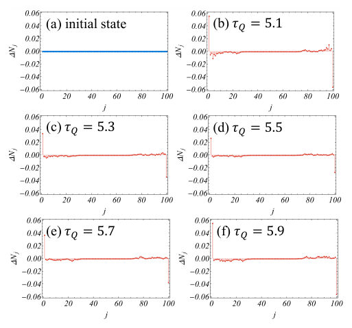
<figcaption class="paper-figure-caption"><b>Fig 4.</b> FIG. 4. Deviations of the particle number produced in protocol 1. (a) Reference profile from the initial state, for which ∆Nj = 0. (b)-(f) Deviations of the particle number ∆Nj = N i j −N f j for τQ = 5.1, 5.3, 5.5, 5.7, and 5.9, respec- tively. The left edge defect is the first-rung value dleft = ∆N1.</figcaption>
</figure>
<figure class="paper-figure-card">

<figcaption class="paper-figure-caption"><b>Fig 5.</b> Figure 4 shows the spatial profile of ∆Nj in protocol 1. The deviation of the particle number is concentrated near the two boundaries, while the bulk rungs remain close to their initial value. The first-rung value gives dleft, which is the boundary response associated with the initially occupied zero mode in |Ψ0⟩. Together with the pair-occupatthe decrease of the particle number at the left boundary can be interpreted as the transfer proba- bility of the selected zero mode. Figure 5(a) compares dleft with pZ in protocol 1. The two quantities have the same oscillatory structure as functions of τQ. This means that the boundary particle- number change reproduces the ICDZM oscillation of the...</figcaption>
</figure>

**Summary.** This paper investigates how interference effects associated with zero modes manifest during rapid changes (quenches) in a lattice model. By analyzing the zero-mode transfer probability and edge defects, the authors show that these observables act as sensitive probes of critical dynamics. The results quantitatively link observed interference patterns, such as period doubling, to the accumulated phase acquired by the system's Hamiltonian along the quench path.

**Why it may be interesting.** This work provides a detailed theoretical framework connecting non-equilibrium dynamics (quenches) with topological properties (zero modes). The ability to predict specific oscillatory behaviors like period doubling based on path topology is highly relevant for designing quantum simulation protocols.

Detailed structure

**Main problem.** The study investigates the interference of critical dynamics associated with zero modes (ICDZM) during nonadiabatic quench processes across multiple critical points.

**Main result.** The ICDZM pattern exhibits rich behavior, including period doubling when linking topologically nontrivial phases, and this phenomenon is successfully mapped onto the accumulated interference phase calculated via WKB analysis.

**Method.** The authors employ time-dependent quantum mechanics, utilizing quench protocols through parameter space paths. Key calculations involve WKB approximation to determine the accumulated interference phase ($\Delta\varphi$) governing the zero-mode transfer probability ($p_Z$).

**Model / system.** The system is modeled using generalized Creutz ladders described by an OBC Hamiltonian involving hopping amplitudes and phases. The dynamics are controlled by varying parameters like $	heta$ or $\mu$, leading to topological phase transitions.

**Key observables.** Zero-mode transfer probability ($p_Z$), edge defect ($	ext{d}_{	ext{left}}$), bulk excitation density ($p_B$), and the interference period ($T$).

**Important parameters / regimes.** Quench path parameters ($	heta, \mu$), quench time scale ($	au_Q$), and system coupling constants ($K, J_X, J_Y$).

**Assumptions / limitations.** The analysis heavily relies on WKB approximations for calculating the interference phase in both bulk and edge observables. The Hamiltonian is assumed to be quadratic in single-particle operators.

**Figures summary.** Figures compare $p_Z$ and $	ext{d}_{	ext{left}}$ across different quench protocols, showing oscillatory patterns, period doubling ($T_Z \simeq 2T_B$), and power-law decay for one-way quenches. Other figures illustrate the energy gap structure ($\Delta_Z$ vs $\Delta_B$) and phase accumulation integrals.

**Paper structure.** The paper systematically analyzes three quench protocols (varying $	heta$ or $\mu$). It first establishes the connection between $p_Z$, edge defects, and ICDZM. Subsequently, it uses WKB analysis to derive quantitative relationships for the interference phase ($\Delta\varphi$) and the resulting periods ($T$), confirming the dependence on topological winding numbers.

Abstract

We study the interference of critical dynamics associated with zero modes (ICDZM) in the generalized Creutz ladders using closed quench paths that pass through two critical points successively. By reading out the final zero-mode transfer probability, we find rich ICDZM interference patterns dependent on the quench path. In particular, when the closed path links two topologically nontrivial phases, the ICDZM pattern may either vanish or exhibit period doubling. Within the framework of WKB analysis, this phenomenon is well clarified by the interference phase accumulated in the quench procedure. We also demonstrate that the zero-mode transfer probability can be detected by the deviation of the boundary particle number from its initial fractional value, which arises from the blending of bulk modes in the critical dynamics. As an edge defect, the zero-mode transfer probability captures both the ICDZM oscillation and the known anomalous defect production in a non-closed quench path. These results identify ICDZM and the corresponding edge defect as probes for critical dynamics associated with topological zero modes.

[↑ back to top](#top)

### [Experiment-compatible measurement--feedback quantum state preparation with reinforcement learning](http://arxiv.org/abs/2606.13005v1)

**Authors:** Xiaotian Nie, Tao Zhang, Linghui Chen  
**Type:** both · **Category:** quantum gases · **PDF:** <https://arxiv.org/pdf/2606.13005v1>  
**Analysis basis:** full PDF text, analyzed in chunks
**Topic relevance:** 🔥 `quantum measurements` **5/5** · 🔥 `analog quantum simulation` **4/5** · `measurement-induced transitions` **3/5** · `methods for driven-dissipative` **3/5** · `entanglement & information structure` **2/5** · `non-equilibrium dynamics` **2/5** · `QC/QI experiment` **1/5** · `correlated cavity matter` **1/5** · `driven-dissipative phase transition` **1/5**

↔ Scroll figures horizontally

<figure class="paper-figure-card">
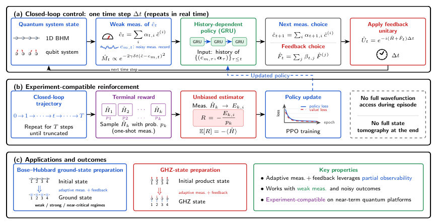
<figcaption class="paper-figure-caption"><b>Fig 1.</b> FIG. 1. Schematic of the measurement–feedback reinforcement-learning framework. (a) Closed-loop control: at each time step the system is weakly measured, a recurrent policy selects the next measurement and feedback action from the measurement record, and a feedback unitary is applied. (b) Experiment-compatible reinforcement: a terminal reward is constructed from one-shot measurements of randomly sampled Hamiltonian terms, providing an unbiased energy estimator for PPO training. (c) Applications: Bose–Hubbard ground-state preparation and GHZ-state generation.</figcaption>
</figure>
<figure class="paper-figure-card">
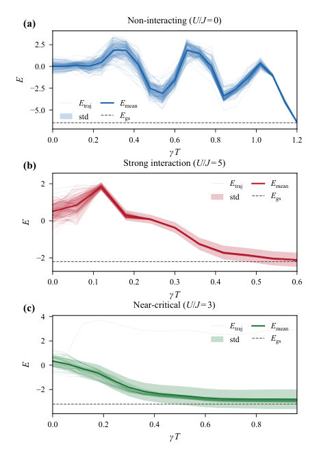
<figcaption class="paper-figure-caption"><b>Fig 2.</b> FIG. 2. Energy evolution during measurement–feedback ground-state preparation of the four-site Bose–Hubbard model at unit filling, in the (a) non-interacting (U/J = 0), (b) strong-interaction (U/J = 5), and (c) near-critical (U/J = 3) regimes, with measurement strength γ/J = 0.3. Thin col- ored lines show 100 sampled trajectories, the bold line is the ensemble mean, and the shaded region indicates ±1 standard deviation over 1000 episodes. The dashed line marks the ex- act ground-state energy Egs.</figcaption>
</figure>
<figure class="paper-figure-card">
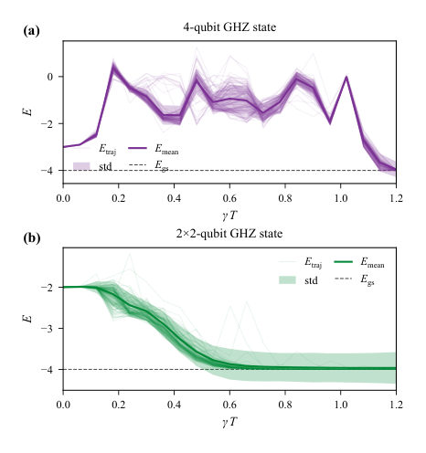
<figcaption class="paper-figure-caption"><b>Fig 3.</b> FIG. 3. Energy evolution during GHZ-state preparation via measurement–feedback control, for (a) the four-qubit GHZ state |GHZ4⟩and (b) the product |GHZ2 ⊗GHZ2⟩of two two-qubit GHZ states, with measurement strength γ = 0.3. The same plotting conventions as Fig. 2 are used. In both cases, the adaptive policy using only single-qubit Z-type mea- surements and Y -type feedback drives the energy close to Egs = −4, preparing the target entangled states with high fidelity.</figcaption>
</figure>

**Summary.** This paper presents a novel, hardware-compatible method for preparing complex quantum states, such as ground states of the Bose-Hubbard model, using reinforcement learning applied to measurement--feedback control. By utilizing only the history of measurable outcomes, the protocol bypasses the need for full state knowledge, making it highly relevant for current experimental quantum simulation platforms. The results demonstrate robust and efficient preparation across various physical regimes.

**Why it may be interesting.** This work directly addresses the practical gap between theoretical quantum control schemes and experimental feasibility in cold atom/quantum gas platforms by embedding the control loop within an RL framework compatible with limited measurement data.

Detailed structure

**Main problem.** Developing practical, scalable protocols for preparing target ground states in many-body systems using measurement--feedback control.

**Main result.** The developed RL framework successfully drives the system to low-energy states (e.g., BHM ground state) and generates entangled states (GHZ states), outperforming fixed or handcrafted baselines.

**Method.** An adaptive measurement--feedback protocol is implemented using Reinforcement Learning (RL) under partial observability, allowing real-time control based only on accessible measurement outcomes.

**Model / system.** The method is demonstrated on the Bose–Hubbard model (BHM) and for generating GHZ states. The control loop involves weak measurements followed by feedback unitaries applied over discrete time steps.

**Key observables.** Ground state energy ($E_{gs}$), measurement outcomes, and fidelity of generated entangled states.

**Important parameters / regimes.** Measurement strength ($\gamma$), interaction ratio ($U/J$), and the training duration ($\gamma T$).

**Assumptions / limitations.** The protocol is designed to operate using only experimentally accessible measurements, avoiding the need for full quantum-state reconstruction or tomography.

**Figures summary.** Figures schematically illustrate the closed-loop control process at each time step, the experiment-compatible RL training setup using one-shot measurements, and applications to BHM ground-state preparation and GHZ state generation.

**Paper structure.** The paper introduces the limitations of existing quantum state preparation methods, proposes the RL-based measurement--feedback framework (POMDP formulation), details the hardware-compatible reward design, and validates the method by applying it to both the Bose-Hubbard model and GHZ state generation.

Abstract

Ground-state preparation is a critical task in quantum simulation and quantum computing, as it enables the study of correlated phases and the generation of entangled resource states. While measurement--feedback control has emerged as a promising route to state preparation, existing schemes either rely on handcrafted, task-specific policies or are designed using full quantum-state information that is unavailable in real experiments and becomes impractical for large many-body systems. Here we develop an adaptive measurement--feedback protocol based on reinforcement learning under partial observability. The controller uses only the history of experimentally accessible measurement outcomes to choose both the measurement operator and the feedback action in real time. To make training compatible with experiments, we introduce a stochastic terminal reward built from one-shot measurements of randomly sampled Hamiltonian components, avoiding unphysical full-state reconstruction while remaining an unbiased estimator of the target energy. We demonstrate the method by preparing ground states of the Bose--Hubbard model and by generating GHZ states, establishing a scalable and hardware-compatible route to quantum state preparation.

[↑ back to top](#top)

### [Quantized time in quantum walks under weak rank-K measurements](http://arxiv.org/abs/2606.13552v1)

**Authors:** Klaus Ziegler  
**Type:** theory · **Category:** other · **PDF:** <https://arxiv.org/pdf/2606.13552v1>  
**Analysis basis:** full PDF text, analyzed in chunks
**Topic relevance:** 🔥 `quantum measurements` **5/5** · 🔥 `measurement-induced transitions` **4/5** · `correlated / nonlocal dissipation` **1/5** · `driven-dissipative phase transition` **1/5** · `methods for driven-dissipative` **1/5**

↔ Scroll figures horizontally

<figure class="paper-figure-card">
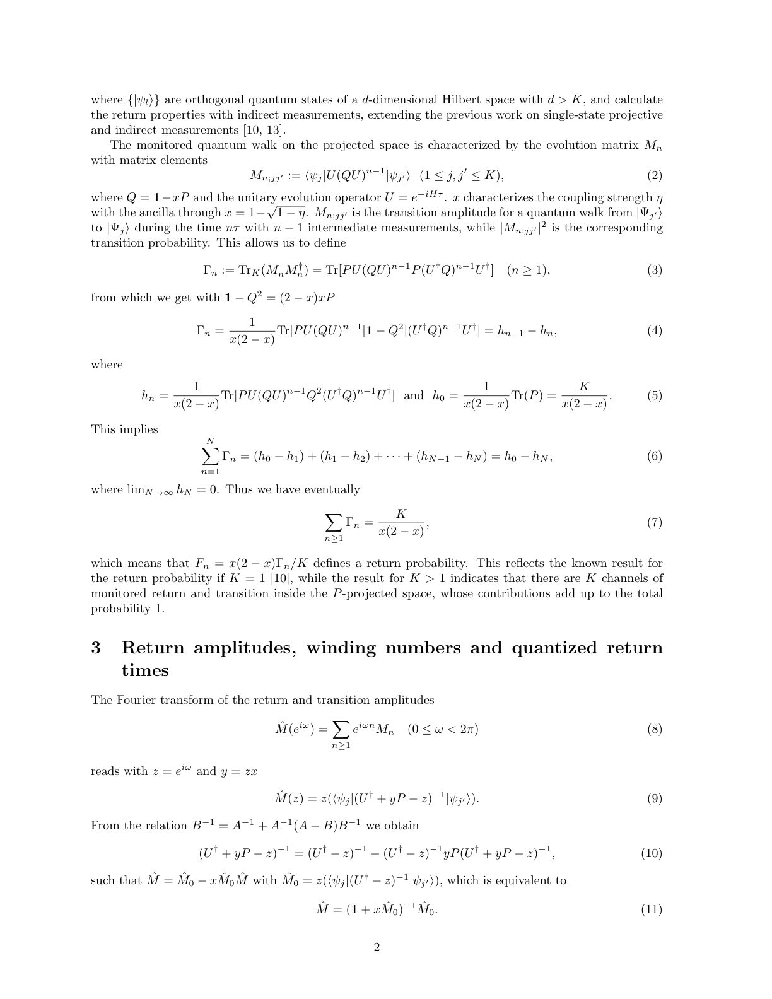
<figcaption class="paper-figure-caption"><b>Fig 1.</b> Low-resolution page preview, page 2</figcaption>
</figure>
<figure class="paper-figure-card">
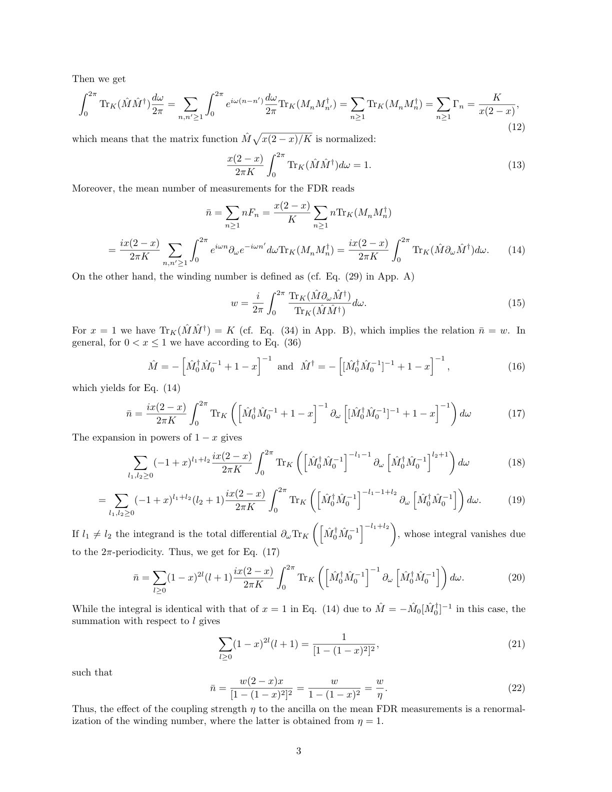
<figcaption class="paper-figure-caption"><b>Fig 2.</b> Low-resolution page preview, page 3</figcaption>
</figure>
<figure class="paper-figure-card">
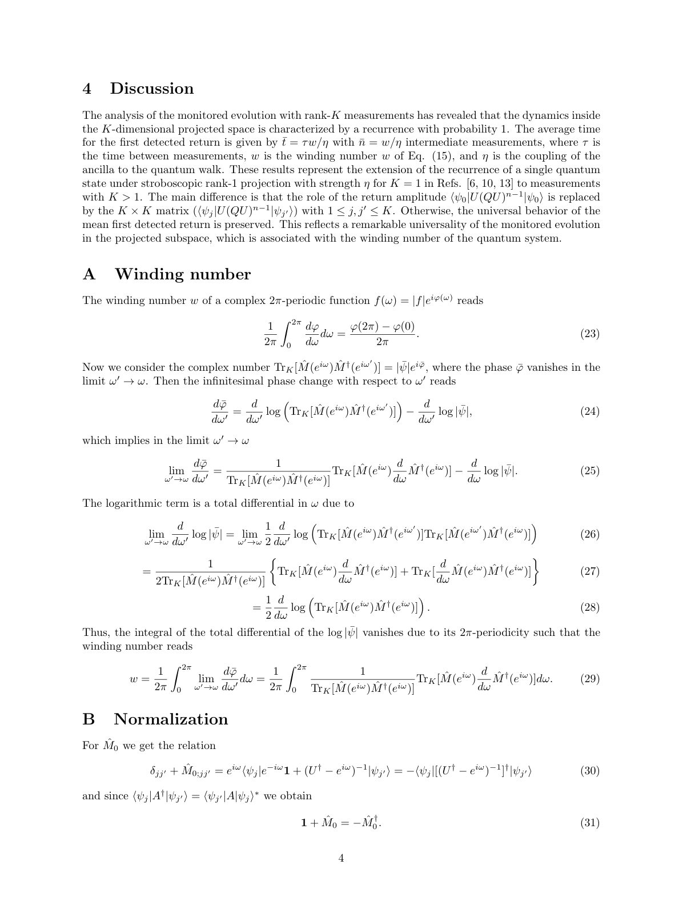
<figcaption class="paper-figure-caption"><b>Fig 3.</b> Low-resolution page preview, page 4</figcaption>
</figure>
<figure class="paper-figure-card">
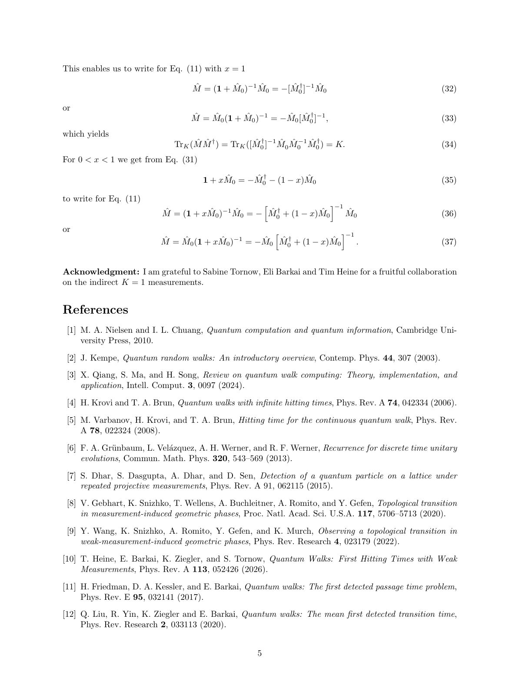
<figcaption class="paper-figure-caption"><b>Fig 4.</b> Low-resolution page preview, page 5</figcaption>
</figure>
<figure class="paper-figure-card">

<figcaption class="paper-figure-caption"><b>Fig 5.</b> Low-resolution page preview, page 6</figcaption>
</figure>

**Summary.** This paper theoretically examines the quantization of time statistics when monitoring a quantum walk using multiple channels of weak or strong measurements. The authors demonstrate that this multi-channel monitoring preserves the universal quantization property, showing that the mean return time is proportional to the winding number divided by the coupling strength parameter. This extends fundamental results on recurrence times to higher-dimensional monitored systems.

**Why it may be interesting.** This work connects fundamental concepts from quantum measurement theory (weak measurements, projection) with quantum transport phenomena (quantum walks), providing a theoretical framework for observing quantized time statistics in open quantum systems.

Detailed structure

**Main problem.** The paper investigates whether monitoring a quantum walk evolution using multi-channel strong or indirect measurements leads to a universally quantized time statistic for the mean return time.

**Main result.** It is shown that under such multi-channel monitoring, the mean return time of the quantum walk in the projected subspace remains quantized, suggesting universal time quantization even for higher dimensional dynamics.

**Method.** The analysis involves calculating transition amplitudes using matrix elements derived from the unitary evolution operator and projecting onto a $K$-dimensional subspace defined by projectors. The key mathematical tool is relating the mean return time to the winding number of these amplitudes in the complex plane.

**Model / system.** The model is a quantum walk whose evolution is monitored by repeated measurements, which can be modeled as direct projection or indirectly via an ancilla coupling. The system's dynamics are analyzed within a projected $K$-dimensional subspace.

**Key observables.** Mean return time ($ar{t}$), mean number of measurements ($ar{n}$), and the winding number ($w$).

**Important parameters / regimes.** The coupling strength parameter $\eta$ (or related variable $x$), and the dimension of the projected subspace, $K$.

**Assumptions / limitations.** The analysis assumes orthogonal states $|\psi_l
angle$ and relies on specific algebraic manipulations involving matrix inverses.

**Paper structure.** The paper builds upon known results for mean return time quantization in 1D walks ($K=1$) and extends this framework to the general case of multi-channel monitoring ($K>1$), deriving relationships between $ar{n}$, $w$, and $\eta$.

Abstract

Measurements can be used to monitor the evolution of quantum systems and may lead to a universally quantized time statistics. It is known that the mean return time is quantized for strong and indirect monitoring through the winding number of the return amplitude in a one-dimensional space. Here we discuss that under multi-channel strong or indirect monitoring, where the latter is achieved through ancilla coupling, the mean return time of a quantum walk in the projected subspace is also quantized. This reflects a universal time quantization for a higher dimensional evolution.

[↑ back to top](#top)

### [Supersymmetry of dissipative Bose-Fermi systems with application to Jaynes-Cummings and Dicke models](http://arxiv.org/abs/2606.12682v1)

**Authors:** Colin V. Coane, Francesco Iachello  
**Type:** theory · **Category:** other · **PDF:** <https://arxiv.org/pdf/2606.12682v1>  
**Analysis basis:** full PDF text, analyzed in chunks
**Topic relevance:** 🔥 `Tavis-Cummings & cavity-many-emitter` **4/5** · 🔥 `methods for driven-dissipative` **4/5** · `Dicke superradiance` **3/5** · `analog quantum simulation` **3/5** · `correlated / nonlocal dissipation` **3/5** · `correlated cavity matter` **3/5** · `driven-dissipative phase transition` **3/5** · `non-equilibrium dynamics` **2/5** · `non-equilibrium universality` **2/5** · `superradiant laser` **2/5** · `Keldysh / 2PI / non-Gaussian methods` **1/5** · `Kondo & dissipative impurity` **1/5** · `entanglement & information structure` **1/5** · `exotic spin models in light-matter` **1/5**

↔ Scroll figures horizontally

<figure class="paper-figure-card">
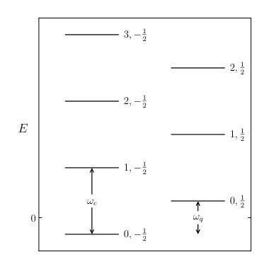
<figcaption class="paper-figure-caption"><b>Fig 1.</b> FIG. 1. Spectrum of the JC Hamiltonian for g = 0. States are labelled by nB, s.</figcaption>
</figure>
<figure class="paper-figure-card">
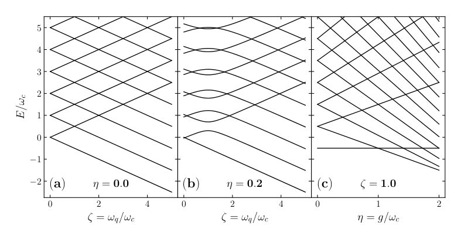
<figcaption class="paper-figure-caption"><b>Fig 2.</b> FIG. 2. (a) Behavior of the eigenvalues of HJC as a function of ζ = ωq/ωc for η = g/ωc = 0. (b) Behavior of the eigenvalues of HJC as a function of ζ for η = 0.2. (c) Behavior of the eigenvalues of HJC as a function of η = g/ωc for ζ = 1 (resonant case).</figcaption>
</figure>
<figure class="paper-figure-card">
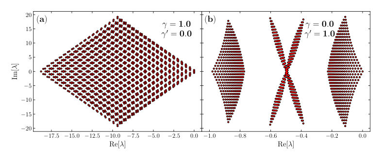
<figcaption class="paper-figure-caption"><b>Fig 3.</b> FIG. 3. Scatterplot of the Jaynes-Cummings model Liouvillian eigenvalues (ωc = 1.0, ωq = 0.5, g = 0.1) for (a) γ = 1.0, γ′ = 0, and (b) γ = 0, γ′ = 1.0. Red points are evaluated from the analytic formula, Eq. (16) and black points are numerical results with NF ock = 20.</figcaption>
</figure>
<figure class="paper-figure-card">
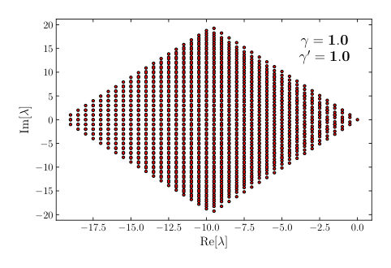
<figcaption class="paper-figure-caption"><b>Fig 4.</b> FIG. 4. Scatterplot of the Jaynes-Cummings model Liouvil- lian eigenvalues (ωc = 1.0, ωq = 0.5, g = 0.1) for γ = γ′ = 1.0, and NF ock = 20. Red points are evaluated from Eq. (18) and black points are numerical results.</figcaption>
</figure>
<figure class="paper-figure-card">
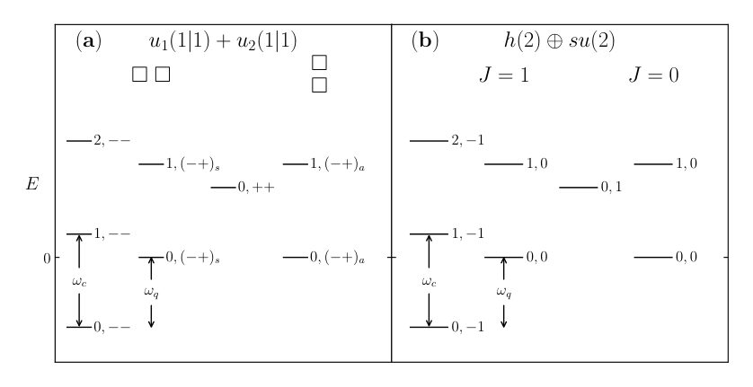
<figcaption class="paper-figure-caption"><b>Fig 5.</b> FIG. 5. The uncoupled Dicke spectrum for two qubits. (a) States in a u1(1|1) + u2(1|1) basis. (b) States in a h(2) ⊕su(2)</figcaption>
</figure>

**Summary.** This paper develops advanced theoretical techniques using supersymmetries to analytically determine the eigenvalues for both the Hamiltonian and the Liouvillian superoperator governing coupled Bose-Fermi systems like the JC and Dicke models. By exploiting underlying algebraic symmetries, the authors reduce large matrix eigenvalue problems into diagonalizing small blocks, providing exact solutions for open quantum dynamics.

**Why it may be interesting.** This work provides powerful mathematical tools—leveraging supersymmetry—to solve complex open quantum system dynamics (Liouvillians) in systems central to cavity QED and quantum optics. The systematic reduction of dimensionality is highly valuable for theoretical modeling.

Detailed structure

**Main problem.** The primary goal is to find explicit analytic solutions for the eigenvalues of both the Hamiltonian and the Liouvillian superoperator for various coupled Bose-Fermi systems.

**Main result.** Supersymmetry methods allow the reduction of large eigenvalue problems (for both $H$ and $\mathcal{L}$) into diagonalizing small, manageable block matrices. This yields explicit analytic formulas for the eigenvalues in terms of system parameters.

**Method.** The authors employ techniques from superalgebra theory ($u(n|m)$) to exploit symmetries that commute with conserved quantities (Casimir invariants). The Liouvillian is analyzed by constructing a basis and showing it takes a block-triangular form, allowing diagonalization of smaller blocks.

**Model / system.** The study focuses on coupled Bose-Fermi systems, specifically applying the framework to the Jaynes-Cummings (JC) model and the Dicke model. The dynamics are described by Hamiltonians and governed by Lindblad master equations ($\partial_t
ho = \mathcal{L}
ho$).

**Key observables.** Eigenvalues of the Hamiltonian ($H$) and the Liouvillian superoperator ($\mathcal{L}$); steady-state properties.

**Important parameters / regimes.** Coupling strengths ($g$), cavity frequency ($\omega_c$), qubit/fermion frequency ($\omega_q$), and dissipation rates ($\gamma, \gamma'$).

**Assumptions / limitations.** The analysis heavily relies on the existence of symmetries (supersymmetries) that commute with the Hamiltonian or Casimir operators, leading to block-diagonalization of the Liouvillian matrix.

**Figures summary.** Figures illustrate spectral properties for JC and Dicke models, showing energy spectra in different parameter regimes and basis representations.

**Paper structure.** The paper systematically develops methods by first solving the Hamiltonian spectrum using superalgebra symmetries. It then extends this methodology to the Liouvillian superoperator, deriving explicit formulas for eigenvalues by analyzing block-diagonal structures arising from bosonic and fermionic dissipation channels.

Abstract

We demonstrate how supersymmetries of Hamiltonians for coupled Bose-Fermi systems can be used to place the Hamiltonians of the Jaynes-Cummings model and Dicke model under the rotating wave approximation in matrix form and provide explicit analytic solutions for their eigenvalues. We then use this supersymmetry to place the Liouvillians of the associated Markovian open systems in matrix form and provide explicit solutions for their eigenvalues. These results are a consequence of the fact that the Hamiltonian of the Jaynes-Cummings model commutes with the linear Casimir invariant of the superalgebra $u(1|1)$ and that the Hamiltonian of the Dicke model commutes both with the linear invariant of $\sum_{i} u_{i}(1|1)$ and with the invariant of an additional $su(2)$ algebra. Our methods apply to various coupled Bose-Fermi systems with $u(1|1)$ and more generally with $u(n|m)$ dynamical superalgebras, and may provide efficient tools for studying more complicated examples.

[↑ back to top](#top)

### [Dynamical Control of Superconductivity in Superconductor-Ferromagnet Bilayers](http://arxiv.org/abs/2606.12544v1)

**Authors:** Dimitri Pimenov, Nicholas R. Poniatowski, Charlotte G. L. Bøttcher, Amir Yacoby, Debanjan Chowdhury  
**Type:** theory · **Category:** other · **PDF:** <https://arxiv.org/pdf/2606.12544v1>  
**Analysis basis:** full PDF text, analyzed in chunks
**Topic relevance:** 🔥 `spintronics-quantum-optics interface` **4/5** · `Keldysh / 2PI / non-Gaussian methods` **3/5** · `analog quantum simulation` **3/5** · `driven-dissipative phase transition` **3/5** · `exotic spin models in light-matter` **3/5** · `methods for driven-dissipative` **3/5** · `Tavis-Cummings & cavity-many-emitter` **2/5** · `correlated cavity matter` **2/5** · `non-equilibrium dynamics` **2/5** · `non-equilibrium universality` **2/5** · `correlated / nonlocal dissipation` **1/5** · `entanglement & information structure` **1/5** · `interference shaping light` **1/5**

↔ Scroll figures horizontally

<figure class="paper-figure-card">
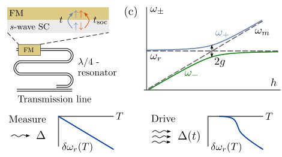
<figcaption class="paper-figure-caption"><b>Fig 1.</b> Figure 1. (a) A superconductor (SC) - ferromagnet (FM) bilayer integrated with a microwave (λ/4-) resonator, ac- cessed via a transmission line. The normal (t) and spin- orbit assisted (tsoc) tunneling induces triplet superconduct- ivity in the FM layer; see Eq. (4). (b) Left: Within linear- response, temperature-dependent shift of the resonator fre- quency δωr(T) probes the equilibrium nodal-gap ∆k of the superconductor. Right: Driving renders ∆(t) time-dependent and nodeless, modifying δωr(T). (c) Magnon-polariton dis- persion in the vicinity of a resonance where the resonator fre- quency ωr is comparable to the magnon frequency ωm, where the latter is tunable with an external magnetic...</figcaption>
</figure>
<figure class="paper-figure-card">
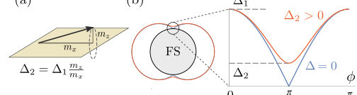
<figcaption class="paper-figure-caption"><b>Fig 2.</b> Figure 2. (a) Secondary gap component induced by an out-of- plane canting of the magnetization. (b) Sketch of the induced gap, Eq. (6b), with ϕ the angular direction along the Fermi surface.</figcaption>
</figure>
<figure class="paper-figure-card">
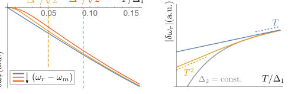
<figcaption class="paper-figure-caption"><b>Fig 3.</b> Figure 3. Cavity frequency shift δωr determined from Eq. (9): (a) “upturn” due to a temperature-independent oscillat- ory secondary gap ∆2(t) = ∆∗sin(ωdt) for decreasing values of (ωr −ωm); the dashed vertical lines show the correspond- ing time-averages ∆∗/ √</figcaption>
</figure>
<figure class="paper-figure-card">
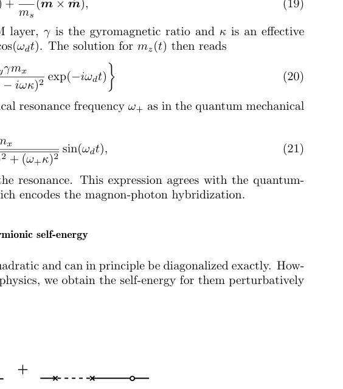
<figcaption class="paper-figure-caption"><b>Fig 4.</b> Figure 4. Perturbative evaluation of the fermionic self-energy.</figcaption>
</figure>
<figure class="paper-figure-card">
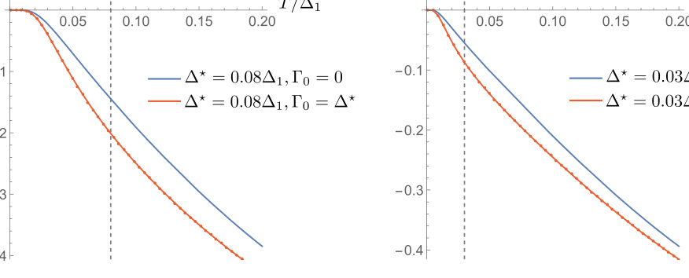
<figcaption class="paper-figure-caption"><b>Fig 5.</b> Figure 6. Π(Γ, T) ∼δωr(T) for two values of ∆2 = ∆∗, set to a constant time-independent value. The points are evaluated numerically.</figcaption>
</figure>

**Summary.** The paper theoretically explores controlling superconductivity in superconductor-ferromagnet bilayers by coupling them to an external microwave cavity. By applying a resonant drive, the system undergoes a non-equilibrium phase transition from a nodal p-wave state to a fully gapped superconducting state. This work demonstrates how coherent electromagnetic driving can be used as a tool to engineer exotic quantum phases of matter.

**Why it may be interesting.** This work sits at the intersection of circuit QED and condensed matter theory, providing a framework to engineer novel quantum states (like changing gap symmetry) using coherent electromagnetic driving fields.

Detailed structure

**Main problem.** The study investigates how coupling superconducting materials (SC) with ferromagnets (FM) to a microwave resonator can dynamically control the superconducting pairing symmetry.

**Main result.** Driven magnon-polaritons induce a non-equilibrium crossover from an expected nodal p-wave superconductor state to a fully gapped $(p_x+ip_y)$-superconductor.

**Method.** The analysis uses theoretical modeling involving coupled Bogoliubov excitations, ferromagnetic magnons, and cavity photons, often employing perturbation theory and time-averaging techniques.

**Model / system.** The system is an SC-FM bilayer integrated with a microwave resonator, modeled by coupling the superconducting gap dynamics to the magnon-photon polariton modes. The low-energy excitations include magnons ($\omega_m$), Bogoliubov quasiparticles, and cavity photons ($\omega_r$).

**Key observables.** The temperature-dependent shift of the cavity photon frequency, $\delta\omega_r(T)$, is used to diagnose the superconducting gap symmetry (nodal vs. nodeless).

**Important parameters / regimes.** Magnon-photon detuning ($\Delta$), external drive strength ($V_d$), and temperature ($T$).

**Assumptions / limitations.** The analysis often assumes weak, slow driving fields and utilizes approximations like integrating out certain degrees of freedom or using the adiabatic limit.

**Figures summary.** Figures illustrate the coupled system setup (SC-FM/resonator), magnon-polariton dispersion, and theoretical predictions for $\delta\omega_r(T)$ under both equilibrium and driven conditions, highlighting characteristic power laws.

**Paper structure.** The paper progresses by first establishing the coupled Hamiltonian, then analyzing the dynamics of the polaritons under external driving, which in turn dictates the non-equilibrium evolution of the superconducting pairing state ($\Delta_k$), culminating in predictions for measurable spectroscopic signatures like $\delta\omega_r(T)$.

Abstract

We study a simplified model of a ferromagnetic metal proximitized by a fully-gapped $s-$wave superconductor and integrated with a microwave resonator. The low-energy excitations in the combined system consist of ferromagnetic magnons, Bogoliubov excitations of the superconductor, and cavity photons. We show here that when the magnons and photons have comparable frequencies and are subject to an external drive, the hybridized driven magnon-polaritons induce a non-equilibrium crossover from the expected proximitized nodal $p-$wave superconductor to a fully gapped $(p_x+ip_y)-$superconductor. Moreover, the characteristic crossover temperature is inversely related to the magnon-photon detuning. We compute the temperature-dependent renormalization of the cavity photon frequencies across this nodal to nodeless evolution, which modifies the kinetic inductance of the resonator, and find a number of non-trivial features tied to the non-equilibrium (i.e., driven) nature of the problem. We compare and contrast these results with a recent circuit quantum electrodynamics (cQED) based experiment studying a permalloy-niobium bilayer, where a non-trivial dependence of the low-temperature cavity response on the magnon-photon detuning was observed. Our results pave the way for a principled exploration of engineering novel states of matter by coupling cavity photons to electronic collective modes in correlated two-dimensional materials and interfaces.

[↑ back to top](#top)

### [Thermoelectric information engine driven by an autonomous Maxwell demon across quantum-to-classical transitions](http://arxiv.org/abs/2606.13500v1)

**Authors:** Maximiliano Bernal Santibañez, Felipe Barra, Jose Mondaca  
**Type:** theory · **Category:** statistical mechanics · **PDF:** <https://arxiv.org/pdf/2606.13500v1>  
**Analysis basis:** full PDF text, analyzed in chunks
**Topic relevance:** 🔥 `methods for driven-dissipative` **4/5** · 🔥 `non-equilibrium dynamics` **4/5** · `Keldysh / 2PI / non-Gaussian methods` **3/5** · `correlated / nonlocal dissipation` **3/5** · `driven-dissipative phase transition` **3/5** · `entanglement & information structure` **3/5** · `non-equilibrium universality` **3/5** · `Kondo & dissipative impurity` **2/5** · `measurement-induced transitions` **2/5** · `quantum measurements` **2/5** · `scars & prethermalization` **1/5**

↔ Scroll figures horizontally

<figure class="paper-figure-card">
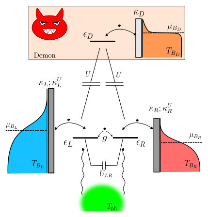
<figcaption class="paper-figure-caption"><b>Fig 1.</b> FIG. 1. Scheme of the system composed of three quan- tum dots (thick black lines), coupled via Coulomb interac- tions ULR and U, indicated by capacitors, and via coherent tunneling (g) in the case of the left (ϵL) and right (ϵR) quan- tum dots. Each site is coupled to a different bath. The left and right dots constitute the working substance and are also coupled to the phonon bath (green). Furthermore, quantum dot D (ϵD), coupled to an independent bath (orange), acts as the Maxwell demon through its interaction with the working substance.</figcaption>
</figure>
<figure class="paper-figure-card">
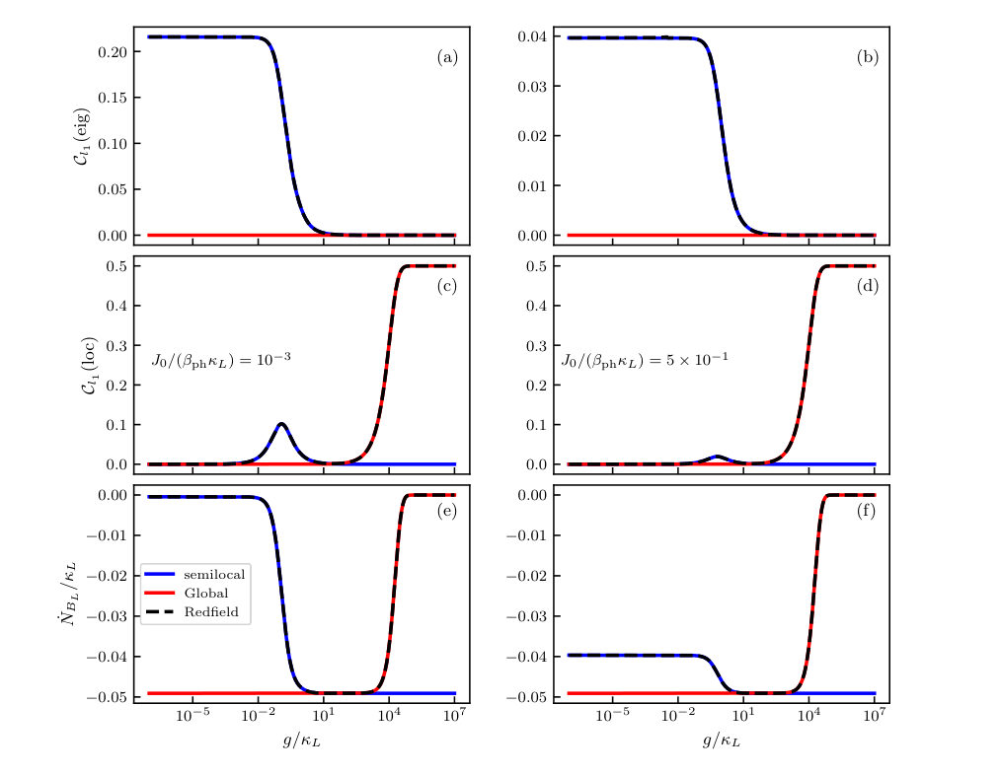
<figcaption class="paper-figure-caption"><b>Fig 2.</b> FIG. 2. Coherence in the eigen basis Cl1(eig), coherence in the local basis Cl1(loc), and particle current, for two different values of phononic coupling J0/(βphκL) = 10−3 and J0/(βphκL) = 5 × 10−1. Results are shown for the partial master equation (red), global master equation (blue), and Redfield equation(black dashed). Cl1(eig) (a)-(b), Cl1(loc) (c)-(d) and particle current ˙NBL(e)-(f) all as a function of g/κL. Parameters: κL(ϵ) = κR(ϵ + U) = 1/100, κL(ϵ + U) = κR(ϵ) = 1/600, κL/κR = 6, κD/κL = 2, T/κL = 10000, TBD/κD = 100, µL = −µR, eV/T = 1, ULR/T = 5, U/TBD = 20, βph = βBL = βBR, µBD = 2 and sites energies ϵ = 0, ϵD = µBD −U/2 .</figcaption>
</figure>
<figure class="paper-figure-card">
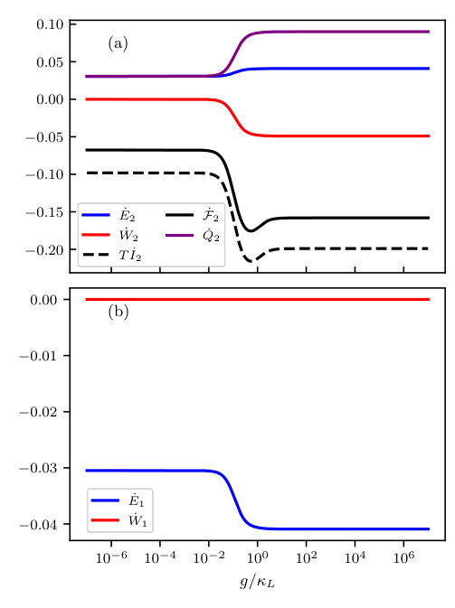
<figcaption class="paper-figure-caption"><b>Fig 3.</b> FIG. 3. (a) Energy flow, Power, contribution of information, free energy rate, heat flow by the working substance. (b) Energy flow and power ( ˙W1 = 0 =⇒ ˙E1 = ˙Q1), by the demon.</figcaption>
</figure>
<figure class="paper-figure-card">
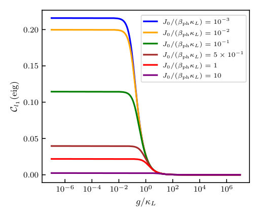
<figcaption class="paper-figure-caption"><b>Fig 4.</b> FIG. 4. Coherence Cl1(eig) versus the hopping parameter g/κL, for different values of the phonon coupling strength J0/(βphκL). Parameters: All parameters are the same of Fig. 2, except for J0/(βphκL).</figcaption>
</figure>
<figure class="paper-figure-card">
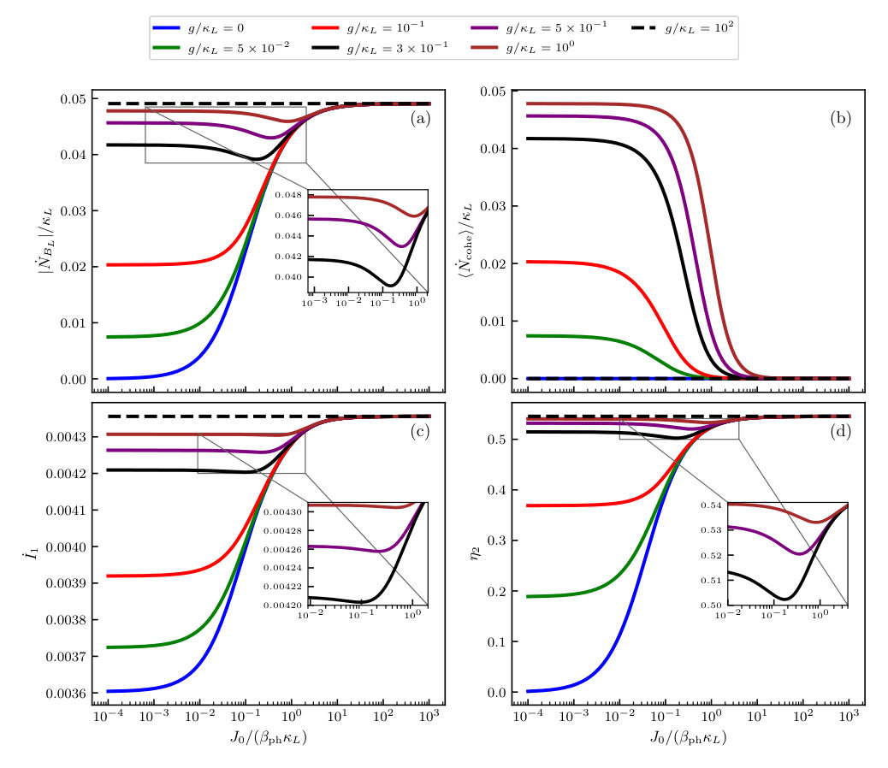
<figcaption class="paper-figure-caption"><b>Fig 5.</b> FIG. 5. (a) Absolute value of the particle current | ˙NBL|/κL versus phonon coupling J0/(βphκL), for several parameters of coherent hopping g/κL. (b) ⟨˙Ncohe⟩/κL against J0/(βphκL). (c) Information flow received by the demon ˙I1 versus phonon coupling J0/(βphκL). (d) Efficiency of the working substance η2 against J0/(βphκL). Parameters: All parameters are the same of Fig. 2, except for g/κL and J0/(βphκL).</figcaption>
</figure>

**Summary.** The paper models a three-dot thermoelectric engine acting as an information processor driven by a Maxwell demon mechanism. It rigorously analyzes the system dynamics using multiple master equation approximations to map out different quantum-to-classical transition regimes. The findings clarify the competition between coherent tunneling, decoherence from phonons, and incoherent transport in enabling energy conversion via information flow.

**Why it may be interesting.** This work is highly relevant as it merges concepts from open quantum systems, non-equilibrium thermodynamics (Maxwell's demon), and quantum transport, providing a rigorous framework for understanding how coherence affects energy/information conversion in nanoscale devices.

Detailed structure

**Main problem.** The study investigates a thermoelectric information engine driven by an autonomous Maxwell demon across different quantum-to-classical transition regimes.

**Main result.** The model demonstrates that the system's operation as an information engine is maintained across varying coupling strengths, with coherence and decoherence playing competing roles in determining transport mechanisms.

**Method.** The dynamics are analyzed using open quantum system formalisms, comparing results from Redfield master equations against two distinct Lindblad approximations (global vs. semilocal) to determine the appropriate theoretical description for different parameter regimes.

**Model / system.** The physical model is a three-terminal thermoelectric engine comprising two working dots (L and R) coupled to a monitoring 'Maxwell demon' dot (D). The system interacts with fermionic reservoirs and an explicit phonon bath, leading to complex non-equilibrium dynamics.

**Key observables.** Information flow ($\dot{I}$), energy/heat/work flows ($\dot{E}, \dot{Q}, \dot{W}$), coherence measures ($C_{l1}$), and the rate of entropy production ($\dot{\sigma}$).

**Important parameters / regimes.** The ratio of interdot tunneling strength to bath coupling ($g/\kappa_L$) controls the crossover between dynamical regimes, while phonon coupling strength ($J_0$) drives decoherence.

**Assumptions / limitations.** Key approximations include the Born-Markov limit and the use of secular/partial-secular expansions for the master equation; spinless electrons are assumed.

**Figures summary.** Figures compare coherence and particle currents across parameter variations ($g/\kappa_L$ or $J_0$), illustrating how different theoretical approaches (Redfield, global, semilocal) predict transport properties in various regimes.

**Paper structure.** The paper systematically analyzes the system dynamics by deriving and comparing multiple master equation formalisms based on approximations related to frequency degeneracies. It then applies these tools to calculate thermodynamic quantities like work extraction and information flow across parameter sweeps that induce quantum-to-classical crossovers.

Abstract

We study a three-terminal thermoelectric engine, focusing on the role of quantum coherence and information flow. A double-dot connects two reservoirs at different chemical potentials, while a third dot monitors their occupation via Coulomb interaction and can be interpreted as an autonomous Maxwell demon. Within the parameter range where the device operates as an engine, we identify conditions under which this interpretation holds. The system dynamics is described within a Redfield master equation that allows us to identify two distinct dynamical regimes with steady states well captured by suitable Lindblad approximations. These two regimes define a first quantum-to-classical transition controlled by the interdot tunneling strength. We further consider the effect of a phonon bath coupled to the double-dot, which induces a second quantum-to-classical transition by generating incoherent transport and decoherence in the small interdot tunneling regime. We identify a parameter region where phonon-induced decoherence suppresses both the coherent transport contribution and the information flow toward the monitoring dot, suggesting that coherence can enhance the demon mechanism in this regime. By tracking information and transport properties across these crossovers, our model shows how coherent tunneling, decoherence, and incoherent phonon-assisted transport compete in an autonomous information engine, while clarifying which thermodynamic Lindblad description is appropriate in each regime.

[↑ back to top](#top)

### [Invariant Measures and Weak-Magic-Injection Asymptotics in Random Monitored Quantum Circuits](http://arxiv.org/abs/2606.13470v1)

**Authors:** Guocheng Zhen, Xuanrong Yang, Chengkai Zhu, Ranyiliu Chen, Xin Wang  
**Type:** theory · **Category:** quantum information and computing · **PDF:** <https://arxiv.org/pdf/2606.13470v1>  
**Analysis basis:** full PDF text, analyzed in chunks
**Topic relevance:** 🔥 `measurement-induced transitions` **4/5** · 🔥 `methods for driven-dissipative` **4/5** · `correlated / nonlocal dissipation` **3/5** · `driven-dissipative phase transition` **3/5** · `quantum measurements` **3/5** · `Keldysh / 2PI / non-Gaussian methods` **2/5** · `entanglement & information structure` **2/5** · `non-equilibrium dynamics` **2/5** · `non-equilibrium universality` **2/5** · `scars & prethermalization` **1/5**

↔ Scroll figures horizontally

<figure class="paper-figure-card">
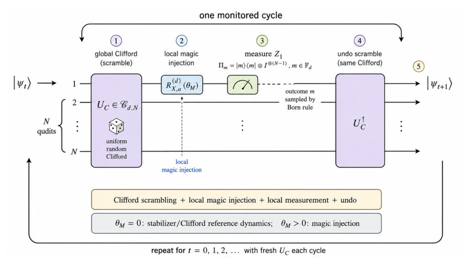
<figcaption class="paper-figure-caption"><b>Fig 1.</b> Figure 1: Schematic view of one monitored update step of the model. At time step t = 0, 1, 2, . . ., starting from a pure state |ψt⟩, the circuit draws a fresh uniform Clifford UC,t ∈Cd,N, applies the local non-Clifford rotation R(d) X,a(θM) on qudit 1, measures qudit 1 in the computational basis with projectors Πm = |m⟩⟨m| ⊗I⊗(N−1) for m ∈Fd, and then applies U † C,t. The resulting state is denoted |ψt+1⟩, and the update is repeated with an independent fresh Clifford draw at each time step.</figcaption>
</figure>
<figure class="paper-figure-card">
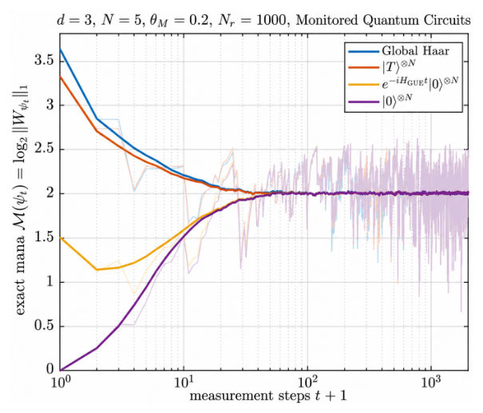
<figcaption class="paper-figure-caption"><b>Fig 2.</b> Figure 2: Numerical steady-state diagnostic for the monitored dynamics. The plot tracks exact mana at d = 3, N = 5, and θM = 0.2. Each curve is averaged over 1000 independent trajectories, initialized respectively from four ensembles following the terminology of [22]: Haar-random states; Tensor product of qutrit T-type magic states, denoted by |T⟩⊗N, with |T⟩∝|0⟩+ e2πi/9|1⟩+ e−2πi/9|2⟩; states |ψ⟩GUE = exp(−iHGUEt)|0⟩⊗N evolved with random Hamiltonian HGUE drawn from the Gaussian unitary ensemble with normalized spectrum in [−2, 2], where we choose small t = 0.1; and the computational-basis product states |0⟩⊗N.</figcaption>
</figure>
<figure class="paper-figure-card">
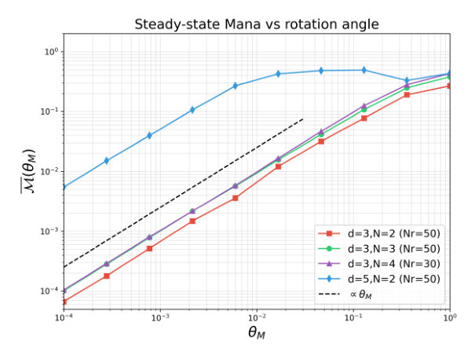
<figcaption class="paper-figure-caption"><b>Fig 3.</b> Figure 3: Odd-prime weak-magic-injection asymptotics from the computational-basis product initial state. For each displayed pair (d, N) ∈{(3, 2), (3, 3), (3, 4), (5, 2)} and each value of θM, the trajectories are initialized at |0⟩⊗N, evolved to the stationary regime, and averaged over 30 or 50 independent replicas, depending on the displayed parameter set, to estimate the stationary mana M(θM). On a log–log scale, the resulting values follow the dashed slope-one reference in the weak-magic-injection regime, supporting the linear law in Theorem D.41.</figcaption>
</figure>
<figure class="paper-figure-card">
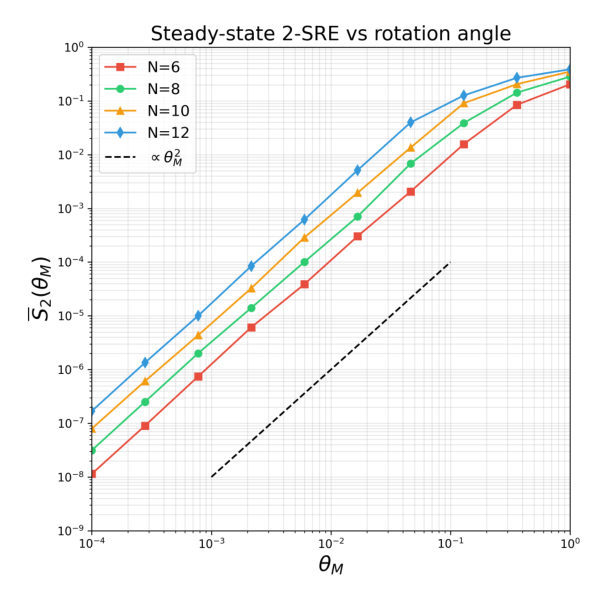
<figcaption class="paper-figure-caption"><b>Fig 4.</b> Figure 4: Qubit weak-magic-injection asymptotics from the computational-basis product initial state. For each displayed system size N ∈{6, 8, 10, 12} and each value of θM, the trajectories are initialized at |0⟩⊗N, evolved to the stationary regime, and averaged over 20–50 independent replicas, depending on the displayed parameter set, to estimate the stationary 2-SRE S2(θM). On a log–log scale, the resulting values follow the dashed slope-two reference in the weak-magic-injection regime, supporting the quadratic law in Theorem D.53.</figcaption>
</figure>
<figure class="paper-figure-card">
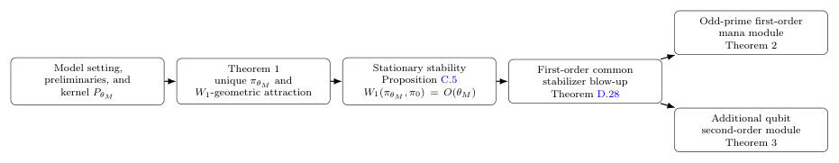
<figcaption class="paper-figure-caption"><b>Fig 5.</b> Figure 5: Schematic road map of the proof. The preliminary conventions feed into the Markov-kernel construction and the Clifford-twirl verification. The common first-order blow-up package is shared by the odd-prime mana and qubit 2-SRE response arguments, while the qubit response also requires a separate second-order module.</figcaption>
</figure>

**Summary.** This work establishes a rigorous analytical theory for random monitored quantum circuits by proving the existence of unique stationary ergodic laws. Crucially, it determines that the steady buildup of non-stabilizer 'magic' resource scales differently—linearly versus quadratically—depending on whether the underlying qudit dimension is an odd prime or exactly two (qubits).

**Why it may be interesting.** It provides deep mathematical tools—like tangent space analysis and spectral gap estimates—to characterize resource accumulation in open quantum systems, which is crucial for understanding decoherence and measurement back-action in complex quantum devices.

Detailed structure

**Main problem.** Developing a rigorous analytical framework to study the stationary ergodic dynamics of random monitored quantum circuits, particularly determining the leading asymptotic behavior of injected 'magic' resource.

**Main result.** The steady-state magic response scales linearly with the injection strength $\theta_M$ for odd prime local dimensions ($d$), but quadratically ($\propto \theta_M^2$) for qubit systems ($d=2$).

**Method.** The analysis uses quantum-trajectory ergodic theory, blow-up analysis near the stabilizer layer, and tangent dynamics expansions to resolve the weak-magic-injection limit.

**Model / system.** Random Monitored Quantum Circuits acting on $N$ qudits of prime local dimension $d$. The process involves Clifford scrambling, a local non-Clifford rotation (injecting magic), measurement, and an inverse Clifford return.

**Key observables.** Stationary Gross–Wigner mana (odd primes) and 2-stabilizer Rényi entropy ($S_2$) for qubits; the resource measure 'magic'.

**Important parameters / regimes.** The weak-magic-injection strength $\theta_M \to 0$; the local dimension $d$ (prime); the number of qudits $N$.

**Assumptions / limitations.** The analysis relies on identifying effective tangent dynamics near the stabilizer layer and assuming sufficient regularity for blow-up maps.

**Figures summary.** Figures illustrate schematic circuit steps, numerical convergence to stationary states independent of initial conditions, and log-log plots confirming linear (odd $d$) or quadratic ($d=2$) scaling laws in the weak-$\theta_M$ limit.

**Paper structure.** The paper progresses from establishing general ergodicity theorems for the Markov process on pure states to analyzing the asymptotic behavior by performing blow-up analysis at $\theta_M=0$, separating linear (odd $d$) and quadratic ($d=2$) scaling regimes.

Abstract

Monitored quantum circuits provide a natural setting in which scrambling, measurements, and measurement-conditioned updates compete within a stochastic many-body dynamics. From the viewpoint of nonstabilizer resource theory, this competition is especially relevant because Clifford-compatible operations preserve the stabilizer structure, while weak non-Clifford perturbations inject magic resource. Most of the existing understanding of monitored quantum circuits has been shaped by numerical simulations and phenomenological descriptions, while a rigorous dynamics theory remains less developed. In this paper, we address this gap by developing an analytical framework which lays a rigorous mathematical foundation for the study of random monitored quantum dynamics. Specifically, we study a class of monitored quantum circuits driven by random Clifford. We prove the existence and uniqueness of the stationary law, which gives an ergodic description of the long-time dynamics. We then resolve the leading asymptotics of steady magic in the weak-magic-injection limit. This tangent description makes the contrast between resource measures transparent: in odd-prime local dimension, the steady Gross--Wigner mana has a linear leading asymptotic, whereas in qubit systems the steady 2-stabilizer Rényi entropy has a quadratic leading asymptotic. These different powers reflect the distinct local geometries of the two resource measures near the stabilizer layer. In this way, this work develops an analytical framework that first establishes the stationary ergodic dynamics of random monitored quantum circuits.

[↑ back to top](#top)

### [Observation of Non-Gaussian Magnon Dynamics in a Two-Dimensional Long-Range XY Model](http://arxiv.org/abs/2606.13499v1)

**Authors:** S. -A. Guo, J. -Y. Tan, J. Ye, Y. Jiang, L. Zhang, Y. -X. Chen, H. -J. Chen, H. -Y. Hu, W. -X. Guo, B. -X. Qi, L. He, Z. -C. Zhou, Y. -K. Wu, L. -M. Duan  
**Type:** both · **Category:** other · **PDF:** <https://arxiv.org/pdf/2606.13499v1>  
**Analysis basis:** full PDF text, analyzed in chunks
**Topic relevance:** 🔥 `analog quantum simulation` **4/5** · `QC/QI experiment` **3/5** · `exotic spin models in light-matter` **3/5** · `non-equilibrium dynamics` **3/5** · `spintronics-quantum-optics interface` **3/5** · `Keldysh / 2PI / non-Gaussian methods` **2/5** · `entanglement & information structure` **2/5** · `non-equilibrium universality` **2/5** · `driven-dissipative phase transition` **1/5** · `methods for driven-dissipative` **1/5** · `quantum measurements` **1/5** · `quantum optics experiment` **1/5**

↔ Scroll figures horizontally

<figure class="paper-figure-card">
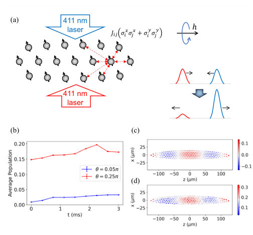
<figcaption class="paper-figure-caption"><b>Fig 1.</b> FIG. 1. (a) Experimental scheme. We apply counter- propagating 411 nm laser beams to realize a long-range and spatially structured interaction between ions in a 2D crystal, and a resonant microwave to generate a strong transverse field h. Under the rotating-wave approximation and a redefinition of the x and z directions, we get a long-range XY model Hamiltonian. We initialize the spins at an angle of θ from the z axis. Under the Gaussian approximation, the spin-wave ex- citations or magnons are non-interacting, while non-Gaussian interaction scatters the magnons into different directions with modified amplitudes in the dynamics, as sketched in the lower right panel. (b) Dynamics of the...</figcaption>
</figure>
<figure class="paper-figure-card">
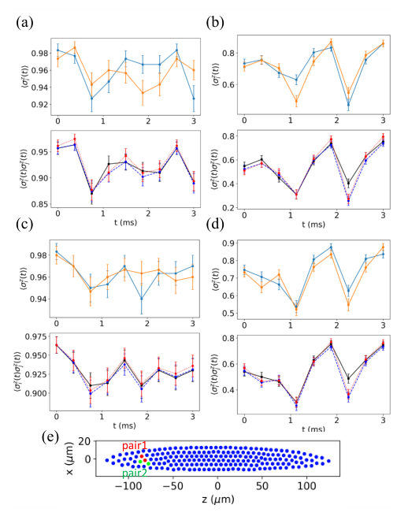
<figcaption class="paper-figure-caption"><b>Fig 2.</b> FIG. 2. Dynamics of Z-basis correlations. (a) Single-spin dynamics ⟨σz i (t)⟩(upper panel) and the two-spin correlation ⟨σz i (t)σz j (t)⟩(lower panel) for a nearby spin pair (pair 1 in (e)) starting from a low magnon density θ = 0.05π. The measured two-spin correlation (black solid curve) is compared with the mean-field solution (blue dashed) and the Wick’s theorem ex- pansion (red dotted) calculated from low-order observables. (b) Similar plots for the spin pair 1 from a high initial magnon density θ = 0.25π. (c), (d) Similar plots for a different spin pair 2 from low and high magnon densities, respectively. Each data point is averaged over 600 samples and the error bars rep- resent one...</figcaption>
</figure>
<figure class="paper-figure-card">
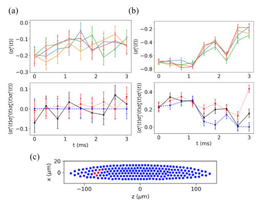
<figcaption class="paper-figure-caption"><b>Fig 3.</b> FIG. 3. Dynamics of X-basis correlations. (a) Single-spin dynamics ⟨σx i (t)⟩(upper panel) and the four-spin correlation ⟨σx i (t)σx j (t)σx k(t)σx l (t)⟩(lower panel) for a nearby group of four spins as shown in (c) starting from a low magnon den- sity θ = 0.05π. Again we compare the measured four-spin correlation (black solid) with the mean-field solution (blue dashed) and the Wick’s theorem expansion (red dotted) cal- culated from the single-spin and two-spin observables. (b) Similar plots from a high initial magnon density θ = 0.25π. Each data point is averaged over 400 samples and the error bars represent one standard error. (c) The locations of the selected ions on the 200-ion 2D...</figcaption>
</figure>
<figure class="paper-figure-card">
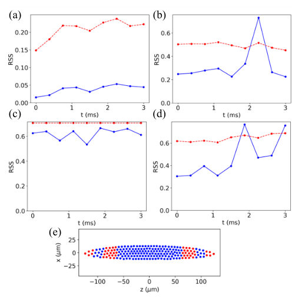
<figcaption class="paper-figure-caption"><b>Fig 4.</b> FIG. 4. (a-d) Total deviation from Gaussian dynamics under a weak (the first column) or a strong (the second column) magnon density in the two-body Z-basis correlations (the first row) or the four-body X-basis correlations (the second row). The blue solid curves show the RSS of the distance between the measured correlations and the approximations, and the red dashed curves are the RSS of the error bars. (e) Selected ions (colored in red) with the highest participation in the fifth highest phonon mode, for which we compute the correlations (see the main text for details).</figcaption>
</figure>

**Summary.** The paper reports on observing non-Gaussian dynamics in a 2D XY spin model simulated with trapped ions. By measuring high-order spin correlations and comparing them against Gaussian approximations, the authors confirm deviations that signal genuinely quantum many-body physics. This work establishes a verifiable pathway for exploring complex quantum regimes using state-of-the-art ion trap technology.

**Why it may be interesting.** This work provides a crucial experimental benchmark for quantum simulation, demonstrating how to verify physics beyond the limits of mean-field or quadratic bosonic descriptions using controllable trapped-ion platforms.

Detailed structure

**Main problem.** The study addresses the challenge of observing non-Gaussian dynamics in quantum many-body systems, as simple Gaussian approximations fail to capture all essential physical properties.

**Main result.** The authors experimentally demonstrate a clear crossover from predictable Gaussian behavior to genuinely non-Gaussian dynamics using trapped ions under strong initial excitation conditions.

**Method.** The research combines experimental measurements on spin correlations with theoretical comparisons against mean-field solutions and low-order approximations like Wick's theorem.

**Model / system.** The system is a two-dimensional XY model realized using $N=200$ trapped $^{171}	ext{Yb}^+$ ions. The Hamiltonian describes long-range, spatially structured interactions between the spins.

**Key observables.** Single-spin observables ($\langle\sigma_z^i(t)
angle$), two-spin correlations ($\langle\sigma_z^i(t)\sigma_z^j(t)
angle$), and four-spin correlations (in the X basis).

**Important parameters / regimes.** Initial excitation strength parameter $	heta$ (tested at weak $0.05\pi$ and strong $0.25\pi$ regimes); temperature ($T=6	ext{ K}$).

**Assumptions / limitations.** The analysis is robust because the non-Gaussian violation is shown to persist beyond experimental noise, independent of assumptions about Hamiltonian miscalibration or decoherence modeling.

**Figures summary.** Figures compare measured two-spin correlations against mean-field and Wick's theorem predictions, showing deviations under strong excitation. Other figures detail the experimental setup using multiple laser beams for ion trapping and interaction generation.

**Paper structure.** The paper details the physical realization of the XY model on trapped ions, presents theoretical approximations (HP transformation, Wick's theorem), measures various spin correlation functions across different initial excitation regimes, and concludes by quantifying the deviation from Gaussian predictions.

Abstract

Non-Gaussian evolution of high-order spin correlations characterizes important properties of quantum many-body systems. In practice, decoherence, statistical fluctuation and miscalibration of experimental parameters all hinder the witness of non-Gaussian dynamics. Here we demonstrate the crossover between Gaussian and non-Gaussian dynamics on a two-dimensional XY model with long-range and spatially structured interaction using a trapped ion quantum simulator. We prepare different initial densities of magnon excitations and verify the dynamics of single-spin observables for the engineered Hamiltonian. Then we compare the high-order spin correlations with the mean-field solution and the Holstein-Primakoff approximation, and demonstrate the non-Gaussian behavior in a way independent of the calibration errors. Our work provides a verifiable path from classically simulatable dynamics to regimes where quantum advantage may emerge.

[↑ back to top](#top)

### [Driven dynamics of an attractive Bose polaron](http://arxiv.org/abs/2606.13645v1)

**Authors:** Saptarshi Majumdar, Aleksandra Petković  
**Type:** theory · **Category:** quantum gases · **PDF:** <https://arxiv.org/pdf/2606.13645v1>  
**Analysis basis:** full PDF text, analyzed in chunks
**Topic relevance:** 🔥 `non-equilibrium dynamics` **4/5** · `Kondo & dissipative impurity` **3/5** · `analog quantum simulation` **3/5** · `methods for driven-dissipative` **3/5** · `non-equilibrium universality` **3/5** · `Frenkel-Kontorova` **2/5** · `Keldysh / 2PI / non-Gaussian methods` **2/5** · `correlated / nonlocal dissipation` **1/5** · `driven-dissipative phase transition` **1/5** · `entanglement & information structure` **1/5** · `scars & prethermalization` **1/5**

↔ Scroll figures horizontally

<figure class="paper-figure-card">
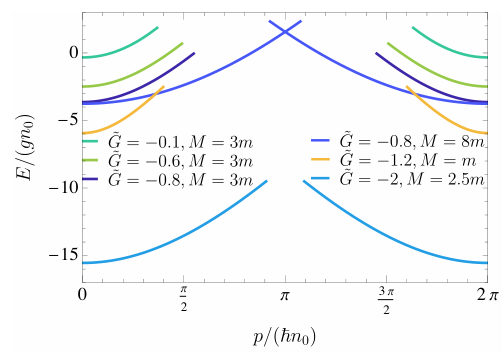
<figcaption class="paper-figure-caption"><b>Fig 1.</b> FIG. 1. The dimensionless energy (11) as a function of the momen- tum for different set of parameters. Here, γ = 0.1.</figcaption>
</figure>
<figure class="paper-figure-card">
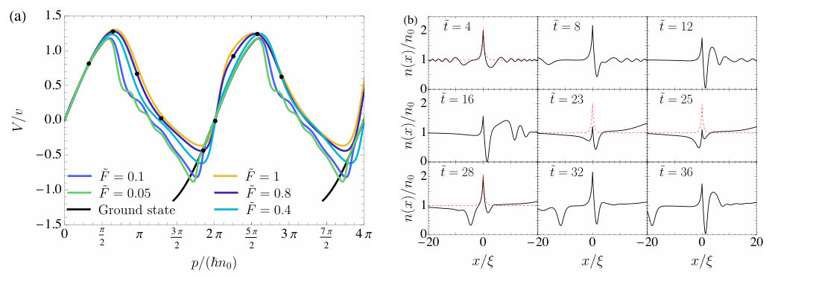
<figcaption class="paper-figure-caption"><b>Fig 2.</b> FIG. 2. (a) Impurity velocity as a function of the total momentum of the system p = ℏn0√γ ˜F ˜t for different values of dimensionless force ˜F for ˜G = −0.8, M = 3m, and γ = 0.1. The velocity periodicity is established after the first oscillation for ˜F = 0.8 and ˜F = 1. The black curve shows the ground-state impurity velocity (10) as a function of p. The black points along the velocity curve for ˜F = 0.8 denote the time-stamps at which the densities in Fig. (b) are displayed. (b) The time evolution of the density profile n(x)/n0 for ˜F = 0.8 for the aforementioned parameters. The first Vmax is reached at ˜t = 8.1, the first V = 0 at ˜t = 16.3, and the first Vmin at ˜t = 22.7. The second...</figcaption>
</figure>
<figure class="paper-figure-card">
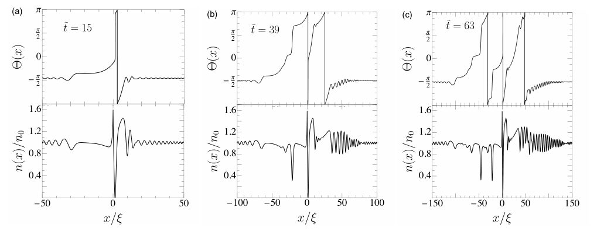
<figcaption class="paper-figure-caption"><b>Fig 3.</b> FIG. 3. Phase Θ(x) of the condensate wave-function at three time instances for ˜G = −0.8, M = 3m, ˜F = 0.8, γ = 0.1. The dimensionless time period is Tgn0/ℏ= 23.85.</figcaption>
</figure>
<figure class="paper-figure-card">
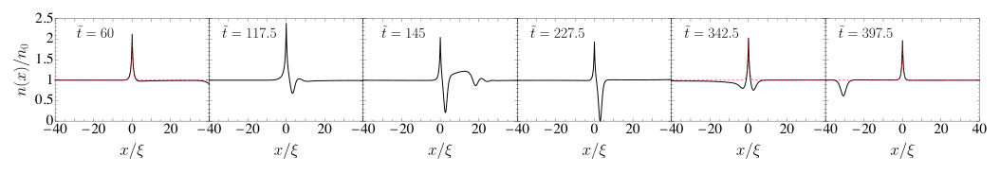
<figcaption class="paper-figure-caption"><b>Fig 4.</b> FIG. 4. The time evolution of the boson density profile n(x)/n0 over the first period of oscillation for ˜G = −0.8, M = 3m, ˜F = 0.05, and γ = 0.1. The corresponding velocity curve is shown in Fig. 2. The impurity velocity is maximal at ˜t = 116.3, while ˜t = 145 shows the emission of the density shockwave. V = 0 at ˜t = 227, V = Vmin at ˜t = 342.5, and ˜t = 397.5 the velocity reaches zero again. The red dashed plots represents the analytical stationary configurations (6) at p = Ft when they exist.</figcaption>
</figure>
<figure class="paper-figure-card">
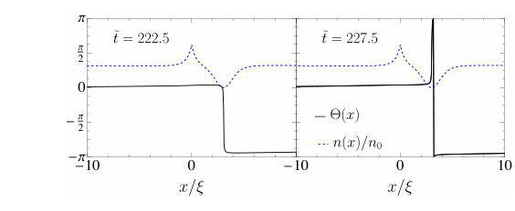
<figcaption class="paper-figure-caption"><b>Fig 5.</b> FIG. 5. The time evolution of the boson density (blue dashed line) and phase profile (black solid line) in the vicinity of the impurity for ˜G = −0.8, M = 3m, ˜F = 0.05, and γ = 0.1. The impurity velocity is V = 0 at ˜t = 227.</figcaption>
</figure>

**Summary.** The paper analyzes the driven dynamics of an impurity polaron coupled to a 1D Bose gas with attractive interactions. It demonstrates that the system exhibits drifted Bloch oscillations and derives unique scaling laws for the drift velocity ($V_d \sim F^\alpha$ with $\alpha < 1$). The research highlights how interaction strength and force fundamentally alter momentum transfer mechanisms in quantum gases.

**Why it may be interesting.** This work provides detailed insights into non-equilibrium transport phenomena in quantum many-body systems, particularly how attractive interactions modify fundamental dynamics like Bloch oscillations compared to repulsive cases.

Detailed structure

**Main problem.** The study investigates the out-of-equilibrium dynamics of an impurity (polaron) driven by a constant external force through a 1D system of weakly-interacting bosons.

**Main result.** For attractive interactions, the drift velocity exhibits a sub-linear dependence on the applied force ($V_d \sim F^\alpha$ with $\alpha < 1$), and the Bloch oscillation amplitude shows rich non-monotonic behavior (decay $
ightarrow$ minimum $
ightarrow$ revival).

**Method.** The analysis combines theoretical derivations of stationary solutions in the weak coupling limit ($\gamma \ll 1$) with numerical simulations solving the time-dependent Gross-Pitaevskii equation.

**Model / system.** The model is a Bose polaron system in one dimension, described by an effective Hamiltonian involving the impurity momentum and the bosonic field. The interaction between the impurity and bosons is assumed to be attractive ($G<0$).

**Key observables.** Drift velocity ($V_d$), Bloch oscillation amplitude ($V_B$), oscillation period ($T$), and the total phase variation across the system.

**Important parameters / regimes.** The sign of the impurity-boson interaction ($G>0$ vs $G<0$), the strength of the external force ($F$), and the mass ratio ($M/m$).

**Assumptions / limitations.** The analysis relies on the weak coupling limit ($\gamma \ll 1$) and compares results derived from stationary state solutions against full time-evolution dynamics.

**Figures summary.** Figures illustrate energy vs. momentum showing forbidden intervals, time evolution of velocity/density profiles demonstrating shockwave emission, and plots quantifying $V_d$, $V_B$, and $T$ dependence on the driving force $	ilde{F}$.

**Paper structure.** The paper systematically analyzes the dynamics by first establishing stationary solutions at zero force, then numerically simulating time evolution under a small driving force to observe drifted Bloch oscillations, and finally characterizing the scaling laws ($V_d \propto F^\alpha$) across different force regimes.

Abstract

We study the out-of-equilibrium dynamics of an impurity driven by a constant external force through a system of homogeneous weakly-interacting bosons in one spatial dimension. The impurity-boson interaction is assumed to be attractive. We show that the impurity exhibits drifted Bloch oscillations in a wide range of forces in the absence of a lattice. We characterize the dynamical response of the host bosons and explain the mechanism underlying the Bloch oscillations. We analyse the behavior of the drift velocity, the Bloch amplitude and the time period of oscillations in a wide range of forces and other system parameters. In contrast to the case of repulsive impurity-boson interaction, the drift velocity exhibits a sub-linear dependence on a weak applied force, $V_d\sim {F}^α$ with a positive exponent $α$ smaller than unity. The drift velocity monotonically increases with force, though the scaling behavior varies considerably across different regimes of $F$. Moreover, the amplitude of the velocity oscillations displays rich behavior: it first undergoes a decay with force, reaches a minimum, and then presents a revival, increasing with force.

[↑ back to top](#top)

### [Reservoir-controlled electromagnetically induced gratings in a weakly driven two-level medium](http://arxiv.org/abs/2606.13085v1)

**Authors:** Amjad Hussain, Hamid Arian Zad, Amjad Sohail, Hazrat Ali, Michal Michal Jaščur, Saeed Haddadi  
**Type:** theory · **Category:** other · **PDF:** <https://arxiv.org/pdf/2606.13085v1>  
**Analysis basis:** full PDF text, analyzed in chunks
**Topic relevance:** 🔥 `interference shaping light` **4/5** · `correlated / nonlocal dissipation` **3/5** · `driven-dissipative phase transition` **3/5** · `methods for driven-dissipative` **3/5** · `non-equilibrium dynamics` **3/5** · `analog quantum simulation` **2/5** · `non-equilibrium universality` **2/5** · `Keldysh / 2PI / non-Gaussian methods` **1/5** · `Tavis-Cummings & cavity-many-emitter` **1/5** · `correlated cavity matter` **1/5** · `quantum measurements` **1/5**

↔ Scroll figures horizontally

<figure class="paper-figure-card">
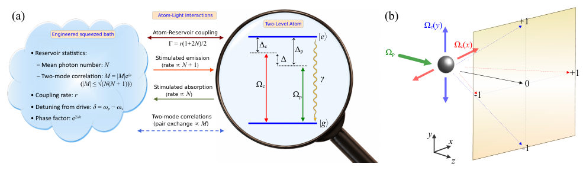
<figcaption class="paper-figure-caption"><b>Fig 1.</b> FIG. 1. (a) Effective two-level atomic system driven by a standing-wave control field with Rabi frequency Ωc and probed by a weak travelling field with Rabi frequency Ωp. The control-field detuning is ∆c, while the probe detuning relative to the control field is ∆p. The atom interacts with an engineered broadband reservoir characterized by mean photon number N, squeezing correlation M, and detuning δ. The reservoir coupling gives rise to the effective coherence decay rate Γ, while γ denotes spontaneous emission. (b) Spatial geometry of the induced grating. The weak probe field propagates along z through a thin medium whose susceptibility is modulated by standing-wave control fields along...</figcaption>
</figure>
<figure class="paper-figure-card">
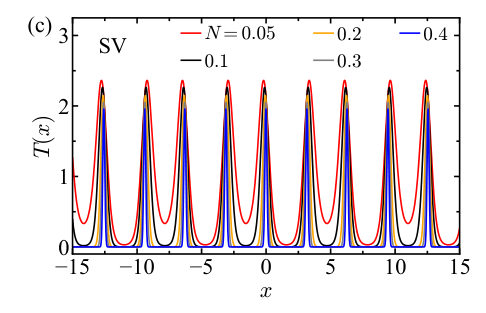
<figcaption class="paper-figure-caption"><b>Fig 2.</b> FIG. 2. Transmission T(x) of the probe field in x- direction as a function of the spatial coordinate x for (a) the NV reservoir (N = 0) for several decay parameters η/γ = 0.2, 0.3, 0.4, 0.5, 0.6. (b) the TF reservoir (M = 0) for N = 0.05, 0.1, 0.2, 0.3, 0.4 and fixed η/γ = 0.2; and (c) the SV reservoir for N = 0.05, 0.1, 0.2, 0.3, 0.4 and η/γ = 0.2. Fixed parameters are: R/γ = 0.1, ∆c/γ = 0.2, Ωc0/γ = 0.1, L/z0 = 0.1, ∆p/γ = ϕ = 0, Nx = 5, and Λx/λp = 4.</figcaption>
</figure>
<figure class="paper-figure-card">
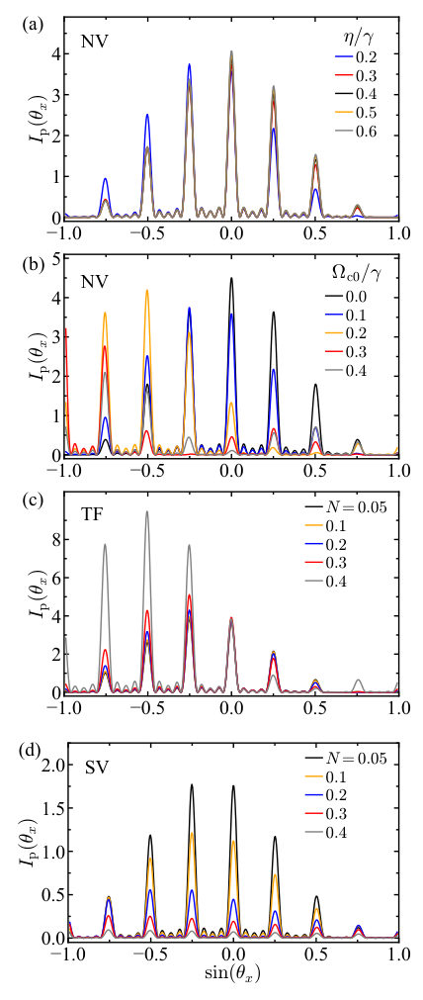
<figcaption class="paper-figure-caption"><b>Fig 3.</b> FIG. 3. Normalized diffraction intensity Ip(θx) as a function of sin(θx). (a) the NV reservoir for several decay parameters η/γ = 0.2, 0.3, 0.4, 0.5, 0.6. (b) the NV reservoir for fixed η/γ = 0.2 and several values of the Rabi frequency Ωc0/γ = 0.0, 0.1, 0.2, 0.3, 0.4. (c), (d) The TF and SV reservoirs for N = 0.05, 0.1, 0.2, 0.3, 0.4, assuming η/γ = 0.2 and Ωc0/γ = 0.1. Fixed parameters are:R/γ = 0.1, ∆c/γ = 0.2, Ωc0/γ = 0.1, L/z0 = 0.1, ∆p/γ = ϕ = 0, Nx = 5, and Λx/λp = 4.</figcaption>
</figure>
<figure class="paper-figure-card">
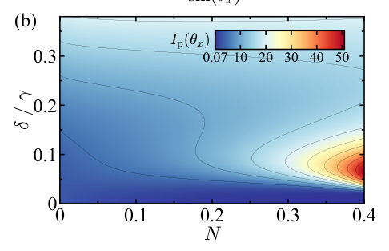
<figcaption class="paper-figure-caption"><b>Fig 4.</b> FIG. 4. Diffraction intensity for the SV reservoir with nonzero squeezed-vacuum detuning. (a) Ip(θx) versus sin(θx) for several values of δ/γ at fixed N = 0.2. (b) Contour plot of Ip(θx) in the δ/γ-N plane evaluated at sin(θ) = 0, showing the parameter region of maximum amplification. Other fixed parameters are chosen as Fig. 3.</figcaption>
</figure>
<figure class="paper-figure-card">
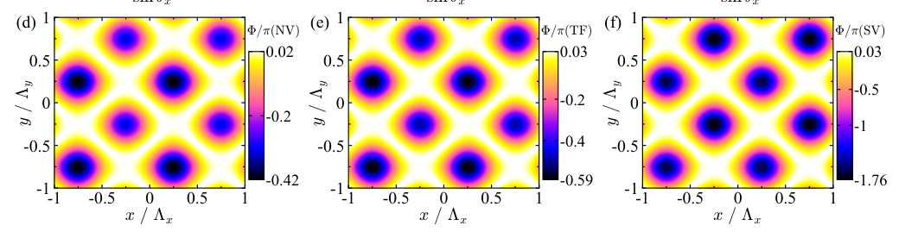
<figcaption class="paper-figure-caption"><b>Fig 5.</b> FIG. 5. (a), (b), (c) Two-dimensional diffraction intensity Ip(θx, θy) as a function of sin(θx) and sin(θy) for NV, TF (N = 0.2), SV (N = 0.2). (d), (e), (f) the corresponding contour plot of phase Φ/π for NV, TF, SV reservoir. Other parameters are assumed as follows: R/γ = 0.1, ∆c/γ = 0.2, Ωc0/γ = 0.1, L/z0 = 0.1, ∆p/γ = ϕ = 0, Nx = Ny = 5 and Λx/λp = Λy/λp = 4.</figcaption>
</figure>

**Summary.** The paper theoretically explores controlling light propagation through an electromagnetically induced grating by coupling the system to different quantum reservoirs. It demonstrates that while thermal environments enhance overall modulation, squeezed vacuum reservoirs offer superior control, enabling highly selective amplification of specific diffracted angles via detuning. This establishes reservoir engineering as a versatile platform for programmable photonic devices.

**Why it may be interesting.** This work directly addresses open quantum systems dynamics in nonlinear optics, showing how engineered environmental coupling (reservoir engineering) provides a powerful tool to control macroscopic wave phenomena like diffraction efficiency and directionality.

Detailed structure

**Main problem.** The study investigates how coupling a two-level medium, forming an electromagnetically induced grating (EIG), to engineered quantum reservoirs modifies the transmission and far-field diffraction of a weak probe field.

**Main result.** Reservoir statistics—specifically thermal vs. squeezed vacuum—significantly control the diffraction response; squeezing allows for highly directional power redistribution and amplification via detuning control.

**Method.** The analysis uses perturbative solutions to the optical Bloch equations in the weak-driving regime, followed by calculating the linear susceptibility and applying Fraunhofer diffraction theory.

**Model / system.** The system models an ensemble of two-level atoms driven by a standing-wave field and interrogated by a probe field, coupled to engineered reservoirs (Normal Vacuum, Thermal Field, or Squeezed Vacuum).

**Key observables.** Probe susceptibility ($\chi$), spatial transmission function $T(x)$, and far-field diffraction intensity patterns $I_p(	heta_x, 	heta_y)$.

**Important parameters / regimes.** Reservoir type (NV, TF, SV), reservoir detuning ($\delta/\gamma$), mean photon number ($N$), and the strength of the driving fields.

**Assumptions / limitations.** The analysis relies on a weak probe field assumption, utilizing Born–Markov and rotating-wave approximations to derive the effective Bloch equations.

**Figures summary.** Figures illustrate $T(x)$ for different reservoirs (NV, TF, SV) and show 1D/2D diffraction intensities demonstrating how reservoir parameters control spectral components and angular distribution.

**Paper structure.** The paper first introduces the theoretical model and derives the necessary Bloch equations. It then presents numerical results analyzing 1D and 2D EIGs under various reservoir conditions, concluding with a discussion of applications like beam steering.

Abstract

We theoretically investigate the transmission and diffraction of a weak probe field from an electromagnetically induced grating formed in a weakly driven two-level medium coupled to engineered quantum reservoirs. Using a perturbative solution of the optical Bloch equations in the weak-driving regime, we analyze how normal-vacuum, thermal, and broadband squeezed-vacuum environments modify the probe susceptibility and consequently reshape both the spatial transmission function and the far-field diffraction patterns. We show that reservoir statistics have a pronounced impact on the diffraction response by altering the amplitude and phase of the induced grating. Thermal reservoirs enhance the transmission modulation and increase the intensity of the dominant diffraction orders, whereas squeezed-vacuum reservoirs generate strongly phase-sensitive modifications that selectively redistribute optical power among diffraction channels. We further demonstrate that the detuning between the squeezed reservoir and the driving field provides an efficient mechanism for controlling diffraction directionality, leading to substantial amplification of selected angular orders. In two-dimensional geometries, squeezed-vacuum correlations produce highly structured phase landscapes and strongly anisotropic diffraction patterns, enabling directional enhancement of specific diffraction channels while suppressing others. These results establish reservoir engineering as a versatile approach for controlling transmission, diffraction efficiency, and angular selectivity in minimal two-level systems, with potential applications in programmable photonic devices, beam steering, and quantum optical platforms.

[↑ back to top](#top)

### [A refined thermodynamic analysis of nonsecular master equations](http://arxiv.org/abs/2606.13504v1)

**Authors:** Mohamed Boubakour, Talia Szikman, Cyril Elouard  
**Type:** theory · **Category:** statistical mechanics · **PDF:** <https://arxiv.org/pdf/2606.13504v1>  
**Analysis basis:** full PDF text, analyzed in chunks
**Topic relevance:** 🔥 `methods for driven-dissipative` **4/5** · 🔥 `non-equilibrium dynamics` **4/5** · `Keldysh / 2PI / non-Gaussian methods` **3/5** · `correlated / nonlocal dissipation` **3/5** · `driven-dissipative phase transition` **3/5** · `non-equilibrium universality` **2/5** · `entanglement & information structure` **1/5** · `scars & prethermalization` **1/5**

↔ Scroll figures horizontally

<figure class="paper-figure-card">
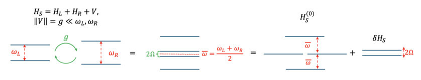
<figcaption class="paper-figure-caption"><b>Fig 1.</b> Figure 1. An illustrative example of a quantum system where the PSA is relevant. Here we have two qubits that interact such that the coupling strength is very small compared to the frequencies. The spectrum will thus contain two close eigenstates such that we can identify H(0) S with the dominant Bohr frequencies ±ω and the perturbation δHS with Bohr frequencies ±2Ω satisfying Ω≪ω.</figcaption>
</figure>
<figure class="paper-figure-card">
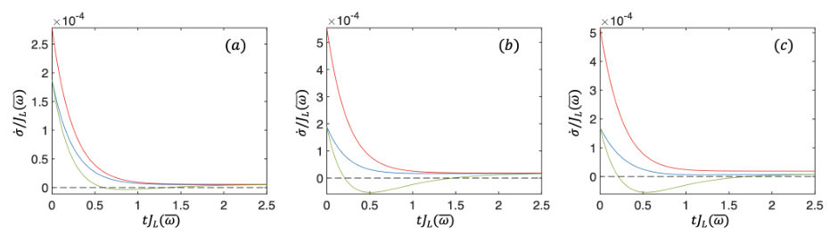
<figcaption class="paper-figure-caption"><b>Fig 2.</b> Figure 2. Total entropy production as a function of time. The blue curves correspond to the entropy obtained with GAME, the red ones to the correct entropy for the LNME and the green ones to the naive entropy production. The parameters are ω = 50JL(ω), δ = 10−3ω, βRω = 1, βL = βR/0.99, cLΛ = 0.5ω such that ΣL(ω) = 2.5JL(ω), and µ = 10−2βLg. The panel (a) shows the results obtained with cR = cL and g = 5 ∗10−3ω. Panel (b) corresponds to cR = cL and g = 10−2ω. Panel (c) corresponds to cR = 0.9cL and g = 10−2ω.</figcaption>
</figure>
<figure class="paper-figure-card">
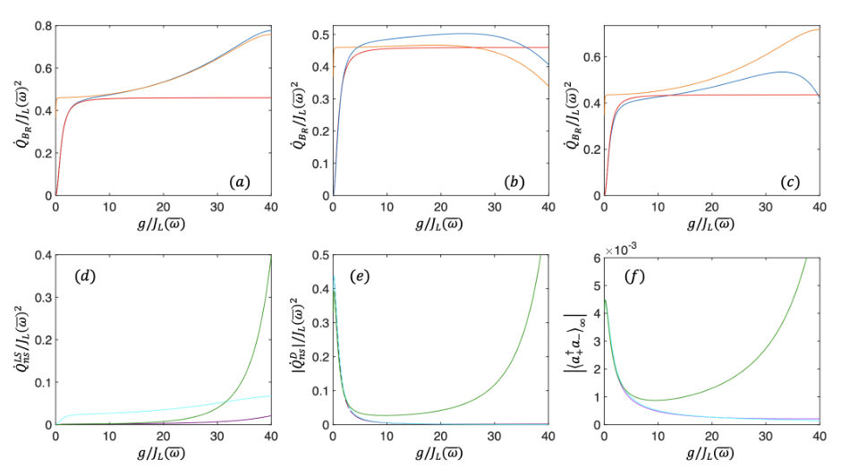
<figcaption class="paper-figure-caption"><b>Fig 3.</b> Figure 3. From (a) to (c): stationary heat flux of the right bath as a function of g for three different choices of cutoff and dissipation strength of the baths. The blue curves correspond to the results obtained with GAME, the red ones to the consistent description with the LNME and the orange ones to the heat flux in the full secular regime. The parameters are ω = 50JL(ω), δ = 10−3ω, βRω = 1, βL = βR/0.99. The panel (a) shows the results obtained with cLΛ = 0.2ω and cR = cL. Panel (b) corresponds to cLΛ = 0.5ω and cR = cL. Panel (c) corresponds to cLΛ = 0.2ω and cR = 0.9cL. (d), (e) and (f) are respectively the nonsecular contribution to the heat flux due to the Lamb-shift, the nonsecular...</figcaption>
</figure>

**Summary.** This paper establishes a consistent thermodynamic framework for analyzing complex, nonsecular master equations describing open quantum systems. It systematically compares different physical definitions of entropy production and energy flow, showing how transient coherent effects modify standard predictions derived from simpler secular approximations. The work provides crucial insights into the limitations and necessary corrections when modeling real-world quantum dissipation.

**Why it may be interesting.** This work is highly relevant for any theoretical physicist studying open quantum systems, as it rigorously addresses the breakdown of standard secular approximations and provides necessary corrections to the first and second laws in non-equilibrium settings.

Detailed structure

**Main problem.** The paper develops a unified thermodynamic framework for analyzing nonsecular master equations, which arise when approximations are used that cause the system to relax toward a steady state different from the true Gibbs equilibrium.

**Main result.** It shows that while two definitions of entropy production (microscopic vs. Spohn inequality) differ due to transient coherent effects in nonsecular dynamics, no net work can be extracted cyclically from the steady state when coupled to a single thermal bath.

**Method.** The analysis employs systematic perturbation theory starting from a microscopic second law based on system-environment correlations, comparing results derived from different approximations like Geometric-Arithmetic Master Equations (GAME) and Local Nonsecular Master Equations (LNME).

**Model / system.** The model is an open quantum system coupled to thermal reservoirs (baths), described by master equations that go beyond the standard secular Lindblad form. The analysis compares dynamics derived from Born-Markov approximations.

**Key observables.** Entropy production rates ($\dot{\sigma}_{tot}$ vs $\dot{\sigma}_{Sp}$), energy balance components (system, bath, interaction energy), and stationary coherences in the energy eigenbasis.

**Important parameters / regimes.** Weak system-bath coupling regime; time scales related to bath correlation decay ($	au_B$) versus system relaxation ($\gamma^{-1}$).

**Assumptions / limitations.** The analysis relies on approximations such as the Born-Markov approximation and specific limiting procedures (e.g., deriving GAME from CGME).

**Figures summary.** Figures illustrate comparisons of heat flux components across different master equation regimes (local vs. full secular) and show the evolution of stationary coherence.

**Paper structure.** The paper builds by first establishing the Coarse-Grained Master Equation (CGME), then refining it through approximations like GAME, and finally performing a detailed thermodynamic comparison between microscopic entropy production and definitions based on system dynamics inequalities.

Abstract

We present a systematic thermodynamic analysis of nonsecular master equations. We consider master equations resulting either from the partial secular and the geometric-arithmetic approximations, two approximations ensuring the positivity of the system's dynamics when some of its transition frequencies are too small to enable the full secular approximation. Both cause the system to relax towards a steady state which is not the Gibbs state of its bare Hamiltonian. Nonetheless, we build a unified, consistent thermodynamic framework for those dynamics. Starting from a microscopic expression of the second law based on system-environment correlations, we employ a systematic perturbation theory to preserve the positivity of the second law despite the approximations done on the dynamics. We show that, in spite of the weak system-bath coupling, the system-bath interaction energy participates to the energy balance, as well as the Lamb-shift. Those extra contributions give rise to work performed by the system on the bath when the former is out of equilibrium. We compare this microscopic entropy production with the definition based on the contractivity of the reduced system dynamics (Spohn inequality). We show that, unlike for secular master equations, the two entropy production rates differ because of the presence of non-vanishing stationary coherences in the energy eigenbasis. However, in the case of a single thermal bath, the difference is purely transient, and no work can be cyclically extracted from the steady-state despite its non-Gibbs form. Finally, we illustrate our results with a simple example, clarifying and completing the thermodynamic picture of Markovian dynamics in the quantum regime.

[↑ back to top](#top)

### [Influence-solvability: a systematic theory of $(1+1)D$ solvability and its application to brickwork circuits](http://arxiv.org/abs/2606.12538v1)

**Authors:** Friedrich Hübner, Sun Woo P. Kim  
**Type:** theory · **Category:** statistical mechanics · **PDF:** <https://arxiv.org/pdf/2606.12538v1>  
**Analysis basis:** full PDF text, analyzed in chunks
**Topic relevance:** 🔥 `methods for driven-dissipative` **4/5** · `correlated / nonlocal dissipation` **3/5** · `driven-dissipative phase transition` **3/5** · `non-equilibrium dynamics` **3/5** · `Keldysh / 2PI / non-Gaussian methods` **2/5** · `non-equilibrium universality` **2/5** · `Kondo & dissipative impurity` **1/5** · `analog quantum simulation` **1/5** · `entanglement & information structure` **1/5** · `scars & prethermalization` **1/5**

↔ Scroll figures horizontally

<figure class="paper-figure-card">
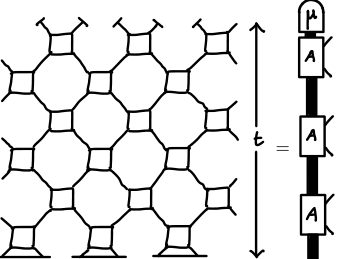
<figcaption class="paper-figure-caption"><b>Fig 1.</b> FIG. 1: We say a circuit is influence-solvable if its influence-matrix is given by a uniform MPS of finite-bond dimension χ for all times t. Note that A is independent of t.</figcaption>
</figure>
<figure class="paper-figure-card">
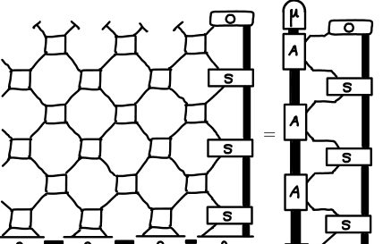
<figcaption class="paper-figure-caption"><b>Fig 2.</b> FIG. 2: Using influence-solvability one can simplify infinite circuits into an efficiently computable finite tensor network. Here, evolution of an observable O of a joint system between S coupled to an infinite circuit. The tensor A represents an exact finite memory bath generated by the circuit on the left.</figcaption>
</figure>
<figure class="paper-figure-card">
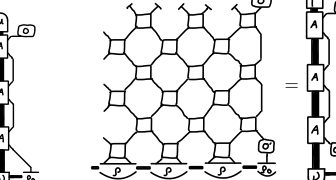
<figcaption class="paper-figure-caption"><b>Fig 3.</b> FIG. 3: Examples of scenarios applicable to influence-solvability. Any time-evolved observable ⟨Ox(t)⟩or auto-correlator of the form ⟨O(n) x (tn) · · · O(1) x (t1)⟩are tractable in the above scenarios. Other applications include computation of entanglement entropies (see Sec. V C), computation of correlation functions (see Sec. V B) and potentially computing diffusion constants (see Sec. V A).</figcaption>
</figure>
<figure class="paper-figure-card">
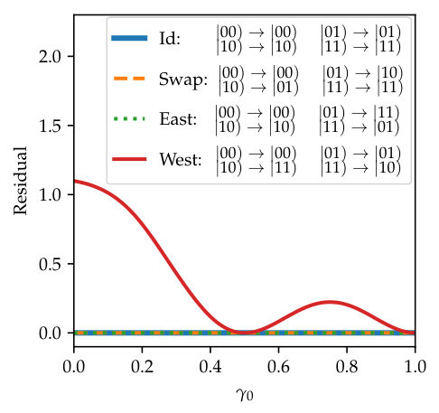
<figcaption class="paper-figure-caption"><b>Fig 4.</b> FIG. 4: Residual as function of γ0 = 1 −γ1 for some classical d = 2 gates. The gate is influence-solvable for γ⊤= (γ0 γ1) at zeros of this function. The identity, SWAP and east gate (or CNOT gate) are solvable for all γ, but the west gate is only solvable for γ⊤= (1 0) and γ⊤= (1/2 1/2).</figcaption>
</figure>
<figure class="paper-figure-card">
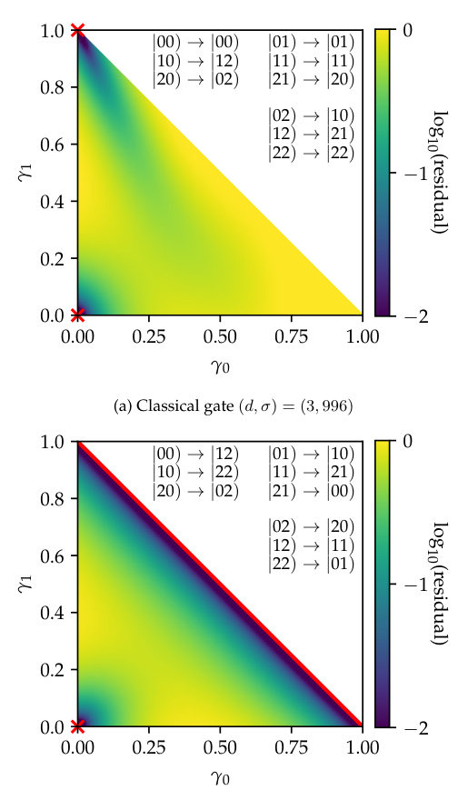
<figcaption class="paper-figure-caption"><b>Fig 5.</b> FIG. 5: Residual as function of γ0 and γ1 (γ2 is fixed by γ2 = 1 −γ0 −γ1 for two classical d = 3 gates that we discuss in the text. The red crosses and lines indicate values of |γ) for which the gate is influence-solvable.</figcaption>
</figure>

**Summary.** The paper establishes 'influence-solvability' as a rigorous criterion for classifying solvable dynamics in one-dimensional circuit models. By requiring the influence matrix to have a finite MPS representation, it provides necessary and sufficient local conditions. This allows researchers to efficiently compute long-time evolution of quantum observables by effectively integrating out the infinite bath.

**Why it may be interesting.** This work provides a powerful mathematical tool (influence-solvability) to tame the complexity of open quantum systems dynamics in 1D lattices, allowing for exact computation of long-time behavior that would otherwise be intractable.

Detailed structure

**Main problem.** The primary goal is to develop a systematic, general theory for classifying 'solvable' dynamics in $(1+1)D$ circuit models, as current classification methods are incomplete.

**Main result.** The authors introduce the concept of 'influence-solvability,' which characterizes circuits whose influence matrix can be represented by a finite bond-dimension Matrix Product State (MPS). This framework successfully encompasses known solvable systems and yields new classifications for brickwork circuits.

**Method.** The theory relies on deriving necessary and sufficient local conditions for influence-solvability using advanced MPS formalism, particularly adapting the fundamental theorem of MPS to open boundary conditions.

**Model / system.** The study focuses on $(1+1)D$ circuit models (both classical and quantum), specifically applying the framework to brickwork circuits coupled to a system $S$. The dynamics are analyzed via the influence matrix, which captures the coupling to an infinite bath.

**Key observables.** Influence Matrix, Effective Time Evolution Operator ($G_{	ext{eff}}$), Bond Dimension ($\chi$), Local Observables $\langle O(t) 
angle$.

**Important parameters / regimes.** Bond dimension $\chi$ (determines the complexity of the bath memory); Local dimension $d$; Time $t$.

**Assumptions / limitations.** The theory assumes that solvability is equivalent to the influence matrix being a uniform MPS with finite bond dimension. Some known solvable circuits, like DU($n \ge 3$), are noted as potential exceptions.

**Figures summary.** Figures illustrate how influence-solvability simplifies infinite circuit dynamics into an efficiently computable finite tensor network for calculating subsystem observables over long times.

**Paper structure.** The paper develops the definition of influence-solvability, derives necessary and sufficient local conditions using MPS theorems, applies these conditions to systematically classify classical and quantum brickwork circuits, and discusses the computational advantages gained by this classification.

Abstract

`Solvable' circuits, such as dual unitaries and its generalisations, have arisen as paradigmatic examples of tractable chaotic non-equilibrium dynamics, both in classical and quantum systems. However, while increasingly more complicated sufficient conditions have been proposed, a systematic theory classifying and understanding general features of solvable circuits is missing. We develop such a theory by introducing influence-solvable circuits, a class of $(1+1)D$ circuits whose influence matrix, which represents the `bath' generated by its own evolution, is given by a uniform MPS with finite bond-dimension $χ$. This property allows for efficient computation of subsystem dynamics and essentially contains all known examples of solvable circuits. We derive a set of necessary and sufficient local conditions by using a version of the fundamental theorem of MPS for open boundary conditions. Next we apply our theory to brickwork circuits with $χ=1$ influence-solvability and perform a systematic classification of classical brickwork circuits with local dimension up to $d=3$ and quantum brickwork circuits with $d=2$. Our search reveals new solvable circuits that are not captured by known solvability conditions.

[↑ back to top](#top)

### [Beyond the Unruh vacuum: multi-time correlations in black hole collapse and evaporation](http://arxiv.org/abs/2606.13383v1)

**Authors:** Konstantinos Xenos, Charis Anastopoulos, Andreas F. Terzis  
**Type:** theory · **Category:** other · **PDF:** <https://arxiv.org/pdf/2606.13383v1>  
**Analysis basis:** full PDF text, analyzed in chunks
**Topic relevance:** 🔥 `Keldysh / 2PI / non-Gaussian methods` **4/5** · 🔥 `entanglement & information structure` **4/5** · `methods for driven-dissipative` **3/5** · `non-equilibrium dynamics` **3/5** · `correlated / nonlocal dissipation` **2/5** · `driven-dissipative phase transition` **2/5** · `non-equilibrium universality` **1/5** · `quantum measurements` **1/5**

↔ Scroll figures horizontally

<figure class="paper-figure-card">
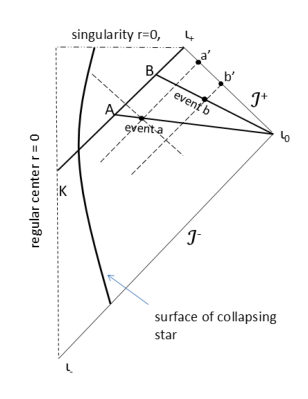
<figcaption class="paper-figure-caption"><b>Fig 1.</b> FIG. 1. Penrose diagram of an evaporating black hole. Two measurement events a and b lie on distinct late-time Cauchy surfaces KAι0 and KBι0 and are spacelike separated, implying vanishing correlations in a local description. When projected onto future null infinity I +, the corresponding points a′ and b′ appear causally connected. The figure illustrates that projection to null infinity does not preserve the full spacetime relation between detection events, motivating a real-time treatment of correlations.</figcaption>
</figure>
<figure class="paper-figure-card">
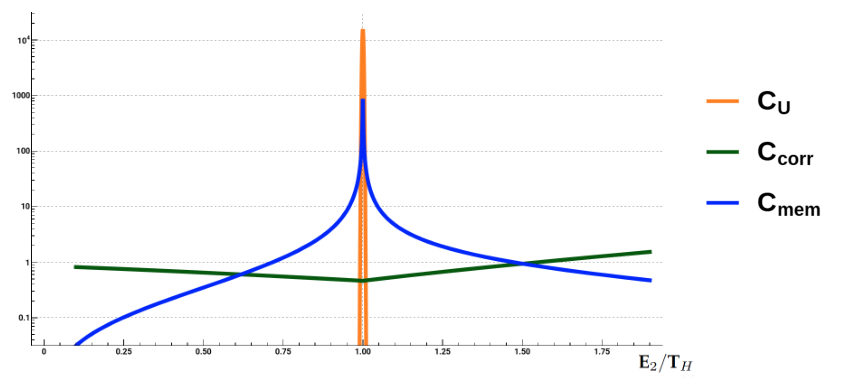
<figcaption class="paper-figure-caption"><b>Fig 2.</b> FIG. 2. The amplitudes of the three contributions C(2) U , C(2) corr and C(2) mem to the second-order coherence function for Hawking radiation are plotted as a function of E2/TH for fixed E1 = TH, where TH = 1/8πM is the Hawking temperature.</figcaption>
</figure>
<figure class="paper-figure-card">
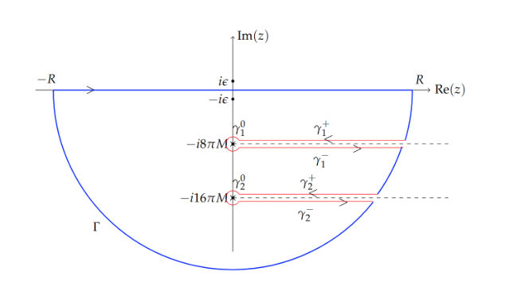
<figcaption class="paper-figure-caption"><b>Fig 3.</b> FIG. 3. The contour used for the integration of I(∆˜ U). We consider the lower half plane where we avoid the branch cuts created by the branch points zk = i(8πM)k.</figcaption>
</figure>
<figure class="paper-figure-card">
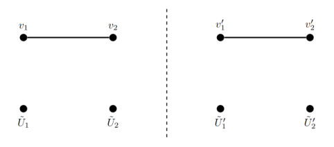
<figcaption class="paper-figure-caption"><b>Fig 4.</b> FIG. 4. Graphical representation of the integral I(∆v)(∆v) A , corresponding to a combination of the pairs (v1, v2) and (v′ 1, v′ 2).</figcaption>
</figure>
<figure class="paper-figure-card">
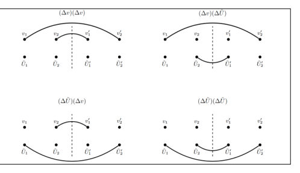
<figcaption class="paper-figure-caption"><b>Fig 5.</b> FIG. 5. The Unruh-vacuum terms of the A-channel (left) and of the B-channel (right).</figcaption>
</figure>

**Summary.** The paper argues that the black hole information paradox is based on an incomplete picture derived only from single-time measurements of Hawking radiation. By analyzing higher-order, multi-time quantum correlations, the authors demonstrate a 'memory term' that explicitly carries information about the matter that collapsed, suggesting these temporal correlations are key to resolving the paradox.

**Why it may be interesting.** This work extends concepts from open quantum systems theory to extreme astrophysical environments, showing how non-Markovian effects (captured by multi-time correlations) can preserve information otherwise lost under single-time approximations.

Detailed structure

**Main problem.** The black hole information paradox arises because Hawking radiation appears thermal, suggesting information loss. The authors investigate if pre-collapse information can survive in measurable correlations beyond single-time observables.

**Main result.** Multi-time quantum-field correlations (specifically the memory term $C^{(2)}_{	ext{mem}}$) are shown to depend explicitly on parameters characterizing the initial pre-collapse state, indicating that information is encoded in higher-order temporal correlations.

**Method.** The analysis uses multi-time correlation functions, such as the second-order coherence function ($g^{(2)}$), calculated using advanced techniques like the Schwinger–Keldysh formalism and complex contour integration.

**Model / system.** The system is a quantum field ($\hat{\phi}$) undergoing gravitational collapse and evaporation in a two-dimensional model. The analysis contrasts measurements constrained by single-time observables (like those from the Hawking-Wald theorem) with joint probability distributions for multiple detection events.

**Key observables.** Second-order coherence function $g^{(2)}(t_1, E_1; t_2, E_2)$, decomposed into Unruh vacuum ($C^{(2)}_U$), memory ($C^{(2)}_{	ext{mem}}$), and correlation ($C^{(2)}_{	ext{corr}}$) terms.

**Important parameters / regimes.** Pre-collapse state parameters (e.g., $D_0$), energy differences ($\Delta E$), and time separations ($\Delta t$).

**Assumptions / limitations.** The analysis assumes that multi-time measurements are possible and that the thermal approximation based solely on the reduced density matrix is incomplete.

**Figures summary.** Figures illustrate complex contours used for evaluating correlation integrals, showing the decomposition of coherence functions into Unruh components and non-Unruh memory/correlation parts.

**Paper structure.** The paper builds by first establishing that single-time measurements yield thermal results (like the Unruh vacuum), then introducing multi-time correlations via $g^{(2)}$, and finally demonstrating mathematically that specific terms in this correlation function retain dependence on initial conditions, violating pure thermality.

Abstract

The black hole information paradox originates from the thermal character of Hawking radiation, which appears to erase information about the collapsing matter. However, thermality constrains only observables defined at a single time and leaves the structure of temporal quantum correlations largely unexplored. Here we show that multi-time quantum-field correlations provide a concrete mechanism for the survival of pre-collapse information in black hole evaporation. Using a two-dimensional model of gravitational collapse and evaporation, we demonstrate that late-time multi-time correlations are not fully reproduced by the Unruh vacuum. In particular, they contain a contribution that depends explicitly on parameters characterizing the pre-collapse state, despite the thermal character of the asymptotic radiation. Our results identify measurable multi-time correlations as carriers of information in Hawking radiation and suggest that formulations of the black hole information paradox based solely on single-time observables are incomplete.

[↑ back to top](#top)

### [Diffusive Dynamics of Nonstabilizerness](http://arxiv.org/abs/2606.13606v1)

**Authors:** Zhenyu Xiao, Shinsei Ryu  
**Type:** theory · **Category:** statistical mechanics · **PDF:** <https://arxiv.org/pdf/2606.13606v1>  
**Analysis basis:** full PDF text, analyzed in chunks
**Topic relevance:** 🔥 `entanglement & information structure` **4/5** · `methods for driven-dissipative` **3/5** · `non-equilibrium dynamics` **3/5** · `non-equilibrium universality` **3/5** · `analog quantum simulation` **2/5** · `driven-dissipative phase transition` **2/5** · `Keldysh / 2PI / non-Gaussian methods` **1/5** · `correlated / nonlocal dissipation` **1/5** · `scars & prethermalization` **1/5**

↔ Scroll figures horizontally

<figure class="paper-figure-card">
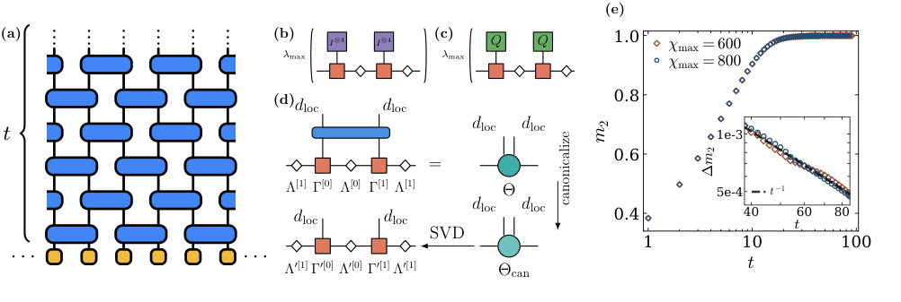
<figcaption class="paper-figure-caption"><b>Fig 1.</b> FIG. 1. (a) Disorder-averaged four-replica transfer network for |ρ⊗4 t ⟩⟩. Blue tensor: Haar-averaged U(1)-symmetric gate W [Eq. (5)]; yellow tensor: averaged initial state |ρ⊗4 0 ⟩⟩[Eq. (4)]. (b,c) Contractions with I⊗4 and Q defining two-site transfer matrices with dominant eigenvalues λmax;tr and λmax;Q, whose ratio determines the annealed entropy density. (d) Two-site update of the infinite matrix product state: apply W, restore canonical form, and truncate by singular value decomposition within the S4 blocks. (e) Annealed stabilizer R´enyi entropy density m2 A versus time. Inset: late-time behavior on a log-log scale.</figcaption>
</figure>
<figure class="paper-figure-card">
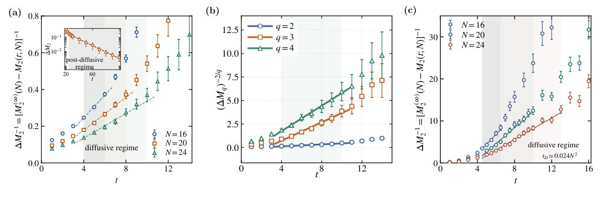
<figcaption class="paper-figure-caption"><b>Fig 2.</b> FIG. 2. (a) U(1) random circuit: inverse gap ∆M −1 2 (t; N) for several N, linear in t in the diffusive window. Inset: post- Thouless exponential tail on a semi-log scale. (b) Higher R´enyi gaps in the same circuit at N = 24, plotted as [∆Mq]−2/q</figcaption>
</figure>

**Summary.** This work analyzes the dynamics of nonstabilizerness, a key resource measure, in symmetry-constrained many-body quantum systems. Using advanced tensor network methods on random circuits and Ising chains, the authors prove that the approach to equilibrium follows a universal diffusive scaling law proportional to $t^{-1}$. This establishes hydrodynamics as a fundamental principle governing resource relaxation in such chaotic quantum dynamics.

**Why it may be interesting.** It provides a concrete example of how hydrodynamic principles govern the relaxation of quantum resources (nonstabilizerness) in chaotic systems, linking concepts from entanglement theory to classical statistical mechanics universality classes.

Detailed structure

**Main problem.** The study investigates how symmetries influence the dynamics of nonstabilizerness, a quantum resource complementary to entanglement, in many-body systems.

**Main result.** The late-time approach of nonstabilizerness to its random-state value exhibits diffusive scaling characterized by an algebraic decay $\Delta m_2(t) \propto t^{-1}$.

**Method.** The analysis employs replica tensor networks and infinite time-evolving block decimation (iTEBD) techniques applied to the disorder-averaged dynamics in the thermodynamic limit.

**Model / system.** The primary models are one-dimensional U(1)-symmetric random quantum circuits and energy-conserving nonintegrable Ising chains. The analysis is performed on the stabilizer Rényi entropy, which quantifies nonstabilizerness.

**Key observables.** Stabilizer Rényi entropy density ($m_2^A$), the gap to the Haar-random state ($\Delta m_2(t)$), and finite-size R\'enyi gaps ($\Delta M_q$).

**Important parameters / regimes.** The decay is observed in a diffusive window $	au \ll t \ll t_D$, where $t_D$ scales as $N^2/D$.

**Assumptions / limitations.** The analysis relies on the ensemble average restoring translation invariance, allowing for an iMPS representation in the thermodynamic limit.

**Figures summary.** Figures illustrate the replica tensor network structure and plot the time evolution of the entropy density, confirming the late-time $t^{-1}$ scaling and higher-order gaps $\Delta M_q \propto t^{-q/2}$.

**Paper structure.** The paper first introduces nonstabilizerness via stabilizer Rényi entropy in U(1) random circuits. It then develops the tensor network machinery to calculate disorder-averaged dynamics, culminating in the identification of a universal diffusive scaling law confirmed by comparison with an Ising chain model.

Abstract

Symmetries shape the quantum-information dynamics of many-body systems, but their effect on nonstabilizerness, the resource complementary to entanglement, is less understood. We compute the stabilizer Rényi entropy, a measure of nonstabilizerness, in $\mathrm{U}(1)$-symmetric one-dimensional random circuits. The disorder-averaged dynamics is captured by a four-replica tensor network, which we evaluate by $S_4$-adapted infinite time-evolving block decimation (iTEBD) directly in the thermodynamic limit. Together with a hydrodynamic argument, our results identify a diffusive universality class for the late-time approach of nonstabilizerness to its random-state value, with the stabilizer Rényi entropy gap closing as $1/t$. The same scaling is verified in an energy-conserving nonintegrable Ising chain. More broadly, our framework provides a hydrodynamic perspective on nonstabilizerness generation and offers insight into the design of approximate Haar-random states in Hamiltonian dynamics.

[↑ back to top](#top)

### [Kerr-induced nonreciprocal transparency and group delay in a hybrid cavity magnomechanical system](http://arxiv.org/abs/2606.13412v1)

**Authors:** M. Amghar, Noura Chabar, Mohamed Amazioug, Reem Altuijri, Ameenah N. Al-Ahmadi, Abdel-Haleem Abdel-Aty  
**Type:** theory · **Category:** other · **PDF:** <https://arxiv.org/pdf/2606.13412v1>  
**Analysis basis:** full PDF text, analyzed in chunks
**Topic relevance:** 🔥 `spintronics-quantum-optics interface` **4/5** · `interference shaping light` **3/5** · `Keldysh / 2PI / non-Gaussian methods` **2/5** · `Tavis-Cummings & cavity-many-emitter` **2/5** · `exotic spin models in light-matter` **2/5** · `methods for driven-dissipative` **2/5** · `analog quantum simulation` **1/5** · `correlated / nonlocal dissipation` **1/5** · `correlated cavity matter` **1/5** · `driven-dissipative phase transition` **1/5** · `non-equilibrium dynamics` **1/5**

↔ Scroll figures horizontally

<figure class="paper-figure-card">
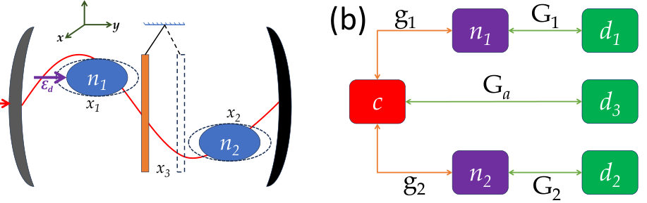
<figcaption class="paper-figure-caption"><b>Fig 1.</b> FIG. 1: (a) Schematic illustration of the proposed hybrid cavity magnomechanical architecture. The system consists of two yttrium iron garnet (YIG) spheres together with a mechanical membrane placed inside a microwave cavity, which is driven by a weak probe field at frequency ωp. A static magnetic field applied along the z-axis generates collective magnon excitations in the YIG spheres, which are strongly coupled to the cavity electromagnetic mode. Simultaneously, the magnetic bias field activates magnetostrictive effects, leading to effective magnon–phonon coupling and enabling coherent hybrid interactions among photonic, magnonic, and mechanical degrees of freedom. In addition, the first...</figcaption>
</figure>
<figure class="paper-figure-card">
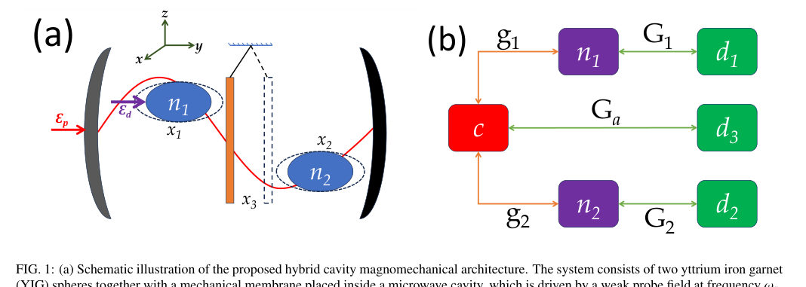
<figcaption class="paper-figure-caption"><b>Fig 2.</b> Figure 1 shows a hybrid magnomechanical system consisting of two ferromagnetic YIG spheres and a mechanical membrane placed at the center of a microwave cavity. The magnon modes of the spheres, denoted n1 and n2, are excited by an external magnetic field applied along the z-axis and couple to the cavity field via magnetic dipole interaction. The mechanical vibrations of the spheres, induced by magnetostrictive forces, correspond to phonon modes d1 and d2, enabling magnon–phonon coupling. The system is driven by a strong control field acting on the first sphere (n1) and a weak probe field applied to the cavity mode. By applying the rotating wave approximation at the driving field frequency...</figcaption>
</figure>
<figure class="paper-figure-card">
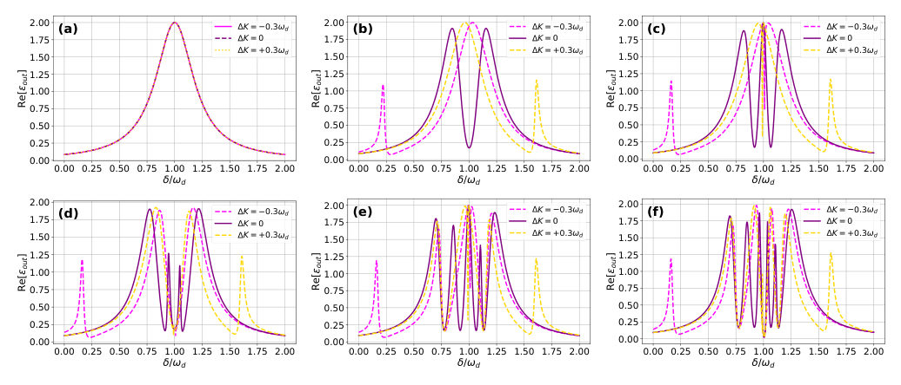
<figcaption class="paper-figure-caption"><b>Fig 3.</b> FIG. 2: Real part of the output field ϵR as a function of δ/ωb. (a) g1 = g2 = G1 = G2 = Ga = 0; (b) g2 = G1 = G2 = Ga = 0 with g1/2π = 1.5 MHz; (c) g2 = G2 = Ga = 0 and g1/2π = G1/2π = 1.5 MHz; (d) G2 = Ga = 0 with g1/2π = g2/2π = G1/2π = 1.5 MHz; (e) Ga = 0 with G2/2π = 3.5 MHz and g1/2π = g2/2π = G1/2π = 1.5 MHz; (f) Ga/2π = 2.5 MHz with g1/2π = g2/2π = G2/2π = 1.5 MHz and G2/2π = 3.5 MHz. All remaining parameters are given in the text.</figcaption>
</figure>
<figure class="paper-figure-card">
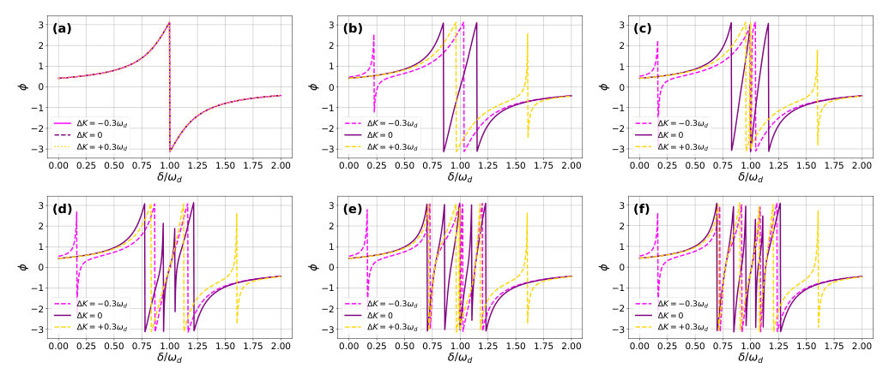
<figcaption class="paper-figure-caption"><b>Fig 4.</b> FIG. 3: The phase ϕ of the transmitted probe field as a function of δ/ωb. (a) g1 = g2 = G1 = G2 = Ga = 0; (b) g2 = G1 = G2 = Ga = 0 with g1/2π = 1.5 MHz; (c) g2 = G2 = Ga = 0 and g1/2π = G1/2π = 1.5 MHz; (d) G2 = Ga = 0 with g1/2π = g2/2π = G1/2π = 1.5 MHz; (e) Ga = 0 with G2/2π = 3.5 MHz and g1/2π = g2/2π = G1/2π = 1.5 MHz; (f) Ga/2π = 2.5 MHz with g1/2π = g2/2π = G2/2π = 1.5 MHz and G2/2π = 3.5 MHz. All remaining parameters are given in the text.</figcaption>
</figure>
<figure class="paper-figure-card">
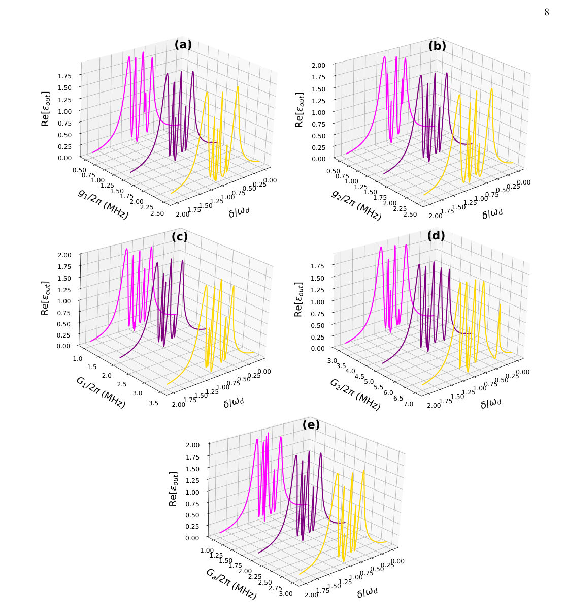
<figcaption class="paper-figure-caption"><b>Fig 5.</b> FIG. 4: Absorption of the output field Re[ϵout] plotted versus the normalized detuning δ/ωd for different interaction strengths, with ∆K = 0.3ωd. (a) Variation of g1 with g2/2π = G1/2π = 1.5 MHz, G2/2π = 3.5 MHz, and Ga/2π = 2.5 MHz. (b) Dependence on g2 with g1/2π = G1/2π = 1.5 MHz, G2/2π = 3.5 MHz, and Ga/2π = 2.5 MHz. (c) Variation of G1 with g1/2π = g2/2π = 1.5 MHz, G2/2π = 3.5 MHz, and Ga/2π = 2.5 MHz. (d) Dependence on G2 for g1/2π = g2/2π = G1/2π = 1.5 MHz, and Ga/2π = 2.5 MHz. (e) Variation of Ga for g1/2π = g2/2π = G1/2π = 1.5 MHz, and G2/2π = 3.5 MHz. The remaining parameters are listed in the text.</figcaption>
</figure>

**Summary.** The paper theoretically investigates how Kerr nonlinearity can induce nonreciprocal behavior in coupled magnon-photon-phonon systems. By controlling the system's couplings, researchers demonstrate the ability to generate multiple transparency windows and precisely tune the group delay, enabling directional microwave photonic devices.

**Why it may be interesting.** This work is highly relevant to AMO physics as it explores cavity QED/optomechanics principles by integrating magnonics and nonlinear effects (Kerr) to achieve directional light control, a key area in quantum photonics.

Detailed structure

**Main problem.** The research aims to realize and investigate nonreciprocal transparency, Fano resonances, and control slow/fast light propagation in a hybrid cavity magnomechanical system.

**Main result.** The Kerr nonlinearity enables controllable nonreciprocal transmission and allows for reversible switching between slow-light and fast-light regimes by engineering the dispersion relation.

**Method.** The study uses theoretical modeling based on the quantum Langevin formalism to analyze the output field amplitude, absorption spectrum, and group delay.

**Model / system.** The physical platform is a hybrid cavity magnomechanical system comprising two YIG spheres (magnons), a mechanical resonator (phonons), and coupled within a microwave cavity mode (photons). The dynamics are governed by interactions including optomagnonical coupling, magnon-phonon coupling, and the magnon Kerr nonlinearity.

**Key observables.** Nonreciprocal absorption contrast ($\epsilon_{NP}$), nonreciprocal group delay factor ($	au_{NP}$), transparency windows, and dispersion spectra.

**Important parameters / regimes.** Kerr nonlinearity strength ($\Delta K$), various coupling strengths ($g_r, G_r$), cavity decay rates ($\kappa_c$), and magnon/phonon damping rates.

**Assumptions / limitations.** The analysis relies on linearization procedures and treating the solution to first order in the weak probe field. Specific approximations regarding detunings relative to decay rates are also noted.

**Figures summary.** Figures illustrate spectral responses (absorption) showing multiple transparency windows controlled by coupling strengths, and plots of phase/group delay ($	au$ vs $\delta$) demonstrating tunable nonreciprocal effects depending on the Kerr sign.

**Paper structure.** The paper first introduces the system architecture and then develops the theoretical model using Hamiltonian and Langevin equations. Subsequent sections analyze MMIT, the role of the Kerr nonlinearity in generating Fano resonances, and finally detail the control over group delay and nonreciprocity.

Abstract

We propose a scheme for realizing nonreciprocal transparency, Fano resonances, and slow/fast light in a hybrid cavity magnomechanical system containing two YIG spheres and a mechanical resonator. The nonreciprocal behavior originates from the magnon Kerr nonlinearity, which induces direction-dependent frequency shifts and modifies the interference pathways among cavity photons, magnons, and phonons. We show that the hybrid system supports multiple transparency windows arising from magnon- and magnomechanical-induced interference processes. The Kerr interaction strongly reshapes these transparency features, producing asymmetric Fano line shapes and enabling controllable nonreciprocal transmission. Furthermore, the associated dispersion exhibits pronounced directional asymmetry, leading to giant differences in the group delay for opposite propagation directions and allowing reversible switching between slow- and fast-light regimes. We investigate the roles of hybrid coupling strengths and dissipation channels and identify parameter regimes where the nonreciprocal response is maximized. These findings establish Kerr-engineered magnomechanical systems as promising platforms for integrated nonreciprocal microwave photonics and quantum information technologies.

[↑ back to top](#top)

### [Statistical Mechanics and Symmetries of Non-Abelian Anyon Proliferation: From Deformation to Decoherence](http://arxiv.org/abs/2606.12527v1)

**Authors:** Avi Vadali, Robijn Vanhove, Ruben Verresen, Jason Alicea, Pablo Sala  
**Type:** theory · **Category:** statistical mechanics · **PDF:** <https://arxiv.org/pdf/2606.12527v1>  
**Analysis basis:** full PDF text, analyzed in chunks
**Topic relevance:** 🔥 `methods for driven-dissipative` **4/5** · `analog quantum simulation` **3/5** · `driven-dissipative phase transition` **3/5** · `exotic spin models in light-matter` **3/5** · `correlated / nonlocal dissipation` **2/5** · `non-equilibrium universality` **2/5** · `Keldysh / 2PI / non-Gaussian methods` **1/5** · `entanglement & information structure` **1/5** · `non-equilibrium dynamics` **1/5**

↔ Scroll figures horizontally

<figure class="paper-figure-card">
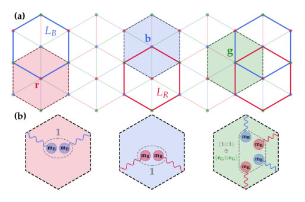
<figcaption class="paper-figure-caption"><b>Fig 1.</b> FIG. 1. Coupled loop model and fusion processes. (a) Lattice for the stat-mech model in Eq. (2), with r, g, b respectively labeling centers of red, green, blue hexagons. Shown loop configuration has cyclomatic number CLR∪LB = 1 + 1 + 3 = 5. (b) Allowed fusions between mR and mB anyons. From left to right: mB × mB →1; mR × mR →1; and, (mB × mB) × (mR × mR) →1 × 1 = 1, or (mB × mB) × (mR × mR) →eG × eG = 1.</figcaption>
</figure>
<figure class="paper-figure-card">
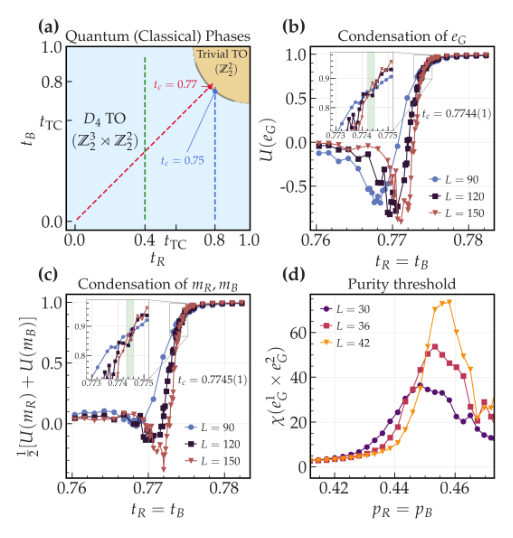
<figcaption class="paper-figure-caption"><b>Fig 2.</b> FIG. 2. Deformation and quantum channel simula- tions. (a) Phase diagram capturing mR, mB, eG condensa- tion with the associated GmR,mB →Z2 2 classical transition. Red line corresponds to data from panels (b,c), blue and green lines indicate traces from App. D, and tTC = 1/ √</figcaption>
</figure>
<figure class="paper-figure-card">
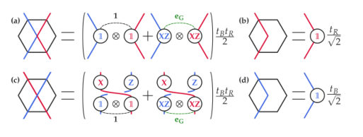
<figcaption class="paper-figure-caption"><b>Fig 3.</b> FIG. 4. Boltzmann weights of the coupled-loop stat- mech model. Loops interact by exchanging a trivial charge and an Abelian charge (eG for the red/blue interaction) (a) and in addition braid non-trivially when they intersect (c). (b,d) A non-interacting loop segment acts trivially in its re- spective 2-dimensional space. Other weights are analogously defined.</figcaption>
</figure>
<figure class="paper-figure-card">
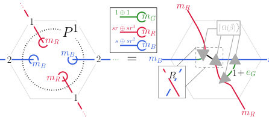
<figcaption class="paper-figure-caption"><b>Fig 4.</b> FIG. 3. MPO anyon network. One particular anyon con- figuration created by a deformation on a plaquette of the D4 quantum double groundstate: an mR and mB-anyon pair is created in the specified order. The overlap forces the final anyon on every plaquette to be the vacuum, indicated by the projector P 1, and evaluates to a closed network of fusion ten- sors, representing the braiding and fusion processes consistent with the given ordering. The network is exactly a string-net strange correlator as in Eq. (12).</figcaption>
</figure>
<figure class="paper-figure-card">
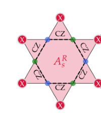
<figcaption class="paper-figure-caption"><b>Fig 5.</b> FIG. 5. Kagome lattice D4 Hamiltonian terms. 12-body star operator AR</figcaption>
</figure>

**Summary.** This work develops a statistical mechanics approach to study how non-Abelian topological order breaks down under decoherence. By modeling the system using coupled loop models and analyzing anyon condensation, the authors determine critical error thresholds and characterize the symmetry structure of the resulting trivial phases.

**Why it may be interesting.** It provides a powerful framework connecting abstract topological order concepts to measurable thermodynamic quantities (like susceptibility or cumulants) in the presence of realistic environmental noise.

Detailed structure

**Main problem.** The study investigates how topological order, maintained by non-Abelian anyons, degrades due to environmental noise (decoherence) or wavefunction deformations.

**Main result.** The proliferation of multiple non-Abelian anyon species can drive the system into a trivial phase below a finite error threshold, and the resulting symmetry structure is characterized by $G 	imes 	ext{Rep}(G)$.

**Method.** The authors employ statistical mechanics models derived from quantum double structures, utilizing Monte Carlo simulations, Binder cumulants, and analyzing anyon syndrome distributions.

**Model / system.** The system models topological order based on non-Abelian anyons (e.g., in $D_4$ TO), analyzed through coupled loop models, spin Hamiltonians, and the resulting statistical mechanics partition functions.

**Key observables.** Binder cumulants ($U$), correlation functions of Wilson operators ($\langle n_R^b \cdot n_R^g 
angle$), purity ($	ext{tr}(
ho^2)$), and anyon syndrome distributions $p(\{a_v\})$.

**Important parameters / regimes.** Decoherence rates ($p_\alpha$), deformation parameters ($eta_R, eta_B$), and the critical error threshold $p_c(\infty)$.

**Assumptions / limitations.** The analysis often relies on mapping complex quantum dynamics onto effective classical statistical mechanics models (e.g., loop/string-net models) and assuming specific symmetry structures.

**Figures summary.** Figures illustrate lattice structures, phase diagrams showing condensation thresholds for multiple anyon species ($mR, mB, eG$), and plots of Binder cumulants diagnosing transitions.

**Paper structure.** The paper systematically develops the statistical mechanics description by deriving loop models from quantum double algebras, analyzing stability under noise via syndrome distributions, and mapping out phase diagrams based on condensation thresholds for different anyon species.

Abstract

Topological quantum computation relies on braiding non-Abelian anyons, but requires the underlying topological order to survive imperfect state preparation and environmental noise. We show that the instability of topological order to wavefunction deformations and to decoherence, with the latter probed by syndrome distributions, are generically captured by stat-mech models whose symmetries naturally expose the corrupting anyonic excitations. As an example, we combine this framework with Monte-Carlo simulations to resolve the stability of $D_4$ topological order under deformations and quantum channels that proliferate multiple non-Abelian anyon species that individually are unable to condense. We show that beyond a finite threshold, proliferation of two non-Abelian anyon species parasitically condenses a shared Abelian-anyon fusion outcome, destroying the topological order. Our symmetry-based approach sharply differentiates the resulting trivial phase from that obtained by condensing all Abelian charges; in other words, the trivial phase "remembers" which anyons condensed. This framework provides a first step into identifying the relevant symmetry for optimal decoders, conditioned on syndrome measurements, of non-Abelian topological order.

[↑ back to top](#top)

### [Multi-entropy in heavy local quenches](http://arxiv.org/abs/2606.12526v1)

**Authors:** Kosei Fujiki, Kenya Tasuki  
**Type:** theory · **Category:** statistical mechanics · **PDF:** <https://arxiv.org/pdf/2606.12526v1>  
**Analysis basis:** full PDF text, analyzed in chunks
**Topic relevance:** 🔥 `entanglement & information structure` **4/5** · 🔥 `non-equilibrium dynamics` **4/5** · `non-equilibrium universality` **3/5** · `scars & prethermalization` **2/5** · `Keldysh / 2PI / non-Gaussian methods` **1/5** · `correlated / nonlocal dissipation` **1/5** · `driven-dissipative phase transition` **1/5** · `methods for driven-dissipative` **1/5**

↔ Scroll figures horizontally

<figure class="paper-figure-card">
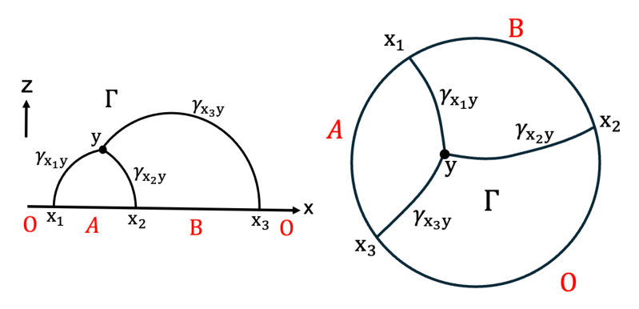
<figcaption class="paper-figure-caption"><b>Fig 1.</b> Figure 1: Holographic dual of tripartite multi-entropy for adjacent intervals in Poincaré coordinates (left) and global coordinates (right). The three boundary end- points of the intervals are connected to a trivalent vertex Y , and the minimal length of the admissible extremal network gives the holographic multi-entropy.</figcaption>
</figure>
<figure class="paper-figure-card">
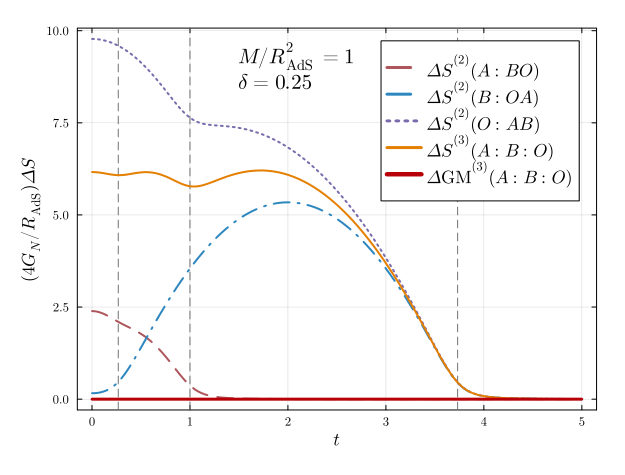
<figcaption class="paper-figure-caption"><b>Fig 2.</b> Figure 3: Perturbative holographic results. We set M/R2 AdS = 1 and δ = 0.25. The subsystem endpoints are fixed at x1 = −1, x2 = 2 − √</figcaption>
</figure>
<figure class="paper-figure-card">
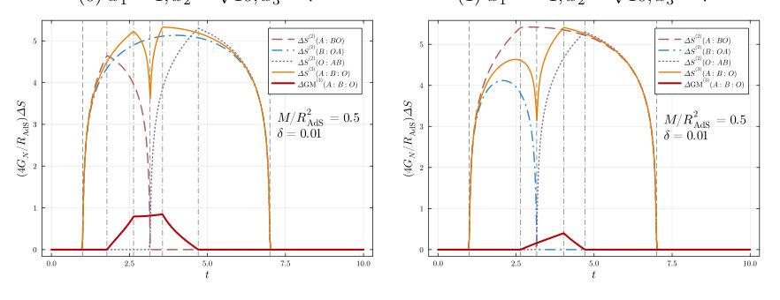
<figcaption class="paper-figure-caption"><b>Fig 3.</b> Figure 4: Fully back-reacted holographic results for the conical-defect regime below the threshold. We set M/R2 AdS = 0.5, δ = 0.01. In the upper-left panel, the local quench occurs in subsystem O. In the other panels, it occurs in A.</figcaption>
</figure>
<figure class="paper-figure-card">
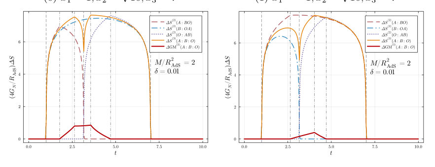
<figcaption class="paper-figure-caption"><b>Fig 4.</b> Figure 5: Fully back-reacted holographic results for the BTZ regime above the threshold. We set M/R2 AdS = 2, δ = 0.01. In the upper-left panel, the local quench occurs in subsystem O. In the other panels, it occurs in A.</figcaption>
</figure>
<figure class="paper-figure-card">
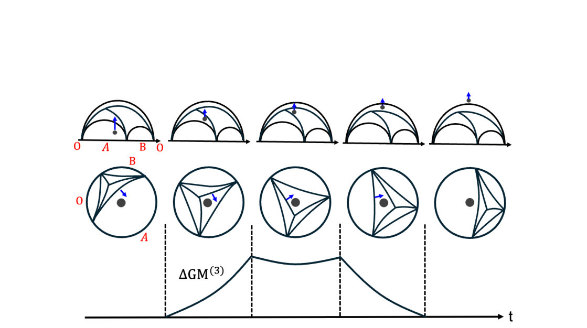
<figcaption class="paper-figure-caption"><b>Fig 5.</b> Figure 6: Schematic time evolution of pair and trivalent geodesics for the trapezoidal profile of the vacuum-subtracted genuine tri-entropy. The particle moves in Poincaré coordinates, while the endpoints move in global coordinates.</figcaption>
</figure>

**Summary.** This work analyzes the genuine multi-entropy following heavy local quenches in holographic CFTs. By comparing bulk geodesic calculations with boundary CFT correlators, the authors show that this measure is governed by global topological constraints rather than local physics. This provides a powerful tool for understanding multipartite entanglement dynamics in strongly coupled quantum matter.

**Why it may be interesting.** It provides a deep connection between entanglement structure (multi-entropy) and global geometric properties (saddle selection/geodesic topology) in strongly coupled quantum systems, which is relevant to understanding thermalization dynamics beyond simple bipartite measures.

Detailed structure

**Main problem.** The study investigates the time evolution of multipartite entanglement, specifically using genuine multi-entropy, following heavy local quenches in holographic CFTs.

**Main result.** The genuine multi-entropy is found to be controlled by global saddle selection mechanisms rather than purely local energy responses or quasiparticle propagation. In the sharp quench limit, its time dependence is kinematically fixed to logarithms of rational functions of time.

**Method.** The analysis combines holographic duality (geodesic minimization in AdS$_3$) with CFT calculations using replica methods and heavy-light conformal blocks.

**Model / system.** The system modeled is a two-dimensional holographic Conformal Field Theory undergoing a heavy local quench, dual to the dynamics of a falling massive particle in AdS$_3$.

**Key observables.** Genuine multi-entropy ($S^{(q)}_n$), bipartite entanglement entropy, and vacuum-subtracted genuine tripartite multi-entropy ($\Delta G_M^{(3)}$).

**Important parameters / regimes.** Heavy operator dimension, quench width ($\delta$), and the ratio of mass to AdS curvature scale.

**Assumptions / limitations.** The analysis relies on approximations such as the heavy-light vacuum block approximation and assumes a holographic dual structure for the physics.

**Figures summary.** Figures illustrate the minimal geodesic network $\Gamma$ in the bulk, showing how multi-entropy is calculated via geodesic lengths, and depict time evolution profiles of genuine tri-entropy across different quench regimes (conical vs. BTZ).

**Paper structure.** The paper progresses from defining the multi-entropy diagnostics to performing perturbative analyses (showing first-order cancellation), then moving to fully back-reacted calculations in both conical and BTZ regimes, culminating in deriving kinematic formulas for the sharp-quench limit.

Abstract

We study the time evolution of tripartite entanglement in heavy local quenches in two-dimensional holographic conformal field theories. Our diagnostic is the genuine multi-entropy of adjacent intervals, computed from both bulk and boundary perspectives. A perturbative bulk analysis shows that the first-order small-mass perturbation around the vacuum geodesic network cancels identically at any time after the quench. In the fully back-reacted geometry, a vacuum-subtracted genuine multi-entropy arises from a mismatch between the winding selected by the trivalent geodesic network and the windings selected independently by the pairwise geodesics. In the sharp quench limit, the time dependence of genuine multi-entropy is kinematically fixed to logarithms of rational functions of time and is independent of the heavy operator dimension. The CFT calculation reproduces the same formula within the heavy-light vacuum block approximation, where the branch choice in the heavy-background uniformization map corresponds to the winding selection in the bulk. These results indicate that, in this setup, the genuine multi-entropy is controlled by global saddle selection, rather than by a local energy response or quasiparticle propagation.

[↑ back to top](#top)

### [Quantum charge pumping in helical systems: A comparative study of short- and long-range hopping](http://arxiv.org/abs/2606.12914v1)

**Authors:** Leila Eslami, Santanu K. Maiti, Fatemeh Bourbour  
**Type:** theory · **Category:** other · **PDF:** <https://arxiv.org/pdf/2606.12914v1>  
**Analysis basis:** full PDF text, analyzed in chunks
**Topic relevance:** 🔥 `Keldysh / 2PI / non-Gaussian methods` **4/5** · `methods for driven-dissipative` **3/5** · `non-equilibrium dynamics` **3/5** · `driven-dissipative phase transition` **2/5** · `non-equilibrium universality` **2/5** · `Frenkel-Kontorova` **1/5** · `analog quantum simulation` **1/5** · `correlated / nonlocal dissipation` **1/5**

↔ Scroll figures horizontally

<figure class="paper-figure-card">
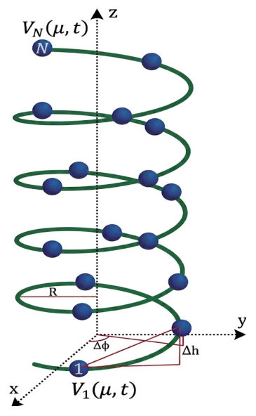
<figcaption class="paper-figure-caption"><b>Fig 1.</b> FIG. 1: (Color online). Schematic illustration of a right- handed single-stranded helical molecule sandwiched between two reservoirs kept at the same chemical potential, as a pump- ing device. R represents the radius, ∆ϕ is the twisting angle, and ∆h denotes the stacking distance between the neighbor- ing lattice sites.</figcaption>
</figure>
<figure class="paper-figure-card">
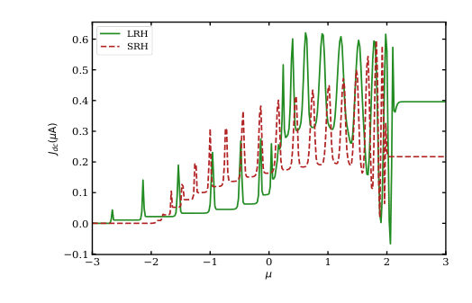
<figcaption class="paper-figure-caption"><b>Fig 2.</b> FIG. 3: (Color online). The pumped dc current as a function of normalized chemical potential (µ) for LRH and SRH con- figurations, with Vp = 0.5, Ω= 0.01, and δ = π/2.</figcaption>
</figure>
<figure class="paper-figure-card">
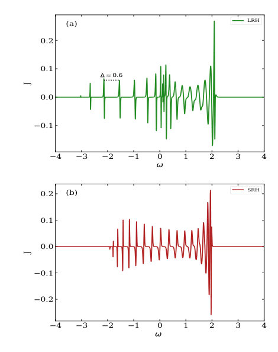
<figcaption class="paper-figure-caption"><b>Fig 3.</b> FIG. 2: (Color online). The current spectral function versus the electron energy for (a) LRH and (b) SRH configurations with Vp = 0.5 and Ω= 0.01.</figcaption>
</figure>
<figure class="paper-figure-card">
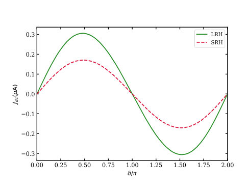
<figcaption class="paper-figure-caption"><b>Fig 4.</b> FIG. 4: (Color online). The pumped dc current as a function of the phase lag (δ) for LRH and SRH configurations with µ = 0.5, Vp = 0.5, and Ω= 0.01.</figcaption>
</figure>
<figure class="paper-figure-card">
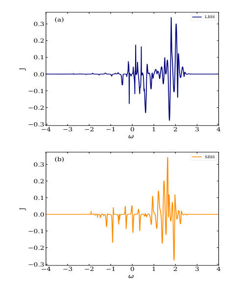
<figcaption class="paper-figure-caption"><b>Fig 5.</b> FIG. 6: (Color online). The current spectral function versus the energy (ω) for (a) LRH and (b) SRH configurations with Vp = 0.5, Ω= 0.3, and δ = π/2.</figcaption>
</figure>

**Summary.** The paper theoretically investigates quantum charge pumping in helical nanostructures by comparing short-range versus long-range electron hopping models. Using the Keldysh NEGF formalism, the authors find that long-range hopping facilitates robust, plateau-like DC currents characteristic of adiabatic pumping. Crucially, they demonstrate that the structural decay exponent ($\ell_c$) provides a geometric control mechanism to tune this quantum current.

**Why it may be interesting.** This work provides a detailed theoretical framework for understanding how geometric structure (chirality/helicity) and electronic coupling range influence non-equilibrium quantum transport phenomena in low-dimensional molecular conductors.

Detailed structure

**Main problem.** The study investigates quantum charge pumping mechanisms in single-stranded helical structures by comparing the effects of short-range versus long-range electron hopping.

**Main result.** Long-range hopping (LRH) leads to pronounced plateau-like regions in the pumped DC current under adiabatic conditions, while the decay exponent ($\ell_c$) acts as a structural knob to tune this current. Short-range hopping (SRH) yields less robust and more parameter-sensitive currents.

**Method.** The Keldysh non-equilibrium Green's function (NEGF) approach is employed to calculate time-dependent transport properties, utilizing the Floquet representation for periodically driven systems.

**Model / system.** The system is a single-stranded helical molecule modeled by a tight-binding Hamiltonian incorporating both short-range and long-range hopping terms. The structure is subjected to time-periodic potentials applied at its ends.

**Key observables.** Spectral current, pumped DC current ($J_{dc}$), dependence of $J_{dc}$ on chemical potential ($\mu$), phase lag ($\delta$), driving frequency ($\Omega$), and amplitude ($V_p$).

**Important parameters / regimes.** Hopping range (SRH vs. LRH), decay exponent ($\ell_c$), drive frequency ($\Omega$), and phase difference ($\delta$).

**Assumptions / limitations.** The analysis compares adiabatic transport regimes (low $\Omega$) with high-frequency, non-adiabatic dynamics; the use of NEGF formalism is central to the calculation.

**Figures summary.** Figures illustrate $J_{dc}$ vs. $\mu$ showing plateaus for LRH in the adiabatic limit; they also show the dependence on phase lag ($\delta$), driving amplitude ($V_p$), and spectral function comparisons across different hopping regimes and frequencies.

**Paper structure.** The paper systematically compares the theoretical predictions of quantum charge pumping using NEGF, first establishing the model Hamiltonian for helical systems, then analyzing the distinct transport signatures arising from LRH versus SRH under varying driving conditions ($\Omega$, $\delta$).

Abstract

Using the Keldysh non-equilibrium Green's function approach, we investigate charge pumping through a single-stranded helical structure described by a tight-binding model that includes either short-range hopping (SRH) or long-range hopping (LRH). While quantum pumping has been studied in various low-dimensional systems, the detailed behavior of the spectral current and the pumped dc current in helical geometries in the presence of higher-order electron hopping (beyond nearest neighbors) has not yet been systematically explored. Here, we focus on the interplay between helicity and extended hopping ranges, analyzing how they jointly control the energy-resolved and dc pumped currents under time-periodic end potentials. For LRH, the pumped dc current exhibits pronounced plateau-like regions as a function of chemical potential when energy levels are sparsely spaced -- consistent with adiabatic transport -- whereas SRH yields more parameter-sensitive currents without clear plateaus. The plateau stability is controlled by the drive frequency: at higher frequencies, Floquet side-band mixing destroys the plateaus, leading to oscillatory currents. The phase dependence remains nearly sinusoidal, and the current vanishes at zero phase lag, confirming the necessity of out-of-phase potentials. Crucially, in helical systems, the decay exponent $(\ell_c)$ acts as an effective structural parameter that can tune both the magnitude and sign of the pumped current, offering a geometric knob for controlling quantum pumping. Our findings not only fill a gap in the understanding of spectral and pumped currents in helical systems with extended hopping but also provide tools that can be applied to analyze similar phenomena in other chiral or quasi-one-dimensional systems.

[↑ back to top](#top)

### [Accidental Symmetry in the Tavis-Cummings Model via the Schwinger Boson Representation](http://arxiv.org/abs/2606.12813v1)

**Authors:** Plato Deliyannis, Iman Marvian  
**Type:** theory · **Category:** other · **PDF:** <https://arxiv.org/pdf/2606.12813v1>  
**Analysis basis:** full PDF text, analyzed in chunks
**Topic relevance:** 🔥 `Tavis-Cummings & cavity-many-emitter` **4/5** · `analog quantum simulation` **3/5** · `correlated cavity matter` **3/5** · `entanglement & information structure` **2/5** · `Keldysh / 2PI / non-Gaussian methods` **1/5** · `driven-dissipative phase transition` **1/5** · `methods for driven-dissipative` **1/5** · `superradiant laser` **1/5**

↔ Scroll figures horizontally

<figure class="paper-figure-card">
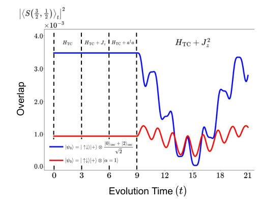
<figcaption class="paper-figure-caption"><b>Fig 1.</b> FIG. 1. Conservation law associated with the accidental symme- try. Example of a 3-qubit system illustrating the conservation law, which holds for time evolution under Hamiltonians HTC, Jz, and a†a, but is violated by HTC + J2 z . The vertical axis shows the ab- solute value of the expectation | ⟨ψ(t)|S(3/2, 1/2)|ψ(t)⟩|, where op- erator S(3/2, 1/2) is defined in Sec.(IV). Qubits are initialized in the product state |↑⟩|↓⟩|+⟩, with |+⟩= (|↑⟩+ |↓⟩)/ √</figcaption>
</figure>
<figure class="paper-figure-card">
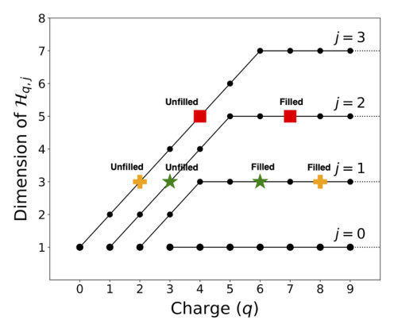
<figcaption class="paper-figure-caption"><b>Fig 2.</b> FIG. 2. Accidental symmetry of TC Hamiltonian: (6-qubit exam- ple). For each pair of angular momenta j &gt; j′, there is a single pair of sectors Hq,j and Hq′,j′ related by the accidental symmetry. Diagrammatically, these sectors lie along the horizontal line which represents dimension 2j′ +1: the maximum dimension allowed for a sector with angular momentum j′. Observe that for each j &gt; j′ &gt; 0, there is a single angular momentum j sector Hq,j with this dimen- sion. Then, the difference in charges q and q′ is q′ −q = 3(j −j′), i.e. thrice the difference in angular momenta. For example, the red square indicates the pair for j = 3 and j′ = 2, the yellow cross j = 3 and j′ = 1, and the green star...</figcaption>
</figure>
<figure class="paper-figure-card">
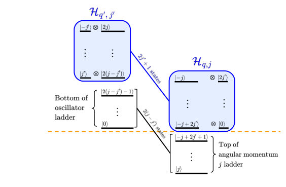
<figcaption class="paper-figure-caption"><b>Fig 3.</b> FIG. 3. Illustration of a pair of sectors related by the accidental sym- metry, as described in Theorem 1. Sector Hq,j is unfilled, while sector Hq′,j′ is filled, meaning it carries a full irrep of SU(2). The matrix elements of HTC in these two sectors, given in Eq.(40), are identical.</figcaption>
</figure>
<figure class="paper-figure-card">
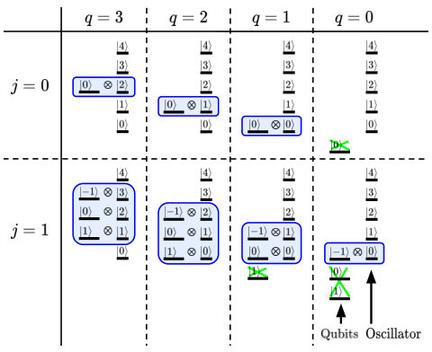
<figcaption class="paper-figure-caption"><b>Fig 4.</b> FIG. 4. 2-qubit example: Blue boxes indicate invariant subspaces of any PI, U(1)-invariant operator acting on n = 2 qubits coupled to a bosonic mode. The states are in the format |m⟩⊗|k⟩, where m and k are eigenvalues of Jz and a†a, respectively. Note that there are two types of 1D invariant sectors: states in the form |j = 0, m = 0⟩⊗|k⟩ for all k ≥0, and the state |j = 1, m = −1⟩⊗|k = 0⟩. All of these 1D sectors have eigenvalue 0 of HTC. The accidental symmetry pairs |j = 1, m = −1⟩⊗|k = 0⟩and |j = 0, m = 0⟩|k = 2⟩and implies they should have the same eigenvalue, a constraint that is not necessarily satisfied by arbitrary PI, U(1)-invariant Hamiltonians.</figcaption>
</figure>
<figure class="paper-figure-card">
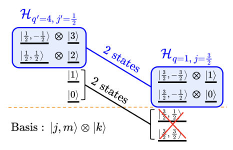
<figcaption class="paper-figure-caption"><b>Fig 5.</b> FIG. 5. 3-qubit Example: two sectors related by accidental symme- try</figcaption>
</figure>

**Summary.** The paper uncovers a previously unnoticed 'accidental' symmetry within the Tavis-Cummings Hamiltonian governing light-matter interaction in multi-qubit systems. By employing advanced algebraic techniques using Schwinger bosons, the authors prove that this symmetry imposes strong constraints on system evolution. This finding has significant implications for understanding the controllability and theoretical limits of quantum computing architectures based on such interactions.

**Why it may be interesting.** This work provides deep structural insights into complex many-body quantum models, revealing symmetries that are not obvious from simple inspection. Such accidental symmetries are crucial for understanding model limitations and designing robust quantum control schemes in cavity QED or superconducting circuit platforms.

Detailed structure

**Main problem.** The primary goal is identifying an additional, independent 'accidental' symmetry within the Tavis-Cummings (TC) Hamiltonian that goes beyond standard permutation and U(1) symmetries.

**Main result.** This accidental symmetry imposes strong constraints on the system's unitary evolution, leading to relationships between otherwise distinct quantum sectors of the Hilbert space.

**Method.** The analysis uses advanced techniques involving Schwinger boson representations of angular momentum and classifying invariant subspaces based on charge and angular momentum quantum numbers.

**Model / system.** The model is the Tavis-Cummings (TC) Hamiltonian, describing $n$ identical qubits coupled to a single bosonic mode. The system's dynamics are analyzed in terms of total angular momentum operators ($J_\pm$) and bosonic occupation number ($a^\dagger a$).

**Key observables.** Conserved observables derived from the accidental symmetry, such as specific expectation values related to sector couplings $S_{j, j'}$ or the second moment $\langle H^2 	ext{TC}(\phi) 
angle$.

**Important parameters / regimes.** $n$ (number of qubits), coupling strength ($g_{TC}$), and bosonic frequency ($\omega_{osc}$). The analysis is particularly relevant for $n \ge 3$ qubits.

**Assumptions / limitations.** The analysis assumes the validity of specific algebraic mappings derived from Schwinger's boson representation, which allows relating different sectors of the Hilbert space.

**Figures summary.** Figures illustrate the conservation law associated with the accidental symmetry by comparing evolution under standard Hamiltonians versus violation under $J_z^2$. They also show pairs of unitarily equivalent sectors (one filled, one unfilled) related by the symmetry transformation.

**Paper structure.** The paper progresses from identifying known symmetries to proposing and characterizing a new 'accidental' symmetry. It then uses algebraic methods (Schwinger representation) and detailed calculations (second moment analysis) to prove the existence and implications of this hidden symmetry on system dynamics and controllability.

Abstract

The Jaynes-Cummings (JC) Hamiltonian is a paradigmatic model of light-matter interaction and, more generally, qubit-boson interactions, widely used across atomic, optical, and superconducting qubit platforms. In the multi-qubit setting, where n qubits are identically coupled to a single boson mode, this interaction is known as the Tavis-Cummings (TC) Hamiltonian. The structure of the TC model is usually understood in terms of two standard symmetries: permutation invariance of the qubits and a U(1) symmetry associated with conservation of the total excitation number. Here we identify an additional, independent "accidental" symmetry of the TC Hamiltonian and construct the corresponding conserved observable. We show that, for n>2 qubits, this symmetry imposes strong constraints on the realizable unitary transformations. These constraints persist in the presence of the global $J_z$ Hamiltonian, but are removed by adding $J_z^2$, even though $J_z^2$ preserves both permutation invariance and the U(1) symmetry. Finally, we explain the origin of this previously unnoticed symmetry using Schwinger's boson representation of angular momentum. These restrictions have important implications for controllability of the TC system and for its applications to quantum computing, which are investigated further in a companion paper.

[↑ back to top](#top)

### [Quantum-Driven Neuromorphic Computing for Million-Qubit-Scale Workloads](http://arxiv.org/abs/2606.12968v1)

**Authors:** Adams Ivanov, Samer Rahmeh, Erick Giovani Sperandio Nascimento, Daniela Herrmann  
**Type:** both · **Category:** disordered systems and neural networks · **PDF:** <https://arxiv.org/pdf/2606.12968v1>  
**Analysis basis:** full PDF text, analyzed in chunks
**Topic relevance:** 🔥 `QC/QI experiment` **4/5** · `exotic spin models in light-matter` **3/5** · `driven-dissipative phase transition` **2/5** · `non-equilibrium dynamics` **2/5** · `analog quantum simulation` **1/5** · `correlated / nonlocal dissipation` **1/5** · `methods for driven-dissipative` **1/5** · `non-equilibrium universality` **1/5** · `spintronics-quantum-optics interface` **1/5**

↔ Scroll figures horizontally

<figure class="paper-figure-card">
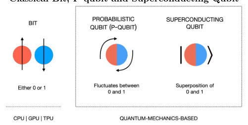
<figcaption class="paper-figure-caption"><b>Fig 1.</b> Fig. 1: Illustration of a classical bit with a definite state of 0 or 1; a p-qubit based on a quantum-driven analog qubit representation, which exhibits stochastic fluctuations between 0 and 1; and a qubit, which occupies a coherent superposition of the basis states 0 and 1.</figcaption>
</figure>
<figure class="paper-figure-card">
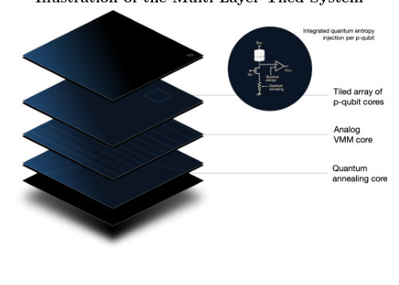
<figcaption class="paper-figure-caption"><b>Fig 2.</b> Fig. 2: Illustration of the multi-layer tiled system, including (i) a tiled arrangement of p-qubit cores, (ii) an analog CMM (correlation matrix memory) core, and (iii) a quantum annealing core.</figcaption>
</figure>
<figure class="paper-figure-card">
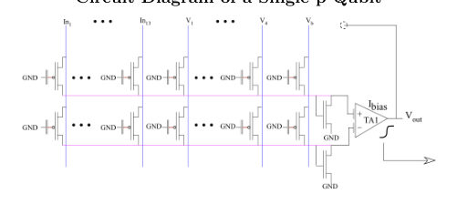
<figcaption class="paper-figure-caption"><b>Fig 3.</b> Fig. 3: Circuit diagram of a single p-qubit within the p-qubit network and its corresponding output path. The p-qubit receives its local field I through the FG-based vector–matrix multiplication (VMM) array, where weighted currents from neighbouring p-qubits are summed in the analog domain. This input current is combined with the quantum-mechanical entropy injection delivered by the co-located IQEU. Both contributions feed into a nine-transistor operational transconductance amplifier (OTA), whose bias current Ibias controls the operating point and nonlinear gain. The OTA produces a smooth sigmoidal voltage response that approximates a tanh activation function, setting the instantaneous...</figcaption>
</figure>
<figure class="paper-figure-card">
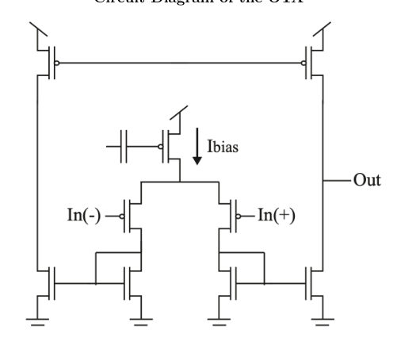
<figcaption class="paper-figure-caption"><b>Fig 4.</b> Fig. 4: The operational transconductance amplifier (OTA) is implemented as a nine-transistor OTA block. It receives two input currents: (a) the local field I generated by the p-qubit network through the FG-based weighted-sum VMM, and (b) the quantum-mechanical entropy input supplied by the associated IQEU. The bias current Ibias sets the OTA’s operating point and transconductance. The OTA outputs an analog sigmoidal transfer characteristic, providing the nonlinear activation that governs each p-qubit’s probabilistic switching behaviour.</figcaption>
</figure>
<figure class="paper-figure-card">
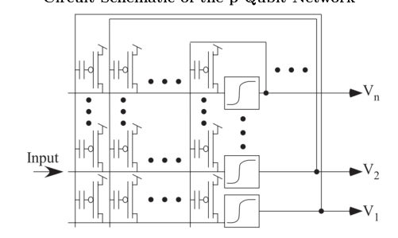
<figcaption class="paper-figure-caption"><b>Fig 5.</b> Fig. 5: Circuit schematic of the p-qubit network. The inputs are weighted and summed using a VMM made of FG pFETs. A TA and I2V circuit takes the weighted current and maps it onto the TA sigmoidal nonlinearity. Both FG and normal TAs are used, and the I2V circuit uses FG pFETs, pFETs, and nFETs as shown. A bias element keeps an initial constant current in the row.</figcaption>
</figure>

**Summary.** This paper introduces Apollo, a novel neuromorphic processor that achieves performance equivalent to superconducting quantum annealers at room temperature. It accomplishes this by using p-qubits whose stochastic fluctuations are driven by integrated quantum entropy units. This establishes a scalable, energy-efficient platform for solving hard optimization problems in classical CMOS technology.

**Why it may be interesting.** It provides a concrete, solid-state realization of quantum-inspired computation principles—specifically mapping complex Hamiltonian dynamics onto classical, room-temperature stochastic processes driven by fundamental quantum noise sources.

Detailed structure

**Main problem.** Developing a scalable, room-temperature hardware platform capable of solving complex optimization problems by mimicking quantum annealing dynamics without cryogenic cooling.

**Main result.** The Apollo processor demonstrates quantum-equivalent performance on spin-glass benchmarks at ambient temperature, establishing a viable path for energy-based computation outside superconducting circuits.

**Method.** The work combines theoretical mapping (Suzuki–Trotter correspondence) with experimental realization using continuous-time stochastic dynamics in CMOS electronics.

**Model / system.** Apollo is a 10,000-node p-qubit neuromorphic processor fabricated in 16 nm CMOS. Its core element, the p-qubit, uses quantum-derived entropy to drive bistable stochastic transitions, allowing it to sample energy landscapes governed by Ising/QUBO Hamiltonians.

**Key observables.** Ground state energies relative to cryogenic annealers, residual energy scaling trajectories, and thermodynamic sampling correctness.

**Important parameters / regimes.** Room temperature operation ($\sim 0.5 	ext{ W}$), $16 	ext{ nm}$ CMOS fabrication, Hyperion $\Delta 256$ interconnect topology.

**Assumptions / limitations.** The dynamics of the p-qubit network correctly reproduce the equilibrium statistics and annealing behavior previously associated with quantum tunneling mechanisms.

**Figures summary.** Figures illustrate the multi-layer tiled architecture (p-qubit cores, CMM core), the circuit diagram of a single p-qubit integrating VMM and IQEU inputs into an OTA nonlinearity, and the sigmoidal response curve.

**Paper structure.** The paper progresses from identifying limitations in existing quantum/classical annealers to proposing the Apollo architecture. It details the physical implementation (VMM using FG pFETs) and validates its ability to perform energy-based optimization via continuous-time stochastic relaxation, culminating in benchmark results.

Abstract

We introduce Apollo, a 10000 node p-qubit neuromorphic processor fabricated in 16 nm mixed signal CMOS and operating fully at room temperature with a typical analog core power envelope of about 0.5 W. Its fundamental element, the p-qubit, is a bistable stochastic unit whose continuous time state fluctuations are driven by integrated quantum entropy units that inject true quantum derived randomness. This enables ultrafast stochastic transitions at low energy while preserving a classical state representation. Apollo combines these p-qubits with a high degree Hyperion 256 interconnect topology, allowing efficient embedding of dense Ising and QUBO problems with substantially reduced minor embedding overhead compared with sparse annealing platforms. We show that, through the Suzuki Trotter correspondence, the equilibrium statistics and annealing dynamics of the p-qubit network reproduce key properties of transverse field quantum annealing without cryogenic cooling, long lived coherence, or microwave control. Beyond device level validation, Apollo is evaluated on a three dimensional spin glass benchmark previously used to study quantum advantage in superconducting annealers. Across 300 disorder realizations, Apollo reaches substantially lower ground state energies than reported cryogenic quantum annealing hardware, while remaining distinct from classical simulated annealing and simulated quantum annealing. A 350 nm release candidate device experimentally validates the core p-qubit dynamics, thermodynamic sampling correctness, and continuous time annealing behavior. These results establish Apollo as a room temperature, industrially scalable platform for quantum driven energy based optimization, probabilistic inference, generative modeling, and hybrid classical quantum workflows.

[↑ back to top](#top)

### [Quasi-2D trapped tilted dipoles at zero and finite temperatures in the strongly dipolar regime](http://arxiv.org/abs/2606.13502v1)

**Authors:** Juan Sánchez-Baena  
**Type:** theory · **Category:** quantum gases · **PDF:** <https://arxiv.org/pdf/2606.13502v1>  
**Analysis basis:** full PDF text, analyzed in chunks
**Topic relevance:** 🔥 `analog quantum simulation` **4/5** · `Keldysh / 2PI / non-Gaussian methods` **3/5** · `methods for driven-dissipative` **3/5** · `driven-dissipative phase transition` **2/5** · `correlated cavity matter` **1/5** · `non-equilibrium dynamics` **1/5** · `non-equilibrium universality` **1/5**

↔ Scroll figures horizontally

<figure class="paper-figure-card">
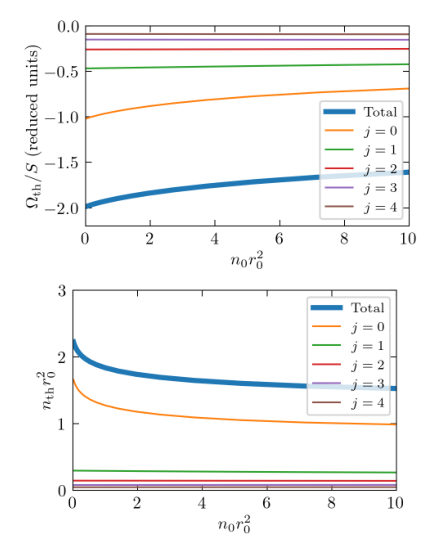
<figcaption class="paper-figure-caption"><b>Fig 1.</b> FIG. 1. Contributions of the different axial excitation modes to the density functionals Ωth</figcaption>
</figure>
<figure class="paper-figure-card">
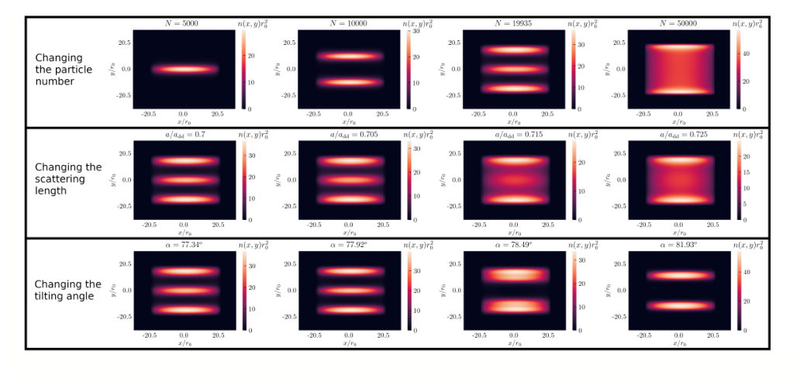
<figcaption class="paper-figure-caption"><b>Fig 2.</b> FIG. 2. Integrated 2D density distribution (n = R dz|ψ(r)|2) of the dipolar system in a box trap at zero temperature. In each row, one parameter is varied while the rest are fixed to the values a/add = 0.7, α = 77.35o, N = 19935. The box trap has widths Lx/r0 = Ly/r0 = 41.02 while the axial harmonic trap is set to ℏω/E0 = 1.</figcaption>
</figure>
<figure class="paper-figure-card">
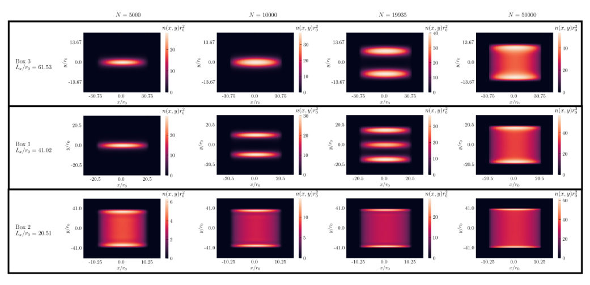
<figcaption class="paper-figure-caption"><b>Fig 3.</b> FIG. 3. Integrated 2D density distribution (n = R dz|ψ(r)|2) of the dipolar system for box traps with different aspect ratios at zero temperature. Each column and row correspond to a different particle number and box trap, respectively. In each column, the average 2D density is kept fixed. The widths along the y-axis of each box trap are given by Ly/r0 = 41.02 for Box 1, Ly/r0 = 82.04 for Box 2 and Ly/r0 = 27.36 for Box 3. The rest of the parameters of the calculations are a/add = 0.7, α = 77.35o and ℏω/E0 = 1.</figcaption>
</figure>
<figure class="paper-figure-card">
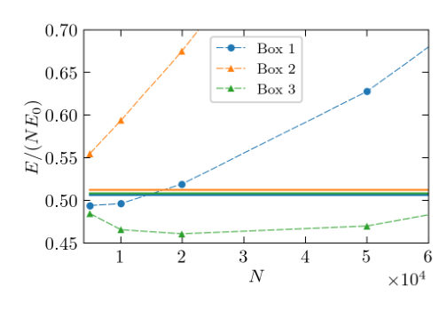
<figcaption class="paper-figure-caption"><b>Fig 4.</b> FIG. 4. Energy per particle as a function of N for the tilted dipolar system in three different box traps. The dashed- dotted lines correspond to the results of the interacting system while the solid lines correspond to the trapped ideal gas. The parameters of the calculations are the same as in Fig. 3.</figcaption>
</figure>
<figure class="paper-figure-card">
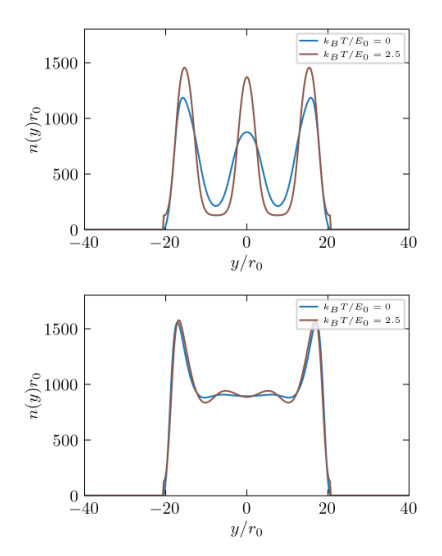
<figcaption class="paper-figure-caption"><b>Fig 5.</b> FIG. 6. Total column density n(y) = R dxdz |ψ(r)|2 + R dx nth(r⊥) at zero and finite temperature for N = 25000 (top) and N = 40000 (bottom). The rest of the parameters are the same as in Fig. 5.</figcaption>
</figure>

**Summary.** This theoretical study analyzes trapped dipolar quantum gases confined to a quasi-2D geometry, focusing on the interplay between strong dipole interactions and finite temperature effects. Using Bogoliubov theory, the authors derive an extended Gross-Pitaevskii equation that accounts for thermal fluctuations. The results show how temperature can induce spatial modulations in the density profile, providing insights into supersolid physics and potential thermometry applications.

**Why it may be interesting.** This work directly addresses complex many-body physics in ultracold atomic systems (dipolar BECs) by extending mean-field theory to include thermal fluctuations in a quasi-2D geometry, which is crucial for understanding exotic phases like supersolids.

Detailed structure

**Main problem.** The study investigates the physics of quasi-2D trapped dipolar Bose-Einstein Condensates (BECs) at both zero and finite temperatures in the strongly dipolar regime.

**Main result.** The research characterizes how increasing temperature can promote spatial modulations in the density profile, qualitatively agreeing with 3D Monte Carlo results. The theory also provides tools to assess thermal effects for potential thermometry applications.

**Method.** Bogoliubov theory and the Local Density Approximation (LDA) are employed to derive a finite-temperature Gross-Pitaevskii equation (TeGPE).

**Model / system.** The system consists of fully polarized dipoles trapped harmonically along the z-axis and in a box trap in the x-y plane. The interactions include contact and strong dipole-dipole interaction (DDI), making it relevant for dipolar supersolid stripes.

**Key observables.** Total column density, condensate fraction ($f_c$), spatial modulations/stripes, and thermal density profiles ($n_{th}$).

**Important parameters / regimes.** Tilting angle ($\alpha$), particle number ($N$), scattering length ($a$), and temperature ($T$). The strongly dipolar regime is key ($a \ll a_{dd}$).

**Assumptions / limitations.** The analysis restricts itself to the limit of large condensate fractions ($f_c \geq 0.6$) and assumes the applicability of Bogoliubov theory, which breaks down in infinite 2D systems.

**Figures summary.** Figures illustrate density changes by varying particle number or scattering length at zero T; they also compare 2D densities at $T=0$ versus finite $T$, showing temperature-induced modulations.

**Paper structure.** The paper builds from the general framework (Bogoliubov theory) to derive the TeGPE incorporating thermal fluctuations via LDA. It then analyzes structural changes by varying key parameters ($N, \alpha, T$) and concludes with applications for thermometry.

Abstract

Motivated by the recent experimental observation of dipolar supersolid stripes in a quasi two-dimensional geometry [arXiv:2512.13280 (2025)], we study a trapped system of fully polarized dipoles in a strongly axially confined geometry, both at zero and finite temperatures, by means of Bogoliubov theory. The dipoles are strongly harmonically trapped along the z axis and subjected to a box trap in the x-y plane. We characterize the physics of the trapped system at zero and finite temperatures as a function of the tilting angle of the dipoles, the number of particles and the scattering length, restricting ourselves to the experimentally relevant regime of large condensate fractions. We also illustrate the influence of the aspect ratio of the box trap in the liquid character of the system and its structure. We observe a remarkable promotion of spatial modulations when temperature is increased while keeping the total particle number constant for specific configurations, in qualitative agreement with previous Monte Carlo results in a 3D geometry. Our results are useful to understand the zero temperature physics of the trapped dipolar system in the quasi-2D limit and in the strongly dipolar regime. In addition, they allow to assess the effect of temperature in its equilibrium properties in experimentally relevant conditions, which may be useful for thermometry applications.

[↑ back to top](#top)

### [Spectral analysis of equilibration: information leakage in isolated quantum systems](http://arxiv.org/abs/2606.12545v1)

**Authors:** André T. Cesário, Marcos G. Alpino, Reinaldo O. Vianna, Tiago Debarba  
**Type:** theory · **Category:** statistical mechanics · **PDF:** <https://arxiv.org/pdf/2606.12545v1>  
**Analysis basis:** full PDF text, analyzed in chunks
**Topic relevance:** 🔥 `entanglement & information structure` **4/5** · `non-equilibrium dynamics` **3/5** · `non-equilibrium universality` **2/5** · `Keldysh / 2PI / non-Gaussian methods` **1/5** · `analog quantum simulation` **1/5** · `correlated / nonlocal dissipation` **1/5** · `driven-dissipative phase transition` **1/5** · `methods for driven-dissipative` **1/5** · `scars & prethermalization` **1/5**

↔ Scroll figures horizontally

<figure class="paper-figure-card">
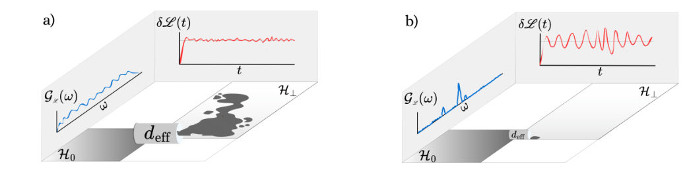
<figcaption class="paper-figure-caption"><b>Fig 1.</b> Figure 1: Illustrative Image of Leakage Fidelity. In both panels, the floor illustrates the state distribution within the Hilbert space H = H0 ⊕H⊥. The side wall represents the spectral power density GL(ω) = |δL (ω)|2 as a function of the Hamiltonian spectrum, in an energy shell ω. The front wall shows the Leakage Fidelity Function L (t) as a function of time. Panel a) illustrates an isolated equilibrating system, where ρ(t) ∈H0 ⊕H⊥for all times t →T. In this case, the spectral power density GL(ω) spreads over the entire energy spectrum, and the LFF signal δL (t) = |L (t) −⟨L (t)⟩T | exhibits small fluctuations around its average equilibrium value. Panel b) illustrates a quasi- periodic...</figcaption>
</figure>
<figure class="paper-figure-card">
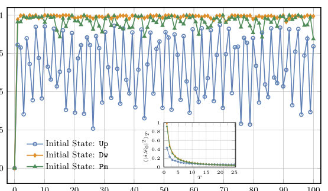
<figcaption class="paper-figure-caption"><b>Fig 2.</b> Figure 2: Time evolution of L0(t) for three different initial states, together with the corresponding running time- averaged quadratic deviation from equilibrium shown in the inset, δL0(t) = L0(t) −L ∞ 0 . The all spin up state (Up = |↑· · · ↑⟩) exhibits large and persistent oscillations, indicating stronger nonequilibrium fluctuations throughout the dynamics. By contrast, down (Dw = |↓· · · ↓⟩) and paramagnetic (Pm = |↑↓· · · ↑↓⟩) state remain much closer to L ∞ 0 , displaying smoother behavior and a faster decay of the averaged fluctuation measure. This comparison makes explicit that states with similar energetic scales may nevertheless present markedly different dynamics, depending on...</figcaption>
</figure>
<figure class="paper-figure-card">
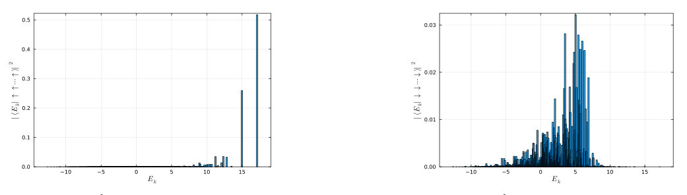
<figcaption class="paper-figure-caption"><b>Fig 3.</b> Figure 3: Spectral occupation probabilities |⟨Ek|ψ0⟩| 2 as a function of the eigenenergies Ek for a system of N = 10 spin- 1</figcaption>
</figure>
<figure class="paper-figure-card">
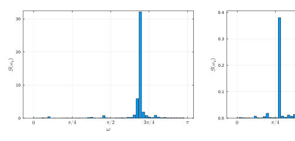
<figcaption class="paper-figure-caption"><b>Fig 4.</b> Figure 4: G(ωk) of the δL0, for ωk = 2πk</figcaption>
</figure>
<figure class="paper-figure-card">
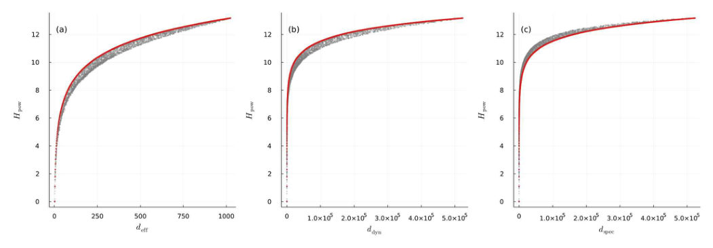
<figcaption class="paper-figure-caption"><b>Fig 5.</b> Figure 5: Power entropy Hpow as a function of different effective dimensionalities for random quantum states gen- erated from an Ising-type Hamiltonian with N = 10 spins, corresponding to a Hilbert-space dimension dE = 210. A total of 5000 random population states were generated in the energy eigenbasis, producing a broad coverage of effective dimensions across the available state space. The red curve corresponds to the K-HUB model, defined by uniform population distributions over K energy levels, for which Hpow is computed analytically as a function of K ∈[2, dE]. This curve provides a structured reference that connects entropy growth to controlled support size. The sampled ensemble spans...</figcaption>
</figure>

**Summary.** This theoretical paper introduces the Leakage Fidelity Function (LFF) as a precise measure of information leakage during equilibration in closed quantum systems. It establishes that the dynamics are controlled not by a single parameter, but by a hierarchy of spectral descriptors—including dynamical and power spectral dimensions—which quantify how fluctuations decay over time.

**Why it may be interesting.** This work provides powerful, quantitative diagnostics for open quantum systems theory by moving beyond simple time averages. The distinction between different effective dimensions offers new tools to characterize the rate and nature of thermalization in complex many-body models.

Detailed structure

**Main problem.** The paper develops a quantitative framework to measure equilibration in isolated quantum systems by analyzing how information leaks from an initial subspace over time.

**Main result.** Equilibration dynamics are governed by a hierarchy of spectral descriptors—ordinary, dynamical, and power spectral effective dimensions—which provide a state-dependent view of irreversibility.

**Method.** The core method involves defining the Leakage Fidelity Function (LFF) and deriving universal bounds on its temporal fluctuations using spectral analysis techniques like Fourier transforms and entropy measures.

**Model / system.** The theory is applied to isolated quantum systems evolving under unitary dynamics, analyzed via projection onto subspaces defined by an initial state's support. Specific examples include Ising-like chains and general many-body Hamiltonians.

**Key observables.** Leakage Fidelity Function (LFF), Leakage Coherence ($	ext{Cleak}$), Ordinary Effective Dimension ($d_{	ext{eff}}$), Dynamical Effective Dimension ($d_{	ext{dyn}}$), Power Spectral Entropy ($H_{	ext{pow}}$).

**Important parameters / regimes.** Spectral gap structure, effective dimension ($d_{	ext{eff}}$), time scale $T$, and the degree of spectral delocalization.

**Assumptions / limitations.** The analysis relies on deriving universal bounds applicable to fixed Hamiltonians; some parts assume Haar-typical state distributions or non-degenerate energy gaps for specific theorems.

**Figures summary.** Figures illustrate LFF behavior showing small fluctuations for equilibrating systems versus large oscillations for quasi-periodic ones. Later figures compare the growth patterns of $	ext{deff}$, $	ext{ddyn}$, and $	ext{dspec}$ using synthetic state distributions to separate their physical roles.

**Paper structure.** The paper builds from defining the LFF as an operational measure, deriving universal bounds on its variance (Theorem 1), connecting it to spectral properties ($d_{	ext{eff}}$), and finally introducing a hierarchy of descriptors ($	ext{ddyn}, 	ext{dspec}$) to show that fluctuation dynamics are richer than simple state-space measures.

Abstract

We develop a unified dynamical-spectral framework for equilibration in isolated quantum systems based on a subspace coarse-graining approach. Central to our formulation is the Leakage Fidelity Function (LFF), defined as the probability that a unitarily evolving state escapes the support of its initial subspace. This quantity provides a direct, operational measure of information flow and memory loss without invoking ensemble assumptions or perturbative arguments. We derive universal bounds on temporal fluctuations of the LFF, in terms of the spectral gap structure and the square of the effective dimension, evincing that large spectral delocalization suppresses fluctuations and guarantees equilibration on average. By introducing spectral power distributions and associated entropic measures, we establish a quantitative link between phase mixing, gap participation, and dynamical stability. We further investigate the equilibration timescale by connecting the LFF to quantum speed limits, thereby revealing the average time required for equilibration. Our results provide a state-dependent, geometrically transparent perspective on how spectral complexity and subspace information leakage jointly govern irreversibility in closed quantum many-body systems.

[↑ back to top](#top)

### [Vacuum photon emission and mean electromagnetic field in pair-creating external backgrounds](http://arxiv.org/abs/2606.12547v1)

**Authors:** I. A. Aleksandrov, E. V. Perelygin, D. V. Chubukov  
**Type:** theory · **Category:** other · **PDF:** <https://arxiv.org/pdf/2606.12547v1>  
**Analysis basis:** full PDF text, analyzed in chunks
**Topic relevance:** 🔥 `Keldysh / 2PI / non-Gaussian methods` **4/5** · `methods for driven-dissipative` **3/5** · `non-equilibrium dynamics` **3/5** · `non-equilibrium universality` **2/5** · `correlated / nonlocal dissipation` **1/5** · `driven-dissipative phase transition` **1/5**

↔ Scroll figures horizontally

<figure class="paper-figure-card">
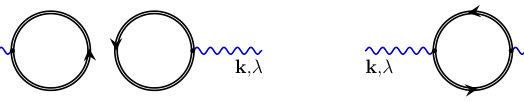
<figcaption class="paper-figure-caption"><b>Fig 1.</b> Figure 1. Two diagrams describing the photon number density (25) to first order in α within the nonequilibrium perturbative framework. The incoming and outgoing photon lines correspond to λ1 = 2 and λ2 = 1, respectively. After the Keldysh-index summation and simplification, they yield Eq. (29).</figcaption>
</figure>
<figure class="paper-figure-card">
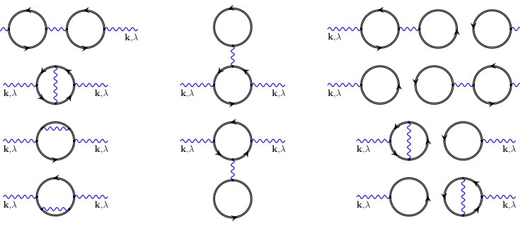
<figcaption class="paper-figure-caption"><b>Fig 2.</b> Figure 2. Ten diagrams describing the photon number density (32) to second order in α within the nonequilibrium perturbative framework. After the Keldysh-index summation and simplification, they yield Eq. (37).</figcaption>
</figure>

**Summary.** This theoretical paper calculates how photons are emitted from the vacuum and determines the mean electromagnetic field when subjected to a strong, pair-creating external background. It employs advanced real-time (Keldysh) techniques necessary because the initial vacuum state is unstable. The results provide high-order perturbative corrections for these fundamental quantum electrodynamic observables.

**Why it may be interesting.** The use of the Keldysh formalism to calculate expectation values in unstable quantum vacua is crucial for understanding non-equilibrium quantum optics and field theory effects beyond standard vacuum calculations.

Detailed structure

**Main problem.** The paper develops a perturbative description of vacuum radiative processes and calculates the mean electromagnetic field in external, pair-creating electromagnetic backgrounds.

**Main result.** They derive the mean photon number density up to order alpha^2 and compute the mean electromagnetic field up to order e^3 using non-equilibrium quantum field theory techniques.

**Method.** The primary method is the Keldysh-Schwinger-Fradkin real-time formalism, supplemented by an alternative spectral decomposition approach for consistency checks.

**Model / system.** The system is Quantum Electrodynamics (QED) subjected to a general, spacetime-dependent external classical electromagnetic background field capable of inducing electron-positron pair production.

**Key observables.** Mean photon number density ($\langle N_\gamma 
angle$) and the mean electromagnetic field ($\langle A_\mu(x) 
angle$).

**Important parameters / regimes.** Fine-structure constant (alpha), external background field strength, and the critical scale for pair production.

**Assumptions / limitations.** The initial vacuum is unstable due to the external field, necessitating a real-time formalism beyond standard in-out approaches. Calculations are performed perturbatively in the coupling constant.

**Figures summary.** Figures illustrate Feynman diagrams contributing to the photon number density calculation at first and second order in alpha, and diagrams describing the mean electromagnetic field correction up to third order in e.

**Paper structure.** The paper systematically calculates observables by expanding the generating functional on the Keldysh contour. It presents results for $\langle N_\gamma 
angle$ using diagrammatic methods and an alternative identity-based approach, followed by a detailed calculation of $\langle A_\mu(x) 
angle$ via Schwinger-Dyson equations.

Abstract

We develop a perturbative description of vacuum radiative processes in quantum electrodynamics with a prescribed external electromagnetic background capable of producing electron-positron pairs. Since the initial vacuum is then unstable and the in- and out-vacua are inequivalent, radiative observables require a real-time formulation beyond the ordinary in-out approach of vacuum-stable QED. Using the Keldysh-Schwinger-Fradkin nonequilibrium technique, we derive the mean number density of emitted photons through the second nonvanishing order in the fine-structure constant. The leading term, of order $α$, reproduces the known vertex and tadpole mechanisms, while the complete order-$α^2$ correction contains interference, loop, and induced-current contributions. We also give an independent derivation based on the spectral decomposition of the identity operator in the in-Fock space, where the photon number density is represented as a sum of squared transition amplitudes and vacuum-disconnected terms are canceled by the optical theorem generalized to an unstable vacuum. In addition, we compute the mean electromagnetic field through order $e^3$, including the electromagnetic dressing of the induced vacuum current, and verify it using the corresponding Schwinger-Dyson equations. The final formulas are expressed in terms of exact solutions and propagators of the Dirac equation in the external background and apply to general spacetime-dependent field configurations.

[↑ back to top](#top)

### [Frustration effects on the magnetization plateau physics in a trimerized quantum spin-1/2 chain](http://arxiv.org/abs/2606.13265v1)

**Authors:** L. M. Ramos, M. Schmidt, F. M. Zimmer  
**Type:** theory · **Category:** strongly correlated electrons · **PDF:** <https://arxiv.org/pdf/2606.13265v1>  
**Analysis basis:** full PDF text, analyzed in chunks
**Topic relevance:** 🔥 `analog quantum simulation` **4/5** · `entanglement & information structure` **3/5** · `exotic spin models in light-matter` **3/5** · `Frenkel-Kontorova` **1/5** · `methods for driven-dissipative` **1/5** · `non-equilibrium dynamics` **1/5**

↔ Scroll figures horizontally

<figure class="paper-figure-card">
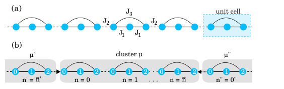
<figcaption class="paper-figure-caption"><b>Fig 1.</b> FIG. 1. (a) Schematic representation of the trimer quantum spin chain with nearest-neighbor exchange interactions J1, J2, and a next-nearest-neighbor exchange interaction J3. The shaded blue region denotes the unit cell of the model. (b) Schematic representation of the CMF approach applied to a trimerized quantum spin chain, in which the infinite chain is partitioned into identical clusters (shaded gray region) of Lc sites. The ¯n represents the last trimer of the central cluster that is equal to ¯n = (Lc −3)/3.</figcaption>
</figure>
<figure class="paper-figure-card">
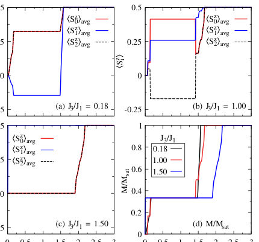
<figcaption class="paper-figure-caption"><b>Fig 2.</b> FIG. 2. Magnetic ground state of the trimerized quantum spin chain obtained from the 12-site CMF method. (a) Lon- gitudinal components of the trimer for J3/J1 = 0.18, (b) Lon- gitudinal components of the trimer for J3/J1 = 1.00, and (c) Longitudinal components of the trimer for J3/J1 = 1.50. (d) Total magnetization normalized by the saturation for different J3/J1. To minimize the boundary effects of the mean fields, we perform a spatial averaging of the local magnetizations over the equivalent trimers within the 12-site CMF approach.</figcaption>
</figure>
<figure class="paper-figure-card">
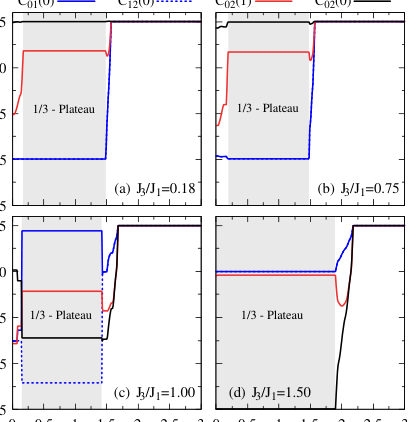
<figcaption class="paper-figure-caption"><b>Fig 3.</b> FIG. 3. Field dependence of the spin–spin correlation func- tions computed within the 12-site CMF approach at zero temperature (T/J1 = 0) for different values of the frustra- tion parameter: (a) J3/J1 = 0.18, (b) J3/J1 = 0.75, (c) J3/J1 = 1.00, and (d) J3/J1 = 1.50. In panels (a), (b) and (d) the correlations C01(0) and C12(0) are equivalent. To mini- mize boundary effects arising from the mean-field treatment, all correlations were computed by averaging over all trimers of the cluster.</figcaption>
</figure>
<figure class="paper-figure-card">
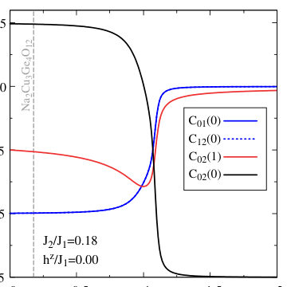
<figcaption class="paper-figure-caption"><b>Fig 4.</b> FIG. 4. Evolution of the spin–spin correlation functions at zero magnetic-field (hz/J1 = 0) as a function of the frustra- tion ratio J3/J1 for J2/J1 = 0.18 and periodic boundary con- ditions. The gray dashed line indicates the parameter range relevant to Na2Cu3Ge4O12.</figcaption>
</figure>
<figure class="paper-figure-card">
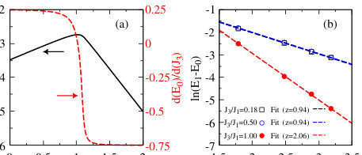
<figcaption class="paper-figure-caption"><b>Fig 5.</b> FIG. 6. (a) Ground-state energy per site E0/Lc (left axis), and its derivative (right axis), showing a smooth evolution across the parameter range for J2/J1 = 0.18, hz/J1 = 0.0, and Lc = 12 sites. (b) Log-log behavior of energy gap (E1 − E0) as a function of Lc for three different frustration ratios J3/J1 = 0.18, J3/J1 = 0.50 and J3/J1 = 1.00. The dashed lines represent the linear fit of the data.</figcaption>
</figure>

**Summary.** This work theoretically examines how competing interactions (frustration) destabilize and reorganize quantum spin chains modeled after $	ext{Na}_2	ext{Cu}_3	ext{Ge}_4	ext{O}_{12}$. By using advanced mean-field and exact diagonalization techniques, the authors map out distinct magnetic phases, explaining the stability of magnetization plateaus through emergent doublon correlations. The findings offer a microscopic framework for understanding fractionalized excitations in these complex quantum magnets.

**Why it may be interesting.** The detailed analysis of correlation functions and critical exponents ($z$, $c$) provides a deep theoretical understanding of how geometric frustration fundamentally alters the ground state structure, which is relevant for designing correlated electronic materials.

Detailed structure

**Main problem.** The study investigates frustration-induced instabilities and the emergence of fractionalized excitations in trimerized quantum spin systems.

**Main result.** Frustration drives a reorganization of spin correlations, leading to a crossover from a collective ferrimagnetic state to one characterized by doublon-like correlations, providing a microscopic explanation for magnetization plateaus.

**Method.** The research employs a combination of the Cluster Mean-Field (CMF) approach and Lanczos exact diagonalization on finite clusters. Quantum information measures like fidelity susceptibility are used to characterize criticality.

**Model / system.** The system is a spin-1/2 Heisenberg model defined on a trimerized quantum spin chain, motivated by the compound Na2Cu3Ge4O12. The Hamiltonian includes competing interactions J1, J2, and J3, alongside an external magnetic field.

**Key observables.** Magnetization plateaus (especially 1/3), two-point spin-spin correlation functions, fidelity susceptibility ($\chi_F$), and von Neumann entanglement entropy ($S_{vN}$).

**Important parameters / regimes.** The frustration ratio $J_3/J_1$ is the key tuning parameter, analyzed across weakly frustrated regimes up to strong frustration.

**Assumptions / limitations.** The primary theoretical tool used is the Cluster Mean-Field approximation, which treats intercluster interactions via mean-field decoupling.

**Figures summary.** Figures illustrate the evolution of correlation functions ($C_{ij}(r)$) and the magnetic phase diagram across different frustration regimes. $\chi_F$ peaks near a critical point $J_c 3/J_1 \approx 1.09$.

**Paper structure.** The paper analyzes the system in distinct frustration regimes, using CMF to map the phase diagram and ED/finite-size scaling on finite clusters to characterize quantum criticality via energy gaps and entanglement entropy.

Abstract

We investigate frustration-induced instabilities in a trimerized quantum spin chain motivated by recent experimental findings for the compound Na$_2$Cu$_3$Ge$_4$O$_{12}$. Employing a cluster mean-field approach combined with Lanczos exact diagonalization, we analyze the ground-state and quantum-information properties of a Heisenberg model with competing interactions in a magnetic field. In the weakly frustrated regime, the system exhibits a robust $1/3$ magnetization plateau associated with a collective ferrimagnetic-like trimer state. Increasing the next-nearest-neighbor intratrimer coupling drives a pronounced reorganization of spin correlations, leading to a crossover toward a doublon-like correlation regime and providing a static ground-state picture consistent with the composite excitations observed dynamically in trimerized chains. The resulting low-energy behavior can be interpreted in terms of weakly interacting emergent spins, offering a microscopic explanation for the extended stability of the magnetization plateau. Furthermore, through finite-size scaling analyses of the energy gap, von Neumann entanglement entropy, and fidelity susceptibility, we characterize the zero-field criticality of the model. Ultimately, our results suggest that frustration gives rise to qualitatively distinct quantum states and provide a microscopic framework for understanding the emergence of fractionalized excitations in trimerized quantum spin systems.

[↑ back to top](#top)

### [Quantum Otto engine powered by an anisotropic Heisenberg XYZ model under independent local magnetic fields](http://arxiv.org/abs/2606.12877v1)

**Authors:** Meiru Li, Maimaitiyiming Tusun, Fang Zhao, Hasiyatihan Abudoula, Tongcheng Wei  
**Type:** theory · **Category:** statistical mechanics · **PDF:** <https://arxiv.org/pdf/2606.12877v1>  
**Analysis basis:** full PDF text, analyzed in chunks
**Topic relevance:** 🔥 `entanglement & information structure` **4/5** · `analog quantum simulation` **2/5** · `non-equilibrium dynamics` **2/5** · `correlated / nonlocal dissipation` **1/5** · `driven-dissipative phase transition` **1/5** · `exotic spin models in light-matter` **1/5** · `methods for driven-dissipative` **1/5** · `non-equilibrium universality` **1/5**

↔ Scroll figures horizontally

<figure class="paper-figure-card">
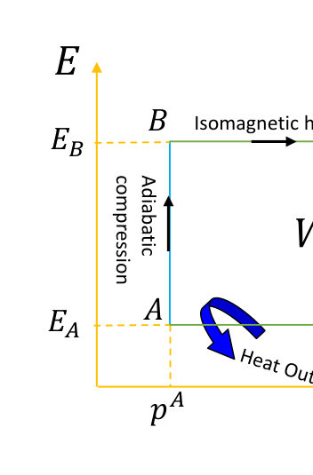
<figcaption class="paper-figure-caption"><b>Fig 1.</b> Figure 1: Sketch of the quantum Otto cycle.</figcaption>
</figure>
<figure class="paper-figure-card">
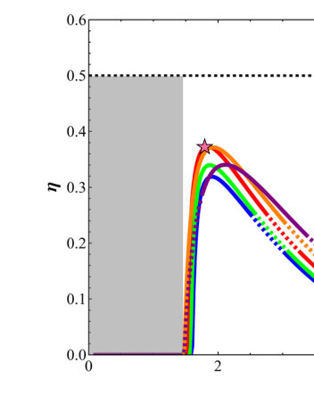
<figcaption class="paper-figure-caption"><b>Fig 2.</b> Figure 2: Efficiency η versus transverse coupling J for several values of the anisotropy ∆. Com- mon parameters: Jz = 1.0, Th = 2.0, Tc = 1.0, B1h = 3.0, B2h = 0.0, B1c = 0.8, B2c = 0.8. The black dashed line marks the Carnot limit ηCarnot = 0.5. Shaded gray regions indicate param- eter regimes where no net work can be extracted, i.e., where the heat engine does not operate in a valid engine mode. Dotted segments mark regions with level crossings, where normal heatengine operation is also forbidden.</figcaption>
</figure>
<figure class="paper-figure-card">
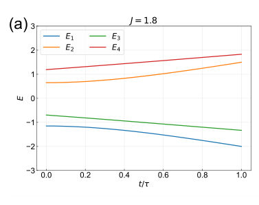
<figcaption class="paper-figure-caption"><b>Fig 3.</b> Figure 3: Energylevel evolution during the linear timedependent variation of the local magnetic fields, corresponding to the two starmarked points in Fig. 2. The solid lines from bottom to top at the initial time represent E1, E3, E2, and E4, respectively.</figcaption>
</figure>
<figure class="paper-figure-card">
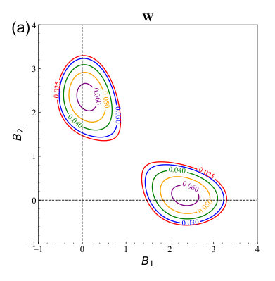
<figcaption class="paper-figure-caption"><b>Fig 4.</b> Figure 4: Contour plots of net work Wnet and efficiency η in the (B1h, B2h) plane for Jz = 0.5. Common parameters: ∆= 1.0, J = 2.0, Th = 2.0, Tc = 1.0, (B1c, B2c) = (0.8, 0.8). The black dashed lines indicate B1h = 0 or B2h = 0.</figcaption>
</figure>
<figure class="paper-figure-card">
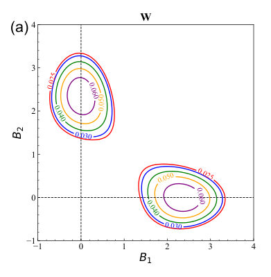
<figcaption class="paper-figure-caption"><b>Fig 5.</b> Figure 5: Same as Fig. 4 but for Jz = 1.0.</figcaption>
</figure>

**Summary.** The paper analyzes a quantum Otto engine powered by an anisotropic two-qubit Heisenberg XYZ model. It systematically maps out the relationship between coupling strengths, magnetic fields, and energy extraction efficiency. The key finding is that entanglement asymmetry acts as a measurable witness of underlying energy level restructuring responsible for enhancing work output.

**Why it may be interesting.** This work provides detailed insights into how microscopic quantum correlations (entanglement) can be linked to macroscopic thermodynamic performance metrics like efficiency in engineered quantum systems.

Detailed structure

**Main problem.** The study investigates how an anisotropic two-qubit Heisenberg XYZ model can power a quantum Otto heat engine under independent local magnetic fields.

**Main result.** Engine efficiency is maximized by tuning the anisotropy parameter, and entanglement asymmetry between hot and cold strokes correlates strongly with performance enhancement. The work done is functionally partitioned among the qubits and their interaction term.

**Method.** The authors systematically analyze the quantum Otto cycle using exact diagonalization of the Hamiltonian and calculating thermodynamic quantities via partition functions and local work decomposition.

**Model / system.** The system is an anisotropic two-qubit Heisenberg XYZ model, whose dynamics are governed by a Hamiltonian incorporating coupling terms ($J, \Delta, J_z$) and independent local magnetic fields ($B_1, B_2$).

**Key observables.** Net work output (W_net), efficiency ($\eta$), quantum entanglement (concurrence), and the local work contributions from each qubit and their interaction.

**Important parameters / regimes.** Anisotropy parameter ($\Delta$), transverse coupling ($J$), longitudinal coupling ($J_z$), and the asymmetry of the local magnetic fields ($B_1, B_2$).

**Assumptions / limitations.** The analysis relies on treating the cycle using an ideal adiabatic limit for work strokes and assuming specific field control protocols.

**Figures summary.** Figures illustrate the four steps of the Otto cycle; one shows efficiency ($\eta$) vs. $J$ for various $\Delta$, mapping out optimal operating regimes and level crossing regions.

**Paper structure.** The paper systematically analyzes the Hamiltonian, calculates thermodynamic quantities across the four strokes (adiabatic/isomagnetic), decomposes the work into local contributions ($w_1, w_2, w_{	ext{int}}$), and finally correlates efficiency enhancement with changes in quantum entanglement.

Abstract

We study a quantum Otto heat engine whose working substance is an anisotropic two-qubit Heisenberg XYZ model. Independent local magnetic fields are used to control each spin individually. The influence of the longitudinal coupling, anisotropy, transverse coupling, and local fields on the net work output and efficiency is systematically examined. Reducing the longitudinal coupling is found to markedly improve both the maximum work and the peak efficiency. The engine performance reaches an optimum at a particular value of the anisotropy parameter. A local work analysis clarifies how work is produced during the cycle. Because of the asymmetric local fields and the intrinsic spin-spin interaction, the two qubits play markedly different thermodynamic roles; the interaction term itself contributes crucially to the total work. We further analyze the variation of quantum entanglement, quantified by concurrence, along the cycle. The results indicate that a pronounced change in entanglement between the hot and cold isomagnetic strokes is closely correlated with the efficiency enhancement. This work offers new insight into the operating principles and control of quantum Otto heat engines.

[↑ back to top](#top)

### [Hidden antiferromagnetism, persistent valley fluctuations, and $U(6)$ crossovers in triangular-lattice M-point moiré materials via determinantal quantum Monte Carlo](http://arxiv.org/abs/2606.12530v1)

**Authors:** Konstantinos Vasiliou, Dumitru Călugăru, Johannes S. Hofmann, S. A. Parameswaran  
**Type:** theory · **Category:** strongly correlated electrons · **PDF:** <https://arxiv.org/pdf/2606.12530v1>  
**Analysis basis:** full PDF text, analyzed in chunks
**Topic relevance:** 🔥 `analog quantum simulation` **4/5** · `exotic spin models in light-matter` **3/5** · `Keldysh / 2PI / non-Gaussian methods` **1/5** · `Kondo & dissipative impurity` **1/5** · `entanglement & information structure` **1/5** · `methods for driven-dissipative` **1/5** · `non-equilibrium dynamics` **1/5**

↔ Scroll figures horizontally

<figure class="paper-figure-card">
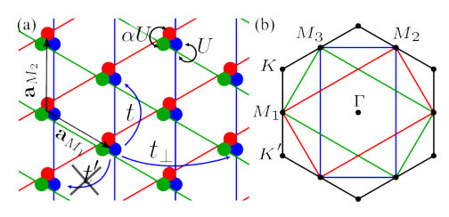
<figcaption class="paper-figure-caption"><b>Fig 1.</b> FIG. 1. (a) Each dot represents a spinful Wannier orbital, with colors denoting different valleys η. We set symmetry- forbidden or subdominant terms beyond t, t⊥to zero. (b) The reciprocal Wigner-Seitz cell of the triangular lattice (black) defines the moiré Brillouin zone (mBZ) but each valley expe- riences an effective rectangular BZ (colors).</figcaption>
</figure>
<figure class="paper-figure-card">
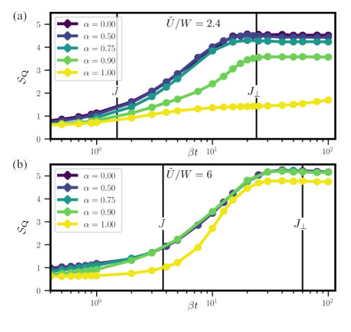
<figcaption class="paper-figure-caption"><b>Fig 2.</b> FIG. 2. The temperature dependence of the spin correla- tions at the ordering vector Q(η) for V = 0, t⊥= 0.25 and L = 12, for ˜U/W = 2.4 and ˜U/W = 6 (U/t = 6, 15 respec- tively). The vertical lines denote J = 4t2/U, J⊥= 4t2 ⊥/U. For α &gt; 0.90 in the top panel, the system remains in the ‘intermediate-coupling’ regime, whereas all other (U, α) pairs can be characterized as ‘strongly-coupled’.</figcaption>
</figure>
<figure class="paper-figure-card">
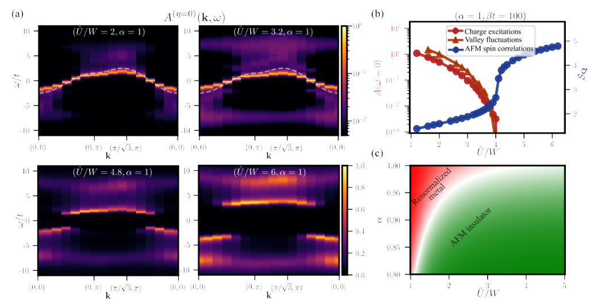
<figcaption class="paper-figure-caption"><b>Fig 3.</b> FIG. 3. (a) Evolution of the analytically continued spectral function A(η=0)(k, ω) in valley 0 and at T = 0.05t from U/t = 5 ( ˜U/W = 2) to U/t = 15 ( ˜U/W = 6). (b) AFM spin correlations (blue) and the local (BZ-integrated) ω = 0 charge and valley spectral weights (red) extracted from imaginary-time data at T = 0.01t. Note that AFM correlations rise concurrently with a spectral gap opening at U ≈10t. (c) In the qualitative low-T phase diagram, an insulator with long-range AFM order crosses over to a strongly-renormalized finite-T metal with only short-range AFM correlations, with the latter two features best captured via a U(6) local-moment picture (cf. Fig. 2). Throughout, we set t⊥=...</figcaption>
</figure>
<figure class="paper-figure-card">
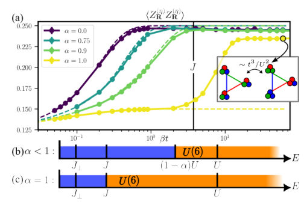
<figcaption class="paper-figure-caption"><b>Fig 4.</b> FIG. 4. (a) The square of the local moment as a func- tion of inverse temperature in the strong-coupling regime, at ˜U/W = 6. The dashed lines correspond to the atomic prob- lem and the inset displays higher-order ring-exchange pro- cesses reducing the ground state total moment for the U(6)- symmetric interactions. (b)&amp;(c) Show the energy hierarchy for U(6)-breaking and U(6)-symmetric interactions.</figcaption>
</figure>

**Summary.** This theoretical work explores the complex ground state physics of moiré materials using a Hubbard model incorporating valley degrees of freedom. By combining DQMC simulations and advanced spin-wave theory, the authors map out a phase diagram showing how tuning interaction symmetries drives crossovers between magnetically ordered insulators and correlated metallic states. The key finding is that persistent quantum fluctuations stabilize exotic intermediate regimes.

**Why it may be interesting.** The detailed study of how quantum fluctuations (valley fluctuations) stabilize a metallic or fluctuating state over a simple ordered insulator is highly relevant for understanding emergent phenomena in strongly correlated systems, which shares conceptual links with many open quantum system models.

Detailed structure

**Main problem.** The study investigates hidden antiferromagnetism, persistent valley fluctuations, and $U(6)$ crossovers in moiré materials. The goal is to understand the competition between local moment formation and itinerant behavior as interaction symmetries are tuned.

**Main result.** The system exhibits an extended intermediate-coupling regime where low-energy charged quasiparticles are dressed by neutral valley fluctuations. Quantum fluctuations favor a stripe order over other classical ground states.

**Method.** The research employs Determinantal Quantum Monte Carlo (DQMC) simulations, supplemented by advanced theoretical tools like perturbation theory, Random Phase Approximation (RPA), and Linear Spin-Wave Theory (LSWT).

**Model / system.** The model is based on a Hubbard-type Hamiltonian describing electrons in the low-energy states of twisted two-dimensional atomic monolayers forming a triangular-lattice M-point moiré superlattice. The system is studied at half-filling ($
u=3$).

**Key observables.** Momentum-resolved spin-spin correlations, imaginary-time Green's functions, valley fluctuation spectral weights, and local double occupancy.

**Important parameters / regimes.** Interaction anisotropy parameter $\alpha$ (especially near $\alpha=1$), coupling strengths ($U/W$, $J'/J$), and temperature ($T 	o 0$).

**Assumptions / limitations.** The DQMC simulations rely on the existence of a sign-free formulation due to particle-hole symmetry at half-filling. Theoretical analyses often involve approximations like LSWT or mean-field decoupling.

**Figures summary.** Figures illustrate spin correlation temperature dependence, spectral function evolution showing quasiparticle behavior, and quantum zero-point energy calculations demonstrating the preference for stripe order over classical ground states.

**Paper structure.** The paper progresses from defining the lattice model and symmetries to implementing DQMC simulations. It then analyzes different coupling regimes (weak, intermediate, strong) using various theoretical tools like RPA, perturbation theory, and spin-wave analysis to map out the phase diagram.

Abstract

A new moiré material platform was recently proposed based on twisting two-dimensional atomic monolayers whose low-energy states lie at the three M-points of the Brillouin Zone. Continuum and ab initio modeling suggest that electrons in the conduction bands of these materials realize three-valley Hubbard models with valley-selective, quasi-one-dimensional hopping. Remarkably, the onsite Hubbard repulsion is almost $U(6)$-symmetric without fine-tuning. Here, we show that this class of systems naturally admits sign-free determinantal Quantum Monte Carlo simulations at a filling of three electrons per moiré unit cell. We use these to explore the phase diagram for interactions of various strengths and $U(6)$-breaking anisotropies. We show that for near-isotropic interactions as relevant to, e.g., AA-stacked twisted SnSe$_2$, the system exhibits an extended intermediate-coupling regime in which local-moment formation and itinerancy compete, and the crossover to a putative low-temperature ordered state can be understood in terms of fluctuating $U(6)$ local moments. We argue that many of these features persist beyond the idealized sign-problem-free limit.

[↑ back to top](#top)

### [Multiple Topological Haldane Phases for Symmetry-Protected Quantum Information Processing](http://arxiv.org/abs/2606.12685v1)

**Authors:** João Pedro Gama D'Elia, Irene D'Amico, Thereza Paiva  
**Type:** theory · **Category:** quantum information and computing · **PDF:** <https://arxiv.org/pdf/2606.12685v1>  
**Analysis basis:** full PDF text, analyzed in chunks
**Topic relevance:** 🔥 `analog quantum simulation` **4/5** · `exotic spin models in light-matter` **3/5** · `entanglement & information structure` **2/5** · `methods for driven-dissipative` **1/5** · `spintronics-quantum-optics interface` **1/5**

↔ Scroll figures horizontally

<figure class="paper-figure-card">
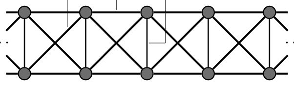
<figcaption class="paper-figure-caption"><b>Fig 1.</b> Fig. 1. | Ladder system. The two-leg Heisenberg ladder with diagonal exchange interaction. While the diagonal and leg exchange interactions are constant and equal, the rung exchange interaction J⊥r depends on the rung index r.</figcaption>
</figure>
<figure class="paper-figure-card">
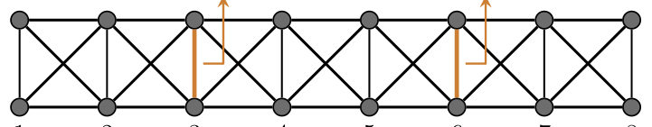
<figcaption class="paper-figure-caption"><b>Fig 2.</b> Fig. 2. | Haldane subsystems via a local rung singlet. Illustration of a ladder system with L = 8 and N = 2. The rung exchange term in rungs 3 and 6 are given by J⊥. The system gets partitioned in N + 1 = 3 subsystems, separated by the N rungs. As J⊥is enhanced, the system crosses a 1QPT, where each subsystem becomes effectively independent spin-1 chains separated by the rung-singlets at positions 3 and 6.</figcaption>
</figure>
<figure class="paper-figure-card">
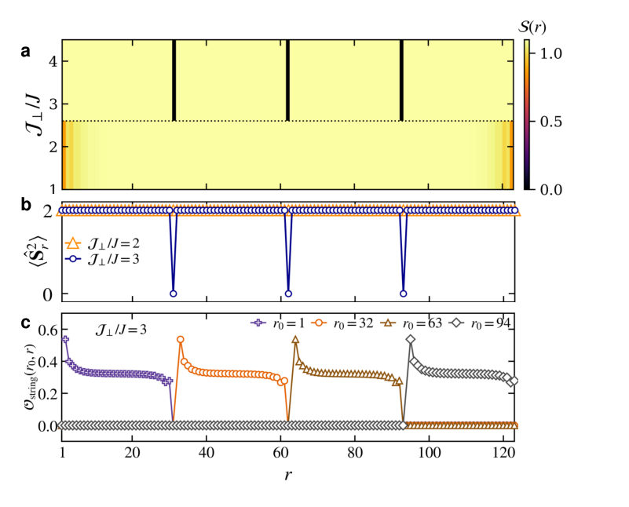
<figcaption class="paper-figure-caption"><b>Fig 3.</b> Fig. 3. | First-order transition to Haldane subsystems. a Bipartite entanglement entropy S(r) for L = 123 and as the rung couplings J⊥of rungs 31, 62, and 93 are increased (calculations done using DMRG). The entropy between rungs 31, 62, and 93 and the rest of the system vanishes beyond a critical value of J⊥, signaling that the ladder splits into four independent subsystems. b Expectation value ⟨ˆS2 r⟩showing the transition from a uniform spin-1 chain (J⊥/J = 2) to four spin-1 chains separated by spin-0 rungs (J⊥/J = 3). c The string-order correlation function, indicator of hidden antiferromagnetic order, as a function of the rung index. It is possible to see that, for J⊥&gt; J⊥c, the...</figcaption>
</figure>
<figure class="paper-figure-card">
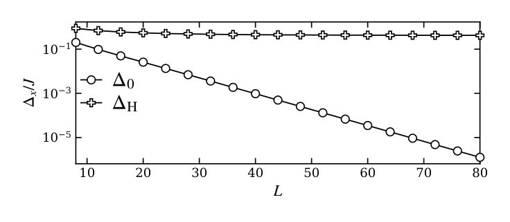
<figcaption class="paper-figure-caption"><b>Fig 4.</b> Fig. 4. | Energy gaps of the topological subspace. Size dependence of the Haldane gap ∆H and of the singlet–triplet splitting ∆0 obtained from DMRG. While ∆0 decreases exponentially with system size due to edge decoupling, the bulk Haldane gap remains nearly constant. Here L refers to the size of one of the Haldane subsystems.</figcaption>
</figure>
<figure class="paper-figure-card">
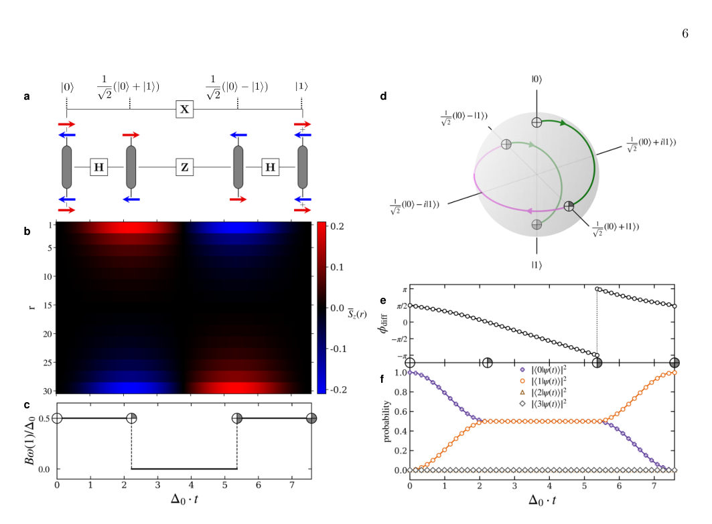
<figcaption class="paper-figure-caption"><b>Fig 5.</b> Fig. 5. | Single-qubit gate implemented using finite size splitting and local control. a Gate sequence realizing a Pauli-X operation via two Hadamard rotations and a Pauli-Z operation. b Time evolution of the edge magnetization profile during the protocol (TEBD) for a system with L = 30 rungs. The vertical axis corresponds to the rung index, displaying the sum magnetization given by equation 12. c Control sequence for the boundary magnetic field. d Trajectory of the Bloch vector in the logical subspace. The green curves correspond to B ̸= 0 intervals and the pink curve to B = 0. The path was built using the TEBD data of panels e and f. e Relative phase evolution between |0⟩and |1⟩. f...</figcaption>
</figure>

**Summary.** The paper proposes using a spin ladder exhibiting Haldane phases as a robust platform for quantum computing. By locally tuning the system's interactions, the authors create independent topological subsystems capable of hosting qubits. This architecture allows for the implementation of both single-qubit rotations and entangling two-qubit gates necessary for universal computation.

**Why it may be interesting.** This work provides a concrete realization pathway for topological quantum computation, moving beyond abstract theory by mapping required gate operations onto tunable parameters (like local fields and couplings) within a solid-state spin model.

Detailed structure

**Main problem.** The primary goal is to demonstrate a scalable, physical architecture for universal quantum computation using symmetry-protected topological (SPT) phases.

**Main result.** The authors show that by engineering local couplings in a spin ladder system, they can partition it into independent Haldane subsystems, allowing for controlled single-qubit rotations and entangling two-qubit gates necessary for universal computation.

**Method.** The work relies on theoretical modeling using effective Hamiltonians derived from the low-energy projection of the full many-body Hamiltonian. Gate performance is quantified by calculating gate fidelity and leakage probability through time evolution simulations (TEBD/TDVP).

**Model / system.** The system is a spin-1/2 ladder composed of multiple coupled Haldane chains, where qubits are encoded in the two topological states of the $S^z=0$ sector. The Hamiltonian involves Heisenberg interactions and tunable rung couplings ($J_{\perp}$).

**Key observables.** Gate fidelity ($F_{gate}$), leakage probability ($\mathcal{P}_{leak}$), entanglement entropy, and the energy splitting ($\Delta_0$) between topological ground states.

**Important parameters / regimes.** Local magnetic field strength ($B$), interaction coupling strengths ($g_2/J$), and the ratio of rung couplings to chain interactions ($J_{\perp}/J$).

**Assumptions / limitations.** The protocol deliberately utilizes finite-size effects (residual coupling) as a controllable resource rather than an error source, allowing for coherent control axes.

**Figures summary.** Figures illustrate the ladder structure and the process of partitioning into independent subsystems. Other figures show Bloch vector trajectories confirming single-qubit gate operations and entanglement dynamics confirming Bell state formation.

**Paper structure.** The paper progresses by first establishing the physical model (ladder system) and demonstrating how local tuning induces quantum phase transitions to create isolated Haldane subsystems. It then details the implementation of single-qubit gates using finite-size gaps, followed by introducing inter-subsystem interactions to achieve universal two-qubit entangling gates.

Abstract

Symmetry-protected topological phases have attracted significant interest at the fundamental level and as a potential platform for quantum information processing, owing to their protected edge states and resilience to perturbations. Applying these features for practical and efficient quantum computation is highly desirable, but remains an open challenge. Here, we demonstrate the partitioning into multiple independent Haldane phase subsystems of a single spin-1/2 ladder system and propose this as a scalable architecture for gate-based quantum computation, which takes advantage of the symmetry-protected topological order. We encode qubits in the two topological states of the $S^{z}=0$ sector of each subsystem. Finite-size effects, typically viewed as detrimental, instead provide a controllable energy splitting that enables single-qubit rotations using only local magnetic fields. An Ising-type interaction between neighboring subsystem edges generates entangling gates, enabling universal quantum computation driven by two control parameters that are easily accessible experimentally. Our results demonstrate how symmetry-protected topological phases can be directly harnessed for circuit-model quantum computation in realistic systems.

[↑ back to top](#top)

### [Global Control with the Tavis-Cummings Interaction](http://arxiv.org/abs/2606.12906v1)

**Authors:** Plato Deliyannis, Iman Marvian  
**Type:** theory · **Category:** quantum information and computing · **PDF:** <https://arxiv.org/pdf/2606.12906v1>  
**Analysis basis:** full PDF text, analyzed in chunks
**Topic relevance:** 🔥 `Tavis-Cummings & cavity-many-emitter` **4/5** · `Keldysh / 2PI / non-Gaussian methods` **1/5** · `analog quantum simulation` **1/5** · `correlated cavity matter` **1/5** · `driven-dissipative phase transition` **1/5** · `entanglement & information structure` **1/5** · `methods for driven-dissipative` **1/5**

↔ Scroll figures horizontally

<figure class="paper-figure-card">
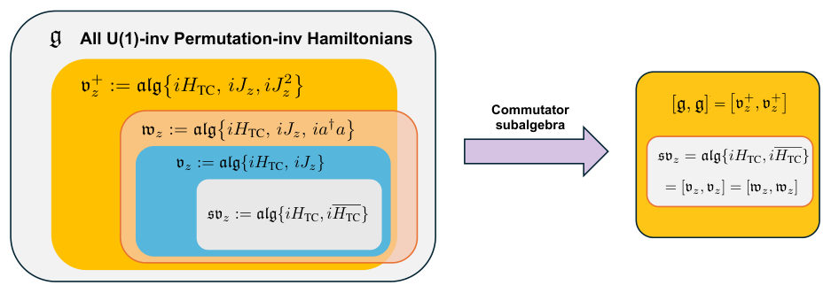
<figcaption class="paper-figure-caption"><b>Fig 1.</b> FIG. 1. First main result (Theorem 1 and Theorem 7). Schematic relationship between different Lie algebras generated by various subsets of HTC ∝(J+a + J−a†), HTC ∝i(J+a −J−a†), Jz, J2 z , and a†a. All these algebras are subalgebras of g, the Lie algebra of all PI, U(1)-invariant Hamiltonians. Although the algebras svz, vz, wz, v+ z , and g are all distinct, after removing their centers, i.e., after passing to their commutator subalgebras, they reduce to only two possibilities: [g, g] = [v+ z , v+ z ] and svz = [vz, vz] = [wz, wz]. The latter algebra is restricted by the accidental symmetry of HTC, which, to the best of our knowledge, has not been identified before. The centers removed by...</figcaption>
</figure>
<figure class="paper-figure-card">
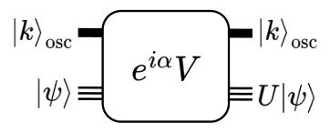
<figcaption class="paper-figure-caption"><b>Fig 2.</b> FIG. 2. Second main result (Theorem 8). The goal is to implement a unitary U on the qubits by coupling them to a bosonic mode initial- ized in the eigenstate |k⟩of its intrinsic Hamiltonian a†a, with eigen- value k. After the operation, the bosonic mode returns to the same pure state and hence remains unentangled with the qubits. This is achieved by implementing a unitary V using the Hamiltonians HTC and Jz. The phase eiα denotes the freedom to choose an overall global phase; see Eq. (142). Theorem 8 determines which unitary transformations U can be realized in this way.</figcaption>
</figure>
<figure class="paper-figure-card">
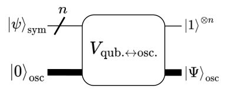
<figcaption class="paper-figure-caption"><b>Fig 3.</b> FIG. 3. Qubit-Oscillator SWAP unitary. See Eq. (96).</figcaption>
</figure>
<figure class="paper-figure-card">
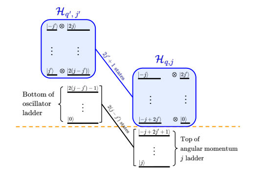
<figcaption class="paper-figure-caption"><b>Fig 4.</b> FIG. 4. General accidental symmetry pairs: The matrix elements of HTC are identical in the two illustrated sectors, provided that (q, q′) and (j, j′) satisfy Eq. (118). Note that in general, these sec- tors appear with nontrivial multiplicities within (C2)⊗n ⊗L2(R). Figure from [35].</figcaption>
</figure>
<figure class="paper-figure-card">
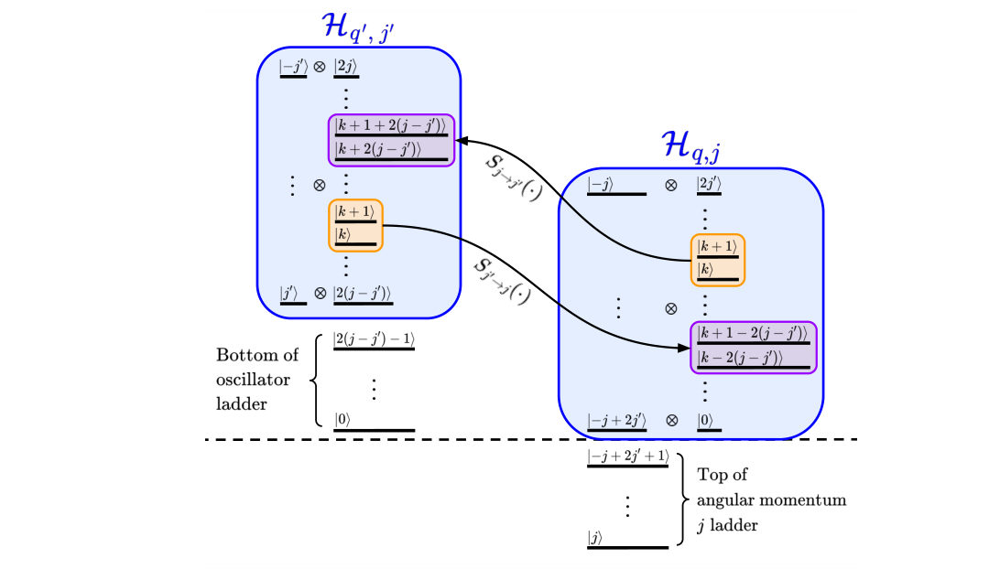
<figcaption class="paper-figure-caption"><b>Fig 5.</b> FIG. 5. Sketch of the proof of Lemma 10. Let F be a PI, U(1)-invariant operator supported only on the subspace spanned by |k⟩and |k + 1⟩, shown in the orange box. Now consider a pair of sectors Hq,j and Hq′,j′ that are related by the accidental symmetry. This symmetry maps the projection of F onto Hq,j to an operator acting on Hq′,j′, and vice versa; these symmetry-transformed operators are shown in purple. The key point is that these symmetry-transformed operators have no support on the subspace spanned by |k⟩and |k + 1⟩. Hence, if we form an augmented operator eF by adding the corresponding symmetry-transformed components to F, then eF agrees with F when restricted to the subspace spanned...</figcaption>
</figure>

**Summary.** The paper rigorously investigates the controllability of qubits coupled via a Tavis-Cummings interaction to a bosonic mode. It demonstrates that while initial controls are limited by an 'accidental' symmetry, introducing a secondary global field ($J_z^2$) breaks this constraint, enabling near-universal control over the system's unitary operations.

**Why it may be interesting.** This work provides rigorous mathematical tools for determining the fundamental limits of quantum control in complex, interacting many-body systems, which is crucial for designing fault-tolerant quantum computation protocols.

Detailed structure

**Main problem.** The core problem is characterizing the group of unitaries implementable on a joint qubit-bosonic system using global control fields derived from the Tavis-Cummings interaction.

**Main result.** The realizable unitary group is restricted by an 'accidental' symmetry when only the TC interaction and $J_z$ are used, but adding $J_z^2$ breaks this symmetry, achieving semi-universality for implementing arbitrary unitaries respecting key symmetries.

**Method.** The analysis relies heavily on Lie algebra theory to characterize the generated groups of unitaries by analyzing commutator subalgebras $[\mathfrak{g}, \mathfrak{g}]$ and comparing them to the full symmetry group $	ext{VU}(1)	imes	ext{Sn}$.

**Model / system.** The system consists of $n$ qubits identically coupled via the Tavis-Cummings (TC) interaction to a single bosonic mode (harmonic oscillator). Control is applied globally using $J_z$ and potentially $J_z^2$.

**Key observables.** The group of realizable unitaries ($V_z$), the structure of the Lie algebra ($\mathfrak{v}_z, \mathfrak{w}_z$), and the dimension/inclusion relationships between commutator subalgebras.

**Important parameters / regimes.** Number of qubits ($n$), coupling strengths ($g_{TC}$), and the presence/absence of additional symmetry-breaking terms like $J_z^2$.

**Assumptions / limitations.** The analysis often assumes that the bosonic mode acts as an ancillary system initialized in a fixed energy eigenstate, returning to it at the end.

**Figures summary.** Figures illustrate schematic relationships between Lie algebras generated by combinations of Hamiltonians and show how commutator subalgebras reduce or expand based on added terms.

**Paper structure.** The paper progresses from characterizing the initial restricted group $V_z$ using $\{	ext{iHTC}, 	ext{iJz}\}$, to showing that adding $	ext{iJ}_2^z$ breaks an accidental symmetry, leading to semi-universality. Later sections delve into detailed Lie algebra decompositions and structural proofs.

Abstract

We study the controllability of a system of qubits under global control, where control pulses act identically on all qubits. Specifically, we consider a collection of qubits identically coupled to a single bosonic mode, or harmonic oscillator, via the Jaynes-Cummings interaction. This collective coupling, known as the Tavis-Cummings (TC) interaction, has been realized in several quantum computing platforms, including superconducting and atomic qubit systems. Although the qubits do not interact directly with one another, they can become entangled through their common coupling to the bosonic mode. We characterize the group of unitaries that can be implemented on the joint Hilbert space of the qubits and bosonic mode using the TC interaction together with a global $z$ field $J_z$, corresponding to identical z rotations on all qubits. We show that for n>2 qubits the set of realizable unitaries is restricted by an "accidental" symmetry of the TC Hamiltonian, distinct from its "standard" U(1) and permutational symmetries. On the other hand, we find that the Hamiltonian $J_z^2$ breaks this accidental symmetry and, together with the TC interaction and $J_z$, achieves semi-universality: it allows the implementation of arbitrary unitaries that respect permutational and U(1) symmetry, up to certain constraints on the center of the group. In a companion paper, we further analyze this remarkable accidental symmetry and show that it can be understood through Schwinger's bosonic model of angular momentum.

[↑ back to top](#top)

### [Spin correlations, low-energy scales, and anisotropy scaling in kagome frustrated magnets](http://arxiv.org/abs/2606.12512v1)

**Authors:** Phillip Popp, Stephan Rosenkranz, Arthur P. Ramirez, Sergey Syzranov  
**Type:** theory · **Category:** strongly correlated electrons · **PDF:** <https://arxiv.org/pdf/2606.12512v1>  
**Analysis basis:** full PDF text, analyzed in chunks
**Topic relevance:** 🔥 `analog quantum simulation` **4/5** · `exotic spin models in light-matter` **3/5** · `spintronics-quantum-optics interface` **1/5**

↔ Scroll figures horizontally

<figure class="paper-figure-card">
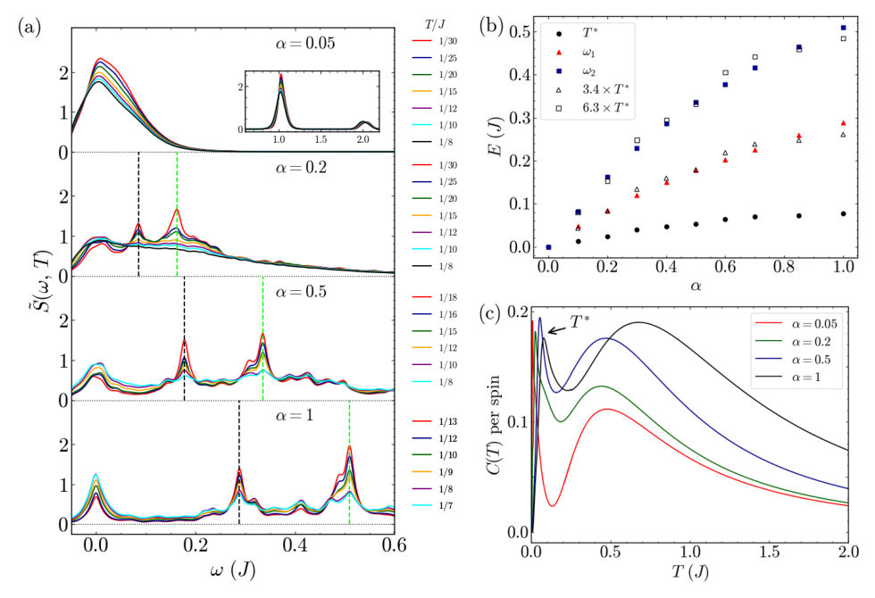
<figcaption class="paper-figure-caption"><b>Fig 1.</b> FIG. 1. (a) The transverse dynamical spin structure factor ˜S(ω, T) for various ratios α of the transverse to longitudinal exchange couplings and temperatures. Inset shows the structure factor at higher frequency for α = 0.05. Dashed black (lime) lines indicate the position of ω1(2)(α). (b) Dependence of the three energy scales T ∗, ω1, and ω2 on α (cf. panel c). Open symbols denote fits to ω1(2)(α) = A1(2)T ∗(α). (c) Heat capacity per spin of 24-site XXZ kagome clusters at the indicated values of α. The position of the low-temperature peak is denoted T ∗(α).</figcaption>
</figure>
<figure class="paper-figure-card">
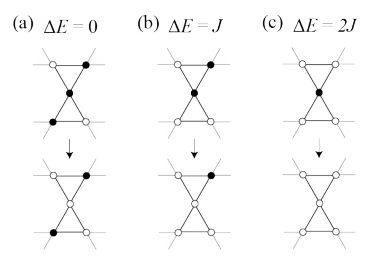
<figcaption class="paper-figure-caption"><b>Fig 2.</b> FIG. 2. Three possible energies of flipping a single spin in a ground state of the kagome-lattice Ising model. Filled (open) circles represent spin-up (down) states.</figcaption>
</figure>
<figure class="paper-figure-card">
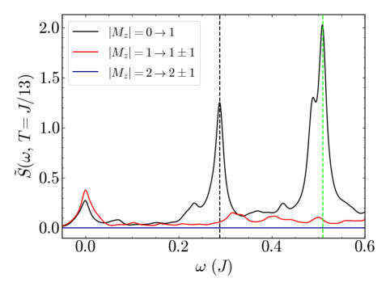
<figcaption class="paper-figure-caption"><b>Fig 3.</b> FIG. 3. The dynamical spin structure factor ˜S(ω, T = J/13) in the isotropic Heisenberg model (α = 1), in the three lowest- magnetization transition channels. Dashed black (green) line indicates the position of ω1(2).</figcaption>
</figure>
<figure class="paper-figure-card">
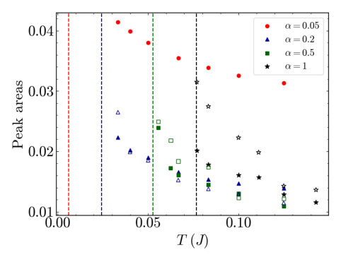
<figcaption class="paper-figure-caption"><b>Fig 4.</b> FIG. 5. Temperature dependence of the areas R</figcaption>
</figure>
<figure class="paper-figure-card">
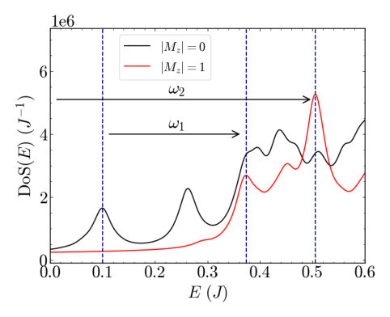
<figcaption class="paper-figure-caption"><b>Fig 5.</b> FIG. 4. Low-energy |Mz| = 0 and |Mz| = 1 densities of states for an α = 1 cluster. Dashed lines indicate the positions of peaks that are relevant for the DSSF; arrows indicate the associated transition frequencies.</figcaption>
</figure>

**Summary.** The paper analyzes the magnetic excitations in kagome antiferromagnets using the XXZ model and numerical simulations. By tracking spectral features across varying anisotropies, the authors establish that low-energy peaks scale universally with a characteristic energy scale $T^*$. This provides a sharp spectroscopic criterion to distinguish between different types of quantum magnetic excitations observed experimentally.

**Why it may be interesting.** This work provides a concrete, quantitative method (the scaling law $\omega \propto T^*$) to interpret complex experimental signatures in frustrated magnets, bridging advanced quantum simulation techniques with measurable physical observables like inelastic neutron scattering spectra.

Detailed structure

**Main problem.** The central problem is distinguishing between fractionalized excitations (spinons) and magnon excitations when interpreting broad spectral features observed in neutron scattering experiments on quantum magnetic materials.

**Main result.** The low-energy spin spectral function on the kagome lattice exhibits two robust, momentum-independent peaks ($\omega_1 \approx 3.4 T^*$ and $\omega_2 \approx 6.3 T^*$), suggesting these features arise from single-magnon scattering rather than a continuum of fractionalized excitations.

**Method.** The authors use adiabatic continuity by tuning the anisotropy parameter ($\alpha$) in the XXZ Heisenberg model on geometrically frustrated lattices, simulating the dynamical spin structure factor using advanced numerical techniques like LTLM.

**Model / system.** The system is the $S=1/2$ antiferromagnet on the kagome lattice, modeled by the anisotropic XXZ Heisenberg Hamiltonian. The analysis focuses on how spectral features evolve as a function of anisotropy and temperature.

**Key observables.** Dynamical spin structure factor ($	ilde{S}(\omega, T)$), low-energy excitation frequencies ($\omega_1, \omega_2$), and the 'hidden energy scale' ($T^*$) derived from heat capacity measurements.

**Important parameters / regimes.** Anisotropy parameter $\alpha$, temperature $T$, and the characteristic energy scale $T^*$ (related to spin-glass freezing).

**Assumptions / limitations.** The low-energy excitations are assumed to be well-described by single-magnon transitions between specific magnetization bands ($|M_z|=0 	o 1$).

**Figures summary.** Figures illustrate the temperature and anisotropy dependence of $	ilde{S}(\omega, T)$, showing the robust scaling of peak energies ($\omega_1, \omega_2$) relative to $T^*$, alongside heat capacity data confirming $T^*$.

**Paper structure.** The paper develops a theoretical framework using adiabatic continuity on the XXZ model. It calculates $	ilde{S}(\omega, T)$ and demonstrates that low-energy spectral features scale universally with the characteristic temperature $T^*$, providing a spectroscopic criterion for interpreting neutron scattering data.

Abstract

Neutron scattering is central to identifying quantum states of magnetic materials. In the search for quantum spin liquids, broad spectral features of inelastic spectra have been cited as evidence for spinon excitations, but can also arise from magnon excitations excitations in the presence of quenched disorder and strong magnon interactions. We develop a new approach to this problem, based on the adiabatic continuity in the $XXZ$ Heisenberg model on geometrically frustrating (GF) lattices as a function of the model's anisotropy. Using this approach, we identify universal features and energies of finite-temperature spin correlators. Focusing on the kagome lattice, we show that the low-energy spin spectral function contains robust, momentum-independent peaks with frequencies: $ω_1 \approx 3.4 T^*$ and $ω_2 \approx 6.3 T^*$, where the ``hidden energy scale'' $T^*$ is the characteristic scale of a low-temperature peak in the heat capacity, at which many GF magnets also display spin-glass freezing. We show that the spectral features at low energies $ω\lesssim T^*$ arise from single-magnon scattering and identify the magnetizations of the respective excitations. We explore the evolution of the spectral features with temperature and discuss extensions to other GF lattices. Our results provide a sharp spectroscopic criterion for interpreting neutron scattering in kagome and other GF quantum magnets.

[↑ back to top](#top)

### [Instabilities in a Non-KAM System via Information Scrambling: A Note](http://arxiv.org/abs/2606.12761v1)

**Authors:** Naga Dileep Varikuti  
**Type:** theory · **Category:** other · **PDF:** <https://arxiv.org/pdf/2606.12761v1>  
**Analysis basis:** full PDF text, analyzed in chunks
**Topic relevance:** 🔥 `entanglement & information structure` **4/5** · `non-equilibrium dynamics` **2/5** · `non-equilibrium universality` **1/5**

↔ Scroll figures horizontally

<figure class="paper-figure-card">
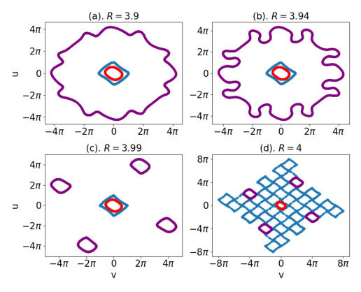
<figcaption class="paper-figure-caption"><b>Fig 1.</b> FIG. 1. The figure depicts representative classical trajectories of the KHO near the resonance condition R = 4, obtained from three dif- ferent initial conditions and evolved for 104 time steps. Throughout, the parameters are fixed at K = 1 and τ = 1. At exact resonance, the phase space is organized into three distinct structures: a stochastic web spanning a large portion of phase space, period-four stability is- lands, and a central period-one regular island surrounding the origin. The chosen initial conditions are selected from each of these regions. As R is varied from 3.9 toward 4, following the sequence shown in panels (a)–(d), the trajectories undergo progressive deformation and...</figcaption>
</figure>
<figure class="paper-figure-card">
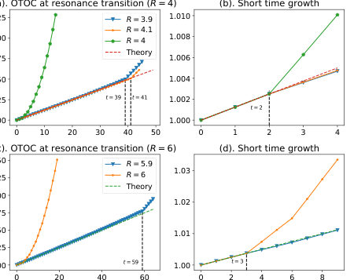
<figcaption class="paper-figure-caption"><b>Fig 2.</b> FIG. 2. The OTOCs are sensitive to the changes as the system tran- sitions from KAM to the non-KAM regime, which is demonstrated for R = 4 and R = 6. (a). The plots of OTOC for the parame- ter values R = 3.9, 4, and 4.1 are drawn. The values R = 3.9 and R = 4.1 correspond to the rational numbers 39/10 and 41/10, re- spectively. For rational R = p/q (with p and q coprime), the relevant arithmetic structure is governed by the numerator p. Consequently, the corresponding lower bounds on the linear-growth segment are determined by ϕ(39) and ϕ(41). The larger value of ϕ(41), a con- sequence of 41 being prime, accounts for the noticeably extended linear-growth regime observed for R = 4.1. (b)....</figcaption>
</figure>

**Summary.** This paper analyzes information scrambling in the quantized Kicked Harmonic Oscillator, a non-KAM system. Using OTOCs, the authors show that resonances fundamentally alter operator growth, leading to predictable quadratic scaling dictated by number theory (the Euler totient function). This highlights how arithmetic properties can control quantum dynamics even when conventional chaos indicators are weak.

**Why it may be interesting.** This work connects concepts from classical dynamical systems (KAM theory, resonance) with modern quantum diagnostics (OTOCs), providing a deep mathematical structure ($\phi(R)$) to understand how quantum chaos manifests in periodically driven systems.

Detailed structure

**Main problem.** The study investigates operator growth and information scrambling dynamics in quantized systems that violate the Kolmogorov-Arnold-Moser (KAM) theorem, focusing on the role of resonances.

**Main result.** Resonant structures significantly influence quantum information spreading, causing OTOCs to exhibit a quadratic-in-time growth at resonance compared to linear growth away from it. This behavior is governed by number-theoretic functions like the Euler totient function.

**Method.** The analysis employs Out-of-Time-Ordered Correlators (OTOCs) and utilizes perturbative expansions in the weak coupling limit, deriving closed-form expressions for these correlators.

**Model / system.** The primary model is the Kicked Harmonic Oscillator (KHO), described by a Hamiltonian involving periodic delta-kicks. The system is analyzed using bosonic ladder operators ($\hat{a}, \hat{a}^\dagger$).

**Key observables.** Out-of-Time-Ordered Correlators (OTOCs) and the averaged squared commutator function, $C\hat{a}\hat{a}^\dagger(t)$.

**Important parameters / regimes.** The resonance ratio $R$ (where $\omega R = 2\pi/	au$), the perturbation strength $K$, and the time scale relative to the Euler totient function $\phi(R)$.

**Assumptions / limitations.** The analysis is restricted to the weak perturbative regime ($K \ll 1$) and relies on simplifying assumptions regarding the time evolution related to roots of unity.

**Figures summary.** Figures illustrate classical trajectories near resonance, showing stochastic webs, and plot OTOCs for specific rational ratios (e.g., R=4, R=6), demonstrating growth governed by $\phi(R)$.

**Paper structure.** The paper first establishes the physical context of non-KAM systems using KHO and OTOCs. It then develops analytical techniques to calculate the time evolution of the commutator function in the weak coupling limit. Finally, it derives explicit forms showing the number-theoretic control exerted by resonances on information scrambling.

Abstract

We study operator growth in quantized non-KAM systems using out-of-time-ordered correlators (OTOCs), focusing on the kicked harmonic oscillator as a representative example. Since the classical harmonic oscillator is degenerate, the dynamics fall outside the usual Kolmogorov-Arnold-Moser (KAM) framework, and resonances play a central role in shaping the phase space. We examine the system near resonances, where the ratio between the oscillator and driving frequencies takes integer values. Even though the classical Lyapunov exponent remains small at these points, and hence no conventional chaos, the phase space still undergoes strong structural changes. The OTOCs are particularly sensitive to these resonances, with a quadratic-in-time growth at resonance compared to linear growth away from it. Within a perturbative treatment, we derive closed-form expressions for the OTOCs and uncover a number-theoretic structure emerging in the behavior of OTOCs, governed by the Euler totient function of the frequency ratio. Overall, the results we present in this short note imply that resonant structures can play an important role in controlling information spreading.

[↑ back to top](#top)

### [Phase diagram of the Kitaev-Heisenberg-$Γ$ model: Classical and quantum magnetism, frustration, and subdominant interactions](http://arxiv.org/abs/2606.13263v1)

**Authors:** Kiyu Fukui, Yukitoshi Motome  
**Type:** theory · **Category:** strongly correlated electrons · **PDF:** <https://arxiv.org/pdf/2606.13263v1>  
**Analysis basis:** full PDF text, analyzed in chunks
**Topic relevance:** 🔥 `analog quantum simulation` **4/5** · `exotic spin models in light-matter` **3/5**

↔ Scroll figures horizontally

<figure class="paper-figure-card">
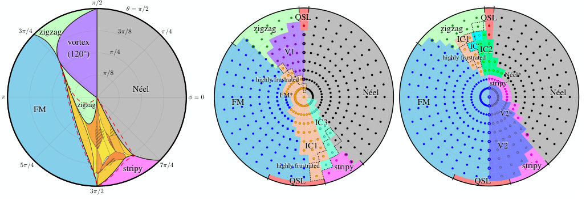
<figcaption class="paper-figure-caption"><b>Fig 1.</b> FIG. 1. Ground-state phase diagrams of the Kitaev-Heisenberg-Γ model in Eq. (1), parametrized by polar angle θ and azimuthal angle ϕ as defined in Eq. (2), for (a) classical spins for Γ ≥0, (b) quantum spins for Γ ≥0, and (c) quantum spins for Γ ≤0. In (a), (J, K, Γ) can be transformed to (−J, −K, −Γ) by a site-dependent time-reversal, and thus only the region with Γ ≥0 is shown. Calculations are carried out at 314620 parameter points. The region enclosed by the red dashed line indicates where the Luttinger-Tisza method loses its validity. The hatched regions indicate where incommensurate magnetic order is suggested. In (b) and (c), the black ticks on the outer circles indicate the phase...</figcaption>
</figure>
<figure class="paper-figure-card">
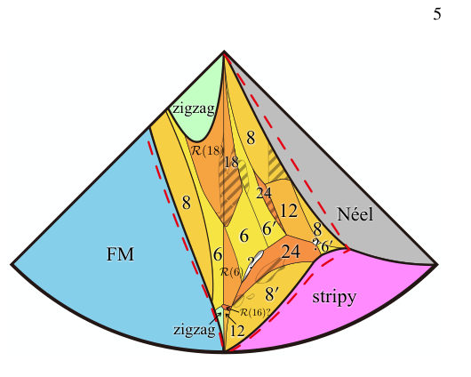
<figcaption class="paper-figure-caption"><b>Fig 2.</b> FIG. 2. Enlarged view of the lower quadrant of Fig. 1(a). The nota- tions are common to those in Fig. 1(a).</figcaption>
</figure>
<figure class="paper-figure-card">
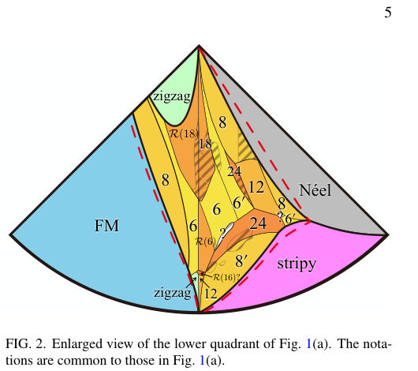
<figcaption class="paper-figure-caption"><b>Fig 3.</b> Figure 1(a) shows the phase diagram in the classical case obtained from our numerical minimization. As noted in Sec. II A, for classical spins, it is sufficient to determine the phase diagram only for Γ ≥0. We obtain dominant phases, FM, N´eel AFM, zigzag, stripy, and vortex (also called 120◦), in agreement with previous studies [94, 95]. However, in the regions where the Luttinger-Tisza method is no longer valid [enclosed by the red dashed line in Fig. 1(a)], we identify highly competitive and complicated phase structures that are remarkably different from those reported in the previous stud- ies. To discuss this region in detail, Fig. 2 shows an enlarged view of the lower quadrant (5/4...</figcaption>
</figure>
<figure class="paper-figure-card">
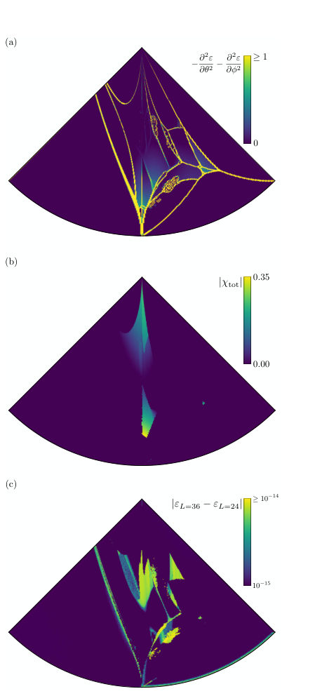
<figcaption class="paper-figure-caption"><b>Fig 4.</b> FIG. 3. (a) Second-order derivative, (b) absolute value of the total scalar spin chirality χtot, and (c) system size dependence of the en- ergy per site ε, calculated from the optimized spin configurations. As in Fig. 2, only the lower quadrant of the phase diagram is shown.</figcaption>
</figure>
<figure class="paper-figure-card">
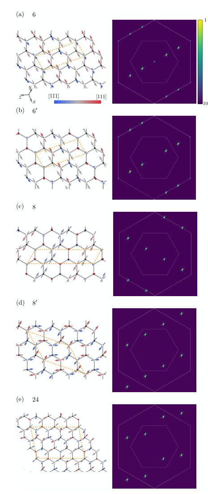
<figcaption class="paper-figure-caption"><b>Fig 5.</b> FIG. 4. Typical data of phases (a) 6, (b) 6′, (c) 8, (d) 8′, and (e) 24. The left panels show the optimized spin configurations. The colors of the arrows encode the magnitude of the out-of-plane component: [111] and [¯1¯1¯1] directions are shown in red and blue, respectively. Gray represents the in-plane component. The color code and spin axes are shown in (a). Orange dotted lines indicate the magnetic unit cells. The right panels show q dependences of S(q)/max[S(q)] in logarithmic scale. The color code is shown in (a). The inner white dotted and outer white solid lines represent the first Brillouin zone and the enlarged zone including up to the third one, respectively.</figcaption>
</figure>

**Summary.** This paper comprehensively maps the ground-state phase diagram of the Kitaev-Heisenberg-$\Gamma$ model, crucial for understanding real candidate materials. By comparing classical and quantum treatments, the authors reveal a complex interplay between magnetic interactions, showing that quantum effects significantly reduce the number of competing ordered states found classically. The results provide a vital guide for both interpreting experimental data and designing new spin liquid materials.

**Why it may be interesting.** The explicit comparison between classical and quantum predictions regarding magnetic ordering is highly relevant as it elucidates how quantum fluctuations stabilize or suppress competing ordered phases in strongly correlated magnets.

Detailed structure

**Main problem.** The study aims to clarify the complex ground-state phase diagram of the Kitaev-Heisenberg-$\Gamma$ model, specifically addressing how additional magnetic interactions perturb the ideal Kitaev spin liquid state.

**Main result.** Classically, the system exhibits a 'zoo' of noncollinear multiple-$Q$ magnetic orders, while quantum fluctuations suppress many of these competing classical phases, suggesting stabilized spiral spin liquid states in highly frustrated regions.

**Method.** The research employs advanced numerical techniques, including gradient descent optimization for classical spins and the Pseudo-fermion Functional Renormalization Group (PFFRG) method for quantum spins.

**Model / system.** The model is the Kitaev-Heisenberg-$\Gamma$ Hamiltonian applied to a 2D honeycomb lattice. It incorporates three types of interactions ($J, K, \Gamma$) and is analyzed across both classical spin configurations and $S=1/2$ quantum spins.

**Key observables.** Spin structure factor S(q), total scalar spin chirality $\chi_{	ext{tot}}$, static spin susceptibility $\chi_{\Lambda}(\mathbf{q})$, and the energy per site $\epsilon$.

**Important parameters / regimes.** The coupling constants $(J, K, \Gamma)$ are varied via parameters $(	heta, \phi)$, allowing mapping of the phase diagram across different interaction regimes.

**Assumptions / limitations.** For quantum calculations, the zero-temperature limit is used; for classical analysis, optimization relies on minimizing energy using automatic differentiation techniques.

**Figures summary.** Figures illustrate ground-state phase diagrams showing various magnetic phases (e.g., Néel, FM, QSL) as a function of coupling parameters, alongside plots detailing spin susceptibilities and eigenvalue distributions across the parameter space.

**Paper structure.** The paper systematically analyzes the model by first establishing the Hamiltonian and then performing separate, detailed analyses for classical ground states using variational minimization, followed by quantum calculations utilizing PFFRG to map out the full phase diagram.

Abstract

The Kitaev spin liquid provides a rare example of exactly solvable quantum spin liquid states. Intensive research over the past two decades has identified a variety of its candidate materials. In real materials, however, the Kitaev interaction is inevitably accompanied by additional magnetic interactions such as the Heisenberg and $Γ$ interactions. These interactions often induce magnetic ordering at low temperatures, making it essential to clarify their effects in the search for and design of Kitaev spin liquid candidate materials. In this study, we revisit the ground-state phase diagram of the Kitaev-Heisenberg-$Γ$ model from both classical and quantum perspectives, using state-of-the-art numerical techniques. In the classical case, we reveal a $zoo$ $of$ $noncollinear$ $orders$, where a variety of noncollinear multiple-$Q$ magnetic orders with and without incommensurate modulations emerge. In the quantum case, we unravel that quantum fluctuations suppress many of the competing orders found in the classical case, resulting in a reduced number of dominant incommensurate orders. We further identify $highly$ $frustrated$ regions, where spiral spin liquid states as well as new magnetically ordered states are potentially stabilized by other additional magnetic interactions. Our results provide a comprehensive perspective on the Kitaev-Heisenberg-$Γ$ model for both classical and quantum spins and offer a valuable guide not only for interpreting experimental results on candidate materials, but also for searching and designing new materials to realize the Kitaev spin liquid.

[↑ back to top](#top)

### [Mixed-dimensional quantum Monte Carlo studies of M-point moiré materials](http://arxiv.org/abs/2606.12508v1)

**Authors:** Dumitru Călugăru, Konstantinos Vasiliou, Haoyu Hu, B. Andrei Bernevig, Werner Krauth, S. A. Parameswaran  
**Type:** theory · **Category:** strongly correlated electrons · **PDF:** <https://arxiv.org/pdf/2606.12508v1>  
**Analysis basis:** full PDF text, analyzed in chunks
**Topic relevance:** 🔥 `analog quantum simulation` **4/5** · `methods for driven-dissipative` **1/5**

↔ Scroll figures horizontally

<figure class="paper-figure-card">
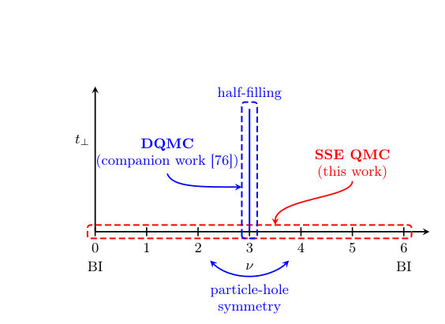
<figcaption class="paper-figure-caption"><b>Fig 1.</b> FIG. 1. Parameter regions without a sign problem for the AA t-SnSe2 Hamiltonian. We highlight the regions in the space of next-nearest-neighbor inter-chain hopping t⊥and electron filling per moiré unit cell ν in which the AA t-SnSe2 Hamil- tonian can be sampled within QMC without a sign problem. Here, ν denotes the filling of the six conduction-band flavors of AA t-SnSe2, arising from three valleys and two spin species, so that 0 ≤ν ≤6. The limits ν = 0 and ν = 6 correspond to empty and fully filled conduction bands, respectively, i.e. band insulators (BIs).</figcaption>
</figure>
<figure class="paper-figure-card">
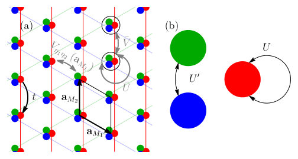
<figcaption class="paper-figure-caption"><b>Fig 2.</b> FIG. 2. Tight-binding model of the first conduction band of AA t-SnSe2. The lattice and the Wannier orbitals are shown in (a). The black parallelogram marks the conventional unit cell and the black arrows the moiré lattice vectors. Orbitals are shown as disks, with valley index η encoded by color: red, green, and blue correspond to η = 0, 1, 2, respectively. The leading quasi-1D hopping amplitude t is shown for val- ley η = 0, and the colored lines indicate the chains along which electrons tunnel within each valley. The interaction is fully 2D and of density-density form, with onsite three-orbital Hubbard interactions and a nearest-neighbor repulsion shown in gray. As a coarse...</figcaption>
</figure>
<figure class="paper-figure-card">
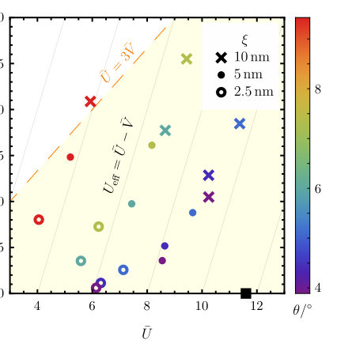
<figcaption class="paper-figure-caption"><b>Fig 3.</b> FIG. 3. Parameters of the AA t-SnSe2 Hamiltonian in Eq. (1). The plot shows the average onsite ( ¯U) and nearest-neighbor ( ¯V ) Coulomb repulsion parameters for the different twist an- gles θ and screening lengths ξ studied in this work (see also Section I). The twist angle is encoded by color, while the marker type distinguishes the different screening lengths ξ. The oblique gray lines are contours of constant effective on- site Hubbard repulsion Ueff [111]. The dashed orange line bounds the yellow region, which is free of a sign problem at half filling within DQMC [76]. The idealized strong-coupling model with only onsite Hubbard repulsion is shown by the square black marker.</figcaption>
</figure>
<figure class="paper-figure-card">
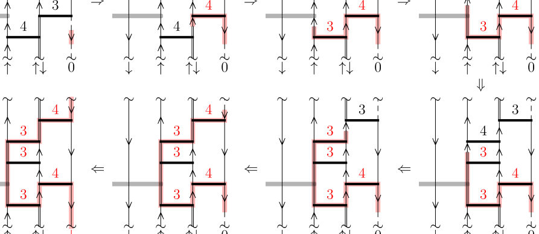
<figcaption class="paper-figure-caption"><b>Fig 4.</b> FIG. 5. Off-diagonal loop update on a single chain. The top-left panel shows a fragment of an initial SSE configuration containing the full world lines of four orbitals. The orbital states in |α⟩are indicated at the bottom; along the world lines they are represented schematically by dashed (0), single-arrow (↑/↓), and doubled (↑↓) lines. The subsequent panels, read clockwise, illustrate an off-diagonal update initiated by inserting a worm, highlighted in red, on one world line. The Fock state of the world line changes at the two worm ends (in the first panel, the state changes from 0 to ↓to 0 along the world line containing the worm). One end of the worm, the worm head, is then propagated...</figcaption>
</figure>
<figure class="paper-figure-card">
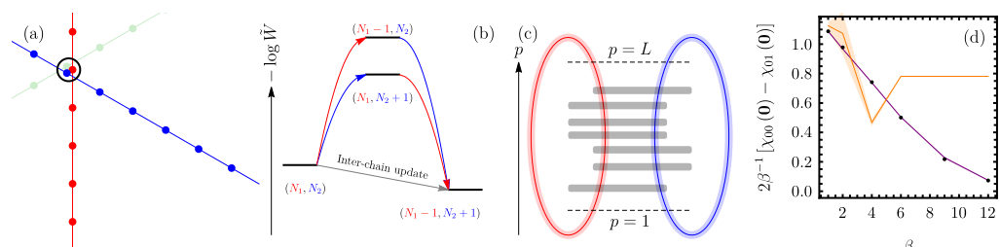
<figcaption class="paper-figure-caption"><b>Fig 5.</b> FIG. 6. Inter-chain update. (a) shows two intersecting chains (red and blue) of the lattice from Fig. 2(a) between which a particle transfer is attempted at the site marked by the black circle. The third chain (green) passing through the same site is shown for completeness but is unaffected by the update. (b) presents a schematic weight ( ˜ W) landscape of SSE configurations. Initially, the red (blue) chain contains N1 (N2) particles. Transferring a particle from the red to the blue chain changes the occupations to (N1 −1, N2 + 1). Conventional SSE updates accomplish this through two independent off-diagonal loop updates, which necessarily pass through one of the two intermediate...</figcaption>
</figure>

**Summary.** The research investigates strongly correlated physics in M-point moiré materials using an advanced Stochastic Series Expansion Quantum Monte Carlo technique. By developing a sign-problem-free algorithm capable of handling mixed dimensionality, the authors map out phase diagrams revealing correlated insulating and Wigner-Mott phases. This work advances computational methods for studying complex electronic correlations in novel 2D material platforms.

**Why it may be interesting.** This work provides a powerful numerical tool (sign-problem-free QMC) to study complex, quasi-low-dimensional correlated electron systems that are highly relevant for understanding emergent phenomena in 2D materials.

Detailed structure

**Main problem.** To study the strongly interacting physics of M-point moiré materials, particularly exploring regimes beyond idealized limits like intermediate coupling or away from integer fillings.

**Main result.** The authors successfully applied a sign-problem-free Quantum Monte Carlo method to map out the phase diagram, finding evidence for correlated insulators and Wigner-Mott states in twisted SnSe2.

**Method.** Stochastic Series Expansion (SSE) Quantum Monte Carlo (QMC), which was adapted with custom global updates and parallel tempering to handle the mixed-dimensional nature of the system.

**Model / system.** The physical platform is AA-stacked $	ext{SnSe}_2$, modeled by a three-orbital Hubbard Hamiltonian exhibiting quasi-one-dimensional hopping within valleys, coupled into a fully two-dimensional network. The model captures strong electronic correlations in this moiré superlattice.

**Key observables.** Inverse compressibility ($\partial\mu/\partial
u$), charge and spin stiffnesses ($
ho_C, 
ho_S$), susceptibility components, and the spin-spin correlation function $S(i)$.

**Important parameters / regimes.** Twist angle ($	heta$), interaction strength ($U, V$), filling factor ($
u$), and temperature/inverse temperature ($eta$).

**Assumptions / limitations.** The analysis often neglects Hund's and anti-Hund's couplings due to their small magnitude or antagonistic nature; the method requires specialized inter-chain updates for full equilibration.

**Figures summary.** Figures display quantitative results across various parameters, showing how observables like compressibility and stiffnesses change with filling and temperature in the mixed-dimensional regime. Benchmarking figures compare SSE against ED/DQMC to validate the algorithm's accuracy.

**Paper structure.** The paper systematically develops the model Hamiltonian, details the necessary adaptations of the SSE QMC method (including inter-chain updates), benchmarks this method against exact and determinantal methods, and finally applies it to map out the phase diagram by calculating various thermodynamic observables.

Abstract

A new moiré-material platform has recently been proposed based on twisting two-dimensional triangular-lattice monolayers whose low-energy states lie at the three M points of the Brillouin zone. Continuum models derived from extensive ab initio simulations suggest that electrons in the conduction bands of one such M-point moiré material, twisted AA-stacked SnSe$_2$, realize a three-orbital Hubbard model with orbitally-selective, quasi-one-dimensional (quasi-1D) hopping, protected by a projective mirror symmetry. Here, we show that the resulting "mixed-dimensional" limit -- in which the hopping is exactly quasi-1D in each valley, while the valleys are coupled by interactions into a fully two-dimensional network -- can be sampled with Stochastic Series Expansion (SSE) quantum Monte Carlo (QMC) without a sign problem at any filling. We develop an efficient new SSE QMC algorithm that combines custom global updates with parallel tempering to overcome the equilibration challenges posed by the mixed-dimensional setting. We then use this algorithm to explore the phase diagram of M-point twisted AA-stacked SnSe$_2$. Over extended and realistic ranges of twist angles and interaction strengths, we find that at integer fillings the system supports correlated insulators whose nature and strength depend strongly on angle. At certain commensurate fractional fillings, we further find evidence for Wigner-Mott insulators. We analytically account for the main features observed numerically using a strong-coupling description. Finally, we discuss perturbations away from the mixed-dimensional limit and the possibility of applying our method to other realizations of mixed-dimensional Hubbard models.

[↑ back to top](#top)

### [QuBE/Qubex: an integrated hardware-software system for superconducting qubit experiments with broadband control](http://arxiv.org/abs/2606.13010v1)

**Authors:** Akinori Machino, Kazuhisa Ogawa, Takefumi Miyoshi, Hidehisa Shiomi, Shinichi Morisaka, Ryo Matsuda, Nilton F. G. Filho, Koichiro Ban, Takafumi Miyanaga, Keisuke Koike, Ryutaro Ohira, Toshi Sumida, Yoshinori Kurimoto, Yuuya Sugita, Yosuke Ito, Yasunari Suzuki, Peter A. Spring, Shiyu Wang, Hiroto Mukai, Arvind Mamgain, Shuhei Tamate, Yutaka Tabuchi, Yasunobu Nakamura, Makoto Negoro  
**Type:** experiment · **Category:** quantum information and computing · **PDF:** <https://arxiv.org/pdf/2606.13010v1>  
**Analysis basis:** full PDF text, analyzed in chunks
**Topic relevance:** 🔥 `QC/QI experiment` **4/5** · `quantum measurements` **1/5**

↔ Scroll figures horizontally

<figure class="paper-figure-card">
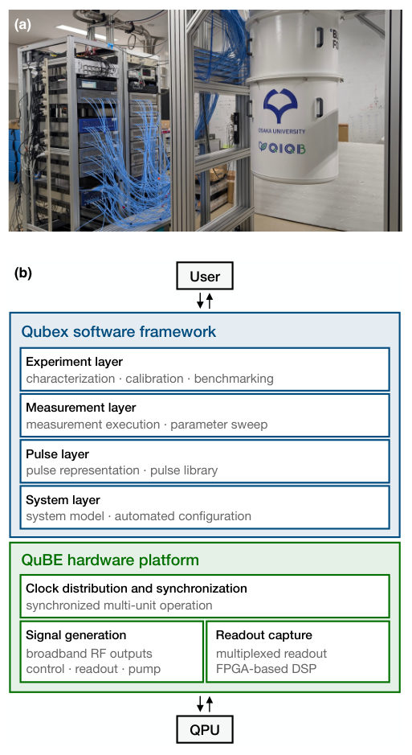
<figcaption class="paper-figure-caption"><b>Fig 1.</b> FIG. 1. System overview. (a) Photograph of the implemented QuBE control system. (b) Schematic of the hardware–software control stack used in this work. The Qubex software framework maps user-facing workflows through its experiment, measure- ment, pulse, and system layers, while the QuBE hardware platform provides clock distribution and synchronization, mi- crowave signal generation, and readout capture for quantum processing unit (QPU) operation.</figcaption>
</figure>
<figure class="paper-figure-card">
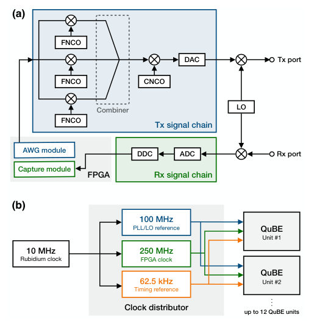
<figcaption class="paper-figure-caption"><b>Fig 2.</b> FIG. 2. Hardware-side organization of the QuBE platform. (a) Representative transmit (Tx) and receive (Rx) signal chains within one QuBE unit. The Tx chain combines waveform gen- eration implemented in the FPGA, FNCO/CNCO frequency shifts, DAC conversion, and shared-LO upconversion, while the Rx chain performs shared-LO downconversion, ADC dig- itization, DDC processing, and capture in the FPGA. The RF DAC/ADC signal chains are implemented using AD9082 mixed-signal converters. (b) Clock-distribution scheme for synchronized multi-unit operation. A rubidium-based 10-MHz clock is distributed as 100-MHz PLL/LO references, 250-MHz FPGA clocks, and 62.5-kHz timing references for up to 12 QuBE...</figcaption>
</figure>
<figure class="paper-figure-card">
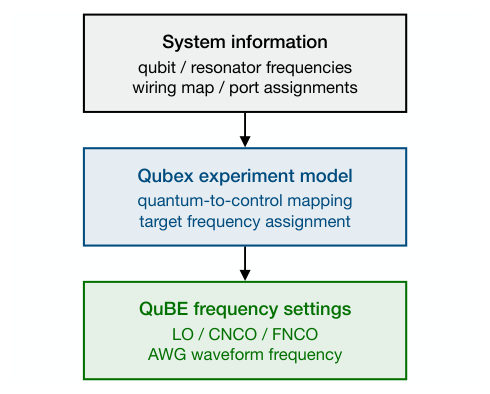
<figcaption class="paper-figure-caption"><b>Fig 3.</b> FIG. 3. Hardware-setting resolution in Qubex. System information, including qubit and resonator frequencies, wiring maps, and port assignments, is resolved into an experiment model that maps the quantum system to the control system. Target frequencies are then resolved into QuBE frequency settings consisting of LO, CNCO, FNCO, and AWG waveform- frequency terms.</figcaption>
</figure>
<figure class="paper-figure-card">
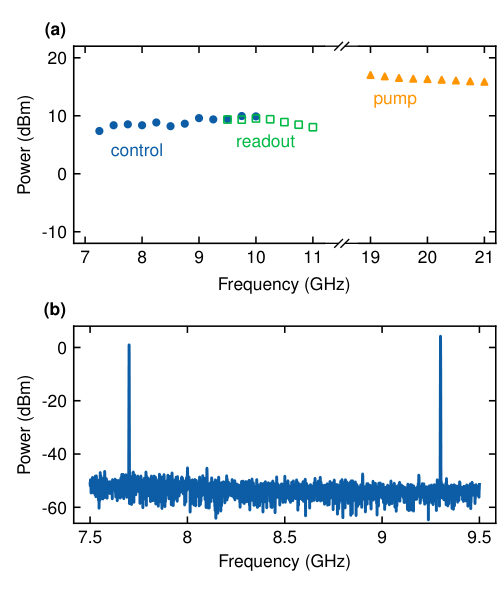
<figcaption class="paper-figure-caption"><b>Fig 4.</b> FIG. 4. Broadband output capability of the QuBE controller. (a) Output power from representative control, readout, and pump ports across their operating bands. (b) Multi-tone output spectrum from one control output port, where two digital channels synthesize tones separated by 1.6 GHz at the same physical output.</figcaption>
</figure>
<figure class="paper-figure-card">
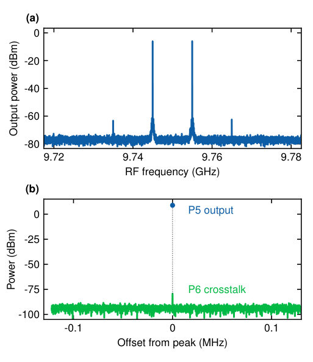
<figcaption class="paper-figure-caption"><b>Fig 5.</b> FIG. 5. Signal integrity and channel isolation of the QuBE controller. (a) Two-tone IMD measurement for a control channel. The programmed tones are placed around 9.75 GHz with offsets of 5 MHz and calibrated to approximately −6 dBm per tone. The smaller side peaks are the third-order IMD products, which are at least 56.4 dB below the driven tones. (b) Neighboring-port crosstalk measurement between driven P5 and adjacent P6 output ports. The P6 crosstalk peak is 88.0 dB below the P5 target-port output.</figcaption>
</figure>

**Summary.** The paper introduces QuBE/Qubex, a comprehensive hardware-software system designed to control large superconducting qubit arrays. It details how this integrated stack automates complex tasks like broadband calibration and multilevel readout on 64 qubits. This work significantly advances the engineering feasibility of scaling quantum computation by providing an open, functional platform.

**Why it may be interesting.** This work provides an industrial-grade blueprint for scaling quantum processors by solving the critical interface problem between complex analog microwave electronics and high-level digital control logic, which is highly relevant to open quantum systems research.

Detailed structure

**Main problem.** The core challenge is achieving high-fidelity, scalable quantum operations on large superconducting qubit arrays by integrating complex control hardware with sophisticated software orchestration.

**Main result.** The integrated QuBE/Qubex system successfully demonstrated multi-unit far-detuned cross-resonance calibration and multilevel readout fidelity exceeding 95%, validating a robust platform for scaling superconducting qubits.

**Method.** The authors employed an automated, layered software stack (Qubex) to manage hardware resources (QuBE), enabling complex characterization routines like Hamiltonian tomography and randomized benchmarking on a 64-qubit chip.

**Model / system.** The platform is a 64-qubit fixed-frequency transmon superconducting qubit chip. The control system uses broadband microwave electronics capable of generating signals across multiple GHz spans, synchronized via shared clock references.

**Key observables.** Measured two-qubit gate fidelity (98.34%), multilevel readout state assignment fidelity ($ar{F}$), and phase stability standard deviations ($\sigma < 0.456^\circ$).

**Important parameters / regimes.** Instantaneous frequency span up to 1.6 GHz; operating temperature range from room temperature down to mK levels.

**Assumptions / limitations.** The system assumes the ability to map abstract quantum operations onto specific, resolved microwave hardware settings (LO, CNCO, FNCO, AWG) via a systematic decomposition formula.

**Figures summary.** Figures detail the hardware architecture (QuBE rack), the software control stack mapping, frequency allocation maps of the 64-qubit chip, and measurement results like phase stability traces and gate fidelity benchmarks.

**Paper structure.** The paper progresses from introducing the need for integrated control to detailing the layered Qubex software model, characterizing hardware capabilities (broadband output, signal integrity), demonstrating advanced measurements (CR calibration, multilevel readout), and finally benchmarking performance on a large-scale chip.

Abstract

Achieving high-fidelity operation in large-scale superconducting qubit systems requires not only control hardware with broad frequency coverage, low crosstalk, and tight synchronization but also software that coordinates system configuration, experiment execution, and data analysis. Here we present an integrated qubit-control system that combines broadband microwave hardware with a pulse-level software stack for scalable superconducting qubit experiments. The hardware provides broadband microwave coverage, including an instantaneous span of up to 1.6 GHz from a control output, while the software reduces setup and calibration overhead through automated configuration and built-in experiment workflows. We validate the system on a 64-qubit fixed-frequency transmon chip through full-chip frequency identification and representative demonstrations, including multi-unit far-detuned cross-resonance calibration and benchmarking that yields a measured two-qubit gate fidelity of 98.34%, and multilevel readout beyond the computational subspace. By disclosing the hardware architecture and releasing the software stack as open source, this work provides an inspectable hardware-software foundation for scalable superconducting qubit control experiments.

[↑ back to top](#top)

### [Toward Entanglement Bootstrap for Conformal Field Theory in Any Dimension](http://arxiv.org/abs/2606.12540v1)

**Authors:** Rolando Ramirez Camasca, Xiang Li, Ting-Chun Lin, John McGreevy  
**Type:** theory · **Category:** statistical mechanics · **PDF:** <https://arxiv.org/pdf/2606.12540v1>  
**Analysis basis:** full PDF text, analyzed in chunks
**Topic relevance:** 🔥 `entanglement & information structure` **4/5** · `correlated cavity matter` **1/5**

↔ Scroll figures horizontally

<figure class="paper-figure-card">
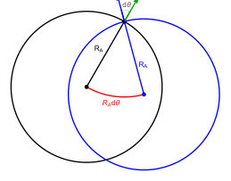
<figcaption class="paper-figure-caption"><b>Fig 1.</b> FIG. 1: The geometry determining the coefficient of Oˆn(x) in KA.</figcaption>
</figure>
<figure class="paper-figure-card">
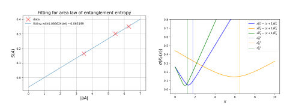
<figcaption class="paper-figure-caption"><b>Fig 2.</b> FIG. 2: Left: A fit to the area law for the entanglement entropy of subsystems in the groundstate of the critical Ising model on the icosahedron (J = 1, h = 4.375). Right: The error of the VFPE versus x.</figcaption>
</figure>
<figure class="paper-figure-card">
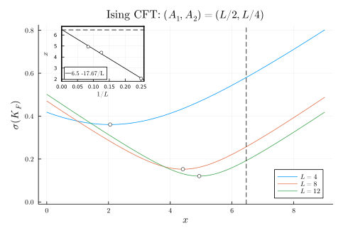
<figcaption class="paper-figure-caption"><b>Fig 3.</b> FIG. 4: Error of the VFPE versus x in KF ≡xKA2 −(1+x)KA1 for the fuzzy sphere critical Ising model groundstate. We fix the ratio of subregion sizes |A2|/|A1| and vary the total number of orbitals L. The ratio we choose is |A2|/|A1| = 2 with A1 = L/4 and A2 = L/2 for system sizes L = {4, 8, 12}. As we increase system size, the minima of the variance (white dots in the curves) approach the theoretical prediction (dashed vertical black line). For the chosen ratio, the theoretical prediction is xth = 1/( p</figcaption>
</figure>
<figure class="paper-figure-card">
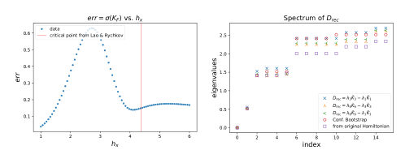
<figcaption class="paper-figure-caption"><b>Fig 4.</b> FIG. 3: Left: The error of the VFPE in the groundstate of the transverse-field Ising model on the icosahedron as a function of the transverse field. Right: The spectrum of the reconstructed Hamiltonian from the critical groundstate, for various choices of A, B, compared with the spectrum of the TFIM on the icosahedron at h = 4.375 and the conformal bootstrap spectrum [32–34].</figcaption>
</figure>
<figure class="paper-figure-card">
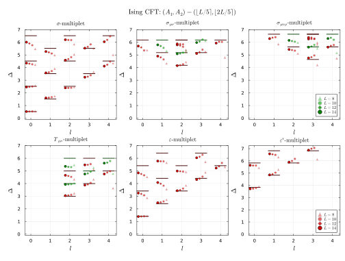
<figcaption class="paper-figure-caption"><b>Fig 5.</b> FIG. 5: The spectrum of the reconstructed Hamiltonian from the fuzzy sphere critical Ising model groundstate versus angular mo- mentum. We fix the subregion sizes to scale with the system size as (A1, A2) = (⌊L/5⌉, ⌊2L/5⌉), where ⌊. . .⌉denotes the nearest in- teger, and plot four system sizes L = {8, 10, 12, 14} with different markers and transparency. The horizontal lines indicate the con- formal bootstrap values of the spectrum [32–34]. The two different colors (red and green) specify whether the state is particle-hole even or odd respectively. Notice that the state in the σµν-multiplet with l = 2 and the state in the σµνρ-multiplet with l = 3 are doubly degenerate, which we indeed find.</figcaption>
</figure>

**Summary.** This work proposes an Entanglement Bootstrap method to study Conformal Field Theories (CFTs) by reconstructing effective Hamiltonians from entanglement structure. By testing this on known critical states, the authors demonstrate that their reconstructed Hamiltonians yield spectra consistent with CFT predictions and provide a systematic way to mitigate finite-size errors in numerical simulations.

**Why it may be interesting.** The use of entanglement measures ($K_A$) as a direct diagnostic tool for identifying universal properties like conformal invariance is highly relevant for understanding quantum criticality in strongly correlated systems.

Detailed structure

**Main problem.** The goal is to systematically understand Renormalization Group (RG) fixed points, particularly for Conformal Field Theories (CFTs), using the Entanglement Bootstrap approach in arbitrary dimensions.

**Main result.** The proposed method provides an automated way to improve finite-size effects by reconstructing Hamiltonians whose spectra exhibit characteristic CFT properties like integer spacing of descendants.

**Method.** The authors reconstruct a Hamiltonian, $H_{rec}$, from entanglement Hamiltonians ($K_A$) derived from reduced density matrices. They establish and test the Vector Fixed Point Equation (VFPE): $K_F |\psi
angle = F |\psi
angle$.

**Model / system.** The analysis focuses on CFT groundstates in arbitrary dimensions, using regularized approximate states on geometries like the icosahedron or fuzzy sphere as test cases.

**Key observables.** Von Neumann entropy ($S_A$), the reconstructed Dilation operator ($\langle D_{rec} 
angle$), and the error of the VFPE ($	ext{err}(\psi)$).

**Important parameters / regimes.** The dimension $D=d+1$, and specific coefficients $\lambda_i$ chosen to cancel UV contributions.

**Assumptions / limitations.** The method assumes that entanglement Hamiltonians can be decomposed into a CFT part and a manageable UV correction, allowing for systematic cancellation of divergences.

**Figures summary.** Figures illustrate the geometry determining coupling constants, show minimization of the VFPE error ($	ext{err}(\psi)$) detecting phase transitions, and display reconstructed spectra matching known CFT predictions.

**Paper structure.** The paper develops the theoretical framework by defining the entanglement bootstrap using linear combinations of entanglement Hamiltonians to derive the VFPE. It then applies this method numerically to specific geometries (icosahedron, fuzzy sphere) to test its ability to recover known critical point physics and improve finite-size calculations.

Abstract

Given a quantum critical wavefunction in any dimension, we propose a reconstructed Hamiltonian, analogous to the ones previously found for 1+1d CFT and for 2+1d bosonic liquid topologically-ordered states. We test numerically that, for known regularized approximate CFT groundstates (on the icosahedron and the fuzzy sphere), (1) they are close to the groundstate of their reconstructed Hamiltonian, and (2) the spectrum of their reconstructed Hamiltonian on the unit sphere has CFT properties (integer spacing of descendants) and matches known low-lying energies. We show that this provides an automated method to improve the finite-size effects in a fixed Hilbert space.

[↑ back to top](#top)

### [Roto-Reflection Geometry of Pure Two-Qubit Entanglement](http://arxiv.org/abs/2606.12637v1)

**Authors:** Stanislav Filatov, Marcis Auzinsh  
**Type:** theory · **Category:** quantum information and computing · **PDF:** <https://arxiv.org/pdf/2606.12637v1>  
**Analysis basis:** full PDF text, analyzed in chunks
**Topic relevance:** 🔥 `entanglement & information structure` **4/5**

↔ Scroll figures horizontally

<figure class="paper-figure-card">
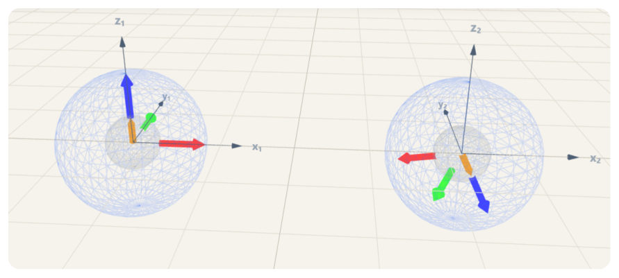
<figcaption class="paper-figure-caption"><b>Fig 1.</b> Figure 1: Arbitrary pure partially entangled two-qubit state. Inner spheres with reduced Bloch vectors represent the local reduced-state information while outer shells with correlated triads represent entangled part of the state. Arrows of the same color represent maximally correlated directions.</figcaption>
</figure>
<figure class="paper-figure-card">
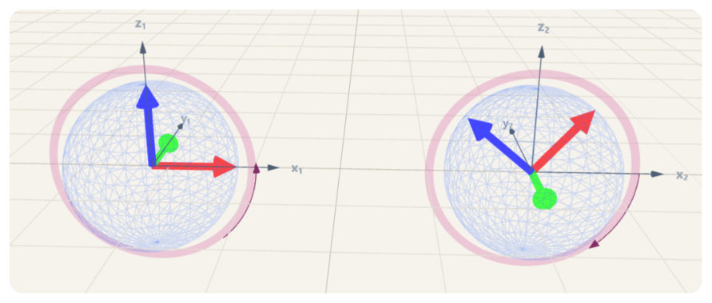
<figcaption class="paper-figure-caption"><b>Fig 2.</b> Figure 2: Maximally entangled state with ERRP equal to the xz-plane and a nonzero in-plane rotation. The state is obtained from |Φ+⟩by a local rotation I ⊗e−iασy/2 of the second qubit. The arc indicates the rotation angle of the roto-reflection.</figcaption>
</figure>
<figure class="paper-figure-card">
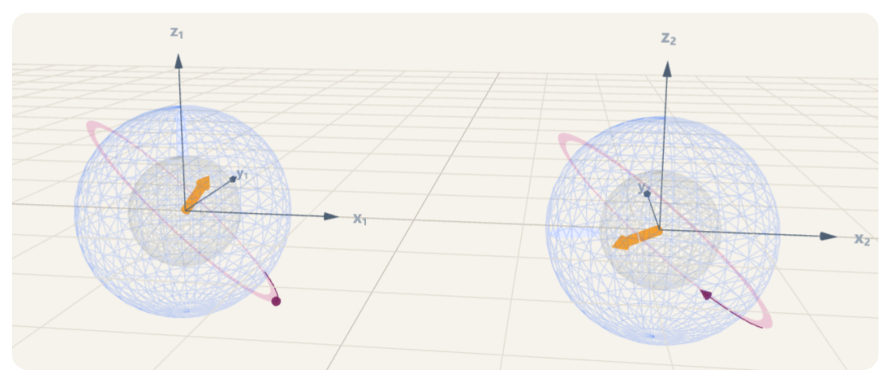
<figcaption class="paper-figure-caption"><b>Fig 3.</b> Figure 3: Representation of an arbitrary pure partially entangled state where entanglement geometry is described through an ERRP.</figcaption>
</figure>

**Summary.** This paper develops the concept of the Entanglement Roto-Reflection Plane (ERRP) to geometrically characterize pure two-qubit entanglement. It shows that maximally entangled states exhibit correlation patterns described by roto-reflections within the Pauli correlation tensor framework. This geometric invariant provides a covariant complement to scalar measures like concurrence.

**Why it may be interesting.** This work provides a novel, geometrically intuitive invariant for quantifying bipartite quantum correlations that is covariant under local unitaries, offering a powerful theoretical tool beyond standard entanglement measures.

Detailed structure

**Main problem.** To characterize pure two-qubit entanglement using a natural geometric form that goes beyond simple scalar measures like concurrence.

**Main result.** The authors introduce the Entanglement Roto-Reflection Plane (ERRP), a geometric object derived from the Pauli correlation tensor, which characterizes the correlations of any pure bipartite entangled state.

**Method.** The analysis uses the Pauli decomposition of the density matrix to construct the correlation tensor $T$, and then extracts an improper orthogonal factor ($O$) that defines the ERRP geometry.

**Model / system.** The study focuses on pure two-qubit quantum states, analyzed using their Pauli correlation tensor $R_{\mu
u} = 	ext{Tr}(
ho \sigma_\mu \otimes \sigma_
u)$. The framework is inherently mathematical and theoretical.

**Key observables.** Pauli correlation tensor ($T$), Concurrence ($C$), Entanglement Roto-Reflection Plane (ERRP) defined by an oriented normal ($\mathbf{n}$) and a signed angle ($\phi$).

**Important parameters / regimes.** The degree of entanglement, quantified by concurrence $C$, which dictates how the ERRP is factored out from the full correlation tensor.

**Assumptions / limitations.** The construction is currently restricted to pure two-qubit states; extensions to mixed states require further decomposition techniques.

**Figures summary.** Figures illustrate the Pauli decomposition visualization, showing local Bloch vectors and correlated triads. They also show maximally entangled states whose correlations are described by a roto-reflection geometry (e.g., in the xz-plane).

**Paper structure.** The paper establishes that entanglement has a geometric characterization beyond scalars. It derives this geometry using the Pauli tensor, showing how maximal entanglement corresponds to an improper orthogonal map (roto-reflection), and then generalizes this structure to partially entangled states by factoring out the concurrence contraction.

Abstract

Pure two-qubit entanglement is usually characterized by scalar quantities such as concurrence. Here we show that it also has a natural geometric form. In the Pauli correlation tensor, maximally entangled states appear as improper orthogonal maps between two local Bloch spheres. These maps are roto-reflections. For partially entangled pure states, the same roto-reflection geometry is recovered after separating the contraction associated with concurrence. We call the corresponding geometric object the Entanglement Roto-Reflection Plane (ERRP). It organizes the maximally correlated directions of the two-qubit state and provides a covariant geometric complement to the scalar magnitude of entanglement.

[↑ back to top](#top)

### [Kubo-Martin-Schwinger conditions for non-Hermitian systems](http://arxiv.org/abs/2606.13251v1)

**Authors:** Chen Lan, Luyao Ma, Hao Yang  
**Type:** theory · **Category:** statistical mechanics · **PDF:** <https://arxiv.org/pdf/2606.13251v1>  
**Analysis basis:** full PDF text, analyzed in chunks
**Topic relevance:** `correlated / nonlocal dissipation` **3/5** · `driven-dissipative phase transition` **3/5** · `methods for driven-dissipative` **3/5** · `non-equilibrium dynamics` **3/5** · `Keldysh / 2PI / non-Gaussian methods` **2/5** · `non-equilibrium universality` **2/5** · `Kondo & dissipative impurity` **1/5** · `analog quantum simulation` **1/5** · `entanglement & information structure` **1/5** · `scars & prethermalization` **1/5**

↔ Scroll figures horizontally

<figure class="paper-figure-card">
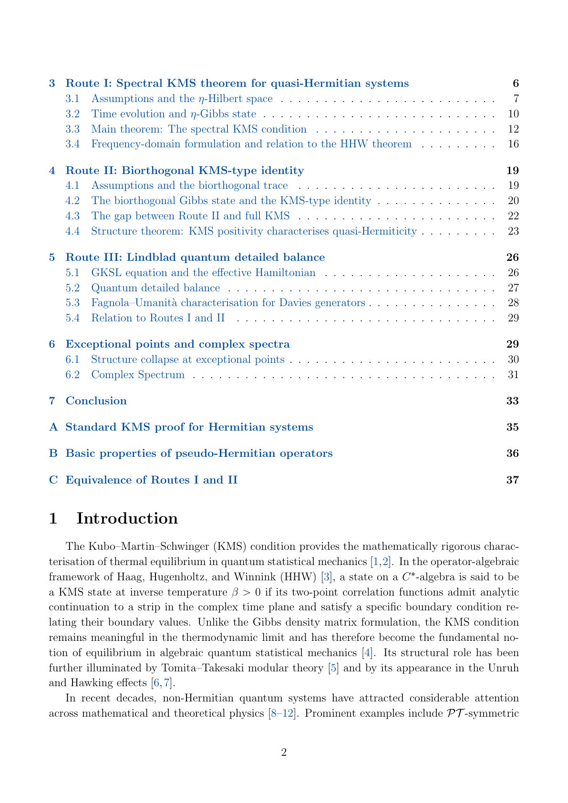
<figcaption class="paper-figure-caption"><b>Fig 1.</b> Low-resolution page preview, page 2</figcaption>
</figure>
<figure class="paper-figure-card">
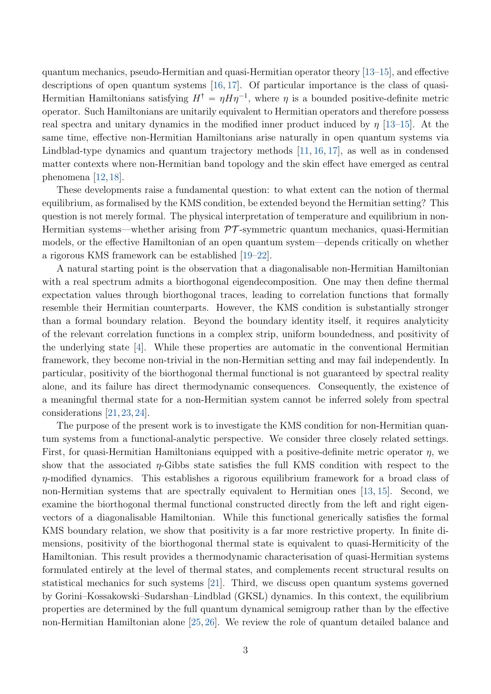
<figcaption class="paper-figure-caption"><b>Fig 2.</b> Low-resolution page preview, page 3</figcaption>
</figure>
<figure class="paper-figure-card">
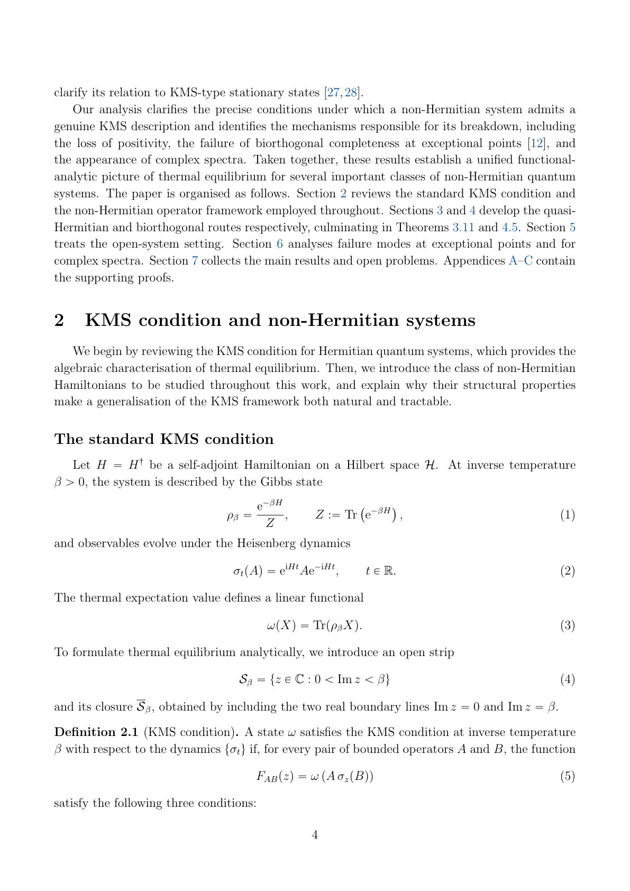
<figcaption class="paper-figure-caption"><b>Fig 3.</b> Low-resolution page preview, page 4</figcaption>
</figure>
<figure class="paper-figure-card">
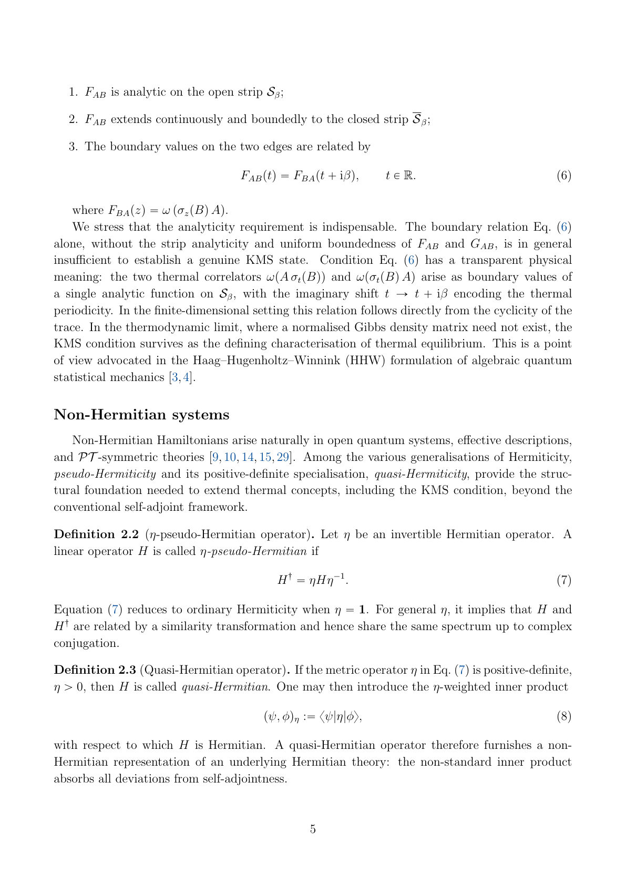
<figcaption class="paper-figure-caption"><b>Fig 4.</b> Low-resolution page preview, page 5</figcaption>
</figure>
<figure class="paper-figure-card">
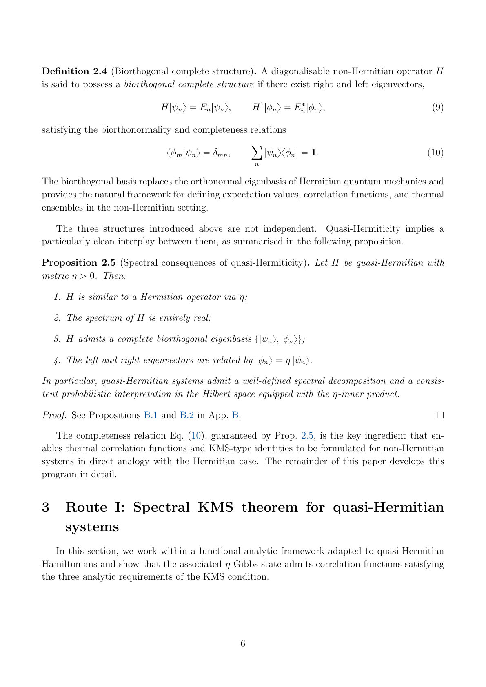
<figcaption class="paper-figure-caption"><b>Fig 5.</b> Low-resolution page preview, page 6</figcaption>
</figure>

**Summary.** This paper extends the fundamental Kubo-Martin-Schwinger (KMS) condition of statistical mechanics from Hermitian to non-Hermitian quantum systems. It establishes that quasi-Hermiticity is equivalent to a positivity criterion on the thermal state, allowing for the definition of an $\eta$-Gibbs state that satisfies KMS relations. The work rigorously analyzes failure modes when spectra are complex or Hamiltonians exhibit exceptional points.

**Why it may be interesting.** This work is highly relevant to AMO physics and open quantum systems because it provides the rigorous mathematical framework needed to define thermal equilibrium when the underlying dynamics are non-Hermitian, which occurs naturally in realistic settings like dissipation or gain media.

Detailed structure

**Main problem.** The central problem is extending the Kubo-Martin-Schwinger (KMS) thermal equilibrium condition, traditionally defined for Hermitian systems, to non-Hermitian quantum Hamiltonians.

**Main result.** The paper establishes that quasi-Hermiticity (defined via a metric $\eta$) is equivalent to the positivity of the biorthogonal Gibbs functional, and under these conditions, the associated $\eta$-Gibbs state satisfies the full KMS condition.

**Method.** The analysis employs functional-analytic techniques, utilizing spectral theory adapted for non-Hermitian operators through an auxiliary metric ($\eta$), and comparing results from three routes: quasi-Hermiticity, biorthogonal traces, and Lindblad dynamics.

**Model / system.** The study focuses on general non-Hermitian Hamiltonians $H$, which can be analyzed in the context of pseudo-Hermiticity ($H^\dagger = \eta H \eta^{-1}$) or as generators of open quantum systems described by Lindblad master equations. The system is characterized by its spectral properties and associated thermal states.

**Key observables.** The primary observables are the correlation functions $\langle A \sigma_{t} B 
angle$ and the generalized Gibbs functionals ($\omega_{	ext{bi}}$ or $\omega_\eta$), whose analyticity and boundary behavior define the KMS condition.

**Important parameters / regimes.** Inverse temperature ($eta$) is crucial, as are the metric operator ($\eta$) and the spectral properties of $H$, such as whether the spectrum is real or complex.

**Assumptions / limitations.** Key assumptions include the existence of a positive-definite metric $\eta$ (quasi-Hermiticity) and the requirement for analyticity in the complex time plane, which are necessary to prove the KMS relation.

**Figures summary.** The notes summarize comparisons between failure modes (Exceptional Points vs. Complex Spectra) across different KMS conditions, and compare structural requirements like $C^*$-algebra structure across various theoretical routes.

**Paper structure.** The paper systematically investigates three complementary routes to the KMS condition: 1) Spectral theory for quasi-Hermitian systems ($\eta$-Gibbs state); 2) Biorthogonal trace identities; and 3) Quantum Detailed Balance (QDB) for open systems. It concludes by analyzing failure modes at exceptional points and complex spectra.

Abstract

We investigate the extension of the Kubo--Martin--Schwinger (KMS) thermal equilibrium condition to non-Hermitian Hamiltonians with real spectra and biorthogonal eigensystems, providing a systematic analysis through three complementary routes. Our central result is a thermodynamic characterisation of quasi-Hermiticity: for $H \in M_d(\mathbb{C})$ diagonalisable with real spectrum, the biorthogonal Gibbs functional $ω_{\rm{bi}}(A) = Z_{\rm{bi}}^{-1} \sum_n e^{-βE_n}\langleφ_n|A|ψ_n\rangle$ satisfies $ω_{\rm{bi}}(A^†A) \geq 0$ for all $A$ if and only if $H$ is quasi-Hermitian. The proof constructs the metric $η$ directly from the eigenprojectors of $ω_{\rm{bi}}$ via the Riesz representation theorem, with no prior choice of $η$, providing a metric-free certificate of quasi-Hermiticity outside the Mostafazadeh--Scholtz framework. Under the full quasi-Hermitian hypothesis, we prove that the $η$-Gibbs state $ω_η(A) = Z_η^{-1}\, \rm{Tr}[ηe^{-βH}A]$ satisfies all three analytic KMS conditions, using the Hadamard three-line theorem and Bari's theorem on Riesz bases. The result is non-trivial: the transported state $\hatω(X) = \rm{Tr}[e^{-βh}Xη]/Z_η$ differs from the Gibbs state of the isospectral Hermitian partner $h = η^{1/2}Hη^{-1/2}$ whenever $[η,h]\neq 0$, so the KMS property cannot be deduced from the Hermitian theory by similarity. The gap between this result and the full Haag--Hugenholtz--Winnink $C^*$-algebraic framework is identified. Failure modes at exceptional points and for complex spectra are analysed, and the relation to the Fagnola--Umanità quantum detailed balance condition for open systems is discussed.

[↑ back to top](#top)

### [A solvable model for unsupervised federated learning](http://arxiv.org/abs/2606.13045v1)

**Authors:** Giovanni Catania, Aurélien Decelle, Gianluca Manzan, Beatriz Seoane, Daniele Tantari  
**Type:** theory · **Category:** disordered systems and neural networks · **PDF:** <https://arxiv.org/pdf/2606.13045v1>  
**Analysis basis:** full PDF text, analyzed in chunks
**Topic relevance:** `Keldysh / 2PI / non-Gaussian methods` **3/5** · `driven-dissipative phase transition` **2/5** · `methods for driven-dissipative` **2/5** · `non-equilibrium universality` **2/5** · `Kondo & dissipative impurity` **1/5** · `analog quantum simulation` **1/5** · `correlated / nonlocal dissipation` **1/5** · `correlated cavity matter` **1/5** · `entanglement & information structure` **1/5** · `exotic spin models in light-matter` **1/5** · `non-equilibrium dynamics` **1/5**

↔ Scroll figures horizontally

<figure class="paper-figure-card">
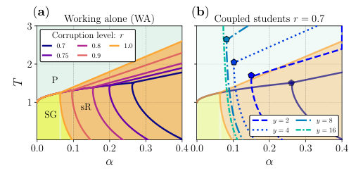
<figcaption class="paper-figure-caption"><b>Fig 1.</b> FIG. 1. Phase diagrams for the recovery of the teacher pattern from samples generated at ˆβ = 0.8, using data corrupted at different noise levels parametrized by r. (a) Working- alone (WA) scenario, in which students do not interact. The paramagnetic (P), spin-glass (SG), and signal-retrieval (sR) phases are indicated, with background colors corresponding to the uncorrupted data limit (r = 1) analyzed in [22, 26]. As the noise level increases (i.e., as r decreases), the sR phase progressively shifts toward larger values of α. (b) Homogeneous-corruption SDN scenario with corruption level r = 0.7. Different color lines indicate the retrieval region associated with varying numbers of students...</figcaption>
</figure>
<figure class="paper-figure-card">
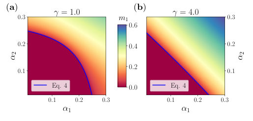
<figcaption class="paper-figure-caption"><b>Fig 2.</b> FIG. 3. First student’s magnetization (m1) heat-map for the 2-student interacting system at fixed inverse temperature β = 0.5 with baseline noise ˆβ = 0.8 for the SDD scenario. The heterogeneous dataset size effect is described by the magnetization values of the first student in the (α1, α2) plane, for two values of γ. (a): γ = 1; (b): γ = 4. A blue line denotes the sR transition of Eq.(4). The magnetization of student u = 2 has the same behavior upon the exchange α1 ↔α2.</figcaption>
</figure>
<figure class="paper-figure-card">
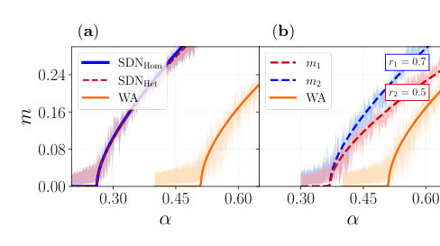
<figcaption class="paper-figure-caption"><b>Fig 3.</b> FIG. 2. Comparison of the magnetization obtained from the replica computation (solid and dashed lines) with Monte Carlo (MC) simulations (shaded areas) for a two-student system using the SDN ansatz at β = 0.5, ˆβ = 0.8. (a) SDN-homogeneous ansatz (r = 0.7) and SDN-heterogeneous ansatz (r1 = r2 = 0.7) both with γ = 1, compared against the WA baseline at the same corruption rate (r = 0.7). (b) SDN-heterogeneous ansatz with asymmetric corruption (r1 = 0.7, r2 = 0.5) and γ = 1, compared against the WA baseline (r = 0.7). In both panels, the WA student requires larger values of α to retrieve the teacher. The effect of the coupling in the SDN-homogeneous case significantly reduces the retrieval...</figcaption>
</figure>
<figure class="paper-figure-card">
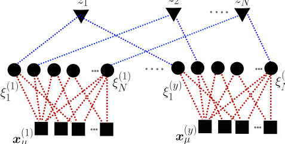
<figcaption class="paper-figure-caption"><b>Fig 4.</b> FIG. 4. Representation of the RBM associated with the interacting teacher-student model. Each student can be represented as one RBM with weights ηu,µ i (red dotted lines) connecting visible (ξu i ) and hidden (x(u) µ ) units. Each ξu i is further connected via a second hidden unit zu to the other u-RBMs accounting for the cooperation term.</figcaption>
</figure>
<figure class="paper-figure-card">
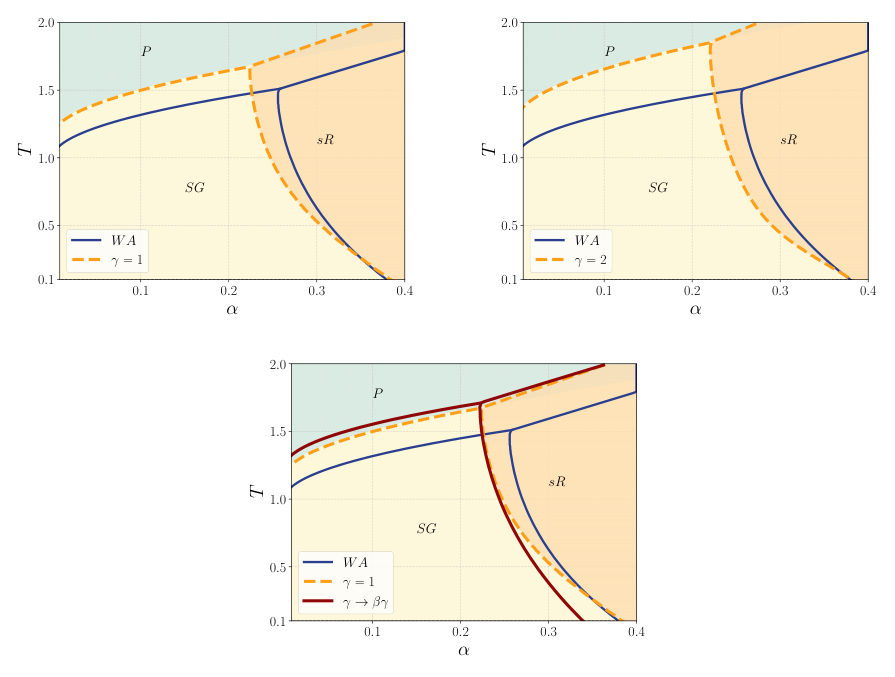
<figcaption class="paper-figure-caption"><b>Fig 5.</b> FIG. 5. Phase diagram of the 2-student interacting system with corruption coefficients r1 = 0.7, r2 = 0.5 for baseline noise set to ˆβ = 0.8. Left: γ = 1. In the paramagnetic (P) and spin-glass (SG) regions, recovering the teacher is impossible. For larger dataset sizes (α), the students enter the signal retrieval region (sR), where they learn by generalization. The compharison with the WA case shows the coupled model reduce the critical load αc w.r.t. the solo r = 0.7. Right: γ = 2. In this case the sR phase is enlarged, both at high temperature (the transition appears sooner than the γ = 1) and at low temperature. Bottom: On top of the same phase diagram of γ = 1 the red solid curve...</figcaption>
</figure>

**Summary.** This theoretical work develops a framework using statistical physics tools to model federated learning as an inference problem. It analytically proves that interactions between students significantly boost the ability to recover a hidden generative signal from noisy, distributed data. The key insight is mapping this cooperative process onto equilibrium sampling in structured neural network models.

**Why it may be interesting.** While focused on ML, the mathematical machinery—using replica theory to analyze collective inference in complex interacting systems—is highly relevant to understanding glassy dynamics or pattern retrieval in quantum memory models.

Detailed structure

**Main problem.** The paper analyzes how interactions among multiple students enhance learning performance when inferring an underlying generative teacher pattern from local, potentially noisy or incomplete data realizations in a federated setting.

**Main result.** Cooperative student interactions are systematically beneficial, reducing the sample complexity required for recovery in high-noise regimes and enhancing overlap with the ground-truth signal compared to isolated learning.

**Method.** The analysis employs theoretical tools from equilibrium disordered systems, utilizing the replica trick to compute the quenched free energy density in the thermodynamic limit.

**Model / system.** The system models a teacher generating patterns (Mattis model) and multiple students receiving data via two mechanisms: student-dependent noise (SDN) or dataset partitioning (SDD). The interactions are captured by coupling terms in an extended Hamiltonian, mapped onto an RBM structure.

**Key observables.** Magnetization ($m$), pairwise overlap ($q_{uv}$), critical sample complexity ($\alpha_c$), and the free energy density $f(\Lambda)$.

**Important parameters / regimes.** Student number ($y$), coupling strength ($\gamma$), noise levels ($r$), and data loads ($\alpha_u$). The analysis explores limits like $y 	o \infty$ and $\gamma 	o \infty$.

**Assumptions / limitations.** The derivation relies heavily on the Replica Symmetric (RS) ansatz for overlap matrices and various saddle-point approximations in the thermodynamic limit.

**Figures summary.** Figures illustrate phase diagrams showing transitions between Paramagnetic, Signal-Retrieval, and Spin-Glass phases as a function of noise/data load. They compare coupled vs. isolated learning thresholds ($\alpha_c$).

**Paper structure.** The paper progresses by first establishing the general theoretical framework using disordered systems tools (replica trick), then analyzing specific scenarios like SDN and SDD, deriving order parameter equations via variational principles, and finally characterizing phase transitions by solving determinant conditions.

Abstract

We introduce a theoretical framework for analyzing federated learning in a generative setting through a teacher-multiple interacting students scenario, in which each student receives a distinct realization of the data, either through a different noise corruption or by accessing a different subset, possibly of varying size. Using theoretical tools in equilibrium disordered system, we analytically show that interactions among students systematically enhance learning performance: highly noisy students require fewer samples to recover the underlying pattern, while low-noise students achieve a larger overlap with the ground-truth signal. We derive the optimal Bayesian conditions for teacher recovery as functions of the sample complexity, noise level, and interaction strength, and validate these predictions through numerical simulations. The resulting dynamics can be mapped onto equilibrium sampling in a Restricted Boltzmann Machine with a structured hidden layer, providing a principled theoretical understanding of how interactions improve distributed generative modeling.

[↑ back to top](#top)

### [Andreev Reflection to Probe Momentum-Dependent Spin Polarization in Altermagnet CrSb](http://arxiv.org/abs/2606.13395v1)

**Authors:** Yan Zhang, Yixuan Luo, Yue Yang, Zilong Li, Weilong Qiu, Lunhui Hu, Yuanfeng Xu, Yanfeng Guo, Chao Cao, Xin Lu  
**Type:** experiment · **Category:** strongly correlated electrons · **PDF:** <https://arxiv.org/pdf/2606.13395v1>  
**Analysis basis:** full PDF text, analyzed in chunks
**Topic relevance:** `exotic spin models in light-matter` **3/5** · `spintronics-quantum-optics interface` **3/5** · `Kondo & dissipative impurity` **2/5** · `quantum measurements` **2/5** · `Keldysh / 2PI / non-Gaussian methods` **1/5** · `analog quantum simulation` **1/5** · `correlated / nonlocal dissipation` **1/5** · `driven-dissipative phase transition` **1/5** · `methods for driven-dissipative` **1/5** · `non-equilibrium dynamics` **1/5**

↔ Scroll figures horizontally

<figure class="paper-figure-card">
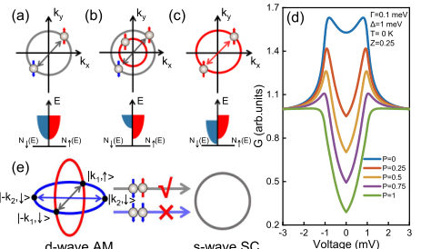
<figcaption class="paper-figure-caption"><b>Fig 1.</b> FIG. 1. (a) Normal metal with P = 0 has a spin-degenerate Fermi surface and symmetric density of states. (b) Conven- tional ferromagnet with 0 &lt; P &lt; 1 has one spin-polarized and one spin-degenerate band, leading to an asymmetric density of states at EF . (c) Half-metallic ferromagnet with P = 1 has only one spin-up band crossing the Fermi level. (d) Sim- ulated conductance curves for MPCS with different spin po- larizations. (e) Schematic illustration of Andreev reflection at the interface between a d–wave altermagnet and s–wave superconductor. The electrons at k and −k have the same spin except for the nodal region, resulting in the suppression of Andreev reflection across the interface.</figcaption>
</figure>
<figure class="paper-figure-card">
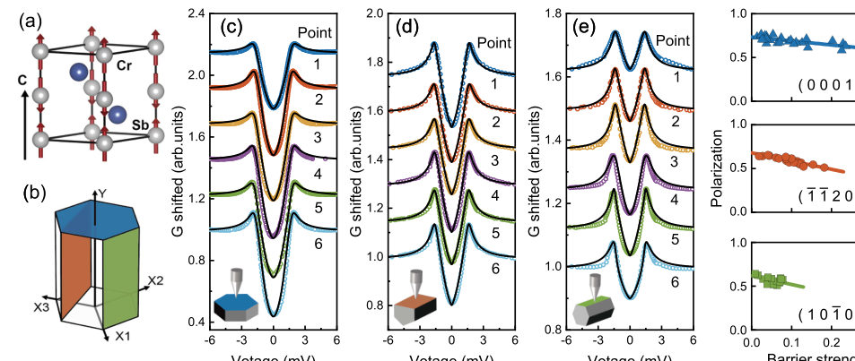
<figcaption class="paper-figure-caption"><b>Fig 2.</b> FIG. 2. (a) Schematic illustration of the crystal and magnetic structure of CrSb. (b) Different crystallographic planes for CrSb: blue (0 0 0 1), orange (1 1 2 0), and green (1 0 1 0). (c) Differential conductance curves G(V ) for six point contacts on CrSb crystals along the (0 0 0 1) direction, together with their optimal fits. (d) (1 1 2 0) plane, (e)(1 0 1 0) plane. The insets represent the MPCS configuration, where point-contacts were formed between the Nb tip and sample surface for each crystallographic plane. (f)-(h) momentum-dependent spin polarization Pk versus barrier strength Z for different contacts along three major orientations. The dashed lines are a guide to the eye.</figcaption>
</figure>
<figure class="paper-figure-card">
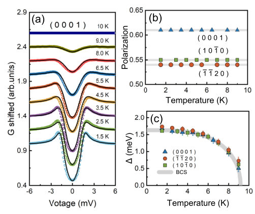
<figcaption class="paper-figure-caption"><b>Fig 3.</b> FIG. 3. (a) Conductance G(V) curves as a function of tem- perature for a point-contact on the (0 0 0 1) plane. (b) The extracted spin-polarization keeps constant with temperature for point-contacts in three major crystallographic planes. (c) Temperature dependence of the extracted Nb superconduct- ing gap ∆for point-contacts in three directions. The gray thick line is the expected BCS temperature behavior, and the extracted gaps ∆from all three major planes show a good agreement with the expectation.</figcaption>
</figure>
<figure class="paper-figure-card">
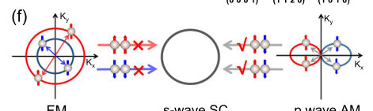
<figcaption class="paper-figure-caption"><b>Fig 4.</b> FIG. 5. (a) Top view of the calculated Fermi surface of CrSb. (b) Side view of the Fermi surface along the Γ–M direction. (c) Side view of the Fermi surface along the Γ–K direction. The topology and spin texture are characteristic of the g-wave altermagnetic symmetry. (d) Three-dimensional Brillouin zone (BZ) shows the high-symmetry points and the nodal planes are located at kz = nπ/c (n is an integer) and along the Γ–K directions. (e) Comparison between calculated and MPCS-determined momentum-dependent spin polarizations along different crystallographic directions. (f) Schematic il- lustration of Andreev reflection at the FM/SC and odd-parity AM/SC interface. Red and blue colors denote...</figcaption>
</figure>
<figure class="paper-figure-card">
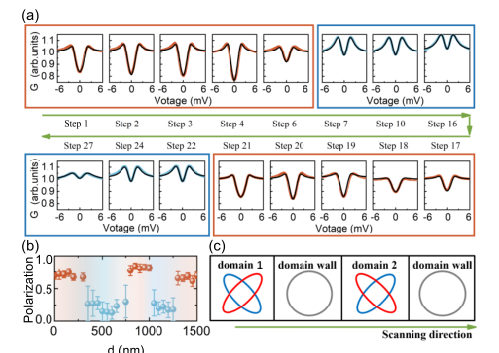
<figcaption class="paper-figure-caption"><b>Fig 5.</b> FIG. 4. (a) Spatial evolution of MPCS spectra measured at consecutive positions. (b) The extracted spin polarization values as a function of displacement suggest the existence of domains and domain walls. (c) Schematic illustration of the spin texture inside neighboring domains and the domain wall in between.</figcaption>
</figure>

**Summary.** This work uses mechanical point-contact spectroscopy to measure Andreev reflection signatures in the altermagnetic material $	ext{CrSb}$. The authors successfully quantify momentum-dependent spin polarizations ($P_k$) for different crystal planes, confirming the unique magnetic character of altermagnets. This establishes Andreev reflection as a novel technique for mapping $k$-dependent spin textures.

**Why it may be interesting.** While focused on condensed matter magnetism, the use of superconducting contacts (Andreev reflection) to probe electronic spin textures is a powerful diagnostic tool relevant to open quantum systems where coupling to leads or environments dictates measurable quantities.

Detailed structure

**Main problem.** To probe momentum-dependent spin polarization ($P_k$) in altermagnetic materials, which is crucial for next-generation spintronics but differs from conventional ferromagnets/antiferromagnets due to zero net magnetization.

**Main result.** The study successfully measured finite and distinct values for $P_k$ ($\approx 73.4\%$ for (0001), $67.9\%$ for (-1-120), and $61.9\%$ for (10-10)) in $	ext{CrSb}$ along different planes.

**Method.** Mechanical Point-Contact Spectroscopy (MPCS) was used to probe Andreev reflection on $	ext{CrSb}$ single crystals, supplemented by spatial line-scans.

**Model / system.** The system is the altermagnetic candidate $	ext{CrSb}$, which exhibits $g$-wave spin splitting. The analysis relies on fitting differential conductance $G(V)$ using a modified BTK model to extract $P_k$.

**Key observables.** Differential conductance $G(V)$, momentum-dependent spin polarization ($P_k$), domain size ($\approx 250-500\ 	ext{nm}$), and domain wall width ($\approx 250\ 	ext{nm}$).

**Important parameters / regimes.** Low temperatures (down to $0.3\ 	ext{K}$), superconducting gap ($\Delta$), barrier strength ($Z$).

**Assumptions / limitations.** The use of the modified BTK model and assuming that the extracted $P_k$ values are intrinsic properties independent of temperature or contact geometry.

**Figures summary.** Figures illustrate spin polarization effects in various magnetic systems, show $G(V)$ spectra for three orientations with derived $P_k$, confirm temperature stability of $P_k$, and map out the domain structure via spatial line-scans.

**Paper structure.** The paper establishes the scientific problem by introducing altermagnetism. It details the experimental setup using MPCS on $	ext{CrSb}$ to measure Andreev reflection signatures across three crystal planes, reports the quantitative $P_k$ values, and supports these findings with domain structure mapping.

Abstract

Altermagnetic materials have recently emerged as promising candidates for next-generation spintronic applications, characterized by the k-dependent spin-splitted band structure and a simultaneous zero-net-magnetization. Among them, altermagnetic candidate CrSb has attracted considerable attention, owing to its g-wave spin splitting and high Néel temperature. In this article, we employed mechanical point-contact spectroscopy (MPCS) with superconducting Nb tips to probe the Andreev reflection on CrSb single crystals along three principal crystallographic orientations. The extracted momentum-dependent spin polarizations are approximately 73.4% for the (0001) plane, 67.9% for the (-1-120) plane, and 61.9% for the (10-10) plane, respectively, distinct from conventional antiferromagnets. Furthermore, conductance spectra from spatial line-scans on the sample surface support the existence of altermagnetic domains with a characteristic size of 250-500 nm separated by domain-walls with width about 250 nm. These results strongly support the momentum-dependent spin polarization in altermagnetic CrSb and establish Andreev reflection as a new paradigm to probe k-dependent spin textures.

[↑ back to top](#top)

### [Optical Implementation of Equilibrium Propagation Using Spatial Photonic Ising Machines](http://arxiv.org/abs/2606.13454v1)

**Authors:** Dimitri Vanden Abeele, Daniele Veraldi, Davide Pierangeli, Claudio Conti, Serge Massar  
**Type:** both · **Category:** disordered systems and neural networks · **PDF:** <https://arxiv.org/pdf/2606.13454v1>  
**Analysis basis:** full PDF text, analyzed in chunks
**Topic relevance:** `analog quantum simulation` **3/5** · `exotic spin models in light-matter` **3/5** · `driven-dissipative phase transition` **2/5** · `methods for driven-dissipative` **2/5** · `quantum optics experiment` **2/5** · `QC/QI experiment` **1/5** · `correlated cavity matter` **1/5** · `interference shaping light` **1/5** · `spintronics-quantum-optics interface` **1/5**

↔ Scroll figures horizontally

<figure class="paper-figure-card">
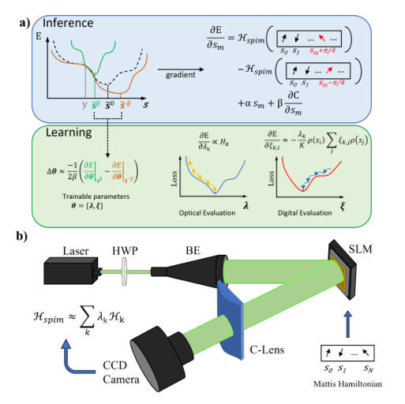
<figcaption class="paper-figure-caption"><b>Fig 1.</b> FIG. 1. (a) Equilibrium Propagation implemented using SPIM. EP follows a bi-level optimization. During infer- ence the energy is minimized using a combination of opti- cal measurements and digital terms. During learning the en- ergy landscape is modified to include the cost, correspond- ing to the additional force ±β∂C/∂sm. The trainable pa- rameters θ = {λ, ξ} are updated according to how the vari- ables conjugate to θ respond, at equilibrium, to the nudg- ing. The variables ∂E/∂λk are evaluated optically, while the variables ∂E/∂ξk,i are evaluated digitally. (b) Experimental setup. The SPIM evaluates the value of Mattis Hamiltonians Hk ∝1</figcaption>
</figure>
<figure class="paper-figure-card">
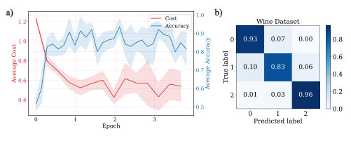
<figcaption class="paper-figure-caption"><b>Fig 2.</b> FIG. 2. Experimental Results. (a) Average cost and accu- racy over 7 independent training runs (4 epochs of 71 steps, 2 samples per step, moving average over 20 samples). (b) Av- erage confusion matrix of 7 independently trained networks, evaluated on the test set.</figcaption>
</figure>
<figure class="paper-figure-card">
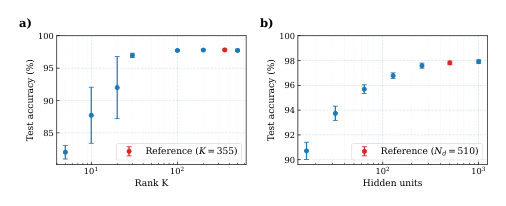
<figcaption class="paper-figure-caption"><b>Fig 3.</b> FIG. 3. Numerical simulations of EP using SPIM on the MNIST dataset. (a) Test accuracy versus rank K for Nd = 510. The maximum rank shown (K = 700) is larger than the theoretical maximum of 510. (b) Test accuracy versus the number of hidden units (Nd −10), with rank scaling as K ≈0.7Nd. The horizontal axis is logarithmic in both plots.</figcaption>
</figure>
<figure class="paper-figure-card">
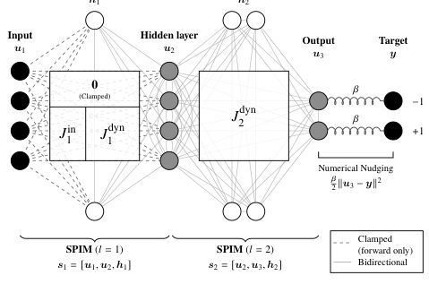
<figcaption class="paper-figure-caption"><b>Fig 4.</b> FIG. 4. Two-layer structured architecture. The network uses two SPIMs (l = 1, 2). Clamped inputs u1 are projected via Jin 1 , while remaining neurons couple through J1,2. Outputs u3 are nudged toward targets y.</figcaption>
</figure>
<figure class="paper-figure-card">
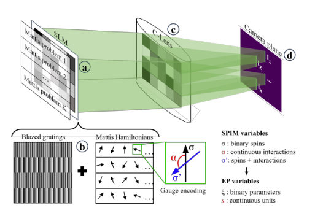
<figcaption class="paper-figure-caption"><b>Fig 5.</b> FIG. 5. Schematic of the focal plane division method to encode multiple Mattis problems simultaneously on a single SPIM. (a) The Spatial Light Modulator is used to encode a series of Mattis problems and blazed gratings onto the optical beam’s phase profile, while (b) exploiting gauge encoding for spins and interaction coefficients. (c) A cylindrical lens fo- cuses the propagating beam in the x-direction. The induced phase shift from the blazed gratings creates a set of distinct spots on the camera plane (d). The intensity of each spot provides the value of the corresponding Mattis Hamiltonian.</figcaption>
</figure>

**Summary.** The paper presents a novel method to implement Equilibrium Propagation, an advanced energy-based learning technique, using a Spatial Photonic Ising Machine. By encoding the required energy calculations optically via phase modulations on an SLM, they demonstrate a pathway toward ultra-low-power physical hardware for training neural networks. The results confirm high accuracy comparable to simulation benchmarks.

**Why it may be interesting.** This work directly bridges concepts from statistical physics (Ising models, energy minimization) with modern machine learning paradigms (EP). The use of photonics to realize complex many-body interactions is highly relevant for quantum optics applications in computation.

Detailed structure

**Main problem.** The primary goal is to demonstrate a low-energy, physical implementation of Equilibrium Propagation (EP), an energy-based learning framework, using optical hardware.

**Main result.** The authors achieved high test accuracies on the MNIST dataset both experimentally and numerically, validating the viability of this hybrid optical-digital approach for machine learning training.

**Method.** They employ a Spatial Photonic Ising Machine (SPIM) to optically evaluate the energy functional associated with EP. Gradient calculations are performed using finite difference schemes combined with digital processing.

**Model / system.** The system uses SPIMs, which encode spins and couplings into the spatial degrees of freedom of coherent light propagating through a Spatial Light Modulator (SLM). The underlying physics involves calculating Ising-like Hamiltonians derived from the EP energy functional.

**Key observables.** Test set accuracy (%) on MNIST/Wine datasets, average cost, and gradient components ($\partial E/\partial 	heta$).

**Important parameters / regimes.** Trainable parameters include coupling strengths $\{J_{in}, J_{dyn}\}$ and pattern weights $\{\lambda_k, \xi_{k,i}\}$. Key regimes involve the rank $K$ of the Mattis problems and the number of hidden units $N_d$.

**Assumptions / limitations.** The approach relies on approximating complex derivatives using finite differences (e.g., $\pm\pi/4$ phase shifts) and assumes that structured architectures can overcome limitations of simple all-to-all connectivity.

**Figures summary.** Figures illustrate the EP process, the experimental SPIM setup, and show test accuracy scaling versus coupling rank $K$ or hidden units $N_d$ for MNIST simulations.

**Paper structure.** The paper moves from defining the theoretical framework of EP (energy functional) to detailing the physical mapping onto the SPIM Hamiltonian. It then describes the hybrid optical-digital gradient calculation methods, validates performance on Wine experimentally, and finally presents extensive numerical results on MNIST across various parameter regimes.

Abstract

Equilibrium Propagation offers a compelling alternative to traditional machine learning for training energy-based networks. Here we demonstrate a hybrid optical-digital implementation of EP using a Spatial Photonic Ising Machine (SPIM). The SPIM exploits the gauge transformation method to optically encode both continuous neuron states and rank-1 binary trainable patterns as phase modulations via a spatial light modulator, with inference realized using a finite difference scheme. The experimental system is evaluated on the Wine classification dataset. The potential of this approach, including the use of continuous couplings and structured coupling matrices, is evaluated numerically on the more complex MNIST dataset. Our work provides a concrete pathway toward energy-efficient physical implementations of Equilibrium Propagation.

[↑ back to top](#top)

### [Steady-State Noise Signatures of Lindbladian Exceptional Points](http://arxiv.org/abs/2606.13377v1)

**Authors:** Shihang Pan, Gianmichele Blasi, Géraldine Haack  
**Type:** theory · **Category:** other · **PDF:** <https://arxiv.org/pdf/2606.13377v1>  
**Analysis basis:** full PDF text, analyzed in chunks
**Topic relevance:** `correlated / nonlocal dissipation` **3/5** · `driven-dissipative phase transition` **3/5** · `methods for driven-dissipative` **3/5** · `non-equilibrium dynamics` **2/5** · `non-equilibrium universality` **2/5** · `Keldysh / 2PI / non-Gaussian methods` **1/5** · `analog quantum simulation` **1/5** · `quantum measurements` **1/5**

↔ Scroll figures horizontally

<figure class="paper-figure-card">
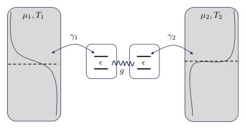
<figcaption class="paper-figure-caption"><b>Fig 1.</b> Figure 1: Sketch of a two-qubit system with the following parameters, bare energy of the two qubits ϵ, the inter-qubit coupling strength g, reservoirs characterized by their respective chemical potential and temperature µi, Ti, i = 1, 2 and bare bath-reservoir coupling strengths γ1 and γ2.</figcaption>
</figure>
<figure class="paper-figure-card">
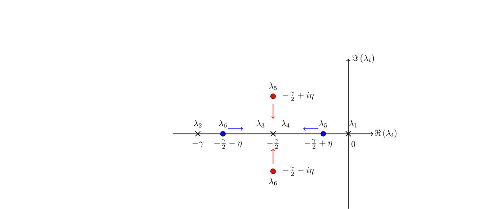
<figcaption class="paper-figure-caption"><b>Fig 2.</b> Figure 2: Spectrum of the reduced Lindbladian σ  ˜L  on a complex plane showing the coalescence of λ4, λ5 and λ6 at a third-order exceptional point. Color blue represents overdamped regime where η is real while red meas underdamped regime and we change η to iη.</figcaption>
</figure>
<figure class="paper-figure-card">
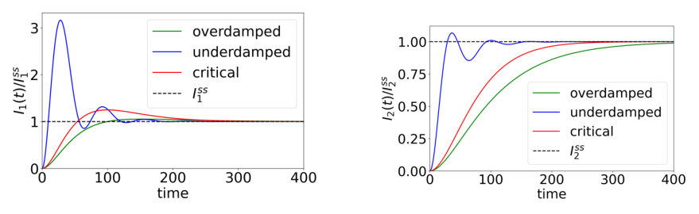
<figcaption class="paper-figure-caption"><b>Fig 3.</b> Figure 3: Currents as a function of time. 3a and 3b show the dynamics of I1 (t) and I2 (t) respectively. Both are normalized by their steady-state values. The initial steady is a product of thermal state. We choose the following set of parameters ξ = {ϵ = 1, γ1 = 0.05, γ2 = 0.01, T1 = 1, T2 = 0.5}. And the coupling strength g in each regime are gη2&gt;0 = ¯g/2 and gη2&lt;0 = 5¯g, where ¯g = |γ1 −γ2| /4 = 0.01 represents the value of g at exceptional point. In 3a, two inflexion points occur in both overdamped and ciritical regimes for current 1, while both Ioverdamped 2 and Icritical 2 monotonically grow as 3b shows.</figcaption>
</figure>
<figure class="paper-figure-card">
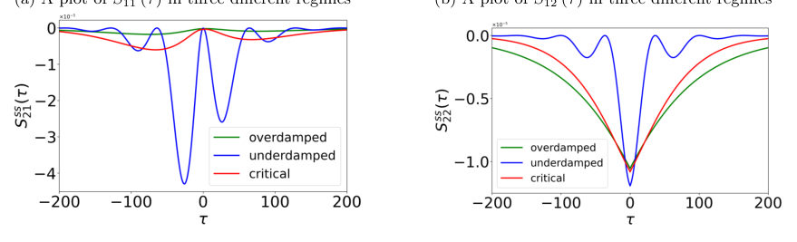
<figcaption class="paper-figure-caption"><b>Fig 4.</b> Figure 4: Steady-state noise as a function of the time delay τ. The four panels show the dynamics of Sss 11 (τ), Sss 12 (τ), Sss 21 (τ), and Sss 22 (τ). The delta function δ(τ) is treated as Kronecker delta δτ,0. We choose the following set of parameters ξ = {ϵ = 1, γ1 = 0.05, γ2 = 0.01, T1 = 1, T2 = 0.5}. And the coupling strength g in each regime are goverdamped = ¯g 2 and gunderdamped = 5¯g, where ¯g = |γ1−γ2|</figcaption>
</figure>
<figure class="paper-figure-card">

<figcaption class="paper-figure-caption"><b>Fig 5.</b> Figure 5 shows the shot noise as a function of g/g∗, where g∗denotes the critical coupling corre- sponding to the exceptional point. As the system is tuned across this point, the shot noise remains a smooth function, with no discontinuities or cusps. Hence, EP does not have a signature in the zero-frequency component of the spectral function of current correlations. However, as demonstrated in the previous section, the analytic properties of the finite-frequency expression provide information about the order of existing EPs.</figcaption>
</figure>

**Summary.** This theoretical work demonstrates that while average currents do not reveal the signatures of Exceptional Points (EPs) in steady-state open quantum systems, current noise correlation functions do. By analyzing these higher-order correlations using a two-qubit model, the authors show that the spectral structure of the noise clearly distinguishes between different dynamical regimes defined by the proximity to an EP.

**Why it may be interesting.** This is highly relevant to AMO physics and open quantum systems as it provides a powerful, non-trivial diagnostic tool (noise spectroscopy) to probe fundamental degeneracies (EPs) in dissipative dynamics where standard measurements fail.

Detailed structure

**Main problem.** The work aims to find diagnostic signatures of Lindbladian Exceptional Points (LEPs) in the steady-state regime of open quantum systems, as average observables fail to reveal this structure.

**Main result.** Current noise correlation functions retain clear signatures of LEPs in the steady state, distinguishing them from the behavior of average currents. The coalescence of eigenvalues leads to distinct polynomial time dependencies in the noise spectrum across different dynamical regimes (overdamped, underdamped, critical).

**Method.** The authors derive general expressions for two-point current correlation functions within a Lindblad master equation framework and analyze their spectral properties.

**Model / system.** The study uses open quantum systems modeled by the Lindblad master equation, exemplified by two interacting qubits coupled to external reservoirs. The dynamics are analyzed via spectral decomposition of the Liouvillian superoperator into Jordan normal form.

**Key observables.** Two-point current correlation function (noise), steady-state average currents, and the frequency spectrum of the noise $S^s_{\alpha\alpha'}(\omega)$.

**Important parameters / regimes.** The coupling strength $g$ relative to a critical value $g^*$, which dictates the system's dynamical regime (overdamped, underdamped, or critical).

**Assumptions / limitations.** The analysis assumes that local jump operators correctly capture the dynamics and relies on spectral decomposition techniques for solving the master equation.

**Figures summary.** Figures illustrate the distinct temporal structures of steady-state noise functions across overdamped, underdamped, and critical regimes. One figure shows the spectrum of a reduced Liouvillian exhibiting coalescence at an EP.

**Paper structure.** The paper establishes the theoretical framework using the Lindblad equation, derives expressions for both average currents and current noise, analyzes these observables in the steady state, and finally illustrates the distinct signatures of LEPs by analyzing the two-qubit model across different coupling regimes.

Abstract

Exceptional points (EPs) are non-Hermitian degeneracies at which two or more eigenvalues and their corresponding eigenvectors coalesce. In open quantum systems, exceptional points can arise in the Lindbladian governing the dissipative dynamics. Their signatures have so far been mainly identified in finite-time observables, such as transient currents, while steady-state average currents generally provide no direct evidence of the underlying exceptional-point structure. In this work, we demonstrate that signatures of Lindbladian EPs can nevertheless be accessed in the steady-state regime through current noise. We derive general expressions for current correlation functions within a Lindblad master-equation framework and show, in particular, how exceptional points affect their behaviour as a function of the time delay. We illustrate these results with the paradigmatic example of two interacting qubits coupled to two reservoirs, where the steady-state noise clearly distinguishes overdamped, underdamped, and critical regimes. Our results establish current correlation functions as a steady-state probe of Lindbladian EPs in open quantum systems.

[↑ back to top](#top)

### [Certifying Nonclassical Proper-Time Histories with a Quantum Clock](http://arxiv.org/abs/2606.12755v1)

**Authors:** Shuai Zeng  
**Type:** theory · **Category:** other · **PDF:** <https://arxiv.org/pdf/2606.12755v1>  
**Analysis basis:** full PDF text, analyzed in chunks
**Topic relevance:** `quantum measurements` **3/5** · `QC/QI experiment` **2/5** · `entanglement & information structure` **2/5** · `measurement-induced transitions` **2/5** · `analog quantum simulation` **1/5** · `driven-dissipative phase transition` **1/5** · `interference shaping light` **1/5** · `methods for driven-dissipative` **1/5** · `non-equilibrium dynamics` **1/5** · `quantum optics experiment` **1/5**

↔ Scroll figures horizontally

<figure class="paper-figure-card">
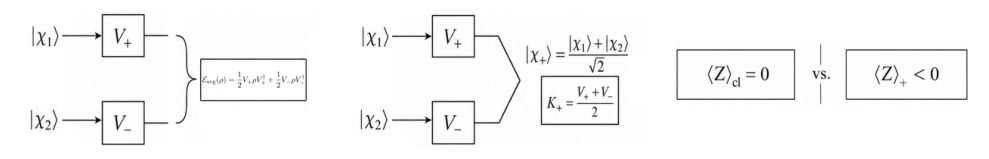
<figcaption class="paper-figure-caption"><b>Fig 1.</b> Figure 1: Classical mixtures and selective erasure of proper-time histories. (a) Two motional branches |χ1⟩, |χ2⟩ label the specified proper-time histories V± = U±R U±, with U± = e∓iθZ/2. If the motional label is ignored, the clock sees the free mixture Eavg ∈CPTH(H2). (b) Measuring the motion in the history-erasing basis produces the bright port K+ = (V+ + V−)/2, while the orthogonal erasing outcome gives the dark port K−= (V+ −V−)/2. The witness depends on erasing this proper-time-history label. (c) For input |g⟩, every free mixture of the specified histories predicts ⟨Z⟩cl = 0, while the bright port yields the negative imbalance in Eq. (20); the complementary dark-port signal is...</figcaption>
</figure>

**Summary.** The paper develops a rigorous method to certify nonclassical proper-time histories in quantum clocks by treating the problem as a channel-certification task. It proves that coherent recombination of distinct history paths generates an observable signal that cannot be reproduced by classical mixtures of those same histories. This provides a fundamental, resource-theoretic test for probing relativistic time effects beyond simple dephasing measurements.

**Why it may be interesting.** This work provides a powerful, generalizable quantum resource theory tool—channel certification—applied directly to fundamental physics measurements (time dilation), bridging foundational quantum information concepts with cutting-edge AMO metrology.

Detailed structure

**Main problem.** The core problem is developing a rigorous method to experimentally certify that quantum proper-time histories, imprinted on clock signals by relativistic effects, are genuinely nonclassical and cannot be simulated by classical mixtures of specified history outcomes.

**Main result.** A Choi-rank separation criterion, demonstrated via a minimal two-branch Ramsey protocol, proves that the conditioned operation associated with coherent recombination of distinct proper-time histories falls outside the convex set of classically simulable channels ($	ext{CPTH}(H)$).

**Method.** The authors employ channel-certification techniques by comparing the measured conditional signal against the theoretical prediction for classical mixtures. They utilize a two-branch Ramsey protocol and develop resource-theoretic diagnostics like the robustness measure $	ext{RH}_{	ext{PTH}}(\Phi)$.

**Model / system.** The physical system is based on precision quantum clocks, such as trapped-ion optical clocks, where relativistic time dilation phases are imprinted during clock evolution. The theoretical framework models the process using history unitaries ($V_h$) and analyzes the resulting channel structure.

**Key observables.** Nonzero postselected imbalance ($\langle Z 
angle_+ 
eq 0$), which serves as a witness distinguishing quantum from classical processes; visibility factors $\eta_{tot} = \eta_h\eta_c\eta_m$.

**Important parameters / regimes.** The effective accumulated phase $	heta_{eff}$ and the fidelity parameters ($\eta_h, \eta_c, \eta_m$) that quantify experimental imperfections.

**Assumptions / limitations.** The certification is operational and relative only to a finite, specified set of proper-time histories ($H$). The analysis relies on identifying single-Kraus, subnormalized-unitary outcomes for the strongest theoretical bounds.

**Figures summary.** Figures illustrate the comparison between the predicted classical signal ($\langle Z 
angle_{	ext{cl}} = 0$) and the measured non-zero signals from the Ramsey protocol, demonstrating the separation boundary.

**Paper structure.** The paper progresses by establishing a hierarchy of classical limitations (single-time dephasing $	o$ averaged histories $	o$ conditioned recombination). It then introduces the Choi-rank criterion using a minimal two-branch witness and concludes with resource-theoretic visibility models to quantify experimental feasibility.

Abstract

Quantum clocks can acquire relativistic phases from motional or gravitational proper-time differences, but reduced clock dephasing alone does not certify nonclassical proper-time histories. We formulate this distinction as a channel-certification problem. First, we show that any two-level single-time dephasing signal, including one generated by an effective quantum proper-time label, admits a classical random proper-time representation. We then define the convex set of classical mixtures of experimentally specified proper-time histories and prove a Choi-rank separation criterion for conditioned coherent history recombination. A two-branch Ramsey protocol gives explicit bright- and dark-port population witnesses outside this classical set. The certification is operational and relative to the specified history set: it rules out classical mixtures of the same implemented proper-time histories, not arbitrary classical protocols with different histories or controls.

[↑ back to top](#top)

### [Engineering electrically-switchable quantum anomalous Hall states by spin-orbit coupling](http://arxiv.org/abs/2606.13651v1)

**Authors:** Maosen Qin, Ziwei Wang, Gyeongmin Kim, Kenji Watanabe, Takashi Taniguchi, Steven H. Simon, Siddharth A. Parameswaran, Hryhoriy Polshyn  
**Type:** both · **Category:** strongly correlated electrons · **PDF:** <https://arxiv.org/pdf/2606.13651v1>  
**Analysis basis:** full PDF text, analyzed in chunks
**Topic relevance:** `exotic spin models in light-matter` **3/5** · `spintronics-quantum-optics interface` **3/5** · `analog quantum simulation` **2/5** · `driven-dissipative phase transition` **2/5** · `Keldysh / 2PI / non-Gaussian methods` **1/5** · `Kondo & dissipative impurity` **1/5** · `methods for driven-dissipative` **1/5** · `non-equilibrium dynamics` **1/5**

↔ Scroll figures horizontally

<figure class="paper-figure-card">
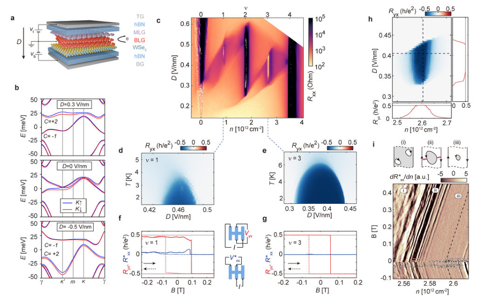
<figcaption class="paper-figure-caption"><b>Fig 1.</b> FIG. 1. Quantized anomalous Hall (QAH) effect in tMBG/WSe2 device with θ = 1.23◦(D2). a, Schematic of a tMBG/WSe2 device consisting of rotationally misaligned monolayer graphene(MLG) and Bernal-stacked bilayer graphene(BLG) placed on a monolayer WSe2, encapsulated by hexagonal boron nitride (hBN). Top and bottom graphite gates control carrier density n and displacement field D. b, Calculated band structure of tMBG/WSe2 with proximity-induced Ising spin-orbit coupling of λI = 4 meV at D = 0.3, 0 and -0.5 V/nm. c, Longitudinal resistance Rxx measured in the conduction band at 50 mT and D &gt; 0. Sharp dips in Rxx at ν = 1 and 3 mark QAH states surrounded by higher-resistance metallic isospin-...</figcaption>
</figure>
<figure class="paper-figure-card">
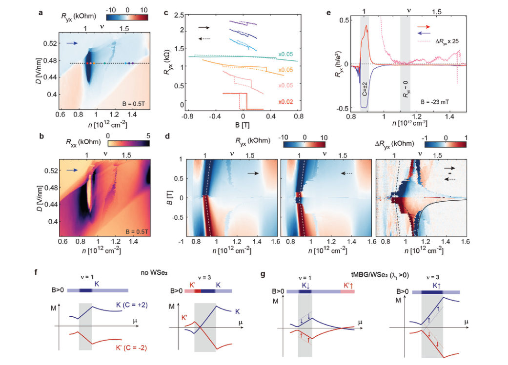
<figcaption class="paper-figure-caption"><b>Fig 2.</b> FIG. 2. Magnetization reversal and nonvolatile electrical switching near ν = 1 QAH state in device D2. a,b, Ryx (a) and Rxx (b) as a function of n and D, measured at B= 0.5 T. The fast sweep axis is n, with the direction indicated by arrows. In addition to QAH state at ν = 1, a sharp change of the resistance at intermediate fillings near ν ≈1.2 −1.3 marks voltage-induced switching between magnetic states. c, Magnetic hysteresis of Ryx measured at D = 0.47 V/nm and n=1.40, 1.36, 1.32, 1.08, 0.96, 0.93, 0.89 ×1012cm−2, as indicated in a. Curves are offset and scaled for clarity, as indicated. d, Ryx measured as a function of B at D = 0.47 V/nm for opposite n sweep directions as indicated in...</figcaption>
</figure>
<figure class="paper-figure-card">
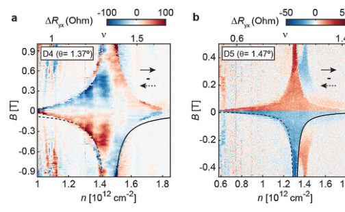
<figcaption class="paper-figure-caption"><b>Fig 3.</b> FIG. 3. Gate-driven magnetic state switching in tMBG/WSe2 devices with higher twist angles. a, b, The difference between Ryx measured with two oppo- site n-sweep directions, ∆Ryx, in tMBG/WSe2 devices D4 (θ = 1.37◦) and D5 (θ = 1.47◦). Here, Ryx is antisymmetrized with respect to B. Device D4 is measured at D = 0.57 V/nm, whereas in D5, D spans 0.48 −0.63 V/nm, as indicated in Fig. E8. Solid and dashed hyperbolic lines near the MR tran- sitions are guides to the eye following B ∼1/(n−nrev), where nrev is the carrier density at which MR occurs.</figcaption>
</figure>
<figure class="paper-figure-card">
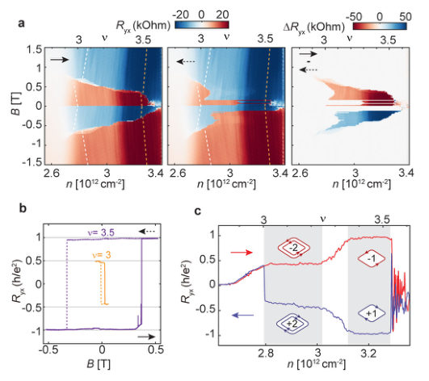
<figcaption class="paper-figure-caption"><b>Fig 4.</b> FIG. 4. Gate-tunable Chern number in electrically switchable QAH states in tMBG. a, Ryx measured as a function of n and B in device D6, which does not contain WSe2(1.27◦), at D = 0.46 V/nm. The left and middle subpan- els show the resistance measured for different n-sweep direc- tions, while the right one plots the difference, ∆Ryx. Dashed lines originating from ν = 3 and 3.5 have slopes expected for Chern insulators with C = ±2 and C = ±1, respectively. b, QAH states at ν = 3 and ν = 3.5 in D6 evidenced by the quan- tized hysteresis of Ryx. c, Nonvolatile gate-driven switching of the magnetic state at B = 25 mT. Each magnetic state can be additionally gate-tuned between two plateaus...</figcaption>
</figure>

**Summary.** The research demonstrates that coupling twisted bilayer graphene with WSe2 induces strong Spin-Orbit Coupling (SOC), enabling the realization of robust, electrically switchable Quantum Anomalous Hall states. By controlling this SOC, researchers can engineer the magnetic state and tune the system between different topological regimes ($C=\pm 2$ to $C=\pm 1$) using gate voltages. This work establishes a powerful methodology for designing next-generation topological electronic devices.

**Why it may be interesting.** This work provides a concrete example of how engineered proximity effects (SOC) can be used in 2D materials to stabilize topological phases and enable electrical control over fundamental quantum properties like chirality, which is highly relevant for designing novel spintronic/topological devices.

Detailed structure

**Main problem.** The research aims to engineer electrically-switchable Quantum Anomalous Hall (QAH) states in graphene moiré systems by controlling their magnetic properties.

**Main result.** Proximity coupling to WSe2 induces Spin-Orbit Coupling (SOC), which allows for the engineering of robust, nonvolatile QAH states and enables tuning between different Chern numbers without resetting the magnetic state.

**Method.** The study combines transport measurements (measuring Hall/longitudinal resistance) with theoretical modeling using continuum Hamiltonians and self-consistent Hartree-Fock calculations to analyze spin and orbital magnetization.

**Model / system.** The physical platform is twisted bilayer graphene (tMBG) interfaced with WSe2. The model incorporates the Bistritzer-MacDonald framework, adding proximity-induced Ising SOC ($\lambda_I$) and analyzing electron interactions via Hartree-Fock mean-field theory.

**Key observables.** Quantized Hall resistance ($R_{yx}$), longitudinal resistance ($R_{xx}$), magnetic hysteresis loops, Chern numbers ($C=\pm 2, \pm 1$), and orbital/spin magnetization components.

**Important parameters / regimes.** Twist angle ($	heta \approx 1.1 - 1.5^\circ$), carrier density ($
u$), gate voltage displacement field ($D$), and the strength of the induced SOC ($\lambda_I$).

**Assumptions / limitations.** The analysis assumes that proximity-induced SOC dominates over intrinsic magnetic energy in certain regimes, allowing for controlled switching between spin/valley polarized ground states.

**Figures summary.** Figures show quantized QAH plateaus ($R_{yx}$), gate-driven magnetic hysteresis loops demonstrating state switching, and theoretical plots illustrating the dependence of total magnetization on filling factor ($
u$) and SOC strength.

**Paper structure.** The paper progresses from establishing the physical platform (tMBG/WSe2) to confirming the key mechanism (SOC via quantum oscillations), demonstrating the primary effect (quantized QAH states and switching), and finally detailing the theoretical underpinning of magnetization control through spin-valley coupling.

Abstract

Nonvolatile gate-driven switching of quantum anomalous Hall (QAH) states in graphene moiré systems provides a promising route toward topological electronics based on chiral edge states. However, deliberate use of this switching mechanism requires control over both the magnetic properties and metastability of QAH states. While previous demonstrations mostly relied on the intrinsic magnetic energy landscape of moiré devices, here we show that this landscape can be engineered through proximity coupling to WSe2. We find that proximitizing twisted monolayer-bilayer graphene by WSe2 reshapes the magnetization reversals responsible for nonvolatile electrical switching of QAH states. We attribute this effect to the proximity-induced spin-orbit coupling (SOC), which can lock spin and valley and modify the magnetization of the competing states involved in switching compared with non-proximitized graphene systems. Our findings establish proximity-induced SOC as a new way to engineer magnetic properties and switchable magnetic states in graphene-based systems. We further demonstrate that strong magnetic metastability in tMBG allows the magnetic states to be gate-tuned between QAH and metallic regimes, and between QAH states with Chern numbers |C| = 2 and 1 without resetting the magnetic state. This functionality points toward new device architectures based on QAH chiral edge states.

[↑ back to top](#top)

### [Generalized two-qubit Hamiltonian for Projective Quantum Feature Maps](http://arxiv.org/abs/2606.13641v1)

**Authors:** Rafael Simões do Carmo, Edson Amaro Junior, Felipe Fanchini  
**Type:** experiment · **Category:** disordered systems and neural networks · **PDF:** <https://arxiv.org/pdf/2606.13641v1>  
**Analysis basis:** full PDF text, analyzed in chunks
**Topic relevance:** `analog quantum simulation` **3/5** · `exotic spin models in light-matter` **3/5** · `QC/QI experiment` **2/5** · `quantum measurements` **2/5** · `entanglement & information structure` **1/5** · `measurement-induced transitions` **1/5** · `methods for driven-dissipative` **1/5** · `spintronics-quantum-optics interface` **1/5**

↔ Scroll figures horizontally

<figure class="paper-figure-card">
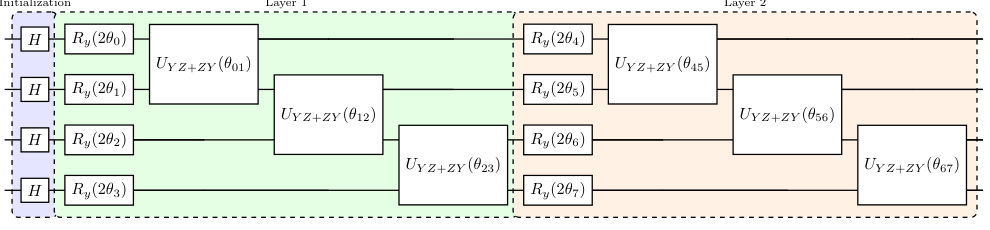
<figcaption class="paper-figure-caption"><b>Fig 1.</b> Figure 1: Circuit representation of a CD-Ising-glass with eight features mapped onto a four-qubit register. After initialization with Hadamard gates, each encoding layer applies local rotations Ry(2θi) followed by two-qubit interaction blocks UY Z+ZY (θij). The local angles encode the one-body fields hi, which are assigned from normalized classical input features, while the interaction angles encode the couplings Jij, obtained from pairwise feature correlations, here estimated through mutual information, as defined in Eq. 20. The multilayer structure enables multi-feature encoding on a fixed qubit register by assigning different feature blocks to successive encoding layers. The feature...</figcaption>
</figure>
<figure class="paper-figure-card">
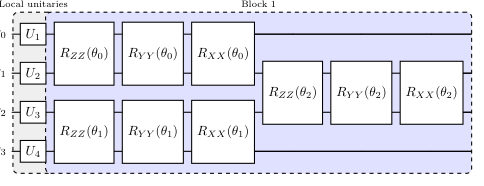
<figcaption class="paper-figure-caption"><b>Fig 2.</b> Figure 2: Example of the 4-qubit encoding 3 features using Heisenberg PQFM. Each qubit first undergoes a local Haar- random unitary transformation, denoted by U1, . . . , U4. The entangling stage, grouped here as Block 1, then applies the sequence of two-qubit rotations RZZ, RY Y , and RXX to the disjoint pairs (q0, q1) and (q2, q3), followed by the same se- quence on the central pair (q1, q2). More blocks can be added for encoding more features. The corresponding rotation an- gles are denoted by θ0, θ1, and θ2, where θi = 2γηi, γ is a scaling parameter, and ηi is defined in Eq. 24.</figcaption>
</figure>
<figure class="paper-figure-card">
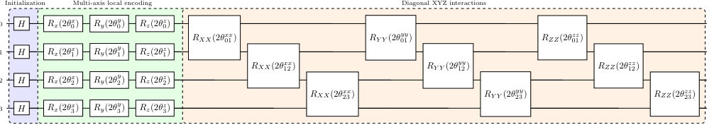
<figcaption class="paper-figure-caption"><b>Fig 3.</b> Figure 3: Circuit representation of a of a single-layer diagonal XYZ PQFM with twelve features mapped onto a four-qubit register by a multi-axis feature encoding. After Hadamard initialization, each qubit receives three local rotations, Rx, Ry, and Rz, allowing three distinct normalized classical features to be encoded per qubit through the active Pauli axes. The subsequent two-qubit rotations implement the diagonal interaction channels XX, Y Y , and ZZ, with angles determined by mutual-information coefficients between the features assigned to the corresponding qubit-axis slots. The nearest-neighbor chain shown here is illustrative; in the hardware-aware implementation, the interaction...</figcaption>
</figure>
<figure class="paper-figure-card">
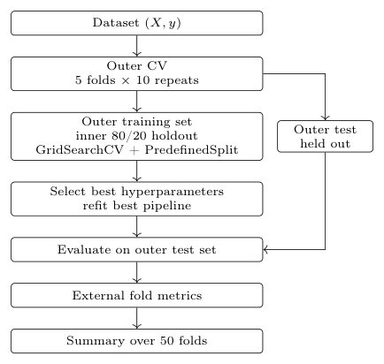
<figcaption class="paper-figure-caption"><b>Fig 4.</b> Figure 4: Nested validation protocol used for model selection and external performance estimation.</figcaption>
</figure>
<figure class="paper-figure-card">
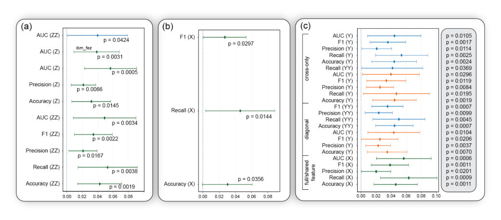
<figcaption class="paper-figure-caption"><b>Fig 5.</b> Figure 5: Paired statistical improvements over the classical baseline for the Molecular Toxicity dataset. Panel (a) shows the CD-Ising-glass PQFM, panel (b) the Heisenberg map, and panel (c) the XYZ feature-map family introduced in this work. The plotted intervals correspond to the mean paired deltas and 95% confidence intervals. Colors indicate the qubit budget used in each configuration, with blue, orange, and green corresponding to 52, 78, and 156 qubits, respectively. The labels in parentheses indicate the measured observable used to extract the corresponding quantum features. Unless otherwise annotated, results correspond to ibm_kingston; panel (b) uses ibm_marrakesh.</figcaption>
</figure>

**Summary.** The paper proposes and rigorously tests generalized two-qubit Hamiltonian Projected Quantum Feature Maps (PQFMs) as an advanced method to encode classical data features onto quantum circuits. By allowing multiple feature encodings per qubit axis, the framework increases information density while remaining hardware-compatible. The results demonstrate that these generalized maps offer a promising pathway for achieving measurable performance gains in quantum machine learning tasks.

**Why it may be interesting.** This work bridges condensed matter physics concepts (Hamiltonian engineering, spin models) with applied machine learning, providing a concrete framework for mapping complex physical interactions into feature spaces relevant for near-term quantum computation benchmarking.

Detailed structure

**Main problem.** The core problem is generating high-quality, explicit classical features from quantum states using quantum processors for use in classical machine learning models.

**Main result.** A generalized two-qubit Hamiltonian family of Projected Quantum Feature Maps (PQFMs) provides a promising and consistent route toward achieving statistically supported gains over matched classical baselines on biomedical datasets.

**Method.** The authors construct PQFMs by defining data-dependent Hamiltonians that evolve the quantum state, followed by measuring local Pauli expectation values to extract explicit classical features.

**Model / system.** The models are based on generalized two-qubit Hamiltonian structures (e.g., XYZ type) applied to qubits, extending previous work like CD-Ising-glass and Heisenberg maps. The feature encoding allows for multi-axis assignment of classical variables onto the Pauli axes of the qubits.

**Key observables.** Local single-qubit ($\langle \sigma^a_j 
angle$) and two-qubit ($\langle \sigma^a_j \sigma^b_k 
angle$) Pauli expectation values, which form the explicit classical feature vector $x'$.

**Important parameters / regimes.** The analysis is performed across multiple biomedical datasets (e.g., Molecular Toxicity, Breast Cancer), varying qubit counts (up to 156), and different Hamiltonian structures (diagonal, cross-axis, full).

**Assumptions / limitations.** Performance gains are shown to be highly dependent on the specific dataset, the chosen encoding strategy, the measured observables, and the underlying hardware conditions.

**Figures summary.** Figures illustrate circuit representations of PQFMs for various qubit counts and feature map types (e.g., single-layer diagonal XYZ PQFM). Tables summarize quantitative performance metrics (AUC, F1) across multiple datasets and QPU architectures.

**Paper structure.** The paper introduces the generalized Hamiltonian framework, details multi-axis encoding strategies, benchmarks these maps against established methods on several biomedical classification tasks using nested cross-validation, and concludes by assessing empirical quantum utility.

Abstract

Projected quantum feature maps provide a strategy for using quantum processors as feature generators for classical machine-learning models. Building on counterdiabatic Ising-glass and one-dimensional Heisenberg PQFMs, we introduce a generalized two-qubit Hamiltonian-based PQFM that provides a unified way to encode classical features through local Pauli fields and pairwise two-qubit Pauli interactions. This construction allows distinct classical variables to be embedded along different Pauli axes of the same qubit, increasing the information density of shallow circuits while remaining compatible with hardware constraints. We develop and implement these methods in pqfmlib, a publicly available Python library for constructing, executing, and benchmarking Hamiltonian-based PQFMs.We then benchmark the generalized Hamiltonian PQFMs against reference PQFMs on four biomedical classification datasets under a nested cross-validation protocol with paired statistical tests. Quantum features are generated using both IBM quantum processors with up to 156 qubits and statevector simulations. Our results show that the generalized two-qubit Hamiltonian family provides the most consistent pattern of statistically supported gains over matched classical baselines, although the performance of all methods depends on the dataset, encoding strategy, measured observables, and hardware conditions. These findings support generalized Hamiltonian PQFMs as a promising route toward near-term quantum utility.

[↑ back to top](#top)

### [Population dynamics of surface-mediated autocatalytic processes](http://arxiv.org/abs/2606.13498v1)

**Authors:** Denis S. Grebenkov, Yilin Ye  
**Type:** theory · **Category:** statistical mechanics · **PDF:** <https://arxiv.org/pdf/2606.13498v1>  
**Analysis basis:** full PDF text, analyzed in chunks
**Topic relevance:** `driven-dissipative phase transition` **3/5** · `methods for driven-dissipative` **3/5** · `Keldysh / 2PI / non-Gaussian methods` **2/5** · `non-equilibrium universality` **2/5** · `analog quantum simulation` **1/5** · `correlated / nonlocal dissipation` **1/5** · `correlated cavity matter` **1/5** · `non-equilibrium dynamics` **1/5**

↔ Scroll figures horizontally

<figure class="paper-figure-card">
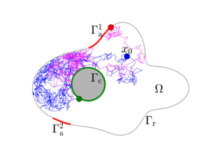
<figcaption class="paper-figure-caption"><b>Fig 1.</b> FIG. 1. A schematic view of a confining domain Ω, whose boundary ∂Ωis partitioned into three subsets: an absorbing region Γa (in red) that can destroy each arrived particle with an absorption rate qa via A →∅; an inert region Γr (in gray) that reflects particles back into Ω; and a catalytic region Γc that can replicate each arrived particle into two independent copies with a catalytic rate qc via A →2A. Each of three subsets can be composed of multiple disconnected pieces (e.g., Γa = Γ1 a ∪Γ2 a). Two simulated trajectories are shown in blue and magenta: the first particle is released from a point x0 (blue dot) and diffuses until its binary branching (green dot) on Γc; after this branching...</figcaption>
</figure>
<figure class="paper-figure-card">
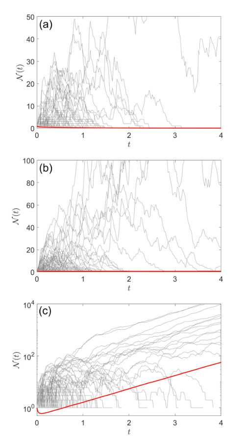
<figcaption class="paper-figure-caption"><b>Fig 2.</b> FIG. 2. 1000 random realizations (gray curves) of the popu- lation dynamics in the circular annulus with R = 0.1, L = 1, D = 1, qa = ∞, uniform starting point in the bulk, and three values of qc: 3.91 (a), 4.34 (b), and 4.78 (c). Solid red line shows the empirical mean (obtained over 105 realizations, see Appendix B). In the last panel, the logarithmic scale of the vertical axis results is cutting zero values.</figcaption>
</figure>
<figure class="paper-figure-card">
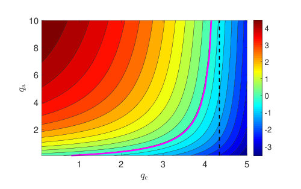
<figcaption class="paper-figure-caption"><b>Fig 3.</b> FIG. 3. Contour plot of the principal eigenvalue λ− 0 as a function of qc and qa for the circular annulus with R = 0.1 and L = 1. The vertical dashed line presents qcrit c from Eq. (F6), while thick magenta line shows the critical line qc = µ0(qa) that separates the subcritical regime (λ− 0 &gt; 0, top left) and the supercritical regime (λ− 0 &lt; 0, bottom right). The function µ0(qa) is given by Eq. (F1).</figcaption>
</figure>
<figure class="paper-figure-card">
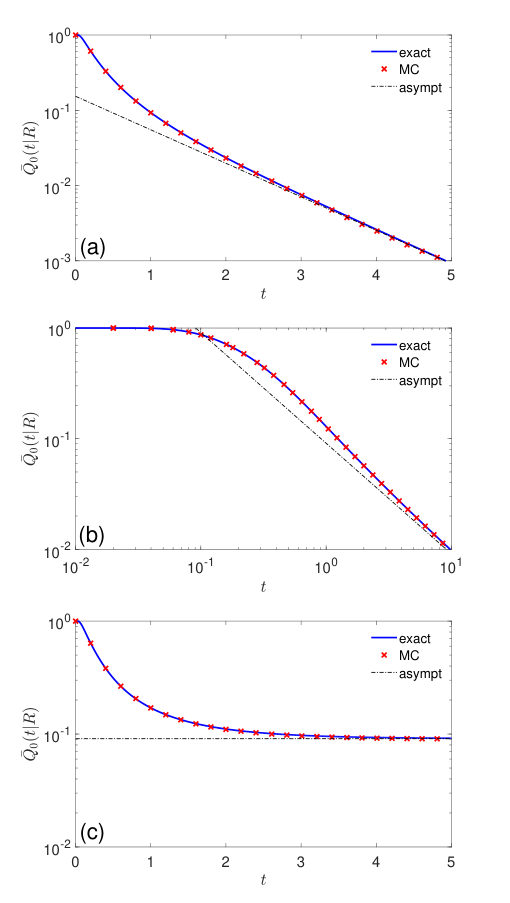
<figcaption class="paper-figure-caption"><b>Fig 4.</b> FIG. 4. The probability ¯Q0(t|R) = ¯G0(t|R) as a function of time t in the circular annulus with R = 0.1, L = 1, D = 1, qa = ∞. Three panels illustrate three regimes: (a) subcrit- ical (qc = 0.9 qcrit c ≈3.91); (b) critical (qc = qcrit c ≈4.34); and (c) supercritical (qc = 1.1 qcrit c ≈4.78), with qcrit c = 1/(R ln(L/R)). The starting point x0 is set on the catalytic region (inner circle). Solid line presents a numerical solu- tion of the integral equation (19) as described in Appendix G; crosses show an estimation from Monte Carlo simulations with 106 particles (see Appendix B); dashed line indicates the asymptotic relations (37, 39, 48) in subcritical, critical, and supercritical regimes,...</figcaption>
</figure>
<figure class="paper-figure-card">
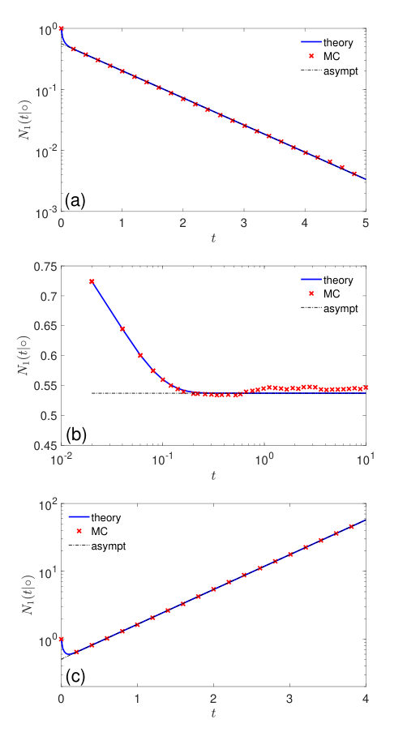
<figcaption class="paper-figure-caption"><b>Fig 5.</b> FIG. 5. Mean population size N1(t|◦) for the circular an- nulus with R = 0.1, L = 1, D = 1, qa = ∞, uniform start- ing point in the bulk. Three panels illustrate three regimes: (a) subcritical (qc = 0.9 qcrit c ≈3.91); (b) critical (qc = qcrit c ≈4.34); and (c) supercritical (qc = 1.1 qcrit c ≈4.78), with qcrit c = 1/(R ln(L/R)). Solid blue line presents the ex- act result obtained via the inverse Laplace transform of Eq. (F33); crosses show the empirical mean obtained over 106</figcaption>
</figure>

**Summary.** This work analyzes how a particle population evolves when diffusion is coupled with surface reactions involving both loss (absorption) and multiplication (catalysis). By deriving the generating function and applying advanced spectral analysis, the authors precisely map out three distinct long-term dynamic regimes—decaying, steady, or exploding—based on the relative strengths of the catalytic versus absorbing rates.

**Why it may be interesting.** While focused on classical statistical mechanics, the rigorous treatment of nonlinear boundary conditions and the classification of dynamic regimes (sub/critical/supercritical) using spectral theory provides powerful mathematical techniques applicable to open quantum systems or reaction-diffusion models where boundaries impose non-trivial constraints.

Detailed structure

**Main problem.** The study investigates the population dynamics of autocatalytic processes where particles diffuse in a complex environment, undergoing competing mechanisms of killing (absorption) and replication (branching) at specific surfaces.

**Main result.** The long-time behavior of the population size is characterized by distinct regimes—decaying, steady-state, or exponential growth—determined by comparing catalytic and absorption rates against spectral properties of the underlying diffusion operator.

**Method.** The analysis employs systematic theoretical tools including generating functions, transformation into nonlinear integral/partial differential equations, and advanced spectral methods (Laplace transforms) to solve for asymptotic limits.

**Model / system.** The model describes particle diffusion in a bounded domain $\Omega$ with boundaries partitioned into an absorbing region ($\Gamma_a$), a catalytic region ($\Gamma_c$), and a reflecting region ($\Gamma_r$). The process is stochastic, involving both spatial transport and population change via branching.

**Key observables.** Population size $N(t)$, generating function $G_s(t|x_0)$, mean $\langle N(t) 
angle$, variance, and the asymptotic limit of $G_s$.

**Important parameters / regimes.** Diffusion coefficient ($D$), catalytic rate ($q_c$), absorption rate ($q_a$), and geometric parameters defining the boundary regions.

**Assumptions / limitations.** The analysis assumes a bounded domain with smooth boundaries, allowing for spectral decomposition of the underlying diffusion operator; approximations are used for short-time behavior and asymptotic limits.

**Figures summary.** Figures illustrate random realizations showing fluctuations across different catalytic rates ($q_c$), and plot the critical lines separating subcritical ($\lambda_{-0} > 0$), critical ($\lambda_{-0} = 0$), and supercritical ($\lambda_{-0} < 0$) regimes based on reaction rates.

**Paper structure.** The paper progresses from defining the physical setup (diffusion with boundary reactions) to deriving the governing mathematical equations for the generating function. It then systematically analyzes the long-time asymptotic behavior by transforming these equations into spectral problems and solving them in different rate regimes.

Abstract

We investigate the population dynamics of surface-mediated autocatalytic processes, in which particles diffuse in a complex environment towards surface regions where they can be either killed or replicated. These opposite mechanisms compete with each other and lead to a sophisticated stochastic evolution of the population size. We provide a systematic analysis of the generating function of the population size. We also deduce its distribution, mean, variance and higher-order moments. For this purpose, we employ several equivalent descriptions of these quantities in terms of nonlinear integral equations and partial differential equations with nonlinear boundary conditions. We inspect the long-time behavior of the population dynamics in three regimes when the mean population size vanishes, reaches a steady-state level, or grows exponentially. A numerical solution of the underlying integral equations and independent Monte Carlo simulations support our theoretical predictions.

[↑ back to top](#top)

### [Achieving Heisenberg limit under noisy conditions with quantum Zeno dynamics and dynamical decoupling](http://arxiv.org/abs/2606.13205v1)

**Authors:** Ke Zeng, Bakmou Lahcen, Yu Jiang, Kok Chuan Tan  
**Type:** theory · **Category:** other · **PDF:** <https://arxiv.org/pdf/2606.13205v1>  
**Analysis basis:** full PDF text, analyzed in chunks
**Topic relevance:** `methods for driven-dissipative` **3/5** · `correlated / nonlocal dissipation` **2/5** · `non-equilibrium dynamics` **2/5** · `Keldysh / 2PI / non-Gaussian methods` **1/5** · `analog quantum simulation` **1/5** · `driven-dissipative phase transition` **1/5** · `entanglement & information structure` **1/5** · `non-equilibrium universality` **1/5** · `quantum measurements` **1/5**

↔ Scroll figures horizontally

<figure class="paper-figure-card">
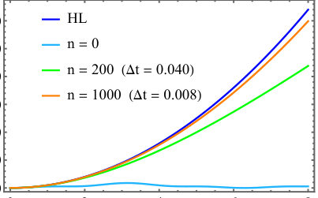
<figcaption class="paper-figure-caption"><b>Fig 1.</b> FIG. 1: QFI at different projection intervals ∆t and number of projections n. As the projection frequency increases, the QFI-time curve approaches the Heisenberg limit.</figcaption>
</figure>
<figure class="paper-figure-card">
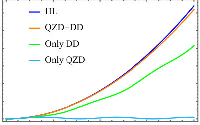
<figcaption class="paper-figure-caption"><b>Fig 2.</b> FIG. 2: QFI at number of projections n = 1000, with and without QZD and/or DD. QZD or DD alone were unable to saturate HL, but the combination succeeds.</figcaption>
</figure>
<figure class="paper-figure-card">
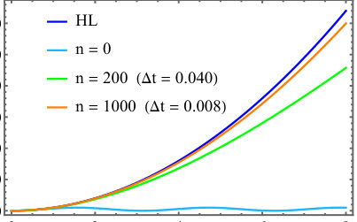
<figcaption class="paper-figure-caption"><b>Fig 3.</b> FIG. 3: QFI for the counterexample using QZD, at different projection intervals ∆t and number of projections n. As the projection frequency increases, the QFI-time curve approaches the Heisenberg limit.</figcaption>
</figure>
<figure class="paper-figure-card">
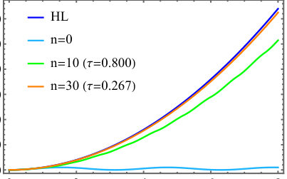
<figcaption class="paper-figure-caption"><b>Fig 4.</b> FIG. 4: QFI for the counterexample using DD, at different periods τ and number of cycles n. As the number of cycles increases, the QFI-time curve approaches the Heisenberg limit.</figcaption>
</figure>

**Summary.** This paper rigorously analyzes how Quantum Zeno Dynamics and Dynamical Decoupling can suppress environmental noise in quantum sensors to reach the ultimate Heisenberg Limit. It establishes conditions for these methods and crucially demonstrates that they offer a viable, sometimes superior, alternative to traditional Quantum Error Correction when dealing with specific types of open system dynamics.

**Why it may be interesting.** This work is highly relevant to AMO physics and open quantum systems as it provides concrete, resource-aware protocols (QZD/DD) that can surpass theoretical limitations imposed by standard error correction techniques when dealing with realistic noise models.

Detailed structure

**Main problem.** The core problem is determining the necessary and sufficient conditions under which Quantum Zeno Dynamics (QZD) and Dynamical Decoupling (DD) can effectively suppress environmental noise to achieve the Heisenberg Limit (HL) in quantum metrology.

**Main result.** The authors prove that QZD/DD can achieve HL even when standard Quantum Error Correction (QEC) methods fail, demonstrating that combining both techniques allows saturation of the fundamental precision limit.

**Method.** Theoretical analysis involving deriving effective Hamiltonians for QZD and DD under various noise models (Markovian), and comparing these conditions against those required by QEC theory.

**Model / system.** The system involves a quantum probe ($S$) interacting with an environment ($E$), described by a total Hamiltonian $H_{tot}$. The analysis uses the Lindblad master equation for the Markovian regime, focusing on signal encoding and noise suppression mechanisms.

**Key observables.** Quantum Fisher Information (QFI), which is used to diagnose whether the measurement precision approaches the Heisenberg Limit ($\propto 1/t^2$).

**Important parameters / regimes.** The key parameters include the system Hamiltonian $H_S$, the environment coupling terms ($S_i$), and the control pulse timings ($\Delta t$ or $	au$) for QZD/DD.

**Assumptions / limitations.** Assumptions include time-independent system-environment interaction, and approximations like Born-Markov and secular limits are used when comparing to QEC theory.

**Figures summary.** Figures illustrate the Quantum Fisher Information (QFI) vs. time for various protocols, showing that while individual QZD or DD applications may fall short, their combination successfully saturates the Heisenberg Limit.

**Paper structure.** The paper systematically establishes necessary and sufficient conditions for noise suppression via QZD and DD individually, then develops a comparison framework against QEC theory, culminating in proving the efficacy of hybrid protocols.

Abstract

Quantum Zeno dynamics (QZD) and dynamical decoupling (DD) are useful tools that enable the effective suppression of noise in quantum systems. We consider the problem of when (i) noise can be suppressed and (ii) Heisenberg limit (HL) can be achieved in quantum metrology, and prove necessary and sufficient conditions for when QZD and DD are useful for achieving these two goals. We also show that in the Markovian regime, there are scenarios where preventing errors using QZD/DD may enable HL to be achieved where current QEC methods may not. Finally, we demonstrate that the combination of both techniques can allow individually imperfect QZD and DD strategies to saturate HL.

[↑ back to top](#top)

### [Characterizing the functional role of quantum coherence in energy transfer](http://arxiv.org/abs/2606.13404v1)

**Authors:** Hallmann Óskar Gestsson, Alexandra Olaya-Castro  
**Type:** theory · **Category:** other · **PDF:** <https://arxiv.org/pdf/2606.13404v1>  
**Analysis basis:** full PDF text, analyzed in chunks
**Topic relevance:** `Keldysh / 2PI / non-Gaussian methods` **3/5** · `methods for driven-dissipative` **3/5** · `non-equilibrium dynamics` **2/5** · `analog quantum simulation` **1/5** · `correlated / nonlocal dissipation` **1/5** · `correlated cavity matter` **1/5** · `driven-dissipative phase transition` **1/5** · `non-equilibrium universality` **1/5**

↔ Scroll figures horizontally

<figure class="paper-figure-card">
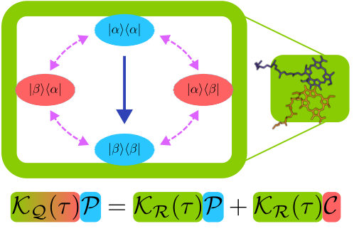
<figcaption class="paper-figure-caption"><b>Fig 1.</b> FIG. 1. Energy transfer in light-harvesting antennae is mod- eled as an open quantum system interacting with a local vi- brational environment. As an example, we show here two electronically coupled bacteriochlorophylls forming a dimer. The concurrent influence of the environment and quantum coherence to state transfer is described by the total memory kernel KQ(τ). We introduce the decomposition KQ(τ)P = KR(τ)P + KR(τ)C with KR(τ) being the environment mem- ory kernel, which allows us to directly quantify the extent to which the rate of energy transfer depends on quantum coher- ence via the term KR(τ)C.</figcaption>
</figure>
<figure class="paper-figure-card">
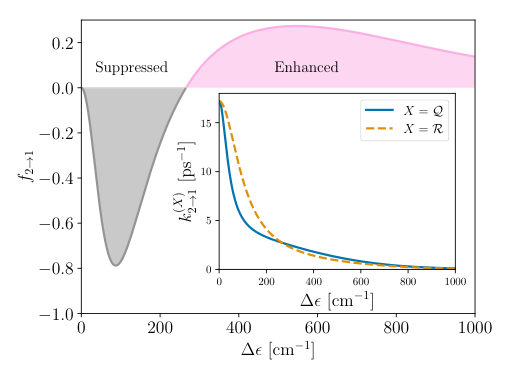
<figcaption class="paper-figure-caption"><b>Fig 2.</b> FIG. 2. The figure of merit f2→1 as a function of detuning in a dimer coupled to an overdamped Brownian oscillator. The gray and pink regions correspond to regimes where the func- tional role of quantum coherence is to suppress and enhance the energy transfer process, respectively. The inset shows the corresponding total (solid line) and thermal (dashed line) rates of the downhill energy transfer process. The two rates deviate for intermediate detuning, demonstrating the impact of quantum coherence on the transfer process.</figcaption>
</figure>
<figure class="paper-figure-card">
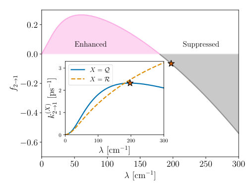
<figcaption class="paper-figure-caption"><b>Fig 3.</b> FIG. 3. The figure of merit f2→1 as a function of the re- organization energy of the overdamped Brownian oscillator, with ∆ϵ = 400 cm−1. The gray and pink regions correspond to regimes where the functional role of quantum coherence is to suppress and enhance the energy transfer process, respec- tively. The inset shows the corresponding total (solid line) and thermal (dashed line) rates of the downhill transfer pro- cess. The star marker indicates the point where the optimal value of k(Q) 2→1 is achieved, which in this example occurs when f2→1 &lt; 0.</figcaption>
</figure>
<figure class="paper-figure-card">
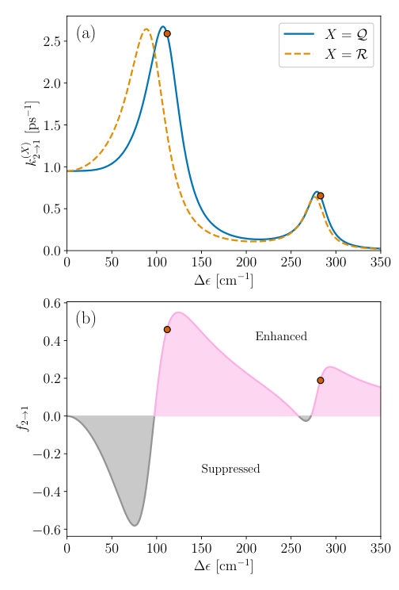
<figcaption class="paper-figure-caption"><b>Fig 4.</b> FIG. 4. (a) The total (solid line) and thermal (dashed line) transfer rates as a function of detuning in the dimer coupled to an underdamped Brownian oscillator. The mode is centered at Ω= 150 cm−1, such that exciton-vibration resonances oc- cur at detuning values √</figcaption>
</figure>

**Summary.** This paper develops a general theoretical framework using projection operators and memory kernels to quantify how quantum coherence influences energy transfer rates. By applying this to an electronic dimer model coupled to a structured bath, the authors demonstrate that coherence can act as a switch, either boosting or dampening the rate depending on system parameters.

**Why it may be interesting.** This work provides a rigorous, quantitative tool ($f$) to diagnose coherence effects in energy transfer, which is crucial for designing artificial light-harvesting systems or understanding biological processes where coherent dynamics are suspected.

Detailed structure

**Main problem.** The primary goal is to quantitatively characterize the functional role of quantum coherence in modulating energy transfer rates within open quantum systems.

**Main result.** Quantum coherence can either enhance or suppress the overall rate of energy transfer, depending on system parameters like detuning and coupling strength. A figure of merit quantifies this relative contribution.

**Method.** The authors employ Nakajima-Zwanzig projection operators to derive a generalized memory kernel identity, allowing for the separation of coherent and incoherent contributions to the dynamics.

**Model / system.** The study uses an electronic dimer model (two coupled sites) interacting with structured phonon baths. The dynamics are governed by the Liouville-von Neumann equation, analyzed using techniques derived from HEOM.

**Key observables.** The figure of merit $f_{\alpha	oeta} = 1 - k^{(R)}_{\alpha	oeta}/k^{(Q)}_{\alpha	oeta}$ quantifies coherence's relative impact on the energy transfer rate.

**Important parameters / regimes.** Electronic detuning ($\Delta\epsilon$), coupling strength ($V$), reorganization energy ($\lambda$), and spectral density parameters ($\gamma, \Omega$).

**Assumptions / limitations.** The analysis often assumes a stationary state limit ($t 	o \infty$) and utilizes the HEOM framework, which requires truncating an infinite hierarchy.

**Figures summary.** Figures illustrate $f_{2	o 1}$ as a function of detuning ($\Delta\epsilon$) or reorganization energy ($\lambda$), showing distinct regimes of coherence-induced suppression (gray) or enhancement (pink).

**Paper structure.** The paper develops the theoretical framework using projection operators to derive memory kernel identities, applies this formalism to the dimer model dynamics via HEOM, and analyzes how specific parameters tune the resulting rate modification quantified by $f$.

Abstract

Quantum coherence is understood to play a role in excitation energy transfer in open quantum systems, yet a quantitative approach to assessing its influence on the transfer process is still missing. Using Nakajima-Zwanzig projection operators, we derive a general memory kernel identity that enables us to characterize and quantify the impact of coherence in the eigenenergy basis on a generalized rate of energy transfer. Applying our approach to the electronic dynamics of a dimer coupled to a structured phonon bath, we demonstrate how quantum coherence acts to modulate energy transfer.

[↑ back to top](#top)

### [Matrix phase-space representations for quantum symmetries](http://arxiv.org/abs/2606.12769v1)

**Authors:** Peter D. Drummond, Alexander S. Dellios, Margaret D. Reid  
**Type:** theory · **Category:** other · **PDF:** <https://arxiv.org/pdf/2606.12769v1>  
**Analysis basis:** full PDF text, analyzed in chunks
**Topic relevance:** `analog quantum simulation` **3/5** · `methods for driven-dissipative` **3/5** · `non-equilibrium dynamics` **2/5** · `Keldysh / 2PI / non-Gaussian methods` **1/5** · `correlated / nonlocal dissipation` **1/5** · `correlated cavity matter` **1/5** · `driven-dissipative phase transition` **1/5** · `entanglement & information structure` **1/5**

↔ Scroll figures horizontally

<figure class="paper-figure-card">
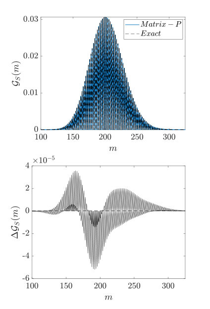
<figcaption class="paper-figure-caption"><b>Fig 1.</b> Figure 1. Upper plot: Matrix-P simulations of the total photo-count probability (solid blue lines) versus the exact multi-mode squeezed state photon counting distribution for GBS (dashed black lines) for squeezed states with uniform squeezing parameter r = [0.75, . . . , 0.75] and a Haar random unitary matrix of size M = 300. Numerical probabilities are obtained by averaging over ensembles of size ES = 1.2 × 106. Lower plot: Difference errors of the exact and matrix-P simulated distributions, which are so small that they are not visible.</figcaption>
</figure>
<figure class="paper-figure-card">
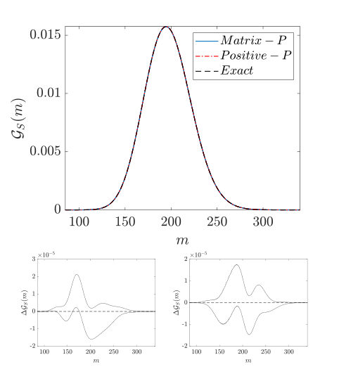
<figcaption class="paper-figure-caption"><b>Fig 2.</b> Figure 3. Upper plot: Comparison of the matrix-P (solid blue line), positive-P (dash dot red line) and exact lossy (dashed black line) total photo-count distribution for the network in Fig.(1) with ≈3% uniform photon loss. Both the positive-P and matrix-P distributions converge to the exact case in this regime. Bottom plots: Typical difference errors (showing lines for ±1σ) of the matrix-P (left plot) and positive-P (right plot) simulated and exact distributions.</figcaption>
</figure>
<figure class="paper-figure-card">
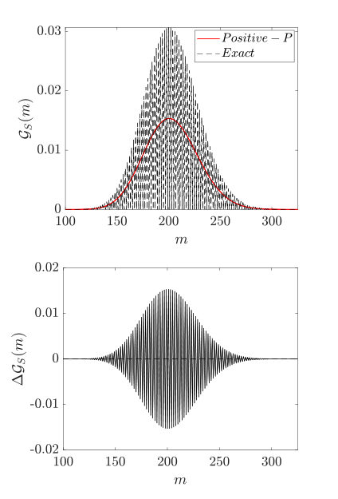
<figcaption class="paper-figure-caption"><b>Fig 3.</b> Figure 2. Description follows Fig.(1) except now the positive-P phase-space distribution is used for simulations of the total photo-count probability (solid red lines). Differ- ences are ≈103 times larger than matrix-P and are clearly visible. These are caused by a skewed distribution requiring enormous sample numbers to reach full convergence.</figcaption>
</figure>

**Summary.** The paper introduces the novel 'matrix phase-space' formalism to simulate complex many-body quantum dynamics by incorporating global quantum symmetries directly into the state representation. This method projects the system onto a reduced Hilbert space, leading to significantly lower sampling errors in simulations of systems like Gaussian Boson Sampling. It provides essential mathematical identities for mapping quantum evolution equations into solvable forms.

**Why it may be interesting.** This work is highly relevant as it provides a powerful theoretical tool—the matrix-P representation—to tackle the exponential complexity of simulating quantum systems with symmetries, which is crucial for understanding near-term photonic quantum computing devices like GBS.

Detailed structure

**Main problem.** The core problem is developing a mathematically rigorous, general phase-space representation that can accurately simulate large-scale many-body quantum dynamics while explicitly incorporating global quantum symmetries.

**Main result.** The matrix phase-space method provides an expansion that projects the density matrix onto a reduced Hilbert space defined by symmetry projectors, significantly reducing sampling errors compared to standard methods like Wigner or Q-functions.

**Method.** The authors introduce the 'matrix phase-space' representation, which generalizes existing phase-space techniques by encoding symmetries ($\hat{\Pi}_{
u}$) directly into the basis expansion and kernel operator. This allows for deriving necessary operator identities mapping Liouville/master equations to generalized Fokker-Planck Equations.

**Model / system.** The theory is applied to general bosonic quantum systems, with specific detailed applications shown for Gaussian Boson Sampling (GBS) quantum computers and analyzing the dynamics of squeezed vacuum states in lossy environments. The formalism handles both discrete symmetries (like parity) and continuous symmetry limits.

**Key observables.** Total photo-count distribution; sampling errors/difference errors between simulated and exact distributions; expectation values of photon number ($\langle \hat{n}_j 
angle$).

**Important parameters / regimes.** Squeezing parameter ($r$); loss rate (e.g., $\approx 3\%$); symmetry projection indices ($	ilde{p}$); the limit $M 	o \infty$ for continuum approximations.

**Assumptions / limitations.** The method assumes that symmetries can be effectively captured by commuting projectors, and derivations often rely on specific factorizations of the kernel operator and vanishing boundary terms when transforming dynamics into FPEs.

**Figures summary.** Figures compare the matrix-P distribution against exact results for GBS (lossless and lossy), demonstrating superior accuracy in reducing sampling errors compared to standard positive-P methods, especially in low-photon-number regimes.

**Paper structure.** The paper builds from general theory by defining the matrix phase-space expansion using symmetry projectors. It then derives fundamental operator identities for this representation (e.g., action of $\hat{a}_k$ on projected states). Finally, it validates the method through detailed applications to GBS simulations in both ideal and lossy settings.

Abstract

We introduce a general phase-space representation that includes global quantum symmetries in the basis expansion. This method, called matrix phase-space, projects the basis onto a reduced Hilbert space, which can greatly reduce sampling errors of many-body quantum simulations and unifies several previous phase-space methods. The purpose of this paper is to provide detailed proofs of basic theorems and operator identities. We also treat several different types of symmetries. To illustrate the benefits of matrix phase-space methods, we give a detailed derivation of a recent application to the topical problem of verifying the outputs of Gaussian boson sampling (GBS) quantum computers with photon number resolving detectors. This has exponential complexity, and using parity symmetry reduces sampling errors by very large factors relative to earlier methods.

[↑ back to top](#top)

### [Where a Quantum Reservoir Works: A Transferable Operating Band](http://arxiv.org/abs/2606.13284v1)

**Authors:** Markus Baumann, Itamar Fink, Johannes Wittmann, Claudia Linnhoff-Popien, Jonas Stein  
**Type:** theory · **Category:** disordered systems and neural networks · **PDF:** <https://arxiv.org/pdf/2606.13284v1>  
**Analysis basis:** full PDF text, analyzed in chunks
**Topic relevance:** `driven-dissipative phase transition` **3/5** · `methods for driven-dissipative` **3/5** · `non-equilibrium universality` **2/5** · `analog quantum simulation` **1/5** · `correlated / nonlocal dissipation` **1/5** · `correlated cavity matter` **1/5** · `entanglement & information structure` **1/5** · `non-equilibrium dynamics` **1/5**

↔ Scroll figures horizontally

<figure class="paper-figure-card">
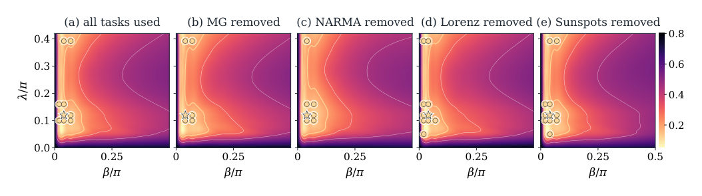
<figcaption class="paper-figure-caption"><b>Fig 1.</b> Fig. 1. The good operating region is essentially the same whichever task we score. Each panel maps validation rank over input drive β and coupling λ at fixed damping γ = 0.12. Brighter means better rank. Panel (a) uses all four tasks; panels (b) to (e) each drop one. Gold circles mark the top validation quintile across tasks and seeds; the star is the band’s medoid. The basin and circles barely move when a task is dropped, so the band is not an artifact of any single task.</figcaption>
</figure>
<figure class="paper-figure-card">
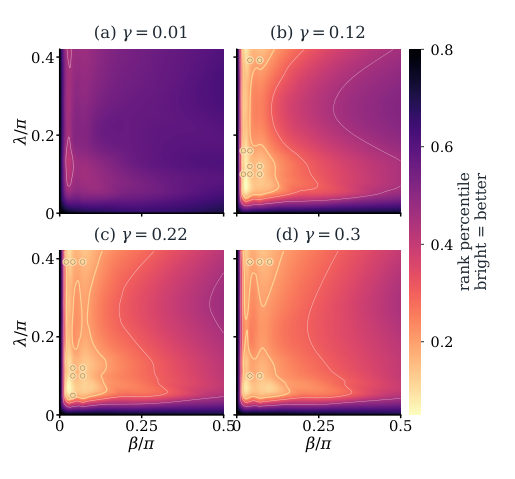
<figcaption class="paper-figure-caption"><b>Fig 2.</b> Fig. 2. Controlled forgetting is necessary for the regime. Each panel maps validation rank over (β, λ) at the damping rate γ named in its title (brighter = better); gold circles are the B20,0.7 band points at that γ. The band is essentially empty at γ = 0.01 and fills in from γ = 0.12 to 0.30.</figcaption>
</figure>
<figure class="paper-figure-card">
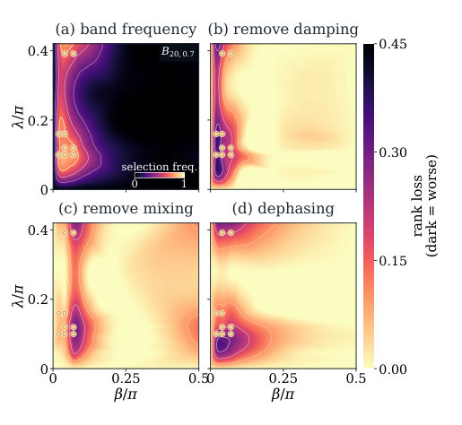
<figcaption class="paper-figure-caption"><b>Fig 3.</b> Fig. 3. Mechanism ablations destroy the operating band. (a) Selection frequency in the original reservoir: for each coordinate (β, λ), the color shows how often it reaches top-quintile validation rank across the 80 task–seed replicates; gold circles mark the B20,0.7 band. (b)–(d) Validation-rank loss for three representative ablations named in the panels, with darker colors indicating larger deterioration. The strongest losses occur at the original band coordinates.</figcaption>
</figure>
<figure class="paper-figure-card">
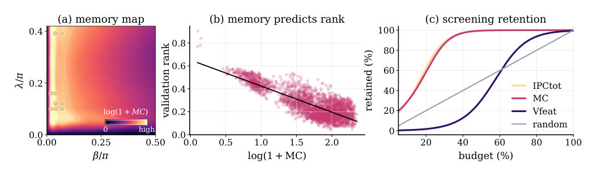
<figcaption class="paper-figure-caption"><b>Fig 4.</b> Fig. 4. Memory alone locates the band before any task is run. (a) Task-free memory-capacity map, log(1 + MC), on the γ = 0.12 slice of Fig. 1; gold points lie in the memory-rich region. (b) Higher memory predicts lower validation rank (Spearman ρs = −0.88). (c) Screening by each diagnostic’s top-ranked fraction: MC and information-processing capacity (IPC) recover good settings far faster than random selection, whereas raw feature diversity (Vfeat) barely beats chance.</figcaption>
</figure>

**Summary.** The paper identifies a specific, transferable 'operating band' in the parameter space of a dissipative quantum reservoir that guarantees good performance across multiple learning tasks. By systematically testing and ablating individual physical mechanisms (like damping or mixing), the authors prove that this regime requires the joint action of all components. This provides a crucial diagnostic tool for designing stable quantum machine learning hardware.

**Why it may be interesting.** This work provides concrete guidelines for designing quantum machine learning hardware by identifying robust operating regimes in the control space, which is crucial for realizing practical, stable quantum computation devices.

Detailed structure

**Main problem.** The core problem is determining the optimal, fixed operating regime for a quantum reservoir system so that it can perform well on various learning tasks without requiring dynamic optimization during training.

**Main result.** Good performance concentrates in a single, transferable 'operating band' within the control parameter space ($eta, \lambda, \gamma$), whose existence depends mechanistically on the joint action of all physical components (e.g., damping and mixing).

**Method.** The authors map performance across three key physical controls by defining an operating band using a stability criterion based on validation percentile rank across multiple tasks.

**Model / system.** The system is a dissipative quantum reservoir implemented on a small qubit architecture, evolving via input driving, local mixing ($U_{	ext{mix}}$), ZZ coupling ($U_\lambda$), and amplitude damping ($D_\gamma$).

**Key observables.** Validation percentile rank ($	ext{r}_{j,s}$), Memory Capacity ($	ext{MC}$), Information-Processing Capacity ($	ext{IPC}$).

**Important parameters / regimes.** Input drive strength ($eta$), Coupling strength ($\lambda$), Dissipation rate ($\gamma$).

**Assumptions / limitations.** The analysis is restricted to simulated instances of this specific reservoir architecture family, and practical noise/calibration issues are ignored.

**Figures summary.** Figures show the consistent location of the operating band across different tasks (Fig. 1), demonstrate that ablating any core mechanism destroys the band (Fig. 3), and illustrate that memory capacity alone can locate this optimal regime before task testing (Fig. 4).

**Paper structure.** The paper establishes the problem by noting fixed dynamics, then maps performance over three controls to find a stable 'Operating Band.' It rigorously tests this band's necessity and transferability by ablating individual physical mechanisms or comparing it against simpler diagnostics like memory capacity.

Abstract

In quantum reservoir computing, a fixed quantum system transforms an input signal, while learning reduces to training a simple linear readout on its measured outputs. Since the quantum dynamics themselves are never optimized, the method is well suited to today's hardware. Yet these dynamics must still be chosen carefully, because their settings remain fixed throughout training and inference. It therefore remains an open question where, in its control space, a fixed quantum system learns well. We address this question for a dissipative reservoir by mapping performance over three central physical controls: the strength of the input drive, the coupling between neighboring qubits, and the rate of dissipation. Good performance concentrates in a single, well-defined operating region of this control space. This region transfers across tasks and reservoir initializations, and the same memory-defined regime persists under architectural changes. It is also mechanistically grounded, since it disappears whenever any of the mechanisms that create it is removed. Finally, the region can be located cheaply before any task is run, using a simple memory diagnostic.

[↑ back to top](#top)

### [To Cool, or Not to Cool? Displacement Sensing with Hot Quantum States](http://arxiv.org/abs/2606.13650v1)

**Authors:** Piotr T. Grochowski  
**Type:** theory · **Category:** other · **PDF:** <https://arxiv.org/pdf/2606.13650v1>  
**Analysis basis:** full PDF text, analyzed in chunks
**Topic relevance:** `methods for driven-dissipative` **3/5** · `analog quantum simulation` **2/5** · `non-equilibrium dynamics` **2/5** · `Keldysh / 2PI / non-Gaussian methods` **1/5** · `correlated / nonlocal dissipation` **1/5** · `driven-dissipative phase transition` **1/5** · `entanglement & information structure` **1/5** · `interference shaping light` **1/5**

↔ Scroll figures horizontally

<figure class="paper-figure-card">
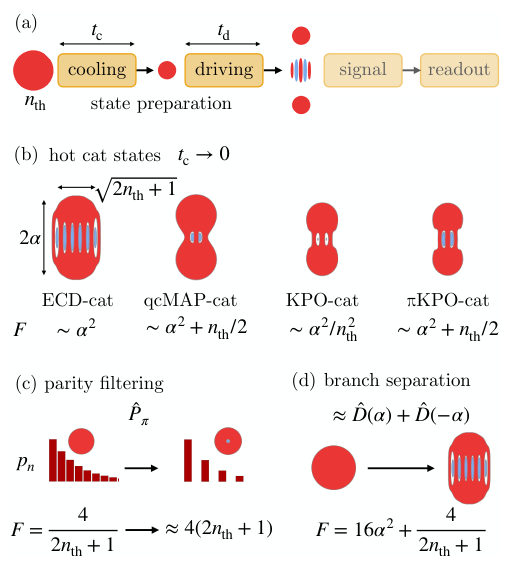
<figcaption class="paper-figure-caption"><b>Fig 1.</b> Figure 1. Operational structure of hot-state bosonic sensing and rep- resentative resources. (a) Cycle: cooling, nonclassical-state prepa- ration, signal accumulation, and readout. (b) Hot states are gener- ated by applying a nonclassical-state preparation protocol directly to a thermal rather than ground state. Echoed conditional displace- ment (ECD), qubit-cavity mapping (qcMAP), and Kerr-parametric- oscillator (KPO) protocols generate distinct hot-cat classes with dif- ferent thermal-sensitivity scaling. Here πKPO denotes KPO catifi- cation preceded by parity filtering. These scalings depend on two mechanisms. (c) Projection onto a definite parity sector leaves the thermal population in...</figcaption>
</figure>
<figure class="paper-figure-card">
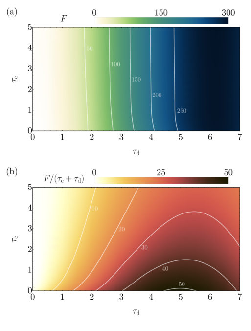
<figcaption class="paper-figure-caption"><b>Fig 2.</b> Figure 2. Optimization of cooling and driving times for trapped-ion hot-state sensing using full numerical master-equation simulations. (a) Full QFI as a function of cooling time τc and driving time τd. (b) Effective metrological gain per unit preparation time, F/(τc + τd), showing the emergence of an optimal finite driving time despite the monotonic increase of F. The calculations assume initial thermal occupation nth = 10, cooling rate γc = 1, motional-heating rate γh = 10−3, and ancilla-spin-dephasing rate γs = 10−2, correspond- ing to experimentally realistic trapped-ion parameters. The optimal driving time is set by the competition between coherent QFI growth and noise-induced...</figcaption>
</figure>

**Summary.** The paper challenges the assumption that quantum-enhanced bosonic sensing requires cooling to the ground state. By analyzing hot quantum states generated via squeezing or catification, it identifies two mechanisms—parity filtering and coherent branch interference—that maintain high sensitivity even with thermal noise. Ultimately, it shows that optimizing for the rate of information gain over time favors direct preparation of structured hot states over extensive pre-cooling.

**Why it may be interesting.** This work provides a crucial resource for quantum sensing by shifting the focus from achieving perfect initial state purity to engineering specific coherence structures within mixed thermal states, which is highly relevant for practical implementations in trapped ions or cavity QED.

Detailed structure

**Main problem.** The study investigates whether quantum-enhanced displacement sensing using bosonic systems requires mandatory cooling to near the ground state, or if high sensitivity can be achieved directly from thermal (hot) states.

**Main result.** Hot-state engineering protocols—specifically those utilizing parity selection or coherent branch interference—can achieve quantum enhancement without requiring full ground-state initialization. Optimal sensing depends on maximizing coherence per unit total experimental time, not just single-shot QFI.

**Method.** The analysis involves deriving the Quantum Fisher Information (QFI) for various hot states and comparing the scaling of this resource under different decoherence channels (loss, heating, dephasing).

**Model / system.** Bosonic systems are modeled using master equations incorporating bosonic loss, motional heating, and number dephasing. Specific protocols analyzed include parity-filtered cat states (KPO/qcMAP) and Echoed Conditional Displacement (ECD) cat states.

**Key observables.** Quantum Fisher Information (QFI), $\Delta	ilde{\epsilon}$, noise susceptibility ($\dot{F}$), and the rate objective $R = F / t_{cycle}$.

**Important parameters / regimes.** Initial thermal occupation ($n_{th}$), squeezing parameter ($r$), decoherence rates ($\Gamma_h, \gamma_-, \Gamma_\phi$), and protocol preparation time ($	au_d$).

**Assumptions / limitations.** The analysis often relies on effective two-branch models or approximations for the rate objective $R$, assuming certain overhead times are negligible or fixed.

**Figures summary.** Figures illustrate operational cycles, scaling laws for different mechanisms (parity filtering vs. branch separation), and normalized QFI dynamics under various noise channels (loss, diffusion, dephasing).

**Paper structure.** The paper progresses from identifying the core problem to analyzing two key enhancement mechanisms (Parity Filtering and Coherent Interference). It then rigorously compares these hot-state protocols across different decoherence models, culminating in an optimization comparison between cooling overhead versus direct preparation.

Abstract

Quantum-enhanced displacement sensing with bosonic systems is typically formulated assuming that the oscillator is cooled close to its ground state before nonclassical probe preparation. We investigate whether such near-ground-state initialization is necessary, or whether sensitive probes can instead be generated directly from thermal states. We analyze hot quantum probes produced by squeezing, number-raising, and Schrödinger-cat-state generation applied to thermal inputs. We identify two distinct mechanisms by which thermal mixedness can remain compatible with enhanced displacement sensitivity. First, projecting a mixed probe onto a definite parity sector removes the usual thermal suppression of the displacement quantum Fisher information, which can then increase with initial thermal occupation. Second, coherent superpositions of opposite displacements can retain sensitivity through coherence between their displaced components, even when the underlying state is mixed. We use these two mechanisms to classify hot-state protocols according to whether their sensitivity comes from parity selection, coherence between displaced components, or both. Finally, we formulate an experimentally relevant optimization problem comparing initial cooling with direct hot-state preparation under realistic decoherence and show that complete cooling is not universally optimal. Our results establish hot-state engineering as a route to quantum-enhanced bosonic displacement sensing without mandatory ground-state initialization.

[↑ back to top](#top)

### [Unifying spacetime approaches to quantum mechanics](http://arxiv.org/abs/2606.12539v1)

**Authors:** N. L. Diaz, M. Cerezo, Paolo Braccia  
**Type:** theory · **Category:** other · **PDF:** <https://arxiv.org/pdf/2606.12539v1>  
**Analysis basis:** full PDF text, analyzed in chunks
**Topic relevance:** `Keldysh / 2PI / non-Gaussian methods` **3/5** · `entanglement & information structure` **3/5** · `non-equilibrium dynamics` **2/5** · `correlated / nonlocal dissipation` **1/5** · `driven-dissipative phase transition` **1/5** · `methods for driven-dissipative` **1/5** · `non-equilibrium universality` **1/5**

↔ Scroll figures horizontally

<figure class="paper-figure-card">
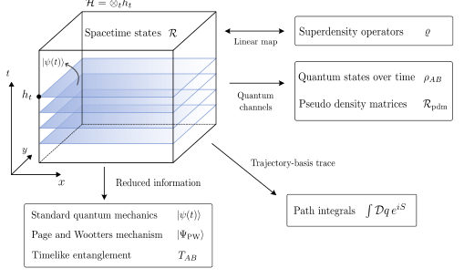
<figcaption class="paper-figure-caption"><b>Fig 1.</b> FIG. 1. Schematic depiction of how standard QM and its main extensions to a spacetime setting arise from a common object.</figcaption>
</figure>
<figure class="paper-figure-card">
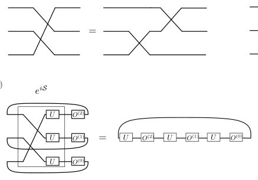
<figcaption class="paper-figure-caption"><b>Fig 2.</b> FIG. 2. Tensor network representation of the main objects of the formalism for N = 3. Panel a) Time translations across slices and the corresponding SWAP decomposition. Panel b) Time translations within slices. Panel c) the quantum action operator and a particular case of Theorem 1.</figcaption>
</figure>
<figure class="paper-figure-card">
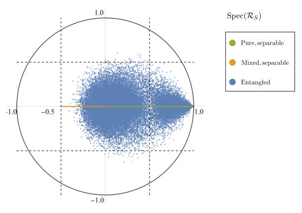
<figcaption class="paper-figure-caption"><b>Fig 3.</b> FIG. 3. Spectrum in the complex plane of RS = TrE[R] for S, E qubits and N = 2. We sampled Haar randomly both global unitaries and (i) Separable system-environment and pure state (green points) (ii) Separable system-environment and mixed state (orange points) (iii) General (entangled) system-environment state (blue points). For each scenario a total of 104 points have been sampled. In case (i) the spec- trum is restricted to the real interval (0, 1) while in case (ii) to (−1/2, 1). In the general case (iii) the spectrum is complex.</figcaption>
</figure>
<figure class="paper-figure-card">
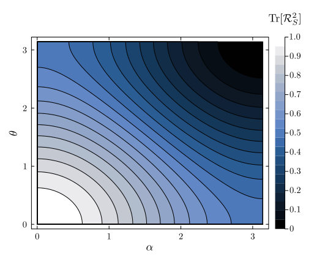
<figcaption class="paper-figure-caption"><b>Fig 4.</b> FIG. 4. Contour plot of the pseudo-purity Tr[R2 S] with initial state given by |ψ(θ)⟩= cos(θ/4)|00⟩+sin(θ/4)|11⟩and global unitary U = (1S ⊗|0⟩E⟨0| + XS ⊗|1⟩E⟨1|)e−iαYE/4. Here, θ parameterizes the initial state entanglement while α parame- terizes the entanglement generated by the evolution (and the final state entanglement). In particular, the line θ = 0 cor- responds to the standard purity of the state of the system after the evolution. In this scenario the pseudo-purity is a real quantity for all values of the parameters since the com- plex eigenvalues of RS come in conjugate pairs.</figcaption>
</figure>
<figure class="paper-figure-card">
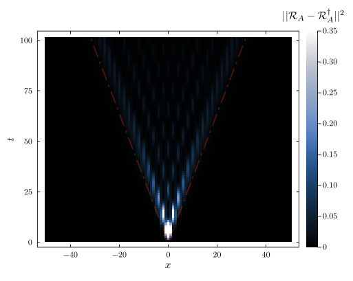
<figcaption class="paper-figure-caption"><b>Fig 5.</b> FIG. 5. Contour plot of the imagitivity of the spacetime state RA corresponding to the ground state of a critical antiferromagnetic Heisenberg model under bipartition A = (0, 0) ∪(t, x) B = rest. Here we are considering the same number of temporal and spatial slices N = L + 1 = 101 with ϵ = 0.05. The red dash-doted lines correspond to the speed of low-energy modes associated with an effective infrared CFT description.</figcaption>
</figure>

**Summary.** The paper proposes 'spacetime quantum mechanics' (SQM) to resolve the conflict between space and time in QM by defining generalized 'spacetime states.' It demonstrates that various existing formalisms—like path integrals and pseudo-density matrices—are mathematically equivalent manifestations of this single underlying state object. This unification provides deep insights into how temporal correlations govern quantum dynamics.

**Why it may be interesting.** This work provides a powerful, unified mathematical framework for understanding time evolution in quantum theory, which is crucial for developing consistent theories of quantum gravity or relativistic QFTs.

Detailed structure

**Main problem.** The central problem is formulating quantum mechanics (QM) in a way that treats space and time symmetrically, addressing the conceptual tension between relativity and canonical QM.

**Main result.** The authors unify numerous existing spacetime approaches by showing they all derive from a single underlying mathematical object: the 'spacetime state' ($R$).

**Method.** They develop a formalism using a finite-time tensor product Hilbert space ($\mathcal{H} = igotimes_{t=0}^{N-1} \mathcal{H}_t$) and define spacetime states as generalized quantum operators that encode temporal correlations.

**Model / system.** The model is 'spacetime quantum mechanics' (SQM), describing systems over a finite spacetime region. The formalism uses time translation operators ($\mathbf{e}^{i\epsilon P}$) and constructs the state $R$ from initial states $
ho_0$.

**Key observables.** Spacetime states ($R$), pseudo-entropies ($S_\alpha(R)$), Wightman functions, and Out-of-Time-Order Correlators (OTOCs).

**Important parameters / regimes.** Finite time window $T = \epsilon N$, the time step $\epsilon$, and system/environment bipartitions.

**Assumptions / limitations.** The initial formulation assumes a finite time window and discrete time slices, although extensions to continuum limits are discussed. The derivation of certain properties relies on specific mathematical decompositions (e.g., for pure states).

**Figures summary.** Figures illustrate the relationship between standard QM and spacetime approaches; one shows spectral analysis of $R$ across bipartitions, while another plots OTOC eigenvalues versus time.

**Paper structure.** The paper builds by first defining the necessary mathematical machinery (Spacetime Hilbert space, action operators $\mathbf{S}$), then deriving how standard quantum evolution pictures (Schrödinger/Heisenberg) are recovered via partial tracing, and finally analyzing advanced properties like isospectrality and entanglement measures.

Abstract

Recent efforts to formulate quantum mechanics in a way that treats space and time on a more equal footing have led to a large variety of spacetime-oriented approaches. In this work we present a detailed study of spacetime states, the objects that play the role of quantum states in the recently introduced framework of spacetime quantum mechanics, and show that the main proposals in the literature are different manifestations of the same underlying object. Path integrals, quantum states over time, pseudo-density matrices, the Page and Wootters mechanism, superdensity operators, and timelike-entanglement proposals all arise from spacetime states through particular evaluations, reduced information, linear maps, or quantum channels. This unification provides explicit mathematical representations of these formalisms, reveals relations among them, and clarifies the spacetime information each one captures. We also study the broader relevance of the spacetime-state point of view for Leggett-Garg inequalities, OTOCs, temporal tensor networks, fermionic systems, relativistic QFTs, quantum reference frames, and classical physics, together with additional insights and perspectives revealed by the common unifying framework.

[↑ back to top](#top)

### [Optical pulse-induced quantum geometric waves in graphene](http://arxiv.org/abs/2606.12696v1)

**Authors:** Luis Fernando Cardenas Castillo, Wei Chen  
**Type:** theory · **Category:** other · **PDF:** <https://arxiv.org/pdf/2606.12696v1>  
**Analysis basis:** full PDF text, analyzed in chunks
**Topic relevance:** `non-equilibrium dynamics` **3/5** · `entanglement & information structure` **2/5** · `non-equilibrium universality` **2/5** · `Keldysh / 2PI / non-Gaussian methods` **1/5** · `analog quantum simulation` **1/5** · `driven-dissipative phase transition` **1/5** · `methods for driven-dissipative` **1/5**

↔ Scroll figures horizontally

<figure class="paper-figure-card">

<figcaption class="paper-figure-caption"><b>Fig 1.</b> Figure 1: Momentum profile of the elements of the dynamic quantum geometric tensor near the K valley under the influence of an x-polarized optical pulse at the beginning of the pulse t = 50fs, at the peak of the pulse t = 70fs, and after the pulse t = 120fs. The panels show the momentum-space quantum metric gxx/a2, the temporal metric gtt/fs−2, and the Berry curvature Ωxy/a2, all of which manifest ring-like features that respect the Floquet bands labeled by white and black contours.</figcaption>
</figure>
<figure class="paper-figure-card">
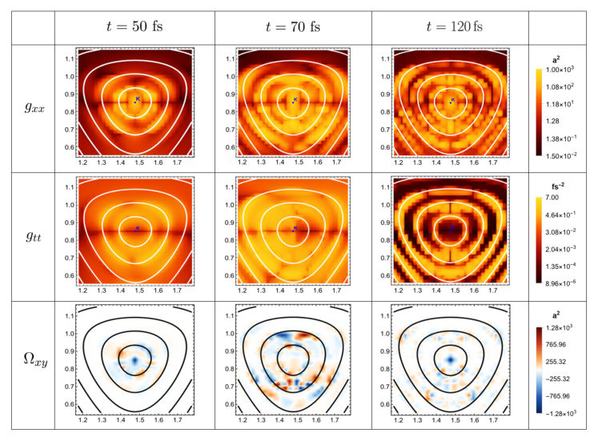
<figcaption class="paper-figure-caption"><b>Fig 2.</b> Figure 1 shows numerical results near the K-valley, where we present the momentum gxx and temporal gtt components of the quantum metric, as well as the momentum component of the</figcaption>
</figure>
<figure class="paper-figure-card">
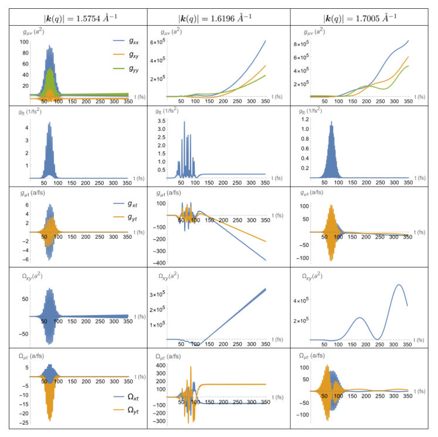
<figcaption class="paper-figure-caption"><b>Fig 3.</b> Figure 2: Time dependence of the dynamic quantum geometric tensor along the Γ −K direction caused by an x-polarized pulse, evaluated at below |k(q)| = 1.5754Å−1, exactly at |k(q)| = 1.6196Å−1, and above |k(q)| = 1.7005Å−1 the first resonant condition Ec(k) −Ev(k) = ℏωpump. We present the momentum component of the quantum metric {gxx, gxy, gyy} (first row), temporal component of the metric gtt (second row), mixed component of the metric {gxt, gyt} (third row), momentum component of the Berry curvature Ωxy (fourth row), and mixed component of the curvature {Ωxt, Ωyt} (fifth row).</figcaption>
</figure>
<figure class="paper-figure-card">
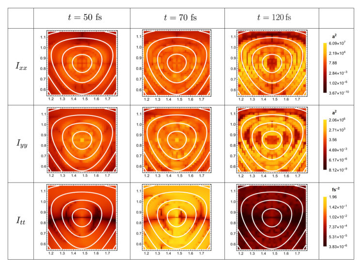
<figcaption class="paper-figure-caption"><b>Fig 4.</b> Figure 3: Momentum profile of the dynamic Fisher information matrix near the K valley caused by x-polarized pulse evaluated at time t = 50, 70, 120 fs. We present the momentum components Ixx and Iyy in units of a2, and the temporal component Itt in units of fs−2. The white contours label the location of Floquet bands.</figcaption>
</figure>
<figure class="paper-figure-card">
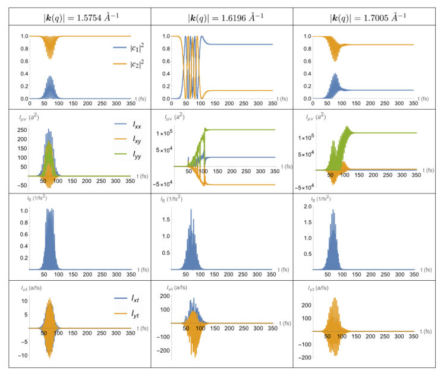
<figcaption class="paper-figure-caption"><b>Fig 5.</b> Figure 4: Time-varying band populations |c1|2, |c2|2 (first row), momentum components {Ixx, Ixy, Iyy} (second row), temporal component Itt (third row), and mixed component {Ixt, Iyt} of the dynamic Fisher information matrix along the Γ −K direction caused by x-polarized pulse. The columns correspond to momenta below, at, and above the first resonant condition (see caption of Fig. 2).</figcaption>
</figure>

**Summary.** This work theoretically examines how an ultrafast optical pulse induces dynamic changes in the quantum geometry of graphene's electronic states. By calculating the quantum metric and Berry curvature, the authors predict the emergence of measurable 'quantum geometric waves.' These waves serve as a spectroscopic signature confirming the transient formation of Floquet bands in the material.

**Why it may be interesting.** The connection drawn between time-dependent Floquet band structure, quantum geometric invariants (metric/curvature), and experimentally accessible quantities like the Fisher information makes it highly relevant for understanding non-equilibrium dynamics in condensed matter systems.

Detailed structure

**Main problem.** The study investigates how a short, intense optical pulse dynamically alters the quantum geometry of Bloch states in graphene.

**Main result.** The quantum metric and Berry curvature exhibit wave-like features (quantum geometric waves) in momentum-time space, which are directly linked to the formation of Floquet bands induced by the driving field.

**Method.** Theoretical calculation using time-dependent Schrödinger equation solutions for a two-band model, quantifying geometry via the quantum geometric tensor and Fisher information matrix.

**Model / system.** Graphene monolayer modeled on a honeycomb lattice, driven by an external time-dependent vector potential (optical pump). The analysis is performed in the momentum-time manifold (k, t).

**Key observables.** Quantum metric tensor components ($g_{\mu
u}$), Berry curvature ($\Omega_{\mu
u}$), and Fisher information matrix ($I_{\mu
u}$).

**Important parameters / regimes.** Optical pulse parameters include $\hbar\omega_{	ext{pump}} = 950$ meV, pulse duration $	au = 18$ fs.

**Assumptions / limitations.** The analysis neglects correlations and out-of-equilibrium many-body effects by solving the time-dependent Schrödinger equation in momentum space.

**Figures summary.** Figures illustrate ring-like features (quantum geometric waves) in the momentum profiles of $g_{xx}, g_{tt}, \Omega_{xy}$ at various times, and show similar patterns for the Fisher information components ($I_{xx}, I_{yy}, I_{tt}$).

**Paper structure.** The paper develops the theory by defining the quantum geometric tensor in the $(\mathbf{k}, t)$ manifold, calculating its real part (metric) and imaginary part (Berry curvature), and introducing the measurable Fisher information matrix. It then applies this framework to graphene driven by an optical pulse.

Abstract

We show that, under a short optical pulse, the quantum metric of Bloch states in the momentum-time (kx, ky , t) of graphene becomes dynamic and exhibits a wave-like behavior near Dirac points. This quantum metric wave reflects the Floquet-band structure caused by the pulse, as revealed by solving the time-dependent Schrödinger equation assuming that correlations and out-of-equilibrium effects can be ignored. The momentum and temporal components of the metric have very distinct time dependence that persists even after the pulse has passed. In addition, the pulse also generates a Berry curvature wave that is otherwise absent in static graphene. The time-dependent electron densities in conduction and valence bands also give arise to a Fisher information wave that constitutes part of the quantum metric wave, and is readily measurable by pump-probe experiments.

[↑ back to top](#top)

### [Spontaneous symmetry breaking under Bose--Einstein condensation](http://arxiv.org/abs/2606.12606v1)

**Authors:** V. I. Yukalov  
**Type:** theory · **Category:** quantum gases · **PDF:** <https://arxiv.org/pdf/2606.12606v1>  
**Analysis basis:** full PDF text, analyzed in chunks
**Topic relevance:** `Keldysh / 2PI / non-Gaussian methods` **3/5** · `analog quantum simulation` **2/5** · `methods for driven-dissipative` **2/5** · `correlated / nonlocal dissipation` **1/5** · `correlated cavity matter` **1/5** · `driven-dissipative phase transition` **1/5** · `entanglement & information structure` **1/5**

↔ Scroll figures horizontally

<figure class="paper-figure-card">
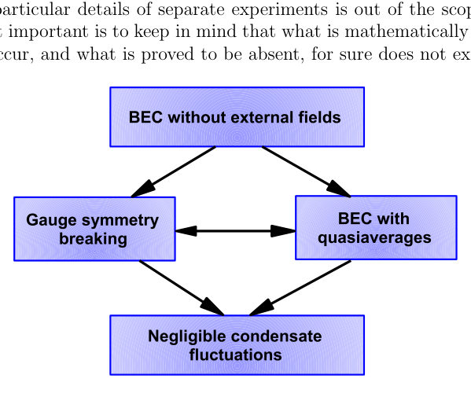
<figcaption class="paper-figure-caption"><b>Fig 1.</b> Figure 1: The relations between the BEC occuring without external fields, BEC in the sense of the Bogolubov quasiaverages, gauge symmetry breaking, and condensate fluctuations.</figcaption>
</figure>

**Summary.** This survey clarifies complex issues surrounding Bose-Einstein condensation by showing that the physical reality of BEC necessitates spontaneous gauge symmetry breaking. Using quasiaverages and fluctuation analysis, the authors demonstrate that this symmetry breaking mechanism is crucial for ensuring system stability and avoiding unphysical 'grand canonical catastrophes' in the thermodynamic limit.

**Why it may be interesting.** This work provides a deep theoretical clarification of the mathematical underpinnings of BEC, particularly how gauge symmetry breaking resolves apparent paradoxes regarding particle fluctuations in many-body quantum systems relevant to ultracold atoms.

Detailed structure

**Main problem.** The paper aims to clarify conceptual confusions surrounding Bose-Einstein condensation (BEC), spontaneous gauge symmetry breaking, and particle fluctuations in the context of quantum gas theory.

**Main result.** The occurrence of BEC is shown to be mathematically equivalent to the necessity of spontaneous gauge symmetry breaking, which stabilizes the system by ensuring that condensate fluctuations are thermodynamically normal.

**Method.** The analysis employs Bogoliubov's method using quasiaverages in the grand canonical ensemble and utilizes ergodic decomposition techniques to relate symmetric averages to broken-symmetry terms.

**Model / system.** The model is a spinless Bose system described by field operators, analyzed under conditions leading to BEC. The methodology involves introducing symmetry-breaking terms into the Hamiltonian for calculation.

**Key observables.** Condensate order parameter ($\langle \hat{a}_0 
angle_{	ext{na}}$), condensate number variance ($	ext{var}(\hat{N}_0)$), relative density fluctuations ($	ext{var}(\hat{N})/N$), and the fluctuation index ($\zeta$).

**Important parameters / regimes.** Thermodynamic limit ($V 	o \infty, N/V = 	ext{const}$), the symmetry-breaking parameter $
u$, and the temperature $T$.

**Assumptions / limitations.** The analysis assumes a stable potential for pair interactions and relies on the rigorous justification of substituting operators with non-operator quantities in the thermodynamic limit.

**Figures summary.** Figure 1 illustrates the relationship between BEC descriptions (standard vs. quasiaverages), gauge symmetry breaking, and the resulting condensate fluctuations.

**Paper structure.** The paper proceeds by first defining the problem space involving multiple theoretical approaches to BEC. It then rigorously connects standard averages to Bogoliubov quasiaverages via symmetry breaking, demonstrating that this mechanism is required for stability and avoiding catastrophic fluctuation predictions.

Abstract

Due to high current interest to Bose-Einstein condensation, the related topics, such as spontaneous gauge symmetry breaking, ergodic decomposition, and particle fluctuations, are intensively discussed in literature. These discussions, unfortunately, involve quite a number of controversies and confusions. The goal of the present brief survey is to clarify some of these confusions, concentrating on the principal points, such as the relationship between the conditions of Bose-Einstein condensation, the Bogolubov method of quasiaverages, spontaneous gauge symmetry breaking, ergodic decomposition, the presumed existence of nonthermodynamic particle fluctuations leading to the so-called ``grand canonical catastrophe", and the requirements for system stability.

[↑ back to top](#top)

### [Quantum Stochastic Inflation](http://arxiv.org/abs/2606.12636v1)

**Authors:** Robson Christie, Jaewoo Joo, Greg Kaplanek, Vincent Vennin, David Wands  
**Type:** theory · **Category:** other · **PDF:** <https://arxiv.org/pdf/2606.12636v1>  
**Analysis basis:** full PDF text, analyzed in chunks
**Topic relevance:** `Keldysh / 2PI / non-Gaussian methods` **3/5** · `non-equilibrium dynamics` **2/5** · `correlated / nonlocal dissipation` **1/5** · `driven-dissipative phase transition` **1/5** · `entanglement & information structure` **1/5** · `methods for driven-dissipative` **1/5** · `non-equilibrium universality` **1/5**

↔ Scroll figures horizontally

<figure class="paper-figure-card">
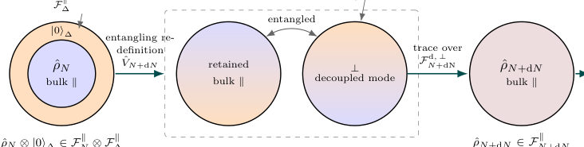
<figcaption class="paper-figure-caption"><b>Fig 1.</b> Figure 1: Steps undertaken to evolve the homogeneous, coarse-grained mode of the field. We use the following terminology: incoming bulk denotes the homogeneous mode at N, incoming boundary shell denotes the homogeneous shell mode added between N and N + dN, redefined bulk denotes the updated homogeneous mode at N + dN, and decoupled mode denotes the collective mode traced over after the redefinition.</figcaption>
</figure>
<figure class="paper-figure-card">
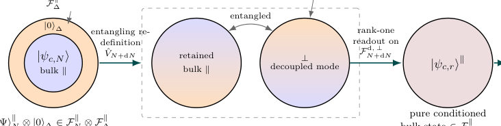
<figcaption class="paper-figure-caption"><b>Fig 2.</b> Figure 2: Selective SSE branch. The same entangling bulk–boundary redefinition as in fig. 1 is followed by a rank-one measurement of the decoupled mode, rather than a partial trace. Conditioning on outcome r leaves the bulk in the pure state |ψc,r⟩.</figcaption>
</figure>
<figure class="paper-figure-card">
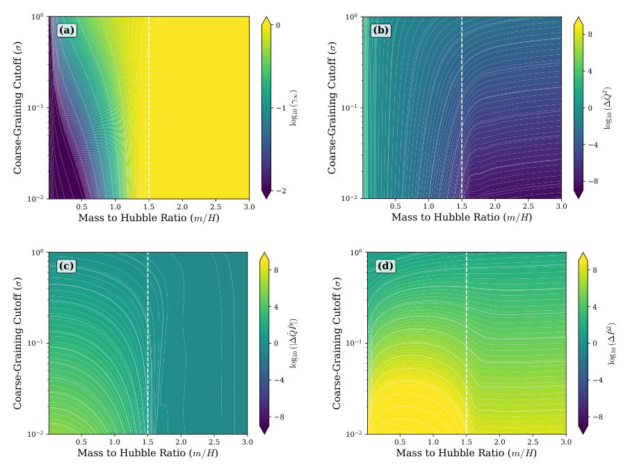
<figcaption class="paper-figure-caption"><b>Fig 3.</b> Figure 3: Phase-space diagrams of the Gaussian stationary state derived explicitly in eq. (4.7). (a) The stationary purity γ∞of the coarse-grained state. (b) Field variance ∆ˆQ2. (c) Magnitude of the cross-covariance |∆ˆQ ˆP|. (d) Momentum variance ∆ˆP 2. The solid colour contours (isolines) map lines of constant magnitude across the two-dimensional parameter space, while the dashed white line denotes the critical mass threshold m = 1.5H. All three covariance elements share the identical logarithmic colour axis to accurately compare their relative divergence magnitudes. In the light-field regime, the variances rapidly diverge as the cutoff σ is tightened, resulting in an increasingly mixed...</figcaption>
</figure>

**Summary.** This work develops a fully quantum open system description of stochastic inflation by modeling the field as an open system coupled to newly entering modes. It derives the evolution via a GKLS master equation, showing that this quantum process mathematically reproduces the classical Fokker-Planck equations used in inflationary cosmology. The paper is significant for providing a fundamental quantum justification for the emergence of classical noise during cosmic inflation.

**Why it may be interesting.** It provides a rigorous quantum mechanical derivation connecting QFT on curved spacetime (inflation) directly to classical stochastic processes, which is a major goal in quantum gravity phenomenology.

Detailed structure

**Main problem.** The paper formulates stochastic inflation within a fully quantum open system framework, aiming to derive the classical stochastic dynamics from fundamental quantum field theory principles.

**Main result.** The evolution of the coarse-grained bulk density matrix is governed by a GKLS master equation, whose Wigner function representation matches the known Fokker-Planck equations for stochastic inflation in various regimes (e.g., Starobinsky's slow-roll limit).

**Method.** The authors use canonical coarse-graining techniques and model the system evolution as an open quantum process involving tracing out entangled boundary modes, leading to a Lindblad master equation.

**Model / system.** The physical system is a free scalar field undergoing inflation on a de Sitter background. The dynamics are analyzed by partitioning the field into a coarse-grained 'bulk' patch and incoming 'boundary' modes, treating the process as an open quantum system.

**Key observables.** Purity of the coarse-grained patch ($	ext{Tr}(
ho^2)$), Wigner function $W(q, p)$, and the expectation values $\langle\hat{Q}
angle, \langle\hat{P}
angle$.

**Important parameters / regimes.** Mass regime ($m/H$), e-fold number ($N$), and the coupling strength of the boundary modes.

**Assumptions / limitations.** The analysis relies on approximations like leading order in the super-Hubble gradient expansion, Markovianity assumptions for the bath interaction, and the validity of the thin-shell approximation.

**Figures summary.** Figures illustrate the steps of mode evolution (incoming bulk $	o$ inclusion of boundary shell $	o$ redefinition $	o$ tracing out modes) and show phase space dynamics via Wigner functions or conditional state evolutions based on measurement type.

**Paper structure.** The paper builds from defining the open system framework using canonical coarse-graining, deriving the GKLS master equation for the reduced density matrix, establishing its equivalence to a Fokker-Planck equation in the Wigner representation, and finally analyzing specific physical limits (light vs. heavy fields) and measurement readouts.

Abstract

We formulate stochastic inflation in an open quantum system framework. The field coarse-grained in a patch of fixed physical size, and the total momentum of that patch, form a canonical pair and act on a one-mode Fock space which we identify as the "bulk". At each time step, new comoving modes join the coarse-grained patch and the bulk has to be redefined. This redefinition produces an entangled mode that is traced over, yielding a non-unitary evolution equation for the bulk's density matrix. For a free test field in de Sitter, one obtains GKLS dynamics, generated by an effective Hamiltonian and a single non-Hermitian Lindblad operator, hence diffusion and Hubble friction originate from the same quantum channel. The Wigner-Weyl transform of the GKLS equation leads to a Fokker-Planck equation for the Wigner function, which matches the one that applies to the classical phase-space distribution of stochastic inflation. We also provide several schemes under which one can unravel the GKLS dynamics into stochastic Schrodinger equations when continuous measurements of the decoupled mode are performed, making contact with Langevin formulations of stochastic inflation. In the light-field regime, an additional overdamped reduction can be performed by integrating out the momentum variable in the Wigner distribution, leading to Starobinsky's slow-roll Fokker-Planck equation. In that regime, the purity of the patch is strongly suppressed. In contrast, for heavy fields, field diffusion is suppressed and the coarse-grained patch remains close to a pure underdamped oscillator, which prevents a classical stochastic treatment.

[↑ back to top](#top)

### [Scalar Quantum Fields: Theory Space and its Geometry](http://arxiv.org/abs/2606.12580v1)

**Authors:** Viola Gattus, Peter Millington  
**Type:** theory · **Category:** other · **PDF:** <https://arxiv.org/pdf/2606.12580v1>  
**Analysis basis:** full PDF text, analyzed in chunks
**Topic relevance:** `Keldysh / 2PI / non-Gaussian methods` **3/5** · `analog quantum simulation` **1/5** · `correlated / nonlocal dissipation` **1/5** · `driven-dissipative phase transition` **1/5** · `entanglement & information structure` **1/5** · `methods for driven-dissipative` **1/5** · `non-equilibrium dynamics` **1/5** · `non-equilibrium universality` **1/5**

↔ Scroll figures horizontally

<figure class="paper-figure-card">
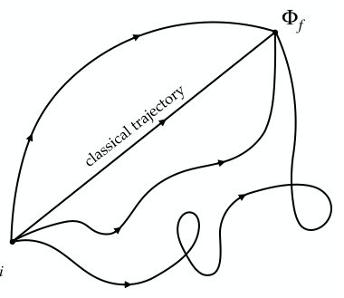
<figcaption class="paper-figure-caption"><b>Fig 1.</b> Figure 1: An example of possible paths between initial and final field configurations Φi and Φ f . Classi- cally, the field follows a single trajectory: the shortest path. In the quantum regime, however, an infinite number of paths contribute. The sum over all such possible paths is known as the path integral.</figcaption>
</figure>
<figure class="paper-figure-card">
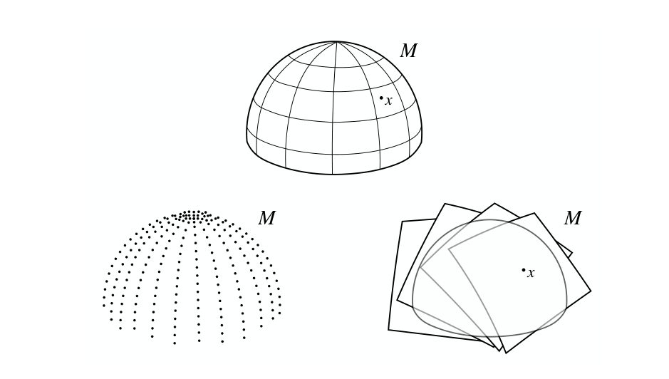
<figcaption class="paper-figure-caption"><b>Fig 2.</b> Figure 2: Schematic depiction of two different ways to “build” a manifold M, represented here as a hemisphere. The manifold M can be constructed either by specifying all its points x or by drawing the tangent plane at each point x on its surface.</figcaption>
</figure>
<figure class="paper-figure-card">
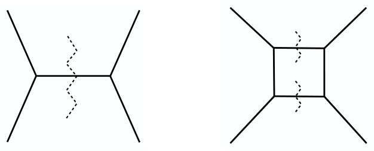
<figcaption class="paper-figure-caption"><b>Fig 3.</b> Figure 3: Examples of reducible and irreducible diagrams. Figure 3a displays a one-particle-reducible diagram, with the corresponding internal line cut indicated explicitly. Figure 3b shows the so-called box diagram, which provides an example of a one-particle-irreducible diagram that is nevertheless two- particle reducible.</figcaption>
</figure>
<figure class="paper-figure-card">
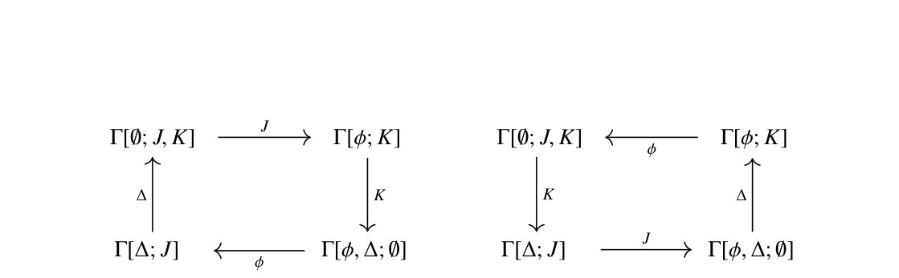
<figcaption class="paper-figure-caption"><b>Fig 4.</b> Figure 4: 2PI functionals and their interrelations via Legendre transforms. The arrows indicate the variable with respect to which the Legendre transform is performed. Based on Fig. 1 of [20].</figcaption>
</figure>
<figure class="paper-figure-card">
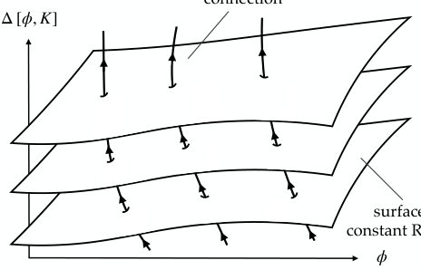
<figcaption class="paper-figure-caption"><b>Fig 5.</b> Figure 5: Schematic of the affine coordinate frame of the D connection, spanned by ϕa and ∆ab. Chang- ing the RG scale induces a vector field in configuration space, which connects hypersurfaces associated with different RG scales. All points in each hypersurface have the same value of Kab, but different value of ϕa. Geodesics of the D connection are RG trajectories with dKab/dt = constant. In the affine coordi- nate frame of the D connection, spanned by Kab and Ja, geodesics are straight lines and pierce through hypersurfaces of constant RG time perpendicularly. For a specific example of this, see Fig. 3 of [20].</figcaption>
</figure>

**Summary.** This lecture explores Quantum Field Theory by treating the space of possible theories as a geometric manifold. It develops advanced techniques using 2PI effective actions and functional integrals, culminating in mapping Renormalization Group evolution onto geodesic flow within this abstract 'theory space.' This provides a deep mathematical framework for understanding how physical laws change with energy scale.

**Why it may be interesting.** While focused on fundamental QFT rather than condensed matter systems directly, the rigorous mathematical machinery developed—especially the use of information geometry to describe parameter dependence (RG flow)—provides powerful abstract tools applicable to understanding phase transitions or critical points in strongly correlated materials.

Detailed structure

**Main problem.** The central goal is to develop a geometric understanding of Quantum Field Theory (QFT) by interpreting the space of possible theories, known as 'theory space,' as a mathematical manifold.

**Main result.** The authors establish that observables like the effective action and correlation functions can be derived using advanced differential geometry tools (like connections and metrics on infinite-dimensional spaces), showing how physical parameters flow with energy scale.

**Method.** The analysis employs functional methods, including path integrals, generating functionals, and the 2PI effective action formalism. Geometrically, it utilizes concepts from Information Geometry to map QFT dynamics onto geodesic flows in theory space.

**Model / system.** The primary model is a general scalar quantum field ($\Phi_a$) described by an action functional $S[\Phi]$. The framework generalizes standard QFT techniques (like renormalization) into a geometric language applicable across different physical theories.

**Key observables.** The 1PI and 2PI effective actions ($\Gamma$), correlation functions $\langle \Phi(x_1) \dots \Phi(x_n) 
angle$, and the metric tensor $g_{\alphaeta}$ defining the geometry of theory space.

**Important parameters / regimes.** Model parameters embedded in the action coefficients ($Z_{ab}, V$'s), the energy scale ($\mu$ or RG time $t$), and the coupling constants $\lambda$.

**Assumptions / limitations.** The derivation relies on perturbative expansions in $\hbar$, assuming that observables remain well-defined (e.g., on-shell) even when intermediate functional definitions might lack strict covariance.

**Figures summary.** Figures illustrate paths between field configurations, the relationship between reducible and irreducible diagrams, and schematically show how geodesics in theory space correspond to Renormalization Group flow trajectories.

**Paper structure.** The paper progresses from defining QFT via actions and path integrals (Chunk 1) to introducing generating functionals and the 2PI effective action (Chunk 2). It then details perturbative calculations of quantum corrections ($\hbar$ expansion, Chunk 3), before culminating in a full geometric treatment using connections and metrics on theory space for RG flow analysis (Chunks 4-6).

Abstract

Scalar fields provide perhaps the simplest playground in which to develop our understanding of quantum field theory. In this lecture, we consider what it means to write down a scalar quantum field theory and how we can give geometrical interpretations to the space of such theories: the theory space.

[↑ back to top](#top)

### [The formation of magnetic reentrancy in the Ising model on a decorated square lattice](http://arxiv.org/abs/2606.12572v1)

**Authors:** A. V. Zarubin, F. A. Kassan-Ogly  
**Type:** theory · **Category:** statistical mechanics · **PDF:** <https://arxiv.org/pdf/2606.12572v1>  
**Analysis basis:** full PDF text, analyzed in chunks
**Topic relevance:** `analog quantum simulation` **3/5** · `exotic spin models in light-matter` **3/5** · `driven-dissipative phase transition` **1/5** · `entanglement & information structure` **1/5** · `non-equilibrium dynamics` **1/5** · `non-equilibrium universality` **1/5**

↔ Scroll figures horizontally

<figure class="paper-figure-card">
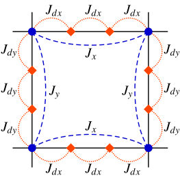
<figcaption class="paper-figure-caption"><b>Fig 1.</b> Figure 1. Example of a decorated square lattice: a lattice decorated twice in two directions (dx = dy = 2). Blue circles represent nodal spins; red diamonds represent decorating spins. Blue dashed lines represent direct exchange interactions with corresponding values Jx and Jy along the x and y directions of the lattice; red dotted lines rep- resent decorating exchange interactions with corresponding values Jdx and Jdy. The black solid lines show the spatial lattice on which the atomic spins of the lattice are located</figcaption>
</figure>
<figure class="paper-figure-card">
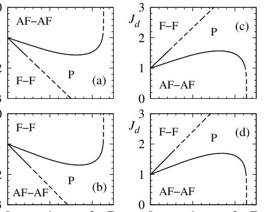
<figcaption class="paper-figure-caption"><b>Fig 2.</b> Figure 2. Magnetic phase diagrams showing the dependence of the critical temperature Tc on the values of the decorating exchange in- teraction Jd at J = −1, d = 5, Jd &lt; 0 (a), J = +1, d = 6, Jd &lt; 0 (b), J = −1, d = 5, Jd &gt; 0 (c), J = −1, d = 6, Jd &gt; 0 (d). Magnetic ordered phases are labeled in the figure as F–F (ferromagnetic-ferromagnetic) and AF–AF (antiferromagnetic- antiferromagnetic), and the paramagnetic phase as P</figcaption>
</figure>
<figure class="paper-figure-card">
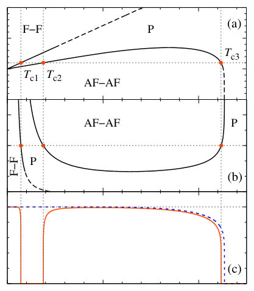
<figcaption class="paper-figure-caption"><b>Fig 3.</b> Figure 4. Magnetic phase diagrams showing the dependence of the critical temperature Tc on the decorating exchange interaction Jd (a) and on the decoration multiplicity d (b) of the lattice for the set of parameters (23). The red dots indicate the critical temperatures Tc1 ≈ 0.141, Tc2 ≈0.376, Tc3 ≈2.234 at Jd = +1.2 (a) and at d = 6 (b). The temperature dependence of the spontaneous magnetization (c) for the parameters (23) is shown by the red solid line, while the Onsager’s spontaneous magnetization (1) with Tc ≈2.269 is shown by the blue dashed line</figcaption>
</figure>
<figure class="paper-figure-card">
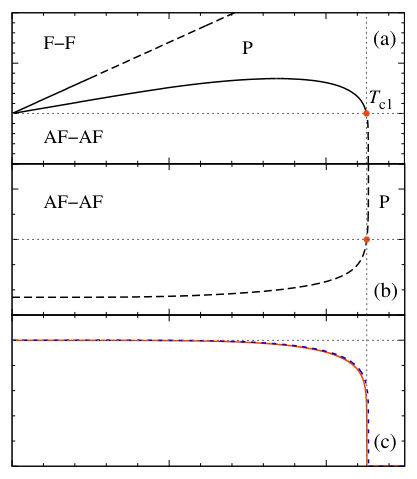
<figcaption class="paper-figure-caption"><b>Fig 4.</b> Figure 3. Magnetic phase diagrams showing the dependence of the critical temperature Tc on the decorating exchange interaction Jd (a) and on the decoration multiplicity d (b) of the lattice for the set of parameters (22). The red dot indicates the critical temperature Tc1 ≈ 2.258 at Jd = +1 (a) and at d = 6 (b). The temperature dependence of the spontaneous magnetization (c) for the parameters (22) is shown by the red solid line, while the Onsager’s spontaneous magnetization (1) with Tc ≈2.269 is shown by the blue dashed line</figcaption>
</figure>
<figure class="paper-figure-card">
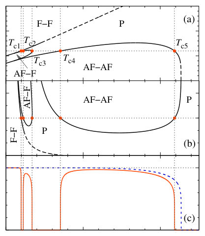
<figcaption class="paper-figure-caption"><b>Fig 5.</b> Figure 5. Magnetic phase diagrams showing the dependence of the critical temperature Tc on the decorating exchange interaction Jdx (Jdy = Jdx + 0.3) (a) and the decoration multiplicity dx (dy = dx) (b) of the lattice for the set of parameters (24). The red dots denote the critical temperatures Tc1 ≈0.197, Tc2 ≈0.224, Tc3 ≈0.338, Tc4 ≈ 0.705, Tc5 ≈2.183 at Jdx = +1.2 (Jdy = +1.5) (a) and at dx = dy = 6 (b). The temperature dependence of the spontaneous magnetization (c) for the parameters (24) is shown by the red solid line, and the Onsager’s spontaneous magnetization (1) with Tc ≈2.269 is shown by the blue dashed line</figcaption>
</figure>

**Summary.** This work provides an exact analytical solution for the Ising model on a decorated square lattice to study magnetic reentrancy. By analyzing how multiple, competing exchange interactions influence the system's energy landscape, the authors demonstrate that the material can exhibit up to five distinct magnetic phase transitions as temperature changes. This is significant for understanding complex ordering phenomena in frustrated quantum magnets.

**Why it may be interesting.** While focused on classical statistical mechanics, the concept of sequential, multi-stage ordering transitions (reentrancy) due to competing interactions is highly relevant to understanding complex ground states in quantum many-body systems and frustrated magnets.

Detailed structure

**Main problem.** The study investigates the fundamental possibility of multiple magnetic phase transitions, known as magnetic reentrancy, in spin systems subjected to competing exchange interactions.

**Main result.** The model demonstrates that up to five distinct magnetic phase transitions can occur under specific conditions, which are governed by the interplay between direct and decorating exchange interactions.

**Method.** The analysis relies on an exact solution for the Ising model derived via a decoration-iteration transformation, determining critical temperatures by solving algebraic equations related to the principal eigenvalue of the transfer matrix.

**Model / system.** The system is the Ising model defined on a decorated square lattice, incorporating direct exchange interactions ($J_x, J_y$) and decorating exchange interactions ($J_{dx}, J_{dy}$), allowing for arbitrary decoration multiplicities.

**Key observables.** Spontaneous magnetization ($M$), critical temperatures ($T_c$), and the identification of distinct magnetic ordering phases (e.g., F–F, AF–AF).

**Important parameters / regimes.** The relative strengths and signs of direct vs. decorating exchange interactions ($J$ vs $J_d$) are crucial; reentrancy occurs when $|J_d| > |J|$ under certain conditions.

**Assumptions / limitations.** The analysis assumes the Boltzmann constant is unity, and computational methods are used to rigorously find roots for critical temperatures, bypassing difficulties near low-temperature divergences.

**Figures summary.** Figures illustrate magnetic phase diagrams showing $T_c$ dependence on interaction parameters ($J_d$, $J_{dx}$), demonstrating transitions ranging from one up to five distinct points under isotropic and anisotropic conditions.

**Paper structure.** The paper systematically analyzes the model by first establishing the mathematical framework using exact solutions, then deriving parameter conditions for competing interactions, and finally mapping out complex magnetic phase diagrams showing the emergence of multiple transition points based on anisotropy.

Abstract

In our work, based on an exact solution of the Ising model on a decorated square lattice with an arbitrary number of decorating spins, we have demonstrated the fundamental possibility of describing the phenomenon of multiple magnetic phase transitions (magnetic reentrancy) in the regime of competing exchange interactions. We analyzed the magnetic behavior of the system and established the conditions for the occurrence of magnetic reentrancy. We have determined the relationships of the model parameter under which the formation of one, three, and even five magnetic phase transitions is possible, which is confirmed by a complicated magnetic phase diagram. We have also proposed a unique method for finding critical temperatures that allows for the precise determination of their number and values, including those at extremely low temperatures.

[↑ back to top](#top)

### [Dynamical large deviations and long-range correlations for local weak wave turbulence](http://arxiv.org/abs/2606.12624v1)

**Authors:** Brice Douet, Freddy Bouchet  
**Type:** theory · **Category:** statistical mechanics · **PDF:** <https://arxiv.org/pdf/2606.12624v1>  
**Analysis basis:** full PDF text, analyzed in chunks
**Topic relevance:** `non-equilibrium universality` **3/5** · `non-equilibrium dynamics` **2/5** · `Keldysh / 2PI / non-Gaussian methods` **1/5** · `correlated / nonlocal dissipation` **1/5** · `driven-dissipative phase transition` **1/5** · `methods for driven-dissipative` **1/5**

↔ Scroll figures horizontally

<figure class="paper-figure-card">
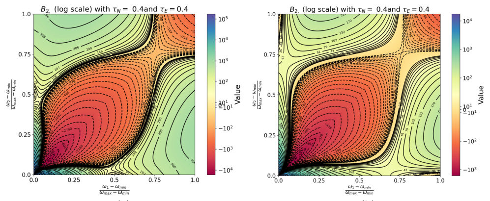
<figcaption class="paper-figure-caption"><b>Fig 1.</b> Figure 1: Numerical resolution for the flux-driven long-range correlations in wave turbulence model with fixed-flux boundary conditions In this figure, we show the numerical solutions for the flux-driven long-range correlations B for wave turbulence (symlog color scale) with the method explained in paragraph 3.1.1. An arbitrary choice of parameters (exponent s = 7 and an inertial range [ωmin, ωmax] with ωmin/ωmax = 0.1) has been made. The figure (a) (resp. (b)) corresponds to Gaussian fluctuations computed around the Kolmogorov-Zakharov spectrum with an energy current JE alone (resp a wave action JN current alone).</figcaption>
</figure>
<figure class="paper-figure-card">
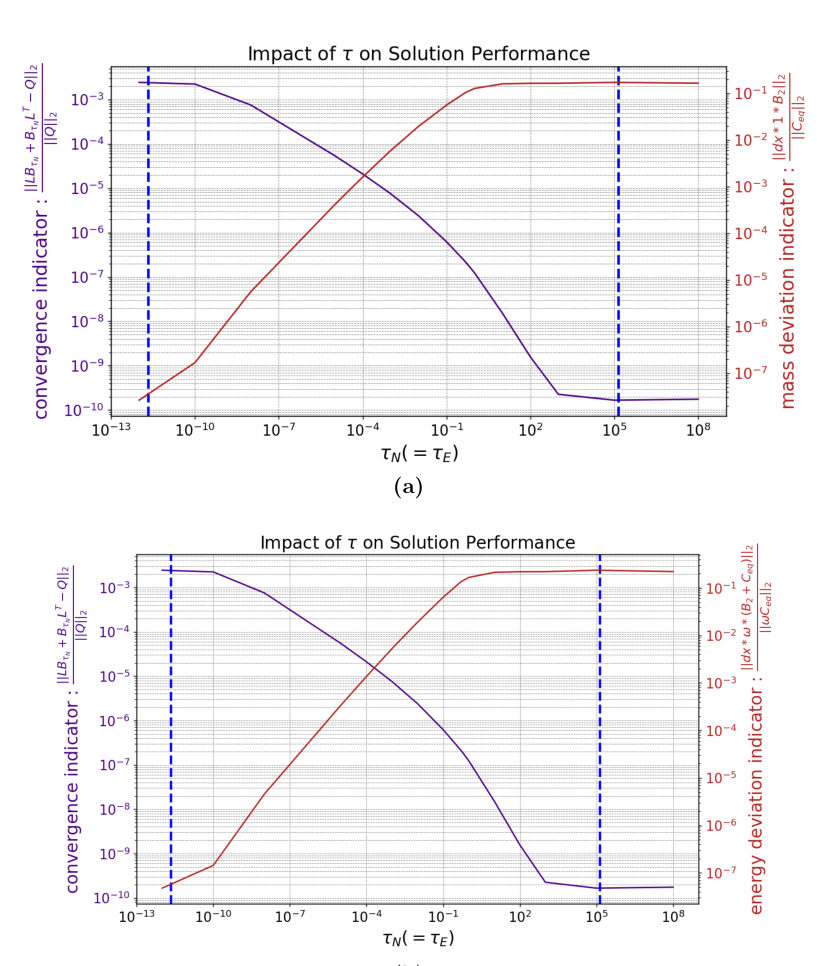
<figcaption class="paper-figure-caption"><b>Fig 2.</b> Figure 2: Evolution of the convergence indicator and mass indicator with dissipation rates τN, τE In this figure, we show the evolution of convergence index c (B), the mass index m (B) (top figure (a)) as well as the energy index e (B) (bottom figure (b)) with τN (τE is chosen equal to τN for simplicity, although these two parameters could be chosen independently). The blue dotted vertical lines represent the values of minus the inverse of the minimum and maximum eigenvalues of the matrix L. We observe that the convergence index drops when τN approaches the maximum eigenvalue. A good value for τN seems to be approximately 10−1, where the convergence indicator becomes very small (&lt; 10−7) and...</figcaption>
</figure>
<figure class="paper-figure-card">
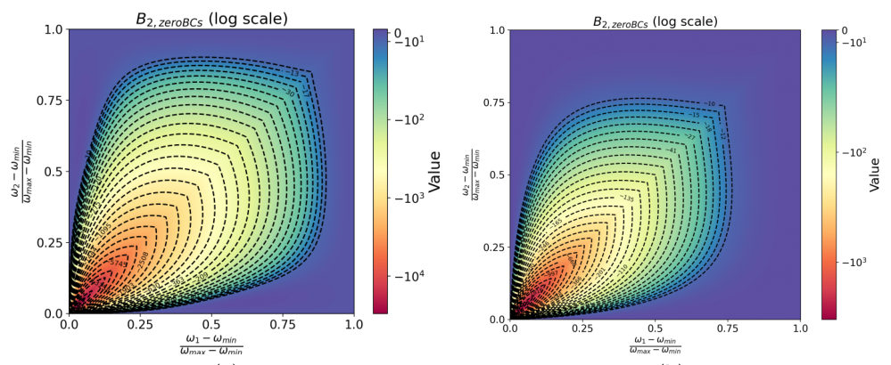
<figcaption class="paper-figure-caption"><b>Fig 3.</b> Figure 3: Numerical resolution for the flux-driven long-range correlations in wave turbulence model with fixed-density boundary conditions In this figure, we show the solution of the method explained in paragraph 3.1.1 with null boundary conditions for B. The color scale is in log scale. The figure (a) (resp. (b)) corresponds to Gaussian fluctuations computed around the Kolmogorov-Zakharov spectrum with an energy current JE alone (resp a wave action JN current alone).</figcaption>
</figure>
<figure class="paper-figure-card">
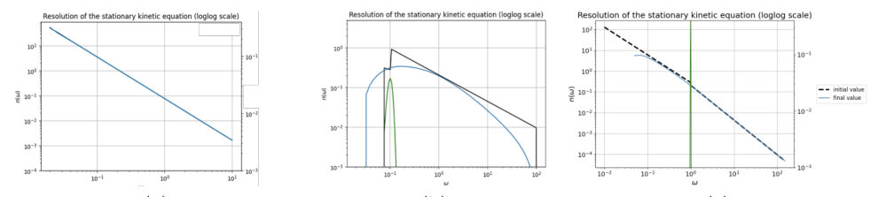
<figcaption class="paper-figure-caption"><b>Fig 4.</b> Figure 4: Stationary spectra (a) infinite inertial range with only energy current jE, corresponding to configuration 1) (b) forcing in the bulk and dissipation near boundaries, with zero boundary currents, corresponding to config- uration 3) (c) forcing in the bulk with nonzero boundary currents jN, jE, corresponding to configuration 2). On all graphs, the blue curve represents the stationary solution for the spectra, the green curve represents the forcing (if present) and the black curve represents the branches of KZ solutions in inertial ranges. A dissipation is present where the black curve falls to 0. We observe that excluding the dissipation from the resolution interval and adopting...</figcaption>
</figure>
<figure class="paper-figure-card">
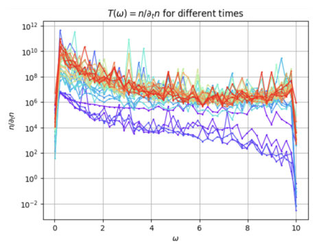
<figcaption class="paper-figure-caption"><b>Fig 5.</b> Figure 5: Convergence monitoring for configuration 2) In this figure, we show the successive time scale N ∂tN as a function of ω. The different curves correspond to different times in the simulation. It starts in the purple-blue colours and turn orange-red at the end. We observe that the time scale N ∂tN grows and becomes large for all the values of ω. It stabilizes, probably due to numerical errors causing that the solution cannot be perfect.</figcaption>
</figure>

**Summary.** This paper develops an advanced theoretical framework using Large Deviation Theory to analyze the statistical fluctuations of weak wave turbulence. It derives simplified principles that characterize both typical and rare spectral dynamics by treating the system's evolution as a stochastic process governed by conserved quantities like energy and action. This provides a general, replicable method for studying complex non-equilibrium phenomena in dispersive media.

**Why it may be interesting.** The rigorous application of large deviation theory to non-equilibrium statistical mechanics problems like wave turbulence provides powerful tools for understanding rare events and fluctuations far from equilibrium, which is a major theme in modern AMO/open quantum systems research.

Detailed structure

**Main problem.** To develop a simplified large deviation principle for wave turbulence to study the typical and rare fluctuations of the spectrum dynamics, going beyond mean evolution captured by kinetic equations.

**Main result.** The authors derive a new large deviation principle that fully characterizes spectral fluctuations and provide a general method to analyze wave turbulence under fixed-flux boundary conditions. They also show this theory can explain instabilities in inhomogeneous models like MMT.

**Method.** The work heavily relies on Large Deviation Theory (LDT), extending concepts from Macroscopic Fluctuation Theory, applied to the stochastic dynamics of the wave spectrum.

**Model / system.** The system is weak wave turbulence, modeled by dispersive waves with weakly nonlinear interactions. The analysis focuses on deriving rate functions and fluctuation equations for the wave spectrum $\hat{n}(\xi, t)$ in isotropic local limits.

**Key observables.** Fluctuations of the wave spectrum ($	ext{P}\{\dots\}$), long-range correlations, two-point correlation functions, and conserved quantities (mass and energy).

**Important parameters / regimes.** The small large deviation parameter $\epsilon$, and the inertial range between forcing and dissipation scales.

**Assumptions / limitations.** Key assumptions include assuming isotropy and locality for simplification, and utilizing the Random Phase (RP) hypothesis instead of the RPA to analyze multi-point correlations.

**Figures summary.** The notes mention figures showing stationary spectra computation, convergence of wave action/energy currents, and the structure of the discretized Lyapunov equation.

**Paper structure.** The paper progresses from establishing the general LDP framework for fluctuations, simplifying it via isotropy and locality to yield a stochastic PDE. It then applies this formalism to analyze out-of-equilibrium fluxes using two conserved quantities (Action and Energy), culminating in generalizations to inhomogeneous systems.

Abstract

Wave turbulence describes the statistical dynamics of dispersive waves with weakly nonlinear interactions. While the classical kinetic equation captures the mean evolution of the wave spectrum, the study of its fluctuations due to finite-size effects and intermittency requires a probabilistic framework for space-time trajectories of the spectrum dynamics. Following the previous large deviation theories for wave turbulence, we develop a simplification meant for qualitative and numerical predictions of measurable quantities. We derive a new large deviation principle in the case of local wave interactions. It fully characterizes typical and rare fluctuations of the spectrum. In a joint article, we obtain a theory which is a generalised form of Macroscopic Fluctuation Theory, but with 2 conserved quantities (mass and energy). In this paper, we use it to analyse the structure of the equation for Gaussian fluctuations around out-of-equilibrium spectra. In addition to the usual equilibrium contribution, we obtain long-range correlations, which can be decomposed into 3 contributions: one is driven by the flux in the bulk and another is driven by the forcing and its possible fluctuations. In addition, these contributions are computed for the first time with a method adapted to boundary conditions where only the fluxes are fixed. The results provide a general, replicable method for analyzing wave turbulence in more complex settings. Finally, the generalization of this theory to the inhomogeneous wave turbulence provides a possible explanation to the instability of the Kolmogorov-Zakharov spectra in some 1D inhomogeneous models with 4-wave interactions such as the Majda-McLaughlin-Tabak. This work opens the discussion regarding universal and non universal properties in two-point correlation functions. This opens new range of study on the phenomena of intermittency which is partially developed here.

[↑ back to top](#top)

### [Foundations of Practical Quantum Advantage in Quantum-Informed Machine Learning for Predicting Chaos](http://arxiv.org/abs/2606.13422v1)

**Authors:** Maida Wang, Xiao Xue, Minh Chung, Peter V. Coveney  
**Type:** both · **Category:** quantum information and computing · **PDF:** <https://arxiv.org/pdf/2606.13422v1>  
**Analysis basis:** full PDF text, analyzed in chunks
**Topic relevance:** `quantum measurements` **3/5** · `entanglement & information structure` **2/5** · `measurement-induced transitions` **2/5** · `methods for driven-dissipative` **1/5** · `non-equilibrium dynamics` **1/5**

↔ Scroll figures horizontally

<figure class="paper-figure-card">
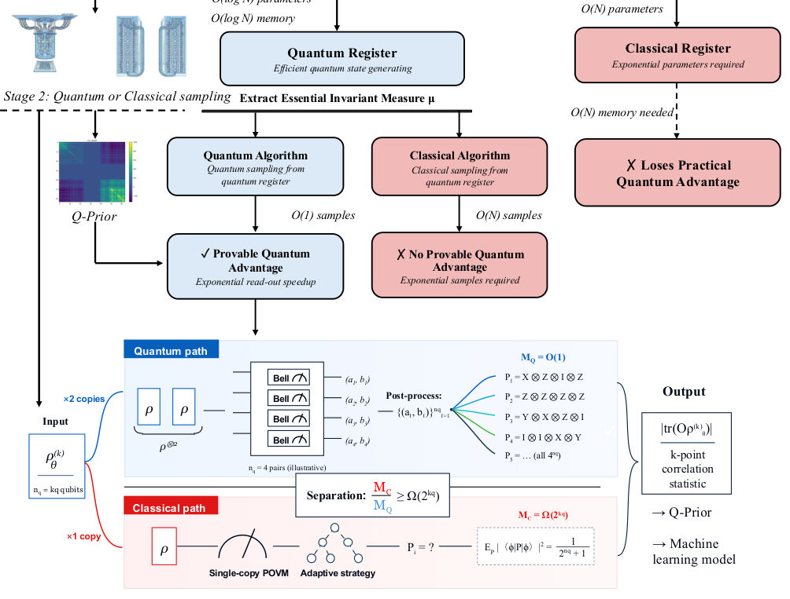
<figcaption class="paper-figure-caption"><b>Fig 1.</b> FIG. 1. Two-stage quantum advantage architecture for QIML. Stage 1 is representation: a compact quantum register stores the Q-Prior (Appendix A, generalising [22]), whereas an explicit classical register or probability table loses the compression advantage. Stage 2 is extraction/read-out: Bell measurements on two copies of ρ(k) θ estimate post hoc Pauli statistics with MQ independent of nq at fixed accuracy and confidence. Adaptive single-copy read-out for the corresponding full Pauli task requires MC = Ω(2kq). The output is the numerical Q-Prior statistic used by the downstream classical model. The entire architecture is thus implemented as QIML [22].</figcaption>
</figure>
<figure class="paper-figure-card">
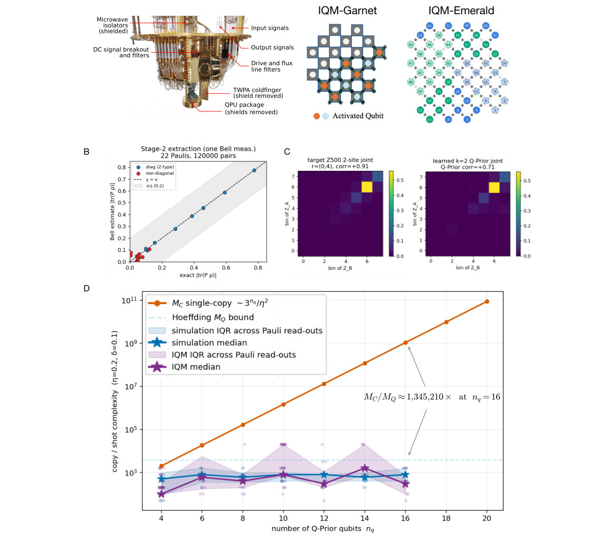
<figcaption class="paper-figure-caption"><b>Fig 2.</b> FIG. 2. Post hoc Bell read-out of trained Q-Priors in simulation and on superconducting hardware. (A) Cryostat and qubit- connectivity maps of the two IQM Quantum Computers superconducting processors used: 20-qubit Garnet (nq ≤10) and 54-qubit Emerald (nq = 12–16); highlighted sites host the 2nq-qubit two-copy register. (B) Stage-2 extraction for the ERA5- trained Q-Prior in noiseless simulation: Bell estimates against exact |tr(Pρ)| for 22 diagonal and non-diagonal Paulis at a single nq, evaluated post hoc from a single Bell record of 1.2 × 105 copy pairs; shaded band ±η = 0.2 (distinct from the per-nq 8-observable test set tabulated in Appendix D). (C) Stage-1 representation for the prior...</figcaption>
</figure>
<figure class="paper-figure-card">
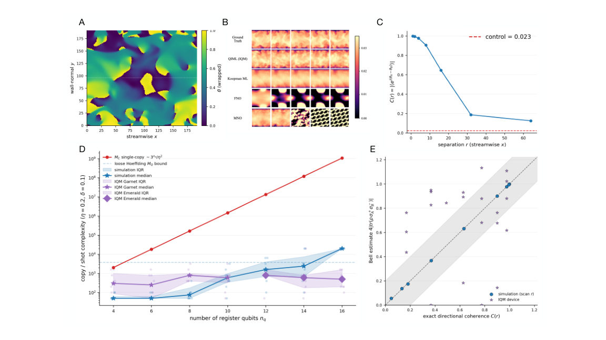
<figcaption class="paper-figure-caption"><b>Fig 3.</b> FIG. 3. QIML on turbulent channel flow, a chaotic system that jointly closes Definition 1. (A) Velocity-direction phase field θ = arg(vx+ivy) of a representative snapshot (wall-normal y versus streamwise x), the intrinsic phase of the vector field, encoded one site per qubit. (B) Recurrent rollout in Lyapunov-time units (one step = 0.01 Lyapunov time): the ground truth and the QIML (Koopman with k ≤2 Q-Prior) prediction preserve the turbulent structure, whereas the Koopman-only, FNO and MNO baselines drift or collapse. The ground-truth and the Koopman/FNO/MNO baseline rollouts are from [22]; only the QIML rollout is computed here. (C) Directional coherence C(r) = |⟨ei(θA−θB)⟩| versus...</figcaption>
</figure>
<figure class="paper-figure-card">

<figcaption class="paper-figure-caption"><b>Fig 4.</b> FIG. 4. QIML applied to weather forecasting. Panel A shows the QIML weather pipeline. Solid links represent the single-site and pairwise k ≤2 priors instantiated in the reported case study, connecting illustrative teleconnection nodes (e.g., PNA, NAO, MJO, IOD, SOI). Dashed higher-order links indicate k ≥3 Q-Prior extensions whose read-out tasks are covered by the theoretical results of this work. A parametrised quantum generator on nq = kq qubits is trained from samples so its induced low-order Q-Prior statistics match the data; the extracted Q-Prior statistics enter the Koopman autoregressive model through a differentiable statistical constraint. Panels B and C show representative Z500...</figcaption>
</figure>

**Summary.** The paper proposes using Quantum-Informed Machine Learning (QIML) to improve forecasts of chaotic systems by encoding system statistics into a compact quantum prior. It proves a significant computational speedup by showing that joint Bell measurements on two copies can efficiently read out complex correlations, an advantage demonstrated in both fluid dynamics and weather forecasting simulations.

**Why it may be interesting.** This work directly addresses the interface between quantum computation and classical scientific modeling, providing a concrete, near-term pathway to demonstrating quantum advantage in complex physical simulations before fault-tolerant hardware is available.

Detailed structure

**Main problem.** Developing a theoretically grounded, practical quantum advantage mechanism within Quantum-Informed Machine Learning (QIML) for predicting complex chaotic dynamical systems.

**Main result.** The authors prove a two-stage advantage: using superposition/entanglement to compactly store non-factorizable correlations in a Q-Prior, and achieving an exponentially faster read-out of Pauli statistics via joint Bell measurements compared to classical single-copy protocols.

**Method.** They introduce k-indexed higher-order quantum statistical priors (Q-Priors) that encode the invariant measure's marginals. This is coupled with a classical Koopman rollout, constrained by the quantum prior information.

**Model / system.** The framework applies to chaotic systems like turbulent channel flow and medium-range weather forecasting using ERA5 data. The core computational element involves encoding system statistics into a quantum state on $n_q$ qubits.

**Key observables.** Velocity-direction coherence (non-diagonal correlator in turbulence); Anomaly Correlation Coefficient (ACC) improvement of 10-39% in weather forecasting; provable separation in measurement copy complexity ($M_Q$ vs $M_C$).

**Important parameters / regimes.** Number of qubits ($n_q=kq$), correlation order ($k$), and the required fidelity ($\eta, \delta$) for quantum advantage demonstration.

**Assumptions / limitations.** The existence of a well-defined invariant measure for the chaotic system; the ability to perform two-copy Bell measurements on superconducting hardware (IQM).

**Figures summary.** Figures illustrate the comparison between quantum and classical copy costs, showing the exponential separation. One figure compares QIML results across different baselines for turbulent flow, highlighting directional coherence recovery.

**Paper structure.** The paper establishes the theoretical foundation by defining the two-stage advantage (Representation $
ightarrow$ Extraction). It then validates this mechanism through two distinct case studies: turbulence (demonstrating non-diagonal correlation read-out) and ERA5 weather forecasting (improving long-term prediction skill via diagonal priors).

Abstract

We develop theoretical foundations for a practical quantum-advantage mechanism in quantum-informed machine learning for chaotic dynamical systems. A family of k-indexed higher-order quantum statistical priors (Q-Priors) hosts the k-point marginal of the invariant measure on n_q = kq qubits, extending the single-site construction of prior work. We prove a two-stage advantage. In the representation stage, superposition and entanglement compactly store non-factorisable spatial correlations of the invariant measure on n_q qubits. In the extraction stage, joint Bell measurements on two copies estimate any post hoc Pauli functional with a copy-pair count independent of n_q, whereas any adaptive single-copy protocol for the corresponding full-Pauli read-out requires Omega(2^(n_q)) copies; this is a provable quantum-classical separation in copy-measurement complexity. The two-copy read-out is realised in simulation and on IQM superconducting processors. Two case studies instantiate the mechanism in workflows of independent scientific value: a turbulent channel-flow study in which the two-copy read-out yields a named non-diagonal correlator of the invariant measure (the velocity-direction coherence), and a medium-range weather forecasting workflow on the European Centre for Medium-Range Weather Forecasts ERA5 reanalysis in which the diagonal k <= 2 Q-Prior steers a Koopman rollout, improves anomaly-correlation skill by 10-39% across 48-240 h lead times, and reduces the long-horizon collapse of rollouts onto a static mean field. The two conditions of our practical-advantage definition are met at complementary levels, identifying a candidate route to practical quantum advantage before fault-tolerant hardware.

[↑ back to top](#top)

### [Non-Hermitian skin effect induced by spatial noncommutativity](http://arxiv.org/abs/2606.12961v1)

**Authors:** Zheng Wei, Su-Peng Kou  
**Type:** theory · **Category:** other · **PDF:** <https://arxiv.org/pdf/2606.12961v1>  
**Analysis basis:** full PDF text, analyzed in chunks
**Topic relevance:** `analog quantum simulation` **3/5** · `driven-dissipative phase transition` **2/5** · `Kondo & dissipative impurity` **1/5** · `correlated / nonlocal dissipation` **1/5** · `methods for driven-dissipative` **1/5** · `non-equilibrium dynamics` **1/5**

↔ Scroll figures horizontally

<figure class="paper-figure-card">
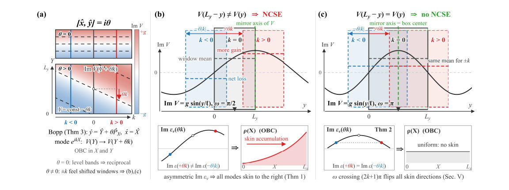
<figcaption class="paper-figure-caption"><b>Fig 1.</b> FIG. 1. Sliding-window mechanism of the NCSE and roadmap of this work. (a) Shear picture: both canvases show the (k, Y ) plane (horizontal axis: wave vector k along X; vertical axis: transverse coordinate Y ∈[0, Ly]), and the color at point (k, Y ) encodes the imaginary potential Im V (Y + θk) experienced at Y by the mode with momentum k (red: gain; blue: loss; see the color bar on the right). Top panel, θ = 0: the contour bands are horizontal (black dashed lines mark the contours), and the vertical cuts at any fixed k (blue/gray/red vertical lines) yield identical transverse potential profiles; the dispersion is reciprocal. Bottom panel, θ &gt; 0: the Bopp shift ˆy = ˆY + θ ˆPX shears momentum...</figcaption>
</figure>
<figure class="paper-figure-card">
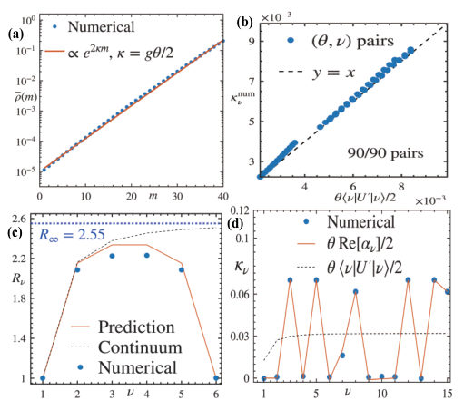
<figcaption class="paper-figure-caption"><b>Fig 2.</b> FIG. 2. Numerical verification of Theorem 1. (a) Linear imaginary potential V =igˆy (Nx=40, Ny=30, g=0.05, θ=5). The vertical axis is the eigenstate-averaged density along X, ¯ρ(m)≡ 1 Neig P</figcaption>
</figure>
<figure class="paper-figure-card">
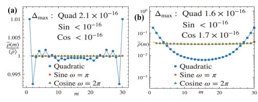
<figcaption class="paper-figure-caption"><b>Fig 3.</b> FIG. 3. Numerical verification of the exact protection by Theorem 2, for three symmetric potentials [blue circles: quadratic potential ig(Y −Ly/2)2; red squares: sine poten- tial with ω=π; green triangles: cosine potential with ω=2π], Nx=Ny=30. (a) Mild parameters, g=10−3 (both the weak- potential and adiabatic conditions are satisfied): the vertical axis is ¯ρ(m)/⟨¯ρ⟩(density normalized by its spatial mean, lin- ear scale). In the weak-potential regime the densities of all three potentials are nearly uniform, and normalizing to the mean renders the ∼1% shape differences discernible on a lin- ear scale; quadratic potential, θ=0.5; sine potential, θ=Ly/π; cosine potential, θ=Ly/(2π). (b)...</figcaption>
</figure>
<figure class="paper-figure-card">
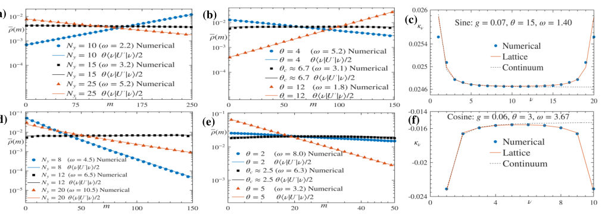
<figcaption class="paper-figure-caption"><b>Fig 4.</b> FIG. 4. Skin-direction reversal for periodic imaginary potentials and quantitative verification of κν. Square lattice (a0=b0=1), exact Peierls mapping (commensurability condition θ/ℓ=a0). In all density panels the horizontal axis is the X-direction site index m and the vertical axis is the eigenstate-averaged density ¯ρ(m) (semilogarithmic scale); circles/squares/triangles, numerical results; solid lines, ¯ρ(m) predicted by Theorem 1. In (c) and (f) the horizontal axis is the band index ν and the vertical axis is the inverse skin length κν. (a),(b) Direction flip for the sine potential V =ig sin(ˆy/ℓ): (a) fixed θ=5, g=0.03, Nx=250, varying Ny ∈{10, 15, 25} (ω=Ly/ℓ= 2.2, 3.2, 5.2), taking ω...</figcaption>
</figure>

**Summary.** The paper introduces the Noncommutative Skin Effect (NCSE), showing that spatial noncommutativity alone can induce boundary localization typically associated with gain/loss terms. By analyzing lattice models and deriving effective 1D Hamiltonians, it establishes rigorous criteria—particularly based on potential symmetry—for the existence of this effect.

**Why it may be interesting.** This work provides a fundamental mechanism linking geometric properties of spacetime (noncommutativity) directly to observable quantum phenomena like topological edge states, which is highly relevant for designing synthetic dimensions in AMO platforms.

Detailed structure

**Main problem.** To demonstrate that spatial noncommutativity can induce the Non-Hermitian Skin Effect (NHSE) without requiring an independent gain/loss term along the skin direction.

**Main result.** The phenomenon, termed the noncommutative skin effect (NCSE), is characterized by a skin length inversely proportional to the noncommutativity parameter ($\kappa_
u \propto 	heta$).

**Method.** The analysis uses mathematical transformations (like the Bopp shift) and asymptotic expansions (Taylor/adiabatic approximations) on effective 1D Hamiltonians derived from the 2D noncommutative lattice model.

**Model / system.** The system is a quantum mechanical model on a two-dimensional space where spatial coordinates do not commute, $[\hat{x}, \hat{y}] = i	heta$. The Hamiltonian involves kinetic terms and an imaginary potential $V(\hat{y})$.

**Key observables.** Inverse skin length ($\kappa_
u$), spectral non-reciprocity ($\epsilon_
u(k) 
eq \epsilon_
u(-k)$), and the collective reversal of eigenstate direction at geometric 'flip points'.

**Important parameters / regimes.** Noncommutativity parameter ($	heta$), lattice size ($L_x, L_y$), and potential strength/geometry.

**Assumptions / limitations.** The analysis relies on approximations such as the adiabatic limit and Taylor truncation to derive solvable effective 1D equations from the full 2D problem.

**Figures summary.** Figures illustrate the 'Sliding-window mechanism' showing momentum shearing into coordinate space, and numerical verification of exponential envelope localization ($\propto e^{	heta m}$) for various potentials.

**Paper structure.** The paper progresses by first establishing the general noncommutative framework, deriving effective 1D models (Hatano-Nelson type), proving existence criteria based on potential symmetry, and finally applying these results to specific lattice potentials (quadratic, sine/cosine).

Abstract

In all known schemes for the non-Hermitian skin effect, the non-Hermitian ingredient that drives the skin localization, whether asymmetric hopping or gain and loss, is invariably introduced by hand as an independent model parameter along the skin direction. Here we show that when two spatial coordinates do not commute, the skin effect can break free of this paradigm: a gain-loss potential applied along one coordinate automatically generates non-reciprocity along the other through the coordinate noncommutativity, driving all eigenstates to pile up exponentially at a boundary. We term this phenomenon the noncommutative skin effect. The inverse skin length is proportional to the noncommutativity parameter and is given by an analytic formula, exact in the thermodynamic limit and verified by exact diagonalization of lattice models; the reflection symmetry of the imaginary potential furnishes an exact criterion for the presence or absence of the effect, valid rigorously for finite-size systems. For a sinusoidal imaginary potential, the skin direction of all eigenstates flips collectively at parameter points fixed purely by geometry. Because the flip point is independent of the potential strength, the reversal constitutes a zero-crossing measurement scheme intrinsically robust against systematic errors, from which the noncommutativity parameter can be extracted directly. The qualitative transition of the eigenstates from uniform to exponentially localized renders the effect a nonperturbative probe of spatial noncommutativity, and the Peierls-phase structure of its lattice model is in principle accessible to cold-atom synthetic dimensions, photonic resonators, and topolectrical circuits.

[↑ back to top](#top)

### [Exploring Exotic Spin-Dependent Interactions Beyond the Standard Model: Theoretical Foundations and Experimental Investigations](http://arxiv.org/abs/2606.13318v1)

**Authors:** L. Y. Wu, H. Yan  
**Type:** both · **Category:** other · **PDF:** <https://arxiv.org/pdf/2606.13318v1>  
**Analysis basis:** full PDF text, analyzed in chunks
**Topic relevance:** `exotic spin models in light-matter` **3/5** · `spintronics-quantum-optics interface` **3/5** · `analog quantum simulation` **1/5** · `quantum measurements` **1/5**

↔ Scroll figures horizontally

<figure class="paper-figure-card">
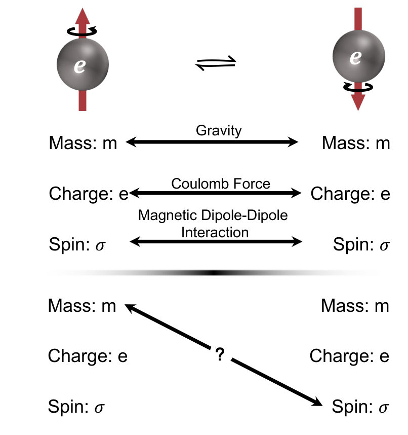
<figcaption class="paper-figure-caption"><b>Fig 1.</b> Figure 1. Schematic representations of particle interactions. The upper part of the figure illustrates conventional interactions between two fundamental particles, where like properties are coupled: gravity couples mass, the Coulomb force couples electric charge, and the magnetic dipole-dipole interaction couples spin. The lower part presents a hypothetical scenario in which a new interaction couples different fundamental properties, specifically the mass of one particle to the spin of another, such as the VSP interaction (6a). Such cross-property couplings, if they exist, would represent novel forms of fundamental interactions beyond the SM.</figcaption>
</figure>
<figure class="paper-figure-card">
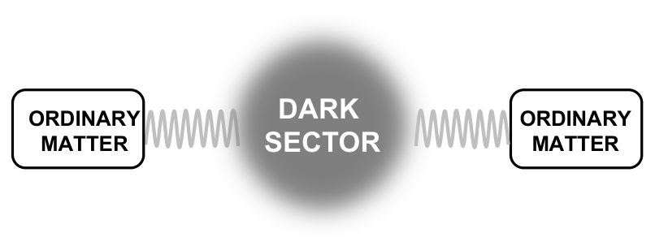
<figcaption class="paper-figure-caption"><b>Fig 2.</b> Figure 2. Detection strategy—Suppose ordinary matter is weakly coupled to the dark sector. In this case, extremely weak interactions may arise between ordinary objects. By performing precision measurements on ordinary matter, one can, in principle, infer the existence or absence of the dark sector.</figcaption>
</figure>
<figure class="paper-figure-card">
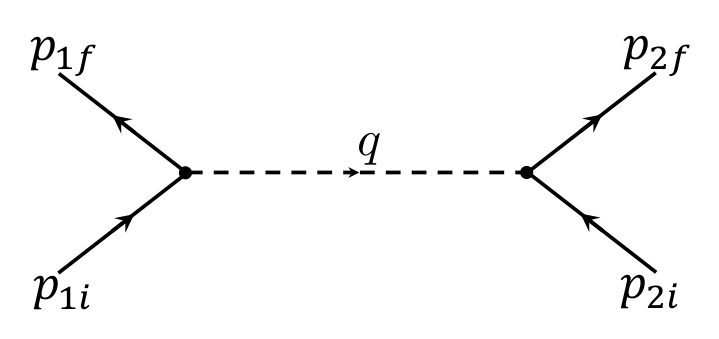
<figcaption class="paper-figure-caption"><b>Fig 3.</b> Figure 3. Representative tree-level Feynman diagram illustrating the interaction between two fermions via the exchange of a new mediator particle. The symbols p1i (p1f) and p2i (p2f) denote the initial (final) four-momenta of fermions 1 and 2, respectively, while q represents the four-momentum transferred by the virtual mediator.</figcaption>
</figure>
<figure class="paper-figure-card">
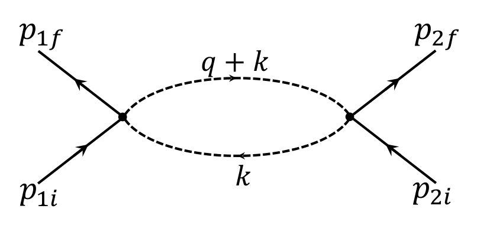
<figcaption class="paper-figure-caption"><b>Fig 4.</b> Figure 4. The loop-level Feynman diagram of two fermions interacting through exchanging two new particles. The p1i (p1f) and p2i (p2f) are the incoming (outgoing) four-momentum of particles 1 and 2, respectively. The transferred four-momentum carried by the virtual particle is denoted by q, while k represents the loop integration variable.</figcaption>
</figure>
<figure class="paper-figure-card">
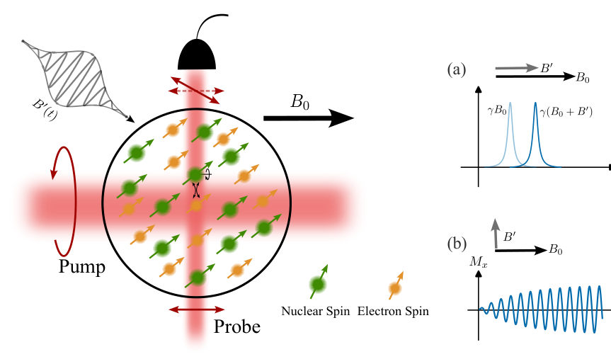
<figcaption class="paper-figure-caption"><b>Fig 5.</b> Figure 5. A schematic illustration of the NMR-based detection method for exotic spin-dependent interactions. The effective magnetic field ⃗B′(t) generated by the exotic potential perturbs the Larmor precession of polarized nuclear spins in the holding field ⃗B0. Depending on its orientation and frequency, ⃗B′(t) can either shift the precession frequency or, under resonant conditions, induce transverse oscillations of the spins. The resulting precession signals are typically detected using an alkali-metal magnetometer (as illustrated) or other high-sensitivity sensors, such as SQUIDs.</figcaption>
</figure>

**Summary.** This review provides a comprehensive theoretical and experimental overview of exotic spin-dependent interactions beyond the Standard Model. It focuses particularly on couplings mediated by light particles like ALPs and effects arising from Lorentz/CPT violation. The paper synthesizes knowledge across multiple detection platforms, guiding future searches for physics beyond our current understanding.

**Why it may be interesting.** While not strictly focused on quantum information or cold atoms as primary subjects, the paper heavily relies on advanced quantum sensing techniques (atomic magnetometers, spin precession) to probe fundamental symmetries and forces, making it highly relevant to AMO physics frontiers.

Detailed structure

**Main problem.** The paper investigates exotic spin-dependent interactions beyond the Standard Model (SM) to address fundamental issues like the strong CP problem and the nature of dark matter.

**Main result.** It systematically reviews theoretical frameworks for these novel couplings, providing a roadmap for experimentalists to constrain parameters related to light mediators like Axion-Like Particles (ALPs).

**Method.** The approach combines deriving theoretical Lagrangians for various spin-dependent interactions with reviewing constraints derived from high-precision measurements on atomic and nuclear spins.

**Model / system.** The focus is on exotic couplings mediated by light particles (e.g., ALPs) or arising from extensions to General Relativity, such as those involving spacetime torsion or Lorentz/CPT violation. Experimental platforms include comagnetometers, atomic magnetometers, and molecular hydrogen systems.

**Key observables.** Spin precession rates, frequency shifts in comagnetometers, electric dipole moments (EDMs), and coupling constants for exotic forces ($\chi, d_e$, etc.).

**Important parameters / regimes.** ALP masses ($m_a$), interaction strengths ($f_a$), SME coefficients ($	ilde{b}_w^J, 	ilde{d}_w^J$), and characteristic energy/length scales (mesoscopic to macroscopic).

**Assumptions / limitations.** The analysis relies on low-energy approximations for light mediators and systematic classification schemes (e.g., based on spin order and gradient order) to manage the complexity of BSM physics.

**Figures summary.** Figures schematically illustrate novel interaction couplings, detection strategies involving ordinary matter interacting with a dark sector, and Feynman diagrams showing ALP mediation between fermions.

**Paper structure.** The review progresses from outlining theoretical foundations for exotic spin-dependent interactions (ALPs, SME) to systematically classifying these interactions based on mathematical structure. It then details the experimental efforts and constraints derived from various precision measurements across different physical systems.

Abstract

New interactions mediated by novel particles propose solutions to several important questions in modern physics. Axions serve as examples of such particles; they are lightweight and interact weakly with ordinary matter. This category of particles, including those similar to axions-termed Axion-Like Particles (ALPs)-arises from diverse theoretical frameworks, such as the Peccei-Quinn mechanism addressing the strong CP problem, string theory, and spontaneous supersymmetry breaking. Given their light mass and weak coupling, ALPs are also possible candidates for cold dark matter. Introducing these new interactions mediated by novel particles not only tackles several challenges in modern physics but also raises a crucial question: Are there undiscovered interactions beyond the Standard Model? Many of the interactions predicted by these theories are spin-dependent, which is the primary focus of this review. In this review, we first outline the theoretical foundations for investigating exotic spin-dependent interactions, highlighting their importance in various models beyond the Standard Model. We examine the potential roles of new lightweight particles in mediating these interactions, which may enhance our understanding of dark matter. Relevant formulas derived from theoretical models are included to support experimental investigations. Following this theoretical framework, we conduct a detailed review of recent experimental efforts to detect these exotic interactions. A systematic review of current constraints on these interactions is presented, along with an assessment of various detection approaches.

[↑ back to top](#top)

### [Overview of the Theory of Extremely Correlated Fermi Liquids](http://arxiv.org/abs/2606.13541v1)

**Authors:** B Sriram Shastry  
**Type:** theory · **Category:** strongly correlated electrons · **PDF:** <https://arxiv.org/pdf/2606.13541v1>  
**Analysis basis:** full PDF text, analyzed in chunks
**Topic relevance:** `Keldysh / 2PI / non-Gaussian methods` **3/5** · `analog quantum simulation` **2/5** · `Kondo & dissipative impurity` **1/5** · `methods for driven-dissipative` **1/5**

↔ Scroll figures horizontally

<figure class="paper-figure-card">
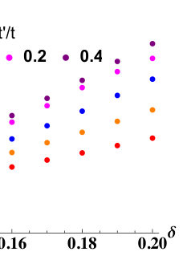
<figcaption class="paper-figure-caption"><b>Fig 1.</b> Figure 1: The quasiparticle weight Z versus the hole density δ for different values of t′/t within ECFL</figcaption>
</figure>
<figure class="paper-figure-card">
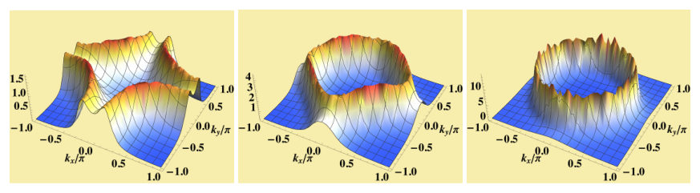
<figcaption class="paper-figure-caption"><b>Fig 2.</b> Figure 2: (L-R) With T=63 K and hole concentration δ = 0.15, the ⃗k variation over the Brillouin zone of the maximal</figcaption>
</figure>
<figure class="paper-figure-card">
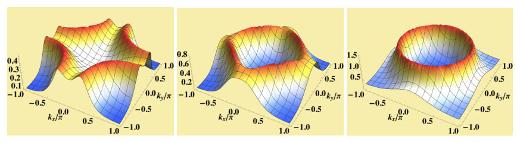
<figcaption class="paper-figure-caption"><b>Fig 3.</b> Figure 3: (L-R) With a slightly higher T=210 K and δ = 0.15, the ⃗k variation over the Brillouin zone of the maximal spectral</figcaption>
</figure>
<figure class="paper-figure-card">
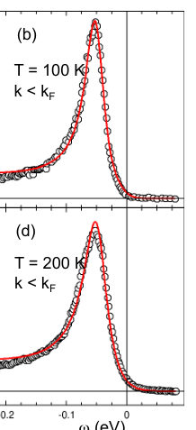
<figcaption class="paper-figure-caption"><b>Fig 4.</b> Figure 4: The spectral intensity I ∝A(k, ω) multiplied by the Fermi function f(ω), from experiments</figcaption>
</figure>
<figure class="paper-figure-card">
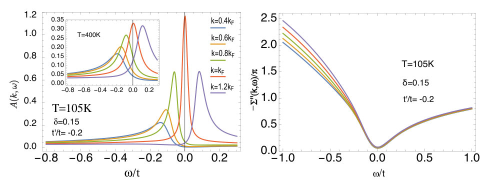
<figcaption class="paper-figure-caption"><b>Fig 5.</b> Figure 5: Hole doping with J/t=0.17and t= 0.45eV from [36] Left: The ⃗k and T dependence of the spectral function A(⃗k, ω)</figcaption>
</figure>

**Summary.** This paper reviews the Extremely Correlated Fermi Liquid (ECFL) theory as a comprehensive framework for analyzing highly correlated electron systems like cuprate superconductors. It details how this theory handles the $t$-$J$ model to predict key transport and spectral properties, such as density-dependent resistivity and vanishing quasiparticle weight. The work provides quantitative comparisons between these theoretical predictions and extensive experimental data from single-layer high-$T_c$ materials.

**Why it may be interesting.** The rigorous theoretical development of ECFL theory provides a sophisticated many-body approach that attempts to bridge the gap between simple models ($t$-$J$) and complex experimental observations in strongly correlated materials, offering insights into emergent quantum behavior beyond standard Fermi liquid descriptions.

Detailed structure

**Main problem.** The paper addresses understanding the physics of extremely strongly interacting electrons, particularly relevant for interpreting high-temperature superconductivity in cuprates.

**Main result.** The Extremely Correlated Fermi Liquid (ECFL) theory successfully predicts key features like a vanishing quasiparticle weight near half-filling and provides consistent theoretical frameworks for analyzing resistivity and spectral functions across various doping levels.

**Method.** The core method involves developing the ECFL framework by systematically expanding in a parameter $\lambda$ within the $t$-$J$ model Hamiltonian, ensuring compliance with the Luttinger-Ward theorem.

**Model / system.** The primary system is the single-layer High-$T_c$ cuprate superconductor, modeled using the $t$-$J$ Hamiltonian derived from the Hubbard model in the strong correlation limit ($U \gg W$).

**Key observables.** Resistivity $
ho(T)$, quasiparticle weight ($Z$), spectral function $A(\mathbf{k}, \omega)$, and Hall conductivity ($\sigma_{xy}$).

**Important parameters / regimes.** Hole doping ($\delta$), temperature ($T$), hopping ratios ($t'/t$), and the correlation strength (approaching Mott limit).

**Assumptions / limitations.** The theory relies on systematic approximations in powers of $\lambda$ and assumes that enforcing Luttinger-Ward compliance provides the correct physical solution class.

**Figures summary.** Figures compare theoretical predictions for resistivity ($
ho(T)$) and ARPES spectral features (kinks, peak temperature dependence) against experimental data from various cuprate families (LSCO, Bi2212, etc.).

**Paper structure.** The paper reviews the ECFL theory framework by first establishing its connection to the $t$-$J$ model, then detailing the mathematical procedure involving path integrals and self-energies ($\Psi, \Phi'$), followed by applying this formalism to calculate transport (resistivity, Hall response) and spectral properties.

Abstract

The Extremely Correlated Fermi Liquids (ECFL) theory is reviewed as a framework for understanding the $t$-$J$ model in metallic systems close to the Mott insulating limit. This overview presents the underlying ideas and the resulting equations in a form accessible to nonexperts. We compare theoretical results with all available resistivity data for single-layer High-T$_{c}$ systems, and with some spectral data. The highlighted results include a density dependent quasilinear T-dependence in resistivity, an unusually small quasiparticle weight, and distinct low-temperature emergent scales that dominate transport, thermodynamics and spectral properties of single-layer High T$_c$ systems. Suggestions are made for further experiments to probe the physics of these challenging quantum many-body systems.

[↑ back to top](#top)

### [Semi-Device-Independent Certification for Nonlocality without Entanglement](http://arxiv.org/abs/2606.13667v1)

**Authors:** Hanwool Lee, Joonwoo Bae  
**Type:** theory · **Category:** quantum information and computing · **PDF:** <https://arxiv.org/pdf/2606.13667v1>  
**Analysis basis:** full PDF text, analyzed in chunks
**Topic relevance:** `quantum measurements` **3/5** · `entanglement & information structure` **2/5** · `correlated / nonlocal dissipation` **1/5** · `measurement-induced transitions` **1/5**

↔ Scroll figures horizontally

<figure class="paper-figure-card">
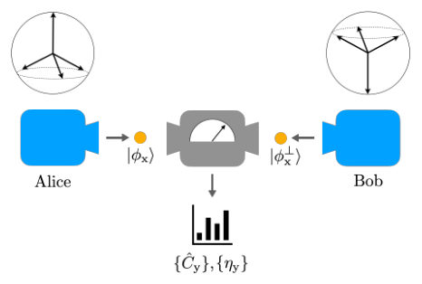
<figcaption class="paper-figure-caption"><b>Fig 1.</b> Figure 1. The scenario of comparing the capabilities of measurements in GLOBAL and SEP is shown. Alice and Bob prepare product states by LOCC, such as antiparallel states in Eq. (3), and send them to a device that realizes a measurement in GLOBAL or SEP. Specifically, two parties apply a measurement to maximize a confidence, see Eq. (1), in which the strategy is to rely only on detected events. A gap between measurements in GLOBAL and SEP exists if an optimal measurement is GLOBAL but not SEP. The gap can also be certified given the outcome rates in Eq.(7).</figcaption>
</figure>
<figure class="paper-figure-card">
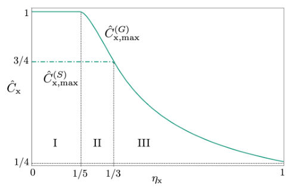
<figcaption class="paper-figure-caption"><b>Fig 2.</b> Figure 2. Given an outcome rate ηx, the certifiable MC for antiparallel states in Eq. (3) is shown. In a noiseless state preparation, the certifiable MC with SEP is 3/4. For an outcome rate ηx &lt; 1/3, NLWE can be certified if ˆCx &gt; 3/4 (region I and II). For an outcome rate ηx ≤1/5, the gap ∆x is maximal (region I). When outcomes are so frequent ηx ≥1/3, NLWE cannot be certified (region III).</figcaption>
</figure>
<figure class="paper-figure-card">
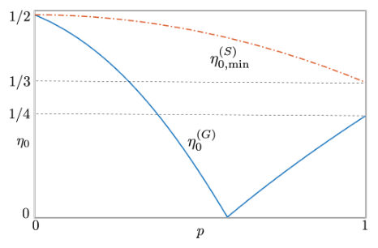
<figcaption class="paper-figure-caption"><b>Fig 3.</b> Figure 3. The rate of inconclusive outcomes η(G) 0 for a noisy POVM in Eq. (22) (solid) is strictly lower than the rate by SEP (dotted) whenever p &gt; 0. Note that when θ = π/12, at which p ≈0.58, POVM elements {f M (G) x }4 x=1 form a complete measurement, i.e., η(G) 0 = 0.</figcaption>
</figure>

**Summary.** The paper develops a semi-device-independent method to certify Nonlocality without Entanglement (NLWE) by comparing the maximum confidence achievable through global versus separable measurements. Using SDPs, it demonstrates that a measurable gap exists for antiparallel states, which can be verified even with noisy detectors or by analyzing inconclusive outcomes. This provides a robust, experimentally feasible test for quantum nonlocality.

**Why it may be interesting.** This work provides a highly rigorous, experimentally relevant protocol for certifying fundamental quantum resources like nonlocality using only measurement statistics, which is crucial for practical quantum information applications.

Detailed structure

**Main problem.** The work investigates Nonlocality without Entanglement (NLWE) by developing a semi-device-independent (sDI) certification method based on maximum-confidence discrimination (MCM). It aims to establish NLWE using only measurement outcomes, making it robust against detector inefficiencies.

**Main result.** A measurable gap exists between the confidence achievable with global measurements and that achievable with separable measurements for antiparallel states. This gap can be certified using outcome rates or by analyzing inconclusive outcome rates, even in the presence of noise.

**Method.** The analysis relies heavily on formulating optimization problems as Semidefinite Programs (SDPs) to determine the maximum confidence ($\hat{C}$) under global versus separable measurement constraints. The certification is achieved by comparing these bounds.

**Model / system.** The study analyzes quantum state ensembles, specifically focusing on antiparallel and parallel qubit states subjected to local depolarizing noise. The measurements are characterized by Global (GLOBAL) or Separable (SEP) Positive Operator-Valued Measures (POVMs).

**Key observables.** Maximum Confidence ($C_{x,	ext{max}}$), Certifiable Confidence ($\hat{C}$), Outcome Rates ($\eta_x$), and the rate of inconclusive outcomes ($\eta_0$).

**Important parameters / regimes.** Noise parameter $p$, outcome rates $\eta_x$, and optimization parameters like Lagrange multipliers ($\lambda$).

**Assumptions / limitations.** The framework assumes that maximum-confidence measurements only rely on detected measurement outcomes, making it robust to non-unit detection efficiencies. Separability is tested by comparing global vs. product operator constraints.

**Figures summary.** Figures compare the certifiable MCM for antiparallel states versus outcome rates, showing distinct regimes (I, II, III) where NLWE can be certified. Another figure compares inconclusive outcome rates ($\eta(G)_0$ vs $\eta(S)_0$) to demonstrate the gap.

**Paper structure.** The paper systematically develops the MCM framework using SDPs, first establishing the theoretical gap for ideal states (Chunk 1). It then generalizes this to a certifiable, device-independent setting by incorporating outcome rates and noise parameters (Chunks 2, 3, 4), finally exploring certification via inconclusive outcomes (Chunk 5).

Abstract

In this work, we investigate maximum-confidence discrimination, which encompasses minimum-error and unambiguous discrimination, for ensembles of separable states by considering global and separable measurements. We demonstrate that global measurements outperform separable ones, thereby establishing nonlocality without entanglement (NLWE) in terms of confidence in a detection event, a fine-grained state-identification strategy that maximizes the probability of a correct guess given a measurement outcome. Conversely, verifying achievable confidence in measurement outcomes can certify global measurements, namely, semi-device-independent certification of NLWE. Our results make it feasible to experimentally demonstrate NLWE using present-day quantum measurement devices, even with non-unit detection efficiencies, since maximum-confidence measurements rely only on detected measurement outcomes.

[↑ back to top](#top)

### [Charting the emergent low-dimensional manifold of quantum materials](http://arxiv.org/abs/2606.12520v1)

**Authors:** Jason Z. Kim, Omri Lesser, Debanjan Chowdhury  
**Type:** theory · **Category:** disordered systems and neural networks · **PDF:** <https://arxiv.org/pdf/2606.12520v1>  
**Analysis basis:** full PDF text, analyzed in chunks
**Topic relevance:** `methods for driven-dissipative` **3/5** · `Keldysh / 2PI / non-Gaussian methods` **1/5** · `analog quantum simulation` **1/5** · `driven-dissipative phase transition` **1/5**

↔ Scroll figures horizontally

<figure class="paper-figure-card">
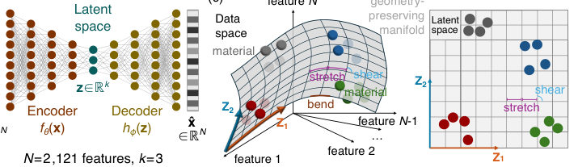
<figcaption class="paper-figure-caption"><b>Fig 1.</b> FIG. 1. Featurization, ΓAE, and geometry preserving manifolds. (a) Up to third-order graphs are used to include features that are products of atomic properties (see Table I) of each node. (b) Data (x) is compressed to z in the latent space by the encoder neural network, followed by a decoder neural network to minimize the difference between the reconstructed data (ˆx) and x, while regulating the geometry (see Appendix B). (c) The Γ-autoencoder (ΓAE) constructs a geometry-preserving, low-dimensional manifold in feature space (left), using the latent space (right) as its coordinate system, so that distances and angles are preserved and the manifold bends smoothly along latent-space directions.</figcaption>
</figure>
<figure class="paper-figure-card">
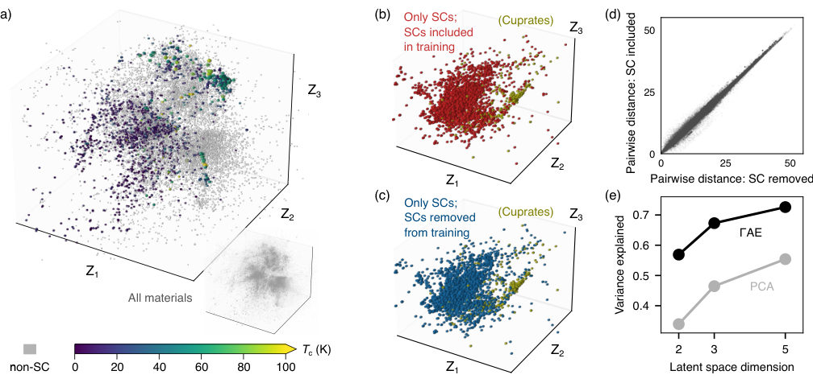
<figcaption class="paper-figure-caption"><b>Fig 2.</b> FIG. 2. Three-dimensional embedding. (a) The embedding for all ICSD materials features three main clusters (see inset), with a clear organization in terms of their superconducting Tc. (b–c) Embedding of only the superconducting materials when they are (b) included vs. (c) excluded from the ΓAE training process. The autoencoder consistently embeds the superconducting materials, including individual families (e.g. cuprates) in the same location without even encountering them during training. (d) Pairwise distance between each superconductor and 400 randomly selected materials in the two embeddings in (b) and (c) demonstrates their high correlation (Pearson r = 0.998). (e) Comparison of the...</figcaption>
</figure>
<figure class="paper-figure-card">
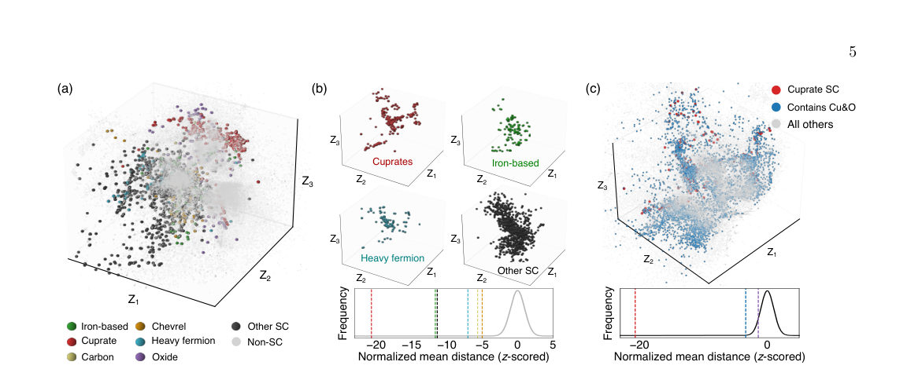
<figcaption class="paper-figure-caption"><b>Fig 3.</b> FIG. 3. Geometric clustering of superconducting families. (a) Superconducting materials colored by family across the embedding. (b) The z &lt; −2 scores for the pairwise distance, including for the “other” (i.e. conventional) superconductors, demonstrates their significant clustering tendencies beyond chemical similarity. (c) Clustering of superconducting cuprates (red dots) beyond compounds containing Cu and O (blue dots) The in-group pairwise distance normalized by the group size is statistically significantly lower for superconducting cuprates compared to the latter. The purple dashed line is the z-score for cuprate superconductor distances relative to the distribution of distances of all...</figcaption>
</figure>
<figure class="paper-figure-card">
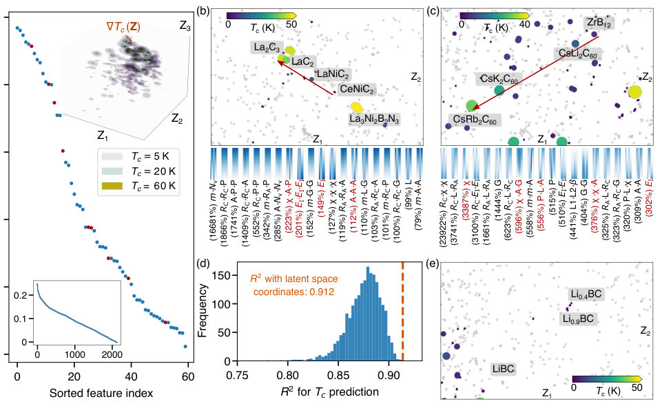
<figcaption class="paper-figure-caption"><b>Fig 4.</b> FIG. 4. Geometric interpretability of superconducting Tc (a) Distribution of Cohen’s d values for the correlation between microscopic features and ∇Tc (top inset) defined in latent space; only ≈60 features have d &gt; 0.2 (bottom inset). Local environment of superconducting clusters and trajectories of increasing ∇Tc obtained by slicing along the Z3 axis and projecting onto the Z1–Z2 plane in (b) and (c). The colored dots and their sizes represent superconducting Tc. The trajectories associated with the top 20 decoded latent space features (based on Cohen’s d value; see red arrow) are highlighted in bottom panel. (d) Gaussian process prediction model for Tc based on the three latent space...</figcaption>
</figure>
<figure class="paper-figure-card">
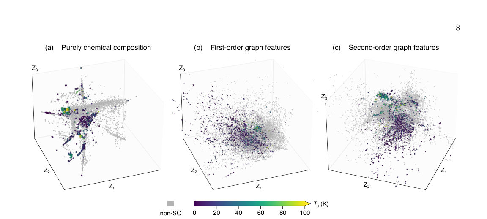
<figcaption class="paper-figure-caption"><b>Fig 5.</b> FIG. 5. Clustering complexity across featurizations. Three-dimensional embeddings for (a) Purely compositional features (see Ref. [27]). (b) First-order graph-based features. (c) First and second-order graph-based features.</figcaption>
</figure>

**Summary.** This work introduces a novel machine learning framework using $\Gamma$-autoencoders to map the vast, complex space of crystalline materials onto a low-dimensional geometric manifold. By analyzing this embedding, the authors reveal emergent organizing principles that govern macroscopic properties like superconductivity. This provides an unsupervised and highly predictive tool for designing new quantum materials based purely on structural descriptors.

**Why it may be interesting.** While focused on condensed matter, the core methodology—using deep generative models (autoencoders) combined with differential geometry to extract low-dimensional physical invariants from high-dimensional data—is highly relevant for modeling complex quantum many-body systems where explicit Hamiltonians are intractable.

Detailed structure

**Main problem.** The challenge is developing an organizing framework for crystalline materials that can predict macroscopic quantum behavior, such as superconductivity, from their complex microscopic structure.

**Main result.** A low-dimensional geometric manifold was successfully constructed in the feature space, demonstrating that only a few combinations of microscopic descriptors govern key properties like the critical temperature (Tc).

**Method.** The study employs unsupervised nonlinear dimensionality reduction using a specialized $\Gamma$-autoencoder ($\Gamma$AE) trained on high-dimensional graph features derived from crystal structures.

**Model / system.** The physical system is crystalline materials, analyzed using feature vectors built from atomic and geometric properties (up to third-order clusters) sourced from the Inorganic Crystal Structure Database (ICSD).

**Key observables.** Critical temperature ($T_c$), low-dimensional latent coordinates ($\{Z_j\}$), clustering significance (z-score), and predictive accuracy ($R^2$ for $T_c$).

**Important parameters / regimes.** Feature dimensionality (up to 2,121 dimensions), regularization parameters ($\alpha, \gamma$) in the loss function, and latent space dimension ($k=3$ used in examples).

**Assumptions / limitations.** The underlying physical organization of materials can be captured by a smooth, low-dimensional manifold structure that is preserved during nonlinear dimensionality reduction.

**Figures summary.** Figures illustrate the construction of the geometry-preserving manifold, show how superconducting families cluster significantly within this embedding, and demonstrate the predictive power of latent coordinates for $T_c$.

**Paper structure.** The paper progresses from identifying the need for a structural organizing principle to detailing the $\Gamma$AE methodology, demonstrating successful clustering of SCs, and finally quantifying feature importance by correlating gradients in the latent space with variations in $T_c$.

Abstract

The periodic table of elements transformed chemistry by revealing simple organizing principles underlying atomic behavior. Despite decades of effort, no analogous framework has emerged for crystalline materials -- their microscopic complexity and vast configurational space have defied reduction to fundamental organizing principles. Current databases catalog thousands of synthesized materials, but extracting predictive, interpretable models from this wealth of data remains a formidable challenge. Here we demonstrate that the materials landscape possesses a hidden geometric organization that can be unveiled through unsupervised nonlinear dimensionality reduction. Applying differential geometry techniques to the Inorganic Crystal Structure Database (ICSD), we reveal that just a few combinations of microscopic descriptors capture the vast majority of variance in material properties. This low-dimensional embedding autonomously segregates superconductors from ordinary materials and further distinguishes superconducting families in ways that transcend chemical similarity alone. Remarkably, the discovered geometric organization directly governs critical temperatures ($T_c$) across diverse superconducting families, enabling accurate $T_c$ predictions without any knowledge of the pairing mechanism. Our approach uncovers emergent organizing principles that control macroscopic quantum behavior, offering a new paradigm in how we build models of complex quantum materials directly from experimental data.

[↑ back to top](#top)

### [Quantum optical photoelectron interferometry](http://arxiv.org/abs/2606.13447v1)

**Authors:** Jonathan Dubois, Viviane Cotte, Richard Taïeb, Camille Lévêque, Jérémie Caillat, Pranshu Dave, Pascal Salières, David Bresteau, Charles Bourassin-Bouchet, Anne L'Huillier, David Busto  
**Type:** theory · **Category:** other · **PDF:** <https://arxiv.org/pdf/2606.13447v1>  
**Analysis basis:** full PDF text, analyzed in chunks
**Topic relevance:** `interference shaping light` **3/5** · `Keldysh / 2PI / non-Gaussian methods` **1/5** · `methods for driven-dissipative` **1/5** · `quantum optics experiment` **1/5**

↔ Scroll figures horizontally

<figure class="paper-figure-card">
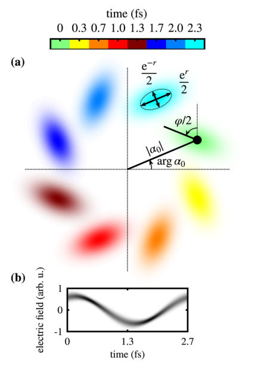
<figcaption class="paper-figure-caption"><b>Fig 1.</b> FIG. 1. (a) The Wigner distribution W(α) of a squeezed coherent state of light [see Eq. (48a)], represented at suc- cessive instants over one optical cycle of approximately 2.7 fs (laser wavelength of 800 nm), as a function of the real and imaginary parts of α. It displays the geometry of the coherent part characterized by α0 and the squeezing ampli- tude ζ = reiφ. The coherent-state limit corresponds to ζ = 0. We use 10 photons. The coherent part is ∣α0∣= 3.15 and arg α0 = 0.4 rad. The squeezing ratio is r ∼0.37 with a phase φ = 2.37 rad. (b) Corresponding distribution of the electric field Fα(t) = ⟨α∣F(t) ∣α⟩, with F(t) the electric field operator in the interaction picture and a coherent...</figcaption>
</figure>
<figure class="paper-figure-card">
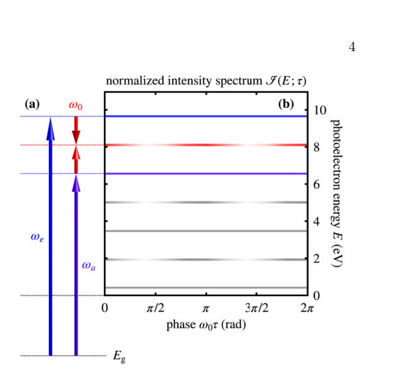
<figcaption class="paper-figure-caption"><b>Fig 2.</b> FIG. 2. (a) Illustration of the RABBIT scheme in the regime of quantum light. Two types of quantum paths contribute to the photoelectron spectrum: one-photon absorption, giv- ing rise to main bands (e.g. at frequencies ωe and ωa, shown in blue and purple, respectively), and two-photon transitions involving an additional photon of frequency ω0, giving rise to sidebands (e.g. the one shown in red between the two highlighted harmonic bands). (b) Photoelectron intensity spectrum obtained from the solution of the TDSE (see Ap- pendix C for details) as a function of τ and the energy of the photoelectron at the detector E, with τ the delay between the harmonic and infrared pulses. Other harmonics...</figcaption>
</figure>
<figure class="paper-figure-card">
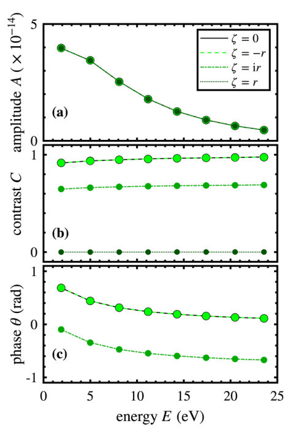
<figcaption class="paper-figure-caption"><b>Fig 3.</b> FIG. 4. Comparison of the (a) amplitude, (b) contrast and (c) phase of the RABBIT signal as a function of the sideband energy. The solid lines are obtained from the TDPT [Eq. (23)] and the colored circles from the TDSE. The parameters are the same as in Fig. 3, i.e. r ∼19, the number of photons is n0 = 1016 and arg α0 = 0. Note that in (a) the solid curves were scaled by 0.7729, as in Fig. 3. In (c) the phase is not displayed for ζ = r since the contrast is zero.</figcaption>
</figure>
<figure class="paper-figure-card">
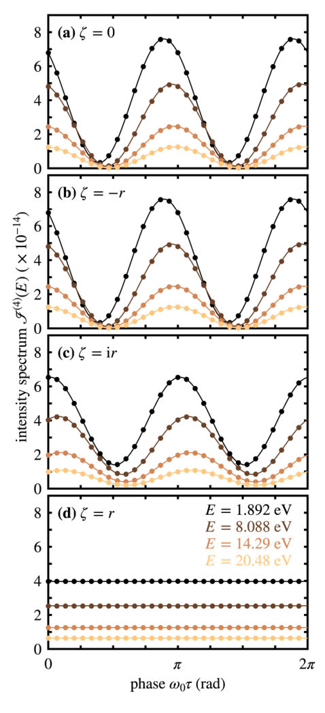
<figcaption class="paper-figure-caption"><b>Fig 4.</b> FIG. 3. Comparison of the intensity spectrum obtained from the TDPT (solid lines) [Eq. (23)] and the TDSE (colored cir- cles). Note that all the solid curves are scaled by 0.7729 in order to take into account the finite-pulse duration. The num- ber of photons is n0 = 1016 and arg α0 = 0. The different sub- plots correspond to different squeezing amplitudes: ε0 = 0 in (a), corresponding to a coherent state with ζ = 0, and ε0 = 1/2 in subsequent cases (corresponding to r ∼19). (b) φ = π cor- responding to a phase-squeezed state (ζ = −r), (c) φ = π/2 corresponding to an intermediate phase (ζ = i r), and (d) φ = 0 corresponding to an amplitude-squeezed state (ζ = r).</figcaption>
</figure>
<figure class="paper-figure-card">
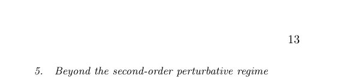
<figcaption class="paper-figure-caption"><b>Fig 5.</b> Figure 7 presents the RABBIT sidebands obtained us- ing TDPT (solid lines) and TDSE (colored circles), analo- gous to Fig. 3, but for a higher infrared photon occupancy of n0 = 1018. At this photon number, the TDPT and TDSE results no longer exhibit perfect overlap. In par- ticular, the discrepancy is more pronounced for squeezed states (panels b–c) than for the coherent state (panel a). This deviation arises because the Wigner distributions for squeezed states span several orders of magnitude in the effective field intensity. For example, while the coher- ent state is localized around an intensity of 1011 W cm−2, the squeezed states extend into the 1012 W cm−2 regime. Consequently, the...</figcaption>
</figure>

**Summary.** The paper develops a comprehensive quantum theoretical framework to analyze photoelectron interferometry using RABBIT spectroscopy. It demonstrates that the measured spectral features (amplitude, contrast, and phase) are not merely determined by the mean intensity but directly map onto higher-order correlation functions of the driving light field. This provides a powerful tool for probing the non-classical nature of intense laser sources.

**Why it may be interesting.** This work provides a rigorous quantum-optical foundation for attosecond science, showing how subtle quantum correlations in the driving laser field manifest as measurable signatures in photoelectron spectra, extending beyond simple classical phase assumptions.

Detailed structure

**Main problem.** To establish a general theoretical framework linking photon statistics (quantum light fields) to photoelectron observables in multiphoton processes, specifically focusing on quantum-light RABBIT spectroscopy.

**Main result.** The amplitude, contrast, and phase of sideband oscillations in the photoemission spectrum directly encode the underlying quantum correlations and non-classical nature of the driving laser light field.

**Method.** The analysis employs Time-Dependent Perturbation Theory (TDPT) applied to the density matrix evolution governed by the interaction Hamiltonian in the dipole approximation. It compares results derived from full quantum treatments against semiclassical approximations.

**Model / system.** The system involves photoelectron interferometry driven by intense laser fields, utilizing High-Order Harmonic Generation (HHG) and the RABBIT technique. The light field can be modeled using various quantum states, including squeezed coherent states.

**Key observables.** Autocorrelation and cross-correlation functions of photon statistics; sideband oscillation amplitude ($A$), contrast ($C$), and phase ($	heta$) in the photoelectron spectrum $I(E)$.

**Important parameters / regimes.** Squeezing parameter ($\zeta$ or $r$), squeezing phase ($\varphi$), infrared photon number ($n_0$), and inter-mode coherence measures ($g^{(1)}_{ea}$).

**Assumptions / limitations.** The analysis relies on the dipole approximation and length gauge, and often assumes photoemission occurs in a single channel.

**Figures summary.** Figures compare intensity spectra from TDPT versus Time-Dependent Schrödinger Equation (TDSE) simulations across various squeezing parameters ($\epsilon_0$) and phases ($\varphi$), illustrating how quantum fluctuations modify the RABBIT signal.

**Paper structure.** The paper develops a general formalism using density matrices, applies it to the RABBIT scheme by calculating sideband intensities via TDPT, and then investigates specific quantum regimes (squeezed states) by comparing theoretical predictions with numerical simulations.

Abstract

We present a general theoretical framework for multiphoton processes driven by quantum light fields, establishing a direct link between photon statistics and photoelectron observables. Our results show that the autocorrelation and cross-correlation functions, which quantify the underlying photon statistics, are directly mapped onto the resulting photoelectron spectra. Although our framework is broadly applicable, we demonstrate specifically in the example of reconstruction of attosecond beating by interference of two-photon transitions (RABBIT) the influence of the light statistical properties. In this approach, the amplitude, contrast and phase of the oscillations of the sideband signal as a function of pump-probe delay reveal the quantum nature of light. We analyze these observables across several quantum configurations, including correlated infrared and harmonic modes, as well as the uncorrelated case with non-classical harmonic statistics, thereby establishing a general framework for quantum-light RABBIT spectroscopy. We compare the analytical theory with numerical simulations for the case of classical harmonics and an infrared field in a squeezed coherent state, obtaining excellent agreement. Our results reveal how the interplay between classical and quantum correlations dictates the coherence of the photoemission process, providing a new window into the quantum-optical foundations of attosecond science.

[↑ back to top](#top)

### [Continuum Neural Momentum Eigenstate for Variationally Solving Quasiparticles](http://arxiv.org/abs/2606.12928v1)

**Authors:** David D. Dai, Marin Soljačić  
**Type:** theory · **Category:** numerical methods · **PDF:** <https://arxiv.org/pdf/2606.12928v1>  
**Analysis basis:** full PDF text, analyzed in chunks
**Topic relevance:** `methods for driven-dissipative` **3/5** · `Keldysh / 2PI / non-Gaussian methods` **1/5** · `analog quantum simulation` **1/5**

↔ Scroll figures horizontally

<figure class="paper-figure-card">
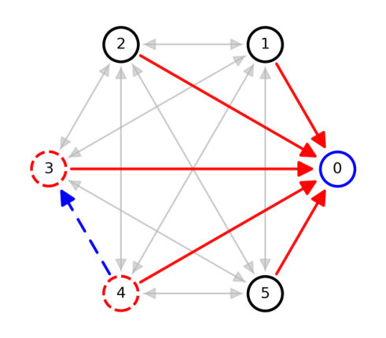
<figcaption class="paper-figure-caption"><b>Fig 1.</b> FIG. 1. Solid lines show the edge-to-vertex aggregation up- date, which pools edges h01 to h05 (solid red arrows) into vertex h0 (solid blue circle). Dashed lines show the vertex-to- edge feedback, where vertices h3 and h4 (dashed red circles) modify edge h34 (dashed blue arrow).</figcaption>
</figure>
<figure class="paper-figure-card">
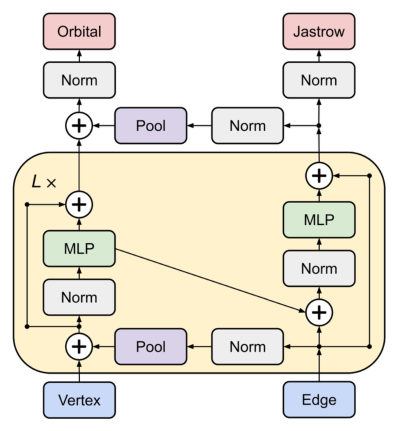
<figcaption class="paper-figure-caption"><b>Fig 2.</b> FIG. 2. High-level schematic of the EVE architecture. Pool denotes EdgeAttn and Norm denotes RMSNorm. Each block transforms input vertex and edge features through edge-to- vertex pooling, in-place vertex update, and vertex-perturbed in-place edge update.</figcaption>
</figure>
<figure class="paper-figure-card">
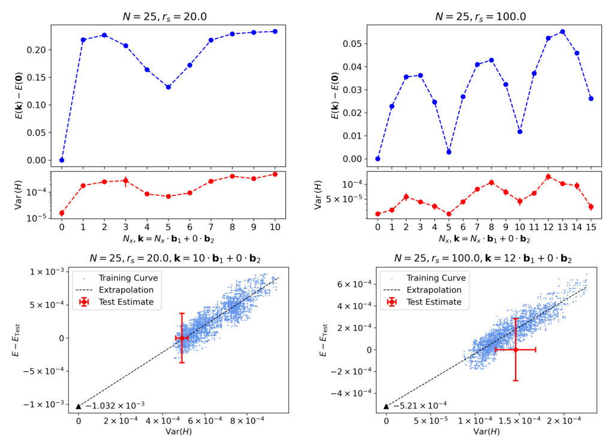
<figcaption class="paper-figure-caption"><b>Fig 3.</b> FIG. 3. Top Left: The superfluid’s momentum-sector energies. A pronounced roton minimum exists near Nx = 5. Top Right: The Wigner crystal’s momentum-sector energies. The minima at Nx = 0, 5, 10, 15 correspond to Anderson tower states, in this case floating crystals with different center-of-mass momenta, while the arcs are phonon excitations. Bottom Left: Error estimation for the superfluid’s highest-variance sector. Bottom Right: Error estimation for the Wigner crystal’s highest- variance sector. We infer dispersions after training using freshly burned-in walkers that the model has never seen before. For both extrapolations, the scattered points are training measurements smoothed by taking...</figcaption>
</figure>
<figure class="paper-figure-card">
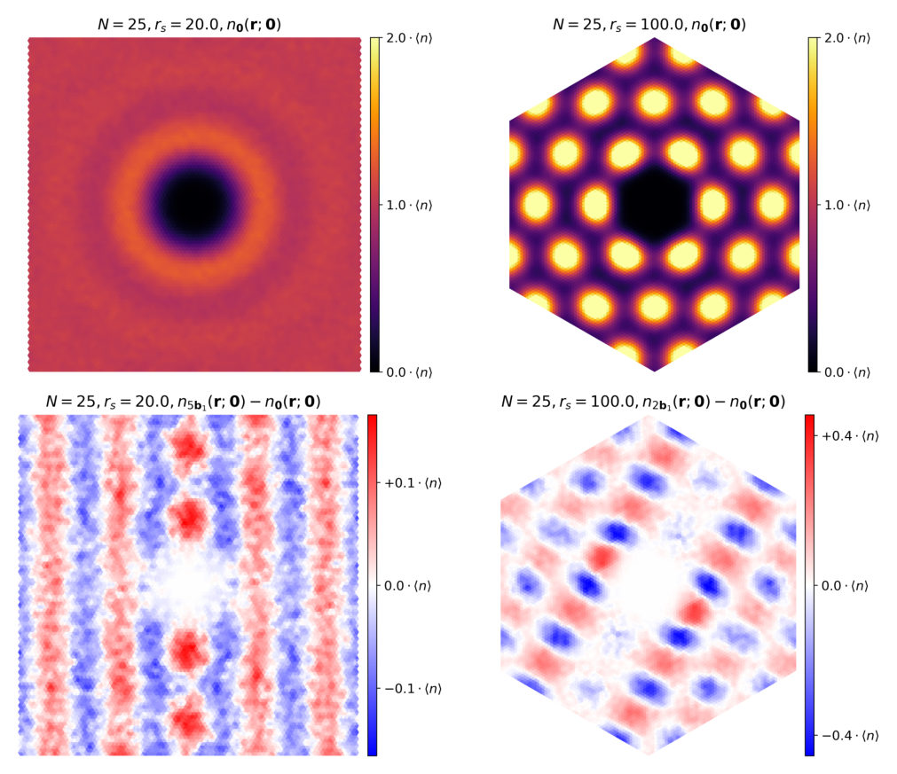
<figcaption class="paper-figure-caption"><b>Fig 4.</b> FIG. 4. All panels show a density-density correlation function, where the conditioning particle is placed at the origin. Top Left: The superfluid’s correlation function, which has a strong correlation hole at short distance surrounded by faint rings. Top Right: The Wigner crystal’s correlation function, where conditional density accumulates on a sharp triangular lattice excluding the origin’s correlation hole. Bottom Left: The roton’s correlation function minus the superfluid’s correlation function. The vertical accumulation and depletion bands represent a compressive excitation. Bottom Right: The phonon’s correlation function minus the crystal’s correlation function. Density depletes from...</figcaption>
</figure>
<figure class="paper-figure-card">
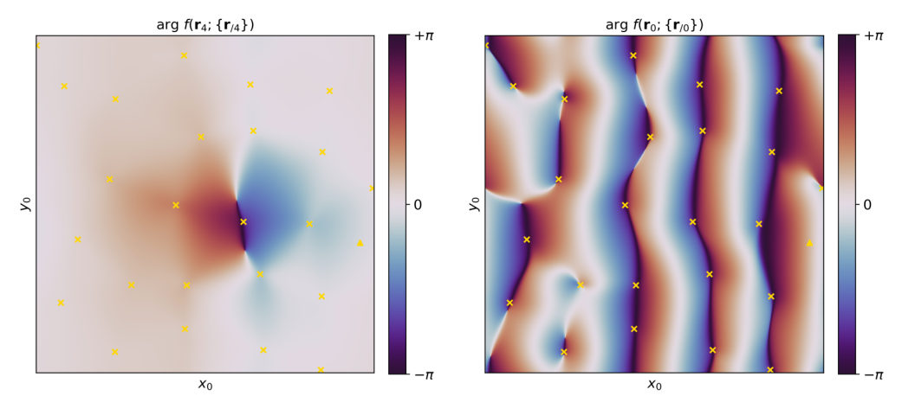
<figcaption class="paper-figure-caption"><b>Fig 5.</b> FIG. 5. Left: Learned phase of f(r4; {r/4}) as particle 0 is dragged around the simulation cell for the roton. The coalescence contains two counter-circulating vortices above and below. Right: Learned phase of f(r0; {r/0}) as the same particle 0 is dragged around the simulation cell. We can see phase strings formed by merging several vertically stacked vortex pairs. Some of these even wind around the torus and are non-contractible. In both panels, crosses mark clamped particles. In both panels, note that the plotted phase excludes the fixed eik·ri.</figcaption>
</figure>

**Summary.** The paper introduces EVE, a novel neural quantum state designed to be an exact eigenstate of total momentum for continuum particles. By applying this method to 2D bosons, the authors successfully use a single ansatz to distinguish between superfluid, roton, and crystalline phases based on the calculated energy-momentum dispersion relation. This demonstrates the power of advanced NQS architectures in diagnosing complex quantum matter states.

**Why it may be interesting.** This work represents a significant advancement in applying machine learning (NQS) to solve complex quantum many-body problems by enforcing exact momentum eigenstates, providing powerful diagnostic tools for condensed matter physics beyond standard simulation methods.

Detailed structure

**Main problem.** The primary goal is to computationally model the energy-momentum relationship of quasiparticles by solving for momentum-sector ground states in quantum many-body systems.

**Main result.** The proposed EVE neural quantum state successfully describes four distinct phases (superfluid, roton, crystal, phonon) using a single ansatz, accurately diagnosing the underlying phase via the dispersion relation $\omega(k)$.

**Method.** The authors employ Variational Monte Carlo (VMC) utilizing a novel Neural Quantum State (NQS) architecture called EVE, which is specifically designed to be an exact eigenstate of total momentum.

**Model / system.** The system studied is 2D bosons interacting via mutual $1/r$ repulsion. The Hamiltonian involves kinetic and repulsive potential terms, allowing investigation across superfluid and Wigner crystal regimes.

**Key observables.** Dispersion relation $\omega(k)$, density-density correlation functions, and the learned phase structure of the wavefunction.

**Important parameters / regimes.** $r_s$ (density parameter), tested at $r_s = 20.0$ (superfluid) and $r_s = 100.0$ (crystal).

**Assumptions / limitations.** The method sidesteps basis-set truncation error by working directly in the continuum, though it remains a variational upper bound.

**Figures summary.** Figures illustrate the EVE architecture, momentum-sector energies showing roton minima or zone folding, density correlations confirming phase types, and visualizations of complex multi-particle phase strings.

**Paper structure.** The paper introduces the EVE ansatz for continuum particles, details its application to 2D bosons in different density regimes ($r_s$), presents diagnostics using $E(k)$ and correlation functions to distinguish phases, and concludes with analysis of excitation structures like roton phase texture.

Abstract

We design the first neural quantum state for continuum particles that, for any chosen allowed momentum $\mathbf{k}$, is by construction an exact eigenstate of total momentum with eigenvalue $\mathbf{k}$. Our architecture, EVE, enables off-the-shelf VMC to solve for momentum-sector ground states. We test EVE on 2D bosons with mutual $1/r$ interactions, finding that a single unified ansatz is capable of describing four qualitatively different states: superfluid, roton, crystal, and phonon. At different densities, we extract the underlying phase of matter from the dispersion's shape. At $r_s = 20.0$, we see the roton minimum at finite $k$ expected of a superfluid. At $r_s = 100.0$, we see striking zone folding indicative of crystalline order, with periodically spaced minima representing floating crystals connected by phonon arcs in between. Using density-density correlation functions, we confirm the phase diagnoses and probe the excitations' correlation structures. Finally, we analyze the roton's phase texture and find unexpected multi-particle phase strings, formed when several vortex dipoles merge, leaving two vortices connected by a phase slip.

[↑ back to top](#top)

### [Measurement Geometry for Quantum Random Access Codes: Beyond Nayak Bound and Toward Optimality](http://arxiv.org/abs/2606.12700v1)

**Authors:** Seiseki Akibue, Rudy Raymond, Suguru Tamaki, Kosei Teramoto  
**Type:** theory · **Category:** quantum information and computing · **PDF:** <https://arxiv.org/pdf/2606.12700v1>  
**Analysis basis:** full PDF text, analyzed in chunks
**Topic relevance:** `quantum measurements` **3/5** · `entanglement & information structure` **1/5** · `measurement-induced transitions` **1/5**

↔ Scroll figures horizontally

<figure class="paper-figure-card">
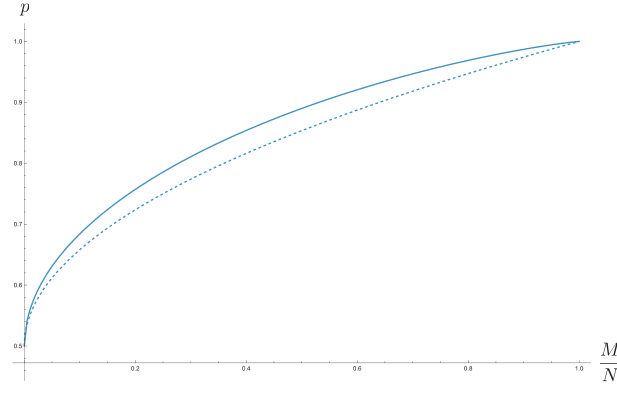
<figcaption class="paper-figure-caption"><b>Fig 1.</b> Figure 1: Comparison of upper bounds on the decoding probability p. The solid curve represents the Nayak bound p ≤H−1 2  1 −M</figcaption>
</figure>
<figure class="paper-figure-card">
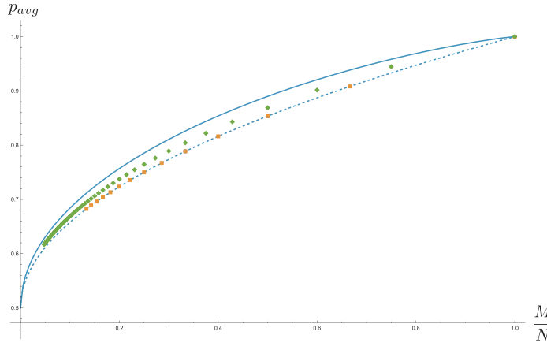
<figcaption class="paper-figure-caption"><b>Fig 2.</b> Figure 2: Comparison of upper bounds on the average-case decoding probability pavg. The solid curve represents the Nayak bound. The dashed curve represents the conjectured bound. The orange points represent the finite-size bounds obtained from Theorem 2 for M = 2, while the green points represent the corresponding new bounds for M = 3. For the finite-size bounds, we take N ∈{M, M + 1, . . . , 4M −1}.</figcaption>
</figure>
<figure class="paper-figure-card">
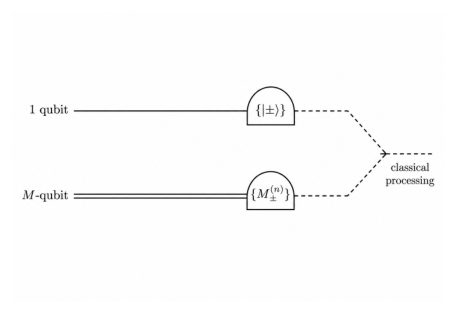
<figcaption class="paper-figure-caption"><b>Fig 3.</b> Figure 3: Quantum circuit for the decoding measurement in Proposition 4. The first qubit is measured in the computational basis with outcome {±}, and the remaining M qubits are measured by the MUPVM with outcome {±}. The classical post-processing outputs + if the two measurement outcomes coincide, and outputs −otherwise.</figcaption>
</figure>

**Summary.** This theoretical paper develops advanced techniques, rooted in random matrix theory, to establish tighter upper bounds on the performance of Quantum Random Access Codes (QRACs). By reformulating the problem spectrally and introducing MUPVMs, the authors significantly improve upon existing bounds and provide concrete constructions that approach these conjectured optimal limits.

**Why it may be interesting.** The rigorous mathematical framework connecting optimal quantum information protocols (like QRACs) to deep concepts in random matrix theory and spectral graph theory provides powerful tools applicable to characterizing resource limits in other quantum communication tasks.

Detailed structure

**Main problem.** The research aims to determine the optimal decoding probability for Quantum Random Access Codes (QRACs), establishing upper bounds that improve upon the standard Nayak bound.

**Main result.** The authors derived sharper, finite-size upper bounds on the average-case decoding probability and provided explicit constructions achieving lower bounds using Mutually Unbiased Projector-Valued Measurements (MUPVMs).

**Method.** The work reformulates QRAC design as a spectral problem for noncommuting measurements, employing matrix Chernoff-type arguments and analyzing the maximum eigenvalue of signed sum operators.

**Model / system.** The system is the Quantum Random Access Code (QRAC), which encodes $N$ classical bits into $M$ qubits. The analysis focuses on decoding observables $\sigma(n)$ and their spectral properties.

**Key observables.** Decoding probability ($p$), average-case probability ($	ext{p}_{	ext{avg}}$), worst-case probability ($	ext{p}_{	ext{wc}}$), and the maximum eigenvalue of the signed sum operator ($\lambda_{\max}(Y)$).

**Important parameters / regimes.** $N$ (number of bits), $M$ (number of qubits), and the specific parameters defining the code family, such as $(M+2, M)$-QRAC.

**Assumptions / limitations.** The analysis relies on reformulating the problem using spectral theory for noncommuting measurements, generalizing from standard mutually unbiased bases to MUPVMs.

**Figures summary.** Figures compare various theoretical bounds (Nayak vs. conjectured finite-size bound), and Tables summarize derived closed-form upper/lower bounds for success probabilities across different $(N, M)$ pairs.

**Paper structure.** The paper progresses from establishing the general problem definition to deriving improved spectral bounds using random matrix theory, then analyzing structural requirements (MUPVMs) necessary for achieving these bounds, and finally presenting explicit constructions that meet or approach optimality.

Abstract

Quantum random access codes (QRACs) ask how well N classical bits can be encoded into M qubits while allowing any single bit to be recovered. Although the Nayak bound remains the standard general upper bound on the decoding probability, numerical evidence suggests a stronger upper bound in the small-qubit regime.   In this work, we formulate the optimal decoding probability in terms of decoding measurements, reformulating QRAC design as a spectral problem for noncommuting measurements. Using this formulation, we give an elementary proof of the Nayak bound by simplifying the Chernoff-bound argument. Moreover, we refine the argument to obtain upper bounds that improve over Nayak's bound in the entire finite-size regime.   The equality conditions of our bounds justify defining mutually unbiased projector-valued measurements (MUPVMs), a generalization of mutually unbiased bases. We show that decoding measurement of any two-qubit QRAC attaining the conjectured bound must form MUPVMs. We also show that any MUPVM, assisted by one ancillary qubit, yields a QRAC with optimal N-scaling decoding probability. Finally, we propose a new MUPVM-based construction for the (M+2,M)-QRAC family attaining the conjectured bound.

[↑ back to top](#top)

### [Optimal classical shadow estimation of unitary channels at Heisenberg limit](http://arxiv.org/abs/2606.13638v1)

**Authors:** Entong He, Zihao Li, Noam Scully, Sisi Zhou, Yuxiang Yang  
**Type:** theory · **Category:** quantum information and computing · **PDF:** <https://arxiv.org/pdf/2606.13638v1>  
**Analysis basis:** full PDF text, analyzed in chunks
**Topic relevance:** `quantum measurements` **3/5** · `entanglement & information structure` **1/5** · `measurement-induced transitions` **1/5**

↔ Scroll figures horizontally

<figure class="paper-figure-card">
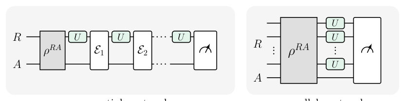
<figcaption class="paper-figure-caption"><b>Fig 1.</b> Figure 1: Sequential and parallel query protocols for learning an unknown unitary U. In a sequential protocol, different uses of U may be interleaved with intermediate quantum operations E1, E2, . . . assisted by ancillas. In a parallel protocol, all uses of U appear in a single non-adaptive layer. The initial state ρRA may be entangled between the query register R and an arbitrarily large ancillary register A. Any protocol is concluded with a joint measurement on all output systems and ancillas, followed by classical post-processing.</figcaption>
</figure>
<figure class="paper-figure-card">
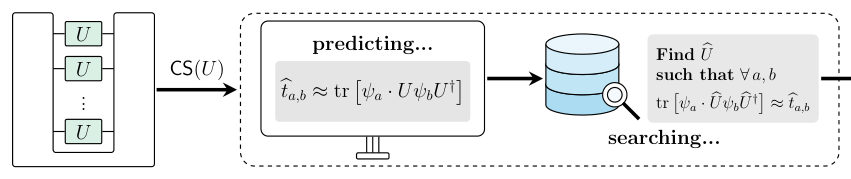
<figcaption class="paper-figure-caption"><b>Fig 2.</b> Figure 2: Conversion of a CSEU protocol into a unitary channel tomography protocol. The indexing database consists of pairs of pure states (ψa, ψb) chosen from a constant-precision covering net, which provide consis- tency tests for reconstructing the unknown unitary. The CSEU protocol estimates the transition probabilities tr[ψaUψbU †], and the reconstruction step outputs a unitary bU whose transition probabilities are consistent with these estimates. The symbol “≈” indicates closeness in absolute value within a prescribed threshold.</figcaption>
</figure>
<figure class="paper-figure-card">
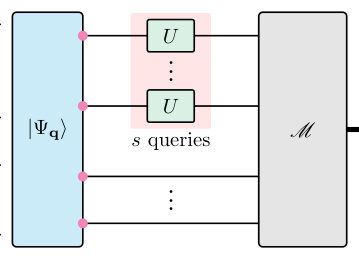
<figcaption class="paper-figure-caption"><b>Fig 3.</b> Figure 3: Covariant unitary learning protocol for generating a single unitary snapshot. Starting from the probe state |Ψq⟩, the protocol applies s parallel uses of the unknown unitary U and then measures the resulting memory state with the covariant POVM M . The measurement outcome bU is stored as part of the unitary-valued classical shadow data CS(U).</figcaption>
</figure>
<figure class="paper-figure-card">
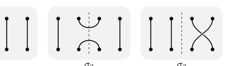
<figcaption class="paper-figure-caption"><b>Fig 4.</b> Figure 4: (a) The diagram of an element in Bd 3,2. (b) The diagrams of the generators of Ad 2,2.</figcaption>
</figure>
<figure class="paper-figure-card">
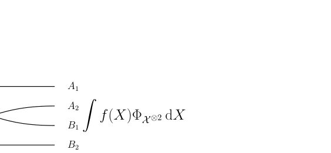
<figcaption class="paper-figure-caption"><b>Fig 5.</b> Figure 6: The local permutation that rearranges the bipartite space.</figcaption>
</figure>

**Summary.** The paper presents advanced quantum information theory protocols for learning unknown unitary channels and Hamiltonians. It achieves optimal query complexity by developing the Classical Shadow Estimation of Unitary Channels (CSEU) framework. This method proves that high-precision characterization can be done using parallel, non-adaptive measurements, closing theoretical gaps between sequential and parallel measurement limits.

**Why it may be interesting.** This work provides fundamental theoretical tools for experimental quantum characterization. By achieving Heisenberg scaling with parallel queries, it suggests a pathway to realizing complex quantum process measurements efficiently on near-term hardware.

Detailed structure

**Main problem.** The paper develops optimal protocols for estimating unknown quantum unitary channels (U) or Hamiltonians from limited measurements, aiming to achieve the Heisenberg limit scaling in terms of measurement resources.

**Main result.** It establishes query-optimal, parallel, and non-adaptive protocols for Unitary Channel Tomography (UCT), showing that the required queries scale as $O(d\epsilon^{-1})$ or $O(d^2/\epsilon)$ depending on the specific task.

**Method.** The core technique is Classical Shadow Estimation of Unitary Channels (CSEU), which separates data acquisition from prediction. This protocol is then adapted and reduced to solve full tomography problems, leveraging information-theoretic bounds like Holevo information.

**Model / system.** The system involves an unknown $d$-dimensional unitary channel $U \in U(d)$ or a Hamiltonian $H$ governing the evolution. The learning task requires estimating expectation values $	ext{tr}[O \cdot U
ho U^\dagger]$ for arbitrary observables $O$ and states $
ho$.

**Key observables.** Expectation values ($	ext{tr}[O \cdot U
ho U^\dagger]$), the diamond norm error ($\|\hat{E} - E\|_\diamond$), Holevo information ($\chi(t)$), and Pauli Transfer Matrix (PTM) entries.

**Important parameters / regimes.** System dimension ($d$ or $n$), target precision ($\epsilon$), and query complexity scaling ($\propto \epsilon^{-1}$).

**Assumptions / limitations.** The protocols assume the ability to perform parallel, non-adaptive queries. Some derivations rely on bounding the size of covering nets for unitaries.

**Figures summary.** Figures illustrate the comparison between sequential vs. parallel query protocols (Figure 1) and show the reduction from CSEU to full unitary tomography using state coverings (Figure 2).

**Paper structure.** The paper builds iteratively: first establishing the optimal, query-optimal CSEU protocol; then applying this tool to Unitary Channel Tomography (UCT); subsequently extending it to Hamiltonian learning and general quantum channel tomography in various regimes.

Abstract

Full tomography of an unknown quantum evolution is resource-intensive and often unnecessary when the goal is only to predict selected properties. This motivates the study of classical shadow estimation of unitary channels (CSEU), a task in which one queries an unknown $d$-dimensional unitary $U$ and stores classical data that can later be used to predict expectation values $\mathrm{tr}[O \cdot UρU^\dagger]$ up to additive error $\varepsilon$ for arbitrary input states $ρ$ and observables $O$. We propose a parallel, non-adaptive CSEU protocol using $\mathcal{O}(d\varepsilon^{-1})$ queries when the input states or observables have constant rank. This achieves Heisenberg scaling with respect to $\varepsilon$ and is query-optimal, as we prove a matching $Ω(d\varepsilon^{-1})$ lower bound that remains valid even with stronger access to the unknown unitary. Our query-optimal CSEU protocol provides a versatile and powerful tool for quantum learning theory, pushing the performance limits of several fundamental learning tasks, including unitary channel tomography, Hamiltonian learning, boundary-regime quantum channel tomography, Pauli transfer matrix learning, inverse-free amplitude estimation, pure-state property estimation, and shallow-circuit learning. Remarkably, we show that optimal unitary channel tomography can be achieved using only parallel queries, closing the gap between the best achievable efficiency of parallel and sequential tomography protocols. Together, these applications establish our framework as a fundamental tool for learning properties of quantum processes, particularly for certain key tasks that require high precision.

[↑ back to top](#top)

### [Robust Pretty Good Measurement via Hybrid Classical-Quantum Pseudoinverse Approximation and Circuit-Level Realization](http://arxiv.org/abs/2606.13150v1)

**Authors:** Bikash K. Behera, Andrés Camilo Granda Arango, Giuseppe Sergioli, Roberto Giuntini  
**Type:** both · **Category:** quantum information and computing · **PDF:** <https://arxiv.org/pdf/2606.13150v1>  
**Analysis basis:** full PDF text, analyzed in chunks
**Topic relevance:** `quantum measurements` **3/5** · `QC/QI experiment` **1/5** · `measurement-induced transitions` **1/5**

↔ Scroll figures horizontally

<figure class="paper-figure-card">
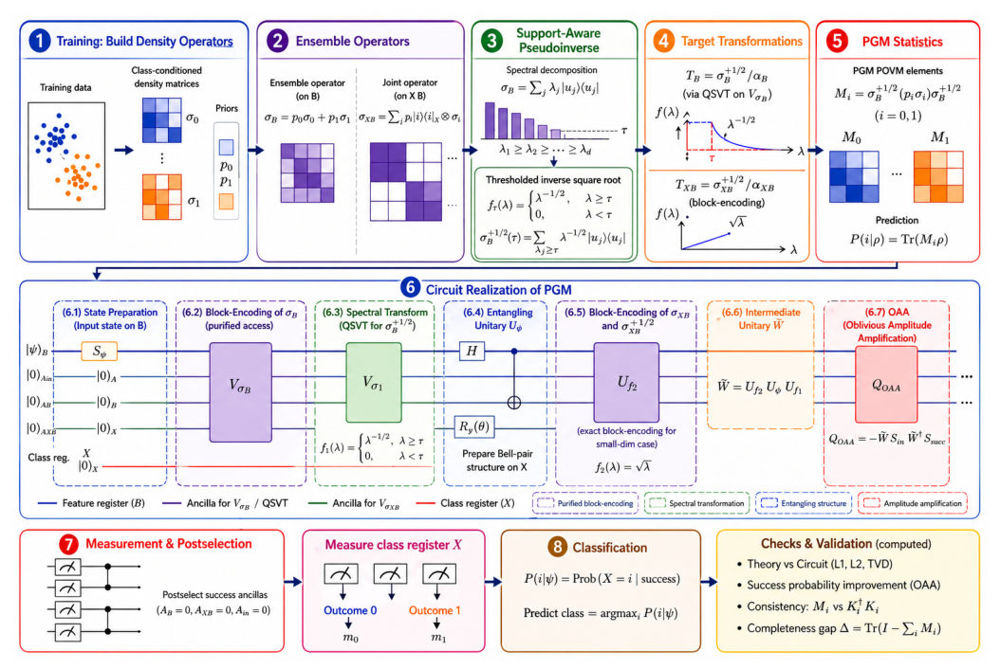
<figcaption class="paper-figure-caption"><b>Fig 1.</b> Fig. 1: Overall framework of the proposed support-aware and threshold-regularized hybrid classical-quantum PGM framework for classification. The pipeline consists of density-operator construction, support-aware pseudoinverse regularization, purified-access block- encoding, spectral transformation, construction of the intermediate unitary f W, oblivious amplitude amplification, and final measurement-based classification.</figcaption>
</figure>
<figure class="paper-figure-card">
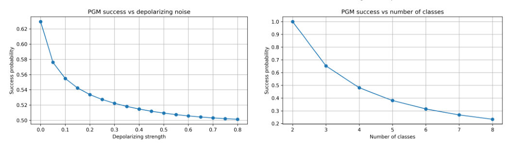
<figcaption class="paper-figure-caption"><b>Fig 2.</b> Fig. 2: Performance analysis of the proposed pseudoinverse-based PGM under different conditions. (a) Retained effective rank as a function of threshold τ, showing removal of unstable eigenvalues. (b) Corresponding success probability, demonstrating robustness across a wide threshold range. (c) Robustness under depolarizing noise, where performance degrades with increasing noise strength. (d) Scaling behavior with respect to the number of classes, indicating increased difficulty in state discrimination for larger ensembles.</figcaption>
</figure>
<figure class="paper-figure-card">
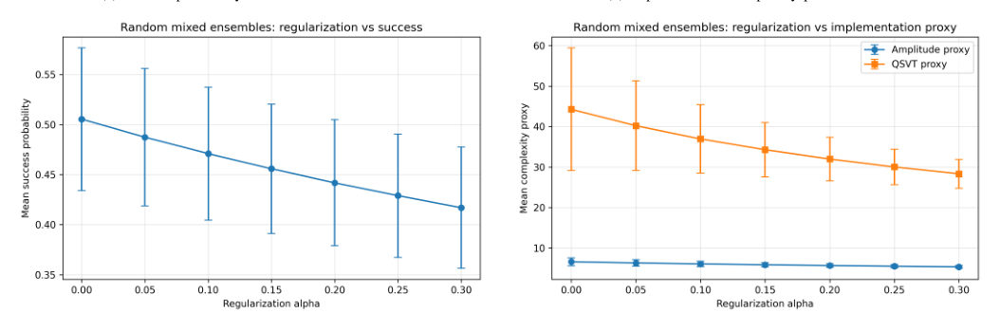
<figcaption class="paper-figure-caption"><b>Fig 3.</b> Fig. 3: Scaling and regularization behavior of the pseudoinverse-based PGM. (a) Success probability decreases with increasing number of classes K, reflecting reduced distinguishability among quantum states. (b) Implementation complexity proxies increase with K, indicating higher resource requirements. (c) Mean success probability decreases with regularization strength α, as stronger mixing reduces state separability. (d) Implementation complexity proxies decrease with α, showing improved spectral conditioning and reduced implementation cost. Error bars (where applicable) denote standard deviation over random mixed ensembles.</figcaption>
</figure>
<figure class="paper-figure-card">
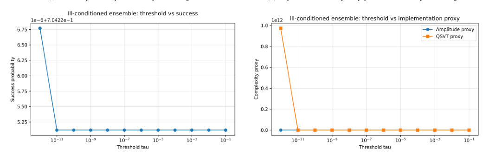
<figcaption class="paper-figure-caption"><b>Fig 4.</b> Fig. 4: Performance and conditioning behavior of the pseudoinverse-based PGM under geometric separation and spectral regularization. (a) Success probability increases with the angle between quantum states, reflecting improved distinguishability. (b) Implementation complexity proxies decrease with increasing angle, indicating better conditioning of the ensemble operator. (c) Success probability remains stable across a wide range of threshold values τ, demonstrating robustness to spectral truncation. (d) Implementation complexity proxies decrease significantly with increasing τ, showing that removing small eigenvalue components improves conditioning and reduces computational cost.</figcaption>
</figure>
<figure class="paper-figure-card">
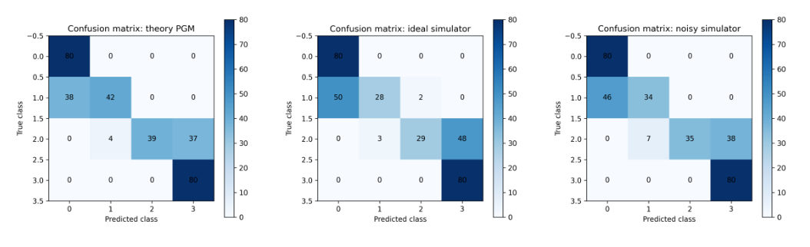
<figcaption class="paper-figure-caption"><b>Fig 5.</b> Fig. 5: Confusion matrices for the four-class trained PGM classifier. (a) Theoretical PGM predictions obtained directly from the trained POVM elements. (b) End-to-end implementation on the ideal quantum simulator using the Naimark-dilation-based circuit realization. (c) End-to-end implementation on the noisy quantum simulator. All three panels show strong agreement on classes 0 and 3, while the dominant classification difficulty occurs between the middle classes 1 and 2, where the underlying states are more strongly overlapping.</figcaption>
</figure>

**Summary.** This paper introduces a robust method to perform quantum state discrimination using the Pretty Good Measurement (PGM) protocol. It overcomes the instability of standard PGM by employing the Moore-Penrose pseudoinverse and threshold regularization, creating a practical hybrid classical-quantum framework for circuit implementation. The results demonstrate stable performance even when the underlying ensemble operator is ill-conditioned or rank-deficient.

**Why it may be interesting.** This work provides a concrete, implementable protocol for quantum state discrimination that directly addresses major practical limitations (ill-conditioning) encountered when translating theoretical optimal measurements into NISQ hardware circuits.

Detailed structure

**Main problem.** The primary challenge is achieving a numerically stable, circuit-level implementation of Pretty Good Measurement (PGM) for quantum state discrimination when the ensemble operator is singular or ill-conditioned.

**Main result.** The authors propose and validate a hybrid classical-quantum framework using the Moore-Penrose pseudoinverse and threshold regularization to ensure robust measurement operators even in rank-deficient regimes.

**Method.** They combine spectral preprocessing (classically calculating the regularized pseudoinverse) with quantum circuit realizations involving block-encoding, spectral transformations, and Oblivious Amplitude Amplification.

**Model / system.** The work analyzes quantum state discrimination for an ensemble $\{p_i, 
ho_i\}$ of mixed states. The core mathematical object is the ensemble operator $S = \sum p_i 
ho_i$, which dictates the measurement operators $M_i$.

**Key observables.** Measurement operators ($M_i$), Success Probability ($P_{	ext{succ}}$), Trace Gap ($\Delta$), and Total Variation Distance (TVD) between theoretical and simulated probabilities.

**Important parameters / regimes.** The regularization threshold ($	au$) is crucial, balancing stability against accuracy; the number of classes ($K$) also dictates complexity and performance scaling.

**Assumptions / limitations.** The framework assumes that spectral information required for the pseudoinverse can be extracted classically (hybrid approach), although future work aims for full quantum realization.

**Figures summary.** Figures illustrate the overall pipeline, showing how thresholding stabilizes the measurement operators, and compare theoretical predictions against ideal and noisy simulator outputs across various parameter sweeps.

**Paper structure.** The paper systematically develops the theory by replacing standard inverses with pseudoinverses, details the hybrid classical-quantum circuit realization using block-encoding, validates the method through extensive numerical simulations on synthetic and real datasets, and analyzes performance trade-offs based on regularization parameters ($	au$ or $\alpha$).

Abstract

Pretty Good Measurement (PGM) is a near-optimal strategy for quantum state discrimination, but its practical realization becomes unstable when the ensemble operator is singular or ill-conditioned. We introduce a numerically robust PGM formulation based on the Moore-Penrose pseudoinverse, replacing the standard inverse square root with a threshold-regularized variant that remains well-defined across different spectral regimes. We develop a hybrid classical-quantum framework that combines pseudoinverse-based spectral preprocessing with quantum circuit realizations using block-encoding and spectral-transformation techniques. The framework incorporates support awareness, yielding physically meaningful measurement operators even in rank-deficient cases, and employs oblivious amplitude amplification to improve circuit-level success probabilities. Extensive numerical and circuit-level simulations show close agreement between theoretical predictions and quantum circuit outputs. Experiments on synthetic and real datasets, including ill-conditioned and degenerate scenarios, demonstrate stable discrimination performance where standard PGM becomes numerically unstable. The results establish a practical hybrid classical-quantum framework for robust quantum state discrimination and extend previous circuit-based implementations of the PGM testing stage toward pseudoinverse-aware measurement design.

[↑ back to top](#top)

### [When proofreading improves both speed and accuracy](http://arxiv.org/abs/2606.12795v1)

**Authors:** Arup Biswas, L. Mahadevan  
**Type:** theory · **Category:** statistical mechanics · **PDF:** <https://arxiv.org/pdf/2606.12795v1>  
**Analysis basis:** full PDF text, analyzed in chunks
**Topic relevance:** `Keldysh / 2PI / non-Gaussian methods` **2/5** · `non-equilibrium dynamics` **2/5** · `analog quantum simulation` **1/5** · `correlated / nonlocal dissipation` **1/5** · `driven-dissipative phase transition` **1/5** · `methods for driven-dissipative` **1/5** · `non-equilibrium universality` **1/5**

↔ Scroll figures horizontally

<figure class="paper-figure-card">
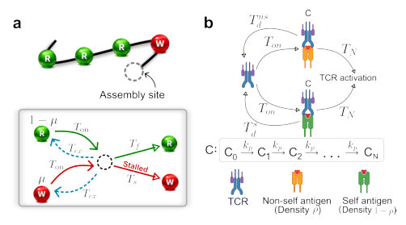
<figcaption class="paper-figure-caption"><b>Fig 1.</b> FIG. 1. a DNA replication as an example of a self-assembly process. A mismatched subunit ‘W’ in the self-assembly of polymers, such as a mutation in DNA replication, leads to the stalling of the process so that subsequent addition of the subunit is hindered. Proofreading in here prevents stalling by excising the nucleotide after random time intervals Tex, thereby facilitating the speed of the assembly process as well as reducing the error. b Kinetic proofreading for TCR acti- vation network. An accurate response is generated when the TCR is activated by the non-self antigen. In here, intermit- tent dissociation of the TCR-pMHC complex C ensures that the self antigens are rejected more often.</figcaption>
</figure>
<figure class="paper-figure-card">
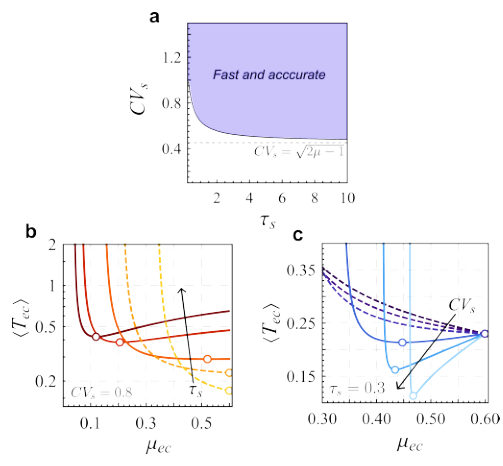
<figcaption class="paper-figure-caption"><b>Fig 2.</b> FIG. 2. Illustration for gamma distributed stall times, when proofreading improves speed and accuracy si- multaneously. a Parameter space (shaded region) where the conditions Eq. (7) and Eq. (10) holds (for µ = 0.6). In the limit of ⟨Ts⟩≫⟨Tf⟩the separatrix is given by CVs = √2µ −1. b We fix CVs = 0.8 and vary τs ∈[0.2, 1]. We see that as τs increases beyond τs = 0.38 as given by the sepa- ratrix in a, we get a region where both the error (µec) and MFPT (⟨Tec⟩) decrease (region right to the circles in each curve). The curves where the criteria (Eq. (10)) are not satis- fied is marked by the dashed lines. We choose a dashed curve from b with fixed τs = 0.3 and vary CVs ∈[0.6, 1.4] in c. We...</figcaption>
</figure>
<figure class="paper-figure-card">
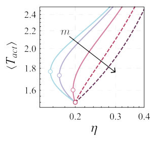
<figcaption class="paper-figure-caption"><b>Fig 3.</b> FIG. 3. ‘Fast and accurate’ T-cell activation - The re- gion below the circles in the solid curve is where ‘more ac- curate is faster’ for T-cell activation governed by Eq. (15) and Eq. (16). The curves undergo a behavioural transition from a non-monotonic to a monotonic variation with increas- ing m = ⟨T s d ⟩ ⟨T ns d ⟩.</figcaption>
</figure>
<figure class="paper-figure-card">
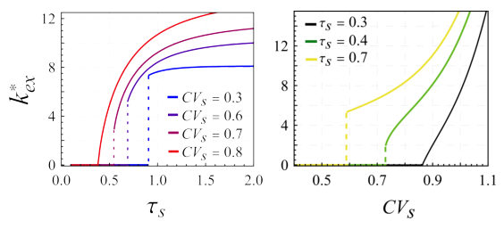
<figcaption class="paper-figure-caption"><b>Fig 4.</b> FIG. 4. Nature of the transition: The optimal value of rate of excision as obtained from Eq. (17) exhibits both first and second order phase transitions with respect to τs and CVs. For first-order transition, however, the criterion in Eq. (10) does not necessarily hold.</figcaption>
</figure>

**Summary.** This theoretical work develops a general criterion showing that proofreading can enhance both the speed and accuracy of complex stochastic processes. It achieves this by demonstrating that the variability (fluctuations) of stalling times, rather than just their average duration, dictates whether such simultaneous improvement is possible.

**Why it may be interesting.** The mathematical framework for analyzing non-Markovian processes, especially those involving memory effects or resetting mechanisms, is highly relevant to open quantum systems modeling, particularly in contexts like quantum error correction or decoherence management.

Detailed structure

**Main problem.** The paper investigates whether proofreading mechanisms can simultaneously improve both the speed (Mean First Passage Time) and accuracy (error rate) of a stochastic process, challenging the typical trade-off assumption.

**Main result.** Simultaneous improvement is possible when fluctuations in the stall durations, quantified by the coefficient of variation (CV), exceed specific thresholds relative to the intrinsic error rate. The criteria derived are sufficient but not necessary for optimal performance.

**Method.** The analysis uses non-Markovian renewal theory and first-passage time calculations, deriving exact expressions for error rates and mean passage times using limiting procedures on probability distributions (e.g., exponential or Gamma).

**Model / system.** The framework is applied to general stochastic processes involving stalling and excision/proofreading, with physical examples including DNA replication, polymer self-assembly, and T-cell immune recognition.

**Key observables.** Error rate ($\mu_{ec}$) and Mean First Passage Time ($\langle T_{ec} 
angle$).

**Important parameters / regimes.** Coefficient of variation (CV) of stall time; intrinsic error rate ($\mu$); ratio of mean stall time to forward waiting time ($\langle T_s 
angle / \langle T_f 
angle$).

**Assumptions / limitations.** Initial analyses rely on the exponential distribution for excision times, but the general framework extends results using Gamma distributions and analyzing limits ($k_{ex} 	o 0$).

**Figures summary.** Figures illustrate physical examples like DNA replication and T-cell activation. Figure 2 shows the 'fast and accurate' regime dependence on CV; Figure 3 details the transition region for T-cell activity.

**Paper structure.** The paper develops general renewal equations, derives conditions based on mean times ($\langle T_s 
angle > \langle T_f 
angle$), then refines these using CV analysis (Eq. 10), and finally discusses limitations by examining first-order phase transitions where the initial limiting assumptions break down.

Abstract

Proofreading is generally thought to improve accuracy at the expense of speed. We show that this trade-off can be reversed in stochastic processes with long-lived stalled states. Using a non-Markovian renewal framework, we derive exact expressions for the error rate and completion time under proofreading for arbitrary stall-time distributions. Our analysis reveals that fluctuations in stall durations, rather than their mean alone, determine whether proofreading can simultaneously increase speed and accuracy. In the limit of strong stalling, this regime emerges when the coefficient of variation of the stall time exceeds a threshold set by the intrinsic error rate. These results provide a general criterion for proofreading in systems ranging from self-assembly and polymer replication to immune recognition and other nonequilibrium information-processing systems.

[↑ back to top](#top)

### [Approximate quantum error correction theory of non-isometric codes](http://arxiv.org/abs/2606.13559v1)

**Authors:** Yixu Wang, Yijia Xu, Zi-Wen Liu  
**Type:** theory · **Category:** quantum information and computing · **PDF:** <https://arxiv.org/pdf/2606.13559v1>  
**Analysis basis:** full PDF text, analyzed in chunks
**Topic relevance:** `entanglement & information structure` **2/5** · `Keldysh / 2PI / non-Gaussian methods` **1/5** · `correlated / nonlocal dissipation` **1/5** · `driven-dissipative phase transition` **1/5** · `methods for driven-dissipative` **1/5**

↔ Scroll figures horizontally

<figure class="paper-figure-card">
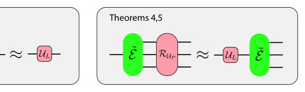
<figcaption class="paper-figure-caption"><b>Fig 1.</b> FIG. 1. Schematic overview of the approximation relations for non-isometric codes discussed in Theorems 2, 3, 4, 5.</figcaption>
</figure>
<figure class="paper-figure-card">
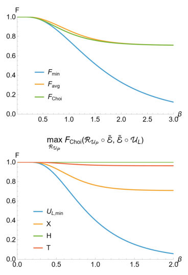
<figcaption class="paper-figure-caption"><b>Fig 2.</b> FIG. 2. Recovery and logical gate accuracies of regularized GKP codes. Upper panel: Fmin, Favg and FChoi with respect to the regu- larization parameter β. Lower panel: maxRUP FChoi(RUP ◦˜E, ˜E ◦ UL) for logical gates X, H, T and UL,min with respect to β.</figcaption>
</figure>

**Summary.** This paper establishes a comprehensive, systematic theory for quantum error correction codes operating under non-isometric encoding conditions. It quantifies the fundamental limits on achievable fidelity and logical operation accuracy using information-theoretic measures derived from the code's Gram operator. This advances QEC theory by bridging abstract mathematics with physical constraints found in continuous-variable systems and quantum gravity.

**Why it may be interesting.** This work is highly relevant as it provides a rigorous mathematical toolset for analyzing practical limitations in quantum computation that arise from imperfect hardware or fundamental physics models like holography.

Detailed structure

**Main problem.** To develop a general theory for quantum error correction (QEC) that accounts for non-isometric encoding, which arises in realistic physical implementations.

**Main result.** The paper derives explicit formulas and bounds for intrinsic optimal recovery fidelities ($F_{\min}, F^2_{	ext{avg}}, F_{	ext{Choi}}$) based on the condition ratio of the Gram operator $V^\dagger V$. It also establishes necessary conditions for noise resilience in non-isometric settings.

**Method.** The analysis employs information-theoretic measures (fidelity, purified distance) and utilizes mathematical tools like eigenvalue analysis, random matrix theory (Marchenko–Pastur distribution), and optimization techniques based on quasiconvexity.

**Model / system.** The theoretical framework models quantum encoding via a map $V: \mathcal{H}_L 
ightarrow \mathcal{H}_P$. Specific examples include GKP codes and Tiger codes, which are analyzed in the context of continuous-variable systems and holographic gravity (AdS/CFT).

**Key observables.** Channel fidelity ($F_
ho$), purified distance ($\epsilon_
ho$), Condition Ratio ($r$), and various optimal recovery fidelities ($F_{\min}, F^2_{	ext{avg}}, F_{	ext{Choi}}$).

**Important parameters / regimes.** The condition ratio $r = \lambda_{\min} / \lambda_{\max}$ of the Gram operator $V^\dagger V$; dimension ratios like $d_L/d_P$ in random matrix limits.

**Assumptions / limitations.** The primary assumption is moving beyond the standard isometric encoding assumption. In some analyses, it assumes $orall i, \lambda_i > 0$ to avoid trivial kernels.

**Figures summary.** Not specified (No figure descriptions were extracted).

**Paper structure.** The paper systematically builds theory by first defining non-isometric encodings and deriving intrinsic fidelity limits using the condition ratio. It then applies this framework to specific codes (GKP, Tiger) and physical contexts (holography), culminating in establishing general inequalities between different fidelity measures.

Abstract

Non-isometric encoding arises in various important contexts in quantum error correction, most notably in the finite-energy, non-ideal codewords inevitable in experimental realizations of continuous-variable codes, and holographic quantum gravity. In this work, we present a general and systematic theory of non-isometric quantum error-correcting codes. In particular, we employ the approximate quantum error correction framework to quantitatively study the fundamental limitations imposed by non-isometric encodings on the accuracy of quantum error correction and implementation of logical operations. We apply our theory to analyze GKP and tiger codes under energy constraints, and discuss the implications to holography.

[↑ back to top](#top)

### [Numerical Hints for Dyon Condensation at $θ=2π$ via Wilson-'t Hooft Loops in $SU(2)$ Yang-Mills Theory](http://arxiv.org/abs/2606.13428v1)

**Authors:** Hiromasa Watanabe, Issaku Kanamori, Okuto Morikawa, Yuki Nagai, Yuya Tanizaki, Akio Tomiya  
**Type:** theory · **Category:** statistical mechanics · **PDF:** <https://arxiv.org/pdf/2606.13428v1>  
**Analysis basis:** full PDF text, analyzed in chunks
**Topic relevance:** `analog quantum simulation` **2/5** · `Keldysh / 2PI / non-Gaussian methods` **1/5** · `entanglement & information structure` **1/5** · `methods for driven-dissipative` **1/5** · `non-equilibrium dynamics` **1/5**

↔ Scroll figures horizontally

<figure class="paper-figure-card">
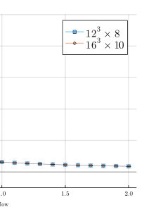
<figcaption class="paper-figure-caption"><b>Fig 1.</b> Figure 2. Flow-time dependence of the rescaling factor Z.</figcaption>
</figure>
<figure class="paper-figure-card">
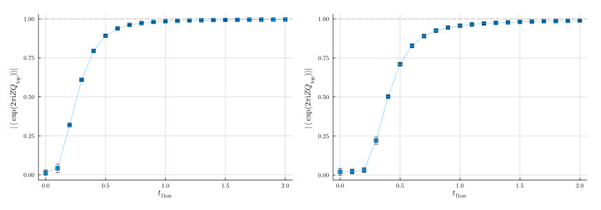
<figcaption class="paper-figure-caption"><b>Fig 2.</b> Figure 3. Absolute values of the reweighting factors, |Zθ=2π/Zθ=0|, for the 123 × 8 lattice (left) and the 163 × 10 lattice (right).</figcaption>
</figure>
<figure class="paper-figure-card">
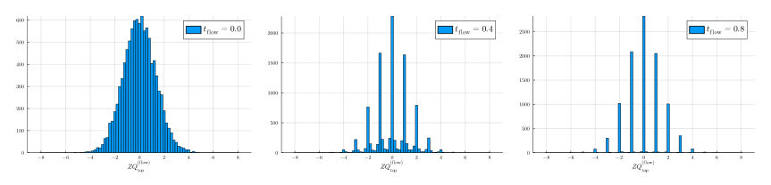
<figcaption class="paper-figure-caption"><b>Fig 3.</b> Figure 4. Histograms of ZQ(tflow) top of the 123 × 8 lattice at flow times tflow = 0, 0.4, and 0.8. Rapid convergence toward the integer-quantized topological sectors is observed due to the DBW2 flow.</figcaption>
</figure>
<figure class="paper-figure-card">
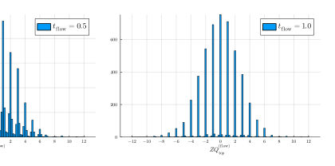
<figcaption class="paper-figure-caption"><b>Fig 4.</b> Figure 5. Histograms of ZQ(tflow) top of the 163 × 10 lattice at flow times tflow = 0, 0.5, and 1.0.</figcaption>
</figure>
<figure class="paper-figure-card">
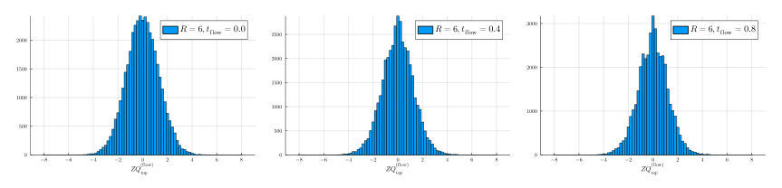
<figcaption class="paper-figure-caption"><b>Fig 5.</b> Figure 6. Histograms of ZQ(tflow) top of the 123 × 8 lattice at flow times tflow = 0, 0.4, and 0.8. The spatial size of the inserted ’t Hooft loop is R = Ns/2 = 6. In the presence of ’t Hooft loops, topological charges no longer quantize to integers.</figcaption>
</figure>

**Summary.** This work uses lattice gauge theory simulations to investigate the nature of vacuum condensation at $	heta=2\pi$ in $SU(2)$ Yang-Mills theory. By measuring specialized Wilson-'t Hooft and dyonic loop operators, the authors provide numerical evidence supporting dyon condensation over monopole condensation. This confirms that the $	heta=2\pi$ vacuum resides in a distinct Symmetry-Protected Topological state.

**Why it may be interesting.** While focused on lattice gauge theory, the methodology involves advanced non-perturbative simulation techniques (gradient flow) and analyzing long-range correlations in quantum field theories, which share conceptual links with many-body physics simulations.

Detailed structure

**Main problem.** The study aims to numerically distinguish between dyon condensation and monopole condensation in $SU(2)$ Yang-Mills theory at the $	heta=2\pi$ vacuum by analyzing loop operators.

**Main result.** The authors obtained numerical evidence consistent with dyon condensation, as indicated by the perimeter law behavior of the dyonic Wilson-'t Hooft loops, contradicting earlier theoretical predictions of monopole condensation.

**Method.** The research employs lattice Monte Carlo simulations utilizing the 1-form covariant DBW2 gradient flow to smear gauge fields and evaluate correlation functions involving 't Hooft and dyonic loop operators at $	heta=2\pi$.

**Model / system.** The system is pure $SU(2)$ Yang-Mills theory simulated on a lattice using the Wilson action, incorporating background gauge fields ($B_p$) related to the $Z_N$ 1-form center symmetry.

**Key observables.** Wilson loops, 't Hooft loop operators ($\langle H 
angle$), and dyonic loop operators ($\langle HW 
angle$). The key diagnostic is whether these expectation values obey an area law or a perimeter law as a function of the loop separation $R$.

**Important parameters / regimes.** The topological angle $	heta$, specifically comparing $	heta=0$ and $	heta=2\pi$; the lattice coupling constant ($eta$) and flow time ($t_{	ext{flow}}$).

**Assumptions / limitations.** The analysis assumes that the long-distance behavior of these loop operators directly diagnoses the type of condensation (dyon vs. monopole) via established theoretical criteria.

**Figures summary.** Figures show $R$-dependence analyses for both 't Hooft and dyonic loops, with Figure 10 specifically illustrating the perimeter law signature for the dyonic lines at $	heta=2\pi$.

**Paper structure.** The paper develops theoretical frameworks relating vacuum structure to loop behavior, details the use of gradient flow techniques to handle topological charge quantization at $	heta=2\pi$, and concludes with numerical measurements comparing the area/perimeter law scaling for dyonic vs. 't Hooft loops.

Abstract

Yang-Mills theories at $θ$ and $θ+2π$ are unitarily equivalent, but their $2π$ periodicity has a nontrivial realization. Recent developments in generalized global symmetries show that confinement vacua at $θ=0$ and $2π$ should belong to different symmetry-protected topological (SPT) states with the $1$-form center symmetry. For its examination, we measure the Wilson-'t Hooft loop operators at $θ=2π$ for the $SU(2)$ Wilson lattice gauge action and discuss their long-distance behaviors. This requires us to identify the gauge topological charge in the presence of defects, and we employ the $1$-form covariant DBW2 gradient flow to smear lattice gauge fields. We then obtain numerical evidence consistent with dyon condensation at $θ=2π$, rather than monopole condensation, as theoretically predicted.

[↑ back to top](#top)

### [Hall conductivity reveals the nature of quantum coherence in strongly correlated metals](http://arxiv.org/abs/2606.12665v1)

**Authors:** Emily Z. Zhang, Thomas P. Devereaux  
**Type:** theory · **Category:** strongly correlated electrons · **PDF:** <https://arxiv.org/pdf/2606.12665v1>  
**Analysis basis:** full PDF text, analyzed in chunks
**Topic relevance:** `Keldysh / 2PI / non-Gaussian methods` **2/5** · `analog quantum simulation` **1/5** · `methods for driven-dissipative` **1/5** · `non-equilibrium dynamics` **1/5**

↔ Scroll figures horizontally

<figure class="paper-figure-card">
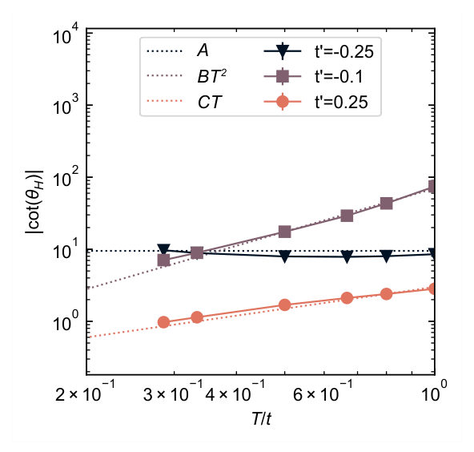
<figcaption class="paper-figure-caption"><b>Fig 1.</b> Figure 1: Log-log plot of |cot(𝜃𝐻)| as a function of temperature obtained from analytic</figcaption>
</figure>
<figure class="paper-figure-card">
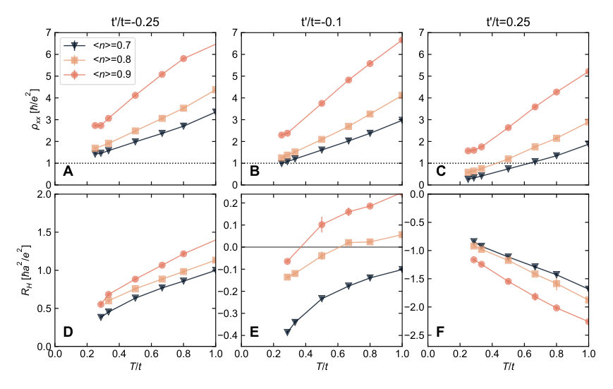
<figcaption class="paper-figure-caption"><b>Fig 2.</b> Figure 2: Longitudinal resistivity 𝜌𝑥𝑥and Hall coefficient 𝑅𝐻as a function of doping, 𝑡′, and</figcaption>
</figure>
<figure class="paper-figure-card">
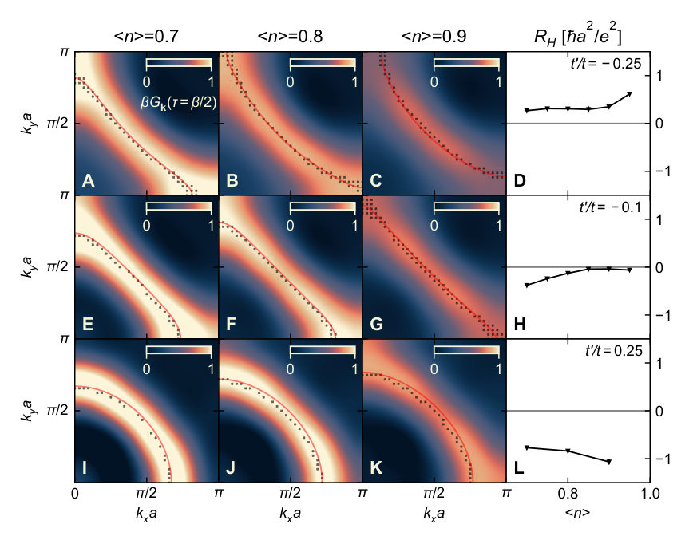
<figcaption class="paper-figure-caption"><b>Fig 3.</b> Figure 3: Doping and 𝑡′ dependence of the spectral function proxy and Hall coefficient. The</figcaption>
</figure>
<figure class="paper-figure-card">
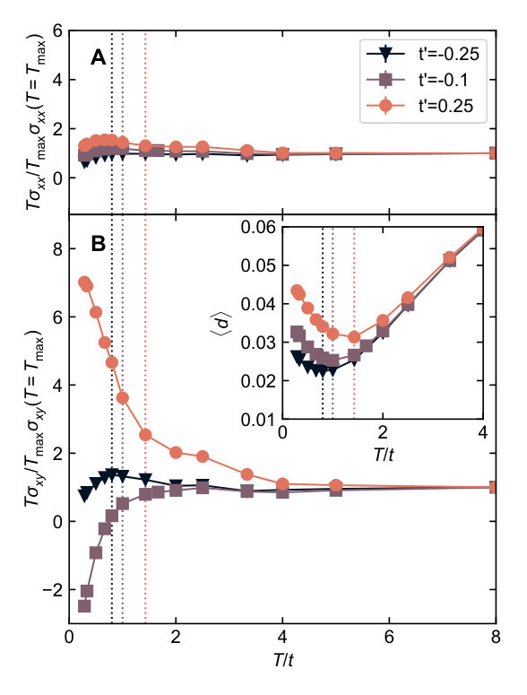
<figcaption class="paper-figure-caption"><b>Fig 4.</b> Figure 4: Longitudinal and Hall conductivity divided by high temperature asymptotic scaling</figcaption>
</figure>
<figure class="paper-figure-card">
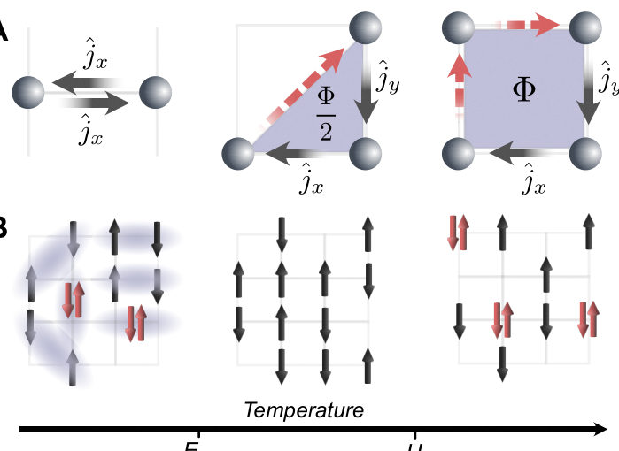
<figcaption class="paper-figure-caption"><b>Fig 5.</b> Figure 5: Conceptual sketches of longitudinal versus transverse transport and the semi-</figcaption>
</figure>

**Summary.** This work investigates quantum coherence in strongly correlated metals by comparing longitudinal and transverse electrical responses. Using advanced Quantum Monte Carlo simulations on the doped Hubbard model, the authors show that while resistance appears universally temperature-linear, the Hall conductivity reveals a distinct crossover scale marking the transition to true quantum coherence. This highlights $\sigma_{xy}$ as a superior diagnostic tool for probing underlying many-body physics.

**Why it may be interesting.** The focus on $\sigma_{xy}$ as a probe for coherence mechanisms (related to Aharonov-Bohm phases) provides an alternative diagnostic tool compared to standard transport measurements like resistivity.

Detailed structure

**Main problem.** To understand the nature of quantum coherence in strongly correlated metals by investigating transport properties beyond simple quasiparticle descriptions.

**Main result.** While longitudinal resistivity remains robustly linear in temperature, the Hall conductivity reveals a crossover from semi-classical to quantum-coherent transport that is otherwise masked in the resistivity measurement.

**Method.** The study employs numerically exact determinantal Quantum Monte Carlo (DQMC) simulations and high-temperature expansions of current-current correlators to calculate both longitudinal and transverse transport coefficients.

**Model / system.** The research focuses on strongly correlated electron systems, specifically utilizing the doped Hubbard model with next-nearest-neighbor hopping ($t'$).

**Key observables.** Longitudinal resistivity ($
ho_{xx}$), Hall conductivity ($\sigma_{xy}$), and the average double occupancy $\langle d 
angle$.

**Important parameters / regimes.** Temperature ($T$), doping level, particle-hole asymmetry, Fermi surface topology, and hopping parameters ($t'$).

**Assumptions / limitations.** The analysis relies on comparing results from DQMC simulations with high-temperature expansions of conductivities, and sometimes uses proxy methods for DC conductivity.

**Figures summary.** Figures compare the temperature dependence of $\cot(	heta_H)$, showing distinct power laws; they contrast robustly linear $
ho_{xx}$ with qualitatively different $R_H$ behavior across varying parameters.

**Paper structure.** The paper systematically compares longitudinal and transverse transport responses, arguing that the Hall response ($\sigma_{xy}$) is uniquely sensitive to correlation-induced spectral weight rearrangement and the onset of quantum coherence, unlike the resistivity ($
ho$).

Abstract

Linear-in-temperature resistivity is a hallmark for strange metallic transport, and appears universally in many strongly correlated electron systems. However, the focus on the longitudinal channel often overshadows the profound microscopic insights contained within the transverse response. Here, we utilize numerically exact determinantal quantum Monte Carlo simulations of the doped Hubbard model in a magnetic field to calculate longitudinal and transverse transport. We demonstrate that while the resistivity is robustly $T$-linear across parameter sets, the Hall response is highly sensitive to particle-hole asymmetry, Fermi surface topology, and many-body correlation effects. Specifically, the combination of these effects determine a crossover scale in which the system becomes quantum-coherent, and is reflected in the Hall conductivity. Our results demonstrate that while the $T$-linearity in resistivity appears universal, the Hall response reveals a crossover from semi-classical to quantum-coherent transport otherwise masked in the longitudinal channel.

[↑ back to top](#top)

### [Reduced basis algorithm for solving nonlinear differential equations on quantum computers](http://arxiv.org/abs/2606.13457v1)

**Authors:** Monica Lăcătuş, Matthias Möller, Sauro Succi  
**Type:** theory · **Category:** quantum information and computing · **PDF:** <https://arxiv.org/pdf/2606.13457v1>  
**Analysis basis:** full PDF text, analyzed in chunks
**Topic relevance:** `analog quantum simulation` **2/5** · `driven-dissipative phase transition` **1/5** · `methods for driven-dissipative` **1/5** · `non-equilibrium dynamics` **1/5**

↔ Scroll figures horizontally

<figure class="paper-figure-card">
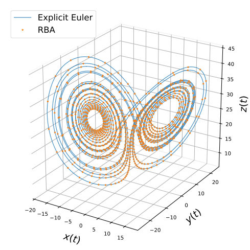
<figcaption class="paper-figure-caption"><b>Fig 1.</b> FIG. 1. Numerical verification of the RBA representation for the Lorenz system, where the reference solution is obtained by the clas- sical explicit Euler method. The two phase-space trajectories agree up to floating-point round-off.</figcaption>
</figure>
<figure class="paper-figure-card">
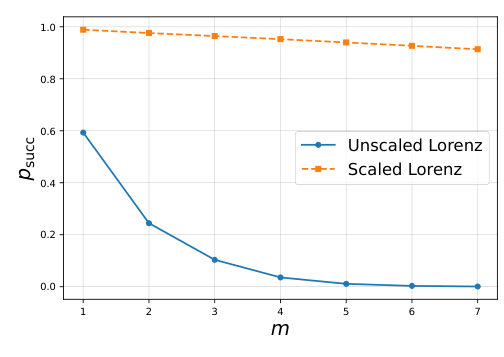
<figcaption class="paper-figure-caption"><b>Fig 2.</b> FIG. 2. Block-encoding post-selection success probability for the Lorenz RBA operator as a function of the number of composed timesteps m. The unscaled representation uses the physical variables directly, while the scaled representation constructs the RBA map in normalized variables.</figcaption>
</figure>
<figure class="paper-figure-card">
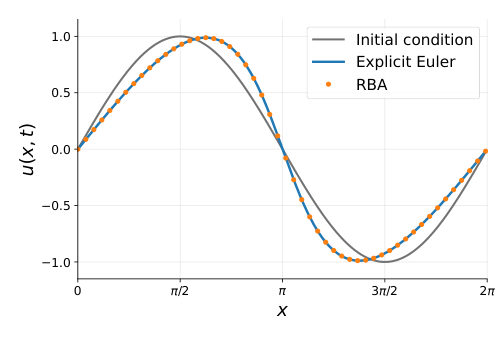
<figcaption class="paper-figure-caption"><b>Fig 3.</b> FIG. 3. Numerical verification of the local RBA construction for the one-dimensional viscous Burgers equation. The solution is evolved to T = 0.4 from u(x,0) = sinx using N = 256, ν = 0.03, and h = 0.0025. The RBA solution is obtained by applying the m = 2 local lifted representation over successive two-timestep windows, with the lifted variables reconstructed from the current state at the beginning of each window. The reference solution is given by the standard finite-difference Euler implementation. The two profiles agree up to floating-point round-off.</figcaption>
</figure>

**Summary.** This paper introduces a Reduced Basis Algorithm (RBA) designed to simulate nonlinear differential equations on quantum computers. It achieves this by linearizing the exact time-stepping map over multiple steps using only a reduced set of necessary monomials. The method successfully reproduces known classical solutions for models like the Lorenz and Burgers equations, demonstrating polynomial scaling in system size while keeping the error confined to the initial time discretization.

**Why it may be interesting.** It provides a concrete, polynomial-scaling quantum algorithm blueprint for simulating complex nonlinear dynamics that are central to many areas of AMO physics, such as plasma or fluid simulations, overcoming the limitations of direct Hamiltonian simulation.

Detailed structure

**Main problem.** Developing efficient quantum algorithms to solve nonlinear differential equations (ODEs and PDEs), which is challenging because quantum evolution is intrinsically linear.

**Main result.** The Reduced Basis Algorithm (RBA) successfully linearizes the exact discrete time-stepping map of nonlinear dynamics, allowing it to be represented by a linear operator acting on a reduced monomial basis.

**Method.** The method involves composing the polynomial update map over $m$ timesteps and then constructing an equivalent linear RBA operator that acts only on a significantly smaller, reduced set of necessary monomials.

**Model / system.** The approach is tested on canonical nonlinear systems like the Lorenz system (ODE) and the viscous Burgers equation (PDE). The core mechanism applies to any polynomial nonlinear ODE or PDE discretized via methods like the explicit Euler scheme.

**Key observables.** State vector $z(t)$, post-selection success probability ($p_{	ext{succ}}$), and the required qubit count for encoding the reduced basis operator.

**Important parameters / regimes.** The number of timesteps ($m$), the dimensionality ($n$ or $D$), the polynomial degree ($p$), and the grid size ($N$).

**Assumptions / limitations.** The primary assumption is that the nonlinear dynamics can be accurately represented by a polynomial whose necessary monomials are sparse enough to allow for basis reduction. The error introduced is limited only to the underlying time discretization scheme.

**Figures summary.** Figures show phase-space trajectories confirming that the RBA solution matches standard finite-difference Euler solutions, and plots illustrate the dramatic reduction in required monomial basis dimensions when using the reduced basis compared to the full basis.

**Paper structure.** The paper introduces the RBA framework for both ODEs and PDEs, details the construction of local/global operators, validates the method on the Lorenz system (ODE), extends it to the Burgers equation (PDE), and discusses scaling improvements via variable rescaling.

Abstract

As quantum computing moves toward scientific computing applications, nonlinear differential equations remain a central challenge since quantum evolution is intrinsically linear. In this work, we introduce a reduced basis algorithm (RBA) for polynomial nonlinear ordinary differential equations (ODEs) and spatially discretized partial differential equations (PDEs). After time discretization, the method composes the resulting polynomial update map over $m$ timesteps, identifies the reduced monomial basis appearing in this composed map, and constructs a linear RBA operator whose action recovers the exact $m$-timestep nonlinear dynamics. Thus, at the level of the chosen discrete update rule, the method introduces no additional approximation error beyond the time discretization error. The qubit number requirement is governed by the size of the reduced monomial basis. For an $n$-dimensional polynomial ODE system of degree $p>1$, the lifted register requires at most $q_m^{\mathrm{ODE}} = O(nm\log p)$ qubits in the full basis scenario. For PDEs discretized on $N^D$ grid points, a locality-based construction requires at most $q_m^{\mathrm{PDE}} = O(D\log N + n m^{D+1}\log p)$ qubits. Hence, the dependence on the grid size remains logarithmic, while the nonlinear overhead is controlled by local reduced basis size. The main computational burden is moved from the quantum computer to a classical preprocessing step, where the reduced monomial basis and RBA operator are constructed for the chosen timestep window. Through numerical tests on the Lorenz system and the one-dimensional Burgers equation, we verify that the RBA reproduces the corresponding discrete time nonlinear dynamics exactly, while exposing the trade-off between timestep composition, reduced basis growth, and locality.

[↑ back to top](#top)

### [Simple analytical flux-tuned iSWAP pulses for leakage suppression](http://arxiv.org/abs/2606.13052v1)

**Authors:** Dimitrios Georgiadis, Boxi Li, Asier Galicia, Rami Barends, F. A. Cárdenas-López, Felix Motzoi  
**Type:** theory · **Category:** quantum information and computing · **PDF:** <https://arxiv.org/pdf/2606.13052v1>  
**Analysis basis:** full PDF text, analyzed in chunks
**Topic relevance:** `QC/QI experiment` **2/5** · `methods for driven-dissipative` **1/5** · `non-equilibrium dynamics` **1/5**

↔ Scroll figures horizontally

<figure class="paper-figure-card">
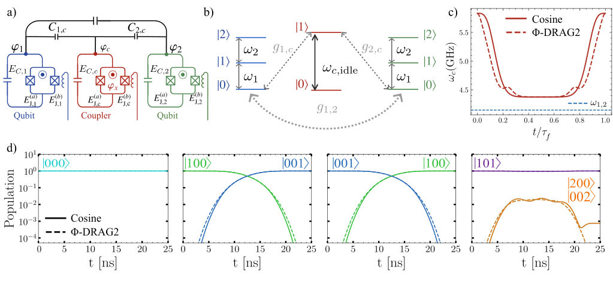
<figcaption class="paper-figure-caption"><b>Fig 1.</b> FIG. 1. Tunable-coupler architecture and operating principle. a) Circuit diagram of the tunable-coupling architecture consisting of three tunable transmon circuits. Each transmon is characterized by its capacitance Cℓand Josephson energies E(a) J,ℓand E(b) J,ℓalong a loop threaded by an external magnetic flux φx,ℓ. The devices are pair-wise coupled through capacitances Ck,j. Blue represents Qb1 and Qb2, whereas the red one acts as the coupler. Each device is described by the node variable φℓ. b) Schematic of the working principle: by modulating the coupler flux, the effective qubit-qubit coupling geff is tuned from an idling point (where geff ≈0) to a value activating an iSWAP gate. c)...</figcaption>
</figure>
<figure class="paper-figure-card">
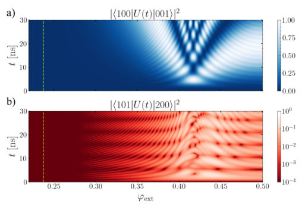
<figcaption class="paper-figure-caption"><b>Fig 2.</b> FIG. 2. Population transfer fringe patterns. a) Population trans- fer |⟨100|U(t)|001⟩|2 as a function of time t and external coupler flux φext/φ0. Chevron-like fringes indicate the iSWAP resonance condi- tion, with faster swapping achievable at larger flux amplitudes. The green dashed line marks the idling point where geff ≈0. b) Corre- sponding leakage to the non-computational state, |⟨101|U(t)|200⟩|2, on a logarithmic scale. As the flux amplitude increases (shorter gate times), leakage to |200⟩grows rapidly and becomes the dominant source of coherent error.</figcaption>
</figure>
<figure class="paper-figure-card">
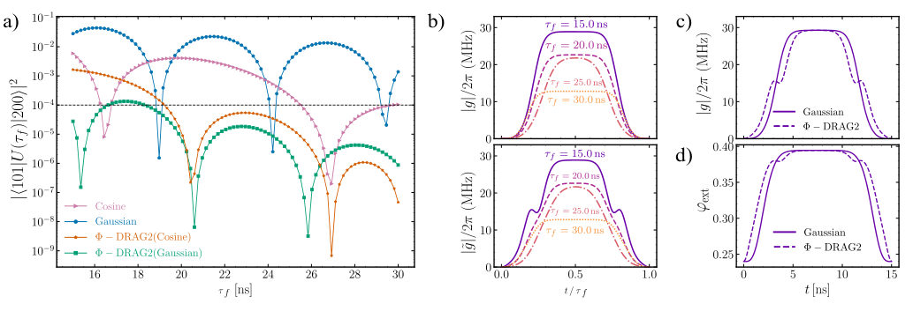
<figcaption class="paper-figure-caption"><b>Fig 3.</b> FIG. 3. Performance of Φ-DRAG for the symmetric system (α1 = α2). a) Leakage probability to |200⟩(starting from |101⟩) at the end of an iSWAP gate as a function of gate time τ f , comparing cosine-like pulses, Gaussian-like pulses Eq. (10), and their Φ-DRAG2-corrected counterparts Eq. (8). Each data point corresponds to an iSWAP pulse whose amplitude has been optimized to satisfy the area condition Eq. (3). For the Gaussian-like pulses the rising time has been selected to ensure leakage suppression below the desired threshold 10−4 (dashed line). b) Effective coupling |geff(t)|/2π as a function of normalized time t/τf for Gaussian-like pulses at four gate times τf ∈{15, 20, 25, 30} ns. c)...</figcaption>
</figure>
<figure class="paper-figure-card">
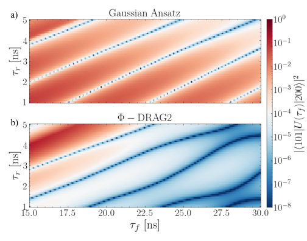
<figcaption class="paper-figure-caption"><b>Fig 4.</b> FIG. 4. Gate-time selectivity via rising time optimization for the Φ-DRAG2 correction. Leakage to |200⟩(starting from |101⟩) as a function of gate time τ f and pulse rising time τr for Gaussian-like pulses Eq. (10). a) Without Φ-DRAG correction: the leakage land- scape shows oscillatory minima as a function of both τ f and τr, that require picosecond precision to achieve. b) With Φ-DRAG2 correc- tion Eq. (8): joint optimization of rising time and gate time enables leakage below 10−4 across a broad parameter range, and the suppres- sion minima can be steered to any desired gate time by adjusting τr. Each point represents an area-optimized iSWAP pulse satisfying Eq. (3).</figcaption>
</figure>
<figure class="paper-figure-card">
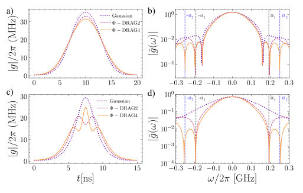
<figcaption class="paper-figure-caption"><b>Fig 5.</b> FIG. 5. Pulse shapes and Fourier spectra for second- and fourth-order Φ-DRAG corrections. a) Effective coupling geff(t)/2π as a function of time (left column) and its Fourier spectrum |˜g(ω)|/2π (right col- umn), shown for both the bare (initial) corresponding to Eq. (10), Φ-DRAG2, and Φ-DRAG4 waveforms. a,b) τ f = 20 ns gate: the Φ-DRAG2 correction creates spectral nulls at ±α1/2π (the transi- tion frequency driving leakage), while Φ-DRAG4 additionally ad- dresses the asymmetric case with nulls at ±α1/2π and ±α2/2π. c,d) τf = 15 ns gate: the broader spectral content required for faster gates leads to more complex corrected waveforms, making the Φ-DRAG4 pulse more susceptible to AWG...</figcaption>
</figure>

**Summary.** The paper presents an analytical method called $\Phi$-DRAG to suppress leakage errors during fast iSWAP gates implemented using tunable couplers in superconducting circuits. By applying higher-order derivative corrections to the flux modulation protocol, the authors achieve gate fidelities and leakage suppression below $10^{-4}$ even for rapid operations. This technique offers a robust pathway toward scaling up quantum computation by mitigating key hardware limitations.

**Why it may be interesting.** This work provides a concrete, analytically derived pulse engineering technique ($\Phi$-DRAG) specifically tailored for superconducting flux-tunable qubits, which is highly relevant for researchers working on open quantum systems and high-fidelity control in solid-state platforms.

Detailed structure

**Main problem.** Fast, high-fidelity two-qubit gates are essential for quantum computation, but fast flux modulation in tunable coupler architectures causes diabatic transitions leading to population leakage.

**Main result.** The authors developed an analytical method ($\Phi$-DRAG) that suppresses leakage below $10^{-4}$ while enabling fast iSWAP gates within the fifteen nanosecond range.

**Method.** They derived modified flux modulation protocols by applying higher-order derivative corrections directly to the effective interaction Hamiltonian, analogous to DRAG techniques used in microwave control.

**Model / system.** The system involves superconducting qubits (transmons) coupled via a flux-tunable coupler. The dynamics are modeled using an effective Hamiltonian derived under the dispersive regime.

**Key observables.** Leakage probability to non-computational states (e.g., $|200
angle$), gate fidelity, and the required coupling strength $g_{	ext{eff}}(t)$.

**Important parameters / regimes.** Gate time ($	au_f$), anharmonicity asymmetry ($\xi$), and the desired leakage suppression threshold ($< 10^{-4}$).

**Assumptions / limitations.** The derivation relies on an effective Hamiltonian derived via Schrieffer-Wolff transformation, and higher-order corrections are limited by waveform distortions and AWG bandwidth.

**Figures summary.** Figures illustrate the tunable coupler architecture, show time evolution plots comparing leakage suppression with $\Phi$-DRAG pulses versus uncorrected pulses, and display pulse shapes/Fourier spectra demonstrating spectral nulls.

**Paper structure.** The paper establishes the problem of leakage in fast flux-tunable gates, introduces the $\Phi$-DRAG method by deriving analytical corrections (second and fourth order) to the effective coupling, and validates these protocols against varying asymmetry and gate times.

Abstract

Fast, high-fidelity two-qubit gates are a key requirement for fault-tolerant quantum computation. Tunable coupler architectures provide a flexible approach for implementing entangling gates through flux control with large on-off ratios, but fast flux modulation can induce diabatic transitions and population leakage to non-computational states, limiting gate performance. Here we present an analytical flux control method enabling derivative removal by adiabatic gate ($Φ$-DRAG) for suppressing leakage in flux tunable two-qubit gates. We show that $Φ$-DRAG differs fundamentally from conventional microwave implementations and derive modified flux modulation protocols that suppress leakage below $10^{-4}$ for fast entangling gates. The method remains effective across a range of asymmetry between qubit anharmonicities and different circuit parameters, enabling high-fidelity two-qubit gates within the fifteen nanosecond range.

[↑ back to top](#top)

### [Variational Monte Carlo study of a two-orbital Hubbard model for the iron pnictides](http://arxiv.org/abs/2606.13342v1)

**Authors:** Vito Marino, Gabriele Gatti, Massimo Capone, Luca F. Tocchio  
**Type:** theory · **Category:** strongly correlated electrons · **PDF:** <https://arxiv.org/pdf/2606.13342v1>  
**Analysis basis:** full PDF text, analyzed in chunks
**Topic relevance:** `analog quantum simulation` **2/5** · `Keldysh / 2PI / non-Gaussian methods` **1/5** · `methods for driven-dissipative` **1/5**

↔ Scroll figures horizontally

<figure class="paper-figure-card">
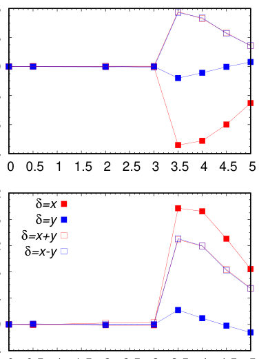
<figcaption class="paper-figure-caption"><b>Fig 1.</b> FIG. 1. Upper panel: Optimal intra-orbital BCS parameters in the orbital dyz, see Eq. (5), as a function of U at half filling. Lower panel: Same as in the upper panel, but for the dxz orbital. BCS parameters are computed with the variational approach on a L = 16 × 16 lattice at J/U = 0.2.</figcaption>
</figure>
<figure class="paper-figure-card">
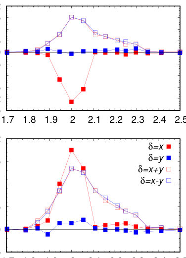
<figcaption class="paper-figure-caption"><b>Fig 2.</b> FIG. 2. Upper panel: Optimal intra-orbital BCS parameters in the orbital dyz, see Eq. (5), as a function of n at U = 4 eV. Lower panel: Same as in the upper panel, but for the dxz orbital. BCS parameters are computed with the variational approach on a L = 16 × 16 lattice at J/U = 0.2.</figcaption>
</figure>
<figure class="paper-figure-card">
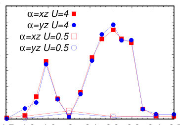
<figcaption class="paper-figure-caption"><b>Fig 3.</b> FIG. 3. Square of the superconducting order parameter ϕ2 α in each orbital as a function of n at U = 4 eV (full symbols) and at U = 0.5 (empty symbols). Data are obtained on the L = 16 × 16 cluster at J/U = 0.2.</figcaption>
</figure>
<figure class="paper-figure-card">
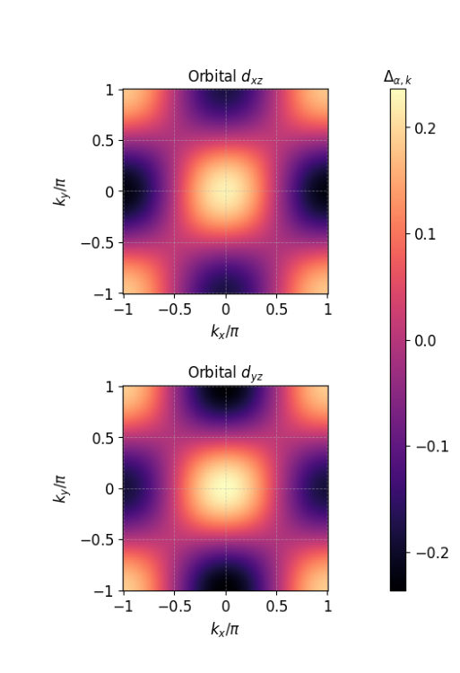
<figcaption class="paper-figure-caption"><b>Fig 4.</b> FIG. 4. Fourier transform of the optimal BCS parameter, as defined in Eq. (7), for U = 4 eV and n = 2.2, corresponding to the peak of the superconducting order parameter in the electron-doped regime. Both orbitals, dxz (upper panel) and dyz (lower panel), display an s±-wave symmetry.</figcaption>
</figure>
<figure class="paper-figure-card">
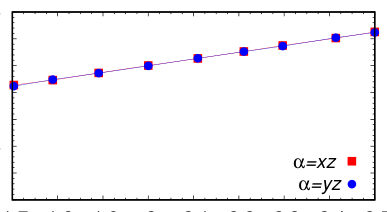
<figcaption class="paper-figure-caption"><b>Fig 5.</b> FIG. 5. Electronic density per orbital nα as a function of n, for U = 4 eV. Data are obtained for J/U = 0.2. and they do not show any size dependence when moving from L = 12×12 to L = 16 × 16 clusters.</figcaption>
</figure>

**Summary.** This paper uses Variational Monte Carlo simulations on a two-orbital Hubbard model to study superconductivity in iron pnictides. The findings demonstrate that $s^{\pm}$ pairing emerges only when the system is a Mott insulator, and importantly, this simplified model lacks the orbital selectivity seen in more complex theoretical treatments.

**Why it may be interesting.** While focused on condensed matter strongly correlated physics, the use of advanced quantum simulation techniques like VMC for complex many-body Hamiltonians provides methodological insights relevant to simulating interacting quantum systems in general.

Detailed structure

**Main problem.** The study investigates superconductivity and electronic correlations within iron pnictides using a simplified two-orbital Hubbard model.

**Main result.** Superconductivity with $s^{\pm}$ symmetry is found in the two-orbital model, but only when the parent compound is a Mott insulator. Crucially, this model shows no evidence of orbital selectivity or nematicity.

**Method.** The research employs the Variational Monte Carlo (VMC) technique using correlated variational wavefunctions to minimize the system's energy.

**Model / system.** The physical system is modeled by a two-orbital Hubbard-Kanamori model, which simplifies the full five-$d$ orbital structure relevant to iron pnictides. The Hamiltonian includes local Hubbard and Hund's couplings.

**Key observables.** Optimal intra-orbital BCS pairing parameters ($\Delta_{\alpha,\delta}$), superconducting order parameter $\phi^2_\alpha$, and the symmetry of the gap in k-space ($\Delta_{\alpha,k}$).

**Important parameters / regimes.** The critical Coulomb repulsion strength $U_c \sim 3.5$ eV marks the onset of Mott insulating behavior at half filling ($n=2$). Doping away from half-filling is also a key variable.

**Assumptions / limitations.** The analysis neglects inter-orbital pairing amplitudes and triplet pairing amplitudes, assuming they are negligible based on prior work; it also assumes rotational invariance for $U'$.

**Figures summary.** Figures illustrate the emergence of finite BCS parameters correlating with Mott insulating states (Fig. 1), show the dome structure of $\phi^2_\alpha$ vs. doping (Fig. 3), and confirm $s\pm$-wave symmetry in k-space (Fig. 4).

**Paper structure.** The paper establishes the model, applies VMC to calculate pairing correlations across different doping regimes relative to half-filling, compares results against single-band and three-orbital models, and concludes by mapping out the superconducting dome structure.

Abstract

We study a two-orbital Hubbard-Kanamori model, which has been originally proposed for iron-based superconductors, using variational Monte Carlo. We span the nonmagnetic sector at both hole-doping and electron-doping, with respect to the half-filled case $n=2$. We report the presence of a superconductive region with a $s^{\pm}$ symmetry only when the half-filled system is in a Mott state, while orbital selectivity is absent. These results are qualitatively different from what was reported in the three-orbital Hubbard-Kanamori model, where a more extended superconductive region was observed with a concomitant development of orbital selectivity, and they are to some extent more reminiscent of the single-band Hubbard model.

[↑ back to top](#top)

### [New bounds on private simultaneous quantum message passing](http://arxiv.org/abs/2606.12557v1)

**Authors:** Uma Girish, Alex May, Natalie Parham, Henry Yuen  
**Type:** theory · **Category:** quantum information and computing · **PDF:** <https://arxiv.org/pdf/2606.12557v1>  
**Analysis basis:** full PDF text, analyzed in chunks
**Topic relevance:** `entanglement & information structure` **2/5** · `Keldysh / 2PI / non-Gaussian methods` **1/5**

↔ Scroll figures horizontally

<figure class="paper-figure-card">
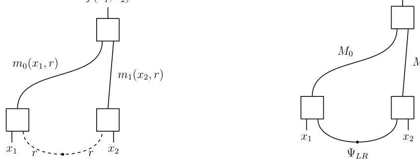
<figcaption class="paper-figure-caption"><b>Fig 1.</b> Figure 1: A private simultaneous message protocol (PSM). We show the case with two players for simplicity, but in general we consider k ≥2 players. Players 1 and 2 do not communicate. Player i holds input xi ∈{0, 1}n. The referee should be able to learn f(x1, ..., xk) but nothing else about (x1, ..., xk). a) In the classical setting, the players share a random string r and send classical messages to the referee. b) In the quantum setting the randomness is replaced with an entangled state ΨLR, and the messages can be quantum.</figcaption>
</figure>
<figure class="paper-figure-card">
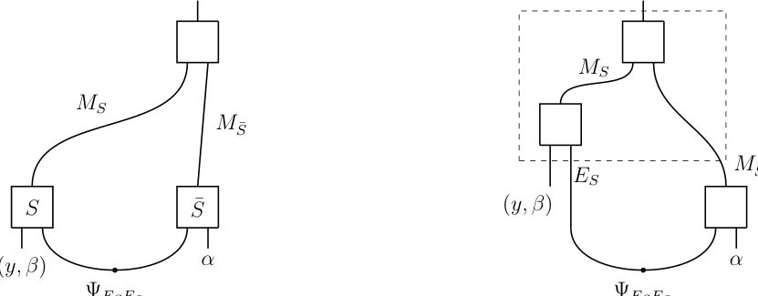
<figcaption class="paper-figure-caption"><b>Fig 2.</b> Figure 2: a) A PSQM∗protocol. The n players have been divided into two subsets, S and ¯S. The input to the ¯S players is set to α. The last n −1 bits of each of the players in S is set to β, while the first bit inputs are free, and the players can choose any string y to take as input. Correctness of the PSQM∗protocol gives that the referee can compute fS|(α,β)(y) from the message systems MS, M ¯S. b) In the proof of Theorem 7, we observe that given ESM ¯S, fS|(α,β)(y) can be computed for any value of y. By computing this reversibly, this can be repeated for all values of y. This means the function fS|(α,β) is determined by ESM ¯S.</figcaption>
</figure>
<figure class="paper-figure-card">
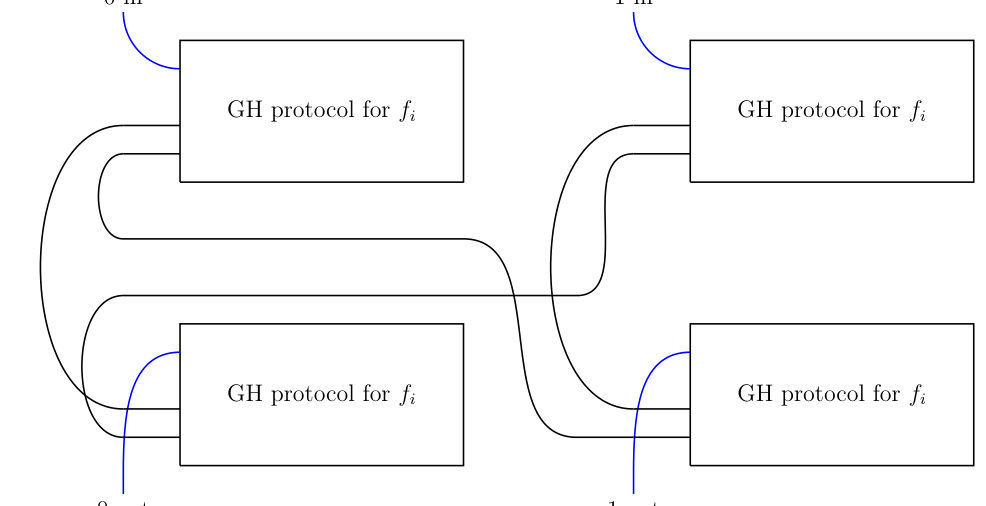
<figcaption class="paper-figure-caption"><b>Fig 3.</b> Figure 3: XOR gadget for computing ⊕ifi in the garden-hose model. It can be checked directly that if water enters on the top left, it exits on the left if fi = 0 and on the right if fi = 1. Meanwhile if water enters from the top right, it exits from the bottom right if fi = 0 and from the bottom left if fi = 1. By wiring such gadgets together for each fi then, we can compute ⊕ifi.</figcaption>
</figure>
<figure class="paper-figure-card">
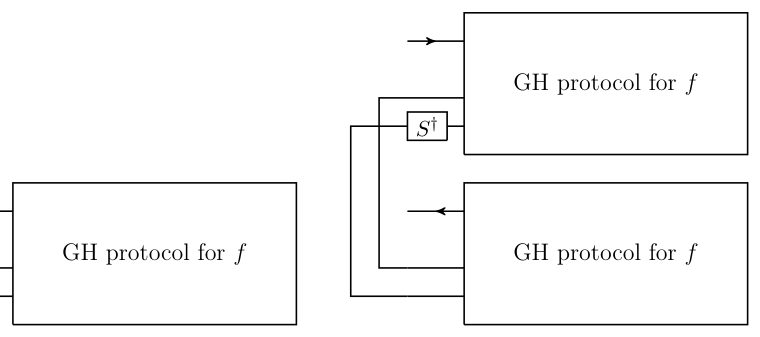
<figcaption class="paper-figure-caption"><b>Fig 4.</b> Figure 4: a) k-party garden-hose protocol for a function f. The water enters in the top left pipe, is redirected through a sequence of pipes represented abstractly as the white rectangle, then exits through one of two pipes, indicating the value of f(x, y). The open input and both open outputs are held by Alice, while the remaining parties are involved in the intermediate steps. b) Protocol for applying a (S†)f(x,y). The input state is entered into a garden hose protocol that computes f, then S† is applied only to the output pipe indicating f(x, y) = 1. Another instance of the protocol for f is then run, and the corresponding output pipes of the two protocols are connected. As a result...</figcaption>
</figure>

**Summary.** This paper provides comprehensive new upper and lower bounds on the resources (communication and entanglement) required for Private Simultaneous Message Passing (PSM) in both classical and fully quantum settings. By adapting advanced tools like Nečiporuk's measure and T-depth analysis, it advances the understanding of information-theoretic security limits in distributed quantum computation.

**Why it may be interesting.** The rigorous quantification of privacy costs in quantum computation is crucial for designing secure quantum networks and protocols, directly impacting the feasibility limits of distributed quantum computing.

Detailed structure

**Main problem.** The core problem is determining the fundamental communication and correlation costs associated with achieving privacy in Private Simultaneous Message Passing (PSM) protocols, both classically and quantumly.

**Main result.** The authors derive new lower bounds using measures like Nečiporuk's measure and matrix rank, alongside upper bounds based on circuit depth (T-depth) for the fully quantum setting.

**Method.** The work employs information-theoretic techniques, including analyzing communication matrices, adapting complexity measures from classical cryptography to quantum settings, and utilizing T-depth analysis derived from Clifford+T decompositions.

**Model / system.** The model is the Private Simultaneous Message Passing (PSM) setting, where $k$ players must allow a referee to learn only the function output $f(x_1, \dots, x_k)$ while maintaining perfect privacy regarding individual inputs. This extends to fully quantum settings involving shared entanglement and quantum communication.

**Key observables.** Communication cost ($\mathsf{PSM}$), correlation/entanglement cost ($	ext{PSQM}^*$), Nečiporuk's measure ($	ext{G}^*(f)$), and the rank of the communication matrix.

**Important parameters / regimes.** Number of players ($k$), input size ($n$), circuit depth ($d_f$), correctness parameter ($\epsilon$), and security/privacy parameters ($\delta$).

**Assumptions / limitations.** The analysis often assumes perfect correctness or specific levels of privacy (e.g., $\delta$-security) to derive the bounds.

**Figures summary.** Figures illustrate PSM protocols for $k=2$ players, showing classical versus quantum message passing, and depict gadgets for XOR sums in the garden-hose model.

**Paper structure.** The paper develops results by first establishing lower bounds using information measures (Nečiporuk's measure, rank) and then deriving upper bounds by mapping the protocol to circuit complexity metrics like T-depth. It also discusses techniques for converting between security parameters ($\epsilon$ vs $\delta$).

Abstract

In the private simultaneous message (PSM) setting, $k$ players obtain inputs $x_i\in\{0,1\}^n$ and then each send messages to a referee, who should learn $f(x_1,...,x_k)$ but no other information about $(x_1,...,x_k)$. The PSM setting was introduced as a minimal model for secure multiparty computation and has connections to Boolean function complexity. In the quantum setting, PSM has been related to non-local quantum computation (NLQC). The communication and correlation cost of implementing PSM remains poorly understood. Here, we give new upper and lower bounds on the (quantum) PSM model. For lower bounds, we show: 1) Nečiporuk's measure lower bounds the entanglement required for $k$-player quantum PSM with perfect correctness. This leads to quadratic lower bounds for explicit functions. 2) The rank of the communication matrix of $f(x_1,x_2)$ lower bounds 2-player quantum PSM with perfect privacy but imperfect correctness. This implies a previously unknown lower bound on classical PSM with imperfect correctness. When allowing quantum communication and shared entanglement, these are the first lower bounds on quantum PSM that make use of the privacy condition. For upper bounds, we show: 1) Letting $s$ be the size of a quantum circuit computing $f$, $d_f$ be the circuit depth, $k$ the number of players, $n$ the number of bits received by each player, and $ε$ a correctness parameter, we obtain $\mathsf{PSM}_k^*(f) \leq (kn +s) \cdot \log^{O(d_f)}(s/ε)$. 2) The square of the Fourier 1 norm of $f$, $\Vert \hat{f}\Vert_1^2$, upper bounds the classical PSM complexity, $\mathsf{PSM}(f)\leq O(\Vert \hat{f} \Vert^2_1)$. In proving the first upper bound, we generalize existing $T$-depth based techniques for NLQC from $2$ to $k\geq 2$ parties, and consider cases where the Clifford layers are restricted to having small light cones.

[↑ back to top](#top)

### [A ribbon ZX calculus for gauge theory](http://arxiv.org/abs/2606.13551v1)

**Authors:** Gabriel Wong, Razin A. Shaikh, William Donnelly  
**Type:** theory · **Category:** other · **PDF:** <https://arxiv.org/pdf/2606.13551v1>  
**Analysis basis:** full PDF text, analyzed in chunks
**Topic relevance:** `Keldysh / 2PI / non-Gaussian methods` **1/5** · `analog quantum simulation` **1/5** · `correlated / nonlocal dissipation` **1/5** · `driven-dissipative phase transition` **1/5** · `entanglement & information structure` **1/5** · `methods for driven-dissipative` **1/5**

↔ Scroll figures horizontally

<figure class="paper-figure-card">
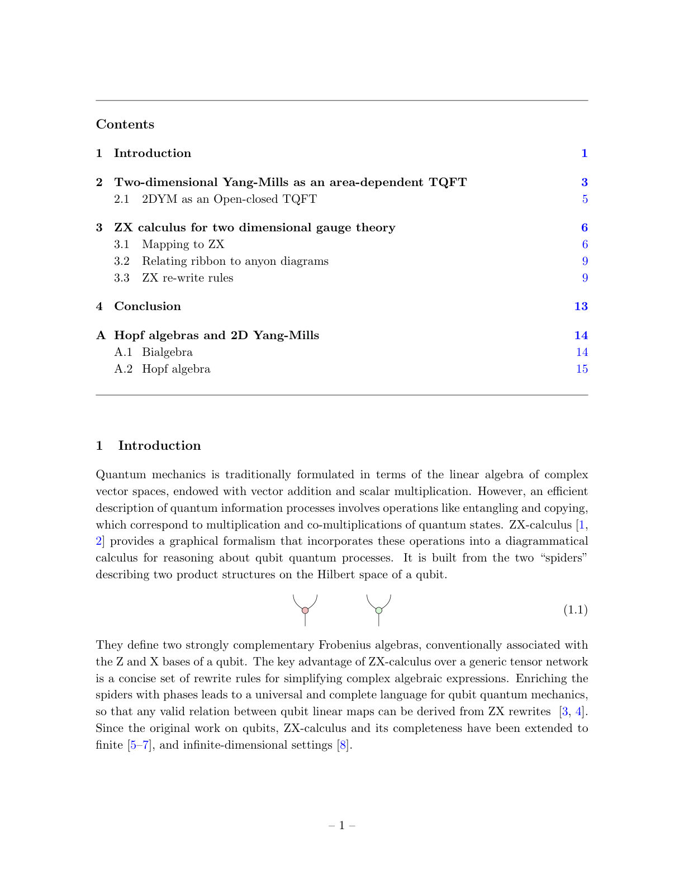
<figcaption class="paper-figure-caption"><b>Fig 1.</b> Low-resolution page preview, page 2</figcaption>
</figure>
<figure class="paper-figure-card">
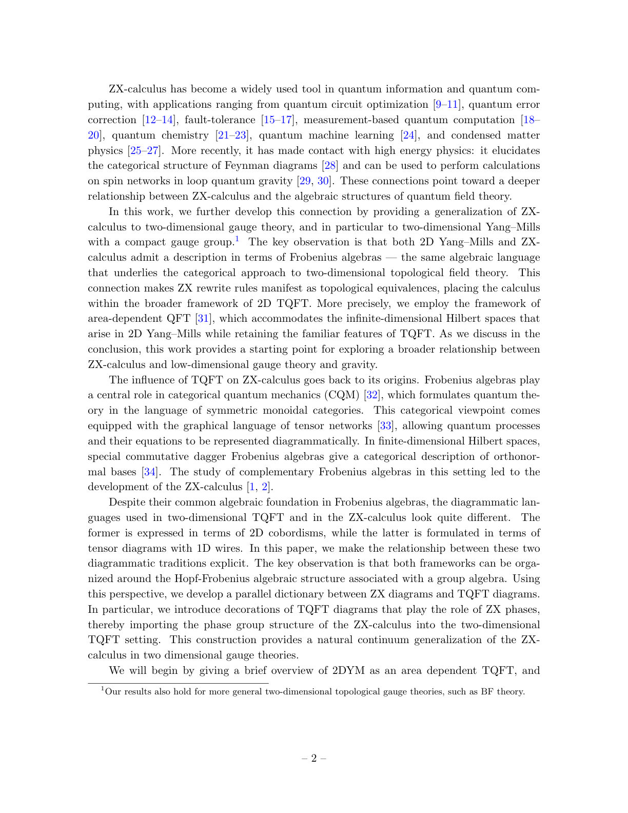
<figcaption class="paper-figure-caption"><b>Fig 2.</b> Low-resolution page preview, page 3</figcaption>
</figure>
<figure class="paper-figure-card">
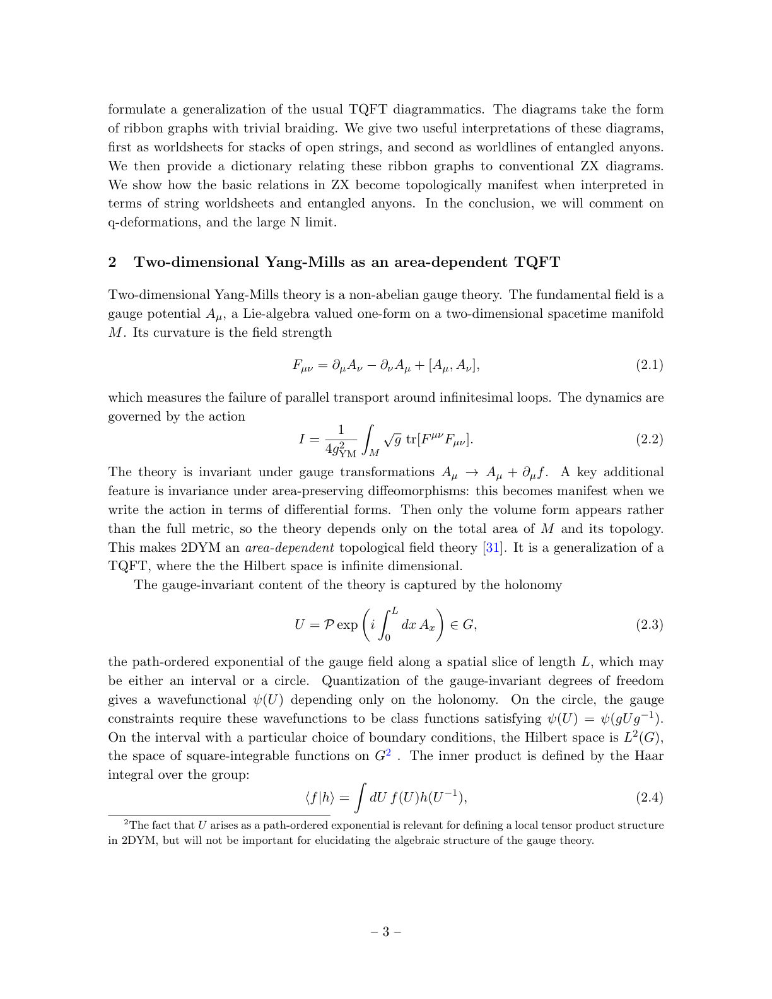
<figcaption class="paper-figure-caption"><b>Fig 3.</b> Low-resolution page preview, page 4</figcaption>
</figure>
<figure class="paper-figure-card">
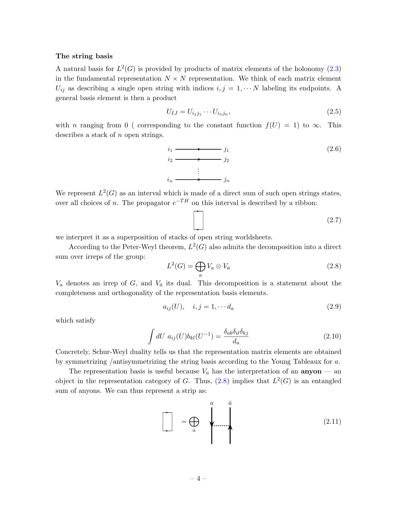
<figcaption class="paper-figure-caption"><b>Fig 4.</b> Low-resolution page preview, page 5</figcaption>
</figure>
<figure class="paper-figure-card">
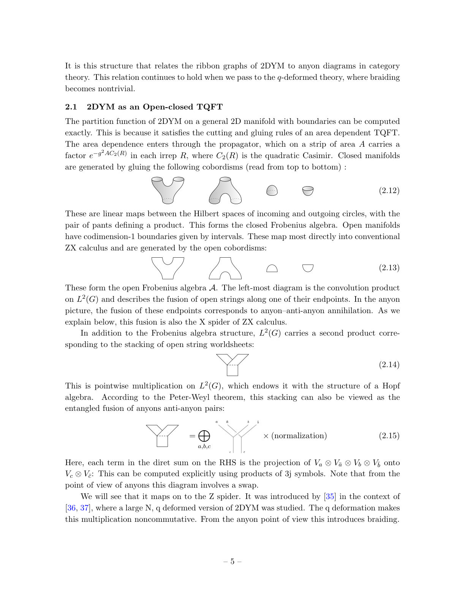
<figcaption class="paper-figure-caption"><b>Fig 5.</b> Low-resolution page preview, page 6</figcaption>
</figure>

**Summary.** This paper develops a 'ribbon ZX calculus' to connect the graphical rules of ZX calculus to two-dimensional Yang-Mills theory. By showing that both systems share an underlying Hopf-Frobenius algebraic structure, it provides a topological framework for calculating gauge theories on curved spaces. This work is significant for applying diagrammatic quantum methods to low-dimensional gravity and string theory.

**Why it may be interesting.** It provides a powerful diagrammatic language (ZX calculus) to analyze fundamental QFT structures like gauge theory and topological order, bridging quantum computation formalism with high-energy physics concepts.

Detailed structure

**Main problem.** The work aims to establish a deep mathematical connection between ZX-calculus, a graphical tool for quantum processes, and Quantum Field Theory (QFT), specifically two-dimensional Yang-Mills (2DYM) theory.

**Main result.** A 'ribbon ZX calculus' is developed that maps the structure of 2D TQFT diagrams onto topological equivalences within the ZX framework, providing a continuum generalization for gauge theories.

**Method.** The connection is formalized by showing that both frameworks are governed by Hopf-Frobenius algebraic structures associated with group algebras ($L^2(G)$).

**Model / system.** The primary model is 2D Yang-Mills theory on manifolds with boundaries, whose open sector dynamics are described by an open Frobenius algebra. The mathematical machinery involves mapping TQFT cobordisms to ribbon graphs.

**Key observables.** The partition function exhibits area dependence governed by the quadratic Casimir $C_2(R)$; observables relate to holonomies and anyon fusion rules.

**Important parameters / regimes.** Gauge coupling constant ($g$), manifold area ($A$), and the structure of the compact gauge group ($G$).

**Assumptions / limitations.** The formalism relies on interpreting ribbon graphs as entangled anyon worldlines obeying modular tensor category rules, though defining the evaluation map for infinite groups is noted as a technical challenge.

**Figures summary.** Not specified in the notes; the structure suggests diagrams illustrating the mapping between TQFT cobordisms/ribbon graphs and ZX-calculus elements (spiders, etc.).

**Paper structure.** The paper builds from introducing the general connection via Frobenius algebras to developing the 'ribbon' formalism for 2DYM on manifolds with boundaries. It details how open and closed sectors relate using concepts like 'zippers,' confirms the Hopf algebra structure via the antipode, and discusses generalizations to $q$-deformed theories and gravity.

Abstract

ZX calculus provides a graphical formalism for reasoning about quantum processes, built from two interacting Frobenius algebras associated with the Z and X bases of a qubit. While it has found widespread application in quantum information and computing, its relationship to quantum field theory has only recently begun to be explored. In this work, we further develop this connection by providing a generalization of ZX calculus to two-dimensional Yang Mills theory with a compact gauge group. The key observation is that both frameworks can be organized around the Hopf Frobenius algebraic structure associated with a group algebra, which can in turn be described by the diagrammatics of two dimensional topological quantum field theory. Given the well known relationship between gauge theory and gravity in two and three dimensions, our work paves the way for applications of ZX to low dimensional gravity.

[↑ back to top](#top)

### [Approximability limits for bounded-degree max-LINSAT and implications for decoded quantum interferometry](http://arxiv.org/abs/2606.13570v1)

**Authors:** Maximilian J. Kramer, Carsten Schubert, Jens Eisert  
**Type:** theory · **Category:** quantum information and computing · **PDF:** <https://arxiv.org/pdf/2606.13570v1>  
**Analysis basis:** full PDF text, analyzed in chunks
**Topic relevance:** `correlated / nonlocal dissipation` **1/5** · `driven-dissipative phase transition` **1/5** · `entanglement & information structure` **1/5** · `methods for driven-dissipative` **1/5** · `non-equilibrium dynamics` **1/5** · `non-equilibrium universality` **1/5**

↔ Scroll figures horizontally

<figure class="paper-figure-card">
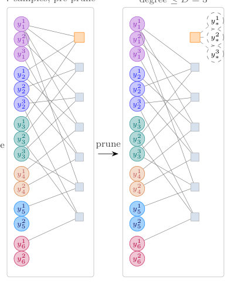
<figcaption class="paper-figure-caption"><b>Fig 1.</b> Figure 1: Degree reduction ϕ →ϕw →ϕR →ϕ ˜ D on an example with n = 6, m = 5, arity k = 3, with variable degree vector (o1, . . . , o6) = (3, 3, 3, 2, 2, 2) and degree bound ˜D = 3. Each panel transition represents a larger step of the construction. The first panel visualizes the input instance as a graph, showing which variables belong to which constraints. In the second panel, the weighted instance ϕw is shown: Each variable xi is copied oi times and each original constraint is expanded to a constraint group, such that each combination of copy-variables relating to the corresponding original constraint is covered by one element of the group. These group elements are also each weighted in...</figcaption>
</figure>
<figure class="paper-figure-card">
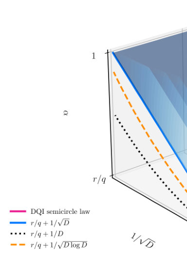
<figcaption class="paper-figure-caption"><b>Fig 2.</b> Figure 2: Approximability landscape for bounded-degree max-Ek-LINSAT(q,r) as a function of 1/ √</figcaption>
</figure>

**Summary.** This work establishes the worst-case inapproximability limits for solving sparse, bounded-degree constraint satisfaction problems (max-LINSAT). By connecting complexity theory to quantum decoding bounds, it shows that achieving a certain approximation ratio requires overcoming an $O(1/\sqrt{D})$ barrier. This result critically identifies quantum decoding as necessary to match the theoretical hardness scaling in physical applications like DQI.

**Why it may be interesting.** It provides a rigorous theoretical benchmark showing that any potential quantum advantage on structured optimization problems like DQI must be confined to improving constant prefactors rather than changing the fundamental scaling law dictated by computational hardness.

Detailed structure

**Main problem.** The paper characterizes the best possible approximation ratios for solving bounded-degree maximum linear constraint satisfaction problems (max-LINSAT) over finite fields.

**Main result.** It proves that approximating these worst-case instances is NP-hard beyond a threshold of $r/q + O(1/\sqrt{D})$, establishing a complexity benchmark for quantum algorithms like DQI.

**Method.** The analysis combines established results from computational complexity theory (PCP theorems, degree reduction) with information-theoretic bounds derived from decoding quantum interferometry principles.

**Model / system.** The theoretical model is the max-LINSAT problem over finite fields $\mathbb{F}_q$, which serves as a mathematical benchmark for physical systems targeted by decoded quantum interferometry (DQI).

**Key observables.** Approximation ratio ($\alpha$), scaling factor $1/\sqrt{D}$, and the gap between classical vs. quantum decoding bounds.

**Important parameters / regimes.** Variable degree ($D$), constraint arity ($k$), finite field size ($q$), and acceptance set size ($r$).

**Assumptions / limitations.** The analysis assumes $	ext{NP} 
ot\subseteq 	ext{BPP}$ (or related complexity separations) to establish the hardness results.

**Figures summary.** Figure 2 illustrates the approximability landscape for max-Ek-LINSAT(q,r), comparing classical and quantum decoding radii against the established $1/\sqrt{D}$ hardness scaling.

**Paper structure.** The paper builds by first establishing general inapproximability results for XORSAT, then extending these techniques via degree reduction to the more general max-LINSAT(q,r), culminating in a detailed comparison of quantum vs. classical decoding performance against complexity theory.

Abstract

For general max-k-XORSAT with $k \geq 3$, no polynomial-time algorithm can do substantially better than random guessing on worst-case instances unless $\mathsf{P} = \mathsf{NP}$: approximating beyond the random-assignment value of $1/2$ is $\mathsf{NP}$-hard. The picture changes when each variable appears in at most $D$ constraints. In that bounded-degree setting, polynomial-time algorithms can provably beat the random baseline by an additive amount of order $1/\sqrt{D}$. For Boolean instances, this scaling is known to be optimal: the matching hardness result is due to Trevisan, while the corresponding algorithmic guarantee was established by Barak et al. Whether the same holds over general finite fields, and what it implies for quantum algorithms, has not been established. We make this connection explicit and extend the hardness to max-E$k$-LINSAT$(q,r)$ with bounded degree $D$ and over arbitrary finite fields $\mathbb{F}_q$, proving that it is $\mathsf{NP}$-hard to exceed $r/q + \mathcal{O}_{q,r}(1/\sqrt{D})$. These results provide the complexity-theoretic benchmark for the bounded-degree instances targeted by decoded quantum interferometry (DQI), QAOA, and classical heuristics. Any quantum advantage on bounded-degree instances is therefore confined to the constant prefactor. We further show that in the context of DQI and on $(k,D)$-regular instances, this prefactor is sensitive to the nature of the decoder: DQI with classical decoders faces an information-theoretic $1/\sqrt{D \log D}$ barrier that prevents it from matching the hardness scaling, while DQI with quantum decoders is compatible with the $1/\sqrt{D}$ scaling -- identifying quantum decoding as the key ingredient for matching the complexity-theoretic scaling with DQI.

[↑ back to top](#top)

### [Geometric formulation of state-dependent Langevin dynamics using scalar free energy](http://arxiv.org/abs/2606.13617v1)

**Authors:** Kento Yasuda, Zhongqiang Xiong, Zhanglin Hou, Kenta Ishimoto, Xinpeng Xu, Shigeyuki Komura  
**Type:** theory · **Category:** statistical mechanics · **PDF:** <https://arxiv.org/pdf/2606.13617v1>  
**Analysis basis:** full PDF text, analyzed in chunks
**Topic relevance:** `Keldysh / 2PI / non-Gaussian methods` **1/5** · `correlated / nonlocal dissipation` **1/5** · `driven-dissipative phase transition` **1/5** · `methods for driven-dissipative` **1/5**

↔ Scroll figures horizontally

<figure class="paper-figure-card">
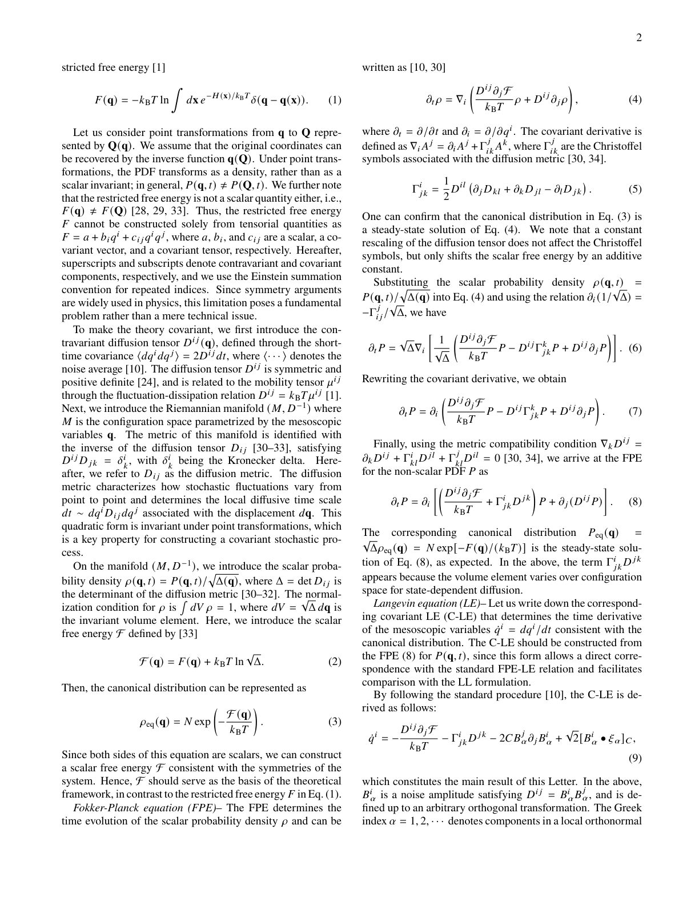
<figcaption class="paper-figure-caption"><b>Fig 1.</b> Low-resolution page preview, page 2</figcaption>
</figure>
<figure class="paper-figure-card">
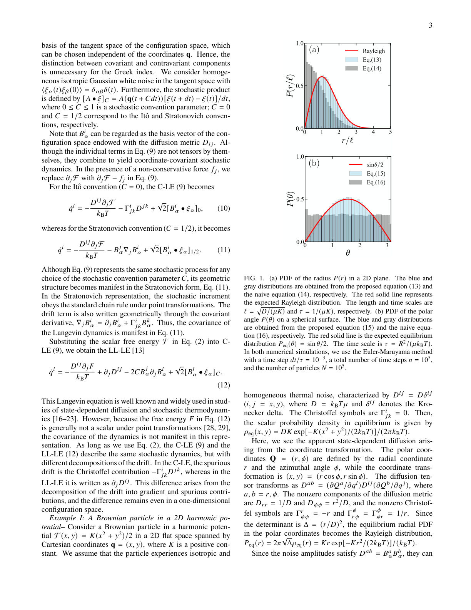
<figcaption class="paper-figure-caption"><b>Fig 2.</b> Low-resolution page preview, page 3</figcaption>
</figure>
<figure class="paper-figure-card">
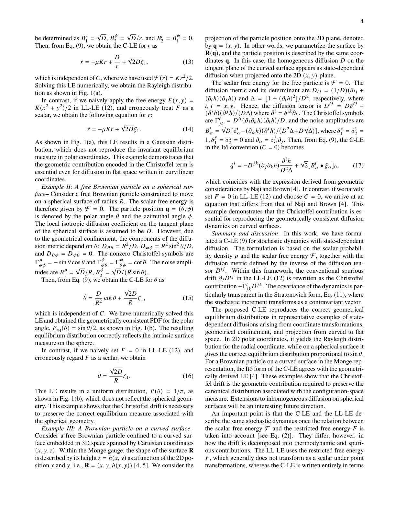
<figcaption class="paper-figure-caption"><b>Fig 3.</b> Low-resolution page preview, page 4</figcaption>
</figure>
<figure class="paper-figure-card">
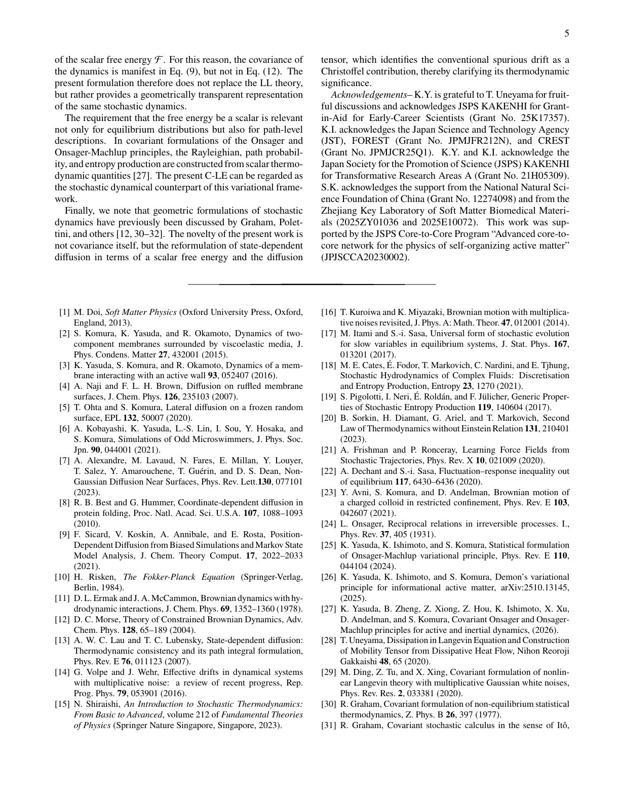
<figcaption class="paper-figure-caption"><b>Fig 4.</b> Low-resolution page preview, page 5</figcaption>
</figure>
<figure class="paper-figure-card">

<figcaption class="paper-figure-caption"><b>Fig 5.</b> Low-resolution page preview, page 6</figcaption>
</figure>

**Summary.** This paper develops a geometrically consistent framework for describing stochastic motion with state-dependent diffusion by introducing a scalar free energy. It derives a Covariant Langevin Equation (C-LE) that correctly accounts for geometric effects, such as those arising from coordinate changes or curved spaces. This clarifies the physical origin of spurious drift terms within the context of statistical mechanics.

**Why it may be interesting.** While focused on classical stochastic processes, the rigorous geometric treatment of noise and drift terms has deep parallels with path integrals and fluctuation-dissipation theorems used in quantum open system dynamics.

Detailed structure

**Main problem.** The authors aim to formulate a geometrically consistent Langevin equation for stochastic dynamics involving state-dependent diffusion, addressing issues with spurious drift and non-scalar free energy in conventional formulations.

**Main result.** They derive a Covariant Langevin Equation (C-LE) that is mathematically equivalent but ensures covariance by utilizing a scalar free energy $F$ and expressing the spurious drift as a Christoffel contribution of the diffusion metric.

**Method.** The approach involves reformulating the Fokker-Planck equation for an invariant scalar probability density $
ho$, leading to the C-LE, which is then compared against conventional Langevin forms (Itô/Stratonovich) in various geometric settings.

**Model / system.** The study concerns Brownian motion or general stochastic dynamics in complex physical systems characterized by confinement, anisotropy, and state-dependent diffusion tensors ($D_{ij}$).

**Key observables.** Equilibrium probability distributions (e.g., Rayleigh distribution on 2D space, $\sin	heta$ on a sphere), the form of the Langevin equation itself.

**Important parameters / regimes.** The diffusion tensor $D_{ij}$, the scalar free energy $F$, and the relationship between Itô/Stratonovich conventions ($C=0$ vs. $C=1/2$).

**Assumptions / limitations.** The C-LE does not replace existing Langevin-Landau (LL) theory but provides a geometrically transparent alternative representation of the same dynamics.

**Figures summary.** Figures compare predicted probability density functions (PDFs) for radial and angular distributions derived from the proposed covariant equations versus naive applications, showing agreement with expected physical results.

**Paper structure.** The paper establishes the problem by noting issues in conventional Langevin formulations; it then derives the C-LE using a scalar free energy $F$; subsequent sections demonstrate its consistency through explicit examples (2D polar coordinates, sphere) where the Christoffel term is crucial for correctness.

Abstract

Stochastic dynamics with state-dependent diffusion are widely used for Brownian motion in confined, anisotropic, and hydrodynamically coupled systems. The conventional Langevin formulation includes a spurious drift associated with multiplicative noise, but its free energy generally does not transform as a scalar, meaning that the covariance is not explicit. Here, we formulate a geometrically consistent Langevin equation by introducing a scalar free energy and using the diffusion tensor as a metric on configuration space. The spurious drift is then expressed as a Christoffel contribution of the diffusion metric. While our formulation is equivalent to the conventional one through the relation between the non-scalar and scalar free energies, it makes the coordinate covariance explicit. We demonstrate its consistency in representative examples of state-dependent diffusion arising from coordinate transformations, geometrical confinement, and projection from curved to flat spaces.

[↑ back to top](#top)

### [Beyond-Third-Order Quantum Coherence in Two-Dimensional Spectroscopy via Order-Selective Isolation](http://arxiv.org/abs/2606.12794v1)

**Authors:** Xue Zhang, De-Ran Zhang, Hui Dong  
**Type:** experiment · **Category:** other · **PDF:** <https://arxiv.org/pdf/2606.12794v1>  
**Analysis basis:** full PDF text, analyzed in chunks
**Topic relevance:** `interference shaping light` **1/5** · `quantum measurements` **1/5** · `quantum optics experiment` **1/5**

↔ Scroll figures horizontally

<figure class="paper-figure-card">
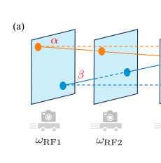
<figcaption class="paper-figure-caption"><b>Fig 1.</b> Fig. 1. Scheme of the Frame-shift tracking separation algorithm for two-dimensional spectroscopy and the sorted 7-th signals. (a) The scheme for the separation. Three spectra are sampled under different rotation frame frequency 𝜔RF, resembling the reduction of relative speed in a moving frame with constant velocity in classical mechanics. Movement of the spectral features (blue and orange points) is created with different slopes 𝑘𝛼= −1 and 𝑘𝛽= 3 for the frequency shift 𝜔eff 𝑇of the 3rd- and 7th-order signals, respectively. (b) The experimentally sorted 7th-order signals for rubidium vapor. The signal is sorted out by tracking the movement of the orange peak in subfigure (a) with the...</figcaption>
</figure>
<figure class="paper-figure-card">
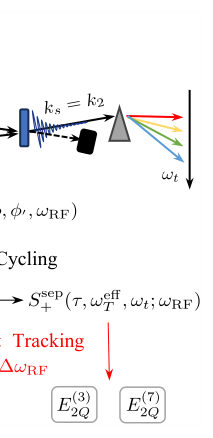
<figcaption class="paper-figure-caption"><b>Fig 2.</b> Fig. 2. Pulse sequences and the procedure for extracting higher-order signals. (a) Pulse sequences of 2D spectroscopy under pump–probe geometry. The wave vectors of the two pump pulses are denoted as k1 and k1′, with k1 = k1′. The wave vector of the probe pulse is k2. Additionally, the probe pulse also acts as the local oscillator (LO), allowing for heterodyned detection of signals with wave vector k𝑠= k2. Time zero is defined as the moment when the signals are generated. (b) Signals 𝑆(𝜏,𝑇, 𝜔𝑡; 𝜙, 𝜙′, 𝜔RF) are measured in three rotating frames with the same phase cycles. In each frame, the signals are processed using phasing cycling and causality enforcement to obtain the separated spectral...</figcaption>
</figure>
<figure class="paper-figure-card">
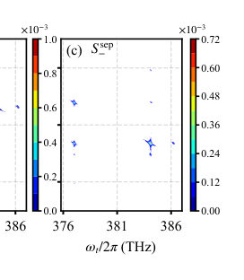
<figcaption class="paper-figure-caption"><b>Fig 3.</b> Fig. 3. Energy level diagram and the 2D spectra of 87Rb. (a) The energy levels of an individual 87Rb atom. All numerical labels in the diagram are in units of THz. (b) and (c) show the separated 2D spectra, 𝑆sep + (𝜏, 𝜔eff 𝑇, 𝜔𝑡; 𝜔RF) and 𝑆sep −(𝜏, 𝜔eff 𝑇, 𝜔𝑡; 𝜔RF), respectively under the rotating frames at 787nm.</figcaption>
</figure>
<figure class="paper-figure-card">
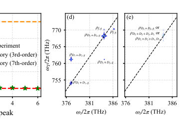
<figcaption class="paper-figure-caption"><b>Fig 4.</b> Fig. 4. Results of the frame-shift tracking algorithm and the separated higher-order spectra. (a) Red circles show the center peak centers of the signals, extracted via two-dimensional Gaussian fitting from the 𝑆sep + (𝜏, 𝜔eff 𝑇, 𝜔𝑡; 𝜔RF) spectrum at 787nm in the rotating frame. The numbers label the peak indices. (b) Signal peaks in the rotating frame at 787nm (red points) and 790nm (blue points). The arrows indicate the peak movements. (c) Shift rates Δ𝜔eff 𝑇/Δ𝜔RF for each peak. Green pentagrams represent the signal peaks from (b), with the horizontal axis indices corresponding to those in (a). The extracted shift rates for peaks 1-6 are 3.000, -1.006, -0.968, -0.970, -0.990, and -1.004,...</figcaption>
</figure>
<figure class="paper-figure-card">
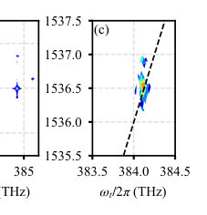
<figcaption class="paper-figure-caption"><b>Fig 5.</b> Fig. 5. The 𝑆sep −(𝜏, 𝜔eff 𝑇, 𝜔𝑡; 𝜔RF) spectrum and the separated higher-order contributions. (a) The 𝑆sep −(𝜏, 𝜔eff 𝑇, 𝜔𝑡; 𝜔RF) spectrum at 787nm in the rotating frame, identical to Figs. 3(c). (b) The retrieved 0Q spectrum of the 3rd-order signal, obtained using the same retrieval procedure as described in Fig. 4. (c) The recovered 4Q spectrum of the 7th-order signal.</figcaption>
</figure>

**Summary.** The paper introduces a novel computational technique combining rotating-frame acquisition and frame-shift tracking to overcome signal overlap issues in 2D spectroscopy. By analyzing distinct frequency shifts associated with different nonlinear orders, the authors successfully isolated a seventh-order quantum coherence signal from background third-order signals in rubidium vapor. This method offers a practical route for studying complex many-body dynamics beyond current experimental limits.

**Why it may be interesting.** This work provides a powerful, practical methodology for probing complex, non-linear quantum dynamics in atomic systems that are otherwise obscured by spectral overlap, pushing the boundaries of ultrafast spectroscopy.

Detailed structure

**Main problem.** The central challenge is achieving order-selective readout of weak, higher-order nonlinear quantum responses that spectrally overlap with strong lower-order signals in two-dimensional spectroscopy.

**Main result.** The authors successfully isolated a seventh-order nonlinear coherence contribution from coexisting third-order components using this novel technique. This demonstrates direct access to high-order quantum dynamics beyond the conventional third order.

**Method.** They employ a computation-assisted strategy combining rotating-frame acquisition with a frame-shift tracking algorithm to separate signals based on their distinct, predictable spectral shifts in different measurement frames.

**Model / system.** The experiments were conducted using a rubidium vapor system. The technique is designed for general applicability across multidimensional spectroscopy platforms probing many-body and collective ultrafast dynamics.

**Key observables.** Signal decomposition into $(2n+1)^{th}$-order components, $E^{(2n+1)}_s$, and the measurement of frame-dependent spectral shifts ($\Delta\omega_{eff}^T / \Delta\omega_{RF}$) to determine coherence order.

**Important parameters / regimes.** The method is effective at high pulse intensities. The analysis relies on specific fully symmetric excitation pathways ($k_s = k_2 \pm n k_1 \mp n k'_1$).

**Assumptions / limitations.** The primary assumption is that higher-order contributions can be uniquely identified and separated by their distinct, measurable spectral shift slopes when analyzed in rotating frames.

**Figures summary.** Figures illustrate the frame-shift tracking separation scheme (Fig. 1) and detail the pulse sequences and signal processing procedure used to separate different order signals based on phase matching conditions (Fig. 2).

**Paper structure.** The paper first establishes the spectral overlap problem in high-order spectroscopy, then introduces the combined rotating-frame/frame-shift tracking method, details its application using rubidium vapor, and concludes by demonstrating the successful isolation of the 7th-order signal.

Abstract

A central challenge in nonlinear spectroscopy is the order-selective readout of weak higher-order responses that spectrally overlap with dominant lower-order signals. This bottleneck is particularly severe in two-dimensional (2D) spectroscopy, where extending conventional phase-cycling schemes to higher orders rapidly increases measurement and analysis complexity. Here we introduce a computation-assisted strategy that combines rotating-frame acquisition with a frame-shift tracking algorithm to separate signals by their frame-dependent spectral shifts. In a rubidium vapor experiment, we use this approach to isolate a 7th-order nonlinear contribution from coexisting 3rd-order components, enabling direct access to higher-order quantum-coherence dynamics without sacrificing operation at comparatively high pulse intensities. The method is broadly compatible with multidimensional spectroscopy platforms and provides a practical route to probing many-body and collective ultrafast dynamics beyond third order.

[↑ back to top](#top)

### [Candidate overtone shear horizontal SAW resonators in thin-film lithium niobate for intermodal acousto-optic modulation](http://arxiv.org/abs/2606.12853v1)

**Authors:** Wenbing Jiang, Xuankai Xu, Yu Guo, Boyu Zhang, Lihui Jin, Xiao Chen, Tao Wu, Libing Zhou  
**Type:** both · **Category:** other · **PDF:** <https://arxiv.org/pdf/2606.12853v1>  
**Analysis basis:** full PDF text, analyzed in chunks
**Topic relevance:** `analog quantum simulation` **1/5** · `driven-dissipative phase transition` **1/5** · `interference shaping light` **1/5**

↔ Scroll figures horizontally

<figure class="paper-figure-card">

<figcaption class="paper-figure-caption"><b>Fig 1.</b> Fig. 1. (a) Mock-up view of the SH0 mode resonator based on the lithium niobate-on-insulator substrate. (b) Schematic diagram of inter- modal AOM based on the SAW resonator. The input TE0 optical mode is modulated into the first-order optical mode TE1 under interactions of the actuated SAW phonon field with the resonance frequency Ω/2π and the propagation wavevector ka. The phase-matching condition of intermodal AOM is depicted in the right panel as well.</figcaption>
</figure>
<figure class="paper-figure-card">
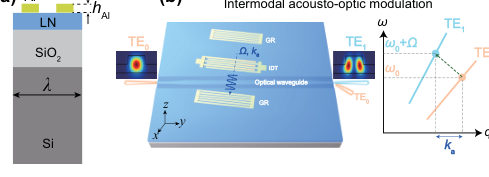
<figcaption class="paper-figure-caption"><b>Fig 2.</b> Fig. 1(a) depicts the cross-sectional view of the SH0 mode resonator in the LNOI platform. Aluminum (Al) is selected as the electrodes of interdigital transducers (IDTs) because of its low material damping and high electrical conductivity [7]. Fig.</figcaption>
</figure>
<figure class="paper-figure-card">
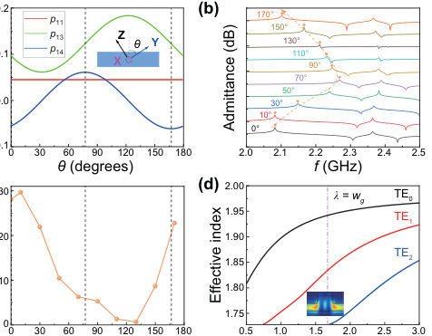
<figcaption class="paper-figure-caption"><b>Fig 3.</b> Fig. 2. (a) Transformed photoelastic coefficients p11, p13, and p14 as a function of the cut angle θ with respect to the Y axis. The SAW propagation direction is along the X axis. (b) Simulated admittance curves for various cut angles about the Y crystal axis. The dashed lines traces the evolution trend of SH0 modes. (c) Extracted electromechani- cal coupling coefficients k2 eff versus the cut angle θ. (d) Simulated optical eigenmodes in the LN waveguide. The E-field profiles of TE2 mode is displayed at the waveguide width of 1.7µm.</figcaption>
</figure>
<figure class="paper-figure-card">
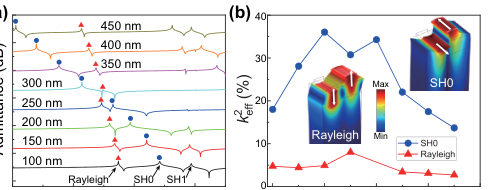
<figcaption class="paper-figure-caption"><b>Fig 4.</b> Fig. 3. (a) Simulated admittance spectra with tuning the Al electrode thickness ranging from 100 to 450 nm at the increment of 50 nm. (b) Extracted k2 eff of the Rayleigh and SH0 modes, respectively. The displacement profiles of Rayleigh and SH0 modes are shown in the inset, respectively.</figcaption>
</figure>
<figure class="paper-figure-card">
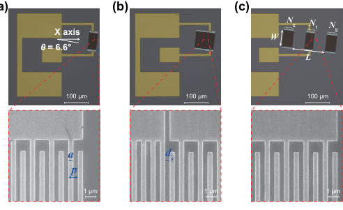
<figcaption class="paper-figure-caption"><b>Fig 5.</b> Fig. 5. Optical microscope images of the fabricated Device A (a), Device B (b), and Device C (c). The zoomed-in regions are the corre- sponding SEM images in each SAW resonator, respectively.</figcaption>
</figure>

**Summary.** This research proposes using overtone shear-horizontal SAW resonators on thin-film lithium niobate for advanced intermodal acousto-optic modulation. By optimizing device geometry, the authors significantly boost the coupling efficiency compared to conventional modes. The fabricated devices demonstrate robust operation at high power levels and exhibit superior temperature stability, making them promising components for integrated optical signal processing.

**Why it may be interesting.** While the core physics is in acousto-optics/photonics, the focus on high-$Q$, stable resonators operating at defined frequencies (overtones) relates to cavity QED concepts. The ability to engineer mechanical resonances with high precision and stability could be analogous to engineering coupling strengths in quantum optical cavities.

Detailed structure

**Main problem.** The primary goal is developing high-performance intermodal acousto-optic modulators (AOMs) for integrated optical signal processing using thin-film lithium niobate.

**Main result.** The use of overtone shear-horizontal ($	ext{SH}0$) SAW resonators significantly improves the acousto-optic overlap factor and allows operation at high power levels ($29 	ext{ dBm}$) with superior temperature stability compared to Rayleigh modes.

**Method.** The work combines theoretical modeling (calculating overlap factors, optimizing device parameters) with experimental fabrication and characterization using VNA measurements of admittance and resonance quality factors.

**Model / system.** The system is based on SAW resonators fabricated on Y-cut thin-film lithium niobate ($	ext{LiNbO}_3$) platforms. The modulation relies on the interaction between an optical mode ($	ext{TE}0$ to $	ext{TE}1$) and the mechanical strain field generated by the Surface Acoustic Waves (SAWs).

**Key observables.** Electromechanical coupling coefficients ($k_{2	ext{eff}}^2$), Quality factors ($Q$), Acousto-optic overlap factor ($\Gamma_{ao}$), Temperature Coefficient of Frequency ($	ext{TCF}$), and operational power levels.

**Important parameters / regimes.** Optimal device parameters include the cut angle ($	heta=0^\circ$), SAW wavelength ($\lambda = 1.7 \mu m$), and IDT thickness ($h_{Al} = 150 	ext{ nm}$).

**Assumptions / limitations.** The analysis assumes that $	ext{SH}0$ modes provide superior coupling compared to Rayleigh modes, and the high-order overtone resonances are utilized for enhanced performance.

**Figures summary.** Figures illustrate cross-sections of the resonators, schematic diagrams of the intermodal AOM process (TE0 to TE1 scattering), and plots showing measured admittance ($|Y|$), resonance quality factors ($Q_s$) vs. power/temperature, and TCF analysis for both $	ext{SH}0$ and Rayleigh modes.

**Paper structure.** The paper progresses from theoretical optimization of device parameters ($	heta$, $\lambda$, $h_{Al}$) to the physical realization and characterization of overtone resonators using grating reflectors (GRs). The final sections confirm high-power stability, superior TCF performance for $	ext{SH}0$ modes, and overall suitability for integrated AOM applications.

Abstract

The merits of thin-film surface acoustic wave (SAW) devices are pivotal to develop the high-performance intermodal acousto-optic modulators. In this work, we have proposed shear-horizontal (SH) SAW resonators for anticipated intermodal acousto-optic modulation on the thin-film lithium niobate platform. Through optimization of the cut angle of LN films, the SAW wavelength, and the thickness of interdigital transducer (IDT) electrodes, the calculated acousto-optic overlap factors utilizing SH0 modes are improved by more than an order of magnitude compared with those of Rayleigh modes. Furthermore, we have fabricated and characterized three kinds of proof-of-principle SH0 mode devices without/with grating reflectors. The electromechanical coupling coefficients (keff^2) and quality factors (Q) in the overtone resonators with grating reflectors are systematically evaluated, featuring the highest Q of 843 with the compromised keff^2 of 0.96%-4.72%. The results reveal that the temperature coefficients of frequency (TCF) of Rayleigh modes vary across various overtones, whereas the SH0 modes exhibit TCFs in the range of 32.3-68.9 ppm/C. Our fabricated SH0-mode overtone resonators demonstrate the capability of operating at power levels up to 29 dBm without electrode damage, offering a promising paradigm for robust and high-efficiency intermodal acousto-optic modulators with potential applications in integrated optical signal processing, microwave photonics,and quantum information technologies.

[↑ back to top](#top)

### [Extending the La Solubility Limit in Sr$_3$Ir$_2$O$_7$ through High-Pressure High-Temperature Synthesis](http://arxiv.org/abs/2606.12727v1)

**Authors:** Cheng Peng, Weiwei Xie  
**Type:** experiment · **Category:** strongly correlated electrons · **PDF:** <https://arxiv.org/pdf/2606.12727v1>  
**Analysis basis:** full PDF text, analyzed in chunks
**Topic relevance:** `Kondo & dissipative impurity` **1/5** · `analog quantum simulation` **1/5** · `exotic spin models in light-matter` **1/5**

↔ Scroll figures horizontally

<figure class="paper-figure-card">
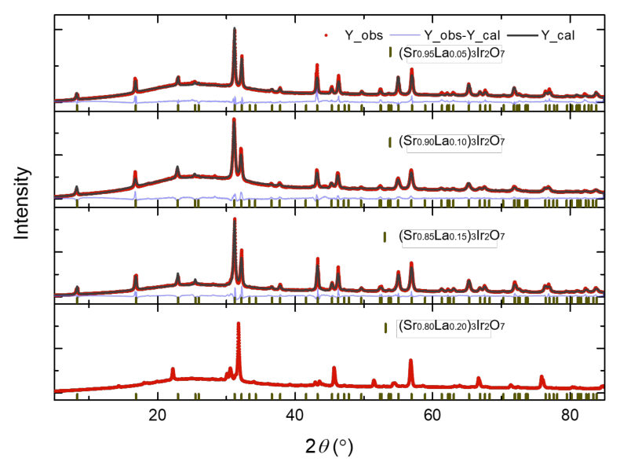
<figcaption class="paper-figure-caption"><b>Fig 1.</b> Figure 1. Powder X-ray diffraction patterns and Le Bail refinements of high-pressure synthesized La- doped Sr3Ir2O7 with nominal compositions x = 0.05, 0.10, 0.15, and 0.20. (Red circles represent experimental data, black lines represent the refinement, blue lines show the difference curve, and green tick marks indicate Bragg reflection positions.)</figcaption>
</figure>
<figure class="paper-figure-card">
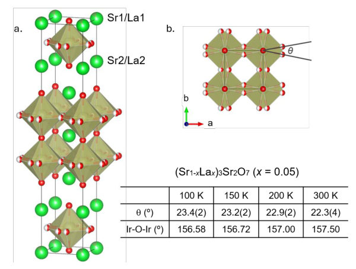
<figcaption class="paper-figure-caption"><b>Fig 2.</b> Figure 2. Crystal structure of the high-pressure synthesized bilayer iridate (Sr1-xLax)3Ir2O7 with tetragonal I4/mmm symmetry. (a) Crystal structure viewed along the a-axis, showing the layered Ruddlesden-Popper framework consisting of corner-sharing IrO6 octahedral bilayers separated by Sr/La- containing rock-salt layers. The two crystallographically distinct alkaline-earth sites, Sr1 and Sr2, are indicated. (b) Projection of the IrO6 octahedral network along the c-axis. The angle θ denotes the in-plane Ir-O-Ir bond angle, which governs the octahedral rotation and strongly influences the electronic bandwidth and magnetic exchange interactions in the bilayer iridate. The inset table...</figcaption>
</figure>
<figure class="paper-figure-card">
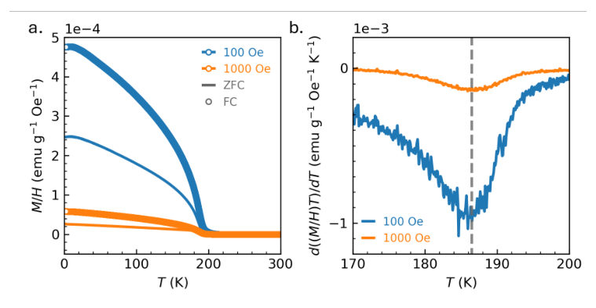
<figcaption class="paper-figure-caption"><b>Fig 3.</b> Figure 3. (a) Temperature-dependent magnetic susceptibility of Sr2.66(3)La0.34Ir2O7 measured under applied fields of 100 and 1000 Oe in zero-field-cooled (ZFC) and field-cooled (FC) modes. (b) dM/dT is used to determine the transition temperature.</figcaption>
</figure>
<figure class="paper-figure-card">
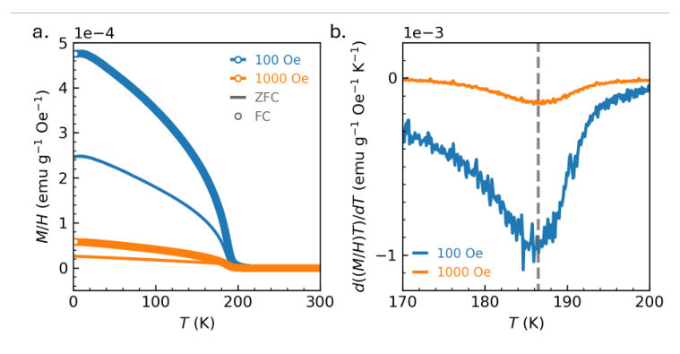
<figcaption class="paper-figure-caption"><b>Fig 4.</b> Figure 4b. A similarly large hysteretic response is observed at 150 K, indicating that the</figcaption>
</figure>
<figure class="paper-figure-card">
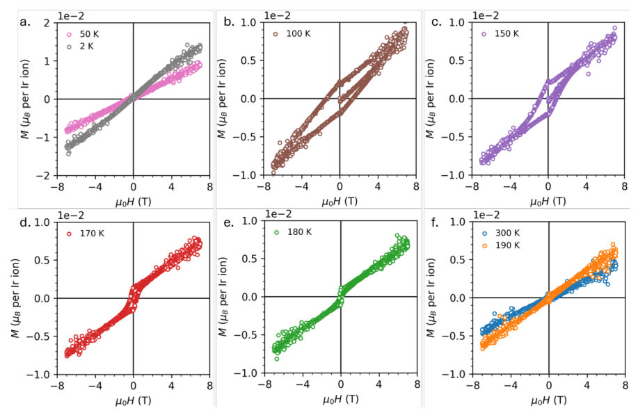
<figcaption class="paper-figure-caption"><b>Fig 5.</b> Figure 4. Field-dependent magnetization, M(H), of Sr2.66(3)La0.34Ir2O7 measured at selected temperatures. (a) M(H) curves at 2 and 50 K. (b-e) M(H) curves at 100, 150, 170 and 180 K showing clear hysteresis below the magnetic transition. (f) M(H) curves at 190 and 300 K, where the ferromagnetic-like response is strongly suppressed. The largest hysteresis is observed between 100 and 150 K, while the response becomes nearly linear above the transition temperature of approximately 186 K.</figcaption>
</figure>

**Summary.** This work uses high-pressure synthesis to dope $	ext{Sr}_3	ext{Ir}_2	ext{O}_7$ with Lanthanum, extending its solubility limit. By measuring transport and magnetic properties across different doping levels, the authors map out a phase diagram showing a transition from a localized, insulating magnetic state toward more itinerant electronic behavior.

**Why it may be interesting.** The study directly probes how tuning electron doping (via La substitution) modifies the interplay between magnetic ordering, charge localization, and crystal structure in a strongly correlated Mott insulator system.

Detailed structure

**Main problem.** The study aims to extend the solubility limit of Lanthanum (La) doping in $	ext{Sr}_3	ext{Ir}_2	ext{O}_7$ and characterize the resulting electronic and magnetic phases.

**Main result.** High-pressure synthesis successfully incorporates higher La concentrations, revealing a transition from a strongly insulating, magnetically ordered state to a more itinerant, metal-like behavior as doping increases.

**Method.** The research combines high-pressure/high-temperature synthesis with structural characterization (XRD), magnetic measurements ($M(H)$), and electrical transport measurements ($R$ vs $T$).

**Model / system.** The system is the bilayer iridate $(	ext{Sr}_{1-x}	ext{La}_x)_3	ext{Ir}_2	ext{O}_7$, which is studied as a platform for investigating spin-orbit-assisted Mott physics under controlled electron doping.

**Key observables.** Magnetic transition temperature ($\approx 186 	ext{ K}$), electrical resistivity, activation energies ($68.40 	ext{ meV}$, $82.42 	ext{ meV}$), and structural phase transitions (bilayer to cubic perovskite).

**Important parameters / regimes.** La doping level ($x$), synthesis pressure/temperature ($\sim 6 	ext{ GPa}, 1400^\circ	ext{C}$), and temperature dependence of electronic/magnetic properties.

**Assumptions / limitations.** The primary assumption is that high-pressure synthesis allows access to chemical compositions and structural phases inaccessible via ambient synthesis methods.

**Figures summary.** Figures show PXRD patterns confirming phase purity and structural transformations; transport data illustrate activated conductivity regimes, while magnetization curves reveal field-sensitive magnetic transitions.

**Paper structure.** The paper progresses by first establishing the necessity of high pressure to dope the material, then characterizing specific doping levels ($x=0.05$ vs $x=0.15$), and finally comparing the electronic/magnetic states across the doping series up to structural collapse at higher concentrations.

Abstract

La-doped bilayer iridates provide an important platform for studying the evolution of the spin-orbit-assisted Mott state under electron doping, but the La solubility achieved by conventional ambient-pressure synthesis is limited. Here, we report the synthesis and physical properties of nominally La-doped (Sr$_{1-x}$La$_x$)$_3$Ir$_2$O$_7$ (x = 0.05, 0.10, 0.15, and 0.20) prepared using high-pressure high-temperature techniques. Single-crystal X-ray diffraction refinements, supported by scanning electron microscopy-energy-dispersive X-ray spectroscopy (SEM-EDX), reveal significantly enhanced La incorporation, with nominal x = 0.05 and 0.15 corresponding to actual compositions of approximately (Sr$_{0.89}$La$_{0.11}$)$_3$Ir$_2$O$_7$ and (Sr$_{0.77}$La$_{0.23}$)$_3$Ir$_2$O$_7$, respectively. At nominal x = 0.20, the bilayer phase is no longer stabilized and instead transforms into cubic perovskite Sr$_{1-x}$La$_x$IrO$_3$. (Sr$_{0.89}$La$_{0.11}$)$_3$Ir$_2$O$_7$ exhibits a ferromagnetic-like transition near 186 K accompanied by magnetic hysteresis and subtle lattice anomalies indicative of spin-lattice coupling. Despite its high electron-doping level, the compound remains strongly insulating, consistent with a heavily doped localized magnetic insulating state distinct from both parent Sr$_3$Ir$_2$O$_7$ and ambient-pressure La-doped samples. In contrast, (Sr$_{0.77}$La$_{0.23}$)$_3$Ir$_2$O$_7$ displays metal-like electronic behavior, weakened magnetic order, and enhanced carrier delocalization, although disorder-driven localization persists at low temperatures. These results demonstrate that high-pressure synthesis substantially extends the accessible doping range of bilayer iridates and reveals electronic and magnetic states inaccessible through conventional synthesis routes.

[↑ back to top](#top)

### [Infinite-Order Lattice Chiral Anomalies and CPT](http://arxiv.org/abs/2606.12510v1)

**Authors:** Elijah Lew-Smith, Salvatore D. Pace, Shu-Heng Shao  
**Type:** theory · **Category:** strongly correlated electrons · **PDF:** <https://arxiv.org/pdf/2606.12510v1>  
**Analysis basis:** full PDF text, analyzed in chunks
**Topic relevance:** `Keldysh / 2PI / non-Gaussian methods` **1/5** · `Kondo & dissipative impurity` **1/5** · `analog quantum simulation` **1/5**

↔ Scroll figures horizontally

<figure class="paper-figure-card">
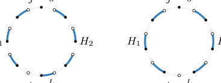
<figcaption class="paper-figure-caption"><b>Fig 1.</b> Figure 3. Colored lines indicate a coupling between the Ma- jorana fermions at those sites in the example interface Hamil- tonians Eq. (D2). Even sites are colored in black, while odd sites are colored in white. The index j runs from 0 to L −1 going clockwise. (Left) For L ≡0 mod 4, there are un- paired Majorana fermions at j = 0 and j = L</figcaption>
</figure>

**Summary.** This paper develops a rigorous framework to analyze lattice chiral anomalies by defining an 'anomaly order.' It shows that while simple lattice models yield finite-order anomalies, imposing lattice CPT symmetry can artificially enhance this order to infinity. This achievement allows the construction of lattice systems whose symmetries more accurately reflect the infinite-order nature of continuum QFT anomalies.

**Why it may be interesting.** The work directly addresses fundamental questions in condensed matter theory regarding the emergence of continuum symmetries (like chiral anomalies) from discrete lattice Hamiltonians. The mechanism of enhancing anomaly order via CPT symmetry is a powerful theoretical tool for classifying topological phases.

Detailed structure

**Main problem.** The paper investigates lattice chiral anomalies, specifically comparing finite-order anomalies found in simple lattice models to the infinite-order anomalies characteristic of continuum Quantum Field Theories (QFTs). The core goal is to understand how imposing additional symmetries can bridge this gap.

**Main result.** By enforcing lattice CPT symmetry on the Onsager symmetry, the paper demonstrates that a finite order-two anomaly is enhanced to an infinite order, successfully matching the structure of the continuum chiral anomaly. This provides a mechanism for realizing infinite-order anomalies in lattice systems with finite local Hilbert spaces.

**Method.** The analysis relies on defining and calculating the 'anomaly order' ($	ext{ord}(\omega)$) by examining the behavior of symmetries under stacking identical copies of the system (the $n$-copy method). It uses symmetry algebra, renormalization group flow concepts, and explicit Hamiltonian constructions for fermionic systems.

**Model / system.** The primary model involves lattice fermion systems, particularly those exhibiting Onsager symmetry in 1+1d and 2+1d dimensions. The analysis utilizes complex fermions (Majorana representations) and examines Hamiltonians invariant under specific combinations of symmetries like $\mathbb{Z}_2 	imes 	ext{CPT}$.

**Key observables.** Anomaly order ($	ext{ord}(\omega)$), symmetry groups ($D_8$, Onsager algebra, $\mathbb{Z}_{2}	ext{CPT}$), and spectral properties (gapped/gapless spectra).

**Important parameters / regimes.** The dimensionality of the system (1+1d vs 2+1d) and the specific coupling constants ($g$) determining the Hamiltonian structure.

**Assumptions / limitations.** The analysis assumes that comparing lattice symmetries to continuum QFTs is valid, and it notes that achieving infinite-order anomalies requires enforcing non-local constraints like CPT symmetry.

**Figures summary.** Figures illustrate the definition of anomaly order via stacking copies (Figure 1) and show interfaces between different Symmetry Protected Topological (SPT) phases in 2+1d using coupling lines for Majorana fermions.

**Paper structure.** The paper progresses by first establishing the concept of anomaly order, then analyzing specific lattice examples (like the Onsager symmetry), demonstrating its finite-order anomaly ($	ext{ord}=2$), and finally showing that imposing CPT symmetry elevates this to an infinite order, concluding with discussions on corresponding 2+1d SPT phases.

Abstract

A key property of a global symmetry's anomaly is its order: the smallest integer $n$ for which the diagonal symmetry of the $n$-copy system is anomaly-free. While many familiar lattice anomalies have finite order, perturbative anomalies in the continuum$-$those captured by Feynman diagrams$-$have infinite order. In this paper, we show that the Onsager symmetry, a lattice realization of the chiral symmetry of a 1+1d massless Dirac fermion, has an order-two anomaly. However, imposing lattice CPT symmetry enhances this anomaly from order two to infinite order, yielding a lattice chiral symmetry structure that more faithfully matches the continuum chiral anomaly. We also discuss the corresponding 2+1d symmetry-protected topological phases for these infinite-order lattice anomalies.

[↑ back to top](#top)

### [Modeling strained Cd$_3$As$_2$ thin films and their behavior in magnetic fields](http://arxiv.org/abs/2606.13293v1)

**Authors:** M. Smith, A. A. Burkov, P. P. Orth, I. Martin, Victor L. Quito  
**Type:** theory · **Category:** strongly correlated electrons · **PDF:** <https://arxiv.org/pdf/2606.13293v1>  
**Analysis basis:** full PDF text, analyzed in chunks
**Topic relevance:** `Keldysh / 2PI / non-Gaussian methods` **1/5** · `analog quantum simulation` **1/5** · `spintronics-quantum-optics interface` **1/5**

↔ Scroll figures horizontally

<figure class="paper-figure-card">
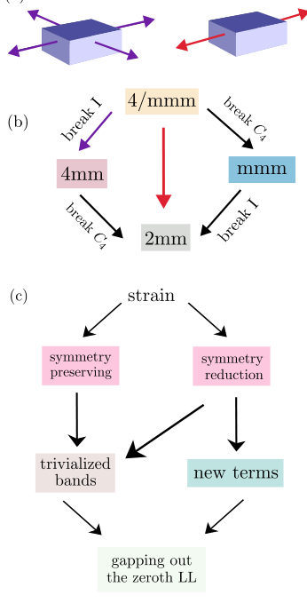
<figcaption class="paper-figure-caption"><b>Fig 1.</b> FIG. 1. (a) Different strain profiles on a thin film Cd3As2 sample: in-plane biaxial strain (left), which preserves C4 ro- tations and C4-breaking uniaxial strain (right). (b) Group theory analysis of the effects of the strain on the sample, list- ing different point groups and the symmetries that are bro- ken. (c) Possible explanations for the experimental results of Ref. [1]. The first possibility is that strain renormalizes band- structure parameters and uninverts the bands at the Γ-point, trivializing the bands. The LLL crossing in magnetic field is then no longer protected and is gapped out. The second possibility is that strain lowers the symmetry by breaking C4 and/or inversion...</figcaption>
</figure>
<figure class="paper-figure-card">
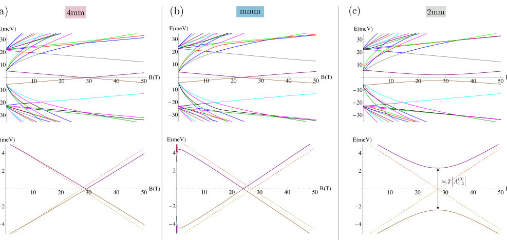
<figcaption class="paper-figure-caption"><b>Fig 2.</b> FIG. 2. Effects of strain in a thin film with thickness L = 19 nm. The k · p model parameters are A = 111.6 meV nm, M0 = 28.2 meV, Mz = 207.2 meV nm2, and Mxy = 133.2 meV nm2. In all cases, we explicitly include three subbands and three LLs in the diagonalization, and we have explicitly checked that our conclusions are unchanged when using more. The top panels show all bands in the energy window from −35 to 35 meV, while the bottom panels show a zoom from −5 to 5 meV. Without strain, the levels cross at B ≈27 T (dashed lines in lower panels). (a) Biaxial strain with 4mm point symmetry that preserves C4 rotations and breaks inversion, showing that the LLL crossing remains. We use Ds = Dp =...</figcaption>
</figure>
<figure class="paper-figure-card">
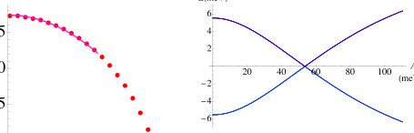
<figcaption class="paper-figure-caption"><b>Fig 3.</b> FIG. 3. Dependence of the critical field Bc, where the cross- ing of LLLs occurs, as a function of Az. The result (dots) is obtained from exact diagonalization considering three sub- bands. For clarity, we kept all the parameters identical to the unstrained case, and set δA = 0 to pinpoint the effects of the Az term. The curve for small Az corresponds to a quadratic fit motivated by the perturbative result in Eq. (41). The crit- ical field vanishes for Az = 53 meV nm, and for even larger values, no crossing will occur as the respective subbands have uninverted and become trivial. Inset: The corresponding low- energy bands as a function of Az, showing that the gap closes when Bc reaches...</figcaption>
</figure>

**Summary.** This theoretical work models strained Cd3As2 thin films using k.p theory to understand their electronic response in magnetic fields. It systematically analyzes how strain dictates the crystal symmetry, which in turn governs whether Landau level crossings are gapped or if a 2D Dirac semimetal phase can emerge. The findings provide powerful diagnostic tools for characterizing topological properties in strained quantum materials.

**Why it may be interesting.** The detailed coupling between crystal symmetry breaking (strain) and topological electronic properties (Dirac semimetals) is highly relevant to understanding novel quantum materials behavior under external stimuli.

Detailed structure

**Main problem.** The study systematically analyzes how strain profiles and external magnetic fields affect the electronic band structure of strained Cd3As2 thin films.

**Main result.** The analysis shows that while symmetry breaking can gap out Landau Level crossings, a 2D Dirac semimetal phase can be induced by large in-plane magnetic fields, which is highly sensitive to strain orientation.

**Method.** Effective k.p models are constructed based on group theory analysis of symmetry reduction under biaxial or uniaxial strain, followed by perturbative calculations involving subband coupling and Landau level quantization.

**Model / system.** The system is Cd3As2 thin films modeled using effective Hamiltonian Hamiltonians derived from symmetry constraints ($4/mmm 	o 4mm$, $mmm 	o 2mm$). The analysis incorporates strain effects ($\delta L/L$) and magnetic fields ($\mathbf{B}$).

**Key observables.** Gap opening in the lowest Landau level (LLL), emergence of a two-dimensional Dirac semimetal phase, and the critical field dependence ($B_c$) for band crossings.

**Important parameters / regimes.** Strain profiles (biaxial vs. uniaxial), magnetic field strength ($\mathbf{B}$), film thickness ($L$), and symmetry point groups ($4mm$, $mmm$, $2mm$).

**Assumptions / limitations.** The analysis relies on constructing effective low-energy k.p models based on underlying point group symmetries, and uses perturbative methods for subband coupling.

**Figures summary.** Figures illustrate strain profiles and the resulting symmetry reduction of the crystal point group (e.g., $4/mmm$ to $4mm$). Spectra show how LLL crossings behave under different strains and magnetic fields.

**Paper structure.** The paper proceeds by establishing the general Hamiltonian, systematically analyzing the effect of biaxial and uniaxial strain on symmetry ($C_4$, inversion), deriving effective Hamiltonians for reduced symmetries, and finally examining the consequences of out-of-plane and in-plane magnetic fields on Landau level crossings.

Abstract

We present a systematic analysis of the behavior of thin films of Cd$_3$As$_2$ under different strain profiles and in magnetic fields. In each case, we construct effective $k \cdot p$ models by considering the reduction of symmetry and all constraints imposed by the remaining symmetries. Our analysis naturally describes both in-plane biaxial and uniaxial strain. Biaxial strain is expected to preserve in-plane $C_4$ rotational symmetry while breaking inversion, allowing for a description in terms of the $4mm$ point group. Uniaxial strain, on the other hand, breaks $C_4$ symmetry. For this case, we consider two scenarios: one preserving inversion, described by the $mmm$ group, and one breaking it, leading to $2mm$ symmetry. After deriving the models, we examine the effects of out-of-plane magnetic fields, identifying two possible microscopic mechanisms that can account for the experimental results reported in Ahadi et al. (2025). Importantly, our analysis proposes a new method for differentiating between them. By incorporating the effects of multiple subbands along the confinement direction, we show that the opening of a gap in the lowest Landau level requires either reducing the symmetry down to $2mm$, breaking both inversion and $C_4$ rotations, or a topological transition of the band structure due to strain-induced band renormalization. Furthermore, we demonstrate that a two-dimensional Dirac semimetal phase can be induced by sufficiently large in-plane magnetic fields. This phase is highly sensitive to different strain profiles, with band touchings occurring when the field is applied perpendicular to preserved mirror planes, serving as a powerful probe of the material's strain profile.

[↑ back to top](#top)

### [Chiral Long-Range Order in three Euclidean Lattice Gross-Neveu Models](http://arxiv.org/abs/2606.13075v1)

**Authors:** Simone Fabbri, Leonardo Goller  
**Type:** theory · **Category:** statistical mechanics · **PDF:** <https://arxiv.org/pdf/2606.13075v1>  
**Analysis basis:** full PDF text, analyzed in chunks
**Topic relevance:** `Keldysh / 2PI / non-Gaussian methods` **1/5** · `analog quantum simulation` **1/5**

↔ Scroll figures horizontally

<figure class="paper-figure-card">
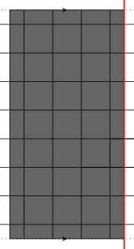
<figcaption class="paper-figure-caption"><b>Fig 1.</b> Figure 4: Graphical representation of the cut torus, with the cut plane highlighted in red (Credits: Davide Morgante)</figcaption>
</figure>
<figure class="paper-figure-card">
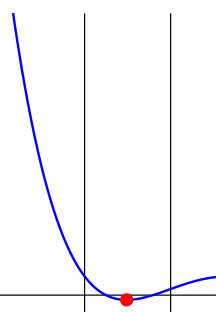
<figcaption class="paper-figure-caption"><b>Fig 2.</b> Figure 6: Sketch of the Effective Potential vα λ(ϕ)</figcaption>
</figure>
<figure class="paper-figure-card">
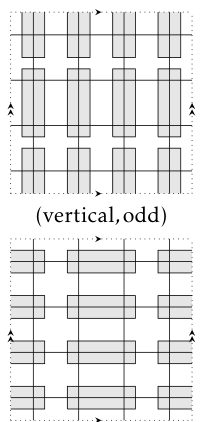
<figcaption class="paper-figure-caption"><b>Fig 3.</b> Figure 8: 4 Tassellation Patterns Used to Cover Lattices Λα L: notice that using all such covering one is able to recover all edges crossed by the contour γ. (In the Lattice ΛSP L all spacings are doubled)</figcaption>
</figure>
<figure class="paper-figure-card">
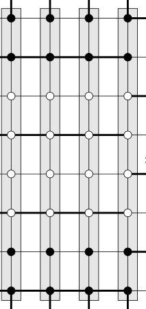
<figcaption class="paper-figure-caption"><b>Fig 4.</b> Figure 12: Graphical Representation of the Staggered Dirac Operator with Plaquette Interaction with periodic pattern produced by Chessboard Estimates. In Grey we have drawn the unit cells used to perform Fourier Transforms.</figcaption>
</figure>

**Summary.** This paper rigorously proves the existence of Long-Range Order in various lattice formulations of the 2D Gross-Neveu model. It achieves this by transforming the fermionic problem into a bosonic one and applying sophisticated mathematical tools like Reflection Positivity and Peierls arguments. The result provides a non-perturbative validation of chiral symmetry breaking, connecting rigorous lattice theory to mean-field predictions.

**Why it may be interesting.** While highly technical, the rigorous proof of spontaneous symmetry breaking (LRO) in a lattice field theory like GN is foundational for understanding how quantum fluctuations drive macroscopic order parameters, which has parallels in many-body physics relevant to AMO systems.

Detailed structure

**Main problem.** The central problem is rigorously proving the existence of Long-Range Order (LRO) in lattice regularizations of two-dimensional Euclidean Gross-Neveu models.

**Main result.** The authors provide a fully rigorous, non-perturbative demonstration of LRO for the chiral fermion bilinear $\langle\psi\psi
angle$, establishing a direct link between the continuum theory and its large-$N$ mean-field predictions.

**Method.** The analysis employs advanced techniques including Hubbard-Stratonovich transformations to map fermionic systems to bosonic ones, followed by using Reflection Positivity, Chessboard Estimates, and Peierls-type contour arguments.

**Model / system.** The study focuses on three lattice discretizations of the 2D Euclidean Gross-Neveu model: Naive (NN), Staggered (SN), and Staggered Plaquette (SP). These models are used to investigate chiral symmetry breaking and dynamical mass generation.

**Key observables.** The primary observables include the chirally charged fermion-mass bilinear $\langle\psi\psi
angle$ (the order parameter) and the bosonic two-point function, which controls the LRO.

**Important parameters / regimes.** LRO is proven for sufficiently small coupling constants ($\lambda$) and sufficiently large flavor numbers ($N$). The analysis compares results across different lattice discretizations.

**Assumptions / limitations.** The proof relies on establishing Reflection Positivity for the resulting bosonic measures, which requires an even number of fermion flavors. The final characterization of infinite-volume states remains a future goal.

**Figures summary.** Figures illustrate phase distributions of anti-symmetrized forward Dirac operators and graphical representations related to Z2-Gauge Transformations used in the contour arguments.

**Paper structure.** The paper systematically analyzes three lattice models (NN, SN, SP), establishing key properties of their respective Dirac operators. It then uses the Hubbard-Stratonovich transformation to derive an effective bosonic potential, proving Reflection Positivity and finally applying Peierls/Chessboard estimates to establish LRO.

Abstract

We prove the existence of Long-Range Order in a class of two-dimensional Euclidean lattice Gross-Neveu models with an even number of fermion flavors, covering three standard lattice discretizations, including naive and staggered fermions widely used in numerical studies. By performing a Hubbard-Stratonovich transformation, we map the fermionic systems to bosonic ones and establish Reflection Positivity for the resulting measures. Exploiting this structure, we combine Chessboard Estimates with a Peierls-type contour argument to prove Long-Range Order for the chirally charged fermion-mass bilinear $\overlineψψ$ at sufficiently small coupling and sufficiently large flavor number. Our analysis is robust with respect to the choice of lattice discretization and applies uniformly across different realizations of the same underlying continuum model. Moreover, we obtain uniform pointwise bounds on the bosonic two-point function, equivalently on the fermionic mass-mass correlator, showing that it is quantitatively controlled by the minimizers of the effective potential. This provides a fully rigorous and non-perturbative demonstration of Long-Range Order in lattice Gross-Neveu models and establishes a direct connection between the rigorous theory and its large-$N$ (mean-field) predictions.

[↑ back to top](#top)

### [Cyclotron mass-selective de Haas-van Alphen measurements using temperature modulation](http://arxiv.org/abs/2606.12514v1)

**Authors:** Michelle Hollricher, Andreas Bauer, Leo Maximov, Louw Feenstra, Christian Pfleiderer, Marc A. Wilde  
**Type:** experiment · **Category:** strongly correlated electrons · **PDF:** <https://arxiv.org/pdf/2606.12514v1>  
**Analysis basis:** full PDF text, analyzed in chunks
**Topic relevance:** `analog quantum simulation` **1/5** · `quantum measurements` **1/5**

↔ Scroll figures horizontally

<figure class="paper-figure-card">
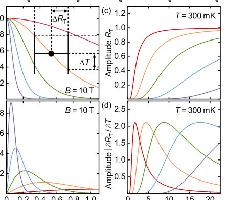
<figcaption class="paper-figure-caption"><b>Fig 1.</b> FIG. 1. Field and temperature dependence of the Lifshitz– Kosevich factor RT and its derivative ∂RT/∂T . (a) RT vs T at 10 T for selected m∗. In a conventional dHvA experiment, light m∗tend to dominate the dHvA spectrum at all T . Mod- ulation with amplitude ∆T results in oscillations of RT with amplitude ∆RT. The demodulated induced voltage U scales with ∂RT/∂T . (b) ∂RT/∂T vs T . Oscillations with light m∗are strongly suppressed at low T , where oscillations with heavy m∗dominate and vice versa. (c) RT vs B at 300 mK. In a conventional dHvA experiment, light m∗dominate the signal at all B. (d) ∂RT/∂T vs B. Oscillations with light m∗are strongly suppressed at high B, where oscillations...</figcaption>
</figure>
<figure class="paper-figure-card">
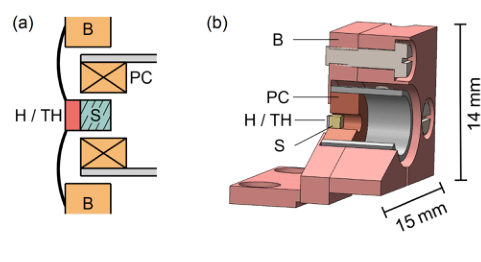
<figcaption class="paper-figure-caption"><b>Fig 2.</b> FIG. 2. TM-dHvA setup. (a) Schematic side view show- ing the sample (S) attached to a heater (H) and thermome- ter (TH) platform, thermally linked to the bath (B). The sam- ple is situated inside the pick-up coil (PC). (b) Cutaway view of the setup showing the sample (S), mounted on a modified bare RuO2 chip that is used as both heater (H) and ther- mometer (TH), situated inside the pick-up coil (PC).</figcaption>
</figure>
<figure class="paper-figure-card">
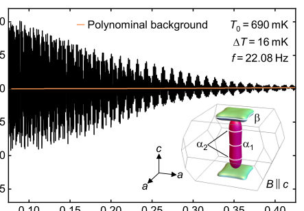
<figcaption class="paper-figure-caption"><b>Fig 3.</b> FIG. 3. Quantum oscillations, Fermi surface and extremal orbits of MoSi2 for B ∥c. The raw demodulated voltage U at T0 = 690 mK and f = 22.08 Hz is shown as a function of 1/B. The non-oscillatory background is negligible compared to the quantum oscillation amplitudes. The Fermi surface of MoSi2 exhibits one extremal electron orbit β, one minimal hole orbit α1 and two symmetry-equivalent maximal hole orbits α2.</figcaption>
</figure>
<figure class="paper-figure-card">
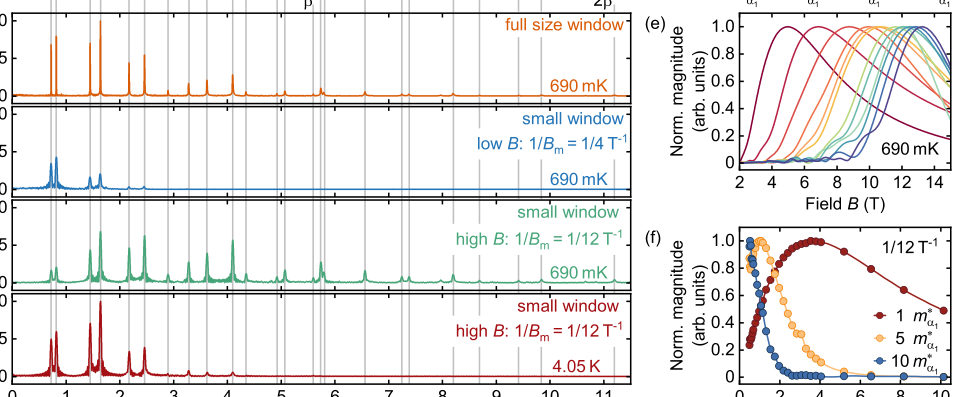
<figcaption class="paper-figure-caption"><b>Fig 4.</b> FIG. 4. Field and temperature evolution of TM-dHvA oscillation amplitudes in MoSi2. (a) FFT spectrum of the data in Fig. 3(a) over a large window between 1/15 and 1/2 T−1. Frequencies α1, α2 and β and harmonic content up to p = 13 are indicated by vertical lines. The pth harmonics of α1 and α2 correspond to orbits with masses of p m∗ α1,2. (b) FFT spectrum for a narrow window of 1/30 T−1 width centered at 1/Bm = 1/4 T−1 and T0 = 690 mK. Here, signals from 1α1,2 dominate the spectrum. (c) As in (b) but with the window centered at 1/Bm = 1/12 T−1. Here, the orbits with large masses dominate, and the light fundamentals are suppressed. (d) As in (c) but at T0 = 4.05 K. The frequencies...</figcaption>
</figure>
<figure class="paper-figure-card">
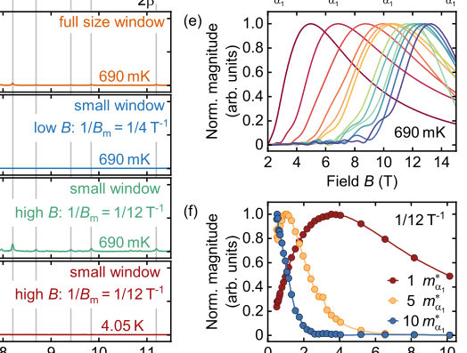
<figcaption class="paper-figure-caption"><b>Fig 5.</b> Fig. 4(c), where signal from the harmonic content asso- ciated with heavy m∗dominates, the fundamental peaks are present at 4.05 K, while the amplitudes of higher har- monics are suppressed. It follows that the choice of field window position and temperature range determines the range of orbit masses m∗that contribute to the FFT spectrum of the TM-dHvA oscillations. To analyze the oscillation amplitudes of individual har- monics, we first computed FFTs using the large window from 1/15 to 1/2 T−1, isolated individual FFT peaks us- ing a rectangular window, and transformed the signal back via an inverse FFT (IFFT). In the following, we focus on α1 and its harmonic content, α2 and β behave...</figcaption>
</figure>

**Summary.** This work introduces and validates the temperature-modulated de Haas-van Alphen ($	ext{TM-dHvA}$) technique, which measures the temperature derivative of magnetization oscillations. This method overcomes the limitation of overlapping frequency peaks by exploiting the mass-dependent non-monotonic behavior of $\partial M / \partial T$. It successfully demonstrates the independent measurement of heavy and light cyclotron masses in MoSi2, opening a new avenue for studying complex Fermi surfaces.

**Why it may be interesting.** While focused on solid-state physics, the ability to selectively probe different energy scales or effective parameters ($m^*$) via a derivative measurement technique is analogous to advanced spectroscopic techniques used in AMO physics for characterizing complex quantum states.

Detailed structure

**Main problem.** The primary challenge is selectively measuring quantum oscillations from orbits with widely different effective masses ($m^*$) when their frequency peaks overlap in conventional de Haas-van Alphen (dHvA) measurements.

**Main result.** The temperature-modulated dHvA ($	ext{TM-dHvA}$) technique successfully achieves cyclotron mass selectivity, allowing the independent extraction of heavy and light orbit contributions even when they are indistinguishable by frequency alone.

**Method.** The method involves sinusoidally modulating the sample temperature ($T$) and measuring the phase-sensitive voltage signal proportional to $\partial M / \partial T$, leveraging the non-monotonic temperature dependence of the Lifshitz-Kosevich factor.

**Model / system.** The experiment uses single-crystal compensated topological semimetal MoSi2 as a platform, which naturally exhibits a rich spectrum of quantum oscillations with multiple distinct cyclotron masses ($1 m^*$ to $13 m^*$).

**Key observables.** Demodulated voltage signal proportional to $\partial M / \partial T$, analyzed via Fast Fourier Transform (FFT) across varying temperatures and magnetic fields.

**Important parameters / regimes.** Low temperatures ($T < 1	ext{ K}$) enhance the visibility of heavy orbits; the temperature modulation amplitude ($\Delta T$) is crucial for signal detection.

**Assumptions / limitations.** The technique assumes that the measured oscillation component is proportional to $\partial M / \partial T$, which simplifies analysis by exploiting the temperature derivative of the Lifshitz-Kosevich factor.

**Figures summary.** Figures illustrate how conventional dHvA struggles with overlapping frequencies, while TM-dHvA clearly separates contributions from heavy and light masses into distinct low-temperature and high-temperature regimes on the $\partial M / \partial T$ signal.

**Paper structure.** The paper introduces the limitations of standard dHvA measurements, details the temperature modulation technique ($	ext{TM-dHvA}$), presents simulations demonstrating mass separation in principle (using overlapping frequencies), and finally applies this method to experimental data on MoSi2 to extract multiple cyclotron masses.

Abstract

We present a temperature-modulated de Haas-van Alphen measurement technique that allows selective addressing of quantum oscillations with different effective masses $m^{\ast}$ using a non-monotonic amplitude evolution with temperature and magnetic field, governed by the temperature derivative of the Lifshitz-Kosevich factor. The technique relies on harmonic modulation of the sample temperature and phase-sensitive detection of quantum oscillations in the voltage induced in a pick-up coil. We use a set of frequencies with strong Zeeman-driven harmonic content in the compensated topological semimetal MoSi$_{2}$ as a natural linear mass comb ranging from 1$m^{\ast}$ to 13$m^{\ast}$ to demonstrate the tunability of the mass-dependent quantum oscillation amplitudes experimentally. The technique allows to reliably isolate weak contributions of heavy orbits that are inaccessible in conventional de Haas-van Alphen frequency spectra because their frequency peaks overlap with much stronger frequency peaks of lighter orbits.

[↑ back to top](#top)

### [Explicit Quantum Circuit Simulation of Nonlinear 1-Dimensional Fluid with Carleman-linearized Boltzmann Method](http://arxiv.org/abs/2606.12770v1)

**Authors:** Keita Kanno, Kazumasa Ueno, Hayato Higuchi, Morimasa Okamoto, Yuya Yoshizuru, Ryoya Ishimaru, Towa Takagi, Kentaro Sakamoto  
**Type:** theory · **Category:** quantum information and computing · **PDF:** <https://arxiv.org/pdf/2606.12770v1>  
**Analysis basis:** full PDF text, analyzed in chunks
**Topic relevance:** `methods for driven-dissipative` **1/5** · `non-equilibrium dynamics` **1/5**

↔ Scroll figures horizontally

<figure class="paper-figure-card">
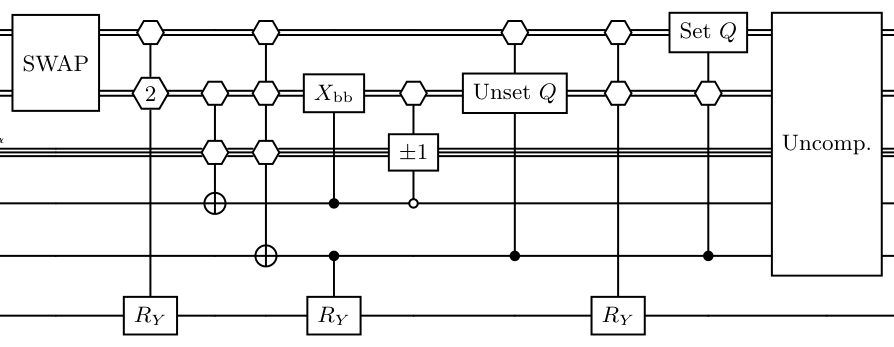
<figcaption class="paper-figure-caption"><b>Fig 1.</b> FIG. 3. Oracle circuit OA11 for the first-order Carleman matrix. SWAP denotes bitwise SWAP between registers, blank hexagons means that the register is a control (with some condition) for the gate, hexagons with a value in it means that the gate is applied conditioned on the register being in that value. RY gate symbols may collectively represent multiple applications of RY with different angles, depending on the values in the registers. Xbb is the bounce-back velocity reversal applied on the lowest bit. Other details are in the main text.</figcaption>
</figure>
<figure class="paper-figure-card">
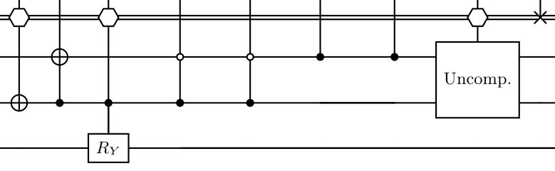
<figcaption class="paper-figure-caption"><b>Fig 2.</b> FIG. 4. Oracle circuit OA12. SWAP denotes bitwise SWAP between registers, blank hexagons means that the register is a control (with some condition) for the gate, hexagons with a value in it means that the gate is applied conditioned on the register being in that value. The RY gate symbol collectively represent multiple applications of RY with different angles, depending on the values in the registers. Xbb is the bounce-back velocity reversal applied on the lowest bit. The final SWAP gate is a one-bit swap between bit 1 of |·⟩i1 and bit 0 of |·⟩q2. Other details are in the main text.</figcaption>
</figure>
<figure class="paper-figure-card">
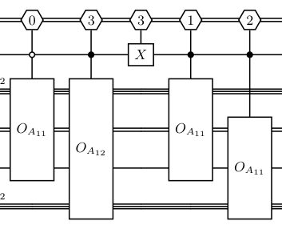
<figcaption class="paper-figure-caption"><b>Fig 3.</b> FIG. 5. Oracle circuit OA for the second-order Carleman block encoding. Hexagons with a value in it means that the gate is applied conditioned on the register being in that value.</figcaption>
</figure>
<figure class="paper-figure-card">
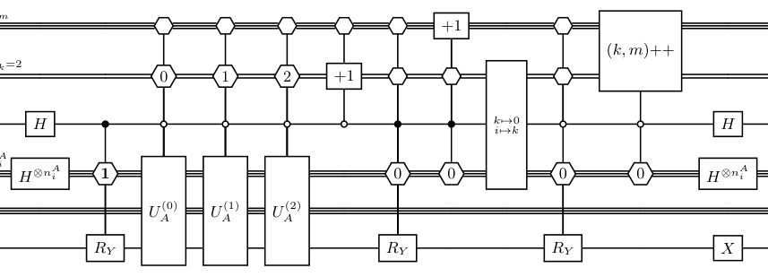
<figcaption class="paper-figure-caption"><b>Fig 4.</b> FIG. 6. Block encoding circuit UL for the L-matrix (NK = 3, nk = 2). Blank hexagons means that the register is a control (with some condition) for the gate, hexagons with a value in it means that the gate is applied conditioned on the register being in that value, while bold 1 means all-1’s in the register, i.e., 1 = 2nA i −1. RY gate symbols may collectively represent multiple applications of RY with different angles, depending on the values in the registers. Other details are in the main text.</figcaption>
</figure>
<figure class="paper-figure-card">
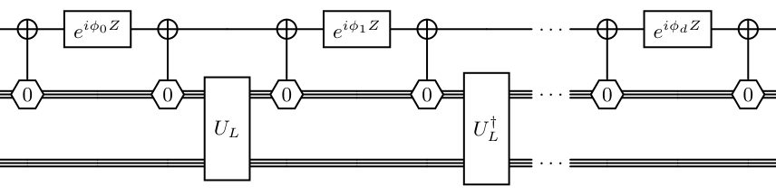
<figcaption class="paper-figure-caption"><b>Fig 5.</b> FIG. 7. QSVT circuit for polynomial transformation of the block-encoded L-matrix. Hexagons with 0 in it means that the gate is applied conditioned on the register being all-0’s. The signal-processing qubit (top wire) is acted upon by dQSVT+1 phase rotations eiϕjZ, interleaved with alternating applications of UL and U † L. The ancilla register |0⟩a includes all ancilla qubits of the L-matrix block encoding (row labels |·⟩iA and |·⟩iL, and target |0⟩t). The system register |ψ⟩encodes the time-step, spatial, and velocity indices.</figcaption>
</figure>

**Summary.** The paper details the simulation of nonlinear fluid dynamics using an explicit quantum circuit approach. It tackles the nonlinearity by employing Carleman linearization on the Boltzmann equation, transforming it into a solvable linear ODE system. The time evolution is then computed efficiently using Quantum Singular Value Transformation (QSVT), providing detailed complexity analysis for future quantum CFD applications.

**Why it may be interesting.** This work provides a concrete roadmap for applying advanced quantum algorithms (QSVT) to solve complex, non-equilibrium many-body dynamics problems that are central to condensed matter physics, moving beyond simple linear Hamiltonians.

Detailed structure

**Main problem.** The primary goal is to simulate the complex, nonlinear dynamics of a one-dimensional fluid governed by the Boltzmann equation using quantum computation.

**Main result.** The authors successfully constructed explicit quantum circuits that encode the time evolution matrix for the linearized system, demonstrating scaling laws and achieving high accuracy compared to classical benchmarks.

**Method.** The approach combines Carleman linearization of the nonlinear Boltzmann equation into a linear ODE, which is then solved using a Taylor expansion-based Ordinary Differential Equation (ODE) solver implemented via Quantum Singular Value Transformation (QSVT).

**Model / system.** The system models a 1D fluid dynamics problem, utilizing the Lattice Boltzmann Method framework. The nonlinearity is handled by approximating $1/
ho$ and linearizing the resulting ODE using Carleman expansion up to second or third order.

**Key observables.** Gate and qubit complexities (scaling logarithmically with grid size), effective condition number $\kappa(L)$, and pointwise residual error compared to the continuous BGK reference solution.

**Important parameters / regimes.** Grid size ($N_x$), time steps ($N_t$), Carleman truncation order ($N_C=2, 3$), and Taylor expansion order ($N_K$).

**Assumptions / limitations.** The core assumptions involve the validity of the Taylor approximation for $1/
ho$ around $
ho=1$, and the convergence properties of the Carleman linearization method.

**Figures summary.** Figures illustrate the block-encoding quantum circuit structures ($O_{A11}, O_{A12}$), the general time-evolution matrix structure ($U_L$), and various error analyses comparing simulation results against classical reference solutions across different truncation orders.

**Paper structure.** The paper systematically builds the quantum simulation by first linearizing the nonlinear PDE (Carleman method), then discretizing the resulting ODE into a matrix form, and finally implementing the time evolution operator using block-encoded oracles within QSVT circuits.

Abstract

Quantum computation of fluid dynamics has attracted growing attention as a key application of fault-tolerant quantum computers anticipated in the coming decade, with lattice Boltzmann methods emerging as a particularly promising approach. Explicit and efficient elementary-gate-level circuit simulations, however, have so far been demonstrated only in the linear case. Here we include the leading nonlinearity through second-order Carleman linearization of the one-dimensional Boltzmann equation, and demonstrate, via explicit quantum-circuit simulation, the preparation of the final-time state using a Taylor-expansion-based ODE solver based on the quantum singular value transformation. With this construction, we analyze the gate and qubit complexities, which scale logarithmically with the grid size, the nonlinearity captured by the higher-order Carleman linearization, and the practical utility of higher-order expansions in the Taylor ODE solver. The construction provides a concrete baseline for computational cost reduction and further developments such as extensions to higher dimensions, complex geometries, and the extraction of physical quantities, towards industrially useful quantum CFD.

[↑ back to top](#top)

### [Graph Reinforcement Learning for Calibration-Aware Quantum Circuit Routing](http://arxiv.org/abs/2606.12816v1)

**Authors:** Yash Vardhan Tomar, Dheeraj Peddireddy, Vaneet Aggarwal  
**Type:** both · **Category:** quantum information and computing · **PDF:** <https://arxiv.org/pdf/2606.12816v1>  
**Analysis basis:** full PDF text, analyzed in chunks
**Topic relevance:** `QC/QI experiment` **1/5** · `methods for driven-dissipative` **1/5**

↔ Scroll figures horizontally

<figure class="paper-figure-card">
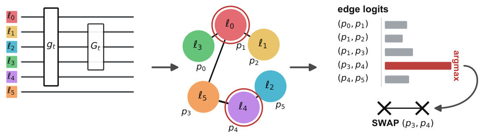
<figcaption class="paper-figure-caption"><b>Fig 1.</b> Fig. 1. Routing-state graph construction. (a) Circuit inputs consist of the remaining circuit, front blocking gate 𝑔𝑡, and lookahead gates 𝐺𝑡. (b) Current non-identity placement 𝑀𝑡: 𝐿→𝑃and calibration snapshot 𝜅are encoded on 𝐺𝐵= (𝑃, 𝐸, 𝜅); node labels show logical occupants, and red rings mark the blocked front-gate operands. A solid 𝑝3–𝑝4 edge marks a legal SWAP edge on the shortest path. (c) Message passing produces node embeddings, the edge head scores legal SWAPs, and the red logit identifies the inserted SWAP.</figcaption>
</figure>
<figure class="paper-figure-card">
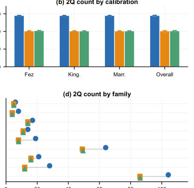
<figcaption class="paper-figure-caption"><b>Fig 2.</b> Fig. 2. Benchmark exact fidelity and routed two-qubit (2Q) counts. (a,b) Snapshot means with matched cells and bootstrap intervals. (c,d) Circuit-family means. Fidelity gains coincide with additional 2Q gates on families where calibration-aware routing helps.</figcaption>
</figure>

**Summary.** The paper proposes using graph reinforcement learning to optimize quantum circuit routing on noisy quantum processors. By incorporating real-time calibration data, the learned router selects paths that maximize fidelity rather than just minimizing gate count. This demonstrates that intelligence derived from hardware characterization can yield significant performance gains over traditional compilation methods.

**Why it may be interesting.** This work directly addresses the practical gap between theoretical quantum algorithms and noisy physical hardware by integrating machine learning into the compilation stack, which is crucial for advancing NISQ applications.

Detailed structure

**Main problem.** Quantum circuit routing for NISQ devices is challenged by hardware imperfections, as standard metrics fail to account for varying coupler error rates across different paths.

**Main result.** A calibration-aware graph reinforcement learning router achieved a pooled mean exact fidelity of 0.727, significantly outperforming established baselines like SABRE-best20 (0.440).

**Method.** The authors trained an RL agent using Proximal Policy Optimization (PPO) to select hardware SWAPs based on real-time calibration data.

**Model / system.** The work simulates quantum computation on NISQ processors, modeling the environment as a calibrated backend graph incorporating readout and two-qubit error rates from same-day calibration snapshots.

**Key observables.** Exact simulated state fidelity ($\mathcal{F}$), routed two-qubit count ($g_{2Q}$), and circuit depth are tracked against established baselines.

**Important parameters / regimes.** The performance is sensitive to the size of the circuit (5q vs 10q) and the availability of alternative, high-fidelity routing paths.

**Assumptions / limitations.** The comparison relies on reproducible SABRE-family baselines due to differing evaluation harnesses; furthermore, fixed action graphs limit optimal path exploration for larger circuits.

**Figures summary.** Figure 1 illustrates how circuit inputs and calibration data are encoded into a graph structure for the RL router. Table II quantifies fidelity gains versus added two-qubit gates compared to SABRE-best20.

**Paper structure.** The paper introduces the problem of hardware-aware routing, details the RL formulation (state, action, reward using PPO), presents the methodology using calibration data for training, and concludes with comparative results against state-of-the-art benchmarks.

Abstract

Quantum circuit routing is a key step in compiling programs for noisy intermediate-scale quantum processors. Routes that appear efficient by standard overhead metrics can still lose fidelity when they pass through poorly calibrated couplers. We study a calibration-aware graph reinforcement-learning router that uses same-day IBM Heron r2 calibration data to choose hardware-edge SWAPs. We train the policy with proximal policy optimization and evaluate it with exact simulated fidelity across nine Munich Quantum Toolkit (MQT) Bench circuits and three calibration snapshots. Across these evaluations, pooled mean exact fidelity is $0.727$, compared with $0.440$ for SABRE-best20 and $0.481$ for target-aware SABRE. Fidelity gains come with higher routed two-qubit counts and are concentrated in the 5q and 8q circuit families; under the fixed tree action graph, all 10q families favor SABRE-best20. Overall, our results show that calibration-aware learned routing can improve fidelity beyond gate-count-driven compilation.

[↑ back to top](#top)

### [A Quantum Algorithm for Random Number Generation](http://arxiv.org/abs/2606.13034v1)

**Authors:** Aastha Kataria, Devansh Desai, Ashwini Dalvi, Sagar Korde, Abhijeet Pasi, Irfan N A Siddavatam, Sudhir Ranjan Jain  
**Type:** both · **Category:** quantum information and computing · **PDF:** <https://arxiv.org/pdf/2606.13034v1>  
**Analysis basis:** full PDF text, analyzed in chunks
**Topic relevance:** `entanglement & information structure` **1/5**

↔ Scroll figures horizontally

<figure class="paper-figure-card">
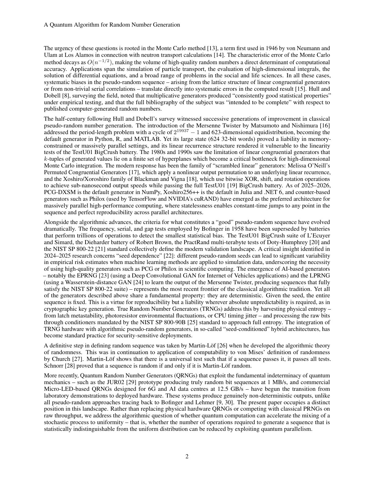
<figcaption class="paper-figure-caption"><b>Fig 1.</b> Low-resolution page preview, page 2</figcaption>
</figure>
<figure class="paper-figure-card">
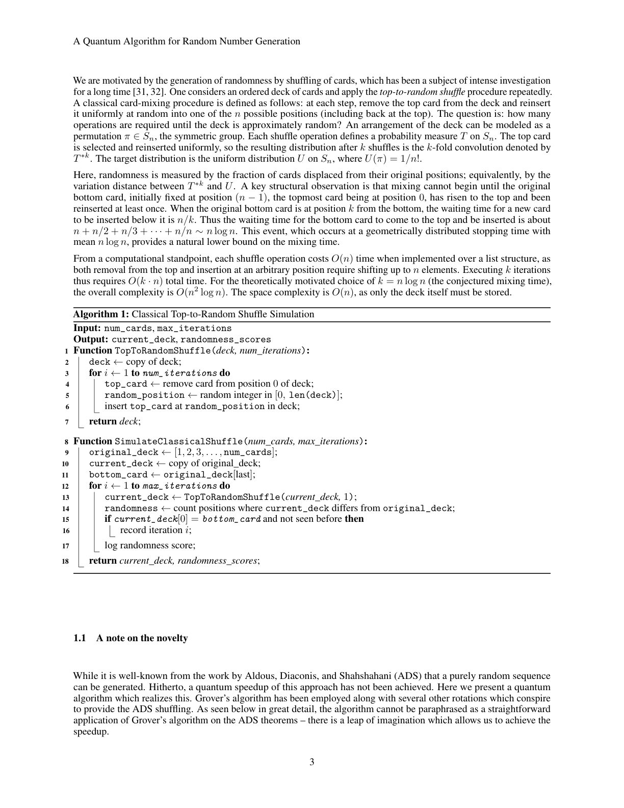
<figcaption class="paper-figure-caption"><b>Fig 2.</b> Low-resolution page preview, page 3</figcaption>
</figure>
<figure class="paper-figure-card">
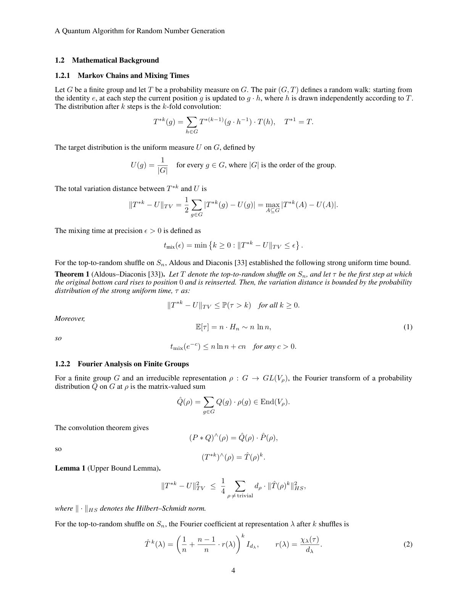
<figcaption class="paper-figure-caption"><b>Fig 3.</b> Low-resolution page preview, page 4</figcaption>
</figure>
<figure class="paper-figure-card">
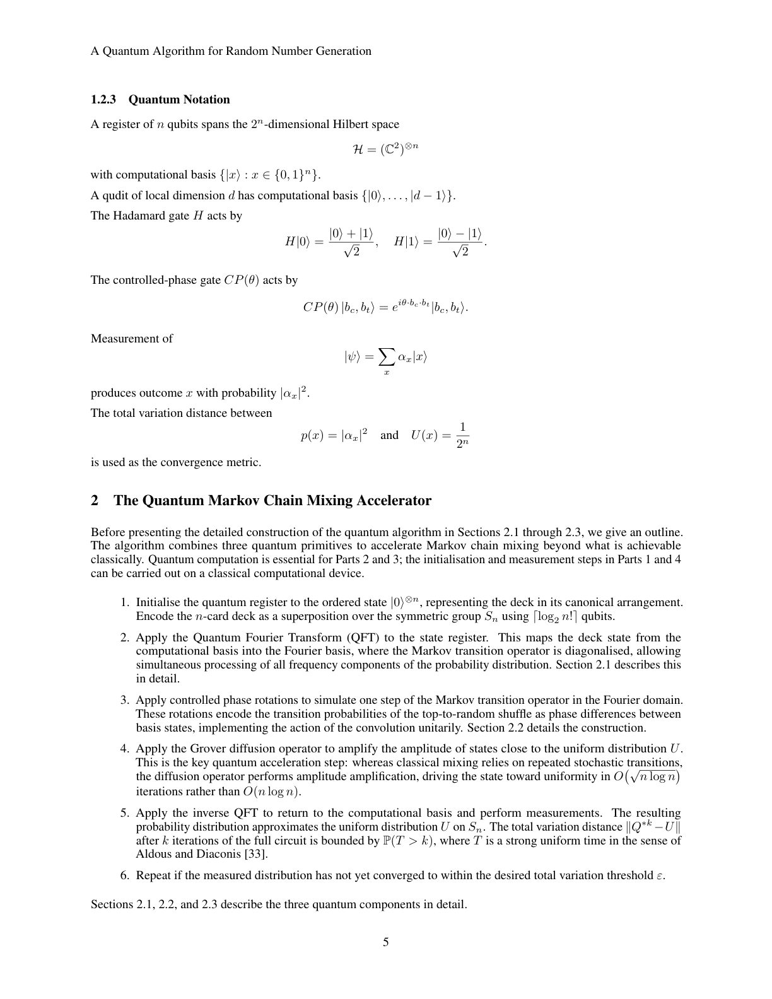
<figcaption class="paper-figure-caption"><b>Fig 4.</b> Low-resolution page preview, page 5</figcaption>
</figure>
<figure class="paper-figure-card">
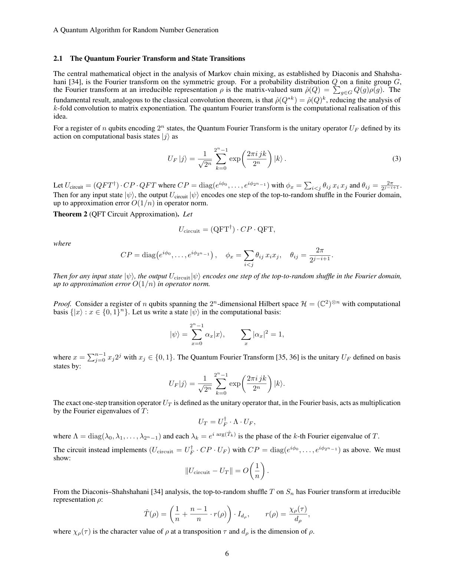
<figcaption class="paper-figure-caption"><b>Fig 5.</b> Low-resolution page preview, page 6</figcaption>
</figure>

**Summary.** This work presents a novel quantum algorithm for generating random numbers by simulating the mixing process of a card shuffle. It achieves a provable quadratic speedup over classical methods by utilizing qudits and combining QFT with Grover diffusion. The results are validated both theoretically and experimentally on superconducting hardware.

**Why it may be interesting.** It provides a concrete example of applying advanced quantum algorithms (QFT, Grover diffusion) to solve a fundamental problem in information theory—randomness generation—with complexity scaling that surpasses classical limits.

Detailed structure

**Main problem.** The paper develops a quantum algorithm for random number generation by accelerating the mixing time of a Markov process, specifically simulating the top-to-random card shuffle.

**Main result.** The proposed qudit formulation achieves a significantly faster convergence rate, with a total gate complexity scaling as $O(\sqrt{\log_d N})$, demonstrating a provable quadratic speedup over classical simulation bounds.

**Method.** The algorithm integrates the Quantum Fourier Transform (QFT), controlled phase rotations encoding Markov eigenvalues, and a Grover diffusion operator to simulate the mixing process in the quantum domain.

**Model / system.** The system is modeled by random walks on the symmetric group $S_n$, using both qubit ($n$-qubit) and qudit ($m$ qudits of dimension $d$) encodings. The simulation targets achieving a state distribution close to uniform randomness.

**Key observables.** Total Variation Distance ($\lVert Q_k - U 
Vert_{	ext{TV}}$), mixing time, peak probability ($p_{	ext{max}}$), and rejection rate.

**Important parameters / regimes.** The state space dimension $N=d^m$, the number of qubits $n$, and the local qudit dimension $d$.

**Assumptions / limitations.** The analysis relies on approximating the exact unitary evolution with a circuit, and the final output extraction methods must be carefully applied to maintain randomness.

**Figures summary.** Figures illustrate the decay of the Total Variation Distance ($d_k$) for both qubit and qudit implementations across multiple mixing layers, showing rapid convergence towards uniformity.

**Paper structure.** The paper progresses from establishing the classical lower bound on mixing time, to developing the quantum circuit using QFT/controlled phases, generalizing this to an efficient qudit formulation, and finally validating the algorithm through both theoretical analysis and experimental implementation on superconducting hardware.

Abstract

We present a quantum algorithm for random number generation that achieves a provable quadratic speedup over classical Markov chain mixing, building on the Diaconis-Shahshahani Fourier analysis of the top-to-random card shuffle. The algorithm integrates three quantum primitives into a unified mixing circuit: the Quantum Fourier Transform (QFT), which diagonalizes the Markov transition operator; controlled phase rotations, which encode the shuffle eigenvalue spectrum; and the Grover diffusion operator, which acts as a quantum analogue of the Aldous-Diaconis strong uniform stopping time by reflecting amplitudes about their mean at each iteration. For an n-qubit register, the mixing time is O(\sqrt{n \log n}) iterations. Extending to m qudits of local dimension d reduces this to O(\sqrt{\log_d N}) iterations, where N = d^m, compared to the classical O(n \log n) bound. The qudit formulation further reduces QFT circuit depth from O(\log^2 N) to O(\log_d^2 N) gates per layer by encoding the same N-state space using m = \log_d N subsystems instead of \log_2 N qubits. We validate both variants on IBM superconducting hardware.

[↑ back to top](#top)

### [Coupling-Grouped XY-QAOA for Joint Anomaly-Feature Selection](http://arxiv.org/abs/2606.13244v1)

**Authors:** Pauli Taipale  
**Type:** both · **Category:** quantum information and computing · **PDF:** <https://arxiv.org/pdf/2606.13244v1>  
**Analysis basis:** full PDF text, analyzed in chunks
**Topic relevance:** `QC/QI experiment` **1/5**

↔ Scroll figures horizontally

<figure class="paper-figure-card">
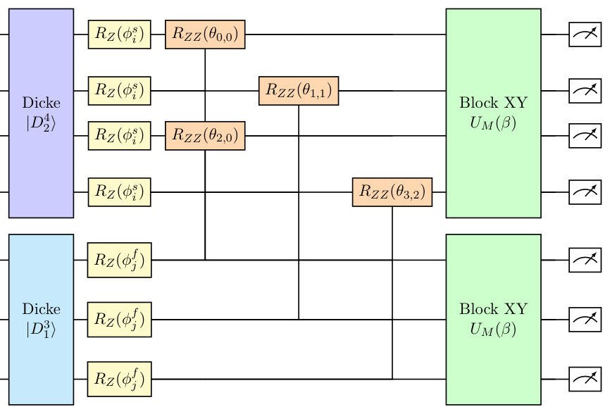
<figcaption class="paper-figure-caption"><b>Fig 1.</b> Figure 1: Logical CG-XY-QAOA circuit for exact-budget bipartite selection (p = 1 layer). The example uses N = 4, k = 2, D = 3, m = 1 with tensor-Dicke initialization. Hardware runs use the feasible-basis and classical warm-start initialization specializations in Section 4.3. The diagonal cost layer contains sample/feature fields and retained bilinear RZZ rotations, followed by independent Block XY mixers that preserve each register’s Hamming weight. For p &gt; 1, cost and mixer layers repeat with the parameterization in Table 1.</figcaption>
</figure>
<figure class="paper-figure-card">
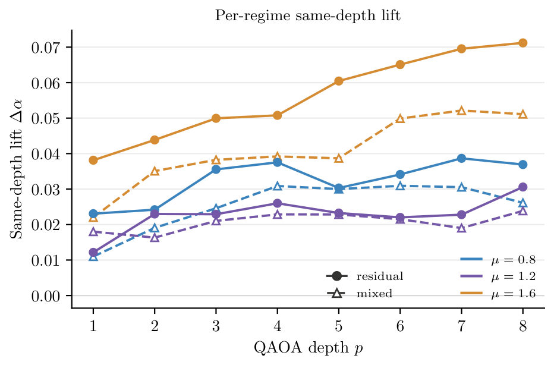
<figcaption class="paper-figure-caption"><b>Fig 2.</b> Figure 2: Fully grouped cost-plus-mixer CG-XY-QAOA gives positive same-depth noiseless score lift in every plotted perturbation cell. The panel reports ∆α = αfully grouped −αtied over the planted-bicluster depth sweep over signal strength µ, where α = ( ¯C −E[C])/( ¯C −C⋆) equals one at the exact feasible optimum and zero at the unconstrained-uniform reference. Full pooled α values are reported in Supplementary Section S9.1.</figcaption>
</figure>
<figure class="paper-figure-card">
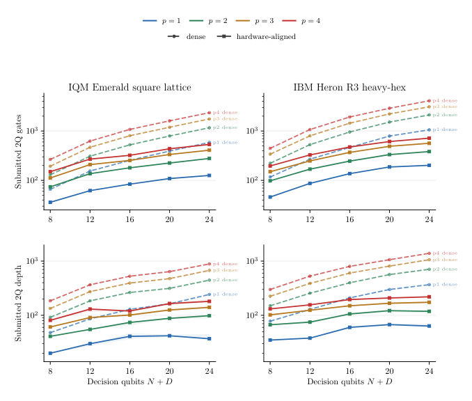
<figcaption class="paper-figure-caption"><b>Fig 3.</b> Figure 3: Sparse-cost scaling across hardware targets. Hardware-aligned cost layouts reduce submitted two-qubit resources across the IQM Emerald square-lattice and IBM Heron R3 heavy- hex targets. Each point is the median over 20 transpiler seeds. Bands show interquartile ranges.</figcaption>
</figure>
<figure class="paper-figure-card">
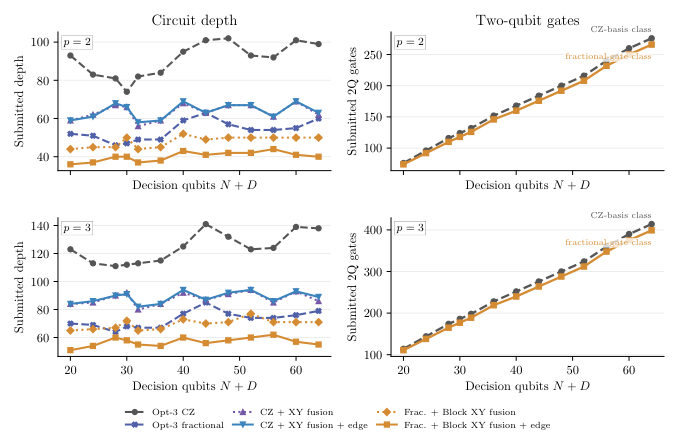
<figcaption class="paper-figure-caption"><b>Fig 4.</b> Figure 4: Implementation-path scaling on hardware-aligned sparse benchmark circuits. All curves use the same retained cost terms, preselected hardware patch, initial layout, basis initialization, bilinear-CG parameterization, representative fixed angles, physical backend, and transpiler seed. The curves compare Opt-3 on the standard CZ-basis target, Opt-3 on the fractional-gate target, and paths that add Block XY fusion and edge-colored transport ordering. The fractional paths use the fractional-gate target and submit RZZ two-qubit gates. The two-qubit-gate panels group paths that coincide in submitted two-qubit count into CZ-basis and fractional-gate classes. Across these matched circuits,...</figcaption>
</figure>

**Summary.** The paper tackles joint anomaly and feature selection by formulating it as a constrained optimization problem solvable via QAOA. It introduces Coupling-Grouped XY-QAOA, a specialized quantum circuit variant that maintains strict budget constraints while significantly reducing required quantum resources on real hardware. The results validate the method's effectiveness for large-scale, resource-limited quantum computation.

**Why it may be interesting.** This work provides a concrete, resource-aware quantum algorithm implementation (CG-XY-QAOA) for a highly relevant data science problem (anomaly detection), directly addressing the practical challenges of mapping complex constraints onto near-term NISQ hardware.

Detailed structure

**Main problem.** The paper addresses joint anomaly-feature selection, a constrained optimization problem that is superior to sequential feature-first methods because it accounts for the mutual dependence between selected samples and features.

**Main result.** The proposed Coupling-Grouped XY-QAOA method achieves significant hardware resource reductions (up to 61.3% depth reduction) on IBM Heron R3, demonstrating feasibility for large-scale constrained bipartite selection problems.

**Method.** It formulates the problem as a QUBO/Ising model and optimizes it using a specialized QAOA variant called Coupling-Grouped XY-QAOA (CG-XY-QAOA), which is designed to preserve exact cardinality constraints on quantum hardware.

**Model / system.** The optimization targets selecting subsets of anomalous samples ($S$) and explanatory features ($F$) subject to fixed budgets ($k, m$). The physical platform is the IBM Heron R3 superconducting qubit processor, utilizing a constrained-mixer QAOA ansatz.

**Key observables.** Circuit depth reduction (45.9%-61.3%), two-qubit gate reduction (2.6%-5.2%), feasibility retention rates at high qubit counts (e.g., 64 qubits at p=2), and the objective energy gap relative to classical references.

**Important parameters / regimes.** Fixed budgets $k$ and $m$; QAOA depth parameter $p$; hardware connectivity constraints; weight balancing parameter $
ho$.

**Assumptions / limitations.** The method assumes that the problem can be accurately mapped to a QUBO Hamiltonian, and it relies on specific hardware-aware ansatzes (like Block XY mixer) to enforce budget constraints without penalty terms.

**Figures summary.** Figures illustrate circuit structures for different QAOA variants (e.g., tensor-Dicke initialization), resource scaling sweeps across qubit counts, and comparisons of performance metrics like BK hit rates and energy gaps between grouped vs. tied scheduling.

**Paper structure.** The paper progresses from establishing the theoretical necessity of joint selection over sequential methods, deriving the constrained QUBO Hamiltonian, proposing the CG-XY-QAOA ansatz for constraint preservation, and finally validating this approach through extensive benchmarking on IBM Heron R3 hardware across varying qubit counts and depths.

Abstract

Selecting anomalous samples and explanatory features under fixed budgets defines a coupled constrained-optimization problem. Sequential feature-first selection ranks features before choosing samples, which can overlook features whose utility depends on which samples are selected, especially when scores are calibrated from reference data that may be limited, noisy, or drifting. We instead formulate the task as joint sample-feature selection under the same fixed counts. In the analyzed formal model, calibration-error sensitivity grows linearly with the number of samples for feature-first ordering but stays constant for joint selection. We introduce Coupling-Grouped XY-QAOA, a constraint-preserving grouped-angle variant for the resulting optimization problem. On matched sparse IBM Heron R3 benchmarks, a hardware-aware implementation reduces circuit depth by 45.9%-61.3% and two-qubit gates by 2.6%-5.2% relative to Qiskit optimization level 3 on the CZ-basis target. It enables, to our knowledge, the largest reported width-depth configurations for constraint-preserving bipartite-selection QAOA hardware executions with feasible-sector retention: 64 qubits at p=2 and 36 qubits at p=3. The 20-qubit p=5 runs retain 63% valid samples. Across 36-64 qubits, fixed-angle runs yield lower-energy feasible samples than matched random-feasible sampling. Warm starts reduce the gap to strict-feasible classical references by 57.5%-80.5%, and near-budget repair matches the sparse classical reference at 36 qubits. Benchmarks show gains in balanced fixed-budget regimes, and noiseless simulations show that problem-structured angle grouping improves over same-depth XY-QAOA and matched-parameter, type-preserving randomization controls. Overall, the results support calibrated joint selection and hardware-realizable constrained-mixer execution in the tested regimes.

[↑ back to top](#top)

### [Decoding Crystallographic Surface Chirality with Machine Learning: From Atomic Geometry to Fermi Surface Projections](http://arxiv.org/abs/2606.13144v1)

**Authors:** Chetana Badala Viswanatha, Ka Man Yu, Benito Arnoldi, Anagha Aravind, Aaruni Kaushik, Jannis Lessmeister, Martin Aeschlimann, Benjamin Stadtmüller, S. Harshini Tekur  
**Type:** both · **Category:** disordered systems and neural networks · **PDF:** <https://arxiv.org/pdf/2606.13144v1>  
**Analysis basis:** full PDF text, analyzed in chunks
**Topic relevance:** `methods for driven-dissipative` **1/5**

↔ Scroll figures horizontally

<figure class="paper-figure-card">
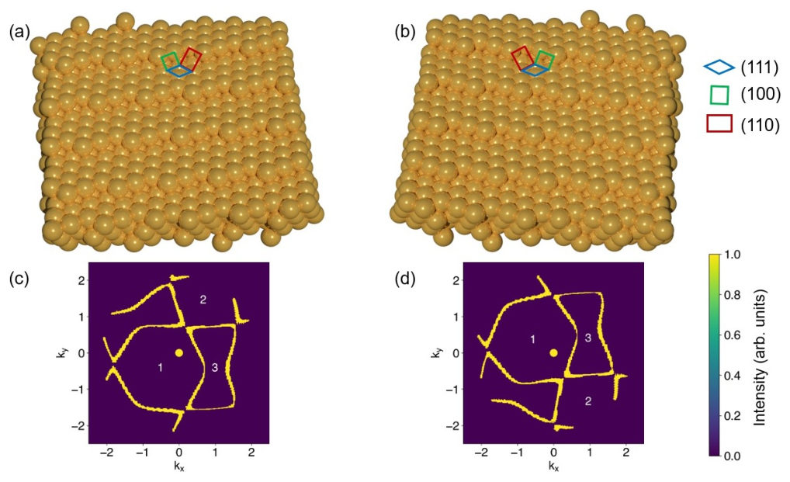
<figcaption class="paper-figure-caption"><b>Fig 1.</b> Figure 1: Representative images from the two datasets. (a, b) Atomic models of an R and S fcc kink surface. The three microfacet types at the kink site are indicated by coloured labels: (111) in blue (priority 1), (100) in green (priority 2), and (110) in red (priority 3). Tracing the sequence 1→2→3 proceeds clockwise for (a) the R surface and anticlockwise for (b) the S surface. (c, d) Corresponding simulated ARPES Fermi surface projections for the same Miller index pair (simulated for hν = 21.2 eV). White numerals 1, 2, and 3 mark the Fermi surface features associated with the (111), (100), and (110) microfacets, respectively. The mirror-symmetry breaking between (c) and (d) is evident in...</figcaption>
</figure>
<figure class="paper-figure-card">
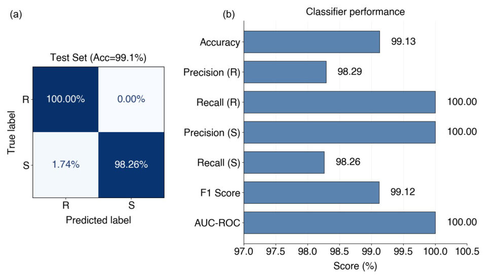
<figcaption class="paper-figure-caption"><b>Fig 2.</b> Figure 2: Test-set performance of the binary chirality classifier. (a) Normalized confusion matrix for classification of R and S enantiomers. (b) Held-out test-set metrics for the Fermi surface classifier</figcaption>
</figure>
<figure class="paper-figure-card">
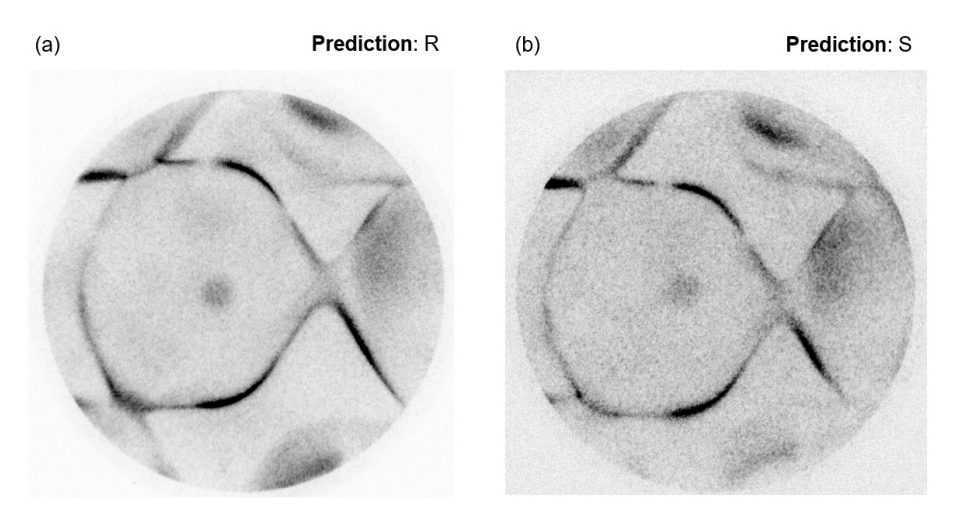
<figcaption class="paper-figure-caption"><b>Fig 3.</b> Figure 3: Experimentally acquired Fermi surface maps for the (a) R and (b) S surfaces of Cu(643), respectively (hν = 30 eV). Each panel is annotated with the classifier-predicted label.</figcaption>
</figure>
<figure class="paper-figure-card">
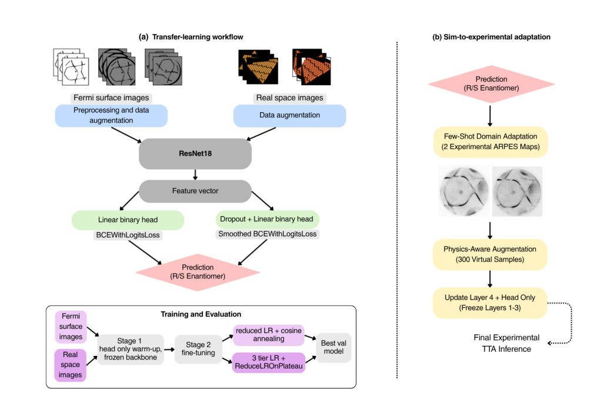
<figcaption class="paper-figure-caption"><b>Fig 4.</b> Figure 4: Transfer-learning strategy for R/S chirality classification. Workflow for (a) train- ing on synthetic real-space and reciprocal-space (ARPES) images, and (b) simulation-to- experimental adaptation of the pretrained classifier.</figcaption>
</figure>

**Summary.** This work introduces a machine learning framework to determine the handedness of chiral metal surfaces by analyzing two types of images: real-space atomic models and reciprocal-space Fermi surface maps. The authors found that classifying chirality from ARPES data is significantly more accurate than using local atomic geometry, suggesting that global electronic patterns are superior diagnostics for intrinsic material properties.

**Why it may be interesting.** The application of deep learning to extract fundamental topological invariants (chirality) from complex electronic band structure maps is highly relevant. The finding that momentum space provides a more robust signature than local atomic geometry has implications for understanding disorder resilience in quantum phenomena like CISS.

Detailed structure

**Main problem.** The core problem is developing a reliable method to classify the handedness (chirality) of intrinsically chiral metal surfaces from experimental observables.

**Main result.** A dual-domain machine learning framework successfully decodes surface chirality, showing that electronic structure maps (ARPES/momentum space) provide significantly more robust classification ($\sim 99\%$) than local atomic geometry models ($\sim 73\%$).

**Method.** The authors employed a deep convolutional neural network (ResNet18) trained on two distinct image representations: simulated real-space atomic structures and momentum-resolved photoemission maps from the Fermi surface.

**Model / system.** The physical system involves high-Miller-index planes of FCC metals exhibiting geometric chirality due to asymmetric step-kink-terrace topology. The analysis is performed using both atomic structure models (real space) and simulated/experimental Angle-Resolved Photoemission Spectroscopy (ARPES) maps (reciprocal space).

**Key observables.** Chirality label ($	ext{R}$ or $	ext{S}$), classification accuracy, Fermi surface polygon orientation relative to the surface normal.

**Important parameters / regimes.** Photon energy ($21.2\ 	ext{eV}$ in simulations; $30\ 	ext{eV}$ experimentally); Classification metrics (Accuracy, AUC-ROC).

**Assumptions / limitations.** The primary assumption is that chirality is encoded differently—locally vs. globally—in the two representations, and that ML can learn this topological invariant from image data.

**Figures summary.** Figures illustrate representative R/S atomic models alongside their corresponding simulated ARPES Fermi surface projections, demonstrating how mirror symmetry breaking manifests in both domains for classification training.

**Paper structure.** The paper follows a systematic pipeline: defining the physical problem (chirality detection), generating synthetic data for both real-space and reciprocal-space representations, training separate ResNet18 classifiers on each domain, and finally testing the superior performance of the reciprocal-space classifier on challenging experimental ARPES images.

Abstract

Intrinsically chiral metal surfaces, where handedness arises from the asymmetric step-kink-terrace topology of high-Miller-index planes, are model systems for enantiospecific catalysis, sensing, and spintronics. Yet, no consistent method exists to classify their handedness directly from experimental observables. We report a dual-domain machine learning framework that decodes crystallographic surface chirality from two independent image representations: atomic structure models in real space and simulated momentum-resolved photoemission maps of the Fermi surface projections in reciprocal space. ResNet18, a deep convolutional neural network, fine-tuned on a database of labeled images achieves ~73% classification accuracy on atomic models and ~99% on Fermi surface projections. We show that the latter transfers directly to synchrotron-acquired experimental images after fine-tuning on just two labeled frames. We identify a working correspondence between the two representations: just as the kink site geometry fixes the orientation of crystallographic planes in real space, the surface normal position in a momentum-resolved photoemission map anchors the orientation of the Fermi surface polygons in reciprocal space. It is precisely this relative orientation that encodes handedness into the map topology with high accuracy. The pronounced difference in accuracy shows that handedness is more readily recovered from the momentum-space electronic pattern than from the local atomic geometry of the kinked surface. This finding has direct implications for the disorder resilience of geometric chiral-induced spin selectivity (CISS) at realistic metal surfaces.

[↑ back to top](#top)

### [Exploratory digital alchemy for colloidal crystal discovery](http://arxiv.org/abs/2606.13586v1)

**Authors:** Shih-Kuang, Lee, Sun-Ting Tsai, Sharon C. Glotzer  
**Type:** theory · **Category:** statistical mechanics · **PDF:** <https://arxiv.org/pdf/2606.13586v1>  
**Analysis basis:** full PDF text, analyzed in chunks
**Topic relevance:** `methods for driven-dissipative` **1/5**

↔ Scroll figures horizontally

<figure class="paper-figure-card">
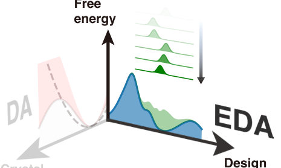
<figcaption class="paper-figure-caption"><b>Fig 1.</b> Fig. 1 From Digital Alchemy (DA) to Exploratory Digital Alchemy (EDA) The EDA modifies the original DA framework, which applies the harmonic constraints (dashed line on the left) on crystal structures, causing the elevation of generalized free energy (red region), and forces the system to equilibrate towards the pre-determined state for inverse design. Instead, EDA combines the generalized ensemble of DA with Metadynamics, which iteratively accumulates Gaussian biases (green region) and enables exploration of the correspondence between crystal structure and particle design.</figcaption>
</figure>
<figure class="paper-figure-card">
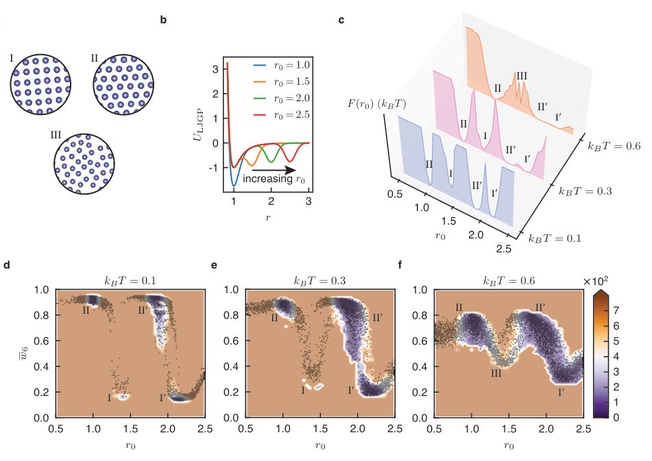
<figcaption class="paper-figure-caption"><b>Fig 2.</b> Fig. 2 Two-dimensional Lennard-Jones-Gauss Potential (LJGP) system. a Thermodynamic phases discovered by the EDA method, including: I square lattice, II hexagonal lattice, and III disordered phase. I’ and II’ represent the same crystal structure with different lattice constants b The LJGP energy profile at different r0. c Helmholtz free energy surface F (FES) as a function of r0 and temperature. d, e, and f The points of collective variables (r0, w6) sampled by the EDA method and the corresponding FES at various temperatures. The minima on the FES are indicated by the corresponding phases in a. The colorbar indicates the FES value Φ(r0, w6) in units of kBT.</figcaption>
</figure>
<figure class="paper-figure-card">
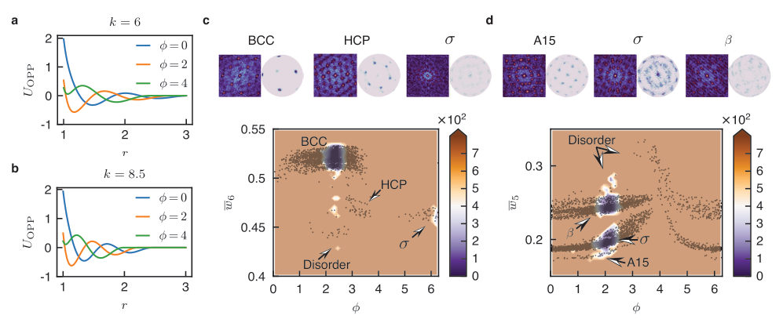
<figcaption class="paper-figure-caption"><b>Fig 3.</b> Fig. 3 Three-dimensional Oscillating Pair Potential (OPP) system. a and b The OPP energy profile for k = 6 and 8.5 respectively, at different ϕ. c and d The points of collective variables (ϕ, wl) sampled by the EDA method and the corresponding free energy surface (FES), for k = 6 and 8.5, respectively. In each subfigure of c and d, the top row plots the diffraction pattern and bond-orientational order diagram for the three crystals discovered, and the FES minima at the bottom row are indicated by the corresponding phases. The colorbars indicate the FES value Φ(ϕ, wl) in units of kBT.</figcaption>
</figure>
<figure class="paper-figure-card">
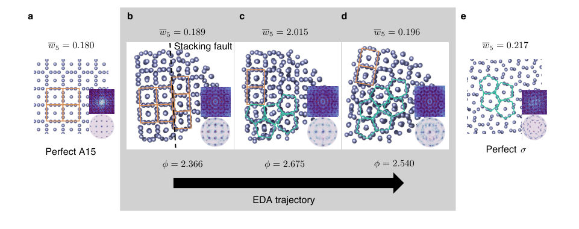
<figcaption class="paper-figure-caption"><b>Fig 4.</b> Fig. 4 Transition between A15 and σ phases at k = 8.5. a The perfect A15 phase. e The perfect σ phase. b The beginning, c intermediate, and d final stage of the transition. In b, the stacking fault is indicated by the black dashed line. The special motifs of A15 and the σ phase are highlighted by the brown square and green pentagons, respectively.</figcaption>
</figure>
<figure class="paper-figure-card">
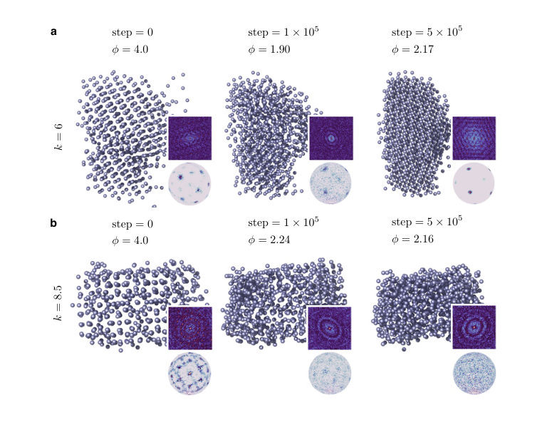
<figcaption class="paper-figure-caption"><b>Fig 5.</b> Fig. 5 Stability test for Oscillating Pair Potential system. a The evolution of the unbiased EDA simulation snapshots at k = 6, starting from the equilibrium hP2 phase at kBT = 0.1 and ϕ = 4. b The evolution of the unbiased EDA simulation snapshots at k = 8.5, starting from the equilibrium cP54 phase at kBT = 0.1 and ϕ = 4.</figcaption>
</figure>

**Summary.** This paper introduces Exploratory Digital Alchemy (EDA), an advanced simulation technique that enhances existing inverse design methods by incorporating Metadynamics principles. EDA allows researchers to explore the full range of potential self-assembled structures in colloidal systems without needing to know the target crystal structure beforehand. By applying this to LJGP and OPP potentials, the authors successfully map out complex free energy landscapes, revealing multiple stable and metastable phases.

**Why it may be interesting.** The methodology of enhancing statistical sampling techniques (MetaD) for materials design is highly relevant. It provides a computational framework applicable to complex many-body systems where the energy landscape is unknown or multi-modal, bridging simulation theory with physical discovery.

Detailed structure

**Main problem.** The primary goal is to develop an enhanced forward design scheme to discover novel, stable self-assembled colloidal structures by overcoming the limitation of existing inverse design methods.

**Main result.** The proposed Exploratory Digital Alchemy (EDA) successfully explores broad potential energy landscapes, identifying multiple coexisting and metastable crystal phases for given particle interaction potentials.

**Method.** EDA enhances Digital Alchemy (DA) by integrating a Metadynamics-like bias potential into the generalized ensemble framework, allowing unbiased exploration of the design space.

**Model / system.** The study models colloidal particles interacting via specific pair potentials: a 2D Lennard-Jones Gauss Potential (LJGP) and a 3D Oscillating Pair Potential (OPP). The analysis focuses on mapping the Free Energy Surface (FES) as a function of potential parameters.

**Key observables.** Free Energy Landscape ($\Phi$), crystal structures identified via Minkowski Structure Metric (MSM), and stability ranges for different phases (e.g., square vs. hexagonal lattices).

**Important parameters / regimes.** Alchemical parameters ($\alpha$, such as $r_0$ or $\phi$), temperature ($k_B T$), and the bias potential parameters used in Metadynamics.

**Assumptions / limitations.** The approach assumes that combining DA with MetaD's self-exploration mechanics can effectively map complex, multi-modal free energy landscapes without needing a predefined target structure.

**Figures summary.** Figures illustrate the conceptual shift from constrained DA to exploratory EDA (Fig. 1), show potential energy profiles correlating stability with parameters (Fig. 2 for LJGP), and display FES maps revealing multiple stable/metastable phases across varying potentials (Fig. 3, Fig. 5).

**Paper structure.** The paper introduces the limitations of DA, proposes EDA as an enhancement using Metadynamics bias accumulation, details its application to both LJGP (2D) and OPP (3D) systems, presents results showing phase identification across parameter space, and concludes by validating the method's ability to map metastability.

Abstract

Digital Alchemy (DA), introduced by Van Anders et al., is a statistical mechanics-based generalized thermodynamic ensemble method that employs computer simulations to optimize colloidal particle design. This approach applies the principles of statistical mechanics to predict and tailor particle attributes that lead to desired self-assembled structures or material properties. However, as an inverse design method, its main limitation is that the target structure must be known \textit{a priori}. Therefore, the optimal design from DA does not guarantee the targeted structure is the most or the only stable one. This highlights the importance of forward design with an exploratory scheme for optimizing novel colloid designs, which becomes more suitable in such cases. In this paper, we introduce Exploratory Digital Alchemy (EDA), an enhanced forward design scheme that begins by releasing the constraint of the target crystal from DA, followed by an exploration-oriented bias that has been extensively used in enhanced sampling methods such as metadynamics (MetaD). We demonstrate the utility of EDA through examples involving particles interacting via a two-dimensional Lennard-Jones Gauss potential (LJGP) and a three-dimensional oscillating pair potential (OPP). We applied EDA to study the free energy landscapes given different potential parameters of LJGP at different temperatures. With the exploratory scheme, we've also successfully identified a wide range of OPP potential parameters that stabilize metastable Frank-Kasper phases. Our approach fuses the standard DA framework with metadynamics, which could potentially be useful for studying alchemical reactions in a generalized ensemble.

[↑ back to top](#top)

### [From 2D Yang-Mills to Calogero-Sutherland via a colored particle](http://arxiv.org/abs/2606.13388v1)

**Authors:** Marcia Tenser, Amilcar R. Queiroz  
**Type:** theory · **Category:** other · **PDF:** <https://arxiv.org/pdf/2606.13388v1>  
**Analysis basis:** full PDF text, analyzed in chunks
**Topic relevance:** `analog quantum simulation` **1/5**

↔ Scroll figures horizontally

<figure class="paper-figure-card">
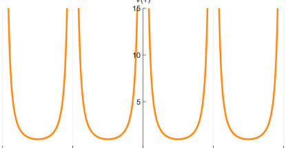
<figcaption class="paper-figure-caption"><b>Fig 1.</b> Figure 3: Potential V (Y ) for G = SU(2) and K = 1. Other values for K simply shift the curves vertically.</figcaption>
</figure>
<figure class="paper-figure-card">
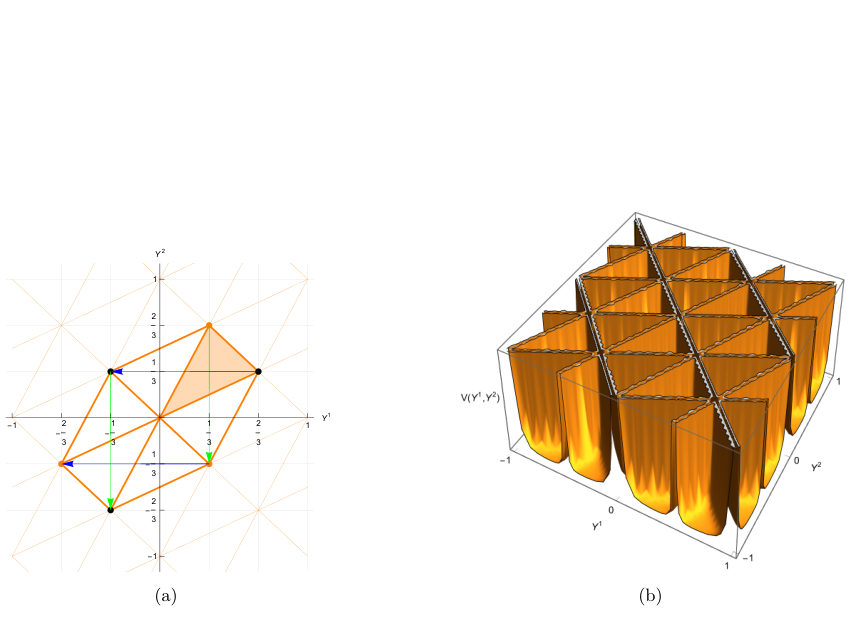
<figcaption class="paper-figure-caption"><b>Fig 2.</b> Figure 4: G = SU(3): (a) the 2D lattice from TSU(3)/S3. The fundamental unit cell is 2-simplex, a triangle. The honeycomb lattice is obtained after acting upon its vertices with permutation matrices. Blue and green shifts correspond to a P1 and a P2 action, respectively. The entire plane is covered by copies of this hexagon structure, generated by large gauge transformations. In (b) the potential V (Y 1, Y 2) assuming Kˆı = 1, ˆı = 1, 2, 3.</figcaption>
</figure>

**Summary.** This paper analyzes the quantum mechanics of Yang-Mills theory coupled to a charged particle on a cylinder. By rigorously applying gauge constraints and transforming the Hamiltonian, the authors demonstrate that the resulting system maps precisely onto the Calogero-Sutherland model for SU(N). This establishes a profound link between non-Abelian gauge theories and exactly solvable integrable quantum systems.

**Why it may be interesting.** The deep connection established between a fundamental gauge theory (Yang-Mills) and an exactly solvable quantum integrable model (Calogero-Sutherland) provides powerful mathematical tools for understanding complex many-body dynamics in theoretical physics.

Detailed structure

**Main problem.** The study investigates Yang-Mills theory coupled to a charged particle on a cylinder, aiming to derive an effective quantum Hamiltonian.

**Main result.** The non-Abelian gauge dynamics are shown to reduce exactly to the integrable Calogero-Sutherland model for SU(N).

**Method.** The analysis involves solving Gauss' law constraints using Wilson lines and decomposing the resulting Hamiltonian into a form solvable by mapping it onto known quantum many-body systems.

**Model / system.** The system is 2D Yang-Mills theory ($G=SU(N)$) coupled to a charged particle on a cylindrical manifold. The effective dynamics are described by a Hamiltonian whose potential term matches the Calogero-Sutherland form.

**Key observables.** Energy eigenvalues, spectral flow conditions, and the structure of the pairwise interaction potential V(Y).

**Important parameters / regimes.** The gauge group rank N (e.g., SU(2), SU(3)), particle mass m, and coupling constants $g_{YM}$. The limit $r 	o \infty$ is a key regime analyzed.

**Assumptions / limitations.** The method assumes solving the Gauss law constraint explicitly prior to quantization, and relies on decomposing fields using the Cartan-Weyl basis.

**Figures summary.** Figures illustrate the physical setup (particle on a cylinder), the lattice structure for SU(3) related to the Weyl group, and the explicit form of the potential V(Y).

**Paper structure.** The paper proceeds by setting up the classical dynamics via Wong's equations, imposing gauge constraints (Gauss law), quantizing the system using Wilson lines, transforming to the Cartan basis, and finally demonstrating the Hamiltonian's equivalence to the Calogero-Sutherland model while proving its Weyl invariance.

Abstract

We study Yang-Mills theory coupled to a particle on a cylinder, where gauge invariance and compactness reduce the dynamics to a finite dimensional quantum system. In the Abelian case, this yields a model equivalent to the Landau problem on a torus, with a degenerate ground state structure. We generalize this construction to non-Abelian gauge groups and show that, for SU(N), the system reduces to a one dimensional quantum many body problem with a singular Calogero-Sutherland-type interaction.

[↑ back to top](#top)

### [Quantum Network Routing based on Surface Code Error Correction](http://arxiv.org/abs/2606.12781v1)

**Authors:** Tianjie Hu, Jindi Wu, Qun Li  
**Type:** theory · **Category:** quantum information and computing · **PDF:** <https://arxiv.org/pdf/2606.12781v1>  
**Analysis basis:** full PDF text, analyzed in chunks
**Topic relevance:** `entanglement & information structure` **1/5**

↔ Scroll figures horizontally

<figure class="paper-figure-card">

<figcaption class="paper-figure-caption"><b>Fig 1.</b> Fig. 1. SurfNet quantum network. Users communicate with each other through switches and servers, interconnected by entanglement-based channels and plain channels within optical fibers.</figcaption>
</figure>
<figure class="paper-figure-card">
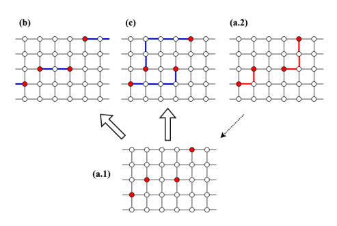
<figcaption class="paper-figure-caption"><b>Fig 2.</b> Fig. 3. Example Surface Code Error Correction. (a.1) Example syndrome pattern of a surface code, induced by the (a.2) example error pattern. The edges in red represent data qubits with errors, and the vertices in red represent their induced syndromes. (b)(c) Example decoding results from decoders, where (c) is equivalent to (a.2) upon stabilizers, and (b) is not. The edges in blue represent potential erroneous data qubits indicated by decoders.</figcaption>
</figure>
<figure class="paper-figure-card">
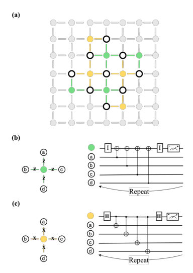
<figcaption class="paper-figure-caption"><b>Fig 3.</b> Fig. 2. (a) Example distance-3 surface code, for which distance refers to the minimum number of data qubits required to perform a logical operation. Open circles represent data qubits, and colored dots represent measurement qubits (green for measure-Z, yellow for measure-X). (b)(c) Quantum circuits of measure-Z and measure-X.</figcaption>
</figure>
<figure class="paper-figure-card">
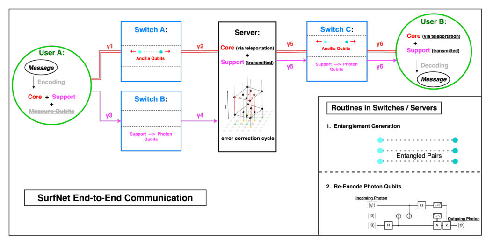
<figcaption class="paper-figure-caption"><b>Fig 4.</b> Fig. 4. Example one-way communication. A surface code is transferred from user A to B, where the green circles represent Users, blue squares represent Switches, black square represents Server, red double lines represent Optical Fibers for transmitting ancillary entangled pairs, and pink arrows represent Optical Fibers for transmitting the Support parts as photon qubits. Each optical fiber is labeled with its fidelity γi ∈[0, 1].</figcaption>
</figure>
<figure class="paper-figure-card">
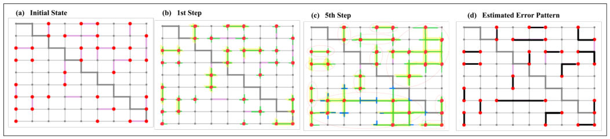
<figcaption class="paper-figure-caption"><b>Fig 5.</b> Fig. 5. Example decoding graph of the SurfNet Decoder. Each vertex is a measurement qubit and each edge is a data qubit. For illustration, the growth speeds on Erasures, Core, Support are {1/2, 1/8, 1/4}. (a) Initial State. Red vertices denote Syndromes, Purple lines denote Erasures, and Solid Grey lines denote the Core part. (b) Growth Step 1. Green lines denote newly added edges for each cluster. Even clusters are marked in Yellow. (c) Growth Step 5. Blue lines denote newly added edges for each cluster, and Green lines denote existing edges. After this step, all clusters become even and finish growing. (d) Estimated Error Pattern, where Black lines denote data qubits with errors.</figcaption>
</figure>

**Summary.** This paper introduces SurfNet, a novel quantum network architecture designed to overcome noise limitations by combining two parallel communication channels. It encodes data using surface codes and splits the information into a robust 'Core' part (sent via entanglement) and a bulk 'Support' part (sent physically). The authors develop advanced decoding algorithms and an optimization framework to maximize throughput while maintaining high fidelity.

**Why it may be interesting.** The integration of fault-tolerance concepts like surface codes directly into network routing protocols provides a concrete framework for realizing large-scale quantum communication infrastructure, which is highly relevant to open quantum systems research.

Detailed structure

**Main problem.** Designing quantum network protocols that maintain high reliability and efficiency despite unavoidable channel noises and erasure errors.

**Main result.** The proposed SurfNet architecture, utilizing a dual-channel transfer mechanism with surface codes, significantly enhances communication fidelity compared to existing methods.

**Method.** The authors combine resource optimization via Integer Programming (IP) formulation for routing with advanced error correction techniques like the novel SurfNet Decoder.

**Model / system.** The system is a quantum network modeled on a lattice structure where data qubits are encoded using surface codes. Information transfer is split into a 'Core part' (transferred via entanglement) and a 'Support part' (transmitted physically as photons).

**Key observables.** Communication Fidelity ($
ho$), Network Throughput, Pauli Error Thresholds.

**Important parameters / regimes.** Fiber fidelity ($\gamma_i$), Noise thresholds ($W_c, W$), Facility capacity ($\eta_r, \eta_e$).

**Assumptions / limitations.** The analysis assumes perfect measurements for simplicity in some parts; the IP formulation is noted as an approximation requiring relaxation to LP.

**Figures summary.** Figures illustrate the SurfNet architecture (combining entanglement and plain channels), examples of surface code structures, error correction processes using syndrome patterns, and comparative performance plots showing fidelity vs. throughput across different network scenarios.

**Paper structure.** The paper progresses from defining the core problem (noise mitigation) to proposing SurfNet's dual-channel design. It details the use of surface codes for encoding, introduces the Core/Support split, develops novel decoding algorithms (SurfNet Decoder), and finally frames the entire routing challenge as a resource optimization problem solvable via IP formulation.

Abstract

Quantum networks encounter unavoidable channel noises and erasure errors, presenting a huge obstacle in designing protocols that attain both high reliability and efficiency. Typically, quantum networks fall into two categories: those utilize quantum entanglements for quantum teleportation, and those directly transfer the actual quantum messages. In this paper, we present SurfNet, a quantum network that inherits the main advantages from both categories. It employs surface codes as logical qubits for encoding messages, and utilizes two parallel communication channels to fault-tolerantly transfer each surface code in a modular manner. Our approach of using surface codes can timely correct both operational and photon loss errors within the network, and the integration of the two channels within the network can greatly improve network throughput. For the implementation of SurfNet, we propose a novel network architecture, designed to better integrate surface codes into quantum networks. We also propose a novel error correction decoder, designed to fully utilize the modular characteristic of surface codes within our network. Simulation results demonstrate that SurfNet with its decoder significantly enhances the communication fidelity within quantum networks.

[↑ back to top](#top)

### [Quantum Reservoir Computing for Short-Term Power Load Forecasting in Resource-Constrained Energy Systems](http://arxiv.org/abs/2606.12806v1)

**Authors:** Mansi Od, Param Pathak, Nouhaila Innan, Muhammad Shafique  
**Type:** both · **Category:** disordered systems and neural networks · **PDF:** <https://arxiv.org/pdf/2606.12806v1>  
**Analysis basis:** full PDF text, analyzed in chunks
**Topic relevance:** `methods for driven-dissipative` **1/5**

↔ Scroll figures horizontally

<figure class="paper-figure-card">
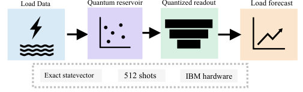
<figcaption class="paper-figure-caption"><b>Fig 1.</b> Fig. 1: Conceptual overview of the proposed hardware-efficient QRC forecasting framework. Energy load data is encoded into a fixed quantum reservoir, transformed into reservoir features, and mapped to load forecasts through a quantized classical readout. The framework is evaluated under exact simulation, finite-shot sampling, and realistic IBM backend-noise models.</figcaption>
</figure>
<figure class="paper-figure-card">
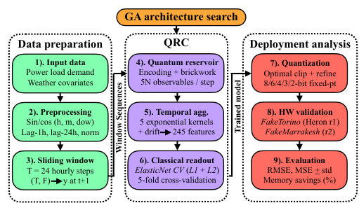
<figcaption class="paper-figure-caption"><b>Fig 2.</b> Fig. 2: Overview of the proposed QRC forecasting framework. The pipeline constructs T = 24 input windows, extracts 5N observables per time step from a fixed quantum reservoir, compresses the temporal states into 245 aggregated features, and trains an Elastic Net readout for load prediction. After training, the readout is quantized to {8, 6, 4, 3, 2}- bit fixed-point precision and evaluated under finite-shot and hardware-noise settings. The GA search is performed offline to select N, L, encoding, and coupling strength κ for each dataset.</figcaption>
</figure>
<figure class="paper-figure-card">
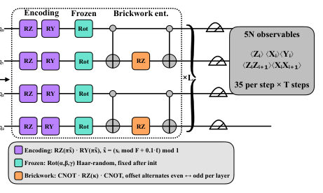
<figcaption class="paper-figure-caption"><b>Fig 3.</b> Fig. 3: Quantum reservoir circuit at one time step. Each of the N qubits receives the double rotation RZ(π˜x) · RY (π˜x) for feature encoding, followed by a frozen Haar random Rot(α, β, γ) gate and a brickwork entangling block whose CNOT offset alternates between even and odd pairs across layers. The encode and entangle pattern repeats L times before measurement of single qubit Pauli expectations ⟨Zi⟩, ⟨Xi⟩, ⟨Yi⟩ and nearest neighbour correlators ⟨ZiZi+1⟩, ⟨XiXi+1⟩, yielding 5N observables per step.</figcaption>
</figure>
<figure class="paper-figure-card">
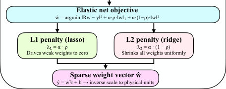
<figcaption class="paper-figure-caption"><b>Fig 4.</b> Fig. 4: ElasticNet readout training pipeline. Standardized reservoir features R and targets y feed a 5 fold cross validated grid search over the regularization strength α (30 log spaced values) and the mixing ratio ρ ∈{0.05, 0.1, 0.15, 0.2}, which set the ℓ1 and ℓ2 penalty weights λ1 = αρ and λ2 = α(1 −ρ). The selected combination yields a sparse weight vector ˆw whose predictions are inverse scaled to physical units.</figcaption>
</figure>
<figure class="paper-figure-card">
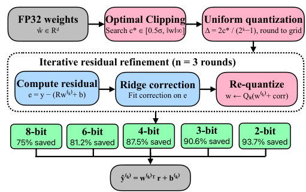
<figcaption class="paper-figure-caption"><b>Fig 5.</b> Fig. 5: Post training quantization (PTQ) pipeline. The trained FP32 weights pass through an optimal clipping search over [0.5σ, ∥w∥∞] followed by uniform rounding to a k bit grid with step size ∆= 2c∗/(2k −1). Three rounds of iterative residual refinement then fit a Ridge correction on the prediction error and re-quantize, suppressing the systematic bias that grows at low bit widths. The procedure produces five deployable readouts at {8, 6, 4, 3, 2} bits with corresponding memory savings of {75, 81.2, 87.5, 90.6, 93.7}%.</figcaption>
</figure>

**Summary.** This work proposes using Quantum Reservoir Computing (QRC) for energy load forecasting, designed specifically for deployment on memory-limited edge devices. The key innovation is applying post-training fixed-point quantization to the classical readout weights while keeping the quantum reservoir fixed. Results demonstrate that 6-bit precision maintains high accuracy while drastically reducing memory footprint, proving a resource-aware approach for near-term quantum time-series applications.

**Why it may be interesting.** While focused on energy forecasting, the core methodology—combining quantum feature mapping (reservoir) with highly resource-constrained classical ML readout (quantized Elastic Net)—is a novel paradigm for developing hardware-efficient AI models applicable to complex physical simulations or data analysis in quantum computing.

Detailed structure

**Main problem.** Developing accurate Short-Term Load Forecasting (STLF) models for resource-constrained edge devices while maintaining performance under limited memory, finite measurement budgets, and hardware noise.

**Main result.** The framework successfully quantizes the readout to 6-bit precision, preserving full-precision forecasting performance while achieving an 81.2% reduction in readout memory.

**Method.** A Quantum Reservoir Computing (QRC) framework is used where a fixed quantum reservoir transforms temporal inputs into high-dimensional features, and only a classical Elastic Net readout is trained and subsequently compressed via post-training fixed-point quantization.

**Model / system.** The system uses a QRC architecture with an entangled quantum reservoir state derived from time-series data. The training involves optimizing the linear readout layer using Elastic Net regularization on aggregated reservoir features, followed by aggressive low-bit quantization for deployment.

**Key observables.** Forecasting accuracy (RMSE, MAPE), Readout memory reduction percentage, and performance stability across varying bit widths ($\{8, 6, 4, 3, 2\}$).

**Important parameters / regimes.** Quantization bit width ($k$), Number of qubits ($N$), Reservoir size/feature dimension, Noise sources (finite-shot sampling, IBM FakeTorino/Marrakesh noise models).

**Assumptions / limitations.** The quantum reservoir remains fixed throughout the process; only the classical readout weights are quantized and trained. The performance degradation below 6 bits is dataset-dependent.

**Figures summary.** Figures illustrate the QRC framework pipeline, compare RMSE vs. Bit Width showing stability at 6 bits, and validate forecast predictions under both ideal simulation and realistic hardware noise conditions for two energy datasets (Tetouan and Spain).

**Paper structure.** The paper details the QRC model setup, describes the Elastic Net training process, introduces the Post-Training Quantization pipeline with residual refinement, and validates the entire framework across multiple noise regimes and bit widths.

Abstract

Short-term load forecasting is essential for reliable energy management, but practical deployment on edge devices requires models that remain accurate under limited memory, finite measurement budgets, and hardware noise. This work proposes a hardware-efficient Quantum Reservoir Computing (QRC) framework for energy load forecasting, where a fixed quantum reservoir transforms temporal input windows into high-dimensional features and only a classical Elastic Net readout is trained. To reduce deployment cost, the trained readout is compressed using post-training fixed-point quantization at bit widths from 8 to 2 bits. The framework is evaluated on the Tetouan and Spain energy load datasets under exact statevector simulation, 512-shot finite sampling, and realistic hardware-noise models from IBM FakeTorino and IBM FakeMarrakesh. Results show that 6-bit readout precision preserves full-precision forecasting performance while reducing readout memory by 81.2%. Below this point, degradation becomes dataset dependent, with Tetouan showing stronger sensitivity and Spain degrading more gradually. Hardware-noise validation further shows that the trained readout transfers to noisy reservoir states without retraining. These findings support quantized QRC as a resource-aware forecasting approach for near-term quantum time-series applications.

[↑ back to top](#top)

## Other papers (7)

*Papers from primary archives without highlighted authors or any topic match. Click to expand.*

Show other papers

### [An LLM System for Autonomous Variational Quantum Circuit Design](http://arxiv.org/abs/2606.13380v1)

**Authors:** Kenya Sakka, Wataru Mizukami, Kosuke Mitarai  
**Type:** theory · **Category:** quantum information and computing · **PDF:** <https://arxiv.org/pdf/2606.13380v1>  
**Analysis basis:** full PDF text, analyzed in chunks

↔ Scroll figures horizontally

<figure class="paper-figure-card">
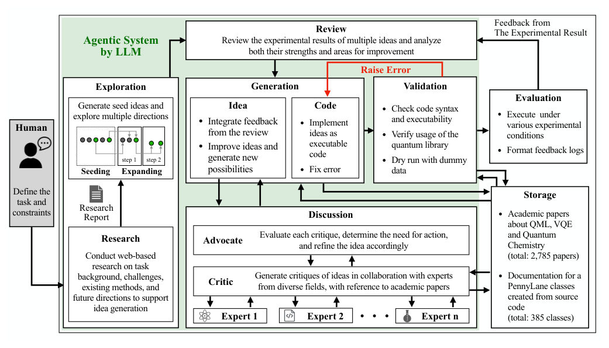
<figcaption class="paper-figure-caption"><b>Fig 1.</b> FIG. 1: Overview of the proposed agentic system for automatic quantum circuit generation. The system autonomously conducts experiments and refines circuit designs through iterative collaboration among its components. The process consists of seven components: “Exploration“, “Generation”, “Discussion”, “Validation”, “Evaluation”, “Storage”, and “Review”. The gray-shaded areas indicate the stages that require human involvement, such as selecting task type, and optionally defining constraints, whereas the other parts operate fully automatically through computer-based processes. The green-shaded regions denote modules powered by LLMs.</figcaption>
</figure>
<figure class="paper-figure-card">
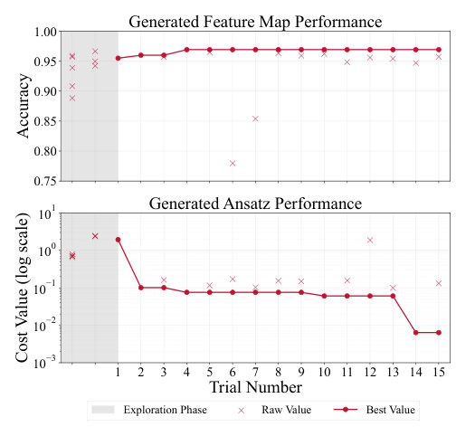
<figcaption class="paper-figure-caption"><b>Fig 2.</b> FIG. 2: The performance trajectories of the quantum feature map and ansatz over 15 trials. The gray-shaded region represents the exploration phase, during which diverse candidates were generated to explore various directions inspired by the research report. The red crosses denote the raw performance values in each trial, while the red circles indicate the best values obtained up to that trial. The upper panel shows the SVM classification results obtained using the generated quantum feature map, and the lower panel shows the VQE results using the generated ansatz.</figcaption>
</figure>
<figure class="paper-figure-card">
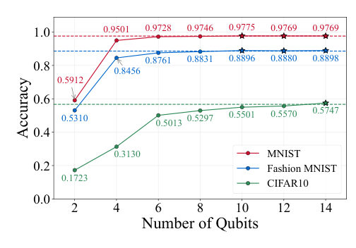
<figcaption class="paper-figure-caption"><b>Fig 3.</b> FIG. 3: Evaluation of the scalability of the best-performing quantum feature map generated by the agentic system. The x-axis represents the number of qubits. The y-axis indicates the classification accuracy on the test datasets. The dotted line represents the mean accuracy of the RBF kernel, and the star markers indicate cases where the quantum feature map outperform the RBF kernel.</figcaption>
</figure>
<figure class="paper-figure-card">
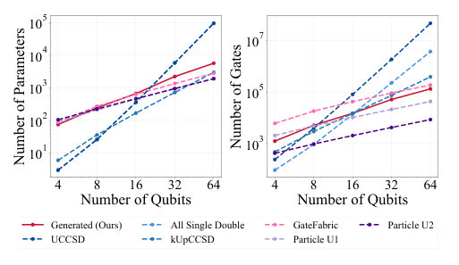
<figcaption class="paper-figure-caption"><b>Fig 4.</b> FIG. 5: Scalability analysis of the well-known and our best ans¨atze. The scaling of the number of trainable parameters (left) and the gate counts (right) with respect to qubit count. The gate counts were evaluated after decomposing the circuits into the gate set {RX, RY , RZ, CNOT}</figcaption>
</figure>
<figure class="paper-figure-card">
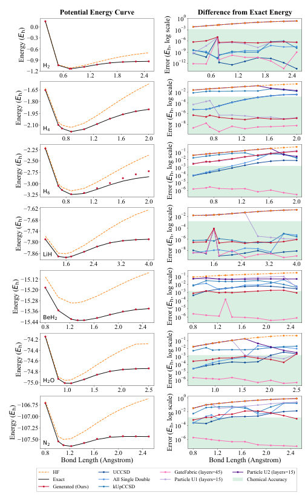
<figcaption class="paper-figure-caption"><b>Fig 5.</b> FIG. 4: Ground-state potential energy curves (PECs) estimated by VQE (left) and energy errors relative to exact energy (FCI or CASCI) (right). The right panel plots the errors for several well-known ans¨atze as well as for the best-performing ansatz generated by our system. From top to bottom, the plots correspond to H2, H4, H6, LiH, BeH2, H2O and N2 molecules. The green shaded area indicates the threshold for chemical accuracy.</figcaption>
</figure>

**Summary.** The paper introduces an LLM-driven agentic framework designed to autonomously design complex quantum circuits for tasks like QML and VQE. By integrating web search, expert critique, code generation, and validation in a closed loop, the system demonstrates superior performance compared to manual or task-specific methods. This establishes AI as a viable paradigm for automated scientific discovery in quantum computing.

**Why it may be interesting.** This work directly addresses the bottleneck of human expertise in designing optimal quantum circuits by proposing a general-purpose AI paradigm that can automate scientific optimization workflows across different physical domains.

Detailed structure

**Main problem.** The design of high-performing quantum circuits, required for tasks like QML feature mapping or VQE ansatz generation, currently relies heavily on specialized human expertise.

**Main result.** An autonomous agentic framework utilizing LLMs was demonstrated to iteratively and systematically design quantum circuits that achieve state-of-the-art performance compared to existing methods.

**Method.** The system employs a closed-loop workflow involving seven components (Exploration, Generation, Discussion, Validation, Evaluation, Storage, Review) powered by LLMs for iterative refinement of circuit designs.

**Model / system.** The work focuses on designing quantum circuits (ansätze or feature maps) parameterized by angles ($	heta$) to prepare quantum states $|\psi(	heta)
angle$ used in variational algorithms like VQE. The underlying physics involves molecular Hamiltonians and qubit representations.

**Key observables.** Image classification accuracy (for QML); Ground state energy estimation error relative to chemical accuracy thresholds (for VQE).

**Important parameters / regimes.** Qubit count ($N$), number of trainable parameters ($	ext{n\_params}$), CNOT counts, and circuit depth/complexity.

**Assumptions / limitations.** The framework assumes LLMs can effectively manage complex scientific reasoning across multiple iterative steps; specific technical limitations include restricting methods like ADAPT-VQE due to complexity constraints.

**Figures summary.** Figures illustrate the seven-component agentic workflow, performance comparisons (e.g., feature map vs. RBF kernel), and scaling analysis of circuit parameters/errors versus qubit count or module inclusion.

**Paper structure.** The paper details the architecture of the autonomous agentic system, applying it first to QML feature maps and then expanding its scope to generate complex, physically motivated ansätze for VQE in quantum chemistry.

Abstract

The design of high performing quantum circuits remains largely dependent on human expertise. We introduce an autonomous agentic framework that employs large language models (LLMs) to conduct iterative quantum circuit designs under explicit design constraints. Our system integrates seven components: Exploration, Generation, Discussion, Validation, Storage, Evaluation, and Review. These components form a closed-loop workflow that combines web-based knowledge acquisition, literature-grounded critique, executable code generation, and experimental feedback. We evaluate the framework on two tasks: quantum feature map construction for quantum machine learning and ansatz generation for variational quantum eigensolver applications in quantum chemistry. In image classification benchmarks, the best generated feature map outperforms representative quantum feature maps and, when scaled to larger qubit counts, surpasses the classical radial basis function kernel. In molecular ground state estimation across seven molecules, the generated ansatz attains competitive accuracy with widely used chemically inspired and hardware-efficient constructions while satisfying the imposed scaling constraints. These results establish LLM driven agentic system as a viable paradigm for automated quantum circuit design and illustrate how AI systems can participate in iterative scientific optimization workflows across scientific domains.

[↑ back to top](#top)

### [Block algebra for morphing circuits](http://arxiv.org/abs/2606.12724v1)

**Authors:** Rui Chao  
**Type:** theory · **Category:** quantum information and computing · **PDF:** <https://arxiv.org/pdf/2606.12724v1>  
**Analysis basis:** full PDF text, analyzed in chunks

↔ Scroll figures horizontally

<figure class="paper-figure-card">

<figcaption class="paper-figure-caption"><b>Fig 1.</b> FIG. 1. A morphing circuit with J = 2 contraction rounds; reproduced from Ref. [ST25,</figcaption>
</figure>
<figure class="paper-figure-card">
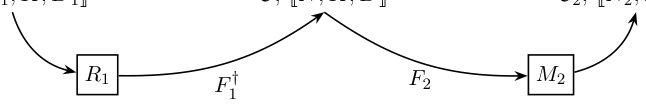
<figcaption class="paper-figure-caption"><b>Fig 2.</b> Fig. 1]. The mid-cycle code C with [[N, K, D]] sits at the center; the two end-cycle codes</figcaption>
</figure>
<figure class="paper-figure-card">
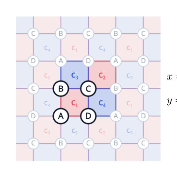
<figcaption class="paper-figure-caption"><b>Fig 3.</b> FIG. 2. Surface code: site layout (left) with translation vectors x, y, and parity-check</figcaption>
</figure>
<figure class="paper-figure-card">
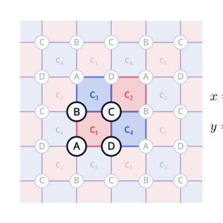
<figcaption class="paper-figure-caption"><b>Fig 4.</b> Fig. 3a shows the hex-grid surface-code circuit of Ref. [MBG23], and Fig. 3b shows Con-</figcaption>
</figure>
<figure class="paper-figure-card">
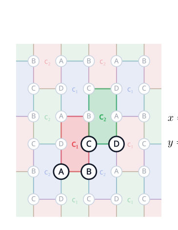
<figcaption class="paper-figure-caption"><b>Fig 5.</b> FIG. 4. 6.6.6 color code: site layout (left) with translation vectors x, y, and parity-check</figcaption>
</figure>

**Summary.** This paper develops a block algebra formalism to describe morphing circuits used in quantum error correction. It presents four explicit constructions that encode established codes like the surface and color codes into this general algebraic structure. This advances the theoretical understanding of fault-tolerant computation by providing systematic circuit design tools.

**Why it may be interesting.** This work provides a powerful, systematic algebraic toolset for designing fault-tolerant quantum computation protocols by relaxing hardware connectivity requirements in QEC circuits.

Detailed structure

**Main problem.** The research focuses on developing an algebraic framework, using block algebra notation, to describe 'morphing circuits' for quantum error correction.

**Main result.** Four explicit constructions (I-IV) are presented for CNOT-based CSS morphing circuits, allowing known codes like the surface and color codes to be represented in this general algebraic form.

**Method.** The authors employ an algebraic viewpoint by viewing contraction schedules as Gaussian elimination patterns over block stabilizer matrices, generalizing translation-invariant code structures into polynomial sums.

**Model / system.** The model is Quantum Error Correction (QEC) using CSS codes (e.g., surface and color codes). The circuits are represented abstractly via block algebra notation involving permutation matrices acting on syndrome measurements.

**Key observables.** Mid-cycle code stabilizer matrices ($H_X, H_Z$), qubit connectivity degree, and the resulting logical error rate after simulation.

**Important parameters / regimes.** The number of contraction rounds ($J$) and the specific commutation relations between polynomial parameters (e.g., $PR = QS$).

**Assumptions / limitations.** It is assumed that known translation-invariant codes can be mapped to polynomial sums within this general block algebra framework.

**Figures summary.** Figures illustrate morphing circuits, comparing surface code derivations to the new algebraic constructions (e.g., Fig. 3), and show site layouts for various color codes.

**Paper structure.** The paper introduces the concept of morphing circuits algebraically, presents four specific constructions (I-IV) tailored to different known codes (surface/color), details the mathematical constraints required for each construction, and concludes with simulation setup notes.

Abstract

Morphing circuits are a new paradigm for quantum error correction that relaxes hardware requirements. We present four constructions for CNOT-based CSS morphing circuits with explicit qubit connectivity degrees. All four constructions are specified in block algebra notation, with entries in algebras generated by permutation matrices. The first three are obtained by rewriting existing surface- and color-code morphing circuits; the fourth is a new three-round construction modeled on the 6.6.6 color code. The surface-code construction recovers the morphing circuit of Ref. [ST25] for two-block group algebra codes. Numerical search then instantiates these permutation matrices using regular representations of finite groups.   [ST25] M. H. Shaw and B. M. Terhal, Phys. Rev. Lett. 134(9), 090602 (2025).

[↑ back to top](#top)

### [Hamiltonian-Aware ADAPT Variational Quantum Eigensolver for Molecular Ground-State Simulation](http://arxiv.org/abs/2606.13118v1)

**Authors:** Runhong He, Chao Liu, Xin Hong, Qiaozhen Chai, Junyuan Zhou, Ji Guan, Guolong Cui, Shenggang Ying  
**Type:** theory · **Category:** other · **PDF:** <https://arxiv.org/pdf/2606.13118v1>  
**Analysis basis:** full PDF text, analyzed in chunks

↔ Scroll figures horizontally

<figure class="paper-figure-card">
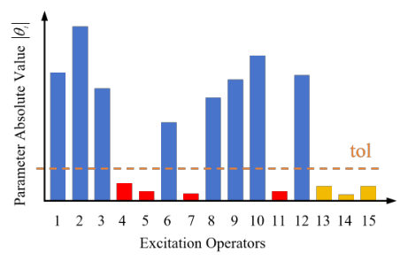
<figcaption class="paper-figure-caption"><b>Fig 1.</b> Figure 1: Excitation operators are divided into three categories according to their parameter magnitudes and positions: (1) Operators with parameter mag- nitudes exceeding the predefined threshold are non- redundant (marked in blue); (2) Operators below the threshold and located before the last non-redundant operator are redundant candidates and can be re- moved (marked in red); (3) The remaining operators are tentatively retained to guarantee iterative conver- gence (marked in yellow).</figcaption>
</figure>
<figure class="paper-figure-card">
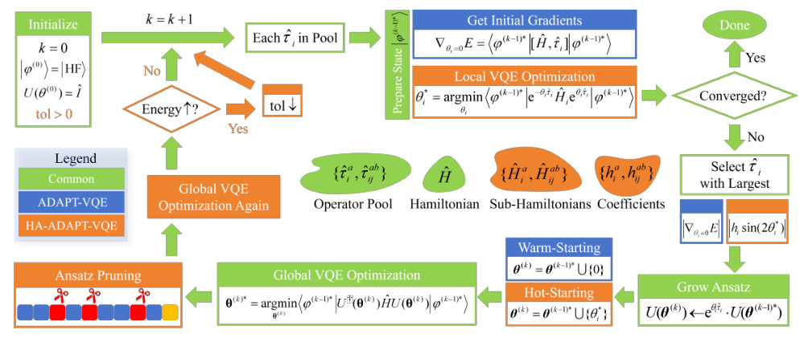
<figcaption class="paper-figure-caption"><b>Fig 2.</b> Figure 2: Schematic comparison of ADAPT-VQE and the proposed HA-ADAPT-VQE. Unique modules are highlighted in blue (ADAPT-VQE) and orange (HA-ADAPT-VQE), whereas shared operations are colored green. Their core differences lie in (1) the operator selection criterion and (2) the ansatz pruning step. The sub-Hamiltonian based local VQE optimization and hot-starting techniques, inherited from Param-ADAPT- VQE, are introduced to reduce measurement overhead.</figcaption>
</figure>
<figure class="paper-figure-card">
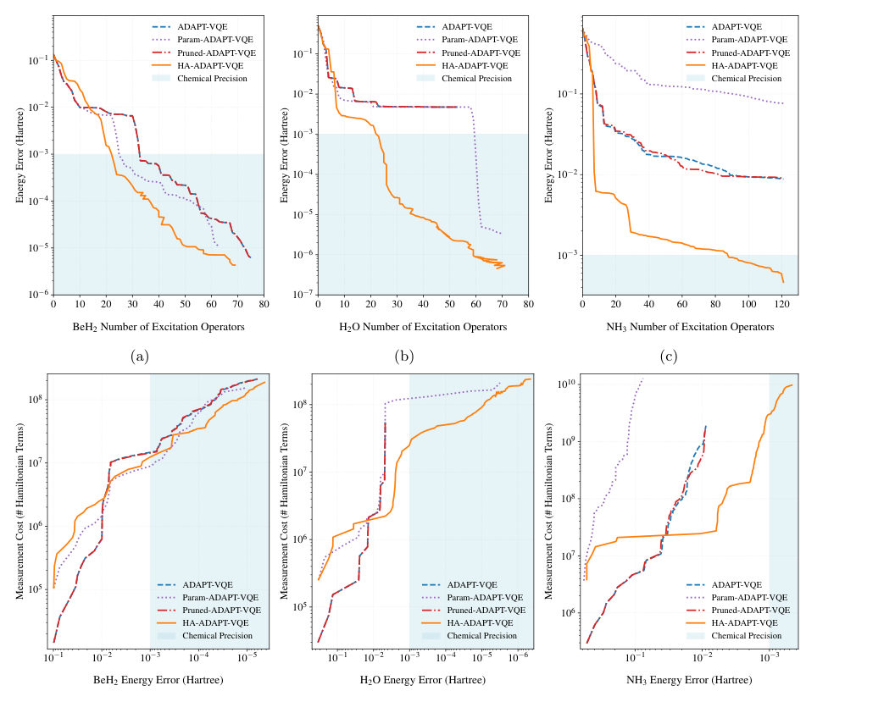
<figcaption class="paper-figure-caption"><b>Fig 3.</b> Figure 3: (a−c) Evolution of energy error with iteration count; (d−f) corresponding measurement cost as a function of energy error for BeH2, H2O, and NH3 at uniformly stretched bond lengths of 2.25, 2.40, and 2.40 Å, respectively.</figcaption>
</figure>
<figure class="paper-figure-card">

<figcaption class="paper-figure-caption"><b>Fig 4.</b> Figure 4: Comparison of |θ∗ i | and weighted |hi sin(2θ∗ i )| for several excitation operators at the 6th iteration of HA-ADAPT-VQE (see Figure 3(b)). Op- erators are sorted by |θ∗ i |.</figcaption>
</figure>
<figure class="paper-figure-card">
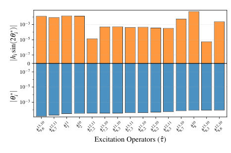
<figcaption class="paper-figure-caption"><b>Fig 5.</b> Figure 3(f) shows that Param-ADAPT-VQE con- sumes the highest measurement cost of 1.28 × 1010</figcaption>
</figure>

**Summary.** The paper introduces Hamiltonian-Aware ADAPT-VQE, an advanced algorithm designed to improve the construction of quantum circuits for molecular ground-state energy calculations. By incorporating explicit knowledge of the underlying molecular Hamiltonian into operator selection and refining pruning techniques, it achieves superior accuracy while drastically reducing computational overhead compared to current state-of-the-art methods.

**Why it may be interesting.** This work directly addresses resource constraints (circuit depth/measurement count) in quantum chemistry simulations, providing a physically informed method to build complex ansätze necessary for simulating strongly correlated electronic systems relevant to AMO physics.

Detailed structure

**Main problem.** The core challenge is designing compact, efficient quantum circuits (ansätze) for Variational Quantum Eigensolver (VQE) to accurately simulate the ground-state energy of practical molecules on near-term quantum hardware.

**Main result.** The proposed Hamiltonian-Aware ADAPT-VQE algorithm significantly outperforms existing methods by achieving higher accuracy with smaller ansätze and drastically reduced measurement costs for molecular systems like H2O and BeH2.

**Method.** It introduces a novel operator selection criterion that incorporates local Hamiltonian information, moving beyond simple parameter magnitude checks. It also implements a problem-adaptive pruning strategy to maintain ansatz compactness while guaranteeing convergence.

**Model / system.** The study focuses on molecular electronic structure simulation using the molecular Hamiltonian ($\hat{H}$) in second quantization form. The methods are benchmarked across small molecules (BeH2, H2O, NH3) at stretched bond lengths to induce strong electron correlation.

**Key observables.** Variational energy error (compared to FCI), ansatz size (number of operators), and measurement cost (total number of fermionic Hamiltonian terms evaluated).

**Important parameters / regimes.** Chemical precision threshold ($10^{-3}$ Hartree); the coupling strength derived from the Hamiltonian coefficients, $|h_{a_i}\sin(2	heta^*_i)|$.

**Assumptions / limitations.** The primary approximations involve using the UCCSD ansatz structure and assuming that incorporating local Hamiltonian information provides a sufficient guide for operator selection.

**Figures summary.** Figures compare energy error vs. ansatz size/measurement cost across algorithms; Figure 4 compares parameter magnitudes ($	heta^*_i$ vs. $|h_i \sin(2	heta^*_i)|$) to show the benefit of Hamiltonian awareness; Figure 5 illustrates the effectiveness of operator pruning.

**Paper structure.** The paper first establishes the limitations of existing ADAPT-VQE variants (ADAPT, Param-ADAPT) regarding locality and plateaus. It then details the HA-ADAPT-VQE algorithm, which integrates Hamiltonian information into selection and adds an adaptive pruning step. Finally, it presents systematic numerical experiments on multiple molecules comparing performance metrics.

Abstract

Designing compact ansätze in Variational Quantum Eigensolver (VQE) is crucial for solving energetic problems of practical molecules on near-term quantum devices. However, existing Adaptive Derivative-Assembled Pseudo-Trotter (ADAPT) ansätze face two challenges: improper operator selection and accumulation of degraded operators. In this paper, we propose the Hamiltonian-Aware (HA) ADAPT-VQE algorithm to address these issues. First, we establish a novel excitation operator selection criterion. It breaks the local constraint of existing criteria by incorporating Hamiltonian information, prioritizes physically meaningful excitation operators, and incurs no extra classical or quantum computational overhead. Furthermore, we develop a problem-adaptive method for discriminating and pruning redundant excitation operators stemming from improper selection and inevitable degradation. This method balances redundant operator pruning and convergence guarantee, and is applicable to ansätze with arbitrary scales. Systematic numerical experiments on typical strongly correlated molecular systems demonstrate that our HA-ADAPT-VQE avoids energy plateaus and outperforms baseline algorithms in terms of energy error, ansatz size, and measurement cost. This work offers an efficient, robust ansatz construction paradigm, facilitating the development and practical deployment of large-scale VQE in quantum chemistry.

[↑ back to top](#top)

### [Quantum Logic Codes: Complete Transversal Logical Clifford Instruction Sets for High-Rate Stabilizer Quantum Error Correcting Codes](http://arxiv.org/abs/2606.13521v1)

**Authors:** Adam Holmes  
**Type:** theory · **Category:** quantum information and computing · **PDF:** <https://arxiv.org/pdf/2606.13521v1>  
**Analysis basis:** full PDF text, analyzed in chunks

↔ Scroll figures horizontally

<figure class="paper-figure-card">
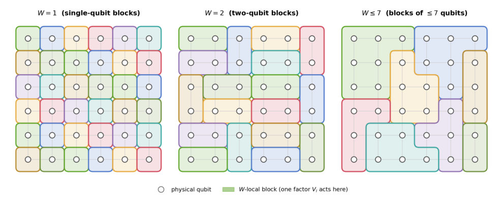
<figcaption class="paper-figure-caption"><b>Fig 1.</b> FIG. 1. Single-layer transversal W-local gate layers (Definition 1) on a shared grid of physical qubits. Such a layer V = N</figcaption>
</figure>
<figure class="paper-figure-card">
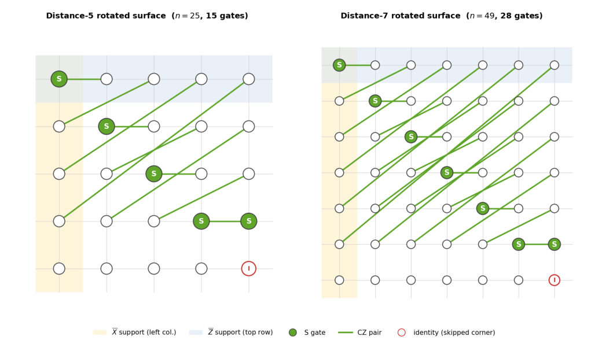
<figcaption class="paper-figure-caption"><b>Fig 2.</b> FIG. 2. Construction 1 at d = 5 (left) and d = 7 (right): the same closed-form d diagonal phase gates and d 2  rotated-diagonal CZ pairs scale to all odd distances.</figcaption>
</figure>
<figure class="paper-figure-card">
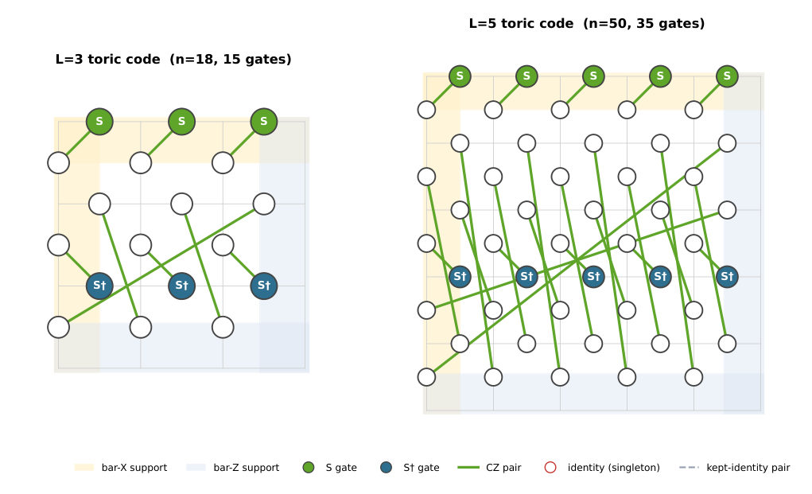
<figcaption class="paper-figure-caption"><b>Fig 3.</b> FIG. 3. Construction 2 at L = 3 (left) and L = 5 (right). Both layers have row-0 CZ pairs h(0, c) ↔v(0, c) combined with row-0 S gates on the h(0, c) qubits, two cross-pair families per tier r = 1, . . . , ⌊(L −1)/2⌋joining rows a = r and b = L −r, and inner-row S† gates on row s = ⌈L/2⌉. Total weights w(3) = 15 and w(5) = 35; the long diagonals visible in the L = 5 panel correspond to cross pairs wrapping across the torus boundary.</figcaption>
</figure>
<figure class="paper-figure-card">
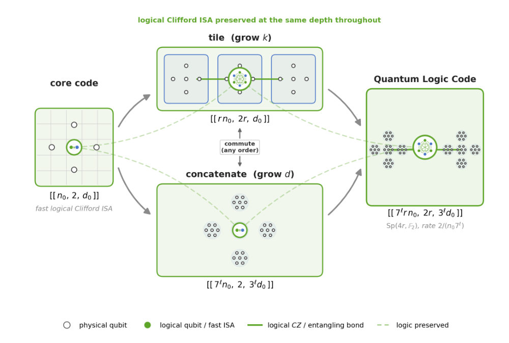
<figcaption class="paper-figure-caption"><b>Fig 4.</b> FIG. 4. Construction intuition for the Quantum Logic Codes (schematic; the literal transversal gate layers are not shown). A small core code (left) carries a complete logical-Clifford basis ISA at low circuit depth. Two composition operations grow the code parameters while preserving that ISA: tiling (×r, top) places r copies side by side, raising the logical-qubit count to 2r at fixed distance and supplying inter-copy addressable CZ; concatenation with the Steane [[7, 1, 3]] code (×ℓ, bottom) replaces each physical qubit by an inner block, tripling the distance per level at fixed k. Combining the two yields the family [[ 7ℓr n0, 2r, 3ℓd0 ]] with logical Clifford group Sp(4r, F2) and rate...</figcaption>
</figure>
<figure class="paper-figure-card">
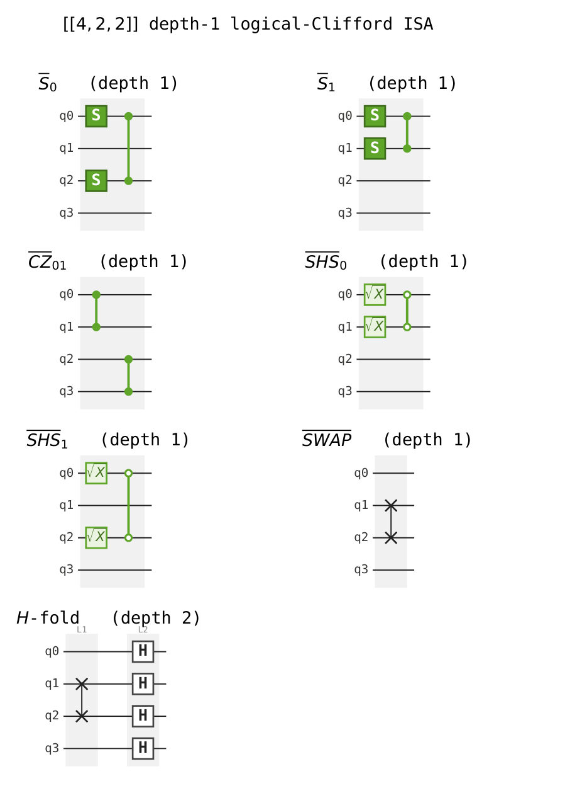
<figcaption class="paper-figure-caption"><b>Fig 5.</b> FIG. 5. Complete logical-Clifford basis ISA of the [[4, 2, 2]] core (Construction 3), with green S boxes and CZ connectors, hollow-green √</figcaption>
</figure>

**Summary.** This theoretical work develops a deep understanding of how local transversal gates can generate universal logical operations on quantum error correcting codes. By constructing 'Quantum Logic Codes,' the authors demonstrate methods to achieve a complete, low-depth instruction set architecture necessary for scalable, fault-tolerant quantum computation.

**Why it may be interesting.** The rigorous mathematical framework connecting physical hardware constraints (locality $W$) to abstract computational power (full Clifford group) is highly relevant for designing practical fault-tolerant quantum computers.

Detailed structure

**Main problem.** The study aims to characterize the structure and determine lower bounds on the circuit depth required to implement a full logical Clifford group using local transversal gates within stabilizer quantum error correcting codes.

**Main result.** The authors constructed 'Quantum Logic Codes,' a high-rate non-LDPC CSS code family possessing a constant-depth complete 2-local transversal logical Clifford basis instruction set architecture (ISA).

**Method.** The work uses symplectic geometry and algebraic constraints derived from analyzing how local physical gates act on the stabilizer group structure to establish bounds on achievable logical operations.

**Model / system.** The model is based on CSS stabilizer quantum error correcting codes, which encode physical qubits into blocks. The analysis focuses on realizing fault-tolerant logic by generating the full logical Clifford algebra using transversal gates.

**Key observables.** Circuit Depth (D), Logical Pauli Operators (S, CZ, etc.), and the structure of the reachable set within $	ext{Sp}(2K, \mathbb{F}_2)$.

**Important parameters / regimes.** Code parameters $[[n, k, d]]$, locality $W$ (1-local, 2-local), and asymptotic scaling exponents like $eta \approx 0.2823$.

**Assumptions / limitations.** The analysis heavily relies on the 'confinement hypothesis' regarding the logical action of local gates, and approximations are made when treating W-local operations as depth-one.

**Figures summary.** Figures illustrate single-layer transversal gate layers (W-local), specific constructions like the Rotated Surface Code S gate and Toric Code CZ gate, and tables detail the required depth for various logical Clifford basis generators on different code families.

**Paper structure.** The paper progresses by first establishing general lower bounds on circuit depth based on code parameters. It then analyzes the algebraic structure of 1-local and 2-local gates using symplectic forms. Finally, it presents specific constructions achieving constant or low polynomial depth for a complete logical Clifford ISA.

Abstract

We study the structure and transversal logical capabilities of stabilizer quantum error correcting codes. Among our results, we identify universal lower bounds on circuit depth to generate a full logical Clifford algebra, and develop novel constructions of logical transversal gates including a new depth-one transversal phase $\mathrm{\overline{S}}$ gate in the rotated surface code and a depth-one intra-block $\mathrm{\overline{CZ}}$ gate in the 2D-toric code that generalizes to all odd distances and all lengths $L\ge3$, respectively. Finally, we construct a high-rate non-LDPC CSS code family with parameters $[[n,\sqrt{n},Θ({n^β})]]$ where $β\approx 0.2823$ in one demonstrated case, that provably possesses a constant-depth complete 2-local transversal logical Clifford basis instruction set architecture (ISA) composed of all individually targeted $\mathrm{\overline{S}}$, $\mathrm{\overline{SHS}} = \sqrt{X}$, and $\mathrm{\overline{CZ}}$ gates. This ISA is depth-one for certain subfamilies that we design and generally constant-depth under certain conditions. The code family is built from a small code with parameters $[[n_0, 2, d_0]]$, and is tunable in the standard way: it tiles out to form utility-scale logical qubit counts, and it scales up through concatenation to achieve higher distances and error suppression. We show that this construction preserves the depth-one complete transversal logical Clifford basis ISA when composed with these commuting construction actions, inheriting structure from the core codes so that at scale the complete logical Clifford basis ISA remains depth-one up to depth-two addressable operations between tiled cores. We call these Quantum Logic Codes.

[↑ back to top](#top)

### [Quantum walk-based optimisation for capacitated vehicle routing with homogeneous and heterogeneous fleets](http://arxiv.org/abs/2606.12856v1)

**Authors:** Edric Matwiejew, Aidan Smith, Callum Neill, Paulo Santos, Ugo Varetto, Jingbo Wang  
**Type:** theory · **Category:** quantum information and computing · **PDF:** <https://arxiv.org/pdf/2606.12856v1>  
**Analysis basis:** full PDF text, analyzed in chunks

↔ Scroll figures horizontally

<figure class="paper-figure-card">
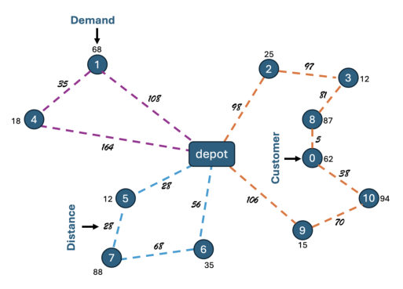
<figcaption class="paper-figure-caption"><b>Fig 1.</b> Figure 1. Schematic of a CVRP instance. The central depot dispatches vehicles along distinct routes (coloured paths) to serve customers (numbered nodes). Each node is annotated with its demand, and each edge with its travel cost. Every route must begin and end at the depot, and the total demand on each route must not exceed the vehicle capacity.</figcaption>
</figure>
<figure class="paper-figure-card">
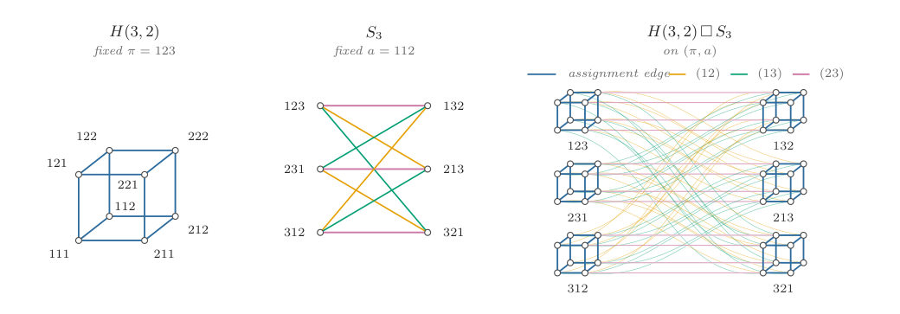
<figcaption class="paper-figure-caption"><b>Fig 2.</b> Figure 2. PS-QWOA walk-generator graphs for n = 3 and K = 2. Left: with π = (1, 2, 3) fixed, Ga produces the assignment graph H(3, 2) on the eight possible assignments, denoted as a1a2a3. Centre: with a = (1, 1, 2) fixed, Gπ produces the transposition graph on S3. Colours distinguishing the three transpositions (12), (13), and (23). Right: the composite generator Ga + Gπ is a walk over the graph H(3, 2)□S3, where □denotes the graph Cartesian product.</figcaption>
</figure>
<figure class="paper-figure-card">
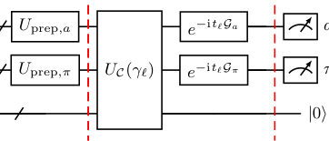
<figcaption class="paper-figure-caption"><b>Fig 3.</b> Figure 3. The PS-QWOA circuit for the CVRP, showing the separability of the state preparation (Eq. (16)) and mixing unitary (Eq. (20)) over the assignment a and permutation π registers. Each of the p ansatz layers applies the phase- separation unitary (Eq. (7)) to the a and π registers, which evaluates the penalised problem cost function (Eq. (3)) on an O(b)-qubit ancilla register to precision O(2−b), followed by application of the mixing unitary.</figcaption>
</figure>
<figure class="paper-figure-card">
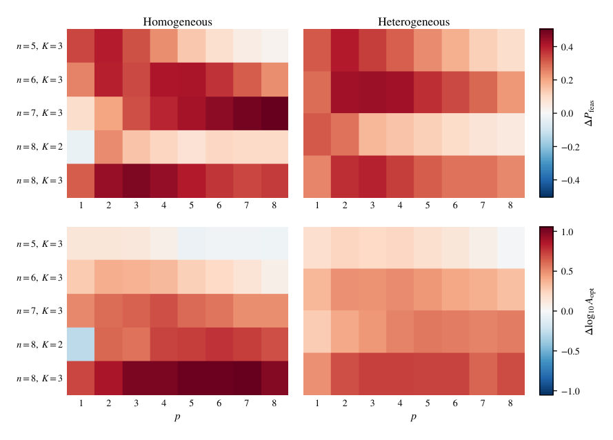
<figcaption class="paper-figure-caption"><b>Fig 4.</b> Figure 4. Difference between the PS-QWOA and I-QWOA instance medians across the full simulated dataset. Rows are indexed by problem size (n, K) and are ordered by increasing effective Hilbert-space dimension |Heff|, with the smallest |Heff| at the top. Columns are indexed by the circuit depth p = 1, . . . , 8. Top row: Difference in feasibility probability ∆Pfeas for homogeneous CVRP (left) and heterogeneous CVRP (right) instances. Bottom row: Difference in log10 of the optimal-feasible amplification ∆log10 Aopt. Each cell is the difference between the PS-QWOA and I-QWOA medians over the five problem instances. Positive values (red) indicate a PS-QWOA advantage.</figcaption>
</figure>
<figure class="paper-figure-card">
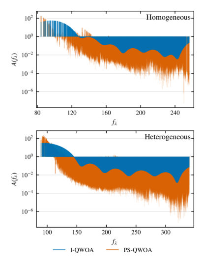
<figcaption class="paper-figure-caption"><b>Fig 5.</b> Figure 5. Penalised-cost amplification profile A(fλ) = P(fλ)/Punif(fλ) of optimised PS-QWOA and I-QWOA states for a single problem instance at depth p = 8. Top: homoge- neous CVRP (n, K) = (7, 3). Bottom: heterogeneous CVRP (n, K) = (7, 3).</figcaption>
</figure>

**Summary.** This paper develops and compares two quantum walk algorithms (PS-QWOA vs. I-QWOA) for solving the Capacitated Vehicle Routing Problem (CVRP). The PS-QWOA is shown to be theoretically superior because it efficiently encodes the problem's combinatorial constraints into a product space, leading to better convergence rates and lower computational overhead compared to prior methods.

**Why it may be interesting.** The work provides a concrete, structured quantum algorithm for a classically hard combinatorial problem by mapping constraints onto the structure of the quantum walk's product space, which has implications for designing resource-efficient quantum circuits.

Detailed structure

**Main problem.** The paper addresses the challenge of optimizing the Capacitated Vehicle Routing Problem (CVRP), an NP-hard combinatorial optimization problem, using quantum computation.

**Main result.** The Product-Space Quantum Walk-Based Optimization Algorithm (PS-QWOA) consistently outperforms the Indexed QWOA (I-QWOA) across various performance metrics, showing superior probability concentration on low-cost feasible solutions.

**Method.** The authors adapt quantum walk theory by constructing a continuous-time quantum walk over a product space encoding CVRP solutions. They use variational optimization techniques to minimize an objective function related to the problem cost.

**Model / system.** The model is the PS-QWOA, which uses a Hamiltonian derived from graph structures (transposition and Hamming graphs) acting on a product Hilbert space ($\mathcal{H}_\pi \otimes \mathcal{H}_a$). The dynamics are governed by interleaved unitary operations.

**Key observables.** Feasibility Probability ($P_{	ext{feas}}$), Optimal-Feasible Amplification ($\mathcal{A}_{	ext{opt}}$), and the classical optimization cost (number of objective function evaluations).

**Important parameters / regimes.** Number of customers ($n$), number of vehicles ($K$), circuit depth ($p$), and penalty parameters ($\lambda$).

**Assumptions / limitations.** The analysis relies on exact state-vector simulation for small instances ($n \le 8$) and assumes the applicability of structured product-space walks to constrained combinatorial spaces.

**Figures summary.** Figures compare performance metrics like $\Delta P_{	ext{feas}}$ and $\Delta \log_{10} \mathcal{A}_{	ext{opt}}$ between PS-QWOA and I-QWOA, showing the advantage of PS-QWOA as problem size increases. Other figures detail graph structures and cost distributions.

**Paper structure.** The paper introduces the CVRP formulation, details the PS-QWOA ansatz by defining its product space structure ($	ext{G}_\pi + 	ext{G}_a$), compares it against I-QWOA using rigorous metrics ($P_{	ext{feas}}, \mathcal{A}_{	ext{opt}}$), and concludes that PS-QWOA is superior due to better scaling and lower classical overhead.

Abstract

The capacitated vehicle routing problem (CVRP) is an appealing candidate for quantum optimisation due to its combinatorial complexity and practical importance. However, the problem's constrained search space poses a challenge for such quantum algorithms. We introduce a quantum walk-based optimisation algorithm (QWOA) for the CVRP with homogeneous or heterogeneous vehicle fleets, addressing this challenge through a continuous-time quantum walk over a product space that coincides with combinatorial structures intrinsic to the CVRP solution space. Relative to the prior QWOA-based formulation, this approach reduces the per-layer gate complexity from $\mathcal{O}(n^{3}\log n)$ to $\mathcal{O}(n^{2}\log n)$ and supports a circuit parameterisation schedule generated by a fixed number of classical parameters. Exact state-vector simulation on instances with up to $n=8$ customers and $K=3$ vehicles demonstrates improved convergence to low-cost solutions using markedly fewer objective function evaluations, with the advantage broadening as problem size increases. These results identify structured product-space walks as a promising tool for optimisation over constrained combinatorial spaces.

[↑ back to top](#top)

### [Representation-Induced Symmetry Trapping in Adaptive Variational Quantum Simulations of Multi-Reference Topologies](http://arxiv.org/abs/2606.13387v1)

**Authors:** Hermawan Kresno Dipojono  
**Type:** theory · **Category:** quantum information and computing · **PDF:** <https://arxiv.org/pdf/2606.13387v1>  
**Analysis basis:** full PDF text, analyzed in chunks

↔ Scroll figures horizontally

<figure class="paper-figure-card">
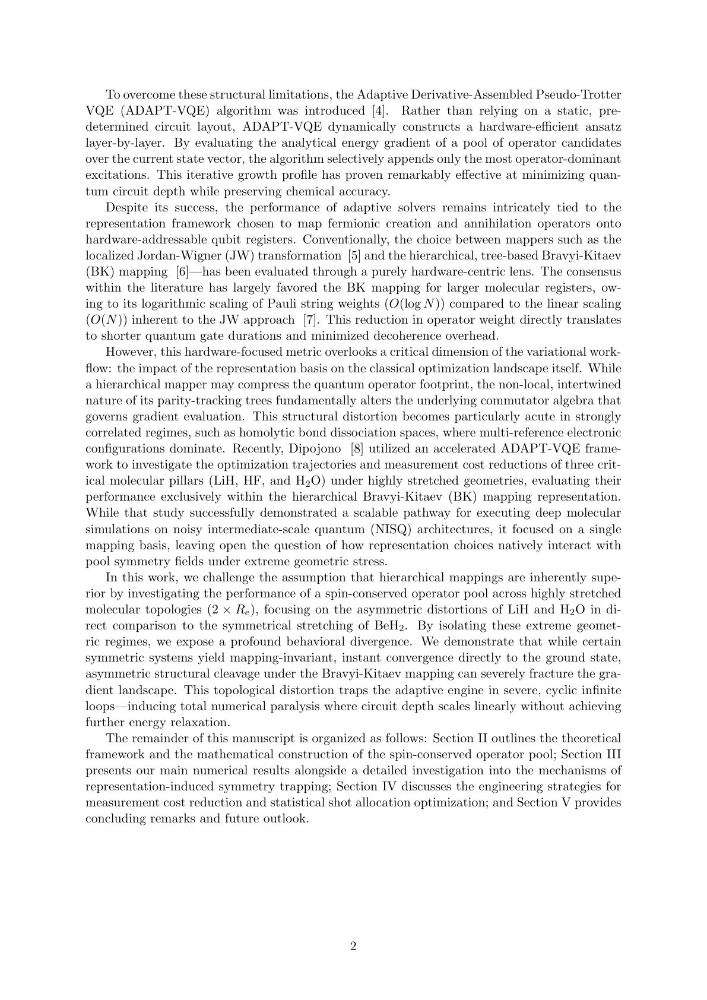
<figcaption class="paper-figure-caption"><b>Fig 1.</b> Low-resolution page preview, page 2</figcaption>
</figure>
<figure class="paper-figure-card">
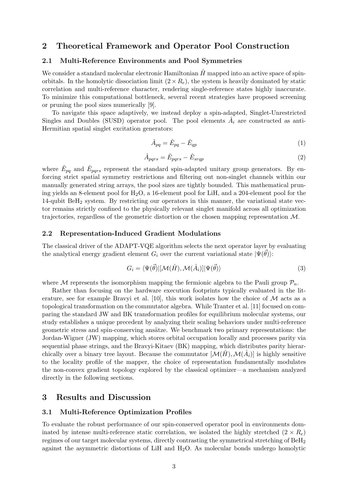
<figcaption class="paper-figure-caption"><b>Fig 2.</b> Low-resolution page preview, page 3</figcaption>
</figure>
<figure class="paper-figure-card">
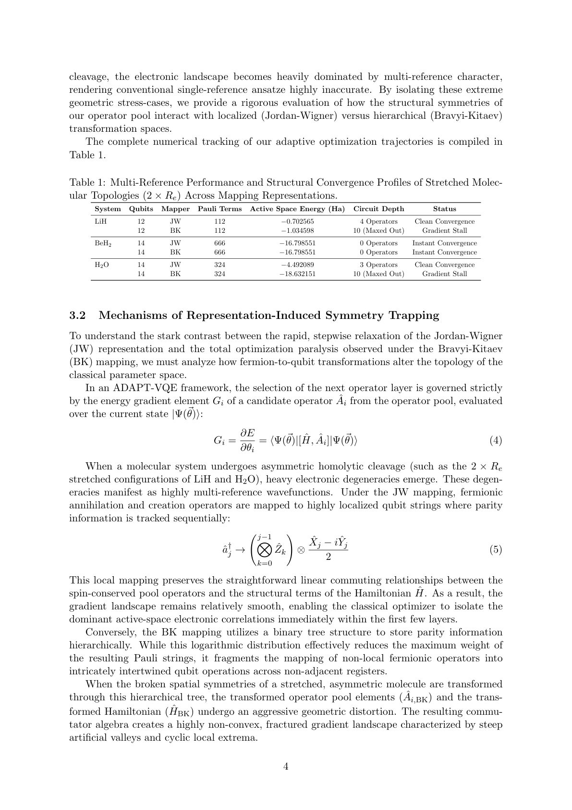
<figcaption class="paper-figure-caption"><b>Fig 3.</b> Low-resolution page preview, page 4</figcaption>
</figure>
<figure class="paper-figure-card">
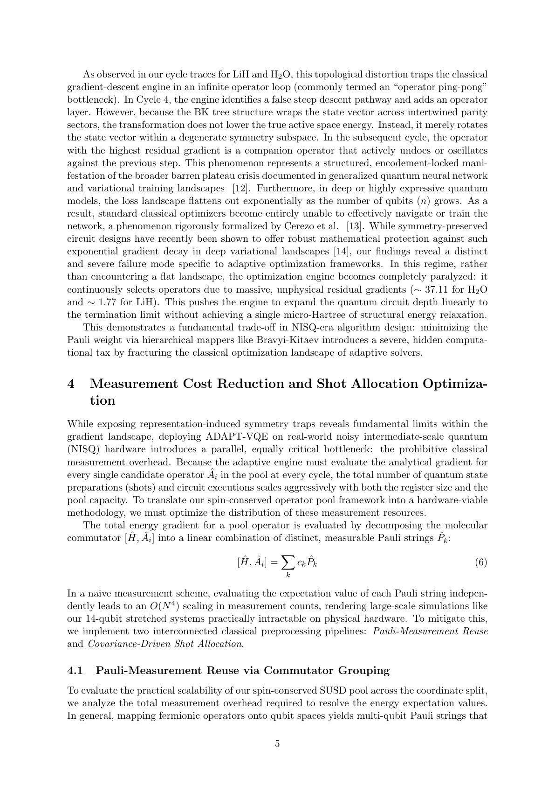
<figcaption class="paper-figure-caption"><b>Fig 4.</b> Low-resolution page preview, page 5</figcaption>
</figure>
<figure class="paper-figure-card">
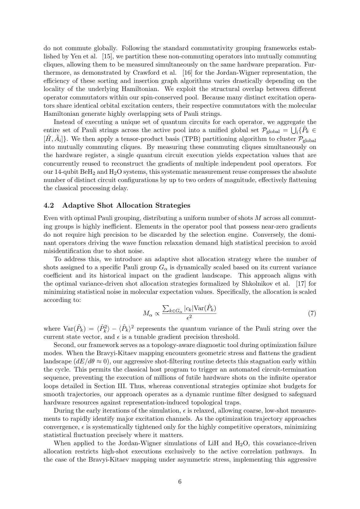
<figcaption class="paper-figure-caption"><b>Fig 5.</b> Low-resolution page preview, page 6</figcaption>
</figure>

**Summary.** This paper investigates how mapping fermions to qubits affects the feasibility of running variational quantum simulations for molecular electronic structure. The authors find that certain mappings create artificial 'traps' in the optimization landscape, especially under asymmetric stretching. They propose a novel, adaptive filtering technique that diagnoses these topological failures by monitoring gradient stability, offering a resource-efficient path toward fault-tolerant quantum chemistry.

**Why it may be interesting.** This work directly addresses the practical limitations of applying quantum algorithms to complex chemistry problems, providing a diagnostic tool (the adaptive filter) that moves beyond simple resource counting to diagnose fundamental topological failures in the optimization landscape itself.

Detailed structure

**Main problem.** The study evaluates how representation topologies, specifically arising from fermionic-to-qubit mappings (JW vs. BK), impact the trainability of adaptive quantum chemistry algorithms when simulating multi-reference electronic structures.

**Main result.** Asymmetric molecular distortions cause the Bravyi-Kitaev mapping to induce an optimization trapping effect, while preserving point-group symmetry structurally protects the landscape; a dynamic shot-allocation filter can mitigate these traps.

**Method.** The authors use ADAPT-VQE on stretched molecules and introduce a covariance-driven adaptive shot-allocation filter that monitors gradient precision ($\epsilon$) to diagnose and halt computation upon detecting representation-induced flat-lined states.

**Model / system.** The simulation models molecular electronic structure using the Hamiltonian mapped into an active space, tested on highly stretched configurations of LiH, BeH2, and H2O. The core computational challenge involves mapping fermionic operators to qubits via JW or BK transformations.

**Key observables.** Optimization landscape trainability, energy convergence status (Clean Convergence vs. Gradient Stall), gradient precision ($\epsilon$), and Pauli Term count.

**Important parameters / regimes.** Highly stretched geometries ($2 	imes Re$) of LiH, BeH2, H2O; the adaptive threshold $\epsilon$; and the choice between JW and BK mappings.

**Assumptions / limitations.** The analysis assumes that mapping representation is a critical factor in maintaining landscape trainability, and it proposes an adaptive filter to manage resource allocation based on gradient diagnostics.

**Figures summary.** Table 1 compares performance metrics (Pauli Terms, Energy, Depth, Status) across different systems and mappers. Table 2 lists nuclear coordinates for the benchmark molecules. Appendix A contains telemetry logs showing convergence behavior.

**Paper structure.** The paper systematically analyzes ADAPT-VQE on stretched molecules, comparing JW and BK mappings to identify topological trapping effects. It then introduces a novel adaptive shot-allocation filter that diagnoses these traps by monitoring gradient precision ($\epsilon$) and triggering termination when symmetry constraints cause stagnation.

Abstract

Evaluating the trainability of adaptive quantum chemistry algorithms under multi-reference static correlation requires understanding how representation topologies intertwine with molecular geometry. We systematically expose a deep physical dependence on point-group symmetry by evaluating a spin-conserved SUSD operator pool across highly stretched configurations (2 x Re) of asymmetric LiH, symmetric BeH2, and asymmetric H2O. Under asymmetric distortions, the non-local mapping constraints of the Bravyi-Kitaev transformation create an optimization trapping effect--an encodement-locked manifestation of the broader barren plateau crisis. Crucially, by comparing these to the symmetrical stretching baseline of BeH2, we demonstrate that the preservation of point-group symmetry structurally protects the optimization landscape, proving that ansatz symmetry restrictions are necessary but insufficient without accounting for the underlying fermion-to-qubit representation. While current methods rely on numerical pruning to throttle pool sizes, our structural approach establishes that the mapping representation remains a critical factor in maintaining landscape trainability. Furthermore, exploiting structural overlap within our pool, we introduce a covariance-driven, adaptive shot-allocation filter. Diverging from static energy-variance minimization frameworks, our allocation engine operates as a dynamic runtime diagnostic tool. By continuously monitoring the gradient precision threshold epsilon, it aggressively prunes dead symmetry channels and triggers an automated circuit-termination sequence upon detecting representation-induced flat-lined states (dE/dtheta approx 0). This integration of algebraic measurement reuse with topology-aware statistical filtering provides a promising, resource-efficient strategy for executing deep variational algorithms on early fault-tolerant architectures.

[↑ back to top](#top)

### [Understanding quantum behaviors of an electron in a uniform magnetic field alternatively](http://arxiv.org/abs/2606.13290v1)

**Authors:** Jin-Ming Wang, Yuan-Zao Gao, Dai-Lin Cun, Jian Jing  
**Type:** theory · **Category:** other · **PDF:** <https://arxiv.org/pdf/2606.13290v1>  
**Analysis basis:** full PDF text, analyzed in chunks

↔ Scroll figures horizontally

<figure class="paper-figure-card">
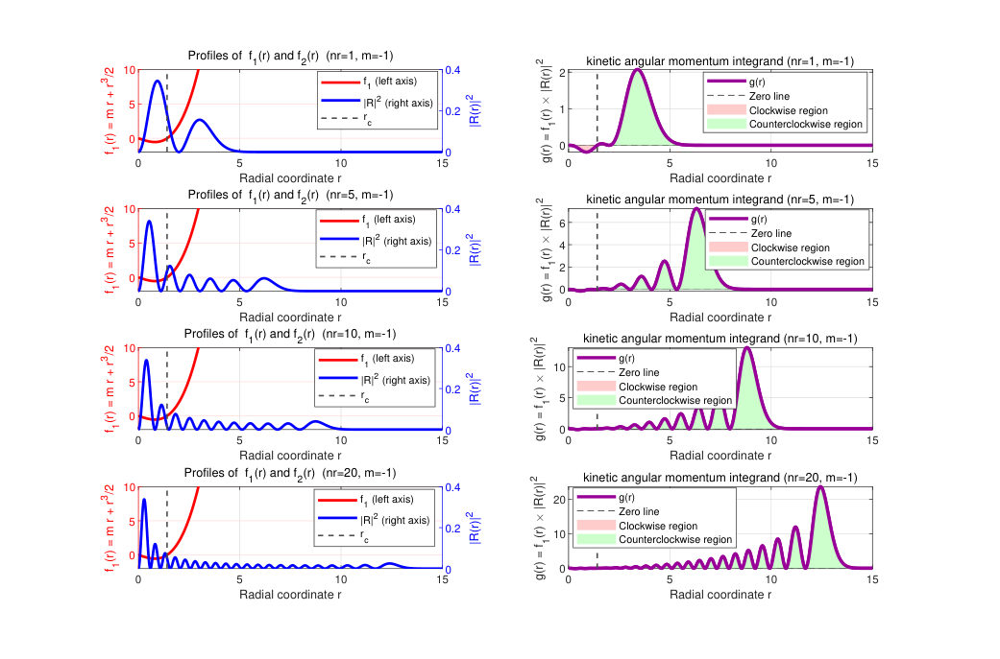
<figcaption class="paper-figure-caption"><b>Fig 1.</b> FIG. 1: The factors f1(r), f2(r) and partitioned kinetic angular momentum integrand for Landau eigenstates with m = −1 and varying radial quantum numbers nr (setting magnetic length a = 1). Left panels display the factor f1(r) = mr + 1</figcaption>
</figure>

**Summary.** This theoretical work analyzes electron motion in a magnetic field, focusing on states with negative angular momentum where the net probability current vanishes. The authors demonstrate this zero current results from an exact cancellation between opposing inner (clockwise) and outer (counterclockwise) circulations across a critical radius. This reveals that the quantum state possesses two competing rotational components whose balance dictates the system's dynamics.

**Why it may be interesting.** It provides a deep, non-trivial dynamical interpretation of degeneracy by mapping it onto a competitive balance between two distinct rotational components, which is valuable for understanding quantum symmetries.

Detailed structure

**Main problem.** The paper investigates the physical interpretation of the vanishing total probability current for electron states with negative angular quantum numbers in a uniform magnetic field.

**Main result.** The zero net current is shown to arise from an exact cancellation between opposing clockwise (inner) and counterclockwise (outer) circulations, revealing an intrinsic bidirectional flow structure.

**Method.** Theoretical analysis involving the decomposition of the probability current density into canonical and gauge parts, and defining a critical radius that partitions the system's flow.

**Model / system.** The model is an electron confined by a uniform magnetic field ($\mathbf{B}$), leading to Landau levels. The analysis uses the eigenstates $\psi_{n_r, m}(r, \varphi)$ derived from the corresponding Hamiltonian.

**Key observables.** Probability current density ($\mathbf{J}$), partitioned kinetic angular momentum ($\langle L_{	ext{kin}}^{	ext{in}} 
angle$ and $\langle L_{	ext{kin}}^{	ext{out}} 
angle$), and the critical radius ($r_c$).

**Important parameters / regimes.** Angular quantum number ($m$), radial quantum number ($n_r$), and the magnetic field strength ($\mathbf{B}$).

**Assumptions / limitations.** The analysis relies on the gauge invariance of the probability current density, which is crucial for physical interpretation.

**Figures summary.** Tables illustrate how inner and outer rotational components evolve with $|m|$ and $n_r$, showing synchronous growth/decay while maintaining a constant difference corresponding to $\langle L_{	ext{kin}} 
angle$.

**Paper structure.** The paper progresses from establishing the vanishing total current for $m<0$ via cancellation, to defining the critical radius $r_c$, and finally analyzing the resulting bidirectional competition structure in terms of kinetic angular momentum.

Abstract

Quantum mechanically, an electron moving in a uniform magnetic field forms Landau levels. A curious feature is that for states with a negative angular quantum number, the total probability current vanishes, which appears to contradict the classical picture of cyclotron motion. While a geometric interpretation based on classical orbits exists, alternative interpretations remain of interest. In this paper, we examine the probability current density and identify a critical radius that naturally partitions the plane into an inner clockwise-flow region and an outer counterclockwise-flow region. We show that the vanishing total current results from an exact cancellation between these two regions. Furthermore, by defining a partitioned kinetic angular momentum with respect to the critical radius, we reveal an intrinsic competitive structure: the electron simultaneously carries two opposing rotational components. The negative quantum number manifests in the strength of the inner counter-rotation, while the net kinetic angular momentum remains positive. This bidirectional flow picture also provides a dynamical interpretation of the infinite degeneracy of Landau levels.

[↑ back to top](#top)

## Secondary cond-mat archives

*Papers from cond-mat.mtrl-sci, mes-hall, other, soft, supr-con. These archives are de-prioritized — they appear at the end regardless of relevance score.*

### Relevant in secondary archives (15)

### [A micromagnetic model with bidirectional magneto-thermal coupling](http://arxiv.org/abs/2606.12933v1)

**Authors:** Peiru Yi, Zian Xia, Weichao Yu  
**Type:** theory · **Category:** statistical mechanics · **PDF:** <https://arxiv.org/pdf/2606.12933v1>  
**Analysis basis:** full PDF text, analyzed in chunks
**Topic relevance:** `methods for driven-dissipative` **3/5** · `non-equilibrium dynamics` **3/5** · `spintronics-quantum-optics interface` **3/5** · `Keldysh / 2PI / non-Gaussian methods` **2/5** · `correlated / nonlocal dissipation` **2/5** · `driven-dissipative phase transition` **2/5** · `exotic spin models in light-matter` **1/5** · `non-equilibrium universality` **1/5**

↔ Scroll figures horizontally

<figure class="paper-figure-card">
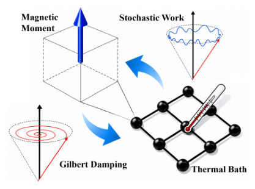
<figcaption class="paper-figure-caption"><b>Fig 1.</b> Figure 1. Schematic illustration of the bidirectional magneto- thermal energy exchange mechanism. The magnetic subsys- tem dissipates energy into the thermal reservoir via Gilbert damping, whereas the thermal reservoir reciprocally transfers energy back to the magnetic system through the work per- formed by stochastic thermal fields.</figcaption>
</figure>
<figure class="paper-figure-card">
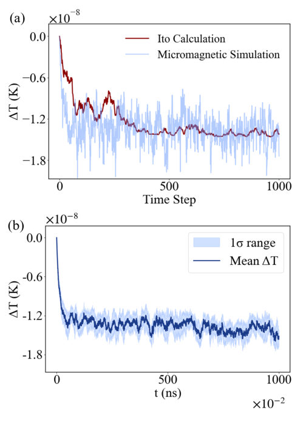
<figcaption class="paper-figure-caption"><b>Fig 2.</b> Figure 2. Time evolution of the heat bath temperature under bidirectional coupling. (a) Single-point temperature trajec- tory simulated using Ito calculation with gyromagnetic ra- tio γ = 2.21 × 103 m/(A · s) , macrospin volume of V = 5 × 10−22 m3 and initial temperature T0 = 2 K. In micro- magnetic simulation, one time step equals 1 × 10−2ns. (b) Spatially averaged temperature evolution over 200 micromag- netic cells simulated in COMSOL Multiphysics with cell vol- ume ∆V = 5×10−22 m3. The blue shaded region indicates the 1σ confidence interval of the temperature distribution across spatial points. Inset: Steady-state temperature variance as a function of various initial temperatures T0.</figcaption>
</figure>
<figure class="paper-figure-card">
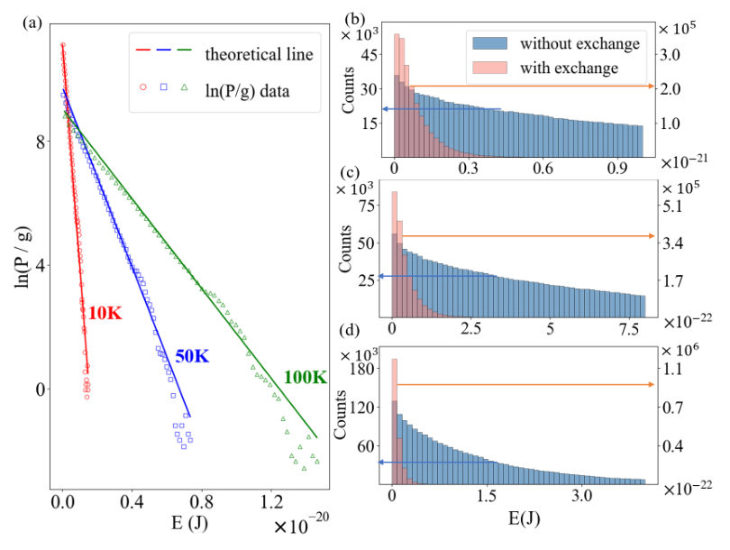
<figcaption class="paper-figure-caption"><b>Fig 3.</b> Figure 3. Verification of the Boltzmann statistical distribution using COMSOL Multiphysics. The 1D system consists of 200 cells with volume ∆V = 5×10−22 m3, time step ∆t = 1 ps, and damping α = 0.05. (a) Semi-logarithmic plot of the numerically sampled ln(P/g) versus energy E, showing strict linear agreement with the theoretical slope −β. (b)-(d) Statistical histograms of the magnetic moment energy distribution at thermal equilibrium for T = 100 K, 50 K, and 10 K, respectively. The solid lines represent the analytical prediction P(E) ∝g(E)e−E/kBT .</figcaption>
</figure>
<figure class="paper-figure-card">
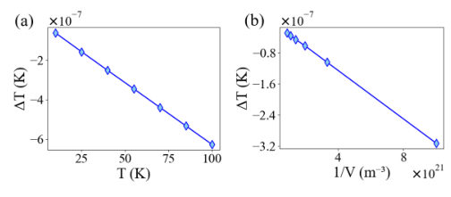
<figcaption class="paper-figure-caption"><b>Fig 4.</b> Figure 4. Equilibrium temperature variation of the finite heat bath. (a) Temperature change ∆T versus initial temperature T0. (b) Temperature change ∆T versus the macrospin volume ∆V . The simulation parameters are ∆V = 5 × 10−22 m3, T0 = 10 K, ∆t = 1 ps, and α = 5 × 10−3.</figcaption>
</figure>

**Summary.** This paper develops a self-consistent model coupling stochastic magnetization dynamics with thermal heat transfer. By treating energy dissipation as a feedback source into the thermal bath, it rigorously proves thermodynamic consistency and predicts measurable temperature changes. This advances spin-caloritronics by providing a robust framework for non-equilibrium magneto-thermal studies.

**Why it may be interesting.** This work provides a detailed microscopic foundation for non-equilibrium thermodynamics in magnetic systems, which is crucial for understanding heat transport phenomena relevant to quantum devices.

Detailed structure

**Main problem.** To overcome the limitations of conventional micromagnetic models that use unidirectional coupling, this work establishes a rigorously self-consistent bidirectional magneto-thermal coupling framework.

**Main result.** The coupled system is shown to strictly obey the first law of thermodynamics and spontaneously recovers correct Boltzmann statistics at equilibrium. The model predicts measurable temperature drops ($\Delta T$) in the thermal bath due to magnetic dynamics.

**Method.** The authors integrate the stochastic Landau-Lifshitz-Gilbert (sLLG) equation with a generalized heat transfer equation, utilizing Ito stochastic calculus for rigorous energy balance analysis.

**Model / system.** The system models coupled spin dynamics and thermal evolution in a magnetic material. The core components are the sLLG equation governing magnetization ($\mathbf{m}$) and a heat diffusion equation governing local temperature ($T$).

**Key observables.** Local temperature field $T(\mathbf{r}, t)$, energy exchange mechanism (dissipation vs. work), density of states $g(E)$, and the steady-state temperature reduction $\Delta T$.

**Important parameters / regimes.** Damping coefficient ($\alpha$), thermal conductivity ($\kappa_{	ext{th}}$), initial temperature ($T_0$), and system volume ($\Delta V$).

**Assumptions / limitations.** The analysis often relies on thermodynamic adiabatic approximations, small angle expansions, and the assumption that local energy balance can be closed into a self-consistent loop.

**Figures summary.** Figures illustrate the bidirectional energy exchange (dissipation feeding heat), the time evolution of bath temperature towards steady state, and histograms confirming recovery of Boltzmann statistics.

**Paper structure.** The paper develops the coupled equations by deriving local power balances, applies Ito calculus to ensure thermodynamic consistency, validates equilibrium recovery via statistical checks, and finally simulates macroscopic energy exchange effects like $\Delta T$.

Abstract

Most conventional micromagnetic frameworks in spin caloritronics rely on a unidirectional coupling approximation, wherein thermal fluctuations drive magnetization dynamics while the feedback of magnetic dissipation onto the thermal reservoir is neglected. Here, we establish a rigorously self-consistent bidirectional magneto-thermal coupling model by integrating the stochastic Landau-Lifshitz-Gilbert (sLLG) equation with a generalized heat transfer equation. In this closed-loop framework, the local temperature acts as a dynamical variable, and the damping-induced dissipation alongside stochastic work dynamically feeds back into the thermal bath as localized heat sources. Utilizing Ito stochastic calculus, we analytically prove that this coupled system strictly obeys the first law of thermodynamics and spontaneously recovers the correct Boltzmann statistics at equilibrium. Spatially resolved micromagnetic simulations further validate the energy exchange mechanism, capturing the finite-bath temperature reduction induced by spatial variation of magnetic moments and the modified density of states under exchange interactions. This bidirectional framework provides a robust microscopic foundation for investigating complex nonequilibrium magneto-thermal dynamics, such as the unidirectional spin-wave heat conveyer effect, paving the way for advanced spin-caloritronic applications.

[↑ back to top](#top)

### [Micron-sized magnonic 3-port rectilinear circulator](http://arxiv.org/abs/2606.13540v1)

**Authors:** Kevin S. Weber, Loic Temdie, Vincent Castel, Timmy Reimann, Morris Lindner, Carsten Dubs, Yves Henry, Matthieu Bailleul, Vincent Vlaminck  
**Type:** experiment · **Category:** other · **PDF:** <https://arxiv.org/pdf/2606.13540v1>  
**Analysis basis:** full PDF text, analyzed in chunks
**Topic relevance:** `exotic spin models in light-matter` **3/5** · `spintronics-quantum-optics interface` **3/5** · `non-equilibrium dynamics` **2/5** · `analog quantum simulation` **1/5** · `correlated / nonlocal dissipation` **1/5** · `driven-dissipative phase transition` **1/5** · `interference shaping light` **1/5** · `non-equilibrium universality` **1/5**

↔ Scroll figures horizontally

<figure class="paper-figure-card">
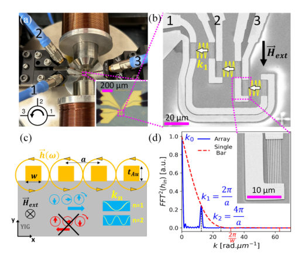
<figcaption class="paper-figure-caption"><b>Fig 1.</b> FIG. 1. (a) 3-port spin-wave spectroscopy setup. (inset) Optical microscope image of the circulator prototype. (b) SEM image of the circulator. Arrows indicate the rectilin- ear spin-wave channels and circulation direction defined by the external field polarity. (c) Schematic of the chiral phase- matching mechanism between the microwave field distribution of the gold nanowires (yellow circles) and the spin-wave phase profiles (blue and red circles). (d) Fourier transform of the excitation field from the grating, showing a comb of wavevec- tor kn = n·2π/a. (inset) High-magnification SEM of the gold nano-bar transducers.</figcaption>
</figure>
<figure class="paper-figure-card">
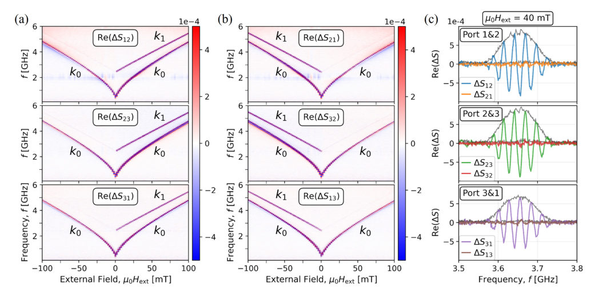
<figcaption class="paper-figure-caption"><b>Fig 2.</b> FIG. 2. (a) Frequency-field mappings of the relative scattering parameters ∆Sij for the three circulation channels. The k1 branch shows clear amplitude asymmetry consistent with chiral excitation. (b) Complementary (f, Hext) maps ∆Sji. (c) (color) Representative transmission spectra ∆Re(Sij) for i, j ∈{1, 2, 3} at µ0Hext = 40 mT, and their magnitude (grey). All data were acquired at an input power of −15 dBm using a reference field of µ0Href = 200 mT.</figcaption>
</figure>
<figure class="paper-figure-card">
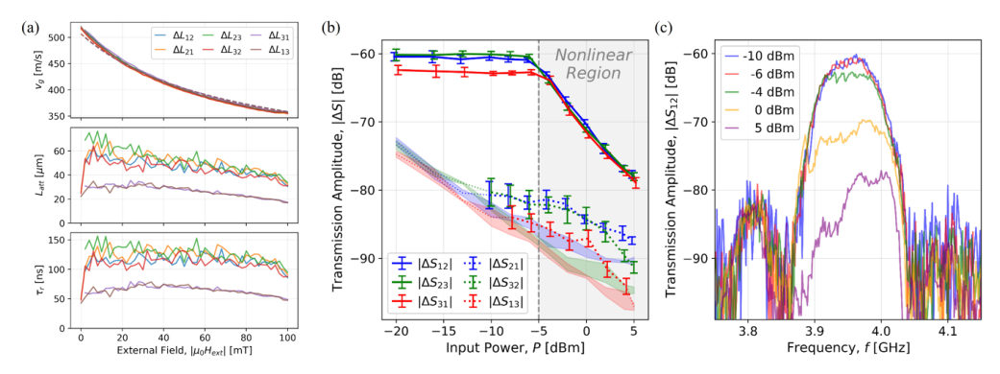
<figcaption class="paper-figure-caption"><b>Fig 3.</b> FIG. 3. (a) Bias field dependence of the spin-waves transport properties derived from the inductances ∆Lij (extracted from the data in Fig. 2) in the passing polarity of the bias field. (top) group velocity vg, where dashed lines represent theoretical calculations based on the dispersion relation Eq.(2), (middle) attenuation length Latt, and (bottom) relaxation time τr= Latt</figcaption>
</figure>
<figure class="paper-figure-card">
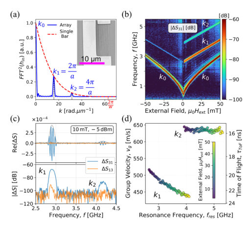
<figcaption class="paper-figure-caption"><b>Fig 4.</b> FIG. 4. 2nd device with reduced nano-bar width w = 100 nm and periodicity a = 400 nm. (a) Fourier transform of the exci- tation with an inset displaying an SEM image of the reduced nano-bar array. (b) Frequency-field map of ∆S31 (acquired using µ0Href = 250 mT and −5 dBm input power) revealing a second chiral wavevector branch k2. (c) Corresponding spec- tra at 10 mT showing unidirectional transmission for both k1 and k2 peaks, (top) real part Re(S31), and (bottom) magni- tude |S31|. (d) Field dependence of the group velocity vg and the time of flight τToF for both k1 and k2 peak.</figcaption>
</figure>
<figure class="paper-figure-card">
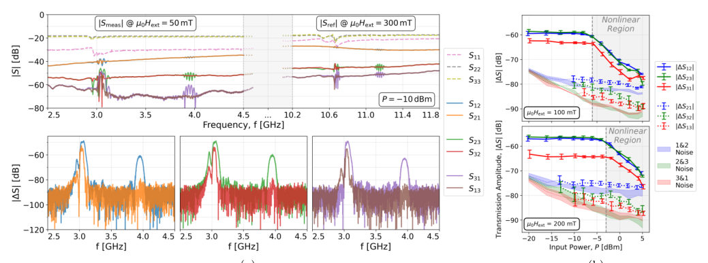
<figcaption class="paper-figure-caption"><b>Fig 5.</b> FIG. 5. (a) Raw data with insertion and rejection loss. (b) Power dependence at µ0Hext = {100 mT, 200 mT} at µ0Href = 300 mT.</figcaption>
</figure>

**Summary.** This paper reports the experimental realization and characterization of a micron-sized magnon circulator using spin-waves in YIG thin films. By exploiting chiral excitation via nanowire gratings, they demonstrated robust non-reciprocal signal routing between three ports. This work advances integrated magnonics for next-generation microwave devices.

**Why it may be interesting.** While focused on solid-state microwave physics, the concept of engineered wave propagation with inherent directionality and tunable dispersion relations shares mathematical parallels with controlled energy flow in quantum optical cavities or waveguide arrays.

Detailed structure

**Main problem.** The development of miniaturized non-reciprocal microwave technologies compatible with integrated circuit architectures is critical for modern information technology.

**Main result.** The authors successfully demonstrated genuine spin-wave circulation in a micron-sized magnon circulator, confirming the feasibility of such devices for integrated magnonic circuits.

**Method.** Characterization was performed using 3-port spin-wave spectroscopy with a Vector Network Analyzer (VNA), measuring scattering parameters and extracting dynamic inductance spectra.

**Model / system.** The system is a prototype magnon circulator fabricated on a thin Yttrium Iron Garnet (YIG) film, utilizing chiral excitation of spin-waves via nanowire gratings to achieve non-reciprocity.

**Key observables.** Spin-wave circulation ($\Delta S_{ij}$ asymmetry), group velocity ($v_g$), attenuation length ($	ext{L}_{	ext{att}}$), and frequency/field dependence of scattering parameters.

**Important parameters / regimes.** Operating frequencies (2–8 GHz), external magnetic fields ($\pm 100$ mT), grating dimensions, and wavevectors ($k_n$).

**Assumptions / limitations.** The non-reciprocity is governed by the chiral excitation mechanism enabled by the nanowire gratings.

**Figures summary.** Figures show setup schematics, SEM images of prototypes, frequency-field maps confirming circulation asymmetry, and plots detailing field dependence of extracted spin-wave properties like $v_g$ and $	ext{L}_{	ext{att}}$.

**Paper structure.** The paper progresses from identifying the need for miniaturized non-reciprocal devices to presenting the physical mechanism (chiral excitation), followed by detailed experimental characterization across varying fields and frequencies, culminating in analysis of extracted material properties.

Abstract

The development of miniaturized non-reciprocal microwave technologies compatible with integrated circuit architectures remains a critical challenge for modern information technology. Here, we present the first experimental characterization of a micron-sized prototypical magnon circulator. Taking advantage of the chiral excitation of spin-waves via nanowire gratings, we propose an original design of a circulator involving three channels of rectilinear and unidirectional spin-wave beams. We demonstrate via a full 3-port spin-wave spectroscopy a genuine spin-wave circulation between the three ports. The narrow frequency band of operation can be tuned over a broad range of frequencies ($2$-$8$ GHz) with both an external field of up to $100$ mT, and the dimensions of the grating specifying the wavevectors. This proposed scheme opens up possibilities for new architectures of integrated and miniaturized non-reciprocal microwave devices.

[↑ back to top](#top)

### [Real-Time Visualization of the Spatiotemporal Dynamics of 3D Solitons](http://arxiv.org/abs/2606.13456v1)

**Authors:** XinGe Liu, Chaoyang Geng, Yunhan Yu, Lixia Xi, Xiaoguang Zhang, Xiaosheng Xiao  
**Type:** experiment · **Category:** other · **PDF:** <https://arxiv.org/pdf/2606.13456v1>  
**Analysis basis:** full PDF text, analyzed in chunks
**Topic relevance:** `quantum optics experiment` **3/5** · `analog quantum simulation` **2/5** · `non-equilibrium dynamics` **2/5** · `driven-dissipative phase transition` **1/5** · `entanglement & information structure` **1/5** · `interference shaping light` **1/5** · `non-equilibrium universality` **1/5**

↔ Scroll figures horizontally

<figure class="paper-figure-card">
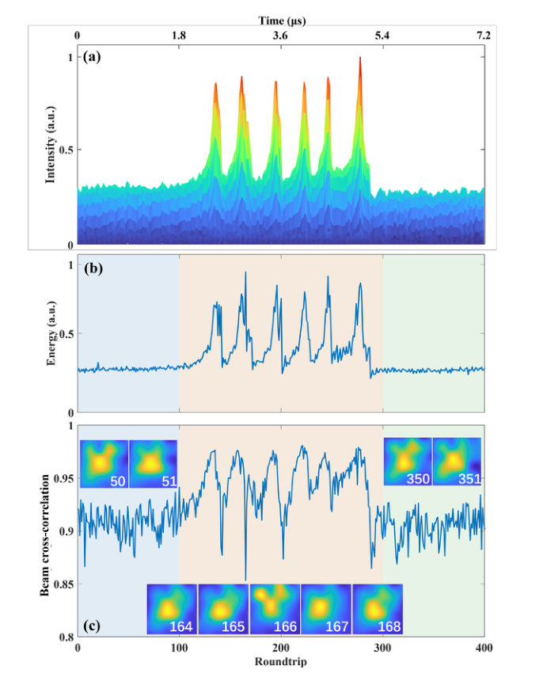
<figcaption class="paper-figure-caption"><b>Fig 1.</b> Fig. 2 Typical transient behavior of 3D soliton evolution. a, Dynamics measured directly by a photodetector and real-time</figcaption>
</figure>
<figure class="paper-figure-card">
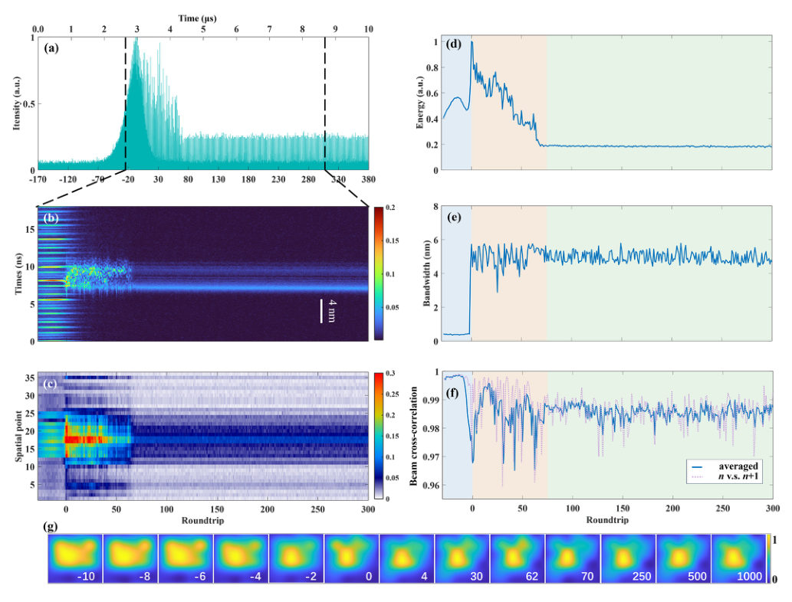
<figcaption class="paper-figure-caption"><b>Fig 2.</b> Fig. 3 Dynamics of 3D soliton formation. a, Raw data measured by DFT (direct output pulse evolution was not recorded</figcaption>
</figure>
<figure class="paper-figure-card">
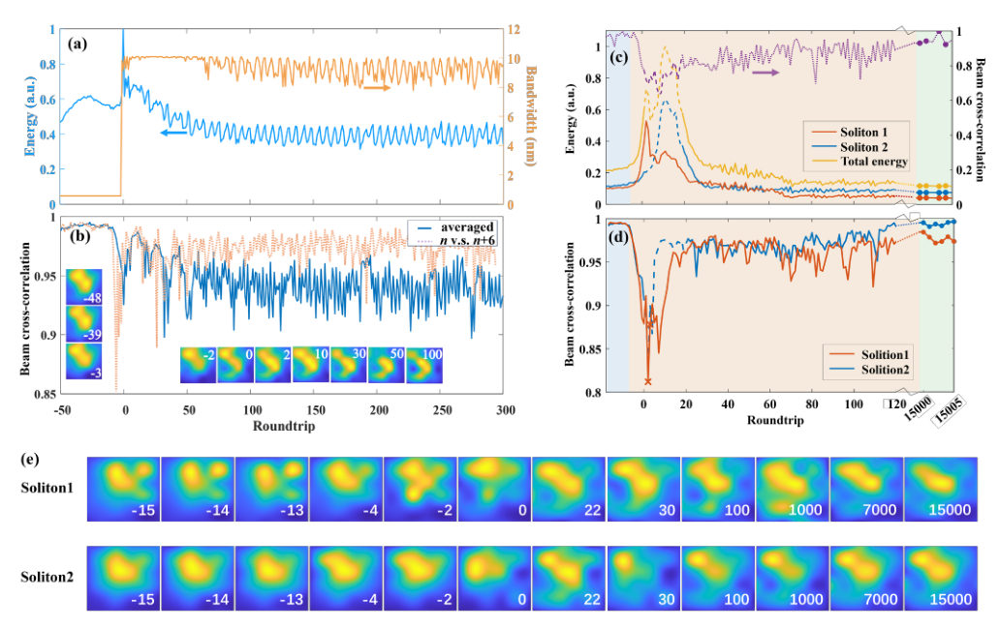
<figcaption class="paper-figure-caption"><b>Fig 3.</b> Fig. 4 Two representative dynamics of 3D soliton formation. a–b, Birth process of a single soliton. a, Evolution of the</figcaption>
</figure>

**Summary.** The research presents a novel experimental technique combining spatial sampling (ASTM) and spectral analysis (DFT) to visualize 3D soliton dynamics in multimode fiber lasers. They demonstrate that the formation of these complex solitons involves a distinct stabilization phase characterized by high spatial coherence, which precedes noticeable spectral broadening. This work provides crucial diagnostic tools for advancing ultrafast laser design.

**Why it may be interesting.** This work is highly relevant to quantum optics and open quantum systems because it pushes the boundaries of characterizing complex nonlinear wave phenomena in high-dimensional optical media, which shares mathematical parallels with many-body physics problems.

Detailed structure

**Main problem.** The primary challenge addressed is achieving real-time visualization of the complex spatiotemporal dynamics of three-dimensional (3D) optical solitons.

**Main result.** The study reveals that during 3D soliton birth, the beam profile stabilizes and exhibits high spatial coherence *before* significant spectral broadening occurs, providing critical insights into multimode laser design.

**Method.** The authors developed and utilized Array-based Spatial Sampling with Time-Division Multiplexing (ASTM) combined with Time-Stretch Dispersive Fourier Transformation (DFT) for simultaneous measurement.

**Model / system.** The experiment uses a multimode fiber laser system operating in the regime of Spatiotemporal Mode-Locking (STML), which supports 3D solitons exhibiting rich nonlinear dynamics beyond simple 1D soliton behavior.

**Key observables.** Spatiotemporal beam profile evolution, total soliton energy evolution, cross-correlation coefficient between adjacent roundtrip beam profiles, and pulse-resolved spectral/beam evolutions.

**Important parameters / regimes.** The system operates with a fundamental repetition frequency of $\sim 55.5 	ext{ MHz}$ (roundtrip time $\sim 18 	ext{ ns}$) and involves multimode fibers supporting up to $\sim 100$ LP modes.

**Assumptions / limitations.** ASTM measurements provide an integrated beam profile rather than the full spatiotemporal distribution, which is a noted limitation.

**Figures summary.** Figures illustrate the ASTM setup schematic, typical transient behavior showing energy and cross-correlation changes, and detailed comparisons of soliton formation processes using both DFT spectral data and ASTM beam measurements over many roundtrips.

**Paper structure.** The paper introduces the challenge of 3D soliton visualization, details the novel ASTM/DFT measurement technique, presents observations on soliton birth dynamics (stability preceding spectral broadening), and concludes with implications for ultrafast laser design.

Abstract

Three-dimensional (3D) optical solitons bear far stronger relevance to multi-dimensional nonlinear dynamics prevalent in complex physical, chemical and biological systems than conventional 1D solitons, and they support far richer and more intricate phenomena arising from their spatiotemporal degrees of freedom. However, real-time recording of 3D soliton evolution with simultaneous spatiotemporal resolution remains a critical challenging. Here, we demonstrate long-term real-time visualization of 3D soliton dynamics with spatiotemporal resolution using high-speed photodetectors combined with joint space- and time-division multiplexing. We visually capture complex transient behaviors of 3D solitons in a multimode fiber laser and, by integrating our method with the time-stretch technique, simultaneously record pulse-resolved beam and spectral evolutions. We observe that during the birth of 3D solitons, the highly multimode beam stabilizes for a substantial interval prior to spectral broadening, indicating that a large number of transverse modes have already locked before longitudinal mode proliferation. These findings highlight the critical importance of real-time spatiotemporal visualization for advancing ultrafast multimode laser design and delivering new insights into high-dimensional nonlinear dynamics.

[↑ back to top](#top)

### [Temporal glide symmetry enforces a parity sideband selection rule in scalar bulk media](http://arxiv.org/abs/2606.13609v1)

**Authors:** Miguel Camacho  
**Type:** both · **Category:** other · **PDF:** <https://arxiv.org/pdf/2606.13609v1>  
**Analysis basis:** full PDF text, analyzed in chunks
**Topic relevance:** `methods for driven-dissipative` **3/5** · `non-equilibrium dynamics` **3/5** · `analog quantum simulation` **1/5** · `correlated / nonlocal dissipation` **1/5** · `driven-dissipative phase transition` **1/5** · `interference shaping light` **1/5** · `non-equilibrium universality` **1/5**

↔ Scroll figures horizontally

<figure class="paper-figure-card">
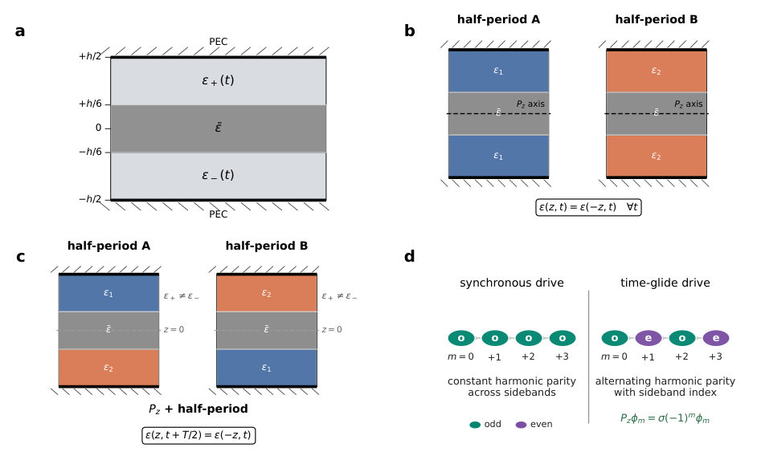
<figcaption class="paper-figure-caption"><b>Fig 1.</b> Figure 1: Symmetry structure of synchronous versus time-glide modulation of a trilayer waveguide.</figcaption>
</figure>
<figure class="paper-figure-card">
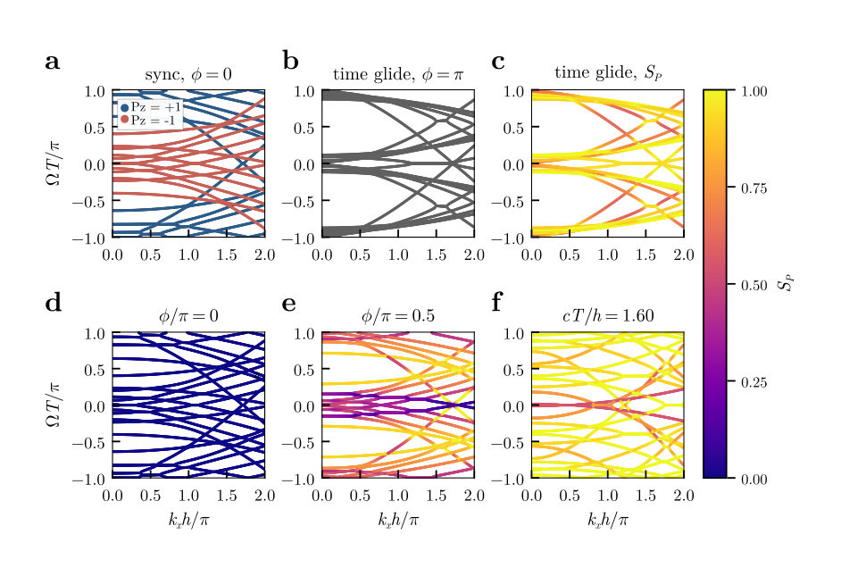
<figcaption class="paper-figure-caption"><b>Fig 2.</b> Figure 2: Static-parity hybridization from time-glide modulation and its phase and period controls. a,</figcaption>
</figure>
<figure class="paper-figure-card">
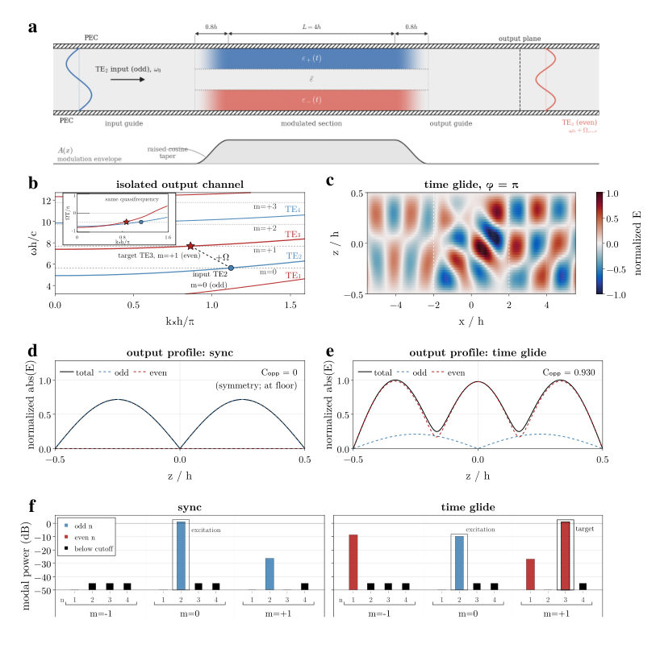
<figcaption class="paper-figure-caption"><b>Fig 3.</b> Figure 3: Spectrally isolated parity conversion in a time-glide-modulated waveguide section. a, FDTD</figcaption>
</figure>
<figure class="paper-figure-card">
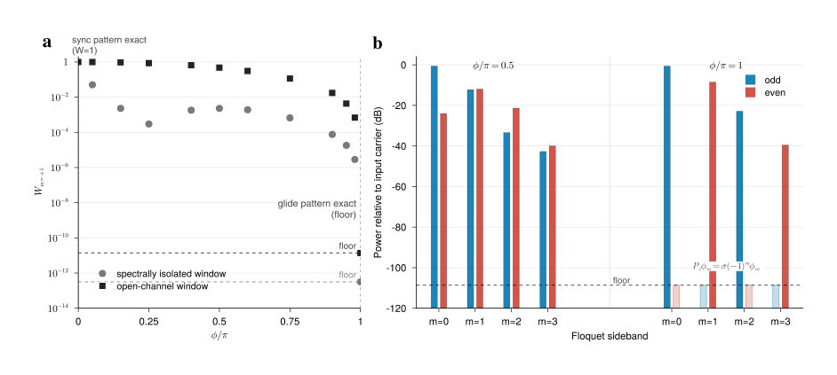
<figcaption class="paper-figure-caption"><b>Fig 4.</b> Figure 4: Exact parity–sideband selection rule in finite-section scattering. a, Wrong-parity fraction</figcaption>
</figure>

**Summary.** The paper demonstrates that temporal glide symmetry imposes an exact parity selection rule governing how electromagnetic energy converts between sidebands in time-modulated waveguides. By comparing this 'glide' drive to a standard 'synchronous' drive, the authors prove that only specific, alternating transverse parities are allowed for emission at different frequency harmonics. This offers a new design principle for controlling light coupling in optical devices.

**Why it may be interesting.** This work provides a powerful example of how underlying discrete symmetries (like glide symmetry) can impose non-trivial, measurable selection rules on energy transport in engineered photonic systems, which is highly relevant for designing frequency converters or quantum light sources.

Detailed structure

**Main problem.** The study investigates how temporal glide symmetry imposes a strict, quantifiable selection rule on energy conversion between different frequency sidebands in time-modulated photonic waveguides.

**Main result.** Temporal glide enforces an exact parity selection rule: the transverse parity of any Floquet eigenstate must alternate with its sideband index ($m$), which is confirmed by showing forbidden output channels are suppressed to numerical zero.

**Method.** The work combines theoretical analysis using Floquet theory (operator algebra, eigenvector projection) with numerical validation via finite-section time-domain simulations (FDTD).

**Model / system.** The system modeled is a scalar trilayer waveguide whose permittivity is modulated periodically in time. The comparison is drawn between 'synchronous' and 'time-glide' modulation protocols.

**Key observables.** Parity content of Floquet eigenstates, the violation metric ($V$), wrong-parity fraction per sideband ($W_m$), and spectral reorganization patterns.

**Important parameters / regimes.** Modulation phase delay ($\phi$), sideband index ($m$), contrast in permittivity modulation ($\Delta\epsilon_r$), and time period ($T$).

**Assumptions / limitations.** The analysis is restricted to scalar relative-permittivity modulation, meaning parity mixing must originate solely from the temporal glide drive itself.

**Figures summary.** Figures compare spectral evolution under synchronous vs. time-glide drives, showing reorganization of coupling sectors in the latter case; other figures quantify the vanishingly small power leakage into symmetry-forbidden channels at the glide point.

**Paper structure.** The paper progresses from establishing the physical models and symmetries (synchronous vs. time-glide) to deriving the selection rule theoretically using Floquet operators, and finally verifying this rule rigorously through quantitative metrics ($V$, $W_m$) in both theoretical matching and FDTD simulations.

Abstract

Symmetry is a powerful way to control coupling between photonic mode families. In spatially periodic structures, glide symmetry can protect band contacts and suppress stop bands. Here we show a different role for temporal glide, a spatiotemporal counterpart combining reflection with a half-period time translation. In a scalar time-modulated trilayer waveguide, temporal glide imposes an exact selection rule linking frequency conversion to transverse-mode symmetry: the parity content of every Floquet eigenstate alternates with sideband index, up to a state-dependent sign. In scattering, this means that a mode of definite parity can emit only into the opposite transverse parity at odd sidebands and into the same parity at even sidebands. We verify the rule directly in bulk Floquet eigenstates and in finite-section time-domain simulations. An incident odd waveguide mode is converted into an even frequency sideband, while all symmetry-forbidden output channels at the analysed sidebands are suppressed to numerically negligible values. Rather than acting as a temporal copy of spatial-glide band sticking, temporal glide provides a distinct symmetry principle for converting electromagnetic energy between selected modes and frequencies.

[↑ back to top](#top)

### [Revealing nonvolatile behaviors in magneto-thermal switching using microstructure-controlled superconducting composites](http://arxiv.org/abs/2606.12778v1)

**Authors:** Keigo Ito, Yui Sakamoto, Hossein Sepehri-Amin, Yuto Watanabe, Poonam Rani, Kumpei Imamura, Takamasa Hirai, Keisuke Hirata, Shunsuke Mori, Yusuke Nakanishi, Kenichiro Hashimoto, Takasada Shibauchi, Yoshikazu Mizuguchi, Ken-ichi Uchida, Fuyuki Ando  
**Type:** experiment · **Category:** other · **PDF:** <https://arxiv.org/pdf/2606.12778v1>  
**Analysis basis:** full PDF text, analyzed in chunks
**Topic relevance:** `spintronics-quantum-optics interface` **3/5** · `QC/QI experiment` **2/5** · `analog quantum simulation` **1/5** · `driven-dissipative phase transition` **1/5** · `exotic spin models in light-matter` **1/5** · `non-equilibrium dynamics` **1/5**

↔ Scroll figures horizontally

<figure class="paper-figure-card">
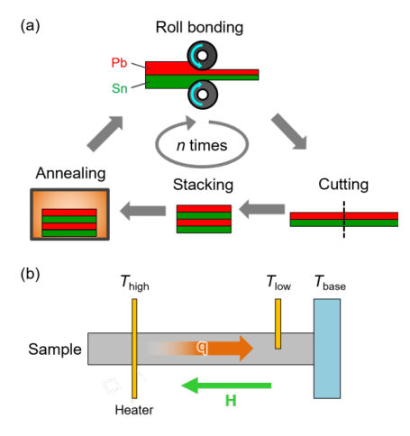
<figcaption class="paper-figure-caption"><b>Fig 1.</b> FIG 1. (a) Schematic of the ARB process to create Sn/Pb multilayered composites. The microstructure is systematically controlled by the repetition number n. (b) Schematic of the setup for thermal conductivity measurement based on steady-state heat flow method. Hot and cold sides temperatures, Thigh and Tlow, and a base temperature Tbase are measured while applying a heat flux q by a heater under an external magnetic field H.</figcaption>
</figure>
<figure class="paper-figure-card">
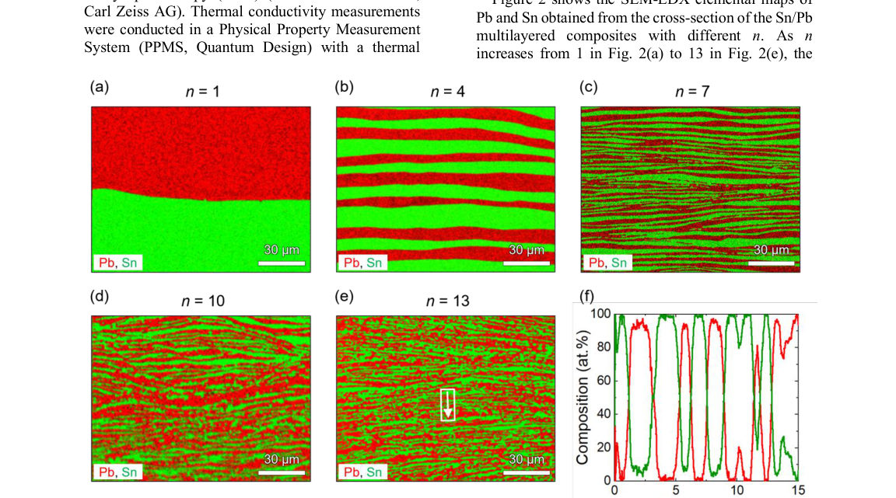
<figcaption class="paper-figure-caption"><b>Fig 2.</b> FIG 2. Cross-sectional SEM-EDX elemental maps of Pb and Sn obtained from the Sn/Pb multilayered composites with the repetition number n of (a) 1, (b) 4, (c) 7, (d) 10, and (e) 13. (f) Composition profiles of Pb and Sn in the sample with n = 13 along the white arrow marked in (e).</figcaption>
</figure>
<figure class="paper-figure-card">
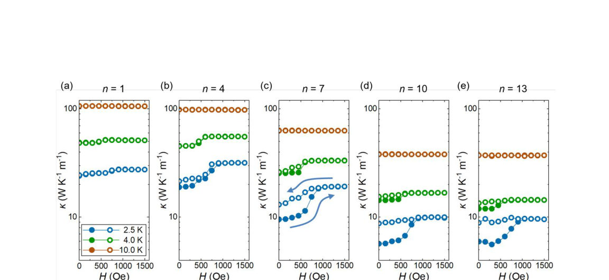
<figcaption class="paper-figure-caption"><b>Fig 3.</b> FIG 3. Magnetic field H dependence of the thermal conductivity κ at 2.5, 4.0, and 10.0 K for the Sn/Pb multilayered composites with the repetition number n of (a) 1, (b) 4, (c) 7, (d) 10, and (e) 13. The closed circles indicate the data obtained with increasing H, whereas the open circles with decreasing H. Arrows in (c) also indicates the sweeping direction of H.</figcaption>
</figure>
<figure class="paper-figure-card">
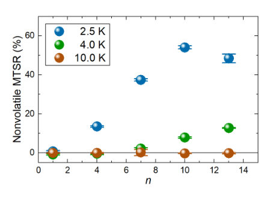
<figcaption class="paper-figure-caption"><b>Fig 4.</b> FIG 4. The repetition number n dependence of nonvolatile MTSR for the Sn/Pb multilayered composites at 2.5, 4.0 and 10.0 K.</figcaption>
</figure>
<figure class="paper-figure-card">
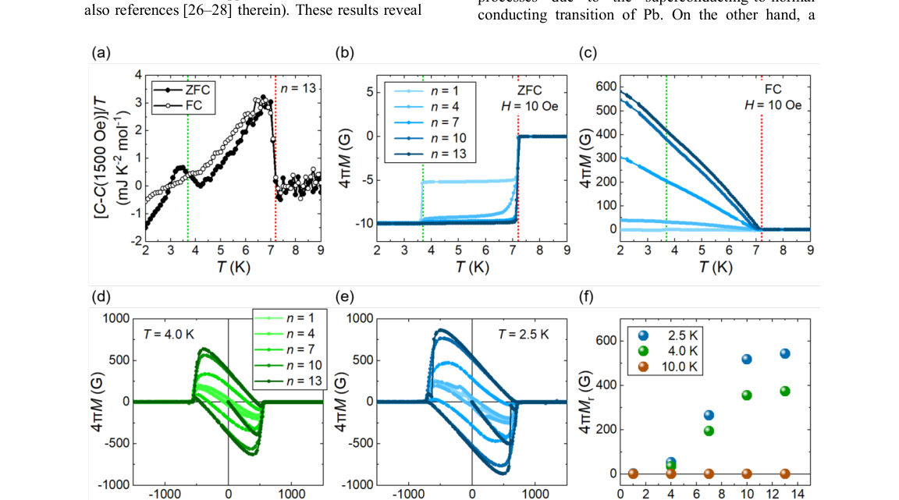
<figcaption class="paper-figure-caption"><b>Fig 5.</b> FIG 5. (a) Temperature T dependence of the differential specific heat [C-C(1500Oe)]/T for the sample with the repetition number n = 13 after the zero field cooling (ZFC) and field cooling (FC) processes. (b),(c) T dependence of the magnetization 4πM after (b) ZFC and (c) FC processes for all the samples. H during the measurements was set to +10 Oe. (d),(e) H dependence of 4πM at (d) 4.0 K and (e) 2.5 K. (f) n dependence of the remanent magnetization 4πMr at 2.5, 4.0 and 10.0 K.</figcaption>
</figure>

**Summary.** This work systematically studies how controlling the microstructure of superconducting Sn/Pb composites via roll bonding influences magneto-thermal switching. The key finding is that nonvolatile MTS requires micro-scale inclusions capable of trapping magnetic flux. This provides a design guideline for engineering superconductors with enhanced thermal management properties.

**Why it may be interesting.** While primarily condensed matter experimental physics, the study touches upon phase transitions and magnetic field effects in superconductors, which are foundational topics related to quantum many-body systems and superconducting qubits.

Detailed structure

**Main problem.** The study investigates how controlling the microstructure of superconducting composites affects the nonvolatile nature of magneto-thermal switching (MTS).

**Main result.** Nonvolatile MTS is found to appear systematically as the microstructural refinement increases, confirming that magnetic flux trapping by inclusions comparable to or smaller than the magnetic vortex is essential for this effect.

**Method.** The researchers used accumulative roll bonding (ARB) to create Sn/Pb multilayered composites with controlled microstructure, followed by precise measurements of thermal conductivity ($\kappa$) under varying magnetic fields and angles.

**Model / system.** The physical system is superconducting Sn/Pb multilayered composites fabricated via ARB. The microstructural scale (layer thickness) can be systematically tuned by the number of rolling repetitions ($n$).

**Key observables.** Magneto-thermal switching ratio (MTSR), remanent magnetization ($4\pi M_r$), and thermal conductivity ($\kappa$) dependence on magnetic field ($H$) and angle ($	heta$).

**Important parameters / regimes.** Repetition number of roll bonding ($n$), which controls the average layer thickness; temperature ($T$); applied magnetic field ($H$).

**Assumptions / limitations.** The nonvolatile MTS is directly linked to the ability of micro-scale inclusions to trap magnetic flux.

**Figures summary.** Figures show SEM-EDX maps confirming microstructure refinement with increasing $n$; $\kappa$ vs. $H$ curves demonstrating hysteresis; and plots showing that both MTSR and remanent magnetization increase monotonically with $n$.

**Paper structure.** The paper systematically varies the microstructural scale using ARB (varying $n$) to observe the emergence of nonvolatile MTS, confirming a direct correlation between microstructure refinement, flux trapping, and the switching behavior.

Abstract

Thermal conductivity in a conductor changes by the application of an external magnetic field, which functions as a magneto-thermal switch. For superconductors, a large magneto-thermal switching can occur through a superconducting-to-normal conducting phase transition due to the change in the electron contribution in thermal conductivity. Arima et al. recently reported a nonvolatile nature of the magneto-thermal switching for superconducting solders, which consist of phase-separated Sn and Pb domains. Although they clarified that magnetic flux trapping is required to induce the nonvolatile magneto-thermal switching, a rule for such material design is still unclear. Here, we investigate the microstructure dependence of magneto-thermal switching in superconducting Sn/Pb multilayered composites, which are created by an accumulative roll bonding method. The thickness of each layer, that is the scale of microstructure, can be systematically controlled by the repetition number of roll bonding while the whole sample size and average composition are unchanged. We find that, as the formation of micro-scaled Sn domains proceeds by increasing the repetition number, a nonvolatility in the magneto-thermal conductivity gradually appears in correlation with the remanent magnetization. This study directly confirms that the inclusions with a size comparable to or less than the magnetic vortex in superconducting matrix is essential for magnetic flux trapping, enabling the nonvolatile magneto-thermal switching in superconducting composites.

[↑ back to top](#top)

### [Manipulation of the gyrotropic mode frequency and band structure in an FM / AFM disk via vortex imprinting](http://arxiv.org/abs/2606.13181v1)

**Authors:** E. V. Skorokhodov, E. A. Karashtin, I. A. Fedotov, I. Yu. Pashen'kin, M. V. Sapozhnikov  
**Type:** both · **Category:** other · **PDF:** <https://arxiv.org/pdf/2606.13181v1>  
**Analysis basis:** full PDF text, analyzed in chunks
**Topic relevance:** `spintronics-quantum-optics interface` **3/5** · `analog quantum simulation` **1/5** · `correlated / nonlocal dissipation` **1/5** · `driven-dissipative phase transition` **1/5** · `exotic spin models in light-matter` **1/5** · `non-equilibrium dynamics` **1/5**

↔ Scroll figures horizontally

<figure class="paper-figure-card">
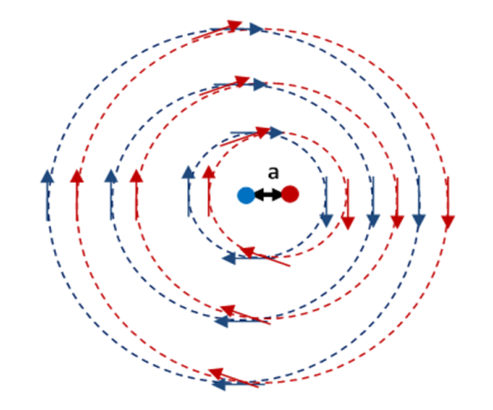
<figcaption class="paper-figure-caption"><b>Fig 1.</b> Figure 1: The illustration of the exchange energy growth due to the FM vortex (red arrows) shift with respect to the AFM vortex (blue arrows show the magnetic moment of the surface layer).</figcaption>
</figure>
<figure class="paper-figure-card">
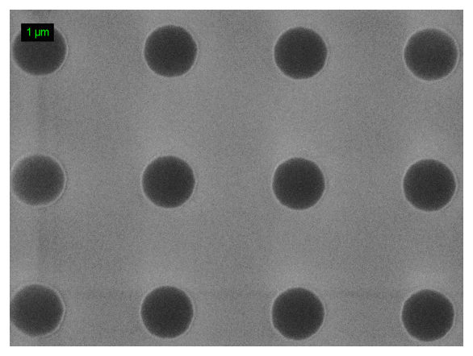
<figcaption class="paper-figure-caption"><b>Fig 2.</b> Figure 2: Scanning electron microscope (SEM) image of a fragment of the disk array. The disk diameter and the distance between edges are 1 µm ± 10nm.</figcaption>
</figure>
<figure class="paper-figure-card">

<figcaption class="paper-figure-caption"><b>Fig 3.</b> Figure 3: Magnetization curves of an array of disks made of a Ta(20 nm)/IrMn(5 nm)/Fe(0.5 nm)/NiFe(12 nm)/Ta(5 nm) film (a) before annealing and (b) after annealing at 350◦C and subsequent zero-field cooling.</figcaption>
</figure>
<figure class="paper-figure-card">
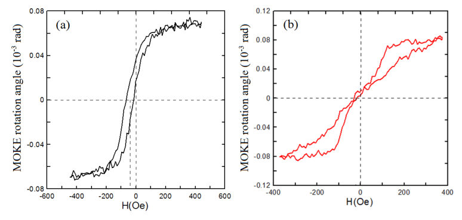
<figcaption class="paper-figure-caption"><b>Fig 4.</b> Figure 5 shows the ferromagnetic resonance spectra obtained by magnetic resonance</figcaption>
</figure>
<figure class="paper-figure-card">
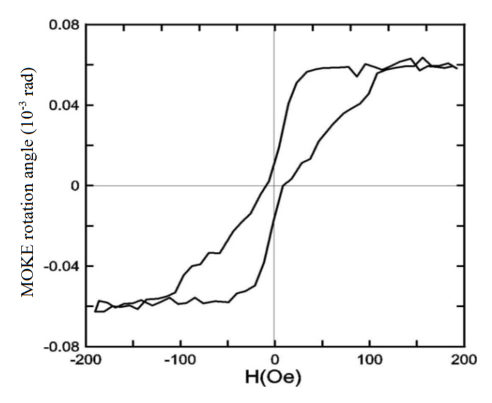
<figcaption class="paper-figure-caption"><b>Fig 5.</b> Figure 4: MOKE magnetization curve of a micron-sized disk array made of a Fe(0.5 nm)/NiFe(12 nm)/Ta(5 nm) film.</figcaption>
</figure>

**Summary.** This work experimentally and theoretically investigates how coupling a Ferromagnetic layer to an Antiferromagnetic layer via vortex imprinting modifies the system's fundamental magnetic resonance frequency. Researchers report a significant frequency shift and observe a predicted double-frequency mode when applying an external field, confirming strong nonlinear dynamics governed by interfacial exchange coupling.

**Why it may be interesting.** While focused on magnetism, the study of highly nonlinear dynamics, symmetry breaking (noncentrosymmetry), and resonant modes in coupled magnetic systems shares conceptual overlap with understanding collective excitations in quantum many-body or open quantum systems.

Detailed structure

**Main problem.** The study investigates the manipulation of the magnetic gyrotropic mode frequency and band structure within a Ferromagnetic (FM) / Antiferromagnetic (AFM) disk system.

**Main result.** The coupling between FM and AFM layers via vortex imprinting causes a significant shift in the gyrotropic mode frequency, and the application of an in-plane field reveals a predicted double-frequency resonance due to nonlinear dynamics.

**Method.** The research combines experimental measurements using Magnetic Resonance Force Microscopy (MRFM) with theoretical modeling using micromagnetic simulations.

**Model / system.** The physical system is an FM/AFM bilayer disk heterostructure, such as NiFe/IrMn. The AFM layer's vortex state is imprinted into the material via controlled thermal annealing processes.

**Key observables.** Gyrotropic mode frequency ($\omega_{	ext{exch}}$), resonance spectra (comparing single FM vs. FM/AFM disks), and the dependence of these frequencies on an applied in-plane magnetic field ($H$).

**Important parameters / regimes.** The frequency shift is proportional to exchange coupling terms, and the system exhibits strong nonlinearity when subjected to external fields.

**Assumptions / limitations.** The analysis assumes that the observed frequency shifts and nonlinearities are governed by the surface exchange interaction between the FM and AFM vortices in a noncentrosymmetric environment.

**Figures summary.** Figures compare MRFM spectra showing the large frequency shift (single vs. bilayer) and demonstrate the emergence of a distinct double-frequency peak when an external magnetic field is applied to the coupled system.

**Paper structure.** The paper progresses by first establishing the physical setup and characterization methods (MOKE, MRFM), presenting experimental measurements showing the frequency shift and nonlinear response, and then supporting these findings with theoretical micromagnetic calculations that predict the double-frequency mode.

Abstract

We experimentally investigate the magnetic gyrotropic mode in a system of vortex ferromagnetic (FM) nanooscillator exchange coupled to an antiferromagnetic (AFM) layer. The micron-sized disks formed from the Ni80Fe20(12 nm) / Ir80Mn20 (5 nm) FM/AFM heterostructure are prepared so that the vortex magnetic state is imprinted into the AFM layer. We apply a magnetic resonance force microscopy (MRFM) method to locally study magnetic oscillations in single FM/AFM disks. We show that the gyrotropic mode frequency is significantly (approximately 4 times) shifted to the high frequency compared to similar structure consisting of a single ferromagnetic disk. Upon applying an in-plane magnetic field, we observe a strong peak at a double frequency which was previously predicted in theory. This is governed by the fact that vortex dynamics is strongly nonlinear in a noncentrosymmetric system under investigation.

[↑ back to top](#top)

### [Role of quantum confinement in semiconductor-superconductor core-shell nanowires](http://arxiv.org/abs/2606.12715v1)

**Authors:** Tudor Gabriel Dumitru, Anna Sitek, Gunnar Thorgilsson, Sigurdur I. Erlingsson, Tudor Dan Stanescu, Andrei Manolescu  
**Type:** theory · **Category:** other · **PDF:** <https://arxiv.org/pdf/2606.12715v1>  
**Analysis basis:** full PDF text, analyzed in chunks
**Topic relevance:** `Keldysh / 2PI / non-Gaussian methods` **3/5** · `driven-dissipative phase transition` **2/5** · `Kondo & dissipative impurity` **1/5** · `methods for driven-dissipative` **1/5** · `non-equilibrium dynamics` **1/5**

↔ Scroll figures horizontally

<figure class="paper-figure-card">
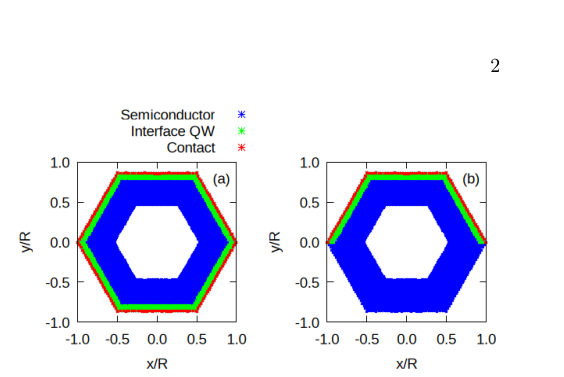
<figcaption class="paper-figure-caption"><b>Fig 1.</b> FIG. 1. Cross section of the hybrid core-shell nanowires with (a) full-shell and (b) half-shell superconductor layers. The white region in the center is the (insulating) semiconductor core, while the blue and green regions represent the (conduct- ing) semiconductor shell, where charge carriers are present. The green zone indicates the QW potential created at the metal-semiconductor contact. The red line corresponds to the self-energy which in our model represents the interface with the superconducting layer.</figcaption>
</figure>
<figure class="paper-figure-card">
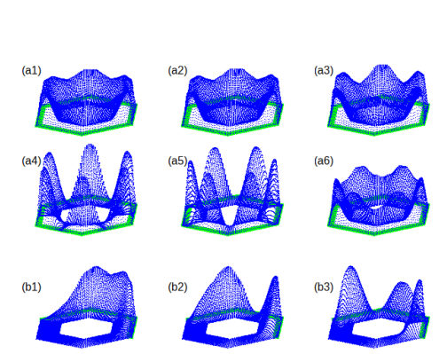
<figcaption class="paper-figure-caption"><b>Fig 2.</b> FIG. 2. (a1-a6) Wave functions corresponding to the lowest energy transverse modes of a full shell nanowire, in increas- ing energy. The green shading indicates the QW potential. Modes (a2), (a3), and (a6) are double degenerated because of the hexagonal symmetry. Note that the electrons are shifted towards the external boundaries, where the QW potential is located. (b1-b6) Transverse wave functions for the half shell case, with metal-semiconductor contact on three facets. Note that the lowest four energy modes (b1-b4) are localized near the metal-semiconductor interface, while the 5-th and 6-th modes extend throughout the entire semiconductor shell, i.e. they are tubular-type states similar...</figcaption>
</figure>
<figure class="paper-figure-card">
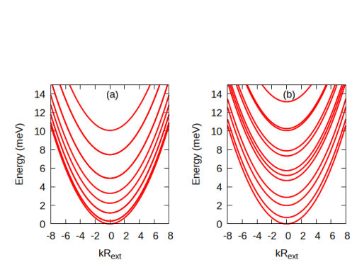
<figcaption class="paper-figure-caption"><b>Fig 3.</b> FIG. 3. Energy spectra for the nanowire with infinite length in the normal state. The transverse energies correspond to the bottom of each parabola, relatively to the ground state which is set at zero energy. (a) Full shell case, where the degeneracy sequence is 2, 4, 4, 2 due to orbital and spin degeneracies [48]. (b) Half shell case, where the orbital degeneracy is lifted, and all parabolas are only 2-fold spin degenerate.</figcaption>
</figure>
<figure class="paper-figure-card">
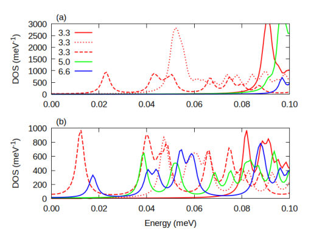
<figcaption class="paper-figure-caption"><b>Fig 4.</b> FIG. 4. Density of states for (a) the full shell model and (b) the half shell model with several sets of parameters. The values of the chemical potential are explicitly given in panel (a) in meV units. Full lines correspond to a superconductor- semiconductor coupling constant γ = 83 meV and a QW po- tential of −50 meV. The dotted lines represent the DOS of hybrid systems with reduced semiconductor-superconductor coupling, γ = 41.5 meV, while the dashed lines correspond to a vanishing QW potential.</figcaption>
</figure>
<figure class="paper-figure-card">
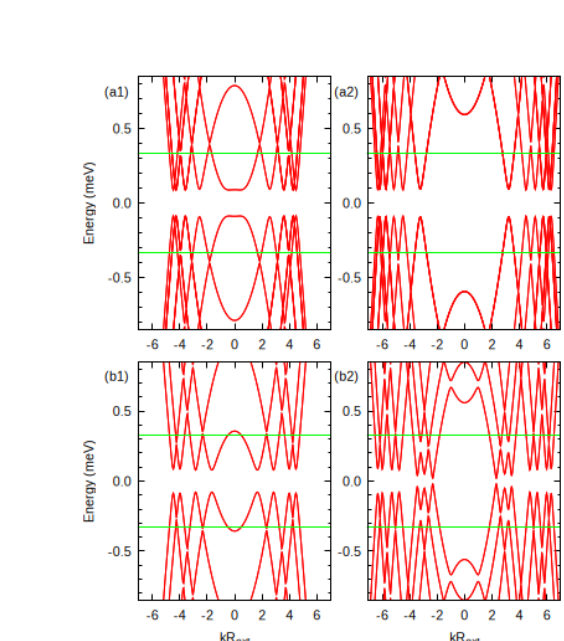
<figcaption class="paper-figure-caption"><b>Fig 5.</b> FIG. 5. Low energy BdG spectra of infinite length nanowires within the static approximation. The full shell case is shown in panels (a1) and (a2) with µ = 3.3 meV and µ = 6.6 meV, respectively. The half shell case is shown in panels (b1) and (b2), again with µ = 3.3 and µ = 6.6 meV. The green hor- izontal lines indicate the superconducting gap of the parent superconductor, ∆= 0.33 meV. Note that the static approxi- mation is highly accurate for energies E ≲0.4∆≈0.13 meV, i.e. near the gap edge.</figcaption>
</figure>

**Summary.** This theoretical study models the induced superconductivity in semiconductor nanowires coated by a superconductor shell. By comparing full and half-shell geometries, the authors show that while both can exhibit superconducting behavior, the gap size is strongly dependent on structural details like partial coverage. The work provides critical insights into how quantum confinement dictates the stability of tubular supercurrents.

**Why it may be interesting.** The detailed analysis of proximity effects in low-dimensional hybrid systems using BdG theory is highly relevant to understanding superconducting quantum circuits and topological materials, bridging concepts from condensed matter theory with potential device applications.

Detailed structure

**Main problem.** The work investigates how quantum confinement and superconducting coupling affect induced superconductivity in semiconductor-superconductor core-shell nanowires.

**Main result.** Both full-shell and half-shell geometries can support tubular superconducting states, but the induced gap size is highly sensitive to the degree of superconducting coverage (half vs. full) and the chemical potential ($\mu$).

**Method.** The study employs microscopic model calculations using an effective Bogoliubov-de Gennes (BdG) Hamiltonian derived from Green's functions.

**Model / system.** The system is a core-shell nanowire heterostructure, where the semiconductor core is coupled to a metallic superconductor shell (either full or half coverage). The model incorporates electrostatic band-bending via a rectangular quantum well potential and superconducting proximity effects via an interface self-energy.

**Key observables.** Induced superconducting gap ($\Delta_{	ext{ind}}$), electron/hole character of eigenstates, supercurrent oscillations exhibiting Little-Parks periodicity.

**Important parameters / regimes.** Superconducting gap ($\Delta$), coupling strength ($\gamma$), chemical potential ($\mu$), and the geometry (full vs. half shell).

**Assumptions / limitations.** The complex electrostatic potential is approximated by a thin rectangular quantum well, and the superconducting contribution is modeled via an interface self-energy term in the low-energy limit.

**Figures summary.** Figures illustrate the cross-section of the nanowires (full/half shell), the Density of States ($
ho(E)$) showing gap formation, energy spectra from the BdG Hamiltonian for different geometries and $\mu$, and spatial profiles of electron/hole components.

**Paper structure.** The paper progresses by establishing the physical model using an effective Hamiltonian, calculating transverse modes, determining the superconducting properties via the self-energy, and finally analyzing how geometry (full vs. half shell) and external parameters ($\mu$, barrier height) modulate the induced gap and tubular superconductivity.

Abstract

This work is motivated by the experimentally observed coherence of the supercurrent in semiconductor nanowires covered by a half-shell metallic superconductor, which leads to flux dependent supercurrent oscillations with period h/2e, as expected for a tubular superconductor, i.e. Little-Parks oscillations. We perform microscopic model calculations and compare the results for full and half metallic shells. We use an effective Hamiltonian derived from the Green's function of the proximitized semiconductor nanowire, where the presence of the superconductor is represented by a self energy. Furthermore, we incorporate the electrostatic band-bending at the metal-semiconductor interface as a rectangular narrow quantum well on the semiconductor side. The properties of the eigenstates of the effective Hamiltonian are determined by the spatial profile of the corresponding transverse modes in the normal state. For half-shell wires, transverse modes with high-enough energy expand outside the interface quantum well and generate eigenstates with mixed electron-hole character that surround the entire circumference of the nanowire, similar to eigenstates of the full-shell system. We identify these states as being responsible for the observed Little-Parks effect.

[↑ back to top](#top)

### [Phonon polariton confinement in isotopically pure MOVPE-grown BN triangles](http://arxiv.org/abs/2606.13483v1)

**Authors:** Maximilian Scharpey, Oskar Schröer, Daniel Wigger, Lena Miler, Jakub Iwański, Andrzej Wysmołek, Johannes Binder, Iris Niehues  
**Type:** experiment · **Category:** other · **PDF:** <https://arxiv.org/pdf/2606.13483v1>  
**Analysis basis:** full PDF text, analyzed in chunks
**Topic relevance:** `interference shaping light` **3/5** · `correlated cavity matter` **1/5** · `driven-dissipative phase transition` **1/5** · `quantum optics experiment` **1/5**

↔ Scroll figures horizontally

<figure class="paper-figure-card">
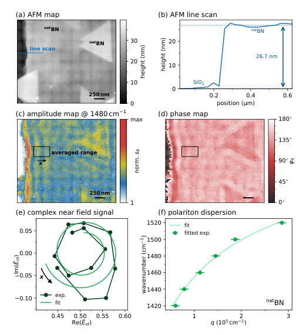
<figcaption class="paper-figure-caption"><b>Fig 1.</b> Figure 1. Phonon polariton characterization of MOVPE grown natBN. (a) AFM topography map of the sample also showing natBN tri- angles (see Figure 2). (b) AFM line scan across the edge of the natBN layer. (c) s-SNOM amplitude 𝑠4 (fourth demodulation or- der) of the sample area from (a) for an excitation wavenumber of 1480 cm−1. (d) s-SNOM phase map 𝜑4 corresponding to (c). (e) Complex valued s-SNOM signal ¯𝐸nf (dark green dots) as function of polariton propagation distance 𝑥vertically averaged over the rect- angle in (c, d). Fit (green line) according to Eq. (2) with resulting 𝑞= 1.45 × 105 cm−1. (f) Measured phonon polariton dispersion (green dots) with theoretical fit (light green line)...</figcaption>
</figure>
<figure class="paper-figure-card">
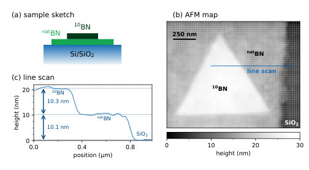
<figcaption class="paper-figure-caption"><b>Fig 2.</b> Figure 2. Isotopically pure 10BN triangular islands. (a) Schematic of the sample structure consisting of a MOVPE-grown natBN layer with isotopically pure triangular islands (10BN) transferred on a Si/SiO2 substrate. (b) AFM topography image and (c) extracted line scan of the investigated area. The isotopically pure 10BN triangles with a thickness of about 10 nm are grown on a 10 nm thick natBN layer.</figcaption>
</figure>
<figure class="paper-figure-card">
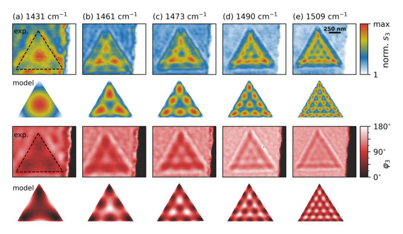
<figcaption class="paper-figure-caption"><b>Fig 3.</b> Figure 3. Confined polariton modes in 10BN triangular islands. Upper two rows: s-SNOM 𝑠3 amplitude images (3rd demodulation order) taken at selected excitation wavenumbers increasing from (a) to (e) and corresponding simulations. High intensities are shown in red and low intensities in blue colors. All images are initially normalized to the respective Si/SiO2 substrate value and finally to their respective maximum value. Lower two rows: corresponding s-SNOM phase 𝜑3 images again normalized to the Si/SiO2 substrate and simulations. The outline of the 10BN triangle is marked in (a) by the dashed black line.</figcaption>
</figure>
<figure class="paper-figure-card">
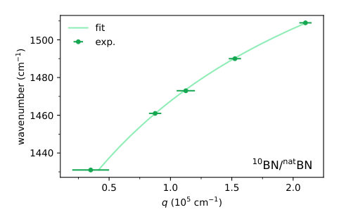
<figcaption class="paper-figure-caption"><b>Fig 4.</b> Figure 4. Phonon polariton dispersion of the 10BN triangle de- termined from the confined modes in Figure 3. The resulting phonon wavenumbers are 𝜔TO,𝑥= (1393 ± 6) cm−1 and 𝜔LO,𝑥= (1621 ± 7) cm−1.</figcaption>
</figure>
<figure class="paper-figure-card">
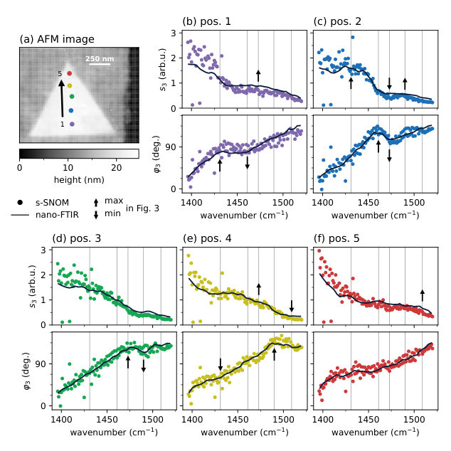
<figcaption class="paper-figure-caption"><b>Fig 5.</b> Figure 5. s-SNOM and nano-FTIR spectroscopy of confined polariton modes. (a) AFM topography image of the 10BN triangular island (same as Figure 2(b)). Positions where spectra are taken are marked by colored dots. (b-c) nano-FTIR spectra (amplitude 𝑠3 top and phase 𝜑3 bottom, solid black lines) taken at the positions marked in (a) together with the extracted s-SNOM values from the s-SNOM images in Figures 3 and SI (colored dots). The gray vertical lines indicate the excitation wavenumbers corresponding to the s-SNOM maps shown in 3 and the arrows mark distinct maxima (↑) and minima (↓) at the respective position (colors) in the measured maps.</figcaption>
</figure>

**Summary.** The research investigates phonon polaritons in epitaxial boron nitride (BN) films, moving from bulk characterization to engineered microstructures. By combining s-SNOM and nano-FTIR measurements on isotopically pure ${}^{10}	ext{BN}$ triangles, the authors successfully demonstrated highly confined polariton modes. This work paves the way for building scalable, high-quality nanophotonic devices.

**Why it may be interesting.** This work is highly relevant as it pushes the boundaries of solid-state photonics by creating tunable, all-epitaxial polariton resonators, which are crucial components for quantum light sources and detectors.

Detailed structure

**Main problem.** The primary goal is to demonstrate efficient phonon-polariton propagation and confinement within large-area, epitaxial boron nitride (BN) structures for advanced nanophotonics applications.

**Main result.** The authors successfully demonstrated high-quality polariton propagation in MOVPE-grown natural BN and achieved clear evidence of mode confinement using isotopically pure ${}^{10}	ext{BN}$ triangular islands.

**Method.** Measurements combine scattering-type s-SNOM and nano-FTIR spectroscopy, analyzed using complex near-field optical signals and fitting to theoretical interference models.

**Model / system.** The system involves BN thin films grown by MOVPE, specifically utilizing isotopically pure ${}^{10}	ext{BN}$ triangular islands on a natural BN layer. The physics relies on the resonant hybridization of light and lattice vibrations (phonon polaritons).

**Key observables.** Phonon polariton dispersion relation ($\omega$ vs. $q$), complex near-field amplitude and phase maps, and spectral features from s-SNOM/nano-FTIR.

**Important parameters / regimes.** Wavenumbers like $	ext{TO}$ and $	ext{LO}$ modes (e.g., $1354 	ext{ cm}^{-1}$, $1608 	ext{ cm}^{-1}$), island size, and epitaxial growth quality.

**Assumptions / limitations.** The analysis often assumes straight wavefronts near edges for initial measurements, and the comparison between s-SNOM and nano-FTIR requires complex geometric alignment algorithms.

**Figures summary.** Figures show s-SNOM characterization of MOVPE-grown BN (including topography, amplitude/phase maps), schematics of ${}^{10}	ext{BN}$ island structures, and plots comparing measured vs. simulated phonon polariton dispersion relations.

**Paper structure.** The paper progresses from characterizing high-quality bulk-like propagation in natural BN to demonstrating controlled confinement within engineered micro-triangular islands using advanced near-field optical techniques.

Abstract

Phonon polaritons, quasiparticles formed by the resonant hybridization of light and lattice vibrations, exhibit unique properties like the possibility of hyperbolic dispersions. In this context, exfoliated hexagonal boron nitride (hBN) has emerged as a promising material for phonon polariton-based research. However, to advance toward practical applications, it is essential to demonstrate efficient phonon-polariton propagation and confinement in large-area epitaxial BN. To address this topic, we use metalorganic vapor phase epitaxy (MOVPE)-grown BN and investigate the phonon polariton properties using scattering-type scanning near-field optical microscopy (s-SNOM) and nanoscale Fourier transform infrared spectroscopy (nano-FTIR). We report remarkably long phonon polariton propagation lengths, indicating the high crystalline quality of the BN layer. By using epitaxially grown isotopically pure triangular islands, we further demonstrate efficient phonon-polariton confinement with mode patterns tunable by the incident light wavelength. Our results pave the way for implementing all-epitaxial, microscale, high-quality polariton resonators for nanophotonics and quantum optics.

[↑ back to top](#top)

### [Multiband Superconductivity and Charge Density Wave in HfxZr1-xTe3 single crystals](http://arxiv.org/abs/2606.12598v1)

**Authors:** F. F. G. Nogueira, M. S. da Luz, M. S. Torikachvili, L. M. Ishikura, Ebrahim Dib, A. J. S. Machado  
**Type:** experiment · **Category:** strongly correlated electrons · **PDF:** <https://arxiv.org/pdf/2606.12598v1>  
**Analysis basis:** full PDF text, analyzed in chunks
**Topic relevance:** `Frenkel-Kontorova` **3/5** · `Keldysh / 2PI / non-Gaussian methods` **1/5** · `driven-dissipative phase transition` **1/5**

↔ Scroll figures horizontally

<figure class="paper-figure-card">
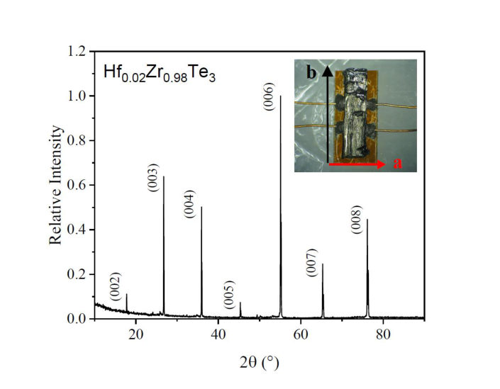
<figcaption class="paper-figure-caption"><b>Fig 1.</b> Figure 1. -2X-ray diffraction pattern for the Hf0.02Zr0.98Te3 single-crystal showing only the (00l) reflections. The inset shows the Hf0.02Zr0.98Te3 crystal used for the electrical resistivity measurement with excitation current along the a-axis.</figcaption>
</figure>
<figure class="paper-figure-card">
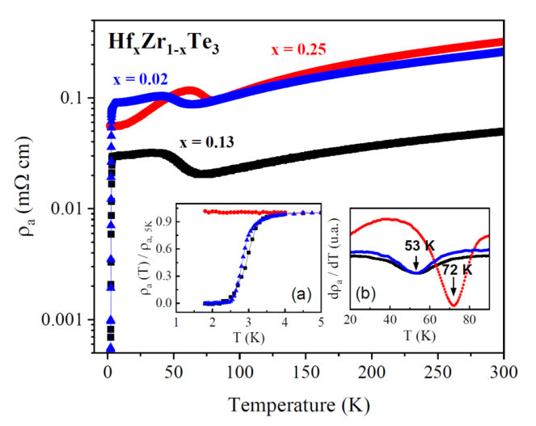
<figcaption class="paper-figure-caption"><b>Fig 2.</b> Figure 2. Temperature dependence of the electrical resistivity along the a-axis, ρa(T), for HfxZr1-xTe3 single crystals with Hf concentrations x = 0.02 (blue), 0.13 (black), and 0.25 (red), plotted on a logarithmic scale. Insets: (a) Low- temperature region showing the normalized resistivity ρₐ(T)/ρₐ, 5 K; (b) Temperature derivative of the resistivity, dρa/dT, highlighting the charge density wave transition. The CDW transition temperature, TCDW, was determined from the minimum in dρa/dT.</figcaption>
</figure>
<figure class="paper-figure-card">
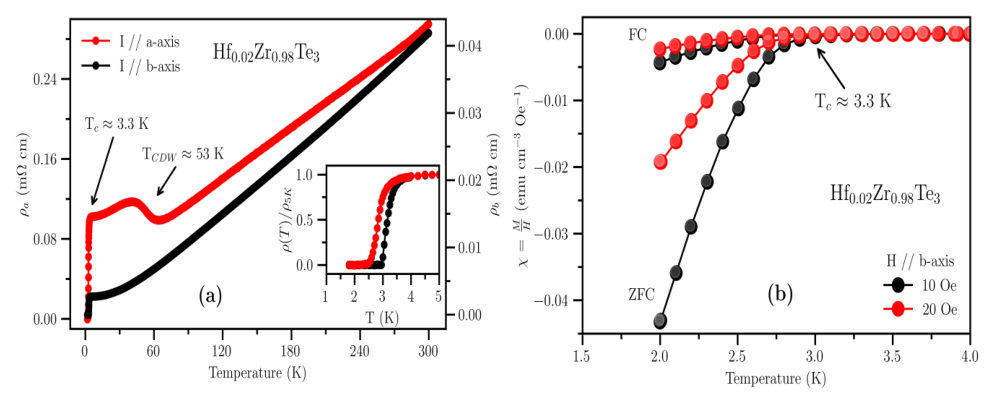
<figcaption class="paper-figure-caption"><b>Fig 3.</b> Figure 3. (a) Temperature dependence of the electrical resistivity for Hf0.02Zr0.98Te3 ρₐ(T) (left y-axis), and ρb(T) (right y-axis) over the temperature range 2–300 K. The CDW anomaly at TCDW ≈ 53 K and Tc, onset ≈ 3.3 K are indicated by arrows. The inset displays the normalized resistivity ρ(T)/ρ(5 K) in the low-temperature region (2–5 K), highlighting the superconducting transitions for both current directions; (b) Temperature dependence of the magnetic susceptibility in applied magnetic fields of 10 Oe (black dots), and 20 Oe (red dots). The divergence between the ZFC (zero-field- cooled) and FC (field-cooled) curves yields a T𝑐 ≈ 3.3 K for the 10 Oe applied magnetic field H // b-axis.</figcaption>
</figure>
<figure class="paper-figure-card">
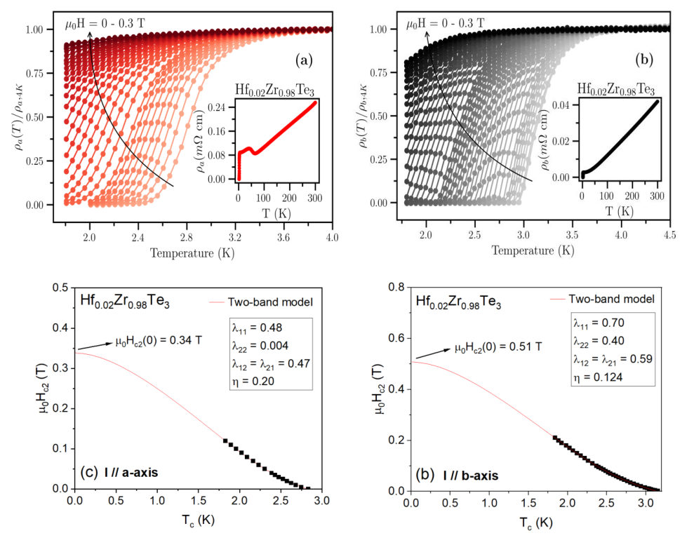
<figcaption class="paper-figure-caption"><b>Fig 4.</b> Figure 4. Temperature dependence of the normalized resistivity ρ(T)/ρ(4 K) for Hf₀.₀₂Zr₀.₉₈Te₃ in magnetic fields μ₀H = 0–0.3 T for (a) I // a and (b) I // b. The superconducting transition is progressively suppressed with increasing field. A small difference of the data for the two orientations of the field can be attributed to slight difference in the broadening. Insets show ρ(T) from 1.8 to 300 K. The upper critical field μ₀Hc2 was determined using a 50% criterion for the resistive transition.</figcaption>
</figure>
<figure class="paper-figure-card">
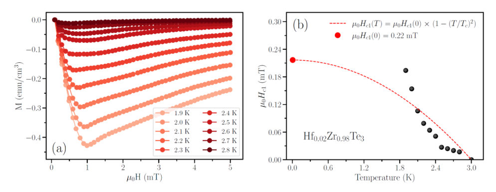
<figcaption class="paper-figure-caption"><b>Fig 5.</b> Figure 5. (a) Isothermal magnetization curves M vs µ0H for Hf0.02Zr0.98Te3 in the 1.9 - 2.8 K range. The linearity at low fields is disrupted by vortex penetration at µ0Hc1; (b) Temperature dependence µ0Hc1 extracted from the magnetization data and fit within a single-band model. The extrapolated zero-temperature value obtained from the fit is μ₀Hc1(0) ≈ 0.22 mT.</figcaption>
</figure>

**Summary.** This work reports on the interplay between Charge Density Wave order and superconductivity in Hf-doped ZrTe3 single crystals. By applying chemical doping or hydrostatic pressure, the researchers demonstrate that these external parameters can tune the delicate balance between the two competing ground states. The findings confirm a multiband superconducting nature alongside strong electronic anisotropy.

**Why it may be interesting.** The clear demonstration of competing orders (CDW vs. SC) driven by subtle structural/electronic perturbations is a canonical problem in strongly correlated electron systems, providing experimental validation for theoretical models of electronic instabilities.

Detailed structure

**Main problem.** The study investigates the competition and coexistence between Charge Density Wave (CDW) order and superconductivity (SC) in layered van der Waals materials.

**Main result.** Hf doping or hydrostatic pressure can fine-tune this balance, showing that lattice compression reinforces the 1D CDW instability while suppressing the bulk superconducting state.

**Method.** The research employs a combination of transport measurements (resistivity, Hall effect, Seebeck coefficient) and thermodynamic characterization (specific heat, magnetic susceptibility).

**Model / system.** The physical system is HfxZr1-xTe3 single crystals, which are quasi-one-dimensional layered materials. The analysis involves fitting superconducting critical fields to two-band models.

**Key observables.** Superconducting transition temperature (Tc), CDW transition temperature (TCDW), upper critical field Hc2(T), and electronic anisotropy derived from Hall effect measurements.

**Important parameters / regimes.** Hf doping concentration (x=0.02, 0.13) and hydrostatic pressure up to 2 GPa are key tuning parameters.

**Assumptions / limitations.** The analysis assumes that the observed phenomena can be explained by a competition between CDW gapping of the Fermi surface and multiband superconducting pairing mechanisms.

**Figures summary.** Figures show XRD patterns confirming phase purity, resistivity vs. temperature curves detailing SC and CDW transitions along different axes, and plots illustrating how TCDW increases while Tc decreases under pressure or with doping.

**Paper structure.** The paper systematically presents measurements on Hf-doped ZrTe3, first establishing the baseline competition between CDW and SC; then analyzing the effect of chemical substitution (Hf) to tune this balance; finally confirming the mechanism using external tuning parameters like hydrostatic pressure.

Abstract

We report on the bulk multiband superconductivity and charge density wave (CDW) in HfxZr1-xTe3 single crystals. The parent compound ZrTe3 is a layered van der Waals material that undergoes a CDW transition near 63 K and exhibits only filamentary superconductivity below 2.0 K. Upon the introduction of a small amount of Hf (x = 0.02), the CDW transition temperature is reduced to TCDW ~ 53 K, while a robust bulk superconducting state emerges at Tc ~ 3.3 K, underscoring a subtle competition between CDW order and superconductivity in this quasi-one-dimensional system. Electrical resistivity, magnetic susceptibility, Hall effect, Seebeck coefficient, and specific heat measurements consistently confirm the bulk nature of the superconducting phase. The temperature dependence of the upper critical field Hc2(T) deviates markedly from single-band behavior, and it is well described by a two-band model, consistent with multiband superconductivity. Analysis of the Hall effect, and thermoelectric behavior reveal pronounced electronic anisotropy, with enhanced effective carrier masses, indicating that the subtle structural modification introduced by Hf substitutions affects the Fermi surface topology, as well as electronic correlations. Measurements of electrical resistivity in hydrostatic pressures up to ~ 2 GPa reveal that pressure drives TCDW to higher temperatures while suppressing Tc. These findings show that Hf doping can be used to fine-tune the balance between the CDW instability and superconductivity, possibly by means of chemical pressure effects, stabilizing a multiband superconducting state in Hf-doped ZrTe3.

[↑ back to top](#top)

### [Enhanced Photocurrent Response in Epitaxial 0.5PZT-0.5PFN Multiferroic Thin Films](http://arxiv.org/abs/2606.13399v1)

**Authors:** Lucia Imhoff, Miguel A. Rengifo, Jose M. Caicedo Roque, Jessica Padilla-Pantoja, Jose Santiso, Marcelo G. Stachiotti, Myriam H. Aguirre  
**Type:** experiment · **Category:** other · **PDF:** <https://arxiv.org/pdf/2606.13399v1>  
**Analysis basis:** full PDF text, analyzed in chunks
**Topic relevance:** `spintronics-quantum-optics interface` **3/5** · `driven-dissipative phase transition` **1/5**

↔ Scroll figures horizontally

<figure class="paper-figure-card">
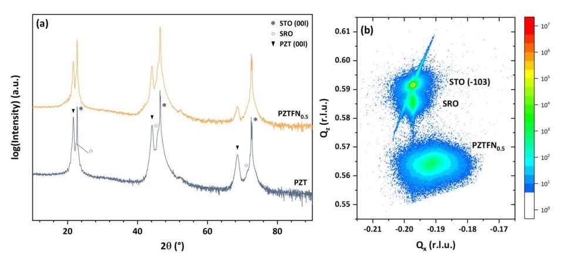
<figcaption class="paper-figure-caption"><b>Fig 1.</b> Figure 1. (a) Room-temperature XRD patterns of the STO//SRO/PZTFN0.5 and</figcaption>
</figure>
<figure class="paper-figure-card">

<figcaption class="paper-figure-caption"><b>Fig 2.</b> Figure 2 presents the transmission electron microscopy (TEM) characterization of the</figcaption>
</figure>
<figure class="paper-figure-card">
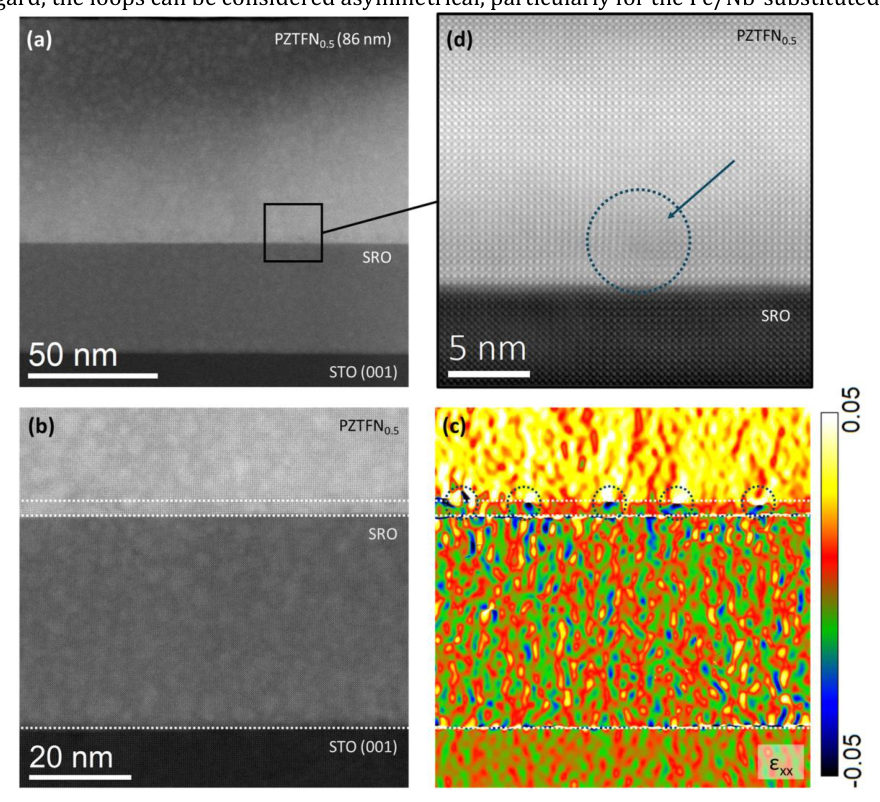
<figcaption class="paper-figure-caption"><b>Fig 3.</b> Figure 2. (a) Cross-sectional STEM-HAADF image of the PZTFN0.5 sample, showing the SRO</figcaption>
</figure>
<figure class="paper-figure-card">
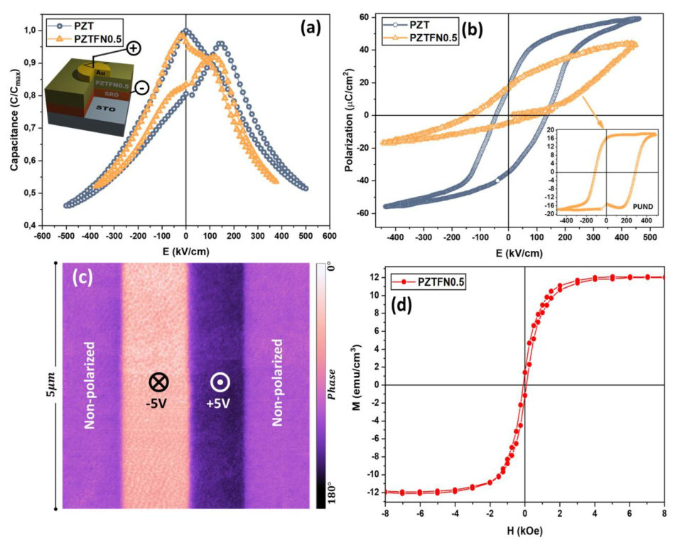
<figcaption class="paper-figure-caption"><b>Fig 4.</b> Figure 3. (a) Normalized Capacitance–Voltage (C–V) and (b) Polarization–Electric Field (P–E) loops</figcaption>
</figure>
<figure class="paper-figure-card">
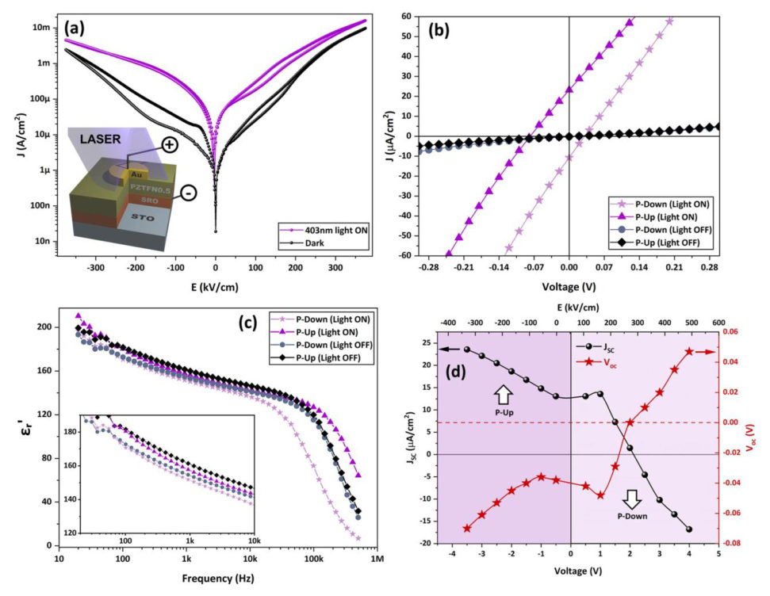
<figcaption class="paper-figure-caption"><b>Fig 5.</b> Figure 4. (a) J–E response measured in the STO//SRO/PZTFN0.5/Au sample under dark conditions</figcaption>
</figure>

**Summary.** This work reports on epitaxial multiferroic thin films ($	ext{PZTFN}_{0.5}$) designed for next-generation optoelectronics. By combining ferroelectric, magnetic, and photovoltaic measurements, the authors confirm a strong, switchable coupling between polarization state and photocurrent generation. This validates these single-phase materials as promising candidates for advanced memory and energy harvesting devices.

**Why it may be interesting.** While primarily condensed matter physics, the study involves coupled order parameters (ferroelectricity and magnetism) influencing electronic transport (photovoltaics), which touches upon concepts of emergent quantum phenomena in engineered solid-state systems.

Detailed structure

**Main problem.** The study aims to explore multiferroic materials exhibiting a strong coupling between ferroelectric polarization and photovoltaic effects for advanced optoelectronic devices.

**Main result.** The epitaxial 0.5PZT-0.5PFN thin films demonstrated a robust, polarization-dependent photoresponse under monochromatic laser illumination, confirming intrinsic coupling in these single-phase multiferroics.

**Method.** Characterization involved Pulsed Laser Deposition (PLD) growth, followed by comprehensive electrical measurements including ferroelectric P-E loops, magnetic M-H loops, and photovoltaic J-E characterization using polarized light.

**Model / system.** The physical system is an epitaxial multiferroic heterostructure ($	ext{SRO}/	ext{PZTFN}_{0.5}/	ext{STO}$). The behavior is modeled by treating the material as a semiconductor forming two back-to-back Schottky junctions whose biasing depends on the ferroelectric polarization state.

**Key observables.** Remanent polarization ($17 \mu	ext{C}/	ext{cm}^2$), photocurrent density ($\pm 20 \mu	ext{A}/	ext{cm}^2$), and polarization-dependent $	ext{J–E}$ characteristics.

**Important parameters / regimes.** Laser wavelength (403 nm), operating temperature, applied voltage range ($\pm 3 	ext{ V}$).

**Assumptions / limitations.** The observed photovoltaic response is attributed to the intrinsic coupling between ferroelectric polarization and photogenerated carrier separation at internal interfaces.

**Figures summary.** Figures show XRD/RSM confirming single-phase epitaxial growth, P-E loops demonstrating high remnant polarization, M-H loops showing magnetic ordering, and J-E curves illustrating switchable photocurrent dependent on the applied electric field and polarization state.

**Paper structure.** The paper follows a standard materials science structure: synthesis (PLD), structural characterization ($	ext{XRD}$, $	ext{TEM}$), electrical/ferroelectric characterization ($P-E$, $C-V$), magnetic characterization ($M-H$), and finally, the core photovoltaic measurements demonstrating polarization switching.

Abstract

The exploration of novel multiferroic materials with strong coupling between ferroelectric polarization and photovoltaic effects is crucial for next-generation optoelectronic devices. In this study, we characterized highly oriented 0.5Pb(Zr0.52Ti0.48)O3-0.5Pb(Fe0.5Nb0.5)O3 multiferroic thin films grown by pulsed laser deposition on SrTiO3 (001) substrates with a SrRuO3 bottom electrode. The films exhibited excellent crystalline quality, with a single perovskite phase and (001) orientation. They displayed good ferroelectric properties (remanent polarization $\sim$17 $μ$C/cm$^2$, PUND; coercive field $\sim$150 kV/cm), alongside weak ferromagnetic behavior at room temperature (remanence 1.30 emu/cm$^3$; coercive field 90 Oe). Photovoltaic measurements demonstrated a robust, polarization-dependent photoresponse under 403 nm monochromatic laser illumination, achieving Jsc values between $\pm$20 $μ$A/cm$^2$. This compelling observation confirms the intrinsic coupling between ferroelectric polarization and photovoltaic effects, highlighting the considerable promise of these single-phase multiferroic thin films for advanced photovoltaic and optoelectronic memory applications.

[↑ back to top](#top)

### [Self-similar asymptotics in the decay problem for the Volterra lattice with zero boundary condition](http://arxiv.org/abs/2606.13137v1)

**Authors:** V. E. Adler, B. I. Suleimanov  
**Type:** theory · **Category:** other · **PDF:** <https://arxiv.org/pdf/2606.13137v1>  
**Analysis basis:** full PDF text, analyzed in chunks
**Topic relevance:** `non-equilibrium dynamics` **2/5** · `Frenkel-Kontorova` **1/5** · `correlated / nonlocal dissipation` **1/5** · `methods for driven-dissipative` **1/5** · `non-equilibrium universality` **1/5**

↔ Scroll figures horizontally

<figure class="paper-figure-card">
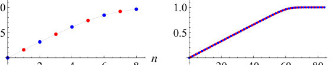
<figcaption class="paper-figure-caption"><b>Fig 1.</b> Figure 1. Solution for α = 1, at several moments t. Here and in the following figures, the red dots correspond to odd n and the blue dots to even n.</figcaption>
</figure>
<figure class="paper-figure-card">
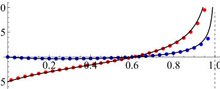
<figcaption class="paper-figure-caption"><b>Fig 2.</b> Figure 3. Numerical solution and the first correction term for α = 3.</figcaption>
</figure>
<figure class="paper-figure-card">
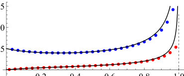
<figcaption class="paper-figure-caption"><b>Fig 3.</b> Figure 4. Numerical solution and the first correction term for α = 1/3.</figcaption>
</figure>
<figure class="paper-figure-card">
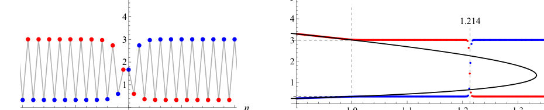
<figcaption class="paper-figure-caption"><b>Fig 4.</b> Figure 5. Left: bipartite kink (3.1) for t = 0, α = 1/3 and δ = 0. Right: limiting position of the inversion point for α = 1/3.</figcaption>
</figure>
<figure class="paper-figure-card">
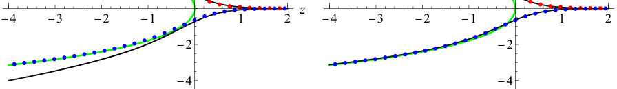
<figcaption class="paper-figure-caption"><b>Fig 5.</b> Figure 7. Solution near n = 2t in stretched variables z and v, for t = 100. Left: black curves are the graphs of the leading terms of the inner expansions. Right: black curves are the graphs of the leading terms plus first corrections.</figcaption>
</figure>

**Summary.** This work provides a deep theoretical analysis of the long-time decay behavior of solutions on the Volterra lattice. By proving self-similarity and employing sophisticated techniques involving Painlevé equations, it calculates the precise asymptotic profile of the decaying state. This is crucial for understanding wave dynamics in nonlinear discrete systems.

**Why it may be interesting.** The rigorous mathematical treatment of nonlinear lattice decay problems using advanced methods like Painlevé analysis and asymptotic matching is highly relevant to understanding wave propagation in complex, non-integrable physical systems.

Detailed structure

**Main problem.** The research focuses on determining the self-similar asymptotics for the decay of an initial stationary state within the Volterra lattice model under zero boundary conditions.

**Main result.** The process is shown to be asymptotically self-similar, allowing for explicit calculation of the propagation velocity and the leading terms of the asymptotic profile using advanced matching techniques.

**Method.** The analysis employs formal asymptotic expansions (FAS) in inverse powers of time, requiring a matching procedure near the front edge that involves solving equations related to the second Painlevé equation (P-II).

**Model / system.** The primary model is the Volterra lattice ($\dot{u}_n = u_n(u_{n+1} - u_{n-1})$), which models an idealized food chain. Generalizations involve varying the nonlinear coupling function $r(u)$ and considering non-zero boundary conditions.

**Key observables.** Propagation velocity of the decay wave ($2v$), leading asymptotic functions ($f_0, g_0$), and higher-order correction coefficients ($f_j, g_j$).

**Important parameters / regimes.** Initial data parameters ($\alpha$), time evolution direction ($t 	o +\infty$ vs. $t 	o -\infty$), and boundary condition strength ($eta$).

**Assumptions / limitations.** The derivation relies on the assumption of asymptotic self-similarity, requiring the use of matching techniques when standard series expansions fail near the wave front.

**Figures summary.** Figures illustrate numerical solutions showing decay wave formation for various parameters (e.g., $\alpha=1$ or $\alpha=1/3$), and comparison between theoretical inner and outer asymptotic expansions using stretched variables ($z$).

**Paper structure.** The paper progresses from establishing the self-similar nature of the solution, deriving leading order ODEs for coefficients, solving these systems by relating them to Painlevé transcendents (P-II), and finally applying matching techniques to determine the full asymptotic profile for $t 	o \pm\infty$.

Abstract

The article is devoted to the problem of decay of initial stationary state for the Volterra lattice with zero boundary condition. We show that this process is asymptotically self-similar and calculate the propagation velocity of the decay wave, the leading terms of the asymptotics and corrections, in the main and transition sectors of the wave.

[↑ back to top](#top)

### [Nonmonotonic temperature dependence of the thermopower of atomic-size gold contacts](http://arxiv.org/abs/2606.12734v1)

**Authors:** Thomas B. Möller, Marcel Strohmeier, Johannes Boneberg, Paul Leiderer, Wolfgang Belzig, Elke Scheer  
**Type:** both · **Category:** other · **PDF:** <https://arxiv.org/pdf/2606.12734v1>  
**Analysis basis:** full PDF text, analyzed in chunks
**Topic relevance:** `Kondo & dissipative impurity` **1/5** · `analog quantum simulation` **1/5** · `methods for driven-dissipative` **1/5** · `non-equilibrium dynamics` **1/5**

↔ Scroll figures horizontally

<figure class="paper-figure-card">
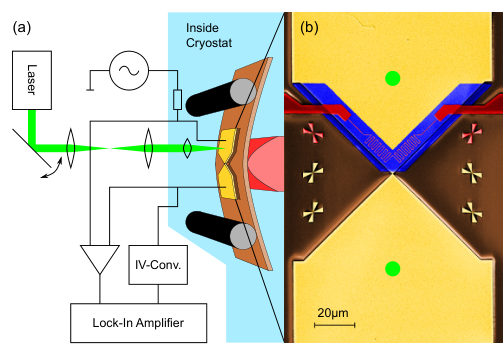
<figcaption class="paper-figure-caption"><b>Fig 1.</b> FIG. 1. (a) Scheme of the experimental setup. The sample is bent by retracting the countersupports (black) of a three- point bending mechanism with a fixed central rod (red). The laser beam is steered by 4f-optics and focused onto the sample (metal structures depicted in yellow, substrate in brown). (b) A colored scanning electron micrograph of the sample shows the constriction made of gold (yellow) as well as the local thermometer (platinum resistor with gold leads, red) electr- cally isolated from the junction by a layer of aluminum oxide (blue). The positions of the laser focus for creating the tem- perature difference are marked in green.</figcaption>
</figure>
<figure class="paper-figure-card">
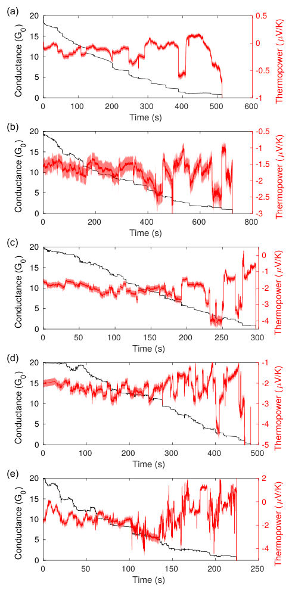
<figcaption class="paper-figure-caption"><b>Fig 2.</b> FIG. 2. The conductance G (black, left axis) and the ther- mopower S (red, right axis) are measured simultaneously dur- ing the opening of a nanobridge. The pale frames around the data traces correspond to the standard deviation. The mea- surements were performed at a) T = 18.1 K, ∆T = 12.3 K; b) T = 89 K , ∆T = 4.3 K; c) T = 142 K, ∆T = 3.6 K; d) T = 163 K, ∆T = 3.1 K; e) T = 297 K, ∆T = 3.7 K.</figcaption>
</figure>
<figure class="paper-figure-card">
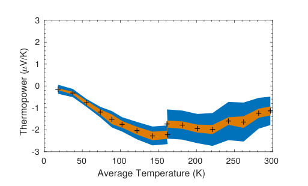
<figcaption class="paper-figure-caption"><b>Fig 3.</b> FIG. 4. The averaged thermopower ⟨S⟩is shown as a function of the average temperature T of the contact (black symbols). The results show a clear nonmonotonic behavior with a pro- nounced minimum around 150 K. The discontinuity at about 160 K is due to the fact that the sample had to be replaced at that temperature. The blue area indicates the standard deviation of the thermopower measurements due to the fluc- tuations in the contact geometry and the orange area indicates the uncertainty resulting from the temperature measurement.</figcaption>
</figure>
<figure class="paper-figure-card">
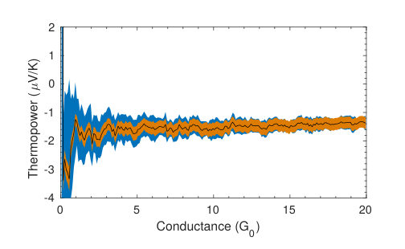
<figcaption class="paper-figure-caption"><b>Fig 4.</b> FIG. 3. The measured thermopower is collected in bins of 0.1 G0 and averaged. This average is shown as function of the conductance (black line). The blue area indicates the standard deviation of ⟨S⟩. The measurement uncertainty of the temperature difference between the hot and the cold side is propagated to the uncertainty in the thermopower indicated by the orange area. The data contains 48 opening traces and was recorded at T = 91 K.</figcaption>
</figure>
<figure class="paper-figure-card">
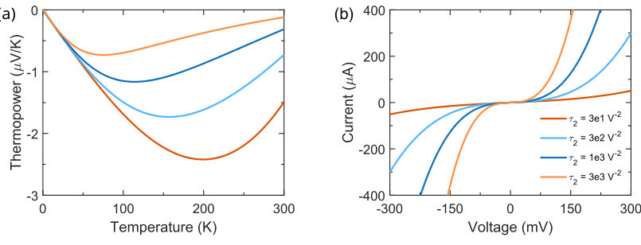
<figcaption class="paper-figure-caption"><b>Fig 5.</b> FIG. 5. Model-based higher-order corrections to the thermopower of purely electronic origin: Calculated nonmonotonic evolu- tion of the thermopower (a) and corresponding IV characteristics (b) for varying values of τ2, while τ0 = 1, τ1 = −0.76 V−1</figcaption>
</figure>

**Summary.** This work measures the thermopower of atomic-size gold contacts across varying temperatures, revealing a nonmonotonic dependence that contradicts standard quantum transport theory. The authors argue this deviation necessitates considering phonon contributions beyond simple electronic models. This highlights the limitations of linear approximations even in highly confined quantum systems.

**Why it may be interesting.** While focused on mesoscopic transport rather than fundamental AMO systems, the necessity of going beyond simple linear approximations (like the basic Landauer model) when studying complex quantum phenomena is a general theme relevant to open quantum system modeling.

Detailed structure

**Main problem.** The study investigates the nonmonotonic temperature dependence of the thermopower ($S$) in atomic-size gold contacts.

**Main result.** The measured thermopower exhibits a minimum at about 150 K, which contradicts the linear predictions of simple quantum transport models like the Landauer formula.

**Method.** Measurements were performed using mechanically controllable break junctions (MCBJ) to probe atomic-size contacts across a wide temperature range, combining electrical and thermal measurements.

**Model / system.** The system is an atomic-size gold contact formed via MCBJ. Theoretical analysis involves extending the Landauer formalism by incorporating energy-dependent transmission functions ($	au(E)$) to model transport beyond simple free-electron approximations.

**Key observables.** Ensemble-averaged thermopower $\langle S 
angle$ as a function of temperature $T$, and conductance histograms ($G$).

**Important parameters / regimes.** Temperature range (18 K to 295 K), minimum thermopower value ($-2 \mu	ext{V K}^{-1}$ at 150 K).

**Assumptions / limitations.** The deviation from linearity is attributed to phonon contributions beyond the standard Landauer model, suggesting non-electronic origins for the observed behavior.

**Figures summary.** Figures show $\langle S 
angle$ vs. $T$ exhibiting a minimum; theoretical fits relate $S(T)$ to higher-order transmission function parameters ($	au_n$).

**Paper structure.** The paper establishes the experimental setup and measurements, contrasts the observed nonmonotonic behavior against simple Landauer predictions, develops advanced theoretical models incorporating energy dependence, and concludes that phonon contributions are necessary to explain the deviation.

Abstract

We report measurements of the thermopower of atomic-size gold contacts realized by the mechanically controllable break junction (MCBJ) technique over a temperature range from 18 K to 295 K. A thermometer included in the lithographic structure close to the constriction provides a direct measurement of the temperature increase generated by heating one side of the contact with a focused laser beam. While the conductance histograms confirm the quantum nature of the transport, we observe a nonmonotonic temperature dependence of the ensemble-averaged thermopower with a minimum of $-2\,μ$VK$^{-1}$ at about 150 K. The values for the thermopower obtained at the lowest and the high temperature are compatible with values reported in the literature, but the nonmonotonic behavior in between disagrees with the expected linear dependence for quantum coherent conductors described by the Landauer formula. We develop a theoretical model based on an energy dependent transmission function that qualitatively reproduces the nonmonotonic behavior, but fails quantitatively. We therefore interpret our data as a result of phonon contributions to the thermopower beyond the Landauer model and with opposite sign than the classical phonon drag known from bulk systems. Our findings show that, firstly, the thermopower gives important insight into the transport properties of atomic-size structures and second that the linear approximation of the Landauer model has to be used with caution when studying more complex transport properties even for atomic contacts from free-electron metals.

[↑ back to top](#top)

### [Current patterns and loss contributions in CORT cables carrying AC current](http://arxiv.org/abs/2606.13512v1)

**Authors:** Benoît Vanderheyden, Julien Dular, Louis Denis, Steffen Elschner, Christophe Geuzaine, Mariusz Wozniak, Francesco Grilli  
**Type:** theory · **Category:** other · **PDF:** <https://arxiv.org/pdf/2606.13512v1>  
**Analysis basis:** full PDF text, analyzed in chunks
**Topic relevance:** `correlated / nonlocal dissipation` **1/5** · `methods for driven-dissipative` **1/5** · `non-equilibrium dynamics` **1/5**

↔ Scroll figures horizontally

<figure class="paper-figure-card">
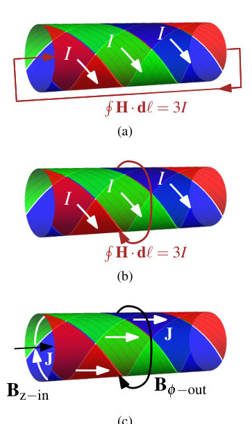
<figcaption class="paper-figure-caption"><b>Fig 1.</b> Fig. 1. Application of Ampere’s law to a CORT cable with three CCs with a very small gap. (a) The magnetic field produced inside resembles that of a long solenoid. (b) The magnetic field produced outside resembles that of a long wire. (c) The resulting magnetic flux density is axial inside and azimuthal outside. Thus, the CCs carry an azimuthal current density on their inner face and an axial current density on their outer face.</figcaption>
</figure>
<figure class="paper-figure-card">
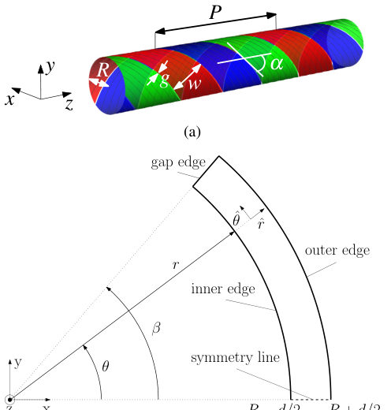
<figcaption class="paper-figure-caption"><b>Fig 2.</b> Fig. 2. Geometry of the single-layer CORT cable and parameter definition. (a) 3D-view, where R is the mean radius, g the width of the gap between CCs, w the CC width, α the pitch angle, and P the pitch length. (b) Cross section at a fixed value of z. Only one half of a CC is shown and the CC is artificially enlarged for clarity. Here, d is the CC thickness, r and θ are cylindrical coordinates and β is half the angular size of the CC as seen from the z-axis in the x-y plane.</figcaption>
</figure>
<figure class="paper-figure-card">
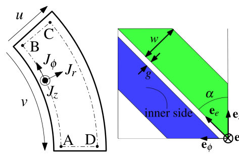
<figcaption class="paper-figure-caption"><b>Fig 3.</b> Fig. 3. Various definitions for representing the current distribution in the CC. Left: half-CC viewed along the cable axis from above. Paths along which the current density is represented: AB, along the inner edge, BC, along the gap edge, CD, along the outer edge, and DA, along the conductor symmetry line (see Fig. 2 (b)). Here, Jz, Jϕ, and Jr are respectively the axial, azimuthal, and radial components of the current density. Relative variables u ∈[0, 1] and v ∈[0, 1] are used, with (0, 0) representing the gap vertex on the inner CC edge and (1, 1) the intersection of the conductor symmetry line and the outer CC edge. Right: unrolled plot of two CCs, see Fig. 2 (a). Definition of unit...</figcaption>
</figure>
<figure class="paper-figure-card">
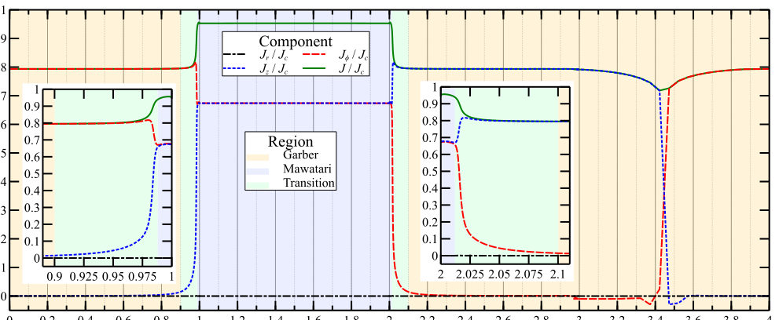
<figcaption class="paper-figure-caption"><b>Fig 4.</b> Fig. 4. Current density in one half of a CC for the reference geometry with a gap of 100 µm and n = 25. The components of the current density are represented along the loop ABCDA as a function of the cumulative path index, which is normalized in such a way that it increases by one unit along each leg of the loop. The Garber region is colored in yellow and exhibits a current density that is axial near the outer face of the CC and azimuthal near the inner face of the CC. The Mawatari region is colored in lavender and exhibits a current density that flows along the edge unit vector ee, in this case with Jϕ = Jz (α = π/4). The transition regions are colored in green and continuously connect the...</figcaption>
</figure>
<figure class="paper-figure-card">
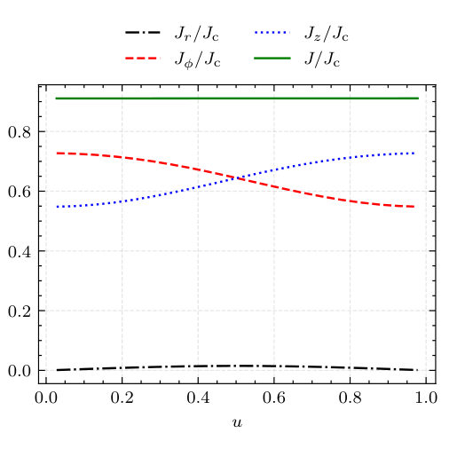
<figcaption class="paper-figure-caption"><b>Fig 5.</b> Fig. 5. Current density components along a radial path within the transition region (v = 0.015). Reference geometry with α = π/4, g = 100 µm, and n = 25.</figcaption>
</figure>

**Summary.** This paper analyzes AC losses in CORT cables by resolving the complex, three-dimensional current flow patterns within the coated conductors. Using an effective 2D helicoidal model, it demonstrates that simple analytical approximations fail to capture the true loss mechanisms, which depend critically on the cable's geometry and gap size.

**Why it may be interesting.** While focused on superconducting magnet technology, the rigorous modeling of non-uniform current distributions and field penetration in confined geometries shares mathematical parallels with understanding flux dynamics or boundary effects in quantum systems.

Detailed structure

**Main problem.** The study investigates the complex current patterns and resulting AC power losses within Conductor-on-Round-Tube (CORT) cables carrying alternating current.

**Main result.** The detailed 3D current distribution is shown to exhibit a 'Garber pattern' alongside edge effects, leading to AC losses that deviate significantly from simplified analytical models, especially at small gaps.

**Method.** The research employs an effective 2D helicoidal model derived from first principles to simulate the non-trivial current flow in the superconducting coated conductors.

**Model / system.** The physical system is a CORT cable composed of multiple coated conductors wound helically. The analysis models the AC losses by considering three main contributions: surface losses, edge losses, and diving current losses.

**Key observables.** Current density components (axial $J_z$, azimuthal $J_\phi$, radial $J_r$), total AC power loss ($Q/L$), and the relative dominance of different loss mechanisms.

**Important parameters / regimes.** Conductor thickness, gap size ($g$), pitch angle ($\alpha$), current amplitude ($I_0$), and the exponent $n$ in the resistivity power law $
ho \propto J^n$.

**Assumptions / limitations.** The model assumes a power-law relationship for resistivity and neglects complex field dependencies of critical current density on magnetic flux magnitude or direction.

**Figures summary.** Figures illustrate the spatial distribution of current densities ($\mathbf{J}$) components across different regions (Garber, Mawatari) within the cable cross-section, and plot calculated AC losses versus gap size and pitch angle, comparing simulation results to analytical predictions.

**Paper structure.** The paper systematically analyzes the geometry and resulting current flow patterns in CORT cables. It compares detailed 3D simulations using a helicoidal model against simplified theoretical models (Surface/Mawatari) to quantify how geometric parameters dictate which loss mechanism dominates.

Abstract

Conductor-on-round-tube (CORT) cables are a potential solution for carrying AC power in a small cross-section. Due to the geometry of the cable and the helical arrangement of the coated conductors (CC), the current follows a non-trivial pattern inside each CC. For instance, for the case of a single-layer cable, the current flow is mostly axial along the outer face of the CCs and mostly azimuthal along their inner face. Such a current distribution, known as the Garber current pattern, affects the transport AC losses. In numerical models, commonly adopted simplifications are either based on straight conductors or infinitely thin CCs. Such approaches neglect the Garber current pattern and thus misrepresent both the detailed current flow within the CC and the resulting 3D distribution of the fields. In this work, the detailed 3D current distribution in the CCs is investigated in a one-layer CORT cable, as a function of the cable geometrical parameters such as the conductor thickness, the pitch angle, and the gap between adjacent CCs. In particular, the impact of the Garber current pattern is studied on the two largest contributions to the AC losses, namely the surface losses (associated with the penetration of the component of the magnetic field parallel to the wide faces of the superconducting layer) and the edge losses (associated with the penetration of the perpendicular component of the magnetic field occurring in the vicinity of the gaps between the CCs). The detailed distribution of the currents in the CCs is examined and its relationship with the different AC loss mechanisms is established. This study is carried out by means of an effective 2D model that uses a system of coordinates conforming with the helical structure of the cable.

[↑ back to top](#top)

### [Localization of Chiral Electromagnetic Waves on Thick Axion Domain Walls](http://arxiv.org/abs/2606.12513v1)

**Authors:** Nemanja Kaloper  
**Type:** theory · **Category:** other · **PDF:** <https://arxiv.org/pdf/2606.12513v1>  
**Analysis basis:** full PDF text, analyzed in chunks
**Topic relevance:** `interference shaping light` **1/5**

↔ Scroll figures horizontally

<figure class="paper-figure-card">
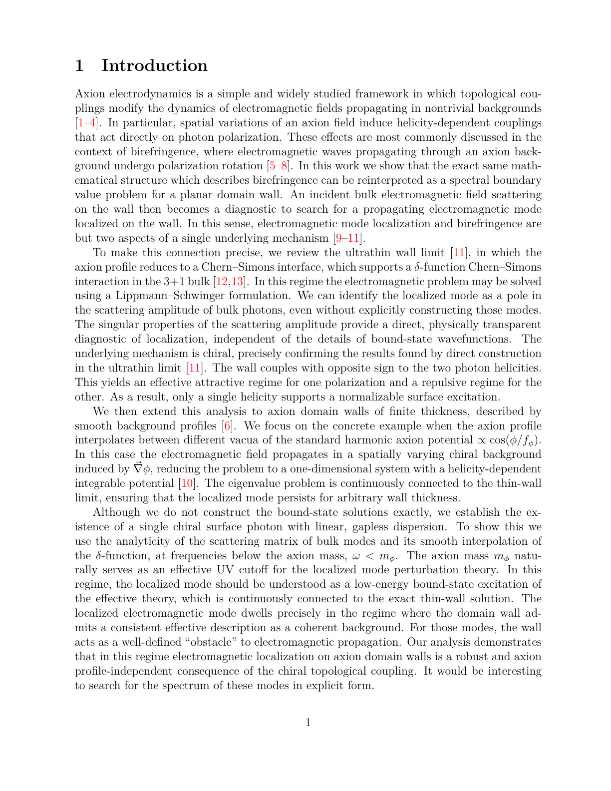
<figcaption class="paper-figure-caption"><b>Fig 1.</b> Low-resolution page preview, page 2</figcaption>
</figure>
<figure class="paper-figure-card">
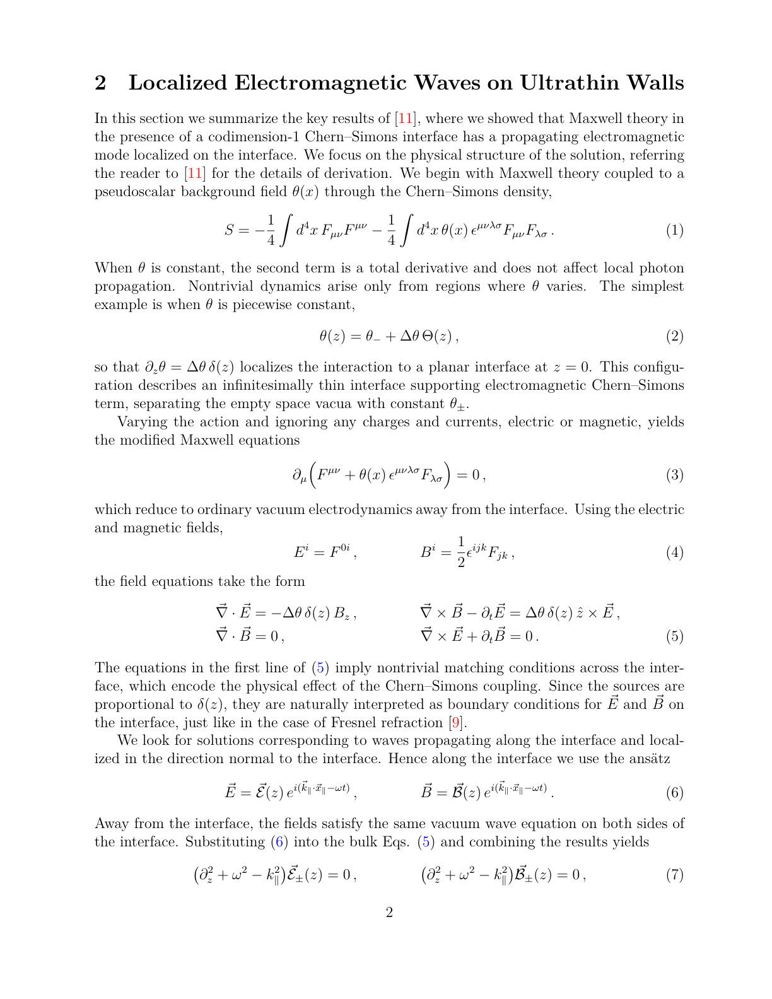
<figcaption class="paper-figure-caption"><b>Fig 2.</b> Low-resolution page preview, page 3</figcaption>
</figure>
<figure class="paper-figure-card">
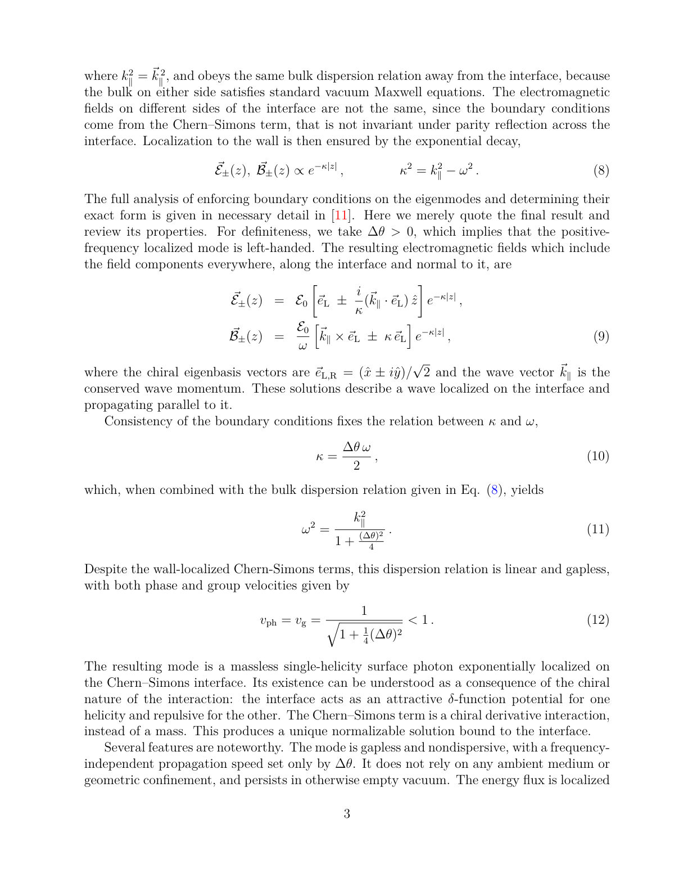
<figcaption class="paper-figure-caption"><b>Fig 3.</b> Low-resolution page preview, page 4</figcaption>
</figure>
<figure class="paper-figure-card">
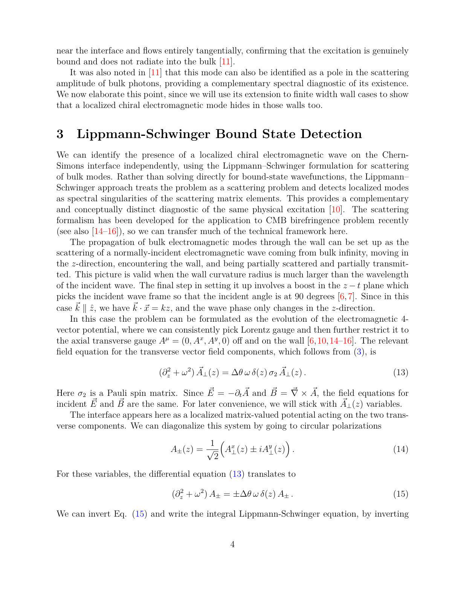
<figcaption class="paper-figure-caption"><b>Fig 4.</b> Low-resolution page preview, page 5</figcaption>
</figure>
<figure class="paper-figure-card">
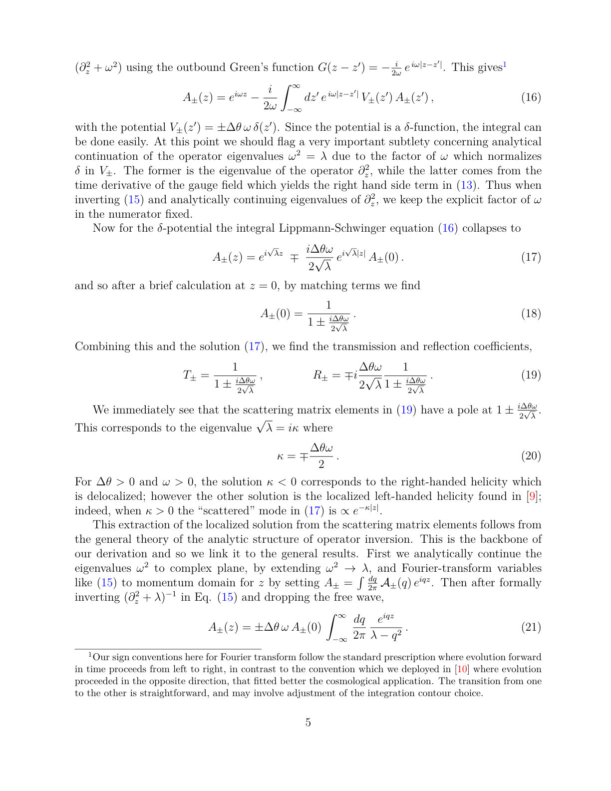
<figcaption class="paper-figure-caption"><b>Fig 5.</b> Low-resolution page preview, page 6</figcaption>
</figure>

**Summary.** This paper theoretically investigates electromagnetic wave propagation near axion domain walls, finding that the wall structure inherently supports a robust, localized chiral photon mode. By extending spectral analysis from idealized delta-function limits to realistic finite thicknesses, the authors confirm this bound state exists even when previous adiabatic approximations fail. This suggests axion domain walls can act as natural waveguides for specific polarizations of light.

**Why it may be interesting.** This work provides a concrete example of how topological defects (domain walls) can act as natural waveguides or sources for exotic excitations (chiral photons), connecting high-energy physics concepts (axions) to condensed matter phenomena like surface modes and photonics.

Detailed structure

**Main problem.** The study analyzes the localization of chiral electromagnetic waves propagating along thick axion domain walls.

**Main result.** The analysis proves that such walls generically support a localized, normalizable chiral electromagnetic mode with linear, gapless dispersion, which was missed in prior analyses.

**Method.** The problem is formulated as a spectral boundary value problem solved using the Lippmann-Schwinger framework and analyzing poles in the analytically continued resolvent of the wave operator.

**Model / system.** The system involves Maxwell theory coupled to a background axion field $	heta(x)$ forming a domain wall. The analysis progresses from idealized delta-function walls to smooth, finite-width profiles.

**Key observables.** Localized chiral electromagnetic mode (chiral surface photon); Transmission ($T_{\pm}$) and reflection ($R_{\pm}$) coefficients; Dispersion relation ($\omega^2 = k_\parallel^2 / (1 + (\Delta	heta)^2/4)$).

**Important parameters / regimes.** Axion mass ($m_\phi$); Wall jump parameter ($\Delta	heta$); Frequency ($\omega$) relative to $m_\phi$; Wall thickness scale ($L$).

**Assumptions / limitations.** The analysis relies on extending the spectral methods from the thin-wall limit to finite width, and in some steps, assumes small perturbations or monochromatic wave approximations.

**Paper structure.** The paper systematically builds the problem by first examining the ultrathin (delta-function) wall limit using scattering theory, then generalizing this robustly to finite thickness walls by analyzing the full spectral structure of the resulting 1+1 dimensional wave equation.

Abstract

We analyze Maxwell theory coupled to an axion domain wall as a spectral boundary value problem. We find that a finite-width axion domain wall generically supports a localized normalizable chiral electromagnetic mode with linear, gapless dispersion. This mode arises from helicity-dependent coupling sourced by the axion gradient: one polarization experiences an effective attractive potential and forms a bound state, while the opposite polarization is repelled. The existence of this chiral surface photon is robust over a wide regime of wall structures and axion masses. Our result shows that axion domain walls generically support a localized chiral photon that has been missed in previous analyses.

[↑ back to top](#top)

### [Quantum geometric anomalous Hall response in orbitally nonunitary superconductors](http://arxiv.org/abs/2606.13526v1)

**Authors:** Viktor Frilen, Annica M. Black-Schaffer, Ankita Bhattacharya  
**Type:** theory · **Category:** other · **PDF:** <https://arxiv.org/pdf/2606.13526v1>  
**Analysis basis:** full PDF text, analyzed in chunks
**Topic relevance:** `Keldysh / 2PI / non-Gaussian methods` **1/5**

↔ Scroll figures horizontally

<figure class="paper-figure-card">
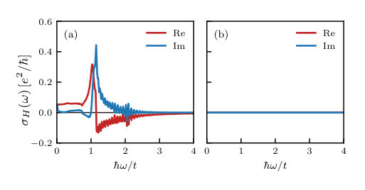
<figcaption class="paper-figure-caption"><b>Fig 1.</b> FIG. 2. Real (red) and imaginary (blue) part of the anoma- lous Hall conductivity σH as a function of optical frequency ℏω normalized with t for chiral d-wave spin-singlet pairing on the honeycomb lattice with Kane-Mele SOC (a) with in- terband pairing and (b) without interband pairing. Here λSOC = 0.05t, µ = −0.5t, ∆0 = 0.1t, and temperature kBT = 0.05t.</figcaption>
</figure>
<figure class="paper-figure-card">
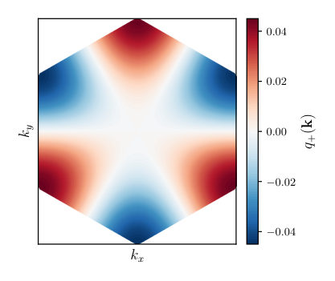
<figcaption class="paper-figure-caption"><b>Fig 2.</b> FIG. 1. Momentum-space distribution of q± in Eq.(9) for the chiral d-wave (η = 1) spin-singlet pairing state for ∆0 = 0.1t.</figcaption>
</figure>
<figure class="paper-figure-card">
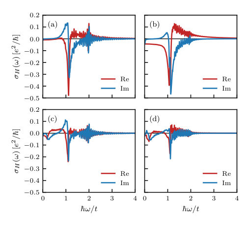
<figcaption class="paper-figure-caption"><b>Fig 3.</b> FIG. 3. Real (red) and imaginary (blue) part of the anoma- lous Hall conductivity σH as a function of optical frequency ℏω normalized with t for chiral p-wave equal-spin triplet pair- ing on the honeycomb lattice with Kane-Mele SOC for (a) interband pairing and κ = 0, (b) interband pairing and κ = 1, (c) no interband pairing and κ = 0, and (d) no interband pair- ing and κ = 1. Other parameters are the same as in Fig. 2.</figcaption>
</figure>
<figure class="paper-figure-card">
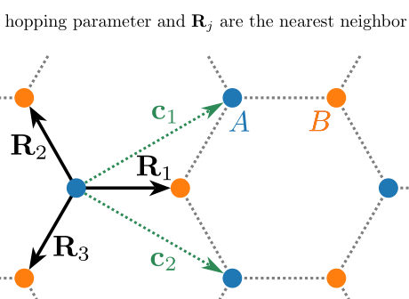
<figcaption class="paper-figure-caption"><b>Fig 4.</b> FIG. 1. Schematic of the honeycomb lattice indicating the nearest-neighbor vectors Rj and next-nearest-neighbor vectors cj.</figcaption>
</figure>

**Summary.** This theoretical work examines the anomalous Hall response in multiband superconductors using a honeycomb lattice model. The key finding is that orbital nonunitarity, even when spin-unitary and restricted to intraband pairing, can generate a finite AHR via quantum geometric effects. This establishes a new pathway for detecting time-reversal symmetry breaking signals in superconducting materials.

**Why it may be interesting.** The finding that spin-unitary but orbitally nonunitary pairing can induce an AHR without interband coupling provides a new, purely intrinsic mechanism for probing broken symmetries in superconductors, which is highly relevant to topological superconductivity research.

Detailed structure

**Main problem.** The study investigates the anomalous Hall response (AHR) in multiband superconductors at optical frequencies, specifically determining if a finite AHR can arise from spin-unitary but orbitally nonunitary pairing when only intraband pairing is considered.

**Main result.** The authors demonstrate that for equal-spin triplet pairing, a finite AHR persists even with purely intraband pairing, attributing this to orbital nonunitarity interacting with SOC. This revises the criteria previously thought necessary for observing Kerr signals in superconductors.

**Method.** The analysis employs Kubo linear response theory applied to the Bogoliubov-de Gennes Hamiltonian within a multiband framework. Calculations involve analyzing Berry curvature terms derived from intraband pairing contributions.

**Model / system.** The system is modeled as a multiband superconductor on a honeycomb lattice, incorporating Kane-Mele spin-orbit coupling. The superconducting state is described by investigating chiral d-wave spin-singlet and chiral p-wave equal-spin triplet pairing states.

**Key observables.** Anomalous Hall Response (AHR) or anomalous Hall conductivity ($\sigma_H(\omega)$), related to the polar Kerr effect.

**Important parameters / regimes.** Optical frequency ($\omega$), Kane-Mele SOC strength, and the degree of orbital nonunitarity ($v$).

**Assumptions / limitations.** The analysis assumes intraband pairing contributions only by setting interband pairing terms to zero in certain parts of the Hamiltonian. The study focuses on specific prototype TRS breaking states.

**Figures summary.** Figures compare AHR for d-wave singlet and p-wave triplet pairings under varying conditions, notably contrasting results with and without interband pairing contributions.

**Paper structure.** The paper builds from establishing the theoretical framework using BdG Hamiltonians and Kubo response theory. It then analyzes specific pairing symmetries (singlet vs. triplet) to show how orbital nonunitarity can generate a finite AHR even when conventional mechanisms (like interband coupling) are suppressed.

Abstract

We investigate the anomalous Hall response (AHR) in a multiband superconductor at optical frequencies, a phenomenon intimately related to the polar Kerr effect, a key probe of time-reversal symmetry breaking in superconductors. In translationally invariant multiband systems with purely intraband pairing, Galilean invariance decouples center-of-mass and relative motion of Cooper pairs, leading to the widespread expectation that a finite AHR requires either disorder or finite interband pairing amplitudes. However, this restriction can be lifted by the quantum geometric effects inherent to multiband Bloch states. Using a honeycomb lattice tight-binding model with Kane-Mele spin-orbit coupling, we analyze the AHR for the time-reversal symmetry broken chiral $d$-wave spin-singlet and chiral $p$-wave equal-spin-triplet pairing states with intraband pairing only. We demonstrate, through both analytical and numerical calculations, that the spin-singlet state yields a vanishing AHR, even with its broken time-reversal symmetry, whereas the equal-spin triplet state exhibits a finite AHR, even when it is spin-unitary. We attribute the latter to orbital nonunitarity, which, in the presence of spin-orbit coupling, generates the spin-polarized Bogoliubov quasiparticle states required for a finite AHR. The response is mediated by interband velocity matrix elements governed by the quantum geometry. This finding establishes that spin-unitary, but orbitally nonunitary pairing, can generate a finite AHR even without interband pairing and thereby revises the criteria for Kerr signals in superconductors.

[↑ back to top](#top)
