
# arxiv digest (quant-ph + cond-mat) — 2026-06-15

*90 papers · 34 relevant · 1 highlighted*

## 🔥 Most relevant (34)

*Every paper with at least one nonzero topic score, sorted by best-matching score. 🔥 marks scores ≥4/5. Click the title to jump to the full entry below; click [arXiv] to open the paper page. `(secondary)` marks papers from de-prioritized cond-mat archives.*

Show 34 relevant papers

- [Dissipation-induced superradiance in matter coupled to a self-interacting cavity](#paper-2606.14526) [[arXiv]](http://arxiv.org/abs/2606.14526v1) — 🔥 `Dicke superradiance` **5/5** · 🔥 `driven-dissipative phase transition` **4/5** · 🔥 `superradiant laser` **4/5** · `Tavis-Cummings & cavity-many-emitter` **3/5** · `correlated cavity matter` **3/5** · `methods for driven-dissipative` **3/5** · `Keldysh / 2PI / non-Gaussian methods` **2/5** · `analog quantum simulation` **2/5** · `correlated / nonlocal dissipation` **2/5** · `non-equilibrium universality` **2/5** · `entanglement & information structure` **1/5** · `exotic spin models in light-matter` **1/5** · `non-equilibrium dynamics` **1/5**
- [Computational regimes in matrix-product-state-based quantum trajectory simulations](#paper-2606.13779) [[arXiv]](http://arxiv.org/abs/2606.13779v1) — 🔥 `methods for driven-dissipative` **5/5** · 🔥 `quantum measurements` **4/5** · `driven-dissipative phase transition` **3/5** · `correlated / nonlocal dissipation` **2/5** · `entanglement & information structure` **2/5** · `non-equilibrium dynamics` **2/5** · `non-equilibrium universality` **2/5** · `Keldysh / 2PI / non-Gaussian methods` **1/5** · `analog quantum simulation` **1/5** · `measurement-induced transitions` **1/5**
- [Implementation of two-qubit Rydberg operations on neutral Rb-87 atoms in systems with different intermediate states](#paper-2606.13975) [[arXiv]](http://arxiv.org/abs/2606.13975v1) — 🔥 `QC/QI experiment` **5/5** · 🔥 `Rydberg arrays` **4/5** · `quantum measurements` **1/5** · `quantum optics experiment` **1/5**
- [Modeling light-matter coupled systems with neural quantum states](#paper-2606.14352) [[arXiv]](http://arxiv.org/abs/2606.14352v1) — 🔥 `Tavis-Cummings & cavity-many-emitter` **4/5** · 🔥 `analog quantum simulation` **4/5** · 🔥 `correlated cavity matter` **4/5** · `Rydberg arrays` **3/5** · `entanglement & information structure` **3/5** · `exotic spin models in light-matter` **3/5** · `methods for driven-dissipative` **3/5** · `spintronics-quantum-optics interface` **3/5** · `correlated / nonlocal dissipation` **1/5** · `driven-dissipative phase transition` **1/5** · `non-equilibrium dynamics` **1/5**
- [Dynamically frozen long-distance entanglement via non-Hermitian PT-symmetric systems](#paper-2606.14177) [[arXiv]](http://arxiv.org/abs/2606.14177v1) — 🔥 `driven-dissipative phase transition` **4/5** · 🔥 `entanglement & information structure` **4/5** · `analog quantum simulation` **3/5** · `correlated / nonlocal dissipation` **3/5** · `methods for driven-dissipative` **3/5** · `non-equilibrium dynamics` **3/5** · `non-equilibrium universality` **3/5** · `Keldysh / 2PI / non-Gaussian methods` **1/5** · `Kondo & dissipative impurity` **1/5** · `exotic spin models in light-matter` **1/5** · `scars & prethermalization` **1/5**
- ⭐ [On-site interactions in quantum thermal machines: efficiency, rectification and entanglement beyond local and global master equations](#paper-2606.14593) [[arXiv]](http://arxiv.org/abs/2606.14593v1) — 🔥 `methods for driven-dissipative` **4/5** · 🔥 `non-equilibrium dynamics` **4/5** · `Keldysh / 2PI / non-Gaussian methods` **3/5** · `correlated / nonlocal dissipation` **3/5** · `driven-dissipative phase transition` **3/5** · `entanglement & information structure` **3/5** · `non-equilibrium universality` **2/5** · `Kondo & dissipative impurity` **1/5** · `analog quantum simulation` **1/5** · `exotic spin models in light-matter` **1/5** · `scars & prethermalization` **1/5**
- [Quantum Simulation of Spin-Dependent Electron Transfer in a Synthetic Chiral Lattice with a Trapped Ion](#paper-2606.13930) [[arXiv]](http://arxiv.org/abs/2606.13930v1) — 🔥 `analog quantum simulation` **4/5** · `exotic spin models in light-matter` **3/5** · `methods for driven-dissipative` **3/5** · `non-equilibrium dynamics` **3/5** · `spintronics-quantum-optics interface` **3/5** · `QC/QI experiment` **2/5** · `driven-dissipative phase transition` **2/5** · `Keldysh / 2PI / non-Gaussian methods` **1/5** · `Kondo & dissipative impurity` **1/5** · `correlated / nonlocal dissipation` **1/5** · `entanglement & information structure` **1/5** · `non-equilibrium universality` **1/5**
- [Generic nonlocal statistics of the stationary measure in conserved active systems](#paper-2606.14483) [[arXiv]](http://arxiv.org/abs/2606.14483v1) — 🔥 `non-equilibrium dynamics` **4/5** · 🔥 `non-equilibrium universality` **4/5** · `Keldysh / 2PI / non-Gaussian methods` **3/5** · `correlated / nonlocal dissipation` **3/5** · `driven-dissipative phase transition` **3/5** · `methods for driven-dissipative` **3/5**
- [Spin counting via projection noise measurement of mesoscopic solid-state spin ensemble](#paper-2606.14437) [[arXiv]](http://arxiv.org/abs/2606.14437v1) — 🔥 `QC/QI experiment` **4/5** · 🔥 `spintronics-quantum-optics interface` **4/5** · `quantum measurements` **3/5** · `quantum optics experiment` **3/5** · `measurement-induced transitions` **2/5** · `analog quantum simulation` **1/5** · `correlated / nonlocal dissipation` **1/5** · `driven-dissipative phase transition` **1/5** · `exotic spin models in light-matter` **1/5**
- [A Collective-Spin Derivation of the Uniform Magnon Hamiltonian in Cavity Magnonics](#paper-2606.13830) [[arXiv]](http://arxiv.org/abs/2606.13830v1) — 🔥 `spintronics-quantum-optics interface` **4/5** · `analog quantum simulation` **3/5** · `exotic spin models in light-matter` **3/5** · `Tavis-Cummings & cavity-many-emitter` **2/5** · `correlated / nonlocal dissipation` **1/5** · `correlated cavity matter` **1/5** · `driven-dissipative phase transition` **1/5** · `methods for driven-dissipative` **1/5** · `non-equilibrium dynamics` **1/5** · `superradiant laser` **1/5**
- [Boltzmann-Like Occupation of Nonequilibrium Steady States on Dense Networks](#paper-2606.14542) [[arXiv]](http://arxiv.org/abs/2606.14542v1) — 🔥 `non-equilibrium dynamics` **4/5** · 🔥 `non-equilibrium universality` **4/5** · `driven-dissipative phase transition` **3/5** · `methods for driven-dissipative` **3/5** · `Keldysh / 2PI / non-Gaussian methods` **1/5** · `analog quantum simulation` **1/5** · `correlated / nonlocal dissipation` **1/5** · `scars & prethermalization` **1/5**
- [Digital programming of spin correlations in a fermionic lattice quantum simulator](#paper-2606.13772) [[arXiv]](http://arxiv.org/abs/2606.13772v1) — 🔥 `analog quantum simulation` **4/5** · `entanglement & information structure` **3/5** · `exotic spin models in light-matter` **3/5** · `QC/QI experiment` **2/5** · `non-equilibrium dynamics` **2/5** · `Rydberg arrays` **1/5** · `methods for driven-dissipative` **1/5** · `quantum measurements` **1/5**
- [Open Wilson chain numerical renormalization group approach to steady-state non-equilibrium quantum transport](#paper-2606.14635) [[arXiv]](http://arxiv.org/abs/2606.14635v1) — 🔥 `Kondo & dissipative impurity` **4/5** · 🔥 `methods for driven-dissipative` **4/5** · `non-equilibrium dynamics` **3/5** · `Keldysh / 2PI / non-Gaussian methods` **2/5** · `driven-dissipative phase transition` **2/5** · `correlated / nonlocal dissipation` **1/5** · `non-equilibrium universality` **1/5**
- [Sensitivity of polaron-molecule observables to MDR/GUP-like ultraviolet deformations at low energies via quantum computing](#paper-2606.14479) [[arXiv]](http://arxiv.org/abs/2606.14479v1) — 🔥 `analog quantum simulation` **4/5** · `Kondo & dissipative impurity` **3/5** · `QC/QI experiment` **2/5** · `non-equilibrium dynamics` **2/5** · `Keldysh / 2PI / non-Gaussian methods` **1/5** · `correlated / nonlocal dissipation` **1/5** · `driven-dissipative phase transition` **1/5** · `entanglement & information structure` **1/5** · `methods for driven-dissipative` **1/5**
- [Extending Covariant Fluctuation Theorems into Quantum Regime through Quasiprobability Approach](#paper-2606.14519) [[arXiv]](http://arxiv.org/abs/2606.14519v1) — 🔥 `Keldysh / 2PI / non-Gaussian methods` **4/5** · `methods for driven-dissipative` **3/5** · `non-equilibrium dynamics` **3/5** · `non-equilibrium universality` **3/5** · `correlated / nonlocal dissipation` **1/5** · `driven-dissipative phase transition` **1/5**
- [A new class of degenerate solutions to the massless Dirac equation and their potential applications in optical memories](#paper-2606.14256) [[arXiv]](http://arxiv.org/abs/2606.14256v1) — 🔥 `spintronics-quantum-optics interface` **4/5** · `exotic spin models in light-matter` **3/5** · `analog quantum simulation` **2/5** · `driven-dissipative phase transition` **2/5** · `Kondo & dissipative impurity` **1/5** · `interference shaping light` **1/5** · `non-equilibrium dynamics` **1/5**
- [Detecting Historical Turning Points in Italian Media: A Complex Systems Approach to a Diachronic News Corpus](#paper-2606.14348) [[arXiv]](http://arxiv.org/abs/2606.14348v1) — 🔥 `non-equilibrium universality` **4/5** · `driven-dissipative phase transition` **3/5** · `methods for driven-dissipative` **3/5** · `non-equilibrium dynamics` **3/5** · `Keldysh / 2PI / non-Gaussian methods` **1/5**
- [Diffusion-driven autocatalytic dynamics on a sphere](#paper-2606.14133) [[arXiv]](http://arxiv.org/abs/2606.14133v1) — 🔥 `non-equilibrium universality` **4/5** · `driven-dissipative phase transition` **3/5** · `methods for driven-dissipative` **3/5** · `non-equilibrium dynamics` **2/5** · `Keldysh / 2PI / non-Gaussian methods` **1/5** · `correlated / nonlocal dissipation` **1/5**
- [Generic long-range correlations in nonequilibrium mixtures](#paper-2606.14651) [[arXiv]](http://arxiv.org/abs/2606.14651v1) — 🔥 `non-equilibrium dynamics` **4/5** · 🔥 `non-equilibrium universality` **4/5** · `driven-dissipative phase transition` **3/5** · `Keldysh / 2PI / non-Gaussian methods` **1/5** · `correlated / nonlocal dissipation` **1/5** · `methods for driven-dissipative` **1/5**
- [Quantum sensing through bosonic-fermionic Bell-state transitions in two-photon interference](#paper-2606.14408) [[arXiv]](http://arxiv.org/abs/2606.14408v1) — 🔥 `quantum optics experiment` **4/5** · `interference shaping light` **3/5** · `QC/QI experiment` **2/5** · `quantum measurements` **2/5** · `analog quantum simulation` **1/5** · `driven-dissipative phase transition` **1/5** · `entanglement & information structure` **1/5**
- [First-principles calculations of internal conversion processes in spin defects](#paper-2606.14545) [[arXiv]](http://arxiv.org/abs/2606.14545v1) `(secondary)` — 🔥 `spintronics-quantum-optics interface` **4/5** · `exotic spin models in light-matter` **3/5** · `QC/QI experiment` **2/5** · `Keldysh / 2PI / non-Gaussian methods` **1/5** · `correlated / nonlocal dissipation` **1/5** · `driven-dissipative phase transition` **1/5** · `methods for driven-dissipative` **1/5**
- [Monolithic hybrid quantum dot devices in superconducting twisted bilayer graphene](#paper-2606.14685) [[arXiv]](http://arxiv.org/abs/2606.14685v1) `(secondary)` — 🔥 `analog quantum simulation` **4/5** · `Kondo & dissipative impurity` **3/5** · `non-equilibrium dynamics` **2/5** · `Keldysh / 2PI / non-Gaussian methods` **1/5** · `QC/QI experiment` **1/5** · `driven-dissipative phase transition` **1/5**
- [Link-Free Multi-Node Timing Synchronization for Scalable Quantum Networking](#paper-2606.14077) [[arXiv]](http://arxiv.org/abs/2606.14077v1) — 🔥 `QC/QI experiment` **4/5** · `interference shaping light` **3/5** · `quantum optics experiment` **3/5** · `quantum measurements` **1/5**
- [Scaling native entanglement generation in layered semiconductors with quasi-phase matching](#paper-2606.14553) [[arXiv]](http://arxiv.org/abs/2606.14553v1) — 🔥 `quantum optics experiment` **4/5** · `interference shaping light` **3/5** · `Keldysh / 2PI / non-Gaussian methods` **1/5** · `QC/QI experiment` **1/5** · `driven-dissipative phase transition` **1/5** · `entanglement & information structure` **1/5**
- [Spin mixing induced dynamics of spinor solitons in $F=1$ Bose Einstein condensates](#paper-2606.14231) [[arXiv]](http://arxiv.org/abs/2606.14231v1) — 🔥 `analog quantum simulation` **4/5** · `exotic spin models in light-matter` **3/5** · `non-equilibrium dynamics` **2/5** · `Keldysh / 2PI / non-Gaussian methods` **1/5** · `methods for driven-dissipative` **1/5**
- [Certification of the genuine resolution of photon number resolving detectors](#paper-2606.14365) [[arXiv]](http://arxiv.org/abs/2606.14365v1) — 🔥 `quantum measurements` **4/5** · `quantum optics experiment` **3/5** · `QC/QI experiment` **1/5** · `measurement-induced transitions` **1/5** · `methods for driven-dissipative` **1/5**
- [Universal Crossovers of Stabilizer Entropy Beyond Criticality](#paper-2606.13810) [[arXiv]](http://arxiv.org/abs/2606.13810v1) — 🔥 `entanglement & information structure` **4/5** · `non-equilibrium universality` **2/5** · `Frenkel-Kontorova` **1/5** · `analog quantum simulation` **1/5** · `exotic spin models in light-matter` **1/5** · `non-equilibrium dynamics` **1/5**
- [An integrated ultrahigh vacuum cluster tool for diamond surface science and single nitrogen-vacancy center measurements](#paper-2606.13961) [[arXiv]](http://arxiv.org/abs/2606.13961v1) — 🔥 `QC/QI experiment` **4/5** · `spintronics-quantum-optics interface` **3/5** · `quantum measurements` **1/5** · `quantum optics experiment` **1/5**
- [Ferromagnetic Order of Reduced Magnetic Moments in a Frustrated Sawtooth Chain of the Magnetic Semiconductor ZnYb$_2$S$_4$](#paper-2606.14196) [[arXiv]](http://arxiv.org/abs/2606.14196v1) — 🔥 `analog quantum simulation` **4/5** · `exotic spin models in light-matter` **3/5** · `Frenkel-Kontorova` **2/5**
- [Mass-imbalanced two-dimensional Bose-Fermi mixtures with boson-fermion pairing](#paper-2606.14338) [[arXiv]](http://arxiv.org/abs/2606.14338v1) — 🔥 `analog quantum simulation` **4/5** · `Keldysh / 2PI / non-Gaussian methods` **3/5** · `methods for driven-dissipative` **1/5** · `non-equilibrium dynamics` **1/5**
- [Fermi gas of polar molecules in the Pauli-blocked regime](#paper-2606.14135) [[arXiv]](http://arxiv.org/abs/2606.14135v1) — 🔥 `analog quantum simulation` **4/5** · `Keldysh / 2PI / non-Gaussian methods` **1/5** · `correlated / nonlocal dissipation` **1/5** · `driven-dissipative phase transition` **1/5** · `methods for driven-dissipative` **1/5**
- [Resolving the Edge of a Quantum Pyramid](#paper-2606.14698) [[arXiv]](http://arxiv.org/abs/2606.14698v1) — 🔥 `entanglement & information structure` **4/5** · `quantum measurements` **3/5** · `measurement-induced transitions` **1/5**
- [Quantum Entanglement of Bethe States](#paper-2606.14140) [[arXiv]](http://arxiv.org/abs/2606.14140v1) — 🔥 `entanglement & information structure` **4/5** · `analog quantum simulation` **1/5** · `exotic spin models in light-matter` **1/5** · `non-equilibrium dynamics` **1/5**
- [Simultaneous Estimation of Partial-Transpose Moments with Active Memory Independent of the Moment Order](#paper-2606.14204) [[arXiv]](http://arxiv.org/abs/2606.14204v1) — 🔥 `entanglement & information structure` **4/5** · `quantum measurements` **2/5**

## ⭐ Highlighted (1)

*Papers by authors on your watch list. Click the title to jump to the full entry below; click [arXiv] to open the paper page.*

Show 1 highlighted papers

- ⭐ [On-site interactions in quantum thermal machines: efficiency, rectification and entanglement beyond local and global master equations](#paper-2606.14593) [[arXiv]](http://arxiv.org/abs/2606.14593v1) — Andrew J. Daley

## All papers (71, sorted by relevance)

*Papers from quant-ph and your primary cond-mat archives (quant-gas, stat-mech, str-el, dis-nn). Highlighted papers (⭐) come first, then everything else sorted by topic-relevance score, highest first.*

### ⭐ [On-site interactions in quantum thermal machines: efficiency, rectification and entanglement beyond local and global master equations](http://arxiv.org/abs/2606.14593v1)

**Highlighted author(s):** Andrew J. Daley  
**Authors:** Salvatore Araceli, Teddy H. M. Ong, Baptiste Debecker, Kai Müller, Oliver Lunt, Andrew J. Daley, François Damanet  
**Type:** theory · **Category:** statistical mechanics · **PDF:** <https://arxiv.org/pdf/2606.14593v1>  
**Analysis basis:** full PDF text, analyzed in chunks
**Topic relevance:** 🔥 `methods for driven-dissipative` **4/5** · 🔥 `non-equilibrium dynamics` **4/5** · `Keldysh / 2PI / non-Gaussian methods` **3/5** · `correlated / nonlocal dissipation` **3/5** · `driven-dissipative phase transition` **3/5** · `entanglement & information structure` **3/5** · `non-equilibrium universality` **2/5** · `Kondo & dissipative impurity` **1/5** · `analog quantum simulation` **1/5** · `exotic spin models in light-matter` **1/5** · `scars & prethermalization` **1/5**

↔ Scroll figures horizontally

<figure class="paper-figure-card">
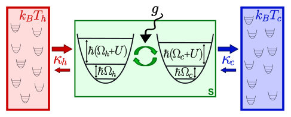
<figcaption class="paper-figure-caption"><b>Fig 1.</b> FIG. 1. Sketch of the two-site junction of frequencies Ωℓ(ℓ= ℎ, 𝑐) and on-site interactions 𝑈, coupled to two thermal reservoirs of temperature 𝑇ℓ. The tunnelling rate between the reservoirs and the junction is modulated by 𝜅ℓ. The model also includes an external driving that couples the two sites with amplitude 𝑔. This setup can generate power from the thermal gradient between the two reservoirs, as heat currents flow through the junction.</figcaption>
</figure>
<figure class="paper-figure-card">
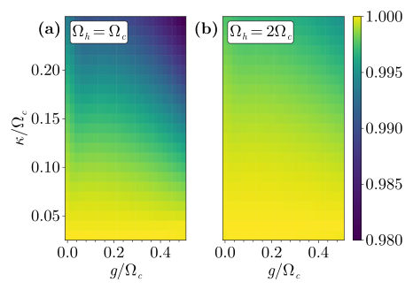
<figcaption class="paper-figure-caption"><b>Fig 2.</b> FIG. 3. Fidelity (Eq. (43)) between the steady-states obtained by the RME and the Exact method as a function of 𝜅and 𝑔for Ωℎ= Ω𝑐 (panel (a)) and Ωℎ= 2Ω𝑐(panel (b)). As expected, the fidelity decreases for larger 𝜅, but RME still predicts the state reasonably well even for 𝜅/Ω𝑐= 0.25, particularly when Ωℎ&gt; Ω𝑐. System parameters are the same as in Fig. 2. Exact method parameters: 𝑁bath = 2000, 𝑡evo = 30/𝜅.</figcaption>
</figure>
<figure class="paper-figure-card">
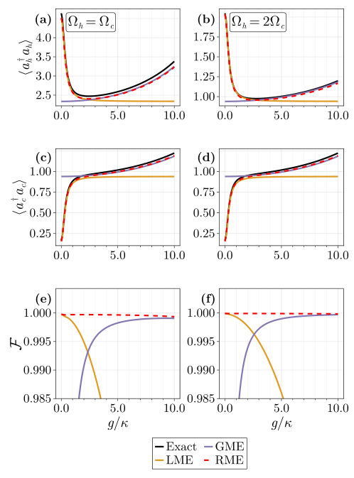
<figcaption class="paper-figure-caption"><b>Fig 3.</b> FIG. 2. Comparison of steady-state properties obtained from the LME (Eq. (31)), GME (Eq. (35)), RME (Eq. (25)), and the Exact method for 𝑈= 0 as a function of the intercoupling strength 𝑔/𝜅. Panels (a) and (b) (resp. (c) and (d)) show the populations of the left (resp. right) sites in two different setup: when the frequencies of the sites are taken the same (left column) and when they are not (right column). The RME results (red, dashed) interpolate perfectly between those of the LME (yellow), valid for small intercoupling, and the GME (purple), valid for large intercoupling. Panels (e) and (f) show the fidelity between the states obtained from the master equations and the state given by...</figcaption>
</figure>
<figure class="paper-figure-card">
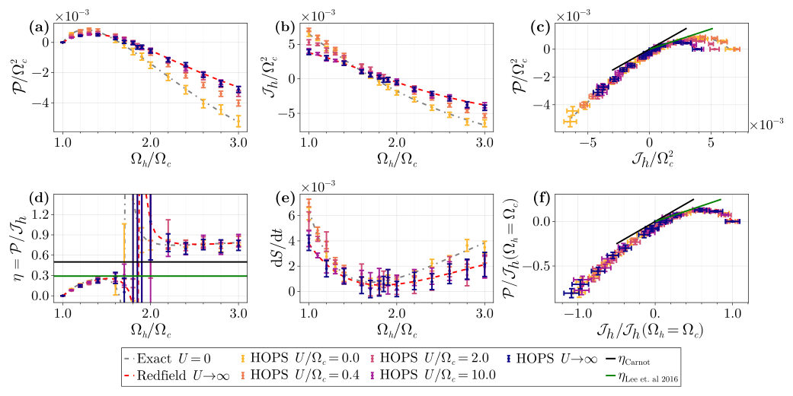
<figcaption class="paper-figure-caption"><b>Fig 4.</b> FIG. 4. Thermodynamic quantities of the thermal machine at low temperatures. (a) Power P (Eq. (59) for HOPS, Eq. (48) for Redfield and Exact method) is positive in the heat engine regime and negative in refrigerator regime. The stalling point 𝜆stall increases with 𝑈. The value of Ωℎ/Ω𝑐where maximum power is produced also increases. (b) Heat current from hot bath Jℎ(Eq. (60) for HOPS, Eq. (49) for Redfield and Exact method) decreases monotonically with increasing Ωℎ/Ω𝑐. (c) Power P against heat current Jℎshows that increasing 𝑈decreases the magnitudes of thermodynamic quantities. (d) Efficiency 𝜂(Eq. (51)) increases with Ωℎ/Ω𝑐in the heat engine regime, but diverges near 𝜆stall. Observe that...</figcaption>
</figure>
<figure class="paper-figure-card">
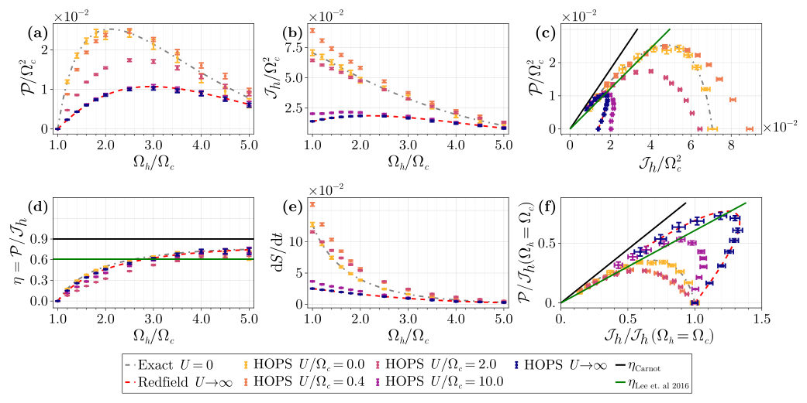
<figcaption class="paper-figure-caption"><b>Fig 5.</b> FIG. 5. Thermodynamic quantities of the thermal machine at high temperatures. (a) Power P (Eq. (59) for HOPS, Eq. (48) for Redfield and Exact method) is always positive, and the refrigerator regime vanishes. The value of Ωℎ/Ω𝑐where maximum power is produced increases with 𝑈. (b) Heat current from hot bath Jℎ(Eq. (60) for HOPS, Eq. (49) for Redfield and Exact method) does not decrease monotonically with increasing Ωℎ/Ω𝑐for high interaction strengths 𝑈. (c) Power P against heat current Jℎshows that increasing 𝑈decreases the magnitudes of thermodynamic quantities. (d) Efficiency 𝜂(Eq. (51)) increases with Ωℎ/Ω𝑐in the heat engine regime. We observe some difference among the efficiencies for...</figcaption>
</figure>

**Summary.** This paper analyzes quantum thermal machines by studying how on-site interactions modify key transport properties like efficiency and rectification. By comparing results from multiple master equation formalisms against an exact stochastic method (HOPS), the authors demonstrate that interactions enable novel functionalities, such as tunable efficiency and non-reciprocal heat flow.

**Why it may be interesting.** This work is highly relevant as it tackles the fundamental problem of modeling open quantum systems where multiple theoretical approximations (LME, GME, RME) exist. The use of HOPS provides a powerful, numerically exact tool to validate predictions in complex non-equilibrium regimes.

Detailed structure

**Main problem.** The study investigates how on-site interactions affect the efficiency, rectification, and entanglement properties of continuous quantum thermal machines.

**Main result.** Interactions can tune the machine's efficiency at high temperatures while leaving it robustly unchanged at low temperatures, and they are necessary to induce non-reciprocal transport and steady-state entanglement.

**Method.** The authors compare results derived from multiple theoretical frameworks—including Redfield, Local, and Global Master Equations—against exact stochastic methods like HOPS.

**Model / system.** The model is a continuous quantum thermal machine consisting of two coupled oscillators (sites) connected to two distinct thermal reservoirs (hot and cold). The system Hamiltonian includes an on-site interaction term ($U$).

**Key observables.** Efficiency ($\eta$), rectification ratio ($R$), steady-state entanglement (Log-negativity $\mathcal{E}_N$), heat currents, and particle currents.

**Important parameters / regimes.** On-site interaction strength ($U$), reservoir coupling strengths ($\kappa_\ell$), temperature ratios ($T_h/T_c$), and system frequencies ($\Omega_\ell$).

**Assumptions / limitations.** The analysis relies on the weak system-reservoir coupling regime for master equation derivations, though HOPS extends applicability. Comparisons are made between different approximations (LME vs GME).

**Figures summary.** Figures compare steady-state populations and fidelity across LME, GME, RME, and Exact methods; other figures show the dependence of power, heat currents, rectification ratio, and entanglement on temperature and interaction strength.

**Paper structure.** The paper systematically compares various theoretical descriptions (LME, GME, RME) for open quantum systems dynamics. It then applies these tools to analyze thermodynamic quantities like efficiency and current flow, demonstrating the role of interactions in enhancing non-equilibrium features like rectification and entanglement.

Abstract

Advances in experimental techniques have opened new routes for harnessing non-equilibrium dynamics in mesoscopic quantum systems. In this context, we study the impact of on-site interactions on the transport properties of a continuous quantum thermal machine composed of two coupled oscillators connected to two thermal reservoirs. In the weak system-reservoir coupling regime, where a long-standing debate concerns which reduced description should be preferred, we first show that the Redfield master equation (RME) provides an accurate and unifying framework that interpolates between two well-known limits: the \textit{local} and \textit{global} master equations. By relying on the Hierarchy of Pure States (HOPS), a numerically exact stochastic method, we then explore the full parameter space and show that interactions can be leveraged to tune the efficiency of the thermal machine at high temperatures (while leaving it essentially unchanged at low temperatures), induce non-reciprocal transport under asymmetric reservoir couplings, and generate steady-state entanglement within the junction. We derive expressions for system-bath correlators, such as heat and particle currents, consistently across different frameworks. Our work features on-site interactions to enhance the versatility of quantum thermodynamic junctions and clarifies the role of non-Markovianity and non-linearities in quantum transport.

[↑ back to top](#top)

### [Dissipation-induced superradiance in matter coupled to a self-interacting cavity](http://arxiv.org/abs/2606.14526v1)

**Authors:** Sebastian Schmid, Matteo Soriente, Oded Zilberberg, Javier del Pino  
**Type:** theory · **Category:** other · **PDF:** <https://arxiv.org/pdf/2606.14526v1>  
**Analysis basis:** full PDF text, analyzed in chunks
**Topic relevance:** 🔥 `Dicke superradiance` **5/5** · 🔥 `driven-dissipative phase transition` **4/5** · 🔥 `superradiant laser` **4/5** · `Tavis-Cummings & cavity-many-emitter` **3/5** · `correlated cavity matter` **3/5** · `methods for driven-dissipative` **3/5** · `Keldysh / 2PI / non-Gaussian methods` **2/5** · `analog quantum simulation` **2/5** · `correlated / nonlocal dissipation` **2/5** · `non-equilibrium universality` **2/5** · `entanglement & information structure` **1/5** · `exotic spin models in light-matter` **1/5** · `non-equilibrium dynamics` **1/5**

↔ Scroll figures horizontally

<figure class="paper-figure-card">
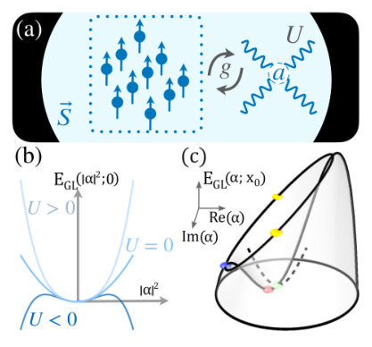
<figcaption class="paper-figure-caption"><b>Fig 1.</b> FIG. 1. System. (a) Kerr-Dicke model [cf. Eq. (1)]: N two- level emitters (blue arrows) couple with strength g to a Kerr cavity with 4-wave mixing strength U. (b) Mean-field cavity potential per emitter, V (α) = ω0|α|2 + U|α|4, for U &gt;, = , &lt; 0 [cf. Eq. (2)], whose |α| dependence gives circular U(1) symmetry in the complex α plane. (c) For U &lt; 0, a spin excitation x0 tilts the potential through x0 Re(α), selecting an axis and reducing U(1) to Z2. The dashed curve shows the reversed-x0 partner. The tilt yields a lower saddle (blue dot), two rim points (yellow dots), and, near the bottom, normal (green) and superradiant (red) Dicke phases.</figcaption>
</figure>
<figure class="paper-figure-card">
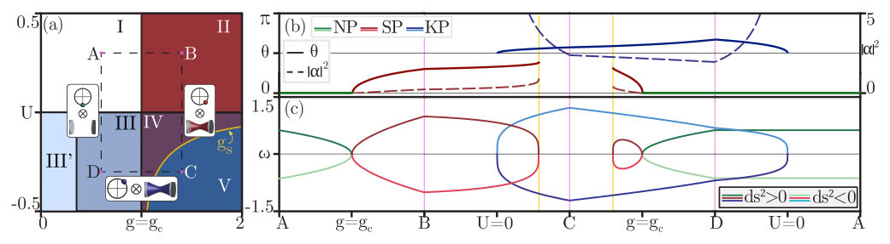
<figcaption class="paper-figure-caption"><b>Fig 2.</b> FIG. 2. Closed system phases. (a) Phase diagram of the closed Kerr-Dicke model (1) versus coupling g and Kerr strength U, with regions I–V. Insets: state ξk, showing one Z2-equivalent spin orientation on the x-z great circle and the cavity state (on/off) for NP, SP, and KP. (b) Order parameters θk (solid) and |αk|2 (dashed), and (c) soft-polariton branch ω [cf. Eqs. (2), (3)], along the dashed cut in (a). Colours denote phases. In (c), dark/light hues encode particle/hole character, ds2 &gt; 0/ &lt; 0 [26, 37]. Subregion III′ lies within region III and is not crossed in (b,c). Other parameters are ω0 = ωz = 1.</figcaption>
</figure>
<figure class="paper-figure-card">
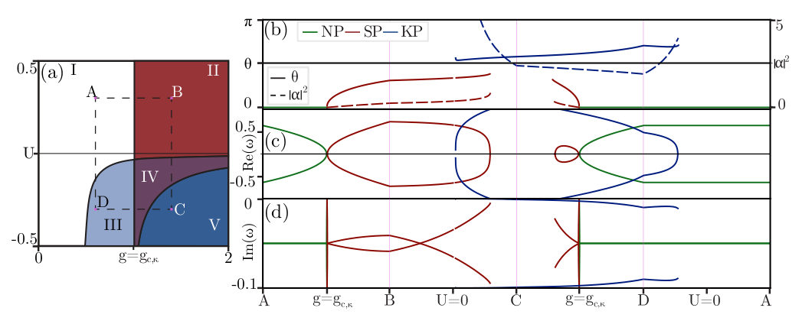
<figcaption class="paper-figure-caption"><b>Fig 3.</b> FIG. 3. Open system phases. (a) Phase diagram of the open Kerr-Dicke model. Regions I and II extend into negative U, with the normal phase stable at low g. Region III shrinks but remains far below gc,κ; dissipation removes the imaginary phase and III′, while region IV retains SP–KP co-stability. (b) Mean-field order parameters along the ABCD cut. (c,d) Real and imaginary parts of the stability-matrix eigenvalues, giving excitation frequencies and damping. The superradiant PT occurs at g = gc,κ. Parameters are as in Fig. 1, with κ = 0.1.</figcaption>
</figure>
<figure class="paper-figure-card">
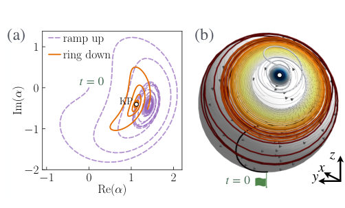
<figcaption class="paper-figure-caption"><b>Fig 4.</b> FIG. 4. Preparation of the Kerr-radiant phase (KP). The cavity is driven from α = 0, z = −1/2 into the targeted KP using ζ = 20, TP ulse = 90, g = 0.8gc,κ, and U = −0.45 [re- gion III in Fig. 3(a)]. The ramp (purple) is followed by free relaxation under Eq. (4) (orange). (a) Cavity quadratures. (b) Spin projection on the Bloch sphere, with colors interpo- lating from purple to orange.</figcaption>
</figure>
<figure class="paper-figure-card">
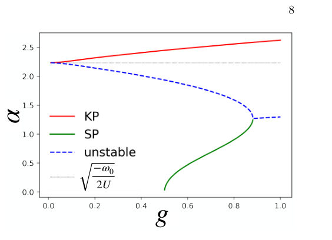
<figcaption class="paper-figure-caption"><b>Fig 5.</b> FIG. 5. Closed-system cavity occupation α for all physical mean-field solutions at U = −0.3. The SP terminates at large g when it merges with an unstable saddle solution. The dashed line, α = p</figcaption>
</figure>

**Summary.** The paper analyzes superradiance in a Kerr-Dicke model where light self-interacts. By introducing negative nonlinearity and accounting for cavity dissipation, the authors predict a stable 'Kerr-radiant phase' that lowers the threshold for lasing compared to standard models. The analysis relies heavily on mean-field theory and stability analysis of open quantum systems.

**Why it may be interesting.** This work extends standard cavity QED models by incorporating nonlinear photon interactions, providing a detailed theoretical framework for understanding dissipation-assisted quantum phase transitions in open systems.

Detailed structure

**Main problem.** The study investigates finding a low-threshold route to superradiance in light-matter systems by incorporating self-interaction (Kerr nonlinearity) into the standard Dicke model.

**Main result.** Negative Kerr nonlinearity ($U<0$) stabilizes a novel 'Kerr-radiant phase' (KP) via cavity dissipation, allowing for lasing thresholds below those predicted by the conventional superradiant transition.

**Method.** The analysis employs mean-field theory, analyzing the Ginzburg-Landau potential and performing stability analyses on the resulting coupled differential equations derived from the Lindblad master equation.

**Model / system.** The system is a Kerr-Dicke model: $N$ two-level emitters coupled to a single-mode cavity with a photonic Kerr nonlinearity ($U$). The dynamics are governed by an open quantum system approach using the Lindblad master equation.

**Key observables.** Order parameters ($\langle S_x 
angle/N, \langle S_z 
angle/N, \langle a 
angle/\sqrt{N}$), excitation spectrum (polariton branches), and stability eigenvalues ($	ext{Re } \lambda_n$).

**Important parameters / regimes.** Kerr nonlinearity strength ($U$), light-matter coupling ($g$), cavity dissipation rate ($\kappa$), and system size ($N$).

**Assumptions / limitations.** The mean-field approximation ($\langle AB 
angle \approx \langle A 
angle \langle B 
angle$) is used extensively for both closed and open system treatments.

**Figures summary.** Figures illustrate the phase diagram showing coexisting NP, SP, and KP regions; they also map initial conditions in cavity phase space to final steady states, demonstrating the robustness of the KP basin.

**Paper structure.** The paper progresses from establishing the Kerr-Dicke Hamiltonian and mean-field potential (GL analysis) to analyzing open system dynamics via the Lindblad equation. It then details stability analysis using eigenvalues and concludes by proposing initialization protocols to access the exotic KP phase.

Abstract

Light-matter interactions are often modeled via the Dicke model, namely, by two-level systems coupled to a cavity mode. Alas, the threshold for superradiance is often experimentally inaccessible or hindered by light's diamagnetic term. Here, within the Dicke setting, we consider self-interacting light in a cavity, modeled by a photonic Kerr nonlinearity. We show that negative Kerr nonlinearity gives rise to a low-threshold superradiant phase with spin inversion. While unstable in a closed system, cavity dissipation stabilizes this lit phase, opening avenues for lasing and bath-engineered phases.

[↑ back to top](#top)

### [Computational regimes in matrix-product-state-based quantum trajectory simulations](http://arxiv.org/abs/2606.13779v1)

**Authors:** Aaron Sander, Simon Cichy, Martin Eigel, Jens Eisert, Maximilian Fröhlich, Tom Peham, Robert Wille  
**Type:** theory · **Category:** numerical methods · **PDF:** <https://arxiv.org/pdf/2606.13779v1>  
**Analysis basis:** full PDF text, analyzed in chunks
**Topic relevance:** 🔥 `methods for driven-dissipative` **5/5** · 🔥 `quantum measurements` **4/5** · `driven-dissipative phase transition` **3/5** · `correlated / nonlocal dissipation` **2/5** · `entanglement & information structure` **2/5** · `non-equilibrium dynamics` **2/5** · `non-equilibrium universality` **2/5** · `Keldysh / 2PI / non-Gaussian methods` **1/5** · `analog quantum simulation` **1/5** · `measurement-induced transitions` **1/5**

↔ Scroll figures horizontally

<figure class="paper-figure-card">
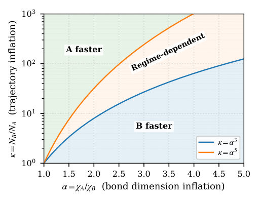
<figcaption class="paper-figure-caption"><b>Fig 1.</b> FIG. 1. Analytical redistribution of computational cost between bond dimension and sampling requirements. Decision geometry in the (α, κ) plane for two physically equivalent unravelings A and B, where α = χA/χB quantifies relative per-trajectory complex- ity and κ = NB/NA quantifies relative sampling cost. The curves κ = α3 and κ = α5 correspond to the decision boundaries in the thread-limited and memory-limited regimes, respectively. Be- low each curve, the reduction in per-trajectory cost associated with smaller bond dimension outweighs the increased number of trajecto- ries; above it, the sampling overhead dominates. Only in the inter- mediate region α3 &lt; κ &lt; α5 does the preferred...</figcaption>
</figure>
<figure class="paper-figure-card">
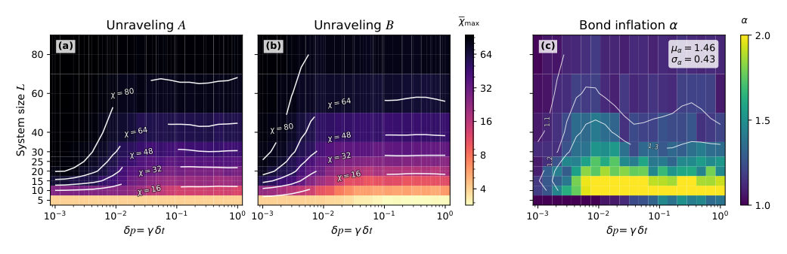
<figcaption class="paper-figure-caption"><b>Fig 2.</b> FIG. 2. Finite-size bond dimension trends in the TJM depolarizing benchmark. (a,b) Peak average trajectory bond dimension χ as a function of system size L and discretized noise parameter δp = γδt for (a) Pauli-jump and (b) measurement-based unravelings. White contours denote constant χmax. (c) Bond inflation ratio α = χmax,A/χmax,B as a function of system size L and δp. Results are obtained for a transverse-field Ising chain initialized in a N´eel state, evolved to T = 5 with δt = 0.1 under local depolarizing noise using the TJM update rule.</figcaption>
</figure>
<figure class="paper-figure-card">
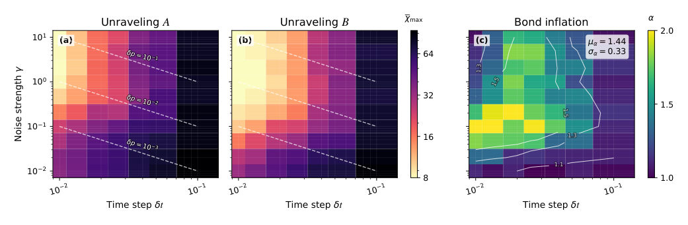
<figcaption class="paper-figure-caption"><b>Fig 3.</b> FIG. 3. Monitoring-resolution dependence of bond dimension in (γ, δt) space. (a,b) Peak trajectory bond dimension χ for L = 65 as a function of noise strength γ and time step δt for unravelings A and B. Dashed lines indicate contours of constant δp = γδt. (c) Bond inflation ratio α = χA/χB as a function of γ and δt. Results are shown up to T = 5 using N = 30 trajectories to characterize systematic bond dimension trends.</figcaption>
</figure>
<figure class="paper-figure-card">
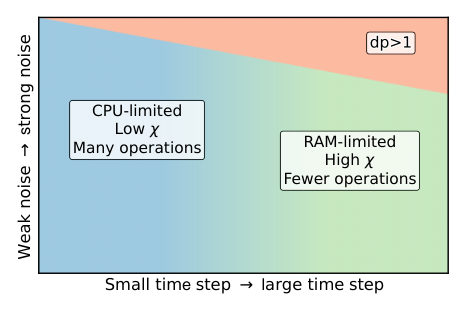
<figcaption class="paper-figure-caption"><b>Fig 4.</b> FIG. 4. Schematic discretization-controlled computational regimes. Conceptual map in (γ, δt) space summarizing the behavior in Fig. 3. For small δt, fine monitoring suppresses trajectory bond dimension χ but increases the number of updates required to reach fixed physical time. For larger δt, bond dimension becomes weakly- dependent on γ and memory usage dominates resource requirements. Boundaries are schematic and indicate smooth crossovers rather than sharp transitions.</figcaption>
</figure>
<figure class="paper-figure-card">
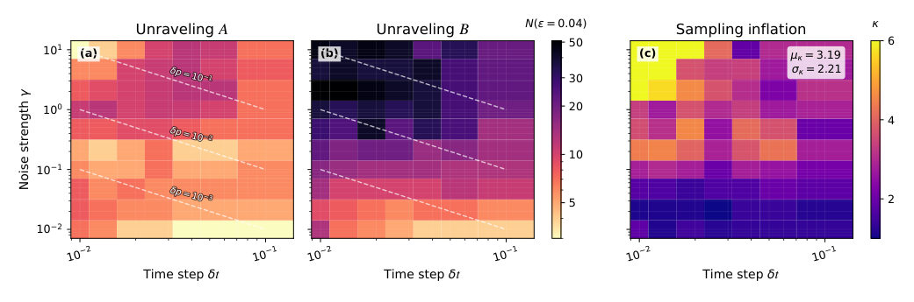
<figcaption class="paper-figure-caption"><b>Fig 5.</b> FIG. 5. Sampling requirements in a small-system exact-reference benchmark. (a,b) Number of trajectories N(ε = 0.04) required for the trajectory-averaged correlator ⟨X4X5⟩to reach a fixed absolute deviation from exact reference evolution, shown as functions of noise strength γ and time step δt for a 10-site system evolved to T = 2. Dashed contours indicate constant δp = γδt. (c) Sampling inflation factor κ = NB/NA, quantifying the relative trajectory count required by unravelings A and B to reach the same reference-accuracy threshold. Because exact evolution is available for this small system, the extracted trajectory counts measure absolute error relative to the Lindblad reference; for...</figcaption>
</figure>

**Summary.** This paper develops a comprehensive cost framework for MPS-based simulations of open quantum systems by analyzing the trade-off between trajectory complexity and statistical sampling effort. It introduces two inflation factors, $\alpha$ and $\kappa$, to quantify how different mathematical representations (unravelings) affect computational cost. The key finding is that the optimal simulation strategy depends critically on the specific hardware resources available, not just the physics of the noise.

**Why it may be interesting.** This work provides crucial practical guidelines for simulating realistic open quantum systems on near-term noisy hardware, moving beyond simple entanglement measures to account for resource limitations like memory bandwidth and parallel processing capability.

Detailed structure

**Main problem.** The total computational cost of simulating open quantum systems using MPS-based stochastic trajectories depends on a complex interplay between per-trajectory complexity (entanglement) and statistical sampling effort, which is poorly understood.

**Main result.** The choice of physically equivalent stochastic unraveling is not an intrinsic optimization but rather a hardware-aware design problem, determined by dimensionless inflation factors $(\alpha, \kappa)$ relative to available memory and parallelism.

**Method.** The authors introduce a cost-resolved framework that decomposes total simulation cost into three components: per-trajectory memory, runtime, and sampling effort. They quantify the trade-off using two inflation factors, $\alpha$ (bond dimension) and $\kappa$ (sampling size).

**Model / system.** The study models open quantum systems whose evolution is governed by Lindblad master equations. Simulations are performed on 1D systems using Matrix Product States (MPS) techniques.

**Key observables.** Bond inflation factor ($\alpha$), sampling inflation factor ($\kappa$), total wall time ratios ($T_A/T_B$), and the peak average trajectory bond dimension ($\chi$).

**Important parameters / regimes.** Noise strength, time-step resolution ($\delta t$), system size ($L$), available parallelism ($P$), and physical memory ($M$).

**Assumptions / limitations.** The analysis assumes that total cost can be separated into distinct channels (memory, runtime, sampling) and models the resource constraints using specific scaling laws for finite parallelism.

**Figures summary.** Figures map out decision geometries in planes of hardware resources $(M, P)$ or $(\alpha, \kappa)$, showing which unraveling is computationally favored under different noise conditions.

**Paper structure.** The paper establishes the need for cost analysis in trajectory simulations, develops a resource-accounting framework using $\alpha$ and $\kappa$, benchmarks this framework across various noise channels, and concludes by mapping out hardware-aware decision maps to guide simulation design.

Abstract

Efficient simulation of open quantum systems is central to modeling noisy quantum hardware and many-body dynamics. In trajectory-based tensor network methods, cost is often associated with trajectory-level quantities such as entanglement growth or bond dimension. However, the total cost of a fixed-accuracy simulation also depends on statistical sampling, and the interplay between per-trajectory complexity and sampling effort remains poorly understood. Here we introduce a cost-resolved framework for matrix product state (MPS)-based quantum trajectory simulations that decomposes total cost into memory per trajectory, runtime per trajectory, and sampling effort. We show that physically equivalent stochastic unravelings of the same Lindblad dynamics do not necessarily reduce total cost, but instead redistribute cost between trajectory complexity and statistical convergence. This trade-off is quantified by two dimensionless inflation factors: a bond dimension inflation $α$ and a sampling inflation $κ$, which together determine the preferred unraveling under hardware-dependent memory and parallelism constraints. We provide a practical protocol for extracting $(α,κ)$ from modest pilot simulations and demonstrate it using benchmarks across multiple noise channels. The resulting decision maps show that the computationally favorable unraveling can change with noise strength, time-step resolution, system size, and available parallelism. These results establish unraveling choice as a hardware-aware simulation design problem rather than an intrinsic optimization of trajectory entanglement alone.

[↑ back to top](#top)

### [Implementation of two-qubit Rydberg operations on neutral Rb-87 atoms in systems with different intermediate states](http://arxiv.org/abs/2606.13975v1)

**Authors:** I. V. Iukhnovets, O. V. Bychkova, I. B. Bobrov, A. P. Gordeev, M. Y. Goloshchapov, G. I. Struchalin, S. S. Straupe  
**Type:** experiment · **Category:** other · **PDF:** <https://arxiv.org/pdf/2606.13975v1>  
**Analysis basis:** full PDF text, analyzed in chunks
**Topic relevance:** 🔥 `QC/QI experiment` **5/5** · 🔥 `Rydberg arrays` **4/5** · `quantum measurements` **1/5** · `quantum optics experiment` **1/5**

↔ Scroll figures horizontally

<figure class="paper-figure-card">
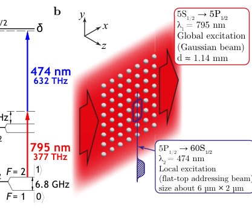
<figcaption class="paper-figure-caption"><b>Fig 1.</b> FIG. 1. Scheme for implementing excitation through the in- termediate level 5P1/2. (a) Scheme of two-photon excitation to the state |r⟩through the intermediate state |p⟩. (b) Ex- perimental implementation. The beam for the first excitation stage is global and propagates along the OX direction. The beam for the second excitation stage provides site-selective addressing, propagates along OZ, and has a flat-top intensity profile</figcaption>
</figure>
<figure class="paper-figure-card">
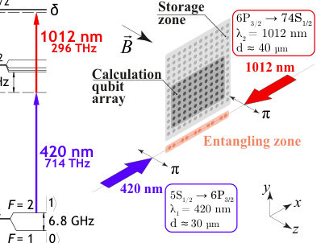
<figcaption class="paper-figure-caption"><b>Fig 2.</b> FIG. 2. Scheme for implementing excitation through the in- termediate level 6P3/2. (a) Scheme of two-photon excitation to a Rydberg state. (b) Experimental implementation. Both beams act on atoms in the entanglement zone. The first-stage beam propagates along the OX axis, and the second-stage beam propagates in the opposite direction</figcaption>
</figure>
<figure class="paper-figure-card">
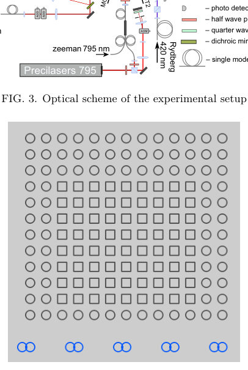
<figcaption class="paper-figure-caption"><b>Fig 3.</b> FIG. 4. Zoned architecture of the atomic array. Black circles show atoms in the reservoir zone, squares show atoms in the computational array. Blue particles in the entanglement zone are shown at the bottom</figcaption>
</figure>
<figure class="paper-figure-card">
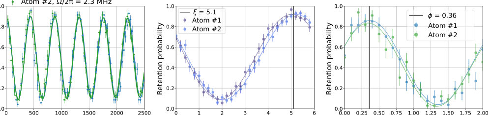
<figcaption class="paper-figure-caption"><b>Fig 4.</b> FIG. 5. (a) Rabi oscillations under single-particle excitation to a Rydberg state for a pair of atoms in paired sites of the computation region. (b) Dependence of the probability of detecting an atom in the ground state after applying a pair of Rydberg excitation pulses on the relative phase between them. The two curves correspond to separate measurements for each atom of the selected pair. (c) Probability of detecting an atom in the ground state as a function of the compensation phase around the quantization axis. The two curves correspond to separate measurements for each atom of the selected pair</figcaption>
</figure>
<figure class="paper-figure-card">
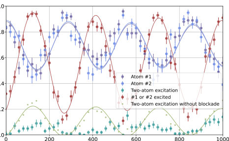
<figcaption class="paper-figure-caption"><b>Fig 5.</b> FIG. 6. Simultaneous excitation of atoms in paired sites of the computation region to a Rydberg state. The red curve is the probability of exciting one atom of the pair, the green curve is the probability of simultaneous Rydberg excitation of two atoms, the olive curve is the conditional probability of single-particle excitation, and the remaining curves are un- conditional probabilities of single-particle excitation</figcaption>
</figure>

**Summary.** The research details the experimental implementation of two-qubit quantum gates on $^{87}	ext{Rb}$ atoms by comparing two distinct Rydberg excitation schemes. The authors demonstrate that using a $6P_{3/2}$ intermediate level, coupled with a zoned architecture, yields high fidelity (94%) because it circumvents difficult beam focusing requirements inherent in alternative setups.

**Why it may be interesting.** This work provides a detailed comparison of physical implementations for quantum gates in neutral atoms, directly addressing practical engineering challenges (like beam focusing and intermediate state selection) that limit fidelity in current quantum hardware.

Detailed structure

**Main problem.** The central goal is to experimentally implement high-fidelity two-qubit quantum gates on neutral Rubidium-87 atoms.

**Main result.** The authors successfully demonstrated a two-qubit operation fidelity of 94% using the $6P_{3/2}$ intermediate state scheme, which was shown to be superior to an alternative scheme involving the $5P_{1/2}$ level.

**Method.** They utilized Rydberg blockade physics and implemented the Controlled-Z (CZ) gate via precise laser pulsing sequences following the Levine–Pichler method.

**Model / system.** The system uses neutral $^{87}	ext{Rb}$ atoms trapped in optical tweezers, with qubits encoded in hyperfine ground states. Two schemes are compared: one using $5P_{1/2}$ and another using $6P_{3/2}$ as the intermediate excitation level.

**Key observables.** Two-qubit operation fidelity ($F$), measured via parity measurements on entangled states like $|\Phi^+
angle$.

**Important parameters / regimes.** The choice of intermediate level, spatial configuration (zone separation), and laser parameters ($\lambda=420 	ext{ nm}$, $\lambda_2=1012 	ext{ nm}$).

**Assumptions / limitations.** Numerical modeling suggests that the spatial configuration has a greater impact on fidelity than the specific choice of intermediate level. The $6P_{3/2}$ scheme is favored due to technological ease in generating high power at $1012 	ext{ nm}$.

**Figures summary.** Figures illustrate the optical schemes for both excitation pathways (Scheme A and Scheme B) and show experimental sequences used to measure CZ gate fidelity and parity oscillations.

**Paper structure.** The paper compares two Rydberg excitation schemes ($5P_{1/2}$ vs $6P_{3/2}$) theoretically, analyzes their limitations based on scattering rates and beam profiles, presents numerical modeling results emphasizing spatial dependence, and concludes with the experimental demonstration of the higher-fidelity scheme using $6P_{3/2}$.

Abstract

This work presents an experimental setup for implementing two-qubit operations on neutral atoms ($^{87}$Rb) with the possibility of using two different Rydberg excitation schemes. One of them uses 5P$_{1/2}$ as the intermediate level and applies the second-stage beam locally to the addressed atoms. The second scheme uses the 6P$_{3/2}$ level; in this scheme, the particles to be entangled are moved to a separate zone through which both Rydberg beams pass. The advantages and limitations of both schemes are analyzed. Based on numerical modeling performed with a Julia package developed by the authors, it is demonstrated that the spatial configuration has a greater effect on quantum-operation fidelity than the choice of intermediate level. An experimental implementation of the scheme using the 6P$_{3/2}$ level is demonstrated, making it possible to achieve a two-qubit operation fidelity of 94%.

[↑ back to top](#top)

### [Modeling light-matter coupled systems with neural quantum states](http://arxiv.org/abs/2606.14352v1)

**Authors:** Noe Salmeron, Marin Bukov, Markus Schmitt  
**Type:** theory · **Category:** numerical methods · **PDF:** <https://arxiv.org/pdf/2606.14352v1>  
**Analysis basis:** full PDF text, analyzed in chunks
**Topic relevance:** 🔥 `Tavis-Cummings & cavity-many-emitter` **4/5** · 🔥 `analog quantum simulation` **4/5** · 🔥 `correlated cavity matter` **4/5** · `Rydberg arrays` **3/5** · `entanglement & information structure` **3/5** · `exotic spin models in light-matter` **3/5** · `methods for driven-dissipative` **3/5** · `spintronics-quantum-optics interface` **3/5** · `correlated / nonlocal dissipation` **1/5** · `driven-dissipative phase transition` **1/5** · `non-equilibrium dynamics` **1/5**

↔ Scroll figures horizontally

<figure class="paper-figure-card">
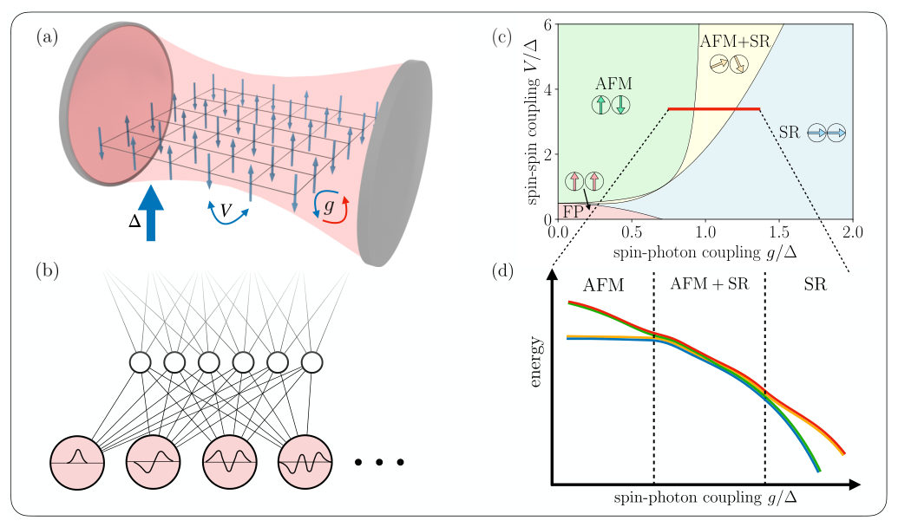
<figcaption class="paper-figure-caption"><b>Fig 1.</b> FIG. 1. (a) 2D array of Rydberg atoms, represented as two-level systems, in a cavity. The atoms on the lattice interact repulsively with their nearest neighbors with strength V . They are additionally uniformly coupled to a single cavity photon mode with interaction strength g. The cavity effectively mediates an all-to-all coupling competing with the nearest-neighbor interaction. An external field with intensity ∆is also present. For electrically neutral Rydberg atoms, this field can take the form of an external periodic drive [1]. (b) We study the ground state properties using Neural Quantum States (NQS) by designing a neural network architecture capable of handling both spin and photon...</figcaption>
</figure>
<figure class="paper-figure-card">
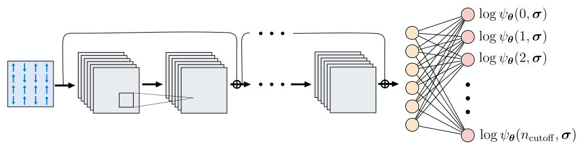
<figcaption class="paper-figure-caption"><b>Fig 2.</b> FIG. 2. Schematic illustration of the neural network architecture. We adapt the ResNet architecture previously used for spin-only systems [24]. A spin configuration is given as input and passes through multiple convolutional layers with residual connections. Our modification occurs at the end of these layers: instead of averaging all feature maps to a single number, we average each one separately to produce an array. These values are then fed into a final dense layer that outputs the log- wavefunction coefficients for each photon number in a multi-head fashion.</figcaption>
</figure>
<figure class="paper-figure-card">
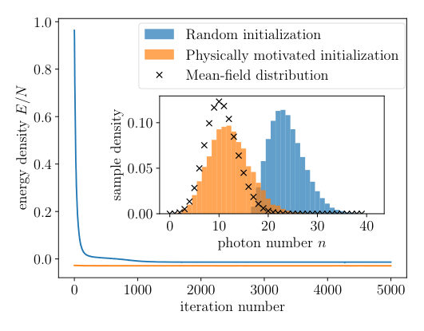
<figcaption class="paper-figure-caption"><b>Fig 3.</b> FIG. 3. Comparison of the training curves between a state initialized with random weights and a state initialized as the ground state of the simplified Hamiltonian of Eq. (6). The physically motivated initialization reaches lower energies, il- lustrating the advantage of starting the optimization from a state closer to the ground state. The value chosen for the parameter α of the modified Hamiltonian in Eq. 6 is the av- erage photon number of the mean-field ground state. The inset shows the photon distributions of each state at the end of the optimization. This illustrates how the improvement in energy can translate into significantly different values for the observables, such as the...</figcaption>
</figure>
<figure class="paper-figure-card">
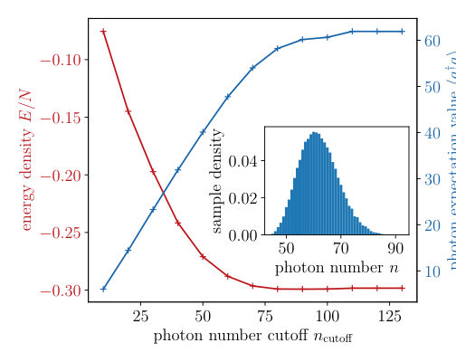
<figcaption class="paper-figure-caption"><b>Fig 4.</b> FIG. 4. Scaling of the average photon number ⟨a†a⟩and the energy density as the photon cutoff is increased. The cutoff must be chosen so that, if it is increased, the photon number in the cavity does not change. The inset shows the photon distribution of the ground state at this point. This example is for a 12 × 12 lattice at g/∆= 1.5 and V/∆= 6. The error bars on the main graph are too small to be visible.</figcaption>
</figure>
<figure class="paper-figure-card">
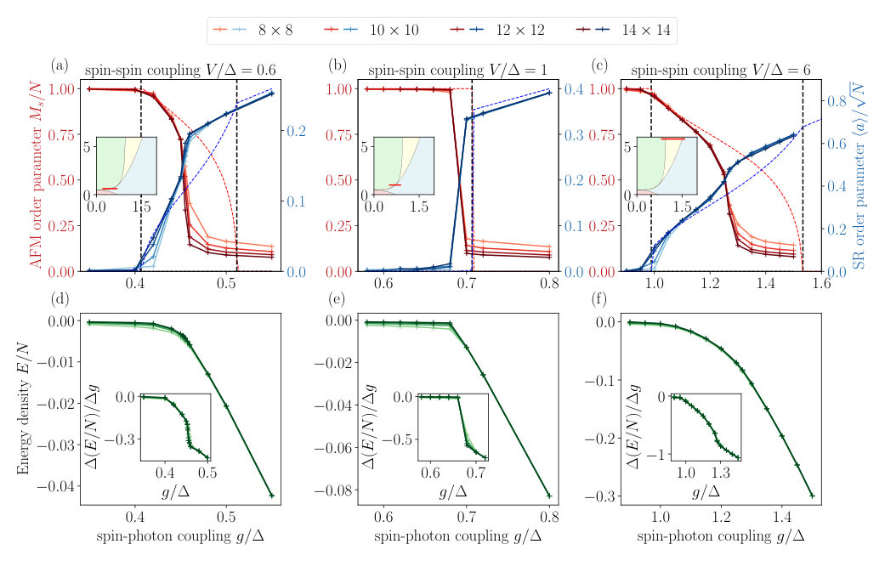
<figcaption class="paper-figure-caption"><b>Fig 5.</b> FIG. 5. (a-c) AFM and SR order parameters showcasing the different phase transitions for various cuts through the phase diagram at V = 0.6, V = 1, and V = 6. The dashed red and blue curves represent the mean-field predictions for the two quantities. The black dashed vertical lines show the position of the phase transitions according to mean-field. (d-f) The second row shows the corresponding energy densities and their derivative with respect to g/∆. In the thermodynamic limit, a first order phase transition is characterized by a kink in the energy density and a discontinuity in its derivative. The error bars are too small to be visible. Details about the cutoffs chosen for each data point...</figcaption>
</figure>

**Summary.** The paper introduces and validates Neural Quantum States (NQS) as a powerful numerical technique to simulate light-matter coupled quantum systems. It models Rydberg atoms interacting with cavity photons, accurately predicting ground state phase boundaries by capturing crucial spin-photon correlations missed by mean-field theory. This method offers a scalable framework for studying complex strongly correlated physics in hybrid quantum platforms.

**Why it may be interesting.** This work represents a significant advancement in simulating strongly correlated quantum systems by providing a scalable, highly accurate numerical tool (NQS) that surpasses the limitations of traditional methods like Mean-Field Theory or Tensor Networks for specific hybrid Hilbert spaces.

Detailed structure

**Main problem.** Developing a robust numerical method to study complex many-body quantum systems where short-range interactions coexist with long-range photon-mediated couplings, exceeding the capabilities of mean-field theory.

**Main result.** The Neural Quantum State (NQS) approach successfully captures spin-photon and spin-spin correlations, leading to quantitative deviations in predicted ground state phase boundaries compared to mean-field calculations.

**Method.** The study employs Neural Quantum States (NQS), utilizing a multi-head ResNet architecture to represent the wavefunction on hybrid Hilbert spaces. A unitary transformation is used to map the system to a stoquastic Hamiltonian, enabling Variational Monte Carlo optimization.

**Model / system.** The model is a light-matter coupled system, specifically a 2D lattice of Rydberg atoms interacting with a cavity photon mode (spin-photon coupling). The Hamiltonian includes spin interactions ($H_{	ext{spin}}$), cavity terms ($H_{	ext{cavity}}$), and the interaction term ($H_{	ext{int}}$).

**Key observables.** Ground state properties, phase boundaries (FP, AFM, SR phases), Renyi-2 entanglement entropy, and energy expectation values.

**Important parameters / regimes.** Coupling strengths ratios like $g/\Delta$ and $V/\Delta$; photon cutoff ($n_{	ext{cutoff}}$); system size ($N$).

**Assumptions / limitations.** The method requires truncating the infinite photon degree of freedom at a finite cutoff ($n_{	ext{cutoff}}$) and assumes adiabatic preparation for ground state calculations.

**Figures summary.** Figures illustrate phase diagrams showing predicted boundaries, comparison plots between NQS and mean-field results for order parameters (AFM/SR), and convergence diagnostics like energy variance vs. time step or cutoff size.

**Paper structure.** The paper progresses by introducing the physical model and Hamiltonian, detailing the necessary unitary transformation to ensure stochasticity, presenting the advanced multi-head ResNet NQS architecture, validating its stability through initialization techniques, and finally applying it to map out phase diagrams and quantify correlation effects beyond mean-field theory.

Abstract

Recent advances in cold atom manipulation enable the study of many-body systems where short-range interactions between neighboring atoms coexist with long-range interactions mediated by photons. Such a combination of interactions makes a theoretical approach challenging beyond mean-field methods. In this work, we develop a neural quantum state based approach to study these systems numerically. We introduce a neural-network architecture capable of handling hybrid Hilbert spaces with large local bosonic dimensions in strongly interacting spin-photon systems. We benchmark this approach on a model of a two-dimensional lattice of Rydberg atoms coupled to a photon mode. The superradiant ground states found in the large spin-photon coupling regime allow us to demonstrate the efficiency of the method in the presence of high photon occupation. Furthermore, the ability to capture spin-spin and spin-photon correlations leads us to observe quantitative deviations in the ground state phase boundaries with respect to mean-field theory. The method extends to other systems with a similar hybrid Hilbert space structure, such as spin-phonon systems, and provides a scalable framework for investigating their ground state properties.

[↑ back to top](#top)

### [Dynamically frozen long-distance entanglement via non-Hermitian PT-symmetric systems](http://arxiv.org/abs/2606.14177v1)

**Authors:** Sejal Ahuja, Keshav Das Agarwal, Aditi Sen De  
**Type:** theory · **Category:** quantum information and computing · **PDF:** <https://arxiv.org/pdf/2606.14177v1>  
**Analysis basis:** full PDF text, analyzed in chunks
**Topic relevance:** 🔥 `driven-dissipative phase transition` **4/5** · 🔥 `entanglement & information structure` **4/5** · `analog quantum simulation` **3/5** · `correlated / nonlocal dissipation` **3/5** · `methods for driven-dissipative` **3/5** · `non-equilibrium dynamics` **3/5** · `non-equilibrium universality` **3/5** · `Keldysh / 2PI / non-Gaussian methods` **1/5** · `Kondo & dissipative impurity` **1/5** · `exotic spin models in light-matter` **1/5** · `scars & prethermalization` **1/5**

↔ Scroll figures horizontally

<figure class="paper-figure-card">
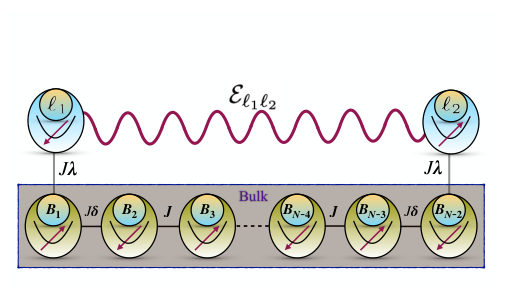
<figcaption class="paper-figure-caption"><b>Fig 1.</b> FIG. 1. Schematic of the LDE generation protocol when all the sites are influenced by the environment. The spin chain is com- posed of two components: bulk (B1, B2, · · · , BN−2) interacting weakly with the two link spins (ℓ1, ℓN) situated at the ends of the bulk. In our case, the interactions in bulk spins are described by the SSH model (see Eq. (1)), and the weak interactions between link- bulk spin pairs (ℓ1, B1) and (BN−2, ℓ2) are represented by λ ≪1. Each spin is attached to a local bath, where continuous measurements are performed in opposite directions to obtain an effective Hamilto- nian of an imaginary alternating magnetic field. The protocol aims to create near-maximal...</figcaption>
</figure>
<figure class="paper-figure-card">
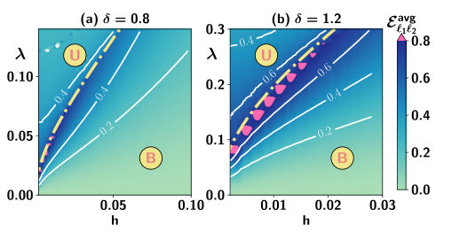
<figcaption class="paper-figure-caption"><b>Fig 2.</b> FIG. 3. Time-averaged entanglement between the links Eavg ℓ1ℓ2: Exceptional points are special. Time-averaged LDE Eavg ℓ1ℓ2 of the SSH model in the parameter space (h, λ) (abscissa, ordinate) for (a) δ = 0.8 and (b) δ = 1.2, with N = 16. The exceptional points are represented by dashed-dot lines, which segregate the unbroken (U) and broken (B) phases. High LDE (&gt; 0.8) (pink colored regions) can be obtained near the exceptional lines of the model, especially for δ ≥1 (see Theorem 2, for δ = 1). The initial state of the bulk and link system is |Ψ(0)⟩= |1⟩. All the axes are dimensionless.</figcaption>
</figure>
<figure class="paper-figure-card">
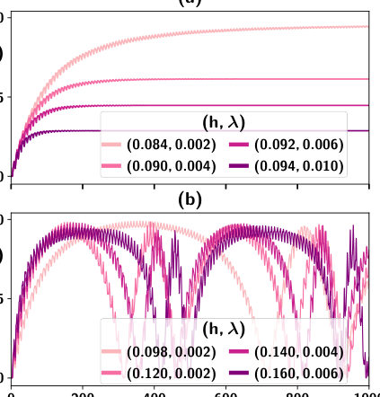
<figcaption class="paper-figure-caption"><b>Fig 3.</b> FIG. 2. Comparison between long-distance entanglement Eℓ1ℓ2 of unbroken and broken regimes of the non-Hermitian SSH model. Eℓ1ℓ2 (ordinate) vs time (abscissa) for δ = 1.2 where (a) belongs to the broken regime and (b) to unbroken regime. The model fa- cilitates long-distance entanglement creation in both regimes, with frozen entangled links in the broken regimes for a long period of time (a). However, the entanglement in the unbroken regime fluctu- ates, and the freezing periods are shorter. The system is initialized as |Ψ(0)⟩= |1⟩⊗|0⟩⊗N−1 with the system-size N = 16. All the axes are dimensionless.</figcaption>
</figure>
<figure class="paper-figure-card">
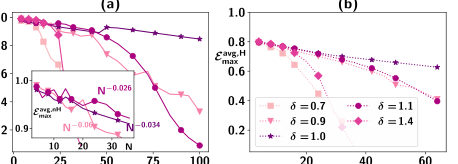
<figcaption class="paper-figure-caption"><b>Fig 4.</b> FIG. 4. Scaling of LDE with system-size: Comparison between non-Hermitian and Hermitian LDE generation. The entangle- ment Eavg,X max (ordinate), averaged over time and maximized over the (h, λ)-plane with respect to the system-size N (abscissa) for (a) non- Hermitian (X=nH) and (b) the Hermitian (X=H) models. Different lines denote different δ values of the SSH model. Eavg,X max decays slowly when δ ≈1, whereas the LDE decays quickly with system- size N when δ ̸= 1 and high N, highlighting the significance of XX model. (Inset) When entanglement is close to unity (Eavg,nH max &lt; 0.9), the scaling exponents are found for δ = 0.9, 1.0 and 1.1. All the axes are dimensionless.</figcaption>
</figure>
<figure class="paper-figure-card">
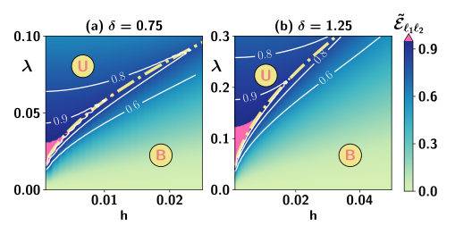
<figcaption class="paper-figure-caption"><b>Fig 5.</b> FIG. 6. Long-distance entangled links in a stationary state. The variation of entanglement between the links ˜Eℓ1ℓ2 in the (h, λ)- plane is presented when the system reaches the stationary state for (a) δ = 0.75 and (b) δ = 1.25, with system-size N = 10. The broken (B) and unbroken (U) regimes are separated by the dashed-dot lines. High entanglement between the links (ℓ1, ℓ2) is produced close to the exceptional line with pink colored regions indicating ˜Eℓ1ℓ2 ≥0.95. All the axes are dimensionless.</figcaption>
</figure>

**Summary.** This paper demonstrates that incorporating non-Hermititian physics into spin chain models can dramatically enhance the generation and stabilization of long-distance entanglement in quantum networks. By analyzing dynamics near exceptional points, the authors show that these engineered systems achieve higher, more robust levels of entanglement than their Hermitian counterparts.

**Why it may be interesting.** This work directly addresses engineered quantum networks using non-Hermitian physics, providing concrete mechanisms (EPs, broken phase) to enhance robust quantum correlations beyond what is possible with standard unitary models.

Detailed structure

**Main problem.** The study investigates how non-Hermitian dynamics can dynamically generate and stabilize long-distance entanglement (LDE) between distant nodes in quantum networks, comparing this to standard Hermitian evolution.

**Main result.** Non-Hermitian dynamics near exceptional points allow for the emergence of near-unit time-averaged entanglement that cannot be achieved by corresponding Hermitian systems. Furthermore, LDE persists robustly even in the stationary regime.

**Method.** The analysis combines analytical techniques (like determining exceptional points) with numerical simulations to track entanglement evolution over time and across parameter space.

**Model / system.** The system is modeled as interacting spin-1/2 bulks weakly coupled to two quantum links, analyzed using an effective non-Hermitian nearest-neighbor Su-Schrieffer-Heeger (SSH) model derived from open quantum system dynamics.

**Key observables.** Long-distance entanglement ($\mathcal{E}_{\ell_1\ell_2}$), time-averaged link entanglement ($E_{	ext{avg}}^{\ell_1\ell_2}$), and the location of exceptional points (EPs).

**Important parameters / regimes.** Weak coupling strength ($\lambda$), imaginary magnetic fields ($h'$), system size ($N$), and the SSH model parameter $\delta$.

**Assumptions / limitations.** The analysis relies on deriving effective non-Hermitian Hamiltonians from open quantum systems (e.g., via GKLS master equation) and assumes weak coupling regimes for perturbative calculations.

**Figures summary.** Figures compare entanglement dynamics in the broken vs. unbroken regimes, show how LDE depends on system size $N$ and interaction range ($\alpha$), and map out high-entanglement regions near exceptional point lines in parameter space.

**Paper structure.** The paper systematically analyzes the role of non-Hermiticity by comparing dynamic entanglement generation across different SSH model parameters ($\delta$) and coupling strengths, culminating in a comparison between stationary and time-averaged entanglement results.

Abstract

In distributed quantum networks, interacting spin systems can mediate the generation of highly entangled links between distant nodes. We investigate the role of effective parity-time (PT)-symmetric non-Hermitian spin-1/2 bulks weakly coupled to two quantum links, obtained due to the environmental interactions affecting both the bulk and the links. Focusing on effective non-Hermitian nearest-neighbor (NN) Su-Schrieffer-Heeger (SSH) models, we analyze how non-Hermiticity influences the dynamical formation of long-distance entanglement (LDE). For a paradigmatic model consisting of a quantum XX bulk subjected to imaginary staggered magnetic fields, we analytically determine the exceptional points arising from the resulting bulk-mediated interactions between the links. Combining analytical and numerical methods, we demonstrate that an initially fully separable state can dynamically evolve into highly entangled link states near these exceptional points in the broken regime. Further, after optimizing over time and system parameters, near-unit time-averaged entanglement between the links emerges under weak imaginary magnetic fields and bulk-link couplings, which cannot be attained in the corresponding Hermitian systems. Moreover, the non-Hermitian dynamics exhibit a freezing of high entanglement in the vicinity of exceptional points, a feature absent in Hermitian counterparts. We also identify regimes of long-range interaction strengths that yield a higher time-averaged entanglement than the corresponding NN models. Furthermore, we establish that LDE persists in the stationary regime, highlighting the promise of engineered non-Hermitian dynamics for realizing robust and frozen entangled links in quantum networks.

[↑ back to top](#top)

### [Quantum Simulation of Spin-Dependent Electron Transfer in a Synthetic Chiral Lattice with a Trapped Ion](http://arxiv.org/abs/2606.13930v1)

**Authors:** Yi Li, Chuyuan Chen, Xingyu Zhao, Zihan Xie, Min Jiang, Xinhua Peng, Han Pu, Lyuzhou Ye, Yao Wang, Guozhen Zhang, Yiheng Lin  
**Type:** experiment · **Category:** other · **PDF:** <https://arxiv.org/pdf/2606.13930v1>  
**Analysis basis:** full PDF text, analyzed in chunks
**Topic relevance:** 🔥 `analog quantum simulation` **4/5** · `exotic spin models in light-matter` **3/5** · `methods for driven-dissipative` **3/5** · `non-equilibrium dynamics` **3/5** · `spintronics-quantum-optics interface` **3/5** · `QC/QI experiment` **2/5** · `driven-dissipative phase transition` **2/5** · `Keldysh / 2PI / non-Gaussian methods` **1/5** · `Kondo & dissipative impurity` **1/5** · `correlated / nonlocal dissipation` **1/5** · `entanglement & information structure` **1/5** · `non-equilibrium universality` **1/5**

↔ Scroll figures horizontally

<figure class="paper-figure-card">
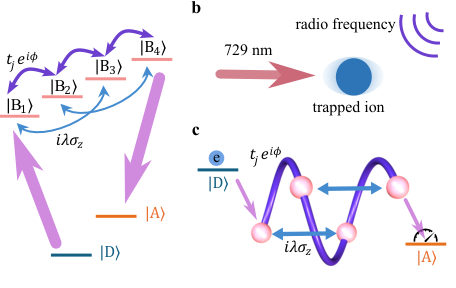
<figcaption class="paper-figure-caption"><b>Fig 1.</b> FIG. 1. Experimental scheme for simulating a donor–chiral bridge–acceptor system with a trapped ion. a, Model of a donor–chiral bridge–acceptor system. The bridge consists of four intermediate states |B1⟩∼|B4⟩ with nearest-neighbor hopping tjeiϕ and spin-dependent next- nearest-neighbor hopping iλσz induced by SOC, with phase ϕ representing the effect of an external magnetic field. The donor |D⟩and acceptor |A⟩are coupled to the bridge via a bosonic mode. b, Implementation of the couplings by 729 nm laser and radio-frequency drives, as detailed in the text. The laser also couples to the vibrational mode serving as the bosonic mode. c, Physical picture of chiral transport through the bridge....</figcaption>
</figure>
<figure class="paper-figure-card">
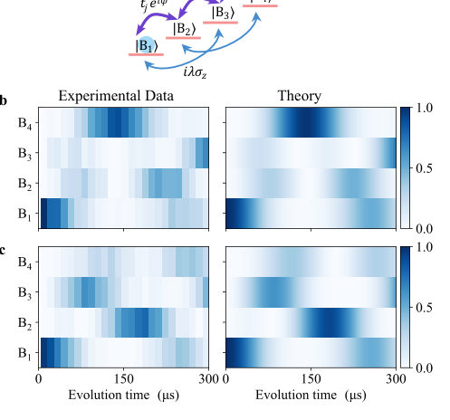
<figcaption class="paper-figure-caption"><b>Fig 2.</b> FIG. 2. Spin-dependent dynamics in the chiral bridge. a, four-site chiral bridge |B1⟩∼|B4⟩with nearest-neighbor hopping tjeiϕ and spin-dependent next-nearest-neighbor hop- ping iλσz, here we set ϕ = 0. b,c Time evolution of site populations measured in the experiment (left) and obtained from numerical simulation considering the nonuniform cou- plings (right), starting from |B1⟩. Each row corresponds to a bridge site. b, Spin-up dynamics. c, Spin-down dynamics. Parameters: λ/t = 1.42, t = 2π × 2.9 kHz.</figcaption>
</figure>
<figure class="paper-figure-card">
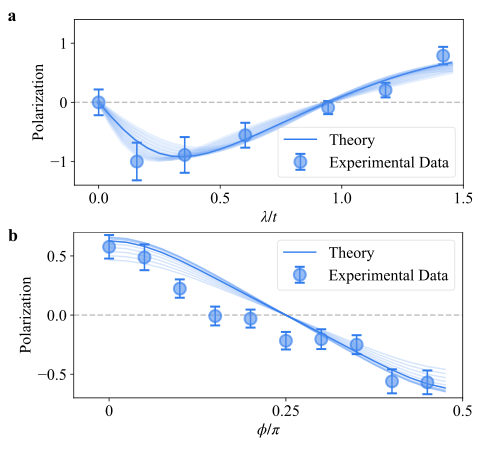
<figcaption class="paper-figure-caption"><b>Fig 3.</b> FIG. 4. Tunable spin polarization induced by the chi- ral bridge. a, Spin polarization as a function of the coupling ratio λ/t, measured at 253 µs. The polarization is negative for λ/t &lt; 1 and reverses sign for λ/t &gt; 1 (ϕ = 0). Theoretical curves are obtained over the time window 200–300 µs, showing consistent behavior within this interval. b, Spin polarization as a function of the magnetic-field–induced hopping phase ϕ at λ/t = 1.4, measured at 250 µs. The polarization changes sign with ϕ and approaches zero near ϕ = π/4. Theoretical curves are obtained over 200–300 µs. Dots (solid blue lines) represent the experiment data (theory). The dashed grey line indicates the boundary between...</figcaption>
</figure>
<figure class="paper-figure-card">
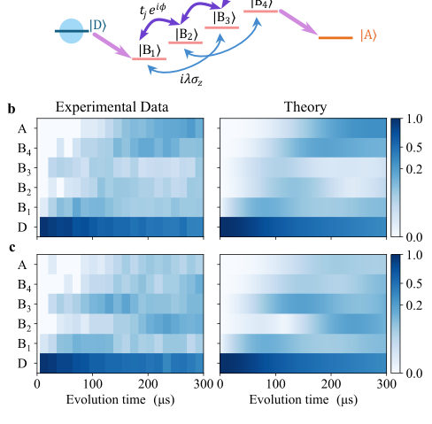
<figcaption class="paper-figure-caption"><b>Fig 4.</b> FIG. 3. Spin-dependent donor–acceptor transport me- diated by the chiral bridge. a, Donor–bridge–acceptor model. An electron initially in |D⟩propagates through the four-site bridge |B1⟩∼|B4⟩and transfers to the acceptor state |A⟩. b,c Time evolution of site populations from ex- periment (left) and numerical simulation considering the re- alistic nonuniform couplings (right), with a distinction on the population at the acceptor state (|A⟩) over time. Each row represents one site. b, Spin-up dynamics. c, Spin-down dy- namics. Parameters: ϕ = 0, λ/t = 1.4, t = 2π × 2.9 kHz, gDB = gBA = 2π × 2.8 kHz.</figcaption>
</figure>

**Summary.** The authors successfully implemented a programmable quantum simulation of spin-dependent electron transfer using a trapped ion platform. They modeled the process through a synthetic chiral lattice bridge connecting donor and acceptor sites. The key finding is that spin selectivity arises from quantum interference between multiple competing pathways, providing a robust experimental route to study CISS effects.

**Why it may be interesting.** This work provides an unprecedentedly controllable quantum simulator platform for studying complex solid-state phenomena like CISS. The ability to tune parameters ($\lambda/t$, $\phi$) allows direct mapping of theoretical predictions regarding interference mechanisms onto measurable quantum dynamics, which is highly valuable for AMO research into open quantum systems.

Detailed structure

**Main problem.** The study addresses the unresolved microscopic origin of the Chiral-Induced Spin Selectivity (CISS) effect in electron transfer through chiral structures.

**Main result.** The research identifies that spin-dependent interference among competing multi-step pathways within the synthetic chiral bridge is the microscopic mechanism responsible for observing spin-selective electron transport.

**Method.** A programmable quantum simulation approach was implemented using a single trapped ion to model the donor–chiral bridge–acceptor system dynamics.

**Model / system.** The system models $	ext{D}–	ext{B}_\chi–	ext{A}$ electron transfer, where the chiral bridge is encoded across four sites ($|	ext{B}_1
angle$ to $|	ext{B}_4
angle$) on a trapped $^{40}	ext{Ca}^+$ ion. The couplings are tunable using laser and RF drives, simulating nearest-neighbor hopping and spin-dependent next-nearest-neighbor interactions.

**Key observables.** Spin polarization ($P$), population distribution across bridge sites ($	ext{|B}_2
angle, 	ext{|B}_3
angle, 	ext{|B}_4
angle$), and the overall donor-to-acceptor transfer dynamics over time.

**Important parameters / regimes.** Hopping strengths ($t_j$), SOC strength ($\lambda$), phase ($\phi$), and coupling amplitudes/phases. Key regimes include $\lambda/t$ ratios and specific time windows (e.g., $200–300 \mu	ext{s}$).

**Assumptions / limitations.** The analysis assumes coherent evolution over specified time windows, and the mechanism relies on interference terms derived from path summation.

**Figures summary.** Figures illustrate the experimental scheme (Hamiltonian structure, laser implementation), show spin-dependent time evolution within the chiral bridge, and demonstrate tunable spin polarization in both the bridge dynamics and the final donor-to-acceptor transfer.

**Paper structure.** The paper first establishes the model Hamiltonian for $	ext{D}–	ext{B}_\chi–	ext{A}$ on a trapped ion. It then analyzes the intrinsic spin-dependent interference within the chiral bridge, followed by extending this analysis to measure the resulting spin selectivity during the full donor-to-acceptor transfer process.

Abstract

Electron transfer through chiral structures can exhibit spin asymmetry, known as the chiral-induced spin selectivity effect, whose microscopic origin remains an open question. While path-interference within the chiral moiety has been proposed as a key mechanism, its experimental validation requires precise and versatile tunability of system parameters. Here we implement a programmable quantum simulation of spin-dependent electron transfer in a donor--chiral-bridge--acceptor model using a trapped ion. The bridge is encoded in internal states of the ion with tunable nearest- and next-nearest-neighbor couplings, while donor and acceptor states are coupled via a spectator bosonic motional mode. We observe spin-dependent interference within the bridge, and further reveal spin-dependence in donor-to-acceptor transfer dynamics, controlled by amplitude and phase of the coupling parameter. Our results identify interference among spin-dependent pathways as a microscopic origin of spin-dependent transfer, and open a route toward quantum simulations of complex chiral lattices with multi-level and bosonic degrees of freedom.

[↑ back to top](#top)

### [Generic nonlocal statistics of the stationary measure in conserved active systems](http://arxiv.org/abs/2606.14483v1)

**Authors:** Filippo De Luca, Michael E. Cates, Cesare Nardini  
**Type:** theory · **Category:** statistical mechanics · **PDF:** <https://arxiv.org/pdf/2606.14483v1>  
**Analysis basis:** full PDF text, analyzed in chunks
**Topic relevance:** 🔥 `non-equilibrium dynamics` **4/5** · 🔥 `non-equilibrium universality` **4/5** · `Keldysh / 2PI / non-Gaussian methods` **3/5** · `correlated / nonlocal dissipation` **3/5** · `driven-dissipative phase transition` **3/5** · `methods for driven-dissipative` **3/5**

↔ Scroll figures horizontally

<figure class="paper-figure-card">
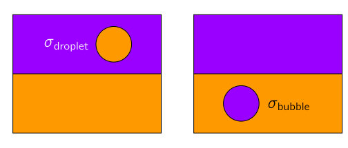
<figcaption class="paper-figure-caption"><b>Fig 1.</b> FIG. 1. In AMB+ at bulk phase coexistence (vapor phase purple, liquid yellow), liquid-droplet in vapor (left) and vapor- bubble in liquid (right) excitations are controlled by different interfacial tensions σdroplet, σbubble [38]. This requires a non- local stationary measure in the low-temperature phase [35– 37]. However, finding the precise character of this nonlocality is intractable.</figcaption>
</figure>
<figure class="paper-figure-card">
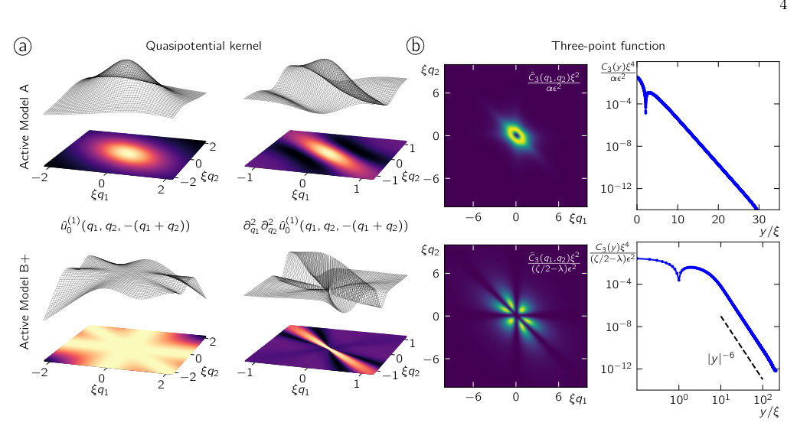
<figcaption class="paper-figure-caption"><b>Fig 2.</b> FIG. 2. Quasipotential kernel and three-point function for the high-temperature phase of AMA (top row) and AMB+ (bottom row) in d = 1. a) Fourier-space quasipotential kernel ˆu(1) 0 (left) and its fourth derivative (right). The kernel is analytic at the origin for AMA, while for AMB+, the fourth derivative does not exist at the origin (β = 4). b) Contribution at order O(α) to the three-point function, related to ˆu(1) 0 via (18). In Fourier space (left), we show ˆC3 defined via ⟨ϕq1ϕq2ϕq3⟩= ˆC3(q1, q2)¯δq1+q2+q3, while in real space (right), C3(y) = |⟨ϕ(0)ϕ(y)ϕ(y)⟩| is shown. For AMA, ˆC3 is analytic at the origin (top left panel), resulting in exponential decay (with decay length set by ξ)...</figcaption>
</figure>

**Summary.** This work develops a perturbative theory to analyze the stationary measure of active systems that violate detailed balance. It shows that such conserved active systems exhibit generic nonlocal statistics, characterized by algebraic decay in correlations, which is fundamentally different from local equilibrium states. The analysis successfully predicts this nonlocality and demonstrates its failure to be captured by standard Landau–Ginzburg expansions.

**Why it may be interesting.** The findings provide a rigorous theoretical framework for understanding how broken detailed balance fundamentally alters the statistical description of steady states in active matter, moving beyond equilibrium concepts like free energy minimization.

Detailed structure

**Main problem.** The paper characterizes the generic nonlocal statistics of the stationary measure ($P_\infty$) in conserved active systems, contrasting them with local equilibrium measures.

**Main result.** In conserved active systems that break detailed balance, the stationary measure is generically nonlocal, leading to algebraic decay in correlation functions. This nonlocality prevents the use of a standard Landau–Ginzburg expansion for $P_\infty$.

**Method.** The analysis employs a perturbative expansion in nonlinearity ($\alpha$) around a Gaussian limit, utilizing Large Deviation Theory (LDT) and WKB ansatze to compute the quasipotential ($U = -\epsilon \ln P_\infty$).

**Model / system.** The study applies to various active matter models including Active Model A/B+, Nonreciprocal Cahn–Hilliard, and the Toner–Tu model. These systems are characterized by nonlinear dynamics that break detailed balance.

**Key observables.** Nonlocality of $P_\infty$, algebraic decay exponents ($eta$) of N-point correlation functions, and the structure of the quasipotential coefficients ($U^{(n)}_r$).

**Important parameters / regimes.** Activity nonlinearity parameter ($\alpha$), noise strength ($\epsilon$), and dimensionality ($d$). The analysis focuses on the weak noise limit ($\epsilon 	o 0$).

**Assumptions / limitations.** The results are derived perturbatively, assuming small nonlinearities in $\alpha$ and $\epsilon$. The failure of the Landau–Ginzburg expansion is noted as a key limitation.

**Figures summary.** Figures illustrate that non-equilibrium features (like different interfacial tensions) require nonlocal $U$, contradicting simple local Gibbs decompositions for active systems.

**Paper structure.** The paper builds from establishing the contrast between equilibrium and active systems, developing the perturbative machinery using LDT/WKB ansatz, calculating scaling laws in Fourier space ($\hat{u}^{(n)}_r$), and finally demonstrating how conservation laws enforce nonlocality and cause the failure of standard expansions.

Abstract

The stationary measure of equilibrium systems with detailed balance follows a Boltzmann distribution, so that for short-ranged interactions the measure is local, meaning that distant spatial domains are statistically independent. In contrast, active systems break detailed balance, and can have nonlocal stationary measure even for fully local dynamics. Here, by expanding in nonlinearity about a Gaussian-model limit, we construct the measure perturbatively deep in the disordered phase for a class of models that includes Active Model A, Active Model B+, Model AB, the Nonreciprocal Cahn--Hilliard model, and the Toner--Tu model. In this regime, nonlocality is linked to a dynamical conservation law. Our results generically preclude construction of a Landau--Ginzburg expansion of the stationary measure (as opposed to the dynamical equations) for conserved active field theories.

[↑ back to top](#top)

### [Spin counting via projection noise measurement of mesoscopic solid-state spin ensemble](http://arxiv.org/abs/2606.14437v1)

**Authors:** Lorenzo Bechelli, Konstantin Herb, Laura Alicia Völker, Christian L. Degen  
**Type:** experiment · **Category:** other · **PDF:** <https://arxiv.org/pdf/2606.14437v1>  
**Analysis basis:** full PDF text, analyzed in chunks
**Topic relevance:** 🔥 `QC/QI experiment` **4/5** · 🔥 `spintronics-quantum-optics interface` **4/5** · `quantum measurements` **3/5** · `quantum optics experiment` **3/5** · `measurement-induced transitions` **2/5** · `analog quantum simulation` **1/5** · `correlated / nonlocal dissipation` **1/5** · `driven-dissipative phase transition` **1/5** · `exotic spin models in light-matter` **1/5**

↔ Scroll figures horizontally

<figure class="paper-figure-card">
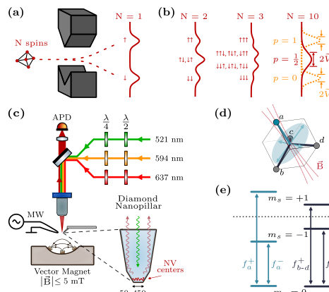
<figcaption class="paper-figure-caption"><b>Fig 1.</b> Figure 1. Concept of the spin counting experiment. (a) Stern- Gerlach-type experiment with a rigid cluster of N indepen- dent spins-1/2 particles. Projective measurement along an axis orthogonal to the spins’ initial direction randomly col- lapses each spin onto either |↑⟩and |↓⟩. (b) For N &gt; 1 the pro- jection assumes a binomial distribution with variance eVproj. The variance is largest at maximum superposition (p = 0.5) and zero for eigenstates (p = 0, 1). Classical readout noise leads to a broadening with variance eVRO. By measuring eVproj, N can be inferred. (c) Experimental setup. A confocal fluo- rescence microscope with three-color laser excitation and po- larization control (λ/2 and...</figcaption>
</figure>
<figure class="paper-figure-card">
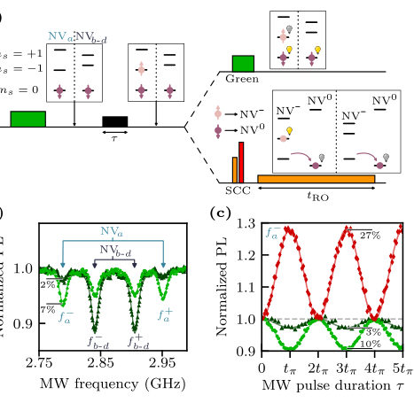
<figcaption class="paper-figure-caption"><b>Fig 2.</b> Figure 2. Orientation-selective excitation and readout. (a) Schematic of the sensing and readout protocols. After green initialization of charge and spin states for all orientations, se- lective microwave manipulation is applied to the aligned NV orientation. Readout is performed either via standard green fluorescence detection (upper path) or via charge state detec- tion using SCC (lower path). Boxes show the population of energy levels for NVa and NVb-d. (b) Pulsed ODMR spectra acquired using standard green readout without polarization control (dark green triangles) and for optimized polarization (light green dots) of the green laser pulse. PL, photolumines- cence. (c) Rabi oscillations...</figcaption>
</figure>
<figure class="paper-figure-card">
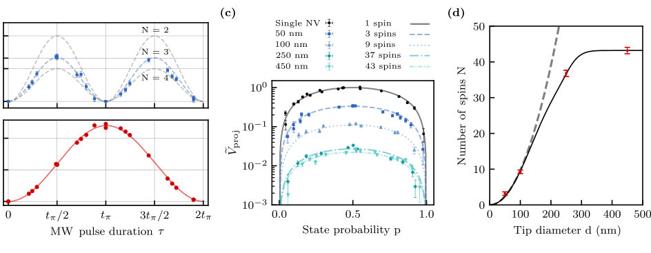
<figcaption class="paper-figure-caption"><b>Fig 3.</b> Figure 3. Spin counting experiment. (a) Projection noise variance as a function of Rabi angle ϕ = πτ/tπ (blue dots) together with the expected projection noise for discrete numbers of spins N (gray). (b) Corresponding normalized PL showing the Rabi oscillation of the spin ensemble. (c) Projection noise variance measured for diamond tips with different apex diameters d (blue shades) as well as for a single NV center (black). For each dataset, the projection noise is fitted with N as the only free parameter (curves). (d) Number of spins N as a function of tip diameter d. The gray dashed line is an estimate for the number of NVa spins based on the implantation density and a conversion...</figcaption>
</figure>
<figure class="paper-figure-card">
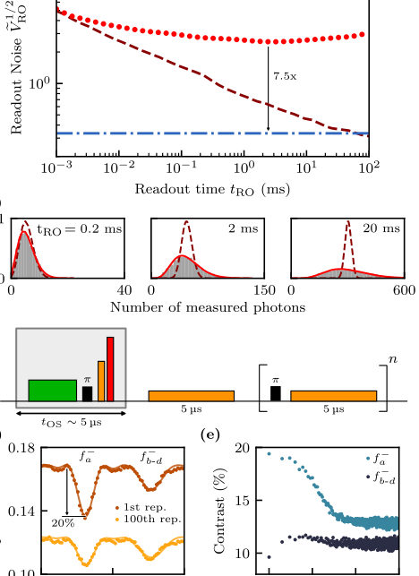
<figcaption class="paper-figure-caption"><b>Fig 4.</b> Figure 4. Standard quantum limit and contrast-enhanced magnetometry. (a) Readout noise eV 1/2 RO as a function of or- ange readout time tRO [cf. Fig. 2a] for an ensemble of N = 9 spins. Dots reflect the experimental data. The dash-dotted line is the SQL (eVproj for N = 9) and the dashed line is the Poissonian limit. (b) Measured photon-count distributions (gray) for three representative tRO. Solid curves are fits to a negative binomial distribution and dashed curves are the expected Poisson distribution. (c) Pulse sequence for orien- tation selection (gray box) followed by an arbitrary pulse se- quence, here the measurement of a pulsed ODMR spectrum. n is the number of repetitions before...</figcaption>
</figure>

**Summary.** The research reports on measuring the quantum projection noise limit in mesoscopic ensembles of NV spin defects at room temperature. By implementing an advanced readout technique combining polarization control and spin-to-charge conversion, they achieved high contrast necessary to perform accurate spin counting up to 43 spins. This demonstrates a powerful, scalable platform for sensitive magnetometry without extreme operating conditions.

**Why it may be interesting.** This work bridges quantum optics/measurement theory with solid-state physics by providing a robust, room-temperature method to probe fundamental quantum noise limits (SQL) in a solid-state platform, which is highly relevant for developing practical quantum sensors.

Detailed structure

**Main problem.** The primary challenge addressed is measuring quantum projection noise (SQL) in mesoscopic solid-state spin ensembles, which is difficult due to overwhelming classical readout noise compared to atomic systems.

**Main result.** The authors successfully demonstrated direct measurement of quantum projection noise and performed spin counting on up to 43 spins at room temperature using NV centers. This protocol maintains high sensitivity without requiring cryogenic cooling or strong bias fields.

**Method.** They combine polarization-selective optical excitation with a spin-to-charge conversion (SCC) readout scheme to achieve high ODMR contrast ($>20\%$), enabling the measurement of noise variance ($\epsilon_V(p)$) and subsequent extraction of projection noise.

**Model / system.** The system is mesoscopic ensembles of Nitrogen-Vacancy (NV) spin defects in diamond. The analysis involves modeling the total measured photon count variance, which combines fundamental quantum projection noise with measurable readout noise components.

**Key observables.** Quantum projection noise variance ($\epsilon_V^{	ext{proj}}$), ODMR contrast, Rabi oscillation decay, and the number of spins ($N$).

**Important parameters / regimes.** Room temperature operation; ensemble size up to $\sim 43$ spins; high readout contrast ($>20\%$).

**Assumptions / limitations.** The analysis relies on separating the total measured variance into fundamental projection noise and measurable readout noise components, assuming controlled optical excitation.

**Figures summary.** Figures illustrate spin counting concepts (Stern-Gerlach analogy), optimized ODMR spectra showing contrast enhancement via polarization control and SCC, Rabi oscillations demonstrating high contrast, and plots comparing measured vs. expected projection noise variance as a function of the driving angle $\phi$.

**Paper structure.** The paper progresses from establishing the fundamental difficulty (readout noise) to presenting an advanced readout protocol using NV centers in diamond, demonstrating spin counting capability, quantifying the achieved sensitivity improvement, and finally discussing the broad applicability for magnetometry and sensing.

Abstract

Quantum projection noise is the fundamental noise source for the population measurement of spin ensembles. While projection-noise-limited measurements have been extensively studied in atomic systems, corresponding experiments on solid-state spin ensembles remain challenging due to dominant classical readout noise. Here, we report direct measurement of the quantum projection noise of mesoscopic ensembles of nitrogen-vacancy (NV) spin defects at room temperature. Our experiment is enabled by a high optically-detected magnetic resonance (ODMR) contrast of over 20% for a single crystallographic orientation of the defect spins, obtained by combining polarization-selective optical excitation with spin-to-charge conversion. We use our protocol to demonstrate projection noise measurements and spin counting from nanoscale NV ensembles of up to 43 spins. We further demonstrate that the protocol allows for significant gains in sensitivity for magnetometry applications without need for cryogenic operation or high bias magnetic fields.

[↑ back to top](#top)

### [A Collective-Spin Derivation of the Uniform Magnon Hamiltonian in Cavity Magnonics](http://arxiv.org/abs/2606.13830v1)

**Authors:** Tomas Aguiar, Marcos Cesar de Oliveira  
**Type:** theory · **Category:** other · **PDF:** <https://arxiv.org/pdf/2606.13830v1>  
**Analysis basis:** full PDF text, analyzed in chunks
**Topic relevance:** 🔥 `spintronics-quantum-optics interface` **4/5** · `analog quantum simulation` **3/5** · `exotic spin models in light-matter` **3/5** · `Tavis-Cummings & cavity-many-emitter` **2/5** · `correlated / nonlocal dissipation` **1/5** · `correlated cavity matter` **1/5** · `driven-dissipative phase transition` **1/5** · `methods for driven-dissipative` **1/5** · `non-equilibrium dynamics` **1/5** · `superradiant laser` **1/5**

↔ Scroll figures horizontally

<figure class="paper-figure-card">
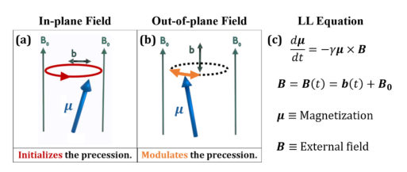
<figcaption class="paper-figure-caption"><b>Fig 1.</b> FIG. 1. Magnetization dynamics induced by different excitation fields. (a) In-plane field dynamics. (b) Out-of-plane field dynamics. (c) Landau-Lifshitz equation, where µ is the magnetization vector and B(t) is the total magnetic field, composed of an oscillatory field component, b(t), and a static field, B0. Adapted from [10].</figcaption>
</figure>

**Summary.** This paper develops a novel theoretical framework using a collective-spin approach to derive the effective Hamiltonian governing uniform magnon excitations in cavity magnonics. By treating the ferromagnet as a single large spin, the authors simplify the derivation significantly compared to site-resolved methods. The key finding is the prediction of an occupation-dependent reduction in the magnon-photon coupling when the system approaches finite-spin saturation under strong driving.

**Why it may be interesting.** This work provides a powerful theoretical tool—the collective spin description—to model magnon dynamics in cavity QED settings. The explicit inclusion of finite-size/finite-spin effects is crucial for accurately predicting nonlinear interactions under strong coherent driving, which is highly relevant to quantum optics and circuit QED.

Detailed structure

**Main problem.** The paper aims to derive an effective Hamiltonian for uniform magnon dynamics in cavity magnonics using a novel collective-spin approach, bypassing the standard site-resolved bosonic operator method.

**Main result.** The collective formulation successfully yields the effective uniform-mode Hamiltonian and predicts that strong driving leads to an occupation-dependent reduction of the magnon-photon coupling due to finite-spin saturation effects.

**Method.** It employs a direct Holstein-Primakoff transformation applied to the total spin ($\mathbf{S}$) of the ferromagnet, treating it as a single macrospin, contrasting this with the conventional site-resolved approach.

**Model / system.** The system is a ferromagnetic sample modeled by a Heisenberg Hamiltonian coupled to external magnetic fields (static bias and cavity drives). The dynamics are analyzed in the long-wavelength limit, focusing on the uniform magnon mode.

**Key observables.** Effective magnon-photon coupling strength ($G_{	ext{eff}}$), occupation number ($ar{n}_M$), and the resulting nonlinear correction factor.

**Important parameters / regimes.** The total spin $S=Ns$, the low-excitation regime condition ($\langle\hat{M}^\dagger \hat{M}
angle \ll 2N_s$), and the ratio of cavity wavelength to sample size.

**Assumptions / limitations.** The analysis assumes the system is near its fully polarized ground state, that dynamics are dominated by the uniform mode (long-wavelength limit), and neglects surface or non-uniform dipolar effects.

**Figures summary.** Not specified in the notes; the focus is on deriving and comparing Hamiltonian forms (Eq. 9 vs Eq. 17/20) and showing the nonlinear correction formula (Eq. 35).

**Paper structure.** The paper contrasts the standard site-resolved approach with the proposed collective-spin derivation, demonstrating their equivalence for the uniform mode while highlighting the conceptual simplicity of the macrospin treatment.

Abstract

We present a direct collective-spin derivation of the effective uniform-mode Hamiltonian used in cavity magnonics. Starting from a nearest-neighbor Heisenberg ferromagnet coupled to long-wavelength magnetic fields, we show that the relevant dynamics can be restricted to the fully symmetric spin sector, where the exchange interaction contributes only a constant energy shift and the ferromagnet behaves as a macrospin of length $Ns$. Applying the Holstein--Primakoff transformation directly to this total spin yields the usual uniform magnon mode and its leading nonlinear corrections without first introducing site-resolved bosonic operators. This collective formulation makes explicit the interpretation of the ferromagnet as a synthetic large-spin atom and provides a compact route to the effective Hamiltonians used in driven and Floquet cavity magnonics. As a physical consequence, the leading nonlinear correction produces an occupation-dependent reduction of the effective magnon--photon coupling, providing a simple signature of finite-spin saturation under strong uniform-mode driving.

[↑ back to top](#top)

### [Boltzmann-Like Occupation of Nonequilibrium Steady States on Dense Networks](http://arxiv.org/abs/2606.14542v1)

**Authors:** Jacob Calvert  
**Type:** theory · **Category:** statistical mechanics · **PDF:** <https://arxiv.org/pdf/2606.14542v1>  
**Analysis basis:** full PDF text, analyzed in chunks
**Topic relevance:** 🔥 `non-equilibrium dynamics` **4/5** · 🔥 `non-equilibrium universality` **4/5** · `driven-dissipative phase transition` **3/5** · `methods for driven-dissipative` **3/5** · `Keldysh / 2PI / non-Gaussian methods` **1/5** · `analog quantum simulation` **1/5** · `correlated / nonlocal dissipation` **1/5** · `scars & prethermalization` **1/5**

↔ Scroll figures horizontally

<figure class="paper-figure-card">
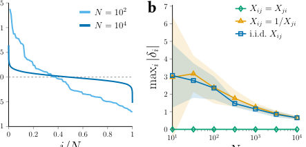
<figcaption class="paper-figure-caption"><b>Fig 1.</b> FIG. 1. Boltzmann-like occupation of NESS on dense networks. (a) Relative errors 𝛿𝑖= 𝜋𝑖/𝜋eq 𝑖 −1 in decreasing order when the 𝐸𝑖 and log 𝑋𝑖𝑗are independent mean-zero Gaussians with respective variances of 1 and 4. (b) Maximum absolute relative error when the log 𝑋𝑖𝑗are symmetric, anti-symmetric, or remain independent. Markers and shading indicate means and ±1 standard deviation over 20 trials.</figcaption>
</figure>
<figure class="paper-figure-card">
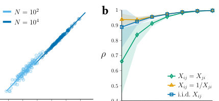
<figcaption class="paper-figure-caption"><b>Fig 2.</b> FIG. 2. Rattling is asymptotically exact. (a) Scatter plots of effective potential versus rattling and (b) correlation coefficients for the con- ditions in Fig. 1a and Fig. 1b, respectively. Marks for 𝑁= 104 in (a) are a uniformly random subset of 100 states.</figcaption>
</figure>
<figure class="paper-figure-card">

<figcaption class="paper-figure-caption"><b>Fig 3.</b> FIG. 3. Consequences of Eq. (5). (a) The EP of the NESS grows faster with 𝑁than the minimal EP when 𝐸𝑖= 2 log 𝑖. (b) Vertex response is increasingly Boltzmann-like as measured by 𝜖𝑖= 𝜕𝐸1𝜋𝑖/𝜕𝐸1𝜋eq 𝑖 −1, under the same conditions as Fig. 1b. Marks and shading indicate the mean and ±1 standard deviation over 20 trials.</figcaption>
</figure>
<figure class="paper-figure-card">
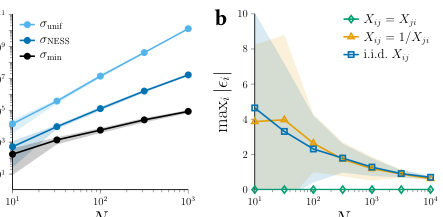
<figcaption class="paper-figure-caption"><b>Fig 4.</b> Figure 3b shows that the relative error in Eq. (26) vanishes with 𝑁analogously to that in Fig. 1b. Following [25], suppose the vertex parameters are 𝐸𝑖= 𝛽𝑖(𝜂), where 𝛽= 1/𝑘𝐵𝑇in terms of Boltzmann’s constant 𝑘𝐵, 𝑇is the temperature, and 𝑖(𝜂) is the system’s underlying (free) energy landscape. A short calculation (see End Matter) using Eq. (26) shows that, if 𝑶is an observable and 𝑽= −𝑑𝜂 is the coordinate conjugate to 𝜂, then</figcaption>
</figure>

**Summary.** The paper proves that even when far from equilibrium and exhibiting high entropy production, the steady-state occupation probabilities on large dense networks resemble the predictions of the Boltzmann distribution. This finding establishes a robust link between local state dynamics (the 'low rattling' heuristic) and global statistical properties in non-equilibrium systems.

**Why it may be interesting.** This work provides a powerful generalization of equilibrium statistical mechanics concepts to non-equilibrium systems, which is crucial for understanding open quantum systems driven by external fields or dissipation.

Detailed structure

**Main problem.** The central problem is extending the Boltzmann distribution concept from equilibrium statistical mechanics to nonequilibrium steady states (NESS). The authors investigate how occupation probabilities behave in such non-equilibrium settings.

**Main result.** They prove that NESS on large dense networks exhibit Boltzmann-like occupation, meaning $\pi_i / \pi_{eq, i} 	o 1$ asymptotically. Furthermore, this occurs even when the system produces extensive entropy.

**Method.** The analysis involves solving for the stationary distribution ($\mathbf{W}oldsymbol{\pi} = \mathbf{0}$) and employing asymptotic methods like random matrix theory and strong laws of large numbers to analyze convergence rates.

**Model / system.** The model is a Markov jump process on $N$ discrete states, defined by a transition rate matrix $\mathbf{W}$ whose elements depend on vertex parameters ($E_j$) and edge weights ($X_{ij}$).

**Key observables.** Steady-state probability ($\pi_i$), equilibrium distribution ($\pi_{eq, i}$), Entropy Production ($\sigma(\mathbf{p})$), and the relative error $\delta_i = \pi_i / \pi_{eq, i} - 1$.

**Important parameters / regimes.** Network size $N$ (taken to infinity), edge weights ($X_{ij}$), and vertex energies ($E_j$).

**Assumptions / limitations.** The analysis assumes the network is large and dense, and requires finite moments (e.g., $	ext{Var}(X) \in (0, \infty)$) for convergence proofs.

**Figures summary.** Figures illustrate relative errors ($\delta_i$) vanishing with $N$ under different weight assumptions, and show comparisons between entropy production rates ($\sigma_{NESS}$ vs. $\sigma_{min}$) that diverge in general cases.

**Paper structure.** The paper progresses by first establishing the mathematical framework for NESS on dense networks, proving the asymptotic Boltzmann-like behavior of occupation probabilities, and then contrasting this result with expectations derived from minimal entropy production principles.

Abstract

A central problem in statistical physics is to extend the Boltzmann distribution to nonequilibrium steady states (NESS). We prove that NESS on large dense networks have Boltzmann-like occupation despite extensive entropy production. We further show that the active-matter heuristic of "low rattling" is asymptotically exact. Intuitively, these NESS spend a greater fraction of their time in states they leave more slowly. This explanation extends to the broader class of "equiaccessible" steady states, which play a role in our analysis akin to that of equilibrium in linear response.

[↑ back to top](#top)

### [Digital programming of spin correlations in a fermionic lattice quantum simulator](http://arxiv.org/abs/2606.13772v1)

**Authors:** Yann Kiefer, Lars Fischer, Zijie Zhu, Konrad Viebahn, Tilman Esslinger  
**Type:** experiment · **Category:** other · **PDF:** <https://arxiv.org/pdf/2606.13772v1>  
**Analysis basis:** full PDF text, analyzed in chunks
**Topic relevance:** 🔥 `analog quantum simulation` **4/5** · `entanglement & information structure` **3/5** · `exotic spin models in light-matter` **3/5** · `QC/QI experiment` **2/5** · `non-equilibrium dynamics` **2/5** · `Rydberg arrays` **1/5** · `methods for driven-dissipative` **1/5** · `quantum measurements` **1/5**

↔ Scroll figures horizontally

<figure class="paper-figure-card">
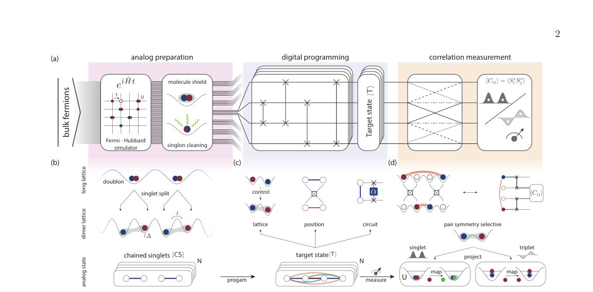
<figcaption class="paper-figure-caption"><b>Fig 1.</b> FIG. 1. Programming spin correlations in a hybrid Fermi-Hubbard simulator. (a) Schematic illustration of the analog-digital protocol to program four-particle quantum correlations. Concatenation of analog and digital methods enables configurable entanglement structures approaching a specific target state |T⟩. The configured correlations are measured with a protocol combining atom-rearrangement and a symmetry-selective detection procedure. (b) Analog state preparation is enabled by bulk evolution of a degenerate Fermi gas in a tunable optical superlattice. Attractive interactions during loading the long lattice achieve a large doublon occupation. Remaining singlons are removed via resonant...</figcaption>
</figure>
<figure class="paper-figure-card">
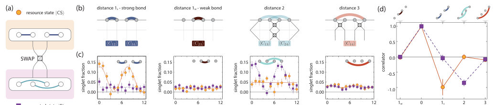
<figcaption class="paper-figure-caption"><b>Fig 2.</b> FIG. 2. Measurement of non-local quantum correlations (a) Measurement of long-distance spin pair correlators illus- trated on two distinct scenarios. The analog resource state |CS⟩is compared to the case where the inner two atoms are swapped without changing the internal spin-configuration. This gives rise to the propagated singlet state |P⟩in which the antiferro- magnetic correlation has propagated to next-nearest neighbours. (b) Measurement of the spin-pair correlator ⟨Cij⟩schematics. The correlators are extracted in individual measurement sequences. For d = 1s,w the appropriate superlattice bond is chosen by controlling the dynamical lattice (s = strong, w = weak). Correlators for...</figcaption>
</figure>
<figure class="paper-figure-card">
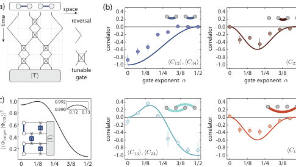
<figcaption class="paper-figure-caption"><b>Fig 3.</b> FIG. 3. Targeted preparation spin-correlations in fermionic singlet chains. (a) schematic representation of the circuit for configuring a target state |T⟩with non-local correlations starting form the chained singlet initial state ( ). The analog resource is programmed with a to- tal of four digital gate-operations characterised by their gate exponent α. In the circuit, black lines denote trajectories of the atoms subject to topological pumping. Intersecting lines realize a collisional gate between atoms. The direction of the pump is reversed once after the first gate and again before the last gate to spatially collimate the four-fermion state. (b) Measured correlator values for d = 1s, d =...</figcaption>
</figure>
<figure class="paper-figure-card">
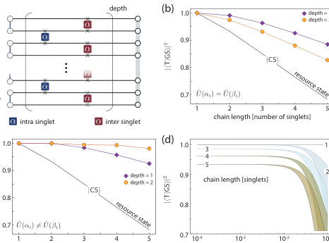
<figcaption class="paper-figure-caption"><b>Fig 4.</b> FIG. 4. Maximal ground state overlap of the tar- get state for larger system size and deeper gate se- quences. (a) Circuit protocol for maximizing the ground state overlap of the output target state. The input state is a system with N neighboring singlets which is manipulated by a sequence of alternating gates on the inter and intra sin- glet bonds. (b) The maximized ground state overlap of the initial state |RN⟩after manipulation with the circuit shown in (a). The gate exponent is optimized for maximal overlap, while being the same for all gates in the circuit. The baseline denotes the overlap of the initial state with the ground state without gate-based manipulation. (c) For arbitrary...</figcaption>
</figure>

**Summary.** The research presents an advanced hybrid protocol to deterministically prepare and measure specific long-range spin correlations in fermionic lattice quantum simulators. By combining analog resource state generation with digital gate sequences, the authors demonstrate precise control over entanglement patterns, enabling the study of strongly correlated matter beyond simple ground states.

**Why it may be interesting.** This work provides a concrete experimental roadmap for engineering complex entanglement structures in ultracold atomic systems, moving beyond simple ground state preparation towards programmable quantum simulation of exotic phases.

Detailed structure

**Main problem.** The primary goal is the deterministic preparation of strongly correlated quantum states, such as those found in Heisenberg spin chains, using a hybrid analog-digital protocol.

**Main result.** The method successfully programs and measures non-local spin correlations, achieving high fidelity overlap with theoretical ground states even for larger chain sizes. The process demonstrates control over entanglement beyond the native Hamiltonian dynamics.

**Method.** A hybrid approach combining initial state preparation via analog methods (forming singlet chains) followed by digital programming using tunable collisional quantum gates and controlled atom rearrangement.

**Model / system.** The system is a fermionic lattice quantum simulator loaded with ultracold atoms, modeled by an effective Fermi-Hubbard type Hamiltonian. The resource state involves 'chained singlets' formed through adiabatic preparation from attractive interactions.

**Key observables.** Spin pair-correlators ($\langle S_z^i S_z^j 
angle$), global singlet fraction, and the overlap fidelity between the prepared state and the target ground state ($|GS
angle$).

**Important parameters / regimes.** Gate exponent $\alpha$, gate error rate (robust up to $10^{-2}$), lattice depths, and magnetic field parameters for Feshbach resonance control.

**Assumptions / limitations.** The measurement relies on the assumption of SU(2) symmetry for correlator extraction, and long-distance correlations require deterministic atom rearrangement via shuttling/swapping.

**Figures summary.** Figures illustrate measuring spin pair correlators at various distances ($d=1, 2, 3$) as a function of gate parameters ($\alpha$), showing increased overlap with theory. Other figures detail the circuit protocol and fidelity dependence on error rates for increasing chain lengths.

**Paper structure.** The paper details the hybrid protocol: first, analog preparation to create singlet chains; second, digital programming using tunable gates (e.g., four-layer circuits) to encode specific correlations; and finally, measurement via quantum gate sequences followed by singlet-pair measurements.

Abstract

Analog quantum simulation provides a highly controlled platform to study diverse quantum many-body phenomena. However, current methods for state initialisation are limited to thermal ensembles or uncorrelated product states. Here we present a hybrid approach that complements analog preparation with a digital quantum-gate protocol. This approach enables the engineering of target states with specific, long-range spin-correlations from the same initial resource state. By applying collisional gates to adiabatically prepared and filtered four-fermion singlet chains, we program diverse spin-correlation patterns, including that of a Heisenberg chain. We measure the spin correlations using a sequence of quantum gates followed by singlet-pair measurements. Our method paves the way to the targeted preparation of strongly correlated states of matter.

[↑ back to top](#top)

### [Open Wilson chain numerical renormalization group approach to steady-state non-equilibrium quantum transport](http://arxiv.org/abs/2606.14635v1)

**Authors:** Anand Manaparambil, Frithjof B. Anders  
**Type:** theory · **Category:** strongly correlated electrons · **PDF:** <https://arxiv.org/pdf/2606.14635v1>  
**Analysis basis:** full PDF text, analyzed in chunks
**Topic relevance:** 🔥 `Kondo & dissipative impurity` **4/5** · 🔥 `methods for driven-dissipative` **4/5** · `non-equilibrium dynamics` **3/5** · `Keldysh / 2PI / non-Gaussian methods` **2/5** · `driven-dissipative phase transition` **2/5** · `correlated / nonlocal dissipation` **1/5** · `non-equilibrium universality` **1/5**

↔ Scroll figures horizontally

<figure class="paper-figure-card">
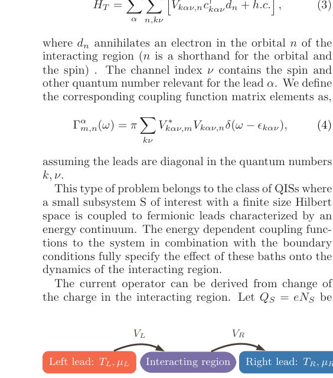
<figcaption class="paper-figure-caption"><b>Fig 1.</b> FIG. 1. Schematic setup for transport: Two leads (L, R) kept at different chemical potentials µL, µR, and tempera- tures TL, TR are coupled to an interacting region. A non- equilibrium steady state current flows through the interacting region driven by potential bias eV = µL −µR, or temperature gradient TL ̸= TR, or both.</figcaption>
</figure>
<figure class="paper-figure-card">
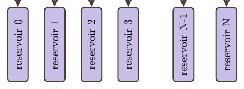
<figcaption class="paper-figure-caption"><b>Fig 2.</b> FIG. 2. Schematic representation of the extension of the Wil- son chain by coupling high-energy reservoirs to each Wilson site by a flavor ν-dependent coupling function ΓH mν(ω) as in- troduced in Refs. [31, 32]</figcaption>
</figure>
<figure class="paper-figure-card">
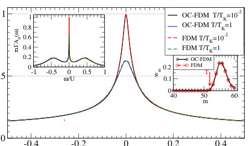
<figcaption class="paper-figure-caption"><b>Fig 3.</b> FIG. 3. Spectral functions Aσ(ω) = −Im(Gσ(ω + iδ)/π) ob- tained by the FDM-algorithm [47] and the OC-FDM outlined above for T = TK, 0.01 TK and U/Γ = 12, ǫd/Γ = −6 where TK/Γ = 0.0242 was obtained by the condition G(TK) = 1. The inset on the l.h.s shows the same spectral function but over a larger frequency range. The inset in the r.h.s the weight factors wm defined in Eq. (22), OC-FDM in black diamonds and the FDM weight in red circles, as functions of the itera- tion m at T = 0.01 TK with Niter = 60 NRG iterations. The red arrow indicated the iteration m at which ωm ≈T . NRG parameter: Λ = 1.8, Ns = 1000, D = 103 Γ, Niter = 70, b = 0.5, ω0 = 0.1 T, Nz = 2.</figcaption>
</figure>
<figure class="paper-figure-card">
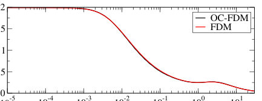
<figcaption class="paper-figure-caption"><b>Fig 4.</b> FIG. 4. Comparison between the zero-bias conductance, cal- culated with the OC-FDM spectral function and obtained by the FDM-algorithm [47] combined with the equation of motion approach [73] for the same NRG parameters and U/Γ = 12, ǫd/Γ = −6.</figcaption>
</figure>
<figure class="paper-figure-card">
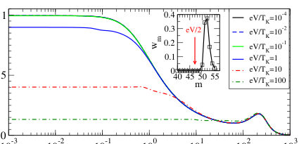
<figcaption class="paper-figure-caption"><b>Fig 5.</b> FIG. 5. Non-equilibrium spectral function πΓAσ(ω) vs ω for different values of the bias voltage eV/TK and T = 10−6Γ →0 for U/Γ = 12, ǫd/Γ = −6. The inset shows the distribution of the weights wm for eV/TK = 1 calculated for z = 1. The Wilson shell corresponding to eV is indicated by the red ar- row. NRG parameters: Λ = 1.8, Ns = 1000, D = 103Γ, ρc = 0.02, T trans K /Γ = 2.42 × 10−2, Nz = 2.</figcaption>
</figure>

**Summary.** The paper presents an extension of the Numerical Renormalization Group (NRG) technique, termed OC-FDM, to model non-equilibrium quantum transport in interacting junctions like quantum dots. By coupling the NRG structure to reservoir dynamics via the Bloch-Redfield tensor, it accurately calculates steady-state currents and spectral functions under finite bias or temperature gradients. This method offers a powerful, computationally fast tool for studying strongly correlated physics far from equilibrium.

**Why it may be interesting.** This work is highly relevant as it pushes advanced numerical techniques (NRG) into the complex domain of open quantum systems far from equilibrium. The ability to handle Kondo physics under bias/gradient using a computationally efficient method is valuable for modeling nanoscale devices.

Detailed structure

**Main problem.** The study investigates non-equilibrium quantum transport through interacting junctions, specifically addressing how to accurately determine the steady-state density operator when driven by finite bias or temperature gradients.

**Main result.** The proposed Open Chain Full Density Matrix (OC-FDM) approach successfully extends NRG techniques to the non-equilibrium regime, achieving high accuracy for Kondo physics while being computationally efficient compared to other state-of-the-art methods.

**Method.** The method combines the Numerical Renormalization Group (NRG) framework with the Bloch-Redfield master equation formalism. It constructs an effective single-lead description by solving the density matrix evolution iteratively across NRG shells.

**Model / system.** The system modeled is a Quantum Dot (QD) or quantum impurity coupled to two leads, described by a Hamiltonian involving Coulomb repulsion and coupling terms. The transport is analyzed under non-equilibrium conditions like finite bias ($\mu_L 
eq \mu_R$) or temperature gradients ($T_L 
eq T_R$).

**Key observables.** Charge and spin currents ($I_\alpha$), differential conductance ($dI/dV$), spectral functions $A(\omega)$, and the steady-state density operator $
ho_{	ext{steady}}$.

**Important parameters / regimes.** Finite bias voltage ($eV$), temperature gradient ($\Delta T$), external magnetic field ($h_0$), and Kondo energy scales ($T_K$).

**Assumptions / limitations.** The OC-FDM approach assumes that density matrix elements of discarded states remain unaltered across NRG iterations, which is necessary to solve the master equation in a manageable form.

**Figures summary.** Figures illustrate spectral functions $A(\omega)$ and differential conductance ($dI/dV$) under varying bias and magnetic fields, demonstrating Kondo peak splitting and convergence with established benchmarks.

**Paper structure.** The paper builds upon NRG for equilibrium systems by augmenting Wilson sites with reservoirs. It introduces the OC-FDM approach to solve the steady-state density operator via the Bloch-Redfield Tensor (BRT) in the non-equilibrium setting, applying this to calculate transport properties like current and conductance.

Abstract

The numerical renormalization group (NRG) approach was developed to identify and quantify different equilibrium regimes of quantum impurity systems (QISs) with unprecedented accuracy by a tailored finite size representation. Out of equilibrium, the steady-state density operator is not of the Boltzmannian form but one that is determined by the imposed boundary conditions. We extend the NRG to the nonequilibrium setting by augmenting each Wilson site with a reservoir, whose coupling functions are calculated via a continuous fraction expansion in order to recover the continuum limit exactly. The nonequilibrium parameters such as a finite bias as well as a finite temperature gradient enters through the Bloch-Redfield tensor (BRT), whose zero eigenvector gives the steady-state density operator. We used the resulting open chain full density matrix (OC-FDM) approach with an effective single lead description to investigate the charge and spin transport through a quantum dot (QD) under finite bias and temperature gradient. The influence of lead asymmetry and an external magnetic field on the transport properties are also studied. For completeness, we have also investigated local properties of the QD, such as charge fluctuations and find excellent agreement with real-time quantum Monte Carlo (RT-QMC) data. The OC-FDM approach was able to explore Kondo energy scales as low as $T_K/D \approx 10^{-8}$ in the non-equilibrium regime, as well as show convergence with the established equilibrium benchmarks, such as a quantitative agreement with full density matrix numerical renormalization group (FDM-NRG) and Fermi-liquid scaling at small bias and temperature. Owing to the effective single lead description, a single OC-FDM data point takes orders of magnitude less time on a standard laptop, compared to other state-of-the-art numerical methods.

[↑ back to top](#top)

### [Sensitivity of polaron-molecule observables to MDR/GUP-like ultraviolet deformations at low energies via quantum computing](http://arxiv.org/abs/2606.14479v1)

**Authors:** Ezequiel Valero, Hugo Catala, Victor Ilisie, Germán Rodrigo  
**Type:** both · **Category:** quantum gases · **PDF:** <https://arxiv.org/pdf/2606.14479v1>  
**Analysis basis:** full PDF text, analyzed in chunks
**Topic relevance:** 🔥 `analog quantum simulation` **4/5** · `Kondo & dissipative impurity` **3/5** · `QC/QI experiment` **2/5** · `non-equilibrium dynamics` **2/5** · `Keldysh / 2PI / non-Gaussian methods` **1/5** · `correlated / nonlocal dissipation` **1/5** · `driven-dissipative phase transition` **1/5** · `entanglement & information structure` **1/5** · `methods for driven-dissipative` **1/5**

↔ Scroll figures horizontally

<figure class="paper-figure-card">
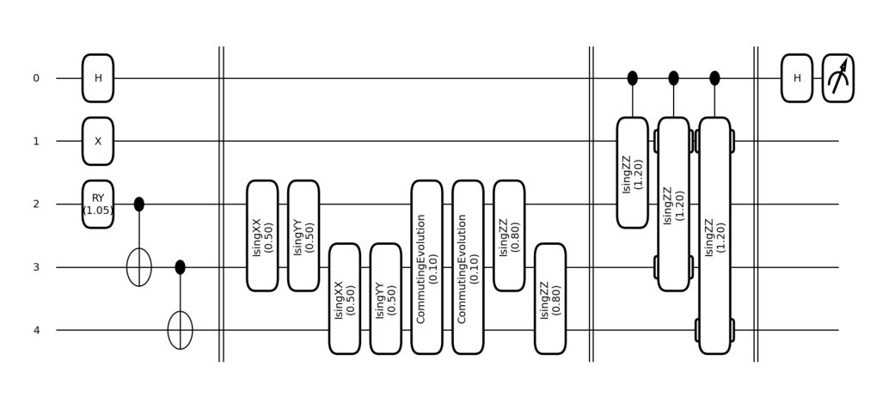
<figcaption class="paper-figure-caption"><b>Fig 1.</b> Figure 1. Quantum circuit diagram for the ancilla-controlled Ramsey interferometry protocol. The ancilla qubit is prepared in a superposition state via a Hadamard gate to drive a differential time evolution. The algorithmic topology is strategically partitioned: the unconditional bath evolution is driven by standard hopping, Generalised Uncertainty Principle (GUP)-induced next-nearest-neighbour hopping, and background Cooper pairing. Concurrently, the conditional impurity dynamics, which include the renormalised inertia timp and the deformed interaction ˜U GUP imp , are strictly controlled by the ancilla state. A final Hadamard gate enables the extraction of the real part of the coherence...</figcaption>
</figure>
<figure class="paper-figure-card">
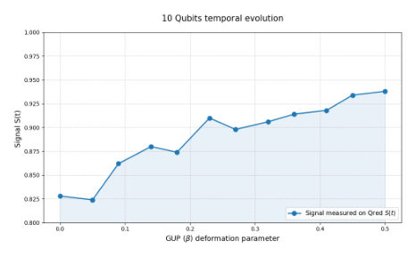
<figcaption class="paper-figure-caption"><b>Fig 2.</b> Figure 2. Ramsey coherence signal S(t) = ⟨ˆZ0⟩in a 10- qubit system as a function of the GUP deformation parameter β. The observed increase in phase-space defor- mation correlates with enhanced signal preservation, suggest- ing that quantum gravity corrections act as a stabilisation mechanism for the polaron-molecule Hamiltonian, mitigating bath-induced decoherence, ejecuted on QRed.</figcaption>
</figure>
<figure class="paper-figure-card">
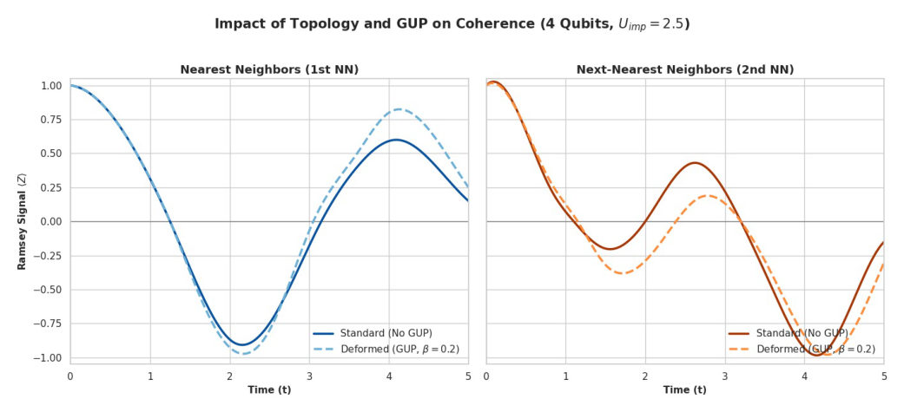
<figcaption class="paper-figure-caption"><b>Fig 3.</b> Figure 3. Ramsey signal for the effective polaron-molecule system in the absence and presence of GUP/MDR corrections. In the undeformed case, the stronger coupling to the molecular bath leads to a more pronounced suppression of the coherent response. Once the deformation is switched on, the time-domain signal develops a larger oscillation contrast and an additional node. This behaviour is consistent with the emergence of the GUP-induced next-nearest-neighbour hopping t′(β), together with the renormalisation of the effective impurity hopping ˜timp(m∗) and the dressed interaction ˜U GUP imp , all of which contribute to reshape the interferometric dynamics, executed on the QRed cluster.</figcaption>
</figure>
<figure class="paper-figure-card">
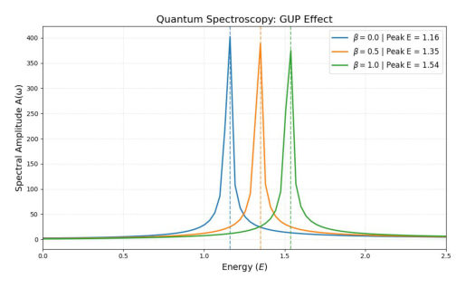
<figcaption class="paper-figure-caption"><b>Fig 4.</b> Figure 4. Energy spectrum extracted via Fast Fourier Transform (FFT) of the time-domain Ramsey sig- nal, illustrating the impact of the Generalised Un- certainty Principle (GUP) effect. A systematic displace- ment of the resonance towards higher energies is observed as the deformation parameter β increases. This rightward shift indicates that the effective impurity-medium sector becomes progressively stiffer, as the deformation renormalises the lo- cal dressed interaction rather than simply shifting a bare pa- rameter. Furthermore, the concurrent reduction in peak am- plitude demonstrates that the spectral weight becomes less concentrated around the resonant configuration, acting as an...</figcaption>
</figure>
<figure class="paper-figure-card">
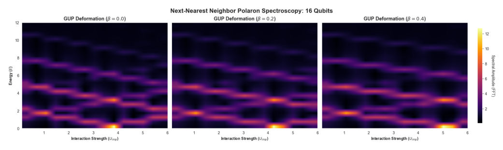
<figcaption class="paper-figure-caption"><b>Fig 5.</b> Figure 5. Contribution of MDR/GUP-like physics in the spectroscopic phase diagram. The horizontal axis rep- resents the interaction strength Uimp and the vertical axis denotes the polaron energy Epol, both expressed in units of the hopping amplitude tij. The linear energy shift at high coupling signals the transition to the molecular bound state. Executed on the QRed cluster.</figcaption>
</figure>

**Summary.** This work explores how hypothetical quantum gravity corrections, modeled by GUP/MDR terms, modify the behavior of polarons in fermionic baths. By analyzing spectral and coherence measurements using both theoretical calculations and superconducting quantum processors, the authors demonstrate that these deformations cause measurable shifts in energy spectra and alter the stability of molecular states near crossover points.

**Why it may be interesting.** It bridges fundamental high-energy physics concepts (GUP/MDR) into a highly controllable, experimentally accessible platform (ultracold atoms/quantum simulators), providing testable predictions for deviations from standard condensed matter theory.

Detailed structure

**Main problem.** The study investigates how ultraviolet (UV) deformations, inspired by Generalized Uncertainty Principles (GUP) or Modified Dispersion Relations (MDR), affect the low-energy many-body physics of a polaron interacting with a molecular bath.

**Main result.** These UV deformations enhance the sensitivity of measurable observables like spectral and Ramsey coherence signals near the polaron-molecule crossover, providing a concrete route to probe quantum gravity effects in ultracold atomic systems.

**Method.** The authors employ both theoretical many-body techniques (e.g., ladder approximations, effective Hamiltonian construction) and advanced digital quantum simulation protocols on superconducting processors.

**Model / system.** The system is modeled as a polaron impurity interacting with a fermionic bath, described by an extended GUP-deformed Hubbard or polaron-molecule Hamiltonian. The physics spans the crossover between localized polaron states and delocalized molecular bound states.

**Key observables.** Spectral response (via FFT of Ramsey signal), coherence overlap $S(t)$, effective mass ($m^*$), and the shift/renormalization of resonance energies.

**Important parameters / regimes.** The GUP deformation parameter ($eta$), low energy scales, and the polaron-molecule crossover regime.

**Assumptions / limitations.** The analysis is phenomenological, treating UV deformations as controlled corrections to an effective low-energy Hamiltonian; quantum simulations rely on approximations like Trotter-Suzuki decomposition and error mitigation techniques.

**Figures summary.** Figures illustrate the systematic shift of spectral peaks towards higher energies with increasing $eta$, changes in Ramsey coherence contrast, and phase diagrams mapping out how the crossover point shifts based on the deformation strength.

**Paper structure.** The paper builds from theoretical derivations of GUP-corrected propagators and effective interactions to concrete quantum simulation protocols (Ramsey interferometry) used to measure these effects on superconducting hardware.

Abstract

We show that impurity many-body observables can display enhanced sensitivity to ultraviolet deformations of generalized-uncertainty-principle and modified-dispersion-relation type at accessible energy scales. Using a deformed polaron-molecule Hamiltonian constructed to preserve the infrared sector, we quantify the impact of such deformations on spectral and Ramsey observables and implement the corresponding dynamics in a controlled quantum computing setting. We identify regimes near the polaron-molecule crossover where small ultraviolet deformations are strongly amplified, leading to experimentally resolvable changes in quasiparticle properties and spectral response. Our results establish a concrete sensitivity-based route to low-energy quantum-gravity phenomenology in a well-defined many-body platform and delimit the validity of the effective description. Furthermore, we report experimental validation on the QRed superconducting quantum processor (BSC-CNS).

[↑ back to top](#top)

### [Extending Covariant Fluctuation Theorems into Quantum Regime through Quasiprobability Approach](http://arxiv.org/abs/2606.14519v1)

**Authors:** Ji-Hui Pei, Tingzhang Shi, Jin-Fu Chen, H. T. Quan  
**Type:** theory · **Category:** statistical mechanics · **PDF:** <https://arxiv.org/pdf/2606.14519v1>  
**Analysis basis:** full PDF text, analyzed in chunks
**Topic relevance:** 🔥 `Keldysh / 2PI / non-Gaussian methods` **4/5** · `methods for driven-dissipative` **3/5** · `non-equilibrium dynamics` **3/5** · `non-equilibrium universality` **3/5** · `correlated / nonlocal dissipation` **1/5** · `driven-dissipative phase transition` **1/5**

↔ Scroll figures horizontally

<figure class="paper-figure-card">
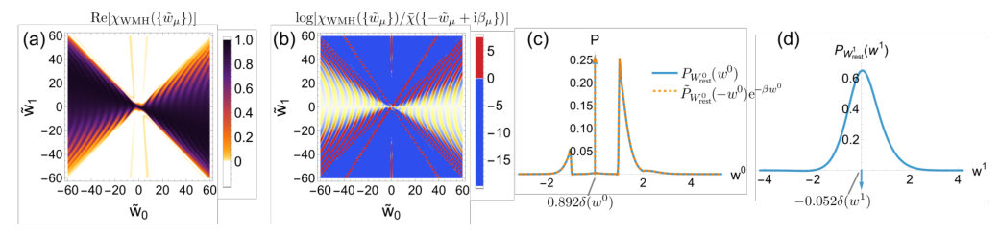
<figcaption class="paper-figure-caption"><b>Fig 1.</b> FIG. 1. Numerical results of the characteristic function and distribution function. The parameters in the protocol are chosen as β = 1.5, vb = 0.5, T = 1.0, σ = 1.0, gN0 = 3.5. (a) The real part of the characteristic function of the joint WMH quasiprobability distribution of the work 2-vector. (b) The logarithmic ratio between χWMH({ ˜wµ}) and ¯χWMH({−˜wµ + iβµ}). The deviation from 0 indicates the breakdown of the Crooks fluctuation theorem (Eq. (8)). (c) The marginal distribution of the energy component PW 0 rest(w0) in the forward process and the corresponding ¯PW 0 rest(−w0) exp(−βw0) in the reverse process. The probability density consists of a continuous distribution and a delta...</figcaption>
</figure>

**Summary.** This paper develops a quasiprobability approach to extend covariant fluctuation theorems into the challenging realm of relativistic quantum systems. By combining Wigner and Margenau-Hill distributions, the authors successfully derive generalized Jarzynski equalities while demonstrating that the full Crooks theorem only holds for specific linear combinations of work and heat 4-vectors due to operator non-commutativity.

**Why it may be interesting.** This work provides a rigorous mathematical framework for applying non-equilibrium statistical mechanics concepts (fluctuation theorems) to relativistic quantum field theory, which is crucial for understanding energy exchange in high-energy or curved spacetime contexts.

Detailed structure

**Main problem.** The primary challenge is extending covariant fluctuation theorems, which treat work as a 4-vector, into the quantum regime where operator non-commutativity complicates defining joint probability distributions.

**Main result.** While the standard covariant Crooks theorem fails for the joint distribution due to non-commutativity, the Jarzynski equality holds covariantly, and the fluctuation theorems can be recovered for specific linear combinations of work and heat 4-vectors.

**Method.** The authors introduce a novel quasiprobability distribution combining Wigner and Margenau-Hill formalisms to handle the joint characteristic function of the work 4-vector in a covariant manner.

**Model / system.** The analysis is performed on relativistic quantum fields ($\phi(x)$) driven by external classical sources, considering processes between initial and final spacelike hypersurfaces ($\Sigma^-$ to $\Sigma^+$).

**Key observables.** Work 4-vector ($W^\mu$), heat 4-vector ($Q^\mu$), joint characteristic functions ($\chi_{WMH}$), and the free energy difference ($\Delta F$).

**Important parameters / regimes.** Temperature/Inverse Temperature ($eta$), Lorentz transformations (covariance), and coupling strengths for open systems.

**Assumptions / limitations.** The derivation relies on defining a mixed quasiprobability distribution, which is real but not positive-definite; the Crooks theorem only holds for specific linear combinations of observables.

**Figures summary.** Figures illustrate numerical results showing the real part of the characteristic function and quantifying the deviation from the standard Crooks relation, while also verifying the relation for specific rest-frame components.

**Paper structure.** The paper first establishes the need for a quasiprobability approach due to non-commutativity. It then derives the unique mixed Wigner/MH distribution satisfying covariance. Finally, it applies this framework to derive and verify generalized covariant fluctuation theorems (Jarzynski and Crooks) for both closed and open quantum systems.

Abstract

The covariant formulation of stochastic thermodynamics requires treating the stochastic work as a 4-vector, posing significant challenges for quantum systems due to the non-commutativity. We introduce a new quasiprobability distribution for the work 4-vector, which combines the Wigner and Margenau-Hill quasiprobabilities. This extends the covariant fluctuation theorems from classical to quantum regime. We illustrate our findings with a scalar field driven by classical particles with a generalized version of trace formula. Our work establishes a quasiprobability approach to studying relativistic quantum thermodynamics in a covariant way.

[↑ back to top](#top)

### [A new class of degenerate solutions to the massless Dirac equation and their potential applications in optical memories](http://arxiv.org/abs/2606.14256v1)

**Authors:** Georgios N. Tsigaridas, Aristides I. Kechriniotis, Christos A. Tsonos, Konstantinos K. Delibasis  
**Type:** theory · **Category:** other · **PDF:** <https://arxiv.org/pdf/2606.14256v1>  
**Analysis basis:** full PDF text, analyzed in chunks
**Topic relevance:** 🔥 `spintronics-quantum-optics interface` **4/5** · `exotic spin models in light-matter` **3/5** · `analog quantum simulation` **2/5** · `driven-dissipative phase transition` **2/5** · `Kondo & dissipative impurity` **1/5** · `interference shaping light` **1/5** · `non-equilibrium dynamics` **1/5**

↔ Scroll figures horizontally

<figure class="paper-figure-card">
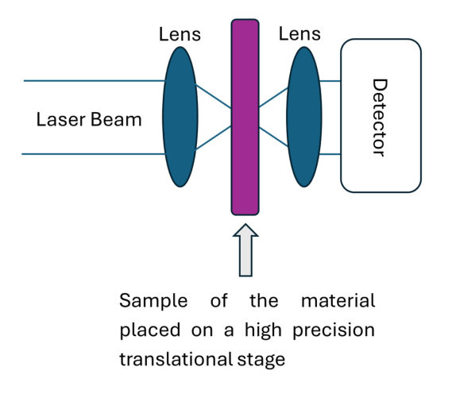
<figcaption class="paper-figure-caption"><b>Fig 1.</b> Figure 1: Proposed experimental setup for the development of optical memories in graphene and other materials supporting massless Dirac fermions.</figcaption>
</figure>
<figure class="paper-figure-card">
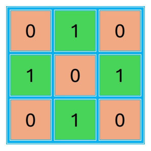
<figcaption class="paper-figure-caption"><b>Fig 2.</b> Figure 2: A sequence of bits recorded on a material supporting massless Dirac fermions. The blue line corresponds to the insulating layer used to suppress the diffusion of the carriers between the bits.</figcaption>
</figure>

**Summary.** This theoretical paper finds a new set of degenerate solutions to the massless Dirac equation, which describe particles whose spin rotates precisely in sync with external electric and magnetic fields. This synchronization property is proposed as the physical mechanism for creating high-density optical memories using graphene or similar 2D materials.

**Why it may be interesting.** The coupling between particle spin dynamics (a quantum property) and classical electromagnetic field manipulation via a relativistic equation provides an excellent platform for studying light-matter interaction in 2D topological materials relevant to AMO physics and quantum optics.

Detailed structure

**Main problem.** The paper investigates a novel class of degenerate solutions to the massless Dirac equation and explores their potential applications for developing optical memory devices.

**Main result.** These solutions demonstrate that particle spin rotates synchronously with the electric and magnetic fields generated by circularly polarized electromagnetic waves. This property suggests a mechanism for writing/reading binary data using light on materials like graphene.

**Method.** The authors derived the degenerate spinors by imposing specific conditions ($\Psi^\dagger\gamma\Psi = 0$) on the massless Dirac equation, followed by calculating the resulting electromagnetic fields and spin components.

**Model / system.** The model is based on massless Dirac fermions governed by the Dirac equation in the presence of external electromagnetic potentials. The physical system of interest is graphene or similar materials supporting these massless fermions.

**Key observables.** Particle spin ($\mathbf{S}$), electric field ($\mathbf{E}$), and magnetic field ($\mathbf{B}$) components, which are shown to be synchronized.

**Important parameters / regimes.** The analysis uses natural units ($\hbar=c=1$). The behavior is dependent on the structure of the electromagnetic 4-potential ($b_\mu$) and associated constants ($c_1, c_2, f_0$).

**Assumptions / limitations.** The primary assumption is the validity of describing the system using massless Dirac fermions. For localized solutions, the function $f$ must be chosen to ensure square integrability.

**Figures summary.** Figure 1 proposes an experimental setup for optical memories in graphene, and Figure 2 illustrates the concept of recording binary data via spin manipulation on such a material.

**Paper structure.** The paper introduces the problem by presenting the governing Dirac equation. It then derives the general form of degenerate solutions using specific mathematical constraints. Subsequently, it calculates the associated electromagnetic fields and demonstrates the key physical result: synchronized spin rotation under external waves, concluding with potential applications in optical memory.

Abstract

In this article, we present a novel class of degenerate solutions to the massless Dirac equation, corresponding to a wide variety of electromagnetic 4-potentials and fields, including both zero field and circularly polarized electromagnetic waves. An interesting property of these solutions is that the spin of the particles rotates in synchronization with the electric and magnetic fields of the electromagnetic waves. These results could be utilized for the development of optical memories based on materials supporting massless Dirac fermions, such as graphene.

[↑ back to top](#top)

### [Detecting Historical Turning Points in Italian Media: A Complex Systems Approach to a Diachronic News Corpus](http://arxiv.org/abs/2606.14348v1)

**Authors:** Dario Zarcone, Salvatore Miccichè, David Sanchez  
**Type:** theory · **Category:** statistical mechanics · **PDF:** <https://arxiv.org/pdf/2606.14348v1>  
**Analysis basis:** full PDF text, analyzed in chunks
**Topic relevance:** 🔥 `non-equilibrium universality` **4/5** · `driven-dissipative phase transition` **3/5** · `methods for driven-dissipative` **3/5** · `non-equilibrium dynamics` **3/5** · `Keldysh / 2PI / non-Gaussian methods` **1/5**

↔ Scroll figures horizontally

<figure class="paper-figure-card">
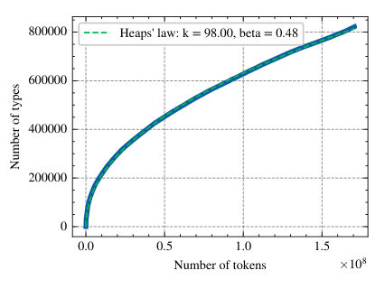
<figcaption class="paper-figure-caption"><b>Fig 1.</b> Figure 2: Empirical confirmation of Zipf’s and Heaps’ laws in the corpus.</figcaption>
</figure>
<figure class="paper-figure-card">
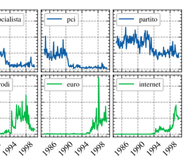
<figcaption class="paper-figure-caption"><b>Fig 2.</b> Figure 3: Monthly TF-IDF scores of falling and rising words across the time period. The top 5 falling words (blue) and top 5 rising words (green) are selected based on their linear coefficient, representing the slope of a regression line fitted to each term’s monthly scores over the whole period.</figcaption>
</figure>
<figure class="paper-figure-card">
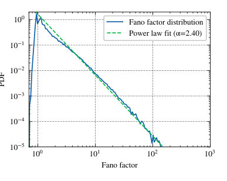
<figcaption class="paper-figure-caption"><b>Fig 3.</b> Figure 4: Relationship between word Fano factors and temporal variability. (a) TF-IDF time series of two example words, illustrating a word with low Fano factor and one with high Fano factor. (b) Distribution of word Fano factors (log-log scale).</figcaption>
</figure>
<figure class="paper-figure-card">
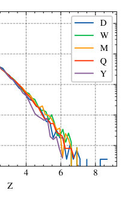
<figcaption class="paper-figure-caption"><b>Fig 4.</b> Figure 5: Distribution of the rescaled Fano factor across different timescales. The rescaling function is defined as Z = (log F −µlog F )/σlog F , where µlog F and σlog F are the mean and standard deviation of the log Fano factor at each timescale. The collapse across timescales shows that burstiness is a fundamental property of lexical dynamics in media discourse.</figcaption>
</figure>
<figure class="paper-figure-card">
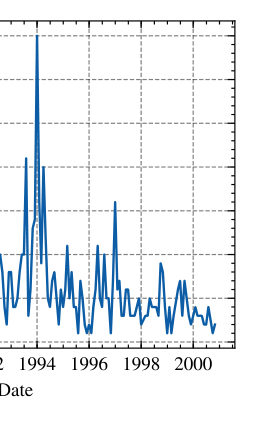
<figcaption class="paper-figure-caption"><b>Fig 5.</b> Figure 6: Number of changepoints per month, as found using the Robust PELT method- ology with the L2 cost function on the monthly time series of the words in the corpus. The biggest amount of changepoints happen in the transition between the First and the Second Republic, in 1994.</figcaption>
</figure>

**Summary.** This work applies tools from statistical physics and complex systems theory to analyze a massive historical news corpus. By tracking semantic drift, word salience shifts, and informational entropy over time, the authors successfully identified major societal turning points, such as Italy's political transition in the mid-1990s, without needing prior knowledge of these events.

**Why it may be interesting.** While not physics-based, the methodology of detecting non-equilibrium transitions (regime shifts) in complex data streams—using diagnostics like entropy minima or sudden changes in correlation structure—is mathematically analogous to identifying critical points or phase transitions in physical systems.

Detailed structure

**Main problem.** The research aims to detect historical turning points or regime shifts within media discourse by treating the evolution of language use as a complex, non-equilibrium system.

**Main result.** Significant transitions in Italian media discourse were detected around the mid-1990s (First to Second Republic transition) and during major international conflicts, characterized by measurable changes in semantic structure and word salience.

**Method.** The study combines Natural Language Processing (NLP)—using techniques like TF-IDF and LSA—with tools from complex systems theory, such as changepoint detection (PELT) and entropy analysis.

**Model / system.** The system modeled is the evolving discourse of a large diachronic corpus ($\approx 600,000$ articles from *La Repubblica*). The state space is mapped into a reduced semantic vector space via LSA, allowing tracking of the 'center of mass' trajectory over time.

**Key observables.** Word salience (lexical level), Semantic Trajectory (semantic level), Spectral Entropy $H(p)$, and the number/timing of statistical changepoints.

**Important parameters / regimes.** The corpus time span (1985–2000); the aggregation timescale for analysis (day, week, month, year).

**Assumptions / limitations.** The discourse evolution can be accurately captured by tracking changes in word co-occurrence statistics and semantic vector centroids; the single-source nature of the corpus limits generalizability.

**Figures summary.** Figures illustrate document length distributions, time series of word salience (showing rising/falling political terms), the trajectory of media discourse on principal components, and similarity matrices showing block structures corresponding to distinct historical regimes.

**Paper structure.** The paper follows a progression from corpus description and basic statistics (token counts, Zipf's law) to advanced time-series analysis: first lexical dynamics using Fano factors/PELT, followed by semantic mapping using LSA trajectories and entropy calculations to pinpoint regime shifts.

Abstract

The increasing availability of large-scale textual corpora has opened new possibilities for data-driven, quantitative approaches to historical analysis using Natural Language Processing (NLP). However, diachronic corpora with historical relevance from the pre-digital era remain scarce and often incomplete. We present a quantitative approach to historical analysis based on the reconstruction and exploration of a diachronic corpus of around 600,000 articles from the Italian newspaper "La Repubblica", covering all the articles published from the 1st of January 1985 to the 31st of December 2000 - a period of major political, social, and geopolitical change in Italy and globally. Using NLP techniques, we analyze the text at both lexical and semantic levels; we then apply tools from complex systems and statistical physics to trace shifts in media discourse over time. This allows us to detect key transition periods, such as the transition from the First Republic to the Second Republic in Italy, or major international conflicts like the Gulf War or the Kosovo War, without relying on prior labeling. The results show how combining computational linguistics with ideas from complex systems can offer new quantitative insight into historical changes, opening up new paths for studying the dynamics of media and society through large-scale textual data.

[↑ back to top](#top)

### [Diffusion-driven autocatalytic dynamics on a sphere](http://arxiv.org/abs/2606.14133v1)

**Authors:** Denis S. Grebenkov  
**Type:** theory · **Category:** statistical mechanics · **PDF:** <https://arxiv.org/pdf/2606.14133v1>  
**Analysis basis:** full PDF text, analyzed in chunks
**Topic relevance:** 🔥 `non-equilibrium universality` **4/5** · `driven-dissipative phase transition` **3/5** · `methods for driven-dissipative` **3/5** · `non-equilibrium dynamics` **2/5** · `Keldysh / 2PI / non-Gaussian methods` **1/5** · `correlated / nonlocal dissipation` **1/5**

↔ Scroll figures horizontally

<figure class="paper-figure-card">
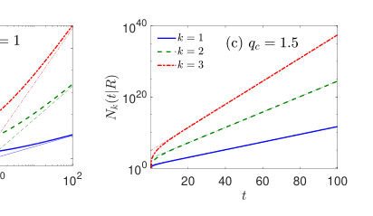
<figcaption class="paper-figure-caption"><b>Fig 1.</b> Figure 1. Moments Nk(t|R) of the population size for diffusion with D = 1 outside the unit ball (R = 1) in the subcritical (qc = 0.5, panel a), critical (qc = 1, panel b), and supercritical (qc = 1.5, panel c) regimes. Thick lines present the numerical integration of Eqs. (26), whereas thin lines show the asymptotic behavior: Eq. (34) for panel a, Eq. (30) for panel b, and Eq. (36) for panel c.</figcaption>
</figure>
<figure class="paper-figure-card">
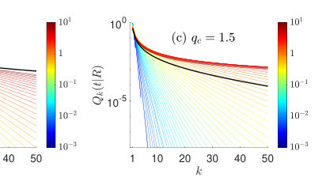
<figcaption class="paper-figure-caption"><b>Fig 2.</b> Figure 2. Distribution Qk(t|R) of the population size for diffusion with D = 1 outside the unit ball (R = 1) in the subcritical (qc = 0.5, panel a), critical (qc = 1, panel b), and supercritical (qc = 1.5, panel c) regimes. Solid black line indicates the steady-state distribution Qk(∞|R) given by Eq. (46), whereas colored lines show 64 distributions with t ranging on the logarithmic scale from 10−3 (dark blue) to 101</figcaption>
</figure>
<figure class="paper-figure-card">
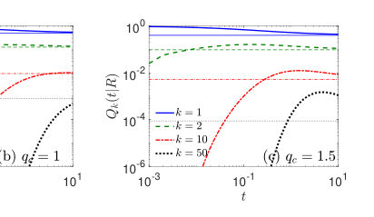
<figcaption class="paper-figure-caption"><b>Fig 3.</b> Figure 3. Time evolution of the probabilities Qk(t|R) for diffusion with D = 1 outside the unit ball (R = 1) in the subcritical (qc = 0.5, panel a), critical (qc = 1, panel b), and supercritical (qc = 1.5, panel c) regimes. Thick lines present Qk(t|R) obtained via a numerical integration of Eq. (41), whereas thin horizontal lines show the corresponding steady-state values Qk(∞|R) given by Eq. (46). Note that the thick dashed line (k = 50) is not visible on panel ’a’, because Q50(t|R) &lt; 10−6 in the considered time interval.</figcaption>
</figure>

**Summary.** This work analyzes autocatalytic dynamics where particles diffuse outside a sphere while replicating upon reaching the boundary. The competition between diffusion escape and self-catalysis leads to three distinct long-time regimes: extinction, steady-state maintenance, or explosive growth. By solving moment equations using advanced mathematical techniques like Laplace transforms, the authors characterize the precise scaling laws governing these transitions.

**Why it may be interesting.** While focused on classical diffusion and reaction kinetics, the concept of phase transitions (subcritical/critical/supercritical) based on a control parameter ($q_c$) is highly relevant to non-equilibrium statistical mechanics and pattern formation in complex systems.

Detailed structure

**Main problem.** The study investigates the collective dynamics of independent particles diffusing outside a spherical surface where they undergo autocatalytic replication at a prescribed rate.

**Main result.** The system exhibits three distinct long-time regimes (subcritical, critical, supercritical) characterized by different behaviors for population moments and mean size, including power-law or exponential growth/decay.

**Method.** The analysis uses generating functions and integral equations to track the time evolution of population moments and probability distributions. Asymptotic behavior is determined using Laplace transforms in the long-time limit.

**Model / system.** The model describes diffusion in an exterior domain (outside a ball) with autocatalytic reactions occurring on the boundary surface ($\partial\Omega$). The dynamics are governed by the competition between particle escape to infinity and local branching/replication events.

**Key observables.** Mean population size $\langle N(t) 
angle$, variance, higher-order moments ($N_k$), and the full probability distribution $Q_k(t)$.

**Important parameters / regimes.** The catalytic rate ($q_c$) relative to a critical value ($q_{crit}$), which determines the system's long-term fate.

**Assumptions / limitations.** The analysis assumes rotational symmetry of the domain (exterior of a ball) and relies on explicit forms for diffusion propagators. The asymptotic results are noted to be expected to hold for generic exterior domains.

**Figures summary.** Figures illustrate the time evolution of population moments ($N_k$) across subcritical, critical, and supercritical regimes, comparing numerical integration against derived asymptotic formulas.

**Paper structure.** The paper builds from defining the dynamics via propagators in an unbounded domain to deriving integral equations for moments. It then performs a detailed analysis of the long-time asymptotics by examining different parameter regimes ($q_c$ vs $q_{crit}$) using Laplace transforms.

Abstract

We study the collective dynamics of independent particles that diffuse outside a spherical surface, on which they are replicated with a prescribed catalytic rate. In spatial dimensions three and higher, the transient nature of diffusion creates the competition between autocatalytic and escape events, thus leading to a rich phase diagram between subcritical (extinction), critical (steady-state), and supercritical (growth) regimes at long times. The rotational symmetry of the domain and an explicit form of the single-particle diffusion propagator allow us to obtain the statistics of the population size (i.e., the number of particles). In this way, we analyze the mean population size, its variance and higher-order moments, as well as the full distribution. In particular, we obtain a fully explicit form of the distribution at long times and describe a slow, power-law approach to this steady-state limit.

[↑ back to top](#top)

### [Generic long-range correlations in nonequilibrium mixtures](http://arxiv.org/abs/2606.14651v1)

**Authors:** Jessica Metzger, Yariv Kafri, Mehran Kardar, Julien Tailleur  
**Type:** both · **Category:** statistical mechanics · **PDF:** <https://arxiv.org/pdf/2606.14651v1>  
**Analysis basis:** full PDF text, analyzed in chunks
**Topic relevance:** 🔥 `non-equilibrium dynamics` **4/5** · 🔥 `non-equilibrium universality` **4/5** · `driven-dissipative phase transition` **3/5** · `Keldysh / 2PI / non-Gaussian methods` **1/5** · `correlated / nonlocal dissipation` **1/5** · `methods for driven-dissipative` **1/5**

↔ Scroll figures horizontally

<figure class="paper-figure-card">
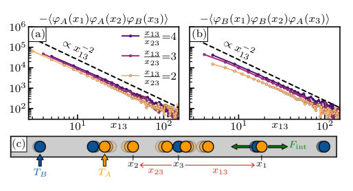
<figcaption class="paper-figure-caption"><b>Fig 1.</b> FIG. 1. Long-range 3-point correlations in a 1- dimensional 2-temperature mixture. We simulate a mix- ture of Brownian particles with temperatures TA ̸= TB in- teracting through a soft pairwise repulsive force Fint(x) = −U ′ int(x) [panel (c)]. (a)-(b) Correlation between species α, β, γ at locations x1, x2, x3, for (a) α, β, γ = A, A, B and (b) α, β, γ = B, B, A; plotted against x13 = x1 −x3 for dif- ferent slices of (x13, x23) space specified by the ratio x13/x23 (legend). Simulation parameters are κ = TA = 1, TB = 0.1, NA = NB = 200, and L = 800.</figcaption>
</figure>
<figure class="paper-figure-card">
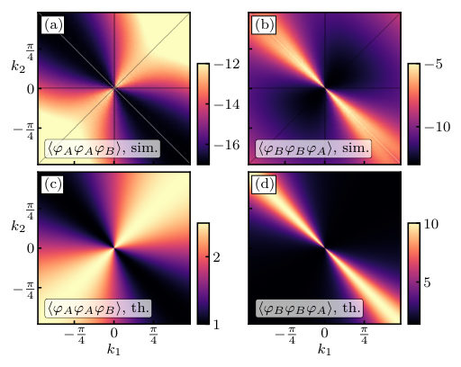
<figcaption class="paper-figure-caption"><b>Fig 2.</b> FIG. 2. Long-range 3-point correlations in a 2- temperature mixture. The 3-point correlation from (a)- (b) particle simulations and (c)-(d) our theory [Eq. (4)] at wavevectors k1, k2, and k3 = −k1−k2 in d = 1. Panels (a), (c) represent species α = β = A, γ = B, and panels (b), (d) rep- resent species α = β = B, γ = A. In the theory, we use parameters χ3 = −1, TA = 1, and TB = 0.1. The simulations are the same as those shown in Fig. 2.</figcaption>
</figure>

**Summary.** The paper demonstrates that unlike equilibrium systems, non-equilibrium mixtures can spontaneously develop long-ranged three-point correlations due to the presence of nonlinear terms. These effects are predicted theoretically using renormalization group methods and confirmed by simulating Brownian colloids in multi-temperature baths. This suggests that long-range order is a generic feature of many out-of-equilibrium physical systems.

**Why it may be interesting.** This work provides a powerful mechanism—the role of 'dangerously irrelevant' nonlinear terms—to generate robust, non-trivial long-range correlations in systems driven out of equilibrium, which is highly relevant for understanding active matter and complex fluids.

Detailed structure

**Main problem.** The study investigates the origin of long-range correlations in non-equilibrium mixtures, contrasting them with equilibrium systems where such correlations typically require fine-tuning to a critical point.

**Main result.** Nonlinearities, even those formally 'dangerously irrelevant' in renormalization group theory, can generate genuinely long-ranged three-point correlations in the isotropic disordered phase of non-equilibrium mixtures.

**Method.** The analysis combines theoretical predictions using renormalization group arguments and perturbative calculations of correlation functions with numerical simulations of Brownian colloids.

**Model / system.** The system models generic dynamics of conserved, isotropic fields (applicable to multi-temperature or non-reciprocal mixtures) and is simulated using overdamped Brownian particles interacting via a soft repulsive potential.

**Key observables.** Two-point and three-point correlation functions ($\langle \phi_\alpha \phi_eta \phi_\gamma 
angle$), analyzed in both real space (decaying as $r^{-2d}$) and Fourier space, particularly focusing on the low-wavenumber limit.

**Important parameters / regimes.** The relative temperatures ($T_A 
eq T_B$) of the components are crucial; long-range correlations appear when temperatures are unequal.

**Assumptions / limitations.** The analysis relies on treating nonlinearities perturbatively, justified by their irrelevant nature in the renormalization group sense.

**Figures summary.** Figures show evidence of long-range three-point correlations ($\sim r^{-2}$ decay) in both 1D and 2D simulations, comparing numerical results against theoretical predictions in real and Fourier space.

**Paper structure.** The paper first establishes the general theory for non-equilibrium mixtures, showing that linear theory yields short-range correlations. It then calculates three-point functions perturbatively, demonstrating the emergence of long-range behavior due to nonlinearities, which is confirmed by simulations using Brownian colloids.

Abstract

We study correlation functions in generic non-equilibrium mixtures, including multi-temperature systems and non-reciprocal field theories. The corresponding linear theory is short-ranged, and nonlinearities are irrelevant in the renormalization-group sense. Nonetheless, we find that these nonlinearities generate long-ranged three-point correlations in the isotropic disordered phase. Our analytical predictions, which are based on a phenomenological theory, are confirmed by numerical simulations of Brownian colloids in contact with thermal baths at different temperatures. Dangerously irrelevant nonlinearities in non-equilibrium mixtures thus offer a new route to long-range correlations, supporting the hypothesis that such correlations are not the exception but the rule out of equilibrium.

[↑ back to top](#top)

### [Quantum sensing through bosonic-fermionic Bell-state transitions in two-photon interference](http://arxiv.org/abs/2606.14408v1)

**Authors:** Chahat Kaushik, Vimlesh Kumar, G. K. Samanta  
**Type:** experiment · **Category:** other · **PDF:** <https://arxiv.org/pdf/2606.14408v1>  
**Analysis basis:** full PDF text, analyzed in chunks
**Topic relevance:** 🔥 `quantum optics experiment` **4/5** · `interference shaping light` **3/5** · `QC/QI experiment` **2/5** · `quantum measurements` **2/5** · `analog quantum simulation` **1/5** · `driven-dissipative phase transition` **1/5** · `entanglement & information structure` **1/5**

↔ Scroll figures horizontally

<figure class="paper-figure-card">
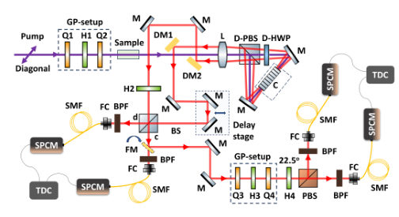
<figcaption class="paper-figure-caption"><b>Fig 1.</b> FIG. 1. Schematic experimental setup for tunable exchange symmetry control of two photon state. Purple line denotes the pump laser beam at 405 nm, and red line denotes SPDC photons at 810 nm; Q1-4: quarter wave plates (QWP); H1- 4: half wave-plates (HWP); GP-setup: geometric phase; M: mirror; D-PBS and D-HWP: dual wavelength (405 nm and 810 nm) polarizing beam-splitter cube and half-wave plate; C: PPKTP crystal; BS: beam splitter, DM1-2: D-shaped mirror; FC: Fiber coupler; SMF: single mode fibre; BPF: bandpass filter; SPCM: single photon counting module; TDC: time to digital converter; PBS: polarizing beam-splitter cube. Sam- ple: PPKTP crystals of length, L= 5 mm and 10 mm.</figcaption>
</figure>
<figure class="paper-figure-card">
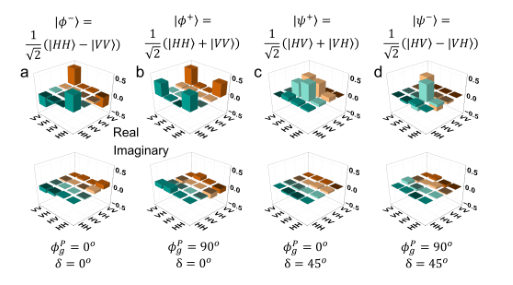
<figcaption class="paper-figure-caption"><b>Fig 2.</b> FIG. 2. Real (top rows) and imaginary (bottom row) parts of the reconstructed density matrices for Bell states (a) |Φ−⟩, (b) |Φ+⟩, (c) |Ψ+⟩, (d) |Ψ−⟩.</figcaption>
</figure>
<figure class="paper-figure-card">
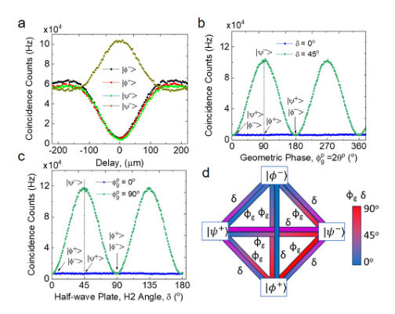
<figcaption class="paper-figure-caption"><b>Fig 3.</b> FIG. 3. Variation of coincidence counts in HOM interferom- etry as function of (a) optical delay for four Bell states, (b) relative phase of Bell state due to the geometric phase, and (c) half-wave plate angle for Bell state transformation. (d) Pictorial diagram of Bell state transformation for variation of relative phase and δ.</figcaption>
</figure>
<figure class="paper-figure-card">
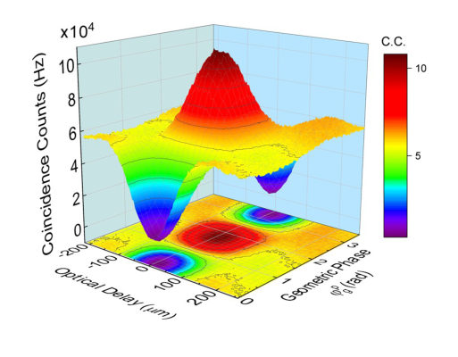
<figcaption class="paper-figure-caption"><b>Fig 4.</b> FIG. 4. Variation of coincidence counts as function of optical delay in HOM interferometer for different relative phase of the Bell states of |Ψ⟩family.</figcaption>
</figure>
<figure class="paper-figure-card">
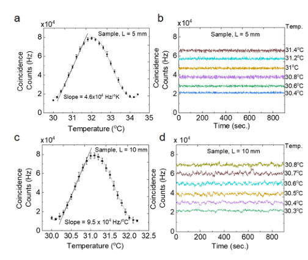
<figcaption class="paper-figure-caption"><b>Fig 5.</b> FIG. 5. Variation of the coincidence counts as a function of temperature-induced birefringence arising from thermo-optic dispersion for crystals with lengths (a,b) L = 5 mm and (c,d) L = 10 mm. The solid lines represent fits to the experimental data, from which the slopes were determined. Dotted lines are the sinusoidal fit to the experimental data.</figcaption>
</figure>

**Summary.** The paper presents an advanced quantum sensing technique using Hong-Ou-Mandel interference on polarization-entangled photons. By controlling the exchange symmetry between bosonic and fermionic Bell states via a geometric phase imprinted on the pump beam, the method achieves high sensitivity for measuring physical parameters like birefringence. This approach overcomes limitations of conventional setups by keeping the sample outside the main interferometer arms.

**Why it may be interesting.** This work provides a novel platform for quantum metrology by engineering the fundamental symmetries of the two-photon state, offering robustness against common experimental noise sources that plague standard interferometers.

Detailed structure

**Main problem.** Conventional quantum sensing schemes based on Hong-Ou-Mandel (HOM) interference are susceptible to optical loss and instability when a sample is placed in one interferometer arm.

**Main result.** The authors demonstrate a robust, symmetry-controlled quantum sensing scheme where the exchange symmetry of two-photon states can be continuously tuned using geometric phase, allowing for high-resolution measurement of birefringence changes by placing the sample in the pump beam.

**Method.** The technique utilizes polarization-entangled photon pairs generated via SPDC and measures coincidence counts as a function of an engineered relative phase ($\phi$) to probe the transition between bosonic (bunching) and fermionic (anti-bunching) two-photon states.

**Model / system.** The system involves two-photon interference in a setup where the geometric phase imprinted on the classical pump beam controls the exchange symmetry of the entangled Bell state. The sensing element is typically a birefringent crystal placed directly in the pump beam path.

**Key observables.** Coincidence probability $P_c(\phi, \delta)$, which varies sinusoidally with the relative phase $\phi$, and the resulting change in coincidence counts as a function of temperature ($\Delta T$).

**Important parameters / regimes.** The phase-modulation linewidth remains fixed at $\pi/2$ independent of photon bandwidth; birefringence resolution achieved down to $10^{-6}$ or better.

**Assumptions / limitations.** The method avoids limitations by measuring the sample effect on the pump beam rather than placing it in the main interferometer arms, and relies on established thermo-optic dispersion formulas for analysis.

**Figures summary.** Figures illustrate the setup schematic, reconstruction of Bell state density matrices, coincidence counts vs. optical delay (showing bunching/anti-bunching), and crucially, coincidence count variation as a function of temperature-induced birefringence changes.

**Paper structure.** The paper first establishes the limitations of conventional HOM sensing. It then introduces the symmetry-controlled scheme using geometric phase to tune Bell states. The core is demonstrating this control via coincidence measurements, culminating in applying this robust method to measure material properties like thermo-dispersive birefringence with high resolution.

Abstract

Hong-Ou-Mandel (HOM) interference has become a central resource for quantum sensing and metrology owing to its sensitivity to temporal delay and photon indistinguishability. However, existing HOM-based sensing schemes generally rely on inserting a sample into one arm of the interferometer, making the measurement vulnerable to optical loss, alignment instability, and bandwidth-dependent distortion of the interference profile. Here, we demonstrate a symmetry-controlled quantum sensing scheme based on continuous transitions between symmetric (bosonic-like) and antisymmetric (fermionic-like) Bell states in two-photon interference. By imprinting a geometric phase onto the classical pump beam and transferring it to polarization-entangled photons generated via spontaneous parametric down-conversion, we coherently tune the exchange symmetry of the entangled state without altering the temporal or spectral indistinguishability of the photons. The HOM response evolves continuously from bunching to antibunching with a sine square phase dependence, producing a coincidence modulation of approximately 10 * 10^4 counts s^-1 counts/s. In contrast to conventional HOM sensing, the phase-modulation linewidth remains fixed at pi/2, independent of photon bandwidth. Using a birefringent crystal placed directly in the pump beam, we measure thermo-dispersive birefringence with a resolution of the order of 10^{-6} over a broad temperature range. Our results establish exchange symmetry as a controllable resource for robust quantum sensing and symmetry-engineered photonic quantum information processing.

[↑ back to top](#top)

### [Link-Free Multi-Node Timing Synchronization for Scalable Quantum Networking](http://arxiv.org/abs/2606.14077v1)

**Authors:** Jacob E. Humberd, Mohmad Junaid Ul Haq, Angel Fraire Estrada, Ike Deitch, Tian Li  
**Type:** experiment · **Category:** quantum information and computing · **PDF:** <https://arxiv.org/pdf/2606.14077v1>  
**Analysis basis:** full PDF text, analyzed in chunks
**Topic relevance:** 🔥 `QC/QI experiment` **4/5** · `interference shaping light` **3/5** · `quantum optics experiment` **3/5** · `quantum measurements` **1/5**

↔ Scroll figures horizontally

<figure class="paper-figure-card">
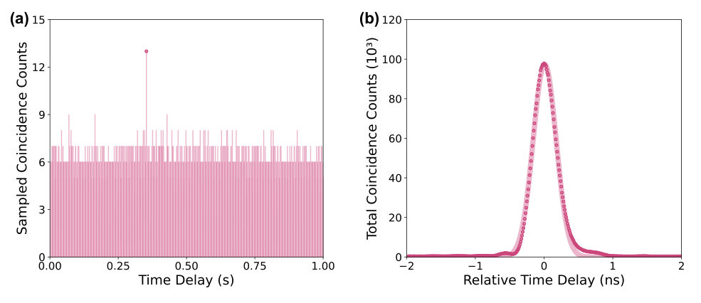
<figcaption class="paper-figure-caption"><b>Fig 1.</b> Fig. 1: Experimental results of the coarse- and fine-stage coincidence peak identification algorithm. (a) A coarse search using temporally subsampled timestamp streams and a 10 ns time-bin width localizes the approximate position of the coincidence peak. (b) The full timestamp records are then analyzed in the vicinity of the iden- tified peak using a 10 ps time-bin width to reconstruct the high-resolution g(2)(τ) distribution. The solid pink line denotes a Gaussian fit to the measured correlation profile.</figcaption>
</figure>
<figure class="paper-figure-card">
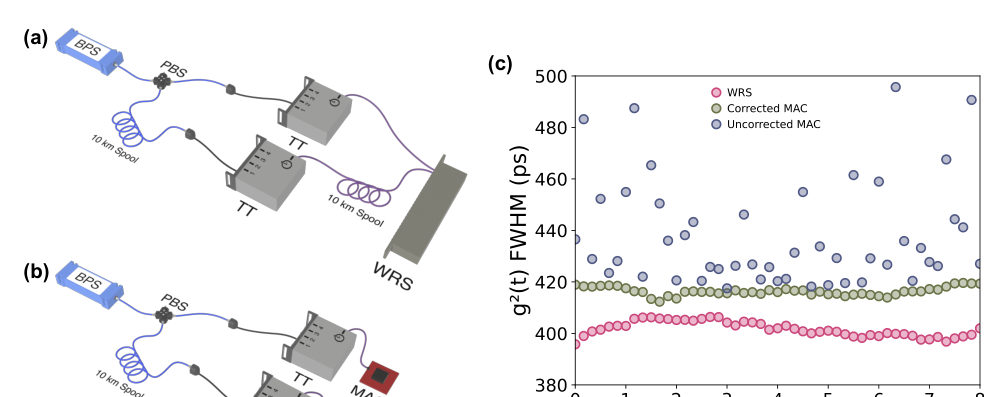
<figcaption class="paper-figure-caption"><b>Fig 2.</b> Fig. 2: Local experimental configurations at UTC employing 10 km fiber spools for comparison of the syn- chronization performance using (a) WRS-based and (b) MAC-based method. (c) Measured coincidence peak FWHM as a function of acquisition time over an 8-hour measurement session using WRS (pink), uncorrected MACs (blue), and drift-corrected MACs (green). The coincidences were sampled at 10-minute intervals, with each data point corresponding to a 60-second integration period.</figcaption>
</figure>
<figure class="paper-figure-card">

<figcaption class="paper-figure-caption"><b>Fig 3.</b> Fig. 3: (a) Comparison of the first (pink) and last (green) one-second intervals of a 1-minute acquisition using independent MACs, illustrating the displacement of the coincidence peak caused by accumulated timing drift between the MACs. (b) Coincidence peak position as a function of acquisition time over the same 1-minute in- terval. Each data point corresponds to the peak location extracted from a one-second segment of the timestamp stream. The solid pink line represents the time-dependent drift model constructed using piecewise linear fit. (c) Comparison of the reconstructed g(2)(τ) distributions obtained from the uncorrected MAC data (blue) and the same dataset after application of the...</figcaption>
</figure>
<figure class="paper-figure-card">
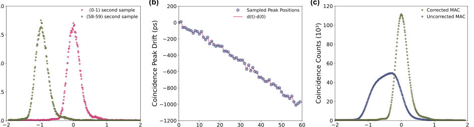
<figcaption class="paper-figure-caption"><b>Fig 4.</b> Fig. 4(a) and Fig. 4(b), respectively. The synchronization performance was again quantified by tracking the</figcaption>
</figure>
<figure class="paper-figure-card">

<figcaption class="paper-figure-caption"><b>Fig 5.</b> Fig. 4(c). The observed broadening corresponds to an accumulated timing drift of approximately 2 ns over the</figcaption>
</figure>

**Summary.** This work presents a novel method to synchronize remote quantum nodes using only independent miniature atomic clocks rather than dedicated timing links. By applying advanced computational post-processing techniques, the authors achieved timing stability comparable to state-of-the-art systems. This breakthrough establishes a scalable and topology-independent pathway for building large-scale quantum networks.

**Why it may be interesting.** It provides an experimental blueprint for realizing scalable quantum networks by circumventing major infrastructure bottlenecks associated with timing distribution, which is crucial for future terrestrial and space-based quantum communication protocols.

Detailed structure

**Main problem.** Achieving precise timing synchronization for distributed quantum networking nodes without relying on dedicated, infrastructure-heavy timing distribution links.

**Main result.** The authors successfully demonstrated high-visibility Hong-Ou-Mandel interference across a metropolitan-scale fiber network using only independently operating atomic clocks and computational post-processing, matching benchmarks set by White Rabbit systems.

**Method.** They employed a two-stage coincidence peak search algorithm combined with piecewise linear drift compensation applied to raw time-tagging data from miniature rubidium atomic clocks (MACs).

**Model / system.** The experiment utilized a deployed metropolitan-scale telecom fiber network connecting three nodes, using MACs as the primary timing reference source for quantum state distribution.

**Key observables.** Hong-Ou-Mandel (HOM) interference visibility, coincidence peak Full Width at Half Maximum (FWHM), and timing stability over 8 hours.

**Important parameters / regimes.** Metropolitan scale deployment; rubidium atomic clock precision; $70\%$ HOM visibility threshold; $	ext{sub-nanosecond}$ timing performance goal.

**Assumptions / limitations.** The residual frequency drift between independent MACs is slow and deterministic enough to be accurately modeled and corrected via post-processing algorithms.

**Figures summary.** Figures illustrate the two-stage coincidence peak identification algorithm (coarse vs. fine search) and compare HOM visibility/FWHM performance across WRS, uncorrected MAC, and drift-corrected MAC in both lab and deployed settings.

**Paper structure.** The paper progresses by first defining the synchronization challenge, detailing the computational method for handling large time offsets, validating the technique on local fiber spools (comparing FWHM), and culminating in the primary demonstration of high-visibility quantum interference across a real, deployed metropolitan network.

Abstract

Precise timing synchronization is essential for distributed quantum networking, enabling entanglement distribution, quantum teleportation, and entanglement swapping across remote nodes. Existing synchronization architectures rely on dedicated timing-distribution infrastructure, most notably White Rabbit networks, which constrain topology, scalability, and deployment in free-space and satellite environments. Here we demonstrate link-free synchronization of quantum network nodes using independently operating miniature rubidium atomic clocks and computational post-processing. We validate the approach on a deployed metropolitan-scale telecom fiber network spanning three geographically separated nodes. Following drift correction, atomic-clock-based synchronization achieves timing performance approaching that of a White Rabbit benchmark and remains stable over continuous 8-hour operation. As a stringent test of quantum-network functionality, we observe Hong-Ou-Mandel interference across spatially separated nodes with visibility exceeding 70%, statistically equivalent to that obtained using dedicated White Rabbit timing links. To the best of our knowledge, this represents the first observation of quantum interference across a deployed metropolitan-scale telecom fiber network synchronized entirely without dedicated timing-transfer infrastructure. These results establish atomic-clock-based synchronization as a scalable, topology-independent alternative to conventional timing-distribution architectures and a practical pathway toward terrestrial, airborne, and space-based quantum networks where dedicated timing links are unavailable.

[↑ back to top](#top)

### [Scaling native entanglement generation in layered semiconductors with quasi-phase matching](http://arxiv.org/abs/2606.14553v1)

**Authors:** Benjamin Braun, Andrea Alessandrini, Josip Bajo, Philipp K. Jenke, Leone di Mauro Villari, Birui Yang, Zhi Hao Peng, P. James Schuck, Cory R. Dean, Andrea Marini, Philip Walther, Chiara Trovatello, Lee A. Rozema  
**Type:** both · **Category:** other · **PDF:** <https://arxiv.org/pdf/2606.14553v1>  
**Analysis basis:** full PDF text, analyzed in chunks
**Topic relevance:** 🔥 `quantum optics experiment` **4/5** · `interference shaping light` **3/5** · `Keldysh / 2PI / non-Gaussian methods` **1/5** · `QC/QI experiment` **1/5** · `driven-dissipative phase transition` **1/5** · `entanglement & information structure` **1/5**

↔ Scroll figures horizontally

<figure class="paper-figure-card">
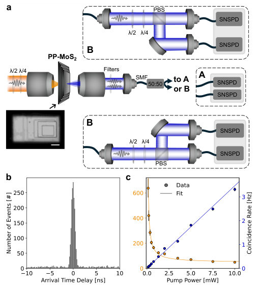
<figcaption class="paper-figure-caption"><b>Fig 1.</b> FIG. 1. a) Experimental schematic: A continuous wave (CW) pump laser (780 nm) is focused onto the PPTMD (see inset for a micrograph, scalebar 10 µm) on a SiO2 substrate using an aspheric lens (f=3.1 mm). The emitted signal is collected collinearly and collimated using a mi- croscope objective (NA=0.85). A combination of long-pass (1150 nm cut-off) and band-pass (1560 ± 6 nm) filters rejects the pump beam and photoluminescence background. The photon pairs are coupled to single-mode fiber (SMF) and sent to a fiber-based beam-splitter (50:50) which probabilistically separates the pairs into two spatial modes. From here, they can be directly detected (option A) using super-conducting nanowire...</figcaption>
</figure>
<figure class="paper-figure-card">
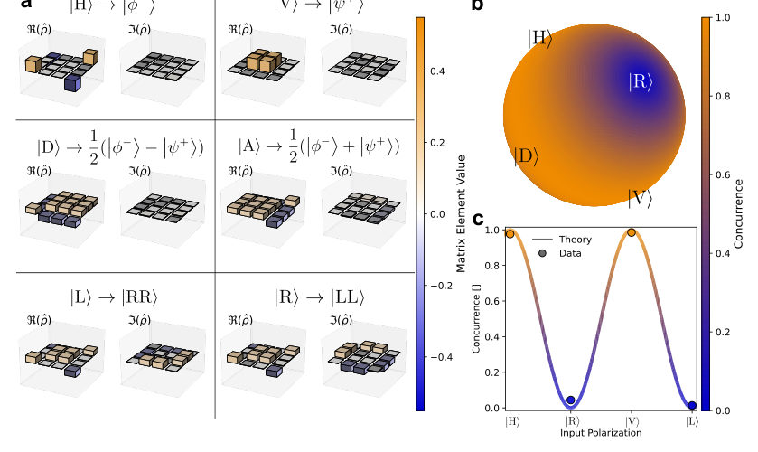
<figcaption class="paper-figure-caption"><b>Fig 2.</b> FIG. 2. a) Measured density matrices of the 2-photon states generated in PP-MoS2: The measurements shown were carried out on the 6th slab using a pump power of 8 mW and a band-pass filter (1560 ± 6 nm). We define the x-axis of the sample as the H-polarization (sample frame). Aligning the pump polarization along this axis results in the maximally entangled Bell-state ϕ− . Going to V-polarization in the sample frame generates the ψ+ -state. At diagonal polarization, a coherent superposition of these states is generated, which is still maximally entangled. Going to circular polarization completely erases the entanglement, resulting in a fully separable state. b) Simulated concurrence heatmap...</figcaption>
</figure>
<figure class="paper-figure-card">
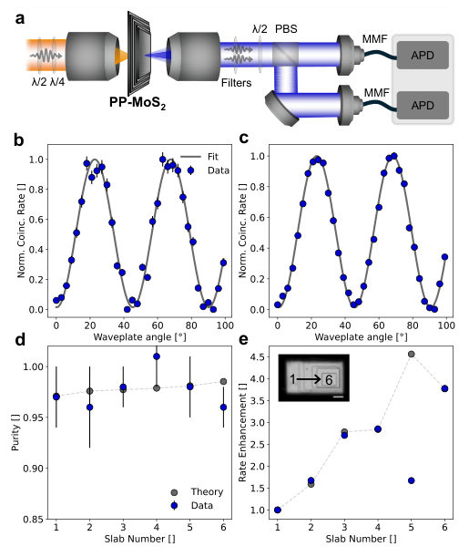
<figcaption class="paper-figure-caption"><b>Fig 3.</b> FIG. 3. a) Adapted experimental setup: the polarization of the emit- ted photon pairs is controlled with a half wave-plate (λ/2), then the photons are sent to a polarizing beam-splitter (PBS). Depending on their polarization state, they may split into the two output modes of the PBS or bunch in one mode. We couple both modes to a multi-mode fiber (MMF, 50 µm core size) and detect them with In-Ga-As avalanche photo-diodes (APDs). b) &amp; c) The coincidence rate is measured as a function of the wave-plate angle. We fit the data points to cos2(4x) function with a phase and background offset, where x is the wave-plate angle, in order to extract the visibility. We show example plots mea- sured on...</figcaption>
</figure>

**Summary.** This research demonstrates an advanced method for generating high-quality, polarization-entangled photon pairs using periodically poled van der Waals semiconductors. By engineering the nonlinearity via quasi-phase matching across multiple thin layers, they overcome material coherence length limitations inherent to these nanoscale sources. The combination of theory and experiment establishes a powerful platform for scalable quantum light source development.

**Why it may be interesting.** This work is highly relevant as it pushes quantum light sources into nanoscale solid-state platforms, providing a pathway to engineer entanglement properties (like polarization) in systems where traditional bulk optics are impractical or inefficient.

Detailed structure

**Main problem.** The primary goal is to efficiently generate high-fidelity, polarization-entangled photon pairs using Spontaneous Parametric Down-Conversion (SPDC) in ultrathin van der Waals semiconductors.

**Main result.** By employing periodically-poled structures (PPTMDs), the pair-production rate can be scaled up significantly while maintaining entanglement fidelities exceeding 99% by utilizing quasi-phase matching.

**Method.** The work combines rigorous theoretical modeling based on canonical quantization with detailed experimental characterization using quantum state tomography and coincidence measurements.

**Model / system.** The system utilizes periodically poled TMDs (like $3R$-MoS$_2$) which act as nonlinear media. The theory models the interaction Hamiltonian derived from the second-order nonlinearity ($\chi^{(2)}$) across multiple stacked, sign-inverted slabs to achieve quasi-phase matching.

**Key observables.** Entanglement fidelity, pair-production rate enhancement (ENH), and state purity ($P$) measured via two-photon interference visibility ($V$).

**Important parameters / regimes.** The material coherence length ($L_c$), the periodicity of poling, and the relative phase/polarization angle ($	heta, \phi$) controlling the Bell state mixture.

**Assumptions / limitations.** Key approximations include the undepleted pump approximation and using first-order Dyson perturbative expansion in the theoretical model. Experimentally, high alignment precision is crucial for scaling.

**Figures summary.** Figures illustrate the experimental setup (CW laser on PPTMDs), measured density matrices confirming Bell states ($\vert\phi^-
angle, \vert\psi^+
angle$), and quantitative plots showing entanglement dependence on pump polarization angle and pair generation rate enhancement vs. slab number.

**Paper structure.** The paper progresses from identifying the limitations of bulk SPDC to proposing PPTMDs for QPM. It details the theoretical framework using Hamiltonian quantization, presents experimental measurements confirming state generation and fidelity, and concludes by analyzing the interplay between crystal symmetry and engineered periodicity.

Abstract

Efficient generation of entangled photons typically relies on spontaneous parametric down-conversion (SPDC) in phase-matched macroscopic nonlinear media. However, generating entanglement under phase-matching constraints requires additional bulk optics or interferometers. In contrast, ultrathin van der Waals semiconductors - such as transition metal dichalcogenides (TMDs) - exhibit strong enough optical nonlinearities for SPDC to be observed from subwavelength-thick media, thereby bypassing conventional phase-matching constraints. In this microscopic domain, the intrinsic crystal symmetry governs the nonlinear optical response, enabling the native generation of polarization-entangled photon pairs. However, generating these states efficiently has been fundamentally restricted by the material's coherence length ($L_c$), which limits the attainable conversion efficiency. Here, we investigate periodically-poled TMDs (PPTMDs) designed to scale up this interaction via quasi-phase matching. We demonstrate that mechanically flipping the sign of the nonlinearity at precise intervals of $L_c$ introduces quasi-phase matching, that scales the pair-production rate while preserving the pristine, symmetry-generated polarization entanglement, with fidelities exceeding 99%. Backed by a rigorous theoretical model, our work clarifies the interplay between crystal symmetry and propagation effects in thin nonlinear media, providing a new avenue for engineering quantum light in nanophotonic systems.

[↑ back to top](#top)

### [Spin mixing induced dynamics of spinor solitons in $F=1$ Bose Einstein condensates](http://arxiv.org/abs/2606.14231v1)

**Authors:** T. Panagos, A. Romero-Ros, G. C. Katsimiga, P. Schmelcher, P. G. Kevrekidis  
**Type:** theory · **Category:** quantum gases · **PDF:** <https://arxiv.org/pdf/2606.14231v1>  
**Analysis basis:** full PDF text, analyzed in chunks
**Topic relevance:** 🔥 `analog quantum simulation` **4/5** · `exotic spin models in light-matter` **3/5** · `non-equilibrium dynamics` **2/5** · `Keldysh / 2PI / non-Gaussian methods` **1/5** · `methods for driven-dissipative` **1/5**

↔ Scroll figures horizontally

<figure class="paper-figure-card">
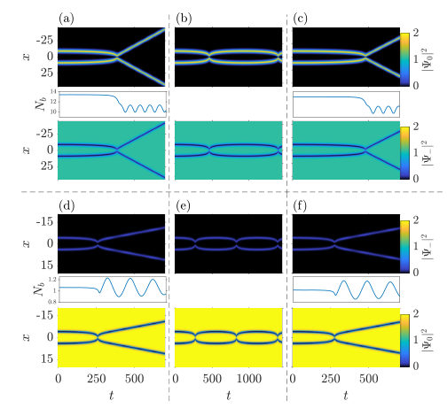
<figcaption class="paper-figure-caption"><b>Fig 1.</b> Figure 1. Example of the spatio-temporal evolution of the densities of the dark (|Ψ0|2) and bright (|Ψ−|2) components of an OP two-DBD (two-BDB) [(a)–(c)] ([(d)–(f)]) system in case of the F- [(a), (d)], NS- [(b), (e)] and AF- [(c), (f)] interactions, for d0 = 18 and q = −0.16 (d0 = 8 and q = 0.835) [(a)–(c)] ([(d)–(f)]). In case of the F- and AF- systems, the time evolution of the number of particles of the bright components (Nb) is depicted as well. The (|Ψ+|2) component is not displayed here, since Ψ+(t) = Ψ−(t), as discussed in Section II C.</figcaption>
</figure>
<figure class="paper-figure-card">
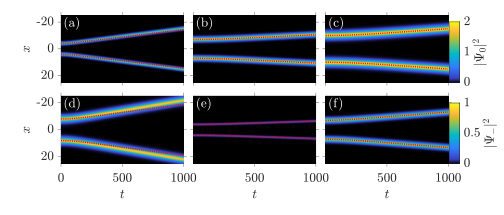
<figcaption class="paper-figure-caption"><b>Fig 2.</b> Figure 2. Characteristic results of the comparison between the spatio-temporal evolution of the IP systems and the tra- jectories predicted from the model (red dotted lines). The depicted cases: (a) two-DBD F-system with q = −0.72 and d0 = 8 (F = 0.96), (b) two-DBD NS-system with q = −0.32 and d0 = 14 (F = 1), (c) two-DBD AF-system with q = −0.12 and d0 = 20 (F = 0.98), (d) two-BDB F-system with q = 0.145 and d0 = 16 (F = 0.86), (e) two-BDB NS-system with q = 0.895 and d0 = 8 (F = 1), (f) two-BDB AF-system with q = 0.26 and d0 = 14 (F = 0.99).</figcaption>
</figure>
<figure class="paper-figure-card">
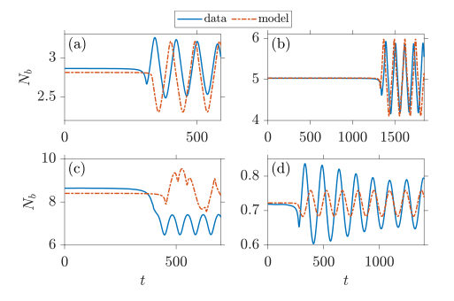
<figcaption class="paper-figure-caption"><b>Fig 3.</b> Figure 4. Characteristic results of the comparison between the time evolution of the number of particles of the bright components (Nb) and the model predictions in case of the OP system. The depicted cases: (a) two-DBD F-system with q = −0.67 and d0 = 10, (b) two-DBD AF-system with q = −0.36 and d0 = 16, (c) two-BDB F-system with q = 0.16 and d0 = 18 (F = 0), (d) two-BDB AF-system with q = 0.835 and d0 = 8.</figcaption>
</figure>
<figure class="paper-figure-card">
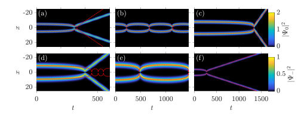
<figcaption class="paper-figure-caption"><b>Fig 4.</b> Figure 3. Same as Fig. 2 but for the OP configuration. The depicted cases: (a) two-DBD F-system with q = −0.67 and d0 = 10 (F = 0.71), (b) two-DBD NS-system with q = −0.56 and d0 = 10 (F = 0.96), (c) two-DBD AF-system with q = −0.36 and d0 = 16 (F = 0.88), (d) two-BDB F-system with q = 0.16 and d0 = 18 (F = 0), (e) two-BDB NS-system with q = 0.12 and d0 = 20 (F = 0.80), (f) two-BDB AF-system with q = 0.835 and d0 = 8 (F = 0.98).</figcaption>
</figure>
<figure class="paper-figure-card">
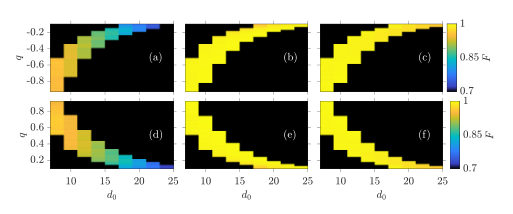
<figcaption class="paper-figure-caption"><b>Fig 5.</b> Figure 5. Fidelities of the IP systems: (a) two-DBD F-system, (b) two-DBD NS-system, (c) two-DBD AF-system, (d) two- BDB F-system, (e) two-BDB NS-system, (f) two-BDB AF- system.</figcaption>
</figure>

**Summary.** This paper analyzes the interaction dynamics of spinor solitons in $F=1$ BECs, examining configurations like dark-bright-dark. The research develops an effective Lagrangian model whose predictions are tested against numerical simulations. It reveals that while attraction can form bound states, spin interactions cause these to break via particle exchange, highlighting the complexity beyond simple non-spinor models.

**Why it may be interesting.** This work is highly relevant as it tackles complex non-linear dynamics in ultracold atomic systems, specifically addressing how internal spin degrees of freedom modify classical soliton interactions and lead to particle redistribution.

Detailed structure

**Main problem.** The study investigates the spin-mixing-induced dynamics of spinor solitons within $F=1$ Bose Einstein Condensates (BECs), focusing on interactions between dark and bright soliton configurations.

**Main result.** While initial attraction can lead to bound states, these states break down due to particle exchange dynamics induced by spin interactions. An effective classical model successfully captures the essential features of soliton behavior in most cases.

**Method.** The authors employ numerical simulations using Runge-Kutta integrators and develop an effective classical model based on a Lagrangian approach to describe the time evolution of variational parameters.

**Model / system.** The system is modeled as a 1D spinor $F=1$ BEC governed by dimensionless spinor Gross-Pitaevskii equations (SGPEs) for three hyperfine states. The dynamics are analyzed in terms of dark and bright solitons interacting via spin-mixing terms.

**Key observables.** Soliton densities ($|\Psi_m|^2$), interspecies particle exchange, effective interaction strength (repulsive/attractive), and variational parameters ($\xi(t)$, $\varphi(t)$).

**Important parameters / regimes.** Spin-dependent coefficient $g_s$ (determining F or AF interactions), initial phase difference ($\Delta\phi$), and the quadratic Zeeman term ($q$).

**Assumptions / limitations.** The effective model relies on the adiabatic approximation, which breaks down when large soliton overlaps occur, particularly in out-of-phase (OP) configurations.

**Figures summary.** Figures compare the predictions of the effective classical model against numerical simulations for both In-Phase (IP) and Out-of-Phase (OP) interactions, showing fidelity metrics and particle number evolution.

**Paper structure.** The paper first establishes the governing SGPEs and analyzes basic soliton interactions. It then develops an effective Lagrangian model to describe two-soliton dynamics, comparing its predictions against detailed numerical simulations for various phase configurations.

Abstract

We explore soliton interactions in a homogeneous spinor $F=1$ Bose Einstein Condensate (BEC) in the presence of a magnetic field, focusing on dark bright dark and bright dark bright configurations. We investigate how these interactions depend on the phase differences among bright solitons and their influence during the dynamics. Our findings align with prior non spinor results, i.e., repulsion among in phase bright solitons and attraction among out of phase pairs in self repulsive atomic BECs. The potential bright soliton attraction, added to the short range repulsion of dark dark soliton interactions, can lead to bound states. However, we find that these bound states break in the presence of spinor interactions due to the particle exchange dynamics between the hyperfine states of the components. Additonally, we develop an effective classical model to describe the soliton dynamics, using a Lagrangian approach. The accuracy of the model is tested by comparing it against numerical simulations. Our results suggest that the proposed model captures the essential features of soliton behavior in the presence of spin interactions, and provides congruent soliton trajectories and interspecies particle exchange dynamics in most of the cases.

[↑ back to top](#top)

### [Certification of the genuine resolution of photon number resolving detectors](http://arxiv.org/abs/2606.14365v1)

**Authors:** Jef Pauwels, Towsif Taher, Roope Uola, Boris Korzh, Nicolas Brunner, Pavel Sekatski  
**Type:** both · **Category:** quantum information and computing · **PDF:** <https://arxiv.org/pdf/2606.14365v1>  
**Analysis basis:** full PDF text, analyzed in chunks
**Topic relevance:** 🔥 `quantum measurements` **4/5** · `quantum optics experiment` **3/5** · `QC/QI experiment` **1/5** · `measurement-induced transitions` **1/5** · `methods for driven-dissipative` **1/5**

↔ Scroll figures horizontally

<figure class="paper-figure-card">
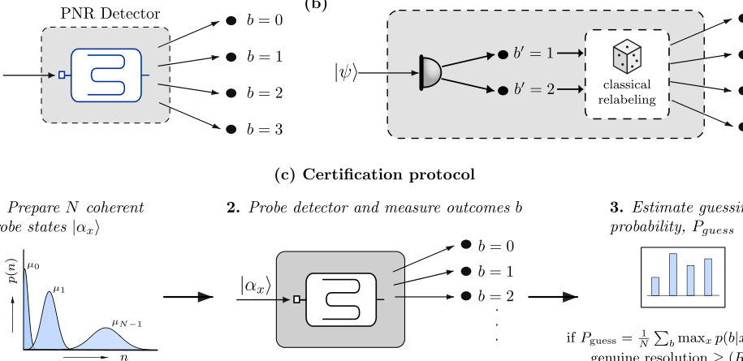
<figcaption class="paper-figure-caption"><b>Fig 1.</b> FIG. 1. Certifying the genuine resolution of a PNR detector. (a) Our task is to quantify the ability of a given PNR detector to count the number of photons. Consider the device features four possible outcomes b. The main question is whether this device is indeed able to count the number of incoming photons, or whether it can be simulated by a simpler detector with lower resolution. As illustrated in (b), one can imagine a device featuring a simple binary (click/no-click) detector followed by classical post-processing to produce the observed four-valued outcome. (c) In order to assess the genuine resolution of our detector, we devise a simple, efficient and scalable test based on a guessing...</figcaption>
</figure>
<figure class="paper-figure-card">
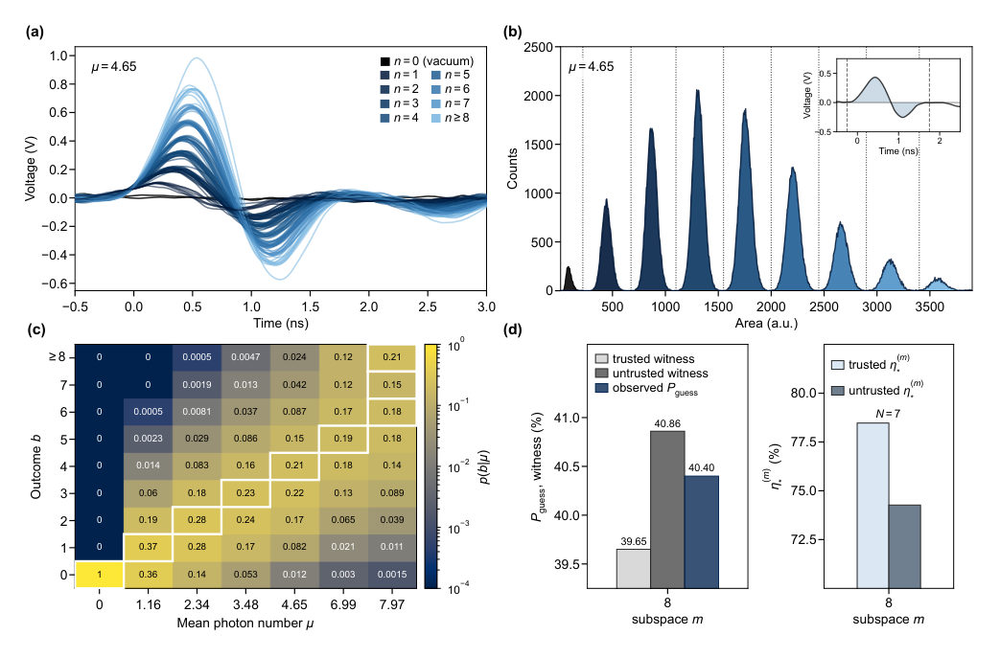
<figcaption class="paper-figure-caption"><b>Fig 2.</b> FIG. 2. Data acquisition and analysis for the 28-pixel PNR-SNSPD. a) Representative oscilloscope waveforms for an input coherent state (µ = 4.65), where voltage corresponds to the number of simultaneous pixel clicks (n). b) Histogram of the integrated pulse areas for µ = 4.65 for 2.5 × 105 non-zero detection events. Well-resolved peaks enable the unambiguous assignment of the (discrete) outcome b ∈{0, ..., 8} via the classification thresholds (dashed vertical lines). Inset: a single waveform on an expanded time axis. The shaded region indicates the 2 ns integration window. c) Measured conditional outcome distributions p(b|µx) for the input states µx with x {1, ..., 7}. For each output b,...</figcaption>
</figure>
<figure class="paper-figure-card">
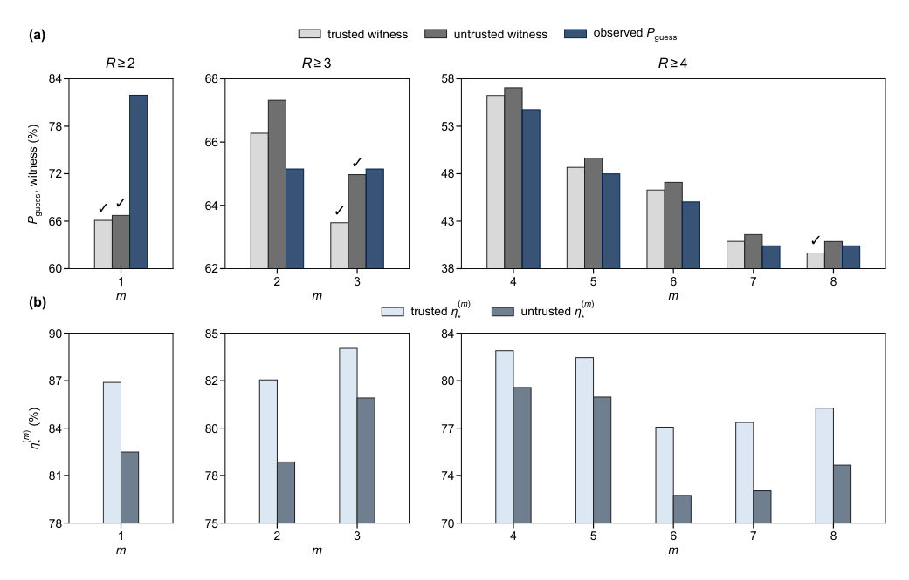
<figcaption class="paper-figure-caption"><b>Fig 3.</b> FIG. 3. Experimental certification of genuine resolution and effective efficiency. By considering various subsets of input states, the data in Fig.2(c) is used to certify lower bounds on the genuine resolution R and the effective efficiency, for different photon number subspace m. (a) In the 0-1 photon subspace (m=1), a maximal genuine resolution of R = 2 is certified. A genuine resolution R ≥3 is certified in the subspace with up to m = 3 photons; note that, with our data, this is not possible for m = 2. Finally, in order to certify a resolution R ≥4, we must increase the subspace up to m = 8 photons. The statistical error is negligible in the trusted scenario, but increases in the...</figcaption>
</figure>
<figure class="paper-figure-card">
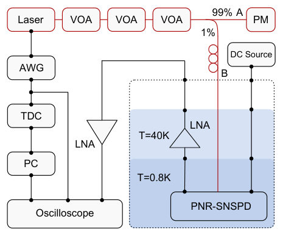
<figcaption class="paper-figure-caption"><b>Fig 4.</b> FIG. 4. Experimental setup for data acquisition. Coher- ent states are generated by a 1550 nm pulsed laser driven by an arbitrary waveform generator (AWG). The state intensities are controlled via variable optical attenuators (VOAs) and monitored using a 99:1 beam splitter and a power meter. The attenuated pulses probe a 28-pixel PNR-SNSPD operating at 0.8 K. The detector’s output signal, which encodes the number of firing pixels, is amplified both cryogenically (40 K) and at room temperature using low-noise amplifiers (LNAs) before being digitized on a high-resolution oscilloscope. A time-to-digital converter (TDC) measures the total number of laser pulses.</figcaption>
</figure>

**Summary.** This paper introduces an operational framework to certify the genuine photon-number resolving capability of PNR detectors. By employing a 'guessing game' protocol with coherent state probes, the authors developed a scalable method to quantify detector performance without full tomography. They successfully applied this to test a superconducting nanowire detector, establishing critical benchmarks for efficiency and resolution.

**Why it may be interesting.** This work provides a rigorous, scalable diagnostic tool for characterizing fundamental quantum hardware components (PNR detectors) that are crucial building blocks for quantum communication and computation protocols.

Detailed structure

**Main problem.** The primary challenge is establishing a practical, operational metric to certify the genuine resolution (the ability to distinguish between different photon numbers) of Photon-Number-Resolving (PNR) detectors.

**Main result.** The authors developed a scalable protocol using coherent state probes that successfully certified genuine four-outcome resolution for a tested PNR-SNSPD, while also quantifying the critical dependence of this resolution on detector efficiency.

**Method.** They introduced an operational framework based on quantum measurement theory and utilized a 'guessing game' protocol involving weak coherent states to derive lower bounds on the genuine resolution by comparing measured guessing probabilities against theoretical witness inequalities.

**Model / system.** The work focuses on characterizing PNR detectors, specifically testing a 28-pixel superconducting nanowire single-photon detector (PNR-SNSPD). The analysis is framed within the context of efficiency-limited quantum channels acting on Fock states.

**Key observables.** Genuine Resolution ($R$), Guessing Probability ($P_{	ext{guess}}$), Effective Efficiency ($\eta^*_m$), and statistical significance ($Z$).

**Important parameters / regimes.** Detector efficiency ($\eta$), the maximum photon number subspace limit ($m$), and the intensity bound ($I$) used in untrusted source models.

**Assumptions / limitations.** The protocol avoids full measurement tomography by relying only on measurable input-output statistics from coherent probes; statistical analysis uses conservative bounds like Azuma–Hoeffding inequality.

**Figures summary.** Figures illustrate the conceptual framework of quantifying photon counting ability, show data acquisition workflows using oscilloscope traces and histogram analysis, and present tables summarizing threshold efficiencies ($\eta_{	ext{th}}$) and certified effective efficiencies ($\eta^*_m$) for various subspaces ($m$).

**Paper structure.** The paper progresses from defining the theoretical gap (lack of certification metric) to proposing an operational framework using coherent state probes. It then details the mathematical derivation of witness inequalities, presents experimental data analysis comparing measured $P_{	ext{guess}}$ against trusted/untrusted bounds, and concludes by reporting certified resolution levels and effective efficiencies.

Abstract

Photon-number-resolving (PNR) detectors are essential components of photonic quantum technologies, yet thus far, no practical metric exists to certify how many photons they can genuinely resolve in a single measurement. Here we introduce an operational framework for quantifying the capability of a PNR detector to distinguish between different numbers of photons, i.e. its genuine resolution. In turn, we develop a practical and scalable protocol for certifying the genuine resolution of a detector, which is based on coherent state probes. We apply the method to a 28-pixel photon-number-resolving superconducting nanowire single-photon detector (PNR-SNSPD) and certify genuine four-outcome resolution. Our work highlights the critical requirements in terms of detector efficiency towards achieving high genuine resolution. This approach provides an operational benchmark for PNR detectors and fills a crucial gap in the characterization of photonic quantum devices.

[↑ back to top](#top)

### [Universal Crossovers of Stabilizer Entropy Beyond Criticality](http://arxiv.org/abs/2606.13810v1)

**Authors:** Reyhaneh Khasseh, E. A. Ramirez Trino, M. A. Rajabpour  
**Type:** theory · **Category:** statistical mechanics · **PDF:** <https://arxiv.org/pdf/2606.13810v1>  
**Analysis basis:** full PDF text, analyzed in chunks
**Topic relevance:** 🔥 `entanglement & information structure` **4/5** · `non-equilibrium universality` **2/5** · `Frenkel-Kontorova` **1/5** · `analog quantum simulation` **1/5** · `exotic spin models in light-matter` **1/5** · `non-equilibrium dynamics` **1/5**

↔ Scroll figures horizontally

<figure class="paper-figure-card">
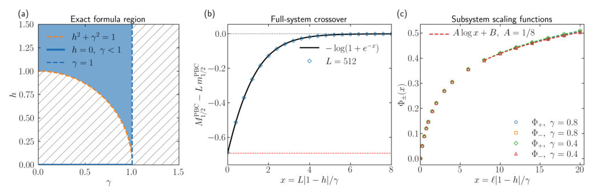
<figcaption class="paper-figure-caption"><b>Fig 1.</b> FIG. 1. Universal scaling structures of the stabilizer R´enyi entropy. (a) Exact-formula region for the periodic-chain and subsystem analysis in the (γ, h) plane. The orange dashed curve denotes h2 + γ2 = 1, the black dashed line denotes γ = 1, and the solid blue line along h = 0 indicates the additional exact result for γ &lt; 1. The shaded blue region indicates the exact-formula regime, while the hatched regions are outside this regime. (b) Full-system finite-size crossover. After subtracting the volume-law contribution L mPBC 1/2 , the periodic-chain data for L = 512 follow the universal crossover function −log(1+e−x) with x = L|1 −h|/γ. The horizontal dashed lines mark the critical value...</figcaption>
</figure>
<figure class="paper-figure-card">
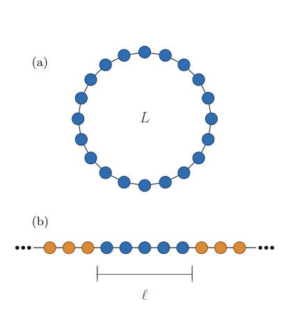
<figcaption class="paper-figure-caption"><b>Fig 2.</b> FIG. 2. Lattice configurations. (a) Finite periodic chain with even length L. (b) Infinite chain restricted to a contiguous subsystem of length ℓ.</figcaption>
</figure>
<figure class="paper-figure-card">
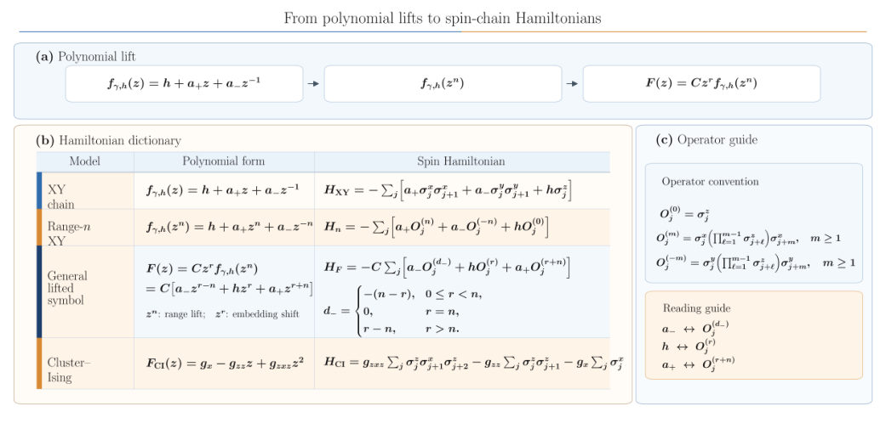
<figcaption class="paper-figure-caption"><b>Fig 3.</b> FIG. 3. Dictionary between Laurent-polynomial symbols and spin-chain Hamiltonians. Panel (a) shows the successive trans- formations fγ,h(z) 7→fγ,h(zn) 7→F(z) = Czrfγ,h(zn). Panel (b) lists the representative symbol families used in the paper and their corresponding spin-chain Hamiltonians, with a± = (1 ± γ)/2. Panel (c) defines the string operators O(m) j : positive indices</figcaption>
</figure>
<figure class="paper-figure-card">
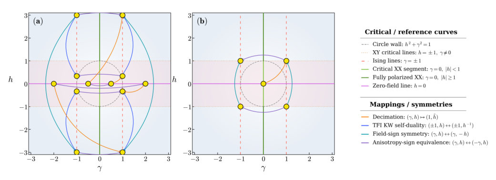
<figcaption class="paper-figure-caption"><b>Fig 4.</b> FIG. 4. Parameter space of the anisotropic XY chain. The dashed curve h2 + γ2 = 1 separates oscillatory and ordered regimes. The lines h = ±1, γ = ±1, and γ = 0, |h| &lt; 1, denote the anisotropic critical, Ising, and critical XX lines, respectively. The zero-field line is special: parity decimation maps (γ, 0) to the TFI point (1,eh), with eh = (1 −γ)/(1 + γ). Arrows denote decimation, Kramers–Wannier duality, and unitary sign equivalences. The marked points organize two orbits. All points within a given orbit have the same SRE, with the appropriate sector or interval-algebra matching.</figcaption>
</figure>
<figure class="paper-figure-card">
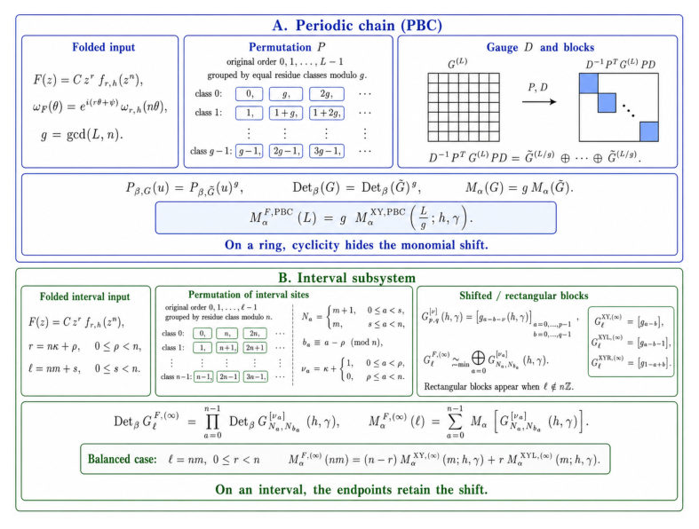
<figcaption class="paper-figure-caption"><b>Fig 5.</b> FIG. 5. Summary of the exact decimation structure and SRE correspondences used throughout the work. A. Periodic chain: correlation matrices decompose into independent G-blocks after site permutations and diagonal gauge transformations, leading to factorization of the generating function and additive SRE. B. Interval subsystem: the same folding acts on Toeplitz truncations, but the endpoints retain the monomial shift, producing ordinary, shifted, and, when ℓ/∈nZ, rectangular blocks; consequently, the determinant sums factorize, and the subsystem SRE becomes additive.</figcaption>
</figure>

**Summary.** This paper rigorously calculates the Stabilizer Rényi entropy for solvable spin chains across various physical geometries. By deriving exact finite-size formulas using Pfaffian methods, it establishes a lattice benchmark that precisely maps out how entanglement measures behave when moving away from critical points into massive or crossover regimes.

**Why it may be interesting.** The work provides rigorous, exact lattice results for a complex entanglement measure (SRE) in critical/crossover regimes, offering crucial benchmarks for theoretical models derived from Quantum Field Theory and CFT.

Detailed structure

**Main problem.** The primary goal is understanding how the scaling structure of Stabilizer Rényi entropy (SRE) behaves in quantum many-body systems when moving away from critical points into massive or crossover regimes.

**Main result.** Exact finite-size formulas are derived for SRE in both periodic and subsystem geometries, providing a lattice benchmark that extends QFT descriptions beyond isolated conformal points.

**Method.** The authors use exact solvability techniques applicable to free-fermion spin chains, deriving results via Pfaffian methods and analyzing the factorization properties of correlation matrices across different boundary conditions (periodic vs. interval).

**Model / system.** The study focuses on a broad class of finite-range spin chains, particularly the anisotropic XY chain, analyzed in both full periodic geometry (ring) and as an embedded subsystem (interval).

**Key observables.** Stabilizer Rényi entropy ($	ext{SRE}$), $	ext{Det}_1(G)$ (absolute minor determinant of the correlation matrix), and various scaling functions ($\Phi_{\chi}(\sigma)$).

**Important parameters / regimes.** The anisotropy parameter ($h$), the coupling strength ($\gamma$), system size ($L$ or $\ell$), and the Rényi index ($\alpha=1/2$).

**Assumptions / limitations.** The analysis relies on specific algebraic structures (Toeplitz/periodic matrices) that allow the intractable absolute-minor problem to be reduced to solvable determinant/Pfaffian forms.

**Figures summary.** Figures illustrate parameter spaces showing critical lines ($h^2 + \gamma^2 = 1$) and compare exact formulas derived for periodic vs. interval geometries, highlighting boundary effects.

**Paper structure.** The paper systematically analyzes SRE in different physical settings: first the full periodic chain (volume law, cusp), then the subsystem geometry (boundary contributions via Pfaffians), and finally comparing three specific block representations ($	ext{XY}$, $	ext{XYR}$, $	ext{XYL}$) to establish universal scaling laws across regimes.

Abstract

Stabilizer Rényi entropy has emerged as a probe of nonstabilizerness in quantum many-body systems, but its scaling structure beyond critical points remains poorly understood compared with entanglement entropy. Recent field-theory approaches indicate that stabilizer entropy contains universal critical data and boundary-sensitive terms, raising the question of how these structures extend into massive and crossover regimes. We address this problem for a broad class of finite-range spin chains at Rényi index one-half. We derive exact finite-size formulas for both full periodic chains and finite intervals of the infinite chain, making the universal crossover from critical to noncritical behavior analytically accessible. In periodic geometry, the entropy obeys a volume law away from criticality and exhibits a universal finite-size crossover controlled by the competition between system size and correlation length. We also show that the large-scale SRE density develops a cusp across the field-tuned critical line, while the XX endpoint is governed by a distinct scaling regime associated with the saturation point. In the subsystem geometry, the interval entropy separates bulk critical behavior from boundary contributions generated by the way the finite region cuts the infinite chain. The crossover from critical to massive behavior is then encoded in boundary constants and universal functions controlled by the correlation length. Through exact stabilizer-entropy correspondences, the scaling theory extends to internal XY reductions, Finite-range spin chains, and Cluster--Ising representatives. Our results provide an exact lattice benchmark for the emerging QFT description of stabilizer entropy beyond isolated conformal points.

[↑ back to top](#top)

### [An integrated ultrahigh vacuum cluster tool for diamond surface science and single nitrogen-vacancy center measurements](http://arxiv.org/abs/2606.13961v1)

**Authors:** Zhiyang Yuan, Sorawis Sangtawesin, Lila V. H. Rodgers, Kalliope Zervas, James J. Allred, Jared Rovny, Patryk Gumann, Nathalie P. de Leon  
**Type:** experiment · **Category:** quantum information and computing · **PDF:** <https://arxiv.org/pdf/2606.13961v1>  
**Analysis basis:** full PDF text, analyzed in chunks
**Topic relevance:** 🔥 `QC/QI experiment` **4/5** · `spintronics-quantum-optics interface` **3/5** · `quantum measurements` **1/5** · `quantum optics experiment` **1/5**

↔ Scroll figures horizontally

<figure class="paper-figure-card">
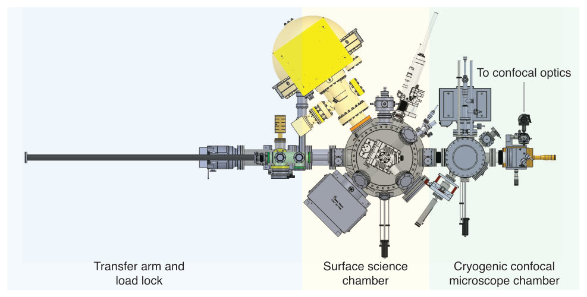
<figcaption class="paper-figure-caption"><b>Fig 1.</b> FIG. 1. Schematic (top view) of the ultrahigh vacuum (UHV) cluster tool for diamond surface science and nitrogen-vacancy (NV) center characterization. The system is configured in a linear cluster geometry and comprises three main modules: a load lock, a surface science chamber, and a cryogenic confocal microscope chamber. To accommodate multiple tools, the surface science chamber has a body outer diameter (OD) of 16.5 in. (419 mm) and a height of 18 in. (457 mm). The specific tools are labeled and described in Fig. 7. The cryogenic confocal microscope chamber has a body OD of 10 in. (254 mm) and a height of 17.5 in. (445 mm).</figcaption>
</figure>
<figure class="paper-figure-card">
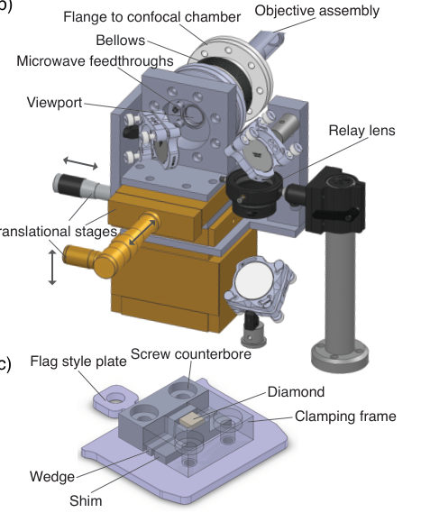
<figcaption class="paper-figure-caption"><b>Fig 2.</b> FIG. 2. (a) Top view of the cryogenic confocal microscope cham- ber, imaged through the top viewport. (b) Design of the translation stages for the UHV confocal microscope. The objective assembly is mounted on the viewport flange, which is connected to the cryo- genic confocal microscope chamber via a bellows to allow flexible movement. Two mirrors are mounted on different levels of the trans- lation stages to preserve the optical alignment during stage move- ment. (c) Diamond sample mount for sample processing and confo- cal measurement. The clamping frame is rendered semi-transparent to show the underlying shim and wedge. Assembly parts are made of molybdenum. The assembly is mounted on a...</figcaption>
</figure>
<figure class="paper-figure-card">
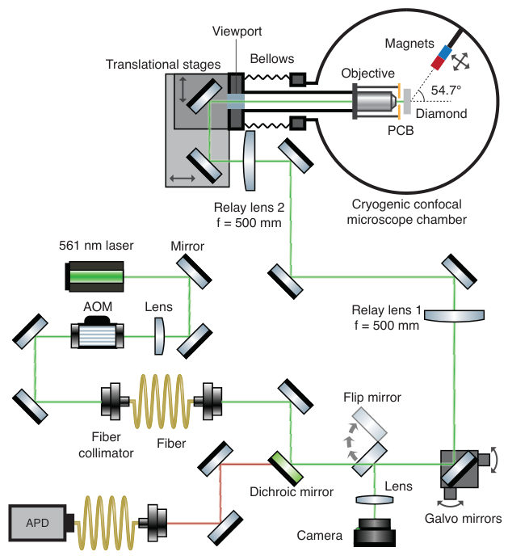
<figcaption class="paper-figure-caption"><b>Fig 3.</b> FIG. 3. Optical setup of the confocal microscope. A 561 nm laser is coupled to an acousto-optic modulator (AOM) to enable pulsed optical excitation for fast spin readout of NV centers. The beam is focused onto the AOM with a plano-convex lens to achieve a rise time of around 20 ns. In the confocal configuration, a pair of galvanometer (galvo) mirrors scans the lateral beam position at the objective focal plane. Two relay lenses arranged in a 4-f configuration image the scanning point from the galvo mirrors onto the back aperture of the UHV objective. Distances in the schematic are not to scale. The UHV objective can be translated relative to the diamond sample using external translation...</figcaption>
</figure>
<figure class="paper-figure-card">
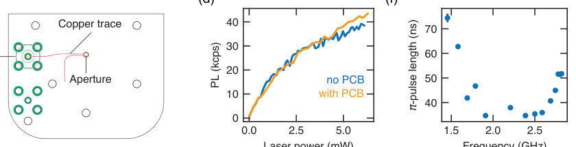
<figcaption class="paper-figure-caption"><b>Fig 4.</b> FIG. 4. (a) PCB mount assembly. The PCB is mounted to a metallic plate for mechanical stability, which is connected to the adapter via three support rods. The plate has an opening larger than the objective diameter, enabling the PCB to be positioned in close proximity to the objective. Venting holes in the plate are designed to prevent gas trapping between the PCB and the plate under UHV conditions. The support rods are symmetrically arranged around the objective on the adapter. Openings in the adapter provide access for microwave cables. An aperture in the lens tube allows viewing of the back aperture of the objective during optical alignment. All components are fabricated from 316L...</figcaption>
</figure>
<figure class="paper-figure-card">
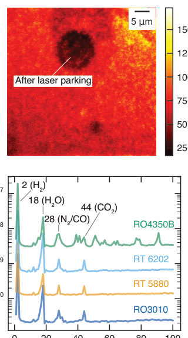
<figcaption class="paper-figure-caption"><b>Fig 5.</b> FIG. 5. (a) A confocal scan of the diamond surface after high power microwave through a PCB made of RO4350B. The dark regions show the increased background surface PL can be quenched by scanning the green laser. (b) Averaged residual gas analyzer (RGA) mass spectra during continuous microwave operation for 2 hours showing outgassing partial pressures from different PCB substrate materials: blue: RO3010, yellow: RT/duroid 5880, light blue: RT/duroid 6202, green: RO4350B. The top three curves have been vertically shifted for clarity.</figcaption>
</figure>

**Summary.** The authors designed and utilized an integrated Ultrahigh Vacuum cluster tool to study Nitrogen-Vacancy centers in diamond. This platform uniquely combines surface science tools like XPS/LEED with cryogenic NV spin measurement capabilities, allowing researchers to directly correlate controlled surface chemistry changes with the resulting quantum coherence of the defect center.

**Why it may be interesting.** This work provides a highly sophisticated experimental realization of controlling solid-state quantum emitters by engineering their immediate physical environment at the atomic scale. The ability to correlate chemical state (XPS) directly with quantum coherence ($T_2$) is crucial for building robust quantum memories and sensors.

Detailed structure

**Main problem.** The primary challenge is correlating diamond surface chemistry/structure with the spin and charge properties of shallow Nitrogen-Vacancy (NV) centers, as surface contaminants cause decoherence and instability.

**Main result.** An integrated UHV cluster tool was developed that allows for direct, in situ correlation between controlled diamond surface modifications and measurable NV spin dynamics, establishing a pathway for reproducible quantum sensing.

**Method.** The authors utilized an ultrahigh vacuum (UHV) cluster tool integrating separate chambers for surface science (XPS, LEED, annealing) and cryogenic confocal microscopy for single-NV measurements.

**Model / system.** The system is a complex experimental platform comprising three interconnected modules: a load-lock, a surface science chamber capable of thermal/gas treatment, and a cryogenic microscope chamber. This setup allows atomic-scale control over the diamond surface while simultaneously performing quantum optical measurements on NV centers.

**Key observables.** NV spin coherence times ($T_1$, $T_2$), charge state stability, background Photoluminescence (PL) intensity, XPS core-level spectra ($	ext{C}1s$, $	ext{O}1s$), and LEED patterns.

**Important parameters / regimes.** Ultrahigh vacuum base pressures ($\sim 5 	imes 10^{-10}$ mbar); cryogenic temperatures (down to $4	ext{ K}$); annealing temperatures up to $>1000^\circ	ext{C}$; magnetic field alignment precision better than $0.5^\circ$.

**Assumptions / limitations.** The system's ability to maintain vacuum integrity while performing complex mechanical and optical manipulations is assumed; the observed PL changes are attributed to surface charging effects mediated by adsorbates.

**Figures summary.** Figures detail the schematic layout of the three-module UHV cluster tool, the optical setup for confocal microscopy, XPS/LEED results showing surface termination, and PL maps illustrating background signal changes upon annealing or exposure.

**Paper structure.** The paper describes the necessity of integrating surface science (XPS/LEED) with quantum measurement (NV spectroscopy) under UHV. It details the custom hardware design (external scanning optics, specialized sample mount) to achieve this integration, followed by presenting results correlating surface cleanliness metrics with improved NV spin coherence.

Abstract

We present a custom-designed ultrahigh vacuum (UHV) cluster tool developed for studying shallow nitrogen-vacancy (NV) centers in diamond, enabling in situ diamond surface preparation, characterization, and single NV center dynamics measurements within a single connected platform. The system combines a surface science chamber for controlled surface modification and analysis with a cryogenic confocal microscope chamber dedicated to NV spin and optical measurements. This integrated approach enables a direct correlation between diamond surface chemistry and the resulting NV spin and charge properties. The instrument provides a versatile platform for systematic studies of surface-induced decoherence mechanisms and charge dynamics for shallow NV centers, and establishes a pathway toward reproducible surface engineering for quantum sensing applications.

[↑ back to top](#top)

### [Ferromagnetic Order of Reduced Magnetic Moments in a Frustrated Sawtooth Chain of the Magnetic Semiconductor ZnYb$_2$S$_4$](http://arxiv.org/abs/2606.14196v1)

**Authors:** Shinji Okada, Hiroto Suzuki, Nonoka Higa, Yasuyuki Shimura, Takanori Taniguchi, Takahiro Onimaru  
**Type:** experiment · **Category:** strongly correlated electrons · **PDF:** <https://arxiv.org/pdf/2606.14196v1>  
**Analysis basis:** full PDF text, analyzed in chunks
**Topic relevance:** 🔥 `analog quantum simulation` **4/5** · `exotic spin models in light-matter` **3/5** · `Frenkel-Kontorova` **2/5**

↔ Scroll figures horizontally

<figure class="paper-figure-card">
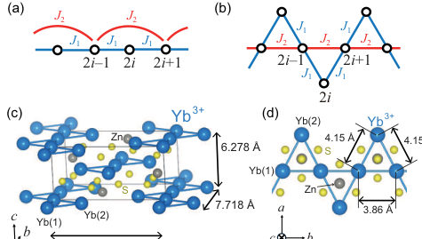
<figcaption class="paper-figure-caption"><b>Fig 1.</b> FIG. 1. (Color online) (a) One-dimensional spin chain with nearest- and next-nearest-neighbor exchange interactions, J1 (blue) and J2 (red). Note that J2 acts on every other site. (b) A sawtooth spin chain with J1 and J2 equivalent to the one-dimensional model. (c) Orthorhombic crystal structure of ZnYb2S4 with the space group of Pnma. There are two Yb3+ sites, which are labeled Yb(1) at the 4a site (¯1) and Yb(2) at the 4c site (m). (d) The Yb3+ ions of Yb(1) and Yb(2) form a sawtooth chain along the b-axis.</figcaption>
</figure>
<figure class="paper-figure-card">
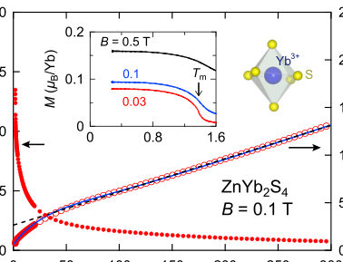
<figcaption class="paper-figure-caption"><b>Fig 2.</b> FIG. 2. (Color online) Temperature dependence of the magnetic susceptibility M(T )/B of ZnYb2S4 measured in B = 0.1 T (left-hand scale), and the inverse susceptibility B/M (right-hand scale). The broken line indicates a Curie– Weiss fit, and the solid (blue) line is a calculation considering the CEF effect for a Yb3+ ion. The inset presents the temper- ature dependence of the magnetization in B = 0.03, 0.1, and 0.5 T. Tm denotes the magnetic ordering temperature. The right inset shows the Yb(1) site encapsulated in a slightly dis- torted S octahedron.</figcaption>
</figure>
<figure class="paper-figure-card">
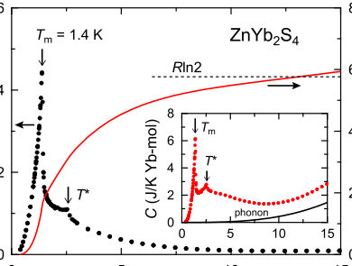
<figcaption class="paper-figure-caption"><b>Fig 3.</b> FIG. 3. (Color online) Temperature dependence of the mag- netic specific heat divided by temperature, Cm/T (left-hand scale), and the magnetic entropy, Sm (right-hand scale), of ZnYb2S4. Tm denotes the magnetic ordering temperature, and T ∗indicates an extrinsic anomaly due to an impurity phase. The inset shows the temperature dependence of the specific heat, C(T ). The solid line represents the phonon contribution estimated using a Debye model. See the text in detail.</figcaption>
</figure>
<figure class="paper-figure-card">
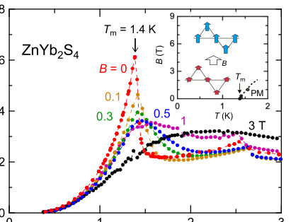
<figcaption class="paper-figure-caption"><b>Fig 4.</b> FIG. 4. (Color online) Temperature dependence of the spe- cific heat C of ZnYb2S4 in B = 0, 0.1, 0.3, 0.5, 1, and 3 T. The inset shows the B–T phase diagram. PM denotes the para- magnetic phase, and the broken line indicates the crossover. The illustration indicates that the reduced Yb moments (red arrows) on the sawtooth chain are developed (blue arrows) due to release of the magnetic frustration with the applica- tion of magnetic fields.</figcaption>
</figure>
<figure class="paper-figure-card">
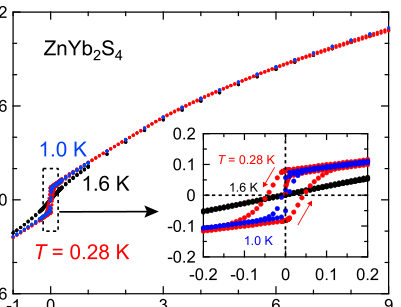
<figcaption class="paper-figure-caption"><b>Fig 5.</b> FIG. 5. (Color online) Isothermal magnetization of ZnYb2S4 at T = 0.28 (red), 1.0 (blue), and 1.6 K (black). The inset shows the data expanded for |B| ≤0.2 T. The arrows indicate the directions in which the magnetic fields change.</figcaption>
</figure>

**Summary.** The study investigates $	ext{ZnYb}_2	ext{S}_4$, a material featuring Yb ions arranged in a frustrated sawtooth chain. Through detailed measurements of specific heat and magnetization, the authors demonstrate that magnetic frustration suppresses the expected long-range antiferromagnetic order below $T_m = 1.4 	ext{ K}$. The results suggest the ground state features ferromagnetically aligned but significantly reduced moments.

**Why it may be interesting.** This work provides an excellent example of how geometric frustration in a low-dimensional quantum magnet can suppress expected long-range order, leading to novel ground states that are sensitive to external fields.

Detailed structure

**Main problem.** Investigating how magnetic frustration within a sawtooth chain structure affects the ground state magnetic order of $	ext{Yb}^{3+}$ moments in the semiconductor $	ext{ZnYb}_2	ext{S}_4$.

**Main result.** The system exhibits evidence of magnetic frustration, leading to reduced spontaneous magnetization despite underlying antiferromagnetic correlations; the ground state is characterized by ferromagnetically aligned but suppressed Yb moments.

**Method.** A combination of bulk measurements including specific heat ($C(T)$), isothermal magnetization ($M(B)$), and powder neutron diffraction were employed.

**Model / system.** The physical system is the orthorhombic semiconductor $	ext{ZnYb}_2	ext{S}_4$, where $	ext{Yb}^{3+}$ ions form a sawtooth spin chain along the $b$-axis, modeled by competing nearest- and next-nearest-neighbor exchange interactions.

**Key observables.** Specific heat peak at $T_m = 1.4 	ext{ K}$, magnetic entropy release ($27\%$ of $R\ln2$ at $T_m$), hysteresis in $M(B)$, and absence of superlattice reflections in neutron diffraction.

**Important parameters / regimes.** $T_m = 1.4 	ext{ K}$ (transition temperature); $	heta_p < 0$ (indicating AFM interactions); spontaneous magnetization $\approx 0.1 \mu_B/	ext{Yb}$.

**Assumptions / limitations.** The magnetic behavior is governed by the effective spin-1/2 Kramers doublet ground state derived from Crystal Electric Field theory.

**Figures summary.** Figures show $C(T)$ peaks, $M(B)$ hysteresis loops, and neutron diffraction patterns confirming the nature of the magnetic ordering below $T_m$.

**Paper structure.** The paper first establishes the theoretical framework using a sawtooth chain Hamiltonian and CEF analysis. It then presents experimental results from specific heat and magnetization measurements to identify the transition temperature ($T_m$) and quantify frustration via entropy release. Finally, neutron diffraction confirms the nature of the magnetic order.

Abstract

In a sawtooth spin chain, competing nearest- and next-nearest-neighbor interactions suppress long-range order, yielding novel quantum states such as a spin-dimer singlet, 1/2 magnetization plateau, and spin contraction. Here, we investigate the magnetic properties of the orthorhombic semiconductor ZnYb$_2$S$_4$, in which Yb$^{3+}$ ions with an effective spin-1/2 form a sawtooth chain along the $b$-axis. The specific heat exhibits a sharp peak at ${T}_{\rm m}$ $=$ 1.4 K, at which the magnetic entropy $S_{\rm m}$ reaches only 27% of $R$ln2. This reduced $S_{\rm m}$ at $T_{\rm m}$ indicates the entropy release of the ground state doublet of Yb$^{3+}$ even for $T$ $>$ $T_{\rm m}$. The isothermal magnetization $M(B)$ at 0.28 K exhibits hysteresis for $\left|B\right| \leq 0.2$ T and increases monotonically for $B > 0.2$ T. The spontaneous magnetization is only 0.1 ${\it μ}_{\rm B}$$/$Yb, an order of magnitude smaller than that expected for the ground state doublet of Yb$^{3+}$. Moreover, in powder neutron diffraction measurements, no superlattice reflections due to antiferromagnetic order are observed for $T$ $<$ $T_{\rm m}$. Therefore, in the ground state, the Yb moments are ferromagnetically aligned, but their amplitude is reduced by magnetic frustration in the sawtooth Yb chain.

[↑ back to top](#top)

### [Mass-imbalanced two-dimensional Bose-Fermi mixtures with boson-fermion pairing](http://arxiv.org/abs/2606.14338v1)

**Authors:** Cristiano Luigi Kosman Chiarappa, Pietro Bovini, Pierbiagio Pieri  
**Type:** theory · **Category:** quantum gases · **PDF:** <https://arxiv.org/pdf/2606.14338v1>  
**Analysis basis:** full PDF text, analyzed in chunks
**Topic relevance:** 🔥 `analog quantum simulation` **4/5** · `Keldysh / 2PI / non-Gaussian methods` **3/5** · `methods for driven-dissipative` **1/5** · `non-equilibrium dynamics` **1/5**

↔ Scroll figures horizontally

<figure class="paper-figure-card">
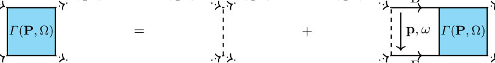
<figcaption class="paper-figure-caption"><b>Fig 1.</b> FIG. 1. Feynman diagrams for the particle-particle ladder Γ(P, Ω), corresponding to the T-matrix in the normal phase. Full lines correspond to bare bosonic (B) and fermionic (F) Green’s functions, dashed lines correspond to bare BF interactions, and dotted lines with arrows indicate the external momentum flow. (P, Ω) is the center of mass (2+1)-momentum (P, Ω) = (p1+p2, ω1+ω2) while (p, ω) is the exchanged (2+1)-momentum.</figcaption>
</figure>
<figure class="paper-figure-card">
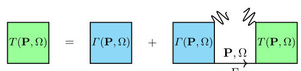
<figcaption class="paper-figure-caption"><b>Fig 2.</b> FIG. 2. Feynman’s diagrams for the many-body T-matrix in the condensed phase T(P, Ω). Wiggly lines correspond to condensed boson insertions and contribute with a factor of √n0 each, where n0 is the condensate density.</figcaption>
</figure>
<figure class="paper-figure-card">
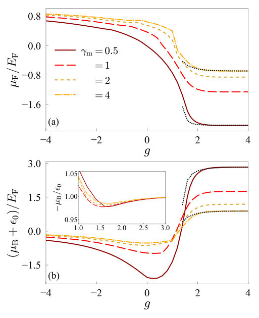
<figcaption class="paper-figure-caption"><b>Fig 3.</b> FIG. 4. (a): Fermion chemical potential µF in units of EF. (b): Boson chemical potential µB (shifted by the binding en- ergy ϵ0), in units of EF, as a function of the BF coupling g, for several values of mass ratio γm, in the case x = 1. Inset: ratio between µB and its leading strong-coupling limit −ϵ0. Black dotted lines: strong-coupling benchmarks (reported for clarity for γm = 0.5, 4 only).</figcaption>
</figure>
<figure class="paper-figure-card">
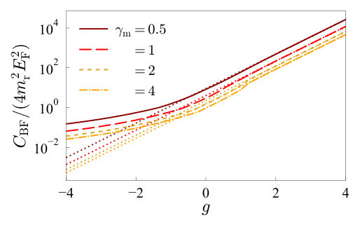
<figcaption class="paper-figure-caption"><b>Fig 4.</b> FIG. 5. Dimensionless parameter CBF/(4m2 rE2 F), as a func- tion of BF coupling g, for different values of the mass ratio γm in the case x = 1. Dotted lines: asymptotic behavior given by (x ϵ0 (γm + 1)/γm) /EF.</figcaption>
</figure>
<figure class="paper-figure-card">
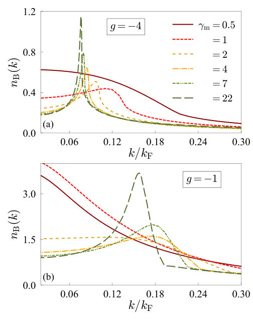
<figcaption class="paper-figure-caption"><b>Fig 5.</b> FIG. 6. Boson momentum distribution nB(k) as a function of k/kF, for the boson concentration x = 1 and BF couplings g = −4 (a) and g = −1 (b). Several values of mass ratio γm are reported.</figcaption>
</figure>

**Summary.** This paper theoretically investigates mass-imbalanced two-dimensional Bose-Fermi mixtures interacting via tunable attraction. Using a diagrammatic T-matrix approach, the authors calculate key thermodynamic properties and predict that mass imbalance introduces qualitative changes in the boson momentum distribution. These findings offer new experimental signatures for probing strongly correlated quantum gases.

**Why it may be interesting.** This work provides advanced theoretical tools (T-matrix formalism) to predict novel observable signatures (finite momentum peaks) in ultracold quantum gas mixtures, which is highly relevant for experimental realization using modern cold atom or semiconductor platforms.

Detailed structure

**Main problem.** The study analyzes mass-imbalanced two-dimensional Bose-Fermi (BF) mixtures with tunable boson-fermion attraction at zero temperature.

**Main result.** Mass imbalance acts as a new control parameter that qualitatively modifies the bosonic momentum distribution, potentially allowing for the observation of a peak at finite momentum.

**Method.** The analysis employs a diagrammatic T-matrix approach and utilizes weak-coupling perturbative expansions to calculate thermodynamic quantities.

**Model / system.** The system is modeled as a 2D homogeneous mixture of spinless bosons and fermions, governed by an effective Hamiltonian including BF attraction and optional BB repulsion. The study extends theoretical treatments from mass-balanced to mass-imbalanced cases.

**Key observables.** Chemical potentials ($\mu_B, \mu_F$), boson momentum distribution function ($n_B(k)$), condensate density, and Tan's contact parameter ($C_{BF}$).

**Important parameters / regimes.** Mass ratio ($\gamma_m = m_B/m_F$), boson concentration parameter ($x = n_B/n_F$), and the effective coupling strength ($g$).

**Assumptions / limitations.** The analysis assumes a dilute, homogeneous mixture at zero temperature ($T=0$) and relies on diagrammatic approximations (T-matrix formalism).

**Figures summary.** Figures illustrate Feynman diagrams for T-matrices and self-energies; specific plots show the dependence of chemical potentials ($\mu_F, \mu_B$) and the bosonic momentum distribution $n_B(k)$ on mass ratio and coupling strength.

**Paper structure.** The paper systematically develops the theoretical framework by first establishing the T-matrix formalism in the normal phase, then calculating self-energies for both species, deriving perturbative expansions for chemical potentials ($\mu_F, \mu_B$), and finally analyzing the resulting momentum distributions and condensate fractions as functions of mass imbalance.

Abstract

We analyze a two-dimensional Bose-Fermi mixture at zero temperature in the presence of a tunable Bose-Fermi attraction. We adopt a diagrammatic T-matrix approach and study the behavior of several thermodynamic quantities for the two species as functions of density, mass ratio, and coupling strength. These include the chemical potentials, the boson momentum distribution function, the condensate density, and Tan's contact parameter. We analytically demonstrate that the present T-matrix formalism recovers the correct second-order perturbative expansion of the chemical potentials in the weak-coupling regime, and test it numerically. The near-universal behavior already found in prior work for the mass-balanced case is confirmed for different masses and becomes even more accurate when the boson mass is large. The mass imbalance emerges as an additional control parameter that qualitatively affects the bosonic momentum distribution. In particular, we found that it can be used to allow for the experimental observation of a peculiar peak in the boson momentum distribution at finite momentum.

[↑ back to top](#top)

### [Fermi gas of polar molecules in the Pauli-blocked regime](http://arxiv.org/abs/2606.14135v1)

**Authors:** Junyu Lin, Annette N. Carroll, Phillip Martin, Calder Miller, Reuben R. W. Wang, Kevin Xu, John L. Bohn, Tim de Jongh, Jun Ye  
**Type:** both · **Category:** quantum gases · **PDF:** <https://arxiv.org/pdf/2606.14135v1>  
**Analysis basis:** full PDF text, analyzed in chunks
**Topic relevance:** 🔥 `analog quantum simulation` **4/5** · `Keldysh / 2PI / non-Gaussian methods` **1/5** · `correlated / nonlocal dissipation` **1/5** · `driven-dissipative phase transition` **1/5** · `methods for driven-dissipative` **1/5**

↔ Scroll figures horizontally

<figure class="paper-figure-card">
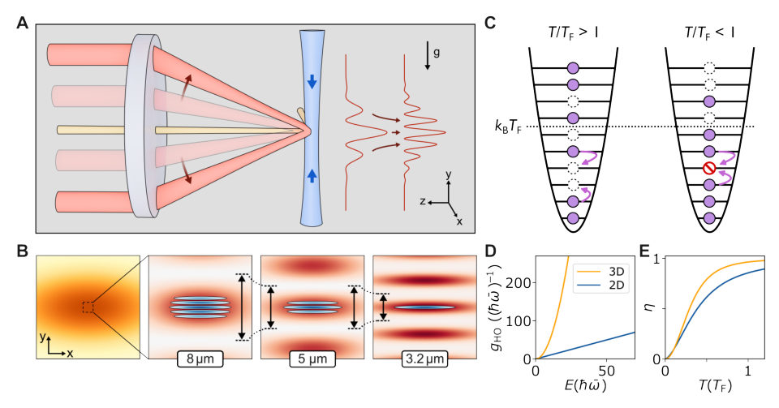
<figcaption class="paper-figure-caption"><b>Fig 1.</b> Fig. 1: Experimental setup and elastic collisions under Pauli blockade. (A) Sketch of the optical trap configurations. The xODT (yellow) and VL (blue) provide the trapping potential for molecules in 3D and quasi-2D, respectively. The AL (red) serves to compress the distribution for the atomic mixture along the y-direction before turning on the VL. The spatial period of the AL intensity distribution (shown as red curves on the right) is adjustable by controlling the intersection angle of AL beams (light red and red) after passing through the focus lens. (B) By varying the final spacing of the AL (red) to 8 µm, 5 µm, or 3.2 µm, the atomic mixture – initially trapped in the xODT (yellow) – is...</figcaption>
</figure>
<figure class="paper-figure-card">
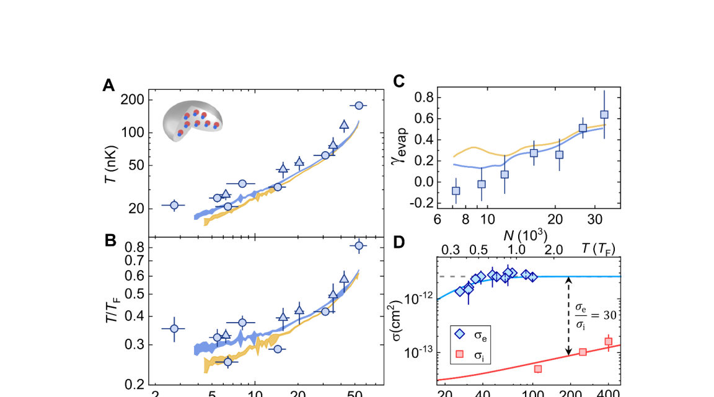
<figcaption class="paper-figure-caption"><b>Fig 2.</b> Fig. 2: Evaporative cooling and collisional cross section measurements of KRb in 3D. The cooling trajectory for KRb in 3D is shown as T vs N (A) and T/TF vs N (B). The circles are from Fermi-Dirac fits while the triangles are from density fluctuation measurements. Error bars are 1 standard error (SE) from Fermi-Dirac fits for the circles and 1 SE of the mean for the triangles (49). The blue curves are obtained from Monte Carlo simulations of the full evaporation sequence. Yellow curves are obtained from simulations which ignore the Pauli suppression of elastic scattering. The half width of the band represents 1 SE from Fermi-Dirac fits. (C) Evaporative cooling efficiency 𝛾/012 as a function...</figcaption>
</figure>
<figure class="paper-figure-card">
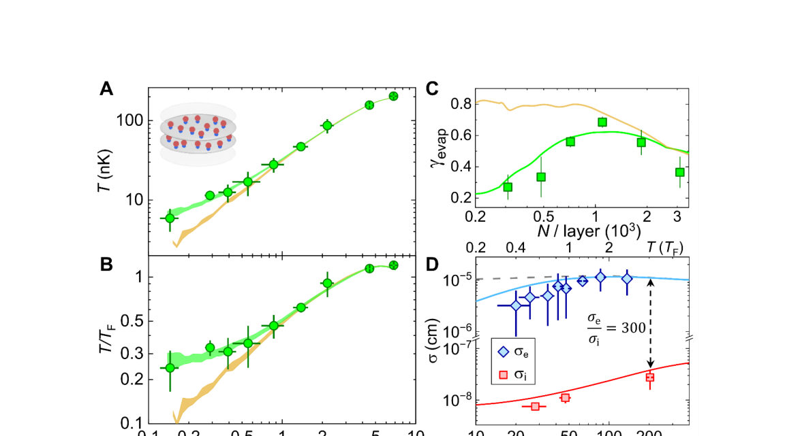
<figcaption class="paper-figure-caption"><b>Fig 3.</b> Fig. 3: Evaporative cooling and collisional cross section measurements of KRb in quasi-2D. The cooling trajectory for KRb in quasi-2D is shown as T vs N (A) and T/TF vs N (B). Data points show our measurement results, obtained from Fermi-Dirac fits to the molecular density profiles. Error bars represent 1 SE of the mean over four experimental repetitions. The green curves are from a Monte Carlo simulation which includes effects from Pauli suppression, laser-induced heating. Yellow curves are from a simulation which excludes Pauli suppression of elastic collisions. The half width of the band represents 1 SE from Fermi-Dirac fits. (C) Evaporative cooling efficiency 𝛾/012 vs N in quasi-2D....</figcaption>
</figure>
<figure class="paper-figure-card">
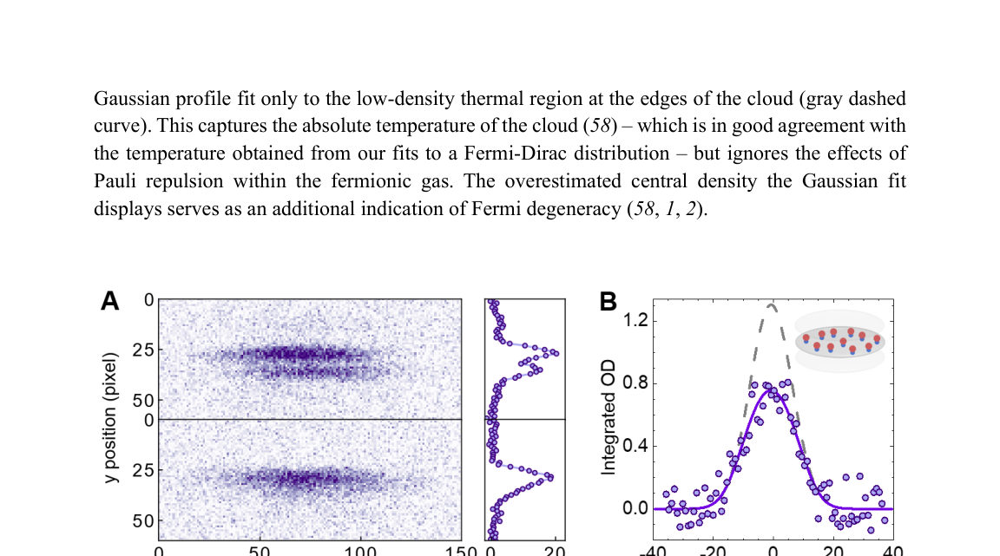
<figcaption class="paper-figure-caption"><b>Fig 4.</b> Fig.4: Quasi-2D mono- and bilayer samples of ultracold polar KRb. (A) Absorption images (left) and integrated optical density (OD) along the 𝑧-direction (right) for bilayer (upper panels) and monolayer (upper panels) configurations after matter-wave magnification. (B) Integrated OD of a degenerate monolayer KRb cloud (data points). The purple curve shows a fitted Fermi-Dirac distribution, giving 𝑇/𝑇! = 0.44(14). The gray dashed curve is obtained from a Gaussian fit to the outer wings of the sample. Discussion and outlook In this work, we have brought polar molecules into a new regime where collisions are manifestly dictated by Fermi statistics by producing degenerate Fermi gases of polar...</figcaption>
</figure>

**Summary.** The study reports on achieving deep degeneracy in fermionic polar molecular gases in both 3D and quasi-2D traps. By measuring density fluctuations and analyzing collision rates, the authors confirm that the Pauli exclusion principle imposes a fundamental limit on how cold these quantum systems can be cooled. This work is crucial for designing future experiments aiming to explore exotic many-body physics beyond simple thermal equilibrium.

**Why it may be interesting.** This work provides crucial experimental benchmarks for understanding how quantum statistics constrain evaporative cooling in dipolar systems, which is vital for realizing highly correlated quantum phases like superfluidity or novel magnetic states.

Detailed structure

**Main problem.** The study investigates achieving deep degeneracy in quantum gases of polar molecules while quantifying the fundamental limitations imposed by the Pauli exclusion principle during evaporative cooling.

**Main result.** The authors successfully produced degenerate Fermi gases in both 3D and quasi-2D geometries, confirming that Pauli blockade significantly limits the lowest achievable temperatures, especially in lower dimensions.

**Method.** The research combines experimental measurements of density fluctuations and cross sections with advanced theoretical modeling (Monte Carlo simulations and solving radial Schrödinger equations) to quantify these quantum statistical effects.

**Model / system.** The system is a Fermi gas of fermionic polar molecules ($	ext{KRb}$) trapped in harmonic or quasi-2D optical potentials. Interactions are dominated by engineered repulsive dipole-dipole collisions, allowing for precise control over scattering cross sections.

**Key observables.** Reduced temperature ($T/T_F$), Pauli suppression factor ($\eta$), elastic and inelastic collision cross sections ($\sigma_{el}, \sigma_{in}$), and density fluctuations ($	ext{Var } N/N_{	ext{;}}$).

**Important parameters / regimes.** The primary limiting factors are the Pauli exclusion principle, which restricts scattering rates, and one-body heating from the trap potential.

**Assumptions / limitations.** Key assumptions include using the Local Density Approximation (LDA) for thermometry and assuming adiabaticity during electric field ramping for cooling analysis.

**Figures summary.** Figures illustrate evaporative cooling trajectories ($T$ vs $N$, $T/T_F$ vs $N$) comparing experimental data to simulations incorporating Pauli suppression. Other figures detail density fluctuation measurements and the temperature dependence of cross sections derived from thermalization rate analyses.

**Paper structure.** The paper progresses by first establishing the platform (polar molecules in 3D/2D), then detailing multiple diagnostic techniques (density fluctuations, CDT) to measure degeneracy and interaction rates. The core argument builds by comparing cooling trajectories across dimensions, culminating in a quantitative assessment of Pauli blockade as the ultimate limit.

Abstract

Quantum gases of polar molecules have recently emerged as a powerful platform for exploring exotic many-body dynamics and correlated quantum behavior. To achieve the full potential of this platform, the production of deeply degenerate quantum gases of molecules in arbitrary confinement geometries is necessary. Here, we successfully evaporate fermionic KRb molecules in both 3D and quasi-2D geometries to well below their Fermi temperatures utilizing dipolar collisions. As we evaporate deeper into degeneracy in both geometries, we enter the Pauli-blocked regime with polar molecules, which we independently confirm for the first time by measuring the Pauli suppression of elastic collisions. Moreover, the Pauli suppression of collisions contributes to the limitation of our final molecular temperature to about 25% of the Fermi temperature in both geometries, particularly limiting quasi-2D evaporation where the Pauli blockade drastically reduces an otherwise large elastic to inelastic scattering ratio. This work demonstrates the production of degenerate Fermi gases of polar molecules both in a 3D harmonic trap and in mono- and bi-layer 2D configurations. Further, our work explores the fundamental limits on evaporation of molecular Fermi gases set by the Pauli-exclusion principle, which could be overcome in the future by introducing distinguishable scattering partners.

[↑ back to top](#top)

### [Resolving the Edge of a Quantum Pyramid](http://arxiv.org/abs/2606.14698v1)

**Authors:** Alvan Arulandu  
**Type:** theory · **Category:** quantum information and computing · **PDF:** <https://arxiv.org/pdf/2606.14698v1>  
**Analysis basis:** full PDF text, analyzed in chunks
**Topic relevance:** 🔥 `entanglement & information structure` **4/5** · `quantum measurements` **3/5** · `measurement-induced transitions` **1/5**

↔ Scroll figures horizontally

<figure class="paper-figure-card">
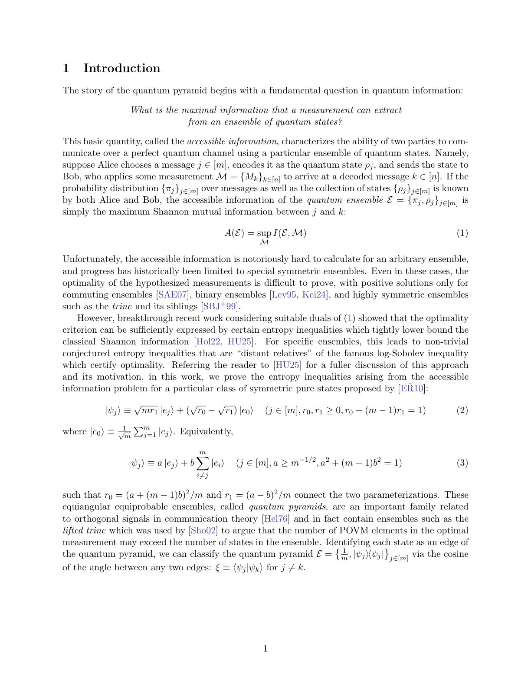
<figcaption class="paper-figure-caption"><b>Fig 1.</b> Low-resolution page preview, page 2</figcaption>
</figure>
<figure class="paper-figure-card">
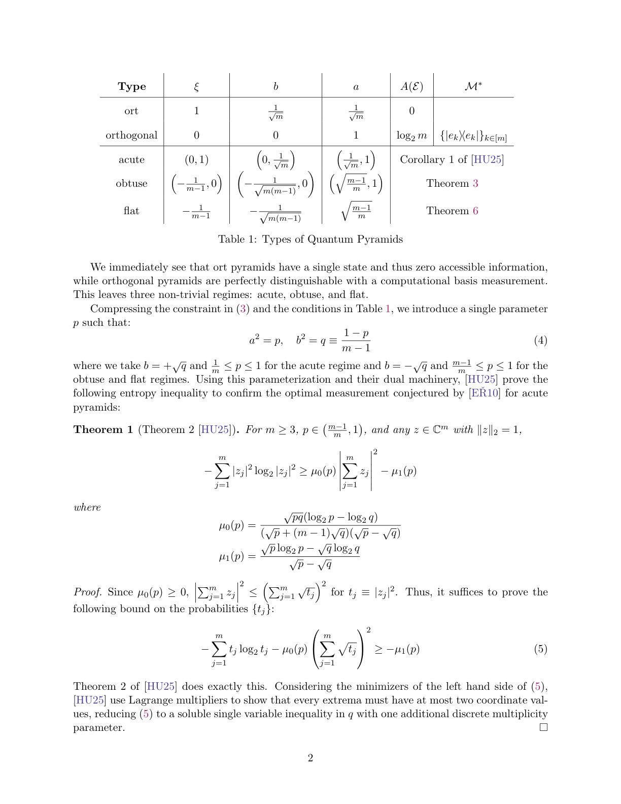
<figcaption class="paper-figure-caption"><b>Fig 2.</b> Low-resolution page preview, page 3</figcaption>
</figure>
<figure class="paper-figure-card">
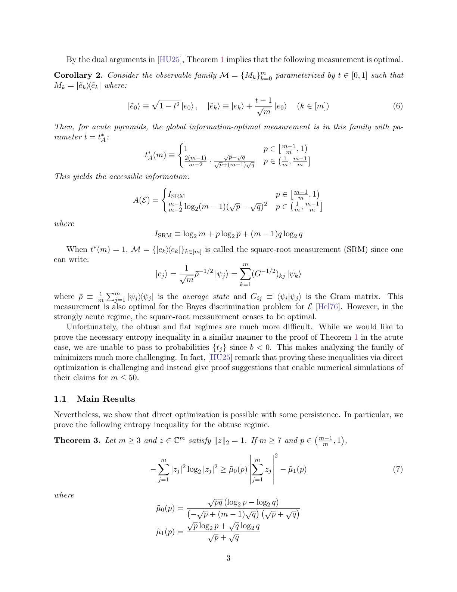
<figcaption class="paper-figure-caption"><b>Fig 3.</b> Low-resolution page preview, page 4</figcaption>
</figure>
<figure class="paper-figure-card">
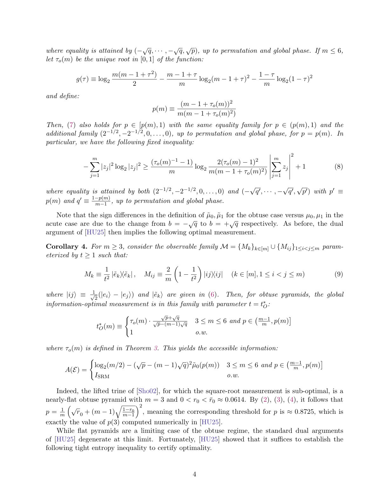
<figcaption class="paper-figure-caption"><b>Fig 4.</b> Low-resolution page preview, page 5</figcaption>
</figure>
<figure class="paper-figure-card">
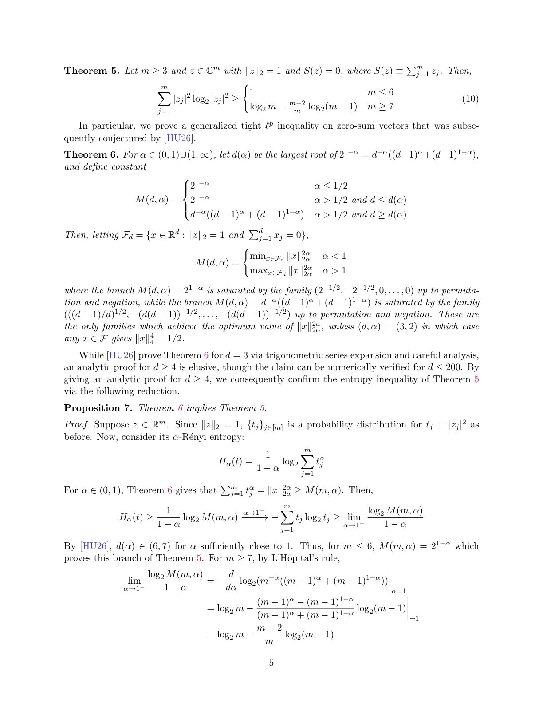
<figcaption class="paper-figure-caption"><b>Fig 5.</b> Low-resolution page preview, page 6</figcaption>
</figure>

**Summary.** This paper resolves the quantum pyramids conjecture by rigorously proving the optimal measurement strategy for specific ensembles of pure quantum states. It achieves this by establishing necessary entropy inequalities that certify optimality across different geometric regimes (obtuse and flat). The methodology is highly technical, combining advanced optimization theory with algebraic analysis to determine fundamental information-theoretic bounds.

**Why it may be interesting.** This work provides deep mathematical tools—such as advanced inequality proofs and structural analysis of optimizers—that are highly relevant to understanding fundamental limits in quantum information theory, particularly those related to measurement capacity.

Detailed structure

**Main problem.** The paper resolves the quantum pyramids conjecture by determining the globally information-optimal measurement for an ensemble of equiangular equiprobable pure states.

**Main result.** Optimal measurements are confirmed by proving necessary entropy inequalities for both obtuse and flat pyramid configurations, establishing bounds on accessible information $A(E)$.

**Method.** The proof combines techniques from convex optimization, analyzing structural properties of minimizers using Lagrange multipliers, and applying specialized methods like the 'equal variables method' to establish tight $\ell^p$ inequalities.

**Model / system.** The system models quantum information processing via an ensemble $E = \{\pi_j, 
ho_j\}_{j=1}^m$ of pure states forming a geometric structure (the 'quantum pyramid') defined by the angles between them. The core mathematical object is the accessible information $A(E)$.

**Key observables.** Accessible information $A(E)$; entropy inequalities; $\ell^p$ norms for zero-sum vectors.

**Important parameters / regimes.** The number of states ($m$), and geometric parameters defining the pyramid (acute, obtuse, flat regimes). The exponent $\alpha$ is crucial in the flat regime analysis.

**Assumptions / limitations.** The analysis relies on reducing complex optimization problems to real-variable minimization problems and systematically eliminating candidate minimizers with three or more distinct coordinate values.

**Figures summary.** Not specified (Notes reference tables summarizing pyramid types and associated theorems).

**Paper structure.** The paper proceeds by analyzing the problem in different geometric regimes (acute, obtuse, flat), proving necessary entropy inequalities for each case. Key steps involve rigorous optimization proofs: first eliminating complex families of minimizers, then establishing tight $\ell^p$ bounds via specialized methods.

Abstract

Standing on the shoulders of giants, we resolve the quantum pyramids conjecture, confirming the globally information-optimal measurement for an ensemble of equiangular equiprobable pure states, as conjectured by Englert and Řeháček (arXiv:0905.0510). We do so by proving the remaining entropy inequalities of Holevo and Utkin (arXiv:2506.06700), which certify optimality for obtuse and flat pyramids. For obtuse pyramids, our key contribution is a rigorous proof that local minimizers of the corresponding entropy inequality cannot have three distinct coordinate values. We show that eliminating this family can be reduced to a neat algebraic reciprocal inequality relating branches of the Lambert $W$ function, which may be of independent interest. For flat pyramids, we prove a tight $\ell^p$ inequality for zero-sum vectors that was recently conjectured, proved analytically in dimension $d=3$, and computationally verified for $d\leq 200$ by Holevo and Utkin (arXiv:2603.24017). We prove this bound for all $d\geq 2$ via a technique in symmetric inequalities known as the equal variables method.

[↑ back to top](#top)

### [Quantum Entanglement of Bethe States](http://arxiv.org/abs/2606.14140v1)

**Authors:** Yu Hao, Yunfeng Jiang, Bi-Quan Yang, De-liang Zhong  
**Type:** theory · **Category:** statistical mechanics · **PDF:** <https://arxiv.org/pdf/2606.14140v1>  
**Analysis basis:** full PDF text, analyzed in chunks
**Topic relevance:** 🔥 `entanglement & information structure` **4/5** · `analog quantum simulation` **1/5** · `exotic spin models in light-matter` **1/5** · `non-equilibrium dynamics` **1/5**

↔ Scroll figures horizontally

<figure class="paper-figure-card">
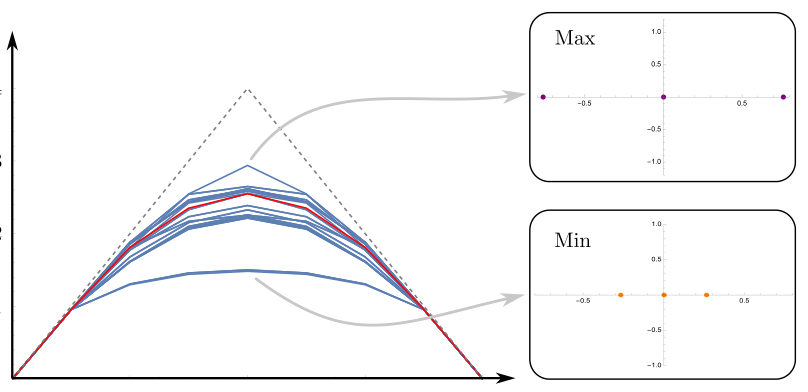
<figcaption class="paper-figure-caption"><b>Fig 1.</b> Figure 4.1: Entanglement entropy of primary states for L = 8, M = 3. Blue lines correspond to Bethe states obtained from regular solutions, while the red line represents the singular solution. The dashed gray line indicates the crosscap state, which has maximal entanglement.</figcaption>
</figure>
<figure class="paper-figure-card">
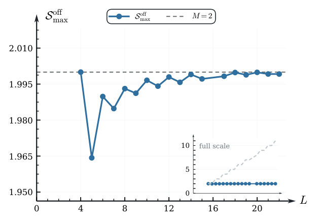
<figcaption class="paper-figure-caption"><b>Fig 2.</b> Figure 4.2: The fixed-M = 2 off-shell maximum approaches the partition upper bound 2 as L grows. Data are for the XXX 1</figcaption>
</figure>
<figure class="paper-figure-card">
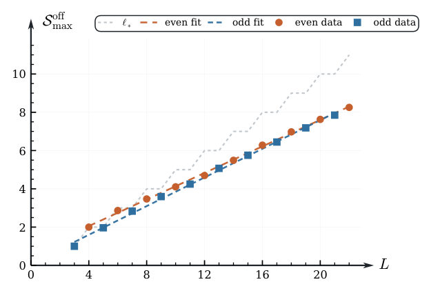
<figcaption class="paper-figure-caption"><b>Fig 3.</b> Figure 4.3: Half-filled XXX1/2 off-shell maxima grow linearly with L. The dashed lines are separate linear fits to the even-L data for 4 ≤L ≤22 and the odd-L data for 3 ≤L ≤21, with ℓ= ⌊L/2⌋.</figcaption>
</figure>
<figure class="paper-figure-card">
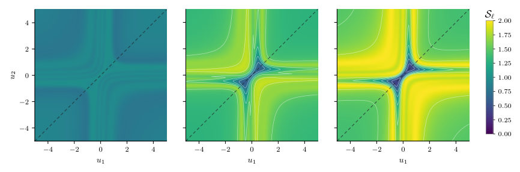
<figcaption class="paper-figure-caption"><b>Fig 4.</b> Figure 4.4: The real-rapidity slice shows how the M = 2 off-shell entropy approaches its maximum along unbounded directions. The plots show Sℓ(u1, u2) for the XXX1/2 chain at L = 6, M = 2, and ℓ= 1, 2, 3, with a common color scale; white curves are iso-entropy contours and the dashed line marks u1 = u2.</figcaption>
</figure>
<figure class="paper-figure-card">
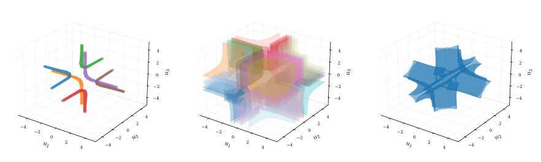
<figcaption class="paper-figure-caption"><b>Fig 5.</b> Figure 4.5: Real-slice iso-entropy surfaces provide the component pairs used in the complex-connectivity test. The panels show Sℓ=3(u1, u2, u3) = const for L = 6 and M = 3, restricted to (u1, u2, u3) ∈R3. At S = 2.70, the six visible components are the S3 permu- tation orbits of the optimum; near S = 2.00, the component count is close to its observed peak; by S = 1.50, the visible real-slice surface has merged into one component. These are real-slice visualization features, not a topological claim about the full complex rapidity level set.</figcaption>
</figure>

**Summary.** This paper rigorously investigates the bipartite entanglement entropy of Bethe states across various integrable spin chains, including $	ext{XXX}_{1/2}$ and $SL(2,\mathbb{R})$. Using sophisticated numerical optimization and analytical techniques like Schmidt decomposition, the authors map out how entanglement depends on the state's energy and root configuration. The findings establish systematic patterns for extremal entropy values while developing robust mathematical tools to handle complex singular solutions.

**Why it may be interesting.** This work provides deep insights into the geometric structure of entanglement within highly constrained quantum systems, linking spectral properties (Bethe states) directly to information-theoretic measures like entropy. The comparison between compact and non-compact chains is particularly relevant for understanding boundary effects in condensed matter models.

Detailed structure

**Main problem.** The study investigates how quantum entanglement, quantified by bipartite entanglement entropy, behaves across different Bethe states in a family of integrable spin chains.

**Main result.** The minimum entanglement entropy often coincides with the ground state for simple models (XXX$_{1/2}$), but this is not guaranteed for higher-spin generalizations. The analysis reveals distinct scaling behaviors for compact versus non-compact chains like $SL(2, \mathbb{R})$.

**Method.** The authors employ advanced analytical and numerical techniques, including Schmidt decomposition, variational optimization over rapidities (both on-shell and off-shell), and regularization procedures to handle singular solutions.

**Model / system.** The research focuses on integrable quantum spin chains: the XXX$_{1/2}$ model, higher-spin generalizations ($	ext{XXX}_s$), and the non-compact $SL(2,\mathbb{R})$ chain. The states analyzed are Bethe eigenstates characterized by rapidities $\{u_j\}$.

**Key observables.** Bipartite entanglement entropy ($S_\ell$), minimum entropy ($S_{\min}$), maximum entropy ($S_{\max}$), and the corresponding sets of Bethe quantum numbers ($\{I_j\}$).

**Important parameters / regimes.** System size ($L$), subsystem size ($\ell$), magnon number ($M$), and the nature of the chain (compact vs. non-compact).

**Assumptions / limitations.** The analysis relies on developing complex regularization procedures to handle singular rapidities and assumes that specific limits (e.g., $\epsilon 	o 0$) yield physically meaningful product states with zero entropy.

**Figures summary.** Multiple tables systematically map out the dependence of $S_{\min}$ and $S_{\max}$ on subsystem size ($\ell$) for fixed system parameters ($L, M$), detailing specific extremal rapidities found in various spin sectors (Spin 1, Spin 3/2).

**Paper structure.** The paper progresses from defining the entanglement calculation via Schmidt decomposition to applying optimization algorithms for off-shell states. It then systematically analyzes different models ($	ext{XXX}_{1/2}$, $	ext{XXX}_s$, $SL(2,\mathbb{R})$), culminating in detailed mathematical derivations concerning singular roots and regularization techniques.

Abstract

We investigate the quantum entanglement of Bethe states across a family of integrable spin chains, including the XXX$_{\frac{1}{2}}$ model, its higher-spin generalizations (XXX$_s$), and the non-compact $SL(2,\mathbb{R})$ chain. For on-shell eigenstates, we perform a comprehensive scan of the bipartite entanglement entropy across the entire spectrum of finite chains with periodic boundary conditions, and identify the Bethe solutions that minimize and maximize the entanglement. These extremal solutions follow systematic, spin-dependent patterns in the Bethe quantum numbers. In the XXX$_{\frac{1}{2}}$ spin chain, for the antiferromagnetic chain, the state with minimal entropy always coincides with the lowest-energy state (the ground state) within a given fixed-magnon sector. For the higher-spin XXX$_s$ model, however, the lowest-entropy state is not always identical to the ground state, and can even be the state of highest energy. By contrast, the Bethe roots that maximize entropy exhibit considerably more intricate structure. Our analysis further reveals how special Bethe root configurations, such as singular and strange solutions, affect entanglement, and it uncovers characteristic entanglement features in the non-compact $SL(2,\mathbb{R})$ chain that are absent from compact spin chains. For off-shell Bethe states, we develop an optimization algorithm that extremizes the entanglement entropy over rapidity distributions, enabling us to explore the maximum entanglement achievable by a Bethe state without imposing the Bethe ansatz equations.

[↑ back to top](#top)

### [Simultaneous Estimation of Partial-Transpose Moments with Active Memory Independent of the Moment Order](http://arxiv.org/abs/2606.14204v1)

**Authors:** Junxiang Huang, Xiaoyang Wang, Xiao Yuan, Yukun Zhang  
**Type:** theory · **Category:** quantum information and computing · **PDF:** <https://arxiv.org/pdf/2606.14204v1>  
**Analysis basis:** full PDF text, analyzed in chunks
**Topic relevance:** 🔥 `entanglement & information structure` **4/5** · `quantum measurements` **2/5**

↔ Scroll figures horizontally

<figure class="paper-figure-card">
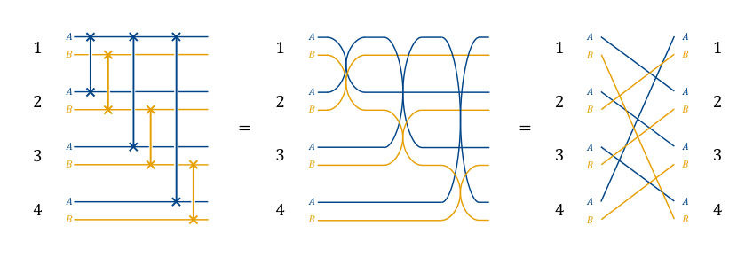
<figcaption class="paper-figure-caption"><b>Fig 1.</b> Fig. 1. Topological view of the PT permutation. Subsystem A follows the forward cycle and subsystem B follows the inverse cycle. The crossings are schematic routing events that are unfolded into a time-domain sequential implementation.</figcaption>
</figure>
<figure class="paper-figure-card">
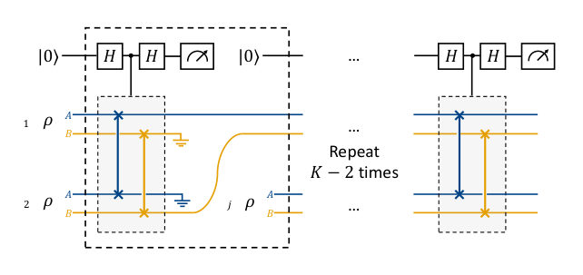
<figcaption class="paper-figure-caption"><b>Fig 2.</b> Fig. 2. Sequential qubit-reuse circuit for PT moments. One storage copy and one fresh transient copy interact through an ancilla-controlled routing layer; the transient register is then reset and reloaded. The active qubit count is always 2n + 1, independent of the target order K.</figcaption>
</figure>
<figure class="paper-figure-card">
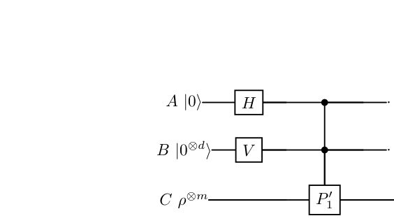
<figcaption class="paper-figure-caption"><b>Fig 3.</b> Fig. 3. LCSP-style coherent post-processing circuit. It illustrates the PT-LCSP construction used in Appendix E.</figcaption>
</figure>
<figure class="paper-figure-card">
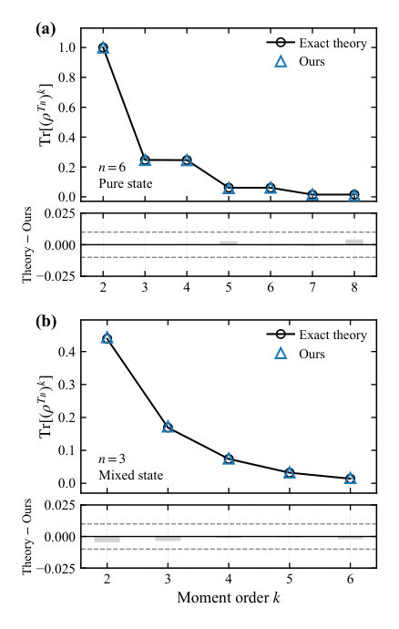
<figcaption class="paper-figure-caption"><b>Fig 4.</b> Fig. 4. Noiseless numerical sanity check of the sequential estimator. The upper panels compare exact PT moments with the qubit-reuse estimates, while the lower panels show residuals fluctuating around zero within the expected statistical scale. This figure is included only as a compact consistency check of the analytical identities proved in the paper.</figcaption>
</figure>
<figure class="paper-figure-card">
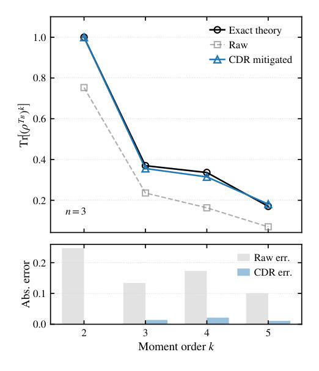
<figcaption class="paper-figure-caption"><b>Fig 5.</b> Fig. 5. Small-scale cloud compatibility demonstration of PT-moment estimation with CDR mitigation [56]. We estimate PT moments up to order K = 5 for a three-qubit test state using dynamic circuits executed through the IBM Quantum cloud platform. Top panel: comparison between exact values (black), raw estimates (gray), and CDR-mitigated estimates (blue). Bottom panel: corresponding absolute errors with respect to the exact theory. The mitigated data show a systematic improvement over the raw estimates.</figcaption>
</figure>

**Summary.** This theoretical paper characterizes the minimum number of quantum copies required to simultaneously estimate a sequence of partial-transpose moments for an unknown bipartite quantum state. By developing resource-efficient quantum circuits and proving matching lower bounds, it establishes the fundamental scaling laws for this type of nonlinear functional estimation under active memory constraints.

**Why it may be interesting.** This work provides fundamental resource characterizations for estimating non-local properties (like entanglement via PT moments) of quantum states, which is crucial for designing efficient quantum measurement protocols in quantum information processing.

Detailed structure

**Main problem.** The study focuses on developing efficient protocols for simultaneously estimating multiple partial-transpose moments of an unknown bipartite quantum state under strict active-memory constraints.

**Main result.** The authors achieve a total copy complexity scaling of $O(K \log K / \epsilon^2)$ while maintaining an active memory cost independent of the moment order $K$.

**Method.** They employ sequential qubit-reuse quantum circuits to realize the partial-transpose permutation, comparing the achievable upper bound with established minimax lower bounds.

**Model / system.** The system is a bipartite $n$-qubit quantum state $
ho_{AB}$. The analysis revolves around estimating Partial-Transpose (PT) moments, which are related to entanglement measures like negativity.

**Key observables.** Partial-transpose moments $\{p_j(
ho_{AB})\}_{j=2}^K = 	ext{Tr}[(
ho^{T_B})_{AB}^j]$, and the resulting estimate of quantum negativity.

**Important parameters / regimes.** $K$ (target moment order), $\epsilon_{	ext{mom}}$ (desired uniform additive error for all moments simultaneously).

**Assumptions / limitations.** The analysis assumes an active-memory constraint where memory usage must not scale with $K$. A logarithmic gap exists between the upper and lower bounds.

**Figures summary.** Figures illustrate the topological view of the PT permutation circuit, the sequential qubit-reuse circuit realizing the moments, and comparisons of estimated moments against exact theory using noise mitigation techniques.

**Paper structure.** The paper establishes the problem by defining the PT moment hierarchy, presents an achievable quantum protocol with complexity $O(K \log K / \epsilon^2)$, and rigorously proves lower bounds ($\Omega(K/\epsilon^2)$) using hard state families to characterize the necessary resource scaling.

Abstract

We study the simultaneous estimation of partial-transpose moments $p_j(ρ_{AB})=\mathrm{Tr}[(ρ_{AB}^{T_B})^j]$, $j=2,\ldots,K$, of an unknown bipartite $n$-qubit state from independent copies under an explicit active-memory constraint. We give a sequential qubit-reuse realization of the partial-transpose permutation that uses at most $2n+1$ active qubits, independent of $K$, and estimates all moments $p_2,\ldots,p_K$ to uniform additive error $ε$ with total copy complexity $O(K\log K/ε^2)$. We also prove two converse bounds. First, any uniformly accurate simultaneous estimator requires $Ω(K/ε^2)$ copies in the worst case. Second, the same scaling holds on an explicit isospectral two-qubit negative-partial-transpose (NPT) family whose ordinary moments are constant while the partial-transpose moments vary. These results characterize the copy complexity of the partial-transpose moment hierarchy up to a logarithmic factor and extend simultaneous nonlinear-functional estimation from ordinary state powers to partial-transpose spectral data under active quantum memory independent of the target moment order.

[↑ back to top](#top)

### [Collision models for open quantum systems coupled to finite environments](http://arxiv.org/abs/2606.14163v1)

**Authors:** Gyaneswar Bhoi, Anil Shaji  
**Type:** theory · **Category:** other · **PDF:** <https://arxiv.org/pdf/2606.14163v1>  
**Analysis basis:** full PDF text, analyzed in chunks
**Topic relevance:** `correlated / nonlocal dissipation` **3/5** · `methods for driven-dissipative` **3/5** · `non-equilibrium dynamics` **3/5** · `Keldysh / 2PI / non-Gaussian methods` **2/5** · `driven-dissipative phase transition` **2/5** · `entanglement & information structure` **2/5** · `non-equilibrium universality` **2/5** · `Kondo & dissipative impurity` **1/5** · `quantum measurements` **1/5** · `scars & prethermalization` **1/5**

↔ Scroll figures horizontally

<figure class="paper-figure-card">
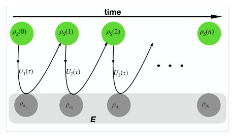
<figcaption class="paper-figure-caption"><b>Fig 1.</b> FIG. 1. Schematic of the standard collision model. The en- vironment E is partitioned into independent ancillae ai, each interacting with S once via Ui(τ) before being discarded.</figcaption>
</figure>
<figure class="paper-figure-card">
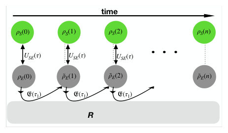
<figcaption class="paper-figure-caption"><b>Fig 2.</b> FIG. 2. Schematic of the modified collision model. The sys- tem S repeatedly interacts with the same environment qubit E via USE(τ), while a reservoir-induced CPTP map E(τ1) acts on E between successive collisions. Unlike the standard con- struction, the environment is not discarded after each step, so system–environment correlations (dashed links) persist and accumulate, rendering the reduced dynamics of S history de- pendent.</figcaption>
</figure>
<figure class="paper-figure-card">
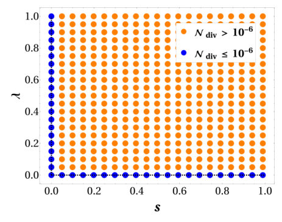
<figcaption class="paper-figure-caption"><b>Fig 3.</b> FIG. 4. Divisibility measure Ndiv in the (s, λ) parameter space for the same parameters as Fig. 3. The witness is nonzero throughout the interior s, λ &gt; 0, including in regions where NBLP = 0, revealing a CP-indivisible yet P-divisible regime between the two phase boundaries.</figcaption>
</figure>
<figure class="paper-figure-card">
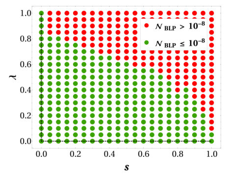
<figcaption class="paper-figure-caption"><b>Fig 4.</b> FIG. 3. BLP non-Markovianity measure NBLP in the (s, λ) parameter space, evaluated over n = 100 collisions with b(0) 1 = 1, b(0) 2 = b(0) 3 = 0, and G0 = 1. The green dots denotes points on (s, λ) plane for which the dynamics is Markovian while the red dots denote the non-Markovian regime where NBLP is greater than a small threshold value of 10−8. The measure vanishes along the dashed boundaries s = 0 and λ = 0, which are Markovian by construction. Non-Markovian dynamics emerges above when λ &gt; λ∗(s) with λ∗(s) traced out by the boundary between the green and red dots in the figure. We see that λ∗(s) decreases with increasing interac- tion strength.</figcaption>
</figure>
<figure class="paper-figure-card">
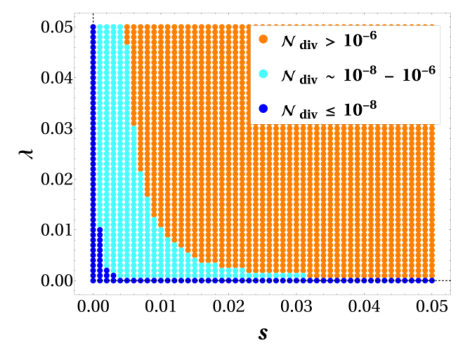
<figcaption class="paper-figure-caption"><b>Fig 5.</b> FIG. 5. Divisibility measure Ndiv in the restricted region s, λ ∈[0, 0.05], revealing the onset of CP-indivisibility.</figcaption>
</figure>

**Summary.** This paper develops collision models for open quantum systems coupled to finite environments, analyzing the complex dynamics arising from repeated interactions. By introducing controlled environmental resets, the authors map out distinct dynamical regimes—ranging from fully Markovian to highly non-Markovian—using advanced mathematical tools like divisibility witnesses. It provides a detailed understanding of how memory effects are quantified and suppressed in realistic quantum scenarios.

**Why it may be interesting.** This work provides a rigorous theoretical toolkit to analyze open quantum systems when environmental memory effects are crucial, offering quantitative diagnostics (BLP, divisibility) beyond simple Markovian assumptions.

Detailed structure

**Main problem.** The study investigates non-Markovian dynamics in open quantum systems where the environment is finite and repeatedly interacts with the system, moving beyond standard Born-Markov approximations.

**Main result.** The authors establish a clear classification of dynamical regimes (e.g., CP-divisible Markovian vs. non-P-divisible non-Markovian) based on environmental reset strength, showing that perfect correlation erasure requires a full environmental reset.

**Method.** The analysis employs collision models and utilizes advanced diagnostics like the Breuer–Laine–Piilo (BLP) measure and Choi-matrix divisibility witnesses to characterize memory effects.

**Model / system.** The model consists of a system qubit interacting repeatedly with a finite environmental qubit, where the environment's state is modulated by an intermediate reservoir-induced CPTP map between collisions.

**Key observables.** System-environment correlations ($\chi_{SE}$), Non-Markovianity (BLP measure), and Divisibility measures (CP/P-divisibility).

**Important parameters / regimes.** The dimensionless relaxation parameter ($\lambda$ or $\kappa$) controlling the degree of environmental reset, and interaction strengths ($s$).

**Assumptions / limitations.** The analysis builds upon collision models and assumes specific forms for the reservoir action (e.g., generalized depolarizing/amplitude damping channels) to control the environment's state.

**Figures summary.** Figures illustrate phase boundaries in parameter space ($\lambda$ vs $s$, or $\kappa$ vs $s$) separating Markovian from non-Markovian regimes, and show the decay of map determinants over time steps.

**Paper structure.** The paper systematically develops the collision model framework, contrasts it with standard assumptions, derives explicit forms for the n-step dynamical maps under partial reset, and finally classifies the resulting dynamics into distinct mathematical regimes based on memory retention and CP properties.

Abstract

We study a system qubit repeatedly interacting with the same environmental qubit, with a reservoir acting on the environment between collisions via a completely positive, trace-preserving map. We show that complete suppression of system--environment correlations uniquely requires a full environmental reset, recovering a semi group dynamics with a time-independent Gorini--Kossakowski--Sudarshan--Lindblad generator, whereas a partial reset yields a continuous transition between Markovian and non-Markovian regimes governed by a single dimensionless relaxation parameter. For a resonant excitation-exchange interaction, we obtain exact closed-form expressions for the Bloch-vector dynamics for both a generalized depolarizing channel and a generalized amplitude-damping channel acting as the reservoir-induced map. Using the Breuer--Laine--Piilo measure and a Choi-matrix CP-divisibility witness, we identify three distinct dynamical regimes across the parameter space: CP-divisible Markovian dynamics, CP-indivisible but P-divisible dynamics, and non-P-divisible non-Markovian dynamics. The boundaries between these regimes, and the structural differences between uniform and anisotropic environmental relaxation, are characterized numerically.

[↑ back to top](#top)

### [Local correlations in long-range dual-unitary kicked Hamiltonian chains](http://arxiv.org/abs/2606.13857v1)

**Authors:** Vladimir Al. Osipov, Marc Cedric Spyra, Jana Carolina Schumann, Thomas Guhr, Boris Gutkin  
**Type:** theory · **Category:** disordered systems and neural networks · **PDF:** <https://arxiv.org/pdf/2606.13857v1>  
**Analysis basis:** full PDF text, analyzed in chunks
**Topic relevance:** `methods for driven-dissipative` **3/5** · `non-equilibrium dynamics` **3/5** · `Keldysh / 2PI / non-Gaussian methods` **2/5** · `analog quantum simulation` **2/5** · `driven-dissipative phase transition` **2/5** · `entanglement & information structure` **2/5** · `non-equilibrium universality` **2/5** · `Frenkel-Kontorova` **1/5** · `correlated / nonlocal dissipation` **1/5** · `exotic spin models in light-matter` **1/5** · `scars & prethermalization` **1/5**

↔ Scroll figures horizontally

<figure class="paper-figure-card">
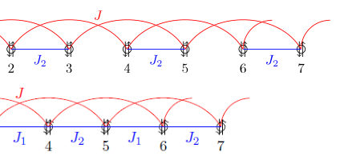
<figcaption class="paper-figure-caption"><b>Fig 1.</b> Figure 1. Shown on the upper left is a single layer of the two-dimensional KIC with nearest-neighbor interactions. The upper right figure depicts the equivalent spin chain with next-nearest-neighbor interactions corresponding to r = 2. The model is dual-unitary for J = π/4. The lower panel shows a generalization of this construction, namely a dual-unitary spin chain in which all neighboring sites are coupled. The homogeneous case is obtained for J1 = J2.</figcaption>
</figure>
<figure class="paper-figure-card">
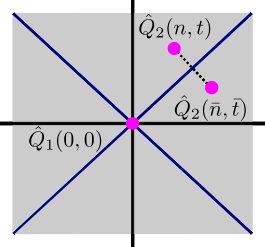
<figcaption class="paper-figure-caption"><b>Fig 2.</b> Figure 2. The figure illustrates correlations ⟨Q1(0, 0)Q2(k, t)⟩between a pair of observables localized at (0, 0) and (k, t), k = rn+m points of the space-time, respectively. For a general kicked model with interactions between r neighbors correlations in the shadowed, blue (color on-line) region, |k| &gt; r|t|, vanish due to causality if ⟨Q1⟩= ⟨Q2⟩= 0, see the left picture. For a dual unitary model, illustrated by the right picture, one has ⟨Q1(0, 0)Q2(k, t)⟩= ⟨Q1(0, 0)Q2(¯k, ¯t)⟩, where ¯k = rt+m, ¯t = n. As a result, correlations here vanish everywhere except light cone edges, |k| = r|t|, depicted by the two blue (color on-line) lines.</figcaption>
</figure>
<figure class="paper-figure-card">
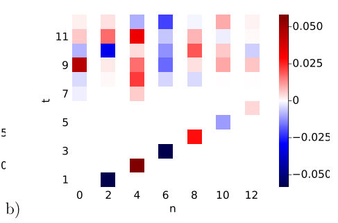
<figcaption class="paper-figure-caption"><b>Fig 3.</b> Figure 3. Two-point correlations between operators (27,28) for q1 = σz, q2 = σ0, q3 = σy, q4 = σ0, q5 = σz, q6 = σ0, q7 = σy, q8 = σ0, with parameters h = 1, J = 1, 5. The left picture (a) depicts correlations for the case J1 = J, J2 = 0, The right picture (b) depicts correlations for the case J1 = J, J2 = J, As one can observe, solely the correlations along the light cone edges (|n| = 2|t|) do not vanish in both cases.</figcaption>
</figure>
<figure class="paper-figure-card">
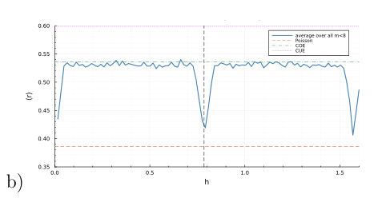
<figcaption class="paper-figure-caption"><b>Fig 4.</b> Figure 4. The average value of ratio of consecutive level spacings (46) for the spectrum of the dual-unitary spin chain with the next-to-next neighbor interaction for N = 15, J = 0 (left) and N = 15, J = π/4 (right), respectively. The value of r is averaged over all values in the separate (translation) symmetry sectors of k = 1, . . . , 7 and shown as a function of h. Note that the graph is symmetric under reflection h →π−h. For generic values of h the data for ⟨r⟩fit the circular orthogonal ensemble (COE) prediction. The dips at h = 0, π/4, π/3 (left) and at h = 0, π/4 (right) correspond to spectral statistics characteristic of integrable systems.</figcaption>
</figure>

**Summary.** The paper constructs an extensive family of dual-unitary kicked spin chains featuring long-range interactions. It analytically proves that local correlations are strictly confined to specific light-cone edges defined by the interaction range. This provides deep insights into the spatial and temporal structure of quantum dynamics in highly symmetric, non-local many-body systems.

**Why it may be interesting.** This work provides a rigorous theoretical framework for analyzing dynamics in complex quantum many-body systems exhibiting long-range interactions while preserving special symmetries (dual unitarity), which is crucial for understanding transport and correlation spreading in engineered quantum materials.

Detailed structure

**Main problem.** The study investigates how local correlations propagate within long-range dual-unitary kicked Hamiltonian chains.

**Main result.** Local two-point correlations are found to propagate exclusively along specific light-cone edges, $|k| = r|t|$, and these correlations can be derived analytically for a wide family of such models.

**Method.** The analysis employs techniques based on establishing spatio-temporal duality using Hadamard matrices and calculating correlation functions via transfer operators or direct trace manipulations.

**Model / system.** The system is a generalized Kicked Ising Chain (KIC) extended to include long-range interactions ($r>1$) while maintaining the dual-unitary symmetry. The dynamics are governed by time evolution operators $U = \hat{U}_K \hat{U}_I$.

**Key observables.** Local two-point correlation function $C(n, m, t)$, and spectral statistics diagnostics like the ratio of consecutive level spacings ($r$).

**Important parameters / regimes.** Interaction range ($r$), coupling parameters ($J, h$), and time/space indices ($t, n, k$).

**Assumptions / limitations.** The construction relies on adding fine-tuned pairwise interactions to maintain dual unitarity with long-range couplings; periodic boundary conditions are assumed for some calculations.

**Figures summary.** Figures illustrate the vanishing of correlations outside light cone edges $|k| = r|t|$ and show spectral statistics matching COE predictions for generic parameters, deviating at integrable points.

**Paper structure.** The paper develops the construction of long-range dual-unitary models, proves spatio-temporal duality relations, derives the structure of the correlation function $C(t)$ using transfer operators, and analyzes its decay rates and spectral statistics.

Abstract

Many-body Floquet models with exact space--time symmetry, such as the kicked Ising spin chain (KIC), provide natural examples of systems with dual-unitary dynamics. The requirement of exact space--time symmetry is, however, highly restrictive, as it permits only nearest-neighbor interactions. Based on a pair of Hadamard matrices, we construct a wide family of dual-unitary kicked spin chains with long-range interactions. We show that local two-point correlations in such models propagate along the light-cone edges \( |n| = r|t| \), where \(r\) is the interaction range, and can be derived analytically for operators with local support. This approach is illustrated using the example of a kicked Ising spin chain with next-to-next-neighbor interactions.

[↑ back to top](#top)

### [Physics-Informed Variational Quantum Classifier for Phase Detection in Strongly Correlated Matter](http://arxiv.org/abs/2606.14489v1)

**Authors:** Hugo Catalá, Ezequiel Valero, Germán Rodrigo  
**Type:** both · **Category:** quantum gases · **PDF:** <https://arxiv.org/pdf/2606.14489v1>  
**Analysis basis:** full PDF text, analyzed in chunks
**Topic relevance:** `analog quantum simulation` **3/5** · `methods for driven-dissipative` **3/5** · `Kondo & dissipative impurity` **2/5** · `QC/QI experiment` **2/5** · `measurement-induced transitions` **2/5** · `quantum measurements` **2/5** · `Keldysh / 2PI / non-Gaussian methods` **1/5** · `correlated / nonlocal dissipation` **1/5** · `driven-dissipative phase transition` **1/5** · `entanglement & information structure` **1/5** · `interference shaping light` **1/5** · `non-equilibrium dynamics` **1/5**

↔ Scroll figures horizontally

<figure class="paper-figure-card">
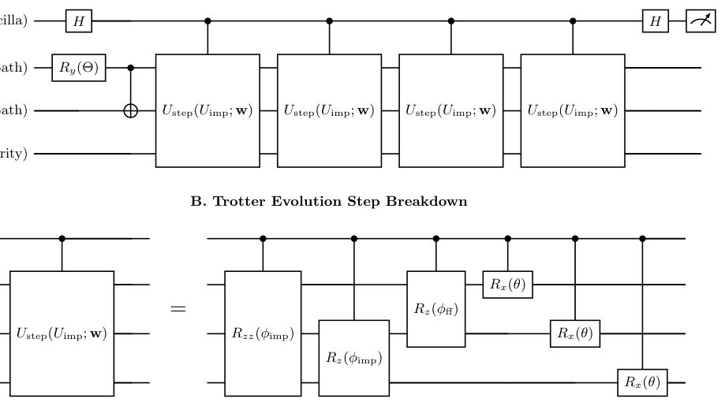
<figcaption class="paper-figure-caption"><b>Fig 1.</b> Figure 1. Physics-Informed VQC Architecture for Polaron Phase Detection. (A) Schematic representation of the Ramsey interferometry protocol. The state preparation phase initialises the impurity and the Fermi sea bath modes via a CNOT entanglement and an Ry(Θ) rotation. The temporal dynamics are governed by Nsteps = 4 identical variational layers (Ustep), conditioned on the ancilla qubit (q0). The measurement on the ancilla yields the expectation value ⟨Z0⟩, which is strictly mapped to the phase probability via a linear transformation. (B) Gate-level decomposition of a single Trotter evolution step (Ustep). The effective Hamiltonian is natively encoded using controlled-Rzz(ϕ) and Rz(ϕ) gates...</figcaption>
</figure>
<figure class="paper-figure-card">
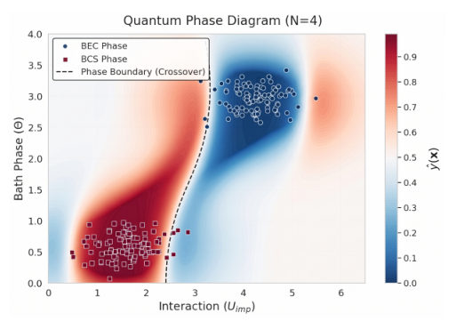
<figcaption class="paper-figure-caption"><b>Fig 2.</b> Figure 2. Learned Quantum Phase Diagram (N = 4). Phase boundary inferred by the Physics-Informed VQC for a target system of N = 4 qubits. The dashed line delineates the BEC-BCS crossover, explicitly defined at ˆy(x) = 0.5. The markers represent the synthetic training data. The boundary is strictly governed by the underlying Ramsey fringes [13]. This confirms that the VQC natively relies on coherent quan- tum interference, rather than classical geometric separation, to distinguish the phases.</figcaption>
</figure>
<figure class="paper-figure-card">
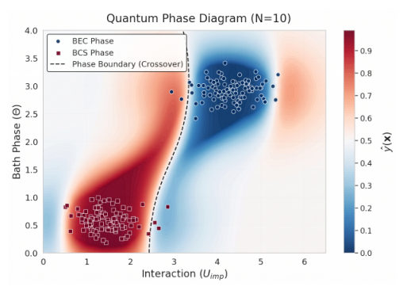
<figcaption class="paper-figure-caption"><b>Fig 3.</b> Figure 3. Scaled Quantum Phase Diagram (N = 10). Phase boundary inferred by the physics-informed VQC for an extended register of N = 10 qubits, corresponding to a many- body bath of M = 4 Cooper pairs. The dashed line delineates the BEC-BCS crossover, explicitly defined at ˆy(x) = 0.5. The data points denote the sampled training distributions for the BEC (blue circles) and BCS (red squares) regimes. The model successfully scales with a larger Hilbert space.</figcaption>
</figure>
<figure class="paper-figure-card">
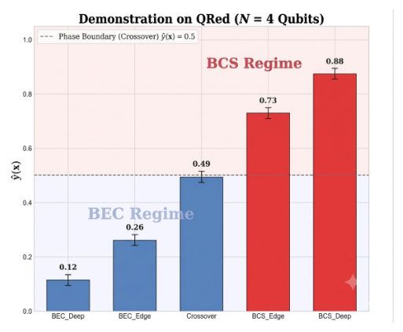
<figcaption class="paper-figure-caption"><b>Fig 4.</b> Figure 4. Demonstration on QRed with N = 4 qubits. Classifier output for five representative points across the phase diagram. The dashed line marks the theoretical deci- sion boundary at ˆy(x) = 0.5. Error bars indicate the 1σ statis- tical dispersion of three independent runs with Nshots = 1024 each.</figcaption>
</figure>
<figure class="paper-figure-card">
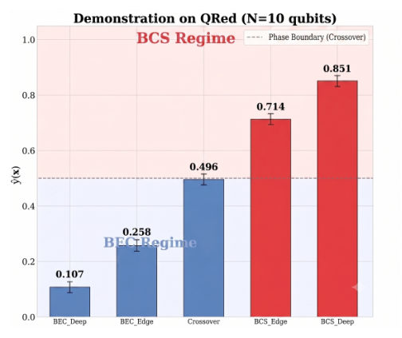
<figcaption class="paper-figure-caption"><b>Fig 5.</b> Figure 5. Demonstration on QRed with N = 10 qubits. Classifier output for five representative points across the phase diagram. The dashed line marks the theoretical deci- sion boundary at ˆy(x) = 0.5. Error bars indicate the 1σ statis- tical dispersion of three independent runs with Nshots = 1024 each. Due to the increased circuit depth and hardware noise, the raw signals exhibit larger compression than for N = 4 qubits.</figcaption>
</figure>

**Summary.** The authors propose and implement a Physics-Informed Variational Quantum Classifier (VQC) to detect topological phase transitions in strongly correlated fermionic systems, such as the BEC-BCS crossover. By encoding the system dynamics via Trotterized time evolution, the VQC achieves linear scaling complexity ($\mathcal{O}(N)$). This approach successfully demonstrates robust phase classification on superconducting quantum hardware despite inherent noise.

**Why it may be interesting.** This work directly bridges quantum computation with fundamental condensed matter physics problems (BEC-BCS crossover), providing a scalable quantum sensing tool that circumvents the memory wall of classical simulations for many-body systems.

Detailed structure

**Main problem.** The core problem is characterizing quantum phases, specifically detecting the topological phase transition between the Fermi polaron quasiparticle and the molecular bound state (BEC-BCS crossover) in strongly correlated matter.

**Main result.** A Physics-Informed Variational Quantum Classifier (VQC) was developed that successfully distinguishes these phases on both simulated and noisy superconducting quantum hardware, demonstrating linear scaling complexity.

**Method.** The VQC is constructed using the Trotterized time-evolution of an effective Hamiltonian derived from Ramsey interferometry protocols, ensuring physical interpretability in its parameters.

**Model / system.** The system models ultracold Fermi gases involving an impurity coupled to a bath of fermions. The dynamics are governed by an effective Hamiltonian whose evolution is mapped onto quantum gates for classification.

**Key observables.** Ramsey fringes visibility, the expectation value of Pauli-Z on the ancilla qubit ($\langle Z_0 
angle$), and the resulting phase probability $\hat{y}(x)$.

**Important parameters / regimes.** The system is analyzed across BEC and BCS regimes, with key learned parameters being the optimal Trotter step size ($\delta t$) and effective bath-bath interaction ($U_{ff}$).

**Assumptions / limitations.** The method assumes that the classification can be achieved by measuring the interferometric correlation $\langle Z_0 
angle$, and it relies on the VQC structure to enforce physical constraints.

**Figures summary.** Figures illustrate the VQC architecture, the learned quantum phase diagram showing decision boundaries governed by Ramsey fringes for $N=4$ and $N=10$, and comparisons between ideal simulation versus noisy hardware measurements.

**Paper structure.** The paper introduces the physical problem (phase detection), details the physics-informed VQC methodology based on Trotterization, presents results validating phase separation on superconducting hardware, and concludes by comparing its linear scaling advantage ($\mathcal{O}(N)$) against classical exponential simulation limits ($\mathcal{O}(2^{2N})$).

Abstract

The characterisation of quantum phases in strongly correlated systems is a crucial milestone for the deployment of quantum sensors. In this work, we present a Physics-Informed Variational Quantum Classifier (VQC) designed to detect the topological phase transition between the Fermi polaron quasiparticle and the molecular bound state. Unlike conventional Machine Learning approaches, our quantum architecture is constructed via the Trotterised time-evolution of an effective Hamiltonian, ensuring that the learnable parameters correspond to interpretable physical quantities. We show that the VQC efficiently discovers the optimal interferometric protocol, specifically the evolution time and effective bath interactions required to maximise the visibility of Ramsey fringes, thereby clearly distinguishing the Bose-Einstein Condensate (BEC) and Bardeen-Cooper-Schrieffer (BCS) regimes. Furthermore, we report the validation of this classifier on the QRed superconducting quantum processor (BSC-CNS). Despite the intrinsic hardware noise and decoherence, the VQC preserves the relative ordering of the topological phases. We demonstrate that the physics-informed architecture achieves a linear gate complexity $\mathcal{O}(N)$, bypassing the exponential memory wall of classical simulation and ensuring scalability to many-body regimes.

[↑ back to top](#top)

### [Thermodynamic Framework for $q$-Affinity](http://arxiv.org/abs/2606.14285v1)

**Authors:** Dani Rodríguez-Castellanos, Petr Jizba  
**Type:** theory · **Category:** statistical mechanics · **PDF:** <https://arxiv.org/pdf/2606.14285v1>  
**Analysis basis:** full PDF text, analyzed in chunks
**Topic relevance:** `methods for driven-dissipative` **3/5** · `non-equilibrium dynamics` **3/5** · `non-equilibrium universality` **3/5** · `Keldysh / 2PI / non-Gaussian methods` **2/5** · `correlated / nonlocal dissipation` **2/5** · `driven-dissipative phase transition` **2/5** · `Kondo & dissipative impurity` **1/5** · `analog quantum simulation` **1/5** · `entanglement & information structure` **1/5** · `scars & prethermalization` **1/5**

↔ Scroll figures horizontally

<figure class="paper-figure-card">
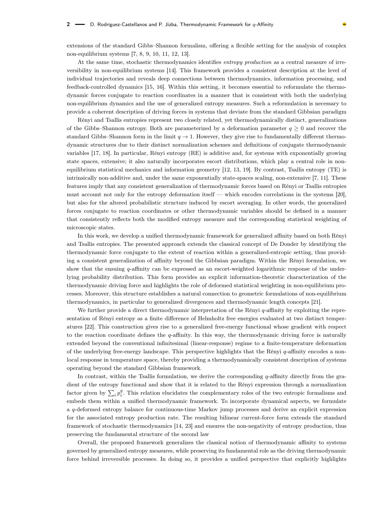
<figcaption class="paper-figure-caption"><b>Fig 1.</b> Low-resolution page preview, page 2</figcaption>
</figure>
<figure class="paper-figure-card">
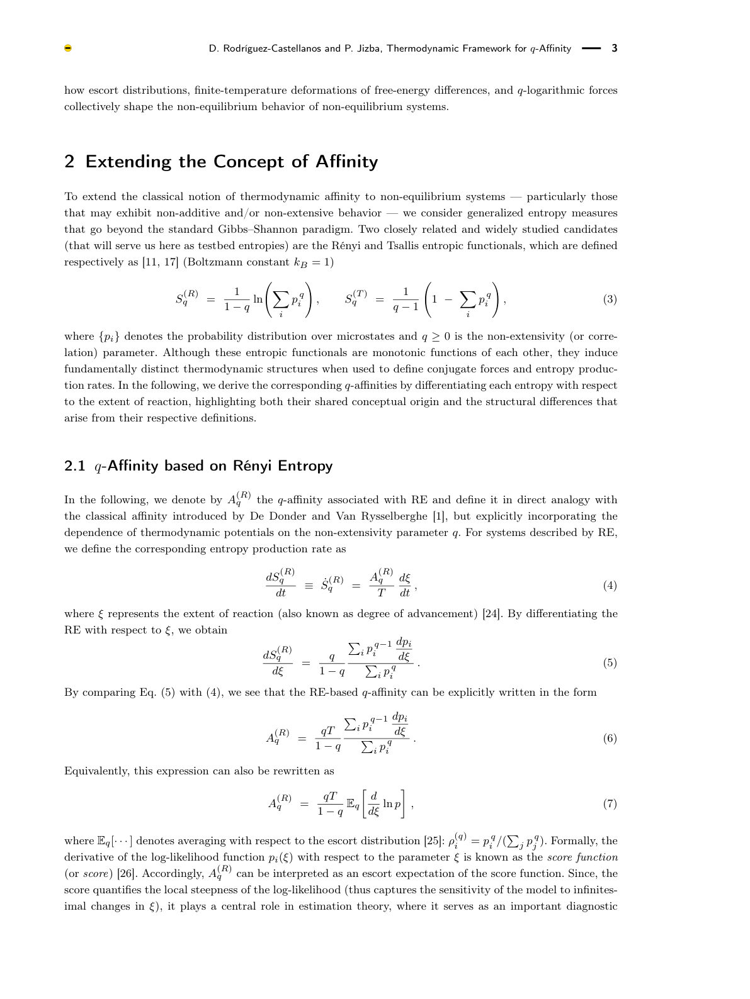
<figcaption class="paper-figure-caption"><b>Fig 2.</b> Low-resolution page preview, page 3</figcaption>
</figure>
<figure class="paper-figure-card">
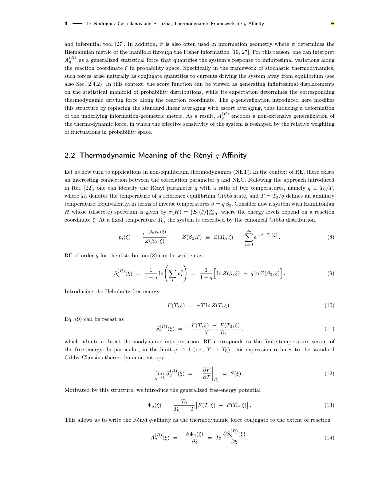
<figcaption class="paper-figure-caption"><b>Fig 3.</b> Low-resolution page preview, page 4</figcaption>
</figure>
<figure class="paper-figure-card">
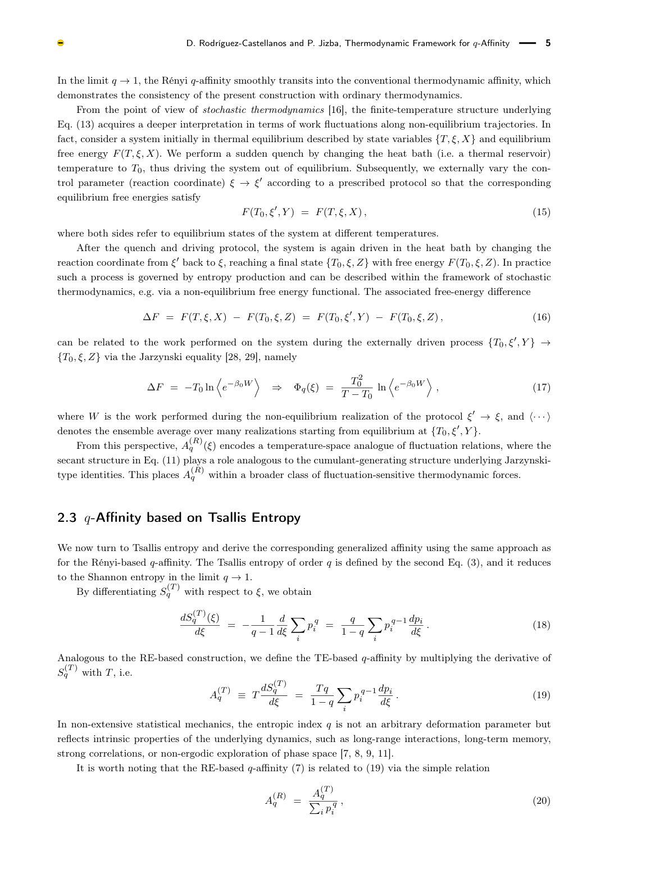
<figcaption class="paper-figure-caption"><b>Fig 4.</b> Low-resolution page preview, page 5</figcaption>
</figure>
<figure class="paper-figure-card">
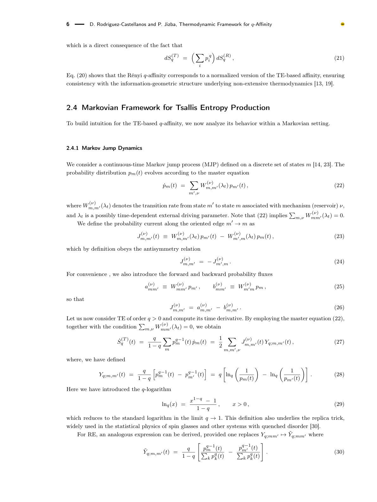
<figcaption class="paper-figure-caption"><b>Fig 5.</b> Low-resolution page preview, page 6</figcaption>
</figure>

**Summary.** This paper constructs a generalized thermodynamic framework using Rényi and Tsallis entropies to define $q$-affinities for non-equilibrium processes. It successfully extends the second law of thermodynamics to systems exhibiting strong correlations or non-Gibbsian statistics by deriving non-negative entropy production rates. This provides essential theoretical tools for analyzing complex, far-from-equilibrium physical systems.

**Why it may be interesting.** This work provides powerful mathematical tools (generalized affinities and entropies) applicable to open quantum systems where non-Markovian or long-range effects invalidate standard thermodynamic descriptions.

Detailed structure

**Main problem.** The paper develops a generalized thermodynamic framework for non-equilibrium affinities, extending classical concepts to systems with long-range interactions or strong correlations.

**Main result.** It successfully derives $q$-affinities based on Rényi and Tsallis entropies, establishing a generalized second law structure ($\dot{S}_i \ge 0$) for these non-extensive systems.

**Method.** The authors use master equation approaches and thermodynamic identities involving generalized entropies (Rényi/Tsallis) to define $q$-deformed entropy balance laws and affinities.

**Model / system.** The framework applies to general non-equilibrium systems, particularly those undergoing Markov jump processes or described by reaction equilibria, moving beyond the standard Gibbsian assumptions.

**Key observables.** Generalized thermodynamic force ($q$-affinity, $A^q$), Entropy Production Rate ($\dot{S}_i(T)_q$), and generalized free energy potentials ($\Phi_q$).

**Important parameters / regimes.** The non-extensivity parameter $q$, which governs the deviation from standard Boltzmann/Shannon statistics.

**Assumptions / limitations.** The framework relies on extending classical irreversible thermodynamics using non-extensive generalizations, assuming a Markovian embedding for local stochastic definitions.

**Paper structure.** The paper progresses by first establishing the generalized affinity for Rényi entropy via free energy differences, then tackling Tsallis entropy using master equations to derive the entropy production rate. Finally, it consolidates these findings into a general $q$-deformed entropy balance law.

Abstract

We develop a thermodynamic framework for non-equilibrium affinities based on generalized entropies. In particular, we extend the classical concept of De Donder by introducing $q$-affinities associated with Rényi and Tsallis entropies. This in turn allows us to generalize thermodynamic driving forces to systems with long-range interactions and/or strong correlations. For Rényi entropy, we build on a thermodynamic interpretation due to Baez, where the entropy is expressed through finite differences of the Helmholtz free energy at two temperatures. This leads to a generalized thermodynamic potential whose derivative with respect to a reaction coordinate defines the Rényi $q$-affinity. The resulting expression admits a representation in terms of exponential work averages, establishing a connection to Jarzynski-type fluctuation relations. For Tsallis entropy, we consider Markov jump processes using a master-equation-based approach. We derive a $q$-deformed entropy balance law and obtain an explicit expression for the Tsallis entropy production rate, proving its non-negativity and thus recovering a generalized second-law structure. This allows to identify a local stochastic $q$-affinity with the generalized thermodynamic force entering the entropy production rate.

[↑ back to top](#top)

### [RG Dynamics of Irrelevant Fermion Operators and the Drag Coupling Mechanism](http://arxiv.org/abs/2606.13792v1)

**Authors:** Jeremias Aguilera-Damia, Diego Rodriguez-Gomez, Jorge Russo  
**Type:** theory · **Category:** strongly correlated electrons · **PDF:** <https://arxiv.org/pdf/2606.13792v1>  
**Analysis basis:** full PDF text, analyzed in chunks
**Topic relevance:** `Keldysh / 2PI / non-Gaussian methods` **3/5** · `analog quantum simulation` **2/5** · `driven-dissipative phase transition` **2/5** · `methods for driven-dissipative` **2/5** · `non-equilibrium universality` **2/5** · `Kondo & dissipative impurity` **1/5** · `correlated cavity matter` **1/5** · `non-equilibrium dynamics` **1/5**

↔ Scroll figures horizontally

<figure class="paper-figure-card">
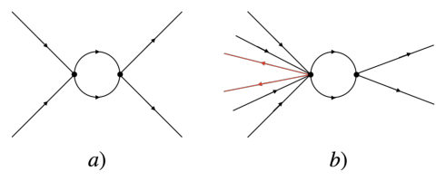
<figcaption class="paper-figure-caption"><b>Fig 1.</b> FIG. 1. One-loop contributions to a) the 4-fermion BCS chan- nel, b) 8-fermion function (holes are depicted in red).</figcaption>
</figure>
<figure class="paper-figure-card">
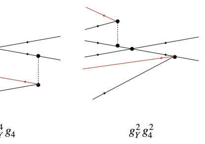
<figcaption class="paper-figure-caption"><b>Fig 2.</b> FIG. 4. A sample of tree-level 8-fermi diagrams involving Yukawa interactions.</figcaption>
</figure>

**Summary.** This theoretical work analyzes how higher-order fermionic interactions evolve under renormalization group flow near a Fermi surface. It demonstrates that while these couplings are driven toward strong coupling by the BCS mechanism, they maintain a hierarchical suppression relative to the primary pairing interaction. The findings provide insights into the stability of non-Fermi liquid states and superconducting behavior in strongly correlated metals.

**Why it may be interesting.** While focused on fermionic interactions, the RG flow techniques used—analyzing how irrelevant operators become relevant or suppressed relative to a primary pairing interaction—are highly relevant to understanding quantum criticality and emergent order in strongly correlated systems studied in AMO physics.

Detailed structure

**Main problem.** The study investigates the renormalization-group (RG) flow of higher-dimensional fermionic interactions ($\psi^\dagger\psi)^{2n}$ in the presence of a Fermi surface.

**Main result.** A 'drag mechanism' is shown to drive all higher-order couplings toward strong coupling, yet they remain parametrically suppressed relative to the BCS interaction. In NFL regimes, this enhancement does not destabilize the stable IR fixed point for sufficiently large N.

**Method.** The analysis relies on calculating one-loop beta functions and solving coupled differential equations describing the running of various fermionic couplings under RG flow.

**Model / system.** The models include non-relativistic $2+1$ dimensional fermions interacting via higher-order terms, initially analyzed near a Fermi surface (BCS context) and later extended to quantum critical metallic systems coupled to a boson.

**Key observables.** Running couplings ($	ilde{g}_4(\mu)$, $	ilde{g}_8(\mu)$), stability of fixed points in coupling space $(\alpha, \lambda, \kappa)$, and the relationship between superconducting gap and critical temperature.

**Important parameters / regimes.** The number of fermions ($N$), the chemical potential ($\mu$), and the critical threshold $N_{cr}=8$ are crucial parameters determining the system's stability.

**Assumptions / limitations.** The analysis uses one-loop approximations, relies on specific kinematic corners for the drag effect, and assumes large-$N$ limits in some sections.

**Figures summary.** Figures illustrate RG flow trajectories in coupling planes (e.g., $(\alpha, \lambda)$) showing how couplings evolve towards stable or unstable fixed points depending on system parameters like N.

**Paper structure.** The paper progresses from analyzing the basic BCS drag effect using 4- and 8-fermion interactions near a Fermi surface to investigating this mechanism in $2+1$ dimensional Non-Fermi Liquid (NFL) models, concluding with stability analysis for superconducting applications.

Abstract

We study the renormalization-group flow of higher-dimensional fermionic interactions $(ψ^\dagger ψ)^{2n}$ in the presence of a Fermi surface. We show that the growth of the BCS four-fermion coupling induces a drag mechanism whereby higher-order fermionic couplings are driven to strong coupling in the infrared. We derive the corresponding beta functions and show that the drag effect applies generically to the whole tower of fermionic operators. Remarkably, although all couplings are driven toward the same strong-coupling scale, the renormalization-group flow preserves a hierarchy in which higher-dimensional operators remain parametrically suppressed relative to the BCS interaction. We then investigate this mechanism in a $2+1$-dimensional non-Fermi liquid coupled to a critical boson. While higher-order fermionic interactions are similarly enhanced along the flow, we show that they do not destabilize the IR stable non-Fermi-liquid fixed point, present for sufficiently large $N$. We briefly discuss possible implications for multicomponent superconductors and other strongly correlated metallic systems.

[↑ back to top](#top)

### [Mean-field theory of myopic self-avoiding fractional Brownian motion](http://arxiv.org/abs/2606.13972v1)

**Authors:** Rashad Bakhshizada, Skirmantas Janušonis, Ralf Metzler, Thomas Vojta  
**Type:** theory · **Category:** statistical mechanics · **PDF:** <https://arxiv.org/pdf/2606.13972v1>  
**Analysis basis:** full PDF text, analyzed in chunks
**Topic relevance:** `non-equilibrium dynamics` **3/5** · `non-equilibrium universality` **3/5** · `driven-dissipative phase transition` **2/5** · `Frenkel-Kontorova` **1/5** · `Keldysh / 2PI / non-Gaussian methods` **1/5** · `analog quantum simulation` **1/5** · `correlated / nonlocal dissipation` **1/5** · `methods for driven-dissipative` **1/5**

↔ Scroll figures horizontally

<figure class="paper-figure-card">
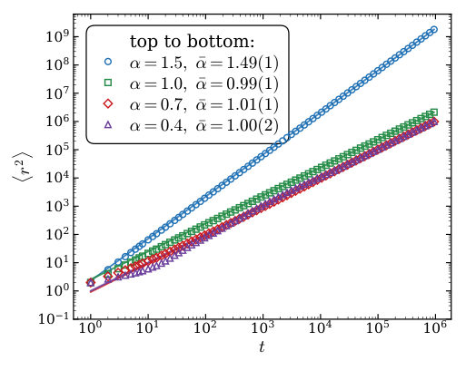
<figcaption class="paper-figure-caption"><b>Fig 1.</b> FIG. 1. MSD ⟨r2⟩vs time t for myopic self-avoiding FBM in two dimensions, for four values of α. The statistical er- rors of the data points are smaller than the symbol size. For α = 1.5 &gt; αc = 1, the MSD grows as ⟨r2⟩∼tα, recovering standard FBM scaling. For α = 1.0, 0.7, and 0.4, all at or below αc = 1, the asymptotic MSD exponent ¯α equals αc, regardless of α, demonstrating that the mean-density inter- action dominates the long-time dynamics. The values of ¯α are extracted from weighted power-law fits to the long-time behavior (solid lines). Their error represents the sum of statis- tical errors and systematic errors from choosing the fit range, and are given in units of the last digit,...</figcaption>
</figure>
<figure class="paper-figure-card">
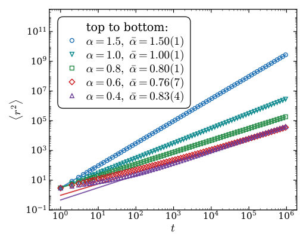
<figcaption class="paper-figure-caption"><b>Fig 2.</b> FIG. 2. MSD ⟨r2⟩vs time t for myopic self-avoiding FBM in three dimensions, for five values of α. For α = 1.5 and 1.0, both above αc = 4/5, the MSD recovers the standard FBM scaling ⟨r2⟩∼tα. For α = 0.8, 0.6, and 0.4, all at or below αc = 4/5, the fitted exponent ¯α saturates at ¯α = αc = 4/5 regardless of α, confirming the interaction-dominated regime and the scaling prediction δ = 2/5. The values of ¯α are ex- tracted from weighted power-law fits to the long-time behav- ior (solid lines). The statistical errors of the data points are smaller than the symbol size.</figcaption>
</figure>
<figure class="paper-figure-card">
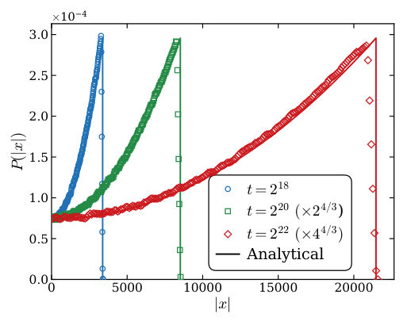
<figcaption class="paper-figure-caption"><b>Fig 3.</b> FIG. 4. 1D instantaneous probability density P(x, t) vs |x| for α = 0.7 &lt; αc = 4/3, compared to the analytical solu- tion (27). Curves for t = 220 and t = 222 are rescaled by the theoretically predicted factors (t/218)2/3 ≈2.52 and 6.35, respectively, to improve visibility. The data agree well with the characteristic bimodal, U-shaped structure — with par- ticles depleted at the origin and accumulating near the outer boundary |x| = ymaxt2/3. Small differences between theory and simulation can be attributed to the effects of finite time and finite ensemble size.</figcaption>
</figure>
<figure class="paper-figure-card">
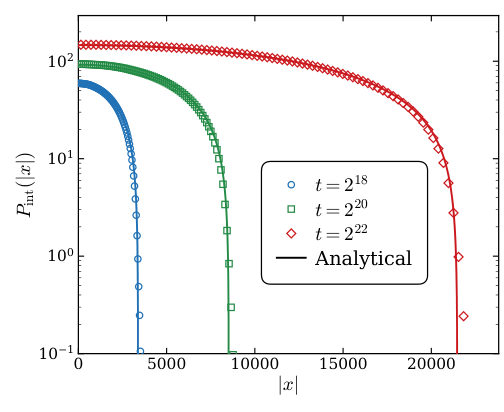
<figcaption class="paper-figure-caption"><b>Fig 4.</b> FIG. 3. 1D integrated probability density Pint(|x|) vs |x| for α = 1.0 &lt; αc = 4/3. The analytical solution Eq. (25) (solid lines) agrees quantitatively with simulations (symbols) at three times t = 218, 220, 222. The density peaks at the origin and decays parabolically to zero at |x| = ymaxt2/3, con- firming the predicted scaling.</figcaption>
</figure>
<figure class="paper-figure-card">
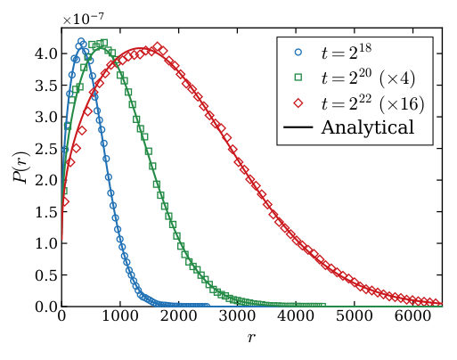
<figcaption class="paper-figure-caption"><b>Fig 5.</b> FIG. 6. 2D instantaneous probability density P(r) vs r for the marginal case, α = αc = 1. The analytical solution Eq. (34) (solid line) agrees with simulations (symbols) at three times t = 218, 220, 222, rescaled by t/218 for visual clarity. The Gaussian decay for large r contrasts sharply with the hard cutoff seen in Fig. 5 for α &lt; αc.</figcaption>
</figure>

**Summary.** This work develops a mean-field theory for myopic self-avoiding fractional Brownian motion, modeling particles repelled by their own density distribution. The theory predicts that the system's long-time dynamics are governed by two distinct regimes depending on the noise exponent $\alpha$. By solving the associated Fokker-Planck equation analytically in multiple dimensions, the authors confirm scaling laws crucial for understanding self-organization processes.

**Why it may be interesting.** While focused on statistical mechanics, the use of anomalous diffusion and non-equilibrium dynamics is relevant to understanding complex systems where memory effects or long-range correlations govern particle movement, which has parallels in many AMO contexts like quantum transport or interacting cold atoms.

Detailed structure

**Main problem.** The paper develops an analytical mean-field theory for myopic self-avoiding fractional Brownian motion (FBM). This process models particle movement influenced by both anomalous noise and repulsive interactions from the ensemble's time-integrated density.

**Main result.** The theory successfully predicts distinct dynamical regimes: in the interaction-dominated regime, the mean-squared displacement scales as $\langle r^2(t) 
angle \sim t^{4/(d+2)}$, independent of the noise exponent $\alpha$.

**Method.** The approach combines a Fokker-Planck formalism with scaling theory analysis to derive closed-form polynomial solutions for the probability density in various dimensions.

**Model / system.** The model is myopic self-avoiding FBM, where particles are driven by fractional Gaussian noise and experience a mean-field repulsion proportional to the gradient of the time-integrated ensemble density. This framework is applied across 1D, 2D, and 3D.

**Key observables.** Mean-squared displacement ($\langle r^2(t) 
angle$), instantaneous probability density $P(r, t)$, and time-integrated density $P_{	ext{int}}(r, t)$.

**Important parameters / regimes.** The anomalous diffusion exponent $\alpha$, the critical exponent $\alpha_c = 4/(d+2)$, and spatial dimension $d$ are crucial parameters defining the system's behavior.

**Assumptions / limitations.** The primary assumption is working within the mean-field limit ($N 	o \infty$), which neglects ensemble fluctuations. The analysis also assumes rotational symmetry in space.

**Figures summary.** Figures compare analytical solutions (solid lines) against numerical simulations (symbols) across different dimensions and exponents, confirming predicted scaling laws like parabolic profiles in 1D or annular structures in 2D.

**Paper structure.** The paper introduces the physical model and its known scaling theory ($\alpha_c$), then develops the mean-field Fokker-Planck approach. It proceeds to derive analytical solutions for specific dimensions (1D, 2D, 3D) by solving nonlinear ODEs derived from consistency relations.

Abstract

Myopic self-avoiding fractional Brownian motion (FBM) is a stochastic process in which an ensemble of particles is driven by fractional Gaussian noise while being repelled by the gradient of the time-integrated ensemble density [J. House, R. Bakhshizada, S. Janušonis, R. Metzler, and T. Vojta, Phys. Rev. E 112, 034119 (2025)]. Depending on the anomalous diffusion exponent $α$ characterizing the noise, the process features two dynamical regimes: an interaction-dominated regime ($α< α_c=4/(d+2)$) where the mean-density interaction governs long-time dynamics, and a noise-dominated regime ($α> α_c$) where FBM correlations prevail. In the interaction-dominated regime, the mean-squared displacement grows as $\langle r^2(t) \rangle \sim t^{4/(d+2)}$ regardless of $α$, while for $α> α_c$ the standard FBM scaling $\langle r^2(t) \rangle \sim t^α$ is recovered. Here, we develop an analytical mean-field theory of myopic self-avoiding FBM, based on a Fokker-Planck approach to the interaction-dominated regime. This allows us to derive closed-form polynomial solutions for the probability density. To compare with computer simulations, we develop an efficient radial binning algorithm that significantly reduces the computational complexity, making large-scale three-dimensional simulations feasible. Extensive simulations in one, two, and three dimensions confirm the analytical predictions. We also discuss the application of the process to the self-organization of serotonergic axons (fibers) in vertebrate brains, where FBM paths with self-avoidance provide a natural framework for understanding spatial heterogeneities of fiber densities.

[↑ back to top](#top)

### [Real-time pseudo entropy and modular-Hamiltonian correlations](http://arxiv.org/abs/2606.14208v1)

**Authors:** Tatsuhiro Misumi  
**Type:** theory · **Category:** statistical mechanics · **PDF:** <https://arxiv.org/pdf/2606.14208v1>  
**Analysis basis:** full PDF text, analyzed in chunks
**Topic relevance:** `entanglement & information structure` **3/5** · `non-equilibrium dynamics` **3/5** · `non-equilibrium universality` **2/5** · `Keldysh / 2PI / non-Gaussian methods` **1/5** · `analog quantum simulation` **1/5** · `correlated / nonlocal dissipation` **1/5** · `driven-dissipative phase transition` **1/5** · `methods for driven-dissipative` **1/5**

↔ Scroll figures horizontally

<figure class="paper-figure-card">
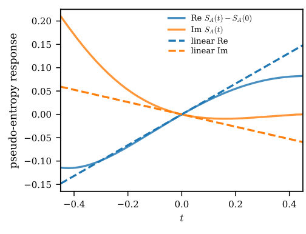
<figcaption class="paper-figure-caption"><b>Fig 1.</b> FIG. 1. Real and imaginary parts of the real-time pseudo entropy in the two-qubit model. We plot Re SA(t) −SA(0) and Im SA(t) for p = 0.3, q = 0.7, ϕ = π/4, and g = 1.2. Dashed lines show the linear predictions from Eqs. (62) and (63). The imaginary part is governed by the modular co- variance, while the real part is governed by the commutator expectation value.</figcaption>
</figure>
<figure class="paper-figure-card">
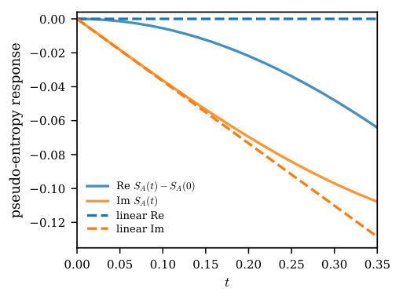
<figcaption class="paper-figure-caption"><b>Fig 2.</b> FIG. 2. Real-time pseudo entropy after a transverse-field Ising-chain quench. The system is an open chain with L = 6, initial field hi = 1.0, final field hf = 1.55, and subsystem size LA = 3. The real part has no linear term for this real time- reversal-symmetric setup, while the imaginary part is linear with slope fixed by the modular covariance. Dashed lines show the first-order predictions.</figcaption>
</figure>
<figure class="paper-figure-card">
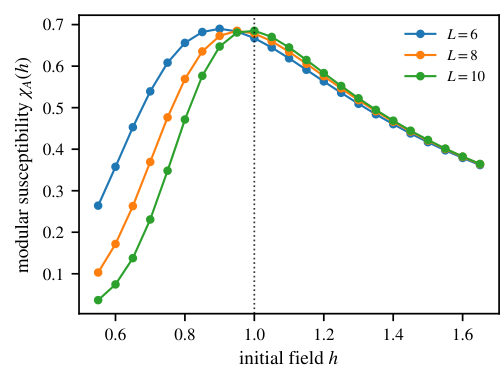
<figcaption class="paper-figure-caption"><b>Fig 3.</b> FIG. 3. Finite-size modular susceptibility χA(h) in the open transverse-field Ising chain, Eq. (71), for L = 6, 8, 10 and LA = L/2. The vertical dotted line marks the thermodynamic critical point h = 1. The peak sharpens and moves toward the critical region as L increases, suggesting that the imaginary pseudo-entropy slope probes many-body critical correlations through the modular covariance.</figcaption>
</figure>

**Summary.** This work introduces 'pseudo entropy,' a complex generalization of entanglement entropy used to track the directional flow of information during real-time quantum evolution. The key finding is that this pseudo entropy's short-time change decomposes into two parts: an imaginary component driven by modular covariance and a real component driven by commutators. This framework extends naturally to non-Hermitian physics, providing a powerful diagnostic for time-asymmetric quantum processes.

**Why it may be interesting.** It provides a novel, amplitude-level diagnostic tool for quantum dynamics that intrinsically carries an arrow of time, offering insights beyond standard entropy production theorems relevant to open and non-equilibrium quantum systems.

Detailed structure

**Main problem.** To derive a microscopic, time-oriented entropic quantity (pseudo entropy) that captures directional information about quantum evolution before standard thermodynamic irreversibility is established.

**Main result.** The short-time change in real-time pseudo entropy splits into an imaginary part governed by the modular covariance of the Hamiltonian and initial state, and a real part governed by the commutator of these operators.

**Method.** The analysis relies on calculating the time derivative of the pseudo entropy using the reduced transition matrix ($	au$) and decomposing this variation into covariance and commutator terms.

**Model / system.** The theory is applied to general quantum systems undergoing real-time unitary evolution (quenches), with specific illustrations in two-qubit models, transverse-field Ising chains, and non-Hermitian PT-symmetric toy models.

**Key observables.** Real-time pseudo entropy ($S_A(t, 0)$), modular covariance response ($\propto \langle \{K_A, H\} 
angle$), and the commutator expectation value ($\langle [K_A, H] 
angle$).

**Important parameters / regimes.** Time $t$ (especially short-time expansion), temperature/inverse temperature $eta$, and system size $L$.

**Assumptions / limitations.** The analysis assumes a definition of pseudo entropy via the reduced transition matrix and focuses on the leading order ($O(t^2)$) time dependence.

**Figures summary.** Figures illustrate the real ($	ext{Re } S_A(t)$) and imaginary ($	ext{Im } S_A(t)$) components of the pseudo entropy after an Ising-chain quench, showing the linear imaginary response fixed by modular covariance. A finite-size study shows the modular susceptibility peaking near criticality.

**Paper structure.** The paper develops the theory by first defining the complex pseudo entropy and deriving its short-time expansion. It then rigorously separates the time evolution into distinct contributions (covariance/commutator). The methodology is extended to non-Hermitian systems, culminating in discussions relating this oriented response to holographic principles.

Abstract

Pseudo entropy is a complex-valued generalization of entanglement entropy defined from a reduced transition matrix. We study the pseudo entropy associated with a real-time transition matrix between an initial pure state and its unitary time evolution. For a subsystem $A$, we show that the short-time behavior of real-time pseudo entropy is governed by the correlation between the physical Hamiltonian $H$ and the modular Hamiltonian $K_A=-\logρ_A$ of the initial reduced state, $ S_A(t,0)=S_A(0)-it \langle K_A(H-\langle H\rangle)\rangle + \mathcal{O}(t^2)$. For Hermitian dynamics, the initial imaginary response is controlled by the symmetrized covariance of $H$ and $K_A$ with an overall minus sign, while the initial real response is governed by their commutator. Thus the imaginary part of real-time pseudo entropy is not merely a branch artifact: it is a time-oriented modular response generated by the correlation between microscopic time evolution and subsystem coarse graining. We clarify the relation of this result to the known first law of pseudo entropy, derive an all-order expression in a Schmidt-diagonal model, recover thermal pseudo entropy as a special case, illustrate the covariance/commutator decomposition in a two-qubit model, and confirm the covariance response in transverse-field Ising-chain quenches, including a finite-size study of a modular susceptibility near the Ising critical region. We discuss how this amplitude-level oriented response can be related to ordinary entropy production, and also give a concrete $\mathcal{PT}$-symmetric toy-model illustration of the non-Hermitian extension.

[↑ back to top](#top)

### [Wealth Inequality and Planetary Boundaries in a Stylized Agent-Based Model](http://arxiv.org/abs/2606.14331v1)

**Authors:** Thomas Valade, Michael Benzaquen, Matthieu Cristelli, Stanislao Gualdi, Pierre Lenders  
**Type:** theory · **Category:** statistical mechanics · **PDF:** <https://arxiv.org/pdf/2606.14331v1>  
**Analysis basis:** full PDF text, analyzed in chunks
**Topic relevance:** `driven-dissipative phase transition` **3/5** · `non-equilibrium universality` **3/5** · `non-equilibrium dynamics` **2/5** · `Frenkel-Kontorova` **1/5** · `Keldysh / 2PI / non-Gaussian methods` **1/5** · `analog quantum simulation` **1/5** · `correlated / nonlocal dissipation` **1/5** · `methods for driven-dissipative` **1/5**

↔ Scroll figures horizontally

<figure class="paper-figure-card">
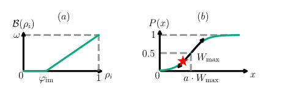
<figcaption class="paper-figure-caption"><b>Fig 1.</b> FIG. 1: Behavioral factor of agents (left) and probability function of a shock induced by climate negative externalities (right). The red star corresponds to the baseline situation used in Table. I.</figcaption>
</figure>
<figure class="paper-figure-card">
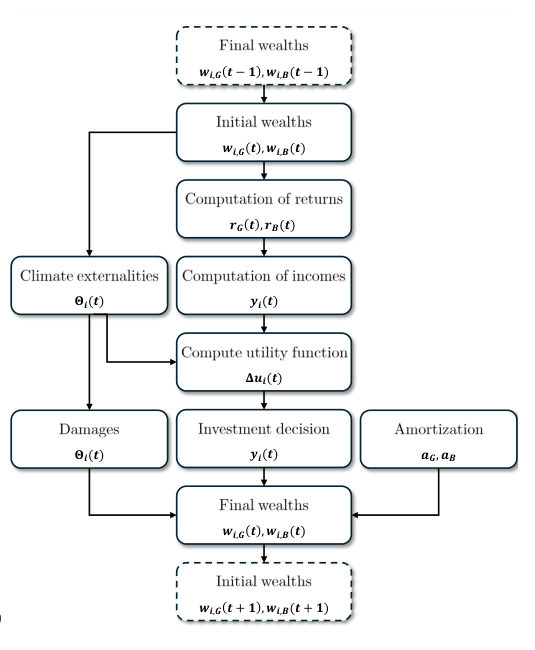
<figcaption class="paper-figure-caption"><b>Fig 2.</b> FIG. 2: Global workflow of the model.</figcaption>
</figure>
<figure class="paper-figure-card">
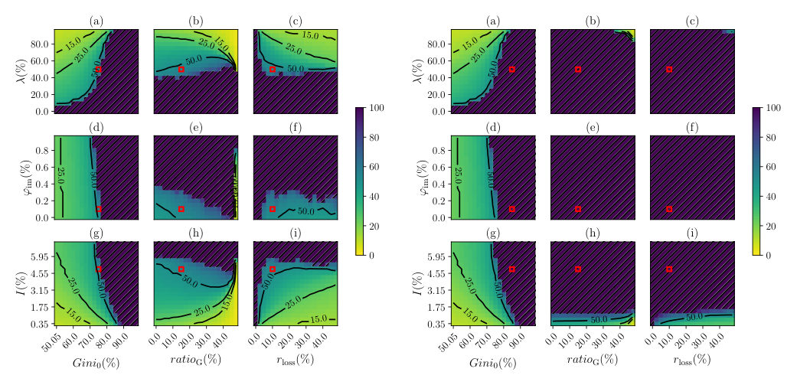
<figcaption class="paper-figure-caption"><b>Fig 3.</b> FIG. 3: Phase diagrams of the median transition time (T2T) from Monte Carlo experiments (100 simulations). The hatched region indicates parameter combinations for which at least half of the simulations fail to transition. Contour lines show iso-T2T levels (equal median T2T). The red square indicates a point with the same parameters (i.e., reference parameters) in all the figures. It should be noted that the first column remains the same in both figures because the Gini0 coefficient is used as the parameter of analysis in these columns.</figcaption>
</figure>
<figure class="paper-figure-card">
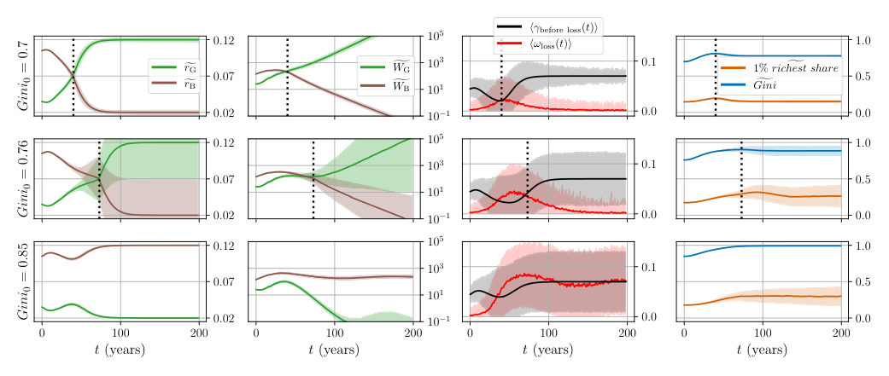
<figcaption class="paper-figure-caption"><b>Fig 4.</b> FIG. 4: We plotted median trajectories for returns (1st column), median total wealths (2nd column), average share of loss ωloss and share of incomes γbefore loss on aggregate wealth (3rd column), and median indicators for inequalities (4th column). All computations are made using reference parameters over 1000 Monte Carlo runs.</figcaption>
</figure>
<figure class="paper-figure-card">
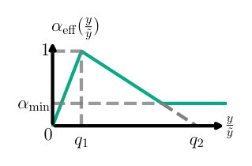
<figcaption class="paper-figure-caption"><b>Fig 5.</b> FIG. 5: Effective factor for the multiplicative tax rate as a function of income y</figcaption>
</figure>

**Summary.** This work uses an Agent-Based Model to explore how wealth inequality impedes the transition to a sustainable 'Green' economy. It finds that high levels of inequality can lock economies into polluting regimes, even when environmental risks are known. The results highlight that no single policy is universally optimal; effective intervention requires tailoring mechanisms (taxation vs. incentives) to the specific level of existing economic disparity.

**Why it may be interesting.** While not directly quantum mechanical, the use of complex non-equilibrium dynamics, phase transitions (Brown to Green regime), and agent heterogeneity mirrors concepts found in statistical physics models of critical phenomena or pattern formation far from equilibrium.

Detailed structure

**Main problem.** The study investigates whether wealth inequality acts as a structural obstacle preventing an economy from undergoing an ecological transition toward sustainability, rather than merely being a consequence of environmental damage.

**Main result.** The research demonstrates that beyond certain thresholds of wealth inequality, the economy can become locked in a high-emission 'Brown' regime, regardless of agent sensitivity to climate externalities. The effectiveness of policy interventions depends critically on the existing level of inequality and the regressivity embedded in the fiscal mechanism.

**Method.** The authors employ a stylized Agent-Based Model (ABM) simulating heterogeneous agents allocating income between environmentally damaging ('Brown') and sustainable ('Green') sectors based on utility maximization.

**Model / system.** The model features agents with initial wealth following a Pareto distribution, making decentralized investment decisions influenced by short-term returns versus long-term systemic environmental risks. The dynamics are governed by equations describing income rates and agent utility differences related to externalities.

**Key observables.** Gini coefficient, Time to Transition ($T_{2T}$), cumulative environmental destruction ($\langle\omega_{	ext{loss}}(t)
angle$), aggregate Green/Brown wealth shares, and policy performance metrics (e.g., reduction in $T_{2T}$).

**Important parameters / regimes.** Initial wealth heterogeneity ($	ext{Gini}_0$), externality awareness weight ($\lambda$), time scales for tech inertia ($	au$) and external impact decay ($	heta$), and parameters defining fiscal mechanisms.

**Assumptions / limitations.** Agents are assumed to be rational utility maximizers; the model is stylized, representing an exploratory framework rather than a precise forecast of reality. A key assumption is that wealthier agents discount long-term environmental risks more heavily.

**Figures summary.** Figures illustrate phase diagrams showing transition possibility thresholds based on inequality, and radar plots comparing the multidimensional performance trade-offs (e.g., speed vs. cost) across various policy combinations.

**Paper structure.** The paper develops an ABM framework to model wealth allocation between two sectors; it establishes that high initial inequality can trap the system in a poor state; subsequently, it compares multiple fiscal policies (BI, carbon tax, incentives) by analyzing their impact on transition speed and environmental outcomes across different inequality regimes.

Abstract

At the intersection of rising wealth inequality and intensifying environmental pressures, we investigate a reverse causal relationship that has received comparatively little attention: wealth inequality may not only be a consequence of environmental crises, but also act as a structural obstacle to the ecological transition itself. We develop a stylized agent-based model in which heterogeneous agents, whose initial wealth follows a Pareto distribution, allocate their income between either a Brown or a Green sector through a utility function. The function is designed to capture the trade-off between short-term returns and exposure to long-term systemic risks. A central ingredient is that wealthier agents perceive themselves as less vulnerable to environmental shocks, thereby reducing the amount of resources available for the transition. We show that, beyond inequality thresholds compatible with those observed in most developed countries, the economy remains locked in a Brown regime, even when a substantial share of agents is sensitive to externalities. We then assess a set of stylized fiscal policies (basic income, carbon taxation, Green incentives, and a combined scheme) and find that their effectiveness depends strongly on the inequality regime and on the regressivity embedded in the fiscal mechanism, revealing multidimensional trade-offs between transition speed, cumulative environmental destruction, growth, and fiscal pressure.

[↑ back to top](#top)

### [Note on the local calculation of decoherence of quantum superposition in the static black holes](http://arxiv.org/abs/2606.14178v1)

**Authors:** Ran Li, Zhong-Xiao Man, Jin Wang  
**Type:** theory · **Category:** other · **PDF:** <https://arxiv.org/pdf/2606.14178v1>  
**Analysis basis:** full PDF text, analyzed in chunks
**Topic relevance:** `Keldysh / 2PI / non-Gaussian methods` **3/5** · `correlated / nonlocal dissipation` **2/5** · `driven-dissipative phase transition` **2/5** · `entanglement & information structure` **2/5** · `methods for driven-dissipative` **1/5** · `non-equilibrium dynamics` **1/5** · `non-equilibrium universality` **1/5**

↔ Scroll figures horizontally

<figure class="paper-figure-card">
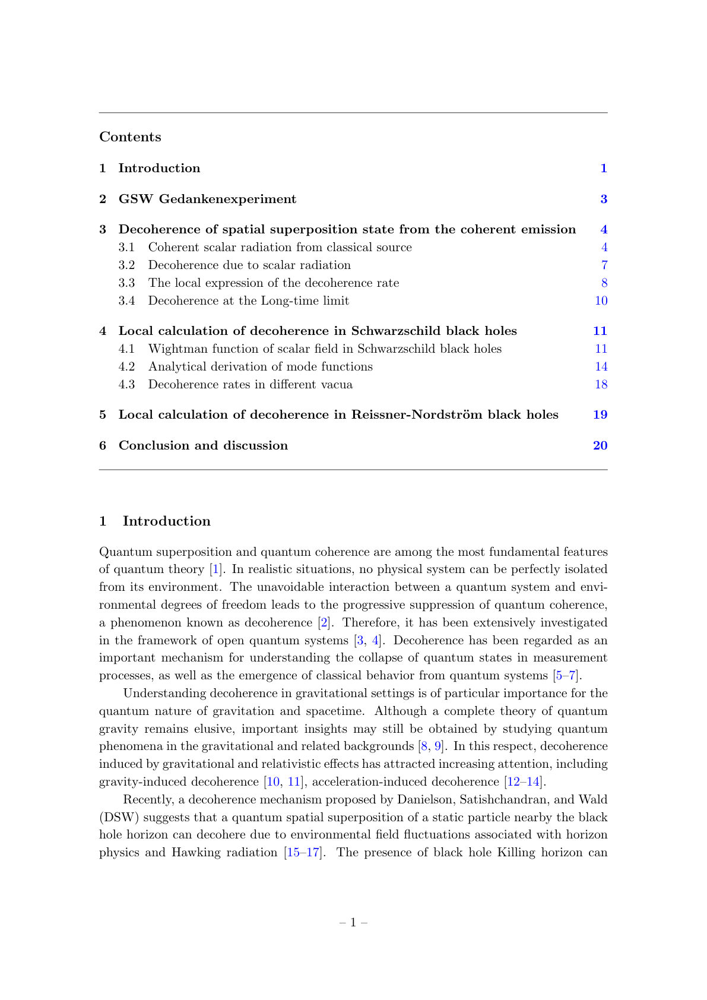
<figcaption class="paper-figure-caption"><b>Fig 1.</b> Low-resolution page preview, page 2</figcaption>
</figure>
<figure class="paper-figure-card">
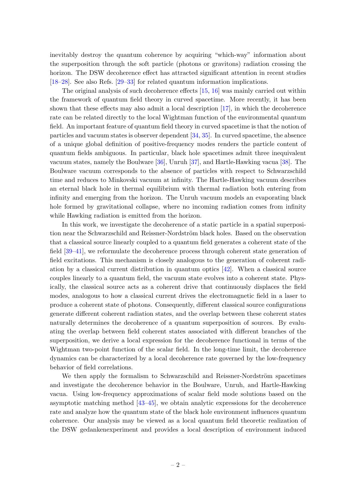
<figcaption class="paper-figure-caption"><b>Fig 2.</b> Low-resolution page preview, page 3</figcaption>
</figure>
<figure class="paper-figure-card">
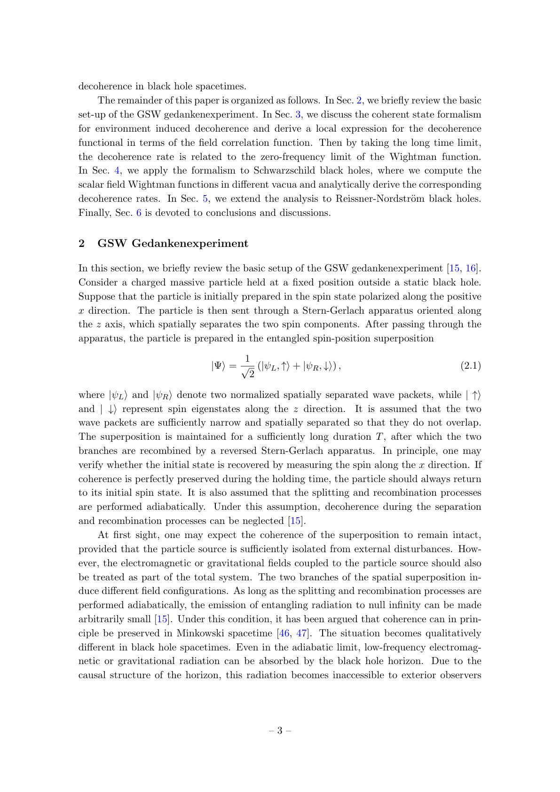
<figcaption class="paper-figure-caption"><b>Fig 3.</b> Low-resolution page preview, page 4</figcaption>
</figure>
<figure class="paper-figure-card">
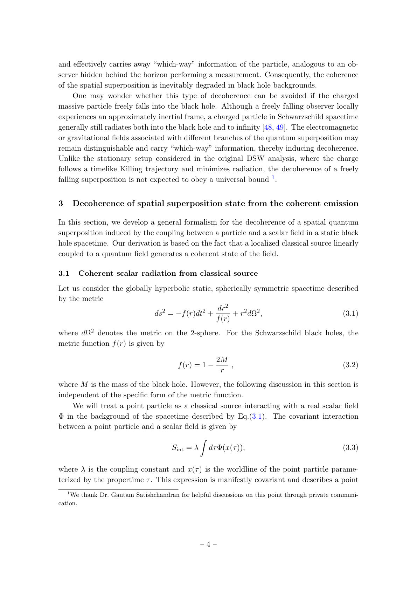
<figcaption class="paper-figure-caption"><b>Fig 4.</b> Low-resolution page preview, page 5</figcaption>
</figure>
<figure class="paper-figure-card">
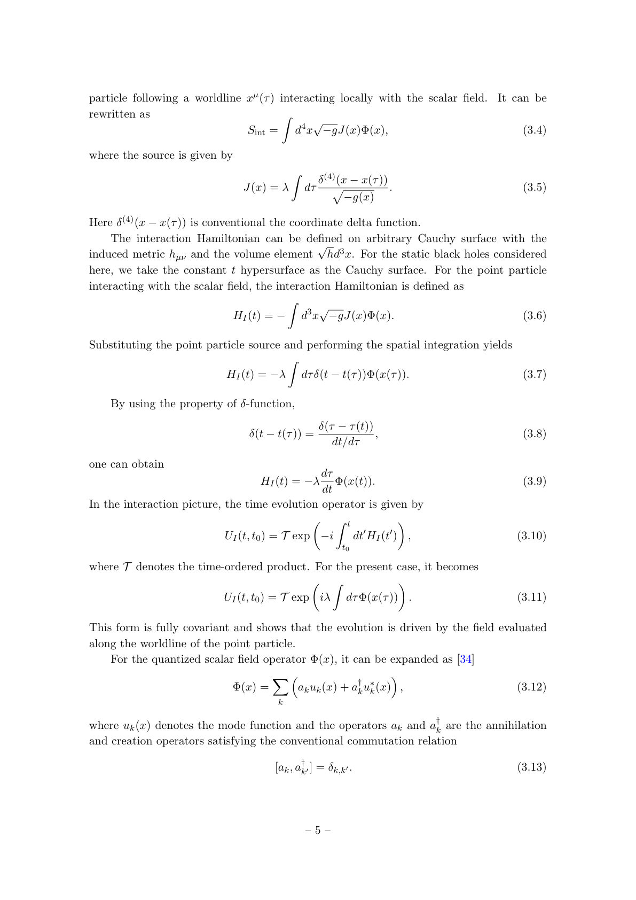
<figcaption class="paper-figure-caption"><b>Fig 5.</b> Low-resolution page preview, page 6</figcaption>
</figure>

**Summary.** This theoretical paper calculates the rate at which a quantum superposition decays due to coupling with a scalar field near black holes. By analyzing different vacuum states—Boulware, Unruh, and Hartle-Hawking—the authors show that only thermal effects associated with Hawking radiation induce measurable decoherence. This demonstrates the profound dependence of quantum coherence on the chosen description of the spacetime environment.

**Why it may be interesting.** This work provides a concrete calculation of decoherence in curved spacetime environments, linking fundamental concepts like Hawking radiation and quantum field theory in curved spacetime directly to open quantum system dynamics (decoherence).

Detailed structure

**Main problem.** The paper investigates how quantum spatial superpositions of a particle decohere when coupled to a quantum scalar field in the curved spacetime backgrounds of static black holes (Schwarzschild and Reissner-Nordström).

**Main result.** Decoherence is found to vanish in the Boulware vacuum but is induced by thermal effects associated with Hawking radiation in Unruh and Hartle-Hawking vacua, yielding a non-zero rate even for extremal black holes.

**Method.** The decoherence functional is derived locally using coherent state generation techniques, relating the rate to the low-frequency behavior of the Wightman function calculated via asymptotic matching methods.

**Model / system.** The system models a quantum superposition of a static particle coupled to a real scalar field ($\Phi$) in curved spacetime. The analysis uses the interaction Hamiltonian derived from the coupling $S_{int} = \lambda \int d	au \Phi(x(	au))$.

**Key observables.** Decoherence functional, entanglement particle number $\langle N 
angle$, and the decoherence rate ($\Gamma$).

**Important parameters / regimes.** Black hole mass ($M$), charge ($Q$), coupling constant ($\lambda$), separation distance ($d$), and vacuum choice (Boulware, Unruh, Hartle-Hawking).

**Assumptions / limitations.** The analysis relies on approximations such as treating the interaction profile as rectangular and using asymptotic matching methods for mode functions in different regimes.

**Paper structure.** The paper reviews the DSW gedankenexperiment, develops the coherent state formalism and local rate expression, applies it to Schwarzschild black holes, extends the analysis to Reissner-Nordström black holes, and concludes by summarizing the vacuum dependence.

Abstract

We investigate the decoherence of a quantum spatial superposition of a static particle in Schwarzschild and Reissner-Nordström black holes. By treating the particle as a localized classical source coupled to a quantum scalar field, we reformulate the decoherence process in the Danielson-Satishchandran-Wald (DSW) gedankenexperiment through coherent state generation and derive the local expression for the decoherence functional in terms of the Wightman function. In the long-time limit, the decoherence rate is shown to be characterized by the low-frequency behavior of the Wightman function. We then employ the asymptotic matching method to calculate the analytical expressions of the Wightman functions in the Boulware, Unruh, and Hartle-Hawking vacua. We show that the decoherence behavior depends on the quantum state of the environmental field. While the Boulware vacuum gives vanishing decoherence for a static superposition, the thermal effects associated with Hawking radiation in the Unruh and Hartle-Hawking vacua can induce nonvanishing decoherence.

[↑ back to top](#top)

### [Percolation of a rod-like particle in a static bed of spheres: trapping and passing](http://arxiv.org/abs/2606.14661v1)

**Authors:** Juan C. Petit, Julio M. Ottino, Richard M. Lueptow, Paul B. Umbanhowar  
**Type:** theory · **Category:** statistical mechanics · **PDF:** <https://arxiv.org/pdf/2606.14661v1>  
**Analysis basis:** full PDF text, analyzed in chunks
**Topic relevance:** `non-equilibrium dynamics` **3/5** · `non-equilibrium universality` **3/5** · `driven-dissipative phase transition` **2/5** · `methods for driven-dissipative` **2/5** · `Frenkel-Kontorova` **1/5** · `Keldysh / 2PI / non-Gaussian methods` **1/5**

↔ Scroll figures horizontally

<figure class="paper-figure-card">
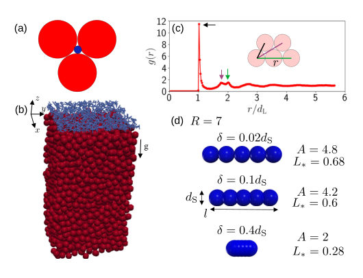
<figcaption class="paper-figure-caption"><b>Fig 1.</b> FIG. 1. (a) Triangular configuration of three contacting large spheres with diameter dL (red) defining the pore throat diam- eter dt (blue) associated with the geometric trapping limit, Rt. (b) Randomly packed bed of large spheres (ϕ = 0.60) with initial configuration of non-interacting rods (blue) at the top. (c) Radial distribution function, g(r), of the packed bed showing a disordered configuration beyond nearby particles for r &gt; 2dL. (d) Examples of rods with various aspect ratios, A = dL/dS, and length ratios, L∗= l/dL.</figcaption>
</figure>
<figure class="paper-figure-card">
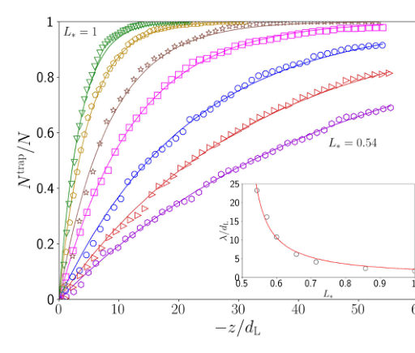
<figcaption class="paper-figure-caption"><b>Fig 2.</b> FIG. 2. Fraction of trapped rods, N trap/N, vs scaled depth, z/dL, for R = 7 and L∗∈{0.54, 0.57, 0.6, 0.65, 0.71, 0.86, 1}. Solid curves are fits to N trap/N = 1−exp(z/λ). Inset: Scaled characteristic bed penetration length, λ/dL, vs scaled rod length, L∗; solid curve is a fit to λ/dL = c/(L∗−Lc ∗), where Lc ∗≈0.52 is the critical trapping length and c ≈1.1.</figcaption>
</figure>
<figure class="paper-figure-card">
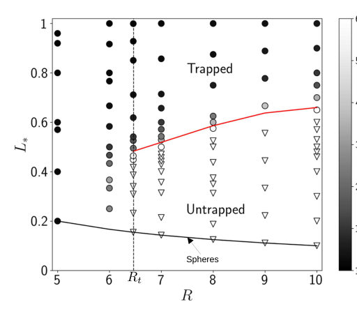
<figcaption class="paper-figure-caption"><b>Fig 3.</b> FIG. 3. Phase diagram of trapped and passing regimes vs rod length, L∗, and size ratio, R, in a disordered bed of spheri- cal particles with ϕ = 0.60. Downward triangles represent the continuous percolation regime while circles indicate the trapping regime, characterized by λ/dL (grayscale), which di- verges at the boundary between trapped and untrapped rods. Solid black and red lines denote, respectfully, the spherical limit (L∗= R−1) and the critical trapping length, Lc ∗, ex- tracted from fits to Eq. 2 (see inset in Fig. 2). The vertical dashed line indicates the minimum pore-throat-based geomet- ric trapping threshold at R = Rt = 6.464.</figcaption>
</figure>
<figure class="paper-figure-card">
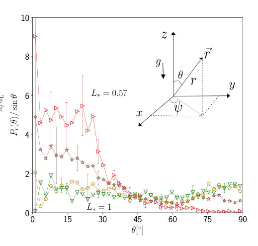
<figcaption class="paper-figure-caption"><b>Fig 4.</b> FIG. 4. Scaled polar density distributions of trapped rod ori- entation, Pr(θ)/ sin θ, vs polar angle, θ, at R = 7 and different L∗∈{0.57, 0.71, 0.86, 1}. Data are averaged over five inde- pendent simulations with different initial bed sphere packings and rods positions. Error bars indicate the standard devia- tion and are only plotted for selected data points to improve readability.</figcaption>
</figure>
<figure class="paper-figure-card">
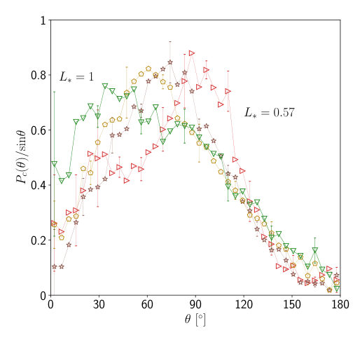
<figcaption class="paper-figure-caption"><b>Fig 5.</b> FIG. 5. Scaled polar density distributions of contact location, Pc(θ)/ sin θ, vs polar contact angle between trapped rods and bed spheres (R = 7) at different L∗∈{0.57, 0.71, 0.86, 1}. Data are averaged over five independent simulations with dif- ferent initial bed spheres and rods positions. Error bars indi- cate the standard deviation and are only plotted for selected data points to improve readability.</figcaption>
</figure>

**Summary.** This work numerically investigates how rod-shaped particles move through a fixed bed of spheres, revealing two key behaviors: getting permanently stuck (trapping) or moving continuously (passing). The results show that particle shape anisotropy introduces strong dynamical constraints, causing longer rods to slow down and become more easily trapped than shorter ones.

**Why it may be interesting.** While focused on granular physics, the study models complex non-equilibrium transport phenomena in disordered media. The identification of distinct dynamic regimes (trapping vs. passing) governed by geometric thresholds has parallels in understanding energy dissipation or flow through porous quantum structures.

Detailed structure

**Main problem.** The study investigates the percolation behavior of rod-like particles moving through a static, disordered bed of larger spheres under gravity.

**Main result.** Two distinct regimes—trapping and continuous passing—are identified, with percolation velocity depending strongly on particle aspect ratio and pore geometry. Longer rods are found to be more susceptible to geometric trapping than short rods.

**Method.** The research relies heavily on Discrete Element Method (DEM) simulations to model the mechanical interactions between the rod-like particles and the static sphere bed.

**Model / system.** The system consists of frictionless, non-interacting rod-like particles percolating through a disordered packing ($\phi=0.60$) of larger spheres. The rods are modeled as collinear small spheres, and dynamics are governed by linear spring-dashpot contact forces.

**Key observables.** Trapping probability ($N_{	ext{trap}}/N$), characteristic penetration length ($\lambda$), percolation velocity ($	ilde{v}_p$), mean contact number ($\langle Z 
angle$), and rod orientation distributions $P(	heta)$.

**Important parameters / regimes.** Rod aspect ratio ($A$ or $L^*$), size ratio ($R = d_L/d_S$), gravitational acceleration ($g$), and the geometrical trapping threshold ($R_t$).

**Assumptions / limitations.** Frictionless contacts are assumed for the primary analysis, and rod-rod interactions are disabled in some simulations. The system is treated as quasi-static or governed by constant mean velocity in the passing regime.

**Figures summary.** Figures illustrate the initial packed bed structure ($g(r)$), the exponential decay of trapping probability vs. depth, phase diagrams mapping trapping/passing regimes based on particle geometry, and orientation distributions for trapped versus percolating rods.

**Paper structure.** The paper systematically analyzes the transition between trapping and passing states by varying rod length and size ratio, quantifying this transition using scaling laws derived from simulation data, and analyzing local contact geometries to explain the observed dynamical constraints.

Abstract

We numerically investigate percolation of independent frictionless glued-sphere rod-like particles under gravity through a disordered static bed of larger spheres. We identify two distinct regimes: a \emph{trapping} regime, where rods stop after percolating a limited distance in the bed and a \emph{passing} regime, where rods percolate continuously with constant mean velocity. The transition between these regimes is governed by the length of the rod and the geometrical trapping threshold for spherical particles based on the rod diameter and the minimum pore throat diameter defined by three touching large spheres. The percolation velocity for all rod geometries, including the single sphere limit, collapses onto a single curve when scaled with the gravitational acceleration and the bed sphere diameter. The results also demonstrate that short rods percolate nearly twice as fast as long rods due to the geometric constraints associated with the disordered pore structure of the static bed. Consequently, long rods are more susceptible to trapping via specific contact configurations with the bed spheres, which differ from those for short rods. These results reveal how shape anisotropy introduces dynamical constraints and thresholds in granular percolation, with implications for predicting segregation in mixtures of non-spherical particles.

[↑ back to top](#top)

### [Thermodynamic Bounds from Otto--Villani Functional Inequalities](http://arxiv.org/abs/2606.14329v1)

**Authors:** Andrea Auconi  
**Type:** theory · **Category:** statistical mechanics · **PDF:** <https://arxiv.org/pdf/2606.14329v1>  
**Analysis basis:** full PDF text, analyzed in chunks
**Topic relevance:** `non-equilibrium dynamics` **3/5** · `entanglement & information structure` **2/5** · `non-equilibrium universality` **2/5** · `Keldysh / 2PI / non-Gaussian methods` **1/5** · `analog quantum simulation` **1/5** · `correlated / nonlocal dissipation` **1/5** · `driven-dissipative phase transition` **1/5** · `methods for driven-dissipative` **1/5**

↔ Scroll figures horizontally

<figure class="paper-figure-card">
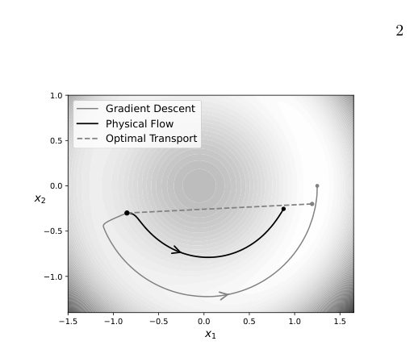
<figcaption class="paper-figure-caption"><b>Fig 1.</b> FIG. 1. The gradient descend velocity is −∇ψ, based only on the potential. The physical flow is defined as the lo- cal mean velocity −∇(ψ + T ln p), which also accounts for the temperature-driven diffusion. The corresponding opti- mal transport ensemble ˜p is made of fluid particles of con- stant velocity ∇λ. Consider a tilted mexican hat potential, V (x) = z · x −α∥x∥2 + β∥x∥4, with α = 3, β = 1, T = 0.3, and z = 0.3 ˆ x1 along the x1 axis, and an ensemble brought out of equilibrium at t = 0 by switching the bias as z →−z. Numerical integration of the physical flow shows how trajec- tories typically bend in the presence of a potential barrier along the geodesic.</figcaption>
</figure>
<figure class="paper-figure-card">
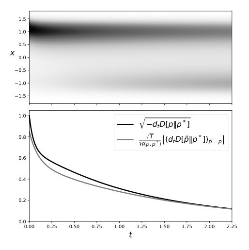
<figcaption class="paper-figure-caption"><b>Fig 2.</b> FIG. 2. Bit erasure in a Ginzburg-Landau double-well poten- tial ψ = −αx2+βx4. The parameters are set to T = 1, α = 2, β = 1, with an initial confining bias γ = −1. (Top) Relax- ation of the probability density p(x, t) over the central energy barrier toward a symmetric bimodal steady state. (Bottom) The instantaneous relaxation speed p</figcaption>
</figure>
<figure class="paper-figure-card">
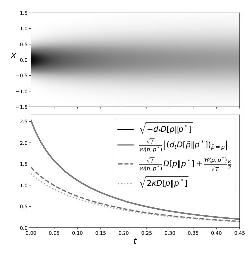
<figcaption class="paper-figure-caption"><b>Fig 3.</b> FIG. 3. Thermal expansion in a harmonic potential. The parameters are set to T = 1, κ = 2, and initial stiffness γ = 10. (Top) Symmetric expansion of the Gaussian probability density p(x, t) toward the broader steady state. (Bottom) The lower bound of Eq. (10) (gray line) saturates at all times the instantaneous relaxation speed p</figcaption>
</figure>

**Summary.** This paper develops advanced theoretical frameworks using Optimal Transport and functional inequalities to quantify how fast a system relaxes to equilibrium. By relating free energy dissipation to geometric distances like the Wasserstein metric, it provides powerful, rigorous bounds on relaxation rates in stochastic physical systems.

**Why it may be interesting.** It provides rigorous, geometric tools (Optimal Transport) to analyze non-equilibrium dynamics in classical statistical mechanics systems, which is foundational knowledge for understanding thermalization processes relevant to open quantum systems.

Detailed structure

**Main problem.** The paper aims to quantify the dissipation during the relaxation of conservative stochastic systems towards their steady state by establishing geometric lower bounds using functional inequalities.

**Main result.** It develops and compares several thermodynamic bounds, including the Otto-Villani inequality (HWI) and the Logarithmic Sobolev Inequality (LSI), providing a geometric measure for the instantaneous speed of relaxation.

**Method.** The analysis heavily relies on Optimal Transport theory (Wasserstein distance), functional inequalities connecting relative entropy to transport metrics, and deriving differential bounds via calculus identities.

**Model / system.** The primary model is an overdamped Brownian particle governed by a Langevin equation, leading to the Fokker-Planck evolution for the probability density. Examples include relaxation in Landau-Ginzburg potentials or harmonic traps.

**Key observables.** Relative Entropy ($D[p\|p^*]$), Wasserstein Distance ($W(p, p^*)$), and the rate of change of relative entropy ($rac{d}{dt} D[p\|p^*]$).

**Important parameters / regimes.** Temperature ($T$), potential curvature/convexity ($\kappa$), and time ($	au$).

**Assumptions / limitations.** The analysis often assumes conditions on convexity (e.g., $\kappa > 0$ for LSI) or restricts the dynamics to regimes where relative entropy decreases along geodesics.

**Figures summary.** Figures compare different flow types (Gradient Descent, Physical Flow, OT) for potentials like the Mexican hat potential and illustrate relaxation in harmonic traps, showing when various bounds saturate or fail.

**Paper structure.** The paper builds from defining the stochastic dynamics and free energy to introducing optimal transport concepts. It then derives and compares multiple functional inequalities—the Otto-Villani bound, HWI, and LSI—analyzing their mathematical derivations and physical implications for relaxation speed.

Abstract

The dissipation in the relaxation of an ensemble of conservative stochastic systems towards the steady state is quantified by the free energy difference. Functional inequalities within the framework of [F. Otto and C. Villani, J. Funct. Anal. 173, 361 (2000)] are here revisited which connect the free energy dynamics and optimal transport, offering a geometric perspective on the instantaneous speed of relaxation in the presence of potential barriers. These are illustrated with numerical relaxation experiments on Landau-Ginzburg potentials.

[↑ back to top](#top)

### [Mean First Passage Time for Persistent Random Walks in Annular Search Domains](http://arxiv.org/abs/2606.13890v1)

**Authors:** Fatemeh Saghafifar, Daniel Coombs  
**Type:** theory · **Category:** statistical mechanics · **PDF:** <https://arxiv.org/pdf/2606.13890v1>  
**Analysis basis:** full PDF text, analyzed in chunks
**Topic relevance:** `methods for driven-dissipative` **3/5** · `Keldysh / 2PI / non-Gaussian methods` **2/5** · `non-equilibrium dynamics` **2/5** · `correlated / nonlocal dissipation` **1/5** · `driven-dissipative phase transition` **1/5** · `non-equilibrium universality` **1/5**

↔ Scroll figures horizontally

<figure class="paper-figure-card">
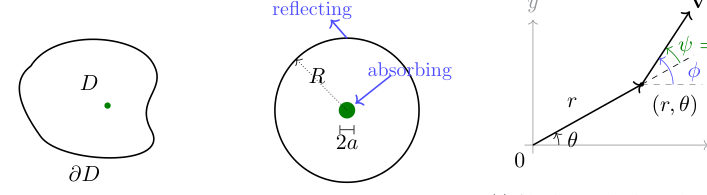
<figcaption class="paper-figure-caption"><b>Fig 1.</b> Figure 1: Schematic of the search problem. (a) A general confined domain with an absorbing small target (green node). (b) The simplified annular geometry, where the inner boundary r = a is absorbing and the outer boundary r = R is specularly reflecting. (c) Definition of the absolute heading ϕ, polar angle θ, and relative heading ψ = ϕ −θ.</figcaption>
</figure>
<figure class="paper-figure-card">
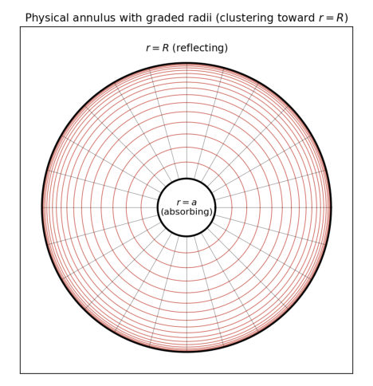
<figcaption class="paper-figure-caption"><b>Fig 2.</b> Figure 2: Power-law graded radial mesh on the annulus, shown at β = 3, Nr = 41, Nψ = 36 for visual clarity (the production runs use larger Nr, Nψ; see Subsection 5.1). Radial cells cluster toward the reflecting outer boundary r = R in order to resolve the persistence-induced wall layer of width w(κ) ≈5.41 κ−1.27, while the angular grid remains uniform. The formula givesa uniform radial mesh when β = 1.</figcaption>
</figure>
<figure class="paper-figure-card">
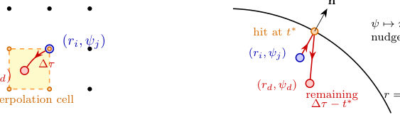
<figcaption class="paper-figure-caption"><b>Fig 3.</b> Figure 3: Semi-Lagrangian backward-characteristic step. (a) From a grid node (ri, ψj), the characteristic equation is integrated backward by ∆τ to an off-grid foot point (rd, ψd). The value at the foot point is obtained by bilinear interpolation from the surrounding cell. (b) If the backward characteristic reaches the outer wall r = R before the end of the step, the velocity is specularly reflected according to v 7→v −2(v · ˆn)ˆn, equivalently ψ 7→π −ψ, and the remaining time ∆τ −t∗is integrated to the final foot point.</figcaption>
</figure>
<figure class="paper-figure-card">
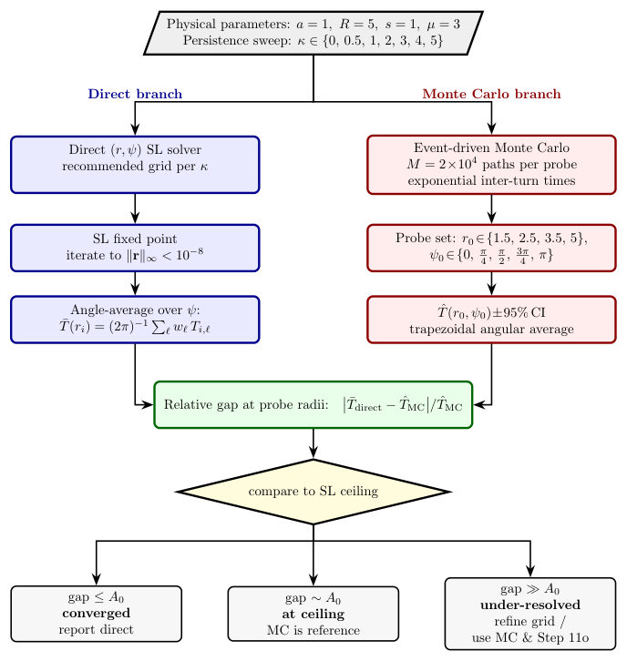
<figcaption class="paper-figure-caption"><b>Fig 4.</b> Figure 4: Validation workflow. The direct (r, ψ) solver and the event-driven Monte Carlo simulator are run independently at the same parameter values. Their angle-averaged MFPTs are compared using the relative gap. Small gaps indicate convergence, gaps near the observed semi-Lagrangian ceiling indicate the limitation of the pseudo-time formulation, and larger gaps indicate under resolution or transition to the strong persistence regime.</figcaption>
</figure>
<figure class="paper-figure-card">
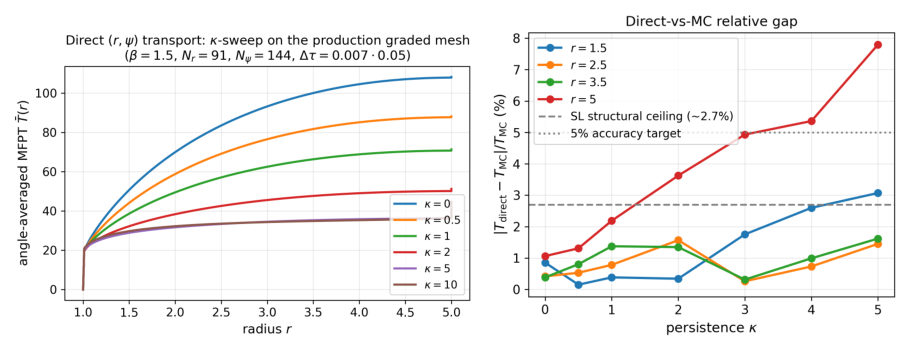
<figcaption class="paper-figure-caption"><b>Fig 5.</b> Figure 5: Persistence sweep and validation of the direct semi-Lagrangian solver in the annulus a &lt; r &lt; R with absorbing inner boundary at r = a and specularly reflecting outer boundary at r = R. Parameters: a = 1, R = 5, walker speed s = 1, turning rate µ = 3. Grid: graded mesh with clustering exponent β and radial/angular node counts (Nr, Nψ) chosen per κ fol- lowing (4.1); pseudo-time step ∆τ ∈[0.007, 0.05]. (a) Angle-averaged MFPT profiles from the direct (r, ψ) transport solver across the persistence sweep κ ∈{0, 0.5, 1, 2, 3, 4, 5}. Increas- ing κ decreases the MFPT over the validated range κ ∈[0, 5]. The κ = 10 curve is shown only to illustrate the onset of the high-persistence...</figcaption>
</figure>

**Summary.** This work develops a comprehensive theoretical and numerical framework to calculate how directional persistence affects the search efficiency of cells moving in an annular space. By modeling the random walk using correlated processes, the authors derive analytical corrections to the mean first-passage time, confirming that persistent motion significantly accelerates target finding compared to purely diffusive movement.

**Why it may be interesting.** While focused on biological transport, the mathematical framework—solving time-dependent partial differential equations (PDEs) with complex boundary conditions and incorporating memory effects via kernels—is highly relevant to non-equilibrium statistical mechanics problems in confined geometries.

Detailed structure

**Main problem.** The study quantifies the mean first-passage time (MFPT) for a random walker to reach an absorbing target within a confined two-dimensional annular domain.

**Main result.** Directional persistence ($\kappa$) significantly reduces the search time compared to isotropic motion, with this benefit saturating at high persistence values. The MFPT can be accurately determined by combining diffusion-limit approximations with boundary layer corrections.

**Method.** The analysis employs a combination of analytical techniques (Fourier mode reductions, perturbation expansions) and advanced numerical solvers (semi-Lagrangian methods, event-driven Monte Carlo simulations).

**Model / system.** The model is a velocity-jump process describing cell migration in an annulus ($a < r < R$). It incorporates correlated random walks (CRW) via von Mises turning kernels to simulate directional persistence and can be extended to biased motion.

**Key observables.** Mean First Passage Time ($ar{T}$ or $T_{MFPT}$), relative gap between numerical solvers, effective diffusivity ($D_{	ext{eff}}$).

**Important parameters / regimes.** Persistence parameter ($\kappa$), annulus radii ($a$ and $R$), turning rate ($\mu$), bias strength ($d	au$).

**Assumptions / limitations.** The analysis assumes a 2D annular geometry, constant speed motion, and relies on approximations like the fast-turning limit for analytical tractability.

**Figures summary.** Figures illustrate schematics of the domain, mesh grading strategies (power-law graded meshes), and comparisons between direct solver results and Monte Carlo simulations showing convergence diagnostics.

**Paper structure.** The paper progresses from defining the physical problem and modeling various random walk types to deriving analytical approximations in limits ($\kappa 	o 0$ or $\kappa 	o \infty$), followed by rigorous numerical implementation using advanced solvers and extensive cross-validation against MC simulations.

Abstract

We study the mean first-passage time of a random walker to a small absorbing target at the center of a two-dimensional annulus with a specularly reflecting outer boundary. The problem is motivated by natural killer cell migration toward a target cancer cell, where the goal is to quantify how long it takes immune cells to reach the target and how search efficiency depends on directional persistence and chemotactic bias. Cell motion is modeled as a velocity-jump process. We first consider a correlated random walk with a von Mises turning kernel, with a concentration parameter controlling directional persistence. We then extend the model to a biased correlated random walk using a phase-shifted turning kernel that represents preferential motion, for example following a concentration gradient. Our analysis combines closed-form benchmarks for simple and biased random walks, Fourier-mode reductions of the transport equations for the correlated and biased correlated models, and a fast-turning perturbation expansion that gives an analytical correction to the diffusion-limit mean first-passage time for the random walker. Our analytical results are supported by numerical methods that include a semi-Lagrangian solver in radial and angular coordinates, a stationary discretisation designed to handle biased transport, and an event-driven Monte Carlo simulator for cross-validation. Together, our results provide a framework relating persistent and biased immune-cell motion to target-search times in confined two-dimensional domains.

[↑ back to top](#top)

### [Quantum-Classical Hierarchical Equations of Motion](http://arxiv.org/abs/2606.14363v1)

**Authors:** Amartya Bose  
**Type:** theory · **Category:** other · **PDF:** <https://arxiv.org/pdf/2606.14363v1>  
**Analysis basis:** full PDF text, analyzed in chunks
**Topic relevance:** `methods for driven-dissipative` **3/5** · `non-equilibrium dynamics` **2/5** · `Keldysh / 2PI / non-Gaussian methods` **1/5** · `analog quantum simulation` **1/5** · `correlated / nonlocal dissipation` **1/5** · `driven-dissipative phase transition` **1/5**

↔ Scroll figures horizontally

<figure class="paper-figure-card">
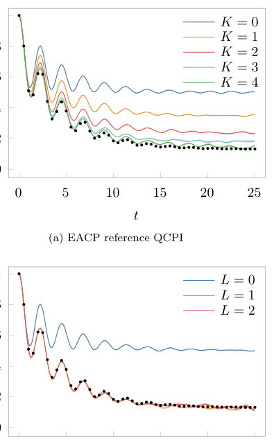
<figcaption class="paper-figure-caption"><b>Fig 1.</b> FIG. 1: Comparison of convergence of EACP-reference QCPI and QC-HEOM for the spin-boson model. Black markers: Converged QuAPI results.</figcaption>
</figure>
<figure class="paper-figure-card">
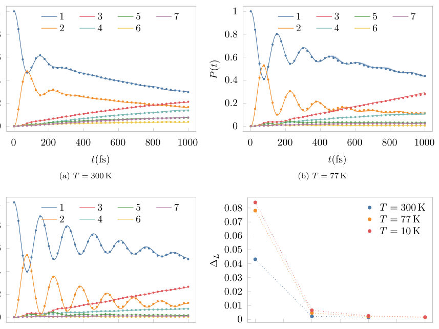
<figcaption class="paper-figure-caption"><b>Fig 2.</b> FIG. 2: Population dynamics in the 7-site Fenna–Matthews–Olson complex31 at different temperatures. Markers show the standard HEOM simulation results as reference. Lines denote the QC-HEOM results.</figcaption>
</figure>

**Summary.** The paper introduces Quantum-Classical Hierarchical Equations of Motion (QC-HEOM), a novel technique for simulating open quantum systems. It successfully merges the strengths of path integral and hierarchical equations by separating thermal effects from residual quantum memory. This results in an extremely efficient method that accurately models complex, anharmonic dynamics at low temperatures where conventional methods struggle.

**Why it may be interesting.** This work is highly relevant as it provides a computationally tractable framework (QC-HEOM) to study complex open quantum dynamics in regimes (low temperature, anharmonicity) where standard HEOM methods fail or become prohibitively expensive due to the exponential growth of required auxiliary objects.

Detailed structure

**Main problem.** The core problem is simulating the time-evolution of open quantum systems, specifically addressing non-Markovian dynamics and accurately capturing residual quantum memory effects.

**Main result.** The proposed QC-HEOM method achieves superior efficiency compared to conventional HEOM by separating thermal fluctuations from quantum memory, especially at low temperatures. It reproduces benchmark results for complex anharmonic systems with significantly fewer auxiliary objects.

**Method.** It combines the ensemble-averaged classical path reference from the Quantum-Classical Path Integral formalism with a hierarchical treatment of quantum influence functionals (QC-HEOM).

**Model / system.** The method is applied to general open quantum systems, exemplified by the asymmetric spin-boson model and the seven-site Fenna–Matthews–Olson (FMO) complex. The Hamiltonian involves system coupling to an environment bath.

**Key observables.** Population dynamics $P(t)$ over time; convergence quantified by time-averaged root-mean-square (RMS) population error ($\Delta_j$).

**Important parameters / regimes.** Temperature ($T=300 	ext{ K}, 77 	ext{ K}, 10 	ext{ K}$); Hierarchy depth ($L$); Bath spectral density parameters.

**Assumptions / limitations.** The formalism uses the Wigner approximation when extending to anharmonic environments, and it assumes that the bath correlation function can be represented by a sum of exponentials for the HEOM structure.

**Figures summary.** Figures compare population dynamics $P(t)$ across different temperatures ($300 	ext{ K}, 77 	ext{ K}, 10 	ext{ K}$), showing QC-HEOM tracking benchmark results with much shallower hierarchy depths than standard HEOM.

**Paper structure.** The paper introduces the limitations of existing methods (QCPI, conventional HEOM) and then develops the QC-HEOM formalism. It rigorously demonstrates its equivalence to established methods for harmonic baths before applying it successfully to anharmonic systems like FMO across varying temperatures, concluding with efficiency comparisons.

Abstract

We develop a quantum-classical hierarchical equations of motion (QC-HEOM) approach for simulating non-Markovian open quantum systems. The method combines the ensemble-averaged classical path reference of the quantum-classical path integral formalism with a hierarchy of auxiliary quantum influence functionals. By incorporating thermal fluctuations through an ensemble average over reference trajectories, the hierarchy is required to represent only the residual quantum memory associated with the imaginary part of the bath response function. Consequently, unlike conventional hierarchical equations of motion, QC-HEOM does not require Matsubara or Padé expansions of the thermal kernel and exhibits only weak temperature dependence of the hierarchy size. Furthermore, because thermal fluctuations are supplied through reference classical trajectories, the framework naturally extends beyond harmonic baths and enables the incorporation of anharmonic and molecular environments through externally generated trajectories. We derive the formalism and demonstrate its exactness for a harmonic bath. Applications to an asymmetric spin-boson model and the seven-site Fenna--Matthews--Olson complex illustrate the accuracy of QC-HEOM. It reproduces benchmark quasi-adiabatic path integral and hierarchical equations of motion results while requiring substantially fewer auxiliary objects, particularly at low temperatures. These results establish QC-HEOM as an efficient framework for treating residual quantum memory in quantum-classical descriptions of open-system dynamics. The separation of thermal fluctuations from residual quantum memory through the use of Wigner trajectories provides an approximate route toward hierarchical treatments of complex anharmonic environments that are inaccessible to conventional HEOM approaches.

[↑ back to top](#top)

### [Spin-orbit coupling by design in quantum state engineering of atomically defined quantum dots](http://arxiv.org/abs/2606.14487v1)

**Authors:** Hermann Osterhage, Julian H. Strik, Ivan Ado, Anna M. H. Krieg, Daniel Wegner, Mikhail Titov, Alexander A. Khajetoorians  
**Type:** both · **Category:** other · **PDF:** <https://arxiv.org/pdf/2606.14487v1>  
**Analysis basis:** full PDF text, analyzed in chunks
**Topic relevance:** `exotic spin models in light-matter` **3/5** · `spintronics-quantum-optics interface` **3/5** · `Kondo & dissipative impurity` **1/5** · `QC/QI experiment` **1/5** · `quantum measurements` **1/5**

↔ Scroll figures horizontally

<figure class="paper-figure-card">
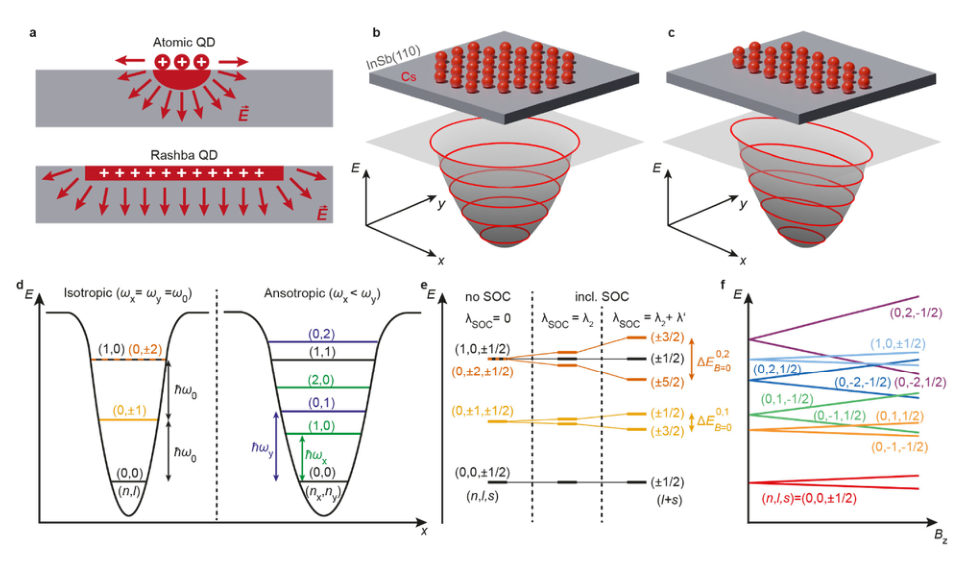
<figcaption class="paper-figure-caption"><b>Fig 1.</b> Fig 1 | 0D confinement potential well created by Cs atoms on InSb(110) and the influence of</figcaption>
</figure>
<figure class="paper-figure-card">
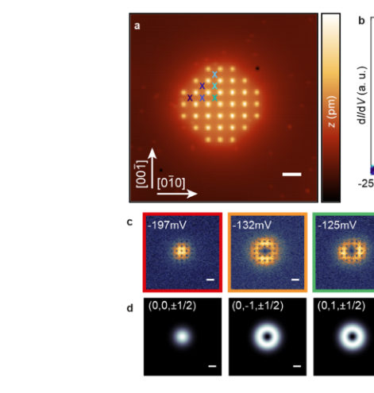
<figcaption class="paper-figure-caption"><b>Fig 2.</b> Fig 2 | Atomic-scale quantum dot derived from 37 Cs atoms on InSb(110).</figcaption>
</figure>
<figure class="paper-figure-card">
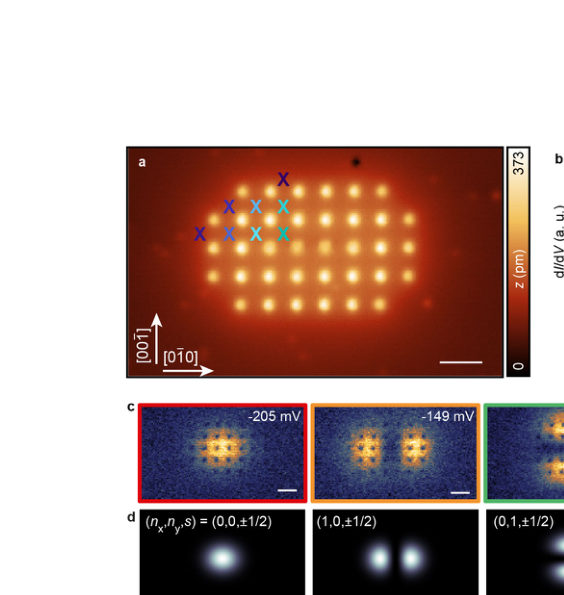
<figcaption class="paper-figure-caption"><b>Fig 3.</b> Fig 3 Anisotropic quantum dot from 36 Cs atoms on InSb(110).</figcaption>
</figure>
<figure class="paper-figure-card">
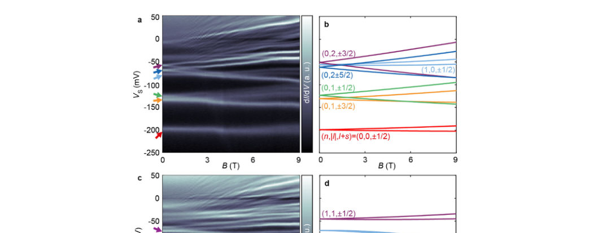
<figcaption class="paper-figure-caption"><b>Fig 4.</b> Fig 4 | Quantifying the multiplet structure and computing the SOC contributions to the</figcaption>
</figure>

**Summary.** This research demonstrates the ability to engineer and control spin-orbit coupling in semiconductor quantum dots by precisely tailoring their confining electric potentials at the atomic scale. By combining STM/STS measurements with advanced k.p theory, the authors successfully model and verify that SOC dictates measurable energy splittings and magnetic responses, paving the way for next-generation spintronic devices.

**Why it may be interesting.** This work provides a concrete example of how fundamental solid-state physics concepts (SOC) can be experimentally manipulated using nanoscale electrostatic engineering, offering pathways toward realizing controllable spin qubits in semiconductor platforms relevant to quantum information science.

Detailed structure

**Main problem.** The central problem is achieving precise, controllable tuning of spin-orbit coupling (SOC) within atomically defined semiconductor quantum dots (QDs). This control moves beyond simple approximations by tailoring the local electrostatic confinement potential.

**Main result.** The study demonstrates that SOC-induced energy splittings and magnetic responses in QDs can be accurately predicted and controlled by designing the geometry of the confining electric fields, matching experimental observations across isotropic and anisotropic potentials.

**Method.** The research combines advanced Scanning Tunneling Microscopy/Spectroscopy (STM/STS) measurements with theoretical modeling based on an effective Hamiltonian derived from a multiband k.p model.

**Model / system.** The physical system is electron confinement in InSb surface quantum dots, engineered by patterning individual Cs ions to create designer electrostatic potentials. The theory uses an effective Hamiltonian incorporating kinetic energy, parabolic/triangular confinement potentials, Zeeman terms, and SOC terms beyond the standard Rashba description.

**Key observables.** Zero-field splitting (ZFS) of electronic states, magnetic field dependence of energy levels ($	ext{d}I/	ext{dV}$ spectra), and spatial decay profiles of the ground state wavefunction.

**Important parameters / regimes.** Confinement strengths ($\kappa_x, \kappa_y$), SOC coupling constants ($\lambda_{	ext{SOC}}$), effective electron mass ($m^*$), and magnetic field strength ($B$).

**Assumptions / limitations.** The model relies on approximating the confinement potential as a sum of triangular and parabolic terms, and treating SOC perturbatively to an effective Hamiltonian.

**Figures summary.** Figures illustrate STM images and $	ext{d}I/	ext{dV}$ maps for QDs with varying geometries (circular vs. anisotropic), showing characteristic energy splittings and wavefunction spatial decay patterns under applied magnetic fields.

**Paper structure.** The paper progresses by first establishing the experimental platform (Cs patterning on InSb) and measurement techniques (STM/STS). It then develops a generalized theoretical Hamiltonian incorporating SOC, solving it for both isotropic and anisotropic confinement regimes to predict measurable energy splittings and spatial features.

Abstract

Tuning spin-orbit coupling is essential in controlling both spin and charge in confined semiconductor nanostructures, yet it is rarely a truly controllable parameter. Here, we show control over the spin-orbit Hamiltonian in quantum dots and the resulting quantum states by tailoring the confinement potential with atomic-scale precision. Using scanning tunnelling microscopy and spectroscopy, we pattern individual Cs ions into designer quantum dot structures on the surface of indium antimonide, in which electrons from a two-dimensional electron gas are confined with chosen in-plane electric-field gradients. We then quantify the atomic level structure, both spatially resolving the orbital character of the electronic states and their magnetic-field evolution. We demonstrate that the level structure, including the induced zero-field splitting, can be tailored by the designed geometry of the local electric fields. These effects can be described using a Hamiltonian that allows consistent treatment of the confinement-induced spin-orbit coupling beyond the conventional Bychkov-Rashba description. This Hamiltonian is derived from a multiband k.p model and takes the energy dependence of the relevant physical parameters into account. Such precise control of spin-orbit coupling in semiconductor quantum dots is relevant to quantum and spintronic technologies.

[↑ back to top](#top)

### [Stochastic Thermodynamics on Time-Evolving Curved Spaces](http://arxiv.org/abs/2606.14186v1)

**Authors:** Rihito Nagase, Shoki Sugimoto, Asuka Takatsu, Takahiro Sagawa  
**Type:** theory · **Category:** statistical mechanics · **PDF:** <https://arxiv.org/pdf/2606.14186v1>  
**Analysis basis:** full PDF text, analyzed in chunks
**Topic relevance:** `non-equilibrium dynamics` **3/5** · `non-equilibrium universality` **2/5** · `Keldysh / 2PI / non-Gaussian methods` **1/5** · `correlated / nonlocal dissipation` **1/5** · `driven-dissipative phase transition` **1/5** · `methods for driven-dissipative` **1/5**

↔ Scroll figures horizontally

<figure class="paper-figure-card">
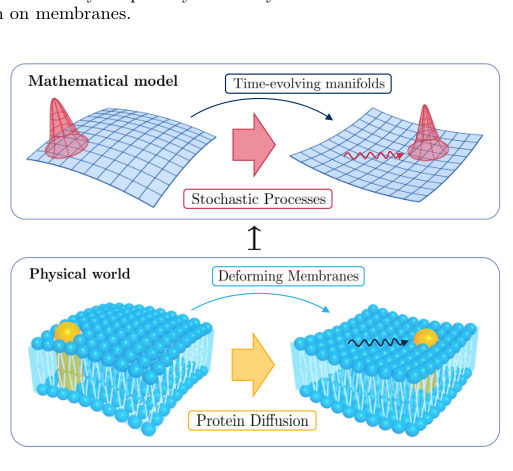
<figcaption class="paper-figure-caption"><b>Fig 1.</b> FIG. 1. Correspondence between the mathematical model and protein diffusion on a biological membrane. The diffusing protein (yellow) is on the biological membrane (cyan) which generally deforms in time. Correspondingly, when modeled as a stochastic process, the manifold (blue) on which the dis- tribution (red) is defined becomes time-dependent.</figcaption>
</figure>
<figure class="paper-figure-card">
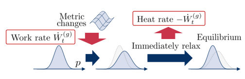
<figcaption class="paper-figure-caption"><b>Fig 2.</b> FIG. 2. Schematic of the energy balance. The time- dependent metric tensor performs work on the kinetic energy, which is instantaneously dissipated as heat through momen- tum relaxation in the overdamped regime.</figcaption>
</figure>
<figure class="paper-figure-card">
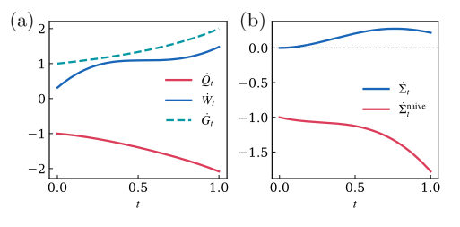
<figcaption class="paper-figure-caption"><b>Fig 3.</b> FIG. 3. (a) Time evolution of ˙Qt, ˙Wt, and ˙Gt obtained from the numerical simulation. The parameters are kBT = 1.0, γ = 5.0, τ = 1.0, r0 = 1.0, rτ = 0.5, and κ = 1.0. (b) Comparison of ˙Σt and ˙Σnaive t . The correct entropy production rate ˙Σt remains non-negative, whereas the naive one ˙Σnaive t can become negative.</figcaption>
</figure>

**Summary.** This paper develops stochastic thermodynamics for systems moving on curved spaces whose metrics change with time. It introduces a crucial correction term ($\dot{G}_t$) into the energy balance equations to ensure that entropy production always obeys the Second Law, even when geometry changes. This framework is vital for quantifying thermodynamic costs in dynamic physical settings like diffusion on evolving membranes.

**Why it may be interesting.** This work provides powerful tools for analyzing non-equilibrium processes where the environment or geometry itself is changing over time, which is relevant for understanding open quantum systems coupled to dynamic baths or evolving media.

Detailed structure

**Main problem.** The core problem is constructing a thermodynamically consistent framework for stochastic thermodynamics when the underlying physical space has a time-dependent metric.

**Main result.** The authors derive necessary correction terms ($\dot{G}_t$) to the standard heat and work definitions, ensuring that the total entropy production rate rigorously satisfies the Second Law of Thermodynamics even as the geometry evolves.

**Method.** The methodology involves analyzing energy balance using overdamped Langevin dynamics on curved manifolds, employing relative entropy calculations between forward and backward processes in the $\epsilon 	o 0$ limit.

**Model / system.** The system is an overdamped Langevin process evolving on a nonrelativistic curved space described by a time-dependent metric $g_t$. The analysis uses Fokker-Planck equations and concepts from geometric measure theory.

**Key observables.** Entropy production rate ($\dot{\Sigma}_t$), Heat rate ($\dot{Q}_t$), Work rate ($\dot{W}_t$), and the metric correction term ($\dot{G}_t$).

**Important parameters / regimes.** The time dependence of the metric ($g_t$) is crucial, as are the overdamped regime assumption and the small noise limit ($\epsilon 	o 0$).

**Assumptions / limitations.** Assumes the topology remains constant (diffeomorphic) and that the heat bath thermalizes much faster than the manifold evolution.

**Figures summary.** Figures illustrate the time evolution of $\dot{Q}_t$, $\dot{W}_t$, and $\dot{G}_t$ for a sphere example, comparing correct non-negative entropy production against naive calculations that violate the Second Law.

**Paper structure.** The paper builds from defining the dynamics on curved spaces to establishing detailed balance conditions via relative entropy measures. It then derives the full thermodynamic decomposition of energy change, culminating in showing the dynamics are a gradient flow of the relative entropy functional under a Wasserstein metric.

Abstract

We construct stochastic thermodynamics of overdamped Langevin systems on nonrelaticvistic curved spaces with time-dependent metrics. The time dependence of the metric contributes to the energy balance by performing work on the kinetic energy, which is instantaneously dissipated as heat in the overdamped regime. This contribution makes our framework thermodynamically consistent so that entropy production satisfies the second law of thermodynamics. As a special case, when the metric evolves according to backward Ricci flow, the entropy balance exhibits a structure similar to Perelman's entropy functional. Our framework provides a way to quantify thermodynamic costs in dynamics on time-evolving spaces such as diffusion on membranes.

[↑ back to top](#top)

### [Trap-Quenched Matter-Wave Optics for Dual Species Lensing](http://arxiv.org/abs/2606.14577v1)

**Authors:** Gabriel Müller, Timothé Estrampes, Claudia Puertas González, Jannik Ströhle, David B. Reinhardt, Dana Codruta Marinica, Ethan R. Elliott, Jason R. Williams, Nathan Lundblad, Eric Charron, Ernst M. Rasel, Matthias Meister, Wolfgang P. Schleich, Naceur Gaaloul, Nicholas P. Bigelow  
**Type:** both · **Category:** quantum gases · **PDF:** <https://arxiv.org/pdf/2606.14577v1>  
**Analysis basis:** full PDF text, analyzed in chunks
**Topic relevance:** `analog quantum simulation` **3/5** · `non-equilibrium dynamics` **2/5** · `methods for driven-dissipative` **1/5** · `non-equilibrium universality` **1/5** · `quantum measurements` **1/5** · `quantum optics experiment` **1/5**

↔ Scroll figures horizontally

<figure class="paper-figure-card">
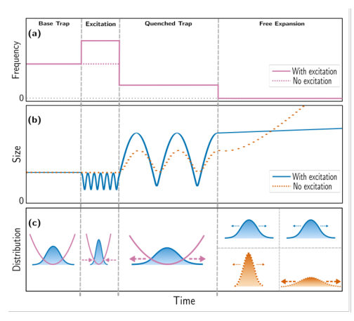
<figcaption class="paper-figure-caption"><b>Fig 1.</b> FIG. 1. Scheme of the trap-quenched collimation technique. The vertical gray lines separate the different stages of the collimation sequence, which consist of excitation, decompression, and release. Panel (a) shows the temporal evolution of the trap frequency for two different protocols: with a collective mode excitation followed by the evolution in the quenched trap (solid red line), and the same sequence without excitation (dotted red line). Panel (b) shows the correspond- ing evolution of the BEC size. The excited protocol (solid blue line) develops larger in-trap size oscillations and reaches a larger size at release, hence a lower expansion velocity. The unexcited protocol (dotted...</figcaption>
</figure>
<figure class="paper-figure-card">
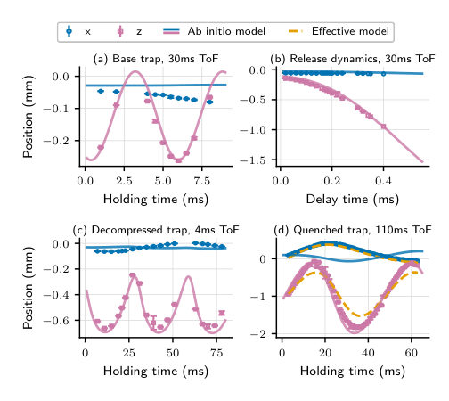
<figcaption class="paper-figure-caption"><b>Fig 2.</b> FIG. 2. Comparison of different experimental sequences with ab- initio simulations for the CoM dynamics. These sequences were used, among others, to calibrate the chip simulations by fitting pa- rameters such as magnetic fields and gradients. The blue circles and red squares are displaying the experimental measurements for the x and z-axis of the camera frame while the solid lines of the same color represents the simulated results. The error bars give the 1σ-deviation of the experimental measurements. Panel (a) shows the oscillations obtained after the transport from the evaporation trap to the base trap. Panel (b) shows the release dynamics as a function of the delay time between the coils...</figcaption>
</figure>
<figure class="paper-figure-card">
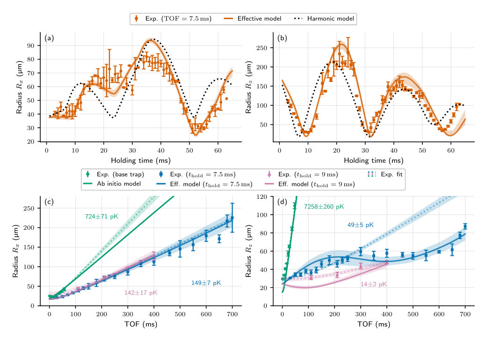
<figcaption class="paper-figure-caption"><b>Fig 3.</b> FIG. 3. Size dynamics from base and lensing trap. Panels (a) and (b) show the evolution of the BEC size along the x and z-axis for different holding times in the lensing trap. The orange points are experimentally measured Thomas-Fermi radii and error bars displaying standard deviation between individual measurements. The solid orange line shows the size dynamics obtained from an effective model taking into account inhomogeneities in the lensing trap curvature. The black dotted line shows the size dynamics with trap frequencies obtained at the trap minimum, emphasizing the importance to consider spatially resolved trap curvatures. Panels (c) and (d) show the time-of-flight BEC expansion...</figcaption>
</figure>
<figure class="paper-figure-card">
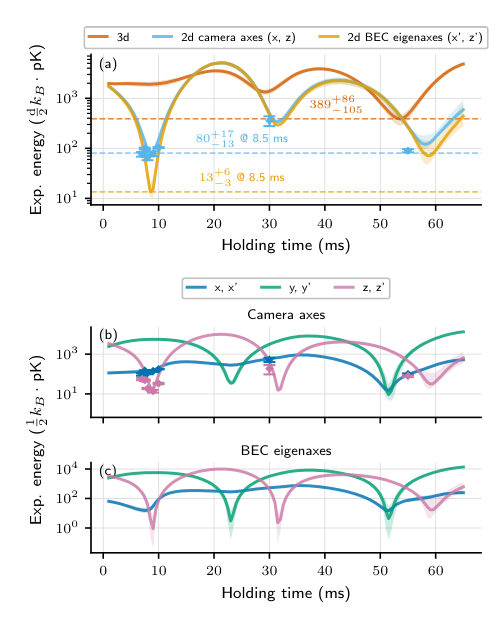
<figcaption class="paper-figure-caption"><b>Fig 4.</b> FIG. 4. Time evolution of the expansion energies in the different frame of interest. The simulated expansion energies are compared when possible to measured expansion energies at different holding times. Panel (a) displays the 3D expansion energy (orange line) while the blue and yelow curves are displaying the expansion energies re- spectively in the camera frame and the BEC frame. These two differ- ent frames come from the misalignment of the BEC eigenaxes with respect to the camera axes, see Methods. Panel (b) and (c) show the time evolution of the 1d expansion energies along the camera frame axes and the BEC eigenaxes, respectively.</figcaption>
</figure>
<figure class="paper-figure-card">
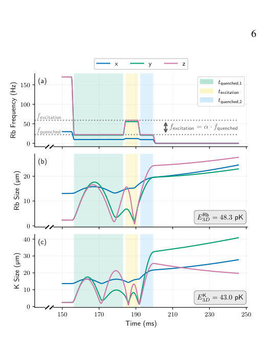
<figcaption class="paper-figure-caption"><b>Fig 5.</b> FIG. 5. Extension of the trap-quenched collimation technique to a dual-species system. For a non-interacting system, we considered a transport from the evaporation trap to a base trap. The trap frequen- cies are then decreased to go into the quenched trap before briefly exciting the atoms and going back into the quenched trap depicted by the green, yellow and blue shaded areas respectively. The frequen- cies of the excitation trap are scaled with respect to the quenched trap: fexcitation = α · fquenched. The time evolution of the Rb fre- quencies are displayed in panel (a) with the x, y and z frequencies given respectively by the blue, green and red curves. K frequencies are related through...</figcaption>
</figure>

**Summary.** The paper details the development and application of trap-quenched collimation for Bose-Einstein condensates to enhance atom interferometry tests of the Universality of Free Fall. By combining novel experimental techniques with sophisticated modeling, the authors predict that dual-species BECs can achieve the necessary low expansion energies required for unprecedented precision in space-based fundamental physics measurements.

**Why it may be interesting.** This work represents a cutting edge intersection of quantum sensing and advanced atomic physics, demonstrating how precise control over matter-wave expansion in space can push fundamental measurement limits beyond terrestrial capabilities.

Detailed structure

**Main problem.** The primary goal is to improve tests of the Universality of Free Fall (UFF) using Bose-Einstein condensates (BECs), which requires exquisite control over expansion energies and center-of-mass dynamics for dual-species systems.

**Main result.** The authors successfully demonstrated a trap-quenched collimation technique on single-species BECs in space, theoretically predicting simultaneous collimation for a ${}^{41}	ext{K}–{}^{87}	ext{Rb}$ mixture that meets the energy requirements for $10^{-15}$ accuracy UFF tests.

**Method.** The research combines experimental implementation of trap-quenched collimation with detailed theoretical modeling, using effective models and *ab initio* simulations to track BEC size dynamics during trapping and free expansion.

**Model / system.** The physical system is a BEC trapped in an atom chip setup, tested aboard the International Space Station. The model involves simulating time-dependent magnetic field interactions via gauged atom chip potentials and using effective models for post-release ballistic/semi-free expansion.

**Key observables.** 2D and 3D expansion energies ($E_{exp}$), Center-of-Mass (CoM) oscillation dynamics, and the Thomas-Fermi radii of the BEC during Time-of-Flight (ToF).

**Important parameters / regimes.** Expansion energy levels ($\sim k_B \cdot 78 	ext{ pK}$ for single species; $\sim 43-48 	ext{ pK}$ for dual species), interrogation time up to $700 	ext{ ms}$, and target accuracy of $10^{-15}$.

**Assumptions / limitations.** The analysis relies on fitting complex dynamics using effective models, which requires approximations like assuming no inter-species interaction initially and simplifying the magnetic field gradients during ToF.

**Figures summary.** Figures illustrate the trap-quenched collimation scheme (Fig. 1), CoM oscillation control (Fig. 2a/b), and comparisons between simulated vs. measured expansion energies in various reference frames (Fig. 3, Fig. 4).

**Paper structure.** The paper progresses from introducing the UFF test requirement to detailing the trap-quenched collimation technique, presenting single-species measurements, developing sophisticated models for size dynamics, and finally extending the theory to predict optimal dual-species performance.

Abstract

Dual-species atom interferometry in space promises precise tests of the Universality of Free Fall (UFF), with a sensitivity that grows quadratically with the extended interrogation time accessible in weightlessness. These tests demand exquisite control over the expansion energies of both condensed sources as well as over their differential center-of-mass dynamics. We propose a trap-quenched collimation technique featuring in-trap excitations of collective modes compatible with state-of-the-art atom-chip setups. Using NASA's Cold Atom Laboratory aboard the International Space Station, we demonstrate it on a single-species $^{87}$Rb condensate. By controlling the center-of-mass release dynamics we observe free expansion times up to 700 ms and measure a two-dimensional expansion energy of $k_B \cdot 78\pm 9 \;\mathrm{pK}$ in the imaging plane. A detailed model of the magnetically-induced dynamics indicates that this corresponds to a two-dimensional expansion energy of about $k_B \cdot 15^{+12}_{-5}\; \mathrm{pK}$ along two of the condensate's eigenaxes. Finally, we theoretically study this trap-quenched collimation scheme for a $^{41}$K-$^{87}$Rb mixture, predicting a simultaneous collimation that meets the expansion energy requirements for a state-of-the-art UFF test at the $10^{-15}$ accuracy level.

[↑ back to top](#top)

### [Altermagnetism and bond-nematicity in the spin-$1/2$ square lattice $J_1-J_2-δ$ model](http://arxiv.org/abs/2606.14101v1)

**Authors:** Tanja Đurić, Shenlong Yu, Pinaki Sengupta  
**Type:** theory · **Category:** strongly correlated electrons · **PDF:** <https://arxiv.org/pdf/2606.14101v1>  
**Analysis basis:** full PDF text, analyzed in chunks
**Topic relevance:** `exotic spin models in light-matter` **3/5** · `analog quantum simulation` **2/5** · `Keldysh / 2PI / non-Gaussian methods` **1/5** · `methods for driven-dissipative` **1/5** · `spintronics-quantum-optics interface` **1/5**

↔ Scroll figures horizontally

<figure class="paper-figure-card">
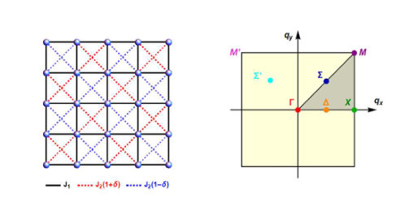
<figcaption class="paper-figure-caption"><b>Fig 1.</b> FIG. 1: Illustration of the exchange couplings in the spin-1/2 J1 −J2 −δ model (left panel) and the momentum space Bril- louin zone (right panel) with the high symmetry points Γ, M and X corresponding to the crystal momenta ⃗q = (0, 0), (π, π) and (π, 0), respectively. Mirror reflection over the vertical line of reflection connects M and M ′ (Σ and Σ′) points.</figcaption>
</figure>
<figure class="paper-figure-card">
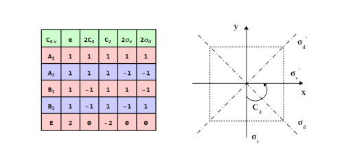
<figcaption class="paper-figure-caption"><b>Fig 2.</b> FIG. 2: Group elements and characters of the C4v point group corresponding to the little group for the crystal momenta ⃗q = (0, 0), (π, 0),(π, π) and (±π/2, π/2). The C4v group has one doubly degenerate irrep that corresponds to doubly de- generate eigenstates of the J1 −J2 −δ model defined on the L × L × 4 clusters with straight (rectangular) edges shown in Fig. 1 and with PBC.</figcaption>
</figure>
<figure class="paper-figure-card">
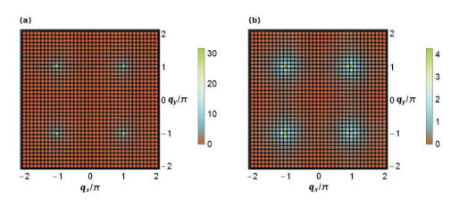
<figcaption class="paper-figure-caption"><b>Fig 3.</b> FIG. 3: Static spin structure factors Sf(⃗q) and Sz f(⃗q) defined in Eqs. (8) and (9) for the cluster size 9 × 9 × 4 and with PBC for J2/J1 = 0.2 and δ = 0.5. The structure factors show sharp peaks corresponding to the AM order.</figcaption>
</figure>
<figure class="paper-figure-card">
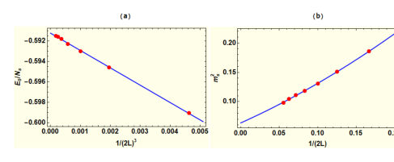
<figcaption class="paper-figure-caption"><b>Fig 4.</b> FIG. 4: The ground state energy and the squared staggered magnetization order parameter finite size scaling for J2/J1 = 0.2 and δ = 0.5. The system linear dimension is 2L for the L × L × 4 cluster with PBC. The ground state corresponds to the irrep A1 in Fig. 2 at the crystal momentum ⃗q = (0, 0) and with the spin parity eigenvalue P = 1 in the Stot z = 0 sector.</figcaption>
</figure>
<figure class="paper-figure-card">
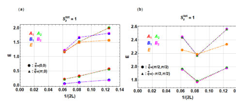
<figcaption class="paper-figure-caption"><b>Fig 5.</b> FIG. 5: Chiral magnon splitting in the altermagnetic regime with J2/J1 = 0.2 and δ = 0.5 for the crystal momenta (a) ⃗q = (0, 0), (π, 0) (Γ and X high symmetry points in Fig. 1) and (b) ⃗q = (±π/2, π/2) (Σ and Σ′ high symmetry points in Fig. 1). A1, A2, B1, B2 and E denote irreps of the C4v point group that correspond to the eigenstates in different symme- try sectors. Energy levels for ⃗q = (π, π) (M high symmetry point) are identical to the energy levels for ⃗q = (0, 0). As ex- plained in the main text the magnon modes corresponding to the irreps A1 and B1, and equivalently to the irreps A2 and B2 have opposite chiralities. Also, A1 and A2 / B1 and B2 magnon modes have opposite chiralities.</figcaption>
</figure>

**Summary.** This work theoretically explores the complex magnetic ground states of frustrated spin systems using advanced ML-enhanced VMC methods. It demonstrates that increasing frustration melts the altermagnetic order, leading to an exotic state featuring coexisting bond-nematic and SPT valence bond solid orders. This advances understanding of quantum phases near magnetically ordered materials.

**Why it may be interesting.** The focus on emergent nematic order arising from quantum fluctuations near a magnetically ordered phase is crucial for understanding exotic quantum phases beyond simple magnetism or superconductivity.

Detailed structure

**Main problem.** The study investigates the emergence of bond-nematicity in insulating altermagnetic materials when quantum fluctuations cause the melting of the established altermagnetic order.

**Main result.** Melting the altermagnetic order leads to a novel phase characterized by coexisting symmetry protected topological (SPT) valence bond solid and bond-nematic orders, driven by magnon pair condensation.

**Method.** The research employs advanced computational techniques combining Variational Monte Carlo (VMC) with machine learning approaches using symmetry enhanced neural network architectures (GCNNs).

**Model / system.** The system modeled is the spin-$1/2$ square lattice $J_1-J_2-\delta$ model, which exhibits altermagnetic ordering under specific exchange coupling conditions.

**Key observables.** Bond-nematic correlation functions ($\hat{O}_{\alphaeta}$), bond-nematic structure factor ($N_{\alphaeta}^f(\vec{q})$), staggered magnetization ($m_s^2$), and the excitation spectrum (chiral magnon splitting).

**Important parameters / regimes.** The exchange modulation parameter $\delta$, the degree of geometric frustration, and the lattice size $L$ are key parameters defining the studied regimes.

**Assumptions / limitations.** Calculations assume results extrapolate to the thermodynamic limit; LSWT is used for excitation analysis but neglects magnon-magnon interactions.

**Figures summary.** Figures illustrate exchange couplings on the Brillouin zone, chiral splitting of magnon modes at various momenta, and finite size scaling plots for order parameters like staggered magnetization and bond-nematic correlations.

**Paper structure.** The paper progresses from establishing the model and methods (VMC/NQS) to confirming altermagnetism via magnon splitting. It then analyzes the highly frustrated regime where magnetic disorder sets in, culminating in the identification of coexisting SPT VBS and bond-nematic orders through symmetry analysis.

Abstract

We study appearance of bond-nematicity in insulating altermagnetic materials induced by increased frustration and quantum-fluctuations driven melting of the altermagnetic order. Using novel machine learning approach that combines symmetry enhanced neural network architectures and variational Monte Carlo we consider the spin-$1/2$ square lattice $J_1-J_2-δ$ model known to have altermagnetic ordering in the regime of small geometric frustration and a gapless spin liquid phase in the regime of strong frustration and small exchange interaction modulation parameter $δ$. In the regime where exchange modulation is relatively large, resulting in the significant splitting of the magnon modes with different chiralities in the altermagnetic regime, we find that melting of the altermagnetic order by increased frustration leads to an intriguing phase that hosts coexisting symmetry protected topological valence bond solid and bond-nematic orders. The phase is characterized by condensation of magnon pairs that results in bond-nematicity, breaking of U(1) spin rotation and $\mathbb{Z}_2$ spin inversion symmetries and chiral splitting of the triplon-like energy levels in the excitation spectrum. Whilst numerous recent studies address non-trivial impact of altermagnetic moments on various properties in altermagnetic materials, like electronic band structure and superconductivity, influence of strong quantum fluctuations and phases that can result from melting of the altermagnetic order are much less explored. Our study therefore presents an important step in identifying exotic phases of matter that can emerge in vicinity of the altermagnetic order.

[↑ back to top](#top)

### [Direct/adaptive-mixture phase-gradient learning for neural-network quantum states with complex phase structure](http://arxiv.org/abs/2606.13912v1)

**Authors:** Yi-Ran Xue, Rui Wang, Baigeng Wang, Chenan Wei  
**Type:** theory · **Category:** numerical methods · **PDF:** <https://arxiv.org/pdf/2606.13912v1>  
**Analysis basis:** full PDF text, analyzed in chunks
**Topic relevance:** `analog quantum simulation` **3/5** · `methods for driven-dissipative` **3/5** · `Frenkel-Kontorova` **1/5** · `correlated cavity matter` **1/5**

↔ Scroll figures horizontally

<figure class="paper-figure-card">
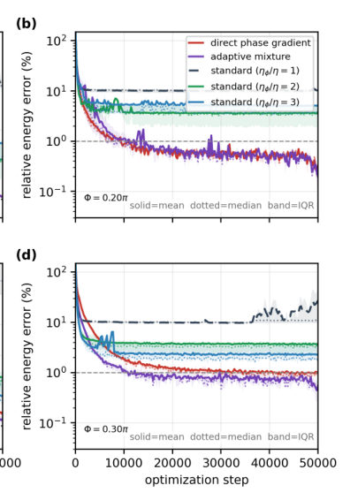
<figcaption class="paper-figure-caption"><b>Fig 1.</b> Fig. 1 Training dynamics on the 100-site flux ladder. All panels use the L = 50 flux ladder (100 sites, half filling), an MLP with width 128 and depth 2, batch size 1024, 48 MCMC sweeps per optimization step, and base learning rate η = 0.03. (a) Energy training curves at Φ = 0.2π, with DMRG reference Eref = −44.826. (b) Relative-error training curves at Φ = 0.2π. (c) Energy training curves at Φ = 0.3π, with DMRG reference Eref = −43.303. (d) Relative-error training curves at Φ = 0.3π. Solid lines show means, dotted lines medians, and shaded bands interquartile ranges.</figcaption>
</figure>
<figure class="paper-figure-card">
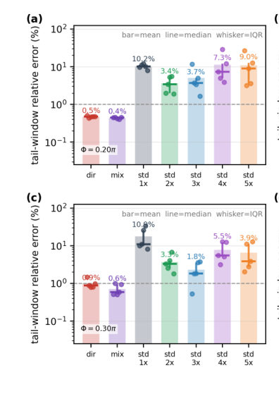
<figcaption class="paper-figure-caption"><b>Fig 2.</b> Fig. 2 Tail-window performance on the 100-site flux ladder. All panels use the same runs and convergence-window convention as Fig. 1. (a) Tail-window relative-error statistics at Φ = 0.2π. (b) Tail-window energies at Φ = 0.2π. (c) Tail-window relative-error statistics at Φ = 0.3π. (d) Tail-window energies at Φ = 0.3π. Bars show means, horizontal lines medians, whiskers interquartile ranges, and points individual numeric seeds.</figcaption>
</figure>
<figure class="paper-figure-card">
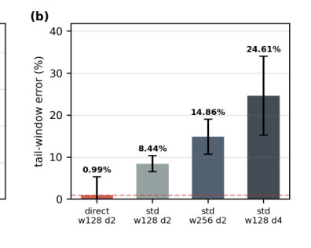
<figcaption class="paper-figure-caption"><b>Fig 3.</b> Fig. 3 The estimator advantage is not removed by wider or deeper standard-gradient networks. The benchmark is the L = 50 (100-site) flux ladder at Φ = 0.3π, trained for 50,000 steps with the same optimizer settings as Fig. 1. (a) Width sweep comparing direct and standard phase- gradient training at fixed depth 2 for MLP widths 128 and 256. (b) Shallow direct phase-gradient performance for width 128, depth 2 compared with standard-gradient MLPs of width 128, depth 2; width 256, depth 2; and width 128, depth 4. The shallow direct phase-gradient network reaches a median tail-window error below 1%, while standard phase-gradient networks remain substantially worse after increasing width or depth.</figcaption>
</figure>
<figure class="paper-figure-card">
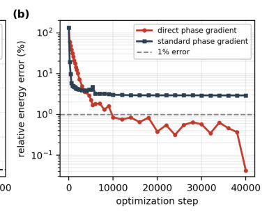
<figcaption class="paper-figure-caption"><b>Fig 4.</b> Fig. 4 Representative ResNet comparison at Φ = 0.3π. The system is again the L = 50 (100-site) flux ladder; the MLP is replaced by a ResNet ansatz and trained for 40,000 optimization steps. (a) Energy convergence for direct and standard phase-gradient training. (b) Relative-error convergence for the same runs. The direct phase-gradient estimator continues descending towards the DMRG reference, whereas the standard phase-gradient run plateaus well above it.</figcaption>
</figure>
<figure class="paper-figure-card">
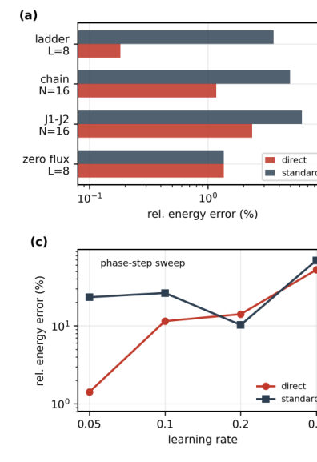
<figcaption class="paper-figure-caption"><b>Fig 5.</b> Fig. 5 Mechanism and controls. (a) Mean relative-error controls for a flux ladder with L = 8, a flux chain with N = 16, a frustrated J1–J2 flux chain with N = 16, and a zero-flux ladder control; the large ratios in complex models come mainly from fewer bad-basin seeds for the direct estimator. (b) Standard/direct phase-gradient variance ratios on a representative complex-flux trajectory, sum- marized by median, mean, and maximum ratio. (c) Phase-learning-rate sweep for estimators over the displayed learning-rate multipliers. (d) Exact-diagonalization controls for a chain with N = 16 and ladder with L = 10. The direct phase-gradient advantage appears as improved robustness in complex flux...</figcaption>
</figure>

**Summary.** This paper addresses the critical issue of noisy phase gradient estimation when using Neural Network Quantum States (NQS) for complex quantum many-body systems. The authors introduce a theoretically superior direct estimator and an adaptive mixture that combines it with standard methods. This combination dramatically reduces optimization variance, enabling accurate simulations in regimes characterized by complex phases, such as those found in synthetic gauge fields.

**Why it may be interesting.** For a theoretical physicist working on AMO or open quantum systems, this work provides a crucial computational tool for simulating Hamiltonians with inherent gauge fields or non-trivial topology, allowing access to regimes previously limited by numerical noise.

Detailed structure

**Main problem.** The optimization of Neural-Network Quantum States (NQS) is fragile when the ground state possesses a non-trivial complex phase structure, leading to convergence stalls.

**Main result.** A direct local energy derivative estimator ($\hat{g}_{dir}$) and an adaptive mixture combining it with the standard score-function estimator significantly reduce variance, achieving much lower errors than standard methods on flux ladder systems.

**Method.** The authors compare three estimators for the phase gradient force: a standard stochastic estimator, a direct local energy derivative estimator, and a theoretically derived adaptive mixture of the two. The advantage is shown to stem from noise reduction in the estimator itself.

**Model / system.** The work uses NQS parameterized by separated amplitude-phase ansatzes to simulate quantum many-body systems, benchmarked on a 100-site flux ladder (gauge fields) and chiral XXX chains.

**Key observables.** Median relative error of the phase gradient force convergence; variance ($	ext{Var}$) and covariance ($	ext{Cov}$) between estimators.

**Important parameters / regimes.** Flux strength ($\Phi$), system size ($L=100$ sites), mixing coefficient ($\lambda$).

**Assumptions / limitations.** The method assumes a separated amplitude-phase parameterization for the direct estimator; convergence analysis relies on idealized flow bounds and is not claimed for all arbitrary network structures.

**Figures summary.** Figures compare training trajectories showing that $\hat{g}_{dir}$ significantly outperforms standard baselines, especially when networks are widened or deepened. The adaptive mixture trajectory ($\lambda$) shows a dynamic shift towards the low-variance direct signal during optimization.

**Paper structure.** The paper establishes the problem (phase gradient noise), introduces and analyzes two estimators ($\hat{g}_{std}$ vs $\hat{g}_{dir}$), develops the theoretically optimal adaptive mixture, and validates its superior performance across multiple complex physical benchmarks.

Abstract

Neural-network quantum states (NQS) are a leading variational tool for quantum many-body physics, yet their optimization is fragile whenever the ground state carries a non-trivial sign or complex phase structure, a situation generic to gauge fields, broken time-reversal symmetry, and fermionic statistics. We trace this fragility to the stochastic estimator of the phase gradient rather than to network expressiveness. The phase sector of the Monte Carlo energy gradient is a noisy score-function estimator; differentiating the local energy instead yields a direct estimator that is unbiased for the same phase force, has far lower variance, and requires only a separated amplitude--phase ansatz. Demonstrated on a 100-site flux ladder, a small network trained this way reaches $0.89\%$ median error, where tuned standard baselines plateau at $1.8\%$ and wider or deeper standard-gradient networks degrade from $8.4\%$ to $24.6\%$. The advantage carries over to chiral XXX chains: the direct estimator again converges to a markedly lower error than the standard one, across $α$ and size; it grows with flux and vanishes in zero-flux controls. An adaptive-mixture of the two estimators is provably never worse in variance than the better endpoint at the optimal mixing coefficient, with seed-resolved diagnostics tracing much of the gain to eliminating failed runs. Estimator design thus emerges as a first-class lever for complex-valued neural quantum states.

[↑ back to top](#top)

### [Dose-efficient Quantum Phase Estimation in Lossy Optical Interferometry](http://arxiv.org/abs/2606.14254v1)

**Authors:** Qilin Yu, Ben Wang, Kaimin Zheng, Minghao Mi, Hui Li, Lijian Zhang  
**Type:** experiment · **Category:** quantum information and computing · **PDF:** <https://arxiv.org/pdf/2606.14254v1>  
**Analysis basis:** full PDF text, analyzed in chunks
**Topic relevance:** `interference shaping light` **3/5** · `quantum optics experiment` **3/5** · `QC/QI experiment` **1/5** · `quantum measurements` **1/5**

↔ Scroll figures horizontally

<figure class="paper-figure-card">
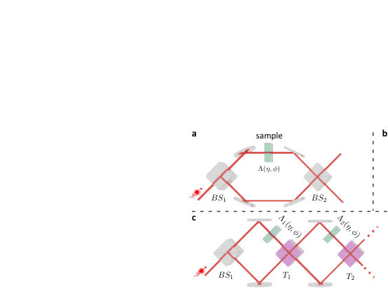
<figcaption class="paper-figure-caption"><b>Fig 1.</b> Fig. 1. a, The single pass (SP) strategy. b, The multi-pass (MP) strategy, where photons interact with the sample 𝑁times. c, The 𝑁-pass control-enhanced sequential (CS) strategy, featuring adjustable beam-splitters (BSs) denoted as 𝑇𝑘(𝑘= 1, ..., 𝑁−1) as control modules. The sample, modeled by a BS of transmissivity 𝜂and a phase shifter 𝜙, is illustrated in the green dashed box. In all strategies, the input single photon is partitioned between two modes by the BS1 with transmissivity 𝛼2. After single or multiple interactions with the sample, the beams are redirected to the BS2 with transmissivity 0.5, and photon detection occurs at the output ports.</figcaption>
</figure>
<figure class="paper-figure-card">
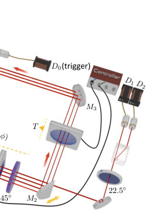
<figcaption class="paper-figure-caption"><b>Fig 2.</b> Fig. 2. Experimental setup. Photon pairs are generated through the parametric downconversion process in a 𝛽-barium borate (BBO) crystal pumped by frequency- doubled Ti:Sapphire laser pulses. The idler photon serves as a trigger (𝐷0). The heralded single photons undergo the evolution Λ(𝜂, 𝜙) and the control 𝑇multiple times in the loop composed of four mirrors 𝑀1−4, where 𝑀1 and 𝑀2 are D-shape mirrors. The number of passes depends on the position of 𝑀2. Finally, the photons are collected with single-mode fibers and detected using two single-photon detectors, 𝐷1 and 𝐷2.</figcaption>
</figure>
<figure class="paper-figure-card">
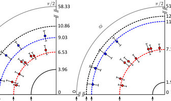
<figcaption class="paper-figure-caption"><b>Fig 3.</b> Fig. 3. a, QFI per dose, 𝜉, relative to the QL 𝜉𝑄𝐿for estimation of a single lossy phase with strategies: a single-pass (SP) strategy with a classical probe (gray dashed line), the parallel strategy with 𝑁-photon unbalanced N00N states (black dashed and solid lines), the MP strategy with 𝑁passes, the CS strategy with 𝑁-stage optimal controls. Here the solid lines demonstrate the ratios of QFI per dose for the strategies when 𝑁are integer numbers, and dashed lines demonstrate the optimal ratios for the strategies with continuous 𝑁. b-c, Phase estimation uncertainty 𝛿ˆ𝜙= 1/√𝐷th𝜉of different 𝜙∈(0, 𝜋/2) with 𝑁= 13 for 𝜂= {0.928, 0.977} and 𝐷th = {1231, 1602}, respectively. The radial direction...</figcaption>
</figure>
<figure class="paper-figure-card">
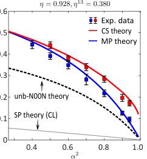
<figcaption class="paper-figure-caption"><b>Fig 4.</b> Fig. 4. Results for 𝜉/𝜉QL by varying 𝛼2: a, 4-stage MP and CS strategies at 𝜂= 0.665; b, 13-stage MP and CS strategies at 𝜂= 0.928. The results are compared to the parallel strategy using unbalanced N00N states and the SP strategy.</figcaption>
</figure>

**Summary.** The paper investigates how to maximize measurement precision (Quantum Fisher Information per Dose) in optical interferometers suffering from photon loss. By comparing sequential strategies—especially one incorporating active control—against passive methods, the authors demonstrate that controlled multi-pass interactions yield near-quantum-limited performance under strict dose constraints.

**Why it may be interesting.** This work provides concrete experimental evidence for optimizing resource utilization in quantum metrology, directly addressing practical constraints like sample damage which is a major hurdle for implementing high-precision quantum sensors.

Detailed structure

**Main problem.** The core problem is developing dose-efficient quantum phase estimation techniques for optical interferometry when light intensity is severely limited (dose-limited regimes) and photon loss is present.

**Main result.** Control-enhanced sequential strategies significantly outperform both the classical limit and parallel N00N state benchmarks, achieving Quantum Fisher Information per Dose ($\xi$) that approaches the fundamental quantum limit.

**Method.** The authors compare multiple quantum sensing protocols (Single Pass, Multi-Pass, Control-Enhanced Sequential) by calculating the Quantum Fisher Information (QFI) normalized by the total dose used.

**Model / system.** The physical system is a two-arm Mach-Zehnder Interferometer (MZI) incorporating a lossy sample in one arm. The analysis models photon loss using transmissivity ($\eta$) and compares different sequential interaction strategies.

**Key observables.** Quantum Fisher Information per Dose ($\xi$), phase estimation uncertainty ($\delta\hat{\phi}$), and the ratio $\xi/\xi_{QL}$.

**Important parameters / regimes.** Transmissivity ($\eta$), total dose constraint ($D_{th}$), number of passes ($N$), and initial state splitting parameter ($\alpha$).

**Assumptions / limitations.** The analysis often relies on post-selection techniques to analyze the surviving, information-carrying components of the quantum state.

**Figures summary.** Figures compare $\xi/\xi_{QL}$ for various strategies (SP, MP, CS) as a function of loss ($\eta$) and passes ($N$), demonstrating the superiority of the Control-Enhanced Sequential strategy.

**Paper structure.** The paper systematically introduces the dose-limited regime, derives the QFI per dose metric ($\xi$), compares sequential vs. parallel strategies (MP vs. N00N), and culminates in showing that active control (CS) maximizes $\xi$ by approaching the quantum limit.

Abstract

Optical interferometry is a cornerstone technique for precise phase measurements across various fields. In many applications, for example, biological imaging, it often necessitates stringent limits on light intensity to prevent adverse effects on light-sensitive samples, a condition known as dose-limited regimes. Maximizing the precision per dose is therefore crucial. In quantum metrology, quantum correlations enable high precision in phase estimation while adhering to dose constraints. Nevertheless, photon loss, including absorption by a sample, substantially diminishes the benefits of quantum enhancement in interferometry. In this work, we experimentally investigate a dose-efficient approach to quantum phase estimation using sequential strategies in the presence of loss. Performance of sequential strategies with and without control is evaluated through quantum Fisher information (QFI) per dose. Experimental results show that both sequential strategies exceed the classical limit and outperform the parallel strategy using unbalanced N00N states. Notably, the control-enhanced sequential strategy attains superior QFI per dose, approaching the quantum limit. These results highlight the promise of sequential strategy for imaging and sensing in resource-constrained scenarios, marking a significant step toward practical and efficient quantum metrology in lossy environments.

[↑ back to top](#top)

### [Optimal Decoding of Small Codes by Density Matrix Propagation](http://arxiv.org/abs/2606.14455v1)

**Authors:** Anthony Benois, Pierre Cussenot, Grégoire Misguich, Nicolas Sangouard, Kiara Hansenne  
**Type:** theory · **Category:** quantum information and computing · **PDF:** <https://arxiv.org/pdf/2606.14455v1>  
**Analysis basis:** full PDF text, analyzed in chunks
**Topic relevance:** `methods for driven-dissipative` **3/5** · `quantum measurements` **3/5** · `measurement-induced transitions` **1/5**

↔ Scroll figures horizontally

<figure class="paper-figure-card">
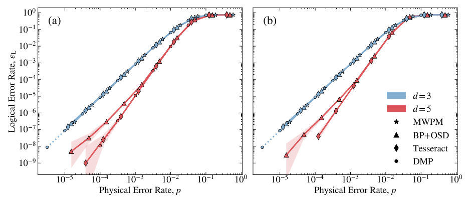
<figcaption class="paper-figure-caption"><b>Fig 1.</b> FIG. 2. Logical error rate as a function of the physical error rate p for the triangular code T with (a) r = 3 and (b) r = d rounds, using various decoders at distances d = 3 and d = 5. Shaded regions indicate statistical error bars obtained from N = 109 samples. The DMP simulations were performed without pruning for d = 3. For d = 5, pruning was used and the plotted values correspond to the lower bound εlow L . The cutoff was chosen such that the gap εup L −εlow L remained around 10% of εlow L , making the gap negligible on the scale of the figure. The computation of all the DMP data points took over 125 000 hours on a single work station CPU. For d = 5 and r = d, the total number of...</figcaption>
</figure>
<figure class="paper-figure-card">
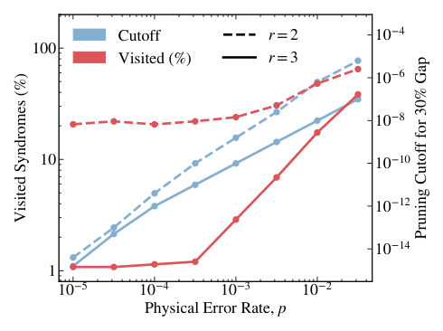
<figcaption class="paper-figure-caption"><b>Fig 2.</b> FIG. 3. Fraction of syndrome histories explored to obtain a 30% gap between the upper and lower bounds on the logical error rate (red, left axis) for the distance-five triangular code T2 with r = 2 and r = 3 rounds. The corresponding prun- ing cutoff is shown on the right axis (blue). For a number of rounds r = 2 and r = 3, the total number of syndrome histories is 221 &gt; 2 × 106 and 228 &gt; 2 × 108, respectively.</figcaption>
</figure>
<figure class="paper-figure-card">
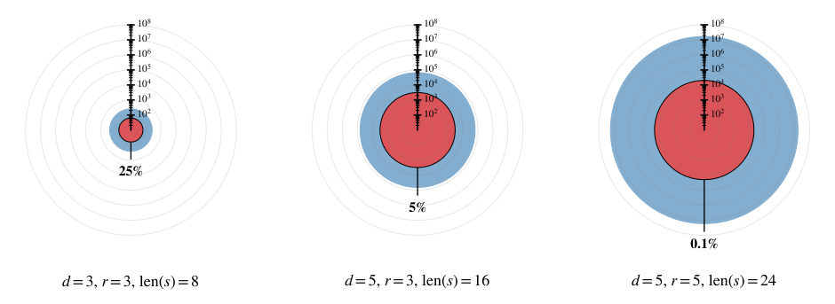
<figcaption class="paper-figure-caption"><b>Fig 3.</b> FIG. 4. Total number of syndrome histories (blue) and minimal number required to approximate the logical error rate within 1% relative error (red) for the repetition code across various code parameters. The relevant syndromes are selected based on their largest contributions to the logical error rate, ps p(fail | s), and the percentage indicates their fraction relative to the total. The physical error rate is p = 10−3.</figcaption>
</figure>
<figure class="paper-figure-card">
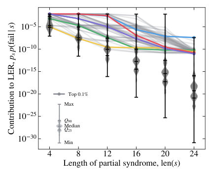
<figcaption class="paper-figure-caption"><b>Fig 4.</b> FIG. 5. Representative paths in the syndrome tree for the distance-5 repetition code (r = 5 rounds, which leads to a syndrome history of length (r + 1)(d −1) = 24). Black violin plots show the full distribution of syndromes. Grey paths represent typical paths from the top 0.1% of syndromes contributing most to the logical error rate εL, while coloured paths are selected examples from these grey paths. The yellow path illustrates that, after one and two rounds (syndrome lengths 4 and 8), most syndromes contribute more than it, yet it becomes one of the highest-contributing paths after all d rounds. The physical error rate is p = 10−3.</figcaption>
</figure>
<figure class="paper-figure-card">
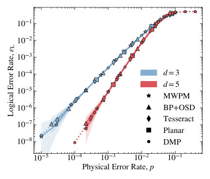
<figcaption class="paper-figure-caption"><b>Fig 5.</b> FIG. 6. Logical error rate as a function of the physical error rate p for the repetition code with r = d rounds, using various decoders at distances d = 3 and d = 5. Shaded regions indicate statistical error bars. We used N = 108 shots except for the Planar decoder for which we used N = 107 shots. The Planar and DMP decoders are ML, in contrast to the others. The DMP simulations were realised without pruning and are therefore exact to machine precision.</figcaption>
</figure>

**Summary.** This paper rigorously analyzes quantum error correction decoding under realistic circuit noise, comparing heuristic decoders against an optimal maximum-likelihood benchmark using Density Matrix Propagation. By developing pruning methods to manage the exponential complexity of syndrome histories, the authors quantify how much performance is lost by practical algorithms compared to theory. This work advances the understanding of fault tolerance feasibility for complex codes.

**Why it may be interesting.** This work is highly relevant as it tackles the practical limitations of fault tolerance by providing rigorous benchmarks for decoding algorithms. The techniques developed for bounding error rates via partial syndrome information are crucial for scaling QEC simulations beyond current limits.

Detailed structure

**Main problem.** The core challenge is achieving accurate and efficient decoding for fault-tolerant quantum computation when subjected to realistic circuit-level noise, which introduces temporal correlations.

**Main result.** The study benchmarks various practical decoders against an optimal maximum-likelihood benchmark, finding significant performance degradation for some algorithms (like BP+OSD) in relevant noise regimes.

**Method.** The authors employ Density Matrix Propagation (DMP) to compute the optimal decoding decision by tracking the density matrix through syndrome measurement histories. They use pruning techniques to manage the exponential complexity of the full syndrome tree exploration.

**Model / system.** The work analyzes Quantum Error Correction (QEC) using stabilizer codes, such as the repetition code and cellular automaton/triangular codes. The noise is modeled as circuit-level noise affecting syndrome measurements over multiple rounds.

**Key observables.** Logical Error Rate ($\epsilon_L$), conditional post-measurement state ($\varrho_s$), and the fraction of relevant syndrome histories contributing to $\epsilon_L$.

**Important parameters / regimes.** Physical error rate ($p$), code distance ($d$), number of syndrome extraction rounds ($r$), and the computational complexity scaling with $2^{ns}$.

**Assumptions / limitations.** The primary approximation is using pruning techniques to bound the summation over exponentially many possible syndrome histories, yielding a lower bound ($\epsilon_{	ext{low}}^L$) on the true error rate.

**Figures summary.** Figures illustrate matching graphs for specific codes (e.g., $T_2$), showing how error mechanisms relate to detectors and logical observables under noise. Other figures compare $\epsilon_L$ vs. physical error rate ($p$) for different decoders, highlighting the required fraction of syndrome histories needed for accuracy.

**Paper structure.** The paper develops from establishing the need for optimal decoding benchmarks (DMP) to detailing the mathematical framework ($\varrho_s$, TLS decomposition), and finally applying this framework by comparing multiple state-of-the-art decoders across various code families under increasing noise levels, while analyzing computational bottlenecks.

Abstract

Accurate and efficient decoding is a crucial component for achieving fault-tolerant quantum computing. Realistic circuit-level noise introduces temporal correlations and degeneracy, making optimal (maximum-likelihood) decoding computationally intractable in general. As a result, practical decoders rely on heuristic approximations, and it is generally difficult to quantify how suboptimal they are, as this strongly depends on the code and noise model considered. In this work, we study the accuracy of practical decoding algorithms under circuit-level noise by comparing them against a maximum likelihood decoding benchmark. Our approach propagates the density matrix through the full memory experiment and computes the optimal decoding decision for each syndrome history. We introduce pruning techniques with rigorous bounds, allowing us to access larger numbers of syndrome-extraction rounds. We apply this framework to small instances of the repetition code and a cellular automaton code, and benchmark minimum-weight perfect matching (MWPM), belief propagation with ordered statistics decoding (BP+OSD), Tesseract, and Planar decoders against optimal decoding. While standard decoders remain close to optimal for the repetition code, we find significant deviations for the cellular automaton code, with BP+OSD deteriorating already in experimentally relevant noise regimes. Moreover, the pruning method developed here highlights that, at low physical error rates, only a narrow fraction of syndrome histories contributes significantly to the logical error rate.

[↑ back to top](#top)

### [Dynamical multiferroicity in framework materials](http://arxiv.org/abs/2606.13874v1)

**Authors:** Marek Matas, Carl P. Romao  
**Type:** theory · **Category:** other · **PDF:** <https://arxiv.org/pdf/2606.13874v1>  
**Analysis basis:** full PDF text, analyzed in chunks
**Topic relevance:** `exotic spin models in light-matter` **3/5** · `spintronics-quantum-optics interface` **3/5**

↔ Scroll figures horizontally

<figure class="paper-figure-card">
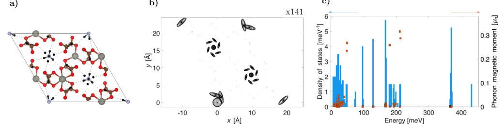
<figcaption class="paper-figure-caption"><b>Fig 1.</b> FIG. 1. Phonon magnetism in Zn(NH4)(fmt)3. a) Crystal structure of the primitive unit cell, with atoms colored by element (Zn gray, O red, N light blue, C brown, H black). b) Projection onto the xy plane of the atomic trajectories in the circularly polarized superposition of the degenerate IR-active mode pair with the largest magnetic moment. Each ellipse traces the motion of one atom; displacements are magnified by the factor indicated in the upper right (×141) for visibility. The trajectories are shown for the period following a model circularly polarized laser pulse (see Sec. II for details). The selected mode at 51 THz is dominated by the motion of the H atoms within the NH+ 4 cation,...</figcaption>
</figure>
<figure class="paper-figure-card">
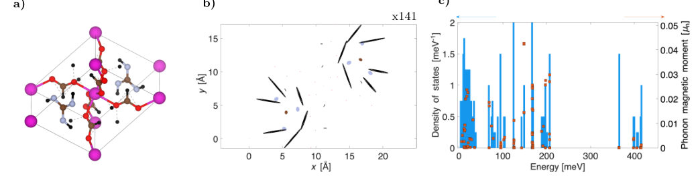
<figcaption class="paper-figure-caption"><b>Fig 2.</b> FIG. 2. Phonon magnetism in Cd(Gua)(fmt)3. a) Crystal structure of the primitive unit cell, with atoms colored by element (Cd magenta, O red, N light blue, C brown, H black). b) Projection onto the xy plane of the atomic trajectories in the circularly polarized superposition of the degenerate IR-active mode pair with the largest magnetic moment. Each ellipse traces the motion of one atom; displacements are magnified by the factor indicated in the upper right (×141) for visibility. The trajectories are shown for the period following a model circularly polarized laser pulse (see Sec. II for details). Although the guanidinium cation contains H atoms with large effective gyromagnetic ratios,...</figcaption>
</figure>
<figure class="paper-figure-card">
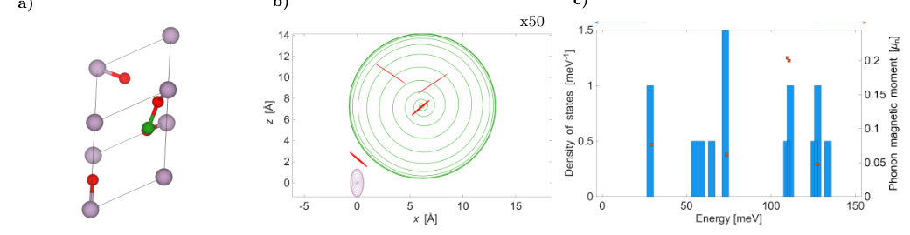
<figcaption class="paper-figure-caption"><b>Fig 3.</b> FIG. 3. Phonon magnetism in BPO4. a) Crystal structure of the primitive unit cell, with atoms colored by element (P purple, O red, B green). b) Projection onto the xz plane of the atomic trajectories in the circularly polarized superposition of the degenerate IR-active mode pair with the largest magnetic moment. Each ellipse traces the motion of one atom; displacements are magnified by the factor indicated in the upper right (×424) for visibility. The trajectories are shown for the period following a model circularly polarized laser pulse (see Sec. II for details). The large magnetic moment is generated by the dominant circular motion of the boron atom; this gives the mode a high degree of...</figcaption>
</figure>
<figure class="paper-figure-card">
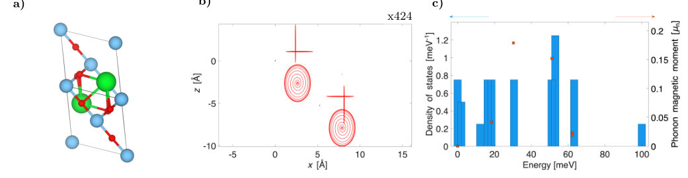
<figcaption class="paper-figure-caption"><b>Fig 4.</b> FIG. 4. Phonon magnetism in SrTiO3. a) Crystal structure of the primitive unit cell, with atoms colored by element (Sr green, Ti blue, O red). b) Projection onto the xz plane of the atomic trajectories in the circularly polarized superposition of the degenerate IR-active mode pair with the largest magnetic moment. Each ellipse traces the motion of one atom; displacements are magnified by the factor indicated in the upper right (×424) for visibility. The trajectories are shown for the period following a model circularly polarized laser pulse (see Sec. II for details). The magnetic moment is dominated by oxygen motion: one oxygen sublattice follows an approximately circular trajectory while...</figcaption>
</figure>
<figure class="paper-figure-card">
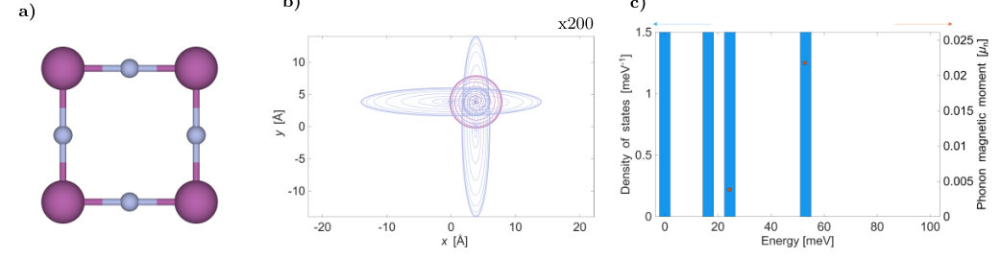
<figcaption class="paper-figure-caption"><b>Fig 5.</b> FIG. 5. Phonon magnetism in ScF3. a) Crystal structure of the primitive unit cell, with atoms colored by element (Sc purple, F lilac). b) Projection onto the xy plane of the atomic trajectories in the circularly polarized superposition of the degenerate IR-active mode pair with the largest magnetic moment. Each ellipse traces the motion of one atom; displacements are magnified by the factor indicated in the upper right (×141) for visibility. The trajectories are shown for the period following a model circularly polarized laser pulse (see Sec. II for details). In contrast to SrTiO3, the higher cubic symmetry mixes the Sc and F displacements, preventing strong localization of angular momentum...</figcaption>
</figure>

**Summary.** This work explores dynamical multiferroicity—the generation of magnetization using circularly polarized light interacting with phonons—to find new magnetic materials. By performing ab initio calculations on diverse frameworks, the authors demonstrate that flexible MOFs can host exceptionally large phonon-induced magnetic moments. This suggests a pathway for optically controlling magnetism in next-generation functional materials.

**Why it may be interesting.** The concept connects lattice dynamics (phonons) directly to magnetic properties in a controllable, light-induced manner. This bridges solid-state physics, optics, and magnetism, which is relevant for understanding emergent quantum phenomena in engineered materials.

Detailed structure

**Main problem.** The research investigates dynamical multiferroicity, which is the mechanism by which magnetic fields can be generated optically via circularly polarized phonons in various crystalline materials.

**Main result.** Framework materials, particularly $	ext{Zn}(	ext{NH}_4)(	ext{formate})_3$, are identified as highly promising candidates because their flexible structures allow for large phonon-induced magnetic moments exceeding those of traditional inorganic oxides like $	ext{SrTiO}_3$.

**Method.** The study relies on ab initio calculations (DFT/DFPT) to compute phonon properties, including the calculation of phonon magnetic moments ($\mu_{\pm}$) and estimating the maximum achievable magnetization using the Lindemann melting criterion.

**Model / system.** The physical systems are diverse inorganic and organic framework materials (MOFs), ranging from perovskites to coordination compounds. The model involves coupling lattice vibrations (phonons) with magnetism, treating the magnetic moment generation as a consequence of phonon circular motion.

**Key observables.** Phonon magnetic moment ($\mu_{	ext{ph}}$), degree of circular polarization ($S$), and maximum magnetization density ($M_{	ext{melt}}$).

**Important parameters / regimes.** The magnitude of the magnetic moments (compared to $\mu_n$ or $\mu_B$) and the phonon frequencies (especially those in the mid-IR range, $\ge 12 	ext{ THz}$).

**Assumptions / limitations.** The maximum magnetization is often estimated using the Lindemann criterion, which provides an upper bound on achievable displacements.

**Figures summary.** Figures systematically present crystal structures alongside atomic trajectories and phonon density of states plots for numerous materials, illustrating how different structural motifs yield varying levels of calculated magnetic moments.

**Paper structure.** The paper progresses by establishing the theoretical framework (dynamical multiferroicity), applying it to model systems ($	ext{SrTiO}_3$, $	ext{ScF}_3$), and then systematically surveying a large library of materials, with a strong emphasis on demonstrating the superior potential of MOFs.

Abstract

Dynamical multiferroicity, which describes the magnetic fields generated by circularly polarized phonons in materials, is an established mechanism for optical control of magnetism. Here we perform ab initio calculations of dynamical multiferroicity in inorganic and organic framework materials, with the goal of identifying materials which enable the generation of large magnetic fields by light. We find the metal--organic framework material Zn(NH$_4$)(formate)$_3$ to have modes with magnetic moments almost twice that of SrTiO$_3$; these modes involve circular motions of NH$_4^+$ hydrogen ions with high gyromagnetic ratios. The complex structure and flexibility of framework materials can allow such angular momentum localization, and also increase the maximum light-induced magnetization permitted by the Lindemann melting criterion.

[↑ back to top](#top)

### [OQMD: Single-Qubit Rotation Control Improves Low-CNOT Multiclass Quantum Classification](http://arxiv.org/abs/2606.14088v1)

**Authors:** Michael A. Magid, Melissa Zeynep Ertem, Jun Suzuki  
**Type:** both · **Category:** quantum information and computing · **PDF:** <https://arxiv.org/pdf/2606.14088v1>  
**Analysis basis:** full PDF text, analyzed in chunks
**Topic relevance:** `quantum measurements` **3/5** · `QC/QI experiment` **2/5** · `measurement-induced transitions` **1/5**

↔ Scroll figures horizontally

<figure class="paper-figure-card">
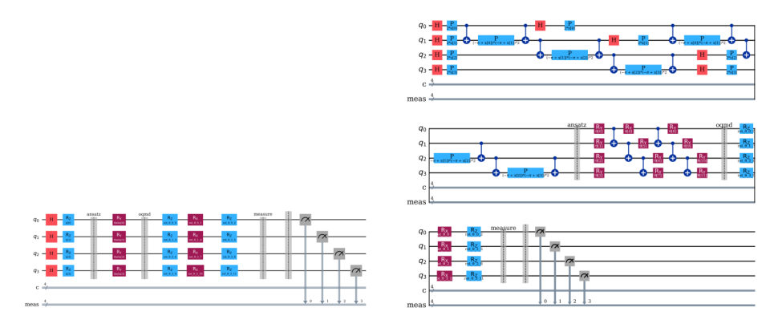
<figcaption class="paper-figure-caption"><b>Fig 1.</b> Figure 1: Circuit diagrams for Architecture 1 (minimal): H + RZ feature encoding, single RY ansatz layer, ZXZ OQMD rotations, 0 CNOT gates (left). Architecture 3 (complex): ZZFeatureMap (12 CNOT) + RealAmplitudes (6 CNOT) + OQMD (0 CNOT) = 18 CNOT total (right). OQMD adds measurement optimization with zero CNOT overhead in both cases.</figcaption>
</figure>
<figure class="paper-figure-card">
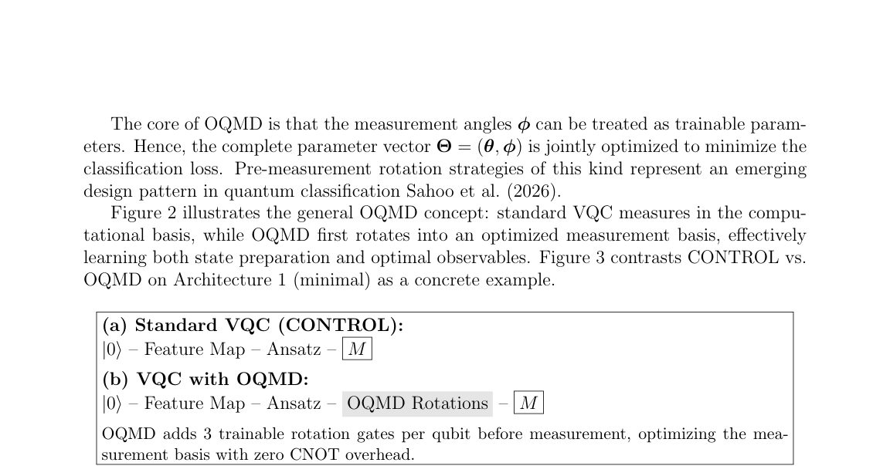
<figcaption class="paper-figure-caption"><b>Fig 2.</b> Figure 2: OQMD concept: Standard VQC (a) measures in the computational basis, while OQMD (b) first applies trainable rotation gates to measure in an optimized basis. This adds expressivity without CNOT gates.</figcaption>
</figure>
<figure class="paper-figure-card">
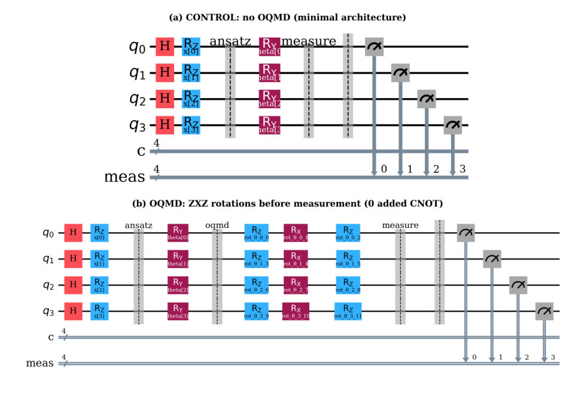
<figcaption class="paper-figure-caption"><b>Fig 3.</b> Figure 3: Detailed circuit comparison: CONTROL versus OQMD on the minimal architec- ture. (a) CONTROL (parity readout, no OQMD). (b) OQMD adds ZXZ triple rotations before measurement (no additional CNOTs). Peak accuracies appear in Table 2.</figcaption>
</figure>
<figure class="paper-figure-card">
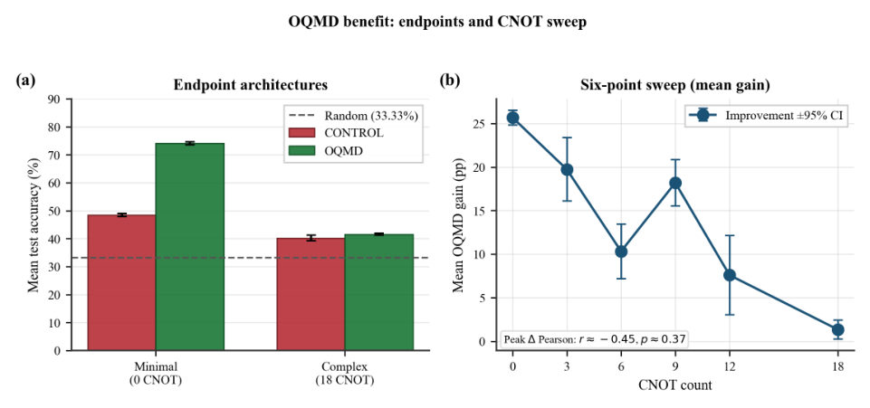
<figcaption class="paper-figure-caption"><b>Fig 4.</b> Figure 4: Summary of factorial means (left: 0 vs. 18 CNOT) and six-point mean OQMD gains with 95% CIs (right). Panel (b) annotates Pearson r on peak max-to-max margins (r ≈−0.45, Table 5); an ordinary least squares fit to mean gains would yield a different r (specifically r ≈−0.91) and is not used as a headline statistic. Peaks and Mann–Whitney tests are in Table 2. Gray dashed line: random baseline (33.33%).</figcaption>
</figure>
<figure class="paper-figure-card">
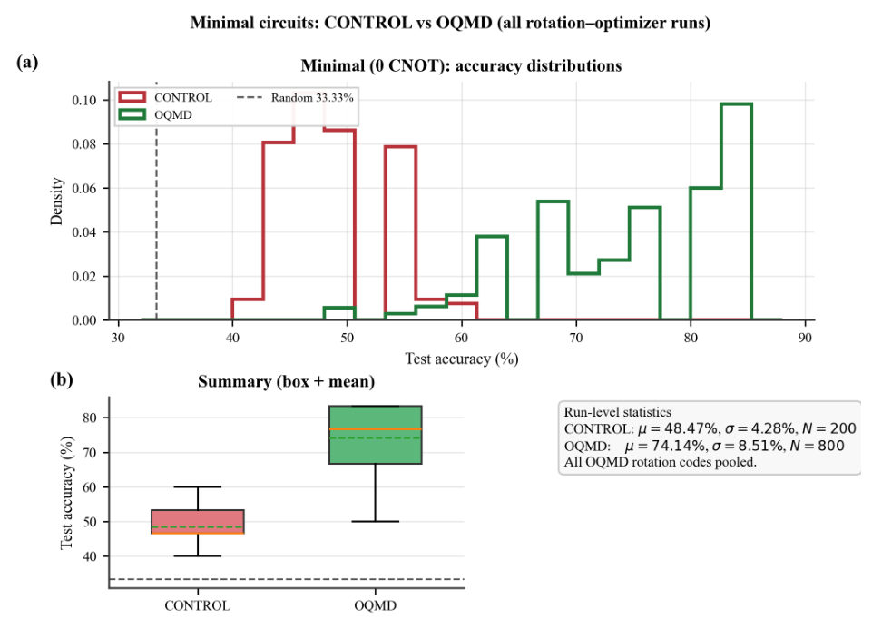
<figcaption class="paper-figure-caption"><b>Fig 5.</b> Figure 5: Minimal circuit performance (0 CNOT): pooled accuracy distributions for CON- TROL (N=200 runs) and OQMD (N=800 runs). Top: normalized step histograms (binned empirical frequencies, not kernel density). Bottom: box-and-mean summary. OQMD pool is shifted decisively rightward of CONTROL; the multimodal shape reflects the discrete ac- curacy grid (multiples of 1/30) combined with the mix of rotation codes, optimizers, and seeds. Peaks and Mann–Whitney results appear in Table 2; pooled run-level statistics are annotated in the bottom panel.</figcaption>
</figure>

**Summary.** This work introduces Optimal Quantum Measurement Decoding (OQMD), a technique that boosts quantum classification accuracy by training the readout process using only single-qubit gates. Experiments on the Iris dataset show that OQMD provides significant performance gains, sometimes surpassing those achieved with deeper, more complex circuits, highlighting that measurement optimization is crucial for near-term quantum computation.

**Why it may be interesting.** While focused on quantum machine learning, the methodology of optimizing measurement bases via trainable single-qubit rotations is relevant to understanding how local control fields can enhance readout fidelity in complex quantum measurements, which has parallels in sensing or state preparation protocols.

Detailed structure

**Main problem.** The work addresses improving low-CNOT quantum classification accuracy by optimizing how measurement outcomes are mapped to classical labels, a technique called Optimal Quantum Measurement Decoding (OQMD). This aims to boost performance without incurring the high error rates associated with adding more two-qubit gates.

**Main result.** OQMD significantly improves peak classification accuracy, notably achieving 83.33% on minimal circuits (0 CNOTs), which surpasses the best results from deep, complex circuits (18 CNOTs). This suggests that readout optimization can yield substantial gains even when entanglement depth is limited.

**Method.** The core method involves jointly optimizing trainable single-qubit rotations applied immediately before measurement with the parameters of a variational quantum circuit. Performance comparison relies on analyzing best-observed peak accuracies using statistical tests like Mann–Whitney U, rather than mean values.

**Model / system.** The study uses Variational Quantum Classifiers (VQCs) tested on the Iris dataset for multiclass classification. The model structure involves an initial feature map, a variational ansatz parameterized by $	heta$, and the novel OQMD readout layer parameterized by $\phi$.

**Key observables.** Classification accuracy ($\%$), CNOT count (depth proxy), Peak hold-out test accuracy ($	ext{Acc}_{\max}$), Learning improvement ($\Delta$), Mann–Whitney U statistics.

**Important parameters / regimes.** CNOT depth (ranging from 0 to 18), number of trainable single-qubit rotation parameters, optimization algorithm choice (e.g., COBYLA, L-BFGS-B).

**Assumptions / limitations.** The analysis emphasizes peak performance over mean performance due to the discrete and non-Gaussian nature of run-level accuracies; it also assumes that OQMD's overhead is negligible compared to CNOT gate errors.

**Figures summary.** Figures illustrate circuit comparisons (minimal vs. complex), learning curves showing optimization progress, and heatmaps summarizing peak accuracy gains across different rotation codes and optimizer choices.

**Paper structure.** The paper establishes the problem of VQC limitations due to measurement error; it introduces OQMD as a readout-layer fix; it details experimental comparisons across varying CNOT depths (0 to 18); finally, it presents quantitative results showing performance gains and discusses the implications for hardware resource trade-offs.

Abstract

Near-term variational classifiers incur substantial error and latency from two-qubit gates, yet practitioners often assume that additional entangling depth is the default route to higher accuracy. This work studies Optimal Quantum Measurement Decoding (OQMD): optimizing how quantum outcomes are mapped to classical labels by training a readout layer before measurement, jointly with the variational circuit, without adding CNOTs. Experiments use trainable triple single-qubit rotations as one concrete, hardware-native realization of OQMD; other single-qubit parametrizations fit the same classical outer loop. On the Iris benchmark with a 30-point stratified test split, the best observed 0-CNOT configuration with OQMD reaches 83.33\% accuracy, with a 96\% at 9 CNOTs, exceeding the best 18-CNOT controls (56.67\%) and the best 18-CNOT configuration with OQMD (66.67\%) under a common protocol. A six-point CNOT-depth series from 0 to 18 (fixed optimizer, iteration budget, random-seed count, and ZXZ readout) shows that the highest raw scores need not occur at the largest template, so aggregate complexity is not summarized by CNOT count alone. Because run-level accuracies are discrete and non-Gaussian, we emphasize best-observed scores and, where a global comparison of pooled runs is required, Mann--Whitney $U$ tests rather than parametric tests on means. Across architectures, OQMD shows statistically consistent but magnitude-dependent gains: large peak lifts on minimal circuits coexist with a small pooled mean shift on complex 18-CNOT runs ($p\approx 0.03$) that is not ``universal'' in the sense of uniformly large practical effects.%

[↑ back to top](#top)

### [Jones-matrix analysis of phase accumulation in a linear-optical multi-pass interferometer](http://arxiv.org/abs/2606.14422v1)

**Authors:** Byoung S. Ham  
**Type:** both · **Category:** other · **PDF:** <https://arxiv.org/pdf/2606.14422v1>  
**Analysis basis:** full PDF text, analyzed in chunks
**Topic relevance:** `interference shaping light` **3/5** · `quantum optics experiment` **1/5**

↔ Scroll figures horizontally

<figure class="paper-figure-card">
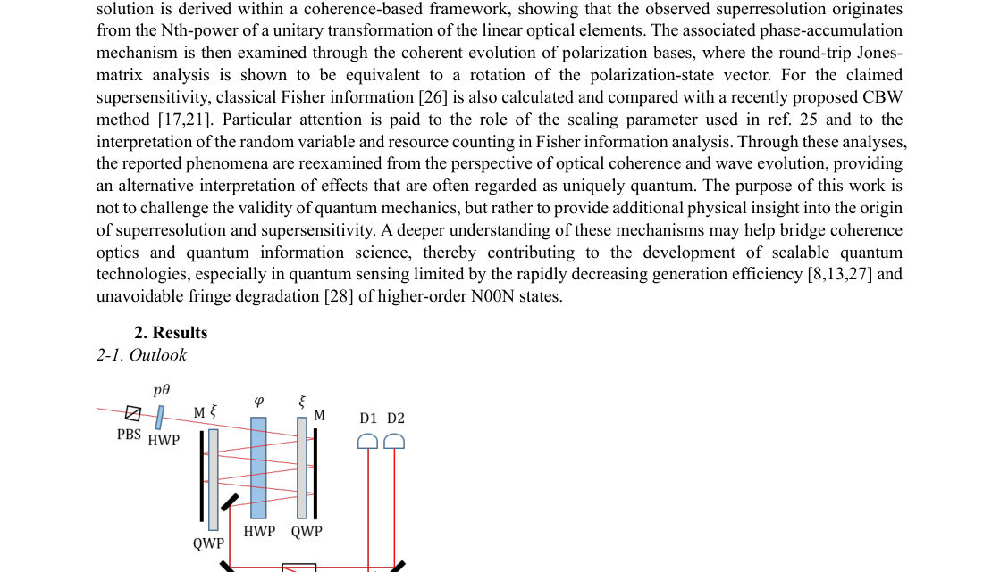
<figcaption class="paper-figure-caption"><b>Fig 1.</b> Fig. 1. Schematic of entanglement-free Heisenberg-limited phase estimation. D: photodetector; HWP: half-wave plate; M: mirror; PBS: polarizing beam splitter; PBD: polarizing beam displacer; QWP: quarter-wave plate.</figcaption>
</figure>
<figure class="paper-figure-card">
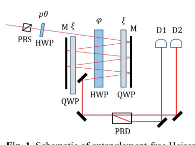
<figcaption class="paper-figure-caption"><b>Fig 2.</b> Figure 1 illustrates the entanglement-free Heisenberg-limited phase estimation scheme reported in ref. 25. The input light consists of single photons generated from an attenuated laser, whose photon statistics follow a Poisson distribution. A polarizing beam splitter (PBS) prepares the incident photons in the horizontal polarization state. The subsequent half-wave plate HWP(𝑝𝑝𝑝𝑝) transforms the photons into a coherent superposition state of horizontal and vertical polarization bases: |ψ𝑖𝑖𝑖𝑖⟩= 1</figcaption>
</figure>
<figure class="paper-figure-card">
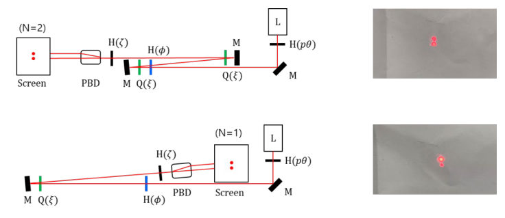
<figcaption class="paper-figure-caption"><b>Fig 3.</b> Fig. 2. Experimental demonstration of multi-pass superresolution using a CW input light. PBD: polarization beam dispenser. H: Half-wave plate, M: mirror, Q: quarter-wave plate. Upper panel: N=1 (https://studio.youtube.com/video/nTsm_oR2LCY/edit). Lower panel: N=2 (see https://studio.youtube.com/video/4GIH21Tz8aU/edit).</figcaption>
</figure>

**Summary.** This work analyzes a multi-pass linear-optical interferometer using Jones matrices to determine the physical mechanism behind observed superresolution. The authors demonstrate that the effect stems from the coherent accumulation of polarization rotation across successive passes, which is robustly observable in both quantum and classical light regimes. This clarifies that the enhancement scales geometrically with the number of passes rather than solely relying on nonclassical photon resources.

**Why it may be interesting.** It provides a detailed quantum optical analysis of how geometric path length enhancement (multiple passes) can lead to superresolution effects by exploiting coherent polarization dynamics, offering insights into measurement scaling beyond simple resource counting.

Detailed structure

**Main problem.** The paper aims to clarify the physical origin of superresolution and claimed supersensitivity observed in a multi-pass linear-optical interferometer setup.

**Main result.** Superresolution is shown to arise from coherent polarization-state rotation accumulated over multiple passes, which can be demonstrated using both single-photon quantum mechanics and classical light sources.

**Method.** The analysis employs a rigorous Jones-matrix formalism applied to the round-trip evolution of the interferometer unit cell, supplemented by comparison with classical wave implementations.

**Model / system.** The system is a linear-optical multi-pass interferometer involving components like HWP, QWP, PBS, and mirrors. The core analysis focuses on tracking polarization state transformations using Jones matrices across multiple passes (N).

**Key observables.** Accumulated phase ($\Phi_N$), superresolution fringe frequency ($1 \pm \cos(N\phi)$), and the scaling behavior of the Fisher information.

**Important parameters / regimes.** The number of coherent round trips ($N$) acts as a geometric enhancement parameter, distinct from measurement repetitions. The polarization rotation angles ($\varphi, \xi$) are key inputs.

**Assumptions / limitations.** The analysis assumes lossless linear optics and that the superresolution mechanism is governed by coherent polarization-basis realignment rather than nonclassical photon statistics.

**Figures summary.** Figures schematically illustrate the interferometer setup (HWP, M, PBS) and show experimental comparisons demonstrating fringe frequency doubling when increasing the number of passes from N=1 to N=2 using CW light.

**Paper structure.** The paper proceeds by establishing the Jones-matrix formalism for the unit cell transformation, deriving the total round-trip operator, analyzing the resulting phase accumulation in the circular polarization basis, and finally comparing this theoretical model against experimental observations and related coherence frameworks.

Abstract

Quantum information science has traditionally relied on nonclassical resources, such as entangled photon pairs and squeezed states, to achieve measurement performance beyond classical limits. Here, we revisit the multi-pass photonic scheme reported in Nature 450, 393 (2007) to clarify the physical origin of the observed superresolution and the associated claim of supersensitivity. Using a rigorous Jones-matrix formalism, we show that the round-trip evolution of the HQMQ linear optics unit is equivalent to the product of two reflections in polarization space, resulting in an effective rotation operator. This equivalence reveals that the accumulated phase arises from coherent polarization-state rotation on the Poincare'e sphere. The resulting phase accumulation is interpreted geometrically as a progressive realignment of the polarization state during successive forward and backward propagations. To validate the theoretical model, a classical-wave implementation is experimentally conducted, analyzed, and compared with the corresponding Jones-matrix solution. Finally, the scaling behavior of the Fisher information is analyzed to examine the origin of the claimed supersensitivity. The results are further compared with a recently developed coherence de Broglie wavelength framework, which achieves identical superresolution through repeated coherent interactions in a cascaded interferometeric architecture.

[↑ back to top](#top)

### [Prospective Coding and Path Integration Emerge as Equilibrium Solutions of Self-Organizing Neural Networks with Firing-Rate Adaptation](http://arxiv.org/abs/2606.14649v1)

**Authors:** Facundo Emina, Emilio Kropff  
**Type:** theory · **Category:** disordered systems and neural networks · **PDF:** <https://arxiv.org/pdf/2606.14649v1>  
**Analysis basis:** full PDF text, analyzed in chunks
**Topic relevance:** `driven-dissipative phase transition` **2/5** · `non-equilibrium dynamics` **2/5** · `non-equilibrium universality` **2/5** · `Frenkel-Kontorova` **1/5** · `Keldysh / 2PI / non-Gaussian methods` **1/5** · `analog quantum simulation` **1/5** · `correlated / nonlocal dissipation` **1/5** · `methods for driven-dissipative` **1/5**

↔ Scroll figures horizontally

<figure class="paper-figure-card">
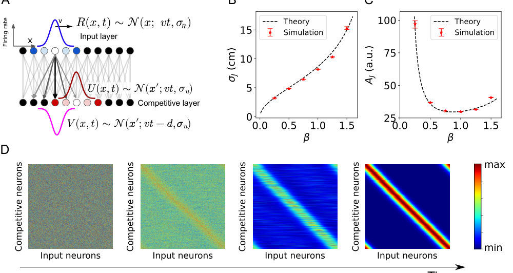
<figcaption class="paper-figure-caption"><b>Fig 1.</b> FIG. 1. Self-Organized Feedforward Connectivity. A, Schematic of the two-layer model after learning. An input layer of neurons R(x, t), encoding a unidirectionally moving stimulus at speed v through Gaussian tuning curves, projects through a Gaussian connectivity profile to a second layer U(x, t) that implements competition via Hebbian learning, firing-rate adaptation, and global inhibition (see Eqs. 2, 3 and 6). B, Learned standard deviation as a function of the β parameter. Red: simulation median and interquartile ranges; black dashed line: theoretical prediction (Eq. 13). Simulations were performed using the Euler method with a time step of ∆t = 5 · 10−3 s. Parameters used: Nin = Nc =...</figcaption>
</figure>
<figure class="paper-figure-card">
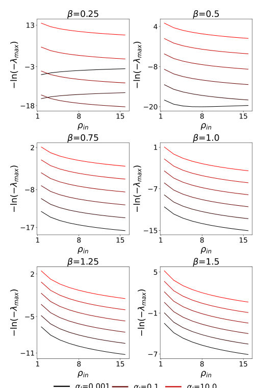
<figcaption class="paper-figure-caption"><b>Fig 2.</b> FIG. 2. Global stability analysis across inhibition fac- tor and coupling strength. Numerical spectral analysis of the generalized eigenvalue problem shows the dependence of the real part of the leading eigenvalue, λmax, on the input density ρin and synaptic damping strength αJ, for different values of β. The system is stable whenever ℜ(λi) &lt; 0 for all modes; accordingly, the curves report −ln(−λmax). Across the explored parameter range, λmax remains negative, indi- cating robust stability. Panels correspond to the specified β values. Colors indicate αJ from 0.001 to 100. Spectral anal- ysis was performed with a spatial resolution of ∆s = 0.1 cm and system parameters L = 100 cm, m = 0.15, τ...</figcaption>
</figure>
<figure class="paper-figure-card">
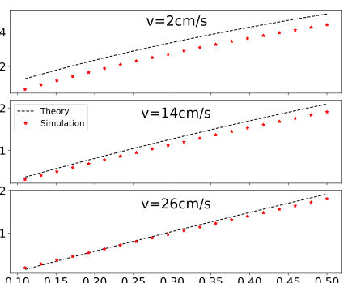
<figcaption class="paper-figure-caption"><b>Fig 3.</b> FIG. 3. Dependence of bump asymmetry γ on adap- tation strength and input speed. A, Level curves of con- stant γ in the (m, τv √</figcaption>
</figure>
<figure class="paper-figure-card">
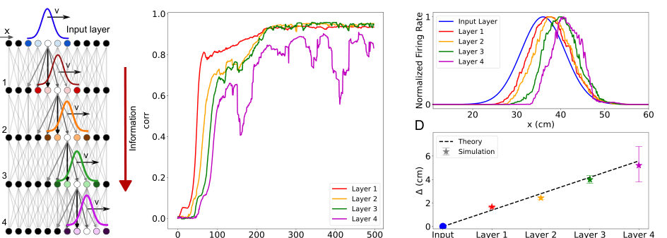
<figcaption class="paper-figure-caption"><b>Fig 4.</b> FIG. 4. Self-organized multilayer architecture potentiates predictive coding. A, Schematic of the multilayer model after learning. Each layer successfully learns to encode space. Additionally, each layer encodes a position that is shifted into the future relative to its preceding input layer. B, The learning process for each of the four layers. The plot shows the correlation between each layer’s feedforward connectivity matrix and the theoretically expected Gaussian profile. Despite being initialized with random weights, all layers converge to a high correlation, indicating that they all learn to encode space. C, An example of the activity bump in each layer compared to the original input...</figcaption>
</figure>
<figure class="paper-figure-card">
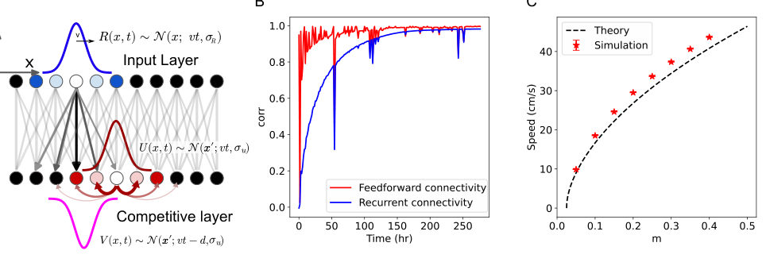
<figcaption class="paper-figure-caption"><b>Fig 5.</b> FIG. 5. Recurrent attractor connectivity can be learned from an input tutor. A, Schematic of the two layer network after learning both feedforward and recurrent connectivity. B, The learning process for both recurrent and feedforward connectivities. The plot shows the correlation between each connectivity matrix and the theoretically expected Gaussian profile. C, The learned recurrent connectivities allow the network to self-sustain a moving Gaussian bump in the absence of input tutor. The speed of the Gaussian bump satisfies the theoretical prediction Eq. 25. Stars denote the median speed computed over 104</figcaption>
</figure>

**Summary.** This paper theoretically demonstrates that advanced cognitive functions like path integration and anticipation do not require complex, hard-wired connections. Instead, they emerge naturally as stable, self-organized properties of a simple competitive neural network layer governed by basic learning rules and adaptation mechanisms.

**Why it may be interesting.** While focused on neuroscience, the mathematical machinery—stability analysis of coupled nonlinear dynamics, pattern formation in continuous media, and emergent structure from local rules—shares deep theoretical parallels with models used in condensed matter physics for phase transitions or glassy dynamics.

Detailed structure

**Main problem.** The study investigates how complex cognitive functions like prospective coding and path integration can emerge spontaneously in self-organizing neural networks without requiring pre-wired, structured connectivity.

**Main result.** Prospective coding and path integration are shown to be naturally co-emergent properties arising from the simple dynamics of a single competitive network layer through Hebbian plasticity and firing-rate adaptation.

**Method.** The authors developed a theoretical framework using continuous attractor neural networks (CANNs) models, employing analytical techniques like Gaussian ansatz projections and stability analysis via eigenvalue problems.

**Model / system.** The model is a two-layer CANN incorporating Hebbian plasticity, firing-rate adaptation, and global inhibition. It simulates activity bumps moving across a spatial domain, mimicking biological circuits like the entorhinal cortex.

**Key observables.** Asymmetry parameter ($\gamma$), intrinsic bump velocity ($v_{int}$), learned connectivity profiles ($J(x, x')$), and the ability to track external speed signals via baseline current modulation.

**Important parameters / regimes.** Plasticity rates ($\eta_J$, $\alpha_J$), adaptation time constants ($	au, 	au_v$), global inhibition strength ($k$), and input velocity ($v$).

**Assumptions / limitations.** The analysis relies on approximating continuous populations with Gaussian profiles for analytical tractability; stability analyses often assume weak inhibition or slow plasticity timescales.

**Figures summary.** Figures illustrate the evolution of connectivity, the dependence of asymmetry ($\gamma$) on adaptation strength and velocity, and quantitative evidence showing how external speed currents modulate the bump's propagation speed in real-time.

**Paper structure.** The work progresses from establishing basic feedforward learning rules leading to Gaussian weights, then incorporating recurrence for self-sustaining activity bumps, and finally introducing an external speed current to demonstrate precise path integration capability.

Abstract

Continuous Attractor Neural Networks (CANNs) traditionally rely on pre-wired recurrent connectivity to model spatial representations, path integration, and anticipatory dynamics. However, the biological mechanisms through which this structured connectivity emerges via learning remain relatively unexplored. This work presents a theoretical framework revealing how continuous attractor connectivity and its computational properties self-organize through Hebbian plasticity, firing-rate adaptation, and global inhibition. We show that translationally invariant inputs naturally drive the emergence of stable, Gaussian-profiled feedforward weights. Crucially, anticipatory dynamics arise spontaneously within these feedforward architectures, shifting the activity bump forward without requiring recurrent excitatory collaterals. This predictive shift can be linearly amplified across multilayer networks, consistent with anticipatory activity observed in the superficial layers of the entorhinal cortex. Furthermore, introducing recurrent interactions allows the network to learn connections capable of self-sustaining a moving bump of activity. Finally, by modulating the network with an external, time-varying baseline current that encodes speed, the system adjusts its intrinsic velocity to function as a precise unidirectional path integrator. Ultimately, this study suggests that prospective coding and path integration are not manually engineered features, but rather naturally co-emergent properties of a single self-organizing competitive network.

[↑ back to top](#top)

### [All about quantum error correction: distillation, mitigation, self-correction and beyond](http://arxiv.org/abs/2606.14034v1)

**Authors:** D. -S. Wang  
**Type:** theory · **Category:** quantum information and computing · **PDF:** <https://arxiv.org/pdf/2606.14034v1>  
**Analysis basis:** full PDF text, analyzed in chunks
**Topic relevance:** `entanglement & information structure` **2/5** · `Keldysh / 2PI / non-Gaussian methods` **1/5** · `correlated / nonlocal dissipation` **1/5** · `driven-dissipative phase transition` **1/5** · `methods for driven-dissipative` **1/5**

↔ Scroll figures horizontally

<figure class="paper-figure-card">
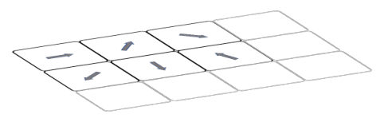
<figcaption class="paper-figure-caption"><b>Fig 1.</b> Figure 1. An illustration of the ensemble code using 3D AKLT system. The picture is the top of such a system with each vector encoding a SU(2) gate, as a generalization of the Ising model as classical repetition code which only encodes two log- ical vector directions.</figcaption>
</figure>

**Summary.** This paper unifies disparate quantum error correction techniques—including distillation and error mitigation—by embedding them into a general framework based on state-adaptive or channel-adaptive coding. It clarifies the relationships between these methods and proposes a theoretical model for self-correcting quantum memory systems. This provides a powerful, unified guide for designing reliable quantum information processing protocols.

**Why it may be interesting.** It provides a deep theoretical unification of several advanced topics in quantum information (QEC, resource theory, dynamics), offering new conceptual tools for designing robust quantum hardware protocols.

Detailed structure

**Main problem.** The work aims to unify various quantum error-manipulating techniques, such as distillation, error mitigation, and dynamical decoupling, under a single general framework.

**Main result.** It establishes that these diverse techniques are special cases of state-adaptive or channel-adaptive Quantum Error Correction (QEC), leading to a model for self-correcting quantum memory.

**Method.** The authors employ an abstract theoretical framework by extending QEC concepts using superchannels, fine-grained projectors, and analyzing resource conversion within the context of Quantum Resource Theory.

**Model / system.** The analysis uses general quantum information processors, focusing on code spaces defined by projectors $P$. Specific models include ensemble codes derived from AKLT systems for self-correction in memory applications.

**Key observables.** Code projector $P$, error operators $\{E_i\}$, Fidelity function $F(
ho, \sigma)$, and the coding rate $\alpha = k/n$.

**Important parameters / regimes.** Error parameter $\epsilon$, code distance $d=2t+1$, and temperature $eta^{-1}$ (in passive protection contexts).

**Assumptions / limitations.** The framework assumes that error correction can be generalized to state-adaptive or channel-adaptive settings, allowing for the inclusion of previously separate protocols.

**Paper structure.** The paper progresses by first defining QEC generally, then introducing SA and channel-adaptive extensions. It systematically shows how distillation, error mitigation, and DD fit into this unified structure before proposing a concrete self-correcting memory model.

Abstract

In this work, it is shown that many quantum error-manipulating techniques, such as distillation, error mitigation, and dynamical decoupling, are special cases of the most general framework for quantum error correction. This unifying perspective is achieved by extending quantum error correction to include state-adaptive and channel-adaptive settings, as well as multi-stage coding scenarios. Based on this insight, a model of self-correcting quantum memory is also proposed. This work clarifies the relationship among these techniques and illustrates, through explicit constructions, how the unified perspective can guide the design of reliable quantum information systems.

[↑ back to top](#top)

### [Quantum gates with parametrically driven multi-qubit couplers](http://arxiv.org/abs/2606.14522v1)

**Authors:** Verena Feulner, Marjan Fani, Lukas Heunisch, Stephan Tasler, Michael J. Hartmann  
**Type:** theory · **Category:** quantum information and computing · **PDF:** <https://arxiv.org/pdf/2606.14522v1>  
**Analysis basis:** full PDF text, analyzed in chunks
**Topic relevance:** `QC/QI experiment` **2/5** · `Keldysh / 2PI / non-Gaussian methods` **1/5** · `analog quantum simulation` **1/5** · `driven-dissipative phase transition` **1/5** · `methods for driven-dissipative` **1/5**

↔ Scroll figures horizontally

<figure class="paper-figure-card">
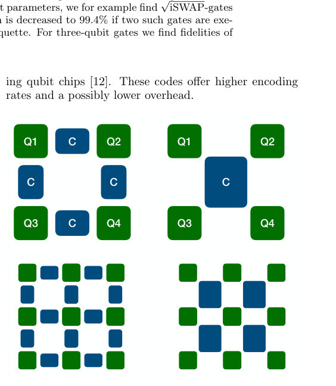
<figcaption class="paper-figure-caption"><b>Fig 1.</b> FIG. 1. Comparison of rectangular 4-qubit modules. Top: On the left the qubits are connected by four two-qubit couplers and one multi-qubit coupler positioned in the middle of these qubits (right). Bottom: Arrangements with 2-qubit couplers or 4-qubit couplers in larger grids.</figcaption>
</figure>
<figure class="paper-figure-card">
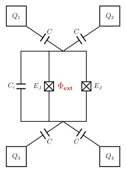
<figcaption class="paper-figure-caption"><b>Fig 2.</b> FIG. 2. Layout of a dc-SQUID as a multi-qubit coupler ca- pacitively coupled to four transmon qubits. C are the cou- pling capacitances between the coupler and the qubits (Q1- Q4). The SQUID loop consists two junctions in parallel with Josephson energies EJ each. The SQUID is shunted by a ca- pacitance Cc. The flux-loop of the SQUID can be tuned by an external flux Φext.</figcaption>
</figure>
<figure class="paper-figure-card">
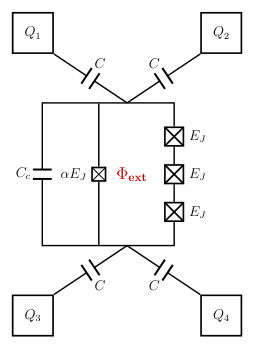
<figcaption class="paper-figure-caption"><b>Fig 3.</b> FIG. 3. Layout of a SNAIL as a multi-qubit coupler capaci- tively coupled to four transmon qubits. C are the coupling ca- pacitances between the coupler and the qubits (Q1-Q4). The SNAIL loop consists of three big junctions with a Josephson energies EJ each and a smaller Josephson junction with en- ergy αEJ. The SNAIL is shunted by a capacitance Cc. The flux-loop of the SNAIL can be tuned by an external flux Φext.</figcaption>
</figure>
<figure class="paper-figure-card">
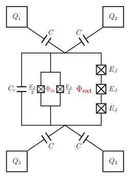
<figcaption class="paper-figure-caption"><b>Fig 4.</b> FIG. 4. To access the different regimes of the SNAIL, depending on the parameter ratio α of the smaller junction, we make the α tunable by using a SQUID-loop, that can be tuned by a time- independent pulse to tune the α from 0 to 1.</figcaption>
</figure>
<figure class="paper-figure-card">
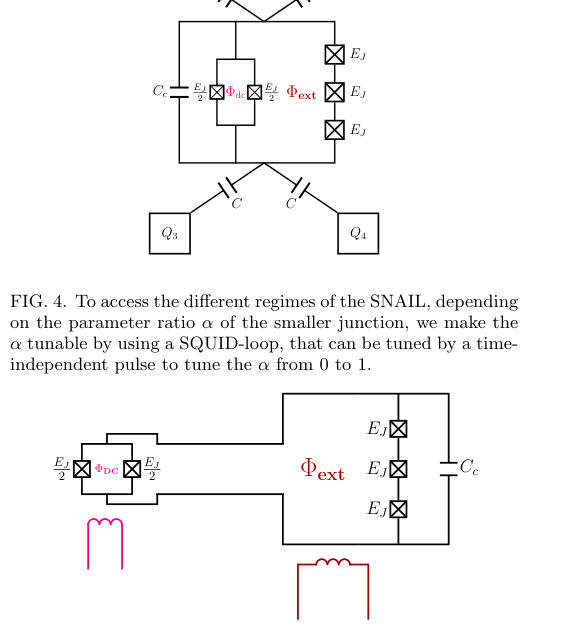
<figcaption class="paper-figure-caption"><b>Fig 5.</b> FIG. 5. More realistic layout of the tunable SNAIL. Both flux loops should have a spacial separation to avoid flux-crosstalk.</figcaption>
</figure>

**Summary.** The paper investigates using parametrically driven multi-qubit couplers (like SNAIL) to achieve high-connectivity gate operations on superconducting qubits. By analyzing the system Hamiltonian, the authors demonstrate methods to selectively activate two-qubit ($\sqrt{	ext{iSWAP}}$) and three-qubit gates across non-adjacent qubit pairs. This advances quantum computing hardware by providing pathways for complex interactions needed for quantum simulation.

**Why it may be interesting.** This work directly addresses hardware limitations in superconducting quantum computing by engineering complex, tunable interactions necessary for advanced algorithms and simulations like Lattice Gauge Theories.

Detailed structure

**Main problem.** The primary challenge is enhancing connectivity and achieving high-fidelity quantum gates (two-qubit, three-qubit) in superconducting processors beyond nearest-neighbor interactions.

**Main result.** Multi-qubit couplers, such as the SNAIL circuit, enable all-to-all coupling within a plaquette, demonstrating $\sqrt{	ext{iSWAP}}$ and three-qubit gates with fidelities reaching 95% or higher.

**Method.** The study employs numerical and analytical analysis of parametrically driven Hamiltonians, utilizing techniques like the Jacobi-Anger expansion to model time-dependent coupling strengths.

**Model / system.** The system consists of superconducting transmon qubits coupled via tunable multi-qubit couplers (dc-SQUID or SNAIL). The Hamiltonian is controlled by external flux and AC driving fields to selectively activate desired interactions.

**Key observables.** Gate fidelity ($F$), gate time ($t_{	ext{gate}}$), resonance spread ($\Delta\omega$), and coupling strengths ($g_{12}, g_{123}$).

**Important parameters / regimes.** Asymmetry parameter ($\alpha$), external flux bias ($\phi_{	ext{dc}}$), drive amplitude ($\delta$), and qubit frequencies ($\omega_i$).

**Assumptions / limitations.** The analysis often involves truncating the Hilbert space or using time-averaged approximations, which can lead to discrepancies when compared to full simulations.

**Figures summary.** Figures illustrate circuit layouts (dc-SQUID, SNAIL), state population evolution during gate operations for various pairs/couplers, and plots showing coupling coefficients derived from Bessel functions.

**Paper structure.** The paper progresses by introducing the physical platform and connectivity challenge, detailing the Hamiltonian modeling using both SQUID and SNAIL couplers, deriving the effective interaction strengths via normal mode analysis, and finally presenting fidelity benchmarks for two-qubit and three-qubit gates relevant to quantum simulation.

Abstract

Superconducting quantum processors could significantly profit from enhanced connectivity together with precise control of interactions and gates between qubits. Here we investigate plaquettes of four qubits that are coupled via a central tunable coupling circuit, so that not only gates between qubits connected by an edge of the plaquette can be executed but also between qubits across the diagonal. By numerically and analytically analyzing parametrically driven processes, we explore $\sqrt{\text{iSWAP}}$-gates between any pair of qubits, also across the diagonal, as well as three-qubit interactions and gates. For experimentally available circuit parameters, we for example find $\sqrt{\text{iSWAP}}$-gates with a gate time of 50 ns and 99.9\% fidelity, which is decreased to 99.4\% if two such gates are executed in parallel on disjoint qubit pairs in the plaquette. For three-qubit gates we find fidelities of 95\% fidelity at a gate time of 200 ns.

[↑ back to top](#top)

### [QCI Connect: A Modular Full-Stack Quantum Computing Platform](http://arxiv.org/abs/2606.14456v1)

**Authors:** Eric Bertok, Hannes Busche, Florian Drinkler, David Emmanuel-Costa, Daniel Herr, Steffen Hien, Thomas Keitzl, Elisabeth Lobe, Alexandru Paler, Johannes Renkl, Martin Rymarz, Gary Schmiedinghoff, Peter K. Schuhmacher, Thomas Stehle, Benedikt Strobel, Hanna Tschakert, Adrian Vetter, Andre Waschk, Alexander Weinert, Lukas Windgätter  
**Type:** theory · **Category:** quantum information and computing · **PDF:** <https://arxiv.org/pdf/2606.14456v1>  
**Analysis basis:** full PDF text, analyzed in chunks
**Topic relevance:** `QC/QI experiment` **2/5** · `analog quantum simulation` **1/5** · `methods for driven-dissipative` **1/5** · `non-equilibrium dynamics` **1/5**

↔ Scroll figures horizontally

<figure class="paper-figure-card">

<figcaption class="paper-figure-caption"><b>Fig 1.</b> Figure 1: High-level overview of QCI Connect. The software stack serves as a quantum computing gateway for users from academia and industry, within and out- side DLR. Major challenges lie in the simultaneous orchestration, scheduling, compilation, and data management for a wide array of simulators and hard- ware architectures with vendor-specific stacks. The four pink components in the top-right corner form QCI Connect SDK and are described in more detail in Section 6. The cross-layer concerns of error mitigation communicate between all layers. Benchmarking will be addressed in the future.</figcaption>
</figure>
<figure class="paper-figure-card">
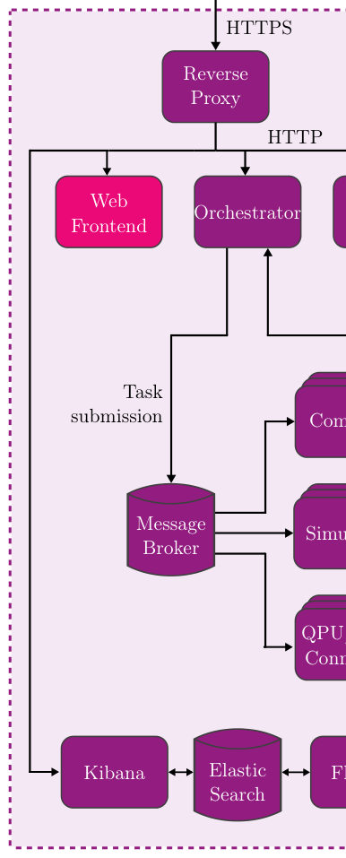
<figcaption class="paper-figure-caption"><b>Fig 2.</b> Figure 2: High-level architecture of QCI Connect, showing the containerised service stack hosted on a dedicated virtual machine inside the DLR network. User requests are routed through a reverse proxy to the frontend, orchestrator, and iden- tity broker. The orchestrator manages asynchronous task execution through a message broker and dedicated worker services for compilation, simulation, and QPU or HPC access, with persistent storage, centralised logging, and integra- tions with external identity, QPU, and HPC systems.</figcaption>
</figure>
<figure class="paper-figure-card">
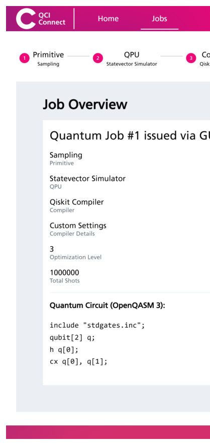
<figcaption class="paper-figure-caption"><b>Fig 3.</b> Figure 3: Screenshot of the overview of a quantum job prior to its submission via the GUI of the QCI Connect web interface.</figcaption>
</figure>
<figure class="paper-figure-card">

<figcaption class="paper-figure-caption"><b>Fig 4.</b> Figure 4: Screenshot of the table of submitted quantum jobs in the QCI Connect web interface.</figcaption>
</figure>
<figure class="paper-figure-card">
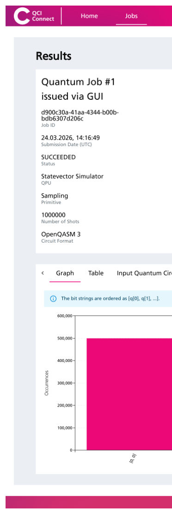
<figcaption class="paper-figure-caption"><b>Fig 5.</b> Figure 5: Screenshot of the visual representation of the quantum job results in the QCI Connect web interface. This page also includes the job specifications and more meta information, e.g., runtime details of the QPU.</figcaption>
</figure>

**Summary.** This paper introduces QCI Connect, a modular, full-stack quantum computing platform designed to overcome hardware fragmentation. It establishes a standardized architecture using an orchestrator and open interfaces to connect various QPUs and simulators. This allows domain experts to develop and run complex quantum applications regardless of the underlying physical quantum hardware.

**Why it may be interesting.** It provides a high-level software framework that abstracts hardware differences, which is crucial for any theoretical work aiming to test algorithms on diverse physical platforms without rewriting the core logic.

Detailed structure

**Main problem.** The fragmentation and lack of standardization across various competing quantum computing architectures and software stacks hinder the ability to bring the full power of quantum hardware to domain experts via the cloud.

**Main result.** QCI Connect provides a reference, modular, full-stack architecture that unifies disparate quantum hardware by separating concerns into distinct, standardized layers connected via open interfaces.

**Method.** The platform employs a layered, service-oriented, and containerized architecture utilizing an orchestrator, message broker (Redis), and canonical representations like OpenQASM to manage job workflows across heterogeneous resources.

**Model / system.** The system is QCI Connect, a full-stack platform designed to integrate various QPUs (e.g., trapped ions, neutral atoms) and HPC systems via standardized connectors and an orchestrator service.

**Key observables.** QPU status/occupation, job submission/result retrieval, and custom benchmark statistics like runtime and convergence metrics.

**Important parameters / regimes.** Job priority flags (low, medium, high); the canonical format subset of OpenQASM 3 used for internal communication.

**Assumptions / limitations.** The design assumes that new components adhere to agreed system interfaces and task schemas for seamless integration; current hardware limitations restrict dynamic classical control within the canonical format.

**Figures summary.** Figures illustrate the high-level architecture showing interaction between Physical, System, and Application Layers (Fig 1), component interconnections (Fig 2), job submission workflow via GUI/SDK (Figs 3-5), and the SDK's internal structure (Fig 6).

**Paper structure.** The paper details the necessity of a unified stack, presents the layered architecture (Physical $
ightarrow$ System $
ightarrow$ Application), describes core components like the orchestrator and message broker, specifies standards like OpenQASM, and outlines developer tools via the SDK/ALF.

Abstract

In a world of various competing quantum computing architectures, hardware-agnostic, full-stack platforms are necessary to bring the full power of quantum computing hardware to domain experts via the cloud. QCI Connect and its Software Development Kit provide a reference architecture for a full-stack platform with a modular design and open-source interface definitions, built to facilitate a community-driven application ecosystem. Here, we present its overall design and features, central interfaces, and lessons learned, both for users of the platform and as a reference guide for future developments.

[↑ back to top](#top)

### [Universal Construction of Generalized Lyapunov Functions for Nonlinear Dynamical Systems Using Physics-Informed Neural Networks](http://arxiv.org/abs/2606.14174v1)

**Authors:** Z. C. Tu  
**Type:** theory · **Category:** statistical mechanics · **PDF:** <https://arxiv.org/pdf/2606.14174v1>  
**Analysis basis:** full PDF text, analyzed in chunks
**Topic relevance:** `Keldysh / 2PI / non-Gaussian methods` **1/5** · `correlated / nonlocal dissipation` **1/5** · `driven-dissipative phase transition` **1/5** · `methods for driven-dissipative` **1/5**

↔ Scroll figures horizontally

<figure class="paper-figure-card">
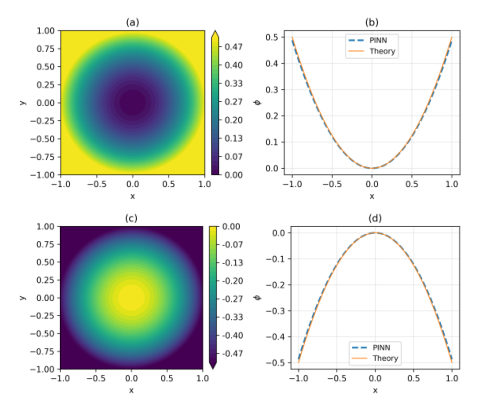
<figcaption class="paper-figure-caption"><b>Fig 1.</b> FIG. 1. Typical linear systems: (a) PINN-generated poten- tial landscape near a stable focus; (b) learned and theoretical potentials along the x axis for the stable focus; (c) PINN- generated potential landscape near an unstable focus; (d) learned and theoretical potentials along the x axis for the unstable focus.</figcaption>
</figure>
<figure class="paper-figure-card">
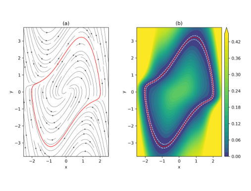
<figcaption class="paper-figure-caption"><b>Fig 2.</b> FIG. 3. Van der Pol oscillator: (a) Flow (arrows) and limit cycle (solid curve); (b) potential landscape.</figcaption>
</figure>
<figure class="paper-figure-card">
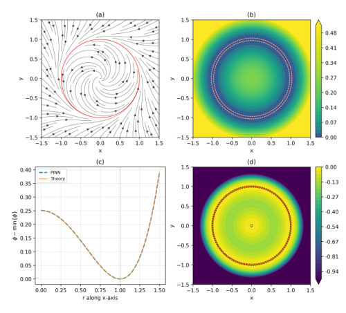
<figcaption class="paper-figure-caption"><b>Fig 3.</b> FIG. 2. Hopf normal form: (a) Flow (arrows) and limit cycle (a unit circle); (b) potential landscape; (c) radial profiles of the PINN-derived potential (dash line) and the exact poten- tial (solid line); (d) pattern of directional derivative of poten- tial with respect to the field.</figcaption>
</figure>
<figure class="paper-figure-card">
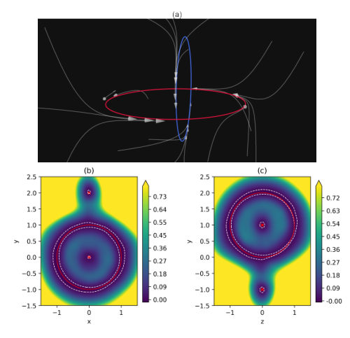
<figcaption class="paper-figure-caption"><b>Fig 4.</b> FIG. 4. 3D Hopf links: (a) Flow near two linked limit cycles; (b) potential landscape in the xy slice; (c) potential landscape in the zy slice.</figcaption>
</figure>

**Summary.** This paper introduces a Generalized Lyapunov Function (GLF) to characterize stability in complex nonlinear dynamical systems that lack simple gradient structures. They propose using Physics-Informed Neural Networks (PINNs) to learn this potential landscape by embedding physical constraints directly into the loss function. The method successfully demonstrates its utility across various non-gradient models, providing a powerful tool for analyzing system attractors.

**Why it may be interesting.** While focused on classical dynamics, the concept of constructing a global potential landscape via machine learning mirrors techniques used in finding effective Hamiltonians or energy functionals in open quantum systems where simple conservation laws are broken.

Detailed structure

**Main problem.** The primary challenge is constructing a global Lyapunov-type scalar potential landscape for nonlinear dynamical systems that are not gradient systems, which is crucial for understanding stability and transitions.

**Main result.** The authors successfully developed a data-free PINN framework to construct Generalized Lyapunov Functions (GLFs) that correctly map invariant sets to low-potential or constant-potential structures across various non-gradient flows.

**Method.** A Physics-Informed Neural Network (PINN) is employed, minimizing a loss function that embeds the Lyapunov inequality and a weak divergence-scale compatibility condition directly into the training process.

**Model / system.** The method is tested on canonical nonlinear systems including linear oscillators, the Hopf normal form, the van der Pol oscillator, and complex three-dimensional Hopf-link flows.

**Key observables.** The learned potential landscape ($\phi$), which must satisfy $\dot{\phi} \le 0$ along trajectories; invariant sets are characterized by constant or low potential values.

**Important parameters / regimes.** Weighting factors ($w_d \ll w_p \simeq w_0$) used in the total loss function to balance monotonicity enforcement against divergence constraints.

**Assumptions / limitations.** The method is designed to be data-free and does not assume the underlying vector field is close to a gradient system, though selecting appropriate weights is critical for convergence.

**Figures summary.** Figures illustrate PINN-generated landscapes and profiles for linear systems (stable/unstable foci), the Hopf normal form showing potential geometry, and results for the van der Pol oscillator and 3D linked cycles.

**Paper structure.** The paper introduces the GLF concept to unify various potentials, proposes the data-free PINN methodology with its specific loss terms ($L_{Lyap}, L_{zero}, L_{div}$), and then validates this framework by applying it sequentially to increasingly complex non-gradient systems.

Abstract

A scalar potential landscape is one of the most useful ways to understand the stability and transition of a dynamical system. For non-gradient dynamics, however, the construction of a global Lyapunov-type scalar for nonlinear flows with recurrent structures remains a major obstacle. We introduce the generalized Lyapunov function, a scalar function that is non-increasing along deterministic trajectories, as a unifying notion of nonequilibrium potential. Ordinary Lyapunov functions, Freidlin--Wentzell quasi-potentials, and Ao-type potentials are recovered as special representatives. We then propose a data-free physics-informed neural-network framework in which the Lyapunov inequality and a weak divergence-scale compatibility condition are directly embedded into the loss function. The method is tested on linear systems, the Hopf normal form, the van der Pol oscillator, and a three-dimensional Hopf-link flow with two linked limit cycles. The learned landscapes agree with available analytical benchmarks and reveal the invariant sets as low-potential or constant-potential structures, providing a practical route to potential-landscape construction for nonlinear non-gradient systems.

[↑ back to top](#top)

### [Bond-operator analytical approach for the $t$-$J$ model](http://arxiv.org/abs/2606.14374v1)

**Authors:** A. V. Syromyatnikov  
**Type:** theory · **Category:** strongly correlated electrons · **PDF:** <https://arxiv.org/pdf/2606.14374v1>  
**Analysis basis:** full PDF text, analyzed in chunks
**Topic relevance:** `Keldysh / 2PI / non-Gaussian methods` **1/5** · `Kondo & dissipative impurity` **1/5** · `analog quantum simulation` **1/5**

↔ Scroll figures horizontally

<figure class="paper-figure-card">
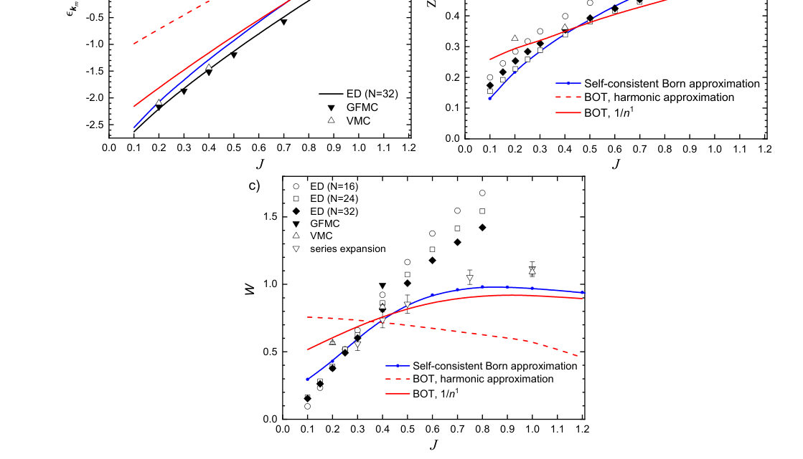
<figcaption class="paper-figure-caption"><b>Fig 1.</b> FIG. 1: a) Ground state energy of the t–J model on the square lattice with one hole counted from the energy of the system without holes (which is given by the spectrum of the magnetic polaron ϵk in its minimum at k = km = (π/2, π/2)) found using exact diagonalization (ED) of a cluster containing N = 32 sites (the data are fitted by the formula −3.24 + 2.65J0.72)19, the self-consistent Born approximation (SCBA) on 16 × 16 cluster (the data are fitted accurately by J −3.23 + 2.94J0.702),20 the Green’s function Monte Carlo (GFMC) technique,21–23 variational Monte Carlo (VMC) method,24 and in the BOT (present study). b) Spectral weight Zk=km of the polaron in the electron Green’s function. c)...</figcaption>
</figure>
<figure class="paper-figure-card">
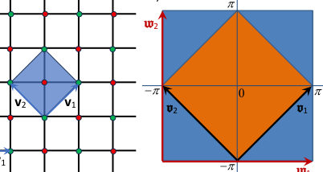
<figcaption class="paper-figure-caption"><b>Fig 2.</b> FIG. 2: (a) Square lattice with two sites in the unit cell highlighted in color. Also shown are corresponding translation vectors v1,2 as well as translation vectors w1,2 of the square lattice. (b) Brillouin zones corresponding to v1,2 (smaller square with respective translation vectors v1,2) and w1,2 (larger square with respective translation vectors w1,2). The distance between nearest lattice sites is set to be equal to unity.</figcaption>
</figure>
<figure class="paper-figure-card">
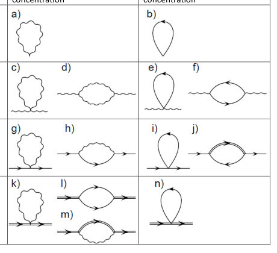
<figcaption class="paper-figure-caption"><b>Fig 3.</b> FIG. 3: Diagrams giving corrections of the first order in 1/n to the ground state energy, the staggered magnetization, and to self-energy parts (SEPs) of magnons, the amplitude mode, one-holon fermions, and two-holon bosons. Wavy lines denote magnon and/or Higgs mode. Straight and double straight lines stand for Green’s functions of one-holon fermions and two-holon bosons, respectively.</figcaption>
</figure>
<figure class="paper-figure-card">
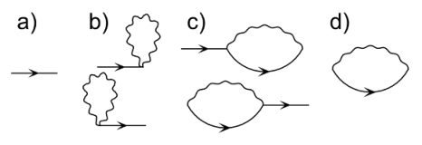
<figcaption class="paper-figure-caption"><b>Fig 4.</b> FIG. 4: Diagrams giving corrections of the first order in 1/n to electron Green’s function (36) at zero concentration of holes. As in Fig. 3, wavy lines denote magnon and/or Higgs mode and straight lines stand for fermions Green’s functions.</figcaption>
</figure>
<figure class="paper-figure-card">
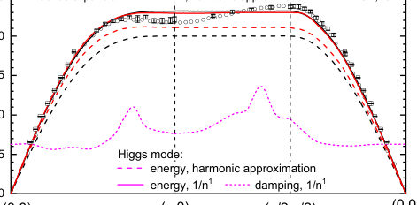
<figcaption class="paper-figure-caption"><b>Fig 5.</b> FIG. 5: Spectra in units of J of magnetic elementary excitations, magnons and the amplitude (Higgs) mode, in t–J models at zero concentration of holes found using the proposed bond-operator technique (BOT). Also shown are magnon spectra obtained by series expansion around the Ising limit31, within the spin-wave theory (SWT), and neutron scattering experiment in a molecular compound abbreviated as CFTD32,33 which is described well by spin- 1</figcaption>
</figure>

**Summary.** This paper introduces the Bond-Operator Theory (BOT) as an analytical framework to study the strongly correlated $t$-$J$ model. By reformulating electron operators using localized spins and holon fermions, BOT systematically expands physical quantities in powers of $1/n$. The theory successfully reproduces key magnetic and superconducting properties, showing strong quantitative agreement with state-of-the-art numerical simulations.

**Why it may be interesting.** While focused on condensed matter magnetism/superconductivity, the use of an advanced operator formalism that systematically handles constraints and provides a controlled series expansion is valuable for theoretical physics dealing with complex many-body Hamiltonians.

Detailed structure

**Main problem.** The paper aims to develop an analytical, constraint-free theory for the $t$-$J$ model, which is crucial for understanding high-temperature superconductivity in cuprates.

**Main result.** The Bond-Operator Theory (BOT) provides a systematic expansion in powers of $1/n$, yielding quantitative agreement with advanced numerical methods for ground state energy and excitation spectra.

**Method.** The core method is the Bond-Operator Theory, which reformulates electron operators using localized spins and mobile holon Fermi-operators to eliminate physical constraints inherent in simpler models.

**Model / system.** The system studied is the one-band $t$-$J$ model on a square lattice, described by an effective Hamiltonian involving hopping ($t$) and exchange coupling ($J$). The theory handles both magnetically ordered and disordered phases.

**Key observables.** Ground state energy, staggered magnetization, magnon spectra, polaron spectrum, and two-hole bound state binding energies.

**Important parameters / regimes.** The expansion parameter is $1/n$, where $n$ relates to the maximum number of quasiparticles per unit cell. The model parameters are $t$ and $J$.

**Assumptions / limitations.** The primary assumption is that physical quantities can be expanded as a regular series in powers of $1/n$; however, the first-order expansion is noted to be insufficient for full quantitative accuracy.

**Figures summary.** Figures compare calculated spectra (magnons, polarons) and spectral weights using BOT against results from Self-Consistent Born Approximation (SCBA), Exact Diagonalization (ED), and Green's Function Monte Carlo (GFMC).

**Paper structure.** The paper introduces the BOT formalism by mapping electron operators to spin/holon operators, derives the effective Hamiltonian, calculates observables via diagrammatic expansion in $1/n$, and compares results for various excitations (magnons, polarons) against established numerical benchmarks.

Abstract

We present a bond-operator theory (BOT) for analytical consideration of the $t$-$J$ model and its extensions with longer-rage hopping terms. This technique is based on previously suggested representation of electron operators via localized spins 1/2 and spinless Fermi-operators of mobile holons which requires no constraint between them. We introduce a representation of operators of spins, holons, and electrons in (extended) unit cell containing several lattice sites via a zoo of Bose- and Fermi-operators acting in the Hilbert space of all quantum states of the whole unit cell. BOT provides a regular expansion of physical quantities in powers of $1/n$ using conventional diagrammatic technique, where $n\ge1$ is the maximum number of introduced quasiparticles (bosons and fermions) which can occupy a unit cell. The suggested representation reproduces commutation algebra of all operators at any $n>0$ and allows to consider both magnetically ordered and disordered phases. Some elementary excitations described in the BOT by separate bosons or fermions appear in common approaches as bound states of conventional quasiparticles. In particular, there are two-hole bound states (Cooper pairs of two holes) which are described within the BOT by separate bosons. We discuss in detail properties of the $t$-$J$ model on the square lattice with no more than two holes (polarons). Although the expansion parameter $1/n$ is not small in the physically meaningful case of $n=1$, we obtain a good quantitative agreement with previous numerical findings at $n=1$ even in the first order in $1/n$ after taking into account a few simple diagrams. Self-consistent calculations in the first order in $1/n$ bring our results to a very good quantitative agreement with previous numerical findings of the ground state energy, staggered magnetization, and spectra of magnons, polarons, and lowest-energy two-hole bound states.

[↑ back to top](#top)

### [Resurgence of the Thermal Transition between Bounce and Sphaleron](http://arxiv.org/abs/2606.13778v1)

**Authors:** Shaun D. Hampton, Kyungsun Lee, Sungjay Lee  
**Type:** theory · **Category:** statistical mechanics · **PDF:** <https://arxiv.org/pdf/2606.13778v1>  
**Analysis basis:** full PDF text, analyzed in chunks
**Topic relevance:** `Keldysh / 2PI / non-Gaussian methods` **1/5** · `driven-dissipative phase transition` **1/5** · `methods for driven-dissipative` **1/5**

↔ Scroll figures horizontally

<figure class="paper-figure-card">
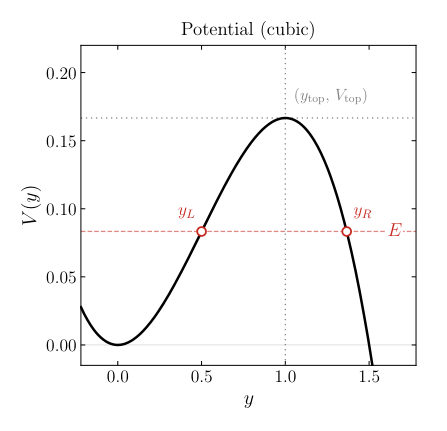
<figcaption class="paper-figure-caption"><b>Fig 1.</b> Figure 1: The two metastable potentials. Left: the cubic potential (20), with metastable minimum at y = 0 and barrier top at (ytop, Vtop) = (1, 1/6). Right: the quintic potential (21), with metastable minimum at y = 0 and barrier top at (ytop, Vtop) ≃(0.311, 8.30 × 10−3).</figcaption>
</figure>
<figure class="paper-figure-card">
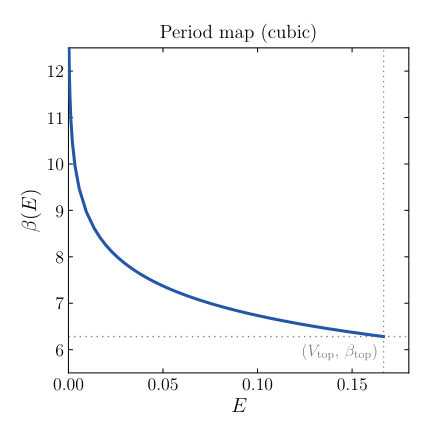
<figcaption class="paper-figure-caption"><b>Fig 2.</b> Figure 2: Period maps β(E) of the two models. Left (cubic): β(E) de- creases monotonically from infinity at the false vacuum to the harmonic limit (Vtop, βtop) = (1/6, 2π). Right (quintic): β(E) is non-monotone, de- scending past the harmonic limit (Vtop, βtop) ≃(8.30 × 10−3, 12.13) to the fold bifurcation (Ebif, βbif) ≃(3.82 × 10−3, 11.16) and rising back to βtop.</figcaption>
</figure>
<figure class="paper-figure-card">
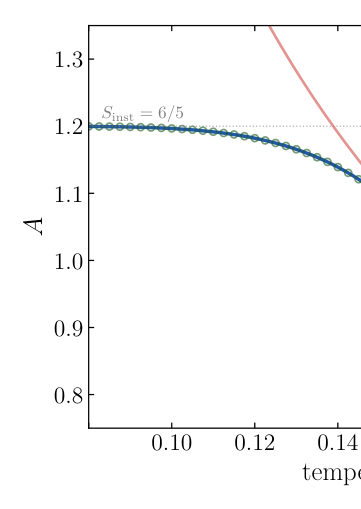
<figcaption class="paper-figure-caption"><b>Fig 3.</b> Figure 3: Cubic potential. Borel singularity A(T) compared with the clas- sical sphaleron action βVtop and bounce action Sb(T). The two branches join tangentially at Tc = Ttop = (2π)−1 ≈0.159.</figcaption>
</figure>
<figure class="paper-figure-card">
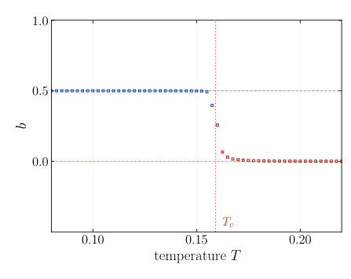
<figcaption class="paper-figure-caption"><b>Fig 4.</b> Figure 4: Cubic potential. Left: characteristic exponent b(T) against the theoretical values 0 and 1/2 (dashed). Right: Stokes ratio S/Sth, near unity away from Tc on both sides and dipping near Tc.</figcaption>
</figure>
<figure class="paper-figure-card">
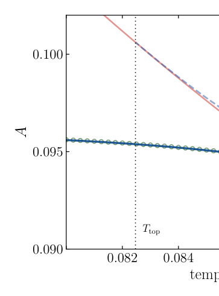
<figcaption class="paper-figure-caption"><b>Fig 5.</b> Figure 5: Quintic potential. Borel singularity A(T), compared with the classical sphaleron action βVtop and the dominant bounce action Sb(T), which cross transversally at Tc ≃0.0878. The dashed branch is the sub- dominant bounce, present between Ttop and Tbif.</figcaption>
</figure>

**Summary.** This paper uses Borel resurgence theory to analyze the thermal transition between two competing vacuum decay mechanisms: the bounce (quantum tunneling) and the sphaleron (thermal barrier crossing). By analyzing high-order perturbative expansions of the free energy, the authors successfully determine the critical temperature and whether the transition is first or second order for specific potential models. This demonstrates a powerful technique to extract non-perturbative physics without relying on traditional semiclassical approximations.

**Why it may be interesting.** The methodology provides a powerful, purely perturbative route to calculate non-perturbative quantities like tunneling rates and critical temperatures, which is highly valuable in understanding phase transitions in quantum field theory or condensed matter systems where semiclassical methods are traditionally used.

Detailed structure

**Main problem.** The study investigates the thermal transition between two competing non-perturbative saddle points—the bounce (tunneling) and the sphaleron (thermal jump)—in a quantum system with a metastable vacuum.

**Main result.** The Borel resurgence analysis successfully determines the transition temperature, order (second or first), and one-loop prefactors purely from high-order perturbative expansions, without needing semiclassical inputs.

**Method.** The core method involves calculating the perturbative expansion of the thermal free energy and extracting non-perturbative information by analyzing its Borel singularity data $(A, b, S)$.

**Model / system.** The analysis is performed on quantum mechanical systems with metastable potentials, specifically modeling cases leading to second-order (cubic potential) and first-order (quintic potential) phase transitions.

**Key observables.** Thermal free energy $F(eta)$, Borel singularity location ($A$), characteristic exponent ($b$), and Stokes constant ($S$).

**Important parameters / regimes.** Temperature ($T$ or $eta$), the transition temperature ($T_c$), and the coupling/potential parameters defining the specific models.

**Assumptions / limitations.** The analysis relies on treating the weak-coupling expansion as a semi-classical approximation and assumes that Borel resurgence theory can fully encode the non-perturbative physics across the transition.

**Figures summary.** Figures compare the extracted Borel singularity $A(T)$ against classical saddle actions, showing smooth joining for second-order transitions and clear kinks/crossings for first-order transitions in the quintic model.

**Paper structure.** The paper systematically applies Borel resurgence to compute high-order coefficients of the free energy. It then analyzes how the extracted parameters $(A, b, S)$ characterize the nature (second vs. first order) and location ($T_c$) of the thermal transition between the bounce and sphaleron saddle points for different potentials.

Abstract

We study the thermal transition between the bounce and the sphaleron in quantum mechanics with a metastable vacuum from the viewpoint of Borel resurgence. For two models representing a second-order and a first-order transition, we compute the perturbative expansion of the thermal free energy to high orders and extract the leading Borel singularity data $(A,b,S)$ as functions of temperature. The Borel singularity location $A$ reproduces the on-shell action of the dominant saddle on both sides of the transition, joining smoothly in the second-order case and developing a kink in the first-order case. The characteristic exponent $b$ jumps between $0$ and $1/2$ across the transition, counting the zero modes of the corresponding saddle. The Stokes constant $S$ matches the one-loop determinant around the saddle. The perturbative expansion around the false vacuum thus determines the transition temperature, the order of the transition, and the decay rate including the one-loop prefactor without relying on semiclassical inputs.

[↑ back to top](#top)

### [Spin disorder competing with positional symmetry breaking governs the metal-insulator behavior in oxide paramagnets](http://arxiv.org/abs/2606.14624v1)

**Authors:** Jia-Xin Xiong, Xiuwen Zhang, Alex Zunger  
**Type:** theory · **Category:** other · **PDF:** <https://arxiv.org/pdf/2606.14624v1>  
**Analysis basis:** full PDF text, analyzed in chunks
**Topic relevance:** `analog quantum simulation` **1/5** · `exotic spin models in light-matter` **1/5** · `spintronics-quantum-optics interface` **1/5**

↔ Scroll figures horizontally

<figure class="paper-figure-card">
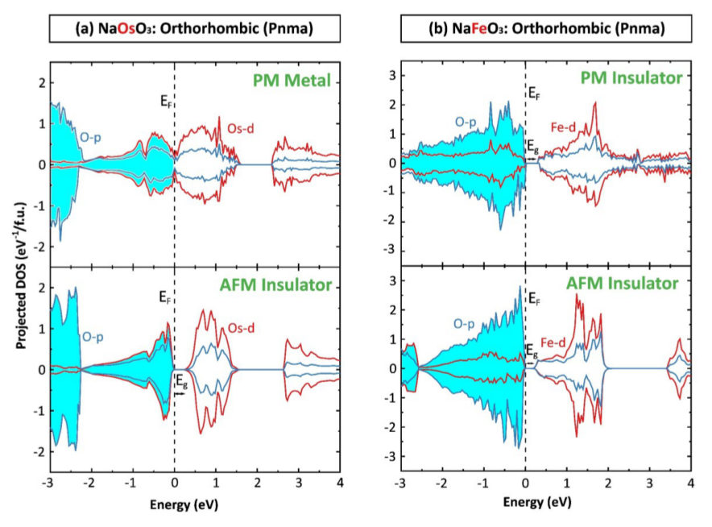
<figcaption class="paper-figure-caption"><b>Fig 1.</b> Figure 1. DFT-calculated projected density of states of PM and AFM phases of (a) NaOsO3 and (b) NaFeO3 that have the orthorhombic crystallographic structures (Pnma). Both AFM phases are insulating, but the PM NaOsO3 is metallic while the PM NaFeO3 is insulating.</figcaption>
</figure>
<figure class="paper-figure-card">

<figcaption class="paper-figure-caption"><b>Fig 2.</b> Figure 2 shows the distribution of local magnetic moments in PM and AFM phases of NaOsO3 and NaFeO3. Although the net total magnetization is zero, there exists non-zero local magnetic moments in both PM and AFM phases. The distribution of magnetic moments in PM phases cannot be mimicked by the nonmagnetic phases that are often assumed in many works [13– 16,27,28] on transition-metal oxides in the view of strong correlation as the exclusive factor.</figcaption>
</figure>
<figure class="paper-figure-card">
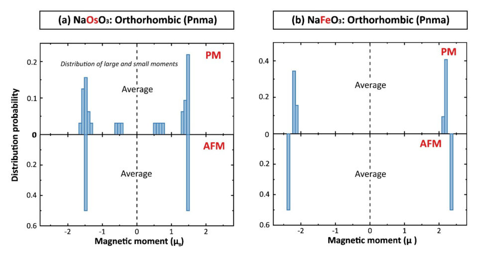
<figcaption class="paper-figure-caption"><b>Fig 3.</b> Figure 2. DFT-calculated normalized distribution probability of local magnetic moments in PM and AFM phases of (a) NaOsO3 and (b) NaFeO3 that have the orthorhombic crystallographic structures (Pnma). The vertical dashed lines show the average of all local magnetic moments being zero. All the bin widths of local magnetic moments are set to be 0.08 𝜇𝐵.</figcaption>
</figure>
<figure class="paper-figure-card">
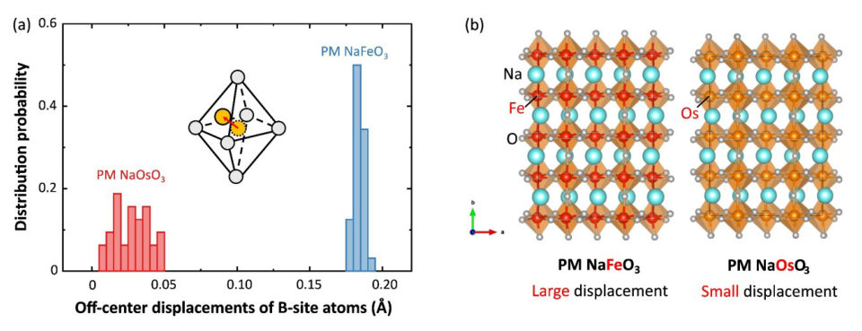
<figcaption class="paper-figure-caption"><b>Fig 4.</b> Figure 3. (a) Normalized distribution probability of the octahedral off-center displacements of B-site atoms in PM phases of NaOsO3 and NaFeO3 with (b) orthorhombic crystallographic structures (Pnma). Both PM structures are</figcaption>
</figure>
<figure class="paper-figure-card">
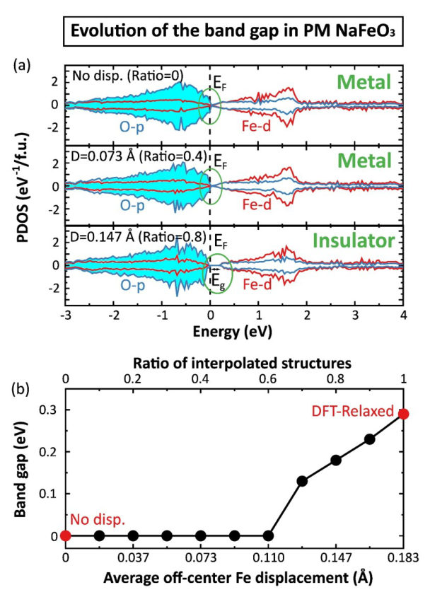
<figcaption class="paper-figure-caption"><b>Fig 5.</b> Figure 4. Evolution of the band gap in PM NaFeO3: (a) Density of states and (b) PM band gap as a function of average off-center Fe displacement at different ratios of linear interpolated structures. The two red points in (b) represent the two ending points of structures that are used for the basis of linear interpolation.</figcaption>
</figure>

**Summary.** This work develops a general theoretical framework using symmetry-broken DFT to explain metal-insulator transitions in paramagnetic transition-metal oxides. It shows that the electronic state depends critically on the competition between spin disorder and atomic positional displacements, successfully distinguishing why $	ext{NaFeO}_3$ is insulating while $	ext{NaOsO}_3$ is metallic.

**Why it may be interesting.** While focused on solid-state physics, the concept of emergent electronic behavior arising from competing structural/magnetic degrees of freedom (disorder) is relevant to understanding complex quantum many-body systems where multiple order parameters compete.

Detailed structure

**Main problem.** The study aims to determine the fundamental physical mechanism governing whether the high-temperature paramagnetic (PM) phase of transition-metal oxide paramagnets is metallic or insulating.

**Main result.** The metal-insulator behavior in these PM phases is governed by a competition between spin disorder (local moment distribution) and positional symmetry breaking (atomic displacements).

**Method.** Symmetry-broken Density-Functional Theory (DFT) calculations are employed to model the electronic structure of both insulating and metallic states.

**Model / system.** The research focuses on transition-metal oxides, specifically comparing $	ext{NaFeO}_3$ (insulating PM phase) and $	ext{NaOsO}_3$ (metallic PM phase). Calculations utilize spin special-quasirandom structures to model disorder without assuming long-range order.

**Key observables.** Band gap size ($	ext{eV}$), local magnetic moment distribution, and magnitude of off-center atomic displacements ($	ext{\AA}$).

**Important parameters / regimes.** The competition between spin disorder strength and the degree of positional polymorphism is key; strong correlation effects are explicitly avoided.

**Assumptions / limitations.** The approach avoids invoking strong electronic correlations by using DFT methods that model symmetry breaking via configurational averaging (spin-SQS).

**Figures summary.** Figures illustrate the DOS, showing gap closing for $	ext{NaOsO}_3$ and gap opening/insulating behavior for $	ext{NaFeO}_3$, correlating these changes with moment distributions and atomic displacements.

**Paper structure.** The paper establishes the problem by contrasting insulating vs. metallic PM phases in oxides. It then develops a general framework based on analyzing how spin disorder interacts with positional symmetry breaking, using DFT calculations on specific examples ($	ext{NaFeO}_3$ vs $	ext{NaOsO}_3$) to validate this competition.

Abstract

Numerous transition-metal oxides have low-temperature antiferromagnetic (AFM) states and high-temperature paramagnetic (PM) phases, where the AFM state is usually insulating while the PM phase can be either insulating or metallic. Without involving strong correlation, we use symmetry-broken density-functional theory (DFT) to obtain the PM phases of insulating NaFeO3 vs the recently discovered metallic NaOsO3. We develop the understanding of insulating and metallic behaviors in paramagnetic oxides by analyzing the interactions between magnetic and positional symmetry breaking: The insulating gap is governed by the competition between the spin disorder that induces a distribution of different magnitudes of local magnetic moments and the polymorphous distribution of off-center atomic displacements. NaFeO3, on the other hand, has large positional displacement with small spin-disorder-induced moments distribution, leading to insulating PM phase, whereas NaOsO3 has a pronounced spin-disorder-induced moments distribution that forces the PM phase to become metallic. Our work identifies this symmetry-breaking competition as a general framework to bridge seemingly disparate metal-insulator behaviors in transition-metal oxides paramagnets without invoking strong correlation.

[↑ back to top](#top)

### [Efficient Simulation of Szegedy Quantum Walk Formulations and Algorithms](http://arxiv.org/abs/2606.14226v1)

**Authors:** Sergio A. Ortega, Daniel K. Park  
**Type:** theory · **Category:** numerical methods · **PDF:** <https://arxiv.org/pdf/2606.14226v1>  
**Analysis basis:** full PDF text, analyzed in chunks
**Topic relevance:** `methods for driven-dissipative` **1/5** · `non-equilibrium dynamics` **1/5**

↔ Scroll figures horizontally

<figure class="paper-figure-card">
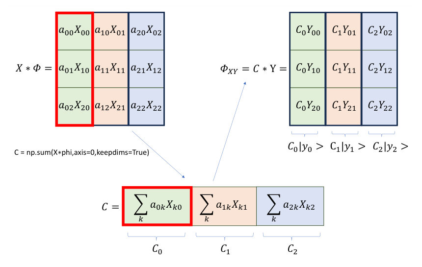
<figcaption class="paper-figure-caption"><b>Fig 1.</b> Figure 1. Expansion-recomposition example for a graph with N = 3 nodes. For the expansion in the set of states |xi⟩, the coefficients are calculated by the element-wise multiplication of the matrix X and the matrix state Φ, and then adding over the rows. For the recomposition on a set of states |yi⟩, the coefficients vector C is multiplied element-wise with each row of the matrix Y .</figcaption>
</figure>
<figure class="paper-figure-card">
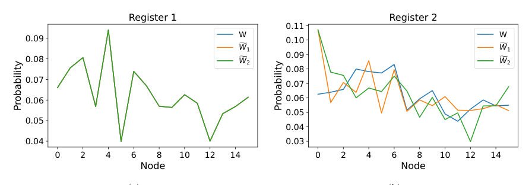
<figcaption class="paper-figure-caption"><b>Fig 2.</b> Figure 2. Probability distributions of different Szegedy walk formulations on a random graph with N = 16 nodes after 5 time steps, measuring (a) the first register, and (b) the second register. The results are the same for the first register, whereas for the second register the results depend on the particular implementation of the update operator V .</figcaption>
</figure>
<figure class="paper-figure-card">
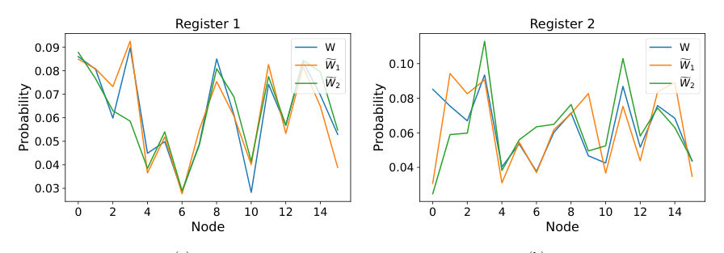
<figcaption class="paper-figure-caption"><b>Fig 3.</b> Figure 3. Probability distributions of different Szegedy walk formulations on a random graph with N = 16 nodes after 5 time steps, where the walk is performed with a different Markov chain at each step. The results are obtained by measuring (a) the first register, and (b) the second register. The results for both registers are different, indicating that they depend on the particular implementation of the update operator V .</figcaption>
</figure>
<figure class="paper-figure-card">
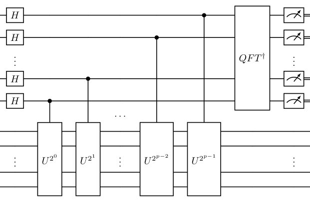
<figcaption class="paper-figure-caption"><b>Fig 4.</b> Figure 4. Quantum circuit for the quantum phase estimation algorithm. For a graph with N = 2n, each of the two registers of the Szegedy walk requires n qubits, so that the walk register as a whole requires 2n qubits. The unitary operator U in the circuit represents in a generic form any walk evolution operator of the ones described along the paper, and the state |ϕ⟩ represents an arbitrary walk state as in equation (19). When this is an eigenstate of U with eigenvalue eiθ, the measurement in the phase register provides a p-bit approximation of the quantity 2pθ/2π. If the state |ϕ⟩is a linear combination of eigenstates, then different phases can be obtained with probabilities provided by...</figcaption>
</figure>
<figure class="paper-figure-card">
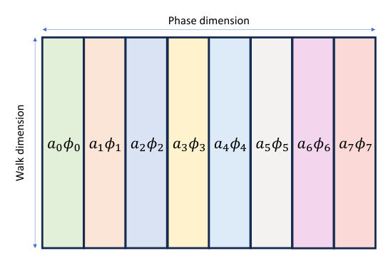
<figcaption class="paper-figure-caption"><b>Fig 5.</b> Figure 5. Matrix representation of an arbitrary state |ξ⟩of the form in (37). Each column corresponds to a walk state |ϕx⟩. In the example, the phase register has p = 3 qubits, so that there are 23 = 8 walk states.</figcaption>
</figure>

**Summary.** The paper presents a highly efficient classical simulation framework for Szegedy quantum walks and related algorithms. It bypasses the need to construct massive unitary matrices by decomposing evolution into fundamental operator actions like updates and reflections. This allows researchers to numerically study complex quantum processes, such as search and annealing, on large graphs.

**Why it may be interesting.** This work provides concrete, scalable computational tools for simulating quantum dynamics that are otherwise intractable due to exponential Hilbert space size, bridging theoretical quantum algorithm design with practical numerical implementation.

Detailed structure

**Main problem.** Developing efficient classical simulation methods for Szegedy quantum walks and related phase-estimation algorithms that avoid constructing large, explicit unitary evolution operators.

**Main result.** The framework achieves optimal O(N^2) complexity for dense graphs and linear scaling with edges for sparse graphs by simulating fundamental update and reflection operators directly.

**Method.** Simulation relies on expressing the walk evolution using fundamental operators (Update $V$, Reflection $R_0$) and employing techniques like expansion-recomposition or working in a reduced subspace representation for sparse graphs. Quantum Phase Estimation (QPE) is used to implement amplitude amplification steps.

**Model / system.** The model is the Szegedy quantum walk on a graph with N nodes, operating in an $N^2$-dimensional Hilbert space. Applications include quantum simulated annealing and quantum search algorithms.

**Key observables.** Probability distributions of finding the system at marked nodes or measuring specific phases ($	heta$) during QPE.

**Important parameters / regimes.** Graph size (N), number of edges, simulation time steps, and precision limits related to QPE repetitions.

**Assumptions / limitations.** The update operator $V$ is not unique, but the framework shows consistency for certain measurements. For sparse graphs, a reduced subspace representation $\mathcal{H}_R$ is used, assuming all necessary operators map within this space.

**Figures summary.** Figures illustrate probability distributions over time steps and marked nodes for quantum search; diagrams show QPE circuits and the mathematical procedure of expansion-recomposition in the reduced vector space.

**Paper structure.** The paper progresses from defining the walk evolution using fundamental operators, detailing the numerical simulation techniques (especially for sparse graphs via subspace reduction), applying these methods to complex algorithms like QPE and amplitude amplification, and finally demonstrating results on search problems.

Abstract

Quantum walks provide a versatile framework for quantum algorithms across a wide range of applications. We develop efficient classical simulation methods for Szegedy quantum walks that avoid explicit construction of the full unitary evolution operator. Unlike previous approaches restricted to a particular walk formulation, our framework is built from fundamental update and reflection operators, enabling the simulation of a broader class of Szegedy walk formulations. We further extend these methods to phase-estimation-based algorithms coupled to the walk, including implementations suitable for large sparse graphs. The resulting methods achieve optimal $O(N^2)$ complexity for dense graphs with $N$ nodes. For sparse graphs, the computational cost scales linearly with the number of edges, which is $O(N)$ in many cases. We implement the framework in the Python package SQWLib and illustrate its capabilities through simulations of representative algorithms, including quantum simulated annealing and quantum search on graphs. These results provide a practical tool for studying Szegedy-walk-based algorithms numerically beyond purely analytical treatments.

[↑ back to top](#top)

### [SmoQyElPhQMC.jl: An open-source Julia package for efficient and scalable quantum Monte Carlo simulations of electron-phonon coupled models](http://arxiv.org/abs/2606.14425v1)

**Authors:** Benjamin Cohen-Stead, James Neuhaus, Kipton Barros, Thomas A. Maier, Steven Johnston  
**Type:** theory · **Category:** strongly correlated electrons · **PDF:** <https://arxiv.org/pdf/2606.14425v1>  
**Analysis basis:** full PDF text, analyzed in chunks
**Topic relevance:** `Frenkel-Kontorova` **1/5** · `Keldysh / 2PI / non-Gaussian methods` **1/5**

↔ Scroll figures horizontally

<figure class="paper-figure-card">
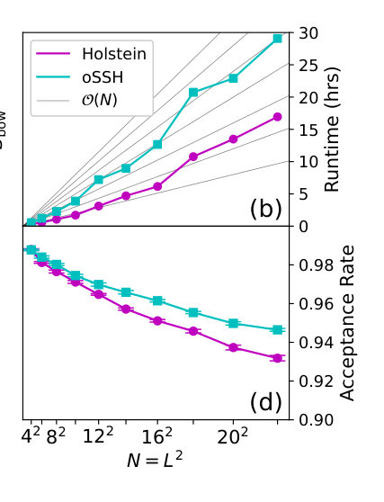
<figcaption class="paper-figure-caption"><b>Fig 1.</b> Figure 1: Simulation results for the Holstein and oSSH models on square lattices of size N = L2, for β t = 10, Ω/t = 0.5, µ = 0 (half-filling), and λh = 0.25 and λo = 0.36. Panel (a) displays the CDW and BOW structure factors measured in sim- ulations of the Holstein and oSSH model simulations, respectively. Panel (b) displays the runtime for simulations of each model (see text for details of the hardware). The thin lines in the background indicate functions of the form t = AN, where A is a constant, and serve as guides for the eye. Panel (c) displays the average number of CG iterations per solve during the simulation, averaged over both updates and measurements. Panel (d) displays the...</figcaption>
</figure>
<figure class="paper-figure-card">
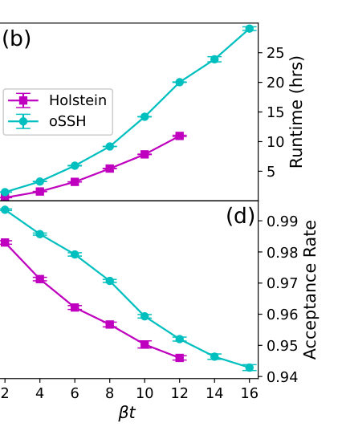
<figcaption class="paper-figure-caption"><b>Fig 2.</b> Figure 2: Results for simulations of Holstein and oSSH models on a N = 16 × 16 site square lattice at various inverse temperatures β, with Ω/t = 0.5 and µ = 0.0, and λh = 0.25 and λo = 0.36 in each model, respectively. Panel (a) displays the CDW and BOW structure factors measured in simulations of the Holstein and oSSH model simulations, respectively. Panel (b) displays the runtime for simulations of each model. Panel (c) displays the average number of CG iterations per solve during the simulation, averaged over both updates and measurements. Panel (d) displays the acceptance rate for the HMC updates in the simulations.</figcaption>
</figure>
<figure class="paper-figure-card">
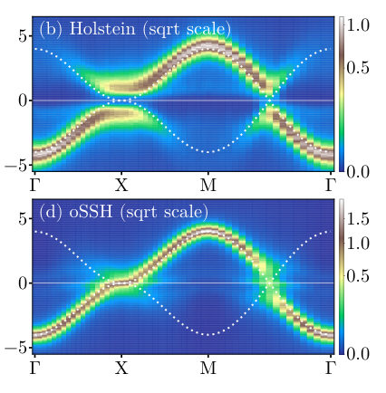
<figcaption class="paper-figure-caption"><b>Fig 3.</b> Figure 3: Single-particle electron spectral function A(k,ω) as a function of momen- tum k along a high symmetry cut through the Brillouin zone. Solid white lines at ω = Ef = 0 indicate the Fermi energy. The dashed white lines denote the non- interacting electron band, and its reflection about the Fermi energy Ef . All results are for a N = 36 × 36 square lattice at β t = 10.0 and phonon energies of Ω/t = 0.5. (a) The Holstein model spectral function A(k,ω) for λh = 0.25. (b) Holstein model spectral function plotted on a square-root scale to accentuate finer features. (c) The oSSH model spectral function A(k,ω) for λo = 0.36. (d) Optical SSH model spec- tral function plotted on a square-root...</figcaption>
</figure>

**Summary.** This work introduces an open-source Julia package, SmoQyElPhQMC.jl, designed for scalable Quantum Monte Carlo simulations of electron-phonon coupled models. By implementing advanced techniques like the Checkerboard Approximation and Kernel Polynomial Method preconditioning, it achieves near-linear scaling in system size and inverse temperature. The package is used to study phenomena such as charge density wave formation in canonical models like Holstein and oSSH.

**Why it may be interesting.** The development of highly efficient numerical tools like SmoQyElPhQMC.jl to tackle strongly coupled lattice dynamics is crucial for understanding emergent quantum phases relevant to superconductivity and charge ordering in condensed matter systems.

Detailed structure

**Main problem.** The primary goal is to perform efficient and scalable Quantum Monte Carlo (QMC) simulations for electron-phonon coupled models.

**Main result.** The package successfully enables near-linear scaling in system size and inverse temperature, allowing the study of CDW and BOW order formation in Holstein and oSSH models.

**Method.** It utilizes advanced QMC techniques, including Hybrid Quantum Monte Carlo (HQMC) updates combined with the Checkerboard Approximation (MSCHK) and Kernel Polynomial Method (KPM) preconditioning for linear scaling.

**Model / system.** The focus is on electron-phonon coupled Hamiltonians, specifically generalized spin-symmetric models like the Holstein model and the oSSH model. These systems involve coupling between itinerant electrons and lattice vibrations (phonons).

**Key observables.** Charge structure factor ($S_{cdw}$), bond order wave structure factor ($S_{bow}$), single-particle electron spectral function $A(k, \omega)$, and correlation functions.

**Important parameters / regimes.** The simulations are performed at finite temperatures ($eta$) and involve coupling strengths ($\lambda_h=0.25$, $\lambda_o=0.36$) and phonon frequencies ($\Omega/t = 0.5$).

**Assumptions / limitations.** Key approximations include the MSCHK approximation to reduce scaling from $O(eta N^3)$ to $O(eta N)$, and using pseudofermion fields for determinant calculation.

**Figures summary.** Figures show structure factors ($S_{cdw}, S_{bow}$) increasing with system size/inverse temperature, indicating CDW/BOW order. The spectral function $A(k, \omega)$ reveals gap openings consistent with insulating CDW order in the Holstein model.

**Paper structure.** The paper introduces the package, details the Hamiltonian structure ($\hat{H} = \hat{U} + \hat{V} + \hat{K}$), explains the mathematical machinery for achieving linear scaling (MSCHK, pseudofermion fields, KPM preconditioning), and concludes with benchmark results on Holstein and oSSH models.

Abstract

We introduce version 1.0 of the SmoQyElPhQMC package, an open-source Julia code for performing scalable quantum Monte Carlo simulations of electron-phonon coupled model Hamiltonians. SmoQyElPhQMC is built upon the SmoQyDQMC codebase and implements improved versions of the algorithms presented in [B. Cohen-Stead \textit{et al}., Phys. Rev. E {\bf 105}, 065302 (2022)] to enable linear-scaling simulations of a broad class of uncorrelated $e$-ph models both in system size and inverse temperature. By extending the functionality of the flexible scripting interface introduced in SmoQyDQMC, the SmoQyElPhQMC package continues to allow users to adapt it to different workflows and interface with other software packages in the Julia ecosystem. The code for this package can be downloaded from our GitHub repository at https://github.com/SmoQySuite/SmoQyElPhQMC.jl or installed using the Julia package manager. The online documentation, including examples, can be obtained from our documentation page at https://smoqysuite.github.io/SmoQyElPhQMC.jl/stable/.

[↑ back to top](#top)

### [Spherical metadensity functional learning for inhomogeneous classical fluids](http://arxiv.org/abs/2606.14370v1)

**Authors:** Stefanie M. Kampa, Matthias Schmidt, Florian Sammüller  
**Type:** theory · **Category:** statistical mechanics · **PDF:** <https://arxiv.org/pdf/2606.14370v1>  
**Analysis basis:** full PDF text, analyzed in chunks
**Topic relevance:** `Keldysh / 2PI / non-Gaussian methods` **1/5** · `methods for driven-dissipative` **1/5**

↔ Scroll figures horizontally

<figure class="paper-figure-card">
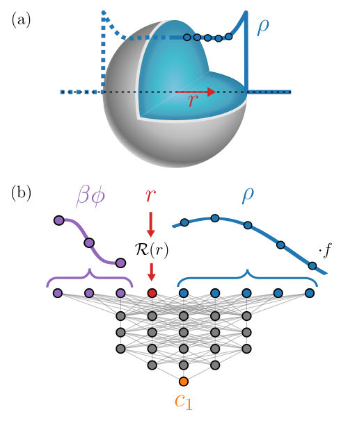
<figcaption class="paper-figure-caption"><b>Fig 1.</b> FIG. 1. Local learning in spherical geometry. (a) Sketch of the geometrical setup for the exemplary case of a fluid in spherical confinement. The resulting density profile ρ(r) is resolved (discretized) along the radial coordinate r and symmetrically extended for negative values of r, such that ρ(r) = ρ(−r). (b) The neural network consist of an input layer, several hidden layers (gray), and an output layer (or- ange), which yields the value of the one-body direct corre- lation functional c1(r; [ρ, βϕ]) at the considered radial posi- tion. As input, we provide the discretized scaled pair poten- tial βϕ(r) and the discretized density window ρ(r′) for radial distances r′ within a predefined...</figcaption>
</figure>
<figure class="paper-figure-card">
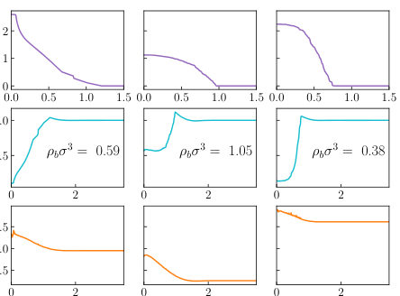
<figcaption class="paper-figure-caption"><b>Fig 2.</b> FIG. 2. Illustration of three exemplary test particle results (columns) used for training of the neural metadensity func- tional in spherical geometry. Randomized forms of the scaled pair potential βϕ(r) (first row) yield corresponding radial dis- tribution functions g(r) (middle row) and bulk densities (not shown), which correspond to one-body correlation functions c1(r) (bottom row) according to Eq. (7), whereby r/σ denotes the scaled distance from the origin, along which all profiles are resolved.</figcaption>
</figure>
<figure class="paper-figure-card">
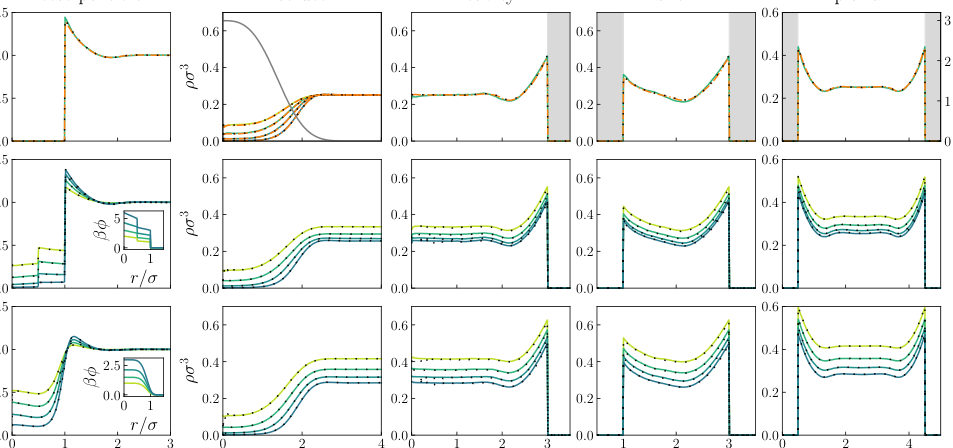
<figcaption class="paper-figure-caption"><b>Fig 3.</b> FIG. 3. Neural metadensity functional predictions for density profiles (solid lines) in selected inhomogeneous external potentials Vext(r) (grey lines). We consider a test particle fixed at the origin (first column), a penetrable solute at the origin (second column), a spherical cavity of radius 3σ (third column), confinement in a hard spherical shell (fourth column), and confinement between planar hard walls (fifth column). The scaled chemical potential of all systems is βµ = 0. The interaction potentials encompass hard spheres at fixed temperature (first row) as well as a two-step interaction potential (second row) and penetrable spheres (third row) at multiple scaled temperature values...</figcaption>
</figure>
<figure class="paper-figure-card">
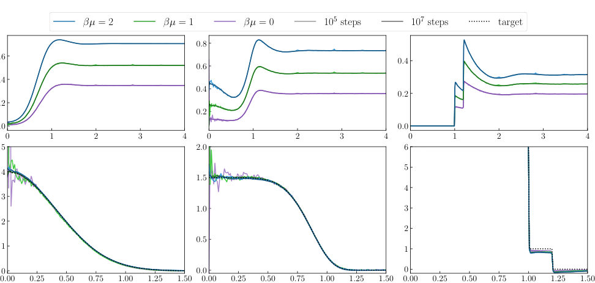
<figcaption class="paper-figure-caption"><b>Fig 4.</b> FIG. 4. Henderson inversion from given radial distribution functions g(r) at bulk densities ρb to the corresponding scaled pair potentials βϕ(r). As input, we take ρbg(r) (first row) obtained from bulk fluid simulations at kBT/ϵ = 1.0 and at different values of the scaled chemical potential βµ = 0, 1, 2 (as indicated). The neural metadensity functional then allows one to recover the corresponding scaled pair potentials (lower rows), as shown for three different representative choices (each column, respectively). The inversion is successful in all considered cases, as can be verified against the known forms of βϕ(r) that were employed in the simulations (black dotted lines). This continues...</figcaption>
</figure>
<figure class="paper-figure-card">
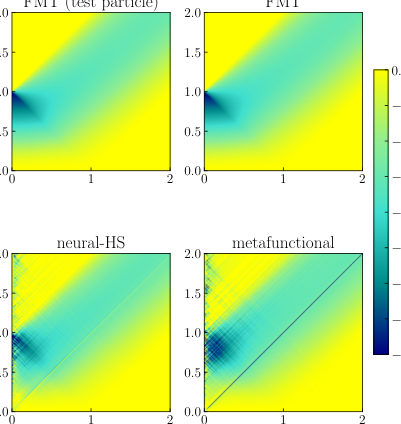
<figcaption class="paper-figure-caption"><b>Fig 5.</b> FIG. 5. Radially resolved two-body direct correlation function c2(r, r′) for the bulk hard sphere fluid at scaled chemical potential βµ = 1, corresponding to a bulk density ρbσ3 ≈0.34. Depicted are results from automatic differentia- tion of the neural metadensity functional (“metafunctional”) and from automatic differentiation of a separately trained functional that is purely applicable to the hard sphere fluid (“neural-HS”). For comparison, we show results from funda- mental measure theory, whereby we consider again simple automatic differentiation of the analytic fundamental mea- sure functional (“FMT”). As an additional consistency check (“FMT (test particle)”), we use fundamental...</figcaption>
</figure>

**Summary.** This work introduces a novel neural metadensity functional capable of modeling structural properties of inhomogeneous classical fluids in spherical geometries. By training on simulation data, it accurately predicts key correlation functions and demonstrates thermodynamic consistency across multiple calculation pathways. This represents an advanced ML approach to solving complex many-body statistical mechanics problems.

**Why it may be interesting.** While focused on classical fluids, the rigorous application of machine learning to derive complex many-body functionals and verify fundamental physical symmetries is a powerful methodological tool applicable to quantum systems where exact functional forms are unknown.

Detailed structure

**Main problem.** The paper develops a neural metadensity functional approach to model classical fluids with truncated interactions, specifically adapting the theory for three-dimensional spherical geometry.

**Main result.** The framework successfully predicts structural properties and verifies thermodynamic consistency relations (like test particle sum rules) by comparing results derived from the neural network against established theories like Fundamental Measure Theory (FMT).

**Method.** It uses supervised training of a neural network to represent the one-body direct correlation functional, $c_1$, which captures dependence on both density and pair potential in curved space.

**Model / system.** The system is inhomogeneous classical fluids interacting via repulsive pairwise potentials ($\phi(r)$), studied under various confinements such as spherical cavities or test particle setups. The theory builds upon Density Functional Theory (DFT) principles.

**Key observables.** One-body and two-body direct correlation functions ($c_1, c_2$), density profiles ($
ho(r)$), radial distribution functions ($g(r)$), and the excess chemical potential ($\mu_{exc}$).

**Important parameters / regimes.** Spherical geometry effects (curvature), scaled pair potential ($eta\phi$), and thermodynamic parameters like temperature ($eta$) and chemical potential ($\mu$).

**Assumptions / limitations.** The core assumption is that the functional dependence of $c_1$ can be accurately approximated by a neural network, and careful handling of spherical symmetry and geometric weighting functions is required.

**Figures summary.** Figures illustrate density profiles in various confinements (cavities/shells), demonstrate Henderson inversion recovering pair potentials from $g(r)$, and compare calculated two-body correlation functions ($c_2$ and $ar{c}_2$) across different theoretical routes (FMT vs. Neural Functional).

**Paper structure.** The paper progresses by establishing the DFT framework, detailing the adaptation of local learning for spherical geometry (incorporating curvature terms), deriving relationships for two-body correlations ($c_2$), and finally validating the functional's thermodynamic consistency across multiple calculation routes.

Abstract

We develop classical density functional learning to address fluids with truncated pairwise interparticle interactions in three-dimensional spherical geometry. Simulation data for systems with randomized repulsive pair potentials provide the basis for supervised training of a neural metadensity functional, thereby making efficient use of results for radial distribution functions in the bulk fluid via the test particle route. Specifically, we develop spherical local learning in order to represent the one-body direct correlation functional in terms of a neural network, which captures spatial curvature effects as well as the metadensity functional dependence on the thermally scaled pair potential. The framework yields efficient access to inhomogeneous structuring and related physical phenomena that occur in fluids and general solvents when adsorbed against curved solutes and confined inside of spherical and planar cavities. Test particle setups facilitate accurate prediction of the bulk fluid pair structure and verification of thermodynamic test particle sum rules via functional line integration. Applying the metadensity functional for Henderson inversion allows one to infer accurately the pair potential from the bulk radial distribution function. We address implications of the geometrical setup for two-body quantities and obtain the two-body direct correlation functional from automatic differentiation. For the hard sphere fluid, we confirm metadensity functional predictions against results from a standard neural density functional with fixed pair potential as well as to an analytic functional as given by fundamental measure theory. Simulation results provide further reference and corroborate reliable results of the spherical neural metadensity functional across a broad range of applications.

[↑ back to top](#top)

### [Tensor network manifolds and Riemannian fundamental theorem for tensor networks](http://arxiv.org/abs/2606.14613v1)

**Authors:** Pablo Páez-Velasco  
**Type:** theory · **Category:** numerical methods · **PDF:** <https://arxiv.org/pdf/2606.14613v1>  
**Analysis basis:** full PDF text, analyzed in chunks
**Topic relevance:** `entanglement & information structure` **1/5** · `methods for driven-dissipative` **1/5**

↔ Scroll figures horizontally

<figure class="paper-figure-card">
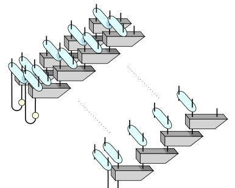
<figcaption class="paper-figure-caption"><b>Fig 1.</b> Figure 7: Visual representation of a two-dimensional sequentially generated state. The figure on the left-hand side shows the MPSs arranged along the rows of the lattice, and the figure on the right-hand side shows the state with the unitaries stacked along the columns of the lattice.</figcaption>
</figure>
<figure class="paper-figure-card">
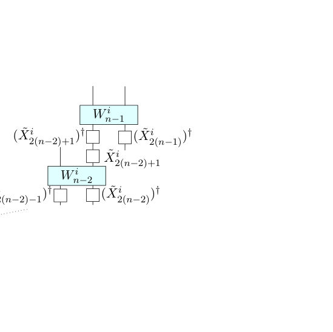
<figcaption class="paper-figure-caption"><b>Fig 2.</b> Figure 8: Visual representation of the action described in Eq. (7.9) for the i-th column of unitaries.</figcaption>
</figure>
<figure class="paper-figure-card">
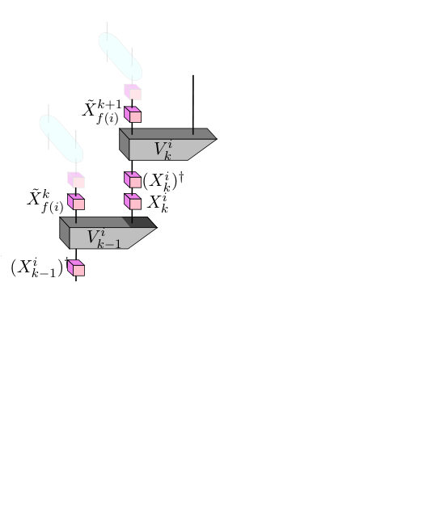
<figcaption class="paper-figure-caption"><b>Fig 3.</b> Figure 10: Visual representation of the action described in Eq. (7.11), for the i-th MPS row. Some faded tensors have been added for reference.</figcaption>
</figure>
<figure class="paper-figure-card">
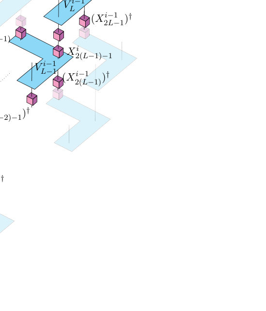
<figcaption class="paper-figure-caption"><b>Fig 4.</b> Figure 13: Visual description of the action on the i-th row of the PEPS, XV i−1.</figcaption>
</figure>
<figure class="paper-figure-card">
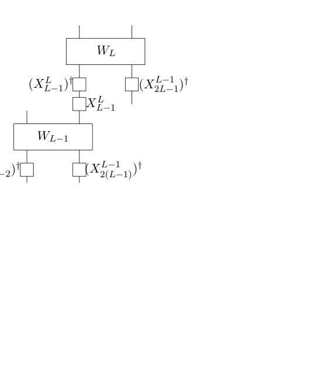
<figcaption class="paper-figure-caption"><b>Fig 5.</b> Figure 14: Visual description of the action on the last row of the PEPS, XW.</figcaption>
</figure>

**Summary.** This paper develops the mathematical framework to treat tensor network representations of quantum states as points on a manifold. By applying advanced differential geometry, it rigorously characterizes the inherent gauge symmetries by showing that the physical state space corresponds to a unique quotient Riemannian manifold. This provides a powerful geometric foundation for analyzing and optimizing these complex many-body quantum descriptions.

**Why it may be interesting.** This work provides rigorous mathematical tools—geometric invariants like Riemannian metrics on quotient spaces—to analyze and compare different numerical representations of quantum states derived from tensor networks, which is crucial for developing stable optimization algorithms.

Detailed structure

**Main problem.** The core problem is mathematically characterizing the redundancy (gauge freedom) inherent in representing quantum states or circuits using tensor networks.

**Main result.** The authors establish a Riemannian fundamental theorem by showing that the physical state space can be identified with a quotient manifold derived from the full tensor network manifold via a Riemannian submersion.

**Method.** The work employs advanced differential geometry, specifically utilizing concepts like group actions, Riemannian submersions, and isometric group actions to map the redundant parameter space onto a unique, geometrically defined quotient manifold.

**Model / system.** The model is general tensor networks (e.g., MPS, PEPS) used to represent high-dimensional quantum states or depth-two quantum circuits. The mathematical framework involves endowing these network structures with Riemannian manifold metrics.

**Key observables.** Gauge freedom, the resulting quotient tensor network manifold structure ($\mathcal{B}$), and the metric tensors defining this geometry.

**Important parameters / regimes.** Bond dimension ($D$), physical dimension ($d$), and the number of layers/gates in the circuit representation.

**Assumptions / limitations.** The analysis relies heavily on assuming that certain tensor components are full-rank, which allows for the application of Riemannian submersion theorems derived from isometric group actions.

**Figures summary.** Figures illustrate various tensor network structures (V1 to V6) and visualize the projection process: $	ext{Manifold} 	o 	ext{Quotient Manifold}$ using diagrams showing gauge action on different circuit types (e.g., Figure 2, Figure 3).

**Paper structure.** The paper builds from general geometric prerequisites (Riemannian submersions and group actions) to defining the tensor network manifold structure for specific families (MPS, PEPS), culminating in proving that gauge freedom allows for a unique quotient space characterized by a Riemannian submersion.

Abstract

Tensor networks provide a powerful framework for efficiently representing high-dimensional data and many-body quantum states. Endowing tensor networks with a Riemannian manifold structure provides a natural setting for numerical optimization and analysis. A central feature of tensor networks is their gauge freedom, whose characterisation (captured by so-called fundamental theorems) underlies both their intrinsic structure and the design of numerical algorithms. In this work, we study the interaction between the Riemannian manifold structure and the gauge freedom for several families of tensor networks. Using group actions and Riemannian submersions, we establish a Riemannian fundamental theorem for the tensor network families studied.

[↑ back to top](#top)

### [Calibrated Helstrom geometry on the Bloch ball via Connes spectral distance](http://arxiv.org/abs/2606.13824v1)

**Authors:** Kaushlendra Kumar  
**Type:** theory · **Category:** quantum information and computing · **PDF:** <https://arxiv.org/pdf/2606.13824v1>  
**Analysis basis:** full PDF text, analyzed in chunks
**Topic relevance:** `entanglement & information structure` **1/5**

↔ Scroll figures horizontally

<figure class="paper-figure-card">
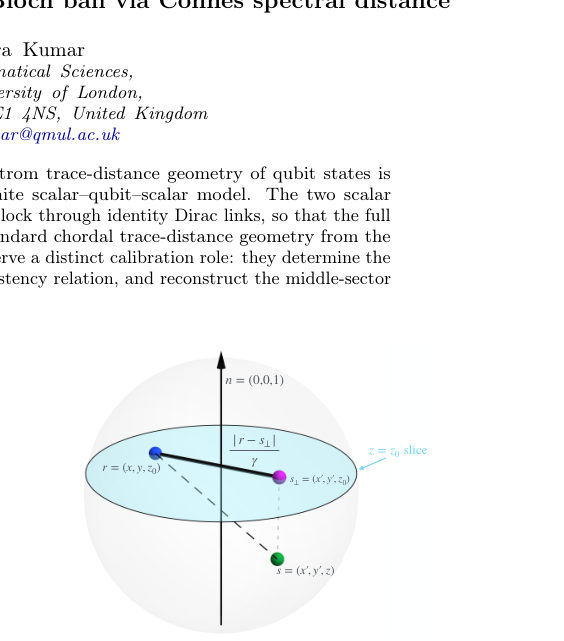
<figcaption class="paper-figure-caption"><b>Fig 1.</b> FIG. 1. Depiction of bare M2(C) finite-slice obstruction. In co- ordinates with Dirac axis n = (0, 0, 1), the bare two-eigenvalue Dirac operator controls only directions transverse to n. Points in the same slice z = z0 have finite distance |r −s⊥|/γ, where γ = |d+ −d−| is the Dirac eigenvalue gap. Any off-slice sep- aration contains an unconstrained component parallel to n, and the corresponding bare spectral distance is infinite.</figcaption>
</figure>
<figure class="paper-figure-card">
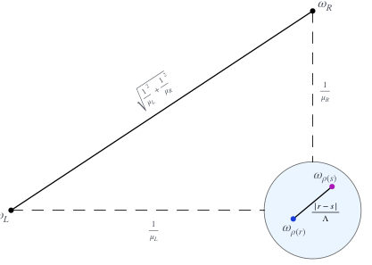
<figcaption class="paper-figure-caption"><b>Fig 2.</b> FIG. 2. Scalar-anchored calibration geometry. The scalar states ωL, ωR define link lengths ℓL = µ−1 L , ℓR = µ−1 R , with d(ωL, ωR)2 = ℓ2 L + ℓ2 R. Inside the qubit block, the middle- sector distance is the calibrated chord d(ωρ(r), ωρ(s)) = Λ−1|r −s|.</figcaption>
</figure>

**Summary.** The paper demonstrates that the standard trace distance metric used for quantifying distinguishability between qubit states can be rigorously recovered from the Connes spectral distance by embedding the system into an extended 'scalar-qubit-scalar' model. This establishes a deep, quantifiable link between noncommutative geometry and quantum information theory metrics. The result is crucial because it shows how geometric structures derived from spectral analysis can precisely predict operational limits in quantum measurement.

**Why it may be interesting.** This work provides a powerful geometric framework connecting abstract mathematical tools (spectral triples/Connes distance) directly to fundamental physical quantities in quantum information theory (trace distance). It suggests that operational metrics can be derived from underlying spectral structures, which is highly relevant for theoretical physics exploring quantization procedures.

Detailed structure

**Main problem.** The research aims to determine if the standard operational metric for qubit state discrimination, the trace distance, can be mathematically recovered from the Connes spectral distance within a finite noncommutative model.

**Main result.** The equal-prior Helstrom trace-distance geometry of qubit states is successfully recovered from the Connes spectral distance via a calibrated relationship involving a scale factor $\Lambda$. This establishes a deep connection between non-commutative geometry and quantum information theory metrics.

**Method.** The authors employ techniques from noncommutative geometry, specifically calculating the Connes spectral distance using a Dirac operator on an extended algebra incorporating scalar reference sectors. They derive relationships by optimizing over these auxiliary variables to match known quantum metrics.

**Model / system.** The system models qubit states ($
ho$) living on the Bloch ball, which is embedded into a larger structure comprising two scalar reference sectors ($C_L, C_R$) coupled isotropically to the qubit block ($M_2(\mathbb{C})$). This 'scalar-qubit-scalar' model extends the geometry beyond what the bare qubit algebra can capture.

**Key observables.** Trace distance $T(
ho, \sigma)$, Connes spectral distance $d_D(\varphi, \psi)$, and the optimal success probability $	ext{p}_{	ext{succ}}(
ho, \sigma)$.

**Important parameters / regimes.** The coupling strengths ($\mu_L, \mu_R$) defining the scalar link lengths ($\ell_L, \ell_R$), which determine the overall calibration scale $\Lambda = (\mu_L^2 + \mu_R^2)^{1/2}$.

**Assumptions / limitations.** The analysis is restricted to the equal-prior case and relies on extending the qubit algebra with two scalar reference sectors to ensure the full Bloch ball geometry is captured.

**Figures summary.** Figure 1 illustrates the necessity of the scalar-anchored model by showing limitations in the bare $M_2(\mathbb{C})$ setting. Figure 2 visually represents the calibrated geometry, detailing how the overall distance relates to individual link strengths ($\ell_L, \ell_R$) and the middle-sector distance.

**Paper structure.** The paper progresses by first establishing the failure of simpler models (Figure 1), then introducing the scalar-anchored model to derive key distance formulas relating spectral metrics to trace distances (Theorem III.1). Subsequent sections refine this calibration, deriving specific relationships for different types of state pairs and confirming consistency relations like the Pythagorean theorem in the scalar sectors.

Abstract

We show that the equal-prior Helstrom trace-distance geometry of qubit states is recovered from Connes spectral distance in a finite scalar-qubit-scalar model. The two scalar reference sectors couple isotropically to the qubit block through identity Dirac links, so that the full Bloch ball, including mixed states, inherits its standard chordal trace-distance geometry from the finite spectral metric. The scalar-sector distances serve a distinct calibration role: they determine the individual link lengths, satisfy a Pythagorean consistency relation, and reconstruct the middle-sector scale.

[↑ back to top](#top)

### [Quantum codes and optimal pure quantum $(r,δ)$-LRCs via the MP construction](http://arxiv.org/abs/2606.14253v1)

**Authors:** Meng Cao, Kun Zhou  
**Type:** theory · **Category:** quantum information and computing · **PDF:** <https://arxiv.org/pdf/2606.14253v1>  
**Analysis basis:** full PDF text, analyzed in chunks
**Topic relevance:** `methods for driven-dissipative` **1/5**

↔ Scroll figures horizontally

<figure class="paper-figure-card">
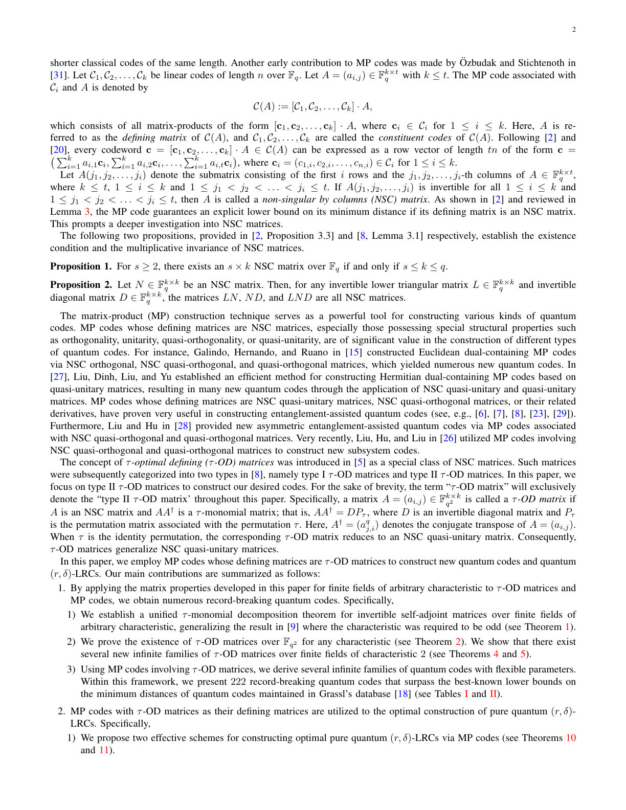
<figcaption class="paper-figure-caption"><b>Fig 1.</b> Low-resolution page preview, page 2</figcaption>
</figure>
<figure class="paper-figure-card">
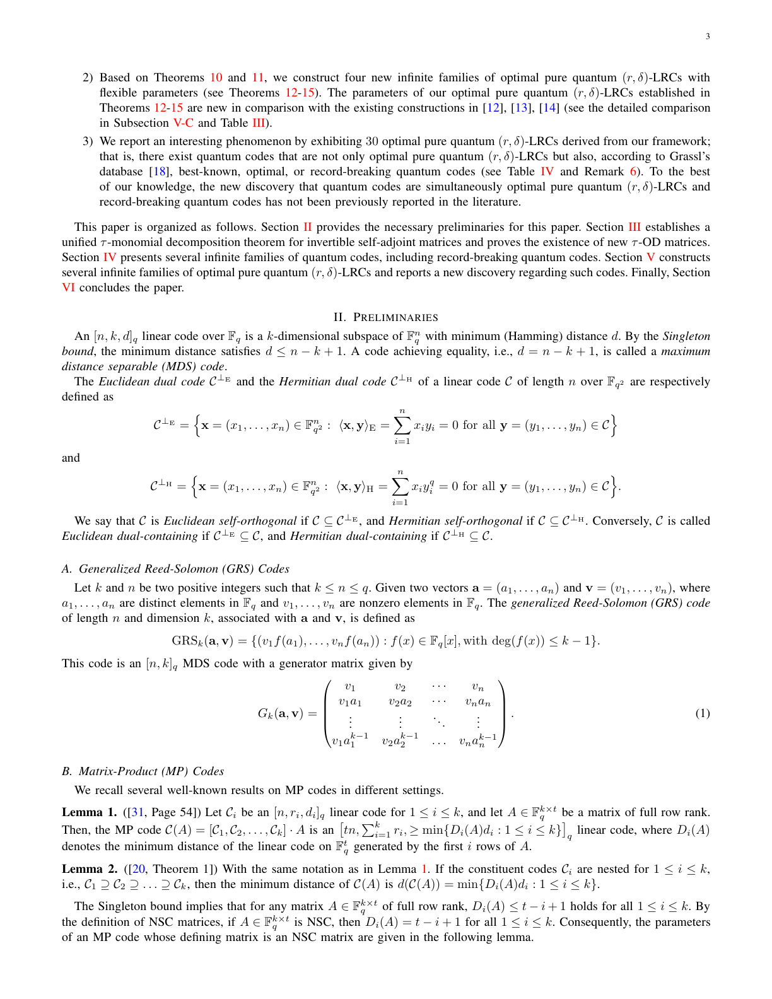
<figcaption class="paper-figure-caption"><b>Fig 2.</b> Low-resolution page preview, page 3</figcaption>
</figure>
<figure class="paper-figure-card">
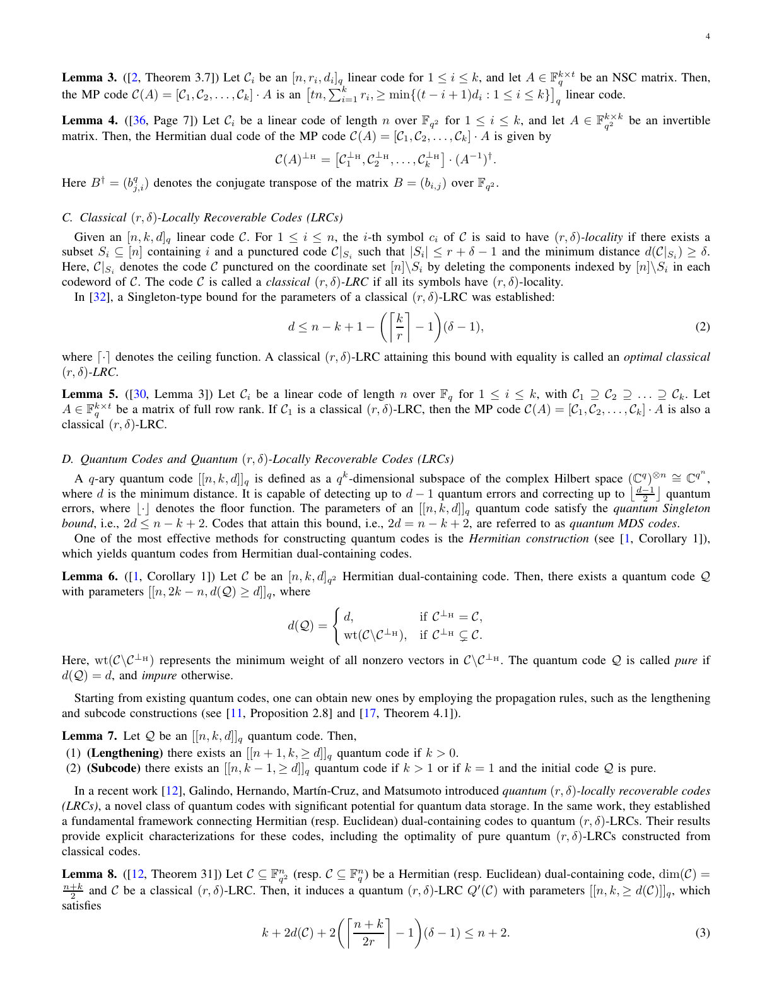
<figcaption class="paper-figure-caption"><b>Fig 3.</b> Low-resolution page preview, page 4</figcaption>
</figure>
<figure class="paper-figure-card">
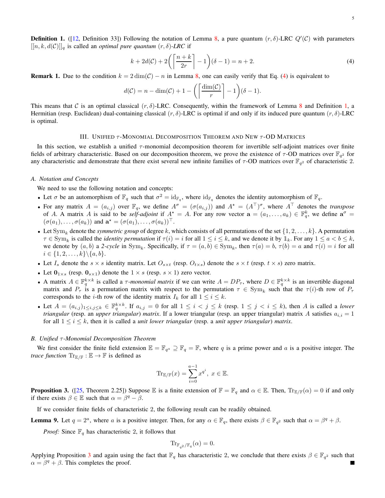
<figcaption class="paper-figure-caption"><b>Fig 4.</b> Low-resolution page preview, page 5</figcaption>
</figure>
<figure class="paper-figure-card">
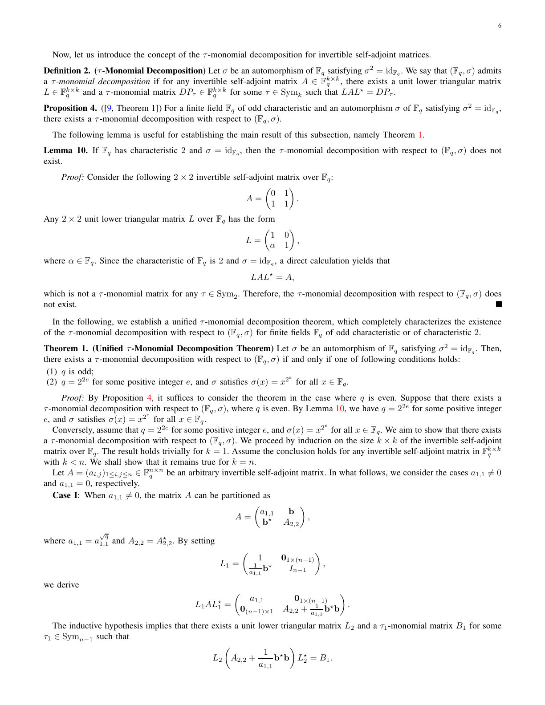
<figcaption class="paper-figure-caption"><b>Fig 5.</b> Low-resolution page preview, page 6</figcaption>
</figure>

**Summary.** This paper develops advanced algebraic tools by proving a unified $\tau$-monomial decomposition theorem for matrices over finite fields. It applies these tools to construct numerous new infinite families of optimal pure quantum $(r, \delta)$-LRCs using the Matrix-Product code framework. The results yield record-breaking quantum codes and establish novel connections between classical locality properties and quantum error correction bounds.

**Why it may be interesting.** This work provides deep connections between abstract algebra (matrix decompositions over finite fields) and the concrete bounds on quantum error-correcting capabilities, which is fundamental for designing robust quantum computation protocols.

Detailed structure

**Main problem.** The primary goal is constructing new quantum error-correcting codes, specifically optimal pure quantum (r, delta)-Locally Recoverable Codes (LRCs).

**Main result.** The authors established a unified $\tau$-monomial decomposition theorem and constructed multiple new infinite families of such LRCs, including 30 instances that are simultaneously optimal, best-known, and record-breaking.

**Method.** The work heavily relies on the Matrix-Product (MP) construction method using specialized defining matrices called $\tau$-optimal defining ($\tau$-OD) matrices derived from algebraic theorems over finite fields.

**Model / system.** The model is quantum error correction, dealing with quantum states encoded in subspaces of $(\mathbb{C}^q)^{\otimes n}$. The construction links the properties of classical linear codes (like $(r, \delta)$-LRCs) to their quantum counterparts via MP codes.

**Key observables.** Quantum code parameters $[[n, k, d]]_q$, and the locality/recovery parameters $(r, \delta)$ for LRCs.

**Important parameters / regimes.** The field characteristic (odd vs. even), the size of the finite field $\mathbb{F}_{q^2}$, and various indices ($k_1, k_2, l_1, l_2$) governing code lengths and dimensions.

**Assumptions / limitations.** The existence of specific algebraic structures, such as invertible self-adjoint matrices admitting a $\tau$-monomial decomposition, is crucial for the construction theorems to hold.

**Figures summary.** References are made to Tables I, II, III, and IV, which provide detailed numerical comparisons showing that the newly constructed codes surpass existing records in Grassl's database regarding minimum distance $d$.

**Paper structure.** The paper progresses from establishing foundational algebraic theorems (the unified $\tau$-monomial decomposition theorem) to applying these results to construct infinite families of quantum codes, and finally specializing these constructions to yield optimal pure quantum $(r, \delta)$-LRCs.

Abstract

In this paper, we employ MP codes whose defining matrices are $τ$-optimal defining ($τ$-OD) matrices to construct new quantum codes and quantum $(r,δ)$-LRCs. Specifically, we report the following results: We establish a unified $τ$-monomial decomposition theorem for invertible self-adjoint matrices over finite fields of arbitrary characteristic, which generalizes the result in "Quantum codes using the $τ$-OD MP construction" where the characteristic was required to be odd. Based on this theorem, we prove the existence of $τ$-OD matrices over $\mathbb{F}_{q^2}$ for any characteristic and demonstrate that there exist several new infinite families of $τ$-OD matrices over $\mathbb{F}_{q^2}$ of characteristic $2$. As an application of MP codes involving $τ$-OD matrices, we construct several infinite families of quantum codes with flexible parameters. Within this framework, we present $222$ record-breaking quantum codes that surpass the best-known records maintained in Grassl's database.   We propose two effective schemes for constructing optimal pure quantum $(r,δ)$-LRCs via MP codes. Accordingly, we construct four new infinite families of optimal pure quantum $(r,δ)$-LRCs with flexible parameters. Notably, we report an interesting phenomenon by exhibiting $30$ optimal pure quantum $(r,δ)$-LRCs derived from our framework; that is, there exist quantum codes that are not only optimal pure quantum $(r,δ)$-LRCs but also, according to Grassl's database, best-known, optimal, or record-breaking quantum codes. To the best of our knowledge, the new discovery that quantum codes are simultaneously optimal pure quantum $(r,δ)$-LRCs and record-breaking quantum codes has not been previously reported in the literature.

[↑ back to top](#top)

### [Quantum Horizon: An evaluation of quantum computing as a threat to Bitcoin and Ethereum](http://arxiv.org/abs/2606.14484v1)

**Authors:** Iosif M. Gershteyn, Jacob A. Alber  
**Type:** theory · **Category:** quantum information and computing · **PDF:** <https://arxiv.org/pdf/2606.14484v1>  
**Analysis basis:** full PDF text, analyzed in chunks
**Topic relevance:** `methods for driven-dissipative` **1/5**

↔ Scroll figures horizontally

<figure class="paper-figure-card">
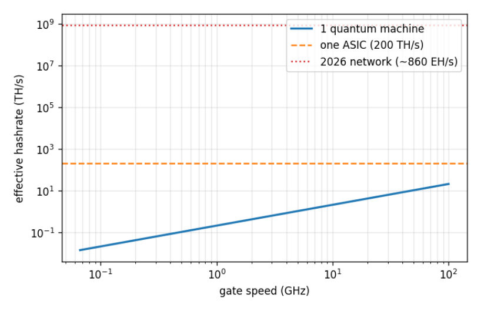
<figcaption class="paper-figure-caption"><b>Fig 1.</b> Figure 1. Effective quantum “hashrate” versus gate speed, compared with one ASIC and the whole 2026 network.</figcaption>
</figure>
<figure class="paper-figure-card">
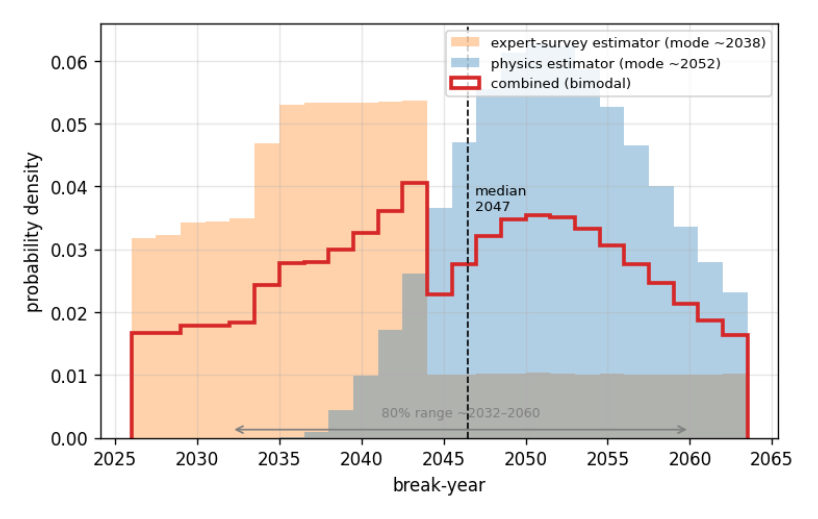
<figcaption class="paper-figure-caption"><b>Fig 2.</b> Figure 2. The two estimators (survey and physics) and the bimodal combined distribution; the median falls in the trough between the modes.</figcaption>
</figure>
<figure class="paper-figure-card">
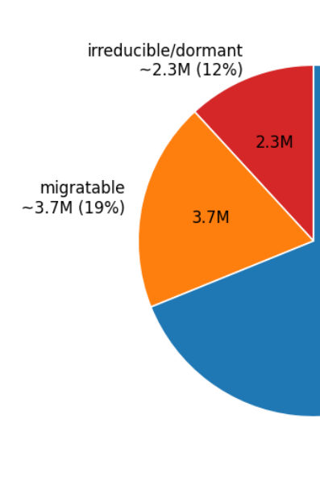
<figcaption class="paper-figure-caption"><b>Fig 3.</b> Figure 3. Bitcoin’s supply split into permanently-at-risk, migratable, and protected coins.</figcaption>
</figure>
<figure class="paper-figure-card">
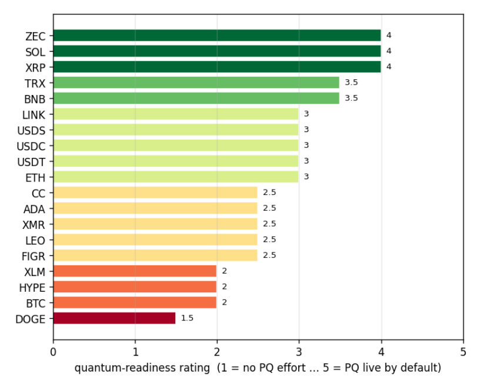
<figcaption class="paper-figure-caption"><b>Fig 4.</b> Figure 5. Top-20 quantum-readiness ratings; none is fully post-quantum (RAIN excluded; its host chain could not be verified).</figcaption>
</figure>
<figure class="paper-figure-card">
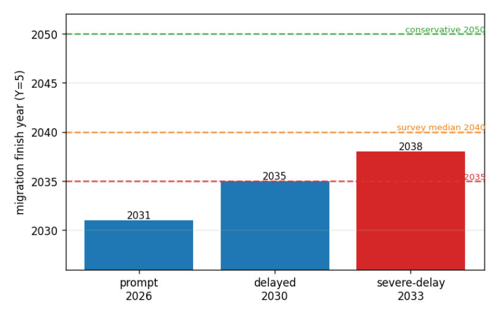
<figcaption class="paper-figure-caption"><b>Fig 5.</b> Figure 4. When migration finishes versus when a quantum computer might arrive, across start-time and adoption scenarios.</figcaption>
</figure>

**Summary.** This work assesses the threat of quantum computers to Bitcoin and Ethereum, concluding that Shor's algorithm breaks signatures but mining remains relatively safe. The authors forecast a probabilistic arrival of a CRQC and argue that while the risk is real, it is largely mitigable through proactive governance and migration efforts.

**Why it may be interesting.** While not directly about AMO physics, the paper uses complex modeling techniques (Monte Carlo) to assess technological risk against fundamental quantum computing capabilities (Shor's algorithm), which is highly relevant to understanding the limits of current information security paradigms.

Detailed structure

**Main problem.** The paper evaluates the threat posed by quantum computers, specifically Shor's algorithm, to the elliptic-curve digital signatures used by Bitcoin and Ethereum.

**Main result.** While a cryptographically relevant quantum computer (CRQC) poses a real threat via signature breaking, the risk is bounded because many assets are migratable, making governance, not technology, the primary constraint.

**Method.** The authors combine Monte-Carlo forecasting with physical qubit scaling models and expert surveys to predict CRQC arrival timelines. They also use simulation models for on-chain attack success rates.

**Model / system.** The analysis focuses on cryptographic primitives (ECDSA, BLS) securing cryptocurrencies like Bitcoin and Ethereum. The threat is modeled against the required logical qubit count needed to run Shor's algorithm.

**Key observables.** CRQC arrival odds (e.g., 30% by 2040), number of irreducibly at-risk BTC coins ($\sim 2.3$ million), and percentage of exposed ETH ($50–65\%$).

**Important parameters / regimes.** Required logical qubits for breaking secp256k1 ($\sim 1,200–2,330$), quadratic speedup from Grover's algorithm, and the time required for governance action.

**Assumptions / limitations.** The threat is contingent on fault-tolerant hardware; the forecast uses a bimodal distribution combining physics scaling with expert opinion; migration feasibility depends on community coordination.

**Figures summary.** Figures illustrate Bitcoin's supply split into permanently-at-risk, migratable, and protected coins. Other figures compare quantum 'hashrate' vs. network hashrate and show the combined bimodal distribution for CRQC timing.

**Paper structure.** The paper first distinguishes between Shor's (signature threat) and Grover's (mining threat). It then models the hardware scaling to forecast CRQC arrival, analyzes the specific exposure of BTC and ETH supply, and concludes by emphasizing that governance dictates the timeline for mitigation.

Abstract

Quantum computing poses a real, broad-based, but bounded and substantially mitigable threat to Bitcoin and Ethereum. We separate the two quantum algorithms that public discussion routinely conflates: Shor's algorithm breaks the elliptic-curve signatures (ECDSA over secp256k1, BLS over BLS12-381) that authorize spending, whereas Grover's algorithm does not meaningfully threaten proof-of-work mining, which is protected by a merely quadratic speedup, fault-tolerant per-operation costs, a square-root parallelization wall, and difficulty adjustment. Folding hardware scaling, the falling resource requirement, a fault-tolerance readiness lag, and expert surveys into a single Monte-Carlo forecast yields a wide, bimodal arrival distribution for a cryptographically relevant quantum computer: about a one-in-six chance by 2035, near 30% by 2040, and about 60% by 2050. Exposure is concentrated and mostly migratable: of Bitcoin's roughly six million quantum-exposed coins only about 2.3 million are irreducibly at risk, while 50 to 65% of Ether sits at key-revealed accounts that can adopt post-quantum signatures. A timely migration beats even an optimistic 2035 machine, so the binding constraint is governance, not technology. A survey of the top twenty cryptocurrencies finds none fully post-quantum. Reproducible models accompany every quantitative claim.

[↑ back to top](#top)

### [Quasilinear Equivalence Checking for Detector Error Models](http://arxiv.org/abs/2606.14677v1)

**Authors:** Mathys Rennela  
**Type:** theory · **Category:** quantum information and computing · **PDF:** <https://arxiv.org/pdf/2606.14677v1>  
**Analysis basis:** full PDF text, analyzed in chunks
**Topic relevance:** `quantum measurements` **1/5**

↔ Scroll figures horizontally

<figure class="paper-figure-card">
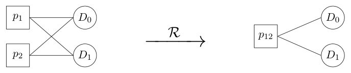
<figcaption class="paper-figure-caption"><b>Fig 1.</b> Figure 2: Tanner graph reduction using rewriting rules R. Error mechanisms with identical targets are fused together algebraically via p12 = p1 ⊕p2 (Rule R1).</figcaption>
</figure>

**Summary.** This paper develops a formal, algebraic theory for Detector Error Models (DEMs), which are used to characterize noise in quantum circuits. It introduces an efficient rewriting system that guarantees a unique normal form for any DEM term. This allows researchers to create the first static decision procedure to rigorously check if two different error descriptions represent the same underlying physical fault model.

**Why it may be interesting.** This work provides foundational mathematical tools for verifying quantum computation correctness by providing rigorous methods to compare complex noise models derived from physical hardware constraints.

Detailed structure

**Main problem.** The core problem is developing a complete, decidable mathematical theory for Detector Error Models (DEMs) to rigorously check if two different descriptions of quantum hardware noise are equivalent.

**Main result.** The authors provide an efficient quasilinear time decision procedure based on computing a unique normal form derived from the DEM structure via rewriting systems and Tanner graphs. This establishes structural equivalence for non-adaptive QEC pipelines and provides sound procedures for partially-adaptive circuits.

**Method.** The methodology involves constructing an equational theory for DEMs, defining a confluent rewriting system (PROP), and characterizing equivalence by comparing unique normal forms derived from the structure's invariants (Tanner graphs).

**Model / system.** The model is the Detector Error Model (DEM), which formally describes physical error mechanisms in quantum circuits. These errors are characterized by probabilities, specific detectors triggered, and logical observables flipped during a fault event.

**Key observables.** Detector outcomes ($\{0, 1\}^D$), observable outcomes ($\{0, 1\}^O$), and the associated probability distributions (scope distribution $\mu$).

**Important parameters / regimes.** Error probabilities ($p < 0.5$); circuit depth/size ($|E|$); scope structure (Skeleton $
ho(t)$).

**Assumptions / limitations.** The initial analysis assumes detector indices are absolute; later work addresses the limitations of assuming observable-separation for full decoder-equivalence in adaptive circuits.

**Figures summary.** Figures illustrate Tanner graph reduction, showing how error mechanisms with identical targets are fused algebraically using probability combination rules (e.g., $p_{12} = p_1 \oplus p_2$).

**Paper structure.** The paper builds from defining the DEM structure and its algebraic theory to proving the existence of a unique normal form via rewriting systems, establishing invariants using Tanner graphs, and finally developing increasingly general decision procedures for equivalence (scope-local vs. full decoder-equivalence) applicable to adaptive QEC.

Abstract

A Detector Error Model (DEM) is a structured representation of error mechanisms in quantum circuits, which has gained popularity in quantum compilation pipelines for its ability to capture fault-tolerance at a circuit level. It lists error mechanisms as instructions targeting detectors and observables, specifying for each physical fault channel the probability that the fault fires, the detectors it triggers, and the observables it flips.   In this paper, we develop an equational theory for DEMs, with its associated categorical semantics. We present a sound, terminating, confluent rewriting system for DEM terms, formulating it as a symmetric monoidal theory (a PROP) over the Giry monad. We prove that every DEM term has a unique normal form, which can be computed efficiently in quasilinear time $O(k|E|\log|E|)$, where $|E|$ is the number of instructions and $k$ bounds the size of a target set. This provides a complete set of invariants (via Tanner graphs) for structural DEM equivalence. We provide the first static decision procedure for DEM equivalence, with rigorous correctness guarantees. It is complete (decides full decoder-equivalence exactly) for non-adaptive quantum error correction (QEC) pipelines, and scales to a sound and applicable decision procedure for partially-adaptive circuits (lattice surgery, distributed QEC, ...) without suffering exponential overhead. We discuss its application to the verification and optimisation of quantum compilers.

[↑ back to top](#top)

## Other papers (5)

*Papers from primary archives without highlighted authors or any topic match. Click to expand.*

Show other papers

### [Aligning Quantum Operators with Large Language Models](http://arxiv.org/abs/2606.13811v1)

**Authors:** Rogerio Feris, Yunchao Liu, Pengyuan Li, Hang Hua, David Kremer  
**Type:** theory · **Category:** quantum information and computing · **PDF:** <https://arxiv.org/pdf/2606.13811v1>  
**Analysis basis:** full PDF text, analyzed in chunks

↔ Scroll figures horizontally

<figure class="paper-figure-card">
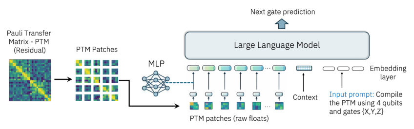
<figcaption class="paper-figure-caption"><b>Fig 1.</b> Fig. 1. Overview of our approach. A target unitary U is converted to its Pauli Transfer Matrix (PTM), which is partitioned into non-overlapping patches and encoded by a lightweight encoder. An MLP projector maps the resulting patch embeddings into the token space of a pretrained LLM, where they are concatenated with text embeddings from the context (current fidelity and previous gates) and an instruction prompt. The LLM autoregressively generates a sequence of Pauli rotation gates (e.g., IYYZ, ZIII) that compile the target unitary. At each synthesis step, the residual PTM is re-encoded and fed back as a new visual input, enabling the model to condition each gate prediction on the remaining...</figcaption>
</figure>
<figure class="paper-figure-card">
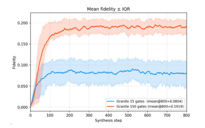
<figcaption class="paper-figure-caption"><b>Fig 2.</b> Fig. 3. Fidelity over 800 synthesis steps on 200 Haar-random 4-qubit unitaries. The 150g model achieves substantially higher fidelity than the 15g model, suggesting that training on longer circuits improves generalization to arbitrary unitaries.</figcaption>
</figure>
<figure class="paper-figure-card">
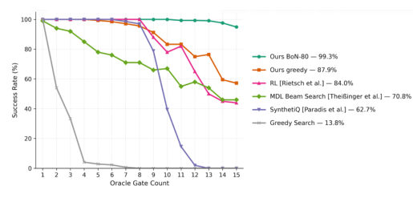
<figcaption class="paper-figure-caption"><b>Fig 3.</b> Fig. 2. Per-gate success rate on 2,000 held-out circuits (1–15 gates, fidelity threshold τ = 0.999). RL and MDL beam search results are taken from their respective publications as approximate comparisons (see text). Overall weighted success rates shown in the legend.</figcaption>
</figure>
<figure class="paper-figure-card">
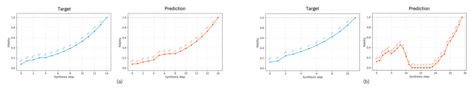
<figcaption class="paper-figure-caption"><b>Fig 4.</b> Fig. 4. Fidelity traces for training oracle sequences and model predictions at test time. The model’s predictions generalize beyond the training data, most strikingly in (b), where fidelity rises, then drops, and finally recovers to 1.0.</figcaption>
</figure>
<figure class="paper-figure-card">
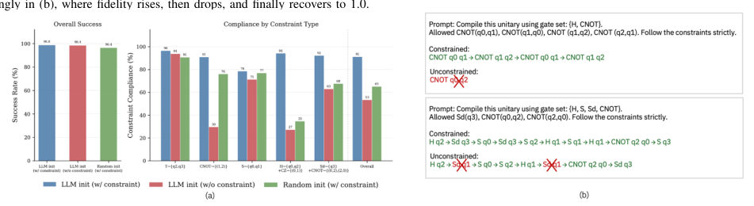
<figcaption class="paper-figure-caption"><b>Fig 5.</b> Fig. 5. Text-conditioned synthesis on unseen constraint configurations. (a) Overall success rate (similar for the three settings) and gate-level constraint compliance per constraint type. The large drop when removing constraint text from the prompt confirms that the model actively conditions on the instruction rather than producing compliant outputs by default, while the gap between LLM and random initialization shows that pretrained language understanding is critical for interpreting unseen placement constraints. (b) Qualitative examples for constrained and unconstrained prompts.</figcaption>
</figure>

**Summary.** The paper addresses the challenge of making Large Language Models understand quantum mechanics by mapping unitary operators into the LLM's latent space. It introduces an autoregressive synthesis method that predicts quantum gates sequentially, conditioned on both the current state (via PTM) and natural language instructions. This approach significantly outperforms existing quantum compilation methods, suggesting a path toward quantum-aware foundation models.

**Why it may be interesting.** This work is highly relevant because it proposes a novel paradigm for integrating symbolic reasoning (LLMs) with structured physical computation (quantum circuits), potentially leading to automated discovery or optimization tools for quantum algorithms.

Detailed structure

**Main problem.** The core problem is bridging the gap between Large Language Models (LLMs), which are inherently blind to quantum representations like unitary matrices, and the need for them to reason about these operations.

**Main result.** The proposed multimodal alignment framework successfully enables language-conditioned synthesis of quantum circuits, achieving state-of-the-art performance competitive with complex baselines across various circuit lengths.

**Method.** The authors map unitary operators (represented as Pauli Transfer Matrices) into the LLM's latent space using a lightweight encoder and projector. Synthesis is performed autoregressively by predicting one gate at a time based on the residual PTM state, conditioned on both visual (PTM) and textual inputs.

**Model / system.** The system involves synthesizing quantum unitaries ($U$) for Clifford+T circuits over a Pauli rotation gate set. The representation used is the real-valued Pauli Transfer Matrix (PTM), which captures the unitary transformation in a matrix form suitable for embedding into an LLM.

**Key observables.** Fidelity ($F(P)$) of synthesis progress, defined as $	ext{Tr}(P)/4^n$, where success is marked when $F \ge 0.999$. Success rates and mean fidelity are key comparative metrics against baselines.

**Important parameters / regimes.** The size of the system ($n$-qubits), the patch size used for encoding (e.g., $16	imes 16$), and the training data scale (up to 9.2M circuits).

**Assumptions / limitations.** The framework assumes that the PTM representation can be effectively projected into the LLM's latent space, allowing the model to treat quantum state evolution as a sequence prediction task.

**Figures summary.** Figures illustrate the overall multimodal alignment workflow (U -> PTM -> Encoder -> LLM Input). Other figures compare synthesis success rates and fidelity traces against established baselines like greedy search and RL approaches across varying circuit lengths.

**Paper structure.** The paper introduces the problem gap, details the multimodal alignment architecture using PTMs as visual inputs alongside text. It presents results showing superior scaling and performance over existing quantum compilation methods, culminating in demonstrations of language-conditioned synthesis capabilities.

Abstract

Can Large Language Models (LLMs) understand and reason about quantum operators? Despite their remarkable capabilities in mathematics and symbolic reasoning, LLMs remain inherently blind to quantum representations such as unitary matrices. In this work, we take a step toward bridging this gap by introducing an approach that maps unitary operators into the latent space of an LLM, enabling unified modeling over quantum and linguistic inputs. We instantiate this idea on Clifford+T circuit synthesis over a Pauli rotation gate set, where our model achieves results competitive with state-of-the-art methods and scales consistently with training data, with no signs of saturation. Our approach further enables language-conditioned synthesis, allowing gate constraints unseen during training to be specified directly in natural language. This work suggests a path toward quantum--aware foundation models that can natively interpret and reason about quantum operations, which could have broader implications reaching across quantum compilation and algorithm discovery.

[↑ back to top](#top)

### [Compact graphs and quantum automorphisms](http://arxiv.org/abs/2606.13928v1)

**Authors:** Pedro Baptista, Gabriel Coutinho, Chris Godsil, Simon Schmidt  
**Type:** theory · **Category:** other · **PDF:** <https://arxiv.org/pdf/2606.13928v1>  
**Analysis basis:** full PDF text, analyzed in chunks

↔ Scroll figures horizontally

<figure class="paper-figure-card">
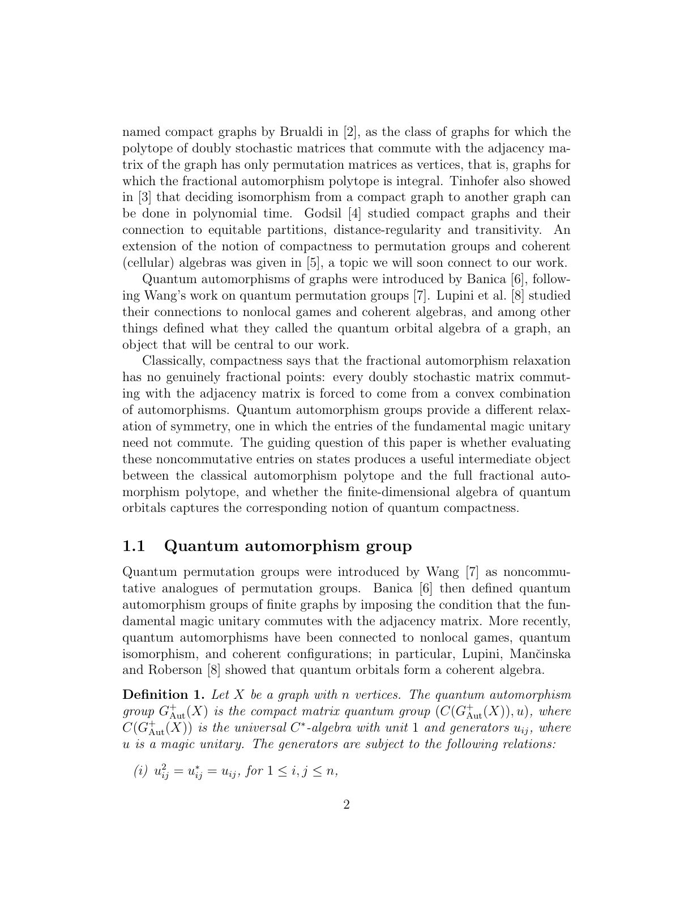
<figcaption class="paper-figure-caption"><b>Fig 1.</b> Low-resolution page preview, page 2</figcaption>
</figure>
<figure class="paper-figure-card">
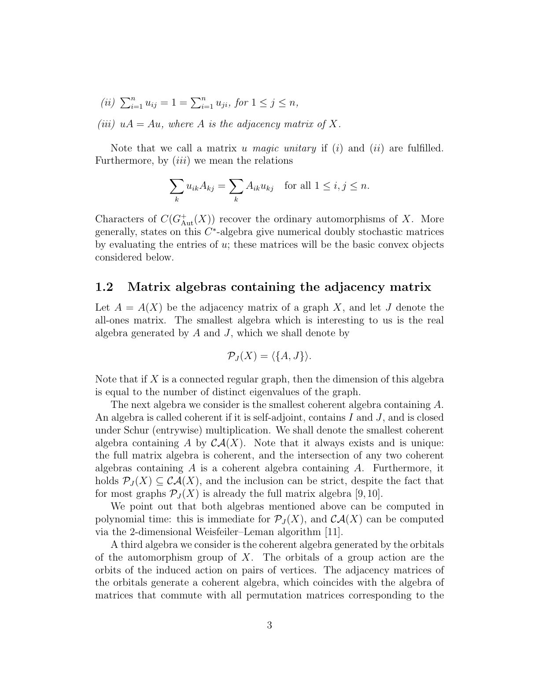
<figcaption class="paper-figure-caption"><b>Fig 2.</b> Low-resolution page preview, page 3</figcaption>
</figure>
<figure class="paper-figure-card">
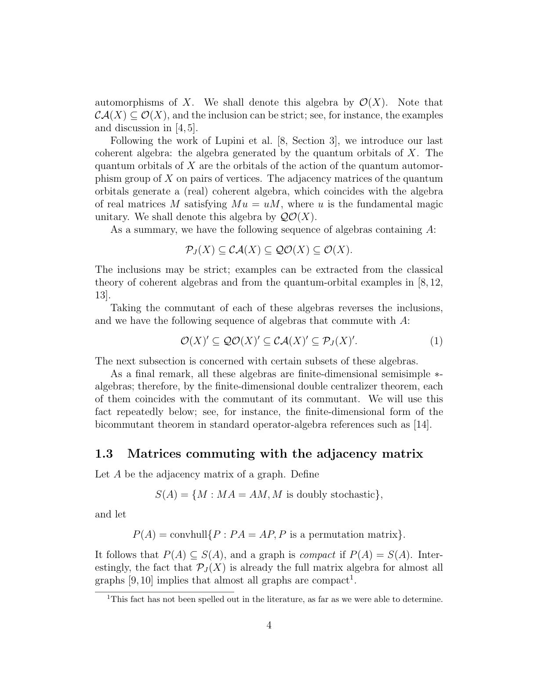
<figcaption class="paper-figure-caption"><b>Fig 3.</b> Low-resolution page preview, page 4</figcaption>
</figure>
<figure class="paper-figure-card">
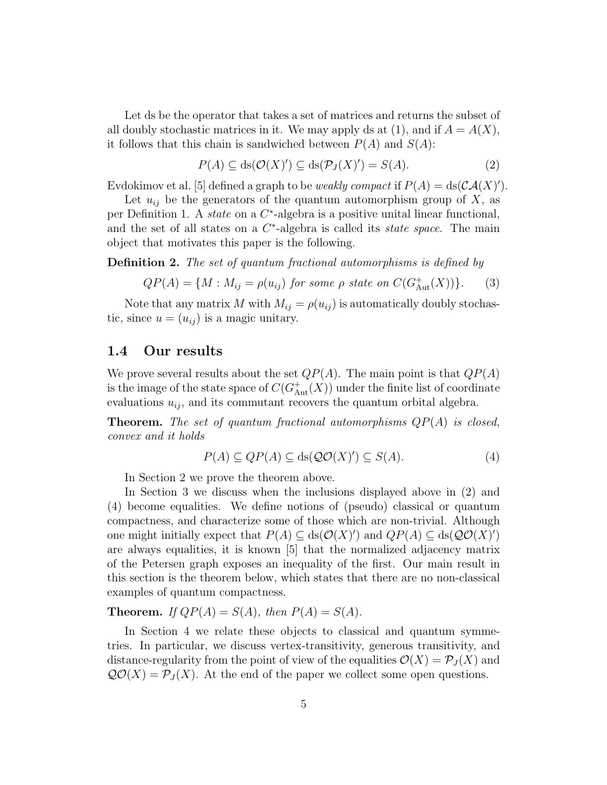
<figcaption class="paper-figure-caption"><b>Fig 4.</b> Low-resolution page preview, page 5</figcaption>
</figure>
<figure class="paper-figure-card">
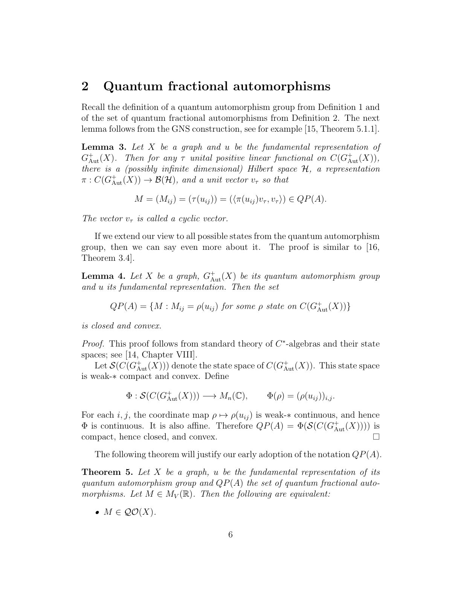
<figcaption class="paper-figure-caption"><b>Fig 5.</b> Low-resolution page preview, page 6</figcaption>
</figure>

**Summary.** This theoretical paper explores a quantum generalization of 'compact graphs' by examining the relationship between classical and quantum automorphism structures. The core finding is that any graph satisfying the quantum definition of compactness must also satisfy the stricter, classical definition. This establishes a deep connection between algebraic symmetry theory and geometric properties of graphs.

**Why it may be interesting.** While not directly about AMO systems, the rigorous mathematical framework developed for analyzing symmetries (automorphism groups) using $	ext{C}^*$-algebras and state spaces provides powerful tools applicable to understanding symmetry breaking or structure preservation in complex quantum many-body models.

Detailed structure

**Main problem.** The paper aims to establish a quantum analogue of 'compact graphs,' which are classically defined by properties of their fractional automorphism polytope, and determine if this quantum notion is equivalent to the classical one.

**Main result.** The natural quantum analogue of compactness is shown to be classical: if the set of quantum fractional automorphisms equals the full fractional automorphism polytope, then the graph must also satisfy the condition for classical compactness.

**Method.** The authors use techniques from $	ext{C}^*$-algebras and state space analysis on the quantum automorphism group algebra to define and analyze sets like the quantum fractional automorphism polytope ($	ext{QP}(A)$).

**Model / system.** The system under study is an abstract graph $X$ and its associated symmetry structures, including the classical and quantum orbital algebras derived from its automorphism groups.

**Key observables.** Quantum fractional automorphism set ($	ext{QP}(A)$), Classical/Fractional Automorphism Polytopes ($P(A)$, $S(A)$), Quantum Orbital Algebra ($	ext{QO}(X)$).

**Important parameters / regimes.** Graph structure (e.g., regularity, distance-regularity) and the fundamental magic unitary defining the quantum symmetries.

**Assumptions / limitations.** The analysis relies on comparing inclusions between various matrix algebras derived from the automorphism group representations.

**Figures summary.** Not specified in the notes; the focus is on algebraic relationships and set inclusions (e.g., $P(A) \subseteq QP(A) \subseteq S(A)$).

**Paper structure.** The paper proceeds by defining quantum analogues of classical graph properties, establishing key structural theorems relating these sets ($	ext{QP}(A)$ is closed/convex), and culminating in the main result that quantum compactness implies classical compactness.

Abstract

Compact graphs are graphs for which the fractional automorphism polytope has no genuinely fractional vertices. This paper proposes a quantum analogue of this idea by evaluating the fundamental magic unitary of the quantum automorphism group on states, which we show to produce a closed convex set of doubly stochastic matrices sitting between the classical automorphism polytope and the full fractional automorphism polytope. Our main result is that the natural quantum analogue of compactness is classical, that is, a quantum compact graph is classically compact.   We also relate this set to the quantum orbital algebra and obtain a hierarchy of classical and quantum compactness pseudo notions. The framework recovers familiar consequences of compactness through commutants and suggests quantum analogues of generous transitivity and distance-transitivity. We also isolate examples and open problems indicating where quantum symmetries may strictly refine the classical compactness theory.

[↑ back to top](#top)

### [Dealing with locality in QAOA](http://arxiv.org/abs/2606.14447v1)

**Authors:** Mithilesh Kumar, Yusuf Tahir  
**Type:** theory · **Category:** quantum information and computing · **PDF:** <https://arxiv.org/pdf/2606.14447v1>  
**Analysis basis:** full PDF text, analyzed in chunks

↔ Scroll figures horizontally

<figure class="paper-figure-card">
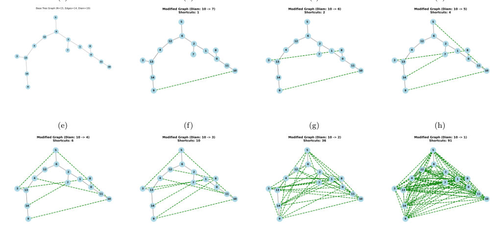
<figcaption class="paper-figure-caption"><b>Fig 1.</b> FIG. 1. Visual progression of the transport-augmentation algorithm. (a) The original base graph topology subject to the MaxCut cost Hamiltonian. (b)–(h) The modified interaction graph Gint following the iterative injection of shortcut transport couplings. This process sequentially collapses the structural diameter from d = 7 down to d = 1, thereby geometrically rewiring the causal lightcone to overcome depth-dependent locality obstructions without altering the underlying objective function.</figcaption>
</figure>
<figure class="paper-figure-card">
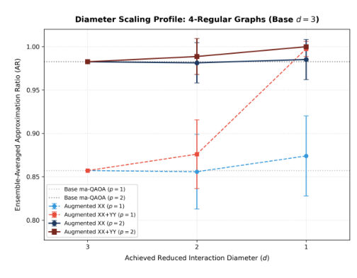
<figcaption class="paper-figure-caption"><b>Fig 2.</b> FIG. 2. Approximation Ratio for 4-regular instances (base diameter 3).</figcaption>
</figure>
<figure class="paper-figure-card">
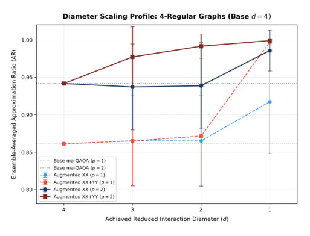
<figcaption class="paper-figure-caption"><b>Fig 3.</b> FIG. 3. Approximation Ratio for 4-regular instances (base diameter 4).</figcaption>
</figure>
<figure class="paper-figure-card">
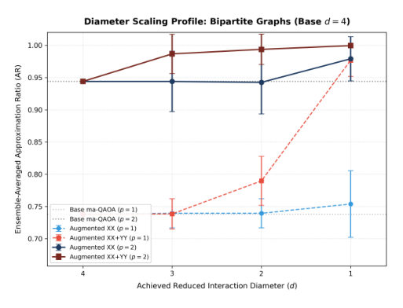
<figcaption class="paper-figure-caption"><b>Fig 4.</b> FIG. 4. Approximation Ratio for bipartite instances (base diameter 4).</figcaption>
</figure>
<figure class="paper-figure-card">
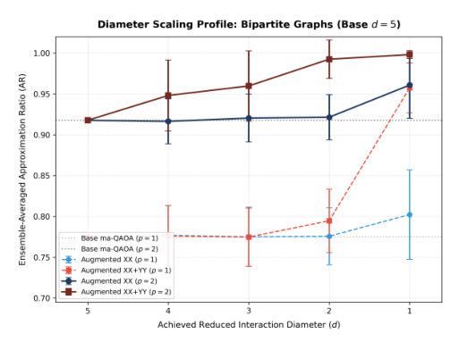
<figcaption class="paper-figure-caption"><b>Fig 5.</b> FIG. 5. Approximation Ratio for bipartite instances (base diameter 5).</figcaption>
</figure>

**Summary.** This paper tackles the locality bottleneck in QAOA by proposing a transport-augmented mixer that adds 'shortcut' couplings to the circuit structure. Theoretically, this augmentation collapses the effective interaction graph diameter, which has been shown to remove depth-dependent constraints and significantly boost the algorithm's approximation ratio on sparse graphs.

**Why it may be interesting.** The rigorous connection between graph topology (diameter) and quantum algorithm performance at finite depth is highly relevant for designing scalable quantum algorithms that overcome hardware connectivity limitations.

Detailed structure

**Main problem.** The primary challenge addressed is the 'locality bottleneck' in shallow-depth QAOA circuits when applied to sparse graphs with high interaction diameters.

**Main result.** By augmenting the mixer Hamiltonian with optimized shortcut couplings, the effective interaction graph diameter can be collapsed, leading to a significant and theoretically bounded improvement in the approximation ratio for MaxCut problems.

**Method.** The authors use exact finite-depth support recursions and graph theory (diameter augmentation) to prove that reducing the circuit's effective interaction diameter removes depth-dependent locality obstructions.

**Model / system.** The model is QAOA applied to finding the ground state of a MaxCut Hamiltonian on an instance graph G. The mixer is augmented by adding 'shortcut' couplings ($E_{new}$) to create a transport-augmented mixer, while the cost Hamiltonian remains fixed.

**Key observables.** Approximation Ratio (AR) for MaxCut; the support ($	ext{supp}$) of evolved observables, which is bounded by graph lightcones defined by the interaction diameter.

**Important parameters / regimes.** Circuit depth ($p$); base graph diameter ($	ext{diam}(G)$); the effective interaction-graph diameter ($d$).

**Assumptions / limitations.** The analysis relies on establishing precise bounds on the support of evolved operators using commutator relations and lightcone criteria, assuming that the primary limitation is purely geometric/topological.

**Figures summary.** Figures illustrate the Approximation Ratio for various graph types (bipartite, tree) showing a sharp increase towards unity when the interaction diameter is reduced to 1.

**Paper structure.** The paper progresses by first identifying the locality bottleneck based on depth $p$ and graph distance. It then introduces the transport-augmented mixer using shortcut couplings. The core of the work involves deriving theoretical bounds (lightcone criteria) showing how these shortcuts collapse the effective diameter, leading to improved performance metrics.

Abstract

Shallow-depth QAOA on sparse, high-diameter MaxCut instances faces a locality bottleneck: at depth \(p\), local observables can depend only on a bounded neighborhood of the circuit interaction graph. We propose a transport-augmented QAOA that keeps the MaxCut cost Hamiltonian unchanged but enriches the mixer with optimized, unweighted shortcut couplings (scheduled \(XX+YY\)) to collapse the effective interaction-graph diameter. Using exact finite-depth support recursions, we relate optimal shortcut placement to bounded-diameter graph augmentation, and show in benchmarks that (unlike ma-QAOA) performance becomes effectively size-invariant once the diameter is reduced. For bipartite families (base diameter 4), reducing the interaction path to \(d=1\) raises the ensemble-averaged approximation ratio from 0.7378 (ma-QAOA) to 0.9767 at \(p=1\) (\(σ=0.0251\), nine system sizes); on random trees (base diameter 10), at \(p=2\) it improves from 0.9226 to 0.9997 (\(σ=0.0001\)).

[↑ back to top](#top)

### [Fourier analysis of quantum neural network with non-linear data embedding](http://arxiv.org/abs/2606.14206v1)

**Authors:** Haiyue Kang, Martin Sevior, Muhammad Usman  
**Type:** theory · **Category:** quantum information and computing · **PDF:** <https://arxiv.org/pdf/2606.14206v1>  
**Analysis basis:** full PDF text, analyzed in chunks

↔ Scroll figures horizontally

<figure class="paper-figure-card">
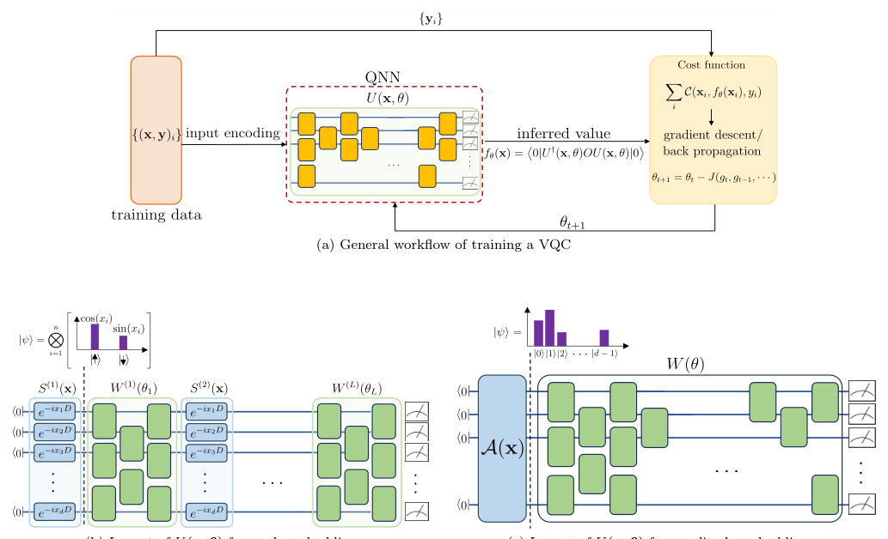
<figcaption class="paper-figure-caption"><b>Fig 1.</b> FIG. 1. (a) The general workflow to train a quantum neural network with a variational quantum circuit. First, a training dataset {(xi, yi)} ⊂X ×Y is prepared, where each classical input features xi are encoded onto the quantum state, together with the trainable variational circuits, denoted as U(xi, θ). The circuit is executed, and the expectation values with respect to some Hermitian observable O are evaluated. After each batch, the expectation values, as the currently fitted function values fθ(x), are fed into the cost function to compare with the actual values. Finally, the parameters are optimized according to some rule based on the gradient descent method on the cost function...</figcaption>
</figure>
<figure class="paper-figure-card">
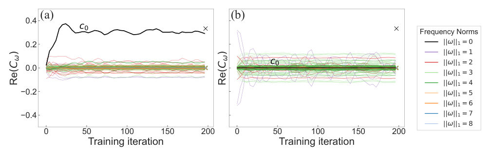
<figcaption class="paper-figure-caption"><b>Fig 2.</b> FIG. 2. The values of the sampled Fourier coefficients with (a) non-negative encoding and (b) symmetric encoding, plotted for the real part. The crosses at the end denote the values of the corresponding Fourier coefficients of the target function to fit. Notably, when using non-negative encoding, c0 is clearly well trained towards the target Fourier coefficient, whereas for symmetric encoding it perfectly remains at 0. The training iteration has a one-to-one mapping to the training sample size, with 400 points as one batch trained together per iteration.</figcaption>
</figure>
<figure class="paper-figure-card">
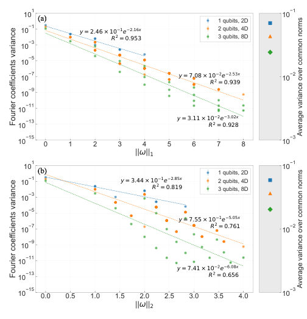
<figcaption class="paper-figure-caption"><b>Fig 3.</b> FIG. 3. Variance of the Fourier coefficients under non- negative amplitude embedding VQC model with simplified condition on observable O ∈Pn discussed as in Equation 26, plotted against the (a) L1 and (b) L2 frequency norms. The right panel plots the variance of the coefficients averaged over all common frequencies (∥ω∥1 ≤4 and ∥ω∥2 ≤∥(2, 2)∥2) for each qubit count. The integral I(ω) is evaluated numeri- cally via Mathematica, with its error ϵ estimated according to ϵ = α + βI(ω), where α = 10−3, β = 10−5 are the absolute and proportional tolerance, respectively. However, due to re- strictions on computation resources, Monte Carlo methods are used to evaluate I(ω) for the d = 8 case, where...</figcaption>
</figure>
<figure class="paper-figure-card">
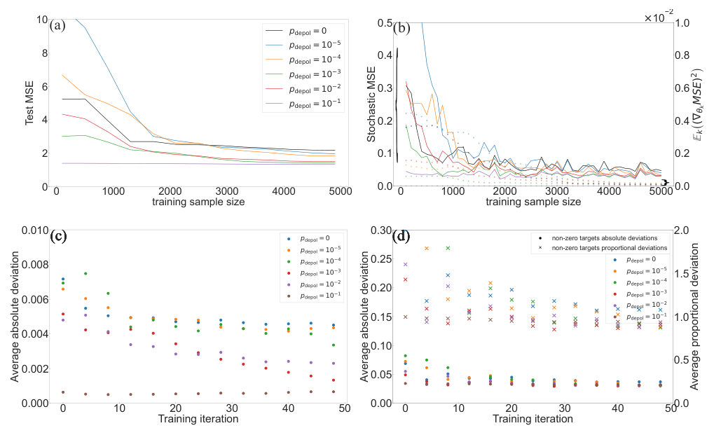
<figcaption class="paper-figure-caption"><b>Fig 4.</b> FIG. 4. (a) Test-set MSE versus the number of training samples. (b) Left panel: stochastic batch-wise MSE (lines). Right panel: mean squared gradient (scattered dots), also plotted against the number of training samples. (c) The mean absolute deviation of the sampled Fourier coefficients from their zero-valued targets, E ω∈Ω, cω=0(∣cω −c′ ω∣). where cω and c′ ω denote the</figcaption>
</figure>
<figure class="paper-figure-card">
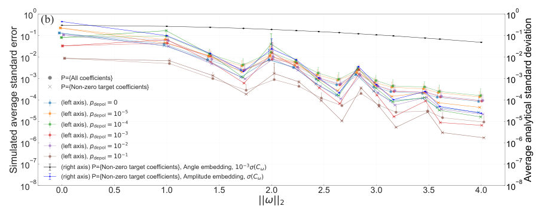
<figcaption class="paper-figure-caption"><b>Fig 5.</b> FIG. 5. (a) Left axis: empirical mean of the standard errors of the Fourier coefficients versus the L1 norm of their frequency,</figcaption>
</figure>

**Summary.** This work develops a comprehensive Fourier analysis framework to quantify the expressivity and trainability of Variational Quantum Circuits (VQCs) using non-linear amplitude embedding. It theoretically proves that choosing a non-negative input domain over a symmetric one is critical for model performance, as it allows the network to learn constant functions. Furthermore, the analysis quantifies how noise suppresses the variance of these Fourier coefficients, providing theoretical guarantees for deployment on noisy quantum hardware.

**Why it may be interesting.** The rigorous mathematical characterization of expressivity via the frequency spectrum provides deep insights into the limitations of quantum machine learning models, which is crucial for designing practical, noise-resilient quantum algorithms.

Detailed structure

**Main problem.** The paper aims to rigorously analyze the expressivity and trainability of Variational Quantum Circuit (VQC) models, particularly concerning how different data embedding techniques affect learning capabilities.

**Main result.** Amplitude embedding provides a superior framework compared to angle embedding because its non-negative domain encoding allows the model to learn constant functions ($c_0 
eq 0$), while theoretical analysis shows that noise suppresses the variance of Fourier coefficients exponentially with channel applications.

**Method.** The core method involves developing a Fourier analysis for VQCs, using Weingarten calculus and moment calculations (first and second moments) to derive analytical bounds on the mean and variance of the Fourier coefficients under both noiseless and noisy conditions.

**Model / system.** The system is a Variational Quantum Circuit (VQC) used as a quantum neural network. The analysis compares two data encoding methods: angle-embedding and amplitude-embedding, which dictates how classical input features are mapped onto the quantum circuit's unitary evolution.

**Key observables.** Fourier coefficients ($c_\omega$), variance ($	ext{Var}_	heta(c_\omega)$), mean expectation value ($E_	heta[c_\omega]$), and Mean Squared Error (MSE) of the trained model.

**Important parameters / regimes.** Noise strength ($p_{	ext{depol}}$), number of channel instances ($Q$), frequency magnitude ($\|\omega\|_1, \|\omega\|_2$), and the choice of encoding domain (symmetric vs. non-negative).

**Assumptions / limitations.** The analysis assumes that the ensemble of unitaries generated from the parameter space forms at least a 2-design with respect to the unitary group, which simplifies moment calculations.

**Figures summary.** Figures illustrate the comparison between symmetric and non-negative encoding regarding $c_0$ convergence (Figure 2), show exponential decay of coefficient variance with frequency norm (Figure 3), and compare standard error scaling under depolarizing noise (Figure 5 & 6).

**Paper structure.** The paper progresses by first establishing the general Fourier framework, then contrasting angle vs. amplitude embedding based on domain choice (symmetric vs. non-negative) to analyze $c_0$. It subsequently derives moment equations for noisy channels using Weingarten calculus and validates these results through extensive simulations.

Abstract

Fourier analysis has become a crucial tool for understanding the expressivity of Variational Quantum Circuit (VQC) models, as well as an important indicator of barren plateaus (BP). While existing literature has only studied angle-embedded VQCs in a noiseless environment, here we develop the Fourier analysis of VQCs with non-linear data embedding, with particular focus on amplitude embedding, which provides a naturally compact encoding scheme. We first investigate a subtle difference in the domain of input features within amplitude embedding that leads to a distinct expressivity of the zero-frequency Fourier coefficient. By assuming that the ensemble of unitaries generated from the parameter space forms at least a 2-design with respect to the unitary group, we derive, via Weingarten calculus, that the mean of the Fourier coefficients is concentrated at zero, and the variance scales at an exponentially decaying order with respect to the multi-dimensional frequency magnitude. When a noise channel with unitary Kraus operators and probabilities $\{p_k\}$ is taken into account, the variance is further suppressed by a factor $\left(\sum_k p_k^2\right)^{Q}<1$, where $Q$ is the number of channel instances applied. Furthermore, we demonstrate and validate the analytical results through simulations, both noiseless and noisy, including a case where target functions are decomposed into non-integer frequencies, highlighting the practical utility of the approach. Our results establish a rigorous Fourier framework for amplitude-encoded VQCs, offering both theoretical guarantees on expressivity, hence trainability scaling in the frequency domain, as well as practical simulations for deployment on noisy quantum devices.

[↑ back to top](#top)

### [Local Coverage Governs Memorization in Diffusion Models](http://arxiv.org/abs/2606.14390v1)

**Authors:** Claudia Merger, Sebastian Goldt  
**Type:** both · **Category:** disordered systems and neural networks · **PDF:** <https://arxiv.org/pdf/2606.14390v1>  
**Analysis basis:** full PDF text, analyzed in chunks

↔ Scroll figures horizontally

<figure class="paper-figure-card">
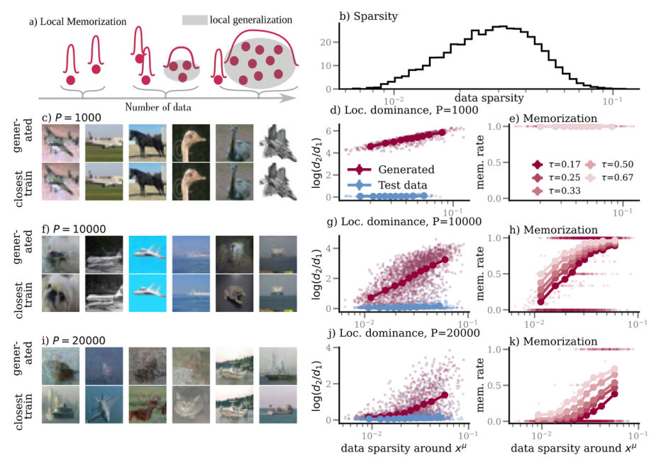
<figcaption class="paper-figure-caption"><b>Fig 1.</b> Figure 1: Local data coverage governs memorization. a) Sketch of local memorization in kernel density approximation. b) Histogram of data sparsity, measured by the average squared distance of a training point its 10 nearest neighbors, for 20,000 CIFAR10 samples. c) Generated samples + closest training image (measured by ℓ2 distance) for a diffusion model trained on P = 1000 training examples. d) For each generated sample ˆx, we compute the local dominance as the log-ratio log d2/d1 between the distances d1 and d2 to its nearest and second-nearest training samples. For each training sample xµ, we show distances to generated images (red) and test data (blue), providing a baseline without...</figcaption>
</figure>
<figure class="paper-figure-card">
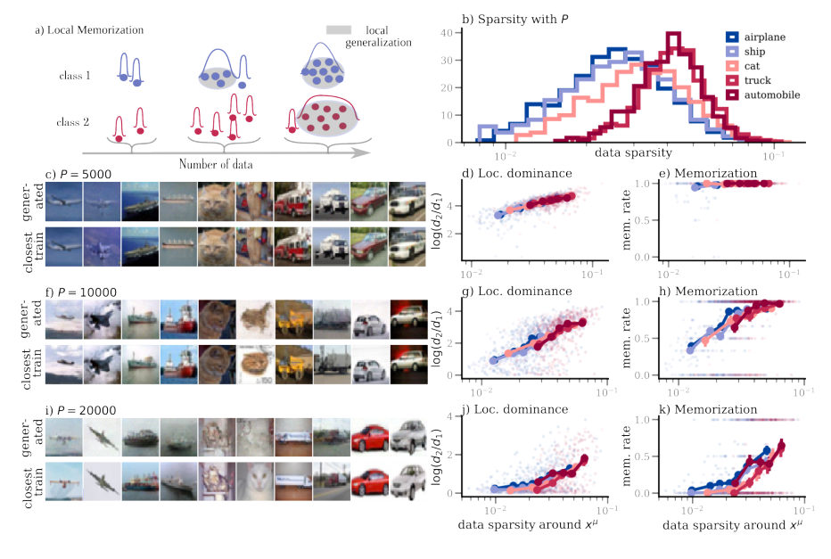
<figcaption class="paper-figure-caption"><b>Fig 2.</b> Figure 2: Intra-class sparsity predicts class-wise memorization. a) Schematic illustration of KDE for two classes with different local sparsities. b) Distribution of per-class sparsity around training points for different subclasses of CIFAR-10, measured from 20,000 training samples. c) Generated samples together with their closest training example (measured by cosine similarity) for a diffusion model trained on P = 1000 samples, sorted to contain 2 nearest neighbors for each of the four classes shown in b). d) Local dominance as a function of sparsity. For each generated sample ˆx, we compute distances d1 and d2 to its nearest and second-nearest training samples, and define dominance via...</figcaption>
</figure>

**Summary.** This paper develops a local theory demonstrating that memorization in diffusion models is dictated by the local data coverage—specifically, regions with low data density are more likely to memorize training samples. By connecting the model's behavior to Kernel Density Estimation, it provides a quantitative framework explaining the coexistence of generalization and rote memorization within a single generative process.

**Why it may be interesting.** It provides a rigorous, geometry-based understanding of model failure modes (memorization) in deep generative models by mapping them onto established concepts from statistical physics like local density estimation and phase transitions.

Detailed structure

**Main problem.** The work aims to move beyond treating memorization in diffusion models as a global property, instead establishing that it is governed by the local data coverage of the training manifold.

**Main result.** Memorization occurs preferentially in regions of low local data coverage (high sparsity), while dense regions support generalization and interpolation. This relationship can be theoretically derived using connections to Kernel Density Estimation (KDE).

**Method.** The authors combine theoretical derivations based on the exponential transform of KDE with empirical validation using metrics like local dominance and nearest-neighbor statistics.

**Model / system.** The system is a Diffusion Model trained on finite image datasets (e.g., CIFAR-10, CelebA). The analysis treats the model's learned density estimation process as analogous to Kernel Density Estimation (KDE) operating in high dimensions.

**Key observables.** Local data coverage ($
ho_{in}(x)$), local sparsity, local dominance ($\Delta$), and the memorization rate (based on nearest-neighbor distances).

**Important parameters / regimes.** The ratio of local density to sample complexity parameter ($\alpha$); the threshold $	au$ used for defining memorization based on distance ratios.

**Assumptions / limitations.** The theoretical analysis relies on high-dimensional limits ($N 	o \infty$) and specific scaling assumptions regarding the relationship between data points and the KDE approximation.

**Figures summary.** Figures illustrate that local dominance increases with sparsity, confirming that sparse regions are prone to single-sample retrieval (memorization), while dense regions show interpolation behavior. Multi-class settings show class diversity correlating with memorization risk.

**Paper structure.** The paper progresses from identifying the global limitation of prior work to developing a local theory linking memorization to KDE statistics, providing mathematical proofs for the transition regimes, and finally validating these predictions across multiple image datasets using geometric metrics.

Abstract

Memorization in diffusion models is often treated as a global property of the model or dataset. In practice, however, a single diffusion model can simultaneously generate both memorized and novel samples. Which training samples are most likely to be memorized? In this work, we show that memorization is governed by \emph{local data coverage}. Leveraging the connection between diffusion models and kernel density estimation (KDE), we derive a theoretical criterion that predicts whether a point is memorized based on the density of training data in its neighborhood and the size of the training dataset. In the high-dimensional limit, this leads to a sharp, local transition: regions of low coverage are dominated by isolated training samples, which are memorized, while dense regions support interpolation and generalization. We validate these predictions empirically, showing that memorization increases with local sparsity and that diffusion models exhibit a coexistence of memorized and novel samples within the same model. Extending this framework to multi-class settings, we further show that classes with higher intra-class sparsity (and thus lower local coverage) are more strongly memorized. Our results provide a local view of memorization in diffusion models, explaining when and where memorization occurs in terms of data geometry.

[↑ back to top](#top)

## Secondary cond-mat archives

*Papers from cond-mat.mtrl-sci, mes-hall, other, soft, supr-con. These archives are de-prioritized — they appear at the end regardless of relevance score.*

### Relevant in secondary archives (14)

### [First-principles calculations of internal conversion processes in spin defects](http://arxiv.org/abs/2606.14545v1)

**Authors:** Stefano Paolo Villani, Yu Jin, Giulia Galli  
**Type:** theory · **Category:** quantum information and computing · **PDF:** <https://arxiv.org/pdf/2606.14545v1>  
**Analysis basis:** full PDF text, analyzed in chunks
**Topic relevance:** 🔥 `spintronics-quantum-optics interface` **4/5** · `exotic spin models in light-matter` **3/5** · `QC/QI experiment` **2/5** · `Keldysh / 2PI / non-Gaussian methods` **1/5** · `correlated / nonlocal dissipation` **1/5** · `driven-dissipative phase transition` **1/5** · `methods for driven-dissipative` **1/5**

↔ Scroll figures horizontally

<figure class="paper-figure-card">
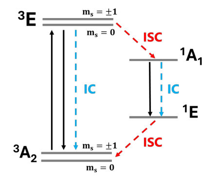
<figcaption class="paper-figure-caption"><b>Fig 1.</b> Figure 1. Schematic representation of the electronic energy levels of the NV−center in diamond and of the VV0 center in silicon carbide. Both systems exhibit a triplet ground state (3A2) and triplet excited state (3E), and two singlet shelving states, 1A1 and 1E, all labeled according to the C3v point group. In an optical cycle, after a laser excitation from 3A2 to 3E, the system can either return to the ground state or transition to 1A1 through inter-system crossing (ISC); from 1A1 the electron then relaxes to 1E, through non-radiative spin-conserving transitions (internal conversion, IC), and fi- nally to the ground state through a second ISC process. The magnetic sublevels of the ground...</figcaption>
</figure>
<figure class="paper-figure-card">
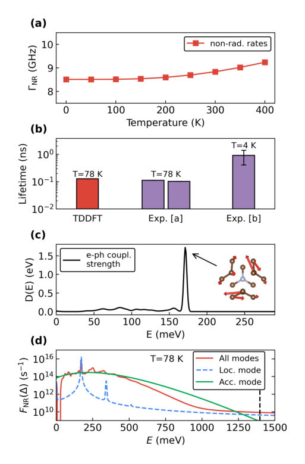
<figcaption class="paper-figure-caption"><b>Fig 2.</b> Figure 2. (a): Non-radiative transition rates between the singlet states in the NV−center in diamond (from Eq. (1)). (b): Computed lifetimes of the 1A1 state compared to the experimental results of Ulbricht et al.[58] [a], and Acosta et al.[57]. [b]. (c): Computed electron-phonon spectral density function [Eq. (10)], exhibiting a peak at the energy E ≃ 170 meV of the vibrational mode localized around the defect (shown in the inset). (d): Comparison between line-shape functions obtained within different approximations; the black dashed line indicates the TDDFT adiabatic energy difference ∼1.397 eV.</figcaption>
</figure>
<figure class="paper-figure-card">
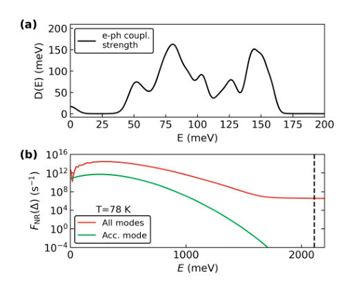
<figcaption class="paper-figure-caption"><b>Fig 3.</b> Figure 3. (a): Computed electron-phonon spectral density function D(E) [Eq. (10)] for the transition between the triplet states of the NV−center in diamond. (b): Comparison be- tween line-shape functions obtained within different approx- imations. The black dashed line indicates the TDDFT adia- batic energy difference ∆IF = 2.112 eV.</figcaption>
</figure>
<figure class="paper-figure-card">
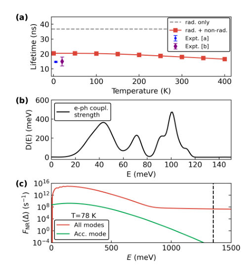
<figcaption class="paper-figure-caption"><b>Fig 4.</b> Figure 4. (a): Radiative lifetime of the 3E excited state of the kk-VV0 center in 4H-SiC[13] (gray dashed line), com- puted at the DFT level of theory with the PBE functional. The red squares show the total computed lifetime, includ- ing non-radiative decays, and the blue and purple dots in- dicate experimental measurements from Ref.s[62] [a] and [61] [b]. (b): Computed electron-phonon spectral density function D(E) [Eq. (10)]. (c): Comparison between line-shape func- tions obtained within different approximations. The black dashed line indicates the TDDFT adiabatic energy difference ∆IF = 1.351 eV.</figcaption>
</figure>

**Summary.** The paper presents a rigorous theoretical framework to calculate non-radiative internal conversion rates in key spin defects like $	ext{NV}^-$ and $	ext{V}V^0$. By incorporating multi-phonon effects using advanced TDDFT techniques, the authors achieve quantitative agreement with experimental measurements. This work is vital for advancing solid-state quantum technologies by accurately modeling decoherence pathways.

**Why it may be interesting.** This work directly addresses the fundamental physical mechanisms governing spin relaxation in solid-state quantum emitters, which is crucial for designing reliable quantum memory and processing elements.

Detailed structure

**Main problem.** Common approximations severely underestimate the internal conversion (IC) rates in optically active spin defects, necessitating a full theoretical treatment of non-radiative decay pathways.

**Main result.** The proposed framework achieves quantitative agreement with experiment for $	ext{NV}^-$ in diamond and resolves discrepancies regarding the triplet lifetime in $	ext{SiC}$ by incorporating all phonon modes.

**Method.** The study uses a predictive theoretical framework combining Time-Dependent DFT (TDDFT) with hybrid functionals to calculate non-radiative transition rates ($\Gamma_{NR}$) via multi-phonon coupling, including analytical derivatives of non-adiabatic couplings.

**Model / system.** The research focuses on optically active spin defects, specifically the $	ext{NV}^-$ center in diamond and the divacancy ($	ext{V}V^0$) center in silicon carbide ($	ext{SiC}$), which are foundational platforms for quantum technologies.

**Key observables.** Non-radiative transition rates ($\Gamma_{NR}$), excited state lifetimes ($	au$), electron-phonon spectral density function $D(E)$, and adiabatic energy differences ($\Delta_{IF}$).

**Important parameters / regimes.** Temperature ($T=4 	ext{ K}$ to $400 	ext{ K}$), specific transitions like $1	ext{A}_1 
ightarrow 1	ext{E}$, and the comparison between different DFT functionals (PBE vs. DDH).

**Assumptions / limitations.** The calculations employ the displaced harmonic oscillator approximation, and initial comparisons highlight that single-mode or accepting-mode approximations are inadequate.

**Figures summary.** Figures compare calculated non-radiative rates ($\Gamma_{NR}$) using different methods (e.g., all modes vs. localized mode) against experimental lifetimes; other figures show spectral densities $D(E)$ and functional dependencies of these rates.

**Paper structure.** The paper develops a comprehensive theoretical framework for IC processes, applies it to $	ext{NV}^-$ in diamond and $	ext{V}V^0$ in $	ext{SiC}$, compares results across different computational approximations (e.g., PBE vs. DDH), and validates the methodology against established experimental measurements.

Abstract

Optically active spin defects are foundational for quantum technologies, yet common approximations underestimate their internal conversion (IC) rates by orders of magnitude. We propose a broad, predictive framework to compute IC rates that incorporates multi-configurational effects via many-body wavefunctions in TDDFT, and includes all-phonon-mode contributions via analytical non-adiabatic couplings. Our approach resolves discrepancies with experiment, achieving quantitative agreement for the NV$^-$ center in diamond, and identifying a previously overlooked non-radiative channel in the divacancy triplet lifetime in SiC.

[↑ back to top](#top)

### [Monolithic hybrid quantum dot devices in superconducting twisted bilayer graphene](http://arxiv.org/abs/2606.14685v1)

**Authors:** Alexandra Mestre-Torà, Marta Perego, Clara Galante Agero, Takashi Taniguchi, Kenji Watanabe, Thomas Ihn, Klaus Ensslin, Artem O. Denisov  
**Type:** experiment · **Category:** strongly correlated electrons · **PDF:** <https://arxiv.org/pdf/2606.14685v1>  
**Analysis basis:** full PDF text, analyzed in chunks
**Topic relevance:** 🔥 `analog quantum simulation` **4/5** · `Kondo & dissipative impurity` **3/5** · `non-equilibrium dynamics` **2/5** · `Keldysh / 2PI / non-Gaussian methods` **1/5** · `QC/QI experiment` **1/5** · `driven-dissipative phase transition` **1/5**

↔ Scroll figures horizontally

<figure class="paper-figure-card">
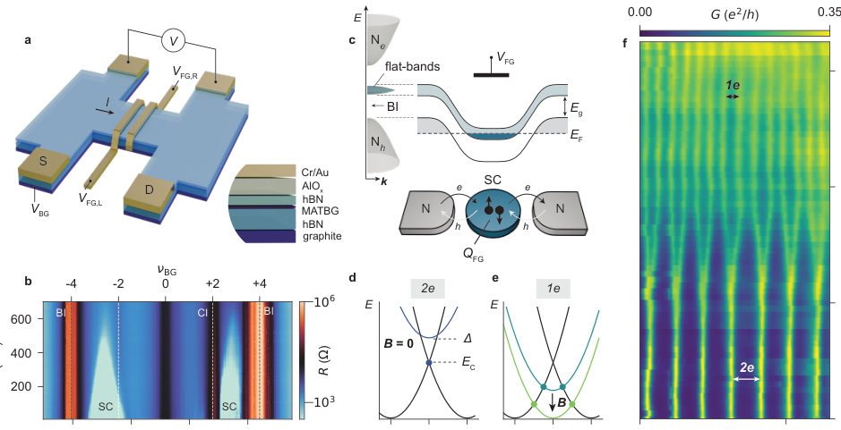
<figcaption class="paper-figure-caption"><b>Fig 1.</b> FIG. 1. Device and superconducting island regime. a, Schematic of the device (left) consisting of MATBG encapsulated in hBN on a graphite back gate (VBG). The MATBG is contacted with Cr/Au electrodes used as source (S) and drain (D) contacts, as well as voltage probes for current bias (I) measurements of the longitudinal resistance R = V/I. Two finger gates (VFG,L and VFG,R), on top of the AlOx insulating layer, traverse the etched structure. The inset (bottom right) shows a zoom-in of the cross-section of the heterostructure. b, Four-probe resistance R of the MATBG bulk as a function of VBG, bulk filling factor νBG, and temperature T, showing superconducting (SC) domes and band insulator...</figcaption>
</figure>
<figure class="paper-figure-card">
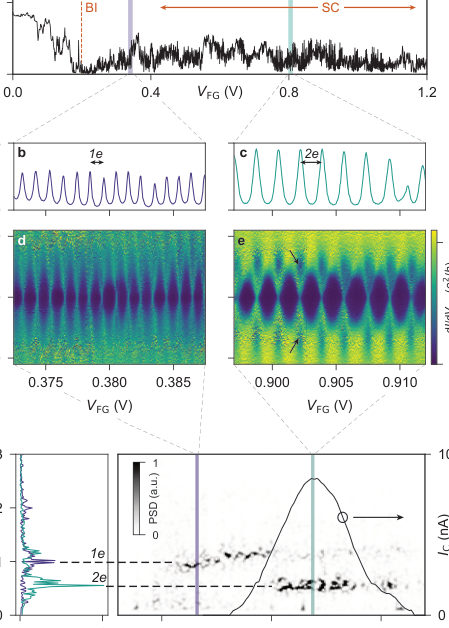
<figcaption class="paper-figure-caption"><b>Fig 2.</b> FIG. 2. Normal and superconducting Coulomb os- cillations in the flat-bands. a, Conductance G as a func- tion of finger-gate voltage VFG (bottom axis) and the cor- responding filling factor νFG (top axis), with the bulk fixed at νBG = −4.4. The orange horizontal line marks the su- perconducting (SC) region. The vertical orange dashed line marks the band insulator (BI) state. b, c, Zoom-ins of the conductance trace in a in the normal (purple, b) and su- perconducting (teal, c) regimes, showing 1e- and 2e-periodic Coulomb resonances respectively. d, e, Differential conduc- tance dI/dVSD as a function of source-drain bias VSD and VFG in the normal (d) and superconducting (e) regimes. The black...</figcaption>
</figure>
<figure class="paper-figure-card">
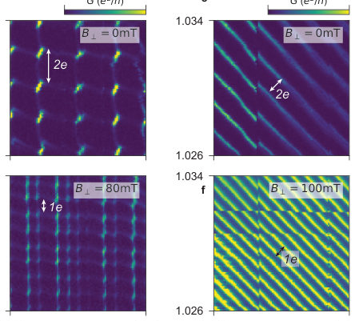
<figcaption class="paper-figure-caption"><b>Fig 3.</b> FIG. 3. Double island regime. a,b, Band edge profiles for different values of νBG. The finger gates (FGs) VFG,L and VFG,R define two independent islands (a) or a single island (b). c,d, Charge stability diagrams (CSDs) at B⊥= 0 T in the double (c, νBG = −4.7) and single (d, νBG = −4.5) su- perconducting island regimes, showing 2e-periodicity in both FGs. e,f, CSDs at B⊥= 80 mT (e) and B⊥= 100 mT (f) for the same gate configurations with quenched superconductiv- ity (1e).</figcaption>
</figure>
<figure class="paper-figure-card">
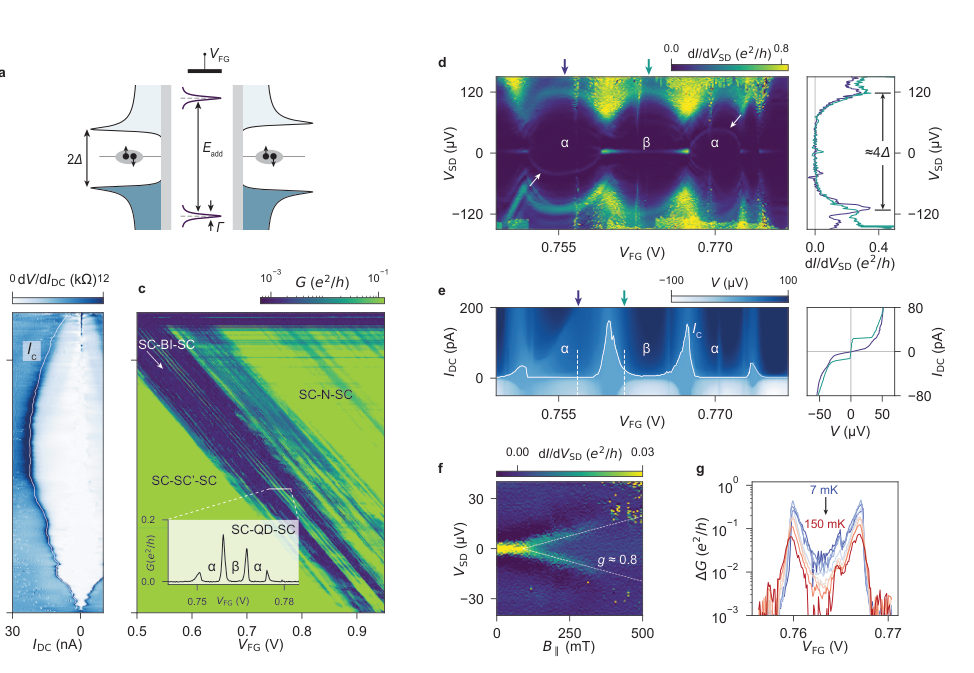
<figcaption class="paper-figure-caption"><b>Fig 4.</b> FIG. 4. Proximitized quantum dot. a, Schematic energy diagram of the proximitized dot with discrete levels separated by the addition energy Eadd. The finger-gate voltage VFG controls the state of the dot and its coupling Γ to the superconducting leads, with a gap ∆. b, Differential resistance dV/dIDC as a function of current bias IDC and bulk filling factor νBG showing a finite critical current Ic on the electron-doped side. c, Conductance G as a function of VFG and same νBG range as in b. The labels SC-X-SC indicate the different states of the finger-gate region (X = SC’, BI, QD, N) within the SC leads. Inset: line cut and zoom into the four resonances with their charge parity labeled α...</figcaption>
</figure>

**Summary.** The research reports on monolithic quantum devices built using superconducting twisted bilayer graphene (MATBG). By combining electrostatic confinement with intrinsic superconductivity, the authors demonstrated distinct signatures of correlated physics, including $2e$-periodic transport in superconducting islands and parity-dependent subgap states in coupled quantum dots. This platform offers a highly tunable solid-state system for fundamental studies of strongly interacting electrons.

**Why it may be interesting.** This work provides an experimental realization of tunable superconductivity coupled to strongly correlated electron physics in a 2D material platform, offering a clean system to study charge quantization effects beyond simple BCS superconductors.

Detailed structure

**Main problem.** To create a platform for studying strongly correlated physics by combining electrostatic confinement with tunable superconductivity within a monolithic, interface-free architecture.

**Main result.** The authors demonstrated robust $2e$-periodic transport in superconducting islands and observed even-odd parity modulation in subgap Andreev states within proximitized quantum dots on MATBG.

**Method.** Transport measurements (conductance/resistance) were performed using four-probe techniques across varying gate voltages, magnetic fields, and temperatures.

**Model / system.** The physical system is Magic-angle twisted bilayer graphene (MATBG), which hosts tunable superconductivity. The device integrates superconducting islands and quantum dots controlled electrostatically via finger gates.

**Key observables.** $2e$-periodic Coulomb oscillations, $1e$-periodic oscillations, subgap Andreev states, supercurrent modulation ($I_c$), and the transition between these periodicities based on external fields.

**Important parameters / regimes.** Superconducting gap ($\Delta$), charging energy ($E_C$), moiré filling factor ($
u_{	ext{BG}}$), and magnetic field strength ($B_{\perp}, B_{\parallel}$).

**Assumptions / limitations.** The system is modeled using concepts from the Cooper-pair box approach for charge confinement, operating in regimes where $\Delta$ competes with $E_C$.

**Figures summary.** Figures illustrate superconducting domes and insulating states across gate voltage maps; specific plots show the transition of Coulomb oscillation periodicity from $2e$-periodic to $1e$-periodic as a perpendicular magnetic field is applied.

**Paper structure.** The paper systematically characterizes the device by first mapping bulk phases (SC, BI, CI), then detailing single superconducting islands showing $2e$-periodicity, and finally analyzing proximitized quantum dots exhibiting parity-dependent subgap features and supercurrent modulation.

Abstract

Gate-tunable superconductivity in magic-angle twisted bilayer graphene (MATBG) has enabled the realization of superconducting devices, such as Josephson junctions, within a single crystal. This interface-free platform provides a reconfigurable and scalable architecture that overcomes limitations of conventional superconducting-semiconducting systems. Incorporating single-electron control enables access to regimes in which flat-band superconductivity competes with strong Coulomb repulsion, providing a platform for studying correlated physics phenomena. Here, we report a new class of quantum devices that combines electrostatic confinement with tunable superconductivity in a monolithic MATBG architecture. Within a single device, we demonstrate two complementary hybrid systems: superconducting islands and proximitized quantum dots. The superconducting island exhibits $2e$-periodic transport, indicating a well-defined gap protected against quasiparticle poisoning. The proximitized quantum dot hosts subgap Andreev states together with a strongly parity-modulated supercurrent.

[↑ back to top](#top)

### [DFTB coupled with NEGF study of the structural, electronic and transport properties of goldene 2D material](http://arxiv.org/abs/2606.13869v1)

**Authors:** Taoufik Sakhraoui, František Karlický  
**Type:** theory · **Category:** other · **PDF:** <https://arxiv.org/pdf/2606.13869v1>  
**Analysis basis:** full PDF text, analyzed in chunks
**Topic relevance:** `methods for driven-dissipative` **3/5** · `non-equilibrium dynamics` **3/5** · `spintronics-quantum-optics interface` **3/5** · `driven-dissipative phase transition` **2/5** · `non-equilibrium universality` **2/5** · `Keldysh / 2PI / non-Gaussian methods` **1/5** · `Kondo & dissipative impurity` **1/5** · `analog quantum simulation` **1/5** · `exotic spin models in light-matter` **1/5**

↔ Scroll figures horizontally

<figure class="paper-figure-card">
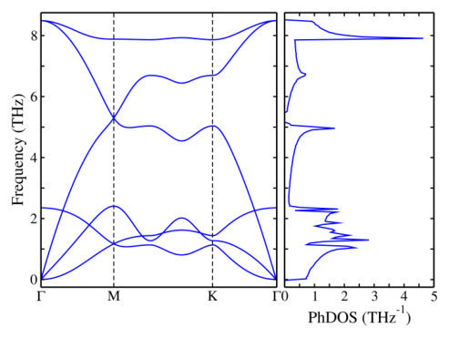
<figcaption class="paper-figure-caption"><b>Fig 1.</b> Figure 1: Phonon dispersion curve and phonon density of states (PhDOS) of the goldene monolayer.</figcaption>
</figure>
<figure class="paper-figure-card">
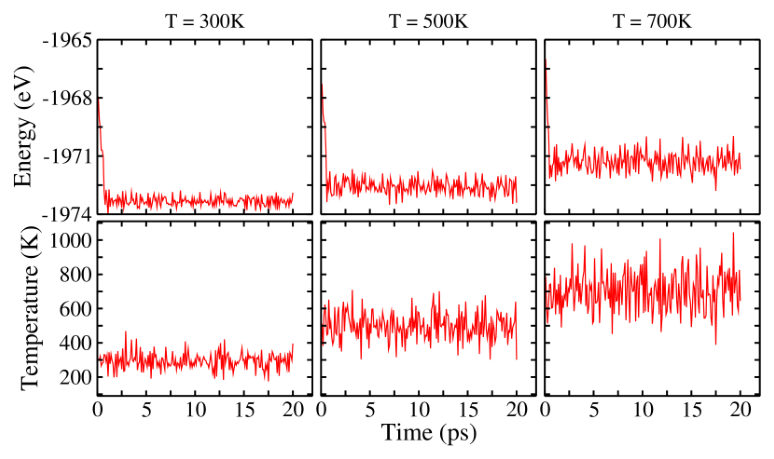
<figcaption class="paper-figure-caption"><b>Fig 2.</b> Figure 2: The energy and temperature of the goldene monolayer as a function of simulation time at temperatures of 300 K, 500 K, and 700 K.</figcaption>
</figure>
<figure class="paper-figure-card">
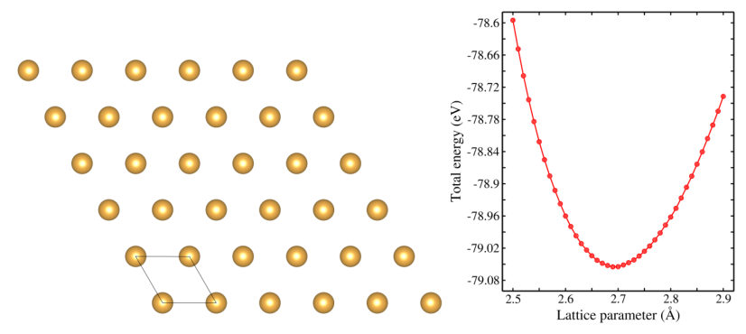
<figcaption class="paper-figure-caption"><b>Fig 3.</b> Figure 3: (a) Hexagonal close packed structure of Au monolayer. (b) Total energy as function as the lattice parameter.</figcaption>
</figure>
<figure class="paper-figure-card">
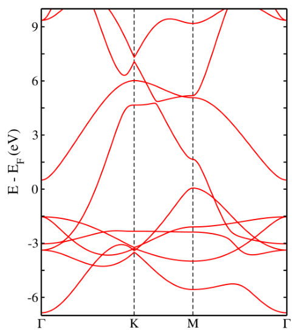
<figcaption class="paper-figure-caption"><b>Fig 4.</b> Figure 4: Electronic band structure of goldene 2D material calculated by DFTB method.</figcaption>
</figure>
<figure class="paper-figure-card">
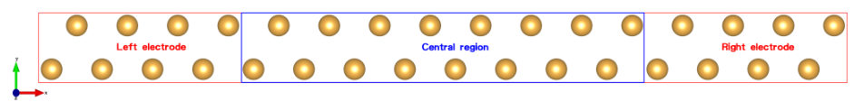
<figcaption class="paper-figure-caption"><b>Fig 5.</b> Figure 5: Setup of the Au/Au/Au junction for the transport calculations, which consists of the right and left electrodes, and the central region.</figcaption>
</figure>

**Summary.** This theoretical study characterizes the physical properties of goldene 2D material using advanced computational techniques like DFTB+NEGF. It confirms the material's mechanical robustness and metallic conductivity while demonstrating that doping with Silicon can induce a measurable local magnetic moment, making it interesting for spintronic applications.

**Why it may be interesting.** While focused on condensed matter physics rather than quantum information directly, the use of NEGF/DFTB methods for calculating quantized conductance and spin transport in low-dimensional systems is foundational to understanding nanoscale electronic devices relevant to future quantum technologies.

Detailed structure

**Main problem.** To investigate the structural, electronic, and transport properties of goldene (Au) 2D material, including how substitutional doping with Silicon (Si) affects its magnetic behavior.

**Main result.** Goldene is found to be dynamically and thermally stable, exhibiting metallic conductivity. Si doping successfully induces a local magnetic moment ($\approx 0.63 \mu_B$) in the otherwise nonmagnetic monolayer.

**Method.** The study employs Density Functional Tight-Binding (DFTB) coupled with Non-Equilibrium Green's Functions (NEGF) for transport calculations, supplemented by Molecular Dynamics (MD) and phonon dispersion analysis for stability assessment.

**Model / system.** The primary system is the planar goldene 2D material. The model is extended to include substitutional Si doping at an Au vacancy site within a supercell geometry, analyzed as a two-probe electronic device.

**Key observables.** Current-potential ($I$-$V$) curve, zero-bias transmission function $T(E)$, magnetic moment ($\mu$), elastic constants ($C_{ij}$), and lattice thermal conductivity.

**Important parameters / regimes.** Temperature up to 700 K; applied bias voltage (non-equilibrium); doping concentration/site.

**Assumptions / limitations.** The accuracy of the results relies on the DFTB approximation, and transport calculations utilize the Landauer formula formalism within the NEGF framework.

**Figures summary.** Figures illustrate phonon dispersion curves confirming dynamic stability, MD energy vs. time plots showing thermal stability up to 700 K, electronic band structures confirming metallic nature, and spin density maps visualizing the induced magnetic moment upon Si doping.

**Paper structure.** The paper follows a progression from structural/mechanical characterization (stability, elastic constants) to electronic structure analysis (band theory), culminating in non-equilibrium transport calculations ($I$-$V$ curves) and finally investigating defect chemistry and magnetism via Si doping.

Abstract

We report the structural, electronic, and transport properties of the goldene 2D material using the density functional tight-binding (DFTB) method. Electronic transport calculations were conducted in conjunction with the non-equilibrium Green's functions (NEGF) technique. Our study reveals that the Au 2D material is dynamically and thermally stable, and it possesses good elastic properties. On the other hand, goldene has a linear relationship between current and voltage at low potentials, indicating its metallic character. The calculated current-potential curve correlates well with transmission functions and the electronic density of states around the Fermi level. We also investigated the electronic structure and magnetic properties of silicon (Si)-doped Au 2D material. Our results show that the Si atom can induce a local magnetic state in the goldene monolayer. The resulting magnetic moment is 0.63 $μ_B$.

[↑ back to top](#top)

### [Measuring qualitative change: A variational score for tracking dynamical shifts in partial differential equations](http://arxiv.org/abs/2606.14430v1)

**Authors:** Joseph J. Pollacco, Jonathan Wong, Navonil Neogi, Callum Simpson, Eloisa Bentivegna  
**Type:** theory · **Category:** other · **PDF:** <https://arxiv.org/pdf/2606.14430v1>  
**Analysis basis:** full PDF text, analyzed in chunks
**Topic relevance:** `Keldysh / 2PI / non-Gaussian methods` **3/5** · `driven-dissipative phase transition` **3/5** · `methods for driven-dissipative` **3/5** · `non-equilibrium dynamics` **2/5** · `non-equilibrium universality` **2/5** · `Frenkel-Kontorova` **1/5** · `analog quantum simulation` **1/5** · `correlated / nonlocal dissipation` **1/5** · `correlated cavity matter` **1/5**

↔ Scroll figures horizontally

<figure class="paper-figure-card">
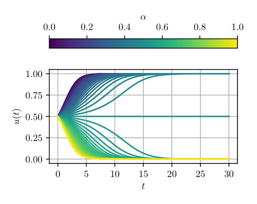
<figcaption class="paper-figure-caption"><b>Fig 1.</b> FIG. 2. Solutions to (19), describing the single population Allee effect, for different values of the parameter α. Trajec- tories are coloured based on the corresponding value of α.</figcaption>
</figure>
<figure class="paper-figure-card">
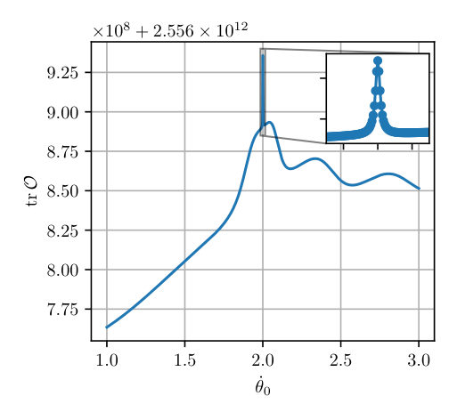
<figcaption class="paper-figure-caption"><b>Fig 2.</b> FIG. 1. Trace of the O operator for a family of solutions across the transition between back-and-forth oscillations ( ˙θ0 &lt; 2), and full revolutions ( ˙θ0 &gt; 2).</figcaption>
</figure>
<figure class="paper-figure-card">
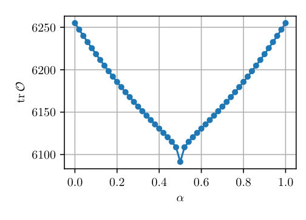
<figcaption class="paper-figure-caption"><b>Fig 3.</b> FIG. 3. tr O for the single population Allee effect model (19), evaluated for different values of the parameter α = 0, 0.02, . . . , 1.</figcaption>
</figure>
<figure class="paper-figure-card">
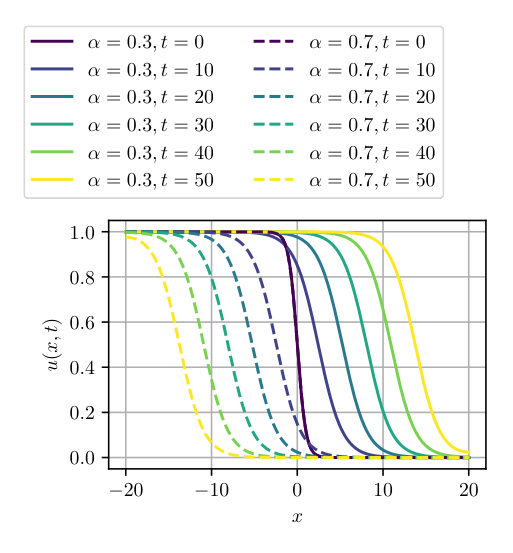
<figcaption class="paper-figure-caption"><b>Fig 4.</b> FIG. 4. Solution to (20) at t = 0, 10, 20, 30, 40, 50 for α = 0.3 (solid lines) and α = 0.7 (dashed lines). The solution asymptotically tends to the shape of an Allee wavefront, with the evolved profiles approximately travelling waves far from the boundary.</figcaption>
</figure>
<figure class="paper-figure-card">
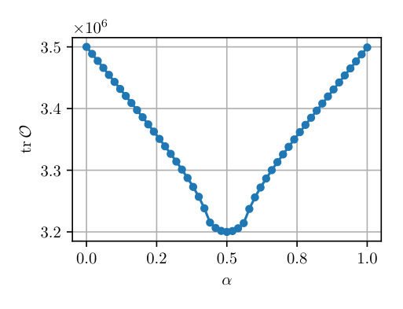
<figcaption class="paper-figure-caption"><b>Fig 5.</b> FIG. 5. tr O for the spatially inhomogeneous Allee effect model (20), evaluated for α = 0, 0.02, . . . , 1.</figcaption>
</figure>

**Summary.** This paper introduces a novel mathematical diagnostic tool, the variational score $	ext{tr} O$, designed to measure qualitative changes and detect global bifurcations in deterministic dynamical systems governed by PDEs. By analyzing how the PDE residual changes under solution deformation, the authors demonstrate that this score reliably pinpoints critical transitions across diverse physical models, surpassing limitations of purely local stability analyses.

**Why it may be interesting.** While not directly focused on quantum systems, the methodology for detecting global bifurcations and phase transitions using a variational diagnostic score ($	ext{tr} O$) is highly relevant to understanding critical points in complex Hamiltonian or field theories.

Detailed structure

**Main problem.** The core problem is developing a systematic criterion to measure the diversity of solutions within the solution space of Partial Differential Equations (PDEs) by tracking dynamical shifts.

**Main result.** A variational score, derived from the second variation of the PDE residual ($	ext{tr } O$), successfully quantifies qualitative changes and global bifurcations in various deterministic systems.

**Method.** The authors formulate a diagnostic tool based on calculating $	ext{tr} O$, which measures how sensitive the PDE residual is to small deformations of the solution manifold. This score is applied across diverse models, including ODEs and PDEs.

**Model / system.** The analysis spans multiple systems: linear/nonlinear ODEs (pendulum, Allee effect), reaction-diffusion PDEs (Allee model), cosmological models (Sachs equations), and neural field models (Amari).

**Key observables.** Variational Score ($	ext{tr} O$), which exhibits sharp peaks or minima at critical transition points, separatrix crossings, or bifurcation boundaries.

**Important parameters / regimes.** Parameters governing the system's dynamics, such as initial conditions $(	heta_0, \omega_0, \sigma_0)$, growth thresholds ($\alpha$), and coupling constants ($eta, \delta$).

**Assumptions / limitations.** The method assumes that the relevant derivatives are defined and finite enough to calculate the second variation; it is most powerful when local stability analysis fails.

**Figures summary.** Figures illustrate $	ext{tr} O$ vs. parameters for various models, showing clear peaks (e.g., pendulum separatrix) or minima (e.g., Allee threshold), confirming the diagnostic power of the score across different physical regimes.

**Paper structure.** The paper introduces the variational framework using PDE residuals and then applies this formalism to a wide array of canonical models—from simple ODEs like the pendulum to complex PDEs like the Sachs equations—comparing $	ext{tr} O$ against other metrics (parametric sensitivity, entropy).

Abstract

Partial differential equations (PDEs) regulate the behaviour of countless spatiotemporal systems in the physical and life sciences. In many cases, they encode the coupling between the system's degrees of freedom, leading to nonlinear equations whose solution space is challenging to explore exhaustively. Systematic approaches to PDE model exploration are a holy grail of computational science. In this article, we formulate a criterion for increasing the diversity of a search campaign, based on the PDE residual behaviour under solution deformation. We develop a practical formalism to compute this property and illustrate its role in a few cases of interest.

[↑ back to top](#top)

### [A coupled-oscillator model for the formation of planetary rings](http://arxiv.org/abs/2606.13920v1)

**Authors:** Ruoming Gong, Theodore Broeren, Eryn M. Cangi, Daniel M. Abrams  
**Type:** theory · **Category:** statistical mechanics · **PDF:** <https://arxiv.org/pdf/2606.13920v1>  
**Analysis basis:** full PDF text, analyzed in chunks
**Topic relevance:** `driven-dissipative phase transition` **3/5** · `methods for driven-dissipative` **3/5** · `non-equilibrium dynamics` **2/5** · `non-equilibrium universality` **2/5** · `Frenkel-Kontorova` **1/5** · `Keldysh / 2PI / non-Gaussian methods` **1/5** · `analog quantum simulation` **1/5** · `correlated / nonlocal dissipation` **1/5** · `entanglement & information structure` **1/5**

↔ Scroll figures horizontally

<figure class="paper-figure-card">
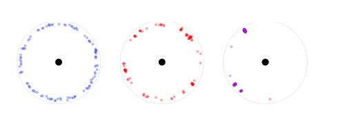
<figcaption class="paper-figure-caption"><b>Fig 1.</b> Figure 1. Typical simulation results. A distribution of N particles with uniformly randomly distributed ini- tial angles and normally distributed initial radii was sim- ulated as described in section C. All particles moved in counterclockwise circular orbits with initial angular ve- locities ωi = √</figcaption>
</figure>
<figure class="paper-figure-card">
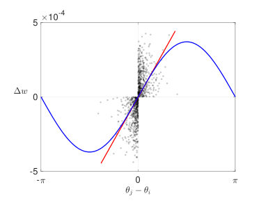
<figcaption class="paper-figure-caption"><b>Fig 2.</b> Figure 2. Effective pairwise interaction among particles. We simulate the collision model and then fit a sinusoidal function as a simplified tractable model. The fit is done by regression on the slope at the origin. Parameters for simulation: N = 100, µr = 1, d = 0.0004, and σr = 0.02 (d/σr = 0.02).</figcaption>
</figure>
<figure class="paper-figure-card">
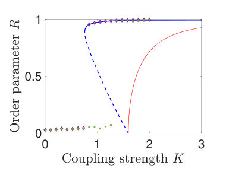
<figcaption class="paper-figure-caption"><b>Fig 3.</b> Figure 4. KM simulation with natural frequency distribution dependent on order. Natural fre- quency ω ∼N(0, 1 −αr), α = 0.8. The blue curve is the theoretical prediction with α = 0.8 (solid=stable, dashed=unstable). The red curve is the theory for stan- dard KM. Purple diamonds from numerical simulation with decreasing K, green crosses from numerical simula- tion with increasing K (N = 1000).</figcaption>
</figure>
<figure class="paper-figure-card">
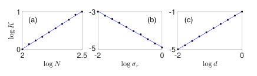
<figcaption class="paper-figure-caption"><b>Fig 4.</b> Figure 3. Relationship between effective pairwise coupling strength Kpw and simulation parame- ters. (a) Effect of number of particles: Kpw ∝N 2, (b) Effect of std. dev. of particle distribution: Kpw ∝σ−1 r , (c) Effect of interaction range: Kpw ∝d2.</figcaption>
</figure>
<figure class="paper-figure-card">
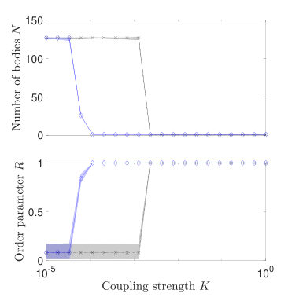
<figcaption class="paper-figure-caption"><b>Fig 5.</b> Figure 5. Phase transition in collision model. Steady-state order for the particle orbit simulation with energy injection (blue squares). d/σr = 2, Tmax = 10. K is varied by changing µr where K ∝µ−5/2 r . Blue curve is plotted with decreasing K and black curve is plotted with increasing K.</figcaption>
</figure>

**Summary.** This paper models planetary ring formation by treating particle interactions as discrete collisions within a coupled oscillator system. It demonstrates that the resulting collective behavior maps onto the Kuramoto model, predicting a phase transition that dictates whether the material aggregates into moons or forms stable rings. The work provides scaling laws connecting orbital mechanics parameters to the effective coupling strength.

**Why it may be interesting.** While applied to astrophysics, the core mathematical framework—modeling collective behavior via a phase transition analogous to the Kuramoto model using collision dynamics—is highly relevant to non-equilibrium statistical mechanics and many-body synchronization problems in AMO physics.

Detailed structure

**Main problem.** The study aims to explain the physical dichotomy between the formation of compact satellite bodies versus extended planetary ring systems in protoplanetary disks.

**Main result.** The system dynamics are shown to be mathematically equivalent to a variant of the Kuramoto model, exhibiting a phase transition that governs whether the final state is aggregated (moon-like) or dispersed (ring-like).

**Method.** The authors develop a collision-based framework where particle interactions and energy dissipation drive the evolution, comparing this discrete process to continuous mean-field models.

**Model / system.** The model consists of N identical particles on coplanar circular orbits around a central mass M. Interactions are modeled as pairwise collisions that conserve angular momentum while allowing for energy dissipation ($E_0\Delta t$).

**Key observables.** Order Parameter (R), final orbital radii, and the phase transition point between synchronous/incoherent states.

**Important parameters / regimes.** Particle number (N), interaction range (d), standard deviation of radii ($\sigma_r$), and dissipation rate ($E_0$).

**Assumptions / limitations.** Particles are restricted to perfect coplanar circular orbits, and the energy loss mechanism is assumed constant per collision event.

**Figures summary.** Figures illustrate simulation snapshots showing ordered states (order parameter $\approx 0.75$), phase transition curves ($N$ vs $R$), and scaling laws for the effective coupling strength ($K_{pw}$) in weak versus strong interaction regimes.

**Paper structure.** The paper progresses from defining the physical problem to deriving collision mechanics, establishing the analogy with the Kuramoto model, determining scaling laws for the coupling constant based on interaction regimes (weak/strong), and finally simulating the resulting structure formation.

Abstract

We study the dichotomy between compact satellite and ring formation in proto-planetary disks. Specifically, we examine the behavior of a model system of $N$ identical particles locked into circular, gravitationally-bound orbits around a central body. We treat interactions as dominated by inter-particle collisions, and extract an effective two-particle interaction function based on both theory and simulations. We then demonstrate that the expected dynamics are equivalent to a variant of the Kuramoto model, which undergoes a phase transition as parameters vary. This offers a novel potential explanation for the transition between formation of rings versus moons.

[↑ back to top](#top)

### [Enhancement of spin current in Fe$_{85}$Co$_{15}$/Ni$_{80}$Fe$_{20}$ bilayers via interlayer ferromagnetic coupling](http://arxiv.org/abs/2606.13805v1)

**Authors:** A. A. Pérez Martínez, D. Velázquez Rodríguez, D. Goijman, T. Torres, M. H. Aguirre, J. Gómez, A. Butera, E. De Biasi, J. Milano  
**Type:** both · **Category:** other · **PDF:** <https://arxiv.org/pdf/2606.13805v1>  
**Analysis basis:** full PDF text, analyzed in chunks
**Topic relevance:** `spintronics-quantum-optics interface` **3/5** · `non-equilibrium dynamics` **2/5** · `Keldysh / 2PI / non-Gaussian methods` **1/5** · `analog quantum simulation` **1/5** · `correlated / nonlocal dissipation` **1/5** · `driven-dissipative phase transition` **1/5** · `exotic spin models in light-matter` **1/5** · `methods for driven-dissipative` **1/5** · `non-equilibrium universality` **1/5**

↔ Scroll figures horizontally

<figure class="paper-figure-card">
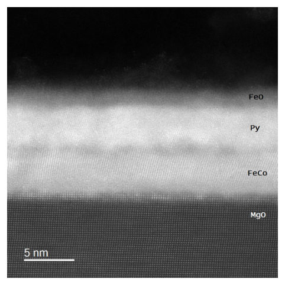
<figcaption class="paper-figure-caption"><b>Fig 1.</b> FIG. 1: HRTEM image for the FeCo5 sample.</figcaption>
</figure>
<figure class="paper-figure-card">
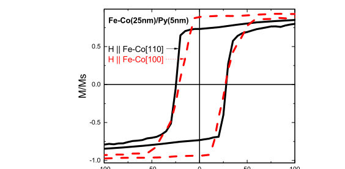
<figcaption class="paper-figure-caption"><b>Fig 2.</b> FIG. 2: Normalized magnetization vs. applied field for the FeCo25 sample along the hard Fe-Co [110] and easy Fe-Co [100] axes.</figcaption>
</figure>
<figure class="paper-figure-card">
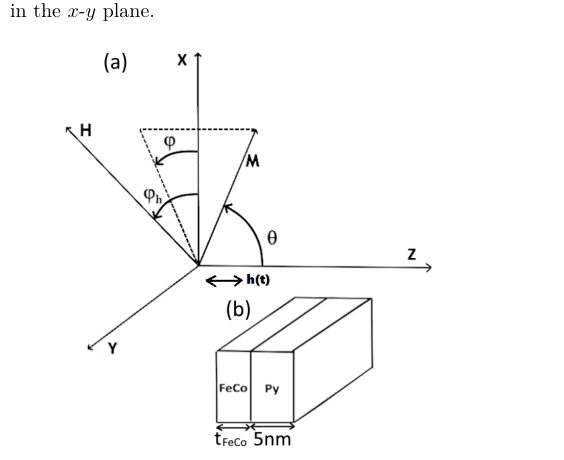
<figcaption class="paper-figure-caption"><b>Fig 3.</b> FIG. 3: (a) Coordinate system and (b) sketch of the bilayer structure studied in this work with tFeCo the thickness of the FeCo layer and 5 nm the thickness of Py.</figcaption>
</figure>
<figure class="paper-figure-card">
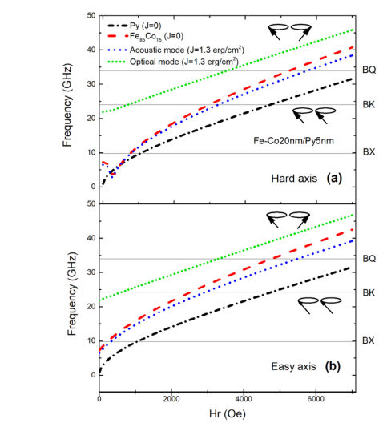
<figcaption class="paper-figure-caption"><b>Fig 4.</b> FIG. 4: Dispersion relations of coupled and uncoupled systems along the (a) hard axis and (b) easy axis for the FeCo20 sample. Horizontal lines correspond to different excitation frequencies used in this work.</figcaption>
</figure>
<figure class="paper-figure-card">
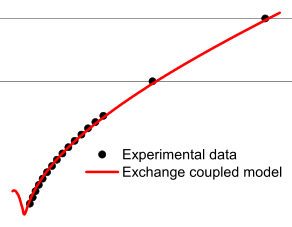
<figcaption class="paper-figure-caption"><b>Fig 5.</b> FIG. 6: Dispersion relation from broadband experiments for the FeCo20 sample.</figcaption>
</figure>

**Summary.** This work systematically studies spin current enhancement in ferromagnetic bilayers by modeling the influence of interlayer exchange coupling ($J_{ex}$). Using a combination of VSM, MOKE, and broadband FMR measurements alongside theoretical LLG simulations, the authors demonstrate that maximizing spin current requires tuning $J_{ex}$ to an intermediate value. This provides a pathway for designing spintronic devices with optimized spin injection efficiency.

**Why it may be interesting.** While focused on spintronics, the detailed analysis of coupled magnetic excitations (acoustic/optical modes) and the use of nonlinear dynamic equations ($	ext{LLG}$) provide rich mathematical structures relevant to open quantum systems dynamics and energy dissipation in nanoscale magnetic circuits.

Detailed structure

**Main problem.** The study investigates how tuning the strength of interlayer magnetic coupling influences spin wave behavior and maximizes injected spin currents in $	ext{Fe}_{85}	ext{Co}_{15}/	ext{Ni}_{80}	ext{Fe}_{20}$ ferromagnetic bilayers.

**Main result.** A maximum in the magnetization precession area, indicative of enhanced spin current injection, is observed when the interlayer exchange coupling constant ($J_{ex}$) is tuned to an intermediate value. This effect can be optimized by controlling $J_{ex}$, material saturation magnetizations ($	ext{M}_s$), or excitation frequency.

**Method.** The research combines experimental characterization (VSM, MOKE, FMR using VNA) with theoretical modeling based on the Landau-Lifshitz-Gilbert equation of motion and a derived free energy functional.

**Model / system.** The system is an epitaxial $	ext{Fe}_{85}	ext{Co}_{15}/	ext{Ni}_{80}	ext{Fe}_{20}$ bilayer grown on MgO[100] substrates. The dynamics are modeled using a bilayer Hamiltonian incorporating Zeeman, shape, cubic/uniaxial anisotropy, and the interlayer exchange coupling term ($J_{ex}$).

**Key observables.** Magnetization precession area (diagnostic for spin current), resonance field ($	ext{H}_r$), saturation magnetization ($	ext{M}_s$), and the interlayer exchange constant ($J_{ex}$).

**Important parameters / regimes.** Interlayer coupling strength ($J_{ex}$), material thicknesses, excitation frequency ($
u \sim 9.7-35	ext{ GHz}$), and $	ext{M}_s$ of constituent layers.

**Assumptions / limitations.** The analysis relies on a bilayer model within the LLG equation framework, linearizing dynamics for small oscillations to analyze coupled acoustic and optical modes.

**Figures summary.** Figures illustrate magnetization hysteresis loops showing anisotropy axes; FMR spectra show mode splitting related to $J_{ex}$; and key figures plot the precession area versus $J_{ex}$ or $	ext{M}_s$, demonstrating the maximum enhancement point.

**Paper structure.** The paper proceeds by characterizing the magnetic properties (anisotropy, $	ext{M}_s$) of the bilayers experimentally. It then develops a theoretical model using the free energy and LLG equation to predict coupled spin dynamics. Finally, it analyzes how tuning $J_{ex}$ leads to an optimal condition for maximizing the precession area, which correlates with maximum spin current.

Abstract

We present a detailed study on how the strength of the interlayer magnetic coupling on Fe$_{85}$Co$_{15}$/Ni$_{80}$Fe$_{20}$ bilayers modifies the spin wave behavior of this system. A series of Fe$_{85}$Co$_{15}$/Ni$_{80}$Fe$_{20}$ bilayers deposited on MgO[100] substrates were grown by magnetron sputtering. Magnetic characterization of the samples was performed using a vibrating sample magnetometer and magneto-optical Kerr effect. The in-plane hysteresis loops reveal a cubic magnetic anisotropy of magnetocrystalline origin, with easy and hard axis along the [100] and [110] Fe-Co crystallographic directions, respectively. Ferromagnetic resonance measurements were performed to analyze the in-plane angular dependence of the resonance field, and also the resonance field at several frequencies was determined along the hard axis. By using a bilayer model in the frame of the Landau-Lifshitz-Gilbert magnetization equation of motion, the magnetization precession components were calculated, as well as the dependence of precession area on the Fe-Co layer thickness and the ferromagnetic interlayer coupling. We observe a maximum in the area of the ellipsoid generated by the magnetization precession of the permalloy layer at a certain exchange constant, showing that this effect could be used to maximize the injected spin currents, which could be tuned by changing the interlayer exchange constant in bilayer systems, the saturation magnetization of the materials, or the excitation frequency.

[↑ back to top](#top)

### [Thermal feedback as a kinetic control mechanism in reaction-diffusion pattern formation](http://arxiv.org/abs/2606.14330v1)

**Authors:** Sudip Dutta, Pushpita Ghosh  
**Type:** theory · **Category:** statistical mechanics · **PDF:** <https://arxiv.org/pdf/2606.14330v1>  
**Analysis basis:** full PDF text, analyzed in chunks
**Topic relevance:** `driven-dissipative phase transition` **2/5** · `non-equilibrium dynamics` **2/5** · `non-equilibrium universality` **2/5** · `Frenkel-Kontorova` **1/5** · `Keldysh / 2PI / non-Gaussian methods` **1/5** · `analog quantum simulation` **1/5** · `correlated / nonlocal dissipation` **1/5** · `methods for driven-dissipative` **1/5** · `quantum measurements` **1/5**

↔ Scroll figures horizontally

<figure class="paper-figure-card">
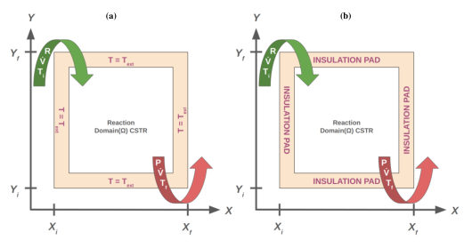
<figcaption class="paper-figure-caption"><b>Fig 1.</b> FIG. 1. Schematic illustration of the two-dimensional reaction do- main showing (a) Dirichlet and (b) Neumann boundary conditions. R and P denote the reactant and product, respectively; ˙V represents the velocity field; Ti and Tf denote the initial and final temperatures, respectively; and Text represents the external temperature.</figcaption>
</figure>
<figure class="paper-figure-card">
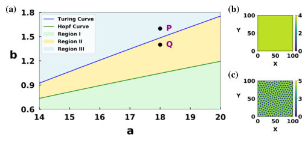
<figcaption class="paper-figure-caption"><b>Fig 2.</b> FIG. 2. (a) Bifurcation diagram in the a–b parameter space. Light green denotes the spatiotemporally unstable region, light yellow in- dicates spatial instability with temporal stability, and light blue rep- resents the spatiotemporally stable region. Points P(a = 18, b = 1.6) and Q(a = 18, b = 1.4) denote representative parameter sets. (b,c) Numerical simulation results corresponding to the representative points P and Q, respectively. The parameters σ = 9 and D = 1.6 are fixed.</figcaption>
</figure>
<figure class="paper-figure-card">
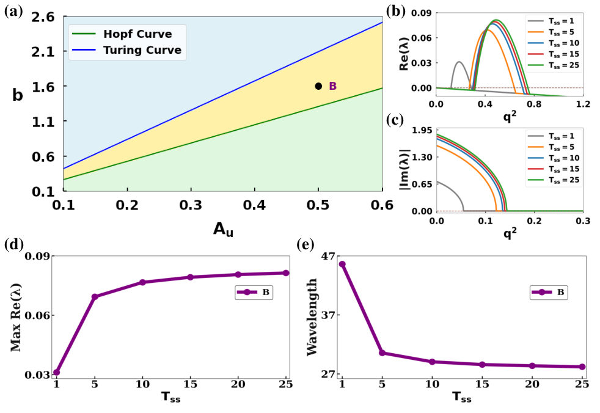
<figcaption class="paper-figure-caption"><b>Fig 3.</b> FIG. 3. Temperature-modulated stability and pattern selection in the CDIMA reaction–diffusion system. (a) Bifurcation diagram in the Au–b parameter space at fixed a = 18, Av = 0.4, σ = 9, and Bu = Bv = 1. The green and blue curves denote the Hopf and Turing instability boundaries, respectively. The light green region corresponds to spatiotemporal instability, the light yellow region to purely spatial (Turing) instability, and the light blue region to the stable regime. Point B (0.5,1.6) lies within the Turing region and is selected for further analysis. (b,c) Dispersion relations evaluated at point B for different steady-state temperatures Tss: (b) real part Re(λ) and (c) imaginary part...</figcaption>
</figure>
<figure class="paper-figure-card">
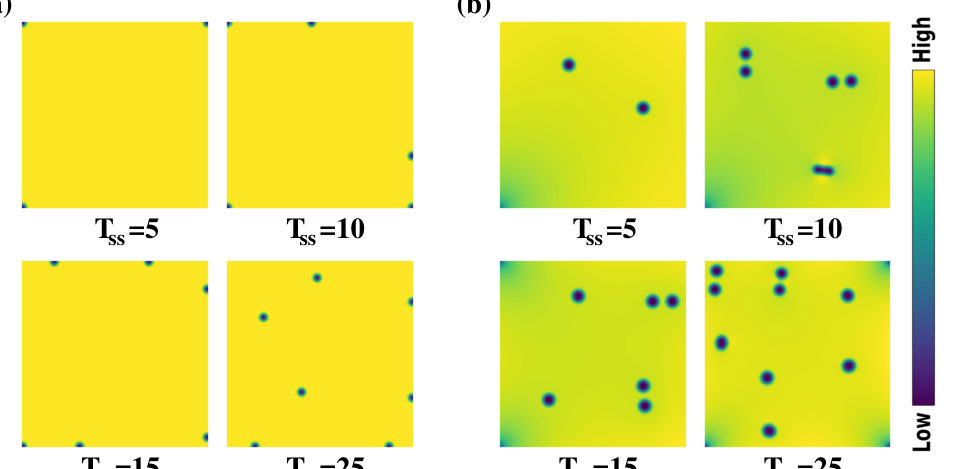
<figcaption class="paper-figure-caption"><b>Fig 4.</b> FIG. 4. Numerically simulated spatial patterns corresponding to point B in the b–Au bifurcation diagram. (a) Pattern obtained under Neumann boundary conditions. (b) Pattern obtained under Dirichlet boundary conditions. Simulations are performed with diffusion coefficients DT = 0.01 and D = 1.6 on a square domain of size 100×100 with spatial discretization ∆x = 0.5 and time-step dt = 0.002.</figcaption>
</figure>
<figure class="paper-figure-card">
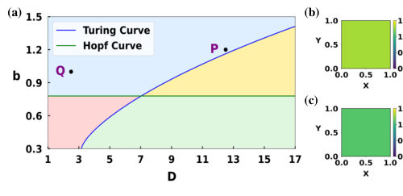
<figcaption class="paper-figure-caption"><b>Fig 5.</b> FIG. 5. (a) Bifurcation diagram in the b–D parameter space. Light green denotes the spatiotemporally unstable region; light yellow in- dicates spatial instability with temporal stability; light blue repre- sents the spatiotemporally stable region; and light pink corresponds to spatially stable but temporally unstable behavior. Points P(D = 12.5, b = 1.2) and Q(D = 2.5, b = 1.0) denote representative pa- rameter sets. (b,c) Numerical simulation results corresponding to the representative points P and Q, respectively. The parameter a = 0.1 is fixed.</figcaption>
</figure>

**Summary.** This work analyzes how thermal feedback controls pattern formation in chemical reaction-diffusion systems by dynamically coupling temperature evolution to reaction rates. It demonstrates that while temperature universally enhances instability and tunes spatial scales, the resulting global behavior—especially near boundaries—is critically dependent on whether the system is modeled as isothermal or thermally coupled.

**Why it may be interesting.** While focused on classical pattern formation, the methodology of coupling a non-equilibrium thermodynamic variable (T) into reaction kinetics via exponential dependencies is highly relevant to open quantum systems where environmental coupling dictates system dynamics or energy dissipation pathways.

Detailed structure

**Main problem.** The study investigates how coupling temperature dynamics into reaction-diffusion systems modifies pattern formation, moving beyond traditional isothermal assumptions.

**Main result.** Thermal feedback acts as a general control mechanism, enhancing instability growth rates and shifting pattern selection toward shorter wavelengths. The global dynamic response (stationary vs. nonstationary) is highly dependent on the specific model kinetics and boundary conditions.

**Method.** The analysis employs linear stability analysis (LSA) around steady states for coupled reaction-diffusion equations, supplemented by numerical simulations to examine nonlinear boundary effects.

**Model / system.** The system involves activator-inhibitor kinetics ($u, v$) coupled to a dynamically evolving temperature field ($T$). The coupling is modeled using Arrhenius-type dependencies for reaction rates and heat exchange governed by Newton's law of cooling at the boundaries.

**Key observables.** Instability growth rates ($	ext{Re}(\lambda)$), pattern selection wavelengths, and global dynamic behavior (stationary vs. nonstationary).

**Important parameters / regimes.** Boundary conditions (Neumann vs. Dirichlet for T), temperature ($T_{ss}$), and kinetic parameters defining the Arrhenius factors.

**Assumptions / limitations.** The analysis assumes that temperature evolves dynamically and is coupled to reactions, contrasting with previous isothermal assumptions; linear stability analysis is performed around a steady state.

**Figures summary.** Figures illustrate bifurcation diagrams showing instability regions in parameter space, dispersion relations demonstrating wavelength shifts with temperature, and simulated spatial patterns comparing zero-flux (Neumann) versus fixed-temperature (Dirichlet) boundary conditions for both CDIMA and Schnakenberg models.

**Paper structure.** The paper progresses by first establishing the general coupled equations, performing linear stability analysis to show kinetic renormalization effects, and then contrasting the nonlinear outcomes using two canonical models (CDIMA and Schnakenberg) under different thermal boundary constraints.

Abstract

Pattern formation in reaction-diffusion systems is traditionally analyzed under isothermal assumptions, overlooking the dynamical role of temperature in systems where reactions generate and dissipate heat. Here, we investigate non-isothermal reaction-diffusion dynamics by coupling activator-inhibitor kinetics to a dynamically evolving temperature field that modulates reaction rates through Arrhenius-type dependencies. This coupling introduces an additional feedback mechanism that influences stability and pattern selection. Through analytical and numerical analysis of the Cholrine dioxide-Iodine-Malonic acid (CDIMA) and Schnakenberg models, we demonstrate that thermal feedback modifies dispersion relations by enhancing instability growth rates and shifting pattern selection toward shorter wavelengths. Beyond these intrinsic effects, we identify a boundary-mediated mechanism in which thermal constraints qualitatively alter global dynamics. In particular, fixed-temperature boundaries induce nonstationary behavior in the CDIMA system, whereas the Schnakenberg model exhibits robust stationary patterns. These results establish thermal-kinetic coupling as a general mechanism for controlling pattern formation and highlight the role of boundary-mediated heat exchange as a tunable parameter for spatiotemporal organization.

[↑ back to top](#top)

### [Tailoring the properties of YBa$_{2}$Cu$_{3}$O$_{7-δ}$ thin films by 30 keV He$^+$ irradiation: An enabling route to superconducting device nanopatterning](http://arxiv.org/abs/2606.14588v1)

**Authors:** Bernd Aichner, Simon Koch, Philipp A. Korner, Max Karrer, Katja Wurster, Christoph Schmid, Ulrich Kentsch, Reinhold Kleiner, Edward Goldobin, Dieter Koelle, Wolfgang Lang  
**Type:** experiment · **Category:** strongly correlated electrons · **PDF:** <https://arxiv.org/pdf/2606.14588v1>  
**Analysis basis:** full PDF text, analyzed in chunks
**Topic relevance:** `driven-dissipative phase transition` **2/5** · `Frenkel-Kontorova` **1/5** · `correlated / nonlocal dissipation` **1/5** · `methods for driven-dissipative` **1/5** · `non-equilibrium dynamics` **1/5** · `non-equilibrium universality` **1/5**

↔ Scroll figures horizontally

<figure class="paper-figure-card">
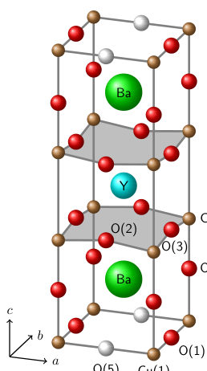
<figcaption class="paper-figure-caption"><b>Fig 1.</b> FIG. 1. Unit cell of YBCO in the orthorhombic phase. The CuO2 planes, highlighted in gray, host superconductivity, en- abled by hole-charge transfer from the Cu(1)-O(1) chains in the basal planes. The vacant O(5) positions are shown in white.</figcaption>
</figure>
<figure class="paper-figure-card">
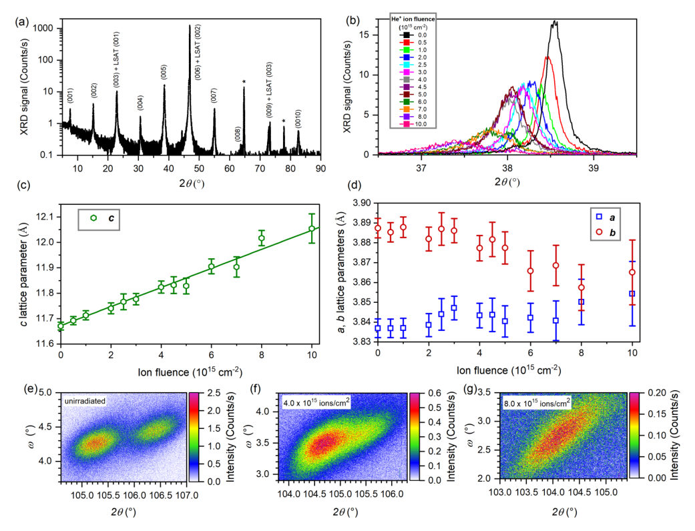
<figcaption class="paper-figure-caption"><b>Fig 2.</b> FIG. 2. XRD analysis of YBCO thin films deposited on LSAT substrates. (a) (00l) reflection peaks in the θ–2θ scan of a pristine reference film. The asterisks denote peaks that are presumably associated with the aluminum sample holder. (b) Evolution of the (005) peak upon irradiation with 30 keV He+ ions at various fluences. (c) Evolution of the out-of-plane lattice parameter c inferred from the positions of the (00l) peaks. The line represents a linear regression. (d) Variation of the in-plane lattice parameters a and b of YBCO as a function of fluence, determined from two-axis scans of the (308) and (038) peaks. (e), (f), and (g) Two-axis (2θ–ω) maps of the (308) and (038) diffraction...</figcaption>
</figure>
<figure class="paper-figure-card">
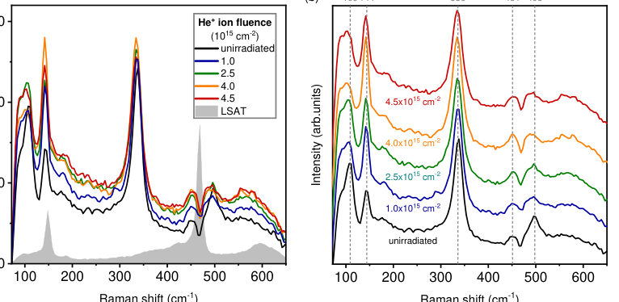
<figcaption class="paper-figure-caption"><b>Fig 3.</b> FIG. 3. (a) Raman spectra of YBCO bridges subjected to different irradiation conditions. The gray region represents the Raman response of the LSAT substrate, acquired from the same sample (intensity not to scale). (b) The five Raman spectra are displayed with uniform vertical offsets for clarity. The dashed lines indicate Raman-active modes discussed in the main text. Each spectrum corresponds to the average of three measurements acquired at different positions on the same bridge. A baseline correction has been applied, and the substrate contribution has been subtracted.</figcaption>
</figure>
<figure class="paper-figure-card">
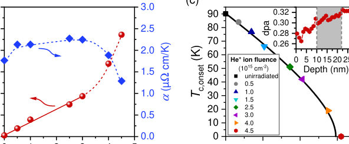
<figcaption class="paper-figure-caption"><b>Fig 4.</b> FIG. 4. Evolution of electric transport properties of YBCO microbridges with ion fluence [colors and symbols are defined in panel (c)]. (a) ρN(T) curves. Broken lines are linear fits to the normal state resistivity ρN(T). (b) Intercepts β and slopes α obtained from the linear fits in panel (a). The solid line represent a linear fit and the broken lines are guides to the eye. (c) Tc,onset vs. displacements per atom dpa. The solid line represents a fit based on the Abrikosov–Gor’kov pair-breaking theory, Eq. (2). Inset: Representative depth profile of the dpa extracted from simulations. The data within the depth interval indicated by the gray shaded region are averaged to obtain the effective...</figcaption>
</figure>
<figure class="paper-figure-card">
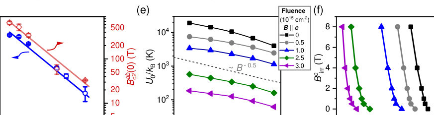
<figcaption class="paper-figure-caption"><b>Fig 5.</b> FIG. 5. (a)-(c) ρ(T) curves at B = 0 (black lines) and at B = 8 T, oriented either as Bc ∥c (red lines) or Bab ∥ab (blue lines) for three samples irradiated with Φ = 0, 1 and 4.0 × 1015 cm−2, respectively. (d) Zero-temperature upper critical fields Bc c2 and Bab c2 for various YBCO bridges irradiated with different 30 keV He+ ion fluences. Error bars denote the 95 % confidence intervals. The lines represent fits to an exponential decay function. (e) Vortex pinning potential U0 extracted from the slopes of Arrhenius plots of the superconducting transition for B ∥c. The dashed line indicates a power-law dependence U0 ∼B−0.5. (f) Irreversibility lines of various YBCO bridges irradiated with...</figcaption>
</figure>

**Summary.** This paper details the use of focused helium ion beam irradiation to precisely tune the superconducting properties of YBCO thin films. By correlating structural changes observed via XRD and Raman spectroscopy with electrical transport measurements, the authors establish quantitative fluence thresholds for patterning devices. The findings confirm that defect creation governs superconductivity suppression, offering a powerful tool for engineering quantum circuits.

**Why it may be interesting.** This work provides an experimental blueprint for controlling fundamental superconducting parameters ($T_c$, anisotropy) in cuprates using controlled damage, which is highly relevant to understanding disorder effects on strongly correlated quantum materials.

Detailed structure

**Main problem.** The study investigates how controlled damage, specifically using focused helium ion beam irradiation, alters the superconducting and electronic properties of YBa2Cu3O7 (YBCO) thin films for use in nanoscale device patterning.

**Main result.** Irradiation primarily introduces oxygen-related Frenkel defects, leading to a suppression of the critical temperature ($T_c$) via Abrikosov–Gor’kov pair breaking theory and causing a crossover from clean to dirty electronic transport limit.

**Method.** The research combines structural characterization (XRD, Raman spectroscopy) with comprehensive magnetotransport measurements (resistivity, Hall effect) across varying ion fluences.

**Model / system.** The physical system is epitaxial YBCO thin films. The study models the superconducting degradation using Abrikosov–Gor’kov pair-breaking theory and analyzes transport changes by tracking scattering rates and mean-free paths relative to coherence lengths.

**Key observables.** Critical temperature ($T_c$), upper critical fields ($B_{c2}$), normal-state resistivity ($
ho_N(T)$), Hall angle ($\cot 	heta_H$), and anisotropy ratio ($\gamma$).

**Important parameters / regimes.** Ion fluence ($\Phi$) ranging up to $1 	imes 10^{16} 	ext{ cm}^{-2}$; the crossover fluence marking the transition to the dirty limit.

**Assumptions / limitations.** The observed changes in superconducting properties are attributed to point defects generated by irradiation, rather than significant changes in oxygen stoichiometry or carrier concentration.

**Figures summary.** Figures illustrate the exponential decay of $B_{c2}(0)$ with fluence, the linear decrease of $T_{c,	ext{onset}}$ vs. fluence, and the crossover from clean to dirty limit behavior observed via transport measurements.

**Paper structure.** The paper systematically presents structural evidence (XRD/Raman) showing disorder accumulation, followed by electrical characterization demonstrating $T_c$ suppression and changes in scattering mechanisms, culminating in defining a practical operational window for device fabrication.

Abstract

Focused helium ion beam (He-FIB) irradiation with 30 keV ions is a key tool for nanoscale patterning and defect engineering in high transition temperature (Tc) cuprate superconducting devices, yet its usable fluence window is constrained by the competing requirements of reliable superconductivity suppression and minimal structural degradation. In this work, we provide a comprehensive dataset on the effects of large-area 30 keV He+ ion exposure on the electric transport and superconducting properties of epitaxial YBa2Cu3O7 (YBCO) thin films. X-ray diffraction shows a fluence-driven loss of crystalline order accompanied by an out-of-plane lattice expansion and an orthorhombic-to-tetragonal transition, culminating at predominant amorphization at the highest fluence of 1 x 10^16 cm^-2. Raman spectra exhibit increasing disorder while lacking signatures of oxygen depletion, indicating that irradiation mainly generates oxygen-related Frenkel defects rather than changing the carrier concentration. Consistently, with increasing fluence, the normal-state resistivity ρ_N(T) at temperature T above Tc increases strongly, while d ρ_N/d T remains nearly unchanged at moderate fluence. The suppression of Tc is accurately described by Abrikosov-Gor'kov pair breaking and reaches complete quenching of superconductivity at 4.5 x 10^15 cm^-2. The anisotropic upper critical fields decrease approximately exponentially with increasing fluence, the vortex activation energy is reduced, and the anisotropy drops, in contrast to oxygen-depleted YBCO. Hall-angle analysis confirms a nearly constant carrier density but a systematic increase in defect scattering and reduced mobility, consistent with a crossover toward the dirty limit at high fluence. These results establish quantitative fluence thresholds and a practical operational window for He-FIB nanopatterning of YBCO quantum circuits.

[↑ back to top](#top)

### [Symmetry of the critical current function in superconducting nanodevices](http://arxiv.org/abs/2606.14051v1)

**Authors:** Ziqi Zhao, Cliff Sun, Ci-You Huang, Jiankun Zhang, Xiangyu Song, Alexey Bezryadin  
**Type:** both · **Category:** other · **PDF:** <https://arxiv.org/pdf/2606.14051v1>  
**Analysis basis:** full PDF text, analyzed in chunks
**Topic relevance:** `non-equilibrium dynamics` **2/5** · `Keldysh / 2PI / non-Gaussian methods` **1/5** · `driven-dissipative phase transition` **1/5** · `methods for driven-dissipative` **1/5** · `non-equilibrium universality` **1/5**

↔ Scroll figures horizontally

<figure class="paper-figure-card">
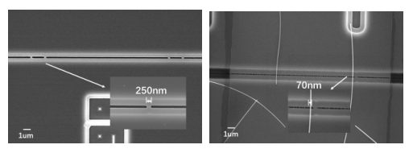
<figcaption class="paper-figure-caption"><b>Fig 1.</b> FIG. 1: SEM images of the superconducting nanowire sample. a) A scanning electron microscope (SEM) image of the silicon nitride nanobridges in Device A. b) An SEM image of the silver nanowires in Device C.</figcaption>
</figure>
<figure class="paper-figure-card">
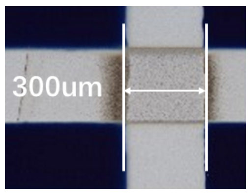
<figcaption class="paper-figure-caption"><b>Fig 2.</b> FIG. 2: Optical microscope image of Device D, which shows the SIS junction made of Sn.</figcaption>
</figure>
<figure class="paper-figure-card">
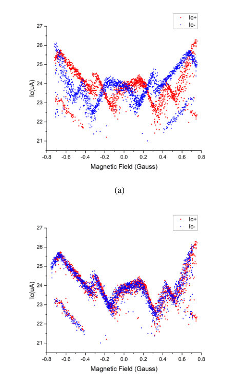
<figcaption class="paper-figure-caption"><b>Fig 3.</b> FIG. 4: Magnetic-field dependence of the switching-current (critical currents) for Device B. The curve is obtained by multiple repetitive measurements of the critical current of the device. Each dot represents one measured switching-current value at a given magnetic field. (a) Comparison between the positive switching current Ic,+(B) and the magnitude of the negative switching current, −Ic,−(B). (b) Comparison between Ic,+(B) and the field-reversed negative branch, −Ic,−(−B), showing that Device B approximately preserves IB symmetry.</figcaption>
</figure>
<figure class="paper-figure-card">
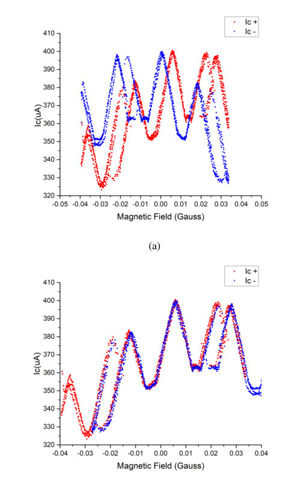
<figcaption class="paper-figure-caption"><b>Fig 4.</b> FIG. 3: Magnetic-field dependence of the switching-current envelopes for Device A. (a) Comparison between the positive switching current Ic,+(B) and the magnitude of the negative switching current, −Ic,−(B). (b) Comparison between Ic,+(B) and the field-reversed negative branch, −Ic,−(−B), used to examine IB symmetry.</figcaption>
</figure>
<figure class="paper-figure-card">
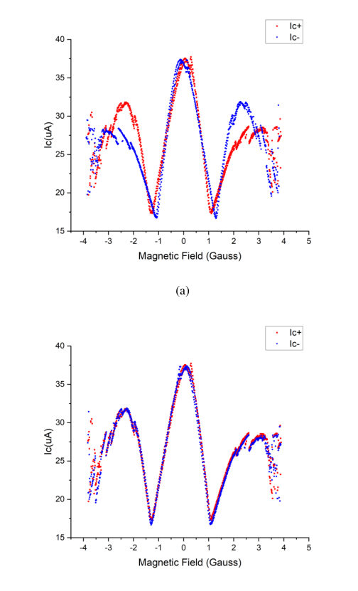
<figcaption class="paper-figure-caption"><b>Fig 5.</b> FIG. 5: Magnetic-field dependence of the switching-current envelopes for Device C. (a) Comparison between the positive switching current Ic,+(B) and the magnitude of the negative switching current, −Ic,−(B). (b) Comparison between Ic,+(B) and the field-reversed negative branch, −Ic,−(−B), demonstrating that Device C approximately preserves IB symmetry.</figcaption>
</figure>

**Summary.** This work investigates the symmetry of critical current in nanoscale superconductors using both experiments and advanced theoretical modeling. It establishes that while many multi-link systems obey $I$-$B$ symmetry, hybrid junctions can exhibit clear violations due to polarity-dependent selection among competing vortex states. This has implications for designing reliable superconducting electronic components.

**Why it may be interesting.** The study bridges fundamental superconducting symmetries with device physics, offering insights into how microscopic details (like junction type or polarity) can break macroscopic symmetries in quantum transport phenomena. This relates to understanding non-equilibrium dynamics in mesoscopic circuits.

Detailed structure

**Main problem.** The study investigates the symmetry properties of the critical current function ($I_c$) in superconducting nanodevices, specifically focusing on the $I$-$B$ inversion symmetry: $I_{c,+}(B) = -I_{c,-}(-B)$. The goal is to understand when this fundamental symmetry is preserved or broken.

**Main result.** The $I$-$B$ symmetry is generally obeyed in multi-nanowire SQUID models, but clear violations are observed in hybrid junctions (SIS–ML), suggesting that polarity-dependent selection of metastable vorticity states causes the asymmetry.

**Method.** The research combines low-temperature transport measurements on various nanodevices with theoretical modeling using effective potential energy landscapes derived from Meissner phase equations and Josephson junction physics.

**Model / system.** The systems include superconducting weak-link devices (nanowires, SQUIDs) modeled by combining different Current-Phase Relations (CPR), such as sinusoidal (SIS junctions) and linear (metallic links). The analysis focuses on the energy landscape governing vortex configurations.

**Key observables.** Critical current $I_c(B)$ vs. Magnetic Field $B$, positive ($	ext{Ic}_+$) and negative ($	ext{Ic}_-$) switching currents, and the degree of symmetry matching between $	ext{Ic}_+(B)$ and $-	ext{Ic}_-(-	ext{B})$.

**Important parameters / regimes.** Base temperature ($T_{base} \sim 350$ mK), magnetic field $B$, and junction parameters (e.g., stiffness constants $K_k$).

**Assumptions / limitations.** For theoretical modeling, approximations include neglecting vector potential contributions along the length of each nanowire (short wire approximation) and assuming specific CPR forms.

**Figures summary.** Figures illustrate SEM images of tested devices; key figures compare measured $	ext{Ic}_+(B)$ vs. $-	ext{Ic}_-(-	ext{B})$ to demonstrate symmetry preservation or type 1/type 2 breaking in hybrid junctions, alongside simulated energy landscapes showing state transitions.

**Paper structure.** The paper progresses from experimental observation of $I$-$B$ symmetry in simple devices (A-C) to identifying clear violations in complex hybrids (D). It then develops theoretical models using multi-nanowire SQUID frameworks and hybrid junction arrays to explain the underlying physics governing state selection and symmetry breaking.

Abstract

We study a variety of nano-scale superconducting devices containing more than one weak link. Even in devices with multiple weak links the IB symmetry is usually obeyed, which means that if we reverse both the bias current direction and the magnetic field direction at the same time, the superconducting response, namely the critical current, remains unchanged. We also provide a detailed analysis of the situations in which such symmetry is violated.

[↑ back to top](#top)

### [Interface-engineered oxidation-resistant wafer-level Tantalum-Tantalum thermocompression bonding for 3D integration of superconducting interconnects](http://arxiv.org/abs/2606.14103v1)

**Authors:** Harsh Mishra, Ullas Pandey, Sathish Bonam, Adirae Dinesh, Sai Rama Krishna Malladi, Shiv Govind Singh  
**Type:** experiment · **Category:** other · **PDF:** <https://arxiv.org/pdf/2606.14103v1>  
**Analysis basis:** full PDF text, analyzed in chunks
**Topic relevance:** `QC/QI experiment` **2/5**

↔ Scroll figures horizontally

<figure class="paper-figure-card">
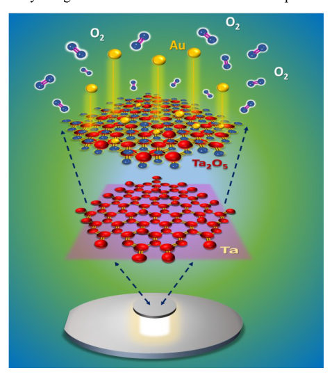
<figcaption class="paper-figure-caption"><b>Fig 1.</b> Figure 1. Schematic illustration of Au passivation on Ta, depicting the mechanism of suppression of Tantalum oxide.</figcaption>
</figure>
<figure class="paper-figure-card">
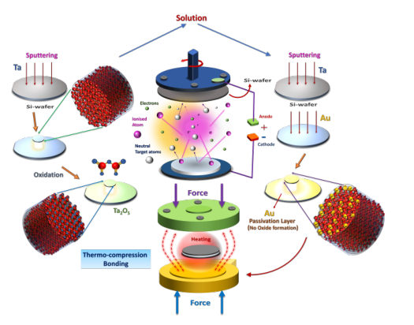
<figcaption class="paper-figure-caption"><b>Fig 2.</b> Figure 2. Gold (Au) passivated Tantalum-Tantalum thermocompression bonding process.</figcaption>
</figure>
<figure class="paper-figure-card">
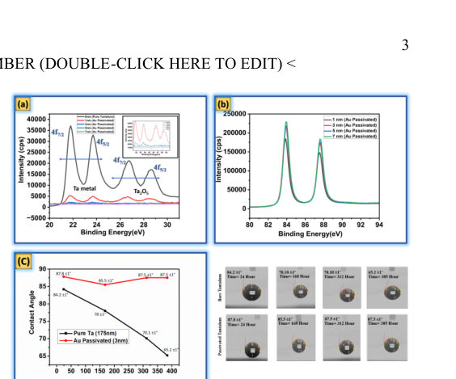
<figcaption class="paper-figure-caption"><b>Fig 3.</b> Figure 4. XPS analysis of Au-passivated samples showing elemental scans for (A) tantalum (Ta) and (B) gold (Au). (C) A comparison of contact angle measurements on passivated and bare Ta surfaces, including time-resolved camera images captured during the measurement for both bare and passivated tantalum films.</figcaption>
</figure>
<figure class="paper-figure-card">
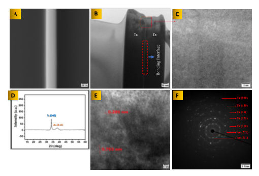
<figcaption class="paper-figure-caption"><b>Fig 4.</b> Figure 5. Cross-sectional analysis of the bonded interface: (A) FE-SEM image, (B) TEM lamella showing the full bonding interface, (C) zoomed view of Au-passivated Ta-Ta interface, (D) XRD of Ta thin film with 3 nm Au passivation, (E) HRTEM showing significant grain growth with fringe widths of 0.286 nm and 0.703 nm, (F) SAED pattern displaying Debye–Scherrer rings from Au (111, 220) and Ta (310, 321, 411, 420, 600).</figcaption>
</figure>
<figure class="paper-figure-card">
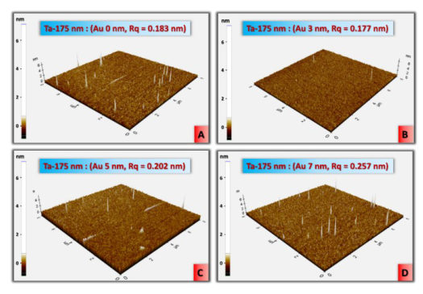
<figcaption class="paper-figure-caption"><b>Fig 5.</b> Figure 3. (A) 3D imaging of pure Ta extracted from AFM with RMS roughness of 0.183 nm, (B) 3 nm Au-passivated Ta with RMS roughness of 0.177 nm, (C) 5 nm Au-passivated Ta with RMS roughness of 0.202 nm, (D) 7 nm Au- passivated Ta with RMS roughness of 0.257 nm.</figcaption>
</figure>

**Summary.** This research addresses the challenge of bonding Tantalum superconducting interconnects for 3D integration by using an ultrathin Gold passivation layer. This technique suppresses detrimental oxide formation, allowing a strong, reliable bond to be formed at a significantly lower temperature ($300^\circ	ext{C}$). The results demonstrate a robust method enabling scalable fabrication for advanced electronic and quantum devices.

**Why it may be interesting.** While not directly related to quantum information theory itself, this work is highly relevant to superconducting circuit fabrication, which forms the physical backbone of many quantum computing architectures (e.g., Josephson junctions). The focus on low-loss, high-reliability interconnects is critical for scaling up any solid-state quantum device.

Detailed structure

**Main problem.** The primary challenge is achieving low-thermal budget, low-pressure direct Tantalum (Ta)–Tantalum thermocompression bonding necessary for 3D integration of superconducting interconnects.

**Main result.** Applying an ultrathin Au passivation layer successfully enables strong Ta–Ta bonding at a reduced temperature ($300^\circ	ext{C}$) while maintaining high bond strength ($\sim 169 	ext{ MPa}$), which is crucial for superconducting applications.

**Method.** The study employed surface analysis (AFM, XPS), mechanical testing (shear tests), and structural characterization (FESEM/TEM) to validate the bonding process using Au as a protective barrier layer.

**Model / system.** The physical system is wafer-level 3D integration utilizing superconducting interconnects made of Tantalum (Ta). The methodology involves depositing an ultrathin Gold (Au) passivation layer onto Ta surfaces before performing thermocompression bonding.

**Key observables.** Bond strength ($\sim 169 	ext{ MPa}$), surface roughness ($R_q = 0.177 	ext{ nm}$), and retention of superconducting critical temperature ($T_c$).

**Important parameters / regimes.** Bonding Temperature ($300^\circ	ext{C}$ vs $500^\circ	ext{C}$), Au passivation thickness (optimal at 3 nm), and bonding pressure (4.93 bar).

**Assumptions / limitations.** The primary assumption is that the Au layer effectively suppresses rapid native oxide formation on Ta, thereby allowing low-temperature bonding compatible with superconducting materials.

**Figures summary.** Figures illustrate the schematic of Au passivation suppressing oxidation and the setup/results of tensile shear tests demonstrating high bond strength retention even after a 7-day pause.

**Paper structure.** The paper follows a structure detailing the scientific problem, proposing the Au passivation solution, characterizing the process using multiple analytical techniques (AFM, XPS, mechanical testing), presenting results showing improved bonding metrics compared to unpassivated samples, and concluding with its viability for scalable 3D integration.

Abstract

Wafer-level 3D integration of superconducting interconnects requires low-thermal budget bonding processes compatible with superconducting materials. Rapid native oxide formation on tantalum (Ta) surfaces limits low-temperature, low-pressure direct Ta-Ta thermocompression bonding. In this study, we develop an oxidation-resistant bonding process using an ultrathin Au passivation layer to suppress oxide formation during bonding. The engineered interface enables blanket Ta-Ta wafer bonding at 300 $^\circ$C under 4.93 bar, significantly reducing the bonding thermal budget and generation of $α$-Ta across the interface, which potentially improves coherence time as reported in literature. Structural and interfacial analyses confirm oxide suppression and continuous metallic bonding, having a bond strength of 169 MPa. This work demonstrates a low-temperature, low-pressure Ta-Ta thermocompression bonding strategy for scalable 3D superconducting interconnect integration.

[↑ back to top](#top)

### [Observation of intertwined charge density wave order and superconductivity in Janus monolayer](http://arxiv.org/abs/2606.13828v1)

**Authors:** Subhajit Pramanick, Shubham Patel, Sudip Chakraborty, A. Taraphder  
**Type:** theory · **Category:** strongly correlated electrons · **PDF:** <https://arxiv.org/pdf/2606.13828v1>  
**Analysis basis:** full PDF text, analyzed in chunks
**Topic relevance:** `Frenkel-Kontorova` **1/5** · `Keldysh / 2PI / non-Gaussian methods` **1/5** · `analog quantum simulation` **1/5** · `driven-dissipative phase transition` **1/5**

↔ Scroll figures horizontally

<figure class="paper-figure-card">
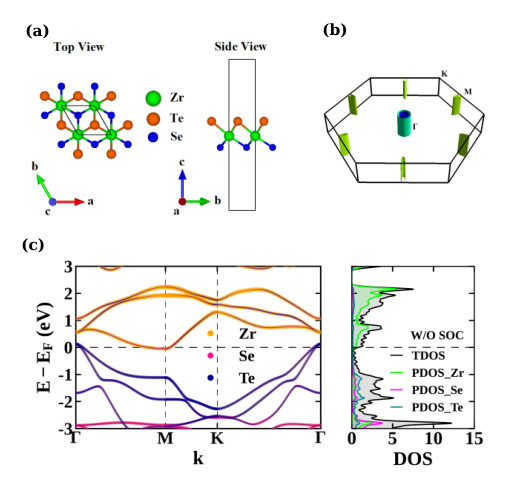
<figcaption class="paper-figure-caption"><b>Fig 1.</b> FIG. 1. (a) Crystal structure with its top and side view, (b) Fermi sur- face, (c) electronic band structure and density of states of 1 T ZrSeTe monolayer at ambient conditions. SOC has not been considered here.</figcaption>
</figure>
<figure class="paper-figure-card">
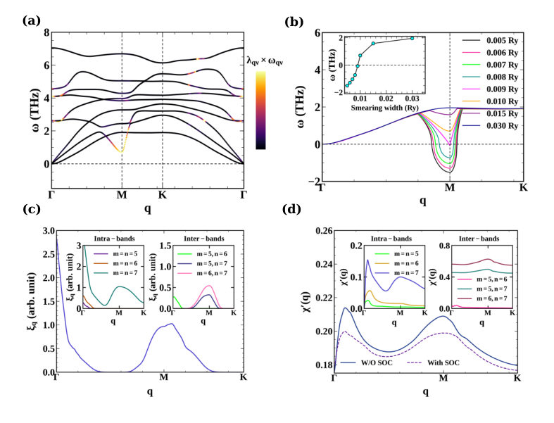
<figcaption class="paper-figure-caption"><b>Fig 2.</b> FIG. 2. (a) Phonon dispersion and mode resolved λqν ×ωqν along high symmetry q points of ZrSeTe monolayer in absence of SOC; (b) Main: Phonon softening of an acoustic mode under different values of smearing parameter, i.e., temperature, Inset: Phonon frequency of the soft acoustic mode at M point vs different values of smearing parameter; (c) Imaginary part and (d) Real part of the bare static Lindhard charge susceptibility along Γ−M−K path for, Main: total contribution of bands that cross the Fermi level and Inset: intra- and inter-bands contribution.</figcaption>
</figure>
<figure class="paper-figure-card">
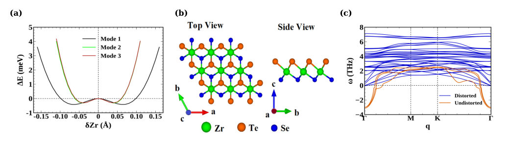
<figcaption class="paper-figure-caption"><b>Fig 3.</b> FIG. 3. (a) CDW double well potential formation for three unstable phonon modes of a 2×2×1 supercell of ZrSeTe; (b) Crystal structure of distorted 2×2×1 supercell of ZrSeTe with its top and side view; (c) Phonon dispersion of undistorted (orange color) and distorted (blue color) 2×2×1 supercell of ZrSeTe calculated with a smearing width 0.005 Ry. SOC has not been considered for these calculations (Figs. 3(a-c)).</figcaption>
</figure>
<figure class="paper-figure-card">
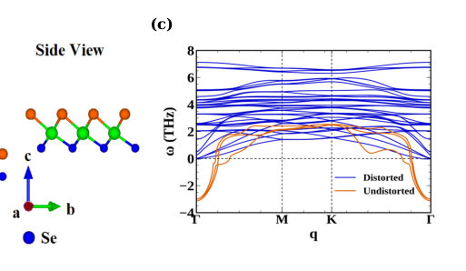
<figcaption class="paper-figure-caption"><b>Fig 4.</b> Fig. 4(a). In the band structure plot of Fig. 4(a), several ad- ditional bands appear due to the band folding associated with the supercell periodicity. To separate the bands of the prim- itive cell from these folded replicas, the spectral weight has been evaluated from the overlap between the Bloch states of the supercell and those of the primitive cell using the band- unfolding technique [71, 72]. The resulting unfolded band structure, weighted by the spectral intensity, is presented in Fig. 4(b). As a consequence of the lattice distortion, the Zr d orbital dominated conduction band at the M point moves away from the Fermi level, while the Te p orbital dominated valence bands around the Γ...</figcaption>
</figure>
<figure class="paper-figure-card">
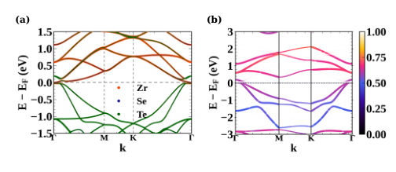
<figcaption class="paper-figure-caption"><b>Fig 5.</b> FIG. 4. (a) Electronic band structure of distorted 2×2×1 CDW phase of ZrSeTe; (b) Corresponding band structure unfolded from 2×2×1 supercell to the primitive 1×1×1 Brillouin zone. SOC has not been considered in either calculation.</figcaption>
</figure>

**Summary.** This theoretical study investigates the competition between Charge Density Wave order and superconductivity in the $	ext{ZrSeTe}$ Janus monolayer using first-principles calculations. The authors demonstrate that structural changes, strain, or electron correlation can tune these instabilities, predicting a robust two-gap superconducting state mediated by lattice vibrations when CDW is suppressed.

**Why it may be interesting.** This work is highly relevant as it tackles competing orders (CDW vs. SC) in a tunable solid-state system, which is central to understanding unconventional superconductivity mechanisms often studied in AMO contexts (e.g., pairing mediated by collective excitations).

Detailed structure

**Main problem.** The study investigates the complex interplay between Charge Density Wave (CDW) order and superconductivity in low-dimensional Janus transition-metal dichalcogenides ($	ext{ZrSeTe}$). The research aims to understand how structural modifications, electronic correlations, and external strain tune these competing ground states.

**Main result.** The $	ext{ZrSeTe}$ monolayer exhibits phonon-mediated two-gap superconductivity in its undistorted phase. Both CDW instability and superconductivity are highly sensitive to the substitution of Te with Se, local correlation ($U_{	ext{eff}}$), and applied biaxial strain.

**Method.** The work employs first-principles calculations (DFT) combined with advanced many-body techniques like Migdal-Eliashberg theory for superconductivity. Analysis involves calculating phonon spectra, electronic susceptibilities ($\chi'_q$), and energy profiles under various perturbations.

**Model / system.** The physical system is the $1T$ $	ext{ZrSeTe}$ Janus monolayer, a low-dimensional material platform. The theoretical framework incorporates electron-phonon coupling (EPC), local Hubbard correlation ($U_{	ext{eff}}$), and mechanical strain as tuning parameters.

**Key observables.** Phonon anomalies/softening at the M point, electronic band gap opening, CDW energy gain, superconducting critical temperature ($T_c$), and two-gap superconducting features ($\Delta$).

**Important parameters / regimes.** Biaxial strain (compressive/tensile), Hubbard $U_{	ext{eff}}$ strength, Spin-Orbit Coupling (SOC) inclusion.

**Assumptions / limitations.** The calculations rely on DFT approximations (PBE functional) and use established formalisms like the Allen-Dynes modified McMillan formula for superconductivity.

**Figures summary.** Figures illustrate band structures and Fermi surfaces under strain/SOC, phonon dispersions showing anomalies, and energy profiles confirming structural instabilities or correlation effects.

**Paper structure.** The paper systematically analyzes the electronic structure (band gaps, FS) first, then investigates CDW instability via phonon softening and susceptibility peaks. Subsequently, it models superconductivity using EPC calculations, finally mapping out how strain and correlation tune both phenomena.

Abstract

Low-dimensional transition-metal dichalcogenides (TMDCs) provide an ideal platform for studying the emergence of charge density wave (CDW) and superconductivity. The discovery of emergent CDW order in 1T $\mathrm{ZrTe_2}$ monolayer raises an important question: does this instability persist when one $\mathrm{Te}$ chalcogen layer is substituted by $\mathrm{Se}$? In the present work, we investigate the CDW (2$\times$2$\times$1) and superconducting instability in 1T $\mathrm{ZrSeTe}$ Janus monolayer using first-principles calculations. The phonon spectrum exhibits a pronounced anomaly at the $\mathrm{M}$ point of the irreducible Brillouin zone, arising from enhanced electron-phonon interaction together with electronic instabilities originating from both interband and intraband scattering. The resulting lattice distortion reconstructs the electronic structure, opening a small indirect band gap, driving the system from a semi-metallic to a semiconducting state. The energy gain associated with the distortion is significantly smaller than that of $\mathrm{ZrTe_2}$ monolayer, indicating that the replacement of one $\mathrm{Te}$ chalcogen layer with $\mathrm{Se}$ weakens the CDW instability. We have further investigated the effects of electronic correlation and biaxial strain, both acts as effective tuning parameters for the instabilities concerened. In the high temperature undistorted phase, $\mathrm{ZrSeTe}$ exhibits phonon mediated two-gap superconductivity. It originates primarily from the robust coupling between the soft phonon mode at $\mathrm{M}$ point and the electronic bands predominantly derived from $\mathrm{Zr}$ $\mathit{d}$ and $\mathrm{Te}$ $\mathit{p}$ orbitals crossing the Fermi level. Spin-orbit coupling (SOC) further modifies the electronic states and reduces the superconducting transition temperature.

[↑ back to top](#top)

### [On-chip superconducting GHz RF reflectometry of the capacitance response in bilayer graphene](http://arxiv.org/abs/2606.14431v1)

**Authors:** Sung Jin An, Minseo Cho, Minjun Park, Dohun Kim, HyeonJeong An, Seung-Bo Shim, Hakseong Kim, Sunghun Lee, Myoung-Jae Lee, Kenji Watanabe, Takashi Taniguchi, Jungpil Seo, Myunglae Jo, Youngwook Kim, Minkyung Jung  
**Type:** experiment · **Category:** other · **PDF:** <https://arxiv.org/pdf/2606.14431v1>  
**Analysis basis:** full PDF text, analyzed in chunks
**Topic relevance:** `Kondo & dissipative impurity` **1/5** · `analog quantum simulation` **1/5** · `methods for driven-dissipative` **1/5** · `non-equilibrium dynamics` **1/5**

↔ Scroll figures horizontally

<figure class="paper-figure-card">
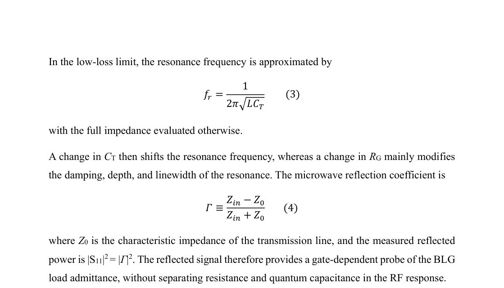
<figcaption class="paper-figure-caption"><b>Fig 1.</b> Figure 2(b) displays the measured |S11|2 spectra at three representative gate voltages, (VT, VB)</figcaption>
</figure>
<figure class="paper-figure-card">
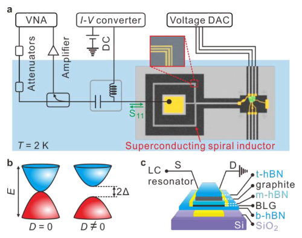
<figcaption class="paper-figure-caption"><b>Fig 2.</b> Figure 1| Device architecture and RF measurement scheme. (a) RF reflectometry setup for</figcaption>
</figure>
<figure class="paper-figure-card">
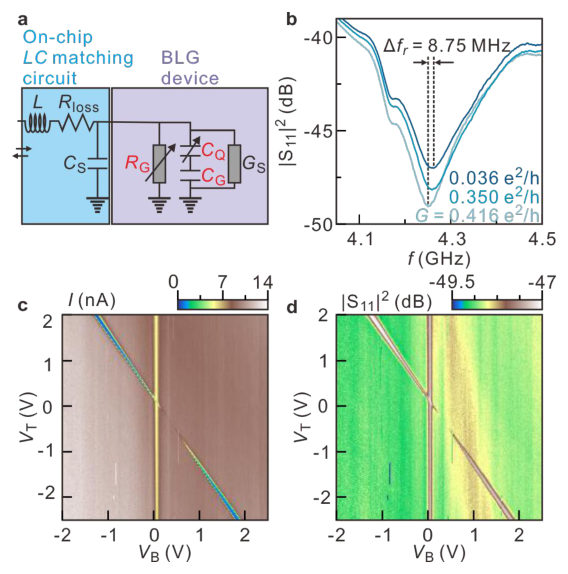
<figcaption class="paper-figure-caption"><b>Fig 3.</b> Figure 2| RF response of the BLG device connected to the superconducting LC resonator.</figcaption>
</figure>
<figure class="paper-figure-card">
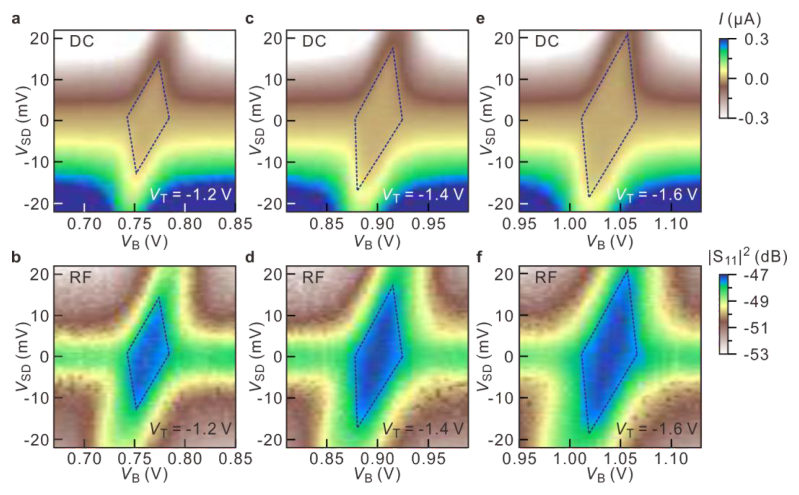
<figcaption class="paper-figure-caption"><b>Fig 4.</b> Figure 3| Finite-bias spectroscopy of the BLG device at T = 2 K. (a), (c), and (e) DC current</figcaption>
</figure>
<figure class="paper-figure-card">
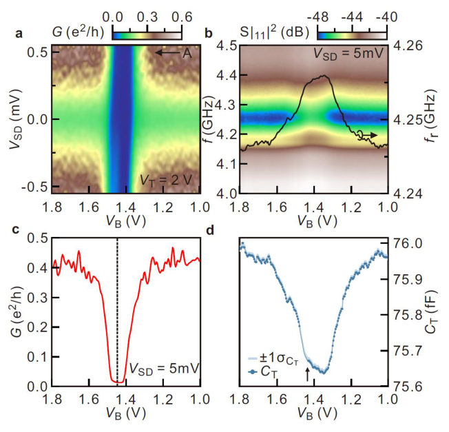
<figcaption class="paper-figure-caption"><b>Fig 5.</b> Figure 4| Capacitance response of BLG near the field-induced gapped regime. (a)</figcaption>
</figure>

**Summary.** This work utilizes superconducting GHz RF reflectometry on a dual-gated bilayer graphene device to measure its electronic capacitance. By analyzing shifts in the LC resonator's resonance frequency, the researchers successfully map out the gate-dependent capacitance, confirming that this response tracks changes in the material's compressibility near an induced band gap. This technique offers a powerful, complementary diagnostic tool beyond standard DC transport measurements.

**Why it may be interesting.** While focused on condensed matter electronics, the use of microwave spectroscopy (RF reflectometry) to extract quantum capacitance provides a highly sensitive, non-invasive probe into the density of states and compressibility of 2D materials, which is relevant for understanding quantum confinement effects in nanoscale devices.

Detailed structure

**Main problem.** The study aims to characterize the gate-dependent capacitance response of bilayer graphene (BLG) by measuring its admittance using on-chip superconducting GHz RF reflectometry.

**Main result.** The measured capacitance exhibits a minimum near the conductance-suppressed region, which is consistent with reduced electronic compressibility in the field-induced band gap of BLG. The technique successfully complements DC transport measurements within a single device.

**Method.** RF reflectometry using an on-chip superconducting Nb LC resonator coupled to the graphene channel allows for the extraction of the effective capacitance by tracking the resonance frequency shift ($\Delta f_r$).

**Model / system.** The physical system is a dual-gated, hBN-encapsulated bilayer graphene heterostructure. The analysis employs an equivalent-circuit model treating the resonator as connected to the BLG load, where total capacitance combines geometric and quantum contributions.

**Key observables.** RF reflection coefficient (|S11|^2), resonance frequency shift ($\Delta f_r$), DC conductance (G), and extracted effective capacitance ($C_T$).

**Important parameters / regimes.** Measurement temperature of 2 K; operating frequency near 4.25 GHz; gap size potentially exceeding 100 meV.

**Assumptions / limitations.** The analysis relies on an equivalent-circuit framework, and the simplified model may break down in the low-conductance, gapped regime due to disorder or inhomogeneity.

**Figures summary.** Figures illustrate the device architecture (BLG heterostructure on Nb resonator), schematic band structures showing gap opening, and maps correlating DC current measurements with simultaneously measured RF reflected power (|S11|^2).

**Paper structure.** The paper details the setup using superconducting LC resonators for high-frequency characterization. It presents data comparing DC transport maps to RF reflection maps, demonstrating that both probe the same underlying gate-dependent electronic structure, particularly near the charge neutrality point.

Abstract

In dual-gated bilayer graphene, a perpendicular displacement field opens a band gap that modifies both the channel conductance and the electronic compressibility, motivating measurements that resolve resistive and capacitive responses on the same device. We integrate an hBN-encapsulated bilayer graphene heterostructure with an on-chip superconducting Nb lumped-element LC resonator and carry out RF reflectometry near 4.25 GHz. DC transport and finite-bias spectroscopy on the same device provide a transport reference. Top and bottom gates independently set the carrier density and displacement field. The DC and RF gate maps share the same gate-dependent features, with finite-bias measurements revealing a region of suppressed conductance whose bias extent grows with the displacement field, consistent with a field-induced gap. The gate-dependent resonance-frequency shift is converted to the effective capacitance seen by the resonator using an equivalent-circuit model. The capacitance shows a minimum near the conductance-suppressed region, consistent with reduced electronic compressibility in the gapped bilayer graphene, and exhibits an electron-hole asymmetry. The on-chip configuration probes the gate-dependent admittance of a dual-gated van der Waals heterostructure, providing capacitance-sensitive information that complements DC transport within a single device.

[↑ back to top](#top)

### [Benjamin-Ono dynamics of internal waves with currents](http://arxiv.org/abs/2606.14563v1)

**Authors:** Lyudmila Ivanova  
**Type:** theory · **Category:** other · **PDF:** <https://arxiv.org/pdf/2606.14563v1>  
**Analysis basis:** full PDF text, analyzed in chunks
**Topic relevance:** `Frenkel-Kontorova` **1/5**

↔ Scroll figures horizontally

<figure class="paper-figure-card">
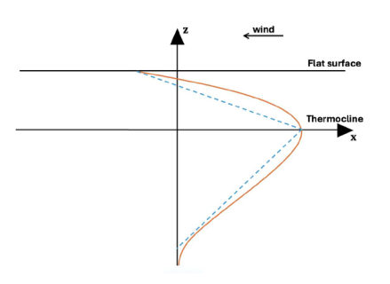
<figcaption class="paper-figure-caption"><b>Fig 1.</b> Figure 1: The setup.</figcaption>
</figure>
<figure class="paper-figure-card">
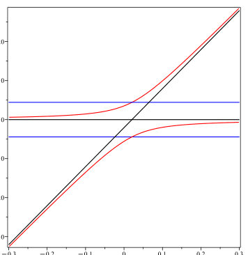
<figcaption class="paper-figure-caption"><b>Fig 2.</b> Figure 2: c+ and c−(red) versus the vorticity in the upper layer γ1 (the other shear parameter is γ = 0.02). ±|c0| (blue) are the zero-shear values. The black line is the asymptote c± ≃γ1h of the growing branch of both speeds, the other branch of the speeds (propagating against the current) decays to zero.</figcaption>
</figure>
<figure class="paper-figure-card">
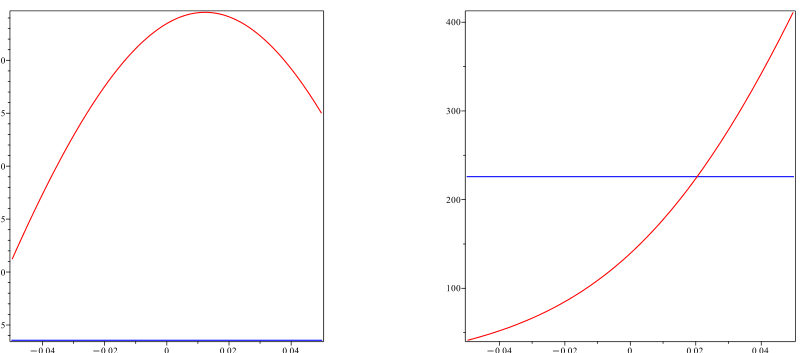
<figcaption class="paper-figure-caption"><b>Fig 3.</b> Figure 3: Coefficients A and B for γ = 0.02 and varying γ1, compared with the irrotational case A0 and B0 for γ = γ1 = 0.</figcaption>
</figure>
<figure class="paper-figure-card">
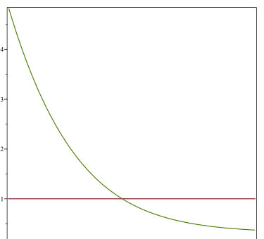
<figcaption class="paper-figure-caption"><b>Fig 4.</b> Figure 4: Amplitude ratio R = η∗ s/η∗ 0 at equal energy as a function of the shear parameter γ1 for fixed γ = 0.02. The horizontal line corresponds to the irrotational value R = 1.</figcaption>
</figure>

**Summary.** This paper develops a nonlinear model, based on the Benjamin-Ono equation, to describe internal waves at oceanic pycnoclines. It rigorously incorporates background shear currents into this wave propagation framework. The key finding is that these currents significantly modify the resulting soliton behavior and wave speeds compared to simpler, irrotational models.

**Why it may be interesting.** While not quantum physics, the mathematical framework of nonlinear wave propagation (integrable systems) is highly relevant in theoretical physics for modeling complex dynamics, analogous to how many-body quantum systems can be mapped onto effective classical field theories or soliton equations.

Detailed structure

**Main problem.** The study derives nonlinear integrable models for internal waves propagating at a pycnocline interface between two fluid layers, specifically incorporating the effects of underlying background currents.

**Main result.** The Benjamin-Ono (BO) equation governs the dynamics, and the analysis shows that background shear current significantly affects soliton characteristics, leading to speed splitting and amplitude modification compared to irrotational cases.

**Method.** The authors use asymptotic long-wave scaling parameters ($\epsilon, \delta$) applied to the Euler equations for a two-layer fluid system, deriving the governing equation via Hamiltonian methods.

**Model / system.** The physical system is an incompressible, inviscid, two-layer fluid model representing oceanography. The dynamics are modeled by the Benjamin-Ono (BO) equation: eta_t + c*eta_x + delta A eta*eta_x - delta B|D|eta_x = 0.

**Key observables.** Soliton characteristics, wave speed $c$, amplitude ratio $R = \eta^*_s / \eta^*_0$, and conserved quantities like Energy ($E$).

**Important parameters / regimes.** Shear current parameters ($\kappa, \gamma_1$), nonlinearity parameter $\epsilon$, and long-wave scaling parameter $\delta$.

**Assumptions / limitations.** The derivation relies on the flat surface approximation and assumes that the weak nonlinearity and long-wave regimes are of comparable order ($O(\epsilon) = O(\delta)$).

**Figures summary.** Figure 2 compares wave speeds $c_\pm$ versus vorticity ($\gamma_1$), showing splitting. Figure 3 shows coefficient dependence on $\gamma_1$. Figure 4 plots the amplitude ratio $R$ vs. $\gamma_1$, indicating how shear affects soliton amplitudes.

**Paper structure.** The paper progresses from setting up the two-layer fluid model using Euler equations to deriving the BO equation under specific asymptotic limits, and finally analyzing the resulting integrable equation by comparing solutions with and without background shear currents.

Abstract

Internal water waves arise when there is a change in density stratification in a fluid, which may occur in an oceanographical context due to variations in temperature, salinity, or other fluctuations in the equations of state. We present a derivation of nonlinear integrable models for the propagation of interfacial internal waves arising between two fluid layers of different densities (at the so called pycnocline).   We examine the integrable Benjamin-Ono (BO) equation as an internal wave model, incorporating underlying currents by permitting a sheared current in both fluid layers. The BO equation arises for a specific small-amplitude asymptotic regime. We show that the BO soliton characteristics are strongly affected by the shear current parameters.

[↑ back to top](#top)

### [Strain- and doping-tunable optical resonance in Kekulé-Y graphene](http://arxiv.org/abs/2606.14424v1)

**Authors:** Yawar Mohammadi  
**Type:** theory · **Category:** other · **PDF:** <https://arxiv.org/pdf/2606.14424v1>  
**Analysis basis:** full PDF text, analyzed in chunks
**Topic relevance:** `Keldysh / 2PI / non-Gaussian methods` **1/5**

↔ Scroll figures horizontally

<figure class="paper-figure-card">
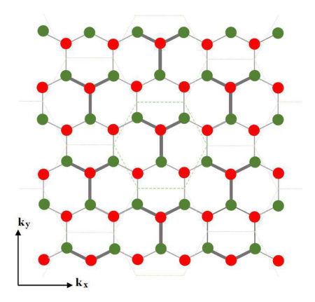
<figcaption class="paper-figure-caption"><b>Fig 1.</b> FIG. 1. Schematic of a graphene lattice with a uniform Y- type Kekul´e distortion. Dashed hexagons indicate the unit cell, and axes denote the reciprocal directions kx and ky.</figcaption>
</figure>
<figure class="paper-figure-card">
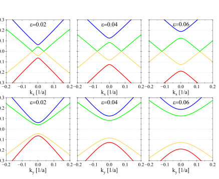
<figcaption class="paper-figure-caption"><b>Fig 2.</b> FIG. 3. Band-structure cuts along ky = 0 (top) and kx = 0 (bottom) for uniaxial strain values ε = 0.02, 0.04, and 0.06 (from left to right) applied along zigzag edge. Strain induces anisotropic dispersion and generates symmetric saddle points at Γ, together with a strain-dependent gap to the next higher band.</figcaption>
</figure>
<figure class="paper-figure-card">
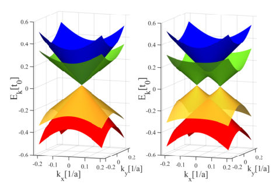
<figcaption class="paper-figure-caption"><b>Fig 3.</b> FIG. 2. Schematic 3D band structure of Kekul´e graphene without strain (left) and under a uniaxial strain of 0.04 (right) applied along zigzag edge, illustrating the strain-induced modification of the electronic bands.</figcaption>
</figure>
<figure class="paper-figure-card">
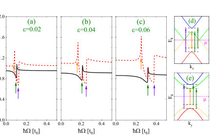
<figcaption class="paper-figure-caption"><b>Fig 4.</b> FIG. 4. Optical conductivity at µ = 0 and T = 0 un- der uniaxial strain applied along the x axis. Panels (a)-(c) present σxx (black) and σyy (red) for strain values of 0.02, 0.04, and 0.06, respectively. Panels (d) and (e) summarize the allowed absorptive interband transition groups; arrows on the band structures denote each transition group, while arrows of matching color mark their corresponding signatures in the conductivity.</figcaption>
</figure>
<figure class="paper-figure-card">
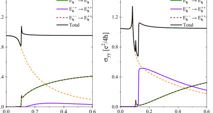
<figcaption class="paper-figure-caption"><b>Fig 5.</b> FIG. 5. Contributions of all allowed transition groups to the optical conductivity at µ = 0, T = 0, under 0.02 uniaxial strain. Left and right panels correspond to σxx and σyy, re- spectively; colored curves indicate individual transitions, and black curves represent the total conductivity.</figcaption>
</figure>

**Summary.** This paper theoretically investigates the optical response of Kekulé-Y graphene when subjected to uniaxial strain and doping. By calculating the optical conductivity using advanced Hamiltonian methods, the authors predict a distinct, anisotropic optical resonance linked to strain-induced Van Hove singularities. This resonance serves as a robust spectroscopic fingerprint for identifying the specific electronic ordering in the material.

**Why it may be interesting.** This work provides a concrete theoretical framework for using optical spectroscopy as a sensitive probe to detect subtle electronic phase transitions (like Kekulé ordering) in 2D materials by engineering strain-induced band structure features.

Detailed structure

**Main problem.** The study investigates how uniaxial strain and carrier doping modify the optical resonance and electronic structure of Kekulé-Y graphene.

**Main result.** A pronounced, strongly anisotropic optical resonance emerges from strain-induced Van Hove singularities, providing a robust optical signature for the Kekulé-Y ordering that is stable against disorder and temperature.

**Method.** The analysis employs the Kubo formalism to calculate the optical conductivity ($\sigma$) using low-energy effective Hamiltonians derived near strain-induced Dirac points.

**Model / system.** The system is Kekulé-Y graphene, modeled by a low-energy effective Hamiltonian that incorporates nearest-neighbor hopping and coupling terms related to the Kekulé bond-order pattern. Strain modifies this structure, inducing anisotropic dispersion and Van Hove singularities.

**Key observables.** Optical conductivity ($\sigma_{xx}, \sigma_{yy}$), Drude weight ($D_{\alpha\alpha}$), and the position/intensity of optical resonance peaks.

**Important parameters / regimes.** Uniaxial strain magnitude ($\epsilon$), chemical potential ($\mu$), photon energy ($\hbar\Omega$), disorder strength ($\Gamma$), and temperature ($T$).

**Assumptions / limitations.** The analysis relies on a low-energy Dirac approximation, the long-wavelength limit ($q=0$) for optical measurements, and phenomenological modeling of disorder via Lorentzian broadening.

**Figures summary.** Figures illustrate band structure modifications under strain (showing VHS), and plot $\sigma_{xx}$ and $\sigma_{yy}$ vs. $\hbar\Omega$ as a function of strain, doping ($\mu$), temperature ($T$), and disorder ($\Gamma$).

**Paper structure.** The paper progresses from establishing the low-energy Hamiltonian under strain to calculating the optical conductivity via the Kubo formula. It then systematically analyzes how this resonance feature persists when varying key parameters like doping, temperature, and disorder.

Abstract

We investigate the optical response of Kekulé-Y graphene under uniaxial strain and carrier doping. Using a low-energy effective Hamiltonian, we show that strain reshapes the low-energy electronic structure of the Kekulé-Y phase and induces Van Hove singularities at energies well below those of pristine graphene. Within the Kubo formalism, we calculate the optical conductivity and identify multiple anisotropic interband features, with a pronounced resonance arising from strain-induced Van Hove singularities. The pronounced resonance is strongly anisotropic and robust against moderate thermal broadening and disorder, providing a clear optical signature of Kekulé-Y ordering. We further derive analytical expressions for the low-energy optical conductivity and the Drude weight, providing a detailed characterization of the strain- and doping-dependent optical response. Our results establish strain engineering as an effective route for controlling valley-dependent optical properties in Kekulé-Y graphene, originating from the Kekulé-induced coupling of the Dirac valleys, and suggest feasible optical probes for the experimental identification of the Kekulé-Y phase.

[↑ back to top](#top)
