
# arxiv digest (quant-ph + cond-mat) — 2026-06-16

*204 papers · 73 relevant · 1 highlighted*

## 🔥 Most relevant (73)

*Every paper with at least one nonzero topic score, sorted by best-matching score. 🔥 marks scores ≥4/5. Click the title to jump to the full entry below; click [arXiv] to open the paper page. `(secondary)` marks papers from de-prioritized cond-mat archives.*

Show 73 relevant papers

- [Experimental Observation of Dynamical Phase Transitions in a Dephased Photonic Quantum Walk](#paper-2606.15935) [[arXiv]](http://arxiv.org/abs/2606.15935v1) — 🔥 `driven-dissipative phase transition` **5/5** · 🔥 `analog quantum simulation` **4/5** · 🔥 `non-equilibrium dynamics` **4/5** · `methods for driven-dissipative` **3/5** · `non-equilibrium universality` **3/5** · `quantum optics experiment` **3/5** · `QC/QI experiment` **2/5** · `correlated / nonlocal dissipation` **1/5** · `entanglement & information structure` **1/5** · `interference shaping light` **1/5** · `quantum measurements` **1/5**
- [Dressed Floquet scars from protected zero modes in a Rydberg chain](#paper-2606.15605) [[arXiv]](http://arxiv.org/abs/2606.15605v1) — 🔥 `scars & prethermalization` **5/5** · 🔥 `analog quantum simulation` **4/5** · 🔥 `non-equilibrium dynamics` **4/5** · `Rydberg arrays` **3/5** · `methods for driven-dissipative` **3/5** · `driven-dissipative phase transition` **2/5** · `non-equilibrium universality` **2/5** · `Frenkel-Kontorova` **1/5** · `Keldysh / 2PI / non-Gaussian methods` **1/5** · `entanglement & information structure` **1/5**
- [Quantum Algorithm for Open-System Battery Cathodes by Modeling Multiple Strongly Coupled Holstein Polarons with Chain-Mapped Caldeira-Leggett Dynamics](#paper-2606.16017) [[arXiv]](http://arxiv.org/abs/2606.16017v1) — 🔥 `methods for driven-dissipative` **5/5** · 🔥 `Keldysh / 2PI / non-Gaussian methods` **4/5** · `correlated / nonlocal dissipation` **3/5** · `driven-dissipative phase transition` **3/5** · `non-equilibrium dynamics` **3/5** · `Kondo & dissipative impurity` **2/5** · `non-equilibrium universality` **2/5** · `Frenkel-Kontorova` **1/5** · `quantum measurements` **1/5**
- [Interaction-enabled topological pumping of Rydberg electrons](#paper-2606.15126) [[arXiv]](http://arxiv.org/abs/2606.15126v1) — 🔥 `Rydberg arrays` **5/5** · 🔥 `analog quantum simulation` **4/5** · `driven-dissipative phase transition` **3/5** · `non-equilibrium dynamics` **3/5** · `non-equilibrium universality` **2/5** · `correlated / nonlocal dissipation` **1/5** · `correlated cavity matter` **1/5** · `entanglement & information structure` **1/5** · `exotic spin models in light-matter` **1/5** · `methods for driven-dissipative` **1/5** · `quantum measurements` **1/5**
- [Luttinger liquid parameters in one-dimensional Rydberg arrays](#paper-2606.16128) [[arXiv]](http://arxiv.org/abs/2606.16128v1) — 🔥 `Rydberg arrays` **5/5** · 🔥 `analog quantum simulation` **4/5** · `Frenkel-Kontorova` **3/5** · `entanglement & information structure` **2/5** · `correlated cavity matter` **1/5** · `driven-dissipative phase transition` **1/5** · `non-equilibrium dynamics` **1/5** · `non-equilibrium universality` **1/5**
- [Morphology-resolved scrambling in a chaotic quantum billiard](#paper-2606.16865) [[arXiv]](http://arxiv.org/abs/2606.16865v1) — 🔥 `scars & prethermalization` **5/5** · 🔥 `entanglement & information structure` **4/5** · `non-equilibrium dynamics` **3/5** · `methods for driven-dissipative` **1/5** · `non-equilibrium universality` **1/5**
- [Ultracold atomic lattice systems for simulating topological phases: A review](#paper-2606.16598) [[arXiv]](http://arxiv.org/abs/2606.16598v1) — 🔥 `analog quantum simulation` **5/5** · `non-equilibrium dynamics` **3/5** · `Rydberg arrays` **1/5** · `driven-dissipative phase transition` **1/5** · `entanglement & information structure` **1/5** · `exotic spin models in light-matter` **1/5** · `non-equilibrium universality` **1/5**
- [Programmable Gauge-Field Textures with Ultracold Atoms in Momentum Space](#paper-2606.15124) [[arXiv]](http://arxiv.org/abs/2606.15124v1) — 🔥 `analog quantum simulation` **5/5** · `non-equilibrium dynamics` **3/5** · `driven-dissipative phase transition` **1/5** · `non-equilibrium universality` **1/5**
- [Effect of the hyperbolic photon mode on the metal insulator transition in a proximate material](#paper-2606.16665) [[arXiv]](http://arxiv.org/abs/2606.16665v1) `(secondary)` — 🔥 `analog quantum simulation` **4/5** · 🔥 `correlated cavity matter` **4/5** · `Keldysh / 2PI / non-Gaussian methods` **3/5** · `correlated / nonlocal dissipation` **3/5** · `driven-dissipative phase transition` **3/5** · `methods for driven-dissipative` **3/5** · `Tavis-Cummings & cavity-many-emitter` **2/5** · `exotic spin models in light-matter` **2/5** · `non-equilibrium dynamics` **2/5** · `non-equilibrium universality` **2/5** · `spintronics-quantum-optics interface` **2/5** · `Kondo & dissipative impurity` **1/5** · `entanglement & information structure` **1/5** · `interference shaping light` **1/5** · `measurement-induced transitions` **1/5**
- [Hidden chirality and half-vortex formation in exciton-polariton condensates](#paper-2606.16233) [[arXiv]](http://arxiv.org/abs/2606.16233v1) `(secondary)` — 🔥 `driven-dissipative phase transition` **4/5** · 🔥 `exotic spin models in light-matter` **4/5** · `analog quantum simulation` **3/5** · `correlated cavity matter` **3/5** · `methods for driven-dissipative` **3/5** · `non-equilibrium dynamics` **3/5** · `spintronics-quantum-optics interface` **3/5** · `correlated / nonlocal dissipation` **2/5** · `non-equilibrium universality` **2/5** · `Keldysh / 2PI / non-Gaussian methods` **1/5** · `Tavis-Cummings & cavity-many-emitter` **1/5** · `interference shaping light` **1/5**
- [Synthesizing Arbitrary Non-Hermitian Hamiltonian with Stochastic Floquet Engineering](#paper-2606.15664) [[arXiv]](http://arxiv.org/abs/2606.15664v1) — 🔥 `methods for driven-dissipative` **4/5** · 🔥 `non-equilibrium dynamics` **4/5** · `analog quantum simulation` **3/5** · `correlated / nonlocal dissipation` **3/5** · `correlated cavity matter` **3/5** · `driven-dissipative phase transition` **3/5** · `Keldysh / 2PI / non-Gaussian methods` **2/5** · `Tavis-Cummings & cavity-many-emitter` **2/5** · `non-equilibrium universality` **2/5** · `Kondo & dissipative impurity` **1/5** · `entanglement & information structure` **1/5** · `measurement-induced transitions` **1/5** · `quantum measurements` **1/5**
- [Readout-Induced Leakage in Superconducting Circuits with Nonlinear Couplings](#paper-2606.16055) [[arXiv]](http://arxiv.org/abs/2606.16055v1) — 🔥 `QC/QI experiment` **4/5** · 🔥 `methods for driven-dissipative` **4/5** · `correlated / nonlocal dissipation` **3/5** · `correlated cavity matter` **3/5** · `driven-dissipative phase transition` **3/5** · `non-equilibrium dynamics` **3/5** · `Tavis-Cummings & cavity-many-emitter` **2/5** · `non-equilibrium universality` **2/5** · `Keldysh / 2PI / non-Gaussian methods` **1/5** · `measurement-induced transitions` **1/5** · `quantum measurements` **1/5** · `quantum optics experiment` **1/5**
- [Floquet-Sambe Bottleneck and Frequency-Selective Localization in a Driven Synthetic Spin Chain](#paper-2606.15293) [[arXiv]](http://arxiv.org/abs/2606.15293v1) `(secondary)` — 🔥 `analog quantum simulation` **4/5** · 🔥 `non-equilibrium dynamics` **4/5** · `driven-dissipative phase transition` **3/5** · `exotic spin models in light-matter` **3/5** · `methods for driven-dissipative` **3/5** · `non-equilibrium universality` **3/5** · `spintronics-quantum-optics interface` **2/5** · `Frenkel-Kontorova` **1/5** · `Keldysh / 2PI / non-Gaussian methods` **1/5** · `Kondo & dissipative impurity` **1/5** · `correlated / nonlocal dissipation` **1/5** · `entanglement & information structure` **1/5**
- [Light-induced nonadiabatic dissipative quantum dynamics of the Na2 molecule](#paper-2606.15292) [[arXiv]](http://arxiv.org/abs/2606.15292v1) — 🔥 `methods for driven-dissipative` **4/5** · `analog quantum simulation` **3/5** · `correlated / nonlocal dissipation` **3/5** · `correlated cavity matter` **3/5** · `driven-dissipative phase transition` **3/5** · `non-equilibrium dynamics` **3/5** · `Keldysh / 2PI / non-Gaussian methods` **2/5** · `Tavis-Cummings & cavity-many-emitter` **2/5** · `non-equilibrium universality` **2/5** · `measurement-induced transitions` **1/5** · `quantum measurements` **1/5**
- [Discontinuous strong-to-weak symmetry breaking transition from thermal pure states](#paper-2606.15062) [[arXiv]](http://arxiv.org/abs/2606.15062v1) — 🔥 `driven-dissipative phase transition` **4/5** · 🔥 `entanglement & information structure` **4/5** · `correlated / nonlocal dissipation` **3/5** · `methods for driven-dissipative` **3/5** · `non-equilibrium dynamics` **3/5** · `non-equilibrium universality` **3/5** · `Keldysh / 2PI / non-Gaussian methods` **2/5** · `analog quantum simulation` **1/5** · `exotic spin models in light-matter` **1/5** · `scars & prethermalization` **1/5**
- [Phase controlled spectral topology, dynamic stability and sensitivity in Non-Hermitian Cavity Magnonics](#paper-2606.16522) [[arXiv]](http://arxiv.org/abs/2606.16522v1) — 🔥 `spintronics-quantum-optics interface` **4/5** · `driven-dissipative phase transition` **3/5** · `interference shaping light` **3/5** · `analog quantum simulation` **2/5** · `correlated / nonlocal dissipation` **2/5** · `exotic spin models in light-matter` **2/5** · `methods for driven-dissipative` **2/5** · `non-equilibrium universality` **2/5** · `Keldysh / 2PI / non-Gaussian methods` **1/5** · `Kondo & dissipative impurity` **1/5** · `Tavis-Cummings & cavity-many-emitter` **1/5** · `correlated cavity matter` **1/5** · `non-equilibrium dynamics` **1/5**
- [Charging Quantum Batteries with Chiral Squeezing](#paper-2606.16764) [[arXiv]](http://arxiv.org/abs/2606.16764v1) — 🔥 `methods for driven-dissipative` **4/5** · `Keldysh / 2PI / non-Gaussian methods` **3/5** · `analog quantum simulation` **3/5** · `driven-dissipative phase transition` **3/5** · `non-equilibrium dynamics` **3/5** · `correlated / nonlocal dissipation` **2/5** · `non-equilibrium universality` **2/5** · `Frenkel-Kontorova` **1/5** · `correlated cavity matter` **1/5** · `entanglement & information structure` **1/5** · `quantum measurements` **1/5**
- [Physically Motivated Ansatz for Open Fermionic Systems on Quantum Computer](#paper-2606.16823) [[arXiv]](http://arxiv.org/abs/2606.16823v1) — 🔥 `methods for driven-dissipative` **4/5** · 🔥 `non-equilibrium dynamics` **4/5** · `Keldysh / 2PI / non-Gaussian methods` **3/5** · `correlated / nonlocal dissipation` **3/5** · `driven-dissipative phase transition` **3/5** · `non-equilibrium universality` **2/5** · `Kondo & dissipative impurity` **1/5** · `analog quantum simulation` **1/5** · `entanglement & information structure` **1/5** · `exotic spin models in light-matter` **1/5** · `scars & prethermalization` **1/5**
- [Dynamics and stabilization of topological edge solitons in driven-damped nonlinear SSH lattices](#paper-2606.15567) [[arXiv]](http://arxiv.org/abs/2606.15567v1) `(secondary)` — 🔥 `driven-dissipative phase transition` **4/5** · `Frenkel-Kontorova` **3/5** · `analog quantum simulation` **3/5** · `methods for driven-dissipative` **3/5** · `non-equilibrium dynamics` **3/5** · `correlated / nonlocal dissipation` **2/5** · `non-equilibrium universality` **2/5** · `Keldysh / 2PI / non-Gaussian methods` **1/5** · `Kondo & dissipative impurity` **1/5**
- [Enhanced Sensitivity near a Quantum Exceptional Point in the Absence of Engineered Dissipation](#paper-2606.16060) [[arXiv]](http://arxiv.org/abs/2606.16060v1) — 🔥 `driven-dissipative phase transition` **4/5** · `analog quantum simulation` **3/5** · `methods for driven-dissipative` **3/5** · `non-equilibrium dynamics` **3/5** · `non-equilibrium universality` **2/5** · `quantum optics experiment` **2/5** · `QC/QI experiment` **1/5** · `Tavis-Cummings & cavity-many-emitter` **1/5** · `correlated / nonlocal dissipation` **1/5** · `correlated cavity matter` **1/5** · `quantum measurements` **1/5**
- [Generalized Kerr-Cat Qubit Codes](#paper-2606.14901) [[arXiv]](http://arxiv.org/abs/2606.14901v1) — 🔥 `methods for driven-dissipative` **4/5** · `correlated cavity matter` **3/5** · `driven-dissipative phase transition` **3/5** · `non-equilibrium dynamics` **3/5** · `correlated / nonlocal dissipation` **2/5** · `entanglement & information structure` **2/5** · `non-equilibrium universality` **2/5** · `Keldysh / 2PI / non-Gaussian methods` **1/5** · `analog quantum simulation` **1/5** · `measurement-induced transitions` **1/5**
- [Microscopic exceptional points in the post-selected open Jaynes--Cummings model](#paper-2606.14982) [[arXiv]](http://arxiv.org/abs/2606.14982v1) — 🔥 `methods for driven-dissipative` **4/5** · `Tavis-Cummings & cavity-many-emitter` **3/5** · `correlated cavity matter` **3/5** · `driven-dissipative phase transition` **3/5** · `analog quantum simulation` **2/5** · `correlated / nonlocal dissipation` **2/5** · `non-equilibrium universality` **2/5** · `Keldysh / 2PI / non-Gaussian methods` **1/5** · `Kondo & dissipative impurity` **1/5** · `non-equilibrium dynamics` **1/5**
- [Quantum coherence and Leggett-Garg inequality](#paper-2606.15717) [[arXiv]](http://arxiv.org/abs/2606.15717v1) — 🔥 `quantum measurements` **4/5** · `measurement-induced transitions` **3/5** · `methods for driven-dissipative` **3/5** · `Keldysh / 2PI / non-Gaussian methods` **2/5** · `correlated / nonlocal dissipation` **2/5** · `driven-dissipative phase transition` **2/5** · `entanglement & information structure` **2/5** · `non-equilibrium dynamics` **2/5** · `analog quantum simulation` **1/5** · `non-equilibrium universality` **1/5**
- [Initiation of Superradiance from Different Collective Spin States](#paper-2606.14949) [[arXiv]](http://arxiv.org/abs/2606.14949v1) — 🔥 `Dicke superradiance` **4/5** · `Tavis-Cummings & cavity-many-emitter` **3/5** · `correlated cavity matter` **3/5** · `methods for driven-dissipative` **2/5** · `superradiant laser` **2/5** · `Keldysh / 2PI / non-Gaussian methods` **1/5** · `analog quantum simulation` **1/5** · `correlated / nonlocal dissipation` **1/5** · `driven-dissipative phase transition` **1/5** · `entanglement & information structure` **1/5** · `non-equilibrium dynamics` **1/5**
- [Non-stationary longitudinal Josephson effect in electron-hole bilayers](#paper-2606.16338) [[arXiv]](http://arxiv.org/abs/2606.16338v1) `(secondary)` — 🔥 `Keldysh / 2PI / non-Gaussian methods` **4/5** · `driven-dissipative phase transition` **3/5** · `methods for driven-dissipative` **3/5** · `non-equilibrium dynamics` **3/5** · `analog quantum simulation` **2/5** · `non-equilibrium universality` **2/5** · `Kondo & dissipative impurity` **1/5** · `correlated / nonlocal dissipation` **1/5** · `correlated cavity matter` **1/5**
- [Information Is Not Physical: Possibility Spaces, Erasure, and the Structure of Unrealized Alternatives](#paper-2606.15120) [[arXiv]](http://arxiv.org/abs/2606.15120v1) — 🔥 `entanglement & information structure` **4/5** · `measurement-induced transitions` **3/5** · `quantum measurements` **3/5** · `correlated / nonlocal dissipation` **2/5** · `driven-dissipative phase transition` **2/5** · `Keldysh / 2PI / non-Gaussian methods` **1/5** · `methods for driven-dissipative` **1/5** · `non-equilibrium dynamics` **1/5** · `non-equilibrium universality` **1/5**
- [Measuring Non-Stabilizerness in an SU(2) Lattice Gauge Theory](#paper-2606.14842) [[arXiv]](http://arxiv.org/abs/2606.14842v1) — 🔥 `analog quantum simulation` **4/5** · `entanglement & information structure` **3/5** · `methods for driven-dissipative` **3/5** · `quantum measurements` **3/5** · `measurement-induced transitions` **2/5** · `Keldysh / 2PI / non-Gaussian methods` **1/5** · `QC/QI experiment` **1/5** · `driven-dissipative phase transition` **1/5**
- [Nonlinear Localized States on a Pyrochlore Lattice](#paper-2606.15855) [[arXiv]](http://arxiv.org/abs/2606.15855v1) `(secondary)` — 🔥 `analog quantum simulation` **4/5** · `exotic spin models in light-matter` **3/5** · `driven-dissipative phase transition` **2/5** · `methods for driven-dissipative` **2/5** · `non-equilibrium dynamics` **2/5** · `Frenkel-Kontorova` **1/5** · `Keldysh / 2PI / non-Gaussian methods` **1/5** · `entanglement & information structure` **1/5** · `non-equilibrium universality` **1/5** · `spintronics-quantum-optics interface` **1/5**
- [Riviera model with egoistical settlers](#paper-2606.16791) [[arXiv]](http://arxiv.org/abs/2606.16791v1) — 🔥 `Keldysh / 2PI / non-Gaussian methods` **4/5** · `methods for driven-dissipative` **3/5** · `non-equilibrium dynamics` **3/5** · `non-equilibrium universality` **3/5** · `driven-dissipative phase transition` **2/5** · `Frenkel-Kontorova` **1/5** · `analog quantum simulation` **1/5** · `correlated / nonlocal dissipation` **1/5**
- [Superconducting diode effect via Floquet topological Fulde-Ferrell phase in driven Rashba nanowire](#paper-2606.16459) [[arXiv]](http://arxiv.org/abs/2606.16459v1) `(secondary)` — 🔥 `non-equilibrium dynamics` **4/5** · `Keldysh / 2PI / non-Gaussian methods` **3/5** · `driven-dissipative phase transition` **3/5** · `methods for driven-dissipative` **3/5** · `non-equilibrium universality` **2/5** · `Kondo & dissipative impurity` **1/5** · `analog quantum simulation` **1/5**
- [High-dimensional coherence to entanglement transduction under canonical noise](#paper-2606.16695) [[arXiv]](http://arxiv.org/abs/2606.16695v1) — 🔥 `entanglement & information structure` **4/5** · `correlated / nonlocal dissipation` **3/5** · `methods for driven-dissipative` **3/5** · `driven-dissipative phase transition` **2/5** · `non-equilibrium dynamics` **2/5** · `Keldysh / 2PI / non-Gaussian methods` **1/5** · `non-equilibrium universality` **1/5**
- [Suppressing Intrinsic Spin-Phonon Errors in Trapped-Ion Quantum Simulation](#paper-2606.15518) [[arXiv]](http://arxiv.org/abs/2606.15518v1) — 🔥 `analog quantum simulation` **4/5** · `exotic spin models in light-matter` **3/5** · `QC/QI experiment` **2/5** · `non-equilibrium dynamics` **2/5** · `correlated / nonlocal dissipation` **1/5** · `entanglement & information structure` **1/5** · `methods for driven-dissipative` **1/5** · `quantum measurements` **1/5** · `spintronics-quantum-optics interface` **1/5**
- [Adiabatic preparation of a fractional quantum Hall fluid by coherently pumping atoms from a Bose-Einstein condensate](#paper-2606.15951) [[arXiv]](http://arxiv.org/abs/2606.15951v1) — 🔥 `analog quantum simulation` **4/5** · `non-equilibrium dynamics` **3/5** · `non-equilibrium universality` **2/5** · `Keldysh / 2PI / non-Gaussian methods` **1/5** · `correlated / nonlocal dissipation` **1/5** · `driven-dissipative phase transition` **1/5** · `entanglement & information structure` **1/5** · `exotic spin models in light-matter` **1/5** · `methods for driven-dissipative` **1/5**
- [Exact solution of the Glauber-Ising model on the finite-length semi-open chain](#paper-2606.16848) [[arXiv]](http://arxiv.org/abs/2606.16848v1) — 🔥 `non-equilibrium dynamics` **4/5** · `methods for driven-dissipative` **3/5** · `non-equilibrium universality` **3/5** · `driven-dissipative phase transition` **2/5** · `Frenkel-Kontorova` **1/5** · `Keldysh / 2PI / non-Gaussian methods` **1/5** · `correlated / nonlocal dissipation` **1/5**
- [On-Demand Coherent Mapping of Telecom Optical States onto Erbium Hyperfine Spins](#paper-2606.15009) [[arXiv]](http://arxiv.org/abs/2606.15009v1) — 🔥 `QC/QI experiment` **4/5** · `exotic spin models in light-matter` **3/5** · `quantum optics experiment` **3/5** · `spintronics-quantum-optics interface` **3/5** · `interference shaping light` **1/5** · `quantum measurements` **1/5**
- [Quantum Information Geometry of Multicomponent Superconducting Fluctuation Transport](#paper-2606.15928) [[arXiv]](http://arxiv.org/abs/2606.15928v1) — 🔥 `entanglement & information structure` **4/5** · `Keldysh / 2PI / non-Gaussian methods` **3/5** · `correlated / nonlocal dissipation` **2/5** · `driven-dissipative phase transition` **2/5** · `non-equilibrium dynamics` **2/5** · `methods for driven-dissipative` **1/5** · `non-equilibrium universality` **1/5**
- [Deterministic single-photon sources in hexagonal boron nitride with electron-dose-tuned purity and reversible thermal quenching](#paper-2606.16977) [[arXiv]](http://arxiv.org/abs/2606.16977v1) `(secondary)` — 🔥 `QC/QI experiment` **4/5** · `quantum optics experiment` **3/5** · `quantum measurements` **2/5** · `analog quantum simulation` **1/5** · `correlated / nonlocal dissipation` **1/5** · `driven-dissipative phase transition` **1/5** · `interference shaping light` **1/5** · `methods for driven-dissipative` **1/5**
- [High-fidelity two-qubit gates in a 7-qubit register for quantum networks](#paper-2606.14847) [[arXiv]](http://arxiv.org/abs/2606.14847v1) — 🔥 `QC/QI experiment` **4/5** · `spintronics-quantum-optics interface` **3/5** · `analog quantum simulation` **2/5** · `quantum measurements` **2/5** · `entanglement & information structure` **1/5** · `exotic spin models in light-matter` **1/5** · `non-equilibrium dynamics` **1/5**
- [Quantum optimal control of steady orbits](#paper-2606.15383) [[arXiv]](http://arxiv.org/abs/2606.15383v1) — 🔥 `methods for driven-dissipative` **4/5** · `driven-dissipative phase transition` **3/5** · `non-equilibrium dynamics` **3/5** · `non-equilibrium universality` **2/5** · `Keldysh / 2PI / non-Gaussian methods` **1/5** · `correlated / nonlocal dissipation` **1/5**
- [Single-Image Entanglement Verification with Spatially Encoded Measurement Contexts](#paper-2606.15382) [[arXiv]](http://arxiv.org/abs/2606.15382v1) — 🔥 `quantum optics experiment` **4/5** · `interference shaping light` **3/5** · `quantum measurements` **3/5** · `QC/QI experiment` **2/5** · `entanglement & information structure` **1/5** · `measurement-induced transitions` **1/5**
- [Cosmological Pseudo-Entropy](#paper-2606.15227) [[arXiv]](http://arxiv.org/abs/2606.15227v1) — 🔥 `entanglement & information structure` **4/5** · `non-equilibrium dynamics` **2/5** · `non-equilibrium universality` **2/5** · `Keldysh / 2PI / non-Gaussian methods` **1/5** · `analog quantum simulation` **1/5** · `correlated / nonlocal dissipation` **1/5** · `driven-dissipative phase transition` **1/5** · `methods for driven-dissipative` **1/5**
- [Experimental quantum state learning with pairs of photons](#paper-2606.16932) [[arXiv]](http://arxiv.org/abs/2606.16932v1) — 🔥 `QC/QI experiment` **4/5** · `quantum optics experiment` **3/5** · `entanglement & information structure` **2/5** · `quantum measurements` **2/5** · `interference shaping light` **1/5** · `measurement-induced transitions` **1/5**
- [Foundations of entropy in complex systems](#paper-2606.16312) [[arXiv]](http://arxiv.org/abs/2606.16312v1) — 🔥 `entanglement & information structure` **4/5** · `non-equilibrium dynamics` **2/5** · `non-equilibrium universality` **2/5** · `Keldysh / 2PI / non-Gaussian methods` **1/5** · `analog quantum simulation` **1/5** · `correlated / nonlocal dissipation` **1/5** · `driven-dissipative phase transition` **1/5** · `methods for driven-dissipative` **1/5**
- [How Many Shots Are Enough for a Quantum Circuit?](#paper-2606.16965) [[arXiv]](http://arxiv.org/abs/2606.16965v1) — 🔥 `QC/QI experiment` **4/5** · `quantum measurements` **3/5** · `entanglement & information structure` **2/5** · `measurement-induced transitions` **2/5** · `methods for driven-dissipative` **1/5** · `non-equilibrium dynamics` **1/5**
- [Lattice surgery for near-term experimental logical qubit entanglement creation in planar architectures](#paper-2606.15190) [[arXiv]](http://arxiv.org/abs/2606.15190v1) — 🔥 `QC/QI experiment` **4/5** · `quantum measurements` **3/5** · `measurement-induced transitions` **2/5** · `correlated / nonlocal dissipation` **1/5** · `driven-dissipative phase transition` **1/5** · `entanglement & information structure` **1/5** · `methods for driven-dissipative` **1/5**
- ⭐ [Optical Creation of Synthetic Microgravity for Quantum Degenerate Gases](#paper-2606.14985) [[arXiv]](http://arxiv.org/abs/2606.14985v1) — 🔥 `analog quantum simulation` **4/5** · `interference shaping light` **3/5** · `quantum measurements` **2/5** · `quantum optics experiment` **2/5** · `QC/QI experiment` **1/5** · `non-equilibrium dynamics` **1/5**
- [Quantum Measurement and Continuous Markov Processes](#paper-2606.15958) [[arXiv]](http://arxiv.org/abs/2606.15958v1) — 🔥 `quantum measurements` **4/5** · `measurement-induced transitions` **3/5** · `methods for driven-dissipative` **3/5** · `Keldysh / 2PI / non-Gaussian methods` **1/5** · `correlated / nonlocal dissipation` **1/5** · `driven-dissipative phase transition` **1/5**
- [Cluster-based Message-Passing (CluMP) Optimization for Complex QUBO Problems](#paper-2606.15414) [[arXiv]](http://arxiv.org/abs/2606.15414v1) — 🔥 `analog quantum simulation` **4/5** · 🔥 `exotic spin models in light-matter` **4/5** · `methods for driven-dissipative` **3/5** · `non-equilibrium dynamics` **1/5**
- [Connecting entanglement growth with local integrals of motion in the disordered Fermi-Hubbard model](#paper-2606.15481) [[arXiv]](http://arxiv.org/abs/2606.15481v1) — 🔥 `entanglement & information structure` **4/5** · `analog quantum simulation` **3/5** · `non-equilibrium dynamics` **2/5** · `Keldysh / 2PI / non-Gaussian methods` **1/5** · `methods for driven-dissipative` **1/5** · `non-equilibrium universality` **1/5**
- [Field-selected seven-site topological magnons in a classical frustrated triangular-lattice K-$Γ$-$Γ'$ magnet](#paper-2606.16704) [[arXiv]](http://arxiv.org/abs/2606.16704v1) — 🔥 `analog quantum simulation` **4/5** · 🔥 `exotic spin models in light-matter` **4/5** · `spintronics-quantum-optics interface` **3/5** · `non-equilibrium dynamics` **1/5**
- [Finite-Element Matrix Product States for Continuum Models in One Dimension](#paper-2606.14873) [[arXiv]](http://arxiv.org/abs/2606.14873v1) — 🔥 `analog quantum simulation` **4/5** · `methods for driven-dissipative` **3/5** · `non-equilibrium dynamics` **2/5** · `Frenkel-Kontorova` **1/5** · `Keldysh / 2PI / non-Gaussian methods` **1/5** · `entanglement & information structure` **1/5**
- [Mapping the Stability of Spin Qubits in Superconducting Pseudogap Systems](#paper-2606.15711) [[arXiv]](http://arxiv.org/abs/2606.15711v1) — 🔥 `Kondo & dissipative impurity` **4/5** · `spintronics-quantum-optics interface` **2/5** · `Keldysh / 2PI / non-Gaussian methods` **1/5** · `analog quantum simulation` **1/5** · `correlated / nonlocal dissipation` **1/5** · `driven-dissipative phase transition` **1/5** · `exotic spin models in light-matter` **1/5** · `methods for driven-dissipative` **1/5**
- [Scalable Graph State Generation with O(1) Local Feedforward in Quantum Networks](#paper-2606.16375) [[arXiv]](http://arxiv.org/abs/2606.16375v1) — 🔥 `QC/QI experiment` **4/5** · `quantum measurements` **3/5** · `measurement-induced transitions` **2/5** · `entanglement & information structure` **1/5** · `methods for driven-dissipative` **1/5** · `non-equilibrium dynamics` **1/5**
- [Spectral dimension determines criticality in nonreciprocal phase oscillators](#paper-2606.16427) [[arXiv]](http://arxiv.org/abs/2606.16427v1) — 🔥 `non-equilibrium universality` **4/5** · `driven-dissipative phase transition` **3/5** · `non-equilibrium dynamics` **2/5** · `Keldysh / 2PI / non-Gaussian methods` **1/5** · `correlated / nonlocal dissipation` **1/5** · `methods for driven-dissipative` **1/5**
- [Adiabatic realization of anomalous Floquet topological systems](#paper-2606.16942) [[arXiv]](http://arxiv.org/abs/2606.16942v1) — 🔥 `analog quantum simulation` **4/5** · `non-equilibrium dynamics` **3/5** · `non-equilibrium universality` **2/5** · `driven-dissipative phase transition` **1/5** · `exotic spin models in light-matter` **1/5**
- [Detecting basis-dependent hardware errors through spatio-temporal quantum steering](#paper-2606.16451) [[arXiv]](http://arxiv.org/abs/2606.16451v1) — 🔥 `QC/QI experiment` **4/5** · `entanglement & information structure` **2/5** · `quantum measurements` **2/5** · `correlated / nonlocal dissipation` **1/5** · `methods for driven-dissipative` **1/5** · `non-equilibrium dynamics` **1/5**
- [Linear algebra at exponential scale via tensor network dimension reduction](#paper-2606.15350) [[arXiv]](http://arxiv.org/abs/2606.15350v1) — 🔥 `analog quantum simulation` **4/5** · `methods for driven-dissipative` **3/5** · `entanglement & information structure` **2/5** · `driven-dissipative phase transition` **1/5** · `non-equilibrium dynamics` **1/5**
- [Quantifying Coherence-to-Entanglement Conversion Efficiency under Noisy Operations](#paper-2606.16916) [[arXiv]](http://arxiv.org/abs/2606.16916v1) — 🔥 `entanglement & information structure` **4/5** · `correlated / nonlocal dissipation` **2/5** · `driven-dissipative phase transition` **2/5** · `methods for driven-dissipative` **1/5** · `non-equilibrium dynamics` **1/5** · `non-equilibrium universality` **1/5**
- [VQE as Initial State Preparation for QPE on Heisenberg Spin-Glass Hamiltonians](#paper-2606.15061) [[arXiv]](http://arxiv.org/abs/2606.15061v1) — 🔥 `analog quantum simulation` **4/5** · `exotic spin models in light-matter` **3/5** · `entanglement & information structure` **2/5** · `methods for driven-dissipative` **1/5** · `non-equilibrium dynamics` **1/5**
- [3D Ising criticality with Platonic lattice superconducting qubits](#paper-2606.16854) [[arXiv]](http://arxiv.org/abs/2606.16854v1) — 🔥 `analog quantum simulation` **4/5** · `QC/QI experiment` **2/5** · `entanglement & information structure` **1/5** · `exotic spin models in light-matter` **1/5** · `non-equilibrium dynamics` **1/5** · `non-equilibrium universality` **1/5**
- [Real-space spectral functions of three-dimensional billion-size topological non-Hermitian matter with tensor networks](#paper-2606.16424) [[arXiv]](http://arxiv.org/abs/2606.16424v1) — 🔥 `methods for driven-dissipative` **4/5** · `driven-dissipative phase transition` **2/5** · `Kondo & dissipative impurity` **1/5** · `analog quantum simulation` **1/5** · `correlated / nonlocal dissipation` **1/5** · `non-equilibrium dynamics` **1/5**
- [Scalable generation of heralded single photons via active feed-forward switching of a fiber delay line](#paper-2606.16741) [[arXiv]](http://arxiv.org/abs/2606.16741v1) — 🔥 `quantum optics experiment` **4/5** · `quantum measurements` **3/5** · `QC/QI experiment` **1/5** · `interference shaping light` **1/5** · `measurement-induced transitions` **1/5**
- [Watching a Superconducting Coplanar Waveguide Heat Up with a Single Color Center](#paper-2606.15398) [[arXiv]](http://arxiv.org/abs/2606.15398v1) — 🔥 `QC/QI experiment` **4/5** · `spintronics-quantum-optics interface` **3/5** · `methods for driven-dissipative` **1/5** · `quantum measurements` **1/5** · `quantum optics experiment` **1/5**
- [What does measuring one qubit reveal about another? $K$-networks as a directed diagnostic for quantum circuits](#paper-2606.16549) [[arXiv]](http://arxiv.org/abs/2606.16549v1) — 🔥 `entanglement & information structure` **4/5** · `quantum measurements` **3/5** · `measurement-induced transitions` **2/5** · `non-equilibrium dynamics` **1/5**
- [Diagonal-Budgeted Trotterization for Efficient Quantum Hamiltonian Simulation](#paper-2606.16959) [[arXiv]](http://arxiv.org/abs/2606.16959v1) — 🔥 `analog quantum simulation` **4/5** · `non-equilibrium dynamics` **2/5** · `entanglement & information structure` **1/5** · `exotic spin models in light-matter` **1/5** · `methods for driven-dissipative` **1/5**
- [Electronic Band Structure of Silicon Determined via a Variational Adiabatic Eigensolver: Theory and Experiment](#paper-2606.16604) [[arXiv]](http://arxiv.org/abs/2606.16604v1) — 🔥 `QC/QI experiment` **4/5** · `analog quantum simulation` **2/5** · `methods for driven-dissipative` **1/5** · `non-equilibrium dynamics` **1/5**
- [Quantum Nonlocal Games on Graph Ensembles](#paper-2606.16784) [[arXiv]](http://arxiv.org/abs/2606.16784v1) — 🔥 `QC/QI experiment` **4/5** · `analog quantum simulation` **2/5** · `entanglement & information structure` **1/5** · `non-equilibrium dynamics` **1/5**
- [High-performance gates on trapped ion qubits using counterpropagating pulse-shaped laser beams](#paper-2606.15672) [[arXiv]](http://arxiv.org/abs/2606.15672v1) — 🔥 `QC/QI experiment` **4/5** · `interference shaping light` **1/5** · `quantum measurements` **1/5** · `quantum optics experiment` **1/5**
- [Band-minimum degeneracy is not enough: density-of-states control of low-density ferromagnetism](#paper-2606.16912) [[arXiv]](http://arxiv.org/abs/2606.16912v1) — 🔥 `analog quantum simulation` **4/5** · `Keldysh / 2PI / non-Gaussian methods` **1/5**
- [Ground States and Excitations of Magnetic Impurities in Pseudogap Superconducting Systems](#paper-2606.15721) [[arXiv]](http://arxiv.org/abs/2606.15721v1) `(secondary)` — 🔥 `Kondo & dissipative impurity` **4/5** · `Keldysh / 2PI / non-Gaussian methods` **1/5**
- [Quantum Fisher Information and the Speed of Entanglement](#paper-2606.15484) [[arXiv]](http://arxiv.org/abs/2606.15484v1) — 🔥 `entanglement & information structure` **4/5** · `non-equilibrium dynamics` **1/5**
- [Bi-qutrit entangled edge states of positive partial transposes with largest ranks](#paper-2606.16265) [[arXiv]](http://arxiv.org/abs/2606.16265v1) — 🔥 `entanglement & information structure` **4/5**
- [Complete entanglement detection using polynomial invariants](#paper-2606.16712) [[arXiv]](http://arxiv.org/abs/2606.16712v1) — 🔥 `entanglement & information structure` **4/5**

## ⭐ Highlighted (1)

*Papers by authors on your watch list. Click the title to jump to the full entry below; click [arXiv] to open the paper page.*

Show 1 highlighted papers

- ⭐ [Optical Creation of Synthetic Microgravity for Quantum Degenerate Gases](#paper-2606.14985) [[arXiv]](http://arxiv.org/abs/2606.14985v1) — Murray Holland

## All papers (153, sorted by relevance)

*Papers from quant-ph and your primary cond-mat archives (quant-gas, stat-mech, str-el, dis-nn). Highlighted papers (⭐) come first, then everything else sorted by topic-relevance score, highest first.*

### ⭐ [Optical Creation of Synthetic Microgravity for Quantum Degenerate Gases](http://arxiv.org/abs/2606.14985v1)

**Highlighted author(s):** Murray Holland  
**Authors:** Catie LeDesma, Kendall Mehling, Tristan Rojo, Murray Holland  
**Type:** experiment · **Category:** other · **PDF:** <https://arxiv.org/pdf/2606.14985v1>  
**Analysis basis:** full PDF text, analyzed in chunks
**Topic relevance:** 🔥 `analog quantum simulation` **4/5** · `interference shaping light` **3/5** · `quantum measurements` **2/5** · `quantum optics experiment` **2/5** · `QC/QI experiment` **1/5** · `non-equilibrium dynamics` **1/5**

↔ Scroll figures horizontally

<figure class="paper-figure-card">
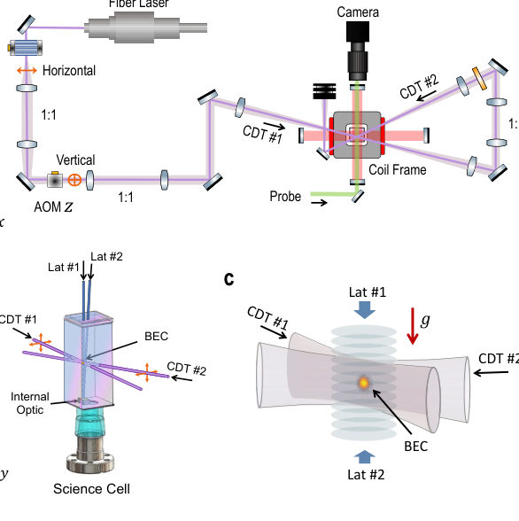
<figcaption class="paper-figure-caption"><b>Fig 1.</b> Fig. 1. Experimental apparatus and trapping geometry. (a) Experimental setup. A high-power optical dipole beam (purple) is generated by a fiber laser and passes through two acousto-optic modulators (AOMs) that provide beam steering along the horizontal (x) and vertical (z) directions. The beam is focused through the science chamber and recycled to form an elongated crossed-dipole trap (CDT). Magneto-optical trap (MOT) beams are shown in red, and a probe beam (green) is used for absorption imaging. (b) Illustration of the science cell and trapping geometry. The CDT beams (purple) intersect within the science chamber, while an internal optic enables implementation of a vertical optical...</figcaption>
</figure>
<figure class="paper-figure-card">
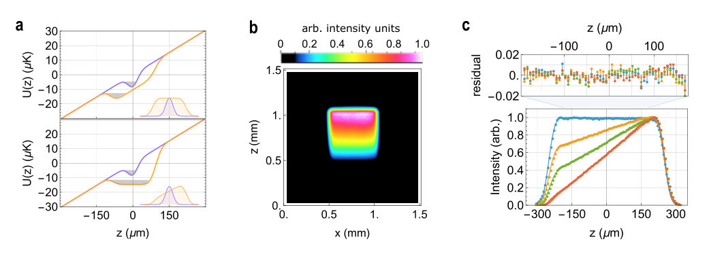
<figcaption class="paper-figure-caption"><b>Fig 2.</b> Fig. 2. Gravity compensation through engineered intensity gradients. (a) Calculated trapping potentials along the vertical axis under gravity. Upper: Comparison of a static dipole trap (purple) and a painted trap scanned over ±100 µm (orange) with no applied intensity gradient. Despite the increased trap volume, gravity localizes atoms near the lower region of the potential, indicated by the shaded gray areas. Insets show the corresponding normalized intensity profiles. Lower: Trapping potentials with an applied intensity gradient. The painted trap (orange) is scanned over ±100 µm with a gradient of approximately 78%, generating an upward optical force that compensates gravity and restores...</figcaption>
</figure>
<figure class="paper-figure-card">
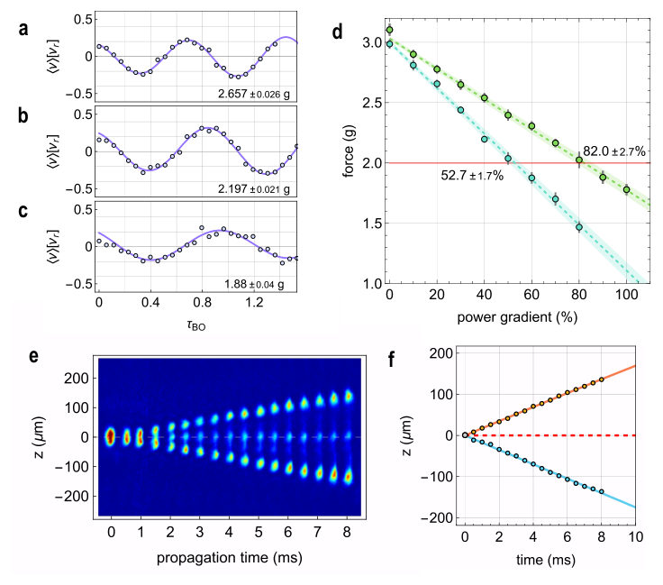
<figcaption class="paper-figure-caption"><b>Fig 3.</b> Fig. 3. Bloch-oscillation calibration of synthetic microgravity and matter-wave beam splitting. (a–c) Representative Bloch oscillation measurements for applied intensity gradients of 20%, 40%, and 60%, yielding calibrated forces of 2.657 ± 0.026 g, 2.197 ± 0.021 g, and 1.88 ± 0.04 g, respectively. (d) Forces extracted from Bloch oscillation frequencies as a function of applied intensity gradient for a ±200 µm trap (aqua) and a ±300 µm trap (green); dashed lines are linear fits. The measurements from a–c correspond to three of the points on the ±200 µm trap calibration curve. The red horizontal line marks the condition at which the magnitude of the optical force equals gravity, intersecting...</figcaption>
</figure>
<figure class="paper-figure-card">
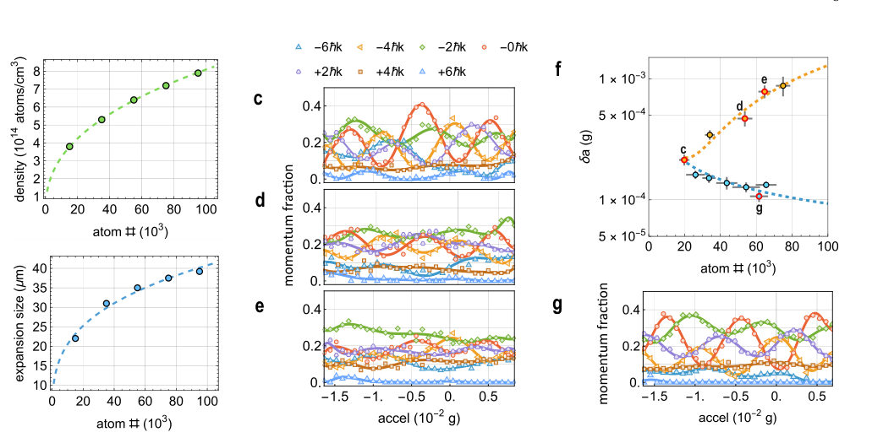
<figcaption class="paper-figure-caption"><b>Fig 4.</b> Fig. 4. Interaction-induced dephasing and its suppression via pre-expansion. (a) Peak density scaling from mean-field theory as a function of atom number for a select number of points (solid circles) in the unexpanded crossed dipole trap, following the expected n0 ∝N 2/5</figcaption>
</figure>

**Summary.** The research develops a novel technique to create synthetic microgravity for ultracold atoms by engineering optical dipole potentials to counteract Earth's gravity in terrestrial labs. This platform allows researchers to perform high-precision atom interferometry, overcoming limitations from gravitational sag and mean-field interactions by implementing controlled decompression. It establishes a powerful, continuously operating tool for quantum sensing.

**Why it may be interesting.** This work provides a highly controllable, portable method to simulate space environments on Earth, allowing fundamental quantum measurements (like interferometer scaling) that are otherwise restricted to specialized facilities. It treats gravity as an actively tunable parameter within the optical potential landscape.

Detailed structure

**Main problem.** Gravity imposes fundamental limitations on ultracold-atom experiments by restricting interrogation times and causing gravitational sag in trapped quantum gases.

**Main result.** The authors demonstrated a versatile platform to realize synthetic microgravity in terrestrial labs, enabling high-sensitivity atom interferometry by suppressing interaction-induced dephasing via controlled expansion.

**Method.** Synthetic microgravity is achieved by engineering the force landscape using dynamically painted optical dipole potentials that compensate Earth's gravity. Force calibration and dynamics are verified using Bloch oscillations and matter-wave beam splitting.

**Model / system.** The system uses quantum degenerate gases (e.g., BECs) trapped in a combination of an engineered optical potential, an optical lattice, and the residual gravitational force. The total potential is actively controlled by programming the intensity profile of the dipole trap.

**Key observables.** Residual acceleration (calibrated to milli-g), interferometric fringe visibility/contrast, and atom cloud trajectories via absorption imaging.

**Important parameters / regimes.** Milli-g residual acceleration; $\sqrt{N}$ scaling for sensitivity; expansion times ($\approx 200$ ms); AOM modulation bandwidth ($\approx 120$ kHz).

**Assumptions / limitations.** The technique assumes that the engineered force landscape can accurately mimic microgravity, and that systematic offsets in residual force are precisely characterized via Bloch oscillations.

**Figures summary.** Figures show evidence of gravity compensation restoring full trap volume access; Bloch oscillation measurements quantify residual acceleration; interference fringes demonstrate sensitivity recovery toward ideal $\sqrt{N}$ scaling after controlled pre-expansion.

**Paper structure.** The paper progresses from establishing the need for synthetic microgravity to demonstrating force calibration via lattice dynamics, and finally applying this stable platform to perform high-precision atom interferometry while mitigating mean-field dephasing through in situ decompression.

Abstract

Microgravity environments provide unique opportunities for ultracold-atom experiments by enabling long interrogation times and reduced acceleration-induced dynamics. However, their realization has largely been restricted to specialized facilities such as drop towers, sounding rockets, and space-based laboratories. Here we realize synthetic microgravity for quantum degenerate gases using optically engineered force landscapes that compensate Earth's gravity to the milli-g level while maintaining continuous confinement of the atomic ensemble. These force landscapes are generated by dynamically painted optical dipole potentials and calibrated in situ through Bloch oscillations in a vertical optical lattice, enabling precise control of the residual acceleration. We use this capability to demonstrate matter-wave beam splitting with arm separations of several hundred microns. We further implement a Bloch-band atom interferometer in which interaction-induced dephasing is strongly suppressed through controlled three-dimensional expansion in the synthetic microgravity potential. This reduction of mean-field effects restores near-$\sqrt{N}$ scaling of interferometric sensitivity for large quantum degenerate ensembles. Our results establish a versatile platform for realizing synthetic microgravity with trapped quantum gases in terrestrial laboratories, bringing the advantages of microgravity experiments to continuously operating systems and opening new opportunities for quantum sensing, matter-wave interferometry, and precision measurements.

[↑ back to top](#top)

### [Experimental Observation of Dynamical Phase Transitions in a Dephased Photonic Quantum Walk](http://arxiv.org/abs/2606.15935v1)

**Authors:** Xiaojian Huang, Lei Xiao, Bingzi Huo, Xiaowei Wang, Stefano Longhi, Peng Xue  
**Type:** experiment · **Category:** statistical mechanics · **PDF:** <https://arxiv.org/pdf/2606.15935v1>  
**Analysis basis:** full PDF text, analyzed in chunks
**Topic relevance:** 🔥 `driven-dissipative phase transition` **5/5** · 🔥 `analog quantum simulation` **4/5** · 🔥 `non-equilibrium dynamics` **4/5** · `methods for driven-dissipative` **3/5** · `non-equilibrium universality` **3/5** · `quantum optics experiment` **3/5** · `QC/QI experiment` **2/5** · `correlated / nonlocal dissipation` **1/5** · `entanglement & information structure` **1/5** · `interference shaping light` **1/5** · `quantum measurements` **1/5**

↔ Scroll figures horizontally

<figure class="paper-figure-card">
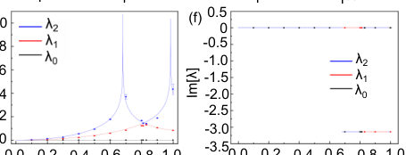
<figcaption class="paper-figure-caption"><b>Fig 1.</b> FIG. 1. First-order dynamical phase transition in the fully de- phased benchmark (q = 1) under TRS (ϕ = 0). (a),(b) Mea- sured step-resolved populations Pi(s) (i = 0, 1, 2) at β = 0.70 (&lt; βc) and β = 0.83 (&gt; βc), showing a qualitative change of the relaxation pattern. (c),(d) Corresponding components of the two non-stationary right eigenmodes r(1) and r(2) of the reconstructed transition matrix Q, labeled as the slow and fast relaxation modes according to increasing Re[λk] (solid bars: experiment with 1σ error bars; open rectangles: the- ory). (e) Real parts Re[λk] (k = 0, 1, 2) of the Floquet ex- ponents extracted from Q(β), exhibiting a diabolic crossing Re[λ1] = Re[λ2] at βc. (f)...</figcaption>
</figure>
<figure class="paper-figure-card">
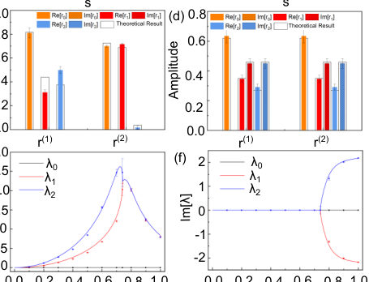
<figcaption class="paper-figure-caption"><b>Fig 2.</b> FIG. 2. Second-order dynamical phase transition in the fully dephased benchmark (q = 1) with broken TRS (ϕ = π/3). (a),(b) Measured populations Pi(s) at β = 0.70 &lt; βc and β = 1.20 &gt; βc, showing monotonic and damped-oscillatory relaxation. (c),(d) Real and imaginary components of the two non-stationary right eigenmodes r(1) and r(2) of Q (solid bars: experiment with error bars; open rectangles: theory). (e) Re[λk] versus β, showing coalescence of the two non- stationary exponents at βc. (f) Im[λk], showing the emer- gence of a complex-conjugate pair for β &gt; βc.</figcaption>
</figure>
<figure class="paper-figure-card">
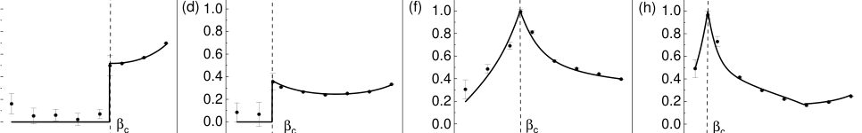
<figcaption class="paper-figure-caption"><b>Fig 3.</b> FIG. 3. Quantum-regime validation in the OQW. Experimentally measured Re[λ1,2] (top row) and eigenvector overlap g (bottom row) versus β at representative dephasing strengths. (a),(b) TRS case (ϕ = 0) at q = 0.8: a real-eigenvalue crossing signals an FOPT while g &lt; 1 confirms distinct eigenmodes. (c),(d) Same as (a),(b) but for q = 0.5. (e),(f) Broken-TRS case (ϕ = π/3) at q = 0.8: eigenvalues and eigenvectors coalesce at an EP, yielding an SOPT with g →1. (g),(h) Same as (e),(f) but for q = 0.5. Vertical dashed lines indicate βc. Solid curves are theoretical predictions; symbols are experimental data with photon-counting error bars.</figcaption>
</figure>
<figure class="paper-figure-card">
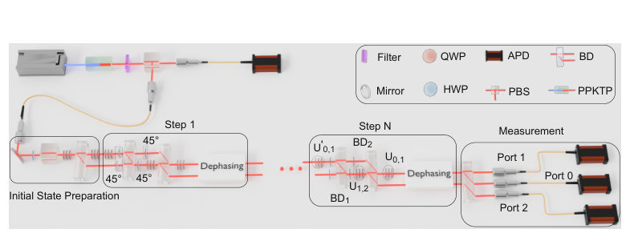
<figcaption class="paper-figure-caption"><b>Fig 4.</b> FIG. 4. Experimental schematic. Each discrete-time step of the OQW consists of a coherent unitary operation U followed by a dephasing channel. Beam displacers map the three path modes to spatially separated ports, which are detected by APDs to yield node-resolved counts. Thin outlined boxes indicate 45◦HWPs used for mode readdressing between the two BDs. Dashed ellipses mark QHQ sets implementing the two-mode unitaries Ui,j in the decomposition of U. The optical synthesis of the full 3 × 3 step unitary U is shown in the solid box.</figcaption>
</figure>
<figure class="paper-figure-card">
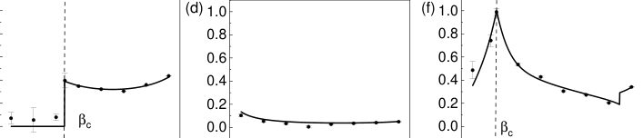
<figcaption class="paper-figure-caption"><b>Fig 5.</b> FIG. 6. Complementary scans deeper into the quantum regime. Same observables as Fig. 3, shown for q = 0.6 and 0.1. (a),(b) TRS case (ϕ = 0) at q = 0.6: the real-eigenvalue crossing persists (FOPT) and g remains below unity. (c),(d) TRS case at q = 0.1: no resolvable spectral crossing is observed and g shows no critical feature, indicating suppressed criticality. (e),(f) Broken-TRS case (ϕ = π/3) at q = 0.6: the EP-driven SOPT remains visible through simultaneous eigenvalue and eigenvector coalescence (g →1). (g),(h) Broken-TRS case at q = 0.1: the EP signature and the corresponding peak in g are washed out. Vertical dashed lines indicate βc where a critical point is identifiable.</figcaption>
</figure>

**Summary.** The research experimentally explores dynamical phase transitions in open quantum systems using a photonic quantum walk. By controlling dephasing and synthetic magnetic flux, the authors successfully observe both first-order (FOPT) and second-order (SOPT) transitions. This work establishes a programmable platform for engineering dissipative dynamics by linking spectral properties to relaxation criticality.

**Why it may be interesting.** This work provides an unprecedentedly controllable platform—using photonics—to experimentally map out the rich phase diagram of dissipative quantum dynamics, linking spectral topology directly to relaxation criticality in a highly tunable manner.

Detailed structure

**Main problem.** The study investigates dynamical phase transitions (DPTs) in open quantum systems, which govern how non-equilibrium states relax toward a stationary state.

**Main result.** The authors experimentally demonstrated both first-order (FOPT) and second-order (SOPT) DPTs by controlling dephasing strength and synthetic gauge flux in a photonic quantum walk platform.

**Method.** The dynamics are analyzed by reconstructing the Floquet-Liouvillian superoperator from single-photon measurements to extract eigenvalues, which diagnose the nature of the phase transition via crossings or coalescence at exceptional points.

**Model / system.** The system is a discrete-time photonic quantum walk (OQW) implemented on a three-node graph using a single-photon interferometric network. The dynamics are governed by a master equation incorporating tunable dephasing ($q$) and synthetic gauge flux ($\phi$).

**Key observables.** Eigenvalue crossings (for FOPT), coalescence of eigenvalues/eigenvectors at Exceptional Points (EPs) (for SOPT), and order parameters like the eigenvalue splitting $\Delta\lambda$ and eigenmode overlap $g$.

**Important parameters / regimes.** Dephasing strength ($q$), synthetic gauge flux ($\phi$), and the evolution parameter ($eta$). The transitions are shown to persist down to a finite threshold.

**Assumptions / limitations.** The analysis relies on reconstructing the transition matrix from measured probabilities and assumes that the observed spectral features accurately map onto theoretical predictions for DPTs.

**Figures summary.** Figures illustrate the FOPT in the fully dephased limit ($\phi=0$) showing eigenvalue crossings, and the SOPT in the broken TRS regime ($\phi=\pi/3$) showing EP signatures. Scaling laws near EPs are also presented.

**Paper structure.** The paper establishes the theoretical framework of DPTs in open systems using a photonic OQW model. It then details experimental measurements to diagnose FOPT (TRS-preserving) and SOPT (TRS-breaking), demonstrating control over these transitions by tuning dephasing and flux, and confirming scaling laws near EPs.

Abstract

Dynamical phase transitions in open quantum systems govern how non-equilibrium states relax toward a stationary state. We study these transitions experimentally using a discrete-time photonic quantum walk on a three-node graph. A tunable synthetic gauge flux and calibrated dephasing allow us to control time-reversal symmetry and the detailed balance properties of the effective Markovian dynamics. With detailed balance, we observe a first-order dynamical phase transition marked by a crossing of real Liouvillian eigenvalues. When detailed balance is broken, we observe a second-order dynamical phase transition at an exceptional point where eigenvalues and eigenvectors coalesce. By progressively reducing the dephasing strength, we track the crossover toward the quantum-coherent regime and determine that the transitions persist down to a finite threshold. Our results link Liouvillian spectral topology to relaxation criticality and demonstrate a controllable platform for engineered dissipative dynamics.

[↑ back to top](#top)

### [Dressed Floquet scars from protected zero modes in a Rydberg chain](http://arxiv.org/abs/2606.15605v1)

**Authors:** Saptadip Roy, Bhaskar Mukherjee, K. Sengupta, Arnab Sen  
**Type:** theory · **Category:** other · **PDF:** <https://arxiv.org/pdf/2606.15605v1>  
**Analysis basis:** full PDF text, analyzed in chunks
**Topic relevance:** 🔥 `scars & prethermalization` **5/5** · 🔥 `analog quantum simulation` **4/5** · 🔥 `non-equilibrium dynamics` **4/5** · `Rydberg arrays` **3/5** · `methods for driven-dissipative` **3/5** · `driven-dissipative phase transition` **2/5** · `non-equilibrium universality` **2/5** · `Frenkel-Kontorova` **1/5** · `Keldysh / 2PI / non-Gaussian methods` **1/5** · `entanglement & information structure` **1/5**

↔ Scroll figures horizontally

<figure class="paper-figure-card">
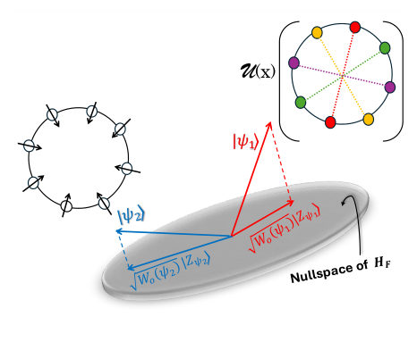
<figcaption class="paper-figure-caption"><b>Fig 1.</b> FIG. 1. Schematic representation of the anomalous zero modes, |Zψ⟩(Eq. 5), in the nullspace of the Floquet Hamilto- nian HF (Eq. 3). These zero modes can be viewed as projec- tion of two parent states on this nullspace. |ψ1⟩represents a highly entangled Ivanov-Motrunich scar state with the antipo- dal spins being perfectly correlated, but after a local unitary rotation U(x) of all spins by an angle (Eq. 8). |ψ2⟩represents the unentangled Rydberg vacuum state.</figcaption>
</figure>
<figure class="paper-figure-card">
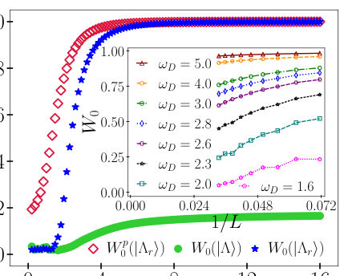
<figcaption class="paper-figure-caption"><b>Fig 2.</b> FIG. 2. W0(|Λ⟩) (filled green circles) and W0(|Λr⟩) (filled blue asterisks) plotted for L = 28 at x = 1.2 as a function of ωD. A perturbative calculation of HF up to 3rd order in FPT yields the plot of overlap of |Λr⟩(open red diamonds) with the zero mode subspace of the perturbative HF (Eq. 6). Inset shows W0(|Λr⟩) as a function of 1/L for x = 1.2 and several ωD near the knee regime where 14 ≤L ≤30. All frequencies are measured in units of w0/ℏ.</figcaption>
</figure>
<figure class="paper-figure-card">
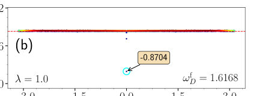
<figcaption class="paper-figure-caption"><b>Fig 3.</b> FIG. 4. Plot of ⟨Sz⟩:= 1 L P</figcaption>
</figure>
<figure class="paper-figure-card">
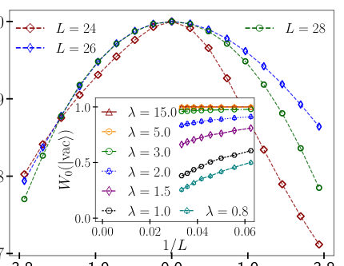
<figcaption class="paper-figure-caption"><b>Fig 4.</b> FIG. 3. W0(|vac⟩) for λ = 30 in the neighborhood of the largest drive frequency ωf D = 15.09954 which maximizes W0(|vac⟩). The inset shows W0(|vac⟩) as a function of 1/L using 16 ≤L ≤30 for different λ where ωD is tuned to the largest ωf D(λ) that maximizes W0(|vac⟩). All energies (fre- quencies) are measured in units of w0(w0/ℏ).</figcaption>
</figure>
<figure class="paper-figure-card">
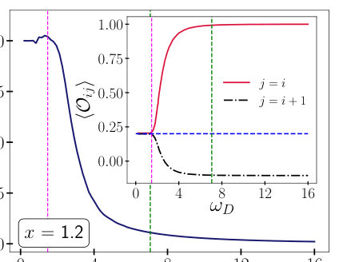
<figcaption class="paper-figure-caption"><b>Fig 5.</b> FIG. 5. Plot of the R[Hrot F ] as a function of ωD for L = 28 in the K = 0, P = +1 sector using a fixed x = 1.2. The vertical dotted lines (magenta and green) show the onset of the two plateaus at ωD ≈1.48 and ωD ≈7.06 in Fig. 2 (main text). The inset shows time-averaged spin-spin correlation ⟨Oij⟩= ⟨σz i σz L/2+j⟩starting from |Λr⟩for the same system size L = 28 at x = 1.2. The average has been taken from n = 5001 to n = 6000 stroboscopic cycles for each ωD. A horizontal blue dotted line at 0.2 is given as a guide to the eye. The vertical dotted line in green (magenta) corresponds to the onset of the first (second) plateau at ωD ≈7.06 (ωD ≈1.48) in Fig. 2. All frequencies are measured in...</figcaption>
</figure>

**Summary.** The paper theoretically constructs and analyzes two robust quantum many-body scars—one related to the vacuum state and another derived from a known scar—in a Rydberg atom chain subjected to periodic driving. By using advanced techniques like Floquet perturbation theory, the authors demonstrate that these scars persist even when the system parameters are varied significantly, providing deep insight into protected zero modes in driven quantum matter.

**Why it may be interesting.** This work provides a detailed, analytical understanding of how symmetry protection can stabilize non-trivial quantum scars in complex, periodically driven many-body systems, bridging concepts from Floquet engineering and localization theory.

Detailed structure

**Main problem.** The study investigates protected zero quasienergy quantum many-body scars (QMBSs) arising from symmetry protection in a periodically driven Rydberg atom chain.

**Main result.** Two distinct QMBSs, corresponding to the Rydberg vacuum and a dressed Ivanov-Motrunich scar, are analytically constructed and shown to persist over significant ranges of driving amplitudes and frequencies.

**Method.** The analysis employs Floquet perturbation theory (FPT) combined with exact diagonalization (ED) on finite systems to analyze the effective Floquet Hamiltonian ($	ext{H}_F$).

**Model / system.** The system is a Rydberg atom chain modeled by a time-periodic PXP Hamiltonian on a ring, whose dynamics are governed by the stroboscopic Floquet unitary $U(T, 0)$.

**Key observables.** Overlap measures ($W_0$), two-point spin correlation functions ($\langle O_{i,j} 
angle$), and the Loschmidt echo ($L(nT)$) are key diagnostics.

**Important parameters / regimes.** Drive amplitudes ($\lambda$) and frequencies ($\omega_D$ or $T$), which dictate whether the system is in a perturbative or nonperturbative regime.

**Assumptions / limitations.** The analytic construction of zero modes relies on symmetry protection (index theorem), but the full nullspace itself changes with drive parameters, limiting the description to approximations.

**Figures summary.** Figures illustrate the overlap of parent states with Floquet eigenstates, show how correlation functions retain memory effects, and map out the stability regions for the dressed scars as driving parameters are varied.

**Paper structure.** The paper builds from establishing the theoretical framework using FPT and BCH expansions to derive $	ext{H}_F$, then analyzes specific parent states (vacuum and IM scar) by calculating their overlap with the nullspace of $	ext{H}_F$ across varying driving regimes.

Abstract

In this Letter, we present an approximate analytic construction of two zero quasienergy quantum many-body scars in a periodically driven model of Rydberg atoms on a ring, which persist over a range of driving amplitudes and frequencies for finite sizes. An index theorem protects an exponentially large number (in system size) of exact zero energy modes of the Floquet Hamiltonian in this setting. Unlike most of these zero modes which continuously change with drive parameters, these two quantum many-body scars retain the memory of particular states. They can be expressed as {\it dressed versions} of two contrasting states, the Rydberg vacuum and a unitarily rotated variant of a volume-law scar [Ivanov and Motrunich, Phys. Rev. Lett. {\bf 134}, 050403 (2025)], respectively. We provide an analytic understanding of their existence using a Floquet perturbation theory and show their resilience beyond the perturbative regime using exact diagonalization in finite systems. Our study provides insight into the structure of protected zero modes in interacting Floquet settings.

[↑ back to top](#top)

### [Quantum Algorithm for Open-System Battery Cathodes by Modeling Multiple Strongly Coupled Holstein Polarons with Chain-Mapped Caldeira-Leggett Dynamics](http://arxiv.org/abs/2606.16017v1)

**Authors:** Joshua M. Courtney  
**Type:** theory · **Category:** strongly correlated electrons · **PDF:** <https://arxiv.org/pdf/2606.16017v1>  
**Analysis basis:** full PDF text, analyzed in chunks
**Topic relevance:** 🔥 `methods for driven-dissipative` **5/5** · 🔥 `Keldysh / 2PI / non-Gaussian methods` **4/5** · `correlated / nonlocal dissipation` **3/5** · `driven-dissipative phase transition` **3/5** · `non-equilibrium dynamics` **3/5** · `Kondo & dissipative impurity` **2/5** · `non-equilibrium universality` **2/5** · `Frenkel-Kontorova` **1/5** · `quantum measurements` **1/5**

↔ Scroll figures horizontally

<figure class="paper-figure-card">
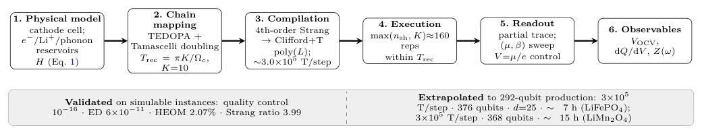
<figcaption class="paper-figure-caption"><b>Fig 1.</b> Figure 1. End-to-end workflow. The open-system cathode Hamiltonian (1) is chain-mapped (2; time-evolving density operator with orthogonal polynomials TEDOPA + Tamascelli finite-T doubling), compiled into a Clifford+T fourth-order Trotterization whose per-step T-count is polynomial in system size (3; Theorem III D), executed as a trajectory ensemble within the recurrence window (4), and read out by partial trace and an anchor sweep with V = µ/e set as a control (5) to yield the electrochemical observables (6). The band marks the boundary (Section III H) between classically-validated instances (left) and the calculated production geometry (right).</figcaption>
</figure>
<figure class="paper-figure-card">
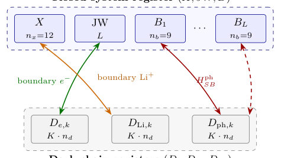
<figcaption class="paper-figure-caption"><b>Fig 2.</b> Figure 2. The tensor-product Hilbert space of the system-plus-three-reservoirs framework (LFP production geometry shown). The closed-system register (X, JW, B) couples to the three dark chain registers (De, DLi, Dph) through three bilinear cross gates, one per reservoir.</figcaption>
</figure>
<figure class="paper-figure-card">
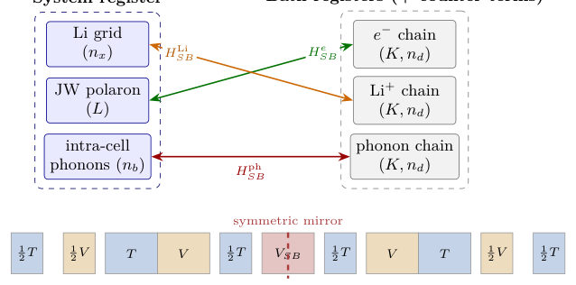
<figcaption class="paper-figure-caption"><b>Fig 3.</b> Figure 3. Architecture and Trotter-step timeline. Upper: the system register (Li coordinate, Jordan–Wigner polaron register, intra-cell phonons) couples through three bilinear interactions HSB to the chain-mapped bath registers, each carrying its Caldeira–Leggett counter-term. Lower: simplified second-order Strang step (Eq. 9) as a banded timeline of kinetic (T), potential (V ), and system–bath (VSB) layers, symmetric about the central mirror; half-steps drawn narrower.</figcaption>
</figure>
<figure class="paper-figure-card">
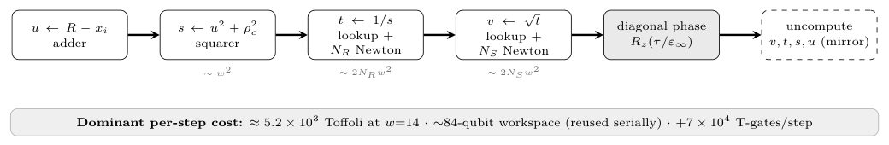
<figcaption class="paper-figure-caption"><b>Fig 4.</b> Figure 4. The reversible 1/√· evaluation of the soft-Coulomb potential. The argument u = R−xi is squared, the reciprocal and inverse-square-root computed by seeded table lookup plus Newton iteration, the occupation-controlled diagonal phase applied, and the workspace uncomputed (dashed mirror) to clear it.</figcaption>
</figure>
<figure class="paper-figure-card">
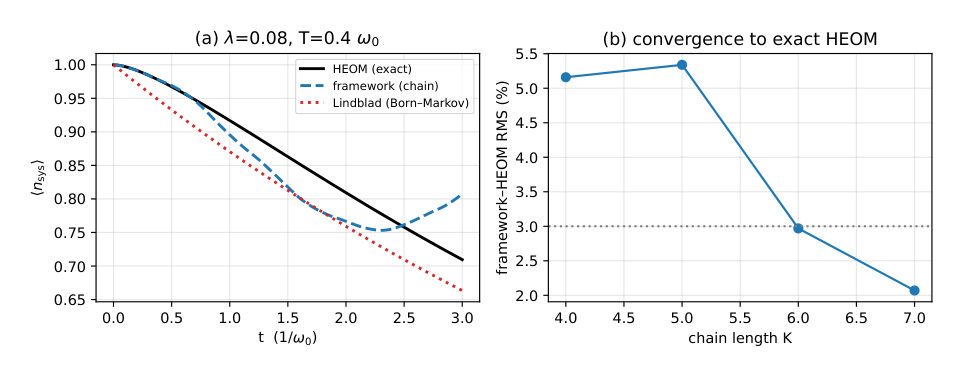
<figcaption class="paper-figure-caption"><b>Fig 5.</b> Figure 5. Strong-coupling validation against numerically exact HEOM on the shared spin-boson kernel (Drude–Lorentz J(ω), T = 0.4 ω0 ≡300 K). (a) Coupling sweep: the chain-mapped dynamics track HEOM to within a few percent across the regime where the weak-coupling Lindblad reference differs by 4–16%. (b) Chain-length convergence: the framework approaches HEOM monotonically in K, reaching 2.07% RMS on the system population at K = 7.</figcaption>
</figure>

**Summary.** The authors present a novel, fault-tolerant quantum algorithm to simulate the open-system dynamics of battery cathodes by modeling Holstein polarons coupled to multiple baths. By using a chain-mapped Caldeira-Leggett embedding, they make these traditionally intractable environmental interactions amenable to digital quantum simulation. The results validate the method against experimental data and provide concrete resource estimates for future quantum hardware.

**Why it may be interesting.** This work bridges advanced quantum algorithm design (fault tolerance, high-order Trotterization) directly to a critical problem in condensed matter physics—the dynamics of strongly correlated electron systems in energy storage devices.

Detailed structure

**Main problem.** Developing a fault-tolerant quantum algorithm to calculate open-system electrochemical observables for battery cathodes, which are governed by complex interactions with multiple external baths.

**Main result.** The method successfully predicts key voltage plateaus for $	ext{LiMn}_2	ext{O}_4$ within $17\%$ of experiment and provides a resource estimate of $\sim 3 	imes 10^5$ T-gates per step for the full simulation.

**Method.** A unitary chain-mapped Caldeira-Leggett embedding is used to render environmental baths Trotterizable, allowing the calculation of open-system dynamics on fault-tolerant quantum circuits.

**Model / system.** The system models lithium-ion battery cathodes (e.g., $	ext{LiFePO}_4$, $	ext{LiMn}_2	ext{O}_4$) involving strongly coupled Holstein polarons, lattice degrees of freedom, and three distinct environmental baths ($	ext{electron}, 	ext{Li}^+, 	ext{phonon}$).

**Key observables.** Open-circuit voltage ($	ext{VOCV}$), differential capacity ($	ext{dQ}/	ext{dV}$), impedance ($	ext{Z}(\omega)$).

**Important parameters / regimes.** Strong electron-lattice coupling, finite temperature ($T$), and the resource cost scaling (e.g., 368 logical qubits for $	ext{LiMn}_2	ext{O}_4$).

**Assumptions / limitations.** The primary limitation is that the full production-scale dynamical run remains a milestone for future hardware, relying on fault-tolerant quantum computation.

**Figures summary.** Figures detail the end-to-end workflow from Hamiltonian definition to observable extraction via chain mapping and Trotterization, illustrating the tensor-product Hilbert space structure connecting system registers to three dark chain reservoirs.

**Paper structure.** The paper details the theoretical framework by first defining the open-system problem, then introducing the unitary chain-mapped Caldeira-Leggett embedding, followed by a detailed breakdown of the fourth-order Trotterization circuit decomposition into gate primitives, and concluding with resource estimates for specific materials.

Abstract

Cathode lithiation occupies a chemical regime of tightly localized orbitals, narrow bandwidths, and strong electron-lattice coupling. The defining electrochemical observables (open-circuit voltage and differential capacity) are open-system, reservoir-equilibration quantities that closed-Hamiltonian quantum simulation cannot produce, set by exchange with electron, Li$^+$, and phonon baths. We present a fault-tolerant quantum algorithm that recovers them through a unitary chain-mapped Caldeira-Leggett embedding, rendering the baths Trotterizable. The resulting fourth-order Trotter step has a T-gate count polynomial in system size, validating its open-system dynamics against hierarchical equations of motion (HEOM) at strong coupling and the Lindblad limit at weak coupling. For single-carrier olivine LiFePO$_4$, a single voltage anchor on an otherwise DFT-fixed Hamiltonian places the differential-capacity peak within the $\pm5$ mV reproducibility of the experimental plateau. For multi-carrier spinel LiMn$_2$O$_4$, whose $1{:}1$ Mn$^{3+}$/Mn$^{4+}$ filling makes the inter-site Coulomb repulsion dynamically active, the same kernel yields a two-plateau voltage curve with a $125$ mV split, within $17\%$ of the observed $150$ mV. We deliver an end-to-end fault-tolerant resource estimate for such a multi-carrier, three-reservoir observable: $368$ logical qubits and $\sim3\times10^5$ T-gates per step, or $\sim1.7\times10^{12}$ T-gates for a full voltage curve (parallelizable over $\sim10^3$ trajectories), leaving the production-scale dynamical run as a milestone for future hardware. The same kernel reproduces macroscopic quantum coherence, two-band superconductivity, and the Mikheyev-Smirnov-Wolfenstein resonance without modification, placing dynamical battery chemistry and similar Hamiltonians within scope for fault-tolerant quantum simulation.

[↑ back to top](#top)

### [Interaction-enabled topological pumping of Rydberg electrons](http://arxiv.org/abs/2606.15126v1)

**Authors:** Chenxi Huang, Tao Chen, Kaden R. A. Hazzard, Jacob P. Covey, Bryce Gadway  
**Type:** experiment · **Category:** other · **PDF:** <https://arxiv.org/pdf/2606.15126v1>  
**Analysis basis:** full PDF text, analyzed in chunks
**Topic relevance:** 🔥 `Rydberg arrays` **5/5** · 🔥 `analog quantum simulation` **4/5** · `driven-dissipative phase transition` **3/5** · `non-equilibrium dynamics` **3/5** · `non-equilibrium universality` **2/5** · `correlated / nonlocal dissipation` **1/5** · `correlated cavity matter` **1/5** · `entanglement & information structure` **1/5** · `exotic spin models in light-matter` **1/5** · `methods for driven-dissipative` **1/5** · `quantum measurements` **1/5**

↔ Scroll figures horizontally

<figure class="paper-figure-card">
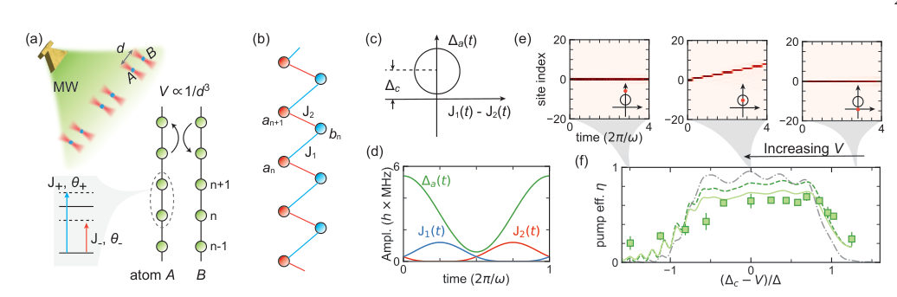
<figcaption class="paper-figure-caption"><b>Fig 1.</b> FIG. 1. Experimental scheme for interaction-enabled topological pumping of correlated Rydberg electrons. (a) An array of independent pairs of two Rydberg atoms prepared with optical tweezers (A and B) with tunable separation d are driven by multi-frequency microwave fields, forming a synthetic lattice of Rydberg states |n⟩. Each nearest-neighbor transition is coupled by two microwave tones with time-dependent amplitudes J±(t) and phases θ±(t). Dipolar exchange interactions scale as Vn ≈V ∝1/d3. (b) Effective Rice-Mele representation in the pair basis |an⟩= |n⟩A ⊗|n⟩B = |n, n⟩ and |bn⟩= |+⟩n = (|n⟩A ⊗|n + 1⟩B + |n + 1⟩A ⊗|n⟩B)/ √</figcaption>
</figure>
<figure class="paper-figure-card">
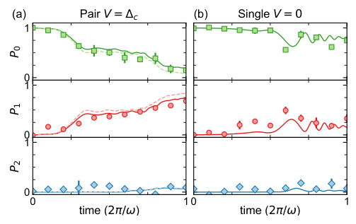
<figcaption class="paper-figure-caption"><b>Fig 2.</b> FIG. 2. Pumping dynamics for Rydberg electrons in synthetic lattices. Measured population Pn in each of the synthetic sites |n⟩over one modulation period for (a) corre- lated pairs with V = ∆c and (b) uncorrelated singles with V = 0. The pumping parameters used are: ∆c/h = 3.0 MHz, ∆/h = 2.4 MHz, J0/h = 0.3 MHz, and ω/2π = 0.3 MHz. The solid lines in each panel are numerical simulation results with the original Hamiltonian (1), by taking into account the initial state preparation inefficiency. The dashed lines in (a) indicate simulation results by assuming perfect initial state preparation. The error bars are standard errors from multi- ple independent experimental data sets.</figcaption>
</figure>
<figure class="paper-figure-card">
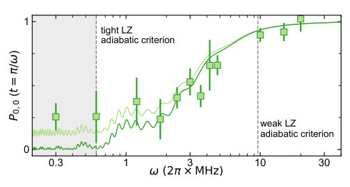
<figcaption class="paper-figure-caption"><b>Fig 3.</b> FIG. 3. Adiabaticity of the interaction-enabled topo- logical pumping. Measured population P0,0(t = π/ω) in the initial |a0⟩= |0, 0⟩state as a function of the modulating fre- quency ω. The pumping parameters used are: V/h = ∆c/h = 3.0 MHz, ∆/h = 2.4 MHz, and J0/h = 0.3 MHz. The solid light and dark lines are numerical simulation results with and without the consideration of the initial state preparation in- efficiency, respectively. The dashed vertical lines indicate the positions of critical values of ω derived from the Landau-Zener (LZ) adiabatic conditions [52]. The error bars are standard errors from multiple independent experimental data sets.</figcaption>
</figure>
<figure class="paper-figure-card">
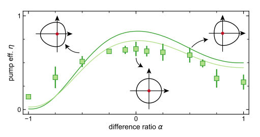
<figcaption class="paper-figure-caption"><b>Fig 4.</b> FIG. 4. Response to perturbations of the interaction- enabled topological pumping. Measured pumping effi- ciency η as a function of the difference ratio α between intra- and inter-cell coupling rates J1(t) = (1+α)J0[1+sin (ωt)]2/2 and J2(t) = (1 −α)J0[1 −sin (ωt)]2/2. The pumping param- eters used are: V/h = ∆c/h = 3.0 MHz, ∆/h = 2.4 MHz, J0/h = 0.3 MHz, and ω/2π = 0.3 MHz. The insets respec- tively correspond to three typical pumping parameter trajec- tories for α = 0 and ±0.5. The solid lines are numerical simulation results with and without the consideration of the initial state preparation inefficiency, respectively. The error bars are standard errors from multiple independent experi-...</figcaption>
</figure>

**Summary.** The researchers experimentally demonstrated interaction-enabled topological pumping of correlated Rydberg electrons in an optical lattice. They showed that tuning the dipolar exchange interaction strength allows them to controllably shift the system's topological singularity. This control enables the observation and manipulation of quantized transport, opening a pathway for engineering correlated topological matter.

**Why it may be interesting.** This work directly bridges concepts from condensed matter topology (topological pumping) with state-of-the-art AMO platforms (Rydberg atoms), providing a clean, controllable system to study interaction effects beyond simple mean-field approximations.

Detailed structure

**Main problem.** Investigating topological pumping in strongly correlated regimes, particularly when long-range dipolar interactions are present.

**Main result.** The interaction strength can be tuned to shift the underlying topological singularity, enabling and controlling quantized directional transport through successive topological phase transitions.

**Method.** Experimental observation using a two-color microwave driving protocol on Rydberg electrons in a synthetic lattice, analyzed by monitoring state populations over modulation periods.

**Model / system.** The system consists of correlated Rydberg electrons trapped in an optical tweezer array. The dynamics are modeled using an effective pair-state Rice-Mele Hamiltonian incorporating dipolar exchange interactions ($V_n \propto 1/d^3$).

**Key observables.** Pumping efficiency ($\eta$), state populations ($P_n$), and the location of the topological singularity relative to the pumping trajectory.

**Important parameters / regimes.** Interaction strength ($V$), modulation frequency ($\omega$), and the ratio of interaction energy to hopping/detuning energies.

**Assumptions / limitations.** The analysis relies on mapping the system to an effective pair-state Hamiltonian and assumes that dipolar exchange interactions are the dominant source of correlation effects.

**Figures summary.** Figures illustrate the experimental setup, the derived effective model (Rice-Mele), the pumping trajectory in parameter space showing singularity shifts, and quantitative measurements comparing correlated vs. uncorrelated transport efficiencies.

**Paper structure.** The paper progresses from identifying the unexplored regime (correlated topological pumping) to deriving an effective Hamiltonian via gauge transformations, demonstrating how interaction strength controls the topology, and finally presenting experimental evidence of quantized transport breakdown/emergence based on this control.

Abstract

Topological pumping is a paradigmatic realization of quantized transport in band systems, yet its fate in strongly correlated regimes, especially with long-range interactions, remains largely unexplored. Here we report the experimental observation of interaction-enabled topological pumping of correlated Rydberg electrons in a synthetic lattice. We show that dipolar exchange interactions induce a controllable shift of the underlying topological singularity in parameter space, such that a fixed pumping trajectory can be driven through successive topological transitions by tuning the interaction strength alone. This leads to the emergence and breakdown of quantized transport. The observations are consistent with an effective Rice-Mele description with interaction-renormalized onsite potentials and are supported by characterizing the adiabaticity and robustness to control trajectory imperfections. Our results establish a platform for exploring interaction-controlled topological transport beyond perturbative regimes and open a route toward engineering correlated topological matter in synthetic quantum systems.

[↑ back to top](#top)

### [Luttinger liquid parameters in one-dimensional Rydberg arrays](http://arxiv.org/abs/2606.16128v1)

**Authors:** Shu-Ao Liao, Li-Ping Yang, Jin Zhang  
**Type:** theory · **Category:** other · **PDF:** <https://arxiv.org/pdf/2606.16128v1>  
**Analysis basis:** full PDF text, analyzed in chunks
**Topic relevance:** 🔥 `Rydberg arrays` **5/5** · 🔥 `analog quantum simulation` **4/5** · `Frenkel-Kontorova` **3/5** · `entanglement & information structure` **2/5** · `correlated cavity matter` **1/5** · `driven-dissipative phase transition` **1/5** · `non-equilibrium dynamics` **1/5** · `non-equilibrium universality` **1/5**

↔ Scroll figures horizontally

<figure class="paper-figure-card">
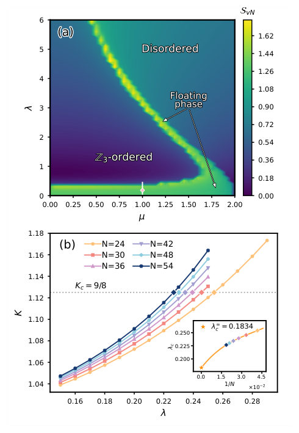
<figcaption class="paper-figure-caption"><b>Fig 1.</b> FIG. 2. (a) Ground-state phase diagram of the Z3 dual model for the quantum phase transitions out of the period-3 or- dered phase of the Rydberg chain. The phase diagram is mapped out using the von Neumann entanglement entropy SvN. The data are obtained for N = 480 with OBCs, and SvN is evaluated at the middle bond, between sites 240 and 241. The highlighted wedge-shaped region denotes the inter- mediate floating phase, which separates the Z3-ordered phase at smaller µ and λ from the disordered phase at larger µ and λ. (b) Luttinger K extracted from the crosscap overlap as a function of λ at fixed µ = 1 for different system sizes N. The horizontal line marks the theoretical BKT critical...</figcaption>
</figure>
<figure class="paper-figure-card">
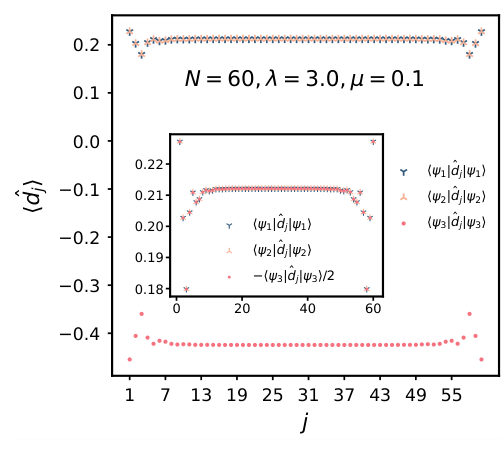
<figcaption class="paper-figure-caption"><b>Fig 2.</b> FIG. 1. Local profiles of ⟨ˆdj⟩for the three degenerate ground states |ψ1⟩, |ψ2⟩, and |ψ3⟩deep in the Z3-ordered phase, ob- tained for N = 60 as a function of the site index j. The expectation values of ˆdj in |ψ1⟩and |ψ2⟩are degenerate and have half the magnitude of that in |ψ3⟩. The inset illustrates this relation by plotting the rescaled profile −⟨ψ3| ˆdj|ψ3⟩/2, which collapses onto the profiles of |ψ1⟩and |ψ2⟩.</figcaption>
</figure>
<figure class="paper-figure-card">
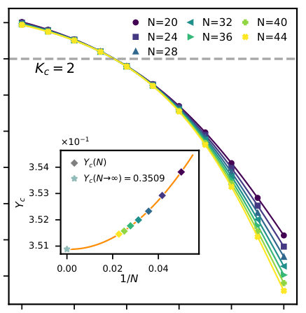
<figcaption class="paper-figure-caption"><b>Fig 3.</b> FIG. 3. The Luttinger parameter KN(Y ) for the spin-1 XY chain with single-ion anisotropy, extracted from the cross- cap overlap as a function of Y at fixed X = 1 for differ- ent system sizes N. The dashed line marks the theoreti- cal critical value Kc = 2. The crossings between KN(Y ) and Kc = 2 determine the finite-size critical points Yc(N). The inset shows the polynomial extrapolation of Yc(N) to the thermodynamic limit. The extrapolated value, indicated by the pink star, is Yc = 0.3509. The fitting function is f(1/N) = 1.2369(1/N)2 −0.0030(1/N) + 0.3509.</figcaption>
</figure>
<figure class="paper-figure-card">
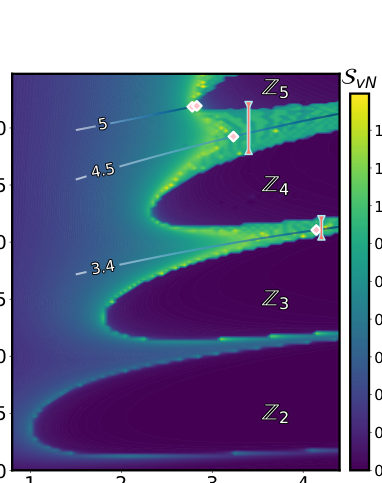
<figcaption class="paper-figure-caption"><b>Fig 4.</b> FIG. 4. Phase diagram of the one-dimensional Rydberg chain, mapped out using the von Neumann entanglement entropy SvN. The numerical results are obtained for an open chain with N = 721 sites, and SvN is evaluated at the middle bond, between sites 360 and 361. The dark lobes correspond to the Zp crystalline ordered phases, where p denotes the charac- teristic spatial period. Intermediate floating phases are ob- served between the Z3 and Z4 phases, between the Z4 and Z5 phases, and surrounding the Z5 phase on the side facing the disordered regime. The solid blue-gradient curves rep- resent lines of constant dominant wave vector k, labeled by the corresponding spatial period p = 2π/k with p =...</figcaption>
</figure>
<figure class="paper-figure-card">
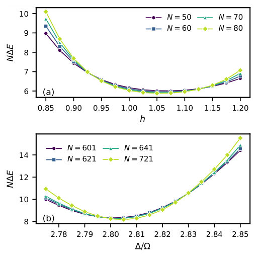
<figcaption class="paper-figure-caption"><b>Fig 5.</b> FIG. 6. Rescaled energy gap N∆E for (a) the pinned five- state clock model, defined by Eq. (8) with the boundary pin- ning term in Eq. (10), and (b) the Rydberg chain along the constant-p = 5 line. In both models, two crossings appear within the plotted parameter window, signaling two nearby BKT transitions.</figcaption>
</figure>

**Summary.** The paper rigorously investigates quantum phase transitions in 1D Rydberg atom chains by analyzing BKT transitions using multiple advanced diagnostics. It successfully extracts the universal Luttinger parameter K across different phases, confirming a complex two-step melting scenario along commensurate lines and demonstrating consistency between methods in incommensurate regimes.

**Why it may be interesting.** This work provides a highly detailed, multi-diagnostic confirmation of Luttinger liquid physics and quantum phase transitions in an experimentally accessible platform (Rydberg arrays), pushing the boundaries of theoretical understanding regarding melting transitions.

Detailed structure

**Main problem.** The study investigates Berezinskii-Kosterlitz-Thouless (BKT) transitions and characterizes the universal low-energy physics described by Luttinger liquid theory in one-dimensional Rydberg chains.

**Main result.** The analysis confirms a two-step BKT melting scenario along commensurate lines (e.g., p=5), and shows mutual consistency between multiple diagnostic methods for extracting the Luttinger parameter K in both commensurate and incommensurate floating phases.

**Method.** Multiple advanced numerical techniques are employed, including fitting Friedel oscillations using multi-harmonic schemes, applying the crosscap overlap method, analyzing entanglement entropy scaling, and performing finite-size scaling of energy gaps and Binder cumulants.

**Model / system.** The system is a one-dimensional chain of Rydberg atoms trapped in optical tweezers. The dynamics are governed by an interaction Hamiltonian involving Rabi coupling ($\Omega$), laser detuning ($\Delta$), and repulsive van der Waals interactions ($V_{ij} \propto 1/|i-j|^6$).

**Key observables.** Luttinger liquid parameter K, BKT transition points (critical couplings $\lambda_c$ or $\Delta/\Omega)_c$, local density modulation profiles, and Von Neumann entanglement entropy ($S_{vN}$).

**Important parameters / regimes.** The blockade radius $R_b$, the correlation oscillation period $p=2\pi/k$, and dimensionless ratios like $\Delta/\Omega$.

**Assumptions / limitations.** The analysis often relies on extrapolating finite-size results using polynomial fits in $1/N$ to reach the thermodynamic limit, and careful selection of parameter regimes is needed to avoid crossover interference effects.

**Figures summary.** Figures illustrate phase diagrams using entanglement entropy ($S_{vN}$), compare K extracted from Friedel oscillations versus crosscap overlap along constant-period lines (e.g., p=5), and show finite-size scaling plots for critical couplings.

**Paper structure.** The paper first establishes the theoretical framework by benchmarking advanced methods (crosscap, etc.) on simpler models ($Z_3$ chain). It then applies these consistent methods to analyze the Rydberg chain across different regimes: commensurate lines (showing two BKT transitions) and incommensurate floating phases (where multiple diagnostics agree).

Abstract

We investigate Berezinskii-Kosterlitz-Thouless (BKT) transitions in one-dimensional Rydberg chains, where commensurate critical regimes associated with the melting of crystalline orders with period larger than five and incommensurate floating phases are both described by Luttinger liquid theory. The central quantity is the Luttinger liquid parameter $K$, which characterizes the universal low-energy theory and controls the relevance of perturbations driving BKT transitions. We extract $K$ using Friedel oscillations and the recently developed crosscap method introduced in Phys. Rev. Lett. 134, 076501 (2025). As benchmarks, we first apply the crosscap method to a $\mathbb{Z}_3$ dual hard-core boson chain and a spin-1 XY chain with single-ion anisotropy, obtaining BKT transition points consistent with previous results after finite-size extrapolation. We then compute $K$ in the Rydberg chain along lines with fixed correlation-oscillation period near BKT transitions. Along the commensurate period-five line, the critical values of $K$ predicted by sine-Gordon theory reveal two BKT transitions separating the disordered phase, the critical phase, and the $\mathbb{Z}_5$ crystalline phase. The results from Friedel oscillations and the crosscap method agree with each other and are further supported by energy-gap scaling and Binder-cumulant analysis. To obtain reliable values of $K$ from Friedel oscillations, we use a multi-harmonic fitting scheme throughout the analysis. Along incommensurate lines, the BKT points obtained from Friedel oscillations agree with those extracted from entanglement entropy. Finally, we show that the values of $K$ obtained from the two methods are mutually consistent inside the incommensurate floating phase.

[↑ back to top](#top)

### [Morphology-resolved scrambling in a chaotic quantum billiard](http://arxiv.org/abs/2606.16865v1)

**Authors:** Pranaya Pratik Das  
**Type:** theory · **Category:** other · **PDF:** <https://arxiv.org/pdf/2606.16865v1>  
**Analysis basis:** full PDF text, analyzed in chunks
**Topic relevance:** 🔥 `scars & prethermalization` **5/5** · 🔥 `entanglement & information structure` **4/5** · `non-equilibrium dynamics` **3/5** · `methods for driven-dissipative` **1/5** · `non-equilibrium universality` **1/5**

↔ Scroll figures horizontally

<figure class="paper-figure-card">
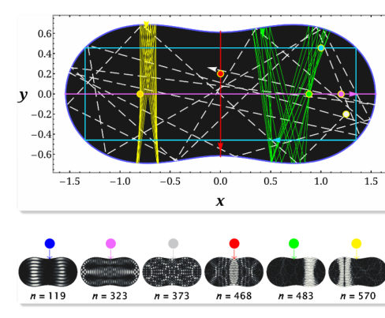
<figcaption class="paper-figure-caption"><b>Fig 1.</b> FIG. 1. Classical trajectories and eigenstate intensities in the peanut-shaped billiard. Top: coloured curves mark selected slowly diverging orbits, while the white dashed curve indi- cates chaotic motion. Bottom: eigenstate intensities ψ(x)2 show enhanced probability density along the corresponding classical structures. The colour coding connects each eigen- state morphology to the corresponding classical structure in the upper panel.</figcaption>
</figure>
<figure class="paper-figure-card">
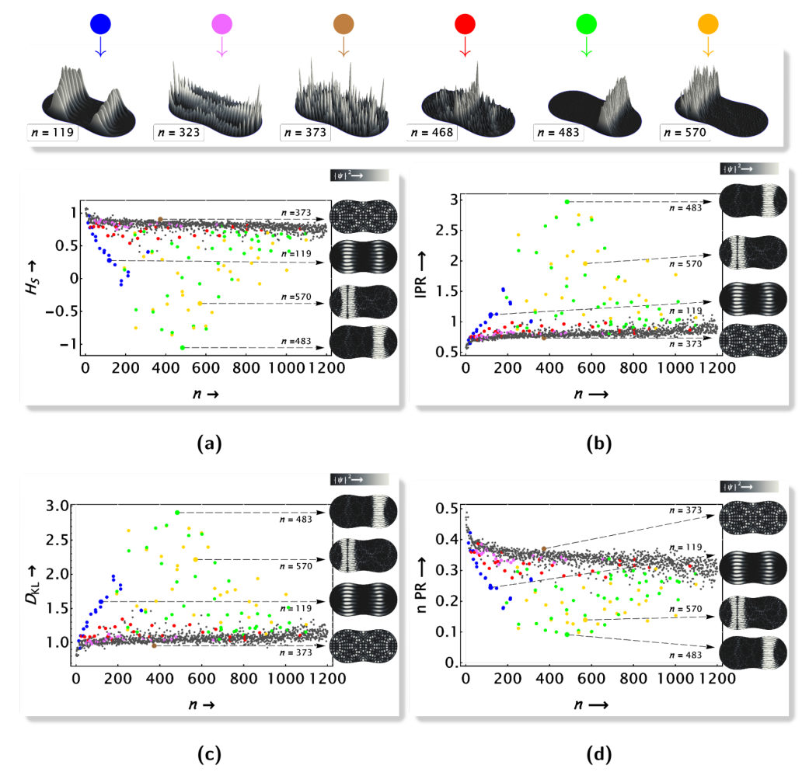
<figcaption class="paper-figure-caption"><b>Fig 2.</b> FIG. 2. Eigenstate morphology and scar diagnostics across the spectrum. Top: representative intensity profiles |ψ|2, with colours matching the highlighted data points. Bottom: spectral variation of (a) Differential Shannon entropy HS, (b) IPR, (c) DKL, and (d) nPR versus eigenstate index n. Insets display a few selected eigenstate probability densities. While these scalar diagnostics reveal anomalous concentrations and deviations from ergodic spatial filling, they collapse each eigenstate to a single number and therefore cannot resolve whether distinct eigenstates share the same spatial morphology.</figcaption>
</figure>
<figure class="paper-figure-card">
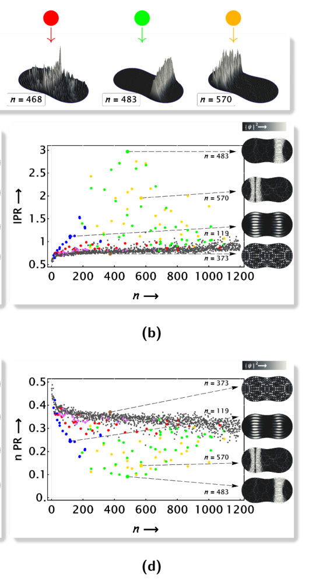
<figcaption class="paper-figure-caption"><b>Fig 3.</b> FIG. 2(c &amp; d) present dimensionless diagnostics that remove this ambiguity by using dimensionless, scale- independent measures. The KL divergence highlights de- viations from the uniform density, so localised or scarred eigenstates appear as large positive outliers. The nPR rescales the participation ratio by the billiard area and therefore measures the fraction of the domain effectively</figcaption>
</figure>
<figure class="paper-figure-card">
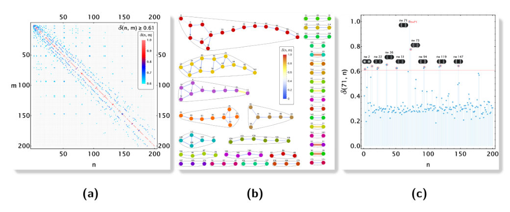
<figcaption class="paper-figure-caption"><b>Fig 4.</b> FIG. 3. Density-overlap similarity between eigenstates. (a) Thresholded matrix S(n, m) ≥0.61, where off-diagonal elements near unity identify distinct eigenstates with nearly identical probability densities. (b) Network of spatially similar eigenstates, with edges drawn for S(n, m) ≥0.67; edge colour and thickness encode S(n, m). The balloon layout is only visual. (c) Eigenstates most similar to the reference state n = 71; the red line marks Sth = 0.61.</figcaption>
</figure>
<figure class="paper-figure-card">
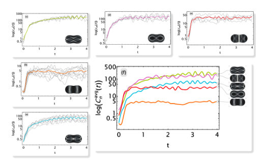
<figcaption class="paper-figure-caption"><b>Fig 5.</b> FIG. 4. Morphology-resolved OTOC dynamics. (a-e) show eigenstate groups Gg with similar density morphology, iden- tified by the overlap S(n, m). Grey curves are individual OTOCs and coloured curves are group averages Cavg g (t). Den- sity thumbnails show representative members from the cor- responding morphology class. (f) compares averaged curves across all classes, demonstrating that recurring eigenstate morphologies yield distinct yet internally consistent OTOC growth and saturation profiles.</figcaption>
</figure>

**Summary.** The paper connects the static spatial structure of wave functions in chaotic quantum systems to their dynamic scrambling behavior. By developing a density overlap metric, the authors group eigenstates by shared morphology rather than just energy or localization. They show that strong morphological recurrence constrains and predicts the growth rate of information scrambling measured via OTOCs.

**Why it may be interesting.** This work provides a novel way to connect geometric/structural properties (morphology) directly to non-equilibrium dynamics (scrambling), offering a powerful diagnostic tool for quantum chaos beyond simple ergodicity measures.

Detailed structure

**Main problem.** The work investigates whether static structural features, like scarred eigenstates, in chaotic quantum systems provide a quantitative prediction for the dynamics of information scrambling.

**Main result.** Strong morphological recurrence among orthogonal eigenstates leads to nearly identical Out-of-Time-Order Correlator (OTOC) growth and saturation, suggesting that eigenstate shape acts as a spatial template constraining scrambling dynamics.

**Method.** The authors developed a morphology-resolved diagnostic using scale-normalized density overlap ($S(n, m)$) to group eigenstates by shared probability density profiles, which were then correlated with OTOC time traces.

**Model / system.** The study uses a theoretical model of a quantum billiard shaped like a peanut ($\Omega_{	ext{peanut}}$), representing a chaotic system where wave functions exhibit scarring due to unstable classical orbits.

**Key observables.** Scale-normalized density overlap ($S(n, m)$), eigenstate-resolved OTOCs, and the resulting curve distance/similarity metrics for comparing time evolution.

**Important parameters / regimes.** The degree of morphological recurrence (high $S(n, m)$) is crucial; the relationship between morphology and dynamics is found to be threshold-like.

**Assumptions / limitations.** Standard localization diagnostics (entropy, IPR) are insufficient because they only measure concentration and discard spatial architecture. The analysis assumes that OTOCs capture the relevant scrambling dynamics.

**Figures summary.** Figures illustrate classical trajectories alongside eigenstate intensities in the billiard; one figure summarizes scalar diagnostics, while others compare density overlap matrices with corresponding OTOC time traces to show correlation.

**Paper structure.** The paper first establishes the limitations of standard localization measures. It then introduces and applies the morphology-resolved diagnostic ($S(n, m)$) to group states. Finally, it correlates these morphological classes by comparing their full OTOC time evolution to demonstrate a quantitative link between static shape and dynamic scrambling.

Abstract

Chaotic quantum systems can retain spatial memory through scarred eigenstates, but whether these static structures control scrambling remains unclear. This work establishes a morphology-resolved connection between scarred eigenstates and eigenstate-resolved OTOCs in a peanut-shaped quantum billiard. Scalar localisation diagnostics, including differential entropy and continuum participation ratios, detect anomalous concentration but discard spatial architecture. A scale-normalised density overlap, in contrast, directly compares probability density profiles, revealing families of orthogonal eigenstates with nearly identical spatial morphology. Comparing the complete OTOC time traces of these orthogonal eigenstates reveals that morphological recurrence has dynamical content: moderate density overlap yields no universal prediction, whereas strongly recurring morphologies exhibit nearly identical OTOC growth and saturation. Thus, scarred structures act as spatial templates for operator growth, not merely static violations of ergodicity. This morphology-resolved framework turns eigenstate shape into a quantitative predictor of scrambling and provides a scale-controlled diagnostic of weak ergodicity breaking in quantum chaos.

[↑ back to top](#top)

### [Ultracold atomic lattice systems for simulating topological phases: A review](http://arxiv.org/abs/2606.16598v1)

**Authors:** Bei-Bei Wang, Xiao-Dong Lin, Jinyi Zhang, Long Zhang  
**Type:** both · **Category:** other · **PDF:** <https://arxiv.org/pdf/2606.16598v1>  
**Analysis basis:** full PDF text, analyzed in chunks
**Topic relevance:** 🔥 `analog quantum simulation` **5/5** · `non-equilibrium dynamics` **3/5** · `Rydberg arrays` **1/5** · `driven-dissipative phase transition` **1/5** · `entanglement & information structure` **1/5** · `exotic spin models in light-matter` **1/5** · `non-equilibrium universality` **1/5**

↔ Scroll figures horizontally

<figure class="paper-figure-card">
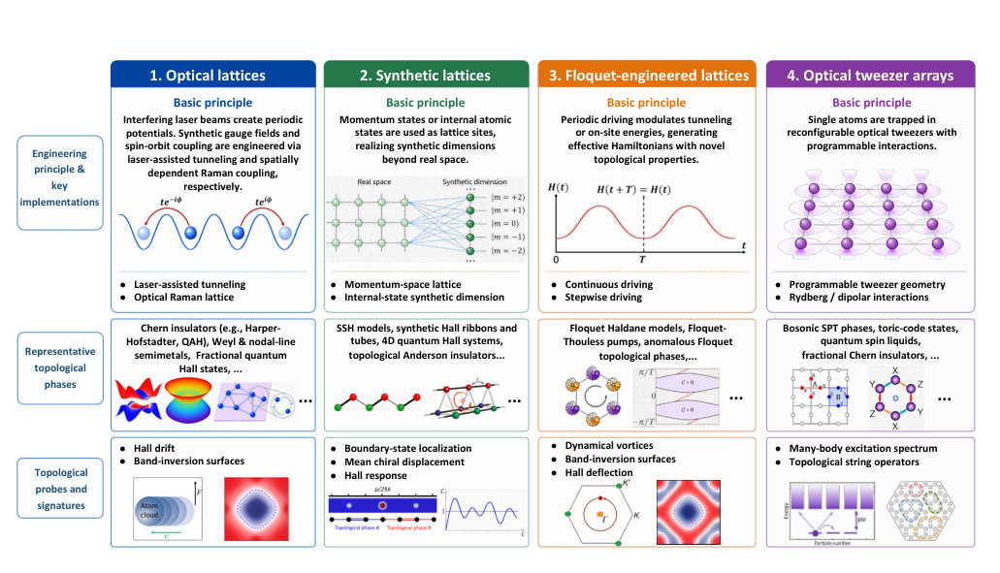
<figcaption class="paper-figure-caption"><b>Fig 1.</b> FIG. 1. Roadmap of the four major ultracold-atom platforms for realizing and probing topological quantum matter. For each platform, we summarize the underlying physical principle, key implementation schemes, representative topological phases, and characteristic topological probes and signatures. The figure highlights the complementary capabilities of optical lattices, synthetic lattices, Floquet-engineered lattices, and optical tweezer arrays for exploring topological phenomena in ultracold atomic systems.</figcaption>
</figure>
<figure class="paper-figure-card">
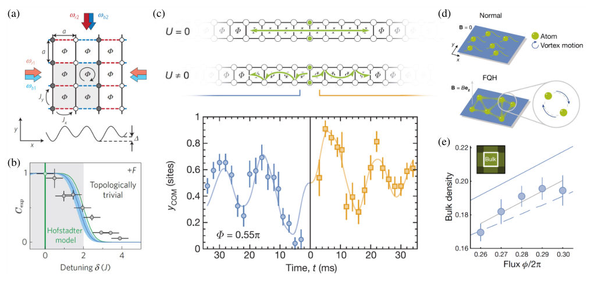
<figcaption class="paper-figure-caption"><b>Fig 2.</b> FIG. 2. (a) Experimental setup for generating a uniform artificial magnetic field via laser-assisted tunneling. A 2D optical lattice with inhibited tunneling along x is combined with two pairs of laser beams (red and blue) that restore tunneling independently on selected red and blue links. This produces a rectified flux Φ = π/2 per plaquette and a magnetic unit cell four times larger than the original lattice cell. (b) Measured Chern number Cexp versus staggered detuning δ. The topological phase transition near δ = 2J is broadened by experimental uncertainties. Panels (a) and (b) are reprinted from Ref. [79]. (c) Interaction-induced chiral dynamics for two particles in a Harper-Hofstadter...</figcaption>
</figure>
<figure class="paper-figure-card">
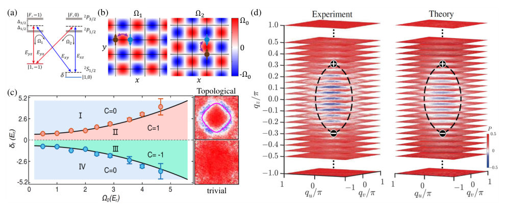
<figcaption class="paper-figure-caption"><b>Fig 3.</b> FIG. 3. (a) Level structure and Raman coupling scheme for realizing 2D QAH model. (b) Real-space antisymmetric structure of the two Raman couplings Ω1 and Ω2. The grid represent the square optical lattice Vlatt(x, y). Panels (a) and (b) are reprinted from Ref. [99]. (c) Left: Topological phase diagram of the lowest band for the QAH model measured by quench dynamics. Here δ f denotes the post-quench value of the two-photon detuning, while Ω0 denotes the Raman coupling strength, with Ω01 = Ω02 = Ω0. Experimental data (blue and red dots) agree with theoretical calculations (solid lines), identifying trivial areas (C = 0) and nontrivial areas (C = 1 and C = −1). Right: Time-evolved spin texture...</figcaption>
</figure>
<figure class="paper-figure-card">
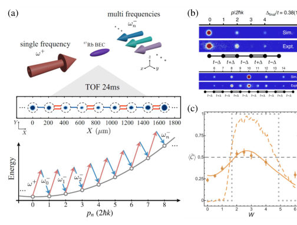
<figcaption class="paper-figure-caption"><b>Fig 4.</b> FIG. 4. (a) Experimental setup of the momentum lattice. A BEC is coupled by Bragg beams with multiple frequency components, cre- ating a synthetic lattice that implements the SSH model. The middle panel shows a typical experimental absorption image of the atomic density distribution in momentum states after TOF expansion, while the bottom panel depicts the dispersion relation and Bragg transi- tion pathways for nearest-neighbor couplings. Panel (a) is reprinted from Ref. [108]. (b) Direct imaging of topological soliton states pre- pared adiabatically. Experimental absorption images (top: edge de- fect; bottom: central defect) show good agreement with theoretical simulations. Panel (b) is...</figcaption>
</figure>
<figure class="paper-figure-card">
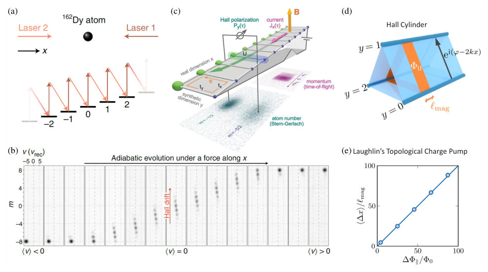
<figcaption class="paper-figure-caption"><b>Fig 5.</b> FIG. 5. (a) Laser configuration coupling magnetic sublevels of 162Dy atoms to realize a synthetic dimension with −J ≤m ≤J. (b) Chiral edge states observed via directional motion: negative velocity on the bottom edge (m = −J), positive velocity on the top edge (m = J), and zero average velocity in the bulk. Single-shot images show the three distinct behaviors. Panels (a) and (b) are reprinted from Ref. [120]. (c) Synthetic ladder implemented with fermionic 173Yb atoms in a 1D optical lattice. Raman coupling between nuclear spins with a position-dependent phase simulates a magnetic field. An applied gradient drives an atomic current Jx; the resulting Hall polarization Py (leg population...</figcaption>
</figure>

**Summary.** This review surveys the rapidly advancing field of simulating topological phases using ultracold atomic lattices. It systematically compares four major experimental platforms—optical lattices, synthetic/Raman lattices, Floquet engineering, and tweezer arrays—highlighting how each allows for precise control over parameters to realize complex models like QAH or SSH systems. The work emphasizes the convergence toward studying strongly correlated, non-equilibrium topological matter.

**Why it may be interesting.** This is highly relevant as it details state-of-the-art experimental implementations of fundamental condensed matter theories (like topological insulators) using cold atoms, bridging quantum simulation theory directly to cutting-edge AMO hardware capabilities.

Detailed structure

**Main problem.** The review addresses how ultracold atomic lattice systems can be utilized as versatile quantum simulators to study complex topological phases of matter.

**Main result.** The paper surveys four major, complementary experimental platforms—optical lattices, synthetic/Raman lattices, Floquet engineering, and optical tweezer arrays—demonstrating their collective power to realize and probe diverse topological models.

**Method.** The review synthesizes recent experimental breakthroughs by detailing the specific Hamiltonian realizations, advanced measurement techniques (like quantum gas microscopy), and theoretical frameworks applied across different atomic platforms.

**Model / system.** The systems include optical lattices, which are engineered using various laser schemes (e.g., Raman coupling) to simulate models like the Harper-Hofstadter model or the 2D Quantum Anomalous Hall (QAH) model. The flexibility allows for simulating both single-particle band structures and strongly correlated phases.

**Key observables.** Key observables include topological invariants such as the Chern number ($C$), fractional Hall conductance ($\sigma_H$), chiral center-of-mass displacement, and signatures of exotic states like topological soliton formation.

**Important parameters / regimes.** Tunable parameters include lattice geometry, interaction strength ($U$), synthetic magnetic flux ($\Phi$), and coupling strengths ($\delta J$ vs $J$).

**Assumptions / limitations.** Approximations mentioned include the Rotating-Wave Approximation (RWA) for time-dependent couplings, and the general assumption that these engineered systems can mimic complex solid-state physics.

**Figures summary.** Figures provide roadmaps summarizing the four platforms; specific examples show laser-assisted tunneling setups measuring Chern numbers, Raman lattice schemes realizing QAH models with phase diagrams, and momentum lattices implementing SSH models with soliton imaging.

**Paper structure.** The review systematically surveys recent experimental progress by dedicating sections to the four major platform classes: optical lattices (including specialized techniques), synthetic lattices in momentum/internal-state space, Floquet engineering, and optical tweezer arrays. It concludes with future outlooks on strongly correlated and non-equilibrium physics.

Abstract

Owing to rapid recent progress, ultracold atomic lattice systems for simulating topological phases are now at a pivotal stage, evolving from established paradigms into increasingly versatile and programmable quantum simulators. In this review, we survey recent experimental advances across four major classes of platforms: optical lattices, including optical lattices with laser-assisted tunneling and optical Raman lattices; synthetic lattices in momentum or internal-state space; Floquet-engineered lattices; and optical tweezer arrays, all of which offer distinct capabilities for realizing and probing topological matter. For each class, we highlight representative experimental breakthroughs, the topological models that have been realized, and the advanced detection and characterization techniques employed, emphasizing how these complementary approaches collectively expand the frontier of quantum simulation. We also discuss emerging directions in strongly correlated and nonequilibrium topological phases, and conclude with an outlook on future prospects.

[↑ back to top](#top)

### [Programmable Gauge-Field Textures with Ultracold Atoms in Momentum Space](http://arxiv.org/abs/2606.15124v1)

**Authors:** Hongru Wang, Hang Li, Yichen Pan, Yuyan Luo, Bryce Gadway, Tao Chen, Bo Yan  
**Type:** experiment · **Category:** other · **PDF:** <https://arxiv.org/pdf/2606.15124v1>  
**Analysis basis:** full PDF text, analyzed in chunks
**Topic relevance:** 🔥 `analog quantum simulation` **5/5** · `non-equilibrium dynamics` **3/5** · `driven-dissipative phase transition` **1/5** · `non-equilibrium universality` **1/5**

↔ Scroll figures horizontally

<figure class="paper-figure-card">
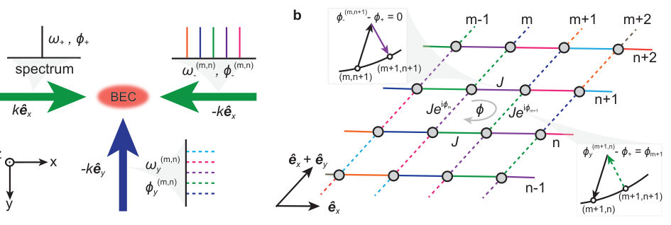
<figcaption class="paper-figure-caption"><b>Fig 1.</b> FIG. 1. Schematic of building 2D MSLs with tunable magnetic flux. (a) Three Bragg laser beams (the wavevector k = 2π/λ with λ ≈794.7 nm) interact with a BEC to form 2D lattice geometries in momentum space. The two counter- propagating beams along the x-direction (ω+ and ω−) trigger the tunnelings between discrete momentum states along ˆex with an interval of 2ℏk, while the perpendicular beam ωy, in combination with ω+, leads to hopping between states with a momentum difference of ℏk(ˆex + ˆey). The tunneling phases are introduced by programming each individual phase for different frequency components in ω−and ωy beams, respectively. (b) Illustration of the Haper-Hofstadter lattice. Bonds...</figcaption>
</figure>
<figure class="paper-figure-card">
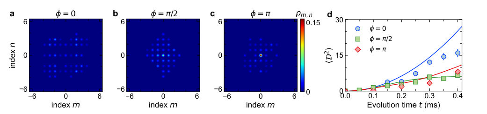
<figcaption class="paper-figure-caption"><b>Fig 2.</b> FIG. 2. Bulk dynamics for an injection in 2D Harper-Hofstadter lattices. (a-c) Measured population distributions ρm,n at t = 0.3 ms for (a) ϕ = 0, (b) ϕ = π/2 and (c) ϕ = π. The wavepacket spreading shows nearly symmetric ballistic behavior in the absence of flux, while the spreading speed gets suppressed under finite ϕ-flux. (d) Time evolution of the bulk expansion characterized by the mean-square displacement ⟨D2⟩for different gauge fluxes ϕ. For zero flux, the wavepacket exhibits ballistic expansion with ⟨D2⟩∝t2, whereas a slower expansion is observed for ϕ = π/2 and ϕ = π. Here the tunneling amplitudes are set as J/h = 0.95(5) kHz for a 15 × 15 square lattice. All solid lines indicate...</figcaption>
</figure>
<figure class="paper-figure-card">
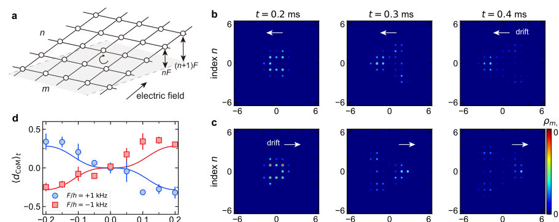
<figcaption class="paper-figure-caption"><b>Fig 3.</b> FIG. 3. Hall response under programmable transverse electric fields. (a) Schematic of simulating the Hall effect in the Harper-Hofstadter lattice. A potential gradient is applied along the ˆex + ˆey direction (sites indexed by n) to introduce a synthetic electric field F. (b,c) Measured momentum-space dynamics of a wavepacket injected at the lattice center for evolution times t = 0.2, 0.3 and 0.4 ms with the effective electric fields F/h = +1 kHz and F/h = −1 kHz, respectively, showing opposite transverse drift directions of the wavepacket. Here ϕ = π/5 is used. (d) Time-averaged center-of-mass displacement ⟨dCoM⟩t versus the magnetic flux ϕ for the two opposite electric-field polarities,...</figcaption>
</figure>
<figure class="paper-figure-card">
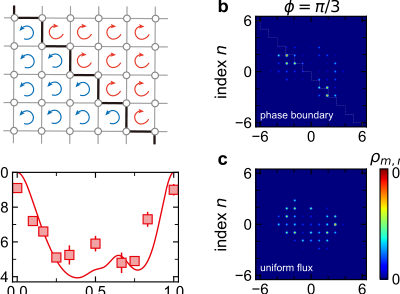
<figcaption class="paper-figure-caption"><b>Fig 4.</b> FIG. 4. Boundary-guided dynamics at an engineered gauge-field interface. (a) Schematic of creating a syn- thetic gauge-field boundary (flux interface, bold black con- nections) in the 2D MSL, where the synthetic magnetic flux takes opposite signs (+ϕ and −ϕ) on the two sides of the diagonal interface. (b) Measured wavepacket distributions at t = 0.35 ms for an injection at the interface center for ϕ = π/3. (c) Measured wavepacket distributions for uniform ϕ = π/3 without an interface as a comparison to the result in (b). (d) Anisotropy parameter η characterizing wavepacket elongation along the interface as a function of the flux ϕ.</figcaption>
</figure>

**Summary.** This paper reports on the experimental realization of programmable 2D momentum-state lattices using ultracold atoms to engineer complex synthetic gauge fields. By achieving local control over magnetic fluxes, the researchers demonstrated tunable quantum transport phenomena, including Hall drift and anisotropic wavepacket guiding along designed topological interfaces. This establishes a versatile platform for studying exotic quantum matter beyond natural physical constraints.

**Why it may be interesting.** This work provides a powerful experimental realization of designer gauge structures in quantum matter, moving beyond simple uniform background fluxes. It directly tests fundamental concepts of topological transport (like the Quantum Hall effect) in an ultracold atom setting, which is highly relevant for AMO physicists studying synthetic dimensions and engineered Hamiltonians.

Detailed structure

**Main problem.** The research aims to advance cold-atom gauge-field engineering from systems limited to uniform magnetic fluxes toward realizing highly programmable, spatially structured (designer) gauge textures in two dimensions.

**Main result.** The authors successfully implemented 2D momentum-state lattices with local control over the Peierls phase pattern, enabling the study of transport across engineered topological interfaces and observing Hall-type transverse drift.

**Method.** They use three Bragg laser beams to create a 2D lattice in momentum space, allowing for precise programming of synthetic gauge fields (fluxes) on individual plaquettes.

**Model / system.** The platform utilizes ultracold atoms (e.g., Rb BEC) trapped in Momentum-State Lattices (MSLs). The physics is governed by the Harper-Hofstadter Hamiltonian, which can be modified by adding site-dependent energy gradients to simulate electric fields.

**Key observables.** Mean-square displacement ($\langle D^2 
angle$) for bulk dynamics, transverse Center-of-Mass (CoM) drift ($\langle d_{	ext{CoM}} 
angle_t$), and anisotropic expansion along flux domain walls.

**Important parameters / regimes.** The synthetic magnetic flux ($\phi$) in a plaquette is the key tunable parameter. The system also allows for tuning of electric fields ($F$).

**Assumptions / limitations.** A limitation noted is that phase control is constrained by using $m+n$-independent laser components, meaning one component affects multiple tunneling links simultaneously.

**Figures summary.** Figures illustrate the schematic creation of the 2D MSL using Bragg beams and show time evolution plots demonstrating flux-suppressed transport dynamics and wavepacket guiding along engineered domain walls.

**Paper structure.** The paper progresses by first establishing the programmable nature of the 2D lattice, then demonstrating bulk dynamics (crossover from ballistic to localized), followed by applying synthetic electric fields to observe Hall effects, and finally investigating interface physics using flux domain walls.

Abstract

Synthetic gauge fields with ultracold atoms offer a route to quantum matter in which electromagnetic environments can be designed rather than merely imposed. While the Harper-Hofstadter model has been realized in several cold-atom systems, existing implementations are largely limited to spatially uniform magnetic fluxes. Here we experimentally realize a highly programmable two-dimensional momentum-state lattice of ultracold atoms with local control over the Peierls phase pattern, enabling direct implementation of Harper-Hofstadter Hamiltonians with tunable and spatially structured synthetic gauge fields. We observe a crossover from ballistic to strongly flux-modified bulk dynamics with suppressed transport. By introducing a synthetic electric field through site-dependent energy gradients, we further demonstrate Hall-type transverse drift arising from the interplay between electric and magnetic fields. In addition, we engineer a synthetic flux domain wall separating regions with opposite magnetic fluxes and observe anisotropic propagation guided along the interface. These results move cold-atom gauge-field engineering from uniform magnetic backgrounds toward designer gauge textures, providing an experimental setting for transport across programmable topological interfaces.

[↑ back to top](#top)

### [Synthesizing Arbitrary Non-Hermitian Hamiltonian with Stochastic Floquet Engineering](http://arxiv.org/abs/2606.15664v1)

**Authors:** Lingzhen Guo, Hui Jing  
**Type:** theory · **Category:** other · **PDF:** <https://arxiv.org/pdf/2606.15664v1>  
**Analysis basis:** full PDF text, analyzed in chunks
**Topic relevance:** 🔥 `methods for driven-dissipative` **4/5** · 🔥 `non-equilibrium dynamics` **4/5** · `analog quantum simulation` **3/5** · `correlated / nonlocal dissipation` **3/5** · `correlated cavity matter` **3/5** · `driven-dissipative phase transition` **3/5** · `Keldysh / 2PI / non-Gaussian methods` **2/5** · `Tavis-Cummings & cavity-many-emitter` **2/5** · `non-equilibrium universality` **2/5** · `Kondo & dissipative impurity` **1/5** · `entanglement & information structure` **1/5** · `measurement-induced transitions` **1/5** · `quantum measurements` **1/5**

↔ Scroll figures horizontally

<figure class="paper-figure-card">
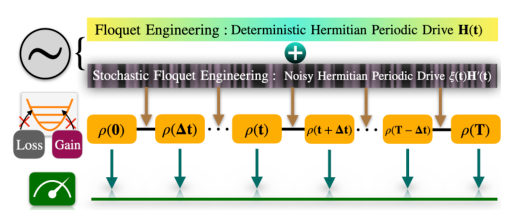
<figcaption class="paper-figure-caption"><b>Fig 1.</b> FIG. 1. Sketch of Stochastic Floquet Engineering (SFE). The conventional Floquet engineering uses the deter- ministic Hermitian time-periodic drive H(t) = H(t+T), while the SFE adds another stochastic Hermitian time-periodic drive H′(t) = H′(t + T) with noisy amplitude ξ(t). By moni- toring quantum jumps, any target non-unitary time evolution of the density operator ρ(T) = e−iHT T ρ(0)eiH† T T generated by an arbitrary non-Hermitian(NH) Hamiltonian HT ̸= H† T can be realized with no need for loss and gain in prior.</figcaption>
</figure>
<figure class="paper-figure-card">
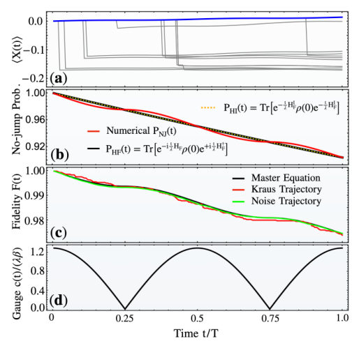
<figcaption class="paper-figure-caption"><b>Fig 2.</b> FIG. 2. Synthesizing NH cavity Hamiltonian via SFE. (a) Monitoring quantum jumps of Kraus trajectories gener- ated from Eq. (11) with the cavity quadrature ⟨X(t)⟩, where the trajectories with no quantum jumps are marked in blue. (b) Time-dependent no-jump probability given by numerical calculation (red), the Floquet Hamiltonian HF (blue curve), and the imaginary part of the Floquet Hamiltonian (yellow curve) with HI F = 1 2i(H† F −HF ). (c) Time-evolved fidelity F(t) of density matrix ρ(t) with respect to the initial state ρ(0) = |0⟩⟨0| given by ensemble averaging Kraus trajectories (red), noisy trajectories (green), cf. Eq. (2), and the quantum master equation (black), cf. Eq. (3). (d)...</figcaption>
</figure>
<figure class="paper-figure-card">
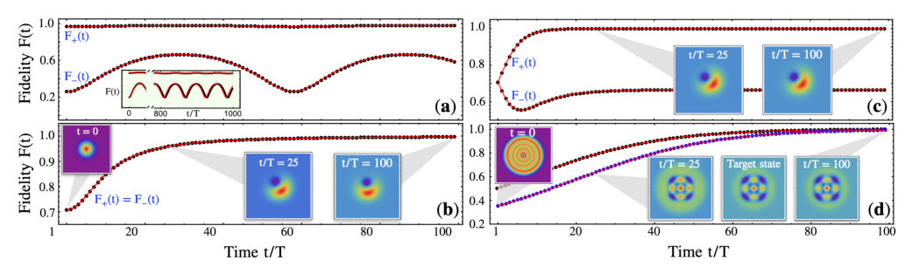
<figcaption class="paper-figure-caption"><b>Fig 3.</b> FIG. 3. Stroboscopic dynamcs of NH Hamiltonian.(a)-(c): Stroboscopic time evolution of the fidelity F±(t) = p</figcaption>
</figure>

**Summary.** The paper introduces Stochastic Floquet Engineering (SFE), a novel technique to synthesize arbitrary non-Hermitian Hamiltonians in periodically driven quantum systems. By incorporating noise into the driving field, SFE bypasses the need for traditional loss/gain mechanisms while achieving control over complex non-unitary dynamics. This is highly relevant for controlling open quantum systems in fields like cavity QED and quantum optics.

**Why it may be interesting.** This work provides a powerful, general theoretical tool for controlling open quantum systems and realizing non-unitary dynamics—a regime often difficult to access experimentally or theoretically without invoking explicit dissipation channels.

Detailed structure

**Main problem.** The primary goal is to synthesize an arbitrary non-Hermitian (NH) target Hamiltonian ($H_T$) using a stochastic Floquet engineering scheme.

**Main result.** The method successfully engineers NH dynamics by utilizing noise ($\xi(t)$) as a quantum resource, allowing for the synthesis of complex non-unitary gates without requiring explicit loss or gain terms.

**Method.** Stochastic Floquet Engineering (SFE) is employed, which modifies the standard deterministic driving field by adding a term proportional to $\sqrt{\eta\xi(t)}H'(t)$ to the Hamiltonian. The dynamics are analyzed via master equations and stroboscopic evolution approximations.

**Model / system.** The theory is applied to bosonic systems modeled by cavity Hamiltonians, allowing for the engineering of NH couplings between Fock states in a specific basis $\{|n
angle, |m
angle\}$.

**Key observables.** Fidelity $F(t)$, no-jump probability $P_{NJ}(t)$, and the time evolution of the density matrix $
ho(t)$.

**Important parameters / regimes.** The noise strength ($\eta$), the driving period ($T$), and the coupling constants defining the target Hamiltonian components.

**Assumptions / limitations.** The method relies on approximating the time evolution operator to second order in $\Delta t$ and assumes that monitoring the null outcome successfully suppresses quantum jumps to realize the target evolution.

**Figures summary.** Figures illustrate the general framework comparing deterministic vs. stochastic driving, show diagnostics like quadrature observable tracking and fidelity evolution compared against theoretical predictions from the NH Hamiltonian.

**Paper structure.** The paper introduces SFE theory by deriving the effective non-Hermitian Floquet Hamiltonian ($\mathcal{H}_F$) from a master equation incorporating noise. It then applies this framework to engineer specific NH Hamiltonians in bosonic cavity systems using Noncommutative Fourier Transformation (NcFT) techniques.

Abstract

The conventional Floquet engineering scheme synthesizes a given target Hamiltonian with a deterministic temporal periodic driving field. In this work, we introduce the stochastic Floquet engineering scheme that can synthesize an arbitrary non-Hermitian target Hamiltonian using a time-periodic driving field with noisy amplitude. Our method is rooted in the Hermitian dynamics taking noise as a valuable quantum resource with no need for loss or gain in prior. We apply our method to engineer a cavity Hamiltonian with dissipative coupling between Fock states, and to prepare a given quantum state from a generally arbitrary quantum state. The stochastic Floqut engineering also provides a way to generate non-unitary quantum gates, which take advantage in certain tasks compared to unitary quantum computing, without the need for ancillae or state-dependent updating.

[↑ back to top](#top)

### [Readout-Induced Leakage in Superconducting Circuits with Nonlinear Couplings](http://arxiv.org/abs/2606.16055v1)

**Authors:** Sumeru Hazra, Wei Dai, Daniel K. Weiss, Pranav D. Parakh, Luigi Frunzio, Michel H. Devoret  
**Type:** both · **Category:** quantum information and computing · **PDF:** <https://arxiv.org/pdf/2606.16055v1>  
**Analysis basis:** full PDF text, analyzed in chunks
**Topic relevance:** 🔥 `QC/QI experiment` **4/5** · 🔥 `methods for driven-dissipative` **4/5** · `correlated / nonlocal dissipation` **3/5** · `correlated cavity matter` **3/5** · `driven-dissipative phase transition` **3/5** · `non-equilibrium dynamics` **3/5** · `Tavis-Cummings & cavity-many-emitter` **2/5** · `non-equilibrium universality` **2/5** · `Keldysh / 2PI / non-Gaussian methods` **1/5** · `measurement-induced transitions` **1/5** · `quantum measurements` **1/5** · `quantum optics experiment` **1/5**

↔ Scroll figures horizontally

<figure class="paper-figure-card">
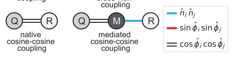
<figcaption class="paper-figure-caption"><b>Fig 1.</b> Figure 1. Drive-induced leakage in superconducting cir- cuits. (a) Dressed energy-level diagram of a multi-mode sys- tem. A drive-induced unwanted state transition (DUST), e.g. ∣e⟩→∣k⟩, is activated when a multi-quanta resonance condi- tion is met. (b) Floquet branch analysis of the driven system at a given drive frequency, showing a branch swap between the dressed ∣e⟩and ∣k⟩levels when the drive power (param- eterized by the induced ac-Stark shift) meets a multi-quanta resonance condition. (c) Schematic of different qubit (Q)- readout (R) coupling mechanisms ˆOi ˆOj, {i, j} ∈{q, m, r}: lin- ear coupling via ˆnqˆnr interaction (blue line); balanced cross- Kerr coupling via a combination of...</figcaption>
</figure>
<figure class="paper-figure-card">
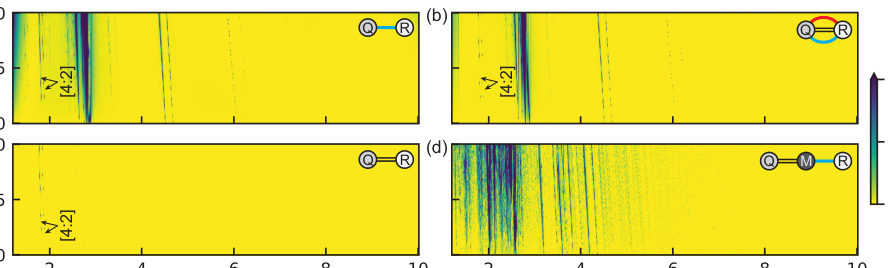
<figcaption class="paper-figure-caption"><b>Fig 2.</b> Figure 2. Multiphoton resonance landscape visualized by the sum of displaced state overlaps Θ(0t) + Θ(1t), calculated from both qubit states. The displaced-overlap is plotted against the readout drive frequency (normalized by qubit frequency) ωd/ωq and readout power for different circuit realizations: (a) transmon linearly coupled to the drive [25], (b) balanced cross-Kerr interaction [5] (EJ cos ˆϕq cos ˆϕr+EJ sin ˆϕq sin ˆϕr−Jˆnqˆnr), (c) ideal cosine-cosine cos ˆϕq cos ˆϕr coupling, and (d) effective nonlinear coupling mediated by an auxiliary mode (this work, see also Ref. [3]). Although the ideal cos ˆϕq cos ˆϕr interaction suppresses most multiphoton resonances, in mediated cos ˆϕq...</figcaption>
</figure>
<figure class="paper-figure-card">
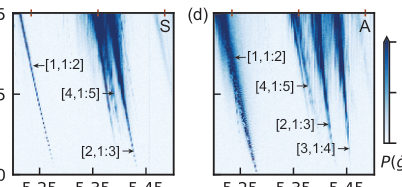
<figcaption class="paper-figure-caption"><b>Fig 3.</b> Figure 3. Impact of auxiliary modes and residual asymmetry. (a) Simplified lumped element model of the dimon-readout system and schematic comparison between the symmetric and asymmetric drives through ports PS and PA, respec- tively. (b) Pulse sequence for characterizing drive-induced unwanted state transitions. After preparing the qubit in ∣g⟩, a 1µs stimulation tone of variable frequency and power is ap- plied, followed by a readout to measure the escaped popu- lation, P(¯g∣g). (c-d) Plotted P(¯g∣g) as a function of drive frequency and drive power under symmetric and asymmetric drives on the device. (c) Auxiliary modes introduce multi- ple joint-excitation channels in the driven circuit...</figcaption>
</figure>
<figure class="paper-figure-card">
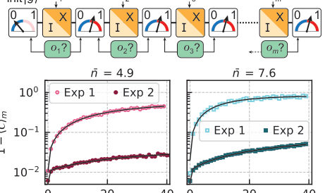
<figcaption class="paper-figure-caption"><b>Fig 4.</b> Figure 4. Readout-induced leakage in two experiments with different readout frequencies. (a) Simulated hybridization pa- rameter Θ, from the qubit ground (blue) and excited (red) states, plotted against the ratio ωr/ωq (x-axis) and the read- out drive power (y-axis). In Exp 1 (vertical dashed line), a multiphoton resonance [2, 3 ∶3] is activated from the ex- cited state at the readout frequency; in Exp 2 (vertical solid line), this resonance is avoided by detuning the readout fre- quency. (b) Pulse sequence for benchmarking the readout- induced leakage. The readout operations are intertwined with a stochastic sequence of qubit operations consisting of identity (I) and bit-flip (X)...</figcaption>
</figure>

**Summary.** This research investigates how drive-induced leakage limits readout performance in superconducting qubits. By comparing linear versus nonlinear coupling schemes, the authors demonstrate that while nonlinearity is promising, its benefit critically depends on precise device design to avoid parasitic resonance pathways. The work establishes that frequency dependence is paramount, requiring comprehensive spectral characterization for reliable quantum computing operation.

**Why it may be interesting.** This work provides crucial experimental and theoretical benchmarks for mitigating decoherence sources in superconducting quantum processors by mapping out the complex parameter space where unwanted coupling channels become active.

Detailed structure

**Main problem.** Drive-induced unwanted transitions (leakage) limit the readout power and fidelity of superconducting qubits, posing a significant challenge for quantum error correction.

**Main result.** Leakage is highly sensitive to the choice of readout frequency, demonstrating that nonlinear couplings only provide benefits through careful, informed device engineering rather than inherently suppressing all leakage pathways.

**Method.** The study employs both theoretical Floquet steady-state simulations and detailed experimental measurements (e.g., correlation decay analysis) to characterize multi-photon resonance landscapes.

**Model / system.** The system involves superconducting qubits coupled to readout resonators, analyzed using various nonlinear coupling schemes like native cosine-cosine or mediated couplings involving auxiliary modes.

**Key observables.** Readout fidelity ($F_{ge}$), leakage probability ($\mathcal{L}_\uparrow$), seepage rate ($\mathcal{L}_\downarrow$), and the multi-photon resonance landscape ($\Theta$ vs. frequency/power).

**Important parameters / regimes.** Readout drive frequency ($\omega_d/\omega_q$) and readout power (related to steady-state photon number $ar{n}_r$).

**Assumptions / limitations.** The analysis often relies on approximations, such as assuming an incoherent leakage model or neglecting quantum fluctuations of the resonator in certain theoretical derivations.

**Figures summary.** Figures illustrate resonance landscapes showing how different couplings affect multiphoton resonances; experimental data show correlation decay curves and measured fidelity values across varying readout parameters.

**Paper structure.** The paper systematically compares various coupling Hamiltonians (linear vs. nonlinear), analyzes the resulting multi-photon resonance spectra via Floquet theory, and validates these findings with detailed measurements of readout fidelity and leakage rates as a function of drive frequency.

Abstract

In superconducting circuits, drive-induced unwanted transitions limit the readout power, thereby constraining readout speed and fidelity. When such transitions excite the qubit into leakage states, they produce correlated errors that are particularly harmful for quantum error correction. Native nonlinear qubit-readout resonator coupling is a promising alternative to conventional linear hybridization because it provides intrinsic Purcell protection and stricter selection rules for multiphoton processes. In realistic devices, however, we show that such a coupling alone neither eliminates nor necessarily suppresses drive-induced transitions. Instead, if not appropriately engineered, these couplings often worsen the situation by introducing additional parasitic processes. Moreover, the rates of these unwanted transitions remain sensitive to the choice of readout frequency, regardless of the coupling mechanism. We demonstrate that readout-induced leakage can thus vary by orders of magnitude even when readout frequencies differ by less than ~7%. Our results establish that the benefits of native nonlinear couplings are realized only through informed device design, including the spectral placement of relevant auxiliary modes and elimination of parasitic ones.

[↑ back to top](#top)

### [Light-induced nonadiabatic dissipative quantum dynamics of the Na2 molecule](http://arxiv.org/abs/2606.15292v1)

**Authors:** Patrick Barron, Krisztián Szabó, Gábor J. Halász, Kálmán Varga, Ágnes Vibók  
**Type:** theory · **Category:** other · **PDF:** <https://arxiv.org/pdf/2606.15292v1>  
**Analysis basis:** full PDF text, analyzed in chunks
**Topic relevance:** 🔥 `methods for driven-dissipative` **4/5** · `analog quantum simulation` **3/5** · `correlated / nonlocal dissipation` **3/5** · `correlated cavity matter` **3/5** · `driven-dissipative phase transition` **3/5** · `non-equilibrium dynamics` **3/5** · `Keldysh / 2PI / non-Gaussian methods` **2/5** · `Tavis-Cummings & cavity-many-emitter` **2/5** · `non-equilibrium universality` **2/5** · `measurement-induced transitions` **1/5** · `quantum measurements` **1/5**

↔ Scroll figures horizontally

<figure class="paper-figure-card">
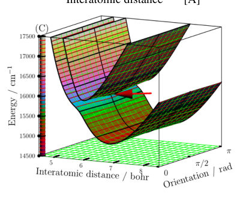
<figcaption class="paper-figure-caption"><b>Fig 1.</b> Figure 1: (A) Diabatic potential energy curves of the first excited manifold of the Na2 molecule in a cavity. (B) Transition dipole moment (red line) function between the X1Σ+ g and A1Σ+ u electronic states. (C) Dressed states potential energy surfaces of the Na2 molecule representing the quantum light-induced conical intersection (LICI). The red arrow marks the location of the LICI.</figcaption>
</figure>
<figure class="paper-figure-card">
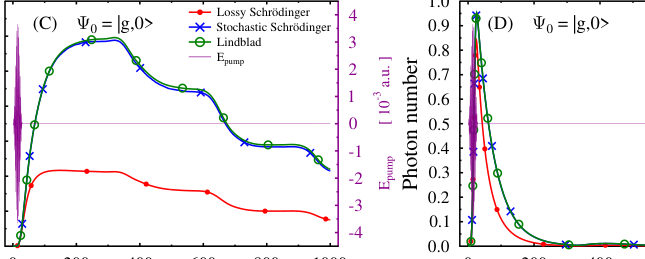
<figcaption class="paper-figure-caption"><b>Fig 2.</b> Figure 2: Population dynamics of the excited molecule and mean photon number in the 1D framework in a lossy cavity ( g = 8 × 10−5a.u., γc = 4 × 10−4a.u. and ωcav = 1.968eV ). The dynamics is initiated from the |e, 0⟩state (panels A and B) and from the |g, 0⟩state pumping the population using laser pulse as I = 4.74 × 1011w/cm2, T = 30 fs and ωlaser = 2eV (panels C and D). Three different methods are used. Lindblad ME results(line with circle), Stochastic SE curve (line with cross), and non-Hermitian TDSE curve (line with dots).</figcaption>
</figure>
<figure class="paper-figure-card">
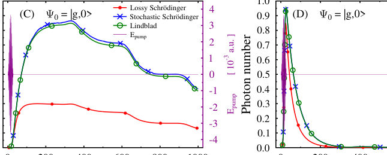
<figcaption class="paper-figure-caption"><b>Fig 3.</b> Figure 3: Population dynamics of the excited molecule and mean photon number in the 2D framework in a lossy cavity ( g = 8 × 10−5a.u., γc = 4 × 10−4a.u. and ωcav = 1.968eV ). The dynamics is initiated from the |e, 0⟩state (panels A and B) and from the |g, 0⟩state pumping the population to the excited polaritonic manifold using a laser pulse as I = 4.74×1011w/cm2, T = 30 fs and ωlaser = 2eV (panels C and D). Three different methods are used. Lindblad ME results(line with circle), Stochastic SE curve (line with cross) and non-Hermitian TDSE curve (line with dots).</figcaption>
</figure>
<figure class="paper-figure-card">
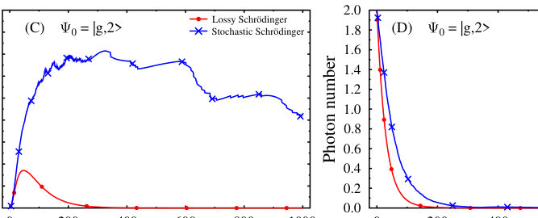
<figcaption class="paper-figure-caption"><b>Fig 4.</b> Figure 4: Population dynamics of the excited molecule and mean photon number in the 2D framework in a lossy cavity ( g = 8 × 10−5a.u., γc = 4 × 10−4a.u.and ωcav = 1.968eV ). The dynamics is initiated from the |e, 1⟩state (panels A and B) and from the |g, 2⟩(panels C and D). Two different methods are used. Stochastic SE curve (line with cross) and non- Hermitian TDSE curve (line with dots).</figcaption>
</figure>
<figure class="paper-figure-card">
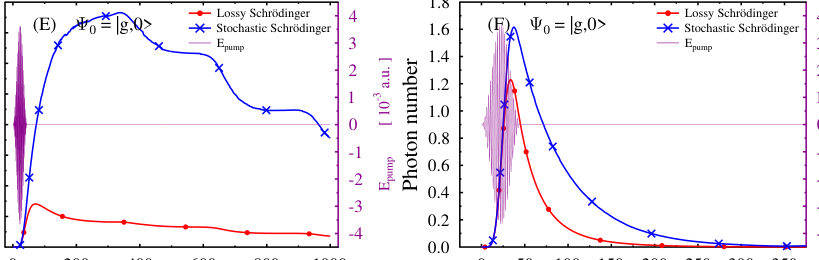
<figcaption class="paper-figure-caption"><b>Fig 5.</b> Figure 5: Population dynamics of the excited molecule and mean photon number in the 2D framework in lossy cavity ( g = 8 × 10−5a.u., γc = 4 × 10−4a.u. and ωcav = 1.968eV ). The dynamics is initiated from the |g, 0⟩state pumping the population to the excited polaritonic manifold using laser pulses as (I = 4.74×1011w/cm2 and ωlaser = 2eV ) with length T = 15 fs (panels A and B), T = 30 fs (panels C and D) and T = 45 fs of (panels E and F). Two different methods are used. Stochastic SE curve (line with cross) and non-Hermitian TDSE curve (line with dots).</figcaption>
</figure>

**Summary.** The paper investigates how light drives a diatomic molecule coupled to a lossy optical cavity, focusing on the role of dissipation and molecular rotation. By comparing three major quantum simulation techniques (Lindblad ME, SE, TDSE), the authors establish the stochastic Schrödinger equation as the most reliable method for open dynamics. The key finding is that including rotational motion reveals nonadiabatic coupling pathways (LICIs) essential for accurate predictions.

**Why it may be interesting.** This work is highly relevant as it tackles the complex intersection of cavity quantum electrodynamics (Cavity QED), nonadiabatic dynamics, and open system physics. The comparison of simulation methods provides crucial benchmarking for future theoretical modeling in molecular photonics.

Detailed structure

**Main problem.** The study models the light-induced nonadiabatic dissipative quantum dynamics of a $	ext{Na}_2$ molecule coupled to a lossy optical or plasmonic cavity mode.

**Main result.** The stochastic Schrödinger equation is shown to be an accurate and efficient alternative to the Lindblad master equation for describing dissipation, while molecular rotation introduces crucial nonadiabatic coupling leading to light-induced conical intersections (LICIs).

**Method.** The authors compare three theoretical frameworks—Lindblad Master Equation, Stochastic Schrödinger Equation, and Non-Hermitian Schrödinger Equation—to model open quantum dynamics.

**Model / system.** The system involves the $	ext{Na}_2$ molecule coupled to a cavity mode, treated in an excited polaritonic manifold. The Hamiltonian includes terms for molecular vibration, rotation, and light-matter coupling, necessitating consideration of dissipation via cavity loss ($\gamma_c$).

**Key observables.** Excited-state population ($P_{	ext{ex}}(t)$) and mean photon number ($\langle N 
angle(t)$).

**Important parameters / regimes.** Cavity coupling strength ($g$), cavity loss rate ($\gamma_c$), laser pulse parameters (e.g., $E_{	ext{laser}}$, pulse length $T$).

**Assumptions / limitations.** The analysis compares 1D models (fixed orientation) against full 2D models (including rotational dynamics); the Markovian Lindblad description is used for dissipation.

**Figures summary.** Figures illustrate population and mean photon number dynamics comparing 1D vs. 2D treatments, showing how rotation induces nonadiabatic coupling (LICIs) and how different theoretical methods handle cavity loss.

**Paper structure.** The paper systematically compares three computational techniques for open quantum systems: Lindblad ME, Stochastic SE, and Non-Hermitian TDSE. It progresses from simplified 1D models to full 2D treatments incorporating molecular rotation to reveal the necessity of considering both dissipation and angular degrees of freedom.

Abstract

Strong light-matter coupling between molecules and optical or plasmonic cavity modes has emerged as a promising platform for advancing photonics, materials science, and chemistry. However, optical cavities and plasmonic resonators in particular are inherently lossy systems characterized by finite photon lifetimes. Accurate theoretical descriptions of molecular dynamics under strong coupling therefore require a proper treatment of cavity losses. In this work, we compare three theoretical approaches for modeling dissipative molecule-cavity dynamics within a realistic parameter regime: the Lindblad master equation, the stochastic Schrödinger equation, and the non-Hermitian Schrödinger equation. As an example, we consider the two lowest energy state of Na2 molecule coupled to a cavity mode and analyze the time evolution of the excited-state population and the mean photon number. Our results demonstrate that the stochastic Schrödinger equation provides an accurate and computationally efficient alternative to the Lindblad master equation, while the non-Hermitian Schrödinger approach is found to be applicable only within a limited range of conditions. Furthermore, we show that inclusion of molecular rotation leads to rotational-vibrational-photonic coupling and gives rise to pronounced nonadiabatic dynamics through light-induced conical intersections. These findings highlight the importance of both dissipation and rotational degrees of freedom for a realistic description of molecular dynamics in strongly coupled molecule-cavity systems.

[↑ back to top](#top)

### [Discontinuous strong-to-weak symmetry breaking transition from thermal pure states](http://arxiv.org/abs/2606.15062v1)

**Authors:** Taiki Haga, Masaya Kunimi, Masaya Nakagawa  
**Type:** theory · **Category:** statistical mechanics · **PDF:** <https://arxiv.org/pdf/2606.15062v1>  
**Analysis basis:** full PDF text, analyzed in chunks
**Topic relevance:** 🔥 `driven-dissipative phase transition` **4/5** · 🔥 `entanglement & information structure` **4/5** · `correlated / nonlocal dissipation` **3/5** · `methods for driven-dissipative` **3/5** · `non-equilibrium dynamics` **3/5** · `non-equilibrium universality` **3/5** · `Keldysh / 2PI / non-Gaussian methods` **2/5** · `analog quantum simulation` **1/5** · `exotic spin models in light-matter` **1/5** · `scars & prethermalization` **1/5**

↔ Scroll figures horizontally

<figure class="paper-figure-card">
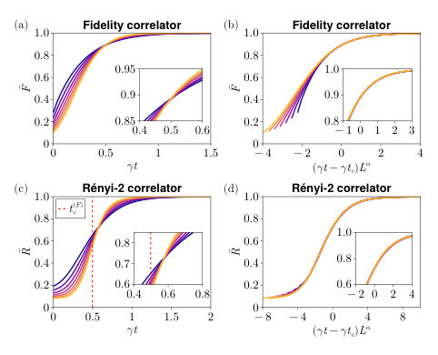
<figcaption class="paper-figure-caption"><b>Fig 1.</b> FIG. 2. Dynamical phase transitions of the fidelity correlator and the R´enyi-2 correlator. (a) Time evolution of the spatially averaged fidelity correlator ¯F as a function of dimensionless time γt. The parameters are set to J/γ = 1 and h = 0. Colors from dark to light represent system sizes L = 6, 7, 8, 9, 10, 11, and 12. The inset highlights the crossing point of the trajec- tories for different L, identifying the critical time t(F ) c of the dynamical transition. (b) Finite-size scaling analysis of the data in (a). All curves collapse onto a single universal scaling function when plotted against the rescaled time (γt −γtc)Lα</figcaption>
</figure>
<figure class="paper-figure-card">
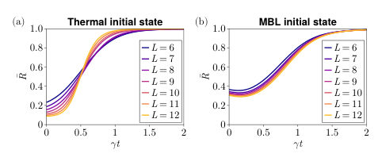
<figcaption class="paper-figure-caption"><b>Fig 2.</b> FIG. 3. Time evolution of the spatially averaged R´enyi-2 correlator ¯R starting from different initial eigenstates of a random-field Ising model. (a) For a thermal initial state (weak disorder), the curves for different system sizes L ex- hibit a crossing point, indicating a discontinuous dynamical transition. (b) For a many-body localized (MBL) initial state (strong disorder), the crossing point is absent.</figcaption>
</figure>
<figure class="paper-figure-card">
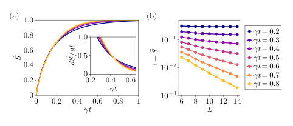
<figcaption class="paper-figure-caption"><b>Fig 3.</b> FIG. 4. Saturation of the global entropy. (a) Time evolu- tion of the normalized global entropy ˜S. Colors from dark to light represent system sizes L = 6, 8, 10, 12, and 14. The inset shows the time derivative d ˜S/dt, where the curves for different system sizes cross at a critical time tsat. (b) System- size dependence of 1 −˜S. For t &gt; tsat, the value exhibits an exponential decay, 1 −˜S ∼e−O(L).</figcaption>
</figure>

**Summary.** The research investigates the non-equilibrium dynamics of spontaneous symmetry breaking in open quantum systems undergoing decoherence. It establishes that this transition is not a smooth relaxation but a sharp dynamical phase transition occurring at a critical time $t_c$. Crucially, the authors demonstrate that macroscopic randomness in the initial state is an indispensable prerequisite for observing this discontinuous singularity.

**Why it may be interesting.** This work provides a rigorous, information-theoretic framework for understanding non-equilibrium quantum dynamics, showing that the *nature* of initial entanglement (random vs. structured) dictates whether symmetry breaking happens abruptly or asymptotically.

Detailed structure

**Main problem.** The study investigates whether the spontaneous symmetry breaking (SSB) transition in a quantum many-body system undergoing decoherence from thermal pure states occurs gradually or via a sharp, discontinuous dynamical phase transition.

**Main result.** The emergence of strong-to-weak symmetry breaking is predicted to be a discontinuous dynamical phase transition at a critical time $t_c$, accompanied by singularities in global entropy and order parameters. This requires the initial state to possess volume-law entanglement (i.e., macroscopic randomness).

**Method.** Theoretical analysis combines exact calculations of correlation functions (like R\'enyi-2 correlators) with numerical simulations of open quantum dynamics governed by Lindblad master equations.

**Model / system.** The models include the dephasing transverse-field Ising model and hard-core boson systems. The dynamics are studied in the context of open quantum systems undergoing local dephasing from highly entangled initial states (e.g., Haar-random pure states).

**Key observables.** Fidelity correlator ($ar{F}$), R\'enyi-2 correlator ($ar{R}$), global entropy ($S$), and purity $P(t)$.

**Important parameters / regimes.** System size ($L$), dephasing rate ($\gamma$), interaction strength ($J$), transverse field ($h$). The critical time $t_c$ is a key parameter.

**Assumptions / limitations.** The analysis relies on self-averaging properties for typical values and utilizes mean-field approximations (single-site, two-site cluster) to capture the finite-size scaling of the transition.

**Figures summary.** Figures illustrate the time evolution of $ar{F}$ and $ar{R}$, showing crossing points indicative of $t_c$. Finite-size scaling analysis confirms that only random/thermal states exhibit a size-independent critical time, while structured states (GHZ) show divergence.

**Paper structure.** The paper systematically compares the dynamics across different initial state types (Haar-random vs. GHZ/Dicke/Rainbow), using multiple correlation metrics ($ar{F}, ar{R}$) and analyzing finite-size scaling to establish the necessary condition—macroscopic randomness—for a discontinuous dynamical phase transition.

Abstract

We investigate the nonequilibrium dynamics of strong-to-weak spontaneous symmetry breaking in many-body quantum systems undergoing decoherence from thermal pure states. For generic initial pure states with volume-law entanglement entropy, we show that the system undergoes a discontinuous dynamical phase transition at a critical time. This transition is accompanied by a singularity in the entropy of the system, which saturates to its maximum value at the same critical time. Through numerical simulations of the dephasing Ising and hard-core boson models, we establish the universality of this transition across different symmetries. Our results reveal that the dynamical emergence of a decohered mixed state from a highly entangled state is not a gradual asymptotic relaxation, but rather a sharp phase transition driven by a sudden collapse of global coherence.

[↑ back to top](#top)

### [Phase controlled spectral topology, dynamic stability and sensitivity in Non-Hermitian Cavity Magnonics](http://arxiv.org/abs/2606.16522v1)

**Authors:** Sachin Singh Bargahi, Rajeev Singh, Biswanath Bhoi  
**Type:** theory · **Category:** other · **PDF:** <https://arxiv.org/pdf/2606.16522v1>  
**Analysis basis:** full PDF text, analyzed in chunks
**Topic relevance:** 🔥 `spintronics-quantum-optics interface` **4/5** · `driven-dissipative phase transition` **3/5** · `interference shaping light` **3/5** · `analog quantum simulation` **2/5** · `correlated / nonlocal dissipation` **2/5** · `exotic spin models in light-matter` **2/5** · `methods for driven-dissipative` **2/5** · `non-equilibrium universality` **2/5** · `Keldysh / 2PI / non-Gaussian methods` **1/5** · `Kondo & dissipative impurity` **1/5** · `Tavis-Cummings & cavity-many-emitter` **1/5** · `correlated cavity matter` **1/5** · `non-equilibrium dynamics` **1/5**

↔ Scroll figures horizontally

<figure class="paper-figure-card">
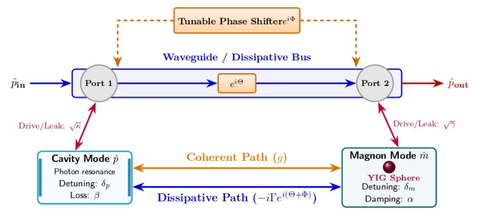
<figcaption class="paper-figure-caption"><b>Fig 1.</b> Figure 1. Schematic of the non-Hermitian cavity-magnon platform. A common waveguide simultaneously drives the cavity photon mode (ˆp) and YIG magnon mode ( ˆm), generating coherent coupling g and reservoir-mediated dissipative coupling −iΓei(Θ+Φ). The propagation phase Θ and external phase Φ provide tunable control of the complex coupling and the resulting output field ˆpout.</figcaption>
</figure>
<figure class="paper-figure-card">
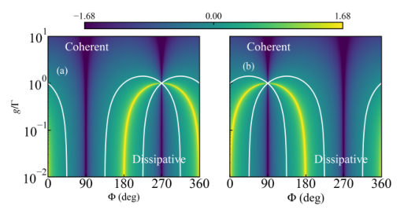
<figcaption class="paper-figure-caption"><b>Fig 2.</b> Figure 2. Phase diagram of the effective cavity–magnon in- teraction in the (Φ, g/Γ) parameter space. The color scale shows R(Φ) = log10 |Im(G)/Re(G)|, which measures the ra- tio between dissipative and coherent coupling strengths. Re- gions with R &gt; 0 are dissipative dominated, whereas regions with R &lt; 0 are coherent dominated. The white contour cor- responds to R = 0, where coherent and dissipative interac- tions contribute equally. The contour branches intersect at (Φ, g/Γ) = (90◦, 1) and (270◦, 1), identifying the exceptional- point conditions of the non-Hermitian cavity–magnon sys- tem. These points separate the coherent- and dissipative- dominated interaction regimes, providing a...</figcaption>
</figure>
<figure class="paper-figure-card">
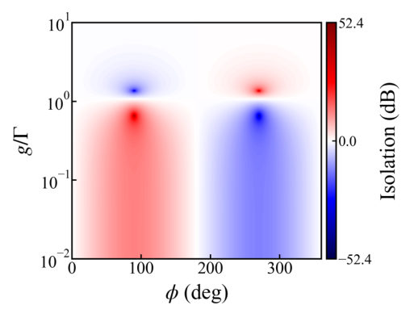
<figcaption class="paper-figure-caption"><b>Fig 3.</b> Figure 3. Isolation ratio as a function of the coupling phase Φ and normalized coupling strength g/Γ. The colormap repre-</figcaption>
</figure>
<figure class="paper-figure-card">
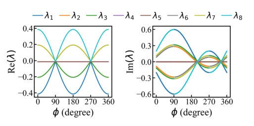
<figcaption class="paper-figure-caption"><b>Fig 4.</b> Figure 4. Real and imaginary parts of the eigenvalue spec- trum of the effective dynamical matrix as a function of the phase ϕ. The upper panel shows the variation of Re(λ), which determines the dynamical stability of the system. Negative values of Re(λ) correspond to stable dissipative evolution, whereas positive values indicate unstable amplification of the modes. The lower panel presents the corresponding imaginary parts Im(λ), which characterize the oscillation frequencies of the hybrid photon–magnon modes and their phase-dependent evolution. The parameters used are κ = 0.01, β = 0.001, α = 0.0001, γ = 0.003, g = 0.06, Γ = 0.05, ∆= 0, and Θ = 0.</figcaption>
</figure>
<figure class="paper-figure-card">
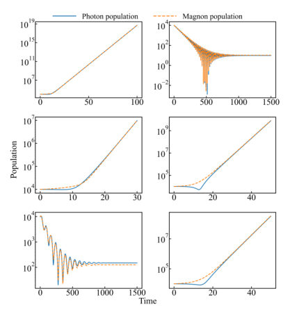
<figcaption class="paper-figure-caption"><b>Fig 5.</b> Figure 5. Time evolution of the photon and magnon pop- ulations for different phase values: (a) ϕ = 0◦, (b) ϕ = 90◦, (c) ϕ = 180◦, (d) ϕ = 200◦, (e) ϕ = 270◦, and (f) ϕ = 320◦. The initial photon and magnon populations are cho- sen as ⟨p†p⟩0 = ⟨m†m⟩0 = 104. The system parameters are κ = 0.01, β = 0.001, α = 0.0001, γ = 0.003, g = 0.1, Γ = 0.2, δp = 0.01, δm = 0.02, and Ωp = Ωm = 0.1. The total damping rate is defined as κT = κ + β + α + γ, while the effective de- tuning is ∆= δm −δp. Depending on the phase ϕ, the system exhibits both stable and unstable dynamical regimes. The unstable regions are characterized by exponential population growth associated with eigenmodes satisfying Re(λj) &gt;...</figcaption>
</figure>

**Summary.** The paper theoretically explores controlling a coupled photon-magnon system using an external interference phase to manipulate its non-Hermitian spectral topology. This control allows for dynamic switching between different physical regimes and demonstrates that the resulting exceptional point physics can be exploited for superior sensing capabilities via square-root scaling of eigenvalue response.

**Why it may be interesting.** This work provides a comprehensive framework linking fundamental concepts of non-Hermitian physics—such as EPs and directional transport—to practical quantum technologies like enhanced sensing, all tunable via phase control in solid-state magnonics.

Detailed structure

**Main problem.** The study investigates how an externally tunable phase can control spectral topology, dynamic stability, and sensing capabilities in a non-Hermitian cavity-magnon system.

**Main result.** The interference phase acts as a universal control parameter, enabling dynamic transitions between different physical regimes (e.g., level repulsion to attraction) while demonstrating enhanced sensing via square-root scaling near exceptional points.

**Method.** Theoretical analysis using non-Hermitian Hamiltonians and master equation formalisms to derive time evolution equations for system operators.

**Model / system.** The platform is a coupled photon-magnon system in a microwave cavity, modeled by an effective Hamiltonian incorporating coherent coupling ($g$) and reservoir-mediated dissipative coupling controlled by an interference phase ($\Theta+\Phi$).

**Key observables.** Exceptional points (EPs), linewidth engineering, nonreciprocal transport ratios ($S_{21}/S_{12}$), dynamic stability (eigenvalue real parts $	ext{Re}(\lambda)$), and sensing responsivity $S$.

**Important parameters / regimes.** The interference phase ($\Theta+\Phi$), coupling strengths ($g, \Gamma$), detunings ($\delta_p, \delta_m$), and external perturbation strength ($\epsilon$).

**Assumptions / limitations.** The analysis relies on the Rotating Wave Approximation (RWA) and assumes steady-state or harmonic time dependence for spectral calculations.

**Figures summary.** Figures illustrate phase diagrams showing transitions between coupling regimes, population dynamics over time for various phases, and eigenvalue splitting ($\Delta\lambda$) scaling near EPs.

**Paper structure.** The paper builds from defining the non-Hermitian Hamiltonian (incorporating phase control) to analyzing spectral properties (EPs, level repulsion/attraction), then extending this analysis to dynamic stability (population evolution) and finally applying it to sensing applications using perturbation theory.

Abstract

We theoretically investigate a non-Hermitian cavity-magnon platform in which coherent photonmagnon interactions and reservoir-mediated dissipative coupling interfere through a single externally tunable phase. We show that this interference phase provides a universal control parameter that continuously rotates the effective coupling between Hermitian and anti-Hermitian regimes, enabling dynamic transitions between level repulsion and level attraction without modifying intrinsic system parameters. The resulting phase-controlled non-Hermitian topology gives rise to exceptional points, linewidth engineering, and zero-damping conditions. Owing to the propagation-direction dependence of the dissipative interaction, the system further exhibits strong nonreciprocal transport and phase-tunable isolation arising from asymmetric hybridization of the cavity and magnon modes. Beyond its spectral and transport properties, we establish a direct connection between nonHermitian spectral topology and nonequilibrium population dynamics. The interference phase governs the stability of the hybrid modes, driving transitions between stable relaxation, critical slowing down near exceptional points, oscillatory energy exchange, and exponentially amplified dynamics. We further demonstrate that the same phase-controlled exceptional topology can be exploited for enhanced sensing, where the eigenvalue response exhibits the characteristic square-root scaling associated with exceptional-point physics. Our results provide a unified framework linking spectral topology, directional transport, dynamical stability, and sensing functionality through reservoirengineered interference in cavity magnonic systems.

[↑ back to top](#top)

### [Charging Quantum Batteries with Chiral Squeezing](http://arxiv.org/abs/2606.16764v1)

**Authors:** Borhan Ahmadi, André H. A. Malavazi, Janine Splettstoesser, Paweł Horodecki, Lei Du  
**Type:** theory · **Category:** other · **PDF:** <https://arxiv.org/pdf/2606.16764v1>  
**Analysis basis:** full PDF text, analyzed in chunks
**Topic relevance:** 🔥 `methods for driven-dissipative` **4/5** · `Keldysh / 2PI / non-Gaussian methods` **3/5** · `analog quantum simulation` **3/5** · `driven-dissipative phase transition` **3/5** · `non-equilibrium dynamics` **3/5** · `correlated / nonlocal dissipation` **2/5** · `non-equilibrium universality` **2/5** · `Frenkel-Kontorova` **1/5** · `correlated cavity matter` **1/5** · `entanglement & information structure` **1/5** · `quantum measurements` **1/5**

↔ Scroll figures horizontally

<figure class="paper-figure-card">
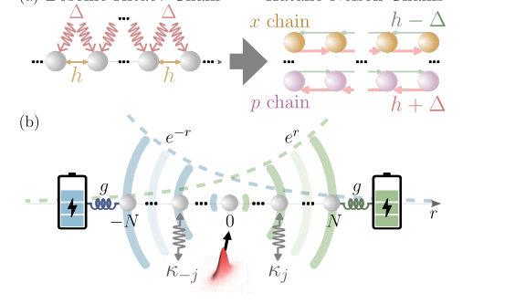
<figcaption class="paper-figure-caption"><b>Fig 1.</b> FIG. 1: (a) A bosonic Kitaev chain (BKC) with nearest- neighbor hopping h and parametric pairing ∆, which is equivalent to two decoupled Hatano-Nelson chains for the x and p quadratures with opposite chiralities. (b) Schematic of the chiral charger: a driven-dissipative BKC of length 2N + 1, with local losses κj and chiral squeezing weights e±r, is excited at the central site j = 0 by a short coherent pulse. The two end sites (j = ±N) are coupled to the batteries through coupling g.</figcaption>
</figure>
<figure class="paper-figure-card">
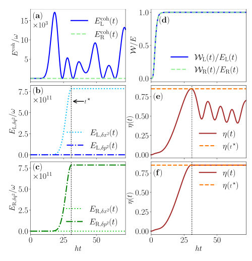
<figcaption class="paper-figure-caption"><b>Fig 2.</b> FIG. 2: Charging dynamics. (a) Coherent contribu- tions to the left- and right-battery stored energies, Ecoh L and Ecoh R . (b) Quadrature-resolved fluctuation contribu- tions to the left-battery stored energy, EL,δx2 and EL,δp2. (c) Same as (b) for the right battery, ER,δx2 and ER,δp2. (d) Extractability of the stored energy, quantified by WL(t)/EL(t) and WR(t)/ER(t). (e, f) Overall charging efficiency η, with the chain kept on for all times in (e) and switched off at t = t⋆in (f). The vertical dotted lines indicate the switch-off time t = t⋆. Parameters: N = 5, ∆/h = 11/12, g/h = 5/12, κj/h = 8.3 × 10−4</figcaption>
</figure>
<figure class="paper-figure-card">
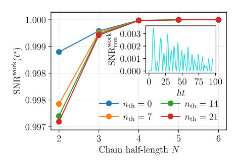
<figcaption class="paper-figure-caption"><b>Fig 3.</b> FIG. 3: Work-like signal-to-noise ratio SNRwork(t⋆), eval- uated at t = t⋆, as a function of the chain half-length N for several thermal occupancies nth. Inset: representa- tive signal-to-noise ratio SNRwork con (t) for a conventional phase-preserving amplifier with uniform on-site gain (see Note 4 of the SM [70]). All other parameters are the same as in Fig. 2.</figcaption>
</figure>
<figure class="paper-figure-card">
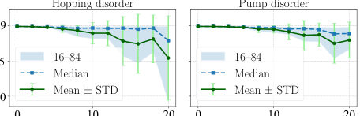
<figcaption class="paper-figure-caption"><b>Fig 4.</b> FIG. 4: SNRwork(t⋆) versus static hopping disorder (left) and pump disorder (right), for a fixed chain half-length N = 5. For each disorder strength, 50 random realiza- tions are sampled. The green solid curves with error bars show the mean ± standard deviation, the blue dashed curves denote the median, and the shaded regions indi- cate the 16th–84th percentile range. All other parame- ters are the same as in Fig. 2.</figcaption>
</figure>
<figure class="paper-figure-card">
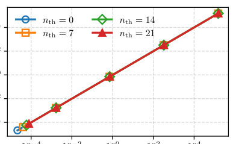
<figcaption class="paper-figure-caption"><b>Fig 5.</b> FIG. 5: Ergotropy W(t⋆) as a function of the battery- energy fluctuation σE(t⋆), evaluated at the optimal charging time t⋆. Each curve is obtained by varying the chain half-length N from 2 to 6 at fixed bath thermal occupancy nth, as in Fig. 3. The data lie almost on the same straight line, showing that W(t⋆) and σE(t⋆) grow in a correlated manner as N increases. All other param- eters are the same as in Fig. 2.</figcaption>
</figure>

**Summary.** The paper proposes using a driven bosonic Kitaev chain as an advanced charger for quantum batteries. By exploiting chiral transport mechanisms, the system converts passive input fluctuations into highly ordered, extractable energy. This results in a high work-like Signal-to-Noise Ratio that remains robust even when thermal noise or moderate disorder is present.

**Why it may be interesting.** This work provides a detailed theoretical framework for engineering quantum energy storage, moving beyond simple coherent pumping by harnessing inherent quantum noise via engineered lattice dynamics (chiral squeezing).

Detailed structure

**Main problem.** The research addresses how to efficiently charge quantum batteries by converting unavoidable input fluctuations into ordered, extractable work using a driven bosonic Kitaev chain.

**Main result.** The proposed scheme achieves a near-unity work-like Signal-to-Noise Ratio (SNR) robustly against thermal noise and moderate disorder. This is achieved because fluctuation dynamics dominate the stored energy over coherent input contributions.

**Method.** The analysis uses quantum Langevin equations in quadrature representation to track first moments and covariance matrices, allowing for the calculation of stored energy and ergotropy.

**Model / system.** The system is a driven bosonic Kitaev chain (BKC) coupled to two harmonic oscillator batteries at its ends. The dynamics are governed by a total Hamiltonian incorporating hopping ($h$), parametric pumping ($\Delta$), coupling, and external driving/dissipation.

**Key observables.** Work-like Signal-to-Noise Ratio ($	ext{SNR}_{	ext{work}}$), Charging Efficiency ($\eta$), Stored Energy ($E_\alpha$), and Quadrature Fluctuations ($\delta x^2, \delta p^2$).

**Important parameters / regimes.** Chiral squeezing parameter $r$, disorder strength ($\delta\omega$), chain half-length ($N$), and thermal occupancy ($n_{th}$).

**Assumptions / limitations.** The analysis relies on linear Gaussian descriptions of the dynamics, assuming a stable regime where $|h| > |\Delta|$ to avoid parametric instability.

**Figures summary.** Figures illustrate charging dynamics comparing coherent vs. fluctuation energy contributions and showing $	ext{SNR}_{	ext{work}}$ dependence on chain length and disorder strength.

**Paper structure.** The paper develops the model using Hamiltonian/Langevin equations, analyzes the role of chiral transport in converting fluctuations to stored energy, quantifies performance metrics like SNR and efficiency, and finally tests robustness against various types of disorder.

Abstract

We propose a quantum-battery charger based on a driven bosonic Kitaev chain (BKC), where chiral squeezing converts passive input fluctuations into ordered, non-passive battery states. While a coherent input pulse exhibits phase-sensitive chiral transport, the charging dynamics is dominated by bidirectionally propagating fluctuations that are amplified and squeezed into orthogonal quadratures at opposite chain ends. In contrast to conventional phase-preserving amplifiers, our scheme stores largely extractable energy and achieves a work-like signal-to-noise ratio (SNR) near unity, even in the presence of thermal noise and moderate symmetry-preserving disorder.

[↑ back to top](#top)

### [Physically Motivated Ansatz for Open Fermionic Systems on Quantum Computer](http://arxiv.org/abs/2606.16823v1)

**Authors:** Yi Liu, Xiaopeng Li, Zhen Liu, Zhenyu Li  
**Type:** theory · **Category:** statistical mechanics · **PDF:** <https://arxiv.org/pdf/2606.16823v1>  
**Analysis basis:** full PDF text, analyzed in chunks
**Topic relevance:** 🔥 `methods for driven-dissipative` **4/5** · 🔥 `non-equilibrium dynamics` **4/5** · `Keldysh / 2PI / non-Gaussian methods` **3/5** · `correlated / nonlocal dissipation` **3/5** · `driven-dissipative phase transition` **3/5** · `non-equilibrium universality` **2/5** · `Kondo & dissipative impurity` **1/5** · `analog quantum simulation` **1/5** · `entanglement & information structure` **1/5** · `exotic spin models in light-matter` **1/5** · `scars & prethermalization` **1/5**

↔ Scroll figures horizontally

<figure class="paper-figure-card">
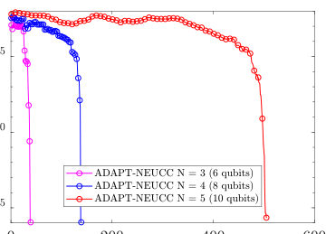
<figcaption class="paper-figure-caption"><b>Fig 1.</b> Figure 1. (a) NESS infidelity for an n = 6 (12-qubit) XXZ model with J = ε = µ = 1. The dVQE and HPA circuits have 2312 and 2304 variational parameters, respectively. (b) NESS infidelity as a function of the number of ansatz operators in ADAPT-NE-UCC for XXZ models with J = µ = 1, ∆= 0.5, ε = 0.1.</figcaption>
</figure>
<figure class="paper-figure-card">
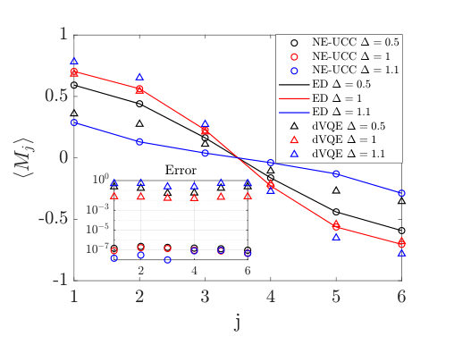
<figcaption class="paper-figure-caption"><b>Fig 2.</b> Figure 2. Scaled magnetization ⟨Mj⟩for strongly driven (µ = 1) 6-site XXZ model with J = ε = 1. Inset shows the corresponding absolute errors relative to ED result.</figcaption>
</figure>
<figure class="paper-figure-card">
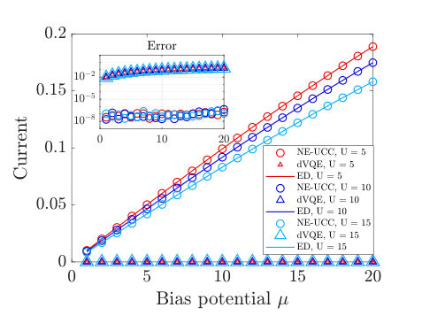
<figcaption class="paper-figure-caption"><b>Fig 3.</b> Figure 3. Current as a function of the bias potential µ under different interaction strengths U. The leads are held at equal temperatures TL = TR = 10 with symmetric chemical poten- tials µL = −µR = µ. The inset presents the corresponding absolute errors relative to ED.</figcaption>
</figure>
<figure class="paper-figure-card">
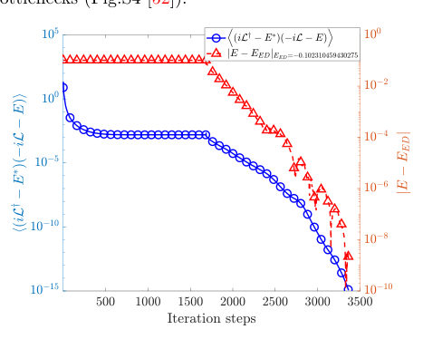
<figcaption class="paper-figure-caption"><b>Fig 4.</b> Figure 4. Liouvillian gap optimization for the n = 6 XXZ model in the subspace Na −N˜a = ±1 with J = ∆= ε = µ = 1.</figcaption>
</figure>

**Summary.** This paper tackles the challenging task of finding Non-Equilibrium Steady States (NESS) for open fermionic systems using quantum computers. The authors introduce NE-UCC, a novel, physically motivated ansatz derived from Unitary Coupled Cluster theory adapted for Liouvillian dynamics. This method significantly outperforms existing variational approaches by maintaining high accuracy even in strongly correlated and far-from-equilibrium regimes.

**Why it may be interesting.** This work directly addresses computational bottlenecks in simulating open quantum systems by providing a physically informed variational ansatz that overcomes the barren plateau problem inherent to general VQAs.

Detailed structure

**Main problem.** The core problem is determining Non-Equilibrium Steady States (NESS) for open fermionic systems, which requires solving the Lindblad master equation.

**Main result.** The proposed NE-UCC ansatz reliably converges to the steady state with significantly reduced infidelity (up to ten orders of magnitude improvement) compared to standard Hardware-Efficient Ansätze (HEA).

**Method.** The authors employ Variational Quantum Algorithms (VQA), specifically introducing a physically motivated ansatz called NE-UCC, which extends Unitary Coupled Cluster theory to incorporate weak Liouvillian symmetry.

**Model / system.** The study models open fermionic systems governed by the Lindblad master equation. Specific examples include an XXZ boundary-driven transport model and a three-site quantum heat engine.

**Key observables.** Infidelity ($1 - |\langle
ho|
ho_{ED}
angle|^2$), Magnetization ($\langle M_j 
angle$), Particle Current ($\langle J_\alpha 
angle$), and the Liouvillian gap.

**Important parameters / regimes.** Strongly correlated regimes, far from equilibrium, and specific symmetry constraints derived from the superfermion formalism.

**Assumptions / limitations.** The method assumes that standard UCC compilation strategies can be successfully applied to NE-UCC due to the adopted superfermion formalism mapping.

**Figures summary.** Figure 1(a) compares NESS infidelity for the XXZ model across different ansatzes (dVQE, etc.). Figure 3 shows accurate current vs. bias potential curves for the heat engine using NE-UCC versus failures of dVQE. Figure 4 compares Liouvillian gap precision.

**Paper structure.** The paper introduces the problem of NESS determination via VQA, proposes and details the NE-UCC ansatz based on weak symmetry constraints, validates its performance against HEA using benchmark models (XXZ chain, heat engine), and discusses extensions like ADAPT-NE-UCC.

Abstract

Determining non-equilibrium steady states (NESS) of open fermionic systems is a fundamental problem akin to finding ground states of closed systems. To address this, variational quantum algorithms can be used to solve the Lindblad master equation, much like the Schrödinger equation, yet ansatz design for NESS remains challenging. Existing approaches rely mostly on hardware-efficient ansätze (HEA), which suffer from the barren plateau problem. Here, we introduce a physically motivated ansatz named NE-UCC. Numerical simulations demonstrate that NE-UCC reliably converges to the steady state even in strongly correlated regimes far from equilibrium, reducing the infidelity by up to ten orders of magnitude compared to HEA. Furthermore, NE-UCC facilitates the exploration of excited eigenmodes with specific symmetries.

[↑ back to top](#top)

### [Enhanced Sensitivity near a Quantum Exceptional Point in the Absence of Engineered Dissipation](http://arxiv.org/abs/2606.16060v1)

**Authors:** Réouven Assouly, Harry Hanlim Kang, Aziza Almanakly, Michael A. Gingras, Bethany M. Niedzielski, Hannah Stickler, Mollie E. Schwartz, Kyle Serniak, Max Hays, Jeffrey A. Grover, William D. Oliver  
**Type:** experiment · **Category:** other · **PDF:** <https://arxiv.org/pdf/2606.16060v1>  
**Analysis basis:** full PDF text, analyzed in chunks
**Topic relevance:** 🔥 `driven-dissipative phase transition` **4/5** · `analog quantum simulation` **3/5** · `methods for driven-dissipative` **3/5** · `non-equilibrium dynamics` **3/5** · `non-equilibrium universality` **2/5** · `quantum optics experiment` **2/5** · `QC/QI experiment` **1/5** · `Tavis-Cummings & cavity-many-emitter` **1/5** · `correlated / nonlocal dissipation` **1/5** · `correlated cavity matter` **1/5** · `quantum measurements` **1/5**

↔ Scroll figures horizontally

<figure class="paper-figure-card">
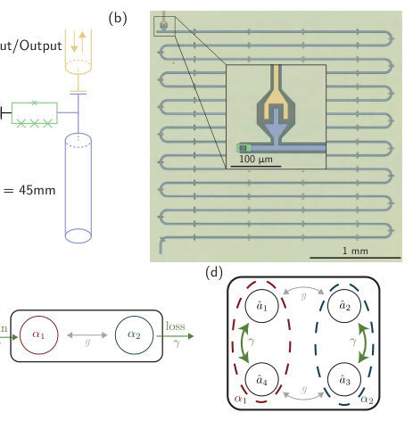
<figcaption class="paper-figure-caption"><b>Fig 1.</b> FIG. 1. Device and experimental setup. (a) Electrical schematic of the device: a 45 mm transmission line (blue) shunted by a SNAIL (green) and capacitively coupled to a feedline (yellow). (b) False-color micrograph of the device, with a zoomed-in view of the capacitor and SNAIL in the inset. (c) Schematic of a PT dimer. (d) Closed four-mode system onto which the PT dimer is mapped. Gray arrows represent beam-splitting interactions; green arrows represent two-mode squeezing.</figcaption>
</figure>
<figure class="paper-figure-card">
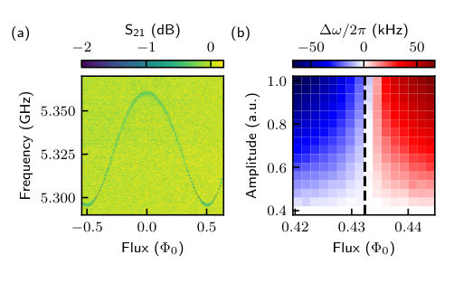
<figcaption class="paper-figure-caption"><b>Fig 2.</b> FIG. 2. Basic characterization of mode ˆa2. (a) Mode frequency as a function of flux bias. (b) Frequency shift as a function of flux bias and excitation amplitude near the Kerr- free point. At zero flux, the resonant frequency shifts down- ward with increasing power, indicating a negative Kerr coef- ficient. At half flux, or 0.5Φ0, the Kerr coefficient is positive; near a flux of 0.432Φ0, the Kerr response cancels.</figcaption>
</figure>
<figure class="paper-figure-card">
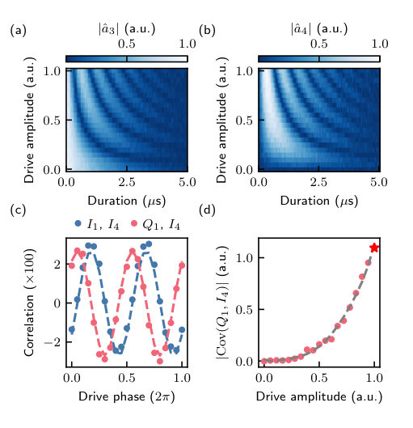
<figcaption class="paper-figure-caption"><b>Fig 3.</b> FIG. 3. Calibration of parametric interactions. (a),(b) Measured amplitudes of modes ˆa3 and ˆa4, respectively, as functions of the amplitude and duration of the mode- swapping pump g34 when the system is initialized with a coherent state in mode ˆa3. (c) Correlation between single- shot measurements of the quadratures of modes ˆa1 and ˆa3 as a function of the two-mode squeezing pump phase γ14. The correlations are fitted with a cosine. (d) Amplitude of the covariance oscillations as a function of drive amplitude. The correlation is fitted with a full Gaussian model with two fit parameters, yielding a two-mode squeezing rate of 118 kHz/V (See Supplementary Material). The red star...</figcaption>
</figure>
<figure class="paper-figure-card">
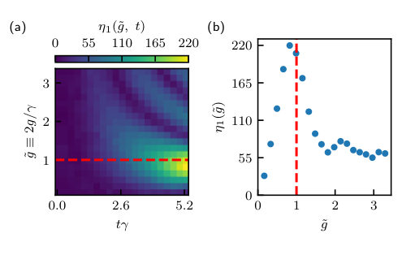
<figcaption class="paper-figure-caption"><b>Fig 4.</b> FIG. 5. Sensitivity near the quantum exceptional point. (a) Sensitivity to perturbations in the coupling ˜g, η1, extracted from the measurement α1 as a function of the beam-splitter coupling rate g and pulse duration t. (b) Max- imum sensitivity η1 obtained from α1 as a function of g. The dashed line indicates the location of the exceptional point. Enhanced sensitivity is observed in its vicinity.</figcaption>
</figure>
<figure class="paper-figure-card">
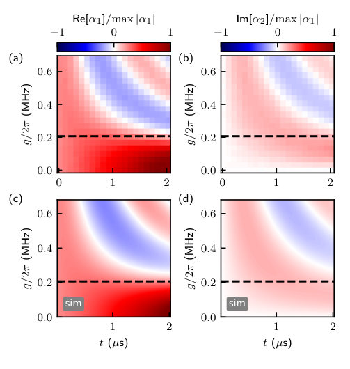
<figcaption class="paper-figure-caption"><b>Fig 5.</b> FIG. 4. Time-domain measurements of the nor- malized supermodes α1 and α2. (a) The real part of the normalized supermode α1 as a function of the mode-swapping coupling rate g and the pulse duration t. The supermodes are normalized such that the maximum of the absolute value of the amplitude is one. The dashed line represents the location of the EP: g = γ/2. (b) The imaginary part of the super- mode α2. For better visual comparison, α2 is normalized by the same factor as α1. (c) Fit to (a). The simulation model incorporates mode loss rates Γ1. The two-mode-squeezing rates, γ14 and γ23, along with the readout efficiencies of the two supermodes, are treated as fit parameters. The model agrees...</figcaption>
</figure>

**Summary.** The authors realized a four-mode superconducting circuit to simulate the dynamics of a PT dimer without using engineered loss or gain. They successfully demonstrated enhanced sensitivity near the Quantum Exceptional Point by monitoring supermode evolution, confirming that such non-Hermitian phenomena can be robustly studied in coherent quantum systems.

**Why it may be interesting.** This work provides a crucial experimental demonstration of non-Hermitian physics (EPs) in a solid-state platform, moving beyond simple gain/loss implementations to use purely coherent parametric drives for quantum simulation and sensing.

Detailed structure

**Main problem.** The goal was to demonstrate enhanced quantum sensing near a Quantum Exceptional Point (EP) in a non-Hermitian system without relying on engineered gain and loss mechanisms.

**Main result.** The experiment successfully emulated PT dimer dynamics using coherent parametric drives, achieving enhanced sensitivity near the EP in a regime limited by classical noise rather than quantum backaction.

**Method.** The researchers used a superconducting coplanar-waveguide resonator coupled to a SNAIL to realize and probe the four-mode system Hamiltonian.

**Model / system.** The physical system is a closed four-mode bosonic circuit emulating a PT dimer, whose dynamics are governed by an effective Hamiltonian involving parametric couplings ($\hat{H} \propto g (\hat{a}^\dagger_1\hat{a}_2 - \hat{a}^\dagger_3\hat{a}_4) + i\gamma/2 (\hat{a}^\dagger_1\hat{a}^\dagger_4 - \hat{a}^\dagger_2\hat{a}^\dagger_3) + H.c.$).

**Key observables.** Supermode amplitudes ($\alpha_1, \alpha_2$), eigenvalue splitting ($|\omega_+ - \omega_-|$), and the sensitivity metric $\eta_i(	ilde{g}, t)$.

**Important parameters / regimes.** The EP occurs at $g = \gamma/2$; the system is characterized by coupling strengths $g$ and decay rates $\gamma$.

**Assumptions / limitations.** The analysis assumes that the observed enhanced sensitivity near the EP is dominated by the derivative of the supermode amplitude with respect to the coupling strength, rather than noise reduction.

**Figures summary.** Figures show mode frequency vs. flux bias (Fig. 2a), time evolution of supermodes ($\alpha_1, \alpha_2$) showing Rabi-like oscillations near the EP (Fig. 4), and sensitivity plots ($\eta_i$ maximized at the EP) (Fig. 5).

**Paper structure.** The paper first introduces the theoretical framework of PT dimers and EPs. It then details the experimental realization using superconducting circuits, followed by calibration procedures for individual modes and parametric drives. Finally, it presents time-domain measurements demonstrating the controlled dynamics and enhanced sensing near the EP.

Abstract

Non-Hermitian systems exhibit phenomena absent from Hermitian systems, including exceptional points (EPs), at which two or more eigenvectors coalesce. Conventional implementations rely on gain and loss, which strongly limit quantum coherence. Here, following a proposal by Wang and Clerk (PRA 2019), we realize a closed four-mode quantum system that emulates the dynamics of a PT dimer - two coupled resonators with balanced gain and loss - without engineered dissipation. The four modes are implemented as harmonics of a superconducting coplanar-waveguide resonator, with parametric couplings engineered using a current-pumped SNAIL. We use this device as a sensor for small variations in the PT dimer coupling strength. From signal-to-noise-ratio measurements, we observe enhanced sensitivity near the EP in a non-quantum-limited regime.

[↑ back to top](#top)

### [Generalized Kerr-Cat Qubit Codes](http://arxiv.org/abs/2606.14901v1)

**Authors:** Alonso Viladomat, Shahram Dehdashti, Amin Kargarian, Janis Nötzel, Peter van Loock  
**Type:** theory · **Category:** quantum information and computing · **PDF:** <https://arxiv.org/pdf/2606.14901v1>  
**Analysis basis:** full PDF text, analyzed in chunks
**Topic relevance:** 🔥 `methods for driven-dissipative` **4/5** · `correlated cavity matter` **3/5** · `driven-dissipative phase transition` **3/5** · `non-equilibrium dynamics` **3/5** · `correlated / nonlocal dissipation` **2/5** · `entanglement & information structure` **2/5** · `non-equilibrium universality` **2/5** · `Keldysh / 2PI / non-Gaussian methods` **1/5** · `analog quantum simulation` **1/5** · `measurement-induced transitions` **1/5**

↔ Scroll figures horizontally

<figure class="paper-figure-card">
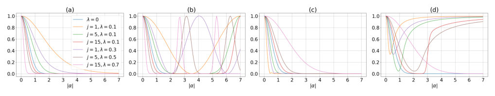
<figcaption class="paper-figure-caption"><b>Fig 1.</b> FIG. 1. Overlap of the positive and negative KCSs are depicted in plots (a) and (b), respectively. Plots (c) and (d) illustrate the overlap for the BGKCSs, considering both positive and negative Kerr parameters.</figcaption>
</figure>
<figure class="paper-figure-card">
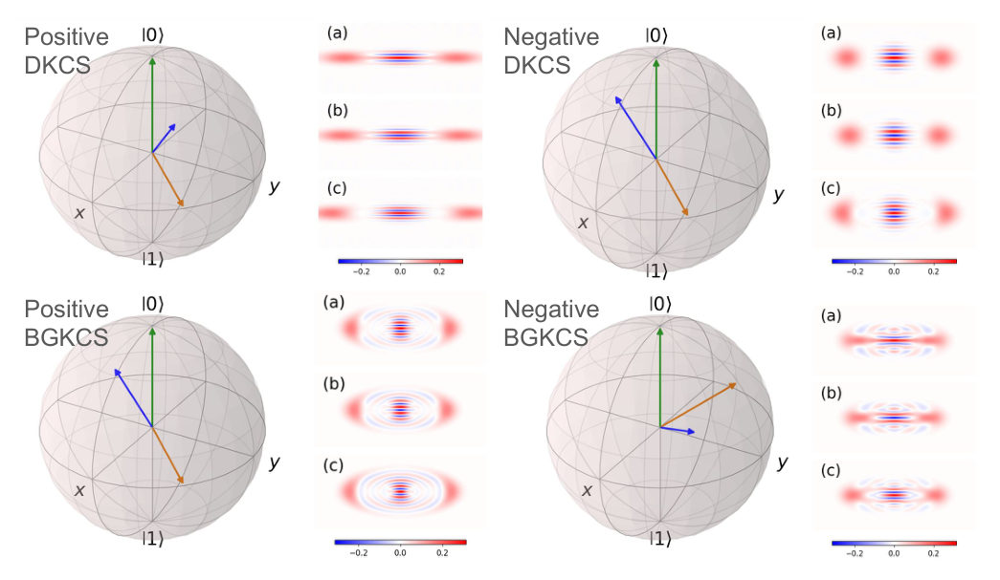
<figcaption class="paper-figure-caption"><b>Fig 2.</b> FIG. 2. The green vector represents the cat state, while the orange and blue vectors depict the effects of the standard loss and dephasing operators, respectively, on the Bloch sphere. The Wigner quasi-probability distribution function W(X, Y ) for the cat state is shown in plot (a), while plots (b) and (c) illustrate the Wigner functions corresponding to the influence of the loss and dephasing operators. For all plots, the parameters are set as follows: λ = ±0.5 for DKCSs, and λ = ±0.2, α = 1.5 for the Wigner function visualizations.</figcaption>
</figure>
<figure class="paper-figure-card">
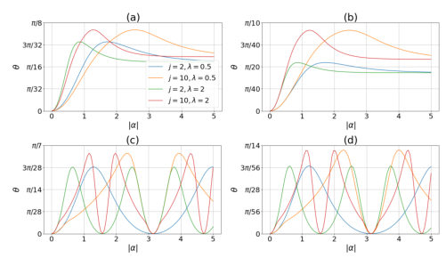
<figcaption class="paper-figure-caption"><b>Fig 3.</b> FIG. 3. The angle ϑ, denoted as arccos KL, is measured between the states C±, λ and ˆA C∓, λ , as well as between the states C±, λ and ˆa C∓, λ , as a function of |α| for posi- tive Kerr parameters, depicted in plots (a) and (b). Similarly, plots (c) and (d) illustrate the same curves for negative Kerr parameters.</figcaption>
</figure>
<figure class="paper-figure-card">
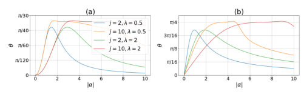
<figcaption class="paper-figure-caption"><b>Fig 4.</b> FIG. 4. The angle ϑ = arccos(KL) between the states C±, λ</figcaption>
</figure>
<figure class="paper-figure-card">
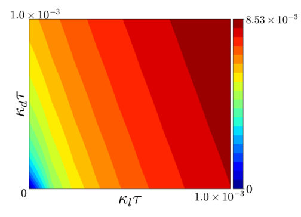
<figcaption class="paper-figure-caption"><b>Fig 5.</b> FIG. 5. Heatmap of the average infidelity (logarithmic scale) for SCS under the combined effect of dephasing κdτ and photon loss κlτ errors. The coherent state corresponds to |α| = 1.5.</figcaption>
</figure>

**Summary.** The paper introduces generalized Kerr-Cat Qubit Codes as advanced bosonic error correction schemes. It rigorously analyzes how these codes perform under realistic combined photon loss and dephasing noise using master equation techniques. The key finding is that the Barut-Girardello Kerr cat states (BGKCSs) offer superior resilience, making them promising candidates for fault-tolerant quantum computation in nonlinear photonic systems.

**Why it may be interesting.** This work provides a concrete theoretical framework for fault-tolerant quantum computation in photonic platforms by engineering the error correction mechanism directly into the system's dissipative dynamics rather than relying solely on external syndrome measurements.

Detailed structure

**Main problem.** The study addresses developing robust quantum error correction (QEC) techniques for bosonic systems, specifically overcoming the limitations of standard cat codes under combined photon-loss and dephasing noise.

**Main result.** Kerr cat encodings significantly outperform conventional cat codes against combined loss and dephasing noise, and these states can emerge as effective steady states in driven-dissipative dynamics.

**Method.** The authors employ a systematic theoretical analysis using the Lindblad master equation framework to model decoherence, optimizing recovery operations via convex optimization.

**Model / system.** The system models bosonic quantum information encoded in Schrödinger cat states constructed from Kerr-type coherent states (DKCSs and BGKCSs). The dynamics are governed by a Hamiltonian incorporating Kerr nonlinearity ($\hat{H} \propto \lambda \hat{n}^2$) and subjected to photon loss and dephasing noise.

**Key observables.** Average channel fidelity ($F_{	ext{avg}}$), average infidelity, distinguishability quantified via the Knill-Laflamme (KL) condition angle ($\vartheta$), and time evolution of overlap fidelity $P(t)$.

**Important parameters / regimes.** Kerr parameter ($\lambda$), coherent-state amplitude ($\alpha$), photon loss rate ($\kappa_l$), dephasing rate ($\kappa_d$), and the driving strength/time $	au$.

**Assumptions / limitations.** The analysis often relies on approximations such as $j \gg 1$ or small parameters regimes ($\sqrt{\lambda}|\alpha| \ll 1$). The comparison is made against standard cat codes, which are shown to be vulnerable.

**Figures summary.** Figures primarily consist of heatmaps showing average infidelity dependence on combined noise rates ($\kappa_d	au$ vs $\kappa_l	au$) for DKCSs and BGKCSs, demonstrating superior resilience for the latter. Evolution plots track fidelity decay over time under various noise conditions.

**Paper structure.** The paper systematically analyzes the error correction capability by first defining the Kerr-modified states, then applying the Lindblad master equation to model combined loss/dephasing noise, quantifying performance using KL criteria and average infidelity, and finally demonstrating state robustness via steady-state analysis under two-photon driving.

Abstract

We present a systematic study of Schrödinger cat codes constructed from Kerr-type coherent states, including displaced Kerr coherent states and Barut--Girardello Kerr coherent states, each admitting two distinct families determined by the sign of the Kerr nonlinearity. By tuning the Kerr parameter and coherent-state amplitude, these states interpolate between $\mathfrak{su}(2)$, $\mathfrak{su}(1,1)$ coherent states, providing a unified and versatile foundation for this type of bosonic quantum error correction. Unlike standard two-component Schrödinger cat codes, where a single photon-loss event induces an uncorrectable bit-flip, the nonlinear phase-space structure of Kerr cat states enables simultaneous detection and correction of both photon-loss and dephasing errors within a unified recovery framework, with optimal recovery operations determined via convex optimization. We demonstrate that Kerr cat encodings significantly outperform conventional cat codes under combined loss and dephasing noise, and that judicious parameter optimization can suppress both error channels to a level that reduces the overhead of additional error correction layers. We further show that Kerr-deformed coherent-state manifolds under engineered two-photon driving emerge as effective steady states of driven-dissipative dynamics, with single-photon decoherence strongly suppressed and leakage outside the protected manifold appearing only as higher-order corrections in the deformation strength. Our extended formalism identifies generalized Kerr Schrödinger cat codes as promising candidates for fault-tolerant bosonic quantum computation in experimental platforms such as nonlinear photonics.

[↑ back to top](#top)

### [Microscopic exceptional points in the post-selected open Jaynes--Cummings model](http://arxiv.org/abs/2606.14982v1)

**Authors:** B. M. Rodríguez-lara  
**Type:** theory · **Category:** other · **PDF:** <https://arxiv.org/pdf/2606.14982v1>  
**Analysis basis:** full PDF text, analyzed in chunks
**Topic relevance:** 🔥 `methods for driven-dissipative` **4/5** · `Tavis-Cummings & cavity-many-emitter` **3/5** · `correlated cavity matter` **3/5** · `driven-dissipative phase transition` **3/5** · `analog quantum simulation` **2/5** · `correlated / nonlocal dissipation` **2/5** · `non-equilibrium universality` **2/5** · `Keldysh / 2PI / non-Gaussian methods` **1/5** · `Kondo & dissipative impurity` **1/5** · `non-equilibrium dynamics` **1/5**

↔ Scroll figures horizontally

<figure class="paper-figure-card">
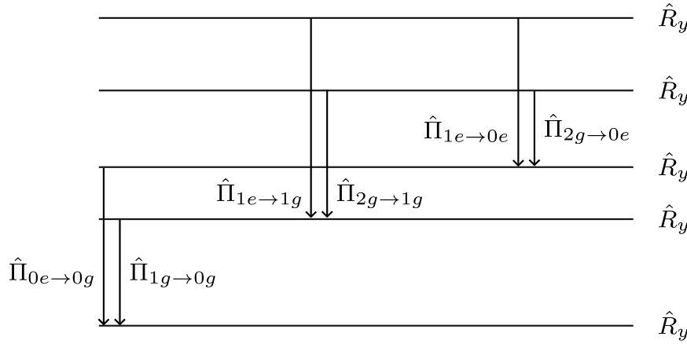
<figcaption class="paper-figure-caption"><b>Fig 1.</b> FIG. 1. Diagonal frame transition ladder for the first JC sectors. The levels show the rotated</figcaption>
</figure>
<figure class="paper-figure-card">
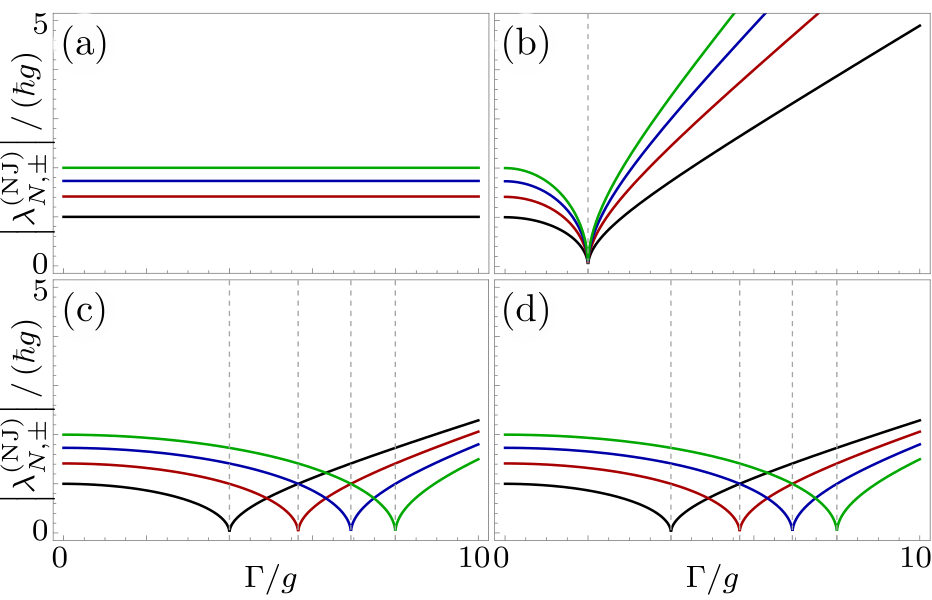
<figcaption class="paper-figure-caption"><b>Fig 2.</b> FIG. 2. Absolute value of the doublet relative conditioned eigenvalues, |λ(NJ) N,± |/(ℏg), for the</figcaption>
</figure>

**Summary.** The paper develops a detailed microscopic theory to analyze exceptional points in the open Jaynes–Cummings model. By using advanced techniques like partial Bohr-frequency resolution, it derives an effective non-Hermitian Hamiltonian that accurately captures system-reservoir interactions. The key contribution is identifying novel EP regimes beyond standard phenomenological models, which has implications for engineering quantum devices.

**Why it may be interesting.** This work provides a rigorous, microscopic foundation for analyzing spectral singularities (EPs) in open quantum systems relevant to cavity QED and circuit-QED platforms by correctly handling the transition between full and partial frequency resolution near critical points.

Detailed structure

**Main problem.** To derive a microscopic, post-selected no-jump effective Hamiltonian for the open Jaynes–Cummings model and analyze its exceptional point (EP) physics in regimes where decay rates are comparable to Rabi frequencies.

**Main result.** The analysis recovers known single-excitation EPs but also identifies new regimes, such as a second-order EP occurring in every excitation sector under equal correlated losses with orthogonal channel phase.

**Method.** The authors use partial Bohr-frequency resolution on the Born-Markov master equation to construct a non-Hermitian effective Hamiltonian, which is then analyzed using $	ext{su}(2)$ algebra techniques.

**Model / system.** The system is the open Jaynes–Cummings model (coupling a bosonic mode to a two-level system) coupled to a zero-temperature bosonic reservoir. The dynamics are described by deriving an effective non-Hermitian Hamiltonian from the full Lindblad master equation.

**Key observables.** Exceptional Points (EPs), absolute value of doublet relative conditioned eigenvalues $|\lambda_{N,\pm}|/(\hbar g)$, and spectral singularities.

**Important parameters / regimes.** Lamb-shifted detuning, diagonal loss imbalance, reservoir-modified coupling strength, and the ratio of losses to coupling constants.

**Assumptions / limitations.** The derivation relies on the Born–Markov approximation and utilizes partial Bohr-frequency resolution near EPs.

**Figures summary.** Figure 1 illustrates the transition ladder for JC sectors using frequency-resolved decay operators. Figure 2 compares the absolute value of doublet relative conditioned eigenvalues across four different loss models (independent, correlated, etc.) for various excitation numbers N.

**Paper structure.** The paper first establishes the microscopic framework by deriving the master equation and then employs partial Bohr-frequency resolution to construct the non-Hermitian Hamiltonian. The core analysis involves calculating EPs using this derived Hamiltonian, comparing results across different loss models, and highlighting novel physical regimes.

Abstract

Phenomenological non-Hermitian Hamiltonians track selected signatures of complex reservoir dynamics, while post-selected no-jump effective Hamiltonians derived from microscopic open-system theory reveal the underlying system--reservoir physics. We derive such a Hamiltonian for the open Jaynes--Cummings model using a Moore--Penrose normalized $\mathrm{su}(2)$ representation that removes the vacuum-sector singularity and diagonalizes the full Hamiltonian by one operator rotation. Starting from a zero-temperature bosonic reservoir, we obtain a Gorini--Kossakowski--Sudarshan--Lindblad master equation under the Born--Markov approximation with full Bohr-frequency resolution. We use partial Bohr-frequency resolution to build a consistent post-selected no-jump Hamiltonian near exceptional points, where decay rates become comparable to Rabi frequencies and remove the scale separation behind full resolution. The normalized $\mathrm{su}(2)$ form of the resulting non-Hermitian Jaynes--Cummings Hamiltonian reveals the effects of Lamb-shifted detuning, diagonal loss imbalance, and reservoir-modified coupling. Our microscopic exceptional-point analysis recovers the experimentally reported single-excitation exceptional point for unequal independent losses and identifies regimes absent from the standard phenomenological model; for example, equal correlated losses with orthogonal channel phase produce a second-order exceptional point at the same loss-to-coupling ratio in every excitation sector.

[↑ back to top](#top)

### [Quantum coherence and Leggett-Garg inequality](http://arxiv.org/abs/2606.15717v1)

**Authors:** A. Jalal, S. M. Fazeli, M. M. Ettefaghi  
**Type:** theory · **Category:** other · **PDF:** <https://arxiv.org/pdf/2606.15717v1>  
**Analysis basis:** full PDF text, analyzed in chunks
**Topic relevance:** 🔥 `quantum measurements` **4/5** · `measurement-induced transitions` **3/5** · `methods for driven-dissipative` **3/5** · `Keldysh / 2PI / non-Gaussian methods` **2/5** · `correlated / nonlocal dissipation` **2/5** · `driven-dissipative phase transition` **2/5** · `entanglement & information structure` **2/5** · `non-equilibrium dynamics` **2/5** · `analog quantum simulation` **1/5** · `non-equilibrium universality` **1/5**

↔ Scroll figures horizontally

<figure class="paper-figure-card">
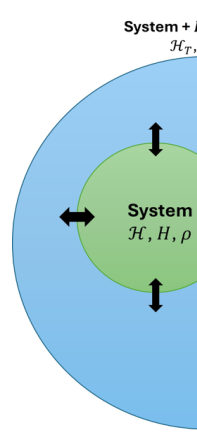
<figcaption class="paper-figure-caption"><b>Fig 1.</b> Figure 1: A schematic representation of the system and its environment in open quantum system.</figcaption>
</figure>
<figure class="paper-figure-card">
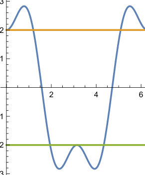
<figcaption class="paper-figure-caption"><b>Fig 2.</b> Figure 2: Violation of the ‌LGI for a two-state system in the framework of isolated quantum mechanics. All measurements are performed along the z-direction. The system evolves with Hamiltonian ˆH = 1</figcaption>
</figure>
<figure class="paper-figure-card">
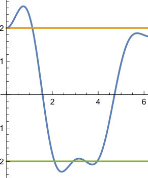
<figcaption class="paper-figure-caption"><b>Fig 3.</b> Figure 3: Violation of the LGI for a two-state system in the framework of open quantum mechanics (The unit of τ is the inverse of the damping parameters γi.). All measurements are performed along the z-direction, and γ1 = γ2 = 2γ3 = 0.03.</figcaption>
</figure>
<figure class="paper-figure-card">
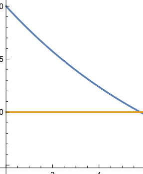
<figcaption class="paper-figure-caption"><b>Fig 4.</b> Figure 4: The quantity MR as a function of τ for a two-state system in the framework of open quantum mechanics. γ1 = γ2 = 2γ3 = 0.03.</figcaption>
</figure>

**Summary.** This paper investigates how environmental decoherence affects the violation of the Leggett-Garg inequality (LGI) in open quantum systems. Using the Lindblad equation and pseudo-density matrices, the authors derive a quantitative criterion showing that LGI violation is suppressed over time by environmental noise. This establishes a direct measure linking coherence preservation to the feasibility of observing non-classical correlations.

**Why it may be interesting.** This work provides a rigorous, quantitative link between fundamental non-classical resources (coherence) and macroscopic constraints (LGI), which is crucial for understanding the limits of quantum measurements in realistic noisy environments relevant to AMO physics.

Detailed structure

**Main problem.** The paper aims to establish a quantitative relationship between quantum coherence and the violation of the Leggett-Garg inequality (LGI) in open quantum systems.

**Main result.** It is shown that LGI violation persists only as long as environmental decoherence does not occur, leading to an upper bound on the measurement time interval relative to the environment's relaxation time scale.

**Method.** The study employs the Lindblad master equation and utilizes the pseudo-density matrix (PDM) formalism to calculate temporal correlations across sequential measurements.

**Model / system.** The system is modeled as a two-state quantum system interacting with an environment, whose dynamics are governed by the Lindblad master equation. The analysis extends from isolated systems to open quantum systems.

**Key observables.** Violation of the Leggett-Garg inequality (LGI), quantum coherence, and the time-dependent correlation function $K_n$ or $M_R$.

**Important parameters / regimes.** The environmental relaxation time scale ($	au$) and damping rates ($\gamma_i$).

**Assumptions / limitations.** Key assumptions include modeling open evolution via the Lindblad equation and assuming an idealized non-invasive measurement process.

**Figures summary.** Figures illustrate how LGI violation ($K_4$ or $M_R$) decreases or vanishes as the time interval ($	au$) between measurements increases in the presence of environmental coupling.

**Paper structure.** The paper first establishes the theoretical framework using the Lindblad equation for open systems. It then develops criteria (like PDM and derived bounds) to test LGI violation, contrasting results from isolated versus decohering environments to quantify coherence loss.

Abstract

In this paper, we attempt to establish the relationship between quantum coherence and the violation of the Leggett-Garg inequality. In particular, employing the Lindblad equation, we obtain the pseudo-density matrix for a damping system to study the effect of environment interaction on the violation of this inequality in a two-state quantum system. It is shown that the violation of the Leggett-Garg inequality can be observed as long as temporal evolution does not induce decoherence. This statement is independent of the initial state of the system. Furthermore, similar to the Horodecki criterion for the CHSH inequality (R. Horodecki et al. Phys. Lett. {\bf A200}, 340), we study necessary and sufficient conditions for violating the Leggett-Garg inequality. Hereby, under the circumstance that the inequality violation occurs, an upper bound for the time interval between consecutive measurements with respect to the time scale of interaction with the environment (the relaxation time) is obtained.

[↑ back to top](#top)

### [Initiation of Superradiance from Different Collective Spin States](http://arxiv.org/abs/2606.14949v1)

**Authors:** Adnan Alabbar, Zhenghao Zhang, Girish S. Agarwal  
**Type:** theory · **Category:** other · **PDF:** <https://arxiv.org/pdf/2606.14949v1>  
**Analysis basis:** full PDF text, analyzed in chunks
**Topic relevance:** 🔥 `Dicke superradiance` **4/5** · `Tavis-Cummings & cavity-many-emitter` **3/5** · `correlated cavity matter` **3/5** · `methods for driven-dissipative` **2/5** · `superradiant laser` **2/5** · `Keldysh / 2PI / non-Gaussian methods` **1/5** · `analog quantum simulation` **1/5** · `correlated / nonlocal dissipation` **1/5** · `driven-dissipative phase transition` **1/5** · `entanglement & information structure` **1/5** · `non-equilibrium dynamics` **1/5**

↔ Scroll figures horizontally

<figure class="paper-figure-card">
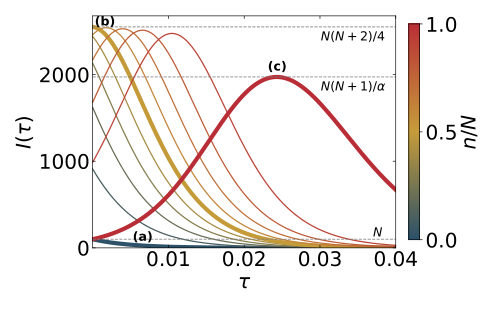
<figcaption class="paper-figure-caption"><b>Fig 1.</b> FIG. 1: Intensity of the Dicke states |j, n −j⟩for N = 100, with bold lines for n = 1(a), 50(b), 100(c) to highlight the low, central, and high excitation regimes. Dashed lines were added for the peak of the pulse to ease the scale. The initial intensity is equal to λn 2Γ = n(N −n + 1). The peak intensity of the all-excited state (n = N) is given by the asymptotic numerical formula I = N(N+1)</figcaption>
</figure>
<figure class="paper-figure-card">
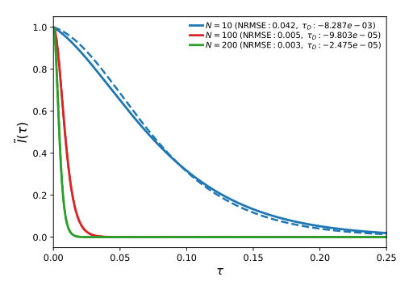
<figcaption class="paper-figure-caption"><b>Fig 2.</b> FIG. 2: The CDS |j, 0⟩is plotted for N = 10, 100, 200 atoms, with the NRMSE and pulse-delay in brackets.</figcaption>
</figure>
<figure class="paper-figure-card">
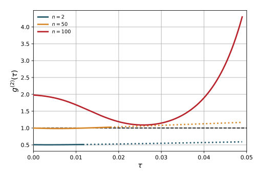
<figcaption class="paper-figure-caption"><b>Fig 3.</b> FIG. 3: The Glauber function for Dicke states, calculated for N = 100 for n = 2, 50, 100. The lines have been cut after the intensity reaches 10% of its peak value: That is where the dotted lines are shown for continuity. Reference black dashed lines were added for the Poissonian limit, g(2)(τ) = 1.</figcaption>
</figure>
<figure class="paper-figure-card">
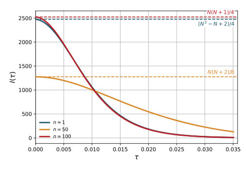
<figcaption class="paper-figure-caption"><b>Fig 4.</b> FIG. 4: The intensity of RDS for N = 100, with n = 1, 50, 100 highlighted. Notice now that all states peak initially, and the general formula for the peak intensity is In(0) = N(N+1)−2n(N−n)</figcaption>
</figure>
<figure class="paper-figure-card">
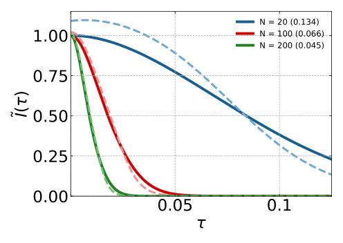
<figcaption class="paper-figure-caption"><b>Fig 5.</b> FIG. 5: The RDS Emission intensity I(τ) normalized with I0,RDS to highlight the MF approximation. Solid lines are the simulation’s result, whereas the dashed lines are the MF solution in Eq.(18). In brackets, we have shown the NRMSE for N = 20, 100, and 200.</figcaption>
</figure>

**Summary.** This paper theoretically analyzes the superradiant emission from an ensemble of atoms initialized in different quantum spin states. By employing mean-field approximations and solving master equations, the authors distinguish between decay mechanisms driven by simple fluctuations versus those involving macroscopic dipole moments. The results provide a detailed diagnostic tool using intensity and correlation functions to characterize these complex collective light emission processes.

**Why it may be interesting.** This work provides a detailed quantitative comparison of superradiant decay dynamics across various non-classical initial states, which is fundamental to understanding collective light-matter interactions in cavity QED systems.

Detailed structure

**Main problem.** The study investigates how the decay dynamics of superradiant emission differ based on the initial collective spin state of an ensemble of atoms.

**Main result.** Different initial states (e.g., Coherent Dipole States vs. Atomic Coherent States) exhibit distinct emission profiles and photon statistics, which can be distinguished by analyzing intensity and correlation functions.

**Method.** The dynamics are analyzed using the master equation approach, solved via mean-field approximations leading to Fokker-Planck equations for large N, alongside exact solutions in the Dicke basis.

**Model / system.** The system models $N$ identical two-level atoms interacting with a cavity mode, governed by a master equation. Key states analyzed include Dicke states, Atomic Coherent States (ACS), and Squeezed Dicke States (SDS).

**Key observables.** Mean emission intensity ($I(	au)$), normalized second-order correlation function ($g^{(2)}(	au)$), and phase uncertainty ($\Delta\varphi$).

**Important parameters / regimes.** The number of atoms ($N$), the squeezing parameter ($r$), and the excitation fraction ($n/N$) are crucial parameters defining the initial state.

**Assumptions / limitations.** The analysis heavily relies on the mean-field approximation for large $N$, which simplifies the master equation into a Fokker-Planck equation, though this introduces limitations regarding diffusion terms.

**Figures summary.** Figures compare intensity profiles ($I(	au)$) and Glauber functions ($g^{(2)}(	au)$) across various states (CDS, RDS, ACS), illustrating differences in decay dynamics and photon statistics.

**Paper structure.** The paper systematically compares superradiant decay from different initial spin states. It develops theoretical tools like the mean-field approximation for large N, derives analytical solutions for specific state types (like SDS), and contrasts the physical mechanisms driving emission based on quantum fluctuations versus macroscopic dipole moments.

Abstract

Superradiance is an extensive cooperative spontaneous emission phenomenon. Some atomic collective spin states exhibit it. However, distinct initial states differ in their decay dynamics. Dicke states with different numbers of excitations have their peak emission intensity shifted in time depending on the number of excitations. Emission intensity in atomic coherent states depends on their polarization. Some specific states undergo a squeezing controlled crossover, making the emission character dependent on the amount of squeezing in the state. We present detailed results on the superradiant dynamics of a representative selection of Dicke states. For large N, we are able to predict fairly accurately the pulse profile in each case using the mean field approximation, an approach based on the Fokker Planck Equation. We also present results on the intensity correlation function of the emission.

[↑ back to top](#top)

### [Information Is Not Physical: Possibility Spaces, Erasure, and the Structure of Unrealized Alternatives](http://arxiv.org/abs/2606.15120v1)

**Authors:** Madhurendra Mishra  
**Type:** theory · **Category:** other · **PDF:** <https://arxiv.org/pdf/2606.15120v1>  
**Analysis basis:** full PDF text, analyzed in chunks
**Topic relevance:** 🔥 `entanglement & information structure` **4/5** · `measurement-induced transitions` **3/5** · `quantum measurements` **3/5** · `correlated / nonlocal dissipation` **2/5** · `driven-dissipative phase transition` **2/5** · `Keldysh / 2PI / non-Gaussian methods` **1/5** · `methods for driven-dissipative` **1/5** · `non-equilibrium dynamics` **1/5** · `non-equilibrium universality` **1/5**

↔ Scroll figures horizontally

<figure class="paper-figure-card">
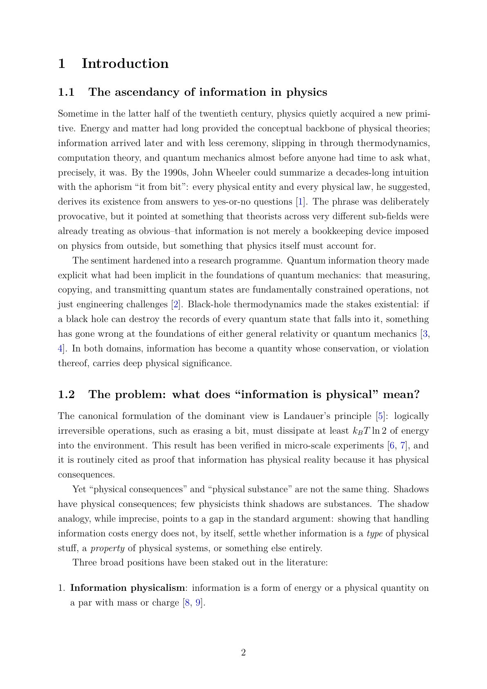
<figcaption class="paper-figure-caption"><b>Fig 1.</b> Low-resolution page preview, page 2</figcaption>
</figure>
<figure class="paper-figure-card">
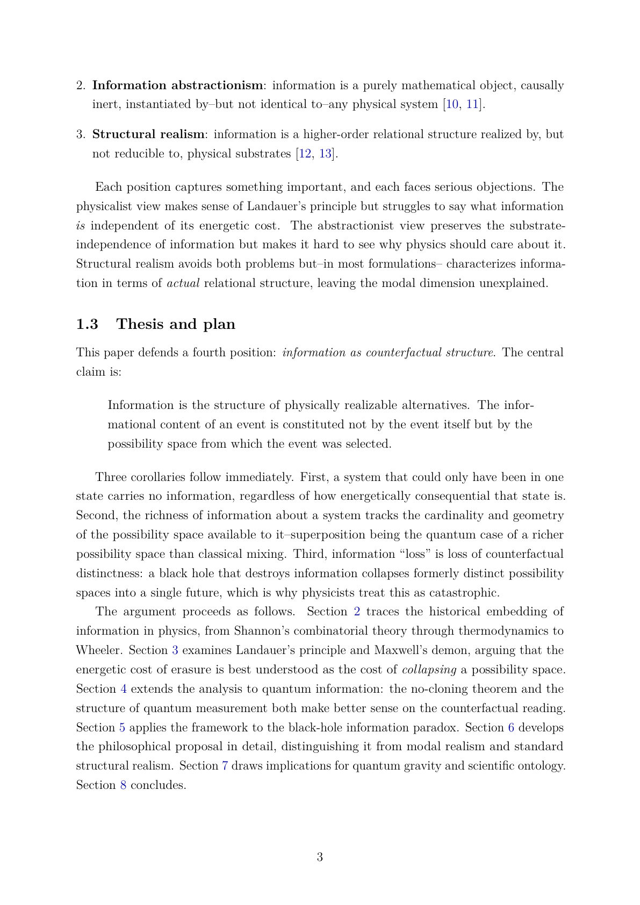
<figcaption class="paper-figure-caption"><b>Fig 2.</b> Low-resolution page preview, page 3</figcaption>
</figure>
<figure class="paper-figure-card">
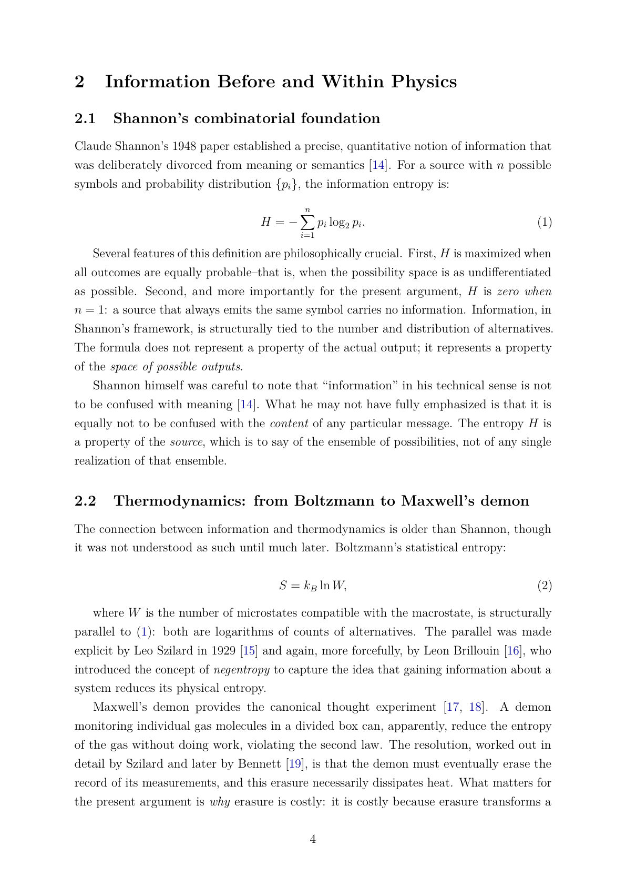
<figcaption class="paper-figure-caption"><b>Fig 3.</b> Low-resolution page preview, page 4</figcaption>
</figure>
<figure class="paper-figure-card">
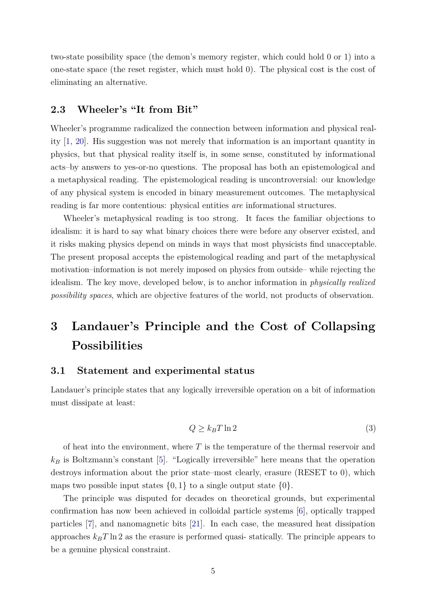
<figcaption class="paper-figure-caption"><b>Fig 4.</b> Low-resolution page preview, page 5</figcaption>
</figure>
<figure class="paper-figure-card">
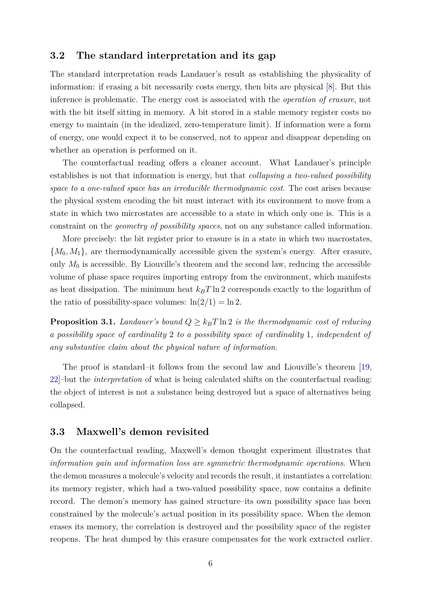
<figcaption class="paper-figure-caption"><b>Fig 5.</b> Low-resolution page preview, page 6</figcaption>
</figure>

**Summary.** This paper argues that information is fundamentally the structure defined by all physically possible outcomes an event *could* have taken, rather than being a physical thing or just math. By applying this 'counterfactual reading' to thermodynamics and black holes, it offers a unified structural view of how processes like erasure and evaporation constrain reality. It suggests that understanding possibility spaces is key to advancing quantum gravity and foundational physics.

**Why it may be interesting.** It provides a deep philosophical framework that reinterprets core concepts like measurement collapse and entanglement in terms of structural limitations on possibility spaces, which has implications for understanding open quantum systems dynamics.

Detailed structure

**Main problem.** The ontological status of 'information' in physics, specifically reconciling concepts like Landauer's principle, quantum mechanics, and black hole thermodynamics without resorting to idealism.

**Main result.** Information is proposed not as a physical substance or pure abstraction, but as the objective structure of physically realizable alternatives (a counterfactual structure).

**Method.** The paper develops a 'counterfactual reading' by analyzing how thermodynamic costs and quantum constraints relate to the possibility space available to a system.

**Model / system.** The analysis draws upon fundamental physical concepts including Shannon entropy, Landauer's principle, the no-cloning theorem, and the information paradox in black hole evaporation.

**Key observables.** Shannon Entropy ($H$), thermodynamic heat dissipation ($Q \geq k_B T \ln 2$), and the preservation/loss of counterfactual distinctness across physical processes.

**Important parameters / regimes.** Temperature ($T$), Boltzmann constant ($k_B$), and the cardinality/geometry of the possibility space ($\Omega$).

**Assumptions / limitations.** The framework assumes that probability distributions are grounded in objective, physically existing possibilities rather than merely epistemic knowledge.

**Paper structure.** The paper progresses by establishing the problem (ontological status of information), refining the concept using Landauer's principle and quantum constraints (superposition vs. classical mixture), applying this to black hole evaporation, and concluding with a proposal for modal-structural realism.

Abstract

The slogan ``information is physical,'' introduced by Rolf Landauer and developed through quantum information theory and black-hole thermodynamics, has achieved near-axiomatic status in modern physics. Yet the ontological status of information remains surprisingly underexamined: most discussions either reduce information to a form of energy or treat it as a purely mathematical object. This paper proposes a third position. I argue that information is neither a physical substance nor a free-floating abstraction, but rather \emph{the structure of physically realizable alternatives} -- a counterfactual structure that a physical system instantiates in virtue of the possibility space available to it. Building on Shannon's combinatorial definition, the Landauer principle, the no-cloning theorem, and the black-hole information paradox, I show that the informational content of any physical event is constituted by the set of outcomes that \emph{could have occurred} but did not. This counterfactual reading dissolves several persistent confusions: it explains why erasing information dissipates heat without making information ``material,'' why quantum superposition is informationally richer than any classical mixture, and why information loss in black holes is physically significant beyond mere bookkeeping. The proposal sits within a structural-realist framework but departs from standard structural realism by locating the relevant structure in modal, not merely actual, relations. I conclude by sketching implications for the foundations of quantum mechanics, quantum gravity, and scientific ontology more broadly.

[↑ back to top](#top)

### [Measuring Non-Stabilizerness in an SU(2) Lattice Gauge Theory](http://arxiv.org/abs/2606.14842v1)

**Authors:** Henry Froland, Dorota M. Grabowska  
**Type:** both · **Category:** quantum information and computing · **PDF:** <https://arxiv.org/pdf/2606.14842v1>  
**Analysis basis:** full PDF text, analyzed in chunks
**Topic relevance:** 🔥 `analog quantum simulation` **4/5** · `entanglement & information structure` **3/5** · `methods for driven-dissipative` **3/5** · `quantum measurements` **3/5** · `measurement-induced transitions` **2/5** · `Keldysh / 2PI / non-Gaussian methods` **1/5** · `QC/QI experiment` **1/5** · `driven-dissipative phase transition` **1/5**

↔ Scroll figures horizontally

<figure class="paper-figure-card">
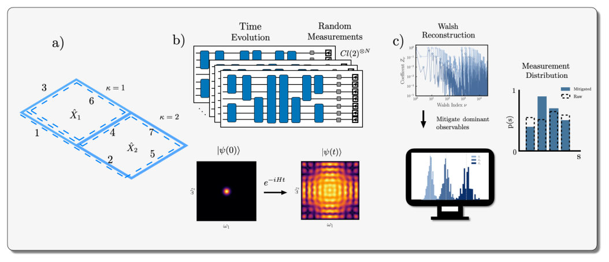
<figcaption class="paper-figure-caption"><b>Fig 1.</b> FIG. 1: Digital Quantum Simulation of Two Plaquettes a) The two-plaquette system with open boundary conditions is gauge-fixed using max tree gauge fixing. The system contains seven links, numbered 1 through 7, with the physical links denoted as κ = 1, 2. The magnetic degrees of freedom ˆX1, ˆX2 are associated with each plaquette. The dashed lines that run around each plaquette denote the loops used in the max tree gauge-fixing procedure. b) The digitized Hamiltonian is compiled into digital quantum gates via Trotterization that approximate e−iHt. Shown below the circuit diagram is an example of initial state amplitudes given by a smooth gaussian profile in ω1, ω2 and the final amplitudes...</figcaption>
</figure>
<figure class="paper-figure-card">
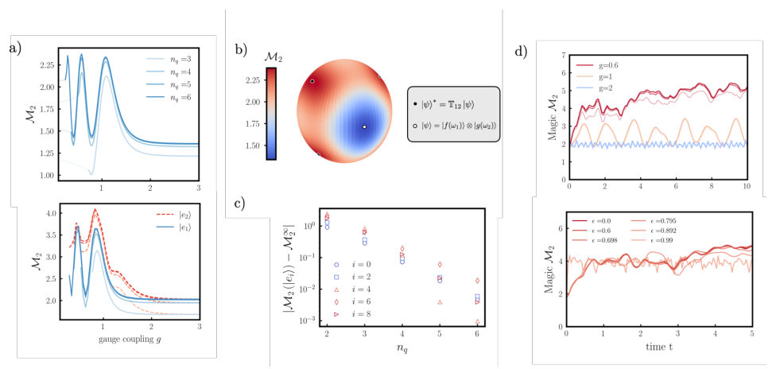
<figcaption class="paper-figure-caption"><b>Fig 2.</b> FIG. 2: Non-Stabilizerness of Low-Energy Eigenstates a) Non-stabilizerness of ground state |e0⟩(top) and first two excited eigenstates |e1⟩, |e2⟩(bottom). For large gauge coupling, the non-stabilizerness plateaus to a constant value for |e1⟩, |e2⟩, which are degenerate in this limit. For a fixed resolution, once a certain coupling is reached, the ωmax truncation begins to decrease from 2π, causing the effective support of the wavefunction over ω1 −ω2 to change at a different rate with g, which is signified by the transparent lines (these lines are not shown for the bottom plot). b) Non-stabilizerness in degenerate subspace S12. The states that have the minimum non-stabilizerness in this...</figcaption>
</figure>
<figure class="paper-figure-card">
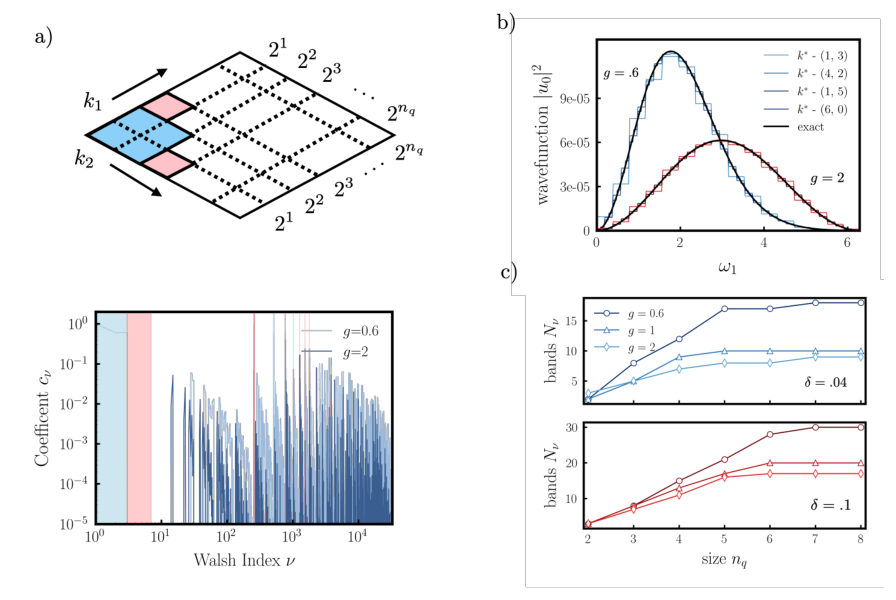
<figcaption class="paper-figure-caption"><b>Fig 3.</b> FIG. 3: Walsh Hierarchy of Smooth Wavefunctions a) Different Walsh bands for two-dimensional function of ω1, ω2 (top) with Walsh indices and associated coefficients (below). The lowest, most significant, bands are highlighted in blue, and the next most significant are shown in red. The strategy to reconstruct the wavefunction involves starting from the shells closest to the origin and working out in each direction. Once a shell is filled, the next shell starts being filled. b) Reconstructed wavefunction probability density for fixed ω2 at different Walsh cutoffs k∗. The solid black lines correspond to exact reconstruction where the cutoff is removed. Both a strong coupling wavefunction at g...</figcaption>
</figure>
<figure class="paper-figure-card">
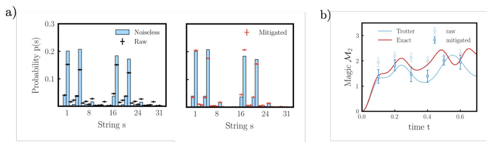
<figcaption class="paper-figure-caption"><b>Fig 4.</b> FIG. 4: Quantum Measurement of non-Stabilizerness a) Bitstring distributions for specific instance of random Cliffords. The raw data (left) shows small populations of many bitstrings whose populations are spuriously amplified by the noise of the quantum device. The bitstring distribution after application of BSDR (right) removes these spurious populations and restores much of the probability mass to the true bitstring. b) Values of non-stabilizerness over time. The solid lines correspond to evolution due to the exact propagator and the Trotterized circuit. The circles represent the calculations from the raw data and the diamonds represent the mitigated data. The raw data is almost constant,...</figcaption>
</figure>

**Summary.** This work develops methods to measure non-stabilizerness—a measure of quantum complexity—in SU(2) Lattice Gauge Theory simulations. It addresses hardware limitations by introducing Bit String Decoherence Renormalization (BSDR) and utilizing advanced estimators based on the Walsh-Hadamard transform. The results demonstrate how complex physical properties can be extracted from noisy quantum measurements.

**Why it may be interesting.** It provides a concrete, quantifiable metric (non-stabilizerness) for assessing the feasibility of simulating complex quantum field theories on current noisy intermediate-scale quantum (NISQ) devices.

Detailed structure

**Main problem.** The study quantifies quantum complexity, specifically non-stabilizerness, for simulating lattice gauge theories on near-term quantum hardware.

**Main result.** Non-stabilizerness is shown to be a measurable quantity that exhibits predictable convergence behavior with increasing digitization resolution and can be accurately estimated using advanced error mitigation techniques like BSDR.

**Method.** The work employs randomized measurement protocols, novel estimators derived via the Walsh-Hadamard transform, and the Bit String Decoherence Renormalization (BSDR) technique to mitigate noise effects on bitstring probability distributions.

**Model / system.** The system analyzed is SU(2) Lattice Gauge Theory restricted to two plaquettes. The simulation involves mapping the continuous gauge field Hilbert space onto a finite qudit register via digitization and studying low-energy eigenstates.

**Key observables.** Non-stabilizerness ($M_2$ or $S_2$), Stabilizer Rényi Entropy, Total Variational Distance (TVD), and bitstring probability distributions $p(s)$.

**Important parameters / regimes.** Gauge coupling constant ($g$), digitization resolution ($n_q$), and the error mitigation parameters ($\epsilon$).

**Assumptions / limitations.** The analysis assumes that low-energy wavefunctions can be approximated by smooth functions, allowing for efficient reconstruction of probability distributions using Walsh coefficients.

**Figures summary.** Figures illustrate the setup (gauge fixing/digitization), the dependence of non-stabilizerness on gauge coupling and resolution, and diagrams detailing the structure of the Walsh hierarchy used for error mitigation.

**Paper structure.** The paper progresses from defining the physical system and complexity measure to developing advanced measurement protocols (WH transform estimators) and finally introducing novel error mitigation techniques (BSDR) validated against theoretical bounds (TVD).

Abstract

One of the goals of quantum simulation is to provide novel insights into quantum systems, such as the gauge theories that are relevant for high-energy and nuclear physics. Recent years have seen rapid improvements in both the hardware and software necessary for these simulations. A central consideration in the design of such simulations is the quantum complexity of a given quantum state. This work takes a step towards studying a specific kind of complexity, namely the non-stabilizerness, in a simple yet non-trivial system: SU(2) lattice gauge theory of two plaquettes. The non-stabilizerness of low-energy eigenstates is studied and the implications for quantum simulations are discussed. The real-time evolution of this system is simulated on ibm_marrakesh and the non-stabilizerness is measured using a random measurement protocol. New techniques enhancing the efficiency of this protocol are developed, including both a new way to calculate the estimator for non-stabilizerness and a flexible error mitigation technique called Bit String Decoherence Renormalization. This mitigation method is central to accurately resolving the experimental time dependence of non-stabilizerness, and is anticipated to have broad applicability in digital quantum simulations.

[↑ back to top](#top)

### [Riviera model with egoistical settlers](http://arxiv.org/abs/2606.16791v1)

**Authors:** P. L. Krapivsky  
**Type:** theory · **Category:** statistical mechanics · **PDF:** <https://arxiv.org/pdf/2606.16791v1>  
**Analysis basis:** full PDF text, analyzed in chunks
**Topic relevance:** 🔥 `Keldysh / 2PI / non-Gaussian methods` **4/5** · `methods for driven-dissipative` **3/5** · `non-equilibrium dynamics` **3/5** · `non-equilibrium universality` **3/5** · `driven-dissipative phase transition` **2/5** · `Frenkel-Kontorova` **1/5** · `analog quantum simulation` **1/5** · `correlated / nonlocal dissipation` **1/5**

↔ Scroll figures horizontally

<figure class="paper-figure-card">
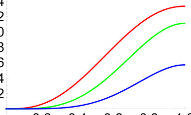
<figcaption class="paper-figure-caption"><b>Fig 1.</b> FIG. 1. The densities Z1, Z2, Z3 (top to bottom) are growing functions of time. This is a common feature of all densities Zs. The final jammed densities are Π1 = 2 15, Π2 = 1</figcaption>
</figure>
<figure class="paper-figure-card">
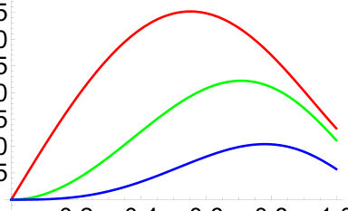
<figcaption class="paper-figure-caption"><b>Fig 2.</b> FIG. 2. The cluster densities P1, P2, P3 (top to bottom) versus the auxiliary time τ = 1 −e−t. Cluster densities Ps(τ) are unimodal distributions with a single peak at τs given by (36);</figcaption>
</figure>
<figure class="paper-figure-card">
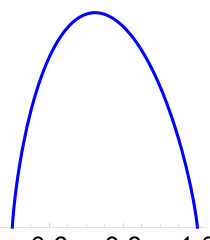
<figcaption class="paper-figure-caption"><b>Fig 3.</b> FIG. 5. The configurational entropy σ versus the density ρ of houses in the jammed state. The analytical expression for σ(ρ) is given by Eq. (B3). The entropy reaches maximum σ∗= σ(ρ∗) = ArcCoth √</figcaption>
</figure>

**Summary.** This paper rigorously analyzes the statistical mechanics of the Riviera model, a 1D process mimicking constrained settlement. It derives exact formulas for the cluster size distribution and correlation functions in the jammed state by solving complex differential equations. The work provides deep insights into how local constraints dictate global structural properties in disordered systems.

**Why it may be interesting.** The mathematical techniques used—solving complex, infinite sets of coupled differential equations via ansatzes—are highly relevant for modeling non-equilibrium dynamics in many-body systems, analogous to those studied in quantum field theory or open quantum systems.

Detailed structure

**Main problem.** The primary goal is characterizing the jammed state of a one-dimensional settlement model (Riviera model) and deriving its cluster size distribution and correlation functions.

**Main result.** In the jammed state, the cluster size distribution follows an exact factorial decay ($\Pi_s \propto 1/(s+2)!$), and the average number of empty sites in a finite segment scales linearly with length ($L/3 + 1/3$).

**Method.** The analysis employs dynamic evolution equations for void densities, solved using exponential ansatzes, alongside static combinatorial methods for calculating correlation functions.

**Model / system.** The Riviera model (RM) simulates densifying settlement on a line segment. It is analyzed in both discrete and continuum forms, involving parameters like the separation threshold $\epsilon$.

**Key observables.** Cluster size distribution ($\Pi_s$), void-cluster-void distribution, connected pair correlation functions ($C_j$), average number of empty sites ($\langle N 
angle_L$), and configurational entropy ($\sigma(
ho)$).

**Important parameters / regimes.** The parameter $\epsilon$ governs the generalization of the model; key regimes include $\epsilon=0$, $\epsilon=1$, and the maximum entropy density $
ho^*$.

**Assumptions / limitations.** The analysis often relies on exponential ansatzes to solve infinite sets of coupled differential equations, and approximations are made when calculating higher-order correlations.

**Figures summary.** Figures illustrate the configurational entropy ($\sigma$) versus density ($
ho$), showing a maximum at $
ho^*$, and depict how jamming densities $
ho_{	ext{jam}}(\epsilon)$ vary with the parameter $\epsilon$.

**Paper structure.** The paper progresses from analyzing the dynamic evolution of void patterns (using ODEs and ansatzes) to determining the exact cluster size distribution in the jammed state. It then extends to calculating pair correlation functions ($C_j$) and finally tackles finite-size statistics using generating functions and continuum limits.

Abstract

The Riviera model mimics a densifying settlement along the coastline. In the lattice version, houses are built sequentially in empty sites with the constraint that every newly built house has at least one empty neighboring site. The distribution of clusters of adjacent houses does not obey a closed set of evolutionary equations, but the void-cluster-void distribution does. We compute the latter and extract the cluster distribution from it. In the jammed state, when all voids have length one and the evolution ceases, the cluster distribution has a neat form and exhibits a factorial decay with the length of the cluster. To investigate finite systems, we employ a static approach directly treating jammed states. If the coastline is a finite segment, we determine the statistics of the number of empty sites in the jammed state (the average, variance, and higher cumulants). We also study a continuum version in which houses are built along the line so that each newly built house is sufficiently separated from at least one neighboring house.

[↑ back to top](#top)

### [High-dimensional coherence to entanglement transduction under canonical noise](http://arxiv.org/abs/2606.16695v1)

**Authors:** Asad Ali, Aiham M. Rostom, Saif Al-Kuwari, H. Kuniyil, M. T. Rahim, Saeed Haddadi  
**Type:** theory · **Category:** quantum information and computing · **PDF:** <https://arxiv.org/pdf/2606.16695v1>  
**Analysis basis:** full PDF text, analyzed in chunks
**Topic relevance:** 🔥 `entanglement & information structure` **4/5** · `correlated / nonlocal dissipation` **3/5** · `methods for driven-dissipative` **3/5** · `driven-dissipative phase transition` **2/5** · `non-equilibrium dynamics` **2/5** · `Keldysh / 2PI / non-Gaussian methods` **1/5** · `non-equilibrium universality` **1/5**

↔ Scroll figures horizontally

<figure class="paper-figure-card">
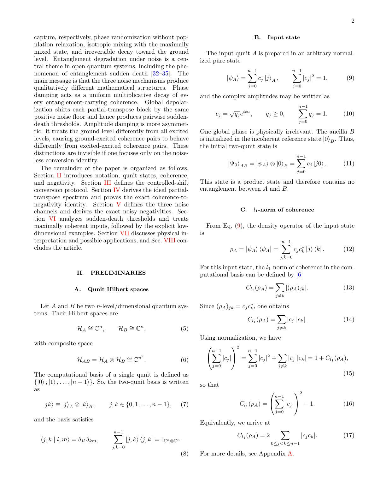
<figcaption class="paper-figure-caption"><b>Fig 1.</b> Low-resolution page preview, page 2</figcaption>
</figure>
<figure class="paper-figure-card">
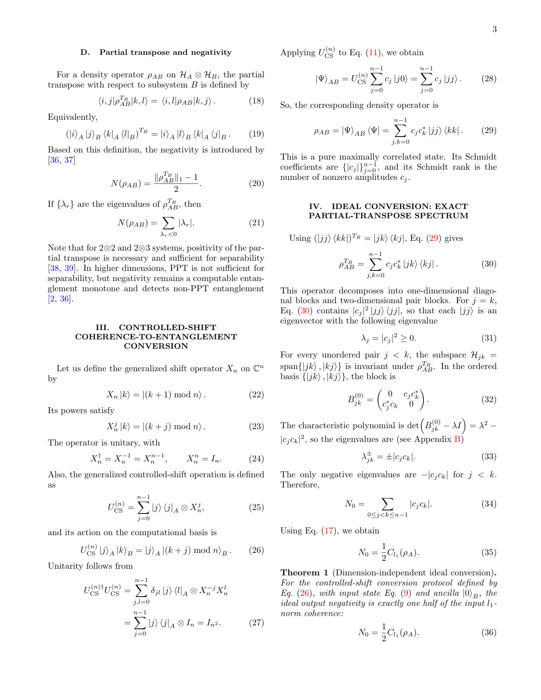
<figcaption class="paper-figure-caption"><b>Fig 2.</b> Low-resolution page preview, page 3</figcaption>
</figure>
<figure class="paper-figure-card">
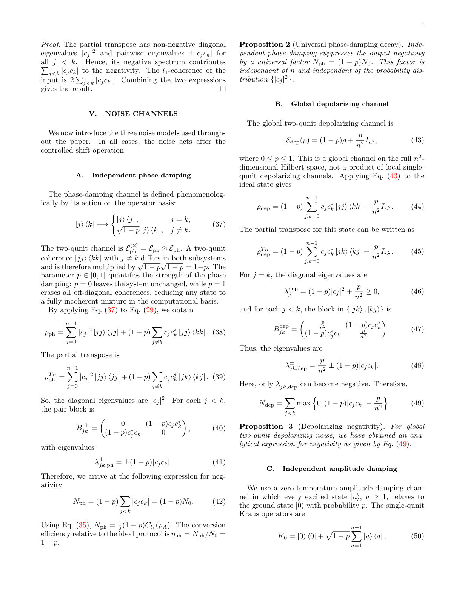
<figcaption class="paper-figure-caption"><b>Fig 3.</b> Low-resolution page preview, page 4</figcaption>
</figure>
<figure class="paper-figure-card">
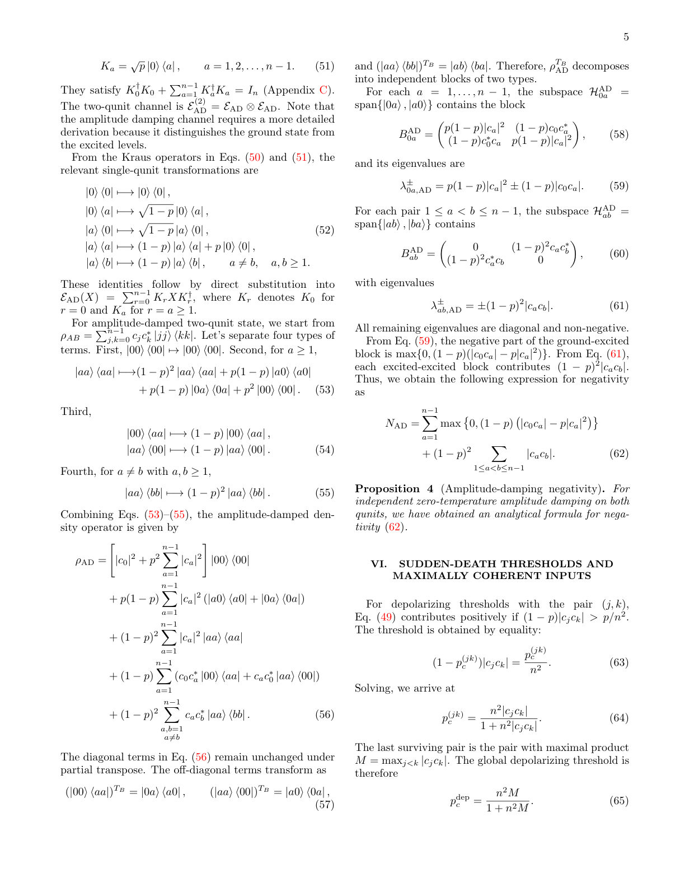
<figcaption class="paper-figure-caption"><b>Fig 4.</b> Low-resolution page preview, page 5</figcaption>
</figure>
<figure class="paper-figure-card">
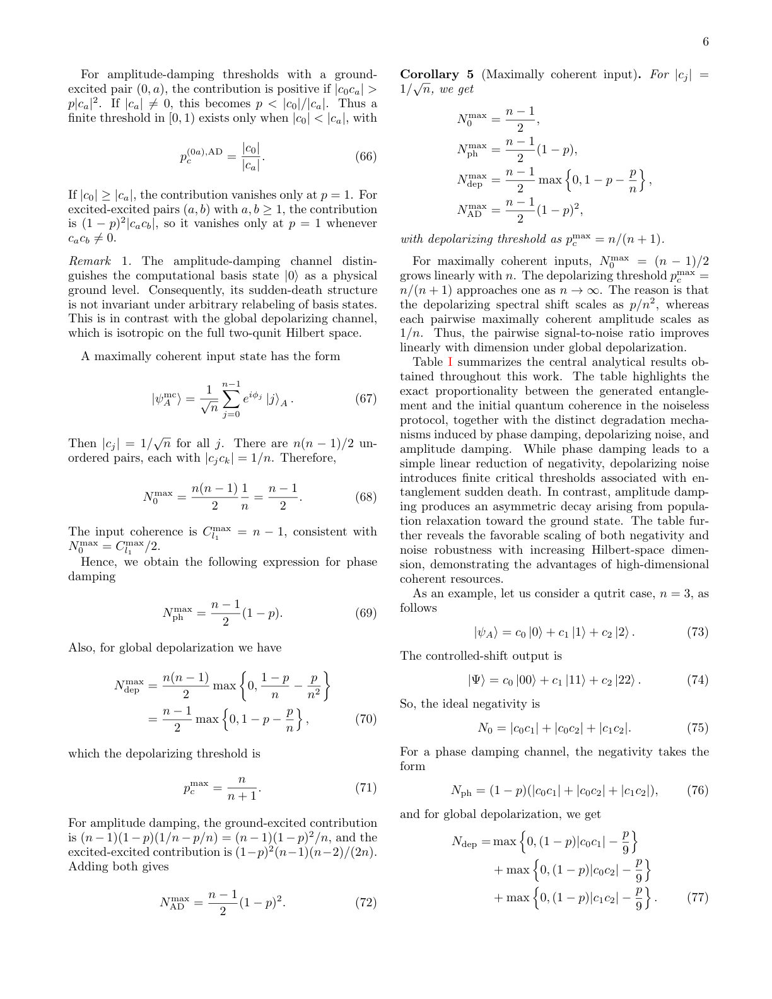
<figcaption class="paper-figure-caption"><b>Fig 5.</b> Low-resolution page preview, page 6</figcaption>
</figure>

**Summary.** This paper develops a theoretical framework to quantify the conversion of coherence into entanglement in high-dimensional qudit systems. It rigorously analyzes how this generated entanglement degrades when subjected to phase damping, global depolarization, or amplitude damping. The results provide distinct analytical benchmarks for assessing noisy quantum resource generation.

**Why it may be interesting.** This work provides rigorous analytical benchmarks for understanding resource conversion (coherence to entanglement) in high-dimensional quantum systems, which is crucial for designing robust quantum communication protocols that operate under realistic noise conditions.

Detailed structure

**Main problem.** The study develops an analytical framework to quantify how initial quantum coherence is converted into entanglement within high-dimensional quantum systems (qunits) and analyzes the subsequent degradation of this entanglement under various noise channels.

**Main result.** The ideal conversion establishes a dimension-independent identity between input $\ell_1$-norm of coherence and output negativity. Different noise types degrade entanglement in distinct ways: phase damping causes uniform decay, depolarizing noise introduces pairwise sudden death thresholds, and amplitude damping shows asymmetric relaxation.

**Method.** The analysis relies on calculating the negativity (a measure derived from the partial transpose) of the resulting bipartite state after applying controlled-shift operations followed by specific quantum noise channels.

**Model / system.** The system involves two qudits ($A \otimes B$, dimension $n$), where one qudit acts as a coherent input and the other is an incoherent ancilla. The process models coherence-to-entanglement conversion via a generalized controlled-shift operation.

**Key observables.** Negativity ($N$), $\ell_1$-norm of coherence ($C_{\ell_1}$), entanglement sudden death thresholds, and decay factors for the negativity under noise.

**Important parameters / regimes.** System dimension ($n$), noise strength parameters (e.g., $p$ for damping), and the coefficients defining the input coherent state $|\psi_A
angle$.

**Assumptions / limitations.** The analysis assumes that the three canonical noise channels—phase damping, global depolarizing noise, and amplitude damping—are applied sequentially after the initial controlled-shift operation.

**Figures summary.** Not specified in detail, but the notes imply tables summarizing general expressions for negativity under different noise models (e.g., Table I).

**Paper structure.** The paper first establishes the ideal conversion identity ($N_0 \propto C_{\ell_1}$). It then systematically analyzes the effect of three distinct noise channels—phase damping, global depolarization, and amplitude damping—on this generated entanglement, deriving specific decay laws for each.

Abstract

We develop an analytical framework for coherence-to-entanglement conversion in bipartite high-dimensional quantum systems, so-called qunits. An arbitrary coherent input qunit is coupled to an incoherent ancilla through a generalized controlled-shift operation, producing a maximally correlated bipartite state. By analyzing the partial transpose of the output state, we establish an exact dimension-independent connection between the input coherence and the generated entanglement. We then study how this conversion is affected by three standard noise processes applied after the conversion step: phase damping, global depolarizing noise, and independent amplitude damping. The resulting expressions show that these channels degrade entanglement in qualitatively different ways. Phase damping leads to a uniform attenuation of the entanglement generated from coherence, depolarizing noise introduces pairwise thresholds associated with entanglement sudden death, and amplitude damping produces an asymmetric decay governed by relaxation toward the ground state. For maximally coherent inputs, the general results reduce to simple closed-form behavior, allowing direct comparison of the three noise mechanisms as the system dimension increases. In particular, global depolarizing noise exhibits a dimension-dependent sudden-death threshold, while amplitude damping leads to a smooth suppression in the maximally coherent case. These results provide useful analytical benchmarks for high-dimensional resource conversion and for assessing noisy entanglement generation in qudit-based quantum-information settings.

[↑ back to top](#top)

### [Suppressing Intrinsic Spin-Phonon Errors in Trapped-Ion Quantum Simulation](http://arxiv.org/abs/2606.15518v1)

**Authors:** Dylan Sheils, James Wang, Or Katz  
**Type:** theory · **Category:** other · **PDF:** <https://arxiv.org/pdf/2606.15518v1>  
**Analysis basis:** full PDF text, analyzed in chunks
**Topic relevance:** 🔥 `analog quantum simulation` **4/5** · `exotic spin models in light-matter` **3/5** · `QC/QI experiment` **2/5** · `non-equilibrium dynamics` **2/5** · `correlated / nonlocal dissipation` **1/5** · `entanglement & information structure` **1/5** · `methods for driven-dissipative` **1/5** · `quantum measurements` **1/5** · `spintronics-quantum-optics interface` **1/5**

↔ Scroll figures horizontally

<figure class="paper-figure-card">
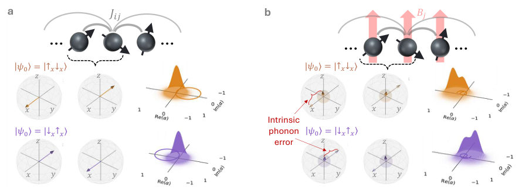
<figcaption class="paper-figure-caption"><b>Fig 1.</b> FIG. 1. Intrinsic phonon error in trapped-ion quantum simulation. Full spin-boson simulations for a minimal two-spin, one-mode system. Spin-dependent forces couple the spins to the phonon mode that mediates the Ising interaction, generating trajectories in the complex displacement plane α. a, Commuting limit (Bj = 0). For representative ˆσx-basis states (orange and purple), the spin-conditioned trajectories close at the target time, and the phonon wave packet remains localized and Gaussian. b, Noncommuting regime (Bj ̸= 0). For the same control fields, the transverse field makes the motion history dependent, generating residual spin-phonon correlations. To isolate this intrinsic...</figcaption>
</figure>
<figure class="paper-figure-card">
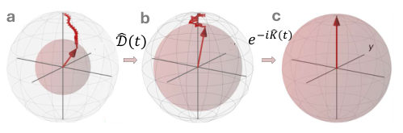
<figcaption class="paper-figure-caption"><b>Fig 2.</b> FIG. 2. Strategy for suppressing residual spin- phonon error. Schematic reduced Bloch-sphere trajectories for rapidly modulated αjk(t). a, In the drive- defined frame (Eq. 1), residual spin-phonon correlations make the reduced spin state mixed, so the Bloch vector lies inside the sphere. b, A spin-dependent displacement ˆD(t) (Eq. 3) moves to the instantaneous phonon-equilibrium frame, removing most of the phonon dressing but leaving the transverse-field-induced phonon-conditioned micromotion. c, A further kick transformation e−i ˆ K(t) (Eq. 7) removes this remaining micromotion, so the reduced spin trajectory nearly recovers the ideal slow target dynamics.</figcaption>
</figure>
<figure class="paper-figure-card">
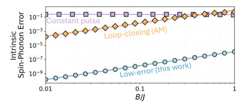
<figcaption class="paper-figure-caption"><b>Fig 3.</b> FIG. 3. Intrinsic spin-phonon error benchmark. Full spin-boson simulations for a four-ion chain with four ground- state-cooled phonon modes. The intrinsic error is obtained by removing the intended TFIM evolution, tracing out the phonons, and quantifying the resulting nonunitarity of the reduced spin channel (see [35]). Across a broad range of B, the optimized low-error waveform of this work (blue circles) suppresses the error by orders of magnitude relative to both a constant pulse (purple squares) and an amplitude-modulated pulse constrained only by loop closure, αjk(T) = 0 (orange diamonds).</figcaption>
</figure>
<figure class="paper-figure-card">
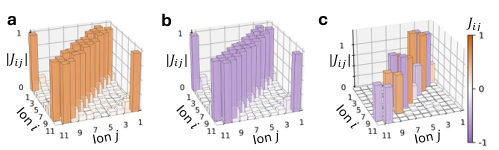
<figcaption class="paper-figure-caption"><b>Fig 4.</b> FIG. 4. Programmable interaction graphs under low-error constraints. Optimized low-error realizations of representative Ising matrices Jij in an 11-ion chain, showing that broad interaction programmability is retained under the error-suppressing constraints. Shown are long- range couplings with effective periodic boundary conditions in a linear chain (a), sign-reversed couplings enabling time-reversal protocols (b), and oscillatory quasiperiodic couplings (c). Bar height denotes |Jij|, and color denotes the sign of Jij.</figcaption>
</figure>

**Summary.** This paper tackles the critical issue of intrinsic spin-phonon errors that plague trapped-ion quantum simulators when simulating noncommuting interactions. The authors introduce a sophisticated error suppression technique based on carefully designed sequences of frame transformations and drive shaping. This method achieves orders-of-magnitude lower error rates, removing a major precision barrier for programmable quantum simulation.

**Why it may be interesting.** This work directly addresses a fundamental limitation—the accumulation of intrinsic noise—in trapped-ion quantum simulation, providing concrete control protocols to enable accurate analog simulation of complex Hamiltonians previously inaccessible due to decoherence mechanisms.

Detailed structure

**Main problem.** Intrinsic spin-phonon errors, generated by phonon-mediated interactions when noncommuting terms are present, severely limit the accuracy of trapped-ion quantum simulations.

**Main result.** The authors developed a novel control scheme using frame transformations that suppresses these intrinsic, history-dependent errors by orders of magnitude while preserving programmable Ising couplings.

**Method.** The method involves applying a sequence of unitary frame transformations (displacement and kick) to isolate the residual error dynamics and designing drive envelopes based on temporal moment constraints.

**Model / system.** The system is trapped-ion quantum simulators where spin-$1/2$ degrees of freedom are coupled to collective phonon modes via a spin-boson Hamiltonian. The challenge arises when noncommuting terms (like transverse fields) are present in the effective Hamiltonian.

**Key observables.** Fidelity ($F$), residual error ($\hat{\epsilon}(t)$), and the ability to realize target Ising interaction matrices ($J_{ij}$) with high precision.

**Important parameters / regimes.** The simulation time $T$, the strength of noncommuting fields ($B_j 
eq 0$), and the required suppression level (orders-of-magnitude improvement).

**Assumptions / limitations.** The analysis relies on the validity of the Magnus expansion in the controlled short-time regime, and the error is quantified by tracing out phonons.

**Figures summary.** Figure 1 illustrates intrinsic phonon error in a minimal system. Figure 2 schematically shows the sequence of frame transformations used for error suppression. Figure 3 benchmarks the optimized waveform against constant and loop-closing controls, showing superior error reduction. Figure 4 demonstrates programmable realization of various Ising couplings.

**Paper structure.** The paper first identifies the intrinsic error problem in noncommuting regimes. It then introduces a theoretical framework using frame transformations to isolate and suppress this residual error by designing specific time-dependent drive envelopes that satisfy temporal moment constraints. Finally, it validates these techniques through full spin-boson simulations.

Abstract

Trapped-ion quantum simulators realize programmable spin models through phonon-mediated interactions. For Hamiltonians with noncommuting terms, however, the same phonon bus generates intrinsic spin-phonon errors that strongly distort the target dynamics. Because these errors are governed by the full time history of the spin-dependent phonon motion, they survive standard loop-closing control and limit simulation accuracy. Using a sequence of frame transformations, we isolate the residual error dynamics and show that this intrinsic error can be strongly suppressed while preserving programmable Ising couplings. Full spin-boson simulations of multi-ion chains demonstrate orders-of-magnitude lower error than both constant-drive and conventional loop-closing protocols. These results remove a central precision barrier in trapped-ion analog quantum simulation and enable accurate programmable simulation of noncommuting many-body Hamiltonians and dynamical protocols.

[↑ back to top](#top)

### [Adiabatic preparation of a fractional quantum Hall fluid by coherently pumping atoms from a Bose-Einstein condensate](http://arxiv.org/abs/2606.15951v1)

**Authors:** Alberto Tabarelli de Fatis, Christof Weitenberg, Alexander Schnell, André Eckardt, Iacopo Carusotto  
**Type:** theory · **Category:** other · **PDF:** <https://arxiv.org/pdf/2606.15951v1>  
**Analysis basis:** full PDF text, analyzed in chunks
**Topic relevance:** 🔥 `analog quantum simulation` **4/5** · `non-equilibrium dynamics` **3/5** · `non-equilibrium universality` **2/5** · `Keldysh / 2PI / non-Gaussian methods` **1/5** · `correlated / nonlocal dissipation` **1/5** · `driven-dissipative phase transition` **1/5** · `entanglement & information structure` **1/5** · `exotic spin models in light-matter` **1/5** · `methods for driven-dissipative` **1/5**

↔ Scroll figures horizontally

<figure class="paper-figure-card">
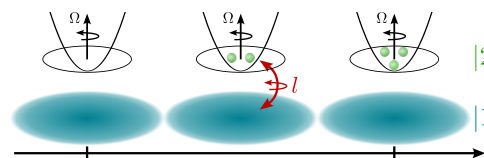
<figcaption class="paper-figure-caption"><b>Fig 1.</b> FIG. 1. Proposed scheme for the generation of an FQH fluid of ultracold atoms. The FQH system under study is formed of atoms in a strongly interacting state |2⟩close to a Fesh- bach resonance (see End Matter), tightly trapped in a two- dimensional geometry; in the frame rotating at frequency Ω, the atoms experience an effective synthetic magnetic field. This FQH system is coherently coupled via two Raman beams with a Laguerre-Gauss profile to a weakly interacting conden- sate |1⟩that acts as a particle reservoir, exchanging an angular momentum l per particle. The FQH is initially empty, and is adiabatically pumped to the desired state in a time T.</figcaption>
</figure>
<figure class="paper-figure-card">
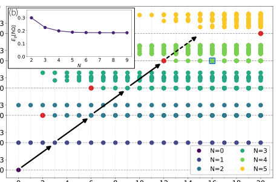
<figcaption class="paper-figure-caption"><b>Fig 2.</b> FIG. 2. (a) Many-body spectrum of the system in the LLL manifold as a function of the total angular momentum, in the case of no external potential in the rotating frame. Different colors refer to different number sectors. Red dots denote the Laughlin states, of angular momentum L = N(N−1), and the blue square is the state with one quasi-hole and N = 4. The arrows indicate the transitions coupling the vacuum to the N = 4 Laughlin state, using a pump with angular momentum l = 3. Transitions to larger N are suppressed by the many- body gap. (b) Many-body gap above the Laughlin state as a function of N for g/l2 B = 3.77ℏΩ.</figcaption>
</figure>
<figure class="paper-figure-card">
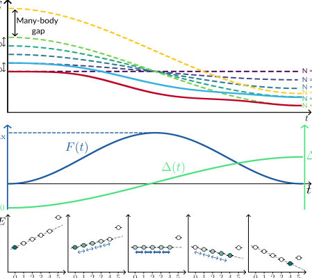
<figcaption class="paper-figure-caption"><b>Fig 3.</b> FIG. 3. (a) Instantaneous eigenstates during the adiabatic evolution with F = 0 (dashed lines) and first two eigenstates for F(t) ̸= 0 (solid lines). (b) Sketch of the temporal ramp of the pump strength F(t) and the detuning ∆(t). (c) Illustra- tion of the adiabatic scheme as the tunneling in a tilted lattice comprising the states coupled by the pump F: initially, the system is in the N = 0 vacuum state; at the end, it is frozen in the Nt = 4 Laughlin state protected by the many-body gap (blue dot).</figcaption>
</figure>
<figure class="paper-figure-card">
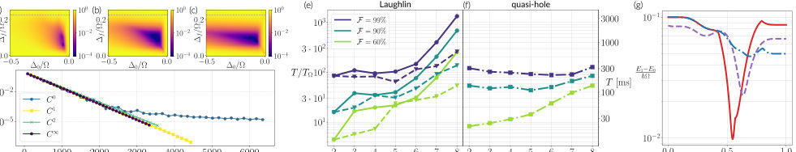
<figcaption class="paper-figure-caption"><b>Fig 4.</b> FIG. 4. Infidelity with Nt = 4 Laughlin state for different initial and final detuning, for a C∞ramp of ramp time T = 127TΩ (318 ms), for (a) Fmax/Ω= 0.05, (b) 0.1, (c) 0.2. The dashed line marks the many-body gap. (d) Infidelity with the Nt = 7 Laughlin state for ramps with different smoothness, as a function of time, rescaled by the sharpness of ∆(s = t/T). (e) Ramp time T required to reach a desired fidelity as a function of Nt, for a C0 ramp with ∆f = −∆0 = 0.1Ωand Fmax = 0.1Ω. The solid lines refer to a purely harmonic potential, whereas dashed lines include a quartic potential with V0 = 0.001ℏΩ. The detunings include the energy shift due to the quartic potential. (f) Same plot for...</figcaption>
</figure>
<figure class="paper-figure-card">
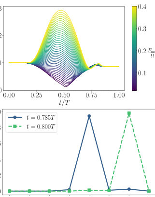
<figcaption class="paper-figure-caption"><b>Fig 5.</b> FIG. 5. (a) Instantaneous gap for Nt = 5, for a C∞ramp with initial detuning ∆0 = −0.1Ω, final detuning ∆f = 0.1Ω, for different values of Fmax ∈[0.02, 0.4]Ω. Around t = 0.8T, the first excited state goes through a level crossing, with its occupation (b) going from the Nt −1 to the Nt + 1 sector.</figcaption>
</figure>

**Summary.** The paper proposes an advanced adiabatic protocol to create fractional quantum Hall fluids using bosonic atoms coupled to a BEC reservoir. By coherently pumping atoms while carefully controlling external parameters, the method avoids crossing detrimental topological phase transitions. This offers a robust and scalable pathway for generating highly correlated quantum matter states in cold atom experiments.

**Why it may be interesting.** This work provides a detailed theoretical roadmap for realizing exotic topological quantum states (FQH) using highly controllable ultracold atomic platforms, directly addressing challenges in adiabatic state preparation.

Detailed structure

**Main problem.** The primary goal is to develop an adiabatic protocol for preparing a many-particle fractional quantum Hall (FQH) fluid using bosonic ultracold atoms.

**Main result.** The proposed one-shot adiabatic ramping scheme successfully generates the target Laughlin state with high fidelity by avoiding topological phase transitions, outperforming sequential ramp methods.

**Method.** The protocol involves adiabatically varying external pump parameters ($\Delta(t)$ and $F(t)$) to coherently transfer atoms from a Bose-Einstein condensate reservoir into the FQH system while maintaining an open adiabatic gap.

**Model / system.** The system consists of bosonic ultracold atoms in two states: one forming the FQH fluid (in the Lowest Landau Level, LLL) and the other acting as a BEC reservoir. The dynamics are governed by a time-dependent Hamiltonian incorporating coupling terms ($\hat{H}_P(t)$).

**Key observables.** Fidelity ($1-F$), adiabatic gap size, occupation of particle number sectors ($N$).

**Important parameters / regimes.** The magnetic length ($l_B$), the ratio of BEC sound velocity to FQH atom speed ($c_{	ext{BEC}} / v_{	ext{FQH}}$), and the maximum pump strength ($F_{max}$).

**Assumptions / limitations.** The LLL approximation is used, and in later analyses, phonon emission from FQH atoms into the BEC must be suppressed.

**Figures summary.** Figures illustrate the coupling scheme (Fig. 1), the many-body spectrum showing Laughlin states (Fig. 2a), the adiabatic evolution path (Fig. 3), and comparisons of fidelity between one-shot vs. sequential ramps (Fig. 7).

**Paper structure.** The paper introduces the physical model, details the Hamiltonian in the LLL manifold, proposes the adiabatic pumping protocol by controlling time-dependent parameters ($\Delta(t)$, $F(t)$), and numerically assesses the fidelity and gap protection across various ramp profiles.

Abstract

We propose a protocol to adiabatically prepare a many-particle fractional quantum Hall fluid of bosonic ultracold atoms exploiting a time-dependent coherent coupling of a strongly interacting atomic state with a large dilute Bose-Einstein condensate. Starting from an empty cloud, atoms with well-defined angular momentum are coherently pumped into the fluid by Raman beams with a Laguerre-Gauss profile. Compared to number-conserving schemes which rely on finite-size-induced topological gaps, we identify an adiabatic path in the Fock space which avoids crossing topological phase transitions and thus maintains a sizable adiabatic gap open at all times. The efficiency of our preparation protocol is numerically assessed for typical experimental parameters up to particle numbers that largely exceed the experimental state-of-the-art. The crucial advantage of including an anharmonic confinement is finally highlighted.

[↑ back to top](#top)

### [Exact solution of the Glauber-Ising model on the finite-length semi-open chain](http://arxiv.org/abs/2606.16848v1)

**Authors:** Malte Henkel  
**Type:** theory · **Category:** statistical mechanics · **PDF:** <https://arxiv.org/pdf/2606.16848v1>  
**Analysis basis:** full PDF text, analyzed in chunks
**Topic relevance:** 🔥 `non-equilibrium dynamics` **4/5** · `methods for driven-dissipative` **3/5** · `non-equilibrium universality` **3/5** · `driven-dissipative phase transition` **2/5** · `Frenkel-Kontorova` **1/5** · `Keldysh / 2PI / non-Gaussian methods` **1/5** · `correlated / nonlocal dissipation` **1/5**

↔ Scroll figures horizontally

<figure class="paper-figure-card">

<figcaption class="paper-figure-caption"><b>Fig 1.</b> Figure 1: Semi-open segment with N sites. At the left, an Ising spin is kept fixed and the time- dependent correlator Cn(t) with another spin at site 0 &lt; n &lt; N is studied. The constraints C0(t) = 1 and CN(t) = 0 are applied.</figcaption>
</figure>
<figure class="paper-figure-card">
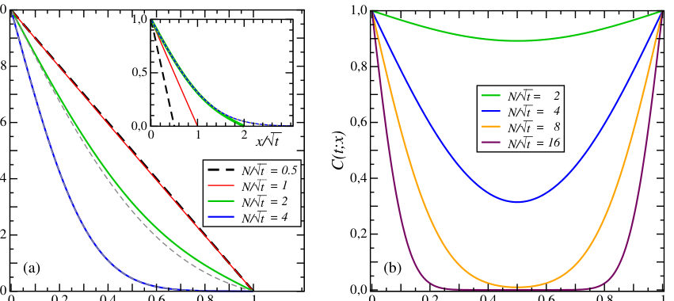
<figcaption class="paper-figure-caption"><b>Fig 2.</b> Figure 2: Finite-size scaling in the 1D Glauber-Ising model at T = 0 on a finite chain for (a) semi- open and (b) periodic boundary conditions. The main plots display the dependence of the correlation function C(t; x) on the finite-size scaling variable x/N, for several fixed values of N/ √</figcaption>
</figure>
<figure class="paper-figure-card">
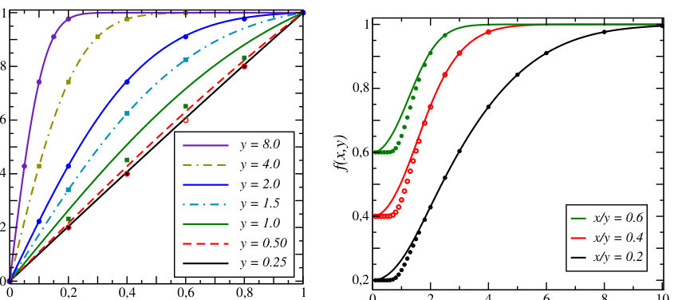
<figcaption class="paper-figure-caption"><b>Fig 3.</b> Figure 3: Test of the identity (2.17), conjectured from the correlation scaling function of the finite-size semi-open 1D Glauber-Ising model. Full curves come from the simplified scaling expression derived from Cscal. Points are derived from the exact solution Csemi. The left panel shows the dependence on x/y for several values of y. The right panel shows the dependence on y, for several vales of x/y.</figcaption>
</figure>

**Summary.** This paper derives the exact time-space correlation function for the 1D Glauber-Ising model on a semi-open chain at zero temperature. By solving the governing diffusion equation with appropriate boundary conditions, it establishes finite-size scaling functions that connect the magnetic dynamics to the empty-interval probability of a dual coagulation-diffusion process.

**Why it may be interesting.** This work provides an exact analytical treatment of finite-size effects in non-equilibrium dynamics, which is crucial for understanding crossover phenomena in many physical systems modeled by interacting particles or spin chains.

Detailed structure

**Main problem.** The primary goal is obtaining the exact time-space correlation function for the 1D Glauber-Ising model on a finite semi-open chain, which also allows deducing properties of the dual coagulation-diffusion process.

**Main result.** The authors derive explicit finite-size scaling functions for both periodic and semi-open chains, establishing a correspondence between the correlation function and the empty-interval probability for the dual process.

**Method.** The analysis involves solving the equation of motion (a diffusion equation) governing the correlators using Fourier series representations and applying boundary conditions specific to the semi-open geometry.

**Model / system.** The system is the 1D Glauber-Ising model, defined on a finite chain segment with spin variables $\sigma_n = \pm 1$. The dynamics are non-equilibrium (Glauber rule) and studied at zero temperature ($T=0$).

**Key observables.** Time-space correlation function $C(t; r)$, single-time correlator $C_n(t)$, empty-interval probability $E(t, x)$, and particle concentration decay $c(t)$.

**Important parameters / regimes.** Finite size $N$, time $t$, and the ratio of length scale to system size ($N/\sqrt{t}$). The analysis focuses on the $T=0$ limit.

**Assumptions / limitations.** The derivation relies on extending known results for periodic chains to semi-open boundaries, and approximations are noted when simple scaling ansatze fail near crossover regimes.

**Figures summary.** Figure 1 illustrates the setup for the semi-open chain calculation. Figure 2 compares the exact semi-open correlator against a simplified scaling ansatz. Figure 3 tests a conjectured mathematical identity relating these two forms.

**Paper structure.** The paper first reviews results for the periodic ring case, then focuses on extending the methods to the semi-open chain geometry. Finally, it relates these findings to the dual coagulation-diffusion process and derives expressions for particle concentration $c(t)$ using mathematical identities involving theta functions.

Abstract

The exact time-space correlation function of the $1D$ Glauber-Ising model, quenched to temperature $T=0$ and on a semi-open lattice of finite size $N$, is obtained. This also allows to deduce the exact empty-interval probability of the dual $1D$ coagulation-diffusion process on a periodic finite ring and to reproduce the long-time decay of the particle concentration. These results are consistent with the generic expectations of dynamical finite-size scaling theory.

[↑ back to top](#top)

### [On-Demand Coherent Mapping of Telecom Optical States onto Erbium Hyperfine Spins](http://arxiv.org/abs/2606.15009v1)

**Authors:** Zongfeng Li, Mahdi Hosseini  
**Type:** experiment · **Category:** quantum information and computing · **PDF:** <https://arxiv.org/pdf/2606.15009v1>  
**Analysis basis:** full PDF text, analyzed in chunks
**Topic relevance:** 🔥 `QC/QI experiment` **4/5** · `exotic spin models in light-matter` **3/5** · `quantum optics experiment` **3/5** · `spintronics-quantum-optics interface` **3/5** · `interference shaping light` **1/5** · `quantum measurements` **1/5**

↔ Scroll figures horizontally

<figure class="paper-figure-card">
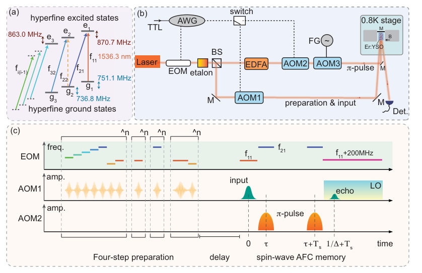
<figcaption class="paper-figure-caption"><b>Fig 1.</b> FIG. 1. (a) Schematic of the hyperfine energy levels of Er3+:YSO (site 1) at B = 1.1 T showing ground (gi) and excited (ei) manifolds. The AFC and π-pulse is applied at transition g1 ↔e1 and g2 ↔e1, respectively. (b) and (c) Schematic of the experimental setup and the pulse sequence. The probe and the control-pulse optical beams enter the crystal in a cryostat at a relative angle θ ≈20 mrad to allow spatial filtering of the echo. An Electro-optic modulator (EOM) and an etalon filter are used for tuning and filtering the laser frequency to address fij transitions. The control (π) pulses are generated by amplifying a fraction of the probe laser in an Er-doped fiber amplifier (EDFA), followed by...</figcaption>
</figure>
<figure class="paper-figure-card">
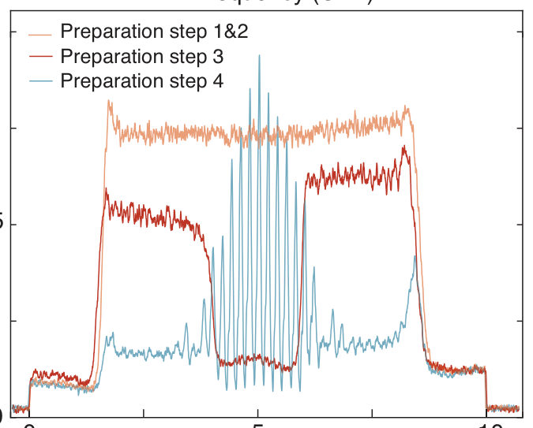
<figcaption class="paper-figure-caption"><b>Fig 2.</b> FIG. 2. (a) In the hole-burning curves (top and bottom), antihole(peak) structures appear when pumping at the right edge of the 4I15/2 →4 I15/2 absorption line (middle). The antiholes’ frequencies determine the Λ system and the hyperfine structure. (b) Result of the four-step preparation used for effective initialization of an atomic frequency comb (AFC) into g1 state. Steps 1 and 2: a 7-MHz-wide class cleaning and initialization in g2 state. Step 3: 2-MHz-wide population is burned from g2 to g1. Step 4: a 2-MHz-AFC is burned at g1 state meanwhile cleaning g2 level. The g1 population is characterized by the transition f11.</figcaption>
</figure>
<figure class="paper-figure-card">
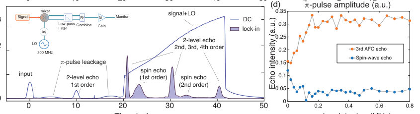
<figcaption class="paper-figure-caption"><b>Fig 3.</b> FIG. 3. (a) Typical 2-level (without π-pulses) and spin-wave storage data are shown as measured with a photo-detector (DC), with TAF C = 10 µs, Ts = 5 µs. Inset shows the amplified spin-wave echo. (b) Spin-wave storage data is shown for both DC and lock-in detection, with TAF C = 10 µs, Ts = 13 µs. A local oscillator (200 MHz detunned) co-propagates with the probe pulses during 20-42µs time frame. Inset shows the lock-in detection setup.(c) Measured echo amplitude as a function of the control π pulse duration and strength. Solid lines are linear fits. (d) Intensities of the spin-wave echo and the 3rd AFC 2-level echo measured for different control-pulse detunings from the excited state.</figcaption>
</figure>
<figure class="paper-figure-card">
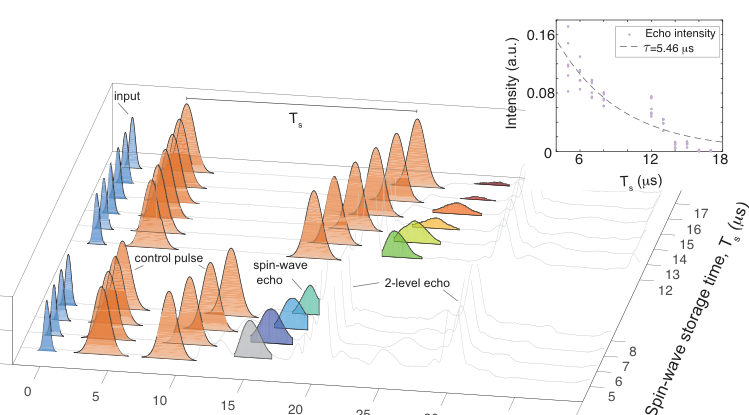
<figcaption class="paper-figure-caption"><b>Fig 4.</b> FIG. 4. Spin-wave echo intensity measured using lock-in detection as a function of storage time Ts = 5, ..., 8 µs and 12, ..., 15 µs.The signal decays with 1/e time T ∗ 2 = 5.46 µs. The input and control pulses are shown schematically and do not represent the actual experimental pulses. Inset shows the raw memory output for different experiment runs taken at different spin-wave storage times, Ts (varying the control pulse separation).</figcaption>
</figure>

**Summary.** The paper reports the successful demonstration of on-demand spin-wave storage in $	ext{Er}^{3+}:	ext{Y}_2	ext{SiO}_5$ crystals using optical control pulses. This technique achieves coherent mapping of telecom photons onto long-lived hyperfine spins, establishing a key component for quantum repeaters. While current limitations stem from inhomogeneous broadening, the results define a clear path toward multi-second storage times.

**Why it may be interesting.** This work directly addresses a major technological bottleneck in quantum networking by providing a solid-state memory operating at telecom wavelengths, which is highly relevant for building practical quantum repeaters.

Detailed structure

**Main problem.** The core challenge is achieving on-demand, coherent mapping of telecom optical quantum states onto long-lived ground-state spins within solid-state systems for use in quantum networks.

**Main result.** The authors successfully demonstrated spin-wave storage in Er-doped crystals, establishing a crucial operational primitive for building scalable, fiber-compatible quantum repeater nodes at telecom wavelengths.

**Method.** They utilized complex optical control pulses and heterodyne detection to coherently transfer excitations into the hyperfine ground states of $	ext{Er}^{3+}$ ions via an effective $\Lambda$-system.

**Model / system.** The physical platform is $	ext{Er}^{3+}:	ext{Y}_2	ext{SiO}_5$ operated at cryogenic temperatures and magnetic fields. The mechanism relies on spin-wave storage within the hyperfine ground states, which allows coherence times limited by the long hyperfine $T_2$.

**Key observables.** Hyperfine population lifetime (up to 25 s), spin-wave storage time ($\sim 25 \mu	ext{s}$), and optical-to-spin transfer efficiency ($>12\%$).

**Important parameters / regimes.** The dominant limitation is the hyperfine inhomogeneous broadening, which restricts current storage times; future improvements require spectral tailoring and dynamical decoupling.

**Assumptions / limitations.** The measurements are performed in a linear storage regime where Maxwell-Bloch evolution is independent of excitation photon number.

**Figures summary.** Figures illustrate hole-burning spectroscopy characterizing the $\Lambda$ system, comparing two-level vs. spin-wave echo decay curves, and showing dependence on pulse parameters like detuning and amplitude.

**Paper structure.** The paper progresses by first establishing the necessity of this primitive for quantum networks, detailing the experimental setup using multi-step pumping to create an AFC, demonstrating the storage capability, and finally analyzing limitations (inhomogeneous broadening) to propose pathways for achieving second-scale coherence.

Abstract

Optical quantum memories operating directly at telecom wavelengths are a key enabling technology for long-distance quantum networks, yet on-demand storage onto long-lived ground-state spins in this spectral region has remained elusive due to the challenge of coherently transferring optical excitations to hyperfine spin states. Here we demonstrate spin-wave storage in $^{167}$Er$^{3+}$:Y$_2$SiO$_5$ at 0.8 K and 1.1 T, establishing the core operational primitive required for on-demand telecom quantum memories. Using classical optical control pulses, we coherently transfer collective optical excitations to erbium hyperfine states with transfer efficiency exceeding 12%, enabling on-demand retrieval. We measure a hyperfine population lifetime of 25 s and demonstrate spin-wave storage for up to 25 $μ$s. By identifying hyperfine inhomogeneous broadening as the dominant present limitation, our measurements define a clear pathway toward second-scale storage through improved spectral tailoring and dynamical decoupling. The results highlight the application of erbium-based solid-state memories for scalable fiber-compatible quantum repeater architectures.

[↑ back to top](#top)

### [Quantum Information Geometry of Multicomponent Superconducting Fluctuation Transport](http://arxiv.org/abs/2606.15928v1)

**Authors:** Zi-Ting Sun, Ying-Ming Xie, Naoto Nagaosa  
**Type:** theory · **Category:** other · **PDF:** <https://arxiv.org/pdf/2606.15928v1>  
**Analysis basis:** full PDF text, analyzed in chunks
**Topic relevance:** 🔥 `entanglement & information structure` **4/5** · `Keldysh / 2PI / non-Gaussian methods` **3/5** · `correlated / nonlocal dissipation` **2/5** · `driven-dissipative phase transition` **2/5** · `non-equilibrium dynamics` **2/5** · `methods for driven-dissipative` **1/5** · `non-equilibrium universality` **1/5**

↔ Scroll figures horizontally

<figure class="paper-figure-card">
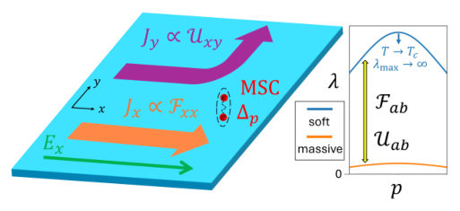
<figcaption class="paper-figure-caption"><b>Fig 1.</b> FIG. 1. Schematic illustration of superconductor fluctuation transport as a probe of quantum information geometry. Left panel: An applied electric field Ex drives fluctuating Cooper pairs ∆p of a multicomponent superconductor (MSC) in momentum space. The longitudinal paraconductivity is governed by the quan- tum Fisher information, giving Jx ∝Fxx, while the transverse anomalous Hall paraconductivity is governed by the mean Uhlmann curvature, giving Jy ∝Uxy. The right panel shows the spectrum of the pair-propagator eigenvalues λ: upon approaching the super- conducting transition, T →Tc, the softest fluctuation mode di- verges, λmax →∞, whereas the massive mode remains finite. The mixed-state...</figcaption>
</figure>
<figure class="paper-figure-card">
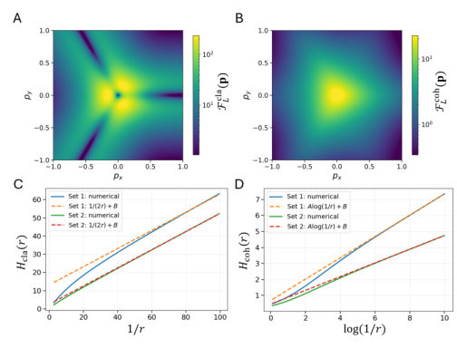
<figcaption class="paper-figure-caption"><b>Fig 2.</b> FIG. 2. Numerical results for longitudinal paraconductivity. (A) and (B): Distribution of F cla L (p) and F coh L (p) for Eq. (24). In both panels, the parameters are chosen as ℓ2 = 0.8, g2 = 0.5, γ0 = |δa| = 1, and r = 0.03. (C) Dimensionless integral Hcla(r) as a function of 1/r for two parameter sets: (1) with ℓ2 = 0.8 and g2 = 0.5, and (2) with ℓ2 = 0.6 and g2 = 0.4. The dashed curves show the leading critical form A(1/r)+B, confirming the A-L divergence of the spectral contribution. (D) Dimensionless integral Hcoh(r) as a function of log(1/r) for the same two parameter sets. The dashed curves show the leading form A log(1/r)+B, demonstrating that the coherent contribution has only a...</figcaption>
</figure>
<figure class="paper-figure-card">
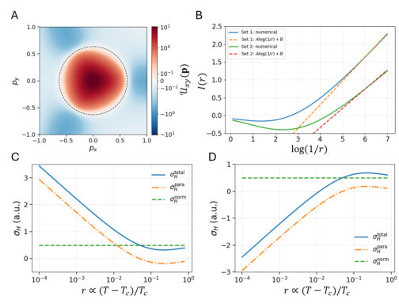
<figcaption class="paper-figure-caption"><b>Fig 3.</b> FIG. 3. Results for fluctuational anomalous Hall effects. (A) Momentum-resolved MUC Uxy(p) for Eq. (24). The parameters are chosen as ℓ2 = 0.8, g2 = 0.5, γ0 = |δa| = 1, and r = 0.03. The dashed circle marks the zero of the numerator, across which Uxy changes sign. (B) Dimensionless integral I(r) as a function of log(1/r) for two parameter sets: (1) ℓ2 = 0.8 and g2 = 0.5, (2) ℓ2 = 0.7 and g2 = 0.6. The agreement at large log(1/r) con- firms the critical behavior of I(r). Panel (C) corresponds to a local- attraction scenario with a positive σnorm H background, while panel (D) corresponds to a Coulomb-repulsion scenario. In both cases, the fluctuational anomalous Hall conductivity σpara H...</figcaption>
</figure>

**Summary.** The paper establishes that collective superconducting fluctuations act as a unique probe of mixed-state quantum information geometry. By analyzing the paraconductivity components—specifically relating longitudinal conductivity to Quantum Fisher Information and anomalous Hall effect to mean Uhlmann Curvature—the authors demonstrate a deep geometric connection previously unseen in normal metals. This provides a powerful theoretical framework for understanding fluctuation transport near superconducting transitions.

**Why it may be interesting.** This work bridges fundamental concepts from quantum information theory (mixed-state geometry) directly into measurable condensed matter transport phenomena, providing a novel diagnostic tool for strongly correlated superconducting states.

Detailed structure

**Main problem.** To determine if collective many-body superconducting fluctuations possess a measurable quantum geometry and how this geometry manifests in transport properties.

**Main result.** Superconducting fluctuation transport provides a direct, experimentally accessible probe of mixed-state quantum information geometry via the relationship between paraconductivity components and geometric tensors like the Quantum Fisher Information and mean Uhlmann Curvature.

**Method.** The analysis uses time-dependent Ginzburg-Landau theory in the Gaussian fluctuation regime to derive kinetic equations for the pairing fluctuation density matrix, linking transport coefficients to quantum information metrics.

**Model / system.** The system is a multicomponent superconductor exhibiting fluctuations above the critical temperature ($T > T_c$), modeled using a time-dependent Ginzburg-Landau (TDGL) theory. The core object of study is the equilibrium density matrix of fluctuating Cooper pairs, which defines a mixed-state manifold.

**Key observables.** Longitudinal paraconductivity ($\sigma_{L}$), fluctuational anomalous Hall conductivity ($\sigma_{	ext{para}}^H$), Quantum Fisher Information (QFI), and mean Uhlmann Curvature (MUC).

**Important parameters / regimes.** Temperature relative to $T_c$ ($r \propto (T - T_c)/T_c$), fluctuation parameters ($\gamma_\pm, \lambda$), and the ratio of kinetic coefficients ($\Xi''/\Xi'$).

**Assumptions / limitations.** The analysis is performed in the Gaussian fluctuation regime, utilizing low-frequency/long-wavelength approximations for the inverse propagator, and assuming a specific relaxation structure for the kinetic coefficient.

**Figures summary.** Figures illustrate how longitudinal paraconductivity relates to QFI ($J_x \propto F_{xx}$) and anomalous Hall conductivity relates to MUC ($J_y \propto U_{xy}$), showing characteristic divergences near $T_c$.

**Paper structure.** The paper progresses from establishing the link between quantum geometry and transport in general (Chunk 1) to deriving the kinetic equation for the pairing fluctuation density matrix (Chunk 2, Chunk 5). It then analyzes critical asymptotics by examining the soft branch of the inverse propagator (Chunk 6), culminating in specific applications to chiral superconductors (Chunk 3).

Abstract

Quantum geometry underlies many electronic responses, but its transport signatures have so far been established mainly for pure single-particle Bloch states. Whether collective many-body fluctuations possess a measurable quantum geometry remains largely unexplored. Here we show that superconducting fluctuation transport provides a direct probe of quantum information geometry in collective many-body matter. Starting from a multicomponent time-dependent Ginzburg-Landau theory in the Gaussian fluctuation regime, we identify the equilibrium density matrix of fluctuating Cooper pairs as the static pair propagator, which defines a positive mixed-state manifold in momentum space. The geometry of this manifold is directly measurable through paraconductivity: the longitudinal paraconductivity is governed by the quantum Fisher information of superconducting fluctuation modes, while the fluctuational anomalous Hall effect is governed by the mean Uhlmann curvature, the mixed-state counterpart of Berry curvature. This correspondence further yields geometric bounds between these two transport components, with no direct analogue in normal electronic transport. Applied to chiral superconducting fluctuations in quarter-metal systems motivated by rhombohedral multilayer graphene, a symmetry-allowed Lifshitz invariant generates finite mean Uhlmann curvature and logarithmically enhances the anomalous Hall conductivity above the critical temperature. Our results establish collective superconducting fluctuations as an experimentally accessible transport probe of mixed-state quantum information geometry.

[↑ back to top](#top)

### [High-fidelity two-qubit gates in a 7-qubit register for quantum networks](http://arxiv.org/abs/2606.14847v1)

**Authors:** Margriet van Riggelen, Jiwon Yun, H. Benjamin van Ommen, Tim H. Taminiau  
**Type:** both · **Category:** quantum information and computing · **PDF:** <https://arxiv.org/pdf/2606.14847v1>  
**Analysis basis:** full PDF text, analyzed in chunks
**Topic relevance:** 🔥 `QC/QI experiment` **4/5** · `spintronics-quantum-optics interface` **3/5** · `analog quantum simulation` **2/5** · `quantum measurements` **2/5** · `entanglement & information structure` **1/5** · `exotic spin models in light-matter` **1/5** · `non-equilibrium dynamics` **1/5**

↔ Scroll figures horizontally

<figure class="paper-figure-card">
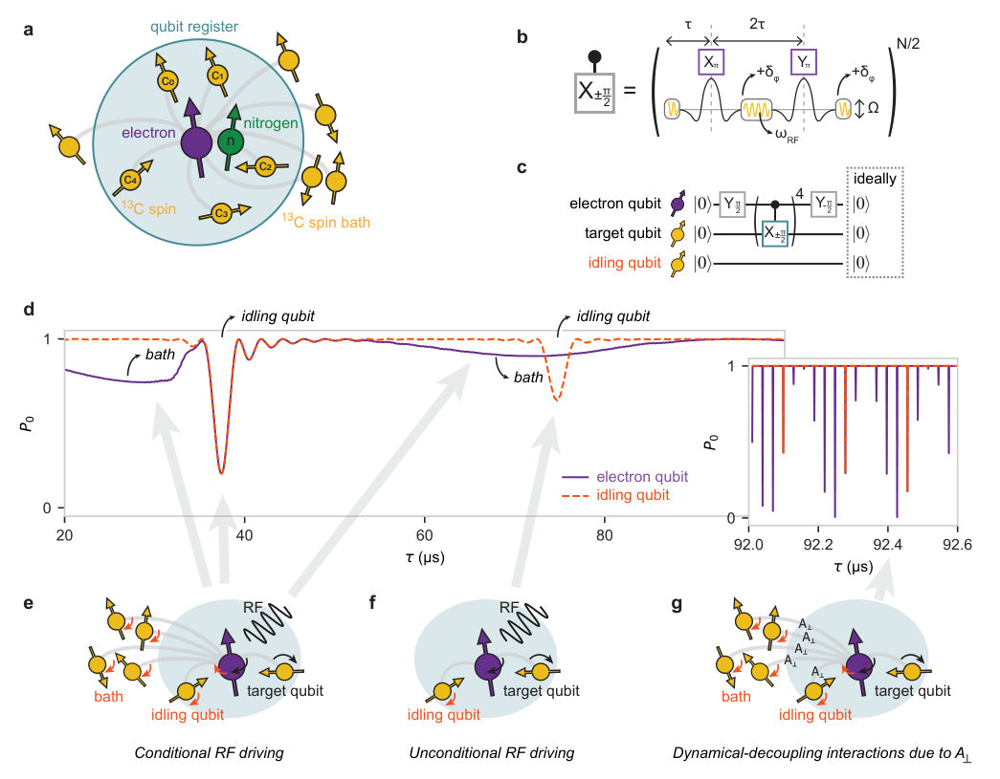
<figcaption class="paper-figure-caption"><b>Fig 1.</b> FIG. 1. Crosstalk in a multi-qubit electron-nuclear spin system. a) The 7-qubit register formed by the NV electron spin, the NV 14N nuclear spin and 5 13C nuclear spins. Other spins in the 13C spin bath are not part of the register, but do cause decoherence of the register spins. b) Dynamically decoupled radiofrequency gates are used to engineer a two-qubit gate between the electron spin, and one target nuclear spin. The relevant gate parameters are τ, ωRF, Ω, N, and δϕ. c) Quantum circuit to reveal the different types of crosstalk. The interpulse delay τ is varied while keeping the total rotation angle constant. After the circuit, all qubits should end in |0⟩. d) Simulated outcome of the...</figcaption>
</figure>
<figure class="paper-figure-card">
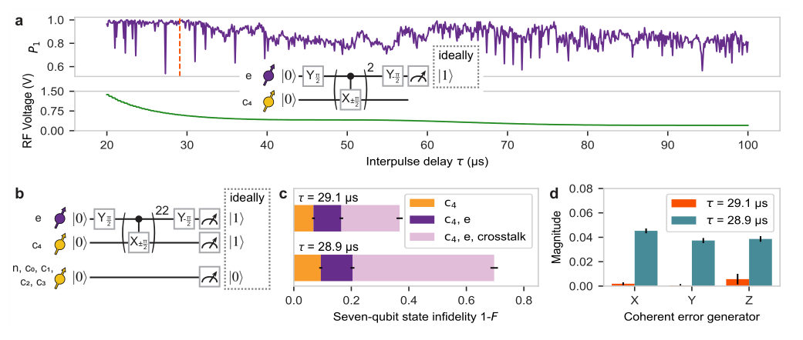
<figcaption class="paper-figure-caption"><b>Fig 2.</b> FIG. 2. Measurements for the crosstalk during the e-c4 two-qubit gate. a) Upper panel: electron-spin qubit population in |1⟩ after application of the circuit in the inset. Various regions and resonances where the coherence is reduced are observed. The red dotted line corresponds to τ = 29.1 µs, the value we find for this gate at the end of the optimization procedure. Lower panel: RF voltage used to keep the gate rotation angle constant while sweeping τ. b) Experimental circuit to amplify errors and detect crosstalk. Using the readout of all qubits, we compute the state infidelity after application of the circuit. c) State infidelity after application of the circuit in b). The orange bar...</figcaption>
</figure>
<figure class="paper-figure-card">
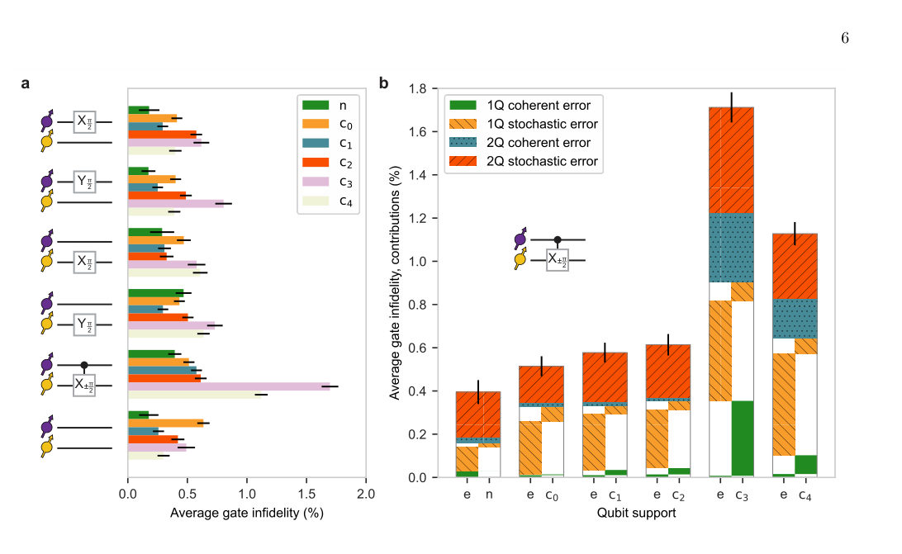
<figcaption class="paper-figure-caption"><b>Fig 3.</b> FIG. 3. Characterization of the optimized gates a) Average gate infidelity for the gates in our gate set. Data is obtained from six two-qubit gate set tomography (GST) experiments, each involving the electron-spin qubit (purple) and one nuclear-spin qubit (yellow). Error bars represent one standard deviation. b) We can separate different contributions to the average gate infidelity, here the two-qubit gates are shown as an example. Every column represents one two-qubit gate. Green and yellow half-bars indicate single-qubit errors on the electron-spin qubit (left) and nuclear-spin qubit (right), respectively. Teal and red full-width bars indicate errors on both qubits.</figcaption>
</figure>
<figure class="paper-figure-card">
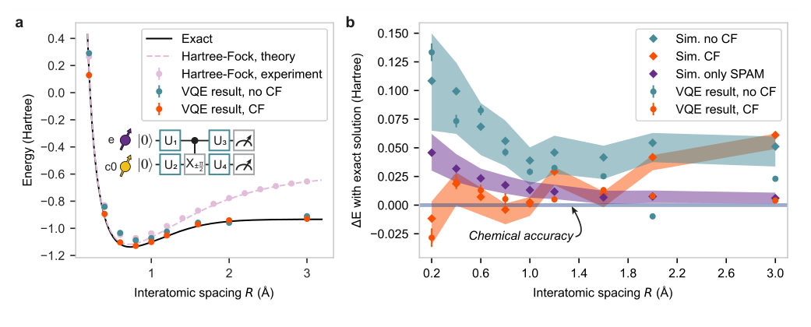
<figcaption class="paper-figure-caption"><b>Fig 4.</b> FIG. 4. VQE for H2 a) Ground state energy of H2 for varied interatomic spacing R. Pink dots indicate the energy when constructing a HF state with the circuit, which can be compared to the theoretical HF energy value (pink dotted line). Teal (orange) dots indicate experimental VQE results without (with) clifford fitting (CF). The exact value is shown for comparison. Inset: two-qubit quantum circuit to calculate the H2 ground state. b) Difference with the exact ground-state energy. Dots are the experimental VQE data, diamonds indicate the result of simulations based on two-qubit GST results. Shaded region is a 2σ confidence region around the simulated values based on a Monte-Carlo simulation...</figcaption>
</figure>
<figure class="paper-figure-card">
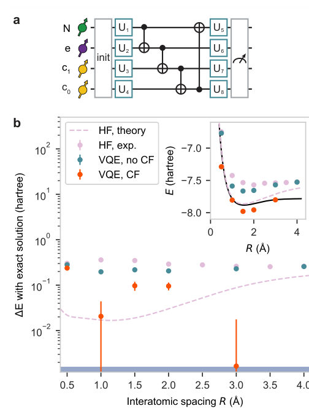
<figcaption class="paper-figure-caption"><b>Fig 5.</b> FIG. 5. VQE for LiH a) Quantum circuit for LiH VQE. b) Difference with the exact ground-state energy of LiH for varied interatomic spacing R. Pink dots are an experimen- tally obtained ground-state energy estimate by constructing the HF state using the VQE circuit. Teal (orange) dots dots indicate experimental VQE results without (with) Clifford fit- ting (CF). The exact values and the theoretical HF values are shown for comparison. Inset: Ground state energy of LiH.</figcaption>
</figure>

**Summary.** This research demonstrates high-fidelity two-qubit gates on a multi-spin quantum register using NV centers, achieving fidelities near the threshold required for fault-tolerant computation. These hardware capabilities are then leveraged to successfully simulate molecular ground state energies ($	ext{H}_2$, $	ext{LiH}$) via the Variational Quantum Eigensolver (VQE). The work is significant because it validates a solid-state platform's readiness for complex quantum simulation tasks.

**Why it may be interesting.** This work bridges the gap between foundational solid-state quantum hardware characterization and complex quantum simulation algorithms. For AMO physicists, it provides an experimental roadmap showing how engineered spin systems can tackle chemically relevant many-body problems, while the detailed error analysis is crucial for understanding decoherence in solid-state environments.

Detailed structure

**Main problem.** The work aims to demonstrate high-fidelity two-qubit gates in a multi-qubit solid-state spin register (up to 7 qubits) necessary for scalable quantum networks, while also applying these capabilities to simulate molecular ground state energies.

**Main result.** High average two-qubit gate fidelities exceeding $99.18\%$ were achieved, placing the system near the threshold for distributed quantum computation. Furthermore, VQE simulations successfully estimated the ground-state energy of $	ext{H}_2$ and $	ext{LiH}$ with chemical accuracy using error mitigation techniques.

**Method.** The research combines experimental characterization (Gate Set Tomography) to measure gate fidelities and systematic crosstalk analysis with quantum algorithm implementation (VQE) utilizing advanced error mitigation like Clifford Fitting.

**Model / system.** The physical platform is a solid-state spin system involving an NV electron spin qubit coupled to multiple nuclear spins ($^{13}	ext{C}$ bath). The computational tasks involve simulating molecular Hamiltonians ($	ext{H}_2$, $	ext{LiH}$) using the Variational Quantum Eigensolver (VQE) algorithm.

**Key observables.** Two-qubit gate fidelities (best: $99.61\%$), average two-qubit fidelity ($99.18\%$), ground state energy ($\langle H 
angle$) estimates for $	ext{H}_2$ and $	ext{LiH}$, and Pauli expectation values.

**Important parameters / regimes.** Gate parameters include interpulse delays ($	au$), RF frequencies ($\omega_{	ext{RF}}$), and the number of decoupling pulses ($N$). The target accuracy is chemical accuracy (e.g., $1.6 	ext{ mHa}$ for $	ext{H}_2$).

**Assumptions / limitations.** The analysis assumes that systematic optimization procedures can effectively mitigate complex crosstalk mechanisms, and VQE simulations rely on the successful implementation of error mitigation techniques like Clifford Fitting.

**Figures summary.** Figures illustrate gate control schemes (DDRF), crosstalk diagrams, VQE potential energy landscapes for $	ext{H}_2$ and $	ext{LiH}$ comparing simulation to theory, and circuit depth analysis showing sufficient depth for chemical accuracy in $	ext{LiH}$.

**Paper structure.** The paper progresses from demonstrating fundamental high-fidelity two-qubit gate operations by analyzing crosstalk mechanisms (using GST) to applying these gates as a testbed for quantum chemistry simulations using VQE, culminating in molecular energy estimations.

Abstract

Quantum networks based on optically active solid-state spins may enable quantum technologies including long-range quantum communication and distributed quantum computing. Network nodes containing multiple high-fidelity qubits can facilitate large-scale fault-tolerant operation. However, the stringent error thresholds remain out of reach for multi-qubit registers. In this work, we demonstrate high-fidelity two-qubit gates in a 7-qubit register, based on nuclear spins coupled to a nitrogen-vacancy (NV) center in diamond. We analyze crosstalk in highly connected spin systems, develop an efficient optimization procedure, and characterize the gates using gate set tomography. The two-qubit gate fidelities (best: 99.61(5)%, average: 99.18(2)%) demonstrate a multi-qubit register at the threshold for distributed quantum computation. Finally, as an example application, we perform a variational quantum eigensolver (VQE) simulation of the ground-state energy of H2 and LiH molecules. These results demonstrate one of the key prerequisites for scalable quantum networks based on solid-state spins.

[↑ back to top](#top)

### [Quantum optimal control of steady orbits](http://arxiv.org/abs/2606.15383v1)

**Authors:** Shebha Anandhi Jegadeesan, Yujie Zhao, Robert Hunter, Hassane El Mkami, Maximilian Keitel, Callum Musselwhite, Graham Smith, Guinevere Mathies, Ilya Kuprov  
**Type:** both · **Category:** other · **PDF:** <https://arxiv.org/pdf/2606.15383v1>  
**Analysis basis:** full PDF text, analyzed in chunks
**Topic relevance:** 🔥 `methods for driven-dissipative` **4/5** · `driven-dissipative phase transition` **3/5** · `non-equilibrium dynamics` **3/5** · `non-equilibrium universality` **2/5** · `Keldysh / 2PI / non-Gaussian methods` **1/5** · `correlated / nonlocal dissipation` **1/5**

↔ Scroll figures horizontally

<figure class="paper-figure-card">
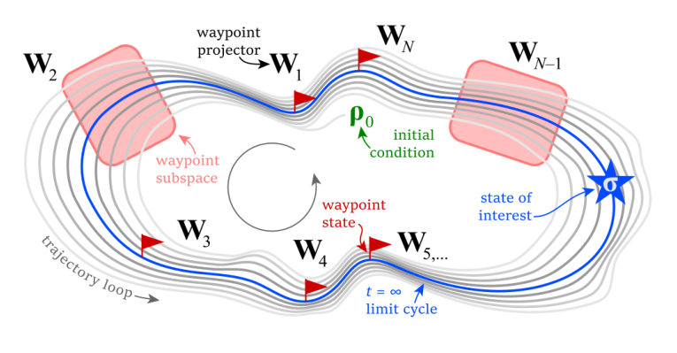
<figcaption class="paper-figure-caption"><b>Fig 1.</b> Figure 1. A schematic illustration of steady orbit optimal control. The system starts at the initial state ρ0 and evolves under a periodic external control sequence. The original gradient ascent pulse engineering GRAPE method26,27 designs a one-off control sequence that takes the system to a fixed destination state σ. The formalism proposed here designs instead a periodic control sequence that makes the system approach the blue attractor loop in the state space, con- strained by waypoint projectors Wn enforcing a state (red flag) or a subspace (red area). Such problem settings are not supported by existing average Hamiltonian and Floquet-Lindblad type theories, but they are common in...</figcaption>
</figure>
<figure class="paper-figure-card">
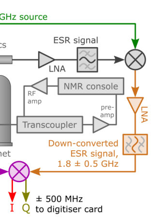
<figcaption class="paper-figure-caption"><b>Fig 2.</b> Figure 2. Simplified schematic of the HiPER pulsed EPR/DNP spectrometer operating at 3.4 T. Integration of an arbitrary waveform generator (AWG) into the heterodyning enables con- venient pulse shaping at 94 GHz and coherent quadrature detection of the EPR signal. For further details, see the papers describing HiPER76 and its upgrades77.</figcaption>
</figure>
<figure class="paper-figure-card">
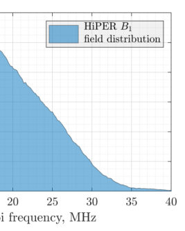
<figcaption class="paper-figure-caption"><b>Fig 3.</b> Figure 3. Distribution of the electron Rabi frequencies in the HiPER instru- ment at 7.5 dB attenuation. Obtained from a finite element simulation of the shorted waveguide containing the sample tube and sample. Reproduced from Figure 8 of Zhao et al.77 For DNP pulse sequence optimisation, this distribution was approximated by a uniform distribution between 5 and 25 MHz.</figcaption>
</figure>
<figure class="paper-figure-card">
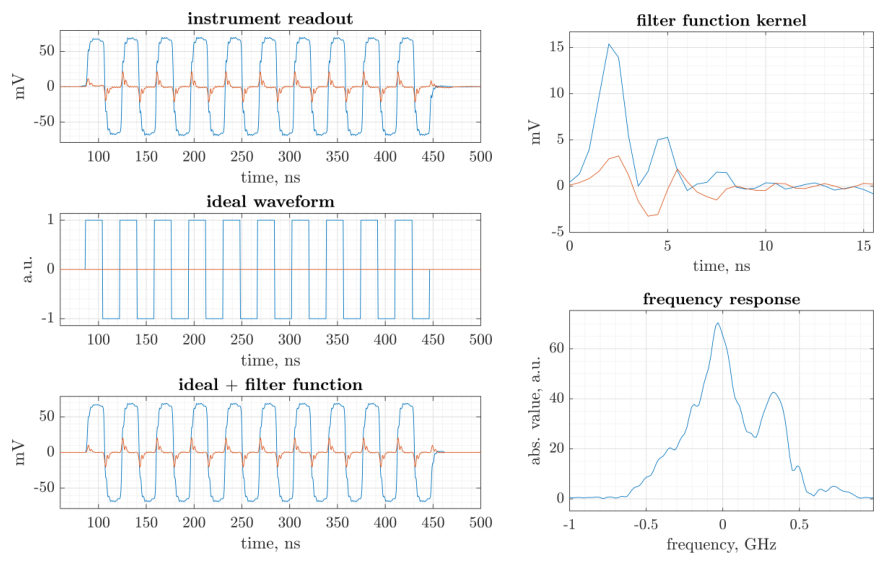
<figcaption class="paper-figure-caption"><b>Fig 4.</b> Figure 4. HiPER instrument filter function including the detection circuit. (Left panel) Ideal X-inverse-X pulse se- quence (the phases of the pulses alternate between 0° and 180°, pulse duration 18 ns) as measured by the instrument (top left), as programmed into the AWG (middle left), and as modelled by Spinach when the filter function is applied to the ideal sequence (bottom left). (Right panel) Filter function of the HiPER instrument in the time domain (top right, real and imaginary components shown) and in the frequency domain (bottom right).</figcaption>
</figure>
<figure class="paper-figure-card">
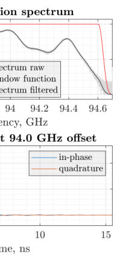
<figcaption class="paper-figure-caption"><b>Fig 5.</b> Figure 5. Waveform distortions induced in HiPER’s ex- citation branch. (Top panel) Transmission spectrum and (bottom panel) filter function kernel (in-phase and out-of- phase components). The indicated window function was applied to the transmission spectrum before extraction of the filter function by the inverse Fourier transform.</figcaption>
</figure>

**Summary.** This paper introduces an advanced optimal control technique, SO-GRAPE, designed to steer dissipative quantum systems toward stable, asymptotically approached steady orbits or limit cycles. By modifying the standard GRAPE framework with waypoint projectors, it overcomes the computational hurdle posed by infinite time evolution. This method is demonstrated successfully in optimizing complex pulsed DNP sequences for solid-state NMR, showing how realistic hardware limitations must be incorporated into theoretical control design.

**Why it may be interesting.** This work is highly relevant as it tackles a major computational bottleneck—controlling asymptotic states—in open quantum systems. The extension of GRAPE to limit cycles provides a powerful new tool for designing robust control pulses in quantum optics and metrology.

Detailed structure

**Main problem.** The core problem is developing an efficient quantum optimal control strategy for reaching asymptotically approached steady orbits or limit cycles in periodically driven, dissipative quantum systems.

**Main result.** The authors propose and implement a 'steady-orbit GRAPE' method that successfully drives the system towards these asymptotic states while maintaining computational complexity comparable to standard GRAPE techniques.

**Method.** The approach extends Gradient Ascent Pulse Engineering (GRAPE) by incorporating waypoint projectors into the Liouville space evolution. It uses Newton-Raphson methods to efficiently calculate the steady state, avoiding direct simulation of infinite time propagation.

**Model / system.** The system is a periodically driven dissipative quantum system modeled using the density operator formalism ($
ho$). Applications include cooling engines, lasers, atomic clocks, and specifically, pulsed Dynamic Nuclear Polarization (DNP) experiments in solid-state NMR.

**Key observables.** Fidelity of approach to the steady orbit, longitudinal nuclear magnetization ($Z = \sigma_I / I$), and the asymptotic state $
ho_{	ext{ss}}$.

**Important parameters / regimes.** The number of discrete time steps ($N$), the control sequence period, and instrumental parameters like filter functions ($\mathcal{H}$) and Rabi frequency distributions.

**Assumptions / limitations.** The method assumes dissipation is present to ensure the desired orbit is an attractor. It also relies on the existence of an inverse for $(1 - P)$, guaranteed by strong dissipation.

**Figures summary.** Figures illustrate the contrast between standard GRAPE (targeting a fixed state) and the proposed method (enforcing passage through waypoints). Later figures detail experimental setups, filter function measurements comparing ideal vs. realistic hardware assumptions, and final magnetization histograms.

**Paper structure.** The paper introduces the theoretical challenge of steady-state control for dissipative systems, details the SO-GRAPE formalism using waypoint projectors in Liouville space, applies this method to optimize DNP pulse sequences by incorporating measured instrumental filter functions, and concludes with comparisons against ideal assumptions.

Abstract

Periodically driven dissipative systems can settle into steady orbits - fixed loops on their dynamical manifolds. In quantum mechanics, steady orbits occur in cooling engines (used to initialise quantum devices), coherent oscillators (such as lasers and masers), precision metrology devices (atomic clocks, optical and spin magnetometers), and magnetic resonance (steady state free precession, dynamic nuclear polarisation). Steady orbits and stroboscopic steady states are a promising target for quantum optimal control, but the numerical complexity is prohibitive: the infinite loop defeats gradient ascent pulse engineering (GRAPE) which relies on explicit numerical propagation in the time domain.   Here we propose an efficient quantum control strategy for stroboscopic steady states and limit cycles that are approached asymptotically when a control sequence is repeated infinitely many times. The formalism is different from Floquet-Lindblad state engineering and effective Hamiltonian theories: it finds control sequences that drive a dissipative quantum system towards a steady orbit passing through user-specified waypoints. The software implementation (same numerical complexity scaling as GRAPE) is done for the Spinach library.

[↑ back to top](#top)

### [Single-Image Entanglement Verification with Spatially Encoded Measurement Contexts](http://arxiv.org/abs/2606.15382v1)

**Authors:** Nazanin Dehghan, Alessio D'Errico, Yingwen Zhang, Hugo Defienne, Daniele Faccio, Ebrahim Karimi  
**Type:** experiment · **Category:** other · **PDF:** <https://arxiv.org/pdf/2606.15382v1>  
**Analysis basis:** full PDF text, analyzed in chunks
**Topic relevance:** 🔥 `quantum optics experiment` **4/5** · `interference shaping light` **3/5** · `quantum measurements` **3/5** · `QC/QI experiment` **2/5** · `entanglement & information structure` **1/5** · `measurement-induced transitions` **1/5**

↔ Scroll figures horizontally

<figure class="paper-figure-card">
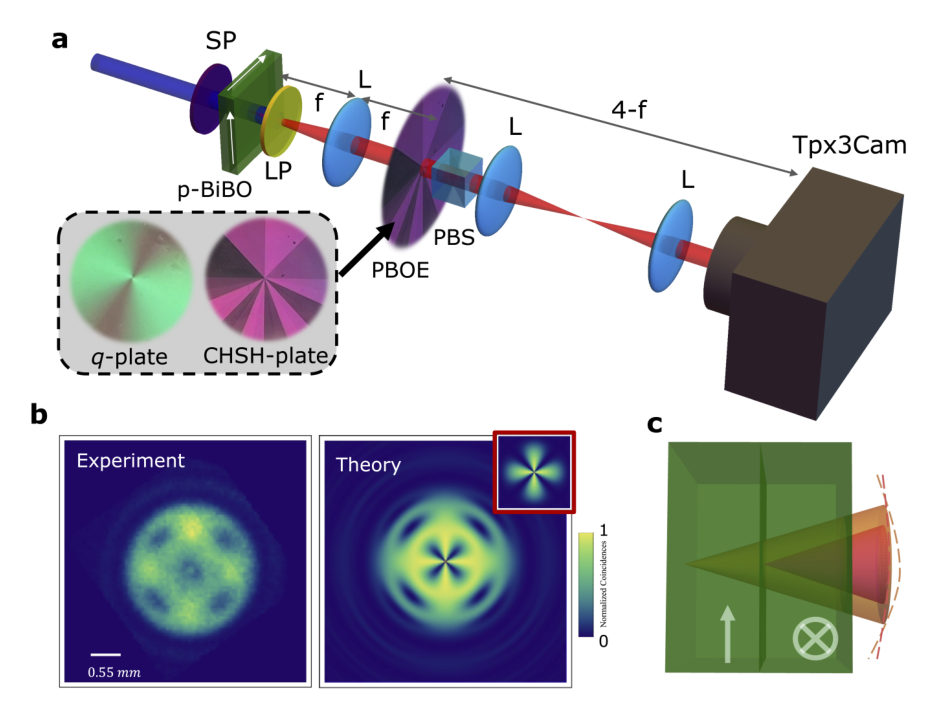
<figcaption class="paper-figure-caption"><b>Fig 1.</b> Figure 1. Single-shot readout of structured entanglement with spin-orbit metasurfaces. (a) Experimental implementation. A 355-nm pump laser illuminates a pair of BiBO crystals, generating polarization-entangled photon pairs by spontaneous parametric down-conversion (SPDC). The down-converted photons are sent through either a q-plate or a CHSH plate and are then imaged onto a time-stamping camera (Tpx3Cam), which records spatially resolved coincidence events. SP, short-pass filter; p-BiBO, paired BiBO crystals, LP, long-pass filter; L, lens; PBOE, Pancharatnam–Berry optical element. Photographs of the fabricated PBOEs between crossed polarizers are shown in the inset. (b) Coincidence images...</figcaption>
</figure>
<figure class="paper-figure-card">
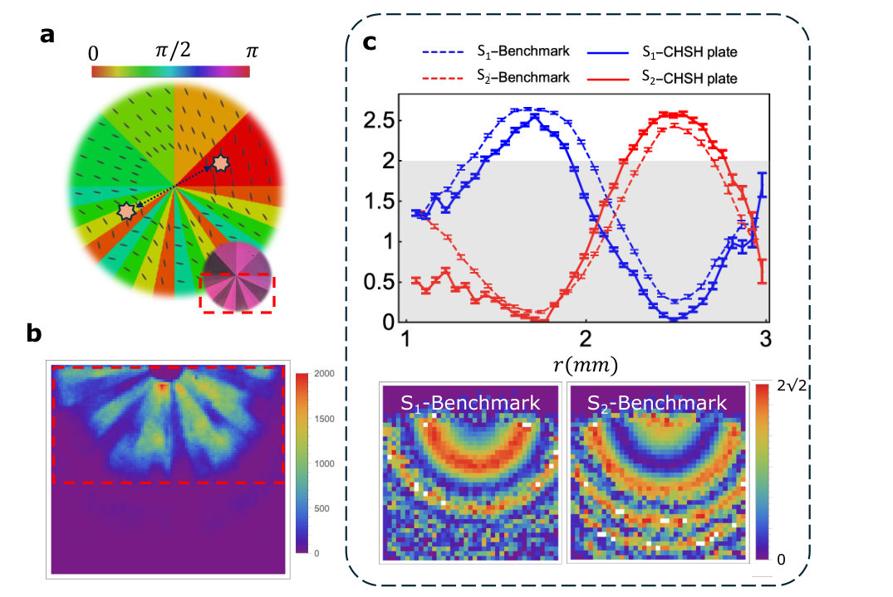
<figcaption class="paper-figure-caption"><b>Fig 2.</b> Figure 2. Single-shot CHSH measurement with the metasurface. (a) Spatial pattern of the optic-axis orientation in the CHSH plate, which encodes the different polarization projections across the transverse plane. (b) Coincidence image of the SPDC photons after transmission through the CHSH plate. Different azimuthal sectors correspond to projections onto distinct linear polarization states, leading to characteristic variations in the photon distribution around the ring. (c) Comparison between the CHSH parameters extracted from the azimuthal sectors in b using a single measurement and those obtained with the benchmark setup based on 16 sequential polarization measurements, as seen in the...</figcaption>
</figure>
<figure class="paper-figure-card">
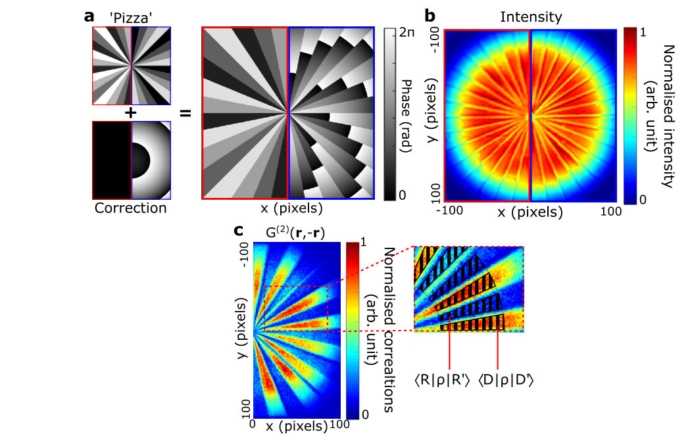
<figcaption class="paper-figure-caption"><b>Fig 3.</b> Figure 3. Programmable CHSH measurement using spatial light modulators. (a) Phase mask applied to the SLM for the CHSH measurement. The pattern combines the angular “pizza” phase mask, which implements the 16 joint polarization projections, with the phase correction Ψ(x, y) = 4.69k2 x + 5.04k2 y + 0.02 that compensates for the spatial phase distortion of the biphoton state. (b) Intensity distribution of the SPDC field recorded with the SLM pattern applied. Diffraction features appear at the boundaries between adjacent angular sectors. (c) Spatially resolved correlation image G(2)(r, −r) obtained with the EMCCD camera. Each pair of centrosymmetric sectors corresponds to one of the 16 joint...</figcaption>
</figure>
<figure class="paper-figure-card">
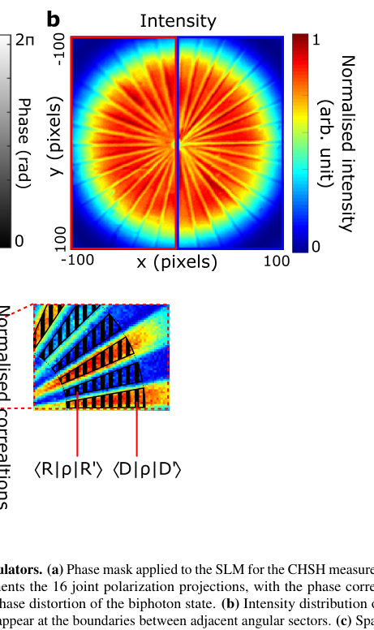
<figcaption class="paper-figure-caption"><b>Fig 4.</b> Figure 2-c compares the CHSH parameters obtained from the conventional benchmark measurements (dashed curves), which require 16 sequential polarization projections (see Sup- plementary Materials) with those obtained from the single-shot measurement performed using the CHSH plate (solid curves). For the benchmark data shown in the insets of Fig.2-c, the plot- ted values correspond to azimuthally averaged results. Overall, the two approaches show good qualitative agreement. Residual discrepancies between the two methods can arise from several experimental imperfections. In particular, small misalignments between the CHSH plate and the centre of the SPDC cone can lead to imperfect photon...</figcaption>
</figure>
<figure class="paper-figure-card">
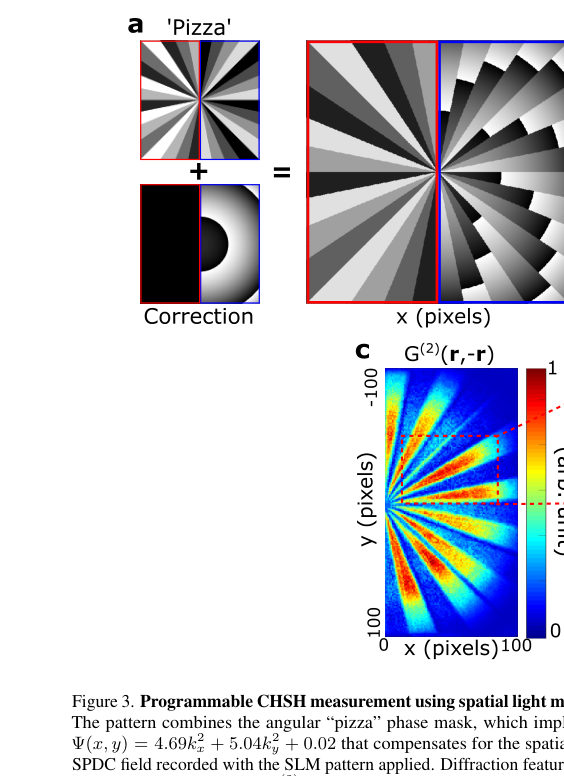
<figcaption class="paper-figure-caption"><b>Fig 5.</b> Figure 2-a shows the corresponding optic-axis pattern θ(x, y), together with an image of the fabricated device viewed between crossed polarizers. The CHSH plate implements a spatially multiplexed Bell measurement in which incompatible measurement contexts coexist across the beam profile. The coincidence image therefore, directly contains the outcomes of all CHSH measurements. After recording coincidence events and post-selecting photon pairs exhibiting sharp transverse momentum anti-correlations [52, 56], we obtain a correlation image that simultaneously contains the results of all 16 joint polarization projections (Fig. 2-b). Each azimuthal slice of the image corresponds to one of the...</figcaption>
</figure>

**Summary.** This paper introduces a novel method to verify entanglement in photon pairs by mapping multiple joint polarization measurements onto the spatial profile of the beam using metasurfaces or SLMs. This technique allows for single-shot, parallel testing of Bell inequalities across the transverse plane, significantly enhancing the speed and scalability of quantum characterization.

**Why it may be interesting.** This work provides a powerful experimental blueprint for quantum optics that moves beyond sequential measurements. The concept of encoding measurement settings spatially is highly relevant for developing scalable quantum sensors and imaging techniques.

Detailed structure

**Main problem.** The primary challenge is characterizing the rich spatial entanglement structure of photon pairs generated by spontaneous parametric down-conversion (SPDC), which is difficult using conventional measurement techniques.

**Main result.** The authors demonstrate that spatially structured optical elements, such as liquid-crystal metasurfaces, can transform Bell tests into parallel measurements distributed across the transverse plane, enabling rapid characterization of entanglement.

**Method.** They employ a technique where the spatial coordinate acts as a classical register to select measurement contexts, allowing multiple joint polarization projections (e.g., 16 for a CHSH test) to be measured simultaneously in a single acquisition.

**Model / system.** The system uses entangled photon pairs from SPDC and utilizes advanced optical components like q-plates and liquid-crystal metasurfaces (CHSH plates). These devices encode polarization information into the spatial structure of the emitted photons.

**Key observables.** Spatially resolved coincidence images, CHSH parameters ($S$), and interference patterns modulated by wavefront curvature.

**Important parameters / regimes.** The classical bound for Bell tests ($|S| \le 2$) versus the quantum prediction; spatial frequency ($q$); and polarization projection bases (e.g., $\{|D
angle, |A
angle\}$).

**Assumptions / limitations.** The core assumption is that the transverse coordinate can be treated as a classical register selecting the measurement context for parallel measurements.

**Figures summary.** Figures illustrate experimental setups using q-plates and metasurfaces; they show coincidence images exhibiting spatial modulation (e.g., $8q$-fold patterns) and reconstructed maps of CHSH parameters demonstrating entanglement violation.

**Paper structure.** The paper progresses from initial demonstrations using q-plates to implementing a fully multiplexed Bell test using a liquid-crystal metasurface, followed by an alternative programmable realization using a Spatial Light Modulator (SLM), culminating in quantitative verification of Bell inequality violations.

Abstract

Entangled photon pairs produced by spontaneous parametric down-conversion exhibit rich spatial entanglement structure that is often difficult to probe with conventional measurements. Here, we show that spin-orbit optical elements can convert this spatial structure into directly observable quantum interference patterns. Using a $q$-plate, we demonstrate that the relative wavefront curvature of biphoton states generated by a pair of nonlinear crystals can be retrieved from the spatial modulation of coincidence images. Building on this principle, we introduce a liquid-crystal metasurface that performs spatially multiplexed Bell measurements across the transverse profile of the photon field. The device, which we call a Clauser-Horne-Shimony-Holt (CHSH) plate, assigns different polarization projections to different azimuthal sectors of the beam, allowing the sixteen joint measurements required for a CHSH test to be realized simultaneously in a single acquisition. In this architecture, the spatial coordinate acts as a classical register selecting the measurement context, while photon pairs sample these contexts according to their emission directions. We further demonstrate that the same measurement concept can be implemented using a programmable spatial light modulator, providing a dynamically reconfigurable realization of the scheme. Our results show that spatially structured optical elements can transform Bell tests into parallel measurements distributed across the transverse plane, enabling rapid characterization of spatially varying entanglement. This approach opens new possibilities for structured-light quantum measurements, Bell-inequality-based imaging, and the study of spatially engineered entangled photon sources.

[↑ back to top](#top)

### [Cosmological Pseudo-Entropy](http://arxiv.org/abs/2606.15227v1)

**Authors:** Manghang Limbu, Pramod Kamal Kharel, Rohit Bhattarai, Kiran Adhikari  
**Type:** theory · **Category:** other · **PDF:** <https://arxiv.org/pdf/2606.15227v1>  
**Analysis basis:** full PDF text, analyzed in chunks
**Topic relevance:** 🔥 `entanglement & information structure` **4/5** · `non-equilibrium dynamics` **2/5** · `non-equilibrium universality` **2/5** · `Keldysh / 2PI / non-Gaussian methods` **1/5** · `analog quantum simulation` **1/5** · `correlated / nonlocal dissipation` **1/5** · `driven-dissipative phase transition` **1/5** · `methods for driven-dissipative` **1/5**

↔ Scroll figures horizontally

<figure class="paper-figure-card">
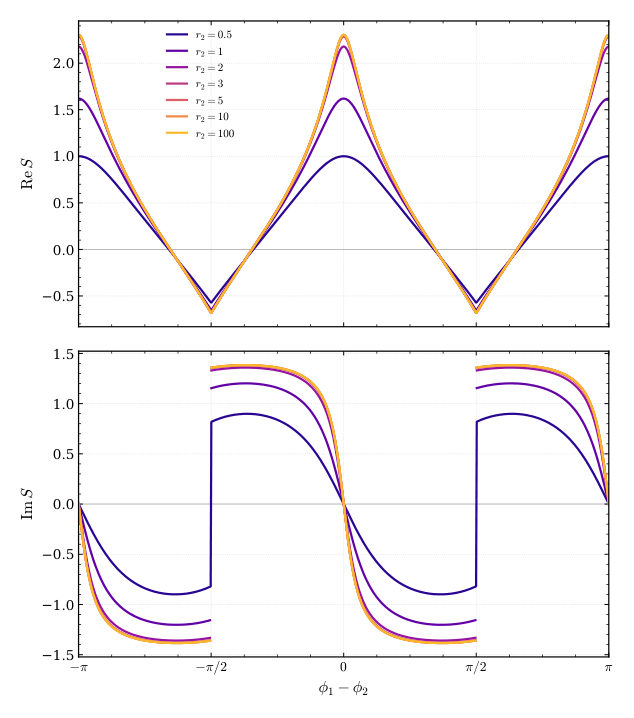
<figcaption class="paper-figure-caption"><b>Fig 1.</b> Figure 1: Real and imaginary parts of the pseudo entropy S plotted as a function of ϕ1 −ϕ2 for fixed r1 = 1 and various r2. Curves saturate to a common envelope as r2 ≳3.</figcaption>
</figure>
<figure class="paper-figure-card">
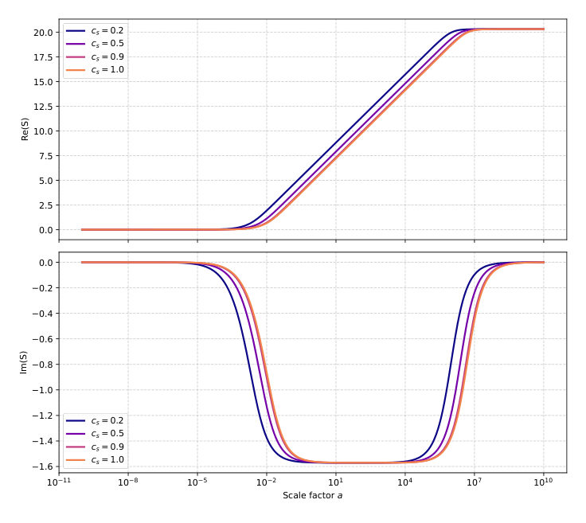
<figcaption class="paper-figure-caption"><b>Fig 2.</b> Figure 2: Real and imaginary parts of the pseudo entropy S as a function of the scale factor a in de Sitter background between a fixed reference state with parameters r(i) k = 10, ϕ(i) k = π, and the evolved state. The mode k = 0.01 is fixed, while sound speeds are varied.</figcaption>
</figure>
<figure class="paper-figure-card">
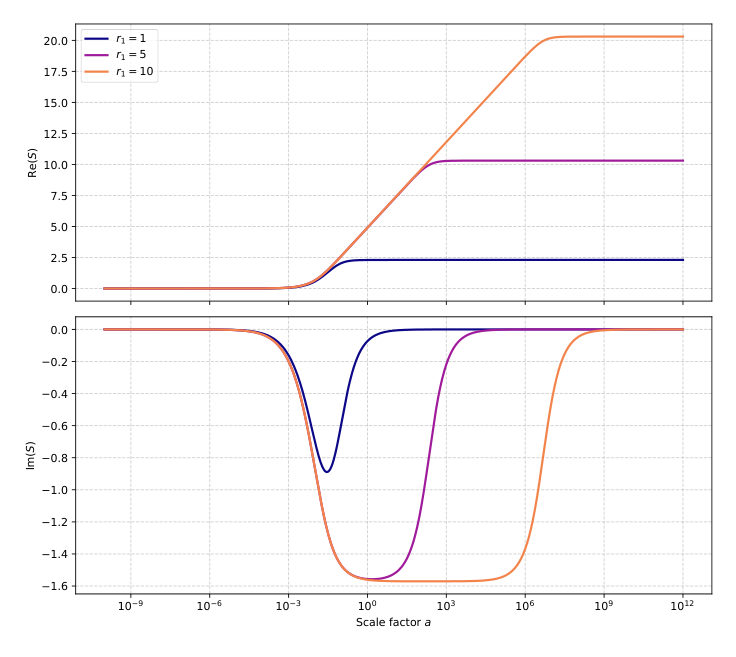
<figcaption class="paper-figure-caption"><b>Fig 3.</b> Figure 3: Pseudo entropy S as a function of the scale factor a in de Sitter background between a different initial squeezed state and the analytically evolved mode state, for fixed k = 0.01, and cs = 1.0.</figcaption>
</figure>
<figure class="paper-figure-card">
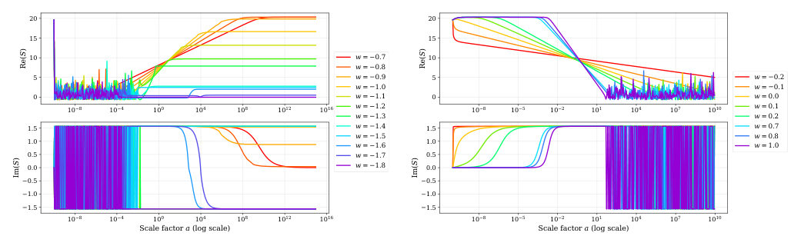
<figcaption class="paper-figure-caption"><b>Fig 4.</b> Figure 4: pseudo entropy S as a function of the scale factor a for expanding backgrounds with fixed k = 0.001, r(i) k = 10, and φ(i) k = −π/2.</figcaption>
</figure>
<figure class="paper-figure-card">
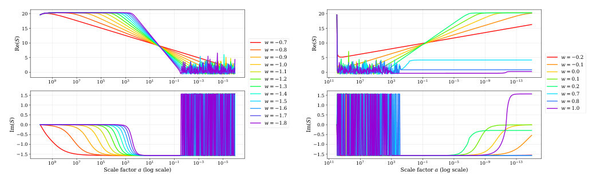
<figcaption class="paper-figure-caption"><b>Fig 5.</b> Figure 5: pseudo entropy S as a function of the scale factor a for contracting backgrounds with fixed k = 0.001, r(i) k = 10, and ϕ(i) k = π/2. The a-axis is inverted to reflect the contracting evolution.</figcaption>
</figure>

**Summary.** This work introduces and analyzes 'pseudo entropy,' a sophisticated measure of quantum correlation that generalizes standard entanglement entropy by retaining phase information. By applying it to cosmological perturbations, the authors show that pseudo entropy provides a unique diagnostic tool capable of distinguishing between different spacetime dynamics (e.g., accelerating vs. decelerating) based on how its real and imaginary parts evolve over time.

**Why it may be interesting.** While focused on cosmology, the methodology—using generalized entanglement/complexity measures sensitive to relative phases ($	ext{Im}(\mathcal{S})$)—is highly relevant for characterizing quantum correlations in open or time-dependent systems studied in AMO physics.

Detailed structure

**Main problem.** The study investigates pseudo entropy ($\mathcal{S}$) as a generalized measure of quantum correlations for scalar cosmological perturbations in various expanding and contracting spacetime backgrounds.

**Main result.** Pseudo entropy captures phase information via its imaginary part, making it a finer diagnostic than entanglement or circuit complexity; its behavior (saturation vs. oscillation) distinguishes different cosmological regimes ($w$).

**Method.** The analysis involves deriving the pseudo entropy from the transition matrix of Bogoliubov transformations governing the mode functions in curved spacetime.

**Model / system.** The system is quantum field theory applied to scalar perturbations ($
u$) in FLRW backgrounds (de Sitter, expanding/contracting). The dynamics are governed by a parametric oscillator equation derived from an effective action.

**Key observables.** Pseudo entropy ($\mathcal{S}$), $	ext{Re}(\mathcal{S})$, $	ext{Im}(\mathcal{S})$, Entanglement Entropy ($	ext{SEE}$), Krylov complexity, and Nielsen circuit complexity.

**Important parameters / regimes.** Equation-of-state parameter ($w$), sound speed ($c_s$), relative phase difference ($\Delta\phi$), and the scale factor evolution ($a$).

**Assumptions / limitations.** The analysis is restricted to scalar perturbations in the longitudinal gauge, assuming vanishing anisotropic stress.

**Figures summary.** Figures illustrate the time/scale-factor evolution of $	ext{Re}(\mathcal{S})$ and $	ext{Im}(\mathcal{S})$ across different background types (e.g., de Sitter vs. decelerating), showing saturation or oscillatory behavior.

**Paper structure.** The paper progresses by defining pseudo entropy, calculating its evolution in specific backgrounds like de Sitter space, comparing it quantitatively against other complexity measures, and finally establishing universal scaling laws relating these diagnostics to the background equation of state $w$.

Abstract

We study pseudo entropy $\mathcal{S}$, a recent generalization of entanglement entropy, for scalar cosmological perturbations in de Sitter space with sound speed $0.024 \leq c_s \leq 1$, and in expanding and contracting FLRW backgrounds with varying equation-of-state parameter $w$. In de Sitter space, $\mathrm{Re}(\mathcal{S})$ grows after horizon exit while $c_s$ controls its onset and saturates at late times. A similar saturation occurs in expanding-accelerating and contracting-decelerating backgrounds. In contrast, expanding-decelerating and contracting-accelerating backgrounds show large early-time $\mathrm{Re}(\mathcal{S})$ followed by oscillations after horizon re-entry. This happens because while the squeezing freezes, the squeezing angle doesn't. Unlike entanglement entropy, pseudo entropy possesses an imaginary part, $\mathrm{Im}(\mathcal{S})$, as well, which can encode the relative phase. $\mathrm{Im}(\mathcal{S})$ decays to zero in de Sitter and expanding-accelerating cases, but forms dense sub-Hubble oscillation bands in expanding-decelerating and contracting-accelerating backgrounds. Compared with entanglement entropy, Krylov complexity, and Nielsen circuit complexity, pseudo entropy captures otherwise hidden phase information; in the unsaturated regime, its slope is $\sqrt{2}$ times that of Nielsen complexity. Unlike circuit complexity, whose saturation bound is $w$-independent, pseudo entropy is sensitive to $w$ during the transition regime, making it a finer information theoretic diagnostic of cosmological dynamics.

[↑ back to top](#top)

### [Experimental quantum state learning with pairs of photons](http://arxiv.org/abs/2606.16932v1)

**Authors:** C. Pria Dobney, Johan Henaff, Allen Kasum, Rui Jie Tang, Haru Mukumoto, Mark Hillery, Berthold-Georg Englert, Aephraim Steinberg  
**Type:** experiment · **Category:** quantum information and computing · **PDF:** <https://arxiv.org/pdf/2606.16932v1>  
**Analysis basis:** full PDF text, analyzed in chunks
**Topic relevance:** 🔥 `QC/QI experiment` **4/5** · `quantum optics experiment` **3/5** · `entanglement & information structure` **2/5** · `quantum measurements` **2/5** · `interference shaping light` **1/5** · `measurement-induced transitions` **1/5**

↔ Scroll figures horizontally

<figure class="paper-figure-card">
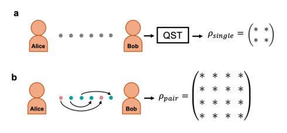
<figcaption class="paper-figure-caption"><b>Fig 1.</b> FIG. 1. Schematic showing the experimental protocol. (a) Alice sends a stream of single photons to Bob. Bob performs quantum state tomography (QST) on the sequence and ob- tains the single-qubit density matrix, ρsingle of Eq. (1). (b) After the measurement, Alice tells Bob which photons are in a ‘pair’. From this ‘paired data’, Bob obtains the two- qubit density matrix ρpair of Eq. (2), which can be decom- posed uniquely into pure product states and their respective probabilities. The pairs needn’t be nearest neighbours (in time); any choice of pairing identification suffices.</figcaption>
</figure>
<figure class="paper-figure-card">
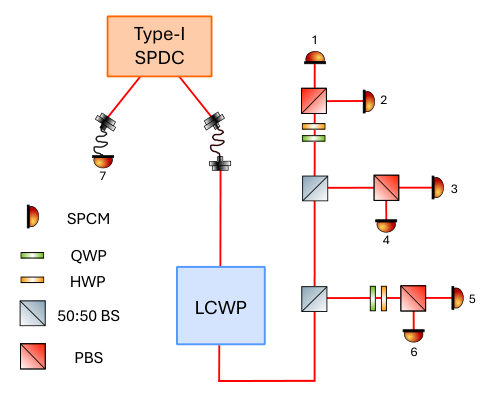
<figcaption class="paper-figure-caption"><b>Fig 2.</b> FIG. 2. Schematic of the experimental setup. A type-I, degen- erate, non-collinear spontaneous parametric down-conversion (SPDC) process where on average 3500 pairs of 808 nm pho- tons are detected per second. One photon is immediately de- tected whilst the other is sent through the experiment. These heralded single photons pass through a liquid-crystal wave plate (LCWP) which rotates the polarization of the incident photons by an amount dependent on the voltage applied to the crystal in order to generate a statistical mixture of po- larization states |ψ0⟩and |ψ1⟩as in Eq. (1). The ensemble of single photons is measured at six different output ports of a polarization tomography, where each...</figcaption>
</figure>
<figure class="paper-figure-card">
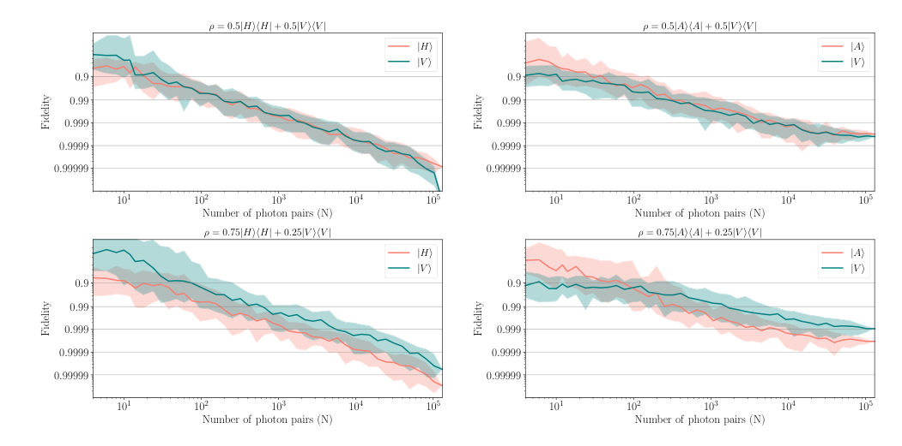
<figcaption class="paper-figure-caption"><b>Fig 3.</b> FIG. 3. Averaged fidelities vs. number of photon pairs of each of the states (pink curves: |ψ0⟩; teal curves: |ψ1⟩) determined from the decomposition of the paired density matrix ρ′ in Eq. (2). (a) and (b): |ψ0⟩and |ψ1⟩are orthogonal to each other but appear (a) with equal probability (p0 = p1 = 0.5) and (b) with unequal probability (p0 = 0.75, p1 = 0.25). (c) and (d): |ψ0⟩and |ψ1⟩are not orthogonal to each other but appear (c) with equal probability (p0 = p1 = 0.5) and (d) with unequal probability (p0 = 0.75, p1 = 0.25). The solid lines are the median values after 50 repeats of the fidelity calculation. Since the fidelity is not a linear metric and our data are not Gaussian-distributed, we...</figcaption>
</figure>
<figure class="paper-figure-card">
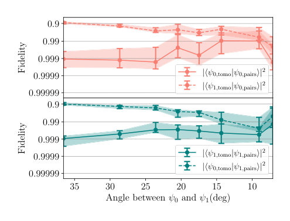
<figcaption class="paper-figure-caption"><b>Fig 4.</b> FIG. 4. Plots of the fidelity between the two states in the ensemble (|ψ0⟩and |ψ1⟩) against the angle between the two state vectors. Points connected by dashed lines are the fidelity between state |ψ0,pairs⟩(|ψ1,pairs⟩) calculated from the pair- state density matrix with |ψ1,tomo⟩(|ψ0,tomo⟩) measured from single-qubit tomography. In the upper (lower) plot, points connected by solid lines are the fidelity between |ψ0,pairs⟩ (|ψ1,pairs⟩) from the pair-state density matrix and |ψ0,tomo⟩ (|ψ1,tomo⟩) measured from single-qubit tomography. As the two states get closer to each other on the Poincar´e sphere, it becomes harder to distinguish the two, and hence we see the two curves overlapping for...</figcaption>
</figure>
<figure class="paper-figure-card">
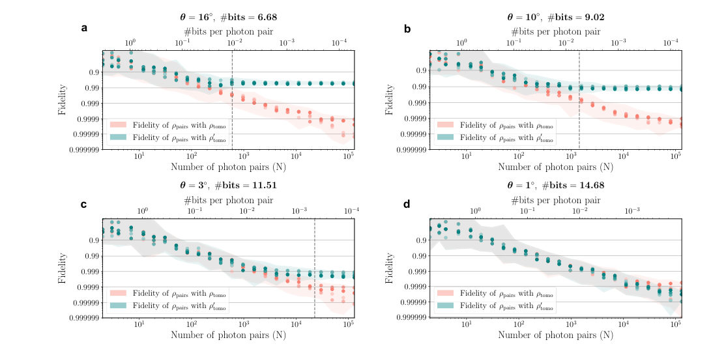
<figcaption class="paper-figure-caption"><b>Fig 5.</b> FIG. 5. Fidelity calculated between the pure states in one of two distinct mixtures as a way to compare the two mixed states, in terms of the number of photon pairs N as the distance (angle θ, in degrees) between the two mixtures decreases. Overall, there are two main collections of points forming curves on these four plots. For each case, the fidelity is calculated between the states returned from the pair-state density matrix calculation and the expected state from single-qubit tomography. The pink points are the fidelities between |ψ0,pairs⟩(|ψ1,pairs⟩) from the pair-state density matrix and |ψ0,tomo⟩(|ψ1,tomo⟩) from single-photon tomography measurements, as well as for between ψ′...</figcaption>
</figure>

**Summary.** The research experimentally demonstrates a novel method to uniquely determine the mixed quantum state of polarization using pairs of photons detected via time-of-arrival coincidence measurements. By analyzing these paired data, they successfully estimate the underlying pure states and their mixing probabilities with high fidelity using only tens of thousands of photon pairs.

**Why it may be interesting.** This work provides an experimental demonstration of how multi-particle correlations can overcome fundamental limitations in quantum state characterization, which is crucial for building reliable quantum communication protocols.

Detailed structure

**Main problem.** The core problem is uniquely determining an unknown quantum state (density matrix) of a mixed ensemble when standard single-particle tomography is insufficient.

**Main result.** By utilizing time-of-arrival information to measure pairs of photons, the researchers successfully inferred the specific pure states and their weights with high fidelity using only $\sim 10^4$ photon pairs.

**Method.** The protocol involves performing quantum state tomography on single photons and then leveraging coincidence measurements (pairs) to reconstruct a two-photon density matrix, which allows for unique decomposition into pure components.

**Model / system.** The system uses polarization degrees of freedom encoded in pairs of entangled or correlated photons generated via Spontaneous Parametric Down-Conversion (SPDC). The state is modeled as a mixture of two pure states, $
ho = p_0 |\psi_0
angle\langle\psi_0| + p_1 |\psi_1
angle\langle\psi_1|$.

**Key observables.** Tomography fidelity ($F$), the number of detected photon pairs ($N$), and the angular separation ($	heta$) between the pure states on the Poincaré sphere.

**Important parameters / regimes.** The required number of photons scales inversely with the square of the state separation angle, $N_{	ext{req}} \sim 1/	heta^2$.

**Assumptions / limitations.** It is assumed that time-of-arrival information can reliably 'pair up' detected single photons to reconstruct the two-photon density matrix.

**Figures summary.** Figures illustrate schematics of the setup, showing how single-photon and paired measurements are used. Later figures plot fidelity versus the number of pairs ($N$) for various angular separations ($	heta$), demonstrating scaling laws.

**Paper structure.** The paper introduces the limitations of single-particle tomography, proposes the 'learning from pairs' protocol using photon polarization, details the experimental setup (SPDC source), and finally presents quantitative results showing fidelity improvements and distinguishability limits as a function of photon number and state separation angle.

Abstract

Tomography allows one to estimate the density matrix describing the state an ensemble of quantum systems are prepared in (for example, polarization tomography determines the polarization state of a beam of identically prepared photons). In general, it is not possible to uniquely decompose the density matrix into its pure state components. Agarwal et al. proposed a protocol which, for a mixture composed of any two pure states of a qubit (with arbitrary probabilities), allows an observer to infer not only the density matrix but the identity of those specific pure states and their weights - the additional requirement being that the qubits arrive in pairs, where both qubits in each pair are in the same state. We experimentally demonstrate this learning-from-pairs concept using photons in the polarization degree of freedom. We use tomography to measure a sequence of single photons and make use of their time-of-arrival information to 'pair up' the photons after the measurement. From here we are able to infer the photons' polarization states and their respective probabilities, and we demonstrate this for various different choices of polarization states and ratios. Finally, we investigate our ability to discriminate between two equal mixtures of distinct pairs of orthogonal polarization states. We find that on the order of approx. 10e4 photons is typically enough to achieve tomography fidelities of approximately 0.9999. This is sufficient to discriminate between two different preparations of the same mixed state, differing by angles of less than 5 degrees between the pure states used in the two preparations.

[↑ back to top](#top)

### [Foundations of entropy in complex systems](http://arxiv.org/abs/2606.16312v1)

**Authors:** Jan Korbel  
**Type:** theory · **Category:** statistical mechanics · **PDF:** <https://arxiv.org/pdf/2606.16312v1>  
**Analysis basis:** full PDF text, analyzed in chunks
**Topic relevance:** 🔥 `entanglement & information structure` **4/5** · `non-equilibrium dynamics` **2/5** · `non-equilibrium universality` **2/5** · `Keldysh / 2PI / non-Gaussian methods` **1/5** · `analog quantum simulation` **1/5** · `correlated / nonlocal dissipation` **1/5** · `driven-dissipative phase transition` **1/5** · `methods for driven-dissipative` **1/5**

↔ Scroll figures horizontally

<figure class="paper-figure-card">
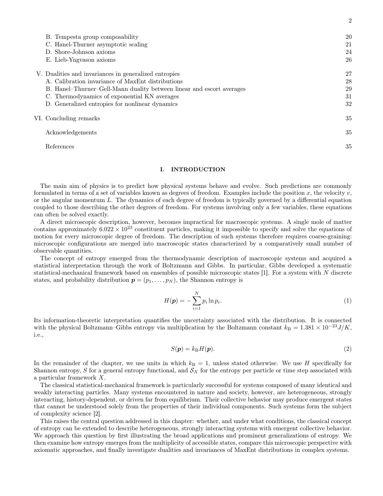
<figcaption class="paper-figure-caption"><b>Fig 1.</b> Low-resolution page preview, page 2</figcaption>
</figure>
<figure class="paper-figure-card">
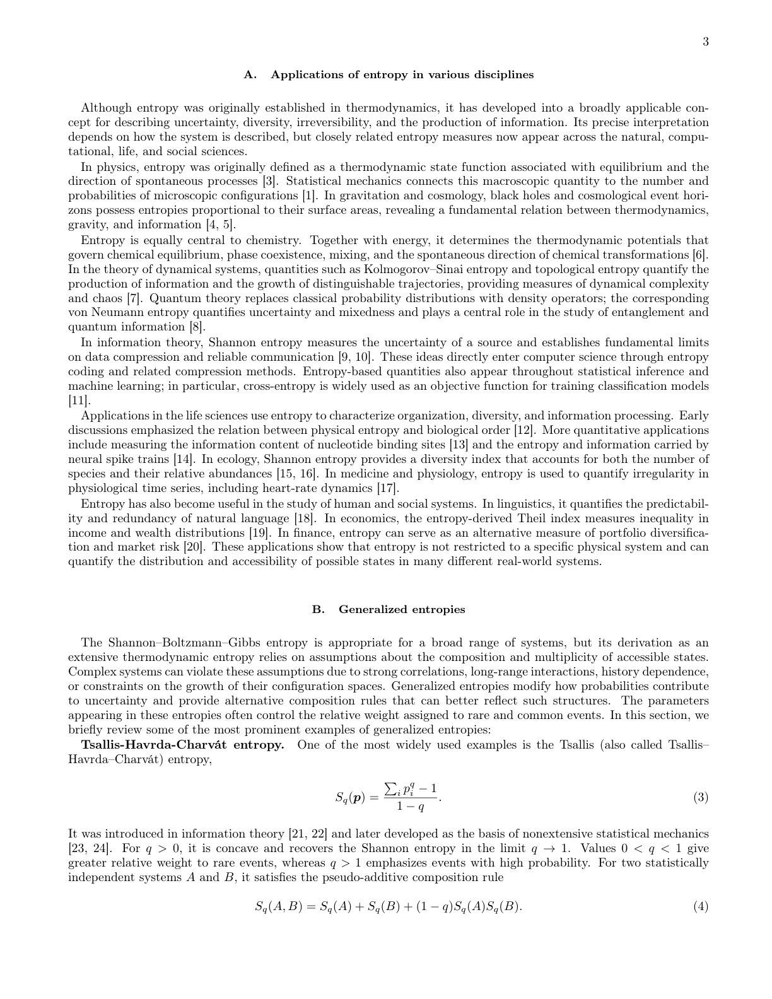
<figcaption class="paper-figure-caption"><b>Fig 2.</b> Low-resolution page preview, page 3</figcaption>
</figure>
<figure class="paper-figure-card">
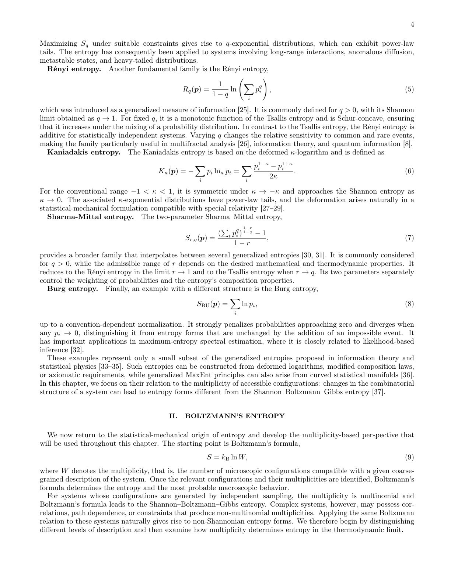
<figcaption class="paper-figure-caption"><b>Fig 3.</b> Low-resolution page preview, page 4</figcaption>
</figure>
<figure class="paper-figure-card">
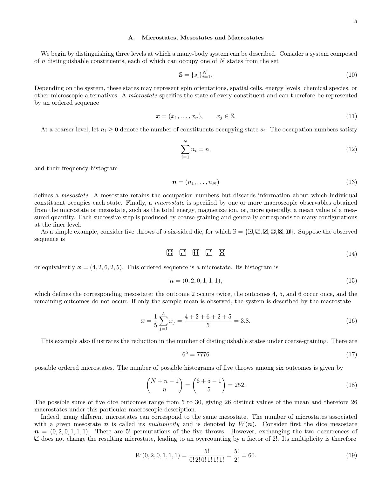
<figcaption class="paper-figure-caption"><b>Fig 4.</b> Low-resolution page preview, page 5</figcaption>
</figure>
<figure class="paper-figure-card">
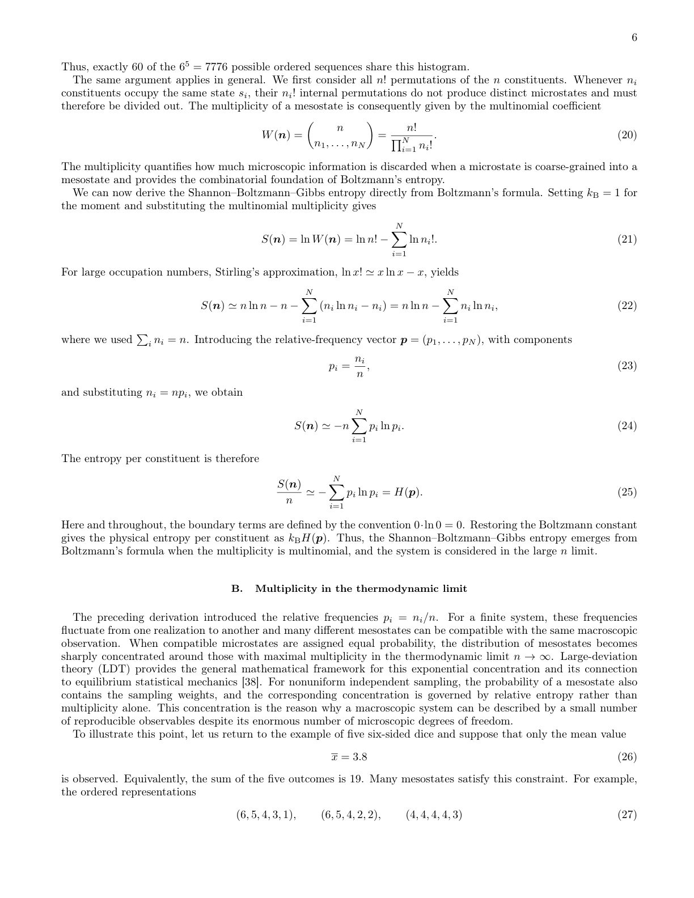
<figcaption class="paper-figure-caption"><b>Fig 5.</b> Low-resolution page preview, page 6</figcaption>
</figure>

**Summary.** This comprehensive review explores the foundations of entropy across various physical regimes, moving beyond classical assumptions. It systematically compares generalized entropies (like Tsallis and Rényi) derived from different combinatorial structures, statistical processes, and axiomatic principles. The work emphasizes that a correct description requires selecting an entropy formalism consistent with the system's specific constraints and dynamics.

**Why it may be interesting.** It provides a deep theoretical framework connecting information theory (entropy) directly to the underlying physics of equilibrium states in complex many-body systems, which is crucial for understanding non-equilibrium quantum dynamics.

Detailed structure

**Main problem.** The paper reviews the foundations of entropy, aiming to determine under what conditions classical statistical mechanics can accurately describe complex systems exhibiting strong correlations or emergent collective behavior.

**Main result.** It establishes that the choice of appropriate entropy functional (e.g., Shannon vs. Tsallis) and averaging scheme must be guided by the specific structural properties and physical constraints of the system being modeled.

**Method.** The analysis employs a combination of axiomatic derivations, maximum entropy principles (MaxEnt), and comparisons between different statistical ensembles (MB, BE, FD).

**Model / system.** The scope covers general statistical mechanical systems, ranging from simple particle statistics to complex models involving structure formation (molecular grouping) and path-dependent dynamics like Pólya urns.

**Key observables.** Entropy measures ($H(p)$, $S$), multiplicities ($W(\mathbf{n})$), generalized averages (Kolmogorov–Nagumo), and thermodynamic potentials.

**Important parameters / regimes.** Temperature ($eta$), system size ($n 	o \infty$ limit), and various entropy/duality exponents ($\gamma, 
u$).

**Assumptions / limitations.** The analysis often relies on the thermodynamic limit for convergence to equilibrium states; generalizations are needed when standard assumptions (like independent sampling) fail.

**Paper structure.** The structure progresses from reviewing basic entropy relations and generalized entropies, through deriving canonical statistics from multiplicity counting, extending to structured systems, analyzing path-dependent dynamics, and finally unifying these concepts via axiomatic approaches and nonlinear master equations.

Abstract

This chapter reviews the foundations of entropy and their extensions to complex systems. We first discuss the relation between Boltzmann's formula, multiplicity, coarse-graining, and Shannon entropy, before introducing generalized entropies such as Rényi, Tsallis, and Burg entropy. We then examine Maxwell--Boltzmann, Bose--Einstein, and Fermi--Dirac statistics, structure-forming systems, sample-space reducing processes, Pólya urns, and nonlinear dynamics. Axiomatic approaches are presented through the Shannon--Khinchin axioms, Tempesta group-composability, Hanel--Thurner asymptotic scaling, Shore--Johnson consistency axioms, and Lieb--Yngvason axioms. Finally, we discuss calibration invariance, Hanel--Thurner--Gell-Mann duality between linear and escort averages, and Kolmogorov--Nagumo averages, showing how the same distribution can arise from different entropies, constraints, or dynamics. These results emphasize that the choice of entropy should be guided by the structure and physical properties of the system.

[↑ back to top](#top)

### [How Many Shots Are Enough for a Quantum Circuit?](http://arxiv.org/abs/2606.16965v1)

**Authors:** Giuseppe Bisicchia, Alessandro Bocci, Ernesto Pimentel, Antonio Brogi  
**Type:** experiment · **Category:** quantum information and computing · **PDF:** <https://arxiv.org/pdf/2606.16965v1>  
**Analysis basis:** full PDF text, analyzed in chunks
**Topic relevance:** 🔥 `QC/QI experiment` **4/5** · `quantum measurements` **3/5** · `entanglement & information structure` **2/5** · `measurement-induced transitions` **2/5** · `methods for driven-dissipative` **1/5** · `non-equilibrium dynamics` **1/5**

↔ Scroll figures horizontally

<figure class="paper-figure-card">
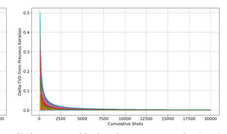
<figcaption class="paper-figure-caption"><b>Fig 1.</b> Fig. 1. Empirical behaviour of static quantum circuit output distributions as the shot count increases. Each line corresponds to a circuit–backend pair.</figcaption>
</figure>
<figure class="paper-figure-card">

<figcaption class="paper-figure-caption"><b>Fig 2.</b> Figure 1 presents empirical evidence of these dynamics. Each line corresponds to a unique pair consisting of a</figcaption>
</figure>
<figure class="paper-figure-card">
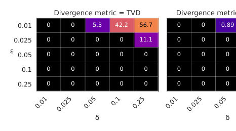
<figcaption class="paper-figure-caption"><b>Fig 3.</b> Fig. 2. Heatmaps for 𝜖0.01, 0.025, 0.05, 0.1, and 0.25, for all the divergence metrics and 𝛿values considered.</figcaption>
</figure>
<figure class="paper-figure-card">
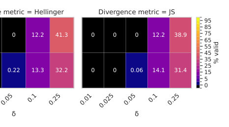
<figcaption class="paper-figure-caption"><b>Fig 4.</b> Fig. 3. Heatmaps for Delta and DMA stopping criterion policies, for all the divergence metrics and 𝛿values considered.</figcaption>
</figure>
<figure class="paper-figure-card">
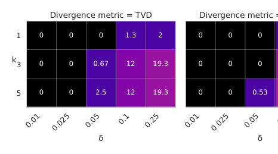
<figcaption class="paper-figure-caption"><b>Fig 5.</b> Fig. 4. Heatmaps for stability window 𝑘1, 3 and 5, for all the divergence metrics and 𝛿values considered.</figcaption>
</figure>

**Summary.** This paper addresses the critical challenge of efficiently determining the minimum number of shots needed for a quantum circuit execution to reach sufficient accuracy. It introduces IncrementalExecution, an online framework that operates without needing specific knowledge of the noise model or circuit structure. This makes it a highly general and practical tool for optimizing resource usage on current noisy quantum hardware.

**Why it may be interesting.** While focused on shot counting rather than Hamiltonian simulation, the rigorous statistical analysis and comparison against theoretical bounds provide valuable insights into the fundamental resource scaling laws governing quantum computation fidelity.

Detailed structure

**Main problem.** The core problem is determining the minimum number of quantum circuit shots required to achieve a target statistical accuracy, thereby minimizing resource usage on expensive quantum hardware.

**Main result.** A novel black-box framework, IncrementalExecution, was proposed that dynamically determines the optimal stopping point by detecting the point of diminishing returns in the empirical output distribution for static circuits.

**Method.** The method introduces an online framework that monitors the change in the empirical distribution over successive shot batches, comparing it against a reference estimate (like the full budget estimate) to signal when further shots yield negligible improvement.

**Model / system.** The work focuses on executing quantum circuits on Noisy Intermediate-Scale Quantum (NISQ) devices or cloud platforms. The analysis is restricted to static, non-variational circuits where the circuit structure remains fixed across all measurements.

**Key observables.** Empirical output distribution ($\hat{P}_n$), divergence metrics (Total Variation Distance, Hellinger distance, Jensen–Shannon divergence), and the point of diminishing returns signal.

**Important parameters / regimes.** Target accuracy thresholds ($\delta$), hard shot budgets ($B$), look-back window size ($	au$), and circuit/backend configurations (e.g., 180 unique combinations).

**Assumptions / limitations.** The primary assumption for the online method is that the underlying process is stationary (static circuits); it explicitly avoids assumptions about noise models or variational parameter updates.

**Figures summary.** Figures and tables provide extensive quantitative comparisons, showing how required shot counts vary across different circuit types (QFT, QAOA, random), increasing noise levels ($\delta$), and comparing results from the proposed method against theoretical bounds (Weissman/Hoeffding).

**Paper structure.** The paper progresses by first defining the general problem of sample optimization in a black-box setting. It then reviews existing specialized methods (analytical, adaptive) before introducing IncrementalExecution as a generalized, online solution based on detecting distributional stabilization.

Abstract

Quantum algorithms require repeated circuit executions, known as shots, to estimate output distributions accurately. Determining the minimal number of shots needed to meet a target accuracy is crucial to reduce costs and resource usage, especially on today's noisy and expensive quantum hardware. In this paper, we address the shot optimisation problem in a black-box setting, where no assumptions are made about the structure of the quantum circuit or the noise model of the backend. We introduce IncrementalExecution, a novel online framework that dynamically determines when to stop executing shots based on the principle of point of diminishing returns: the point at which additional shots no longer significantly alter the empirical distribution of a fixed circuit. The framework supports customisable policies for shot management, enabling flexible trade-offs between execution cost and result fidelity within static execution scenarios. We assess our proposal through an extensive experimental evaluation spanning 33,750 framework configurations across 180 unique static quantum circuit-backend combinations, for a total of 7.3M independent experiments. Unlike prior work that relies on problem-specific knowledge or algorithm-dependent assumptions (e.g., variational or adaptive workflows), our approach is applicable to a large set of static circuits and immediately deployable on current quantum cloud platforms.

[↑ back to top](#top)

### [Lattice surgery for near-term experimental logical qubit entanglement creation in planar architectures](http://arxiv.org/abs/2606.15190v1)

**Authors:** Lukas Bödeker, Áron Márton, Luis Colmenarez, Ilya Besedin, Andreas Wallraff, Markus Müller  
**Type:** both · **Category:** quantum information and computing · **PDF:** <https://arxiv.org/pdf/2606.15190v1>  
**Analysis basis:** full PDF text, analyzed in chunks
**Topic relevance:** 🔥 `QC/QI experiment` **4/5** · `quantum measurements` **3/5** · `measurement-induced transitions` **2/5** · `correlated / nonlocal dissipation` **1/5** · `driven-dissipative phase transition` **1/5** · `entanglement & information structure` **1/5** · `methods for driven-dissipative` **1/5**

↔ Scroll figures horizontally

<figure class="paper-figure-card">
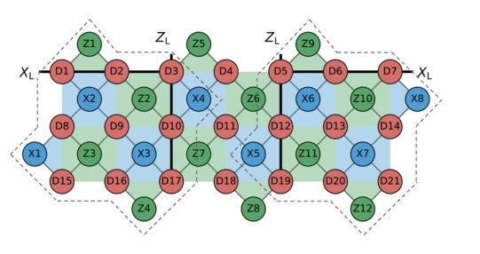
<figcaption class="paper-figure-caption"><b>Fig 1.</b> FIG. 1. Surface-41 layout. Blue (green) plaquettes denote X (Z) stabilizers. Two independent surface-17 logical qubits, located on the right and left parts of the qubit layout, are enclosed by dashed lines. For the teleportation protocol, the right surface code patch is considered the source and the left is considered the target qubit. Data qubits are represented by red circles, including the three central qubits used during merging. Ancilla qubits are shown as blue and green circles, indicating the type of stabilizer they measure. Grey lines represent all physical connections between qubits.</figcaption>
</figure>
<figure class="paper-figure-card">
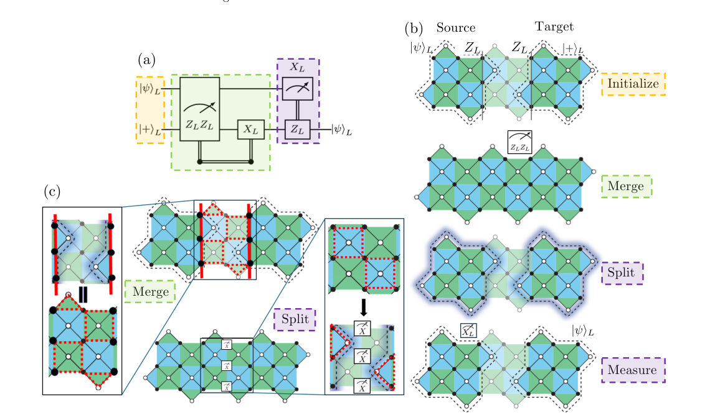
<figcaption class="paper-figure-caption"><b>Fig 2.</b> FIG. 2. (a) High-level state teleportation scheme. Color blocks denote each step in the logical surface code circuit. (b) Sketch of quantum teleportation of two surface code patches via lattice surgery. The initialization of the logical state (yellow) ∣ψ⟩L on the left (source) logical qubit and the state ∣+⟩L on the right (target) logical qubit. The joint measurement ZLZL is executed by “merging” (green) of the two individual surface codes. During the merging we consider the newly initialized Z-type stabilizers and the extended X-type stabilizers as the middle-part of the joint code. The final teleportation step shows the “split” step (violet) in which the individual logical qubits are...</figcaption>
</figure>
<figure class="paper-figure-card">
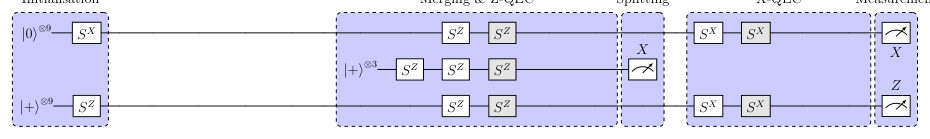
<figcaption class="paper-figure-caption"><b>Fig 3.</b> FIG. 3. Schematic comparison of the used lattice-surgery protocols. The boxes SX and SZ indicate stabilizer measurements on the respective parts of the chip. (a) Fully modular teleportation scheme for the ∣0⟩L state of the surface-17 code. The teleportation of ∣+⟩L is analogous for initializing the left data qubits in ∣+⟩⊗9. All X or Z stabilizers (denoted by the boxes SX and SZ) left (source) and right (target) surface code patch are measured in parallel. This includes the middle region while the patches are merged. The gray background indicates that the according stabilizer measurements can be made conditional on the previous outcomes. The ancilla measurement readouts are not shown; they...</figcaption>
</figure>
<figure class="paper-figure-card">
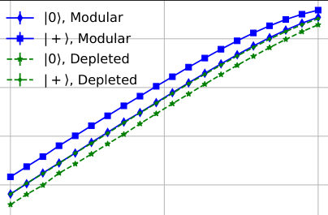
<figcaption class="paper-figure-caption"><b>Fig 4.</b> FIG. 4. Comparison of the logical teleportation infidelity of fully modular against the depleted teleportation scheme for the surface-17 code for scaling down all physical error param- eter by a factor λ. The decoding is done using MWPM. Error bars are included.</figcaption>
</figure>
<figure class="paper-figure-card">
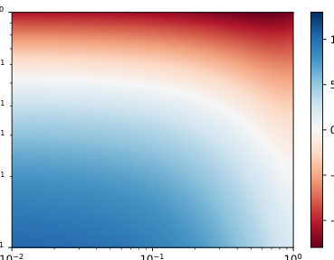
<figcaption class="paper-figure-caption"><b>Fig 5.</b> FIG. 5. Relative advantage in terms of logical teleportation error rate for comparing the adaptive with the non-adaptive depleted surgery scheme. All error parameters are scaled by λ with respect to the reference values, and the latency of the decision logic of the adaptive scheme is scaled by η with respect to a reference value of 1 µs. An interpolation is shown that is calculated from a grid of 20×20 points.</figcaption>
</figure>

**Summary.** This paper details a lattice surgery protocol to achieve fault-tolerant logical qubit teleportation on superconducting surface code architectures. By comparing modular versus depleted error correction strategies and incorporating adaptive measurement logic, the authors demonstrate pathways for near-term hardware improvements. The results quantify how reducing physical noise rates can boost logical fidelity, guiding future experimental designs.

**Why it may be interesting.** For a theorist in open quantum systems, this work provides concrete, resource-aware protocols for implementing complex logical operations (teleportation) under realistic hardware constraints (superconducting qubits), offering insights into the overhead associated with achieving fault tolerance.

Detailed structure

**Main problem.** The primary goal is to demonstrate a fault-tolerant protocol for creating entanglement between two logical qubits using lattice surgery, which is crucial for near-term quantum computation.

**Main result.** The study shows that adaptive error correction strategies can significantly improve the logical fidelity of teleportation compared to fully modular or standard depleted protocols, especially at low physical noise rates.

**Method.** The authors simulate a logical teleportation protocol on superconducting surface code qubits by performing joint logical parity measurements using lattice surgery techniques. They compare various overhead reduction strategies like 'fully modular' versus 'depleted' measurement sequences.

**Model / system.** The work is situated in the context of superconducting qubit architectures implementing the surface code ($d=3$ instance). The protocol requires physical qubits arranged on a planar chip to perform logical operations via lattice surgery steps (initialization, merging, splitting, measurement).

**Key observables.** Logical fidelity/error probability ($p_L$), average circuit depth, and the performance gain derived from adaptive decision logic.

**Important parameters / regimes.** The noise scaling factor ($\lambda \in (0, 1]$) is critical for projecting near-term hardware improvements; the code distance $d$ dictates error correction capability.

**Assumptions / limitations.** Key assumptions include using experimentally informed Pauli error rates and analyzing performance by scaling these physical error parameters. The depletion strategy's scalability limit with increasing code distance ($d$) is also noted.

**Figures summary.** Figures illustrate the surface-41 layout, the high-level teleportation scheme involving lattice surgery steps (merging/splitting), and comparative plots showing logical infidelity versus noise scaling factor ($\lambda$) for different protocol variants.

**Paper structure.** The paper details the theoretical framework of logical teleportation via lattice surgery, compares modular vs. depleted error correction overheads, analyzes performance gains from adaptive measurement logic, and concludes with simulations projecting near-term feasibility based on current superconducting qubit noise parameters.

Abstract

In the era of early fault-tolerant quantum computing, basic demonstrations of entanglement operations between a few logical qubits are at the frontier of recent developments in quantum computing. In this work, we describe in detail, at both the logical and physical qubit levels, a logical teleportation protocol between two surface code logical qubits based on lattice surgery. We address several aspects of the teleportation protocol pertinent to superconducting qubit architectures. We explore the modularity constraints in the number and location of stabilizer readouts and compare variants of the teleportation protocol in this regard. Additionally, we investigate potential performance improvements related to in-sequence decision logic and the optimal size of the interface region between two surface code patches on a superconducting chip. Based on our simulations, we show possible near-term improvements in lattice surgery protocols that facilitate fault-tolerant quantum computing in superconducting circuit architectures.

[↑ back to top](#top)

### [Quantum Measurement and Continuous Markov Processes](http://arxiv.org/abs/2606.15958v1)

**Authors:** Chris Jackson  
**Type:** theory · **Category:** other · **PDF:** <https://arxiv.org/pdf/2606.15958v1>  
**Analysis basis:** full PDF text, analyzed in chunks
**Topic relevance:** 🔥 `quantum measurements` **4/5** · `measurement-induced transitions` **3/5** · `methods for driven-dissipative` **3/5** · `Keldysh / 2PI / non-Gaussian methods` **1/5** · `correlated / nonlocal dissipation` **1/5** · `driven-dissipative phase transition` **1/5**

↔ Scroll figures horizontally

<figure class="paper-figure-card">
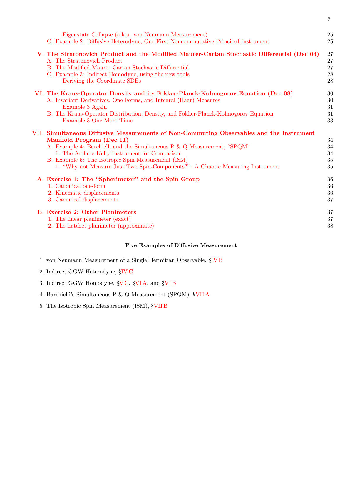
<figcaption class="paper-figure-caption"><b>Fig 1.</b> Low-resolution page preview, page 2</figcaption>
</figure>
<figure class="paper-figure-card">

<figcaption class="paper-figure-caption"><b>Fig 2.</b> Low-resolution page preview, page 3</figcaption>
</figure>
<figure class="paper-figure-card">
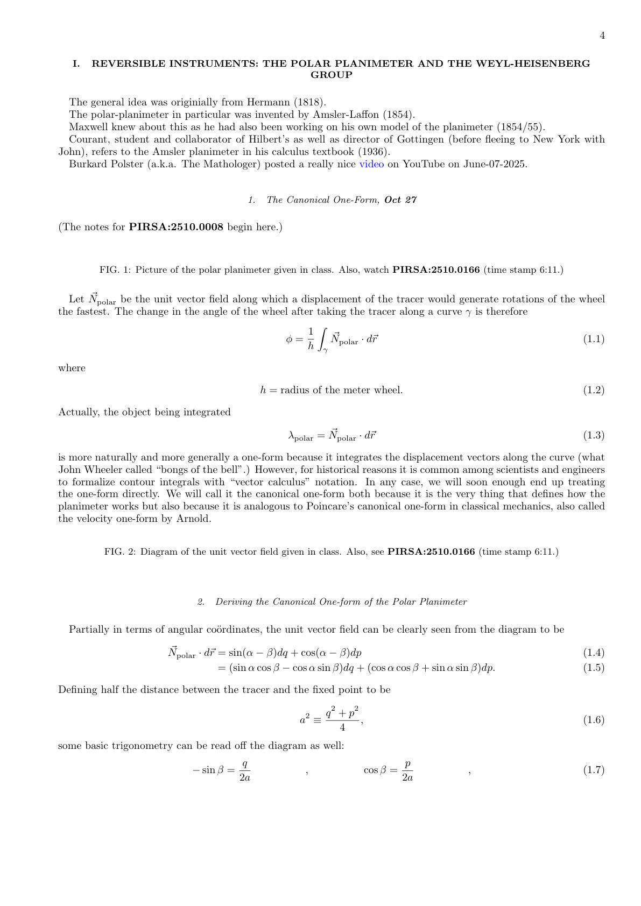
<figcaption class="paper-figure-caption"><b>Fig 3.</b> Low-resolution page preview, page 4</figcaption>
</figure>
<figure class="paper-figure-card">
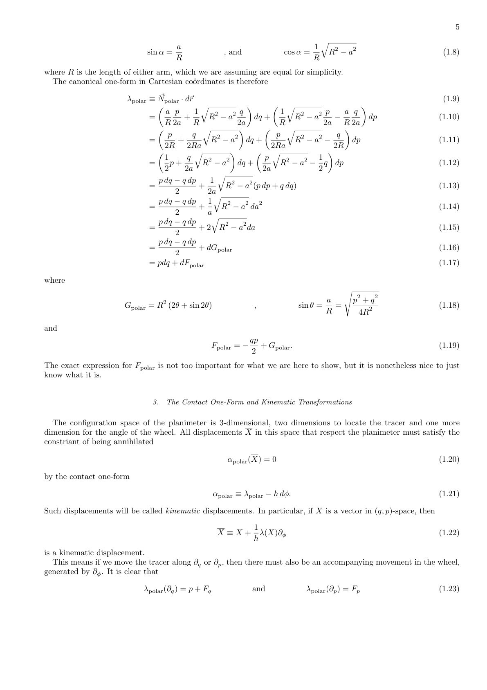
<figcaption class="paper-figure-caption"><b>Fig 4.</b> Low-resolution page preview, page 5</figcaption>
</figure>
<figure class="paper-figure-card">
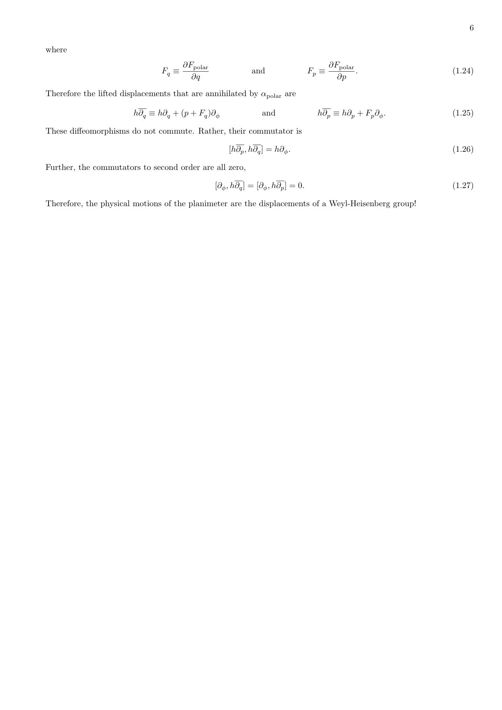
<figcaption class="paper-figure-caption"><b>Fig 5.</b> Low-resolution page preview, page 6</figcaption>
</figure>

**Summary.** This lecture series develops the advanced mathematics required to describe continuous quantum measurements using diffusive meters. It moves from classical analogies involving one-forms to deriving the Fokker-Planck equation governing the Kraus-operator distribution. The work fundamentally addresses whether these complex measurement processes can be modeled or simulated by finite computational resources.

**Why it may be interesting.** This work provides a deep mathematical underpinning for open quantum systems dynamics, connecting geometric structures (Lie groups) with stochastic processes (Fokker-Planck equations), which is crucial for understanding measurement backaction in quantum optics and sensing.

Detailed structure

**Main problem.** The core problem is developing a rigorous mathematical framework for continuous quantum measurement, specifically analyzing whether the resulting instrument can be automated by classical computation.

**Main result.** The theory establishes that the Kraus-operator distribution (KOD) governing diffusive measurements satisfies a Fokker-Planck-Kolmogorov equation. Furthermore, it classifies instruments as 'principal' (automatable) or 'chaotic'.

**Method.** The analysis employs advanced stochastic calculus tools, including the Stratonovich product and modified Maurer-Cartan differentials, to handle time-ordered exponentials arising from continuous measurement interactions.

**Model / system.** The model focuses on quantum systems undergoing interaction with a diffusive meter (e.g., homodyne detection). The formalism uses Kraus operators ($\Omega$) and the associated Lindbladian generator ($D_L$) derived from system-meter unitary evolution.

**Key observables.** Kraus-operator distribution (KOD), $	ext{d}\mu_T(x)$, and the resulting probability of measurement outcomes, $	ext{Prob}_T(x)$.

**Important parameters / regimes.** The meter width ($\sigma$), interaction strength ($	heta$), and time interval ($T$) are key parameters defining the measurement process.

**Assumptions / limitations.** The analysis heavily relies on approximations in the limit $dt 	o 0$ (Itô calculus rules) and assumes the existence of a left-invariant Haar measure for simplifying the KOD evolution.

**Figures summary.** Figures illustrate diagrams related to the polar planimeter setup, showing mathematical forms for canonical one-forms ($\lambda_{	ext{polar}}$) in various coordinate systems.

**Paper structure.** The notes progress from classical analogies (planimeters and Lie derivatives) to general quantum measurement theory using Kraus operators. It then transitions to continuous time via Wiener increments, deriving the Lindbladian generator, and finally establishing the Fokker-Planck-Kolmogorov equation for the KOD.

Abstract

These are the lecture notes for a course on diffusive quantum measuring instruments. They were prepared and delivered at the Perimeter Institute on Mondays and Thursdays, from 2:30 to 4:00 PM, beginning October 27th, 2025 and ending December 11th, 2025. These lectures were recorded and can be found at \textbf{https://pirsa.org/c25038}.

[↑ back to top](#top)

### [Cluster-based Message-Passing (CluMP) Optimization for Complex QUBO Problems](http://arxiv.org/abs/2606.15414v1)

**Authors:** Paolo Rissone, Stefan Boetcher, Alfonso Amendola, Simone Sala, Federico Ricci-Tersenghi  
**Type:** theory · **Category:** disordered systems and neural networks · **PDF:** <https://arxiv.org/pdf/2606.15414v1>  
**Analysis basis:** full PDF text, analyzed in chunks
**Topic relevance:** 🔥 `analog quantum simulation` **4/5** · 🔥 `exotic spin models in light-matter` **4/5** · `methods for driven-dissipative` **3/5** · `non-equilibrium dynamics` **1/5**

↔ Scroll figures horizontally

<figure class="paper-figure-card">
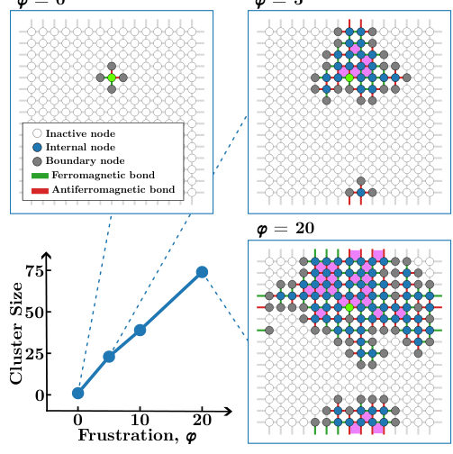
<figcaption class="paper-figure-caption"><b>Fig 1.</b> FIG. 1. Clusters at controlled frustration. Starting from a random seed (green), a connected cluster is grown until the number of frustrated loops reaches the threshold, ϕ. A loop is frustrated when the product of its couplings is negative. Examples on a 2d LRG show that increasing ϕ yields larger clusters (blue nodes) and a higher number of frustrated loops (violet plaquettes). Boundary nodes (grey), adjacent to at least one external edge but not belonging to the cluster, define the interface with the rest of the graph. Note that for ϕ = 0, the cluster reduces to a single node.</figcaption>
</figure>
<figure class="paper-figure-card">
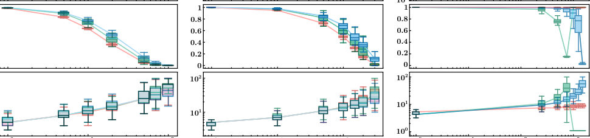
<figcaption class="paper-figure-caption"><b>Fig 2.</b> FIG. 2. BP on frustrated clusters. Zero-temperature BP updates (Eqs. (6)) on clusters with increasing frustration ϕ for 2d and 3d lattice regular graphs (LRGs; A,B) and random regular graphs with C = 10 (RRGs; C), at V ∼102–104 (100 runs, 28 iterations). LRGs show rapid loss of convergence with increasing ϕ (2d most sensitive), while RRGs remain stable up to ϕ ∼103, allowing clusters up to |C| ∼0.8V . Box plots show medians, interquartile ranges (IQRs), and 1.5 IQR whiskers.</figcaption>
</figure>
<figure class="paper-figure-card">
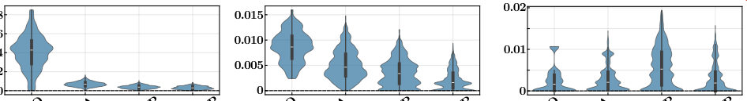
<figcaption class="paper-figure-caption"><b>Fig 3.</b> FIG. 3. CluMP performance. Performance of τEO, SA, CluMP, and R-CluMP on LRGs (d = 2, 3; A,B) and RRGs (C). Ten samples per graph family, 102 runs per sample. Top: resampled convergence trajectories show the best-so-far energy as a function of the number of elementary operations, nelem (see text). Middle: success rate (blue circles) and average number of effective single-spin iterations (red triangles) to reach Ebest. Bottom: violin plots of the normalized gap ∆Emin/Ebest with embedded box plots (median, IQR, 1.5 IQR whiskers). Cluster methods achieve smaller gaps and higher success rates, with the largest speedup on LRGs.</figcaption>
</figure>
<figure class="paper-figure-card">
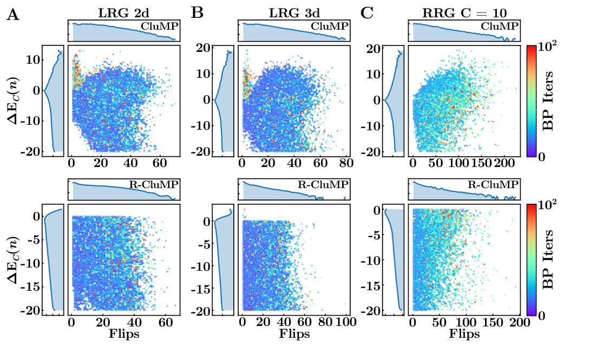
<figcaption class="paper-figure-caption"><b>Fig 4.</b> FIG. 4. Statistics of CluMP updates. Correlation between cluster energy change ∆EC(n) and number of flipped spins for LRGs in 2d (A), in 3d (B), and C = 10 RRGs (C). Data aggregate all iterations, runs, and samples for CluMP (top) and R-CluMP (bottom). Marginals show distributions of ∆EC and flip counts; colors indicate BP iterations to convergence (blue: fast, red: slow). Cluster moves may flip up to O(102) spins, largely independent of ∆EC, enabling single-cluster-flip transitions between nearly isoenergetic states. In LRGs, slow BP convergence correlates with ∆EC &gt; 0; in RRGs, this correlation weakens. Resampling in R-CluMP strongly suppresses ∆EC &gt; 0 updates.</figcaption>
</figure>
<figure class="paper-figure-card">
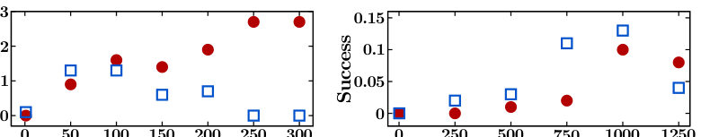
<figcaption class="paper-figure-caption"><b>Fig 5.</b> FIG. 5. CluMP performance under different boundary conditions. Effects of hard (blue squares) and soft (red circles) BP boundary conditions in RRGs with connectivity C = 4 (A) and C = 10 (B). Hard boundary conditions generally yield higher BP convergence rates (top panels), but significantly degrade CluMP performance at low connectivity (bottom panels), effectively reducing the maximum frustration threshold and limiting the accessible cluster size. In contrast, soft boundary conditions produce more robust and reproducible performance across different graph instances.</figcaption>
</figure>

**Summary.** The paper introduces CluMP, a cluster-based message-passing algorithm designed to optimize frustrated QUBO problems by performing collective updates on connected spin clusters. It demonstrates that this approach efficiently navigates complex energy landscapes, significantly outperforming local update methods like Simulated Annealing. The work is crucial for understanding the computational challenges in simulating disordered quantum systems.

**Why it may be interesting.** This work provides a powerful, scalable simulation technique for sampling complex energy landscapes inherent in spin glasses. The analysis of how continuous vs. discrete couplings affect optimization algorithms is highly relevant to understanding the limitations of classical solvers when modeling quantum many-body systems.

Detailed structure

**Main problem.** The core problem is efficiently finding low-energy configurations (ground states) of complex Quadratic Unconstrained Boolean Optimization (QUBO) problems, which model frustrated Ising spin systems.

**Main result.** Cluster-based Message-Passing (CluMP) significantly outperforms local update heuristics by performing collective updates on large clusters, allowing the system to bypass local energy barriers in highly frustrated landscapes.

**Method.** The algorithm uses Belief Propagation (BP) theory to guide collective spin updates across connected clusters. A variant, R-CluMP, enhances this by using population annealing and resampling to stabilize low-energy exploration.

**Model / system.** The model is an Ising spin system defined on a general graph structure, often studied via QUBO formulations. The complexity arises from 'frustration,' where conflicting couplings create rugged energy landscapes with many metastable states.

**Key observables.** Energy gap ($\Delta E_{\min}/E_{	ext{best}}$), average number of elementary operations ($\langle 	ext{nelem} 
angle$), and success rate (proportion of runs reaching the true ground state).

**Important parameters / regimes.** Frustration level ($\phi$) controls cluster size; connectivity ($C$) and coupling type (Gaussian vs. $\pm 1$ integer) dictate landscape structure.

**Assumptions / limitations.** The method relies on zero-temperature limits of BP updates, which can be sensitive to boundary conditions and graph topology. Furthermore, the advantage diminishes when the energy landscape is dominated by discrete degeneracies from integer couplings.

**Figures summary.** Figures compare convergence trajectories ($\Delta E$ vs. operations) and success rates for CluMP/R-CluMP against SA and $	au_{EO}$ on both Lattice Regular Graphs (LRGs) and Random Regular Graphs (RRGs), showing superior performance metrics for cluster methods.

**Paper structure.** The paper introduces the challenge of frustrated QUBO optimization, details the CluMP mechanism using BP, presents the R-CluMP enhancement, benchmarks the method across various graph types and coupling distributions, and concludes by analyzing how landscape degeneracy affects algorithmic advantage.

Abstract

Quadratic Unconstrained Boolean Optimization (QUBO) problems are widespread in both industrial applications and scientific studies. A QUBO problem corresponds to the optimization of a system of Ising spins defined on a generally sparse and heterogeneous graph. When the QUBO problem contains conflicting requests, the corresponding Ising system is frustrated, generating a complex energy landscape, which is hard to explore and optimize. Despite extensive algorithmic and hardware developments, finding low-energy configurations in these systems remains challenging (e.g., local-update heuristics typically become trapped in metastable states), especially when the (possibly frustrated) interactions generate extended correlated domains.   We introduce CluMP (Cluster-based Message-Passing), an algorithm that performs collective updates on connected clusters of spins using information from Belief Propagation (BP). By controlling the amount of frustration within clusters, CluMP enables BP convergence on large subgraphs and proposes nonlocal rearrangements involving up to hundreds of spins in a single move. We benchmark CluMP against state-of-the-art local-update heuristics on spin-glass models defined on several graph topologies, including random regular graphs and lattice regular graphs in two and three dimensions. Cluster moves consistently bypass local trapping and reach lower energies with fewer effective operations than single-spin dynamics. These results demonstrate that frustration-tolerant cluster updates can be implemented efficiently on sparse graphs. The CluMP framework provides a scalable strategy for large-scale combinatorial optimization and inference problems, where exploiting medium- and long-range correlations is key to navigating complex energy landscapes.

[↑ back to top](#top)

### [Connecting entanglement growth with local integrals of motion in the disordered Fermi-Hubbard model](http://arxiv.org/abs/2606.15481v1)

**Authors:** Ahad Nokhostin Helm, Brandon Leipner-Johns, Rachel Wortis  
**Type:** theory · **Category:** strongly correlated electrons · **PDF:** <https://arxiv.org/pdf/2606.15481v1>  
**Analysis basis:** full PDF text, analyzed in chunks
**Topic relevance:** 🔥 `entanglement & information structure` **4/5** · `analog quantum simulation` **3/5** · `non-equilibrium dynamics` **2/5** · `Keldysh / 2PI / non-Gaussian methods` **1/5** · `methods for driven-dissipative` **1/5** · `non-equilibrium universality` **1/5**

↔ Scroll figures horizontally

<figure class="paper-figure-card">
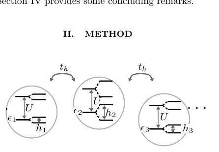
<figcaption class="paper-figure-caption"><b>Fig 1.</b> FIG. 1. A schematic diagram of the disordered Hubbard model showing three sites each with on-site Coulomb repul- sion U, site potential ϵi, and local magnetic field hi, as well as inter-site hopping th.</figcaption>
</figure>
<figure class="paper-figure-card">
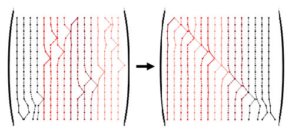
<figcaption class="paper-figure-caption"><b>Fig 2.</b> FIG. 2. Graphical representation of a Q matrix showing the re-ordering of the columns. Each line represents one column. The horizontal displacement of the nth dot in the mth line represents the magnitude of the element Qnm. On the left is the matrix before the Hungarian algorithm is applied, and on the right is the matrix after optimization.</figcaption>
</figure>
<figure class="paper-figure-card">

<figcaption class="paper-figure-caption"><b>Fig 3.</b> FIG. 3. Entanglement entropy S(t) vs log(t) calculated using the full Hamiltonian Hexact (a) non-interacting U = 0 and (b) interacting U = 1. The disorder strength is equal in charge and spin: Wch = Wsp = 16. System sizes L = 2, 4, 6, 8. Results are averaged over 2000 disorder configurations and initial states for L = 2, 1800 for L = 4, 1600 for L = 6, and 1000 (U = 0) and 1500 (U = 1) for L = 8.</figcaption>
</figure>
<figure class="paper-figure-card">
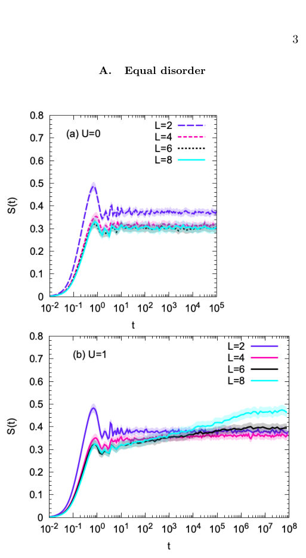
<figcaption class="paper-figure-caption"><b>Fig 4.</b> Fig. 3 shows the entanglement entropy obtained from the full Hamiltonian with strong disorder in both charge and spin. For U = 0, the entanglement has a rapid ini- tial rise to a peak at a time of order one, followed by a dip and then saturation. This behaviour is consistent with results in single-component systems. The reason for this structure can be understood by considering a single particle initially placed at one site. Without in- teractions, up and down spins are independent and An- derson localized. The particle’s wavefunction is a super- position of the set of localized single-particle eigenstates which have nonzero overlap with the site on which it is initially placed. As time...</figcaption>
</figure>
<figure class="paper-figure-card">
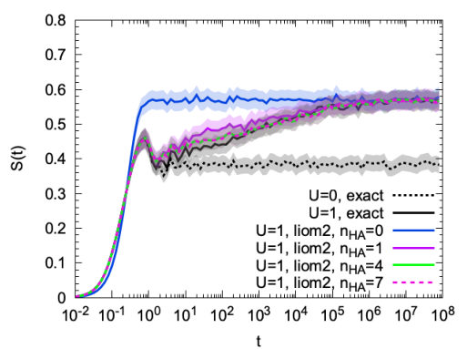
<figcaption class="paper-figure-caption"><b>Fig 5.</b> FIG. 5. Entanglement entropy S(t) vs log(t) calculated using the full Hamiltonian Hexact (black) and the LIOM Hamilto- nian keeping only up to 2nd-order terms Hliom2 where the LIOM are generated using a Q matrix with columns in ran- dom order (blue), optimized to one digit (purple), to four dig- its (green), and to seven digits (pink). Here Wch = Wsp = 16, L = 6, and results are averaged over (the same) 1000 disorder configurations all with the initial condition |↑↓↑↓↑↓⟩.</figcaption>
</figure>

**Summary.** This paper analyzes entanglement growth in the disordered Fermi-Hubbard model by expanding the Hamiltonian using Local Integrals of Motion (LIOMs). The key finding is that when charge and spin disorder are unequal, the system exhibits sequential entanglement buildup dominated first by charge dynamics and later by spin dynamics. This method offers a detailed theoretical pathway to disentangle coupled many-body physics into contributions from distinct physical degrees of freedom.

**Why it may be interesting.** This work provides a powerful theoretical tool—the LIOM expansion—to dissect complex many-body dynamics into contributions from specific conserved quantities. The ability to separate charge and spin dynamics based on disorder asymmetry is highly relevant for understanding correlated materials where different degrees of freedom might localize or evolve on distinct timescales.

Detailed structure

**Main problem.** The study investigates how disorder affects entanglement growth dynamics in interacting quantum systems, specifically by connecting this growth to local integrals of motion (LIOMs). The goal is to understand the distinct contributions of charge and spin degrees of freedom.

**Main result.** The analysis reveals that while coupling between charge and spin is generally weaker than intra-species couplings, this decoupling becomes clearly apparent when disorder strengths in the two sectors are unequal. For unequal disorder, entanglement growth exhibits distinct early-time phases dominated sequentially by charge and then spin dynamics.

**Method.** The authors employ an advanced theoretical technique involving expanding the Hamiltonian in terms of optimally localized conserved quantities (LIOMs) with separate charge and spin characters. Entanglement entropy is calculated using these LIOM expansions and comparing results from various truncation orders.

**Model / system.** The system studied is the disordered Fermi-Hubbard model, which possesses two degrees of freedom per site: charge and spin. The Hamiltonian includes hopping, on-site repulsion ($U$), and disorder potentials applied independently to the charge ($\epsilon_i$) and spin ($h_i$) sectors.

**Key observables.** Bipartite von Neumann entanglement entropy $S(t)$, which is tracked as a function of time (or $\log(t)$).

**Important parameters / regimes.** Disorder strengths in charge ($	ext{W}_{	ext{ch}}$) and spin ($	ext{W}_{	ext{sp}}$), interaction strength ($U$), and system size ($L$). The comparison between equal vs. unequal disorder regimes is crucial.

**Assumptions / limitations.** The analysis relies on the successful expansion of the full Hamiltonian into a basis of LIOMs, allowing for systematic truncation at different orders (e.g., $	ext{H}_{	ext{liom}1}$, $	ext{H}_{	ext{liom}2}$).

**Figures summary.** Figures illustrate entanglement entropy growth curves comparing exact results against various LIOM truncations; they also show the spatial decay of coupling coefficients and compare dynamics under equal versus unequal disorder conditions.

**Paper structure.** The paper systematically introduces the model, develops the mathematical framework using LIOMs to decompose the Hamiltonian, calculates entanglement entropy for different disorder regimes (equal vs. unequal), and compares the results obtained from various orders of approximation in the LIOM expansion.

Abstract

Generically a quantum system initialized in an unentangled state will, under unitary dynamics, rapidly become entangled, a process closely related to information transport and to thermalization. Disorder can suppress the growth of entanglement and result in memory of initial conditions. In non-interacting systems this arises from localization of single-particle states, the occupancy of which is fixed by the initial condition. In interacting systems similar localized conserved quantities persist, but with the added feature that they are coupled, resulting in entanglement growth which is distinct from both non-interacting localized systems and from generic ergodic systems. The Fermi-Hubbard model has two degrees of freedom per site -- charge and spin -- and disorder may be present in both of these. We study the growth of entanglement in two scenarios -- disorder in charge equal and unequal to that in spin, and determine the distinct contributions of charge and spin degrees of freedom by expanding the Hamiltonian in terms of a set of optimally localized conserved quantities with separate charge and spin character. We find that coupling between charge and spin is significantly weaker than charge-charge and spin-spin coupling. While this decoupling is present in all our results, it is only apparent when the strength of the disorder in the two sectors is different such that there is a separation between the characteristic timescales of the contributions to entanglement made by charge and by spin.

[↑ back to top](#top)

### [Field-selected seven-site topological magnons in a classical frustrated triangular-lattice K-$Γ$-$Γ'$ magnet](http://arxiv.org/abs/2606.16704v1)

**Authors:** Bin Xi, Jie Lu, Shun-Li Yu, Yafang Xu  
**Type:** theory · **Category:** strongly correlated electrons · **PDF:** <https://arxiv.org/pdf/2606.16704v1>  
**Analysis basis:** full PDF text, analyzed in chunks
**Topic relevance:** 🔥 `analog quantum simulation` **4/5** · 🔥 `exotic spin models in light-matter` **4/5** · `spintronics-quantum-optics interface` **3/5** · `non-equilibrium dynamics` **1/5**

↔ Scroll figures horizontally

<figure class="paper-figure-card">
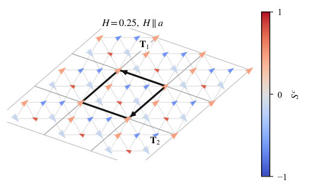
<figcaption class="paper-figure-caption"><b>Fig 1.</b> FIG. 2. The field-selected state is a compact noncoplanar seven-site order. Real-space spin texture at H = 0.25 for H ∥ a, obtained by periodically repeating the magnetic cell used in the spin-wave calculation. The black parallelogram marks one magnetic unit cell, with T1 = (−3, 1) and T2 = (−1, −2) in triangular-lattice coordinates. Arrows show (Sa, Sb) in the crystallographic frame and the color gives Sc.</figcaption>
</figure>
<figure class="paper-figure-card">
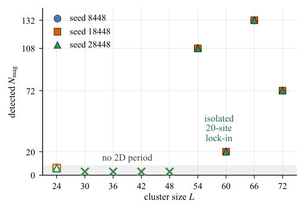
<figcaption class="paper-figure-caption"><b>Fig 2.</b> FIG. 1. Zero-field magnetic-cell detection results at (θ, ϕ) = (0.55π, 1.91π). Detected magnetic-cell size versus cluster size for three independent seeds. Filled markers denote detected two-dimensional finite cells, open markers denote rank-one patterns, and crosses mark clusters where no two-dimensional period is found within the search window. The isolated 20- site cell at L = 60 is a finite-size commensurate lock-in.</figcaption>
</figure>
<figure class="paper-figure-card">
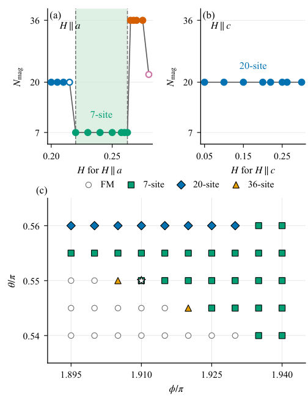
<figcaption class="paper-figure-caption"><b>Fig 3.</b> FIG. 3. Field and parameter diagnostics for the selected seven-site state. (a) Magnetic-cell size selected for H ∥a. Filled (open) markers denote fields where independent seeds agree (split), and the shaded band marks 0.2200 ≤H ≤ 0.2625. (b) Control scan for H ∥c: fields from 0.0500 to 0.3000 remain on a 20-site branch across all three seeds. (c) Single-seed local scan at H = 0.25 and H ∥a. Symbols mark the selected two-dimensional magnetic cell at each sampled parameter point; FM denotes the one-site uniform ferromag- netic branch and the star marks (θ, ϕ) = (0.55π, 1.91π).</figcaption>
</figure>
<figure class="paper-figure-card">
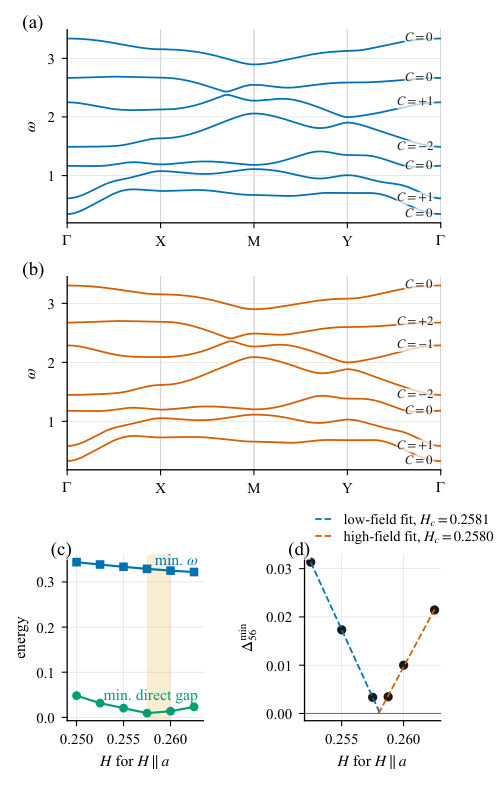
<figcaption class="paper-figure-caption"><b>Fig 4.</b> FIG. 4. The selected seven-site state carries field-tunable magnon Chern numbers. (a) Linear-spin-wave spectrum at H = 0.2500, with Chern vector Clow, and (b) spectrum at H = 0.2600, with Chern vector Chigh. Small labels at the right edge mark the band Chern numbers. Both spec- tra are plotted along the magnetic Brillouin-zone path Γ-X- M-Y -Γ. This path is defined in the reduced coordinates of the seven-site magnetic Brillouin zone, with X = (1/2, 0), M = (1/2, 1/2), and Y = (0, 1/2) in the reciprocal basis of the magnetic supercell. In physical reciprocal coordinates these points are X = (−1/7, 1/14), M = (−3/14, −1/7), and Y = (−1/14, −3/14) modulo reciprocal lattice vectors, dis- tinct...</figcaption>
</figure>
<figure class="paper-figure-card">
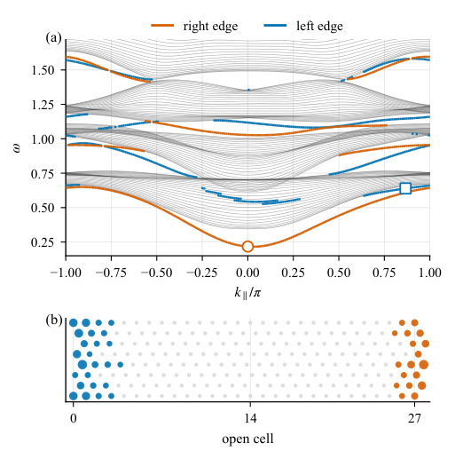
<figcaption class="paper-figure-caption"><b>Fig 5.</b> FIG. 5. Low-energy strip spectrum at H = 0.2500. (a) Strip spectrum versus momentum along the periodic direc- tion. Thin grey lines show strip bands in the plotted energy window; red and blue segments mark states whose weight on the two outermost magnetic cells exceeds 0.35 on opposite boundaries. Open symbols mark the two modes used for the real-space map. (b) Site-resolved magnon weights for repre- sentative left- and right-edge modes on the same strip.</figcaption>
</figure>

**Summary.** The paper investigates topological magnons in a frustrated triangular-lattice magnet by applying an external magnetic field to stabilize a specific seven-site spin order. This state exhibits tunable Chern numbers that undergo a distinct transfer at a critical field strength. The transition is confirmed through changes in band topology, the thermal Hall conductivity, and spectroscopic measurements of the magnon dynamics.

**Why it may be interesting.** This work provides a detailed, controlled semiclassical benchmark for observing topological magnon physics in frustrated magnets, linking lattice geometry, external fields, and measurable transport properties like the thermal Hall effect.

Detailed structure

**Main problem.** The primary challenge is defining magnon topology (Chern numbers) in strongly frustrated magnets where the zero-field ground state often lacks a stable harmonic vacuum for linear spin-wave theory.

**Main result.** Applying an in-plane magnetic field stabilizes a noncoplanar seven-site order, which hosts tunable topological magnon bands exhibiting a clear Chern number transfer at a critical field strength. This transition is observable via the thermal Hall conductivity and the dynamical structure factor.

**Method.** The study employs Linear Spin-Wave Theory (LSWT) applied to a classical spin model, using ground state searches combined with band structure calculations on a magnetic unit cell.

**Model / system.** The system is a classical frustrated triangular-lattice magnet described by a K-$\Gamma$-$\Gamma'$ nearest-neighbor Hamiltonian. The analysis focuses on the field-selected seven-site ordered state stabilized by an external in-plane magnetic field.

**Key observables.** Field-tunable Chern numbers ($C_n$), total thermal Hall conductivity ($\kappa_{xy}(T)$), and the coherent one-magnon dynamical structure factor $S(\mathbf{q}, \omega)$.

**Important parameters / regimes.** The magnetic field strength ($H$) is critical, particularly around a transition point $H_c \approx 0.258$. The lattice geometry (triangular) and exchange parameters ($K, \Gamma, \Gamma'$) define the model.

**Assumptions / limitations.** The analysis relies on LSWT, which is an approximation; furthermore, zero-field states are deemed insufficient for robust topological characterization due to finite-size effects.

**Figures summary.** Figures illustrate the real-space spin texture of the field-selected state, show magnon bands and Chern numbers before and after the transition, and plot $\kappa_{xy}(T)$ demonstrating a near-zero crossing during the transfer region.

**Paper structure.** The paper first establishes the necessity of field selection to stabilize a robust magnetic vacuum. It then calculates the topological invariants (Chern numbers) as a function of applied field, detailing the Dirac-like band touching and subsequent Chern vector change. Finally, it analyzes the transport consequences via $\kappa_{xy}(T)$ and confirms spectral weight conservation using the DSF.

Abstract

Defining magnon topology in strongly frustrated magnets is often hindered by the absence of a simple harmonic magnon vacuum at zero field. Within a classical-spin ground-state search followed by linear spin-wave theory (LSWT), we demonstrate that a representative triangular-lattice K-Gamma-Gamma' model in a dominant-Gamma exchange regime has an in-plane-field-selected compact, noncoplanar seven-site order. This field-selected state provides a controlled classical reference state and hosts magnon bands with field-tunable Chern numbers. Increasing the field drives a Dirac-like band touching that transfers Berry curvature between the fifth and sixth bands, altering the Chern vector from (0, 1, 0, -2, 1, 0, 0) to (0, 1, 0, -2, -1, 2, 0). This topological transition reorganizes the band-resolved thermal Hall conductivity, driving the total $κ_{xy}(T)$ through a near-zero crossing once the upper bands are thermally populated. The dynamical structure factor places roughly half of the coherent spectral weight on the Chern-active branches, offering a spectroscopic route to identify the topological branches. These results define a controlled semiclassical benchmark for magnon topology in this pure nearest-neighbor exchange model.

[↑ back to top](#top)

### [Finite-Element Matrix Product States for Continuum Models in One Dimension](http://arxiv.org/abs/2606.14873v1)

**Authors:** Akshay Shankar, Karel Van Acoleyen, Jutho Haegeman  
**Type:** theory · **Category:** numerical methods · **PDF:** <https://arxiv.org/pdf/2606.14873v1>  
**Analysis basis:** full PDF text, analyzed in chunks
**Topic relevance:** 🔥 `analog quantum simulation` **4/5** · `methods for driven-dissipative` **3/5** · `non-equilibrium dynamics` **2/5** · `Frenkel-Kontorova` **1/5** · `Keldysh / 2PI / non-Gaussian methods` **1/5** · `entanglement & information structure` **1/5**

↔ Scroll figures horizontally

<figure class="paper-figure-card">
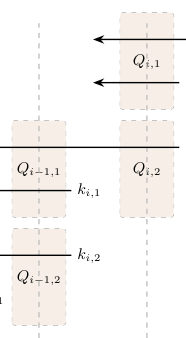
<figcaption class="paper-figure-caption"><b>Fig 1.</b> FIG. 1. Visual schematic of the particle-flow picture with R = 2. The indices ki,r count the particles originating at site i and travel a distance r, while the virtual indices Qi,r count the total particle flow across the boundary between sites i and i + 1 that travel to i −r + 1.</figcaption>
</figure>
<figure class="paper-figure-card">
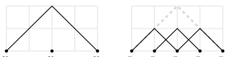
<figcaption class="paper-figure-caption"><b>Fig 2.</b> FIG. 3. Refinement of the tent function basis</figcaption>
</figure>
<figure class="paper-figure-card">
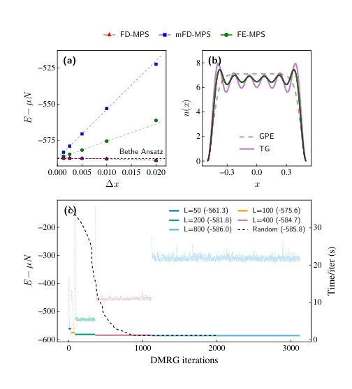
<figcaption class="paper-figure-caption"><b>Fig 3.</b> FIG. 5. Ground state properties and convergence behavior for N = 6 particles in an infinite well of size l = 1 with g = 50 at bond dimension D = 10. (a) Scaling of the ground state energy error with grid spacing ∆x for FD-MPS (red, nc = 2), modified FD-MPS (blue, nc = 1, see Appendix D), and FE-MPS (green, nc = 2). The absolute error of the continuum limit relative to the Bethe ansatz energy is due to small D. (b) Comparison of the spatial density n(x) at the finest resolution (L = 800) against Gross-Pitaevskii (GPE) and Tonks-Girardeau (TG) limits. (c) Energy convergence during DMRG optimization of FE-MPS, demonstrating the performance of the multigrid optimization scheme compared to a...</figcaption>
</figure>
<figure class="paper-figure-card">
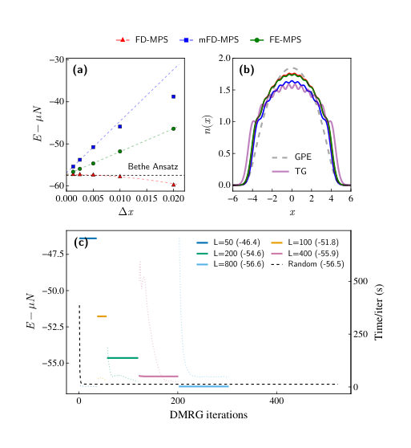
<figcaption class="paper-figure-caption"><b>Fig 4.</b> FIG. 6. Ground state properties and convergence behavior as in Fig. 5, but for N = 12 particles in a harmonic trap with ω = 1 and g = 10 at bond dimension D = 15. (a) Energy convergence with ∆x where we compare against the Bethe ansatz solution using a local density approximation (see Appendix E). (b) Comparison of the spatial density n(x) at L = 800. (c) Energy convergence during DMRG optimization of FE-MPS.</figcaption>
</figure>
<figure class="paper-figure-card">
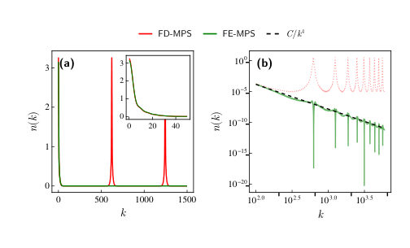
<figcaption class="paper-figure-caption"><b>Fig 5.</b> FIG. 7. Momentum distribution n(k) (see Appendix C 3) for the parameters in Fig. 5 at L = 100. (a) Linear scale com- parison highlighting the agreement between FD-MPS (red) and FE-MPS (green) on IR behavior. The extended k-range demonstrates periodic aliasing artifacts inherent to the FD representation, which are suppressed with the FE basis. In- set: Zoom-in on the low-k regime, showing the identical reso- lution of the bulk density peak. (b) Log-log scale illustrating the UV behavior. FE-MPS recovers the physical k−4 power- law tail [25], while FD-MPS plateaus with periodic behavior. The black dashed line represents the theoretical asymptotic limit C/k4, where the contact C = 4gEint is...</figcaption>
</figure>

**Summary.** The paper introduces Finite-Element Matrix Product States (FE-MPS) as a powerful numerical method for simulating quantum many-body systems in one dimension, bridging the gap between discrete lattice models and continuous field theories. By using FE basis sets, it accurately captures continuum physics, such as momentum tails, while employing generalized DMRG techniques to maintain computational tractability. This allows for high-precision study of interacting gases under complex external potentials.

**Why it may be interesting.** This work is highly relevant for AMO physics because it provides a systematic, variational numerical tool to study interacting quantum gases (like Bose or Fermi gases) in complex potentials or geometries where standard lattice approximations fail. The ability to handle continuum physics while maintaining the efficiency of MPS is a major computational advance.

Detailed structure

**Main problem.** The core problem is extending quantum many-body simulation techniques, particularly those based on Matrix Product States (MPS), from discrete lattice models to continuous space continuum field theories.

**Main result.** The authors successfully recast the variational ground-state search for continuum systems into a generalized eigenvalue problem solvable by modified DMRG algorithms. This framework provides systematic convergence and accurate physical results compared to standard finite-difference methods.

**Method.** They employ a Finite-Element (FE) expansion using non-orthogonal single-particle basis sets to discretize the continuum Hamiltonian, which is then represented as an efficient Matrix Product Operator (MPO). The ground state search minimizes energy by solving generalized eigenvalue problems iteratively.

**Model / system.** The primary model studied is one-dimensional quantum many-body systems, exemplified by the Lieb-Liniger gas. The physics is governed by a Hamiltonian that includes kinetic terms, external potentials (like harmonic traps or barriers), and contact interactions.

**Key observables.** Ground state energy ($E$), spatial density $n(x)$, momentum distribution $n(k)$, and the Single-Particle Density Matrix (SPDM).

**Important parameters / regimes.** Grid spacing ($\Delta x$), chemical potential ($\mu$), interaction strength ($g$), and the bond dimension ($\chi$).

**Assumptions / limitations.** The method assumes that the many-body overlap operator can be efficiently encoded as an MPO, allowing the use of generalized DMRG. Convergence is limited by non-smooth features (cusps) in the wavefunction, leading to $O(\Delta x)$ energy scaling.

**Figures summary.** Figures compare energy and density convergence ($\Delta x$ dependence) for various potentials (infinite well, harmonic trap with barrier), demonstrating FE-MPS's superior variationality and ability to capture correct UV momentum tails ($k^{-4}$) compared to FD-MPS.

**Paper structure.** The paper builds conceptually from the general framework of mapping continuum physics onto an auxiliary computational space using FE basis sets. It details the MPO representation of both the Hamiltonian and the overlap operator, outlines the generalized DMRG algorithm, and concludes with rigorous convergence studies and comparisons against exact benchmarks (Bethe Ansatz).

Abstract

We present a matrix product state framework for simulating one-dimensional quantum many-body systems in the continuum using non-orthogonal single-particle basis sets. By mapping the physical problem to an auxiliary computational space, we show that the resulting many-body overlap operator can be efficiently encoded as a matrix product operator for sufficiently localized orbitals, thereby generalizing a construction that first appeared in [arXiv:2405.10285]. This construction recasts the variational ground-state search into a generalized eigenvalue problem, which can be solved using a generalized density matrix renormalization group algorithm. As a primary application, we employ a first-order finite-element expansion to study the ground state properties of the Lieb-Liniger gas in the presence of inhomogeneities. This approach also provides a natural setting for exactly refining the lattice, thereby enabling multigrid optimization strategies for matrix product states.

[↑ back to top](#top)

### [Mapping the Stability of Spin Qubits in Superconducting Pseudogap Systems](http://arxiv.org/abs/2606.15711v1)

**Authors:** Chen-How Huang, Miguel A. Cazalilla  
**Type:** theory · **Category:** quantum information and computing · **PDF:** <https://arxiv.org/pdf/2606.15711v1>  
**Analysis basis:** full PDF text, analyzed in chunks
**Topic relevance:** 🔥 `Kondo & dissipative impurity` **4/5** · `spintronics-quantum-optics interface` **2/5** · `Keldysh / 2PI / non-Gaussian methods` **1/5** · `analog quantum simulation` **1/5** · `correlated / nonlocal dissipation` **1/5** · `driven-dissipative phase transition` **1/5** · `exotic spin models in light-matter` **1/5** · `methods for driven-dissipative` **1/5**

↔ Scroll figures horizontally

<figure class="paper-figure-card">
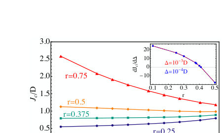
<figcaption class="paper-figure-caption"><b>Fig 1.</b> FIG. 2. Dependence of the critical Kondo coupling Jc on the strength of the (s-wave) pairing potential ∆/D (D is the sys- tem bandwidth) at particle-hole symmetry (i.e. V = µ = 0). Note that for r = 0.75, larger ∆favors a singlet ground state. Inset: Slope of the critical J, i.e. dJc/d∆vs. pseudogap ex- ponent r. Notice the sing change for r ≃0.4.</figcaption>
</figure>

**Summary.** This paper theoretically investigates spin qubits embedded in superconductors with a pseudogap. By using advanced renormalization group techniques, the authors map out the phase diagram governing the transition between stable doublet and singlet ground states. The key finding is that tailoring the superconducting host's pseudogap structure can significantly enhance qubit stability at high coupling strengths.

**Why it may be interesting.** This work directly addresses fundamental issues in superconducting quantum computing by providing theoretical guidelines on how material properties (like the pseudogap structure) can be engineered to enhance qubit coherence and stability against decoherence mechanisms.

Detailed structure

**Main problem.** The study maps how modifying the superconducting host's pseudogap structure affects the stability of spin qubits realized as Yu-Shiba-Rusinov states.

**Main result.** Coupling to superconductors with large pseudogap exponents enhances qubit stability at large Kondo coupling, suggesting a route to engineer resilient quantum bits.

**Method.** The analysis employs effective field theory and numerical renormalization group (NRG) techniques to map the phase diagram of the system's ground state.

**Model / system.** The model involves a quantum dot spin coupled to a superconductor exhibiting a pseudogap tunneling density of states, $
ho(\epsilon) \sim |\epsilon|^r$. The physics is governed by Kondo coupling ($J$) and superconducting pairing ($\Delta$).

**Key observables.** The stability transition between the spin doublet and singlet ground state, characterized by the critical Kondo coupling $J_c$, and the energy gap between these two states.

**Important parameters / regimes.** Pseudogap exponent ($r$), Kondo coupling strength ($J$), superconducting gap ($\Delta$), and particle-hole symmetry breaking perturbations ($V$ or $\mu$).

**Assumptions / limitations.** The analysis assumes a constant $s$-wave pairing potential $\Delta$ and utilizes effective actions derived from integrating out host degrees of freedom.

**Figures summary.** Figure 1(a) shows the phase diagram mapping doublet vs. singlet regions based on $J_c/D$ for varying $r$, $V$, and $\mu$. Figure 1(b) illustrates how the energy gap between the two states closes as $r$ increases.

**Paper structure.** The paper systematically analyzes the ground state phase diagram using RG flow, first examining weak coupling regimes, then analyzing the large Kondo coupling limit by considering Andreev reflection's role in stabilizing different singlet phases based on the pseudogap exponent $r$.

Abstract

Superconducting spin qubits, realized as Yu-Shiba-Rusinov spin-doublet states in quantum-dot-superconductor systems, represent a cornerstone of current research in quantum technologies. We analyze these ground states of quantum impurities in superconducting pseudogap systems, namely systems with a pseudogap tunneling density of states $ρ(ε) \sim |ε|^r$ for energies $|ε|\gg Δ$ ($Δ$ being a $s$-wave pairing potential). For $r=1$, these hosts are realized as Dirac materials (graphene or 3D topological insulator surfaces) in proximity to conventional superconductors, or as $d+i s$ superconductors. Using effective field theory and numerical renormalization group, we map the phase diagram against the pseudogap exponent $r > 0$ and particle-hole symmetry-breaking perturbations. At particle-hole symmetry, increasing $r$ also increases the critical value, $J_c$, of the Kondo coupling that triggers the transition from spin doublet to singlet. Unlike the gapless pseudogap Kondo systems, numerical and analytical evidence suggest that Andreev reflection stabilizes a singlet ground state at $J$ for all $r > 0$. Breaking particle-hole symmetry -- by potential scattering or chemical potential -- eventually restores the transition at lower $J_c$. Our results indicate that coupling to superconducting hosts with large pseudogap exponents enhances the stability of spin qubits at large Kondo coupling.

[↑ back to top](#top)

### [Scalable Graph State Generation with O(1) Local Feedforward in Quantum Networks](http://arxiv.org/abs/2606.16375v1)

**Authors:** Xiaoyi Zheng, Chan-Tong Lam, Lin Chen, Zheng Xing  
**Type:** both · **Category:** quantum information and computing · **PDF:** <https://arxiv.org/pdf/2606.16375v1>  
**Analysis basis:** full PDF text, analyzed in chunks
**Topic relevance:** 🔥 `QC/QI experiment` **4/5** · `quantum measurements` **3/5** · `measurement-induced transitions` **2/5** · `entanglement & information structure` **1/5** · `methods for driven-dissipative` **1/5** · `non-equilibrium dynamics` **1/5**

↔ Scroll figures horizontally

<figure class="paper-figure-card">
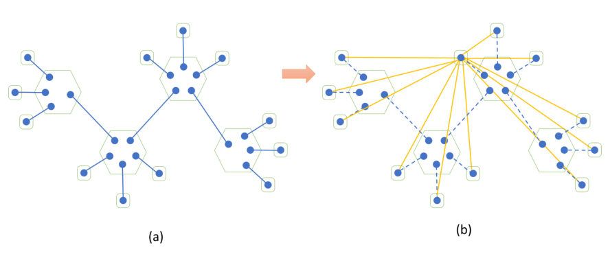
<figcaption class="paper-figure-caption"><b>Fig 1.</b> FIG. 1. Protocol Architecture and Topology Evolution. (a) Initial Resource State. The blue lines represent Bell states. Relay nodes (hexagons) are linearly connected via Bell states, and each terminal node (square) shares a Bell state with its nearest relay node. (b) Target Graph State. The final star-shaped graph (yellow edges represent CZ connections). The topology center is arbitrarily specified, and the final graph only contains terminal nodes; all relay nodes are no longer present in the final graph after measurement.</figcaption>
</figure>
<figure class="paper-figure-card">
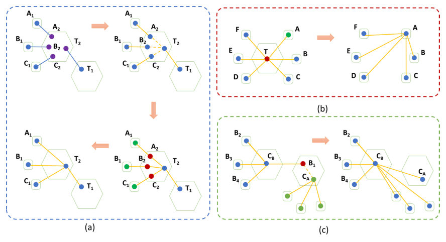
<figcaption class="paper-figure-caption"><b>Fig 2.</b> FIG. 2. Core topological operations governing graph state evolution. (a) Protocol 1: Subgraph Generation. Relay nodes (hexagons) transform pre-shared Bell pairs (blue lines) into star-shaped subgraphs centered on qubit T2 via local Hadamard gates (purple), CZ operations (yellow lines), and X-measurements (red). (b) Protocol 2: Center Transformation. Dynamic migration of the topological center from node T to A is achieved by measuring T (red) and applying conditional corrections on A (green), without consuming additional entanglement. (c) Protocol 3: Star Fusion. Two independent stars GA and GB are merged by entangling center CA with bridge node B1, followed by the measurement of B1. This...</figcaption>
</figure>
<figure class="paper-figure-card">
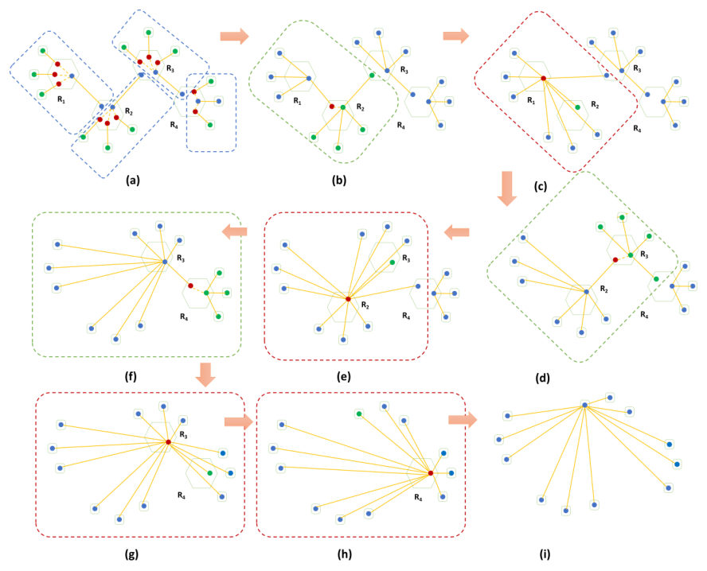
<figcaption class="paper-figure-caption"><b>Fig 3.</b> FIG. 3. End-to-end workflow for scalable star graph construction. (a) Parallel Initialization: Simultaneous execution of Protocol 1 by all relay nodes to form local subgraphs (blue boxes). (b) Initial Fusion: Protocol 3 merges the first two subgraphs via bridge node measurement (green box). (c) Center Migration: Protocol 2 shifts the center to a new relay node (red box). (d)-(g) Iterative Expansion: Alternating execution of fusion and migration protocols progressively expands the topology. (h)-(i) Finalization: The final center is designated among terminal nodes, and all remaining relay nodes are decoupled, yielding the target user-plane star graph (i).</figcaption>
</figure>
<figure class="paper-figure-card">
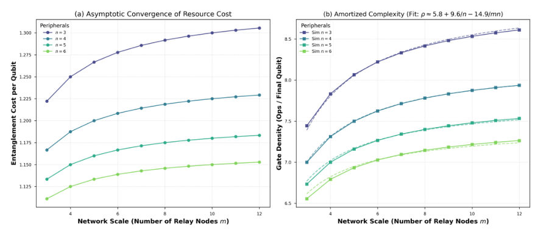
<figcaption class="paper-figure-caption"><b>Fig 4.</b> FIG. 4. Resource Utilization. (a) The entanglement cost per qubit, Cent, matches the prediction of the analytical formula (Eq. 4) and converges to the asymptotic limits ≈1.33 (n = 3) and ≈1.16 (n = 6). (b) The gate density exhibits a bounded saturation mode, highly matching the prediction of the model ρ ≈cbase +coverhead/n−ccorr/mn (dashed line). This confirms the existence of initialization overhead at small scales, but the control complexity asymptotically saturates to a constant, thus verifying the amortized O(1) scalability.</figcaption>
</figure>
<figure class="paper-figure-card">
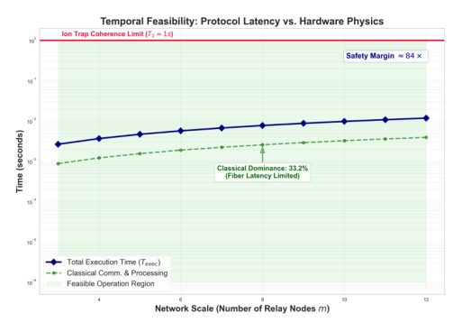
<figcaption class="paper-figure-caption"><b>Fig 5.</b> FIG. 5. Temporal Feasibility. The red solid line indicates the 1.0 s coherence limit of 171Yb+ memory qubits. The dark blue solid line represents the total execution time of the protocol, and the green dashed line represents the latency caused by classical communication and processing. Simulation results show that the security margin is ≈80×, and classical communication time accounts for approximately 33% of the total latency. This indicates that the protocol operates under low-latency conditions.</figcaption>
</figure>

**Summary.** This paper introduces a scalable protocol for generating high-fidelity graph states in quantum networks using a dual-species trapped-ion platform. By employing local measurements and classical feedforward with O(1) complexity, it bypasses latency bottlenecks associated with global synchronization. Furthermore, the integration of erasure conversion significantly boosts fidelity, paving a path toward fault-tolerant distributed quantum computing.

**Why it may be interesting.** It provides concrete, hardware-aware protocols that directly address the time/fidelity trade-off in quantum networking, which is crucial for scaling up distributed quantum computation architectures built on trapped ions.

Detailed structure

**Main problem.** The primary challenge is generating large-scale, high-fidelity graph states in quantum networks while overcoming decoherence limitations imposed by finite coherence times.

**Main result.** The authors propose a low-latency protocol achieving amortized O(1) decision complexity, which maintains high fidelity even for large networks through error mitigation techniques like erasure conversion.

**Method.** The protocol relies on local measurements and classical feedforward, simplifying complex state evolution by exploiting the condition that measured qubit neighborhoods form an independent set. It combines iterative subgraph fusion with center node migration.

**Model / system.** The work is mapped onto a dual-species trapped-ion platform using ${}^{138}	ext{Ba}^+$ for communication and ${}^{171}	ext{Yb}^+$ for storage qubits, simulating the construction of star graph states.

**Key observables.** Entanglement fidelity ($F$), resource efficiency (entanglement cost $	ext{Cent}$), decision delay relative to coherence time, and effective logical error rate ($\epsilon_{eff}$).

**Important parameters / regimes.** Coherence time ($T_{	ext{mem}}^{2} \approx 1.0	ext{ s}$), measurement error rates ($\epsilon_m$), and network size parameters ($m, n$).

**Assumptions / limitations.** The core assumption enabling low latency is that the neighborhood of a measured qubit forms an independent set, which simplifies complex byproduct operators to local single-qubit corrections.

**Figures summary.** Figures illustrate the protocol architecture (initial vs. target star graph), step-by-step construction using three protocols (Subgraph Generation, Center Transformation, Star Fusion), and quantitative comparisons of resource scaling ($	ext{Cent}$, $
ho$) and fidelity decay under noise.

**Paper structure.** The paper details the theoretical foundation by deriving measurement rules for graph states, then presents a multi-protocol workflow (Protocols 1-3) to build large topologies. Finally, it analyzes scalability using error mitigation techniques like erasure conversion.

Abstract

The development of quantum networks faces a key challenge: the contradiction between probabilistic long-range entanglement generation and finite coherence time. Existing routing protocols typically focus on global state computation or path optimization. As the network scales up, classical delays accumulate and exacerbate decoherence, leading to a decrease in entanglement fidelity. To reduce routing decision delays to levels far below the coherence time of qubits, we propose a protocol based on local measurement and classical feedforward. This protocol reduces the local decision complexity to amortized O(1) level, ensuring that the decision delay is always much smaller than the coherence time of qubits. We map this protocol onto a dual-species trapped-ion platform and perform hybrid simulations. The results show that the proposed protocol performs well in terms of both resource efficiency and time feasibility. Noise analysis indicates that readout fidelity is the main bottleneck of this protocol, but noise suppression can be achieved by employing an erasure transformation in the dual-species architecture, combined with spatial multiplexing and branch independence, thereby ensuring the generation of high-fidelity star subgraphs. This protocol provides a clear path to achieving high-fidelity star subgraphs. These subgraphs can serve as general modules, merging to construct arbitrary subgraphs, providing a feasible solution for future fault-tolerant distributed quantum computing.

[↑ back to top](#top)

### [Spectral dimension determines criticality in nonreciprocal phase oscillators](http://arxiv.org/abs/2606.16427v1)

**Authors:** Minwoo Bae, Hiroshi Kori  
**Type:** theory · **Category:** statistical mechanics · **PDF:** <https://arxiv.org/pdf/2606.16427v1>  
**Analysis basis:** full PDF text, analyzed in chunks
**Topic relevance:** 🔥 `non-equilibrium universality` **4/5** · `driven-dissipative phase transition` **3/5** · `non-equilibrium dynamics` **2/5** · `Keldysh / 2PI / non-Gaussian methods` **1/5** · `correlated / nonlocal dissipation` **1/5** · `methods for driven-dissipative` **1/5**

↔ Scroll figures horizontally

<figure class="paper-figure-card">
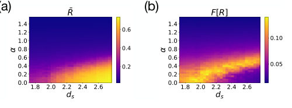
<figcaption class="paper-figure-caption"><b>Fig 1.</b> FIG. 2: Phase diagram of Eq. (1) on a fully connected weighted graph with couplings Jij = r−(1+σ) ij + εij defined on the ring, where εij is quenched Gaussian disorder with zero mean and standard deviation δ. Results are shown for N = 210 and δ = 4 × 10−6. The noise strength is D = 4.9 × 10−1, chosen to be larger than in Fig. 1 for the reason discussed in Supplemental Material [29]. As in Fig. 1, the color bars represent ensemble-averaged values over 5 graph realizations of (a) ¯R and (b) F[R], obtained from numerical integration with tm = 4.5 × 104 and T = 5 × 103.</figcaption>
</figure>
<figure class="paper-figure-card">
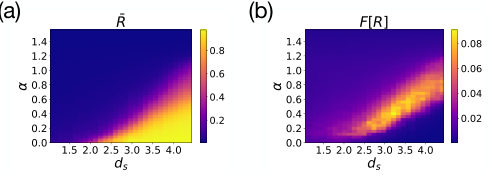
<figcaption class="paper-figure-caption"><b>Fig 2.</b> FIG. 1: Phase diagram of Eq. (1) in the (ds, α) plane for complex networks with continuously tunable spectral dimension [28]. The initial phases θi are independently drawn from a uniform distribution, with network size N = 214 and noise strength D = 4 × 10−2. The color bars show ensemble-averaged values over 20 network realizations of (a) the long-time average of the synchronization order parameter, ¯R, and (b) the dynamical fluctuation, F[R] [Eq. (4)], obtained by numerical integration with tm = 4.8 × 104 and T = 2 × 103.</figcaption>
</figure>
<figure class="paper-figure-card">
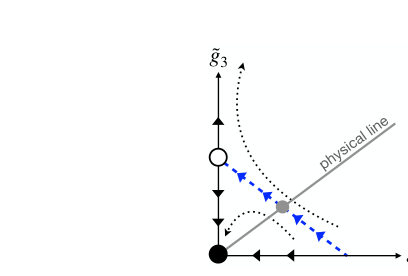
<figcaption class="paper-figure-caption"><b>Fig 3.</b> FIG. 3: Schematic RG flow in coupling-constant space for σ ∈(0, 1), corresponding to ds ∈(2, ∞). As discussed in the main text, the ˜g1 direction does not affect the critical behavior; we therefore show the (˜g2, ˜g3) plane. Arrows indicate stable flow directions. The filled circle at the origin denotes the trivial stable fixed point. The open circle on the ˜g3 axis denotes the nontrivial fixed point [Eq. (20a)], around which the critical manifold is locally defined and shown as the blue dashed line. This manifold intersects the physical line of the present system [Eq. (12)], shown as the gray straight line through the origin. Dotted arrows indicate schematic RG trajectories. As discussed...</figcaption>
</figure>

**Summary.** This paper investigates how the geometric property of a network, its spectral dimension ($d_s$), dictates the onset of collective synchronization in nonreciprocal phase oscillators. Using advanced techniques like the Dynamical Renormalization Group and analyzing the Kuramoto-Sakaguchi model, the authors establish critical thresholds for both $d_s$ and the coupling's nonreciprocity ($\alpha$). The findings provide a powerful framework for understanding pattern formation in complex, noisy systems.

**Why it may be interesting.** This work connects concepts from condensed matter critical phenomena (RG theory) with non-equilibrium dynamics in complex systems, providing quantitative tools to analyze synchronization transitions beyond simple mean-field approaches.

Detailed structure

**Main problem.** The study determines how the spectral dimension ($d_s$) of a complex network controls critical synchronization phenomena in nonreciprocal phase oscillator systems.

**Main result.** Synchronization transitions are governed by $d_s$, revealing a critical spectral dimension $d_s^c=2$ for certain regimes, and deriving an analytical expression for the critical phase lag $\alpha_c$.

**Method.** The analysis employs advanced theoretical tools including the Dynamical Renormalization Group (DRG) method, Martin-Siggia-Rose formalism, and spectral dimension estimation from network eigenvalues.

**Model / system.** The model consists of noisy identical Kuramoto–Sakaguchi oscillators coupled on complex networks. The nonreciprocity is introduced via a phase lag $\alpha > 0$.

**Key observables.** Synchronization Order Parameter ($R$), critical phase lag ($\alpha_c$), and the spectral dimension ($d_s$).

**Important parameters / regimes.** Spectral dimension ($d_s$), phase lag ($\alpha$), network coupling strength, and noise strength.

**Assumptions / limitations.** The analysis relies on linearizing the dynamics near small phase differences and using approximations like center manifold theory in the RG flow analysis.

**Figures summary.** Figures illustrate phase diagrams showing synchronization transitions dependent on $(d_s, \alpha)$, and schematic representations of eigenvalue spectra used to estimate $d_s$.

**Paper structure.** The paper progresses from defining the physical model and estimating $d_s$ via network eigenvalues, to deriving a dynamic response functional, applying the DRG method to find RG flow equations for couplings, and finally solving these equations to determine $\alpha_c$.

Abstract

Spectral dimension is a key determinant of critical phenomena, but its role in nonreciprocal systems remains unexplored. We study noisy identical Kuramoto-Sakaguchi oscillators with phase lag $α\in [0,π/2)$, where $α>0$ induces nonreciprocal interactions. Numerical phase diagrams in the $(d_s,α)$ plane in complex networks, where $d_s$ denotes the spectral dimension, reveal a critical phase lag $α_c$, below which spontaneous synchronization occurs. This critical phase lag appears only for $d_s > d_s^c$, where $d_s^c = 2$ is the critical spectral dimension, and increases monotonically with $d_s$. We analytically derive the criticality using the dynamical renormalization group method.

[↑ back to top](#top)

### [Adiabatic realization of anomalous Floquet topological systems](http://arxiv.org/abs/2606.16942v1)

**Authors:** Luca Asteria, Marcel N. Kosch, Henrik P. Zahn, Jonathan Bracker, André Eckardt, Klaus Sengstock, Christof Weitenberg  
**Type:** both · **Category:** other · **PDF:** <https://arxiv.org/pdf/2606.16942v1>  
**Analysis basis:** full PDF text, analyzed in chunks
**Topic relevance:** 🔥 `analog quantum simulation` **4/5** · `non-equilibrium dynamics` **3/5** · `non-equilibrium universality` **2/5** · `driven-dissipative phase transition` **1/5** · `exotic spin models in light-matter` **1/5**

↔ Scroll figures horizontally

<figure class="paper-figure-card">
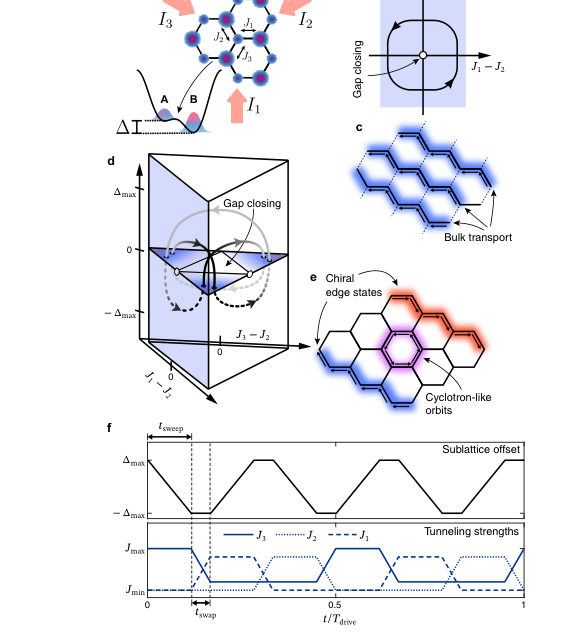
<figcaption class="paper-figure-caption"><b>Fig 1.</b> FIG. 1. A 2D charge pump as an anomalous Flo- quet topological phase. a) We realize a honeycomb lattice with tunnel couplings J1, J2, J3 along the three different direc- tions between neighboring sites, respectively, formed by three laser beams with intensities I1, I2, I3 and a sublattice offset ∆ (represented by disks of different radius). b) For J3 = 0 the system corresponds to uncoupled Rice-Mele-type 1D chains, described by a parameter space (J1 −J2, ∆) with a band de- generacy at (0, 0). c) A cyclic path around the degeneracy realizes the well-known quantized Thouless pump along these 1D chains. d) When including J3, the parameter space be- comes three dimensional (including J1 −J2 and...</figcaption>
</figure>
<figure class="paper-figure-card">
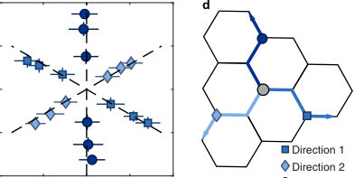
<figcaption class="paper-figure-caption"><b>Fig 2.</b> FIG. 2. 1D charge pumps embedded in a 2D lattice. a) Images of the atoms at the beginning and end of a driving cycle as in Fig. 1b obtained with the matter-wave microscope after ramping to a balanced situation I1 = I2 = I3. The pop- ulations of the two sublattices periodically invert after each step as becomes visible in the white rectangle containing an A and a B site. b) Overlay of the cut through the two images il- lustrating the displacement of the center of mass ∆xCoM. The parameters are ∆= 2π·7 kHz, ε = 0.5, Imax = 7 Er, tsweep = 1 ms, tswap = 0.45 ms. c) Movement of the center of mass for 1, 2, and 3 pump cycles for three different protocols, leading to a transport along three...</figcaption>
</figure>
<figure class="paper-figure-card">
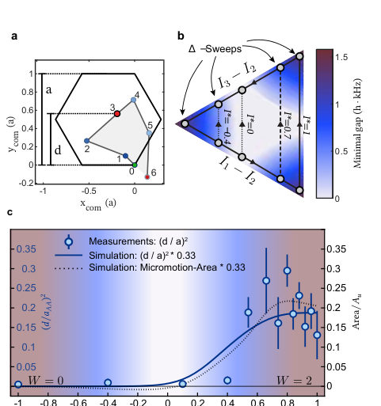
<figcaption class="paper-figure-caption"><b>Fig 3.</b> FIG. 3. Adiabatic realization and detection of anoma- lous Floquet topology. a) Measured micromotion trajec- tory for the adiabatic realization of the anomalous Floquet topological system (with ε = 0.45). The hexagonal pattern in- dicates the unit cell. d is the projection along y of the position of the center of mass after three steps (relative to t = 0). b) Projection of the path of the driving protocol into the ∆= 0 plane. The minimal instantaneous band gap during the pro- tocol is indicated by the color code. In each protocol, we start at the left corner and move along the equilateral triangle of side (I1 −I2)∗. At each corner, we perform a sweep inverting the offset with ∆max = h · 2.6...</figcaption>
</figure>
<figure class="paper-figure-card">
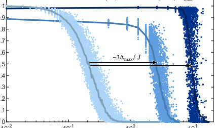
<figcaption class="paper-figure-caption"><b>Fig 4.</b> FIG. 4. Numerical study of robustness to disorder. a) Geometry of the numerical simulation for the transport along a zig-zag edge of a honeycomb lattice. The particle is initially located at site r1 and we study the probability |G(r1, r2)|2 of arriving at site r2 after exactly Nsteps = 16. This corresponds to 8 Floquet periods for the near-resonant drive and 4 Floquet periods for the adiabatic drive. The curves show the center- of-mass trajectories of a particle initially localized on a single lattice site for different disorder strengths and ∆max = 15J. b) Transmission probability |G(r1, r2)|2 as a function of the disorder strength for 100 realizations of the disorder together with an...</figcaption>
</figure>

**Summary.** The paper reports on the adiabatic realization of anomalous Floquet topological phases in ultracold atoms trapped in optical lattices. By slowly modulating the lattice geometry rather than driving near resonance, the researchers achieve robust control over these exotic quantum states. This method is significant because it offers a more stable and controllable pathway for engineering novel topological matter compared to existing techniques.

**Why it may be interesting.** This work provides a highly controllable, experimentally viable platform for engineering exotic quantum phases of matter using ultracold atoms, moving beyond purely theoretical predictions in Floquet engineering.

Detailed structure

**Main problem.** The research aims to demonstrate an adiabatic method for realizing anomalous Floquet topological phases, circumventing the limitations of conventional near-resonant driving schemes.

**Main result.** Anomalous topological phases were successfully realized in ultracold atoms by adiabatically modulating the lattice geometry, showing robustness even in the presence of significant mean-field interactions.

**Method.** The study combines theoretical analysis (using micromotion area as a winding number proxy) with experimental realization using ultracold atoms in optical lattices.

**Model / system.** The system is modeled by atoms in a tunable honeycomb lattice, whose parameters ($J_i$, sublattice offset $\Delta$) are adiabatically modulated along a cyclic path in parameter space.

**Key observables.** Micromotion area (proxy for winding number), directed chiral edge transport, and relative sublattice population imbalance ($	ext{Na}-	ext{Nb}$).

**Important parameters / regimes.** Lattice geometry parameters ($J_1, J_2, J_3$, $\Delta$), driving frequency/period ($T_{	ext{drive}}$), and interaction strength ($U_H$).

**Assumptions / limitations.** The adiabatic path keeps the system in the instantaneous ground state; measurements often involve approximations for detection efficiency or mean-field interactions.

**Figures summary.** Figures illustrate the conceptual charge pump mechanism, experimental protocols involving lattice modulation steps, and measured trajectories/areas confirming the anomalous topological phase.

**Paper structure.** The paper progresses from establishing the theoretical link between Thouless pumping and anomalous Floquet topology to detailing the adiabatic protocol, measuring the topological invariant (micromotion area), and finally demonstrating robustness against interactions and disorder.

Abstract

Topology has emerged as a central concept for classifying phases of matter. The situation is especially rich in periodically driven systems, where anomalous Floquet topological phases break the usual bulk-boundary correspondence between Chern number and edges modes of two-dimensional systems. These phases were so far realized by periodic modulation of the tunneling elements at frequencies near-resonant with respect to the system's bandwidth, a regime where Floquet heating plays a significant role in interacting systems. Here we show that such anomalous Floquet topological phases can also be realized by means of an adiabatic protocol, where the system is always in the instantaneous ground state of the cyclic path in parameter space, like in a Thouless charge pump. We experimentally realize such a state using ultracold atoms in a hexagonal lattice where we adiabatically modulate the lattice geometry, including the sublattice offset. To infer the topology, we use the micromotion area in real-space, which was recently identified as a proxy for the winding number. This way of realizing anomalous phases avoids resonant Floquet heating and imperfect loading into the target state. We demonstrate the robustness of the adiabatic construction by observing the anomalous phase even in the presence of mean-field interactions of magnitude comparable to all other energy scales. These findings are promising for engineering novel topological states in a more robust way.

[↑ back to top](#top)

### [Detecting basis-dependent hardware errors through spatio-temporal quantum steering](http://arxiv.org/abs/2606.16451v1)

**Authors:** Hsiang-Wei Huang, Kuo-Feng Chiu, Yi-Te Huang, Jhen-Dong Lin, Tse-Ming Chen, Yueh-Nan Chen  
**Type:** both · **Category:** quantum information and computing · **PDF:** <https://arxiv.org/pdf/2606.16451v1>  
**Analysis basis:** full PDF text, analyzed in chunks
**Topic relevance:** 🔥 `QC/QI experiment` **4/5** · `entanglement & information structure` **2/5** · `quantum measurements` **2/5** · `correlated / nonlocal dissipation` **1/5** · `methods for driven-dissipative` **1/5** · `non-equilibrium dynamics` **1/5**

↔ Scroll figures horizontally

<figure class="paper-figure-card">
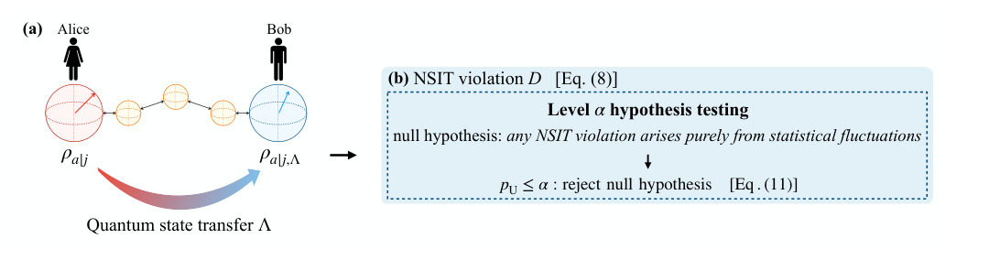
<figcaption class="paper-figure-caption"><b>Fig 1.</b> FIG. 1. The illustration of our result. (a) In the STS framework introduced in Sec. II, Alice prepares the state ρa|j and transmits it to Bob via the QST process Λ with different indices a and j. Then Bob collects the received state ρa|j,Λ to construct the assemblage {˜ρa|j,Λ}, which characterizes the non-classicality of the QST process. (b) We investigate the presence of basis-dependent hardware errors in the QST process by performing a level α hypothesis testing on the NSIT violation D of {˜ρa|j,Λ}. If the resulting p-value does not exceed α, the null hypothesis that any NSIT violation arises purely from statistical fluctuation is rejected, suggesting that it may instead stem from a...</figcaption>
</figure>
<figure class="paper-figure-card">
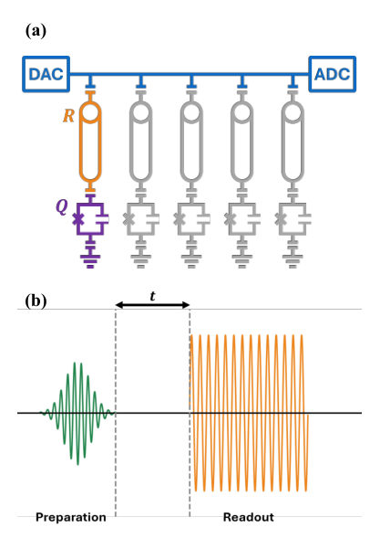
<figcaption class="paper-figure-caption"><b>Fig 2.</b> FIG. 2. Device schematic and experimental pulse sequence. (a) Circuit diagram showing the experimental system of the five-qubit superconducting quantum processor. The active qubit (Q) under study and its readout resonator (R) are high- lighted in color, whereas the other four qubits on the same processor are inactive during the single-qubit QST experi- ment. (b) Sequence of control and measurement pulses for the single-qubit QST experiment. The qubit is prepared to each state ρ0|z, ρ1|z, ρ0|x, ρ1|x, held for an idling time t, and subsequently measured.</figcaption>
</figure>
<figure class="paper-figure-card">
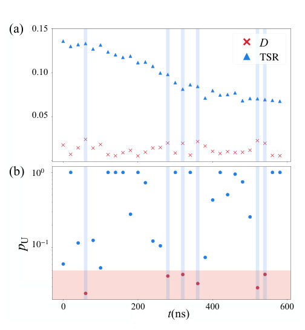
<figcaption class="paper-figure-caption"><b>Fig 3.</b> FIG. 3. Single-qubit QST task on the superconducting quan- tum processor. (a) The non-classicality of QST captured by TSR and the degree of NSIT violation D at different time points. (b) By evaluating pU at each time point by Eq. (12), we find instances within the red shaded area provide the sta- tistical evidence (pU ≤0.05) of basis-dependent hardware er- rors.</figcaption>
</figure>
<figure class="paper-figure-card">
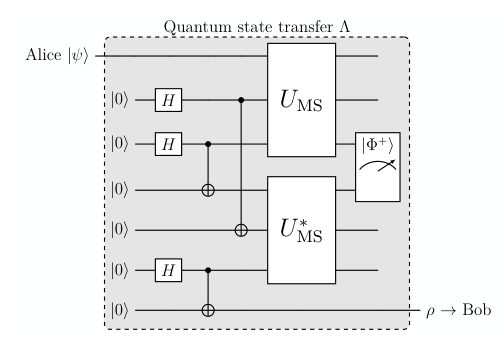
<figcaption class="paper-figure-caption"><b>Fig 4.</b> FIG. 4. Teleportation circuit based on the Hayden-Preskill decoding protocol [56]. The maximally scrambling unitary [UMS and its conjugate U ∗ MS] encodes Alice’s state (informa- tion) into the global system. After performing the Bell state measurement, Bob can decode Alice’s state by post-selecting the outcome corresponding to the |Φ+⟩= (|00⟩+ |11⟩)/ √</figcaption>
</figure>
<figure class="paper-figure-card">
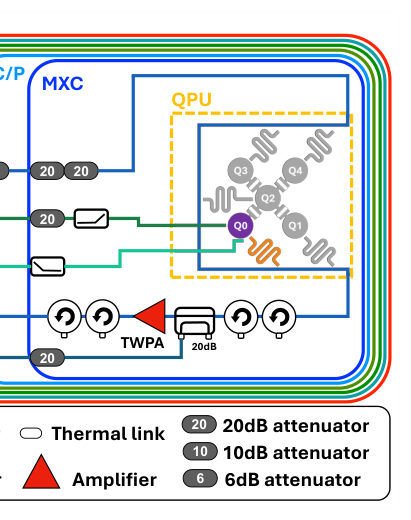
<figcaption class="paper-figure-caption"><b>Fig 5.</b> FIG. 5. Cryogenic measurement setup and layout of the superconducting processor.</figcaption>
</figure>

**Summary.** This work introduces a statistical hypothesis test based on the No-Signaling-In-Time (NSIT) condition to diagnose basis-dependent errors in quantum state transfer. By using Chebyshev's inequality, the authors distinguish genuine hardware flaws from mere statistical noise across superconducting and trapped-ion platforms. The findings emphasize that advanced statistical testing is necessary for reliable benchmarking of current quantum devices.

**Why it may be interesting.** It provides a rigorous, statistically grounded methodology for benchmarking near-term quantum hardware beyond simple fidelity metrics, which is crucial for advancing fault-tolerant quantum computation.

Detailed structure

**Main problem.** The paper addresses the critical need for robust methods to detect basis-dependent hardware errors during quantum state transfer (QST) processes.

**Main result.** By employing statistical hypothesis testing on the violation of the No-Signaling-In-Time (NSIT) condition, the authors provided statistical evidence of intrinsic hardware errors in superconducting and trapped-ion platforms.

**Method.** They constructed a distribution-free upper bound on the p-value using Chebyshev's inequality to test the null hypothesis that observed NSIT violations are merely due to finite measurement statistics.

**Model / system.** The study uses the spatio-temporal quantum steering (STS) framework applied to qubit systems, testing protocols like single-qubit state transfer and seven-qubit Hayden-Preskill teleportation on superconducting and trapped-ion devices.

**Key observables.** No-signaling-in-time violation measure ($D$), statistical p-value upper bound ($p_U$), and Spatio-Temporal Steering Robustness (STSR).

**Important parameters / regimes.** Superconducting processor parameters, IonQ device fidelity ($F_{avg}$), and the significance level $\alpha$.

**Assumptions / limitations.** The statistical test assumes measurements are independent and identically distributed (i.i.d.), which is noted as a limitation for real-world devices.

**Figures summary.** Figures illustrate the STS framework, hypothesis testing on $D$ vs time, and device schematics for superconducting processors and teleportation circuits.

**Paper structure.** The paper introduces the diagnostic tool (NSIT violation), develops the statistical test using Chebyshev's inequality to handle finite statistics, and then applies this method sequentially to two distinct hardware platforms (superconducting and trapped-ion).

Abstract

Spatio-temporal quantum steering provides a framework for benchmarking the nonclassicality of general quantum state transfer processes. A central diagnostic is the no-signaling-in-time (NSIT) condition, whose violation can indicate basis-dependent hardware errors. However, finite measurement statistics may also yield apparent violations, thereby obscuring the detection of basis-dependent hardware errors. To address this, we construct a statistical hypothesis test under the null hypothesis that NSIT violations arise solely from statistical fluctuations. Combining the statistical properties of NSIT violation under the null hypothesis with Chebyshev's inequality, we obtain a distribution-free upper bound on the $p$-value without parametric assumptions. We apply this method to two examples. For a single-qubit state-transfer experiment on a superconducting processor, we observe several instances that the NSIT violation is observed and the null hypothesis is simultaneously rejected by a small $p$-value, providing statistical evidence of basis-dependent hardware errors. For a seven-qubit Hayden-Preskill teleportation protocol on IonQ devices, the null hypothesis is also rejected even when the average fidelity exceeds the classical threshold, while the associated nonclassicality measure vanishes. Our results highlight the necessity of statistical hypothesis testing for detecting basis-dependent errors in near-term quantum devices.

[↑ back to top](#top)

### [Linear algebra at exponential scale via tensor network dimension reduction](http://arxiv.org/abs/2606.15350v1)

**Authors:** Chris Camaño, Ethan N. Epperly, Raphael A. Meyer, Joel A. Tropp  
**Type:** theory · **Category:** numerical methods · **PDF:** <https://arxiv.org/pdf/2606.15350v1>  
**Analysis basis:** full PDF text, analyzed in chunks
**Topic relevance:** 🔥 `analog quantum simulation` **4/5** · `methods for driven-dissipative` **3/5** · `entanglement & information structure` **2/5** · `driven-dissipative phase transition` **1/5** · `non-equilibrium dynamics` **1/5**

↔ Scroll figures horizontally

<figure class="paper-figure-card">
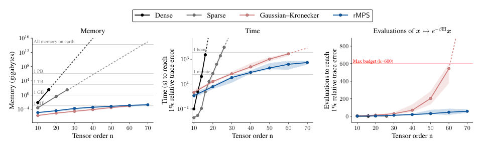
<figcaption class="paper-figure-caption"><b>Fig 1.</b> Figure 1: Exponential-scale linear algebra. Computational resources to estimate the partition function Z(β) = Tr(e−βH) of the PTFIM Hamiltonian H ∈R2n×2n (3.8) with increasing order n using the XNysTrace algorithm implemented with dense, sparse (CSR), and tensor network data formats with both rMPS and Gaussian–Kronecker test vectors. From left to right, the panels report the memory, wall-clock time, and number of applications of the primitive ω 7→e−βHω required to estimate Z(β) to 1% relative error. Markers track the median over 10 trials, and shaded regions bound the 10% and 90% quantiles. Dense and sparse matrix computations quickly expend the available memory, and Gaussian–Kronecker...</figcaption>
</figure>
<figure class="paper-figure-card">

<figcaption class="paper-figure-caption"><b>Fig 2.</b> Figure 1 shows the results. For tensor order n = 70, the rMPS-based implementation of XNysTrace can estimate the partition function to 1% relative error using megabytes of storage and minutes of computation. By using rMPSs and efficient tensor network methods to store and apply the Hamiltonian H, we can extend the XNysTrace algorithm to perform trace estimation at exponential scale. As a baseline, we compare against the performance of Gaussian–Kronecker vectors that have the form ω = ϕ(1) ⊗· · · ⊗ϕ(n) with iid Gaussian ϕ(i) ∼NR(0, I2). Gaussian–Kronecker vectors are widely used in the literature [2,4,15,17,18,74,75,101], and they also enable us to implement XNysTrace at exponential scale....</figcaption>
</figure>
<figure class="paper-figure-card">
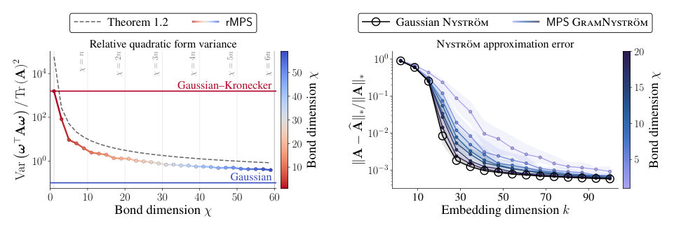
<figcaption class="paper-figure-caption"><b>Fig 3.</b> Figure 2: Convergence of rMPSs to Gaussian behavior. (Left) Normalized variance of quadratic form trace estimator Var(ω∗Aω)/ Tr(A)2 evaluated across rMPS bond dimension χ ∈[1, 100]. As the rMPS bond dimension χ approaches n, the variance of the rMPS quadratic form converges to that of a dense Gaussian random vector. (Right) Relative error ∥A −bA∥∗/∥A∥∗for a randomized Nystr¨om approximation bA as a function of approximation rank. In both panels, the matrix is chosen adversarially: A = QQ∗+ 10−5I ∈ R210×210 where Q consists of the first 20 columns of the orthogonal Walsh–Hadamard matrix. Sample variances are computed using 500 random samples; the markers track the median over 20 trials;...</figcaption>
</figure>
<figure class="paper-figure-card">
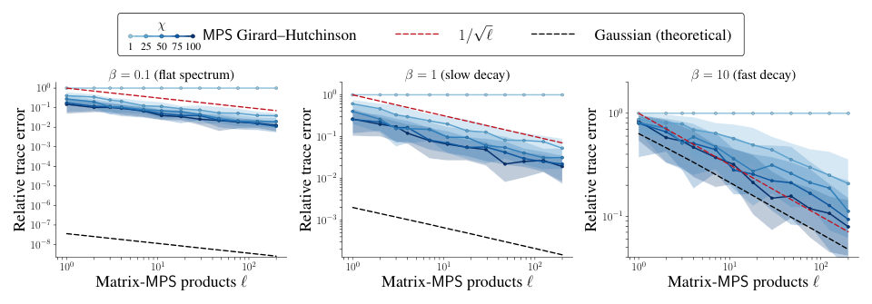
<figcaption class="paper-figure-caption"><b>Fig 4.</b> Figure 3: rMPS Girard–Hutchinson: Dependence on spectral decay. MPS Girard–Hutchinson estimator (Algorithm 1) used to estimate to the partition function Z(β) = Tr(e−βH) of the classical 1D Ising Hamiltonian (3.4) with n = 50 sites and β ∈{0.1, 1, 10}. The markers track the median relative error over 60 trials; shaded regions connect the 25% and 75% quantiles. The black line ( ) shows the predicted behavior for standard Gaussian probes, and the red line ( ) illustrates the Monte Carlo error decay 1/ √</figcaption>
</figure>
<figure class="paper-figure-card">
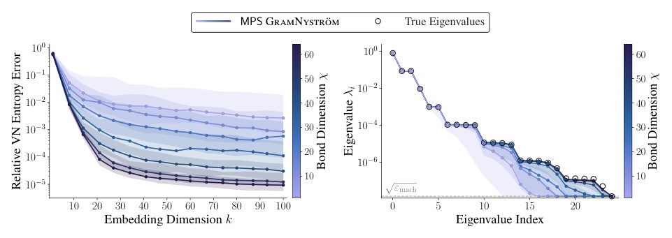
<figcaption class="paper-figure-caption"><b>Fig 5.</b> Figure 4: Nystr¨om approximation at exponential scale. Estimates via funNystr¨om for the von Neumann entanglement entropy (3.7) of the half-chain reduced density matrix ρA ∈C2100×2100 associated with the ground state of the 200-site periodic transverse-field Ising Hamiltonian (3.8). The markers track the median over 60 trials; shaded regions are bounded by the 10% and 90% quantiles. (Left) Relative entropy errors |S(ρA) −S(bρA)|/|S(ρA)| as a function of the embedding dimension k for each bond dimension χ ∈{1, 2, 4, 8, 16, 32, 64}. (Right) Approximate eigenvalues of bρA for rank-100 approximation produced by MPS GramNystr¨om for several values of χ compared with the exact eigenvalues. See...</figcaption>
</figure>

**Summary.** This paper introduces randomized dimension reduction techniques using random Matrix Product States (rMPS) to solve linear algebra problems on exponentially large matrices arising in quantum physics. By projecting these high-dimensional operators onto a low-rank rMPS subspace, it enables efficient computation of observables like partition functions and traces that were previously computationally inaccessible.

**Why it may be interesting.** This work is highly relevant as it provides concrete, scalable numerical machinery to tackle quantum many-body problems that are intractable for exact diagonalization or standard tensor methods due to the sheer size of the Hilbert space.

Detailed structure

**Main problem.** The core challenge is solving linear algebra problems whose computational resources scale exponentially with system size due to the curse of dimension.

**Main result.** Randomized dimension reduction techniques, specifically using random Matrix Product States (rMPS), allow for provably efficient estimation of quantities like partition functions and traces at exponential scales.

**Method.** The authors develop and analyze randomized algorithms that replace direct computation with low-dimensional projections derived from rMPS test matrices. These methods adapt standard linear algebra estimators (like the Girard–Hutchinson estimator) to the tensor network structure.

**Model / system.** The primary physical model is quantum many-body physics, exemplified by calculating the partition function $Z(eta)$ for Hamiltonians like the PTFIM, which leads to exponentially large matrices ($2^n 	imes 2^n$). The mathematical framework relies on representing these operators and states using Matrix Product States (MPS) and Operators (MPO).

**Key observables.** Partition function $Z(eta)$, trace estimation $	ext{Tr}(e^{-eta H})$, eigenvalue approximations, and various norms ($\|A\|_*$, $\|A\|_F$).

**Important parameters / regimes.** System size exponent ($n$), local dimension ($d$), bond dimension ($\chi$), and the ratio $\chi/n$ which dictates algorithmic scaling.

**Assumptions / limitations.** The analysis assumes that rMPS test matrices provide a sufficiently good embedding (subspace injection) to preserve necessary geometric properties for accurate estimation, particularly when the bond dimension $\chi \gtrsim n$.

**Figures summary.** Figure 1 demonstrates rMPS-based trace estimation for $n=70$ requiring only megabytes of storage. Figure 2 shows convergence of variance estimators towards Gaussian behavior as $\chi/n$ increases. Figure 3 compares the accuracy of the rMPS Girard–Hutchinson estimator against theoretical bounds.

**Paper structure.** The paper progresses by first identifying the exponential scaling problem, then introducing tensor networks (MPS/MPO) for representation, developing randomized dimension reduction via rMPSs, and finally applying these tools to specific linear algebra tasks like trace estimation and Nyström approximation with rigorous error bounds.

Abstract

Many problems in modern scientific computing are challenging because of a \emph{curse of dimension}, where their mathematical formulation involves objects whose dimension is \emph{exponential} in the nominal "size" of the problem. Tensor networks can provide a compact representation for exponentially large vectors and matrices that arise in applications, but these representations do not always lead to reliable algorithms. This paper develops and analyzes techniques for randomized dimension reduction of tensor network data. These techniques support a suite of efficient algorithms for provably solving exponential-scale linear algebra problems, including trace estimation and eigenvalue approximation. The paper includes several stylized illustrations from quantum many-body physics with ambient dimension up to $2^{200}$.

[↑ back to top](#top)

### [Quantifying Coherence-to-Entanglement Conversion Efficiency under Noisy Operations](http://arxiv.org/abs/2606.16916v1)

**Authors:** Asad Ali, H. Kuniyil, M. I. Hussain, M. T. Rahim, Abdallah Slaoui, Saif Al-Kuwari  
**Type:** theory · **Category:** quantum information and computing · **PDF:** <https://arxiv.org/pdf/2606.16916v1>  
**Analysis basis:** full PDF text, analyzed in chunks
**Topic relevance:** 🔥 `entanglement & information structure` **4/5** · `correlated / nonlocal dissipation` **2/5** · `driven-dissipative phase transition` **2/5** · `methods for driven-dissipative` **1/5** · `non-equilibrium dynamics` **1/5** · `non-equilibrium universality` **1/5**

↔ Scroll figures horizontally

<figure class="paper-figure-card">
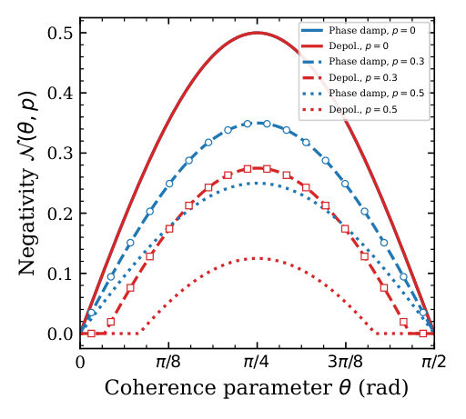
<figcaption class="paper-figure-caption"><b>Fig 1.</b> FIG. 2. Entanglement negativity N(θ, p) as a function of the input coherence angle θ for representative noise strengths. Phase damping preserves the sin(2θ) profile up to a multi- plicative factor, whereas global depolarizing noise introduces a threshold through the term −p/4 in Eq. (46). Symbols de- note numerical simulations.</figcaption>
</figure>
<figure class="paper-figure-card">
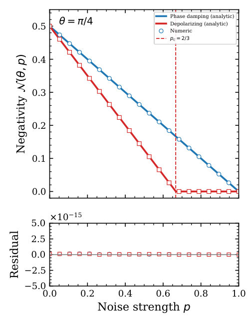
<figcaption class="paper-figure-caption"><b>Fig 2.</b> FIG. 1. Entanglement negativity N(θ, p) as a function of noise strength p for the maximally coherent input θ = π/4. Solid curves denote the analytic expressions in Eqs. (34) and (46), while symbols denote direct numerical simulation. The vertical dashed line marks the depolarizing sudden-death threshold pc = 2/3.</figcaption>
</figure>
<figure class="paper-figure-card">
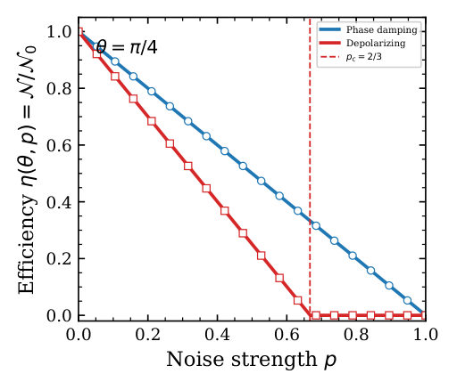
<figcaption class="paper-figure-caption"><b>Fig 3.</b> FIG. 3. Coherence-to-entanglement conversion efficiency η(θ, p) = N(θ, p)/N0(θ) for θ = π/4. The phase-damping efficiency is ηphase = 1 −p, while the global depolarizing effi- ciency decreases to zero at pc = 2/3. Symbols denote numer- ical simulations.</figcaption>
</figure>
<figure class="paper-figure-card">
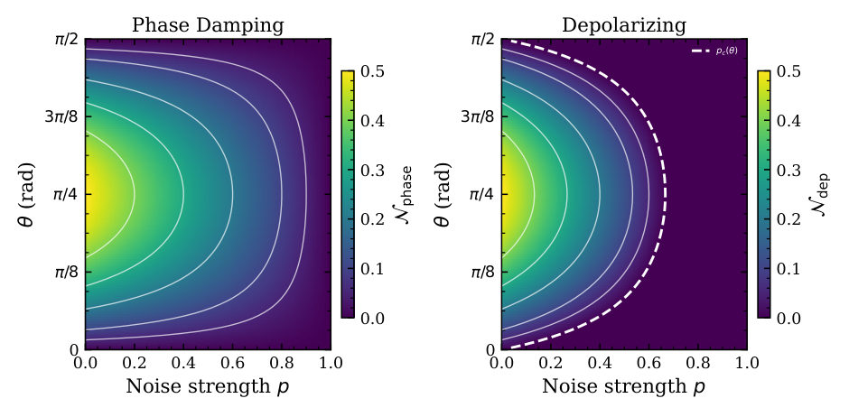
<figcaption class="paper-figure-caption"><b>Fig 4.</b> FIG. 4. Two-dimensional negativity landscape N(θ, p) over the full (θ, p) parameter space for independent phase damping and global depolarizing noise. Contours show analytic negativity levels. In the depolarizing case, the dashed curve marks the analytic sudden-death boundary pc(θ) = 2 sin(2θ)/[2 sin(2θ) + 1].</figcaption>
</figure>
<figure class="paper-figure-card">
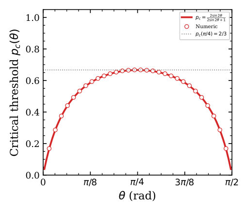
<figcaption class="paper-figure-caption"><b>Fig 5.</b> FIG. 5. Entanglement sudden-death threshold pc(θ) for the global two-qubit depolarizing channel. The solid curve is the analytic result in Eq. (48), while symbols denote thresholds extracted numerically from the first zero of Ndep(θ, p). The maximum value pc = 2/3 occurs at θ = π/4.</figcaption>
</figure>

**Summary.** The paper analytically investigates the trade-off between initial local quantum coherence and generated bipartite entanglement when environmental noise is present. It compares two distinct noise channels—phase damping and global depolarization—showing that they induce fundamentally different decay mechanisms. The findings establish key thresholds for entanglement sudden death, providing vital guidelines for assessing hardware performance in quantum computing protocols.

**Why it may be interesting.** This work provides an analytical benchmark for understanding how specific noise models constrain fundamental quantum information processes like coherence-to-entanglement conversion, which is crucial for designing robust near-term quantum devices.

Detailed structure

**Main problem.** The study quantifies how efficiently local quantum coherence can be converted into bipartite entanglement when the system is subjected to environmental noise.

**Main result.** Different noise channels (phase damping vs. global depolarization) cause distinct degradation patterns, with one leading to a finite threshold for entanglement sudden death while the other causes smooth multiplicative decay.

**Method.** The authors use analytical derivations and numerical simulations based on calculating the entanglement negativity via the partial transpose spectrum of the density matrix.

**Model / system.** The model is a minimal two-qubit protocol involving an initial coherent single-qubit input, followed by an ideal CNOT gate, and subsequent environmental noise modeled by specific CPTP maps (phase damping or global depolarizing noise).

**Key observables.** Entanglement Negativity ($N$), Coherence-to-Entanglement Conversion Efficiency ($\eta$), and the critical noise strength for Entanglement Sudden Death ($p_c$).

**Important parameters / regimes.** Input coherence angle $	heta$ (determining $C_{l1} = \sin(2	heta)$) and noise parameters ($p$ for damping or depolarization).

**Assumptions / limitations.** The analysis is restricted to the X-state structure generated by the CNOT protocol, and the comparison focuses on negativity as the entanglement measure.

**Figures summary.** Figures illustrate the decay of negativity versus noise strength ($p$) for both noise types, showing phase damping vanishing at $p=1$ and global depolarization vanishing at a finite threshold $p_c(	heta)$.

**Paper structure.** The paper progresses by first establishing the ideal noiseless conversion rate ($	ext{Negativity} = rac{1}{2} C_{l1}$), then deriving analytic expressions for entanglement under phase damping, followed by analyzing global depolarization, and concluding with a direct comparison of the resulting efficiency functions.

Abstract

We investigate the noise-limited conversion of local quantum coherence into bipartite entanglement in a minimal two-qubit protocol comprising a coherent single-qubit input, an incoherent ancilla, an ideal CNOT operation, and subsequent environmental noise. Employing the $l_1$-norm of coherence and the entanglement negativity as resource quantifiers, we establish an exact closed-form correspondence between local single-qubit input coherence and the two-qubit entanglement generated in the noiseless limit, showing that the output negativity is precisely one half of the initial $l_1$-coherence. We then derive analytic expressions for the surviving entanglement and the associated coherence-to-entanglement conversion efficiency under two representative noise mechanisms: independent phase damping and global two-qubit depolarizing noise. The two channels exhibit qualitatively distinct degradation behavior. Phase damping induces a universal multiplicative suppression of the generated entanglement, yielding a coherence-independent conversion efficiency and no finite-noise entanglement sudden death. In contrast, global depolarization introduces an isotropic mixing contribution that shifts the partial-transpose spectrum, producing coherence-dependent degradation and a finite sudden-death threshold. We show that maximally coherent inputs not only maximize the entanglement generated by the CNOT protocol but also optimize its robustness against depolarizing noise. Direct density-matrix simulations validate the analytic results to numerical precision. These findings provide a compact analytic benchmark for assessing how different noise mechanisms constrain coherence-to-entanglement conversion in elementary quantum-information protocols and near-term quantum devices.

[↑ back to top](#top)

### [VQE as Initial State Preparation for QPE on Heisenberg Spin-Glass Hamiltonians](http://arxiv.org/abs/2606.15061v1)

**Authors:** Elijah Pelofske, Stephan Eidenbenz  
**Type:** theory · **Category:** disordered systems and neural networks · **PDF:** <https://arxiv.org/pdf/2606.15061v1>  
**Analysis basis:** full PDF text, analyzed in chunks
**Topic relevance:** 🔥 `analog quantum simulation` **4/5** · `exotic spin models in light-matter` **3/5** · `entanglement & information structure` **2/5** · `methods for driven-dissipative` **1/5** · `non-equilibrium dynamics` **1/5**

↔ Scroll figures horizontally

<figure class="paper-figure-card">
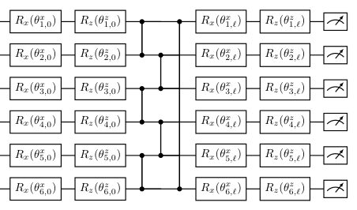
<figcaption class="paper-figure-caption"><b>Fig 1.</b> FIG. 1: VQE circuit diagram structure, applied to 6 qubits. L parameterizes the VQE depth, where L = 0 is the non-entangling basic case. The ansatz parameters are defined by the vector of θi ∈(0, 2π) real values. In order to extract the full Hamiltonian expectation value, each set of parameters is evaluated using measurements in Pauli X, Y, and Z bases thus requiring basis change rotations prior to measurement. CZ gates are the entangling operation be- tween pairs of qubits used in this ansatz.</figcaption>
</figure>
<figure class="paper-figure-card">
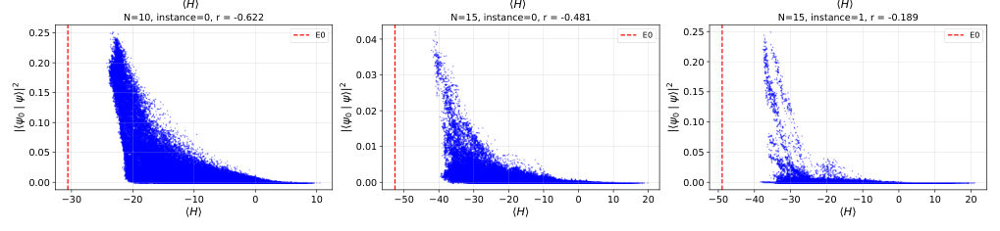
<figcaption class="paper-figure-caption"><b>Fig 2.</b> FIG. 2: Energy (x-axis) vs overlap (y-axis) scatterplots of states produced during VQE training. The 6 sub- plots each show a distribution produced from a different quantum Hamiltonian. The true minimum eigenvalue E0 is denoted by a vertical dashed red line in each plot. The title of each subplot states the system size, an instance number index (which can range from 0 to 9), and the Pearson correlation coefficient (r) from a generic linear regression. The Hamiltonian expecta- tion value ⟨H⟩is obtained from the VQE training and therefore has shot noise, whereas |⟨ψ0 | ψ⟩|2 is calculated exactly for each state, with no shot noise. “Good” states are in the upper left-hand corner of each plot...</figcaption>
</figure>
<figure class="paper-figure-card">
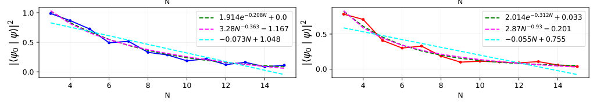
<figcaption class="paper-figure-caption"><b>Fig 3.</b> FIG. 3: Top left: Largest overlap computed from VQE as a function of quantum Hamiltonian size (x-axis), top right: overlap of the absolute lowest energy VQE state as a function of quantum Hamiltonian size. For each system size there are 10 independent instances with different coefficients, here each point in the left subplot is the abso- lute best overlap found during VQE training for each instance. The solid line plots the mean overlap among the 10 instances. The energy estimate used to determine the lowest energy VQE state for the right-most plot is calculated using the finite-shot estimate from the training. Bottom row plots best-fit regression lines for exponential (3 parameters),...</figcaption>
</figure>
<figure class="paper-figure-card">
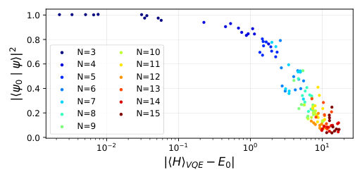
<figcaption class="paper-figure-caption"><b>Fig 4.</b> FIG. 4: Highest overlap VQE computed state as a function of the energy absolute-error of that state (log scale x-axis). Each plotted dot corresponds to a sin- gle quantum Hamiltonian. The estimate of ⟨H⟩V QE has shot noise, whereas both E0 and |⟨ψ0 | ψ⟩|2 are calculated exactly with no shot noise.</figcaption>
</figure>
<figure class="paper-figure-card">
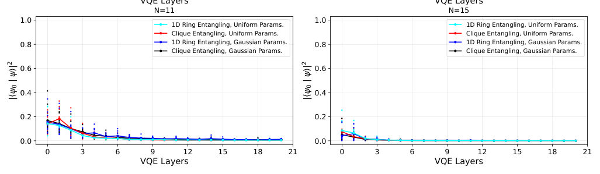
<figcaption class="paper-figure-caption"><b>Fig 5.</b> FIG. 5: Comparing the performance of number of entangling layers, ring and clique entangling layers, and parameter initialization distributions with respect to overlap. This is an absolute-idealized overlap case, where only the best overlap found from each numerical computation (for each ansatz) is plotted.</figcaption>
</figure>

**Summary.** The paper investigates using VQE outputs as initial states for QPE on Heisenberg spin glass models. The findings indicate that VQE struggles to reliably converge to the true ground state, and the overlap with the ground state does not scale favorably with system size. This suggests that while VQE is useful, it may only serve as a heuristic tool rather than a guaranteed path to quantum advantage for these complex systems.

**Why it may be interesting.** This work directly addresses a critical bottleneck in quantum simulation: preparing high-fidelity initial states. For AMO physicists working with complex Hamiltonians (like those found in frustrated magnets or disordered lattices), understanding when variational methods fail to capture essential physics is vital for designing viable quantum algorithms.

Detailed structure

**Main problem.** The study assesses whether Variational Quantum Eigensolver (VQE) can efficiently prepare initial quantum states with high overlap to the true ground state for use in Quantum Phase Estimation (QPE).

**Main result.** VQE generally fails to efficiently converge to the ground state, and while a correlation exists between low energy and high overlap, this relationship is not guaranteed. The best-found overlap scaling suggests VQE may be a heuristic algorithm rather than a reliable method for achieving exponential speedup in QPE.

**Method.** The authors used extensive numerical computations involving VQE training on disordered Heisenberg spin glass Hamiltonians, comparing results against exact diagonalization to determine ground-truth state overlaps and energy convergence.

**Model / system.** The focus is on disordered, fully-connected anisotropic Heisenberg spin glass quantum Hamiltonians. The Hamiltonian involves couplings $J_{xij}, J_{yij}, J_{zij}$ with $\pm 1$ weights across up to 15 qubits.

**Key observables.** Initial state overlap ($|\langle \psi_0 | \psi 
angle|^2$), ground state energy, entanglement negativity, and the scaling of these observables with system size $N$.

**Important parameters / regimes.** Ansatz depth ($L$), system size ($N$, up to 15 qubits), and the type of VQE ansatz (e.g., Ring vs. Clique structure).

**Assumptions / limitations.** The analysis assumes that high initial state overlap is crucial for realizing the theoretical speedup benefit of QPE, although the study notes this assumption may be too strict.

**Figures summary.** Figures compare energy vs. overlap scatterplots showing correlation coefficients; they also plot overlap scaling versus system size $N$, comparing exponential/polynomial fits, and show entanglement negativity distributions.

**Paper structure.** The paper systematically investigates the limitations of VQE for state preparation by analyzing convergence failures (local minima), quantifying the relationship between energy minimization and overlap, and finally determining the asymptotic scaling behavior of the prepared states relative to the true ground state.

Abstract

Quantum Phase Estimation (QPE) is the quantum algorithmic workhorse for computing ground state energies of quantum Hamiltonians with quantum computers. Ground state energy calculation of physical systems is perhaps the most promising use case for quantum computing in terms of scientific and commercial value with a plausible path to outperformance of classical alternatives. This path, however, hinges on the availability of initial states for QPE with significant overlap with the true ground state. Using extensive (classical) numerical computations, we study whether the NISQ-era algorithm VQE (Variational Quantum Eigensolver) could be used to efficiently prepare high-overlap states of disordered fully-connected anisotropic Heisenberg spin glass quantum Hamiltonians with up to $15$ qubits. We find that (i) -- consistent with widely held, but rarely numerically illustrated beliefs -- VQE is generally unable to efficiently converge to the ground state for our Hamiltonians, which is a well-known issue with VQE due to a variety of factors including vanishing gradients and local minima; (ii) low energy states do not necessarily have large ground-state overlap, but there is typically a correlation between the two measures; (iii) adding more than three layers to the VQE ansatz neither improves overlap nor the energies found; and (iv) the best-found overlap scaling as a function of the Hamiltonian system size is not strongly exponentially decreasing, suggesting potential for VQE to be a heuristic state preparation algorithm for QPE.

[↑ back to top](#top)

### [3D Ising criticality with Platonic lattice superconducting qubits](http://arxiv.org/abs/2606.16854v1)

**Authors:** Liyang Sui, Hong-Hao Song, Sainan Huai, Yufan Li, Zhiwen Zong, Kunliang Bu, Xiaopei Yang, Xingrui Liu, Wenyan Jin, Bowen Chen, Xutao Zhang, Jianlan Wu, Yicong Zheng, Shengyu Zhang, Gang v. Chen, Yi Yin  
**Type:** both · **Category:** statistical mechanics · **PDF:** <https://arxiv.org/pdf/2606.16854v1>  
**Analysis basis:** full PDF text, analyzed in chunks
**Topic relevance:** 🔥 `analog quantum simulation` **4/5** · `QC/QI experiment` **2/5** · `entanglement & information structure` **1/5** · `exotic spin models in light-matter` **1/5** · `non-equilibrium dynamics` **1/5** · `non-equilibrium universality` **1/5**

↔ Scroll figures horizontally

<figure class="paper-figure-card">
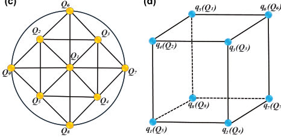
<figcaption class="paper-figure-caption"><b>Fig 1.</b> FIG. 1. State-operator correspondence and device schematic. (a) The four lowest renormalized energy levels of the TFIM on sphere. Red circles denote the levels in the Z2 even sector, while blue circles denote the levels in the Z2 odd sector. (b) Low-lying spectrum of the 3D Ising CFT. The red star marks the scaling dimension of the primary field ϵ, while the blue squares mark the scaling dimensions of the primary field σ and its descendant ∂σ. (c) Schematic of the L9 processor, showing nine qubits with a tunable coupler integrated into every inter- qubit link (solid black line). (d) Cubic lattice mapped onto the L9 chip: each vertex corresponds to a physical qubit, as indicated by the...</figcaption>
</figure>
<figure class="paper-figure-card">
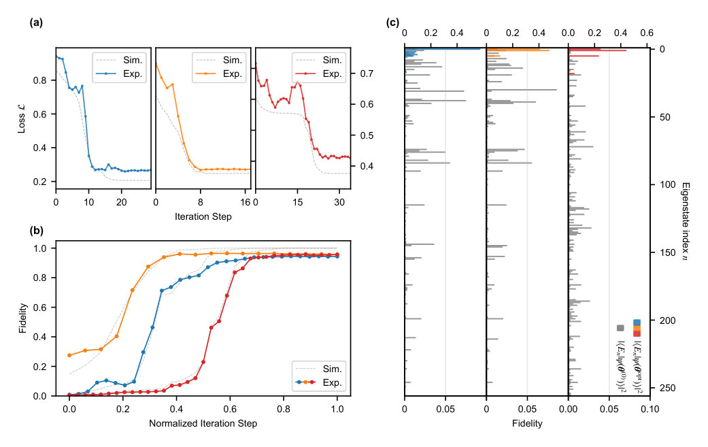
<figcaption class="paper-figure-caption"><b>Fig 2.</b> FIG. 2. Variational optimization of quantum states for three different initial configurations. (a) Loss function L versus optimization iteration step for initial states |00000001⟩, |00000010⟩, and |00000101⟩, with corresponding parameter of evolution times τ = 13.2, 12.7, 16.7, respectively. The dashed grey curves denote numerical simulation; solid circles connected by lines are experimental data, shown in blue, orange, and red. The loss decays and converges approximately at steps 10, 8, and 24, respectively. (b) State fidelity with respect to the final converged state as a function of normalized iteration step (mapped to [0, 1] for comparison). The same color scheme and line styles as in...</figcaption>
</figure>
<figure class="paper-figure-card">
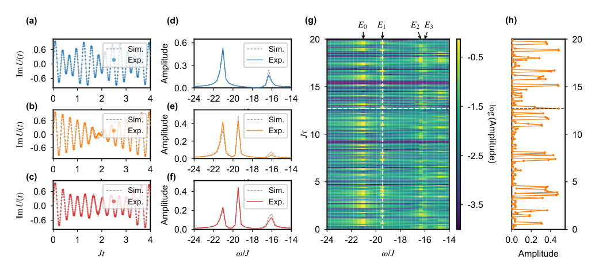
<figcaption class="paper-figure-caption"><b>Fig 3.</b> FIG. 3. Time evolution and spectral analysis for the three optimized states. (a-c) Imaginary part of the expectation value Im⟨ψopt exp|e−iHpt|ψopt exp⟩versus time t for the final states prepared from the initial configurations |ψ0⟩= |00000001⟩(a), |00000010⟩ (b), and |00000101⟩(c), each with its corresponding evolution time τ used in the optimization. The time series is computed over a window Jt ∈[0, 20]; panels (a-c) show an enlarged view of the short-time region Jt ∈[0, 4]. Dashed grey curves are numerical simulations; solid circles (blue, orange, red) are calculated from the experimentally measured states. (d-f) Discrete Fourier transform (DFT) amplitude of the full time-domain signals...</figcaption>
</figure>
<figure class="paper-figure-card">
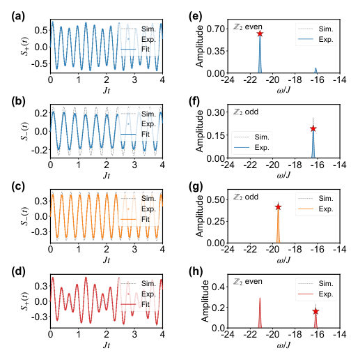
<figcaption class="paper-figure-caption"><b>Fig 4.</b> FIG. 4. Parity-resolved time-domain signals and spectral identification of eigenenergies. (a-d) Imaginary part of the parity-resolved time-domain signals for the three initial con- figurations. (a, b) Even- (a) and odd-channel (b) signals S+(t) and S−(t) for the state prepared from |00000001⟩(Jτ = 13.2). (c) Odd-channel signal S+(t) for the state from |00000010⟩ (Jτ = 12.7). (d) Even-channel signal S−(t) for the state from |00000101⟩(Jτ = 16.7). In all panels, grey dashed curves show numerical simulations; solid colored circles represent ex- perimental data; solid colored lines are fitting curves to the experimental points. (e-h) Amplitude spectra obtained from multi-component sinusoidal...</figcaption>
</figure>

**Summary.** The research demonstrates how to use superconducting qubits on Platonic lattices to digitally simulate the complex physics of 3D Ising criticality. By employing advanced VQE and time-evolution analysis techniques, the authors successfully extract key critical exponents that validate theoretical predictions. This establishes a powerful blueprint for using quantum computation to solve intractable problems in condensed matter statistical mechanics.

**Why it may be interesting.** This work provides a concrete, near-term experimental pathway for probing fundamental concepts in statistical mechanics—namely, universal critical phenomena—using solid-state quantum hardware.

Detailed structure

**Main problem.** The primary goal is to determine the universal critical exponents of the analytically intractable three-dimensional (3D) Ising model using quantum simulation techniques.

**Main result.** The quantum simulation successfully extracted scaling dimensions ($\Delta_\epsilon = 1.5850$) and critical exponents ($
u = 0.7067$) that show strong agreement with established theoretical predictions from conformal field theory.

**Method.** A hybrid quantum-classical approach combining an extended Variational Quantum Eigensolver (VQE) protocol with time-evolution analysis via Discrete Fourier Transform (DFT) is used to extract low-lying energy eigenvalues.

**Model / system.** The system models the 3D Ising criticality using the Transverse-Field Ising Model Hamiltonian ($H_p$) implemented on superconducting qubits arranged in Platonic lattice geometries (e.g., cubic lattice).

**Key observables.** Critical exponents ($
u, \eta$), scaling dimensions ($\Delta_\sigma, \Delta_\epsilon$), and low-lying eigenenergies of the TFIM.

**Important parameters / regimes.** The critical transverse field ($h_c/J = 2.46$) and lattice connectivity (e.g., 12 edges for a cube).

**Assumptions / limitations.** The method assumes that low-lying energy levels are sufficient to characterize the universal critical behavior, and it relies on mapping continuum CFT operators onto discrete qubit eigenstates.

**Figures summary.** Figures illustrate state-operator correspondence between TFIM spectra and 3D Ising CFT spectra; time-domain signals show clear spectral peaks in Fourier transforms confirming extracted eigenenergies.

**Paper structure.** The paper progresses from establishing the theoretical link (state-operator correspondence) to detailing the quantum simulation protocol (VQE, phase-based loss function), demonstrating eigenvalue extraction via DFT on superconducting hardware, and finally calculating critical exponents using these measured spectral properties.

Abstract

The three-dimensional (3D) Ising model is a foundational model in statistical physics and critical phenomena, yet its analytical intractability has long impeded the precise determination of universal critical exponents. While high-precision estimates have been obtained through classical numerical methods and conformal bootstrap techniques, a direct quantum simulation of the 3D Ising criticality remains challenging, requiring nontrivial connectivity, sufficient system size, and high spectral resolution. In this work, assisted by the state-operator correspondence of conformal field theory, we perform a digital quantum simulation of the 3D Ising critical exponents using a multiply-connected 9-qubit superconducting quantum processor with a Platonic lattice geometry. Employing an extended variational quantum eigensolver equipped with a phase-based loss function, we variationally prepare the low-energy eigenstates of the transverse-field Ising model on a cubic Platonic lattice encoded in an 8-qubit register. The four lowest eigenenergies are extracted via Fourier-transform analysis and high-precision numerical fitting, agreeing with the exact diagonalization values up to +/- 0.001. The resulting scaling dimension Delta_epsilon = 1.5850 and critical exponent nu = 0.7067 match well with theory.

[↑ back to top](#top)

### [Real-space spectral functions of three-dimensional billion-size topological non-Hermitian matter with tensor networks](http://arxiv.org/abs/2606.16424v1)

**Authors:** Yitao Sun, Jose L. Lado, Guangze Chen  
**Type:** theory · **Category:** numerical methods · **PDF:** <https://arxiv.org/pdf/2606.16424v1>  
**Analysis basis:** full PDF text, analyzed in chunks
**Topic relevance:** 🔥 `methods for driven-dissipative` **4/5** · `driven-dissipative phase transition` **2/5** · `Kondo & dissipative impurity` **1/5** · `analog quantum simulation` **1/5** · `correlated / nonlocal dissipation` **1/5** · `non-equilibrium dynamics` **1/5**

↔ Scroll figures horizontally

<figure class="paper-figure-card">
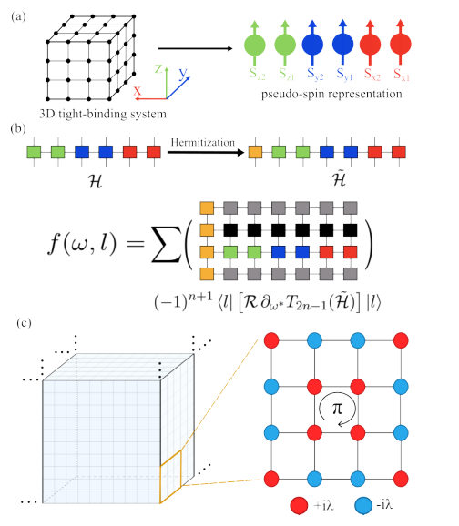
<figcaption class="paper-figure-caption"><b>Fig 1.</b> FIG. 1. Schematic of the tensor network algorithm and the system of interest. Panel (a) shows an example of the ten- sorization of a 3D tight-binding system. Panel (b) shows the Hermitization process of the non-Hermitian Hamiltonian. With the KPM method, the spectral function of the system is obtained through MPS-MPO-MPS contraction. Panel (c) illustrates the three-dimensional BBH-type lattice models in which we demonstrate our methodology. The highlighted cor- ner region is enlarged to show the non-Hermitian potential pattern. A π flux is threaded through each plaquette via the Peierls substitution. Red and blue sites denote positive and negative imaginary on-site potentials, respectively.</figcaption>
</figure>
<figure class="paper-figure-card">
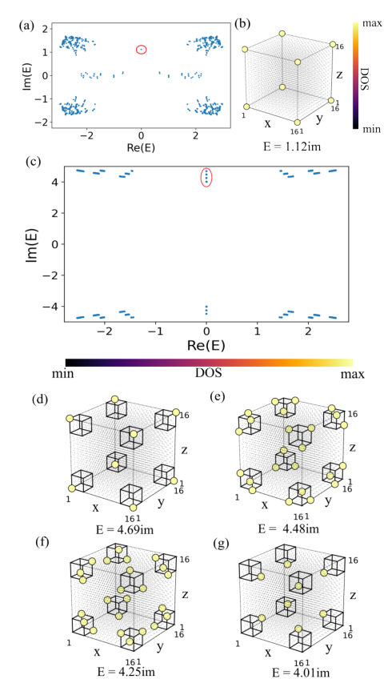
<figcaption class="paper-figure-caption"><b>Fig 2.</b> FIG. 2. Spectral function with exact solvers in a small system (4096 sites). Panels (a) and (b) correspond to the weak-loss regime (λ = 2), where a single isolated corner-mode sector is observed. Panels (c)-(g) show the strong-loss regime (λ = 5), where the corner-mode manifold splits into multiple in-gap modes with distinct LDOS localization patterns. All in-gap modes are highlighted by red circles.</figcaption>
</figure>
<figure class="paper-figure-card">
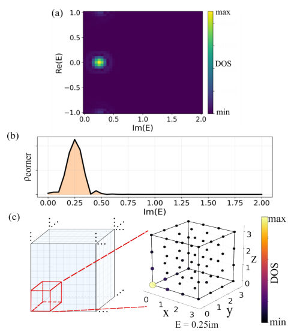
<figcaption class="paper-figure-caption"><b>Fig 3.</b> FIG. 3. Tensor-network results for the weak-loss regime (λ = 1.4) in the 10243 ≈109 system. Panel (a) shows the corner DOS on the complex plane with a single broadened in-gap mode separated from the bulk continuum, while (b) shows a cut of (a) with Re(E) = 0. Panel (c) shows the corner LDOS corresponding to the in-gap mode demonstrating localization within the selected corner cube of the system.</figcaption>
</figure>
<figure class="paper-figure-card">
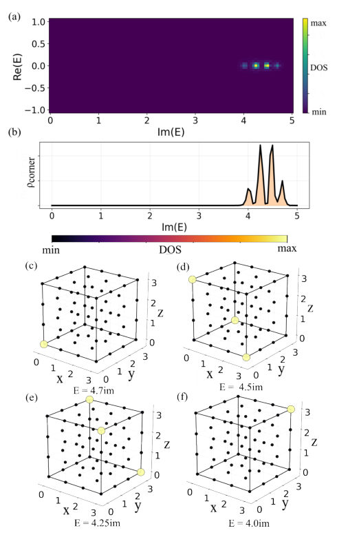
<figcaption class="paper-figure-caption"><b>Fig 4.</b> FIG. 4. Tensor-network results for the strong-loss regime (λ = 5) in the 10243 ≈109 system. Panel (a) shows the corner LDOS on the complex plane where multiple isolated modes emerge along the imaginary-energy axis. The spectral cut (b) at Re(E) = 0 further probes the hierarchical splitting of the corner modes. Panel (c)-(f) show the corner LDOS for the in-gap modes at different complex energies, revealing distinct localization patterns within the same corner cube as in Fig. 3.</figcaption>
</figure>

**Summary.** The paper introduces a novel tensor-network method combining QTCI and KPM to overcome the massive computational hurdle of simulating billion-site non-Hermitian Hamiltonians. By applying this technique to 3D topological insulators, they successfully resolve corner-mode spectral features in the macroscopic limit. This establishes tensor networks as a powerful tool for analyzing complex open quantum systems.

**Why it may be interesting.** This work directly addresses computational bottlenecks in studying complex open quantum systems by providing a scalable numerical tool (TN) for calculating spectral properties in large non-Hermitian lattices.

Detailed structure

**Main problem.** The primary challenge is calculating real-space spectral functions for extremely large (billion-site) three-dimensional topological non-Hermitian systems.

**Main result.** The authors successfully developed and demonstrated a tensor-network framework capable of resolving corner-mode spectral responses in genuinely 3D, macroscopic non-Hermitian systems.

**Method.** They combine Quantics Tensor Cross Interpolation (QTCI) with the Kernel Polynomial Method (KPM) to achieve compact representations of large Hamiltonians via Matrix Product Operator (MPO) forms.

**Model / system.** The study focuses on 3D non-Hermitian higher-order topological insulators described by a tight-binding Hamiltonian incorporating loss terms ($\lambda$).

**Key observables.** Real-space spectral functions, Local Density of States (LDOS), and the identification of distinct in-gap corner modes.

**Important parameters / regimes.** Loss strength ($\lambda$), system size (up to $10^9$ sites), and bond dimension ($\chi$).

**Assumptions / limitations.** The method assumes that the large Hamiltonian can be effectively compressed into an MPO form using QTCI.

**Figures summary.** Figures illustrate spectral functions showing isolated corner modes in weak-loss regimes and hierarchical splitting of multiple in-gap modes in strong-loss regimes, confirming localization patterns.

**Paper structure.** The paper introduces the problem (large non-Hermitian systems), develops the tensor-network methodology combining QTCI and KPM for MPO representation, applies this to 3D HOTIs with loss terms, and presents results showing spectral resolution across different loss regimes.

Abstract

Non-Hermitian systems host a wide range of unconventional topological phenomena while large-scale simulations in finite three dimensional systems remain challenging because of the rapidly growing number of sites. In particular, higher-order topological corner modes are often studied only in small lattices, where strong finite-size effects can mask their intrinsic behavior. Here, we develop a tensor-network framework that combines quantics tensor cross interpolation with the kernel polynomial method, enabling compact representations of large non-Hermitian tight-binding Hamiltonians and direct calculations of real-space spectral functions for systems exceeding one billion lattice sites. Using this approach, we investigate three-dimensional non-Hermitian higher-order topological insulators with with structured real-space geometries. The unprecedented system size enables direct access to the macroscopic regime and allows corner-mode spectral responses to be resolved in genuinely three-dimensional systems.By tuning the loss strength, we identify distinct in-gap corner modes across weak- and strong-loss regimes.Our results establish tensor-network algorithms as a powerful strategy to perform real-space spectral calculations in exceptionally large non-Hermitian systems.

[↑ back to top](#top)

### [Scalable generation of heralded single photons via active feed-forward switching of a fiber delay line](http://arxiv.org/abs/2606.16741v1)

**Authors:** Xavier Barcons Planas, Helen M. Chrzanowski, Janik Wolters  
**Type:** experiment · **Category:** quantum information and computing · **PDF:** <https://arxiv.org/pdf/2606.16741v1>  
**Analysis basis:** full PDF text, analyzed in chunks
**Topic relevance:** 🔥 `quantum optics experiment` **4/5** · `quantum measurements` **3/5** · `QC/QI experiment` **1/5** · `interference shaping light` **1/5** · `measurement-induced transitions` **1/5**

↔ Scroll figures horizontally

<figure class="paper-figure-card">
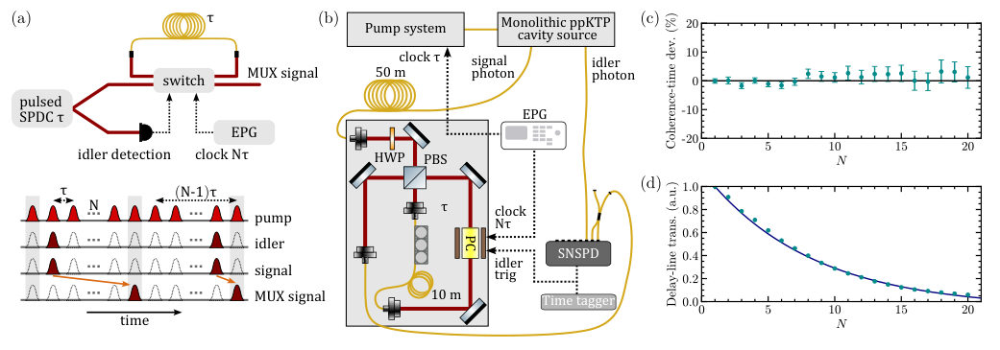
<figcaption class="paper-figure-caption"><b>Fig 1.</b> FIG. 1. (a) Concept of photon synchronization via multiplexing (MUX) using a free-space-fiber hybrid switchable delay line. Telecom and narrow-band photons heralded from a photon-pair source are stored in the system using a free-space electro-optic switch and released at clock-synchronized time bins. (b) Experimental setup based on the concept presented in (a), in which the optical switch is implemented by combining a polarizing beamsplitter with a Pockels cell. Narrow-band telecom photons are generated via SPDC in a monolithic cavity [6] and synchronized with the fiber delay line. HWP: half-wave plate; PBS: polarizing beamsplitter; PC: Pockels cell; EPG: electrical pulse generator; SNSPD:...</figcaption>
</figure>
<figure class="paper-figure-card">
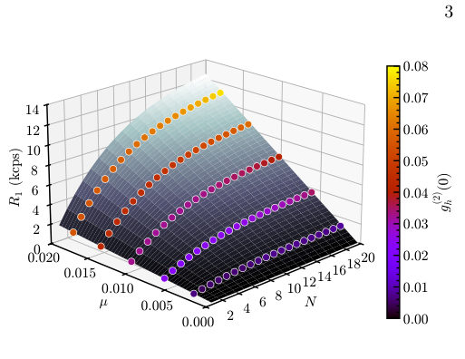
<figcaption class="paper-figure-caption"><b>Fig 2.</b> FIG. 2. Measured 1-photon detection rate R1 as a function of the mean photon number per pulse µ and the number of multi- plexed time bins N. The marker color encodes the measured higher-order photon-number contributions. Both quantities are defined as cumulative over N for a fixed µ (g(2) h (0) as a weighted average), indicating the marginal increase of g(2) h (0) with multiplexing, whereas the multiplexed rate is enhanced by approximately one order of magnitude. The surface points are described by the theory (Eq. 1 for n = 1).</figcaption>
</figure>
<figure class="paper-figure-card">
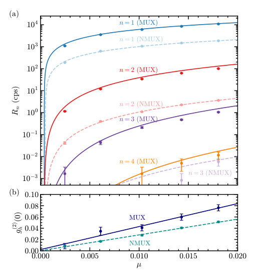
<figcaption class="paper-figure-caption"><b>Fig 3.</b> FIG. 3. (a) Measured n-photon detection rates Rn, and (b) measured multi-photon contamination g(2) h (0) as a function of the mean photon number per pulse µ for multiplexed (MUX, solid dark lines) and non-multiplexed (NMUX, dashed light lines) configurations. The theoretically predicted n-photon rates (Eq. 1) are overlaid in (a), and a linear regression is ap- plied to the data points in (b). The integration time for each data point is 10 (20) min for MUX (NMUX) configurations. The error bars are derived from Poissonian photon counting statistics.</figcaption>
</figure>

**Summary.** The paper presents an experimental demonstration of enhancing single-photon source rates by temporally multiplexing multiple photon emission events using a hybrid free-space-fiber delay line. By implementing active feed-forward switching, the system achieves significant rate enhancements (up to 180-fold for three photons) while maintaining high fidelity in the heralded signal stream.

**Why it may be interesting.** This work directly addresses a critical bottleneck in quantum networking: generating high-rate, synchronized entangled or heralded photon pairs. The use of active feedback to engineer time-domain resources is highly relevant for building scalable photonic quantum repeaters or sources.

Detailed structure

**Main problem.** The core challenge is achieving quasi-deterministic single-photon generation at high count rates, synchronized to an external clock, which is essential for scaling photonic quantum technologies.

**Main result.** The authors demonstrated temporal synchronization of multiple heralded photon-generation events across up to 20 time bins, leading to significant rate enhancements (e.g., 180-fold for three photons) compared to non-multiplexed sources.

**Method.** The technique employs a free-space-fiber hybrid delay line combined with active feed-forward switching triggered by the detection of an idler photon to store and release signal photons on demand.

**Model / system.** The system utilizes a monolithic cavity Spontaneous Parametric Down-Conversion (SPDC) source producing narrow-band, telecom-wavelength photons. The temporal multiplexing is achieved using a delay line incorporating fiber and a free-space section controlled by a Pockels cell and polarizing beamsplitter.

**Key observables.** 1-photon detection rate ($R_1$), heralded second-order autocorrelation $g^{(2)}_h(0)$, and the enhancement factor for $n$-photon rates ($E_n$).

**Important parameters / regimes.** The cycle transmission ($\eta_c$) was measured to be 89%; synchronization is demonstrated across up to 20 time bins.

**Assumptions / limitations.** Rate enhancement formulas are assumed valid in the low gain regime where multi-pair contributions are minimized; performance scaling is limited by engineering constraints.

**Figures summary.** Figures illustrate the concept diagram of photon multiplexing, the experimental setup involving the cavity source and delay line components, measured coherence time vs. delay cycles, and rate/contamination measurements comparing multiplexed versus non-multiplexed operation.

**Paper structure.** The paper progresses from introducing the need for deterministic sources to detailing the hybrid free-space-fiber architecture, presenting experimental characterization of component efficiencies, demonstrating the synchronization mechanism via feed-forward control, and finally quantifying the rate enhancement achieved through temporal multiplexing.

Abstract

Quasi-deterministic single-photon generation is a key requirement for many photonic quantum technologies. Photon sources based on spontaneous parametric down-conversion (SPDC) are widely used for producing high-quality photons; however, the probabilistic nature of the process limits the generation of synchronized multi-photon states. Here, we demonstrate temporal synchronization of multiple photon-generation events using a free-space-fiber hybrid delay line with feed-forward control, enabling fast and efficient switching and scalable operation. Narrow-band, telecom-wavelength photons compatible for fiber transmission are heralded from a monolithic cavity SPDC source and synchronized across 20 time bins. This yields a sixfold enhancement in synchronized rates and enables multi-photon synchronization, with only a marginal increase of higher-order photon-number contributions.

[↑ back to top](#top)

### [Watching a Superconducting Coplanar Waveguide Heat Up with a Single Color Center](http://arxiv.org/abs/2606.15398v1)

**Authors:** Ioannis Karapatzakis, Jeremias Resch, David Hunger, Wolfgang Wernsdorfer  
**Type:** experiment · **Category:** quantum information and computing · **PDF:** <https://arxiv.org/pdf/2606.15398v1>  
**Analysis basis:** full PDF text, analyzed in chunks
**Topic relevance:** 🔥 `QC/QI experiment` **4/5** · `spintronics-quantum-optics interface` **3/5** · `methods for driven-dissipative` **1/5** · `quantum measurements` **1/5** · `quantum optics experiment` **1/5**

↔ Scroll figures horizontally

<figure class="paper-figure-card">
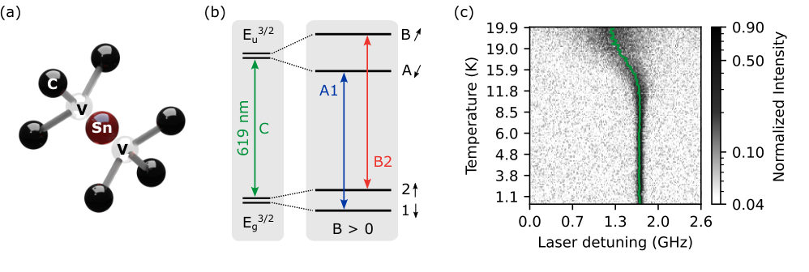
<figcaption class="paper-figure-caption"><b>Fig 1.</b> FIG. 1. (a) Rendered image of the SnV center in diamond. (b) Reduced energy level diagram of the SnV center. In a magnetic field, spin degeneracy is lifted. The corresponding transitions are labeled as A1 (blue) and B2 (red). (c) PLE measurement of the C-transition of SnV-F as a function of temperature. The 2D plot shows the spectral response from 20 K down to 1 K, illustrating the evolution of the transition linewidth and position. In order to better visualize the transitions at elevated temperatures, the data have been normalized globally and plotted on a logarithmic scale. The center position of the transition is indicated with a green line. The frequency axis is offset by 484.170 883...</figcaption>
</figure>
<figure class="paper-figure-card">
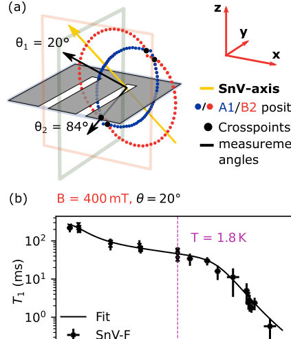
<figcaption class="paper-figure-caption"><b>Fig 2.</b> FIG. 3. (a) Schematic illustration of the allowed transi- tions A1 (blue) and B2 (red) of SnV-F extracted from angu- lar sweeps and the relative orientation of the transitions with respect to the SC-CPW structure (grey CPW) on the dia- mond. The SnV axis is indicated by the yellow arrow, while the black arrows denote the external magnetic field orienta- tions applied in subsequent measurements. For θ2 = 84◦, the allowed transitions intersect (black dots). The lab frame is represented by the red coordinate system. (b) Temperature dependence of the spin-lattice relaxation time T1 for a mag- netic field of 400 mT at an angle of θ1 = 20◦. Around 2.5 K, T1 exhibits saturation-like behavior due...</figcaption>
</figure>
<figure class="paper-figure-card">
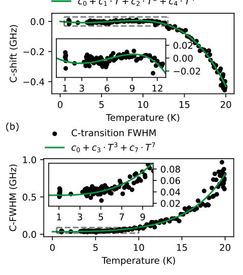
<figcaption class="paper-figure-caption"><b>Fig 3.</b> FIG. 2. Temperature dependence of the C-transition lineshift (a) and linewidth (b). The black dots show the extracted lineshift/linewidth from the PLE measurements in Fig 1(c). In (a), the main figure shows a pronounced lineshift above 12 K. The solid green lines show the polynomial fit (c0 + c1T + c2T 2 + c4T 4). The inset zooms in on the low- temperature regime from 1 −13 K, highlighting the positive T 2 contribution. In (b), the main figure reveals a broadening above 5 K. The solid green line shows the fit using a poly- nomial model c + c3T 3 + c7T 7. The inset zooms in on the low-temperature region from 1 −10 K, highlighting the low- temperature precision of the polynomial fits.</figcaption>
</figure>
<figure class="paper-figure-card">

<figcaption class="paper-figure-caption"><b>Fig 4.</b> Fig. 3(b) shows the temperature dependence of T1 mea- sured at a magnetic field of B = 400 mT and an angle of θ1 = 20◦. This off-axis configuration suppresses T1 by approximately two orders of magnitude compared to a field parallel to the SnV axis, reducing T1 to values that can be measured within a practical acquisition time and allowing an accurate characterization of the spin–lattice relaxation. For example, at 1.8 K (indicated by the pur- ple vertical line), we find T1 ≈45 ms, and we use this</figcaption>
</figure>
<figure class="paper-figure-card">
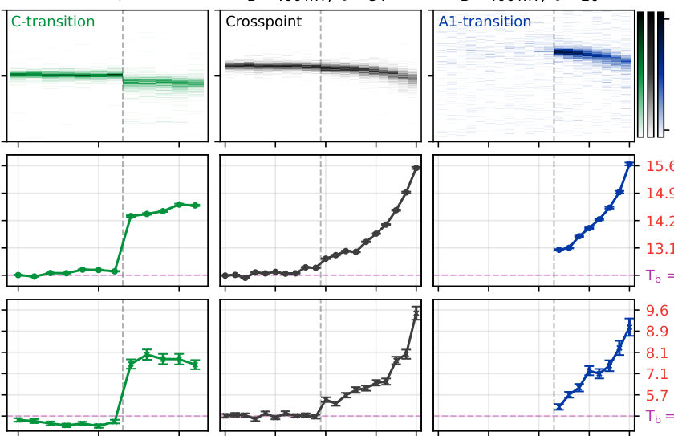
<figcaption class="paper-figure-caption"><b>Fig 5.</b> FIG. 4. Two-dimensional PLE maps (top row) recorded as a function of laser detuning and applied input power for a MW- pulse train at fbias = 2 GHz (on-time 10 µs, off-time 40 µs) and a base temperature Tbase = 1.1 K. (a) B = 0: the degenerate C-transition remains visible throughout the scan and is tracked continuously. (b) B = 400 mT, θ = 84◦: scan around the A1/B2-crosspoint. (c) B = 400 mT, θ = 20◦: lifted spin degeneracy. Below the breakdown threshold the A1-transition is suppressed by optical spin pumping and becomes visible once heating shortens T1. Grey dashed lines indicate the critical power Pcrit at which the superconducting state collapses. Middle row: extracted center-frequency...</figcaption>
</figure>

**Summary.** The research develops an on-chip thermometer using single $	ext{SnV}$ color centers to measure local temperature changes within superconducting waveguides. By monitoring optical and spin properties, the authors characterize how MW/RF driving induces heating, ultimately defining safe operational power limits crucial for building reliable quantum network nodes.

**Why it may be interesting.** This work directly addresses a critical engineering challenge in solid-state quantum computing: maintaining stable cryogenic temperatures while applying high-power microwave signals necessary for qubit manipulation or readout.

Detailed structure

**Main problem.** The primary goal is quantifying local heating effects induced by microwave (MW) or radio-frequency (RF) control fields in superconducting coplanar waveguides patterned on diamond substrates.

**Main result.** The study defines a safe operating window for such structures, showing that at relevant RF frequencies and magnetic fields, no measurable heating occurs up to high power thresholds, unlike MW driving which causes abrupt breakdown.

**Method.** A local thermometer based on single color centers ($	ext{SnV}$) in diamond is used. Temperature is inferred by monitoring the spectral shift and linewidth of optical transitions, supplemented by spin-lattice relaxation time ($T_1$) measurements.

**Model / system.** The platform consists of a superconducting Niobium (Nb) coplanar waveguide patterned on a diamond membrane hosting $	ext{SnV}$ color centers. Temperature calibration uses both optical spectroscopy and $T_1$ measurements across cryogenic temperatures.

**Key observables.** $	ext{SnV}$ C-transition frequency/linewidth, electron spin $T_1$ relaxation time, superconducting breakdown threshold ($P_{	ext{crit}}$), and thermal relaxation time ($	au_{th}$).

**Important parameters / regimes.** Temperatures ranging from 20 K down to the few-kelvin regime; magnetic fields up to 400 mT; input powers in the $10 	ext{ dBm}$ range.

**Assumptions / limitations.** The linewidth is assumed to be a more reliable thermometer than the lineshift at very low temperatures. The slow thermal recovery time ($	au_{th}$) is attributed primarily to the adhesive layer rather than the diamond bulk.

**Figures summary.** Figures illustrate $	ext{SnV}$ spectral shifts vs. temperature (Fig. 1, 2), schematic setups showing defect orientation relative to waveguides (Fig. 3), and power-dependent measurements of $T_1$ or fluorescence recovery time ($	au_{th}$) during pulsed driving.

**Paper structure.** The paper establishes the local thermometer using $	ext{SnV}$ spectroscopy across temperature regimes, applies this probe to measure heating from superconducting waveguides under varying MW/RF conditions, and concludes by defining safe operational limits for quantum control structures.

Abstract

Single color centers in diamond offer a local probe of their cryogenic environment, providing a direct way to quantify heating in spin-control hardware. Here, we establish a single spectrally stable tin-vacancy (SnV) center as an on-chip thermometer for a diamond membrane and use it to characterize microwave- and radio-frequency-induced heating in a superconducting coplanar waveguide patterned on the same chip. We first calibrate the temperature dependence of the optical C-transition frequency and linewidth from $20\,\mathrm{K}$ down to the few-kelvin regime. At lower temperatures, where the optical response becomes weakly temperature dependent, we use the spin-lattice relaxation time $T_1$ as a complementary thermometer and tune its sensitivity with the transverse magnetic-field component. Applying this local thermometer to a niobium coplanar waveguide, we observe magnetic-field-dependent superconducting breakdown under GHz drive, accompanied by abrupt heating of the diamond. In contrast, at $20\,\mathrm{MHz}$ and $400\,\mathrm{mT}$, relevant for nuclear-spin control, we detect no measurable heating up to the breakdown threshold of $9.4\,\mathrm{dBm}$, corresponding to $B_\mathrm{ac}\sim1.2\,\mathrm{mT}$. These results define a safe operating window for superconducting microwave and RF control structures in diamond-based quantum nodes.

[↑ back to top](#top)

### [What does measuring one qubit reveal about another? $K$-networks as a directed diagnostic for quantum circuits](http://arxiv.org/abs/2606.16549v1)

**Authors:** Kostas Blekos, Paulo Vitor Itaboraí  
**Type:** theory · **Category:** quantum information and computing · **PDF:** <https://arxiv.org/pdf/2606.16549v1>  
**Analysis basis:** full PDF text, analyzed in chunks
**Topic relevance:** 🔥 `entanglement & information structure` **4/5** · `quantum measurements` **3/5** · `measurement-induced transitions` **2/5** · `non-equilibrium dynamics` **1/5**

↔ Scroll figures horizontally

<figure class="paper-figure-card">
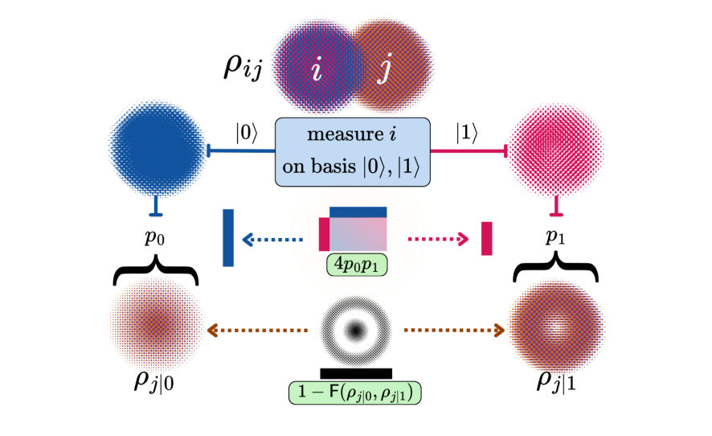
<figcaption class="paper-figure-caption"><b>Fig 1.</b> Figure 1: Schematic definition of the measurement-conditioned pairwise score Ki→j. A two- outcome projective measurement on qubit i prepares conditional states ρj|0 and ρj|1 on qubit j with probabilities p0 and p1. When both branches occur, the score K combines the branching balance factor 4p0p1 (maximal when p0 = p1 = 1</figcaption>
</figure>
<figure class="paper-figure-card">
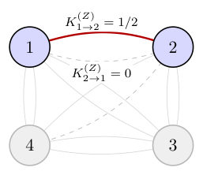
<figcaption class="paper-figure-caption"><b>Fig 2.</b> Figure 2: Directed K(Z)-network for the four-qubit state in Example 1. The highlighted pair has K(Z) 1→2 = 1/2 and K(Z) 2→1 = 0; the remaining arrows give the surrounding pairwise context.</figcaption>
</figure>
<figure class="paper-figure-card">
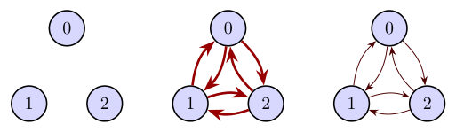
<figcaption class="paper-figure-caption"><b>Fig 3.</b> Figure 3: Evolution of the K-network through one Grover iteration (3 qubits, target |101⟩). (a) After Hadamard: K = 0 (uniform superposition has no measurement-induced correlations). (b) After Oracle: K = 0.5 (peak correlations from phase marking). (c) After Diffuser: K = 1/8 = 0.125 (correlations redistributed as target amplitude is amplified).</figcaption>
</figure>
<figure class="paper-figure-card">
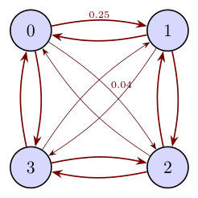
<figcaption class="paper-figure-caption"><b>Fig 4.</b> Figure 4: K-network for a 4-qubit QAOA circuit (p = 1, γ = 0.4, β = 0.2) on a ring MaxCut problem. Edge thickness and color indicate Ki→j values; arrows show directionality, and the two displayed labels give representative values. Ring neighbors (0–1, 1–2, 2–3, 3–0) have K ≈0.25, while diagonal pairs (0–2, 1–3) have K ≈0.04.</figcaption>
</figure>
<figure class="paper-figure-card">
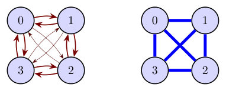
<figcaption class="paper-figure-caption"><b>Fig 5.</b> Figure 5: Comparison of K-network and MI-network for the same 4-qubit QAOA state. (a) The K-network (directed, red edges) distinguishes ring neighbors from diagonal pairs. (b) The MI- network (undirected, blue edges) shows nearly uniform weights across all pairs. Edge thickness is proportional to K or I; MI is normalized to its maximum value for visualization.</figcaption>
</figure>

**Summary.** The paper introduces $K_{i	o j}$, a directed diagnostic measure quantifying how measuring qubit $i$ reveals information about qubit $j$. It calculates this score using the distinguishability of post-measurement conditional states. This metric proves superior to standard mutual information by capturing measurement-conditioned, directional correlations essential for analyzing quantum circuit structure.

**Why it may be interesting.** This work provides a powerful, quantifiable tool for characterizing the non-local correlations in complex quantum circuits that are sensitive to measurement basis and directionality, which is crucial for understanding quantum computation protocols.

Detailed structure

**Main problem.** The authors aim to develop a directed diagnostic measure, $K_{i	o j}$, to quantify how measuring one qubit ($i$) reveals specific conditional information about another qubit ($j$), overcoming limitations of symmetric correlation measures.

**Main result.** The resulting $K$-network provides a basis-conditioned, directional map of quantum circuit structure that can distinguish between different types of correlations (e.g., phase vs. classical) missed by mutual information.

**Method.** The core method defines $K_{i	o j}$ using the Uhlmann–Jozsa squared fidelity gap ($\Delta F$) between the conditional states $
ho_{j|0}$ and $
ho_{j|1}$, weighted by the outcome probabilities ($p_0, p_1$).

**Model / system.** The analysis is performed on general many-qubit circuit states, using two-qubit reduced density matrices ($
ho_{ij}$) to calculate pairwise directed edge weights.

**Key observables.** $K_{i	o j}$ (Conditional-distinguishability correlation score), Tangle ($C^2$), Quantum Mutual Information ($I(i:j)$), Classical Mutual Information ($I_Z$).

**Important parameters / regimes.** The measurement basis ($\hat{n}$), the outcome probabilities ($p_0, p_1$), and the fidelity gap $\Delta F$.

**Assumptions / limitations.** The score is explicitly stated *not* to be an entanglement measure, as separable classical states can achieve $K=1$; furthermore, it should not be interpreted as a causal structure.

**Figures summary.** Figures illustrate the directed asymmetry of $K$-networks for circuits like teleportation and QAOA, showing how they reveal structural details (e.g., phase interactions) that symmetric measures miss.

**Paper structure.** The paper introduces the diagnostic measure $K_{i	o j}$ based on conditional state distinguishability, derives its properties (invariance, bounds), and then validates it by comparing its performance against standard correlation metrics across various quantum circuit examples (Grover, QAOA).

Abstract

Many-qubit circuit states are hard to inspect directly, so they are often summarized by pairwise graph weights. Common pairwise weights report symmetric correlations, while many circuit questions are directed and basis-specific: if qubit $i$ is measured in a given basis, how strongly does the outcome reshape the conditional state of qubit $j$? We define $K_{i\to j}$, a directed, basis-conditioned edge weight for this question. It is large when the two measurement outcomes occur with comparable probability and leave qubit $j$ in clearly different conditional states; it is zero when the source outcome is deterministic or the target states are indistinguishable. The scalar uses standard binary-ensemble distinguishability; the paper's contribution is to turn this conditional comparison into a directed network layer for circuit states. The resulting networks are computable from two-qubit reduced density matrices. They are diagnostic (not entanglement measures): for pure two-qubit states $K$ reduces to the tangle $C^2$ (squared concurrence)~\cite{WoottersConcurrence,CKWTangle}, while separable mixed states can reach $K=1$. Examples on teleportation, Grover, QAOA, and random circuit families show the intended use: $K$-networks map feed-forward, phase, and interaction-graph structure that symmetric or computational-basis summaries can leave weak or absent.

[↑ back to top](#top)

### [Diagonal-Budgeted Trotterization for Efficient Quantum Hamiltonian Simulation](http://arxiv.org/abs/2606.16959v1)

**Authors:** Srikar Chundury, Blake Burgstahler, Jiajia Li, In-Saeng Suh, Frank Mueller  
**Type:** theory · **Category:** numerical methods · **PDF:** <https://arxiv.org/pdf/2606.16959v1>  
**Analysis basis:** full PDF text, analyzed in chunks
**Topic relevance:** 🔥 `analog quantum simulation` **4/5** · `non-equilibrium dynamics` **2/5** · `entanglement & information structure` **1/5** · `exotic spin models in light-matter` **1/5** · `methods for driven-dissipative` **1/5**

↔ Scroll figures horizontally

<figure class="paper-figure-card">
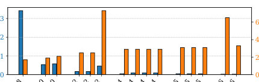
<figcaption class="paper-figure-caption"><b>Fig 1.</b> Figure 1: Matrix density (left y-axis) and number of active diagonals (right y-axis) for selected instances from Ham- Lib [36]. Identical x-axis labels correspond to distinct Hamil- tonians of the same category with the same qubit size.</figcaption>
</figure>
<figure class="paper-figure-card">
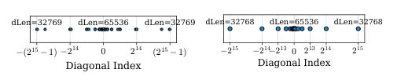
<figcaption class="paper-figure-caption"><b>Fig 2.</b> Figure 2: Distribution of diagonal indices in 16-qubit Hermit- ian matrices: Heisenberg (left) and TFIM (right).</figcaption>
</figure>
<figure class="paper-figure-card">
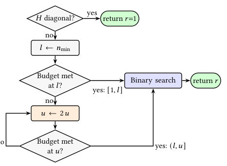
<figcaption class="paper-figure-caption"><b>Fig 3.</b> Figure 3: Adaptive timestep selection for diagonal budget 𝐷max. Given Hamiltonian 𝐻and evolution time 𝑡, find the smallest 𝑟satisfying Eq. (5). 𝑟→#steps, 𝑡→total time, 𝑙,𝑢→ bounds on 𝑟.</figcaption>
</figure>
<figure class="paper-figure-card">
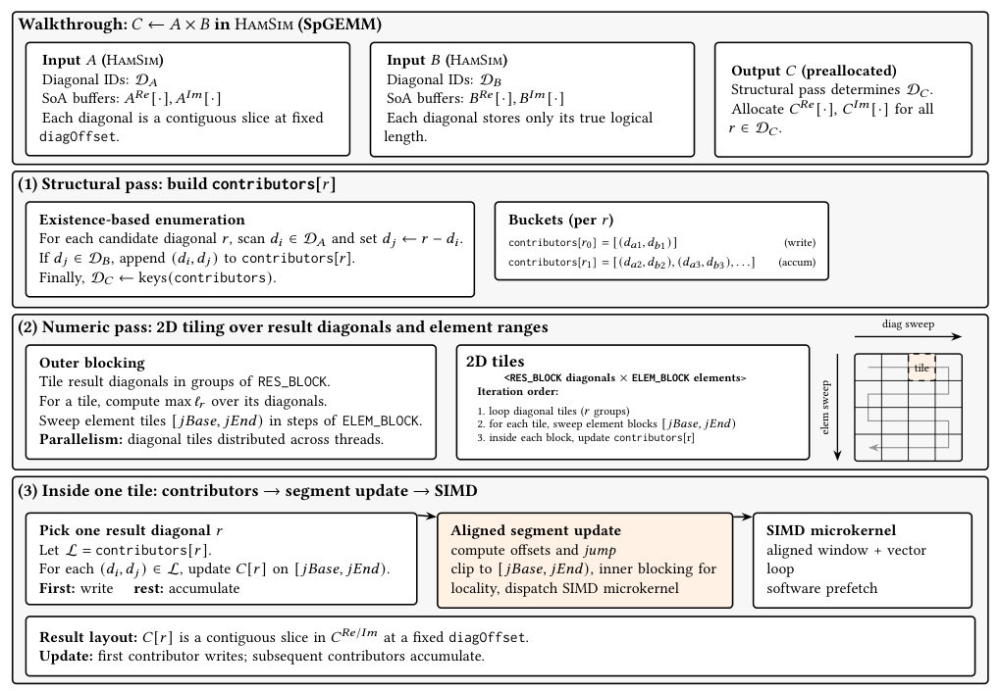
<figcaption class="paper-figure-caption"><b>Fig 4.</b> Figure 4: Walkthrough of HamSim SpGEMM (𝐶=𝐴𝐵). (1) A structural pass builds contributors[𝑟] via diagonal-index existence checks. (2) The numeric pass performs 2D tiling over result diagonals (RES_BLOCK) and element ranges (ELEM_BLOCK). (3) Inside a tile, each 𝑟iterates contributor pairs and applies an aligned segment update over [𝑗𝐵𝑎𝑠𝑒, 𝑗𝐸𝑛𝑑), dispatching a SIMD microkernel to write/accumulate into the preallocated 𝐶[𝑟] slice.</figcaption>
</figure>
<figure class="paper-figure-card">
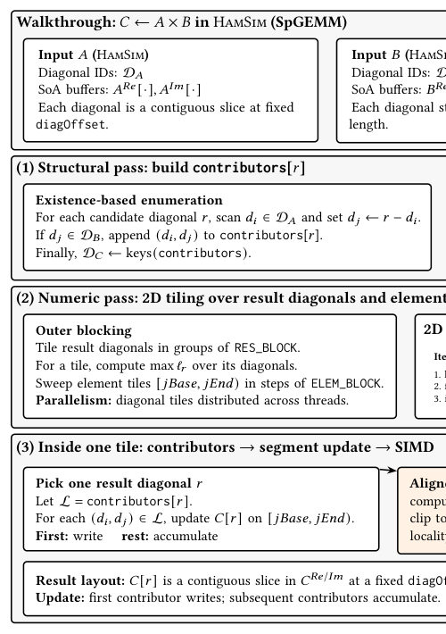
<figcaption class="paper-figure-caption"><b>Fig 5.</b> Fig. 4 illustrates the full execution flow: The structural pass builds contributors[𝑟] for every result diagonal; the numeric pass tiles both the diagonal index space and the element-range space (RES_BLOCK and ELEM_BLOCK); and each tile invokes the Multi- plyDiagonals microkernel, which streams contiguous diagonal segments and performs complex fused multiply-add operations. The figure makes explicit how write-vs-accumulate behavior is handled and how SIMD parallelism is exposed inside each tile. Numerical execution is parallelized across result diagonals. When a diagonal 𝑟has a single contributing pair, its output slice is written directly; when multiple contributors exist, partial results...</figcaption>
</figure>

**Summary.** This paper introduces Diagonal-Budgeted Trotterization, a novel technique to efficiently simulate quantum Hamiltonian dynamics by exploiting the inherent diagonal sparsity of physical Hamiltonians. The authors developed HamSim, an optimized library using specialized data layouts and kernels that achieves massive speedups over existing simulators while maintaining high fidelity across various complex models.

**Why it may be interesting.** For AMO physicists working on open quantum systems or many-body dynamics, this work provides a crucial computational tool for simulating time evolution of structured Hamiltonians (like those arising from lattice models) with unprecedented efficiency and accuracy.

Detailed structure

**Main problem.** The core challenge is efficiently simulating quantum Hamiltonian dynamics, which suffers from exponential state growth and computational overheads associated with generic sparse linear algebra formats.

**Main result.** The proposed method achieves dramatic speedups (up to 1269x on CPU) over existing simulators while maintaining near-perfect fidelity by exploiting the structured sparsity of physical Hamiltonians.

**Method.** It introduces Diagonal-Budgeted Trotterization, a structure-aware time evolution strategy that limits computational cost by constraining the growth of non-zero diagonals in intermediate operators. This is implemented using HamSim, which employs a specialized diagonal-sparse data layout and optimized C++/CUDA kernels for matrix operations.

**Model / system.** The method applies to quantum systems governed by Hamiltonians (H), tested on diverse models including the Transverse Field Ising Model (TFIM), Heisenberg model, MaxCut, and TSP. The focus is on the structure of these Hamiltonians exhibiting diagonal sparsity due to local interactions.

**Key observables.** Simulation time/speedup (e.g., 182–1,269x speedup); State Fidelity ($\approx 1.0$); Matrix Density and Number of Active Diagonals.

**Important parameters / regimes.** The diagonal budget ($D_{\max}$) is a key parameter that controls the structural complexity allowed during time evolution; qubit count (up to 16 qubits) and simulation time $T$.

**Assumptions / limitations.** It assumes physical Hamiltonians exhibit structured sparsity concentrated along specific diagonals, allowing for a fixed, compact diagonal-major data layout.

**Figures summary.** Figures demonstrate the slow growth of matrix density/diagonals vs. qubit size; illustrate the structural challenge of diagonal sparsity; and compare simulation runtimes across various benchmarks (TSP, Heisenberg) showing HamSim's superior scaling.

**Paper structure.** The paper first identifies the bottleneck in classical simulation, then proposes Diagonal-Budgeted Trotterization to manage complexity structurally. It details the novel sparse data layout and specialized kernels ($	ext{SpMV}$, $	ext{SpGEMM}$) that exploit this structure. Finally, it presents extensive benchmarks comparing performance and fidelity against state-of-the-art simulators.

Abstract

Efficient classical simulation of quantum Hamiltonian dynamics is often bottlenecked by exponential state growth and the overhead of generic sparse linear algebra. We introduce diagonal-budgeted Trotterization, a structure-aware strategy that decomposes Hamiltonians into factors preserving diagonal sparsity while tightly controlling fidelity loss.   Our implementation, HamSim, utilizes a compact diagonal-sparse data layout and specialized C++/CUDA kernels to bypass the overheads of generic formats like CSR. By leveraging SIMD vectorization, multithreading, and GPU acceleration, HamSim achieves high performance across heterogeneous architectures. Benchmarks on the HamLib suite show that HamSim significantly outperforms Qiskit-Aer. On CPUs, HamSim attains speedups of $182$--$1,269\times$ on optimization instances (TSP, MaxCut) and $4.8$--$841\times$ on physical models (TFIM, Heisenberg). On GPUs, it achieves up to $178\times$ speedup for $12$--$16$ qubit problems.   Unlike traditional Trotterization, HamSim maintains near-perfect fidelity without requiring exponential steps. This demonstrates that diagonal-aware numerical kernels provide a scalable foundation for high-fidelity classical Hamiltonian simulation.

[↑ back to top](#top)

### [Electronic Band Structure of Silicon Determined via a Variational Adiabatic Eigensolver: Theory and Experiment](http://arxiv.org/abs/2606.16604v1)

**Authors:** Xingrui Liu, Liyang Sui, Tianqi Cai, Zhiwen Zong, Kunliang Bu, Wenyan Jin, Bowen Chen, Xutao Zhang, Yufan Li, Zhihao Gong, Yicong Zheng, Shengyu Zhang, Jianlan Wu, Yi Yin  
**Type:** both · **Category:** quantum information and computing · **PDF:** <https://arxiv.org/pdf/2606.16604v1>  
**Analysis basis:** full PDF text, analyzed in chunks
**Topic relevance:** 🔥 `QC/QI experiment` **4/5** · `analog quantum simulation` **2/5** · `methods for driven-dissipative` **1/5** · `non-equilibrium dynamics` **1/5**

↔ Scroll figures horizontally

<figure class="paper-figure-card">
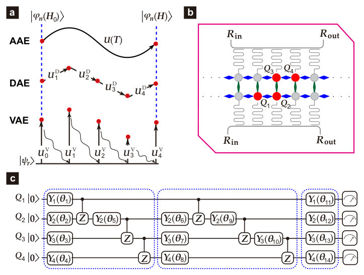
<figcaption class="paper-figure-caption"><b>Fig 1.</b> FIG. 1. (a) The schematic diagrams of three adiabatic eigensolvers: analog (AAE), digitized (DAE)</figcaption>
</figure>
<figure class="paper-figure-card">
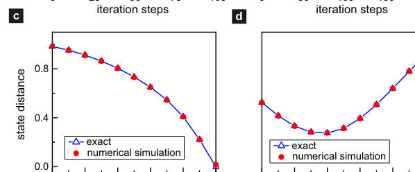
<figcaption class="paper-figure-caption"><b>Fig 2.</b> FIG. 2. The numerical simulation of a 10-step VAE in the determination of the W-VB state</figcaption>
</figure>
<figure class="paper-figure-card">
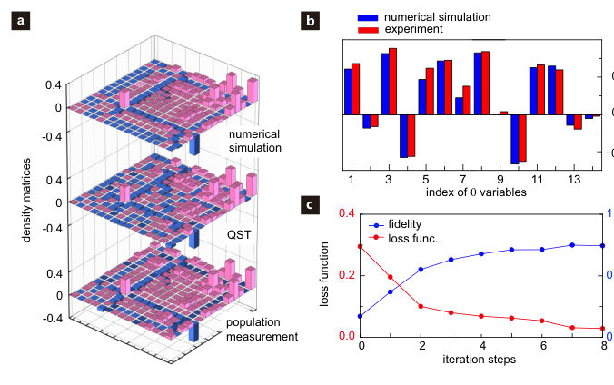
<figcaption class="paper-figure-caption"><b>Fig 3.</b> FIG. 4. Experimental verification of the VAE protocol. (a) The 15 × 15 density matrices of the</figcaption>
</figure>
<figure class="paper-figure-card">
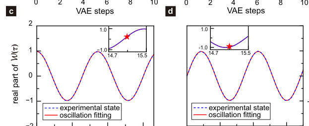
<figcaption class="paper-figure-caption"><b>Fig 4.</b> FIG. 5. Experimental validation of the VAE for determining the W-VB state (refer to Fig. 2).</figcaption>
</figure>
<figure class="paper-figure-card">
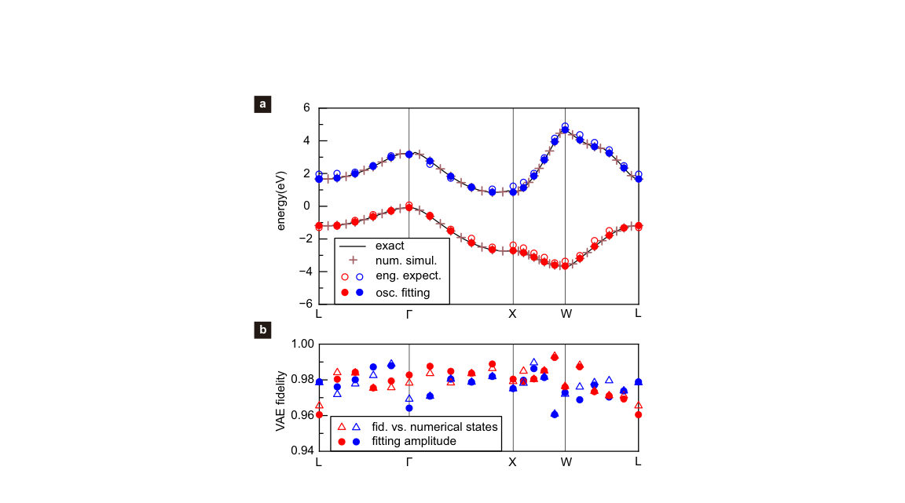
<figcaption class="paper-figure-caption"><b>Fig 5.</b> FIG. 6. Experimental determination of the silicon band structure using VAE. (a) Valence and</figcaption>
</figure>

**Summary.** The authors introduce and validate a Variational Adiabatic Eigensolver (VAE) protocol designed to calculate electronic band structures on NISQ devices. By combining adiabatic evolution with variational optimization, they successfully determined the energy levels of silicon's valence and conduction bands. This work establishes a robust, practical framework for quantum simulation in condensed matter physics.

**Why it may be interesting.** This work directly addresses the practical limitations of current quantum hardware for solid-state physics, providing a concrete, experimentally validated pathway to simulate complex many-body Hamiltonians (like those governing band structure) using variational quantum algorithms.

Detailed structure

**Main problem.** The core challenge is accurately determining excited-state electronic band structures of semiconductors using near-term quantum hardware.

**Main result.** The Variational Adiabatic Eigensolver (VAE) protocol successfully prepared silicon's valence and conduction bands, achieving energy agreement within 0.01 eV after spectral fitting.

**Method.** A hybrid VAE approach combines adiabatic evolution with variational optimization using parameterized quantum circuits and a phase-based loss function.

**Model / system.** The system is Silicon, modeled using the Nearly Free Electron (NFE) model Hamiltonian cast into Pauli operators for simulation on superconducting qubits. The calculation traces paths through the Brillouin zone.

**Key observables.** State fidelities (>96%), measured energy expectations ($\vec{E}_{\vec{k}}$), and state distance ($D_j$) tracking adiabatic evolution.

**Important parameters / regimes.** Lattice constant $a = 5.43 	ext{ Å}$; the simulation uses a selected 4-qubit system to represent the electronic structure.

**Assumptions / limitations.** The NFE model is used for computational tractability, and spectral fitting (single-frequency oscillation) is required to correct direct energy measurements from contamination.

**Figures summary.** Figures illustrate schematic comparisons of different eigensolvers (VAE vs AAE/DAE), the hardware ansatz circuit, state distance evolution along paths, and final band structure plots showing excellent agreement with theory.

**Paper structure.** The paper progresses by defining the physical problem (Si bands) $
ightarrow$ formulating the Hamiltonian in NFE model $
ightarrow$ detailing the VAE method as an improvement over direct adiabatic methods $
ightarrow$ presenting experimental results on state preparation and energy extraction along high-symmetry paths.

Abstract

This work addresses the critical challenge of excited-state preparation for semiconductor band structure calculations. We introduce a variational adiabatic eigensolver (VAE) protocol that combines adiabatic evolution with variational optimization to prepare high-fidelity eigenstates on noisy intermediate-scale quantum (NISQ) devices. Applying a momentum-space truncation, we accurately compute the electronic band structure of silicon -- an idealized infinite periodic system -- using only a modest number of qubits. Our approach employs multi-qubit parameterized circuits and a phase-based loss function, overcoming limitations of conventional methods. These limitations include the circuit-construction difficulty in traditional adiabatic approaches and the reduced accuracy of variational quantum eigensolvers for excited states. Through rigorous numerical simulation and experimental implementation on a superconducting quantum processor, we successfully prepare silicon's valence-band and conduction-band eigenstates. Single-shot readout yields state fidelities exceeding 96%, and the measured energy expectations agree with theoretical band energies within 0.5 eV. Further refinement via single-frequency oscillation fitting reduces the energy deviation to below 0.01 eV. This framework provides a robust and practical pathway for precisely determining electronic structures in quantum materials.

[↑ back to top](#top)

### [Quantum Nonlocal Games on Graph Ensembles](http://arxiv.org/abs/2606.16784v1)

**Authors:** Joshua Tucker, Chris Weeks, Peter Drmota, Ellis M. Ainley, Ayush Agrawal, Adam R. Martinez, Erin Malinowski, Jacob A. Blackmore, David P. Nadlinger, Gabriel Araneda, David M. Lucas, Carlos A. Perez-Delgado, Paul Strange, Jorge Quintanilla  
**Type:** both · **Category:** other · **PDF:** <https://arxiv.org/pdf/2606.16784v1>  
**Analysis basis:** full PDF text, analyzed in chunks
**Topic relevance:** 🔥 `QC/QI experiment` **4/5** · `analog quantum simulation` **2/5** · `entanglement & information structure` **1/5** · `non-equilibrium dynamics` **1/5**

↔ Scroll figures horizontally

<figure class="paper-figure-card">
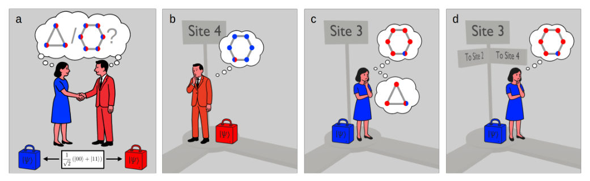
<figcaption class="paper-figure-caption"><b>Fig 1.</b> FIG. 1. The games we consider involve two agents, Alice and Bob, coordinating their moves on a graph in order to achieve a common task. They are played in two phases: in phase one (a) Alice and Bob can agree a strategy and share quantum information without knowing their starting locations and with only statistical information about the graph’s topology; in phase two (b-d) Alice and Bob have to make their moves without communicating and using only local information (see main text).</figcaption>
</figure>
<figure class="paper-figure-card">
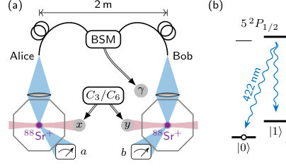
<figcaption class="paper-figure-caption"><b>Fig 2.</b> FIG. 2. (a) The experimental apparatus used to implement rendezvous games on graph ensembles consists of two trapped 88Sr+ ions. The ions can be entangled remotely by a Bell state measurement (BSM) on two photons that are each entangled with one of the ions. The BSM heralds the creation of the state in Eq. (3) whose phase ϑγ is communicated to Bob. The variables x and y encode the sites at which Alice and Bob have been placed on the graph and the players perform unitary rotations and projective measurements using lasers, yielding binary outcomes a and b, respectively. (b) Relevant electronic level structure of 88Sr+.</figcaption>
</figure>
<figure class="paper-figure-card">
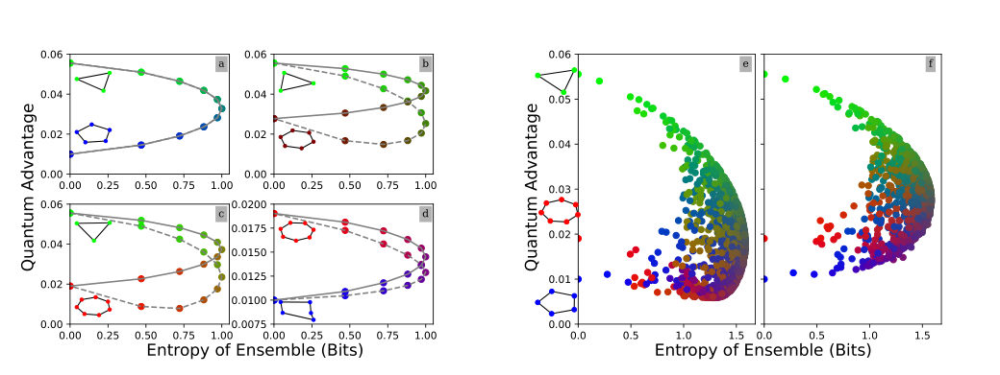
<figcaption class="paper-figure-caption"><b>Fig 3.</b> FIG. 3. Quantum advantage Q [Eq. (4)] – defined as the increase in rendezvous probability when using a quantum strategy over the best classical strategy – for two-player, one-step rendezvous in an uncertain topography, represented by a statistical ensemble of the graphs {C3,C5} (a), {C3,C6} (b), {C3,C7} (c), {C5,C7} (d), and {C3,C5,C7} (e-f). The horizontal axis shows the entropy S of each ensemble [Eq. (1)]. This quantifies the players’ initial topographic uncertainty, before they are placed on their starting site. For each ensemble, the two scenarios described in Fig. 1 are considered: one where less local information is available to the players, shown by the circles joined by dashed...</figcaption>
</figure>
<figure class="paper-figure-card">
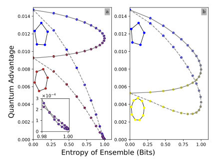
<figcaption class="paper-figure-caption"><b>Fig 4.</b> FIG. 4. Quantum advantage for one-step graph domination game played on the {C5,C6} (a) and {C5,C9} (b) families of graph ensembles. The circles joined by dashed lines corre- spond to the case with less local information (Fig. 1c) and the circles joined by solid lines show the case with more local information (Fig. 1d). The positive quantum advantage and its increase when more local information is available mirror our results for rendezvous games.</figcaption>
</figure>
<figure class="paper-figure-card">
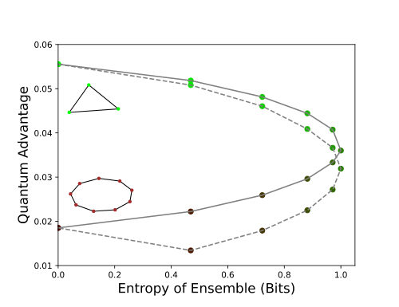
<figcaption class="paper-figure-caption"><b>Fig 5.</b> FIG. 5. Calculated quantum advantage Q [Eq. (4)] for two- player, one-step rendezvous in an uncertain topography, rep- resented by a statistical ensemble of the graphs {C3,C9}. The conventions are the same is in Fig. 3 in the main text.</figcaption>
</figure>

**Summary.** This work establishes a concrete route toward achieving quantum advantage in motion coordination problems by analyzing nonlocal games played on graphs with unknown topographies. The authors demonstrate this theoretically using graph ensembles and experimentally validate it using physically separated trapped ion systems. Crucially, they show that the quantum benefit persists under topographical uncertainty and is significantly amplified when players can gather local information.

**Why it may be interesting.** The experimental realization of remote entanglement and its application to complex coordination tasks like rendezvous is highly relevant for developing practical quantum networking protocols and understanding how quantum correlations can enhance collective decision-making in noisy or uncertain physical settings.

Detailed structure

**Main problem.** The research investigates when quantum entanglement provides a demonstrable advantage over classical strategies for coordinating mobile agents (players) in uncertain environments defined by graph ensembles.

**Main result.** Quantum strategies maintain and even enhance their advantage over optimal classical ones, particularly when players gain access to additional local information about the environment's topography.

**Method.** The authors develop theoretical frameworks for nonlocal quantum games on graph ensembles and validate them through experimental demonstrations using trapped ion systems and simulations on superconducting hardware.

**Model / system.** The core model involves two-player, one-step rendezvous or domination games played on graphs drawn from an ensemble. Experimentally, the platform uses physically separated trapped $^{88}	ext{Sr}^+$ ions to generate remote entanglement.

**Key observables.** Quantum Advantage ($Q$), Rendezvous Probability ($P_W$), and Graph Ensemble Entropy ($S$).

**Important parameters / regimes.** Topographic Uncertainty (Entropy $S$), the availability of local information ('signposts'), and the specific graph ensembles used ($\{C_3, C_5\}, \{C_3, C_6\}$, etc.).

**Assumptions / limitations.** The classical strategy is assumed to be deterministic; quantum strategies rely on shared maximally entangled 2-qubit states and local unitary rotations.

**Figures summary.** Figures illustrate the evolution of Quantum Advantage ($Q$) versus Ensemble Entropy ($S$), comparing scenarios with and without additional local information, across different graph ensembles for both rendezvous and domination games.

**Paper structure.** The paper builds from defining the nonlocal game on uncertain graphs to demonstrating quantum advantage in the rendezvous scenario using trapped ions. It then extends this analysis to the graph domination game, consistently showing that increased local knowledge boosts the quantum benefit.

Abstract

Quantum entanglement is one of the most striking discoveries in all of science. This effect allows, for instance, two spatially separated agents to coordinate their actions, without communication, to an extent that is both counter-intuitive, and provably impossible by any other physical means. A recently discovered example is that of mobile agents (players) performing spatial coordination tasks such as rendezvous, where the agents aim to meet on a network without communication. Until now, demonstrations of this advantage have relied on highly idealized conditions: agents are assumed to have complete knowledge of the topography, and experiments have been restricted to simulations using data generated by qubits within a single quantum processor. Here we address both limitations by developing a theory for graph ensembles that capture topographical uncertainty and by experimentally demonstrating the advantage in rendezvous scenarios between physically separated ion-trap systems with access to remote entanglement. Moreover, we simulate a broader set of problems on superconducting hardware. Surprisingly, when players are given the ability to gather more local information the quantum advantage increases -- a feat impossible by classical means. Our findings establish a concrete route toward practical quantum advantages in motion coordination problems. More broadly, they point to a new way of using portable quantum devices to enhance collective decision-making in uncertain environments.

[↑ back to top](#top)

### [High-performance gates on trapped ion qubits using counterpropagating pulse-shaped laser beams](http://arxiv.org/abs/2606.15672v1)

**Authors:** Evangelos Piliouras, Hisham Amer, Susan M. Clark, Melissa C. Revelle, Edward C. Tortorici, Matthew N. H. Chow, Brandon Ruzic, Daniel S. Lobser, Brian K. McFarland, Christopher G. Yale, Edwin Barnes, Sophia E. Economou  
**Type:** experiment · **Category:** other · **PDF:** <https://arxiv.org/pdf/2606.15672v1>  
**Analysis basis:** full PDF text, analyzed in chunks
**Topic relevance:** 🔥 `QC/QI experiment` **4/5** · `interference shaping light` **1/5** · `quantum measurements` **1/5** · `quantum optics experiment` **1/5**

↔ Scroll figures horizontally

<figure class="paper-figure-card">
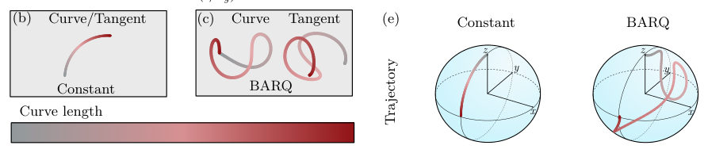
<figcaption class="paper-figure-caption"><b>Fig 1.</b> FIG. 1. Pulses, space curves, and experimental setup. (a) Control pulses with Ωx = Ωcos Φ, Ωy = Ωsin Φ. (b)– (c) Curve and tangent vectors for the constant pulse and the BARQ pulse, respectively. The hue indicates the time-arclength progression. The BARQ curve (c) is closed (dephasing robustness), by design, and its tangent curve traces zero area (amplitude error robustness), as can be verified visually from its approximate symmetry. The constant-amplitude Xπ/2 pulse is represented as an arc (b) since constant amplitude translates to constant curvature. Lacking the above geometric characteristics, it is naturally susceptible to both types of error. (d) Experimental system. Our system is...</figcaption>
</figure>
<figure class="paper-figure-card">
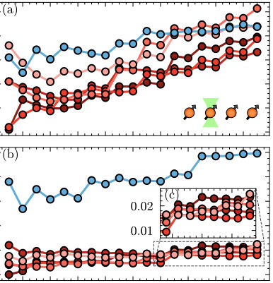
<figcaption class="paper-figure-caption"><b>Fig 2.</b> FIG. 2. Error accumulation after repeated applica- tions of Xπ/2 gates for various amplitude scales sΩ. To choose the amplitude scale of our noise-robust pulses, the same Xπ/2 gate is repeated up to K = 19 times, only on qubit q[1], which is initialized in |0⟩, and the excited state probabil- ity is measured after each number k of repetitions. The mean- squared error (MSE) is calculated as the average squared dif- ference between the measured values and the expected (nom- inal) probability values for every k ≤K. (a) Experimental results for the copropagating configuration. When sΩ&gt; 2, errors accumulate slightly more for the robust BARQ pulses (red) compared to the non-robust constant-pulse...</figcaption>
</figure>
<figure class="paper-figure-card">
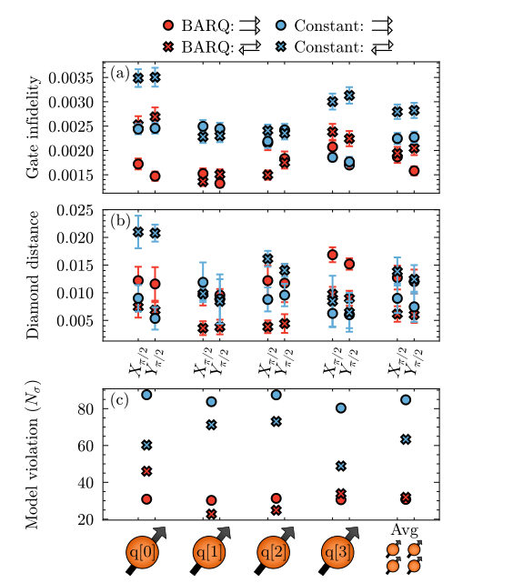
<figcaption class="paper-figure-caption"><b>Fig 3.</b> FIG. 3. Gate set tomography results. Results for each qubit are shown along the horizontal axis, and the average over all four is shown on the right side of each panel. The error bars correspond to 95% confidence intervals. (a) Gate infidelities and (b) diamond distances for each gate in the gateset (except the virtual Zπ/2) are shown. For all qubits except q[3], the robust pulses (red) exhibit lower gate infi- delities compared to constant pulses (blue). The diamond distances follow a similar pattern, with nearly 3× improve- ments for some qubits. (c) GST fit model violation. The BARQ pulse can effectively suppress non-Markovian errors given the roughly 2× reduction of Nσ. Remarkably,...</figcaption>
</figure>
<figure class="paper-figure-card">
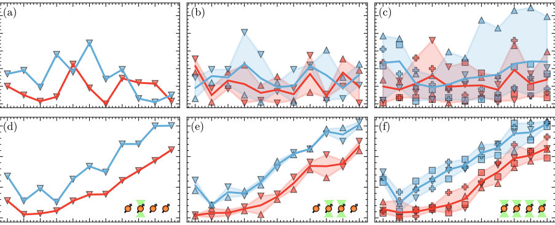
<figcaption class="paper-figure-caption"><b>Fig 4.</b> FIG. 4. Effect of motion on qubit rotation. The experimentally measured error in the probability to transition from |0⟩to |1⟩(transition prob. error = |p −pg|, where p = | ⟨1| U |0⟩|2 is the experimentally measured transition probability and pg = | ⟨1| Ug |0⟩|2 is the ideal probability) versus the wait time between preparing |0⟩and applying U. Here, we take U and Ug to be actual and ideal Xπ/2 gates, respectively. The top row shows the results for the copropagating beam geometry, while the bottom row shows the data taken in the counterpropagating configuration. Each column shows results for one of the three cases: driving only q[1] (a,d), both q[1] and q[2] (b,e), and all ions (c,f). Panels...</figcaption>
</figure>
<figure class="paper-figure-card">
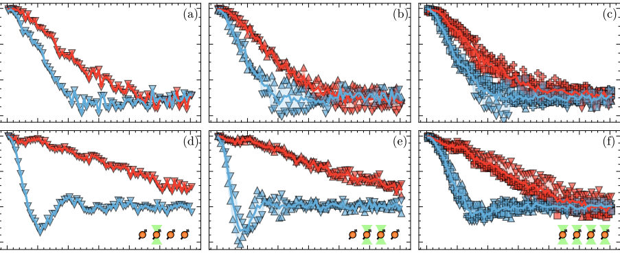
<figcaption class="paper-figure-caption"><b>Fig 5.</b> FIG. 5. Error accumulation through repeated gate application. Each panel shows the experimentally measured transition probability | ⟨1| U k |0⟩|2 versus k, where k = 4k′ + 2, k′ ∈N ∪{0}, k ≤302, and where U is an Xπ/2 gate in the absence of errors. Without noise, the probabilities should remain unity for all values of k considered. The top row shows the results for the copropagating beam geometry, while the bottom row shows the data taken for the counterpropagating configuration. Each column corresponds to one of the three cases: driving only q[1] (a,d), both q[1] and q[2] (b,e), and all ions (c,f). It is evident in panels (a)–(c) that the BARQ pulses produce slower decay as a function of...</figcaption>
</figure>

**Summary.** The research develops novel, robust laser pulse shapes using Space Curve Quantum Control to improve quantum gates on trapped ion qubits. By implementing these pulses, the authors show that counterpropagating beams can achieve superior gate fidelity compared to traditional copropagating methods. This advances the field by providing a new, high-performance standard for laser-driven gate operations.

**Why it may be interesting.** This work provides concrete, high-fidelity gate benchmarks for trapped ions by demonstrating how advanced quantum control techniques can overcome inherent noise sources (like motional coupling) that limit current hardware designs.

Detailed structure

**Main problem.** The primary challenge is achieving high-performance quantum gates on trapped ion qubits while minimizing hardware overhead associated with different laser beam geometries.

**Main result.** Robustly shaped counterpropagating pulses significantly outperform standard copropagating or constant-amplitude gates, achieving error rates as low as $(3.59 \pm 1.25)\cdot 10^{-3}$.

**Method.** The authors designed dynamically corrected gates using Space Curve Quantum Control (SCQC) and implemented the B\'ezier Ansatz for Robust Quantum (BARQ) control method.

**Model / system.** The system is a trapped ion chain, with qubits encoded in hyperfine states. The Hamiltonian describes laser-driven Raman transitions interacting with collective ion motion, which is modeled using an $L$-ion chain Hamiltonian.

**Key observables.** Gate set tomography (GST) results are used to measure average gate infidelity and the diamond distance ($\epsilon_\diamond(E)$).

**Important parameters / regimes.** The performance depends on pulse shaping parameters derived from SCQC, such as scaling factors ($s_\Omega$) and the comparison between copropagating vs. counterpropagating beam geometries.

**Assumptions / limitations.** The work challenges the widely accepted belief that copropagating gates must be preferred due to their weak motional coupling.

**Figures summary.** Figures compare error accumulation (MSE) for robust versus constant pulses in both beam configurations, and GST results show lower gate infidelities for robust pulses.

**Paper structure.** The paper progresses from establishing the need for noise-robust gates to deriving SCQC/BARQ control methods. It then presents experimental validation using GST on a four-qubit register, systematically comparing performance across beam geometries and pulse types.

Abstract

Highly-localized light-matter interactions are necessary for scaling trapped-ion architectures. In hyperfine qubits, counterpropagating beams generate entangling gates by coupling with motion, but this effect is undesirable during single-qubit operations. For that reason, single-qubit gates are traditionally implemented with copropagating beams, and the coexistence of two beam geometries adds hardware and computational overhead. In an effort towards collective performance improvement with minimal overhead, we design and implement pulse-amplitude and dephasing robust dynamically corrected gates using Space Curve Quantum Control (SCQC) and compare them against the constant-amplitude gate implementation. We perform gate set tomography on a four-qubit trapped-ion register, and we discover more than 50% error reduction when robust pulses are used. We find that counterpropagating robust gates often outperform their copropagating counterparts and reach error rates as low as $(3.59 \pm 1.25)\cdot 10^{-3}$, using diamond distance as a metric. This value establishes a laser-driven-gate error reference and is merely an order of magnitude higher than the best reported $\textit{microwave}$ gate on a $\textit{single}$ ion. Additional experiments reveal that robust pulses can effectively suppress non-Markovian errors that grow during runtime. Our work challenges the widely accepted belief that copropagating gates should be preferred for their weak motional coupling and invites the adoption of high-performance robust pulses that suppress multiple noise sources of the trapped-ion error budget.

[↑ back to top](#top)

### [Band-minimum degeneracy is not enough: density-of-states control of low-density ferromagnetism](http://arxiv.org/abs/2606.16912v1)

**Authors:** Jinghao Wang, Pierbiagio Pieri  
**Type:** theory · **Category:** quantum gases · **PDF:** <https://arxiv.org/pdf/2606.16912v1>  
**Analysis basis:** full PDF text, analyzed in chunks
**Topic relevance:** 🔥 `analog quantum simulation` **4/5** · `Keldysh / 2PI / non-Gaussian methods` **1/5**

↔ Scroll figures horizontally

<figure class="paper-figure-card">
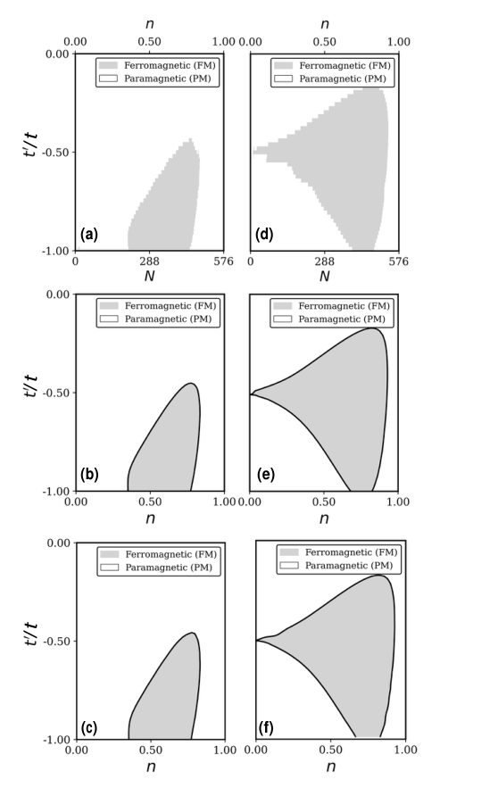
<figcaption class="paper-figure-caption"><b>Fig 1.</b> FIG. 1. Phase diagrams at U = 9t. The grey region de- notes the stability region of the fully polarized ferromagnetic state obtained within the T-matrix approximation (TMA). one-diagonal hopping lattice: (a) for L = 24, where the hor- izontal axis represents the electron number N and n is the filling factor. (b) for L = 100 and (c) for the thermodynamic limit. two-diagonal hopping lattice: (d) for L = 24, (e) for L = 100, and (f) for the thermodynamic limit.</figcaption>
</figure>
<figure class="paper-figure-card">
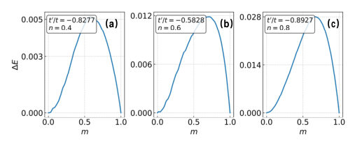
<figcaption class="paper-figure-caption"><b>Fig 2.</b> FIG. 2. Magnetization (n↑−n↓)/n as a function of energy difference ∆E at different points near the phase boundary for U = 9t, L = 100: (a) t′/t = −0.8277, n = 0.4; (b) t′/t = −0.5828, n = 0.6; (c) t′/t = −0.8927, n = 0.8.</figcaption>
</figure>
<figure class="paper-figure-card">
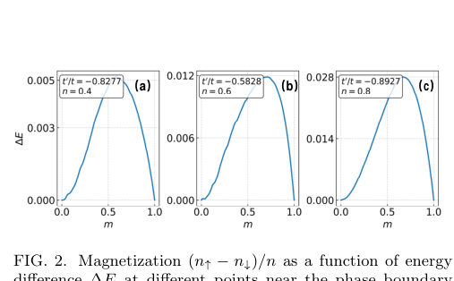
<figcaption class="paper-figure-caption"><b>Fig 3.</b> Figure 1 summarizes the phase diagrams obtained within the T-matrix approximation at U = 9t. Panels (a)–(c) correspond to the one-diagonal hopping model, while panels (d)–(f) show the corresponding results for the two-diagonal hopping model. In each case, we com- pare a small finite cluster, a large finite cluster, and the thermodynamic limit. The grey region denotes the sta- bility region of the fully polarized ferromagnetic state. For the one-diagonal hopping model, our results repro- duce the ferromagnetic regime observed experimentally at intermediate densities. Ferromagnetism appears for sufficiently large negative values of t′/t over a broad den- sity window extending roughly from n...</figcaption>
</figure>
<figure class="paper-figure-card">
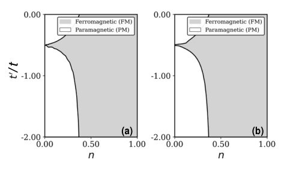
<figcaption class="paper-figure-caption"><b>Fig 4.</b> FIG. 4. Phase diagrams for the two-diagonal hopping model at infinite interaction strength (U →+∞): (a) large finite cluster with L = 48, and (b) in the thermodynamic limit.</figcaption>
</figure>
<figure class="paper-figure-card">
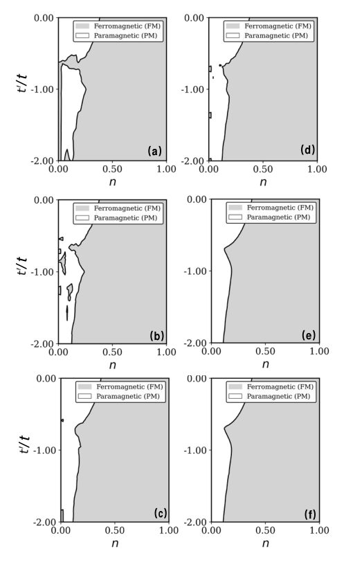
<figcaption class="paper-figure-caption"><b>Fig 5.</b> FIG. 3. Phase diagrams for the one-diagonal hopping model at infinite interaction strength (U →+∞) across different cluster sizes: (a) 6 × 20, (b) 10 × 20, and (c) 16 × 20 finite clusters; and square clusters of size (d) L = 20, (e) L = 48, and (f) L = 56.</figcaption>
</figure>

**Summary.** This work investigates the conditions required for low-density ferromagnetism in Fermi-Hubbard models realized with ultracold atoms. By comparing two lattice geometries, the authors demonstrate that while both exhibit band degeneracy, only the model with a stronger quasi-one-dimensional density of states singularity supports robust ferromagnetism in the thermodynamic limit. This proves that DOS structure, not just degeneracy, is the controlling factor.

**Why it may be interesting.** It provides a rigorous theoretical counterexample showing that simple geometric symmetries or degeneracies are insufficient predictors for complex many-body phenomena like ferromagnetism, emphasizing the role of spectral structure (DOS) in quantum matter.

Detailed structure

**Main problem.** To determine if band-minimum degeneracy alone is sufficient to stabilize low-density ferromagnetism in itinerant quantum many-body systems.

**Main result.** The stability of low-density ferromagnetism is controlled not by the mere degeneracy of band minima, but by the singular behavior (the strength) of the density of states at the band bottom.

**Method.** Theoretical analysis using the T-matrix approximation to calculate ground state energies and compare finite-size versus thermodynamic limit results for different lattice models.

**Model / system.** The study analyzes two geometries of the Fermi–Hubbard model realized in ultracold atoms within an optical lattice: one with one-diagonal hopping and another with two-diagonal hopping on a square lattice.

**Key observables.** Ferromagnetic phase stability, system size dependence (finite vs. thermodynamic limit), and the functional form of the density of states singularity at the band bottom.

**Important parameters / regimes.** Electron filling ($n$), interaction strength ($U/t$), hopping parameters ($t'/t$), and lattice dimensionality/hopping structure.

**Assumptions / limitations.** The T-matrix approximation is assumed to be highly accurate in the dilute electron density limit, where correlations are dominated by two-body collisions.

**Figures summary.** Figures compare phase diagrams across different cluster sizes and interaction strengths for both hopping models, showing that ferromagnetism persists only in the thermodynamic limit for the two-diagonal model due to its stronger DOS singularity.

**Paper structure.** The paper establishes the physical context (ultracold atoms/Müller–Hartmann mechanism), compares two lattice models exhibiting band degeneracy, and systematically uses finite-size scaling and DOS analysis to prove that the strength of the DOS singularity dictates magnetic stability.

Abstract

Recent ultracold-atom experiments have observed ferromagnetic correlations in a geometrically tunable Fermi--Hubbard lattice at intermediate densities. Motivated by subsequent theoretical work that connected the low-density limit of the same model to the Mueller--Hartmann mechanism for itinerant ferromagnetism, we investigate the stability of ferromagnetism across a broad density range using the T-matrix approximation, a controlled approach in the dilute limit. We reproduce the ferromagnetic regime observed experimentally at intermediate densities and systematically compare finite-size and thermodynamic-limit calculations in the dilute regime. We find that the low-density ferromagnetic phase reported for the one-diagonal hopping lattice is strongly suppressed with increasing system size and disappears in the thermodynamic limit, indicating that it originates from finite-size effects. By contrast, low-density ferromagnetism remains robust in the square-lattice Hubbard model with hopping along both diagonal directions. We show that this qualitative difference cannot be explained by the degeneracy of the band minima alone, which occurs in both models. Instead, it is controlled by the singular behavior of the density of states at the band bottom: a weak divergence is insufficient to stabilize ferromagnetism, whereas a much stronger quasi-one-dimensional singularity supports a fully polarized ground state even in the dilute limit. Our results demonstrate that band-minimum degeneracy alone is not sufficient for low-density ferromagnetism and that the nature of the band-bottom density-of-states singularity ultimately controls its stability.

[↑ back to top](#top)

### [Quantum Fisher Information and the Speed of Entanglement](http://arxiv.org/abs/2606.15484v1)

**Authors:** Zain H. Saleem  
**Type:** theory · **Category:** quantum information and computing · **PDF:** <https://arxiv.org/pdf/2606.15484v1>  
**Analysis basis:** full PDF text, analyzed in chunks
**Topic relevance:** 🔥 `entanglement & information structure` **4/5** · `non-equilibrium dynamics` **1/5**

↔ Scroll figures horizontally

<figure class="paper-figure-card">
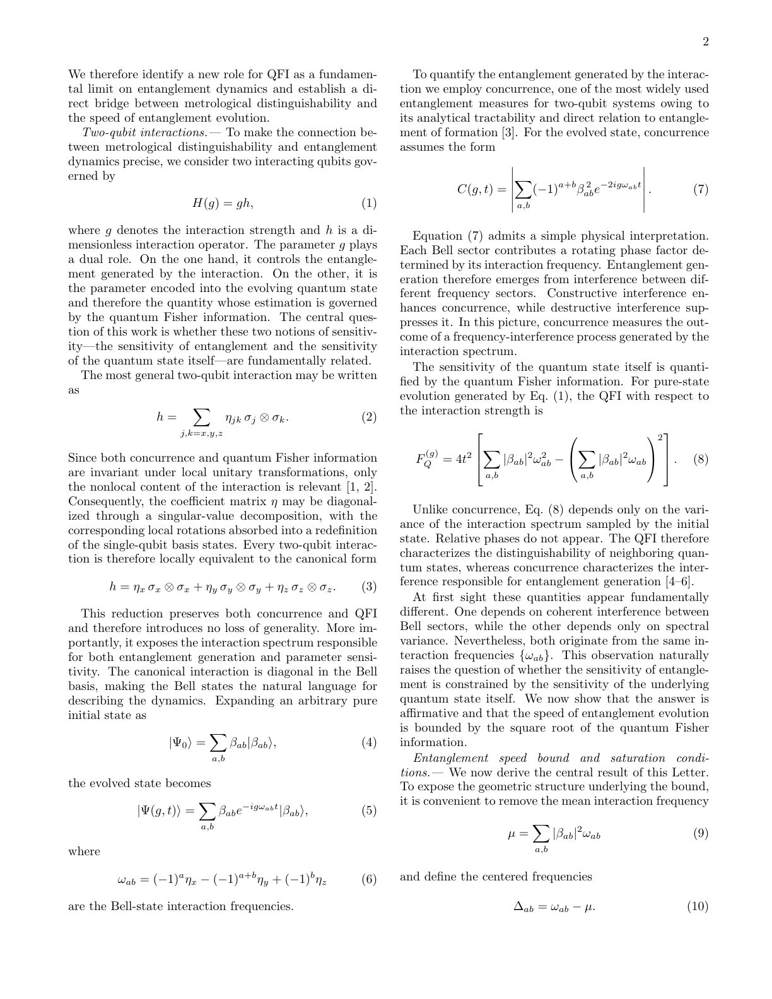
<figcaption class="paper-figure-caption"><b>Fig 1.</b> Low-resolution page preview, page 2</figcaption>
</figure>
<figure class="paper-figure-card">
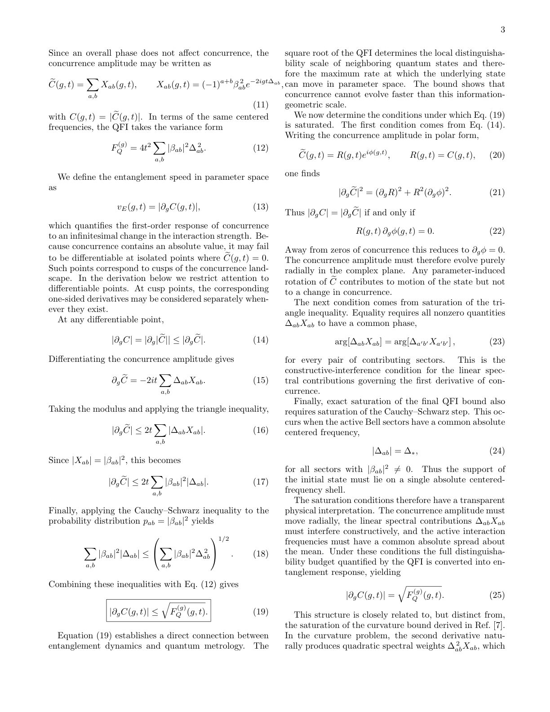
<figcaption class="paper-figure-caption"><b>Fig 2.</b> Low-resolution page preview, page 3</figcaption>
</figure>
<figure class="paper-figure-card">
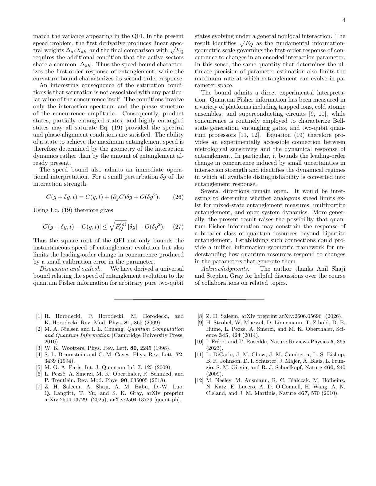
<figcaption class="paper-figure-caption"><b>Fig 3.</b> Low-resolution page preview, page 4</figcaption>
</figure>

**Summary.** This theoretical paper establishes a fundamental upper bound connecting the speed of entanglement generation to the Quantum Fisher Information (QFI). By analyzing two-qubit evolution, it proves that the rate at which entanglement changes cannot exceed a value determined by the QFI. This result unifies concepts from quantum metrology and entanglement dynamics.

**Why it may be interesting.** It provides a powerful, information-theoretic constraint on quantum dynamics, linking resource generation (entanglement) directly to parameter estimation precision (QFI), which is crucial for understanding optimal control in quantum systems.

Detailed structure

**Main problem.** The study investigates establishing a fundamental upper bound on the speed at which entanglement can be generated by varying an interaction parameter in a two-qubit system.

**Main result.** A direct inequality, $|\partial_g C| \leq \sqrt{	ext{QFI}}$, is derived, showing that the Quantum Fisher Information (QFI) limits the rate of change of concurrence with respect to the coupling parameter $g$.

**Method.** The analysis employs rigorous mathematical bounding techniques, including differentiation and applying inequalities like Cauchy–Schwarz, to relate the derivative of entanglement measures to information-theoretic quantities.

**Model / system.** The system consists of two interacting qubits governed by a general nonlocal Hamiltonian $H(g) = g h$. The dynamics are analyzed for pure states evolving under this interaction parameterization.

**Key observables.** Concurrence ($C$), Quantum Fisher Information ($	ext{QFI}$), and the entanglement speed, defined as $|\partial_g C|$.

**Important parameters / regimes.** The coupling parameter $g$, which controls the evolution; the QFI itself acts as a limiting scale.

**Assumptions / limitations.** The derivation is primarily restricted to pure two-qubit states undergoing smooth evolution where concurrence is differentiable.

**Paper structure.** The paper develops the bound by first defining the entanglement speed via the derivative of concurrence, then relating this derivative to the QFI using mathematical inequalities, and finally characterizing the conditions under which this upper bound is saturated.

Abstract

We investigate the speed at which entanglement can be generated by an interaction parameter encoded in a two-qubit Hamiltonian, quantified by the derivative of concurrence with respect to the coupling parameter. For arbitrary pure two-qubit states evolving under a general nonlocal interaction, we derive a bound relating this entanglement speed to the quantum Fisher information (QFI). Specifically, we show that $|\partial_g C| \le \sqrt{F_Q^{(g)}}$, where $F_Q^{(g)}$ is the QFI associated with estimation of the parameter. This establishes $\sqrt{F_Q}$ as a an upper bound on the speed of entanglement generation in parameter space. We further derive the saturation conditions and identify the states and dynamical regimes for which equality is attained. At saturation, concurrence evolves at the maximum rate permitted by the distinguishability of the underlying quantum state. These results reveal a direct connection between quantum metrology and entanglement generation, showing that the same information-theoretic quantity that governs parameter-estimation precision also limits the speed at which entanglement resources can be created.

[↑ back to top](#top)

### [Bi-qutrit entangled edge states of positive partial transposes with largest ranks](http://arxiv.org/abs/2606.16265v1)

**Authors:** Kyung Hoon Han, Seung-Hyeok Kye  
**Type:** theory · **Category:** quantum information and computing · **PDF:** <https://arxiv.org/pdf/2606.16265v1>  
**Analysis basis:** full PDF text, analyzed in chunks
**Topic relevance:** 🔥 `entanglement & information structure` **4/5**

↔ Scroll figures horizontally

<figure class="paper-figure-card">
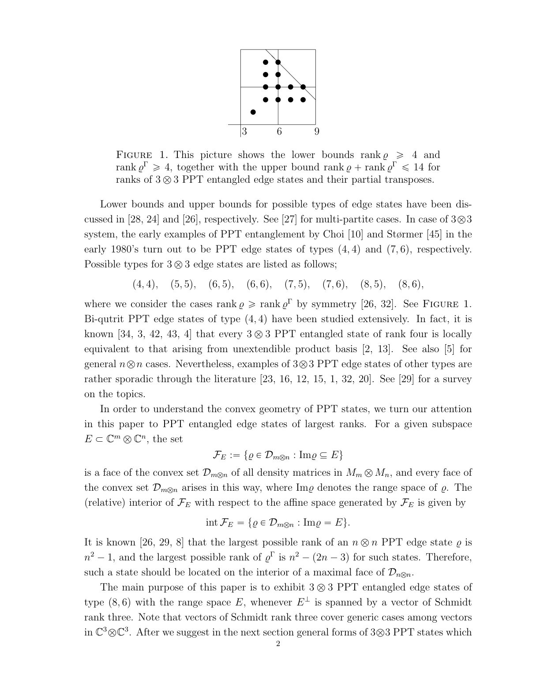
<figcaption class="paper-figure-caption"><b>Fig 1.</b> Low-resolution page preview, page 2</figcaption>
</figure>
<figure class="paper-figure-card">
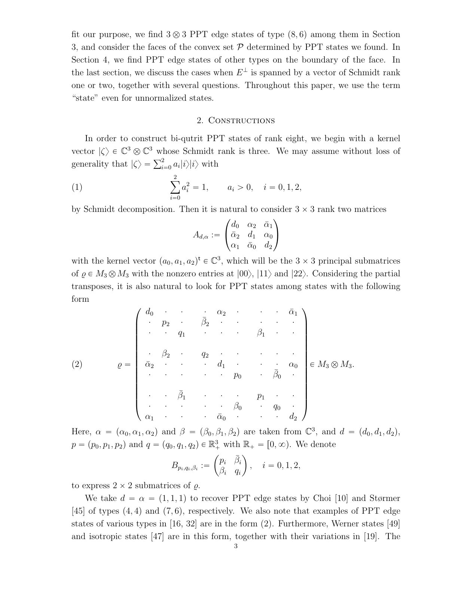
<figcaption class="paper-figure-caption"><b>Fig 2.</b> Low-resolution page preview, page 3</figcaption>
</figure>
<figure class="paper-figure-card">
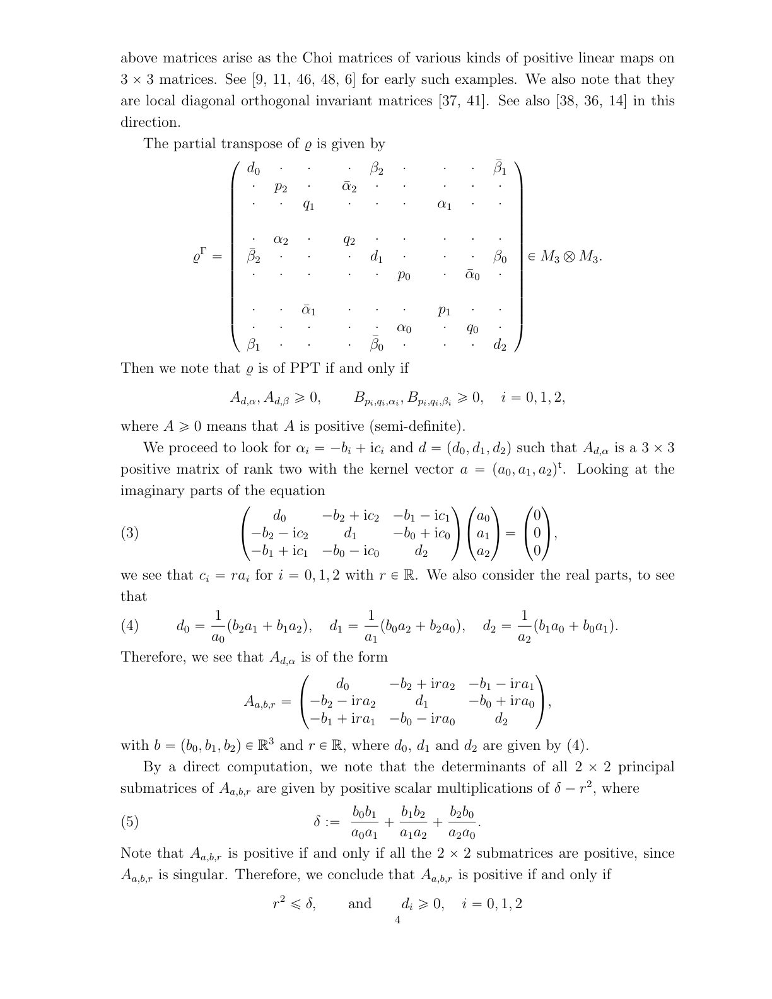
<figcaption class="paper-figure-caption"><b>Fig 3.</b> Low-resolution page preview, page 4</figcaption>
</figure>
<figure class="paper-figure-card">
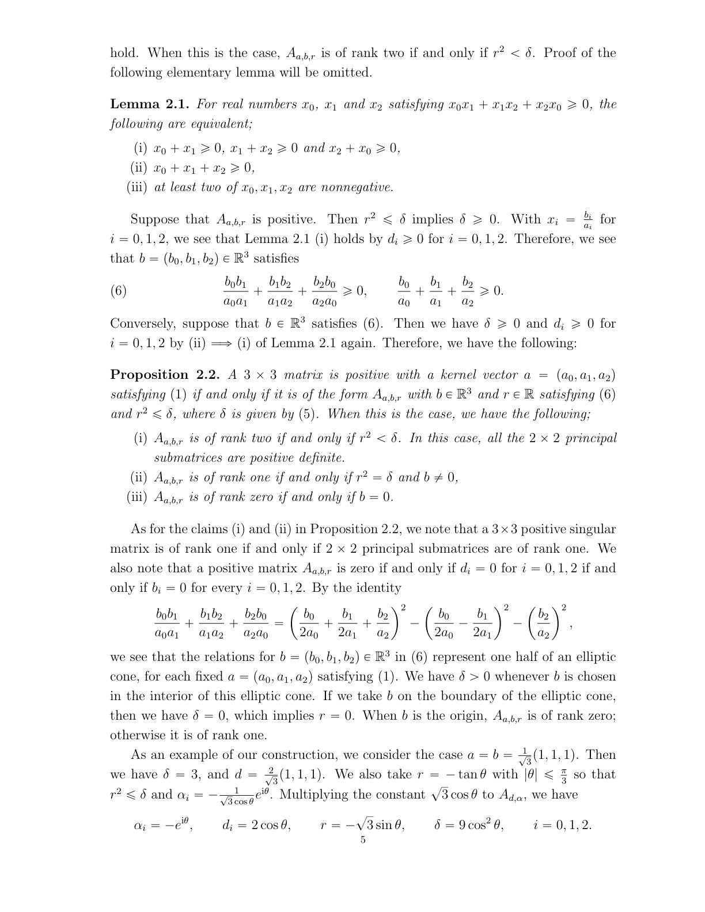
<figcaption class="paper-figure-caption"><b>Fig 4.</b> Low-resolution page preview, page 5</figcaption>
</figure>
<figure class="paper-figure-card">
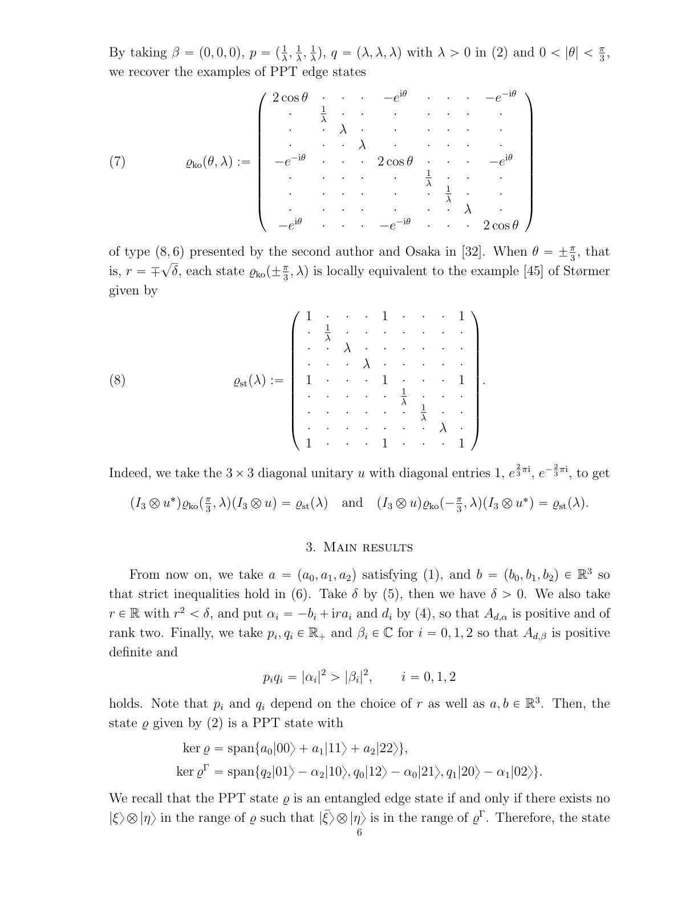
<figcaption class="paper-figure-caption"><b>Fig 5.</b> Low-resolution page preview, page 6</figcaption>
</figure>

**Summary.** The paper mathematically characterizes bi-qutrit entangled edge states that satisfy the Positive Partial Transpose (PPT) criterion. By analyzing the geometry of the set of all PPT states, the authors construct specific families of high-rank states and map out their existence on the boundaries of key faces within this state space.

**Why it may be interesting.** This work provides deep structural insights into entanglement detection in small quantum systems using necessary conditions like PPT, which is fundamental for understanding resource theories in quantum information.

Detailed structure

**Main problem.** The primary goal is characterizing the structure of the convex set $P$ of all Positive Partial Transpose (PPT) quantum states, specifically focusing on identifying PPT entangled edge states.

**Main result.** The authors exhibit a large family of bi-qutrit PPT entangled edge states of type $(8,6)$ and demonstrate how other types can be found on the boundaries of the faces defining this set.

**Method.** The analysis involves rigorous mathematical characterization using concepts like faces of convex sets, analyzing rank conditions for partial transposes, and solving systems of linear equations derived from positivity constraints.

**Model / system.** The study focuses on quantum states ($\varrho$) within the bi-qutrit system ($3 \otimes 3$). The mathematical framework involves defining these states relative to subspaces $E$ and analyzing their partial transposes $\varrho^\Gamma$.

**Key observables.** Ranks of the state ($	ext{rank}(\varrho)$) and its partial transpose ($	ext{rank}(\varrho^\Gamma)$); the classification type $(p_h, k_q)$.

**Important parameters / regimes.** The dimensions (bi-qutrit system), specific parameters defining the states ($a_i, b_i, r, \alpha_i$), and the Schmidt rank of associated kernel vectors.

**Assumptions / limitations.** The analysis often assumes the existence of a kernel vector $|\zeta
angle$ with a specified Schmidt rank (e.g., three) to cover generic cases in $\mathbb{C}^3 \otimes \mathbb{C}^3$.

**Figures summary.** Figure 1 illustrates lower and upper bounds on the ranks for $3\otimes 3$ PPT entangled edge states. Figure 2 uses geometric arguments involving intersecting circles/discs to prove the existence of suitable parameters.

**Paper structure.** The paper proceeds by defining the mathematical constraints (PPT condition, face structure) for the bi-qutrit system. It then constructs specific families of states achieving high ranks (e.g., type $(8,6)$) and explores related boundary cases by varying parameters within the defined faces.

Abstract

Whenever $E$ is an eight dimensional subspace of the bi-qutrit quantum system whose orthogonal complement is spanned by a vector of Schmidt rank three, we show that there exist PPT entangled edge states with the range space $E$ whose partial transposes are of rank six, which is the largest possible rank. In this way, we exhibit a huge family of bi-qutrit PPT entangled edge states of type $(8,6)$. They make faces of the convex set of all PPT states, and we find bi-qutrit PPT entangled edge states of other types on the boundaries of such faces.

[↑ back to top](#top)

### [Complete entanglement detection using polynomial invariants](http://arxiv.org/abs/2606.16712v1)

**Authors:** Thomas C. Fraser, Vjosa Blakaj, Roberto Rubboli, Felix Huber, Marco Fanizza  
**Type:** theory · **Category:** quantum information and computing · **PDF:** <https://arxiv.org/pdf/2606.16712v1>  
**Analysis basis:** full PDF text, analyzed in chunks
**Topic relevance:** 🔥 `entanglement & information structure` **4/5**

↔ Scroll figures horizontally

<figure class="paper-figure-card">
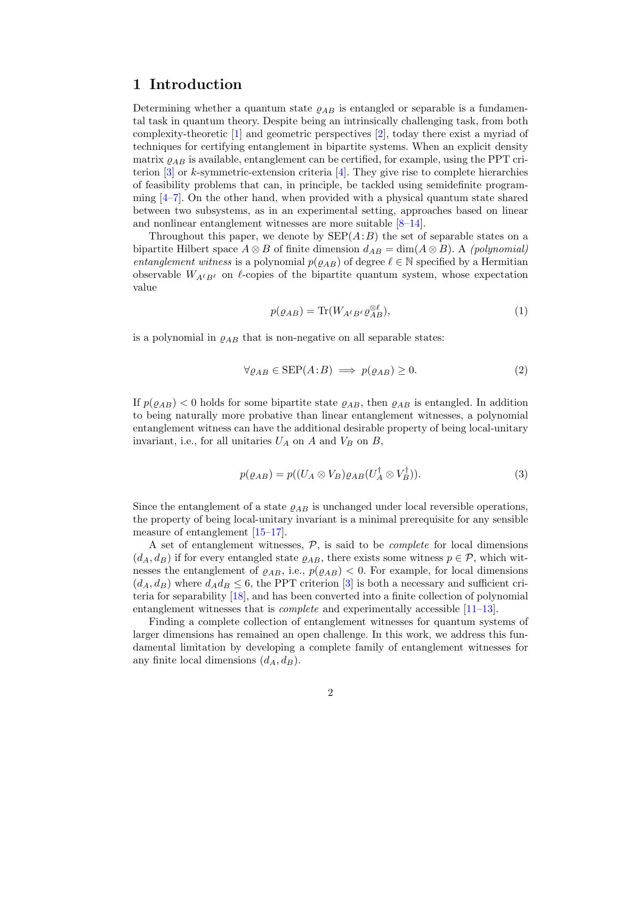
<figcaption class="paper-figure-caption"><b>Fig 1.</b> Low-resolution page preview, page 2</figcaption>
</figure>
<figure class="paper-figure-card">
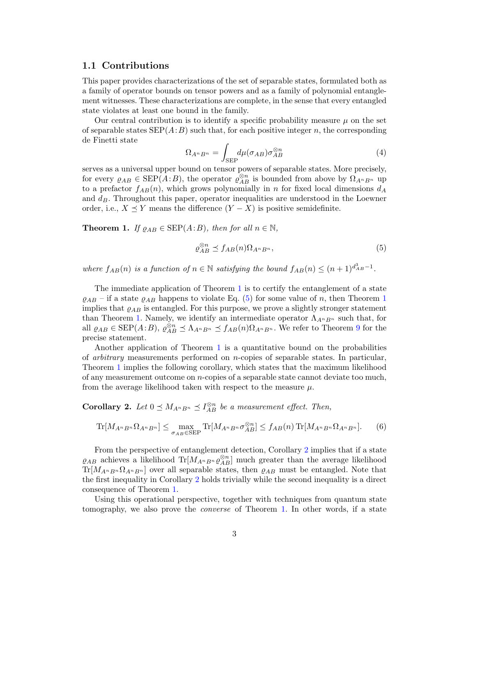
<figcaption class="paper-figure-caption"><b>Fig 2.</b> Low-resolution page preview, page 3</figcaption>
</figure>
<figure class="paper-figure-card">
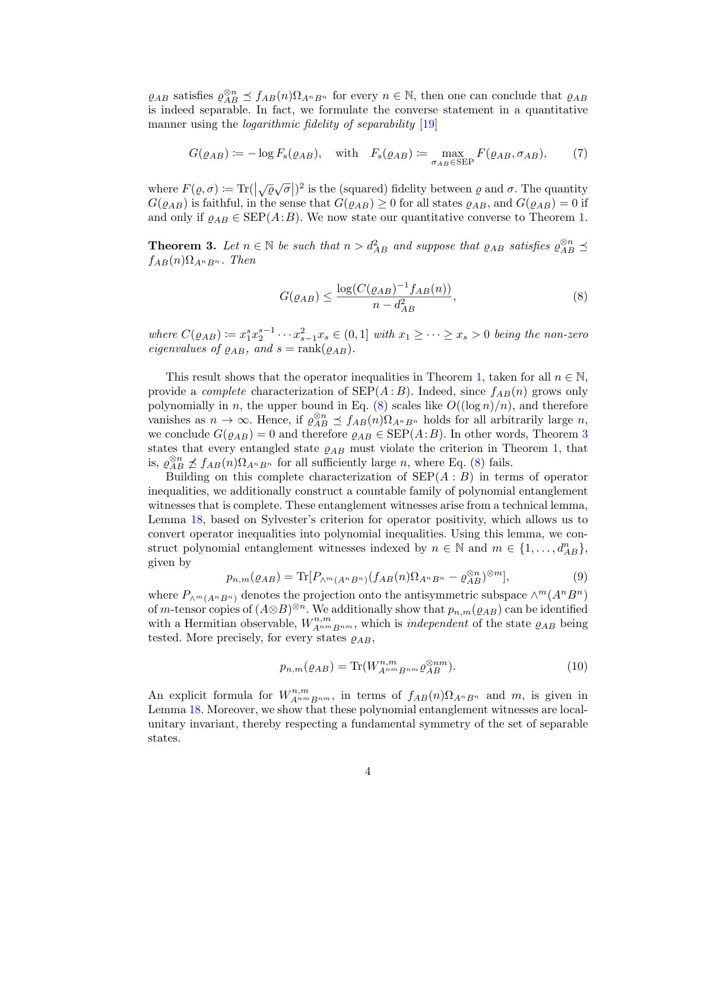
<figcaption class="paper-figure-caption"><b>Fig 3.</b> Low-resolution page preview, page 4</figcaption>
</figure>
<figure class="paper-figure-card">
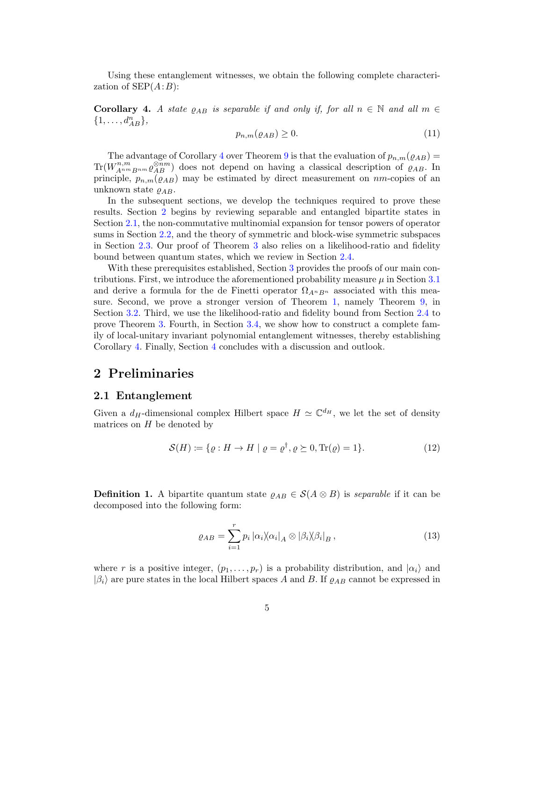
<figcaption class="paper-figure-caption"><b>Fig 4.</b> Low-resolution page preview, page 5</figcaption>
</figure>
<figure class="paper-figure-card">
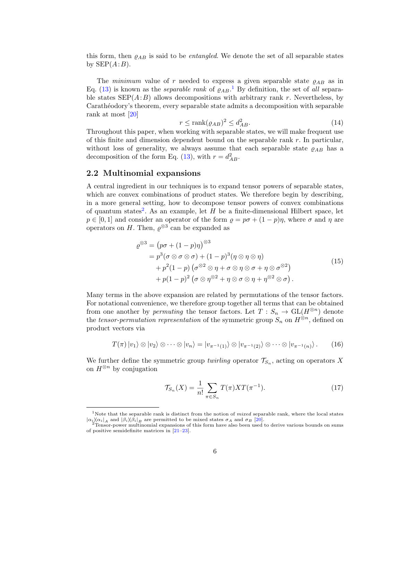
<figcaption class="paper-figure-caption"><b>Fig 5.</b> Low-resolution page preview, page 6</figcaption>
</figure>

**Summary.** The paper presents a unified framework to detect entanglement in bipartite quantum states by deriving universal bounds on tensor powers of separable states. It achieves this by constructing a complete family of local-unitary invariant polynomial entanglement witnesses, thereby overcoming the limitations of existing numerical or incomplete detection methods.

**Why it may be interesting.** This work provides fundamental theoretical tools for characterizing quantum correlations, moving beyond numerical optimization or incomplete measurements by establishing necessary and sufficient algebraic conditions for separability.

Detailed structure

**Main problem.** The core problem is developing a complete method to determine if a bipartite quantum state $\varrho_{AB}$ is separable or entangled.

**Main result.** The authors establish that separability can be characterized by the non-negativity of an infinite, but countable, family of polynomial entanglement witnesses derived from operator inequalities involving tensor powers of the state.

**Method.** The methodology involves deriving universal bounds on tensor powers of separable states ($\varrho^{\otimes n}_{AB}$) using de Finetti measures and then translating these operator inequalities into explicit, basis-independent polynomial invariants (entanglement witnesses).

**Model / system.** The analysis focuses on bipartite quantum states $\varrho_{AB}$ acting on a finite dimensional Hilbert space $A \otimes B$. The theory utilizes concepts from invariant theory, semialgebraic geometry, and the structure of symmetric subspaces.

**Key observables.** Entanglement witnesses ($p_{n,m}(\rho_{AB})$), logarithmic fidelity of separability ($G(\varrho_{AB})$), and operator inequalities ($\omega \preceq \Lambda$).

**Important parameters / regimes.** The local dimensions $(d_A, d_B)$ of the subsystems; the tensor power $n$; and the degree $m$ of the polynomial witnesses.

**Assumptions / limitations.** For finite dimensions, the set of separable states is semialgebraic, implying a theoretical finite basis for the complete witness set, although this is computationally prohibitive to find.

**Figures summary.** Not specified in the notes; the structure relies on mathematical theorems and corollaries establishing equivalences between bounds, fidelity decay, and polynomial non-negativity.

**Paper structure.** The paper builds logically: first by deriving operator bounds on tensor powers (Theorem 1), then proving these bounds characterize separability via fidelity decay (Theorem 3), and finally translating this characterization into a complete set of local-unitary invariant polynomial entanglement witnesses (Corollary 4/12).

Abstract

Existing methods for deciding whether a bipartite quantum state is separable or entangled typically fall into one of two categories: they are either complete but require access to an explicit density matrix followed by numerical optimization, or they can be evaluated directly by measuring the quantum system but are incomplete, in the sense that they cannot detect all forms of entanglement. In this work, we overcome both limitations in a unified framework. First, we bypass numerical optimization by deriving separability criteria in the form of universal bounds on tensor powers of separable states. We prove that these bounds are complete: every entangled state violates them for sufficiently large tensor powers. Second, we explicitly construct a corresponding complete family of nonlinear entanglement witnesses, which can detect all forms of entanglement without requiring an explicit density matrix. The witnesses we construct are moreover basis-independent, in the sense that they are invariant under conjugation by local unitaries. Altogether, our results expand the toolbox for entanglement detection in arbitrary local dimensions in a manifestly invariant way.

[↑ back to top](#top)

### [Generative modelling powered by room-temperature polariton condensates](http://arxiv.org/abs/2606.15344v1)

**Authors:** Yuan Wang, Marcin Muszynski, Avinash Dash, Rishabh Kaurav, Vinod M. Menon, Oleksandr Kyriienko  
**Type:** both · **Category:** disordered systems and neural networks · **PDF:** <https://arxiv.org/pdf/2606.15344v1>  
**Analysis basis:** full PDF text, analyzed in chunks
**Topic relevance:** `correlated cavity matter` **3/5** · `driven-dissipative phase transition` **3/5** · `methods for driven-dissipative` **3/5** · `quantum optics experiment` **3/5** · `analog quantum simulation` **2/5** · `correlated / nonlocal dissipation` **2/5** · `non-equilibrium dynamics` **2/5** · `QC/QI experiment` **1/5** · `Tavis-Cummings & cavity-many-emitter` **1/5** · `interference shaping light` **1/5** · `non-equilibrium universality` **1/5**

↔ Scroll figures horizontally

<figure class="paper-figure-card">
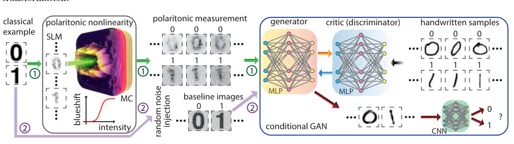
<figcaption class="paper-figure-caption"><b>Fig 1.</b> FIG. 1. Workflow for polaritonic conditional generative adversarial network (GAN) for digit-to-image trans- lation. The system operates in two training modes. In the condensate mode ( 1 ○, green arrows) classical digit examples (‘0’ or ‘1’) are encoded using a spatial light modulator (SLM) and injected into a polariton condensate system. The resulting photoluminescence (PL) produces transformed digit images through nonlinear condensate dynamics. In the baseline mode ( 2 ○, purple arrows), random noise is used without any physical processing. Both modes together with their corresponding labels (shown on the top of each image) feed into the conditional GAN framework, where a multilayer...</figcaption>
</figure>
<figure class="paper-figure-card">

<figcaption class="paper-figure-caption"><b>Fig 2.</b> FIG. 2. Experimental realization of polaritonic generative modeling. (a) Scheme of the experimental setup for nonlinear image transformation. SLM, spatial light modulator; MO, microscope objective; BS, beam splitter; LP, longpass filter; CCD, charge-coupled device camera. (b–e) Normalized momentum-resolved photoluminescence spectra collected (b,d) below and (c,e) above the condensation threshold for excitation with a ‘0’ (b,c) and a ‘1’ (d,e) laser intensity profile. (f,i) Integrated photoluminescence intensity, (g,j) full width at half maximum, and (h,k) emission blueshift as a function of excitation pulse energy for the ‘0’ (f–h) and ‘1’ (i–k) excitation profiles. Gray shaded regions...</figcaption>
</figure>
<figure class="paper-figure-card">
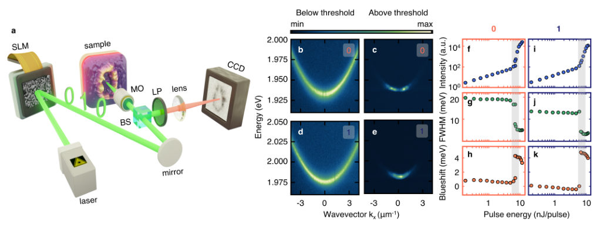
<figcaption class="paper-figure-caption"><b>Fig 3.</b> Fig. 3 presents the training dynamics and performance comparison between the two modes. Figs. 3 (a) and (d) show the evolution of generator and critic losses over 100 training epochs for the condensate and baseline modes, respectively. In adversarial training, these losses do not converge to zero but rather reach a dynamic equilibrium [65]: when the generator produces realistic samples that successfully fool the critic, the generator loss decreases while the critic loss increases as it struggles to distinguish real data from generated data. However, loss values alone do not reveal the full picture of model performance. A fundamental challenge in generative modeling is mode collapse [65,...</figcaption>
</figure>
<figure class="paper-figure-card">

<figcaption class="paper-figure-caption"><b>Fig 4.</b> FIG. 3. Training dynamics and performance of condensate and baseline conditional GAN modes. (a, d) Generator and critic loss evolution over 100 training epochs for (a) condensate mode using PL images generated through nonlinear condensate dynamics and (d) baseline mode using standard Helvetica digits with computational random perturbations. Red arrows indicate best epochs selected for the model of the generator (epoch 91 and 83, respectively). (b, e) Digit preservation accuracy (DPA) versus inception score (IS) across all training epochs for (b) condensate mode and (e) baseline mode. Each marker represents model at one epoch shown with different color, with error bars showing IS standard...</figcaption>
</figure>
<figure class="paper-figure-card">
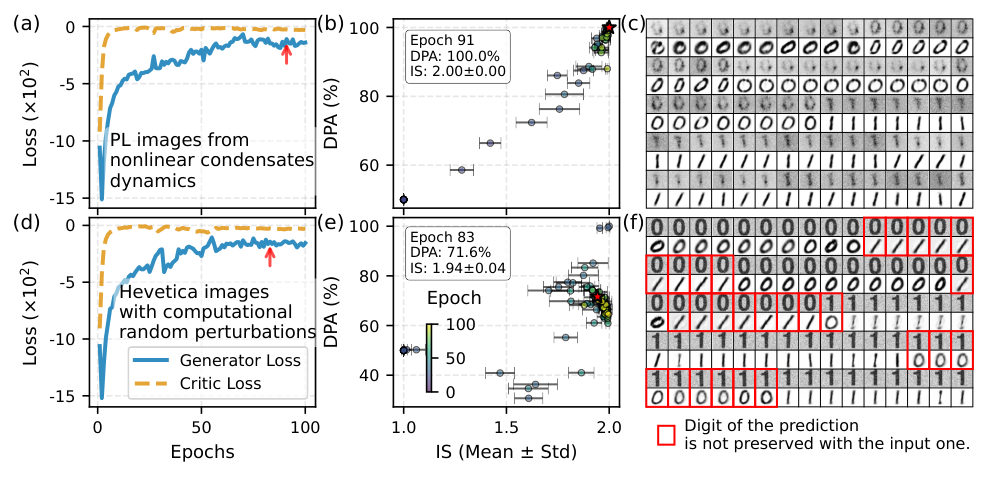
<figcaption class="paper-figure-caption"><b>Fig 5.</b> Figure 3 presents training dynamics and performance comparison for one representative seed. Fig. 3(a, d) display the evolution of generator and critic losses over training. Both modes exhibit the characteristic adversarial equilibrium where losses fluctuate rather than converge to zero [65]. To assess model quality, we evaluate each epoch using DPA and IS. Fig. 3(b, e) show these metrics across all training epochs. The condensate model [Fig. 3(b)] demonstrates a clear progression toward the optimal upper-right region (high DPA, high IS), achieving perfect digit preservation (DPA = 100.0%) with maximum IS = 2.00 at epoch 91. Conversely, the baseline model [Fig. 3 (e)] struggles to...</figcaption>
</figure>

**Summary.** The paper demonstrates that nonlinear optical systems, specifically room-temperature exciton-polariton condensates, can function as physical stochastic layers within Generative Adversarial Networks. By using the inherent dynamics of these condensates for data sampling in digit-to-image translation, they achieve superior performance compared to purely digital noise injection methods. This establishes polariton condensation as a novel computational resource for physics-enhanced machine learning.

**Why it may be interesting.** This work directly bridges condensed matter/quantum optics (polaritons) with machine learning (GANs), proposing a concrete pathway for realizing physics-based hardware accelerators for AI tasks, which is highly relevant to open quantum systems research.

Detailed structure

**Main problem.** The core challenge is developing generative models that require efficient stochastic nonlinear transformations, necessitating the use of physical platforms to overcome computational limitations.

**Main result.** Polariton condensation was successfully demonstrated as a viable room-temperature photonic resource for conditional generative modeling, outperforming purely digital or laser-based sampling methods in terms of image quality and diversity.

**Method.** A workflow integrating a Generative Adversarial Network (GAN) with the nonlinear dynamics of exciton-polariton condensates is employed to perform conditional digit-to-image translation.

**Model / system.** The physical system utilizes room-temperature exciton-polariton condensates formed in organic dye microcavities, which provide a naturally stochastic and nonlinear transformation layer for the GAN's latent space.

**Key observables.** Inception Score (IS), Digit Preservation Accuracy (DPA), Structural Similarity Index (SSIM), and Pixel Variance are used to quantify generation quality, diversity, and semantic correctness.

**Important parameters / regimes.** Strong light-matter coupling regime; operating temperature near room temperature; the nonlinear many-body dynamics of polaritons.

**Assumptions / limitations.** The intrinsic stochasticity and spatially correlated nature of the polariton condensate's nonlinear response can be harnessed as a structured computational resource for generative modeling.

**Figures summary.** Figures compare performance metrics (IS, DPA) across condensate-enabled GANs versus digital baseline methods, showing superior results for the former. Other figures illustrate PL spectra and the workflow setup.

**Paper structure.** The paper establishes the need for physical stochastic transformations in generative modeling; it details the experimental realization using polariton condensates as a physical layer within a conditional GAN framework; finally, it presents quantitative comparisons proving the superiority of this physics-enhanced approach over digital baselines.

Abstract

Generative modelling requires efficient stochastic nonlinear transformations and physical platforms that can naturally realise them. We experimentally demonstrate that nonlinear optical systems operating in the strong light-matter coupling regime can serve as physical transformation layers for conditional generative modelling. Specifically, we develop a workflow in which room-temperature exciton-polariton condensates formed in organic dye microcavities act as a physical stochastic transform within a generative adversarial network and enable conditional digit-to-image translation. By using the nonlinear many-body dynamics and intrinsic stochasticity of polariton condensates, the workflow outperforms baseline approaches based on digitally injected perturbations. We find that polariton-enabled sampling via generative adversarial network (Polariton GAN) yields improved inception score, digit preservation accuracy and structural similarity compared with both digital sampling and laser-based systems. We further show that spatially correlated output variations can naturally regularise adversarial training and enhance output diversity. Our results establish polariton condensation as a new computational resource for generative modelling, opening a pathway towards physics-enhanced machine learning systems.

[↑ back to top](#top)

### [A Gauge-Covariant Geometric Framework for Non-Hermitian Quantum Systems](http://arxiv.org/abs/2606.15922v1)

**Authors:** Gargi Das, Sudhanshu Shekhar, Bhabani Prasad Mandal  
**Type:** theory · **Category:** other · **PDF:** <https://arxiv.org/pdf/2606.15922v1>  
**Analysis basis:** full PDF text, analyzed in chunks
**Topic relevance:** `Keldysh / 2PI / non-Gaussian methods` **3/5** · `correlated / nonlocal dissipation` **3/5** · `driven-dissipative phase transition` **3/5** · `methods for driven-dissipative` **3/5** · `Kondo & dissipative impurity` **2/5** · `analog quantum simulation` **2/5** · `non-equilibrium dynamics` **2/5** · `correlated cavity matter` **1/5** · `entanglement & information structure` **1/5** · `non-equilibrium universality` **1/5**

↔ Scroll figures horizontally

<figure class="paper-figure-card">
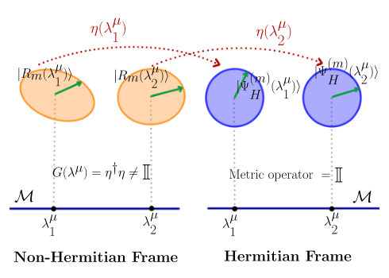
<figcaption class="paper-figure-caption"><b>Fig 1.</b> FIG. 1: Schematic illustration of the Dyson map connecting the non-Hermitian (deformed) and Hermitian (undeformed) Hilbert space bundles over parameter space M. At each point λµ, the right eigenstates |Rm(λµ)⟩span a fiber with a non-trivial metric operator G(λµ) = η†η ̸= I (left), while the mapped states |Ψ(m) H (λµ)⟩= η(λµ)|Rm(λµ)⟩form an orthonormal basis with a trivial metric operator I (right). The Dyson map η(λµ) provides a fiber-wise transformation that flattens the Hilbert space geometry while preserving the spectrum.</figcaption>
</figure>
<figure class="paper-figure-card">
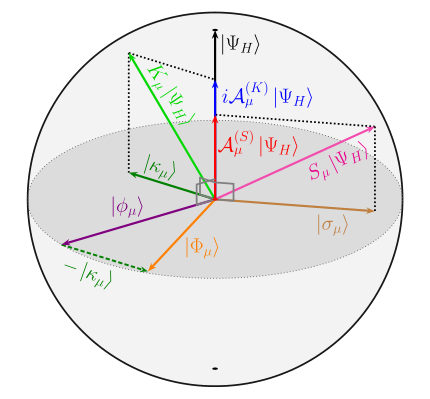
<figcaption class="paper-figure-caption"><b>Fig 2.</b> FIG. 2: Schematic illustration of the geometric decomposition of the Dyson connection (stretching component (Sµ) and rotation component (Kµ)) acting on a quantum state |ΨH⟩in Hilbert space. Sµ induces a norm-changing parallel component A(S) µ |ΨH⟩and an orthogonal deformation |σµ⟩, while Kµ generates a phase rotation and an orthogonal mixing |κµ⟩. The projected and dressed derivatives, |ϕµ⟩and |Φµ⟩, are also shown.</figcaption>
</figure>
<figure class="paper-figure-card">
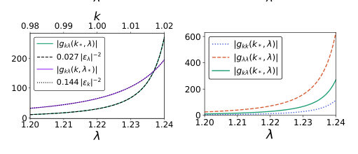
<figcaption class="paper-figure-caption"><b>Fig 3.</b> FIG. 3: Scaling behaviour and divergence hierarchy of geometric quantities in the SSH model (t0 = 1, t1 = 0.5) as the system approaches the EP at (k∗, λ∗) =  π</figcaption>
</figure>
<figure class="paper-figure-card">
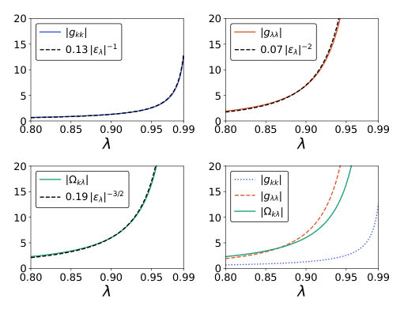
<figcaption class="paper-figure-caption"><b>Fig 4.</b> FIG. 4: Scaling behaviour and divergence hierarchy of geometric quantities in the HN model (R0 = 1) as the system approaches the EP at λ →1. The top-left, top-right, and bottom-left panels display the absolute values of the QMT components |gkk| and |gλλ|, and the non-Hermitian Berry curvature |Ωkλ|, respectively, as functions of the parameter λ. Solid coloured lines represent the exact analytical expressions. The black dashed lines correspond to the leading-order asymptotic fits with respect to ελ = λ −1. The numerical fits perfectly confirm the analytically predicted critical exponents: |gkk| ∼|ελ|−1, |gλλ| ∼|ελ|−2, and |Ωkλ| ∼|ελ|−3/2. The bottom-right panel superimposes all three...</figcaption>
</figure>

**Summary.** The paper establishes a gauge-covariant geometric framework for non-Hermitian quantum mechanics by using the Dyson map to relate the system to an equivalent Hermitian description. It defines key observables like the QMT and Berry curvature, showing that their structure reveals distinct scaling behaviors near exceptional points. This provides deep insight into how metric deformations drive novel topological features in open quantum systems.

**Why it may be interesting.** This work provides powerful, rigorous mathematical tools to analyze non-Hermitian physics, which is crucial for understanding open quantum systems where gain/loss or dissipation are present (e.g., photonics, active matter).

Detailed structure

**Main problem.** To develop a comprehensive, gauge-covariant geometric framework for analyzing non-Hermitian quantum systems.

**Main result.** The geometry is characterized by the Quantum Metric Tensor (QMT) and Berry curvature, whose divergences near Exceptional Points follow distinct scaling laws ($\sim|\epsilon_\mu|^{-2}$ vs $\sim|\epsilon_\mu|^{-3/2}$).

**Method.** The framework elevates the Dyson map to construct a connection, which is decomposed into stretching and rotation components to separate physical metric deformations from gauge redundancies.

**Model / system.** The analysis applies to general non-Hermitian Hamiltonians in the quasi-Hermitian regime, with specific validation on models like the Su--Schrieffer--Heeger (SSH) and Hatano--Nelson (HN) chains.

**Key observables.** Quantum Metric Tensor (QMT), Non-Hermitian Berry Curvature ($\Omega_{\mu
u}$), Dyson Connection components ($S_\mu, K_\mu$), and the complex non-Hermitian Berry phase.

**Important parameters / regimes.** Parameters $\lambda_\mu$ defining the system; parameter displacement $\epsilon_\mu$ from an Exceptional Point (EP).

**Assumptions / limitations.** The analysis focuses on the quasi-Hermitian regime where a positive-definite metric operator exists, and it systematically handles gauge freedom via covariant state constructions.

**Figures summary.** Figures schematically illustrate the geometric decomposition of the Dyson connection into stretching ($S_\mu$) and rotation ($K_\mu$) components acting on the dressed derivative state $|\Psi_H
angle$.

**Paper structure.** The paper systematically builds the framework by first introducing the Dyson map, decomposing its associated connection ($\Gamma_\mu$), defining gauge-invariant covariant states (like $|\Phi_\mu
angle$ and $|\sigma_\mu
angle$), constructing the QGT ($Q_{\mu
u}$), and finally analyzing the singular behavior of geometric quantities near EPs.

Abstract

We develop a comprehensive, gauge-covariant geometric framework for non-Hermitian quantum systems in the quasi-Hermitian regime, that is, the region of parameter space where the non-Hermitian Hamiltonian admits a real spectrum and a positive-definite metric operator. We build this framework by elevating the Dyson map to a central geometric object. This map is the transformation that converts a non-Hermitian Hamiltonian into an equivalent Hermitian one. From it we construct the Dyson connection and decompose it into Hermitian and anti-Hermitian parts, identified respectively as {\it stretching } and {\it rotation } components. This decomposition cleanly separates the genuine physical metric deformations from the unitary gauge redundancies. Working with manifestly gauge-covariant states, we then derive the complex non-Hermitian Berry phase and the quantum geometric tensor (QGT), and show that the non-Hermitian geometric curvature originates from the non-commutativity of the stretching components at the operator level. We further analyse the geometric singularities near an exceptional point (EP) and uncover a distinct hierarchy of divergences. For a general two-level non-Hermitian model, the quantum metric tensor (QMT) exhibits a leading-order divergence $\sim |ε_μ|^{-2}$, while the Berry curvature shows a weaker, subleading divergence $\sim |ε_μ|^{-3/2}$, with $ε_μ$ denoting the parameter displacement from the EP along an individual parameter axis $μ$. Finally, we examine physical realizations of this model, including the non-Hermitian Su--Schrieffer--Heeger (SSH) and Hatano--Nelson (HN) models, where exact analytical results confirm the predicted critical scaling laws and illustrate the metric-deformation-driven non-Hermitian geometries.

[↑ back to top](#top)

### [Grid-state deformation in a no-jump non-Hermitian bosonic dimer](http://arxiv.org/abs/2606.17036v1)

**Authors:** B. M. Rodriguez-Lara, H. Ghaemi-Dizicheh, S. Dehdashti, A. Hanke, A. Touhami, J. Nötzel  
**Type:** theory · **Category:** quantum information and computing · **PDF:** <https://arxiv.org/pdf/2606.17036v1>  
**Analysis basis:** full PDF text, analyzed in chunks
**Topic relevance:** `driven-dissipative phase transition` **3/5** · `methods for driven-dissipative` **3/5** · `non-equilibrium dynamics` **3/5** · `Keldysh / 2PI / non-Gaussian methods` **2/5** · `correlated / nonlocal dissipation` **2/5** · `entanglement & information structure` **2/5** · `non-equilibrium universality` **2/5** · `Kondo & dissipative impurity` **1/5** · `analog quantum simulation` **1/5** · `measurement-induced transitions` **1/5** · `quantum measurements` **1/5**

↔ Scroll figures horizontally

<figure class="paper-figure-card">

<figcaption class="paper-figure-caption"><b>Fig 1.</b> FIG. 1. Projection of the reference lattices onto the (q1, q2) plane for (a) two-mode qunaught</figcaption>
</figure>
<figure class="paper-figure-card">
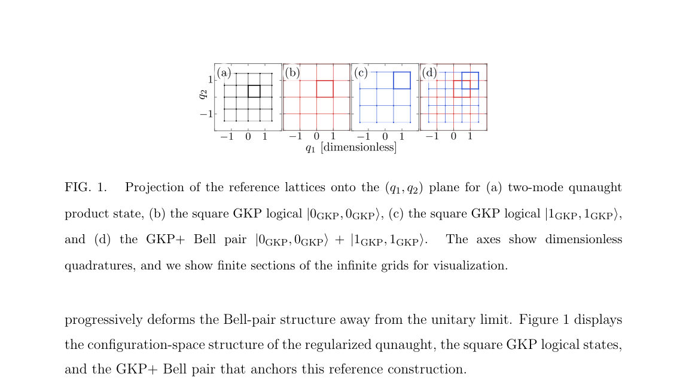
<figcaption class="paper-figure-caption"><b>Fig 2.</b> Figure 2 shows the projection of the primitive lattice onto the (q1, q2) plane. Figures 2(a)–</figcaption>
</figure>
<figure class="paper-figure-card">
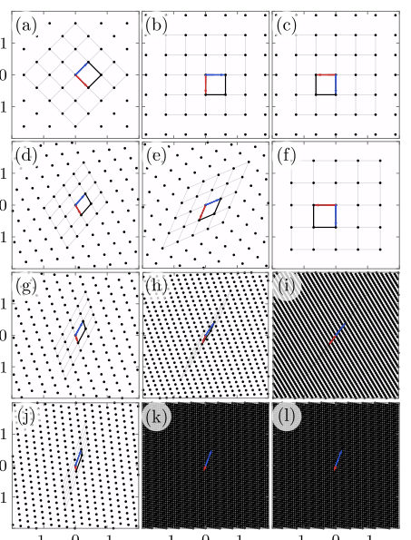
<figcaption class="paper-figure-caption"><b>Fig 3.</b> FIG. 2. Projection of the primitive lattice onto the (q1, q2) plane under the conditioned bosonic</figcaption>
</figure>
<figure class="paper-figure-card">
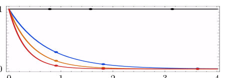
<figcaption class="paper-figure-caption"><b>Fig 4.</b> FIG. 3. Common-mode amplitude attenuation factor e−γ+t/2 for the same parameter choices</figcaption>
</figure>
<figure class="paper-figure-card">

<figcaption class="paper-figure-caption"><b>Fig 5.</b> Fig. 2. The full no-jump probability depends on the excitation-number distribution of the evolved</figcaption>
</figure>

**Summary.** The paper analyzes the evolution of bosonic grid states within a lossy dimer model using non-Hermitian quantum mechanics. It shows that dissipation causes a complex symplectic flow, geometrically deforming the encoded lattice structure away from its ideal unitary form. This provides crucial insights into how environmental coupling affects fault-tolerant quantum memory.

**Why it may be interesting.** This work directly connects open quantum system dynamics (dissipation/loss) with fundamental concepts in continuous-variable quantum information encoding (GKP states), providing a detailed geometric understanding of how noise deforms logical qubits.

Detailed structure

**Main problem.** The study investigates how ideal grid states evolve under non-Hermitian dynamics induced by loss in a bosonic dimer, focusing on the resulting lattice deformation.

**Main result.** The no-jump evolution induces a complex symplectic flow that deforms the GKP state's lattice structure, exhibiting distinct regimes (elliptic, parabolic, hyperbolic) depending on decay rates.

**Method.** The analysis uses an effective non-Hermitian Hamiltonian derived from a Lindblad master equation to track the time evolution of phase-space quadratures and the associated complex width matrix.

**Model / system.** The system is a bosonic dimer modeled by a Hamiltonian coupled with differential zero-temperature single-excitation loss rates, leading to an effective non-Hermitian dynamics. The analysis tracks the deformation of grid states (like GKP states) in phase space.

**Key observables.** Primitive lattice vectors ($\mathbf{u}_1(t), \mathbf{u}_2(t)$), complex width matrix $\Gamma_\sigma(t)$, and the no-jump probability $P_0(t)$.

**Important parameters / regimes.** Differential decay rates ($\gamma_+, \gamma_-$), coherent hopping strength ($g$), and detuning ($\Delta$). The regimes are defined by parameter comparisons (e.g., $\gamma_{2-} < 4g^2$ for elliptic).

**Assumptions / limitations.** The analysis focuses on the no-jump branch of the evolution, treating the system as a bosonic dimer with differential decay and using Gaussian regularization for the origin seed.

**Figures summary.** Figures illustrate the configuration-space structure of GKP states in different regimes (lossless vs. lossy), project the lattice onto $(q_1, q_2)$ planes showing geometric deformation, and plot the common-mode amplitude attenuation factor.

**Paper structure.** The paper first derives the effective non-Hermitian dynamics from the Lindblad equation. It then analyzes the evolution of the grid state by separating it into a lattice deformation sector (governed by complex symplectic flow) and an origin seed sector (analyzed via the width matrix). Finally, it compares the results to the lossless limit.

Abstract

We study the no-jump evolution of ideal grid states in a lossy bosonic dimer with differential decay. The effective non-Hermitian quadratic dynamics induces a complex symplectic flow in phase space that deforms both the primitive lattice vectors and the origin seed. The average decay rate controls common attenuation, while coherent hopping and differential decay control the reduced dimer deformation. The reduced sector contains elliptic, parabolic, and hyperbolic regimes with imaginary spectra, an exceptional point, and real spectra, producing oscillatory, linear, and exponential lattice deformations. Although projected lattice areas can change, the deformation comes from a determinant-one complex symplectic flow on the full four-dimensional phase space. For a Gaussian regularization of the origin seed, we derive the associated complex width matrix and identify the positivity conditions that preserve Gaussian form. For an initial two-mode qunaught product state, the lossless limit recovers the standard beam-splitter generation of a square GKP$+$ Bell pair, while the no-jump dynamics produces its non-Hermitian deformation with a postselection cost set by the no-jump probability.

[↑ back to top](#top)

### [Optimizing Wigner Negativity in Scattering Processes Using Energetic Cost Functions](http://arxiv.org/abs/2606.15101v1)

**Authors:** Kian Hwee Lim, Kiarn T. Laverick, Sahil Sardar Jafar, Samyak P. Prasad, Maria Maffei, Alexia Auffèves  
**Type:** theory · **Category:** other · **PDF:** <https://arxiv.org/pdf/2606.15101v1>  
**Analysis basis:** full PDF text, analyzed in chunks
**Topic relevance:** `Keldysh / 2PI / non-Gaussian methods` **3/5** · `driven-dissipative phase transition` **3/5** · `methods for driven-dissipative` **3/5** · `analog quantum simulation` **2/5** · `correlated / nonlocal dissipation` **2/5** · `entanglement & information structure` **2/5** · `non-equilibrium dynamics` **2/5** · `Tavis-Cummings & cavity-many-emitter` **1/5** · `correlated cavity matter` **1/5** · `interference shaping light` **1/5** · `non-equilibrium universality` **1/5**

↔ Scroll figures horizontally

<figure class="paper-figure-card">
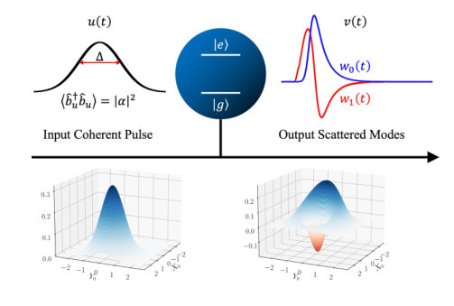
<figcaption class="paper-figure-caption"><b>Fig 1.</b> FIG. 1. An input Gaussian (of width ∆) coherent pulse with ⟨ˆb† ubu⟩= |α2| photons scattering off the TLA with decay rate γ, producing multi-modal output light. A carefully designed output filter function v(t) can select one of these output scat- tering modes (see main text) which captures a large amount of the WN that is produced in this scattering process from a state with no negativity, shown by the Wigner functions underneath the input and output, respectively.</figcaption>
</figure>
<figure class="paper-figure-card">
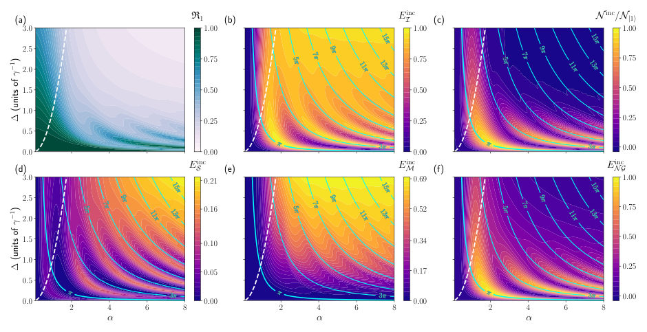
<figcaption class="paper-figure-caption"><b>Fig 2.</b> FIG. 2. (a) The rank-one-score of KI(t, t′) (see Eq. (2)). (b-f) Numerical results when we pick the temporal mode function winc(t) which maximizes the incoherent energy for each (α, ∆). (b) Incoherent energy Einc I and (c) WN of the field in the most incoherent mode winc. (d-f) Decomposition of Einc I according to Eq. (9), giving Einc S , Einc M , Einc N G. In all figures, the cyan contour lines represent (α, ∆) values such that the input coherent state executes a finite duration (2k + 1)π-pulse on the TLA, where k ∈Z+. The white dashed-line separates the spontaneous (left of the line) from the stimulated (right of the line) emission regimes.</figcaption>
</figure>
<figure class="paper-figure-card">
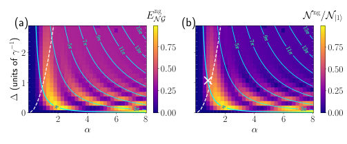
<figcaption class="paper-figure-caption"><b>Fig 3.</b> FIG. 3. (a) Eng N G values obtained for each input (α, ∆). (b) The corresponding WN values N ng. Both (a) and (b) were plotted on a coarser grid as compared to Fig. 2. As can be seen, higher values of Eng N G correspond to higher values of N ng. Furthermore, both (a) and (b) agree with Fig. 2 in the low (α, ∆) regime and have higher values than Fig. 2 in the high (α, ∆) regime. The point of max efficiency (see Eq. (3)) using the temporal mode function wng(t) is starred here and it corresponds to (α, ∆) = (0.774, 1.070γ−1). The white and cyan contours are as in Fig. 2.</figcaption>
</figure>
<figure class="paper-figure-card">
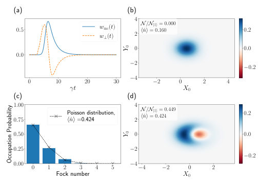
<figcaption class="paper-figure-caption"><b>Fig 4.</b> FIG. 4. (a) Shapes of winc(t) and w⊥(t). (b), (d) Wigner functions of the output field in temporal modes ˆbw⊥and ˆbwinc respectively. (c) Fock occupation probabilities in mode ˆbwinc Not the total input energy here is |α|2 = 0.599.</figcaption>
</figure>
<figure class="paper-figure-card">
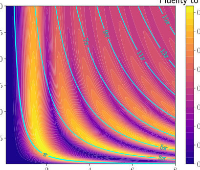
<figcaption class="paper-figure-caption"><b>Fig 5.</b> FIG. 5. Here, we pick vopt(t) to be the temporal mode winc(t) which maximizes the incoherent energy and plot the fidelity of the field state to a displaced single photon state in the temporal mode ˆbwinc . The cyan contour lines represent (α, ∆) values such that the input coherent state executes a finite duration (2k + 1)π-pulse, where k ∈Z+ on the TLA. The origin of the displacement is explained in the SM [40] (See S.4).</figcaption>
</figure>

**Summary.** This paper develops a method using energetic cost functions to optimize the generation of Wigner Negativity, a key signature of non-Gaussian bosonic states. The study models coherent pulse scattering from a two-level atom coupled to a reservoir. It finds that maximal efficiency for generating these non-classical resources occurs under specific conditions involving single-photon input and spectral matching.

**Why it may be interesting.** This work provides a powerful theoretical tool—energetic cost functions—to quantify non-Gaussian resources like Wigner Negativity in complex open quantum systems (TLA coupled to reservoirs), which is highly relevant for quantum light sources and quantum information processing.

Detailed structure

**Main problem.** The research aims to optimize the generation of Wigner Negativity (WN) signatures, which characterize non-Gaussian bosonic states, during quantum scattering processes.

**Main result.** Maximally efficient WN generation is achieved when the input pulse contains an average of one photon and is spectrally mode-matched with the two-level atom (TLA).

**Method.** The authors introduce energetic cost functions to bypass direct, complex evaluation of Wigner functions in multimode scattering settings.

**Model / system.** The system models a coherent pulse scattering off a Two-Level Atom (TLA) coupled to a one-dimensional bosonic reservoir. The dynamics are governed by an energy-preserving Hamiltonian and analyzed using quantum optical kernels.

**Key observables.** Wigner Negativity ($\mathcal{N}_W$), Incoherent Energy ($E_{	ext{inc}}$), Squeezing Energy ($E_S$), Mixedness Energy ($E_M$), and Non-Gaussian Energy ($E_{NG}$).

**Important parameters / regimes.** The optimal regime is found near the condition of one average input photon ($\langle\alpha
angle^2=1$) and spectral mode matching.

**Assumptions / limitations.** Approximations include using energetic cost functions to correlate with WN, and employing finite rank approximations for kernel calculations.

**Figures summary.** Figures illustrate the correlation between various energy components ($E_{	ext{inc}}$ vs $\mathcal{N}_{	ext{inc}}$, $E_{NG}$ vs $\mathcal{N}_{ng}$) across different input pulse parameters $(\alpha, \Delta)$, identifying the optimal operating point.

**Paper structure.** The paper establishes the physical model and Hamiltonian, develops the energetic cost function approach to circumvent Wigner function complexity, analyzes the correlation between energy components and WN, and concludes by pinpointing the optimal operational regime for high-efficiency generation.

Abstract

Wigner negativities (WNs) are key signatures of non-Gaussian bosonic states and essential resources for quantum technologies. We study their generation in the scattering of coherent pulses by a two-level atom coupled to a one-dimensional reservoir, a unitary and energy-preserving platform. Optimization in this multimode setting is hindered by the complexity of evaluating Wigner functions. We overcome this challenge by introducing energetic cost functions that identify output modes most likely to host large negativities. First using incoherent energy and then isolating a genuinely non-Gaussian contribution, we demonstrate a strong correlation between these quantities and WNs. This correlation extends beyond short, intense pulses to encompass pulses of finite energy, where photons are scattered while the two-level atom is driven. Focusing on the energy-efficiency of the process, we show that maximally efficient generation takes place for one input photon, on average, spectrally mode-matched with the atom.

[↑ back to top](#top)

### [Controlled Quantum Metrology with Anisotropic Heisenberg Spin Interactions under Intrinsic Decoherence](http://arxiv.org/abs/2606.16918v1)

**Authors:** S. K. Singh, Jia-Xin Peng, Y-J Zhu, Mohammad Khalid  
**Type:** theory · **Category:** quantum information and computing · **PDF:** <https://arxiv.org/pdf/2606.16918v1>  
**Analysis basis:** full PDF text, analyzed in chunks
**Topic relevance:** `analog quantum simulation` **3/5** · `entanglement & information structure` **3/5** · `exotic spin models in light-matter` **3/5** · `correlated / nonlocal dissipation` **2/5** · `driven-dissipative phase transition` **2/5** · `methods for driven-dissipative` **2/5** · `non-equilibrium dynamics` **2/5** · `Keldysh / 2PI / non-Gaussian methods` **1/5** · `non-equilibrium universality` **1/5** · `spintronics-quantum-optics interface` **1/5**

↔ Scroll figures horizontally

<figure class="paper-figure-card">
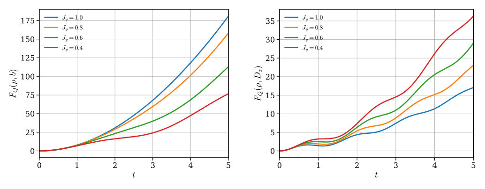
<figcaption class="paper-figure-caption"><b>Fig 1.</b> FIG. 1: Time evolution of FQ(ρ, b) and FQ(ρ, Dz) for the estimation of (a) the uniform magnetic field b and (b) the DM interaction strength Dz, respectively, for different values of Jy. The remaining parameters are fixed at Jx = 1.0, Jz = 0.2, Dz = 0.5, b = 0.3, θ = π/4, and γ = 0.02.</figcaption>
</figure>
<figure class="paper-figure-card">
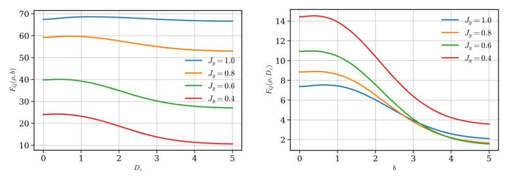
<figcaption class="paper-figure-caption"><b>Fig 2.</b> FIG. 2: Dependence of (a) FQ(ρ, b) on the DM interaction strength Dz and (b) FQ(ρ, Dz) on the uniform magnetic field b for different values of Jy. All other parameters are the same as used in Fig. 1.</figcaption>
</figure>
<figure class="paper-figure-card">
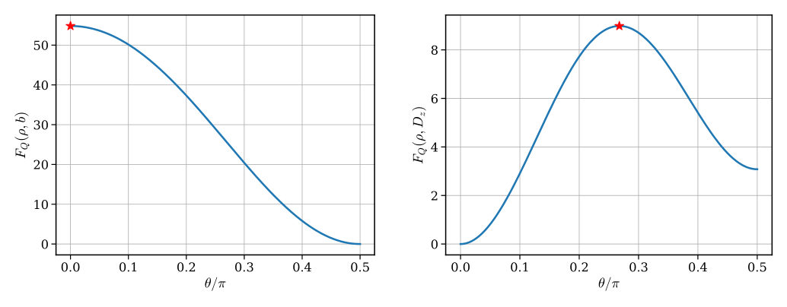
<figcaption class="paper-figure-caption"><b>Fig 3.</b> FIG. 3: Dependence of (a) FQ(ρ, b) and (b) FQ(ρ, Dz) on the initial-state parameter θ. All other parameters are the same as those used in Fig. 1, with t = 3.0.</figcaption>
</figure>
<figure class="paper-figure-card">
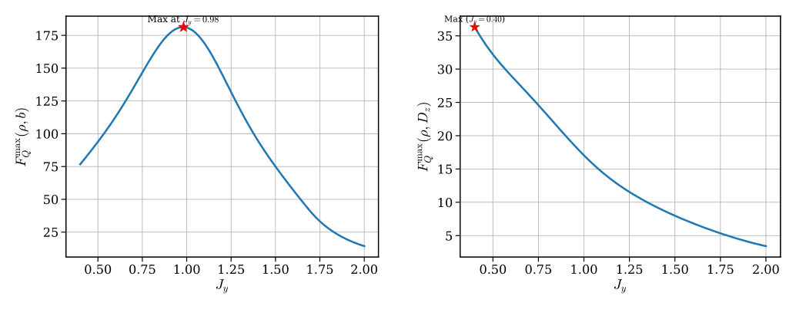
<figcaption class="paper-figure-caption"><b>Fig 4.</b> FIG. 4: Maximum values of (a) F max Q (ρ, b) and (b) F max Q (ρ, Dz) as functions of the exchange coupling parameter Jy. All other parameters are same like used in Fig. 1, with the maximum taken over the time interval 0 ≤t ≤5.</figcaption>
</figure>
<figure class="paper-figure-card">
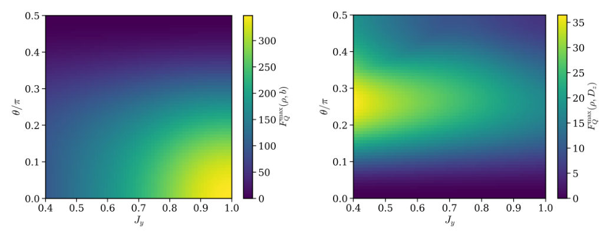
<figcaption class="paper-figure-caption"><b>Fig 5.</b> FIG. 5: Two-dimensional density plots of (a) F max Q (ρ, b) and (b) F max Q (ρ, Dz) in the (Jy, θ) parameter plane. The remaining parameters are the same as those used in Fig. 1, with the maximum taken over the time interval 0 ≤t ≤5.</figcaption>
</figure>

**Summary.** The paper theoretically analyzes quantum parameter estimation in a two-qubit spin system exhibiting anisotropic Heisenberg interactions and DM coupling, all while accounting for intrinsic decoherence. By maximizing the Quantum Fisher Information, the authors determine that optimal sensing conditions are highly dependent on whether one is measuring the magnetic field or the DM interaction strength. The findings underscore the necessity of tailoring quantum resources to the specific metrology task.

**Why it may be interesting.** This work directly addresses quantum sensing limits in realistic open quantum systems (with decoherence), which is a major focus area bridging AMO physics and quantum information theory.

Detailed structure

**Main problem.** The study investigates how precisely physical parameters (like magnetic field or DM interaction strength) can be estimated using quantum systems.

**Main result.** Optimal estimation performance requires careful tuning of the initial entangled state and exchange coupling, with no single set of parameters being optimal for both sensing tasks simultaneously.

**Method.** The Quantum Fisher Information (QFI) is used as the figure of merit to quantify the ultimate precision limit on parameter estimation.

**Model / system.** The system is a two-qubit anisotropic Heisenberg spin model incorporating a Dzyaloshinskii-Moriya interaction and subjected to intrinsic decoherence modeled by the Milburn master equation.

**Key observables.** Quantum Fisher Information (QFI), concurrence, quantum coherence ($l_1$-norm), and von Neumann entropy.

**Important parameters / regimes.** Anisotropic exchange coupling ($J_y$), probe-state mixing angle ($	heta$), intrinsic decoherence rate ($\gamma$), magnetic field ($b$), and DM interaction strength ($D_z$).

**Assumptions / limitations.** The analysis relies on the Milburn model for decoherence and uses numerical approximations (finite differences) to calculate derivatives.

**Figures summary.** Figures illustrate how QFI depends on $	heta$ and $J_y$ for different parameters, show the monotonic decay of QFI with decoherence rate ($\gamma$), and compare QFI trends against entanglement/coherence measures.

**Paper structure.** The paper establishes the Hamiltonian and decoherence model, calculates the time-evolved density matrix, derives the QFI formula, and then systematically analyzes how varying initial state parameters ($	heta$) and coupling constants ($J_y$) affect the achievable precision for $b$ vs. $D_z$.

Abstract

We theoretically investigate quantum parameter estimation in a two-qubit anisotropic Heisenberg spin system with Dzyaloshinskii-Moriya (DM) interaction in the presence of intrinsic decoherence described by the Milburn model. Using the Quantum Fisher Information (QFI), we study the estimation of both the uniform magnetic field and the DM interaction strength. Analytical expressions for the time-evolved density matrix are obtained and used to explore the effects of exchange anisotropy, intrinsic decoherence, and probe-state preparation on the achievable estimation precision. Our results show that suitable tuning of the anisotropic exchange coupling and the initial entangled state can considerably enhance the estimation performance, with different optimal parameter regimes emerging for magnetic-field and DM-interaction sensing. To better understand the role of quantum resources in metrology, we also examine the behaviour of concurrence, quantum coherence, and von Neumann entropy. Overall, our findings demonstrate that anisotropic Heisenberg spin systems with DM interaction provide a promising and flexible platform for high-precision quantum metrology even in the presence of intrinsic decoherence.

[↑ back to top](#top)

### [Extracting Boundary Conformal Data from Periodic Non-Hermitian Critical Chains](http://arxiv.org/abs/2606.16785v1)

**Authors:** Yifan Liu, Haruki Shimizu, Dongchang Liu, Kohei Kawabata  
**Type:** theory · **Category:** statistical mechanics · **PDF:** <https://arxiv.org/pdf/2606.16785v1>  
**Analysis basis:** full PDF text, analyzed in chunks
**Topic relevance:** `driven-dissipative phase transition` **3/5** · `methods for driven-dissipative` **3/5** · `non-equilibrium universality` **3/5** · `Kondo & dissipative impurity` **2/5** · `non-equilibrium dynamics` **2/5** · `Frenkel-Kontorova` **1/5** · `Keldysh / 2PI / non-Gaussian methods` **1/5** · `analog quantum simulation` **1/5** · `correlated / nonlocal dissipation` **1/5** · `entanglement & information structure` **1/5**

↔ Scroll figures horizontally

<figure class="paper-figure-card">
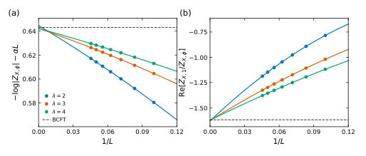
<figcaption class="paper-figure-caption"><b>Fig 1.</b> FIG. 1. Yang–Lee boundary coefficients extracted from pro- jected overlaps using the η-invariant preparation |X⟩. The dashed lines are the BCFT predictions. The imaginary parts of both projected amplitudes are negligible. (a) Extraction of G1 = G1,ϕ = g2 1 from the η-invariant X preparation. (b) The signed ratio RX,1 = ZX,1/ZX,ϕ cancels the extensive contri- bution and approaches −(1 + √</figcaption>
</figure>
<figure class="paper-figure-card">
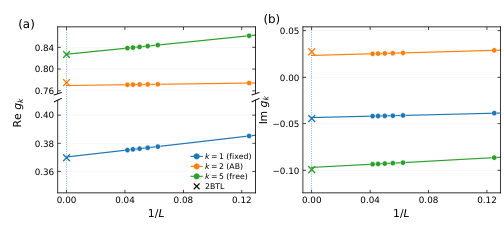
<figcaption class="paper-figure-caption"><b>Fig 2.</b> FIG. 2. Finite-size extraction of complex Potts projected coefficients for representative preparations (k = 1, 2, 5). We plot gk,eff(L) ≡exp[(log Zk,1(L) + αkL)/2] against 1/L. The extrapolated intercept gives gnum k . The crosses at 1/L = 0 denote the corresponding boundary loop model values.</figcaption>
</figure>

**Summary.** The paper presents a novel spectroscopic technique to extract Boundary Conformal Field Theory (BCFT) data directly from periodic, non-Hermitian critical chains. By analyzing projected partition functions and their ratios, the authors successfully recover universal boundary quantities for models like the Yang–Lee CFT and the Potts chain without needing explicit open boundary engineering. This establishes a general theoretical route into non-unitary boundary criticality using only bulk information.

**Why it may be interesting.** This work provides a powerful, purely bulk-based theoretical tool for accessing universal boundary physics in complex, non-Hermitian quantum systems, which is highly relevant for understanding open or engineered quantum boundaries.

Detailed structure

**Main problem.** The primary goal is developing a method to extract universal Boundary Conformal Field Theory (BCFT) data from non-Hermitian bulk-critical quantum chains.

**Main result.** The authors successfully demonstrated the extraction of boundary data for both $\mathcal{PT}$-symmetric Ising models and the five-state Potts chain, confirming relations like Kramers–Wannier duality using only knowledge of the periodic bulk system.

**Method.** They introduce 'projected-partition-function spectroscopy' by analyzing the scaling limit of projected amplitudes $Z_{\Phi,i}(L)$ to extract boundary coefficients while circumventing engineered open boundaries.

**Model / system.** The work applies to non-Hermitian quantum many-body systems exhibiting critical phenomena, specifically tested on a $\mathcal{PT}$-symmetric Ising realization of the Yang–Lee CFT and the five-state Potts chain.

**Key observables.** Universal boundary-state coefficients ($G_a(\Phi),i$), boundary entropy (Affleck–Ludwig $g$-factor), and ratios of projected partition functions, such as $	ext{R}_{\Phi,1}(L)$.

**Important parameters / regimes.** The analysis focuses on the thermodynamic limit ($L 	o \infty$) and involves analyzing finite-size scaling corrections based on irrelevant operators.

**Assumptions / limitations.** The method assumes that a short-range preparation state can microscopically represent a conformal boundary condition, allowing nonuniversal terms to be canceled via ratios or scaling analysis.

**Figures summary.** Figures illustrate the finite-size extraction of Yang–Lee boundary coefficients and complex Potts projected coefficients ($g_k$) versus $1/L$, comparing numerical results against established BCFT predictions.

**Paper structure.** The paper develops from defining the projected amplitude, establishing its scaling behavior using ratios to eliminate nonuniversal factors, and then applying this robust framework sequentially to two distinct physical realizations (Yang-Lee CFT and Potts chain) to validate its applicability across different boundary regimes.

Abstract

Boundary conformal field theory (BCFT) contains universal data that are usually accessed microscopically by imposing spatial boundaries on the lattice. Here, we introduce a periodic-chain projected-partition-function spectroscopy that extracts universal boundary quantities directly from non-Hermitian bulk-critical quantum chains, avoiding the need to engineer microscopic open boundaries and circumventing subtle boundary effects in non-Hermitian systems. Using a short-range-entangled boundary preparation and its infrared-compatible left dual, we obtain the Affleck-Ludwig boundary entropy in non-Hermitian systems. We demonstrate this construction for two representative non-Hermitian infrared structures. For a $\mathcal{PT}$-symmetric Ising realization of the real nonunitary Yang-Lee CFT, we extract the minimal-boundary projected coefficient and recover a nontrivial negative excited-to-ground ratio. For the genuinely complex fixed points of the non-Hermitian five-state Potts chain, we resolve intrinsically complex boundary coefficients and reproduce the exact relation required by the Kramers-Wannier duality. Our results establish a route to nonunitary BCFT universal data via only knowledge of the bulk critical system, opening a window into non-Hermitian boundary criticality.

[↑ back to top](#top)

### [Ultrastrongly coupled open systems and fine grained time](http://arxiv.org/abs/2606.16634v1)

**Authors:** Stefano Marcantoni, Marco Merkli  
**Type:** theory · **Category:** other · **PDF:** <https://arxiv.org/pdf/2606.16634v1>  
**Analysis basis:** full PDF text, analyzed in chunks
**Topic relevance:** `methods for driven-dissipative` **3/5** · `non-equilibrium dynamics` **3/5** · `Keldysh / 2PI / non-Gaussian methods` **2/5** · `correlated / nonlocal dissipation` **2/5** · `driven-dissipative phase transition` **2/5** · `non-equilibrium universality` **2/5** · `Kondo & dissipative impurity` **1/5** · `analog quantum simulation` **1/5** · `entanglement & information structure` **1/5** · `scars & prethermalization` **1/5**

↔ Scroll figures horizontally

<figure class="paper-figure-card">
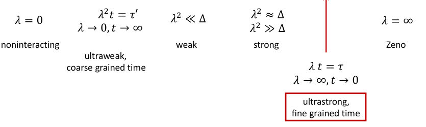
<figcaption class="paper-figure-caption"><b>Fig 1.</b> Figure 1: Different coupling regimes: From noninteracting to Zeno. Here, λ is the coupling parameter and ∆represents a typical system Bohr frequency, a hopping matrix element in the system Hamiltonian, or similar. The ultraweak and ultrastrong coupling regimes are dynamical regimes involving rescaled times. Here we introduce the fine grained time τ for the ultrastrong coupling regime and we derive the system dynamics as a function of τ. We show that the instantaneous decoherence process known to happen in the Zeno limit (‘λ = ∞’) is resolved as a continuous dynamical process in the fine grained time.</figcaption>
</figure>

**Summary.** This paper analyzes the time evolution of an open quantum system under ultrastrong coupling by introducing a fine-grained time scale. It resolves the predicted instantaneous decoherence into a continuous process, demonstrating that the resulting dynamics are Markovian but require specialized mathematical tools beyond standard weak-coupling theories.

**Why it may be interesting.** This work tackles a fundamental issue in open quantum systems: how to correctly describe dynamics when coupling strengths are so large that standard weak-coupling approximations fail, providing rigorous tools for non-Markovian/ultrastrong regimes.

Detailed structure

**Main problem.** The study investigates quantum dynamics of a system coupled to a reservoir under ultrastrong coupling, aiming to resolve instantaneous decoherence predicted in the infinite coupling limit.

**Main result.** The evolution is shown to be continuous in a fine-grained time scale ($	au = \lambda t$), and the resulting dynamics are Markovian but not necessarily described by a standard semigroup structure.

**Method.** The authors employ rigorous mathematical derivations using a fine-grained scaling regime, analyzing the system's reduced density matrix evolution via specialized propagators and checking for CP-divisibility criteria.

**Model / system.** The model is an open quantum system consisting of a $d$-level system ($S$) coupled to a bosonic reservoir ($R$). The interaction strength ($\lambda$) is taken to be very large (ultrastrong coupling).

**Key observables.** Reduced density matrix $
ho_S(	au)$, decoherence function, and the structure of the time evolution map $\Lambda(	au)$.

**Important parameters / regimes.** Coupling constant ($\lambda$), fine-grained time scale ($	au = \lambda t$), and system/reservoir spectral properties.

**Assumptions / limitations.** The analysis relies on introducing a specific fine-grained scaling regime to handle the strong coupling limit, and certain regularity conditions (Assumption R) are required for limiting procedures.

**Figures summary.** Figure 1 illustrates various coupling regimes ($\lambda$ vs $\Delta$), emphasizing the necessity of the fine-grained time scale $	au$ for resolving instantaneous decoherence in the ultrastrong regime.

**Paper structure.** The paper progresses by first defining the physical problem across different coupling limits, then deriving the dynamics in the fine-grained time limit ($	au = \lambda t$), and finally analyzing the mathematical properties of this evolution map concerning quantum Markovianity (CP-divisibility).

Abstract

We study the dynamics of a d-level quantum system coupled to a bosonic reservoir when the coupling constant is large. It is known that in the limit of infinite coupling strength, the system undergoes an instantaneous nonselective measurement, resulting in the immediate decoherence in the measurement basis, followed by a unitary Zeno dynamics. Here we resolve this dynamical process by introducing a fine grained scaling regime of short times proportional to the inverse coupling. We provide a rigorous derivation of the open system dynamics in this regime of ultrastrong coupling and demonstrate how decoherence unfolds continuously in the new time scale. We show that Markovian dynamics which are not given by semigroups arise naturally, in contrast to what happens in the weak coupling theory.

[↑ back to top](#top)

### [Generalized symmetries, invariant solutions and conservation laws in the Jaynes-Cummings model](http://arxiv.org/abs/2606.15538v1)

**Authors:** Luis M. Piñuelas, Pablo C. López Vázquez, Alexander Yakhno  
**Type:** theory · **Category:** other · **PDF:** <https://arxiv.org/pdf/2606.15538v1>  
**Analysis basis:** full PDF text, analyzed in chunks
**Topic relevance:** `Tavis-Cummings & cavity-many-emitter` **3/5** · `correlated cavity matter` **3/5** · `methods for driven-dissipative` **2/5** · `non-equilibrium dynamics` **2/5** · `Keldysh / 2PI / non-Gaussian methods` **1/5** · `analog quantum simulation` **1/5** · `correlated / nonlocal dissipation` **1/5** · `driven-dissipative phase transition` **1/5** · `entanglement & information structure` **1/5** · `non-equilibrium universality` **1/5**

↔ Scroll figures horizontally

<figure class="paper-figure-card">
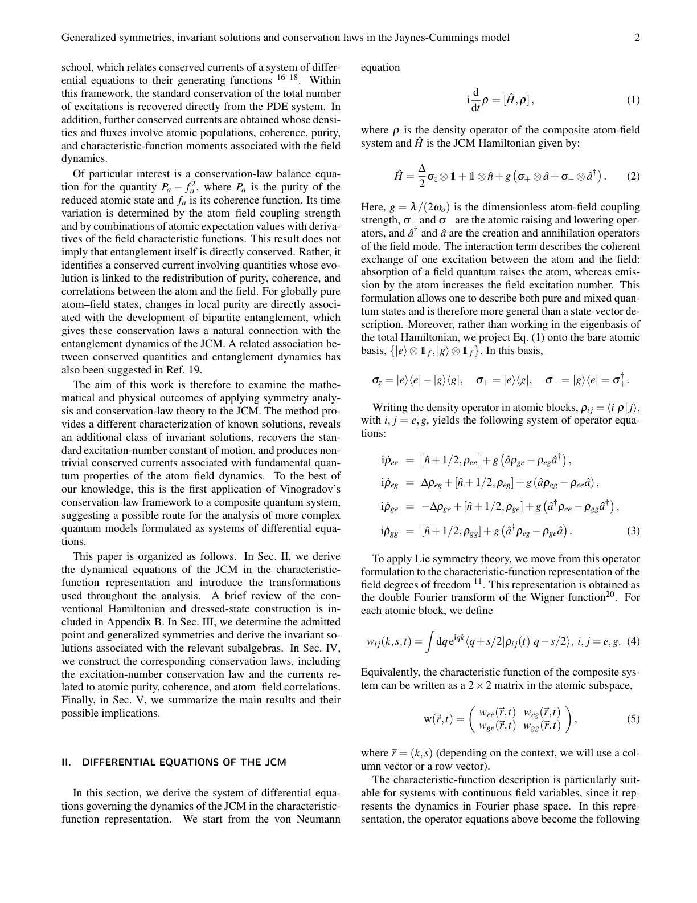
<figcaption class="paper-figure-caption"><b>Fig 1.</b> Low-resolution page preview, page 2</figcaption>
</figure>
<figure class="paper-figure-card">
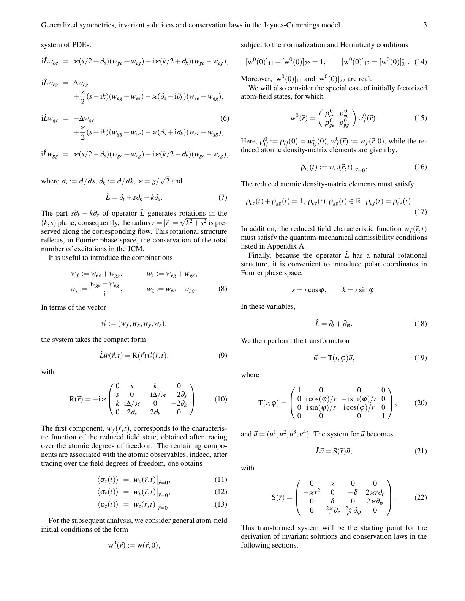
<figcaption class="paper-figure-caption"><b>Fig 2.</b> Low-resolution page preview, page 3</figcaption>
</figure>
<figure class="paper-figure-card">
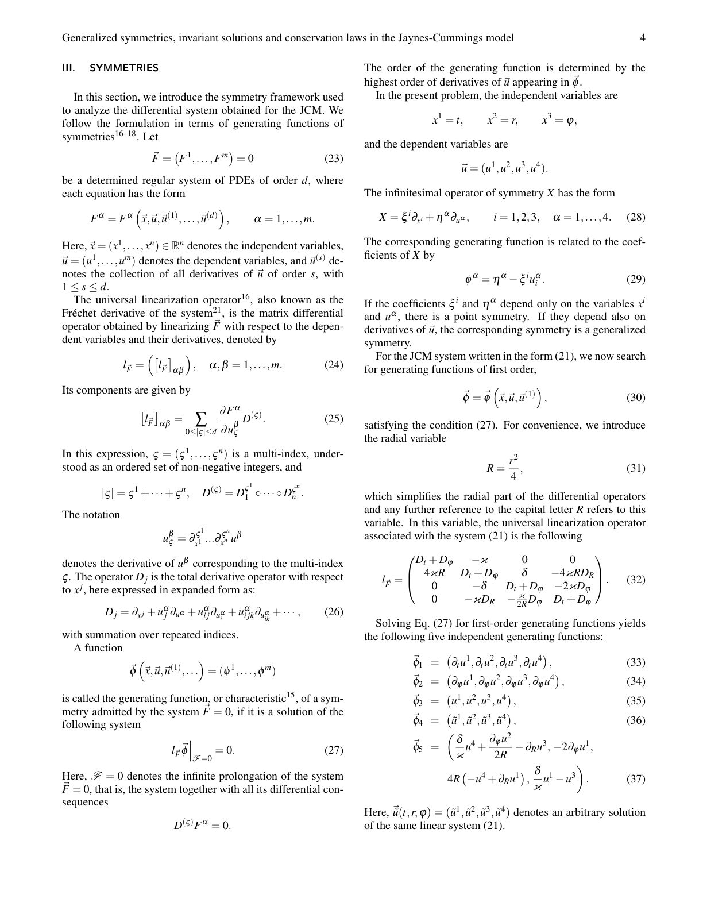
<figcaption class="paper-figure-caption"><b>Fig 3.</b> Low-resolution page preview, page 4</figcaption>
</figure>
<figure class="paper-figure-card">
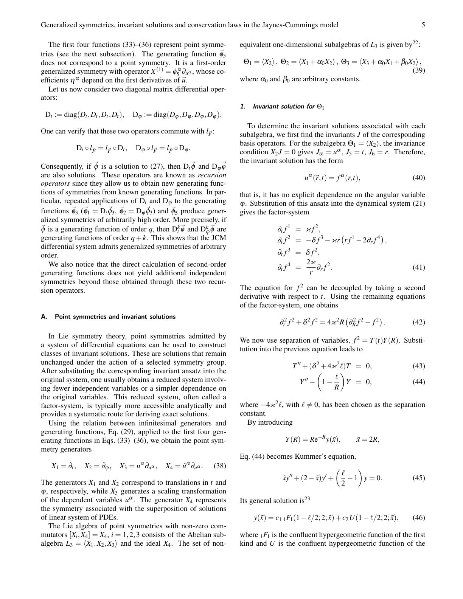
<figcaption class="paper-figure-caption"><b>Fig 4.</b> Low-resolution page preview, page 5</figcaption>
</figure>
<figure class="paper-figure-card">
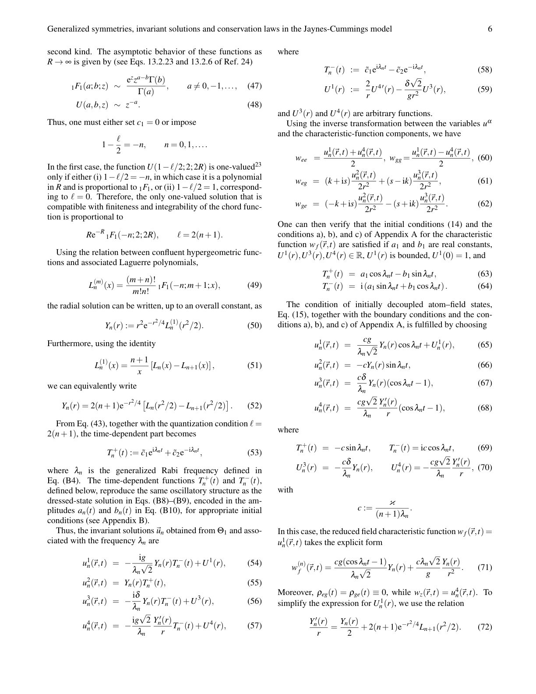
<figcaption class="paper-figure-caption"><b>Fig 5.</b> Low-resolution page preview, page 6</figcaption>
</figure>

**Summary.** This paper applies advanced mathematical techniques, including Lie symmetry analysis and generating functions, to the Jaynes-Cummings model. It successfully derives an infinite set of conservation laws and identifies multiple families of invariant solutions. This provides a comprehensive theoretical framework for understanding energy exchange and correlation dynamics in atom-field quantum interactions.

**Why it may be interesting.** This work provides a deep mathematical characterization of an archetypal quantum optics model (JCM) by finding its underlying symmetries and conservation laws. The discovery of higher-order conserved quantities and novel solution classes is highly valuable for understanding non-trivial dynamics in open quantum systems.

Detailed structure

**Main problem.** The work investigates generalized symmetries, invariant solutions, and conservation laws governing the dynamics of the Jaynes-Cummings model (JCM).

**Main result.** They derived an infinite hierarchy of conserved currents and found two classes of invariant solutions: one recovering standard dressed-state dynamics and another involving Heun polynomials.

**Method.** The analysis employs Lie symmetry theory, conservation-law methods using generating functions (Vinogradov's framework), and projecting the von Neumann equation onto a characteristic function representation in phase space.

**Model / system.** The system is the Jaynes-Cummings model, describing coherent energy exchange between a two-level atom and a single quantized field mode. The dynamics are governed by the von Neumann equation projected into a PDE system in Fourier phase space.

**Key observables.** Atomic populations ($
ho_{ij}$), coherence, reduced-state purity ($P_a$), and moments of the field characteristic function $\mathbf{w}(\vec{r}, t)$.

**Important parameters / regimes.** Detuning ($\Delta$), coupling strength ($g$), and excitation number ($n$). The analysis explores resonant regimes.

**Assumptions / limitations.** The methodology relies on transforming the dynamics into a PDE system in characteristic function space, allowing for symmetry and conservation law analysis.

**Paper structure.** The paper systematically applies symmetry analysis to the JCM's governing PDEs. It first establishes conserved currents using generating functions, then solves for invariant solutions by analyzing specific subalgebras ($\Theta_1, \Theta_2$), leading to explicit forms and quantization conditions.

Abstract

In this work, we investigate the Jaynes--Cummings model (JCM) using Lie symmetry analysis and conservation-law theory. The dynamics is formulated as a system of partial differential equations by projecting the von Neumann equation onto the atomic degrees of freedom and representing the field mode through its characteristic function. We determine the admitted point and generalized symmetries and construct invariant solutions satisfying the physical conditions imposed by quantum mechanics. The conventional dressed-state dynamics is recovered while a second class of solutions with radial dependence expressed through Heun polynomials is obtained for coupled atom--field configurations.   We also apply the generating functions methodology to derive local conservation laws of the JCM differential system. Besides recovering the conservation of the total number of excitations, we obtain additional conserved currents involving atomic populations, coherence, reduced-state purity, and moments of the field characteristic function. In particular, we derive a balance equation for a combination of atomic purity and coherence whose evolution is controlled by the atom--field coupling and is linked to atom--field correlation and entanglement dynamics. The symmetry structure further generates generalized symmetries and an infinite hierarchy of conservation laws.

[↑ back to top](#top)

### [Identifying Mobility Edge from Finite Temperature Spectral Form Factor](http://arxiv.org/abs/2606.15294v1)

**Authors:** Basudha Roy, Anandamohan Ghosh, Adway Kumar Das  
**Type:** theory · **Category:** disordered systems and neural networks · **PDF:** <https://arxiv.org/pdf/2606.15294v1>  
**Analysis basis:** full PDF text, analyzed in chunks
**Topic relevance:** `driven-dissipative phase transition` **3/5** · `methods for driven-dissipative` **3/5** · `analog quantum simulation` **2/5** · `non-equilibrium universality` **2/5** · `Keldysh / 2PI / non-Gaussian methods` **1/5** · `correlated / nonlocal dissipation` **1/5** · `entanglement & information structure` **1/5** · `exotic spin models in light-matter` **1/5** · `non-equilibrium dynamics` **1/5**

↔ Scroll figures horizontally

<figure class="paper-figure-card">
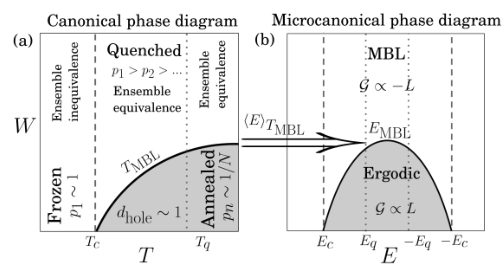
<figcaption class="paper-figure-caption"><b>Fig 1.</b> FIG. 1. Canonical and microcanonical phase diagrams of a generic many-body disordered system where W, T and E are disorder strength, temperature and energy, respectively. (a) Grey dashed vertical lines indicate critical temperatures Tc and Tq. Black solid line denotes the critical temperature TMBL, dual to ME. dhole is the relative depth of the correlation hole of the finite temperature SFF. pn is the Gibbs weight of the nth energy state at temperature T. (b) G is the Thouless conductance like quantity obtained from the spread of a local perturbation (Eq. (23)) and L is the linear size of the system. Grey dashed vertical lines indicate Ec and Eq, dual to Tc and Tq, respectively. Black solid...</figcaption>
</figure>
<figure class="paper-figure-card">
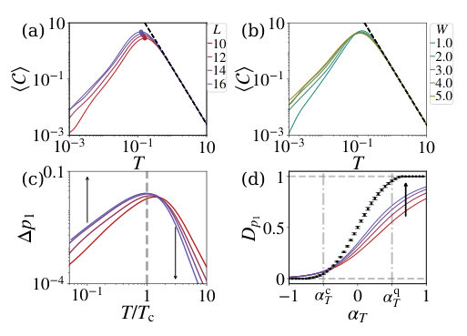
<figcaption class="paper-figure-caption"><b>Fig 2.</b> FIG. 2. (a) Ensemble averaged heat capacity for W = 2 and various values of L. Black dashed line denotes the high temperature behavior. (b) Same quantity as in (a) for L = 16 and different disorder strengths. (c) Difference be- tween the average and typical Gibbs weight of the ground state, ∆p1 ≡ ⟨p1⟩−ptyp 1 . (d) Scaling exponent D(N) p1 as a</figcaption>
</figure>
<figure class="paper-figure-card">
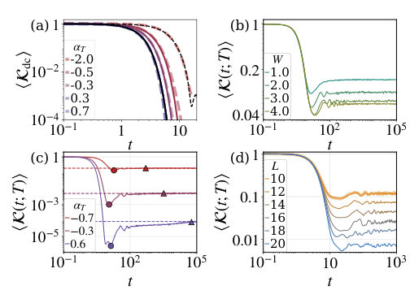
<figcaption class="paper-figure-caption"><b>Fig 3.</b> FIG. 3. (a) Disconnected part of the SFF at different tem- perature exponents (αT ) for L = 16 and W = 2. The black dashed (solid) line show the low (high) temperature approx- imate of Kdc (t; T) . (b) SFF for L = 16 and different dis- order strengths at T = 0.1. (c) SFF for L = 16 and W = 2 and different values of αT . Dashed lines denote the equilib- rium value, K. Circular (triangular) markers denote the dip (relaxation) timescales. (d) SFF calculated using FTLM for W = 5.0, αT = −0.5 and different values of L. The thick line corresponds to SFF computed using ED for the smallest system size.</figcaption>
</figure>
<figure class="paper-figure-card">
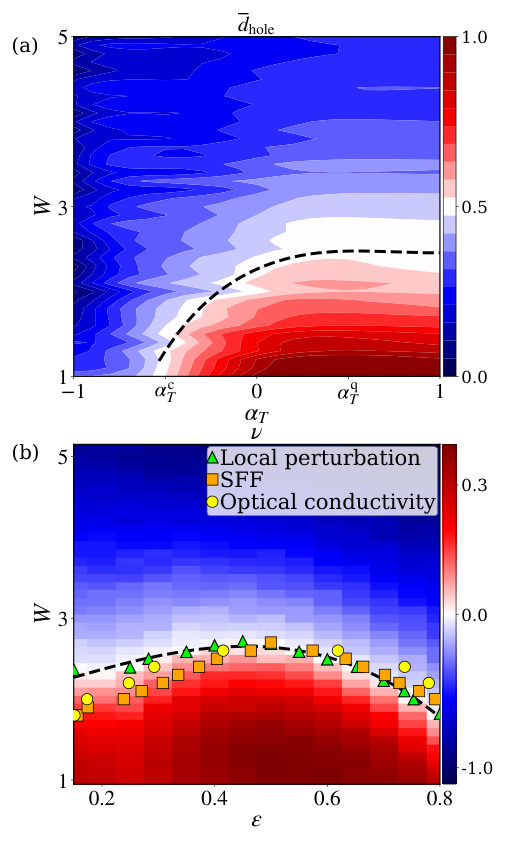
<figcaption class="paper-figure-caption"><b>Fig 4.</b> FIG. 4. (a) Canonical phase diagram: colormap of normal- ized dhole in SFF for L = 16. Black dashed line corresponds to the critical temperature TMBL. (b) Microcanonical phase di- agram: colormap of conductance exponent (ν). The mobility edges obtained from the conductance exponent, the optical conductivity, and the critical energy density ϵMBL are indi- cated by different markers. The quantity ϵMBL, shown for L = 16, is dual to TMBL in panel (a) through Eq. (22). The black dashed line serves as a guide to the eye.</figcaption>
</figure>

**Summary.** The paper proposes using the finite temperature Spectral Form Factor (SFF) as a powerful, computationally accessible diagnostic tool to locate the Mobility Edge in disordered quantum magnets. By showing that the critical energy derived from SFF analysis matches estimates from optical conductivity and conductance measurements, it establishes a general principle for characterizing many-body localization transitions.

**Why it may be interesting.** This work provides robust, non-diagonalization methods for locating quantum phase transitions (like MBL) by linking spectral statistics (SFF) directly to measurable transport properties ($\sigma(\omega)$), which is highly relevant for understanding open quantum systems.

Detailed structure

**Main problem.** The primary goal is identifying the Mobility Edge (ME) in interacting many-body quantum systems, specifically marking the transition between ergodic and localized phases.

**Main result.** The study successfully demonstrates that the ME can be consistently identified using three complementary diagnostics: finite temperature Spectral Form Factor (SFF), local perturbation analysis of conductance, and low-frequency optical conductivity.

**Method.** The research employs theoretical tools like the SFF at finite temperatures, analyzing ensemble inequivalence between canonical and microcanonical descriptions, alongside transport measurements derived from autocorrelation functions.

**Model / system.** The primary model is the 1D disordered Heisenberg spin-$1/2$ chain with a random Zeeman splitting ($h_j$). The analysis extends to general principles applicable to interacting many-body systems.

**Key observables.** Spectral Form Factor (SFF), correlation hole depth ($d_{	ext{hole}}$), conductance exponent ($
u$), and low-frequency optical conductivity exponent ($\eta$).

**Important parameters / regimes.** Disorder strength ($W$), Temperature ($T$), Critical Temperature ($T_{MBL}$), and the critical energy density ($\epsilon_{MBL}$).

**Assumptions / limitations.** The analysis sometimes relies on approximations like assuming a Gaussian Density of States (DOS) for simplified thermal moment calculations, or using the Dynamical Quantum Typicality (DQT) approach.

**Figures summary.** Figures illustrate canonical and microcanonical phase diagrams showing $T_{MBL}$ vs. disorder; heat capacity ($\langle C 
angle$) scaling with system size ($L$); and temperature dependence of transport exponents ($\eta$).

**Paper structure.** The paper develops the problem by introducing SFF as a probe, establishing the connection between finite-temperature diagnostics (SFF) and established transport measurements (optical conductivity/conductance exponent), culminating in showing their mutual agreement to pinpoint $\epsilon_{MBL}$.

Abstract

The spectral form factor (SFF) is a measure of energy correlations and has been widely used to identify the transition from the ergodic to the localized phase in interacting many-body quantum systems. In this work, we show that in a disordered Heisenberg spin-$\frac{1}{2}$ model, the finite temperature SFF can be used to generate a canonical phase diagram exhibiting a critical temperature $T_\mathrm{MBL}$. Using simple ideas of statistical mechanics, we obtain the critical energy density $ε_\mathrm{MBL}$ dual to $T_\mathrm{MBL}$. We show that the mobility edge (ME), numerically estimated from the spread of local perturbations and the optical conductivity, indeed coincides with $ε_\mathrm{MBL}$.

[↑ back to top](#top)

### [Interaction and non-Hermiticity controlled transmission in extended Su-Schrieffer-Heeger models](http://arxiv.org/abs/2606.15245v1)

**Authors:** Syeda Rafisa Rahaman, Shreekantha Sil, Nilanjan Bondyopadhaya  
**Type:** theory · **Category:** other · **PDF:** <https://arxiv.org/pdf/2606.15245v1>  
**Analysis basis:** full PDF text, analyzed in chunks
**Topic relevance:** `driven-dissipative phase transition` **3/5** · `methods for driven-dissipative` **3/5** · `non-equilibrium dynamics` **2/5** · `non-equilibrium universality` **2/5** · `Frenkel-Kontorova` **1/5** · `Keldysh / 2PI / non-Gaussian methods` **1/5** · `Kondo & dissipative impurity` **1/5** · `analog quantum simulation` **1/5** · `correlated / nonlocal dissipation` **1/5**

↔ Scroll figures horizontally

<figure class="paper-figure-card">
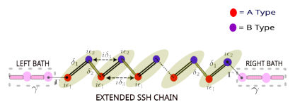
<figcaption class="paper-figure-caption"><b>Fig 1.</b> FIG. 1. Extended SSH chain connected with baths.</figcaption>
</figure>
<figure class="paper-figure-card">
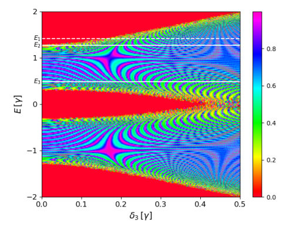
<figcaption class="paper-figure-caption"><b>Fig 2.</b> FIG. 2. Density plot of T in E −δ3 plane for a Hermitian variant of extended SSH chain with N = 100 unit cells; δ1 = 0.5γ, δ2 = 0.8γ, ϵ1 = ϵ2 = 0.</figcaption>
</figure>
<figure class="paper-figure-card">
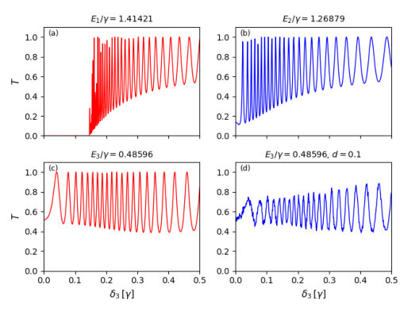
<figcaption class="paper-figure-caption"><b>Fig 3.</b> FIG. 3. T vs. δ3 for three different energies E1, E2 and E3; length of the extended SSH chain is N = 100 unit cells; δ1 = 0.5γ, δ2 = 0.8γ. In all subplots, ϵ1 = ϵ2 = 0.</figcaption>
</figure>
<figure class="paper-figure-card">
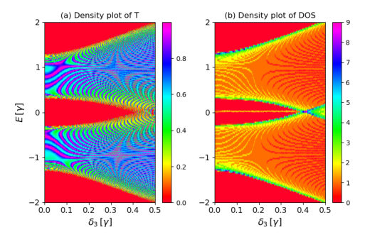
<figcaption class="paper-figure-caption"><b>Fig 4.</b> FIG. 4. Density plot of T and DOS in E −δ3 plane for a Hermitian variant of extended SSH chain with N = 75 unit cells; δ1 = 0.5γ, δ2 = 0.8γ, ϵ1 = ϵ2 = 0.</figcaption>
</figure>
<figure class="paper-figure-card">
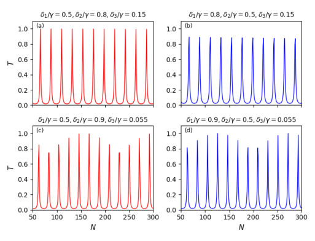
<figcaption class="paper-figure-caption"><b>Fig 5.</b> FIG. 5. Variation of T with N while δ3 is fixed and the energy of the incident plane wave is fixed at E/γ = 1.41421. In (a) δ1 = 0.5γ, δ2 = 0.8γ, δ3 = 0.15γ, (b) δ1 = 0.8γ, δ2 = 0.5γ, δ3 = 0.15γ, (c) δ1 = 0.5γ, δ2 = 0.9γ, δ3 = 0.055γ and (d) δ1 = 0.8γ, δ2 = 0.5γ, δ3 = 0.055γ. In all subplots, ϵ1 = ϵ2 = 0.</figcaption>
</figure>

**Summary.** This paper theoretically analyzes quantum transport through an extended Su-Schrieffer-Heeger model modified by NNN interactions and non-Hermiticity. It demonstrates that these additions induce unique oscillatory behaviors in the transmission coefficient, which are not present in simpler models. The findings highlight how engineered gain/loss can fundamentally alter the electronic properties of low-dimensional quantum systems.

**Why it may be interesting.** This work is highly relevant as it extends SSH models—a canonical system in condensed matter physics—into non-Hermitian regimes, providing new insights into how engineered dissipation or gain can control quantum transport phenomena like transparency oscillations.

Detailed structure

**Main problem.** The study investigates how next-nearest-neighbor (NNN) interactions and non-Hermitian onsite energies modify quantum transport characteristics in an extended Su-Schrieffer-Heeger (SSH) model.

**Main result.** Both NNN interaction and non-Hermiticity introduce significant, novel oscillatory behaviors in the transmission coefficient, which are absent in standard Hermitian SSH models. The system can exhibit $T>1$ in certain broken symmetry regimes.

**Method.** The analysis employs scattering matrix theory using the Green's function formalism to calculate the transmission coefficient ($T$) through the extended chain connected to semi-infinite leads.

**Model / system.** The model is an extended SSH chain incorporating intra-, inter-, and NNN hopping terms, along with non-Hermitian onsite energies ($\epsilon_1, \epsilon_2$). The Hamiltonian describes this lattice structure coupled to external leads.

**Key observables.** Transmission coefficient ($T$), which measures quantum transparency; energy eigenvalues (real vs. imaginary) related to PT-symmetry breaking.

**Important parameters / regimes.** NNN interaction strength ($\delta_3$), system size ($N$), non-Hermitian onsite potentials ($\epsilon_1, \epsilon_2$), and hopping parameters ($\delta_1, \delta_2$).

**Assumptions / limitations.** The analysis assumes elastic scattering within the middle wire region; calculations are based on solving the Schrödinger equation via Green's functions.

**Figures summary.** Figures illustrate $T$ vs. $\delta_3$ showing oscillations (interaction-induced transparency), $T$ vs. $N$ showing regular length oscillations, and comparisons of $T$ in PT-symmetric versus PT-broken regimes.

**Paper structure.** The paper systematically develops the Hamiltonian, presents numerical results varying $\delta_3$, then analyzes the effects of non-Hermiticity ($\epsilon$), contrasting topological and non-topological phases for both balanced gain-loss and pure loss/gain scenarios.

Abstract

We study the transport characteristics of an extended version of the Su-Schrieffer-Heeger (SSH) model with next-nearest-neighbor (NNN) interactions and non-Hermitian onsite energies. We observed that transport in such a system is significantly modified by the NNN interaction and the non-Hermitian terms. The transmission coefficient exhibits oscillatory behavior as the strength of the NNN interaction varies in a fixed-length chain. Moreover, the transmission coefficient also shows oscillation with system size for a fixed strength of the NNN interaction. We find that novel oscillatory behavior of the transmission coefficient, arising form the NNN interaction, is a unique feature of such a model and has not been reported previously. The presence of the non-Hermitian terms also enhances/reduces the transmission coefficient depending on the values of the other system parameters like intra-, inter- and NNN hopping. It appears from our study that both the NNN interaction and the non-Hermiticity introduce significant changes in the transport properties of the extended SSH chain, which are not observed in the standard Hermitian nearest-neighbour variant of the SSH model.

[↑ back to top](#top)

### [Super-Arrhenius relaxation of the triangular plaquette model in any dimension](http://arxiv.org/abs/2606.16259v1)

**Authors:** Laurent Bartholdi, Ivailo Hartarsky, Ivan Mitrofanov  
**Type:** theory · **Category:** statistical mechanics · **PDF:** <https://arxiv.org/pdf/2606.16259v1>  
**Analysis basis:** full PDF text, analyzed in chunks
**Topic relevance:** `scars & prethermalization` **3/5** · `analog quantum simulation` **2/5** · `non-equilibrium dynamics` **2/5** · `non-equilibrium universality` **2/5** · `Keldysh / 2PI / non-Gaussian methods` **1/5** · `correlated / nonlocal dissipation` **1/5** · `driven-dissipative phase transition` **1/5** · `entanglement & information structure` **1/5** · `methods for driven-dissipative` **1/5**

↔ Scroll figures horizontally

<figure class="paper-figure-card">
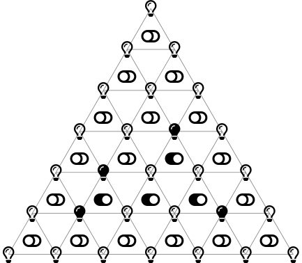
<figcaption class="paper-figure-caption"><b>Fig 1.</b> Figure 1: A configuration of lamps and switches on the triangular lattice. This is the only figure in which the triangular lattice is actually triangular; later on, we will use the standard orthogonal simplex.</figcaption>
</figure>
<figure class="paper-figure-card">
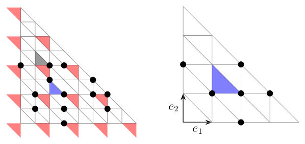
<figcaption class="paper-figure-caption"><b>Fig 2.</b> Figure 2: Illustration of the renormalisation map R of (10), with Λ2,8 on the left and Λ2,4 on the right, see (6). The red inverted plaquettes (see (9)) on the left are contracted to the vertices on the right. The blue spread plaquette (see Definition 2.11) corresponds to the blue plaquette on the right, while the gray non-spread plaquette has no effect on the renormalised configuration.</figcaption>
</figure>
<figure class="paper-figure-card">
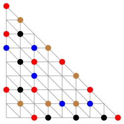
<figcaption class="paper-figure-caption"><b>Fig 3.</b> Figure 3: A typical cycle in C2,8. Its four restrictions to Λr 2,8 for r ∈{0, 1}2 (see (14)) are given in different colors and are all (renormalised) cycles (see Lemma 2.28). In this case, a suitable choice of restriction is the one to Λ1,1 2,8 (odd columns, black and brown points; see (16)), as it is smaller than half the cycle and nonempty (Λ2,1 2,8 also works). Notice that (in two dimensions) there is exactly one other cycle with the same black and brown sites called partial cycle. That other cycle only differs from the one depicted in the leftmost column which contains precisely the sites which are not blue or red in the figure.</figcaption>
</figure>
<figure class="paper-figure-card">
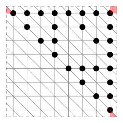
<figcaption class="paper-figure-caption"><b>Fig 4.</b> Figure 4: A Sierpiński gasket spin configuration for d = 2. Dots represent −1 spins. Viewed on the torus T8, this configuration has only one ON lamp, corresponding to the red triangle having three spins in state −1. Viewed on Z2, it has three ON lamps, corresponding to the three red triangles, parts of which are drawn.</figcaption>
</figure>
<figure class="paper-figure-card">
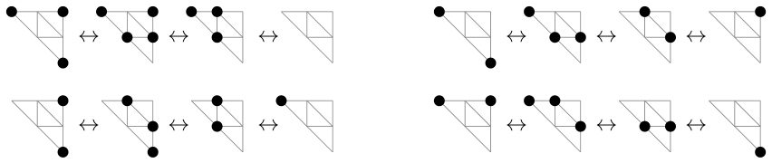
<figcaption class="paper-figure-caption"><b>Fig 5.</b> Figure 5: The canonical paths used in the proof of the upper bound of Theorem 1.2. The other 28 paths are obtained by taking the symmetric difference of these four with a configuration with some of the three internal lamps ON. This increases the number of ON lamps in the intermediate configurations no more than in the initial and final configurations of each path.</figcaption>
</figure>

**Summary.** This paper rigorously analyzes the relaxation time of the triangular plaquette model using advanced mathematical tools from combinatorics and Markov process theory. It derives super-Arrhenius scaling laws for this relaxation time, demonstrating how kinetic constraints lead to complex, non-trivial dynamical behavior even in the absence of explicit quantum interactions.

**Why it may be interesting.** While focused on classical statistical mechanics, the study of slow relaxation times (glassy behavior) in lattice models is highly relevant to understanding quantum dynamics in disordered or frustrated quantum systems.

Detailed structure

**Main problem.** The paper analyzes the super-Arrhenius relaxation time of a specific statistical physics model, the triangular plaquette model, in arbitrary dimensions.

**Main result.** It establishes precise scaling laws for the relaxation time ($T_{	ext{rel}}$) at high inverse temperatures ($eta$), showing both exponential and much larger polynomial/exponential divergences depending on boundary conditions.

**Method.** The proofs combine advanced techniques from extremal combinatorics, renormalization group ideas applied to dynamics (Ledrappier subshift), and path coupling methods for Markov processes.

**Model / system.** The system is the triangular plaquette model defined on a lattice ($\mathbb{Z}^d$), whose energy Hamiltonian relates to local excitations (plaquettes). The dynamics are governed by Glauber dynamics associated with the Gibbs measure $\mu_	au^\Lambda(\sigma) \propto e^{-eta H}$.

**Key observables.** Relaxation time ($T_{	ext{rel}}$), uniqueness of the infinite volume Gibbs measure ($\mu$), and the scaling behavior of these quantities.

**Important parameters / regimes.** Inverse temperature ($eta > 0$), lattice dimension ($d \ge 2$), and finite domain size ($n$).

**Assumptions / limitations.** The analysis relies on establishing structural properties of 'good chains' and admissible sets via combinatorial lemmas, and uses path coupling arguments for upper bounds.

**Figures summary.** Figures illustrate the configuration on the triangular lattice (plaquette model) and show canonical paths used in bounding the relaxation time through coupling constructions.

**Paper structure.** The paper progresses by defining the dynamics and relaxation time using Dirichlet forms, deriving combinatorial tools related to plaquettes and chains, establishing lower bounds via these combinatorial bottlenecks, and finally proving upper bounds using path coupling techniques on tori.

Abstract

Consider the following plaquette model from statistical physics: a lamp lies at every vertex of the triangular lattice and a switch lies at every even vertex of the (bipartite) dual hexagonal lattice. Each switch toggles the three lamps on its face. The energy of a configuration is the number of ON lamps.   For the Glauber dynamics associated with the Gibbs measure defined by this Hamiltonian at any inverse temperature $β>0$, we show that, in any dimension $d\ge 2$, the infinite volume relaxation time satisfies \[e^{β^2/C}/C \le T_{\mathrm{rel}}\le Ce^{e^{Cβ}}\] for some $C>0$. Our result entails that the Gibbs measure is unique. The $e^{β^2}$ scaling was conjectured by Newman and Moore in 1999 and matches the behaviour of supercritical rooted kinetically constrained models such as the East model, thus recovering fragile glass phenomenology in the absence of kinetic constraints. More precisely, we show that, on a torus of side length $2^k$, when $β\to\infty$ and $k/β\to0$, we have $T_{\mathrm{rel}}=e^{2βk(1+o(1))}$. Quite surprisingly, however, we also prove that, on non-periodic finite domains of size $n\le e^{β/C}$ for large $C>0$, we have the much larger asymptotics $\ln T_{\mathrm{rel}}=βn^{Θ(1)}$.   The main ingredients of the proofs are new results in extremal and enumerative combinatorics and rely on renormalisation ideas for the dynamics and its groundstates also known as the Ledrappier subshift. We note consequences of our results to geometric group theory (more precisely to the complexity of the word problem for the Baumslag finitely presented group) and to ergodic theory.

[↑ back to top](#top)

### [Non-Equilibrium Model Selection via Finite-Time Thermodynamics](http://arxiv.org/abs/2606.16399v1)

**Authors:** Masayuki Ohzeki  
**Type:** theory · **Category:** disordered systems and neural networks · **PDF:** <https://arxiv.org/pdf/2606.16399v1>  
**Analysis basis:** full PDF text, analyzed in chunks
**Topic relevance:** `methods for driven-dissipative` **3/5** · `non-equilibrium universality` **3/5** · `driven-dissipative phase transition` **2/5** · `non-equilibrium dynamics` **2/5** · `Keldysh / 2PI / non-Gaussian methods` **1/5** · `correlated / nonlocal dissipation` **1/5** · `entanglement & information structure` **1/5**

↔ Scroll figures horizontally

<figure class="paper-figure-card">
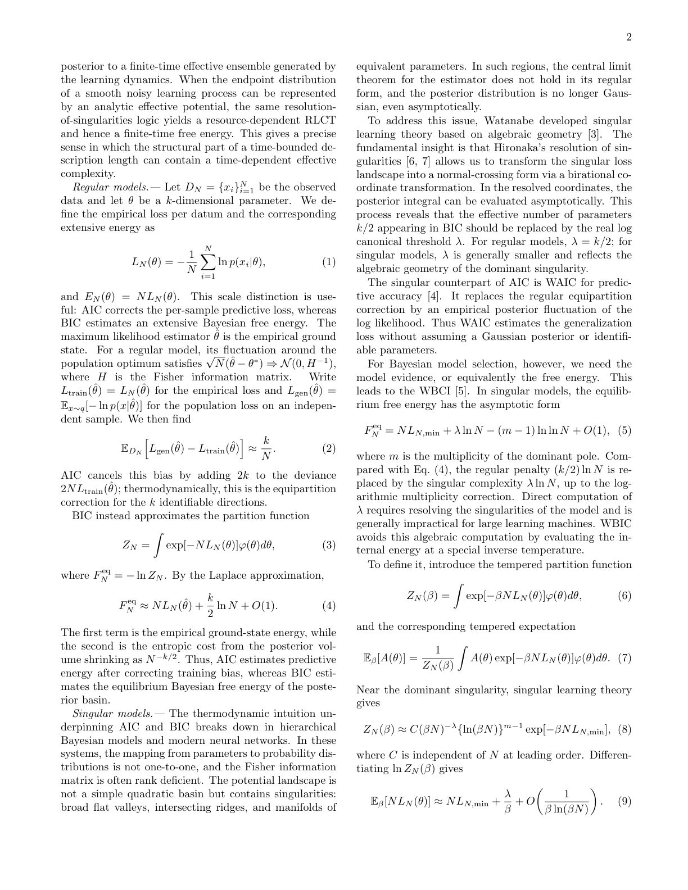
<figcaption class="paper-figure-caption"><b>Fig 1.</b> Low-resolution page preview, page 2</figcaption>
</figure>
<figure class="paper-figure-card">
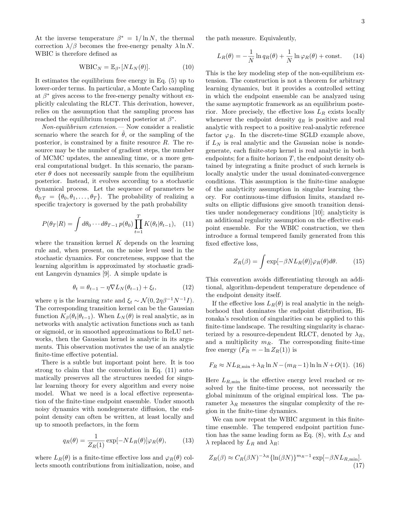
<figcaption class="paper-figure-caption"><b>Fig 2.</b> Low-resolution page preview, page 3</figcaption>
</figure>
<figure class="paper-figure-card">
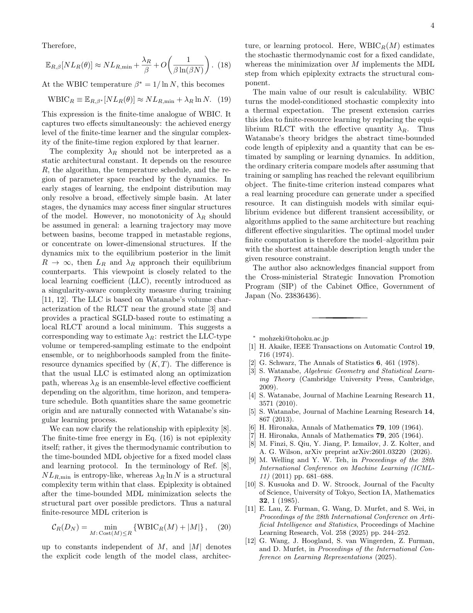
<figcaption class="paper-figure-caption"><b>Fig 3.</b> Low-resolution page preview, page 4</figcaption>
</figure>

**Summary.** This paper develops a theoretical framework to adapt model selection techniques for complex statistical models operating under finite resources. It replaces equilibrium free energy calculations with a finite-time analogue by incorporating the dynamics of learning processes into singularity theory. This provides a new, resource-aware measure of model complexity relevant for time-bounded inference.

**Why it may be interesting.** While focused on ML inference, the methodology of deriving complexity measures from dynamical processes and resource limitations has parallels in non-equilibrium quantum thermodynamics, particularly when analyzing relaxation or measurement protocols that are inherently time-limited.

Detailed structure

**Main problem.** The paper extends model selection criteria, traditionally derived from equilibrium statistical mechanics (like WAIC/WBIC), to the regime of finite-time, resource-constrained learning dynamics.

**Main result.** It formulates a finite-time analogue of Watanabe's BIC ($WBIC_R$), which replaces equilibrium complexity measures with a resource-dependent real log canonical threshold ($\lambda_R$).

**Method.** The authors adapt singular learning theory by modeling the learning process as a stochastic path governed by a transition kernel, allowing for the calculation of an effective free energy based on this finite-time ensemble.

**Model / system.** The model is statistical inference applied to machine learning, specifically addressing parameter estimation in singular models (like deep neural networks). The dynamics are approximated using processes like Stochastic Gradient Langevin Dynamics (SGLD) under a resource constraint $R$.

**Key observables.** Finite-time free energy ($WBIC_R$), Resource-dependent Real Log Canonical Threshold ($\lambda_R$), and the structural information measure called epiplexity.

**Important parameters / regimes.** Resource constraint ($R$), Time horizon ($T$), Inverse temperature $eta^* = 1/\ln N$, and the effective loss function $L_R(	heta)$.

**Assumptions / limitations.** The derivation assumes that the endpoint density of the learning process can be locally represented by an analytic effective potential, which is crucial for applying singular theory.

**Paper structure.** The paper first establishes the failure of classical criteria in singular models. It then develops the non-equilibrium extension by replacing equilibrium posteriors with ensembles generated by learning dynamics under resource constraints. The core mathematical machinery involves adapting singularity theory to this finite-time, path-dependent setting.

Abstract

Information criteria such as WAIC and WBIC extend model selection to singular learning machines, but they are usually derived for equilibrium posteriors. We formulate a finite-time analogue of WBIC by replacing the equilibrium posterior with an effective ensemble generated by learning dynamics under a resource constraint. When this ensemble admits an analytic effective potential, singular learning theory yields a resource-dependent real log canonical threshold. The resulting estimator gives a computable thermodynamic contribution to time-bounded MDL and identifies the finite-time singular complexity relevant to the structural information measured by epiplexity.

[↑ back to top](#top)

### [Optimizing resource bounds in direct fidelity estimation](http://arxiv.org/abs/2606.16336v1)

**Authors:** Netanel Barel, Lee Peleg, Yotam Kadish, Amit Ben Kish, Yotam Shapira  
**Type:** theory · **Category:** quantum information and computing · **PDF:** <https://arxiv.org/pdf/2606.16336v1>  
**Analysis basis:** full PDF text, analyzed in chunks
**Topic relevance:** `quantum measurements` **3/5** · `QC/QI experiment` **2/5** · `measurement-induced transitions` **2/5** · `Keldysh / 2PI / non-Gaussian methods` **1/5** · `analog quantum simulation` **1/5** · `correlated / nonlocal dissipation` **1/5** · `driven-dissipative phase transition` **1/5** · `entanglement & information structure` **1/5** · `methods for driven-dissipative` **1/5**

↔ Scroll figures horizontally

<figure class="paper-figure-card">
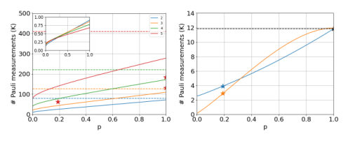
<figcaption class="paper-figure-caption"><b>Fig 1.</b> FIG. 1. Left: upper bound on the mean number of measure- ments (10) for a general state as a function of p as described in (1), for E = 0.05 and ∆= 0.1, and for various qubit numbers (color). The dashed lines correspond to the upper bound with ϵ1 = ϵ2 and δ1 = δ2 without using the addi- tional information about the channel, their value grows with the qubits’ number. The inset is the ratio of the solid lines to the dashed lines, marking the reduction in measurements afforded by our method. Right: number of measurements for a stabilizer state (it does not depend on the qubits’ number, so there is only one curve for each qubits’ number). The blue curve uses the additional information for the...</figcaption>
</figure>
<figure class="paper-figure-card">
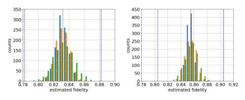
<figcaption class="paper-figure-caption"><b>Fig 2.</b> FIG. 2. Histogram of 1000 fidelity estimations, for a general state (left) and for a stabilizer state (right), for N = 5 qubits, E = 0.05 and ∆= 0.1. For the general state the symmetric allocation ϵ1 = ϵ2, δ1 = δ2 (blue, upper right star in the left panel of Fig. 1) is compared to the optimal allocation without using the information about the channel (orange, p = 1, lower right red star), and to the optimal allocation when using this information (green, p = 0.19, left red star). For the stabilizer state, the symmetric allocation (blue,black star in the right part of Fig. 1) - the optimal allocation without using the information about the channel - is compared to the optimal allocation...</figcaption>
</figure>
<figure class="paper-figure-card">
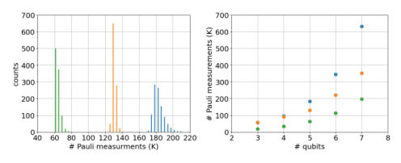
<figcaption class="paper-figure-caption"><b>Fig 3.</b> FIG. 3. Left: histogram of total measurements’ number used for a general state with N = 5 qubits, with E = 0.05, ∆= 0.1. The colors are the same as in the left part of Fig. 2. Right: the average number of measurements for several qubits’ number (the std is smaller than circle size for all points).</figcaption>
</figure>

**Summary.** This work optimizes the measurement resources required for Direct Fidelity Estimation (DFE) in quantum systems. It shows that assuming structural knowledge about noise channels allows for significantly tighter, and thus more efficient, resource bounds than worst-case analyses suggest. The methodology involves advanced constrained optimization over error and confidence budgets.

**Why it may be interesting.** While focused on quantum estimation theory rather than direct AMO Hamiltonian simulation, the rigorous resource bounding techniques and the explicit handling of structured noise are highly relevant for designing practical quantum measurements in experimental platforms like trapped ions or cavity QED systems where noise characterization is key.

Detailed structure

**Main problem.** The paper addresses optimizing resource bounds for Direct Fidelity Estimation (DFE), a technique used to estimate quantum state fidelity without full tomography.

**Main result.** By incorporating structural information about noise channels, the required number of measurements can be significantly reduced compared to worst-case theoretical bounds. Furthermore, optimal allocation of error and confidence budgets between sampling and estimation steps improves resource efficiency.

**Method.** The authors reformulate the analysis into a constrained optimization problem involving separate error ($\epsilon$) and confidence ($\delta$) parameters for the two probabilistic stages of DFE. They compare symmetric vs. optimized budget splitting.

**Model / system.** The system involves estimating the fidelity $F(
ho, \sigma)$ between an experimentally prepared state $\sigma$ and a target pure state $
ho$ in an N-qubit quantum system. The analysis considers general states and specialized stabilizer states under structured noise assumptions.

**Key observables.** Fidelity ($F$), total estimation error ($E$), confidence level ($\Delta$), and the required number of measurements ($m$).

**Important parameters / regimes.** Noise parameter $p$ (for structured noise), qubit number $N$, accuracy $\epsilon$, and confidence $\delta$.

**Assumptions / limitations.** The analysis assumes a two-stage probabilistic estimation process. A key limitation noted is that the derived theoretical bounds might be overly conservative compared to actual experimental fluctuations.

**Figures summary.** Figures compare upper bounds on measurements ($E(m)$) for general vs. stabilizer states under structured noise assumptions, and show histograms comparing different protocols' performance.

**Paper structure.** The paper introduces DFE, details the two-step probabilistic error control, develops the constrained optimization framework to optimally allocate accuracy/confidence budgets, and demonstrates savings using structured noise models.

Abstract

Direct fidelity estimation provides a way to estimate the fidelity between an experimentally prepared state and a desired pure target state without performing full tomography. Two influential formulations were introduced in 2011 by Flammia and Liu and by da Silva, Landon-Cardinal, and Poulin. In these protocols, the total estimation error is controlled through two distinct probabilistic steps: first, the fidelity is approximated using randomly sampled Pauli observables; second, each sampled expectation value is estimated from finitely many measurement outcomes. In this work we show that additional structural information about the noise can substantially sharpen the corresponding resource bounds. In particular, for some canonical channels the effective number of sampled Pauli settings can be reduced, leading to lower measurement cost both in the general pure-state setting and in the case of a stabilizer state. These results illustrate a broader point: worst-case confidence bounds in direct fidelity estimation can be significantly conservative when experimentally relevant structure is ignored. As a technical ingredient, we also revisit the allocation of the total accuracy and confidence budgets between the two probabilistic steps. Reformulating the analysis in terms of separate error parameters yields a constrained optimization problem whose solution lowers the average number of measurements in the general pure-state setting. Numerical simulations based on quantum circuits implemented in Qiskit illustrate both the improvement obtained under structured-noise assumptions and the conservativeness of the original worst-case bounds.

[↑ back to top](#top)

### [Persistence Properties of a Phase-ordering System with Competing Dynamics](http://arxiv.org/abs/2606.16443v1)

**Authors:** Shubham Thwal, Suman Majumder  
**Type:** theory · **Category:** statistical mechanics · **PDF:** <https://arxiv.org/pdf/2606.16443v1>  
**Analysis basis:** full PDF text, analyzed in chunks
**Topic relevance:** `methods for driven-dissipative` **3/5** · `non-equilibrium universality` **3/5** · `analog quantum simulation` **2/5** · `non-equilibrium dynamics` **2/5** · `correlated / nonlocal dissipation` **1/5** · `driven-dissipative phase transition` **1/5** · `exotic spin models in light-matter` **1/5**

↔ Scroll figures horizontally

<figure class="paper-figure-card">
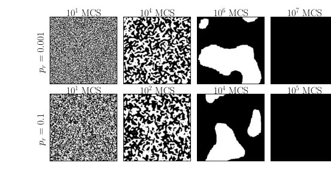
<figcaption class="paper-figure-caption"><b>Fig 1.</b> FIG. 1. Snapshots of the original lattice at different times depicting the evolution of a system having L = 256 during phase ordering with mixed conserved and nonconserved dynamics at T = 0, for two values of pr. The up spins are marked black and the down spins are left unmarked.</figcaption>
</figure>
<figure class="paper-figure-card">
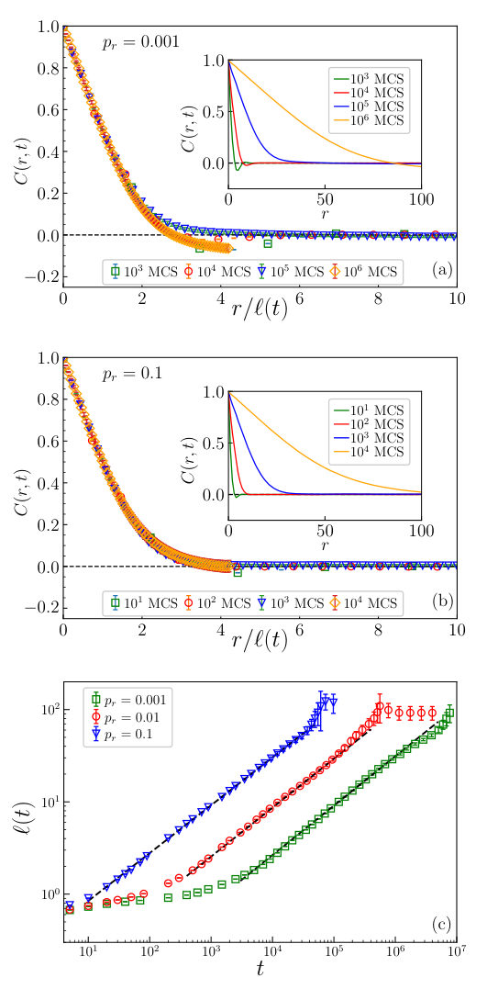
<figcaption class="paper-figure-caption"><b>Fig 2.</b> FIG. 2. Demonstration of the scaling behavior encrypted in Eq. (7) for (a) pr = 0.001 and (b) 0.1. The main frame shows the plot of C(r, t) as a function r/ℓ(t) at different times, as indicated. The inset shows the corresponding unscaled plots. (c) Double-log plots of the time dependence of the average domain length ℓ(t) for three different values of pr for a system of length L = 256. The black dashed lines represent the respective power-law fits using the ansatz in Eq. (8).</figcaption>
</figure>
<figure class="paper-figure-card">
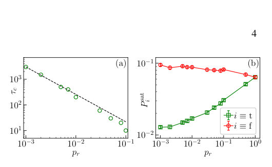
<figcaption class="paper-figure-caption"><b>Fig 3.</b> FIG. 4. (a) Scaling of the crossover time τc as a function of pr for phase ordering system of size L = 256. The dashed line is a fit to form in Eq. 10. (b) Variation of the saturated value of persistence probabilities as a function of pr.</figcaption>
</figure>
<figure class="paper-figure-card">
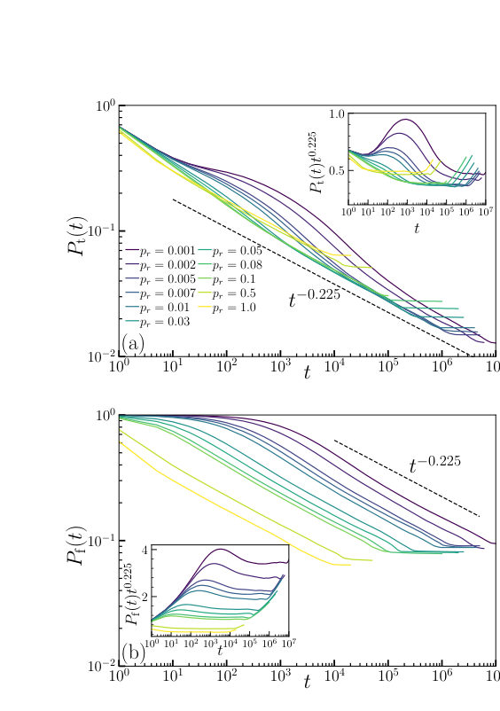
<figcaption class="paper-figure-caption"><b>Fig 4.</b> FIG. 3. (a) The main panel shows log-log plots of the total per- sistence probability Pt(t) as a function of time for different values of pr. The dashed line demonstrates the consistency of the late- time data with a power-law decay characterized by the exponent θt = 0.225. The inset displays the time dependence of the quan- tity Pt(t)t0.225 to further illustrate the agreement of the late-time behavior with the expected power-law scaling. (b) The same set of plots for the spin-flip persistence probability Pf(t). In all cases, the data correspond to a system size L = 256.</figcaption>
</figure>
<figure class="paper-figure-card">
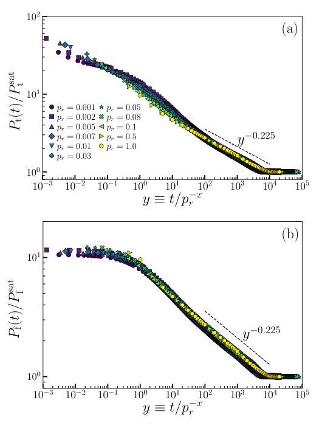
<figcaption class="paper-figure-caption"><b>Fig 5.</b> FIG. 5. ((a) Double-logarithmic plots of the scaled total persis- tence probability Pt(t)/P sat t , as a function of the scaling variable y ≡t/τc for different values of pr, obtained for a system of size L = 256. (b) Corresponding plots for the scaled spin-flip persis- tence probability Pf(t)/P sat f . The dashed lines in both panels repre- sent the expected power-law decay ∼y−0.225.</figcaption>
</figure>

**Summary.** This work analyzes the persistence properties during phase ordering in an Ising model subjected to competing spin-flip and spin-exchange dynamics at zero temperature. While standard measures of persistence retain universal scaling behavior consistent with nonconserved dynamics, the composite measure reveals a strong, non-universal dependence on the competition parameter $p_r$, highlighting distinct physical consequences for different types of memory.

**Why it may be interesting.** The study provides a detailed quantitative comparison of how different microscopic dynamics (conserved vs. nonconserved) affect macroscopic memory effects (persistence), which is crucial for understanding relaxation in complex many-body systems relevant to AMO physics or condensed matter modeling.

Detailed structure

**Main problem.** The study investigates how persistence properties change during phase ordering when a system evolves under competing dynamics involving both nonconserved (spin-flip) and conserved (spin-exchange) interactions.

**Main result.** For total and spin-flip persistence, the exponents remain universal and consistent with purely nonconserved dynamics; however, the composite persistence measure shows strong dependence on the relative probability of the competing moves, breaking expected scaling relations.

**Method.** The analysis relies heavily on Monte Carlo simulations at zero temperature to track time evolution and calculate various persistence probabilities and their associated spatial correlation functions.

**Model / system.** The system is a two-dimensional Ising model undergoing phase ordering. The dynamics are mixed, controlled by the probability $p_r$ of executing a nonconserved spin-flip move versus a conserved spin-exchange move.

**Key observables.** Total persistence probability ($P_t(t)$), spin-flip persistence probability ($P_f(t)$), and composite persistence probability ($P_c(t)$); decay exponents ($	heta_i$); fractal dimensions ($d_i^f$).

**Important parameters / regimes.** The relative probability $p_r$ controlling the competition between dynamics; zero temperature ($T=0$); spatial dimension $d=2$.

**Assumptions / limitations.** The analysis assumes that asymptotic power-law decay and dynamic scaling forms can be successfully applied to characterize long-time behavior.

**Figures summary.** Figures show snapshots of domain growth, confirmation of scaling behavior using correlation functions, and double-logarithmic plots demonstrating the collapse of scaled persistence probabilities for different dynamics.

**Paper structure.** The paper first establishes the model and defines three distinct persistence measures. It then analyzes the asymptotic decay and scaling relations for the total and spin-flip measures, finding consistency with known results. Finally, it contrasts this by analyzing the composite measure, demonstrating its unique dependence on $p_r$ and failure to satisfy the established scaling laws.

Abstract

We investigate the persistence properties during phase ordering in the two-dimensional ($d=2$) Ising model evolving under competing nonconserved spin-flip and conserved spin-exchange dynamics by means of Monte Carlo simulations at zero temperature. We examine three distinct persistence probabilities: (i) the total persistence probability, defined as the probability that a lattice site has never experienced a change in the sign of the spin residing there; (ii) the spin-flip persistence probability, which exclusively measures the fraction of sites that have never undergone a spin-flip event; and (iii) the composite persistence probability, defined as the fraction of sites that have experienced neither a spin-flip nor a spin-exchange event. In the asymptotic regime, both the total and spin-flip persistence probabilities exhibit identical power-law decay, irrespective of the relative occurrence probability of the spin-flip move $p_r$. The corresponding persistence exponent $θ_i \approx 0.225$, is found to be consistent with the value reported for systems evolving purely under nonconserved dynamics. We further demonstrate that both persistence measures satisfy the scaling relation $d-d_f^i=θ_i/α_i$, where $d_f^i$ is the fractal dimension of the corresponding persistence lattice and $α_i\approx 1/2$ characterizes the asymptotic power-law growth of spatially correlated regions of non-persistent spins. In contrast, although the composite persistence probability also exhibits asymptotic power-law decay, both the corresponding persistence exponent $θ_{\rm c}$ and the fractal dimension $d_f^{\rm c}$ of the persistence lattice show strong dependence on $p_r$. Combined with the presence of a universal growth exponent $α_{\rm c}\approx 1/2$, this leads to the breakdown of the scaling relation among the characteristic exponents for the composite persistence.

[↑ back to top](#top)

### [Possible high temperature superconductivity induced by coupling to proximate hyperbolic photon modes](http://arxiv.org/abs/2606.16674v1)

**Authors:** Zhiyu Dong, Patrick A. Lee  
**Type:** theory · **Category:** strongly correlated electrons · **PDF:** <https://arxiv.org/pdf/2606.16674v1>  
**Analysis basis:** full PDF text, analyzed in chunks
**Topic relevance:** `Keldysh / 2PI / non-Gaussian methods` **3/5** · `Kondo & dissipative impurity` **2/5** · `analog quantum simulation` **2/5** · `methods for driven-dissipative` **2/5** · `Tavis-Cummings & cavity-many-emitter` **1/5** · `correlated cavity matter` **1/5** · `driven-dissipative phase transition` **1/5** · `interference shaping light` **1/5**

↔ Scroll figures horizontally

<figure class="paper-figure-card">
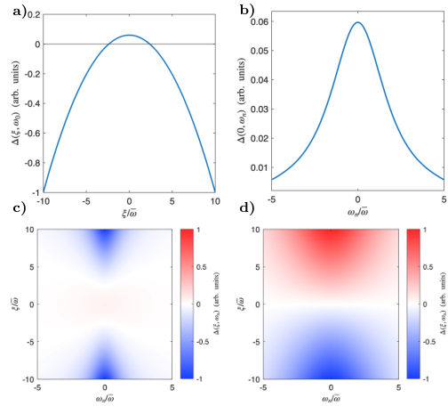
<figcaption class="paper-figure-caption"><b>Fig 1.</b> FIG. 1. The structure of the gap function numerically solved from diagonalizing the linearized gap equation. a) ξ- dependence of the even-ξ solution at the lowest positive Mat- subara frequency. b) ωn-dependence at ξ = 0. c) even-ξ- channel eigenfunction. d) odd-ξ-channel eigenfunction. The even-ξ solution is parabolic, is nonzero at ξ = 0, and is local- ized in Matsubara frequency within the bandwidth of order ¯ω, while the odd-ξ solution is linear in ξ. Here ∆is shown in arbitrary units because the linearized equation only fixes the eigenvector shape, not its overall magnitude.</figcaption>
</figure>
<figure class="paper-figure-card">
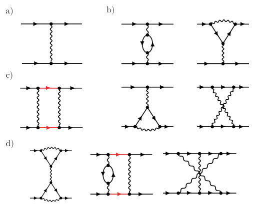
<figcaption class="paper-figure-caption"><b>Fig 2.</b> FIG. 2. Diagrammatic illustration of the effective low-energy pair interaction. Solid lines denote electron propagators, and wavy lines denote HM propagators. Panel (a) shows the first- order diagram. Panel (b) collects the second-order Kohn- Luttinger diagrams; they are the bubble diagram (top left), the vertex corrections (top right and bottom left), and the crossed diagram (bottom right). Panel (c) shows the Cooper- ladder contribution. In the usual perturbative framework, this type of diagram should not be counted as part of the “two-particle irreducible interaction”. However, here we are integrating out high-energy electrons to get an effective pair- ing interaction for low-energy...</figcaption>
</figure>
<figure class="paper-figure-card">
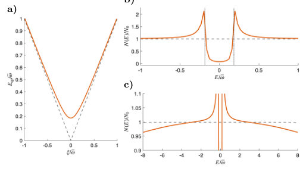
<figcaption class="paper-figure-caption"><b>Fig 3.</b> FIG. 3. a) Low-energy quasiparticle dispersion in the pres- ence of an even-ξ ∆channel obtained from the nonlinear self- consistency gap equation. b,c) Tunneling density of states in the presence of an even-ξ ∆channel. Panel b) zooms into an ¯ω-scale energy window around the Fermi surface, where the density of states has a shape similar to that of a conventional s-wave gap. Panel c) shows the tunneling density of states over larger energy range with a choice of Λ/¯ω = 10. The important distinction from conventional BCS theory is that the density of states is modified across a wider energy window comparable to Λ around Fermi surface. This is because the parabolic gap grows parabolically at...</figcaption>
</figure>

**Summary.** This paper theoretically explores high-temperature superconductivity arising from the coupling between electrons and hyperbolic photon modes found in polar insulators like hBN. By treating the HM interaction within a generalized pairing framework, the authors show that even repulsive interactions can induce unconventional pairing via an energy-space mechanism. The results suggest that $T_c$ can be significantly enhanced, potentially reaching hundreds of Kelvin under favorable material configurations.

**Why it may be interesting.** This work provides a concrete theoretical framework for unconventional superconductivity in hybrid quantum materials, linking topological photonics (HM modes) directly to high-$T_c$ mechanisms typically associated with strong electronic correlations.

Detailed structure

**Main problem.** The study investigates the possibility of achieving high-temperature superconductivity mediated by coupling between conduction electrons in a metal film and hyperbolic photon modes (HM) present in insulating substrates like hBN.

**Main result.** The HM interaction, despite being repulsive, facilitates unconventional pairing via an energy-space mechanism analogous to Anderson-Morel theory, leading to estimates of very high critical temperatures ($T_c$).

**Method.** The analysis employs Green's function formalism and diagrammatic techniques to calculate the electron self-energy ($\Sigma$) and project the resulting interaction onto the Cooper pairing channel.

**Model / system.** The model considers a 2D Fermi sea (metal) placed on top of hBN, where the coupling is mediated by longitudinal hyperbolic photon modes. The physics differs significantly from standard electron-phonon coupling due to the HM's energy dependence.

**Key observables.** Superconducting critical temperature ($T_c$), quasiparticle renormalization factors ($Z$, $v_1/v_F$), and the effective pairing interaction strength ($\lambda_{	ext{eff}}$).

**Important parameters / regimes.** Dimensionless coupling constant ($\lambda_0$), characteristic HM frequency ($ar{\omega}$), energy cutoff scale ($\Lambda$), and physical separation distance ($z$).

**Assumptions / limitations.** The analysis relies on weak coupling approximations, the Anderson-Morel step approximation in frequency space, and various continuum/small parameter limits for mathematical tractability.

**Figures summary.** Figures illustrate diagrammatic contributions to the effective low-energy pair interaction (e.g., Kohn-Luttinger diagrams) and show how the superconducting gap modifies the density of states over a wide energy window.

**Paper structure.** The paper progresses from calculating the self-energy correction ($\Sigma'$) due to HM exchange, determining quasiparticle renormalization effects, deriving the effective pairing interaction ($V_{	ext{pair}}$), and finally solving the linearized gap equation to estimate $T_c$.

Abstract

The hyperbolic mode (HM) refers to a polariton mode in a polar insulator where the dielectric function is negative in some direction of propagation. Within a frequency window the light occupies a greatly expanded region in momentum space. The HM in hexagonal Boron Nitride (hBN) has been under intense study and we consider placing a metal directly on top hBN and ask whether its physical properties can be strongly affected. While the problem resembles superficially the electron phonon coupling problem, there are important differences. Due to the longitudinal nature of the HM mode the coupling is driven by time dependent charge fluctuations which results in a coupling that strongly increases with the energy difference of the initial and final states. We find a significant modification of the wavefunction and velocity renormalization and we identify the dimensionless coupling constant $λ_0$ that controls this effect. The virtual exchange of HM leads to a repulsive interaction. However, due to its strong energy dependence, pairing is possible by a process analogous to the Anderson-Morel mechanism, but in energy space instead of frequency space. We estimate the effective pairing interaction and find that very high $T_c$ is possible, even for small $λ_0$ where the theory is controlled. We provide estimates using realistic parameters.

[↑ back to top](#top)

### [Inverted Dirac oscillator](http://arxiv.org/abs/2606.15303v1)

**Authors:** Mustapha Maamache  
**Type:** theory · **Category:** other · **PDF:** <https://arxiv.org/pdf/2606.15303v1>  
**Analysis basis:** full PDF text, analyzed in chunks
**Topic relevance:** `driven-dissipative phase transition` **3/5** · `Keldysh / 2PI / non-Gaussian methods` **2/5** · `Kondo & dissipative impurity` **2/5** · `non-equilibrium dynamics` **2/5** · `correlated / nonlocal dissipation` **1/5** · `methods for driven-dissipative` **1/5** · `non-equilibrium universality` **1/5**

↔ Scroll figures horizontally

<figure class="paper-figure-card">
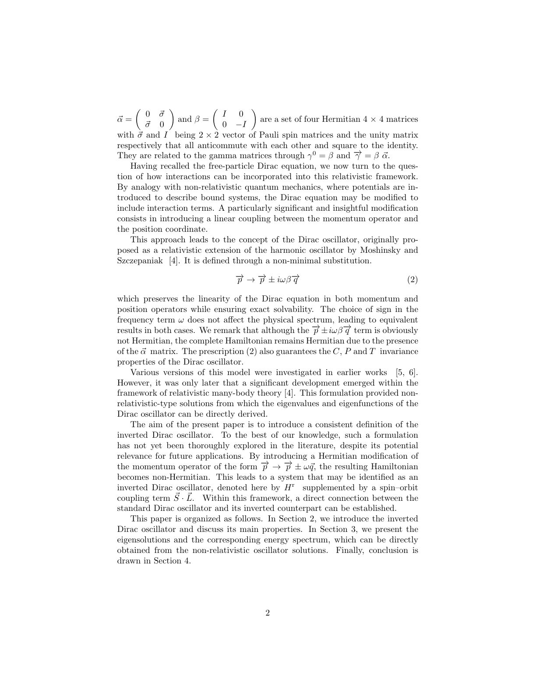
<figcaption class="paper-figure-caption"><b>Fig 1.</b> Low-resolution page preview, page 2</figcaption>
</figure>
<figure class="paper-figure-card">
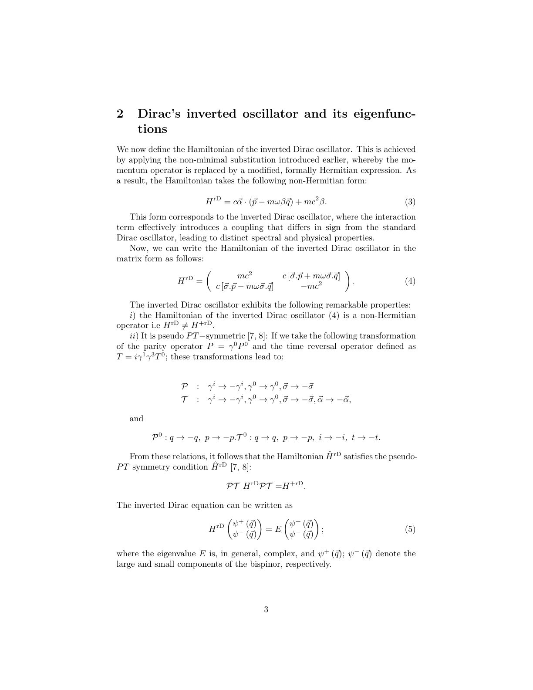
<figcaption class="paper-figure-caption"><b>Fig 2.</b> Low-resolution page preview, page 3</figcaption>
</figure>
<figure class="paper-figure-card">
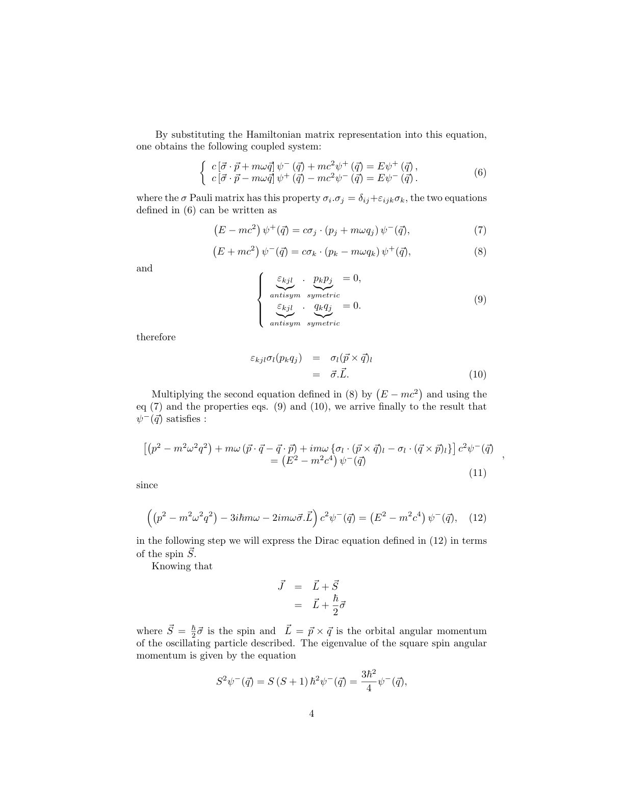
<figcaption class="paper-figure-caption"><b>Fig 3.</b> Low-resolution page preview, page 4</figcaption>
</figure>
<figure class="paper-figure-card">
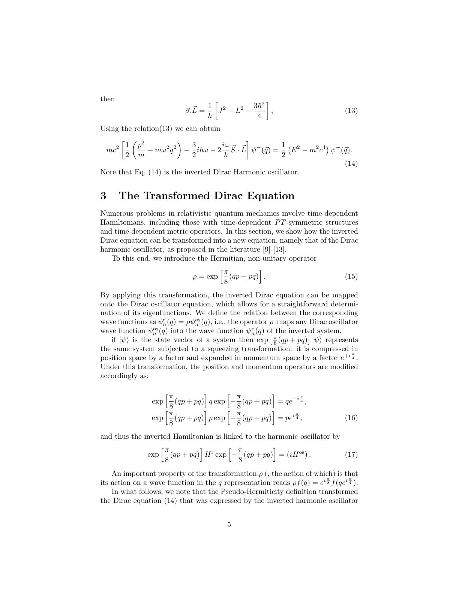
<figcaption class="paper-figure-caption"><b>Fig 4.</b> Low-resolution page preview, page 5</figcaption>
</figure>
<figure class="paper-figure-card">
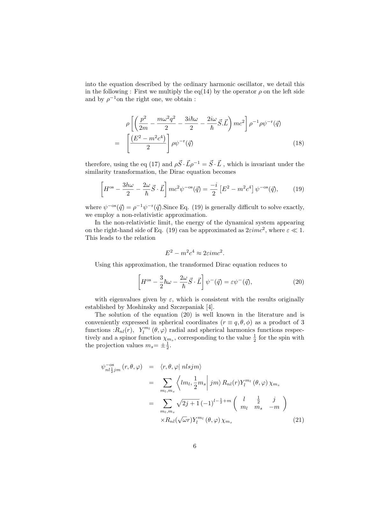
<figcaption class="paper-figure-caption"><b>Fig 5.</b> Low-resolution page preview, page 6</figcaption>
</figure>

**Summary.** This work tackles the mathematically challenging Dirac inverted oscillator, a relativistic system exhibiting non-Hermitian behavior. By proving its pseudo-$\mathcal{PT}$-symmetry and employing a specific transformation, the authors successfully map it onto the well-understood standard Dirac oscillator. This allows for the calculation of its energy spectrum in the non-relativistic limit.

**Why it may be interesting.** The study of pseudo-$\mathcal{PT}$-symmetric Hamiltonians and their connection to solvable models is highly relevant for understanding open quantum systems where exact analytical solutions are sought despite non-Hermiticity.

Detailed structure

**Main problem.** The paper analyzes the relativistic quantum system known as the Dirac inverted oscillator, which is non-Hermitian but admits an exact analytical solution.

**Main result.** A connection between the non-Hermitian inverted system and the standard Dirac oscillator is established via a non-unitary transformation, allowing for the derivation of its energy spectrum in the non-relativistic limit.

**Method.** The analysis involves deriving coupled differential equations from the modified Dirac equation and solving them using approximations (non-relativistic limit) and mathematical transformations ($
ho$ operator).

**Model / system.** The system is governed by a Hamiltonian $H_{rD}$ derived from modifying the standard Dirac Hamiltonian. This leads to an inverted oscillator potential, resulting in pseudo-$\mathcal{PT}$-symmetry.

**Key observables.** Energy eigenvalue $\epsilon_{nlj}$, which depends on quantum numbers $n, l, j$, and is related to harmonic oscillator and spin-orbit coupling terms.

**Important parameters / regimes.** The non-relativistic limit parameter $\epsilon \ll 1$ is crucial for simplifying the governing equation. The characteristic frequency $\omega$ sets the energy scale.

**Assumptions / limitations.** The primary assumption is the validity of the pseudo-$\mathcal{PT}$-symmetry and the use of a non-unitary transformation to map the problem onto a known solvable form.

**Paper structure.** The paper first introduces the inverted Dirac oscillator Hamiltonian, establishes its pseudo-$\mathcal{PT}$-symmetry, derives the governing differential equation, and then proceeds by applying a non-unitary transformation to map it to the standard Dirac oscillator. Finally, it analyzes the non-relativistic limit to obtain the energy spectrum.

Abstract

The Dirac oscillator is obtained from the Dirac Hamiltonian $H^{\mathrm{D}} = \left( c\vecα\cdot \vec{p} + mc^{2}β\right)$ by modifying the momentum through a non-Hermitian substitution $\overrightarrow{p} \rightarrow \overrightarrow{p} \pm iωβ\overrightarrow{q}$. Despite the non-Hermitian nature of this momentum operator, the full Hamiltonian remains Hermitian due to the presence of the Dirac matrix $\vecα$. However, if one instead introduces a Hermitian modification of the form $\vec{p} \rightarrow \vec{p} \pm ωβ\overrightarrow{q}$, the resulting Hamiltonian is no longer Hermitian. In this case, the system corresponds to an inverted Dirac oscillator $H^{\mathrm{r}}$, where the potential becomes unbounded from below, the energy spectrum becomes continuous, and the eigenfunctions fail to be square-integrable, leading to normalization difficulties. We show that the Hamiltonian $H^{\mathrm{r}}$ is a pseudo-$\mathcal{PT}$-symmetric operator, and we introduce an unbounded, non-unitary transformation that establishes a connection between $H^{\mathrm{r}}$ and $H^{\mathrm{D}}$. The purpose of this work is to analyze this relativistic quantum system -- known as the Dirac inverted oscillator -- which, despite its various applications, admits an exact analytical solution

[↑ back to top](#top)

### [Kinetic Criticality in Linker-Mediated Colloidal Aggregation](http://arxiv.org/abs/2606.15415v1)

**Authors:** Alexei V. Tkachenko, Soojung Lee, Zohar A. Arnon, Oleg Gang  
**Type:** both · **Category:** statistical mechanics · **PDF:** <https://arxiv.org/pdf/2606.15415v1>  
**Analysis basis:** full PDF text, analyzed in chunks
**Topic relevance:** `driven-dissipative phase transition` **3/5** · `non-equilibrium universality` **3/5** · `non-equilibrium dynamics` **2/5** · `Keldysh / 2PI / non-Gaussian methods` **1/5** · `analog quantum simulation` **1/5** · `correlated / nonlocal dissipation` **1/5** · `methods for driven-dissipative` **1/5**

↔ Scroll figures horizontally

<figure class="paper-figure-card">
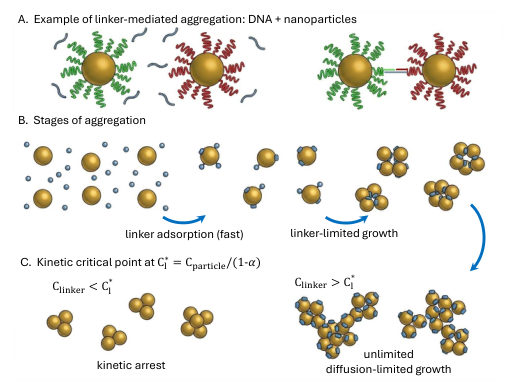
<figcaption class="paper-figure-caption"><b>Fig 1.</b> FIG. 1. Schematic of kinetic criticality in linker-mediated aggregation. (a) DNA-functionalized nanoparticles interact through soluble single-stranded DNA linkers. (b) Free link- ers first adsorb rapidly to particle surfaces, creating active patches; subsequent cluster–cluster encounters consume ac- tive linkers and block an effective surface fraction α per in- terparticle contact. (c) With particle concentration Cp and linker concentration Cl, the conservation law in Eq. (2) gives the critical concentration C∗ l = Cp/(1 −α). For Cl &lt; C∗ l , cl →0 and growth arrests at finite mass. For Cl &gt; C∗ l , active linkers remain available and aggregation crosses from linker- limited acceleration to...</figcaption>
</figure>
<figure class="paper-figure-card">
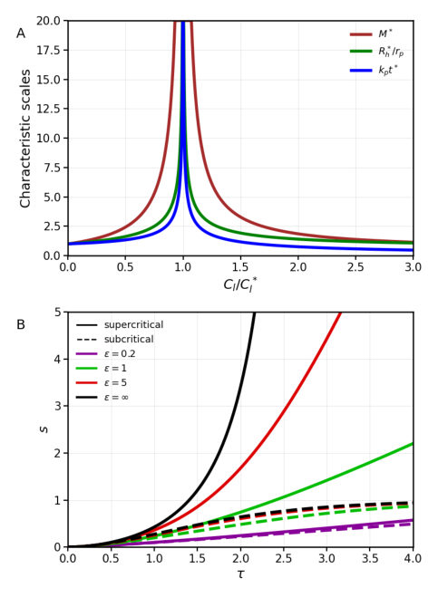
<figcaption class="paper-figure-caption"><b>Fig 2.</b> FIG. 2. Kinetic criticality in linker-mediated colloidal aggre- gation. (a) DNA-functionalized nanoparticles bind through short single-stranded DNA linkers, forming interparticle bridges. (b) Free linkers first adsorb rapidly to particle surfaces, creating active binding sites, followed by linker- mediated cluster growth. (c) Below C∗ l = Cp/(1 −α), ac- tive linkers are exhausted and growth arrests at finite cluster size; above threshold, aggregation continues and crosses over to diffusion-limited coarsening.</figcaption>
</figure>
<figure class="paper-figure-card">
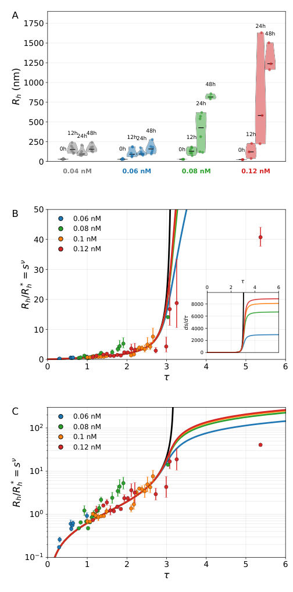
<figcaption class="paper-figure-caption"><b>Fig 3.</b> FIG. 3. DNA-linker aggregation of gold nanoparticles. (a) DLS hydrodynamic-radius distributions at fixed Cp = 0.04 nM per complementary particle type for Cl = 0.04–0.12 nM, measured at t = 0, 12, 24, and 48 h. Low-Cl samples arrest or remain near critical, whereas high-Cl samples grow. (b) Rescaled kinetics, Rh/R∗ h = sν versus τ = t/t∗, using ν = 0.55, C∗ l = 0.057 nM, and k−1 p = 16 h; the solid line is the ϵ → ∞linker-limited master curve. (c) Same data on a logarithmic scale, highlighting early acceleration and late-time deviations.</figcaption>
</figure>

**Summary.** This paper analyzes linker-mediated colloidal aggregation, showing that its kinetics are not classical but instead exhibit a sharp kinetic critical point. By controlling the linker concentration relative to this critical value, researchers can tune the system between an arrested state and one undergoing self-accelerating coarsening. This work provides a detailed model connecting chemical resource limitations to macroscopic changes in aggregation dynamics.

**Why it may be interesting.** While focused on colloids, the concept of a kinetic phase transition or bifurcation in reaction rates due to resource depletion (linkers) shares conceptual parallels with non-equilibrium dynamics studied in open quantum systems or complex chemical reactions.

Detailed structure

**Main problem.** The study investigates how linker-mediated colloidal aggregation deviates from classical Smoluchowski kinetics due to the dynamic evolution of cluster reactivity during growth.

**Main result.** The system exhibits a kinetic critical point controlled by linker abundance, leading to two distinct regimes: arrested growth below a critical linker concentration and self-accelerating coarsening above it.

**Method.** The research combines theoretical modeling using rate equations with experimental validation employing DNA-linked gold nanoparticles measured via DLS.

**Model / system.** The system involves colloidal particles linked by molecules, modeled by considering the interplay between diffusion and surface reactivity. The kinetics are governed by linker conservation laws leading to a critical point separating different aggregation fates.

**Key observables.** Hydrodynamic radii ($R_h$), cluster mass ($M$), and the existence/location of the kinetic critical point ($C^*_l$).

**Important parameters / regimes.** Linker concentration ($C_l$), critical linker concentration ($C^*_l$), and dimensionless time ($	au$).

**Assumptions / limitations.** Initial linker adsorption is assumed to be nearly irreversible, and the system is analyzed using mean-field rate equations.

**Figures summary.** Figures schematically illustrate the kinetic critical point separating arrested growth (low $C_l$) from unlimited coarsening (high $C_l$), with DLS measurements confirming this separation in $R_h$ distributions over time.

**Paper structure.** The paper establishes the departure from classical kinetics, derives rate equations incorporating linker depletion, identifies the critical point mathematically, and validates these theoretical predictions using colloidal experiments.

Abstract

Linker-mediated aggregation plays an important role in modern nanoscience. We demonstrate that it departs sharply from classical Smoluchowski kinetics because cluster reactivity evolves during growth. Combining theory with DNA-linked gold-nanoparticle experiments, we establish kinetic critical point controlled by linker abundance. Below threshold, active linkers are depleted and growth arrests; above threshold, clusters accumulate reactive sites, self-accelerate, and cross over to diffusion-limited coarsening. Experiments verify the predicted arrest, accelerated growth, and scaling collapse.

[↑ back to top](#top)

### [Magic transfer in quantum spin chains](http://arxiv.org/abs/2606.14855v1)

**Authors:** Antonio Palamara, Chad Nelmes, Enrico C. Domanti, Francesco Perciavalle  
**Type:** theory · **Category:** other · **PDF:** <https://arxiv.org/pdf/2606.14855v1>  
**Analysis basis:** full PDF text, analyzed in chunks
**Topic relevance:** `analog quantum simulation` **3/5** · `entanglement & information structure` **2/5** · `non-equilibrium dynamics` **2/5** · `correlated / nonlocal dissipation` **1/5** · `driven-dissipative phase transition` **1/5** · `exotic spin models in light-matter` **1/5** · `methods for driven-dissipative` **1/5** · `non-equilibrium universality` **1/5**

↔ Scroll figures horizontally

<figure class="paper-figure-card">
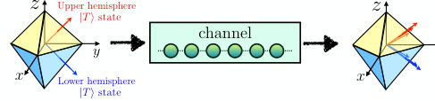
<figcaption class="paper-figure-caption"><b>Fig 1.</b> Figure 1. Pictorial representation of the protocol: |T⟩states with maximum SN are injected at one edge of a quantum channel modeled as a spin chain and transferred to the op- posite edge. The channel continuously interpolates between a perfect state transfer regime and an imperfect transfer regime. The transport of magic depends on the Bloch hemisphere to which the initial state belongs.</figcaption>
</figure>
<figure class="paper-figure-card">
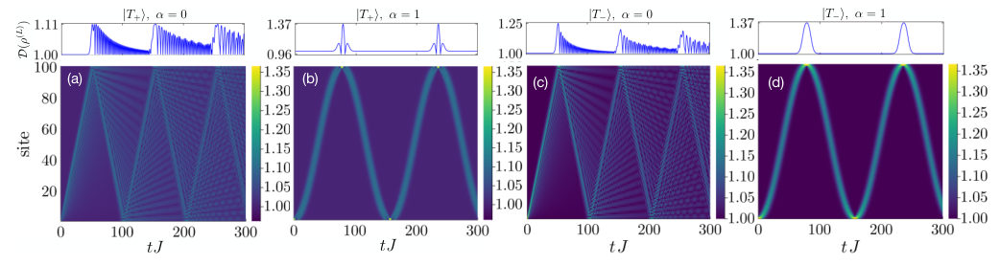
<figcaption class="paper-figure-caption"><b>Fig 2.</b> Figure 2. On-site SN dynamics (colorbar) in a spin chain described by ˆHA composed of L = 100 qubits in the two asymptotic regimes α = 0 and α = 1 when the system is initialized with |T+⟩and |T−⟩states in the site j = 1. Specifically, panel (a) |T+⟩, α = 0, panel (b) |T+⟩, α = 1, panel (c) |T−⟩, α = 0, panel (d) |T−⟩, α = 1. On the top of each panel we report the SN dynamics of the Lth site density matrix.</figcaption>
</figure>
<figure class="paper-figure-card">
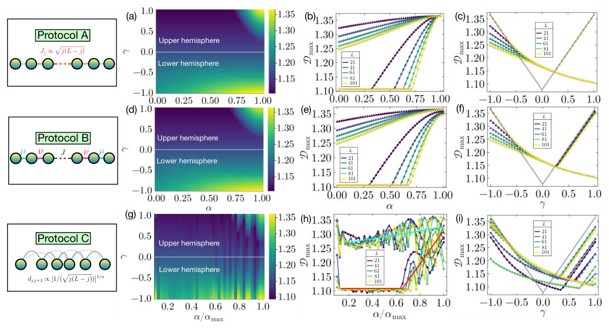
<figcaption class="paper-figure-caption"><b>Fig 3.</b> Figure 3. Maximum transferable SN in the three protocols. Panels (a)–(c) show results for protocol A (schematically illustrated on the left). Panel (a) reports the maximum transferable SN, Dmax, as a function of the Hamiltonian parameter α and the initial-state parameter γ for L = 101. Panel (b) shows Dmax versus α for different system sizes L, comparing two initial states: γ = −1 (|T−⟩, triangles) and γ = 1 (|T+⟩, circles). Panel (c) displays Dmax as a function of γ for different values of L, with triangles denoting α = 0 and circles denoting α = 1 (PST). The gray curve indicates the SN of the first site initial state. In</figcaption>
</figure>
<figure class="paper-figure-card">

<figcaption class="paper-figure-caption"><b>Fig 4.</b> Figure 4. Maximal average fidelity over normalised time units (J−1) where the maximal fidelity occurs for α = 1 (top row). These varying L-solutions correspond to Protocol A (left col- umn) and Protocol B (right column). Bottom row corre- sponds to the difference in times between maximum SN and the maximal average fidelity on the Lth site.</figcaption>
</figure>
<figure class="paper-figure-card">
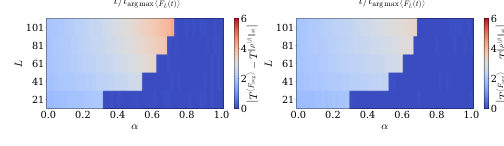
<figcaption class="paper-figure-caption"><b>Fig 5.</b> Fig. 3 in the main text shows that the time at which the average fidelity reaches its maximum generally does not coincide with the time at which the stabilizer norm</figcaption>
</figure>

**Summary.** This paper investigates the transport of quantum magic—a specific nonstabilizer resource—through spin chains using the XX Hamiltonian. By analyzing three different state-transfer protocols, the authors demonstrate that the initial state geometry dictates transfer efficiency and reveal a mechanism where the spin chain can actively amplify the injected quantum magic. This establishes a new diagnostic tool for assessing quantum channel capabilities beyond standard fidelity measures.

**Why it may be interesting.** This work directly addresses non-local quantum resource transfer in physical systems like trapped ions or superconducting circuits, providing quantitative metrics (SN) beyond simple fidelity to characterize channel quality. The concept of 'magic amplification' suggests novel ways to process quantum information.

Detailed structure

**Main problem.** The paper investigates the transport of quantum magic, a nonstabilizer resource, through quantum spin chains, treating it as a distinct problem from standard Perfect State Transfer (PST). It aims to characterize how this resource is preserved and amplified during state transfer.

**Main result.** The geometry of the initial state significantly influences transport quality, showing an asymmetry where lower-hemisphere states transfer better than upper-hemisphere states. Furthermore, the system can act as a magic-amplification channel when the transported magic exceeds the initial encoding.

**Method.** The analysis uses theoretical modeling based on the XX Hamiltonian and quantifies resource transfer using the stabilizer norm (SN) of the reduced density matrix at various sites and times.

**Model / system.** The system is a one-dimensional quantum spin chain governed by an XX Hamiltonian. Three state-transfer protocols are analyzed, interpolating between homogeneous, ballistic, and power-law decaying couplings. The analysis focuses on T-states initialized in the upper or lower Bloch hemisphere.

**Key observables.** Stabilizer Norm (SN) of the reduced density matrix ($	ext{D}(
ho)$), Maximum Transferable SN ($D_{	ext{max}}$), and Average Fidelity ($\langle F_j(t) 
angle$).

**Important parameters / regimes.** Interpolation parameter $\alpha$ controlling coupling regimes, initial state geometry (upper vs. lower Bloch hemisphere), and system size $L$.

**Assumptions / limitations.** The analysis relies on the validity of using the stabilizer norm to quantify nonstabilizerness and assumes specific forms for Hamiltonian interpolation between different transfer limits.

**Figures summary.** Figures illustrate how magic transfer depends on the initial state's Bloch hemisphere, show site-dependent SN dynamics across protocols, and plot $D_{	ext{max}}$ versus Hamiltonian parameters ($\alpha$, $\gamma$).

**Paper structure.** The paper establishes quantum magic transport as a resource problem, analyzes three specific spin chain protocols (A, B, C) using the XX Hamiltonian, derives the evolution of local Bloch vectors, and presents results showing state-geometry dependence and potential for magic amplification.

Abstract

Quantum communication protocols based on spin chains have been extensively studied, yet their ability to transmit nonstabilizer resources has not been systematically addressed. We investigate the transport of quantum magic in spin chains through the natural dynamics of systems initialized in nonstabilizer states, and quantify the transported resource via the stabilizer norm. We analyze three experimentally feasible state-transfer protocols, ranging from noisy to (quasi-)perfect transfer, including one realizable in trapped-ion platforms. We find that the geometry of the injected state strongly influences transport: states in the lower Bloch hemisphere achieve higher transfer quality, whereas states in the upper hemisphere give rise to an efficient magic transport only beyond a threshold value of the parameter controlling the tendency towards perfect transfer. These features are robust across all protocols and identify the Hamiltonian and state properties that favor high-quality transfer. Moreover, we identify a parameter region, relevant to the initial state preparation, in which the transported magic exceeds the initial encoding, indicating that such spin systems can act as magic-amplification channels. Our results establish the conditions for efficient transport of nonstabilizer resources and demonstrate quantum magic as a sensitive probe of quantum transport beyond population dynamics.

[↑ back to top](#top)

### [Quantum learning with a single-atom sensor](http://arxiv.org/abs/2606.15071v1)

**Authors:** Yin Mo, Emilio Bagan, Giulio Chiribella  
**Type:** theory · **Category:** quantum information and computing · **PDF:** <https://arxiv.org/pdf/2606.15071v1>  
**Analysis basis:** full PDF text, analyzed in chunks
**Topic relevance:** `entanglement & information structure` **3/5** · `quantum measurements` **3/5** · `measurement-induced transitions` **2/5** · `Keldysh / 2PI / non-Gaussian methods` **1/5** · `correlated / nonlocal dissipation` **1/5** · `driven-dissipative phase transition` **1/5** · `methods for driven-dissipative` **1/5**

↔ Scroll figures horizontally

<figure class="paper-figure-card">
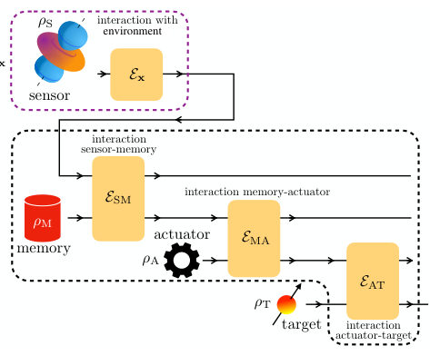
<figcaption class="paper-figure-caption"><b>Fig 1.</b> FIG. 2: Learning from a quantum sensor. A sensor S, initially in the state ρS, interacts with the environment, gathering in- formation about a set of parameters x. After the interaction, the sensor ends up in the state ρx. It then transfers infor- mation to the internal memory M of the learning machine, initially in the state ρM. When the machine is required to operate, it accesses its memory by letting it interact with a quantum system A, called the actuator, which controls the machine’s operations on a target system T. The overall pro- cess converting sensorial data into actions on the target sys- tem is described by an effective channel C, with input ST and output T.</figcaption>
</figure>
<figure class="paper-figure-card">
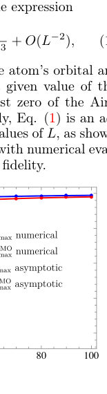
<figcaption class="paper-figure-caption"><b>Fig 2.</b> FIG. 1: Ultimate quantum limit for learning rotations from a single atom. The figure shows the fidelity between the output produced by the learning machine and the output of the given rotation, for the optimal quantum learning machine (blue) and the optimal machine based on estimation (red). The solid curves represent the asymptotic expressions (1) (blue) and (2) (red), respectively, while dots are the results of numerical optimization.</figcaption>
</figure>
<figure class="paper-figure-card">
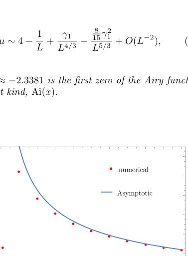
<figcaption class="paper-figure-caption"><b>Fig 3.</b> FIG. 1: Plot of the function L(4 −µ) vs L for L up to 100. The solid line is derived from the asymptotic expression in Eq. (17), i.e., L(4−µ) = 1−γ1L−1/3+(8/15)γ2 1L−2/3, whereas the red circles are obtained by numerical calculation. The plot illustrates the validity of Eq. (17) even for relatively small values of L.</figcaption>
</figure>
<figure class="paper-figure-card">

<figcaption class="paper-figure-caption"><b>Fig 4.</b> Fig 1 illustrates the accuracy of the asymptotic expres- sion provided by Theorem 3 by comparing the subleading terms in Eq. (17) to the exact values of L(4−µ) obtained through numerical calculation of the largest eigenvalue. The agreement between the asymptotic formula and the numerical results is remarkable. The asymptotic expres- sion accurately predicting L(4−µ) for values of the total angular momentum as small as L ⪆10, despite of the fact that this comparison accentuates the differences between the two curves. Applying Theorem 3, we can directly conclude that, up to order 1/L2, the asymptotic fidelity is given by Eq. (1) in the main text. This result provides a concise and accu- rate...</figcaption>
</figure>

**Summary.** This work establishes fundamental quantum limits for learning processes where information is gathered by a single-atom sensor. It reveals a critical tradeoff: optimal performance requires either pre-existing entanglement between the sensor and memory, or an efficient coherent transfer of quantum information during operation. The findings link quantum sensing directly to the capabilities of quantum agents.

**Why it may be interesting.** It provides rigorous theoretical benchmarks for quantum sensing protocols, quantifying exactly how initial entanglement resources can enhance computational tasks beyond classical or simple estimation limits.

Detailed structure

**Main problem.** The paper investigates the ultimate quantum limits for a learning agent's ability to sense external inputs (via a single-atom sensor) and translate that information into actions (rotating a target spin). It specifically determines the fundamental tradeoff between entanglement at sensing and coherence at action.

**Main result.** The optimal quantum strategy surpasses both estimation-based methods and measurement-and-operate strategies, demonstrating that initial entanglement between the sensor and memory is crucial for achieving the best performance bound.

**Method.** The analysis uses fully quantum models of learning machines, deriving upper bounds on fidelity using techniques involving Choi operators, spectral theory of tridiagonal matrices, and asymptotic analysis (e.g., solving differential equations).

**Model / system.** The model involves a single-atom sensor interacting with an environment parameterizing the input ($x$), which then transfers information to an internal quantum memory controlling an actuator acting on a target spin qubit.

**Key observables.** Fidelity ($F$ or $F^{(e)}$), entanglement fidelity, and the largest eigenvalue ($\mu$) of associated tridiagonal matrices.

**Important parameters / regimes.** The size parameter $L$ (related to sensor basis size) and the initial entanglement structure between the sensor and memory.

**Assumptions / limitations.** The analysis compares optimal quantum strategies against measure-and-operate protocols, assuming that the optimal channels can be taken as unitary in certain limits.

**Figures summary.** Figures compare the ultimate quantum limit fidelity versus estimation-based machine fidelity; one figure illustrates the overall process flow from Sensor $	o$ Environment $	o$ Memory $	o$ Actuator to the Target System.

**Paper structure.** The paper builds by first establishing the general framework, then deriving bounds for specific strategies (optimal vs. measure-and-operate), and finally using advanced mathematical techniques like solving differential equations and asymptotic expansions to determine the ultimate scaling laws for fidelity.

Abstract

The ability to gather information and to act upon it is at the core of every learning agent. But what is the impact of quantum mechanics on an agent's ability to sense external inputs and to translate them into actions? Here we address the question for a prototype task of learning agency at the quantum scale: rotating a single spin based on information gathered by a single atom. We determine the ultimate performance limit for this task, revealing a fundamental tradeoff between entanglement at the sensing stage and coherence at the action stage: if the single-atom sensor is not entangled with the quantum system serving as the agent's internal memory, then the best learning strategy requires a coherent transfer of quantum information from the sensor to the system that controls the agent's actions. In contrast, if the sensor is initially entangled with the agent's memory, then the transfer of quantum information is no longer necessary. Our results indicate that the quantum properties of the sensor radically affect the optimal way to convert external stimuli into actions, revealing a link between quantum sensing and the behavior of quantum agents.

[↑ back to top](#top)

### [Refining Unified Colored-Noise Approximation](http://arxiv.org/abs/2606.16752v1)

**Authors:** Alessandro Corso, Daniel M. Busiello  
**Type:** theory · **Category:** statistical mechanics · **PDF:** <https://arxiv.org/pdf/2606.16752v1>  
**Analysis basis:** full PDF text, analyzed in chunks
**Topic relevance:** `Keldysh / 2PI / non-Gaussian methods` **3/5** · `methods for driven-dissipative` **3/5** · `correlated / nonlocal dissipation` **2/5** · `non-equilibrium dynamics` **2/5** · `driven-dissipative phase transition` **1/5** · `non-equilibrium universality` **1/5**

↔ Scroll figures horizontally

<figure class="paper-figure-card">
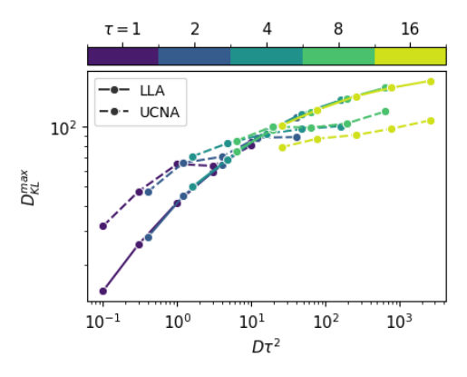
<figcaption class="paper-figure-caption"><b>Fig 1.</b> FIG. 1. Performance of UCNA and LLA for the quartic poten- tial in Eq. (17) in the transient regime. The maximum value attained by the Kullback-Leibler divergence between numer- ical and approximate solutions during the dynamics is used as performance parameter. While the LLA performs better for small Dτ 2, we observe a crossover at large values of Dτ 2</figcaption>
</figure>
<figure class="paper-figure-card">
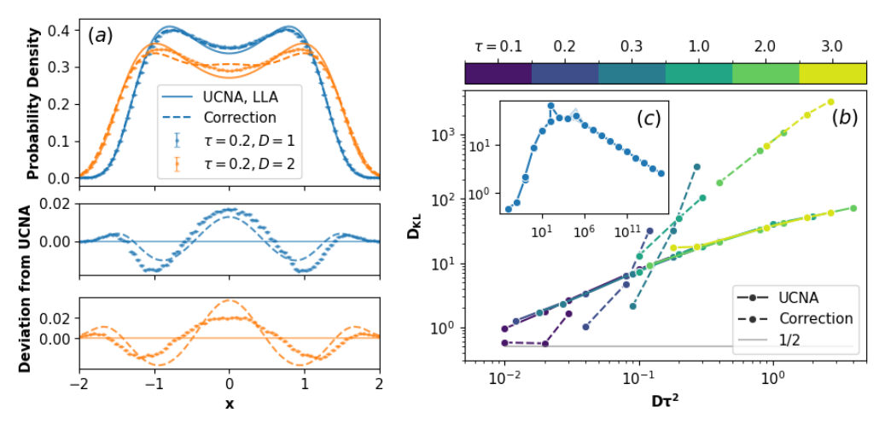
<figcaption class="paper-figure-caption"><b>Fig 2.</b> FIG. 2. Performance of the theory for the quartic potential in Eq. (17). (a) Stationary probability distribution in the UCNA approximation and its correction, compared with simulations of the exact stochastic differential equation. Lower panels show the difference between the two approximations. (b) Kullback-Leibler divergence, DKL, in Eq. (18) between numerical solution and approximate theoretical results. The inset (c) shows the behavior of the DKL for large values of Dτ 2.</figcaption>
</figure>
<figure class="paper-figure-card">
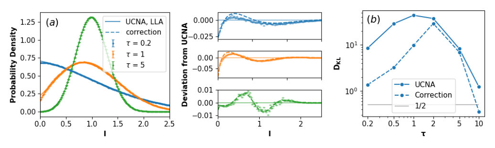
<figcaption class="paper-figure-caption"><b>Fig 3.</b> FIG. 3. Performance of the theory for the stochastic logistic model at critical noise intensity D = 2 for which the steady-state distribution stays finite at I = 0 (see also [17]). (a) Stationary probability distribution in the UCNA approximation and its correction, compared with simulations of the exact stochastic differential equation. Side panels show the difference between the two approximations. (b) Kullback-Leibler divergence, DKL, between numerical and approximate solution as a function of τ.</figcaption>
</figure>

**Summary.** This paper refines the Unified Colored-Noise Approximation (UCNA) by developing a rigorous time-scale separation procedure. It derives next-to-leading order corrections to the dynamics for systems driven by colored noise. This improves theoretical accuracy over standard methods, providing better predictions for physical observables like stationary distributions.

**Why it may be interesting.** This work provides a systematic, higher-order theoretical tool for analyzing open quantum systems or classical stochastic processes where noise correlations are non-Markovian, which is crucial when simple approximations fail.

Detailed structure

**Main problem.** The paper addresses the challenge of accurately modeling stochastic dynamics driven by colored noise, which possesses non-trivial temporal correlations.

**Main result.** By refining the Unified Colored-Noise Approximation (UCNA) using a time-scale separation procedure, the authors derive next-to-leading order corrections to the system's evolution equations and stationary distributions.

**Method.** The core method involves applying a systematic time-scale separation technique to an equivalent two-variable system, allowing for a perturbative expansion in a small parameter $\epsilon$.

**Model / system.** The analysis is applied to general stochastic differential equations (Langevin equations) driven by colored noise, exemplified by a particle in a quartic potential and stochastic logistic growth.

**Key observables.** Stationary probability distributions ($\hat{p}_{st}$), the Kullback-Leibler divergence ($	ext{DKL}$) used to quantify approximation accuracy.

**Important parameters / regimes.** The correlation time ($	au$), diffusion coefficient ($D$), and the small expansion parameter $\epsilon$ are crucial parameters governing the approximations' validity.

**Assumptions / limitations.** The primary assumptions are the applicability of a time-scale separation procedure and performing an expansion in the small parameter $\epsilon$.

**Figures summary.** Figures compare the performance (via DKL) of the standard UCNA versus the newly derived corrected approximation for both transient and stationary regimes across two physical examples.

**Paper structure.** The paper first establishes the mathematical shortcomings of the original UCNA. It then rigorously derives the next-to-leading order correction using time-scale separation, presenting the corrected evolution equation. Finally, it applies this framework to specific models (quartic potential and logistic growth) to derive and compare the improved stationary solutions.

Abstract

Countless biological and physical systems experience fluctuations that exhibit non-trivial temporal correlations. The Unified Colored-Noise Approximation (UCNA) is a framework providing an approximate description of such stochastic dynamics with colored noise, valid in the limits of vanishing and infinite correlation time of the noise. We first pinpoint and address some criticalities in its original derivation, recasting the result through a time-scale separation procedure. By using our approach, we derive the next-to-leading order correction to the dynamics in both limiting regimes, and highlight the relevant physical scalings of these approximations. Our result helps frame the limits of validity of both the original and the refined formulas, especially in comparison with those derived through different approximation procedures. We show our findings in two paradigmatic examples, a quartic potential and a stochastic logistic growth with multiplicative noise.

[↑ back to top](#top)

### [Spin-orbit-entangled $J_{\rm eff}=\frac{1}{2}$ magnetism and unconventional spin freezing in the bond-disordered pyrochlore antiferromagnet NaCdCo$_2$F$_7$](http://arxiv.org/abs/2606.16875v1)

**Authors:** Andrej Kancko, Hironori Sakai, Javier Herrero-Martín, Adam Berlie, Marc Uhlarz, Tetiana Haidamak, Yo Tokunaga, Ross H. Colman  
**Type:** both · **Category:** disordered systems and neural networks · **PDF:** <https://arxiv.org/pdf/2606.16875v1>  
**Analysis basis:** full PDF text, analyzed in chunks
**Topic relevance:** `analog quantum simulation` **3/5** · `exotic spin models in light-matter` **3/5** · `spintronics-quantum-optics interface` **3/5** · `Kondo & dissipative impurity` **1/5** · `methods for driven-dissipative` **1/5** · `non-equilibrium dynamics` **1/5**

↔ Scroll figures horizontally

<figure class="paper-figure-card">
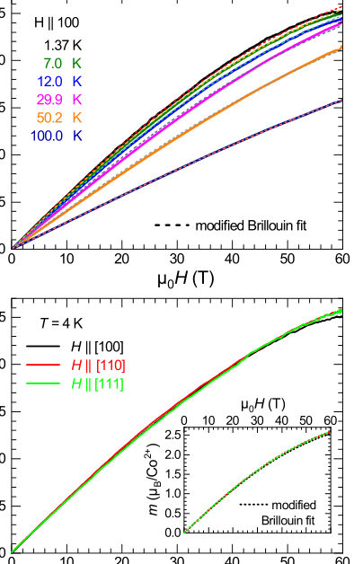
<figcaption class="paper-figure-caption"><b>Fig 1.</b> Figure 1. (a) Temperature dependence of pulsed-field magne- tization of an oriented crystal of NaCdCo2F7, with H ∥[100]. Fits to Eq. (1) are shown as dashed lines. (b) Directional dependence of magnetization at T = 4 K, with field applied along [100], [110] and [111] directions. Fits to Eq. (1) are shown separately in the inset.</figcaption>
</figure>
<figure class="paper-figure-card">
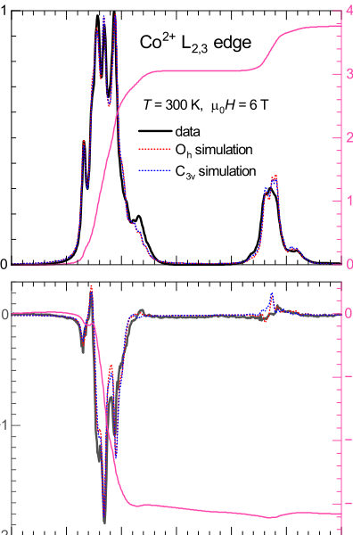
<figcaption class="paper-figure-caption"><b>Fig 2.</b> Figure 2. (a) Co2+ L2,3 XAS and (b) XMCD data mea- sured at T = 300 K in 6 T field, both normalized to the maximum L3 intensity, shown together with Oh and C3v crystal-field simulations from Crispy. The integration curves of XAS/XMCD are shown on the right axes.</figcaption>
</figure>
<figure class="paper-figure-card">
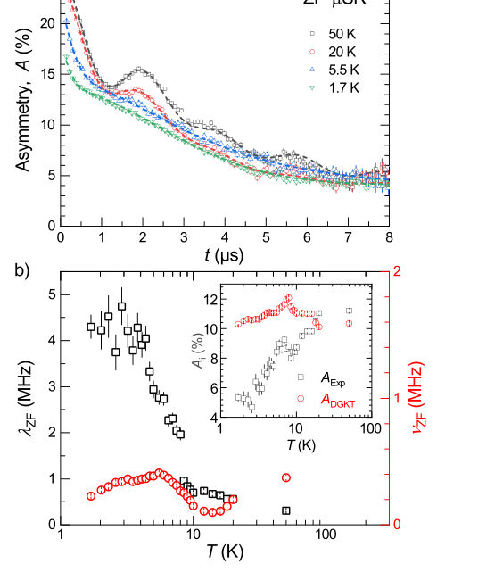
<figcaption class="paper-figure-caption"><b>Fig 3.</b> Figure 3. (a) Temperature dependence of ZF muon asym- metry. (b) Temperature dependence of fitted ZF muon relax- ation rate λZF and fluctuation rate νZF from Equation 7, with fitted relaxing amplitudes shown in the inset.</figcaption>
</figure>
<figure class="paper-figure-card">
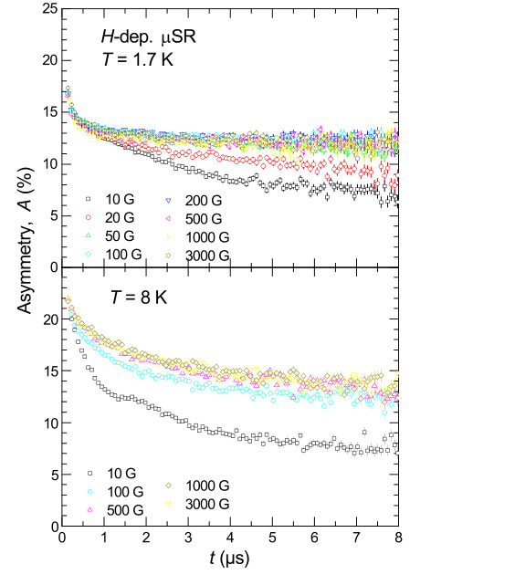
<figcaption class="paper-figure-caption"><b>Fig 4.</b> Figure 4. Field dependence of muon asymmetry at T = 1.7 K (upper panel) and T = 8 K (lower panel).</figcaption>
</figure>
<figure class="paper-figure-card">
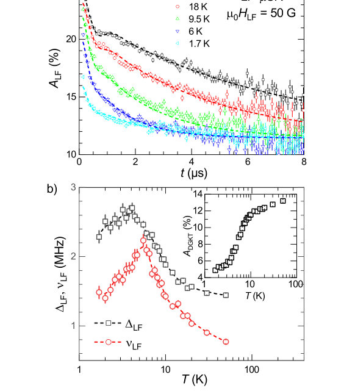
<figcaption class="paper-figure-caption"><b>Fig 5.</b> Figure 5. (a) Temperature dependence of LF 50 G muon asymmetry. (b) Temperature dependence of fitted quasistatic field distribution ∆LF and fluctuation rate νLF from Equation 8, with the relaxing amplitude T -dependence shown in the inset.</figcaption>
</figure>

**Summary.** The research characterizes the magnetism of a bond-disordered pyrochlore antiferromagnet using multiple advanced probes. It establishes that strong spin-orbit coupling dictates the formation of $J_{	ext{eff}}=1/2$ moments, leading to an unconventional, partially frozen glassy state upon cooling. This finding highlights SOC as the crucial ingredient differentiating its magnetic fate from related, simpler systems.

**Why it may be interesting.** This work is interesting because it uses advanced spectroscopic techniques ($\mu$SR, XMCD) to map out complex many-body quantum states in disordered magnetic insulators, providing insights into how crystal field effects (SOC) stabilize exotic glassy phases over simpler theoretical models.

Detailed structure

**Main problem.** The study investigates how bond disorder influences the magnetic ground state of frustrated pyrochlore antiferromagnets, specifically comparing spin-orbit-entangled Co$^{2+}$ moments to simpler $S=1/2$ counterparts.

**Main result.** The system realizes an unconventional, partially frozen spin-glass-like state with persistent low-temperature dynamics, fundamentally different from a canonical spin glass or random-singlet state.

**Method.** A combination of experimental techniques including high-field magnetization, XAS/XMCD (to probe orbital moments), $\mu$SR (for local field dynamics), and $^{23}$Na NMR (for spin relaxation) was employed.

**Model / system.** The physical system is the bond-disordered pyrochlore antiferromagnet NaCdCo$_2$F$_7$, which hosts localized $J_{	ext{eff}}=1/2$ Kramers doublets due to strong spin-orbit coupling. The analysis compares its behavior against isostructural compounds like NaCdCu$_2$F$_7$.

**Key observables.** Magnetization curves $M(H, T)$, $\mu$SR relaxation rates ($\lambda_{	ext{ZF}}$), $^{23}$Na NMR spin-lattice relaxation rate ($1/T_1$), and orbital moment ratios ($\langle L_z 
angle / \langle S_{	ext{eff}} 
angle$).

**Important parameters / regimes.** The key physical parameters are the strength of spin-orbit coupling (SOC) and the degree of bond disorder, which dictate whether the system enters a glassy or random-singlet state.

**Assumptions / limitations.** The analysis assumes that SOC is the dominant mechanism governing the magnetic response in these frustrated lattices, leading to $J_{	ext{eff}}=1/2$ moments.

**Figures summary.** Figures illustrate temperature dependence of magnetization under high fields and directional dependence at low temperatures. $\mu$SR and NMR data show characteristic signatures of progressive spin fluctuation slowing down below $\sim 10 	ext{ K}$.

**Paper structure.** The paper builds by first characterizing the magnetic moments using XAS/XMCD, then probing the bulk dynamics via magnetization measurements, and finally detailing the low-temperature freezing behavior using highly sensitive local probes like $\mu$SR and NMR.

Abstract

Bond disorder in frustrated pyrochlore antiferromagnets can give rise to fundamentally different quantum ground states depending on the nature of the local magnetic moments. Here, we show that the bond-disordered pyrochlore NaCdCo$_2$F$_7$ realizes an unconventional spin-glass-like state with continued dynamics, in stark contrast to its isostructural $S=\frac{1}{2}$ NaCdCu$_2$F$_7$ counterpart. High-field magnetization and Co $L_{2,3}$-edge XAS/XMCD establish spin-orbit-entangled $J_{\rm eff}=\frac{1}{2}$ Co$^{2+}$ moments with a substantial unquenched orbital contribution, consistent with local $XY$ anisotropy seen in the isostructural Na$A''$Co$_2$F$_7$ ($A''$ = Ca, Sr) analogues. $μ$SR and $^{23}$Na NMR measurements reveal progressive slowing of spin fluctuations below $\sim10$ K, culminating in a partially frozen state with persistent low-temperature dynamics that deviates from a canonical spin glass. Comparison with the isostructural bond-disordered pyrochlore NaCdCu$_2$F$_7$, which realizes a random-singlet state, reveals a fundamentally different response of spin-orbit-entangled Co$^{2+}$ moments to bond disorder. These results identify spin-orbit coupling as a key ingredient governing the fate of bond-disordered frustrated pyrochlore magnets.

[↑ back to top](#top)

### [Topological Tricritical Ising Universality Class in One Dimension](http://arxiv.org/abs/2606.15588v1)

**Authors:** Sheng Yang, Hai-Qing Lin, Xue-Jia Yu  
**Type:** theory · **Category:** statistical mechanics · **PDF:** <https://arxiv.org/pdf/2606.15588v1>  
**Analysis basis:** full PDF text, analyzed in chunks
**Topic relevance:** `Keldysh / 2PI / non-Gaussian methods` **3/5** · `methods for driven-dissipative` **2/5** · `non-equilibrium universality` **2/5** · `analog quantum simulation` **1/5** · `driven-dissipative phase transition` **1/5** · `entanglement & information structure` **1/5** · `exotic spin models in light-matter` **1/5** · `non-equilibrium dynamics` **1/5**

↔ Scroll figures horizontally

<figure class="paper-figure-card">
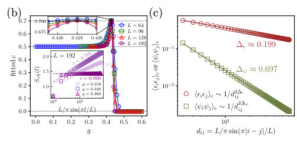
<figcaption class="paper-figure-caption"><b>Fig 1.</b> FIG. 1. (a) Ground-state phase diagram tuned by the param- eter g. The system resides in the Ising* (TCI∗) universality class with central charge c = 0.5 (c = 0.7) for 0 ≤g &lt; gc (gc ≈0.428) and enters a gapped phase when g &gt; gc . (b) Extracted central charge c as a function of g for various sizes L. Upper inset: finite-size effect near the TCI∗QCP, demonstrating the convergence to c = 0.7 at gc = 0.428 as L increases. Lower inset: the bipartite von Neumann en- tanglement entropy SvN(l) versus the conformal chord length for three representative points: g = 0.350 (on the Ising* line), g = gc (at the TCI∗QCP), and g = 0.460 (on the gapped line). (c) Algebraic decay of the connected correlation...</figcaption>
</figure>
<figure class="paper-figure-card">
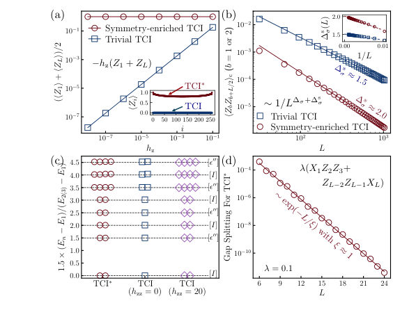
<figcaption class="paper-figure-caption"><b>Fig 2.</b> FIG. 2. (a) Boundary magnetization versus hz [with Hbdy = −hz(Z1 + ZL)] for the original and cluster OF models. Inset: the spatial profile of the magnetization across the chain under a vanishingly small hz = 10−8 for L = 256. (b) Finite-size scaling of the boundary-bulk connected spin-spin correlation function, which scales as ∼L−(∆σ+∆s σ). Here we have chosen r = L/2 for finite-size systems of size L. Taking the known bulk scaling dimension ∆σ = 3/40, we extract ∆s σ ≈1.5 (∆s σ ≈2.0) for the original (cluster) OF model. Inset: the finite-size exponent ∆s σ obtained via power-law fits using data from system sizes L, L ± 32, and L ± 64. (c) Rescaled low- energy spectra of the cluster OF and...</figcaption>
</figure>
<figure class="paper-figure-card">
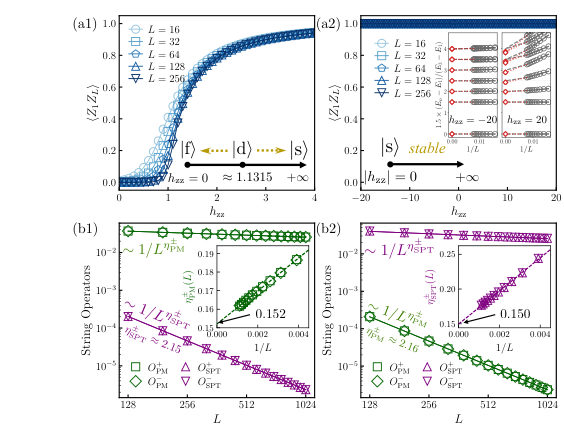
<figcaption class="paper-figure-caption"><b>Fig 3.</b> FIG. 3. (a1), (a2) Boundary spin-spin correlation ⟨Z1ZL⟩as a function of hzz, with Hbdy = −hzz(Z1Z2 + ZL−1ZL), for the (a1) original and (a2) cluster OF models at the tricritical Ising point. The insets show the corresponding boundary RG flows among the free |f⟩, degenerate |d⟩, and spontaneously fixed |s⟩boundary fixed points, with dotted arrows indicat- ing the flow directions. The spectral inset in (a2) shows the rescaled spectrum 1.5(En−E1)/(E3−E1) at hzz = ±20, which matches the BCFT operator content of |s⟩. Red dashed lines show finite-size extrapolations, while red diamonds indicate the extrapolated thermodynamic-limit values; gray dashed lines mark the corresponding scaling...</figcaption>
</figure>

**Summary.** This work explores novel quantum critical points by studying the cluster O’Brien–Fendley model. The authors establish a distinct $	ext{TCI}^*$ universality class characterized by unique boundary physics and an exponential energy splitting of its topological edge modes. This research advances the understanding of how topology enriches criticality in low-dimensional quantum systems.

**Why it may be interesting.** It provides a rigorous theoretical framework for identifying symmetry-enriched topological phases beyond standard critical theories, which is highly relevant to modern condensed matter theory.

Detailed structure

**Main problem.** To investigate whether a topologically distinct Tricritical Ising (TCI) universality class ($	ext{TCI}^*$) exists beyond the ordinary TCI criticality, particularly concerning topological aspects at quantum critical points.

**Main result.** The $	ext{TCI}^*$ QCP exhibits a twofold topological degeneracy with an exponential energy splitting, distinguishing it from the ordinary TCI point and revealing distinct boundary structures.

**Method.** The study employs field-theoretic analysis, large-scale numerical simulations (DMRG), and Conformal Boundary Field Theory (BCFT) techniques to analyze critical exponents and low-energy spectra.

**Model / system.** The system is based on the cluster O’Brien–Fendley (OF) model, a spin-1/2 chain with multiple three-body interactions, analyzed near its tricritical point ($g_c \approx 0.428$).

**Key observables.** Central charge ($c$), boundary magnetization ($m_{bdy}$), boundary correlation exponent ($\Delta_{s\sigma}$), and the energy splitting ($\Delta E$) of edge modes.

**Important parameters / regimes.** Tuning parameter $g$, critical coupling constants, and system size $L$.

**Assumptions / limitations.** The analysis relies on mapping the low-energy physics to established CFT/BCFT frameworks for comparison.

**Figures summary.** Figures illustrate finite-size scaling of correlation functions ($\Delta_{s\sigma}$), comparisons of low-energy spectra under different boundary conditions, and plots showing exponential decay of energy splitting at $	ext{TCI}^*$.

**Paper structure.** The paper systematically compares the critical behavior of the cluster OF model to ordinary TCI theory by analyzing boundary correlation functions, confirming distinct scaling dimensions ($\Delta_{s\sigma}$), and demonstrating the unique exponential energy splitting characteristic of the $	ext{TCI}^*$ point.

Abstract

Recent advances have revealed that quantum critical universality can be enriched by nontrivial topology. Here we study the tricritical point of the one-dimensional cluster O Brien-Fendley model and show that it realizes a topologically nontrivial tricritical Ising ($\text{TCI}^*$) universality class. The transition shares the local bulk conformal data of ordinary TCI criticality, while realizing a distinct symmetry-enriched topological sector, manifested through a protected twofold degeneracy under open boundary conditions. We further show that TCI criticality admits two spontaneously fixed boundary conditions, realized respectively through symmetry enrichment and boundary renormalization-group flow, which are distinguished by the $\mathbb{Z}_2^T$ charge of the disorder field. Remarkably, we find that the topological twofold degeneracy at the $\text{TCI}^*$ critical point exhibits an exponential energy splitting, in stark contrast to the algebraic splitting at the $\text{Ising}^*$ critical point. These results reveal a symmetry-enriched form of TCI criticality and uncover topologically distinct boundary structures beyond those of the ordinary TCI theory.

[↑ back to top](#top)

### [Bath memory as a precision resource in quantum transport](http://arxiv.org/abs/2606.17026v1)

**Authors:** José Molina, Sheikh Parvez Mandal, Mahasweta Pandit, Javier Prior  
**Type:** theory · **Category:** statistical mechanics · **PDF:** <https://arxiv.org/pdf/2606.17026v1>  
**Analysis basis:** full PDF text, analyzed in chunks
**Topic relevance:** `Keldysh / 2PI / non-Gaussian methods` **3/5** · `Kondo & dissipative impurity` **2/5** · `non-equilibrium dynamics` **2/5** · `correlated / nonlocal dissipation` **1/5** · `driven-dissipative phase transition` **1/5** · `methods for driven-dissipative` **1/5** · `non-equilibrium universality` **1/5**

↔ Scroll figures horizontally

<figure class="paper-figure-card">
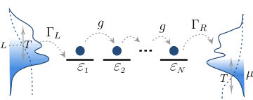
<figcaption class="paper-figure-caption"><b>Fig 1.</b> Figure 1: Schematic representation of the quantum trans- port setup.</figcaption>
</figure>
<figure class="paper-figure-card">
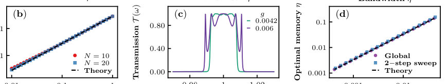
<figcaption class="paper-figure-caption"><b>Fig 2.</b> Figure 2: (a1) Current Fano factor F, calculated using the NEGF technique in the pseudomode representation of the Lorentzian baths, as a function of bath bandwidth η for different hoppings g with Fano minima marked for g = 0.01 and g = 0.0042. (a2, a3) Pole frequencies Ωj and damping rates γj/2 (color scale, right top) of the modes in Eq. (6) for mismatched (g = 0.01) and optimal g = 0.0042 internal hoppings as a function of bandwidth η. The circles represent the pole positions at the numerical optimal η. Insets show the inter-mode overlap matrix [Eq. (6)] (color scale, right bottom). The optimal case (g = 0.0042) displays strong uniform overlap, enabling constructive interference and noise...</figcaption>
</figure>
<figure class="paper-figure-card">
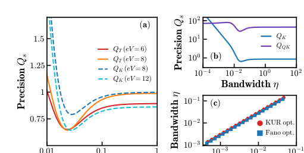
<figcaption class="paper-figure-caption"><b>Fig 3.</b> Figure 3: Thermodynamic and kinetic precision enhance- ment using bath memory. (a) Simultaneous reduction of TUR and KUR coefficients for different values of bias. (b) Semiclassical KUR and quantum kinetic coefficients as functions of reservoir bandwidth for eV/T = 8. (c) Global minima of semiclassical KUR and Fano factor in the (g, η) plane for Γ ∈[0.001, 0.1]. Parameters: Γα = 0.01, T = 1, εLα = ε = 1, N = 2.</figcaption>
</figure>
<figure class="paper-figure-card">
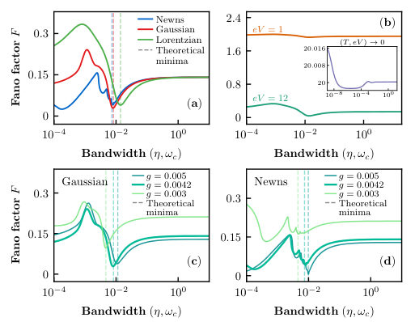
<figcaption class="paper-figure-caption"><b>Fig 4.</b> Figure 4: Fano factor F vs effective bandwidth η (Lorentzian) and ωc (Gaussian and Newns). Vertical dashed lines indicates the theoretically predicted minima [Eq. (9)]. (a) F for different bath spectra for g = 0.005. (b) F for different values of bias eV ; the inset shows the linear response behavior for T = 10−3, eV = 10−4. The Fano factor F with respect to bandwidth is shown for different g’s for a Gaussian (c) and a Newns (d) bath spectral density. Parameters: N = 10, Γα = 0.01, T = 1, eV/T = 12, and εLα = ε = 1, unless otherwise stated.</figcaption>
</figure>
<figure class="paper-figure-card">
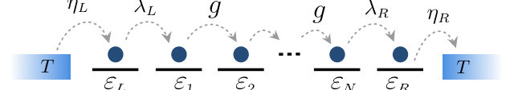
<figcaption class="paper-figure-caption"><b>Fig 5.</b> Figure 5: Diagram of the N-site chain system. The internal coupling strength between dots is given by g, λi is the coupling between the leads and the boundary dots, and ηi is the dissipation rate coupling the leads to the residual macroscopic baths which is identifiable with memory [36].</figcaption>
</figure>

**Summary.** The paper demonstrates how incorporating finite memory into the environment (bath) of a mesoscopic conductor can act as a resource to enhance transport precision. By deriving a dual impedance-matching condition, authors predict optimal bath bandwidths that suppress current noise below Markovian limits. This offers a practical strategy for designing next-generation quantum electronic devices.

**Why it may be interesting.** This work provides concrete, tunable engineering principles—a 'design blueprint'—for enhancing quantum coherence and reducing noise in solid-state devices by controlling environmental coupling memory effects.

Detailed structure

**Main problem.** The core problem is developing a predictive criterion for when utilizing 'bath memory' enhances quantum transport precision, addressing the lack of such a transferable connection between bath timescale and noise reduction in mesoscopic devices.

**Main result.** Optimal transport precision (minimum Fano factor) can be achieved by implementing a 'dual impedance-matching condition' that synchronizes internal mode splitting, boundary dissipation, and finite bath bandwidth.

**Method.** The analysis employs the Landauer–Büttiker formalism combined with Non-Equilibrium Green's Function (NEGF) techniques to calculate current noise statistics in the presence of structured baths.

**Model / system.** The model is fermionic transport through a noninteracting quantum-dot chain coupled to two external fermionic baths. The bath structure is varied from Markovian wide-band limits to finite memory models using Lorentzian, Gaussian, or Newns spectral densities.

**Key observables.** Current Fano factor (F), thermodynamic and kinetic precision coefficients ($Q_T, Q_K$), and the transmission function $T(\omega)$.

**Important parameters / regimes.** Bath bandwidth ($\eta$), coupling strength ($g$), bias voltage ($eV$), and system size ($N$).

**Assumptions / limitations.** The analysis often relies on the high-bias regime ($eV \gg T$) for analytical tractability, though generalizations are made.

**Figures summary.** Figures illustrate Fano factor minima (a1) and optimal parameter pairs $(g, \eta)$ compared to theory; Figure 4 shows how the predicted minimum tracks across different bath spectral densities (Lorentzian, Gaussian, Newns).

**Paper structure.** The paper systematically derives a dual impedance-matching condition by analyzing how finite memory ($\eta$) allows for constructive interference between transport modes. This leads to an analytical scaling law that predicts optimal bandwidths matching the internal system parameters.

Abstract

Structured baths can reshape transport fluctuations in mesoscopic quantum devices, yet a predictive criterion for when this enhances precision has been lacking. We propose a route towards such precision advantages by utilizing bath memory in coherent fermionic transport through a noninteracting quantum-dot chain. Using the Landauer-Büttiker formalism, we derive a dual impedance-matching condition that synchronizes the conductor mode splitting, boundary dissipation, and bath bandwidth, and sustains constructive multimode interference across the transmission window. The analytical predictions for the optimal bath bandwidths show excellent agreement with exact nonequilibrium Green's function calculations of the transport for Lorentzian, Gaussian, and Newns spectral densities. The prescription yields an optimal bath bandwidth at which the current Fano factor is minimized and the thermodynamic and kinetic precision coefficients are simultaneously enhanced beyond their Markovian limits. The alignment of the optimal precision regime with the experimentally accessible current Fano factor minimum thus provides a practical strategy for designing precision-enhanced transport in mesoscopic platforms such as semiconductor quantum-dot arrays and ultracold fermionic channels.

[↑ back to top](#top)

### [Fuzzy-processing quantum computation](http://arxiv.org/abs/2606.16623v1)

**Authors:** Yan-Xiong Du  
**Type:** theory · **Category:** quantum information and computing · **PDF:** <https://arxiv.org/pdf/2606.16623v1>  
**Analysis basis:** full PDF text, analyzed in chunks
**Topic relevance:** `methods for driven-dissipative` **3/5** · `quantum measurements` **3/5** · `measurement-induced transitions` **2/5** · `Keldysh / 2PI / non-Gaussian methods` **1/5** · `correlated / nonlocal dissipation` **1/5** · `driven-dissipative phase transition` **1/5**

↔ Scroll figures horizontally

<figure class="paper-figure-card">
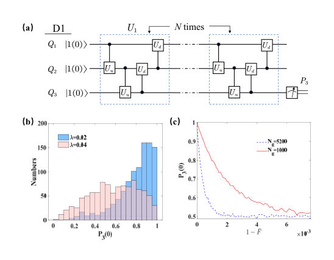
<figcaption class="paper-figure-caption"><b>Fig 1.</b> FIG. 1: Fuzzy recognition in quantum circuit. (a) The tested quantum circuit D1. (b) The distribution of P3(0) with dif- ferent intensity of noise λ = 0.02 and λ = 0.04, respectively. (c) The output P3(0) versus infidelity 1 −¯F with different amount of quantum gates Ng.</figcaption>
</figure>
<figure class="paper-figure-card">
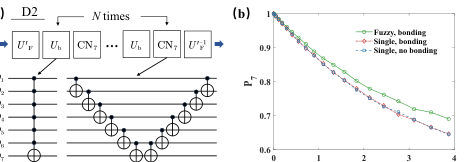
<figcaption class="paper-figure-caption"><b>Fig 2.</b> FIG. 3: Fuzzy encoding with bonding layers. (a) The tested circuit D2. (b) Performance with different input and oper- ations. The results are averaged by 500 times while the er- rorbars have nor been displayed to avoid affecting the data presentation.</figcaption>
</figure>
<figure class="paper-figure-card">
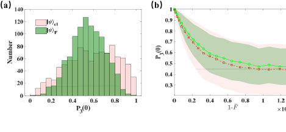
<figcaption class="paper-figure-caption"><b>Fig 3.</b> FIG. 2: Fuzzy encoding in circuit D1. (a) The distribu- tion of P3(0) with different input states |ψ⟩c1 and |ψ⟩F. (b) The output P3(0) versus infidelity 1 −¯F with different input states. Green-solid line with circles: |ψ⟩F; red-dashed line with squares: |ψ⟩c1.</figcaption>
</figure>
<figure class="paper-figure-card">
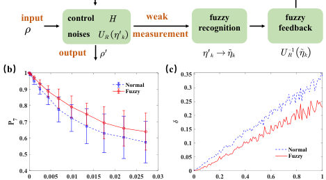
<figcaption class="paper-figure-caption"><b>Fig 4.</b> FIG. 4: Investigation of quantum control with fuzzy feed- back. (a) Schematic diagram of quantum control with fuzzy feedback. (b) The output P7 versus infidelity with different means of feedback. (c) The standard deviation of the estima- tion of the errors versus the measurement uncertainty α.</figcaption>
</figure>
<figure class="paper-figure-card">
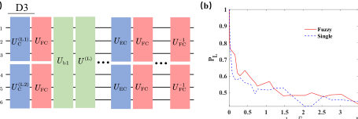
<figcaption class="paper-figure-caption"><b>Fig 5.</b> FIG. 5: Incorporation of fuzzy encoding and QEC. (a) The tested circuit D3. (b) The output PL versus infidelity 1 −¯F with fuzzy state input and single state input, respectively.</figcaption>
</figure>

**Summary.** This paper introduces fuzzy processing as a novel paradigm for enhancing quantum computation robustness against decoherence and control errors. By encoding states into probability distributions and using fuzzy logic for state recognition and feedback, it significantly improves performance over traditional methods. This makes the framework highly promising for fault-tolerant quantum computing applications.

**Why it may be interesting.** For AMO physicists studying open quantum systems, this work provides a mathematical toolset (fuzzy logic) to model and mitigate the effects of unavoidable measurement uncertainty and environmental noise in complex quantum hardware implementations.

Detailed structure

**Main problem.** The paper addresses decoherence and control errors in quantum computation by proposing a novel framework that integrates fuzzy processing into existing protocols.

**Main result.** Integrating fuzzy recognition, encoding, and feedback significantly improves the robustness of quantum circuits, allowing for high fidelity even when gate fidelities are imperfect or precise state information is unavailable.

**Method.** The core method involves replacing exact quantum state representations with fuzzy probability distributions (fuzzy encoding) and using fuzzy logic rules to interpret noisy measurement outcomes (fuzzy recognition/feedback).

**Model / system.** The model utilizes standard qubit systems undergoing unitary operations, specifically applied within the context of Quantum Error Correction (QEC) circuits involving multiple qubits.

**Key observables.** Average fidelity ($ar{F}$), target qubit population ($P_L$), and output state distribution spread.

**Important parameters / regimes.** Noise intensity ($\lambda$ or $eta$), number of gates ($N_g$), and the degree of gate infidelity ($1-ar{F}$).

**Assumptions / limitations.** The analysis assumes that fuzzy set theory provides a mathematically sound framework to handle uncertainty, though it notes limitations regarding the inclusion of full decoherence effects.

**Figures summary.** Figures compare performance metrics (like $P_3(0)$ or $P_L$) for single-state versus fuzzy-encoded inputs under increasing noise/infidelity, consistently showing superior robustness for the fuzzy approach.

**Paper structure.** The paper builds conceptually by first introducing fuzzy recognition to reduce fidelity requirements, then detailing fuzzy encoding to stabilize output distributions, and finally integrating both into a full QEC framework using fuzzy feedback for robust control.

Abstract

Quantum computation has attracted numerous attentions and develops rapidly in the recent decades. To against the decoherence and the control errors upon the qubits, quantum error corrections are adopted. Such approaches require lots of redundant qubits, accurate measurement and timely feedback. Here we investigate a new framework of quantum computation that is associated with fuzzy processing. It will benefit significantly from three aspects: the fuzzy recognition of qubit states reduce the required gate fidelity; the fuzzy encoding encodes the information of the qubits into a distribution of probability, suppressing the fluctuations in the output of long quantum circuits; the fuzzy feedback offers a more efficient way to control the qubits when precision information of quantum states are absent. Furthermore, the fuzzy processing can be integrated into quantum error correction, eliminating the need for immediate correction operations. The proposed scheme will be fairly suitable for the solution of decision problems, which has significant applications in the optimization problems and control problems.

[↑ back to top](#top)

### [Interlayer pairing mechanism for bilayer nickelate superconductors](http://arxiv.org/abs/2606.15298v1)

**Authors:** Jiangfan Wang, Yi-feng Yang  
**Type:** theory · **Category:** strongly correlated electrons · **PDF:** <https://arxiv.org/pdf/2606.15298v1>  
**Analysis basis:** full PDF text, analyzed in chunks
**Topic relevance:** `Keldysh / 2PI / non-Gaussian methods` **3/5** · `analog quantum simulation` **3/5** · `Kondo & dissipative impurity` **1/5** · `correlated cavity matter` **1/5** · `entanglement & information structure` **1/5** · `methods for driven-dissipative` **1/5** · `non-equilibrium dynamics` **1/5**

↔ Scroll figures horizontally

<figure class="paper-figure-card">
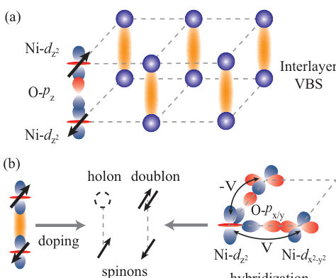
<figcaption class="paper-figure-caption"><b>Fig 1.</b> FIG. 1: Interlayer valence bonds. (a) Schematic illustra- tion of the dz2 interlayer valence bond state (VBS) in the atomic limit of bilayer nickelates. (b) Schematic diagram showing emergent dz2 holon, doublon and spinons induced by doping or interorbital hybridization.</figcaption>
</figure>
<figure class="paper-figure-card">
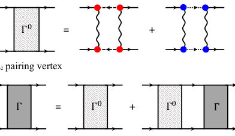
<figcaption class="paper-figure-caption"><b>Fig 2.</b> FIG. 2: Hybridization-driven superconductivity. (a) Electron-spinon-holon/doublon scattering vertices induced by the nearest-neighbor interorbital hybridization with the factor ξk = cos kx −cos ky. (b) The bare (Γ0) and full (Γ) interlayer pairing vertex of dx2−y2 electrons. Γ0 is constructed from dz2 spinon and holon (doublon) propogators, while Γ is obtained from Γ0 and dx2−y2 propogators through the Bethe-Salpeter equation.</figcaption>
</figure>
<figure class="paper-figure-card">
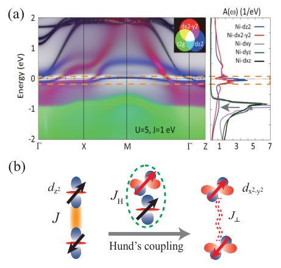
<figcaption class="paper-figure-caption"><b>Fig 3.</b> FIG. 3: Effects of the Hund’s coupling. (a) Orbital- projected spectral function and densities of states of Ni-d electrons calculated using DFT+DMFT for U = 5 eV and Hund’s coupling JH = 1 eV, showing emergent flat band and orbital-dependent renormalization due to the Hund’s cou- pling. Adapted from Ref.82. (b) Schematic diagram showing the effective interlayer J⊥between dx2−y2 orbitals transmit- ted from dz2 orbitals through the Hund’s coupling.</figcaption>
</figure>
<figure class="paper-figure-card">
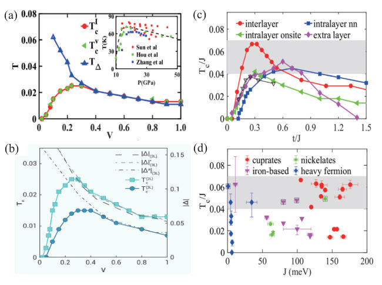
<figcaption class="paper-figure-caption"><b>Fig 4.</b> FIG. 4: Evolution of the superconducting transition temperature. (a) Tc from superconducting phase coherence as functions of the hybridization parameter V derived from the mutual information (T I c ) and the change of vortex-antivortex numbers (T V c ), calculated from Monte Carlo simulations of the bilayer t-V -J model at J/t = 0.5. T∆is the dz2 local pairing temperature. Adapted from Ref.96. (b) Comparison of Tc and the pairing amplitude |∆| for bilayer (2L) and trilayer (3L) t-V -J models. Adapted from Ref.48. (c) Tc/J as functions of t/J for different t-J type effective models of unconventional superconductivity obtained by static auxiliary field Monte Carlo simulations. (d) Collection...</figcaption>
</figure>
<figure class="paper-figure-card">
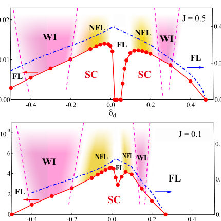
<figcaption class="paper-figure-caption"><b>Fig 5.</b> FIG. 5: Superconducting and normal state phase dia- grams predicted by the two-component theory. (a) Tc as a function of dz2 doping δd for interlayer coupling J = 0.5 at V = 0.5 and U = 7, obtained from dynamic Schwinger boson calculations of the t-V -J model. For better compar- ison with experiment, a correction factor 0.3 for Tc is used to tentatively account for phase fluctuations based on previ- ous comparison with Monte Carlo simulations96,146. The blue dash-dotted line is the dz2 valence bond amplitude ∆d at low temperature T = 0.004. The colors represent different nor- mal states including the Fermi liquid (FL), non-Fermi-liquid (NFL) and weakly insulating (WI) behaviors. The dashed...</figcaption>
</figure>

**Summary.** This review surveys the theoretical landscape of unconventional superconductivity in bilayer nickelates. It focuses on two competing mechanisms—hybridization and Hund's coupling—to explain interlayer pairing mediated by strongly correlated $d_{z^2}$ spins coupled to itinerant $d_{x^2-y^2}$ electrons. The work highlights that structural tuning, doping, and defect chemistry critically control the superconducting dome and pairing symmetry.

**Why it may be interesting.** The detailed modeling of orbital physics and strong correlation effects in a layered structure provides rich ground for understanding how quantum fluctuations mediate high-temperature superconductivity, which is relevant to many open problems in AMO physics regarding interacting quantum systems.

Detailed structure

**Main problem.** The central goal is understanding the microscopic mechanism responsible for superconductivity in bilayer nickelate superconductors.

**Main result.** Strong correlation theories suggest that interlayer pairing arises from $d_{z^2}$ local singlet pairs, whose coherence is promoted by hybridization with itinerant $d_{x^2-y^2}$ electrons. The superconducting state exhibits complex symmetry and strong dependence on doping and structural parameters.

**Method.** The work employs theoretical modeling using the bilayer two-orbital Hubbard model and its minimal t-J variants, analyzed through mean-field theory and advanced quantum simulation techniques.

**Model / system.** The system is bilayer nickelates ($	ext{La}_3	ext{Ni}_2	ext{O}_{7-\delta}$), characterized by two active orbitals ($d_{z^2}$ and $d_{x^2-y^2}$) exhibiting strong electronic correlations, Hund's coupling, and significant interlayer magnetic coupling.

**Key observables.** Superconducting transition temperature ($T_c$), pairing symmetry ($	ext{s}\pm$-wave), orbital-selective mass renormalization, and normal state behaviors (FL, NFL, pseudogap).

**Important parameters / regimes.** Interlayer superexchange coupling ($J_{\perp}$), Hund's coupling ($J_H$), doping level ($\delta_d$), and the hybridization strength ($V$).

**Assumptions / limitations.** The analysis often separates the physics into strong correlation limits (localized $d_{z^2}$) coupled to itinerant electrons ($d_{x^2-y^2}$), or treats both orbitals within a two-orbital Hubbard framework.

**Figures summary.** Figures illustrate the Interlayer Valence Bond State (VBS) and its emergent excitations, as well as simulated superconducting $T_c$ dependence on hybridization strength ($V$) and doping ($\delta_d$).

**Paper structure.** The review progresses from identifying key physical ingredients (orbital structure, correlations) to introducing theoretical models (Hubbard/t-J), detailing competing pairing mechanisms (hybridization vs. Hund's coupling), analyzing the resulting superconducting symmetries, and finally discussing external tuning effects like pressure and oxygen vacancies.

Abstract

The discovery of superconductivity in Ruddlesden-Popper bilayer nickelates under both high pressure and ambient conditions has opened a new paradigm for exploring unconventional superconductivity. This review provides a brief survey of theoretical progress on bilayer nickelate superconductors. Drawing from the key experimental observations, we summarize essential physical ingredients including the hybridized Ni-3$d_{x^2-y^2}$ and 3$d_{z^2}$ electronic structure, orbital-dependent electronic correlation, Hund's coupling, and strong interlayer magnetic coupling. The fundamental theoretical models including the bilayer two-orbital Hubbard model and its minimal $t$-$J$ variants are introduced. Starting from the atomic-limit interlayer valence bond picture of the half-filled $d_{z^2}$ orbital, we elaborate on strong correlation interlayer pairing mechanisms based on different limiting considerations. Specific emphasis is placed on the hybridization mechanism, where the $d_{z^2}$ local singlet pairs provide the pairing energy and their hybridization with itinerant $d_{x^2-y^2}$ promotes superconducting phase coherence. We further analyze the pairing symmetry, the dependence of $T_c$ on various internal and external parameters, the nontrivial normal state properties including the Fermi liquid, non-Fermi liquid, weakly insulating and pseudogap behaviors. Effects of pressure tuning, oxygen content, and Kondo scattering induced by oxygen vacancies are also discussed. Finally, weak correlation theories based on spin fluctuations associated with Fermi surface nesting are briefly covered.

[↑ back to top](#top)

### [Learning ground state observables from quantum computing experiments](http://arxiv.org/abs/2606.15983v1)

**Authors:** Ben Jaderberg, Freya Shah, Minjun Jeon, M. Emre Sahin, Christa Zoufal, Kunal Sharma  
**Type:** both · **Category:** disordered systems and neural networks · **PDF:** <https://arxiv.org/pdf/2606.15983v1>  
**Analysis basis:** full PDF text, analyzed in chunks
**Topic relevance:** `analog quantum simulation` **3/5** · `methods for driven-dissipative` **3/5** · `QC/QI experiment` **2/5** · `entanglement & information structure` **1/5** · `exotic spin models in light-matter` **1/5** · `non-equilibrium dynamics` **1/5**

↔ Scroll figures horizontally

<figure class="paper-figure-card">
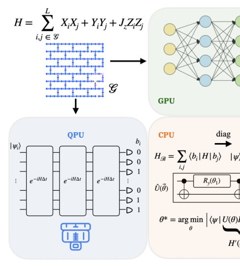
<figcaption class="paper-figure-caption"><b>Fig 1.</b> FIG. 1. Overview of the workflow. (Left) For a fixed heavy-hex lattice and anisotropy Jz of the spin- 1</figcaption>
</figure>
<figure class="paper-figure-card">
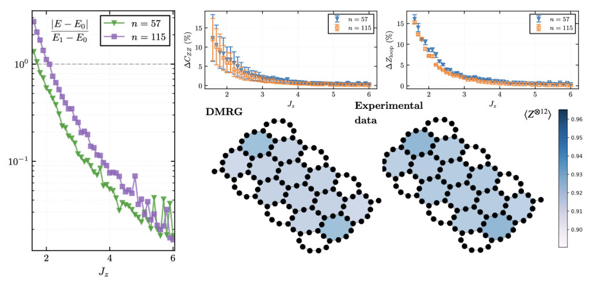
<figcaption class="paper-figure-caption"><b>Fig 2.</b> FIG. 2. Accuracy of data generated from quantum experiments. (Left) Error in the approximate ground state energy E relative to the gap to the first excited state (|E −E0|)/(E1 −E0) as calculated by DMRG. (Top) Mean percentage error between the quantum data and DMRG for Czz and Zloop, error bars show one standard deviation of the distribution of individual relative errors. (Bottom) Spatial map of ⟨Zloop⟩for n = 115 at Jz = 4.0. Colors denote 12-qubit loop values and white regions indicate 10-qubit loops not evaluated.</figcaption>
</figure>
<figure class="paper-figure-card">
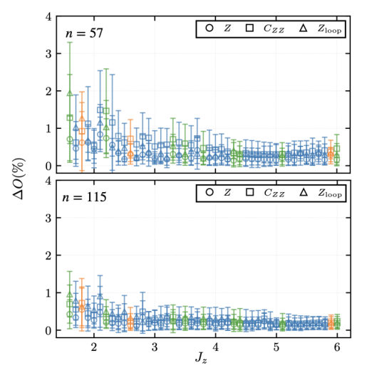
<figcaption class="paper-figure-caption"><b>Fig 3.</b> FIG. 3. Model generalization within the interior of the AFM phase as shown by mean relative error ∆OML, data(%). Er- ror bars show one standard deviation of the distribution of individual relative errors. Blue, orange and green markers correspond to Jz points from the train, validation and test data set respectively.</figcaption>
</figure>
<figure class="paper-figure-card">
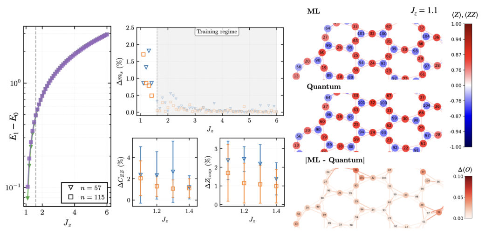
<figcaption class="paper-figure-caption"><b>Fig 4.</b> FIG. 4. Model generalization towards the phase boundary. (Left) Spectral gap E1 −E0 as a function of Jz on approaching the phase boundary at Jz = 1.0, which rapidly decreases below the training cutoff at Jz = 1.6. (Middle) Relative error between local observables predicted by ML and data from new quantum experiments outside the training regime. This includes the staggered magnetization ms, an order parameter of the AFM phase which is inferred from the model trained on ⟨Z⟩. (Right) Representative slice through the lattice at Jz = 1.1, comparing the spatially resolved observables from ML and the quantum experiments, together with the absolute difference.</figcaption>
</figure>
<figure class="paper-figure-card">
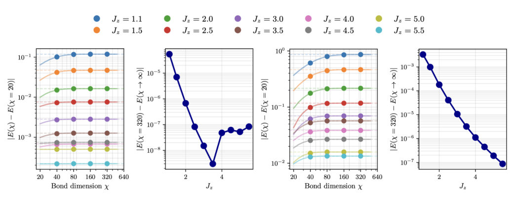
<figcaption class="paper-figure-caption"><b>Fig 5.</b> FIG. 5. DMRG energy convergence. (Left) For n = 57, the first plot shows how the energy changes when increasing from χ = 20. Circles show specific points evaluated and the solid line shows the trend following an exponential decay fitted to the energies. The offset of the exponential is the energy extrapolated to χ →∞. The second plot shows the absolute difference between E(χ = 320) and E(χ →∞). (Right) same but for n = 115.</figcaption>
</figure>

**Summary.** The paper presents an end-to-end methodology for extracting physical knowledge from experimental quantum computation results. By applying SKQD and variational optimization to generate ground state data for the 2D XXZ model, they train advanced neural networks to predict complex observables. This demonstrates a powerful paradigm shift: using near-term quantum hardware not just for simulation, but as a scalable source of training data for predictive physics models.

**Why it may be interesting.** This work bridges theoretical condensed matter physics with practical quantum machine learning, showing a concrete path to using noisy, limited quantum hardware outputs as high-fidelity training data for complex many-body simulations that are otherwise computationally intractable or too resource-intensive classically.

Detailed structure

**Main problem.** The core problem is developing a workflow to learn ground-state observables of interacting quantum many-body systems directly from data generated by near-term quantum computing experiments.

**Main result.** The authors successfully trained machine learning models on quantum data for the 2D Heisenberg XXZ model, demonstrating accurate prediction of local observables even in out-of-distribution regimes approaching a phase boundary.

**Method.** A combined approach uses Sample-based Krylov Quantum Diagonalization (SKQD) to generate approximate ground states, followed by training sophisticated neural networks (comparing global vs. geometry-aware architectures) on the resulting expectation values.

**Model / system.** The system studied is the spin-1/2 XXZ model on a heavy-hexagonal lattice, parameterized by the anisotropy $J_z$. The study focuses on the antiferromagnetic phase and its approach to quantum critical points.

**Key observables.** Single-site expectation values ($\langle Z 
angle$), two-point correlations ($C_{zz}$), 12-body loop correlations ($\langle Z_{	ext{loop}} 
angle$), and the staggered magnetization ($m_s$).

**Important parameters / regimes.** System sizes up to $n=115$ qubits; anisotropy parameter $J_z$; training regimes span from $1.6 \le J_z \le 6.0$, with testing near $J_z = 1.0$.

**Assumptions / limitations.** The primary assumptions involve the feasibility of SKQD generating sufficiently accurate data, and that ML architectures (especially geometry-aware ones) can capture complex spatial correlations beyond simple parameter dependence.

**Figures summary.** Figures illustrate the workflow overview, energy error convergence relative to DMRG across $J_z$, and comparative plots showing the mean relative error ($\Delta O_{ML}$) of observables predicted by different ML architectures when extrapolating towards phase boundaries.

**Paper structure.** The paper details a multi-step process: first, generating data using SKQD combined with variational basis optimization to improve ground state estimates; second, designing and training two distinct neural network architectures (global vs. local/geometry-aware) on this quantum data; and finally, rigorously testing the models' generalization capability both within and outside the trained parameter regime.

Abstract

Recent theoretical progress has established conditions under which machine learning models can efficiently predict ground-state properties of gapped local Hamiltonians when trained on quantum-generated data. Previous experimental demonstrations in this paradigm, however, have largely been limited to small systems or highly structured states, due to the difficulty of preparing many-body ground states on quantum processors. In this work, we demonstrate learning from experimental quantum data generated from approximate ground states of the two-dimensional Heisenberg XXZ model with system sizes up to 115 qubits. We construct a dataset of single-site expectation values, two-point correlations, and 12-body loop correlations across the antiferromagnetic phase. We then train neural networks on this data and show that they can accurately predict spatially resolved observables for previously unseen Hamiltonian parameters, both within the training distribution and in an out-of-distribution regime approaching the phase boundary. Our results demonstrate the practical realization of learning from quantum data for an interacting two-dimensional many-body system at scale, motivating a path toward regimes where quantum processors could provide training data beyond the reach of classical approximation methods.

[↑ back to top](#top)

### [Milestoning Markov-jump dynamics: Stationary properties, thermodynamic consistency, kinetic hysteresis, and fluctuation symmetries](http://arxiv.org/abs/2606.17033v1)

**Authors:** Tassilo Schwarz, David Hartich, Aljaž Godec  
**Type:** theory · **Category:** statistical mechanics · **PDF:** <https://arxiv.org/pdf/2606.17033v1>  
**Analysis basis:** full PDF text, analyzed in chunks
**Topic relevance:** `methods for driven-dissipative` **3/5** · `non-equilibrium dynamics` **3/5** · `non-equilibrium universality` **2/5** · `Keldysh / 2PI / non-Gaussian methods` **1/5** · `correlated / nonlocal dissipation` **1/5** · `driven-dissipative phase transition` **1/5**

↔ Scroll figures horizontally

<figure class="paper-figure-card">
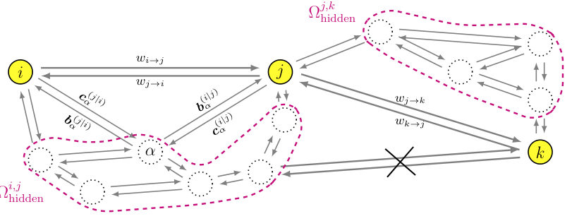
<figcaption class="paper-figure-caption"><b>Fig 1.</b> FIG. 1. Definition of the model. Network with two observed states i, j. The decomposition into observed nodes and hidden ones. Any pair of observed nodes i and j from Ωobs are connected directly via direct transition rates (wi→j and wj→i) and/or via a set of hidden nodes Ωi,j hidden = Ωi,j hidden. We assume that all hidden states α ∈Ωi,j hidden are not directly connected to a third observed state k ̸= i, j (crossed out edges).</figcaption>
</figure>
<figure class="paper-figure-card">
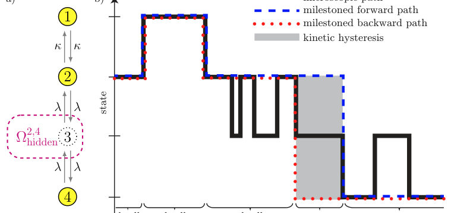
<figcaption class="paper-figure-caption"><b>Fig 2.</b> FIG. 2. A milestoned Markov process and its transition path with kinetic hysteresis: a) Microscopic model with three milestones (1,2,4) and one hidden state (3). b) Microscopic path (black) and its forward milestones (dashed blue) and backward milestoned (dotted red) path. While the waiting time of the mesoscopic 1 →2 transition consists only of dwell time (left) and is therefore identical under time reversal, the waiting time of the mesoscopic 2 →4 transition contains non-zero transition time (right), leading to kinetic hysteresis (gray area is non-zero). Importantly, even under time-scale separation λ ≫κ which leads to approximately Markovian dynamics (waiting times are approximately...</figcaption>
</figure>
<figure class="paper-figure-card">
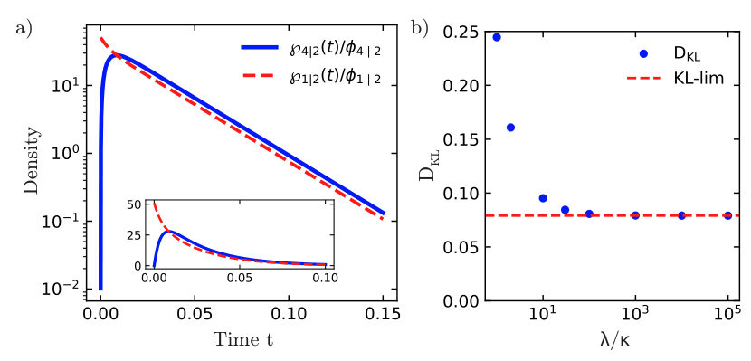
<figcaption class="paper-figure-caption"><b>Fig 3.</b> FIG. 3. Manifestation of kinetic hysteresis even in the presence of time-scale separation, i.e., in the Markovian limit. (a) Waiting time densities become almost exponential in the presence of a time-scale separation (i.e., fast hidden dynamics) in Fig. 2: For κ ≡1, λ ≡100, we converge to Markov dynamics. (b) Convergence of DKL  ℘4|2(t)/ϕ4|2||℘1|2(t)/ϕ1|2  to a non-zero value even under time-scale separation.</figcaption>
</figure>
<figure class="paper-figure-card">
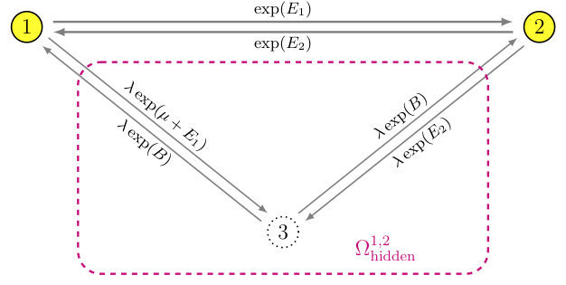
<figcaption class="paper-figure-caption"><b>Fig 4.</b> FIG. 4. The unobservable non-equilibrium cycle. Transitions can happen either directly from state 1 to 2, or via the hidden state 3, so that only transitions between two states and thereby no cyclic transitions are observable. From the transition-path time distributions, it is possible to infer model parameters and thereby the driving of the unobservable cycle. We provide a detailed analysis thereof in Section I E 1</figcaption>
</figure>
<figure class="paper-figure-card">
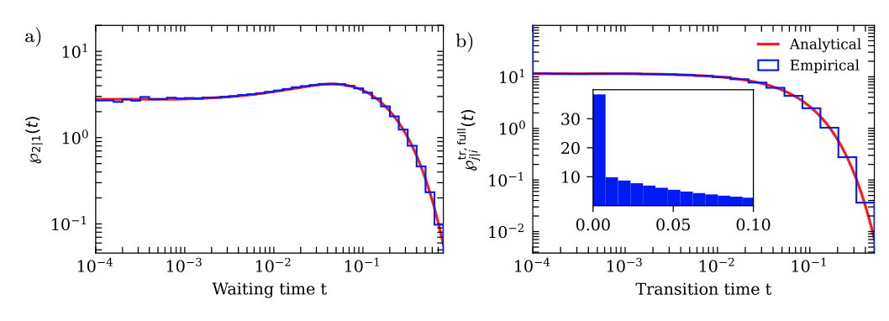
<figcaption class="paper-figure-caption"><b>Fig 5.</b> FIG. 5. Density of (a) the waiting time and (b) the transition time in the unobserved non-equilibrium cycle of transitioning from observed state 1 to observed state 2: The analytical solution (red line) matches the measured waiting time distribution (blue). The direct jump ϕjump 2|1 δ(t) can be seen at time t = 0 in the inset of (b). We considered a trajectory of 107 steps, after simulating initial 107 steps for equilibration. Parameters are E1 = 1, E2 = 3, B = 5, λ = exp(−3), and µ = 5.</figcaption>
</figure>

**Summary.** This paper develops a comprehensive theory for exactly mapping underlying Markov-jump dynamics onto observable semi-Markov processes via 'milestoning.' It rigorously characterizes the resulting kinetics by decomposing waiting times into dwell and transition components. The key findings establish thermodynamic consistency, quantify kinetic hysteresis, and provide methods to infer hidden physical affinities from observed time statistics.

**Why it may be interesting.** This work provides powerful, general theoretical tools for analyzing non-equilibrium steady states in complex biological or chemical systems where direct observation is impossible. The rigorous connection between coarse-graining, memory effects, and fundamental thermodynamic quantities like entropy production is highly relevant to open quantum system modeling.

Detailed structure

**Main problem.** The core problem is deriving an exact, thermodynamically consistent coarse-graining of underlying Markov-jump processes into observable semi-Markov dynamics (milestoning). This addresses how memory effects arise when observing a system only at discrete points in time.

**Main result.** The theory successfully decomposes the waiting time distribution into conditionally independent dwell and transition times, proves its thermodynamic consistency, and demonstrates that kinetic hysteresis persists even when the observed process approaches Markovian behavior.

**Method.** The authors use rigorous mathematical derivations involving generator matrices, Laplace transforms, and renewal theory to analyze the joint probability densities of state transitions across hidden intermediate states.

**Model / system.** The model is a generic ergodic Markov-jump process on a full state space $\Omega$, which is partitioned into observable states ($\Omega_{	ext{obs}}$) and unobserved hidden states ($\Omega_{	ext{hidden}}$). The dynamics are analyzed by constructing an effective semi-Markov generator matrix.

**Key observables.** Waiting-time distributions, dwell times, transition-path times, steady-state entropy production rate ($\dot{\sigma}$), and the affinity ($A_{ij}$) between states.

**Important parameters / regimes.** Time-scale separation limits ($\lambda/\kappa 	o \infty$), barrier heights ($B$), driving intensities ($M$), and the number of parallel hidden mechanisms ($V$).

**Assumptions / limitations.** The underlying microscopic dynamics satisfy detailed balance (or are analyzed under conditions that allow for thermodynamic consistency checks). The analysis relies on specific structural assumptions about how hidden states connect observed nodes.

**Figures summary.** Figures illustrate model structures, the manifestation of kinetic hysteresis via non-zero KL divergence in waiting time densities, and numerical validation showing the recovery of entropy production rates using milestoning estimators.

**Paper structure.** The paper progresses by first establishing the mathematical framework for coarse-graining (Chunk 1), deriving the decomposition of waiting times into dwell/transition components (Chunk 2), proving thermodynamic consistency and reflection symmetry properties (Chunk 3), generalizing to multiple parallel hidden mechanisms (Chunk 4), and finally applying these results to continuous systems like diffusion on a ring potential (Chunk 5).

Abstract

We derive an exact coarse graining of generic Markov-jump processes into observable semi-Markov dynamics. Exact results for waiting-time distributions for jumps between observable states are derived and proved that these decompose into conditionally independent dwell and transition times. Dwell times are proved to be a local property of mesostates - they depend on the initial but not final state. Conversely, transition-path times depend on both states, trigger kinetic hysteresis, and, under suitable conditions on the hidden sub-network, are shown to obey a reflection symmetry. We characterize the stationary properties of the milestoned dynamics, prove its thermodynamic consistency, and demonstrate robustness to milestone positioning. Surprisingly, even in the limit of a time-scale separation rendering the observed dynamics approximately Markovian, the effect of kinetic hysteresis on the dissipation persists. A minimal example shows how the results lay the foundation for inferring affinities of hidden dissipative cycles from observations of transition-path times.

[↑ back to top](#top)

### [Multiband transport hierarchy and large Nernst effect in EuAuBi: Establishing a Nernst scaling for asymmetric multiband systems](http://arxiv.org/abs/2606.16249v1)

**Authors:** Weimin Quan, Xiaodong Guo, Lingxiao Zhao, Shengwei Chi, Gang Xu, Zengwei Zhu, Xiaokang Li  
**Type:** both · **Category:** strongly correlated electrons · **PDF:** <https://arxiv.org/pdf/2606.16249v1>  
**Analysis basis:** full PDF text, analyzed in chunks
**Topic relevance:** `Keldysh / 2PI / non-Gaussian methods` **3/5** · `driven-dissipative phase transition` **2/5** · `non-equilibrium universality` **2/5** · `Kondo & dissipative impurity` **1/5** · `analog quantum simulation` **1/5** · `methods for driven-dissipative` **1/5** · `non-equilibrium dynamics` **1/5**

↔ Scroll figures horizontally

<figure class="paper-figure-card">
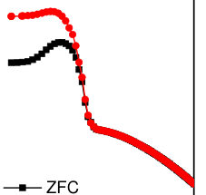
<figcaption class="paper-figure-caption"><b>Fig 1.</b> FIG. 1. Longitudinal transport in EuAuBi. (a) Crystal structure of EuAuBi, consisting of a layered Au–Bi honeycomb lattice that gives rise to a polar crystal structure along the c axis. (b) Calculated band structure of EuAuBi. Red and blue symbols denote the projections onto Au-s and Bi-p orbitals, respectively. Near the A point, band inversion produces a band crossing below the Fermi level, giving rise to a small electron pocket, as highlighted in the inset [15]. (c) Temperature dependence of the resistivity ρxx from 1.8 to 300 K. The antiferromagnetic transition and superconducting transition are marked by black arrows in the inset, respectively. (d) Temperature-dependent magnetization...</figcaption>
</figure>
<figure class="paper-figure-card">
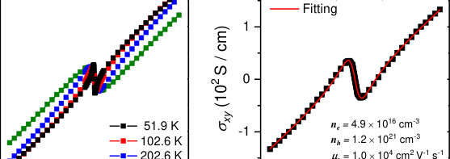
<figcaption class="paper-figure-caption"><b>Fig 2.</b> FIG. 2. Multicarrier Hall transport in EuAuBi. (a, b) Magnetic-field dependence of the Hall resistivity ρyx at selected temperatures. A pronounced step-like feature develops in the low-field region and becomes increasingly prominent with in- creasing temperature, indicative of multicarrier transport. (c, d) Hall conductivity σxy at 11.1 K and 302.6K, converted from ρyx, together with the corresponding fit to the two-band model. The fitting reveals two distinct carrier components: a large hole pocket with high carrier density and low mobility, and a small electron pocket with low carrier density but high mobility. (e) Temperature dependences of the carrier densities extracted from the...</figcaption>
</figure>
<figure class="paper-figure-card">
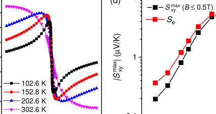
<figcaption class="paper-figure-caption"><b>Fig 3.</b> FIG. 3. Large Nernst effect in EuAuBi. (a, b) Magnetic-field dependence of the Nernst signal for EuAuBi. (c) Nernst signal Sxy at 11.1 K, together with the corresponding fit to the single-band thermoelectric model (see text). In the fitting, the carrier mobilities were fixed to the values extracted from the two-band Hall analysis. (d) The maximum Nernst signal value Smax xy and fitting amplitude -Se at each temperature point. (e) Nernst coefficient divided by temperature, ν/T, plotted as a function of µ/EF in different materials. The dashed line represents the theoretical scaling relation ν/T ∝µ/EF [14]. For EuAuBi (red stars), the scaling is examined using two choices of Fermi-energy...</figcaption>
</figure>

**Summary.** This work investigates multiband transport in EuAuBi, a material with vastly different electron and hole carrier densities. By analyzing the Nernst effect across various magnetic fields and temperatures, the authors establish that the large signal originates from conventional semiclassical physics involving two distinct pockets. They derive a new scaling law for $
u/T$ specific to asymmetric multiband systems.

**Why it may be interesting.** While focused on condensed matter transport, the rigorous derivation of scaling laws in multi-component systems (like those involving multiple electronic bands) provides generalizable principles applicable to open quantum systems where different coupling channels might dominate response functions.

Detailed structure

**Main problem.** The study addresses how transport coefficients, particularly the Nernst effect, behave in materials with coexisting carrier pockets of vastly different densities.

**Main result.** The large Nernst effect is shown to be a semiclassical multiband phenomenon governed by a specific scaling relation ($
u/T \propto \mu_e/E_{F,tot}$), rather than being purely topological.

**Method.** The authors combine experimental measurements (resistivity, Hall effect, Seebeck, Nernst) with theoretical modeling using semi-classical two-band transport equations.

**Model / system.** The research focuses on the polar semimetal EuAuBi, which exhibits an extreme carrier density mismatch between a dense hole pocket and a dilute, high-mobility electron pocket. The analysis employs a two-band model to describe total transport properties.

**Key observables.** Longitudinal resistivity ($
ho_{xx}$), Hall effect ($
ho_{yx}$), Seebeck coefficient ($S_{xx}$), and Nernst signal ($S_{xy}$).

**Important parameters / regimes.** Carrier densities ($n_e \sim 10^{16} 	ext{ cm}^{-3}, n_h \sim 10^{21} 	ext{ cm}^{-3}$), electron mobility ($\mu_e$), and the total Fermi energy scale ($E_{F,tot}$).

**Assumptions / limitations.** The analysis relies on semi-classical two-band expressions for transport coefficients and assumes an asymmetric limit where specific cancellations occur in the Nernst coefficient derivation.

**Figures summary.** Figures illustrate the crossover of $
ho_{xx}$ to hole dominance, the temperature dependence of $S_{xx}$, and the low-field step-like feature in $
ho_{yx}(B)$ attributed to the electron pocket. The scaling analysis plots $
u/T$ against different energy scales.

**Paper structure.** The paper first establishes a transport hierarchy using measurements on EuAuBi, showing which pocket dominates which coefficient. It then derives the theoretical low-field Nernst response for an asymmetric two-band system, leading to a revised scaling law that is confirmed by fitting experimental data.

Abstract

In correlated materials, coexisting pockets of vastly different carrier densities raise two fundamental questions: which pocket governs the various transport coefficients, and does the conventional Nernst scaling $ν/T \propto μ/E_F$, originally derived for single-band systems, still hold? We address both questions in the polar semimetal EuAuBi, where a dilute electron pocket ($n_e \sim 10^{16}~\mathrm{cm}^{-3}$) coexists with a dense hole pocket ($n_h \sim 10^{21}~\mathrm{cm}^{-3}$). We find a clear hierarchy: the hole pocket dominates the longitudinal resistivity; the Hall effect crosses from electron- to hole-dominance with increasing field; the Seebeck coefficient is dominated by the electron pocket at low temperature and by both pockets at high temperature. Remarkably, the Nernst effect is governed entirely by the ultrahigh-mobility electron pocket, yielding a large low-field signal of $\sim 5~μ\mathrm{V/K}$ near 1~T at 202~K, comparable to anomalous Nernst signals in magnetic Weyl semimetals. By analyzing the two-band thermoelectric conductivity, we show that the Nernst coefficient follows a scaling $ν/T \propto μ_e/{E_{F, tot}}$. This scaling originates from a compensation between the electron-to-hole conductivity ratio and the Fermi-energy ratio, establishing that the large Nernst effect is a semiclassical multiband phenomenon rather than a topological Berry-curvature contribution. This understanding advances the thermoelectric transport physics of multiband electronic systems and offers a guiding principle for low-field transverse thermoelectric design.

[↑ back to top](#top)

### [Bright Emission from Dark Sources in Hyperbolic Media](http://arxiv.org/abs/2606.16071v1)

**Authors:** Evgenii E. Narimanov  
**Type:** theory · **Category:** other · **PDF:** <https://arxiv.org/pdf/2606.16071v1>  
**Analysis basis:** full PDF text, analyzed in chunks
**Topic relevance:** `interference shaping light` **3/5** · `correlated / nonlocal dissipation` **2/5** · `Keldysh / 2PI / non-Gaussian methods` **1/5** · `Tavis-Cummings & cavity-many-emitter` **1/5** · `correlated cavity matter` **1/5** · `driven-dissipative phase transition` **1/5** · `methods for driven-dissipative` **1/5**

↔ Scroll figures horizontally

<figure class="paper-figure-card">
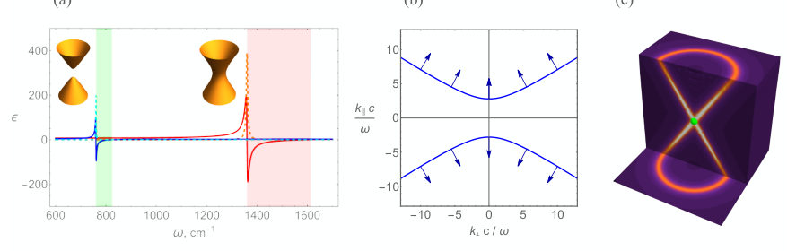
<figcaption class="paper-figure-caption"><b>Fig 1.</b> FIG. 1. Emission from a multipole-free spherical source in a hyperbolic medium. (a) Frequency-dependent permittivity components of hexagonal boron nitride (hBN). The shaded regions indicate spectral bands with hyperbolic dispersion; the insets show the topology of the corresponding iso-frequency surfaces. (b) Iso-frequency contours in momentum space at free- space wavelength λ = 13 µm (ω ≈769 cm−1), within the lower hyperbolic Reststrahlen band of hBN.[14, 15] The open dispersion curves support propagation of high-momentum modes, with energy flow directed along the hyperbolic cone directions. (c) Real- space electric field intensity generated by a spherically symmetric, charge-neutral...</figcaption>
</figure>
<figure class="paper-figure-card">
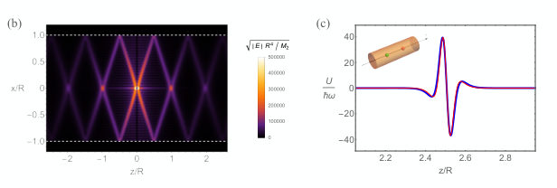
<figcaption class="paper-figure-caption"><b>Fig 2.</b> FIG. 2. Autofocusing and interaction of spherically symmetric emitters in a cylindrical hyperbolic medium. (a) Geometry of the system: a spherically symmetric, charge-neutral emitter (green) is placed on the axis of a cylindrical hyperbolic medium. (b) Electric field intensity in the (x, z) plane. Hyperbolic propagation in the confined geometry leads to periodic refocusing of the field along the cylinder axis, producing a sequence of localized intensity maxima. The dashed lines indicate the cylinder boundaries. (c) Interaction energy between two emitters placed on the cylinder axis, as a function of their separation. The refocused field results in strongly enhanced, spatially localized...</figcaption>
</figure>

**Summary.** This paper shows how anisotropic hyperbolic media can enable visible/near-IR light-matter interactions even when the source itself has no conventional dipole moment. By exploiting the unique field confinement and directional properties of these materials, a 'dark' emitter becomes radiatively active. This establishes a new platform for controlling quantum optical processes in solid-state systems.

**Why it may be interesting.** This work provides a novel mechanism for achieving strong light-matter coupling using solid-state platforms that overcome fundamental spectral limitations by engineering the vacuum structure via hyperbolic dispersion. It extends quantum optics into regimes previously thought inaccessible.

Detailed structure

**Main problem.** The primary challenge is reconciling the spectral mismatch between low-loss hyperbolic media (limited to mid-IR) and robust quantum emitters operating at visible/near-IR frequencies.

**Main result.** The authors demonstrate that a source with zero dipole moment, which would be non-radiating in isotropic media, becomes radiatively active and exhibits strong directional coupling within an anisotropic hyperbolic environment.

**Method.** The analysis uses quasistatic approximations to calculate the electric field and emitter-emitter interaction energy ($U$), focusing on how anisotropy modifies radiative processes.

**Model / system.** The system involves using visible/near-IR emitters coupled into hyperbolic dielectric media, exemplified by hexagonal boron nitride (hBN). The key mechanism relies on inducing mid-infrared population dynamics to generate radiation in the desired frequency band.

**Key observables.** Radiative activity of 'dark sources,' strong directional emission patterns following hyperbolic cones, and highly anisotropic interaction energy scaling as $1/r^3$ or enhanced at focal points ($\propto 1/\ell_f^3$).

**Important parameters / regimes.** The effective permittivity $\epsilon_{	ext{eff}}(\hat{\mathbf{r}})$, the separation distance ($r$ or $\delta z$), and the characteristic length scales related to hyperbolic dispersion bands.

**Assumptions / limitations.** The analysis assumes low material losses in the hyperbolic medium and utilizes the quasistatic approximation for field calculations at short distances.

**Figures summary.** Figures illustrate the frequency-dependent permittivity of hBN, momentum space contours showing high-momentum mode propagation along hyperbolic cones, and finally, the strong emission pattern and periodic refocusing/autofocusing of interaction energy within a cylindrical geometry.

**Paper structure.** The paper first establishes the spectral mismatch problem. It then theoretically derives how anisotropic hyperbolic media allow non-dipolar sources to radiate. Finally, it applies this theory to model emitter-emitter interactions in confined geometries, showing strong enhancement at focal points.

Abstract

Hyperbolic media enable ultra-strong light-matter interactions through their extreme field localization and small mode volumes, but low-loss realizations are fundamentally limited to the mid-infrared, owing to the long lifetimes of optical phonons in high-quality crystals. Here we show that bright emitters operating at visible or near-infrared frequencies can be used to generate radiation in this regime by inducing mid-infrared population dynamics, thereby creating a source in the hyperbolic frequency band without a corresponding dipole transition. We demonstrate that even a source with vanishing dipole and higher multipole moments - strictly non-radiating in any isotropic medium - becomes radiatively active in a hyperbolic environment. This enables visible and near-infrared control of light-matter interactions in polaritonic hyperbolic materials, establishing a new low-loss solid-state quantum optics platform.

[↑ back to top](#top)

### [Quantum simulation of the Liouville equation in classical mechanics with discontinuous potential via Schrödingerization](http://arxiv.org/abs/2606.15066v1)

**Authors:** Shi Jin, Shuyi Zhang  
**Type:** theory · **Category:** quantum information and computing · **PDF:** <https://arxiv.org/pdf/2606.15066v1>  
**Analysis basis:** full PDF text, analyzed in chunks
**Topic relevance:** `methods for driven-dissipative` **3/5** · `Keldysh / 2PI / non-Gaussian methods` **2/5** · `non-equilibrium dynamics` **2/5** · `correlated / nonlocal dissipation` **1/5** · `driven-dissipative phase transition` **1/5** · `non-equilibrium universality` **1/5**

↔ Scroll figures horizontally

<figure class="paper-figure-card">
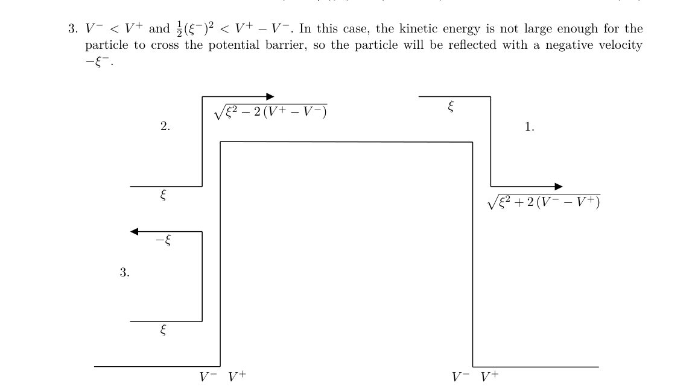
<figcaption class="paper-figure-caption"><b>Fig 1.</b> Figure 1: Change of particle momentum across a potential barrier for the case when ξ−&gt; 0.</figcaption>
</figure>
<figure class="paper-figure-card">
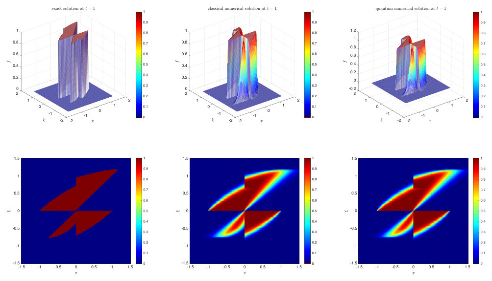
<figcaption class="paper-figure-caption"><b>Fig 2.</b> Figure 2: Example 8.1, the density distribution function f(x, ξ, t) at t = 1. First row: 3D plot; second row: contour plot. First column: the exact solution; second column: the classical numerical solution; third column: the Schrödingerization solution.</figcaption>
</figure>
<figure class="paper-figure-card">
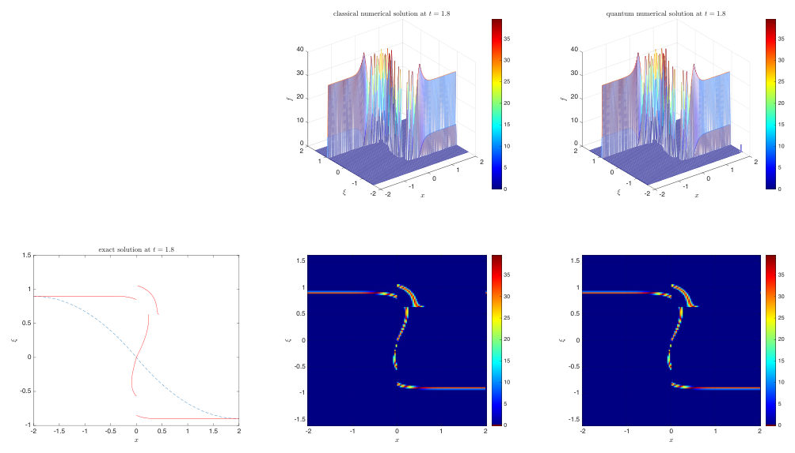
<figcaption class="paper-figure-caption"><b>Fig 3.</b> Figure 3: Example 8.2, the density distribution function f(x, ξ, t) at t = 1.8. First row: 3D plot; second row: contour plot. First column: the exact solution; second column: the classical numerical solution; third column: the Schrödingerization solution.</figcaption>
</figure>
<figure class="paper-figure-card">
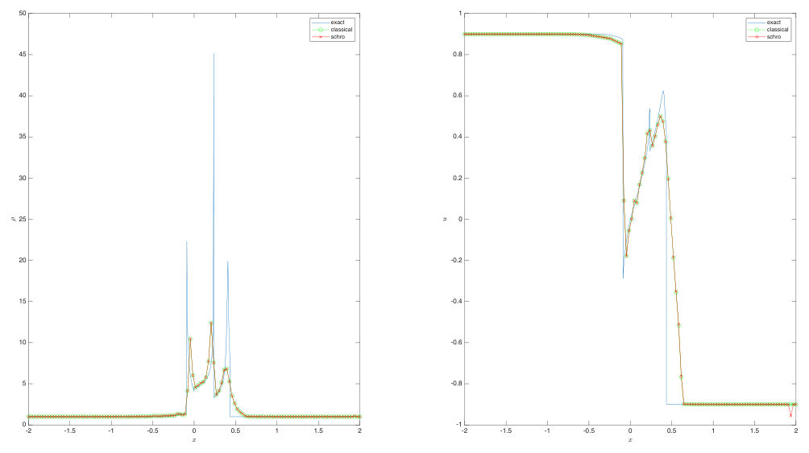
<figcaption class="paper-figure-caption"><b>Fig 4.</b> Figure 4: Example 8.2, the density ρ and averaged velocity u at t = 1.8. Solid blue line: the exact solution; green “o”: the classical numerical solution; red solid line with “×”: the Schrödingerization solution. Left: the density ρ; Right: the averaged velocity u.</figcaption>
</figure>
<figure class="paper-figure-card">
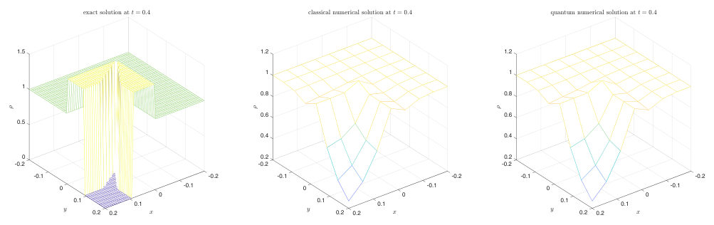
<figcaption class="paper-figure-caption"><b>Fig 5.</b> Figure 5: Example 8.3, the density ρ at t = 0.4. First column: the exact solution; second column: the classical numerical solution; third column: the Schrödingerization solution.</figcaption>
</figure>

**Summary.** The paper presents a novel quantum algorithm to simulate the Liouville equation for classical mechanics with potential barriers. It achieves this by merging Hamiltonian-preserving numerical schemes with Schrödingerization, transforming the problem into a sparse unitary evolution suitable for quantum computation. This approach offers a significant polynomial advantage in scaling compared to traditional classical grid methods.

**Why it may be interesting.** This work directly addresses simulating non-unitary dynamics (like Liouville flow) using unitary quantum computation frameworks, which is a major theme in open quantum systems and quantum simulation theory.

Detailed structure

**Main problem.** Developing quantum simulation algorithms for the Liouville equation of classical mechanics when the potential is discontinuous, requiring specialized handling of transmission/reflection fluxes.

**Main result.** The proposed method achieves a polynomial scaling in inverse accuracy ($\epsilon^{-k}$) and avoids the exponential dependence on phase-space dimension inherent to classical grid methods.

**Method.** It combines Hamiltonian-preserving schemes with the Schrödingerization technique, embedding the nonunitary dynamics into a unitary evolution simulated using sparse-access quantum oracles.

**Model / system.** The system is governed by the Liouville equation for phase-space density $f$ in classical mechanics. The challenge arises from potential barriers causing discontinuous flux conditions that must be preserved during simulation.

**Key observables.** Density ($
ho$), averaged velocity ($u$), and the full phase-space distribution function $f(x, \xi, t)$.

**Important parameters / regimes.** Simulation error $\epsilon$, total time $T$, and the dimensionality of the problem (1D, 2D, n-D).

**Assumptions / limitations.** The analysis relies on the sparse-access oracle model for quantum simulation; multidimensional extensions assume interfaces align with Cartesian grids.

**Figures summary.** Figures compare numerical solutions (density and velocity) obtained via exact classical methods against those derived from the proposed Schrödingerization approach across 1D, 2D, and measure-valued problems, confirming physical consistency.

**Paper structure.** The paper reviews the physics of barriers, details the Schrödingerization framework, constructs sparse matrix representations for Hamiltonian-preserving fluxes in increasing dimensions (1D to n-D), analyzes the resulting quantum query complexity, and finally describes observable readout techniques.

Abstract

We develop quantum simulation algorithms for the Liouville equation of classical mechanics with discontinuous potential. Such discontinuities represent potential barriers at which classical particles undergo energy preserving transmission or reflection, and the resulting interface conditions must be incorporated into the numerical flux. We combine Hamiltonian-preserving schemes by Jin and Wen in Commun. Math. Sci. 3(3), 285-315 (2005) with the Schrödingerization method, which embeds the resulting nonunitary semi-discrete dynamics into a unitary Schrödinger type system in one additional auxiliary variable [arXiv:2212.14703, arXiv:2212.13969]. For one-, two-, and $n$-dimensional problems with grid aligned interfaces, we construct sparse matrix representations of the transmission and reflection fluxes using step and hat functions, derive the corresponding Hamiltonians of the Schrödingerized systems, and analyze their sparse-access query complexity. In the sparse-access oracle model, the resulting algorithms have a polynomial dependence on the inverse accuracy and avoid the exponential dependence on the phase-space dimension suffered by classical grid based Hamiltonian-preserving schemes, up to the cost of implementing the oracles and the postselection overhead. We also describe the postselected recovery of the physical solution state and the quantum readout of macroscopic observables such as density and averaged velocity through overlap estimation. Numerical experiments based on classical simulation of the Schrödingerized dynamics validate the proposed formulation and illustrate the correct transmission/reflection behavior at potential barriers.

[↑ back to top](#top)

### [The free energy of the square lattice Ising model with interactions alternating in horizontal and vertical directions](http://arxiv.org/abs/2606.16225v1)

**Authors:** Kazuhiko Minami  
**Type:** theory · **Category:** statistical mechanics · **PDF:** <https://arxiv.org/pdf/2606.16225v1>  
**Analysis basis:** full PDF text, analyzed in chunks
**Topic relevance:** `analog quantum simulation` **3/5** · `exotic spin models in light-matter` **3/5** · `Keldysh / 2PI / non-Gaussian methods` **1/5** · `entanglement & information structure` **1/5** · `methods for driven-dissipative` **1/5** · `non-equilibrium dynamics` **1/5**

↔ Scroll figures horizontally

<figure class="paper-figure-card">
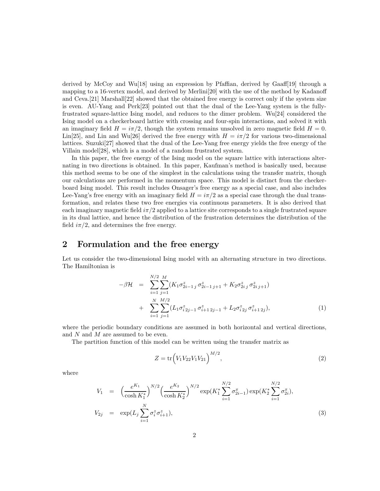
<figcaption class="paper-figure-caption"><b>Fig 1.</b> Low-resolution page preview, page 2</figcaption>
</figure>
<figure class="paper-figure-card">
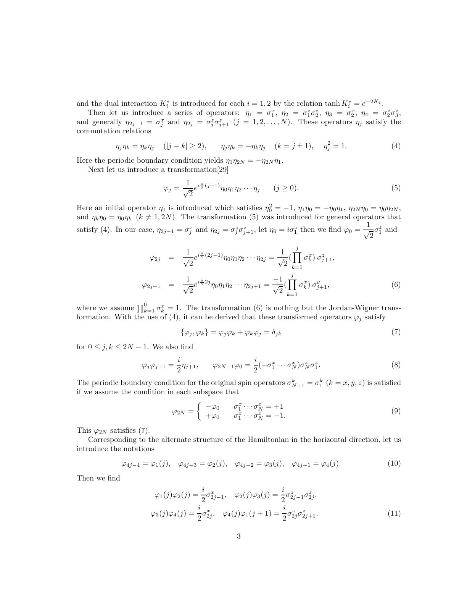
<figcaption class="paper-figure-caption"><b>Fig 2.</b> Low-resolution page preview, page 3</figcaption>
</figure>
<figure class="paper-figure-card">
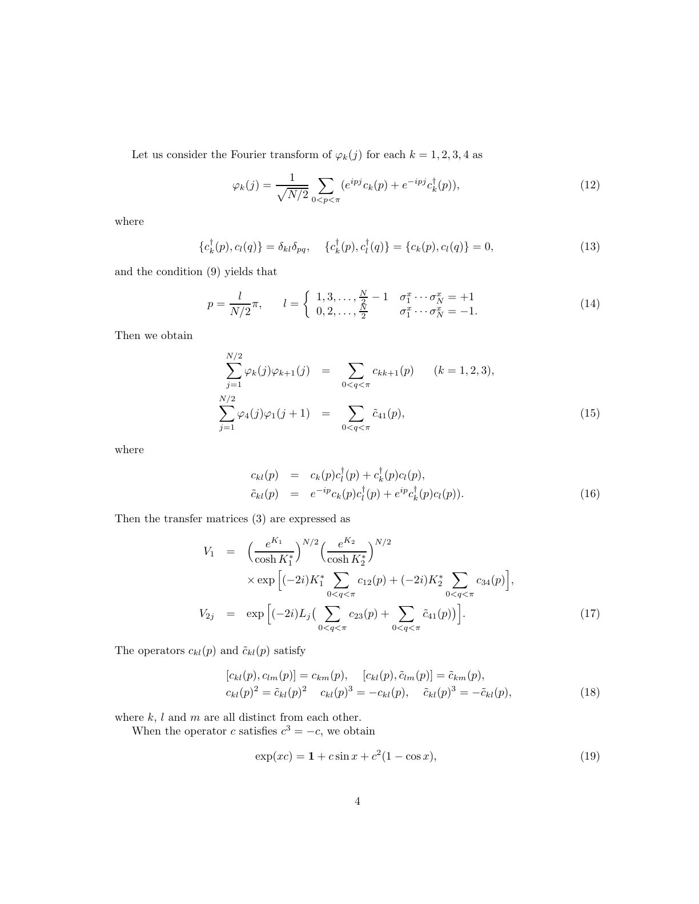
<figcaption class="paper-figure-caption"><b>Fig 3.</b> Low-resolution page preview, page 4</figcaption>
</figure>
<figure class="paper-figure-card">
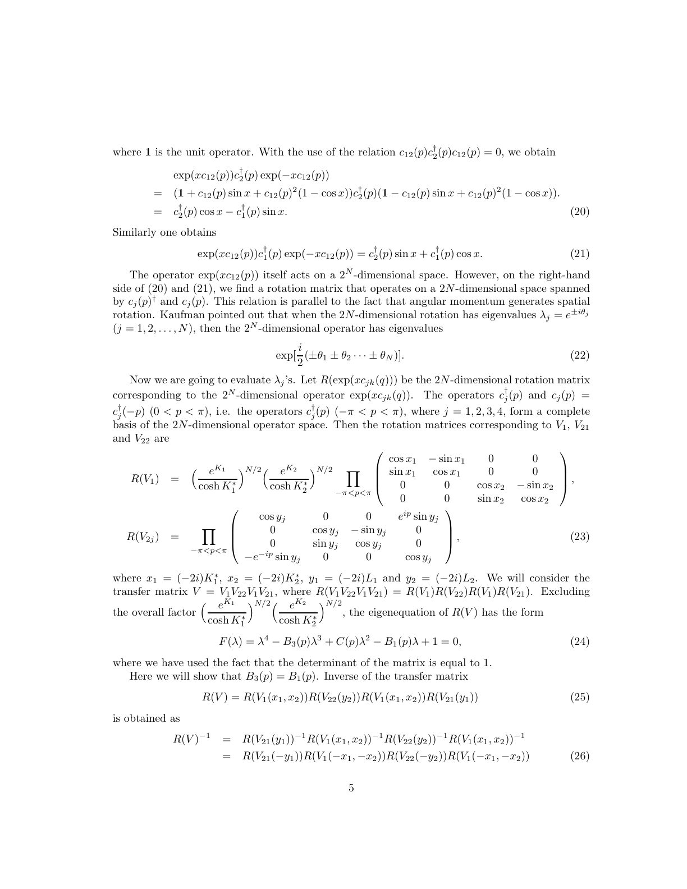
<figcaption class="paper-figure-caption"><b>Fig 4.</b> Low-resolution page preview, page 5</figcaption>
</figure>
<figure class="paper-figure-card">
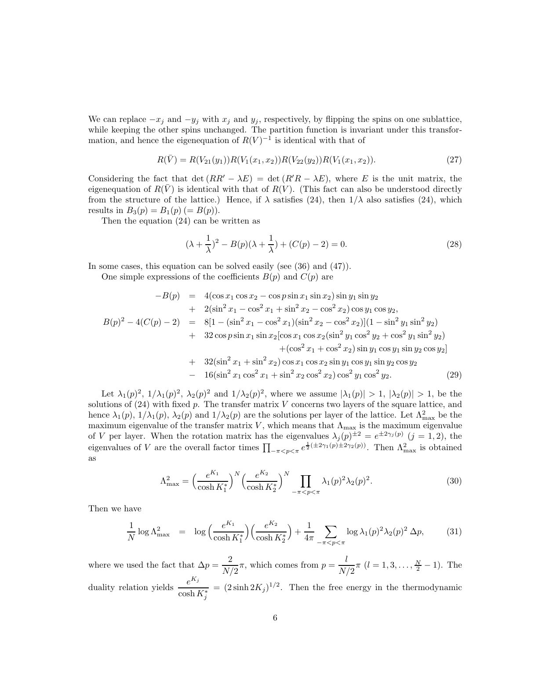
<figcaption class="paper-figure-caption"><b>Fig 5.</b> Low-resolution page preview, page 6</figcaption>
</figure>

**Summary.** This paper provides an exact derivation of the free energy for a specific square lattice Ising model featuring alternating interactions. It achieves this using sophisticated transfer matrix techniques, establishing crucial mathematical links showing that the system's behavior is equivalent to both Onsager's classic result and the Lee-Yang theory describing frustrated plaquettes.

**Why it may be interesting.** While focused on classical statistical mechanics, the use of advanced mathematical techniques (like mapping to bosonic operators) and the deep connections drawn between different exactly solvable models are highly relevant for understanding complex quantum many-body systems in AMO physics.

Detailed structure

**Main problem.** The primary goal is deriving the exact free energy of the Ising model defined on a square lattice where the interactions alternate in both horizontal and vertical directions.

**Main result.** The paper successfully derives the general free energy formula, establishing deep connections between this alternating interaction model, Onsager's solution, and the Lee-Yang partition function associated with frustrated plaquettes.

**Method.** The derivation heavily relies on the transfer matrix formalism, employing advanced mathematical techniques involving bosonic operator transformations (analogous to Jordan-Wigner) and solving characteristic eigenvalue equations.

**Model / system.** The system is a square lattice Ising model characterized by an alternating Hamiltonian structure involving four distinct interaction couplings ($K_1, K_2, L_1, L_2$).

**Key observables.** Free energy ($	ext{-}eta F$), eigenvalues ($\lambda$), and the relationship between different free energy forms.

**Important parameters / regimes.** Interaction coupling constants ($K_1, K_2, L_1, L_2$) and the imaginary magnetic field strength ($i\pi/2$).

**Assumptions / limitations.** Periodic boundary conditions are assumed in both lattice directions for the final thermodynamic limit analysis.

**Figures summary.** Figures illustrate the correspondence between applying an imaginary magnetic field $i\pi/2$ to a site and creating a frustrated square on the dual lattice, linking this concept to dimer coverings.

**Paper structure.** The paper proceeds by setting up the alternating Hamiltonian, employing the transfer matrix method involving operator transformations, deriving the characteristic eigenvalue equation, and finally calculating the free energy in terms of integrals over momentum space, confirming special cases like Onsager's model and Lee-Yang theory.

Abstract

The free energy of the Ising model on the square lattice with alternating interactions in both horizontal and vertical directions is exactly derived. This model is distinct from the checkerboard Ising model. The result includes Onsager's free energy as a special case, and also includes Lee-Yang's free energy with an imaginary field, and relates these two solutions via continuous parameters. It is also derived that each imaginary magnetic field $iπ/2$ applied to a lattice site corresponds to a single frustrated square in its dual lattice.

[↑ back to top](#top)

### [Thermodynamic Uncertainty Relation For a Multi-Phase Alternating Renewal Random Walk](http://arxiv.org/abs/2606.16339v1)

**Authors:** Fatemeh Karimi, Farhad H. Jafarpour  
**Type:** theory · **Category:** statistical mechanics · **PDF:** <https://arxiv.org/pdf/2606.16339v1>  
**Analysis basis:** full PDF text, analyzed in chunks
**Topic relevance:** `methods for driven-dissipative` **3/5** · `non-equilibrium dynamics` **3/5** · `non-equilibrium universality` **2/5** · `Keldysh / 2PI / non-Gaussian methods` **1/5** · `driven-dissipative phase transition` **1/5**

↔ Scroll figures horizontally

<figure class="paper-figure-card">
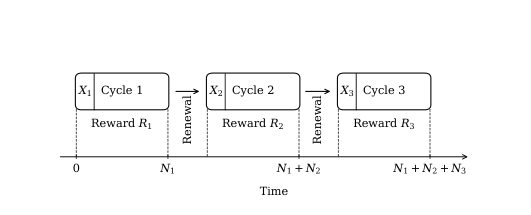
<figcaption class="paper-figure-caption"><b>Fig 1.</b> FIG. 1. Schematic of the multi-phase alternating renewal pro- cess. The system evolves through a sequence of i.i.d. cycles. At the start of each cycle i, a sign variable Xi ∈{−1, +1} is determined, defining the phase. Each cycle is characterized by a discrete duration Ni (number of time steps) and a total reward Ri. The boxes represent the black-box internal dy- namics. The phase Xi is reset and redrawn at every renewal point.</figcaption>
</figure>
<figure class="paper-figure-card">
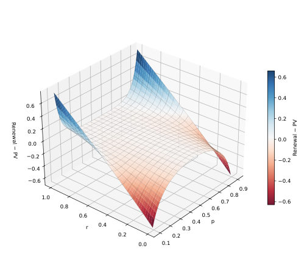
<figcaption class="paper-figure-caption"><b>Fig 2.</b> FIG. 2. Comparison of the generalized renewal bound and the Proesmans–Van den Broeck (PV) bound for the run-rest process (where r1 = r2 = r). The surface shows the difference ∆= (Renewal Bound) −(PV Bound). Red regions (∆&lt; 0) indicate where the renewal framework provides a tighter, more informative constraint on the current precision. The renewal bound is superior in the low-r regime, where long cycle du- rations and rest-phase fluctuations dominate the transport dynamics, effectively capturing the precision penalty that is neglected by time-averaged thermodynamic relations.</figcaption>
</figure>

**Summary.** This paper develops an advanced Thermodynamic Uncertainty Relation tailored for renewal processes, overcoming limitations of existing bounds when dynamics are non-Markovian. By using a rigorous variance decomposition based on cycle moments, the authors derive a tighter, model-independent bound on current precision. This is highly relevant for understanding fundamental limits in complex stochastic transport phenomena.

**Why it may be interesting.** This work provides a powerful, generalized tool for setting fundamental limits on transport efficiency in complex systems (like molecular motors or biological swimmers) where simple Markov assumptions fail. The focus on cycle statistics makes it highly applicable to non-equilibrium statistical physics beyond standard quantum settings.

Detailed structure

**Main problem.** The authors aim to derive a generalized, model-independent entropic bound (TUR) for current fluctuations in non-Markovian systems characterized by renewal events.

**Main result.** They establish a tighter bound than the standard Proesmans–Van den Broeck relation that correctly captures precision penalties arising from cycle-length or reward fluctuations in run-and-tumble dynamics.

**Method.** The derivation utilizes rigorous variance decomposition within the framework of renewal-reward theory, allowing the analysis to focus on aggregate cycle moments rather than microscopic details.

**Model / system.** The study models a multi-phase alternating renewal random walk, which includes active 'run' phases and passive 'rest' or 'tumble' events that reset directionality. The framework is general enough to apply to non-Markovian dynamics like AR(1) processes.

**Key observables.** Current ($\langle J(t) 
angle$), current variance ($\sigma_j^2$), entropy production ($ar{s}_X$), and cycle statistics (mean reward $E[R]$, duration $E[N]$).

**Important parameters / regimes.** The linear-response regime ($\epsilon \ll 1$) and the ratio of variances to means, which quantify fluctuation penalties.

**Assumptions / limitations.** The derivation assumes finite first and second moments for cycle rewards ($R_i$) and durations ($N_i$), and relies on statistical independence assumptions regarding the auxiliary sign variable $X$.

**Figures summary.** Figure 1 schematically illustrates the multi-phase alternating renewal process involving cycle duration, reward, and directional bias. Figure 2 compares the new generalized bound against the standard PV bound, showing regions where the renewal framework provides a superior constraint.

**Paper structure.** The paper introduces the problem by noting limitations of existing TURs for renewal processes. It then develops the general bound using variance decomposition (Appendix A), applies it to specific models like two-phase run-rest dynamics and non-Markovian AR(1) walks, and concludes by discussing the model-independent nature of the result.

Abstract

Thermodynamic Uncertainty Relations (TURs) impose universal bounds linking current precision to entropy production in nonequilibrium systems. While general bounds like the Proesmans--Van den Broeck (PV) relation provide a broad framework, they often remain loose for processes characterized by renewal events. In this work, we derive a generalized entropic bound for current fluctuations in renewal-reward processes. By utilizing a rigorous variance decomposition within the framework of renewal-reward theory, we obtain a model-independent bound that is not only rigorous but tighter than the standard PV relation. Notably, in the linear-response regime, our bound correctly scales with the renewal rate and identifies a precision penalty arising from cycle-length fluctuations. These results provide a physically informative constraint on the precision of run-and-tumble-type dynamics and highlight the universal limits of transport in complex stochastic walkers.

[↑ back to top](#top)

### [Hardy and Cabello Arguments in Spatial and Temporal Frauchiger-Renner Scenarios](http://arxiv.org/abs/2606.15467v1)

**Authors:** Ehsan Erfani Maharat, Ali Ahanj, Mohsen Sarbishaei  
**Type:** theory · **Category:** quantum information and computing · **PDF:** <https://arxiv.org/pdf/2606.15467v1>  
**Analysis basis:** full PDF text, analyzed in chunks
**Topic relevance:** `quantum measurements` **3/5** · `entanglement & information structure` **2/5** · `measurement-induced transitions` **2/5** · `correlated / nonlocal dissipation` **1/5** · `driven-dissipative phase transition` **1/5**

↔ Scroll figures horizontally

<figure class="paper-figure-card">
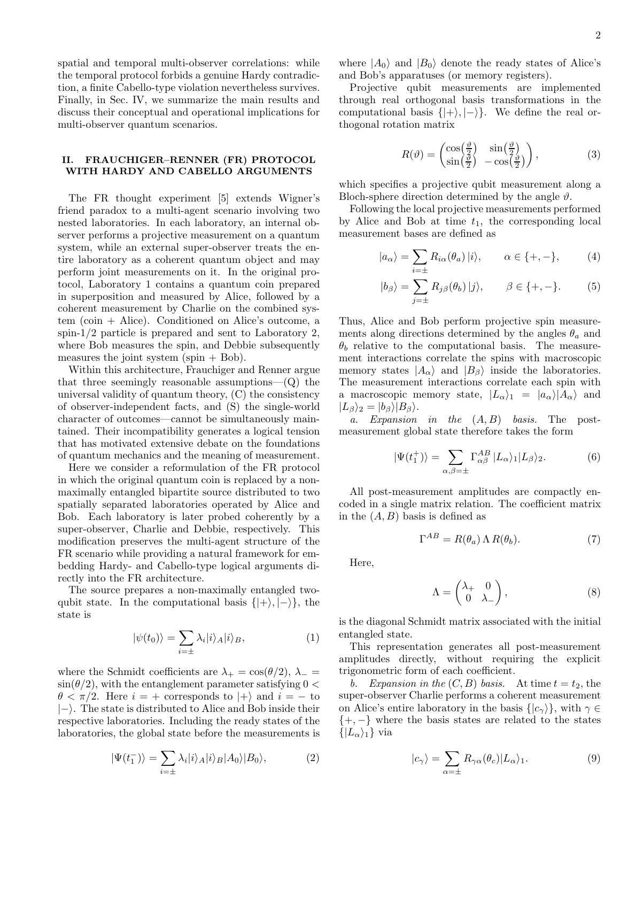
<figcaption class="paper-figure-caption"><b>Fig 1.</b> Low-resolution page preview, page 2</figcaption>
</figure>
<figure class="paper-figure-card">
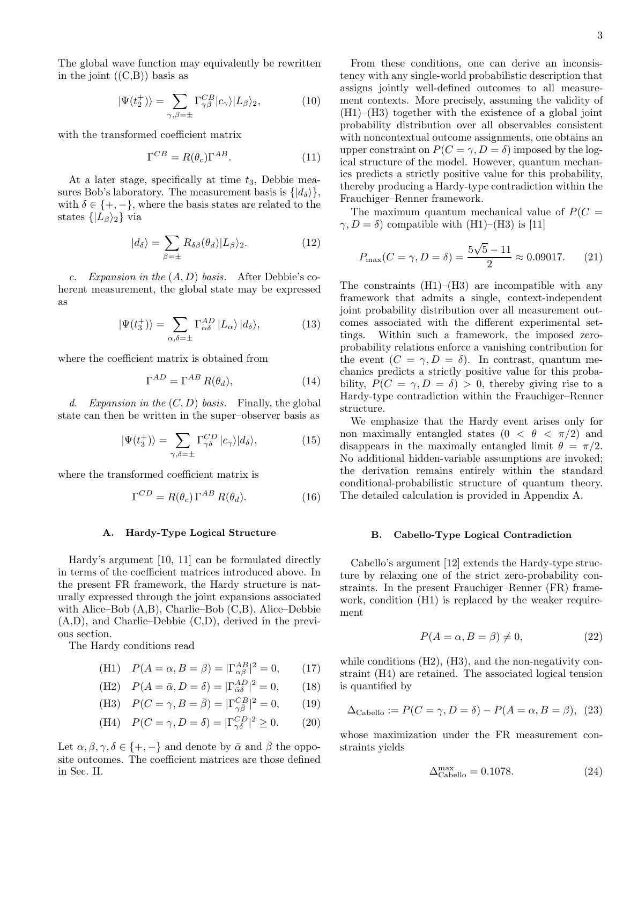
<figcaption class="paper-figure-caption"><b>Fig 2.</b> Low-resolution page preview, page 3</figcaption>
</figure>
<figure class="paper-figure-card">
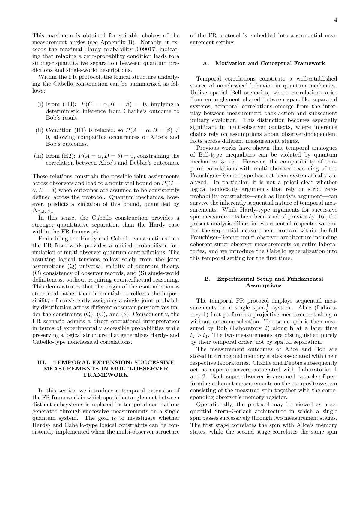
<figcaption class="paper-figure-caption"><b>Fig 3.</b> Low-resolution page preview, page 4</figcaption>
</figure>
<figure class="paper-figure-card">
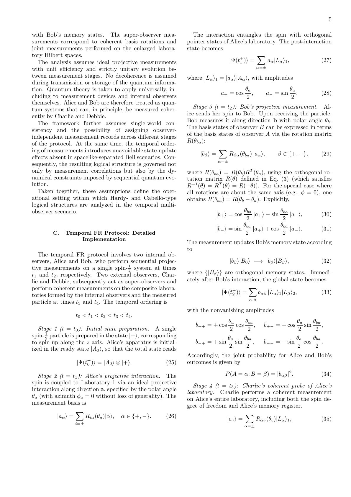
<figcaption class="paper-figure-caption"><b>Fig 4.</b> Low-resolution page preview, page 5</figcaption>
</figure>
<figure class="paper-figure-card">
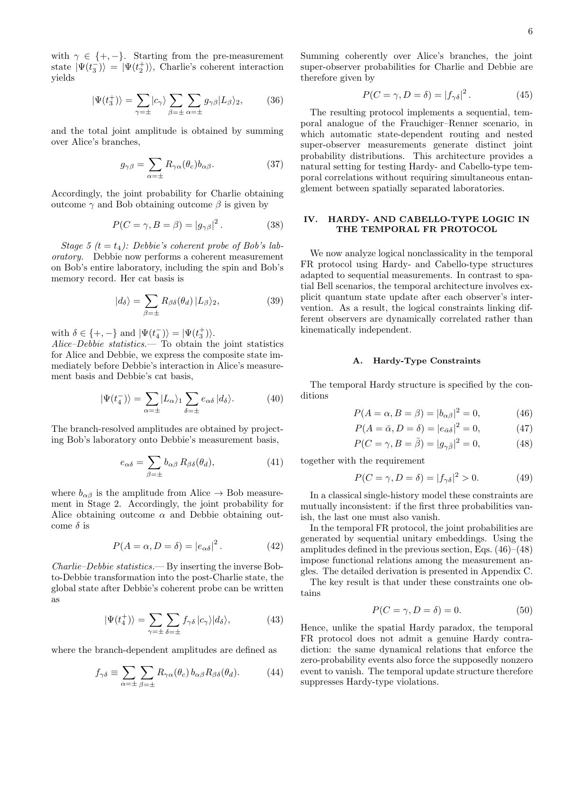
<figcaption class="paper-figure-caption"><b>Fig 5.</b> Low-resolution page preview, page 6</figcaption>
</figure>

**Summary.** The paper analyzes Hardy and Cabello paradoxes in both spatial and temporal extensions of the Frauchiger–Renner framework. It demonstrates that while the strong Hardy contradiction disappears in sequential time measurements, a weaker nonclassical tension (Cabello violation) persists. This highlights how measurement structure fundamentally dictates the type and strength of quantum correlations observed.

**Why it may be interesting.** This work is highly relevant as it probes the limits of quantum correlations under realistic physical assumptions (like time evolution), providing theoretical tools to distinguish between different forms of contextuality beyond simple Bell tests.

Detailed structure

**Main problem.** The study investigates Hardy- and Cabello-type logical structures within extensions of the Frauchiger–Renner (FR) framework to distinguish between quantum correlations in spatial versus temporal measurement settings.

**Main result.** The analysis shows that while the strong Hardy contradiction vanishes identically in the sequential temporal protocol due to state update constraints, a weaker but persistent Cabello-type violation remains. This establishes a fundamental structural difference between spatial and temporal nonlocality witnesses.

**Method.** The authors use quantum probability theory to calculate joint measurement probabilities for multi-observer scenarios, optimizing quantities like $\Delta_{	ext{Cabello}}$ subject to zero-probability constraints derived from the Hardy paradox structure.

**Model / system.** The model is a reformulation of the FR thought experiment applied to a single spin-1/2 system undergoing sequential projective measurements by multiple observers (Alice, Bob, Charlie, Debbie) over time. The analysis compares this temporal setting to its spatially separated counterpart.

**Key observables.** Hardy contradiction probability ($P_H$), Cabello violation parameter ($\Delta_{	ext{Cabello}}$), and joint measurement probabilities $P(A, B)$, $P(C, D)$.

**Important parameters / regimes.** Entanglement parameter $	heta$, optimal angles for measurements ($	heta_{	ext{opt}a}, 	heta_{	ext{opt}ba}$), and the violation values ($\Delta_{\max}^{	ext{Cabello}} \approx 0.1078$ (spatial) vs. $\approx 0.0674$ (temporal)).

**Assumptions / limitations.** The analysis assumes ideal projective measurements, unitary evolution between measurement stages, and relies on comparing the structural constraints imposed by zero-probability assumptions.

**Figures summary.** Not specified in notes; the focus is on derived mathematical results and comparisons of violation magnitudes across different protocols (spatial vs. temporal).

**Paper structure.** The paper systematically analyzes the Hardy and Cabello arguments first in a spatial multi-observer context, establishing quantitative bounds. It then extends this formalism to a sequential temporal protocol, demonstrating how dynamical constraints alter the nature and strength of the observed nonclassicality.

Abstract

We investigate Hardy- and Cabello-type logical structures within spatial and temporal extensions of the Frauchiger--Renner (FR) framework, embedding these constructions directly into the FR multi-observer architecture. In the spatial multi-observer scenario, both Hardy and Cabello contradictions arise, with the Cabello construction yielding the stronger violation,$\(Δ_{\rm Cabello}^{\max}=0.1078\)$, which exceeds the maximal Hardy probability $\(P_{H}^{\max}=\frac{5\sqrt{5}-11}{2}\approx 0.09017\)$. We then develop a sequential temporal FR protocol based on coherent multi-observer measurements performed on a single spin-$\tfrac12$ system. In this temporal setting, the Hardy contradiction disappears identically due to dynamical constraints imposed by sequential state updates, whereas a finite Cabello-type violation survives, \(Δ_{\rm Cabello}^{\max}\approx 0.0674\). Our results establish a fundamental structural distinction between spatial entanglement and temporal multi-observer correlations in FR-type logical scenarios, and demonstrate that certain observer-independent description failures persist even without spacelike separation.

[↑ back to top](#top)

### [Noise-Adaptive Predictive Dynamical Decoupling](http://arxiv.org/abs/2606.15769v1)

**Authors:** Ali Abu-Nada, Subhashish Banerjee, Lian-Ao Wu  
**Type:** theory · **Category:** quantum information and computing · **PDF:** <https://arxiv.org/pdf/2606.15769v1>  
**Analysis basis:** full PDF text, analyzed in chunks
**Topic relevance:** `methods for driven-dissipative` **3/5** · `non-equilibrium dynamics` **2/5** · `Keldysh / 2PI / non-Gaussian methods` **1/5** · `correlated / nonlocal dissipation` **1/5** · `driven-dissipative phase transition` **1/5** · `quantum measurements` **1/5**

↔ Scroll figures horizontally

<figure class="paper-figure-card">
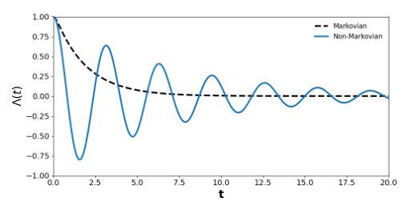
<figcaption class="paper-figure-caption"><b>Fig 1.</b> FIG. 1: Decoherence function Λ(t) for a qubit subject to RTN. The dashed black curve corresponds to the Markovian regime, where 2v &lt; κ and the coherence decays monotonically. The solid blue curve corresponds to the non-Markovian regime, where 2v &gt; κ and the coherence exhibits damped oscillations and revivals. The latter behavior reflects the presence of memory effects and information backflow in the effective dephasing dynamics.</figcaption>
</figure>
<figure class="paper-figure-card">
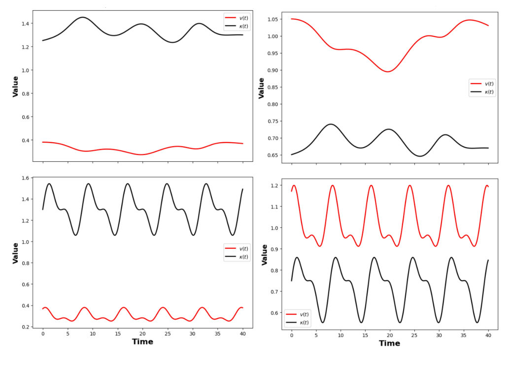
<figcaption class="paper-figure-caption"><b>Fig 2.</b> FIG. 2: Time-dependent RTN parameters for the two non-stationary noise models considered in this work. The red curves denote the coupling strength v(t), while the black curves represent the effective switching rate κ(t). Top panels: Model 1 with localized Gaussian-like drift of the RTN parameters. Bottom panels: Model 2 with persistent oscillatory modulation of both v(t) and κ(t). The left column corresponds to parameter regimes with κ(t) &gt; v(t), leading predominantly to Markovian coherence dynamics, whereas the right column corresponds to regimes where v(t) becomes comparable to or larger than κ(t), allowing non-Markovian memory effects and coherence revivals to emerge.</figcaption>
</figure>
<figure class="paper-figure-card">
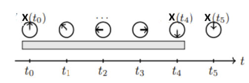
<figcaption class="paper-figure-caption"><b>Fig 3.</b> FIG. 3: Sliding-window construction of the training dataset. At time ti the model receives the five previous measurements [X(ti−5), . . . , X(ti−1)] and predicts the next value X(ti).</figcaption>
</figure>
<figure class="paper-figure-card">
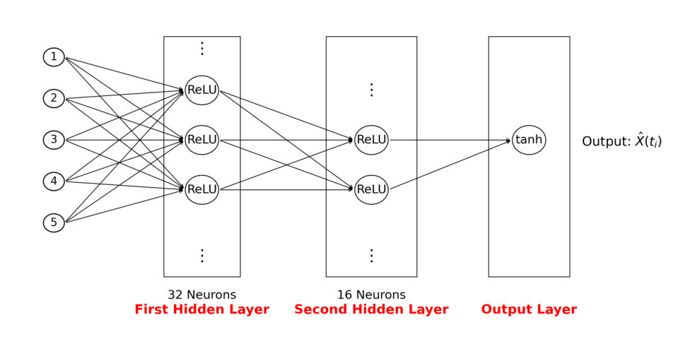
<figcaption class="paper-figure-caption"><b>Fig 4.</b> FIG. 4: Architecture of the neural network used for predicting the future coherence observable X(t). The input layer receives the five most recent measurements. Two hidden layers perform nonlinear feature extraction, and the output neuron produces the prediction ˆX(ti).</figcaption>
</figure>
<figure class="paper-figure-card">
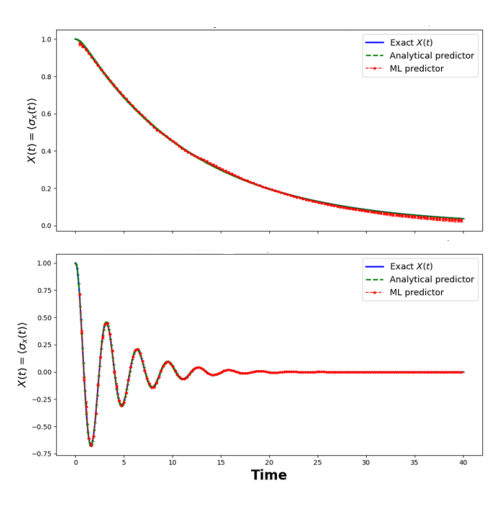
<figcaption class="paper-figure-caption"><b>Fig 5.</b> FIG. 5: Coherence dynamics of a qubit interacting with a stationary RTN environment. The observable X(t) = ⟨σx(t)⟩is compared with the analytical predictor and the ML predictor. The upper panel corresponds to the Markovian regime (κ &gt; v), characterized by monotonic coherence decay, while the lower panel corresponds to the non-Markovian regime (v ≳κ), where damped oscillations and coherence revivals emerge. Both predictors accurately reproduce the exact RTN dynamics in the two regimes.</figcaption>
</figure>

**Summary.** The paper proposes a novel noise-adaptive dynamical decoupling framework to combat decoherence in qubits interacting with realistic environmental noise. By integrating machine learning forecasting with open quantum system theory, the method adaptively places control pulses based on predicted coherence decay. This adaptive strategy proves substantially more robust than fixed pulse sequences, particularly when the noise environment changes over time (non-stationary regimes).

**Why it may be interesting.** This work directly addresses the practical limitations of current quantum error correction/mitigation schemes by proposing a data-driven, real-time adaptation mechanism that is crucial for scaling up noisy quantum hardware.

Detailed structure

**Main problem.** The primary challenge addressed is protecting quantum coherence against realistic, time-varying environmental noise sources.

**Main result.** Machine-learning-assisted adaptive dynamical decoupling significantly outperforms conventional fixed pulse schedules, especially in non-Markovian and non-stationary noise regimes.

**Method.** The approach combines analytical open-quantum-system modeling with machine learning to forecast short-time coherence evolution and adaptively place control pulses.

**Model / system.** The system is a single qubit modeled interacting with Random Telegraph Noise (RTN). The dynamics are analyzed using the expectation value of the Pauli observable $\langle\sigma_x(t)
angle$ within an open quantum system framework.

**Key observables.** Coherence evolution, specifically the transverse observable $X(t) = \langle\sigma_x(t)
angle$, and the time-integrated coherence measure $A[C]$.

**Important parameters / regimes.** Noise regimes include Markovian ($\kappa > v$) and non-Markovian ($v > \kappa$), as well as environmental drift characterized by time-dependent parameters $\kappa(t)$ and $v(t)$.

**Assumptions / limitations.** Conventional dynamical decoupling protocols assume stationary noise statistics, which is violated in realistic, non-stationary environments.

**Figures summary.** Figures compare coherence decay for free evolution, periodic DD, and adaptive ML-DD across four regimes (Markovian/Non-Markovian, Stationary/Non-Stationary), showing the superior performance of the adaptive method when noise varies over time.

**Paper structure.** The paper progresses from establishing the decoherence problem using open quantum system theory to modeling RTN in various regimes. It then introduces predictive ML techniques for forecasting coherence and finally compares the resulting adaptive control strategy against fixed periodic protocols, demonstrating superior performance in non-stationary settings.

Abstract

Protecting quantum coherence against realistic environmental noise remains one of the fundamental obstacles to scalable quantum technologies. We develop a noise-adaptive dynamical decoupling framework that combines analytical open-quantum-system modeling with machine-learning-based forecasting for a qubit interacting with random telegraph noise. Unlike conventional dynamical decoupling protocols based on fixed pulse schedules, the proposed approach continuously forecasts short-time coherence evolution and adaptively applies control pulses according to the instantaneous noise dynamics. We investigate stationary and non-stationary environments spanning both Markovian and non-Markovian regimes. Numerical simulations demonstrate that the machine-learning-assisted adaptive control strategy substantially outperforms conventional periodic dynamical decoupling while using a comparable number of control pulses. The improvement becomes particularly pronounced in non-Markovian and non-stationary regimes, where memory effects, coherence revivals, and temporally evolving noise strongly limit the effectiveness of static pulse protocols. These results establish predictive machine-learning-assisted dynamical decoupling as a promising and scalable framework for adaptive quantum control in realistic noisy quantum devices.

[↑ back to top](#top)

### [Surface-Sensitive Mapping of Anisotropic Phonon Cascades in T$_{d}$-WTe$_{2}$](http://arxiv.org/abs/2606.15853v1)

**Authors:** Alp Akbiyik, Felix Kurtz, Sergey V. Yalunin, Claus Ropers, Hannes Böckmann  
**Type:** experiment · **Category:** other · **PDF:** <https://arxiv.org/pdf/2606.15853v1>  
**Analysis basis:** full PDF text, analyzed in chunks
**Topic relevance:** `non-equilibrium dynamics` **3/5** · `Keldysh / 2PI / non-Gaussian methods` **2/5** · `correlated / nonlocal dissipation` **1/5** · `driven-dissipative phase transition` **1/5** · `methods for driven-dissipative` **1/5** · `non-equilibrium universality` **1/5**

↔ Scroll figures horizontally

<figure class="paper-figure-card">
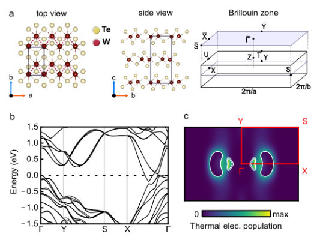
<figcaption class="paper-figure-caption"><b>Fig 1.</b> FIG. 1. (a) Representation of the real space structure [47] of Td-WTe2 from the top and side together with the corresponding Brillouin Zone schematic. The purple area represents the surface Brillouin zone. (b) Electronic band structure calculation of bulk Td-WTe2. (c) Calculated Fermi surface mapping denoting the Γ-X and Γ-Y direction.</figcaption>
</figure>
<figure class="paper-figure-card">
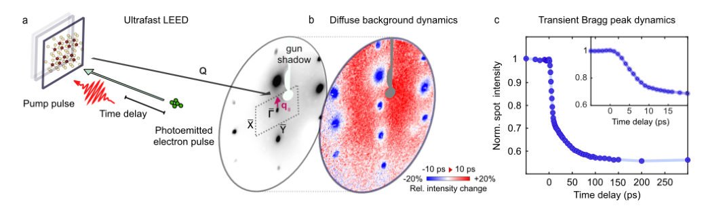
<figcaption class="paper-figure-caption"><b>Fig 2.</b> FIG. 2. (a) Schematic of the ULEED experimental setup. (b) Delay-dependent diffraction intensities of back-scattered low- energy electrons along the scattering vector Q reveal Bragg spot suppression and a diffuse background increase at phonon momenta q||. (c) Pump-induced suppression of the Bragg peak intensity due the Debye-Waller effect.</figcaption>
</figure>
<figure class="paper-figure-card">
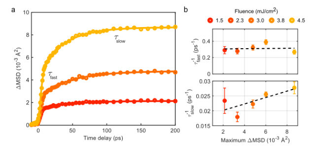
<figcaption class="paper-figure-caption"><b>Fig 3.</b> FIG. 3. (a) Transient change in out-of-plane mean-squared displacement (MSD) for selected absorbed fluences. Bi-exponential fits capture the dynamics, indicating a cascaded rise in distinct phonon populations. (b) Fluence dependent time constants of the fast and slow component in MSD increase, obtained from the fit model.</figcaption>
</figure>
<figure class="paper-figure-card">
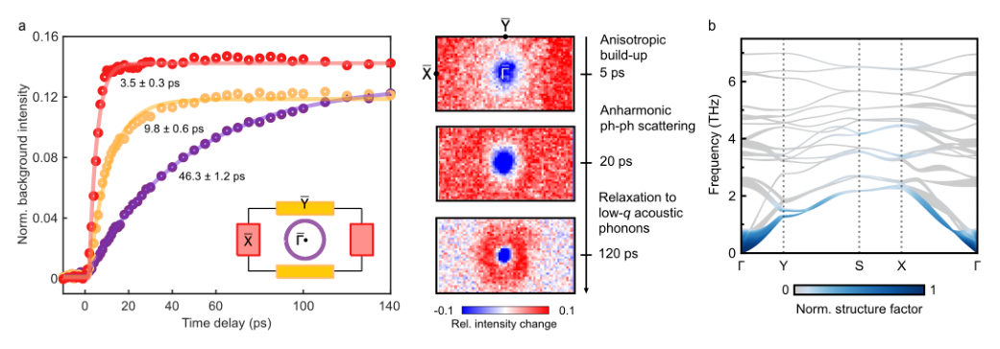
<figcaption class="paper-figure-caption"><b>Fig 4.</b> FIG. 4. (a) Left, transient change in diffuse background for 4.5 mJcm−2, evaluated at the Brillouin zone ¯ X- and ¯Y -boundaries (red and yellow) and close to the zone centre (blue). Time constants are obtained from single-exponential fits. Right, diffuse background evolution within the Brillouin zone between different time steps. An el-ph scattering mediated anisotropic build-up in ¯ X-direction is followed by anharmonic redistribution across the Brillouin zone. The delayed build-up towards the zone centre reflects scattering towards low-q phonons. (b) Phonon dispersion of Td-WTe2, color-coded by the out-of-plane contribution to the phonon structure factor, revealing the enhanced...</figcaption>
</figure>

**Summary.** The researchers used ultrafast electron diffraction on Td-WTe2 to track how photoexcitation energy dissipates into the crystal lattice. They found that this process is not instantaneous thermalization but a multi-step cascade, first populating specific phonon modes anisotropically before spreading throughout the entire vibrational bath.

**Why it may be interesting.** This work provides a detailed experimental blueprint for observing energy dissipation mechanisms (el-ph vs ph-ph) in anisotropic solids using advanced scattering techniques, which is highly relevant for understanding open quantum systems coupled to structured environments.

Detailed structure

**Main problem.** The study aims to understand how energy deposited by photoexcited carriers flows into the lattice in low-symmetry quantum materials, specifically disentangling electron-phonon and phonon-phonon relaxation pathways.

**Main result.** Energy relaxation occurs via a hierarchical, momentum-selective cascade: initial rapid energy deposition into finite-momentum phonons (el-ph coupling) followed by slower redistribution across the Brillouin zone due to anharmonic phonon-phonon scattering.

**Method.** The research utilizes ultrafast low-energy electron diffraction and diffuse scattering to probe momentum-resolved phonon dynamics at the material surface.

**Model / system.** The system studied is Td-WTe2, a strongly anisotropic semimetal with broken inversion symmetry. The analysis probes its lattice response following optical excitation using ULEED techniques.

**Key observables.** Mean-squared atomic displacement (from Debye-Waller suppression) and the time evolution of diffuse background intensity across specific directions in the surface Brillouin zone ($ar{\Gamma}-ar{X}$, $ar{\Gamma}-ar{Y}$).

**Important parameters / regimes.** Time scales include rapid initial relaxation ($3.5 	ext{ ps}$) followed by slower lattice cooling ($30	ext{-}100 	ext{ ps}$); the anisotropy of energy flow is key.

**Assumptions / limitations.** The analysis relies on separating contributions based on fluence dependence to distinguish between electronic and purely vibrational relaxation mechanisms.

**Figures summary.** Figures illustrate ULEED setups, biexponential fits for MSD, and momentum-resolved diffuse intensity tracking showing anisotropic build-up followed by zone center accumulation.

**Paper structure.** The paper establishes the need to study non-equilibrium energy flow in low-symmetry materials. It then details the use of ultrafast electron diffraction to measure time-dependent lattice dynamics, presenting evidence for sequential relaxation pathways governed by momentum conservation and anisotropy.

Abstract

Understanding how energy flows from photoexcited carriers into the lattice is essential for describing nonequilibrium phenomena in low-symmetry quantum materials. Here, we use ultrafast low-energy electron diffraction and diffuse scattering to probe momentum-resolved phonon dynamics at the surface of T$_{d}$-WTe$_{2}$, a strongly anisotropic semimetal. Following optical excitation, the Debye-Waller suppression of Bragg peaks reveals a biexponential increase of the mean-squared atomic displacement, indicating sequential lattice relaxation. Analysis of the diffuse background reveals a preferential intensity build-up parallel to the tungsten-chain axis in the material, attributed to anisotropic electron-phonon coupling during electronic cooling. Diffuse intensity subsequently redistributes across the surface Brillouin zone and finally accumulates near the zone centre, consistent with anharmonic phonon-phonon scattering and the gradual population of low-frequency acoustic modes on a 30--100 ps timescale. The results reveal a hierarchical relaxation pathway in which energy is first deposited into selected finite-momentum phonons before spreading through the broader lattice bath. Our work highlights the importance of momentum-resolved diffuse scattering for disentangling electron-phonon and phonon-phonon relaxation in anisotropic topological semimetals.

[↑ back to top](#top)

### [Universality in the target arrival statistics of non-conservative search processes](http://arxiv.org/abs/2606.16025v1)

**Authors:** José Giral-Barajas, Samantha Linn, Paul C. Bressloff  
**Type:** theory · **Category:** statistical mechanics · **PDF:** <https://arxiv.org/pdf/2606.16025v1>  
**Analysis basis:** full PDF text, analyzed in chunks
**Topic relevance:** `non-equilibrium universality` **3/5** · `non-equilibrium dynamics` **2/5** · `Keldysh / 2PI / non-Gaussian methods` **1/5** · `correlated / nonlocal dissipation` **1/5** · `driven-dissipative phase transition` **1/5** · `methods for driven-dissipative` **1/5**

↔ Scroll figures horizontally

<figure class="paper-figure-card">
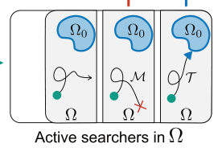
<figcaption class="paper-figure-caption"><b>Fig 1.</b> FIG. 1. Schematic of non-conservative stochastic search mapped onto an Mt/G/∞queue. (a) Example sample paths of a non-conservative 1D Brownian motion search with ex- ponential insertion and mortality of rates λ = µ = 1. (b) Departures correspond either to target hits (S = T , blue tri- angles) or mortality events (S = M, red crosses). This pro- cess is precisely the departure process of an Mt/G/∞queue. (c) Searchers are continuously inserted into the queue (Ω) ac- cording to a nonhomogeneous Poisson process of rate λ(t). They remain there for a random time S = min{T , M} before departing the system.</figcaption>
</figure>
<figure class="paper-figure-card">
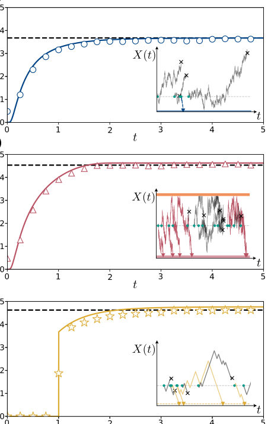
<figcaption class="paper-figure-caption"><b>Fig 2.</b> FIG. 2. Convergence of the target arrival intensity function to the steady-state λpµ. (a) Brownian particle on the half- line with M ∼Exp(µ) and diffusivity D = 1. (b) Brownian particle on the interval [0, L] with M ∼Uni(0, 2µ−1), L = 2, and diffusivity D = 1. (c) Run-and-tumble particle on the half-line with M ∼Exp(µ). The particle switches between left-moving and right-moving velocity states ±v at a rate α and initial velocity −1. We take v =α=1. Solid lines denote the intensity function as in Eq. (11), markers denote simu- lation data, dashed lines denote the analytical steady-state. Inset are sample paths: Green dots indicate particle inser- tions and crosses indicate particle removals...</figcaption>
</figure>
<figure class="paper-figure-card">
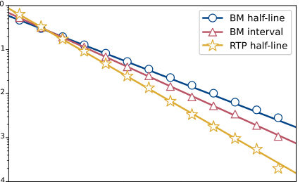
<figcaption class="paper-figure-caption"><b>Fig 3.</b> FIG. 3. Steady-state inter-arrival time density with a single searcher on average. Solid lines denote the analytical result in Eq. (15) and markers denote simulation data.</figcaption>
</figure>

**Summary.** This paper develops a queueing theory framework to analyze stochastic search processes where resources are continuously added and lost. By mapping the problem to an M_t/G/infinity queue, the authors prove that the steady-state arrival statistics of targets are universally governed by an exponential distribution. This result significantly simplifies the theoretical description of resource accumulation in non-conservative physical systems.

**Why it may be interesting.** The finding of universal exponential statistics from a complex physical process (search/resource accumulation) is highly relevant to open quantum systems where environmental coupling often leads to Markovian or Poissonian decay rates, simplifying otherwise intractable dynamics.

Detailed structure

**Main problem.** Analyzing target arrival statistics for non-conservative stochastic search processes where searchers are continuously introduced and removed from a domain.

**Main result.** The steady-state inter-arrival time distribution for these non-conservative search processes is exactly exponential, demonstrating robust universality regardless of the underlying search process details.

**Method.** The authors map the non-conservative stochastic search problem onto an M_t/G/infinity queueing system to derive the full time-dependent arrival distributions.

**Model / system.** The model involves a target resource accumulation scenario where searchers are subject to continuous introduction (Poisson process) and removal (mortality). This is mathematically treated as an M_t/G/infinity queue, simplifying analysis compared to fixed-particle systems.

**Key observables.** Target arrival intensity function ($\lambda_\lambda(t)$), steady-state inter-arrival time density ($	ext{f}_{\Delta}(t)$), and the probability of finding the target before mortality ($p_\mu$).

**Important parameters / regimes.** Insertion rate ($\lambda$), mortality rate ($\mu$), and the First Passage Time (FPT) distribution characterizing single-searcher dynamics.

**Assumptions / limitations.** The analysis primarily assumes homogeneous Poisson insertion of searchers ($\lambda(t) \equiv \lambda > 0$) to establish the universal exponential result. The framework relies on mapping to an M/G/infinity queue.

**Figures summary.** Figures illustrate the process mapped onto an M_t/G/infinity queue and show the convergence of the target arrival intensity function to a steady-state rate ($\lambda p_\mu$) for various physical search models.

**Paper structure.** The paper builds from general queueing theory results (M/G/infinity) to apply these tools specifically to non-conservative search processes. It establishes the mapping, derives the time-dependent arrival statistics, and culminates in proving the universal exponential nature of the steady-state inter-arrival times.

Abstract

Stochastic search processes in which searchers are continuously introduced to and removed from a target search domain are fundamental to a wide class of physical and artificial systems. The theory of such non-conservative search processes is, however, much less developed than for search processes with a fixed number of particles. Here we exploit a natural mapping between non-conservative stochastic search and queueing theory to derive the full time-dependent distribution of target arrivals under minimal assumptions on the underlying search process. Remarkably, we find that the steady-state inter-arrival time distribution is exactly exponential, regardless of the details of the search process, showing a robust universality that emerges directly from the queueing framework. Thus, counterintuitively, the arrival statistics of a non-conservative search process are much simpler than sequential search-and-capture processes involving a fixed number of searchers. This has major implications for target resource accumulation, where the delivery of resources is counter-balanced by their downstream consumption.

[↑ back to top](#top)

### [Asymmetric binary Bose mixtures: a Functional Renormalisation Group study](http://arxiv.org/abs/2606.16029v1)

**Authors:** Boris Krippa  
**Type:** theory · **Category:** quantum gases · **PDF:** <https://arxiv.org/pdf/2606.16029v1>  
**Analysis basis:** full PDF text, analyzed in chunks
**Topic relevance:** `Keldysh / 2PI / non-Gaussian methods` **3/5** · `analog quantum simulation` **3/5** · `driven-dissipative phase transition` **1/5** · `methods for driven-dissipative` **1/5**

↔ Scroll figures horizontally

<figure class="paper-figure-card">
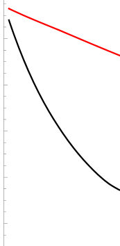
<figcaption class="paper-figure-caption"><b>Fig 1.</b> Figure 1: Two condensates ρ1 (lower curve, black online) and ρ2 (upper curve, red online) as functions of the mass ratio R. The interspecies coupling is γ = −0.1</figcaption>
</figure>
<figure class="paper-figure-card">
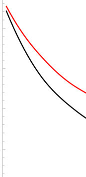
<figcaption class="paper-figure-caption"><b>Fig 2.</b> Figure 2: Same as for Fig.1 but with interspecies coupling taken at the initial scale to be γ = −1</figcaption>
</figure>
<figure class="paper-figure-card">
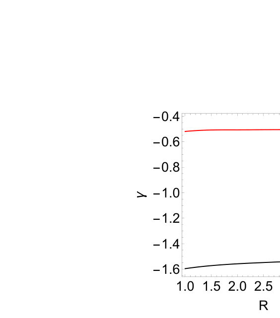
<figcaption class="paper-figure-caption"><b>Fig 3.</b> Figure 3: The interspecies coupling γ as a function of the mass ratio R. The starting values of the couplings are γ = −0.5 and γ = −1.5 (red and black online)</figcaption>
</figure>
<figure class="paper-figure-card">
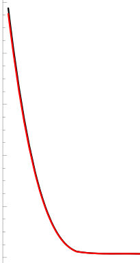
<figcaption class="paper-figure-caption"><b>Fig 4.</b> Figure 4: The condensates as the functions of the starting value of the coupling γ at R = 1</figcaption>
</figure>
<figure class="paper-figure-card">
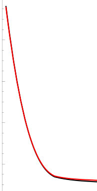
<figcaption class="paper-figure-caption"><b>Fig 5.</b> Figure 5: Same as in Fig.4 but for the asymmetry factor R = 3.</figcaption>
</figure>

**Summary.** This paper uses the Functional Renormalisation Group to study asymmetric binary Bose mixtures at zero temperature. It demonstrates that mass imbalance drives a spontaneous redistribution of quantum fluctuations, causing measurable deviations from simple mean-field predictions. The key finding is the systematic reduction of the density sound velocity due to these non-perturbative correlation effects.

**Why it may be interesting.** This work provides a rigorous, non-perturbative tool (FRG) to quantify how quantum fluctuations modify collective excitations in multicomponent ultracold atomic mixtures, offering crucial corrections over standard mean-field models.

Detailed structure

**Main problem.** The study investigates zero-temperature binary Bose mixtures exhibiting mass and intraspecies coupling imbalances.

**Main result.** The analysis shows that dual asymmetry causes a spontaneous redistribution of quantum fluctuations, leading to quasiparticle residue divergences and systematically reducing the density-channel sound velocity contrary to standard Bogoliubov theory.

**Method.** The Functional Renormalisation Group (FRG) framework is employed to provide a non-perturbative treatment of many-body correlations beyond mean-field approximations.

**Model / system.** The system models binary Bose mixtures ($\phi$ and $\psi$) with tunable mass imbalances ($R=m_1/m_2$) and interspecies coupling ($\gamma$). The analysis focuses on collective excitations like density and spin sound modes.

**Key observables.** Quasiparticle residues, density-channel sound velocity ($c_+$), spin-channel sound velocity ($c_-$), and the ratio of renormalization factors ($\sigma = Z_2/Z_1 - 1$).

**Important parameters / regimes.** Mass asymmetry factor ($R$), interspecies coupling constant ($\gamma_{st}$), and intraspecies coupling ratios ($s = eta_2/eta_1$). The analysis is restricted to the dilute regime ($n a^3 \ll 1$).

**Assumptions / limitations.** The FRG calculation relies on specific truncations of the effective action ansatz, which are assumed reliable in the dilute gas limit.

**Figures summary.** Figures illustrate how sound velocities decrease with increasing mass asymmetry ($R$), and show the evolution of the relative dynamical renormalization ($\sigma$) as a function of coupling strengths.

**Paper structure.** The paper develops the FRG flow equations for the effective action, analyzes the impact of asymmetry on quasiparticle residues, and compares the resulting predictions for sound velocities against established Bogoliubov theory.

Abstract

Zero-temperature binary Bose mixtures with mass and intraspecies couplings imbalances are studied using the functional renormalisation group (FRG) framework. We find that this dual asymmetry induces a spontaneous redistribution of quantum fluctuations between the components. This effect leads to a significant divergence in the quasiparticle residues of the two species, a phenomenon not captured in mean-field treatments. Critically, our FRG analysis predicts a systematic reduction of the density-channel sound velocity with increasing asymmetry -- a result that qualitatively contradicts the behaviour predicted by standard Bogoliubov theory. The ratio of the renormalisation factors is proposed as a robust quantitative probe of many-body correlations and fluctuation transfer. These findings provide a consistent non-perturbative framework for interpreting future experiments on heterogeneous mixtures.

[↑ back to top](#top)

### [Optimising Entanglement Distillation Policies](http://arxiv.org/abs/2606.14908v1)

**Authors:** Jigyen Bhavsar, Rajni Bala, Siddhartha Santra  
**Type:** theory · **Category:** quantum information and computing · **PDF:** <https://arxiv.org/pdf/2606.14908v1>  
**Analysis basis:** full PDF text, analyzed in chunks
**Topic relevance:** `entanglement & information structure` **3/5** · `non-equilibrium dynamics` **2/5** · `correlated / nonlocal dissipation` **1/5** · `driven-dissipative phase transition` **1/5** · `methods for driven-dissipative` **1/5**

↔ Scroll figures horizontally

<figure class="paper-figure-card">
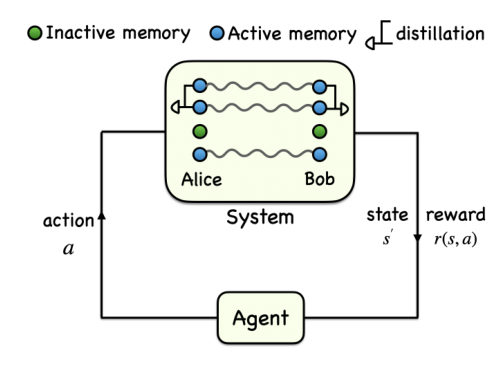
<figcaption class="paper-figure-caption"><b>Fig 1.</b> FIG. 1. Schematic representation of MDP formulation for op- timizing entanglement distillation policy. The agent interacts with system, which consists of two distant parties, Alice and Bob, each equipped with m ≥2 quantum memories. In above configuration, three quantum memories are active (blue cir- cle) that stores the entangled pairs (curved gray lines), while the remaining memories are inactive (green circle). The pairs in the first and second active memories are selected for dis- tillation , while the other pairs remain unchanged. At each decision step, the agent selects an action a (entanglement gen- eration or distillation), after which the system transitions to a new state s ′ from...</figcaption>
</figure>
<figure class="paper-figure-card">
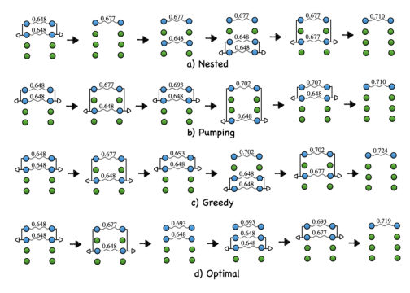
<figcaption class="paper-figure-caption"><b>Fig 2.</b> FIG. 2. Time evolution of the history trees for different en- tanglement distillation policies with four quantum memories at each station. The initial fidelity after entanglement gen- eration (with probability p = 0.9) is 0.648, and the target fi- delity is 0.710. The grey curved lines denote entangled pairs, with the associated numbers indicating their fidelities. Blue circles represent active quantum memories, while green cir- cles indicate inactive quantum memories. (a) History tree of entangled pairs under the nested purification policy. (b) His- tory tree of entangled pairs under the entanglement pumping policy. (c) History tree of entangled pairs under the greedy policy. (d) History...</figcaption>
</figure>
<figure class="paper-figure-card">
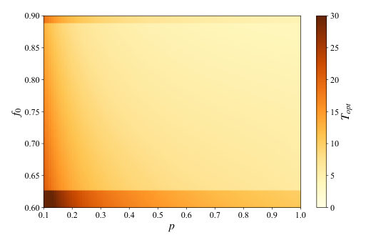
<figcaption class="paper-figure-caption"><b>Fig 3.</b> FIG. 3. Expected waiting time of optimal policy, Topt, for a node with four quantum memories (m = 4), shown for differ- ent values of the entanglement generation probability p and initial fidelity f0. The gap between the target fidelity fT and the initial fidelity f0 is fixed at ∆f = 0.04.</figcaption>
</figure>
<figure class="paper-figure-card">
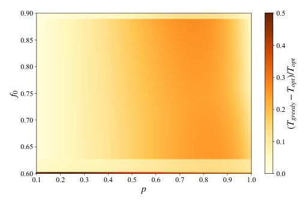
<figcaption class="paper-figure-caption"><b>Fig 4.</b> FIG. 5. The relative difference between the expected waiting time of optimal policy, Topt, and greedy policy, Tgreedy, with four quantum memories per node (m = 4), for different values of p and f0. For fix fidelity gap between initial and target fidelity (∆f = 0.04), an optimal policy performs increasingly better than greedy policy in regimes of intermediate f0, as well as low p with very low f0.</figcaption>
</figure>
<figure class="paper-figure-card">
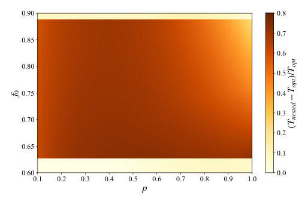
<figcaption class="paper-figure-caption"><b>Fig 5.</b> FIG. 4. The relative difference between the expected waiting time of optimal policy, Topt, and nested policy, Tnested, with four quantum memories per node (m = 4), for different values of p and f0. For fix fidelity gap between initial and target fidelity (∆f = 0.04), an optimal policy performs increasingly better than nested policy in regimes of intermediate f0.</figcaption>
</figure>

**Summary.** This paper develops an optimal strategy for entanglement distillation by modeling the process as a Markov Decision Process. By solving this MDP using value iteration, the authors derive policies that minimize the expected waiting time to achieve high-fidelity entanglement. This systematic approach proves superior to simple heuristic methods in resource-constrained quantum networking scenarios.

**Why it may be interesting.** This work provides a systematic, mathematically rigorous framework (MDP) to optimize resource utilization in quantum communication tasks, which is crucial for designing practical quantum networks that must operate under realistic constraints like decoherence time.

Detailed structure

**Main problem.** The core problem is optimizing entanglement distillation policies to minimize the expected waiting time required to boost low-fidelity entangled pairs up to a target fidelity threshold.

**Main result.** An optimal policy derived from an MDP framework consistently outperforms heuristic baselines (greedy, nested, pumping), though its relative advantage depends non-trivially on system parameters like initial fidelity ($f_0$) and the fidelity gap ($\Delta f$).

**Method.** The problem is rigorously formulated as a Markov Decision Process (MDP) and solved using value iteration to determine optimal deterministic policies.

**Model / system.** The model involves two parties, Alice and Bob, each with $m$ quantum memories connected by parallel channels. Operations include probabilistic entanglement generation (EG) and 2-to-1 distillation (ED) on Werner states.

**Key observables.** Expected waiting time ($T_\pi$), relative improvement of optimal policy over baselines ($rac{T_{baseline} - T_{opt}}{T_{opt}}$).

**Important parameters / regimes.** Initial fidelity ($f_0$), target fidelity ($f_T$), number of memories ($m$), and generation probability ($p$).

**Assumptions / limitations.** The analysis assumes the ability to model the sequential decision process as an MDP, though computational limits restrict exact solutions for large state spaces.

**Figures summary.** Figures illustrate how $T_{opt}$ depends on parameters like $p$ and $f_0$, showing non-monotonic behavior; they also compare relative performance gains of optimal vs. heuristic policies (nested, greedy, pumping).

**Paper structure.** The paper establishes the physical problem, models it as an MDP, derives the Bellman equation for minimum expected time, solves it via value iteration, and compares the resulting optimal policy against established heuristic protocols.

Abstract

Entanglement distillation is a fundamental operation in quantum information processing used to obtain higher-fidelity entangled pairs from a supply of less entangled quantum states using local operations aided by classical communication (LOCC). In a physically relevant setting, where states with an initial fidelity of $f_0$, probabilistically generated over multiple, $m$, memory pairs distributed between two parties, Alice and Bob, are pairwise distilled, the optimal policy identifies the system-configuration dependent sequence of entanglement generation and distillation operations that need to be performed in order to minimize the expected time to reach some target fidelity $f_T>f_0$. Here, we formulate and systematically analyze this task as a Markov decision problem and using a value iteration algorithm, obtain optimal deterministic policies that minimize the expected waiting time required to reach a target fidelity. Our results show that the expected waiting time under the optimal policy decreases with increasing generation probability $p$ and number of quantum memories $m$ - as expected. In contrast, it exhibits non-monotonic behavior with respect to $f_0$ for a fixed fidelity gap, $(Δf = f_T-f_0)$. While the optimal policy consistently outperforms baseline policies such as the greedy, nested and entanglement pumping policies, its relative advantage is regime-dependent, being determined by the system parameters ($p,f_0,f_T,m$), and exhibits a nontrivial dependence on the fidelity gap $Δf$. Our results highlight the value of formulating entanglement distillation as a Markov decision problem, enabling the systematic design of policies that achieve target fidelity thresholds for quantum information tasks in realistic resource-constrained settings.

[↑ back to top](#top)

### [Trainable Quantum Channels as Computational Primitives for Quantum Learning](http://arxiv.org/abs/2606.15808v1)

**Authors:** Jingwei Wen, Ling Qian, Shijie Wei, Guilu Long  
**Type:** experiment · **Category:** quantum information and computing · **PDF:** <https://arxiv.org/pdf/2606.15808v1>  
**Analysis basis:** full PDF text, analyzed in chunks
**Topic relevance:** `methods for driven-dissipative` **3/5** · `correlated / nonlocal dissipation` **2/5** · `QC/QI experiment` **1/5** · `driven-dissipative phase transition` **1/5** · `non-equilibrium dynamics` **1/5**

↔ Scroll figures horizontally

<figure class="paper-figure-card">
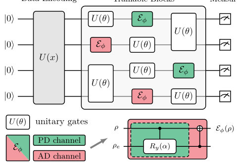
<figcaption class="paper-figure-caption"><b>Fig 1.</b> FIG. 1: Trainable quantum channels in QNNs. The pa- rameterized quantum channels Eϕ are incorporated into the variational architecture, with the channel parameters ϕ opti- mized jointly with the unitary parameters θ during the train- ing process. The quantum-circuit implementation for the PD and AD channels is realized using an environmental qubit initialized as ρe and controlled operations. The channel pa- rameter is encoded through the controlled rotation Ry(α) ac- cording to the relation ϕ = sin2(α/2).</figcaption>
</figure>
<figure class="paper-figure-card">
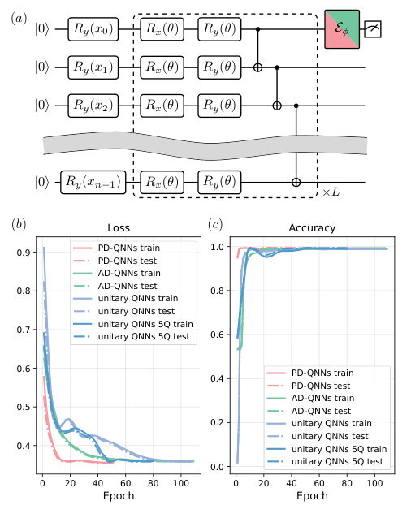
<figcaption class="paper-figure-caption"><b>Fig 2.</b> FIG. 2: Quantum circuit architecture and algorithm performance on the MNIST binary classification task (a) The variational quantum circuit with feature encoding, L repeated ansatz layers, and optional non-unitary channel Eϕ. (b,c) The loss and accuracy on the training and test dataset, comparing PD-QNNs, AD-QNNs, four-qubit unitary QNNs, and five-qubit unitary QNNs.</figcaption>
</figure>
<figure class="paper-figure-card">
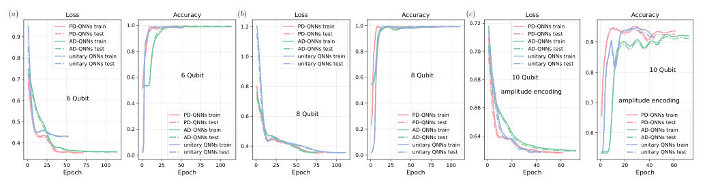
<figcaption class="paper-figure-caption"><b>Fig 3.</b> FIG. 3: Training and test performance comparison of unitary QNNs, PD-QNNs, and AD-QNNs on the MNIST binary classification task across varying qubit numbers and encoding schemes. (a) n = 6-qubit models with angle encoding; (b) n = 8-qubit models with angle encoding; (c) n = 10-qubit models with amplitude encoding.</figcaption>
</figure>
<figure class="paper-figure-card">
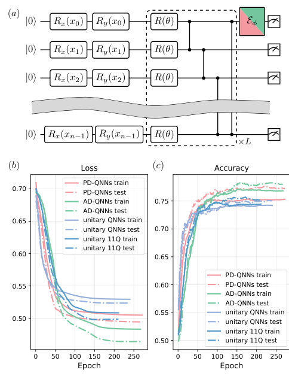
<figcaption class="paper-figure-caption"><b>Fig 4.</b> FIG. 4: Quantum circuit architecture and algorithm performance on the EGSSD binary classification task (a) The variational quantum circuit with feature encoding, L repeated ansatz layers, and optional non-unitary channel Eϕ. (b,c) The loss and accuracy on the training and test dataset, comparing PD-QNNs, AD-QNNs, ten-qubit unitary QNNs, and eleven-qubit unitary QNNs.</figcaption>
</figure>
<figure class="paper-figure-card">
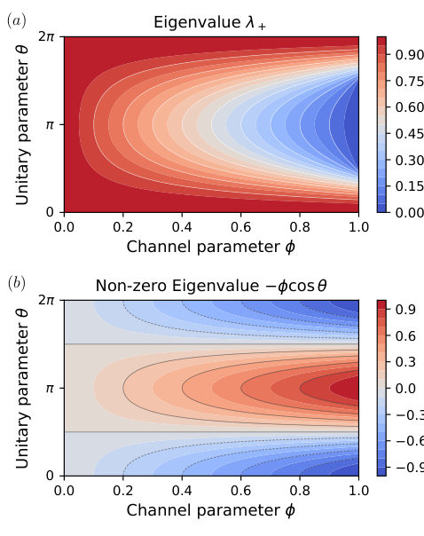
<figcaption class="paper-figure-caption"><b>Fig 5.</b> FIG. 5: Eigenvalues of the effective observable as func- tions of channel and unitary parameters. The panel (a) shows the positive eigenvalue λ+, while the panel (b) shows the non-zero eigenvalue −ϕ cos θ.</figcaption>
</figure>

**Summary.** The paper proposes a novel Quantum Machine Learning framework by treating dissipative quantum channels (like AD and PD) not as noise, but as trainable computational primitives. By incorporating these non-unitary elements into Variational Quantum Circuits, the model expands its representational space and enriches the optimization landscape. This leads to demonstrably superior training dynamics and predictive performance compared to standard unitary QNNs.

**Why it may be interesting.** This work directly addresses how non-unitary evolution, typically viewed as noise in quantum computation, can be systematically parameterized and utilized to enhance computational power in machine learning algorithms, linking open quantum systems theory to practical QML architectures.

Detailed structure

**Main problem.** Traditional variational quantum learning (QML) is limited to unitary dynamics, ignoring dissipative processes which can be harnessed as computational resources.

**Main result.** Incorporating trainable quantum channels significantly enhances the optimization geometry of QNNs, leading to faster convergence and better classification accuracy than purely unitary models on benchmark tasks like MNIST.

**Method.** The authors reformulate the model by replacing pure unitaries with parameterized, non-unitary CPTP maps (trainable quantum channels) derived from open-system dynamics.

**Model / system.** The system is a Variational Quantum Classifier utilizing trainable Amplitude Damping (AD) and Phase Damping (PD) channels inserted into the variational circuit structure. The model output is a structured superposition of components governed by effective observables.

**Key observables.** Classification accuracy, training loss reduction rate, and the spectrum of the effective observable ($\lambda$ vs $\phi$, $	heta$).

**Important parameters / regimes.** Channel damping strength ($\phi$), variational circuit parameters ($	heta$), number of qubits (up to 10), and regularization strength ($\lambda$).

**Assumptions / limitations.** The trainable channels are assumed to be physically realizable CPTP maps, allowing them to introduce adaptive observable geometries beyond unitary constraints.

**Figures summary.** Figures compare loss/accuracy across different model types (Unitary vs. PD-QNNs vs. AD-QNNs) on MNIST for varying qubit numbers; another figure shows the eigenvalues of the effective observable as a function of channel and unitary parameters.

**Paper structure.** The paper introduces the framework by contrasting unitary limitations with trainable channels, details the mathematical formulation using Kraus operators and gradient derivations ($\partial_	heta f$ and $\partial_\phi f$), presents empirical results on classification tasks (MNIST/EGSSD), and concludes by summarizing the enhanced optimization dynamics.

Abstract

Variational quantum learning is traditionally constrained to unitary dynamics, often treating quantum channels as detrimental noise. In this work, we reformulate the quantum channels as trainable computational primitives and establish a non-unitary quantum machine learning framework grounded in open-system dynamics. We demonstrate that the outputs of channel-enhanced quantum models form a structured superposition of multiple functional components. Each component is governed by an effective observable whose spectrum can be adaptively modulated during training, a significant departure from the spectral invariance in unitary transformations. Moreover, the proposed framework generalizes conventional unitary quantum models by retaining them as a special case while introducing additional non-unitary degrees of freedom. Furthermore, we reveal that trainable quantum channels enrich the optimization geometry through ensemble-averaged gradient and additional optimization directions induced by the Kraus operators. Empirical evaluations on classification tasks using trainable amplitude-damping and phase-damping channels confirm enhanced optimization dynamics and predictive performance. Our work provides a principled approach for leveraging quantum channels as trainable resources and advances the design of high-performance quantum learning architectures.

[↑ back to top](#top)

### [Compact Spin-Charge Separated Neural Quantum States for Valence-Bond States](http://arxiv.org/abs/2606.17045v1)

**Authors:** Ang-Kun Wu, Louis Primeau, Yixin Zhang, Jingtao Zhang, Adrian Del Maestro, Yang Zhang  
**Type:** theory · **Category:** strongly correlated electrons · **PDF:** <https://arxiv.org/pdf/2606.17045v1>  
**Analysis basis:** full PDF text, analyzed in chunks
**Topic relevance:** `analog quantum simulation` **3/5** · `correlated cavity matter` **1/5** · `entanglement & information structure` **1/5** · `exotic spin models in light-matter` **1/5** · `methods for driven-dissipative` **1/5**

↔ Scroll figures horizontally

<figure class="paper-figure-card">
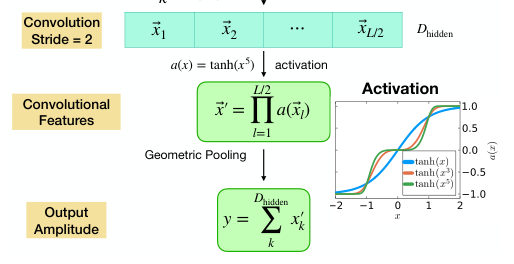
<figcaption class="paper-figure-caption"><b>Fig 1.</b> FIG. 1. The neural-network architecture for the quasi-one- dimensional VBS state. A convolutional layer with kernel size 2 and stride 2 extracts the local singlet-pairing rule on each dimer. The activation function tanh  x2k+1 separates the three local classes with amplitudes +1, 0, and −1. Geometric pooling combines the resulting features multiplicatively, reflecting the product structure of the VBS wavefunction. A final fully connected layer outputs the scalar wavefunction coefficient. Inset: tanh  x2k+1 for differ- ent values of k. Input: each spin is encoded as a one-hot vector, ↑→(1, 0)T , ↓→(0, 1)T (expanded to 4 dimensional space for zero and double occupancy), processed as input...</figcaption>
</figure>
<figure class="paper-figure-card">
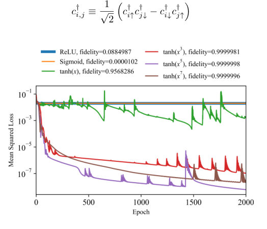
<figcaption class="paper-figure-caption"><b>Fig 2.</b> FIG. 2. Mean squared loss (MSL) for learning the local pairing rule of the VBS state with different activation functions at system size L = 16, with Hilbert-space dimension 12,870. In all cases, the neural network uses kernel size 2 and hidden dimension 16 with learning rate 10−2.</figcaption>
</figure>
<figure class="paper-figure-card">
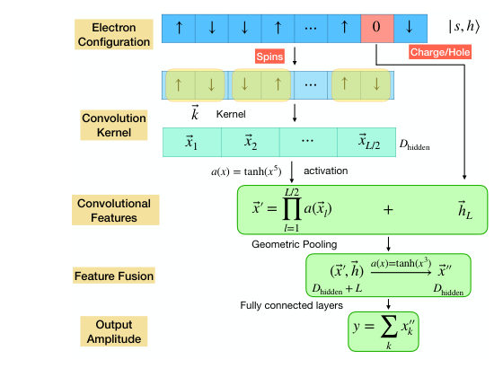
<figcaption class="paper-figure-caption"><b>Fig 3.</b> FIG. 3. Neural-network architecture for the quasi-one-dimensional soliton VBS state with a single hole. The input configuration is sepa- rated into spin and hole degrees of freedom. The spin branch follows the same structure as in Fig. 1, up to the final output layer. After geo- metric pooling, the spin features are combined with the hole-position features and passed through a small fully connected layer to capture the resonant superposition of different VBS configurations. The final activation function is tanh  x3 , which empirically performs better than tanh(x) and ReLU(x).</figcaption>
</figure>
<figure class="paper-figure-card">
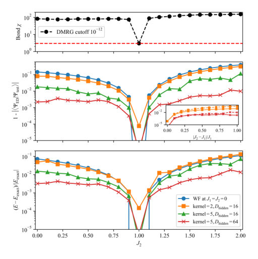
<figcaption class="paper-figure-caption"><b>Fig 4.</b> FIG. 4. Comparison of ground states as a function of J2 ∈[0, 2] at fixed t1 = 1, t2 = 0.5, and J1 = 1 for system size L = 13. The top, middle, and bottom panels show the MPS bond dimension χ, the neural-network fidelity, and the relative energy error, respec- tively. At the exactly solvable point J2 = J1, the ground state is the sVBS state and the minimal network with kernel size 2 and hidden dimension 16 is sufficient to achieve a relative infidelity of ∼10−4. Away from this point, the fidelity to the exact sVBS state decreases, while increasing the kernel size and hidden dimension systematically improves the neural-network approximation. From the DMRG per- spective, the departure from the...</figcaption>
</figure>
<figure class="paper-figure-card">
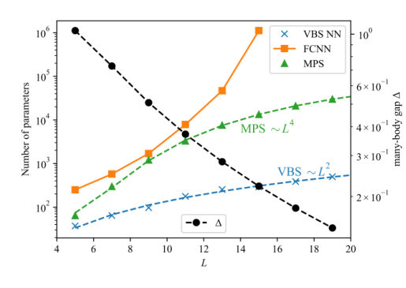
<figcaption class="paper-figure-caption"><b>Fig 5.</b> FIG. 5. The number of model parameters required by different ansatz states in the non-exact case J1 = 1, J2 = 0.9, t1 = 1, and t2 = 0.5. For the neural-network ansatz, the number of parameters is determined by requiring either the fidelity error or the relative energy error to be below 1%, averaged over 10 runs. For MPS, the bond dimension is determined by an SVD cutoff of 10−12. The dashed curves are polynomial fits, giving approximately L4 scaling for MPS and L2 scaling for the VBS neural-network ansatz. The black dashed line indicates the many-body gap.</figcaption>
</figure>

**Summary.** The authors propose a novel, physics-informed design strategy for Neural Quantum States (NQS) aimed at efficiently representing complex many-body wavefunctions like Valence-Bond Solids. By guiding the network architecture using knowledge from exactly solvable limits, they create compact models that outperform generic deep learning baselines in terms of parameter efficiency and accuracy. This establishes a powerful framework for simulating strongly correlated electron systems.

**Why it may be interesting.** This work provides a concrete recipe for building highly compact and expressive NQS tailored to the specific symmetries and local constraints inherent in strongly correlated electron models, which is crucial for advancing quantum simulation beyond simple mean-field approaches.

Detailed structure

**Main problem.** Developing efficient, physically informed Neural Quantum States (NQS) representations for quantum many-body wavefunctions that possess complex sign structures and constrained Hilbert spaces.

**Main result.** The proposed physics-guided NQS architecture achieves high fidelity in representing Valence-Bond-Solid (VBS) states with significantly fewer parameters than generic baselines, showing favorable parameter scaling ($L^2$ vs $L^4$) compared to Matrix Product States.

**Method.** A 'solvable-point-guided strategy' is used: designing the NQS architecture based on an exactly solvable point (where local rules are known) and then refining it by enlarging kernel size or hidden dimension for non-exact regimes.

**Model / system.** The study focuses on quasi-one-dimensional VBS states and their doped soliton variants ($	ext{sVBS}$), which are the exact ground states of a $t	ext{-}J$-like model. The underlying physics involves strongly correlated electron interactions.

**Key observables.** Fidelity of the NQS representation, variational energy ($E$), and parameter scaling with system size ($L$).

**Important parameters / regimes.** Coupling constants ($J_1, J_2$) defining the regime (exactly solvable when $J_1=J_2$); System size $L$.

**Assumptions / limitations.** The success relies on identifying an exactly solvable point to guide initial architecture design; VMC optimization is used for benchmarking.

**Figures summary.** Figures illustrate the minimal NQS architecture using convolutional layers and geometric pooling, comparing Mean Squared Loss (MSL) across different activation functions, and showing energy benchmarks in both exactly solvable and non-exact regimes.

**Paper structure.** The paper introduces the problem of efficient NQS design for constrained systems. It details a physics-motivated architecture incorporating local convolutions, geometric pooling, and specialized activations. Results are presented by testing on VBS/sVBS states, comparing parameter scaling against MPS, and finally discussing optimization techniques like Stochastic Reconfiguration (SR) in Variational Monte Carlo (VMC).

Abstract

Neural-network quantum states (NQS) provide a flexible nonlinear representation of quantum many-body wavefunctions, but their efficiency depends sensitively on whether the architecture reflects the sign structure and constrained Hilbert space of the target state. In this work, we propose a solvable-point-guided strategy: design the architecture at an exactly solvable point where the correct local rules can be read off, then refine to the non-exact regime by enlarging only the kernel size and hidden dimension. The strategy is built from four physics-motivated designs: a stride-matched local-rule convolution, geometric pooling, a sign-resolving $\tanh(x^{2k+1})$ activation, and explicit spin-hole sector separation. We test this approach on quasi-one-dimensional valence-bond-solid (VBS) states and their doped soliton variants (sVBS), the exact ground states of a $t$-$J$-like model with a single mobile hole. In finite-size benchmarks, this architecture reaches high fidelity for the exact sVBS state with substantially fewer parameters than generic fully connected, convolutional, and transformer baselines tested under the same setup. For the spin sector, the learned local rule transfers from small to larger systems without retraining. Away from the solvable point, increasing kernel size and hidden dimension systematically improves accuracy, and the model shows approximately $L^2$ parameter scaling in the gapless regime for system size $L$, compared with approximately $L^4$ for matrix-product states in the same regime. Our work establishes a recipe for compact NQS in sign-structured, constrained Hilbert spaces and paves the pathway to physics-informed architectures for the broader $t$-$J$ and Hubbard families.

[↑ back to top](#top)

### [Finite-Dimensional Type I von Neumann Algebras in PyTorch: A GPU-Accelerated Framework for Random Block-Diagonal Operators](http://arxiv.org/abs/2606.15882v1)

**Authors:** Irina Nikolaeva, Andrej Novikov  
**Type:** both · **Category:** numerical methods · **PDF:** <https://arxiv.org/pdf/2606.15882v1>  
**Analysis basis:** full PDF text, analyzed in chunks
**Topic relevance:** `methods for driven-dissipative` **3/5** · `Keldysh / 2PI / non-Gaussian methods` **1/5** · `analog quantum simulation` **1/5** · `correlated / nonlocal dissipation` **1/5** · `driven-dissipative phase transition` **1/5**

↔ Scroll figures horizontally

<figure class="paper-figure-card">
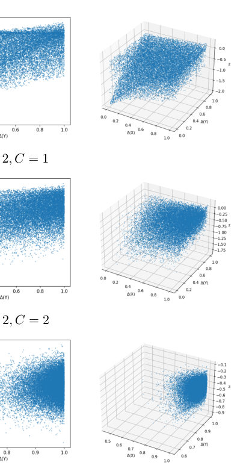
<figcaption class="paper-figure-caption"><b>Fig 1.</b> Figure 1: Experiment 1: small dimension (kmax = 2).</figcaption>
</figure>
<figure class="paper-figure-card">
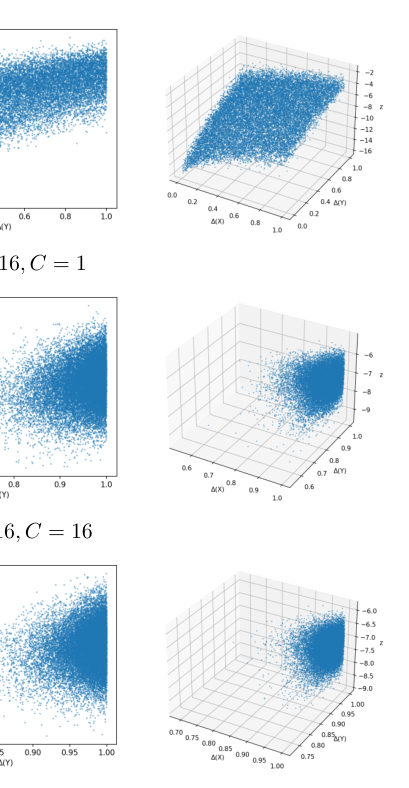
<figcaption class="paper-figure-caption"><b>Fig 2.</b> Figure 2: Experiment 1: intermediate dimension (kmax = 16).</figcaption>
</figure>
<figure class="paper-figure-card">
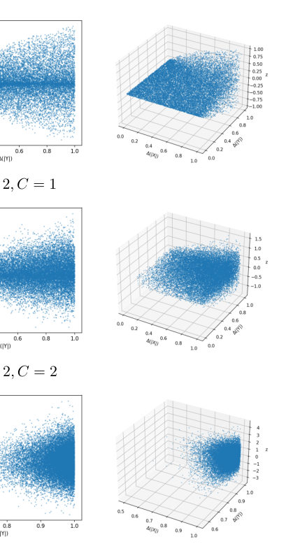
<figcaption class="paper-figure-caption"><b>Fig 3.</b> Figure 3: Experiment 2: small dimension.</figcaption>
</figure>
<figure class="paper-figure-card">
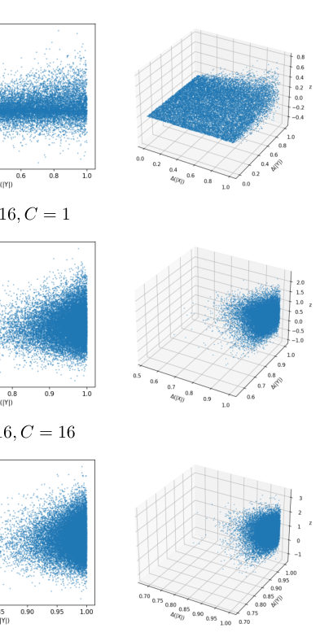
<figcaption class="paper-figure-caption"><b>Fig 4.</b> Figure 4: Experiment 2: intermediate dimension.</figcaption>
</figure>
<figure class="paper-figure-card">
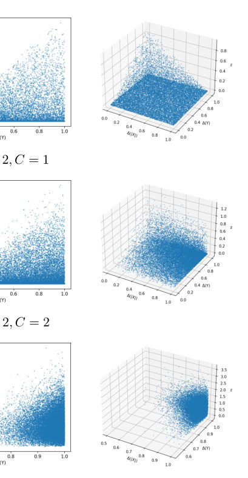
<figcaption class="paper-figure-caption"><b>Fig 5.</b> Figure 5: Experiment 3: small dimension.</figcaption>
</figure>

**Summary.** This paper introduces an open-source PyTorch library designed to perform numerical simulations on finite-dimensional Type I von Neumann algebras. It provides GPU acceleration and advanced tools for calculating observables related to random block-diagonal operators. This allows researchers to study quantum phenomena governed by these algebraic structures in regimes previously inaccessible due to computational cost.

**Why it may be interesting.** While mathematically abstract, the focus on GPU-accelerated simulation of structured operators is highly relevant for simulating open quantum systems or complex Hamiltonians where block-diagonalization simplifies the structure but requires massive computational resources.

Detailed structure

**Main problem.** Developing efficient numerical tools for Monte Carlo simulations involving finite-dimensional Type I von Neumann algebras.

**Main result.** The library successfully implements complex calculations on block-diagonal operators, showing significant GPU speedups and confirming expected mathematical inequalities in various quantum observables.

**Method.** It utilizes a custom PyTorch framework with lazy evaluation to handle batched tensor representations of random block-diagonal operators, performing functional calculus via SVD or power iteration.

**Model / system.** The model is based on finite-dimensional Type I von Neumann algebras, represented as direct sums of matrix algebras ($igoplus M_{n_c}(\mathbb{C})$), relevant in quantum mechanics for studying superselection rules and decoherence.

**Key observables.** Michelson contrast ($\Delta(A)$) and various trace difference quantities ($z$), such as $	ext{Tr}(|XY|) - 	ext{Tr}(|X||Y|)$.

**Important parameters / regimes.** Batch size ($B$), number of direct summands ($C$), and maximum dimension ($k_{\max}$), with performance benchmarks up to $2	imes10^4$ samples.

**Assumptions / limitations.** The framework is limited to Type I algebras (direct sums) and finite dimensions; SVD becomes a bottleneck for very large dimensions.

**Figures summary.** Figures show Monte Carlo results validating trace inequalities across different dimensions, while heatmaps illustrate substantial GPU speedups over CPU for various linear algebra operations.

**Paper structure.** The paper introduces the library structure, validates its implementation against analytical expectations (e.g., Haar moments), details multiple experiments testing quantum observables ($z$), and concludes with performance benchmarks and future work directions.

Abstract

We present \texttt{torch\_vn\_algebra}, an open-source Python library built on PyTorch for numerical experiments with finite-dimensional Type I von Neumann algebras (direct sums of matrix algebras). The library provides:   $\bullet$ a compact batched tensor representation $(B,C,k_{\max},k_{\max})$ that handles both Monte Carlo samples and multiple direct summands;   $\bullet$ lazy evaluation of operators to avoid unnecessary memory allocation;   $\bullet$ generation of random operators with arbitrary eigenvalue distributions (user-provided samplers) and various unitary ensembles (Haar, $\mathrm{SU}(n)$, COE, CSE, diagonal phases);   $\bullet$ functional calculus via SVD (absolute value, square root, inverse, entropy) and a hybrid method for extreme eigenvalues (exact diagonalisation for $k_{\max}\le256$, otherwise power iteration);   $\bullet$ three trace functionals (blunt, normalised subspace trace, and the von Neumann tracial state);   $\bullet$ GPU-accelerated batched linear algebra for moderate-scale Monte Carlo studies (e.g., $2\times10^4$ samples of $100\times100$ operators).   The library is validated against analytical expectations (Haar moments, trace properties). Performance benchmarks on a Tesla P100 GPU are presented and discussed. Limitations and future work are outlined. The code is open-source.

[↑ back to top](#top)

### [Quasiparticle Diffusion for the Toda Fluid in Equilibrium](http://arxiv.org/abs/2606.15131v1)

**Authors:** Seema Chahal, Alberto Brollo, Indranil Mukherjee, Abhishek Dhar, Anupam Kundu, Herbert Spohn  
**Type:** theory · **Category:** statistical mechanics · **PDF:** <https://arxiv.org/pdf/2606.15131v1>  
**Analysis basis:** full PDF text, analyzed in chunks
**Topic relevance:** `non-equilibrium dynamics` **3/5** · `non-equilibrium universality` **2/5** · `Frenkel-Kontorova` **1/5** · `Keldysh / 2PI / non-Gaussian methods` **1/5**

↔ Scroll figures horizontally

<figure class="paper-figure-card">
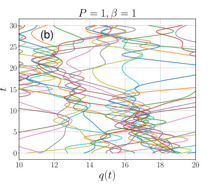
<figcaption class="paper-figure-caption"><b>Fig 1.</b> Figure 1: The plots show one sample of Toda particle trajectories. The tem- perature of the Toda fluid is 1 and density is 0.25 in (a) and 1.65 in (b). For better visibility, these panels are zoomed-in views of trajectories from 100 Toda particles.</figcaption>
</figure>
<figure class="paper-figure-card">
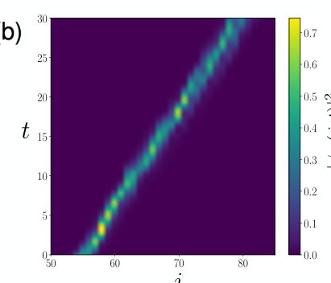
<figcaption class="paper-figure-caption"><b>Fig 2.</b> Figure 2: Panels (a) and (b) display the evolution of a representative eigenvector corresponding to the eigenvalue λα = 0.9976. In panel (a), the probability density in index space resulting from the eigenvector is shown at selected time instants. The motion of the peaks is clearly visible and their projection onto the index–time plane is indicated by the light blue line. Panel (b) presents the corresponding heatmap, highlighting the left-to-right propagation of the eigenvector together with its small spatial width.</figcaption>
</figure>
<figure class="paper-figure-card">
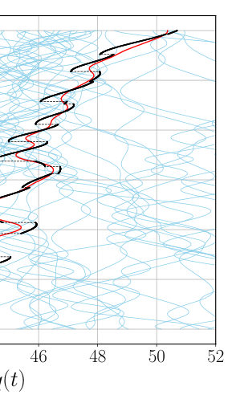
<figcaption class="paper-figure-caption"><b>Fig 3.</b> Figure 3: Comparing representative quasiparticle trajectories: the argmax rule (black broken line), having jumps indicated by black dashed segments, and the |ψ|2 rule of Eq. (32), yielding a smooth trajectory (red solid line). The quasipar- ticle is labeled by the eigenvalue λα = 0.9976. The light blue lines display the underlying Toda particle trajectories.</figcaption>
</figure>
<figure class="paper-figure-card">
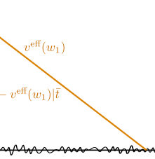
<figcaption class="paper-figure-caption"><b>Fig 4.</b> Figure 4: Schematically illustrating the contribution of initial-state noise to dif- fusion. A tagged quasiparticle, initially at the origin (red line), moves with an effective velocity veff(w) through a noisy, homogeneous background. Quasipar- ticles from each mesoscopic fluid cell propagate with distinct effective velocities and fluctuating particle numbers. These density fluctuations propagate ballisti- cally and scatter with the tagged quasiparticle. Over a time interval ¯t, the tagged quasiparticle trajectory is influenced by quasiparticles of rapidity w′ that origi- nated within a spatial region of extent ℓ= |veff(w) −veff(w′)|¯t.</figcaption>
</figure>
<figure class="paper-figure-card">
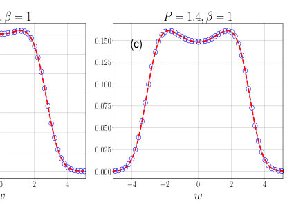
<figcaption class="paper-figure-caption"><b>Fig 5.</b> Figure 5: Plots comparing the simulation (blue circles) and analytical results given by Eq. (20) (red dashed line) for the density of states across three set of parameters: (a) P = 0.32, β = 0.5, yielding an average stretch per particle ν = 2.58, (b) P = 1, β = 1, with ν = 0.58, and (c) P = 1.4, β = 1, with ν = 0.06. For all three plots, N = 500, ∆= 0.05, and averages have been taken over R = 105 samples. The density of the Toda fluid is increasing from left to right.</figcaption>
</figure>

**Summary.** The paper develops a novel numerical technique using the eigenvectors of the Lax matrix to track quasiparticle motion in the integrable Toda fluid at equilibrium. By simulating this process and comparing results against advanced theoretical tools like TBA, the authors confirm Brownian diffusion for quasiparticles and derive quantitative predictions for transport coefficients like the diffusion constant.

**Why it may be interesting.** This work provides a powerful, generalizable methodology (eigenvector tracking) to study transport coefficients like diffusion in complex integrable many-body systems, bridging spectral theory with non-equilibrium statistical mechanics.

Detailed structure

**Main problem.** To numerically track quasiparticle diffusion for the Toda fluid in thermal equilibrium and extend these tracking methods to other integrable systems possessing a Lax matrix.

**Main result.** The numerical simulations confirm Brownian motion for both individual quasiparticles and tagged particles, with calculated diffusion constants matching novel predictions from Thermodynamic Bethe Ansatz (TBA) theory.

**Method.** The authors developed a specialized numerical scheme based on tracking the time-dependent eigenvectors of the Lax matrix associated with the integrable Toda fluid Hamiltonian.

**Model / system.** The system is the classical Toda fluid, defined by an exponential interaction potential. Its dynamics are governed by conserved quantities derived from the compatibility condition involving a Lax matrix, placing it within the framework of completely integrable systems studied via Generalized Gibbs Ensembles (GGE).

**Key observables.** Diffusion constant ($D(w)$), average quasiparticle velocity ($\langle v_\alpha 
angle_{P,V}$), and the velocity autocorrelation function $\langle v_\alpha(t)v_\alpha(0)
angle$.

**Important parameters / regimes.** Temperature ($T$) or inverse temperature ($eta$), Pressure ($P$), and system size ($N$).

**Assumptions / limitations.** The analysis assumes that quasiparticle motion can be accurately tracked via eigenvectors of the Lax matrix, which is mathematically sound but noted to break down visually at high densities.

**Figures summary.** Figures illustrate sample particle trajectories (Fig 1), eigenvector evolution (Fig 2), and crucially compare numerical results for $	ext{veff}(w)$ and $D(w)$ against analytical TBA predictions (Figs 6, 7).

**Paper structure.** The paper progresses from establishing the Lax pair formalism and conserved quantities to deriving macroscopic properties using GGE/TBA. It then presents the core numerical method for tracking quasiparticles, culminating in comparisons of diffusion constants derived both numerically and theoretically.

Abstract

Many-body integrable systems can be understood as a gas of quasiparticles. They propagate ballistically and drive large-scale transport. However, with the exception of the hard rods system, no tools have been available to numerically track such quasiparticles. Focusing on the Toda fluid, whose integrability relies on the availability of a Lax pair, we present a numerical scheme to track quasiparticle trajectories as determined by the time-dependent eigenvectors of the Lax matrix. Simulating the Toda fluid in thermal equilibrium, this tracking scheme is used to numerical confirm Brownian motion of a quasiparticle. Simulated is also the motion of a tagged particle. Our numerical results for the diffusion constant matches with a novel TBA prediction. We believe our numerical scheme can be extended to other classical many-particle models possessing a Lax matrix.

[↑ back to top](#top)

### [Electronic Green's function across the pseudogap to stripe transition in the $t$-$t'$-$J$ model](http://arxiv.org/abs/2606.16968v1)

**Authors:** Martin Ulaga, Aritra Sinha, Alexander Wietek  
**Type:** theory · **Category:** strongly correlated electrons · **PDF:** <https://arxiv.org/pdf/2606.16968v1>  
**Analysis basis:** full PDF text, analyzed in chunks
**Topic relevance:** `methods for driven-dissipative` **3/5** · `Keldysh / 2PI / non-Gaussian methods` **1/5** · `analog quantum simulation` **1/5** · `driven-dissipative phase transition` **1/5**

↔ Scroll figures horizontally

<figure class="paper-figure-card">
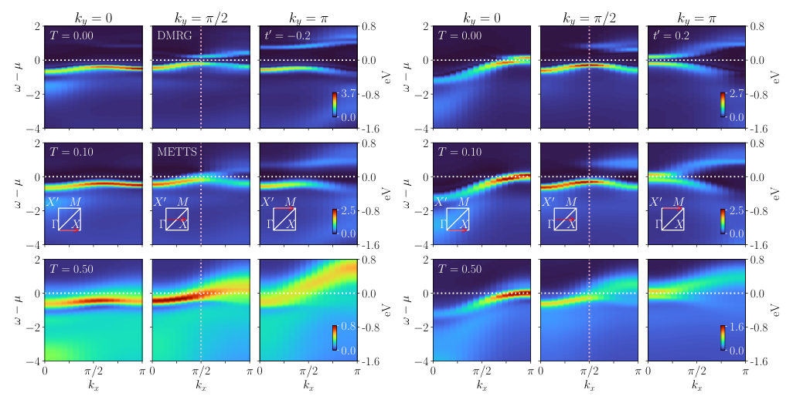
<figcaption class="paper-figure-caption"><b>Fig 1.</b> Figure 1. The single-particle spectral function A(k, ω) for three momentum cuts with ky = 0, π/2, π at T = 0 (DMRG), T = 0.1, T = 0.5 at doping p = 1/16 and t′ = −0.2 (left, relevant for hole-doped cuprates), or t′ = 0.2 (right). The dynamical METTS were taken from up to R = 20 independent Markov chains running up to 150 steps deep and time-evolved to Ωt = 50 using a complex angle θ = π/16, cf. Appendix C. The energies ω are taken with respect to the chemical potential computed as in Eq. 6. For comparison to ARPES results, we employ a common estimate t = 0.4 eV [12]. For both t′ = 0.2 and t′ = −0.2, we observe two well-developed bands separated by a gap around the chemical potential, which...</figcaption>
</figure>
<figure class="paper-figure-card">
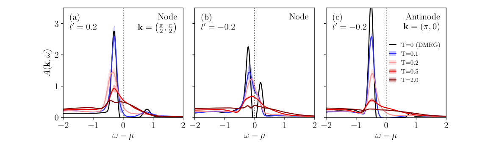
<figcaption class="paper-figure-caption"><b>Fig 2.</b> Figure 2. Spectral function A(k, ω) of the t-t′-J model on the 16 × 4 cylinder for J = 0.4 as a function of temperature obtained using dynamical METTS at the node (k = (π/2, π/2)) for t′ = ±0.2 (a,b) and the antinode (k = (π, 0)) for t′ = −0.2 (c). In all cases, θ = π/16. The vertical dashed line indicates the value of the chemical potential µ. In each case, we observe two peaks that gradually merge into a single peak upon increasing temperature, filling the gap between the two distinct bands.</figcaption>
</figure>
<figure class="paper-figure-card">
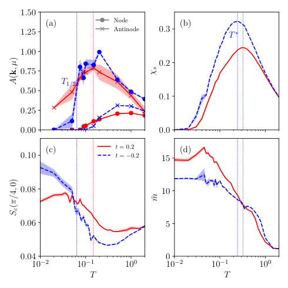
<figcaption class="paper-figure-caption"><b>Fig 3.</b> Figure 3. Temperature dependence of the (a) spectral weight at the chemical potential at the node (kN = (π/2, π/2)) and the antinode (kA = (π, 0)) (b) uniform magnetic susceptibility χs (c) charge structure factors at the CDW ordering wave-vector ks = (π/4, 0) (d) mean charge cluster size. The suppression of nodal spectral weight at the chemical potential (vertical dashed lines, obtained as the half of the maximum intensity) occurs at the onset of CDW formation, denoted by T1/2, e.g., T1/2 ≈0.12 for t′ = 0.2. T1/2 coincides with the rapid onset of CDW order, quantified by Sc(ks) in panel (c). The maximum of χs defines the pseudogap onset temperature T ∗, e.g., for t′ = 0.2, T ∗≈0.32.</figcaption>
</figure>
<figure class="paper-figure-card">
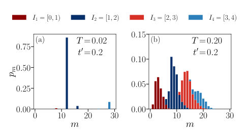
<figcaption class="paper-figure-caption"><b>Fig 4.</b> Figure 4. Density-weighted cluster-size distributions pm for the 16 × 4 cylinder at p = 1/16 and t′/t = 0.2, extracted from METTS snapshots. The total height at fixed m gives the fraction of doped charge residing in hole-rich connected clusters of size m, while the stacked colors resolve this weight by the cluster hole mass in the intervals I1 = [0, 1), I2 = [1, 2), I3 = [2, 3), and I4 = [3, 4). (a) At T = 0.02, the weight is sharply concentrated near a characteristic size, consistent with charge density waves. (b) At T = 0.20, the weight is spread over many sizes, indicating a fluctuating mesoscopic clustered regime after stripe melting.</figcaption>
</figure>

**Summary.** This work uses tensor network methods on the $t$-$t'$-$J$ model to probe the pseudogap regime in cuprates. The research demonstrates that the spectral gap structure evolves significantly as temperature increases, correlating the closing of the nodal gap with the melting of underlying charge stripe order into fluctuating clusters. This provides theoretical evidence linking CDW physics directly to the superconducting pseudogap phenomenology.

**Why it may be interesting.** The detailed study of spectral weight transfer across different ordering regimes (CDW $	o$ Fluctuating Clusters) provides a quantitative theoretical framework for understanding complex many-body phase transitions relevant to high-$T_c$ superconductivity, which often involves strong correlations.

Detailed structure

**Main problem.** The study investigates the poorly understood relationship between the pseudogap phenomenon, charge density waves (CDWs), and stripe order in cuprate superconductors.

**Main result.** The momentum differentiation characteristic of the pseudogap is strongly dependent on $t'$ and evolves into a Fermi arc at intermediate temperatures as coherent stripe order melts into fluctuating charge clusters.

**Method.** The authors use tensor network algorithms (specifically METTS) to calculate the electronic Green's function for finite temperature dynamics on a cylinder geometry.

**Model / system.** The system is modeled by the underdoped $t$-$t'$-$J$ model, studied at doping $p=1/16$. The Hamiltonian includes hopping terms ($t, t'$) and an antiferromagnetic exchange coupling ($J$).

**Key observables.** Electronic Green's function $A(\mathbf{k}, \omega)$, momentum differentiation, nodal gap closing ($\Delta_N$), charge structure factor $S_c(\mathbf{k}_s)$, and real-space cluster size distribution $p_m$.

**Important parameters / regimes.** $t'$, doping ($p=1/16$), temperature ($T$), and the ratio of hopping parameters relative to $J$.

**Assumptions / limitations.** The analysis relies on finite cylinder geometry approximations, and the chemical potential $\mu$ is determined via a Legendre transformation due to non-convexity in ground state energy calculations.

**Figures summary.** Figures illustrate $A(\mathbf{k}, \omega)$ at various temperatures showing gap evolution; other figures map out the temperature dependence of spectral weight loss relative to CDW order onset and show cluster size distribution shifts from ordered to fluctuating states.

**Paper structure.** The paper progresses by first establishing the model and methods (Green's function calculation via tensor networks), then analyzing the temperature evolution of spectral features, linking gap closing at the node to CDW melting, and finally using real-space analysis to quantify the transition from ordered stripes to fluctuating clusters.

Abstract

Superconducting domes in strongly correlated electronic systems are often accompanied by charge density waves and peculiar features in the electronic structure. The appearance of a pseudogap, in particular, and its relation to charge density waves remains insufficiently understood. Here, we investigate the electronic Green's function of the underdoped $t$-$t'$-$J$ model of the cuprate superconductors using tensor network algorithms for finite temperature dynamics on cylinders of width $4$. We find the prominent momentum differentiation, the hallmark of the pseudogap, to be strongly dependent on $t'$, which develops into a momentum-dependent opening of a gap upon decreasing temperature, consistent with the formation of a Fermi arc at intermediate temperatures. The nodal gap around ${\bf k}=(π/2,π/2)$ closes and fills with increasing temperature as coherent stripe order melts into a regime of fluctuating charge clusters.

[↑ back to top](#top)

### [Interfacial control of magnetism and electron transport in nonisostructural SrRuO$_3$/SrCuO$_2$ heterostructure](http://arxiv.org/abs/2606.16235v1)

**Authors:** Digbijaya Palai, B. Maharana, P. Biswal, Shwetha G. Bhat, D. Nayak, D. Sahoo, R. Soni, K. Senapati, Z. Hossain, D. Samal  
**Type:** experiment · **Category:** strongly correlated electrons · **PDF:** <https://arxiv.org/pdf/2606.16235v1>  
**Analysis basis:** full PDF text, analyzed in chunks
**Topic relevance:** `exotic spin models in light-matter` **3/5** · `spintronics-quantum-optics interface` **3/5**

↔ Scroll figures horizontally

<figure class="paper-figure-card">
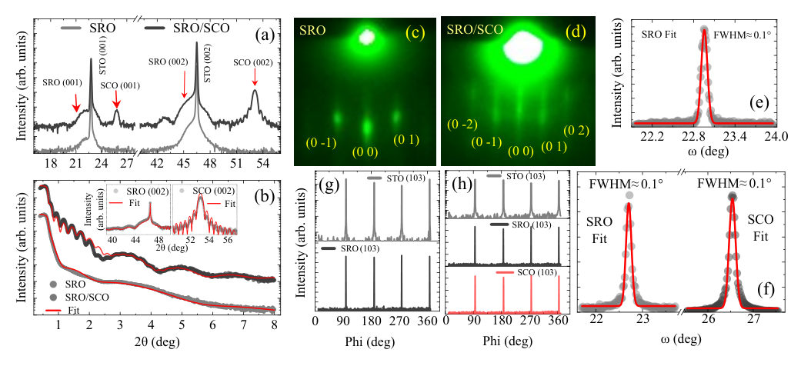
<figcaption class="paper-figure-caption"><b>Fig 1.</b> FIG. 1. (a) X-ray diffraction (XRD) θ–2θ scans, full range for the SRO single-layer and the SRO/SCO bilayer films. (b) X-ray reflectivity (XRR) data of bare SRO and SRO/SCO bilayer films. (c, d) depicts the RHEED images of bare SRO film, and SRO/SCO bilayer. (e, f) ω-scans (rocking curves) of the bare 4 nm SRO film and the individual 4 nm SRO and 24 nm SCO layers in the SRO/SCO bilayer sample. ϕ-scans of 4 nm SRO layer and STO in bare SRO film (g) and 4 nm SRO, 24 nm SCO, and STO in the SRO/SCO heterostructure (h) showing fourfold symmetry.</figcaption>
</figure>
<figure class="paper-figure-card">
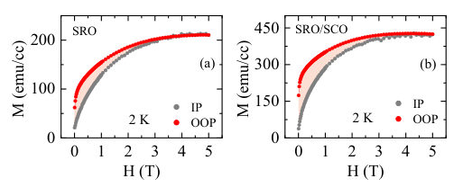
<figcaption class="paper-figure-caption"><b>Fig 2.</b> FIG. 3. Area under the loop in IP and OOP curve in the first quadrant from zero to saturation field (HS) for (a) the bare SRO film and (b) SRO/SCO bilayer at 5 K.</figcaption>
</figure>
<figure class="paper-figure-card">
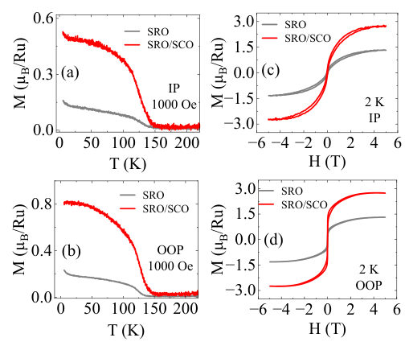
<figcaption class="paper-figure-caption"><b>Fig 3.</b> FIG. 2. M(T) plots for the SRO single layer recorded along the IP (a) and OOP (b) configurations. M(H) loops measured along the IP (c) and OOP (d) orientations for the bare SRO and the SRO/SCO bilyer films at 5 K</figcaption>
</figure>
<figure class="paper-figure-card">
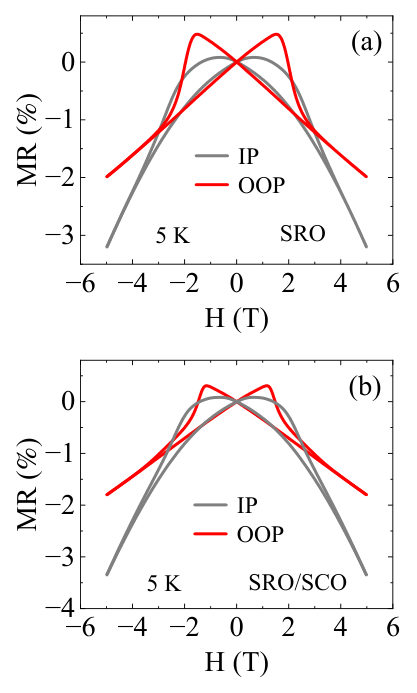
<figcaption class="paper-figure-caption"><b>Fig 4.</b> FIG. 4. Magnetoresistance vs field measured along OOP and IP directions at 5 K for the bare SRO film (a) and the SRO/SCO bilyer (b).</figcaption>
</figure>
<figure class="paper-figure-card">
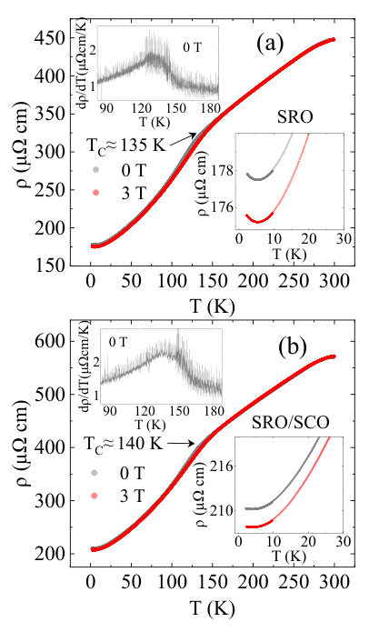
<figcaption class="paper-figure-caption"><b>Fig 5.</b> FIG. 5. Temperature dependence of the resistivity of the bare SRO film (a) and SRO/SCO bilayer (b) in the presence of different magnetic fields (0 T and 3 T). Insets: (upper) TC determined by the dR/dT of the zero-field ρ(T) curves, (lower) zoom of the low-temperature region of (a) and (b).</figcaption>
</figure>

**Summary.** The study investigates the $	ext{SrRuO}_3/	ext{SrCuO}_2$ heterostructure to control magnetism and electron transport by exploiting structural mismatch. The interface acts as a critical knob, significantly boosting magnetization and anisotropy while simultaneously stabilizing the electronic state against disorder-induced quantum scattering. This confirms that interfacial engineering is a powerful tool for realizing novel functionalities in oxide electronics.

**Why it may be interesting.** This work demonstrates how engineered interfaces can act as powerful tuners for fundamental electronic properties in strongly correlated oxides, offering insights into interfacial charge transfer mechanisms that are relevant to emergent phenomena in condensed matter physics.

Detailed structure

**Main problem.** The study investigates how structural mismatch at an interface can be used to control both the magnetic ordering and the electronic transport properties in oxide heterostructures.

**Main result.** The nonisostructural SrRuO3/SrCuO2 interface significantly enhances magnetization and perpendicular magnetic anisotropy while simultaneously suppressing low-temperature disorder-induced resistivity upturns, leading to Fermi-liquid behavior.

**Method.** The research combines structural characterization (XRD, XRR) with comprehensive measurements of magnetism (SQUID-VSM) and electronic transport (resistivity $\rho(T)$ and Anomalous Hall Effect analysis).

**Model / system.** The physical system is a heterostructure composed of an itinerant ferromagnetic metal ($	ext{SrRuO}_3$) interfaced with a planar antiferromagnetic insulator ($	ext{SrCuO}_2$). The interface forces structural changes, such as $\text{RuO}_6$ octahedral to $\text{RuO}_5$ pyramidal coordination.

**Key observables.** Saturation magnetization ($M_S$), effective anisotropy constant ($K_{	ext{eff}}$), temperature-dependent resistivity ($
ho(T)$), and the anomalous Hall coefficient ($eta$).

**Important parameters / regimes.** Low temperatures (down to 2 K) are crucial for observing quantum corrections; enhanced $M_S$ ($\approx 2.7 \mu_B/\text{Ru}$) and $K_{	ext{eff}}$ enhancement are key metrics.

**Assumptions / limitations.** The observed changes in transport properties (e.g., suppression of $\rho(T)$ upturn) are directly attributable to the interfacial electronic structure modification, such as charge transfer stabilizing a high-spin state.

**Figures summary.** Figures show XRD scans confirming structural quality; magnetization loops demonstrate enhanced $M_S$ and PMA in the bilayer; resistivity plots compare bare SRO (showing low-T upturn) versus SRO/SCO (showing $\rho \propto T^2$).

**Paper structure.** The paper systematically presents evidence: first, structural confirmation of the interface; second, magnetic measurements showing enhancement; third, transport analysis demonstrating suppression of quantum corrections and enhanced AHE contributions.

Abstract

Heterointerfaces between structurally dissimilar oxides provide a platform to exploit the interfacial mismatch in the lattice and electronic degrees of freedom to realize emergent functionalities and tunable physical properties with potential applications in oxide electronics. Here, we investigate the magnetic and electronic transport properties of symmetry-mismatched SrRuO$_3$ (SRO)/SrCuO$_2$ (SCO) heterostructure, in which a 4-nm-thick itinerant ferromagnetic metal SRO is interfaced with a planar-type antiferromagnetic insulator SCO, in comparison with a reference SRO (4 nm) film. While both the bare SRO and SRO/SCO bilayer exhibit perpendicular magnetic anisotropy (PMA), the SRO/SCO bilayer shows a pronounced enhancement in the saturation magnetization (M$_S$ $\approx$ 2.7 $μ_B$/Ru) and effective anisotropy constant (K$_{\mathrm{eff}}$ $\approx$ 2.13 $\times$ 10$^6$ erg/cc) relative to the bare SRO film (M$_S$ $\approx$ 1.3 $μ_B$/Ru and K$_{\mathrm{eff}}$ $\approx$ 5.25 $\times$ 10$^5$ erg/cc). Interestingly, the low-temperature resistivity upturn below 5 K arising from disorder-induced quantum corrections in bare SRO is strongly suppressed in SRO/SCO, and it exhibits Fermi-liquid-like transport ($ρ\propto T^2$) down to 2 K. Analysis of the anomalous Hall effect (AHE) reveals dominant intrinsic Berry-curvature driven electron transport in both samples, with enhanced intrinsic and skew-scattering contributions in the SRO/SCO bilayer, indicating the critical role of the interface in modifying the electronic band structure near the Fermi level. Our results demonstrate that the interface acts as an effective control knob, concurrently enhancing the magnetization, PMA, and intrinsic scattering contribution to the AHE in the SRO/SCO heterostructure, while suppressing the disorder-driven quantum corrections to transport behavior observed in the bare SRO film.

[↑ back to top](#top)

### [Machine Learning Topological Order from Defect Partition Functions](http://arxiv.org/abs/2606.15799v1)

**Authors:** Kazem Bitaghsir Fadafan, Wei Cui, Babak Haghighat, Shailesh Lal  
**Type:** theory · **Category:** disordered systems and neural networks · **PDF:** <https://arxiv.org/pdf/2606.15799v1>  
**Analysis basis:** full PDF text, analyzed in chunks
**Topic relevance:** `methods for driven-dissipative` **3/5** · `Keldysh / 2PI / non-Gaussian methods` **1/5** · `analog quantum simulation` **1/5** · `driven-dissipative phase transition` **1/5**

↔ Scroll figures horizontally

<figure class="paper-figure-card">
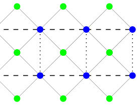
<figcaption class="paper-figure-caption"><b>Fig 1.</b> Figure 1: Geometric configuration of the two-dimensional Ising model on the primary lattice Λ (blue sites) and its corresponding dual lattice ˜Λ (green sites). Dashed and dotted lines denote horizontal and vertical edges on Λ, respectively. Each dual site ˜p ∈˜Λ is positioned at the center of its associated primary plaquette, shifting it by (+1/2, +1/2) relative to the primary site p ∈Λ, which effectively rotates the dual edge axes by 45◦relative to the primary lattice.</figcaption>
</figure>
<figure class="paper-figure-card">
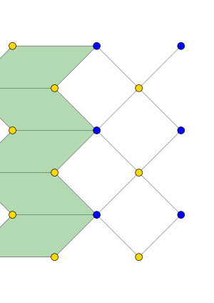
<figcaption class="paper-figure-caption"><b>Fig 2.</b> Figure 2: Lattice realization of the non-invertible Kramers-Wannier duality defect line. The seam acts as a topological interface matching the primary Hilbert space H (blue sites) with the dual Hilbert space ˆH (yellow sites), enforcing the non-local duality-twisted boundary conditions across the cycle.</figcaption>
</figure>
<figure class="paper-figure-card">
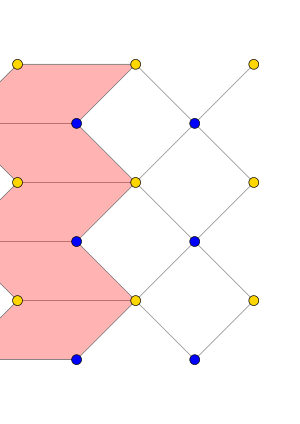
<figcaption class="paper-figure-caption"><b>Fig 3.</b> Figure 3: Lattice configuration of a vertical Z2 spin-flip defect line. The defect is implemented by executing a local gauge transformation that systematically inverts the signs of the vertical bond couplings (Ky 7→−Ky) along the highlighted red cut-line switching ferromagnetic interactions across the bond to anti-ferromagnetic. Blue dots represent the primary lattice sites and yellow dots are the dual lattice sites</figcaption>
</figure>
<figure class="paper-figure-card">
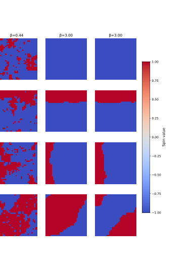
<figcaption class="paper-figure-caption"><b>Fig 4.</b> Figure 4: Monte Carlo samples of the Ising model on a 64 × 64 lattice, collected from the four spin-flip defect sectors corresponding to Z1 1,1, Zψ 1,ψ, Zψ ψ,1 and Z1 ψ,ψ, where we are reading the rows top to bottom . Higher temperatures are shown in columns to the left. The snapshots provide some visual indication of how the antiferromagnetic seam insertion, dominant at low temperatures is negligible in the high temperature limit.</figcaption>
</figure>
<figure class="paper-figure-card">
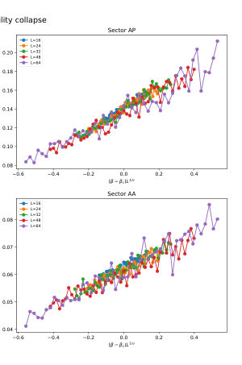
<figcaption class="paper-figure-caption"><b>Fig 5.</b> Figure 5: Rescaled susceptibility computed near criticality for the Ising model at varying β, L. The plots coalesce over each other, a feature of scale invariance near criticality.</figcaption>
</figure>

**Summary.** The paper introduces an innovative machine learning approach using Restricted Boltzmann Machines (RBMs) to extract the underlying Topological Quantum Field Theory structure from the critical 2D Ising model. By training RBMs on lattice configurations, the authors successfully map classical partition functions onto quantum wavefunctions whose overlaps correctly predict fundamental topological invariants like the modular S-matrix.

**Why it may be interesting.** This work provides a concrete, data-driven methodology—using deep learning—to tackle fundamental problems in condensed matter theory concerning emergent quantum order and topological phases, bridging statistical mechanics with advanced ML techniques.

Detailed structure

**Main problem.** The research aims to develop a machine learning framework to extract the topological order inherent in the 2D Ising model from its defect partition functions.

**Main result.** The authors successfully demonstrated that Restricted Boltzmann Machines (RBMs) can learn representations whose overlaps reproduce the expected modular S-matrix of the Ising Topological Quantum Field Theory (TQFT).

**Method.** They train RBMs on Monte Carlo samples from the critical 2D Ising model, using a component-wise square-root map to generate candidate wavefunctions for the TQFT.

**Model / system.** The physical system is the two-dimensional Ising model defined on a torus ($T^2$), analyzed at its critical point. The theoretical framework connects this lattice statistical mechanics problem to $(2+1)$-dimensional Ising TQFTs via duality transformations and defect insertions.

**Key observables.** Modular S-matrix elements, partition functions $Z_{L_1 L_2}$, Binder cumulant ($U_4(m)$), and RBM reconstruction error ($	ext{Erecon}$).

**Important parameters / regimes.** Critical coupling constant ($K_c$), temperature/coupling parameters, and the modular parameter $	au$.

**Assumptions / limitations.** The primary assumption is that the underlying physics (Ising TQFT) can be accurately captured by training an RBM on classical lattice samples. A limitation noted is the inability to learn complex phase information.

**Figures summary.** Figures illustrate the geometric relationship between dual lattices, heatmaps of weight covariance matrices ($\Sigma = WWT$) showing defect-induced couplings, and visualizations of eigenmodes derived from the learned Hamiltonian.

**Paper structure.** The paper progresses by reviewing lattice duality (KW), introducing defects via gauge fields, establishing connections to CFT characters using transfer matrices, and finally proposing the RBM mapping technique for computational extraction of topological invariants.

Abstract

We introduce a machine learning framework for extracting Ising topological order from defect partition functions of the two-dimensional Ising model on a torus. Restricted Boltzmann Machines (RBMs) are trained on Ising model data sampled at criticality across topological sectors. We take a component-wise square-root map of the learned distributions which naturally produces candidate wavefunctions for the (2+1)-dimensional Ising TQFT. As a nontrivial consistency check, we extract the modular S-matrix from overlaps of the resulting states and recover the expected Ising modular data. Our results demonstrate that neural network representations can capture both critical fluctuations and emergent topological structure, providing a data-driven route from lattice statistical mechanics to topological quantum field theory.

[↑ back to top](#top)

### [Neural network inverse design of nanophotonic scintillators](http://arxiv.org/abs/2606.16309v1)

**Authors:** Nathan Regev, Avner Shultzman, Francis Loignon-Houle, Charles Roques-Carmes, Ido Kaminer  
**Type:** theory · **Category:** numerical methods · **PDF:** <https://arxiv.org/pdf/2606.16309v1>  
**Analysis basis:** full PDF text, analyzed in chunks
**Topic relevance:** `methods for driven-dissipative` **3/5** · `Keldysh / 2PI / non-Gaussian methods` **1/5** · `driven-dissipative phase transition` **1/5** · `interference shaping light` **1/5**

↔ Scroll figures horizontally

<figure class="paper-figure-card">
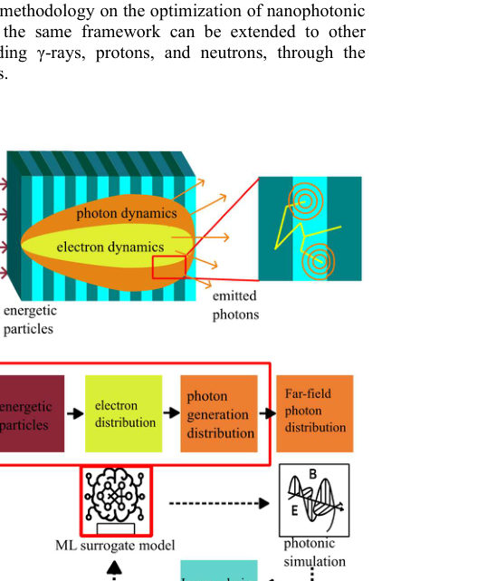
<figcaption class="paper-figure-caption"><b>Fig 1.</b> Figure 1: Physics-informed neural network (PINN) enabling inverse design of scintillators. (a) A wide range of physical processes are triggered following the interaction of an X-ray photon or other energetic particles with matter – all part of the complexity of scintillator science. These processes are typically modeled by probabilistic Monte Carlo (MC) simulations such as</figcaption>
</figure>
<figure class="paper-figure-card">
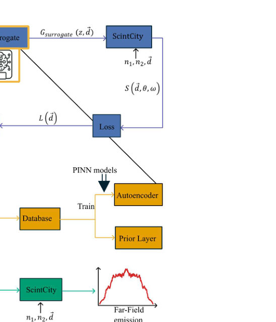
<figcaption class="paper-figure-caption"><b>Fig 2.</b> Figure 2: The scintillator physics-informed neural network (SPINN) design for optimization of layered structures. (a) Optimization process. The forward model applies the scintillation surrogate module on the layers vector dሬ⃗, yielding the estimated photon emission density function G൫z,dሬ⃗൯. Based on this density, ScintCity27 estimates the emission far-field angular intensity distribution. This intensity is converted into a scalar loss according to the figure-of-merit, used by optimization procedure to update the layers vector. The optimized layer structure is returned upon convergence of the process. (b) Neural network training. To train the surrogate model, we begin by running multiple MC...</figcaption>
</figure>
<figure class="paper-figure-card">
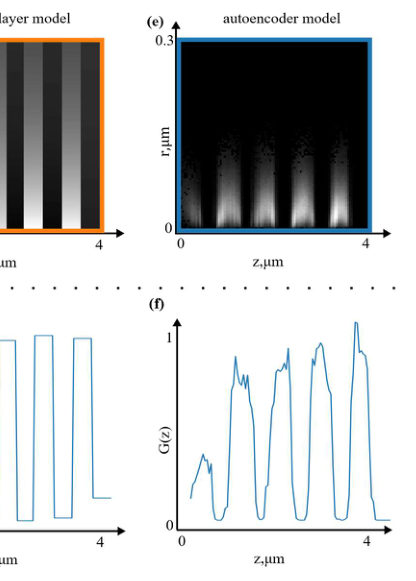
<figcaption class="paper-figure-caption"><b>Fig 3.</b> Figure 3: The scintillation surrogate model of SPINN, performance evaluation. Top row: Spatial distribution of photon emitters from MC simulations, showing the mean emission density - 𝐺ௗ⃗(𝑧, 𝑟). Bottom row: The sum over the radial coordinates 𝐺෨(𝑧) = ∑𝐺ௗ⃗(𝑧, 𝑟) ௥ . Comparing the MC simulation, which is closest to the ground truth (a,b), with the prior layer model (c,d), and the autoencoder PINN model (e,f). While the autoencoder model is noisier, and fails to capture the smooth transition between layers, it captures well several features that deviate from the prior layer model, including inter-layer changes (like the rise in the first layer), and the curved &quot;onion&quot; dip in emission near the...</figcaption>
</figure>
<figure class="paper-figure-card">
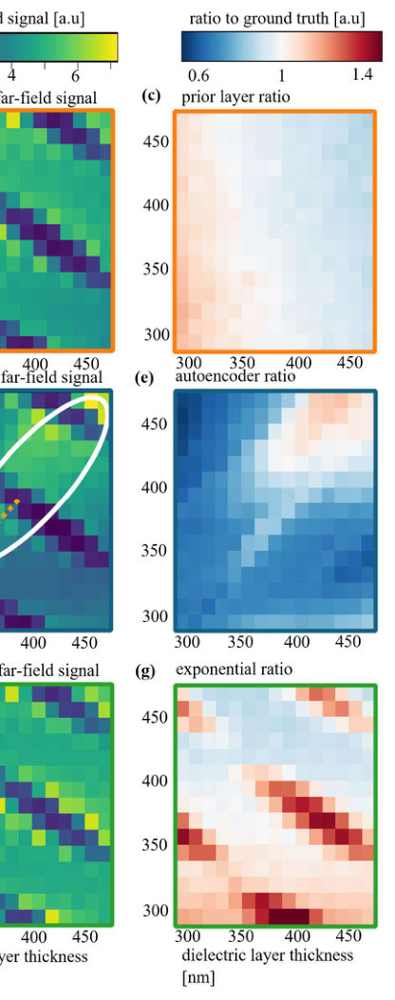
<figcaption class="paper-figure-caption"><b>Fig 4.</b> Figure 4: Analysis of the optimization process, exemplified on periodic layered scintillators. Scintillator performance (total far- field signal) summarized in a map as a function of the thicknesses of the two layers in the periodic structure. (a) Ground truth MC simulation as shown in Figure 2(c). Dotted horizontal lines represent optimization constraints i.e., constant scintillator thickness. white arrows denote the points of highest signal, indicating that the optimal signal is not monotonic with scintillator thickness and in certain contexts can even decrease for thicker structures. (b,c) Prior layer forward model performance and ratio to MC ground truth. (d,e) Autoencoder model and its...</figcaption>
</figure>
<figure class="paper-figure-card">
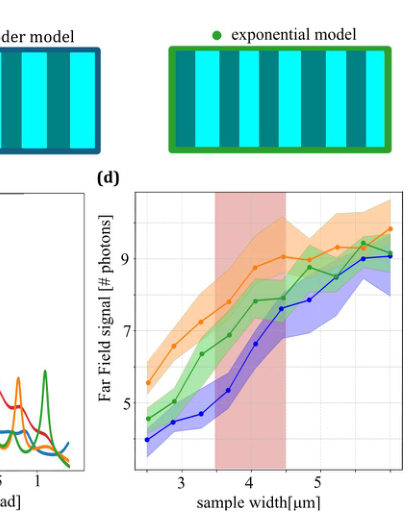
<figcaption class="paper-figure-caption"><b>Fig 5.</b> Figure 5: Example SPINN optimization results. (a) Optimized layered scintillators, found using the different far field models. (b) improvement ratio histogram between new models and exponential model. The histogram was calculated by preforming optimization using 3 models on the same initial layer structure and compared the resulting far field signal. The autoencoder (blue histogram) model overall performed worse than previous model with median optimized signal (red dotted line) being 85% of exponential model. The layered structure (orange histogram) improved the median optimized by 15%. (c) Comparison of the far field angular intensity distribution for each scintillator design. The...</figcaption>
</figure>

**Summary.** The paper introduces a Physics-Informed Neural Network (SPINN) framework to overcome the computational bottleneck in designing scintillators. By replacing slow, non-differentiable Monte Carlo simulations with a differentiable neural network surrogate, it enables efficient gradient-based inverse design optimization for novel nanophotonic structures. This breakthrough accelerates materials discovery by linking structure geometry directly to desired optical performance.

**Why it may be interesting.** This work represents a powerful application of ML to solve complex physical simulation bottlenecks. The use of PINNs to bridge stochastic physics (electron transport) with deterministic optics is highly relevant for modeling open quantum systems where full time-evolution simulations are intractable.

Detailed structure

**Main problem.** Scintillator development is limited by complex, stochastic physics modeled by non-differentiable Monte Carlo simulations, preventing efficient machine learning optimization.

**Main result.** The authors successfully demonstrated an end-to-end differentiable inverse design framework for nanophotonic scintillators using a Physics-Informed Neural Network (SPINN).

**Method.** They replaced computationally expensive and non-differentiable Monte Carlo simulations with PINN surrogate models to learn the relationship between structure geometry and light emission.

**Model / system.** The system is a nanophotonic scintillator, often implemented as multilayer stacks. The model involves coupling the SPINN (surrogate for electron cascade) with a differentiable photonic simulator to optimize structural parameters.

**Key observables.** Far-field signal intensity distribution, total light yield ($L(\vec{d})$), and spatial photon emission profiles ($
ho(z, r)$).

**Important parameters / regimes.** Layer thicknesses (nanoscale dimensions), refractive indices, X-ray energy (e.g., 8 keV), and the number of latent parameters ($K$).

**Assumptions / limitations.** The primary assumption is that a PINN can accurately surrogate the complex physics, though comparisons showed that explicit physical constraints (Prior Layer Model) outperformed purely data-driven autoencoders.

**Figures summary.** Figures illustrate the optimization flow using SPINN, comparing the predicted signal from different models (Autoencoder vs. Prior Layer Model vs. Exponential Model) against Monte Carlo ground truth across varying sample thicknesses.

**Paper structure.** The paper progresses by first identifying the modeling gap (MC limitations), proposing the PINN surrogate framework, detailing the training methodology using self-supervised learning on simulated data, and finally validating the approach through inverse design optimization for specific scintillators.

Abstract

Scintillators are materials converting high-energy radiation into optical light, essential in a range of technologies such as medical imaging systems and security scanners. Scintillator development and optimization have remained limited by the complexity of their underlying physics, involving stochastic cascades of electron-electron, electron-phonon, and electron-photon interactions. Such processes are typically modeled by non-differentiable Monte Carlo simulations, limiting the applicability of machine learning for scintillator development. Here we present a physics-informed neural network that learns the scintillation cascade process from the incident high-energy particle to photon emission, substantially accelerating scintillator design and optimization. Combining this neural network with photonic simulations enables end-to-end differentiable optimization of the scintillator geometry. This allows us to optimize for arbitrary figures of merit, such as specific target emission patterns.. We demonstrate the concept and characterize it relative to previous approaches by inverse design of nanophotonic scintillators for X-ray imaging.

[↑ back to top](#top)

### [The Optimal Rate Function in Covariant Quantum State Tomography](http://arxiv.org/abs/2606.16948v1)

**Authors:** Arick Grootveld, Alexander Maloney, Jason Pollack, Peixue Wu  
**Type:** theory · **Category:** other · **PDF:** <https://arxiv.org/pdf/2606.16948v1>  
**Analysis basis:** full PDF text, analyzed in chunks
**Topic relevance:** `quantum measurements` **3/5** · `entanglement & information structure` **2/5** · `measurement-induced transitions` **1/5**

↔ Scroll figures horizontally

<figure class="paper-figure-card">
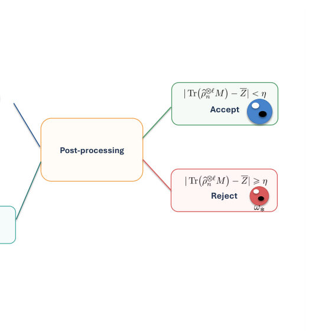
<figcaption class="paper-figure-caption"><b>Fig 1.</b> Fig. 1: Non-covariant protocol almost achieving the relative entropy as its rate function</figcaption>
</figure>
<figure class="paper-figure-card">
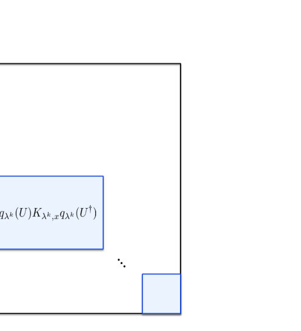
<figcaption class="paper-figure-caption"><b>Fig 2.</b> Fig. 2: Block diagonal form of a covariant POVM density in the Schur basis.</figcaption>
</figure>

**Summary.** This paper establishes the theoretical limit on how accurately an unknown quantum state can be estimated from repeated measurements. It proves that among all basis-independent (covariant) protocols, a specific rate function derived from Schur sampling achieves the maximum possible exponential decay rate for estimation error. This result refines our understanding of quantum information limits by comparing it to the standard relative entropy.

**Why it may be interesting.** This work provides a rigorous mathematical framework for quantifying the fundamental limits of quantum state characterization, which is crucial for understanding measurement-induced information loss in quantum systems.

Detailed structure

**Main problem.** The central problem is determining the optimal measurement protocol for quantum state tomography, which involves estimating an unknown quantum state $\rho$ from multiple copies of itself.

**Main result.** The authors prove that among all covariant tomography protocols, a specific rate function derived from Keyl's Schur sampling method achieves the maximum possible large-deviation exponent. This optimal rate is shown to be bounded by the standard quantum relative entropy $D(\sigma|\rho)$.

**Method.** The analysis employs Large Deviation Principles (LDP) theory to characterize the exponential decay rate of measurement probabilities, utilizing tools from representation theory (Schur polynomials) and covariance constraints.

**Model / system.** The system is a quantum state $\rho$ on a $d$-dimensional Hilbert space. The estimation process involves measuring tensor products of copies ($\rho^{\otimes n}$) using protocols constrained by covariance under unitary rotations.

**Key observables.** Rate function $I(\sigma|\rho)$, Quantum Relative Entropy $D(\sigma|\rho)$, and Keyl's rate function $S_{Keyl}(\sigma|\rho)$.

**Important parameters / regimes.** The number of copies $n$, the dimension $d$, and the limiting spectral distribution $x$ (from $\lambda(n)/n \to x$).

**Assumptions / limitations.** The analysis heavily relies on assuming that the measurement protocol satisfies a Large Deviation Principle (LDP) and, for the optimal result, that the protocol is covariant.

**Figures summary.** Figures illustrate how non-covariant protocols yield rate functions below the theoretical maximum, while Figure 2 shows the block diagonal structure of the POVM density in the Schur basis.

**Paper structure.** The paper builds from establishing the general upper bound using relative entropy (Theorem 1.1), then focusing on covariant protocols, proving Keyl's conjecture by characterizing these protocols via representation theory (Schur basis), and finally comparing this optimal rate to other divergences.

Abstract

The problem of quantum tomography is to estimate an unknown quantum state $ρ$ from a measurement of $n$ copies of $ρ$. One can ask which tomography protocol, i.e.\ which choice of multi-copy measurement, gives the best possible estimate of $ρ$. To do so, we characterize tomography protocols by their \emph{rate function}, which governs the exponential rate at which a protocol assigns probability to a particular estimate $σ$ of the true state $ρ$. This rate function is a quantum mechanical generalization of the classical relative entropy between the true state and its estimate, and depends on the choice of protocol. It is bounded by the quantum relative entropy, and we show that this bound is sharp: for any $ρ$ and $σ$ we construct a family of protocols whose rate functions converge to the quantum relative entropy $D(σ\|ρ)$.   We consider the family of covariant tomography protocols; these are the basis independent state estimation schemes that assume no prior information about $ρ$ and $σ$. Keyl described a specific tomography protocol based on Schur sampling, and conjectured that among all covariant tomography protocols it has the largest possible rate function for all $σ$ and $ρ$. We prove this conjecture. The resulting rate function is an annealed version of quantum relative entropy, due to the cost of learning the eigenbasis in covariant quantum state tomography.

[↑ back to top](#top)

### [Benchmarking Quantum Extreme Learning based on Gaussian Boson Sampling](http://arxiv.org/abs/2606.15230v1)

**Authors:** Daniel Montesinos, Gian Luca Giorgi, Roberta Zambrini  
**Type:** theory · **Category:** quantum information and computing · **PDF:** <https://arxiv.org/pdf/2606.15230v1>  
**Analysis basis:** full PDF text, analyzed in chunks
**Topic relevance:** `interference shaping light` **3/5** · `analog quantum simulation` **1/5** · `quantum measurements` **1/5**

↔ Scroll figures horizontally

<figure class="paper-figure-card">
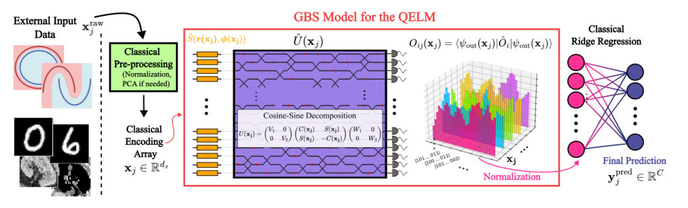
<figcaption class="paper-figure-caption"><b>Fig 1.</b> FIG. 1: Schematic overview of the QELM based on GBS. External input samples xraw j undergo classical preprocessing (normalization and, when required, reduction via PCA) to generate the classical feature vector xj ∈Rdx. These features modulate the squeezing strengths and phases applied to each of the M optical modes, producing an input-dependent Gaussian state. This state is then processed by a linear interferometer ˆU(xj), and photon-number-resolving detection is used to extract a set of quantum features Oij(xj), corresponding to the probabilities of selected Fock outcomes. Finally, the resulting feature vector is fed into a classical Ridge regression layer, which produces the prediction...</figcaption>
</figure>
<figure class="paper-figure-card">
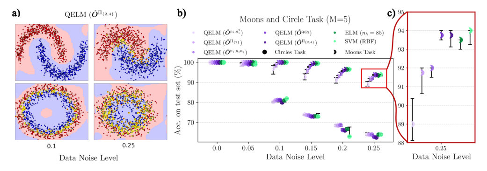
<figcaption class="paper-figure-caption"><b>Fig 2.</b> FIG. 2: a) Decision Boundaries: QELM using Fock probabilities on the two-moon (top) and concentric circles (bottom) binary classification tasks. The results are shown for data noise levels (0.1 and 0.25), showcasing the model’s ability to maintain separation despite increasing noise. The background colour corresponds to the model prediction, while the coloured dots indicate the correct class. Dots with a yellow border correspond to misclassified points. b) Test Set Accuracy vs. Noise Level: This panel plots the classification accuracy on the test set against the noise level for all classical and quantum learning models on the Circles and Moons tasks. Points are the median across 10...</figcaption>
</figure>
<figure class="paper-figure-card">
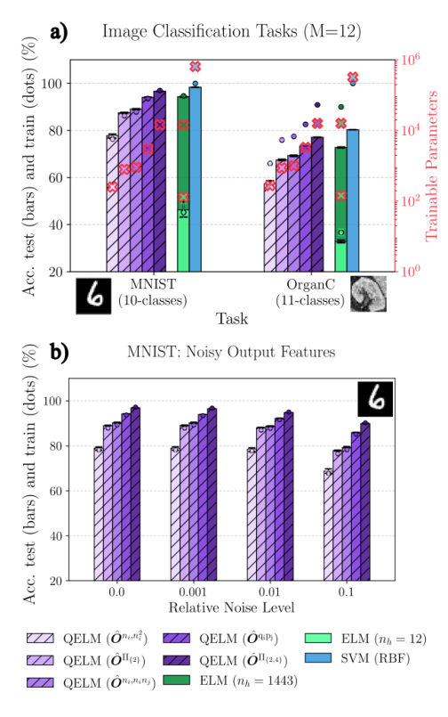
<figcaption class="paper-figure-caption"><b>Fig 3.</b> FIG. 3: a) Comparative Performance and Resource Analysis for Different Quantum and Classical Models (see color legend): Presents the test(bars)/train(dots) set accuracy (left y-axis) and number of trainable parameters (right y-axis, red cross markers) for two different image classification datasets (MNIST, OrganC). Points/bar height are the median across 10 repetitions with different random seeds, and error bars correspond to the 25th and 75th percentiles. From left to right, the quantum models correspond to increasing output feature dimensionality (see App. C). b) Noisy Quantum Features Performance: Accuracies of quantum models when Gaussian random noise is introduced to the quantum...</figcaption>
</figure>
<figure class="paper-figure-card">
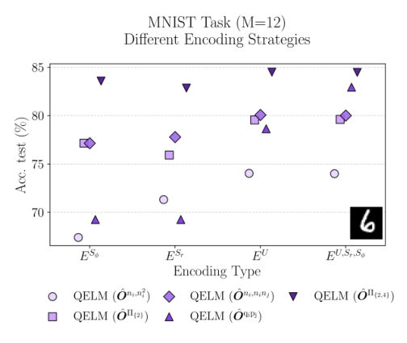
<figcaption class="paper-figure-caption"><b>Fig 4.</b> FIG. 4: Different encoding strategies: Performance Comparison on MNIST task using only the first six PCA components to encode information in the GBS device with different strategies. ESϕ, ESr, EU</figcaption>
</figure>
<figure class="paper-figure-card">
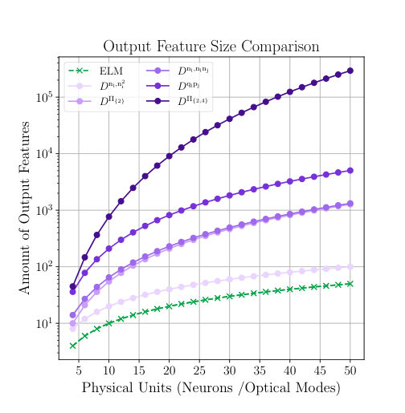
<figcaption class="paper-figure-caption"><b>Fig 5.</b> FIG. 5: Scaling of the output feature dimension for the different measurement schemes considered in this work as a function of the number of optical modes M. For comparison, the linear scaling of the classical ELM feature space with respect to its number of internal neurons is also shown.</figcaption>
</figure>

**Summary.** This paper proposes using Gaussian Boson Sampling (GBS) within a Quantum Extreme Learning Machine (QELM) framework to perform classification tasks. It shows that encoding classical data into the interferometer's unitary matrix and squeezing parameters generates highly nonlinear, potentially intractable quantum features. The results demonstrate competitive performance against classical methods while maintaining resource efficiency for near-term photonic devices.

**Why it may be interesting.** It directly applies advanced quantum optics techniques (GBS, squeezed states) to a machine learning problem, providing concrete benchmarks for near-term photonic quantum computation feasibility.

Detailed structure

**Main problem.** Developing resource-efficient quantum feature maps for machine learning by leveraging Gaussian Boson Sampling (GBS) to encode classical data into complex quantum states.

**Main result.** The proposed Quantum Extreme Learning Machine (QELM) achieves competitive classification accuracy compared to classical baselines while utilizing fewer trainable parameters, with photon-number sampling providing the best performance.

**Method.** Classical inputs are jointly encoded into squeezing parameters and the interferometer unitary matrix ($\hat{U}$), generating quantum features via Photon Number Resolving (PNR) detection, which are then read out using Ridge regression.

**Model / system.** The physical platform is Gaussian Boson Sampling (GBS) implemented with a linear optical interferometer fed by squeezed vacuum states. The model is a QELM that maps classical data $\mathbf{x}_j$ to quantum feature expectation values $O_{ij}(\mathbf{x}_j)$.

**Key observables.** Photon number sampling probabilities ($\hat{\Pi}_n$), photon-number moment observables, and quadrature covariance observables.

**Important parameters / regimes.** Number of optical modes ($M$, e.g., 5 or 12); noise levels (e.g., 0.1 to 0.25).

**Assumptions / limitations.** The GBS output probabilities are conjectured to be classically hard to compute; the encoding strategy allows data embedding in both squeezing parameters and the interferometer unitary.

**Figures summary.** Figures illustrate the QELM workflow (Fig. 1), decision boundaries on synthetic tasks like 'two moons' (Fig. 2a), and test set accuracy vs. noise level for various models (Fig. 2b).

**Paper structure.** The paper details the QELM architecture, describing input encoding via squeezing/unitary decomposition (CS decomposition), defining feature extraction using PNR detection, benchmarking performance against classical ELMs on tasks like moons and MNIST, and analyzing resource scaling.

Abstract

Reservoir models offer a hardware-efficient learning paradigm for noisy intermediate-scale quantum devices by exploiting untrained quantum dynamics as a fixed feature map and restricting optimization to a simple classical readout layer. We propose a quantum extreme learning machine implemented using gaussian boson sampling and an encoding strategy that achieves high classification accuracy while reducing optical resource requirements. Classical inputs are jointly encoded in the squeezing parameters and in the interferometer unitary, enabling sampling-based, highly nonlinear feature maps while leveraging large-scale GBS output statistics, which are conjectured to be classically intractable. We systematically compare multiple families of quantum features accessible in the same setup and find that photon-number sampling probabilities provide the best performance, consistent with their higher effective feature dimensionality. Finally, we benchmark against classical nonlinear baselines and analyse robustness under noisy scenarios, showing competitive performance with fewer trainable parameters and indicating practical promise for near-term photonic implementations.

[↑ back to top](#top)

### [Quantum enhancement and Doppler suppression of Kasevich-Chu atom interferometer with motional squeezing states](http://arxiv.org/abs/2606.16632v1)

**Authors:** Dongyang Yu, Yubin Wang, Fong En Oon, Qiang Lin  
**Type:** theory · **Category:** other · **PDF:** <https://arxiv.org/pdf/2606.16632v1>  
**Analysis basis:** full PDF text, analyzed in chunks
**Topic relevance:** `quantum measurements` **3/5** · `entanglement & information structure` **1/5** · `measurement-induced transitions` **1/5**

↔ Scroll figures horizontally

<figure class="paper-figure-card">
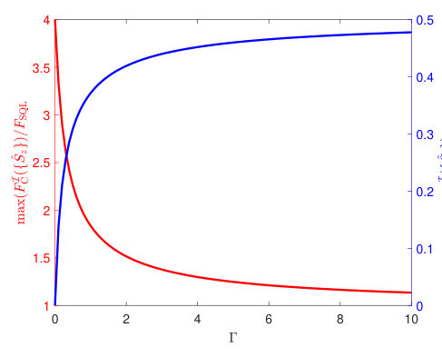
<figcaption class="paper-figure-caption"><b>Fig 1.</b> FIG. 1. In the ”Ideal” scenario, the global maximum CFI of population measurement ({ ˆSz}) and the corresponding opti- mal ratio rI({ ˆSz}) versus Γ.</figcaption>
</figure>
<figure class="paper-figure-card">
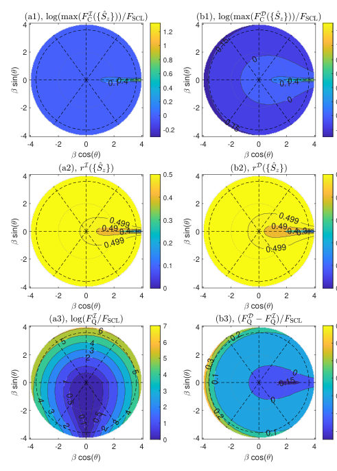
<figcaption class="paper-figure-caption"><b>Fig 2.</b> FIG. 2. (color online) Evolution of max(F S C ({ ˆSz})) ((a1,b1), log scale), optimal ratio rS({ ˆSz}) (a2,b2) and the corre- sponding QFI F S Q (a3,b3) versus squeezing parameters (β, θ) for the ”Ideal” (S = I) and ”Doppler” (S = D) scenario. The black dashed radial lines (concentric circle) correspond to θ/π = (0, 0.3, 0.5, 0.7, 1.0, 1.3, 1.7, 2) (β = 3.6). Here δ0 = −Er, ℏΩ/Er = 20, ωT = 2, ErT/ℏ= 200.</figcaption>
</figure>
<figure class="paper-figure-card">
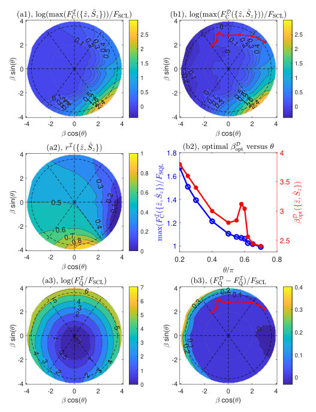
<figcaption class="paper-figure-caption"><b>Fig 3.</b> FIG. 3. (color online) Evolution of max(F S C ({ˆz, ˆSz})) ((a1,b1), log scale), rI({ˆz, ˆSz}) (a2), and the corresponding QFI F S Q (a3,b3) versus squeezing parameters (β, θ) for the ”Ideal” (S = I) and ”Doppler” (S = D) scenario. Partic- ularly, rD({ˆz, ˆSz}) = rI({ˆz, ˆSz}) is assumed for simplicity, as discussed in the main text. Panel (b2) shows the opti- mal squeezing βD opt (the red solid line in panels (b1,b2,b3)) versus θ (0 ≤θ ≤π is chosen) under ”Doppler” scenario. The black dashed radial lines (concentric circle) correspond to θ/π = (0, 0.3, 0.5, 0.7, 1.0, 1.3, 1.7, 2) (β = 3.6). Other pa- rameters are the same as in Fig. 2.</figcaption>
</figure>
<figure class="paper-figure-card">
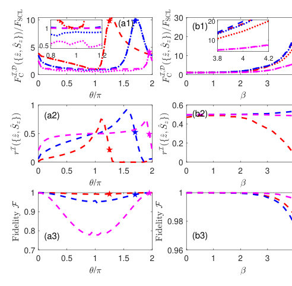
<figcaption class="paper-figure-caption"><b>Fig 4.</b> FIG. 4. (color online) Under the joint measurement of population-position, max(F I,D C ({ˆz, ˆSz}))) (a1, b1), optimal control ratio rI({ˆz, ˆSz})) (a2, b2), and the fidelity F (a3, b3) are shown as functions of the squeezing parameters θ (with β = 3.6 fixed, panels (a1, a2, a3), see the black dashed cir- cles in Fig. 3) and β (with θ = θmax fixed, panels (b1, b2, b3)). Here, the red, blue, and magenta dashed curves (pen- tagram symbols) correspond to T ω = 0.32 (β = 3.6, θ = θmax = 1.25π), 2.0 (β = 3.6, θ = θmax = 1.7π), and 12.5 (β = 3.6, θ = θmax = 1.95π), respectively. In panels (a1,b1), the dashed (dotted) lines denote the ”Ideal” (”Doppler”) sce- nario. Other parameters are the same as...</figcaption>
</figure>
<figure class="paper-figure-card">
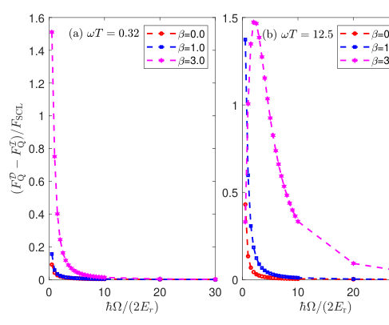
<figcaption class="paper-figure-caption"><b>Fig 5.</b> FIG. 5. (color online) Doppler shifts of QFI difference ∆FQ = F D Q −F I Q versus Rabi frequency Ωas ωT = 0.32 (a) and ωT = 12.5 (b). Here we set r = T1/T = 1/2 artificially. For the input MSS, θ = π is chosen where the Doppler broadening is the largest and β = (0, 1, 3) (dashed red, blue and magenta lines). Other parameters are the same as in Fig. 2.</figcaption>
</figure>

**Summary.** This paper theoretically analyzes Kasevich-Chu atom interferometers using motional squeezing states to boost measurement sensitivity. It rigorously compares performance under ideal conditions versus realistic Doppler broadening effects by calculating both Quantum and Classical Fisher Information for different measurement types. The key finding is that joint measurement of population and position provides a robust enhancement mechanism capable of overcoming significant Doppler suppression.

**Why it may be interesting.** This work is highly relevant as it pushes quantum metrology into regimes where real-world noise sources like Doppler shifts are present, providing concrete guidance on how entanglement resources (MSS) can maintain high precision measurements.

Detailed structure

**Main problem.** The study aims to enhance the sensitivity of Kasevich-Chu atom interferometers beyond the standard quantum limit while quantifying the detrimental effects of Doppler broadening.

**Main result.** Joint measurement of population and position shows superior robustness, allowing quantum enhancement to dominate even in the presence of strong Doppler broadening effects. For population measurement alone, enhancements up to four times the semi-classical limit were achieved.

**Method.** The authors systematically derived computational frameworks for both Quantum Fisher Information (QFI) and classical Fisher information (CFI) by analyzing two distinct measurement protocols: population measurement and joint population–position measurement.

**Model / system.** The physical system is a Kasevich-Chu atom gravimeter utilizing cold atomic ensembles. The theoretical model incorporates the hybridization of internal and external atomic degrees of freedom, allowing for the use of Motional Squeezing States (MSS) as input states.

**Key observables.** Quantum Fisher Information ($F_Q$) and Classical Fisher Information ($F_C$), sensitivity ($\delta g$), contrast ($C$).

**Important parameters / regimes.** Squeezing strength ($eta$), squeezing angle ($	heta$), interrogation time ratio ($r=T_1/T$), Doppler effect magnitude.

**Assumptions / limitations.** The analysis compares 'Ideal' scenarios (neglecting Doppler effects) with 'Doppler' scenarios that incorporate momentum broadening. In some calculations, optimal control parameters from the ideal case were adopted for the Doppler calculation due to numerical complexity.

**Figures summary.** Figures compare maximum CFIs/QFIs across different measurement protocols and squeezing parameters ($eta, 	heta$) in both Ideal and Doppler regimes, highlighting the superior performance of joint measurements.

**Paper structure.** The paper builds by first establishing the theoretical framework using QFI/CFI for ideal vs. Doppler scenarios (using MSS input). It then optimizes control parameters to maximize CFI for population vs. joint measurement protocols, concluding with a comparative analysis showing robustness in the joint measurement regime.

Abstract

Hybridization of internal and external atomic degrees of freedom in a Kasevich-Chu interferometer enables the possibility to enhance the sensitivity significantly even under quantum-standard limit. By introducing motional squeezing state as an input, we systematically derive the computational framework of quantum and classical Fisher information of two measurement protocols for arbitrary strength of Doppler effects. Through maximizing the corresponding classical Fisher information, we obtain the optimal control parameters and the corresponding quantum Fisher information. For population measurement, the largest sensitivity can be as large as four times than the semi-classical limit through enlarging the atom coherence length. For joint measurement of population and position, the competition between quantum enhancement and Doppler suppression induces two three behaviors, in one regime, the quantum enhancement dominates even in presence of strong Doppler broadening effects where the sensitivity is significantly enhanced; while in another regime, an optimal squeezing parameter is observed where the classical Fisher information reaches the maximum. Our results clearly demonstrate the robustness of external quantum enhancement against Doppler suppression. Our proposal can be readily applied to gravimeter of mobile platform where decoherence from noise will damage the many-body entanglement of internal spin squeezing.

[↑ back to top](#top)

### [symveig: Verified eigenvalue enclosures for symmetry-decomposed Hermitian matrices](http://arxiv.org/abs/2606.16217v1)

**Authors:** Sarang Vehale, Ritu Goel  
**Type:** theory · **Category:** strongly correlated electrons · **PDF:** <https://arxiv.org/pdf/2606.16217v1>  
**Analysis basis:** full PDF text, analyzed in chunks
**Topic relevance:** `analog quantum simulation` **3/5** · `exotic spin models in light-matter` **1/5** · `non-equilibrium dynamics` **1/5**

↔ Scroll figures horizontally

<figure class="paper-figure-card">
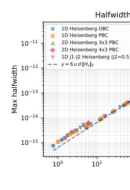
<figcaption class="paper-figure-caption"><b>Fig 1.</b> Figure 1: Maximum per-sector enclosure half-width versus ds ∥As∥F , for every sector of every model and size. The data collapse onto the line h ≈6 u ds ∥As∥F (u = 2−53) across more than four orders of magnitude, demonstrating that the rigorous half-width is a predictable function of sector dimension and norm.</figcaption>
</figure>
<figure class="paper-figure-card">
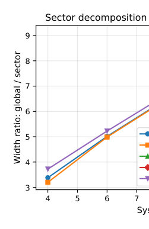
<figcaption class="paper-figure-caption"><b>Fig 2.</b> Figure 2: Ratio of the maximum global enclosure half-width to the maximum sector enclosure half-width, as a function of system size L, for all model families. The sector decomposition is uniformly tighter, with the advantage growing with sy4tem size.</figcaption>
</figure>
<figure class="paper-figure-card">
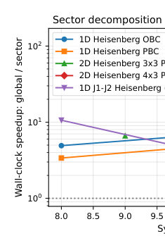
<figcaption class="paper-figure-caption"><b>Fig 3.</b> Figure 3: Wall-clock speedup of the sector path over the global baseline versus system size L (logarithmic vertical axis). The dotted line marks parity. The speedup grows rapidly with size as the cost of the full dense eigendecomposition comes to dominate the global path.</figcaption>
</figure>
<figure class="paper-figure-card">
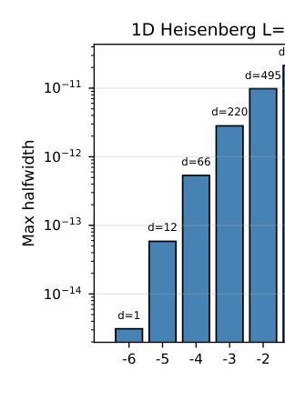
<figcaption class="paper-figure-caption"><b>Fig 4.</b> Figure 4: Per-sector maximum enclosure half-width for the 1D Heisenberg chain at L = 10 (logarithmic vertical axis), labelled by sector dimension d. The half-width grows with sector dimension, in agreement with the scaling law of Figure 1.</figcaption>
</figure>

**Summary.** This paper introduces 'symveig,' a novel package that computes mathematically rigorous enclosures for the eigenvalues of Hermitian quantum Hamiltonians. By exploiting symmetries to decompose large matrices into smaller, independent sectors, it achieves both significantly tighter bounds and massive speedups compared to full diagonalization methods. This provides computational physicists with unprecedented certainty regarding their calculated spectral properties.

**Why it may be interesting.** For theorists studying strongly correlated systems using numerical methods, this provides a crucial tool to move beyond approximate results. It allows for quantitative verification of spectral properties (like gaps or ground state energies) with mathematical certainty within standard computational environments.

Detailed structure

**Main problem.** The core problem is obtaining rigorous, machine-checkable enclosures for all eigenvalues of Hermitian matrices derived from quantum Hamiltonians, circumventing the uncertified nature of standard floating-point diagonalization results.

**Main result.** The package successfully computes guaranteed eigenvalue enclosures that are significantly tighter (3–9x) and dramatically faster (up to 130x speedup) than verifying the full matrix spectrum by exploiting symmetry conservation laws.

**Method.** It uses a specialized, rigorous bounding technique based on the Bauer–Fike theorem, enhanced by explicit floating-point error analysis (Higham's $\gamma_k$) and dramatically accelerated via symmetry-sector decomposition.

**Model / system.** The method is validated on quantum lattice Hamiltonians, including 1D Heisenberg chains (open/periodic), J1–J2 Heisenberg models, and 2D Heisenberg lattices. These systems are characterized by conserved quantities like total magnetization ($S_z$).

**Key observables.** Rigorous eigenvalue enclosures $[\mu_i - h_i, \mu_i + h_i]$, spectral gaps, and certified ground-state energies.

**Important parameters / regimes.** System size $L$ (tested up to 12), the matrix norm $\|A\|_F$, and the degree of symmetry conservation ($S$).

**Assumptions / limitations.** The method assumes the conserved quantity is exactly diagonal in the working basis; furthermore, the rigorous bound used is dominated by a worst-case error term ($\gamma_4 n \|A\|_{	ext{F}}$) when full rigor is applied.

**Figures summary.** Figures demonstrate data collapse confirming scaling laws for enclosure widths ($h \propto d_s \|A\|_F$), and show the substantial speedup achieved by using sector decomposition over global diagonalization.

**Paper structure.** The paper introduces the problem of uncertified eigenvalues, details the mathematical framework involving rigorous error bounding (Bauer-Fike), presents the efficiency gain via symmetry-sector path analysis, validates the method on multiple lattice models, and concludes with performance comparisons.

Abstract

Exact diagonalization of quantum lattice Hamiltonians returns floating-point eigenvalues whose accuracy is not certified: rounding error, eigensolver behaviour, and ill-conditioning can corrupt a result without warning. We present \texttt{symveig}, a pure NumPy/SciPy package that computes rigorous, machine-checkable enclosures of all eigenvalues of a Hermitian matrix, with an optional symmetry-sector decomposition. For a matrix that commutes with an abelian conserved quantity diagonal in the working basis (for example the total magnetization of a spin model), the package verifies each symmetry sector independently. Because each sector block is much smaller than the full matrix, this yields enclosures that are both tighter (by a factor of $3$-$9$ across system sizes $L = 4$-$12$) and dramatically faster (a wall-clock speedup of up to $130\times$ at $L = 12$) than verifying the full matrix, while never forming or diagonalizing it. Every enclosure half-width is a guaranteed upper bound on the distance from a computed eigenvalue to the nearest true eigenvalue under IEEE~754 round-to-nearest arithmetic, obtained by explicit floating-point error analysis with no heuristic slack. The implementation requires neither INTLAB nor MATLAB, bringing rigorously verified eigenvalue enclosure into the standard scientific-Python stack used in computational physics. We validate the package on $1$D Heisenberg (open and periodic), $J_1$-$J_2$ Heisenberg, and $2$D Heisenberg lattices, confirming that every computed eigenvalue is contained in its enclosure across all tested configurations.

[↑ back to top](#top)

### [Free energy of non-convex multi-species spin glasses with centered Ising spins](http://arxiv.org/abs/2606.16636v1)

**Authors:** Hong-Bin Chen, Victor Issa, Jean-Christophe Mourrat  
**Type:** theory · **Category:** disordered systems and neural networks · **PDF:** <https://arxiv.org/pdf/2606.16636v1>  
**Analysis basis:** full PDF text, analyzed in chunks
**Topic relevance:** `exotic spin models in light-matter` **3/5** · `Keldysh / 2PI / non-Gaussian methods` **1/5**

↔ Scroll figures horizontally

<figure class="paper-figure-card">
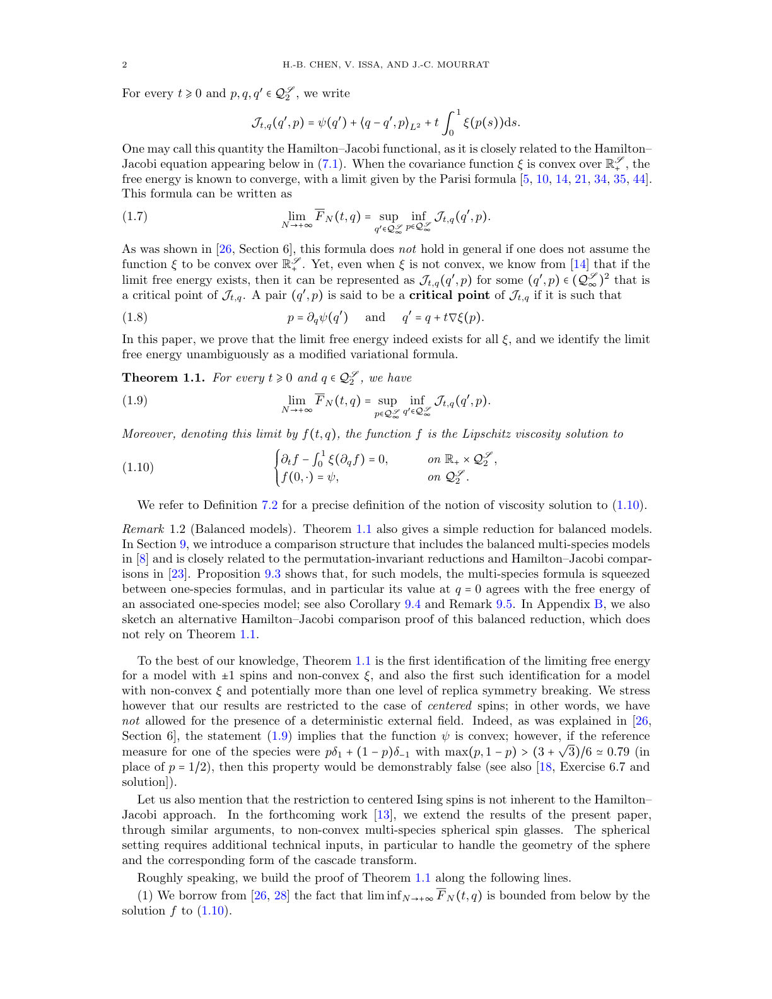
<figcaption class="paper-figure-caption"><b>Fig 1.</b> Low-resolution page preview, page 2</figcaption>
</figure>
<figure class="paper-figure-card">
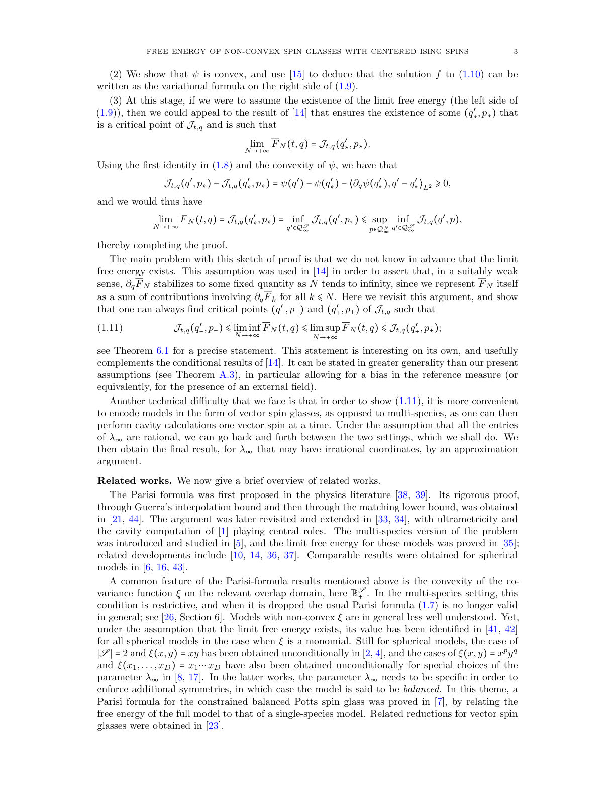
<figcaption class="paper-figure-caption"><b>Fig 2.</b> Low-resolution page preview, page 3</figcaption>
</figure>
<figure class="paper-figure-card">
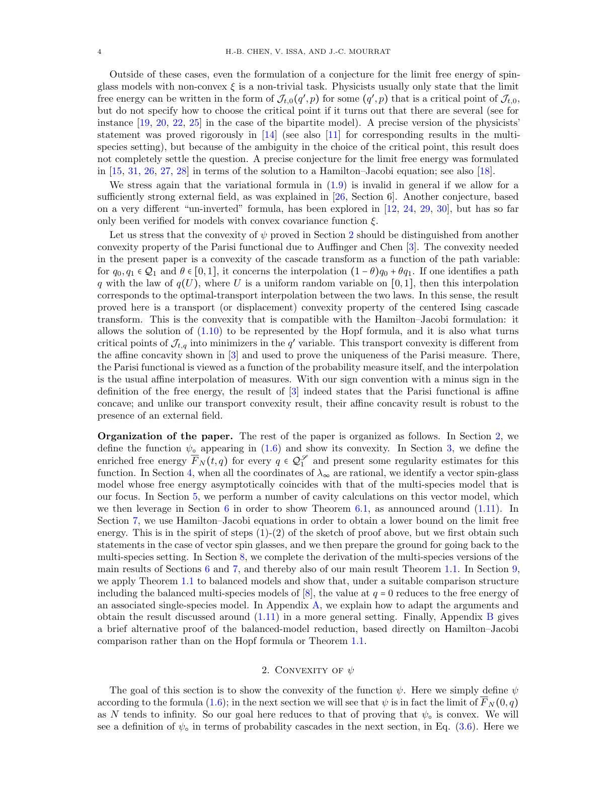
<figcaption class="paper-figure-caption"><b>Fig 3.</b> Low-resolution page preview, page 4</figcaption>
</figure>
<figure class="paper-figure-card">
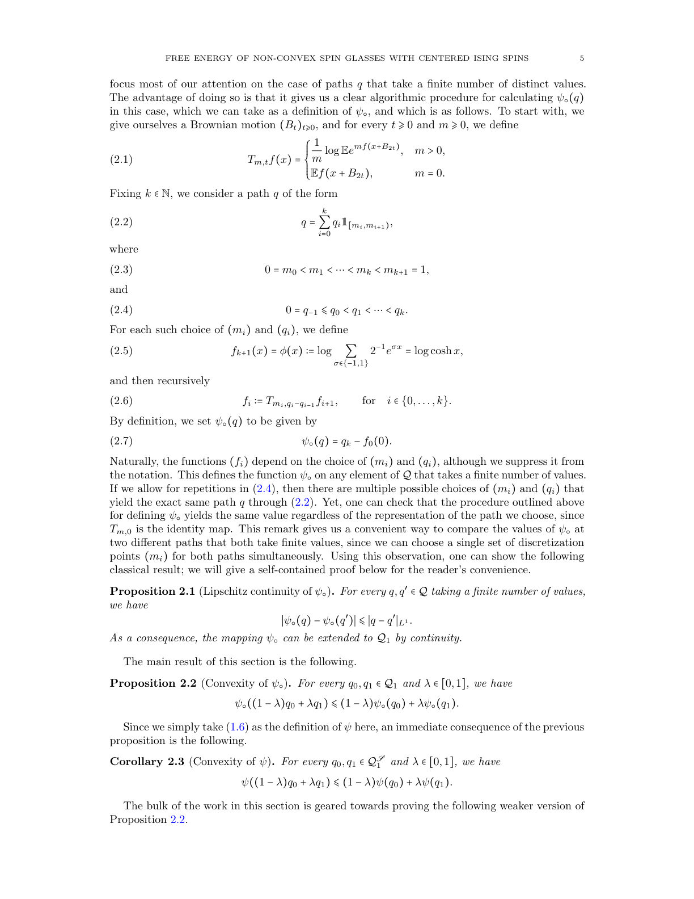
<figcaption class="paper-figure-caption"><b>Fig 4.</b> Low-resolution page preview, page 5</figcaption>
</figure>
<figure class="paper-figure-card">
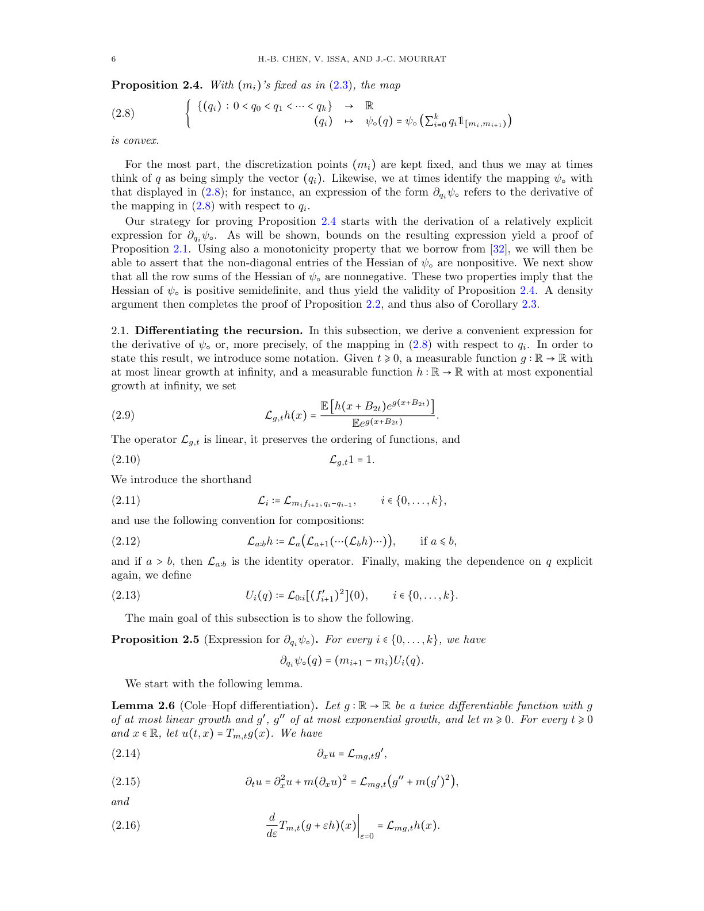
<figcaption class="paper-figure-caption"><b>Fig 5.</b> Low-resolution page preview, page 6</figcaption>
</figure>

**Summary.** This paper provides a comprehensive theoretical framework for calculating the limit free energy of multi-species spin glasses when the underlying disorder covariance function is non-convex. By employing viscosity solution methods for Hamilton–Jacobi equations, the authors establish new variational formulas that generalize previous results. The work also derives a crucial one-species reduction formula applicable to 'balanced' models.

**Why it may be interesting.** The rigorous mathematical treatment of spin glass free energy in non-convex regimes is foundational to understanding complex disordered systems, providing tools applicable to optimization problems and machine learning theory.

Detailed structure

**Main problem.** The primary goal is to determine the limit free energy of multi-species spin glasses, specifically addressing cases where the underlying covariance function ($\xi$) is non-convex.

**Main result.** The authors establish a modified variational formula for the limit free energy and show that this limit function satisfies a specific Hamilton–Jacobi equation. They also derive a one-species reduction for balanced multi-species models.

**Method.** The analysis heavily employs advanced techniques from statistical mechanics, including viscosity solution theory for Hamilton–Jacobi equations, comparison principles, and rigorous limiting procedures over infinite dimensions (e.g., using Stegall's variational principle).

**Model / system.** The model is a multi-species spin glass defined by centered Ising spins ($\sigma \in \{-1, 1\}^N$). The Hamiltonian involves Gaussian fields whose covariance structure depends on the species overlaps and proportions.

**Key observables.** Limit free energy $f(t,q)$, overlap functions ($R_{N,s}$, $R_N$), and the function $\psi_{\circ}(q)$ related to the convexity properties of the system's effective potential.

**Important parameters / regimes.** Time parameter $t$, species proportions $\lambda_\infty$, and the covariance function $\xi$ (which can be non-convex).

**Assumptions / limitations.** The result is restricted to centered Ising spins. The proof requires advanced mathematical machinery, including assumptions about path spaces ($Q_S^\infty$) and handling limits across different species proportions.

**Paper structure.** The paper builds iteratively: first establishing the general variational formula (Theorem 1.1) for non-convex $\xi$; then proving convexity properties of related functions ($\psi_{\circ}$) using recursive relations and path analysis; finally, deriving the single-species reduction for 'balanced' models by comparing multi-species bounds to one-species solutions.

Abstract

We identify the limit free energy of all multi-species spin glasses with centered $\pm 1$ spins. The result was previously known only under a convexity assumption on the covariance function of the Hamiltonian. We also obtain a one-species reduction of the formula for balanced multi-species models.

[↑ back to top](#top)

### [The Distribution Postulate in Algorithmic Bohmian Mechanics](http://arxiv.org/abs/2606.16165v1)

**Authors:** Jeffrey A. Barrett, Eddy Keming Chen, Josiah Lopez-Wild  
**Type:** theory · **Category:** other · **PDF:** <https://arxiv.org/pdf/2606.16165v1>  
**Analysis basis:** full PDF text, analyzed in chunks
**Topic relevance:** `quantum measurements` **3/5** · `measurement-induced transitions` **1/5**

↔ Scroll figures horizontally

<figure class="paper-figure-card">
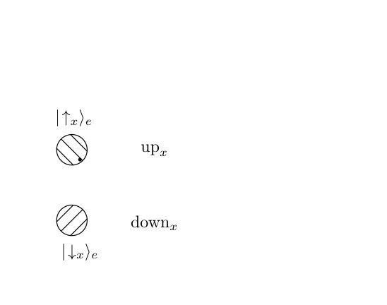
<figcaption class="paper-figure-caption"><b>Fig 1.</b> Figure 1: An x-spin measurement in Bohmian mechanics simple.</figcaption>
</figure>
<figure class="paper-figure-card">
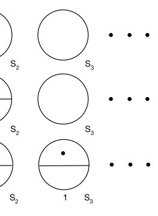
<figcaption class="paper-figure-caption"><b>Fig 2.</b> Figure 3: A slightly more sophisticated random distribution.</figcaption>
</figure>

**Summary.** This paper reformulates Bohmian mechanics by replacing the vague 'distribution postulate' with a precise condition: the initial particle configuration must be Martin-Löf random relative to the Born measure. This algorithmic constraint ensures that the deterministic evolution yields measurement statistics consistent with standard quantum mechanical predictions in the limit.

**Why it may be interesting.** It provides a mathematically rigorous, non-standard way to derive quantum probabilities from a deterministic theory by imposing an objective randomness constraint on the initial state.

Detailed structure

**Main problem.** The paper addresses how to objectively formulate the 'distribution postulate' required for Bohmian mechanics to reproduce standard Born quantum statistics.

**Main result.** By adopting an algorithmic approach, the authors show that requiring the initial particle configuration to be Martin-Löf random relative to the Born measure guarantees that measurement outcomes follow standard quantum statistical predictions in the limit.

**Method.** The core method involves applying concepts from algorithmic information theory, specifically Martin-Löf randomness, to constrain the initial conditions of a deterministic Bohmian flow.

**Model / system.** The model is Algorithmic Bohmian Mechanics (aBM), which describes particle dynamics deterministically based on a wave function $\psi$. It analyzes measurements using spin-1/2 particles and sequential measurement outcomes.

**Key observables.** Measurement outcome sequences ($\omega$-sequences) and the empirical relative frequencies of these outcomes.

**Important parameters / regimes.** The limit $n 	o \infty$ for statistical convergence; the initial state's randomness relative to the Born measure $\mu_\psi$.

**Assumptions / limitations.** 1. The initial configuration must be Martin-Löf random relative to the quantum probability measure ($	ext{MLR}_{\mu_\psi}$). 2. Measurement interactions are assumed to be 'layerwise computable'. 3. For statistical equivalence, exchangeable credences are assumed.

**Figures summary.** Figure 1 illustrates an x-spin measurement in Bohmian mechanics, showing the particle being carried by probability currents associated with different wave packets.

**Paper structure.** The paper progresses from identifying the need for a distribution postulate (Chunk 1) to proposing algorithmic randomness as the solution (Chunk 2). It then develops the rigorous mathematical machinery using layerwise computability to define this postulate (Chunk 3), culminating in proving that this assumption guarantees Born statistics for computable measurement sequences (Chunk 4 and Chunk 5).

Abstract

In order to make the right empirical predictions Bohmian mechanics requires a special statistical boundary condition -- the distribution postulate -- but it is unclear how best to understand this condition. We show how one might use the theory of algorithmic randomness to formulate the distribution postulate as an objective constraining law. The framework requires us to say something about admissible quantum-mechanical states and measurements. In return, algorithmic Bohmian mechanics (aBM) guarantees the standard Born statistics for a collection of canonical quantum experiments in the limit, not just with high probability. The algorithmic distribution postulate provides a sharp typicality condition, clarifies the status of quantum probabilities in the deterministic theory, and provides a concrete example of how notions provided by the theory of algorithmic randomness can aid in specifying the content of a physical law.

[↑ back to top](#top)

### [Vortex-core size and quantum geometry in flat-band superconductors](http://arxiv.org/abs/2606.16536v1)

**Authors:** M. Özkurt, M. Iskin  
**Type:** theory · **Category:** strongly correlated electrons · **PDF:** <https://arxiv.org/pdf/2606.16536v1>  
**Analysis basis:** full PDF text, analyzed in chunks
**Topic relevance:** `analog quantum simulation` **3/5** · `Keldysh / 2PI / non-Gaussian methods` **1/5**

↔ Scroll figures horizontally

<figure class="paper-figure-card">
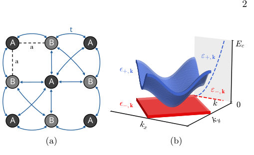
<figcaption class="paper-figure-caption"><b>Fig 1.</b> FIG. 1: (a) Schematic of the two-orbital Mielke checker- board lattice, with sublattices labeled A and B. The lat- tice spacing and hopping amplitude are denoted by a and t, respectively. (b) Band structure of the lattice, showing the flat band (red) and the dispersive band (blue). The shaded region indicates the low-energy continuum sector retained in our analysis, bounded by the cutoff energy Ec and projected onto the radial momentum k = |k|.</figcaption>
</figure>
<figure class="paper-figure-card">
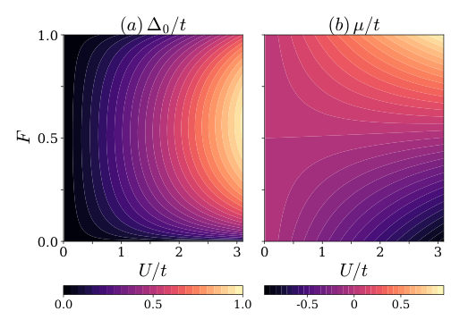
<figcaption class="paper-figure-caption"><b>Fig 2.</b> FIG. 2: Self-consistent zero-temperature solutions of (a) the pairing gap ∆0 and (b) the chemical potential µ ob- tained from Eqs. (11) and (12). In the weak-coupling limit (U/t →0), both quantities exhibit exact particle- hole symmetry about F = 0.5, corresponding to a half- filled flat band.</figcaption>
</figure>
<figure class="paper-figure-card">
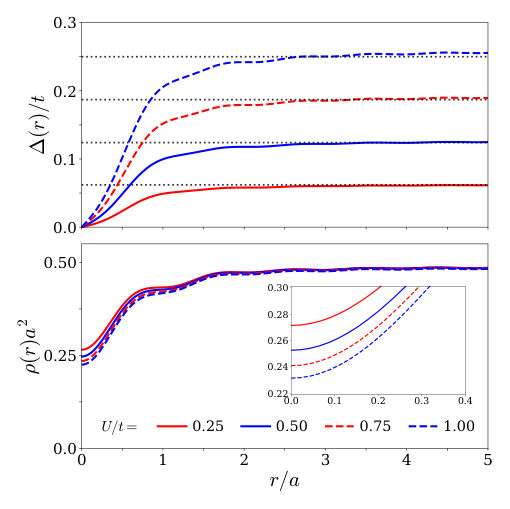
<figcaption class="paper-figure-caption"><b>Fig 3.</b> FIG. 4: (a) Radial profile of the superconducting or- der parameter ∆(r) for several interaction strengths U. The corresponding bulk momentum-space values are in- dicated by dotted horizontal black lines for comparison. (b) Local particle density ρ(r) for the same parameters. The inset shows a zoom near the vortex center (r = 0), highlighting the finite core density arising from localized bound states. All results are obtained at fixed bulk filling F = 0.49.</figcaption>
</figure>
<figure class="paper-figure-card">
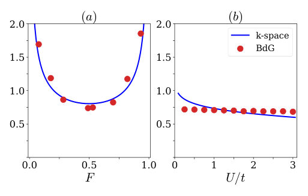
<figcaption class="paper-figure-caption"><b>Fig 4.</b> FIG. 6: Coherence length from real-space BdG calcula- tions (ξv, markers) compared with the momentum-space estimate of Eq. (14) (ξB, solid line). (a) Filling depen- dence at fixed U = 0.5t: ξv/a shows a pronounced min- imum at half-filling (F = 0.5) and diverges toward both band edges (F →0 or 1), consistent with the F −1/2 B scaling of Eq. (14). (b) Interaction dependence at fixed F = 0.49: ξv/a varies only weakly with U/t, reflecting the logarithmic factor in Eq. (14).</figcaption>
</figure>
<figure class="paper-figure-card">
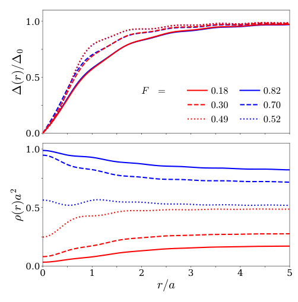
<figcaption class="paper-figure-caption"><b>Fig 5.</b> FIG. 5: (a) Normalized superconducting order param- eter ∆(r)/∆0 for different global fillings F, illustrating the evolution of the vortex-core size with particle density. The fillings are chosen with respect to the particle-hole symmetric point. (b) Corresponding local particle den- sity ρ(r)a2 across the same filling values, computed at fixed interaction strength U = 0.5t.</figcaption>
</figure>

**Summary.** The paper investigates vortex cores in flat-band superconductors using the attractive Hubbard model. It finds that the characteristic size of these cores is not determined by standard Fermi surface physics but instead emerges directly from the underlying geometric structure (quantum metric) of the electronic bands. This establishes a novel link between quantum geometry and superconducting properties.

**Why it may be interesting.** This work provides a concrete theoretical framework demonstrating how geometric properties (quantum metrics) can dictate macroscopic superconducting behavior (vortex structure) when conventional kinetic energy mechanisms fail, which is highly relevant for understanding exotic superconductivity in engineered quantum materials.

Detailed structure

**Main problem.** To determine the characteristic spatial scale (coherence length) of superconducting inhomogeneities, such as vortex cores, in flat-band superconductors where conventional BCS theory fails due to the lack of a well-defined Fermi surface.

**Main result.** The coherence length is governed by a 'geometric pair mass' arising from virtual interband processes encoded in the quantum metric, establishing the vortex core size as a direct real-space manifestation of flat-band quantum geometry.

**Method.** A combination of momentum-space mean-field analysis and self-consistent Bogoliubov-de Gennes (BdG) calculations performed on a finite disk was used to compare theoretical predictions with real-space profiles.

**Model / system.** The system is a flat-band superconductor modeled by the attractive Hubbard model on the Mielke checkerboard lattice. The analysis uses mean-field approximations derived from the underlying Hamiltonian, leading to quasiparticle spectra dependent on band structure and pairing gap.

**Key observables.** Coherence length ($\xi$), superconducting order parameter profile $\Delta(r)$, local particle density $
ho(r)$, and the quantum metric tensor $g_{k,ij}$.

**Important parameters / regimes.** Filling ($F$), interaction strength ($U/t$), and the ratio of band energies to pairing gap.

**Assumptions / limitations.** The analysis assumes uniform pairing initially, and later relies on mapping continuum momentum-space results onto real-space BdG calculations using specific cutoffs for consistency.

**Figures summary.** Figures illustrate the flat band structure, self-consistent solutions for $\Delta_0$ and $\mu$, radial profiles of $\Delta(r)$ and $
ho(r)$ showing vortex core formation, and comparisons between momentum-space estimates ($\xi_B$) and real-space BdG results ($\xi_v$).

**Paper structure.** The paper progresses from establishing the model (Hubbard/Mielke lattice) to deriving mean-field equations in momentum space. It then calculates self-consistent solutions for the gap and chemical potential, culminating in solving the full real-space BdG equations on a disk to extract the vortex core size.

Abstract

We investigate the real-space vortex structure of a flat-band superconductor described by the attractive Hubbard model on the Mielke checkerboard lattice. Using a momentum-space mean-field analysis, we derive a closed-form expression for the coherence length in terms of the quantum metric of the Bloch states and a particle-hole-symmetric pair density. Self-consistent Bogoliubov-de Gennes calculations on a finite disk confirm this prediction across a wide range of fillings and interaction strengths. The coherence length is minimized at half filling, diverges toward both band edges as the pair density vanishes, and depends only logarithmically on the interaction strength. These features differ qualitatively from the conventional BCS picture, which relies on a well-defined Fermi surface and a kinetic mechanism for pair transport. Instead, the vortex-core size is governed by a geometric pair mass arising from virtual interband processes encoded in the quantum metric. Our results establish the vortex core as a direct real-space manifestation of flat-band quantum geometry.

[↑ back to top](#top)

### [Quantum vortex in a fluid flow: negative effective mass and a novel mechanism for turbulence formation](http://arxiv.org/abs/2606.15803v1)

**Authors:** S. V. Talalov  
**Type:** theory · **Category:** other · **PDF:** <https://arxiv.org/pdf/2606.15803v1>  
**Analysis basis:** full PDF text, analyzed in chunks
**Topic relevance:** `driven-dissipative phase transition` **2/5** · `non-equilibrium dynamics` **2/5** · `non-equilibrium universality` **2/5** · `Frenkel-Kontorova` **1/5** · `Keldysh / 2PI / non-Gaussian methods` **1/5** · `correlated / nonlocal dissipation` **1/5** · `methods for driven-dissipative` **1/5**

↔ Scroll figures horizontally

<figure class="paper-figure-card">
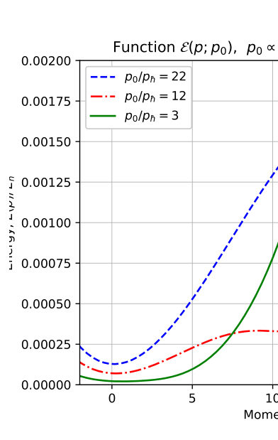
<figcaption class="paper-figure-caption"><b>Fig 1.</b> Figure 2: The transformation of the function E = E1,1(p;p0) with respect to the parameter p0 (ω = 10−9).</figcaption>
</figure>
<figure class="paper-figure-card">
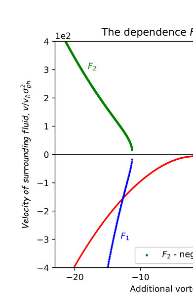
<figcaption class="paper-figure-caption"><b>Fig 2.</b> Figure 3: Dependency v = p0 M−1 eff(p0) for the different selection of the effective mass, σ2 ph = 10 −6, ω = 10 −9 .</figcaption>
</figure>
<figure class="paper-figure-card">
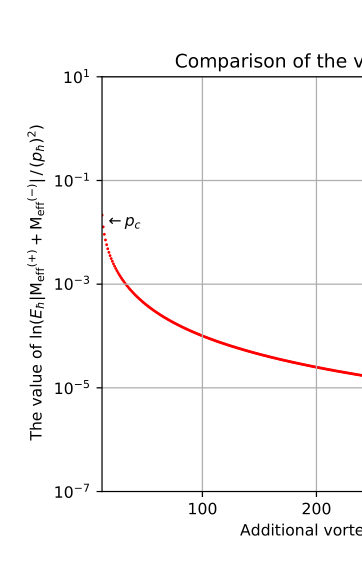
<figcaption class="paper-figure-caption"><b>Fig 3.</b> Figure 4: Dependence [M(+) eff + M(−) eff] on p0, σ2 ph = 10 −6, ω = 10 −9.</figcaption>
</figure>

**Summary.** This paper theoretically models the quantum behavior of vortex filaments in flowing fluids, revealing that the system's energy spectrum can exhibit states with negative effective mass. By analyzing how external flow momentum ($p_0$) influences this spectrum, the authors propose a framework for determining the critical quantum Reynolds number associated with the onset of turbulence.

**Why it may be interesting.** The investigation into negative effective mass in a macroscopic fluid dynamics context, derived from quantum principles, provides novel theoretical insights into non-linear wave phenomena and energy dissipation mechanisms relevant to complex physical systems.

Detailed structure

**Main problem.** The study investigates the quantum dynamics of a vortex filament moving within a flowing fluid, specifically focusing on how external flow influences the energy spectrum to reveal negative effective mass states and mechanisms for turbulence.

**Main result.** The energy spectrum $E(p)$ exhibits states with both positive and negative effective masses, and increasing the external momentum ($p_0$) can change the number of stationary points from one to three, signaling a transition towards turbulent regimes.

**Method.** The analysis employs a group-theoretical approach combined with quantization techniques applied to classical vortex filaments, deriving energy eigenvalues $E_{m,n}(p; p_0)$ that depend on external flow parameters.

**Model / system.** The system models a thin, circular quantum vortex filament in an infinite cylindrical pipe subjected to a non-zero background fluid velocity $v$. The dynamics are governed by an energy spectrum $E(p)$ derived from a Hamiltonian structure incorporating the additional momentum $p_0 = Mv$.

**Key observables.** Energy spectrum $E(p)$, effective mass ($M_{	ext{eff}}$), stationary points of $E$, and the critical quantum Reynolds number ($	ext{Re}_{c}^q$).

**Important parameters / regimes.** Fluid velocity ($v$), additional momentum ($p_0$), quantized circulation values ($\Gamma_{m,n}$), and dimensionless parameters $\kappa$ and $\kappa_0$.

**Assumptions / limitations.** The analysis relies on the Local Induction Approximation (LIA) at times, treats vortex interactions in a weakly coupled manner, and uses specific quantization techniques for closed filaments.

**Figures summary.** Figure 1 illustrates the physical setup of the vortex in flowing fluid. Figure 2 demonstrates how changing $p_0$ alters the number of stationary points in the energy function $E$. Figure 3 shows the dependency of velocity on $p_0$ for different effective mass selections.

**Paper structure.** The paper progresses by defining the physical system and Hamiltonian, developing quantization methods to find the energy spectrum $E(p; p_0)$, analyzing how external momentum $p_0$ modifies this spectrum (leading to negative masses), and finally applying these findings to establish criteria for quantum turbulence onset.

Abstract

We explore the movement of a thin, circular quantum vortex filament within an infinite cylindrical pipe.   The fluid surrounding the vortex ring moves through the pipe at a non-zero velocity denoted by $v$. Our study examines the energy spectrum $E = E(p)$, where $p$ represents the total momentum of a vortex ring.   We have demonstrated that the function $E(p)$ significantly depends on the velocity $v$. The discovered spectrum $E(p)$ reveals the existence of states with both negative and extremely large effective masses. We also explored the hypothesis regarding the existence of coupled vortex pairs possessing finite summary effective masses. Every pair consists of vortices that possess both positive and negative masses, with the magnitude of these masses being unrestricted.   In our model, the criterion for the appearance of these states is based on comparing two numbers. The first is seen as a quantum counterpart to the Reynolds number, while the second represents its critical value for a flow with a single vortex. We also explore how this studied effect might contribute to the emergence of quantum turbulence. This study discusses a method for determining the critical Reynolds number in quantum turbulence, using the proposed model as a framework. Here, we use a new quantization technique for classical closed vortex filaments developed by the author earlier.

[↑ back to top](#top)

### [Endoreversible Carnot machines with long-time reversible limit](http://arxiv.org/abs/2606.16314v1)

**Authors:** Ramandeep S. Johal, Rajeshree Chakraborty  
**Type:** theory · **Category:** statistical mechanics · **PDF:** <https://arxiv.org/pdf/2606.16314v1>  
**Analysis basis:** full PDF text, analyzed in chunks
**Topic relevance:** `non-equilibrium dynamics` **2/5** · `non-equilibrium universality` **2/5** · `Keldysh / 2PI / non-Gaussian methods` **1/5** · `analog quantum simulation` **1/5** · `correlated / nonlocal dissipation` **1/5** · `driven-dissipative phase transition` **1/5** · `methods for driven-dissipative` **1/5**

↔ Scroll figures horizontally

<figure class="paper-figure-card">
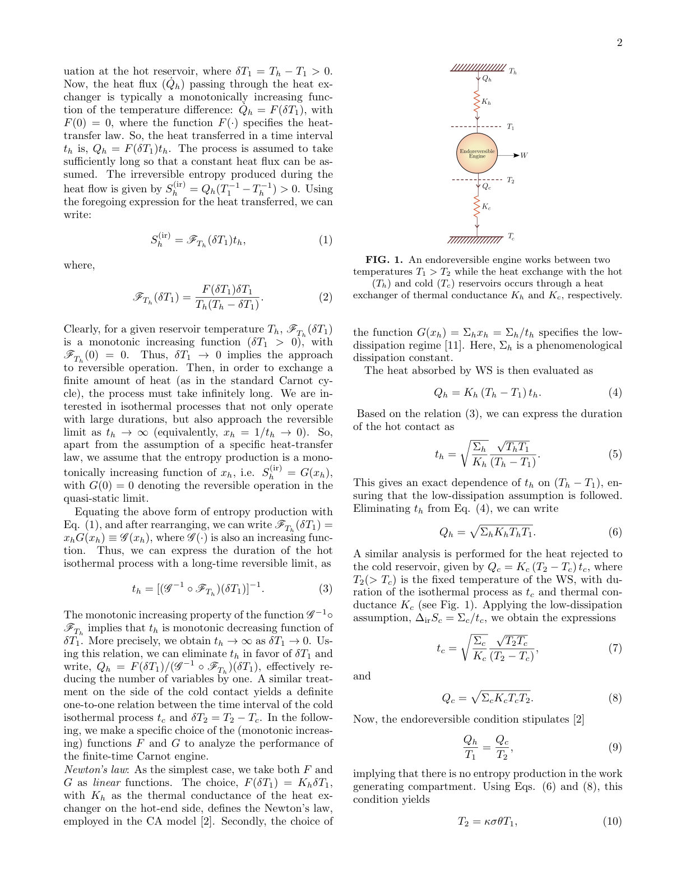
<figcaption class="paper-figure-caption"><b>Fig 1.</b> Low-resolution page preview, page 2</figcaption>
</figure>
<figure class="paper-figure-card">
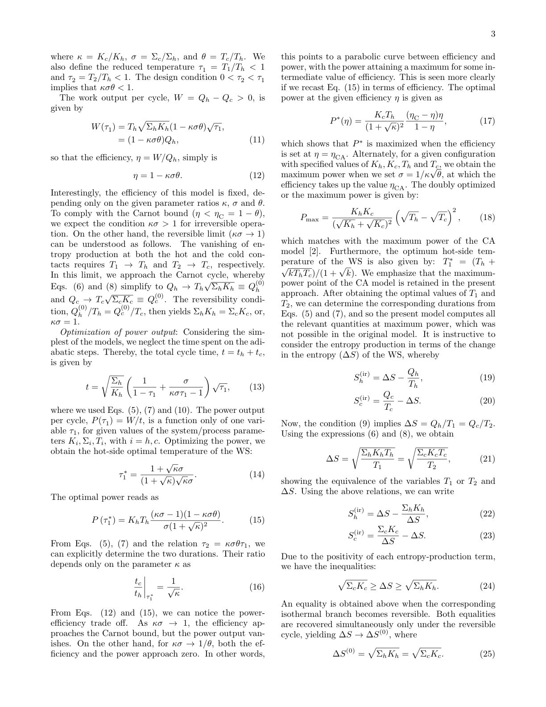
<figcaption class="paper-figure-caption"><b>Fig 2.</b> Low-resolution page preview, page 3</figcaption>
</figure>
<figure class="paper-figure-card">
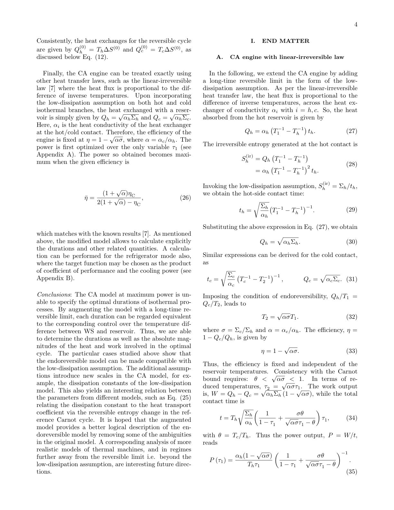
<figcaption class="paper-figure-caption"><b>Fig 3.</b> Low-resolution page preview, page 4</figcaption>
</figure>
<figure class="paper-figure-card">
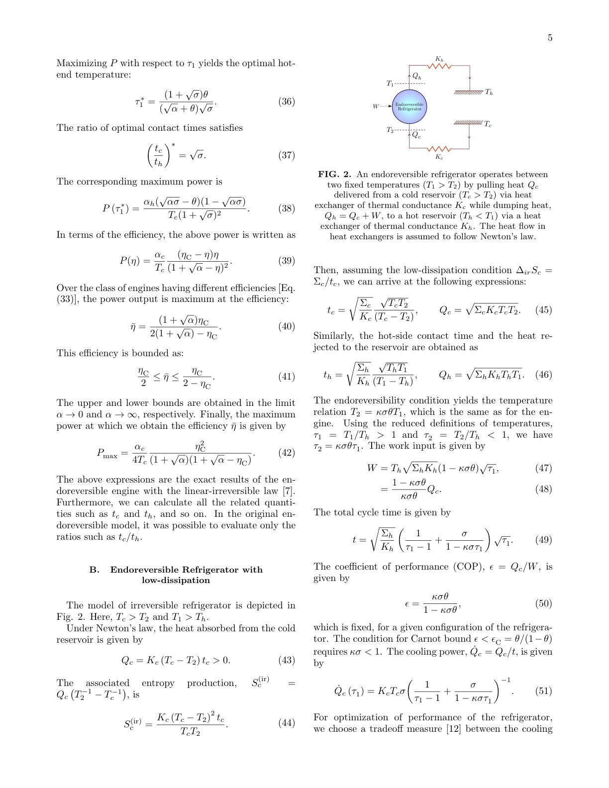
<figcaption class="paper-figure-caption"><b>Fig 4.</b> Low-resolution page preview, page 5</figcaption>
</figure>
<figure class="paper-figure-card">
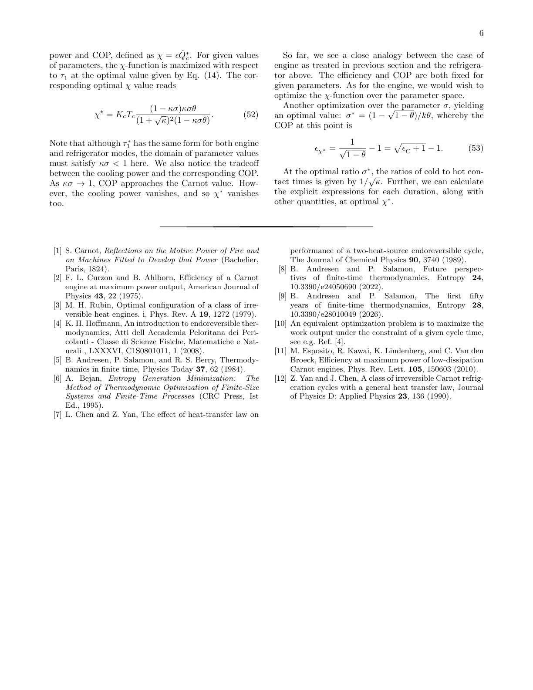
<figcaption class="paper-figure-caption"><b>Fig 5.</b> Low-resolution page preview, page 6</figcaption>
</figure>

**Summary.** This paper improves upon the Curzon-Ahlborn model for heat engines by incorporating a specific dependence of process duration on temperature differences. This modification allows the calculation of absolute energy and time scales, successfully recovering the reversible Carnot limit while optimizing the power output across different operational regimes.

**Why it may be interesting.** While focused on classical thermodynamics, the rigorous treatment of finite-time processes and approaching reversible limits shares conceptual links with non-equilibrium quantum dynamics where time scales are crucial.

Detailed structure

**Main problem.** To augment the Curzon-Ahlborn (CA) model for endoreversible Carnot machines to recover the standard Carnot cycle limit while determining absolute time and energy scales.

**Main result.** The modified model successfully determines absolute time and energy scales, showing that maximum power is achieved at an intermediate efficiency value corresponding to the CA model's optimal point.

**Method.** The analysis augments the CA model by specifying a relationship between isothermal process duration and temperature difference, utilizing the low-dissipation regime assumption for entropy production ($S_{ir} \propto 1/t$).

**Model / system.** The system is an endoreversible Carnot engine operating between hot and cold reservoirs. The model incorporates finite-time thermodynamics where irreversibility occurs during heat exchange with the environment.

**Key observables.** Efficiency ($\eta$), Work output per cycle ($W$), Maximum Power ($P_{max}$), Optimal temperature ratios ($	au^*$).

**Important parameters / regimes.** Temperature difference, process duration ($	au$), dissipation parameters ($\kappa, \sigma, 	heta$).

**Assumptions / limitations.** The core assumption is relating process duration ($t$) and temperature difference ($\delta T$) to ensure recovery of the reversible limit in the quasi-static limit; it also uses a low-dissipation approximation.

**Figures summary.** Not specified by notes, but the analysis involves deriving optimal parameters for power vs. efficiency trade-offs.

**Paper structure.** The paper first addresses the limitations of the CA model and then introduces an augmentation based on process duration dependence. It analyzes performance metrics (efficiency, work) under this modified framework, culminating in optimization procedures for maximum power output.

Abstract

The well-known Curzon-Ahlborn (CA) engine [Am. J. Phys. {\bf 43}, 22 (1975)] runs in finite time and yields a finite power output. In order to recover the standard Carnot cycle from the CA model, the limit of quasi-static operation has to be concurrent with the reversible limit, a condition strangely missing from the CA model. We augment this model by specifying the duration of the isothermal process as a monotonic decreasing function of the temperature difference between the working substance and the reservoir. As an illustration, we analyze the machine's operation in the low-dissipation regime in which the entropy production in each isothermal branch is inversely proportional to the duration of the process. The modified model is able to determine the optimal durations of isothermal processes as well as heat and work per cycle, while retaining the optimal power conditions of the CA model.

[↑ back to top](#top)

### [Self-Consistent Closure of Fractal Dimension, Nonextensive Statistics, and Non-Markovian Dynamics in Critical Systems](http://arxiv.org/abs/2606.15750v1)

**Authors:** O. Sotolongo-Costa, J. Weberszpil, M. E. Mora-Ramos  
**Type:** both · **Category:** statistical mechanics · **PDF:** <https://arxiv.org/pdf/2606.15750v1>  
**Analysis basis:** full PDF text, analyzed in chunks
**Topic relevance:** `non-equilibrium dynamics` **2/5** · `non-equilibrium universality` **2/5** · `Keldysh / 2PI / non-Gaussian methods` **1/5** · `analog quantum simulation` **1/5** · `correlated / nonlocal dissipation` **1/5** · `driven-dissipative phase transition` **1/5** · `methods for driven-dissipative` **1/5**

↔ Scroll figures horizontally

<figure class="paper-figure-card">
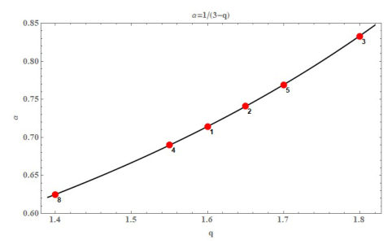
<figcaption class="paper-figure-caption"><b>Fig 1.</b> FIG. 1. Troika critical curve in (q, D, α) space. The black line represents the parametric curve {1 + 1/D, D, D/(2D −1)}. Red points correspond to experimental data from Table I. All points lie on or very close to the theoretical curve, vali- dating the closure. The numbered red points correspond to correspondingly ordered experimental data from Table I: (1- 6,7) Global seismicity, Urban networks, and Botanical net- works; (2) Regional seismicity; (3) EM precursors; (4) EEG (rodents); (5) EEG (humans); (8) Space plasma. All points lie on or very close to the theoretical curve, validating the Troika closure.</figcaption>
</figure>

**Summary.** This work unifies three seemingly independent descriptors—nonextensive entropy index ($q$), fractal dimension ($D$), and memory exponent ($\alpha$)—into a single, self-consistent algebraic closure applicable to critical systems. By deriving this 'Troika relation' from fundamental physical constraints, the authors demonstrate its remarkable universality by successfully predicting measurements across diverse fields like seismology and EEG.

**Why it may be interesting.** While focused on classical critical phenomena, the concept of non-Markovian dynamics ($\alpha$) and generalized statistics ($q$) are highly relevant to open quantum systems where memory effects and non-equilibrium dynamics dominate. The search for universal closures is a key theme in advanced statistical physics.

Detailed structure

**Main problem.** The paper aims to establish a single, self-consistent algebraic relationship connecting three key macroscopic features observed in self-organized critical systems: nonextensive thermodynamics ($q$), structural fractality ($D$), and non-Markovian dynamics ($\alpha$).

**Main result.** A unique closure relation is derived, $\alpha = D/(2D - 1)$, which leads to the universal 'Troika closure' $\alpha = 1/(3-q)$. This relationship successfully predicts measured values across eight diverse experimental systems.

**Method.** The derivation relies on imposing phase-space self-consistency constraints and utilizing known physical boundary conditions (e.g., Euclidean limit, infinite dimension limit) to uniquely determine the functional form connecting the three parameters.

**Model / system.** The study focuses on general self-organized critical systems exhibiting long-range spatio-temporal correlations, analyzed using frameworks involving Tsallis entropy and anomalous diffusion characterized by a memory exponent $\alpha$.

**Key observables.** $q$ (Tsallis index), $D$ (Hausdorff dimension), and $\alpha$ (memory exponent).

**Important parameters / regimes.** The closure is validated for various regimes, including the Euclidean limit ($\alpha(1)=1$) and the maximally subdiffusive regime ($D	o\infty$, $\alpha 	o 1/2$).

**Assumptions / limitations.** The core assumption is that phase-space self-consistency dictates a unique algebraic closure among $q$, $D$, and $\alpha$. It notes limitations regarding the $q<1$ regime.

**Figures summary.** Figure 1 illustrates the 'Troika critical curve' in $(q, D, \alpha)$ space, showing that experimental data points from various physical systems cluster closely around this theoretical parametric curve.

**Paper structure.** The paper first identifies the three independent parameters ($q, D, \alpha$) and then derives the necessary algebraic closure by enforcing self-consistency constraints. It subsequently validates this derived 'Troika relation' against a wide array of empirical data sets.

Abstract

Self-organized critical systems often exhibit three macroscopic features simultaneously: nonextensive thermodynamics (quantified by the Tsallis index $q$), structural fractality (measured by the Hausdorff dimension $D$), and non-Markovian dynamics (characterized by the memory exponent $α$). Historically, these parameters have been treated as independent, to be empirically fitted case by case. Here we demonstrate that phase-space self-consistency imposes a unique algebraic closure: $α=D/(2D-1)$. This relation, together with $q=1+1/D$ derived from the extensivity of Tsallis entropy on fractal supports, yields the known result $α=1/(3-q)$ as a consequence, not as an independent assumption. The closure contains no free parameters and satisfies the physical boundary conditions $α(1)=1$ (ballistic transport in Euclidean spaces) and $α\to1/2$ as $D\to\infty$ (maximally subdiffusive regime). We validate the Troika relation across eight independent experimental systems, including seismicity, electromagnetic precursors, EEG, urban networks, botanical architectures, and space plasma. All measured values fall within error bars of the theoretical prediction, establishing the universality of the closure.

[↑ back to top](#top)

### [Biological proper time and entropy-cost invariance in cardiac and respiratory lifespan scaling](http://arxiv.org/abs/2606.15310v1)

**Authors:** Mesfin Taye  
**Type:** theory · **Category:** statistical mechanics · **PDF:** <https://arxiv.org/pdf/2606.15310v1>  
**Analysis basis:** full PDF text, analyzed in chunks
**Topic relevance:** `non-equilibrium dynamics` **2/5** · `non-equilibrium universality` **2/5** · `Keldysh / 2PI / non-Gaussian methods` **1/5** · `correlated / nonlocal dissipation` **1/5** · `driven-dissipative phase transition` **1/5** · `methods for driven-dissipative` **1/5**

↔ Scroll figures horizontally

<figure class="paper-figure-card">
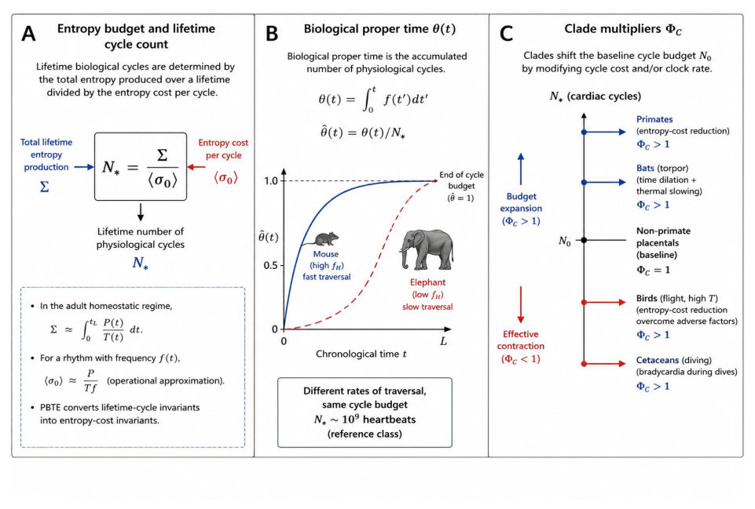
<figcaption class="paper-figure-caption"><b>Fig 1.</b> Figure 1: Schematic summary of the PBTE framework. (A) The lifetime number of physiological cycles is determined by the ratio of total lifetime entropy production Σ to the mean entropy cost per cycle ⟨σ0⟩. (B) Biological proper time θ(t) is the accumulated number of physiological cycles. Small mammals, with high cardiac frequency, traverse the reference cycle budget rapidly in chronological time, whereas large mammals traverse the same budget more slowly. (C) Clade multipliers ΦC shift the baseline cardiac budget N0 by modifying the entropy cost per cycle and/or the rate at which biological time advances. Non- primate placentals define the reference class, while primates, bats, birds, and...</figcaption>
</figure>
<figure class="paper-figure-card">
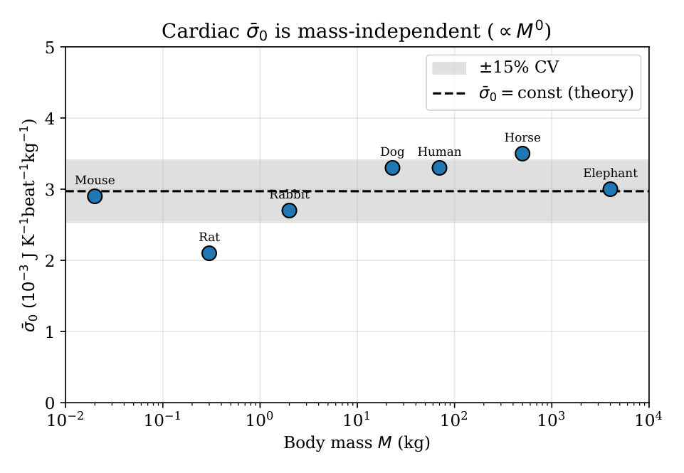
<figcaption class="paper-figure-caption"><b>Fig 2.</b> Figure 2: Mass-specific cardiac entropy cost ¯σ(M) H versus body mass. The dashed line shows the PBTE prediction ¯σ(M) H ∝M 0.</figcaption>
</figure>
<figure class="paper-figure-card">
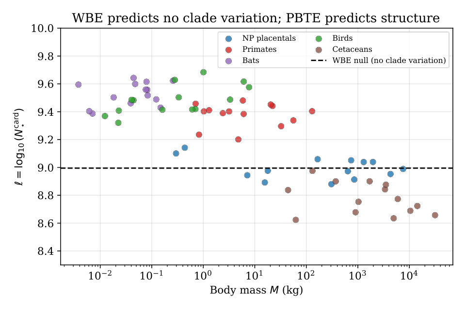
<figcaption class="paper-figure-caption"><b>Fig 3.</b> Figure 3: Lifetime cardiac cycle count ℓ= log10(N ⋆ H) versus body mass. PBTE predicts flat within-clade profiles with clade-dependent vertical offsets ∆ℓ= log10 ΦC.</figcaption>
</figure>
<figure class="paper-figure-card">
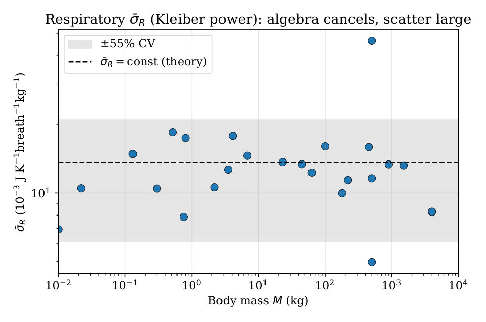
<figcaption class="paper-figure-caption"><b>Fig 4.</b> Figure 4: Mass-specific respiratory entropy cost ¯σ(M) R estimated with Kleiber metabolic power. The leading allometric exponents cancel, yielding an approximately scale-invariant respiratory entropy cost per breath per unit mass, although the scatter is larger than in the cardiac clock.</figcaption>
</figure>
<figure class="paper-figure-card">
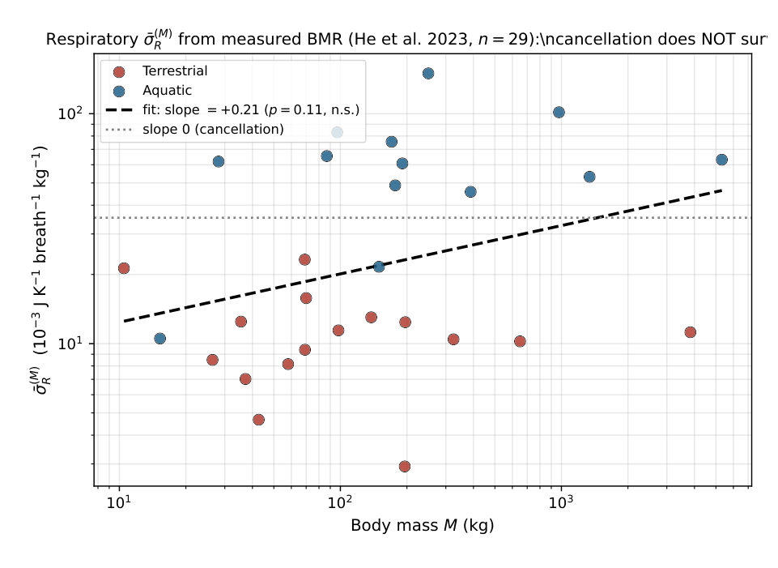
<figcaption class="paper-figure-caption"><b>Fig 5.</b> Figure 5: The non-circular test of the respiratory clock: mass cancellation does not survive measured BMR. Mass-specific respiratory entropy cost ¯σ(M) R computed from measured species-level basal metabolic rates (He et al. 2023), in which P, fR, T, and M enter as independent empirical quantities rather than through imposed Kleiber scaling. Unlike Figure 4, where flatness is partly guaranteed by construction (P ∝M 3/4), here no canonical exponent is assumed. On the n = 29 mammals with both measured BMR and measured resting breath rate, the fitted slope is +0.21 (cf. +0.005 under Kleiber power); it is not statistically resolved (p ≃0.11), and the scatter is large (coefficient of variation...</figcaption>
</figure>

**Summary.** This work develops the Principle of Biological Time Equivalence (PBTE), framing aging not by chronological time but by the consumption of a finite 'entropy budget' derived from physiological cycles. By applying open-system thermodynamics, it shows that the cardiac clock exhibits a robust, mass-independent entropy cost per beat across mammals, while the respiratory clock fails this test when measured empirically.

**Why it may be interesting.** The application of entropy balance principles to biological time provides a novel physical constraint on life history evolution. The successful prediction of mass-independent energy costs across vastly different body sizes is analogous to finding universal scaling laws in complex quantum or condensed matter systems.

Detailed structure

**Main problem.** To develop a thermodynamic framework (PBTE) explaining persistent temporal invariants, such as fixed lifetime cycle counts in cardiac or respiratory systems, across vast variations in body size and metabolism.

**Main result.** The mass-specific entropy cost per physiological cycle ($ar{\sigma}_0$) is predicted to be invariant with body mass for the cardiac clock, providing a robust thermodynamic interpretation of allometric cancellation. However, this invariance fails when tested using measured metabolic rates for the respiratory clock.

**Method.** The framework uses open-system thermodynamics ($\dot{S} = \dot{e}_p - \dot{h}_d$) to define biological proper time based on accumulated entropy production relative to an average cycle cost. This leads to a cycle-count relation $N^\star = \Sigma / \langle\sigma_0
angle$.

**Model / system.** The model treats living organisms as open, non-equilibrium dissipative systems. The core concept is the Principle of Biological Time Equivalence (PBTE), which reinterprets physiological cycles as accumulating a finite 'entropy budget' ($\Sigma$).

**Key observables.** Mass-specific entropy cost per cycle ($ar{\sigma}_0$), Lifetime Cycle Count ($N^\star$), and the derived biological proper time coordinate ($	ext{APBTE}$).

**Important parameters / regimes.** Metabolic Power ($P$), Body Temperature ($T$), Physiological Frequency ($f$), and Body Mass ($M$). The scaling laws $P \propto M^{3/4}$ and $f \propto M^{-1/4}$ are crucial.

**Assumptions / limitations.** The analysis relies on the homeostatic approximation $\dot{e}_p \simeq P/T$ and assumes that life history variations (clade differences) can be systematically parameterized by multiplicative factors ($\Phi_C$).

**Figures summary.** Figures illustrate the near-perfect flatness of the mass-specific cardiac entropy cost ($ar{\sigma}_H(M)$) vs. body mass, confirming $M^0$ scaling, while also showing that respiratory cycle counts exhibit clade-dependent vertical offsets rather than continuous mass dependence.

**Paper structure.** The paper builds from fundamental open-system thermodynamics to derive the PBTE relation ($N^\star = \Sigma / \langle\sigma_0
angle$). It then tests this theory by comparing the scaling invariance of cardiac vs. respiratory clocks, concluding with an interpretation of clade differences as structured thermodynamic strategies.

Abstract

Warm-blooded vertebrates accumulate approximately conserved numbers of physiological cycles over a natural lifetime: of order $10^9$ heartbeats and $10^8$--$3\times10^8$ breaths. These regularities are not exact constants, but their persistence across orders-of-magnitude variation in body mass, metabolic power, physiological frequency, and lifespan suggests that biological time is not measured by chronological duration alone. We develop the Principle of Biological Time Equivalence (PBTE), a thermodynamic framework in which lifetime cycle count is determined by the ratio between total lifetime entropy production and the entropy cost of one physiological cycle. Starting from the open-system entropy balance $\dot S=\dot e_p-\dot h_d$, we define the entropy cost per cycle as $σ_0=dΣ/dN$, where $dΣ$ is the entropy produced as the physiological clock advances by $dN$ cycles. For an adult homeostatic regime, this gives the cycle-count relation $N_\star=Σ/\langleσ_0\rangle$, with $Σ=\int_0^L \dot e_p(t)\,dt$, where $N_\star$ is the lifetime cycle count, $Σ$ is total lifetime entropy production, and $\langleσ_0\rangle$ is the lifetime-averaged entropy cost per cycle. In the homeostatic limit, $\dot e_p\simeq P/T$, so direct measurement of metabolic power $P$, body temperature $T$, and physiological frequency $f$ gives $σ_0\simeq P/(Tf)$. PBTE converts the empirical lifetime-cycle invariants into entropy-cost invariants. Under Kleiber metabolic scaling and quarter-power physiological-frequency scaling, the mass-specific entropy cost satisfies $\barσ_0=P/(TfM)\propto M^{3/4+1/4-1}=M^0$, providing a thermodynamic interpretation of allometric mass cancellation.

[↑ back to top](#top)

### [Entropic Necks, Dynamic Crossovers, and Fragility in Supercooled Liquids](http://arxiv.org/abs/2606.15557v1)

**Authors:** Biman Bagchi  
**Type:** theory · **Category:** statistical mechanics · **PDF:** <https://arxiv.org/pdf/2606.15557v1>  
**Analysis basis:** full PDF text, analyzed in chunks
**Topic relevance:** `non-equilibrium dynamics` **2/5** · `Keldysh / 2PI / non-Gaussian methods` **1/5** · `correlated / nonlocal dissipation` **1/5** · `driven-dissipative phase transition` **1/5** · `methods for driven-dissipative` **1/5** · `non-equilibrium universality` **1/5** · `scars & prethermalization` **1/5**

↔ Scroll figures horizontally

<figure class="paper-figure-card">
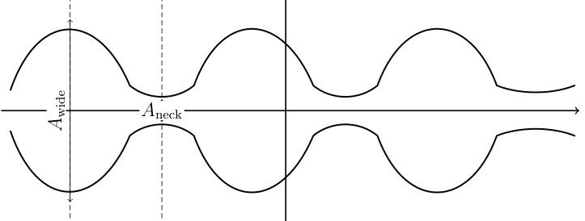
<figcaption class="paper-figure-caption"><b>Fig 1.</b> Figure 1: Schematic representation of Zwanzig’s entropic bottleneck picture in configura- tion space. The coordinate X denotes progress between neighboring metastable basins, while Q denotes a schematic transverse neck coordinate that represents the instantaneous openness or configurational accessibility of the bottleneck. Wide regions correspond to basins and narrow but finite regions correspond to entropic necks. The local width A(X) measures the effective number of accessible configurations at a given X and defines an entropic potential F(X) = −kBT ln A(X). Thus constricted regions act as entropic bar- riers that reduce the probability of interbasin passage.</figcaption>
</figure>

**Summary.** This work develops a unified theoretical framework by merging the entropic-neck picture with the Mori-Zwanzig formalism to explain glassy slowing down. It demonstrates that structural relaxation is governed by the entropy loss associated with passing through narrow configurational bottlenecks. This mechanism naturally explains the crossover from high-temperature local dynamics (Rosenfeld scaling) to low-temperature activated behavior (Adam-Gibbs relation).

**Why it may be interesting.** The rigorous application of projection operator techniques (Mori-Zwanzig) to derive non-Markovian memory kernels from geometric constraints (the bottleneck) provides a powerful template for understanding slow dynamics in complex many-body systems, applicable beyond simple liquids.

Detailed structure

**Main problem.** The work addresses the origin of the dramatic dynamical slowdown observed in supercooled liquids, specifically explaining the crossover between high-temperature local dynamics and low-temperature activated structural relaxation.

**Main result.** A unified theoretical framework is developed showing that structural relaxation is controlled by the narrowing of configurational pathways (entropic bottlenecks), naturally unifying Rosenfeld excess-entropy scaling with the Adam-Gibbs relation.

**Method.** The authors combine Zwanzig's entropic-neck picture with the Mori-Zwanzig memory-function formalism to derive an effective generalized Langevin equation for slow variables.

**Model / system.** The system is supercooled liquids whose dynamics are mapped onto a configuration space featuring metastable basins separated by narrow, entropy-controlling 'necks.' The model uses coupled slow variables: progress (interbasin motion) and neck openness.

**Key observables.** Relaxation times ($	au(T)$), configurational entropy ($S_{conf}$), excess entropy ($S_{ex}$), and the effective memory kernel components.

**Important parameters / regimes.** Temperature ($T$), Configurational Entropy ($s_c(T)$), Neck Deficit ($\Delta\Sigma_{	ext{neck}}$), and the crossover temperature $T_{cross}$.

**Assumptions / limitations.** The theory assumes that structural relaxation can be decomposed into dynamics governed by local structure (high T) and rare, cooperative passage through narrow entropic bottlenecks (low T). The derivation relies on linearizing the free-energy surface near these bottlenecks.

**Figures summary.** Figures schematically illustrate the entropic bottleneck picture, showing progress ($X$) between basins connected by a variable cross-section neck ($Q$), which dictates the effective potential and memory kernel.

**Paper structure.** The paper builds from establishing the physical problem (slowdown) to introducing the theoretical tools (Mori-Zwanzig/Entropic Neck). It then derives the dynamics, showing how eliminating the fast neck coordinate generates a long-lived, entropy-controlled memory kernel that dictates the crossover between RS and AG regimes.

Abstract

The dramatic slowdown of dynamics in supercooled liquids is accompanied by a sequence of dynamical crossovers, most notably the transition from high-temperature collision-dominated transport to low-temperature activated structural relaxation. A particularly striking manifestation of this change is the crossover from Rosenfeld excess-entropy scaling to the Adam--Gibbs relation. In this work we develop a theoretical framework based on a configuration-space extension of Zwanzig's entropic-neck picture and combine it with a Mori--Zwanzig memory-function formalism to address anomalies of supercooled liquids. The central idea is that structural relaxation is controlled by the narrowing of configurational pathways connecting metastable basins of the inherent-structure landscape. Starting from coupled slow variables describing intrabasin motion and neck fluctuations, we derive a reduced generalized Langevin description in which elimination of the neck coordinate generates a long-lived memory kernel and naturally leads to entropy-controlled activated dynamics. At high temperatures the neck is broad and readily accessible, yielding Rosenfeld-type transport governed primarily by local structural entropy. Upon cooling, progressive neck constriction produces an increasing entropy deficit, leading to Adam--Gibbs behavior and activated relaxation. Within this picture, fragility acquires a simple geometric interpretation: fragile liquids are characterized by a rapid collapse of the effective configurational neck with decreasing temperature, whereas strong liquids exhibit a much slower evolution of accessible pathways. The framework does not by itself compute the configurational entropy, mismatch penalty, or cooperative length from microscopic interactions; its aim is to provide a dynamical and geometrical interpretation.

[↑ back to top](#top)

### [Fully Quantum Algorithm for the 1-dimensional linear Lattice Boltzmann Method](http://arxiv.org/abs/2606.16514v1)

**Authors:** Mohammed Bediche, Matthijs van Waveren, Denis Ricot, Pierre Sagaut  
**Type:** both · **Category:** quantum information and computing · **PDF:** <https://arxiv.org/pdf/2606.16514v1>  
**Analysis basis:** full PDF text, analyzed in chunks
**Topic relevance:** `QC/QI experiment` **2/5** · `measurement-induced transitions` **2/5** · `quantum measurements` **2/5** · `methods for driven-dissipative` **1/5** · `non-equilibrium dynamics` **1/5**

↔ Scroll figures horizontally

<figure class="paper-figure-card">
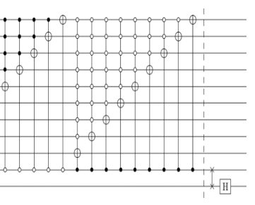
<figcaption class="paper-figure-caption"><b>Fig 1.</b> Fig. 1. The quantum circuit for one timestep. The leftmost section is the encoding step. The section with C1 and C2 is the collision step. The section to the right of it is the propagation step. The final rightmost section is the macro-states calculation step.</figcaption>
</figure>
<figure class="paper-figure-card">
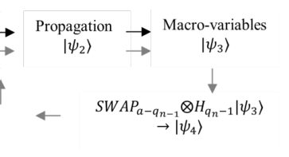
<figcaption class="paper-figure-caption"><b>Fig 2.</b> Fig. 2. The architecture of the quantum algorithm. The black arrows represent the first run of the algorithm and the grey ones the additional post treatment and the processes repeated in the m time loops afterwards for a total time of t=mΔt.</figcaption>
</figure>
<figure class="paper-figure-card">
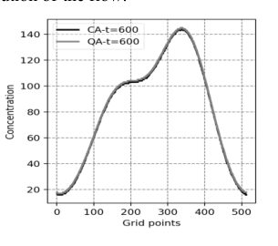
<figcaption class="paper-figure-caption"><b>Fig 3.</b> Fig. 3. Results of the fully quantum algorithm on a quantum simulator. CA corresponds to the Classical Algorithm, and QA to the Quantum Algorithm.</figcaption>
</figure>
<figure class="paper-figure-card">

<figcaption class="paper-figure-caption"><b>Fig 4.</b> Fig.4 represents the result obtained from ibm_torino, and it shows that we were successful in obtaining the same evolution of the flow as the results on the classical algorithm. We also note that increasing the number of shots from 1000 to 20000 led to</figcaption>
</figure>
<figure class="paper-figure-card">
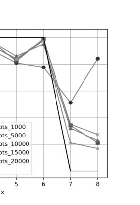
<figcaption class="paper-figure-caption"><b>Fig 5.</b> Fig. 4. Concentration results obtained from ibm_torino. The hor- izontal axis has the meshpoints.</figcaption>
</figure>

**Summary.** The paper presents a novel, fully quantum algorithm for simulating the 1D advection-diffusion equation using the Lattice Boltzmann Method. It improves upon prior hybrid methods by eliminating time-step measurements, allowing for more efficient quantum evolution. The work validates the approach via simulation and tests its feasibility on current noisy quantum hardware.

**Why it may be interesting.** This work directly applies advanced quantum computation techniques (quantum walks, unitary evolution) to solve a fundamental problem in fluid dynamics, bridging theoretical quantum algorithms with practical condensed matter/fluid physics modeling.

Detailed structure

**Main problem.** The primary goal is to develop a fully quantum algorithm capable of solving the one-dimensional linear advection-diffusion equation using the Lattice Boltzmann Method (LBM). This aims to surpass the limitations of existing hybrid quantum-classical approaches.

**Main result.** The proposed fully quantum algorithm was successfully simulated on a quantum simulator, matching classical results. While testing on physical hardware showed expected decoherence noise fluctuations, it demonstrated the potential for a measurement-free time evolution step.

**Method.** The work compares a hybrid quantum-classical scheme with an improved, fully quantum approach that minimizes measurements by encoding state information across time steps to calculate subsequent equilibrium distributions directly within the quantum circuit.

**Model / system.** The simulation targets the 1D linear advection-diffusion equation solved via the LBM. The computational platform involves quantum circuits implemented on simulators and tested on a 133-qubit quantum processor.

**Key observables.** Particle density (rho) and fluid velocity (u), extracted from the final state vector $|\psi
angle$.

**Important parameters / regimes.** The system size is defined by the number of lattice points ($N$), and time evolution involves discrete steps ($\Delta t$). The hardware test utilized a 133-qubit machine.

**Assumptions / limitations.** The key assumption for improvement is that information can be retained quantum mechanically across time steps, bypassing the classical measurement bottleneck inherent in hybrid methods. Decoherence noise limits current hardware performance.

**Figures summary.** Figures compare the fully quantum algorithm's output against classical results on a simulator and show qualitative evolution matching classical expectations when run on physical quantum hardware (ibm_torino).

**Paper structure.** The paper first reviews the state-of-the-art in quantum algorithms for PDEs, then details the existing hybrid LBM approach. The core contribution is presenting and analyzing the fully quantum algorithm, followed by simulation results and hardware testing.

Abstract

A fully quantum algorithm for solving the one-dimensional linear advection-diffusion equation using the Lattice Boltzmann method as a numerical procedure is presented in this work. We start by presenting a state of the art of the current usage of quantum algorithms for solving ordinary and partial differential equations. We then describe two algorithms for the one-dimensional Lattice Boltzmann method with two degrees of freedom. The first one is an existing hybrid quantum-classical algorithm with measurements at each time step, and the second one is our improved version, viz. a fully quantum algorithm where only one measurement is needed at the end of the algorithm. The fully quantum algorithm is first executed on a quantum simulator and then compared with a classical approach. Subsequently, the fully quantum algorithm is run on a quantum system with 133 qubits to investigate the effect of noise and the depth of the circuit on the output state. We find fluctuations in the final result due to the decoherence noise of the qubits.

[↑ back to top](#top)

### [End-Functionalized Ions Promote Stability of Highly Frustrated Phases in Diblock Copolymers](http://arxiv.org/abs/2606.15580v1)

**Authors:** Chao Duan, Zhen-Gang Wang  
**Type:** theory · **Category:** statistical mechanics · **PDF:** <https://arxiv.org/pdf/2606.15580v1>  
**Analysis basis:** full PDF text, analyzed in chunks
**Topic relevance:** `analog quantum simulation` **2/5** · `driven-dissipative phase transition` **2/5** · `Frenkel-Kontorova` **1/5** · `Keldysh / 2PI / non-Gaussian methods` **1/5** · `methods for driven-dissipative` **1/5**

↔ Scroll figures horizontally

<figure class="paper-figure-card">
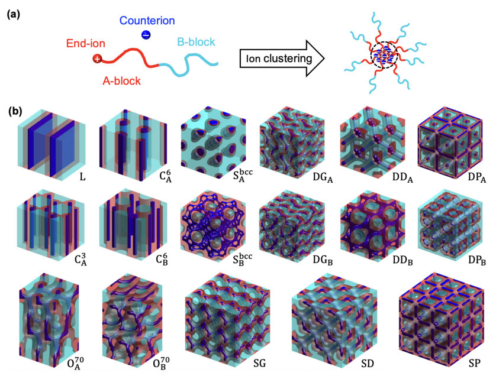
<figcaption class="paper-figure-caption"><b>Fig 1.</b> Figure 1. (a) Schematic of ion clusters and spontaneous curvature formed in the end-functionalized AB diblock copolymers. (b) Isosurface plots of corresponding polymer density and ion concentration in the candidate ordered morphologies considered in this work, including lamellae (L), hexagonal cylinders (C6 A and C6 B/C3 A), body-centered cubic spheres (Sbcc A and Sbcc B ), double- gyroid networks (DGA and DGB), double-diamond networks (DDA and DDB), double-primitive-cubic networks (DPA and DPB), orthorhombic Fddd networks (O70 A and O70 B ), as well as single-networks of gyroid, diamond and primitive-cubic (SG, SD, and SP).</figcaption>
</figure>
<figure class="paper-figure-card">
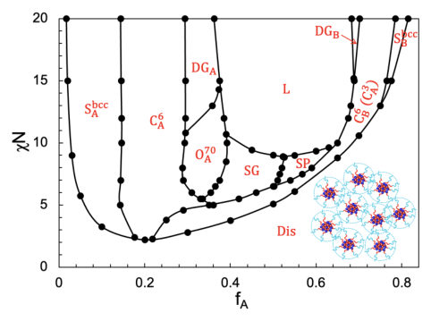
<figcaption class="paper-figure-caption"><b>Fig 2.</b> Figure 3. Phase diagram in the fA-χN plane. a = 0.3nm. Symbols denote calculated results, and lines are guides to the eye. Inset shows a schematic illustration of the disordered state, which is a liquid-like collection of ionic clusters in the form of star-like micelles.</figcaption>
</figure>
<figure class="paper-figure-card">
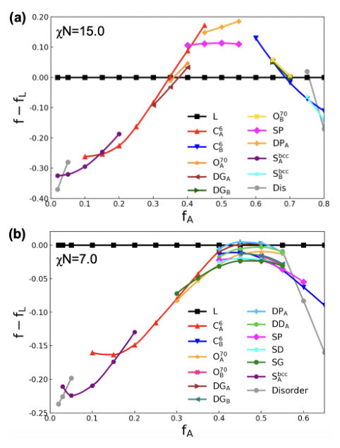
<figcaption class="paper-figure-caption"><b>Fig 3.</b> Figure 2. Free energy per chain f as a function of the volume fraction of A-block fA, relative to that of the L phase: (a) χN = 15.0, and (b) χN = 7.0. a = 0.3nm.</figcaption>
</figure>
<figure class="paper-figure-card">
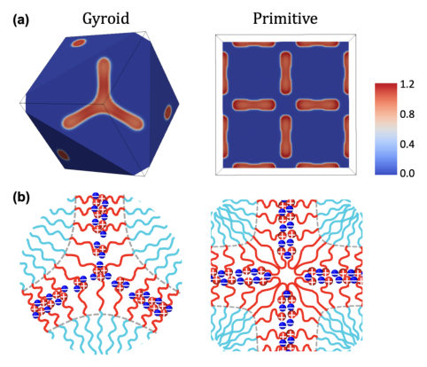
<figcaption class="paper-figure-caption"><b>Fig 4.</b> Figure 4. (a) 2D ion density profiles and (b) chain arrange- ments at the cross-sections through the node of networks for gyroid and primitive morphologies.</figcaption>
</figure>
<figure class="paper-figure-card">
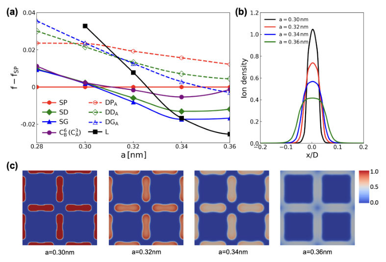
<figcaption class="paper-figure-caption"><b>Fig 5.</b> Figure 5. Effects of ion size on the relative stability of structures and ion density profiles. (a) Free energy per chain f as a function of the ion radius a, relative to that of the SP phase fSP. (b) Ion density distribution along the normal direction of the L phase with the period length D. (c) 2D ion density profiles of the SP phase for various ion radii a. χN = 7.0, fA = 0.53.</figcaption>
</figure>

**Summary.** This theoretical study demonstrates that incorporating ions only at the termini of one block in diblock copolymers can stabilize highly frustrated network phases. The stabilization arises because the resulting ion clustering generates a favorable electrostatic correlation energy that compensates for the inherent geometric packing frustration. This establishes curvature-selective end-group association as a general design principle for accessing complex polymer topologies.

**Why it may be interesting.** While focused on polymer physics, the mechanism—where local electrostatic interactions (ion correlation energy) overcome entropic/packing penalties to stabilize a specific geometry—is analogous to understanding complex ordering driven by localized quantum or strong Coulombic forces in other many-body systems.

Detailed structure

**Main problem.** The study aims to identify physical mechanisms that can stabilize topologically complex, highly frustrated phases (like the primitive cubic $	ext{Im}ar{3}	ext{m}$ network) in diblock copolymers, which are otherwise unstable due to severe packing penalties.

**Main result.** End-functionalized ions introduce a stabilizing electrostatic energy gain by promoting local ion clustering into curved geometries, allowing these frustrated phases to become thermodynamically stable below the neutral system's order-disorder transition.

**Method.** The research employs an advanced 'ion-correlation augmented self-consistent field theory,' which allows for the explicit calculation of nonperturbative electrostatic correlation energy contributions.

**Model / system.** The model uses AB diblock copolymer melts where one block is end-functionalized with localized charges (ions). The system's phase behavior is mapped by comparing the free energies of various ordered morphologies.

**Key observables.** Free energy decomposition, particularly the electrostatic correlation energy ($\Delta f_{e,corr}$), and the relative stability of candidate phases (L, $	ext{Im}ar{3}	ext{m}$, etc.).

**Important parameters / regimes.** Strong ion-correlation regime ($\Gamma \approx 25$), ion size ($a$), and segregation strength ($\chi N$).

**Assumptions / limitations.** The theory assumes a uniform dielectric constant, neglecting dielectric contrast between blocks, and initially neglects excluded volume interactions among ions.

**Figures summary.** Figures illustrate schematics of ion clusters and spontaneous curvature in the copolymers, alongside free energy comparisons for various candidate morphologies (L, $	ext{Im}ar{3}	ext{m}$, etc.).

**Paper structure.** The paper establishes the problem by noting the instability of frustrated phases; it then introduces end-functionalization as a solution. The core is the theoretical derivation showing how ion correlations stabilize these structures, culminating in the general principle that curvature-selective association dictates phase stability.

Abstract

Block copolymers self-assemble into ordered nanostructures whose geometry is governed by a competition between interfacial energy and chain conformational entropy. While this competition produces a rich sequence of morphologies, topologically complex ``frustrated'' phases such as the primitive cubic ($Im\bar{3}m$) network incur severe packing penalties and are difficult to access in neutral systems. Here we show that ions functionalized at the termini of one block in an AB diblock copolymer melt introduce a qualitatively new stabilization mechanism. Strong ion correlations drive chain-end association and generate a curvature preference toward the charged domain; the resulting tendency of end-localized ion clusters to adopt compact, curved geometries selectively favors the highly frustrated $Im\bar{3}m$ single-network over the classical phases, in a region of parameter space lying below the order-disorder transition of the neutral system. Free energy decomposition reveals that the electrostatic energy, arising almost entirely from beyond-mean-field ion correlations, becomes increasingly negative with increasing interfacial curvature. In the primitive cubic network, pronounced local segregation of ions into the cylindrical struts generates compact curved clusters whose correlation energy gain more than offsets the enhanced packing frustration, so the very geometry that is the source of packing frustration in neutral systems becomes the source of its stability here. Increasing ion size weakens correlations and suppresses the $Im\bar{3}m$ phase, consistent with experimental observations. Our results establish curvature-selective end-group association as a general principle for accessing frustrated topologies in block copolymer systems.

[↑ back to top](#top)

### [Orbital-selective band evolution and out-of-plane correlation in the FeGe-family kagome antiferromagnet ScFe$_6$Ge$_6$](http://arxiv.org/abs/2606.16245v1)

**Authors:** Jae Hyuck Lee, Ze Yan, Tongrui Li, Yichen Yang, Dirk Wulferding, Jongkeun Jung, Zhicheng Jiang, Mao Ye, Zhengtai Liu, Changyoung Kim, Soohyun Cho, Yanfeng Guo, Dawei Shen  
**Type:** both · **Category:** strongly correlated electrons · **PDF:** <https://arxiv.org/pdf/2606.16245v1>  
**Analysis basis:** full PDF text, analyzed in chunks
**Topic relevance:** `spintronics-quantum-optics interface` **2/5** · `Keldysh / 2PI / non-Gaussian methods` **1/5** · `Kondo & dissipative impurity` **1/5** · `analog quantum simulation` **1/5** · `driven-dissipative phase transition` **1/5**

↔ Scroll figures horizontally

<figure class="paper-figure-card">
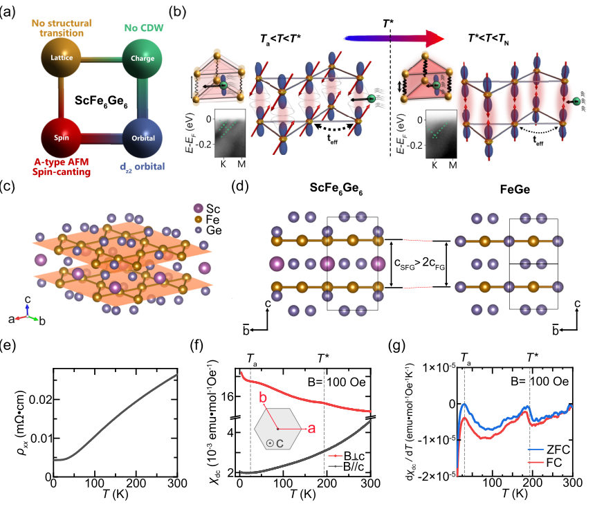
<figcaption class="paper-figure-caption"><b>Fig 1.</b> FIG. 1. Basic characterization of ScFe6Ge6. (a) Summary of the ground state of ScFe6Ge6 for each degrees of freedom. (b) Schematic depiction of the interaction between out-of-plane lattice vibrations, magnetic texture, and out-of-plane orbital electronic states in ScFe6Ge6. The magnetic order is represented by the red arrows and the induced band structure evolution is given by the green dotted lines. (c) Lattice structure of the ScFe6Ge6, where the orange planes highlight the kagome layers. (d) Side view of ScFe6Ge6 and FeGe. The rectangular black line marks the unit cell of each compound. The distances between the Fe kagome planes are compared between ScFe6Ge6 and FeGe. (e) Temperature...</figcaption>
</figure>
<figure class="paper-figure-card">
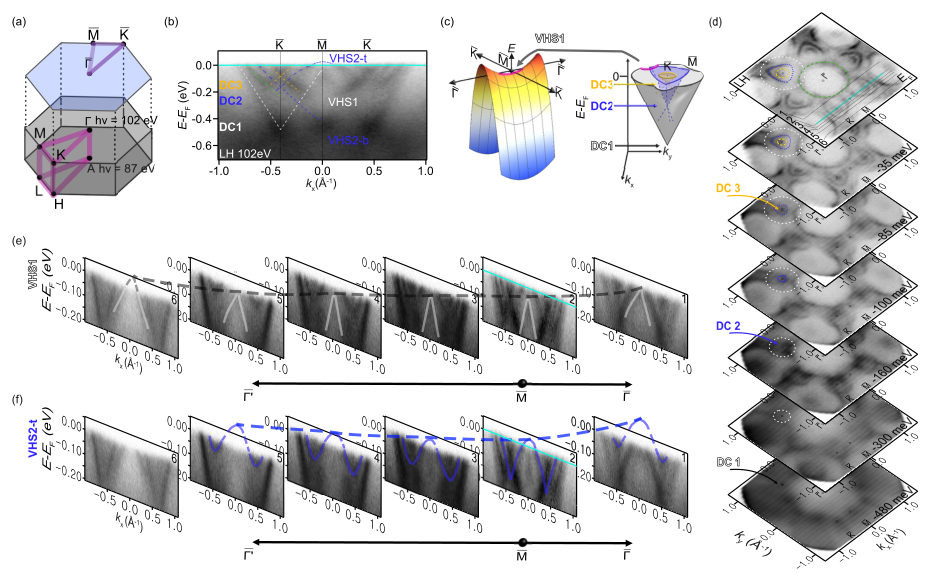
<figcaption class="paper-figure-caption"><b>Fig 2.</b> FIG. 2. Electronic band structure of ScFe6Ge6 at 9K. (a) 3D and projected 2D Brillouin zone (BZ) with each photon energy corresponding to a high-symmetry point. All ARPES data in this paper were taken with a photon energy of 102 eV. (b) Spectral image measured along the ¯K −¯ M −¯K direction under LH polarization. The white, blue, and orange dotted lines are guides to the eye for the three sets of kagome Dirac bands near EF , while the green dotted line is the hole band (HB) centered at the ¯Γ. Each of the Dirac crossings and Van Hove Singularities (VHSs) is marked accordingly. (c) Schematic diagram of the VHSs and Dirac cones of the kagome band structure in ScFe6Ge6. (d) Constant energy...</figcaption>
</figure>
<figure class="paper-figure-card">
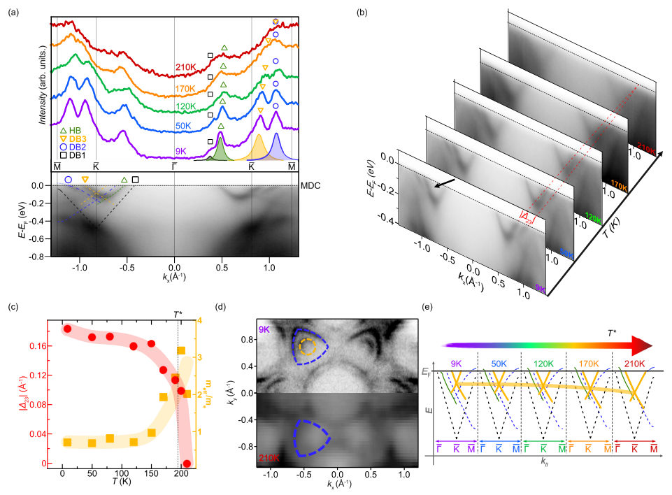
<figcaption class="paper-figure-caption"><b>Fig 3.</b> FIG. 3. Temperature dependent ARPES data. (a) The upper panel displays the temperature evolution of the momentum distribution curve (MDC) line profile taken at EF and the bottom panel is the spectral image of ¯ M −¯K −¯Γ −¯K −¯ M cut at 9 K with LH polarization for a photon energy of 102 eV. The green triangle, yellow inverse triangle, blue circle, and black square symbols each mark the peak positions of the HB, and the Dirac band (DB)s 3, 2, and 1, respectively. (b) ¯ M −¯K −¯Γ −¯K −¯ M cuts stacked along with respect to temperature. The red dotted lines are guides to the closing of band splitting (∆23) as the temperature rises. The black arrow highlights the dispersion discontinuity. (c)...</figcaption>
</figure>
<figure class="paper-figure-card">
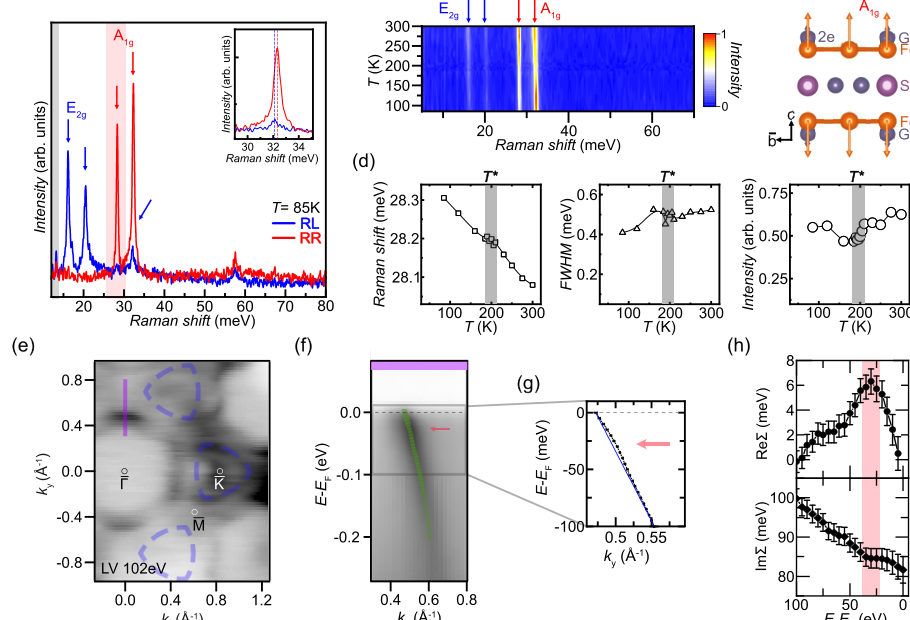
<figcaption class="paper-figure-caption"><b>Fig 4.</b> FIG. 4. Raman data of ScFe6Ge6 and the corresponding kink of the HB in ARPES result. (a) Raman spectra in the RL and RR polarization at 85 K. The inset zooms into 32 meV to highlight the energy difference between the A1g and E2g phonon modes. (b) Color contour plot of the temperature dependence in unpolarized symmetry. The blue and red arrows in (a) and (b) mark the E2g and A1g phonons, respectively. (c) Vibrational mode of the A1g phonon mode at 28 meV (A-mode). (d) Temperature dependence of the energy, FWHM, and intensity of the A-mode. (e) Fermi surface of ScFe6Ge6 at 20 K measured in the LV geometry. The blue broken triangles mark the DB2 band. (f) The ARPES intensity plot corresponding...</figcaption>
</figure>

**Summary.** This work investigates the complex interplay between magnetism, orbital physics, and lattice vibrations in kagome antiferromagnets like $	ext{ScFe}_6	ext{Ge}_6$. By comparing it to a CDW-hosting analogue ($	ext{FeGe}$), the researchers show that while charge order is absent in $	ext{ScFe}_6	ext{Ge}_6$, its magnetic transition ($T^*$) is marked by orbital-selective band shifts and magnetoelastic coupling. This highlights that out-of-plane correlations and orbital degrees of freedom are crucial drivers in these correlated materials.

**Why it may be interesting.** The detailed investigation into how subtle changes in spin order (magnetoelastic coupling) can manifest as measurable electronic band shifts or phonon anomalies provides a rich platform for studying coupled quantum orders, relevant to understanding emergent phenomena in strongly correlated systems.

Detailed structure

**Main problem.** The research aims to understand the general conditions governing spin-correlated Charge Density Wave (CDW) order in kagome antiferromagnets, contrasting systems that exhibit CDW with those that do not.

**Main result.** In $	ext{ScFe}_6	ext{Ge}_6$, a magnetic transition at $T^*=195 	ext{ K}$ is linked to orbital-selective band shifts and magnetoelastic coupling involving out-of-plane phonon modes, suggesting orbital physics plays a key role where CDW order is absent.

**Method.** The study combines multiple experimental techniques including Angle-Resolved Photoemission Spectroscopy (ARPES), Raman spectroscopy, and magnetic/resistivity measurements, supplemented by theoretical calculations.

**Model / system.** The physical system is the FeGe-family of kagome antiferromagnets, specifically comparing $	ext{FeGe}$ (CDW exhibiting) with $	ext{ScFe}_6	ext{Ge}_6$ (lacking CDW). The focus is on the interplay between spin, orbital, lattice, and charge degrees of freedom.

**Key observables.** Orbital-selective band shifts ($	ext{ARPES}$), anomalous kinks in phonon frequencies ($	ext{Raman}$), magnetic susceptibility ($\chi(T)$), and resistivity ($
ho(T)$).

**Important parameters / regimes.** $T^* = 195 	ext{ K}$ (magnetic transition temperature); $\lambda \approx 0.3$ (electron-phonon coupling constant).

**Assumptions / limitations.** The analysis relies on assigning specific orbital characters ($	ext{dz}^2$) to the observed electronic bands based on polarization dependence and analogy with known materials.

**Figures summary.** Figures illustrate structural details, magnetic susceptibility curves, $	ext{ARPES}$ spectra showing Dirac cones and band shifts across $T^*$, and Raman spectra revealing an anomalous kink in the out-of-plane phonon mode near $T^*$.

**Paper structure.** The paper systematically compares $	ext{ScFe}_6	ext{Ge}_6$ to $	ext{FeGe}$, using structural, magnetic, electronic ($	ext{ARPES}$), and vibrational ($	ext{Raman}$) measurements to pinpoint the mechanism driving anomalies at $T^*$, ultimately arguing for the enhanced role of orbital-selective physics.

Abstract

In strongly correlated materials such as high-temperature superconductors, the relation between charge density wave (CDW) order and magnetism remains an important unresolved problem. FeGe is the first kagome metal known to exhibit CDW order deep within an antiferromagnetic state, accompanied by an unconventional evolution of lattice symmetry. To elucidate the general conditions governing such spin-correlated CDW order, we investigate ScFe$_6$Ge$_6$, which lacks CDW order and therefore exhibits reduced involvement of charge degrees of freedom while retaining other properties of FeGe. Instead of a CDW order, ScFe$_6$Ge$_6$ undergoes a magnetic transition at $T^*$ = 195 K. Across this transition, angle-resolved photoemission and Raman spectroscopy reveal orbital-selective behavior confined to a single kagome Dirac band, together with electron-phonon and magnetoelastic coupling to an out-of-plane phonon mode. These results suggest that orbital-selective physics and out-of-plane correlations play enhanced roles in realizing spin-correlated CDW order in magnetic kagome metals.

[↑ back to top](#top)

### [Scheme for Transport-based Global Entanglement Distribution using Quantum Processors](http://arxiv.org/abs/2606.15421v1)

**Authors:** Erik Lundblad, Mira Abu Yahia, Antonius Johannes Renders, Andreas Walther, Adam Kinos, Lars Rippe  
**Type:** theory · **Category:** quantum information and computing · **PDF:** <https://arxiv.org/pdf/2606.15421v1>  
**Analysis basis:** full PDF text, analyzed in chunks
**Topic relevance:** `entanglement & information structure` **2/5** · `QC/QI experiment` **1/5** · `methods for driven-dissipative` **1/5** · `non-equilibrium dynamics` **1/5** · `quantum optics experiment` **1/5**

↔ Scroll figures horizontally

<figure class="paper-figure-card">
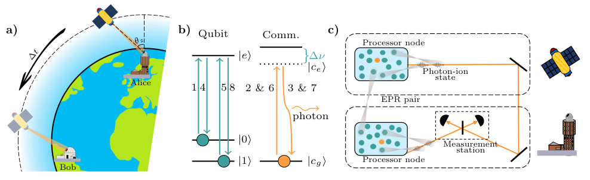
<figcaption class="paper-figure-caption"><b>Fig 1.</b> Figure 1: a) A satellite passes by ground station Alice, creating the zenith angle θz with regards to the ground station. During the overpass, a link of entangled EPR pairs is established. The satellite then travels a distance along its’ orbital path and arrives at Bob, where it alternates between generating EPR pairs with Bob and performing entanglement swapping until all EPR pairs from Alice have been converted to EPR pairs between the two ground stations. b) A qubit is initialised in the 1 √</figcaption>
</figure>
<figure class="paper-figure-card">
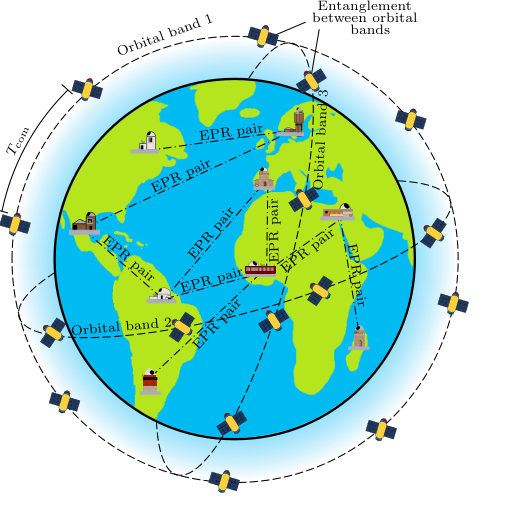
<figcaption class="paper-figure-caption"><b>Fig 2.</b> Figure 2: Constellation of satellites allowing for global coverage without additional losses.</figcaption>
</figure>
<figure class="paper-figure-card">
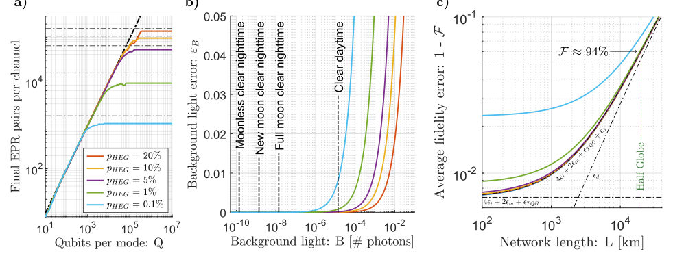
<figcaption class="paper-figure-caption"><b>Fig 3.</b> Figure 3: Performance of our scheme with respect to different parameters. In all figures the line colors represent different HEG success probabilities, as defined in the legend of part a). η0 = 0.8 is assumed. a) Simulated average number of EPR pairs distributed for a satellite with Q qubits without multiplexing. In the linear region, over 98% of the qubits end up as EPR pairs, regardless of channel efficiency. Black horizontal lines denote the theoretical maximum of distributed EPR pairs in accordance with Equation (2). It is assumed that tHEG = 20 µs, tswap = 210 µs [26] and a satellite altitude of 250 km, corresponding to a VLEO orbit. At this altitude, a trial efficiency of pHEG = 17%...</figcaption>
</figure>

**Summary.** The paper proposes a novel, highly efficient method for distributing entanglement globally using satellites equipped with rare-earth ion qubits. It models the entire process—from atmospheric channel loss to multi-stage entanglement swapping—to demonstrate that this transportation-based repeater scheme is superior to existing proposals. This work advances the feasibility roadmap for global quantum internet infrastructure.

**Why it may be interesting.** This work directly addresses the engineering challenges of scaling quantum networks by providing a detailed theoretical framework for overcoming distance limitations inherent in photonic quantum communication.

Detailed structure

**Main problem.** The primary goal is to develop a viable scheme for distributing quantum entanglement over global distances using satellite links.

**Main result.** A transportation-based, quantum repeater approach utilizing rare-earth ion qubits in satellites is theoretically shown to outperform other methods by minimizing link losses and achieving high fidelity (e.g., 93.9% globally).

**Method.** The analysis combines theoretical modeling of free-space optical channel losses with quantum information protocols like heralded entanglement generation and deterministic entanglement swapping.

**Model / system.** The system involves ground stations connected via Very Low Earth Orbit (VLEO) satellites carrying nodes based on rare-earth-ion qubits. The process models the sequential steps of generating, storing, and swapping entangled pairs across multiple passes.

**Key observables.** EPR pair fidelity ($F$), entanglement generation probability ($p_{HEG}$), achievable rate ($	ext{N}_{	ext{tot}}$), and background light induced error ($\epsilon_B$).

**Important parameters / regimes.** VLEO altitude (250 km), coherence time ($T_2 > 13$ hours), sky brightness ($H_b$), and various loss coefficients ($\eta_{at}, \eta_{SMF}$).

**Assumptions / limitations.** The scheme assumes the feasibility of active error correction, sufficient qubit coherence times, and that background light noise can be quantified using Poisson statistics.

**Figures summary.** Figures illustrate the entanglement distribution process (Satellite $	o$ Ground $	o$ Swapping), performance comparisons between different protocols (e.g., transport vs. memory-based), and the dependence of fidelity on network length or error sources.

**Paper structure.** The paper progresses from establishing the physical link efficiency ($\eta_c$) via atmospheric modeling, to developing the quantum protocol using Markov chains for pair generation, and finally comparing this repeater scheme against direct relaying or memory-limited approaches.

Abstract

We propose a scheme for distributing entanglement over global distances in a heralded manner by using satellites to physically transport entangled processor nodes with rare-earth-ion qubits. A full analysis of channel losses, errors and background light is performed to determine the fidelity and number of entangled pairs that can be distributed between two ground stations. We show that the scheme works already with a single satellite and can distribute close to the theoretical maximum number of entangled pairs that can be generated in a satellite overpass. In addition, we argue that in theory transportation-based schemes outperform other satellite-based schemes and can be scaled up to a constellation without additional channel losses. Daytime operation seems feasible as long as the sky is clear, with an EPR pair fidelity ranging from 99.3% at shorter network lengths to 93.9% with global coverage and can be further improved by active error correction or entanglement purification.

[↑ back to top](#top)

### [Enhancing Quantum Machine Learning with Anyons](http://arxiv.org/abs/2606.16090v1)

**Authors:** Da Zhang, Wen-Qiang Liu, Zhaohui Wei, Zhang-Qi Yin  
**Type:** theory · **Category:** quantum information and computing · **PDF:** <https://arxiv.org/pdf/2606.16090v1>  
**Analysis basis:** full PDF text, analyzed in chunks
**Topic relevance:** `analog quantum simulation` **2/5** · `entanglement & information structure` **1/5** · `interference shaping light` **1/5** · `quantum optics experiment` **1/5**

↔ Scroll figures horizontally

<figure class="paper-figure-card">
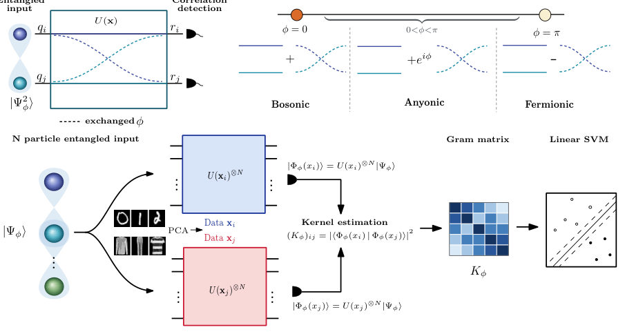
<figcaption class="paper-figure-caption"><b>Fig 1.</b> FIG. 1. a, Two-particle implementation of the encoded exchange phase. The entangled input con-</figcaption>
</figure>
<figure class="paper-figure-card">
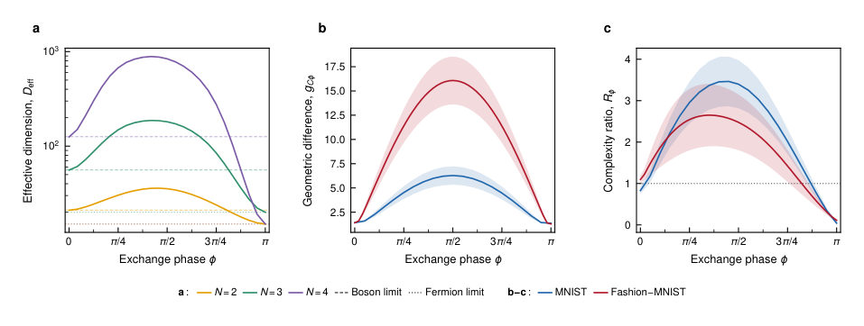
<figcaption class="paper-figure-caption"><b>Fig 2.</b> FIG. 2. a, Effective dimension Deff of the fractional-statistics feature map as a function of the</figcaption>
</figure>
<figure class="paper-figure-card">
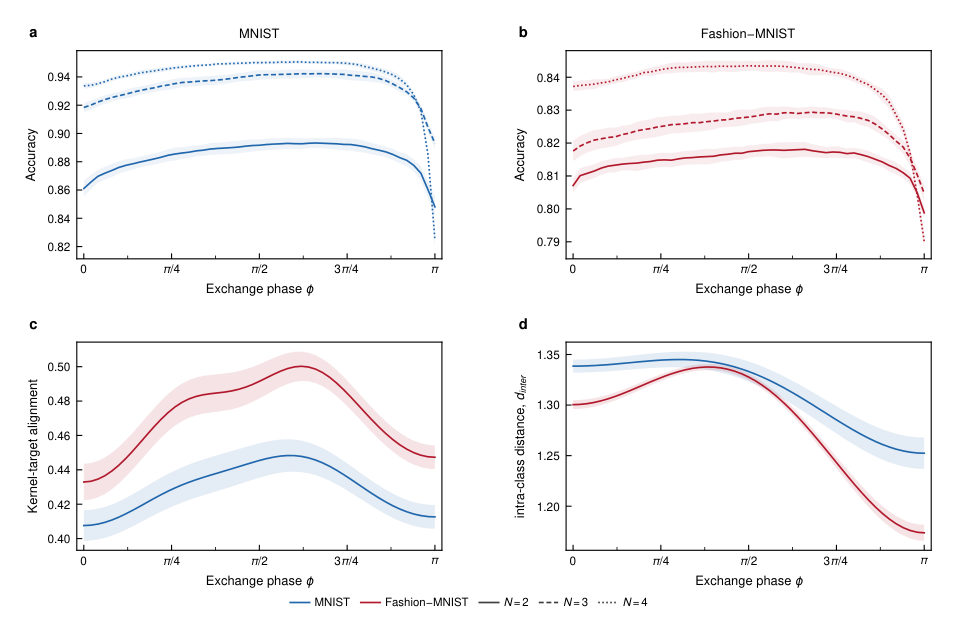
<figcaption class="paper-figure-caption"><b>Fig 3.</b> FIG. 3. a, Test accuracy of kernel SVM classifiers on MNIST as a function of the exchange phase</figcaption>
</figure>

**Summary.** This work introduces particle exchange statistics as a novel computational resource for Quantum Machine Learning. By constructing kernels that smoothly interpolate between bosonic and fermionic limits using photonic simulation, the authors show that intermediate 'anyon' statistics significantly enhance feature space geometry and classification accuracy over standard limits.

**Why it may be interesting.** It provides a concrete physical mechanism—particle statistics—to tune the representational power of quantum circuits for ML tasks, bridging fundamental condensed matter concepts (anyons) with applied quantum computation.

Detailed structure

**Main problem.** To investigate whether particle exchange statistics can serve as an intrinsic, physical design principle for enhancing Quantum Machine Learning (QML).

**Main result.** Anyonic kernels consistently outperform their bosonic and fermionic counterparts on classification benchmarks, demonstrating that exchange statistics fundamentally reshape the quantum feature space structure.

**Method.** The authors constructed a quantum kernel family interpolating between bosonic, fermionic, and anyonic statistics using photonic encoding. They analyzed this framework by calculating effective dimension, kernel geometry diagnostics, and direct machine learning performance.

**Model / system.** The model uses an N-particle quantum feature state $|\Phi_\phi(\mathbf{x})
angle$ derived from linear optical unitaries applied to entangled photons, where the exchange phase $\phi$ controls the statistics. This simulates fractional exchange behavior.

**Key observables.** Test accuracy on MNIST/Fashion-MNIST; Effective Dimension ($D_{	ext{eff}}(\phi)$); Geometric diagnostic ($gC_\phi$); Model complexity ratio ($R_\phi$).

**Important parameters / regimes.** Exchange Phase ($\phi$), which controls the statistics (Bosonic $\phi=0$, Fermionic $\phi=\pi$, Anyonic $0 < \phi < \pi$).

**Assumptions / limitations.** The model simplifies physical anyons by reducing the braid structure to permutations, retaining only the exchange phase information.

**Figures summary.** Figures show that intermediate fractional phases maximize effective dimension and geometric separation. Test accuracy plots confirm peak performance at intermediate $\phi$, while KTA and inter-class distance diagnostics also favor these non-integer statistics.

**Paper structure.** The paper systematically analyzes the quantum kernel across different exchange phases ($\phi$). It first establishes the theoretical framework using particle state preparation, then quantifies the enhancement via feature space analysis (dimension/geometry), and finally validates the findings through supervised learning benchmarks.

Abstract

The power of quantum computing and quantum machine learning relies on harnessing uniquely quantum phenomena as computational resources. While superposition, coherence and entanglement have been central to this effort, the role of particle exchange statistics remains largely unexplored. Here, we introduce a quantum kernel framework that unifies bosonic, fermionic, and anyonic (fractional) exchange statistics within a single learning paradigm. We study this family of kernels from three perspectives. At the representation level, Haar-averaged effective-dimension analysis shows that fractional exchange phases access feature-space directions inaccessible to the purely symmetric or antisymmetric limits. At the level of kernel geometry, the corresponding Gram matrices show greater separation from the distinguishable-particle baseline and reduced label-dependent model complexity. Finally, on learning benchmarks, anyonic kernels consistently outperform their bosonic and fermionic counterparts, with stronger target alignment and more favorable class geometry. Together, these findings show that exchange statistics reshape the structure and geometry of quantum feature space, leading to enhanced learning performance. Our work identifies particle exchange statistics as an overlooked computational ingredient for quantum machine learning and provides the first systematic comparison of quantum learning models across exchange phases.

[↑ back to top](#top)

### [Connectivity and Rigidity in Borosilicate Glasses](http://arxiv.org/abs/2606.16719v1)

**Authors:** Richard Kerner  
**Type:** theory · **Category:** disordered systems and neural networks · **PDF:** <https://arxiv.org/pdf/2606.16719v1>  
**Analysis basis:** full PDF text, analyzed in chunks
**Topic relevance:** `driven-dissipative phase transition` **2/5** · `Frenkel-Kontorova` **1/5** · `Keldysh / 2PI / non-Gaussian methods` **1/5**

↔ Scroll figures horizontally

<figure class="paper-figure-card">
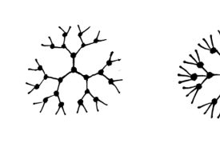
<figcaption class="paper-figure-caption"><b>Fig 1.</b> Figure 1: Three Bethe lattices made of 3, 4 and 5-coordinated atoms</figcaption>
</figure>
<figure class="paper-figure-card">
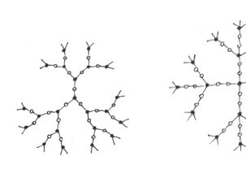
<figcaption class="paper-figure-caption"><b>Fig 2.</b> Figure 2: The same Bethe lattices diluted with 2-valenced atoms.</figcaption>
</figure>
<figure class="paper-figure-card">
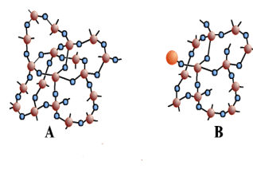
<figcaption class="paper-figure-caption"><b>Fig 3.</b> Figure 4: The pairs of bonds pointing towards closest neighbors give rise to closed rings. A simple combinatorics gives their numbers: 6 distinct rings around each Q4 unit (A), three rings only around each Q3 unit (B), and as much as 15 rings around each pair of silicon atoms “zipped” together by a Ca atom (C).</figcaption>
</figure>
<figure class="paper-figure-card">
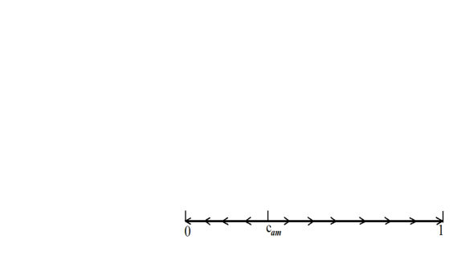
<figcaption class="paper-figure-caption"><b>Fig 4.</b> Figure 6: Two diagrams representing the behavior of the system: a) with stable solutions at c = 0 and c = 1, b) with stable solution at c = cam</figcaption>
</figure>
<figure class="paper-figure-card">
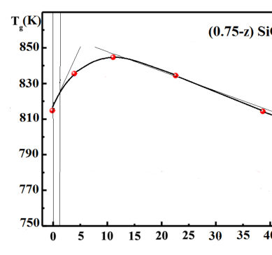
<figcaption class="paper-figure-caption"><b>Fig 5.</b> Figure 11: The curve Tg(z) displays three distinct phases: firstly, from floppy to isostatic composition, 0 &lt; z &lt; 0.10, secondly, the isostatic region 0.10 &lt; z &lt; 0.15, and finally a linear behavior accompanying the steadily decreasing rigidity of the floppy network</figcaption>
</figure>

**Summary.** This work applies theoretical models, including Stochastic Agglomeration Theory and constraint analysis, to understand the structural stability and glass transition temperature of borosilicate glasses. By linking local network connectivity (isostaticity) to overall composition, the authors successfully predict how varying the $	ext{B}_2	ext{O}_3$ content affects the material's physical properties.

**Why it may be interesting.** The application of topological concepts like isostaticity and network connectivity to predict macroscopic phase transitions ($T_g$) in amorphous materials bridges solid-state physics with graph theory, which has parallels in complex system modeling relevant to quantum networks.

Detailed structure

**Main problem.** To validate simple mathematical models for glass transition by applying them to borosilicate glasses, linking structural constraints (isostaticity) to macroscopic properties like the glass transition temperature ($T_g$).

**Main result.** The stochastic agglomeration model successfully predicts the $T_g(z)$ dependence on modifier concentration, and isostaticity theory provides necessary compositional constraints for optimal network structure.

**Method.** Theoretical modeling combining concepts from constraint theory (isostaticity) with statistical mechanics principles derived from an agglomeration model.

**Model / system.** The system studied is a mixture of $	ext{SiO}_2$ and $	ext{B}_2	ext{O}_3$ glass formers modified by $	ext{Na}_2	ext{O}$ and $	ext{CaO}$. The theory uses structural units ($	ext{Q}^4, 	ext{Q}^3$) and analyzes network connectivity via constraints to predict stability.

**Key observables.** Glass transition temperature ($T_g(z)$), average coordination number ($\langle m 
angle$), constraint ratio ($	ext{N}_c/	ext{N}_a$), and structural rigidity defect ($r$).

**Important parameters / regimes.** Modifier concentrations (e.g., $z$ for $	ext{B}_2	ext{O}_3$), optimal coordination number ($m=2.4$), and temperature dependence parameters derived from energy barriers.

**Assumptions / limitations.** The system can be modeled by stochastic agglomeration, the network structure is governed by local constraints (isostaticity), and structural integrity requires maintaining a specific average ring count (near 6).

**Figures summary.** Figures illustrate Bethe lattices used to model connectivity and show the evolution of $T_g(z)$ across different compositions.

**Paper structure.** The paper progresses from establishing the physical system (borosilicate glasses) to applying theoretical tools: first, constraint theory determines optimal local structure ($\langle m 
angle = 2.4$); second, ring counting provides compositional constraints; finally, the stochastic agglomeration model predicts the temperature dependence of $T_g$.

Abstract

We present a structural analysis of glasses formed by mix of SiO2 and B2O3 glass formers with soda and lime modifiers (Na2O and CaO), which provide a good testing ground for Stochastic Agglomeration Theory. With local structural units properly identified, we can reproduce the one-parameter glass transition temperature T_g (z) curve for the family of (0.75-z) SiO_2 + 0.15 Na_2O + 0.10 CaO + z B_2O_3 glasses studied experimentally by Smedskjaer et al.

[↑ back to top](#top)

### [Intervalley coherence and flavor polarization in three-valley moiré systems](http://arxiv.org/abs/2606.16622v1)

**Authors:** Jeyong Park, Laura Classen, Mathias S. Scheurer  
**Type:** theory · **Category:** strongly correlated electrons · **PDF:** <https://arxiv.org/pdf/2606.16622v1>  
**Analysis basis:** full PDF text, analyzed in chunks
**Topic relevance:** `analog quantum simulation` **2/5** · `Keldysh / 2PI / non-Gaussian methods` **1/5**

↔ Scroll figures horizontally

<figure class="paper-figure-card">
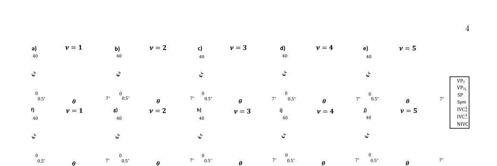
<figcaption class="paper-figure-caption"><b>Fig 1.</b> FIG. 2: Hartree-Fock phase diagram. In each panel, we show the character of the ground state (color, see legend) at the indicated filling ν as a function of twist angle θ and relative permittivity ϵr, which parametrizes the interaction strength Vq ∝1/ϵr in Eq. (3). The first (a-e) and second line (f-j) refers to AA and AB stacking, respectively. The ground states involve valley- (VP) and spin-polarized (SP) states, IVC phases (IVC3 ± and NIVC), as well as a symmetry unbroken state (Sym). See main text for precise definition. A cross (no cross) stands for gapless (gapped) phase. The system size is 12 × 12.</figcaption>
</figure>
<figure class="paper-figure-card">
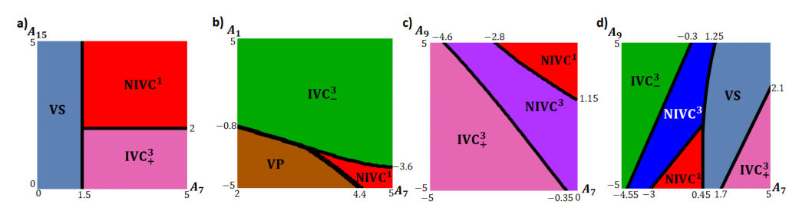
<figcaption class="paper-figure-caption"><b>Fig 2.</b> FIG. 3: Ginzburg-Landau phase diagram for different combinations of parameters specified in the text in Appendix B. VS stands for “valley symmetric”, which means that no symmetry is broken; meanwhile, all other phases are defined in the main text and Table I. We point out that for the NIVC3 state in (c) and (d), we get φ123 = 0 and φ123 = π, respectively, and we used different colors in the phase diagram to display them.</figcaption>
</figure>
<figure class="paper-figure-card">
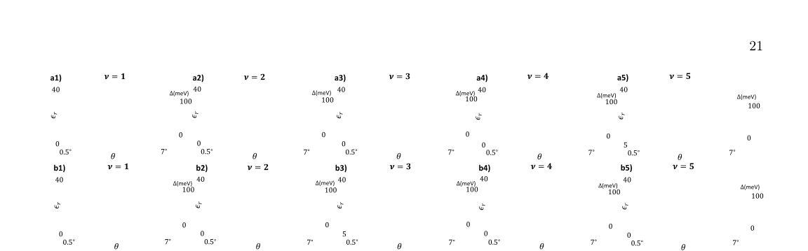
<figcaption class="paper-figure-caption"><b>Fig 3.</b> FIG. 4: HF band-gap of AA and AB stacking Indirect band-gap ∆obtained from HF as function of twist angle θ and relative permittivity ϵr for (a1 - a5) AA stacking and (b1 - b5) AB stacking at each integer filling. The system size is 12×12.</figcaption>
</figure>
<figure class="paper-figure-card">
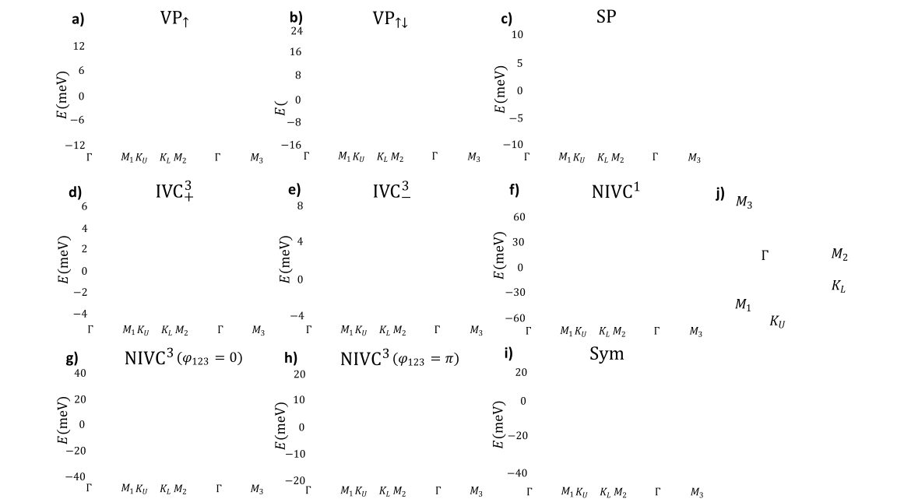
<figcaption class="paper-figure-caption"><b>Fig 4.</b> FIG. 5: HF band structure of AA stacking for each ground states HF band structure in the case of AA stacking along the high symmetry momentum path (Γ −M1 −KU −KL −M2 −Γ −M3) described in (j) for each ground state: (a) VP↑(ν = 2, θ = 3◦, ϵr = 15), (b) VP↑↓(ν = 2, θ = 3◦, ϵr = 15), (c) SP (ν = 3, θ = 3◦, ϵr = 20), (d) IVC3 + (ν = 1, θ = 1◦, ϵr = 15), (e) IVC3 −(ν = 2, θ = 1◦, ϵr = 15), (f) NIVC1 (ν = 2, θ = 6◦, ϵr = 5), (g) NIVC3 (φ123 = 0, ν = 1, θ = 6◦, ϵr = 10), (h) NIVC3 (φ123 = π, ν = 2, θ = 4◦, ϵr = 15) and (i) Sym (ν = 5, θ = 7◦, ϵr = 20). The Fermi level is located at zero energy in every figure. The system size is 12 × 12.</figcaption>
</figure>

**Summary.** This theoretical work explores emergent electronic orders in three-valley moiré superlattices. By analyzing symmetries and using advanced mean-field techniques, the authors map out a phase diagram showing competition between valley-polarized and intervalley-coherent states. The findings highlight that complex correlated physics, distinct from simpler two-valley systems like graphene, dictates the ground state depending on stacking geometry and interaction strength.

**Why it may be interesting.** The detailed symmetry analysis and classification of correlated phases in a multi-valley system provide a template for understanding complex electronic ordering driven by geometry, relevant to topological materials and strongly interacting quantum systems.

Detailed structure

**Main problem.** The study investigates interaction-induced symmetry breaking and determines the energetically favored ground state orders (IVC vs. flavor-polarized) in moiré superlattices possessing three electronic valleys.

**Main result.** The system exhibits a rich variety of intervalley-coherent (IVC) phases, which can be stabilized either by superexchange at moderate bandwidths or deep within the strong-coupling regime due to deviations from flat-metric conditions.

**Method.** The analysis combines symmetry arguments with advanced theoretical techniques, including unrestricted Hartree-Fock calculations and analytical strong-coupling frameworks applied to a continuum model.

**Model / system.** The system is modeled as moiré superlattices formed by twisting two identical materials whose low-energy physics resides near the M points, featuring three distinct valleys ($\eta=1, 2, 3$). The Hamiltonian incorporates both single-particle dispersion and repulsive density-density interactions.

**Key observables.** Valley Polarization (VP) order parameters, Intervalley Coherent Order parameters ($	ext{IVC}_{3\pm}$, NIVC), and the resulting band structure gaps/insulating nature.

**Important parameters / regimes.** Twist angle ($	heta$), interaction strength parameterized by relative permittivity ($\epsilon_r$), and electron filling fraction ($
u$).

**Assumptions / limitations.** The analysis relies on mean-field decoupling (Hartree-Fock) and often assumes the strong-coupling limit or uses perturbation theory to treat deviations from ideal conditions.

**Figures summary.** Figures illustrate moiré band structures, phase diagrams mapping ground state character ($	ext{VP}$, $	ext{IVC}$ phases) against parameters like $	heta$ and $\epsilon_r$, and order parameter dependencies on these tuning knobs.

**Paper structure.** The paper progresses by first establishing the symmetry constraints of the three-valley system, then applying strong-coupling/Hartree-Fock methods to map out candidate ordered states ($	ext{IVC}$ vs. $	ext{VP}$), and finally using perturbation theory to determine which state minimizes the total energy under varying physical conditions.

Abstract

We investigate interaction-induced symmetry breaking in moiré superlattices created by twisting two identical materials where the electronic low-energy degrees of freedom reside in the vicinity of the $M$ points. Based on general symmetry arguments, we identify and classify the possible candidate instabilities that, besides flavor polarized states, also involve a variety of intervalley-coherent (IVC) orders. This complexity is related primarily to the presence of three valleys, instead of the well-studied scenario of two, e.g., in graphene: IVC states can couple all three valleys identically, with a non-trivial sign structure, or even with different magnitudes. We study the energetics using an analytical strong-coupling framework and unrestricted Hartree-Fock applied to the full continuum model, with very good agreement between the two approaches. Interestingly, depending on stacking, IVC instabilities not only appear due to superexchange at moderate bandwidths, but also deep in the strong-coupling regime as a result of deviations from the flat-metric condition. Our work demonstrates that twisted $M$-point materials provide a rich playground for complex correlated physics and highlights differences and similarities to twisted multilayer graphene.

[↑ back to top](#top)

### [MAPS: A Novel Multi-Axial Projective Sphere for Geometrically Visualizing Higher d-Valued Quantum State-Space of Qudits](http://arxiv.org/abs/2606.15801v1)

**Authors:** Ali Al-Bayaty  
**Type:** theory · **Category:** quantum information and computing · **PDF:** <https://arxiv.org/pdf/2606.15801v1>  
**Analysis basis:** full PDF text, analyzed in chunks
**Topic relevance:** `analog quantum simulation` **2/5** · `entanglement & information structure` **1/5**

↔ Scroll figures horizontally

<figure class="paper-figure-card">
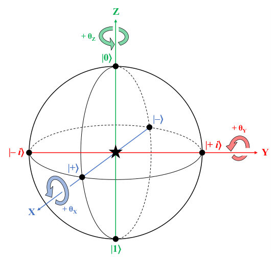
<figcaption class="paper-figure-caption"><b>Fig 1.</b> Figure 1: The Bloch sphere with three intersecting spatial axes (X, Y, and Z) for visualizing a qubit of: (i) six pure states (the circles) at the boundary ∥r∥= 1, where the |0⟩and |1⟩states intersecting the Z-axis, the |+⟩and |−⟩states intersecting the X-axis, and the |+i⟩and |−i⟩states intersecting the Y-axis, and (ii) one maximally mixed state (the star) at the origin r = 0.</figcaption>
</figure>
<figure class="paper-figure-card">
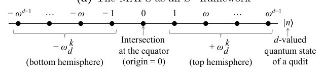
<figcaption class="paper-figure-caption"><b>Fig 2.</b> Figure 2: The geometrical construction of our generalized MAPS for visualizing d-valued quantum states of a qudit using: (a) an S2 framework, and (b) n intersecting spatial axes, where d ≥3, d −1 ≤n ≤0, ∆d = 2π/d radians, δazm = π/z radians, k ∈Z, z ∈R, and the black circles indicate the distinct relative phases of +ωk d and −ωk d.</figcaption>
</figure>
<figure class="paper-figure-card">
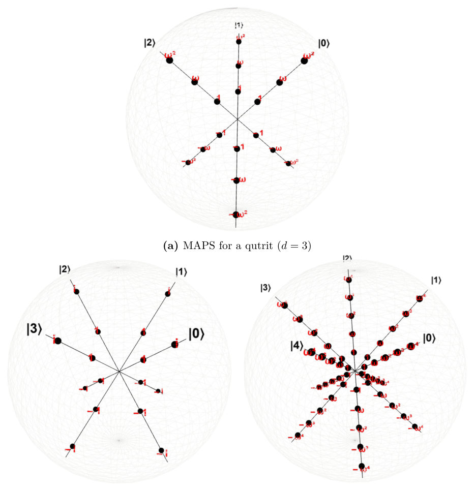
<figcaption class="paper-figure-caption"><b>Fig 3.</b> Figure 3: Three MAPS visualizing: (a) the 3-valued quantum states of a qutrit, where ±ωk 3 = {±1, ±ω, ±ω2} and ∆3 = 2π/3 radians, (b) the 4-valued quantum states of a ququadit, where ±ωk 4 = {±1, ±i} and ∆4 = π/2 radians, and (c) the 5-valued quantum states of a quintit, where ±ωk 5 = {±1, ±ω, ±ω2, ±ω3, ±ω4} and ∆5 = 2π/5 radians. Notice that δazm = π/4 radians for all three MAPS [46].</figcaption>
</figure>
<figure class="paper-figure-card">
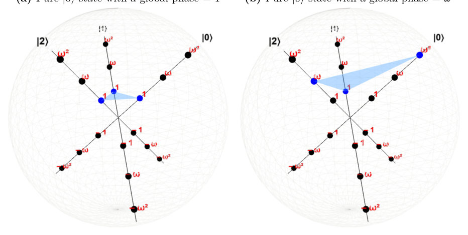
<figcaption class="paper-figure-caption"><b>Fig 4.</b> Figure 4: Four MAPS visualizing the pure and mixed states of qutrits (d = 3) with the global phases of: (a) 1, i.e., |0⟩= [1, 0, 0]T, (b) ω2, i.e., ω2|0⟩= [ω2, 0, 0]T = ω2[1, 0, 0]T, (c) 1, i.e., 1 √</figcaption>
</figure>
<figure class="paper-figure-card">
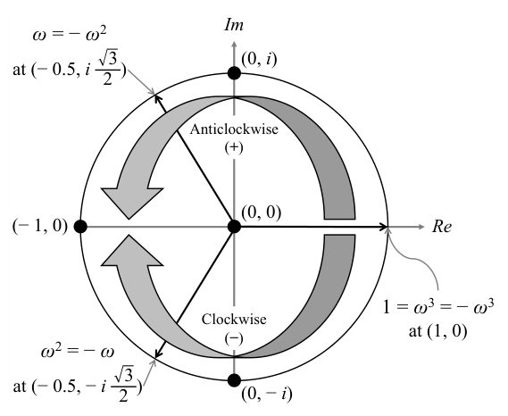
<figcaption class="paper-figure-caption"><b>Fig 5.</b> Figure 5: The two-dimensional phase plane (a real-imaginary unit circle) to calculate the phase periodicity for a qutrit (d = 3) of ±ωk 3 = ω3+α 3 = ωα 3 = −ω3−β 3 , where k = 3+α, β = k mod 3, and ∀k, α, β ∈Z.</figcaption>
</figure>

**Summary.** This paper introduces the Multi-Axial Projective Sphere (MAPS) as a novel geometric framework designed to overcome the visualization limitations encountered when representing qudit quantum states ($d \ge 3$). It successfully maps these complex state spaces onto an intuitive $S^2$ structure using multiple intersecting axes. Furthermore, the authors propose phase-axial gates ($	ext{PASS}_d$) that allow for controlled manipulation and transformation of these high-dimensional quantum states.

**Why it may be interesting.** For AMO/open systems researchers, this work provides a powerful conceptual tool to visualize complex high-dimensional phase spaces that might otherwise require intractable mathematical formalism, potentially aiding the understanding of multi-level atomic or superconducting qubit interactions.

Detailed structure

**Main problem.** The core problem is developing a generalized visualization framework for the high-dimensional quantum state-space of qudits ($d \ge 3$), as standard methods like the Bloch sphere fail beyond qubits.

**Main result.** The authors introduce the Multi-Axial Projective Sphere (MAPS), a novel $S^2$ framework that successfully visualizes global and relative phases for higher-$d$ qudit states. They also propose associated phase-axial gates ($	ext{PASS}_d$) to manipulate these states geometrically.

**Method.** The method involves constructing the MAPS using $n$ intersecting spatial axes, which provides a structural generalization of the Bloch sphere by mapping complex state spaces onto an easily visualized 3D manifold. Novel unitary gates are defined based on phase rotations along these axes.

**Model / system.** The system under study is the qudit, characterized by $d$-valued quantum states $|\psi
angle$ and density operators $
ho$. The mathematical framework relies on generalizing concepts from $	ext{SU}(2)$ to $	ext{SU}(d)$.

**Key observables.** Global and relative phases of the quantum state; visualization of pure states (circles) and mixed states (polygons/polyhedra).

**Important parameters / regimes.** The dimension $d$ of the qudit ($d \ge 3$), the number of axes $n$, and pseudo-orthogonal angles $\Delta_d = 2\pi/d$.

**Assumptions / limitations.** The primary assumption is that a generalized, simplified geometric representation (MAPS) can capture the essential topological features of high-$d$ quantum state spaces for visualization purposes.

**Figures summary.** Figures illustrate the Bloch sphere ($d=2$), and then show specific MAPS constructions for $d=3, 4, 5$. Subsequent figures demonstrate how mixed states are visualized as polygons and how $	ext{PASS}_d$ gates perform controlled swiveling and shifting of these phases.

**Paper structure.** The paper establishes the limitations of existing visualizations (Bloch sphere failure for $d \ge 3$), introduces MAPS as the solution, details its geometric construction using multiple axes, proposes the $	ext{PASS}_d$ gate operation, and concludes with examples showing state transformations and potential applications in quantum machine learning.

Abstract

Visualizing the d-valued quantum state-space of quantum systems serves as a foundational pillar for the scientific research and practical applications in quantum computing and information science, where d >= 2. The 2-valued quantum states of a qubit are elegantly visualized on the three-dimensional Bloch sphere. In contrast, expanding this geometrical paradigm to visualize higher d-valued quantum states of a qudit (d >= 3), e.g., a qutrit (d=3), ququadit (d=4), and quintit (d=5), leads to severe structural and topological complexities. This paper introduces a new generalized three-dimensional framework to effectively visualize higher d-valued quantum states of a qudit, in the aspects of ease of illustration, structural simplicity, and natural representation for researchers and engineers. We called this new framework the "multi-axial projective sphere (MAPS)", which consists of n projectional intersecting spatial axes, where d-1 <= n <= 0. We also propose a group of novel d-valued phase axial-based gates, to swivel and shift d-valued quantum states of a qudit along these n axes. Our generalized framework could be used for visualizing high-dimensional data for practical applications, e.g., machine learning, quantum machine learning, and quantum chemistry, where every axis of the MAPS represents a single feature of such data with its corresponding distinct values.

[↑ back to top](#top)

### [Quantum Illumination with Symmetry-Constrained Random Unitaries](http://arxiv.org/abs/2606.15586v1)

**Authors:** Sooryansh Asthana, Sai Vinjanampathy  
**Type:** theory · **Category:** quantum information and computing · **PDF:** <https://arxiv.org/pdf/2606.15586v1>  
**Analysis basis:** full PDF text, analyzed in chunks
**Topic relevance:** `entanglement & information structure` **2/5** · `quantum measurements` **1/5**

↔ Scroll figures horizontally

<figure class="paper-figure-card">
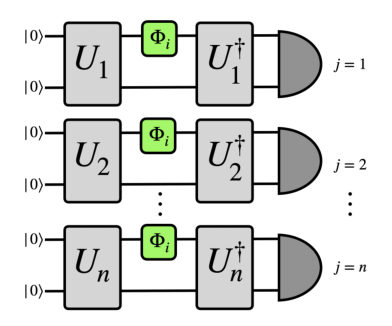
<figcaption class="paper-figure-caption"><b>Fig 1.</b> FIG. 1. Schematic of QI with Haar-random probes. For each channel use j, a Haar-random unitary Uj prepares a random signal–idler probe from the fiducial state |00⟩. The signal mode is subjected to one of two competing channel hypothe- ses Φ0 (target absent) or Φ1 (target present), while the idler is retained. Using the classical record of the sampled unitary, the receiver applies U † j and performs the final measurement. The accumulated measurement outcomes over many indepen- dent realizations are used to distinguish the two hypotheses.</figcaption>
</figure>

**Summary.** The paper analyzes Quantum Illumination by replacing idealized entangled probes with generic Haar-random states constrained by symmetry. It rigorously proves that the achievable detection rate is determined solely by the dimension of the accessible symmetry sector, establishing a deep connection between quantum channel discrimination and conservation laws in many-body physics.

**Why it may be interesting.** This work provides a powerful theoretical generalization for quantum sensing protocols, demonstrating that structural symmetries inherent in physical systems can dictate fundamental resource limits, shifting focus from state preparation to subspace engineering.

Detailed structure

**Main problem.** The paper investigates Quantum Illumination (QI), a quantum-assisted protocol for detecting weakly reflecting objects in noisy environments, by analyzing its performance using random probe states.

**Main result.** The asymptotic detection advantage is governed not by the total Hilbert space dimension but by the dimension of the accessible symmetry-protected correlation subspace. This shows that generic many-body states constrained by conservation laws can yield near-optimal quantum hypothesis testing resources.

**Method.** The analysis employs tools from quantum channel discrimination and asymptotic hypothesis testing, specifically calculating the quantum Chernoff exponent ($ar{\xi}$) for ensembles generated by Haar-random unitaries restricted to symmetry-resolved subspaces.

**Model / system.** The model is Quantum Illumination (QI), which treats target detection as distinguishing between two competing quantum channels ($\Phi_0$ vs $\Phi_1$) acting on a signal-idler probe system. The probes are generated using random unitaries sampled from the Haar measure, constrained by symmetry.

**Key observables.** The primary observable is the asymptotic Chernoff exponent ($ar{\xi}$), which quantifies the exponential decay rate of the minimum error probability in distinguishing the two channels.

**Important parameters / regimes.** Key parameters include the dimension of the accessible symmetry sector ($d_\lambda$), the noise strength, and the probe state structure (Haar-random vs. maximally entangled).

**Assumptions / limitations.** The analysis assumes that the random unitaries are sampled from the Haar measure ($\mu_H$) and relies on concentration inequalities to relate the ensemble average exponent to the mean value.

**Figures summary.** Figure 1 schematically illustrates QI using Haar-random probes with a fiducial state, demonstrating the theoretical framework for the analysis.

**Paper structure.** The paper progresses by first establishing QI as a channel discrimination problem (Chunk 2), then generalizing the probe states to random unitaries (Haar measure) (Chunk 3). It then develops the core theory by analyzing how symmetry constraints restrict the accessible correlations, showing that the rate is governed by the symmetry sector dimension rather than the full space dimension (Chunks 4 & 5).

Abstract

Quantum illumination provides a quantum advantage in detecting weakly reflecting objects embedded in a noisy environment, even when environmental noise destroys most of the initial entanglement. We investigate this advantage using Haar-random probe states constrained to symmetry-resolved subspaces. Employing tools from quantum channel discrimination and asymptotic hypothesis testing, we derive the discrimination exponents associated with Haar-random probe ensembles and identify the role of symmetry in determining their performance. We show that typical states drawn from fixed-charge sectors achieve the same asymptotic quantum-illumination advantage as maximally entangled probes. In particular, we show that the effective thermal-noise suppression and the corresponding Chernoff exponent are governed by the dimension of the accessible symmetry sector. Our results reveal that the operational resource underlying quantum illumination can be generalized from fine-tuned structure of a specific probe state to the existence of a large symmetry-protected correlation subspace. These findings establish a direct connection between quantum illumination, symmetry-resolved typicality, and quantum channel discrimination, and demonstrate that near-optimal quantum hypothesis testing resources can emerge naturally from generic many-body quantum states constrained by conservation laws.

[↑ back to top](#top)

### [Staggered Virtual-Loop-Current Order in Pseudospin-1 Dirac Flat Bands](http://arxiv.org/abs/2606.16155v1)

**Authors:** Yi-Chun Hung, Arun Bansil  
**Type:** theory · **Category:** strongly correlated electrons · **PDF:** <https://arxiv.org/pdf/2606.16155v1>  
**Analysis basis:** full PDF text, analyzed in chunks
**Topic relevance:** `analog quantum simulation` **2/5** · `Keldysh / 2PI / non-Gaussian methods` **1/5**

↔ Scroll figures horizontally

<figure class="paper-figure-card">
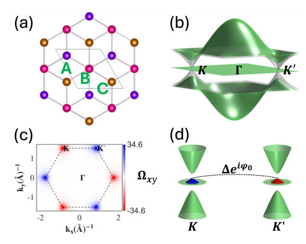
<figcaption class="paper-figure-caption"><b>Fig 1.</b> FIG. 1. Schematics of (a) the dice lattice and (b) the asso- ciated band structures for m = 0 (gray) and m ̸= 0 (green) within the first BZ. (c) Momentum-space distribution of the flat band’s Berry curvature Ωxy at m = 0.5t. (d) SVLC order originates via the coupling the particle (blue) and hole (red) on the flat band of the massive pseudospin-1 Dirac cones.</figcaption>
</figure>
<figure class="paper-figure-card">
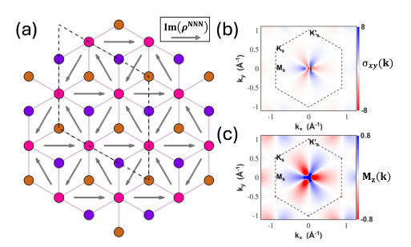
<figcaption class="paper-figure-caption"><b>Fig 2.</b> FIG. 2. (a) √</figcaption>
</figure>
<figure class="paper-figure-card">
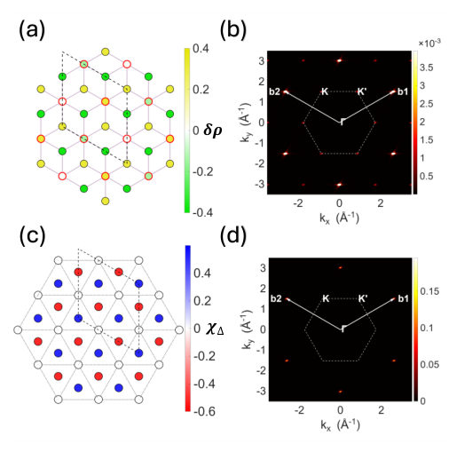
<figcaption class="paper-figure-caption"><b>Fig 3.</b> FIG. 3. (a) Sublattice-resolved charge density fluctuation δρ(r) = ρ(r) −¯ρ for the charge order, with red circles denot- ing B sublattices, and (b) the corresponding structure factor Sρ(q). (c) Emergent hexagonal lattice of the VCC χ△, with empty sites denoting B sublattices, and (d) the corresponding structure factor Sχ△(q). White dashed lines mark the BZ. b1 and b2 are the reciprocal lattice vectors.</figcaption>
</figure>
<figure class="paper-figure-card">
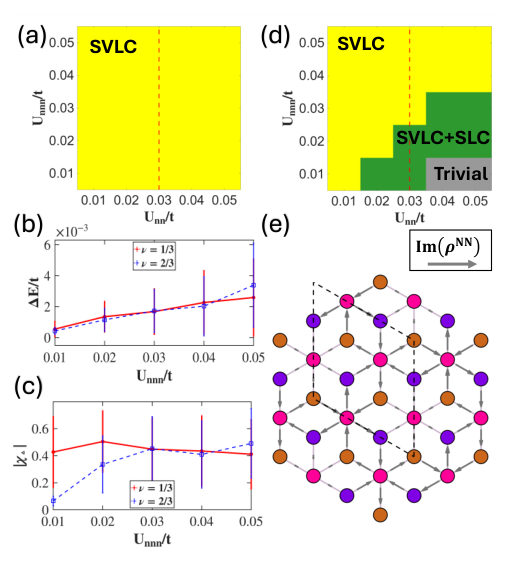
<figcaption class="paper-figure-caption"><b>Fig 4.</b> FIG. 4. (a) Phase diagram at ν = 1/3. The average and standard deviation of (b) ∆E = ⟨Esite −min(Esite)⟩and (c) |χ△|, over random seeds along UNN = 0.03t (red dashed lines in (a,b)). (d) Phase diagram at ν = 2/3. (e) √</figcaption>
</figure>

**Summary.** This paper theoretically predicts that short-range interactions induce a Staggered Virtual-Loop-Current (SVLC) order in pseudospin-1 Dirac flat bands on the dice lattice. This emergent state spontaneously breaks time-reversal symmetry, leading to measurable intrinsic anomalous Hall effects. The methodology uses advanced mean-field calculations to establish this novel ordered phase as the ground state.

**Why it may be interesting.** The work provides a detailed theoretical framework for emergent topological orders in higher-pseudospin systems, extending flat-band physics beyond established valley-based models, which is relevant for understanding correlated phases in engineered quantum materials.

Detailed structure

**Main problem.** Investigating exotic emergent orders, specifically Staggered Virtual-Loop-Current (SVLC) order, in higher-pseudospin Dirac flat bands.

**Main result.** Short-range interactions drive the SVLC and $\sqrt{3} 	imes \sqrt{3}$ charge order, spontaneously breaking time-reversal symmetry and inducing finite intrinsic anomalous Hall conductivity. This mechanism distinguishes itself from pseudospin-1/2 systems by not requiring well-defined low-energy valleys.

**Method.** The study employs Hartree-Fock (HF) approximations and Restricted Hartree-Fock (RSHF) calculations to determine the lowest energy ordered state in the weakly interacting regime.

**Model / system.** The system is a partially filled pseudospin-1 Dirac flat band realized on the dice lattice. The analysis uses tight-binding models incorporating onsite potentials and short-range density-density interactions.

**Key observables.** Staggered Virtual-Loop-Current (SVLC) order parameter, $\sqrt{3} 	imes \sqrt{3}$ charge order structure factor ($S_{
ho}(\mathbf{q})$), intrinsic Anomalous Hall Conductivity ($\sigma_{xy}$), and Orbital Magnetization ($M_z$).

**Important parameters / regimes.** Filling fractions ($
u = 1/3, 2/3$), interaction strengths ($U_{NN}, U_{NNN}$), and the mass term ($m$) used to isolate the flat band.

**Assumptions / limitations.** The analysis is performed in the weakly interacting regime, utilizing approximations like restricting calculations by $C_{3z}$ symmetry due to glassy states in the fully flat band limit.

**Figures summary.** Figures illustrate the dice lattice structure and band gaps; they show the $\sqrt{3} 	imes \sqrt{3}$ supercell with SVLC order; and momentum-space distributions of intrinsic AHC and OM are presented.

**Paper structure.** The paper progresses by establishing the physical platform (dice lattice, pseudospin-1 flat bands), developing theoretical tools (HF/RSHF calculations for interactions), deriving key diagnostics (order parameters, transport coefficients), and finally demonstrating that SVLC order is the lowest energy state compared to trivial orders.

Abstract

Although interactions are known to generate exotic phases in pseudospin-1/2 flat-band Dirac materials, it remains an open question whether the higher-pseudospin systems could realize entirely new types of orders and, if so, how such orders are governed by the nature of the underlying Dirac states. Here, we demonstrate that short-range interactions can drive a staggered virtual-loop-current (SVLC) order together with a $\sqrt{3}\times\sqrt{3}$ charge order in a partially filled pseudospin-1 Dirac flat band of the dice lattice. The virtual loop currents are shown to originate from interaction-driven quantum fluctuations of charge densities and exhibit alternating circulation between the neighboring triangular plaquettes. The resulting spontaneous time-reversal symmetry breaking is found to induce finite intrinsic anomalous Hall conductivity and orbital magnetization. The SVLC state is shown to be the lowest energy solution in restricted real-space Hartree-Fock calculations in the weakly interacting regime. The pseudospin-1 Dirac cones enter the SVLC order through the equivalence of their flat-band wavefunctions, and unlike the pseudospin-1/2 Dirac systems, do not rely on the presence of well-defined low-energy valleys in the electronic spectrum. Our study establishes higher-pseudospin Dirac systems as a new platform for investigating exotic emergent orders in flat-band physics.

[↑ back to top](#top)

### [Orbital-optimized spin-adapted multistate contracted VQE for excited states and properties on quantum hardware](http://arxiv.org/abs/2606.15489v1)

**Authors:** Erik Rosendahl Kjellgren, Karl Michael Ziems, Peter Reinholdt, Stephan P. A. Sauer, Sonia Coriani, Jacob Kongsted  
**Type:** both · **Category:** quantum information and computing · **PDF:** <https://arxiv.org/pdf/2606.15489v1>  
**Analysis basis:** full PDF text, analyzed in chunks
**Topic relevance:** `QC/QI experiment` **2/5**

↔ Scroll figures horizontally

<figure class="paper-figure-card">

<figcaption class="paper-figure-caption"><b>Fig 1.</b> FIG. 1. State-averaged ADAPT (top row) and state-averaged oo-ADAPT (bottom row) calcula-</figcaption>
</figure>
<figure class="paper-figure-card">
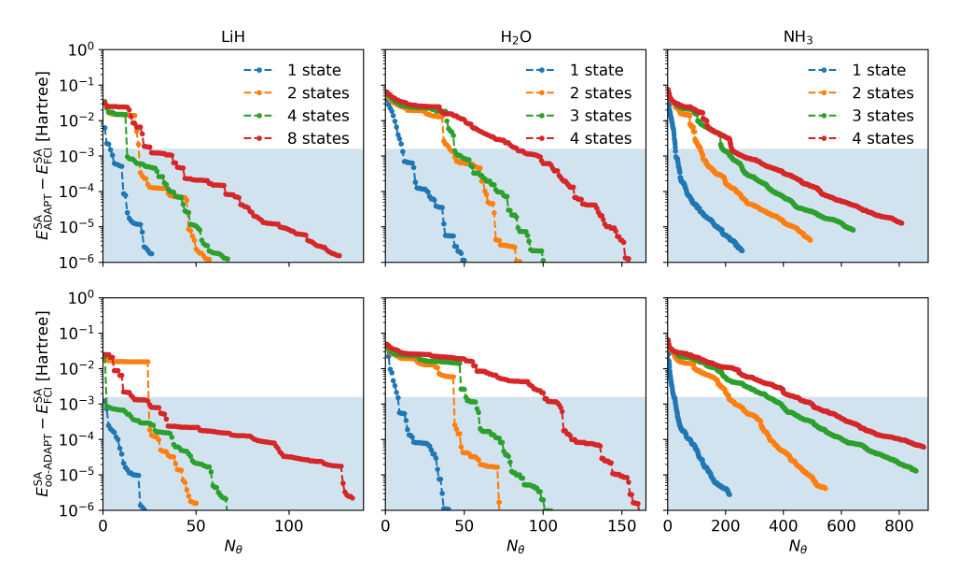
<figcaption class="paper-figure-caption"><b>Fig 2.</b> Fig. 1 shows the error in the energy with respect to the state-averaged FCI energy for</figcaption>
</figure>
<figure class="paper-figure-card">
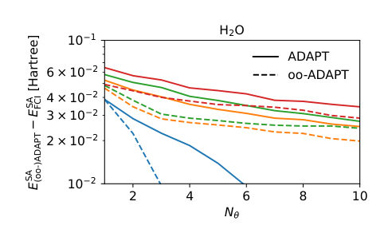
<figcaption class="paper-figure-caption"><b>Fig 3.</b> FIG. 2. Convergence of state-averaged ADAPT for the first 10 iterations for H2O. The colors</figcaption>
</figure>
<figure class="paper-figure-card">

<figcaption class="paper-figure-caption"><b>Fig 4.</b> FIG. 3. Electronic spectrum of formaldehyde (top row) using simulated noise based on</figcaption>
</figure>
<figure class="paper-figure-card">
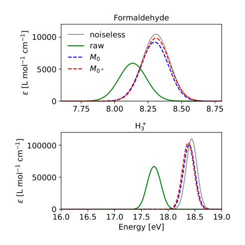
<figcaption class="paper-figure-caption"><b>Fig 5.</b> Fig. 3, the calculated spectra for formaldehyde (top plot) and H+ 3 (bottom plot) are shown.</figcaption>
</figure>

**Summary.** The paper presents an advanced variational quantum eigensolver (oo-MC-VQE) method designed to calculate electronic spectra for molecules by treating multiple excited states simultaneously. It rigorously incorporates spin symmetry and explicitly addresses the trade-off between accuracy and circuit complexity as more states are included. By testing on real quantum hardware, it demonstrates a practical pathway toward using near-term quantum devices for molecular spectroscopy.

**Why it may be interesting.** This work directly addresses the intersection of quantum chemistry (molecular structure) and near-term quantum computing limitations, providing a concrete roadmap for applying VQE to complex many-body problems like excited state spectroscopy.

Detailed structure

**Main problem.** The primary goal is to accurately compute ground and excited electronic states, along with spectroscopic properties, for molecular systems using quantum computation methods.

**Main result.** The authors successfully implemented the oo-MC-VQE method on real quantum devices, demonstrating that while state-averaging increases circuit complexity linearly, error mitigation techniques are crucial for obtaining reliable spectra.

**Method.** They employ the orbital-optimized spin-adapted multistate contracted VQE (oo-MC-VQE), which combines variational optimization over electronic states with explicit handling of spin symmetry and quantum error mitigation.

**Model / system.** The work focuses on molecular systems like LiH, H2O, and formaldehyde. The underlying physics is described by the electronic Hamiltonian ($\hat{H}$), requiring state-specific or state-averaged descriptions for excited states.

**Key observables.** Excitation energies ($\epsilon_{KL}$), transition moments, state-averaged energy ($E_{SA}$), and absorption spectra (energy vs. intensity).

**Important parameters / regimes.** The number of electronic states included in the calculation; circuit depth/number of parameters required for the ansatz.

**Assumptions / limitations.** The use of Unitary Product States ($	ext{|UPS}
angle$) as the ansatz, and reliance on error mitigation techniques (like $	ext{M}0+$) to correct for hardware noise.

**Figures summary.** Figures illustrate state-averaged energy convergence, electronic spectra for formaldehyde and H3+ under simulated and real quantum device noise conditions, comparing different error mitigation strategies.

**Paper structure.** The paper introduces the oo-MC-VQE formalism, details the gradient calculation incorporating orbital optimization ($\kappa$), discusses advanced error mitigation techniques ($	ext{M}0+$), and concludes with benchmarking results on molecular spectra using both simulation and real hardware data.

Abstract

We introduce the orbital-optimized multistate contracted variational quantum eigensolver (oo-MC-VQE) method with spin-adapted operators for the computation of ground and excited states, as well as state-specific and transition properties. The use of spin-adapted operators ensures that the spin symmetry of the reference states is conserved throughout the VQE optimization. In multistate variational approaches, achieving a balanced description of an increasing number of electronic states places growing demands on the expressibility of the underlying ansatz, thereby introducing a fundamental trade-off between accuracy and circuit complexity. We consider the effects of this trade-off explicitly and find that the number of circuit parameters required to obtain accurate results is reported to scale approximately linearly in the number of states. We further present an explicit quantum-circuit implementation of the oo-MC-VQE method and demonstrate its integration with quantum error mitigation techniques. Finally, we execute the method on real quantum devices to compute absorption spectra for two benchmark molecular systems.

[↑ back to top](#top)

### [Wavelet Localisation and Local Modulation Freezing in MRW Unwrapping](http://arxiv.org/abs/2606.15929v1)

**Authors:** Mateusz Polakowski, Zbigniew R. Struzik  
**Type:** theory · **Category:** statistical mechanics · **PDF:** <https://arxiv.org/pdf/2606.15929v1>  
**Analysis basis:** full PDF text, analyzed in chunks
**Topic relevance:** `Keldysh / 2PI / non-Gaussian methods` **1/5** · `analog quantum simulation` **1/5** · `correlated / nonlocal dissipation` **1/5** · `driven-dissipative phase transition` **1/5** · `entanglement & information structure` **1/5** · `methods for driven-dissipative` **1/5** · `non-equilibrium dynamics` **1/5** · `non-equilibrium universality` **1/5**

↔ Scroll figures horizontally

<figure class="paper-figure-card">
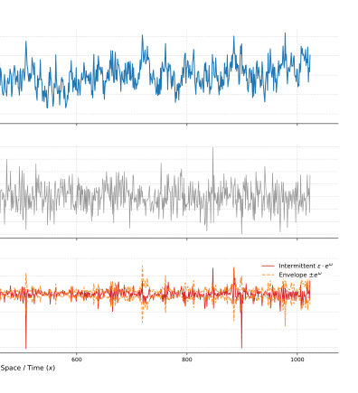
<figcaption class="paper-figure-caption"><b>Fig 1.</b> Fig. 1 From top to bottom: log-correlated carrier field ω(x), rapidly fluctuating modulation process ϵ(x) and observed intermittent field X(x) = ϵ(x)eω(x) with indicated envelope eω(x).</figcaption>
</figure>
<figure class="paper-figure-card">
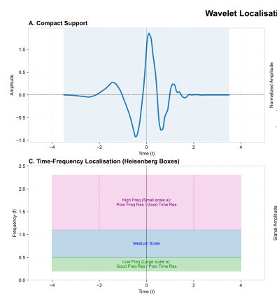
<figcaption class="paper-figure-caption"><b>Fig 2.</b> Fig. 2 Wavelet localisation geometry and time-frequency analysis principles. (A) The Daubechies 4 (db4) mother wavelet, ψ(t), shifted to center its compact support around t = 0. The shaded region highlights the finite temporal duration of the wavelet, a property that enables precise time-domain localisation. (B) Scale dependence of the wavelet family. Compressing the wavelet (a = 0.5) isolates high-frequency components, while dilating it (a = 2.0) captures low-frequency background trends. Amplitudes are scaled by a factor of 1/√a to conserve energy across all scales. (C) Time-frequency localisation limits represented via Heisenberg boxes. The varying aspect ratios illustrate the inherent...</figcaption>
</figure>
<figure class="paper-figure-card">
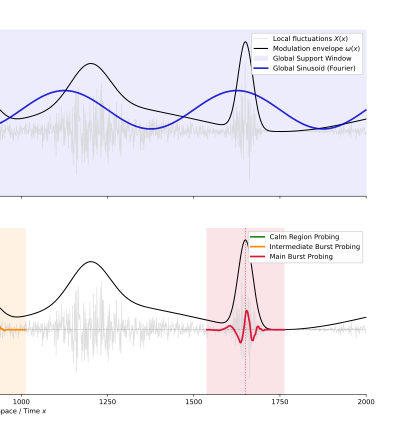
<figcaption class="paper-figure-caption"><b>Fig 3.</b> Fig. 3 Comparison of global Fourier and localised wavelet probing on an intermittent field X(x) with an underlying modulation envelope ω(x). (A) The Fourier transform utilises sinusoidal basis functions with infinite, global support across the entire domain. While this yields perfect spectral resolution, the domain-wide integration inherently mixes quiet background regions with intense, intermittent bursts, completely blurring temporal or spatial locality. (B) In contrast, wavelet analysis employs basis functions ψa,b(x) with strictly compact support. By translating the wavelet across varying spatial positions b, the integration is mathematically restricted to a confined local neighborhood...</figcaption>
</figure>
<figure class="paper-figure-card">
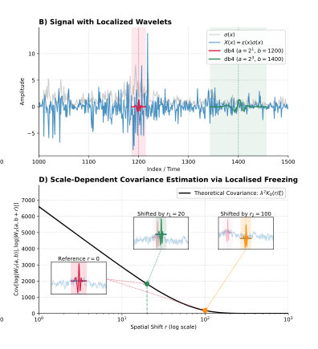
<figcaption class="paper-figure-caption"><b>Fig 4.</b> Fig. 4 Conceptual framework for extracting modulation statistics from an intermittent field. (A) An observed multiplicatively modulated signal, featuring fast local fluctuations X(x) embedded within a heterogeneous, slowly varying stochastic envelope eω(x). (B) Localised wavelet probing isolates finite spatial neighborhoods, utilising a compact wavelet ψa,b(x) at scale a and translation b. (C) The principle of local modulation freezing. Within the wavelet’s compact support, the modulation field is approximately constant, ω(x) ≈ω(b), allowing the logarithmic wavelet amplitudes to cleanly separate as log|WX(a, b)| ≈ω(b)+log |Wϵ(a, b)|. (D) Idealised localised covariance extraction....</figcaption>
</figure>
<figure class="paper-figure-card">
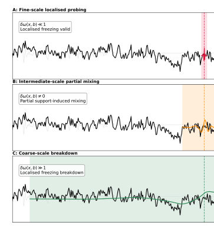
<figcaption class="paper-figure-caption"><b>Fig 5.</b> Fig. 5 A geometric illustration of why the validity of local modulation freezing is fundamentally dic- tated by the scale of observation. All panels display the identical underlying intermittent signal and its stochastic modulation envelope ω(x), varying only the wavelet support size to isolate geometric effects. (A) Fine-scale localised probing. The compact wavelet support operates within a nearly homo- geneous modulation neighborhood (δω(x, b) ≪1), perfectly preserving the idealised multiplicative separation WX(a, b) ≈eω(b)Wϵ(a, b). (B) Intermediate-scale partial mixing. As the support expands, it begins to span visibly different modulation states (δω(x, b) ̸= 0), integrating over...</figcaption>
</figure>

**Summary.** This work introduces a novel wavelet-based framework to analyze intermittent fluctuations modeled by multiplicative modulation. It shows that wavelets allow for 'local freezing,' enabling the separation of slow modulation effects from fast noise components at fine scales. Deviations observed at coarse scales are interpreted as quantifiable signatures of residual multiscale mixing, providing a powerful tool for characterizing local stochastic organization.

**Why it may be interesting.** While focused on classical stochastic processes, the concept of using localized operators (wavelets) to extract hidden structure from complex fields mirrors techniques used in analyzing quantum correlation functions or entanglement measures in spatially structured quantum systems.

Detailed structure

**Main problem.** The paper develops a localized wavelet formulation for Multifractal Random Walk (MRW) unwrapping to analyze intermittent stochastic fields.

**Main result.** Wavelet localization acts as an operational mechanism enabling multiscale probing of local multiplicative structure, revealing scale-dependent freezing regimes and structured covariance distortions at coarse scales.

**Method.** The analysis uses wavelet transforms with finite support to approximate the factorization of multiplicatively modulated fields, transforming global statistical problems into localized multiscale operator problems.

**Model / system.** The model is an intermittent stochastic field $X(x) = e^{\omega(x)}\epsilon(x)$, where $\omega(x)$ is a slowly varying modulation field and $\epsilon(x)$ is a rapidly fluctuating carrier process, analyzed within the MRW framework.

**Key observables.** Local wavelet statistics ($	ext{WX}(a, b)$), logarithmic covariance structure, and residual multiscale mixing terms ($C_{mix}$).

**Important parameters / regimes.** Wavelet support geometry, scale-dependent overlap, intermittency parameter ($\lambda_2$), and the correlation length of the modulation field ($\xi$).

**Assumptions / limitations.** The core assumption is 'local multiplicative modulation freezing,' which posits that within sufficiently localized wavelet supports, the modulation component becomes effectively constant or separable from the carrier fluctuations.

**Figures summary.** Figures illustrate the comparison between global Fourier probing and localized wavelet probing; they also show systematic 'bump'-like distortions in covariance estimates at coarse scales, confirming residual multiscale mixing effects.

**Paper structure.** The paper builds conceptually by first establishing the multiplicative modulation model, then introducing wavelets as a localization tool, deriving the local freezing approximation, and finally validating this framework through numerical simulations that map out scale-dependent successes and failures of the factorization.

Abstract

We develop a localised wavelet formulation of multifractal random walk unwrapping based on the local multiplicative modulation freezing. The framework is motivated by the observation that finite-support wavelet localisation may induce approximate local factorisation of multiplicatively modulated stochastic fields, allowing the modulation component to become effectively frozen within sufficiently localised probing domains. Within this regime, logarithmic wavelet amplitudes admit an approximate additive decomposition linking local wavelet statistics directly to the underlying modulation field. This viewpoint reformulates covariance-based MRW unwrapping as a localised multiscale operator problem in which wavelet coefficients act as finite-support probes of multiplicative organisation. The validity of the approximation depends explicitly on support geometry, scale-dependent overlap, and residual multiscale mixing generated by internal modulation variability. We show that these effects naturally produce finite-scale deviations from ideal logarithmic covariance scaling and lead to structured covariance distortions whose form depends on the interaction between the modulation field and the geometry of the wavelet representation. In the resulting framework, localisation itself becomes the operational mechanism enabling multiscale probing of local stochastic organisation. Numerical investigations using orthonormal wavelet decompositions support the proposed interpretation and demonstrate the emergence of scale-dependent freezing regimes, residual covariance mixing, and finite-support breakdown effects consistent with the theory. The proposed framework suggests a broader connection between wavelet localisation, local regularity organisation, and finite-support multiscale stochastic operators. Wavelet localisation becomes an operational mechanism for probing localised multiscale structure.

[↑ back to top](#top)

### [Distributed Acoustic Sensing for Urban Monitoring: Coverage Thresholds and Percolation](http://arxiv.org/abs/2606.17018v1)

**Authors:** Khen Cohen, Ariel Lellouch  
**Type:** theory · **Category:** statistical mechanics · **PDF:** <https://arxiv.org/pdf/2606.17018v1>  
**Analysis basis:** full PDF text, analyzed in chunks
**Topic relevance:** `analog quantum simulation` **1/5** · `correlated / nonlocal dissipation` **1/5** · `driven-dissipative phase transition` **1/5** · `entanglement & information structure` **1/5** · `exotic spin models in light-matter` **1/5** · `non-equilibrium dynamics` **1/5** · `non-equilibrium universality` **1/5**

↔ Scroll figures horizontally

<figure class="paper-figure-card">
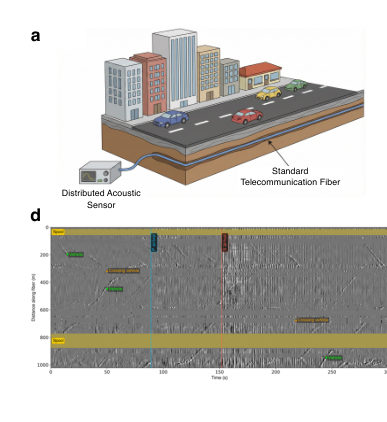
<figcaption class="paper-figure-caption"><b>Fig 1.</b> Fig. 1 Distributed Acoustic Sensor at city scale. a Schematic of the urban sensing principle. A standard telecommunication fiber (active or passive) is interrogated by a laser unit, converting the cable into a dense array of strain sensors. The system detects geophysical signals from seismic events and can monitor both traffic and seismic activity. b Optical fiber coverage in the Tel Aviv municipality (see Supplementary Materials for the full analysis) supports the conclusion that the fiber infrastructure covers most of the city streets. c The urban street map (top) is modeled as a planar graph G(V, E) (bottom), where road junctions form nodes V and street segments form edges E. Fiber-optic...</figcaption>
</figure>
<figure class="paper-figure-card">
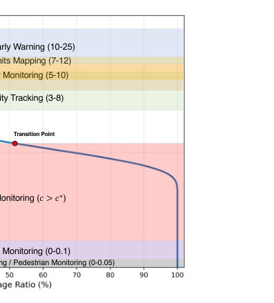
<figcaption class="paper-figure-caption"><b>Fig 2.</b> Fig. 2 Critical distance as a function of the coverage ratio, according to eq. 3, with success probability of Psuccess = 90%. The city coverage phase transition point (red circle) at c⋆≈51.6%. This curve establishes the connection between the coverage ratio and the distance length, for a typical urban area. The units of d are in topological distance, and it is derived from the km-units distance as shown in the Methods.</figcaption>
</figure>
<figure class="paper-figure-card">

<figcaption class="paper-figure-caption"><b>Fig 3.</b> Fig. 3 Traffic-optimal DAS placement for San Francisco, Berlin, and Singapore. a Cov- erage ratio of c ≈13.5%, translated to a fiber length budget of 250 km, 816 km, and 611 km for the three cities, respectively. b Coverage ratio of c ≈2.7%, for a fiber length budget of 50 km, 163 km, and 122 km for the three cities, respectively. The streets color represents each street’s marginal contribution to the optimization reward.</figcaption>
</figure>
<figure class="paper-figure-card">
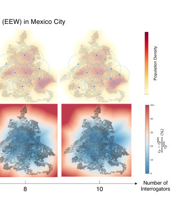
<figcaption class="paper-figure-caption"><b>Fig 4.</b> Fig. 4 Earthquake early warning in Mexico City. The optimization is for T = 4, 6, 8, 10 interrogators with 5 km minimum spacing, and M = 4. a Optimal DAS placement, with the colorbar indicating population density. b Detection delay ratio η (%) at each potential epicentre (depth h = 20 km), indicating detection time reduction.</figcaption>
</figure>
<figure class="paper-figure-card">
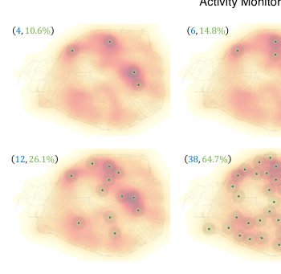
<figcaption class="paper-figure-caption"><b>Fig 5.</b> Fig. 5 Activity monitoring in Paris. Coverage disks (R = 600 m) are shown for T = 4 to T = 74 interrogators, achieving 10.6% to 91.5% population coverage respectively.</figcaption>
</figure>

**Summary.** This paper develops a theoretical framework using graph theory and percolation concepts to assess how well urban areas can be monitored using existing fiber-optic infrastructure via Distributed Acoustic Sensing (DAS). It determines critical coverage thresholds, notably $51.6\%$, that dictate the transition from localized monitoring capabilities to full city-scale network connectivity for applications like traffic tracking or early warning systems.

**Why it may be interesting.** While applied to civil engineering/geophysics, the core mathematical framework—using percolation theory to define phase transitions in a complex network structure—is highly relevant to understanding connectivity thresholds in quantum networks or disordered physical systems.

Detailed structure

**Main problem.** Analyzing the potential of Distributed Acoustic Sensing (DAS) for city-scale urban monitoring given constraints from real-world fiber infrastructure topology.

**Main result.** The analysis identifies three distinct operational regimes based on coverage: low, transition ($\approx 51.6\%$ percolation), and high coverage, providing a roadmap for smart city deployment.

**Method.** Graph Theory and Percolation Theory are used to model the urban street network connectivity as a planar graph subjected to varying levels of sensor coverage.

**Model / system.** The physical system is an existing fiber-optic network repurposed into ultra-dense seismic arrays (DAS), modeled mathematically as a planar graph $G(V, E)$ representing city streets. The analysis uses bond percolation theory on this graph structure.

**Key observables.** Coverage Ratio ($c$), Largest Connected Component Size ($S_{max}$), Percolation Threshold ($c^\star$).

**Important parameters / regimes.** Critical coverage ratio $c_\star \approx 51.6\%$; sensing range (e.g., 500 m); minimum required sensor separation ($D$); population density ($
ho$).

**Assumptions / limitations.** Availability of short-range, on-chip DAS technology; the city map can be accurately modeled as a planar graph; specific optimization goals (EEW, traffic) define placement strategies.

**Figures summary.** Figures illustrate schematic sensing principles in Tel Aviv and show quantitative results regarding critical distance vs. coverage ratio, highlighting the percolation transition point at $c_\star \approx 51.6\%$.

**Paper structure.** The paper establishes the DAS platform, models the urban map as a graph, applies percolation theory to define connectivity thresholds ($c^\star$), and then develops optimization frameworks for specific applications (EEW, traffic) based on these coverage regimes.

Abstract

Distributed Acoustic Sensing (DAS) enables the repurposing of existing fiber-optic networks as ultra-dense, long-range seismic arrays for urban monitoring. However, constraints imposed by real-world fiber infrastructure topology and components limit its use for city-scale applications. Recent technological developments have paved the way for short-range, on-chip DAS. Assuming their availability, and based on a Graph Theory framework, we show that monitoring applications fall along a coverage spectrum with two critical thresholds that define three distinct regimes. Low coverage (<10%) can, with optimal design, resolve earthquake early warning, groundwater monitoring, geological mapping, and urban activity tracking. A percolation transition occurs at 51.6% coverage, beyond which the city effectively becomes fully covered and statistical traffic monitoring is possible. Only for effectively complete coverage, infrastructure monitoring, individual vehicle tracking, and pedestrian movement analysis become possible. Thus, privacy-related risks remain very low. We show and exemplify how, for metropolises around the world, an optimal sensing network can be designed for earthquake early warning, traffic monitoring, and urban activity tracking. This framework provides a near-future roadmap for deploying urban DAS networks as a backbone of smart city sensing.

[↑ back to top](#top)

### [A Geometrically Exact Treatment of Percolation Through Voids around Faceted Regular and Structurally Disordered Grains](http://arxiv.org/abs/2606.16169v1)

**Authors:** D. J. Priour  
**Type:** theory · **Category:** disordered systems and neural networks · **PDF:** <https://arxiv.org/pdf/2606.16169v1>  
**Analysis basis:** full PDF text, analyzed in chunks
**Topic relevance:** `driven-dissipative phase transition` **1/5** · `methods for driven-dissipative` **1/5** · `non-equilibrium dynamics` **1/5** · `non-equilibrium universality` **1/5**

↔ Scroll figures horizontally

<figure class="paper-figure-card">
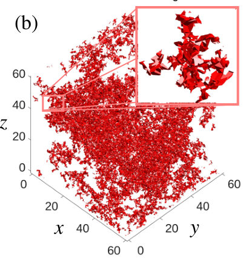
<figcaption class="paper-figure-caption"><b>Fig 1.</b> FIG. 1: (Color online) Percolating free surfaces in the case of randomly oriented cube-shaped grains shown near ηGC c in panel (a) and near ηV c in panel (b).</figcaption>
</figure>
<figure class="paper-figure-card">
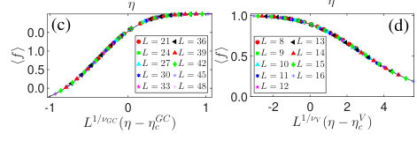
<figcaption class="paper-figure-caption"><b>Fig 2.</b> FIG. 2: (Color online) ⟨f⟩for ηGC c and ρV c are shown in panel (a) and (b), respectively for the case of randomly oriented cubes; panels (c) and (d) show the corresponding data col- lapses.</figcaption>
</figure>
<figure class="paper-figure-card">
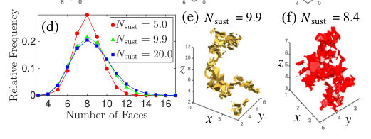
<figcaption class="paper-figure-caption"><b>Fig 3.</b> FIG. 3: (Color online) Panel (a), (b), and (c) depict sample assemblies of grains for various numbers of sustained slices Nsust. The graph in panel (d) is a frequency plot for facet number for a range of Nsust values. Panels (e) and (f) show a portion of a percolating free surface near ηGC c and ηV c , re- spectfully, for the Nsust values indicated.</figcaption>
</figure>
<figure class="paper-figure-card">
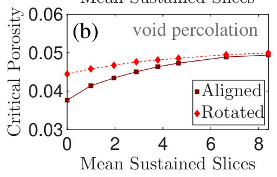
<figcaption class="paper-figure-caption"><b>Fig 4.</b> FIG. 4: (color online) Critical concentrations are shown in panels (a) and (b) for φV c = e−ηV c in the case of grain cluster and void percolation, respectively. The vertical axis for the former is the critical excluded volume φc = 1−e−ηGC c and the critical porosity e−ηV c for the latter. Monte Carlo statistical errors are smaller than the symbol sizes.</figcaption>
</figure>

**Summary.** This paper presents a geometrically exact method for calculating percolation thresholds in porous materials containing faceted or randomly fractured grains. It distinguishes between grain cluster percolation and void percolation, achieving high accuracy even when structural disorder is introduced. The work demonstrates that the critical porosity for void networks stabilizes at 5% under conditions of aggressive fragmentation.

**Why it may be interesting.** While focused on geometry and percolation, the rigorous application of advanced numerical techniques to characterize phase transitions in disordered media connects conceptually to critical phenomena studied in complex correlated systems.

Detailed structure

**Main problem.** The primary goal is calculating critical concentrations for percolation transitions, distinguishing between grain cluster percolation ($\eta_{GC}^c$) and void percolation ($\eta_V^c$), in porous materials.

**Main result.** A geometrically exact method was developed that significantly improves the accuracy of $\eta_V^c$ calculations, showing that for highly fractured inclusions, the critical porosity saturates at 5%.

**Method.** The authors developed a geometrically exact method to identify contiguous void volumes, scaling linearly with system volume, and employed data collapse techniques using tunable parameters ($\chi$) to determine critical thresholds.

**Model / system.** The study models porous materials composed of randomly placed, impermeable grains shaped as Platonic solids, truncated icosahedra, or structurally disordered cubes subjected to random fracture planes. The analysis compares percolation behavior for aligned versus randomly oriented grains.

**Key observables.** Critical concentrations ($\eta_{GC}^c$, $\eta_V^c$), critical porosity ($e^{-\eta_{V,c}}$), and the critical exponent ($
u$).

**Important parameters / regimes.** Grain concentration ($\eta = 
ho v_B$), system size ($L$), and the degree of structural disorder (number of fracture planes).

**Assumptions / limitations.** The method assumes that percolation conditions can be accurately modeled using a tunable parameter $\chi$, and for structural disorder, it analyzes the limit of many accumulated fractures.

**Figures summary.** Figures illustrate percolating free surfaces near both grain cluster ($\eta_{GC}^c$) and void percolation ($\eta_V^c$) thresholds for randomly oriented cubes, and show data collapses used to determine these critical points.

**Paper structure.** The paper develops a geometrically exact method for void identification, applies it to calculate $\eta_{GC}^c$ and $\eta_V^c$ for various regular solids (including structural disorder), compares results between aligned and random orientations, and analyzes the saturation of thresholds in highly fractured systems.

Abstract

Fluid and charge flow through interstitial volumes among impermeable randomly placed grains in porous materials ceases to occur at a critical concentration where networks of void volumes are disrupted at macroscopic scales. This critical density for void percolation can be difficult to calculate due to the irregular shape of the void regions. We develop and implement a geometrically exact method, scaling only linearly in the system volume, for identifying the shape and size of contiguous voids. In this manner, we calculate percolation thresholds for both grain cluster percolation (where system spanning networks of overlapping grains begin to appear with increasing density) and void percolation at much higher grain concentrations where networks of interstitial volumes no longer exist on macroscopic scales. For both the former and the latter, we calculate critical concentrations for inclusions in the shape of the Platonic solids (as well as truncated icosahedra) for both aligned and randomly oriented grains. In the case of critical densities for void percolation, the accuracy of our results is significantly improved relative to prior benchmarks. We also incorporate structural disorder of inclusions by considering impermeable grains in the form of cubes subject to a series of randomly placed and oriented fracture planes to mimic aggressively fractured inclusions found in nature. As the number of sustained slices becomes large, we find that the critical porosity for void percolation tends to 5%

[↑ back to top](#top)

### [Positive-Real Identification of Sparse Mori-Hamiltonians from Partial Observations](http://arxiv.org/abs/2606.15505v1)

**Authors:** Mohammad A. Ayoubi  
**Type:** theory · **Category:** statistical mechanics · **PDF:** <https://arxiv.org/pdf/2606.15505v1>  
**Analysis basis:** full PDF text, analyzed in chunks
**Topic relevance:** `Keldysh / 2PI / non-Gaussian methods` **1/5** · `correlated / nonlocal dissipation` **1/5** · `driven-dissipative phase transition` **1/5** · `methods for driven-dissipative` **1/5**

↔ Scroll figures horizontally

<figure class="paper-figure-card">
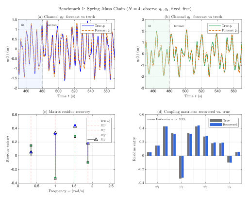
<figcaption class="paper-figure-caption"><b>Fig 1.</b> FIG. 1. PRISM benchmark validation (spring-mass chain, ntot = 4, fixed–free, x = [q1, q4]⊤). (a,b) Out- of-sample forecast of the two observed channels: a model fit on the first 40% of the record (shaded) predicts the held-out remainder (orange dashed) against ground truth (solid), for q1 (a) and q4 (b)—an equation of motion integrated forward, not a spectral fit. (c) Matrix residue recovery: recovered diag- onal (R11) and off-diagonal (R12) entries (filled) vs. analytical viv⊤ i (open), at the four identified frequencies. (d) Recov- ered (blue) vs. true (grey) coupling-matrix entries, grouped by mode; within each ωi group the three bars are the inde- pendent entries R11, R12, R22 of the...</figcaption>
</figure>
<figure class="paper-figure-card">
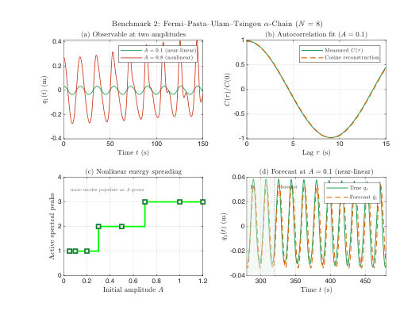
<figcaption class="paper-figure-caption"><b>Fig 2.</b> FIG. 2. FPUT α-chain. The single-mode initial condition spreads energy to other modes as amplitude grows: active spectral peaks recovered from q1(t) rise from one (A ≤0.2) to three (A ≥0.7), a data-driven signature of nonlinear energy sharing; the small-amplitude forecast (panel d) tracks the ob- servable. 10% additive Gaussian noise.</figcaption>
</figure>
<figure class="paper-figure-card">
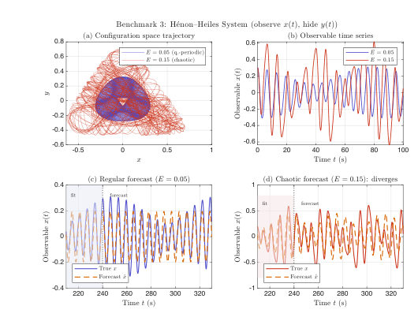
<figcaption class="paper-figure-caption"><b>Fig 3.</b> FIG. 3. Hénon-Heiles. Out-of-sample forecast of x(t): the regular regime (E = 0.05, panel c) is tracked by the re- covered single-frequency model, whereas the chaotic regime (E = 0.15, panel d) diverges after a short horizon—the forecast-breakdown horizon is itself a diagnostic of chaos. 10% additive Gaussian noise.</figcaption>
</figure>

**Summary.** The paper introduces PRISM, a novel technique to discover the governing Hamiltonian of partially observed conservative physical systems. By exploiting the positive-real structure inherent in the system's autocorrelation function, it bypasses ill-posed state reconstruction methods common in data science. This allows for the direct recovery of energy-conserving equations from limited measurement data.

**Why it may be interesting.** This work provides a powerful data-driven tool for extracting fundamental physical laws (Hamiltonians) from incomplete measurements, which is highly relevant in areas like plasma physics or complex mechanical systems where full state measurement is impossible.

Detailed structure

**Main problem.** The central goal is discovering the governing equations (minimal Hamiltonian) of a physical system solely from partial, noisy observations of its state variables.

**Main result.** The method successfully recovers interpretable, energy-conserving equations of motion for partially observed conservative systems without needing to reconstruct the hidden state or using neural networks.

**Method.** It projects the full dynamics onto the observable subspace, deriving a memory kernel that is proven to be positive-real and lossless. This allows direct identification from the autocorrelation function via spectral analysis or optimization (NNLS/SDP).

**Model / system.** The system under study is assumed to be conservative (Hamiltonian), with dynamics partitioned into observable ($x$) and hidden coordinates ($\{q_i, p_i\}$). The full Hamiltonian structure dictates the form of the governing equation.

**Key observables.** Observable autocorrelation function $C(	au) = \langle x(t)x(t+	au)^	op 
angle$, spectral density $S(\omega)$, and the recovered memory kernel $\hat{K}(s)$.

**Important parameters / regimes.** Hidden natural frequencies ($\{\omega_i\}$), coupling residues ($R_i$), and the system's total energy (for equipartition assumptions).

**Assumptions / limitations.** The system must be conservative (Hamiltonian); the fluctuation force is assumed uncorrelated with initial conditions; and for residue magnitude recovery, equipartition of energy among hidden modes is required.

**Figures summary.** Figures illustrate successful tracking of regular dynamics in the Hénon-Heiles benchmark while showing divergence when the system enters a chaotic regime, serving as a chaos diagnostic.

**Paper structure.** The paper develops the theory by deriving the Mori-Zwanzig equation for the observable subspace. It then uses the positive-real structure theorem to relate the memory kernel to the autocorrelation function, leading to identification algorithms (NNLS/SDP) and validation on various Hamiltonian benchmarks.

Abstract

Discovering the governing equations of a physical system from data is a central goal across the sciences, yet in most experiments only a few states are accessible while the rest stay hidden. Existing approaches treat this partial observability as an obstacle to be removed by first reconstructing the hidden state -- a step that is ill-posed under noise and that discards the physical constraints, such as energy conservation, that the true dynamics obey. We show that for conservative (Hamiltonian) systems no reconstruction is needed: projecting the dynamics onto the measured coordinates yields a memory kernel that we prove to be a lossless positive-real rational matrix, whose poles are the hidden natural frequencies and whose positive-semidefinite residues encode the couplings. The governing equation -- and the underlying Hamiltonian -- can therefore be read directly from the autocorrelation of the measured signal, with guarantees of uniqueness and physical passivity, and without neural networks. We validate the approach on linear, nonlinear, and chaotic systems under realistic noise. By recovering interpretable equations of motion that conserve energy by construction from partial measurements, the method offers a common tool for problems spanning mechanics, fluid and plasma physics, and beyond.

[↑ back to top](#top)

### [Stabilizing Itinerant Electrons in a Corner-Sharing Kagomé Oxide Nd4Os3ZnO14](http://arxiv.org/abs/2606.15774v1)

**Authors:** Ryutaro Okuma, Yuita Fujisawa, Chia-Hsiu Hsu, Keita Kojima, Daisuke Nishio-Hamane, Kazuki Sumida, Akio Kimura, Akira Yasui, Kohei Yamagami, Jun-ichi Yamaura, Yoshihiko Okamoto  
**Type:** both · **Category:** strongly correlated electrons · **PDF:** <https://arxiv.org/pdf/2606.15774v1>  
**Analysis basis:** full PDF text, analyzed in chunks
**Topic relevance:** `Kondo & dissipative impurity` **1/5** · `analog quantum simulation` **1/5** · `exotic spin models in light-matter` **1/5** · `non-equilibrium dynamics` **1/5**

↔ Scroll figures horizontally

<figure class="paper-figure-card">
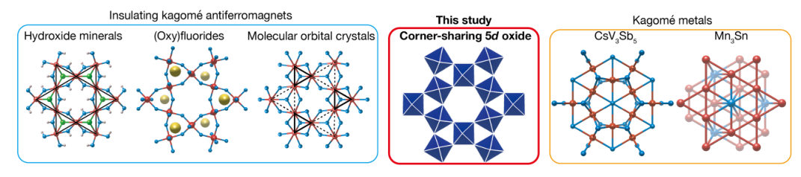
<figcaption class="paper-figure-caption"><b>Fig 1.</b> Figure 1. Structural diversity of d-electron-based kagomé materials. Red and light-blue spheres represent transition-metal ions and ligands, respectively. Copper hydroxides4 consist of edge-sharing octahedral networks. Corner-sharing octahedral networks have so far been realized only in strongly ionic compounds, such as jarosite,18 vanadium oxyfluorides22 and copper/titanium fluorides.23-26 In cluster compounds,27-30 the edge-sharing octahedra are strongly distorted, resulting in molecular triangular units rather than an extended kagomé network. Metallic kagomé compounds, by contrast, typically feature face-sharing octahedra19, 20, 31 or close-packed arrangements of metal atoms.32 The...</figcaption>
</figure>
<figure class="paper-figure-card">
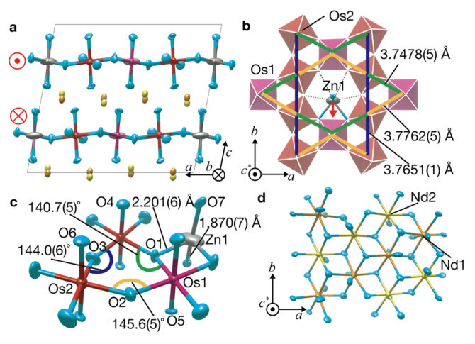
<figcaption class="paper-figure-caption"><b>Fig 2.</b> Figure 3. Crystal structures of Nd4Os3ZnO14. Red/pink, sky-blue, grey, and yellow/orange spheres represent Os, O, Zn, and Nd atoms, respectively. Thermal ellipsoids are drawn at the 95% probability level. (a) Layered crystal structure viewed along the b axis. The black outline denotes the crystallographic unit cell. The direction of Zn distortion is shown in red ⊙ and ⊗. (b) Corner- sharing OsO6 octahedral network viewed along the c⁎ axis. Thick colored bonds indicate distinct Os–Os distances. The Zn1 site is displaced toward Os1, forming a 2+2 coordination with oxygen, while dashed bonds illustrate the remaining longer 2+6 coordination. (c) Local coordination environments of Os1, Os2, and...</figcaption>
</figure>
<figure class="paper-figure-card">
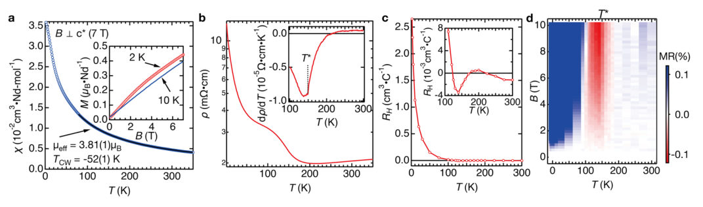
<figcaption class="paper-figure-caption"><b>Fig 3.</b> Figure 4. Physical properties of a twinned single crystal of Nd4Os3ZnO14. (a) Magnetic susceptibility measured under an in-plane magnetic field of 7 T. The black solid line shows a Curie–Weiss fit performed in the temperature range 80–350 K. The inset shows magnetization process at 2 K (red open circles) and 10 K (blue line). (b) Temperature dependence of the in-plane electrical resistivity. The inset displays the temperature derivative of the resistivity, highlighting anomalies associated with the magnetic transition. (c) Temperature dependence of the Hall coefficient obtained from a linear fit to the Hall resistivity between 0 and 5 T. The inset shows a magnified view in the metallic...</figcaption>
</figure>
<figure class="paper-figure-card">
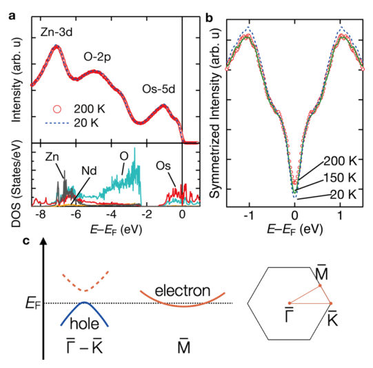
<figcaption class="paper-figure-caption"><b>Fig 4.</b> Figure 5. Electronic structure of Nd4Os3ZnO14. (a) HAXPES spectra compared with the density of states (DOS) obtained from DFT calculations. (b) Symmetrized HAXPES spectra showing the suppression of spectral weight near the Fermi level across T⁎. (c) Schematic illustration of the low energy electronic structure near the Fermi level. The electron and hole bands are shown by red and skyblue lines, respectively (left). The corresponding Brillouin zone is shown on the right. Although the crystal structure is monoclinic, the deviation from hexagonal symmetry is very small and kz dispersion is weak. For clarity, the Brillouin zone and high-symmetry directions are presented using a hexagonal...</figcaption>
</figure>
<figure class="paper-figure-card">
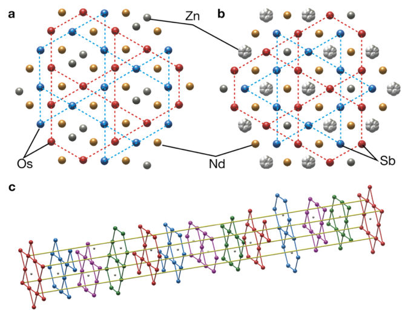
<figcaption class="paper-figure-caption"><b>Fig 5.</b> Figure 6. Cation stacking geometry in corner-sharing kagomé oxides. Dotted lines indicate the kagomé lattice formed by Os/Sb ions. (a) Monoclinic stacking geometry of the kagomé layers in Nd4Os3ZnO14. (b) Rhombohedral stacking geometry of the cation framework in Nd3Sb3Zn2O14. (c) Recovery of a pseudo-rhombohedral stacking registry through successive 2c, 4c, and 6c translations in Nd4Os3ZnO14. Kagomé layers related by the pseudo-rhombohedral centering translations are highlighted using the same color. The corresponding pseudo-rhombohedral supercell is outlined in yellow.</figcaption>
</figure>

**Summary.** The authors report synthesizing $	ext{Nd}_4	ext{Os}_3	ext{ZnO}_{14}$, a corner-sharing kagomé oxide that exhibits itinerant electron behavior. Through combined structural, transport, and electronic measurements, they demonstrate a transition from a semimetallic to a semiconducting state upon cooling. This material is proposed as an excellent model system for studying correlated electron phenomena in the itinerant regime.

**Why it may be interesting.** This work directly addresses the challenge of stabilizing correlated electron states in geometrically frustrated lattices using 5d transition metals, which is a key area for understanding exotic quantum materials relevant to condensed matter theory.

Detailed structure

**Main problem.** The study investigates achieving and characterizing a stable electronic state in kagomé oxides that combines itinerant electron behavior with strong correlation effects, overcoming historical limitations of charge localization.

**Main result.** The material $	ext{Nd}_4	ext{Os}_3	ext{ZnO}_{14}$ exhibits a complex interplay between its structure (corner-sharing OsO6 octahedra), electronic properties (semimetallic to semiconducting transition), and magnetism, establishing it as a promising platform for itinerant correlated electron physics.

**Method.** The research combines high-temperature synthesis with structural characterization (XRD), electrical transport measurements ($
ho(T)$, Hall effect), magnetic susceptibility measurements, and advanced theoretical calculations (DFT).

**Model / system.** The physical system is the 5d transition-metal kagomé oxide $	ext{Nd}_4	ext{Os}_3	ext{ZnO}_{14}$. Structurally, it features a quasi-2D network of corner-sharing OsO6 octahedra stabilized in a monoclinic symmetry by Zn off-centering.

**Key observables.** In-plane resistivity ($
ho(T)$), Hall resistivity ($R_H$), magnetic susceptibility ($\chi(T)$), and electronic band structure near the Fermi level.

**Important parameters / regimes.** The transition temperature $T^* \approx 150	ext{ K}$ marks a metal-insulator-like anomaly; the nominal osmium valence is $+4.67$.

**Assumptions / limitations.** The structural analysis assumes that Zn off-centering stabilizes the monoclinic symmetry, and electronic transport analyses rely on two-carrier fitting models.

**Figures summary.** Figures illustrate the crystal structure (XRD), optical views of single crystals, band dispersions in both monoclinic and pseudo-hexagonal Brillouin zones, and temperature dependence of electrical properties.

**Paper structure.** The paper proceeds by synthesizing the material, determining its complex monoclinic crystal structure via XRD refinement (including twin domain analysis), characterizing its magnetic and transport anomalies ($T^*$), and finally modeling the electronic band structure to explain itinerant behavior.

Abstract

Kagome oxides provide a fertile platform for exploring exotic electronic states arising from geometrical frustration and characteristic band topology. Here, we report the synthesis of a 5d transition-metal kagome oxide, Nd4Os3ZnO14, obtained via high-temperature, high-pressure hydrothermal synthesis. Single-crystal X-ray diffraction reveals a two-dimensional kagome network formed by corner-sharing OsO6 octahedra, with a nominal osmium valence of +4.67. In-plane resistivity and hard X-ray photoelectron spectroscopy measurements indicate that the semimetallic electronic structure at room temperature evolves into a semiconducting ground state upon cooling, accompanied by a pronounced enhancement of hole mobility. Magnetic susceptibility measurements demonstrate localized Nd3+ moments without long-range magnetic order down to 2 K. The coexistence of a metallic kagome plane, strong spin-orbit coupling inherent to 5d electrons, and rare-earth magnetism establishes Nd4Os3ZnO14 as a promising platform for investigating correlated electron phenomena in kagome oxides within the itinerant regime.

[↑ back to top](#top)

### [Certified Finite-Shot Operating Windows for Virtual Distillation and Symmetry Verification](http://arxiv.org/abs/2606.15464v1)

**Authors:** Vicenzo Scavino Alfaro  
**Type:** both · **Category:** quantum information and computing · **PDF:** <https://arxiv.org/pdf/2606.15464v1>  
**Analysis basis:** full PDF text, analyzed in chunks
**Topic relevance:** `QC/QI experiment` **1/5** · `methods for driven-dissipative` **1/5** · `quantum measurements` **1/5**

↔ Scroll figures horizontally

<figure class="paper-figure-card">
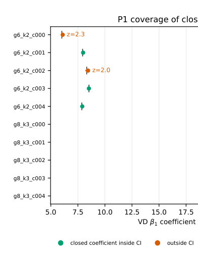
<figcaption class="paper-figure-caption"><b>Fig 1.</b> Figure 1: Level 1 coverage audit for the P1 leading VD MSE coefficient. The horizontal intervals are WLS 95% intervals for bβfit 1 , the dots are the closed-form ev, and orange marks the two v2 instances outside the interval. The same coefficient covered 10/10 instances in v1 and 8/10 in v2; the v2 outcome has binomial lower-tail probability 0.086 under nominal 95% coverage.</figcaption>
</figure>
<figure class="paper-figure-card">
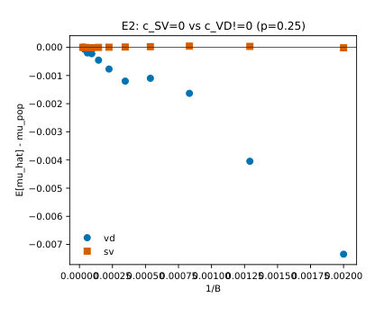
<figcaption class="paper-figure-caption"><b>Fig 2.</b> Figure 2: Level 1 quotient-law and c-coefficient diagnostics from the amended v2 run. Left: E1 MSE versus 1/B for the primary instance used in the figure, illustrating the VD quotient curvature. Right: E2 separates the nonzero VD quotient-bias slope from the SV slope centered near zero.</figcaption>
</figure>
<figure class="paper-figure-card">
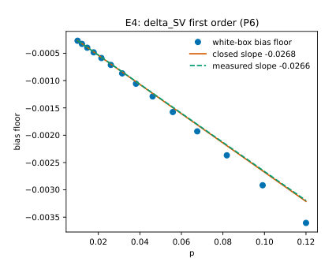
<figcaption class="paper-figure-caption"><b>Fig 3.</b> Figure 3: Level 1 first-order bias-floor checks from the amended v2 run. The measured white-box slopes track the generator formulas for δVD and δSV on the primary plotted instance.</figcaption>
</figure>
<figure class="paper-figure-card">
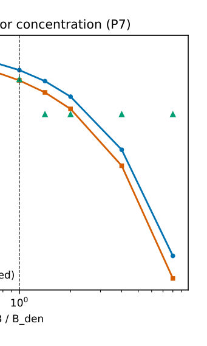
<figcaption class="paper-figure-caption"><b>Fig 4.</b> Figure 4: Level 1 denominator-concentration diagnostic from the amended v2 run. The bad-denominator probability collapses around the predicted scale Bden, matching the P7 interpretation in Table 2.</figcaption>
</figure>
<figure class="paper-figure-card">
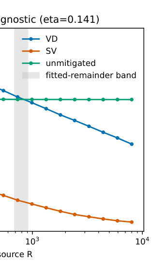
<figcaption class="paper-figure-caption"><b>Fig 5.</b> Figure 5: Level 1 crossing diagnostic from the amended v2 run. The shaded region is the fitted-remainder operational band around the leading crossing scale used for P9; this is a diagnostic fitted-C band, not the formal conservative certificate.</figcaption>
</figure>

**Summary.** This paper develops a rigorous theory to compare quantum error mitigation methods like Virtual Distillation and Symmetry Verification based on finite experimental resources rather than idealized infinite limits. It derives explicit Mean-Squared Error laws and predicts certified operating windows where one method demonstrably outperforms another. The findings guide the practical implementation of QEM by identifying regime structures rather than declaring a single universal winner.

**Why it may be interesting.** This work provides rigorous, resource-aware metrics for comparing QEM techniques, which is crucial for designing practical quantum algorithms that must operate under realistic noise constraints.

Detailed structure

**Main problem.** The paper addresses the limitations of comparing quantum error mitigation (QEM) methods by moving beyond infinite-shot bias analysis to develop certified operating windows based on finite sampling budgets.

**Main result.** It establishes a 'selection trichotomy' that classifies method comparisons into tie, uniform dominance, or a genuine tradeoff with a certified crossing window, providing falsifiable predictions for resource scaling.

**Method.** The authors developed a finite-shot operating-window theory by deriving non-asymptotic Mean-Squared Error (MSE) laws for Virtual Distillation (VD) and Symmetry Verification (SV).

**Model / system.** The analysis applies to noisy quantum devices characterized by local expansions of the state $
ho_p$, comparing VD and SV estimators using controlled observables.

**Key observables.** Mean-Squared Error ($	ext{MSE}$), bias terms ($b(p)$), variance coefficients, and certified crossing windows ($R^\star$).

**Important parameters / regimes.** Noise rate parameter $p$, sample size $B$ (shots), copy number $M$, and resource budget $R$.

**Assumptions / limitations.** The analysis relies on local expansions of the noisy state in $p$ and uses techniques like Efron–Stein certificates to bound total variance.

**Figures summary.** Not specified, but the notes describe theoretical derivations leading to explicit bounds and comparisons between methods.

**Paper structure.** The paper builds theory by deriving MSE laws for VD (as a quotient estimator) and SV, then uses a selection trichotomy to classify pairwise method comparisons. It validates this theory with white-box experiments and tests it on gate-level device simulations.

Abstract

Quantum error mitigation methods are usually compared through their infinite-shot bias, but on real devices the comparison is decided by finite sampling budgets, estimator instabilities, and per-shot resource costs. We develop a finite-shot operating-window theory that makes this comparison certifiable for virtual distillation (VD) and symmetry verification (SV): for each method we derive a mean-squared-error law with explicit, non-asymptotic remainder constants. For VD, the law captures the statistical bias and denominator instability of its quotient estimator, with a concentration certificate locating the sample size beyond which the quotient is trustworthy; for SV, it isolates the bias floor left by undetectable errors and the sampling penalty set by the acceptance probability. A selection trichotomy classifies any two-method comparison into a tie, uniform dominance, or a genuine tradeoff with a certified crossing window, including a self-consistency test that rejects spurious crossings. The theory makes falsifiable predictions -- operating-window locations scaling as $p^{-2}$ or $p^{-1}$ in the noise rate, and the sign pattern of all pairwise comparisons -- which exact white-box experiments confirm with fitted exponent $-1.97$ against the predicted $-2$ and with $300/300$ sign agreement, within a pre-registered analysis whose single failed gate, an over-strict all-instance criterion, is reported and audited in full. Gate-level simulation and archived runs on two IBM backends then test the windows under device conditions: idealized VD windows exist, but realistic interferometry overhead and denominator instability erase them, and calibrated SV is the practical winner in the tested QAOA instances. This absence of a universal winner is not a failure of mitigation; it is the regime structure that certified operating windows predict.

[↑ back to top](#top)

### [Adiabatically-induced Kawaguchi geometry and jerk in quantum-classical systems](http://arxiv.org/abs/2606.16037v1)

**Authors:** Athanasios Chatzistavrakidis, Larisa Jonke, Ryan Requist  
**Type:** theory · **Category:** other · **PDF:** <https://arxiv.org/pdf/2606.16037v1>  
**Analysis basis:** full PDF text, analyzed in chunks
**Topic relevance:** `Keldysh / 2PI / non-Gaussian methods` **1/5** · `non-equilibrium dynamics` **1/5**

↔ Scroll figures horizontally

<figure class="paper-figure-card">

<figcaption class="paper-figure-caption"><b>Fig 1.</b> Low-resolution page preview, page 2</figcaption>
</figure>
<figure class="paper-figure-card">
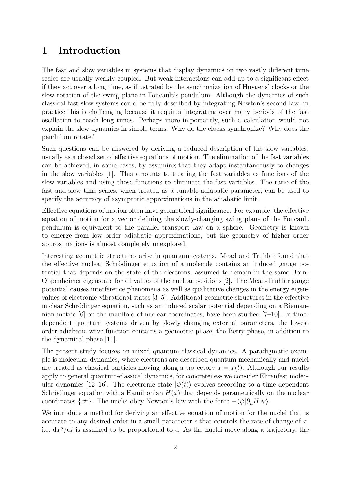
<figcaption class="paper-figure-caption"><b>Fig 2.</b> Low-resolution page preview, page 3</figcaption>
</figure>
<figure class="paper-figure-card">
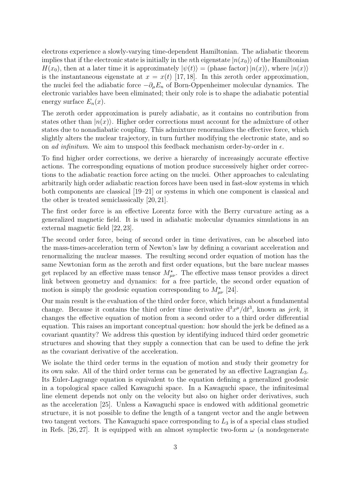
<figcaption class="paper-figure-caption"><b>Fig 3.</b> Low-resolution page preview, page 4</figcaption>
</figure>
<figure class="paper-figure-card">
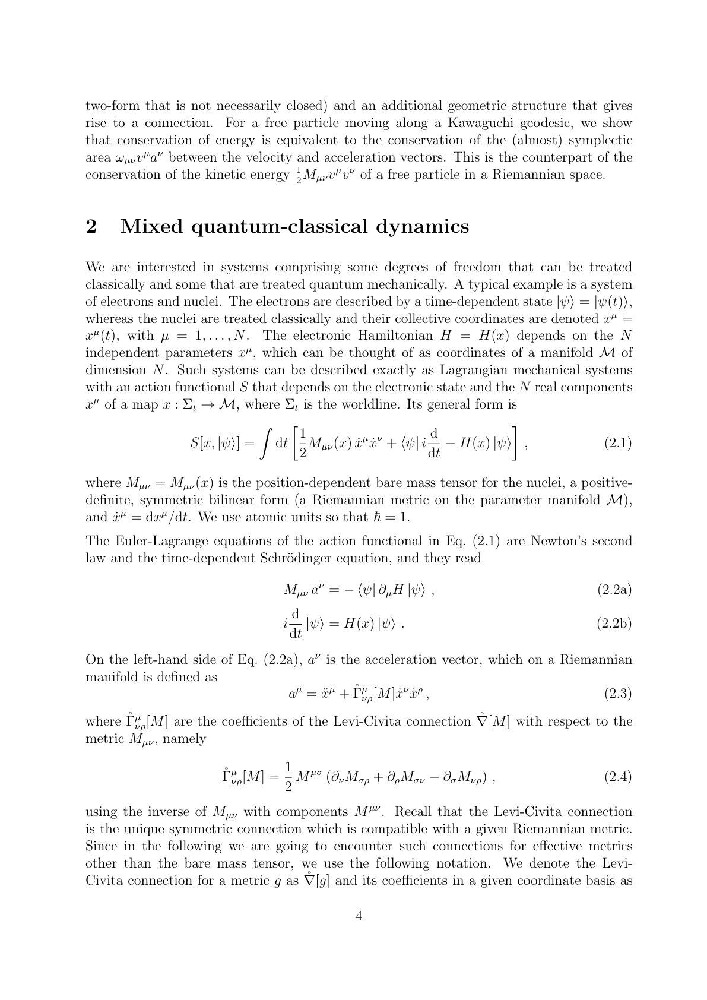
<figcaption class="paper-figure-caption"><b>Fig 4.</b> Low-resolution page preview, page 5</figcaption>
</figure>
<figure class="paper-figure-card">
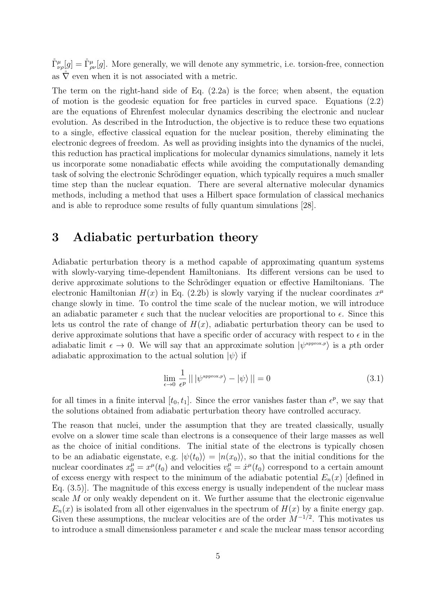
<figcaption class="paper-figure-caption"><b>Fig 5.</b> Low-resolution page preview, page 6</figcaption>
</figure>

**Summary.** The paper develops an advanced theoretical method to model quantum-classical systems by adiabatically eliminating fast electronic degrees of freedom. It derives increasingly accurate effective equations of motion, culminating in a description governed by Kawaguchi geometry due to third-order nonadiabatic forces involving the jerk. This provides a powerful geometric tool for simulating complex molecular dynamics beyond standard approximations.

**Why it may be interesting.** This work provides a rigorous geometric framework for nonadiabatic dynamics that goes significantly beyond standard Born-Oppenheimer or even generalized geodesic approaches by incorporating higher-order time derivatives into the effective Lagrangian/Hamiltonian structure.

Detailed structure

**Main problem.** To derive an effective equation of motion for slow classical variables by adiabatically eliminating fast quantum degrees of freedom, incorporating nonadiabatic effects up to the third order.

**Main result.** The resulting dynamics are governed by a geometry characterized by Kawaguchi geometry (or KL2 manifolds), leading to equations involving the jerk ($\ddot{x}$'s derivative) rather than just acceleration.

**Method.** Adiabatic perturbation theory is used iteratively, employing near-identity unitary transformations to systematically derive higher-order effective actions and Hamiltonians from the full quantum-classical action functional.

**Model / system.** The system models mixed quantum-classical dynamics (e.g., molecular systems) where electronic states $|\psi
angle$ evolve quantum mechanically based on a Hamiltonian $H(x)$ dependent on classical nuclear coordinates $x_\mu$.

**Key observables.** Effective forces, the jerk vector ($\mathbf{j}$), and geometric structures like the almost symplectic form ($\omega_{\mu
u}$) and the Kawaguchi geometry.

**Important parameters / regimes.** The adiabatic parameter $\epsilon$, which controls the order of approximation (e.g., $\mathcal{O}(\epsilon^2)$ for second-order corrections).

**Assumptions / limitations.** The analysis relies on treating the adiabatic parameter $\epsilon$ as small to systematically derive higher-order corrections, and it assumes the existence of suitable unitary transformations to simplify the effective Hamiltonian.

**Figures summary.** Not specified in the notes; however, the text describes deriving equations involving geometric tensors ($\omega_{\mu
u}, \gamma_{\lambda\mu
u}$) and comparing action forms (e.g., Eq. 4.13 vs. KL2 action).

**Paper structure.** The paper follows a systematic progression: first establishing the general problem of adiabatic elimination; then deriving corrections up to second order, revealing Riemannian geometry; subsequently extending this framework to third order, necessitating the introduction of Finsler and Kawaguchi geometries to handle jerk-dependent forces.

Abstract

Adiabatically eliminating the quantum degrees of freedom in a mixed quantum-classical system produces an effective force in the classical equation of motion. The elimination can be made to any order in the adiabatic parameter, generating a series of higher order forces. By applying a sequence of near-identity unitary transformations to the quantum state, we derive a hierarchy of increasingly accurate effective actions for the classical variables. The third order Euler-Lagrange equation is non-Newtonian as the force depends on the jerk, the third order time derivative of position. We find that the third order terms induce a special kind of Kawaguchi geometry on the space of classical variables. This geometry is characterized by an almost symplectic structure and a differential line element that depends on the acceleration in addition to the velocity. Our results can be used to efficiently capture higher order nonadiabatic effects in molecular dynamics simulations.

[↑ back to top](#top)

### [Complete Relational Description of Spin in a Quantum Background](http://arxiv.org/abs/2606.15873v1)

**Authors:** Hannah Troger, Ofek Bengyat, Thomas D. Galley, Marios Christodoulou  
**Type:** theory · **Category:** quantum information and computing · **PDF:** <https://arxiv.org/pdf/2606.15873v1>  
**Analysis basis:** full PDF text, analyzed in chunks
**Topic relevance:** `entanglement & information structure` **1/5** · `exotic spin models in light-matter` **1/5**

↔ Scroll figures horizontally

<figure class="paper-figure-card">
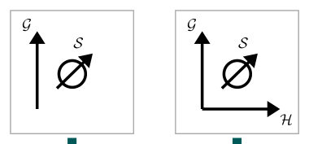
<figcaption class="paper-figure-caption"><b>Fig 1.</b> Figure 1. A spin-1/2 system S alongside a large spin system G yields a relational state approximately corresponding to a mixture, see Section II. Adding another large spin system H to the reference, yields a relational state which approaches an exact encoding of the qubit S as the quantum numbers of the reference grow, see Section III. Note that analogous states may be written for ρjSH. .</figcaption>
</figure>
<figure class="paper-figure-card">
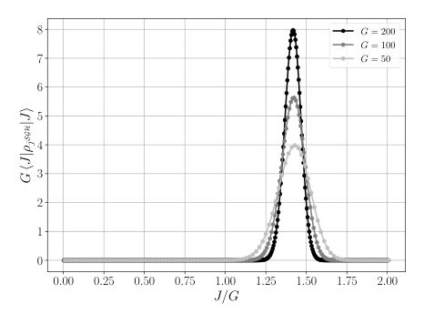
<figcaption class="paper-figure-caption"><b>Fig 2.</b> Figure 2. Total angular momentum probability densities of the SGH system for G = 50, 100, 200, as encoded by the den- sity matrix ρjSGH in (21). The peak occurs at J ≈ √</figcaption>
</figure>
<figure class="paper-figure-card">
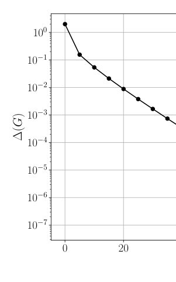
<figcaption class="paper-figure-caption"><b>Fig 3.</b> Figure 3. Numerical evaluation of ∆(G) = P</figcaption>
</figure>

**Summary.** The paper tackles the challenge of describing quantum spin without relying on an external classical reference frame. By coupling the target spin to two large auxiliary spins and employing group averaging techniques, the authors demonstrate that a complete, coherent description of the qubit state can be recovered in the appropriate large-limit regime.

**Why it may be interesting.** This work addresses fundamental issues in quantum gravity and background independence by providing a concrete mathematical framework to define physical observables (like spin) purely relative to other quantum systems, which is crucial for theories where spacetime itself is quantized.

Detailed structure

**Main problem.** The central problem is developing a description of quantum spin that is fully relational, meaning its state is independent of an externally fixed classical background reference frame.

**Main result.** Using two large, orthogonal reference spins allows the relational encoding procedure to successfully recover the full coherence of the original pure qubit state in the limit of large reference angular momenta.

**Method.** The authors employ group averaging techniques (both coherent and incoherent) on the joint density matrix of the target spin and the composite reference system over $SO(3)$ rotations.

**Model / system.** The model involves a fundamental spin-1/2 system ($S$) coupled to two large quantum reference spins ($G$ and $H$). The analysis is performed using recoupling theory and group representation methods.

**Key observables.** Coherence of the target spin state, the resulting density matrix $	ilde{E}(
ho_{SGH})$, and the total angular momentum probability distribution $\langle J|
ho_{jSGH}|J
angle$.

**Important parameters / regimes.** The limit of large quantum numbers for the reference spins ($G 	o \infty$ and $H 	o \infty$).

**Assumptions / limitations.** The analysis relies on comparing the results from coherent versus incoherent group averaging, with the conclusion favoring the coherent average for background independence.

**Figures summary.** Figures illustrate the transition: a single reference spin yields only classical mixtures, while adding a second spin restores coherence. Other figures show convergence of probability distributions to specific asymptotic limits.

**Paper structure.** The paper progresses by first analyzing the failure of a single reference spin (Poulin's idea), then introducing and calculating the result for two spins ($G$ and $H$), followed by a detailed comparison between coherent and incoherent averaging methods, and concluding with general statements on ideal encoding.

Abstract

The standard description of the state of a spin in quantum mechanics presupposes externally fixed directions -- a classical background. Can a spin be fully described instead in relation to other quantum mechanical systems? Poulin suggested twenty years ago group averaging over rotations the joint state of a fundamental spin and a reference spin with large angular momentum which, however, yields a classical bit in a probabilistic mixture. We revisit this idea and show that when the quantum reference system is augmented to \emph{two} large spins, the standard quantum mechanical description of a spin is recovered in the limit of large quantum numbers for the reference system.

[↑ back to top](#top)

### [Flowing to Normality and the Fate of the Single Ring Theorem](http://arxiv.org/abs/2606.15791v1)

**Authors:** Joshua Feinberg, Roman Riser, Richard Scalettar, Anthony Zee  
**Type:** theory · **Category:** statistical mechanics · **PDF:** <https://arxiv.org/pdf/2606.15791v1>  
**Analysis basis:** full PDF text, analyzed in chunks
**Topic relevance:** `driven-dissipative phase transition` **1/5** · `non-equilibrium universality` **1/5**

↔ Scroll figures horizontally

<figure class="paper-figure-card">
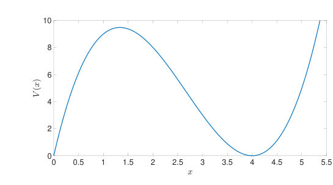
<figcaption class="paper-figure-caption"><b>Fig 1.</b> Figure 1. The cubic potential used in simulations V (x) = m2x + α</figcaption>
</figure>
<figure class="paper-figure-card">
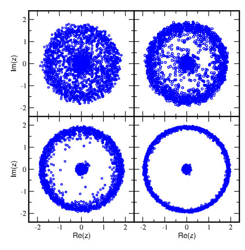
<figcaption class="paper-figure-caption"><b>Fig 2.</b> Figure 2. Evolution of the eigenvalue distribution in the com- plex plane for the cubic potential (7) with m2 = 16, α = −16, u = 3. Top, left: g = 0.0. Top, right: g = 0.0375. Bottom, left: g = 0.0625. Bottom, right: g = 0.125. Violation of the Single Ring Theorem is evident. These data suggest critical 0.0375 &lt; gcrit &lt; 0.0625. Matrix size N = 24.</figcaption>
</figure>
<figure class="paper-figure-card">
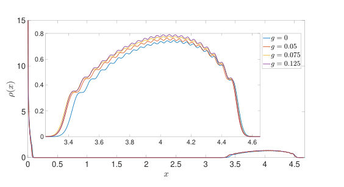
<figcaption class="paper-figure-caption"><b>Fig 3.</b> Figure 4. Density of squares singular values xi computed from (18) with the cubic potential V shown in Fig. 1 using Monte Carlo simulation for matrices of size N = 32 and for g value across the critical range. The singular values are clearly seen to condense in two disjoint segments. The inset magnifies the smaller density region around x = 4. The density oscilla- tions visible in the magnified inset are a typical finite-N effect. Notice that the density barely changes as g sweeps across the indicated range.</figcaption>
</figure>
<figure class="paper-figure-card">
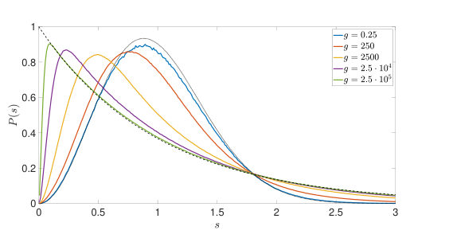
<figcaption class="paper-figure-caption"><b>Fig 4.</b> Figure 5. Unfolded spacing distribution of square singular val- ues for various magnitude of g showing transition for Wigner- Dyson (g = 0) towards Poisson statistics. Solid lines were obtained through Monte Carlo simulation with N = 32 sin- gular values subjected to the critical potential (see Fig. 1). Dashed line shows the exponential distribution e−s and the black dotted line represents Wigner-Dyson statistics for β = 2 in the limit N →∞. The spacing produced by the gap have been ignored, see explanation in the main text.</figcaption>
</figure>
<figure class="paper-figure-card">
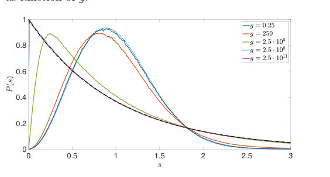
<figcaption class="paper-figure-caption"><b>Fig 5.</b> Figure 6. Similar plots as in Fig. 5 for the Ginibre potential V (x) = x and for a larger range of g values.</figcaption>
</figure>

**Summary.** This work analyzes a non-Hermitian random matrix ensemble undergoing a controlled flow towards normality by introducing a penalty term. It finds that the Single Ring Theorem breaks down at a small critical coupling $g_{crit}$. Furthermore, it demonstrates a universal crossover in the statistics of singular values from Wigner-Dyson repulsion to Poissonian behavior as the system approaches the normal limit.

**Why it may be interesting.** The study provides a concrete, mathematically rigorous example of how spectral rigidity (Wigner-Dyson) can smoothly transition to uncorrelated behavior (Poissonian) through tuning a system parameter, linking random matrix theory to fundamental statistical transitions.

Detailed structure

**Main problem.** The paper investigates the transition of eigenvalue statistics from those obeying the Single Ring Theorem (SRT) in non-Hermitian random matrix ensembles to those violating it as the ensemble flows towards normal matrices.

**Main result.** The SRT breaks down at a small critical coupling constant ($g_{crit} \approx 0.055$), and the statistics of singular values continuously transition from Wigner-Dyson repulsion (low $g$) to Poissonian behavior (high $g$).

**Method.** The analysis combines analytical derivations for joint probability distributions with extensive numerical simulations, particularly focusing on finite-size scaling techniques.

**Model / system.** The model is a random non-Hermitian matrix ensemble governed by a potential and a penalty term proportional to the commutator squared ($	ext{Tr}[\phi, \phi^\dagger]^2$). The singular values are treated as a Fermi gas confined to the positive half-line.

**Key observables.** Average density of complex eigenvalues, interparticle spacing statistics (Wigner-Dyson vs. Poissonian), and the critical coupling constant $g_{crit}$.

**Important parameters / regimes.** The flow parameter $g$, the matrix size $N$, and the potential parameters ($V(x)$).

**Assumptions / limitations.** The analysis assumes the large-$N$ limit for spectral theorems, and that the crossover in spacing statistics is distinct from the physical breaking of the SRT.

**Figures summary.** Figures show the evolution of eigenvalue density violating the SRT as $g$ increases, and plots demonstrate the continuous crossover of singular value spacing statistics from Wigner-Dyson to Poissonian behavior.

**Paper structure.** The paper first introduces the model and the concept of the flow parameter $g$. It then numerically determines the critical point for SRT breakdown. Subsequently, it analyzes the singular value gas dynamics, deriving the JPDF and showing the crossover in spacing statistics using fermion analogies on the half-line.

Abstract

Random non-hermitian matrix ensembles with double-sided rotation invariance obey, in the limit of large matrix size, the Single Ring Theorem, which states that the support of the mean eigenvalue distribution in the complex plane is either a disk or an annulus. In contrast, rotational-invariant random normal matrix ensembles can have mean eigenvalue densities supported over any number of concentric annuli in the complex plane. In this paper we introduce and investigate, both analytically and numerically, a non-hermitian matrix model which flows from a generic matrix distribution obeying the Single Ring Theorem to a distribution of normal matrices by tuning a parameter which penalizes non-normality.   We observe numerically breakdown of the Single Ring Theorem as the model flows towards normality, and determine the critical value of the parameter at which the transition occurs. We also study in detail the behavior of the singular values of these matrices under the flow. These singular values form a Fermi gas confined to the positive half-line. In particular, we find that at small values of the flow parameter, the interparticle spacings in the gas exhibit Wigner-Dyson repulsion, whereas for asymptotically large values of the flow parameter, at the normal matrix endpoint of the flow, the spacing statistics is Poissonian. The flow interpolates continuously between these two types of statistics. However, this change in statistics is not related directly to breaking of the Single Ring Theorem, which occurs very early-on along the flow, in the regime of Wigner-Dyson statistics. Finally, we introduce a certain ensemble of random permutations associated with the gas, and make a conjecture on how to use it in order to reconstruct approximately the average density of complex eigenvalues from that of the singular values in the large-$N$ limit.

[↑ back to top](#top)

### [Tuning superconductivity and charge density wave order by next-nearest-neighbor hopping integral in honeycomb Holstein model](http://arxiv.org/abs/2606.16260v1)

**Authors:** Hongxing Liu, Lufeng Zhang, Tianxing Ma  
**Type:** theory · **Category:** strongly correlated electrons · **PDF:** <https://arxiv.org/pdf/2606.16260v1>  
**Analysis basis:** full PDF text, analyzed in chunks
**Topic relevance:** `Keldysh / 2PI / non-Gaussian methods` **1/5** · `analog quantum simulation` **1/5**

↔ Scroll figures horizontally

<figure class="paper-figure-card">
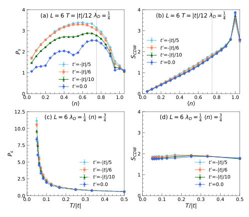
<figcaption class="paper-figure-caption"><b>Fig 1.</b> FIG. 1: Pairing susceptibility Ps as a function of (a) density ⟨n⟩and (c) temperature T/|t| for different t′ at L = 6 and λD = 1/4. The CDW structure SCDW as (b) a function of density ⟨n⟩and (d) temperature T/|t| for different t′ at L = 6 and λD = 1/4. The gray dashed lines in (a) and (b) mark the vHS filling at ⟨n⟩= 3/4.</figcaption>
</figure>
<figure class="paper-figure-card">
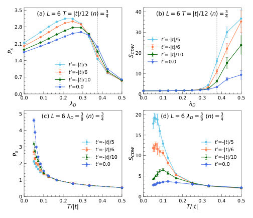
<figcaption class="paper-figure-caption"><b>Fig 2.</b> FIG. 2: Pairing susceptibility Ps as a function of (a) λD and (c) temperature T/|t| for different t′ at L = 6,⟨n⟩= 3/4. The CDW structure SCDW as a function of (b) λD and (d) temperature T/|t| for different t′ at L = 6,⟨n⟩= 3/4. The gray dashed lines in (a) and (b) mark EPC strength λD = 3/8.</figcaption>
</figure>
<figure class="paper-figure-card">
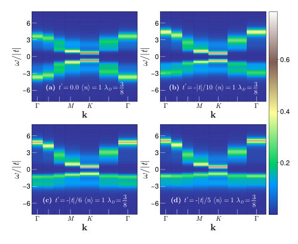
<figcaption class="paper-figure-caption"><b>Fig 3.</b> FIG. 3: Spectral function A(k,ω) as a function of electron wave vector k and real frequency ω at ⟨n⟩= 1, λD = 3/8, T = |t|/8, where t′ = 0.0, −|t|/10, −|t|/6, −|t|/5 corresponding to (a)–(d) respectively, characterized by a heat map.</figcaption>
</figure>
<figure class="paper-figure-card">
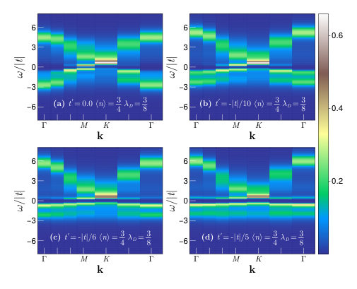
<figcaption class="paper-figure-caption"><b>Fig 4.</b> FIG. 5: Spectral function A(k,ω) as a function of electron wave vector k and real frequency ω at fixed ⟨n⟩= 3/4, λD = 3/8, T = |t|/20, where t′ = 0.0, −|t|/10, −|t|/6, −|t|/5 corresponding to (a)–(d) respectively, characterized by a heatmap.</figcaption>
</figure>
<figure class="paper-figure-card">
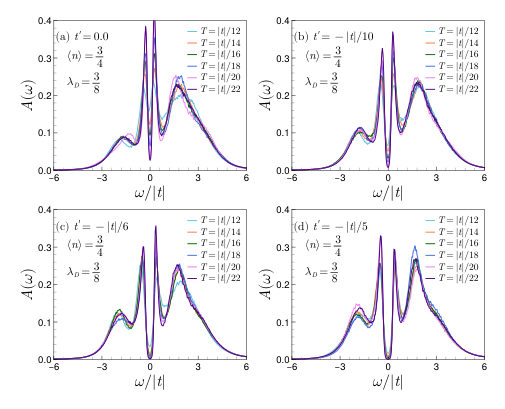
<figcaption class="paper-figure-caption"><b>Fig 5.</b> FIG. 6: Spectral function A(ω) as a function of temperature T in a honeycomb lattice at the saddle point M, fixed ⟨n⟩= 3/4, λD = 3/8 where t′ = 0.0, −|t|/10, −|t|/6, −|t|/5 corresponding to (a)–(d), respectively.</figcaption>
</figure>

**Summary.** The paper uses advanced quantum Monte Carlo simulations on the Holstein model to study how next-nearest-neighbor hopping ($t'$) tunes the competition between superconducting and charge density wave orders. It demonstrates that $t'$ acts as a critical knob, shifting the ground state preference from superconductivity to CDW depending on the coupling strength and electron filling. This provides theoretical insight into phonon-mediated pairing mechanisms in correlated lattices.

**Why it may be interesting.** This work models phonon-mediated interactions in a correlated electronic setting, which is highly relevant to understanding unconventional superconductivity mechanisms often found in strongly correlated materials.

Detailed structure

**Main problem.** The study investigates the complex interplay and competition between superconductivity (SC) and charge density wave (CDW) order in a lattice model.

**Main result.** A finite negative next-nearest-neighbor hopping integral ($t'$) can tune this competition: enhancing SC near van Hove fillings in weak coupling, but promoting CDW at intermediate coupling strengths.

**Method.** The research employs unbiased determinant quantum Monte Carlo (DQMC) simulations combined with differential evolution analytic continuation (DEAC) to analyze spectral properties.

**Model / system.** The system is modeled by the Holstein model on a honeycomb lattice, which includes nearest-neighbor hopping ($t$), next-nearest-neighbor hopping ($t'$), and electron-phonon coupling ($g$).

**Key observables.** Superconducting pairing susceptibility ($	ext{Ps}$), CDW structure factor ($	ext{SCDW}$), and the single-particle spectral function $A(\mathbf{k}, \omega)$ showing gap opening.

**Important parameters / regimes.** The key tunable parameters are the NNN hopping integral ($t'$), the electron-phonon coupling strength ($\lambda_D$), and the electron filling ($\langle n 
angle$), especially near van Hove singularities.

**Assumptions / limitations.** The analysis relies on DQMC simulations, which are computationally intensive, and DEAC for spectral reconstruction; results focus on robust trends rather than precise critical exponents.

**Figures summary.** Figures illustrate how $	ext{Ps}$ and $	ext{SCDW}$ change as a function of electron density ($\langle n 
angle$) or coupling strength ($\lambda_D$), clearly showing the crossover between SC dominance and CDW dominance controlled by $t'$.

**Paper structure.** The paper systematically analyzes the system's behavior across different regimes: weak, intermediate, and strong electron-phonon coupling strengths, contrasting the effects of $t'$ at specific fillings like half-filling versus van Hove fillings.

Abstract

By using unbiased determinant quantum Monte Carlo simulations, we investigate the interplay between superconductivity and charge density wave order in the Holstein model on a honeycomb lattice with next-nearest-neighbor hopping \(t^{\prime}\).   We find that a finite negative \(t^{\prime}\) enhances \(s\)-wave superconducting pairing susceptibility near the van Hove fillings in the weak electron-phonon coupling regime, while it suppresses superconductivity and promotes charge density wave order at intermediate electron-phonon coupling strengths.   The effect of \(t^{\prime}\) on a charge density wave is filling-dependent: It suppresses the charge density wave at half filling but enhances it near the van Hove singularities.   A spectral analysis reveals the opening of a gap at low temperatures, highlighting the competitive relationship between superconducting and charge density wave orders mediated by electron-phonon coupling and tuned by \(t^{\prime}\).

[↑ back to top](#top)

### [Counterdiabatic Raman Atom Optics for Compact High-Sensitivity Gravimetry](http://arxiv.org/abs/2606.16945v1)

**Authors:** Asad Ali, Hamid Arian Zad, Saif Al-Kuwari, Muhammad Irtiza Hussain, Muhammad Talha Rahim, Hashir Kuniyil, Tim Byrnes, James Q. Quach, Saeed Haddadi  
**Type:** theory · **Category:** other · **PDF:** <https://arxiv.org/pdf/2606.16945v1>  
**Analysis basis:** full PDF text, analyzed in chunks
**Topic relevance:** `interference shaping light` **1/5**

↔ Scroll figures horizontally

<figure class="paper-figure-card">
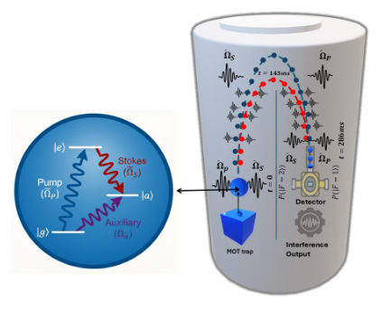
<figcaption class="paper-figure-caption"><b>Fig 1.</b> FIG. 1. Conceptual schematic of the STIRSAP-driven large- momentum-transfer atom interferometer. Three Raman in- teraction zones at t = 0, T, and 2T implement the Mach– Zehnder π/2–π–π/2 sequence using counterintuitive STIR- SAP pulse pairs coupling |g⟩and |a⟩through the off-resonant excited state |e⟩. Sequential Raman π pulses symmetrically accelerate and decelerate the interferometer arms, generat- ing a momentum splitting 2nℏkeff. The atomic ensemble is initially prepared in a magneto-optical trap (MOT), which provides a source of ultracold atoms for the interferometric sequence.</figcaption>
</figure>
<figure class="paper-figure-card">

<figcaption class="paper-figure-caption"><b>Fig 2.</b> FIG. 2. Single-pulse STIRSAP performance. (a) Compari- son between the original Gaussian STIRAP Raman envelopes (dashed) and the reconstructed STIRSAP Raman envelopes (solid) for Tp = 1 µs. (b) Raman π-pulse fidelity Fπ ver- sus pulse duration. High-fidelity transfer persists throughout the ultrafast regime, although the oscillatory structure indi- cates sensitivity to the detailed pulse dynamics. (c) Com- pound interferometer fidelity Fc = F 4(n−1) π versus LMT order n. The exponential accumulation of pulse-transfer errors pro- gressively reduces the achievable interferometer contrast at high momentum order.</figcaption>
</figure>
<figure class="paper-figure-card">
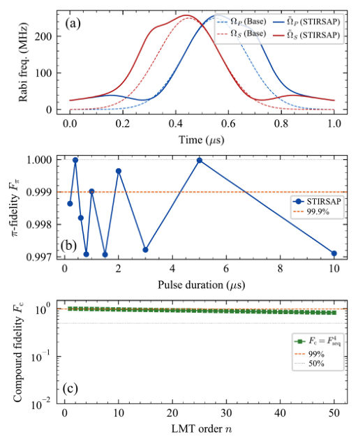
<figcaption class="paper-figure-caption"><b>Fig 3.</b> Figure 2(a) compares the original Gaussian STI- RAP envelopes with the reconstructed STIRSAP Ra- man pulses for Tp = 1 µs. The superadiabatic correction substantially reshapes the pulse sequence near the pulse overlap region, where the counterdiabatic contribution is largest. The achieved fidelity indicates that superadiabatic Ra- man shaping can suppress nonadiabatic transfer errors even in the ultrafast pulse regime. However, the present simulations do not establish superiority relative to op- timized composite-pulse or optimal-control Raman tech- niques, several of which have reported fidelities approach- ing or exceeding 99.99% under experimentally optimized conditions [18–20]. A direct...</figcaption>
</figure>
<figure class="paper-figure-card">
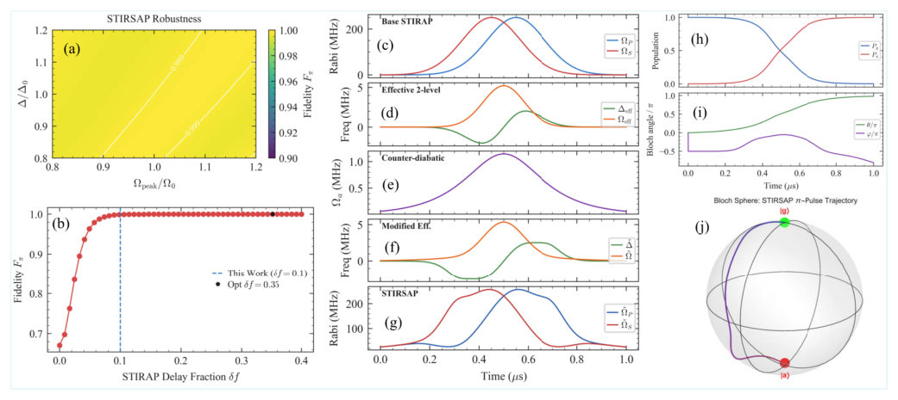
<figcaption class="paper-figure-caption"><b>Fig 4.</b> FIG. 3. STIRSAP pulse construction and single-pulse characterization. (a) Robustness map of the transfer fidelity Fπ under simultaneous variations of the peak Raman coupling and single-photon detuning. High fidelity is maintained primarily along correlated variations preserving the ratio Ω2 peak/∆. (b) Transfer fidelity versus relative pulse delay. The operational point used throughout this work (δf = 0.1) lies within a broad high-fidelity plateau. (c) Base Gaussian STIRAP Raman envelopes. (d) Effective Raman coupling and detuning obtained after adiabatic elimination. (e) Counterdiabatic auxiliary coupling Ωa(t). (f) Modified superadiabatic effective parameters (e∆, eΩ). (g) Final...</figcaption>
</figure>
<figure class="paper-figure-card">
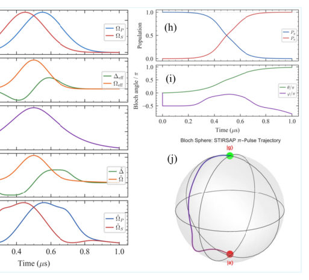
<figcaption class="paper-figure-caption"><b>Fig 5.</b> Figure 4(a) illustrates the classical space–time tra- jectories corresponding to the numerically optimal momentum-transfer order n = 270. The sequential STIR- SAP Raman pulses symmetrically accelerate and deceler- ate the two interferometer arms, generating a maximum momentum splitting of 2nℏkeff while preserving the stan- dard Mach–Zehnder geometry. The resulting trajectories remain mirror symmetric about the central π-pulse, en- suring recombination of the two wave packets at the fi- nal beam splitter despite the large momentum separa- tion accumulated during the sequence. The principal consequence of increasing the LMT order is the rapid growth of the spatial separation between the...</figcaption>
</figure>

**Summary.** The paper theoretically investigates using Stimulated Raman Shortcut-to-Adiabatic Passage (STIRSAP) to achieve ultra-high fidelity population transfer necessary for large-momentum-transfer atom interferometry. By optimizing the pulse control, they predict that sensitivity improves significantly with increasing momentum order ($n$), reaching an optimum near $n=270$. However, the analysis concludes that practical measurements will be limited by external technical noise sources rather than the fundamental limitations of the quantum control protocol itself.

**Why it may be interesting.** This work is highly relevant as it combines advanced quantum control techniques (STIRAP/CD correction) with precision measurement physics. The theoretical framework for mitigating decoherence in high-order interferometers using tailored light pulses is a key area of research in AMO and quantum optics.

Detailed structure

**Main problem.** To enhance the inertial sensitivity of compact quantum sensors using Large-Momentum-Transfer (LMT) atom interferometry, which is fundamentally limited by pulse-transfer errors across long Raman sequences.

**Main result.** Superadiabatic Raman control via STIRSAP pulses achieves high single-pulse fidelities ($F_\pi \approx 0.999$) while allowing the interferometer to reach an optimal order ($n\approx270$), though technical noise limits practical performance.

**Method.** The study uses theoretical modeling of Stimulated Raman Shortcut-to-Adiabatic Passage (STIRSAP) and analyzes the scaling behavior of compound interferometric fidelity versus LMT order ($n$).

**Model / system.** The system is based on cold atoms, specifically using a Mach–Zehnder atom interferometer geometry with $^{87}	ext{Rb}$ atoms. The dynamics are modeled by an effective two-level Raman Hamiltonian derived from the full three-level interaction.

**Key observables.** Single-pulse transfer fidelity ($F_\pi$), interferometric phase enhancement ($\Delta\Phi \propto n k_{	ext{eff}} g T^2$), and the resulting acceleration sensitivity ($\delta g$).

**Important parameters / regimes.** LMT order ($n$), pulse duration ($T_p = 1 \mu	ext{s}$), and the optimal order $n_{	ext{opt}} \approx 270$.

**Assumptions / limitations.** The analysis relies on an effective two-level Raman description, neglecting full three-level effects like spontaneous emission; it also assumes that technical noise sources (vibration) will dominate over quantum shot noise at practical orders.

**Figures summary.** Figures illustrate the STIRSAP pulse sequence ($\pi/2-\pi-\pi/2$), show the evolution of fidelity ($F_\pi$) vs. pulse duration, and plot sensitivity ($\delta g$) versus LMT order ($n$), highlighting the competition between phase enhancement and contrast decay.

**Paper structure.** The paper first establishes the need for high-fidelity control in LMT interferometry using STIRSAP theory (incorporating counterdiabatic corrections). It then analyzes the scaling of sensitivity with $n$, identifying an optimal order, before concluding that technical noise limits performance rather than fundamental pulse limitations.

Abstract

Large-momentum-transfer (LMT) atom interferometry provides a route toward enhanced inertial sensitivity in compact quantum sensors, but its scalability is limited by the accumulation of pulse-transfer errors across long Raman pulse sequences. We investigate theoretically the use of stimulated Raman shortcut-to-adiabatic passage (STIRSAP) for high-fidelity LMT atom optics in a Mach--Zehnder interferometer geometry. The counterdiabatic correction is encoded directly into the Raman pulse envelopes, eliminating the need for auxiliary microwave or radio-frequency control fields. Numerical simulations based on an effective Raman model show that $1~μ\mathrm{s}$ STIRSAP pulses achieve single-pulse transfer fidelities of $F_π= 0.99902$ while maintaining negligible pulse-time overhead even at high momentum order. We analyze the resulting tradeoff between interferometric phase enhancement and compound contrast decay and identify an unconstrained shot-noise optimum near $n\approx270$. The analysis further shows that practical operation at extreme LMT order is constrained by wave-packet separation, vibration noise, Doppler detuning, and accumulated systematic effects rather than by pulse duration itself. These results establish superadiabatic Raman control as a promising approach for scalable high-fidelity atom optics and clarify the physical limitations governing compact high-order atom interferometers.

[↑ back to top](#top)

### [Coupled-cluster study of dynamic Jahn-Teller effect in a $5d^2$ W antifluorite](http://arxiv.org/abs/2606.15697v1)

**Authors:** Teruki Matsuzaki, Liviu F. Chibotaru, Maristella Alessio, Naoya Iwahara  
**Type:** theory · **Category:** strongly correlated electrons · **PDF:** <https://arxiv.org/pdf/2606.15697v1>  
**Analysis basis:** full PDF text, analyzed in chunks
**Topic relevance:** `Keldysh / 2PI / non-Gaussian methods` **1/5**

↔ Scroll figures horizontally

<figure class="paper-figure-card">
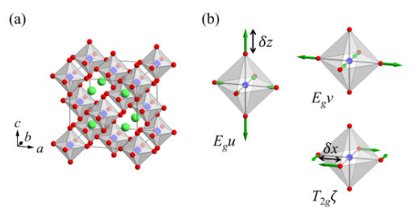
<figcaption class="paper-figure-caption"><b>Fig 1.</b> FIG. 1. (a) The conventional unit cell of antifluorite and (b) the JT active normal modes of the 5d2 octahedron. The green, blue, and red spheres represent the Cs, W, and Cl atoms, respectively. (b) The green arrows indicate the displacements of the atoms by the JT active normal modes.</figcaption>
</figure>
<figure class="paper-figure-card">
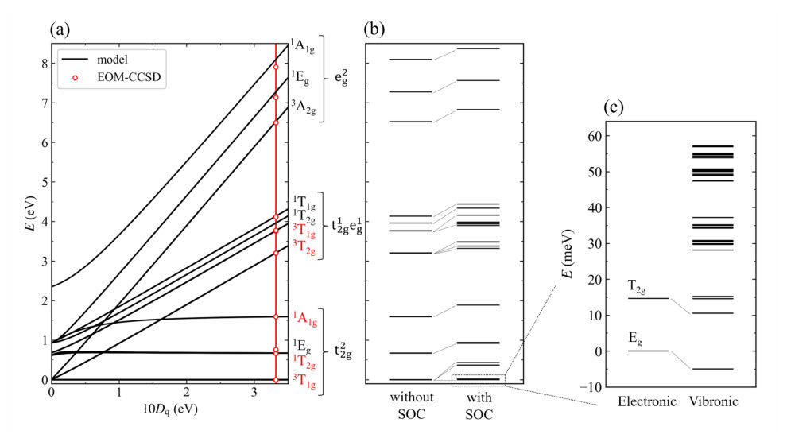
<figcaption class="paper-figure-caption"><b>Fig 2.</b> FIG. 2. Energy levels of embedded 5d2 sites with respect to the ground energy level (in eV). (a) Tanabe-Sugano diagram. The black lines are the prediction by the Tanabe-Sugano diagram (B = 0.045 eV, C = 0.193 eV), and the red open circles and red solid lines indicate the ab initio levels and 10Dq, respectively. (b) Comparison between the term levels (left) and spin-orbit multiplet states (right) obtained using the fitted data. We set the ground-state energy to zero. (c) Low-lying Jeff = 2 crystal-field levels (left) and the vibronic levels (right).</figcaption>
</figure>
<figure class="paper-figure-card">
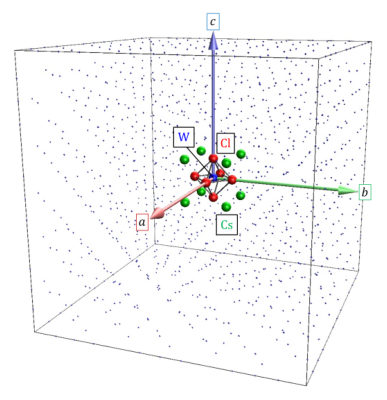
<figcaption class="paper-figure-caption"><b>Fig 3.</b> FIG. 3. The tungsten cluster (WCl6 and the nearest eight Ba ions) is embedded in point charges. The quantum-mechanical cluster is cut out from the crystallographic structure [84]. The blue dots represent the point charges.</figcaption>
</figure>
<figure class="paper-figure-card">
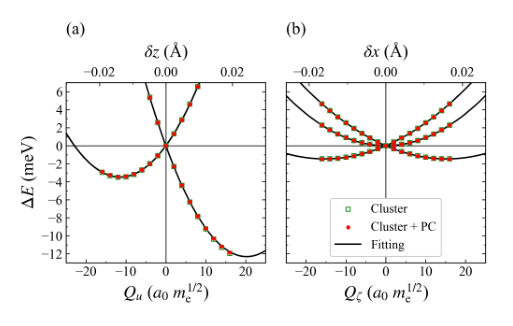
<figcaption class="paper-figure-caption"><b>Fig 4.</b> FIG. 4. The 3T1g APESs with respect to (a) the Egu and (b) the T2gζ deformations. The green open squares and the red circles are the EOM-CCSD data without and with point charges, respectively. The black lines are the model fit to the EOM-CCSD data with point charges.</figcaption>
</figure>
<figure class="paper-figure-card">
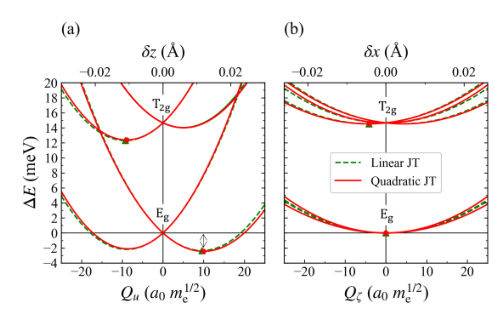
<figcaption class="paper-figure-caption"><b>Fig 5.</b> FIG. 5. The Jeff = 2 APESs with respect to (a) the Egu and (b) the T2gζ deformations. The green dashed and the red solid lines show the APESs of the models that include only linear vibronic coupling and include both linear and quadratic vibronic couplings, respectively.</figcaption>
</figure>

**Summary.** This study uses EOM-CC theory to investigate the dynamic Jahn-Teller effect in $	ext{Cs}_2	ext{WCl}_6$, a $5d^2$ antifluorite. By calculating RIXS spectra and magnetic moments, the authors show that while the static JT effect is weak, the dynamic coupling significantly modifies spectroscopic features. This confirms the utility of EOM-CC for modeling complex coupled phenomena in correlated insulators.

**Why it may be interesting.** The work provides a detailed theoretical framework linking advanced quantum chemistry methods (EOM-CC) directly to measurable solid-state properties like RIXS spectra, which is crucial for understanding coupled electronic/lattice dynamics in strongly correlated $5d$ systems.

Detailed structure

**Main problem.** To quantitatively unravel the nature of $5d^2$ centers and study the complex interplay among charge, spin, orbital, and lattice degrees of freedom in correlated insulators.

**Main result.** The Jahn-Teller effect is found to be in a weak regime, but the dynamic Jahn-Teller (DJT) effect significantly modulates RIXS spectra shapes and affects the magnetic moment. The EOM-CC method proves useful for predicting these phenomena.

**Method.** Equation-of-Motion Coupled Cluster (EOM-CC) theory is applied to derive electronic and vibronic model Hamiltonians, followed by calculating W $L_3$ edge Resonant Inelastic X-ray Scattering (RIXS) spectra and the effective magnetic moment.

**Model / system.** The system studied is $	ext{Cs}_2	ext{WCl}_6$, a cubic $5d^2$ double perovskite. The model incorporates electronic Coulomb, Spin-Orbit Coupling ($\hat{H}_{	ext{SO}}$), and Ligand-Field Hamiltonians, coupled to the lattice vibrations via the DJT Hamiltonian.

**Key observables.** W $L_3$ edge RIXS spectra (electronic vs. vibronic), effective magnetic moment ($M_{	ext{eff}}$) temperature dependence, and Jahn-Teller stabilization energies ($	ext{E}_g$ vs $	ext{T}_{2g}$).

**Important parameters / regimes.** The system operates in a weak JT regime; key parameters include $10Dq = 3.32 	ext{ eV}$ and calculated vibronic coupling constants.

**Assumptions / limitations.** The primary approximations involve the use of EOM-CC theory, treating the environment via point charges (Mulliken charges), and neglecting intersite interactions.

**Figures summary.** Figures illustrate the conventional unit cell and JT active modes; APESs show energy level splitting due to $E_g$ and $T_{2g}$ deformations; RIXS spectra compare electronic vs. vibronic features at different temperatures; a graph shows the temperature dependence of $M_{	ext{eff}}$ matching experiment.

**Paper structure.** The paper develops the theoretical framework by defining the full Hamiltonian, calculating necessary parameters (e.g., using EOM-CCSD for APESs), and then applying the DJT model to predict spectroscopic signatures (RIXS) and magnetic behavior ($M_{	ext{eff}}$).

Abstract

In correlated insulators, the interplay among coexisting charge, spin, orbital, and lattice degrees of freedom gives rise to rich quantum phenomena, while unraveling the interplay is not straightforward. In the family of cubic $5d^2$ double perovskites, the ground spin-orbit coupled electronic states of $5d$ metal sites are degenerate and couple to the Jahn-Teller active vibrations, whereas no experimental evidence of the symmetry-lowering in the low-temperature ordered phases has been reported. To quantitatively unravel the nature of $5d^2$ centers, we apply equation-of-motion coupled cluster (EOM-CC) theory to analyze the vibronic and magnetic properties of $5d^2$ W sites of Cs$_2$WCl$_6$. We derive the electronic and vibronic model Hamiltonians, calculate the W $L_3$ edge resonant inelastic x-ray scattering (RIXS) spectra, and determine the effective magnetic moment. The simulated RIXS spectra show that vibronic coupling makes several peaks asymmetric. The effective magnetic moments exhibit a temperature dependence similar to that observed experimentally, confirming the validity of the calculated distribution of low-energy levels. Our calculations indicate that the Jahn-Teller effect in Cs$_2$WCl$_6$ is in a weak regime, and noticeable deformation would not occur, whereas the dynamic Jahn-Teller effect modulates the shapes of the RIXS spectra and affects the magnetic moment. This work demonstrates the usefulness of the EOM-CC method for predicting physical phenomena on metal sites in correlated insulating materials.

[↑ back to top](#top)

### [Degeneracy Cannot Violate the Quantum Hamming Bound](http://arxiv.org/abs/2606.15558v1)

**Authors:** Yu-Xuan Zhang, Jing-Ling Chen  
**Type:** theory · **Category:** quantum information and computing · **PDF:** <https://arxiv.org/pdf/2606.15558v1>  
**Analysis basis:** full PDF text, analyzed in chunks
**Topic relevance:** `entanglement & information structure` **1/5**

↔ Scroll figures horizontally

<figure class="paper-figure-card">
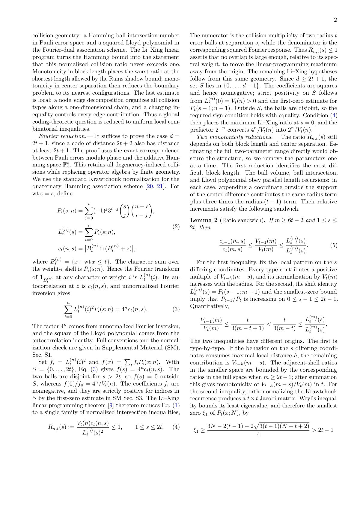
<figcaption class="paper-figure-caption"><b>Fig 1.</b> Low-resolution page preview, page 2</figcaption>
</figure>
<figure class="paper-figure-card">
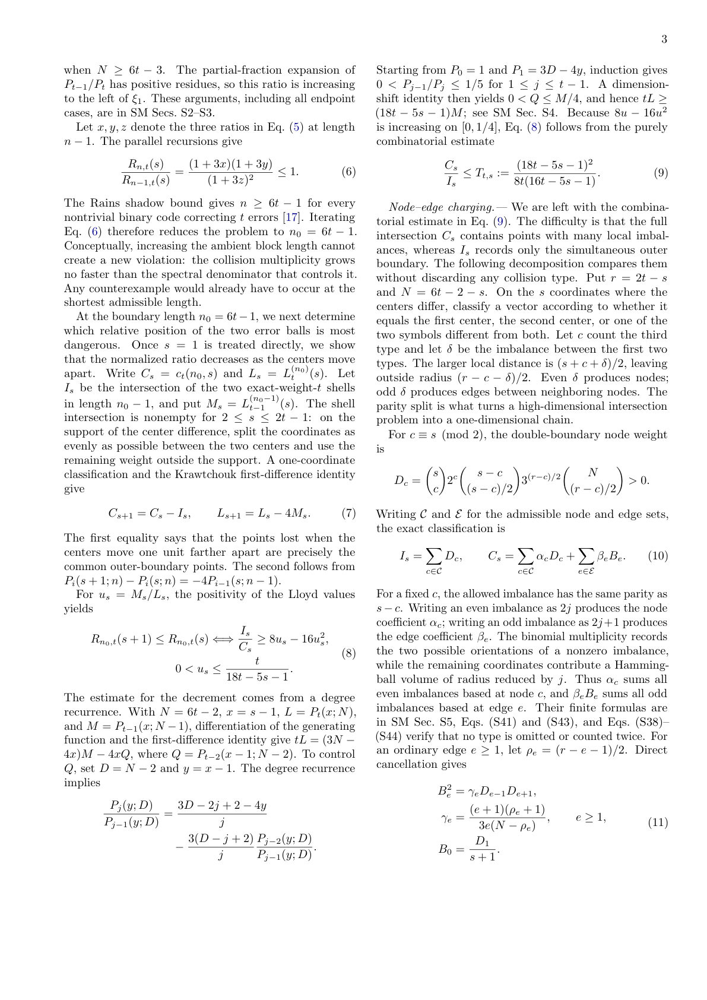
<figcaption class="paper-figure-caption"><b>Fig 2.</b> Low-resolution page preview, page 3</figcaption>
</figure>
<figure class="paper-figure-card">
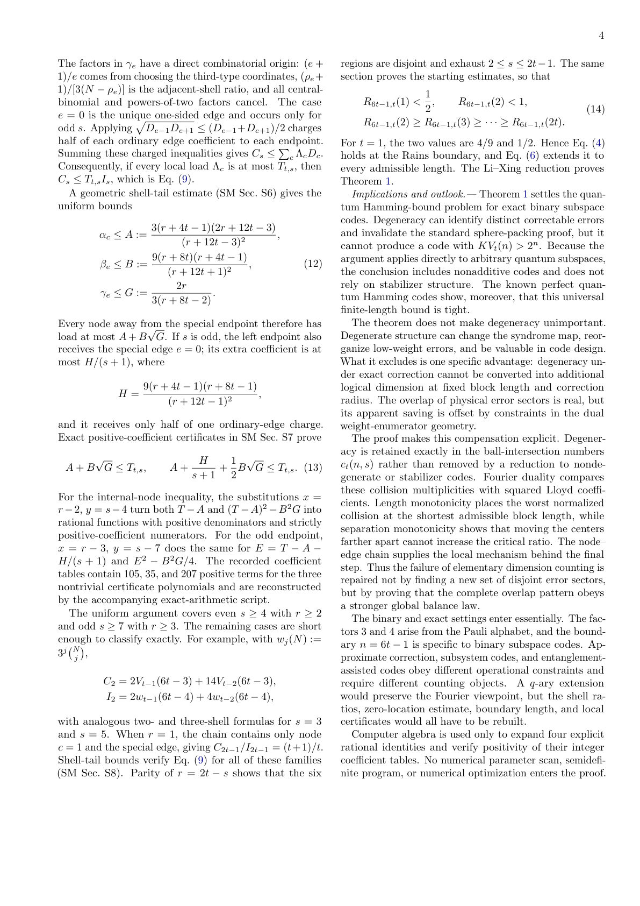
<figcaption class="paper-figure-caption"><b>Fig 3.</b> Low-resolution page preview, page 4</figcaption>
</figure>
<figure class="paper-figure-card">
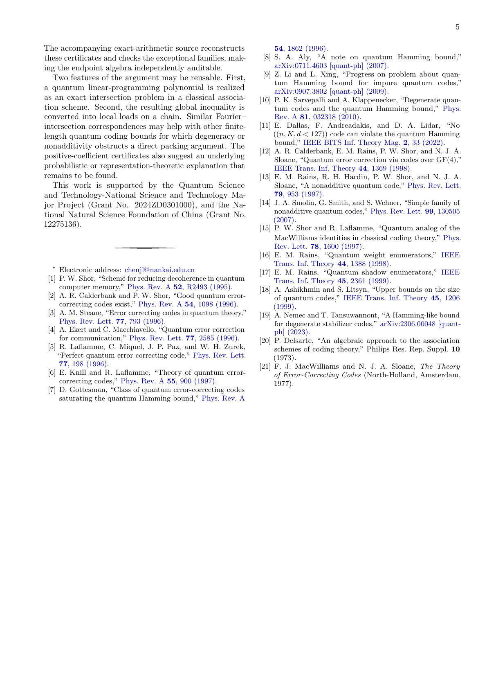
<figcaption class="paper-figure-caption"><b>Fig 4.</b> Low-resolution page preview, page 5</figcaption>
</figure>
<figure class="paper-figure-card">
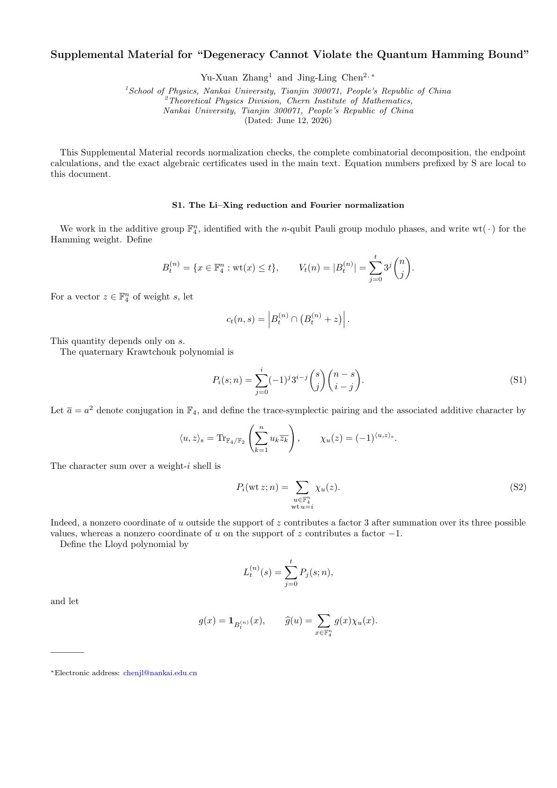
<figcaption class="paper-figure-caption"><b>Fig 5.</b> Low-resolution page preview, page 6</figcaption>
</figure>

**Summary.** This paper resolves a decades-old question in quantum coding theory: whether code degeneracy can violate the Quantum Hamming Bound. The authors prove that despite complex error overlaps allowed by degeneracy, the bound remains inviolable for all exact binary quantum subspace codes. They achieve this using sophisticated combinatorial methods involving transforming linear programming bounds into local node-edge charging inequalities.

**Why it may be interesting.** This work provides deep mathematical insight into the fundamental limits of quantum error correction codes, which underpins all practical quantum computing architectures. It settles a long-standing open problem by providing rigorous combinatorial proofs applicable to general subspace codes, not just stabilizer codes.

Detailed structure

**Main problem.** To rigorously prove that quantum error-correcting codes, even those exhibiting degeneracy (where distinct errors act identically), cannot violate the fundamental Quantum Hamming Bound.

**Main result.** The authors prove that every exact binary quantum subspace code with more than one logical qubit ($K>1$) must satisfy the established Quantum Hamming Bound. Degeneracy allows error sectors to overlap but does not permit an enlargement of this finite-length bound.

**Method.** The proof combines advanced combinatorial techniques, transforming a linear programming problem into an exact intersection count for quaternary Hamming balls. This is reduced via monotonicity arguments to analyzing local node-edge charging inequalities at the shortest admissible code length.

**Model / system.** The analysis focuses on abstract mathematical structures: exact binary quantum subspace codes $((n, K, d))$ designed to correct Pauli errors up to a certain weight $t$. The underlying mathematics involves Fourier transforms and counting vectors in Hamming spaces over $\mathbb{F}_2^n$.

**Key observables.** The normalized collision ratio $R_{n,t}(s)$, which must be less than or equal to 1 for the bound to hold. Other key observables include collision multiplicities ($C_s, I_s$) and related ratios ($u_s$).

**Important parameters / regimes.** Block length $n$, code dimension factor $K$, error correction radius $t = \lfloor(d-1)/2
floor$, and the support size $s$ used in local analysis.

**Assumptions / limitations.** The proof assumes the existence of an exact binary quantum subspace code structure. The final steps rely on complex combinatorial identities derived from orthogonal polynomials (Krawtchouk polynomials) to establish positivity and inequality chains.

**Figures summary.** Not specified, but the notes detail the derivation of recurrence relations for collision multiplicities ($C_{s+1} = C_s - I_s$) and the establishment of bounds using polynomial inequalities.

**Paper structure.** The paper proceeds by first establishing the connection to linear programming bounds (Li-Xing). It then uses Fourier reduction to map the problem onto additive Hamming space structures. The core is a multi-stage combinatorial proof: reducing the global bound to local node-edge charging inequalities, and finally deriving explicit polynomial certificates that confirm these local constraints are satisfied.

Abstract

The quantum Hamming bound is the standard finite-length sphere-packing bound for exact correction of arbitrary qubit errors. Whether degeneracy can evade this bound has remained unresolved in full generality for nearly three decades: distinct correctable errors may act identically on the code space, so the usual disjoint-sphere argument breaks down. We prove that every exact binary quantum subspace code with $K>1$ obeys the bound, without assuming either nondegeneracy or additivity. Our proof turns the Li--Xing linear-programming polynomial into an exact intersection count for quaternary Hamming balls. Monotonicity in block length and in ball-center separation then reduces the problem to a local node--edge charging inequality at the shortest admissible length. Thus degeneracy can merge correctable error sectors, but cannot enlarge the finite-length binary Hamming bound.

[↑ back to top](#top)

### [Jahn-Teller effect in $j = 3/2$ Mott insulators: Ground states and thermal fluctuations](http://arxiv.org/abs/2606.14851v1)

**Authors:** Kathleen Hart, Ruairidh Sutcliffe, Arun Paramekanti  
**Type:** theory · **Category:** strongly correlated electrons · **PDF:** <https://arxiv.org/pdf/2606.14851v1>  
**Analysis basis:** full PDF text, analyzed in chunks
**Topic relevance:** `methods for driven-dissipative` **1/5**

↔ Scroll figures horizontally

<figure class="paper-figure-card">
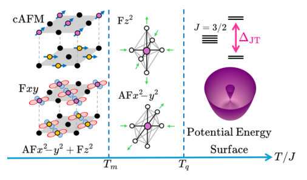
<figcaption class="paper-figure-caption"><b>Fig 1.</b> FIG. 1. Phases of the d1 double perovskites as a function of temperature, T/J. For T &lt; Tm, canted antiferromagnetic (cAFM) dipole order coexists with quadrupolar orders: no- tably antiferro-ordering of x2−y2 quadrupoles (AFx2−y2), ferro-ordering of z2 quadrupoles (Fz2), and weak ordering of T2g quadrupoles (Fxy) on the magnetic sites (pink and yellow dots are used to distinguish the different planes). Black dots represent non-magnetic ions. For Tm &lt; T &lt; Tq, dipolar mag- netic order vanishes and pure Eg quadrupolar order persists accompanied by depicted lattice distortions Qz2 and Qx2−y2. For T &gt; Tq, quadrupolar order vanishes but JT splitting of the j =3/2 quartet, with ∆JT = λQEg, persists...</figcaption>
</figure>
<figure class="paper-figure-card">
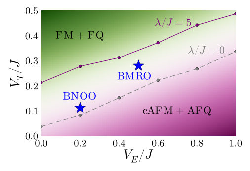
<figcaption class="paper-figure-caption"><b>Fig 2.</b> FIG. 2. Ground state phase diagram as a function of quadrupole interactions VE/J and VT /J. Dashed line shows the phase boundary between the FM+FQ phase (green) and cAFM+AFQ phase (pink) in the absence of vibronic coupling λ/J = 0. Incorporating λ/J ̸= 0 pushes the phase boundary upwards, e.g., solid line shows the displaced boundary for λ/J =5.0. Stars indicate illustrative choices of (VE/J, VT /J) for Ba2MgReO6 and Ba2NaOsO6.</figcaption>
</figure>
<figure class="paper-figure-card">
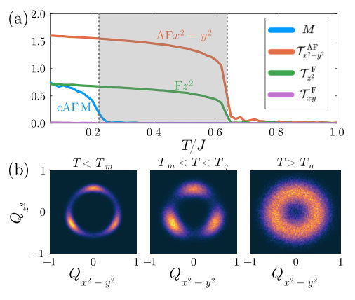
<figcaption class="paper-figure-caption"><b>Fig 3.</b> FIG. 3. Multipolar orders for (VE/J, VT /J) = (0.5, 0.25) and strong vibronic coupling λ/J = 15 relevant to Ba2MgReO6, and corresponding phonon distributions. (a) Order parame- ters, showing the high temperature paramagnetic phase, an intermediate temperature quadrupolar ordered phase (grey area) T &lt;Tq, and then dipolar magnetic ordering into a cAFM [110] order with coexisting quadrupolar orders for T &lt; Tm. (b) Phonon distributions for each phase, sampling over all lattice sites and 192 MC configurations. Below Tq, the distri- bution shows three peaks corresponding to tetragonal distor- tions along three equivalent axes. For T &gt;Tq, the distribution shows a ring structure originating from...</figcaption>
</figure>
<figure class="paper-figure-card">
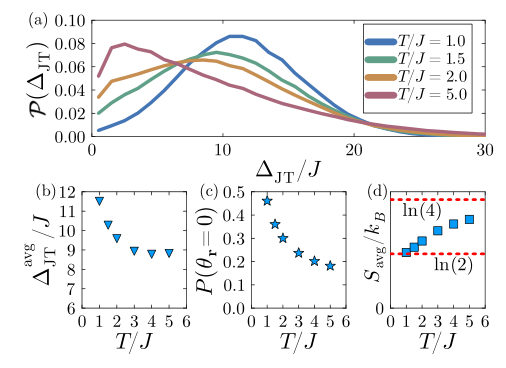
<figcaption class="paper-figure-caption"><b>Fig 4.</b> FIG. 4. Measures of local JT symmetry breaking at high tem- peratures for parameters relevant to Ba2MgReO6 with strong vibronic coupling λ/J = 15. (a) Distribution of local quartet splitting ∆JT over a range of temperatures in the paramag- netic regime. The distributions show a maximum at nonzero splitting with a long tail to large ∆JT. (b) Average local quar- tet splitting as a function of temperature T/J. The average splitting is nonzero even for T ≫Tq. (c) Temperature depen- dence for the height of the distribution of quadrupole-phonon angle, cos θr (defined in the text), at θr = 0. (d) Entropy Savg of the local j = 3/2 quartet averaged over the distribution of splittings in panel (a).</figcaption>
</figure>
<figure class="paper-figure-card">
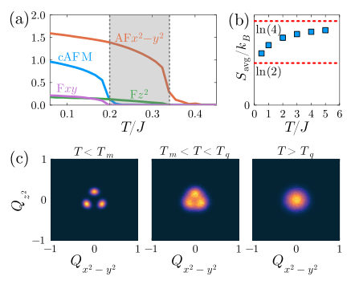
<figcaption class="paper-figure-caption"><b>Fig 5.</b> FIG. 6. (a) Nonzero T orders with vibronic coupling λ/J = 5. Similar to the strong coupling case, the low T phase exhibits coexisting cAFM, staggered x2 −y2, ferroic z2 and ferroic xy orders. Above Tm, the quadrupolar order persists and vanishes above Tq. (b) Average entropy Savg as a function of T/J in the paramagnetic phase. (c) Corresponding phonon distributions for the magnetically ordered phase (T &lt; Tm), the intermediate quadrupolar ordered phase (Tm &lt; T &lt; Tq) and the paramagnetic phase (T &gt; Tq).</figcaption>
</figure>

**Summary.** This work models $j=3/2$ Mott insulators where strong SOC couples electronic multipoles to lattice distortions via the Jahn-Teller effect. Using Monte Carlo simulations, the authors map out complex phase diagrams showing how coupling dictates ground state orders and thermal transitions. The findings highlight that phonon fluctuations suppress expected entropy and provide a framework for understanding correlated materials like double perovskites.

**Why it may be interesting.** The coupling between electronic degrees of freedom (multipolar moments) and lattice vibrations (phonons) is a central theme in quantum materials physics. The use of advanced MC techniques to model coupled spin-phonon dynamics provides insights into emergent order parameters beyond simple mean-field treatments.

Detailed structure

**Main problem.** The study investigates the complex interplay between strong atomic spin-orbit coupling (SOC) and Jahn-Teller (JT) lattice distortions in Mott insulators, focusing on determining ground states and understanding thermal fluctuations.

**Main result.** The system exhibits distinct multipolar ground states whose nature is controlled by vibronic coupling; furthermore, thermal fluctuations significantly suppress the expected entropy of the coupled multipole-phonon system.

**Method.** The research employs advanced computational techniques including SU(4) spin Monte Carlo simulations coupled to classical JT phonons and exact diagonalization calculations for spectral analysis.

**Model / system.** The model focuses on $j=3/2$ Mott insulators, utilizing an $	ext{SU}(4)$ exchange Hamiltonian incorporating dipole, quadrupolar, and octupolar interactions, which is then coupled to local phonon modes via vibronic coupling.

**Key observables.** Multipolar order parameters (dipolar, quadrupolar, octupolar), temperature-dependent spectral splittings ($P(\Delta_{JT})$), entropy ($S$), and quadrupole-phonon locking angles ($\cos 	heta_r$).

**Important parameters / regimes.** Interaction ratios like $	ext{VE}/J$ and $	ext{VT}/J$, the vibronic coupling strength $\lambda/J$, and temperature $T/J$.

**Assumptions / limitations.** The analysis often treats JT phonons classically, though a full quantum treatment of radial modes is suggested as necessary for complete reconciliation with experiments.

**Figures summary.** Figures illustrate phase diagrams showing transitions between different multipolar orders (e.g., cAFM+AFQ $\leftrightarrow$ pure Eg quadrupolar) as temperature or interaction ratios change; other figures show the evolution of spectral distributions and entropy vs. temperature.

**Paper structure.** The paper systematically analyzes the ground state by varying interaction parameters, then extends to finite temperatures using Monte Carlo methods to map out phase diagrams, followed by detailed analysis of spectroscopic signatures (like local splitting) and thermodynamic quantities (entropy).

Abstract

The interplay of strong atomic spin-orbit coupling with Jahn-Teller (JT) lattice distortions is an important theme in quantum materials hosting heavy atoms. A prototypical example of such a system is a degenerate $j = 3/2$ multiplet coupled to local phonon modes. Here, we study the multipolar ground states of this system as realized in Mott insulators, explore its thermal phase diagram via an $SU(4)$ spin Monte Carlo approach coupled to JT phonons, and study the temperature dependent splittings of the $j = 3/2$ multiplet as relevant to spectroscopic probes. Our work sheds light on coexisting distinct multipolar orders engendered by phonon coupling, role of thermal JT fluctuations, and the entropy of the coupled multipole-phonon system. We discuss broad implications for double perovskites $\rm Ba_2MgReO_6$, $\rm Ba_2NaOsO_6$ and lacunar spinels such as $\rm GaTa_4Se_8$ and $\rm GaNb_4Se_8$.

[↑ back to top](#top)

### [Optimal Toffoli-Depth Multi-Controlled Toffoli Decomposition in 2D Qubit Layout](http://arxiv.org/abs/2606.15113v1)

**Authors:** Anik Basu Bhaumik, Suman Dutta, Anupam Chattopadhyay  
**Type:** both · **Category:** quantum information and computing · **PDF:** <https://arxiv.org/pdf/2606.15113v1>  
**Analysis basis:** full PDF text, analyzed in chunks
**Topic relevance:** `QC/QI experiment` **1/5**

↔ Scroll figures horizontally

<figure class="paper-figure-card">
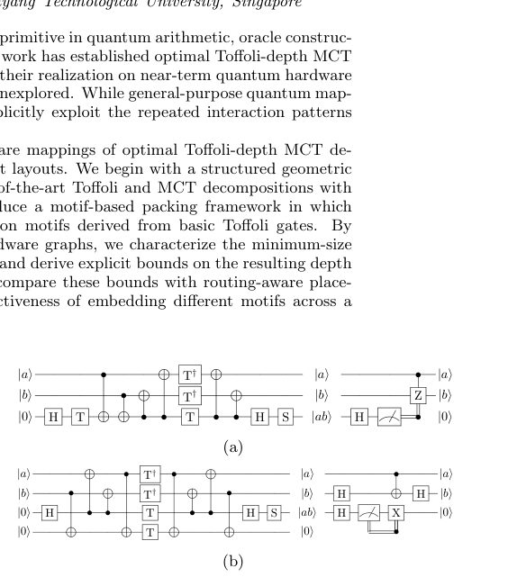
<figcaption class="paper-figure-caption"><b>Fig 1.</b> FIG. 1: Logical circuits for basic Toffoli decompositions with measurement-based uncomputation: (a) without ancilla [2], and (b) with a single reusable ancilla [3].</figcaption>
</figure>
<figure class="paper-figure-card">
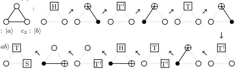
<figcaption class="paper-figure-caption"><b>Fig 2.</b> FIG. 3: (a) T-depth 6 Toffoli decomposition from [45], and (b) its corresponding 2D implementation.</figcaption>
</figure>
<figure class="paper-figure-card">
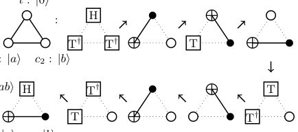
<figcaption class="paper-figure-caption"><b>Fig 3.</b> FIG. 4: (a) T-depth 4 Toffoli decomposition from [50], and (b) its corresponding 2D implementation.</figcaption>
</figure>
<figure class="paper-figure-card">
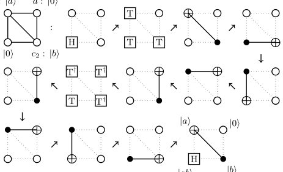
<figcaption class="paper-figure-caption"><b>Fig 4.</b> FIG. 6: (a) T-depth-2 Toffoli decomposition from [50], and (b) its corresponding 2D implementation.</figcaption>
</figure>
<figure class="paper-figure-card">
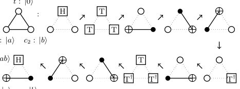
<figcaption class="paper-figure-caption"><b>Fig 5.</b> FIG. 5: (a) T-depth 3 Toffoli decomposition from [50], and (b) its corresponding 2D implementation.</figcaption>
</figure>

**Summary.** This paper tackles the challenge of mapping complex, theoretically optimal quantum circuits (like $n$-MCT gates) onto physically constrained 2D qubit lattices. It develops rigorous upper bounds for the resulting circuit depth by analyzing how fundamental gate motifs can be packed into the hardware graph structure. The results provide crucial guidelines for designing algorithms that are feasible on near-term quantum processors.

**Why it may be interesting.** This work is highly relevant as it directly addresses the physical implementation gap in quantum computing theory by providing quantitative metrics on how logical circuit complexity translates into hardware depth limitations on realistic 2D architectures.

Detailed structure

**Main problem.** The core problem is developing architecture-aware mapping strategies for optimal Multi-Controlled Toffoli (MCT) gate decompositions onto restricted two-dimensional qubit layouts.

**Main result.** The authors derive explicit upper bounds on the depth overhead incurred during mapping by analyzing motif packing numbers ($P_3$ and $C_4$) within specific 2D topologies like square grids and hypercubes.

**Method.** They employ a combination of theoretical bounding techniques (using graph motifs and packing numbers) and heuristic algorithms, such as solving the Maximum Independent Set problem on conflict graphs, to estimate achievable circuit depth.

**Model / system.** The system is quantum computation implemented on near-term hardware constrained to 2D lattice topologies (e.g., square, triangular, hexagonal grids). The logical circuits are defined by MCT gates decomposed into basic Toffoli gates.

**Key observables.** Tofoli depth, circuit depth, SWAP gate count/overhead, and the packing number of required interaction motifs ($P_3$, $C_4$).

**Important parameters / regimes.** The size and connectivity of the 2D lattice ($p 	imes q$ grid, hypercube dimension $r$), and the number of controls in the MCT gate ($n$).

**Assumptions / limitations.** The analysis assumes that mapping depth overhead can be bounded by motif packing limits, although practical heuristics often outperform worst-case theoretical bounds.

**Figures summary.** Figures illustrate specific 2D implementations of $n$-MCT decompositions on various lattices (square, triangular, H-tree) and compare observed vs. theoretical depth overheads for motif packings ($P_3$, $C_4$) across different placement heuristics.

**Paper structure.** The paper progresses from establishing the need for architecture-aware mapping to deriving general upper bounds based on graph motifs (Theorem 1 & 2), providing specific resource estimates for various topologies (TABLE I, II, III), and finally validating these bounds using advanced packing algorithms like MIS heuristics.

Abstract

The multi-controlled Toffoli (MCT) gate is a key primitive in quantum arithmetic, oracle construction, and quantum cryptanalysis. Although recent work has established optimal Toffoli-depth MCT decompositions under all-to-all qubit connectivity, their realization on near-term quantum hardware with restricted qubit connectivity remains largely unexplored. While general-purpose quantum mappers can route arbitrary circuits, they do not explicitly exploit the repeated interaction patterns inherent in MCT decompositions.   In our present paper, we study architecture-aware mappings of optimal Toffoli-depth MCT decompositions onto restricted two-dimensional qubit layouts. We begin with a structured geometric placements that preserve the parallelism of state-of-the-art Toffoli and MCT decompositions with no additional depth overhead. We further introduce a motif-based packing framework in which decomposition layers are represented by interaction motifs derived from basic Toffoli gates. By embedding these motifs vertex-disjointly into hardware graphs, we characterize the minimum-size topologies supporting the required qubit resources and derive explicit bounds on the resulting depth overhead under tight qubit budgets. Finally, we compare these bounds with routing-aware placement heuristics and empirically evaluate the effectiveness of embedding different motifs across a range of hardware topologies.

[↑ back to top](#top)

### [Probing Interfacial Magnetic Anisotropy in \texorpdfstring{CoV$_{2}$O$_{4}$}{CoV2O4} using Spin Hall Magnetoresistance](http://arxiv.org/abs/2606.15865v1)

**Authors:** Sairam Ithineni, Krishna Jha, Aditya A. Wagh, Shwetha G. Bhat, Debashree Nayak, K. Senapati, P. S. Anil Kumar, D. Samal  
**Type:** experiment · **Category:** strongly correlated electrons · **PDF:** <https://arxiv.org/pdf/2606.15865v1>  
**Analysis basis:** full PDF text, analyzed in chunks
**Topic relevance:** `spintronics-quantum-optics interface` **1/5**

↔ Scroll figures horizontally

<figure class="paper-figure-card">
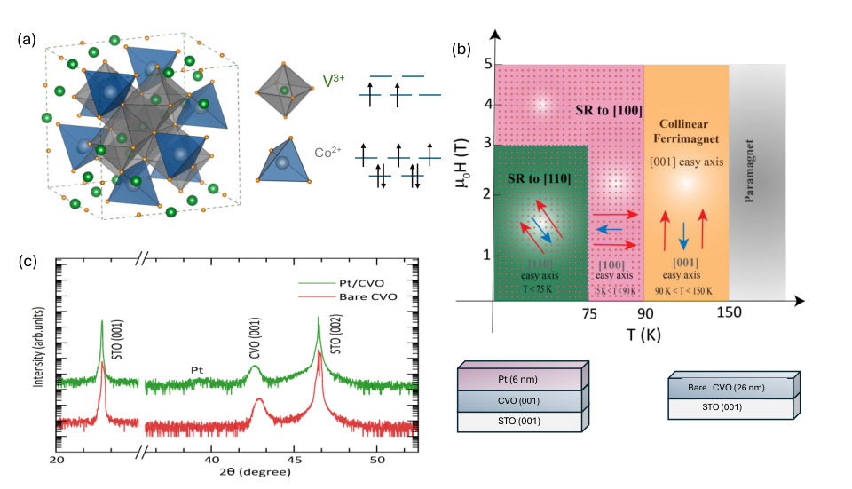
<figcaption class="paper-figure-caption"><b>Fig 1.</b> FIG. 1. (a) Crystal structure of CoV2O4 (CVO), illustrating the arrangement of CoO4 tetrahedra and VO6 octahedra along with their corresponding electronic configurations and spin states of Co2+ and V3+ ions. (b) Schematic magnetic phase diagram of CVO, illustrating the evolution of magnetic anisotropy and spin configurations with temperature. The red and blue arrows represent the spin orientations of Co and V ions, respectively, while the dotted arrows indicate the canting of V spins in the spin-reoriented phase. (c) θ–2θ X-ray diffraction patterns of the Pt/CVO bilayer and bare CVO thin films grown on STO(001), showing the CVO (00l) reflections and the additional Pt diffraction peak from...</figcaption>
</figure>
<figure class="paper-figure-card">
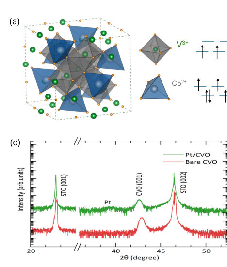
<figcaption class="paper-figure-caption"><b>Fig 2.</b> Figure 1(b) shows the θ–2θ scan of representative bare CoV2O4 (26 nm) and Pt (6 nm)/CoV2O4 (26 nm) thin films. The (001) diffraction peaks corre- sponding to the CVO layer are clearly observed in both samples, indicating oriented growth, while the Pt/CVO sample exhibits an additional peak aris- ing from the Pt overlayer. No impurity phases are detected, confirming that the crystallographic struc- ture of CVO remains preserved after Pt deposition.</figcaption>
</figure>
<figure class="paper-figure-card">

<figcaption class="paper-figure-caption"><b>Fig 3.</b> Figure 2(a) shows the temperature-dependent magnetisation measured under zero-field-cooled (ZFC) and field-cooled (FC) conditions in an applied field of 100 Oe over the temperature range 5 to 300 K, with the magnetic field applied along the in-plane (IP) and out-of-plane (OP) directions of CVO/STO (001). Consistent with previous reports, the system undergoes a paramagnetic-to-ferrimagnetic transi- tion near ∼150 K (Tc)[31, 36]. A spin reorien- tation from the out-of-plane (OP) to the in-plane (IP) direction occurs near ∼90 K (T1), accom-</figcaption>
</figure>
<figure class="paper-figure-card">
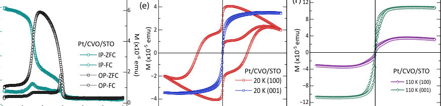
<figcaption class="paper-figure-caption"><b>Fig 4.</b> FIG. 2. Temperature- and field-dependent magnetic properties of bare CVO and Pt/CVO heterostructures. The upper panel [(a)–(c)] corresponds to bare CVO, while the lower panel [(d)–(f)] represents Pt/CVO. Panels (a) and (d) show the temperature dependence of the magnetization measured under zero-field-cooled (ZFC), field-cooled cooling (FCC), and field-cooled warming (FCW) protocols. Panels (b), (c), (e), and (f) display the magnetic field dependence of magnetization, M(H), measured at different temperatures, highlighting the evolution of magnetic hysteresis and saturation behavior in both systems.</figcaption>
</figure>
<figure class="paper-figure-card">
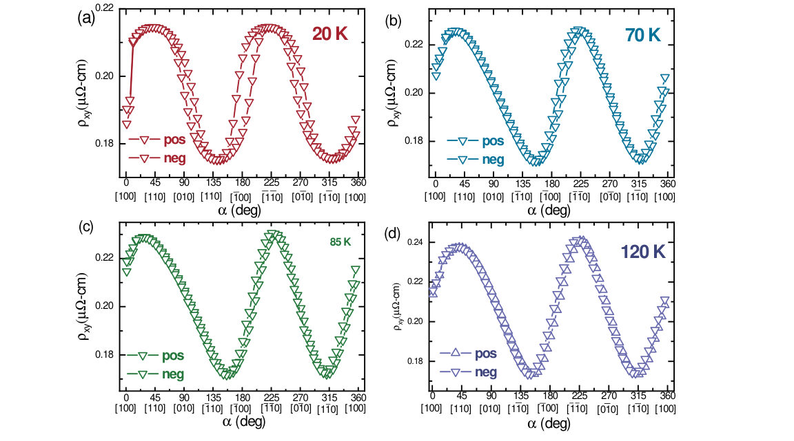
<figcaption class="paper-figure-caption"><b>Fig 5.</b> FIG. 3. Angular dependence of the transverse resistivity, ρxy, measured under positive and negative magnetic field sweeps at different temperatures for the Pt/CVO heterostructure under an applied magnetic field of 150 Oe. Panels (a)–(d) correspond to measurements performed at 20 K, 70 K, 85 K, and 120 K, respectively. The sinusoidal variation in ρxy with rotation angle α reflects the anisotropic magnetotransport response and its evolution with temperature.</figcaption>
</figure>

**Summary.** This study uses Spin Hall Magnetoresistance on $	ext{Pt}/	ext{CoV}_2	ext{O}_4$ thin films to investigate interfacial magnetic anisotropy. The SMR technique reveals a distinct biaxial in-plane easy axis at the interface, contradicting bulk measurements that suggest out-of-plane behavior. This highlights SMR's superior sensitivity for probing surface spin transport and establishes the material as a promising spintronic platform.

**Why it may be interesting.** The work provides an excellent example of using transport measurements (SMR) to isolate and characterize subtle interfacial magnetic phenomena that are masked or misrepresented by bulk magnetization techniques, which is a key concept in modern spintronics research relevant to correlated oxides.

Detailed structure

**Main problem.** The study investigates interfacial magnetic anisotropy in $	ext{CoV}_2	ext{O}_4$ ($	ext{CVO}$) thin films using Spin Hall Magnetoresistance (SMR) to distinguish surface effects from bulk behavior.

**Main result.** SMR measurements reveal a distinct biaxial in-plane magnetic anisotropy for the $	ext{Pt}/	ext{CVO}$ interface, which contrasts with the bulk material's tendency toward out-of-plane anisotropy at higher temperatures.

**Method.** The research employs angle-dependent magnetotransport measurements (SMR) on epitaxial thin-film heterostructures ($	ext{Pt}/	ext{CVO}$) and compares these results against standard DC magnetization measurements.

**Model / system.** The physical system is the $	ext{Pt}/	ext{CoV}_2	ext{O}_4/	ext{STO}(001)$ heterostructure. The analysis relies on modeling magnetotransport phenomena using SMR theory, which probes spin current accumulation at the interface.

**Key observables.** Angle-dependent transverse and longitudinal resistivity ($
ho_{xy}, 
ho_{xx}$), hysteresis loops in SMR scans, and the estimated spin mixing conductance ($G_{	ext{mix}}$).

**Important parameters / regimes.** Temperature (down to 20 K), magnetic field strength (up to 3.5 kOe), and material parameters like the spin Hall angle of Pt.

**Assumptions / limitations.** The SMR response is assumed to be highly sensitive to, and primarily reflect, the interfacial magnetic anisotropy rather than the bulk properties of $	ext{CVO}$.

**Figures summary.** Figures illustrate structural confirmation via XRD, temperature-dependent magnetization curves (ZFC/FC), and angular dependence plots ($
ho_{xy}$ vs. angle) showing characteristic anisotropic modulations.

**Paper structure.** The paper establishes the background on SMR as a probe for interfacial magnetism, presents experimental measurements comparing bulk magnetic data with SMR results, analyzes the directional dependence of the magnetotransport signal to deduce anisotropy type (biaxial in-plane), and concludes by quantifying the interface quality via spin conductance.

Abstract

Spin Hall magnetoresistance (SMR) has emerged as a powerful probe for investigating interfacial spin transport and magnetic anisotropy in complex oxide heterostructures. In this work, we investigate the interfacial magnetic anisotropy in Pt/CVO through angle-dependent magnetotransport measurements. Unlike the bulk-sensitive magnetic measurements on both strained CVO and Pt/CVO films, which exhibit a ferrimagnetic transition at $T_{C} \approx 150$ K accompanied by out-of-plane anisotropy that reorients toward in-plane anisotropy below 90 K, SMR reveals a distinct interfacial magnetic anisotropy. The rotational scans of the in-plane transverse SMR at 20 K exhibit substantial hysteresis about [100], while no hysteresis is observed along [110] and [1$\bar{1}$0], indicating a biaxial anisotropy with easy axes along [110] and [1$\bar{1}$0]. Furthermore, the absence of sharp discontinuities in both the in-plane longitudinal and transverse SMR, together with pronounced discontinuities near the in-plane [010] direction during out-of-plane rotation, strongly indicates the presence of in-plane anisotropy. This behavior persists up to 120 K. The discrepancy between the bulk-sensitive magnetic measurements and the SMR response suggests that the Pt/CVO interface retains a magnetic anisotropy distinct from the bulk, highlighting the interfacial sensitivity of SMR. Additionally, the spin mixing conductance is found to be of the order of $10^{14}$ $Ω^{-1}\mathrm{m}^{-2}$, comparable to other oxide-based spintronic systems. These findings highlight the crucial role of interfacial effects in spin transport and establish Pt/CVO as a promising platform for spintronic applications.

[↑ back to top](#top)

### [Quantum oscillations in proximity to high-angular-momentum band inversion](http://arxiv.org/abs/2606.16397v1)

**Authors:** Jiahao Yang, Gang v. Chen  
**Type:** theory · **Category:** other · **PDF:** <https://arxiv.org/pdf/2606.16397v1>  
**Analysis basis:** full PDF text, analyzed in chunks
**Topic relevance:** `Keldysh / 2PI / non-Gaussian methods` **1/5**

↔ Scroll figures horizontally

<figure class="paper-figure-card">
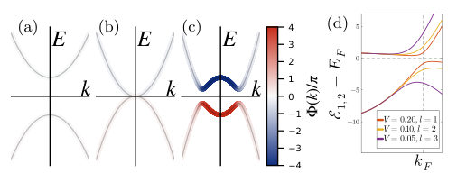
<figcaption class="paper-figure-caption"><b>Fig 1.</b> FIG. 1. HAM band inversion. (a) Trivial band insulator with δµ &lt; 0. (b) Quadratic band touching at δµ = 0. (c) Chern insulator with δµ &gt; 0. Here, Chern number C = 2 for l = 2, and the Berry phase Φ(k) is plotted with Φ(kF ) = 2π. The same structure extends to l ≥2, where the inverted insula- tor has the Chern number C = l. (d) Hybridized dispersions E1,2(k) for l = 1, 2, 3 with different hybridizations V . “kF ” denotes the crossing point of the unhybridized bands and is measured in inverse-length units.</figcaption>
</figure>
<figure class="paper-figure-card">
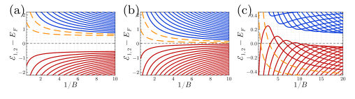
<figcaption class="paper-figure-caption"><b>Fig 2.</b> FIG. 2. Landau-level spectrum E1,2 n . (a,b) For δµ ≤0, the LLs are monotonic in 1/B, and the system remains (almost) insulating. (c) For δµ &gt; 0, the LLs are non-monotonic in 1/B, and the system cross overs from metallic-like to insulating behavior as 1/B increases. The orange dashed curve shows the corresponding unhybridized LLs for comparison.</figcaption>
</figure>
<figure class="paper-figure-card">
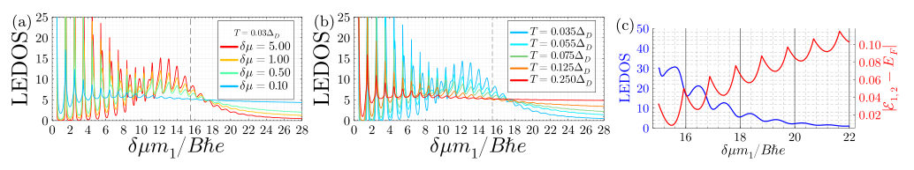
<figcaption class="paper-figure-caption"><b>Fig 3.</b> FIG. 3. Quantum oscillations of the LEDOS for the two-band model with l = 2. The oscillation behaviors for different detunings and temperatures are shown in (a) and (b), respectively. The vertical dashed line marks the critical field Bc. (c) Comparison between the oscillation amplitude and min(|E1,2 −EF |) at T = 0.035∆D.</figcaption>
</figure>
<figure class="paper-figure-card">
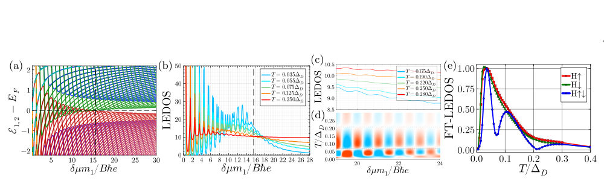
<figcaption class="paper-figure-caption"><b>Fig 4.</b> FIG. 4. (a) LL structures and (b) LEDOS oscillations of H↑↓ k . The vertical dashed line marks the critical field Bc. (c) Thermal evolution of the oscillations near Tc ≈0.21∆D. (d) The corresponding detrended oscillations, showing l = 2 characteristic temperatures. (e) Temperature dependence of the normalized Fourier-transformed (FT) amplitude.</figcaption>
</figure>

**Summary.** This theoretical work analyzes quantum oscillations near high-angular-momentum band inversion using minimal two-band and four-band models. The key finding is that the interference between time-reversal partners causes deviations from standard theory, producing unique temperature-dependent suppression signatures whose number directly tracks the angular momentum $l$. This offers an experimentally accessible fingerprint for characterizing such topological electronic states.

**Why it may be interesting.** The focus on temperature-dependent interference effects and the explicit link between oscillation features (suppression temperatures) and a geometric parameter ($l$) provides a powerful, measurable diagnostic tool for exotic topological phases in condensed matter systems.

Detailed structure

**Main problem.** The study investigates quantum oscillations (QOs) in electronic systems exhibiting High-Angular-Momentum (HAM) band inversion, particularly focusing on regimes beyond standard metallic Fermi surface quantization.

**Main result.** The authors demonstrate that HAM band inversion leads to characteristic deviations from the Lifshitz-Kosevich form, manifesting as non-monotonic temperature dependence and suppression temperatures whose number scales with the angular momentum $l$.

**Method.** Theoretical analysis involves calculating the oscillatory density of states (LEDOS) using semiclassical quantization rules derived from generalized two-band and four-band Hamiltonians.

**Model / system.** The models include a minimal chiral two-band Hamiltonian and an extended time-reversal invariant four-band model, designed to capture topological transitions associated with band inversion ($\delta\mu$).

**Key observables.** Quantum oscillation amplitude, frequency ($F_0$), temperature dependence of the LEDOS, and characteristic suppression temperatures ($T_c$).

**Important parameters / regimes.** Angular momentum $l$, detuning parameter $\delta\mu$ (controlling inversion), magnetic field $B$, and temperature $T$.

**Assumptions / limitations.** The analysis relies on semiclassical quantization rules for both metallic (Fermi surface crossing) and insulating (band-edge averaging) regimes, and assumes the applicability of thermal averaging kernels.

**Figures summary.** Figures illustrate band structures showing inversion transitions, Landau level spectra ($E_{1,2}^n$ vs $1/B$), and crucially, detrended LEDOS oscillations confirming spectral weight suppression at characteristic temperatures whose count follows $l$.

**Paper structure.** The paper progresses by first analyzing the two-band model in the insulating regime, then extending to a four-band time-reversal symmetric system. The core development involves deriving the total oscillatory LEDOS via interference between time-reversal partners, leading to the identification of $l$-dependent signatures.

Abstract

Quantum oscillations provide a fundamental probe of electronic structure in magnetic fields, revealing the Fermi surface topology in metals, and/or the quasiparticle properties even in the insulating regimes. Here we study quantum oscillations in minimal models of high-angular-momentum (HAM) band inversion for both a chiral two-band model and a time-reversal-invariant four-band model. In the former case, finite oscillations can appear at the hybridized Chern-insulating regime due to thermal-activated excitations. In the latter case, interference between the two time-reversal-related blocks drives a strong deviation from the Lifshitz-Kosevich form, producing a non-monotonic temperature dependence of the oscillation amplitude and characteristic suppression temperatures whose number follows the angular momentum $l$. These results identify experimentally accessible signatures of HAM band inversion and provide a framework for other discrete-symmetry-related hybridizations and excitonic pairings.

[↑ back to top](#top)

### [Quantum-classical hybrid models based on error correction for time series forecasting](http://arxiv.org/abs/2606.15213v1)

**Authors:** Jonathan H. A. de Carvalho, Filipe C. de L. Duarte, Fernando M. de Paula Neto, Paulo S. G. de Mattos Neto  
**Type:** theory · **Category:** other · **PDF:** <https://arxiv.org/pdf/2606.15213v1>  
**Analysis basis:** full PDF text, analyzed in chunks
**Topic relevance:** `methods for driven-dissipative` **1/5**

↔ Scroll figures horizontally

<figure class="paper-figure-card">
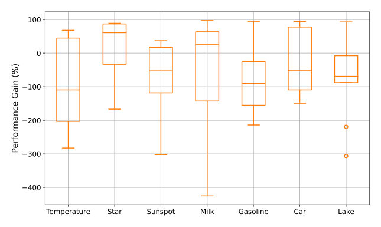
<figcaption class="paper-figure-caption"><b>Fig 1.</b> Fig. 1: Percentage performance gains that quantum-classical combinations based on error correction provided to the base classical models in different forecasting problems. In each of the seven problems, a box gathers nine samples of performance gains, which are obtained combining three quantum models with three classical models and then comparing with the respective classical models in the given problem.</figcaption>
</figure>
<figure class="paper-figure-card">
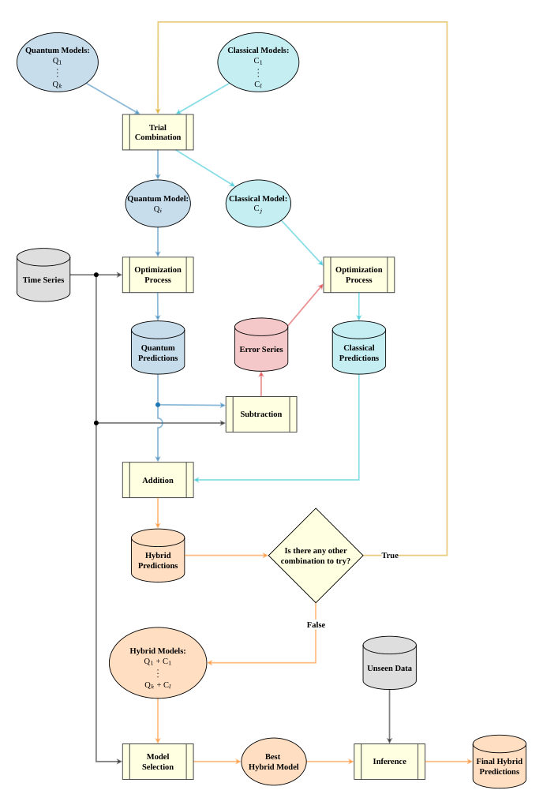
<figcaption class="paper-figure-caption"><b>Fig 2.</b> Fig. 2: Proposed system to optimize the error-correction-based quantum-classical hybridization for a given forecasting task. From pools that provide different model components, the procedure tries each combination of a quantum model and a classical model. The quantum model learns and predicts the original time series, which gives errors as the subtraction of the quantum predictions from the original observations. The classical model then learns and predicts the quantum errors. Adding the classical predictions to the quantum predictions generates the hybrid predictions of the current combination of models. Once there is no other combination to try, the procedure can select the best hybrid...</figcaption>
</figure>
<figure class="paper-figure-card">
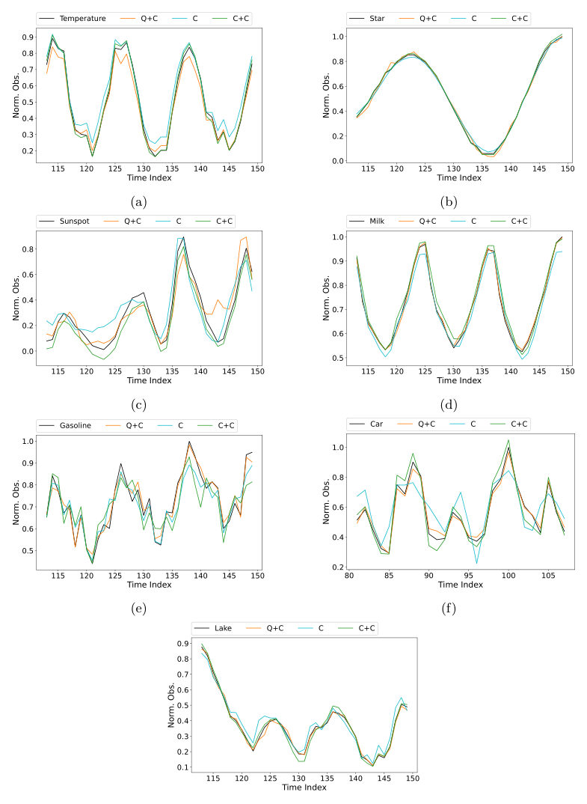
<figcaption class="paper-figure-caption"><b>Fig 3.</b> Fig. 3: Predictions of quantum-classical models and classical baselines in the seven problems. The target series and the three prediction series are represented by black, orange, cyan, and green lines. a,b,c,d,e,f,g, Predictions for the Temperature (a), Star (b), Sunspot (c), Milk (d), Gasoline (e), Car (f), and Lake (g) datasets.</figcaption>
</figure>
<figure class="paper-figure-card">
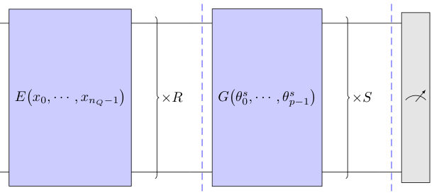
<figcaption class="paper-figure-caption"><b>Fig 4.</b> Fig. 4: General quantum circuit for machine learning tasks. The circuit basically contains two inner parts that are delimited with the aid of vertical dashed lines. The first part, represented from slice 1 to slice 2, is responsible for encoding the classical input data x0, · · · , xnQ−1 via an operator E(·) that can be repeated R times. The second part, from slice 2 to slice 3, acts on the quantum-encoded input data via an operator G(·) that is composed of the parameterized gates to be adjusted iteratively. Each repetition of the operator G(·) is dependent on a different set of parameters θs 0, · · · , θs p−1, where s = 0, · · · , S −1. Such a repeated application of the operator G(·)...</figcaption>
</figure>
<figure class="paper-figure-card">
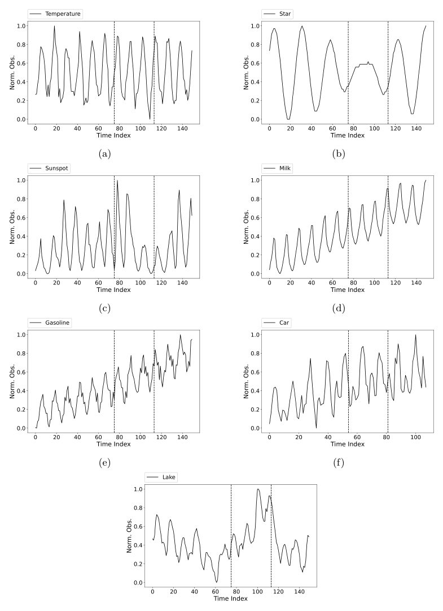
<figcaption class="paper-figure-caption"><b>Fig 5.</b> Fig. 5: Observations of the seven forecasting problems used to evaluate the models. The two vertical dashed lines separate the training, validation and test sets. a,b,c,d,e,f,g, Observations for the Tem- perature (a), Star (b), Sunspot (c), Milk (d), Gasoline (e), Car (f), and Lake (g) datasets.</figcaption>
</figure>

**Summary.** This work proposes a novel quantum-classical hybrid framework for time series forecasting by integrating quantum model predictions with classical error correction. The method calculates the initial prediction using a quantum circuit and then refines it by having a classical network predict the remaining systematic error. Results show that this synergistic combination significantly outperforms purely classical or single-model approaches on multiple benchmark datasets.

**Why it may be interesting.** While not directly related to AMO physics, the methodology of using quantum circuits as feature extractors or pattern recognizers within a complex physical system (like time series data) mirrors concepts in open quantum systems modeling where environmental noise or residual dynamics are modeled classically.

Detailed structure

**Main problem.** The research aims to improve time series forecasting accuracy by developing a novel hybrid model that combines quantum machine learning capabilities with classical error-correction techniques.

**Main result.** The proposed quantum-classical hybrid system consistently provided superior predictive performance across most tested problems compared to single classical or purely classical-classical hybrid models.

**Method.** The core methodology involves using a quantum model to generate an initial prediction, calculating the residual error, and then employing a classical model (like MLP or LSTM) trained on these errors to correct the quantum output. The final prediction is the sum of the quantum estimate and the classically predicted error correction.

**Model / system.** The system utilizes parameterized quantum circuits for the quantum component ($	ext{Q}$) and established deep learning architectures (MLP, LSTM, NBEATS) for the classical component ($	ext{C}$). The hybridization is structured as $\hat{y}_{Q+C} = \hat{y}_Q + \hat{e}_C$, where $\hat{e}_C$ corrects the quantum prediction based on past errors.

**Key observables.** Mean Squared Error (MSE), Mean Absolute Error (MAE), and Mean Absolute Percentage Error (MAPE) are used to quantify predictive accuracy across seven benchmark time series datasets (Temperature, Star, Sunspot, Milk, Gasoline, Car, Lake).

**Important parameters / regimes.** The number of quantum features ($n_Q$) and the structure/hyperparameters of both the quantum circuit and the classical network are key parameters optimized during training.

**Assumptions / limitations.** It is assumed that time series patterns contain components best captured by quantum phenomena, and that these quantum insights can be systematically combined with classical error modeling to yield synergistic improvements.

**Figures summary.** Figures illustrate performance comparisons via heat maps (showing MSE across various model combinations) and plots demonstrating the cumulative error accumulation over time for different hybrid models on specific datasets like Sunspot.

**Paper structure.** The paper establishes the need for advanced forecasting, details the quantum-classical error correction framework ($	ext{Q} 
ightarrow 	ext{Error} 
ightarrow 	ext{C}$), compares performance metrics (MSE/MAE/MAPE) against classical baselines ($	ext{C}$, $	ext{C}+	ext{C}$), and concludes that the hybrid approach offers significant, though context-dependent, gains.

Abstract

Time series forecasting largely benefits from combining the strengths of different models, especially using a scheme where a model corrects another model by capturing supplementary patterns from forecasting errors. Concurrently, quantum models are providing a means to augment the classical capacity, including in time series forecasting, by acting alongside classical models in hybrid architectures. In this work, we propose the first forecasting system based on error correction that jointly uses quantum and classical models. Here, quantum models first extract patterns by exploring quantum phenomena, and classical models capture the remaining patterns from the quantum errors. Compared to classical single models and classical-classical hybrid models based on error correction, the complementary capacity that emerges from this quantum-classical system provided the best results in most of the addressed problems. Therefore, this work paves the way to introduce quantum models in established hybridization schemes for time series forecasting.

[↑ back to top](#top)

### [Reconstruction of detector error model for quantum error correction](http://arxiv.org/abs/2606.16288v1)

**Authors:** Cheng Ye, Pan Zhang  
**Type:** theory · **Category:** quantum information and computing · **PDF:** <https://arxiv.org/pdf/2606.16288v1>  
**Analysis basis:** full PDF text, analyzed in chunks
**Topic relevance:** `quantum measurements` **1/5**

↔ Scroll figures horizontally

<figure class="paper-figure-card">
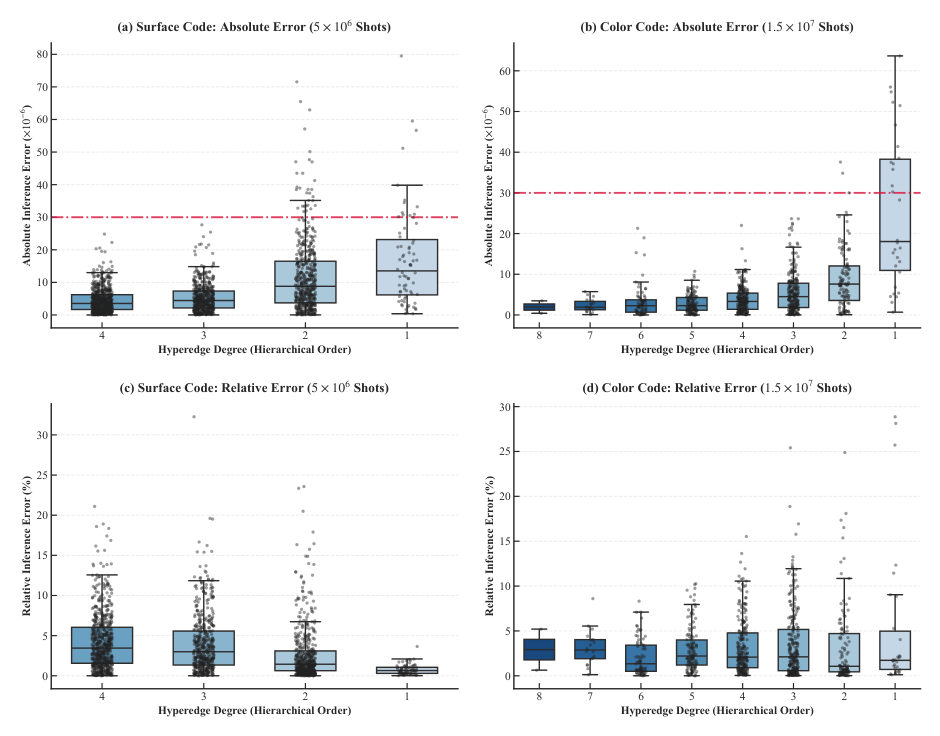
<figcaption class="paper-figure-caption"><b>Fig 1.</b> FIG. 1. Hierarchical accumulation of absolute and relative inference errors (the variance cascade). Data is shown at the sample sizes required for zero-false-positive topological reconstruction. (a) Surface code (5 × 106 shots) and (b) color code (1.5 × 107 shots) show a clear inflation of absolute error as hyperedge degree decreases due to algebraic downward subtraction. The horizontal dash-dotted lines denote the multi-body correlation truncation threshold (ϵmulti). (c) In the surface code, the relative error is strongly suppressed at lower degrees (degrees 1 and 2) because the intrinsic error probabilities in the denominator are comparatively large. (d) In the color code, the large...</figcaption>
</figure>
<figure class="paper-figure-card">
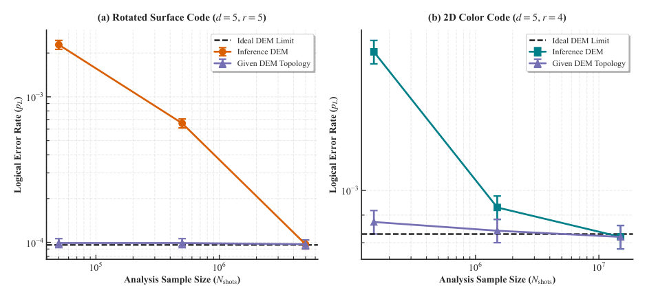
<figcaption class="paper-figure-caption"><b>Fig 2.</b> FIG. 2. End-to-end BP-OSD decoding performance and ablation analysis isolating topological vs. parameter sensitivity. Logical error rates (pL) are evaluated by collecting 200 (surface code) and 400 (color code) logical errors per point. Data spans three regimes corresponding to 1%, 10%, and 100% of the statistics required for DEM reconstruction without false positives. For both the (a) surface code and (b) color code, the unpruned Inference DEM fails at low statistics due to dense false-positive short cycles. By contrast, the Given DEM Topology (where the exact ideal topology is fed directly into the global correlation analysis with the pruning threshold set to zero, ϵ = 0, solely clipping...</figcaption>
</figure>
<figure class="paper-figure-card">
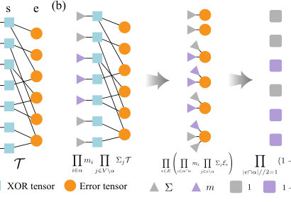
<figcaption class="paper-figure-caption"><b>Fig 3.</b> FIG. 3. Tensor network formulation of the Detector Error Model. (a) Graphical representation of the TNDEM architecture. Each de- tector corresponds to an XOR tensor, which enforces a logical parity constraint for propagating Pauli errors. Independent physical error mechanisms are represented by diagonal tensors, parameterized by their fault probability pe and identity probability 1 −pe. (b) Visu- alization of the exact tensor contraction corresponding to Eq. (B1). By projecting the detector indices onto specific boundary conditions, the global network contraction naturally decouples into a product of independent scalar contributions.</figcaption>
</figure>

**Summary.** The paper presents the CAHR algorithm to reconstruct complex error hypergraphs governing detector noise in Quantum Error Correction codes. It demonstrates that by separating topology discovery from parameter fitting, it can accurately model multi-body errors even with finite experimental data. This methodology is vital for advancing practical fault-tolerant quantum computing hardware.

**Why it may be interesting.** This work provides rigorous mathematical tools to extract physical structure from noisy quantum measurements, which is crucial for designing reliable fault-tolerant hardware protocols. The explicit handling of high-order correlations addresses a major bottleneck in current QEC characterization techniques.

Detailed structure

**Main problem.** The core challenge is accurately characterizing complex, multi-body error correlations (high-order hyperedges) from raw experimental syndrome statistics for fault-tolerant quantum computation.

**Main result.** The proposed CAHR algorithm successfully reconstructs the exact physical hypergraph topology for both surface and color codes with zero false positives when sufficient statistics are available. Furthermore, structural topology is shown to be more critical for decoder performance than precise continuous parameter estimation under noise.

**Method.** A Correlation-Analysis-based Hypergraph Reconstruction (CAHR) algorithm is introduced, which uses exact algebraic correlation equations derived from the Detector Error Model (DEM) and a top-down concurrent-pruning strategy to invert syndrome statistics into discrete hypergraphs.

**Model / system.** The system modeled is Quantum Error Correction (QEC), specifically analyzing detector error models represented as hypergraphs. The analysis uses concepts like moment equations derived from the Tensor Network Detector Error Model (TNDEM) applied to codes like the rotated surface code and 2D color code.

**Key observables.** Syndrome variables ($\sigma_i$), correlation moments ($M_{\alpha}$), physical error probabilities ($p_{\alpha}$), and the final Logical Error Rate ($p_L$) from decoding simulations.

**Important parameters / regimes.** Sample size (number of shots, e.g., $5 	imes 10^6$ to $1.5 	imes 10^7$), code distance ($d=5$), and hyperedge order (up to 8-body).

**Assumptions / limitations.** The analysis assumes the Pauli error model for noise, relies on a two-stage inference paradigm (topology first, then parameters), and uses Gaussian approximations when analyzing variance cascades.

**Figures summary.** Figures compare end-to-end decoding performance ($p_L$) between an 'Inference DEM' (derived from noisy data) and a 'Given DEM Topology' (ideal structure), showing the latter is far more robust. One figure illustrates the additive accumulation of inference errors (variance cascade) across code depth.

**Paper structure.** The paper introduces CAHR as a globally consistent framework, details its two-stage process (topology discovery followed by parameter optimization), validates it on specific codes (surface/color), and concludes by comparing the operational robustness of topology reconstruction versus simple parameter fitting.

Abstract

Fault-tolerant quantum computing fundamentally relies on the accurate characterization of circuit-level noise to optimize decoding algorithms. However, extracting complex multi-body error correlations remains challenging. Contemporary greedy inference algorithms can suffer from statistical distortion, discarding true physical mechanisms while introducing many unphysical false positives. Here, we introduce the Correlation-Analysis-based Hypergraph Reconstruction (CAHR) algorithm, a globally consistent framework to invert experimental syndrome statistics directly into discrete physical hypergraphs. By coupling exact algebraic correlation equations with a top-down concurrent-pruning strategy, CAHR recovers the fault topology without false positives for both $d=5$ rotated surface codes and dense 8-body 2D color codes in our benchmark settings. Furthermore, we show that exact continuous parameter extraction in dense codes is limited by a \textit{variance cascade}, where absolute statistical variance accumulates linearly from high- to low-degree mechanisms. This motivates a two-stage inference paradigm: utilizing CAHR to extract the fault topology, followed by continuous probability optimization. This provides a practical approach for characterizing and decoding highly correlated noise in realistic quantum hardware.

[↑ back to top](#top)

### [Temporal modulation as a resource: enhanced frequency estimation in continuous variable systems](http://arxiv.org/abs/2606.15108v1)

**Authors:** Ningxin Kong, Qiongyi He, Matteo G. A. Paris  
**Type:** theory · **Category:** other · **PDF:** <https://arxiv.org/pdf/2606.15108v1>  
**Analysis basis:** full PDF text, analyzed in chunks
**Topic relevance:** `driven-dissipative phase transition` **1/5**

↔ Scroll figures horizontally

<figure class="paper-figure-card">
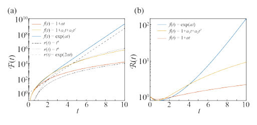
<figcaption class="paper-figure-caption"><b>Fig 1.</b> FIG. 2. Time evolution of (a) the QFI Ft(t) and (b) the QFI enhancement ratio R(t) for an initial coherent state with α = 1 and a base frequency ω0 = 10. Results are compared across three distinct modulation profiles: linear (f(t) = 1+at, red lines), quadratic (f(t) = 1 + a1t + a2t2, yellow lines), and exponential (f(t) = eat, blue lines). The black reference lines in (a) indicate the asymptotic scalings t4, t6, and e2at. The modulation parameters are set to unity (a = a1 = a2 = 1).</figcaption>
</figure>
<figure class="paper-figure-card">
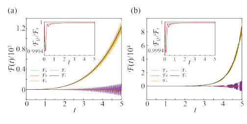
<figcaption class="paper-figure-caption"><b>Fig 2.</b> FIG. 1. Time evolution of the total QFI Ft(t) (black lines) evaluated under the WKB approximation, decomposed into its constituent contributions: the shearing (Fµ), squeezing (Fθ), rotation (Fγ), and cross-correlation (Fc) terms. The oscillator temporal dynamics are driven by (a) a linear frequency modulation f(t) = 1 + at and (b) an exponential frequency modulation f(t) = eat, with base frequency ω0 = 10 and modulation rate a = 1. Insets: Time dependence of the ratio FQ/Ft, where FQ is the CFI extracted from the optimal real-time homodyne measurement ˆQ.</figcaption>
</figure>

**Summary.** This paper demonstrates that dynamically modulating the frequency of a quantum oscillator can significantly enhance precision in frequency estimation beyond static limits. By tailoring the temporal modulation profile $f(t)$, researchers show that the Quantum Fisher Information scales robustly as O(F(t)^2). This establishes a universal paradigm for designing next-generation, high-precision quantum sensors.

**Why it may be interesting.** This work provides a general theoretical framework for optimizing quantum sensors by treating time modulation itself as a controllable resource, which is highly relevant to advanced quantum optics and sensing applications.

Detailed structure

**Main problem.** The primary goal is to enhance frequency estimation precision beyond conventional limits set by static encoding mechanisms in quantum metrology.

**Main result.** Temporal modulation allows for the deterministic engineering of arbitrary precision scaling, with the Quantum Fisher Information (QFI) scaling as O(F(t)^2).

**Method.** The authors analytically derive the QFI using a dynamic encoding protocol driven by time-dependent frequency modulation $\Omega(t) = \omega_0 f(t)$ in the adiabatic limit.

**Model / system.** The model used is the Quantum Harmonic Oscillator (QHO), which serves as a universal platform for continuous variable quantum metrology. The Hamiltonian incorporates the time-dependent frequency modulation $\Omega(t)$.

**Key observables.** Quantum Fisher Information (QFI), $F_g$, and the resulting precision limit governed by the Quantum Cramér-Rao Bound ($\Delta g$).

**Important parameters / regimes.** The modulation profile function $f(t)$, its time integral $F(t) = \int f(s)ds$, and the energy constraint $E_0 = E(t)$.

**Assumptions / limitations.** The analysis is performed in the adiabatic regime ($\left|rac{\dot{\Omega}(t)}{\Omega(t)^2}
ight| \ll 1$), assuming Gaussian initial states.

**Figures summary.** Figures illustrate the time evolution of the QFI components (shearing, squeezing, rotation) and compare the enhancement ratio $R(t)$ for different modulation profiles (linear, quadratic, exponential).

**Paper structure.** The paper establishes the problem in quantum metrology, introduces the dynamic encoding protocol via $\Omega(t)$, calculates the QFI by decomposing it into components, derives the scaling laws based on the adiabatic approximation, and concludes by demonstrating the universal applicability of this time-dependent control.

Abstract

Frequency estimation, a cornerstone of quantum metrology, has been significantly enhanced by advanced quantum sensing strategies. However, most protocols rely either on static or time-independent encoding mechanisms, inherently limiting their achievable precision scaling, or on control strategies requiring changing the Hamiltonian and/or implementing feedback mechanisms. To overcome this, we investigate a simpler dynamical encoding protocol where the quantum oscillator is driven by a general continuous temporal frequency modulation $Ω(t) = ω_0 f(t)$. We analytically demonstrate that for a given modulation profile $f(t)$ and its corresponding time-integral $F(t)$, the quantum Fisher information (QFI) scales as $\mathcal{O}(F(t)^2)$. This enhancement stems from the fact that temporal encoding fundamentally alters the mechanism of dynamical phase accumulation. Crucially, when evaluated under the energy and evolution-time constraints, this framework reveals a genuine precision enhancement over the conventional time-independent baseline. By analyzing explicit polynomial and exponential modulations, we establish that arbitrary precision scaling can be deterministically engineered, with ultimate bounds that are asymptotically saturable via optimal homodyne detection. Our framework provides a universal paradigm for exploiting time-dependent quantum control in next-generation sensors.

[↑ back to top](#top)

## Other papers (13)

*Papers from primary archives without highlighted authors or any topic match. Click to expand.*

Show other papers

### [A New Definition of Quantum Superposition](http://arxiv.org/abs/2606.15607v1)

**Authors:** Stephen Bruce Sontz  
**Type:** theory · **Category:** other · **PDF:** <https://arxiv.org/pdf/2606.15607v1>  
**Analysis basis:** full PDF text, analyzed in chunks

↔ Scroll figures horizontally

<figure class="paper-figure-card">
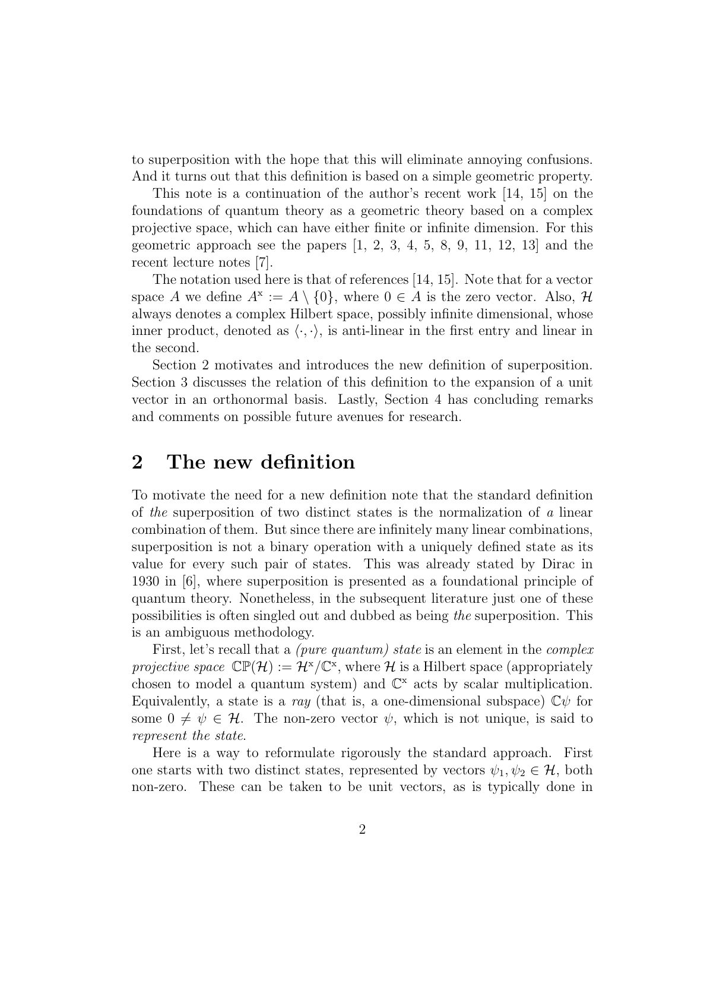
<figcaption class="paper-figure-caption"><b>Fig 1.</b> Low-resolution page preview, page 2</figcaption>
</figure>
<figure class="paper-figure-card">
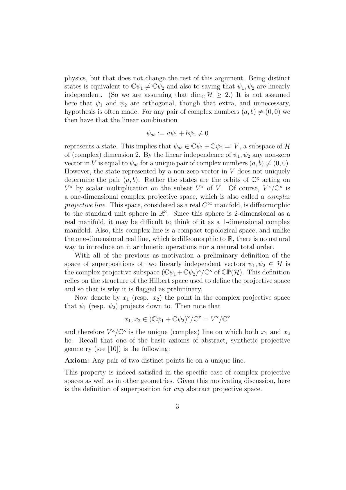
<figcaption class="paper-figure-caption"><b>Fig 2.</b> Low-resolution page preview, page 3</figcaption>
</figure>
<figure class="paper-figure-card">
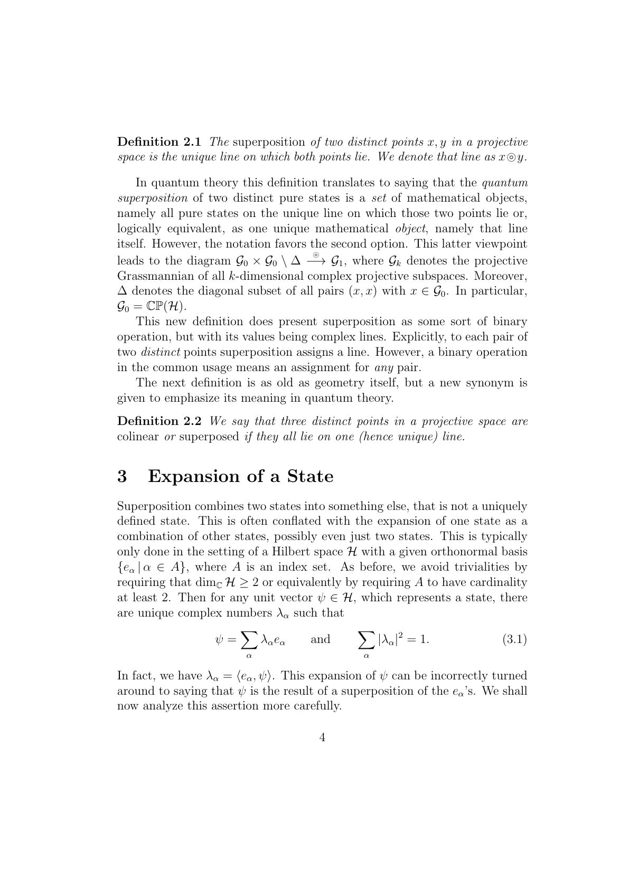
<figcaption class="paper-figure-caption"><b>Fig 3.</b> Low-resolution page preview, page 4</figcaption>
</figure>
<figure class="paper-figure-card">
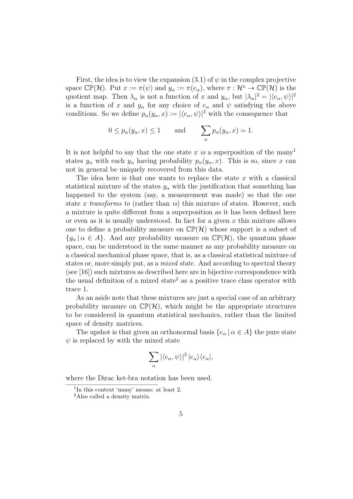
<figcaption class="paper-figure-caption"><b>Fig 4.</b> Low-resolution page preview, page 5</figcaption>
</figure>
<figure class="paper-figure-card">
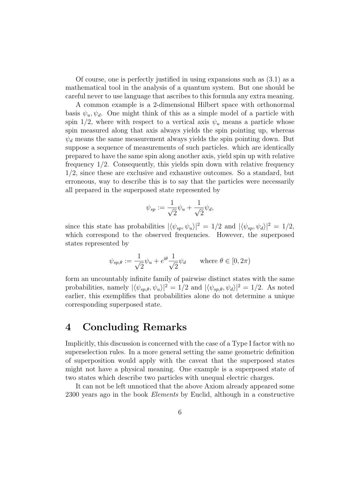
<figcaption class="paper-figure-caption"><b>Fig 5.</b> Low-resolution page preview, page 6</figcaption>
</figure>

**Summary.** This paper addresses the ambiguity in defining quantum superposition by reformulating it geometrically within complex projective space. It proposes that the superposition of two states is uniquely defined as the straight line connecting them in this geometric space. This provides a rigorous mathematical foundation independent of traditional summation rules.

**Why it may be interesting.** This work provides a fundamental, purely geometrical reinterpretation of one of quantum mechanics' most basic concepts, potentially offering insights applicable beyond standard Hilbert space formalism.

Detailed structure

**Main problem.** The standard description of quantum superposition is mathematically ambiguous because the summation operation used in Hilbert space does not translate cleanly to the quotient projective space ($	ext{CP}(H)$).

**Main result.** A rigorous, geometrical definition of superposition is proposed: it is defined as the unique complex line passing through two distinct pure states viewed as points in $	ext{CP}(H)$.

**Method.** The paper develops a geometric framework by treating quantum states as points in complex projective space and defining superposition based on collinearity axioms.

**Model / system.** The model uses pure quantum states, represented geometrically as points in the complex projective space $	ext{CP}(H)$, where $H$ is a complex Hilbert space. The analysis compares this geometric definition to standard basis expansions.

**Key observables.** Superposition itself (defined as a line/subspace), and the comparison between superposition and classical statistical mixtures derived from orthonormal basis expansions.

**Important parameters / regimes.** The structure of the underlying Hilbert space $H$ and its associated projective geometry $	ext{CP}(H)$.

**Assumptions / limitations.** The primary assumption is that viewing quantum states as points in $	ext{CP}(H)$ provides a natural geometric setting, and the definition relies on properties analogous to those found in complex projective geometry.

**Paper structure.** The paper first identifies the ambiguity of superposition in $	ext{CP}(H)$, then proposes the line-based geometric definition for two states. It subsequently contrasts this with basis expansion and discusses generalizations to other mathematical spaces.

Abstract

The usual description of the superposition of two (pure quantum) states is ambiguous, since the binary operation of summation in a Hilbert space does not pass down to the quotient projective space. Even though Dirac noted this as early as 1930, it is often asserted that the superposition is a binary operation acting on two states with a value that is a unique state. The goal for this note is to motivate a rigorous, geometrical definition of the superposition of states in the setting of complex projective space, which has been argued elsewhere to be the natural geometric phase space for quantum theory. The upshot is that the new definition of the superposition of two pure states, viewed as two distinct points in the projective space, is the unique (complex) line on which those two points lie. Finally, a comparison is given between superposition and expansion in an orthonormal basis.

[↑ back to top](#top)

### [A short proof of the modified Kretschmann-Schlingemann-Werner conjecture](http://arxiv.org/abs/2606.16418v1)

**Authors:** Satvik Singh  
**Type:** theory · **Category:** quantum information and computing · **PDF:** <https://arxiv.org/pdf/2606.16418v1>  
**Analysis basis:** full PDF text, analyzed in chunks

↔ Scroll figures horizontally

<figure class="paper-figure-card">
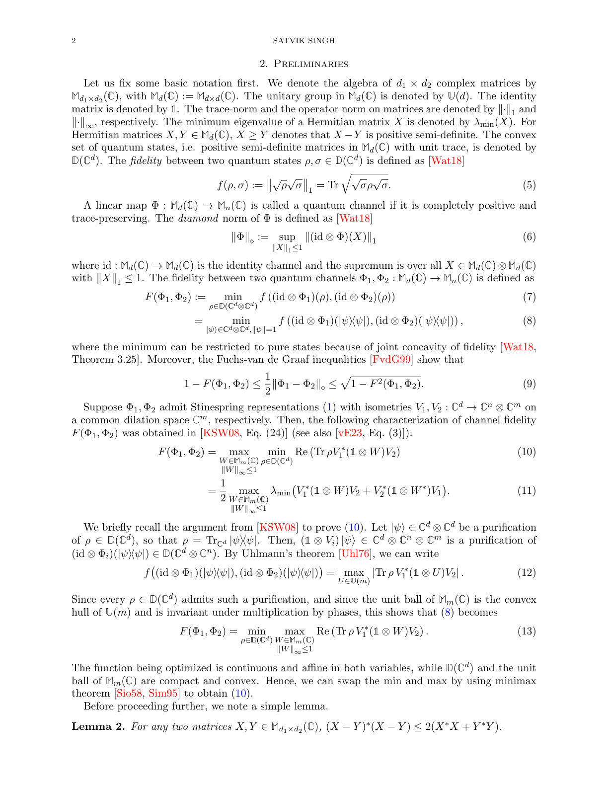
<figcaption class="paper-figure-caption"><b>Fig 1.</b> Low-resolution page preview, page 2</figcaption>
</figure>
<figure class="paper-figure-card">
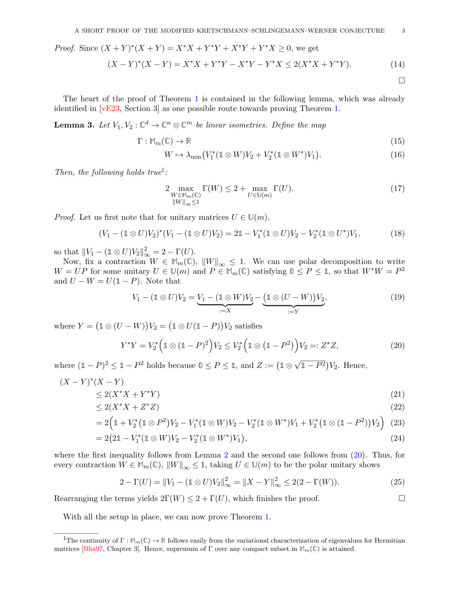
<figcaption class="paper-figure-caption"><b>Fig 2.</b> Low-resolution page preview, page 3</figcaption>
</figure>
<figure class="paper-figure-card">
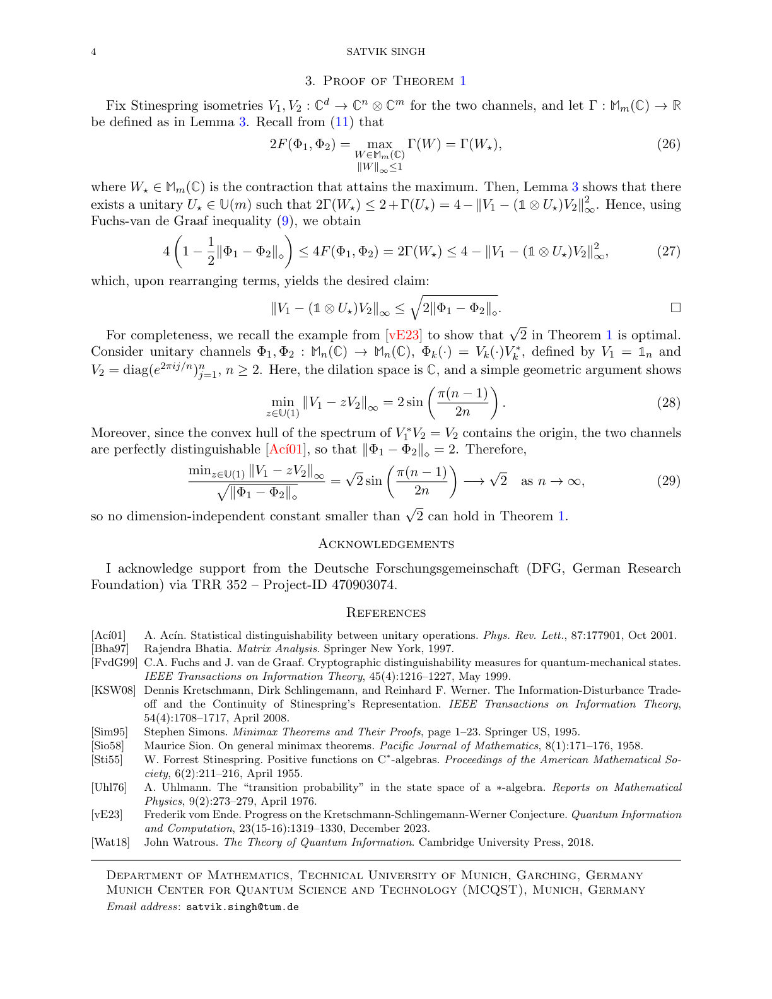
<figcaption class="paper-figure-caption"><b>Fig 3.</b> Low-resolution page preview, page 4</figcaption>
</figure>

**Summary.** This paper resolves a modified version of the Kretschmann-Schlingemann-Werner conjecture concerning quantum channels. It proves an inequality bounding the operator norm difference between two Stinespring isometries by the diamond norm distance between their corresponding quantum channels. This result provides a powerful quantitative tool for comparing quantum processes.

**Why it may be interesting.** This work provides a rigorous quantitative link between the operational distance (diamond norm) of quantum processes and the structural distance (operator norm) of their underlying representations, which is fundamental for characterizing process fidelity in open quantum systems theory.

Detailed structure

**Main problem.** The paper addresses a modified version of the Kretschmann-Schlingemann-Werner (KSW) conjecture, which relates the distance between two quantum channels to the distance between their Stinespring representations.

**Main result.** It proves that for any two quantum channels $\Phi_1$ and $\Phi_2$, there exists a unitary $U$ such that the operator norm distance between their respective isometries satisfies $\|V_1-({f1}\otimes U)V_2\|_\infty\leq\sqrt{2}\|\Phi_1-\Phi_2\|_{\diamond}$.

**Method.** The proof utilizes advanced tools from quantum information theory, including the diamond norm ($\|\cdot\|_{\diamond}$), operator norms ($\|\cdot\|_{\infty}$), and properties derived from the Stinespring dilation theorem.

**Model / system.** The system under study involves general quantum channels $\Phi: \mathbb{M}_d(\mathbb{C})	o \mathbb{M}_n(\mathbb{C})$, which are completely positive and trace-preserving maps. These channels are analyzed via their Stinespring isometries $V$.

**Key observables.** Diamond norm distance ($\|\cdot\|_{\diamond}$) between channels, and the minimum operator norm distance $\min_{U\in U(m)} \|V_1 - (1 \otimes U)V_2\|_{\infty}$ between the Stinespring isometries.

**Important parameters / regimes.** The constant factor $\sqrt{2}$ in the derived inequality is shown to be optimal.

**Assumptions / limitations.** The proof holds for any common dilation space $\mathbb{C}^m$ associated with the channels.

**Paper structure.** The paper establishes relationships between various norms and uses mathematical tools like Lemma 3 to derive the final inequality, resolving the modified KSW conjecture in the affirmative.

Abstract

Let $Φ_1, Φ_2 : \mathbb{M}_d(\mathbb{C})\to \mathbb{M}_n(\mathbb{C})$ be two quantum channels with respective Stinespring isometries $V_1, V_2 : \mathbb{C}^{d}\to \mathbb{C}^{n} \otimes \mathbb{C}^{m}$ on any common dilation space $\mathbb{C}^{m}$. We prove that there exists a unitary $U$ on $\mathbb{C}^{m}$ such that $\|V_1-({\bf1}\otimes U)V_2\|_\infty\leq\sqrt{2\|Φ_1-Φ_2\|_\diamond},$ thus resolving vom Ende's modification of the Kretschmann-Schlingemann-Werner conjecture in the affirmative.

[↑ back to top](#top)

### [Analyzing Initialization Strategies for the Local Unitary Cluster Jastrow Ansatz within the Quantum-Centric Supercomputing Framework](http://arxiv.org/abs/2606.14933v1)

**Authors:** Grier M. Jones, Maforikan J. Amoussou, Maximilian O. Leach, Hans-Arno Jacobsen  
**Type:** theory · **Category:** strongly correlated electrons · **PDF:** <https://arxiv.org/pdf/2606.14933v1>  
**Analysis basis:** full PDF text, analyzed in chunks

↔ Scroll figures horizontally

<figure class="paper-figure-card">
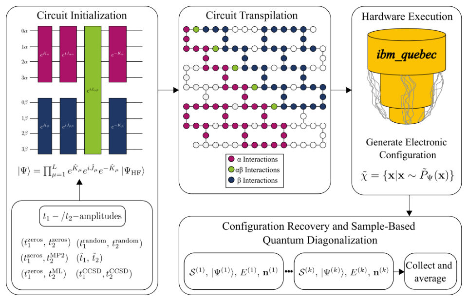
<figcaption class="paper-figure-caption"><b>Fig 1.</b> Figure 1: Schematic diagram of the proposed workflow to analyze circuit initialization within the QCSC framework.</figcaption>
</figure>
<figure class="paper-figure-card">
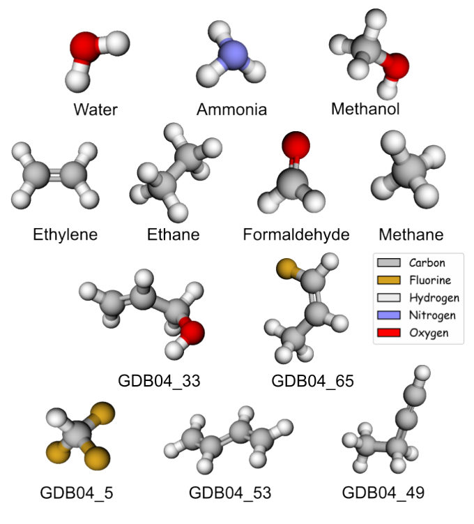
<figcaption class="paper-figure-caption"><b>Fig 2.</b> Figure 2: Molecular structures comprising the three datasets used in this study. (i) A set of smaller molecules with multiple conformers, (ii) a benchmark set containing one representative conformer per molecule excluded from training and testing, and (iii) a set of larger and more chemically diverse molecules selected from the GDB-11 database.</figcaption>
</figure>
<figure class="paper-figure-card">
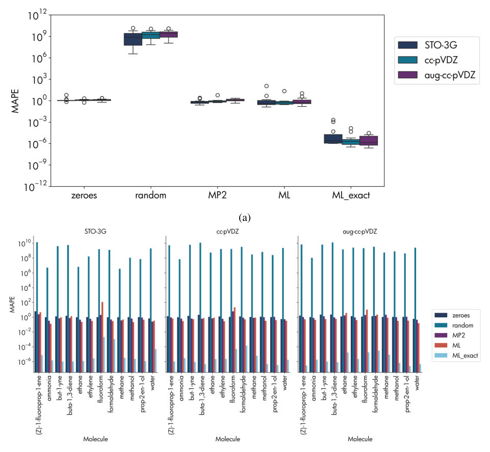
<figcaption class="paper-figure-caption"><b>Fig 3.</b> Figure 3: Both figures highlight the mean absolute percent error (MAPE) between the various initialization strategies in this study and the standard CCSD initialization. (a) Shows the MAPE (y-axis) for each initialization strategy (x-axis) with respect to the basis set (hue) using a box plot. (b) Highlights the MAPE (y-axis) for each molecule (x-axis) and basis set (columns) examined using a bar plot.</figcaption>
</figure>
<figure class="paper-figure-card">
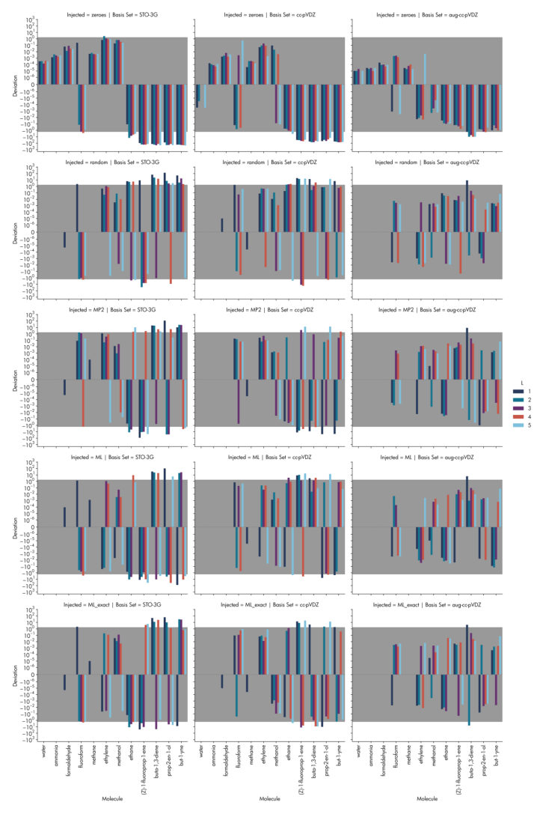
<figcaption class="paper-figure-caption"><b>Fig 4.</b> Figure 4: Deviations (in mEh) between the converged energies of LUCJ ansätze initialized using various parameter injection strategies compared against the CCSD-initialized LUCJ ansatz, com- puted across a set of small organic molecules. Results are shown for five ansatz depths (L = 1–5, indicated by the hue) and three basis sets (STO-3G, cc-pVDZ, and aug-cc-pVDZ), arranged in a 5 × 3 grid by injection method (rows) and basis set (columns). The y-axis employs a symmetric logarithmic scale to accommodate the wide dynamic range of deviations observed across strategies and molecules. All deviations are reported relative to the CCSD-initialized ansatz energy, which by construction yields zero...</figcaption>
</figure>
<figure class="paper-figure-card">
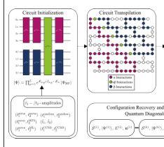
<figcaption class="paper-figure-caption"><b>Fig 5.</b> Figure 5</figcaption>
</figure>

**Summary.** This research investigates how different starting points (initializations) affect the accuracy of electronic structure calculations using a complex quantum ansatz (LUCJ) simulated on a quantum computer. The key finding is that while initial parameters can vary wildly, the final calculated energy remains robustly accurate, suggesting that the core quantum diagonalization process dictates performance rather than the initialization method itself.

**Why it may be interesting.** This work directly addresses the practical implementation challenges of quantum chemistry algorithms on near-term quantum hardware by identifying computationally cheaper, yet accurate, initialization pathways that bypass resource-intensive methods like full CCSD.

Detailed structure

**Main problem.** The study analyzes how different initialization strategies affect the accuracy of electronic energy calculations performed using the Local Unitary Cluster Jastrow (LUCJ) ansatz within a quantum-centric supercomputing framework.

**Main result.** The final electronic energies recovered by the SQD algorithm are largely insensitive to the initial parameters, suggesting that configuration recovery during the diagonalization process is more critical than the proximity of the initialization method to CCSD.

**Method.** The authors compare six initialization strategies (including CCSD, MP2, random, and zero) for the LUCJ ansatz by running calculations on molecular systems using the sample-based quantum diagonalization (SQD) algorithm.

**Model / system.** The model is electronic structure calculation of molecules solved via the Schrödinger equation using a nonrelativistic Born-Oppenheimer Hamiltonian. The wave function employs the LUCJ ansatz, which incorporates unitary orbital rotations and Jastrow factors.

**Key observables.** Mean Absolute Percentage Errors (MAPEs) in $t_2$-amplitudes; resulting SQD electronic energies compared to CCSD reference energy; chemical accuracy ($\pm 1.6$ mEh).

**Important parameters / regimes.** Basis sets tested include STO-3G, cc-pVDZ, and aug-cc-pVDZ; ansatz depths ($L=1$ to $5$).

**Assumptions / limitations.** The primary assumption challenged is that the initial parameters' proximity to CCSD dictates the final energy accuracy in the quantum simulation.

**Figures summary.** Figures summarize MAPE comparisons between initializations and show energy deviation trends ($\Delta E$) across ansatz depths and basis sets, demonstrating the lack of correlation between initialization error and final energy quality.

**Paper structure.** The paper systematically compares multiple initialization methods (CCSD, MP2, ML-derived) for the LUCJ ansatz parameters. It analyzes performance metrics like MAPE in amplitude space versus the resulting converged electronic energies obtained via the SQD algorithm across various molecular systems and basis sets.

Abstract

In this study, we analyze the choice of local unitary cluster Jastrow (LUCJ) ansatz initialization and sensitivity of the sample-based quantum diagonalization (SQD) algorithm within the quantum-centric supercomputing (QCSC) framework. We examine six initialization strategies, including those based on coupled-cluster singles and doubles (CCSD), Møller-Plesset second-order perturbation theory (MP2), data-driven coupled-cluster (DDCC), and trivial (zeroes and random) initializations, across twelve molecular systems and three basis sets (STO-3G, cc-pVDZ, and aug-cc-pVDZ). We find that while the mean absolute percentage errors (MAPEs) between the alternative and CCSD-initialized t2-amplitudes span many orders of magnitude, the resulting SQD energies are largely insensitive to this variation. In particular, most initializations recover energies within chemical accuracy (+/-1.6 mEh) of the CCSD reference, with convergence improving as the basis set size increases. Notably, random initialization achieves performance competitive with CCSD across all basis sets, while zeroes initialization, despite having smaller deviations from CCSD, yields the worst energy agreement. Our results highlight that the proximity to the CCSD initialization is not a reliable predictor of the quality of electronic energies. These findings establish that configuration recovery within SQD, rather than circuit initialization, is the dominant factor governing energy accuracy, and suggest that computationally cheaper initialization strategies are viable alternatives to CCSD for QCSC workflows

[↑ back to top](#top)

### [Comparative Performance Analysis of NIST PQC Standards: From STM32 Software Limitations to FPGA-SoC Acceleration](http://arxiv.org/abs/2606.15744v1)

**Authors:** Mustafa Akif Yıldırım, Osman Tokluoglu  
**Type:** experiment · **Category:** other · **PDF:** <https://arxiv.org/pdf/2606.15744v1>  
**Analysis basis:** full PDF text, analyzed in chunks

↔ Scroll figures horizontally

<figure class="paper-figure-card">
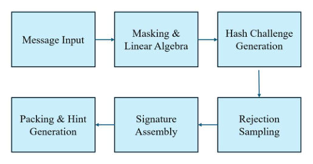
<figcaption class="paper-figure-caption"><b>Fig 1.</b> Fig. 1 Dilithium signing procedure.</figcaption>
</figure>
<figure class="paper-figure-card">
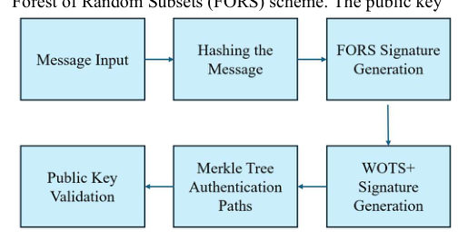
<figcaption class="paper-figure-caption"><b>Fig 2.</b> Fig. 2 SPHINCS+ signing procedure.</figcaption>
</figure>
<figure class="paper-figure-card">
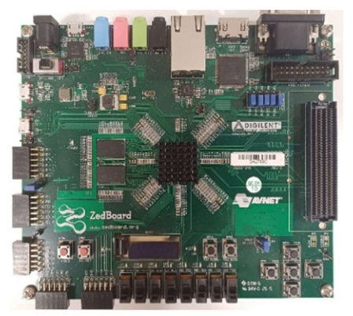
<figcaption class="paper-figure-caption"><b>Fig 3.</b> Fig. 4 Zedboard ZYNQ 7000 Board.</figcaption>
</figure>
<figure class="paper-figure-card">
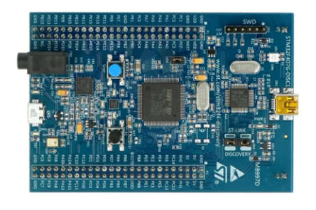
<figcaption class="paper-figure-caption"><b>Fig 4.</b> Fig. 3 STM32F407G-DISC1 Board.</figcaption>
</figure>
<figure class="paper-figure-card">
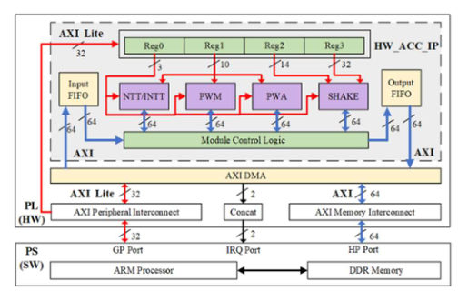
<figcaption class="paper-figure-caption"><b>Fig 5.</b> Fig. 5 The top-level SW/HW co-design SoC architecture.</figcaption>
</figure>

**Summary.** This paper investigates the feasibility of running NIST PQC algorithms like Dilithium and SPHINCS+ on embedded systems. Testing revealed that standard microcontrollers fail due to memory or time constraints. The authors successfully overcame this by integrating an NTT accelerator into an FPGA fabric, proving that hardware-software co-design is essential for practical quantum-resistant embedded security.

**Why it may be interesting.** While not directly related to fundamental AMO physics, the rigorous engineering challenge of implementing complex mathematical structures (like polynomial arithmetic in PQC) onto constrained digital hardware shares conceptual parallels with simulating quantum dynamics on limited computational resources.

Detailed structure

**Main problem.** The study addresses the practical implementation challenges of NIST-standardized Post-Quantum Cryptography (PQC) signature schemes on resource-constrained embedded hardware.

**Main result.** Pure software PQC implementations are non-viable for standard microcontrollers due to severe memory and timing limitations; however, a hardware-software co-design approach using FPGA acceleration achieves millisecond performance rates.

**Method.** The authors conducted a comparative performance analysis by implementing SPHINCS+ and CRYSTALS-Dilithium on two platforms: an STM32 microcontroller (software-only) and a Zynq-7000 SoC (hardware/software co-design).

**Model / system.** The experimental platforms include the ARM Cortex-M4 based STM32F407G microcontroller and the Xilinx Zynq-7000 ZedBoard SoC, which integrates a processor system with an Artix-7 FPGA fabric for acceleration.

**Key observables.** Execution times for key generation and signature generation (measured in minutes vs. milliseconds); feasibility of execution under limited SRAM capacity.

**Important parameters / regimes.** The comparison highlights the limitations imposed by 192 KB SRAM on the MCU versus the capability of offloading computationally heavy primitives like NTT to the FPGA fabric.

**Assumptions / limitations.** The necessity of hardware acceleration is established because general-purpose MCUs lack the necessary resources for high-degree polynomial multiplications required by modern PQC schemes.

**Figures summary.** Figures illustrate the setup of both the STM32F407G and Zynq-7000 boards, alongside schematic representations of the signing procedures for Dilithium and SPHINCS+.

**Paper structure.** The paper follows a structure moving from identifying the quantum threat to testing baseline software performance on an MCU (showing failure), and finally proposing and demonstrating a hardware-software co-design solution using FPGA acceleration to achieve practical performance metrics.

Abstract

The rapid advancement of quantum computing poses a significant threat to classical public-key cryptographic systems, necessitating the transition to Post-Quantum Cryptography (PQC). This study investigates the implementation challenges of NISTstandardized signature schemes on resource-constrained embedded hardware. We present a comparative analysis of SPHINCS+ and CRYSTALS-Dilithium on an ARM Cortex-M4 (STM32F407G) microcontroller. Our findings reveal that SPHINCS+ is practically unusable in this software-only environment, with impractical execution times. Furthermore, the reference Dilithium implementation failed to execute entirely on the MCU due to severe RAM and timing constraints. To overcome these hardware limitations, we integrated a hardware-accelerated Dilithium core onto a Xilinx Zynq-7000 ZedBoard SoC. By implementing a specialized Number Theoretic Transform (NTT) accelerator in the FPGA fabric, we achieved successful execution with performance rates for key generation and signature generation at millisecond levels. These results demonstrate that while pure software PQC is non-viable for standard microcontrollers, a hardware-software codesign approach provides the necessary efficiency for quantumresistant embedded systems.

[↑ back to top](#top)

### [Dimensional Crossover of Mass Anisotropy in Ta-doped WTe2](http://arxiv.org/abs/2606.15620v1)

**Authors:** P. Das, D. Das, P. Kumar, Monika, S. Patnaik  
**Type:** experiment · **Category:** other · **PDF:** <https://arxiv.org/pdf/2606.15620v1>  
**Analysis basis:** full PDF text, analyzed in chunks

↔ Scroll figures horizontally

<figure class="paper-figure-card">
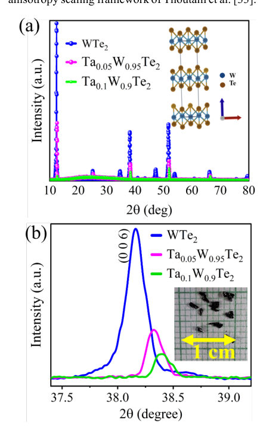
<figcaption class="paper-figure-caption"><b>Fig 1.</b> Figure 1. (a) Room-temperature X-ray diffraction patterns of single-crystalline TaxW1-xTe2 (x = 0, 0.05, 0.1). The inset shows the schematic crystal structure of WTe2. (b) The (0 0 6) Bragg reflection for TaxW1-</figcaption>
</figure>
<figure class="paper-figure-card">
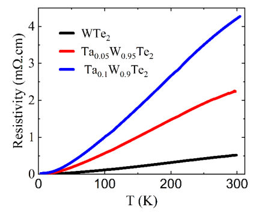
<figcaption class="paper-figure-caption"><b>Fig 2.</b> Figure 2. Temperature dependence of electrical resistivity ρ(T) for single-crystalline TaxW1-xTe2 (x = 0, 0.05, 0.1) in the absence of external magnetic field. All compositions show metallic behaviour. The residual resistivity ratio RRR increases monotonically with Ta substitution (145, 176, and 362 for x = 0, 0.05, and 0.1, respectively), indicating enhanced carrier mobility with doping.</figcaption>
</figure>
<figure class="paper-figure-card">
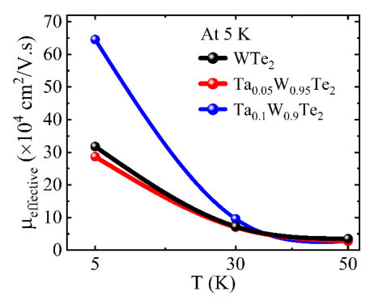
<figcaption class="paper-figure-caption"><b>Fig 3.</b> Figure 4. Effective carrier mobility μeff as a function of temperature for single-crystalline TaxW1-xTe2 (x = 0, 0.05, 0.1) at 5 K, 30 K, and 50 K. At 5 K, the mobility of Ta0.1W0.9Te2 (~65 × 10⁴ cm²V⁻¹s⁻¹) is more than double that of pristine WTe2 (~31 × 10⁴ cm²V⁻¹s⁻¹), consistent with the dramatically enhanced MR at x = 0.1.</figcaption>
</figure>
<figure class="paper-figure-card">
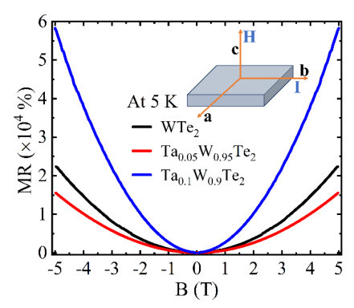
<figcaption class="paper-figure-caption"><b>Fig 4.</b> Figure 3. Transverse magnetoresistance MR(%) as a function of magnetic field B at 5 K for single- crystalline TaxW1-xTe2 (x = 0, 0.05, 0.1), with H applied along the c axis. All compositions display large, non-saturating parabolic MR up to 5 T. The MR evolves non-monotonically with Ta content, decreasing from 22,379% (x = 0) to 15,537% (x = 0.05) before rising sharply to 58,211% (x = 0.1) at 5 T. The inset shows the measurement geometry, with current I flowing along the b axis and field H applied along the c axis.</figcaption>
</figure>
<figure class="paper-figure-card">
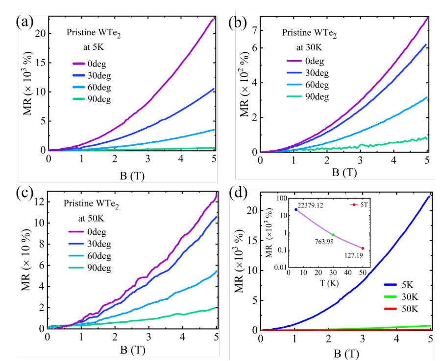
<figcaption class="paper-figure-caption"><b>Fig 5.</b> Figure 5. Angle-dependent magnetoresistance of pristine WTe2 at (a) 5 K, (b) 30 K, and (c) 50 K for field orientations θ = 0°, 30°, 60°, and 90°, where θ is the angle between the applied field H and the crystallographic c axis. The MR decreases systematically as the field is rotated from H ∥ c (θ = 0°) toward H ∥ ab (θ = 90°), reflecting strong transport anisotropy. The angular anisotropy is most pronounced at 5 K and diminishes with increasing temperature. (d) Transverse MR (H ∥ c) at 5 K, 30 K, and 50 K as a function of field. The inset shows the temperature dependence of MR at 5 T on a logarithmic scale, with values of 22,379%, 764%, and 127% at 5 K, 30 K, and 50 K, respectively.</figcaption>
</figure>

**Summary.** This work systematically studies Ta-doping in WTe2, demonstrating that doping enhances carrier mobility and deepens 2D character, leading to record magnetoresistance. The study reveals that while anisotropy is tunable, the system undergoes a transition to a multi-pocket Fermi surface at higher doping levels. Overall, it establishes that key transport parameters—anisotropy, compensation, and mobility—can be independently controlled in this topological semimetal.

**Why it may be interesting.** While focused on condensed matter physics, the ability to tune electronic properties (anisotropy, mobility) via chemical doping provides a model for engineering quantum states or transport channels relevant to advanced quantum devices.

Detailed structure

**Main problem.** The study investigates whether the anisotropic transport characteristics of WTe2 persist when chemically substituted with Ta, and how doping affects the control mechanisms behind large magnetoresistance (XMR).

**Main result.** Ta substitution enhances carrier mobility and deepens quasi-two-dimensional Fermi surface character, leading to record high MR values; however, at higher doping levels, the system transitions to a multi-pocket Fermi surface regime.

**Method.** The research combines angle-dependent magnetotransport measurements with structural analysis (XRD) and fitting data using mass anisotropy scaling frameworks.

**Model / system.** The physical system is single-crystalline Ta-doped WTe2 ($	ext{Ta}_x	ext{W}_{1-x}	ext{Te}_2$), a layered van der Waals semimetal. Analysis employs semiclassical models for magnetoresistance and nonlinear Hall resistivity to probe multiband transport.

**Key observables.** Magnetoresistance (MR) up to 58,211%; mass anisotropy parameter ($\gamma$); effective carrier mobility ($\mu_{	ext{eff}}$); residual resistivity ratio (RRR).

**Important parameters / regimes.** Doping concentration ($x=0, 0.05, 0.1$); Temperature ($T$); Magnetic field strength ($B$).

**Assumptions / limitations.** The analysis relies on the mass anisotropy scaling framework and semiclassical models for transport phenomena.

**Figures summary.** Figures show XRD patterns confirming $c$-axis contraction with Ta content, and magnetotransport curves demonstrating a sharp rise in MR at $x=0.1$.

**Paper structure.** The paper systematically analyzes the effect of Ta doping on crystal structure (XRD), transport anisotropy ($\gamma$ scaling), carrier dynamics ($\mu_{	ext{eff}}$ enhancement), and Fermi surface topology (breakdown of single-ellipsoid scaling, nonlinear Hall response).

Abstract

The observation of extremely large magnetoresistance in WTe2 has attracted considerable attention towards understanding its underlying origin. With its layered van der Waals structure, the question that remains largely unexplored is whether the three-dimensional anisotropic transport characteristics of WTe2 persists under chemical substitution. Here, we present a systematic angle-dependent magneto-transport study of single-crystalline TaxW1-xTe2 (x = 0, 0.05, 0.1). The results are analysed within a mass anisotropy scaling framework to extract the mass anisotropy parameter γ as a function of temperature and doping. It is observed that Ta substitution leads to monotonic increase of γ across all temperatures, indicating a progressive deepening of quasi-two-dimensional Fermi surface character. Ta doping also leads to a substantial improvement in crystalline quality, reflected in a pronounced increase in the residual resistivity ratio. Despite weakening electron-hole compensation, the magnetoresistance rises sharply to ~58,211% at x = 0.1, which is assigned to a substantial enhancement in carrier mobility. Rietveld refinement confirms a systematic c-axis contraction with Ta content, identifying the structural origin of the enhanced anisotropy. The mass anisotropy scaling that holds for x = 0 and x = 0.05 breaks down for x = 0.1, where the angular magneto-resistance anisotropy substantially exceeds single-ellipsoid predictions, pointing to a multi-pocket Fermi surface with distinct anisotropies. Nonlinear Hall resistivity provides independent evidence for the underlying multiband character of transport in this system. These findings demonstrate that Fermi surface anisotropy, carrier compensation, and mobility are independent parameters that can lead to tuneable control of large magnetoresistance in topological semimetal WTe2.

[↑ back to top](#top)

### [Efficient Magic State Factory Via Transversal Non-Clifford Gate](http://arxiv.org/abs/2606.16199v1)

**Authors:** I-Chi Chen, Hrushikesh Pramod Patil, Huiyang Zhou, Andrew Sornborger  
**Type:** theory · **Category:** quantum information and computing · **PDF:** <https://arxiv.org/pdf/2606.16199v1>  
**Analysis basis:** full PDF text, analyzed in chunks

↔ Scroll figures horizontally

<figure class="paper-figure-card">
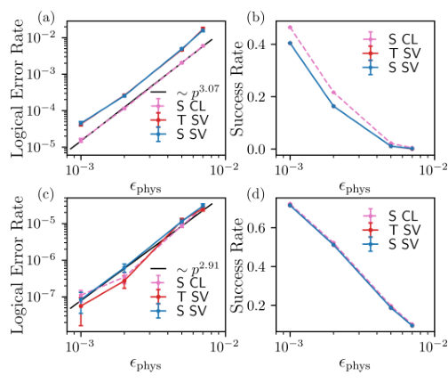
<figcaption class="paper-figure-caption"><b>Fig 1.</b> FIG. 1. Performance of magic state preparation using transversal gate. (a) The logical infidelity and (b) the suc- cess rate of T |+⟩L and S |+⟩L preparations using transversal T are estimated by state vector (SV) simulation (red line: T |+⟩L and blue line: T |+⟩L) and Clifford (CL) gate simula- tion (purple line: S |+⟩L) with varying noise levels. Note that the Clifford circuit simulation is simulated under the uniform noise model, while the state vector simulation is executed un- der an approximate uniform noise model, which serves as an upper bound for the uniform noise model and can be sim- ulated using fewer qubits. The exponents of fitting lines are calculated using...</figcaption>
</figure>
<figure class="paper-figure-card">
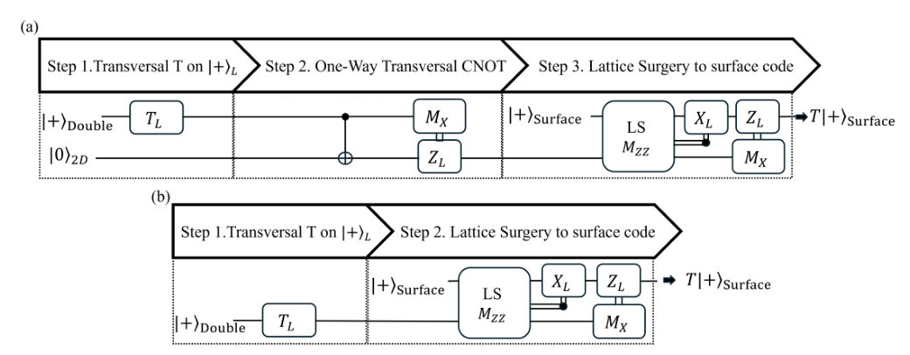
<figcaption class="paper-figure-caption"><b>Fig 2.</b> FIG. 2. The workflow of the end-to-end process for preparing a magic state using the doubled color code. The procedure of end-to-end magic state preparation using transversal gate and lattice surgery from (a) 2D color code and (b) double color code into a large rotated surface code is depicted. At the first step, before the transversal T gate (shown as TL), one round of Z-type stabilizer measurements is applied. For the second step at (a), CS is applied from doubled color code to 2D color code using a one-way transversal CNOT gate. Then, the logical X is measured (represented by MX). If the outcome gives 1L, the logical Z will be applied to the 2D color code. Otherwise, no operation is...</figcaption>
</figure>
<figure class="paper-figure-card">
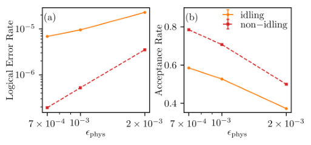
<figcaption class="paper-figure-caption"><b>Fig 3.</b> FIG. 3. The performance for ungrown d = 3 code switch protocol (with and without the idling noise). (a) The logical error rates and (b) the acceptance rates vary- ing with the physical noise strength for [[15, 1, 3]] (with idling noise in orange (‘·’ markers) and with idling noise labeled in red dashed lines (‘□’ marker).) CS protocol. The number of rounds is r = 2 after the transversal CNOT code switch. The error bar is the standard error from the successful shots (errors bars are not visible in the plot as the errors bars are order of magnitude smaller than the values of lagical errors and acceptance rate).</figcaption>
</figure>
<figure class="paper-figure-card">
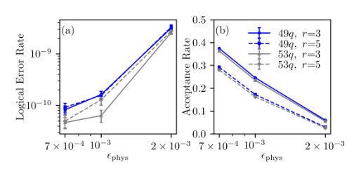
<figcaption class="paper-figure-caption"><b>Fig 4.</b> FIG. 4. The performance for ungrown d = 5 code switch protocol (without idling noise). (a) The logi- cal error rates and (b) the acceptance rates varying with the physical noise strength for [[49, 1, 5]] (49q in blue lines) and [[53, 1, 5]] (53q in green lines) CS protocol. The dashed line and solid lines means different number of syndrome measure- ment rounds (r = 5 and r = 3 respectively) after the transver- sal CNOT code switch. The error bar is the standard error from the successful shots.</figcaption>
</figure>
<figure class="paper-figure-card">
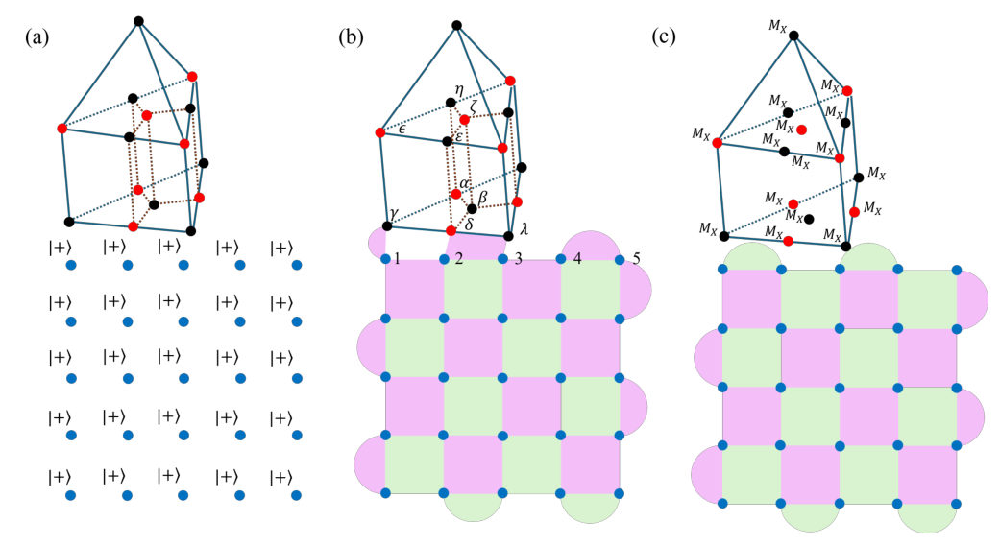
<figcaption class="paper-figure-caption"><b>Fig 5.</b> FIG. 5. The illustration of lattice surgery between 3D color code and rotated surface code. (a)The surface code initialized with all data qubits |+⟩states and the color code with T |+⟩L. (b) The X-type ( green) and Z-type (pink) stabilizers from the surface code and the boundary between surface code and color code. (c) The stabilizers of the surface code after the lattice surgery and XL measurement of the color code. Since the stabilizer XαXβXγXδXϵXεXζXη from color code doesn’t commute with ZγZ1 and ZδZλZ2Z3, the stabilizer becomes X1X2XαXβXγXδXϵXεXζXη during the lattice surgery. After the lattice surgery, the color code is measured in the XL basis by measuring all qubits individually in X...</figcaption>
</figure>

**Summary.** This paper develops and compares advanced protocols for generating magic states necessary for fault-tolerant quantum computing. It integrates code switching and lattice surgery to transfer logical information between different QEC codes like color and surface codes. The results propose optimized methods that improve fidelity and reduce resource overhead compared to existing techniques.

**Why it may be interesting.** This work provides concrete, resource-aware benchmarks for implementing universal quantum computation primitives (magic states) using state-of-the-art QEC structures, which is crucial for scaling up any physical quantum hardware platform.

Detailed structure

**Main problem.** The work aims to thoroughly compare the resource requirements and performance between two methods for generating magic states: code-switch-based factories versus direct magic-state cultivation.

**Main result.** Two new fault-tolerant protocols combining phase-kickback checks with a transversal non-Clifford gate were proposed, showing consistent performance across different noise models and code distances.

**Method.** The study uses end-to-end simulations of the entire magic-state preparation process, involving lattice surgery (LS) to transfer state information between various Quantum Error Correction (QEC) codes like color codes and surface codes.

**Model / system.** The research focuses on fault-tolerant quantum computation using multiple QEC codes, including the 2D/3D color code, rotated surface code, and tetrahedral code. The protocols are designed to generate logical magic states ($T|+ 
angle_L$ or $S|+ 
angle_L$).

**Key observables.** Logical infidelity, success rate of magic-state preparation, and the expected space-time volume per successful shot (V).

**Important parameters / regimes.** Physical gate error rates ($\epsilon$), code distances ($d=3, d=5$), and noise models (with/without idling noise).

**Assumptions / limitations.** The analysis often approximates noisy circuits due to large qubit counts and sometimes uses $S|+ 
angle_L$ as a proxy for the non-Clifford $T|+ 
angle_L$ state preparation.

**Figures summary.** Figures illustrate the workflow of end-to-end magic state preparation using code switching, comparing logical infidelity vs. noise strength across different dimensions and protocols.

**Paper structure.** The paper develops new combined protocols by integrating transversal non-Clifford gates with established techniques like code switching (CS) and lattice surgery (LS), culminating in detailed performance comparisons across various error regimes.

Abstract

Magic-state preparation is a central component of fault-tolerant quantum computing. Recent theoretical and experimental successes in code-switch-based magic-state preparation have underscored the promise of these methods for quantum error correction. Similarly, magic-state cultivation has likewise been demonstrated in both numerical and experimental settings. However, a thorough comparison between magic-state cultivation and code-switch-based magic-state factories is still missing. In this work, we carry out end-to-end simulations of magic-state preparation using code switching and compare its resource requirements and performance against magic-state cultivation. As part of this analysis, we develop a lattice-surgery protocol for transfer between the doubled color code and the rotated surface code. We extend the complete code-switching protocol to the $d=5$ doubled color code and perform the corresponding end-to-end simulations. Finally, we propose two fault-tolerant magic-state preparation protocols that combine phase-kickback checks with a transversal non-Clifford gate.

[↑ back to top](#top)

### [Evaluating the Structural Basis for Polar Altermagnet Candidate Ca$_{3}$(Ru,Ti)$_{2}$O$_{7}$](http://arxiv.org/abs/2606.16181v1)

**Authors:** Akash Saha, Yihuang Xiong, Vladimir A. Stoica, Subin Mali, Aaron Pearre, Saugata Sarker, Huaiyu Wang, Yufei Zhao, Evguenia Karapetrova, Yu Wang, Jadupati Nag, Zachary W. Hazenstab, Seng Huat Lee, Long-Qing Chen, Geoffroy Hautier, Binghai Yan, Zhiqiang Mao, Venkatraman Gopalan  
**Type:** both · **Category:** strongly correlated electrons · **PDF:** <https://arxiv.org/pdf/2606.16181v1>  
**Analysis basis:** full PDF text, analyzed in chunks

↔ Scroll figures horizontally

<figure class="paper-figure-card">
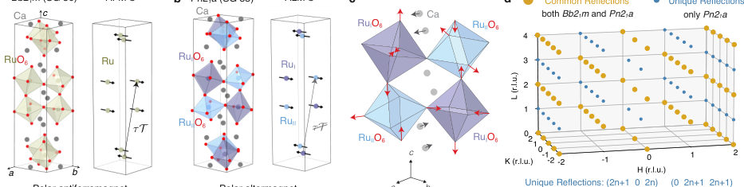
<figcaption class="paper-figure-caption"><b>Fig 1.</b> FIG. 1: Candidate crystal structures of Ca3Ru2O7 and their associated diffraction signatures.</figcaption>
</figure>
<figure class="paper-figure-card">
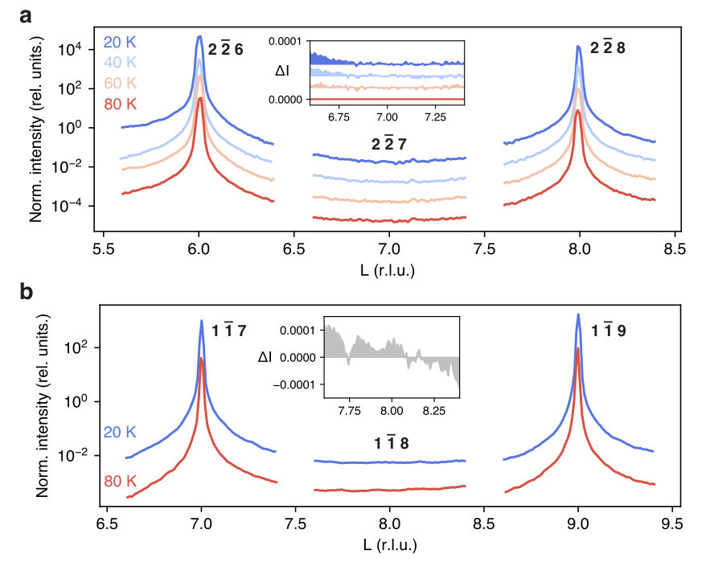
<figcaption class="paper-figure-caption"><b>Fig 2.</b> FIG. 2: Absence of diffraction signatures associated with Pn21a structure in Ca3Ru2O7 . (a)</figcaption>
</figure>
<figure class="paper-figure-card">
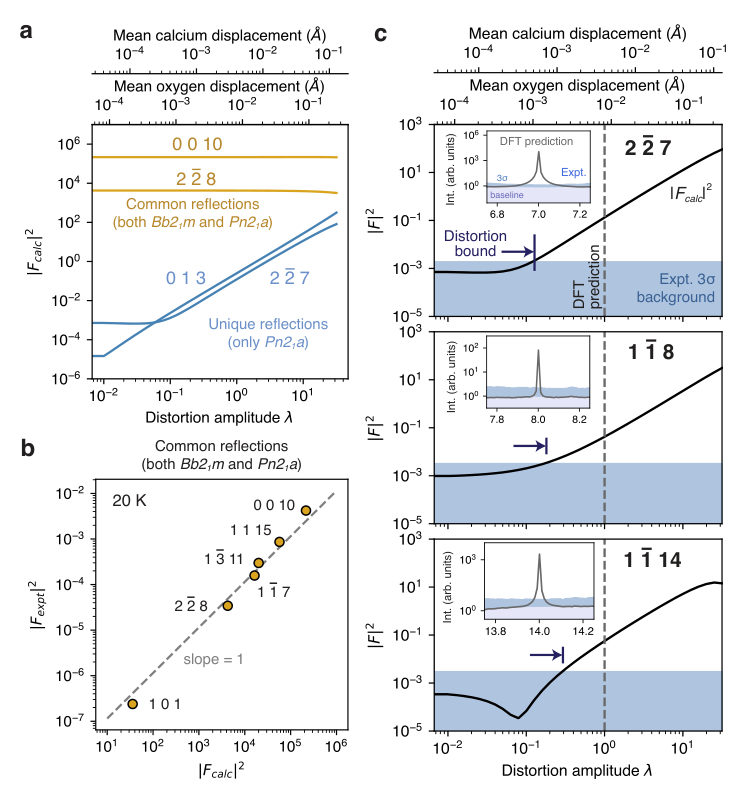
<figcaption class="paper-figure-caption"><b>Fig 3.</b> FIG. 3: Estimation of an upper bound associated with the Pn21a distortion from diffraction</figcaption>
</figure>
<figure class="paper-figure-card">
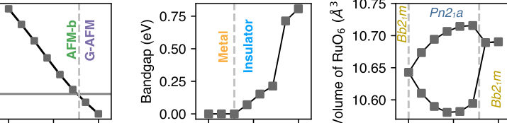
<figcaption class="paper-figure-caption"><b>Fig 4.</b> FIG. 4: Ti substitution as a proxy for Hubbard U. (a) Experimentally observed phases in Ca3Ru2O7</figcaption>
</figure>
<figure class="paper-figure-card">
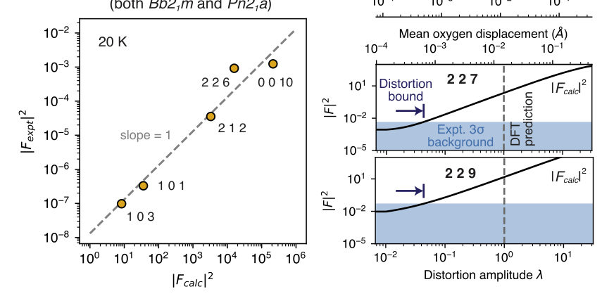
<figcaption class="paper-figure-caption"><b>Fig 5.</b> FIG. 5: Lack of structural evidence of Pn21a phase in Ca3(Ru0.99Ti0.01)2O7 . (a) Integrated line</figcaption>
</figure>

**Summary.** The research investigates the structural basis for altermagnetism in $	ext{Ca}_3(	ext{Ru},	ext{Ti})_2	ext{O}_7$. Despite theoretical predictions of a symmetry-lowering phase transition ($Pn21a$), detailed X-ray diffraction experiments found no evidence of this lattice distortion. The authors conclude that the observed electronic symmetry breaking is likely decoupled from measurable structural changes, suggesting an electronically driven mechanism for altermagnetism.

**Why it may be interesting.** This work is highly relevant because it addresses the fundamental question of whether magnetic/electronic phase transitions in correlated oxides are accompanied by measurable lattice distortions or if they can be purely electronic, a key concept in modern condensed matter theory.

Detailed structure

**Main problem.** The study investigates whether the predicted structural phase transition from a polar altermagnet candidate ($	ext{Ca}_3	ext{Ru}_2	ext{O}_7$) is structurally mandated or purely electronic in origin.

**Main result.** Experimental X-ray diffraction measurements failed to detect the symmetry-lowering $Pn2_1a$ phase, placing tight upper bounds on structural distortions. Instead, evidence suggests that the observed symmetry breaking is primarily electronic, leading to a chemically tunable G-type altermagnetic (G-ALM) state within the higher symmetry $Bb2_1m$ structure.

**Method.** The work combines synchrotron X-ray diffraction measurements with advanced DFT+U calculations incorporating spin-orbit coupling and Hubbard U parameters.

**Model / system.** The system is $	ext{Ca}_3(	ext{Ru},	ext{Ti})_2	ext{O}_7$, a correlated electron oxide exhibiting complex magnetic ordering (AFM, G-ALM) and potential structural transitions between $Bb2_1m$ and $Pn2_1a$.

**Key observables.** Diffraction peak intensities ($I_{HKL}$), structural distortion amplitude ($\lambda$), electronic band gap opening, and magnetic transition temperatures ($T_N, T_S$).

**Important parameters / regimes.** The critical comparison is between the DFT-predicted large structural displacement ($\sim 1 	ext{ pm}$) versus the experimentally constrained upper bound on distortion ($\lambda \lesssim 0.08$ to $0.22$), and the role of Ti doping ($x$) as a tuning parameter.

**Assumptions / limitations.** The analysis assumes that experimental background noise provides reliable, quantitative upper bounds on structural distortions, and that DFT+U calculations accurately capture the electronic ground state evolution with varying correlation strength (Hubbard U).

**Figures summary.** Figures illustrate the comparison between predicted $Bb21m$ and $Pn21a$ structures, show the absence of expected $Pn21a$ diffraction peaks at low temperatures, and map out phase diagrams showing electronic/magnetic transitions as a function of Ti doping or Hubbard U.

**Paper structure.** The paper progresses by first establishing the theoretical prediction of a structural transition ($Bb21m 	o Pn21a$), then using high-sensitivity X-ray diffraction to experimentally constrain this distortion, and finally reconciling the negative structural findings with positive electronic measurements (nonlinear transport) by proposing an electronically driven symmetry breaking mechanism.

Abstract

The interplay between polar and altermagnetic orders remains largely unexplored in the broader landscape of correlated electron systems. Ca$_{3}$Ru$_{2}$O$_{7}$ has been proposed by density functional theory (DFT) as a polar altermagnet, reliant on the transformation of experimentally reported $Bb2_{1}m$ phase to a lower symmetry $Pn2_{1}a$ structure. Here, we perform a targeted search for the $Pn2_{1}a$ phase using synchrotron X-ray diffraction on single crystals of Ca$_{3}$Ru$_{2}$O$_{7}$ and Ca$_{3}$(Ru$_{0.99}$Ti$_{0.01}$)$_{2}$O$_{7}$. No diffraction signature of the $Pn2_{1}a$ structure is detected down to 20 K within experimental limits of $\sim$60-200 fm atomic displacements, significantly smaller than the DFT prediction of $\sim$1 pm. Combined with recent nonlinear transport measurements, our structural study suggests Ca$_{3}$Ru$_{2}$O$_{7}$ as a unique system where strong electron correlations drive an electronic phase transition without any measurable lattice symmetry change. With Ti substitution exceeding $\sim$3%, a chemically tunable altermagnetic phase with $Bb2_{1}m$ structure emerges. The study highlights the importance of sub-picometer metrology towards de-convolving structural versus electronic origins of altermagnets.

[↑ back to top](#top)

### [Geometric decomposition of the $d$-dimensional hard-sphere partition function](http://arxiv.org/abs/2606.16483v1)

**Authors:** Luke K. Davis  
**Type:** theory · **Category:** statistical mechanics · **PDF:** <https://arxiv.org/pdf/2606.16483v1>  
**Analysis basis:** full PDF text, analyzed in chunks

↔ Scroll figures horizontally

<figure class="paper-figure-card">
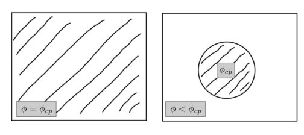
<figcaption class="paper-figure-caption"><b>Fig 1.</b> FIG. 1. Illustrations of a globally close-packed system (left) and a close-packed droplet reference (right), with a global packing fraction less than the close-packing fraction. In the thermodynamic limit this construction (right) asymptotically saturates the insertion-volume upper bound, up to surface corrections.</figcaption>
</figure>
<figure class="paper-figure-card">
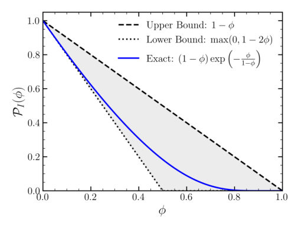
<figcaption class="paper-figure-caption"><b>Fig 2.</b> FIG. 2. Comparing bounds on the insertion probability PI = ⟨VI(ϕ)⟩/V with the exact solution for the d = 1 hard-sphere system [3, 19, 24].</figcaption>
</figure>
<figure class="paper-figure-card">
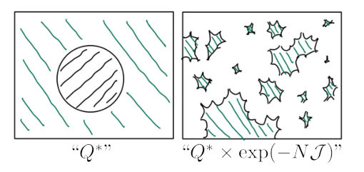
<figcaption class="paper-figure-caption"><b>Fig 3.</b> FIG. 3. Pictorial representation of the decomposition of the partition function for the hard-sphere system: an upper bound Q∗(left), associated with the close-packed droplet ref- erence saturating the insertion-volume bound (green), and a “discount” factor exp(−NJ ) which gives the precise amount of void-fragmentation for some given packing ϕ (right).</figcaption>
</figure>

**Summary.** This work introduces a novel geometric decomposition for calculating the hard-sphere partition function in $d$ dimensions. It factors the total partition function into an upper bound derived from close-packing geometry and an exponential penalty term related to void space fragmentation. This provides a powerful, geometrically controlled framework for understanding fluid thermodynamics across all densities.

**Why it may be interesting.** While focused on classical statistical mechanics, the rigorous geometric bounding techniques used to control fluctuations in the void space are highly relevant for developing controlled approximations in quantum many-body systems where local correlations dominate.

Detailed structure

**Main problem.** To derive a rigorous geometric decomposition for the $d$-dimensional hard-sphere partition function, $Q(N, V, T)$.

**Main result.** The partition function is shown to factorize into a reference upper bound ($Q^*$) and an exponential penalty term: $Q \propto Q^* \exp(-NJ)$, where $J$ depends on the boundary-to-volume ratio of voids.

**Method.** The authors use geometric bounds, inspired by close-packing arguments and formalized via local density certificates (Blichfeldt-type), to establish an upper bound on the configurational integral.

**Model / system.** The system is a classical hard-sphere fluid in $d$ dimensions. The analysis focuses on calculating the partition function based on the available insertion volume ($V_I$) for adding particles without overlap.

**Key observables.** Hard-sphere partition function ($Q$), Insertion Probability ($\Pi_I$), Packing Fraction ($\phi$), and Compressibility Factor ($Z$).

**Important parameters / regimes.** Dimensionality ($d$), Close-packing density ($\phi_{cp}$), and the ratio of surface area to volume of excluded regions.

**Assumptions / limitations.** The rigorous derivation relies on the existence of a local density certificate that allows bounding the exclusion set volume, particularly at high densities.

**Figures summary.** Figures compare various bounds on the insertion probability ($\Pi_I$) against known exact solutions for low dimensions ($d=1$), and illustrate the decomposition of $Q$ into a reference bound ($Q^*$) and a geometric penalty factor.

**Paper structure.** The paper systematically develops the factorization, first establishing upper bounds using geometry (Chunk 1), then deriving the finite-$N$ exact relationship involving insertion volume ratios (Chunk 2), and finally confirming thermodynamic consistency across low-density (van der Waals) and high-density (close-packed limit) regimes (Chunks 3 & 4).

Abstract

We introduce a geometric decomposition of the hard-sphere partition function. Using a close-packing-inspired geometric bound on the available insertion volume, made rigorous when a corresponding local density certificate is available, we establish a reference upper bound $Q^\ast$ on the configurational integral. Factoring this upper bound out of the statistical geometric partition function of Speedy yields a new form for the $d$-dimensional partition function, $Q(N,V,T)=Q^\ast \exp(-N \mathcal{J})$, where $\mathcal{J}$ depends strictly on the boundary-to-volume ratio of the voids and the close-packing density. Overall, this work deepens our statistical geometric understanding of the hard-sphere system.

[↑ back to top](#top)

### [Influence of the Electron's Anomalous Magnetic Dipole Moment on High-Atomic-Number Atoms](http://arxiv.org/abs/2606.15995v1)

**Authors:** C. A. S. Almeida, J. Auto-Neto  
**Type:** theory · **Category:** other · **PDF:** <https://arxiv.org/pdf/2606.15995v1>  
**Analysis basis:** full PDF text, analyzed in chunks

↔ Scroll figures horizontally

<figure class="paper-figure-card">
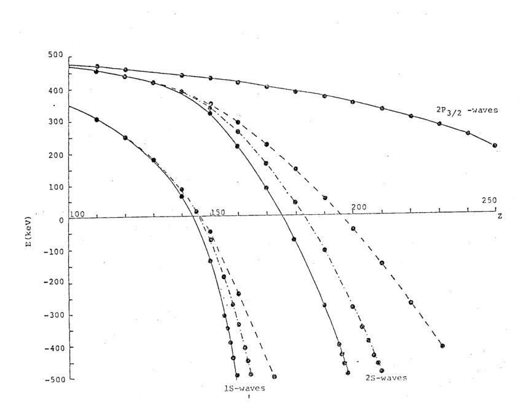
<figcaption class="paper-figure-caption"><b>Fig 1.</b> Figure 1: E × Z curves. — — — finite nucleus [12]; point nucleus, AMDM model, a = α/2π; – · – · – point nucleus, AMDM model, a = α/π. (For 2P3/2 waves, the three curves coincide.)</figcaption>
</figure>
<figure class="paper-figure-card">
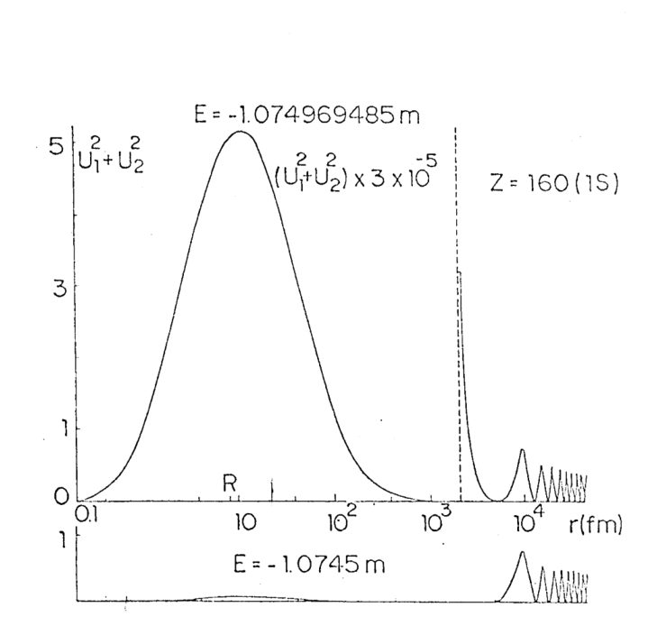
<figcaption class="paper-figure-caption"><b>Fig 2.</b> Figure 2: Super-critical U 2 1 + U 2 2 function in the point nucleus + AMDM model, with a = α/2π.</figcaption>
</figure>

**Summary.** This paper investigates the behavior of electron energy levels in super-heavy atoms ($Z>100$) where standard quantum electrodynamics predicts unphysical singularities. By incorporating the electron's Anomalous Magnetic Dipole Moment (AMDM) into the theoretical framework, the authors demonstrate that this contribution regularizes the wave functions and yields physically acceptable results for high Z numbers.

**Why it may be interesting.** This work directly tackles fundamental theoretical limitations in QED applied to extreme matter (super-heavy elements), providing an alternative regularization mechanism that has implications for understanding vacuum stability and atomic structure beyond current standard models.

Detailed structure

**Main problem.** The study addresses the singularity issue encountered in standard Quantum Electrodynamics (QED) point-nucleus models when calculating electron energy levels for super-heavy atoms ($Z > 137$).

**Main result.** Incorporating the electron's Anomalous Magnetic Dipole Moment (AMDM) provides a sufficient condition to obtain regular wave functions and physically acceptable energy values even in the idealized point-nucleus limit for very high atomic numbers.

**Method.** The analysis involves modifying Dirac's equation with an effective Pauli Hamiltonian term representing the AMDM, leading to coupled differential equations solved using techniques like Whittaker functions and perturbation theory.

**Model / system.** The system is a single electron orbiting a super-heavy nucleus ($Z > 100$). The model uses a point-nucleus approximation but incorporates the AMDM contribution via an effective Hamiltonian modification to regularize the wave function at the origin.

**Key observables.** Energy eigenvalues $E(Z)$, critical atomic number $Z_{	ext{crit}}$ where $E=-m$, and the behavior of radial wave functions near the nucleus.

**Important parameters / regimes.** Fine structure constant ($\alpha$), AMDM parameter ($a = (g-2)/2$), and the atomic number $Z$.

**Assumptions / limitations.** The primary assumption is that including the AMDM contribution via an effective theory is sufficient to regularize the wave functions, even though finite nuclear size effects are usually required for full accuracy.

**Figures summary.** Figure 1 compares numerically obtained eigenvalues from the AMDM model against results from finite-nucleus models. Figure 2 illustrates the behavior of a specific function related to the wave function in the point nucleus + AMDM model.

**Paper structure.** The paper first introduces the problem of singularities in QED for super-heavy atoms. It then modifies the Hamiltonian using the AMDM, derives coupled differential equations, and solves them by analyzing near-origin behavior and transforming the problem into a Schrödinger-type equation to determine energy dependence on Z.

Abstract

Super-heavy atoms ($Z > 100$) are usually studied in the context of the so-called ``Quantum Electrodynamics of Strong Fields''. In this theory the problem of the singularity in the electron energy whenever $Z > 137$ is overcome. This is done by considering the finite size of the nucleus and leads to interesting phenomena, such as the spontaneous production of positrons. Here, we show that taking into account the contribution from the Anomalous Magnetic Dipole Moment of the electron (by means of an effective theory), within a point-nucleus model, is a sufficient condition to obtain regular wave functions and physically acceptable energy values for $Z > 137$.

[↑ back to top](#top)

### [QALM: Escaping Local Minima via Interleaved Exploration and Exploitation in Quantum Circuit Optimization](http://arxiv.org/abs/2606.16221v1)

**Authors:** Aidan Wagner, Mingkuan Xu, Pengyu Liu, Zhihao Jia, Umut A. Acar  
**Type:** theory · **Category:** quantum information and computing · **PDF:** <https://arxiv.org/pdf/2606.16221v1>  
**Analysis basis:** full PDF text, analyzed in chunks

↔ Scroll figures horizontally

<figure class="paper-figure-card">
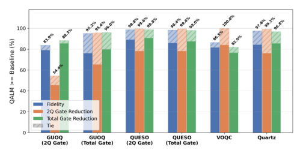
<figcaption class="paper-figure-caption"><b>Fig 1.</b> Figure 2. Percentage of circuits on which QALM matches or exceeds each baseline across fidelity, 𝐶𝑋gate reduction, and total gate reduction. GUOQ and QUESO are each shown under two configurations: one optimizing for 𝐶𝑋count and one for total gate count.</figcaption>
</figure>
<figure class="paper-figure-card">
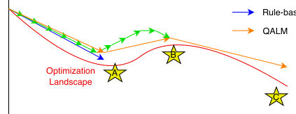
<figcaption class="paper-figure-caption"><b>Fig 2.</b> Figure 1. Comparison of optimization trajectories across three strategies: rule-based (pure exploitation), search-based (pure exploration), and QALM (interleaved exploration and exploitation). Rule-based optimization greedily descends to a local minimum in a single step and terminates (shown as 𝐴). Search-based optimization reaches the same local minimum more slowly, then continues to explore and discovers a can- didate region; however, because this new region has a higher cost (shown as 𝐵), and the search-based method cannot deter- mine whether this region is truly promising, escaping the cur- rent basin requires exponentially many search steps. QALM interleaves the two phases: the exploit...</figcaption>
</figure>
<figure class="paper-figure-card">
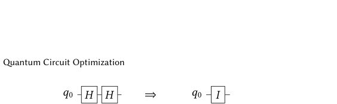
<figcaption class="paper-figure-caption"><b>Fig 3.</b> Figure 3. Hadamard self-inverse property: 𝐻𝐻= 𝐼, where 𝐼 denotes the identity gate, representing no operation on the qubit.</figcaption>
</figure>
<figure class="paper-figure-card">
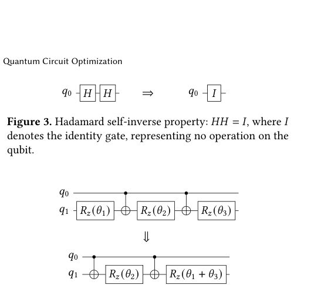
<figcaption class="paper-figure-caption"><b>Fig 4.</b> Figure 4. Example of an optimization rule for a gate pattern with multiple 𝐶𝑋and 𝑅𝑧gates.</figcaption>
</figure>
<figure class="paper-figure-card">
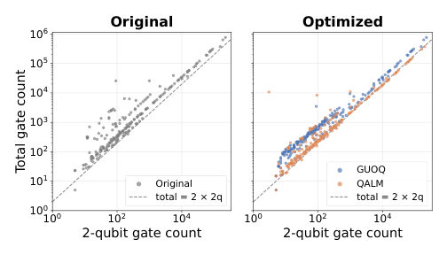
<figcaption class="paper-figure-caption"><b>Fig 5.</b> Figure 6. Gate count distribution in our benchmark. The dashed line indicates where the total gate count is twice the two-qubit gate count, or equivalently, where the number of single-qubit gates equals the number of two-qubit gates. The left panel shows the distribution before optimization, and the right panel shows the distribution after optimization using QALM and GUOQ with two-qubit gate optimization mode, which is the strongest baseline in our evaluation.</figcaption>
</figure>

**Summary.** The paper introduces QALM, a novel hybrid optimizer designed to improve quantum circuit synthesis. It combines the speed of rule-based optimization with the thoroughness of search algorithms by interleaving these two approaches. This allows QALM to achieve superior gate reduction rates compared to existing methods without incurring prohibitive computational overhead.

**Why it may be interesting.** This work directly addresses algorithmic bottlenecks in quantum computation resource estimation, which is crucial for designing efficient circuits for near-term hardware devices.

Detailed structure

**Main problem.** Quantum circuit optimization aims to find an equivalent quantum circuit with minimum cost (e.g., gate count) by overcoming the limitations of local minima encountered by existing optimizers.

**Main result.** The proposed QALM optimizer outperforms existing rule-based and search-based methods in circuit reduction rates while maintaining high computational efficiency across a comprehensive benchmark suite.

**Method.** QALM employs a hybrid framework that interleaves exhaustive, targeted search capabilities with efficient, greedy rule-based optimization passes.

**Model / system.** The system modeled is quantum circuits represented as Directed Acyclic Graphs (DAGs), where qubits are wires and gates are nodes. Optimization requires maintaining circuit equivalence while minimizing cost metrics like gate count or depth.

**Key observables.** Circuit fidelity ($F$), total gate count reduction, two-qubit gate ($	ext{CX}$) reduction percentage, and optimization runtime.

**Important parameters / regimes.** The exploration depth parameter $k$ controls the balance between search (exploration) and rule application (exploitation).

**Assumptions / limitations.** It is assumed that interleaving search and rules provides a superior trade-off compared to using either method in isolation, despite the problem's inherent computational hardness.

**Figures summary.** Figures compare optimization trajectories showing QALM's ability to escape local minima; other figures illustrate performance comparisons across various benchmarks (e.g., fidelity vs. gate reduction).

**Paper structure.** The paper introduces the fundamental limitations of greedy and pure search optimizers, proposes the interleaved QALM framework parameterized by an exploration depth $k$, details its iterative algorithm, and validates it against multiple state-of-the-art benchmarks.

Abstract

Quantum circuit optimizers face a fundamental limitation in how they tolerate temporary cost increases. At one extreme, greedy rule-based optimizers immediately apply any cost-reducing transformation, achieving high efficiency but quickly becoming trapped in local minima. At the other extreme, search-based optimizers accept cost-increasing moves to explore the circuit space and escape such minima. However, because search-based optimizers cannot determine within a reasonable time budget whether a given point is promising, that is, whether its neighborhood contains a deeper local minimum, they must blindly explore higher-cost regions. As a result, escaping the current basin to reach a promising point takes exponentially many steps.   In this work, we show that this limitation can be overcome with a hybrid framework that interleaves the exhaustive exploration capabilities of search algorithms with the efficiency of rule-based optimization. We implement this framework as QALM, a novel optimizer designed to escape local minima without incurring the runtime penalties of pure search. Crucially, our results demonstrate that QALM does not merely strike a balance; it outperforms existing rule-based and search-based optimizers in circuit reduction rates while operating with the computational efficiency of rule-based systems. In a comprehensive evaluation across 248 circuits, QALM matches or exceeds the fidelity of the strongest baseline on 83.9% of these circuits, given the same time budget.

[↑ back to top](#top)

### [REGRID-QAOA: A Resource-Efficient Graph-Reduced Hybrid QAOA Framework for Physics-Constrained Power System Islanding](http://arxiv.org/abs/2606.15083v1)

**Authors:** Yuqi Jiang, Yuqi Zhang, Zhiding Liang, Qiang Guan, Yan Li, Ganesh Kumar Venayagamoorthy  
**Type:** both · **Category:** quantum information and computing · **PDF:** <https://arxiv.org/pdf/2606.15083v1>  
**Analysis basis:** full PDF text, analyzed in chunks

↔ Scroll figures horizontally

<figure class="paper-figure-card">
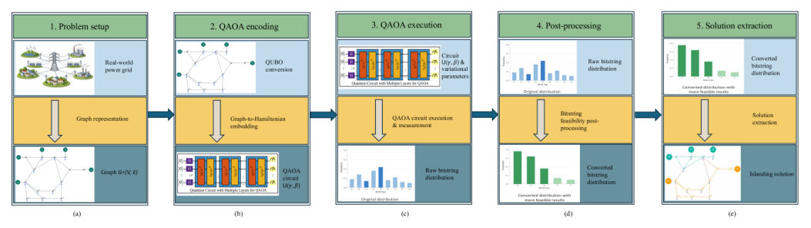
<figcaption class="paper-figure-caption"><b>Fig 1.</b> Fig. 1. Overall framework of the proposed QAOA-based controlled power system islanding approach. The pipeline consists of five operation blocks: (a) problem setup, which converts real-world power-grid data into a graph representation; (b) QAOA encoding, which maps the graph-partitioning problem into a Hamiltonian representation and circuit input; (c) QAOA circuit execution and measurement, which produces a raw bitstring distribution; (d) classical post-processing (M. 1–5), which repairs and filters sampled candidates to improve feasibility; and (e) solution extraction, which converts selected bitstrings into the final islanding solution.</figcaption>
</figure>
<figure class="paper-figure-card">
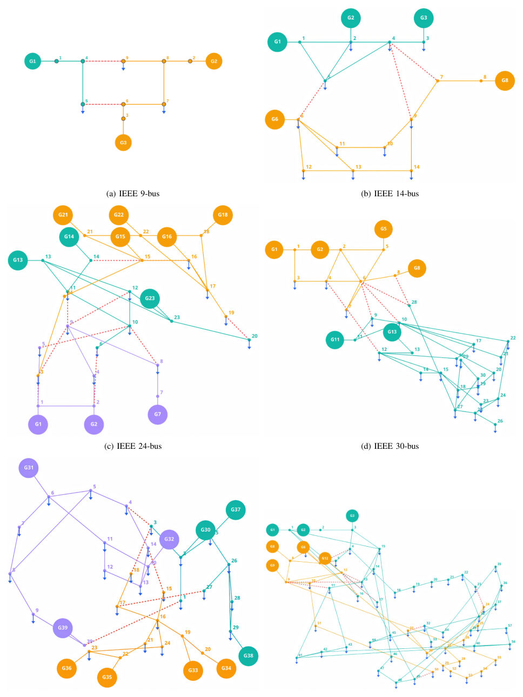
<figcaption class="paper-figure-caption"><b>Fig 2.</b> Fig. 2. Optimal islanding results generated by the proposed QAOA framework on the IEEE test systems. Bus colors indicate the island assignment of each bus, and the red dashed lines denote the transmission interfaces removed to form the final islands. The resulting partitions remain spatially compact and are separated by only a small number of inter-area transmission cuts.</figcaption>
</figure>
<figure class="paper-figure-card">
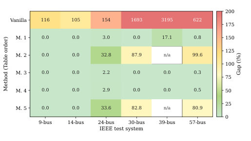
<figcaption class="paper-figure-caption"><b>Fig 3.</b> Fig. 4. Percent gap of the average cut value from the corresponding Gurobi benchmark across all the IEEE test systems for vanilla QAOA and post-processing methods M. 1 through M. 5. Smaller values indicate closer agreement with the classical optimum, and the cell labels report the corresponding percentage for each method and system.</figcaption>
</figure>
<figure class="paper-figure-card">
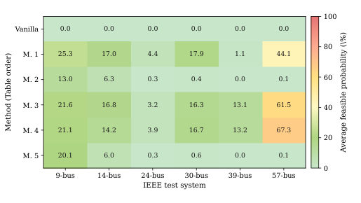
<figcaption class="paper-figure-caption"><b>Fig 4.</b> Fig. 5. Average feasible probability across all the IEEE test systems for vanilla QAOA and post-processing methods M. 1 through M. 5, reported in percent. Larger values indicate that the sampling distribution places more weight on feasible islanding partitions, and the cell labels give the corresponding average percentage for each method and system.</figcaption>
</figure>
<figure class="paper-figure-card">
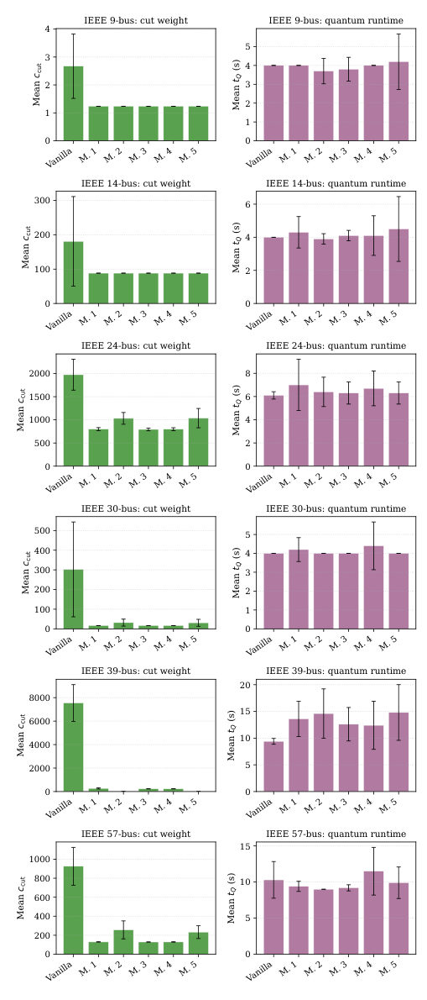
<figcaption class="paper-figure-caption"><b>Fig 5.</b> Fig. 3. Comparison of average cut quality and average quantum runtime across all the IEEE test systems for vanilla QAOA and all the proposed post- processing methods. The left column shows the average cut values with sample standard deviation bars, and the right column shows the average quantum runtime with sample standard deviation bars.</figcaption>
</figure>

**Summary.** This work presents a resource-efficient hybrid QAOA framework to solve the NP-hard power system islanding problem by combining quantum optimization with advanced classical post-processing. The method successfully recovers near-optimal, fully feasible islanding partitions on standard benchmark grids using shallow circuits. It establishes that structured post-processing is key to achieving physical validity and demonstrating a clear quantum resource advantage.

**Why it may be interesting.** The rigorous development of energy descent frameworks (M. 3, M. 4, M. 5) with formal proofs of termination and feasibility is highly relevant to developing reliable quantum algorithms for complex physical systems beyond simple Hamiltonian simulation.

Detailed structure

**Main problem.** Solving the NP-hard power system islanding problem, which requires partitioning a grid while satisfying complex physical constraints like power balance and connectivity.

**Main result.** A hybrid QAOA framework combining graph reduction and structured post-processing achieves Gurobi-optimal solution quality with a clear quantum resource advantage over vanilla QAOA on multiple IEEE benchmarks.

**Method.** The approach uses QAOA to minimize an objective function (cut value) encoded in a QUBO, followed by rigorous classical post-processing steps (like DFS and power flow checks) to enforce physical feasibility.

**Model / system.** The system is a power grid modeled as a graph where buses are partitioned into self-sufficient islands. The optimization involves minimizing the cut of active power flow while satisfying constraints on generator capacity, load balance, and connectivity.

**Key observables.** Feasible islanding decisions; minimized cut value (compared to Gurobi optimum); Power support margins ($P_{g,	ext{max}} - P_d$ and $Q_{	ext{max}} - Q_d$).

**Important parameters / regimes.** Circuit depth ($p$), shot budget, penalty weights ($\lambda$), graph size (e.g., 57-bus IEEE system).

**Assumptions / limitations.** The core assumption is that structured post-processing can bridge the gap between raw quantum sampling outputs and physically realizable solutions; theoretical analysis relies on specific regularity hypotheses for convergence proofs.

**Figures summary.** Figures illustrate the overall pipeline (setup $
ightarrow$ QAOA encoding $
ightarrow$ Execution $
ightarrow$ Post-processing $
ightarrow$ Solution extraction) and compare power flow capabilities across various IEEE test cases.

**Paper structure.** The paper develops from defining the NP-hard problem, formulating it as a constrained QUBO Hamiltonian, proposing graph reduction techniques, detailing multiple staged repair/descent methods (M.1 to M.5), providing theoretical convergence guarantees for these methods, and finally validating the best hybrid workflow on real quantum hardware.

Abstract

Quantum computing has rapidly emerged as a powerful paradigm for tackling computationally demanding problems. In particular, quantum optimization shows strong promise for hard combinatorial problems in power systems, where increasing distributed energy penetration heightens the need for intentional islanding to maintain grid reliability and resilience. However, power system islanding is an NP-hard combinatorial optimization problem that becomes computationally prohibitive for classical solvers as network size grows, motivating the use of quantum computing as a promising alternative pipeline. This study develops a resource-efficient hybrid QAOA islanding framework that brings physics-constrained power-system partitioning into the quantum optimization workflow. The framework combines coherency-informed graph reduction, physics-aware constraint modeling, and structured post-processing to efficiently convert shallow-circuit QAOA samples into high-quality feasible islanding decisions without deep circuits or large shot budgets. The proposed framework is validated on the standard IEEE benchmark systems (9-, 14-, 24-, 30-, 39-, and 57-bus), demonstrating that the hybrid workflow achieves Gurobi-optimal solution quality with a clear quantum resource advantage over vanilla QAOA, while the resulting islanding solutions satisfy all physical feasibility requirements after network separation. This study establishes QAOA-based islanding as a viable quantum approach for critical infrastructure, with structured post-processing as the key enabler of quantum resource efficiency.

[↑ back to top](#top)

### [The limits of interpretability in multiple linear regression](http://arxiv.org/abs/2606.16013v1)

**Authors:** Anand Sharma, Chen Liu, Daniele Coslovich, Misaki Ozawa  
**Type:** theory · **Category:** disordered systems and neural networks · **PDF:** <https://arxiv.org/pdf/2606.16013v1>  
**Analysis basis:** full PDF text, analyzed in chunks

↔ Scroll figures horizontally

<figure class="paper-figure-card">
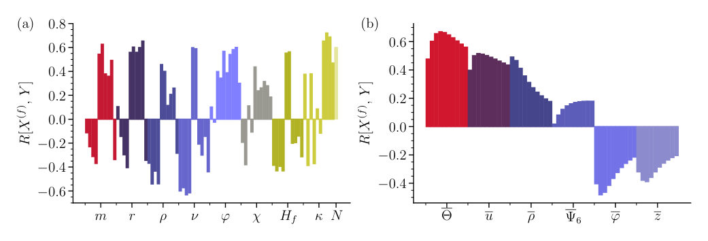
<figcaption class="paper-figure-caption"><b>Fig 1.</b> FIG. 1. Pearson correlation coefficient, 𝑅[𝑋( 𝑓),𝑌], between the target variable 𝑌and each feature 𝑋( 𝑓) for 𝑓= 1, . . . , 𝑑, for the superconductivity dataset (a) and the glassy-dynamics dataset (b).</figcaption>
</figure>
<figure class="paper-figure-card">
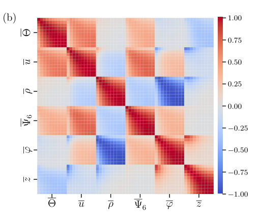
<figcaption class="paper-figure-caption"><b>Fig 2.</b> FIG. 2. Feature correlation matrix C for the superconductivity dataset (a) and the glassy-dynamics dataset (b).</figcaption>
</figure>
<figure class="paper-figure-card">
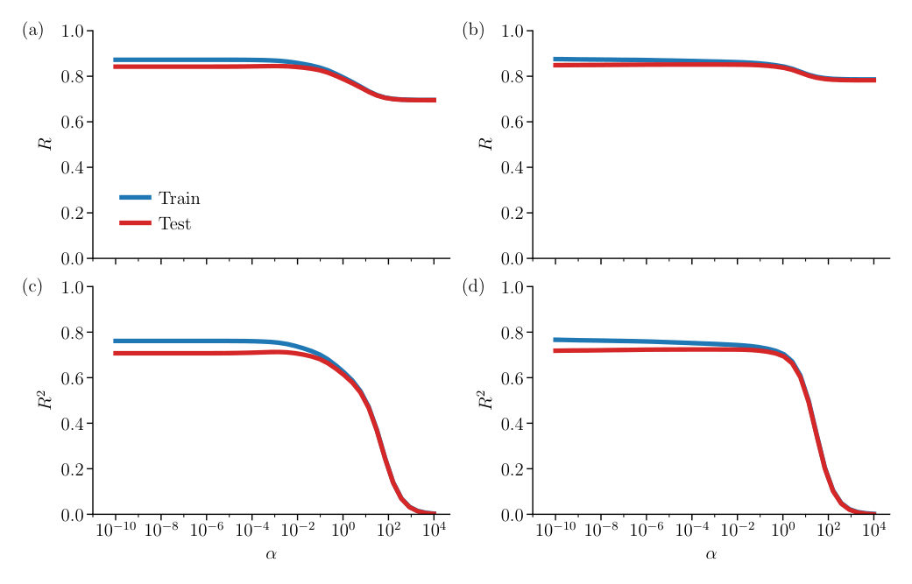
<figcaption class="paper-figure-caption"><b>Fig 3.</b> FIG. 3. (a,b) Pearson correlation coefficient 𝑅between the ground truth target values 𝑌and the ridge-regression predictions ˆ𝑌as a function of the regularization strength 𝛼, for the superconductivity dataset (a) and the glassy-dynamics dataset (b). (c,d) Coefficient of determination 𝑅2 for the same Ridge-regression analysis, for the superconductivity dataset (c) and the glassy-dynamics dataset (d).</figcaption>
</figure>
<figure class="paper-figure-card">
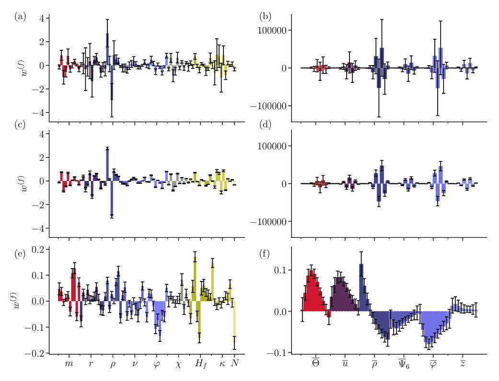
<figcaption class="paper-figure-caption"><b>Fig 4.</b> FIG. 4. (a,b) Average weights obtained by ordinary least-squares (OLS) regression, averaged over 500 bootstrap realizations with sample size 𝑁S = 10𝑑, plotted as a function of the feature index, for the superconductivity dataset (a) and the glassy-dynamics dataset (b). The error bars indicate the standard deviation arising from dataset-to-dataset fluctuations. (c,d) The same analysis for the larger sample size 𝑁S = 200𝑑for the superconductivity dataset (c) and the glassy-dynamics dataset (d). (e,f) The same as in (a,b), but for Ridge regression with regularization strength 𝛼= 0.1, using sample size 𝑁S = 10𝑑, for the superconductivity dataset (e) and the glassy-dynamics dataset (f).</figcaption>
</figure>
<figure class="paper-figure-card">
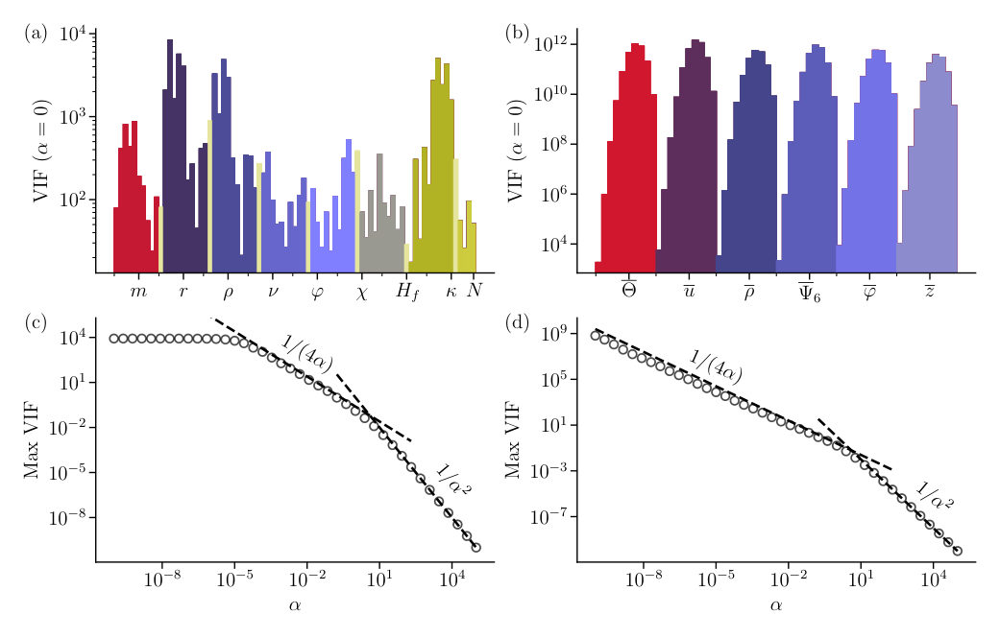
<figcaption class="paper-figure-caption"><b>Fig 5.</b> FIG. 5. (a,b) Variance inflation factor (VIF) for each feature in the OLS setting (𝛼= 0), for the superconductivity dataset (a) and the glassy-dynamics dataset (b). (c,d) Maximum VIF among all features as a function of the Ridge regularization strength 𝛼, for the superconductivity dataset (c) and the glassy-dynamics dataset (d).</figcaption>
</figure>

**Summary.** The paper rigorously analyzes why interpreting weights in linear regression fails when input features are highly correlated, even if predictions are accurate. Using eigenmode decomposition, it shows that multicollinearity generates unstable and oscillatory weight patterns. The key takeaway is that while regularization stabilizes the estimates, this stabilization does not equate to true physical interpretability.

**Why it may be interesting.** This work provides a rigorous mathematical framework connecting statistical concepts like multicollinearity and model instability to the physical concept of 'interpretability' in data-driven science. It suggests that prediction performance (low MSE) is insufficient for claiming physical understanding.

Detailed structure

**Main problem.** The paper investigates the fundamental limits of interpretability when using multiple linear regression models, particularly when input features are strongly correlated (multicollinearity). It seeks to explain why weight estimates become unstable or oscillatory even if prediction accuracy remains high.

**Main result.** Multicollinearity causes weight instability through small-eigenvalue modes in the feature correlation matrix. While regularization like Ridge helps stabilize weights by suppressing these modes, it does not guarantee physical interpretability, as the resulting weights are highly dependent on the chosen regularization parameter alpha.

**Method.** The analysis combines theoretical linear algebra (analyzing eigenmodes of the feature correlation matrix) with statistical diagnostics (VIF calculation and analyzing weight fluctuations across bootstrap samples). It compares OLS and Ridge regression estimates.

**Model / system.** The model is Multiple Linear Regression ($\hat{\mathcal{Y}} = \sum \hat{w}(f) X(f)$), applied to diverse physical datasets such as superconductivity properties and glassy-dynamics structural descriptors. The analysis focuses on the mathematical structure imposed by highly correlated input features.

**Key observables.** Weight fluctuations (standard deviation across samples), weight oscillations across physically similar features, Maximum Variance Inflation Factor ($	ext{max } f\{	ext{VIF}(f)\}$), and the roughness measure ($S$).

**Important parameters / regimes.** Regularization strength $\alpha$, eigenvalues ($\lambda(k)$) of the feature correlation matrix $C$, and sample size $N_S$.

**Assumptions / limitations.** The analysis assumes that interpretability requires both statistical robustness (low weight variance) and physical consistency (stable signs/magnitudes for similar features). It models correlations using Toeplitz matrices in some sections.

**Figures summary.** Figures illustrate the three scaling regimes of $	ext{max } f\{	ext{VIF}(f)\}$ vs. $\alpha$ ($\propto \alpha^{-1}$ to $\propto \alpha^{-2}$), show weight oscillations decreasing with increasing regularization strength, and display eigenvectors corresponding to small eigenvalues.

**Paper structure.** The paper progresses from establishing the problem (weight instability under multicollinearity) to developing theoretical tools (eigenmode analysis, VIF generalization for Ridge). It then applies these tools across various datasets, culminating in a detailed mathematical derivation showing how regularization suppresses oscillatory modes associated with small eigenvalues.

Abstract

Interpreting machine-learning models has attracted increasing attention, particularly in the physical sciences, where one often seeks to understand the underlying mechanisms rather than merely make predictions. Multiple linear regression is often regarded as an interpretable alternative to more complex models, such as deep neural networks, because its predictions are expressed as explicit weighted sums of input features. However, when input features are strongly correlated, namely in the presence of multicollinearity, the learned weights can exhibit large dataset-to-dataset fluctuations and oscillatory behavior across physically similar features, making their interpretation difficult or even impossible. Although the instability of the weights under multicollinearity is well known in statistics, its consequences for physical interpretation, in particular its connection to oscillatory weights across physically similar features, have not been systematically clarified. Here, we theoretically discuss the mechanism behind this loss of interpretability by analyzing the eigenmodes of the feature correlation matrix. We show that small-eigenvalue modes associated with multicollinearity amplify fluctuations in the weights and generate oscillatory patterns that do not necessarily reflect meaningful contributions. We test this theoretical picture numerically on physics datasets and show that Ridge regularization suppresses these unstable modes, although the resulting weights must still be interpreted with caution. We further confirm the generality of our findings beyond physics by analyzing a diverse collection of publicly available datasets. Our results clarify why, in the presence of multicollinearity, physical interpretation can remain difficult even for linear regression models.

[↑ back to top](#top)

### [Worst-case depth hierarchy for shallow quantum circuits](http://arxiv.org/abs/2606.16425v1)

**Authors:** Min-Hsiu Hsieh, Michael de Oliveira, Sathyawageeswar Subramanian, Xingjian Zhang  
**Type:** theory · **Category:** quantum information and computing · **PDF:** <https://arxiv.org/pdf/2606.16425v1>  
**Analysis basis:** full PDF text, analyzed in chunks

↔ Scroll figures horizontally

<figure class="paper-figure-card">
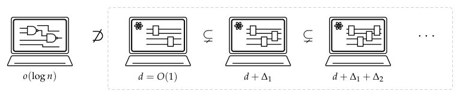
<figcaption class="paper-figure-caption"><b>Fig 1.</b> Figure 1: Schematic representation of the quantum depth hierarchies established in this work. The dashed box encloses the hierarchy obtained from the quantum-input classical-output relation problems. The interactive version preserves the same quantum hierarchy using only classical transcripts, while remaining unsolvable by sublogarithmic-depth classical circuits in input size n. Up to the constant-factor gap between our lower and upper depth thresholds (∆1, ∆2, ...), this yields an infinite discrete hierarchy.</figcaption>
</figure>
<figure class="paper-figure-card">
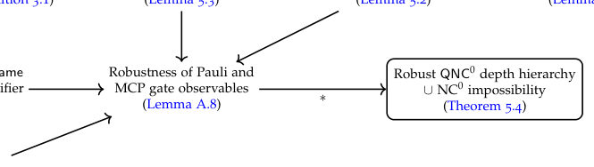
<figcaption class="paper-figure-caption"><b>Fig 2.</b> Figure 3: Logical dependencies among the main ingredients in our analysis of the classical-verifier construction underlying Theorem 1.2 (see Theorem 5.4 for its formal version). Note that the dependency indicated by the arrow → ∗is not direct. Its use additionally requires combining Lemma A.8 with Protocol 3, Lemma B.3, and Lemma B.4, as in the proof of Theorem 1.1.</figcaption>
</figure>
<figure class="paper-figure-card">
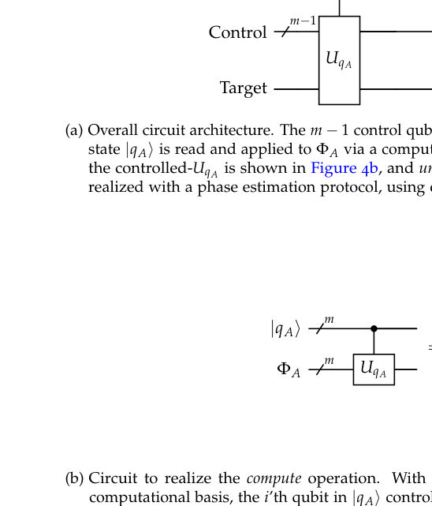
<figcaption class="paper-figure-caption"><b>Fig 3.</b> Figure 4: The circuit to measure some zi upon input question label qA.</figcaption>
</figure>
<figure class="paper-figure-card">
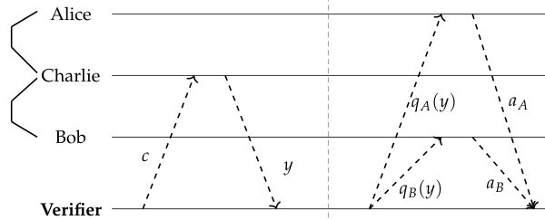
<figcaption class="paper-figure-caption"><b>Fig 4.</b> Figure 5: Representation of the Clifford-basis test protocol. Round 1. The verifier selects a random Clifford operation Cc ∈{CNOT, Swap, X, I} together with the qubit registers on which it is to be applied. The verifier then instructs Charlie, via a classical label c, to perform the corresponding gate-teleportation procedure and return the measurement outcomes y. Round 2. The verifier computes the Pauli correction rc,y determined by Charlie’s measurement outcomes and sends questions corresponding to the Clifford-rotated parallel Mermin–Peres relations described in Figure 6, with the questions updated according to the correction rc,y.</figcaption>
</figure>
<figure class="paper-figure-card">
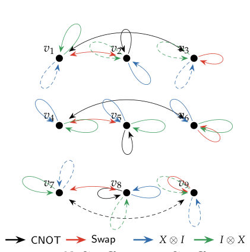
<figcaption class="paper-figure-caption"><b>Fig 5.</b> Figure 6: Action of Clifford operations on the variables of the Mermin–Peres constraint system. Each vertex represents a variable from Eq. (2.1), and each directed edge represents the action of a Clifford operation mapping one variable to another under conjugation. When extended to the parallel Mermin–Peres constraint system (Definition 2.2), these transformations encode the relators implementing the action α in the semidirect product structure Pm ⋊α AGL(m, 2), defining the underlying operator-valued constraint system of the Clifford-basis test protocol.</figcaption>
</figure>

**Summary.** The paper establishes an explicit and unconditional depth hierarchy theorem for constant-depth quantum circuits ($	ext{QNC}^0$). By mapping computational tasks to nonlocal games defined by operator constraints, the authors prove that increasing circuit depth strictly increases computational power. This provides a rigorous measure of quantum advantage based solely on the required depth of the quantum circuit.

**Why it may be interesting.** This work provides fundamental complexity results by quantifying the resource cost of quantum computation in terms of circuit depth, which is a key metric for physical implementation constraints.

Detailed structure

**Main problem.** The central problem is establishing an explicit, unconditional depth hierarchy for constant-depth quantum computation ($	ext{QNC}^0$), demonstrating that increasing circuit depth strictly increases computational power.

**Main result.** The authors prove a depth hierarchy theorem showing that certain two-round interactive problems require quantum circuits of depth $\Omega(d)$ to solve perfectly, while shallower circuits fail with significant probability. This establishes an unconditional quantum advantage over classical $	ext{NC}^0$ computation based purely on circuit depth.

**Method.** The methodology involves translating the computational problem into a rigid operator-valued constraint system derived from group theory and nonlocal games. Lower bounds are established by showing that perfect solutions require implementing multi-controlled phase operations, which necessitates deep circuits.

**Model / system.** The model is quantum computation realized via bounded fan-in quantum circuits over the Clifford+T gate set. The complexity is analyzed using two-round interactive problems and constraint systems derived from abelian groups like $\mathbb{Z}_m^2$.

**Key observables.** Circuit Depth ($d$), Success Probability ($\epsilon(d)$), Multi-controlled phase operations (e.g., $C_{m-1}(\mathbb{Z})$).

**Important parameters / regimes.** Depth $d$, precision $\epsilon$, and the number of qubits/labels $m$.

**Assumptions / limitations.** The lower bound proofs rely on constructing constraint systems whose unique faithful solutions require specific non-Clifford gates, and later sections address robustness under approximate state preparation.

**Figures summary.** Figure 1 schematically represents the established quantum depth hierarchies. Figure 2 shows logical dependencies for analyzing the quantum-input relation problem; Figure 3 shows dependencies for the classical verifier construction.

**Paper structure.** The paper develops from establishing the basic hierarchy using nonlocal games (Chunk 1), refining this by connecting it to operator constraints and self-testing in semi-quantum settings (Chunks 2, 4, 6), deriving specific depth lower bounds related to multi-controlled gates (Chunk 7), and finally analyzing upper bounds for generalized Toffoli gates (Chunk 8).

Abstract

Circuit depth is a central resource in complexity theory. While bounded-depth classical circuits admit well-understood hierarchy theorems, the internal structure of constant-depth quantum computation remains comparatively unexplored.   We prove an explicit depth hierarchy theorem for $\mathsf{QNC}^0$. For each $d\ge 12$, we construct a family of two-round interactive problems on which no depth-$(d-1)$ quantum circuit can achieve near-perfect success, regardless of gate set, circuit size, or ancillary qubits. In contrast, we prove that our construction admits realizations by simple bounded fan-in quantum circuits of depth larger than $d$ by a small constant factor. Moreover, all bounded fan-in classical circuits of sublogarithmic depth (in the input size) fail to achieve perfect success on these tasks for every $d$, yielding a hierarchy of problems that show unconditional quantum advantage of $\mathsf{QNC}^0$ over $\mathsf{NC}^0$.   A key obstacle is the scarcity of lower bound techniques for quantum circuits. To address this, we develop methods to analyze how depth affects a circuit's ability to realize nonlocal correlations amongst its output qubits in a fine-grained manner. Our approach exploits the correspondence between constraint systems and nonlocal games, translating group-theoretic constructions into rigid operator-valued constraint systems and then into non-local games. In particular, we construct constraint systems whose unique faithful operator-valued solutions require every perfect strategy, and every near-perfect strategy to a fixed precision, to implement multi-controlled phase operations. This reduces to a nonlocal unitary-synthesis problem, yielding depth lower bounds for both shallow quantum and classical circuits.   These results show that increasing depth strictly increases computational power within $\mathsf{QNC}^0$, establishing a genuinely quantum hierarchy.

[↑ back to top](#top)

## Secondary cond-mat archives

*Papers from cond-mat.mtrl-sci, mes-hall, other, soft, supr-con. These archives are de-prioritized — they appear at the end regardless of relevance score.*

### Relevant in secondary archives (36)

### [Effect of the hyperbolic photon mode on the metal insulator transition in a proximate material](http://arxiv.org/abs/2606.16665v1)

**Authors:** Patrick A. Lee  
**Type:** theory · **Category:** strongly correlated electrons · **PDF:** <https://arxiv.org/pdf/2606.16665v1>  
**Analysis basis:** full PDF text, analyzed in chunks
**Topic relevance:** 🔥 `analog quantum simulation` **4/5** · 🔥 `correlated cavity matter` **4/5** · `Keldysh / 2PI / non-Gaussian methods` **3/5** · `correlated / nonlocal dissipation` **3/5** · `driven-dissipative phase transition` **3/5** · `methods for driven-dissipative` **3/5** · `Tavis-Cummings & cavity-many-emitter` **2/5** · `exotic spin models in light-matter` **2/5** · `non-equilibrium dynamics` **2/5** · `non-equilibrium universality` **2/5** · `spintronics-quantum-optics interface` **2/5** · `Kondo & dissipative impurity` **1/5** · `entanglement & information structure` **1/5** · `interference shaping light` **1/5** · `measurement-induced transitions` **1/5**

↔ Scroll figures horizontally

<figure class="paper-figure-card">
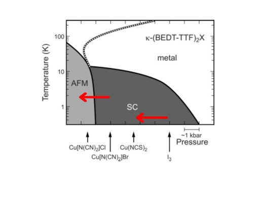
<figcaption class="paper-figure-caption"><b>Fig 1.</b> FIG. 2. The generalized phase diagram for several κ−ET or- ganic compounds. Under small pressure, the system evolves from an antiferromagentic Mott insulator to a SC before be- coming a metal. Various compound are mapped to the equiv- alent pressure points. In our theory the coupling to HM may push the systems along the horizontal axis towards the in- sulating side. The trend is marked by the red arrows. The effect decreases rapidly with the distance to the hBN surface. Figure adapted from ref.[5]</figcaption>
</figure>
<figure class="paper-figure-card">
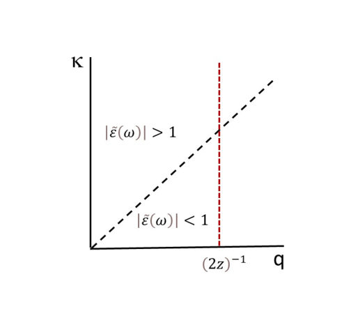
<figcaption class="paper-figure-caption"><b>Fig 2.</b> FIG. 1. The momentum phase space covered by the HM. The wave vector κ is perpendicular to the surface and q is the magnitude of the in-plane wave vector. For a given mode frequency ωqκ its contour is given very accurately by Eq.3 which takes the form of a straight line through the origin with slope p</figcaption>
</figure>
<figure class="paper-figure-card">
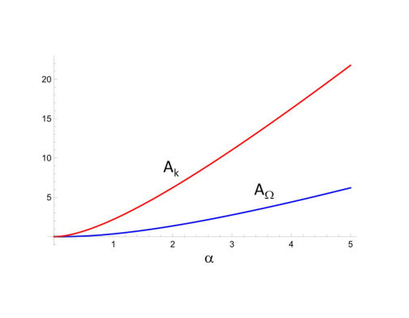
<figcaption class="paper-figure-caption"><b>Fig 3.</b> FIG. 3. Plot of the functions AΩand Ak vs α.</figcaption>
</figure>

**Summary.** The paper theoretically predicts that the presence of a hyperbolic photon mode near a material can significantly alter its metal-insulator transition point. By coupling charge carriers to the enhanced zero-point electric field fluctuations from this mode, the system is effectively driven towards an insulating state. This effect is highly localized, decaying rapidly over just a few atomic layers.

**Why it may be interesting.** This work bridges quantum optics (hyperbolic modes, vacuum fluctuations) with condensed matter theory (Mott physics). The mechanism—using electromagnetic vacuum structure to tune electronic correlations—is highly relevant for understanding emergent phenomena in nanoscale heterostructures.

Detailed structure

**Main problem.** The study investigates how coupling a material near a Mott transition to a hyperbolic photon mode (HM) can modify its electronic state.

**Main result.** The HM acts as a 'negative pressure,' significantly shifting the critical interaction strength ($U_c$) and potentially driving a metallic system towards an insulating state, especially at small separations.

**Method.** Theoretical calculations involving self-energy corrections ($\Sigma'$) to the charge boson Green's function, derived from coupling the electronic degrees of freedom to the enhanced photon density of states provided by the HM.

**Model / system.** The model involves an electronic system near a Mott transition (related to the Hubbard model) placed atop hexagonal Boron Nitride ($	ext{hBN}$), coupled via the hyperbolic photon mode. The charge dynamics are treated using a relativistic boson field approximation.

**Key observables.** Shift in the critical interaction strength ($	ilde{U}_c$), zero-point fluctuations in the electric field ($\langle |E(z)|^2 
angle$), and the spectral function $
ho(\omega)$.

**Important parameters / regimes.** Distance ($z$) from the HM source (effect decays rapidly, e.g., $1/z^3$ or $1/z^2$), coupling constants ($C_k$, $Z$), and material-specific parameters like bandwidths.

**Assumptions / limitations.** The effect of the HM is assumed to decay rapidly with distance; approximations are made regarding small mass gaps, continuum limits for integration, and neglecting certain terms (e.g., diamagnetic $A^2$ term).

**Figures summary.** Figures illustrate the enhanced momentum phase space covered by the HM compared to ordinary photons, show generalized phase diagrams indicating a shift towards insulating states, and plot calculated functions related to coupling strengths.

**Paper structure.** The paper progresses from establishing the physical mechanism (HM enhancing DOS/field fluctuations) to deriving the theoretical modification of the electronic self-energy ($\Sigma'$), culminating in quantitative predictions for how this modifies the critical Mott transition point ($U_c$).

Abstract

The hyperbolic mode (HM) refers to a polariton mode where the dielectric function is negative in some direction of propagation. Within a frequency window the light occupies a greatly expanded region in momentum space. We compute the photon density of states and find that the zero point fluctuation in the RMS electric field can reach $MV/cm$, comparable to the largest field used in pump probe experiments in the THz scale. The HM in hexagonal Boron Nitride (hBN) has been under intense study and we consider placing a material that is near the Mott transition directly on top hBN. We find that a substantial shift in the metal-insulator transition is possible, but the effect decays rapidly with distance, so that only a few monolayers are affected. We provide estimates and suggestions for a number of materials of interest.

[↑ back to top](#top)

### [Hidden chirality and half-vortex formation in exciton-polariton condensates](http://arxiv.org/abs/2606.16233v1)

**Authors:** A. N. Osipov, I. Y. Chestnov, P. G. Lagoudakis, A. V. Yulin  
**Type:** theory · **Category:** other · **PDF:** <https://arxiv.org/pdf/2606.16233v1>  
**Analysis basis:** full PDF text, analyzed in chunks
**Topic relevance:** 🔥 `driven-dissipative phase transition` **4/5** · 🔥 `exotic spin models in light-matter` **4/5** · `analog quantum simulation` **3/5** · `correlated cavity matter` **3/5** · `methods for driven-dissipative` **3/5** · `non-equilibrium dynamics` **3/5** · `spintronics-quantum-optics interface` **3/5** · `correlated / nonlocal dissipation` **2/5** · `non-equilibrium universality` **2/5** · `Keldysh / 2PI / non-Gaussian methods` **1/5** · `Tavis-Cummings & cavity-many-emitter` **1/5** · `interference shaping light` **1/5**

↔ Scroll figures horizontally

<figure class="paper-figure-card">
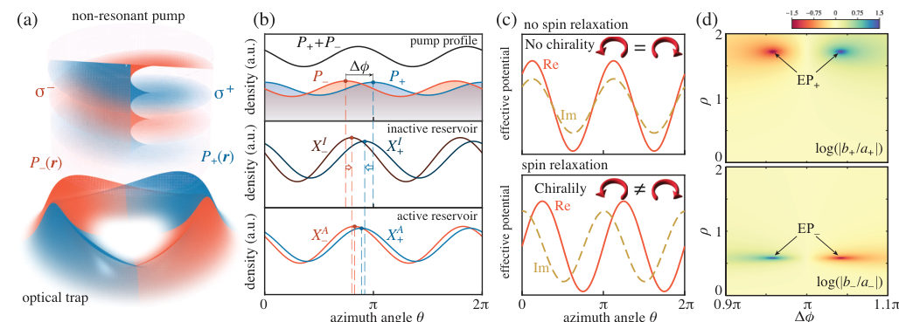
<figcaption class="paper-figure-caption"><b>Fig 1.</b> FIG. 1. Reservoir-mediated hidden chirality in an annular polariton trap. (a) Ring-shaped nonresonant pump with spin- dependent azimuthal intensity modulation in the circular components σ+ and σ−. The total pump intensity remains radially symmetric and carries no imposed orbital angular momentum. (b) Spin relaxation shifts and smooths the inactive and active reservoir profiles relative to the corresponding pump components. (c) Because inactive excitons contribute only to the con- servative blueshift whereas active excitons contribute both blueshift and gain, the real and imaginary parts of the effective potential acquire a relative angular phase shift. This converts a non-rotating spin...</figcaption>
</figure>
<figure class="paper-figure-card">
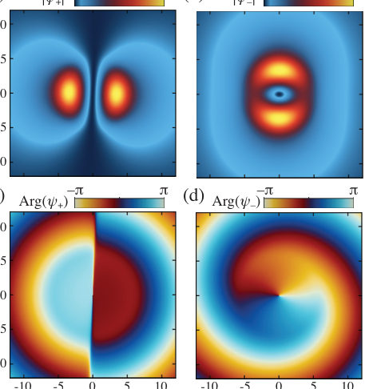
<figcaption class="paper-figure-caption"><b>Fig 2.</b> FIG. 2. Half-vortex state obtained from the full two- dimensional driven-dissipative Gross-Pitaevskii model near the EP of the σ−component. Panels (a) and (b) show the spin-resolved condensate densities |ψ+|2 and |ψ−|2, respec- tively; panels (c) and (d) show the corresponding phases. The σ+ component forms a zero-winding dipole-like state, whereas the σ−component carries a 2π phase winding. The pump parameters are chosen close to the EP condition, with the no- tation of Eq. (4).</figcaption>
</figure>
<figure class="paper-figure-card">
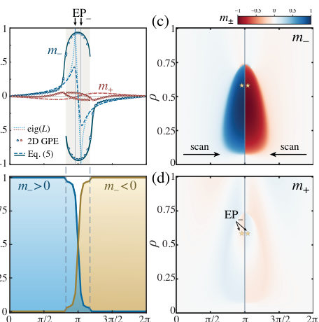
<figcaption class="paper-figure-caption"><b>Fig 3.</b> FIG. 3. Angular-momentum selection and nonlinear bistabil- ity near an exceptional point. (a) Spin-resolved mean angular momenta m+ and m−as functions of the pump relative phase ∆ϕ at fixed pump-modulation ratio ρ corresponding to the EP of the σ−component. Linear eigenmode predictions, stable nonlinear coupled-mode solutions (just above – dashed, and in the nonlinear regime – solid lines), and full two-dimensional simulations are compared. Dashed gray regions indicate bista- bility. (b) Probability of selecting the positive- or negative- circulation branch from weak-noise initial conditions. (c,d) Phase diagrams of the steady angular momenta m−and m+ in the (ρ, ∆ϕ) plane. Near the σ−EP,...</figcaption>
</figure>
<figure class="paper-figure-card">
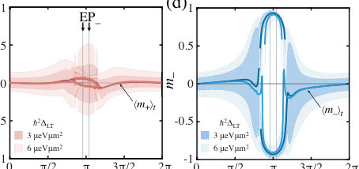
<figcaption class="paper-figure-caption"><b>Fig 4.</b> FIG. 4. Effect of TE-TM splitting on the hidden-chirality response. (a) Time evolution of the spin-resolved angular momenta on one side of the σ−EP in the presence of TE- TM coupling. (b) Corresponding time evolution on the op- posite side of the same EP. The splitting induces fast spin- orbit oscillations between the two circular components. (c) Time-averaged ⟨m+⟩t as a function of the pump relative phase ∆ϕ for representative TE-TM strengths. (d) Time-averaged ⟨m−⟩t over the same scan. The oscillation amplitude in- creases with splitting, but the time-averaged chiral response and half-vortex character remain robust for moderate TE-TM coupling.</figcaption>
</figure>

**Summary.** The paper reveals that exciton-polariton condensates can spontaneously develop chirality due to spin relaxation effects within the coupled reservoir system. This hidden non-Hermitian potential allows for the controlled, all-optical creation of half-vortices, where polarization components exhibit distinct topological winding numbers.

**Why it may be interesting.** This work provides a clean theoretical framework for generating topological structures (vortices) in quantum optical systems using internal degrees of freedom (spin/polarization) rather than external geometric controls, which is highly relevant to advanced quantum light sources and nonlinear optics.

Detailed structure

**Main problem.** The study demonstrates how a spinor exciton-polariton condensate can spontaneously acquire chirality without external chiral driving fields.

**Main result.** This hidden chirality enables the all-optical formation of spin-selective half-vortices, where one polarization component acquires a definite phase winding while the other remains near zero winding.

**Method.** The analysis uses adiabatic elimination of fast reservoir dynamics to derive an effective non-Hermitian potential and subsequently analyzes coupled angular-mode equations.

**Model / system.** The system is modeled by a driven-dissipative Gross-Pitaevskii equation for the spinor order parameter, incorporating coupling to two distinct excitonic reservoirs (active and inactive).

**Key observables.** Spin-selective vorticity ($\sigma-$ component showing $2\pi$ winding vs. $\sigma+$ zero-winding), time-averaged angular momentum ($\langle m_\pm 
angle_t$), and the existence of Exceptional Points (EPs).

**Important parameters / regimes.** The relative phase shift between reservoir blueshifts, pump modulation depth ($
ho$), and parameters governing non-reciprocal coupling near EPs.

**Assumptions / limitations.** The analysis relies on adiabatic elimination of fast reservoir dynamics and approximations derived from low polariton densities in some theoretical sections.

**Figures summary.** Figures illustrate the mechanism (Fig. 1), show half-vortex states ($\sigma-$ winding vs $\sigma+$ dipole) (Fig. 2), map out angular momentum bistability near EPs (Fig. 3), and confirm robustness against fast oscillations from TE-TM splitting (Fig. 4).

**Paper structure.** The paper progresses from establishing the physical mechanism of hidden chirality via spin relaxation to deriving simplified coupled-mode equations, analyzing spectral features like Exceptional Points, and finally simulating the resulting half-vortex formation.

Abstract

We show that a radially symmetric, nonresonantly pumped spinor exciton-polariton condensate can acquire chirality without a rotating drive, chiral geometry, or pump orbital angular momentum. Spin relaxation in a two-reservoir system shifts the reservoir-induced blueshift relative to the gain profile, creating an effective non-Hermitian chiral potential. A reduced angular-mode theory reveals tunable exceptional points and non-reciprocal coupling between counter-rotating modes. Full driven-dissipative Gross-Pitaevskii simulations show that this hidden chirality enables all-optical formation of spin-selective half-vortices.

[↑ back to top](#top)

### [Floquet-Sambe Bottleneck and Frequency-Selective Localization in a Driven Synthetic Spin Chain](http://arxiv.org/abs/2606.15293v1)

**Authors:** J. Cao, K. L. Zhang, R. Wang, X. Z. Zhang  
**Type:** theory · **Category:** other · **PDF:** <https://arxiv.org/pdf/2606.15293v1>  
**Analysis basis:** full PDF text, analyzed in chunks
**Topic relevance:** 🔥 `analog quantum simulation` **4/5** · 🔥 `non-equilibrium dynamics` **4/5** · `driven-dissipative phase transition` **3/5** · `exotic spin models in light-matter` **3/5** · `methods for driven-dissipative` **3/5** · `non-equilibrium universality` **3/5** · `spintronics-quantum-optics interface` **2/5** · `Frenkel-Kontorova` **1/5** · `Keldysh / 2PI / non-Gaussian methods` **1/5** · `Kondo & dissipative impurity` **1/5** · `correlated / nonlocal dissipation` **1/5** · `entanglement & information structure` **1/5**

↔ Scroll figures horizontally

<figure class="paper-figure-card">
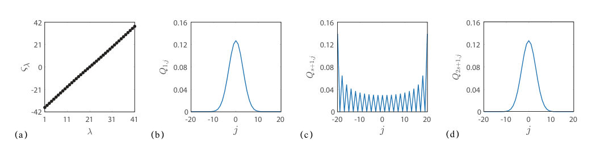
<figcaption class="paper-figure-caption"><b>Fig 1.</b> FIG. 1. Eigenspectrum of the static system (ω = 0) and representative eigenstates. (a) Eigenvalues sorted in ascending order. (b)-(d) Spatial profiles of three selected eigenstates: the ground state (λ = 1), the middle state (λ = s + 1), and the highest state (λ = 2s + 1). These static-limit results establish the spectral baseline for comparison with the periodically driven case. Parameters: κ = 1, s = 20, and Qλ,j = |qλ,j|2.</figcaption>
</figure>
<figure class="paper-figure-card">
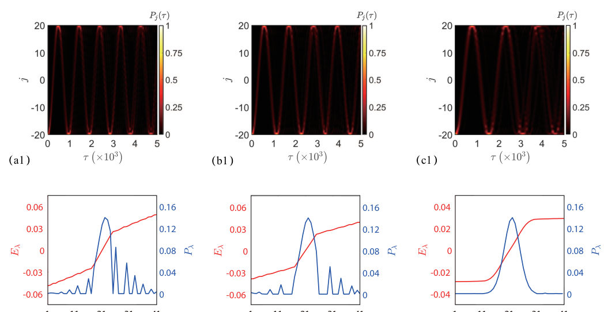
<figcaption class="paper-figure-caption"><b>Fig 2.</b> FIG. 2. Frequency dependence of residual PST character in the low-frequency regime. Each column corresponds to a typical driving frequency: ω = 0.1 [panels (a1-a2)], ω = 0.08 [panels (b1-b2)], and ω = 0.07 [panels (c1-c2)]. Top row: Space-time profile Pj(τ) = |⟨j|Ψ(τ)⟩|2 showing the propagation of an initially boundary-localized state (site state localized at j = −20). As ω decreases, the PST signature becomes increasingly pronounced: the peak probability at the opposite end rises systematically from 0.77 at ω = 0.1 to 0.83 at ω = 0.08 and approaches 0.84 at ω = 0.07, signaling the gradual recovery of near-perfect state transfer. Bottom row: Instantaneous eigenvalues Eλ at τ = 0 (red) and...</figcaption>
</figure>
<figure class="paper-figure-card">
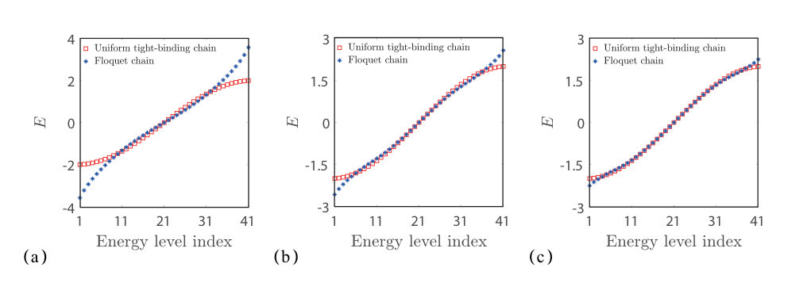
<figcaption class="paper-figure-caption"><b>Fig 3.</b> FIG. 3. Floquet quasi-spectrum (blue star) compared with the effective static tight-binding spectrum governed by Heff,1 (red square) for driving frequencies (a) ω = 20, (b) ω = 50, and (c) ω = 100. With increasing ω, the Floquet spectrum converges to the cosine band of the effective uniform tight-binding chain, consistent with the high-frequency expansion. Other parameters: κ = 1 and s = 20.</figcaption>
</figure>
<figure class="paper-figure-card">
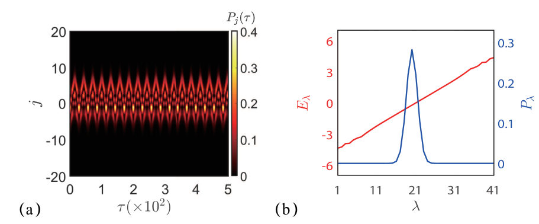
<figcaption class="paper-figure-caption"><b>Fig 4.</b> FIG. 4. Bloch-like oscillation dynamics and spectral structure at a specific driving frequency. (a) Space-time profile Pj(τ) = |⟨j|Ψ(τ)⟩|2, showing the propagation of an initial state along the spin chain. The wavepacket exhibits pronounced Bloch-like oscillation, with the probability density oscillating over multiple cycles. (b) Instantaneous eigenvalues Eλ at τ = 0 (red) and the overlap Pλ = |⟨φλ|Ψ(0)⟩|2 of the initial state with each eigenstate (blue). The initial state populates exclusively a narrow band of central eigenstates with approximately equal energy spacing, which governs the coherent revival dynamics observed in panel (a). Parameters: ω = 9, κ = 1, and s = 20.</figcaption>
</figure>
<figure class="paper-figure-card">
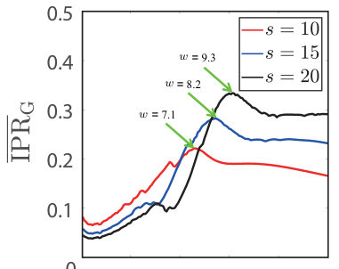
<figcaption class="paper-figure-caption"><b>Fig 5.</b> FIG. 6. Energy-integrated IPR [IPRG(ω)], as a function of driving frequency ω for three spin quantum numbers s = 10 (red), s = 15 (blue), and s = 20 (black), the green arrow de- notes the position of ωc ≈7.1, 8.2, and 9.3, respectively. The energy range E ∈[−2, 2] is discretized using a uniform mesh with ∆E = 4/150. The peak position increase monotoni- cally with s, which is consistent with the theoretical analysis presented in the main text. Other parameters: κ = 1 and M = 50, and s = 20.</figcaption>
</figure>

**Summary.** The paper analyzes a driven synthetic spin chain to understand how its localization properties depend on the external driving frequency ($\omega$). It finds that the system exhibits maximal state localization at an intermediate frequency ($\omega_{	ext{peak}}$), dictated by boundary coupling strengths. This establishes the model as a promising, tunable platform for controlling quantum information storage and retrieval in superconducting circuits.

**Why it may be interesting.** This work provides a concrete, tunable mechanism—the Floquet-Sambe bottleneck—to engineer quantum transport properties by controlling the driving frequency, which is highly relevant for superconducting circuit architectures.

Detailed structure

**Main problem.** The study investigates how driving a synthetic spin chain with spatially inhomogeneous coupling leads to frequency-dependent localization phenomena, termed the Floquet-Sambe bottleneck.

**Main result.** The system exhibits maximal state localization at an intermediate driving frequency ($\omega_{	ext{peak}}$), which is controlled by the weakest boundary hopping scale. This nonmonotonic behavior is robustly observed in both closed and open-system diagnostics.

**Method.** The analysis employs Floquet theory, transforming the time-dependent problem into a static eigenvalue problem in an enlarged space, and utilizes Inverse Participation Ratios (IPR) to quantify localization.

**Model / system.** The model is a finite Floquet chain combining uniform hopping with a periodically rotating, SU(2)-dictated spin-assisted hopping profile. The resulting coupling strength varies spatially, being weakest at the boundaries.

**Key observables.** Mean Inverse Participation Ratio (MIPR) for closed systems and the energy-integrated IPR ($	ext{IPRG}(\omega)$) for open-system transport diagnostics.

**Important parameters / regimes.** Driving frequency ($\omega$), boundary bottleneck scale ($\mu_{-s} \sim \sqrt{2s}$), and the ratio of hopping to driving strength ($\eta_j = \mu_j / \omega$).

**Assumptions / limitations.** The analysis involves truncating the Fourier components for numerical simulation, and comparing limits such as $\omega 	o 0$ (adiabatic) and $\omega 	o \infty$ (high-frequency expansion).

**Figures summary.** Figures show the nonmonotonic MIPR profile peaking at $\omega_{	ext{peak}}$ for varying spin dimensions ($s$), and similarly demonstrate the peak in the open-system IPR ($	ext{IPRG}(\omega)$) shifting with $s$.

**Paper structure.** The paper systematically analyzes the system across different frequency regimes: low-$\omega$ (PST revival), intermediate $\omega$ (localization maximum at $\omega_{	ext{peak}}$ due to boundary bottleneck), and high-$\omega$ (effective tight-binding behavior via Magnus expansion).

Abstract

We study a finite Floquet chain in which a uniform nearest-neighbor hopping coexists with a periodically rotating, \textrm{SU(2)}-dictated spin-assisted hopping profile. The resulting coupling is spatially inhomogeneous -- weakest at the chain boundaries and strongest in the bulk -- and produces a frequency-dependent Floquet-Sambe bottleneck. In the closed system, the mean inverse participation ratio (\textrm{MIPR}) of the Floquet eigenstates exhibits a striking nonmonotonic dependence on the driving frequency $ω$: the states remain extended at both low and high frequencies, but become maximally localized at an intermediate frequency. We demonstrate that this localization maximum occurs at $ω_{\mathrm{peak}}\sim μ_{-s}=\sqrt{% 2s}$, a scale controlled by the first boundary bottleneck. To connect these spectral properties to measurable transport, we construct an open-system Floquet-Sambe Green-function inverse participation ratio from the spatial density of the injected scattering state. This open-system diagnostic recovers the same nonmonotonic localization trend as its closed-system counterpart, with the peak shifted to higher frequencies by the static bandwidth and the lead self-energy. These findings establish the driven synthetic spin chain as a directly realizable, frequency-tunable platform for coherent information storage and retrieval, rooted in the interplay of Floquet-Sambe virtual channels, boundary-controlled localization, and frequency-selective transport in emerging multi-level superconducting circuit architectures.

[↑ back to top](#top)

### [Dynamics and stabilization of topological edge solitons in driven-damped nonlinear SSH lattices](http://arxiv.org/abs/2606.15567v1)

**Authors:** Adrianus Yosia, Rahmi Rusin, Rudy Kusdiantara, Hadi Susanto  
**Type:** theory · **Category:** other · **PDF:** <https://arxiv.org/pdf/2606.15567v1>  
**Analysis basis:** full PDF text, analyzed in chunks
**Topic relevance:** 🔥 `driven-dissipative phase transition` **4/5** · `Frenkel-Kontorova` **3/5** · `analog quantum simulation` **3/5** · `methods for driven-dissipative` **3/5** · `non-equilibrium dynamics` **3/5** · `correlated / nonlocal dissipation` **2/5** · `non-equilibrium universality` **2/5** · `Keldysh / 2PI / non-Gaussian methods` **1/5** · `Kondo & dissipative impurity` **1/5**

↔ Scroll figures horizontally

<figure class="paper-figure-card">
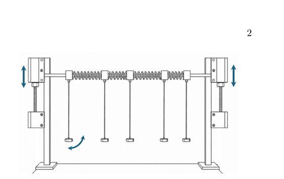
<figcaption class="paper-figure-caption"><b>Fig 1.</b> FIG. 1: Sketch of a possible experimental setup for a parametrically driven pendulum chain. Identical pendula are coupled via torsional springs mounted on a common support that oscillates vertically with a prescribed harmonic motion, thereby providing parametric excitation. Alternating coupling stiffnesses (indicated by varying spring lengths) emulate the dimerized Su–Schrieffer–Heeger (SSH) configuration.</figcaption>
</figure>
<figure class="paper-figure-card">
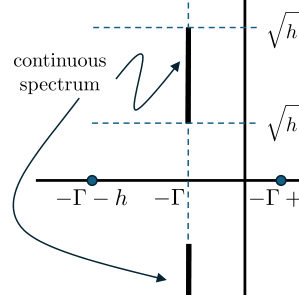
<figcaption class="paper-figure-caption"><b>Fig 2.</b> FIG. 2: Schematic spectrum of the linearized operator about the zero solution when ω = 0. The essential spectrum is determined by (22). In the regime (24), it lies on the vertical line Re(λ) = −Γ.</figcaption>
</figure>
<figure class="paper-figure-card">
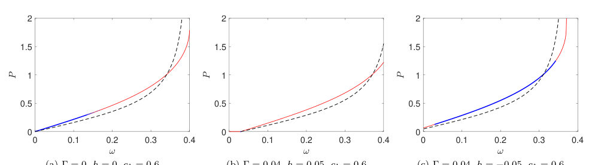
<figcaption class="paper-figure-caption"><b>Fig 3.</b> FIG. 3: Bifurcation diagram showing the total power P as a function of the detuning parameter ω. The solid curve denotes the numerical continuation, while the dashed curve denotes the analytical approximation. The panels correspond to c2 = 1. For the driven–damped cases in panels (b) and (c), the predicted onset is |ωc| = √</figcaption>
</figure>
<figure class="paper-figure-card">
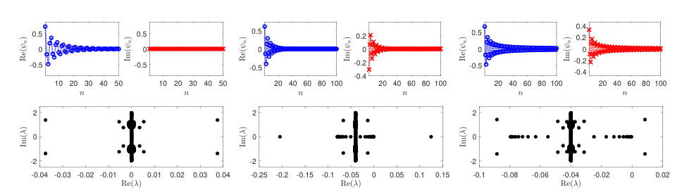
<figcaption class="paper-figure-caption"><b>Fig 4.</b> FIG. 4: Representative stationary edge states and their linearization spectra for ω = 0.37 and c2 = 1. Each group of panels shows Re(An), Im(An), and the corresponding spectrum of the linearized operator. The parameters are (a) Γ = 0, h = 0, c1 = 0.6, (b) Γ = 0.04, h = 0.05, c1 = 0.6, and (c) Γ = 0.04, h = −0.05, c1 = 0.6. The selected solutions are spectrally unstable. Panels (a) and (c) exhibit oscillatory instabilities associated with complex unstable eigenvalues, whereas panel (b) exhibits an exponential instability associated with a real positive eigenvalue.</figcaption>
</figure>
<figure class="paper-figure-card">
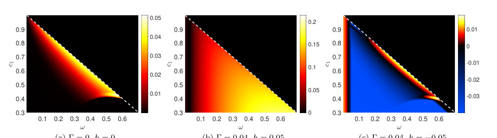
<figcaption class="paper-figure-caption"><b>Fig 5.</b> FIG. 5: Maximum real part of the linearization eigenvalues, max Re(λ), in the (ω, c1)-parameter plane. The three panels correspond to (a) Γ = 0, h = 0, (b) Γ = 0.04, h = 0.05, and (c) Γ = 0.04, h = −0.05. Values at or below zero, up to numerical tolerance, correspond to spectrally stable stationary edge states, whereas positive values indicate instability. The dashed curve marks the boundary of the edge-localized existence region predicted by the analytical approximation.</figcaption>
</figure>

**Summary.** The paper analyzes how parametric driving and damping stabilize topological edge solitons in a nonlinear SSH lattice model. By deriving an effective amplitude equation, the authors show that these external forces create two distinct soliton branches with vastly different stabilities. This demonstrates that active control mechanisms can enhance the robustness of quantum-like localization phenomena.

**Why it may be interesting.** This work provides concrete theoretical tools (stability analysis of dissipative nonlinear systems) applicable to understanding robust localized excitations in active or driven quantum/classical lattices, which is highly relevant to open quantum system dynamics.

Detailed structure

**Main problem.** The study investigates the dynamics and stabilization of topological edge solitons within a nonlinear Su–Schrieffer–Heeger (SSH) lattice that is subjected to both parametric driving and linear damping.

**Main result.** Parametric driving and damping fundamentally modify the system's edge-state family, generating two dissipative branches; one branch can exhibit significantly enhanced stability compared to the conservative case.

**Method.** The research employs analytical derivations from a driven pendulum chain, followed by numerical continuation and spectral stability analysis on an effective reduced SSH amplitude model.

**Model / system.** The system is modeled as a 1D lattice of pendula (analogous to SSH) governed by equations derived from a Klein-Gordon equation. The final effective model is a driven-damped discrete nonlinear Schrödinger type equation.

**Key observables.** Topological edge solitons, total power ($P$), and the real parts of linearization eigenvalues ($	ext{Re}(\lambda)$) used to determine stability.

**Important parameters / regimes.** Damping ($\Gamma$), parametric drive strength ($h$), detuning parameter ($\Delta$), and coupling constants ($c_{n}$).

**Assumptions / limitations.** The analysis assumes weak damping, small-amplitude oscillations, and utilizes an exponentially decaying spatial profile ansatz for the edge state approximation.

**Figures summary.** Figures illustrate experimental setups (pendulum chain), bifurcation diagrams showing total power vs. detuning, stationary edge-state profiles under different driving conditions, and time evolution comparisons between the reduced model and the full lattice dynamics.

**Paper structure.** The paper progresses from deriving an effective driven-damped SSH model from a physical pendulum chain to performing analytical calculations for phase-locked states, followed by detailed numerical stability analysis and comparison with direct time-domain simulations.

Abstract

We study topological edge solitons in a nonlinear Su--Schrieffer--Heeger (SSH) lattice subject to parametric driving and linear damping. Starting from a vertically driven pendulum chain, we derive an effective driven--damped nonlinear SSH model and investigate its stationary edge-localized states. Analytical calculations reveal the existence of two phase-locked dissipative edge-soliton families that emerge from the nonlinear continuation of the topological edge mode. Using numerical continuation and spectral stability analysis, we construct the corresponding nonlinear branches and determine their stability properties. We show that parametric driving and damping fundamentally modify the conservative edge-state family by generating two dissipative branches with markedly different stability characteristics: one branch remains predominantly unstable, whereas the other develops substantially larger stability regions and significantly weaker instability growth rates. Direct numerical simulations further demonstrate that the robust branch can remain strongly localized over long time intervals even when weakly unstable. Simulations of the full driven--damped Klein--Gordon pendulum chain confirm the persistence of the edge-localized dynamics predicted by the reduced model. These results identify parametric driving and damping as an effective mechanism for enhancing the robustness and persistence of nonlinear topological localization in active lattice systems.

[↑ back to top](#top)

### [Non-stationary longitudinal Josephson effect in electron-hole bilayers](http://arxiv.org/abs/2606.16338v1)

**Authors:** O. M. Konstantynov, S. I. Shevchenko  
**Type:** theory · **Category:** quantum gases · **PDF:** <https://arxiv.org/pdf/2606.16338v1>  
**Analysis basis:** full PDF text, analyzed in chunks
**Topic relevance:** 🔥 `Keldysh / 2PI / non-Gaussian methods` **4/5** · `driven-dissipative phase transition` **3/5** · `methods for driven-dissipative` **3/5** · `non-equilibrium dynamics` **3/5** · `analog quantum simulation` **2/5** · `non-equilibrium universality` **2/5** · `Kondo & dissipative impurity` **1/5** · `correlated / nonlocal dissipation` **1/5** · `correlated cavity matter` **1/5**

↔ Scroll figures horizontally

<figure class="paper-figure-card">
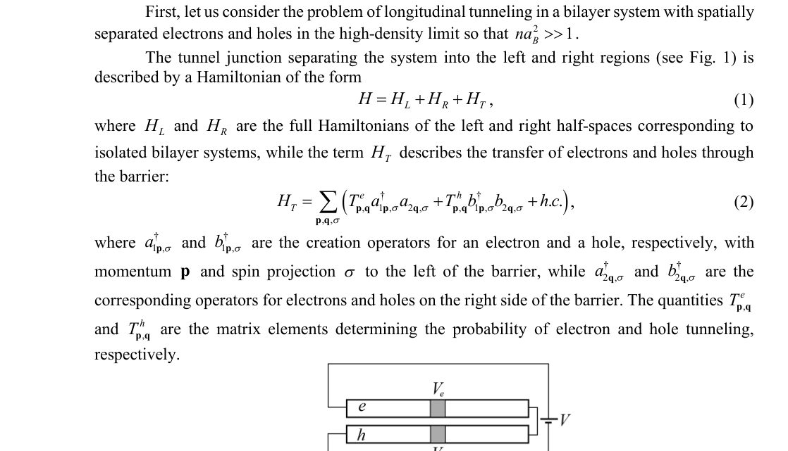
<figcaption class="paper-figure-caption"><b>Fig 1.</b> Fig. 1. Schematic representation of a bilayer system in which the left and right regions with electron-hole pairing are weakly coupled. If a total voltage ( ) ( ) ( )   e h V t V t V t is applied to the contact (a voltage ( ) e V t in the</figcaption>
</figure>
<figure class="paper-figure-card">
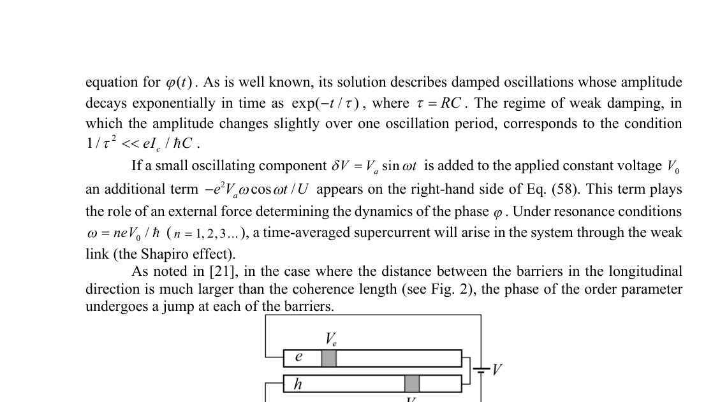
<figcaption class="paper-figure-caption"><b>Fig 2.</b> Fig. 2. Schematic representation of a bilayer system in which the barriers in the electron and hole layers are separated from each other in the longitudinal direction.</figcaption>
</figure>

**Summary.** This theoretical work examines the Josephson effect in electron-hole bilayers, modeling tunneling currents under an external voltage. By analyzing high-density versus low-density regimes, it reveals fundamental differences in current behavior, particularly the emergence of dissipative damping in the excitonic (low-density) limit. The methodology combines advanced many-body techniques with condensed matter physics principles.

**Why it may be interesting.** It connects concepts from superconductivity (Josephson effect) with quantum gas physics (exciton BEC), providing a rich platform to study non-equilibrium dynamics, dissipation, and phase coherence in artificial quantum systems.

Detailed structure

**Main problem.** The study investigates the non-stationary longitudinal Josephson effect occurring in electron-hole bilayers where pairing occurs between spatially separated electrons and holes.

**Main result.** The system exhibits distinct behaviors depending on carrier density: high-density limits show only supercurrent below a threshold voltage, while low-density regimes feature finite dissipative currents even at zero temperature due to gapless excitations.

**Method.** The analysis employs the tunneling Hamiltonian approach combined with Green's function techniques and perturbation theory to calculate various current components (quasiparticle, superconducting, interference).

**Model / system.** The model is an electron-hole bilayer system weakly coupled by a tunnel junction. It is analyzed in two limits: high-density (momentum space pairing) and low-density (Bose-Einstein condensate of excitons).

**Key observables.** Tunneling current ($I_t$), quasiparticle current ($qI$), supercurrent components, and the relative phase difference ($\varphi_{eh}$).

**Important parameters / regimes.** External applied voltage ($V_t$), carrier density (determining high vs. low-density regime), and energy gap ($\Delta$).

**Assumptions / limitations.** The analysis relies on perturbation theory for weak tunneling, treating the system in both BCS-like (high-density) and bosonic/coherent state (low-density) approximations.

**Figures summary.** Figure 1 schematically illustrates the bilayer structure with weak coupling; Figure 2 likely shows phase evolution or current characteristics related to Josephson dynamics.

**Paper structure.** The paper progresses by setting up the Hamiltonian, deriving current expressions using Green's functions in various limits (high/low density), and finally analyzing the resulting dynamical equations for the superconducting phase difference under applied voltage.

Abstract

The non-stationary longitudinal Josephson effect in bilayer systems with pairing of spatially separated electrons and holes is investigated. The tunneling current between two (right and left) weakly coupled electron-hole condensates is analyzed in the presence of an external voltage applied along the layers. Two limiting regimes are considered: the high-density regime, where pairing occurs in momentum space similarly to conventional superconductors, and the low-density regime corresponding to a Bose-Einstein condensate of spatially indirect excitons. Using the tunneling Hamiltonian approach, expressions for the quasiparticle, superconducting and interference contributions to the tunneling current are derived. It is shown that in the high-density limit the quasiparticle and interference currents vanish at zero temperature below a threshold voltage determined by the energy gap, so that only the supercurrent remains. In contrast, in the low-density regime the gapless spectrum of collective excitations leads to finite dissipative contributions even at zero temperature, resulting in damping of Josephson oscillations. For spatially separated tunneling barriers with distance exceeding the coherence length, phase jumps occur at each barrier, resulting in voltage oscillations across the electron and hole barriers and a non-sinusoidal current-phase relation governed by the critical currents of the two barriers.

[↑ back to top](#top)

### [Nonlinear Localized States on a Pyrochlore Lattice](http://arxiv.org/abs/2606.15855v1)

**Authors:** Faustino Palmero Ramos, Avadh Saxena, Panayotis G. Kevrekidis  
**Type:** theory · **Category:** other · **PDF:** <https://arxiv.org/pdf/2606.15855v1>  
**Analysis basis:** full PDF text, analyzed in chunks
**Topic relevance:** 🔥 `analog quantum simulation` **4/5** · `exotic spin models in light-matter` **3/5** · `driven-dissipative phase transition` **2/5** · `methods for driven-dissipative` **2/5** · `non-equilibrium dynamics` **2/5** · `Frenkel-Kontorova` **1/5** · `Keldysh / 2PI / non-Gaussian methods` **1/5** · `entanglement & information structure` **1/5** · `non-equilibrium universality` **1/5** · `spintronics-quantum-optics interface` **1/5**

↔ Scroll figures horizontally

<figure class="paper-figure-card">
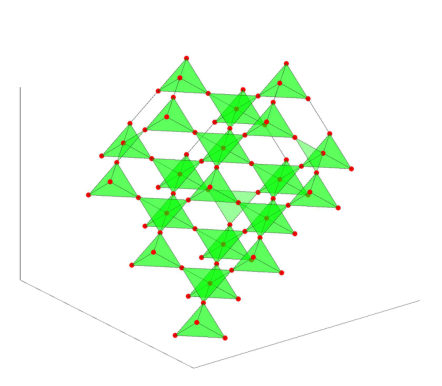
<figcaption class="paper-figure-caption"><b>Fig 1.</b> FIG. 1: Pyrochlore lattice with nearest-neighbor links. This 3d lattice is formed by corner sharing tetrahedra (green).</figcaption>
</figure>
<figure class="paper-figure-card">
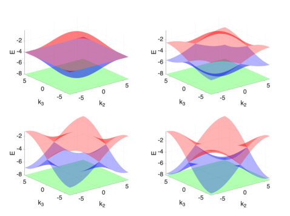
<figcaption class="paper-figure-caption"><b>Fig 2.</b> FIG. 2: Dispersive and flat bands for C = 1 and for different values of k1: (Top left) k1 = 0; (Top right) k1 = π/2; (Bottom left) k1 = π; (Bottom right) k1 = 3π/2.</figcaption>
</figure>
<figure class="paper-figure-card">
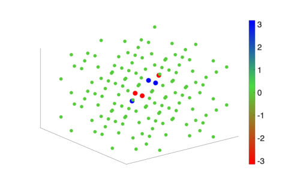
<figcaption class="paper-figure-caption"><b>Fig 3.</b> FIG. 3: A compactly supported state for µ = 2. Excited sites look bigger.</figcaption>
</figure>
<figure class="paper-figure-card">
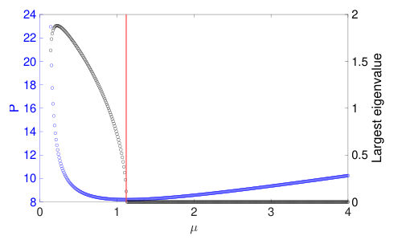
<figcaption class="paper-figure-caption"><b>Fig 4.</b> FIG. 4: Power of the single-site state P vs µ curve (left axis, in blue), and largest eigenvalue of the linearization (right axis, in black), focusing case. The red line marks the minimum of the P vs µ curve.</figcaption>
</figure>
<figure class="paper-figure-card">
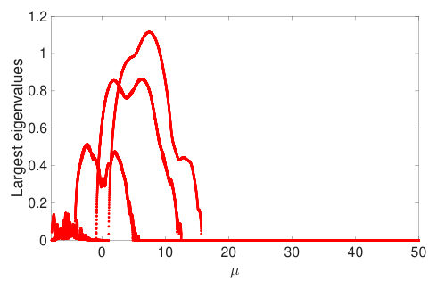
<figcaption class="paper-figure-caption"><b>Fig 5.</b> FIG. 6: Positive eigenvalues of the linearization around the compactly supported state in the focusing case.</figcaption>
</figure>

**Summary.** The paper investigates nonlinear localized states on a pyrochlore lattice modeled by the DNLS equation. It performs detailed stability analyses on solitons and vortices, finding that their stability is strongly dependent on whether the nonlinearity is focusing or defocusing. These results highlight how topology and dispersion govern complex wave behavior in 3D quantum systems.

**Why it may be interesting.** This work directly addresses the interplay between topology (flat bands), nonlinearity, and wave localization in 3D lattices, which is highly relevant for understanding exotic quantum phenomena in optical or magnetic systems.

Detailed structure

**Main problem.** The study explores nonlinear localized states, such as solitons and vortices, on a pyrochlore lattice using a dispersive nonlinear dynamical model.

**Main result.** The stability of these localized states depends critically on the nonlinearity type (focusing vs. defocusing) and the topological charge of the vortex, revealing complex interplay between topology and dispersion.

**Method.** Stability analysis is performed by linearizing the system around stationary solutions and calculating eigenvalues of the resulting operator, often utilizing the Anti-Continuum limit for theoretical guidance.

**Model / system.** The model uses the discrete nonlinear Schrödinger (DNLS) equation on a pyrochlore lattice, which is a 3D structure possessing flat bands in its linear spectrum. This system relates to physical contexts like frustrated magnetism or nonlinear optics.

**Key observables.** Stability eigenvalues ($\lambda$), topological charge ($S$), and the existence/stability of compact localized modes.

**Important parameters / regimes.** Nonlinearity coefficient ($\gamma$), coupling strength ($C$), propagation constant ($\mu$), and the nonlinearity regime (focusing vs. defocusing).

**Assumptions / limitations.** The analysis often relies on assuming a standing wave Ansatz and analyzing quasi-two-dimensional configurations, though genuine 3D study is suggested for future work.

**Figures summary.** Figures illustrate the lattice structure, the dispersive/flat bands, and show eigenvalue plots demonstrating stability boundaries as functions of $\mu$ for different state types (solitons, vortices).

**Paper structure.** The paper progresses from setting up the model on the pyrochlore lattice to analyzing linear spectra, then details the analysis of fundamental solitons and vortex structures, culminating in a detailed comparison of their stability across focusing and defocusing nonlinear regimes.

Abstract

In the present work we explore a prototypical three-dimensional (3d) lattice possessing a flat band in the form of a pyrochlore lattice in the context of a dispersive nonlinear dynamical model, namely the discrete nonlinear Schrödinger (DNLS) equation. We set up the corresponding steady state and dynamical problems and discuss the linear spectrum of the relevant model before delving into a more detailed analysis of the nonlinear equilibria of the system. For the latter, we analyze the more well-established -- at the DNLS level -- fundamental discrete soliton states, as well as vortex structures. For the fundamental solitary waves, we connect their existence and stability with how they approach the linear bands. In the vortex case, we identify their stability features for vortices of topological charge $S=1$ and $S=2$ with those of the honeycomb and triangular lattices. An arguably even more intriguing feature of the pyrochlore lattice concerns the compactly supported nonlinear eigenstates stemming from the flat band of the linear spectrum. These compact localized modes are found to possess oscillatory instabilities for a range of propagation constants in the focusing case, although they can be stable in the latter, while they are found to be subject to symmetry-breaking instabilities in the defocusing nonlinearity case. These results offer a glimpse at the nexus of topology, flat band systems and dispersive nonlinear lattices in three spatial dimensions and as such may be a starting point toward a deeper exploration of such an intriguing interplay.

[↑ back to top](#top)

### [Superconducting diode effect via Floquet topological Fulde-Ferrell phase in driven Rashba nanowire](http://arxiv.org/abs/2606.16459v1)

**Authors:** Sayak Bhowmik, Arijit Saha, Tanay Nag  
**Type:** theory · **Category:** other · **PDF:** <https://arxiv.org/pdf/2606.16459v1>  
**Analysis basis:** full PDF text, analyzed in chunks
**Topic relevance:** 🔥 `non-equilibrium dynamics` **4/5** · `Keldysh / 2PI / non-Gaussian methods` **3/5** · `driven-dissipative phase transition` **3/5** · `methods for driven-dissipative` **3/5** · `non-equilibrium universality` **2/5** · `Kondo & dissipative impurity` **1/5** · `analog quantum simulation` **1/5**

↔ Scroll figures horizontally

<figure class="paper-figure-card">
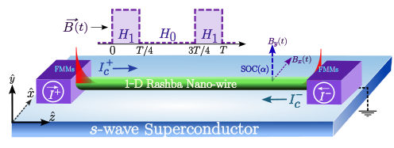
<figcaption class="paper-figure-caption"><b>Fig 1.</b> FIG. 1. We illustrate the schematic of a 1D Rashba nanowire (green), featuring Rashba SOC of strength α, that is placed in close proximity to a bulk s-wave superconductor (blue) in presence of external Floquet step drive in terms of the mag- netic field B(t) = (Bx(t), By(t)). This setup realizes topo- logical FMMs (red spikes) localized at the end of the NW, accompanied by non reciprocal critical supercurrents I+ c ≠I− c highlighting Floquet induced SDE.</figcaption>
</figure>
<figure class="paper-figure-card">
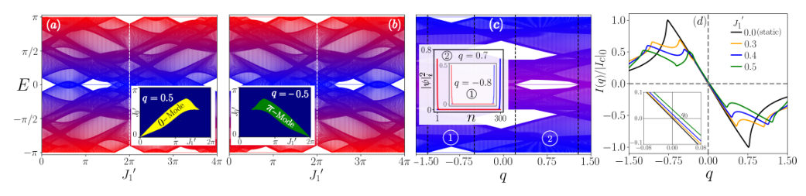
<figcaption class="paper-figure-caption"><b>Fig 2.</b> FIG. 2. We depict the spectral properties of the driven Rashba NW model by demonstrating the Floquet quasi-energy spectrum En, computed from Eq. (3), as a function of J′ 1 in panels (a,b) for q = 0.5 and q = −0.5, respectively, with By = 0.6 and J′ 0 = 0.6π. The in-gap states (white region) correspond to the emergence of topological 0- and π-FMMs. Insets in panels (a) and (b) exhibit the corresponding topological phase diagrams in the J′ 1-J′ 0 plane, where the yellow (green) region denotes Floquet TSC phases with 0- (π-) FMMs yielding Px = 0.5, while the blue region represents the trivial phase with Px = 0. Panel (c) shows En as a function of the Cooper-pair momentum q for (J′ 1, J′ 0) =...</figcaption>
</figure>
<figure class="paper-figure-card">
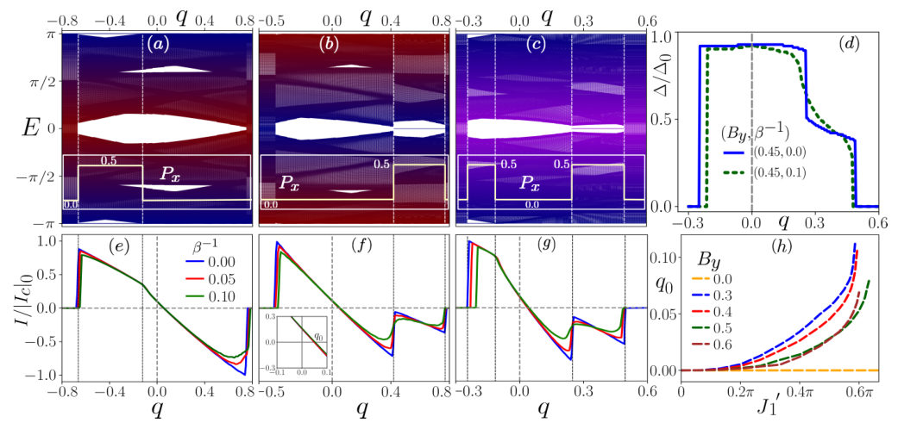
<figcaption class="paper-figure-caption"><b>Fig 3.</b> FIG. 3. We demonstrate the Floquet quasienergy spectrum, along with the topological invariant Px, obtained within the self-consistent framework exploting Eq. (7), as a function of the finite Cooper-pair momentum q in panels (a,b,c). Panel (a) depicts the emergence of topological π-FMMs exclusively in the negative-q sector, panel (b) features 0-FMMs in the positive-q sector, while panel (c) simultaneously hosts π-FMMs in the negative-q sector and 0-FMMs in the positive-q sector, highlighting the switching between dynamical topological FMMs in FF phase. The parameter set (J′ 1, J′ 0, µ/J′ 0, By) is chosen as (0.5π, 0.46π, 1.2, 0.45) in panel (a), (0.6π, 0.46π, 1.2, 0.5) in panel (b), and...</figcaption>
</figure>
<figure class="paper-figure-card">
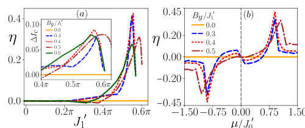
<figcaption class="paper-figure-caption"><b>Fig 4.</b> FIG. 4. We showcase the profile of diode efficiency η, consid- ering different values of By, as a function of J′ 1 for µ/J′ 0 = 1.2 in panel (a). The corresponding critical current asymme- try ∆Ic is shown in the inset of panel (a). On the other hand, η is depicted as a function of µ/J0 choosing an optimal value J′ 1 = 0.55π. The other system parameters are given as (t, α) = 1J′ 0, β−1/∆0 = 0.1, J′ 0 = 0.45π.</figcaption>
</figure>

**Summary.** The paper theoretically explores how applying a periodic drive to a Rashba nanowire can induce a finite momentum Fulde-Ferrell superconducting state. This state manifests as pronounced nonreciprocal supercurrents, leading directly to the Superconducting Diode Effect (SDE). The findings demonstrate that this effect is controllable by tuning the driving parameters.

**Why it may be interesting.** This work bridges concepts from topological superconductivity (Majorana modes) with non-equilibrium transport phenomena (SDE) using time-periodic driving, which is highly relevant for designing novel superconducting electronic devices.

Detailed structure

**Main problem.** The study investigates the emergence of a finite momentum Fulde-Ferrell (FF) superconducting state in a driven Rashba nanowire, linking this phenomenon to the Superconducting Diode Effect (SDE).

**Main result.** The periodic drive stabilizes a Floquet-induced FF superconducting state, enabling controllable switching between topological Majorana modes and realizing pronounced nonreciprocal supercurrent signatures indicative of SDE.

**Method.** Theoretical analysis employing the Floquet formalism combined with self-consistent mean-field calculations to determine the superconducting order parameter and current response.

**Model / system.** The system is a 1D Rashba nanowire proximitized to an s-wave superconductor, subjected to time-periodic modulation of in-plane and out-of-plane magnetic fields (Floquet drive).

**Key observables.** Nonreciprocal supercurrent signatures ($I^+_c 
eq I^-_c$), Floquet Majorana 0- and $\pi$-modes, diode efficiency ($\eta$), and the finite Cooper pair momentum ($q_0$).

**Important parameters / regimes.** Drive amplitude, chemical potential ($\mu$), and the presence/magnitude of a static magnetic field component ($B_y$) are crucial tuning parameters.

**Assumptions / limitations.** The analysis relies on the Floquet formalism to treat the time-periodic driving and uses self-consistent mean-field theory for superconducting pairing.

**Figures summary.** Figures illustrate schematic setups, quasienergy spectra showing topological phase diagrams (0- vs. $\pi$-FMMs), supercurrent density profiles confirming nonreciprocity, and dependence of diode efficiency on driving parameters.

**Paper structure.** The paper progresses from establishing the model Hamiltonian under periodic drive to analyzing the resulting Floquet topology via spectral analysis, followed by self-consistent calculations that confirm finite momentum pairing and quantify the resultant SDE.

Abstract

Much has been studied on Floquet engineering in Rashba nanowire model regarding topological superconductivity hosting Majorana $0$- and anomalous $π$-modes, here we theoretically investigate the possible emergence of finite momentum Fulde-Ferrell (FF) superconducting state in quasi-energy of the above model under the periodic modulation of in-plane and out-of-plane magnetic fields while the static limit does not host a FF ground state. We demonstrate controllable switching between Floquet Majorana $0$- and $π$-modes via reversal of the supercurrent direction, revealing pronounced nonreciprocal supercurrent signatures which is a manifestation of the FF pairing. We validate the onset of FF pairing following a self-consistent mean-field analysis where externally applied supercurrent facilitates nonreciprocal signatures in quasi-energy spectra. The above findings directly indicates to the intriguing phenomenon of superconducting diode effect (SDE). The drive amplitude serves as a parameter to regulate the diode efficiency with chemical potential. Our study thus reveals a rich interplay between Floquet topological superconductivity and finite-momentum FF pairing, providing a tunable way to switch between different Floquet Majorana modes and realize the SDE with high efficiency.

[↑ back to top](#top)

### [Deterministic single-photon sources in hexagonal boron nitride with electron-dose-tuned purity and reversible thermal quenching](http://arxiv.org/abs/2606.16977v1)

**Authors:** Amrita Majumder, Janhavi Khunte, Ikshvaku Shyam, Rohit Kumar, and Anshuman Kumar  
**Type:** experiment · **Category:** quantum information and computing · **PDF:** <https://arxiv.org/pdf/2606.16977v1>  
**Analysis basis:** full PDF text, analyzed in chunks
**Topic relevance:** 🔥 `QC/QI experiment` **4/5** · `quantum optics experiment` **3/5** · `quantum measurements` **2/5** · `analog quantum simulation` **1/5** · `correlated / nonlocal dissipation` **1/5** · `driven-dissipative phase transition` **1/5** · `interference shaping light` **1/5** · `methods for driven-dissipative` **1/5**

↔ Scroll figures horizontally

<figure class="paper-figure-card">
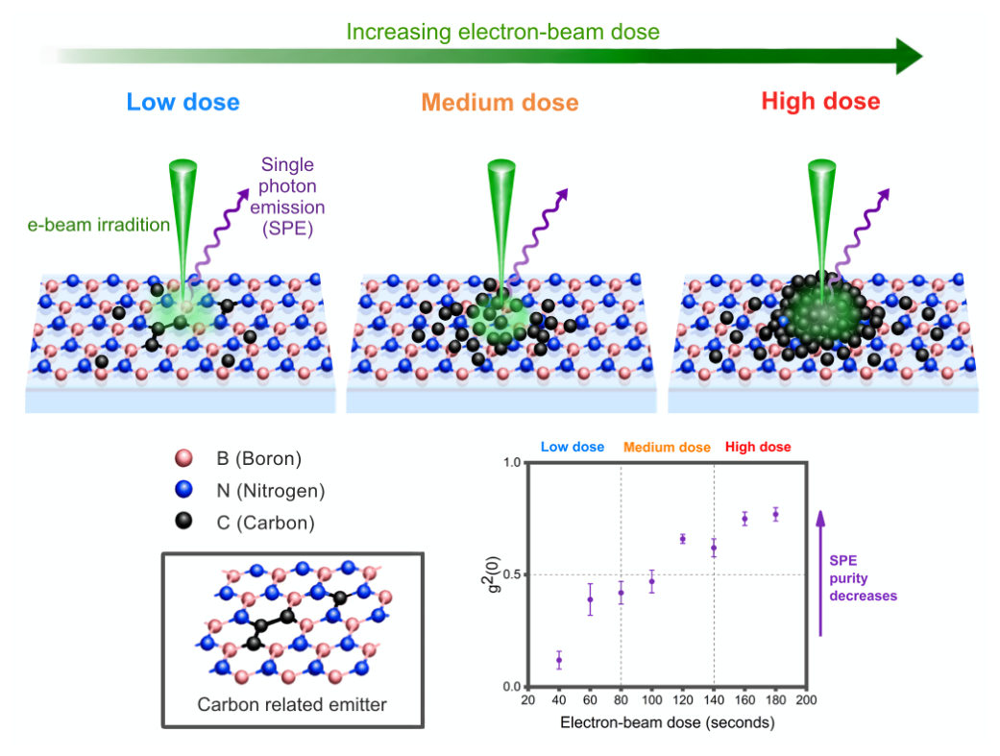
<figcaption class="paper-figure-caption"><b>Fig 1.</b> Figure 1: A schematic representation of electron-beam-irradiated hBN, demonstrating the progression of carbon deposition and the change in single-photon emitter purity as the irradiation dosage increases.</figcaption>
</figure>
<figure class="paper-figure-card">
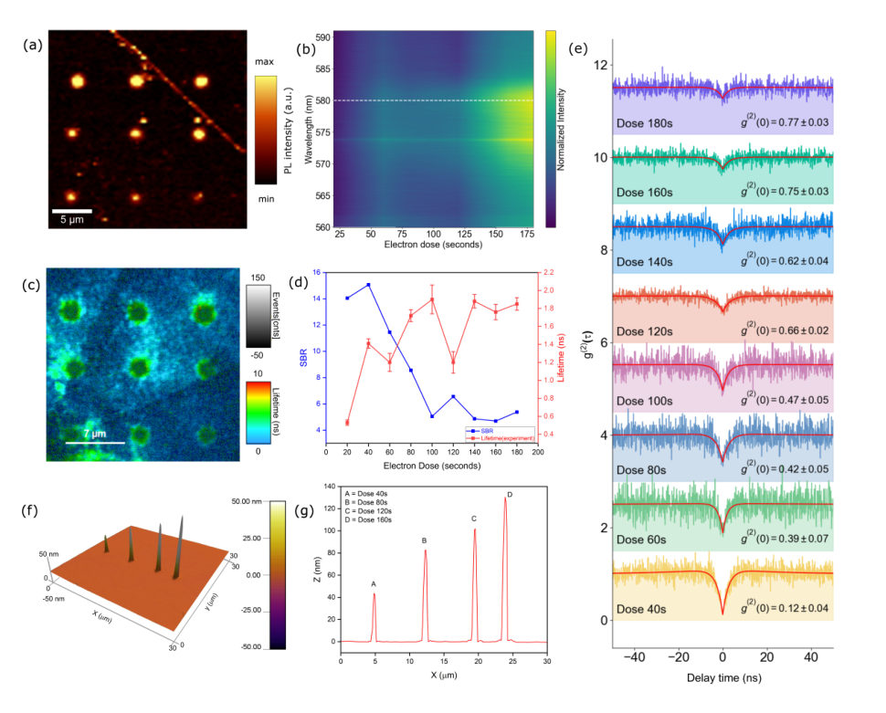
<figcaption class="paper-figure-caption"><b>Fig 2.</b> Figure 2: Dose-dependent effects of electron-beam irradiated color centers in hBN. a, Confocal photoluminescence (PL) map of e-beam irradiated hBN flake, where the irradiation duration was varied from 20s to 180s. The map was acquired under 532 nm laser excitation. b, Color-coded 2D map showing the PL intensity as a function of emission wavelength and electron beam irradiation time (20–180 s) under 532 nm excitation. A broad emission band centered near ∼575 nm, attributed to the phonon sideband (PSB) of the emitter, is observed across all doses. A narrow feature at ∼574 nm corresponds to the intrinsic hBN E2g phonon mode (Raman shift ∼1366 cm−1). With increasing irradiation time, a broad...</figcaption>
</figure>
<figure class="paper-figure-card">
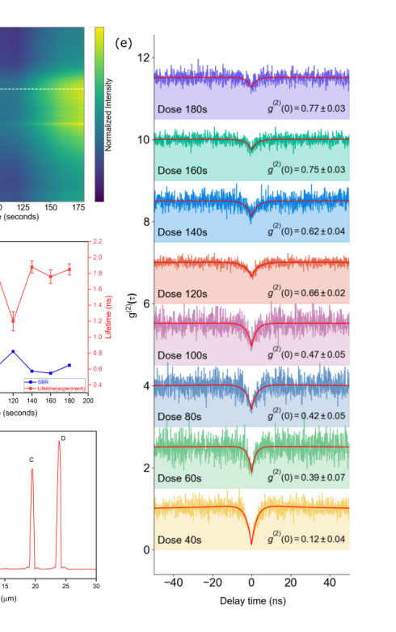
<figcaption class="paper-figure-caption"><b>Fig 3.</b> Fig. 2 presents a systematic investigation of the in- fluence of electron-beam irradiation dose (controlled via exposure time) on the formation, optical response, and</figcaption>
</figure>
<figure class="paper-figure-card">
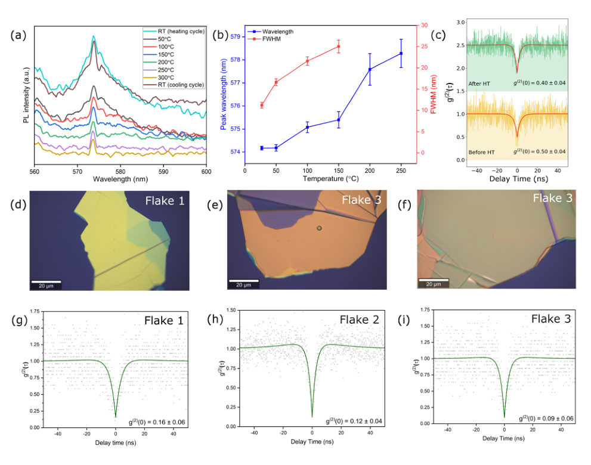
<figcaption class="paper-figure-caption"><b>Fig 4.</b> Figure 3: Reversible thermal response of single-photon emitters and second-order autocorrelation measurements,g(2)(τ) of hBN flakes of different thickness values. a, Photoluminescence spectra were measured during heating from room temperature to 300◦C and after cooling back to room temperature. The emission exhibits progressive thermal quenching with increasing temperature while retaining its spectral signature, and recovers upon cooling, indicating reversible thermal behaviour. b, Temperature dependence of the emission wavelength and FWHM of the emitter. c, Room-temperature second-order autocorrelation functions measured (on emitter of irradiation dose 100s) before and after thermal...</figcaption>
</figure>
<figure class="paper-figure-card">
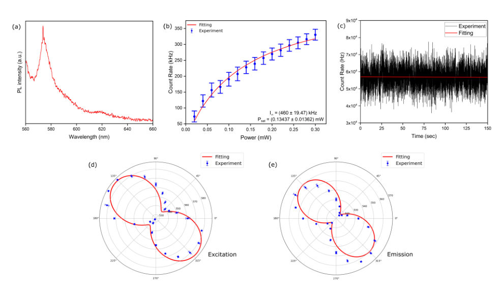
<figcaption class="paper-figure-caption"><b>Fig 5.</b> Figure 4: Optical characterization of a single-photon emitter (SPE) in hBN a, PL spectrum of an individual SPE, recorded using 532 nm excitation. The emitter exhibits an emission line centered at approximately ∼574 nm. b, Excitation power-dependent PL intensity of the emitter. The saturation behavior is well described by a two-level system model, yielding a saturation count rate of I∞= (460 ± 19.47) × 103 cps and a saturation power of Psat = (134.37 ± 13.62) µW. c, Temporal stability of the emitter emission recorded at an excitation power of 100 µW. d-e, Polarization-dependent excitation and emission measurements of the SPE, respectively. Blue symbols represent the experimental data, while...</figcaption>
</figure>

**Summary.** The authors report on the deterministic creation and characterization of single-photon emitters in hexagonal boron nitride ($	ext{hBN}$) using controlled electron irradiation. They establish a dose window that maximizes emitter purity ($g^{(2)}(0) \ll 1$) while also demonstrating remarkable thermal robustness, with functionality maintained up to $300^\circ	ext{C}$. This work advances the field by providing quantitative control over both the creation process and operational temperature range for quantum light sources.

**Why it may be interesting.** This work provides a crucial experimental demonstration of scalable, high-performance quantum light sources operating at ambient temperatures, directly relevant for developing practical photonic quantum technologies.

Detailed structure

**Main problem.** The study aims to systematically investigate how electron dose controls the properties of single-photon emitters (SPEs) in hexagonal boron nitride ($	ext{hBN}$), and to characterize their emission behavior above room temperature.

**Main result.** High-purity SPEs are deterministically created via controlled electron irradiation, exhibiting robust performance with reversible thermal quenching up to $300^\circ	ext{C}$. The purity is confirmed by low second-order correlation values ($g^{(2)}(0) \le 0.16$).

**Method.** The researchers used localized electron-beam irradiation coupled with photoluminescence microscopy, time-resolved measurements, and Hanbury-Brown and Twiss interferometry to characterize the emitters.

**Model / system.** The physical platform is single-photon emitters embedded in hexagonal boron nitride ($	ext{hBN}$), which are activated deterministically using a focused electron beam. The system's performance is mapped against the accumulated electron dose and temperature.

**Key observables.** Second-order autocorrelation function ($g^{(2)}(0)$), spectral purity (ZPL vs. PSB assignment), emission yield, lifetime ($	au$), Signal-to-Background Ratio ($	ext{SBR}$), and photoluminescence intensity as a function of temperature.

**Important parameters / regimes.** Electron dose (controlled by irradiation time), Temperature ($300^\circ	ext{C}$ maximum), $g^{(2)}(0)$ values ($\sim 0.09$ to $0.16$).

**Assumptions / limitations.** The primary assumption is that the observed spectral features and quantum statistics are dominated by the localized emitter, rather than background or non-radiative processes.

**Figures summary.** Figures illustrate PL maps showing dose dependence (Fig. 2a), spectral evolution vs. dose (Fig. 2b), lifetime/SBR dependence on dose (Figs. 2c/d), and confirmation of high purity across different flake thicknesses (Fig. 3).

**Paper structure.** The paper systematically details the methodology for dose-controlled emitter creation, presents quantitative data mapping performance metrics (purity, spectrum) against electron dose, confirms spectral assignments (PSB/ZPL), and finally demonstrates thermal stability up to $300^\circ	ext{C}$.

Abstract

Electron-beam irradiation is an established route to create site-controlled, room-temperature single-photon emitters (SPEs) in hexagonal boron nitride (hBN), but two aspects remain underexplored: how the electron dose governs the properties of the resulting single emitters, and how the emission behaves when the host is heated above room temperature. Here, we create emitters deterministically with a focused electron beam and confirm single-photon emission across three independent flakes, with $g^{(2)}(0)=0.09$, $0.12$, and $0.16$. We map the single-emitter response (yield, spectrum, lifetime, and photon purity) as a function of electron dose, identifying an optimal window for high-purity single emitters. Consistent with recent cryogenic studies, we assign the bright room-temperature feature near 575 n to the phonon sideband (PSB) of a green--yellow emitter whose zero-phonon line (ZPL) lies near 548 nm. Temperature-dependent photoluminescence measured in situ under real-time from room temperature to 300 degrees C reveals a thermal quenching that is fully reversible upon cooling, in contrast to the irreversible annealing-induced degradation reported elsewhere, indicating that transient heating does not permanently damage the centers. These results add quantitative dose control and above-room-temperature operation to the toolbox for deterministic hBN quantum-light sources.

[↑ back to top](#top)

### [Ground States and Excitations of Magnetic Impurities in Pseudogap Superconducting Systems](http://arxiv.org/abs/2606.15721v1)

**Authors:** Miguel A. Cazalilla, Chen-How Huang  
**Type:** theory · **Category:** strongly correlated electrons · **PDF:** <https://arxiv.org/pdf/2606.15721v1>  
**Analysis basis:** full PDF text, analyzed in chunks
**Topic relevance:** 🔥 `Kondo & dissipative impurity` **4/5** · `Keldysh / 2PI / non-Gaussian methods` **1/5**

↔ Scroll figures horizontally

<figure class="paper-figure-card">
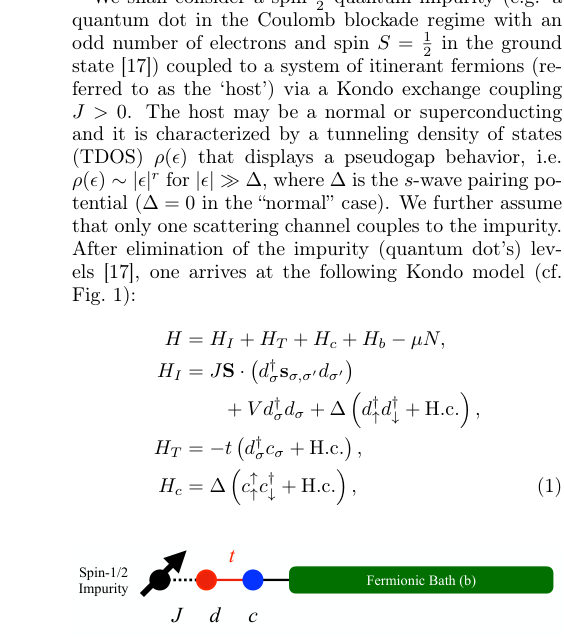
<figcaption class="paper-figure-caption"><b>Fig 1.</b> FIG. 1. (a): Sketch of the modified Kondo model(s) studied in this work. It consists of a quantum spin- 1</figcaption>
</figure>
<figure class="paper-figure-card">
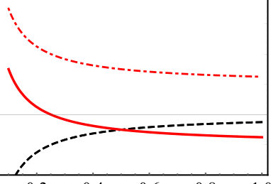
<figcaption class="paper-figure-caption"><b>Fig 2.</b> FIG. 3. Spectrum of the single-site model, Eq. 41), at particle- hole symmetry (i.e. for V ∗ 1 = 0). Energies are measured in units of ∆∗ 1 = B∗ 1∆, i.e. the renormalized Andreev reflec- tion or local pairing potential; U ∗ 0 is the renormalized Hub- bard interaction, arising from the singlet-triplet transitions (or Kondo-singlet polarization) in the strong coupling limit. The two low-lying states (lines) correspond to the doublet (continuous line) and singlet (dashed line). The doublet be- comes the ground state for small ∆∗ 1/U ∗ 0 , whilst the singlet is the ground state at large ∆∗ 1/U ∗ 0 . The upper line corresponds to the two-quasiparticle excitation. Notice that its energy is...</figcaption>
</figure>
<figure class="paper-figure-card">
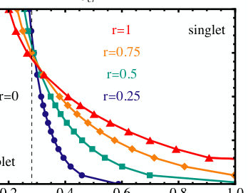
<figcaption class="paper-figure-caption"><b>Fig 3.</b> FIG. 2. Doublet-singlet phase boundary (i.e. critical Kondo coupling Jc) as a function of (a) the strength of the poten- tial scattering, V , and (b) the chemical potential, µ, for a s-wave pairing potential strength of ∆= 10−3 D; V (µ) lo- cally (globally) breaks particle-hole symmetry of the impurity model. At small values of the pseudogap exponent, r, the ef- fect of V is less pronounced than for r ≳0.5. For µ ≲0.2 D, the doublet-singlet phase boundaries shown on panel (b) for r = 0.25, 0.5, 0.75, 1 (color lines) and r = 0 (dashed line) exhibit the stronger effect of the crossover from pseudogap- controlled physics to a constant tunneling density density of states. The latter results in...</figcaption>
</figure>
<figure class="paper-figure-card">
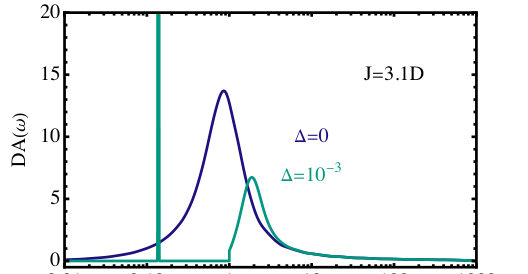
<figcaption class="paper-figure-caption"><b>Fig 4.</b> FIG. 5. Comparison of the T-matrix spectrac function for the gapless (∆= 0) and gapped (∆= 10−3D) systems for J →J− c , near the doublet-singlet phase transition at J = Jc. In the gapless case, a prominent resonance-like feature ap- pears at ω ≃∆. For ∆̸= 0, a resonance-like feature appears at ω ≃2∆along with a Dirac-delta function peak (the YSR state) for ω ≃0.</figcaption>
</figure>

**Summary.** This theoretical study analyzes the interplay between magnetic impurities and superconducting hosts exhibiting pseudogaps. Using advanced techniques like NRG and RG, it maps out the phase diagram showing a transition between local moment (doublet) and spin-singlet (PSC) ground states. The findings are crucial for understanding exotic quantum phenomena in unconventional superconductors.

**Why it may be interesting.** This work directly addresses how strong local correlations (Kondo physics) interact with unconventional pairing symmetries (d-wave/pseudogap superconductivity), which is a central theme in modern condensed matter theory relevant to high-Tc superconductors and quantum materials.

Detailed structure

**Main problem.** The study investigates the ground-state phase diagram and single-particle excitations of a magnetic impurity coupled to superconducting or pseudogap host materials.

**Main result.** The system exhibits a doublet-singlet transition, which can be driven by the chemical potential rather than solely by the Kondo coupling strength. The strong coupling limit favors a spin-singlet state (PSC) over a local moment (LM) state when pairing potentials are present.

**Method.** The analysis employs advanced theoretical techniques including effective field theory derived from strong coupling expansions, Numerical Renormalization Group (NRG), and Renormalization Group (RG) flow equations in Nambu space.

**Model / system.** The model describes a spin-1/2 magnetic impurity coupled to itinerant fermions forming a superconducting host with a pseudogap tunneling density of states $
ho(\epsilon) \sim |\epsilon|^r$. The Hamiltonian incorporates Kondo coupling, pairing potentials ($\Delta$), and scattering terms.

**Key observables.** Ground state phase diagram (singlet vs. doublet), T-matrix spectral function $A(\omega)$, and the anomalous Green's function components ($F_0$).

**Important parameters / regimes.** Kondo coupling strength ($J$), pairing potential ($\Delta$), pseudogap exponent ($r$), chemical potential ($\mu$), and scattering potential ($V$).

**Assumptions / limitations.** The analysis relies on strong coupling expansions, low-energy limits (e.g., $|\omega_n| \ll J$ or $\Delta$), and approximations like the BCS mean-field theory for the host.

**Figures summary.** Figures illustrate phase diagrams showing the competition between singlet and doublet phases as a function of various parameters ($V$, $\mu$, $r$).

**Paper structure.** The paper progresses by establishing the model Hamiltonian, deriving effective actions via path integrals (integrating out bath degrees of freedom), applying RG analysis to determine stability regimes, and finally analyzing specific spectral features like resonance-like excitations.

Abstract

Combining effective field theory and numerical renormalization-group (NRG), we study the ground-state phase diagram and single-particle excitations of a spin-$\tfrac{1}{2}$ impurity in a superconducting system with a tunneling density of states behaving as $ρ(ε) \sim |ε|^{r}$, for $|ε|\gg Δ$ ($Δ$ being the $s$-wave pairing potential). We focus on the properties of the doublet-singlet transition at large Kondo coupling. The effective field theory for the singlet phase is inferred from a strong coupling expansion in the Kondo coupling. For $Δ\neq 0$, it contains a local pairing term which drives the system into a spin-singlet phase with enhanced paring correlations. We study how the singet-doublet phase boundary is affected by particle-hole symmetry breaking perturbations such as a scattering potential and/or the chemical potential. Results for the $T$-matrix spectral function are also reported near the transition both at particle-hole symmetry and away from it. It is shown that the singlet-doublet transition can be induced by the chemical potential rather than the Kondo coupling strength. At particle-hole symmetry, a resonance-like feature is observed for $r= 1$ and related to a two-quasiparticle excitation using a single-site model which is derived from effective field theory.

[↑ back to top](#top)

### [Creation and motion of antiferromagnetic skyrmions by edge manipulation](http://arxiv.org/abs/2606.15212v1)

**Authors:** Aleksey Berg, Tim Matthies, Roland Wiesendanger, Elena Y. Vedmedenko  
**Type:** theory · **Category:** other · **PDF:** <https://arxiv.org/pdf/2606.15212v1>  
**Analysis basis:** full PDF text, analyzed in chunks
**Topic relevance:** `exotic spin models in light-matter` **3/5** · `spintronics-quantum-optics interface` **3/5** · `analog quantum simulation` **2/5** · `driven-dissipative phase transition` **2/5** · `methods for driven-dissipative` **2/5** · `non-equilibrium dynamics` **2/5** · `Frenkel-Kontorova` **1/5** · `Keldysh / 2PI / non-Gaussian methods` **1/5** · `correlated / nonlocal dissipation` **1/5** · `non-equilibrium universality` **1/5**

↔ Scroll figures horizontally

<figure class="paper-figure-card">
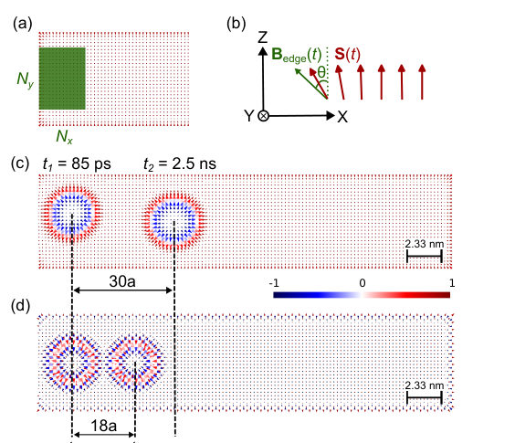
<figcaption class="paper-figure-caption"><b>Fig 1.</b> FIG. 1. (a) Section of a ferromagnetic rectangular racetrack. The green rectangle indicates the region which the edge field is applied to. Nx is the number of affected rows along the x axis while Ny stands for the number of affected columns along the y axis. (b) Side view of the ferromagnetic race- track at the left edge to schematically illustrate the rotation of applied local field (green arrow) and its action on the mag- netization (red arrows). Here, the edge field rotates in the xz plane or switches periodically along a previously defined axis. The axis is defined by the angle θ with respect to the z axis. (c) shows the position of a ferromagnetic skyrmion and (d) antiferromagnetic one...</figcaption>
</figure>
<figure class="paper-figure-card">
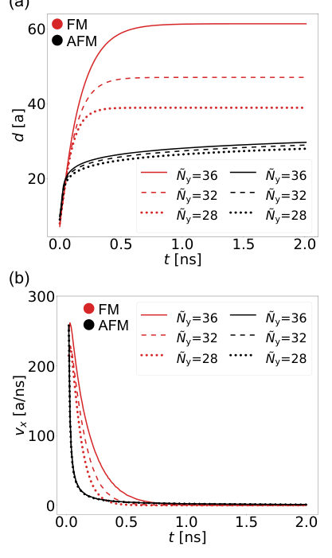
<figcaption class="paper-figure-caption"><b>Fig 2.</b> FIG. 2. (a) Time-dependent distance d of a skyrmion mea- sured after a 2π edge field rotation at the left edge of a 120 × ˜ Ny racetrack. Here, t = 0 corresponds to the time value t1 = 85 ps in Fig. 1. After the single 2π rotation the system is left to relax. (b) Time-dependent x-component of the skyrmion drift velocity vx. The red lines correspond to a FM and the black lines to an AFM. The number of rotated edge rows is Nx = 5 and Ny = 14. The edge field amplitude is given by Bedge = 10 T.</figcaption>
</figure>
<figure class="paper-figure-card">
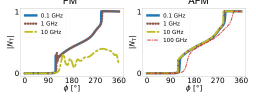
<figcaption class="paper-figure-caption"><b>Fig 3.</b> FIG. 4. Time-dependent absolute value of the skyrmion num- ber |NT| during a 2π rotation of the edge field for different frequencies of the edge rotation. (a) is a FM and (b) is an AFM. An edge field with an amplitude of 5 T is applied to a region of size 5 × 14 at the left racetrack edge.</figcaption>
</figure>
<figure class="paper-figure-card">
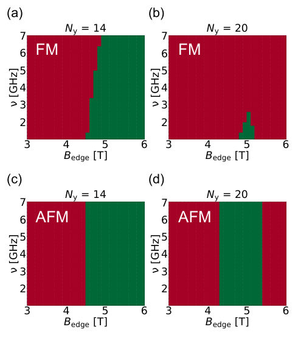
<figcaption class="paper-figure-caption"><b>Fig 4.</b> FIG. 3. Skyrmion creation diagrams with rotating edge fields for different pairs of edge field amplitudes Bedge and edge field frequencies ν in a FM, (a)/(b), and in an AFM, (c)/(d). The number of rotated edge rows is set to Nx = 5. The step sizes are ∆Bedge = 0.1 T, ∆ν = 0.2 GHz. Green areas indicate a skyrmion number |NT| = 1 after one 2π rotation and 200 ps of relaxation. Red areas refer to NT = 0.</figcaption>
</figure>
<figure class="paper-figure-card">
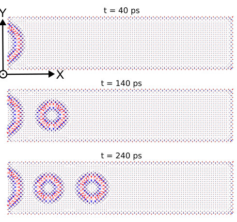
<figcaption class="paper-figure-caption"><b>Fig 5.</b> FIG. 5. Creation of a train of antiferromagnetic skyrmions by several 2π cycles of a rotating edge field with a frequency ν = 10 GHz. The amplitude of the edge field is 10 T and the widths of the edge field area are given by Nx = 5 and Ny = 14.</figcaption>
</figure>

**Summary.** This work demonstrates that antiferromagnetic skyrmions can be efficiently created and moved in magnetic racetracks solely by manipulating the local magnetization at the sample edges. By comparing these results to ferromagnetic counterparts, the authors show that AFM systems offer superior performance, particularly regarding operational frequency limits and energy efficiency for this boundary-driven process.

**Why it may be interesting.** While focused on condensed matter magnetism, the controlled manipulation of topological excitations (skyrmions) via boundary conditions and non-global driving forces shares conceptual links with controlling quantum states in engineered systems, making it relevant to understanding dissipation and state preparation in open quantum systems.

Detailed structure

**Main problem.** The research aims to develop efficient, current-free methods for generating and transporting topological magnetic skyrmions within antiferromagnetic (AFM) racetrack architectures.

**Main result.** Local manipulation of the magnetization at the sample boundary—either through smooth rotation or switching—can efficiently generate and move AFM skyrmions, showing advantages over ferromagnetic counterparts in terms of frequency limits and robustness.

**Method.** The study uses atomistic simulations based on the Landau-Lifshitz-Gilbert equation, analyzing the dynamics using analytical approximations like the Thiele equation for skyrmion motion.

**Model / system.** The system is an AFM racetrack modeled on a lattice, governed by an effective Hamiltonian derived from the underlying magnetic interactions. Dynamics are simulated by applying local boundary fields ($\mathbf{B}_{	ext{edge}}$) that drive magnetization rotation or switching.

**Key observables.** Skyrmion position ($d$ vs $t$), propagation velocity ($\mathbf{v}_x$), skyrmion number ($|N_T|$), and the energy cost required for creation ($\Delta H_{	ext{skyr}}$).

**Important parameters / regimes.** Edge field amplitude ($\mathbf{B}_{	ext{edge}}$), rotation frequency ($
u$), racetrack width ($N_y$), and material parameters like exchange coupling ($J$) and DMI constants.

**Assumptions / limitations.** The analysis assumes adiabatic changes during edge field manipulation and compares results between FM and AFM systems, noting that the AFM case exhibits unique directional requirements for optimal switching.

**Figures summary.** Figures illustrate skyrmion positions after boundary rotation (Fig. 1), compare time-dependent displacement and velocity for FM vs. AFM under rotating fields (Fig. 2), map stable creation regions in parameter space (Fig. 3), and show frequency limitations for both types of skyrmions (Fig. 4).

**Paper structure.** The paper progresses by first establishing the physical motivation (AFM racetracks avoiding global currents), then detailing the simulation methods using edge field manipulation, presenting comparative results between FM and AFM dynamics under rotation/switching, and finally quantifying the energy efficiency of the process.

Abstract

Magnetic racetrack architectures that use topological magnetic particles to store information are one of the most promising concepts for future storage applications. Antiferromagnetic racetracks are particularly appealing as they are not susceptible to external magnetic fields. State-of-the-art racetracks use magnetic fields, spin-transfer and spin-orbit torques caused by electric currents to move the bits across the entire circuit. However, the application of currents in many antiferromagnetic racetracks is limited because many of them are insulating. Recently, however, a concept for ferromagnetic racetrack memories that are free of global driving forces has been proposed. It has been demonstrated that various topological entities can be generated and transported over long distances solely through local magnetization rotation at the sample boundaries, independent of global driving forces. Here, we demonstrate that the local rotation of magnetization at the boundary of an antiferromagnetic sample can be exploited in racetracks to efficiently generate and transmit antiferromagnetic skyrmions. Additionally, we demonstrate that local switching of staggered magnetization at the edge of an antiferromagnetic racetrack can be even more successful than the rotational procedure. A comparison of ferromagnetic and antiferromagnetic processing of skyrmionic bits, together with energy considerations, shows that this procedure is fairly efficient in antiferromagnets.

[↑ back to top](#top)

### [Intrinsic linewidths of confined phonons in few-layer hBN](http://arxiv.org/abs/2606.15818v1)

**Authors:** Aleksandar Radic, Jack Kelsall, Akshay Rao  
**Type:** experiment · **Category:** other · **PDF:** <https://arxiv.org/pdf/2606.15818v1>  
**Analysis basis:** full PDF text, analyzed in chunks
**Topic relevance:** `correlated / nonlocal dissipation` **3/5** · `driven-dissipative phase transition` **3/5** · `methods for driven-dissipative` **3/5** · `Frenkel-Kontorova` **2/5** · `non-equilibrium universality` **2/5** · `Keldysh / 2PI / non-Gaussian methods` **1/5** · `Kondo & dissipative impurity` **1/5** · `analog quantum simulation` **1/5** · `entanglement & information structure` **1/5** · `non-equilibrium dynamics` **1/5**

↔ Scroll figures horizontally

<figure class="paper-figure-card">
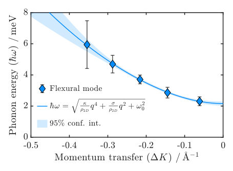
<figcaption class="paper-figure-caption"><b>Fig 1.</b> Figure 1. Dispersion of the flexural phonon mode at the surface of hBN along the ΓM direction. The flexural mode arises from simple harmonic coupling between a weakly bound (quasi-freestanding) monolayer and a substrate, and is well-described by an approximately quadratic dispersion (Eqn.1)[10, 12]. Individual points and uncertainties were extracted from Lorentzian fitting to energy transfer spectra (Figure A1) at sample temperature T = 360 K and tilt angle α = 135◦. All data shown here appear as annihilation (+∆E) features in energy transfer spectra. The shaded region repre- sents the 95% confidence interval of the fit to Eqn. (1).</figcaption>
</figure>
<figure class="paper-figure-card">
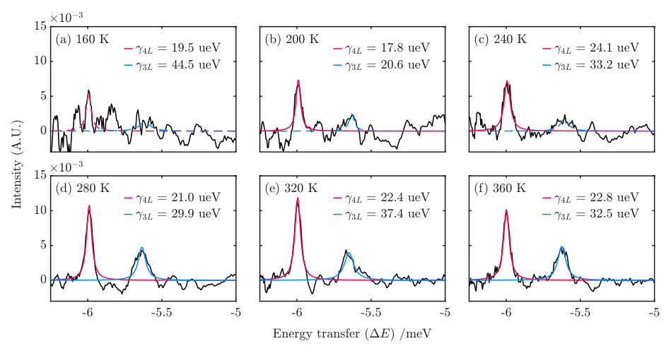
<figcaption class="paper-figure-caption"><b>Fig 2.</b> Figure 2. Enegy transfer spectra of the 3L (blue) and 4L (red) interlayer shearing modes (ISMs) with single Lorentzian fits for sample temperatures 160 −360 K and tilt angle α = 129.1◦. Linewidth for each fit is shown in the legend of the respective panel. In Figure 3 we analyse the temperature dependence of these linewidths alongside the fitting of the 2L mode. Fits with high uncertainty are shown with dashed lines and are not used in the subsequent analysis. A 2nd-order polynomial background subtraction was applied to account for multi-phonon background contributions to intensity followed by a Savitsky-Golay filter (1st-order with window width 7) is used to remove high-frequency noise.</figcaption>
</figure>
<figure class="paper-figure-card">
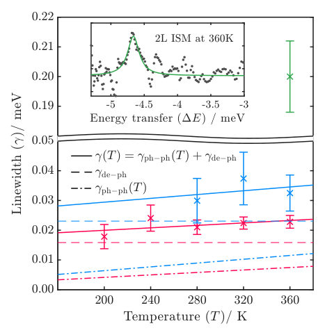
<figcaption class="paper-figure-caption"><b>Fig 3.</b> Figure 3. Linewidths of the 2–4L interlayer shearing modes (ISM) at the surface of bulk hBN from 160 −360 K. Inset shows the energy transfer spectrum of the 2L mode fit with a Lorentzian at 360 K and tilt angle α = 129.1◦yielding fre- quency ω2L = 4.65 meV and linewidth γ2L = (210 ± 40) µeV. The linear relationship between linewidth and temperature for the 3L and 4L modes indicates dominant phonon-phonon scattering while the constant offset corresponds to defect- phonon scattering[23]. The phonon-phonon (γph−ph) and defect-phonon (γde−ph) linewidth contributions are shown as dot-dashed and dashed lines, respectively, for the 3L and 4L modes. We neglect the electron-phonon contribution due...</figcaption>
</figure>

**Summary.** This work uses Helium-3 spin-echo spectroscopy to measure the intrinsic linewidths of low-energy phonon modes in few-layer hBN. The key finding is that reducing dimensionality strongly affects phonon decay rates, showing a dramatic increase in confinement-induced broadening for thinner films. This provides fundamental insights into how material structure governs energy dissipation pathways in 2D materials.

**Why it may be interesting.** While focused on solid-state phononics, the study of energy dissipation pathways ($\gamma$) in confined systems provides analogous insights to decoherence rates or coupling strengths in open quantum systems, particularly those involving lattice vibrations or phonons mediating interactions.

Detailed structure

**Main problem.** The study aims to understand the intrinsic linewidths of low-energy, often optically silent, phonon modes in few-layer hexagonal boron nitride (hBN). This is crucial for controlling thermal and mechanical properties in nanoscale devices.

**Main result.** The researchers found a strong confinement effect, demonstrating that the phonon lifetime decreases significantly—by nearly an order of magnitude—when moving from four- to two-layer hBN modes. They also characterized temperature dependence dominated by phonon-phonon scattering at higher temperatures.

**Method.** Helium-3 spin-echo (HeSE) spectroscopy was employed to measure the low-energy vibrational spectrum, which is advantageous because it avoids probe-induced heating common in optical techniques.

**Model / system.** The physical system is few-layer hBN. Theoretical models include simple harmonic membrane–substrate coupling theory for flexural modes and the Linear Chain Model (LCM) used to predict interlayer shear mode energies.

**Key observables.** Phonon dispersion relations (flexural, Rayleigh wave, interlayer shear modes), intrinsic linewidths ($\gamma$), bending rigidity ($\kappa$), and temperature dependence of phonon decay rates.

**Important parameters / regimes.** Temperature range ($160-360 	ext{ K}$); layer number (2L, 3L, 4L); confinement strength; scattering mechanisms (phonon-phonon vs. defect-phonon).

**Assumptions / limitations.** The HeSE technique is assumed to provide a surface-sensitive measurement free from optical selection rules or probe heating effects.

**Figures summary.** Figures show the quadratic dispersion of flexural modes, energy transfer spectra for interlayer shear modes at various temperatures, and plots detailing linewidths versus temperature for different layer numbers.

**Paper structure.** The paper first establishes the need to measure intrinsic phonon lifetimes in 2D materials. It then details the use of HeSE spectroscopy to resolve specific low-energy modes (flexural/Rayleigh waves) and interlayer shear modes (ISMs). The core analysis focuses on comparing measured linewidths across different layer numbers and temperatures against theoretical predictions.

Abstract

Understanding lattice vibrations in two-dimensional (2D) materials is essential for controlling thermal transport, mechanical response, and energy dissipation in nanoscale devices. However, the intrinsic lifetimes of low-energy phonon modes, particularly those that are optically silent, remain largely unexplored. Here we use helium-3 spin-echo spectroscopy to resolve low-energy phonons at the surface of hexagonal boron nitride (hBN) and measure their intrinsic linewidths. We observe the flexural and Rayleigh wave modes and extract the bending rigidity of a quasi-freestanding hBN monolayer. We further report the simultaneous observation of multiple surface-confined interlayer shear modes whose energies agree closely with linear-chain model predictions. By resolving their intrinsic linewidths, we demonstrate a strong confinement-induced reduction in phonon lifetimes, with a near order of magnitude increase in linewidth between the four- and two-layer modes. The temperature dependence of the linewidths indicates that phonon-phonon scattering dominates between 160-360K, while the systematic broadening with decreasing layer number reveals the impact of confinement on phonon decay. These results reveal how reduced dimensionality affects the decay of interlayer shearing modes in hBN, providing direct insight into the phonon lifetimes, confinement effects, and dissipation pathways that govern the dynamical behaviour of two-dimensional materials.

[↑ back to top](#top)

### [Anisotropic Cylindrical Waves in a Square Lattice of Acoustic Waveguides](http://arxiv.org/abs/2606.15428v1)

**Authors:** Ioannis Ioannou Sougleridis, Olivier Richoux, Vassos Achilleos, Georgios Theocharis, Dimitrios Frantzeskakis  
**Type:** both · **Category:** other · **PDF:** <https://arxiv.org/pdf/2606.15428v1>  
**Analysis basis:** full PDF text, analyzed in chunks
**Topic relevance:** `analog quantum simulation` **3/5** · `non-equilibrium dynamics` **3/5** · `driven-dissipative phase transition` **2/5** · `methods for driven-dissipative` **2/5** · `non-equilibrium universality` **2/5** · `Frenkel-Kontorova` **1/5** · `Keldysh / 2PI / non-Gaussian methods` **1/5** · `correlated / nonlocal dissipation` **1/5**

↔ Scroll figures horizontally

<figure class="paper-figure-card">
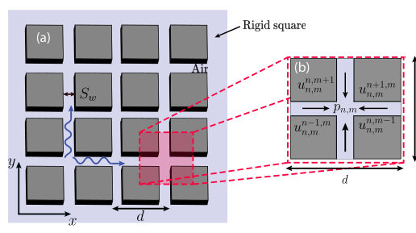
<figcaption class="paper-figure-caption"><b>Fig 1.</b> FIG. 1. Schematic of the acoustic periodic network. (a) A periodic 2D square network, composed by narrow waveguide channels of equal length d and cross-section Sw, depicted by dark grey color. Depicted by a red rectangle is the unit cell of the network. (b) A zoom of the unit cell with length d. The discretized pressure field in the center and the black arrows denote the ingoing flows.</figcaption>
</figure>
<figure class="paper-figure-card">
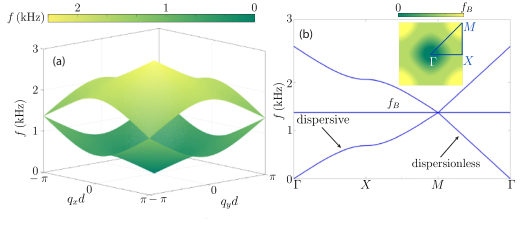
<figcaption class="paper-figure-caption"><b>Fig 2.</b> FIG. 2. Band structure of the square network given by (6). (a) Surface of the dispersion relation of the acoustic network. (b) The dispersion relation of the square network along the high-symmetry directions of the first Brillouin zone. The in- set shows the first Brillouin zone, while the triangle ΓXM de- notes its irreducible representation. The flat band at f = fB, is an exact solution of the 1D Helmholtz equation for the square network–see Eq.(3)– and corresponds to the resonance λ/2 of the unit cell, which is also the Bragg frequency.</figcaption>
</figure>
<figure class="paper-figure-card">
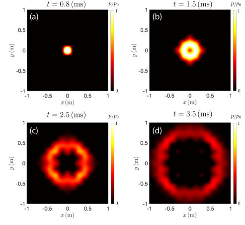
<figcaption class="paper-figure-caption"><b>Fig 3.</b> FIG. 4. Contour plots depicting 2D pressure snapshots of cylindrical pulses in the network. Snapshots of the pressure field at times t =[0.8, 1.5, 2.5, 3.5] (ms).</figcaption>
</figure>
<figure class="paper-figure-card">
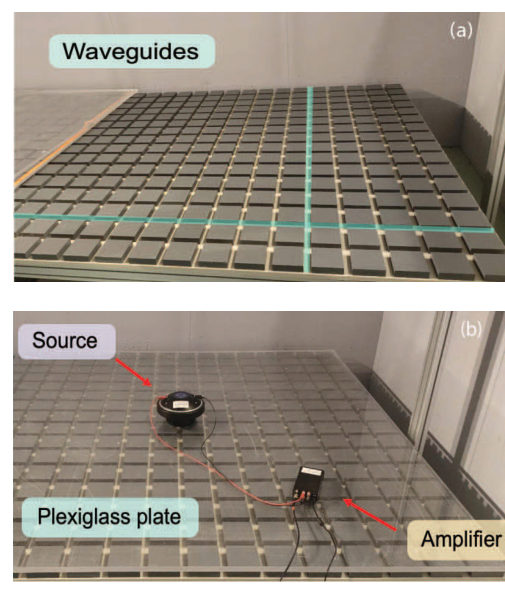
<figcaption class="paper-figure-caption"><b>Fig 4.</b> FIG. 3. Experimental setup of the square network. (a) A square acoustic network of 15×15 unit cells. A periodic ar- rangement of square obstacles in square lattice substrate cre- ates waveguide channels, which are depicted in cyan color. (b) Plexiglass plate placed on top of the square obstacles, an acoustic source (compression chamber) placed in the center of the network and an amplifier.</figcaption>
</figure>
<figure class="paper-figure-card">
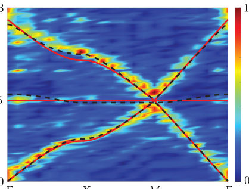
<figcaption class="paper-figure-caption"><b>Fig 5.</b> FIG. 5. Experimental validation of the dispersion relation. The dispersion relation along the directions of high symme- try of the first irreducible Brillouin zone obtained through the TMM expression (6) (red curve), 3D finite element sim- ulations (FEM) (black dashed curve) and experiments (col- ormap).</figcaption>
</figure>

**Summary.** This work thoroughly analyzes how acoustic waves propagate through a square lattice of waveguides, revealing pronounced directional dependence due to anisotropic dispersion. By developing and comparing multiple theoretical models (Boussinesq, Westervelt) against experiments, the authors characterize wave behavior from linear pulses to nonlinear solitons and shocks across different propagation angles.

**Why it may be interesting.** While focused on classical acoustics, the mathematical framework—developing complex nonlinear PDEs (Boussinesq, KdV) that exhibit strong anisotropy and support localized structures (solitons)—is highly relevant to modeling wave dynamics in quantum systems like photonic lattices or Bose-Einstein condensates with engineered periodic potentials.

Detailed structure

**Main problem.** The study investigates nonlinear wave propagation, specifically anisotropic cylindrical waves, within a periodic square lattice structure made of acoustic waveguides.

**Main result.** The system exhibits highly direction-dependent dispersion relations and supports waveforms ranging from linear Airy pulses to nonlinear shock fronts or solitons depending on the propagation angle and amplitude.

**Method.** The analysis employs multiple techniques, including theoretical derivations (Transfer Matrix Method, Boussinesq equation), numerical simulations (2D Westervelt equation), and experimental measurements of acoustic fields.

**Model / system.** The physical system is a square lattice network of acoustic waveguides. The modeling progresses from simple Helmholtz equations to effective 2D nonlinear partial differential equations like the Boussinesq or Westervelt equations, capturing wave dynamics across different regimes.

**Key observables.** Anisotropic dispersion relation $\omega(k_d, 	heta)$, pulse width/amplitude evolution, and decay rates ($R^{-5/6}$ vs $R^{-1/2}$).

**Important parameters / regimes.** Lattice spacing ($d$), waveguide cross-section ($S_w$), wave amplitude (low vs. high), and propagation angle ($	heta$).

**Assumptions / limitations.** Initial analyses rely on the long-wavelength limit and monomodal approximation; later models use continuum approximations leading to effective PDEs.

**Figures summary.** Figures illustrate schematic lattice structures, Brillouin zones, contour plots of wave amplitude evolution at different times for various angles ($	heta=0$ vs $	heta=\pi/4$), and comparisons between theoretical dispersion curves (TMM vs. Continuum).

**Paper structure.** The paper builds systematically: first establishing the linear anisotropic dispersion relation using TMM; then deriving an effective 2D Boussinesq equation for weak nonlinearity; subsequently regularizing this PDE into a cKdV form to analyze both low-amplitude decay and high-amplitude soliton/shock formation.

Abstract

We investigate the propagation of cylindrical waves in a square network of acoustic waveguides. We establish, both theoretically and experimentally, the anisotropic dispersion relation governing wave propagation in the network, and demonstrate excellent agreement between experimental measurements and theoretical predictions. Owing to this anisotropic band structure, each propagation direction exhibits distinct dispersive properties. Consequently, the network supports anisotropic cylindrical waves at both low- and high-amplitudes, with waveforms that vary markedly with direction: from nearly dispersionless pulses to Airy-like wave packets in the linear regime, and from sharp shock-like fronts to smooth solitary-like profiles in the nonlinear regime. The theoretical results are further corroborated by numerical simulations based on the two-dimensional Westervelt equation.

[↑ back to top](#top)

### [Dynamical Steering and Unambiguous Signature of Majorana Corner Modes in Altermagnetic Josephson Junctions](http://arxiv.org/abs/2606.16931v1)

**Authors:** Yu-Xuan Li, Tao Zhou  
**Type:** theory · **Category:** quantum information and computing · **PDF:** <https://arxiv.org/pdf/2606.16931v1>  
**Analysis basis:** full PDF text, analyzed in chunks
**Topic relevance:** `analog quantum simulation` **3/5** · `driven-dissipative phase transition` **3/5** · `methods for driven-dissipative` **3/5** · `spintronics-quantum-optics interface` **2/5** · `Keldysh / 2PI / non-Gaussian methods` **1/5** · `Kondo & dissipative impurity` **1/5** · `exotic spin models in light-matter` **1/5** · `non-equilibrium dynamics` **1/5**

↔ Scroll figures horizontally

<figure class="paper-figure-card">
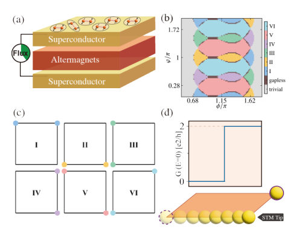
<figcaption class="paper-figure-caption"><b>Fig 1.</b> FIG. 1. (a) Schematic of the phase-biased altermagnetic Josephson junction, where the superconducting phase differ- ence ϕ is controlled by the magnetic flux. (b) Phase dia- gram in the (ϕ, φ) plane, with φ the N´eel-vector azimuthal angle. Regions I–VI denote distinct MCM corner-localization regimes; brown and gray regions indicate gapless and trivial regimes, respectively. (c) Corner-localization patterns of the MCMs for the six regions labeled in (b). Colored dots mark the corners occupied by MCMs. (d) Local tunneling readout of the zero-bias conductance near a contacted corner.</figcaption>
</figure>
<figure class="paper-figure-card">
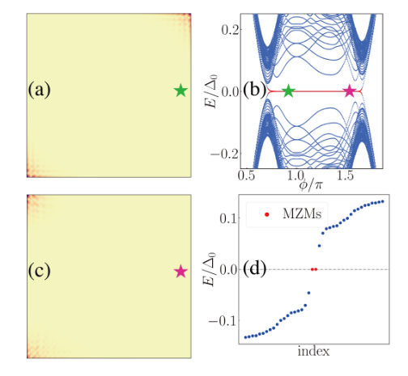
<figcaption class="paper-figure-caption"><b>Fig 2.</b> FIG. 3. Control and phase robustness of MCMs. (a) Proba- bility density of the zero-energy modes at ϕ = π and n ∥[1¯1]. (b) Finite-size spectrum versus ϕ, demonstrating the persis- tence of the zero-energy modes over a finite phase interval. (c),(d) Probability density and corresponding finite-size spec- trum away from the π-junction limit at φ = 0.35π, showing relocated MCMs isolated within the quasiparticle gap.</figcaption>
</figure>
<figure class="paper-figure-card">
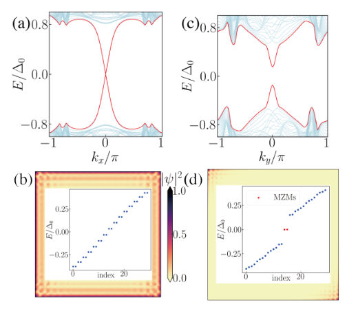
<figcaption class="paper-figure-caption"><b>Fig 3.</b> FIG. 2. Boundary spectra and real-space distributions for different N´eel vector orientations. (a),(b) For n ∥ˆz, the cylinder spectrum hosts gapless helical Majorana edge modes, whose lowest-energy states extend along the boundaries in a fully finite geometry. (c),(d) For n ∥[11], the altermagnetic spin splitting gaps the boundary modes and produces zero- energy modes localized at the corners. The insets in (b) and (d) show the corresponding finite-size spectra.</figcaption>
</figure>
<figure class="paper-figure-card">
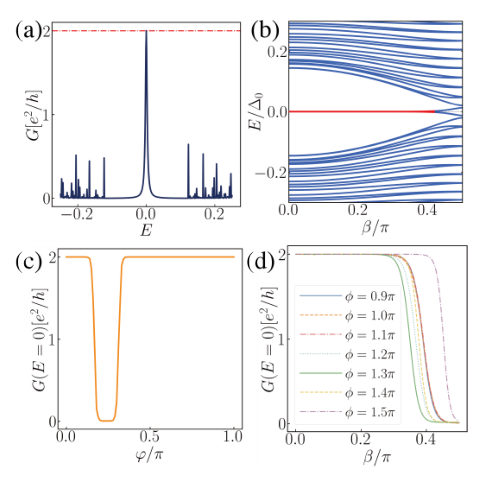
<figcaption class="paper-figure-caption"><b>Fig 4.</b> FIG. 4. (a) Energy-resolved differential conductance G(E) measured near a contacted corner. (b) Finite-size spectrum as a function of the form-factor parameter β. (c) Zero-bias conductance G(0) as a function of the N´eel vector azimuthal angle φ. (d) Zero-bias conductance G(0) versus β for repre- sentative superconducting phase differences ϕ.</figcaption>
</figure>
<figure class="paper-figure-card">
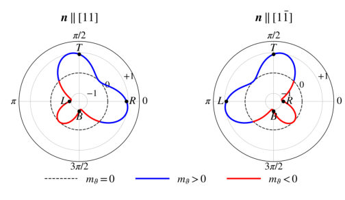
<figcaption class="paper-figure-caption"><b>Fig 5.</b> FIG. 5. Polar distribution of the altermagnetic boundary mass mϑ. The profile strongly depends on the boundary ori- entation angle ϑ, the form-factor parameter β, and the tun- able N´eel vector azimuth φ. The petal structures map the spatial distribution of the induced gap.</figcaption>
</figure>

**Summary.** The paper proposes using phase-biased altermagnetic Josephson junctions as a highly controllable platform for generating and manipulating Majorana Corner Modes. By independently tuning the superconducting phase difference and the magnetic order vector, researchers can deterministically move these topological states across a fixed device geometry. The definitive proof of this control is achieved by observing a unique conductance switching signature that confirms the physical relocation of the zero-energy modes.

**Why it may be interesting.** This work directly tackles the engineering challenges of topological quantum computation by providing a physical mechanism (altermagnetism) to control Majorana modes spatially, which is crucial for building braiding architectures.

Detailed structure

**Main problem.** The research addresses two major hurdles in topological quantum computation: deterministically moving Majorana Corner Modes (MCMs) and providing an unambiguous diagnostic to distinguish true MCMs from trivial bound states.

**Main result.** The authors demonstrate that by controlling the superconducting phase difference ($\phi$) and the altermagnetic Néel-vector orientation ($\mathbf{n}$), they can deterministically steer MCMs between corners, evidenced by a unique control-correlated conductance switching signature.

**Method.** Theoretical analysis involving solving boundary conditions on a lattice model, utilizing symmetry protection (e.g., time-reversal and particle-hole symmetry at $\phi=\pi$), and projecting the altermagnetic perturbation onto the edge Hamiltonian.

**Model / system.** The platform is a phase-biased altermagnetic Josephson junction realized in a superconducting system exhibiting helical Topological Superconducting (TSC) phases. The physics is governed by coupling between superconductivity, Rashba spin-orbit coupling, and the magnetic order parameter ($\mathbf{n}$).

**Key observables.** Zero-bias conductance peak ($G(0)$), which must switch location precisely when MCMs are relocated; the boundary mass term $m_\vartheta$.

**Important parameters / regimes.** Superconducting phase difference ($\phi$), Néel vector orientation ($\mathbf{n}$), and the superconducting gap parameters ($\Delta_1, \Delta_{-1}$).

**Assumptions / limitations.** The analysis often assumes $\mu=0$ for specific gap closing conditions; it relies on continuum limit approximations and lattice regularization techniques.

**Figures summary.** Figures illustrate phase diagrams showing MCM localization regimes (I-VI), the spatial mapping of boundary mass terms ($m_\vartheta$), and local tunneling spectroscopy confirming the zero-bias conductance switching during mode relocation.

**Paper structure.** The paper establishes the physical model, derives the low-energy edge Hamiltonian using symmetry protection, analyzes how external parameters ($\phi$ and $\mathbf{n}$) modulate the effective boundary mass term ($m_\vartheta$), and finally presents the diagnostic signature via local tunneling conductance measurements.

Abstract

Dynamical manipulation of Majorana zero modes and their unambiguous distinction from topologically trivial states remain paramount challenges in topological quantum computation. Here, we propose a phase-biased altermagnetic Josephson junction as a versatile platform for generating and controlling Majorana corner configurations. Moving beyond conventional global parameter tuning that merely toggles the topological phase in situ, our platform utilizes the macroscopic superconducting phase difference and the Néel-vector orientation as independent control knobs to dynamically reshape the boundary mass. This synergistically enables the deterministic spatial relocation of Majorana corner modes (MCMs) among selected corners of a fixed device geometry. Crucially, this spatial reconfiguration yields a definitive experimental fingerprint: a control-correlated conductance switching. As the MCMs are relocated, the quantized zero-bias peak perfectly emerges at the target corner while simultaneously vanishing at the initial one. This macroscopically phase-locked spatial correlation effectively eliminates false positives from trivial Andreev bound states, establishing a control-correlated diagnostic and a promising route toward future Majorana braiding architectures.

[↑ back to top](#top)

### [Evolution of Nonlinear Ion Transport in Nanopore Arrays: Ionic Conductance, Current Rectification, and Osmotic Power](http://arxiv.org/abs/2606.17012v1)

**Authors:** Chih-Yuan Lin, Marija Drndić  
**Type:** both · **Category:** other · **PDF:** <https://arxiv.org/pdf/2606.17012v1>  
**Analysis basis:** full PDF text, analyzed in chunks
**Topic relevance:** `non-equilibrium dynamics` **3/5** · `non-equilibrium universality` **3/5** · `analog quantum simulation` **2/5** · `driven-dissipative phase transition` **2/5** · `Keldysh / 2PI / non-Gaussian methods` **1/5** · `Kondo & dissipative impurity` **1/5** · `correlated / nonlocal dissipation` **1/5** · `entanglement & information structure` **1/5** · `methods for driven-dissipative` **1/5**

↔ Scroll figures horizontally

<figure class="paper-figure-card">
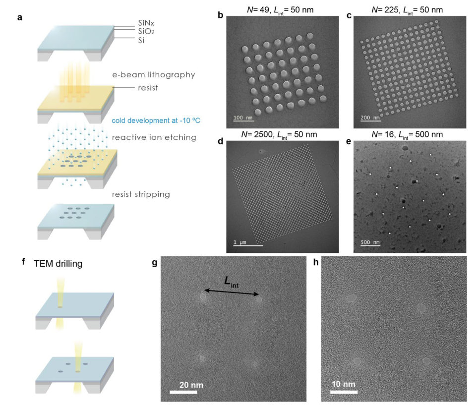
<figcaption class="paper-figure-caption"><b>Fig 1.</b> Figure 1. Two methods of nanopores array (NPA) fabrication. (a-e) Schematic illustration of EBL and RIE method, (a), and the associated TEM images, (b-e). (b) N = 49 and Lint = 50 nm; (c) N = 225 and Lint = 50 nm; (d) N = 2500 and Lint = 50 nm; (e) N = 16 and Lint = 500 nm. (f) Schematic illustration of TEM-drilling method for a sub-3 nm diameter square array. (g) Average pore diameter dpore = 2.2 ± 0.5 nm and interpore distance Lint = 44 ± 3.0 nm. Membrane thickness is 30 nm. (h) Average pore diameter dpore = 2.6 ± 0.4 nm, and interpore distance Lint = 23 ± 2.9 nm. Membrane thickness is 20 nm. The standard deviation is from the analysis of TEM images (see Methods).</figcaption>
</figure>
<figure class="paper-figure-card">
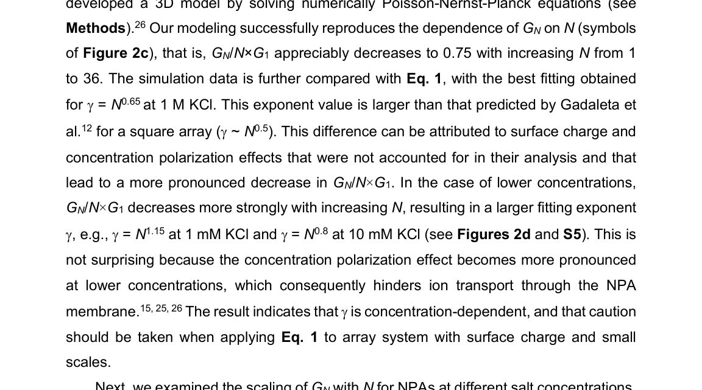
<figcaption class="paper-figure-caption"><b>Fig 2.</b> Figure 2b presents the conductance ratio of NPAs with N = 25 and N = 4 (= GN,25/GN,4)</figcaption>
</figure>
<figure class="paper-figure-card">
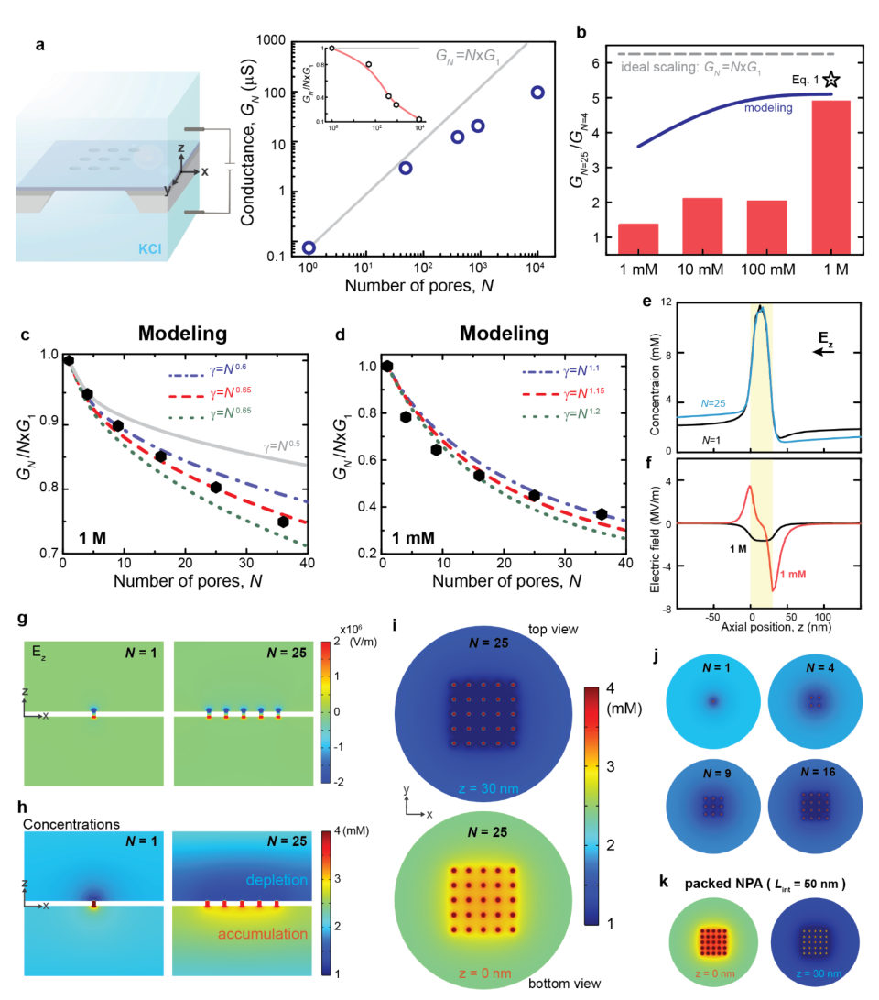
<figcaption class="paper-figure-caption"><b>Fig 3.</b> Figure 2. Ionic measurement: ionic conductance in NPAs in KCl solution, N = 1 to 10 000. (a) Schematic of the ionic measurement with NPA and the measured ionic conductance, GN, as a function of number of pores, N, at 1 M KCl. Gray line represents the linear scaling relation, GN = N×G1. Inset: the corresponding normalized conductance GN/(N×G1) as a function of N. G1 denotes the conductance of one pore (N = 1). (b) Conductance ratio between NPAs with N = 25 and N = 4 for various KCl concentrations from 1 mM to 1 M. Blue curve: 3D model simulation. Symbol: analytic formula Eq. 1 with γ ~ N0.65. Theoretical</figcaption>
</figure>
<figure class="paper-figure-card">
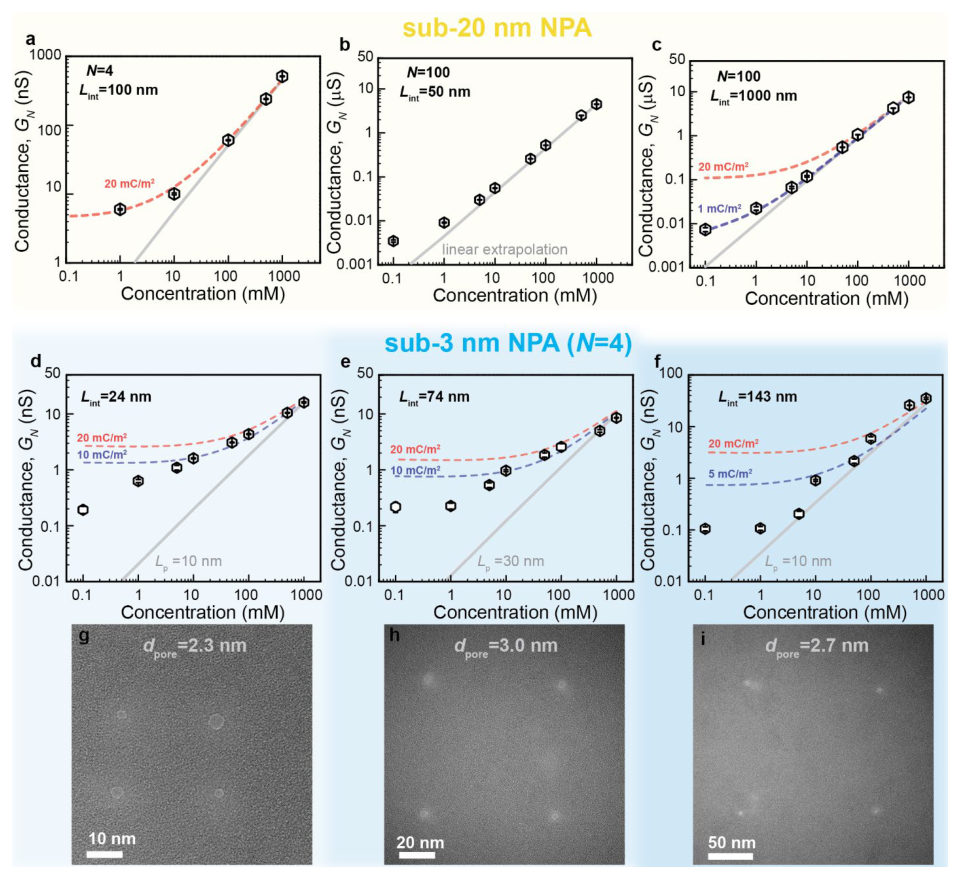
<figcaption class="paper-figure-caption"><b>Fig 4.</b> Figure 3. Ionic measurement: Scaling law of ionic conductance of NPA with salt (KCl) concentrations. (a-c) GN versus concentration for sub-20 nm diameter NPAs for various pore number, N = 4 to 100, and interpore distance, Lint. (a) N = 4 and Lint = 100 nm; (b) N = 100 and Lint = 100 nm; (c) N = 100 and Lint = 1000 nm. Gray line in (a-c) denotes the linear extrapolations of the conductance recorded at 1 M KCl. (d-f) GN versus concentration sub-3 nm diameter NPAs with different interpore distances, Lint, and the corresponding TEM images below the graphs, (g-f). (g) dpore = 2.3 ± 0.3 nm and Lint = 24 ± 0.3 nm; (h) dpore = 3.0 ± 0.4 nm and Lint = 74 ± 0.8 nm; (i) dpore = 2.7 ± 0.4 nm and Lint =...</figcaption>
</figure>
<figure class="paper-figure-card">
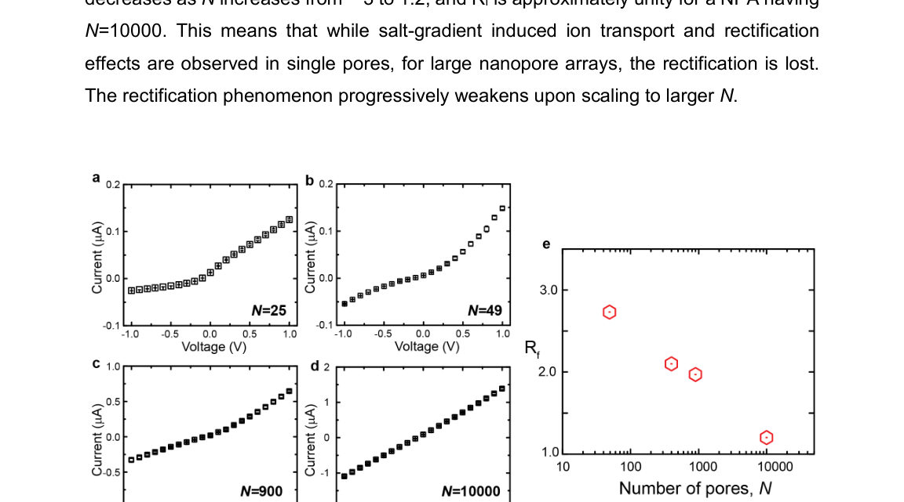
<figcaption class="paper-figure-caption"><b>Fig 5.</b> Figure 4. Ionic measurement: Ion current rectification with the presence of salt gradient in NPA. (a-d) Current-voltage characteristics of NPAs for different N at a salt gradient of 100 mM/1 mM. (a) N = 25 and Lint = 100 nm; (b) N = 49 and Lint = 50 nm; (c) N = 900 and Lint = 50 nm; (d) N = 10000 and Lint = 50 nm. (e) Rectification factor, Rf, vs. number of pores, N, on a linear-log scale. Rf is defined as |I(+1V)/I(-1V)|. Lint is fixed at 50 nm.</figcaption>
</figure>

**Summary.** This work systematically investigates how ionic conductance and energy harvesting scale in large nanopore arrays compared to single pores. The authors demonstrate that pore interactions, concentration polarization, and field suppression cause these properties to deviate significantly from simple linear scaling as the array size increases. This has major implications for designing nanoscale devices like desalination membranes.

**Why it may be interesting.** While focused on electrochemistry/materials science, the study of non-equilibrium transport phenomena (like ion flux under concentration gradients) involves complex many-body dynamics that share mathematical parallels with open quantum systems or strongly correlated charge transport models.

Detailed structure

**Main problem.** The study investigates how nonlinear ion transport phenomena, including ionic conductance, current rectification, and osmotic power generation, scale when moving from single nanopores to large arrays.

**Main result.** Conductance and current rectification effects significantly weaken or vanish as the number of pores increases, showing that simple scaling laws derived from single-pore models overestimate surface charge density. Osmotic power harvesting also shows a dramatic reduction upon upscaling to large arrays.

**Method.** The research combines systematic experimental measurements on fabricated nanopore arrays with rigorous 3D numerical modeling based on Poisson-Nernst-Planck theory.

**Model / system.** The physical system is solid-state nanopore arrays (NPAs) fabricated in $	ext{Si}_3	ext{N}_4$ membranes, studied across varying pore numbers ($N$) and diameters. The modeling involves solving the Poisson-Nernst-Planck equations to capture ion concentration polarization and electric field variations.

**Key observables.** Ionic conductance scaling laws ($	ext{G}_{	ext{NPA}}$ vs $N$), current rectification factor ($	ext{Rf}$), and osmotic power density.

**Important parameters / regimes.** Pore number ($N$ up to 10000), pore diameter (sub-3 nm to sub-20 nm), salt concentration, and interpore distance ($	ext{L}_{	ext{int}}$).

**Assumptions / limitations.** The analysis often compares results against single nanopore models, which are shown to be insufficient for large arrays due to neglected pore interactions and polarization effects.

**Figures summary.** Figures illustrate fabrication methods (EBL/RIE vs. TEM-drilling), conductance measurements versus $N$ and concentration, $	ext{I-V}$ curves showing current rectification ($	ext{Rf}$ vs $N$), and power density scaling comparisons.

**Paper structure.** The paper systematically investigates the dependence of ionic transport properties on pore number ($N$) and salt concentration. It first establishes conductance scaling deviations from linearity, then analyzes current rectification weakening with $N$, and finally quantifies the dramatic reduction in osmotic power upon upscaling, attributing these effects to polarization and field suppression.

Abstract

Understanding the ionic transport and scaling behaviors in nanopore arrays is essential for bridging fundamental ion physics and blue energy applications. By fabricating sub-3 nm and sub-20 nm diameter nanopore arrays (NPAs) spanning from few pores to N ~ 10000, we systematically investigate ionic conductance, ion current rectification, and osmotic energy conversion. We report the ionic conductance scaling laws and nonlinearity with nanopore number, with stronger deviations from linearity at lower salt concentrations. Experimental evidence reveals that surface-charge-governed conductance and ion current rectification progressively weaken with increasing N and even vanish as the NPA scales up to N ~ 10000, resulting in an underestimation of surface charge density. In a sub-3 nm densely packed array (separation ~ 25 nm), the conductance exhibits an anomalous power-law dependence on concentration, deviating markedly from the single nanopore characteristics, attributed to the strong pore interactions. Furthermore, osmotic power harvesting measurements reveal a substantial reduction in power density upon scaling, with decreases of up to three orders of magnitude over the same range. To elucidate the underlying mechanism, we developed rigorous 3D modeling showing that the nonlinear behavior originates from concentration polarization at pore entrances and suppressed electric field across NPAs, collectively hindering ion transport. Our work provides insight into nonlinear ion-transport scaling and reveals fundamental differences between transport phenomena in single nanopores and nanopore arrays.

[↑ back to top](#top)

### [Designing Strong and Broadband Nonreciprocal Thermal Radiation in Magnetic Topological Materials](http://arxiv.org/abs/2606.14861v1)

**Authors:** Yiyang Jiang, Yufei Zhao, Linxiao Zhu, Binghai Yan  
**Type:** theory · **Category:** other · **PDF:** <https://arxiv.org/pdf/2606.14861v1>  
**Analysis basis:** full PDF text, analyzed in chunks
**Topic relevance:** `exotic spin models in light-matter` **3/5** · `spintronics-quantum-optics interface` **3/5** · `Keldysh / 2PI / non-Gaussian methods` **1/5** · `analog quantum simulation` **1/5** · `correlated / nonlocal dissipation` **1/5** · `driven-dissipative phase transition` **1/5** · `interference shaping light` **1/5** · `methods for driven-dissipative` **1/5** · `non-equilibrium dynamics` **1/5**

↔ Scroll figures horizontally

<figure class="paper-figure-card">
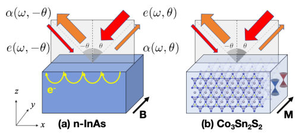
<figcaption class="paper-figure-caption"><b>Fig 1.</b> FIG. 1. Intrinsic nonreciprocal thermal photonics in a mag- netic topological material. (a) Conventional platform: An n-type InAs slab requires an external magnetic field B to break time-reversal symmetry. Heuristically, the Hall-effect- induced boundary flow (yellow arrows) breaks the balance be- tween directional absorptivity α(ω, θ) and emissivity e(ω, θ). The resulting nonreciprocity, α(ω, θ) ̸= e(ω, θ), is visualized by the varied arrow size. (b) Current work: A magnetic Weyl semimetal, spontaneously breaks time-reversal symmetry via its intrinsic magnetization M arising from the topological Weyl fermion band structure. The anomalous Hall conduc- tivity directly generates an...</figcaption>
</figure>
<figure class="paper-figure-card">
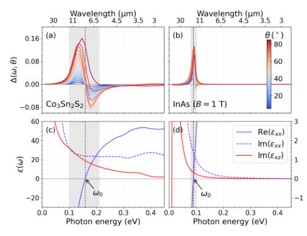
<figcaption class="paper-figure-caption"><b>Fig 2.</b> FIG. 2. Intrinsic nonreciprocity of magnetic Weyl semimetal Co3Sn2S2 versus the conventional InAs semiconductor setup. (a) Angle- and frequency-resolved nonreciprocity ∆(ω, θ) = e(ω, θ)−α(ω, θ) for Co3Sn2S2. Colors encode incidence angle; the x-axis is the photon energy (or the equivalent wavelength of photons). (b) Same for n-doped InAs under B = 1 T, com- puted with the identical Berreman solver using experimental parameters [31, 32]. (c,d) Corresponding dielectric functions for each material: solid blue lines show Re εxx(ω), dashed blue lines show Im εxx(ω) (optical loss), and red lines show the imaginary part of the off-diagonal (anomalous-Hall) com- ponent Im εxz(ω). Dashed vertical...</figcaption>
</figure>
<figure class="paper-figure-card">
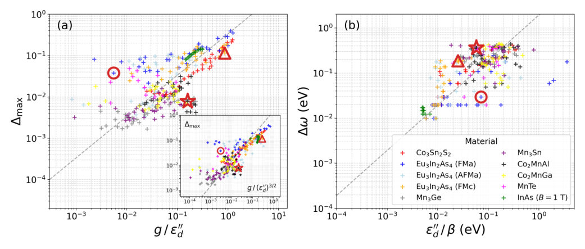
<figcaption class="paper-figure-caption"><b>Fig 3.</b> FIG. 3. Universal scaling laws for intrinsic nonreciprocal thermal radiation, verified across all candidate magnetic topological materials and benchmarked against InAs under an external magnetic field (B = 1 T). (a) Nonreciprocity strength scaling [Eq. (8)]: peak nonreciprocal contrast ∆max vs. the anomalous Hall figure of merit x = g/ε′′ d = Im εi̸=j/Im εii evaluated at the plasma/ENZ frequency ω0, corresponding to the low-loss semiconductor limit (p →1) of the general scaling ∆max ∝g/(ε′′ d)p</figcaption>
</figure>
<figure class="paper-figure-card">
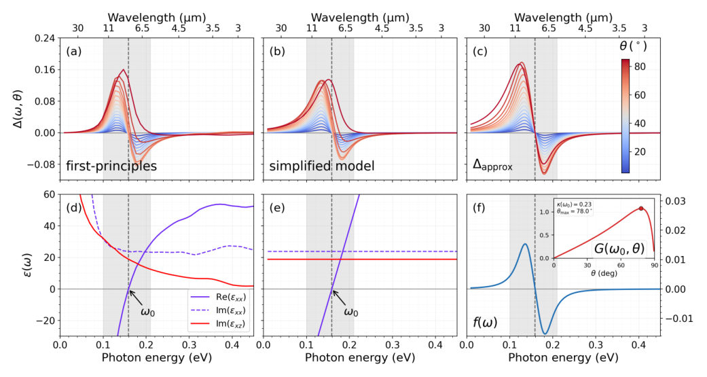
<figcaption class="paper-figure-caption"><b>Fig 4.</b> FIG. 4. Numerical validation of the factorization ∆approx(ω, θ) = 8 f(ω) G(κ, θ) [Eq. (D8)] on Co3Sn2S2 at µ = −0.17 eV, η = 0.01 eV, with purely imaginary off-diagonal gyrotropy (Re εxz = 0). Top row: ∆(ω, θ) = R(+θ) −R(−θ) computed from (a) the Berreman 4 × 4 transfer-matrix solver on the first-principles dielectric tensor of panel (d); (b) the same solver on the linearized 3-parameter ENZ model of panel (e), with Re εd(ω) = β(ω−ω0) and Im εd, εxz frozen at ω0; (c) the analytical ∆approx formula Eq. (D8) fed by the same simplified ε as panel (b). Bottom row: (d) first-principles ε of Co3Sn2S2; (e) simplified- model ε used as input to panels (b) and (c); (f) the material shape factor f(ω)...</figcaption>
</figure>
<figure class="paper-figure-card">
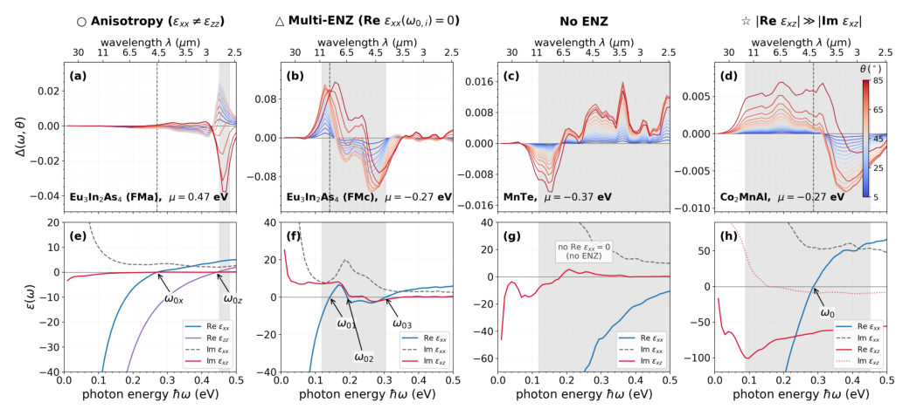
<figcaption class="paper-figure-caption"><b>Fig 5.</b> FIG. 5. Representative outliers of the scaling collapse, one per deviation mechanism, in the same format as Fig. 2. Top row: angle-resolved nonreciprocity ∆(ω, θ) (color encodes incidence angle 5◦–85◦); bottom row: the corresponding dielectric tensor with Re εxx (blue), the optical loss Im εxx (dashed grey), and the off-diagonal gyrotropy (crimson). Short arrows mark the ENZ crossings. (a,e) Eu3In2As4 (FMa), µ = +0.47 eV — diagonal optical anisotropy: the overlaid Re εzz (purple) crosses zero at ω0z ≈0.44 eV, distinct from ω0x ≈0.27 eV, and the nonreciprocity band (0.45–0.48 eV) sits near the former. (b,f) Eu3In2As4 (FMc), µ = −0.27 eV — multiple ENZ: Re εxx crosses zero three times (ω01,...</figcaption>
</figure>

**Summary.** This work develops a predictive framework to engineer strong and broadband nonreciprocal thermal emitters using intrinsic magnetism in topological materials. By combining first-principles calculations with advanced electrodynamics solvers, the authors demonstrate that magnetic Weyl semimetals outperform traditional semiconductors for field-free energy harvesting applications. The key contribution is establishing quantitative scaling laws governing material design.

**Why it may be interesting.** The rigorous derivation of quantitative design rules based on fundamental material parameters (like AHE response) for controlling thermal radiation is highly relevant to open quantum systems, particularly in designing engineered photonic or phononic structures that interact strongly with external fields or environments.

Detailed structure

**Main problem.** The goal is to design materials that exhibit strong, broadband nonreciprocal thermal radiation without requiring an external magnetic field.

**Main result.** Magnetic topological materials like Co3Sn2S2 were shown to achieve superior, intrinsic nonreciprocity compared to conventional semiconductors. The work established universal material design recipes based on the anomalous Hall response and optical loss.

**Method.** The study combines first-principles DFT calculations with Maxwell electrodynamics solvers (Berreman/S-matrix formalism) to compute frequency-dependent permittivity tensors.

**Model / system.** The physical system is magnetic topological materials, modeled using a gyrotropic dielectric tensor that incorporates magnetization-induced off-diagonal components. The analysis uses generalized $4 	imes 4$ Berreman matrix solvers for semi-infinite substrates.

**Key observables.** Nonreciprocal directional emissivity–absorptivity contrast ($\Delta(\omega, 	heta)$), maximum nonreciprocity ($\Delta_{\max}$), and operational bandwidth ($\Delta\omega$).

**Important parameters / regimes.** The material design is governed by the ratio of anomalous Hall response ($g$) to optical loss ($\epsilon''_{d}$) for strength, and $\epsilon''_{d}/eta$ for bandwidth.

**Assumptions / limitations.** The analysis relies on linearizing the permittivity tensor near an epsilon-near-zero (ENZ) crossing frequency ($\omega_0$).

**Figures summary.** Figures compare the nonreciprocity spectra of Co3Sn2S2 against InAs, demonstrating superior performance. Later figures validate derived scaling laws for $\Delta_{\max}$ and $\Delta\omega$ across various candidate materials.

**Paper structure.** The paper progresses from identifying the physical need (field-free nonreciprocity) to developing a theoretical framework using DFT/Kubo calculations, deriving universal scaling laws ($\Delta_{\max} \propto g/(\epsilon''_{d})^p$), and finally validating these laws with advanced numerical solvers.

Abstract

Breaking reciprocity in thermal radiation opens opportunities for energy harvesting, sensing, and thermal management. Traditional nonreciprocal radiative semiconductor devices need external magnetic field. In this work, we predict a series of magnetic topological materials for magnetic-field-free nonreciprocal thermal radiation in the infrared regime, by combining first-principles calculations with Maxwell electrodynamics. We find strong and broadband nonreciprocity in magnetic Weyl semimetals (e.g., Co$_3$Sn$_2$S$_2$), outperforming the conventional semiconductor such as InAs. Furthermore, we propose universal material design recipes: strong nonreciprocity requires a large anomalous Hall response relative to the optical loss, whereas the broadband response favors large optical loss and small dielectric dispersion. Our work establishes a predictive materials-discovery framework and quantitative design rules for next-generation magnet-free nonreciprocal thermal devices.

[↑ back to top](#top)

### [Distinguishing between Direct and Parametric Driving in Nanomechanics Using a Vibrating Carbon Nanotube](http://arxiv.org/abs/2606.16884v1)

**Authors:** Sam Dicker, Patrick Steger, Deepanjan Das, Saba M. Khan, Edward A. Laird  
**Type:** both · **Category:** other · **PDF:** <https://arxiv.org/pdf/2606.16884v1>  
**Analysis basis:** full PDF text, analyzed in chunks
**Topic relevance:** `driven-dissipative phase transition` **3/5** · `methods for driven-dissipative` **3/5** · `non-equilibrium dynamics` **2/5** · `non-equilibrium universality` **2/5** · `Keldysh / 2PI / non-Gaussian methods` **1/5** · `quantum measurements` **1/5** · `quantum optics experiment` **1/5**

↔ Scroll figures horizontally

<figure class="paper-figure-card">
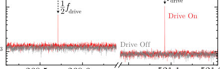
<figcaption class="paper-figure-caption"><b>Fig 1.</b> FIG. 2. Output power as a function of frequency when the device is driven at fdrive = 521.09 MHz at a gate voltage −8514 mV. The peak at fsb = fdrive/2 shows that the lower branch of the zeroth mode pair (f − 0 ≈260.54 MHz) is being excited by a drive at 2f − 0 , indicating a parametric mechanism. A peak also appears at fdrive, which results from a combina- tion of pure electrical mixing (i.e., not caused by mechanical motion), leakage signals into the TWPA, and the nonlinear electrical response to motion at fdrive/2. As expected, no peaks are seen when the drive is off.</figcaption>
</figure>
<figure class="paper-figure-card">
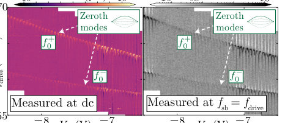
<figcaption class="paper-figure-caption"><b>Fig 2.</b> FIG. 1. (a) Device schematic. The transverse flexural modes of the suspended nanotube are tuned using the dc part of the voltage on gate G, and excited by the ac part. To probe the motion, a dc + ac voltage is applied between source S and drain D, inducing a current I(t) through the device, which contains components that arise from electromechanical mix- ing. (b) Transverse displacement directions for a mode pair. (c) Simplified measurement circuit (dc path not shown; see Sec. C for full version). The nominal attenuation on the drive and probe paths is indicated. Sidebands in the output, ap- pearing at frequency fsb, arise when the nanotube moves at that frequency. (d) The zeroth...</figcaption>
</figure>
<figure class="paper-figure-card">

<figcaption class="paper-figure-caption"><b>Fig 3.</b> Figure 2 demonstrates parametric resonance detected using the ac measurement. The drive was applied at fdrive = 521.09 MHz, approximately twice the mechanical frequency f − 0 . This induced sidebands at both fprobe ± fdrive and fprobe ± 1</figcaption>
</figure>
<figure class="paper-figure-card">
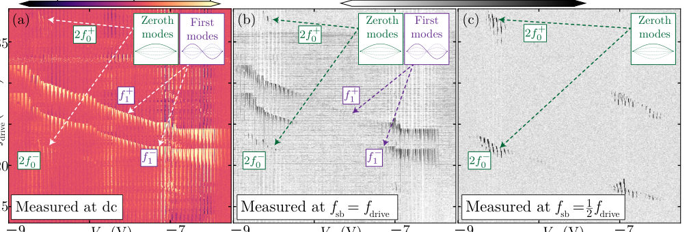
<figcaption class="paper-figure-caption"><b>Fig 4.</b> FIG. 3. Measurements around the first mode pair f ± 1 (i.e. the first overtone) using dc current (a) and ac detection (b, c). Panel (b), measured simultaneously with (a), shows the ac component at the drive frequency; panel (c) shows the component at half the drive frequency. Both the f ± 0 modes and the f ± 1 modes are visible in this figure, with the f ± 1 pair being directly driven (and therefore moving at fdrive) and the f ± 0 pair being parametrically driven at 2f ± 0 (and therefore moving at fdrive/2). Consistent with this picture, the directly driven modes appear strongly both at dc (a) and at the drive frequency (b); however, the directly driven modes do not appear in (c), because...</figcaption>
</figure>
<figure class="paper-figure-card">
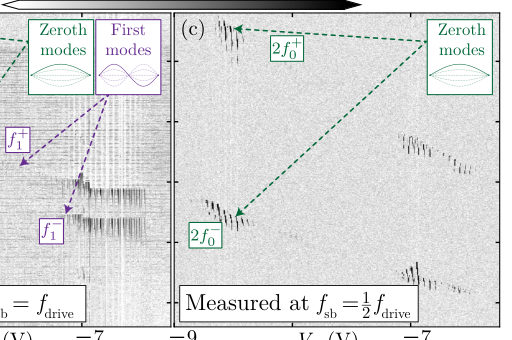
<figcaption class="paper-figure-caption"><b>Fig 5.</b> Figure 4 compares the ac response of the f − 0 mode un- der direct driving (panels (a, b)) and parametric driving (panels (c, d)). Panel (a) shows the output power when this mode was driven close to its mode frequency (i.e. with fdrive ≈f − 0 ) and measured at fsb = fdrive. As ex- pected, the response became stronger as the drive power was increased. Panel (b) plots the strength of the on- resonance response, extracted by taking the maximum of each column in (a), as a function of Pdrive. Fitting this to Eq. (1) confirms that over a wide range of drive power, the output is proportional to the drive. Panel (c) is the corresponding measurement when the same mode was driven near twice its mode...</figcaption>
</figure>

**Summary.** The paper details an advanced microwave measurement technique using a vibrating carbon nanotube resonator to resolve the ambiguity between direct and parametric driving forces. By detecting sidebands at half the drive frequency ($	ext{f}_{	ext{drive}}/2$), the authors confirm parametric excitation, while signals at $	ext{f}_{	ext{drive}}$ confirm direct motion. This methodology is crucial for characterizing nonlinearities in nanoscale mechanical oscillators.

**Why it may be interesting.** This work provides a sophisticated experimental technique for probing nonlinear dynamics in nanoscale mechanical systems by leveraging frequency mixing, which is highly relevant to understanding energy transfer and non-equilibrium physics in quantum devices.

Detailed structure

**Main problem.** The primary challenge is unambiguously distinguishing between direct mechanical excitation and parametric driving mechanisms in nanomechanical resonators, as standard electrical readout methods are insufficient.

**Main result.** By operating the device as an electromechanical mixer and measuring microwave sidebands, the authors successfully separated the signatures of direct motion from those of parametric resonance, even when drive frequencies were close.

**Method.** The technique involves using low-noise superconducting amplifiers to detect microwave sidebands ($	ext{f}_{	ext{sb}}$) at $	ext{f}_{	ext{drive}}/2$ (parametric signature) versus measuring signals directly at the drive frequency or DC (direct signature).

**Model / system.** The system is a vibrating carbon nanotube resonator integrated into a single-electron transistor (SET) structure. The analysis combines experimental measurements with theoretical models describing nonlinear stiffness terms and parametric resonance conditions.

**Key observables.** Sideband frequencies ($	ext{f}_{	ext{sb}}$), output power ($P_{	ext{out}}$) dependence on drive power, and the ratio of measured sidebands to the drive frequency (e.g., $	ext{f}_{	ext{drive}}/2$ vs. $	ext{f}_{	ext{drive}}$).

**Important parameters / regimes.** Drive frequencies ($	ext{f}_{	ext{drive}}$), probe frequency ($	ext{f}_{	ext{probe}}$), and the order of nonlinearity ($\ell$) governing parametric coupling.

**Assumptions / limitations.** The method assumes that direct driving yields signals at $	ext{f}_{	ext{drive}}$, while parametric driving generates distinct sidebands, allowing for spectral separation. Theoretical models rely on Taylor expansion of conductance and perturbation theory for resonance conditions.

**Figures summary.** Figures compare DC current measurements with AC detection at different sideband frequencies ($	ext{f}_{	ext{drive}}$ vs $	ext{f}_{	ext{drive}}/2$) to differentiate excitation types, and show power dependence fitting to theoretical models for both mechanisms.

**Paper structure.** The paper establishes the ambiguity of standard readout, introduces the mixer/sideband detection technique, demonstrates its success in separating direct ($	ext{f} \pm 1$ or $	ext{f}_{	ext{drive}}$) from parametric ($	ext{f} \pm 0$ or $	ext{f}_{	ext{drive}}/2$) responses for different modes, and finally extends the analysis to high-order nonlinearities.

Abstract

Parametric driving is a powerful route to amplification and nonlinear control in nanomechanical resonators, but its signatures can be ambiguous because standard dc electrical readout does not directly reveal the frequency of motion. Here we resolve this ambiguity by measuring the motional frequency of a vibrating carbon nanotube independently of the drive frequency. We operate the nanotube as an electromechanical mixer and detect microwave sidebands using a low-noise superconducting amplifier. This frequency-resolved readout distinguishes direct motion of the first overtone from parametric motion of the fundamental, even when the corresponding drive frequencies nearly coincide. The two mechanisms are further separated by their drive-power dependence. Beyond conventional parametric resonance at $2f_0$, we observe responses to driving at $3f_0$ and $4f_0$, consistent with high-order parametric excitation associated with nonlinear stiffness terms.

[↑ back to top](#top)

### [Intrinsic decay length in elastic localization](http://arxiv.org/abs/2606.15312v1)

**Authors:** Xiang Yu  
**Type:** theory · **Category:** disordered systems and neural networks · **PDF:** <https://arxiv.org/pdf/2606.15312v1>  
**Analysis basis:** full PDF text, analyzed in chunks
**Topic relevance:** `Frenkel-Kontorova` **3/5** · `non-equilibrium dynamics` **2/5** · `non-equilibrium universality` **2/5** · `Keldysh / 2PI / non-Gaussian methods` **1/5** · `analog quantum simulation` **1/5** · `correlated / nonlocal dissipation` **1/5** · `driven-dissipative phase transition` **1/5** · `methods for driven-dissipative` **1/5**

↔ Scroll figures horizontally

<figure class="paper-figure-card">
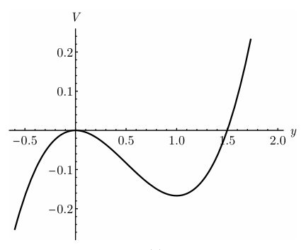
<figcaption class="paper-figure-caption"><b>Fig 1.</b> Figure 1: (a) The potential V pyq “ ´ 1</figcaption>
</figure>
<figure class="paper-figure-card">
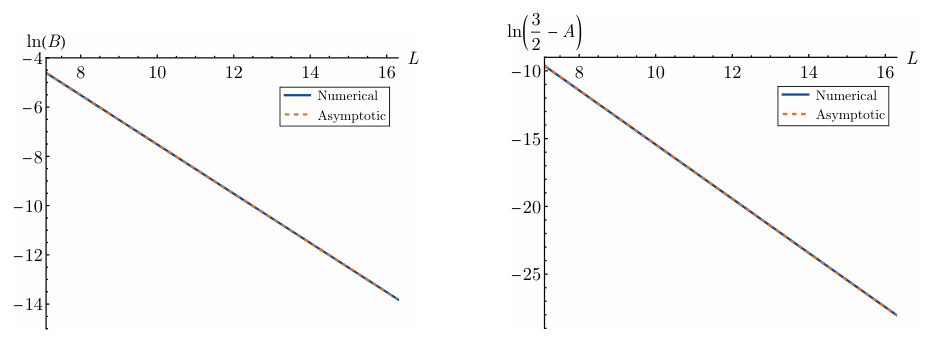
<figcaption class="paper-figure-caption"><b>Fig 2.</b> Figure 2: Comparison between numerical results and two-term asymptotic predictions for (a) ln B and (b) ln ` 3</figcaption>
</figure>
<figure class="paper-figure-card">
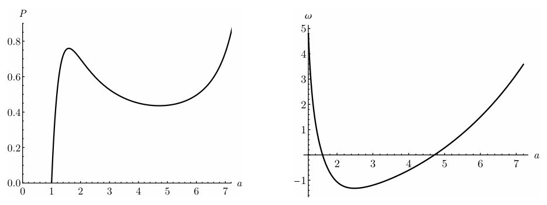
<figcaption class="paper-figure-caption"><b>Fig 3.</b> Figure 3: (a) Pressurestretch relation for the homogeneous deformation with fixed N “ 0. (b) Variation of the linear stability coefficient ω with respect to the inflation stretch.</figcaption>
</figure>
<figure class="paper-figure-card">
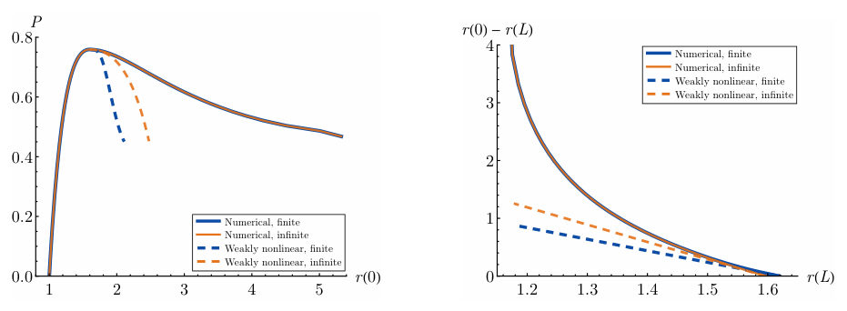
<figcaption class="paper-figure-caption"><b>Fig 4.</b> Figure 4: (a) Relation between the pressure and the maximum inflation radius. (b) Evolution of the bulging amplitude with the end radius.</figcaption>
</figure>
<figure class="paper-figure-card">

<figcaption class="paper-figure-caption"><b>Fig 5.</b> Fig. 4 shows the pressure–radius relation and the evolution of the bulging amplitude, while Fig. 5 compares the fully nonlinear finite- and infinite-domain solutions together with their weakly nonlinear approximations near the bifurcation point. Initially, the tube deforms homogeneously as the pressure increases. At the pressure maximum, the homogeneous state loses stability and a localized bulging mode emerges. The subsequent post-bifurcation evolution is accompanied by a decrease in pressure as the bulge amplitude grows. A first key observation from Fig. 4 is that the finite- and infinite-domain solution branches become nearly indistinguishable shortly after bifurcation. This indicates a rapid...</figcaption>
</figure>

**Summary.** This work establishes a rigorous criterion, the intrinsic decay length, to quantify when localized solutions in finite elastic structures approach their infinite-domain limits. By analyzing prototypical models from mechanics, it provides a unified framework explaining the convergence rate and the differing validity regimes of weakly nonlinear approximations in both finite and infinite settings.

**Why it may be interesting.** While focused on classical elasticity, the mathematical machinery—comparing solutions based on different topological structures (periodic vs. homoclinic) and identifying a characteristic length scale ($\ell_{dec}$) that dictates the breakdown of approximations—is highly relevant to understanding crossover regimes in quantum systems or disordered media.

Detailed structure

**Main problem.** The core problem is determining when localized solutions in finite elastic structures can be accurately approximated by their simpler infinite-domain counterparts.

**Main result.** Convergence occurs exponentially once the structural length exceeds a characteristic intrinsic decay length, which governs the validity of both approximations and weakly nonlinear theories.

**Method.** Theoretical analysis using phase-plane methods, asymptotic matching (inner/outer regions), and quantitative error estimation via Grönwall-type inequalities.

**Model / system.** The study uses prototypical localization models derived from continuum mechanics, applied to physical systems like bulging in membrane tubes or helical buckling in twisted rods. The analysis compares solutions governed by periodic orbits (finite domain) to those governed by homoclinic orbits (infinite domain).

**Key observables.** Intrinsic decay length ($\ell_{dec}$), amplitude measures of localized deformation, and the difference between finite-domain and infinite-domain solution profiles.

**Important parameters / regimes.** Structural length ($L$), loading parameter ($\gamma$), and the intrinsic decay length ($\ell_{dec}$).

**Assumptions / limitations.** The analysis assumes that the system can be modeled by a prototypical nonlinear ODE, allowing for comparison between periodic (finite) and homoclinic (infinite) solutions.

**Figures summary.** Figures compare amplitude measures and centerline positions of localized states across varying loading parameters ($\gamma$), showing rapid convergence towards the infinite-domain solution as $\gamma$ decreases or $L$ increases relative to $\ell_{dec}$.

**Paper structure.** The paper develops a unified geometric framework by comparing finite-domain boundary value problems (periodic orbits) with their infinite-domain limits (homoclinic orbits). It applies this framework sequentially to membrane bulging and helical buckling, culminating in the definition of the intrinsic decay length.

Abstract

Localization in finite elastic structures is often studied using infinite-domain solutions, which avoid the explicit treatment of boundaries and admit simpler analytical descriptions. Yet it remains poorly understood when finite-domain localized states can be accurately approximated by their infinite-domain counterparts. In this work, we show that the accuracy is controlled by an intrinsic decay length. Using a prototypical localization model, we show that finite-domain localized solutions converge exponentially to the corresponding infinite-domain localized solution once the structural length exceeds the intrinsic decay length. The intrinsic decay length also explains the markedly different validity regimes of finite- and infinite-domain weakly nonlinear approximations. It further has important implications for numerical computation, since once the structural length exceeds the intrinsic decay length, localized solutions corresponding to different domain lengths differ only by exponentially small quantities, making them increasingly difficult to distinguish numerically. The theoretical predictions are validated using two representative localization problems: bulging in membrane tubes and localized helical buckling in twisted rods. The present work provides a unified geometric framework for understanding localization transition, asymptotic validity, and numerical computation in elastic localization.

[↑ back to top](#top)

### [Topological Surface Charge Detection via Terahertz Time-domain Spectroscopy](http://arxiv.org/abs/2606.15371v1)

**Authors:** Tong Shen, Yiyang Xie, Yucheng Dai, Yifan Zhang, Yuanze Li, Xufeng Kou, Tian Liang  
**Type:** experiment · **Category:** other · **PDF:** <https://arxiv.org/pdf/2606.15371v1>  
**Analysis basis:** full PDF text, analyzed in chunks
**Topic relevance:** `exotic spin models in light-matter` **3/5** · `spintronics-quantum-optics interface` **3/5** · `quantum optics experiment` **2/5** · `Keldysh / 2PI / non-Gaussian methods` **1/5** · `analog quantum simulation` **1/5** · `driven-dissipative phase transition` **1/5** · `interference shaping light` **1/5**

↔ Scroll figures horizontally

<figure class="paper-figure-card">
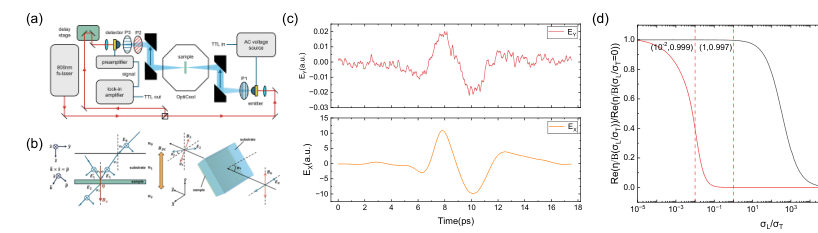
<figcaption class="paper-figure-caption"><b>Fig 1.</b> Fig. 1 THz time-domain spectroscopy and charge accumulation. (a) Experimental setup for</figcaption>
</figure>
<figure class="paper-figure-card">
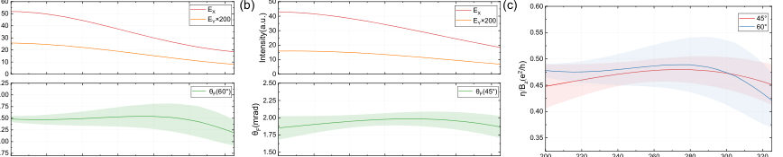
<figcaption class="paper-figure-caption"><b>Fig 2.</b> Fig. 2 Angular dependence of Faraday rotation and charge accumulation. Intensity spectra</figcaption>
</figure>
<figure class="paper-figure-card">
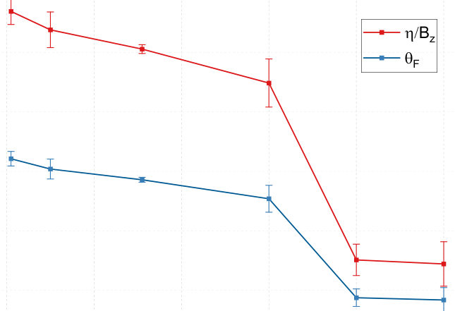
<figcaption class="paper-figure-caption"><b>Fig 3.</b> Fig. 3 Temperature dependence of Faraday rotation and charge accumulation. (a) Faraday</figcaption>
</figure>
<figure class="paper-figure-card">
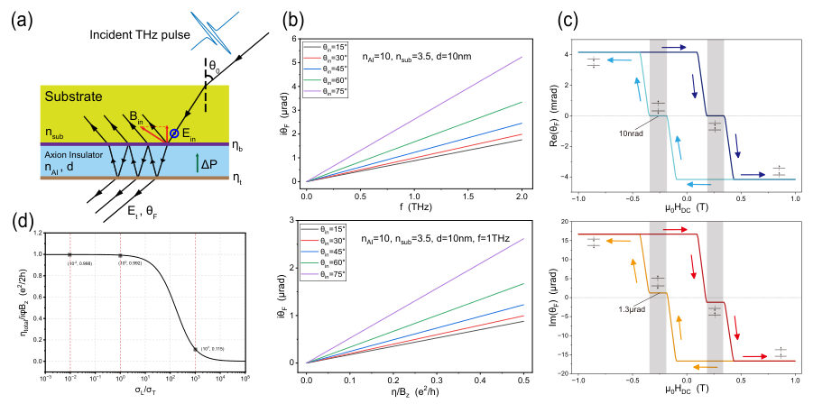
<figcaption class="paper-figure-caption"><b>Fig 4.</b> Fig. 4 Optical detection of the topological magnetoelectric effect. (a) Schematic of probing</figcaption>
</figure>

**Summary.** This paper reports on an experimental method utilizing Terahertz Time-domain Spectroscopy to optically detect the topological surface charge accumulation predicted by the Topological Magnetoelectric Effect in topological insulator thin films. By measuring Faraday rotation at oblique incidence, the authors demonstrate a technique robust against material conductivity limitations, providing a direct pathway toward verifying fundamental quantum electrodynamic effects.

**Why it may be interesting.** While not directly related to standard AMO topics like cold atoms or cavity QED, this work involves probing fundamental quantum electrodynamics effects (magnetoelectric coupling) using advanced optical spectroscopy techniques that share conceptual links with light-matter interaction studies in open systems.

Detailed structure

**Main problem.** The primary goal is to develop an optical method using THz-TDS to directly detect the quantized surface charge accumulation ($\eta/B_z$) associated with the Topological Magnetoelectric Effect (TME) in 3D topological insulators.

**Main result.** The technique successfully measures Faraday rotation at oblique incidence, demonstrating robustness against finite longitudinal conductivity and showing consistent results across different incident angles ($45^\circ$ vs $60^\circ$).

**Method.** Terahertz Time-domain Spectroscopy (THz-TDS) is employed to measure the Faraday rotation angle ($	heta_F$) in thin films under oblique incidence, allowing for the extraction of surface charge density.

**Model / system.** The study uses chromium-doped $(	ext{Bi},	ext{Sb})_2	ext{Te}_3$ thin films exhibiting topological properties. The physics is governed by the TME, which predicts a quantized surface charge accumulation proportional to an applied magnetic field component ($B_z$).

**Key observables.** Faraday rotation angle ($	heta_F$), extracted surface charge density ($\eta/B_z$), and the frequency-linear imaginary part of the Faraday rotation for axion insulators.

**Important parameters / regimes.** Oblique incidence angles ($45^\circ, 60^\circ$); low temperatures (e.g., $2	ext{ K}$); comparison between optical vs. transport measurements ($\sigma_L/\sigma_T$).

**Assumptions / limitations.** The derivation relies on modeling the transmitted electric field using transmission and propagation matrices; for axion insulators, approximations like $\phi \ll 1$ are used.

**Figures summary.** Figures illustrate the THz-TDS setup geometry (oblique incidence), time-domain waveforms showing $E_X$ and $E_Y$, angular dependence of Faraday rotation, and comparisons demonstrating the optical method's robustness against longitudinal conductivity ($\sigma_L$).

**Paper structure.** The paper introduces the TME in TIs, details the THz-TDS experimental setup for measuring oblique incidence effects, derives the relationship between $	heta_F$ and $\eta/B_z$, presents measurements confirming consistency across angles, and discusses extensions to axion insulators.

Abstract

The topological magnetoelectric effect (TME) in three-dimensional topological insulators manifests as a quantized surface charge accumulation proportional to an applied magnetic field. Here we demonstrate an optical method using terahertz time-domain spectroscopy (THz-TDS) to detect surface charge accumulation in a chromium-doped (Bi,Sb)$_2$Te$_3$ thin film under oblique incidence, achieving sub-milliradian Faraday rotation precision. Unlike transport probes that require ultralow longitudinal conductivity, this optical technique is robust against finite $σ_L$, degrading by less than $0.3\%$ even when $σ_L \sim σ_T$. We extract the charge accumulation $η/B_z$ from the measured Faraday rotation and show results at $45^\circ$ and $60^\circ$ coincide within experimental uncertainty. Extending this to axion insulators, we predict that the TME produces an imaginary Faraday rotation linear in frequency, whose slope directly reflects the single-surface charge density. With improved sample thickness and precision, this optical scheme provides a viable pathway toward direct verification of the TME and four-dimensional quantum Hall effect.

[↑ back to top](#top)

### [Oxidation-induced ultrafast spin-to-orbital conversion at heavy-metal interfaces](http://arxiv.org/abs/2606.15128v1)

**Authors:** Xiaoxue Zeng, Tianyi Zhang, Yaokai Niu, Qiye Wen, Zhiyong Zhong, Zhi-Min Liao, Peng Yan, Xiufeng Han, Lichuan Jin  
**Type:** experiment · **Category:** other · **PDF:** <https://arxiv.org/pdf/2606.15128v1>  
**Analysis basis:** full PDF text, analyzed in chunks
**Topic relevance:** `spintronics-quantum-optics interface` **3/5** · `driven-dissipative phase transition` **2/5** · `non-equilibrium dynamics` **2/5** · `Kondo & dissipative impurity` **1/5** · `correlated / nonlocal dissipation` **1/5** · `exotic spin models in light-matter` **1/5** · `non-equilibrium universality` **1/5**

↔ Scroll figures horizontally

<figure class="paper-figure-card">
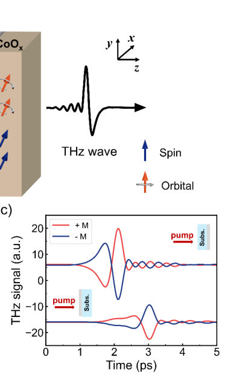
<figcaption class="paper-figure-caption"><b>Fig 1.</b> FIG. 1. (a) Schematic illustration of the THz emission from W/Co/SiO2 heterostructure.</figcaption>
</figure>
<figure class="paper-figure-card">
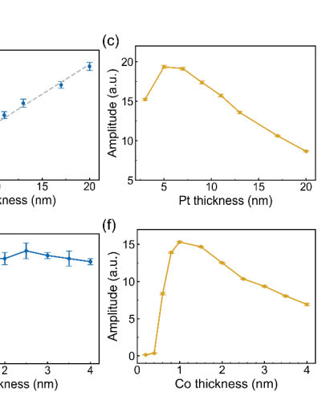
<figcaption class="paper-figure-caption"><b>Fig 2.</b> FIG. 2. (a) THz emission signal from W(tW)/Co(1)/SiO2 heterostructures with varying</figcaption>
</figure>
<figure class="paper-figure-card">
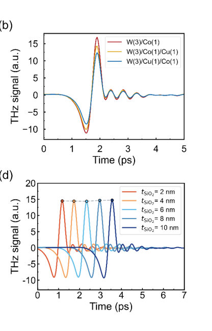
<figcaption class="paper-figure-caption"><b>Fig 3.</b> FIG. 3. (a) THz emission signal from NM/Co/SiO2 heterostructure, where NM=W, Pt,</figcaption>
</figure>
<figure class="paper-figure-card">
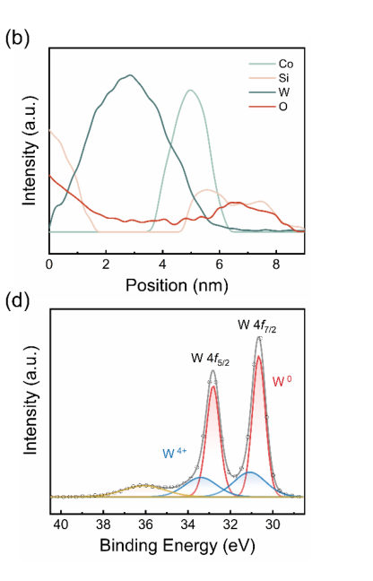
<figcaption class="paper-figure-caption"><b>Fig 4.</b> FIG. 4. (a) Cross-sectional HAADF-STEM image of the W(5)/Co(1)/SiO2</figcaption>
</figure>

**Summary.** This work demonstrates that interfacial oxidation provides a powerful handle to engineer efficient conversion from spin angular momentum to orbital angular momentum in heavy-metal heterostructures. By measuring ultrafast THz emission, the authors prove this effect is maximized at oxidized interfaces, opening a general route for designing high-performance orbitronic terahertz emitters.

**Why it may be interesting.** While not directly related to quantum information protocols, the study involves ultrafast dynamics, spin-orbit coupling effects, and engineered electronic states, which are foundational concepts in condensed matter physics relevant to advanced quantum devices.

Detailed structure

**Main problem.** The study aims to understand how interfacial oxidation can be engineered to control and enhance spin-to-orbital conversion in heavy-metal/ferromagnetic heterostructures for applications in orbitronic terahertz emitters.

**Main result.** Interfacial oxidation at the W/Co interface drives a highly efficient spin-to-orbital conversion, evidenced by THz emission amplitudes significantly larger than conventional bilayers. This mechanism is shown to be generic across different heavy metals and scales with their spin-orbit coupling strength.

**Method.** The research employs time-resolved Terahertz (THz) emission spectroscopy on engineered thin-film heterostructures, complemented by structural characterization using STEM/EELS and XPS.

**Model / system.** The physical system consists of multilayered metal/oxide heterostructures, primarily W/Co/SiO2. The mechanism relies on the electronic structure modification (orbital texture) induced by oxygen incorporation at the interfaces between heavy metals and ferromagnets.

**Key observables.** THz emission amplitude enhancement ($\sim 3	imes$ over Co/Pt), linear time delay scaling with W thickness, and chemical states confirmed via XPS.

**Important parameters / regimes.** Heavy metal type (e.g., Pt, Ta vs Ti, Cu), layer thicknesses ($t_W$, $t_{Co}$), and the degree of interfacial oxidation.

**Assumptions / limitations.** The observed THz enhancement is directly attributable to orbital-current transport originating from the oxidized interface, which acts as a trigger for spin-to-orbital conversion.

**Figures summary.** Figures compare THz signals across various heterostructures and show the linear dependence of the time delay on W thickness. Structural characterization confirms interfacial intermixing and oxidation states in the critical W/Co/SiO2 structure.

**Paper structure.** The paper establishes the problem by noting the unexplored role of oxidation in spin-to-orbital conversion, presents THz measurements showing enhancement in W/Co/SiO2, systematically varies layer parameters to pinpoint the oxidation mechanism, and concludes with a general framework for orbitronic emitter design.

Abstract

Oxidation engineering provides a route to control orbital degrees of freedom, yet its role in spin-to-orbital conversion remains largely unexplored. Here, we report an efficient spin-to-orbital conversion mechanism driven by interfacial oxidation at heavy-metal interfaces. In W/Co/SiO2 heterostructures, terahertz emission exhibits a time delay that scales linearly with the W thickness, identifying orbital-current transport as the dominant origin. The emission amplitude is approximately three times larger than that of Co/Pt bilayers, indicating highly efficient conversion from spin to orbital angular momentum. Systematic variation of Co thickness, stoichiometry, and interface configuration reveals that the effect originates from oxidation of the W layer at the W/Co interface, which modulates the interfacial orbital texture. We further show that this mechanism is generic across different heavy metals and scales with their spin-orbit coupling strength. These results establish oxidation as an effective handle to engineer spin-to-orbital conversion and provide a general route toward orbitronic terahertz emitters.

[↑ back to top](#top)

### [Optical vortex probe of loop-current chirality in moiré materials](http://arxiv.org/abs/2606.16676v1)

**Authors:** Nobuhiko Yokoshi, Akihito Kato  
**Type:** both · **Category:** other · **PDF:** <https://arxiv.org/pdf/2606.16676v1>  
**Analysis basis:** full PDF text, analyzed in chunks
**Topic relevance:** `interference shaping light` **3/5** · `quantum optics experiment` **2/5** · `Keldysh / 2PI / non-Gaussian methods` **1/5** · `analog quantum simulation` **1/5** · `driven-dissipative phase transition` **1/5** · `methods for driven-dissipative` **1/5** · `spintronics-quantum-optics interface` **1/5**

↔ Scroll figures horizontally

<figure class="paper-figure-card">
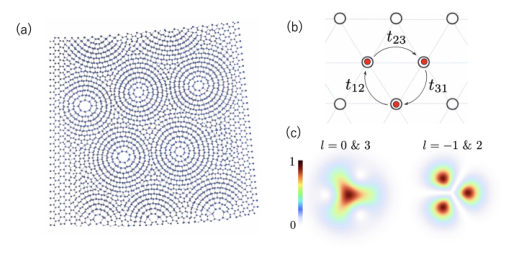
<figcaption class="paper-figure-caption"><b>Fig 1.</b> FIG. 1. (a) Schematic of TBG, where a small twist angle between two graphene layers gives rise to a moir´e superlattice. (b) Three selected moir´e-superlattice sites (filled red circles; open circles indicate neighboring sites) form an elementary triangular plaquette connected by effective interlayer-assisted hoppings t12, t23, and t31. (c) Intensity profiles of optical fields formed by superposing two optical vortices with differ- ent OAM values, exhibiting C3 symmetry.</figcaption>
</figure>

**Summary.** The paper introduces an optical technique using structured light beams to measure the intrinsic loop-current chirality within moiré materials like twisted bilayer graphene. By exploiting the threefold ($C_3$) rotational symmetry, they demonstrate that this chiral signature is uniquely isolated in the $\Delta\ell=3$ channel of a measured photocurrent. This provides a powerful, symmetry-resolved diagnostic tool for characterizing geometric properties in quantum electronic systems.

**Why it may be interesting.** This work bridges concepts from topological physics (Berry curvature, chirality) with advanced quantum optics techniques (OAM filtering), providing a concrete, measurable protocol to detect subtle geometric properties in solid-state systems that might otherwise be masked by disorder or symmetry breaking.

Detailed structure

**Main problem.** The authors propose a method to optically probe the intrinsic loop-current chirality present in moiré materials, such as twisted bilayer graphene.

**Main result.** They show that preserving $C_3$ symmetry allows the intrinsic chiral contribution to be isolated specifically in the $\Delta\ell=3$ channel of the helicity-dependent dc photocurrent. This establishes angular-momentum-resolved nonlinear optics as a powerful diagnostic tool for geometric chirality.

**Method.** The method uses interfering optical vortex beams carrying Orbital Angular Momentum (OAM) ($\ell$) to act as an angular-momentum filter, projecting the nonlinear response onto specific harmonic channels ($\Delta\ell$).

**Model / system.** The primary system is moiré materials, exemplified by twisted bilayer graphene (TBG), which hosts electronic circulation and geometric phases on triangular plaquettes. The theoretical framework involves analyzing the nonlinear optical response kernel $K_{\omega}(\mathbf{k})$ based on the Bistritzer–MacDonald Hamiltonian.

**Key observables.** Helicity-dependent dc photocurrent, decomposed into OAM-resolved spectral weights $A(\Delta\ell)(\omega)$, and the loop phase accumulation $\Phi_	riangle$.

**Important parameters / regimes.** The selection rule depends critically on the preservation of $C_3$ symmetry; strain or perturbations break this symmetry, activating different channels like $\Delta\ell=2$.

**Assumptions / limitations.** The analysis assumes that local $C_3$ symmetry dictates the selection rules for the OAM channels, even when considering finite beam waists or rotational disorder.

**Figures summary.** Figures illustrate the schematic of TBG moiré superlattices, the elementary triangular plaquettes forming closed loops, and intensity profiles demonstrating how optical vortices interact with $C_3$ symmetry.

**Paper structure.** The paper develops a theoretical framework linking intrinsic geometric chirality (related to loop currents) to specific angular harmonics ($\Delta\ell=3$) in the nonlinear optical response. It contrasts this intrinsic signal against contributions from symmetry-breaking perturbations ($\Delta\ell=2$), proposing diagnostic ratios for experimental verification.

Abstract

We propose a symmetry-resolved optical probe of intrinsic loop-current chirality in moiré materials, with twisted bilayer graphene as a representative realization. Interlayer interference generates chiral electronic circulation on triangular plaquettes, giving rise to an intrinsic geometric chirality that enters the second-order response through a $C_3$-selected angular harmonic of the Berry curvature and can be isolated by the orbital-angular-momentum difference $Δ\ell$ of interfering optical vortex beams. When moiré $C_3$ symmetry is preserved, the intrinsic contribution appears in the $Δ\ell=3$ channel of the helicity-dependent dc photocurrent, whereas $C_3$-breaking perturbations activate additional channels. These results establish angular-momentum-resolved nonlinear optics as a route to probing geometric chirality in moiré and other symmetry-engineered quantum materials.

[↑ back to top](#top)

### [Valley Valves at Domain Walls in Symmetry-Broken Rhombohedral Graphene](http://arxiv.org/abs/2606.14878v1)

**Authors:** Vo Tien Phong, Elsa Prada, Pablo San-Jose, Francisco Guinea, Eugene J Mele  
**Type:** theory · **Category:** strongly correlated electrons · **PDF:** <https://arxiv.org/pdf/2606.14878v1>  
**Analysis basis:** full PDF text, analyzed in chunks
**Topic relevance:** `Keldysh / 2PI / non-Gaussian methods` **3/5** · `spintronics-quantum-optics interface` **2/5** · `Kondo & dissipative impurity` **1/5** · `analog quantum simulation` **1/5** · `driven-dissipative phase transition` **1/5** · `methods for driven-dissipative` **1/5** · `non-equilibrium dynamics` **1/5**

↔ Scroll figures horizontally

<figure class="paper-figure-card">
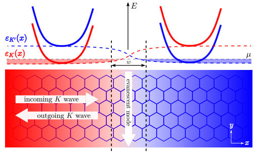
<figcaption class="paper-figure-caption"><b>Fig 1.</b> Figure 1. Schematic illustration of a valley domain wall along the armchair direction. Energy bands on the two sides of a domain wall illustrating the spatial variation of valley polarization ετ(x) along the x direction, with µ being the chemical potential. The valley flavor is exchanged across the domain wall: K for x &lt; 0 and K′ for x &gt; 0. For a step-function wall, an incoming K wave is reflected off of an evanescent K mode, which carries current along the domain wall, into an outgoing K wave. Perfect reflection also occurs when the domain wall has finite width w as along as there is no intervalley coherence in the wall.</figcaption>
</figure>
<figure class="paper-figure-card">
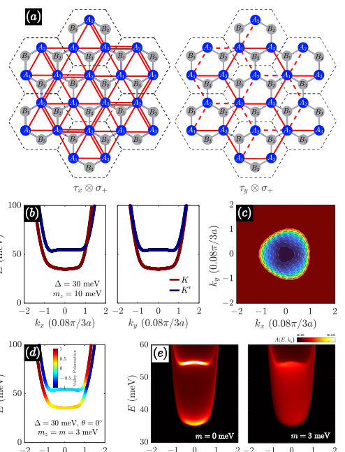
<figcaption class="paper-figure-caption"><b>Fig 2.</b> Figure 2. Intervalley scattering on the active sublattice. (a) Schematic hopping model realizing the intervalley mixing interac- tions τxσ+ and τyσ+ with bond strengths distinguished by single, double, and dashed red lines connecting atoms. (b) Bulk band struc- ture of tetralayer rhombohedral graphene along the kx (left) and ky (right) directions with ∆= 30 meV and mz = 10 meV. The color represents valley polarization. (c) Energy map for the conduction band (K valley) in (b) showing the isoenergy contours at carrier densities n = 0, 0.1, 0.2, ..., 1.0 × 1012 cm−2. (d) Band structure with intervalley coupling τxσ+ for mz = m = 3 meV. (e) Spectral function A(E, ky) of a domain wall without...</figcaption>
</figure>
<figure class="paper-figure-card">
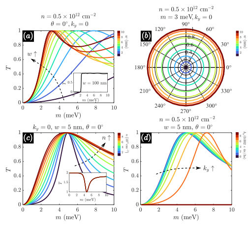
<figcaption class="paper-figure-caption"><b>Fig 3.</b> Figure 3. Transmission across a domain wall with intervalley cou- pling. (a) Transmission as a function of the strength of intervalley coupling m at θ = 0◦, ky = 0, and n = 5 × 1011 cm−2. The in- set shows the transmission of a wide domain wall w = 100 nm. (b) Dependence of the transmission on the angle θ of the intervalley in- teraction at m = 3 meV, ky = 0, and n = 5 × 1011 cm−2. Different colored curves in (a,b) correspond to different domain wall widths w. (c) Transmission at different filling densities in the quarter-metal phase for ky = 0, w = 5 nm, and θ = 0◦. The inset shows transmis- sion at a density outside the quarter-metal phase where both valleys are occupied on both sides of...</figcaption>
</figure>
<figure class="paper-figure-card">
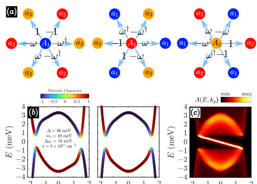
<figcaption class="paper-figure-caption"><b>Fig 4.</b> Figure 4. Finite-momentum chiral p-wave superconductivity. (a) Real-space representation of the hopping processes between the elec- tron (Ai) and hole (ai) sectors in Eq. (10). (b) Bulk band structure along the kx and ky directions color-coded by particle character (+1 for electrons and −1 for holes). (c) Spectral function for a semi- infinite plane with an armchair termination showing the presence of a chiral Majorana branch traversing the bulk gap due to nontrivial Chern topology.</figcaption>
</figure>
<figure class="paper-figure-card">
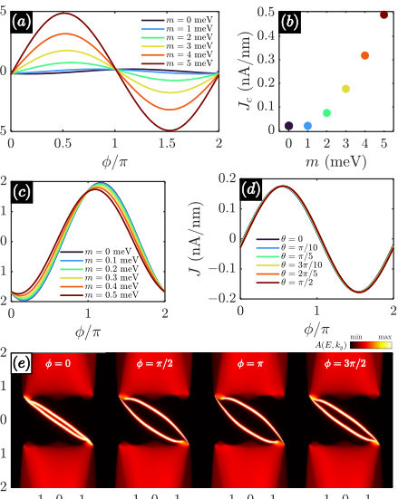
<figcaption class="paper-figure-caption"><b>Fig 5.</b> Figure 5. Current-phase relation for supercurrent across an SNS’ Josephson junction. (a) CPR for different values of intervalley co- herence m ∈[0, 1, 2, 3, 4, 5] meV with θ = 0◦. (b) Plot of the super- current density amplitude Jc as a function of m at θ = 0◦. (c) Same as (a) but for a smaller range of m ∈[0, 0.1, 0.2, 0.3, 0.4, 0.5] meV. (d) CPR at fixed m = 3 meV for different values of θ. (e) BdG spec- tral function for different values of ϕ with m = 5 meV and θ = 0. For all plots, N = 4, mz = 30 meV, n = 5 × 1011 cm−2, w = 2 nm, ∆= 30 meV, and ∆SC = 10 meV.</figcaption>
</figure>

**Summary.** This theoretical work elucidates that domain walls in valley-polarized graphene act as electronic valves, blocking current unless intervalley hybridization is present. This mechanism is critical both for mediating normal state electron transport and sustaining supercurrent flow across superconducting junctions connecting opposite-chirality regions.

**Why it may be interesting.** The concept of a 'valley valve' controlling charge transport via symmetry-protected coupling mechanisms is highly relevant to understanding topological superconductivity and engineered quantum devices in 2D materials.

Detailed structure

**Main problem.** The study investigates how electron transport across domain walls separating regions with opposite valley polarization is governed by intervalley interactions in symmetry-broken rhombohedral graphene.

**Main result.** Intervalley coupling is crucial, acting as a 'valve' that enables both electron transmission in the normal state and supports an appreciable supercurrent in the superconducting state.

**Method.** The work employs Green's function formalism, Bogoliubov-de Gennes (BdG) theory for superconductivity, and numerical simulations to solve boundary value problems across domain walls.

**Model / system.** The system is rhombohedral multilayer graphene polarized by a displacement field, exhibiting time-reversal symmetry breaking. The analysis uses effective Hamiltonians incorporating valley polarization ($\epsilon_K(x), \epsilon_{K'}(x)$) and superconducting pairing amplitudes ($\Delta_{	ext{SC}}$).

**Key observables.** Electron transmission coefficient ($T$), Supercurrent density ($J_c$), Current-Phase Relation (CPR).

**Important parameters / regimes.** Domain wall width ($w$), intervalley coupling strength ($m$), gap magnitude ($\Delta$), and chemical potential ($\mu$).

**Assumptions / limitations.** The analysis often assumes an abrupt domain wall approximation or uses continuum models for the superconducting phase; spin polarization is sometimes assumed uniform.

**Figures summary.** Figures illustrate schematic domain walls, transmission dependence on coupling strength ($m$) and angle ($	heta$), and the Current-Phase Relation (CPR) showing supercurrent modulation with the pairing phase $\phi$.

**Paper structure.** The paper progresses from analyzing normal state transport across abrupt domain walls to deriving the necessary intervalley couplings. It then extends this analysis to the superconducting regime using BdG theory, calculating the resulting Josephson supercurrent.

Abstract

Rhombohedral multilayer graphene polarized by a moderate perpendicular displacement field hosts a time-reversal-symmetry-breaking valley-and-spin-polarized metallic phase that may condense into a chiral superconductor. Recent magnetic imaging and transport measurements in this unconventional system suggest the presence of domain walls both in the metallic and superconducting phases. In this work, we show that valley domain walls are impenetrable barriers to transport in the metallic regime. Transmission through such a domain wall must therefore be mediated by intervalley interactions. We derive the symmetry-allowed terms and show via microscopic numerical simulations that they enable the transmission of electrons across the domain wall. In the superconducting phase, we find that intervalley mixing is crucial for supporting an appreciable supercurrent through a SNS' Josephson junction that connects opposite-chirality superconducting regions. Taken together, our work elucidates the nature of domain walls in these experimentally relevant multilayer systems and emphasizes the critical role of intervalley hybridization plays in governing their transport properties.

[↑ back to top](#top)

### [Van der waals engineering of valley polarization in WSe2 via kagome V2O3 monolayer heterostructure through magnetic proximity effect](http://arxiv.org/abs/2606.15666v1)

**Authors:** Fazle Subhan  
**Type:** theory · **Category:** strongly correlated electrons · **PDF:** <https://arxiv.org/pdf/2606.15666v1>  
**Analysis basis:** full PDF text, analyzed in chunks
**Topic relevance:** `exotic spin models in light-matter` **3/5** · `spintronics-quantum-optics interface` **3/5** · `Keldysh / 2PI / non-Gaussian methods` **1/5** · `analog quantum simulation` **1/5** · `driven-dissipative phase transition` **1/5** · `methods for driven-dissipative` **1/5**

↔ Scroll figures horizontally

<figure class="paper-figure-card">
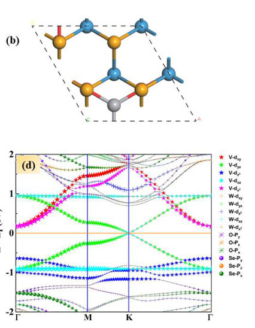
<figcaption class="paper-figure-caption"><b>Fig 1.</b> Figure 1: Structural illustration for V2O3/WSe2 vdW heterostructure on (a) side and (b) top view, respectively.</figcaption>
</figure>
<figure class="paper-figure-card">
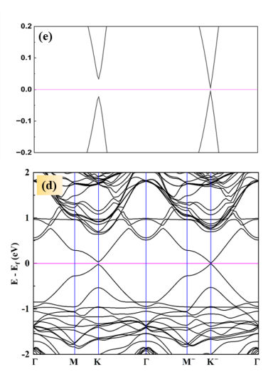
<figcaption class="paper-figure-caption"><b>Fig 2.</b> Figure 2: A schematic diagram of the band structures for valley dependent optical selection rule in (a) WSe2 ML</figcaption>
</figure>
<figure class="paper-figure-card">
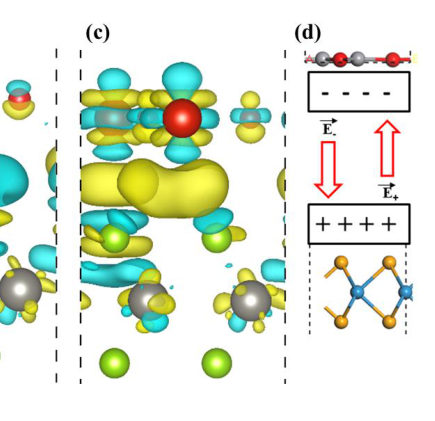
<figcaption class="paper-figure-caption"><b>Fig 3.</b> Figure 3: Charge density difference of V2O3/WSe2 vdW heterostructure of (a) pristine, (b) + 0.6 and (c) – 0.6</figcaption>
</figure>
<figure class="paper-figure-card">
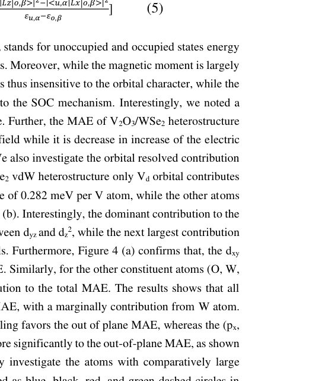
<figcaption class="paper-figure-caption"><b>Fig 4.</b> Figure 1 (a) respectively for V, O, W and Se atoms in the crystal structure of V2O3/WSe2 heterostructure.</figcaption>
</figure>
<figure class="paper-figure-card">
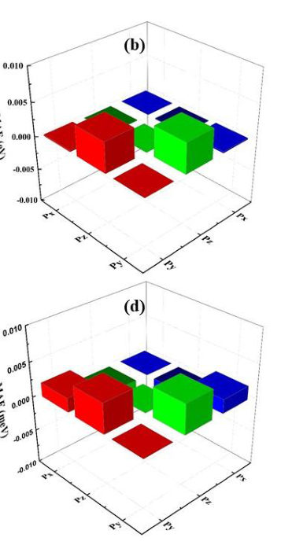
<figcaption class="paper-figure-caption"><b>Fig 5.</b> Figure 4: SOC resolved MAE in pristine V2O3/ WSe2 vdW heterostructure of (a) V (b) O (c) W and (d) Se</figcaption>
</figure>

**Summary.** This theoretical study proposes an oxide-driven approach to realize robust valleytronic devices by creating a $	ext{V}_2	ext{O}_3/	ext{WSe}_2$ heterostructure. The intrinsic ferromagnetism of the oxide induces a significant, field-free valley splitting in $	ext{WSe}_2$. Furthermore, the research demonstrates that applying external electric fields can enhance this valley polarization and maintain high operational temperatures.

**Why it may be interesting.** The ability to engineer robust quantum phenomena like valley polarization using proximity coupling with a correlated oxide ($	ext{V}_2	ext{O}_3$) provides a powerful, tunable platform for simulating spin-valley coupling mechanisms relevant in AMO physics and open quantum systems.

Detailed structure

**Main problem.** Achieving a robust valley splitting in transition metal dichalcogenides (TMDs) at zero magnetic field is challenging for next-generation valleytronic and spintronic devices.

**Main result.** The $	ext{V}_2	ext{O}_3/	ext{WSe}_2$ heterostructure exhibits a spontaneous valley splitting of $\sim 10.41 	ext{ meV}$ due to the magnetic proximity effect, which is tunable by external electric fields.

**Method.** The study relies heavily on first-principles calculations (DFT+U) combined with advanced simulations like Metropolis Monte Carlo for thermal properties.

**Model / system.** The system modeled is a van der Waals heterostructure composed of $	ext{WSe}_2$ coupled with a ferromagnetic monolayer ($	ext{ML}$) of $	ext{V}_2	ext{O}_3$. The calculations investigate structural stability, electronic band structure, and magnetic coupling.

**Key observables.** Valley splitting magnitude ($\sim 10.41 	ext{ meV}$), Curie temperature ($500 	ext{ K}$), Magnetocrystalline Anisotropy Energy (MAE), and charge transfer across the interface.

**Important parameters / regimes.** External electric field strength ($\pm 0.1 	ext{ eV}/	ext{\AA}$), $	ext{U}_{	ext{eff}}$ parameter for V $3d$ electrons, and lattice mismatch strain values.

**Assumptions / limitations.** The calculations assume the use of DFT-D3 vdW corrections and that the magnetic proximity effect is the dominant mechanism inducing valley splitting.

**Figures summary.** Figures illustrate SOC-resolved MAE dependence on electric field, electrostatic potential profiles showing dipole moment changes, and temperature-dependent magnetization curves confirming high Curie temperatures.

**Paper structure.** The paper systematically analyzes structural optimization, electronic band structure (including Dirac points), magnetic properties ($T_c$, MAE), and finally demonstrates the control mechanism by applying external perpendicular electric fields to enhance valley splitting.

Abstract

To achieve a robust valley splitting in transition metal dichalcogenides (TMDs) at zero magnetic field is a challenging and elusive goal for valleytronic and spintronic devices. Therefore, in the current study, using the first principles calculations, we introduce an oxide-driven valleytronic platform by employing a two-dimensional ferromagnetic oxide (V2O3) as a magnetic proximity partner for WSe2. We found that the intrinsic ferromagnetism of V2O3 induces a prominent and spontaneous valley splitting of ~ 10.41 meV in WSe2. This pronounced valley polarization mainly originates from the strong interfacial exchange coupling interaction and charge redistribution mediated by V 3d electrons, coupled with the intrinsic spin-orbit coupling of WSe2. Interestingly, this value is significantly greater than the previously reported value for CrI3/WSe2, which corresponds to an effective magnetic field of ~ 10 T. Besides, we also have a high Curie temperature of 500 K, and an out-of-plane magnetic anisotropy energy (MAE) of 0.31 meV, indicating that this oxide-based heterostructure can also be used for near-room temperature operation. Importantly, under the external electric field with a step of 0.1 eV/Å, the ferromagnetism is preserved and an enhancement in Curie temperature and MAE makes this oxide-based heterostructure more valuable for the next generation valleytronic devices. Therefore, these findings establish a new paradigm for realizing tunable, robust, and magnetic field-free valleytronic and spintronic devices for this oxide-based heterostructure. Moreover, this concept can be generalized to other correlated oxide-based TMD systems, providing a versatile strategy for next-generation quantum and functional materials.

[↑ back to top](#top)

### [Interfacial Magnetotransport in a NiI_2/Graphene Heterostructure](http://arxiv.org/abs/2606.16594v1)

**Authors:** Stasiu Thomas Chyczewski, Xiaotong Xu, Wenjuan Zhu  
**Type:** experiment · **Category:** other · **PDF:** <https://arxiv.org/pdf/2606.16594v1>  
**Analysis basis:** full PDF text, analyzed in chunks
**Topic relevance:** `exotic spin models in light-matter` **3/5** · `spintronics-quantum-optics interface` **3/5** · `Kondo & dissipative impurity` **1/5** · `analog quantum simulation` **1/5** · `non-equilibrium dynamics` **1/5**

↔ Scroll figures horizontally

<figure class="paper-figure-card">
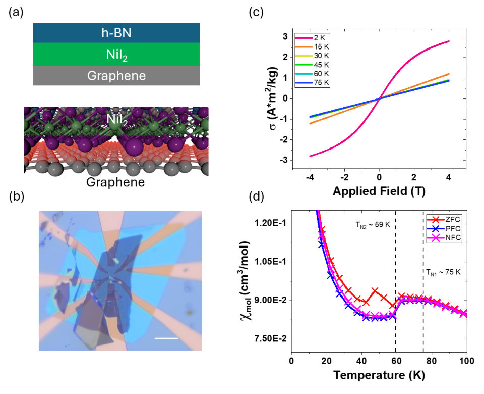
<figcaption class="paper-figure-caption"><b>Fig 1.</b> Figure 1: (a) Basic diagram of the graphene/NiI2 heterostructure. (b) Optical image of a Gr/NiI2/h-BN heterostructure. This sample is made with monolayer graphene (see Fig. S3). Scale bar: 10 µm. (c) Mass-normalized magnetization curves for a field applied in-plane at various temperatures. (d) In-plane susceptibility measurements zoomed in at transition temperatures under zero field cooling (ZFC), negative field cooling (NFC), and positive field cooling (PFC) conditions. Cooling fields were ± 1 T. For measurements across a larger range, see Fig. S2.</figcaption>
</figure>
<figure class="paper-figure-card">
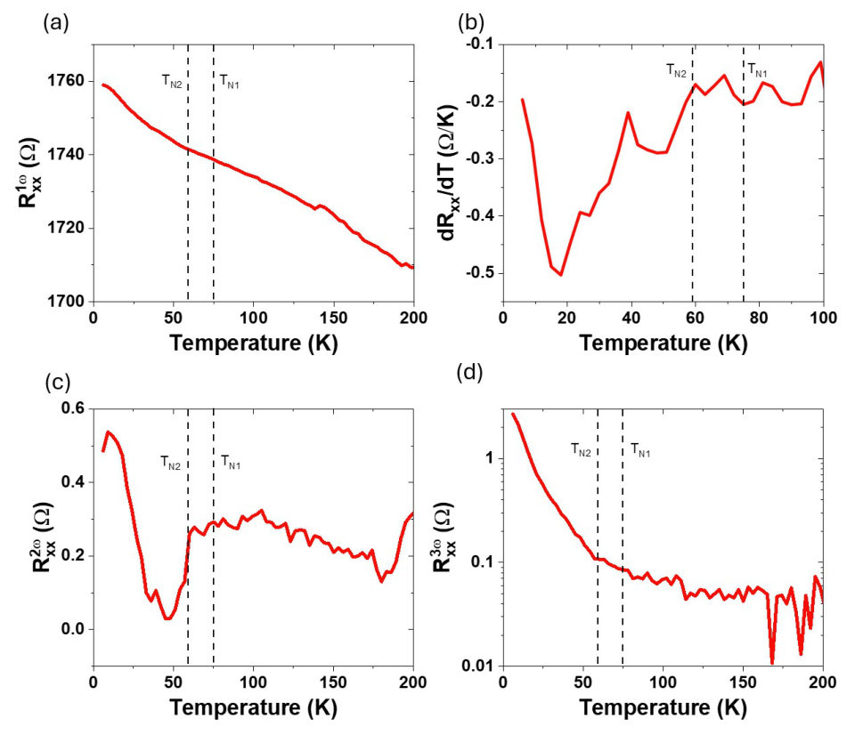
<figcaption class="paper-figure-caption"><b>Fig 2.</b> Figure 2: (a) Fundamental four-point longitudinal resistance vs. temperature (b) First derivative of data in (a). (c) Second harmonic longitudinal resistance vs. temperature. (d) Third harmonic longitudinal resistance vs. temperature. Note (d) is plotted on a log scale. In each plot, the dashed lines correspond to critical temperatures.</figcaption>
</figure>
<figure class="paper-figure-card">
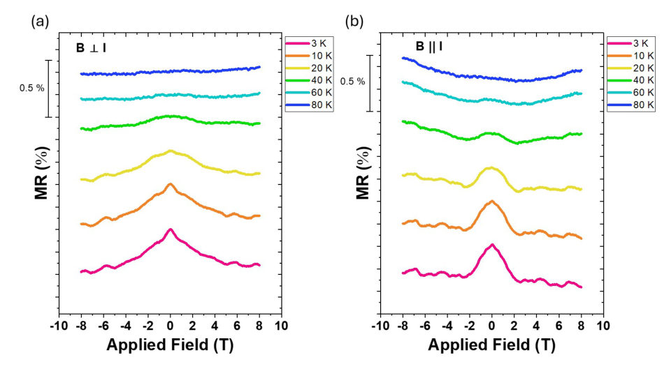
<figcaption class="paper-figure-caption"><b>Fig 3.</b> Figure 3: (a) Magnetoresistance sweeps for an in-plane field applied perpendicular (90 de- grees) to the direction of current flow. (b) Magnetoresistance sweeps for an in-plane field applied parallel (0 degrees) to the direction of current flow. Measurements were conducted with a four-terminal geometry and represent the fundamental (first harmonic) response.</figcaption>
</figure>
<figure class="paper-figure-card">
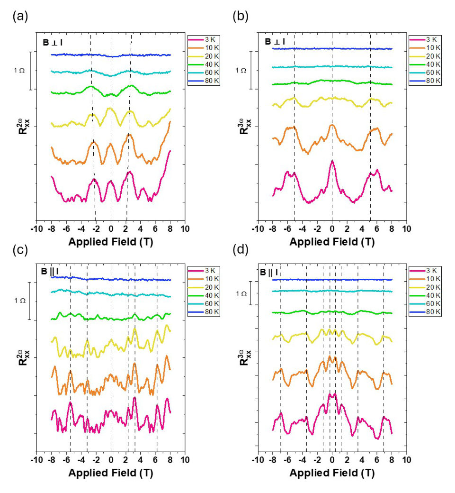
<figcaption class="paper-figure-caption"><b>Fig 4.</b> Figure 4: (a) Second and (b) third harmonic resistance of MR sweeps shown in Fig. 3a (field perpendicular to current). (c) Second and (d) third harmonic resistance of MR sweeps shown in Fig. 3b (field parallel to current). The dashed lines in each figure highlight peaks that appear across lower temperature measurements.</figcaption>
</figure>

**Summary.** The study investigates magnetotransport in $	ext{NiI}_2$/Graphene heterostructures to read out the magnetic state of the insulating $	ext{NiI}_2$. By measuring linear and nonlinear electrical responses, the authors show that characteristic anomalies track $	ext{NiI}_2$'s magnetic transitions. This establishes graphene as a sensitive, non-invasive probe for spintronic applications using insulating van der Waals magnets.

**Why it may be interesting.** This work is interesting because it demonstrates an electrical readout mechanism for magnetism in insulating materials using 2D conductors, providing a platform analogous to how quantum systems are probed via coupling to external fields or substrates.

Detailed structure

**Main problem.** The study aims to probe magnetic phase behavior within electrically insulating van der Waals magnets ($	ext{NiI}_2$) using electrical transport measurements.

**Main result.** Magnetotransport features, particularly large anisotropic low-field peaks in the first harmonic and distinct nonlinear signals in the second harmonic, are observed in graphene/$	ext{NiI}_2$ heterostructures, confirming an interfacial coupling to $	ext{NiI}_2$'s magnetic state.

**Method.** The research employs magnetotransport measurements (longitudinal magnetoresistance) and temperature-dependent analysis of nonlinear electrical responses ($	ext{2}\omega$ and $	ext{3}\omega$) on the heterostructure, comparing results against a graphene/h-BN control device.

**Model / system.** The physical system is a van der Waals heterostructure composed of monolayer graphene (the conducting readout layer) interfaced with the insulating helical antiferromagnet $	ext{NiI}_2$. The measurements probe magnetic proximity effects at this interface.

**Key observables.** First-harmonic longitudinal magnetoresistance ($	ext{MR}$), second-harmonic resistance ($2\omega$), third-harmonic resistance ($3\omega$), and magnetic susceptibility ($\chi$).

**Important parameters / regimes.** Multiferroic transition temperature of $	ext{NiI}_2$ ($	ext{T}_{	ext{N}2} \approx 59 	ext{ K}$), in-plane vs. out-of-plane magnetic fields, and measurement harmonics.

**Assumptions / limitations.** The primary assumption is that the observed transport anomalies are due to interfacial coupling with $	ext{NiI}_2$'s magnetic state, rather than generic graphene properties or purely thermal effects (though Joule heating remains a concern for higher harmonics).

**Figures summary.** Figures show basic device diagrams and SQUID M-H curves; subsequent figures detail temperature dependence of linear resistance, first derivative, second harmonic ($2\omega$), and third harmonic ($3\omega$) responses, alongside $	ext{MR}$ sweeps comparing the heterostructure to control graphene.

**Paper structure.** The paper follows a structure of presenting the physical system ($	ext{NiI}_2$/Graphene), detailing multiple measurement techniques (linear MR, nonlinear harmonics, temperature dependence), and systematically contrasting the results against a non-magnetic control device to isolate the magnetic contribution.

Abstract

We investigate magnetotransport in a van der Waals heterostructure composed of monolayer graphene and the insulating helical antiferromagnet NiI$_2$. While NiI$_2$ is highly resistive and thus poorly suited for direct transport measurements, we demonstrate that magnetotransport in an adjacent graphene layer provides an electrical readout of magnetic-state-dependent interfacial behavior. Most notably, first-harmonic longitudinal magnetoresistance under in-plane magnetic fields exhibits large, anisotropic low-field peaks that are absent from a monolayer graphene/h-BN control device and are suppressed above the multiferroic transition temperature of NiI$_2$. Temperature-dependent harmonic measurements provide complementary evidence: the second-harmonic resistance shows the clearest nonlinear contrast relative to the control device, while the third harmonic contains a larger generic nonlinear and thermal background that is nevertheless modified in the heterostructure. These results demonstrate that graphene-based transport measurements offer a sensitive, non-invasive probe of magnetic phase behavior in electrically insulating van der Waals magnets, opening routes toward spintronic devices based on insulating vdW multiferroics.

[↑ back to top](#top)

### [The Extended KdV Equation: Augmented Lagrangian and Variational Solitary Waves with Applications to Dispersive Hydrodynamics](http://arxiv.org/abs/2606.15487v1)

**Authors:** Saleh Baqer, Hamid Said  
**Type:** theory · **Category:** other · **PDF:** <https://arxiv.org/pdf/2606.15487v1>  
**Analysis basis:** full PDF text, analyzed in chunks
**Topic relevance:** `Keldysh / 2PI / non-Gaussian methods` **3/5** · `driven-dissipative phase transition` **2/5** · `Frenkel-Kontorova` **1/5** · `methods for driven-dissipative` **1/5** · `non-equilibrium dynamics` **1/5** · `non-equilibrium universality` **1/5**

↔ Scroll figures horizontally

<figure class="paper-figure-card">
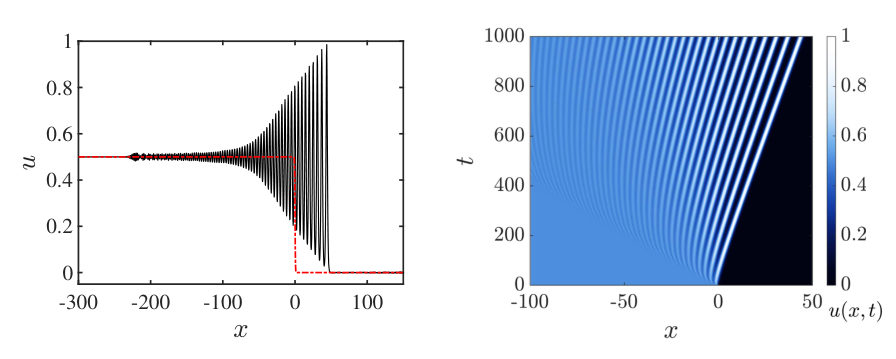
<figcaption class="paper-figure-caption"><b>Fig 1.</b> Figure 1: Dispersive shock regime governed by the eKdV equation (67), together with a space–time contour plot of a portion of the solution u(x, t) over the interval x ∈[−100, 50]. The red (dashed) line indicates the initial jump discontinuity (72). The coefficients B1, B2, B3, and B4 are chosen as the shallow water wave coefficients (2). Here, α = β = 0.1, ∆= 0.5, and t = 1000. (Color version online).</figcaption>
</figure>
<figure class="paper-figure-card">
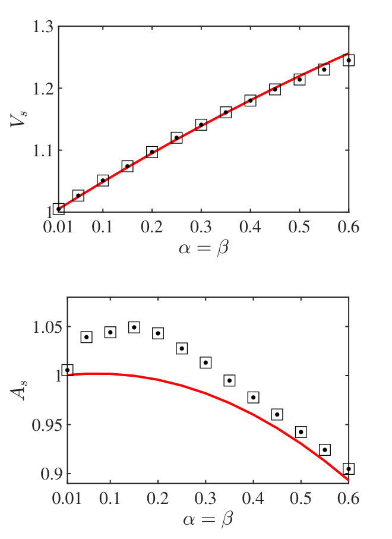
<figcaption class="paper-figure-caption"><b>Fig 2.</b> Figure 2: Comparisons for solitonic wave parameters governed by the eKdV equation (1). Numerical solutions: black (dotted) box; theoretical solutions: red (solid) line. (a) compar- ison for eKdV solitary wave velocity, (b) comparison for eKdV solitary wave height. The coefficients B1, B2, B3, and B4 are taken to be the shallow water wave coefficients (2). Here, a0 = 1 and t = 40. (Color version online).</figcaption>
</figure>
<figure class="paper-figure-card">
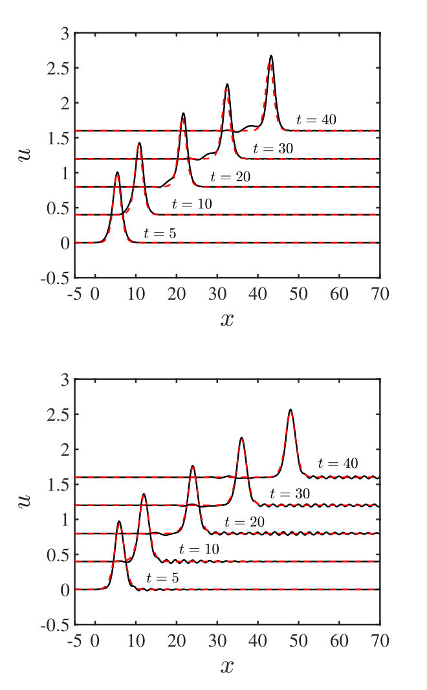
<figcaption class="paper-figure-caption"><b>Fig 3.</b> Figure 3: Evolution of shallow water solitary waves governed by the eKdV equation (1). Numerical solutions: black (solid) line; theoretical solutions: red (dashed) line. In (a), the asymptotic parameters are set to α = β = 0.15. In (b), the asymptotic parameters are set to α = β = 0.45. Compared to (a), the solitary wave tail emits resonant radiation. The coefficients B1, B2, B3, and B4 are taken to be the shallow water wave coefficients (2). Here, a0 = 1. (Color version online).</figcaption>
</figure>
<figure class="paper-figure-card">
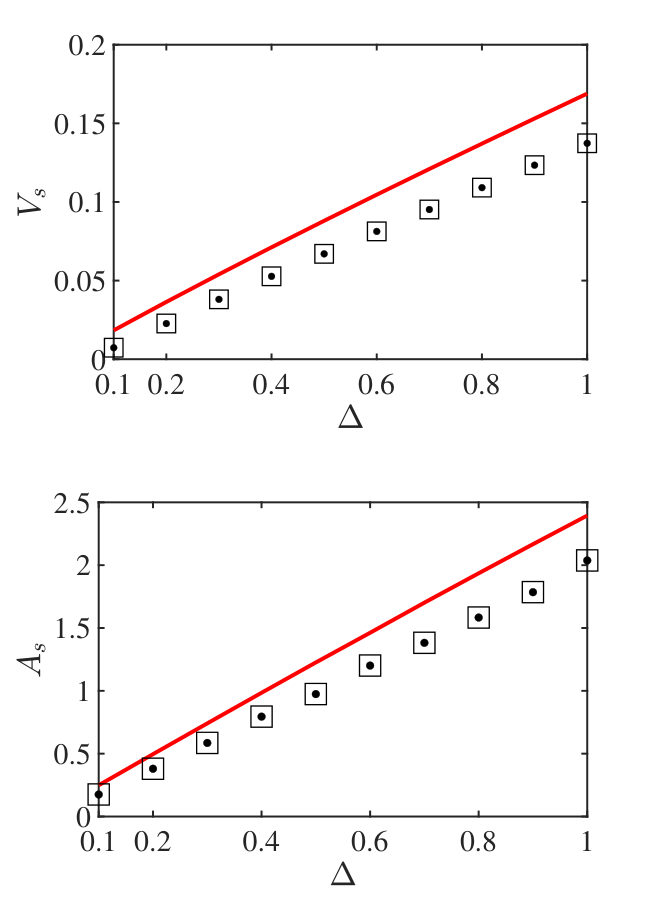
<figcaption class="paper-figure-caption"><b>Fig 4.</b> Figure 4: Comparisons for dispersive shock parameters governed by the eKdV equation with- out the transport term ux (67). Numerical solutions: black (dotted) box; theoretical solutions: red (solid) line. (a) comparison for the lead solitary wave edge velocity of eKdV DSW, (b) comparison for the lead solitary wave edge height of eKdV DSW. The coefficients B1, B2, B3, and B4 are chosen as the shallow water wave coefficients (2). Here, α, β = 0.15 and t = 1000. (Color version online).</figcaption>
</figure>

**Summary.** This work develops a comprehensive variational theory to find solitary wave solutions for the extended Korteweg-de Vries (eKdV) equation, which models dispersive water waves. By employing an augmented Lagrangian method, the authors derive explicit formulas for soliton parameters and successfully apply these results to estimate characteristics of Dispersive Shock Waves. The findings are validated by strong agreement with direct numerical simulations.

**Why it may be interesting.** Although focused on fluid dynamics, the rigorous application of generalized variational principles (like those involving Luke's Lagrangian) to derive exact solutions for complex nonlinear PDEs is a powerful mathematical technique relevant to finding conserved quantities or effective Hamiltonians in quantum field theories or open quantum systems.

Detailed structure

**Main problem.** To derive and analyze single solitary wave solutions for the Extended Korteweg-de Vries (eKdV) equation, which models dispersive hydrodynamic phenomena.

**Main result.** The authors derived explicit second-order formulas for the solitary wave height, velocity, and inverse width, showing strong agreement with direct numerical simulations for both isolated solitons and Dispersive Shock Waves (DSWs).

**Method.** The primary method involves extending the averaged Lagrangian approach using an augmented Lagrangian model incorporating Lagrange multipliers to handle non-conservative constraints.

**Model / system.** The system is governed by the eKdV equation, a fifth-order nonlinear dispersive PDE arising from approximations of shallow water wave equations. This models phenomena in fluid mechanics and plasma physics.

**Key observables.** Solitary wave height ($A_s$), solitary wave velocity ($V_s$), inverse width ($\omega_s$), and the leading edge parameters for DSWs.

**Important parameters / regimes.** Small amplitude/long wavelength parameters ($\alpha, eta$) are crucial; the results show asymptotic reduction to classical KdV when higher-order terms vanish.

**Assumptions / limitations.** The analysis assumes a single solitary wave solution with a sech^2 profile and utilizes approximations like the DSW equal amplitude approximation for shock dynamics.

**Figures summary.** Figures compare theoretical variational predictions against direct numerical simulations, showing agreement for both isolated solitons and the lead edge of dispersive shock waves across various parameter regimes.

**Paper structure.** The paper systematically develops the theory by first deriving the eKdV equation from shallow water wave approximations (Boussinesq equations), then applying advanced variational techniques using an augmented Lagrangian to find the solitary wave solution, and finally applying this framework to estimate parameters for DSWs.

Abstract

In this work, we extend the method of averaged Lagrangian to the study of the general second-order (non-conservative) extended Korteweg--de Vries equation, known as the eKdV equation. Building on the framework introduced in [18], we construct a master (augmented) Lagrangian, modeled on Luke's Lagrangian, that incorporates the governing constraints at the appropriate asymptotic orders via the method of Lagrange multipliers. Averaging the resulting Euler-Lagrange equations in the traveling wave setting yields the existence of a (single) solitary wave solution with a $\operatorname{sech}^2$ profile. Explicit second-order formulas are obtained for the height of the solitary wave, together with the solitary wave velocity and inverse width, in terms of a fixed amplitude parameter. A key feature of the derived expressions is their asymptotic reduction to the classical KdV results when the first-order terms are retained. To assess the robustness and utility of the variational solitonic solutions, the derived formulas are subsequently applied, via the dispersive shock equal amplitude approximation method, to estimate the height and velocity of the leading solitary wave edge of dispersive shock waves governed by the eKdV Riemann problem. Theoretical predictions for the relevant wave parameters in both the eKdV solitary wave and dispersive shock wave problems are compared with direct numerical simulations and found to be in strong agreement.

[↑ back to top](#top)

### [Spin-dependent electron transfer through a ring-wire coupled junction: Role of in-plane electric field](http://arxiv.org/abs/2606.15776v1)

**Authors:** Prabhab Patra, Santanu K. Maiti  
**Type:** theory · **Category:** other · **PDF:** <https://arxiv.org/pdf/2606.15776v1>  
**Analysis basis:** full PDF text, analyzed in chunks
**Topic relevance:** `spintronics-quantum-optics interface` **3/5** · `non-equilibrium dynamics` **2/5** · `Keldysh / 2PI / non-Gaussian methods` **1/5** · `Kondo & dissipative impurity` **1/5** · `methods for driven-dissipative` **1/5**

↔ Scroll figures horizontally

<figure class="paper-figure-card">
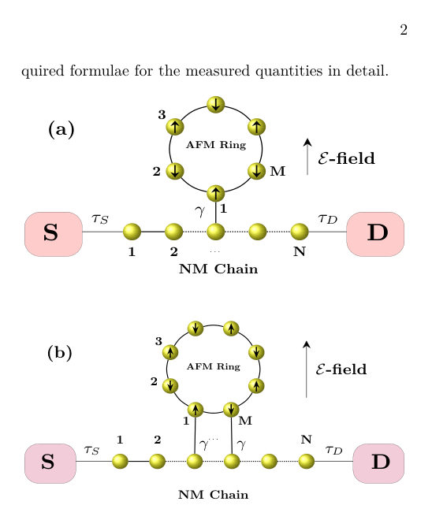
<figcaption class="paper-figure-caption"><b>Fig 1.</b> FIG. 1: (Color online). A schematic representation of the junction setup. A non-magnetic (NM) wire is connected to a side-attached antiferromagnetic (AFM) ring, positioned be- tween the source and drain electrodes. Depending upon the number of wire-ring couplings, two distinct junction configu- rations are considered: (a) single-coupling (Junction 1) and (b) double-coupling (Junction 2). Along with this, an ex- ternal in-plane electric field, acting perpendicular to the NM wire, is applied to the system.</figcaption>
</figure>
<figure class="paper-figure-card">
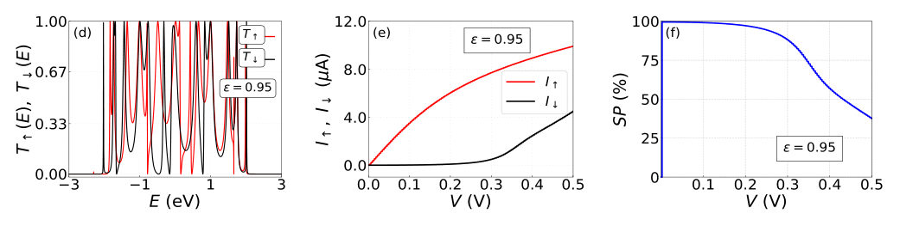
<figcaption class="paper-figure-caption"><b>Fig 2.</b> FIG. 2: (Color online). Spin-dependent transport characteristics of junction 1. Energy-dependent transmission spectra are presented in (a) and (d). The corresponding bias-voltage dependence of the spin-resolved current and spin polarization is shown in (b), (e) and (c), (f), respectively. Figures (a)–(c) correspond to ε = 0, whereas figures (d)–(f) are obtained for ε = 0.95.</figcaption>
</figure>
<figure class="paper-figure-card">
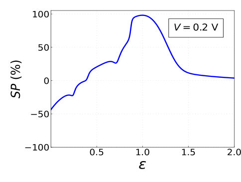
<figcaption class="paper-figure-caption"><b>Fig 3.</b> FIG. 3: (Color online). Variation of spin polarization with the in-plane electric field at a constant bias voltage V = 0.2 V for junction 1.</figcaption>
</figure>
<figure class="paper-figure-card">
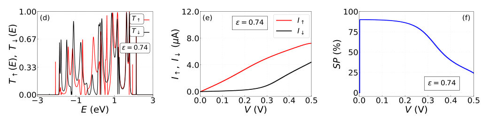
<figcaption class="paper-figure-caption"><b>Fig 4.</b> FIG. 4: (Color online). Spin-dependent transport characteristics of junction 2. The energy dependence of the transmission probability is displayed in (a) and (d). The corresponding spin-dependent current and spin polarization as functions of bias voltage are shown in (b), (e) and (c), (f), respectively. Figures (a)–(c) correspond to ε = 0, while figures (d)–(f) represent the case ε = 0.74.</figcaption>
</figure>
<figure class="paper-figure-card">
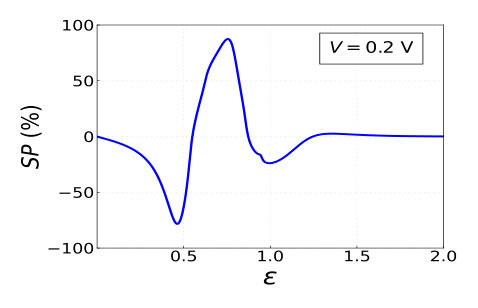
<figcaption class="paper-figure-caption"><b>Fig 5.</b> FIG. 5: (Color online). Variation of spin polarization with the in-plane electric field at a constant bias voltage V = 0.2 V for junction 2.</figcaption>
</figure>

**Summary.** The paper theoretically investigates how an applied in-plane electric field controls spin polarization during electron transport across a hybrid junction linking a non-magnetic wire to an antiferromagnetic ring. Using NEGF formalism, the authors show that this structure can function as a highly tunable spintronic device. The results confirm that external fields provide an efficient mechanism to break symmetry and achieve near 100% spin filtering.

**Why it may be interesting.** This work models spin-filtering effects in low-dimensional magnetic nanostructures using advanced quantum transport theory (NEGF), which is highly relevant for understanding engineered spintronic devices that interact with external fields.

Detailed structure

**Main problem.** The study investigates spin-dependent electron transfer through a hybrid magnetic system composed of an NM wire coupled to an AFM mesoscopic ring.

**Main result.** The in-plane electric field acts as a powerful, externally controllable tuning parameter capable of inducing or enhancing significant spin polarization (SP) in the junction.

**Method.** Transport properties are calculated using the Non-Equilibrium Green's Function (NEGF) formalism within a tight-binding framework.

**Model / system.** The system consists of an NM wire coupled to a side-attached AFM mesoscopic ring, placed between two non-magnetic electrodes. The Hamiltonian incorporates coupling terms and is analyzed for single-coupled versus double-coupled junction geometries.

**Key observables.** Spin Polarization (SP), spin-resolved currents ($I_\sigma$), and transmission probabilities ($T_\sigma(E)$).

**Important parameters / regimes.** In-plane electric field strength ($\epsilon$), coupling strengths ($\gamma$), bias voltage ($V$), and temperature ($\Theta$).

**Assumptions / limitations.** The analysis assumes a clean NM wire and impurity-free AFM ring, though robustness checks are performed across various parameters.

**Figures summary.** Figures illustrate the dependence of SP on $\epsilon$ for both single- and double-coupling junctions, showing how symmetry breaking is controlled by the electric field. They also map out parameter space dependencies (e.g., $\gamma$, $\epsilon$) to confirm robust spin filtering.

**Paper structure.** The paper systematically analyzes two junction configurations (single vs. double coupling) under varying external fields ($\epsilon$). It first establishes baseline transport, then demonstrates how the electric field breaks symmetry to induce large SP, concluding with robustness checks across temperature and size.

Abstract

We study spin-dependent transport in a hybrid magnetic system, where a non-magnetic (NM) wire is coupled to a side-attached antiferromagnetic (AFM) mesoscopic ring, placed between two non-magnetic electrodes subject to an in-plane electric field oriented perpendicular to the NM wire. The system is described within a tight-binding (TB) framework, and transport properties are computed using the non-equilibrium Green's function (NEGF) formalism. We consider two junction configurations distinguished by the wire-ring coupling: a single-coupled junction and a double-coupled junction. In the single-coupled configuration, the coupling geometry alone breaks the spin symmetry, yielding a finite spin polarization (SP) even without any external field. The in-plane electric field further enhances the symmetry breaking in both configurations, serving as an efficient tuning parameter that drives the SP nearly $100\%$ in the low-bias region. In the double-coupled configuration, spin symmetry is preserved in the absence of the external field, and the electric field acts as a sole source of symmetry breaking, producing a large SP. Finite temperature effects and different system sizes are examined, confirming the robustness of the observed features. To validate the findings over a wide parameter space, we considered different sets of parameters and found that the key signatures remain unchanged. Our results demonstrate that such hybrid structures are promising candidates for realizing an externally controllable spintronic device in low-dimensional systems.

[↑ back to top](#top)

### [Time-of-flight photon spectroscopy for scanning tunneling microscopy luminescence](http://arxiv.org/abs/2606.16936v1)

**Authors:** Lebin Yu, Jiří Doležal, Maximilian Rödel, Amandeep Sagwal, Benjamin Frölich, Martin Švec, Fabian Donat Natterer  
**Type:** experiment · **Category:** other · **PDF:** <https://arxiv.org/pdf/2606.16936v1>  
**Analysis basis:** full PDF text, analyzed in chunks
**Topic relevance:** `interference shaping light` **3/5** · `quantum optics experiment` **3/5** · `quantum measurements` **1/5** · `spintronics-quantum-optics interface` **1/5**

↔ Scroll figures horizontally

<figure class="paper-figure-card">
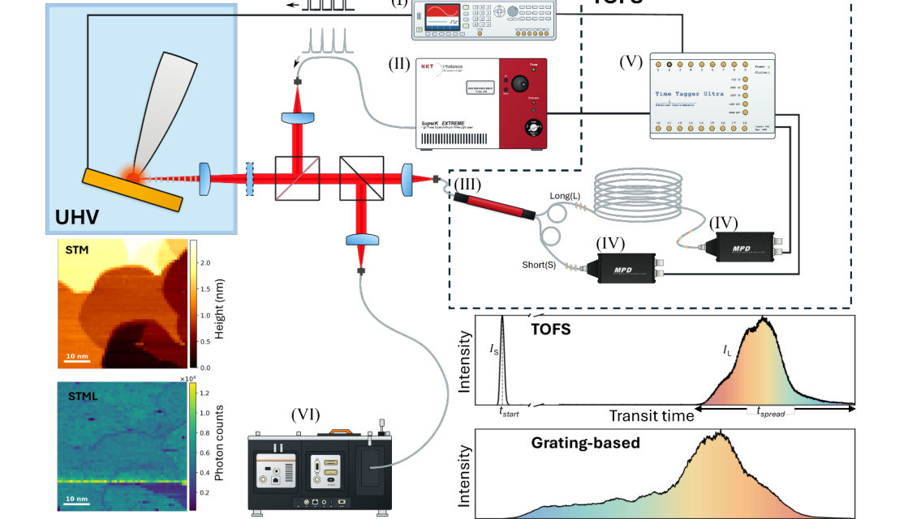
<figcaption class="paper-figure-caption"><b>Fig 1.</b> Figure 1: Sketch of the experimental setup used for time-of-flight spectroscopy (TOFS) of scanning tunneling microscopy luminescence (STML). An arbitrary waveform generator, AWG (Ⅰ), is used to trigger electroluminescence from the STM junction in an ultrahigh-vacuum (UHV) chamber, while a wavelength tunable laser (Ⅱ) is used for TOFS calibration. The TOFS setup, indicated by the dashed box, consists of a 50:50 fiber splitter (Ⅲ), which divides the photon stream into two optical paths. One branch is coupled through a short fiber to a single-photon avalanche diode, SPAD, (Ⅳ) to define the temporal reference. The other branch propagates through a 1 km-long optical fiber before being detected...</figcaption>
</figure>
<figure class="paper-figure-card">
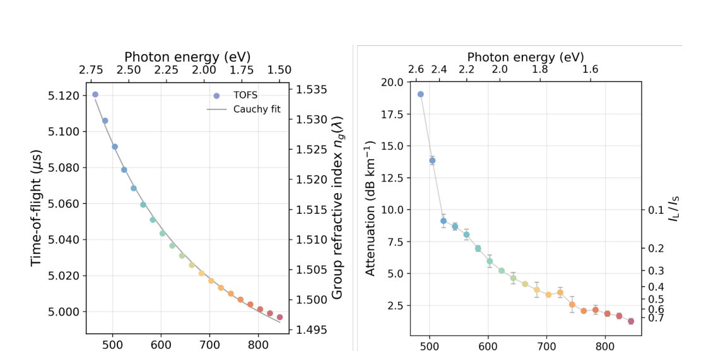
<figcaption class="paper-figure-caption"><b>Fig 2.</b> Figure 2: Dispersion and attenuation characterization of a 1000 𝑚 optical fiber (Thorlabs GIF625-1000) used for TOFS. (a) TOFS arrival times measured as a function of wavelength using a tunable pulsed laser, SPADs, and a grating spectrometer for comparison (see Figure 1). The solid grey line represents a two-term Cauchy fit describing the wavelength-dependent group refractive index 𝑛𝑔(𝜆), with 𝑛𝑔(850 𝑛𝑚) = 1.496 as constraint. The corresponding 𝑛𝑔(𝜆) values are shown on the right axis. (b) Measured attenuation coefficient of the same fiber as a function of wavelength (circles), showing a pronounced increase in loss at shorter wavelengths. The secondary axis indicates the equivalent...</figcaption>
</figure>
<figure class="paper-figure-card">
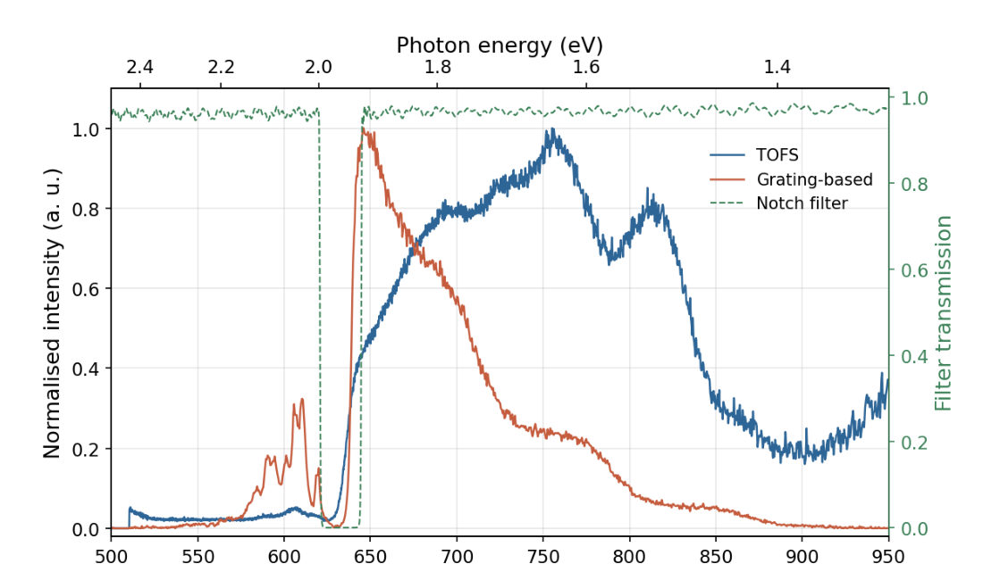
<figcaption class="paper-figure-caption"><b>Fig 3.</b> Figure 3: Simultaneously obtained spectra from TOFS (blue) and grating spectrometer (orange) of Ag-Ag(111) plasmon with an added notch filter (633 ± 13 𝑛𝑚) creating a known spectral feature. The dashed green curve (right axis) indicates the uncalibrated transmission of the notch filter used in the optical path, with vertical dashed lines marking its nominal cutoffs. The TOFS data reproduces the overall spectral profile and extends into the near-infrared, while differences in intensity arise from wavelength-dependent detection efficiency and fiber attenuation. The agreement around the filter edges highlights accurate timing and wavelength calibration and establishes consistency between TOFS...</figcaption>
</figure>
<figure class="paper-figure-card">
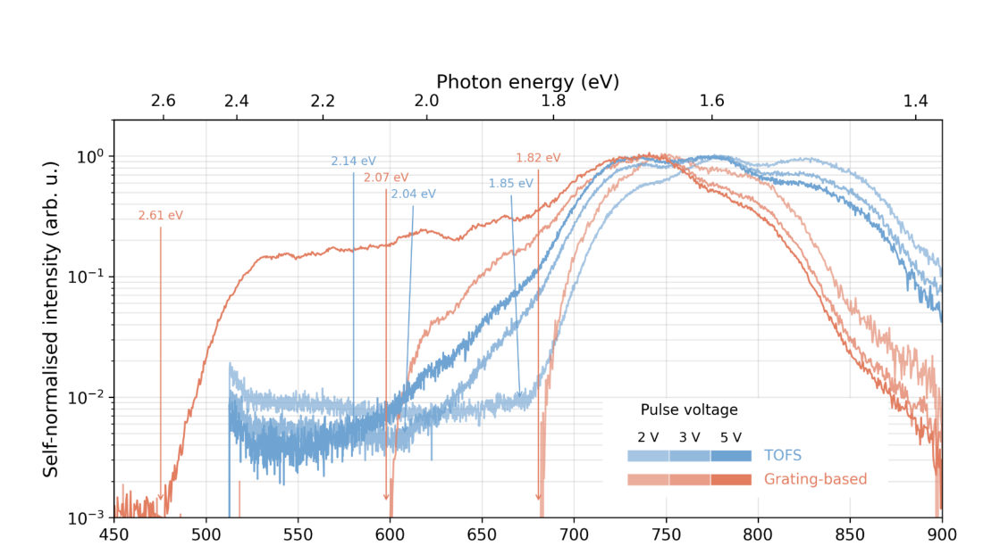
<figcaption class="paper-figure-caption"><b>Fig 4.</b> Figure 4: Voltage dependent photon spectroscopy of Ag-Ag(111) plasmon, as simultaneously seen by the grating spectrograph (orange) and TOFS. The shade encodes the excitation voltage added on top of a 1 V DC bias voltage, and the vertical arrows mark the onset of luminescence at short wavelengths. The discrepancy of the onset threshold compared to the excitation voltage is attributed to the uncorrected AWG calibration and to voltage transients from impedance mismatches.</figcaption>
</figure>

**Summary.** The authors developed and demonstrated a Time-of-Flight Photon Spectrometer (TOFS) coupled with Scanning Tunneling Microscopy Luminescence (STML). This technique uses the wavelength-dependent delay in an optical fiber to measure spectra, offering a cost-effective alternative to traditional spectrometers. The method successfully validates spectral measurements in the near-infrared range by comparing results against established grating techniques.

**Why it may be interesting.** This work showcases an advanced optical measurement technique (TOFS) applied to fundamental condensed matter spectroscopy (STML). The ability to perform high-resolution spectroscopy using time-domain measurements rather than traditional dispersive elements is highly relevant for quantum optics and low-light detection systems.

Detailed structure

**Main problem.** The primary goal is to obtain spectral information from extremely weak light emission sources, such as Scanning Tunneling Microscopy Luminescence (STML), while minimizing noise and complexity compared to conventional grating spectrometers.

**Main result.** The Time-of-Flight Photon Spectrometer (TOFS) was demonstrated to be a straightforward, cost-effective addition to existing STML setups, successfully reproducing spectral profiles in the near-infrared range.

**Method.** Spectral analysis is achieved by exploiting the wavelength-dependent group refractive index of a long dispersive optical fiber, which converts photon arrival times into wavelength information via time-of-flight measurement.

**Model / system.** The experiment couples STML (exciting plasmons on Ag(111) using voltage pulses) with a TOFS setup. The core physical principle relies on the dispersion relation within an optical fiber, where arrival times are measured by single-photon detectors.

**Key observables.** Photon arrival time ($	ext{t}_{	ext{transit}}(\lambda)$), wavelength-dependent group refractive index ($n_g(\lambda)$), and spectral intensity profiles compared between TOFS and grating methods.

**Important parameters / regimes.** Fiber length (up to 1000 m), pulse repetition rate, bias voltage/current for STML excitation, and the zero dispersion wavelength ($	ext{ZDW}$).

**Assumptions / limitations.** The method assumes monotonic dispersion of the fiber material around the ZDW; discrepancies in intensity between TOFS and grating methods are attributed to uncorrected detection efficiency or attenuation.

**Figures summary.** Figures illustrate the experimental setup, raw arrival time histograms showing dispersion (red arriving earlier than blue), and direct spectral comparisons between the TOFS output and a conventional grating spectrograph using known features like notch filters.

**Paper structure.** The paper details the construction and calibration of the TOFS system using pulsed sources. It then validates this setup by measuring STML luminescence from Ag-Ag(111), comparing results against established spectroscopic techniques, and discussing limitations related to detector efficiency and timing artifacts.

Abstract

We build and commission a time-of-flight photon spectrometer (TOFS) for scanning tunneling microscopy luminescence (STML). We obtain the spectrum by exploiting the wavelength dependent refractive index of a long dispersive optical fiber that converts photon arrival times into wavelength information; blue photons are delayed more than red photons. The setup uses a pulsed excitation source, either laser flashes or voltage pulses, to launch the photons from the junction into a single photon detector. The TOFS calibration can be performed and transferred to the STML setup from a separate benchtop experiment using pulsed light sources with known wavelength. We verify the TOFS during STML operation by simultaneously recording luminescence from the Ag-Ag(111) plasmon using a conventional grating spectrometer. Our experiments show that the TOFS is a straightforward and cost-effective addition to existing STML setups with good performance in the near-infrared range. The TOFS is compatible with a drop-in replacement of the single photon detector such as a superconducting nanowire single photon detector or even bolometers that may expand the useful spectral range beyond the abilities of current STML setups.

[↑ back to top](#top)

### [A generalized long-wave limit method with spectral perturbations](http://arxiv.org/abs/2606.15174v1)

**Authors:** Tianwei Qiu, Zhen Wang  
**Type:** theory · **Category:** other · **PDF:** <https://arxiv.org/pdf/2606.15174v1>  
**Analysis basis:** full PDF text, analyzed in chunks
**Topic relevance:** `Keldysh / 2PI / non-Gaussian methods` **2/5** · `analog quantum simulation` **2/5** · `non-equilibrium dynamics` **2/5** · `correlated / nonlocal dissipation` **1/5** · `driven-dissipative phase transition` **1/5** · `entanglement & information structure` **1/5** · `methods for driven-dissipative` **1/5** · `non-equilibrium universality` **1/5**

↔ Scroll figures horizontally

<figure class="paper-figure-card">
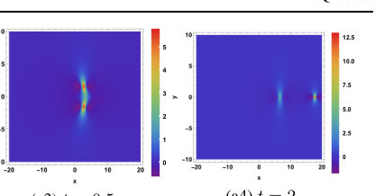
<figcaption class="paper-figure-caption"><b>Fig 1.</b> Fig. 1a: Normal scattering of two lump waves.</figcaption>
</figure>
<figure class="paper-figure-card">

<figcaption class="paper-figure-caption"><b>Fig 2.</b> Fig. 1b: Anomalous scattering of two lump waves.</figcaption>
</figure>
<figure class="paper-figure-card">
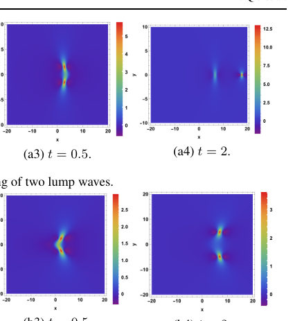
<figcaption class="paper-figure-caption"><b>Fig 3.</b> Fig. 1: Normal scattering and anomalous scattering of two lump waves: (a) standard two-lump solution (4) with λ1 = i, λ2 = 7</figcaption>
</figure>
<figure class="paper-figure-card">

<figcaption class="paper-figure-caption"><b>Fig 4.</b> Figure 1 compares the normal and anomalous scattering interactions of two lump waves. As illustrated in the figure, both lumps initially travel along straight trajectories. When the spectral parameters λ1 and λ2 are distinct, the lumps undergo a normal scattering process (see Fig. 1a): they fully recover their original shapes and velocities after the collision. In contrast, when the spectral parameters become degenerate, the lumps exhibit anomalous scattering, during which energy is redistributed and, after the interaction, the lumps propagate along curved paths with non-constant velocities (see Fig. 1b). The long-time asymptotic behavior of the second-order lump solution (13) is summarized...</figcaption>
</figure>
<figure class="paper-figure-card">
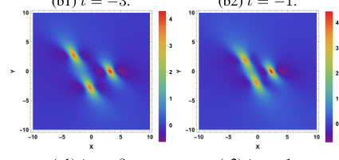
<figcaption class="paper-figure-caption"><b>Fig 5.</b> Fig. 2: Evolution of the second-order lump solution (14) in the (X, Y )-coordinates with λ = 1</figcaption>
</figure>

**Summary.** This paper introduces a generalized long-wave limit method incorporating spectral perturbations to systematically construct higher-order, degenerate lump solutions for integrable equations like the KP-I equation. By controlling phase parameters through asymptotic expansions, the authors demonstrate an enhanced ability to generate complex multi-lump structures and analyze anomalous scattering dynamics.

**Why it may be interesting.** While not directly about quantum systems, the mathematical techniques developed—analyzing complex multi-soliton interactions, spectral degeneracies, and asymptotic behavior of nonlinear PDEs—are highly relevant to understanding wave phenomena in quantum optics or Bose-Einstein condensates.

Detailed structure

**Main problem.** The primary goal is constructing higher-order, degenerate lump solutions for integrable nonlinear wave equations, specifically focusing on the Kadomtsev–Petviashvili I (KP-I) equation.

**Main result.** The proposed generalized long-wave limit method successfully generates a broader family of higher-order lump solutions than previous techniques, allowing control over up to M(M+1)/2 degenerate lumps from an M-lump chain.

**Method.** It employs a generalized long-wave limit framework that incorporates spectral perturbations and systematically tunes phase parameters through asymptotic expansions of auxiliary functions.

**Model / system.** The study is centered on integrable systems, particularly the KP-I equation. The solutions analyzed are non-singular rational structures known as lump solutions, which exhibit complex scattering behavior.

**Key observables.** Lump solution amplitudes and velocities; anomalous scattering patterns; the number of supported degenerate lump waves (up to M(M+1)/2).

**Important parameters / regimes.** The small parameter $\epsilon$ controlling the long-wave limit, and spectral parameters ($\lambda_j$) which are perturbed as $\lambda + i d_j \epsilon$.

**Assumptions / limitations.** The method relies on expanding solutions in powers of a small parameter $\epsilon$, and specific algebraic conditions must be solved by setting lower-order coefficients to zero.

**Figures summary.** Figures illustrate the comparison between normal (elastic) and anomalous scattering for two and three lumps, showing curved paths characteristic of energy redistribution. They also show pattern transformations of multi-lump solutions at $t=0$ based on free parameters.

**Paper structure.** The paper develops the generalized method by first establishing the framework using spectral perturbations, then applying it to derive second- and third-order lump solutions for KP-I, demonstrating how different parameter choices control structural modes (e.g., merging vs. polygonal arrangements).

Abstract

A generalized long-wave limit method that introduces spectral perturbations into the long-wave limit framework is proposed for constructing higher-order lump solutions. Within a unified small-parameter framework, the method simultaneously accounts for the degeneracy of spectral parameters, different vanishing rates of wave numbers, and higher-order modulations of the phase parameters. By tuning the phase parameters to push the leading term of the auxiliary function expansion to a prescribed order, the resulting solutions support a controllable number of lump waves and exhibit rich anomalous scattering behavior. Applied to the Kadomtsev--Petviashvili-I equation, second- and third-order lump solutions are systematically derived, and the degeneration of lump chains into higher-order lumps is transparently revealed in the long-wave limit. The method can generate degenerate solutions with up to \(M(M+1)/2\) lumps from an \(M\)-lump chain. Moreover, compared with the previously proposed improved long-wave limit method, the present approach is capable of producing higher-order lump solutions whose long-time asymptotic behavior is independent of the Yablonskii--Vorob'ev polynomials. Its extension to hybrid higher-order lump solutions with distinct spectral parameters is also discussed.

[↑ back to top](#top)

### [Phase Behavior of Unilamellar Hybrid Lipid-Diblock Copolymer Membranes](http://arxiv.org/abs/2606.16156v1)

**Authors:** James F. Tallman, Junyu Wu, Antonia Statt  
**Type:** theory · **Category:** statistical mechanics · **PDF:** <https://arxiv.org/pdf/2606.16156v1>  
**Analysis basis:** full PDF text, analyzed in chunks
**Topic relevance:** `driven-dissipative phase transition` **2/5** · `non-equilibrium dynamics` **2/5** · `non-equilibrium universality` **2/5** · `Frenkel-Kontorova` **1/5** · `Keldysh / 2PI / non-Gaussian methods` **1/5** · `methods for driven-dissipative` **1/5**

↔ Scroll figures horizontally

<figure class="paper-figure-card">
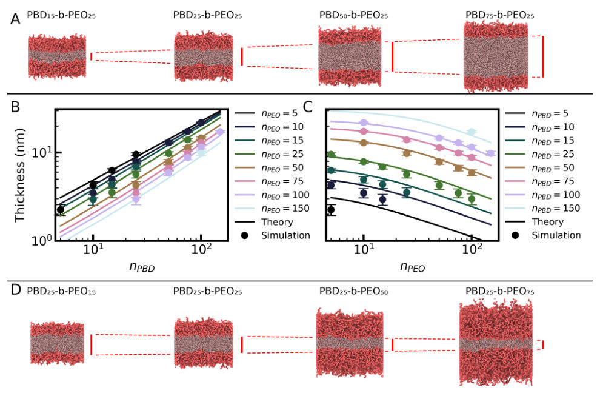
<figcaption class="paper-figure-caption"><b>Fig 1.</b> FIG. 1. (A) Snapshots of membranes with constant PEO block length (25) and increasing PBD block length from left to right. Solid red vertical lines beside bilayers indicate the hydrophobic thickness of membranes, which increase with increasing PBD block length. (B) Thickness of hydrophobic core of amphiphilic polymer bilayers predicted from theoretical model (lines) and simulated data (points). (C) Thickness of membranes as PBD is increased for constant PEO lengths. (Right) Thickness of membranes as the PEO block length is increased for constant PBD block lengths. (D) Snapshots of membranes with constant PBD block length (25) and increasing PEO length from left to right. Solid red vertical...</figcaption>
</figure>
<figure class="paper-figure-card">
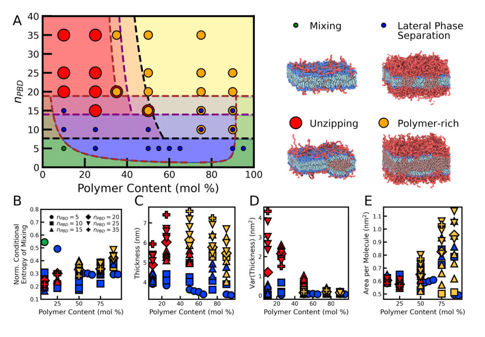
<figcaption class="paper-figure-caption"><b>Fig 2.</b> FIG. 2. (A) Morphologies of hybrid DPPC (Lα)–block co-polymer membranes as a function of polymer content and PBD block length. Shading of regions corresponds to predictions from theoretical expectations, where the boundaries between regions are a function of PEO block length (nP EO = 5: black dashed line, nP EO = 25: purple,nP EO = 45: red), mixed morphology are expected in green regions, lateral phase separation in blue regions, unzipping in red regions, and polymer-rich morphologies in yellow regions. Circle colors reflect morphologies observed from simulations at given state points. (right) Renderings of representative morphologies (lipid tails are colored light blue, lipid head groups:...</figcaption>
</figure>
<figure class="paper-figure-card">
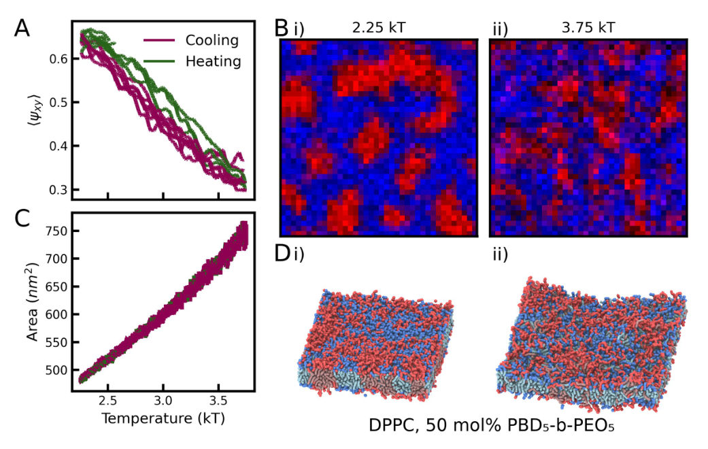
<figcaption class="paper-figure-caption"><b>Fig 3.</b> FIG. 3. Investigation of temperature effect on phase separation of hybrid membranes. Three simulations performed on DPPC membranes with 50 mol % PBD5-b-PEO5 were simulated for 18 µs with a heating/cooling rate of 0.75 K/µs . (A) Phase separation order parameter (0 if perfectly mixed, 1 if perfectly phase separated) plotted as a function of temperature. Order parameter is smoothed via convolution with window size of 20 frames. Green lines indicate data taken during heating and pink lines represent cooling. (B) Top Right: Histograms show positions of lipid tails (blue) and hydrophobic polymer blocks (red) at the low temperature (i) and high temperature (ii) extremes. (C) Area plotted as a...</figcaption>
</figure>
<figure class="paper-figure-card">
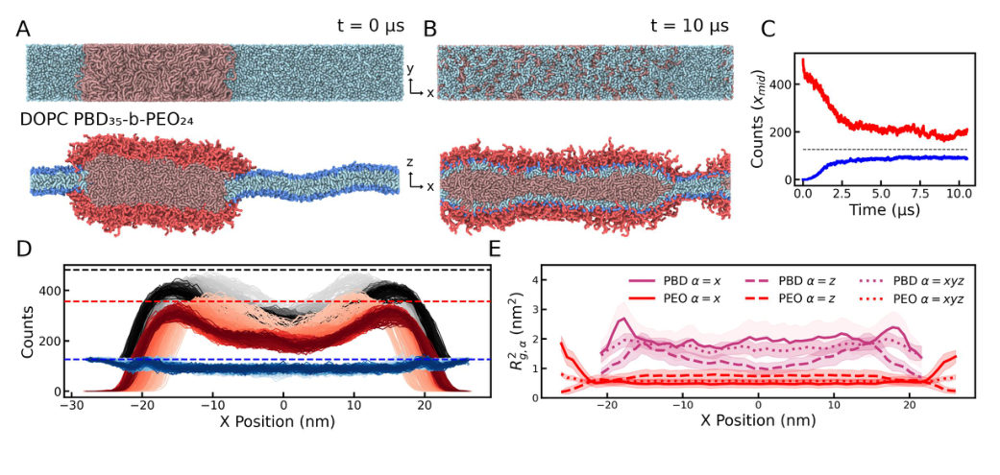
<figcaption class="paper-figure-caption"><b>Fig 4.</b> FIG. 4. DOPC and PBD35-b-PEO24 hybrid membrane with 30 mol% polymer simulated at 2.47 kT for 10 µs under NPxzLT ensemble. (A) Morphology of the system after initial equilibration, where the top snapshot shows a top down view of the membrane not showing the hydrophilic beads, and the second snapshot shows a side view of the membrane. (B) Morphology of the system after 10 µs of simulation from top down and side view. (C) Counts of lipids (blue) and polymers (red) measured in the center (x-coordinate) of the polymer domain as a function of simulation time. (D) Concentration of lipids (red), polymers (blue), and the sum of lipids and polymers (black) over the last 8 µs as a function of the x...</figcaption>
</figure>
<figure class="paper-figure-card">
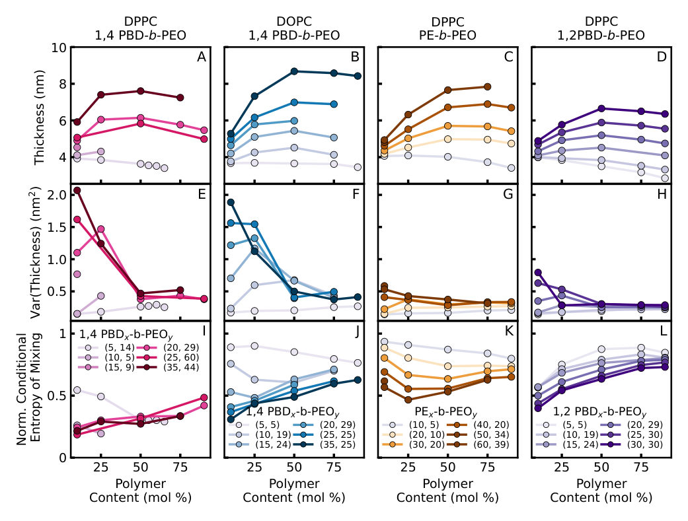
<figcaption class="paper-figure-caption"><b>Fig 5.</b> FIG. 5. Properties of hybrid membranes for different combinations of lipids and polymers, as function of polymer content (x axis) and hydrophobic chain length (color). (A-D) Thickness of the hydrophobic core of the membrane. (E-H) Spatial variance of thickness of hydrophobic core of the membrane. (I-L) Normalized conditional entropy of mixing between hydrophobic lipid tail beads and hydrophobic polymer beads. (A,E,I) DPPC and 1,4 PBD-b-PEO. (B,F,J) DOPC and 1,4 PBD-b-PEO, (C,G,K) DPPC and PE-b-PEO. (D,H,L) DPPC and 1,2 PBD-b-PEO.</figcaption>
</figure>

**Summary.** This work establishes a comprehensive, physically-informed framework to predict the morphology of hybrid lipid-diblock copolymer membranes. By incorporating concepts like chemical immiscibility and hydrophobic mismatch into theoretical models validated by molecular dynamics, the authors map out phase diagrams that explain transitions between mixed, laterally separated, unzipped, and polymer-rich states.

**Why it may be interesting.** While focused on soft matter self-assembly rather than quantum phenomena, the rigorous application of statistical mechanics principles (free energy functionals, phase diagrams) to predict complex emergent structures is highly relevant for understanding many-body interactions in confined or fluctuating systems.

Detailed structure

**Main problem.** The primary challenge is developing a rational design framework for hybrid lipid-diblock copolymer membranes due to the multitude of parameters governing their nanoscale morphology and properties.

**Main result.** The authors identified four key morphologies (mixed, laterally phase-separated, unzipped, polymer-rich) and provided mechanistic rules based on chemical immiscibility, hydrophobic mismatch, and areal density to predict transitions between them.

**Method.** The study combines theoretical extensions of amphiphilic monolayer theory with validation using coarse-grained molecular dynamics simulations across a wide parameter space.

**Model / system.** The system consists of hybrid membranes combining lipids (e.g., DPPC) and diblock copolymers ($	ext{PBD-}b	ext{-PEO}$). The theoretical framework models the free energy functional, while simulations track structural evolution under varying block lengths and compositions.

**Key observables.** Membrane thickness, phase order parameter ($\langle\psi_{xy}
angle$), conditional entropy of mixing, and characteristic morphologies (mixed, LPS, unzipped, polymer-rich).

**Important parameters / regimes.** Hydrophobic mismatch ($\Delta L$), areal density ($	ext{a}_{	ext{polymer}} \cdot \phi$ vs $	ext{a}_{	ext{lipid}}(1-\phi)$), PBD/PEO block lengths ($n_{PBD}, n_{PEO}$), and temperature.

**Assumptions / limitations.** The model assumes the bilayer can be treated as two uncoupled monolayers, and certain geometric arguments are used to predict transitions between different morphological states.

**Figures summary.** Figures include phase maps classifying morphologies based on system parameters (e.g., polymer content vs. block length) and plots showing thickness dependence on chain lengths.

**Paper structure.** The paper builds from developing a theoretical free energy functional to identifying key driving forces for morphology transitions, which are then rigorously tested and unified using extensive molecular dynamics simulations across multiple lipid/polymer combinations.

Abstract

Hybrid lipid block copolymer membranes are promising for many applications in drug delivery, single molecule detection, in-membrane protein folding, and synthetic cells. However, rational design is difficult due to the many design parameters which determine the nano- and micron-scale morphology and properties. In this work, we propose a physically-informed framework which incorporates chemical immiscibility, hydrophobic thickness mismatch and geometric constraints to predict the morphology of hybrid membranes. For this purpose, we extend existing theory for amphiphilic monolayers to model the thickness of diblock copolymer bilayers, demonstrating that both the hydrophobic and hydrophilic block lengths determine the thickness. We identify and rationalize the four primary membrane morphologies observed: mixed, laterally phase-separated, unzipped (thick-thin coexistence), and polymer-rich. Specifically, chemical immiscibility differentiates mixed membranes from laterally phase separated membranes, and hydrophobic mismatch drives transitions to unzipped or polymer-rich morphologies. Areal density, finally, determines the crossover between unzipped and polymer-rich states. We validate our theoretical predictions using coarse-grained molecular dynamics across a broad parameter space, including multiple lipid species (DOPC, DPPC), polymer species (1,4 PBD-b-PEO, 1,2 PBD-b-PEO, PE-b-PEO), block lengths, temperatures, and compositions. The resulting phase maps unify previously reported experimental and simulation observations and enable a generic and mechanistic understanding for the effect of system parameters on the nanoscale morphology.

[↑ back to top](#top)

### [Contacts to Low-Dimensional Semiconductors: Physical Theory and Analytical Model](http://arxiv.org/abs/2606.16030v1)

**Authors:** Jimmy Qin, H. -S. Philip Wong  
**Type:** theory · **Category:** other · **PDF:** <https://arxiv.org/pdf/2606.16030v1>  
**Analysis basis:** full PDF text, analyzed in chunks
**Topic relevance:** `Keldysh / 2PI / non-Gaussian methods` **2/5** · `Kondo & dissipative impurity` **1/5** · `methods for driven-dissipative` **1/5** · `non-equilibrium dynamics` **1/5**

↔ Scroll figures horizontally

<figure class="paper-figure-card">
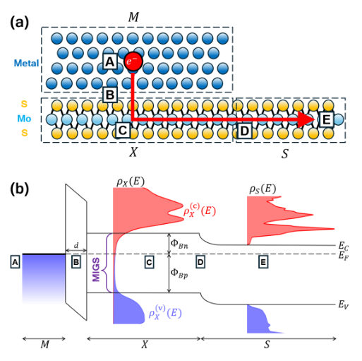
<figcaption class="paper-figure-caption"><b>Fig 1.</b> FIG. 1. Schematic of a metal-on-TMD contact (M: metal, S: semiconductor, X: semiconductor-under-metal). Based on a figure from [14]. (a) Carriers follow the injection path A-B-C- D-E. (b) Energy band diagram along the injection path. The metal-semiconductor gap has thickness d. MIGS with density ρX(E) arise in the bandgap, comprised of conduction-(ρ(c) X , red) and valence-(ρ(v) X , blue) band contributions. n- and p- type Schottky barrier heights are ΦBn, ΦBp.</figcaption>
</figure>
<figure class="paper-figure-card">
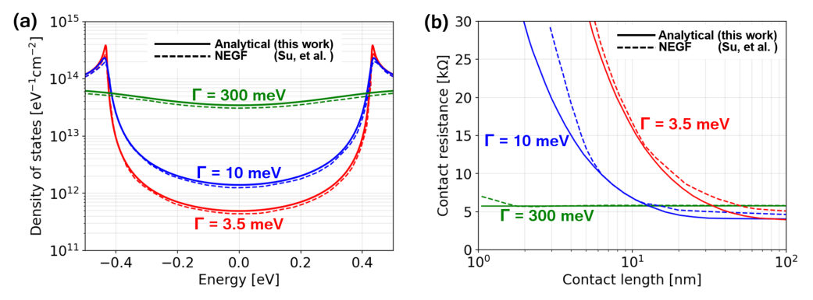
<figcaption class="paper-figure-caption"><b>Fig 2.</b> FIG. 2. Validation of our analytical model against NEGF simulations by Su et al. [24]. Analytical results (solid lines) show excellent agreement with NEGF results (dashed lines) across both MIGS density and length-dependence of contact resistance, RC(LC). (a) MIGS density for Pd contact to (13, 0) CNT, at various coupling strengths Γ. The metal is assumed to be wideband [25], so Γ(E) = const. van Hove singularities are visible at E = ±0.43 eV. (b) Contact resistance as a function of contact length and coupling Γ for p-type contact, assuming ΦBp = 0 for Pd-on-CNT as in [24].</figcaption>
</figure>

**Summary.** This work develops a unified analytical model describing metal contacts to low-dimensional semiconductors by focusing on Metal-Induced Gap States (MIGS). It successfully links the fundamental physics of MIGS density, governed by semiconductor dimensionality, to measurable transport parameters like contact resistance and Schottky barrier height. The theory provides crucial diagnostic tools for engineering high-performance nanoelectronic devices.

**Why it may be interesting.** While not directly related to quantum information protocols, the rigorous theoretical treatment of electronic structure at interfaces—a key area in open quantum systems—provides deep insights into how external coupling modifies intrinsic material properties.

Detailed structure

**Main problem.** The primary challenge is developing a general physical theory for metal contacts to low-dimensional semiconductors, which dictates device performance in nanoelectronics.

**Main result.** The authors present an analytical model revealing universal scaling laws for Metal-Induced Gap States (MIGS) and providing unified formulations for Schottky barrier height and contact resistance across different dimensions.

**Method.** The theory uses Green's function formalism, Fermi's Golden Rule, and charge neutrality principles to derive expressions for MIGS density and transport properties.

**Model / system.** The focus is on metal-semiconductor interfaces involving low-dimensional semiconductors (1D CNTs, 2D TMDs). The model explicitly incorporates the physics of Metal-Induced Gap States (MIGS) which govern Fermi Level Pinning (FLP).

**Key observables.** Schottky barrier height ($\Phi_B$), contact resistance ($R_C$), transfer length ($L_t$), and MIGS density ($
ho_X$).

**Important parameters / regimes.** Semiconductor dimensionality ($n$), coupling strength ($\Gamma(E)$), defect concentration (e.g., sulfur vacancies in $	ext{MoS}_2$), and metal work function ($E_{FM}$).

**Assumptions / limitations.** The model relies on the effective-mass approximation for the semiconductor density of states and assumes that charge conservation principles can be mapped onto the Green's function formalism, though it extends beyond simple zero-crossing criteria.

**Figures summary.** Figures illustrate the dimensional dependence of conduction-band MIGS ($
ho_c^X$) in 1D, 2D, and 3D, and show how $\Phi_B$ varies with CNT chirality or how $E_F$ de-pins when using semimetals.

**Paper structure.** The paper builds from establishing the general physical problem (lack of theory) to deriving core equations for MIGS ($
ho_X$), linking these states to macroscopic observables like $\Phi_B$ and $R_C$, and finally applying this framework to specific systems (CNTs, TMDs, semimetals).

Abstract

Metal contacts to low-dimensional semiconductors are critical for nanoelectronics, yet a general physical description has remained elusive. We present an analytical model for metal-induced gap states (MIGS), revealing a universal scaling law governed by semiconductor dimensionality. Linking MIGS to transport observables, we provide a unified formulation of Schottky barrier height, transfer length, and contact resistance. Our model explains recent experiments on carbon nanotubes and 2D materials, clarifying the fundamental criteria for achieving scalable, low-resistance contacts.

[↑ back to top](#top)

### [Solitary waves and vortices in a Nonlinear Schrödinger equation with ponderomotive nonlinearity](http://arxiv.org/abs/2606.14947v1)

**Authors:** D. K. Campbell, J. Cuevas-Maraver, R. Goh, P. G. Kevrekidis  
**Type:** theory · **Category:** other · **PDF:** <https://arxiv.org/pdf/2606.14947v1>  
**Analysis basis:** full PDF text, analyzed in chunks
**Topic relevance:** `non-equilibrium dynamics` **2/5** · `Keldysh / 2PI / non-Gaussian methods` **1/5** · `analog quantum simulation` **1/5** · `driven-dissipative phase transition` **1/5**

↔ Scroll figures horizontally

<figure class="paper-figure-card">
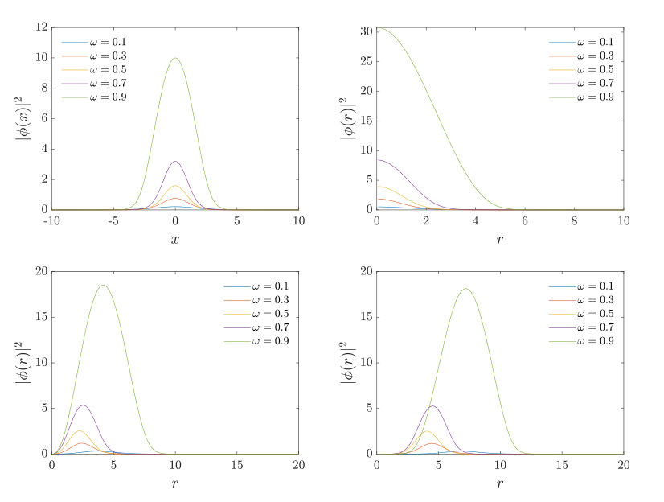
<figcaption class="paper-figure-caption"><b>Fig 1.</b> FIG. 1. Profiles, for some selected frequencies, for 1D solitons (top left), radial 2D solitons (top right) and vortex solitons with S = 1 (bottom left) and S = 2 (bottom right).</figcaption>
</figure>
<figure class="paper-figure-card">
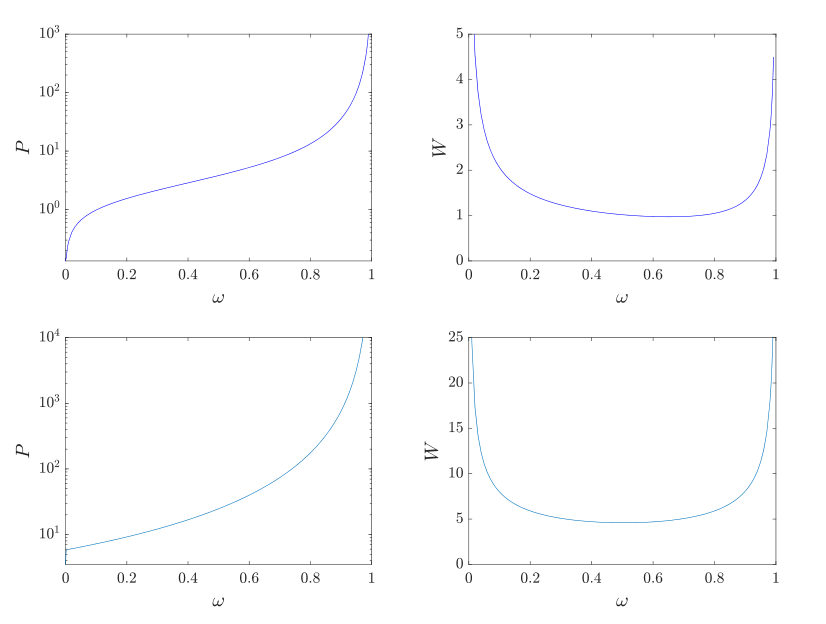
<figcaption class="paper-figure-caption"><b>Fig 2.</b> FIG. 2. Dependence of the norm (left panels) and width (right panels) with the frequency for 1D (top panels) and 2D radial (bottom panels) solitons</figcaption>
</figure>
<figure class="paper-figure-card">
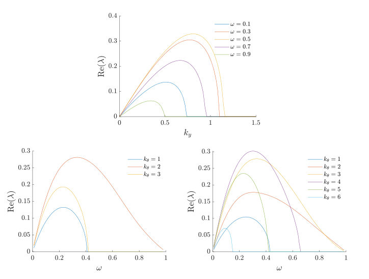
<figcaption class="paper-figure-caption"><b>Fig 3.</b> FIG. 3. Dependence of the real part of the right-most eigenvalues for (top) line solitons and (bottom) vortex solitons with S = 1 (left) and S = 2 (right). Notice that in the latter, only the values of kθ leading to instabilities have been depicted. In all cases, unstable eigenmodes for each frequency indicates spectral instability for all such solitary waves.</figcaption>
</figure>
<figure class="paper-figure-card">
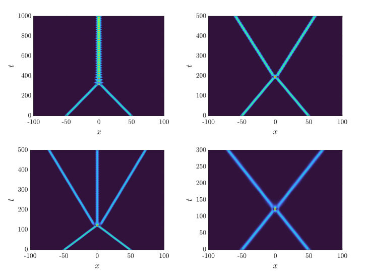
<figcaption class="paper-figure-caption"><b>Fig 4.</b> FIG. 4. Power density plots showing the evolution of the head-on collisions of 1D solitons with the same speed, produced via a Galilean boost. Speeds and frequencies at each of the panels are: (top left) ω = 0.9, c = 0.15; (top right) ω = 0.9, c = 0.25; (bottom left) ω = 0.9, c = 0.4 (bottom right) ω = 0.1, c = 0.4.</figcaption>
</figure>
<figure class="paper-figure-card">
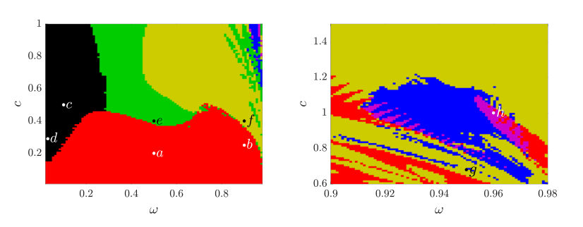
<figcaption class="paper-figure-caption"><b>Fig 5.</b> FIG. 5. Diagram showing, in the (ω, c) plane, the different regimes for head-on collisions. The colors have the following interpretation. Red: trapping; black: dispersion; green: reflection without bound states; yellow: reflection with bound state; blue: transverse breaking without bound states; pink: transverse breaking with bound states. The right panel focuses on the region with transverse breaking. Letters correspond to the isosurfaces in Fig. 6.</figcaption>
</figure>

**Summary.** This paper analyzes solitary waves in a plasma-relevant Nonlinear Schrödinger equation with ponderomotive nonlinearity. It establishes that while certain complex structures are unstable, simple 2D solitons are stable enough to undergo collisions. The most notable finding is the prediction of transverse splitting during longitudinal soliton collisions.

**Why it may be interesting.** This work provides a rich theoretical framework for understanding nonlinear wave interactions (solitons) in physical media like plasmas, which is highly relevant to quantum optics and nonlinear wave physics often studied alongside AMO topics.

Detailed structure

**Main problem.** The study investigates the stability and collision dynamics of solitary waves and vortices governed by a Nonlinear Schrödinger equation incorporating ponderomotive nonlinearity.

**Main result.** Stable solitary waves are found in both 1D and 2D, while line solitons and vortices ($S=1, S=2$) are spectrally unstable. Collisions can result in merger, dispersion, or an intriguing transverse splitting of the solitons.

**Method.** The analysis combines spectral stability theory (using perturbation methods) with numerical simulations of head-on collisions using high-order Runge-Kutta integrators.

**Model / system.** The system is modeled by a Nonlinear Schrödinger equation featuring ponderomotive nonlinearity, relevant for self-trapped laser beams in plasma. The analysis extends from 1D stationary solutions to full 2D structures like radial and vortex solitons.

**Key observables.** Soliton speed ($c$), oscillation frequency ($\omega$), topological charge ($S$), spectral growth rates ($\lambda$), and density split ratio ($R$).

**Important parameters / regimes.** The parameters governing the nonlinearity strength, wave number components ($k_	heta, k_y$), and collision velocities/frequencies are crucial for determining the outcome.

**Assumptions / limitations.** The analysis assumes specific forms for perturbations to test stability and focuses on head-on collisions of non-topological, spectrally stable solitons.

**Figures summary.** Figures illustrate profiles of 1D, radial, and vortex solitons; diagrams map out collision regimes in the $(\omega, c)$ plane (e.g., trapping, dispersion); and power density plots show the evolution during specific collisions or instability growth.

**Paper structure.** The paper systematically moves from establishing the governing equation and finding stationary solutions to performing detailed spectral stability analyses for different soliton types, culminating in extensive numerical simulations of collision dynamics across various parameter regimes.

Abstract

In the present work we revisit a ponderomotive nonlinearity model used to examine self-trapped laser beams in plasma. Upon briefly considering the exact stationary 1D solutions of the model, we extend considerations to two spatial dimensions where we find both solitonic and vortical structures. The solitary waves localized in both directions are found to be spectrally stable. However, all other structures that we consider in this model, including line solitons -- which are homogeneous 2D extensions of 1D solitons -- and vortices of topological charge S=1 and S=2 are found to be spectrally unstable. The focal point of our studies then turns to the examination of the collisions of the stable two-dimensional solitary waves for which we map a two-parameter space of soliton speeds and frequencies, in terms of the potential outcomes. While the standard scenarios of merger, inelastic collision leading to separation, separation that leaves behind a localized pulse are all possible, the intriguing outcome that we highlight here is that of a longitudinal collision yielding a transverse spliting of the solitons, either with or without a localized pulse remnant.

[↑ back to top](#top)

### [Symmetry-aware generative design of flat-band materials beyond known crystal-net prototypes](http://arxiv.org/abs/2606.15321v1)

**Authors:** Yihao Wei, Ivan Savochkin, Artem Mishchenko, Xiangwen Wang, Qian Yang  
**Type:** theory · **Category:** strongly correlated electrons · **PDF:** <https://arxiv.org/pdf/2606.15321v1>  
**Analysis basis:** full PDF text, analyzed in chunks
**Topic relevance:** `analog quantum simulation` **2/5** · `Keldysh / 2PI / non-Gaussian methods` **1/5** · `methods for driven-dissipative` **1/5**

↔ Scroll figures horizontally

<figure class="paper-figure-card">
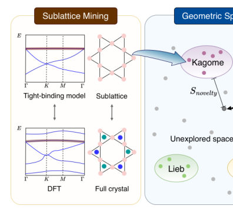
<figcaption class="paper-figure-caption"><b>Fig 1.</b> Fig. 1 Unconventional flat-band geometries and their realization. Left: stripping a flat-band material to its bare sublattice, a nearest-neighbour tight-binding model reproduces the dispersionless band of the full DFT calculation, indicating that band flatness originates from network connectivity. Centre: validated flat-band sublattices embedded in a continuous geometric space form known clusters (kagome, Lieb, pyrochlore) separated by a sparsely populated unexplored region, where gray points represent unclustered sublattices; outliers are ranked by a novelty score Snovelty, the latent-space distance to the nearest known family. Right: an unconventional skeleton (e.g. the oxygen sublattice...</figcaption>
</figure>
<figure class="paper-figure-card">
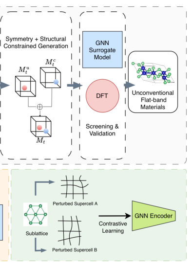
<figcaption class="paper-figure-caption"><b>Fig 2.</b> Fig. 2 Workflow of unconventional flat-band material generation. The overall pipeline is shown in the top panel. Starting from the Materials Project (MP) database, flat-band screening and tight-binding analysis identify flat-band materials and extract non-trivial sublattices, whose GNN- encoder embeddings are clustered and classified by RCSR prototypes to discover unconventional geometries. These motifs are expanded through symmetry- and structural-constrained generation, in which the constrained skeleton M c t and the unconstrained component M u t are recombined at each diffusion step into the full structure Mt. Candidates are then screened by the GNN surrogate model and validated with...</figcaption>
</figure>
<figure class="paper-figure-card">
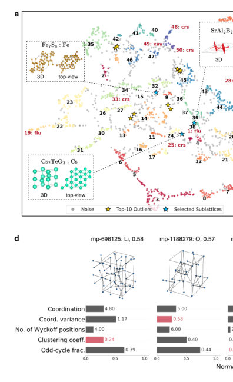
<figcaption class="paper-figure-caption"><b>Fig 3.</b> Fig. 3 Geometric latent space analysis of flat-band sublattices and identification of unconventional motifs. a, UMAP projection of GNN-encoded latent embeddings for 1,852 non- trivial flat-band sublattices, colored by HDBSCAN cluster ID. Clusters that coincide with catalogued crystal net prototypes are labeled (e.g., flu: fluorite, crs: cristobalite and xay: deltahedron); the remaining clusters recur across the database but are not dominated by certain catalogue. Top-10 novelty outliers (yellow stars) and representative outliers (blue stars) are highlighted; grey points denote unclustered or catalogued points. Insets show three-dimensional and top-view visualizations of representative...</figcaption>
</figure>
<figure class="paper-figure-card">
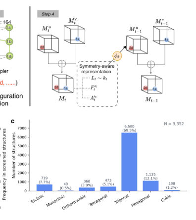
<figcaption class="paper-figure-caption"><b>Fig 4.</b> Fig. 4 SkeleGen framework and statistics of screened candidate materials. a, Overview of the constrained generation pipeline. Step 1: a rigid flat-band-hosting sublattice with unconventional geometry is selected as the structural skeleton. Step 2: sublattice sites are populated with predeter- mined species and lattice lengths are sampled from bond-length distributions. Step 3: a compatible space group Gfull is sampled, constrained atoms are matched to Wyckoff positions, and the remaining positions are completed by a dynamic-programming sampler, yielding a full Wyckoff configuration. Step 4: DiffCSP++ performs constrained diffusion in which the skeleton atoms follow a predefined trajectory...</figcaption>
</figure>
<figure class="paper-figure-card">
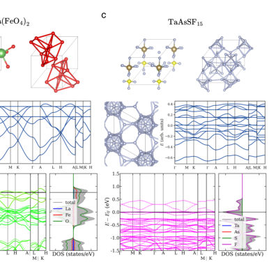
<figcaption class="paper-figure-caption"><b>Fig 5.</b> Fig. 5 Selected showcases of generated flat-band materials. For each candidate, the upper- left panel shows the generated crystal structure; the upper-right panel shows a 3D view of the crystal net that corresponds to the constrained sublattice and produces a flat band in the nearest-neighbour model; the middle-left panel shows a c-direction top view of the same crystal net; the middle-right panel shows the nearest-neighbour tight-binding band structure of the isolated skeleton; and the lower panel shows the DFT band structure with bands projected onto the constituent elements, alongside the corresponding element-projected density of states. All DFT energies are referenced to the Fermi...</figcaption>
</figure>

**Summary.** This work introduces SkeleGen, a novel computational framework that overcomes the limitations of cataloged crystal motifs by treating flat-band connectivity as a continuous geometric property. By using symmetry-aware generative models guided by latent space analysis, the authors successfully designed and screened thousands of chemically plausible materials predicted to host exotic flat electronic bands.

**Why it may be interesting.** While focused on solid-state physics, the methodology—using generative AI (diffusion/GNN) constrained by fundamental physical symmetries to explore vast chemical spaces—is highly relevant for designing quantum materials with specific electronic properties.

Detailed structure

**Main problem.** The design of flat electronic bands for strongly correlated and topological phenomena is limited by a small, known catalogue of geometric crystal motifs.

**Main result.** The authors developed SkeleGen to generate 9,352 novel, stable crystal candidates that retain the desired flat-band character traceable to unconventional sublattices.

**Method.** A symmetry-aware generative model (SkeleGen) combines continuous geometric representation with structural constraints derived from Graph Neural Networks trained on sublattice embeddings.

**Model / system.** The focus is on electronic band structure arising from specific lattice connectivity patterns, modeled by identifying and embedding 'flat-band skeletons' within larger crystal structures. Validation involves high-throughput DFT calculations.

**Key observables.** Band flatness (dispersionless bands), Novelty score ($	ext{S}_{	ext{novelty}}$), Flatness score ($S_{	ext{total}}$).

**Important parameters / regimes.** DFT calculation parameters (PBEsol functional, PAW potentials); Latent space thresholds (e.g., 50th percentile for novelty).

**Assumptions / limitations.** The electronic properties are primarily determined by the connectivity of the underlying sublattice skeleton, allowing a geometric design principle to guide material discovery.

**Figures summary.** Figures illustrate the workflow: mapping known vs. unexplored latent space regions (UMAP), detailing the four-step constrained generation pipeline (SkeleGen), and showing representative candidates with their derived band structures.

**Paper structure.** The paper follows a progression from identifying the limitation of existing motifs to developing a continuous geometric representation via GNNs, generating novel skeletons using SkeleGen under symmetry constraints, and finally validating these generated structures through high-throughput DFT calculations.

Abstract

Flat electronic bands underlie a range of strongly correlated and topological phenomena, whose design in real materials has so far relied on a small catalogue of named geometric motifs such as kagome, Lieb, and pyrochlore nets. This discrete catalogue is by no means to exhaust the geometries that support flat bands in real compounds, as band flatness is a property of network connectivity. Here we combine a continuous geometric representation of crystal sublattices, with a symmetry-constrained generative model, to access a broader design space for materials hosting flat bands. The key step is to choose sublattice motifs that are outside the known geometric clusters, ensuring the novelty of the generated structures. We then introduce SkeleGen, which pins these unconventional skeletons to symmetry-compatible Wyckoff positions while denoising the surrounding chemistry, resulting in 9,352 crystal candidates that survive stability and flatnessscreening. Band flatness is confirmed using high throughput full DFT calculations, which agree well also with the tight-binding spectra of the isolated skeletons, supporting a geometric origin of the band flatness. We demonstrate "out-of-distribution" motifs as a new design principle to dramatically expand geometric repertoire for materials discovery, potentially beyond flat bands.

[↑ back to top](#top)

### [Impedance Matching and Absorption Enhancement in Helical Carbon Coil Microwave Absorbers via Tunable Anchoring Layer Thickness](http://arxiv.org/abs/2606.15289v1)

**Authors:** Weihua Mu  
**Type:** theory · **Category:** other · **PDF:** <https://arxiv.org/pdf/2606.15289v1>  
**Analysis basis:** full PDF text, analyzed in chunks
**Topic relevance:** `Keldysh / 2PI / non-Gaussian methods` **1/5** · `analog quantum simulation` **1/5** · `correlated / nonlocal dissipation` **1/5** · `driven-dissipative phase transition` **1/5** · `entanglement & information structure` **1/5** · `interference shaping light` **1/5** · `methods for driven-dissipative` **1/5** · `non-equilibrium dynamics` **1/5** · `non-equilibrium universality` **1/5**

↔ Scroll figures horizontally

<figure class="paper-figure-card">
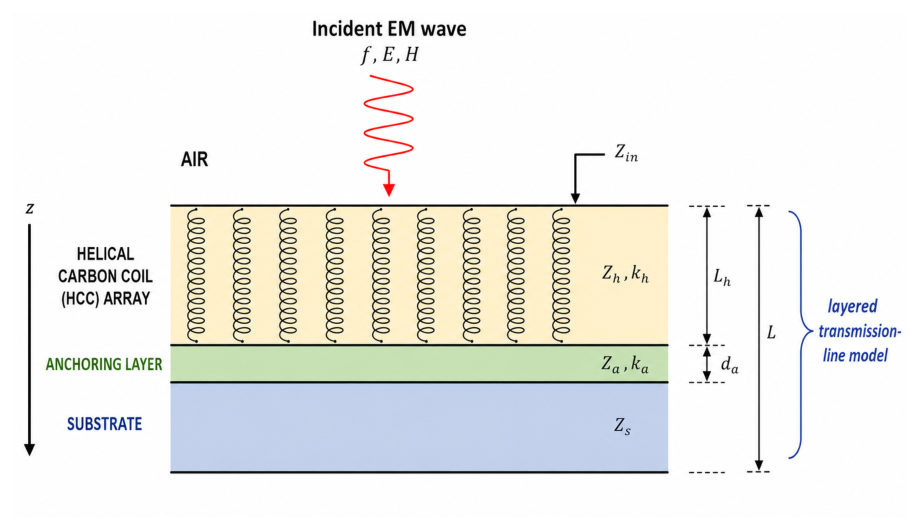
<figcaption class="paper-figure-caption"><b>Fig 1.</b> FIG. 1. Schematic illustration of the coarse grained helical carbon coil (HCC) absorber archi-</figcaption>
</figure>
<figure class="paper-figure-card">
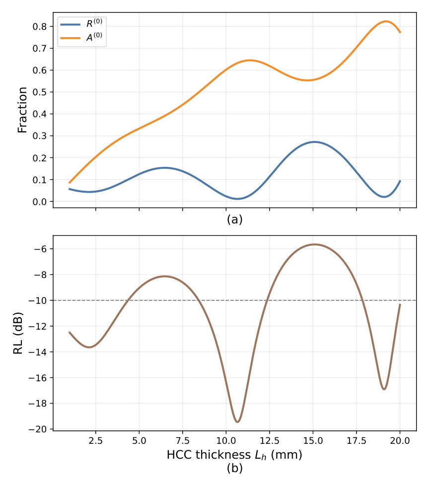
<figcaption class="paper-figure-caption"><b>Fig 2.</b> FIG. 2. The refraction and absorption of a HCC|SiO2 substrate device for an incoming microwave</figcaption>
</figure>
<figure class="paper-figure-card">
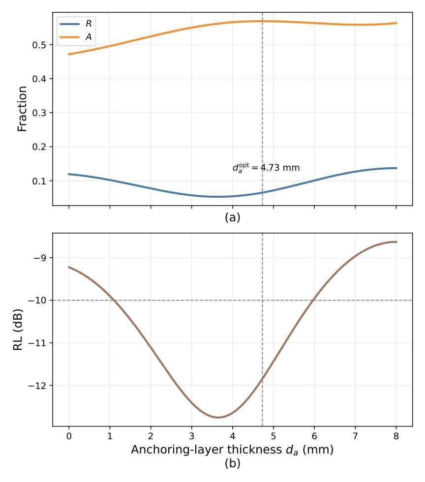
<figcaption class="paper-figure-caption"><b>Fig 3.</b> FIG. 3. The refraction and absorption of a “HCC|anchoring layer|SiO2 substrate” sandwich-</figcaption>
</figure>

**Summary.** This theoretical work develops a model for helical carbon coil microwave absorbers, treating an intermediate anchoring layer as a tunable parameter. By optimizing the thickness of this layer using impedance matching principles, the authors demonstrate a significant enhancement in microwave absorption efficiency. This provides practical design guidelines for high-performance metamaterial absorbers.

**Why it may be interesting.** While focused on microwave engineering, the use of effective medium theory, boundary condition matching (impedance tuning), and modeling complex material interfaces is relevant to open quantum systems where coupling to external environments or structured media dictates energy dissipation/coupling rates.

Detailed structure

**Main problem.** The primary goal is to enhance microwave absorption efficiency in helical carbon coil (HCC) absorbers by optimizing impedance matching.

**Main result.** Introducing a carbon-based anchoring layer with an optimized thickness significantly enhances the impedance-matched absorption of microwaves at specific frequencies.

**Method.** The study employs a coarse-grained electrodynamic model and transmission-line framework to calculate reflection and absorption fractions across different layered structures.

**Model / system.** The physical system is a microwave absorber composed of helical carbon coils on a quartz substrate, modeled as a multilayer structure: Air $
ightarrow$ HCC active layer $
ightarrow$ Tunable Anchoring layer $
ightarrow$ Substrate. The model uses effective medium theory and impedance matching principles.

**Key observables.** Absorption fraction (A), Reflection coefficient (R), Input Impedance ($Z_{in}$)

**Important parameters / regimes.** Anchoring layer thickness ($d_a$), Frequency range (2 to 18 GHz), Effective refractive index ($n_{eff}$)

**Assumptions / limitations.** The model uses a coarse-grained effective medium approximation, and initial analyses neglect the contribution of the chiral parameter ($\kappa$) for simplification.

**Figures summary.** Figure 2 shows absorption/reflection vs. HCC thickness for bare structures; Figure 3 demonstrates that varying the anchoring layer thickness ($d_a$) leads to maximal absorption at an optimal value (e.g., $\approx 4.7$ mm).

**Paper structure.** The paper develops a layered electromagnetic model, calculates input impedance using transmission-line theory, and then systematically varies the anchoring layer thickness as a tunable parameter to maximize absorption.

Abstract

Helical carbon coils exhibit unique three dimensional chiral architectures that can effectively interact with microwaves in the 2 to 18 GHz range. Inspired by recent experimental studies, we develop a coarse grained electrodynamic model for helical carbon coil arrays supported on quartz substrates, and examine their potential as microwave absorbers. Guided by the heuristic relation $f_{\mathrm{res}} = c / (n_{\mathrm{eff}} p)$, we compute absorption and reflection fractions for both bare helical carbon coil on substrate and helical carbon coil with anchoring layer on substrate configurations. The anchoring layer thickness is treated as a tunable parameter to improve absorption at selected frequencies. We find that the introduction of a carbon based anchoring layer of optimized thickness enhances impedance matching absorption. The parameters are chosen as representative values for demonstration purposes, and may vary within a certain range depending on preparation conditions. Our results serve to illustrate the potential of helical carbon coils as microwave absorbing devices, and to identify possible active tuning strategies. In the discussion section, we consider extensions of the present model to account for circular dichroism absorption, and examine the influence of actual interfacial reflection on microwave absorption and reflection.

[↑ back to top](#top)

### [Modulation theory for lumps and interactions between lumps and a mean field in the Kadomtsev-Petviashvili equation](http://arxiv.org/abs/2606.14986v1)

**Authors:** Gino Biondini, Sergey Dyachenko, Mark A. Hoefer, Nicholas J. Ossi  
**Type:** theory · **Category:** other · **PDF:** <https://arxiv.org/pdf/2606.14986v1>  
**Analysis basis:** full PDF text, analyzed in chunks
**Topic relevance:** `Frenkel-Kontorova` **1/5** · `Keldysh / 2PI / non-Gaussian methods` **1/5** · `analog quantum simulation` **1/5**

↔ Scroll figures horizontally

<figure class="paper-figure-card">
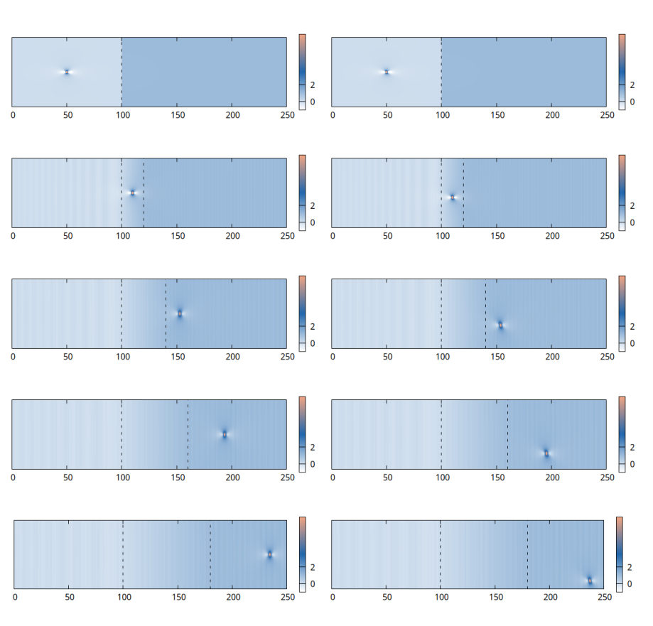
<figcaption class="paper-figure-caption"><b>Fig 1.</b> Figure 1: Density plots of the numerically computed solution u(x, y,t) of the KPI equation as a function of x and y at the times t = 0, t = 20, t = 40, t = 60, and t = 80 (top to bottom) with a = 1.75 and q = 0 (left) and q = 0.1 (right). The rarefaction wave region lies between the two dashed vertical lines. (See Appendix for details of the numerical methods.)</figcaption>
</figure>
<figure class="paper-figure-card">
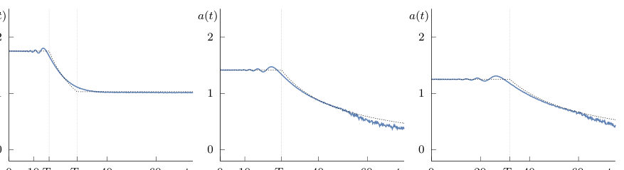
<figcaption class="paper-figure-caption"><b>Fig 2.</b> Figure 2: Numerically measured lump amplitude parameter, a(t) as a function of t (solid blue line) with theoretical prediction (dashed black line) in a case of lump transmission, a0 = 1.75, q0 = 0 (left), critical trapping threshold a0 = p</figcaption>
</figure>
<figure class="paper-figure-card">
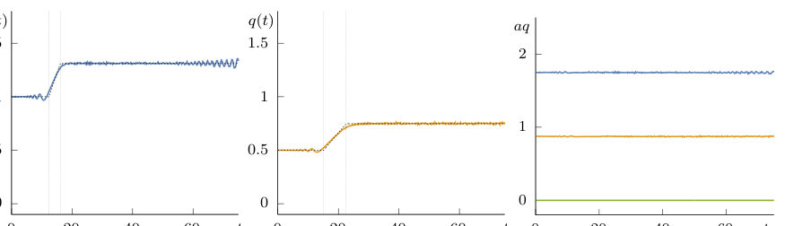
<figcaption class="paper-figure-caption"><b>Fig 3.</b> Figure 3: The lump parameter q(t) as a function of time as the lump propagates through the rarefaction wave, with a0 = 1.75 and with q0 = 1 (left panel) and q0 = 0.5 (center panel) as reconstructed from numerical simulations (blue and gold curves), compared to the theoretical predictions (dashed black curves). Right panel: The product aq as function of time in three simulations with a0 = 1.75 and q0 = 0 (green curve), q0 = 0.5 (gold curve) and q0 = 1 (blue curve).</figcaption>
</figure>
<figure class="paper-figure-card">
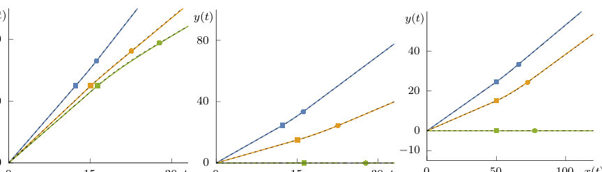
<figcaption class="paper-figure-caption"><b>Fig 4.</b> Figure 4: The x-coordinate of the lump (left panel), the y-coordinate of the lump (center panel), and the lump trajectory (x(t), y(t)) (right panel) for a = 1.75 and q = 0 (green), q = 0.5 (gold) and q = 1 (blue) vs with theory (dashed black line). The squares mark the time at which the lump enters the rarefaction wave region, while the circles mark the time at which the lump exits the rarefaction wave.</figcaption>
</figure>
<figure class="paper-figure-card">
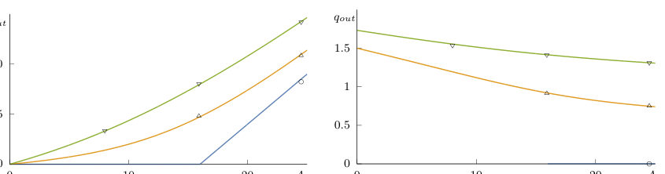
<figcaption class="paper-figure-caption"><b>Fig 5.</b> Figure 5: Left: Analytical prediction for the final lump amplitude Aout = 8a2 1 as a function of the initial lump amplitude Ain = 8a2 0 for q0 = 0 (blue curve), q0 = 0.5 (gold curve) and q0 = 1 (green curve) versus the numerically recovered values, marked by circles and triangles. Right panel: analytical prediction for the final slope parameter q1 as a function of the initial lump amplitude Ain = 8a2 0 (for the same values of q0 as in the left panel) versus the numerically recovered values.</figcaption>
</figure>

**Summary.** This paper develops a comprehensive modulation theory to describe how stable, localized 'lumps' of solutions interact within the two-dimensional Kadomtsev-Petviashvili equation. By deriving and analyzing an integrable hyperbolic system governing these modulations, the authors provide quantitative predictions for whether a lump will pass through or become trapped by a background mean field wave.

**Why it may be interesting.** While focused on classical nonlinear PDEs, the mathematical techniques—such as deriving integrable modulation equations for localized structures—share conceptual parallels with effective theories used in quantum field theory or semiclassical approximations in AMO physics.

Detailed structure

**Main problem.** The research aims to develop a modulation theory for localized structures called 'lumps' within the Kadomtsev-Petviashvili (KP) equation when these lumps interact with a slowly varying mean field.

**Main result.** The authors derived precise theoretical predictions describing how lump parameters change during interactions, successfully predicting both transmission and trapping scenarios based on initial conditions.

**Method.** The approach involves deriving a hyperbolic modulation system from integral identities, testing its integrability using the Haantjes tensor test, and solving resulting ODEs via method of characteristics.

**Model / system.** The primary model is the (2+1)-dimensional Kadomtsev-Petviashvili I (KPI) equation. The analysis focuses on the modulation of stable, localized rational solutions (lumps) interacting with a mean field governed by the dispersionless KP (dKP) equation.

**Key observables.** Lump parameters ($a, q$), final amplitude ($A_{out}$), phase shift ($\delta$), and the time evolution of these quantities during interaction.

**Important parameters / regimes.** The small parameter $\epsilon$ used in the multiple scale ansatz; initial lump amplitudes ($A_0$) and transverse wave numbers ($q_0$).

**Assumptions / limitations.** The analysis relies on the assumption that the mean field satisfies the dKP equation, and it treats the modulation as a slow evolution process ($\epsilon \ll 1$).

**Figures summary.** Figures compare analytical predictions of lump amplitude $a(t)$ against numerical measurements for transmission/trapping cases, and show time evolution plots for parameters like $q(t)$.

**Paper structure.** The paper progresses from deriving the governing four-component hyperbolic modulation system (2.19) to proving its integrability, analyzing specific reductions (e.g., $Y$-independent), and finally applying these tools to solve the physical problem of lump interaction with a rarefaction wave.

Abstract

A (2+1)-dimensional hyperbolic system of four quasi-linear partial differential equations is derived that describes the modulations of lump solutions of the Kadomtsev-Petviashvili I (KPI) equation in the presence of a mean field. The system is then shown to satisfy the necessary conditions for integrability of hydrodynamic chains. Moreover, a suitable reduction of the resulting modulation system is applied to study the interactions between lumps and a rarefaction wave for the mean field. Precise conditions are derived that describe how the lump parameters change as a result of the interaction, and which in particular determine whether the lump is transmitted through or trapped inside the rarefaction wave. The theoretical predictions are compared to direct numerical simulations of the KPI equation, showing excellent agreement.

[↑ back to top](#top)

### [Direct Nanoscale Pyroelectric Characterization of a CuInP${}_2$S${}_6$ van der Waals Nanogenerator](http://arxiv.org/abs/2606.16410v1)

**Authors:** Valentin Fonck, Roop K. Mech, Mohammadali Razeghi, Stuart Finch, Aljoscha Söll, Phillip Dobson, Jonathan R. Weaver, Zdenek Sofer, Oleg Kolosov, Jean Spièce, Pascal Gehring  
**Type:** both · **Category:** other · **PDF:** <https://arxiv.org/pdf/2606.16410v1>  
**Analysis basis:** full PDF text, analyzed in chunks
**Topic relevance:** `methods for driven-dissipative` **1/5** · `quantum measurements` **1/5**

↔ Scroll figures horizontally

<figure class="paper-figure-card">
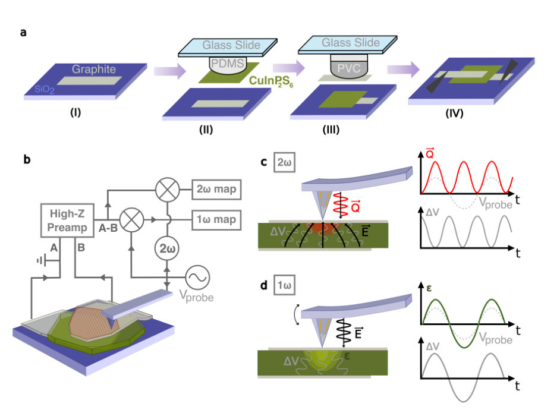
<figcaption class="paper-figure-caption"><b>Fig 1.</b> Figure 1: a Schematic illustration of device fabrication. (I) A bottom few-layer graphene electrode is transferred onto a 285 nm SiO2/Si substrate. (II) A CIPS flake is transferred onto the bottom electrode. (III) A top few-layer graphene electrode is transferred to form a vertical capacitor with an overlap region. (IV) The electrodes are contacted using indium needles and wire-bonded to a sample holder. b Schematic of the pyroelectric imaging setup using a scanning thermal microscopy probe as a localized heat source. Electrical signals are shown as grey solid lines while boxes represent measurement instrumentation. c Origin of the second harmonic signal, schematically with time-dependent...</figcaption>
</figure>
<figure class="paper-figure-card">
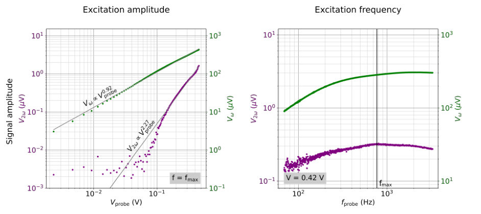
<figcaption class="paper-figure-caption"><b>Fig 2.</b> Figure 2: Parameter study on the dependence of the pyroelectric signal, shown in purple, and the electromechanical response, shown alongside in green. a Signal amplitudes with respect to the excitation voltage Vprobe. b Signal amplitudes with respect to the excitation frequency fprobe. c Signal phases with respect to the excitation voltage Vprobe. d Signal phases with respect to the excitation frequency fprobe.</figcaption>
</figure>
<figure class="paper-figure-card">
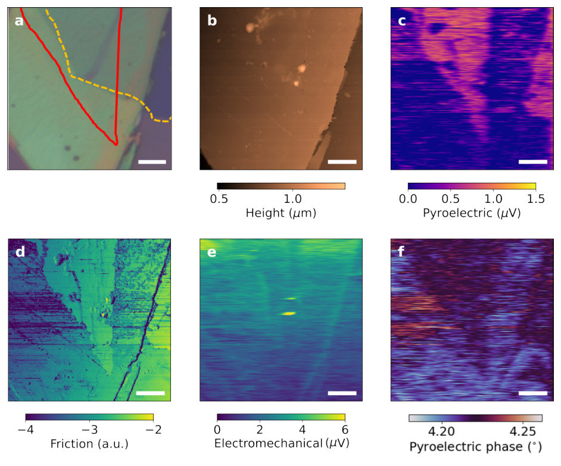
<figcaption class="paper-figure-caption"><b>Fig 3.</b> Figure 3: a Optical micrograph of the scanned region. The top and bottom few-layer graphene electrodes are respectively delimited with a red and yellow line. bTopography of the van der Waals capacitor. c and f Amplitude and phase of the second harmonic voltage, induced by the pyroelectric effect. d Friction map showing mechanical contrast between the different regions. e Amplitude of the first harmonic voltage, induced by the electrostatic and electromechanical interactions. Scale bar: 5 µm.</figcaption>
</figure>
<figure class="paper-figure-card">
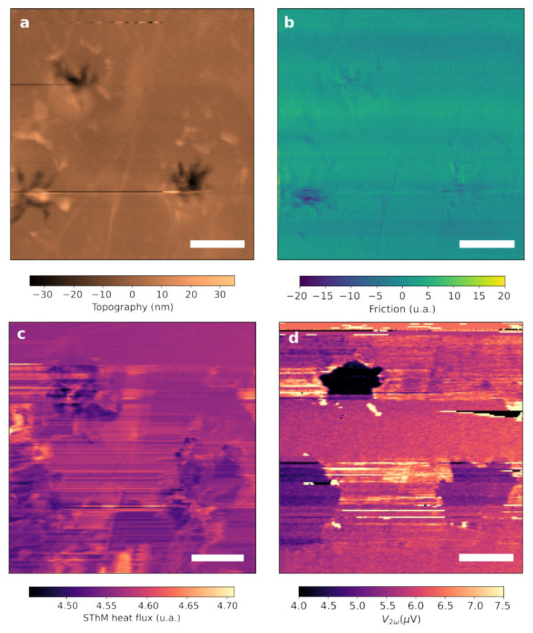
<figcaption class="paper-figure-caption"><b>Fig 4.</b> Figure 4: a Topography of defects in the pyrogenerator’s top electrode. b Lateral friction map. c SThM heat-flux signal, measured in arbitrary units. d Pyrovoltage amplitude measured between the two electrodes. Scale bar: 400 nm.</figcaption>
</figure>
<figure class="paper-figure-card">
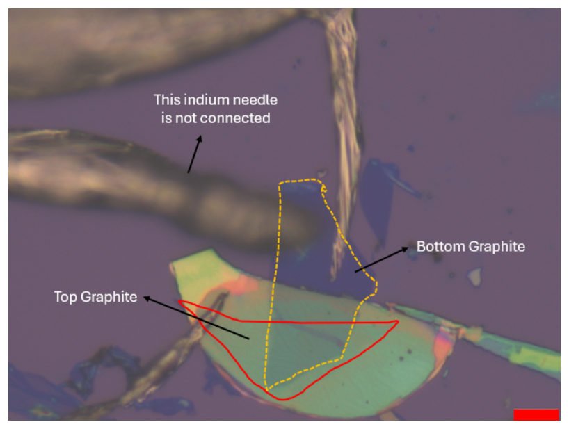
<figcaption class="paper-figure-caption"><b>Fig 5.</b> FIG. 1. Micrograph of the sample presented in the main text. The regions of the top and bottom electrodes</figcaption>
</figure>

**Summary.** This work presents a novel, highly localized technique for measuring pyroelectric coefficients in van der Waals nanogenerators using Scanning Thermal Microscopy. By employing harmonic detection and finite-element modeling, the researchers successfully separated the intrinsic thermal response from parasitic electrical effects. This method provides unprecedented spatial resolution to map local performance limitations within these advanced energy harvesting devices.

**Why it may be interesting.** While focused on solid-state physics, the rigorous application of localized thermal probing combined with harmonic signal processing shares methodological parallels with techniques used to probe local energy dissipation or coupling mechanisms in quantum systems.

Detailed structure

**Main problem.** To develop a method for direct nanoscale pyroelectric characterization of van der Waals nanogenerators, overcoming limitations associated with conventional spatially averaged measurements.

**Main result.** The authors successfully established a versatile platform using SThM and harmonic detection to quantitatively measure the local pyroelectric coefficient ($p$) in $	ext{CuInP}_2	ext{S}_6$ devices while resolving nanoscale defects.

**Method.** The technique combines Scanning Thermal Microscopy (SThM) as a localized heat source with lock-in detection, utilizing harmonic analysis to isolate the second-harmonic pyroelectric signal from parasitic first-harmonic electromechanical contributions.

**Model / system.** The physical system is an out-of-plane van der Waals capacitor made of $	ext{CuInP}_2	ext{S}_6$ (CIPS) sandwiched between few-layer graphene electrodes. The analysis involves both electrical measurements and finite-element thermal modeling to determine the local pyroelectric coefficient.

**Key observables.** Pyroelectric voltage signal ($\Delta V$) measured at $2\omega$, localized pyroelectric coefficient ($p$), temperature distribution ($\Delta T$).

**Important parameters / regimes.** Local pyroelectric coefficient range of $1.91$ to $11.25 \mu	ext{C m}^{-2} 	ext{K}^{-1}$; device thickness $\sim 220-260 	ext{ nm}$.

**Assumptions / limitations.** The method assumes that harmonic analysis can perfectly separate the pyroelectric signal from electromechanical artifacts, and FEA models rely on accurate material properties like thermal conductivity.

**Figures summary.** Figures illustrate the SThM setup, frequency dependence of signals (showing $2\omega$ vs. $1\omega$), spatial maps revealing defects, and FEA simulations comparing temperature profiles when the tip contacts graphene versus CIPS.

**Paper structure.** The paper progresses from establishing the physical basis for pyroelectric energy harvesting to detailing the advanced SThM measurement technique (harmonic separation), presenting quantitative results for $p$, and finally using thermal modeling to interpret the role of electrode contact in heat transfer.

Abstract

Pyroelectric energy conversion offers a route for harvesting time-dependent thermalfluctuations that are abundant in natural and technological environments. Twodimensional ferroelectrics are particularly attractive for this purpose because reduced dimensionality enables ultrathin, mechanically compliant device architectures. Here, we demonstrate direct nanoscale pyroelectric characterization of an out-of-plane van der Waals nanogenerator based on CuInP2S6 (CIPS) encapsulated between few-layer graphene electrodes. A scanning thermal microscopy (SThM) probe is employed as a localized nanoscale heat source while the electrically generated response is measured in situ through the device electrodes. Harmonic detection isolates the pyroelectric signal from parasitic first-harmonic electromechanical contributions, while finite-element thermal modeling combined with probe calibration enables direct determination of the local pyroelectric coefficient from the measured electrical response. Beyond quantitative characterization, the spatially resolved measurements directly identify electrically inactive regions associated with device defects, revealing local performance-limiting features that remain hidden in conventional spatially averaged pyroelectric measurements. The presented approach establishes a versatile platform for quantitative nanoscale pyroelectric characterization and the optimization of van der Waals pyroelectric devices.

[↑ back to top](#top)

### [Machine learning enables roughness-driven inverse design of milling processes](http://arxiv.org/abs/2606.16032v1)

**Authors:** Hadi Bakhshan, Sima Farshbaf, Fernando Rastellini, Josep Maria Carbonell  
**Type:** both · **Category:** disordered systems and neural networks · **PDF:** <https://arxiv.org/pdf/2606.16032v1>  
**Analysis basis:** full PDF text, analyzed in chunks
**Topic relevance:** `methods for driven-dissipative` **1/5** · `non-equilibrium dynamics` **1/5**

↔ Scroll figures horizontally

<figure class="paper-figure-card">

<figcaption class="paper-figure-caption"><b>Fig 1.</b> Fig. 1: The face milling tool with two inserts interacting with the workpiece is illustrated, highlighting the four defined coordinate systems: cutting- edge, tool, spindle, and workpiece coordinate systems. The rake angles of the insert, along with the run-out parameters, are also presented.</figcaption>
</figure>
<figure class="paper-figure-card">
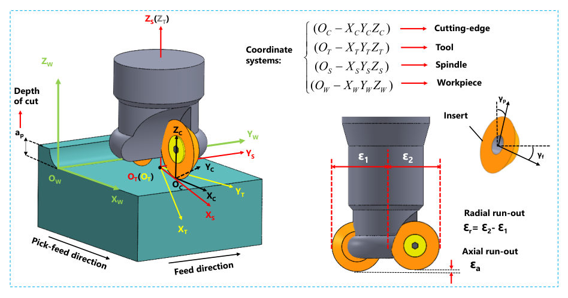
<figcaption class="paper-figure-caption"><b>Fig 2.</b> Fig. 2a depicts the surface topography generated by the computational model for the case studies considered. It is evident that the model successfully captures the main characteristics of the machined surfaces, showing strong agreement with the experimental results in terms of both surface morphology and contour distribution. The formation of surface irregularities, such as peaks and valleys, is primarily governed by the alternating engage- ment of the tool during forward and backward cutting actions, considering the presence of two inserts in this specific scenario. These characteristic features can be directly associated with the cutting-edge trajectories. Each cutting-edge follows a...</figcaption>
</figure>
<figure class="paper-figure-card">
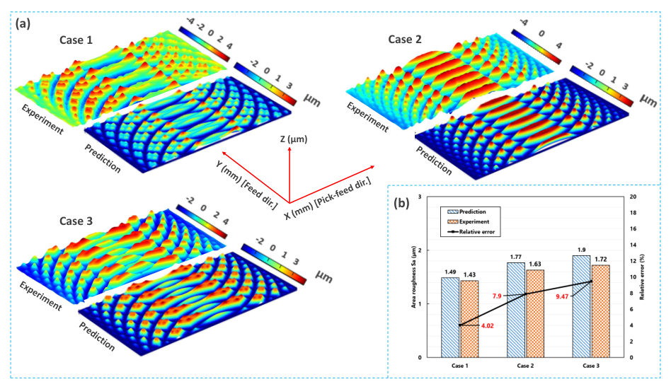
<figcaption class="paper-figure-caption"><b>Fig 3.</b> Fig. 2: (a) 3D surface topographies from both model predictions and experiments for the three case studies. (b) Comparison between predicted and experimental average surface roughness values, along with the corresponding relative errors. Experimental data are adapted from [38].</figcaption>
</figure>
<figure class="paper-figure-card">

<figcaption class="paper-figure-caption"><b>Fig 4.</b> Fig. 3: Parameters that influence the surface roughness in machining [39].</figcaption>
</figure>
<figure class="paper-figure-card">
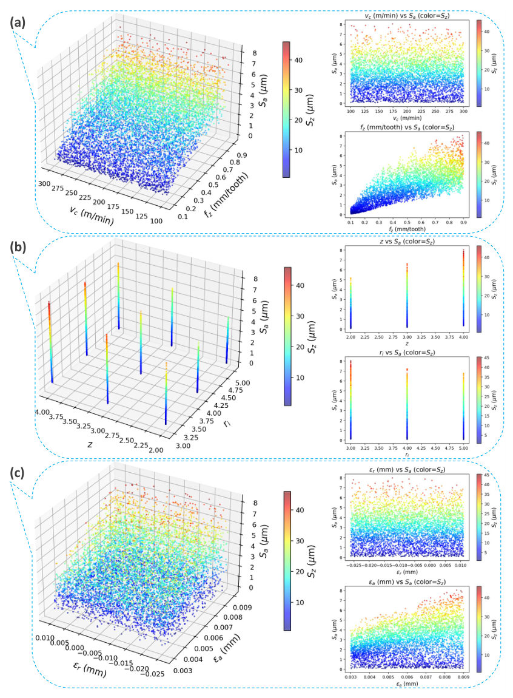
<figcaption class="paper-figure-caption"><b>Fig 5.</b> Fig. 4: 3D and 2D diagrams showing the variation of outputs such as average surface roughness and maximum surface height with respect to six input parameters, namely: (a) cutting speed and feed rate, (b) number of inserts and their radii, and (c) radial and axial run-outs.</figcaption>
</figure>

**Summary.** This paper develops a robust machine learning framework to solve the inverse design problem in milling, aiming to find process parameters that yield specific target surface roughness. It trains Deep Neural Networks and Random Forests on simulated data and uses Bayesian Optimization to navigate the complex parameter space. The methodology demonstrates high accuracy by successfully identifying multiple feasible solutions for desired surface quality.

**Why it may be interesting.** While applied to mechanical engineering, the methodology—using complex physical simulations to generate training data for deep learning surrogate models, followed by optimization in an ill-posed inverse problem—is highly relevant to developing physics-informed machine learning tools for quantum systems.

Detailed structure

**Main problem.** The core problem is performing inverse design for surface milling processes: determining optimal machining and tool parameters required to achieve a target surface roughness.

**Main result.** A machine learning framework combining DNNs/RFs with Bayesian Optimization successfully identifies multiple feasible process configurations, achieving low average relative errors (below 5%) compared to reference simulations.

**Method.** The authors train ML models on high-fidelity synthetic datasets generated from computational fluid dynamics simulations and then use these trained models within a Bayesian Optimization loop to solve the ill-posed inverse problem.

**Model / system.** The physical system is a face milling process involving an indexable cutter. The model relies on generating synthetic data by simulating cutting-edge motion over time/space using complex coordinate transformations, treating components as rigid bodies.

**Key observables.** Average surface roughness (Sa) and maximum surface height (Sz).

**Important parameters / regimes.** Cutting speed ($v_c$), feed rate ($f_z$), number of inserts ($z$), insert radius ($r_i$), radial run-out ($\epsilon_r$), and axial run-out ($\epsilon_a$).

**Assumptions / limitations.** The ML performance is highly dependent on the quality of the synthetic training dataset, and the computational model disregards material properties.

**Figures summary.** Figures illustrate 3D surface topographies, convergence plots for optimization (DNN/RF), parity plots comparing predicted vs. actual roughness values, and visualizations of the solution space across different target regimes.

**Paper structure.** The paper first establishes the need for inverse design in manufacturing. It details generating synthetic data via simulation, trains DNN and RF models on this data, analyzes the inherent many-to-one mapping challenge, and finally integrates these ML surrogates into a Bayesian Optimization framework to propose optimal parameter sets.

Abstract

Interest in applying data-driven approaches in manufacturing has grown significantly, particularly for mapping complex, high-dimensional relationships. The milling process is one area where predictive models can link influential parameters to surface roughness metrics prior to in situ operations. While this approach offers clear advantages, it faces challenges due to limited datasets and robustness issues in inverse design paradigms. To address these challenges, this paper proposes a machine learning (ML)-based framework for the inverse design of the surface milling process, with a focus on surface roughness as the design objective. The framework employs forward training of two ML models, a deep neural network (DNN) and a random forest (RF) ensemble, both developed using a high-fidelity synthetic dataset generated from a computational simulation framework. These trained models are integrated into a Bayesian optimization (BO) procedure to overcome the multiplicity problem arising from the many-to-one mapping inherent in the dataset. The approach identifies top-performing milling process configurations, considering both process and tool parameters, and presents them from the full solution space. The models achieve average relative errors below 5% when compared to reference results, thereby demonstrating the robustness and reliability of the proposed methodology.

[↑ back to top](#top)

### [Dominant spin Hall torque and negligible orbital Hall torque in α-W/ferromagnet heterostructures with artifacts-free angular momentum detectors](http://arxiv.org/abs/2606.14872v1)

**Authors:** Taiyang Zhang, Lujun Zhu, Qianbiao Liu, Lijun Zhu  
**Type:** both · **Category:** other · **PDF:** <https://arxiv.org/pdf/2606.14872v1>  
**Analysis basis:** full PDF text, analyzed in chunks
**Topic relevance:** `spintronics-quantum-optics interface` **1/5**

↔ Scroll figures horizontally

<figure class="paper-figure-card">
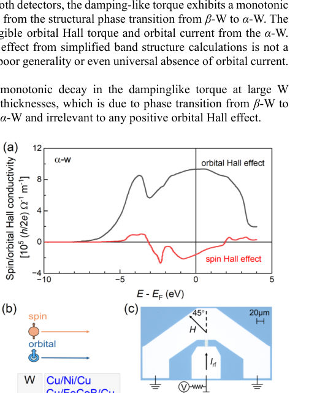
<figcaption class="paper-figure-caption"><b>Fig 1.</b> Figure 1. (a) Spin and orbital Hall conductivity from first- principles band structure calculations of α-W [34]. (b) Potential spin and orbital transport from W into the Cu/Ni/Cu and Cu/FeCoB/Cu. (c) Optical microscopy image and measurement geometry of a ST-FMR device. Sample fabrications. We first sputter-deposited in-plane magnetized multilayers of Cu 2/Ni 4.8-8/Cu 2/W 0-20 (Fig. 1(b)) at room temperature on thermally oxidized silicon substrates. Here, the numbers are layer thicknesses in nanometers. Ni is chosen as the torque detector since it is widely claimed to be an outstanding orbital-spin converter [15–20]. The 2 nm Cu spacers below and above the Ni are used to maintain the...</figcaption>
</figure>
<figure class="paper-figure-card">
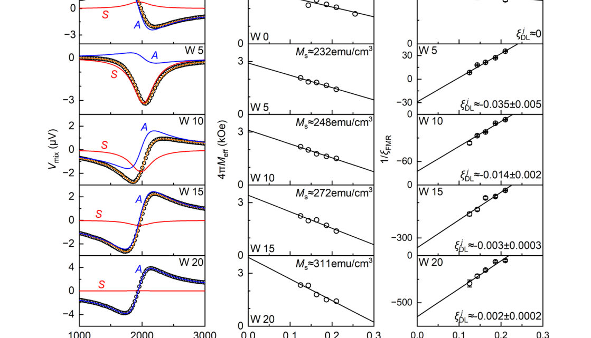
<figcaption class="paper-figure-caption"><b>Fig 2.</b> Figure 2. (a) ST-FMR spectra for the Cu/Ni 8/Cu/W for the W thickness of 0 nm, 5 nm, 10 nm, 15 nm, and 20 nm (8GHz). The orange curves represent the fits of data to Eq. (1), and the red and blue curves plot the symmetric and antisymmetric components, respectively. (b) 4πMeff and (c) 1/ξFMR versus the inverse Ni thickness 1/tNi for the Cu/Ni/Cu/W samples.</figcaption>
</figure>
<figure class="paper-figure-card">
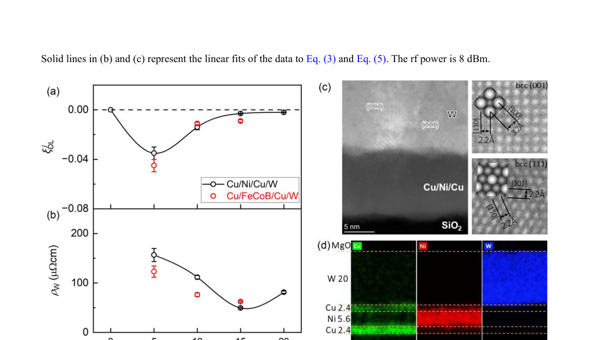
<figcaption class="paper-figure-caption"><b>Fig 3.</b> Figure 3 (a) Dampinglike torque efficiency (𝜉DL</figcaption>
</figure>

**Summary.** This work investigates the source of current-induced torques in alpha-W/ferromagnet interfaces using advanced, artifact-free experimental setups. By analyzing ST-FMR data across varying W thicknesses, the authors conclude that the torque is overwhelmingly dominated by the Spin Hall Effect and that orbital contributions are negligible. This challenges existing theoretical models regarding universal orbital currents in such systems.

**Why it may be interesting.** While primarily condensed matter physics, understanding spin-orbit torque mechanisms is crucial for spintronics devices which can interface with quantum computing components or novel memory elements. The rigorous elimination of artifacts provides a cleaner benchmark for fundamental material properties.

Detailed structure

**Main problem.** The study aims to clarify the physical origin of current-induced torque (Spin-Orbit Torque, SOT) in alpha-W/ferromagnet heterostructures by determining whether it is dominated by the Spin Hall Effect (SHE) or the Orbital Hall Effect.

**Main result.** The spin-orbit torque from W remains negative and is predominantly due to the SHE across all measured thicknesses, suggesting that the orbital Hall torque contribution from alpha-W is negligible.

**Method.** The authors used fabricated, artifact-free angular momentum detectors (Cu/Ni/Cu and Cu/FeCoB/Cu) combined with Spin-Torque Ferromagnetic Resonance (ST-FMR) measurements to quantify torque efficiencies.

**Model / system.** The research focuses on $\alpha$-W/ferromagnet heterostructures, specifically using multilayers like Cu/Ni/Cu/W and Cu/FeCoB/Cu/W. The system involves analyzing the structural phase transition of W from beta-W to alpha-W.

**Key observables.** Damping-like torque efficiency ($\xi_{DL}^j$), field-like torque efficiency ($\xi_{FL}^j$), Spin Hall Conductivity ($\sigma_{SH}$), and Orbital Hall Conductivity ($\sigma_{OH}$).

**Important parameters / regimes.** W thickness ($t_W$), particularly the transition regime around 5 nm, and the magnetic properties of the ferromagnet layers.

**Assumptions / limitations.** The primary assumption is that using specific detector geometries (Cu/Ni/Cu etc.) successfully eliminates artifact torques such as self-induced torque and spin-vorticity torque.

**Figures summary.** Figures show theoretical calculations of Hall conductivities, ST-FMR spectra vs. field for varying W thickness, and plots detailing the monotonic decay of damping-like torque efficiency correlated with structural phase transitions.

**Paper structure.** The paper first establishes the problem regarding SOT origins in $\alpha$-W/ferromagnet systems. It then presents experimental measurements using specialized detectors to quantify torques as a function of W thickness, leading to the conclusion that SHE dominates and orbital contributions are negligible.

Abstract

α-phased W was theoretically predicted to have a negative spin Hall conductivity and a positive orbital Hall conductivity at the same time, leaving the physical origin of the current-induced torque a critical open question. Here, we develop two angular momentum detectors of Cu/Ni/Cu and Cu/FeCoB/Cu that are free of artifacts torques (e.g., self-induced torque and spin-vorticity torque) and clarify that the spin-orbit torque contributed by W remains negative and predominantly from the spin Hall effect in the entire thickness regime. With both detectors, the damping-like torque exhibits a monotonic decay as the W thickness increases above 5 nm, which results from the structural phase transition from \b{eta}-W to α-W. The negative torque in the entire thickness regime suggests negligible orbital Hall torque and orbital current from the α-W. This result is consistent with the theory that the orbital Hall effect from simplified band structure calculations is not a non-local angular momentum source. These findings suggest poor generality or even universal absence of orbital current.

[↑ back to top](#top)

### Other secondary papers (2)

Show other secondary papers

### [Electronic structure trends in La$_{2}R$Ni$_2$O$_7$ ($R=$ Pr, Nd, Sm) from first-principles](http://arxiv.org/abs/2606.16195v1)

**Authors:** Yi-Feng Zhao, Antia S. Botana  
**Type:** theory · **Category:** strongly correlated electrons · **PDF:** <https://arxiv.org/pdf/2606.16195v1>  
**Analysis basis:** full PDF text, analyzed in chunks

↔ Scroll figures horizontally

<figure class="paper-figure-card">
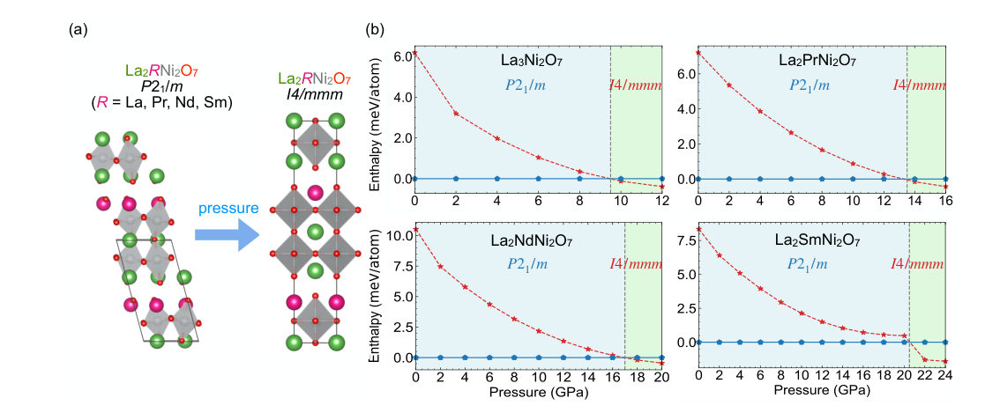
<figcaption class="paper-figure-caption"><b>Fig 1.</b> FIG. 1. “Tetragonalization” of the crystal structures of La2RNi2O7 (R = La, Pr, Nd, and Sm) under pressure. (a) The ambient pressure structure with P21/m space group symmetry transforms to a tetragonal (I4/mmm) structure under pressure. The green, magenta, red, and gray spheres represent the lanthanum, R-doped ions, oxygen, and nickel atoms, respectively. (b) Enthalpy difference between P21/m and I4/mmm structures for La2RNi2O7 (R = La, Pr, Nd, and Sm) as a function of pressure.</figcaption>
</figure>
<figure class="paper-figure-card">
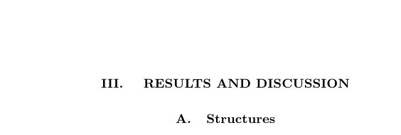
<figcaption class="paper-figure-caption"><b>Fig 2.</b> Figure 1(a) displays the crystal structure of La2RNi2O7 in P21/m symmetry, which clearly shows the series of two NiO6 perovskite-like planes separated by rocksalt layers along the c axis. To determine a stable doped structure at ambient pressure, we compare the enthalpy difference between two distinct La2RNi2O7 configurations, where the R atoms occupy the outer (rocksalt) layers or the inner layers (perovskite blocks). Our results (see Appendix A) confirm that rocksalt substitution is energetically preferred, in agreement with experiments and previous DFT work [15, 17, 43]. Consequently, we adopt this configuration (as shown in Fig. 1(a)) as the starting structure type to perform systematic...</figcaption>
</figure>
<figure class="paper-figure-card">
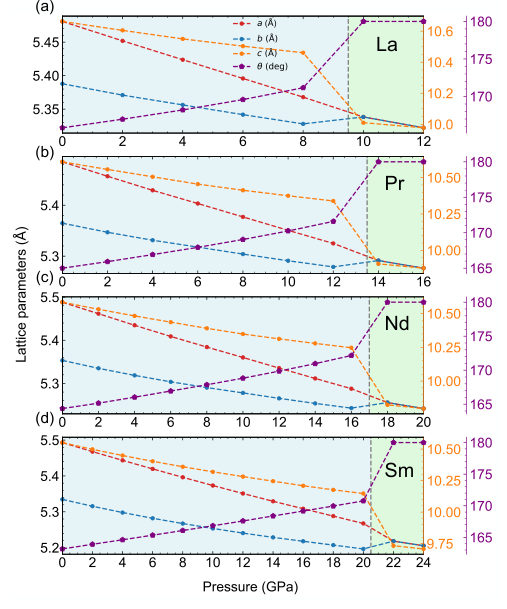
<figcaption class="paper-figure-caption"><b>Fig 3.</b> FIG. 2. Structural data (lattice constants and apical Ni-O-Ni bond angles) capturing the structural transition to tetragonal symmetry as a function of pressure in La2RNi2O7 (R = La (a), Pr (b), Nd (c), Sm (d)); with a becoming equal to b, and the apical bond angle turning 180◦.</figcaption>
</figure>
<figure class="paper-figure-card">
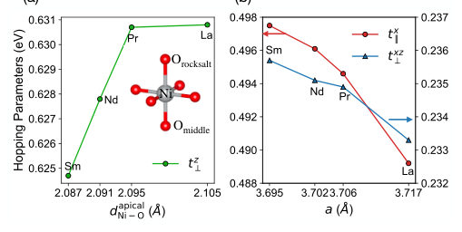
<figcaption class="paper-figure-caption"><b>Fig 4.</b> FIG. 4. Relevant hopping parameters extracted from ML- WFs as a function of rare-earth doping in La2RNi2O7 at high pressure. tz ⊥(panel (a)) represents the hopping between out- of-plane Ni-dz2 orbitals– it is plotted with respect to the aver- age Ni-O apical distance. tx ∥represents the hopping between planar Ni-dx2−y2 orbitals, txz ∥ denotes the hopping between Ni-dx2−y2 and dz2 orbitals. These two hoppings are plotted in panel (b) with respect to the in-plane lattice constant.</figcaption>
</figure>
<figure class="paper-figure-card">
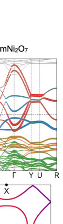
<figcaption class="paper-figure-caption"><b>Fig 5.</b> FIG. 3. Electronic band structures and corresponding Fermi surfaces in the kz = 0 plane for La2RNi2O7 (R = La and Sm) at ambient pressure (a,b) and at 21 GPa (c,d).</figcaption>
</figure>

**Summary.** The study uses first-principles calculations to investigate rare-earth doped nickelates ($	ext{La}_2	ext{R}	ext{Ni}_2	ext{O}_7$) as model superconductors. It demonstrates that doping and pressure induce structural transitions accompanied by key electronic changes, such as the formation of flat $d_{z^2}$ bands at the Fermi level. These findings provide a microscopic understanding of how chemical tuning affects superconductivity in these correlated materials.

**Why it may be interesting.** This work provides detailed first-principles insights into how subtle chemical substitutions (R-doping) can tune electronic correlations and structural instabilities, which is a key area of research relevant to understanding unconventional superconductivity mechanisms.

Detailed structure

**Main problem.** To systematically explore how rare-earth (R) doping affects the crystal structure and electronic properties of Ruddlesden-Popper (RP) nickelates, specifically $	ext{La}_2	ext{R}	ext{Ni}_2	ext{O}_7$, in relation to superconductivity.

**Main result.** The study finds that R-doping causes a progressive decrease in volume and an increase in planar hopping while decreasing out-of-plane hopping, and a pressure-induced structural transition to tetragonal symmetry coincides with the emergence of superconducting electronic features (flat $d_{z^2}$ bands).

**Method.** First-principles calculations using PBE GGA+U functional were employed to optimize structures and analyze electronic band structures and hopping parameters.

**Model / system.** The physical system is the bilayer RP nickelate superconductor $	ext{La}_2	ext{R}	ext{Ni}_2	ext{O}_7$ ($	ext{R} = 	ext{Pr}, 	ext{Nd}, 	ext{Sm}$), studied under varying chemical doping and hydrostatic pressure.

**Key observables.** Crystal structure symmetry ($P2_1/m$ vs $I4/mmm$), lattice parameters, planar/out-of-plane hopping integrals, and the emergence of flat $d_{z^2}$ bands at the Fermi level.

**Important parameters / regimes.** Rare-earth element identity (R), doping concentration, and applied pressure (e.g., 9.5 GPa to 20.5 GPa).

**Assumptions / limitations.** The calculations use GGA+U approximation for Ni-$3d$ states; the connection between structural/electronic changes and $T_c$ is inferred from theoretical trends.

**Figures summary.** Figures illustrate crystal structures, lattice parameter changes with pressure/doping, and electronic band structures showing the emergence of hole-like $	ext{d}_{z^2}$ pockets at high pressure.

**Paper structure.** The paper systematically compares the structural and electronic properties across different R dopants ($	ext{Pr}, 	ext{Nd}, 	ext{Sm}$) under ambient and high pressures, linking observed changes in hopping parameters and band structure to the superconducting phase transition.

Abstract

The discovery of superconductivity in bilayer La$_3$Ni$_2$O$_7$ under pressure has sparked tremendous attention on Ruddlesden-Popper (RP) nickelates. Recently, a higher superconducting transition temperature of 96 K was reported in Sm-doped La$_3$Ni$_2$O$_7$ single crystals at $\sim$ 22 GPa. Motivated by this experimental observation, we systematically explore the crystal structure and electronic properties of La$_3$Ni$_2$O$_7$ doped with different rare-earth elements in comparison to the undoped counterpart. As expected due to the effect of chemical pressure, we find that the volume of La$_{2}$$R$Ni$_2$O$_7$ ($R=$ Pr, Nd, Sm) progressively decreases with doping from Pr to Sm. We further find a pressure-induced structural transition to tetragonal symmetry that approximately coincides with the emergence of superconductivity in all cases. This transition is characterized by the emergence of flat $d_{z^2}$ bands at the Fermi level in the electronic structure. Despite subtle distinctions in the electronic structure between undoped and $R$-doped La$_3$Ni$_2$O$_7$, an increase in the dominant planar hopping is obtained as the $R$ size decreases. In contrast, the out-of-plane hopping decreases (in spite of the $c$ lattice constant compression), due to the decrease in the apical Ni-O$_{\rm rocksalt}$ bond length. Our findings provide further microscopic insights into the effects of $R$-doping in the electronic structure of RP nickelate superconductors in connection to $T_c$.

[↑ back to top](#top)

### [High-entropy Fe$_2$VAl-based thermoelectric modules with improved conversion efficiency](http://arxiv.org/abs/2606.16851v1)

**Authors:** Michael Parzer, Geoffrey Roy, Fabian Garmroudi, Pawel Ziolkowski, Thomas Konegger, Ernst Bauer, Pascal J. Jacques  
**Type:** experiment · **Category:** other · **PDF:** <https://arxiv.org/pdf/2606.16851v1>  
**Analysis basis:** full PDF text, analyzed in chunks

↔ Scroll figures horizontally

<figure class="paper-figure-card">
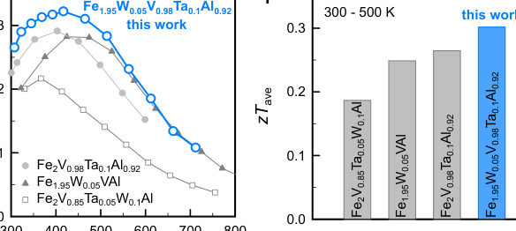
<figcaption class="paper-figure-caption"><b>Fig 1.</b> Figure 1. Optimization of Fe2VAl-based materials via heavy-element co-substitution and off-stoichiometry. a, Temperature-dependent electrical resistivity; b, Seebeck coefficient; c, power factor ;d, thermal conductivity; e, lattice thermal conductivity; f, weighted mobility; and g, dimensionless figure of merit of Fe1.95W0.05V0.9+xTa0.1Al1–x full-Heusler compounds; h, Dimensionless figure of merit of best-performing sample from this work compared to previously optimized full-Heusler materials taken from [18–20]; i Average zT from 300 to 500 K, outperforming all other Fe2VAl-based compositions without microstructure refinement.</figcaption>
</figure>
<figure class="paper-figure-card">
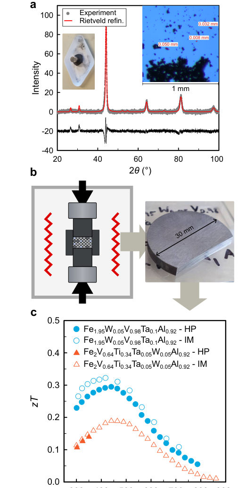
<figcaption class="paper-figure-caption"><b>Fig 2.</b> Figure 2. Powder analysis and hot-press synthesis of op- timized Fe2VAl-based thermoelectrics. a, X-ray diffrac- tion pattern and Rietveld refinement of ball-milled powder. Inset shows an image of the product taken with an optical microscope. b, Schematic of the consolidation of the powder via hot press and image of obtained pellets. c, Dimensionless figure of merit of induction-melted (IM) samples compared to samples cut from the hot-pressed (HP) pellets.</figcaption>
</figure>
<figure class="paper-figure-card">
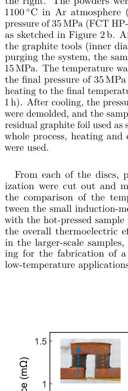
<figcaption class="paper-figure-caption"><b>Fig 3.</b> Figure 3. Resistance scan on a 2-leg module. The plot depicts the total resistance over the probe position measured using a custom-built voltage scanning probe. The scanning step colored in blue represents the scan of the n-leg, the second step (colored in red) represents the scanning of the p-type leg.</figcaption>
</figure>
<figure class="paper-figure-card">
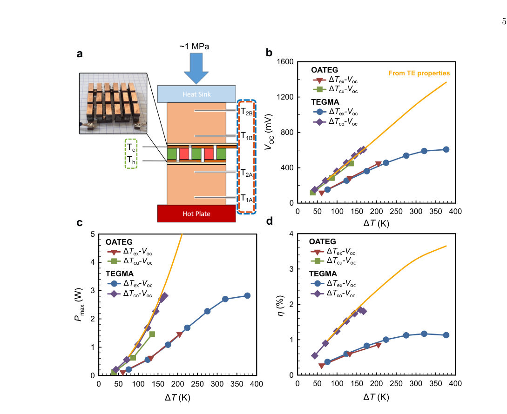
<figcaption class="paper-figure-caption"><b>Fig 4.</b> Figure 4. Performance parameters of the 36-leg Fe2VAl-based module a, Schematic view of the module characterization setup showing the different methods used to estimate the temperature difference. The inset shows a picture of the fabricated thermoelectric module. b, Open circuit voltage as a function of the temperature difference: HFM extrapolation (on TEGMA in blue, on OATEG in red), by direct contact on OATEG (in green), computed using Equation 2 (in purple). c, Maximum electrical power as a function of temperature difference. d, Conversion efficiency as a function of the temperature difference.</figcaption>
</figure>
<figure class="paper-figure-card">
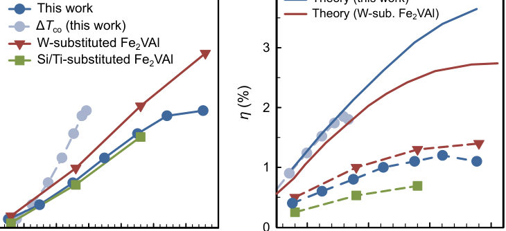
<figcaption class="paper-figure-caption"><b>Fig 5.</b> Figure 5. Comparison of Fe2VAl-based thermoelectric modules. a, Temperature-dependent power density of the present module compared with reports by Mikami et al. [11, 13]. The comparison depends on the method used to determine ∆T. b, Temperature-dependent conversion efficiencies of the same modules. When determined using ∆Tco, the present module exhibits the highest efficiencies reported to date for Fe2VAl-based thermoelectric modules.</figcaption>
</figure>

**Summary.** This research successfully optimized Fe2VAl-based thermoelectric materials using high-entropy engineering to achieve extremely low thermal conductivity. By fabricating and testing a large, multi-leg module, the authors demonstrated record conversion efficiencies for this material class, proving its potential for scalable energy harvesting applications.

**Why it may be interesting.** While not directly related to quantum phenomena, the focus on disorder engineering to suppress lattice vibrations ($\kappa_L$) is conceptually related to minimizing energy dissipation mechanisms studied in condensed matter theory.

Detailed structure

**Main problem.** Developing thermoelectric (TE) materials that combine high efficiency with favorable secondary properties like low cost, non-toxicity, and scalability for practical energy harvesting.

**Main result.** A fabricated 36-leg TE module based on Fe2VAl-based full-Heusler compounds achieved a record-high conversion efficiency of 1.2% at a temperature difference of 375 K without requiring nanostructuring.

**Method.** The study utilized high-entropy engineering via heavy-element doping and controlled off-stoichiometry, followed by hot pressing for large-scale synthesis and direct brazing into functional TE modules.

**Model / system.** The physical system is the Fe2VAl-based full-Heusler compound. Performance optimization relies on inducing substitutional disorder through high-entropy alloying to achieve an ultra-low lattice thermal conductivity (kappa_L ~ 2.3 W m^-1 K^-1).

**Key observables.** Figure of Merit (zT), average zT (~0.3 from 300-500 K), output power, and conversion efficiency.

**Important parameters / regimes.** Temperature range (300–673 K), lattice thermal conductivity (kappa_L), and the degree of substitutional disorder achieved via doping/off-stoichiometry.

**Assumptions / limitations.** The study assumes that high entropy engineering can simultaneously optimize electronic transport (high PF) and minimize thermal transport ($\kappa_L$) in a mechanically robust manner, avoiding complex nanostructuring techniques.

**Figures summary.** Figures summarize the optimization of TE properties using heavy-element co-substitution across different material compositions and show comparative performance data for fabricated modules over temperature ranges.

**Paper structure.** The paper progresses from establishing the need for practical TE materials to detailing the high-entropy engineering approach, presenting synthesis methods (hot pressing), characterizing electrical/thermal properties, and culminating in the fabrication and testing of a large-scale module.

Abstract

Thermoelectric (TE) materials enable the direct conversion of heat into electricity and are attractive for sustainable energy applications. For practical deployment, TE materials must combine high efficiency with low cost, non-toxicity, and scalability. In this work, we optimize the TE performance of low-cost and robust Fe$_2$VAl-based full-Heusler compounds through high-entropy engineering: a synergistic combination of heavy-element doping and controlled off-stoichiometry results in substitutional disorder on all lattice sites, triggering one of the lowest lattice thermal conductivities, $κ_\text{L}\sim2.3$ W m$^{-1}$ K$^{-1}$, reported so far for full-Heusler systems. The resulting materials exhibit improved values of the average figure of merit $zT_\text{ave}\approx 0.3$ from $300-500$ K. To demonstrate reproducibility and technological relevance, a full TE module (TEM) based on the optimized alloys was fabricated and characterized. Scaled-up material batches were synthesized by hot pressing, exhibiting TE properties in excellent agreement with laboratory-scale samples, with only slightly increased resistivities in absence of post-annealing treatments. Owing to the excellent mechanical workability of Fe$_2$VAl-based materials, the TEM legs were directly brazed onto copper electrodes, enabling robust module fabrication. A ($6\times 6$)-leg TEM was assembled and systematically characterized. The device exhibits the highest output power and one of the highest conversion efficiencies reported to date for Fe$_2$VAl-based generators over the broad temperature range of $300-673$ K, underscoring the potential of this material system for scalable TE energy harvesting.

[↑ back to top](#top)

