
# arxiv digest (quant-ph + cond-mat) — 2026-06-17

*118 papers · 36 relevant · 2 highlighted*

## 🔥 Most relevant (36)

*Every paper with at least one nonzero topic score, sorted by best-matching score. 🔥 marks scores ≥4/5. Click the title to jump to the full entry below; click [arXiv] to open the paper page. `(secondary)` marks papers from de-prioritized cond-mat archives.*

Show 36 relevant papers

- [Universal scaling and relaxation in decaying turbulence of Bose gases](#paper-2606.18059) [[arXiv]](http://arxiv.org/abs/2606.18059v1) — 🔥 `non-equilibrium universality` **5/5** · 🔥 `analog quantum simulation` **4/5** · 🔥 `non-equilibrium dynamics` **4/5** · `Keldysh / 2PI / non-Gaussian methods` **3/5** · `driven-dissipative phase transition` **3/5** · `correlated / nonlocal dissipation` **1/5** · `entanglement & information structure` **1/5** · `methods for driven-dissipative` **1/5** · `scars & prethermalization` **1/5**
- ⭐ [Creating squeezed and non-classical collective motional many-body states through stroboscopic Rydberg dressing](#paper-2606.17849) [[arXiv]](http://arxiv.org/abs/2606.17849v1) — 🔥 `Rydberg arrays` **5/5** · 🔥 `analog quantum simulation` **4/5** · `entanglement & information structure` **2/5** · `non-equilibrium dynamics` **2/5** · `Tavis-Cummings & cavity-many-emitter` **1/5** · `correlated cavity matter` **1/5**
- [Bistable topological edge states in polariton microcavities with unpaired Dirac cones](#paper-2606.17407) [[arXiv]](http://arxiv.org/abs/2606.17407v1) `(secondary)` — 🔥 `methods for driven-dissipative` **4/5** · `analog quantum simulation` **3/5** · `correlated / nonlocal dissipation` **3/5** · `correlated cavity matter` **3/5** · `driven-dissipative phase transition` **3/5** · `non-equilibrium dynamics` **3/5** · `Kondo & dissipative impurity` **2/5** · `exotic spin models in light-matter` **2/5** · `non-equilibrium universality` **2/5** · `Frenkel-Kontorova` **1/5** · `Keldysh / 2PI / non-Gaussian methods` **1/5** · `Tavis-Cummings & cavity-many-emitter` **1/5** · `interference shaping light` **1/5** · `spintronics-quantum-optics interface` **1/5**
- ⭐ [Cavity-enhanced superconducting response in an underdoped cuprate](#paper-2606.18084) [[arXiv]](http://arxiv.org/abs/2606.18084v1) — 🔥 `analog quantum simulation` **4/5** · 🔥 `correlated cavity matter` **4/5** · `driven-dissipative phase transition` **3/5** · `exotic spin models in light-matter` **3/5** · `quantum optics experiment` **3/5** · `Tavis-Cummings & cavity-many-emitter` **2/5** · `methods for driven-dissipative` **2/5** · `spintronics-quantum-optics interface` **2/5** · `Keldysh / 2PI / non-Gaussian methods` **1/5** · `correlated / nonlocal dissipation` **1/5** · `entanglement & information structure` **1/5** · `interference shaping light` **1/5** · `non-equilibrium dynamics` **1/5** · `non-equilibrium universality` **1/5**
- [Quantum statistical enhancement of collective behaviour in a bosonic active Ising model](#paper-2606.18091) [[arXiv]](http://arxiv.org/abs/2606.18091v1) — 🔥 `analog quantum simulation` **4/5** · 🔥 `driven-dissipative phase transition` **4/5** · 🔥 `methods for driven-dissipative` **4/5** · `correlated / nonlocal dissipation` **3/5** · `exotic spin models in light-matter` **3/5** · `non-equilibrium dynamics` **3/5** · `non-equilibrium universality` **3/5** · `Keldysh / 2PI / non-Gaussian methods` **1/5** · `entanglement & information structure` **1/5** · `spintronics-quantum-optics interface` **1/5**
- [Highly nonlinear Moiré exciton and trion polaritons](#paper-2606.18077) [[arXiv]](http://arxiv.org/abs/2606.18077v1) `(secondary)` — 🔥 `analog quantum simulation` **4/5** · 🔥 `correlated cavity matter` **4/5** · `driven-dissipative phase transition` **3/5** · `methods for driven-dissipative` **3/5** · `quantum optics experiment` **3/5** · `Tavis-Cummings & cavity-many-emitter` **2/5** · `non-equilibrium dynamics` **2/5** · `non-equilibrium universality` **2/5** · `Keldysh / 2PI / non-Gaussian methods` **1/5** · `correlated / nonlocal dissipation` **1/5** · `entanglement & information structure` **1/5**
- [Einstein-Podolsky-Rosen correlations between mechanical oscillators revealed through SU(1,1) interferometry](#paper-2606.18202) [[arXiv]](http://arxiv.org/abs/2606.18202v1) — 🔥 `QC/QI experiment` **4/5** · `entanglement & information structure` **3/5** · `interference shaping light` **3/5** · `quantum optics experiment` **3/5** · `analog quantum simulation` **2/5** · `quantum measurements` **2/5** · `Tavis-Cummings & cavity-many-emitter` **1/5** · `correlated cavity matter` **1/5** · `driven-dissipative phase transition` **1/5** · `methods for driven-dissipative` **1/5** · `non-equilibrium dynamics` **1/5**
- [Experimental Characterization and Modeling of Measurement-Induced State-Transitions in a Fluxonium Superconducting Qubit](#paper-2606.17866) [[arXiv]](http://arxiv.org/abs/2606.17866v1) — 🔥 `QC/QI experiment` **4/5** · 🔥 `measurement-induced transitions` **4/5** · `methods for driven-dissipative` **3/5** · `quantum measurements` **3/5** · `correlated / nonlocal dissipation` **2/5** · `non-equilibrium dynamics` **2/5** · `Keldysh / 2PI / non-Gaussian methods` **1/5** · `driven-dissipative phase transition` **1/5** · `quantum optics experiment` **1/5**
- [Work Extraction via Backward Motion in Optimal Closed-Loop Stochastic Control](#paper-2606.17624) [[arXiv]](http://arxiv.org/abs/2606.17624v1) — 🔥 `quantum measurements` **4/5** · `methods for driven-dissipative` **3/5** · `non-equilibrium dynamics` **3/5** · `non-equilibrium universality` **3/5** · `Keldysh / 2PI / non-Gaussian methods` **2/5** · `driven-dissipative phase transition` **2/5** · `Frenkel-Kontorova` **1/5** · `analog quantum simulation` **1/5** · `correlated / nonlocal dissipation` **1/5** · `measurement-induced transitions` **1/5**
- [A Lindbladian for holographic Brownian motion](#paper-2606.17909) [[arXiv]](http://arxiv.org/abs/2606.17909v1) — 🔥 `Keldysh / 2PI / non-Gaussian methods` **4/5** · `correlated / nonlocal dissipation` **3/5** · `driven-dissipative phase transition` **3/5** · `methods for driven-dissipative` **3/5** · `non-equilibrium dynamics` **3/5** · `non-equilibrium universality` **2/5** · `Kondo & dissipative impurity` **1/5** · `scars & prethermalization` **1/5**
- [Higher-order topological metasurface based on split-ring resonators with dipole-quadrupole couplings](#paper-2606.17855) [[arXiv]](http://arxiv.org/abs/2606.17855v1) `(secondary)` — 🔥 `analog quantum simulation` **4/5** · `driven-dissipative phase transition` **3/5** · `exotic spin models in light-matter` **3/5** · `methods for driven-dissipative` **3/5** · `non-equilibrium dynamics` **2/5** · `correlated / nonlocal dissipation` **1/5** · `correlated cavity matter` **1/5** · `entanglement & information structure` **1/5** · `interference shaping light` **1/5** · `non-equilibrium universality` **1/5**
- [Anomalous Pairing Currents and a Second Topological Edge Channel in Bosonic Lattices](#paper-2606.17538) [[arXiv]](http://arxiv.org/abs/2606.17538v1) `(secondary)` — 🔥 `analog quantum simulation` **4/5** · `driven-dissipative phase transition` **3/5** · `methods for driven-dissipative` **3/5** · `non-equilibrium dynamics` **2/5** · `non-equilibrium universality` **2/5** · `quantum optics experiment` **2/5** · `Keldysh / 2PI / non-Gaussian methods` **1/5** · `QC/QI experiment` **1/5** · `correlated cavity matter` **1/5**
- [Hybrid Ferromagnet-SNSPDs: Single photon induced order-to-disorder transition in ferromagnets coupled to thin film superconductors](#paper-2606.17177) [[arXiv]](http://arxiv.org/abs/2606.17177v1) — 🔥 `spintronics-quantum-optics interface` **4/5** · `driven-dissipative phase transition` **3/5** · `exotic spin models in light-matter` **3/5** · `methods for driven-dissipative` **2/5** · `non-equilibrium dynamics` **2/5** · `non-equilibrium universality` **2/5** · `Frenkel-Kontorova` **1/5** · `Keldysh / 2PI / non-Gaussian methods` **1/5** · `correlated / nonlocal dissipation` **1/5**
- [Tunneling amplifies chirality-induced spin selectivity and explains its current-direction invariance](#paper-2606.17823) [[arXiv]](http://arxiv.org/abs/2606.17823v1) `(secondary)` — 🔥 `spintronics-quantum-optics interface` **4/5** · `Kondo & dissipative impurity` **3/5** · `methods for driven-dissipative` **3/5** · `Keldysh / 2PI / non-Gaussian methods` **2/5** · `driven-dissipative phase transition` **2/5** · `non-equilibrium dynamics` **2/5** · `correlated / nonlocal dissipation` **1/5** · `exotic spin models in light-matter` **1/5** · `non-equilibrium universality` **1/5**
- [Vortex-Beam-Driven Dirac Materials: Impurity and Polarization Effects on Light-Induced Vortex and Edge States](#paper-2606.17341) [[arXiv]](http://arxiv.org/abs/2606.17341v1) `(secondary)` — 🔥 `non-equilibrium dynamics` **4/5** · `Kondo & dissipative impurity` **3/5** · `analog quantum simulation` **3/5** · `methods for driven-dissipative` **3/5** · `driven-dissipative phase transition` **2/5** · `Keldysh / 2PI / non-Gaussian methods` **1/5** · `interference shaping light` **1/5** · `non-equilibrium universality` **1/5** · `spintronics-quantum-optics interface` **1/5**
- [Manipulation of Topological Corner States via Subchiral Symmetry](#paper-2606.17975) [[arXiv]](http://arxiv.org/abs/2606.17975v1) — 🔥 `analog quantum simulation` **4/5** · `methods for driven-dissipative` **3/5** · `non-equilibrium dynamics` **3/5** · `QC/QI experiment` **2/5** · `driven-dissipative phase transition` **2/5** · `correlated / nonlocal dissipation` **1/5** · `entanglement & information structure` **1/5** · `exotic spin models in light-matter` **1/5** · `non-equilibrium universality` **1/5**
- [Projected logical ensembles in surface codes via the random-matrix theory of quantum dots](#paper-2606.17140) [[arXiv]](http://arxiv.org/abs/2606.17140v1) — 🔥 `quantum measurements` **4/5** · `measurement-induced transitions` **3/5** · `driven-dissipative phase transition` **2/5** · `non-equilibrium universality` **2/5** · `Keldysh / 2PI / non-Gaussian methods` **1/5** · `Kondo & dissipative impurity` **1/5** · `analog quantum simulation` **1/5** · `correlated / nonlocal dissipation` **1/5** · `entanglement & information structure` **1/5** · `methods for driven-dissipative` **1/5** · `non-equilibrium dynamics` **1/5**
- [Imprints of dynamical phases in semiclassical entanglement entropy in 2D CFT](#paper-2606.17625) [[arXiv]](http://arxiv.org/abs/2606.17625v1) — 🔥 `entanglement & information structure` **4/5** · 🔥 `non-equilibrium dynamics` **4/5** · `non-equilibrium universality` **3/5** · `Keldysh / 2PI / non-Gaussian methods` **2/5** · `driven-dissipative phase transition` **2/5** · `methods for driven-dissipative` **1/5** · `scars & prethermalization` **1/5**
- [Dimension-Free Approximate Tensorization of Quantum Hypercontractivity for Qudit Depolarizing Semigroups](#paper-2606.17729) [[arXiv]](http://arxiv.org/abs/2606.17729v1) — 🔥 `entanglement & information structure` **4/5** · `correlated / nonlocal dissipation` **3/5** · `methods for driven-dissipative` **3/5** · `driven-dissipative phase transition` **2/5** · `non-equilibrium dynamics` **2/5** · `analog quantum simulation` **1/5** · `non-equilibrium universality` **1/5**
- [Emergent Antiphase Stacking in a Transient Charge Density Wave](#paper-2606.17326) [[arXiv]](http://arxiv.org/abs/2606.17326v1) — 🔥 `non-equilibrium dynamics` **4/5** · 🔥 `non-equilibrium universality` **4/5** · `driven-dissipative phase transition` **3/5** · `methods for driven-dissipative` **3/5** · `Frenkel-Kontorova` **1/5** · `Keldysh / 2PI / non-Gaussian methods` **1/5**
- [Emergent de Sitter Space and Non-Unitary Tensor Networks from Non-Hermitian Quantum Criticality](#paper-2606.17983) [[arXiv]](http://arxiv.org/abs/2606.17983v1) — 🔥 `entanglement & information structure` **4/5** · `driven-dissipative phase transition` **3/5** · `methods for driven-dissipative` **3/5** · `Kondo & dissipative impurity` **2/5** · `non-equilibrium dynamics` **2/5** · `correlated / nonlocal dissipation` **1/5** · `non-equilibrium universality` **1/5**
- [Tripartite entanglement of remote atomic qubits](#paper-2606.17173) [[arXiv]](http://arxiv.org/abs/2606.17173v1) — 🔥 `QC/QI experiment` **4/5** · `entanglement & information structure` **3/5** · `interference shaping light` **3/5** · `quantum optics experiment` **3/5** · `analog quantum simulation` **1/5** · `exotic spin models in light-matter` **1/5** · `non-equilibrium dynamics` **1/5**
- [Brownian gyration of an inertial ellipsoid](#paper-2606.17554) [[arXiv]](http://arxiv.org/abs/2606.17554v1) — 🔥 `non-equilibrium dynamics` **4/5** · `driven-dissipative phase transition` **3/5** · `methods for driven-dissipative` **3/5** · `non-equilibrium universality` **2/5** · `Frenkel-Kontorova` **1/5** · `Keldysh / 2PI / non-Gaussian methods` **1/5** · `correlated / nonlocal dissipation` **1/5**
- [When Renormalisation Remembers: UV/IR Mixing as an Entanglement Bridge](#paper-2606.17147) [[arXiv]](http://arxiv.org/abs/2606.17147v1) — 🔥 `entanglement & information structure` **4/5** · `methods for driven-dissipative` **3/5** · `non-equilibrium dynamics` **2/5** · `non-equilibrium universality` **2/5** · `Keldysh / 2PI / non-Gaussian methods` **1/5** · `analog quantum simulation` **1/5** · `correlated / nonlocal dissipation` **1/5** · `driven-dissipative phase transition` **1/5**
- [Engineering entanglement and transport in interacting quantum walks with tailored potentials](#paper-2606.17825) [[arXiv]](http://arxiv.org/abs/2606.17825v1) — 🔥 `analog quantum simulation` **4/5** · `entanglement & information structure` **3/5** · `non-equilibrium dynamics` **3/5** · `Frenkel-Kontorova` **1/5** · `correlated / nonlocal dissipation` **1/5** · `methods for driven-dissipative` **1/5** · `non-equilibrium universality` **1/5**
- [Vorticity Induced by Non-frontal Collisions of Quantum Droplets](#paper-2606.17498) [[arXiv]](http://arxiv.org/abs/2606.17498v1) — 🔥 `analog quantum simulation` **4/5** · `non-equilibrium dynamics` **3/5** · `non-equilibrium universality` **2/5** · `Keldysh / 2PI / non-Gaussian methods` **1/5** · `correlated / nonlocal dissipation` **1/5** · `driven-dissipative phase transition` **1/5** · `entanglement & information structure` **1/5** · `methods for driven-dissipative` **1/5**
- [Exotic magnetism and persistent spin dynamics in a frustrated Jeff = 1/2 triangular lattice antiferromagnet](#paper-2606.17166) [[arXiv]](http://arxiv.org/abs/2606.17166v1) — 🔥 `analog quantum simulation` **4/5** · `exotic spin models in light-matter` **3/5** · `spintronics-quantum-optics interface` **3/5** · `Kondo & dissipative impurity` **1/5** · `entanglement & information structure` **1/5** · `non-equilibrium dynamics` **1/5**
- [Broadband High-Level Squeezed Light using Waveguide Optical Parametric Amplifiers with External Dispersion Compensation](#paper-2606.17422) [[arXiv]](http://arxiv.org/abs/2606.17422v1) — 🔥 `quantum optics experiment` **4/5** · `interference shaping light` **3/5** · `Keldysh / 2PI / non-Gaussian methods` **1/5** · `QC/QI experiment` **1/5** · `driven-dissipative phase transition` **1/5** · `methods for driven-dissipative` **1/5**
- [Spin effects in the particle current of Bose-Einstein condensates in synthetic gauge fields](#paper-2606.17248) [[arXiv]](http://arxiv.org/abs/2606.17248v1) — 🔥 `analog quantum simulation` **4/5** · `exotic spin models in light-matter` **3/5** · `non-equilibrium dynamics` **2/5** · `Keldysh / 2PI / non-Gaussian methods` **1/5** · `spintronics-quantum-optics interface` **1/5**
- [The antiferromagnetic transition in the frustrated bixbyite $β$-Fe$_2$O$_3$ magnet](#paper-2606.17842) [[arXiv]](http://arxiv.org/abs/2606.17842v1) — 🔥 `analog quantum simulation` **4/5** · 🔥 `exotic spin models in light-matter` **4/5** · `spintronics-quantum-optics interface` **3/5**
- [Fermionic Hamiltonian engineering with local control](#paper-2606.17158) [[arXiv]](http://arxiv.org/abs/2606.17158v1) — 🔥 `analog quantum simulation` **4/5** · `non-equilibrium dynamics` **3/5** · `driven-dissipative phase transition` **1/5** · `methods for driven-dissipative` **1/5** · `non-equilibrium universality` **1/5**
- [Quantum Resources and Wigner Symmetry in Nucleon-Nucleon Scattering from Effective Field Theory](#paper-2606.17148) [[arXiv]](http://arxiv.org/abs/2606.17148v1) — 🔥 `entanglement & information structure` **4/5** · `Keldysh / 2PI / non-Gaussian methods` **1/5** · `analog quantum simulation` **1/5** · `correlated / nonlocal dissipation` **1/5** · `driven-dissipative phase transition` **1/5** · `methods for driven-dissipative` **1/5** · `non-equilibrium dynamics` **1/5**
- [From Period Finding to Lattice Sampling: Experimental Insights into Shor's and Regev's Factoring Algorithms](#paper-2606.17647) [[arXiv]](http://arxiv.org/abs/2606.17647v1) — 🔥 `QC/QI experiment` **4/5** · `entanglement & information structure` **2/5** · `quantum measurements` **1/5**
- [Kohn--Luttinger Superconductivity in Flat Chern Bands](#paper-2606.17205) [[arXiv]](http://arxiv.org/abs/2606.17205v1) `(secondary)` — 🔥 `analog quantum simulation` **4/5** · `Keldysh / 2PI / non-Gaussian methods` **1/5** · `driven-dissipative phase transition` **1/5** · `entanglement & information structure` **1/5**
- [Pulse-optimised circuit elements for scalable and noise-resilient quantum chemistry](#paper-2606.17357) [[arXiv]](http://arxiv.org/abs/2606.17357v1) — 🔥 `QC/QI experiment` **4/5** · `analog quantum simulation` **1/5** · `exotic spin models in light-matter` **1/5** · `spintronics-quantum-optics interface` **1/5**
- [Average entropy of Bogoliubov-Kubo-Mori random state ensemble](#paper-2606.17960) [[arXiv]](http://arxiv.org/abs/2606.17960v1) — 🔥 `entanglement & information structure` **4/5** · `Keldysh / 2PI / non-Gaussian methods` **1/5**

## ⭐ Highlighted (2)

*Papers by authors on your watch list. Click the title to jump to the full entry below; click [arXiv] to open the paper page.*

Show 2 highlighted papers

- ⭐ [Cavity-enhanced superconducting response in an underdoped cuprate](#paper-2606.18084) [[arXiv]](http://arxiv.org/abs/2606.18084v1) — Francesco Piazza
- ⭐ [Creating squeezed and non-classical collective motional many-body states through stroboscopic Rydberg dressing](#paper-2606.17849) [[arXiv]](http://arxiv.org/abs/2606.17849v1) — Igor Lesanovsky

## All papers (85, sorted by relevance)

*Papers from quant-ph and your primary cond-mat archives (quant-gas, stat-mech, str-el, dis-nn). Highlighted papers (⭐) come first, then everything else sorted by topic-relevance score, highest first.*

### ⭐ [Creating squeezed and non-classical collective motional many-body states through stroboscopic Rydberg dressing](http://arxiv.org/abs/2606.17849v1)

**Highlighted author(s):** Igor Lesanovsky  
**Authors:** Roman Wußler, Chris Nill, Sylvain de Léséleuc, Christian Groß, Igor Lesanovsky  
**Type:** theory · **Category:** other · **PDF:** <https://arxiv.org/pdf/2606.17849v1>  
**Analysis basis:** full PDF text, analyzed in chunks
**Topic relevance:** 🔥 `Rydberg arrays` **5/5** · 🔥 `analog quantum simulation` **4/5** · `entanglement & information structure` **2/5** · `non-equilibrium dynamics` **2/5** · `Tavis-Cummings & cavity-many-emitter` **1/5** · `correlated cavity matter` **1/5**

↔ Scroll figures horizontally

<figure class="paper-figure-card">
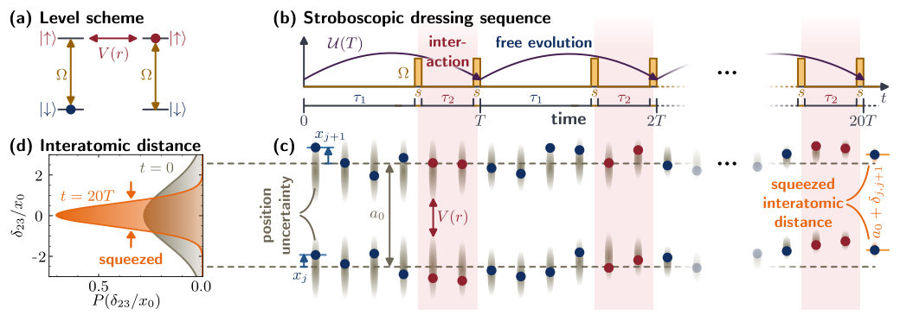
<figcaption class="paper-figure-caption"><b>Fig 1.</b> FIG. 1. Stroboscopic Rydberg dressing for generating squeezed motional states. (a) Level scheme of the atom’s electronic states: ground state |↓⟩(blue) and Rydberg state |↑⟩(red), coupled by a laser with Rabi frequency Ω. Neighboring atoms simultaneously excited to |↑⟩interact via the van der Waals potential V (r). (b) The stroboscopic dressing protocol proceeds in periodic cycles of duration T, repeated up to 20T as shown. Each cycle consists of free evolution of duration τ1, a resonant π-pulse of duration s and Rabi frequency Ωthat transfers all atoms to |↑⟩, an interaction interval of duration τ2 during which atoms in |↑⟩interact via V (r) and develop motional correlations, and a second...</figcaption>
</figure>
<figure class="paper-figure-card">
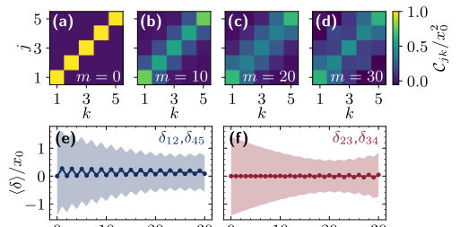
<figcaption class="paper-figure-caption"><b>Fig 2.</b> FIG. 2. Build-up of positional correlations and dy- namics of interatomic distances. (a) - (d) Positional covariance matrix Cjk/x2 0 after m = 0, 10, 20 and 30 dress- ing cycles. Starting from an uncorrelated motional ground state (a), the protocol induces positional correlations between neighboring atoms (b), (c). At m = 20 (c), reduced diagonal elements (single-atom variances) and increased off-diagonal elements (inter-atom correlations) combine to yield signifi- cant squeezing of the interatomic distances. As the sequence continues (d), variances grow again while correlations per- sist. (e), (f) Mean interatomic distances ⟨δ⟩/x0 (solid lines) in a chain of N = 5 atoms, with shading...</figcaption>
</figure>
<figure class="paper-figure-card">
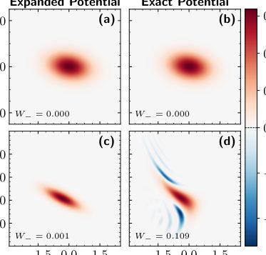
<figcaption class="paper-figure-caption"><b>Fig 3.</b> FIG. 3. Non-classical motional states. Wigner functions W(δ12, v12) of the relative coordinate δ12 and relative velocity v12 for N = 2 atoms after m = 2 dressing cycles, computed using the second-order Taylor expansion of the interaction po- tential (left column) and the exact van der Waals potential (right column). (a), (b) For parameters from Eq. (EM1) with x0/a0 ≈0.009, the harmonic approximation faithfully repro- duces the exact result: both Wigner functions are Gaussian and squeezed. (c), (d) For parameters from Eq. (EM2) with x0/a0 ≈0.057, the harmonic approximation yields a Gaus- sian squeezed state (c), but the exact dynamics produces a strongly non-Gaussian distribution with...</figcaption>
</figure>

**Summary.** The paper presents a method utilizing stroboscopic Rydberg dressing on neutral atom arrays to generate highly squeezed, non-classical motional states. By controlling the collective motion of the atoms, researchers can drastically reduce interatomic distance fluctuations that typically degrade quantum gate fidelity. This technique offers a powerful resource for enhancing precision measurements and improving quantum computation protocols.

**Why it may be interesting.** This work provides a detailed theoretical blueprint for using engineered quantum correlations (squeezing) in trapped atoms to overcome fundamental limitations imposed by environmental coupling or geometric uncertainties in quantum computation.

Detailed structure

**Main problem.** The primary goal is to engineer many-body motional squeezing of interatomic distances to reduce quantum gate infidelities in neutral atom arrays.

**Main result.** The authors demonstrate that stroboscopic Rydberg dressing can generate highly squeezed, non-classical collective motional states characterized by Wigner negativity. This technique reduces distance uncertainty significantly below the vacuum level.

**Method.** They derive the time evolution operator for the system over multiple dressing cycles and use it to analytically calculate the variances and covariances of interatomic distances using bosonic mode decomposition.

**Model / system.** The platform is an array of neutral atoms (e.g., Rb) trapped in optical tweezers, interacting via a Rydberg blockade potential ($V(r) \propto 1/r^6$). The dynamics are controlled by applying periodic stroboscopic laser pulses.

**Key observables.** Positional covariance matrix $C_{jk}$, variance of interatomic distances $	ext{Var}(\delta_{j, j+1})$, and the Wigner function negativity.

**Important parameters / regimes.** The ratio $x_0/a_0$ (initial displacement relative to lattice spacing), the dressing phase $\omega_T$, and the anharmonicity parameter $\epsilon$.

**Assumptions / limitations.** The analysis heavily relies on the fast-pulse approximation ($\Omega \gg V(r)$) and, in some derivations, assumes Gaussian probability distributions for calculating variances.

**Figures summary.** Figures illustrate the reduction of interatomic distance uncertainty across multiple dressing cycles and show Wigner functions confirming non-Gaussianity when anharmonicities are present.

**Paper structure.** The paper builds from establishing the need to control distance fluctuations, deriving the time evolution operator via stroboscopic dressing, decomposing this operator into independent normal modes, and finally calculating the resulting motional observables like variances and covariances.

Abstract

Realizing conditional quantum operations, e.g., quantum gates, for quantum computing and simulation requires controlled interactions between particles. Often, these interactions depend on the interparticle distance, and accordingly, an uncertainty of the relative particle position may translate into gate infidelities. We consider here a quantum computing platform based on an array of neutral atoms and present a method that allows to reduce the uncertainty of all interatomic distances. Our approach exploits the coupling between atomic motion and stroboscopically excited atomic Rydberg states. It allows to collectively squeeze the modes corresponding to interatomic displacements, thereby reducing distance fluctuations down to a fraction of the motional vacuum state. Furthermore, the method permits the creation of non-classical states with substantial Wigner negativity. These correlated states may allow reducing motional decoherence, increasing gate fidelity, and potentially yield a resource for quantum-enhanced metrology.

[↑ back to top](#top)

### ⭐ [Cavity-enhanced superconducting response in an underdoped cuprate](http://arxiv.org/abs/2606.18084v1)

**Highlighted author(s):** Francesco Piazza  
**Authors:** Angela Montanaro, Vadim Plastovets, Nitesh Khatiwada, Jacopo Fiore, Giacomo Jarc, Abdullah Alabbadi, Antonio Mastropasqua, Enrico Maria Rigoni, Shahla Y. Mathengattil, Simone Dal Zilio, Francesca Fassioli Olsen, Fabio Novelli, Stephan Winnerl, Michael A. Sentef, Dante M. Kennes, Andrew J. Millis, Francesco Piazza, Daniele Fausti  
**Type:** both · **Category:** strongly correlated electrons · **PDF:** <https://arxiv.org/pdf/2606.18084v1>  
**Analysis basis:** full PDF text, analyzed in chunks
**Topic relevance:** 🔥 `analog quantum simulation` **4/5** · 🔥 `correlated cavity matter` **4/5** · `driven-dissipative phase transition` **3/5** · `exotic spin models in light-matter` **3/5** · `quantum optics experiment` **3/5** · `Tavis-Cummings & cavity-many-emitter` **2/5** · `methods for driven-dissipative` **2/5** · `spintronics-quantum-optics interface` **2/5** · `Keldysh / 2PI / non-Gaussian methods` **1/5** · `correlated / nonlocal dissipation` **1/5** · `entanglement & information structure` **1/5** · `interference shaping light` **1/5** · `non-equilibrium dynamics` **1/5** · `non-equilibrium universality` **1/5**

↔ Scroll figures horizontally

<figure class="paper-figure-card">
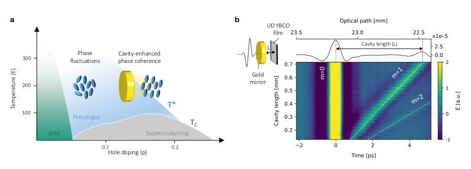
<figcaption class="paper-figure-caption"><b>Fig 1.</b> Figure 1: Cavity control of phase coherence in underdoped YBa2Cu3O7-δ. a, Phase fluctuations of the order parameter are widely discussed as an important factor limiting superconductivity in high-Tc cuprates. In underdoped (UD) samples, evidence for incoherent local pairing has been reported throughout the pseudogap phase. We investigate whether the presence of a mirror in proximity to the superconductor could effectively act as a cavity, promote phase coherence and enhance the superconducting response. b, The sketch illustrates the cavity geometry. Terahertz (THz) time-domain spectroscopy provides a direct way to track the optical path of photons inside the cavity: the delay between the...</figcaption>
</figure>
<figure class="paper-figure-card">
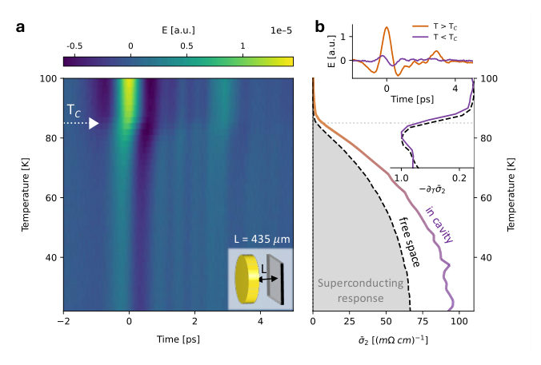
<figcaption class="paper-figure-caption"><b>Fig 2.</b> Figure 2: Enhanced superconducting response in a terahertz cavity. a, Temperature-dependent transmitted THz electric field for a representative cavity length (L=435 µm). THz traces recorded at T &gt; Tc (orange) and at T &lt; Tc (purple) are plotted in the inset of panel (b). On cooling below Tc, the THz waveform shows both a reduction in transmission and a shift in arrival time of the peak, consistent with the emergence of an inductive superconducting response. b, Frequency-averaged imaginary conductivity, ¯σ2, extracted from the THz response and plotted as a function of temperature. The frequency averaging range is (0.4 THz – 1 THz). As a measure of the condensate-related superconducting...</figcaption>
</figure>
<figure class="paper-figure-card">

<figcaption class="paper-figure-caption"><b>Fig 3.</b> Figure 3: Cavity-length depen- dence of the enhanced super- conducting response. Frequency- dependent σ2 (and σ1 in the insets) be- low (a, T = 66K) and above Tc (b, T = 90K), measured in free space (black curve) and inside the cavity (yellow, L = 20 µm). The most pronounced cavity-induced change occurs in σ2 below the superconducting transition, where the inductive response is en- hanced. The shaded areas indicate the propagated standard uncertainties. c, Frequency-averaged σ2 (and σ1 in the inset) as a function of temperature for different cavity lengths, compared to the one for YBCO in free space (black curve). The enhancement of the su- perconducting response is larger at shorter cavity...</figcaption>
</figure>
<figure class="paper-figure-card">
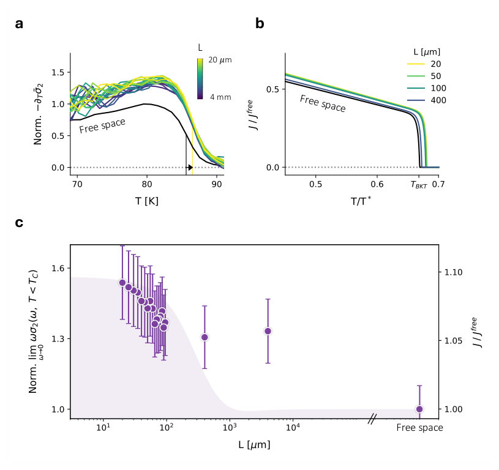
<figcaption class="paper-figure-caption"><b>Fig 4.</b> Figure 4: Signatures of enhanced phase stiffness in the cavity. a, Normalized temperature derivatives of the data in Figure 3c, highlighting the evolution of the superconducting transition inside the cavity (coloured curves) relative to the film outside the cavity (black curve). The transition shows a small upward shift of the onset temperature, indicated by the horizontal arrow. b, Results of calculations for a cavity-coupled XY /BKT model. The model captures the two main experimental trends: an increase in phase stiffness J below the superconducting transition and a cavity-dependent shift of the TBKT. c, Experimental values of ωσ2(ω →0) as a function of cavity length (fixed T = 66K). The...</figcaption>
</figure>

**Summary.** The research demonstrates that confining a superconducting film within an optical cavity enhances its superconducting response in underdoped cuprates. By measuring the change in superfluid weight via THz spectroscopy, the authors confirm that cavity confinement increases the effective phase stiffness of the superconductor. This work showcases cavity engineering as a powerful tool for controlling emergent quantum functionalities in correlated materials.

**Why it may be interesting.** This work directly bridges condensed matter physics (high-Tc superconductors, phase transitions) with quantum optics/cavity QED principles. The concept of using engineered electromagnetic environments to tune fundamental material parameters like phase stiffness is highly relevant for AMO physicists working on open quantum systems and cavity coupling.

Detailed structure

**Main problem.** The study investigates whether engineering the electromagnetic environment using a resonant cavity can enhance superconducting coherence, particularly by stabilizing phase fluctuations in underdoped cuprates.

**Main result.** Experiments show that placing an underdoped YBCO film inside a terahertz cavity enhances the measured superfluid weight and causes an upward shift in the superconducting onset temperature. Theory confirms this enhancement is due to increased effective phase stiffness ($J$).

**Method.** The research combines THz time-domain spectroscopy measurements with theoretical modeling based on the XY model for phase-fluctuating superconductors.

**Model / system.** The physical system is an underdoped YBa2Cu3O7-delta thin film placed inside a tunable Fabry-Pérot terahertz cavity. The theory models superconductivity using the XY Hamiltonian, coupling superconducting phase dynamics to the quantized electromagnetic field of the cavity.

**Key observables.** Superfluid weight ($ar{\sigma}_2$), superconducting onset temperature ($T_{onset}$), and the renormalized phase stiffness ($J$).

**Important parameters / regimes.** Cavity length ($L$), temperature ($T$), and the ratio of cavity confinement to intrinsic material parameters.

**Assumptions / limitations.** The analysis assumes the system can be described by a phase-only action after integrating out EM fields, and that measurements avoid spurious shifts caused by local heating or misalignment.

**Figures summary.** Figures show temperature dependence of conductivity ($ar{\sigma}_2$) confirming enhancement inside the cavity; theoretical plots illustrate how cavity size ($L$) modifies the plasmon dispersion relation and increases the phase stiffness $J$.

**Paper structure.** The paper progresses from establishing the problem (phase fluctuations limit cuprate superconductivity) to presenting THz measurements showing cavity enhancement, followed by detailed theoretical derivations using action functionals and Renormalization Group analysis to quantify the resulting increase in phase stiffness.

Abstract

Superconductors carry electrical current without resistance when paired electrons condense into a coherent macroscopic quantum state. In underdoped cuprates, evidence suggests that pairing-related correlations and superconducting fluctuations can survive above the temperature at which global coherence is lost, pointing to phase fluctuations as a key limitation on superconductivity in this regime. Motivated by recent demonstrations of cavity-modified collective states in quantum materials, we investigate whether superconducting coherence can be stabilized by engineering the electromagnetic environment of the superconductor. We study an underdoped YBa$_2$Cu$_3$O$_{7-δ}$ thin film in a tunable terahertz cavity formed with a semi-transparent gold mirror. From temperature-dependent terahertz transmission measurements, we find that the cavity enhances the superconducting response below the critical temperature, with an increase of the inferred superfluid weight. The effect becomes more pronounced at smaller cavity lengths and is accompanied by an upward shift of the superconducting onset temperature. Calculations based on a cavity-coupled model for phase-fluctuating superconductors capture these trends and support an interpretation in terms of cavity-enhanced phase stiffness. These results showcase the potential of cavity engineering for designing emergent functionalities in correlated systems.

[↑ back to top](#top)

### [Universal scaling and relaxation in decaying turbulence of Bose gases](http://arxiv.org/abs/2606.18059v1)

**Authors:** Arnol D. García-Orozco, Michelle A. Moreno-Armijos, Sarah Sab, Amilson Fritsch, Vanderlei Salvador Bagnato  
**Type:** both · **Category:** quantum gases · **PDF:** <https://arxiv.org/pdf/2606.18059v1>  
**Analysis basis:** full PDF text, analyzed in chunks
**Topic relevance:** 🔥 `non-equilibrium universality` **5/5** · 🔥 `analog quantum simulation` **4/5** · 🔥 `non-equilibrium dynamics` **4/5** · `Keldysh / 2PI / non-Gaussian methods` **3/5** · `driven-dissipative phase transition` **3/5** · `correlated / nonlocal dissipation` **1/5** · `entanglement & information structure` **1/5** · `methods for driven-dissipative` **1/5** · `scars & prethermalization` **1/5**

↔ Scroll figures horizontally

<figure class="paper-figure-card">
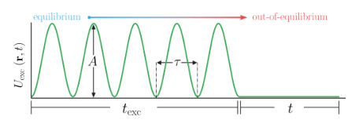
<figcaption class="paper-figure-caption"><b>Fig 1.</b> Fig. 1 A controllable time-varying magnetic field poten- tial with amplitude A drives the equilibrium BEC to an out-of-equilibrium state. The drive potential is applied for a time (texc) for around texc = 5τ , then turned off. The system evolves in the trap for a time (t) without an exter- nal potential. After this time, the trap potential is turned off, and after 30 ms of time of fligth (tTOF), the absorption imaging is taken. Reproduced from Ref. [33].</figcaption>
</figure>
<figure class="paper-figure-card">
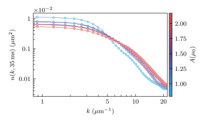
<figcaption class="paper-figure-caption"><b>Fig 2.</b> Fig. 2 Momentum distribution n(k, t = 35 ms) for differ- ent excitation amplitudes. The turbulent state in the cloud is established. The power-law behavior can be observed in the momentum range 10 µm−1 ≤k ≤17 µm−1. Repro- duced from Ref. [33].</figcaption>
</figure>
<figure class="paper-figure-card">
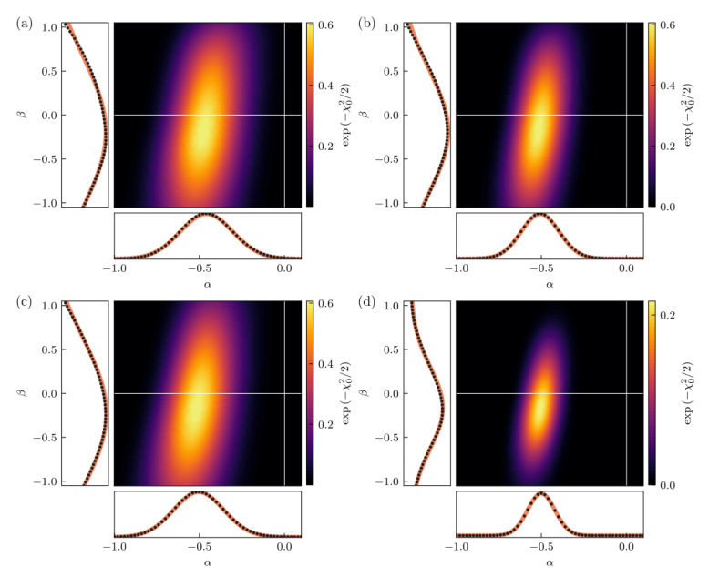
<figcaption class="paper-figure-caption"><b>Fig 3.</b> Fig. 3 Likelihood functions LA(α, β) for three different excitation amplitudes, 1.8µ0 (a), 2.0µ0 (b), and 2.2µ0 (c), and the product of all likelihood functions (d). For panels (a)–(c) we divide the function χ2(α, β) by its minimum value, which we denote by χ2(α, β), so that the maximum value of LA(α, β) is the same for all excitation amplitudes. Reproduced from Ref. [33].</figcaption>
</figure>
<figure class="paper-figure-card">
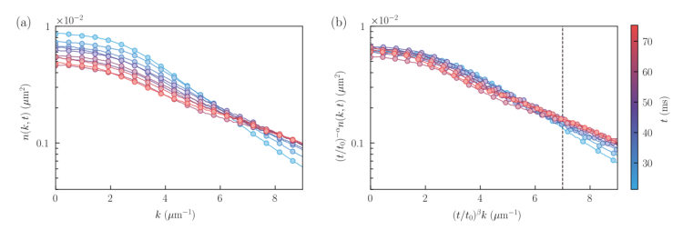
<figcaption class="paper-figure-caption"><b>Fig 4.</b> Fig. 4 (a) Momentum distributions of a turbulent state for an excitation amplitude A = 2.2µ0 at different holding times t. (b) Corresponding rescaled distributions collapse into a single universal curve, characteristic of self-similar dynamics in the turbulent regime. The universal exponents that described beaviour are α = −0.50(8) and β = −0.2(4). The vertical dashed line indicates the infrared cutoff ks, delimiting the momentum range where the scaling described by Eq. 8 holds. Reproduced from Ref. [33].</figcaption>
</figure>
<figure class="paper-figure-card">
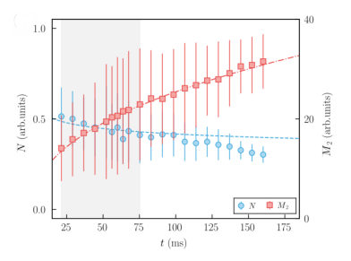
<figcaption class="paper-figure-caption"><b>Fig 5.</b> Fig. 5 Global quantities, as defined in Eqs. 9 and 10, for the excitation amplitudes of A = 1.8µ0. The shaded region corresponds to the time window in which universal behavior is observed. The left axis shows the total number of particles, N, and the universality range (ks ≤7µm−1) as a function of t. The mean kinetic energy M2 (right axis) increases with time within the same universal range. The curves follow the theoretical predictions, namely, N ∝ tα−2β and M2 ∝t−2β. Reproduced from Ref. [33].</figcaption>
</figure>

**Summary.** This review and study investigates how turbulent Bose gases relax far from equilibrium by analyzing universal scaling laws. The authors combine theory (NTFPs, WKE) with experiments on BECs to show that the decay proceeds through distinct direct and inverse cascade stages. This confirms turbulence's role in establishing universal transport dynamics in quantum many-body systems.

**Why it may be interesting.** This work provides a concrete realization of non-equilibrium statistical mechanics in an ultracold atomic setting, linking fundamental concepts like wave turbulence and universality classes to measurable physical observables in quantum gases.

Detailed structure

**Main problem.** The central challenge is understanding the relaxation dynamics of isolated quantum systems, particularly how far-from-equilibrium evolution in turbulent Bose gases can be described by universal scaling laws.

**Main result.** The system exhibits self-similar evolution characterized by Nonthermal Fixed Points (NTFPs), demonstrating distinct direct and inverse cascade stages governed by universal power-law exponents ($\alpha$ and $eta$).

**Method.** The study combines theoretical analysis using weak kinetic equations, renormalization group concepts, and differential equation approaches with experimental measurements of momentum distributions via Time-of-Flight imaging.

**Model / system.** The system under investigation is a Bose gas (e.g., $^{87}	ext{Rb}$ BEC) driven into a turbulent, far-from-equilibrium state using controlled excitation potentials in an ultracold atomic trap.

**Key observables.** Momentum distribution $n(k, t)$, average particle number ($N$), and mean kinetic energy ($\langle k^2 
angle$).

**Important parameters / regimes.** Universal scaling exponents ($\alpha$ and $eta$), momentum scales (UV/IR limits), and time evolution relative to characteristic times ($t/t_0$).

**Assumptions / limitations.** The emergence of universal dynamical scaling despite different microscopic interactions, and the applicability of simplified differential equations in specific momentum regimes.

**Figures summary.** Figures illustrate the collapse of momentum distributions into single universal functions after rescaling for both direct (depletion) and inverse (repopulation) cascades. One figure shows the time evolution of low-momentum states ($n(k 	o 0, t)$) validating scaling laws.

**Paper structure.** The paper progresses from establishing the theoretical framework using weak kinetic equations and NTFP concepts to detailing experimental measurements that confirm self-similar scaling. It then presents alternative analytical methods (differential equations) to extract universal exponents ($\alpha$ and $eta$) from limited data regions, confirming consistency across different analysis techniques.

Abstract

Understanding the relaxation dynamics of isolated quantum systems remains a central challenge in nonequilibrium physics. In this short review, we discuss recent experimental and theoretical advances in universal dynamics of turbulent Bose gases, with particular emphasis on nonthermal fixed points and wave turbulence in our experimental system at the São Carlos Institute of Physics of the University of São Paulo. We highlight the emergence of self-similar scaling behavior and its connection to particle and energy transport across momentum scales. In addition, we discuss an approach in which a differential equation has a universal scaling solution, providing a practical framework for extracting universal exponents from limited regions of the momentum distribution. Furthermore, we recap experimental observations of direct and inverse cascades in a three-dimensional trapped Bose--Einstein condensate, revealing distinct relaxation stages governed by universal scaling laws. These results demonstrate that turbulence plays a key role in far-from-equilibrium dynamics, offering a unified perspective on transport processes and thermalization in quantum many-body systems.

[↑ back to top](#top)

### [Quantum statistical enhancement of collective behaviour in a bosonic active Ising model](http://arxiv.org/abs/2606.18091v1)

**Authors:** Kian L. Assent, Emil Strauch, Sabine H. L. Klapp, André Eckardt, Alexander Schnell  
**Type:** theory · **Category:** statistical mechanics · **PDF:** <https://arxiv.org/pdf/2606.18091v1>  
**Analysis basis:** full PDF text, analyzed in chunks
**Topic relevance:** 🔥 `analog quantum simulation` **4/5** · 🔥 `driven-dissipative phase transition` **4/5** · 🔥 `methods for driven-dissipative` **4/5** · `correlated / nonlocal dissipation` **3/5** · `exotic spin models in light-matter` **3/5** · `non-equilibrium dynamics` **3/5** · `non-equilibrium universality` **3/5** · `Keldysh / 2PI / non-Gaussian methods` **1/5** · `entanglement & information structure` **1/5** · `spintronics-quantum-optics interface` **1/5**

↔ Scroll figures horizontally

<figure class="paper-figure-card">
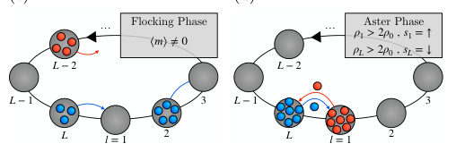
<figcaption class="paper-figure-caption"><b>Fig 1.</b> FIG. 1: (a) The particle’s spin species governs its pre- ferred direction of movement. (b) The lattice sites of the AIM are initially occupied by a random distribution of particles. (c) Large groups of same-species particles mov- ing around the AIM are considered a flock, while (d) a large group of opposite-species-particles remaining dor- mant on neighboring sites are called an aster.</figcaption>
</figure>
<figure class="paper-figure-card">
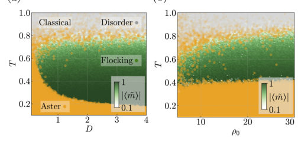
<figcaption class="paper-figure-caption"><b>Fig 2.</b> FIG. 2: Phase diagram of the classical active Ising model, Eq. (4), (a) in the T −D plane (for ε = 0.7, γ = 1, ρ0 = 10 and L = 100) and (b) in the T −ρ0 plane for D = 1 (other parameters as in (a)). Yellow dots indicate the formation of asters (according to the critierion given the main text). The results are consistent with [44].</figcaption>
</figure>
<figure class="paper-figure-card">
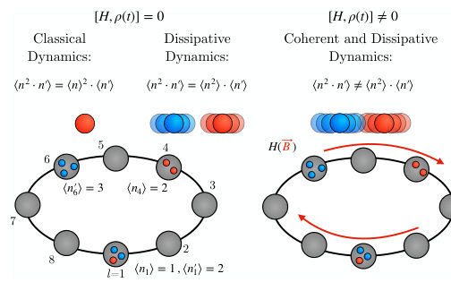
<figcaption class="paper-figure-caption"><b>Fig 3.</b> FIG. 3: Different setups of the AIM under investigation and the corresponding master equations. In the classical limit, all quantum effects are neglected when evaluat- ing the expectation values. When focusing on dissipative quantum effects, the coherences resulting from a sepa- ration of ⟨n · n′⟩are set to zero. Lastly, to simulate an external influence, in our case a magnetic field, the sys- tem is exposed to an external Hamiltonian H( ⃗B) ̸= 0. The resulting dynamics include quantum coherences.</figcaption>
</figure>
<figure class="paper-figure-card">
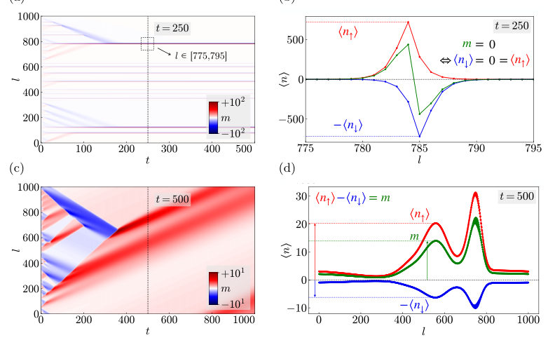
<figcaption class="paper-figure-caption"><b>Fig 4.</b> FIG. 4: Dynamics of the mean-field kinetic equations of the AIM with classical particles (L = 1000, N = 10000, D = 1 and ε = 0.7) developing (a) asters at T = 0.35 as well as (c) flocks at T = 0.45. (b),(d) Spin densities and magnetization along vertical cuts through (a) and (c), respectively, at a late time [indicated by vertical dashed lines in (a) and (c)]. In (b) we zoom into a few sites, to resolve the shape of an aster.</figcaption>
</figure>
<figure class="paper-figure-card">
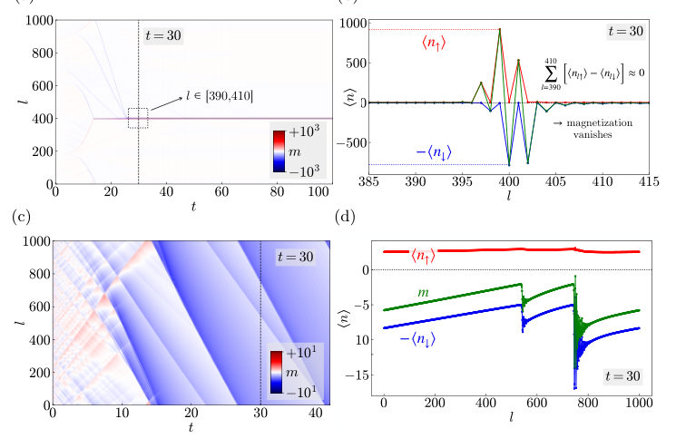
<figcaption class="paper-figure-caption"><b>Fig 5.</b> FIG. 5: Dynamics of a large quantum AIM of ideal bosons (L = 1000, N = 10000 and ε = 0.7) developing (a) asters at D = 0.2 and T = 10 as well as (c) flocks at D = 3, T = 10. (b),(d) Absolute magnetization of each lattice site at a late time of figures (a) and (c), respectively [indicated by vertical dashed lines in (a) and (c)]. The aster phase evolves differently when compared to the classical model, with multiple neighbouring peaks of opposite magnetization. Additionally, the flock appears sharply localized at its edge instead of the continuous curve found in Fig. 4.</figcaption>
</figure>

**Summary.** This paper analyzes a bosonic active Ising model to study emergent collective behaviors like flocking and aster formation in non-equilibrium settings. The key finding is that bosonic quantum statistics significantly enhance the stability of these ordered phases compared to classical models. Using mean-field theory, the authors map out phase diagrams showing how this enhancement competes with suppression from external magnetic fields.

**Why it may be interesting.** This work provides a concrete theoretical framework for understanding non-equilibrium collective dynamics in quantum many-body systems. The explicit demonstration of 'bosonic enhancement' offers insights into how quantum statistics can stabilize complex ordered phases beyond classical mean-field predictions, which is highly relevant to AMO physics and quantum simulation.

Detailed structure

**Main problem.** The study investigates how bosonic quantum statistics enhance collective behaviors like flocking and aster formation in an active Ising model, contrasting these findings with classical models and other quantum generalizations.

**Main result.** Bosonic indistinguishability markedly enhances the stability of both flocking and aster phases compared to classical predictions, allowing these ordered states to persist at higher temperatures. Furthermore, the analysis maps out how external transverse magnetic fields suppress these collective phenomena.

**Method.** The authors employ a mean-field approximation on the Lindblad master equation for ideal bosons, deriving closed kinetic equations for single-particle density matrices and mean occupations.

**Model / system.** The system is a one-dimensional quantum lattice variant of the Active Ising Model (AIM) based on ideal bosons with spin degrees of freedom ($\uparrow$ and $\downarrow$). The dynamics are governed by a Lindblad master equation incorporating coherent, spin-flip, and biased hopping processes.

**Key observables.** Mean magnetization ($\langle m 
angle$), local magnetizations ($
ho_l, 
ho_{l+1}$), mean occupations ($\langle n_{ls} 
angle$), and the critical temperature for phase transitions.

**Important parameters / regimes.** Activity parameter ($\epsilon$), inverse temperature ($eta=1/T$), external transverse magnetic field strength ($\omega$), and system density ($
ho_0$).

**Assumptions / limitations.** The analysis relies heavily on mean-field approximations and the use of Wick's theorem to truncate the BBGKY hierarchy, neglecting higher-order correlations.

**Figures summary.** Figures illustrate phase diagrams comparing classical vs. quantum predictions (showing enhanced stability in the quantum case), and dynamic simulations showing the formation and evolution of large moving flocks or stationary asters under different parameter regimes.

**Paper structure.** The paper progresses from establishing the full quantum master equation to deriving mean-field kinetic equations for occupations, analyzing the classical limit recovery, quantifying bosonic enhancement effects, and finally mapping out phase diagrams dependent on temperature, density, and external fields.

Abstract

Collective behaviour such as flocking (the collective motion of a spontaneously formed group along a common direction) or aster formation (the binding of opposing flocks, inhibiting each others motion) are intriguing emergent phenomena in active systems with local alignment rules. Until recently, their occurrence was mainly studied for classical systems, a prime example being the active Ising model (AIM), which translates the main ingredients of flocking and aster formation (i.e., alignment and self-propulsion) to a lattice framework. Here we introduce and study a one-dimensional (1D) quantum lattice variant of the AIM, based on ideal bosons with a spin degree of freedom. We find that both the collective behaviours of the 1D classical model, flocking and aster formation, are markedly enhanced by the bosonic quantum statistics. This contrasts with a recent quantum generalization of the AIM based onto hard-core bosons [Khasseh et al., Phys. Rev. Lett. 135, 248302 (2025)], where flocking, but neither its quantum-statistical stabilization nor aster states were observed as a consequence of interactions. Moreover, we investigate the competition of this quantum statistical stabilization of collective phases with their suppression by the quantum fluctuations induced by a transverse external magnetic field.

[↑ back to top](#top)

### [Einstein-Podolsky-Rosen correlations between mechanical oscillators revealed through SU(1,1) interferometry](http://arxiv.org/abs/2606.18202v1)

**Authors:** Max-Emanuel Kern, Stefano Marti, Raquel Garcia-Belles, Andraz Omahen, Igor Kladaric, Arianne Brooks, Yiwen Chu, Matteo Fadel  
**Type:** experiment · **Category:** quantum information and computing · **PDF:** <https://arxiv.org/pdf/2606.18202v1>  
**Analysis basis:** full PDF text, analyzed in chunks
**Topic relevance:** 🔥 `QC/QI experiment` **4/5** · `entanglement & information structure` **3/5** · `interference shaping light` **3/5** · `quantum optics experiment` **3/5** · `analog quantum simulation` **2/5** · `quantum measurements` **2/5** · `Tavis-Cummings & cavity-many-emitter` **1/5** · `correlated cavity matter` **1/5** · `driven-dissipative phase transition` **1/5** · `methods for driven-dissipative` **1/5** · `non-equilibrium dynamics` **1/5**

↔ Scroll figures horizontally

<figure class="paper-figure-card">
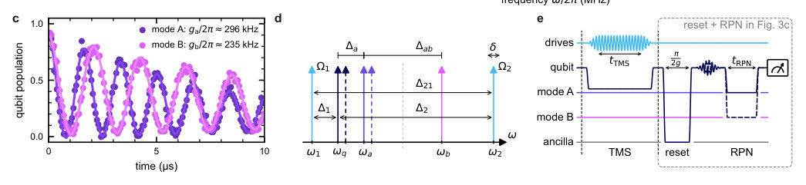
<figcaption class="paper-figure-caption"><b>Fig 1.</b> FIG. 1. Device and two-mode squeezing engineering. (a) Micrograph of the device where two HBARs (AlN on sapphire) are bonded on top of a transmon qubit (Al on sapphire). The two elongated capacitive pads of the qubit terminate with antennas designed to optimize the coupling. Insets show detailed views of the Josephson junction and one antenna-HBAR region. (b) Spectroscopy of the HBARs’ phonon modes measured through vacuum Rabi oscillations versus qubit frequency. The chevron patterns show that the two HBARs have two distinct spectra with non-overlapping modes, allowing us to select the modes A and B that are localized in the two spatially-separated resonators. (c) Vacuum Rabi oscillations...</figcaption>
</figure>
<figure class="paper-figure-card">
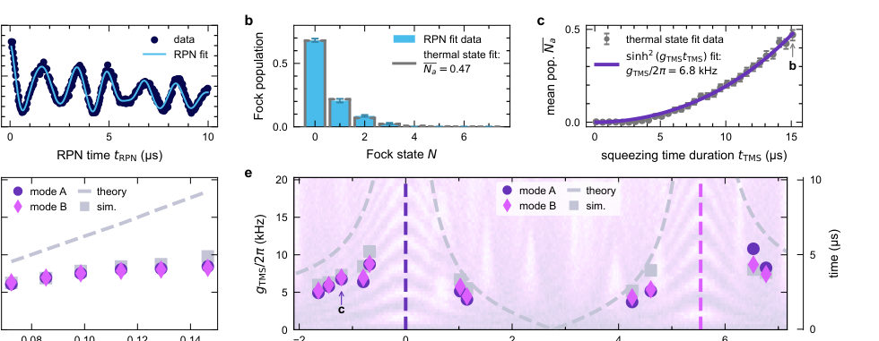
<figcaption class="paper-figure-caption"><b>Fig 2.</b> FIG. 2. TMS rate characterization. (a) Typical qubit population dynamics when on resonance with the mode to be measured (mode A here) for a time tRPN, see Fig. 1e. The numerical RPN fit extracts the Fock state distribution. (b) Fock state distribution obtained from the data in panel a, with a fit to a thermal state distribution to extract the mean phonon number Na. (c) Mean population over time Na(tTMS), extracted by repeating the procedure of panels a, b for different TMS durations tTMS, with a fit to extract the rate. The arrow indicates the data point from panel b. (d) TMS rate gTMS, extracted as shown in panels a-c, as a function of the dimensionless parametric drive strength ξ1ξ2 at...</figcaption>
</figure>
<figure class="paper-figure-card">
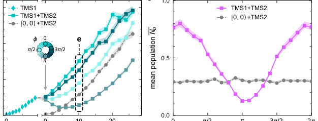
<figcaption class="paper-figure-caption"><b>Fig 3.</b> FIG. 3. Mechanical SU(1,1) interferometry. (a) Schematic of an SU(1,1) interferometer, where the output is sensitive to the phase ϕ accumulated between two TMS operations. (b) Visualization of the SU(1,1) interferometer dynamics on a hyperboloid and projections onto the xy- and xz-planes. After the initial TMS1 boost along x, the phase ϕ gives a rotation around z. The final TMS2 boost, along x, results in an output population that depends on ϕ. (c) Pulse sequence for the interferometer experiment, similar to Fig. 1e but including a second TMS operation with a phase ϕ. (d) Mean population in mode B during TMS1 and TMS2 over time for four different phases ϕ, as indicated by the inset color...</figcaption>
</figure>
<figure class="paper-figure-card">
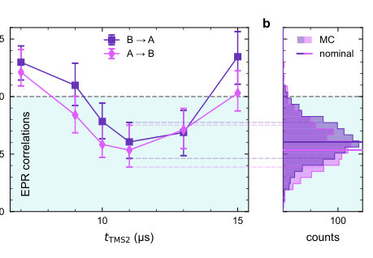
<figcaption class="paper-figure-caption"><b>Fig 4.</b> FIG. 4. Witnessing EPR correlations. (a) Minimum of the EPR steering criterion E(ϕ) extracted from SU(1,1) interfer- ometer fringes (see Fig. 3e) for tTMS1 = 9 µs at the optimal phase (ϕ ≈π). (b) Monte Carlo histogram used to determine the error bars of panel a. At the minimum of tTMS2 = 11 µs, we find 99% (98%) of the Monte Carlo samples exhibit EPR correlations for the steering direction B→A (A→B).</figcaption>
</figure>

**Summary.** The researchers experimentally demonstrated continuous-variable Einstein–Podolsky–Rosen correlations between two macroscopically separated mechanical oscillators. They achieved this by coupling the resonators to a superconducting qubit and engineering a Two-Mode Squeezing (TMS) interaction, which functions as the core element of an SU(1,1) interferometer. This work confirms that quantum correlations stronger than entanglement can be observed in large-scale physical systems.

**Why it may be interesting.** This work bridges macroscopic quantum mechanics with fundamental quantum information protocols by using mechanical oscillators as a robust platform for continuous-variable entanglement witnesses. It expands the operational toolbox in cQAD systems.

Detailed structure

**Main problem.** To experimentally observe continuous-variable Einstein–Podolsky–Rosen (EPR) correlations between two spatially-separated mechanical oscillators, which are quantum correlations stronger than entanglement.

**Main result.** The experiment successfully observed these continuous-variable EPR correlations by realizing a mechanical SU(1,1) interferometer using engineered Two-Mode Squeezing (TMS) interactions. This demonstrates that macroscopic systems can exhibit quantum correlations beyond simple entanglement.

**Method.** The study employs parametric driving to engineer the TMS interaction between two high-overtone bulk acoustic wave resonators coupled via a superconducting qubit. Quantum correlations are then witnessed by implementing an SU(1,1) interferometer sequence.

**Model / system.** The platform is a circuit quantum acoustodynamics (cQAD) device featuring two HBARs coupled to a transmon qubit. The dynamics are modeled using Hamiltonians that allow for the generation of effective Two-Mode Squeezing (TMS) interactions, which replace traditional beam splitters in the interferometer.

**Key observables.** EPR steering criterion $E(\phi)$, output phonon number $\langle N_{	ext{out}} 
angle$, and interference fringes observed by measuring output populations as a function of relative phase $\phi$.

**Important parameters / regimes.** Effective mass ($\sim 16 \, \mu	ext{g}$), coupling strengths ($g_a, g_b$), parametric drive strength, and the time duration of the squeezing operations.

**Assumptions / limitations.** The primary assumption is that the engineered TMS interaction accurately models the required quantum operation for the interferometer. Theoretical predictions for the TMS rate showed minor deviations from measurement.

**Figures summary.** Figures detail the device micrograph and spectroscopy confirming non-overlapping phonon modes, followed by characterization of the TMS rate dependence on drive strength, and finally showing interference fringes and the minimum value of the EPR steering criterion $E(\phi)$ vs. phase $\phi$.

**Paper structure.** The paper first introduces the physical platform (cQAD) and the goal of observing strong quantum correlations. It then details the characterization of the key interaction (TMS rate calibration). Finally, it applies this calibrated interaction to build and test the mechanical SU(1,1) interferometer to witness EPR steering.

Abstract

Quantum correlations are essential for achieving quantum advantage in computing, communication and sensing. Moreover, their observation challenges and constrains our fundamental understanding of nature. Mechanical oscillators in the quantum regime provide an appealing platform for preparing and investigating quantum correlations at macroscopic scales. Despite substantial progress, however, continuous-variable quantum correlations stronger than entanglement have not yet been observed in this macroscopic regime. Here, we report the experimental observation of continuous-variable Einstein-Podolsky-Rosen correlations between two spatially-separated mechanical oscillators with an effective mass of $\sim 16 \,μg$ each. This is achieved by coupling them to a superconducting qubit which allows for engineering a two-mode squeezing interaction when parametrically driven. Crucially, we show that this interaction can be used to witness quantum correlations through the realization of a mechanical SU(1,1) interferometer. Our results expand the toolbox of operations in circuit quantum acoustodynamics and demonstrate that quantum correlations stronger than entanglement can also be observed in macroscopic systems, thereby shedding light on the boundary between quantum and classical regimes.

[↑ back to top](#top)

### [Experimental Characterization and Modeling of Measurement-Induced State-Transitions in a Fluxonium Superconducting Qubit](http://arxiv.org/abs/2606.17866v1)

**Authors:** Martijn F. S. Zwanenburg, Jinlun Hu, Eugene Y. Huang, Figen Yilmaz, Siddharth Singh, Christian Kraglund Andersen  
**Type:** both · **Category:** quantum information and computing · **PDF:** <https://arxiv.org/pdf/2606.17866v1>  
**Analysis basis:** full PDF text, analyzed in chunks
**Topic relevance:** 🔥 `QC/QI experiment` **4/5** · 🔥 `measurement-induced transitions` **4/5** · `methods for driven-dissipative` **3/5** · `quantum measurements` **3/5** · `correlated / nonlocal dissipation` **2/5** · `non-equilibrium dynamics` **2/5** · `Keldysh / 2PI / non-Gaussian methods` **1/5** · `driven-dissipative phase transition` **1/5** · `quantum optics experiment` **1/5**

↔ Scroll figures horizontally

<figure class="paper-figure-card">
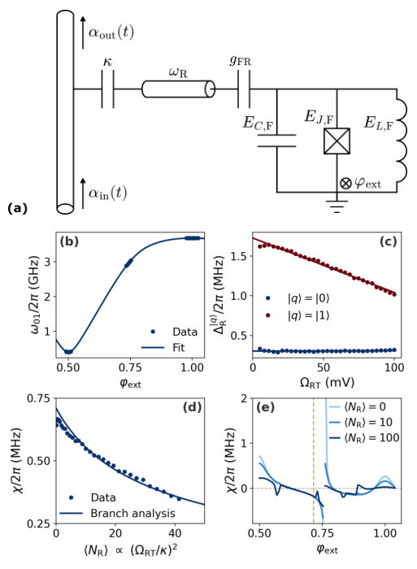
<figcaption class="paper-figure-caption"><b>Fig 1.</b> FIG. 1. (a) Circuit diagram of the fluxonium with a ca- pacitively coupled readout resonator which, in turn, is ca- pacitively coupled to a transmission line. (b) Two-tone spec- troscopy data and fit used to extract the fluxonium’s energy parameters. (c) Qubit-state-dependent resonator frequencies ∆|q⟩ R = ω|q⟩ R −ωR at φext = 0.5 with the fluxonium prepared in |q⟩as a function of the room temperature (RT) readout amplitude ΩRT. The experimental data is linearly extrapo- lated (solid lines) to ΩRT = 0 to obtain the vacuum resonator frequencies used to fit ωR and gFR. (d) Dispersive shift χ as a function of the drive strength expressed through the aver- age photon number ⟨NR⟩. The data is...</figcaption>
</figure>
<figure class="paper-figure-card">
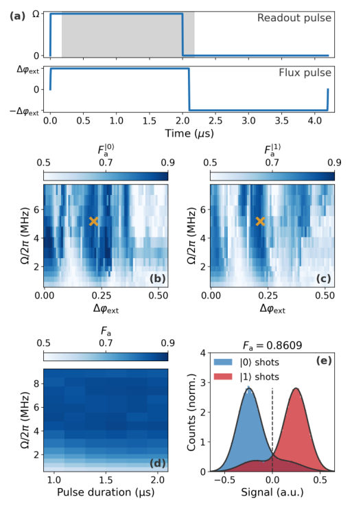
<figcaption class="paper-figure-caption"><b>Fig 2.</b> FIG. 2. (a) Unmodulated readout pulse and the net-zero flux pulse used for these experiments. The shaded area indicates the readout acquisition window. (b), (c) Assignment fidelity F |q⟩ a of the |0⟩and |1⟩state, respectively, as a function of the flux pulse amplitude ∆φext and the readout drive strength. The qubit is initialized at the sweet spot φext = 0.5, and tuned to the respective external fluxes with a fast flux pulse for readout. The marked point indicates the readout parame- ters used in panels (d) and (e) and in later parts of the work. (d) Assignment fidelity as a function of the readout pulse du- ration and drive strength. The integration time is fixed at 2 µs. (e) Single-shot...</figcaption>
</figure>
<figure class="paper-figure-card">
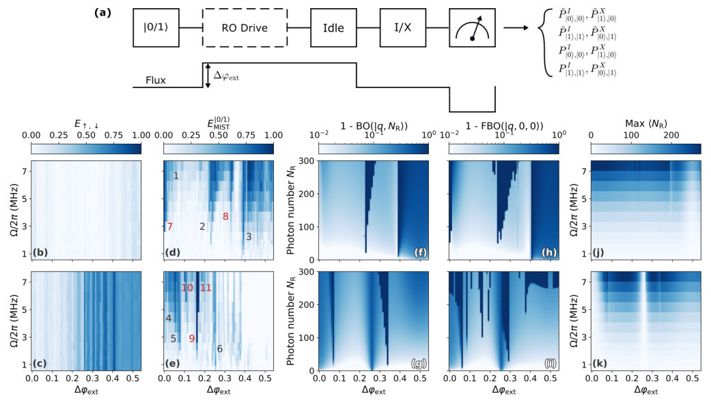
<figcaption class="paper-figure-caption"><b>Fig 3.</b> FIG. 3. (a) Circuit diagram of the experiment used to characterize MIST. The qubit is initialized in |0⟩or |1⟩, and tuned away from sweet spot by ∆φext with a fast flux pulse. Next, an optional readout drive pulse is played, followed by an idle duration to account for the time required for the resonator to deplete. The qubit is readout at the flux-point indicated in Figs. 2(b),(c) after an optional X operation performed at sweet spot. (b)-(k) Numerical and experimental results for a 1 µs readout drive pulse as a function of the flux pulse amplitude ∆φext and with the qubit initialized in |0⟩(panels (b), (d), (f), (h) and (j)) or in |1⟩(panels (c), (e), (g), (i) and (k)). (b), (c)...</figcaption>
</figure>
<figure class="paper-figure-card">
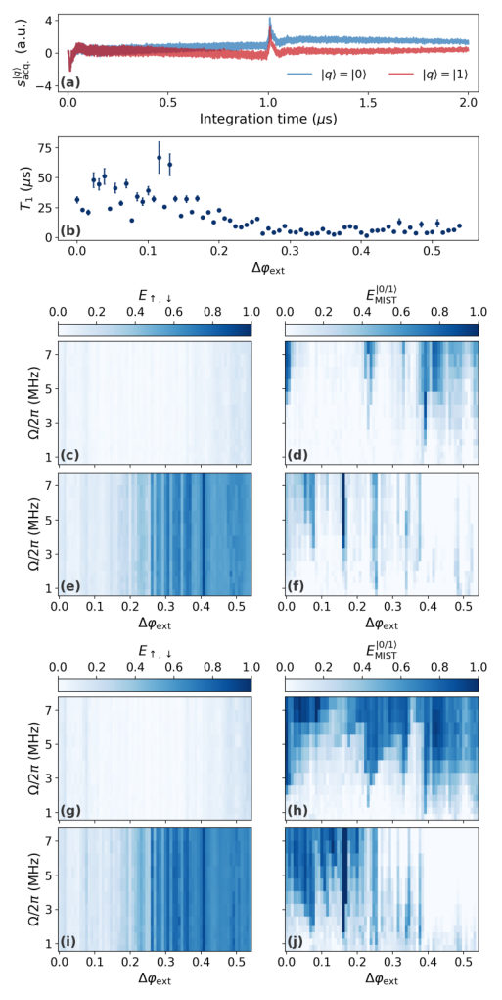
<figcaption class="paper-figure-caption"><b>Fig 4.</b> FIG. 4. (a) Demodulated, acquired traces along the axis of maximum signal difference as a function of the integration time. (b) T1 as a function of the flux pulse amplitude ∆φext. (c)-(f), (g)-(j) Experimental results analogous to Figs. 3(b)- (e) in the main text, but with a 0.5 µs and 2 µs readout drive pulse duration, respectively. Panels (c)-(f) and (g)-(j) show the measured values for E↑, E|0⟩ MIST, E↓and E|1⟩ MIST, respec- tively.</figcaption>
</figure>
<figure class="paper-figure-card">
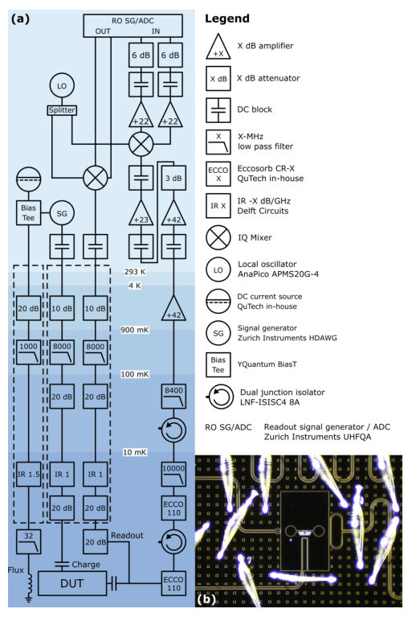
<figcaption class="paper-figure-caption"><b>Fig 5.</b> FIG. 5. (a) Schematic of the electronic setup. (b) Optical microscope image of the device.</figcaption>
</figure>

**Summary.** This research experimentally and theoretically characterizes Measurement-Induced State-Transitions (MIST) in a fluxonium qubit during microwave readout. By incorporating the effects of array modes into advanced theoretical models, the authors accurately predict error hotspots across the entire external flux range. This work is crucial for improving the fidelity and scalability of superconducting quantum processors.

**Why it may be interesting.** This work is highly relevant as it tackles fundamental limitations in superconducting quantum hardware readout fidelity by modeling complex, non-linear coupling mechanisms involving higher-order circuit modes.

Detailed structure

**Main problem.** The study characterizes Measurement-Induced State-Transitions (MIST) in a fluxonium superconducting qubit, which are non-ideal errors arising during dispersive quantum non-demolition (QND) readout.

**Main result.** The theory accurately predicts multiple regions of increased MIST, and these errors are shown to be significantly influenced by the transmission-line-like array modes of the superinductor.

**Method.** The work combines experimental characterization across the full flux range with advanced numerical simulations using Floquet branch analysis to model error sources.

**Model / system.** The system is a fluxonium superconducting qubit coupled to a readout resonator and an array of Josephson junctions forming the superinductor. The Hamiltonian incorporates terms for the fluxonium, resonator, and multiple array modes.

**Key observables.** Measurement-Induced State-Transitions (MIST) occurrence, assignment fidelity ($F_{|q
angle_a}$), state-dependent resonator frequency shifts ($\Delta\omega_R$), and the dispersive shift $\chi$.

**Important parameters / regimes.** External flux range ($\phi_{	ext{ext}}$), readout drive strength ($\Omega_{	ext{RT}}$ or $\Omega$), and the coupling strengths to array modes.

**Assumptions / limitations.** The analysis relies on approximations such as assuming the resonator is in equilibrium for calculating photon number, and using semi-classical methods for simulating the cavity field evolution.

**Figures summary.** Figures detail spectroscopic measurements (e.g., qubit frequency vs. flux), readout fidelity dependence on drive strength, and calculated error terms ($E^{MIST}$) plotted against external flux or drive amplitude, often visualized via branch overlap analysis.

**Paper structure.** The paper progresses from initial parameter extraction using spectroscopy to developing an error separation model that distinguishes MIST errors from other decoherence sources. It then applies advanced Floquet branch analysis (including array modes) to map out the full phase space of MIST susceptibility.

Abstract

Superconducting qubits are most often measured using dispersive readout, which, ideally, implements a projective quantum non-demolition (QND) measurement. While a larger readout drive can increase the signal and, thus, reduce discrimination errors in the readout, strong microwave drives may also cause non-QND errors by driving the qubit to a state outside the computational subspace. In this work, we experimentally characterize measurement-induced state transitions (MIST) in a fluxonium qubit over its full external flux range. We further numerically calculate the MIST errors, and find that the theory accurately predicts eleven experimentally identified regions with increased MIST. In addition to transitions to higher fluxonium levels, we also find that, at certain flux points, MIST errors are dominated by transitions that include the transmission-line-like array modes of the fluxonium's superinductor. The excellent match between theory and experiment validates that the models accurately predict the occurrence of MIST in these systems, and further highlights the influence of array modes in fluxonium readout.

[↑ back to top](#top)

### [Work Extraction via Backward Motion in Optimal Closed-Loop Stochastic Control](http://arxiv.org/abs/2606.17624v1)

**Authors:** Luis Frieder Reinalter, Emanuele Panizon, Lokesh Muruga, Clemens Bechinger  
**Type:** both · **Category:** statistical mechanics · **PDF:** <https://arxiv.org/pdf/2606.17624v1>  
**Analysis basis:** full PDF text, analyzed in chunks
**Topic relevance:** 🔥 `quantum measurements` **4/5** · `methods for driven-dissipative` **3/5** · `non-equilibrium dynamics` **3/5** · `non-equilibrium universality` **3/5** · `Keldysh / 2PI / non-Gaussian methods` **2/5** · `driven-dissipative phase transition` **2/5** · `Frenkel-Kontorova` **1/5** · `analog quantum simulation` **1/5** · `correlated / nonlocal dissipation` **1/5** · `measurement-induced transitions` **1/5**

↔ Scroll figures horizontally

<figure class="paper-figure-card">
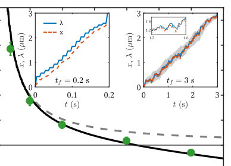
<figcaption class="paper-figure-caption"><b>Fig 1.</b> Figure 1. Average work ⟨W⟩versus the protocol duration tf. Symbols are experimental values obtained from RL-identified optimal policies, the solid and dashed lines denotes the ana- lytical solution for the optimal closed-loop protocol and that without feedback. Insets: representative trap trajectories λt and corresponding particle trajectories xt for tf = 0.2 s and 3 s. For tf = 0.2 s, the particle systematically lags behind the trap, and variations between experiments are barely visible. For tf = 3 s, the particle remains closer to the trap trajectory, and individual realizations exhibit much larger scatter (gray band denotes scatter across 100 repeated realizations).</figcaption>
</figure>
<figure class="paper-figure-card">
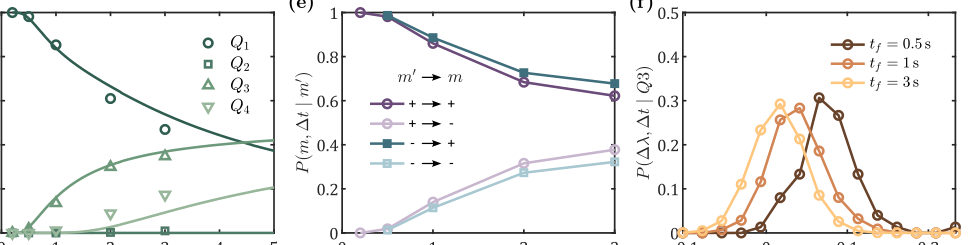
<figcaption class="paper-figure-caption"><b>Fig 2.</b> Figure 2. (a)–(c) Representative action distributions for tf = 0.5 s, 1 s, and 3 s, respectively, classified by trap displacement ∆λ and work increment ∆W. Forward and backward steps correspond to positive and negative ∆λ, respectively. The quadrants denote forward work-costing steps (Q1), backward work-costing steps (Q2), backward work-extracting steps (Q3), and forward work-extracting steps (Q4). Short protocols are dominated by Q1, whereas increasing tf enhances the population of work- extracting Q3 events. (d) Normalized quadrant occupation probabilities P(Qi) as a function of tf. Symbols are experimental data from RL-identified optimal policies; solid lines are theoretical predictions...</figcaption>
</figure>
<figure class="paper-figure-card">
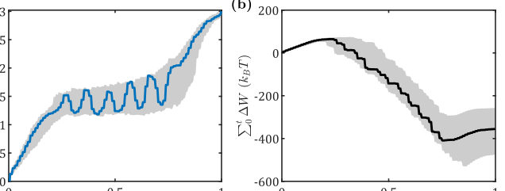
<figcaption class="paper-figure-caption"><b>Fig 3.</b> Figure 3. (a) RL-optimized trap trajectory for tf = 1 s in the presence of an externally imposed, time-dependent perturbation. The blue curve shows a single realization of the optimal feedback protocol identified by RL, while the gray band indicates the scatter between 100 individual experiments. The trap trajectory first approaches the perturbed region, remains there for an extended part of the protocol, and then reaches the target. Oscillations visible in individual realizations arise from the external drive and largely average out over many realizations because the driving phase is randomized. (b) Corresponding accumulated work for the same protocol. After an initial increase, the...</figcaption>
</figure>
<figure class="paper-figure-card">
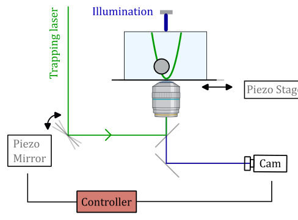
<figcaption class="paper-figure-caption"><b>Fig 4.</b> Figure 4. Schematic of the experimental optical-tweezer setup. A silica colloid is confined in an optical trap generated by a focused trapping laser. The trap position is controlled by a piezo-actuated steering mirror, while the particle position is recorded by video microscopy. The measured particle posi- tion, current trap position, and protocol time are passed to a real-time controller, which computes the next trap displace- ment. External perturbations can be applied by translating the sample with a piezo stage.</figcaption>
</figure>

**Summary.** The authors experimentally demonstrate using reinforcement learning (RL) that feedback control can extract usable work from thermal baths in colloidal systems. They show this occurs via specific 'backward' trap movements, which is confirmed by comparing RL results against exact theoretical solutions derived from stochastic control theory. The methodology is robust enough to handle complex, externally forced environments.

**Why it may be interesting.** This work provides a powerful demonstration of how machine learning can solve complex optimal control problems in physical systems, offering insights into non-equilibrium thermodynamics and fluctuation-driven energy harvesting that are highly relevant to open quantum systems research.

Detailed structure

**Main problem.** The research investigates how optimal closed-loop feedback control can minimize energetic costs when steering a physical system toward a target state in the presence of thermal fluctuations.

**Main result.** Optimal policies identified via Reinforcement Learning (RL) quantitatively match analytical solutions, demonstrating that work extraction ($\langle W 
angle < 0$) occurs by exploiting backward trap displacements, even extending to heterogeneous non-equilibrium environments.

**Method.** The study combines experimental realization using real-time optical tweezers and in situ RL (PPO) with rigorous theoretical analysis derived from stochastic control theory (LQG formulation).

**Model / system.** The system is an overdamped colloidal particle suspended in a water–glycerol mixture, controlled by time-varying optical traps. The dynamics are governed by stochastic processes influenced by thermal noise.

**Key observables.** Average work ($\langle W 
angle$) as a function of protocol duration ($t_f$), and the classification of feedback actions into quadrants based on trap displacement ($\Delta\lambda$) versus work increment ($\Delta W$).

**Important parameters / regimes.** Trap stiffness ($\kappa = 2 \pm 0.2 	ext{ pN}/\mu	ext{m}$), viscous relaxation time ($	au_r \approx 25 	ext{ ms}$), and the protocol duration ($t_f$) which dictates the crossover regime.

**Assumptions / limitations.** The primary assumption is that RL can successfully learn optimal policies without requiring a detailed dynamical model, although theoretical benchmarks are used for comparison.

**Figures summary.** Figures illustrate $\langle W 
angle$ vs $t_f$, showing work extraction at long times; action distributions classify feedback into quadrants (Q1-Q4); and later figures map out these quadrant probabilities in both equilibrium and non-equilibrium settings.

**Paper structure.** The paper first establishes the experimental setup and RL methodology for optimal control. It then analyzes the crossover of work cost with protocol time, identifying backward motion as key to energy extraction. Finally, it extends this analysis to heterogeneous external forcing fields, confirming the robustness of the feedback strategy.

Abstract

We experimentally realize finite-time feedback control in an overdamped colloidal system using real-time optical tweezers with in situ reinforcement learning (RL). By varying the protocol duration tf for displacing the optical trap between prescribed positions, the optimal strategies identified by RL reveal a crossover from deterministic dragging toward the target to feedback-assisted exploitation of thermal fluctuations, reducing and eventually overcoming the energetic cost. The resulting policies agree quantitatively with the exact optimal closed-loop solution. By extending the approach to spatially localized external forcing, we further show that RL can identify optimal feedback strategies in heterogeneous stochastic environments where direct analytical control design is challenging.

[↑ back to top](#top)

### [A Lindbladian for holographic Brownian motion](http://arxiv.org/abs/2606.17909v1)

**Authors:** Daichi Takeda  
**Type:** theory · **Category:** statistical mechanics · **PDF:** <https://arxiv.org/pdf/2606.17909v1>  
**Analysis basis:** full PDF text, analyzed in chunks
**Topic relevance:** 🔥 `Keldysh / 2PI / non-Gaussian methods` **4/5** · `correlated / nonlocal dissipation` **3/5** · `driven-dissipative phase transition` **3/5** · `methods for driven-dissipative` **3/5** · `non-equilibrium dynamics` **3/5** · `non-equilibrium universality` **2/5** · `Kondo & dissipative impurity` **1/5** · `scars & prethermalization` **1/5**

↔ Scroll figures horizontally

<figure class="paper-figure-card">
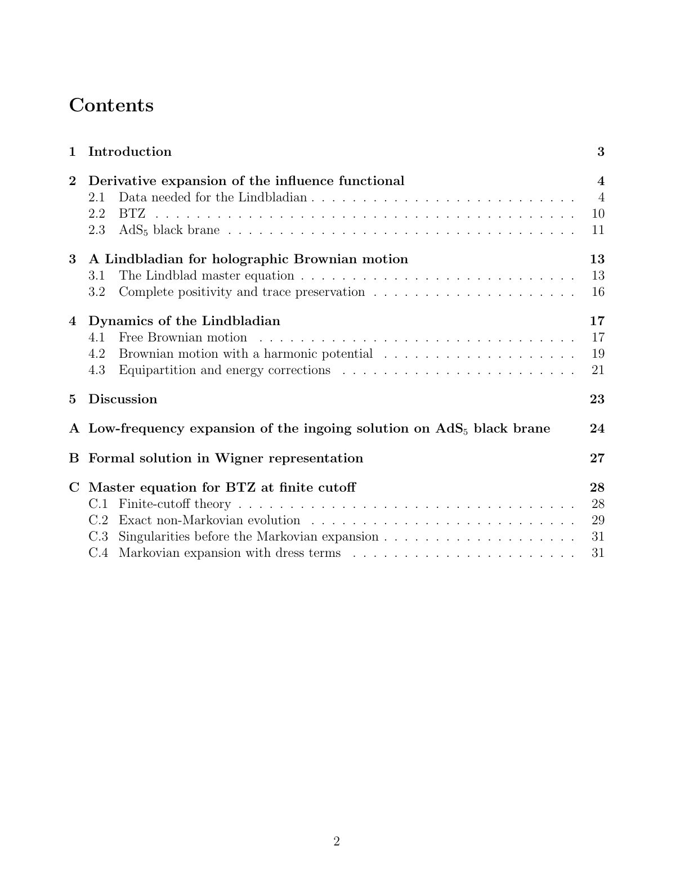
<figcaption class="paper-figure-caption"><b>Fig 1.</b> Low-resolution page preview, page 2</figcaption>
</figure>
<figure class="paper-figure-card">
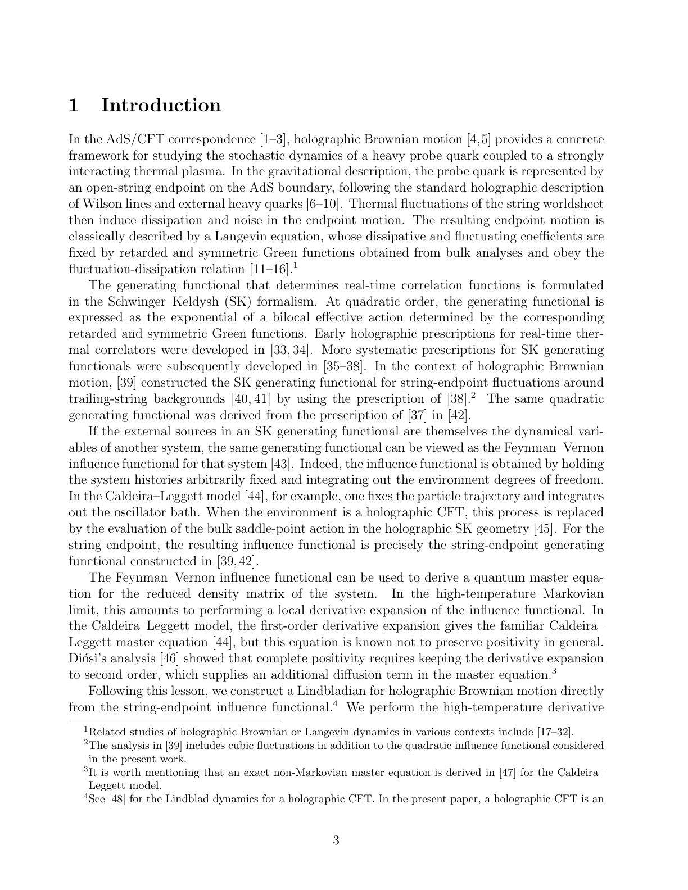
<figcaption class="paper-figure-caption"><b>Fig 2.</b> Low-resolution page preview, page 3</figcaption>
</figure>
<figure class="paper-figure-card">
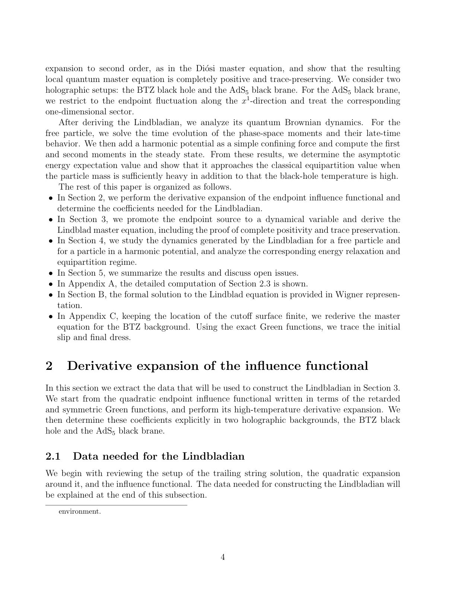
<figcaption class="paper-figure-caption"><b>Fig 3.</b> Low-resolution page preview, page 4</figcaption>
</figure>
<figure class="paper-figure-card">
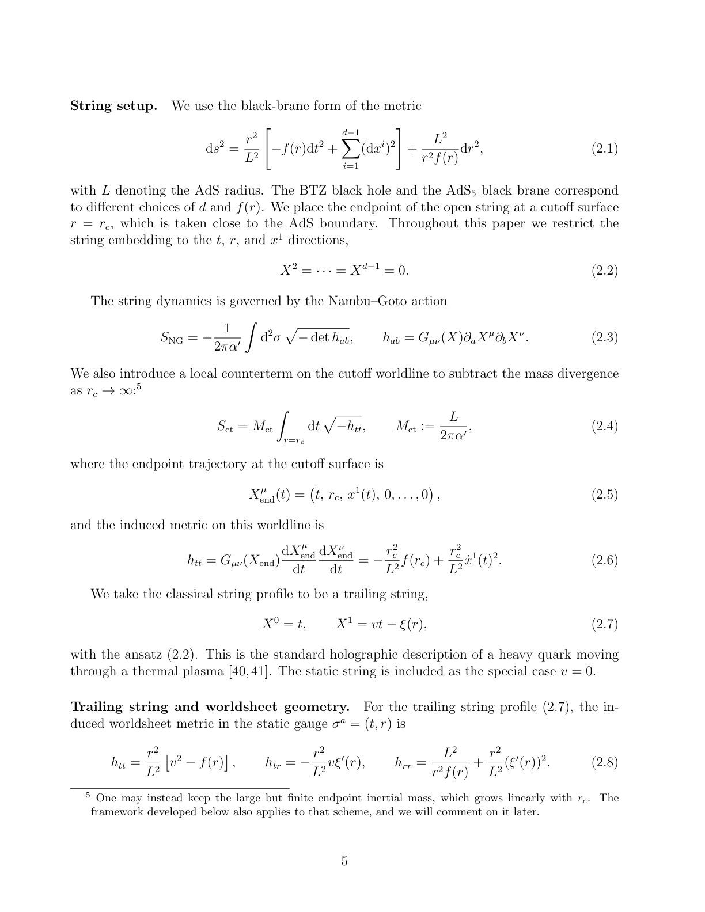
<figcaption class="paper-figure-caption"><b>Fig 4.</b> Low-resolution page preview, page 5</figcaption>
</figure>
<figure class="paper-figure-card">
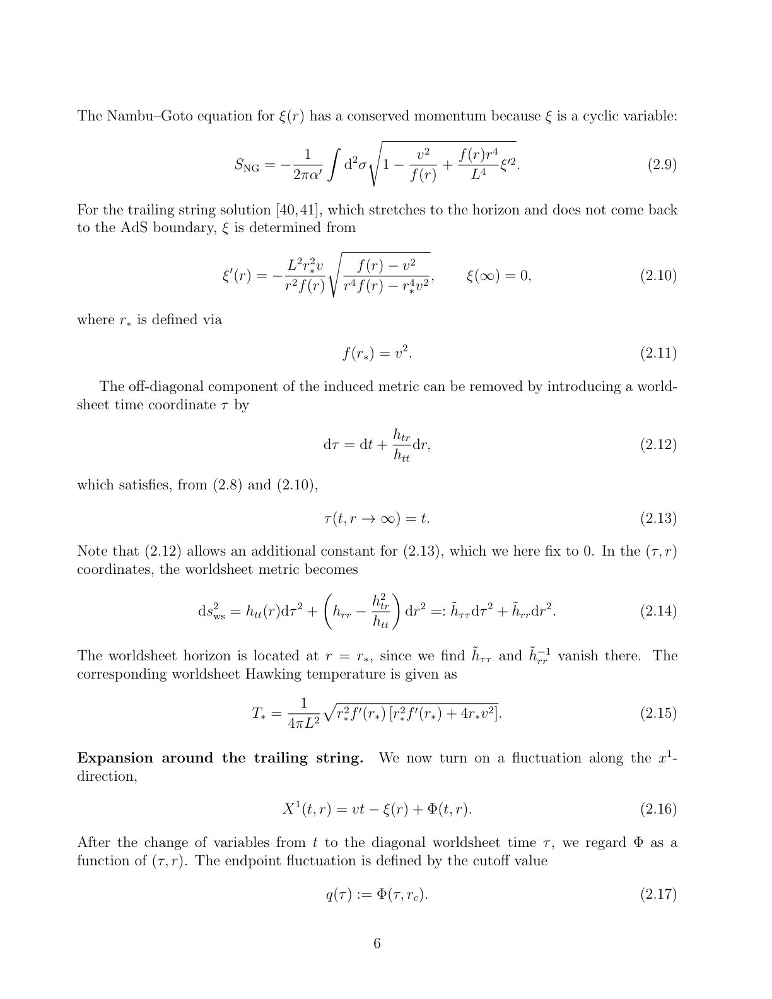
<figcaption class="paper-figure-caption"><b>Fig 5.</b> Low-resolution page preview, page 6</figcaption>
</figure>

**Summary.** This paper develops a rigorous Lindblad master equation describing holographic Brownian motion, which models heavy particle diffusion in a hot plasma using the AdS/CFT correspondence. By expanding the string endpoint influence functional and taking the Markovian limit, the authors derive dissipation coefficients for specific black hole backgrounds. The results confirm that the system thermalizes correctly, satisfying equipartition laws.

**Why it may be interesting.** This work provides a concrete realization of open quantum system dynamics (Lindbladian evolution) derived from fundamental gravitational/string theory principles (AdS/CFT), offering tools to study thermalization in strongly coupled systems relevant to condensed matter physics.

Detailed structure

**Main problem.** The paper derives a Lindbladian description for holographic Brownian motion, modeling the stochastic dynamics of a heavy probe quark coupled to a thermal plasma.

**Main result.** It successfully constructs a completely positive and trace-preserving quantum master equation describing the system's time evolution in the Markovian limit. The analysis confirms energy relaxation approaches classical equipartition values under appropriate conditions.

**Method.** The methodology involves deriving an influence functional from the Nambu–Goto action, applying the Schwinger–Keldysh formalism, and taking a high-temperature local Markovian expansion to yield the Lindblad generator.

**Model / system.** The system is holographic Brownian motion, modeled by an open string endpoint fluctuation in AdS space coupled to a thermal bath. The dynamics are captured by a master equation involving dissipation coefficients derived from Green's functions for specific backgrounds like BTZ and AdS$_5$.

**Key observables.** Phase-space moments ($\langle q 
angle, \langle p 
angle$), energy relaxation rates, and the stationary covariance matrix $\Sigma(	au)$.

**Important parameters / regimes.** High temperature regime ($T^*$), heavy mass limit ($M_q$), and specific background parameters (BTZ/AdS$_5$).

**Assumptions / limitations.** The derivation relies on the high-temperature Markovian limit, a local derivative expansion of the influence functional, and quadratic approximations of the underlying actions.

**Figures summary.** Not specified in the notes; however, the analysis involves deriving coefficients (Table 3.1) and solving differential equations for covariance matrix components ($\Sigma(	au)$).

**Paper structure.** The paper progresses from defining the physical problem via the influence functional to performing the mathematical expansion using Green's functions, culminating in the explicit form of the Lindblad master equation and analyzing its solutions for free and harmonic potentials.

Abstract

We derive a Lindbladian description of holographic Brownian motion in the high-temperature regime. Starting from the influence functional for a trailing string endpoint, we identify the corresponding quantum master equation and prove that it is completely positive and trace-preserving. We determine the coefficients of the Lindbladian explicitly for two holographic backgrounds: the BTZ black hole and the AdS$_5$ black brane, restricting in the latter case to the endpoint fluctuation along the $x^1$-direction. We then analyze the time evolution of phase-space moments, energy relaxation, and steady states.

[↑ back to top](#top)

### [Hybrid Ferromagnet-SNSPDs: Single photon induced order-to-disorder transition in ferromagnets coupled to thin film superconductors](http://arxiv.org/abs/2606.17177v1)

**Authors:** Leif Bauer, Daien He, Sathwik Bharadwaj, Zubin Jacob  
**Type:** theory · **Category:** statistical mechanics · **PDF:** <https://arxiv.org/pdf/2606.17177v1>  
**Analysis basis:** full PDF text, analyzed in chunks
**Topic relevance:** 🔥 `spintronics-quantum-optics interface` **4/5** · `driven-dissipative phase transition` **3/5** · `exotic spin models in light-matter` **3/5** · `methods for driven-dissipative` **2/5** · `non-equilibrium dynamics` **2/5** · `non-equilibrium universality` **2/5** · `Frenkel-Kontorova` **1/5** · `Keldysh / 2PI / non-Gaussian methods` **1/5** · `correlated / nonlocal dissipation` **1/5**

↔ Scroll figures horizontally

<figure class="paper-figure-card">
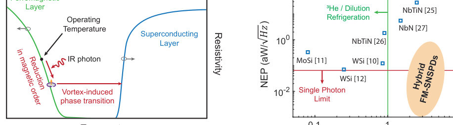
<figcaption class="paper-figure-caption"><b>Fig 1.</b> FIG. 1. Hybrid phase transition in a ferromagnet/superconductor (FM-S) bilayer. (a) When no photons are incident the vortex crossing barrier is large reducing dark counts. This large barrier is due to the presence of a magnetic layer with magnetization (yellow arrows) aligned to the vortex magnetic flux (yellow arrow). (b) When a single photon is incident, the vortex barrier is reduced enabling high photon detection efficiency. The barrier is reduced after photon incidence due to a reduction in the local order of the magnetic layer from the photon-induced hot spot. This reduced ferromagnetic order, causes a reduction in the magnetic field in the superconducting layer, leading to a reduced...</figcaption>
</figure>
<figure class="paper-figure-card">
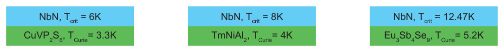
<figcaption class="paper-figure-caption"><b>Fig 2.</b> FIG. 2. Potential hybrid FM-SNSPD designs for LWIR, MWIR, visible-SWIR, and high temperature operations where T is the operating temperature, Tcrit is the proximity effect reduced superconducting critical temperature and TCurie is the ferromagnet Curie temperature [32–36].</figcaption>
</figure>
<figure class="paper-figure-card">
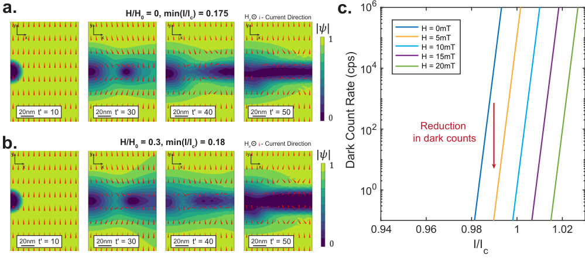
<figcaption class="paper-figure-caption"><b>Fig 3.</b> FIG. 3. Dark count behavior of SNSPDs and FM-SNSPDs. (a-b) Time dependent Ginzburg-Landau simulation of vortex crossing behavior for different bias currents and magnetic fields. Large positive magnetic fields are observed to require higher bias currents for single vortex crossing. (a) Vortex crossing-induced transition occurs at I/Ic = 0.175 for H/H0 = 0 in an NbN SNSPD. (b) Vortex crossing-induced transition occurs at I/Ic = 0.18 for H/H0 = 0.3 in an NbN SNSPD. (c) Dark count simulation from vortex crossing model demonstrating reduction in dark count rate as applied magnetic field increases. Note that relatively small increases in magnetic field can lead to significant reductions in dark...</figcaption>
</figure>
<figure class="paper-figure-card">
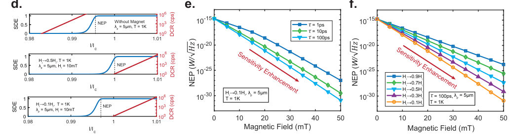
<figcaption class="paper-figure-caption"><b>Fig 4.</b> FIG. 4. Effect of time-varying ferromagnet temperature on SNSPD sensitivity. (a) An incident IR photon causes a change in the ferromagnet temperature which exponentially returns to the environment temperature with thermalization time τ. (b) Change in magnetic field for different reductions in magnetization and thermalization times. (c) Effect of different time-varying magnetic fields on the energy barrier. Note that larger thermal time constants lead to nearly constant changes in barrier. (d) Comparison of SDE and DCR for standard SNSPD (top) and FM-SNSPD with different reductions in magnetic field (middle, bottom). NEP is taken at the SDE plateau (I/Ic where SDE = 0.99). The magnetic field...</figcaption>
</figure>
<figure class="paper-figure-card">
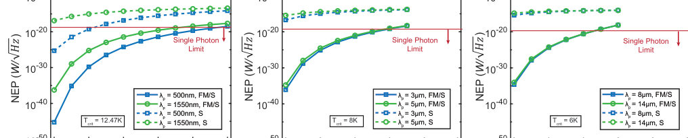
<figcaption class="paper-figure-caption"><b>Fig 5.</b> FIG. 5. Impact of ferromagnet/superconductor bilayers on infrared NEP. (a-c) Solid lines indicate hybrid FM-SNSPDs, while dashed lines indicate the same device designs without a magnetic layer. The hybrid FM-SNSPDs utilize a ferromagnet with Hi = 40mT, Hi →0.05Hi, τ = 100ps. NEP below the marked single photon limit indicates SNR &gt; 1 for incident photon flux of 1 photon/s at 1Hz readout bandwidth. (a) NEP versus temperature for visible to SWIR wavelengths demonstrating ∼4.25K operation for hybrid FM-SNSPDs. (b) NEP versus temperature for MWIR wavelengths demonstrating ∼3.75K operation for hybrid FM-SNSPDs. (c) NEP versus temperature for LWIR wavelengths demonstrating ∼3.25K operation for...</figcaption>
</figure>

**Summary.** The paper proposes using a hybrid Ferromagnet/Superconductor structure to create highly sensitive single-photon detectors that operate at significantly higher temperatures than previously possible. By engineering the magnetic coupling such that an incident photon triggers a controlled phase transition in the ferromagnet, the superconducting detection mechanism is activated efficiently while minimizing dark noise. This breakthrough promises simpler and more practical quantum sensing applications.

**Why it may be interesting.** This work models a non-equilibrium phase transition driven by external stimuli (photons) in a coupled magnet-superconductor system, which has strong parallels with studying energy dissipation and thermalization dynamics in quantum materials.

Detailed structure

**Main problem.** The primary goal is to develop infrared single-photon detectors that operate at significantly higher temperatures than current cryogenic limits (T < 1K) by engineering the operating mechanism.

**Main result.** A hybrid Ferromagnet/Superconductor bilayer can achieve high sensitivity up to 3.25–3.75K by coupling a photon-induced order-to-disorder transition in the ferromagnet to a superconducting phase transition.

**Method.** The analysis uses vortex-crossing theory, time-dependent Ginzburg-Landau simulations, and atomistic spin dynamics to model the coupled magnetic and superconducting transitions.

**Model / system.** The system is a hybrid Ferromagnet/Superconductor (FM/S) bilayer. The mechanism relies on the local heating from an incident photon causing disordering in the FM layer, which modifies the magnetic field profile and lowers the vortex crossing barrier in the superconductor.

**Key observables.** Noise Equivalent Power (NEP), Dark Count Rate (DCR), System Detection Efficiency (SDE), and operating temperature ($T_{op}$).

**Important parameters / regimes.** Operating Temperature (3.25–3.75K), Curie Temperature ($T_{	ext{Curie}}$) of the FM layer, magnetic field strength ($\sim 40	ext{mT}$), and thermal time constant ($	au$).

**Assumptions / limitations.** The model assumes that the single-photon event triggers a localized hotspot leading to an order-to-disorder transition in the ferromagnet, which then drives the superconducting detection mechanism.

**Figures summary.** Figures illustrate the operational cycle (no photon vs. photon incidence), show the dependence of DCR and NEP on applied magnetic fields and thermal time constants, and map out potential device designs based on critical temperatures ($T_{	ext{crit}}$, $T_{	ext{Curie}}$).

**Paper structure.** The paper progresses by first establishing the limitations of current detectors, then proposing the hybrid FM/S structure. It details the underlying physics using vortex-crossing theory and simulations to show how magnetic field engineering allows for higher temperature operation while maintaining high sensitivity.

Abstract

The development of midwave and longwave infrared single photon detectors is crucial for their emerging applications in spectroscopy, remote sensing, exoplanet detection, and free space quantum communications. However, existing sensors need to be operated at extremely low temperatures (0.08-0.9K) to reduce dark noise and hence require the use of advanced cryogenics such as dilution refrigerators or $^3$He cryogens, significantly limiting applications. Here we propose a vortex-engineering approach based on a hybrid phase transition in a ferromagnet/superconductor bilayer to increase the operating temperature of infrared single photon detectors up to 3.75K. We show that the introduction of a ferromagnetic layer produces a local magnetic field which impedes vortex crossing in the superconductor, reducing dark noise. When a single photon is incident, the photon-induced hotspot causes an order-to-disorder transition in the ferromagnet, leading to a vortex-induced phase transition in the superconducting layer. By engineering the ferromagnet's Curie temperature to be close to the device's operating temperature, single photon sensitivity can be achieved at increased operating temperatures. We predict at midwave/longwave infrared wavelengths (3-14$μ$m) the operating temperature can be raised to 3.25-3.75K, enabling significantly simpler cooling systems.

[↑ back to top](#top)

### [Manipulation of Topological Corner States via Subchiral Symmetry](http://arxiv.org/abs/2606.17975v1)

**Authors:** Hai-Tao Ding, Tianqi Chen, Leong-Chuan Kwek, Jiangbin Gong  
**Type:** both · **Category:** other · **PDF:** <https://arxiv.org/pdf/2606.17975v1>  
**Analysis basis:** full PDF text, analyzed in chunks
**Topic relevance:** 🔥 `analog quantum simulation` **4/5** · `methods for driven-dissipative` **3/5** · `non-equilibrium dynamics` **3/5** · `QC/QI experiment` **2/5** · `driven-dissipative phase transition` **2/5** · `correlated / nonlocal dissipation` **1/5** · `entanglement & information structure` **1/5** · `exotic spin models in light-matter` **1/5** · `non-equilibrium universality` **1/5**

↔ Scroll figures horizontally

<figure class="paper-figure-card">
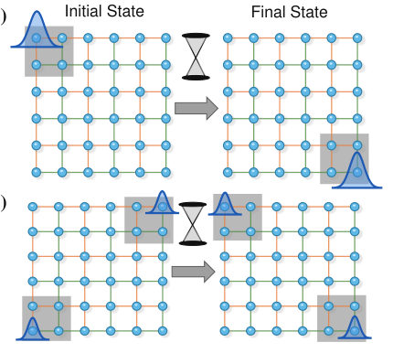
<figcaption class="paper-figure-caption"><b>Fig 1.</b> FIG. 1. Subchiral-symmetry-controlled manipulation of cor- ner modes in an extended 2D BBH model. (a) Lattice ge- ometry and hopping configuration. The unit cell contains four orbitals, labeled A, B, C, and D. The conventional BBH hoppings are denoted by ±γ and λ, while the red links rep- resent controllable hoppings between identical orbitals in ad- jacent unit cells along the x direction, denoted by tp. These hoppings selectively break the corresponding subchiral sym- metries. (b1) Adiabatic transfer of a single isolated corner mode. (b2) Adiabatic transfer of an equal-weight superposi- tion of two corner modes between opposite-corner pairs. Blue envelopes denote the corner-state...</figcaption>
</figure>
<figure class="paper-figure-card">
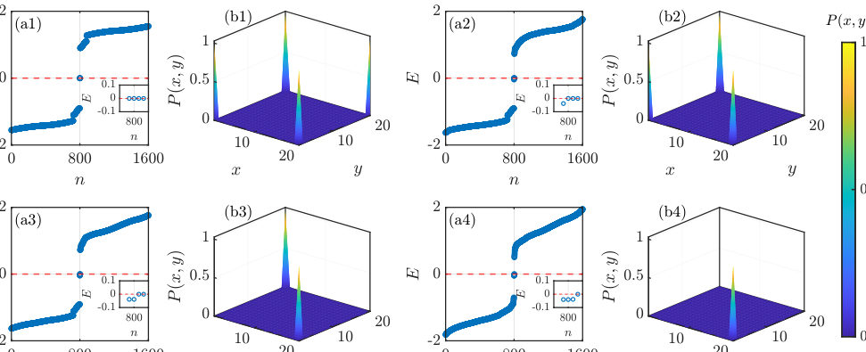
<figcaption class="paper-figure-caption"><b>Fig 2.</b> FIG. 2. (a1-a4) The energy spectrum and (b1-b4) the spatial distributions P(x, y) for the zero-energy corner states. Here (x, y) denotes the unit-cell position, and P(x, y) is the unit-cell-resolved probability density obtained by summing the wave-function weight over the four sublattices A, B, C, and D. The insets of (a1-a4) shows a zoom-in of the spectrum around E = 0. (a1) The energy spectrum of H in Eq. (1), showing four degenerate zero-energy corner states isolated within the bulk and edge gaps. (b1) The corresponding distribution P(x, y), showing localization at the four corners. (a2)–(a4) Energy spectra for H + HA, H + HA + HB, and H + HA + HB + HC, respectively, where the zero-mode...</figcaption>
</figure>
<figure class="paper-figure-card">
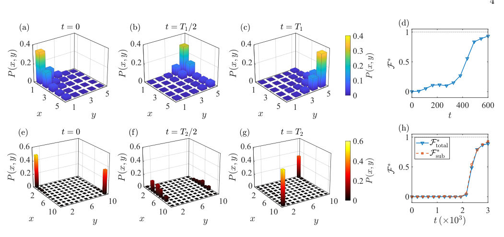
<figcaption class="paper-figure-caption"><b>Fig 3.</b> FIG. 3. Transfer of corner states on the IBM quantum processor ibm boston (hardware details in the Supplementary Mate- rials [68]). (a)–(d) Single corner mode; (e)–(h) superposition of corner modes. (a) and (e) Measured density distributions of the initial states at t = 0 for the single-mode and superposition protocols, respectively. (b) and (f) Density distribution of the instantaneous state at t = T1/2 and t = T2/2, respectively. (c) and (g) Density distribution of the final state at t = T1 and t = T2, respectively. (d) Transformed fidelity F ∗for the single-mode transfer and (h) transformed total fidelity F ∗ total and subspace fidelity F ∗ sub for the superposition transfer, all...</figcaption>
</figure>

**Summary.** The paper introduces subchiral symmetry as a general control principle for manipulating the corner modes found in higher-order topological insulators using the 2D BBH model. By selectively breaking these symmetries, researchers can isolate individual zero-energy states and execute adiabatic protocols to coherently transfer both single modes and superpositions of two modes. This capability was successfully demonstrated on an IBM quantum processor, establishing a pathway for programmable topological state control.

**Why it may be interesting.** This work directly addresses programmable topological dynamics by linking symmetry protection (subchiral symmetry) to physical state manipulation, which is highly relevant for designing robust quantum simulators or quantum memory elements based on topological materials.

Detailed structure

**Main problem.** The core problem is developing a general, controllable principle for manipulating topological corner modes (zero-energy states) in higher-order topological insulators (SOTIs). This requires selectively creating, isolating, and coherently transferring these degenerate modes.

**Main result.** Subchiral symmetry was established as the control mechanism, allowing for the stepwise reduction of fourfold zero-mode manifolds to single isolated modes. Furthermore, adiabatic protocols successfully transferred both single modes and coherent superpositions of two modes with high fidelity on quantum hardware.

**Method.** The work combines theoretical analysis using symmetry protection (subchiral symmetry) with experimental validation via time-dependent Hamiltonian engineering and implementation on an IBM quantum processor.

**Model / system.** The primary model is the two-dimensional Benalcazar–Bernevig–Hughes (BBH) model, a paradigmatic SOTI. The control is achieved by selectively breaking the four associated subchiral symmetries using controlled intercell hoppings in the Hamiltonian.

**Key observables.** Zero-energy corner states, single/superposition state transfer fidelity ($F^*$), and density distributions $P(x, y)$ showing mode localization.

**Important parameters / regimes.** The control strength of the subchiral symmetry breaking terms ($H_\alpha$) and the adiabatic evolution time scale ($T$).

**Assumptions / limitations.** The ability to realize and maintain phase coherence during state transfer protocols on physical quantum hardware (IBM processor).

**Figures summary.** Figures detail the energy spectrum showing stepwise lifting of zero modes using symmetry breaking, and density plots/fidelity curves demonstrating successful single-mode and superposition state transfer between corners.

**Paper structure.** The paper proceeds by first introducing the BBH model and its fourfold degenerate corner states. It then details how subchiral symmetries provide a control principle for sequentially isolating these modes. Finally, it presents adiabatic protocols to coherently transfer both single and two-state superpositions of these modes, validated numerically and on quantum hardware.

Abstract

Higher-order topological phases provide robust corner modes, but their use requires controllable creation, isolation, and transfer of individual modes and their superpositions. Here we demonstrate, using the two-dimensional Benalcazar-Bernevig-Hughes model as an example, that subchiral symmetry provides a general control principle for manipulating topological corner modes. The conventional chiral symmetry decomposes into four subchiral symmetries, each associated with one zero-energy corner mode. By selectively breaking these subsymmetries with controlled intercell hoppings, we reduce the fourfold corner-state manifold step by step to single isolated modes. We further design adiabatic protocols that transfer either a single corner state or a superposition of two corner states between selected corners, while preserving the relative phase in the latter case. Both numerical simulations and IBM quantum-processor implementations show that the proposed protocols can be executed with high fidelity, establishing subchiral symmetry as a route to programmable higher-order topological state manipulation.

[↑ back to top](#top)

### [Projected logical ensembles in surface codes via the random-matrix theory of quantum dots](http://arxiv.org/abs/2606.17140v1)

**Authors:** Mircea Bejan, Jan Behrends, Max McGinley, Benjamin Béri  
**Type:** theory · **Category:** quantum information and computing · **PDF:** <https://arxiv.org/pdf/2606.17140v1>  
**Analysis basis:** full PDF text, analyzed in chunks
**Topic relevance:** 🔥 `quantum measurements` **4/5** · `measurement-induced transitions` **3/5** · `driven-dissipative phase transition` **2/5** · `non-equilibrium universality` **2/5** · `Keldysh / 2PI / non-Gaussian methods` **1/5** · `Kondo & dissipative impurity` **1/5** · `analog quantum simulation` **1/5** · `correlated / nonlocal dissipation` **1/5** · `entanglement & information structure` **1/5** · `methods for driven-dissipative` **1/5** · `non-equilibrium dynamics` **1/5**

↔ Scroll figures horizontally

<figure class="paper-figure-card">
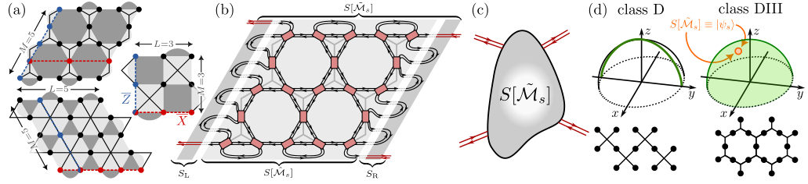
<figcaption class="paper-figure-caption"><b>Fig 1.</b> FIG. 1. Overview of results. (a): Surface code on honeycomb, square, and triangular lattices with qubits (black disks) on edges (black lines), SX v stabilizers (light gray) on vertices, and SZ f stabilizers (dark gray) on faces. The logical Z (blue) and X (red) are also shown. The medial lattice has qubits on its vertices and the faces form a checkerboard pattern of SX v and SZ f stabilizers. (b): The code subject to coherent X-rotations and syndrome measurements can be mapped to a quantum circuit (cf. Sec. IV), which further maps to a charge-conserving network model [32, 70] with scattering matrix S[ ˆ Ms] (light gray shaded). Concatenating S[ ˆ Ms] with scattering matrices SL and SR (dark...</figcaption>
</figure>
<figure class="paper-figure-card">
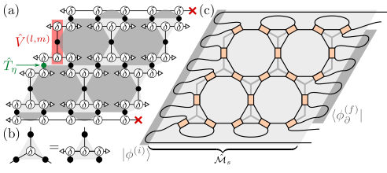
<figcaption class="paper-figure-caption"><b>Fig 2.</b> FIG. 2. (a): Mapping the sum over stabilizer configurations to a quantum circuit for the honeycomb surface code [8, 70]. Each SX v stabilizer is replaced by a Kronecker δ tensor that can be split up into several δ tensors (white disks), as shown in panel (b), to ensure a brickwork-structured quantum circuit. Combining the tensor ˆTη (black disks, one example highlighted in green) with neighboring δ tensors yields the nonunitary gate ˆV (l,m) (red box). The white triangles denote √</figcaption>
</figure>
<figure class="paper-figure-card">
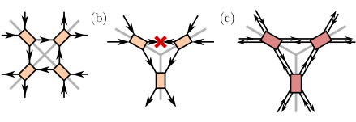
<figcaption class="paper-figure-caption"><b>Fig 3.</b> FIG. 4. (a): The gates ˆV (l,m) act unitarily along the edges of the SX v stabilizer lattice, which is indicated by the arrows that denote one of two possible choices for the direction of a unitary evolution. For lattices with only even-weight SX v , the lattice of ˆV (l,m) gates can be directly interpreted as a charge-conserving network model in symmetry class D, as shown in Ref. 70. (b): For lattices with odd-weight SX v , such a construction leads to a contradiction, as indicated by the red cross: incoming and outgoing modes cannot be connected. Following Ref. 32, we add a time-reversed copy to obtain a charge-conserving network in symmetry class DIII (see also Ref. [78]).</figcaption>
</figure>
<figure class="paper-figure-card">
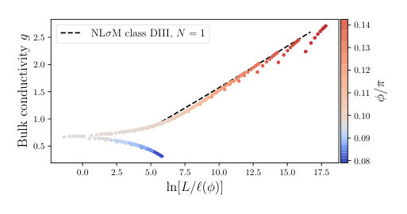
<figcaption class="paper-figure-caption"><b>Fig 4.</b> FIG. 6. Bulk conductivity g for the network model of the honeycomb surface code under coherent rotations. The system length and width are 21 ≤L = M ≤91 with data averaged over 105 to 106 syndrome realizations. Error bars (SE) are imperceptible. g scales with a ϕ-dependent length ℓ(ϕ). For the insulator ϕ &lt; ϕth, g(L/ℓ(ϕ)) decreases with L, with ϕth = (0.089 ± 0.002)π. For the metal ϕ &gt; ϕth, g increases and, for large L, is consistent with the scaling g ∝(2π)−1 ln[L/ℓ(ϕ)] of a nonlinear sigma model in class DIII in the replica limit N →1 (dashed black line), see also [77, 78].</figcaption>
</figure>
<figure class="paper-figure-card">
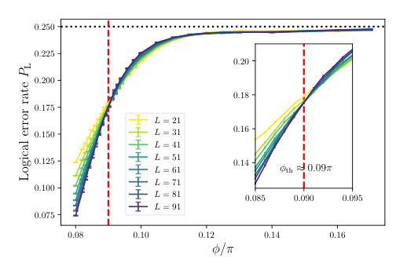
<figcaption class="paper-figure-caption"><b>Fig 5.</b> FIG. 5. Logical error rate PL vs coherent error angle ϕ for the honeycomb surface code with length L. PL decays with L below the error threshold ϕth (vertical dashed red line). The inset shows data closer to the QEC transition. For ϕ &gt; ϕth, PL initially increases with L, after which it becomes weakly dependent on L for the accessible system sizes. The horizontal dotted black line shows the minimum average infidelity for post-QEC states Haar-distributed over a Bloch hemisphere. Error bars show the standard error of the mean (SE). Data averaged over 105 to 106 syndromes.</figcaption>
</figure>

**Summary.** This work analyzes the randomness induced in quantum error correction codes (like the surface code) after syndrome measurements. It establishes that this resulting ensemble of logical states is mathematically equivalent to the scattering matrix statistics of a quantum dot. This connection allows researchers to use established tools from random matrix theory and mesoscopic physics to predict fundamental properties of fault-tolerant quantum computation.

**Why it may be interesting.** It provides a powerful physical realization of abstract concepts in QEC by connecting them directly to well-understood physics models from condensed matter theory, specifically mesoscopic transport phenomena.

Detailed structure

**Main problem.** The study characterizes the statistical properties of post-measurement logical states (the Projected Logical Ensemble, PLE) arising in Quantum Error Correction (QEC) on topological codes.

**Main result.** The PLE is shown to be isomorphic to the scattering matrix ensemble of a quantum dot, establishing a fundamental link between QEC universality and mesoscopic physics.

**Method.** The analysis maps the syndrome extraction process onto calculating the scattering matrix ($S$) of an effective quantum dot network derived from the surface code structure.

**Model / system.** The system uses the Surface Code (SC) on 2D lattices, where measurement back-action generates randomness. This is mathematically mapped to a mesoscopic quantum dot whose transport properties are governed by Random Matrix Theory (RMT).

**Key observables.** Projected Logical Ensemble (PLE), scattering matrices ($S$), bulk conductivity ($g$), and the Wasserstein-1 distance ($W_1$) used for comparison.

**Important parameters / regimes.** The coherent rotation angle ($\phi$) determines the regime, with a critical threshold $\phi_{th}$ separating insulating/coherent regimes from metallic/chaotic ones.

**Assumptions / limitations.** The analysis assumes maximum-likelihood decoding and relies on establishing an isomorphism between the quantum circuit evolution and the scattering matrix of the associated quantum dot.

**Figures summary.** Figures illustrate the SC geometry, its mapping to a network model with $S$-matrices, and plots show the dependence of bulk conductivity ($g$) and logical error rate ($P_L$) on the rotation angle $\phi$, identifying critical thresholds.

**Paper structure.** The paper develops by first defining the PLE via syndrome measurement (Chunk 1), establishing the isomorphism to quantum dot scattering matrices (Chunks 2 & 4), analyzing constraints using tensor networks and symmetry classes (Chunks 3, 5), and finally quantifying the transition between regimes using RMT diagnostics like conductance scaling (Chunks 6 & 7).

Abstract

Measurements underpin active quantum error correction (QEC) and have been recognized as a source of novel measurement-induced many-body phenomena. Here, we study the statistical properties of post-measurement logical states arising in QEC on topological codes subject to deterministic transversal unitary gates. Upon syndrome extraction followed by maximum-likelihood decoding, a Born-weighted ensemble arises which we dub the "projected logical ensemble" (PLE). Focusing on surface codes subject to uniform single-qubit Pauli-$X$ rotations, we characterize the measurement-induced randomness of the PLE. To this end, we show that for a code with a single logical qubit, the PLE is isomorphic to an ensemble of scattering matrices describing mesoscopic quantum dots obtained from a 2D Majorana network model with suitable boundary conditions. We uncover regimes where these quantum dots are chaotic such that their scattering matrices are well-described by random matrix theory. In these regimes, the PLE approaches a universal ensemble that is maximally random up to symmetry and decoder-induced constraints. The symmetry constraints, set by stabilizer and logical operator weights, realize Altland-Zirnbauer classes D or DIII, which we both illustrate. Our results establish a fundamental connection between emergent universality concepts in mesoscopic physics, quantum many-body systems, and QEC.

[↑ back to top](#top)

### [Imprints of dynamical phases in semiclassical entanglement entropy in 2D CFT](http://arxiv.org/abs/2606.17625v1)

**Authors:** Parijat Dey, Semanti Dutta, Bobby Ezhuthachan  
**Type:** theory · **Category:** statistical mechanics · **PDF:** <https://arxiv.org/pdf/2606.17625v1>  
**Analysis basis:** full PDF text, analyzed in chunks
**Topic relevance:** 🔥 `entanglement & information structure` **4/5** · 🔥 `non-equilibrium dynamics` **4/5** · `non-equilibrium universality` **3/5** · `Keldysh / 2PI / non-Gaussian methods` **2/5** · `driven-dissipative phase transition` **2/5** · `methods for driven-dissipative` **1/5** · `scars & prethermalization` **1/5**

↔ Scroll figures horizontally

<figure class="paper-figure-card">
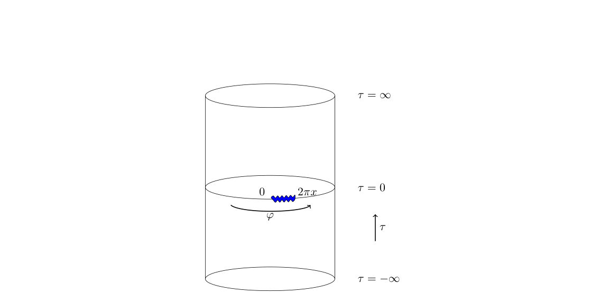
<figcaption class="paper-figure-caption"><b>Fig 1.</b> Figure 1: A CFT living on a cylinder labeled by the coordinates (τ, φ). The entangling region A, an interval of length [0, 2πx] on the spatial circle of the cylinder at τ = 0 is denoted by the blue cut.</figcaption>
</figure>
<figure class="paper-figure-card">
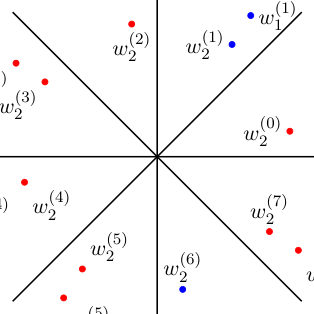
<figcaption class="paper-figure-caption"><b>Fig 2.</b> Figure 2: Sub-leading order correction to Sdyn in the short distance expansion and the uniformisation map for q = 8. The operators contracted on the same wedge are marked red and the four point function of operators on two different wedges are marked blue.</figcaption>
</figure>
<figure class="paper-figure-card">
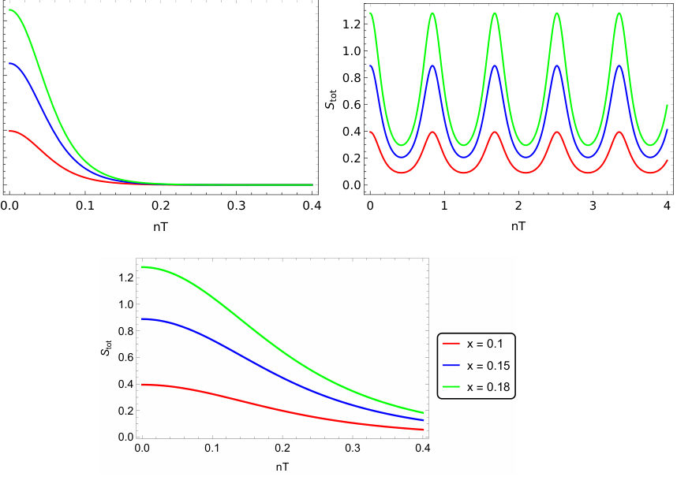
<figcaption class="paper-figure-caption"><b>Fig 3.</b> Figure 3: Leading order behavior of Stot = Suni + Sdyn for (2.28) in the small x limit, as a function of nT for h = 3, t = 0 and different values of the interval width x = 0.1, 0.15, 0.18. Here the origin of the interval is a = 0. Top left: Heating phase with α = 1.4 and β = 8. Top right: Non-heating phase with α = 8 and β = 1.4. Bottom: Phase boundary with α = 3.2.</figcaption>
</figure>
<figure class="paper-figure-card">
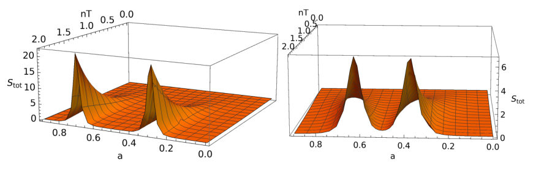
<figcaption class="paper-figure-caption"><b>Fig 4.</b> Figure 4: Leading order behavior of Stot = Suni + Sdyn for (2.28) in the small x limit, as a function of nT for h = 3, t = 0 and x = 0.1 in the entangling region (2.34). Left: Heating phase for α = 0.4, β = 0.6 has two peaks around a = 0.3 and a = 0.7 Right: Phase boundary for α = 1 has two peaks around a = 0.4 and a = 0.6.</figcaption>
</figure>
<figure class="paper-figure-card">
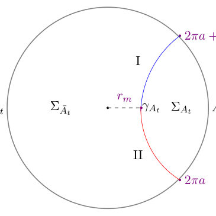
<figcaption class="paper-figure-caption"><b>Fig 5.</b> Figure 5: We show a constant time slice at time t of AdS3. γAt denotes the minimal length of subsystem At in the boundary. γAt splits the bulk into right(left) wedge denoted by ΣAt(Σ ¯ At). γAt consists of : Branch I, where slope φ′(r) &gt; 0 and Branch II with φ′(r) &lt; 0. Our excited state (3.10) breaks the angular symmetry, hence we need to evaluate the minimal area for these two branches separately. We have aligned the origin of the interval to the origin of the angular coordinate φ.</figcaption>
</figure>

**Summary.** This work analyzes the time evolution of entanglement entropy in a 2D CFT subjected to periodic driving, revealing distinct dynamical phases. By comparing these results with calculations on the holographic dual ($	ext{AdS}_3$), the authors provide strong evidence supporting the Faulkner-Lewkowycz-Maldacena conjecture for quantum corrections to entanglement entropy.

**Why it may be interesting.** The connection between dynamical phases observed in quantum field theory dynamics (like those driven by Floquet Hamiltonians) and geometric properties derived from gravity (via the FLM conjecture) is highly relevant to understanding non-equilibrium quantum systems.

Detailed structure

**Main problem.** The study investigates how semiclassical entanglement entropy (EE) evolves over time in driven quantum field theories, specifically looking for signatures of underlying dynamical phases.

**Main result.** The computed bulk entanglement entropy successfully matches the CFT entanglement entropy at leading order, providing a non-trivial verification of the Faulkner-Lewkowycz-Maldacena (FLM) conjecture for first quantum corrections.

**Method.** The authors employ both boundary CFT calculations using the replica method and holographic methods involving solving Einstein's equations to find backreacted geometries and calculating minimal areas.

**Model / system.** The system is a 2D Conformal Field Theory (CFT) in $1+1$ dimensions, driven by $	ext{sl}(2,\mathbb{R})$ parameters. Its gravitational dual is Anti-de Sitter space ($	ext{AdS}_3$).

**Key observables.** Entanglement Entropy (EE), the perturbed minimal area ($\delta A$), and the stress tensor expectation value ($\langle T_{\mu
u} 
angle$).

**Important parameters / regimes.** Drive parameters ($\alpha, eta$), stroboscopic time ($nT$), and the gravitational coupling constant ($G_N$).

**Assumptions / limitations.** The bulk computation is restricted to small backreaction and short distance approximations; calculations are performed up to specific orders in $c$ or $G_N$.

**Figures summary.** Figures illustrate the CFT geometry on a cylinder, plot the total entanglement entropy ($	ext{S}_{	ext{tot}}$) versus time for different dynamical phases (Heating/Non-heating), and show cross-sections of the $	ext{AdS}_3$ bulk.

**Paper structure.** The paper systematically derives the effective Hamiltonian governing the stroboscopic dynamics, calculates the EE in the CFT using replica methods across three distinct dynamic regimes, and then performs a detailed holographic calculation matching these results by solving Einstein's equations for metric perturbations.

Abstract

We study the time evolution of semiclassical entanglement entropy in a class of $sl(2,\mathbb{R})$ driven states in a large $c$ conformal field theory (CFT) in $1+1$ spacetime dimensions. Upon varying the parameters of the drive, we find that the entanglement entropy exhibits the signature of the dynamical phases of the driven CFT. We further study the holographic dual of this CFT where the excited states of a minimally coupled scalar in $AdS_3$ induce a backreaction that modifies the background geometry. We compute the back reacted geometry by solving Einstein's equation with the expectation value of the stress tensor in the coherent state as the source term. Subsequently, we calculate the time evolution of the perturbed minimal area and the bulk entanglement entropy at $O(G_N^0)$, up to the sub-leading order in short distance approximation. These results match the CFT entanglement entropy in the boundary at $O(c^0)$, and serve as a nontrivial check of the Faulkner-Lewkowycz-Maldacena (FLM) conjecture for the first quantum correction of holographic entanglement entropy. The details of the check has been provided in the accompanying ancillary notebook.

[↑ back to top](#top)

### [Dimension-Free Approximate Tensorization of Quantum Hypercontractivity for Qudit Depolarizing Semigroups](http://arxiv.org/abs/2606.17729v1)

**Authors:** Yangjing Dong, Li Gao, Fengning Ou, Penghui Yao, Haigang Zhou  
**Type:** theory · **Category:** quantum information and computing · **PDF:** <https://arxiv.org/pdf/2606.17729v1>  
**Analysis basis:** full PDF text, analyzed in chunks
**Topic relevance:** 🔥 `entanglement & information structure` **4/5** · `correlated / nonlocal dissipation` **3/5** · `methods for driven-dissipative` **3/5** · `driven-dissipative phase transition` **2/5** · `non-equilibrium dynamics` **2/5** · `analog quantum simulation` **1/5** · `non-equilibrium universality` **1/5**

↔ Scroll figures horizontally

<figure class="paper-figure-card">
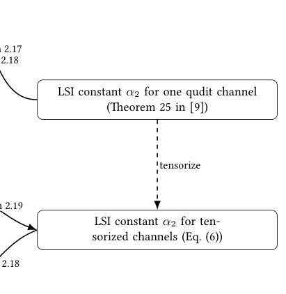
<figcaption class="paper-figure-caption"><b>Fig 1.</b> Figure 1. Proof roadmap for Theorem 3.1. The proof alternates between hypercontractive statements and logarithmic-Sobolev inequalities.</figcaption>
</figure>

**Summary.** The paper develops rigorous mathematical techniques to prove that certain properties of quantum evolution, specifically hypercontractivity and the Log-Sobolev constant, exhibit approximate tensorization when applied to product qudit systems. This dimension-independent result is crucial for understanding how local dynamics scale across large quantum registers.

**Why it may be interesting.** This work provides powerful tools for analyzing quantum correlations across many sites in open quantum systems, directly impacting lower bounds on entanglement measures and information processing capacity.

Detailed structure

**Main problem.** The primary goal is proving dimension-free approximate tensorization bounds for hypercontractivity and logarithmic-Sobolev constants in quantum Markov semigroups.

**Main result.** The authors establish that the log-Sobolev constant of a product semigroup scales by at least a factor of 2/(3ln 2) times the single-site constant, independent of local dimension or spectral gap.

**Method.** The proof combines establishing exact tensorization for integer hypercontractivity parameters using complex interpolation to extend results to all real values. It relies heavily on structural properties like the Positive Off-Diagonal Scaling (PODS) condition.

**Model / system.** The study concerns reversible quantum Markov semigroups ($\Phi_t$) acting on qudits of arbitrary finite dimension $d$, specifically focusing on generalized depolarizing semigroups. The analysis uses tensor products of these processes, $\Phi^{\otimes n}_t$.

**Key observables.** Logarithmic-Sobolev constant ($\alpha_2(L)$), hypercontractivity parameters ($p, q$), and the approximation factor $eta \approx 0.96$.

**Important parameters / regimes.** The local dimension $d$ (the result is independent of it); the number of sites $n$; and the time parameter $t$.

**Assumptions / limitations.** The semigroups must satisfy the Positive Off-Diagonal Scaling (PODS) property. The results are approximate ($eta < 1$) rather than exact tensorization.

**Figures summary.** Figure 1 outlines a proof roadmap connecting hypercontractivity statements to Logarithmic-Sobolev Inequality applications for establishing the main theorem.

**Paper structure.** The paper develops the theory by first proving specific hypercontractive inequalities (e.g., for $q=3$), then using complex interpolation to generalize these results, and finally applying these techniques to derive the dimension-independent tensorization bounds for $\alpha_2(L)$.

Abstract

We prove almost tensorization for hypercontractivity and logarithmic-Sobolev constants for a class of reversible quantum Markov semigroups satisfying the positive off-diagonal scaling (PODS) property. This class includes qubit examples and generalized depolarizing semigroups with respect to full-rank states in arbitrary finite dimensions. For any such semigroup $(Φ_t)_{t\ge 0}$ and every tensor power $n$, we show that the log-Sobolev constant of the product semigroup $Φ_t^{\otimes n}$ is at least $2/(3\ln 2)$, approximately 0.96, times the log-Sobolev constant of the single-site semigroup $Φ_t$, independently of $n$ and the local dimension $d$. The proof first establishes exact tensorization of the $(q,2)$-hypercontractive inequality for integer $q$, in particular $q=3$, and then extends the estimate to all real $q>2$ by complex interpolation; the standard implication from hypercontractivity to logarithmic-Sobolev inequalities yields the stated almost tensorization result. As an application of the same method, we also obtain sharp $(q,2)$-hypercontractivity estimates for qubit depolarizing channels.

[↑ back to top](#top)

### [Emergent Antiphase Stacking in a Transient Charge Density Wave](http://arxiv.org/abs/2606.17326v1)

**Authors:** Jade Stanton, Gal Orenstein, Ryan A. Duncan, Gilberto A. de la Peña Muñoz, Yijing Huang, Viktor Krapivin, Quynh Le Nguyen, Samuel Teitelbaum, Anisha G. Singh, Roman Mankowsky, Henrik Lemke, Mathias Sander, Yunpei Deng, Christopher Arrell, Ian R. Fisher, David A. Reis, Mariano Trigo  
**Type:** experiment · **Category:** strongly correlated electrons · **PDF:** <https://arxiv.org/pdf/2606.17326v1>  
**Analysis basis:** full PDF text, analyzed in chunks
**Topic relevance:** 🔥 `non-equilibrium dynamics` **4/5** · 🔥 `non-equilibrium universality` **4/5** · `driven-dissipative phase transition` **3/5** · `methods for driven-dissipative` **3/5** · `Frenkel-Kontorova` **1/5** · `Keldysh / 2PI / non-Gaussian methods` **1/5**

↔ Scroll figures horizontally

<figure class="paper-figure-card">
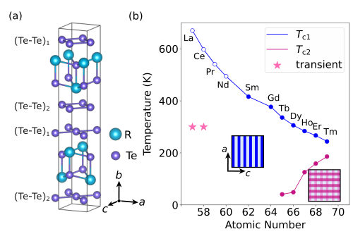
<figcaption class="paper-figure-caption"><b>Fig 1.</b> FIG. 1. (a) RTe3 crystal structure. Labels (Te-Te)1 and (Te- Te)2 denote inequivalent Te planes in the conventional unit cell. (b) Summary of the two CDW transition temperatures across the rare-earth series. Blue (purple) symbols show the c order (a order) transition temperature [7, 9]. Open circles are extrapolated [9, 10]. Pink stars represent the light-induced transient a CDW observed here and in Refs. [5, 6].</figcaption>
</figure>
<figure class="paper-figure-card">
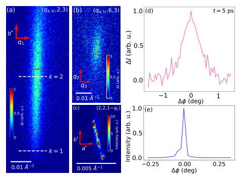
<figcaption class="paper-figure-caption"><b>Fig 2.</b> FIG. 2. Intensity change ∆I(q, t) integrated over pump probe delays up to 4 ps around (a) (qa,tr, 2, 3) and (b) (qa,tr, 6, 3) in reciprocal space. The red arrows indicate directions in reciprocal space, where q1 ≈0.50a∗+0.87c∗, q2 ≈−0.03a∗+ 0.99b∗−0.16c∗, and q3 ≈0.47a∗+0.15b∗+0.87c∗. (c) Intensity Ioff(q, t) around the (2, 2, 1 −qc) equilibrium c order peak. (d,e) Intensity integrated over the (d) (qa,tr, 2, 3) transient and (e) (2, 2, 1−qc) equilibrium CDW peaks as the azimuthal angle ϕ is rotated along the sample normal. To capture the maximum intensity of the transient peak, the incident pump fluence was 8 mJ/cm2 and the time delay between the pump and the probe pulses was t = 5 ps.</figcaption>
</figure>
<figure class="paper-figure-card">
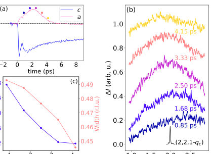
<figcaption class="paper-figure-caption"><b>Fig 3.</b> FIG. 3. (a) Relative integrated x-ray intensity as a function of pump-probe delay for the c (blue) and a (pink) CDWs shown in Figs. 2(a) and (c), respectively. Both traces are normalized by the equilibrium intensity. (b) Intensity change ∆I(q) of the (qa,tr, 3, 2) peak along the b direction for representative time points indicated by colored circles in (a). Traces are ver- tically offset for clarity. The black trace shows the intensity of the (2, 2, 1−qc) peak. (c) Center of mass (blue) and standard deviation (pink) of the intensity profiles in (b) as a function of time.</figcaption>
</figure>
<figure class="paper-figure-card">
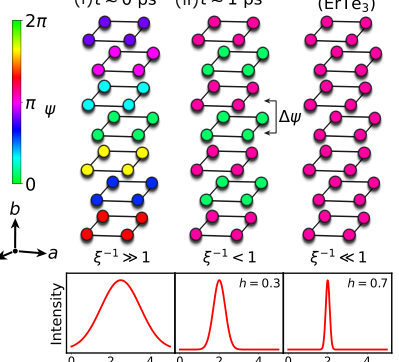
<figcaption class="paper-figure-caption"><b>Fig 4.</b> FIG. 4. (a) Schematic showing the location of the different features in reciprocal space centered around (0, 2, 3). (b) Il- lustration of the relative phases of the (Te-Te)1 planes over time in the transient CDW state, compared to the equilib- rium a order. (i) At early times, the correlation length ξ is short in the stacking axis, and the phases of the (Te-Te)1 planes across primitive unit cells are random. (ii) At time t ≈1 ps, the correlation length has increased, so that neigh- boring (Te-Te)3 planes exhibit a 180◦phase offset relative to the equilibrium case (iii). Bottom plots show a schematic of the resulting behavior of a CDW peak along the k direction in each of these cases.</figcaption>
</figure>

**Summary.** The research uses ultrafast X-ray scattering at an XFEL facility to study transient Charge Density Waves (CDWs) in $	ext{LaTe}_3$ induced by light. They found that the photoexcited CDW state possesses a distinct wavevector and relative phase compared to the material's known equilibrium orders. This work provides direct, time-resolved evidence of novel electronic phases inaccessible under standard thermodynamic conditions.

**Why it may be interesting.** This work demonstrates how non-equilibrium excitation can stabilize or reveal fundamentally different electronic ground states compared to those predicted by static theory, which is crucial for understanding strongly correlated materials dynamics.

Detailed structure

**Main problem.** Investigating novel electronic states, specifically transient Charge Density Waves (CDWs), induced by photoexcitation that are inaccessible under equilibrium conditions.

**Main result.** The transient CDW state exhibits a distinct ordering wavevector ($\mathbf{q}_{a,tr} \approx (2/7, 0, 0)$) compared to the equilibrium order ($\mathbf{q}_a \approx (5/7, 0, 0)$), suggesting a $\pi$ phase offset between adjacent planes.

**Method.** Ultrafast x-ray scattering using an XFEL provides high momentum and time resolution to probe the dynamics of these transient phases.

**Model / system.** The study focuses on rare-earth tritellurides ($	ext{RTe}_3$), which are known for exhibiting complex, competing charge ordering instabilities like CDWs.

**Key observables.** CDW Bragg peak location in reciprocal space ($\mathbf{q}$), time evolution of intensity ($\Delta I(\mathbf{q}, t)$), and correlation length along different crystal directions.

**Important parameters / regimes.** Ultrafast excitation pulse duration (e.g., 35 fs) and the characteristic wavevectors defining transient vs. equilibrium orders.

**Assumptions / limitations.** The analysis assumes that x-ray scattering can microscopically resolve the structural differences between photoinduced and equilibrium phases.

**Figures summary.** Figures illustrate the comparison of $\mathbf{q}$ vectors in reciprocal space, showing the distinct location of the transient peak relative to equilibrium peaks; time evolution plots track the narrowing/shifting of the transient peak profile over picoseconds.

**Paper structure.** The paper establishes the background on photoinduced CDWs, presents the experimental methodology using XFEL scattering, details the observation that the transient state has a different wavevector and phase relationship than the equilibrium state, and concludes by highlighting the unique nature of this photoexcited phase.

Abstract

Photoexcitation can induce novel states in materials that are inaccessible in equilibrium, a recent example being the light-induced charge density wave (CDW) observed in $\text{LaTe}_3$. Here, we investigate this transient CDW using infrared-pump x-ray-probe scattering at a free-electron laser, with high momentum and time resolution. We find that the transient CDW Bragg peak is broad in reciprocal space, indicating a highly disordered state. The ordering wavevector of the transient state is different from the equilibrium orders that develop in this class of materials - the transient peak appears near (2/7, 0, 0) reciprocal lattice units, whereas the equilibrium $a$ order and $c$ order occur at $\approx (5/7, 0, 0)$ and $(0, 0, 2/7)$, respectively. The transient CDW is therefore distinct from the equilibrium $a$ order, differing in the relative phase of the CDW displacement between the two equivalent nearly-square Te-Te nets in the conventional unit cell. Our work highlights how photoexcitation can access states with no equilibrium analog, and how x-ray scattering can provide microscopic insight into such elusive phases.

[↑ back to top](#top)

### [Emergent de Sitter Space and Non-Unitary Tensor Networks from Non-Hermitian Quantum Criticality](http://arxiv.org/abs/2606.17983v1)

**Authors:** Kuang-Hung Chou, Po-Yao Chang  
**Type:** theory · **Category:** statistical mechanics · **PDF:** <https://arxiv.org/pdf/2606.17983v1>  
**Analysis basis:** full PDF text, analyzed in chunks
**Topic relevance:** 🔥 `entanglement & information structure` **4/5** · `driven-dissipative phase transition` **3/5** · `methods for driven-dissipative` **3/5** · `Kondo & dissipative impurity` **2/5** · `non-equilibrium dynamics` **2/5** · `correlated / nonlocal dissipation` **1/5** · `non-equilibrium universality` **1/5**

↔ Scroll figures horizontally

<figure class="paper-figure-card">
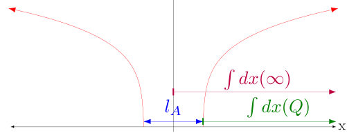
<figcaption class="paper-figure-caption"><b>Fig 1.</b> FIG. 1: Outward-running de Sitter geodesic. In contrast to the AdS case, the extremal curve moves away from the boundary interval and converges to the common endpoint in the infinite past.</figcaption>
</figure>
<figure class="paper-figure-card">
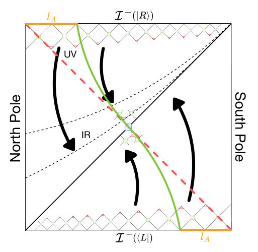
<figcaption class="paper-figure-caption"><b>Fig 2.</b> FIG. 2: Tensor-network representation of the dS/cMERA construction and the associated geodesic cut. The right and left UV states are placed on the conformal boundaries I±, while the RG flow terminates at an IR non-entangled non-Hermitian density matrix, shown in blue. Red triangles denote coarse-graining tensors and green boxes denote disentanglers. For a boundary subsystem A, shown by the orange segment, the green curve indicates the corresponding de Sitter geodesic, which connects the interval endpoints on the right and left boundary states.</figcaption>
</figure>
<figure class="paper-figure-card">
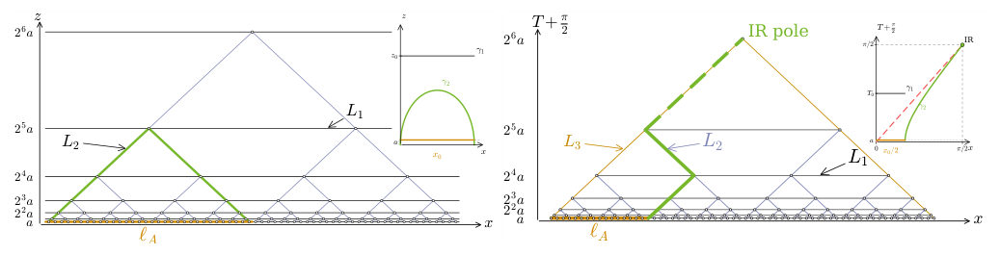
<figcaption class="paper-figure-caption"><b>Fig 3.</b> FIG. 3: Tensor-suppressed skeletons used for the bond-counting comparison. Circles denote effective sites at a given RG depth, horizontal links connect neighboring sites within the same layer, and diagonal links connect adjacent RG layers. The UV cutoff is a, and the dyadic coarse-graining factor is chosen as k = 2. [Left panel]: standard AdS/MERA skeleton with periodic boundary condition. The horizontal links carry cost L1, while the interlayer links carry cost L2. The boundary subsystem of size ℓA is shown in orange, and the green path denotes the discrete representative of the AdS geodesic. The inset shows the corresponding continuum profiles on a constant-time slice of AdS: γ1 is a...</figcaption>
</figure>
<figure class="paper-figure-card">
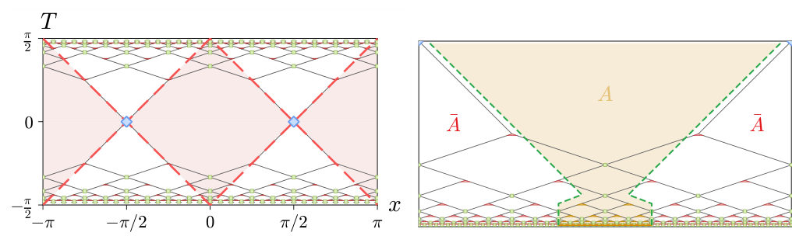
<figcaption class="paper-figure-caption"><b>Fig 4.</b> FIG. 4: Periodic-boundary-condition tensor-network construction in the de Sitter Penrose diagram and local A| ¯A assignment. Triangles denote coarse-graining tensors, square boxes denote entanglers, and blue diamonds denote the IR reference density-matrix sites. [Left panel]: global two-ended tensor-network representation in Penrose coordinates. The dashed red lines indicate the null horizons. [Right panel]: local enlargement of the region x ∈[−π/2, π/2], T ∈[−π/2, 0], using the same fraction of the boundary interval as the right panel of Fig. 3. In this panel, the A| ¯A assignment is indicated by the color of the coarse-graining tensors: yellow for A and red for ¯A. The shaded yellow...</figcaption>
</figure>

**Summary.** The paper develops a novel tensor-network approach to realize the holographic principle in de Sitter space, moving beyond the established Anti-de Sitter framework. By applying non-unitary continuous MERA to a critical fermion chain, the authors show that entanglement structure naturally encodes an emergent dS geometry. This establishes a bottom-up dictionary (dS/cMERA) by showing how extremal surfaces map onto zero-cost links in the tensor network skeleton.

**Why it may be interesting.** This work provides a concrete, calculable mechanism (bond counting) to connect quantum information concepts (MERA) directly to fundamental aspects of quantum gravity (dS holography), which is highly relevant for theoretical physicists studying emergent spacetime structures from microscopic degrees of freedom.

Detailed structure

**Main problem.** The primary challenge is extending the holographic principle, which relates boundary entanglement to bulk geometry (like AdS/CFT), to de Sitter (dS) spacetimes by developing a microscopic tensor-network framework.

**Main result.** The authors establish a bottom-up dS/(c)MERA correspondence, demonstrating that non-unitary continuous MERA applied to a critical fermion chain yields an emergent de Sitter spacetime whose entanglement entropy scales correctly with the extremal surface length.

**Method.** The work combines concepts from quantum information theory (MERA/tensor networks), condensed matter physics (non-Hermitian criticality), and general relativity (dS geodesics) by mapping continuum geometric quantities onto discrete bond-counting rules.

**Model / system.** The model is a non-Hermitian critical fermion chain, analyzed using the continuous Multi-Scale Entanglement Renormalization Ansatz (cMERA). This system exhibits criticality that leads to an emergent Lorentzian de Sitter spacetime geometry in its holographic dual.

**Key observables.** Non-unitary critical entanglement entropy ($S \propto i \ln l$), extremal Ryu-Takayanagi surfaces, and the resulting dS metric components.

**Important parameters / regimes.** The non-Hermitian coupling parameters ($\mu$) defining criticality; the scale renormalization parameter $u$; and the geometric constants related to the de Sitter curvature ($\Lambda$).

**Assumptions / limitations.** The framework assumes that a bottom-up tensor network description can capture the physics of dS holography, requiring the use of biorthogonal structures due to non-Hermiticity.

**Figures summary.** Figures illustrate the embedding of the cMERA circuit into the de Sitter Penrose diagram and show how the extremal geodesic path corresponds to a specific zero-cost continuation (null link) within the tensor network structure.

**Paper structure.** The paper progresses by first reviewing AdS/CFT holography via MERA, then generalizing this framework to non-Hermitian systems to address dS space. The core is establishing the continuum metric from entanglement flow and subsequently deriving the discrete bond-counting rules that reproduce the expected logarithmic scaling for the dS extremal surface.

Abstract

Extending the holographic principle to de Sitter (dS) spacetimes remains one of the most vital open frontiers in quantum gravity, where a microscopic, bottom-up tensor-network framework that relates boundary quantum data to emergent de Sitter spacetime is still lacking. In this work, we first show the emergence of de Sitter spacetime from boundary entanglement by formulating a non-unitary continuous multi-scale entanglement renormalization ansatz (cMERA) for a concrete non-Hermitian critical fermion chain. Within this emergent spacetime, we analyze the associated geodesics and show that they act as extremal Ryu-Takayanagi (RT) surfaces undergoing a smooth timelike-to-null transition. Remarkably, we demonstrate that this continuum trajectory dictates a distinct tensor-network architecture in which the bond-counting contribution naturally truncates at the discrete timelike-to-null transition toward the deep infrared. In the resulting architecture, the null ray along the horizon is represented by zero-cost links, since the associated cut severs no tensor legs. This network structure successfully reproduces the logarithmic scaling of non-unitary critical entanglement entropy, offering a bond-counting picture for the de Sitter RT formula. Our results provide the long-sought dS/(c)MERA correspondence at the level of both emergent spacetime and discrete holographic entanglement.

[↑ back to top](#top)

### [Tripartite entanglement of remote atomic qubits](http://arxiv.org/abs/2606.17173v1)

**Authors:** Isabella Goetting, Ashish Kalakuntla, Mikhail Shalaev, Harriet Bufan Shi, Ana Ferrari, Sagnik Saha, George Toh, Saki Male, Christopher Monroe  
**Type:** experiment · **Category:** quantum information and computing · **PDF:** <https://arxiv.org/pdf/2606.17173v1>  
**Analysis basis:** full PDF text, analyzed in chunks
**Topic relevance:** 🔥 `QC/QI experiment` **4/5** · `entanglement & information structure` **3/5** · `interference shaping light` **3/5** · `quantum optics experiment` **3/5** · `analog quantum simulation` **1/5** · `exotic spin models in light-matter` **1/5** · `non-equilibrium dynamics` **1/5**

↔ Scroll figures horizontally

<figure class="paper-figure-card">
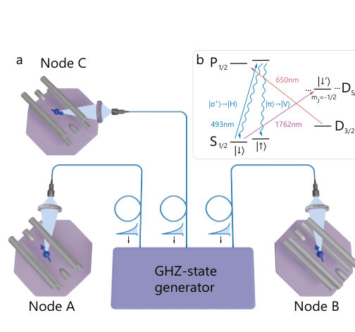
<figcaption class="paper-figure-caption"><b>Fig 1.</b> FIG. 1. Three-node network and atomic energy lev- els. (a) Schematic of three ion trap nodes, each separated by about 2 m, and photonic optical fibers (3 m long) leading to the GHZ generator. Each ion is confined in a four-rod Paul trap. (b) Reduced energy level diagram of 138Ba+ sys- tem. Fast excitation at 493 nm prepares the ion in the P1/2 level and subsequent spontaneous emission (73% branching ratio) creates ion-photon entanglement between the Zeeman atomic qubit |↓⟩i / |↑⟩i and the polarization state of the pho- ton |H⟩i / |V ⟩i. The qubit is measured by first shelving the state to the D5/2 manifold |↓⟩i →|↓′⟩i and then collecting fluorescence under illumination from both 493 nm and...</figcaption>
</figure>
<figure class="paper-figure-card">
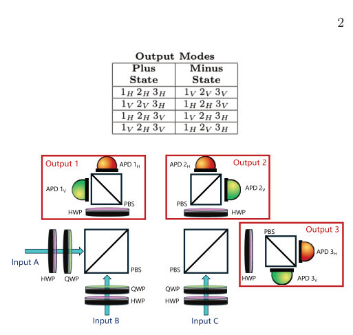
<figcaption class="paper-figure-caption"><b>Fig 2.</b> FIG. 2. Details of GHZ-state generator. The input modes A, B, and C carry the input photons from the respective trapped ion qubits. The photons travel through half-waveplate (HWP/purple) and quarter-waveplate (QWP/green) stacks, which match the photonic qubits to the same horizontal/ver- tical (H/V) basis. The photons interfere pairwise at input polarizing beam splitters (PBS). At the output modes labeled 1, 2, and 3, half-wave plates rotate the photons into the H ±V bases and erase “which-path” information. Output PBS cubes separate H and V photons and direct them to single photon avalanche photodiodes (APD) labeled by their respective mode and polarization. The table on top indicates the...</figcaption>
</figure>
<figure class="paper-figure-card">
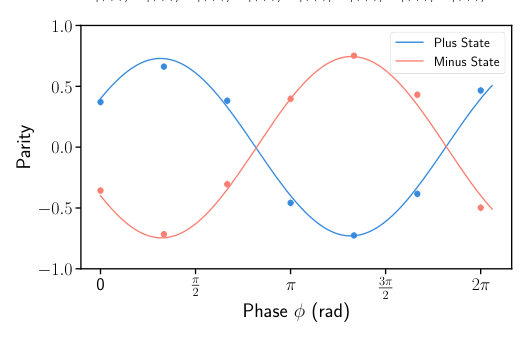
<figcaption class="paper-figure-caption"><b>Fig 3.</b> FIG. 3. GHZ state characterization. (TOP) Measured populations ΠSASBSC averaged over both plus and minus GHZ states, giving nominal populations (blue) with P = 0.955(8) and error population (red) with Q = 0.020(4) (statistical errors). Population data are collected from 687 successes out of 4,110,118,427 attempts, occupying about 2.7 hours of wall clock time. (BOTTOM) Rotated-basis parity of plus (blue) and minus (red) GHZ states, as the phase ϕ of one of the qubit rotations is scanned, resulting in average contrast C = 0.77(2) with a fitted phase Φ + Φ0 = −1.00(5) rad. Combining populations and parity contrast, we can bound the GHZ fidelity by 0.841(17) ≤F ≤0.881(17). Parity fringe data...</figcaption>
</figure>
<figure class="paper-figure-card">
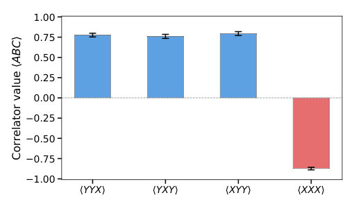
<figcaption class="paper-figure-caption"><b>Fig 4.</b> FIG. 4. Measured correlators of the Mermin parameter. The measurements represent 735 events out of 4,883,403,222 attempts, taking 2.5 hours of wall clock time. We measure an average Mermin parameter of M = 3.203(45), with a purely statistical error bar.</figcaption>
</figure>
<figure class="paper-figure-card">
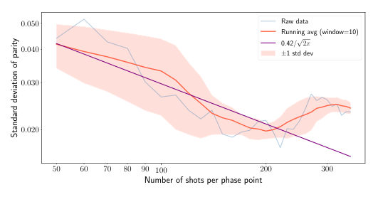
<figcaption class="paper-figure-caption"><b>Fig 5.</b> FIG. 5. Standard deviation of concatenated parity Standard deviation of parity over concatenated data points of all runs. The running average is binned in windows of 10, and the pre-factor for the 1/ √</figcaption>
</figure>

**Summary.** The research successfully generated the first fully-distributed GHZ state involving single atomic qubits across three remote nodes. This was achieved by coupling trapped ions to photons and interfering these photons at an external generator. The results confirm multipartite entanglement via Mermin's inequality violation, advancing the feasibility of large-scale quantum networks.

**Why it may be interesting.** This work directly addresses scalability in quantum networking by demonstrating multipartite entanglement across physically separated nodes using photonic links, which is a cornerstone challenge for distributed quantum computation.

Detailed structure

**Main problem.** The primary goal was to generate and demonstrate fully-distributed Greenberger–Horne–Zeilinger (GHZ) states of qubits across a three-node quantum network using photonic interconnects.

**Main result.** The authors reported the first such demonstration, achieving a bounded fidelity between 0.841 and 0.881 and closing the detection loophole for the first time in this fully-distributed multipartite entangled state.

**Method.** Entanglement was generated by coupling single trapped ion qubits to emitted photons, which were then sent through optical fibers to an external GHZ-state generator where they interfered.

**Model / system.** The system utilizes a three-node quantum network composed of spatially separated trapped ions ($^{138}	ext{Ba}^+$). Entanglement is mediated by single photons collected from spontaneous emission and interfering at a central optical setup.

**Key observables.** GHZ State Fidelity (F), violation of Mermin's inequality, entanglement generation rate, and pairwise visibilities.

**Important parameters / regimes.** Fidelity bounds ($0.841 \le F \le 0.881$), entanglement rate ($\sim 0.095/	ext{sec}$), and the classical bound violation for Mermin's parameter ($M > 2$).

**Assumptions / limitations.** The fidelity analysis relies on bounding techniques using measured populations and parity contrasts, while error sources include photonic spatial mode mismatch and polarization mixing.

**Figures summary.** Figures illustrate the schematic of the three ion trap nodes and the GHZ generator setup; subsequent figures detail state characterization via parity fringes and correlator measurements used to quantify entanglement violation.

**Paper structure.** The paper details the experimental setup, describes the process of generating single-photon entangled states between ions and photons, outlines the interference mechanism at the GHZ generator, and finally presents quantitative results on fidelity bounding and Mermin inequality violation.

Abstract

Distributed entanglement across multi-node quantum networks is essential for a wide range of quantum technologies, including modular quantum computers, distributed sensing and metrology, and multi-party secure communication protocols. Such large-scale quantum networks will require photonic interconnects to generate and sustain entangled states across localized nodes. Previously, three-node distributed Greenberger-Horne-Zeilinger (GHZ) states have been generated between solid-state qubits and atomic ensembles, but not yet in the platform of individual atomic qubits, which can be replicated, detected, and individually controlled with high fidelity. Here we report the first fully-distributed GHZ state of qubits across a three-node quantum network of single atomic memories, using photonic interconnects. We achieve a bounded fidelity of $0.841(17) \leq \mathcal{F} \leq 0.881(17)$ at an entanglement generation rate of 0.095(5)/sec and measure a clear violation of Mermin's inequality while closing the detection loophole for the first time in a fully-distributed multipartite entangled state.

[↑ back to top](#top)

### [Brownian gyration of an inertial ellipsoid](http://arxiv.org/abs/2606.17554v1)

**Authors:** Soham Dutta, Arnab Saha  
**Type:** theory · **Category:** statistical mechanics · **PDF:** <https://arxiv.org/pdf/2606.17554v1>  
**Analysis basis:** full PDF text, analyzed in chunks
**Topic relevance:** 🔥 `non-equilibrium dynamics` **4/5** · `driven-dissipative phase transition` **3/5** · `methods for driven-dissipative` **3/5** · `non-equilibrium universality` **2/5** · `Frenkel-Kontorova` **1/5** · `Keldysh / 2PI / non-Gaussian methods` **1/5** · `correlated / nonlocal dissipation` **1/5**

↔ Scroll figures horizontally

<figure class="paper-figure-card">
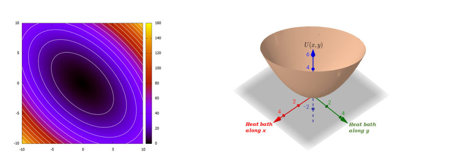
<figcaption class="paper-figure-caption"><b>Fig 1.</b> FIG. 2. (Left) 2D contours of the potential U(x, y), for k = 1 and α = 0.5. (Right) Projection of U(x, y) in space, for k = 1 and α = 0.5. Note the mismatch of potential and temperature axes — the potential landscape is not “aligned” with the heat baths. This landscape becomes right-aligned when the sign of α is flipped, thus acting as the “roadmap” of gyration.</figcaption>
</figure>
<figure class="paper-figure-card">
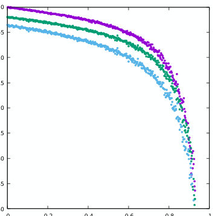
<figcaption class="paper-figure-caption"><b>Fig 2.</b> FIG. 3. Plot of ⟨xy⟩versus α</figcaption>
</figure>
<figure class="paper-figure-card">
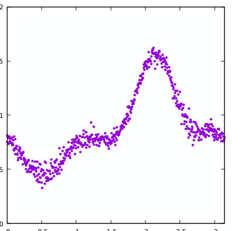
<figcaption class="paper-figure-caption"><b>Fig 3.</b> FIG. 4. Plot of ⟨h⟩versus ϕ0 (in radian, within the range [0 : π]). The relevant values of mean orientation, namely ϕ0 = π 4 , π</figcaption>
</figure>
<figure class="paper-figure-card">
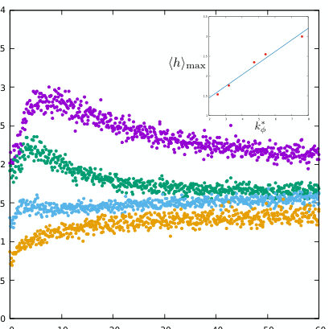
<figcaption class="paper-figure-caption"><b>Fig 4.</b> FIG. 5. Plot of ⟨h⟩versus kϕ, for various masses : the purple, green, blue and orange points are for m = 0.01, 0.1, 1, 10 re- spectively. The inset shows the variation of ⟨h⟩max versus k∗ ϕ for five different masses, m = 0.01, 0.05, 0.1, 0.5, 1 (where the peaks in ⟨h⟩are prominent). The slope of the best fit line (y = 0.292x + 0.866) gives an estimate of the dynamical sus- ceptibility.</figcaption>
</figure>
<figure class="paper-figure-card">
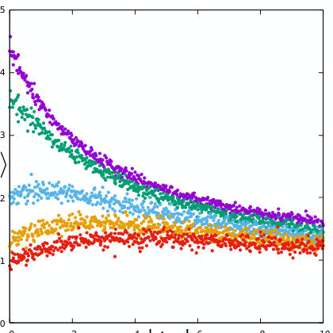
<figcaption class="paper-figure-caption"><b>Fig 5.</b> FIG. 7. Plot of ⟨h⟩versus |∆γ|, for various masses : the purple, green, blue, orange and red points are for m = 0.1, 1, 5, 10, 15 respectively.</figcaption>
</figure>

**Summary.** This paper analyzes the Brownian gyration of an inertial ellipsoid moving under asymmetric trapping potentials and thermal gradients. By using inertial Langevin dynamics, it quantifies how particle shape, inertia, and external asymmetries dictate the steady-state rotational motion. The findings reveal that non-equilibrium effects are crucial for measurable gyration signals.

**Why it may be interesting.** This work provides a detailed, quantitative framework for understanding non-equilibrium dynamics in mesoscopic systems, bridging concepts from classical statistical mechanics (NESS) with measurable physical quantities like angular momentum and heat flow.

Detailed structure

**Main problem.** The study investigates Brownian gyration (BG) of an inertial, spherically asymmetric ellipsoid under non-equilibrium conditions.

**Main result.** Gyration is fundamentally dependent on the particle's shape, orientation, and inertia, showing clear differences from spherical or overdamped counterparts. The signal-to-noise ratio can be maximized by tuning potential asymmetry ($\alpha$) and shape anisotropy ($|\Delta\gamma|$).

**Method.** The analysis employs inertial Langevin dynamics to model coupled translational and rotational motion in a dissipative medium.

**Model / system.** The system is an ellipsoid with mass $m$, confined in a spherically asymmetric trap potential $U(x, y)$, and subjected to two distinct thermal reservoirs driving it into a Non-Equilibrium Steady State (NESS).

**Key observables.** Brownian gyration ($\langle h 
angle$), cross-correlation $\langle xy 
angle$, average specific angular momentum, and the heat flux $\langle\dot{Q}_i
angle$.

**Important parameters / regimes.** Trap asymmetry ($\alpha$), temperature difference ($\Delta T = T_y - T_x$), shape anisotropy ($|\Delta\gamma|$), particle inertia ($m$), and external torques ($k_\phi$).

**Assumptions / limitations.** The translational dynamics are treated as underdamped while orientational dynamics are overdamped in some analyses; approximations involve linearizing equations of motion for small anisotropy.

**Figures summary.** Figures illustrate the dependence of $\langle h 
angle$ on potential asymmetry ($\alpha$) and shape anisotropy ($|\Delta\gamma|$), showing non-monotonic behavior, as well as plots detailing heat flux variation with these parameters.

**Paper structure.** The paper systematically develops the Langevin equations for translation and orientation, analyzes the steady-state gyration using numerical simulations, derives analytical results for small anisotropies, and extends the model to include external magnetic fields or analyze heat flux generation.

Abstract

Recent studies on Brownian gyration (BG) have focused primarily on spherically symmetric particles under overdamped conditions. To explore BG in the underdamped regime with a spherically asymmetric particle, we investigate the inertial dynamics of a microscopic ellipsoid in a dissipative medium. The particle is confined in a spherically asymmetric trap and simultaneously coupled to two distinct thermal reservoirs. This configuration drives the system into a nonequilibrium steady state (NESS) characterised by BG, which is quantified by the mean and fluctuation of the particle's specific angular momentum. Using inertial Langevin dynamics, we systematically analyze how this microscopic gyration depends not merely on the trap asymmetry and temperature difference, but also on the particle's intrinsic physical properties like shape and axial orientation, besides inertia. Our study uncovers fundamental differences between the gyration of spherical and non-spherical particles in overdamped as well as underdamped conditions, at microscopic scales. These findings provide key insights for optimizing Brownian gyration across a broader landscape of experimentally tuneable parameters.

[↑ back to top](#top)

### [When Renormalisation Remembers: UV/IR Mixing as an Entanglement Bridge](http://arxiv.org/abs/2606.17147v1)

**Authors:** Steven Abel  
**Type:** theory · **Category:** numerical methods · **PDF:** <https://arxiv.org/pdf/2606.17147v1>  
**Analysis basis:** full PDF text, analyzed in chunks
**Topic relevance:** 🔥 `entanglement & information structure` **4/5** · `methods for driven-dissipative` **3/5** · `non-equilibrium dynamics` **2/5** · `non-equilibrium universality` **2/5** · `Keldysh / 2PI / non-Gaussian methods` **1/5** · `analog quantum simulation` **1/5** · `correlated / nonlocal dissipation` **1/5** · `driven-dissipative phase transition` **1/5**

↔ Scroll figures horizontally

<figure class="paper-figure-card">
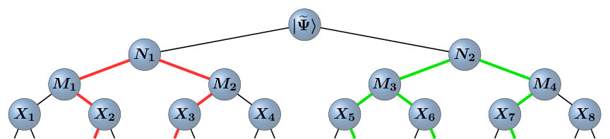
<figcaption class="paper-figure-caption"><b>Fig 1.</b> Figure 3: An eight leaf node TTN with two sets of physical indices An and Bn. This is a prototypical set-up for a one dimensional QFT with two scalar fields ϕA and ϕB discretized over eight space points X1...8 as the quadrature variables of the local Hilbert spaces, ϕA ≡ˆqA,n and ϕB ≡ˆqB,n respectively. Highlighted in red is the path connecting points A2 and A3 through their lowest common ancestor (LCA) at N1, which has to be traversed in order to implement the eiδt ˆqA,2 ˆqA,3 link gate. The cluster of bonds in green shows the nontrivial contractions within the entanglement wedge of the ℓ= 3 contiguous region ϕB(X5)ϕB(X6)ϕB(X7). This roughly determines how correlation lengths translate...</figcaption>
</figure>
<figure class="paper-figure-card">
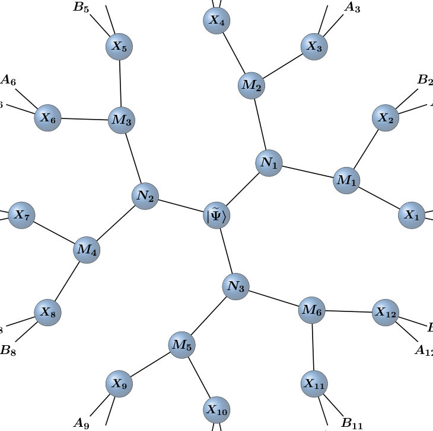
<figcaption class="paper-figure-caption"><b>Fig 2.</b> Figure 4: A more symmetrical version of a TTN in which every node, including the root node, carries three indices. The bulk encodes the renormalisation geometry while the physical degrees of freedom live on the boundary. In the gapped system that we consider here we do not need to impose hyperbolic tiling: if one does so then in principle the root node no longer occupies a special position.</figcaption>
</figure>
<figure class="paper-figure-card">
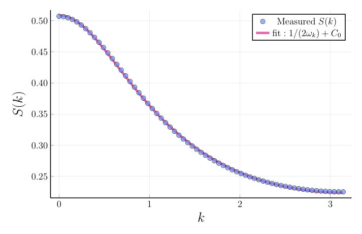
<figcaption class="paper-figure-caption"><b>Fig 3.</b> Figure 5: Comparison of the structure factor of the QFT vacuum versus the theoretical one, for the free field with N = 128 space points, and mass m = 1 in the potential. Here we take local DVR Hilbert space of dimension 6, cut-off of 1 × 10−6 and maximum bond dimension of 20. The best fit has meff = 0.982 and C0 = −5 × 10−4.</figcaption>
</figure>
<figure class="paper-figure-card">
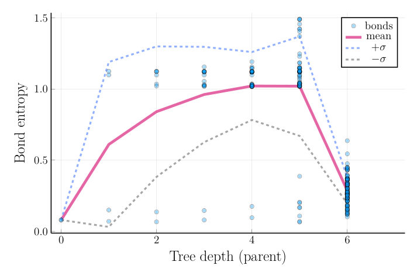
<figcaption class="paper-figure-caption"><b>Fig 4.</b> Figure 6: Bond entropy with depth in the standard TTN, showing characteristic peaking in the centre, where the bonds are dividing the global system into roughly equally sized subsystems.</figcaption>
</figure>
<figure class="paper-figure-card">
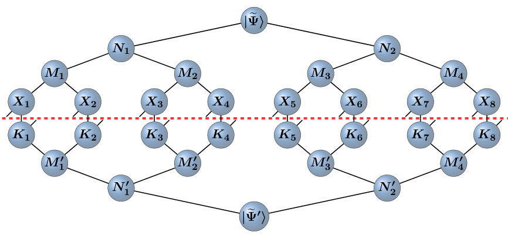
<figcaption class="paper-figure-caption"><b>Fig 5.</b> Figure 7: Born-reciprocal renormalisation geometry: the BRTN. In a genuinely Born-reciprocal theory, ϕB(Ki) is a dual field that is localised in momentum-space Ki...8, and is delocalised in position-space. The UV interface consists of pairwise links Xi ↔Ki between position- and momentum-space sites. These bonds form the entanglement bridge. Global Born-reciprocity consists of exchanging Xi ↔Ki and the fields ϕA and ϕB, flipping the entire network about the red dashed line. This line delineates the furthest into the UV that the theory can go. The upper and lower trees flow to distinct infrared roots.</figcaption>
</figure>

**Summary.** This work introduces the Born-Reciprocal Tensor Network (BRTN) as a novel computational framework to model Quantum Field Theories exhibiting UV/IR mixing. It reframes this mixing as a measurable entanglement structure across renormalization scales. The key finding is that while mixing occurs, standard local QFT behavior is recovered in the large volume limit by analyzing how this cross-bridge entanglement vanishes.

**Why it may be interesting.** It provides a sophisticated information-theoretic lens (entanglement structure) to analyze fundamental concepts like renormalization group flow and scale separation in QFTs, which is highly relevant for understanding emergent physics in complex quantum systems.

Detailed structure

**Main problem.** The paper addresses UV/IR mixing in Quantum Field Theories (QFTs), where traditional scale separation assumptions fail due to residual ultraviolet structure influencing long-distance physics.

**Main result.** It demonstrates that the Born-Reciprocal Tensor Network (BRTN) provides a calculable platform for studying this mixing, showing that standard Wilsonian behavior is restored in the large-volume limit by analyzing cross-bridge entanglement.

**Method.** The core method involves recasting UV/IR mixing as a Hilbert-space phenomenon and implementing it using the novel Born-Reciprocal Tensor Network (BRTN), which extends tensor network techniques to incorporate global phase-space reciprocity.

**Model / system.** The model is based on QFTs, specifically analyzing scalar fields ($\phi_A$) interacting with a reciprocal background ($\phi_B$), structured within the BRTN framework. The analysis compares this structure to standard lattice QFT simulations using TTNs/TEBD.

**Key observables.** Cross-bridge entanglement (criterion for effective description), Effective State Entropy ($S_{	ext{eff}}$), Structure Factor $S(k)$, and momentum non-conservation amplitudes.

**Important parameters / regimes.** Large volume limit ($N 	o \infty$), fundamental scale ($M^*$), physical mass ($m_{	ext{phys}}$), and the coupling constant ($g$).

**Assumptions / limitations.** The primary assumption is that UV/IR mixing can be formulated as a global Hilbert-space correlation structure, which the BRTN is designed to capture.

**Figures summary.** Figures illustrate comparisons between Wilsonian tracing (information loss) and TTN representation (global purity), and show the geometric organization of correlations in 1D QFTs using tree structures.

**Paper structure.** The paper progresses from establishing the failure of standard Wilsonian assumptions due to UV/IR mixing, introducing the BRTN as a Hilbert-space realization, demonstrating its calculational power by analyzing entanglement criteria, and finally showing how normal QFT behavior is recovered in the thermodynamic limit.

Abstract

Renormalisation is traditionally understood to be a Wilsonian memoryless process in which ultraviolet (UV) degrees of freedom gradually decouple, leaving an autonomous infrared (IR) description. However this need not be the case: in UV/IR mixed theories correlations between widely separated scales can persist. In this work I recast UV/IR mixing as a Hilbert-space phenomenon, realised as correlations across renormalisation scales. This formulation is implemented using the Born-Reciprocal Tensor Network (BRTN), a new configuration of tensor network that is globally symmetric under phase-space reciprocity. On this network I prepare the vacuum and reproduce the expected radiative corrections. The resulting renormalisation geometry exhibits memory, with a bridge linking reciprocal representations of IR physics, whose cross-bridge entanglement provides a precise criterion for the viability of an effective description. I analyse when this criterion is met, and show that there is a large-volume limit, with the fundamental scale held fixed, in which the obstruction to a local description scales away: Wilsonian behaviour is restored and renormalisation forgets. The BRTN therefore provides a concrete and calculable platform for UV/IR mixing.

[↑ back to top](#top)

### [Engineering entanglement and transport in interacting quantum walks with tailored potentials](http://arxiv.org/abs/2606.17825v1)

**Authors:** Gaia Forghieri, Matteo G. A. Paris  
**Type:** theory · **Category:** other · **PDF:** <https://arxiv.org/pdf/2606.17825v1>  
**Analysis basis:** full PDF text, analyzed in chunks
**Topic relevance:** 🔥 `analog quantum simulation` **4/5** · `entanglement & information structure` **3/5** · `non-equilibrium dynamics` **3/5** · `Frenkel-Kontorova` **1/5** · `correlated / nonlocal dissipation` **1/5** · `methods for driven-dissipative` **1/5** · `non-equilibrium universality` **1/5**

↔ Scroll figures horizontally

<figure class="paper-figure-card">
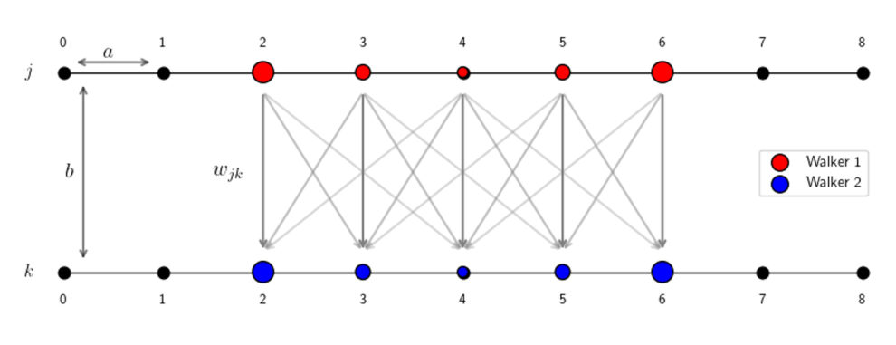
<figcaption class="paper-figure-caption"><b>Fig 1.</b> FIG. 1. Schematic representation of the system considered in this paper. Two walkers evolve on parallel one-dimensional lattices and interact through a distance-dependent interaction wjk involving multiple neighbors beyond the on-site term. The size of the occupied sites is proportional to the corresponding single-particle occupation probability, and the shade of the interaction arrows is proportional to the strength of the interaction terms. Parameters a and b are respectively the lattice parameter and the interlattice distance.</figcaption>
</figure>
<figure class="paper-figure-card">
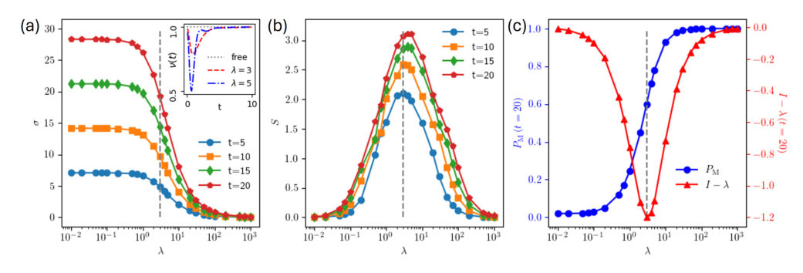
<figcaption class="paper-figure-caption"><b>Fig 2.</b> FIG. 2. Transport properties of the system in the presence of on-site interaction between walkers. (a) Single-particle standard deviation; the insert shows the exponent of the power law from Eq. 11. (b) Entanglement entropy. (c) Comparison between meeting probability (blue) and expectation value of the interaction operator (red). The grey dashed line is a visual guide for λ = 3.</figcaption>
</figure>
<figure class="paper-figure-card">
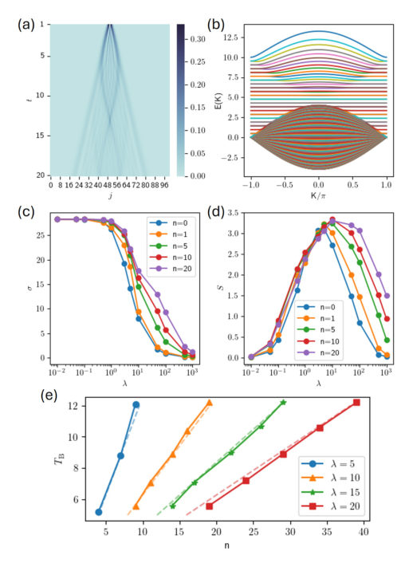
<figcaption class="paper-figure-caption"><b>Fig 3.</b> FIG. 3. Transport properties in the presence of a linear in- teraction profile. (a) Single-particle probability distribution and (b) two-particle band structure for parameters λ = 10 and n = 20. (c) Single-particle standard deviation and (d) entanglement entropy, both obtained at time t = 20 for dif- ferent numbers of neighbors considered in the interaction. (e) Periods of the Bloch-like oscillations occurring with a linear potential, found numerically through the analysis of the max- ima of the return probability in Eq. (25). The dashed lines correspond to the analytical values from the formula in Eq. (24).</figcaption>
</figure>
<figure class="paper-figure-card">
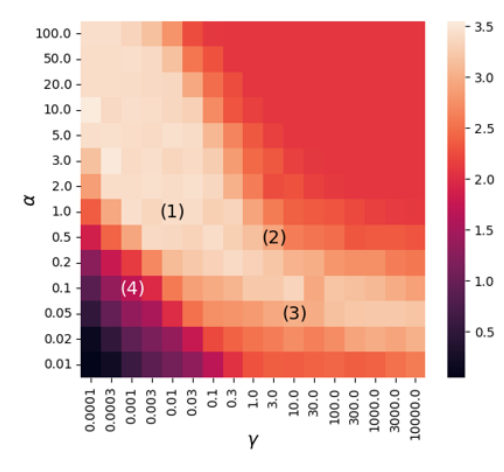
<figcaption class="paper-figure-caption"><b>Fig 4.</b> FIG. 4. Phase diagram of the entanglement entropy as a function of parameters γ and α defining the scaling of the Coulomb-like potential. Numbers (1) through (4) depict the cases reported in Fig. 6, which are the example cases for the regimes described in the text. All values were obtained for λ = 20 and evolution time t = 20.</figcaption>
</figure>
<figure class="paper-figure-card">
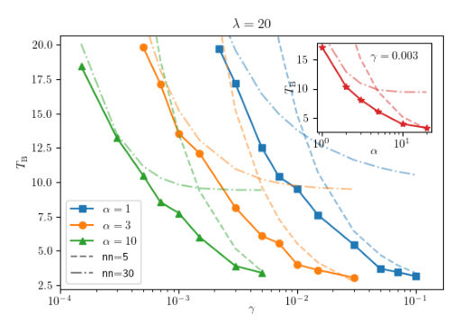
<figcaption class="paper-figure-caption"><b>Fig 5.</b> FIG. 5. Periods of the Bloch-like oscillations occurring in the regime with low γ and high α at fixed λ = 20, obtained numerically through the analysis of the maxima of the return probabiity in Eq. (25). The dashed lines correspond to the analytical values obtained through formulas (24) and (26), by averaging the interaction step over the first n neighbors.</figcaption>
</figure>

**Summary.** The paper theoretically investigates interacting quantum walks on 1D lattices to control the relationship between particle transport and entanglement. By employing tailored potentials, such as generalized Coulomb-like interactions, the authors map out a phase diagram revealing multiple dynamical regimes. The key finding is the identification of an optimal intermediate regime that maximizes both transport efficiency and quantum correlations simultaneously.

**Why it may be interesting.** This work provides concrete theoretical tools for designing quantum systems where controlled interactions can steer dynamics toward optimal states that balance coherent spreading with strong non-local correlations, relevant for simulating complex many-body physics.

Detailed structure

**Main problem.** The central challenge is controlling the interplay between particle propagation (transport) and quantum correlation generation in interacting quantum walks.

**Main result.** A rich phase diagram was established using Coulomb-like interactions, identifying a novel intermediate regime that simultaneously optimizes transport efficiency and entanglement for correlated dynamics.

**Method.** Numerical simulations of the two-particle Schrödinger equation were performed, analyzing spectral properties and time evolution across different interaction potentials.

**Model / system.** The system consists of two distinguishable continuous-time quantum walkers on parallel 1D lattices. The interactions are modeled using distance-dependent potentials, including linear and generalized Coulomb-like forms.

**Key observables.** Entanglement entropy (S), single-particle standard deviation ($\sigma(t)$), meeting probability ($P_M(t)$), and the two-particle band structure.

**Important parameters / regimes.** Interaction strength ($\lambda$), spatial scaling ($\gamma$), decay rate ($\alpha$), and the specific form of the potential (on-site, linear, Coulomb-like).

**Assumptions / limitations.** The analysis often assumes a periodic extension of the lattice for band structure calculations.

**Figures summary.** Figures illustrate the transition from free to bound states using on-site interactions ($\lambda$ dependence) and show Bloch-like oscillations in single-particle distributions when linear potentials are applied, alongside phase diagrams mapping entropy vs. interaction parameters.

**Paper structure.** The paper systematically investigates different interaction models (on-site, linear, Coulomb-like), deriving key observables like entanglement entropy and transport metrics to map out a comprehensive phase diagram of dynamical regimes.

Abstract

Controlling the interplay between particle propagation and quantum correlation generation is a central challenge in quantum transport. Here, we investigate two distinguishable continuous-time quantum walkers evolving on parallel one-dimensional lattices, interacting via distance-dependent potentials. While on-site interactions reproduce the typical bosonic behaviour, extending the interaction to a linear potential over multiple neighbors introduces controlled Bloch-like oscillations and shifts the bound-pair regime to stronger couplings. More generally, we explore a Coulomb-like interaction parameterized by strength, spatial scaling, and decay rate. This reveals a rich phase diagram including four distinct dynamical regimes: (i) a high-entropy, oscillatory regime akin to a linear potential; (ii) a strongly localized, bound-pair regime; (iii) a novel intermediate regime combining near-ballistic spreading with strong correlations; and (iv) a weakly interacting, free-propagation regime. Notably, regime (iii) achieves concurrent optimization of transport efficiency and entanglement, offering a sweet spot for correlated quantum dynamics. Our results provide a tool for designing interaction-engineered quantum walks with potential applications in quantum information processing and simulations.

[↑ back to top](#top)

### [Vorticity Induced by Non-frontal Collisions of Quantum Droplets](http://arxiv.org/abs/2606.17498v1)

**Authors:** J. E. Alba-Arroyo, Santiago F. Caballero-Benitez, Rocio Jáuregu  
**Type:** theory · **Category:** quantum gases · **PDF:** <https://arxiv.org/pdf/2606.17498v1>  
**Analysis basis:** full PDF text, analyzed in chunks
**Topic relevance:** 🔥 `analog quantum simulation` **4/5** · `non-equilibrium dynamics` **3/5** · `non-equilibrium universality` **2/5** · `Keldysh / 2PI / non-Gaussian methods` **1/5** · `correlated / nonlocal dissipation` **1/5** · `driven-dissipative phase transition` **1/5** · `entanglement & information structure` **1/5** · `methods for driven-dissipative` **1/5**

↔ Scroll figures horizontally

<figure class="paper-figure-card">
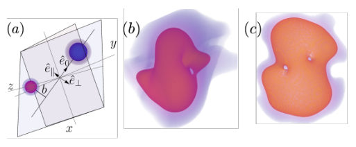
<figcaption class="paper-figure-caption"><b>Fig 1.</b> FIG. 1. Diagramatic proposal for non-frontal col- lisions of quantum droplets and illustrative re- sults when vortex filaments are generated. (a) Setup for the two droplets before the collision, ˆe0 de- fines the direction of the relative wavenumber 2k0 be- tween the droplets, ˆe∥the direction along which the im- pact parameter b is evaluated, and, ˆe⊥completes the lo- cal reference frame system. (b) and (c) illustrate the outcomes after the collision of the quantum droplets: (b) one vortex and (c) twin vortices in the heavy com- ponent of the degenerate gas. The colliding droplets are formed by N1 = N Rb 1 + N K 1 = 1.81 × 105 and N2 = N Rb 2 + N K 2 = 1.31 × 105 atoms; N K i=1,2/N Rb...</figcaption>
</figure>
<figure class="paper-figure-card">
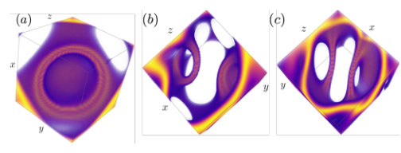
<figcaption class="paper-figure-caption"><b>Fig 2.</b> FIG. 2. Topological excitations generated dynam- ically within the atomic cloud as a result of a bi- nary collision. (a): A vortex ring that has a twin ring (not shown) spatially at 180◦degrees is formed during a collision of identical quantum droplets. The twin vortex rings are the seed of other higher-energy excitations. (b): One vortex with a twisted vortex ring. The kinetic energy is high enough to generate a density depression that tra- verses the cloud, as shown in Fig. 1(b). (c): Two vortices that traverse the cloud, typically generated with high ki- netic energy, as shown in Fig. 1(c). Parameters are: (a) N1 = N2 = 1.81 × 105, We = 1.19, b/2R01 = 0.154, R01 = 3.18ξ, τevo = 10.34τ;...</figcaption>
</figure>
<figure class="paper-figure-card">
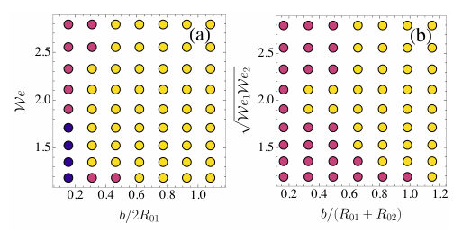
<figcaption class="paper-figure-caption"><b>Fig 3.</b> FIG. 3. Phase diagrams yielding different config- urations of topological defects inside the cloud as a result of a binary collision. Twin vortex rings [Fig. 2(a)] (dark blue, ), one vortex with a twisted ring [Fig. 2(b) (magenta, ) and twin vortices [Fig. 2(c)] (yel- low, ).An imbalance in droplet size stabilizes the for- mation of a single vortex with a twisted ring at low en- ergy and small impact parameter. Increasing either of these parameters results in the formation of two vor- tices. (a) Initial colliding droplets are the same size N1 = N2 = 1.81 × 105, R01 = 3.18ξ. (b) Initial colliding droplets have different sizes, with a ratio N1/N2 = 0.73, N2 = 1.81 × 105, R01 = 2.81ξ, R02 =...</figcaption>
</figure>
<figure class="paper-figure-card">
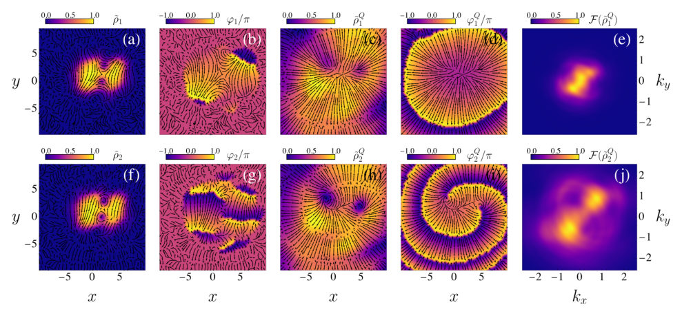
<figcaption class="paper-figure-caption"><b>Fig 4.</b> FIG. 4. Velocity fields, density and quantum phase distributions of the atomic cloud components for a collision that produces twin vortices. The heavy atomic component spins fast near a generated vortex filament, yielding minimal density regions in the vortex core. Density scaled to its maximum value (a,f) and phase (b,g) distributions for the light/heavy atomic components of the cloud with the corresponding velocity fields (black arrows) after the collision. Density scaled to its maximum value (c,h) and phase (d,i) distributions for the light/heavy atomic components of the cloud with the corresponding velocity fields (black arrows) when the quench protocol is applied after the collision....</figcaption>
</figure>

**Summary.** This paper theoretically investigates how the collision of two quantum droplets of alkali atoms generates complex rotational dynamics and various types of stable topological defects. Using an extended Gross-Pitaevskii equation framework, the authors map out a phase diagram showing that defect formation depends critically on collision energy and impact parameter. The findings are highly relevant for controlling and detecting exotic excitations in ultracold atomic quantum gases.

**Why it may be interesting.** This work directly addresses non-equilibrium dynamics in ultracold atomic systems, providing detailed predictions about topological defect formation during collisions, which is crucial for understanding quantum fluid behavior beyond simple mean-field descriptions.

Detailed structure

**Main problem.** The study analyzes the rotational dynamics induced by non-frontal binary collisions of quantum droplets composed of ultracold alkali atoms.

**Main result.** The collision generates a rich landscape of robust topological excitations, such as vortex rings and dislocation lines, whose type depends on the Weber number and impact parameter.

**Method.** Theoretical study using the extended Gross-Pitaevskii equation framework combined with numerical simulations to track time-dependent order parameters.

**Model / system.** The system models quantum droplets formed from mixtures of alkali atoms (e.g., $^{41}	ext{K}$ and $^{87}	ext{Rb}$) governed by the extended Gross-Pitaevskii equation, which includes beyond-mean-field interaction terms.

**Key observables.** Topological excitations (vortex rings, dislocation lines, vortices), density ($
ho$), velocity field ($\mathbf{v}$), and Time-of-Flight (TOF) signals in Fourier space.

**Important parameters / regimes.** Weber number ($We = K/(R_0^2\sigma)$), impact parameter ($b$), and the collision regime (e.g., incompressible).

**Assumptions / limitations.** The analysis assumes the system is sufficiently incompressible, and initial states are modeled using the Hartree many-body wavefunction approximation.

**Figures summary.** Figures illustrate diagrammatic proposals for non-frontal collisions showing outcomes like single or twin vortices; other figures map defect configurations onto a phase diagram based on $We$ and $b$.

**Paper structure.** The paper progresses from defining the physical problem (non-frontal collision dynamics) to presenting the theoretical framework (extended GPE), detailing numerical methods, analyzing key observables like vortex types, and concluding with experimental detection proposals.

Abstract

The rotational dynamics induced by the non-frontal binary collisions of quantum droplets composed of ultracold alkali atoms are analyzed. A theoretical study is presented within the extended Gross-Pitaevskii equation framework, using experimentally feasible conditions. Numerical experiments elucidate a rich landscape of possible topological excitations in the system that are robust towards measurements. The collision of heteronuclear quantum droplets composed of $^{41}$K and $^{87}$Rb atoms in the incompressible regime, gives rise to dynamical instabilities that spontaneously generate topological defects: vortex rings, dislocation lines, and vortices in one species. Their presence depends on the Weber number and the impact parameter. An experimental proposal for vortex detection in both real and Fourier space using interaction ramps is described.

[↑ back to top](#top)

### [Exotic magnetism and persistent spin dynamics in a frustrated Jeff = 1/2 triangular lattice antiferromagnet](http://arxiv.org/abs/2606.17166v1)

**Authors:** M. Barman, K. Jaksetič, M. Pregelj, M. D. Le. P. J. Baker, A. Zorko, P. Khuntia  
**Type:** experiment · **Category:** strongly correlated electrons · **PDF:** <https://arxiv.org/pdf/2606.17166v1>  
**Analysis basis:** full PDF text, analyzed in chunks
**Topic relevance:** 🔥 `analog quantum simulation` **4/5** · `exotic spin models in light-matter` **3/5** · `spintronics-quantum-optics interface` **3/5** · `Kondo & dissipative impurity` **1/5** · `entanglement & information structure` **1/5** · `non-equilibrium dynamics` **1/5**

↔ Scroll figures horizontally

<figure class="paper-figure-card">
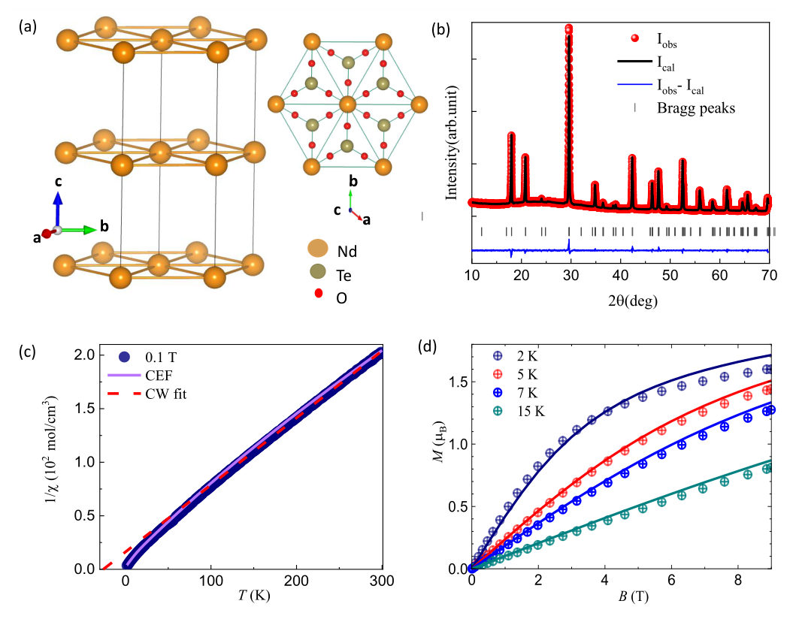
<figcaption class="paper-figure-caption"><b>Fig 1.</b> FIG. 1. (a) Schematic of the triangular lattice in K3NdTe2O9, where the magnetic Nd3+ ions form a triangular network in the ab-plane with dintra = 6.03 Å and dinter = 7.4 Å. The dominant magnetic superexchange interaction is mediated via Nd–O– Te–O–Nd exchange pathway. The right panel shows the triangular lattice formed by Nd3+ moments in the crystal structure of KNTO, illustrating the geometric frustration inherent to the lattice with possible exchange pathways. (b) Rietveld refinement of the powder X-ray diffraction pattern of KNTO. (c)Temperature-dependent inverse susceptibility measured under an applied field of 0.1 T. The inverse susceptibility is fitted with the Curie–Weiss law at...</figcaption>
</figure>
<figure class="paper-figure-card">
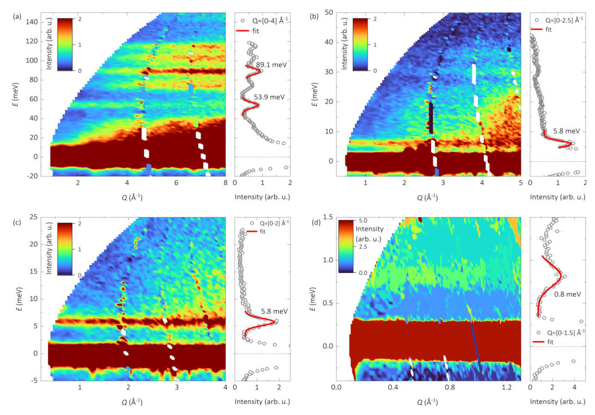
<figcaption class="paper-figure-caption"><b>Fig 2.</b> FIG. 2. Inelastic neutron scattering (INS) intensity at 5K for the incident neutron energies of 180, 60, 29.7 and 2 meV. Besides the broad diffuse phonon excitations at larger scattering vectors Q, there are clear additional flat bands at low Q that correspond to CEF levels. Furthermore, the flat bands at E &gt; 60 meV which have maximal intensity at ∼7 meV, most likely correspond to molecular vibrations from adsorbed water. For clarity, we also show the energy transfer integrated across the low Q range to emphasize the flat bands. The red lines are Gaussian fits, performed to precisely determined the energies of the CEF excitations.</figcaption>
</figure>
<figure class="paper-figure-card">
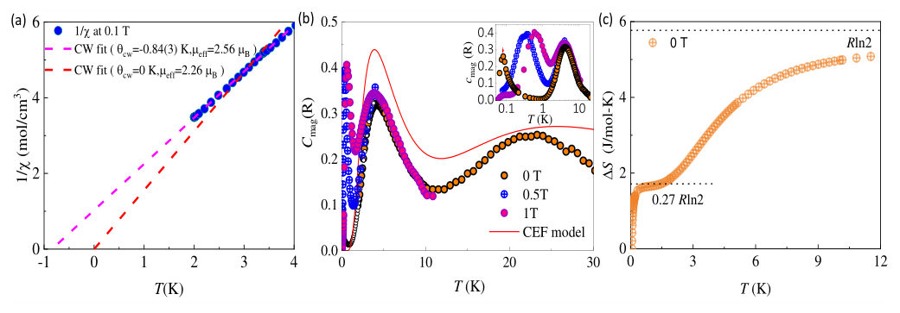
<figcaption class="paper-figure-caption"><b>Fig 3.</b> FIG. 3. (a) Temperature-dependent inverse magnetic susceptibility recorded at an applied field of 0.1 T is fitted using the Curie–Weiss law (dashed magenta line) and non-interacting Curie–Weiss law with ΘCW = 0 K (dashed red line). (b) Magnetic specific heat, obtained after subtracting the lattice contribution following the Debye model, measured under various magnetic fields. The solid red line is the CEF model. The inset highlights the low-temperature evolution of Cmag under applied magnetic fields. Zero-field magnetic specific heat exhibits a weak anomaly at 81 mK. (c) The temperature dependence of magnetic entropy in zero field. It reaches 88% of the expected R ln 2 at 12 K for an...</figcaption>
</figure>
<figure class="paper-figure-card">
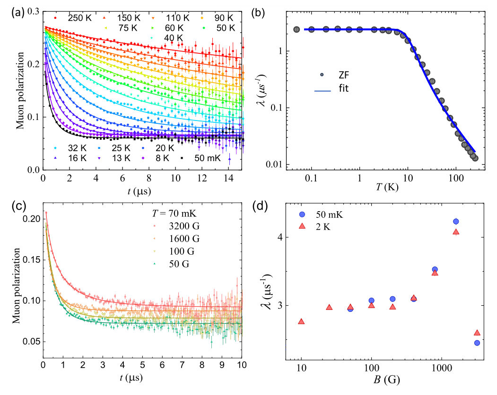
<figcaption class="paper-figure-caption"><b>Fig 4.</b> FIG. 4. (a) Zero-field µSR asymmetry spectra at selected temperatures, demonstrating the temperature evolution of the muon spin polarization. The solid lines are fits to a stretched exponential relaxation function, as discussed in the text (SI [51]). (b) The temperature dependence of µSR rate λ in zero field. The solid blue line shows the expected thermally activated behavior of the crystal electric field excitations as discussed in the text. (c) µSR asymmetry spectra in different applied longitudinal magnetic fields at 70 mK, demonstrating partial decoupling of muon relaxation with field. The solid lines are fits to a stretched-exponential relaxation function, PLF(t) = exp[−(λLFt)βLF where...</figcaption>
</figure>

**Summary.** This work investigates the exotic magnetism of $	ext{K}_3	ext{NdTe}_2	ext{O}_9$, a geometrically frustrated triangular lattice antiferromagnet. By combining $\mu	ext{SR}$, specific heat, and INS measurements, the authors confirm that the system enters a dynamic ground state characterized by $J_{	ext{eff}}=1/2$ moments. The results strongly support persistent spin dynamics rather than conventional long-range magnetic ordering down to very low temperatures.

**Why it may be interesting.** The study provides experimental evidence for quantum disordered magnetic states (approaching QSL behavior) in a real material system, which is highly relevant to understanding frustrated magnetism and exotic ground states that can be modeled using advanced many-body techniques.

Detailed structure

**Main problem.** To investigate exotic magnetism and persistent spin dynamics in a geometrically frustrated rare-earth triangular-lattice antiferromagnet.

**Main result.** The experiments rule out long-range magnetic ordering down to 50 mK, confirming the existence of a fluctuating ground state characterized by $	ext{J}_{	ext{eff}}=1/2$ moments and persistent spin dynamics.

**Method.** A combination of thermodynamic measurements (Specific Heat), inelastic neutron scattering ($	ext{INS}$), muon spin relaxation ($\mu	ext{SR}$), and magnetization studies were employed.

**Model / system.** The system is the frustrated magnet $	ext{K}_3	ext{NdTe}_2	ext{O}_9$, where $	ext{Nd}^{3+}$ ions form a structurally perfect triangular lattice. The low-energy physics is modeled by effective $J_{	ext{eff}}=1/2$ moments interacting via strong exchange interactions.

**Key observables.** Zero-field $\mu	ext{SR}$ asymmetry (showing no oscillations or 1/3 plateau), temperature dependence of the $\mu	ext{SR}$ relaxation rate ($\lambda$), and specific heat anomalies.

**Important parameters / regimes.** Exchange interaction strength ($J_{	ext{ex}}/k_B \sim 0.6 	ext{ K}$); low temperatures down to $50 	ext{ mK}$; effective spin quantum number $	ext{J}_{	ext{eff}}=1/2$.

**Assumptions / limitations.** The analysis assumes the Orbach relaxation mechanism describes the temperature dependence of the $\mu	ext{SR}$ rate, and that dipolar interactions are negligible compared to exchange interactions.

**Figures summary.** Figures show $\mu	ext{SR}$ asymmetry spectra (zero-field and applied field) demonstrating persistent dynamics; plots illustrate the thermally activated behavior of the relaxation rate ($\lambda$) vs. temperature.

**Paper structure.** The paper systematically presents evidence from multiple techniques: structural characterization, magnetic susceptibility/magnetization to establish $	ext{J}_{	ext{eff}}=1/2$ ground state and weak exchange coupling; then uses $\mu	ext{SR}$ and specific heat measurements to confirm the absence of static order and characterize the low-energy spin dynamics.

Abstract

The delicate interplay between competing degrees of freedom, anisotropy, and frustration-induced strong quantum fluctuations in pseudospin-$J_{\rm eff}=1/2$ rare-earth triangular-lattice antiferromagnets offers a promising platform for the experimental realization of exotic states with nontrivial low-energy excitations. Here, we present thermodynamic, inelastic neutron scattering (INS), and muon spin relaxation ($μ$SR) investigations of the frustrated magnet K$_3$NdTe$_2$O$9$, in which Nd$^{3+}$ ions constitute a structurally perfect triangular lattice with no detectable site disorder. The experiments reveal the realization of a Kramers doublet ground state with $J{\rm eff}=1/2$ moments, well separated from the first excited state, which interact antiferromagnetically with an exchange interaction of $\sim$0.6 K between the Nd$^{3+}$ moments in the triangular plane. The absence of oscillations and the so-called 1/3 plateau in the zero-field $μ$SR asymmetry down to 50 mK rules out long-range magnetic ordering and spin freezing on the $μ$SR time scale, respectively. The temperature dependence of the zero-field $μ$SR relaxation rate is well described by the Orbach relaxation mechanism, indicating the existence of fluctuating moments in the ground state of this frustrated magnet. Our results demonstrate exotic magnetism and persistent spin dynamics down to 50 mK. These observations establish this new family of frustrated rare-earth triangular-lattice antiferromagnets as a promising venue for the experimental realization of nontrivial quantum states with exotic low-energy excitations.

[↑ back to top](#top)

### [Broadband High-Level Squeezed Light using Waveguide Optical Parametric Amplifiers with External Dispersion Compensation](http://arxiv.org/abs/2606.17422v1)

**Authors:** Takumi Suzuki, Shotaro Oki, Kazuki Hirota, Takaya Hoshi, Ryuhoh Ide, Takahiro Kashiwazaki, Taichi Yamashima, Asuka Inoue, Takeshi Umeki, Mamoru Endo, Akira Furusawa  
**Type:** both · **Category:** quantum information and computing · **PDF:** <https://arxiv.org/pdf/2606.17422v1>  
**Analysis basis:** full PDF text, analyzed in chunks
**Topic relevance:** 🔥 `quantum optics experiment` **4/5** · `interference shaping light` **3/5** · `Keldysh / 2PI / non-Gaussian methods` **1/5** · `QC/QI experiment` **1/5** · `driven-dissipative phase transition` **1/5** · `methods for driven-dissipative` **1/5**

↔ Scroll figures horizontally

<figure class="paper-figure-card">
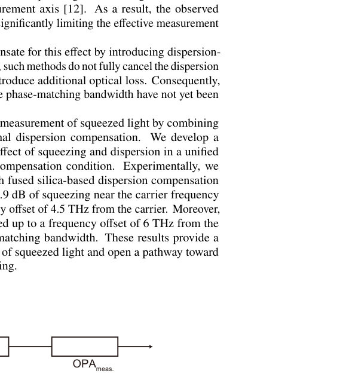
<figcaption class="paper-figure-caption"><b>Fig 1.</b> Fig. 1. Conceptual model of the two-stage OPA scheme. A squeezed vacuum generated in OPAsqz propagates through a dispersion-compensation element (DC) and is measured by phase-sensitive amplification in OPAmeas. The DC element cancels the frequency- dependent quadrature rotation accumulated between the two OPAs.</figcaption>
</figure>
<figure class="paper-figure-card">
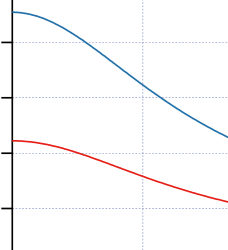
<figcaption class="paper-figure-caption"><b>Fig 2.</b> Fig. 2. Effective GDD of the squeezed quadrature versus squeezing level 10 log10 𝑒2𝑟</figcaption>
</figure>
<figure class="paper-figure-card">
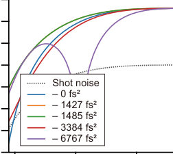
<figcaption class="paper-figure-caption"><b>Fig 3.</b> Fig. 3. Simulated PSA spectra (lossless) for several dispersion-compensation values 𝐷dc: 0, −1427 (analytical optimum), −1485 (±5 THz optimum), −3384 (zero-gain limit), and −6767 fs2 (full material compensation). (a) Squeezed and (b) anti-squeezed quadratures. Proper compensation broadens the squeezed band in (a); (b) is far less sensitive to dispersion.</figcaption>
</figure>
<figure class="paper-figure-card">
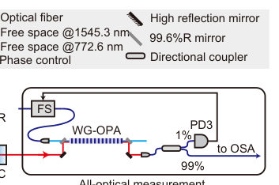
<figcaption class="paper-figure-caption"><b>Fig 4.</b> Fig. 4. Experimental setup. Squeezed light from OPAsqz (22 mm) is measured by PSA in OPAmeas (45 mm), both pumped at 388 THz (signal 194 THz). Fused-silica plates at the Brewster angle provide dispersion compensation. A probe beam (locked via a 99.6% mirror) and a separate lock beam (stabilized through an electro-optic modulator (EOM)) reference the two OPAs. Output is recorded with an optical spectrum analyzer (OSA).</figcaption>
</figure>
<figure class="paper-figure-card">
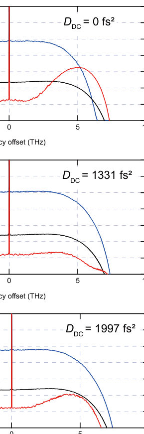
<figcaption class="paper-figure-caption"><b>Fig 5.</b> Fig. 5. Measured spectra of squeezing (red), anti-squeezing (blue), and shot noise (black) for (a) 𝐷DC = 0, (b) 1331 (near optimum), and (c) 1997 fs2 (overcompensation), where 𝐷DC ≡|𝐷dc|. Near-optimal compensation (b) gives the broadest squeezed band.</figcaption>
</figure>

**Summary.** The paper presents a method to achieve broadband characterization of squeezed vacuum states generated by waveguide OPAs. By introducing external dispersion compensation, the authors successfully mitigate frequency-dependent quadrature rotation caused by GVD. This breakthrough enables stable observation of high levels of squeezing over tens of THz bandwidths, advancing ultrafast quantum optics applications.

**Why it may be interesting.** This work directly addresses a major technical hurdle—dispersion management—in realizing high-bandwidth quantum light sources necessary for advanced continuous-variable quantum information processing protocols.

Detailed structure

**Main problem.** The primary challenge is achieving broadband characterization of squeezed light generated by waveguide Optical Parametric Amplifiers (OPAs) while overcoming the bandwidth limitation imposed by Group Velocity Dispersion (GVD).

**Main result.** By implementing external dispersion compensation, the authors demonstrated maintaining more than 5 dB of squeezing up to a frequency offset of 4.5 THz, and confirming sub-shot-noise squeezing up to 6 THz.

**Method.** The study combines theoretical modeling (Bloch–Messiah decomposition, covariance matrix formalism) with experimental measurements using two-stage OPA systems and external dispersion compensation elements.

**Model / system.** The system involves a two-stage OPA setup ($	ext{OPAsqz} 	o 	ext{DC} 	o 	ext{OPAmeas}$) utilizing PPLN waveguides. The analysis tracks the evolution of quantum quadratures, incorporating effects from parametric gain and dispersion.

**Key observables.** Squeezing level (dB), frequency offset ($\Omega$), effective Group Delay Dispersion (GDD) ($	ext{fs}^2$), and measurement efficiency ($\eta_{	ext{eff}}$).

**Important parameters / regimes.** Frequency offsets up to 6 THz, optimal dispersion compensation values (e.g., $-1427 	ext{ fs}^2$), and waveguide transmittances ($T$).

**Assumptions / limitations.** The analysis relies on the state remaining Gaussian for covariance matrix tracking; in practice, continuous tuning of dispersion is difficult, necessitating pump power adjustments.

**Figures summary.** Figures illustrate the spectral measurements showing how squeezing bandwidth broadens significantly when external dispersion compensation is applied near an optimal value. Other figures show the dependence of effective gain and efficiency on loss/transmittance.

**Paper structure.** The paper progresses from establishing the theoretical framework for broadband characterization, detailing the role of dispersion compensation in two-stage systems, analyzing the impact of intrinsic loss via covariance matrix methods, and concluding with experimental validation of the achieved bandwidths.

Abstract

We demonstrate broadband phase-sensitive amplification (PSA) measurement of squeezed light generated by a waveguide optical parametric amplifier (OPA) with external dispersion compensation. In broadband systems, group velocity dispersion (GVD) induces a frequency-dependent rotation of the squeezing axis, which limits the observable bandwidth in PSA measurements. To overcome this limitation, we introduce external dispersion compensation between two OPAs and suppress the quadrature rotation over a wide frequency range. As a result, we observe a maximum squeezing of 5.9 dB near the carrier frequency and more than 5 dB of squeezing up to a frequency offset of 4.5 THz from the carrier. Furthermore, squeezing below the shot-noise level is confirmed up to a frequency offset of 6 THz from the carrier, corresponding to the accessible phase-matching bandwidth of the waveguide OPA. Our results establish a practical method for broadband characterization of squeezed light and provide a key step toward ultrafast continuous-variable quantum information processing.

[↑ back to top](#top)

### [Spin effects in the particle current of Bose-Einstein condensates in synthetic gauge fields](http://arxiv.org/abs/2606.17248v1)

**Authors:** Hugo Bencomo Martín, Antonio Muñoz Mateo  
**Type:** theory · **Category:** quantum gases · **PDF:** <https://arxiv.org/pdf/2606.17248v1>  
**Analysis basis:** full PDF text, analyzed in chunks
**Topic relevance:** 🔥 `analog quantum simulation` **4/5** · `exotic spin models in light-matter` **3/5** · `non-equilibrium dynamics` **2/5** · `Keldysh / 2PI / non-Gaussian methods` **1/5** · `spintronics-quantum-optics interface` **1/5**

↔ Scroll figures horizontally

<figure class="paper-figure-card">
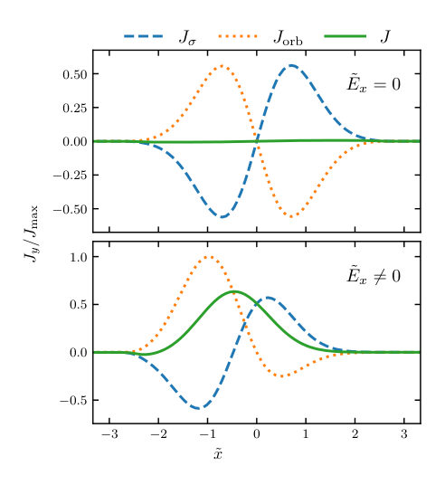
<figcaption class="paper-figure-caption"><b>Fig 1.</b> FIG. 1. Current density in the lowest Landau level (n = 0) of a system with Ex = 0 (top) and ˜Ex = Ex/Bz = 0.5 ωBℓB (bottom) as a function of the non-dimensional coordinate ˜x = (x −xk)/ℓB. As predicted by Eq. (16), the orbital and spin contributions that are odd in ˜x cancel locally (J = 0) in the absence of electric field, and produce the classical drift velocity J/|χ|2 = 0.5 ωBℓB in the presence of electric field. Units of Jmax = 4.36 × 10−2 ωB/ℓ2 B are used.</figcaption>
</figure>
<figure class="paper-figure-card">
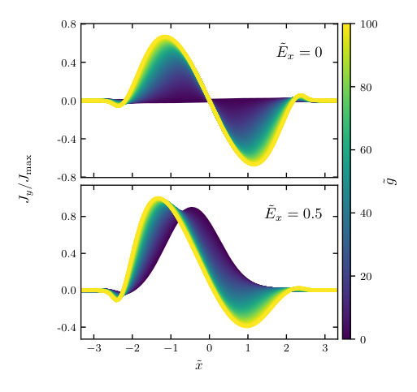
<figcaption class="paper-figure-caption"><b>Fig 2.</b> FIG. 2. Transverse profiles of the total current density Jy(x) in repulsively interacting BECs, confined within a 2D box of size Lx × Ly = 5ℓB × 10ℓB (with periodic boundary conditions along the y−direction) and subjected to a per- pendicular magnetic field Bz, for a continuous sweep of the interaction strength ˜g = mgN/ℏ2 ∈[0, 100]. Top: In the absence of electric field, Ex = 0. Bottom: For electric field ˜Ex = Ex/Bz = 0.5 ωBℓB. Units of Jmax = 3.13×10−2 ωB/ℓ2 B.</figcaption>
</figure>
<figure class="paper-figure-card">
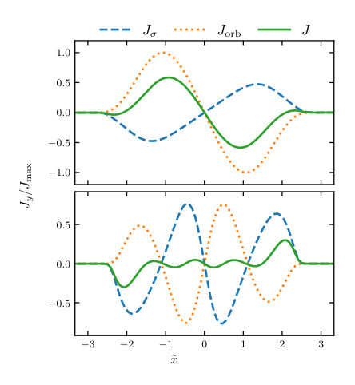
<figcaption class="paper-figure-caption"><b>Fig 3.</b> FIG. 3. Transverse profiles of spin Jσ, orbital Jorb, and total J current densities in systems with interaction strength gN = 50 ℏ2/m, and vanishing electric field Ex = 0. Top: y−independent currents in a smooth, excited state without vortices. Bottom: Currents on the line across the core of one of the two vortices that emerge in the ground state of the system. Units of Jmax = 2.69 × 10−2 ωB/ℓ2 B are used.</figcaption>
</figure>
<figure class="paper-figure-card">
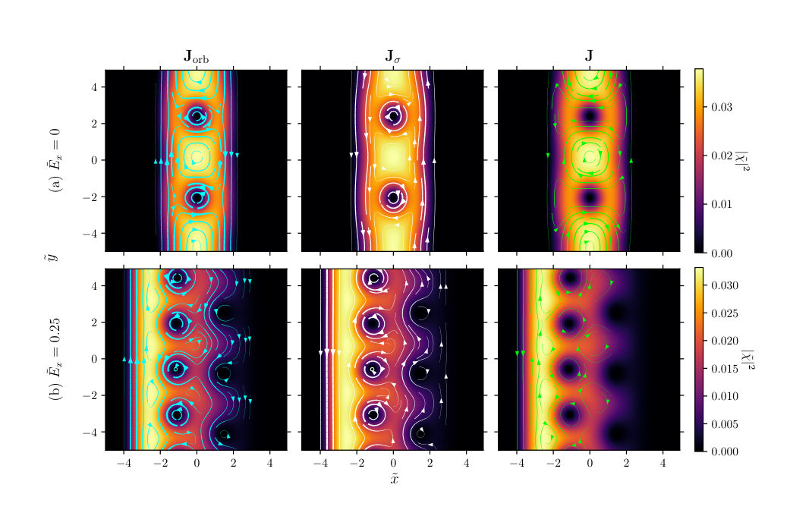
<figcaption class="paper-figure-caption"><b>Fig 4.</b> FIG. 4. Spatial distribution of the orbital Jorb, spin Jσ, and total J current densities (represented by streamlines of width proportional to current magnitude) in a BEC with interaction stength gN = 50 ℏ2/m trapped by box potential and subjected to a perpendicular magnetic field Bz. The underlying color maps represent the normalized particle density |˜χ|2 = (ℓB|χ|)2/N. (a) In the absence of an external electric field, Ex = 0 and within a box size 5ℓB ×10ℓB, the ground state nucleates two vortices. (b) In a wider box 8ℓB × 10ℓB, and for an electric field Ex/Bz = 0.25 ωBℓB a vortex lattice emerges displaced and distorted due to the combined effects of local quantized circulation around...</figcaption>
</figure>

**Summary.** This theoretical paper examines the role of spin effects on particle currents within spinor Bose-Einstein condensates placed in synthetic gauge fields. The authors show that the spin current is a non-negligible component of the total current, which alters the system's response to magnetic flux quantization. By analyzing both non-interacting and interacting regimes, they map out how these spin dynamics govern superfluid behavior in artificial quantum Hall setups.

**Why it may be interesting.** This work directly addresses how internal degrees of freedom (spin) couple to external synthetic fields ($\mathbf{A}, \mathbf{E}$) in ultracold atomic systems, providing crucial insights into superfluid dynamics beyond simple scalar models.

Detailed structure

**Main problem.** The study investigates how spin effects, specifically the spin term contribution to the particle current density, manifest in Bose-Einstein condensates (BECs) subjected to synthetic gauge fields.

**Main result.** The spin term is physically relevant and contributes to the superfluid velocity, modifying its relationship with magnetic flux quantization compared to scalar superfluids. Furthermore, increasing interactions causes the relative contribution of the spin current to decrease.

**Method.** The analysis involves deriving the Pauli current density from non-relativistic limits (like the Dirac equation) and solving the resulting mean-field Hamiltonian for both non-interacting and interacting regimes.

**Model / system.** The system is a non-relativistic BEC of pseudospin-1/2 bosonic particles simulating a synthetic Hall system, governed by a Pauli Hamiltonian incorporating minimal coupling to synthetic gauge fields (magnetic and electric).

**Key observables.** Particle current density (J), spin current density (J_sigma), superfluid velocity (v), and the fluxoid quantization condition ($\Phi'$).

**Important parameters / regimes.** Interaction strength ($g$), magnetic field ($B_z$), and electric field ($E_x$).

**Assumptions / limitations.** The analysis operates within a mean-field framework, and specific calculations often assume approximations like the Lowest Landau Level (LLL) or Thomas-Fermi ansatz.

**Figures summary.** Figures illustrate spatial distributions of orbital, spin, and total current densities ($\mathbf{J}_{	ext{orb}}$, $\mathbf{J}_{\sigma}$, $\mathbf{J}$) in vortex lattices, showing how external electric fields shift density profiles and affect edge currents.

**Paper structure.** The paper progresses from deriving the general Pauli equation and current density to applying it to a specific Hall system Hamiltonian. It then analyzes solutions in the non-interacting limit (Landau levels) before tackling the interacting regime using Thomas-Fermi approximations, concluding with detailed analysis of current components and vortex physics.

Abstract

Although spin is not a relativistic quantity, its effects are not always manifestly captured within non-relativistic theoretical frameworks. We report on one of these effects: the spin term in the particle current density, which could be observed in the setup of a synthetic Hall system made with non-relativistic Bose-Einstein condensates of pseudospin-1/2 bosonic particles. By tuning the interaction strength, the system can show how the spin term in the particle current is needed for the local matching of classical drift velocity in the ground state of the non-interacting system, whereas for increasing interactions the spin-to-orbital current ratio decreases. In either case, since the overall particle velocity changes with the spin term contribution, so does its circulation in a loop, which in turn has physical consequences for its relationship with the Aharonov-Bohm phase shift.

[↑ back to top](#top)

### [The antiferromagnetic transition in the frustrated bixbyite $β$-Fe$_2$O$_3$ magnet](http://arxiv.org/abs/2606.17842v1)

**Authors:** Chenjun Tang, Ondřej Malina, Jiři Tuček, Francois Fauth, Marti Gich, Jose Luis Garcia-Muñoz  
**Type:** experiment · **Category:** strongly correlated electrons · **PDF:** <https://arxiv.org/pdf/2606.17842v1>  
**Analysis basis:** full PDF text, analyzed in chunks
**Topic relevance:** 🔥 `analog quantum simulation` **4/5** · 🔥 `exotic spin models in light-matter` **4/5** · `spintronics-quantum-optics interface` **3/5**

↔ Scroll figures horizontally

<figure class="paper-figure-card">
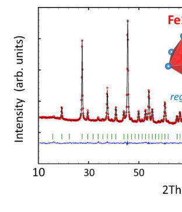
<figcaption class="paper-figure-caption"><b>Fig 1.</b> Figure 1. Rietveld refinement (black line) of the room temperature D1B@ILL (λ = 1.28 Å) neutron diffraction pattern (red circles) of -Fe2O3 at 300 K (Ia-3). Structural parameters are given in Table I.</figcaption>
</figure>
<figure class="paper-figure-card">
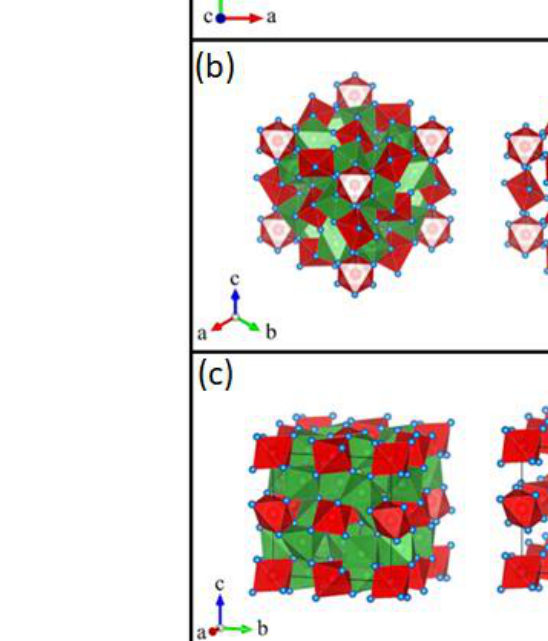
<figcaption class="paper-figure-caption"><b>Fig 2.</b> Figure 2. Room-temperature crystal structure of -Fe2O3. Projections of the Ia-3 structure refined at 300 K for different unit-cell orientations. The two crystallographically distinct Fe1 (red) and Fe2 (green) sites, together with the O atoms (blue), are shown in the figure. For each orientation, three representations are provided: (a) the complete structure, (b) only the regular Fe1O6 octahedra (red), and (c) only the distorted Fe2O6 octahedra (green).</figcaption>
</figure>
<figure class="paper-figure-card">
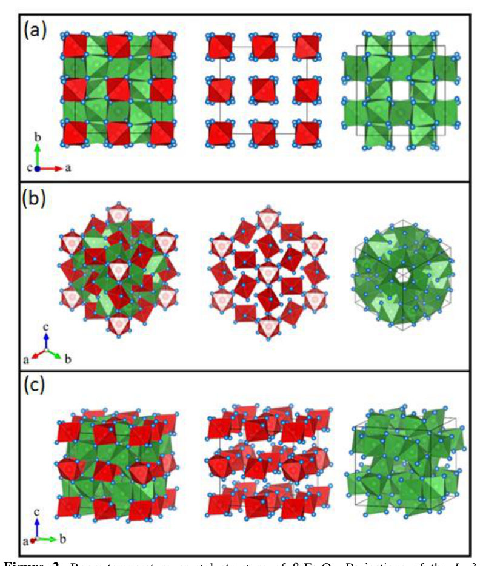
<figcaption class="paper-figure-caption"><b>Fig 3.</b> Figure 2 presents the refined cubic structure in three unit-cell orientations. For each orientation</figcaption>
</figure>
<figure class="paper-figure-card">
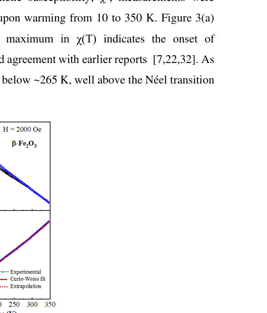
<figcaption class="paper-figure-caption"><b>Fig 4.</b> Figure 3. Magnetic susceptibility. (a) FC and ZFC susceptibility curves of the -Fe2O3 sample (H=2 kOe). (b) Inverse susceptibility and Curie-Weiss fit above the antiferromagnetic transition. Inset: extrapolated Curie temperature (C = – 847 K).</figcaption>
</figure>
<figure class="paper-figure-card">
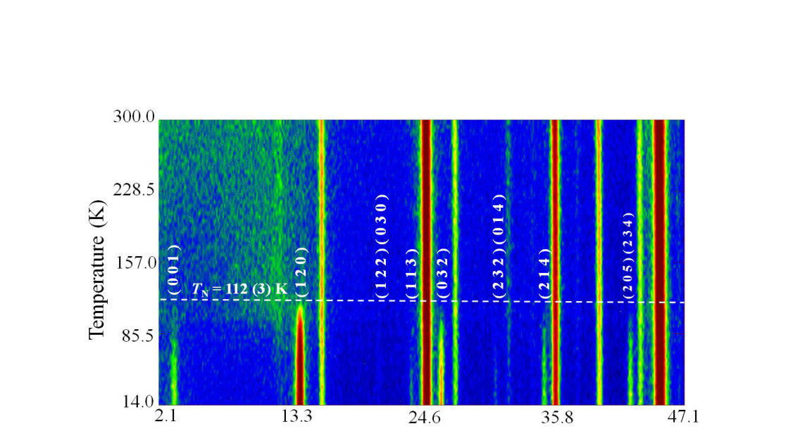
<figcaption class="paper-figure-caption"><b>Fig 5.</b> Figure 4. Contour maps of -Fe2O3 showing the 2θ-T projection of the temperature evolution of the neutron diffraction intensity (D1B@ILL, λ = 1.28 Å). The low-Q region highlights the onset and temperature evolution of the main magnetic reflections below the antiferromagnetic transition.</figcaption>
</figure>

**Summary.** This work experimentally investigates the temperature-driven antiferromagnetic transition in $\beta$-Fe$_2$O$_3$, revealing a complex, noncollinear magnetic ordering below $T_N \approx 112$ K. Using neutron and X-ray diffraction, the authors map out how the crystal symmetry breaks to accommodate this highly frustrated magnetic state. The findings highlight that local structural motifs dictate exotic magnetic couplings, suggesting routes for functional material design.

**Why it may be interesting.** The investigation into geometric frustration and complex, multi-sublattice noncollinear magnetism in an insulating oxide is highly relevant to understanding emergent quantum phenomena in strongly correlated materials, particularly those exhibiting competing magnetic interactions.

Detailed structure

**Main problem.** The magnetic properties of $\beta$-Fe$_2$O$_3$, a bixbyite transition-metal oxide, are poorly characterized despite the extensive study of Fe$_2$O$_3$. The research aims to investigate its temperature-driven magnetic transition and resulting complex magnetic structure.

**Main result.** The material undergoes an abrupt antiferromagnetic (AFM) transition below $T_N \approx 112$ K, establishing a noncollinear spin arrangement characterized by the propagation vector $\mathbf{k}=(1,1,1)$. The resulting magnetic ground state belongs to the primitive cell MSG $P\bar{I}a\bar{3}$, which is non-polar.

**Method.** The study employs complementary experimental techniques including neutron and synchrotron X-ray diffraction (NPD/XRPD) across temperature ranges, complemented by SQUID magnetometry for bulk susceptibility measurements.

**Model / system.** The physical system is the $\beta$-Fe$_2$O$_3$ bixbyite magnet. The magnetic interactions are governed by complex superexchange pathways ($	ext{Fe}^{3+–O–Fe}^{3+}$) that promote geometric frustration, leading to noncollinear magnetism involving distinct sublattices ($	ext{Fe}1$ and $	ext{Fe}2$).

**Key observables.** Antiferromagnetic transition temperature ($T_N \approx 112$ K), magnetic propagation vector $\mathbf{k}=(1,1,1)$, symmetry changes from $Ia\bar{3}$ to $P\bar{I}a\bar{3}$, and calculated exchange integrals ($J_{ij}$).

**Important parameters / regimes.** Frustration index $f \approx 7.56$, Néel temperature $T_N \approx 112$ K, and specific magnetic moments ($\mu$).

**Assumptions / limitations.** The analysis relies on Rietveld refinement of diffraction data to determine structural and magnetic symmetry changes across the transition.

**Figures summary.** Figures illustrate the crystal structure projections showing $	ext{Fe}1\text{O}_6$ and distorted $	ext{Fe}2\text{O}_6$ octahedra, and detailed visualizations (S3, S4) map out the complex noncollinear spin arrangement within the $[111]$ planes.

**Paper structure.** The paper progresses from characterizing the room-temperature structure via diffraction to identifying the magnetic transition temperature ($T_N$) using magnetometry. It then uses NPD below $T_N$ to determine the symmetry breaking and noncollinear spin configuration, culminating in detailed analysis of exchange interactions governing the complex magnetic ground state.

Abstract

Although Fe$_2$O$_3$ compounds are among the most extensively studied transition-metal oxides, the magnetic properties of $β$-Fe$_2$O$_3$ remain poorly characterized. Using neutron and synchrotron X-ray diffraction, we investigate the temperature-driven magnetic transition in $β$-Fe$_2$O$_3$. A noncollinear antiferromagnetic structure sets in abruptly via activation of irrep $mH_1^{+}$ at the H-point [$\mathbf{k}=(1,1,1)$] together with antitranslation $(1'|\tfrac{1}{2},\tfrac{1}{2},\tfrac{1}{2})$. Below $T_{\mathrm{N}}$, the magnetic cell becomes primitive $(P_I a \bar{3})$, yielding two interpenetrating primitive cubic subcells with inverted moments and non-polar type-IV symmetry. All Fe$^{3+}$-O-Fe$^{3+}$ exchanges are antiferromagnetic, and the bixbyite structure promotes geometric frustration and noncollinear magnetism through coexisting magnetic sublattices with distinct symmetries and easy axes. Its frustration index $f \simeq 7.6$ is among the highest reported for binary magnetic oxides. In $\{111\}$ planes, distorted Fe2O$_6$ octahedra form hexagonal rings interconnected by triangular units. Notably, hexagonal Fe2 rings host a central Fe1 ion with strong Ising-like anisotropy, which could act as a switching element for the rings' magnetic state. These features point to routes for functional design.

[↑ back to top](#top)

### [Fermionic Hamiltonian engineering with local control](http://arxiv.org/abs/2606.17158v1)

**Authors:** Özgün Kum, Matthias Zipper, Ludwig Mathey, Martin Kliesch  
**Type:** theory · **Category:** strongly correlated electrons · **PDF:** <https://arxiv.org/pdf/2606.17158v1>  
**Analysis basis:** full PDF text, analyzed in chunks
**Topic relevance:** 🔥 `analog quantum simulation` **4/5** · `non-equilibrium dynamics` **3/5** · `driven-dissipative phase transition` **1/5** · `methods for driven-dissipative` **1/5** · `non-equilibrium universality` **1/5**

↔ Scroll figures horizontally

<figure class="paper-figure-card">
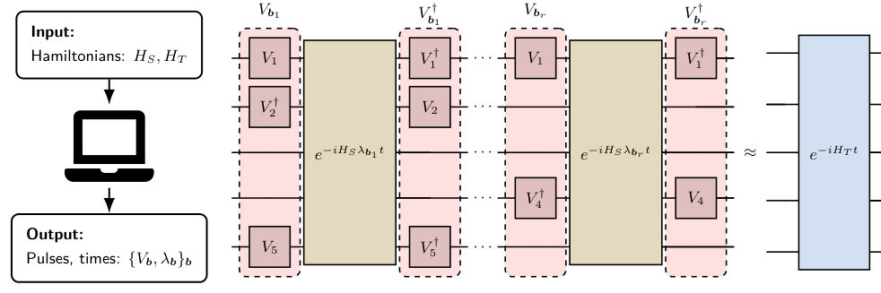
<figcaption class="paper-figure-caption"><b>Fig 1.</b> Figure 1. Schematic overview of the fermionic Hamiltonian engineering protocol. Given a description of a system HS and a target Hamiltonian HT , the algorithm runs in poly(n) time and returns local pulses Vb and quantum evolution times λb. This output is then used to construct the experimental implementation. Here the implementation is depicted using a quantum circuit for simplicity, where each line corresponds to a fermionic mode, but in general the framework is applicable to arbitrary geometries. The red boxes depict local unitaries from the set {1, Vj, V † j }, for mode j. The product of such local unitaries comprise a local pulse, shown here as vertical boxes with dashed borders. Using...</figcaption>
</figure>
<figure class="paper-figure-card">
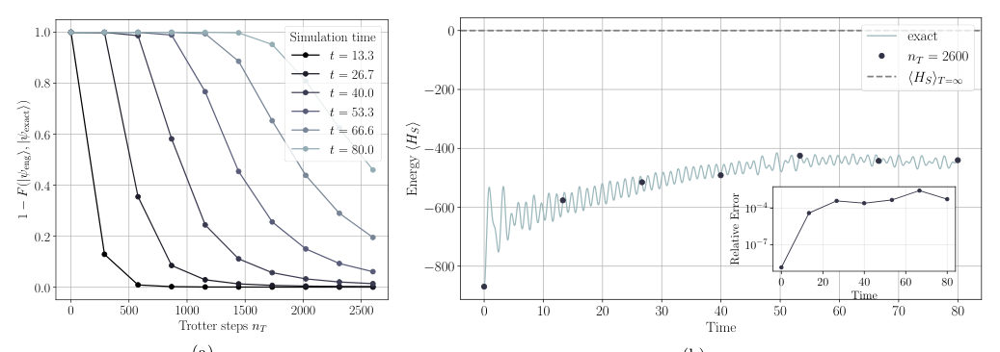
<figcaption class="paper-figure-caption"><b>Fig 2.</b> Figure 3. Numerical simulation of the Harper–Hofstadter dynamics on a 32 × 34 lattice with n = 1088 modes at half-filling N = 544. (a) Infidelity 1 −F(|ψeng⟩, |ψexact⟩) between the engineered state |ψeng⟩and the exact target state |ψexact⟩as a function of the number of Trotter steps. The engineered evolution converges to the exact evolution for a wide range of simulation times as the number of Trotter steps is increased. (b) The energy ⟨HS⟩of the time evolved state simulated exactly using direct exponentiation of the target Hamiltonian, and using the FHE method with nT = 2600 Trotter steps. The inset plot shows the evolution of the relative error |⟨HS⟩exact −⟨HS⟩eng|/|⟨HS⟩exact|. The dashed...</figcaption>
</figure>
<figure class="paper-figure-card">
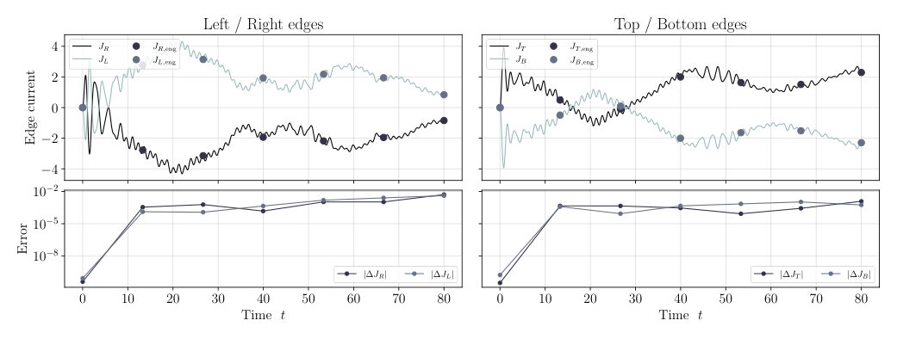
<figcaption class="paper-figure-caption"><b>Fig 3.</b> Figure 4. Numerical simulation of the edge currents for the Harper–Hofstadter model on a 32 × 34 lattice with 1088 modes at half-filling N = 544. The top plots show the edge currents for the four edges of the lattice as functions of time, where the solid lines correspond to exact evolution obtained by directly exponentiating the target Hamiltonian, and the dots correspond to the observables obtained through the engineered evolution with the number of Trotter steps set to nT = 2600. As expected, both the left-right and the top-bottom edges are seen to start with no edge current but then exhibit the signature chiral currents of the Harper–Hofstadter model. The bottom plots show the error...</figcaption>
</figure>
<figure class="paper-figure-card">
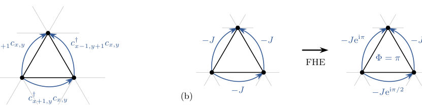
<figcaption class="paper-figure-caption"><b>Fig 4.</b> Figure 5. (a) The three nearest-neighbour tunnelling operators on a triangular lattice plaquette, with each arrow indicating the direction of hopping for one term in HS. (b) Fermionic Hamiltonian engineering on a triangular plaquette. The system Hamiltonian has uniform tunnelling coefficients (left), which the protocol maps to engineered coefficients with phases eiπ/2, eiπ, e−iπ/2 on the three bonds, producing a π-flux per plaquette (right). Labels indicate the coefficient of the directed hopping along each arrow.</figcaption>
</figure>
<figure class="paper-figure-card">
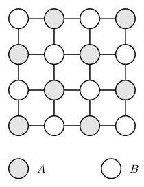
<figcaption class="paper-figure-caption"><b>Fig 5.</b> Figure 6. A 4 × 4 square lattice with a bipartition into A and B sublattices.</figcaption>
</figure>

**Summary.** The paper presents a novel framework for fermionic Hamiltonian engineering that allows researchers to simulate target Hamiltonians unattainable with the underlying quantum hardware. By interleaving free evolution under the system Hamiltonian with local unitary pulses, it achieves robust control over complex couplings, notably realizing arbitrary complex tunneling coefficients.

**Why it may be interesting.** This work provides a powerful, hardware-aware tool for simulating complex correlated electron physics by circumventing native Hamiltonian limitations, which is crucial for modeling high-Tc superconductivity.

Detailed structure

**Main problem.** The primary goal is to engineer effective time evolution under a desired target fermionic Hamiltonian ($H_T$) that may not be natively supported by the quantum hardware.

**Main result.** The framework successfully realizes arbitrary complex tunneling coefficients and simulates dynamics robustly, avoiding energy absorption issues associated with standard Floquet engineering techniques.

**Method.** It achieves this by conjugating free evolution under the native system Hamiltonian ($H_S$) with sequences of experimentally feasible local fermionic unitaries, optimized via a linear program.

**Model / system.** The method is applied to general fermionic quantum many-body systems, exemplified by the non-interacting Harper-Hofstadter model and interacting Fermi-Hubbard chains. The underlying physics relates to ultracold atoms in optical lattices.

**Key observables.** State fidelity ($F$), energy expectation value ($\langle H_S 
angle$), and bond currents ($\langle J_{kj} 
angle$).

**Important parameters / regimes.** The ratio of interaction strength to hopping parameter ($U/t$) can be tuned, and the engineering process is constrained by the connectivity of $H_S$.

**Assumptions / limitations.** The method assumes the existence of local fermionic unitaries that are experimentally feasible. It avoids continuous energy absorption inherent in standard Floquet driving.

**Figures summary.** Figures schematically illustrate the protocol, showing how local pulses modify time evolution under $H_S$ to approximate $e^{-iH_T t}$. Comparisons show convergence towards exact dynamics without heating.

**Paper structure.** The paper introduces the general framework using conjugation and optimization (LP). It then applies this to specific models like the Harper-Hofstadter model and the Fermi-Hubbard chain, detailing how local unitaries control hopping terms and interaction ratios.

Abstract

Quantum simulators enable the exploration of complex quantum phenomena in condensed-matter systems by reproducing their dynamics on controllable quantum devices. However, experimental constraints often restrict the class of Hamiltonians that can be realized natively. Hamiltonian engineering addresses this limitation by expanding the set of accessible target Hamiltonians from a fixed system Hamiltonian defined by the hardware. We introduce a new framework for fermionic Hamiltonian engineering based on conjugating free evolution under the system Hamiltonian with sequences of experimentally feasible local fermionic unitaries. The required sequences and free-evolution times are obtained efficiently via a linear program. By interleaving system evolution with these local unitaries, our method realizes effective time evolution under a broad class of target Hamiltonians, with intrinsic robustness to finite-pulse-time errors. In particular, we demonstrate that arbitrary complex tunnelling coefficients can be realized, constrained only by the connectivity of the underlying system Hamiltonian. We illustrate this capability by engineering the dynamics of the non-interacting Harper-Hofstadter model on a 1088-mode lattice and an interacting Fermi-Hubbard chain with complex tunnelling coefficients. By construction, our approach avoids the continuous energy absorption inherent to Floquet engineering.

[↑ back to top](#top)

### [Quantum Resources and Wigner Symmetry in Nucleon-Nucleon Scattering from Effective Field Theory](http://arxiv.org/abs/2606.17148v1)

**Authors:** Ian Low, Thomas R. Richardson, Sokratis Trifinopoulos  
**Type:** theory · **Category:** quantum information and computing · **PDF:** <https://arxiv.org/pdf/2606.17148v1>  
**Analysis basis:** full PDF text, analyzed in chunks
**Topic relevance:** 🔥 `entanglement & information structure` **4/5** · `Keldysh / 2PI / non-Gaussian methods` **1/5** · `analog quantum simulation` **1/5** · `correlated / nonlocal dissipation` **1/5** · `driven-dissipative phase transition` **1/5** · `methods for driven-dissipative` **1/5** · `non-equilibrium dynamics` **1/5**

↔ Scroll figures horizontally

<figure class="paper-figure-card">
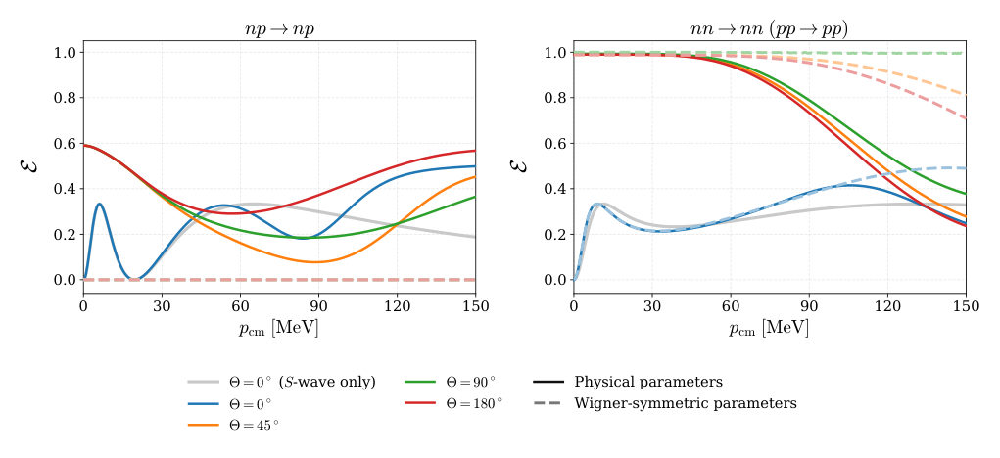
<figcaption class="paper-figure-caption"><b>Fig 1.</b> FIG. 1. Entanglement power E, Eq. (11), versus center-of-mass momentum for Θ = 0◦, 45◦, 90◦, 180◦in np →np (left) and nn →nn (right). Curves are colored by scattering angle. For each angle, colored solid lines use the physical ERE parameters and colored dashed lines use the Wigner-symmetric benchmark. The Θ = 0◦curves use the full S operator, while the nonforward curves use the normalized transition amplitude, as specified in Eq. (3). The solid light-gray curve is a forward reference using the physical ERE parameters and the full unitary S operator restricted to the S-wave sector; in the right panel this is the Pauli-restricted same-nucleon analogue, where antisymmetry removes the triplet S...</figcaption>
</figure>
<figure class="paper-figure-card">
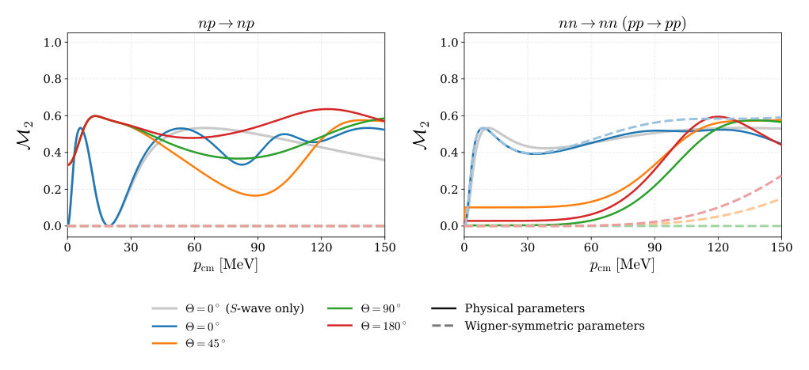
<figcaption class="paper-figure-caption"><b>Fig 2.</b> FIG. 2. Same as Fig. 1, but for the two-qubit-stabilizer-averaged magic power M2, Eq. (14). The light-gray curve uses the same stabilizer-average convention as Ref. [47].</figcaption>
</figure>
<figure class="paper-figure-card">
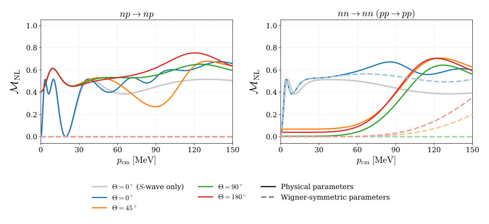
<figcaption class="paper-figure-caption"><b>Fig 3.</b> FIG. 3. Same as Fig. 1, but for the two-qubit-stabilizer-averaged non-local magic power MNL, Eq. (15). The light-gray curve uses the same stabilizer-average convention as Ref. [48].</figcaption>
</figure>

**Summary.** This work analyzes quantum resources like entanglement in low-energy nucleon-nucleon scattering using Effective Field Theory. It demonstrates that enhanced Wigner symmetry suppresses resource generation in $np$ scattering, while Pauli exclusion maintains it in $nn$ scattering. The study successfully connects fundamental symmetries and partial wave structure to measurable quantum information properties.

**Why it may be interesting.** It provides a concrete physical system (nuclear scattering) where fundamental symmetries dictate the capacity for generating non-classical correlations, linking nuclear structure theory to quantum information diagnostics.

Detailed structure

**Main problem.** The study investigates how quantum resources, such as entanglement and magic power, are generated during low-energy nucleon-nucleon scattering.

**Main result.** Wigner's SU(4) symmetry causes the neutron-proton amplitude to generate no new quantum resources, while the identical-nucleon channel remains resource-generating due to Pauli exclusion constraints.

**Method.** The authors calculate resource measures (entanglement power, magic power) by analyzing the scattering operator acting on spin qubits within the framework of pionless effective field theory.

**Model / system.** The system is low-energy nucleon-nucleon ($	ext{NN}$) scattering ($np$ and $nn$) analyzed using next-to-leading order pionless Effective Field Theory ($	ext{EFT}_{\pi/	ext{}}$). Spin degrees of freedom are treated as qubits.

**Key observables.** Entanglement power, stabilizer magic power, non-local magic power, and partial wave couplings ($A(L	ext{State})$).

**Important parameters / regimes.** Low center-of-mass momentum ($p$), scattering angle ($\Theta$), and EFT parameters like scattering lengths and effective ranges.

**Assumptions / limitations.** The analysis extends previous studies to include P-waves (NLO in $	ext{EFT}_{\pi/	ext{}}$) and compares physical results against the idealized Wigner SU(4) symmetry limit.

**Figures summary.** Figures compare entanglement power ($E$) and magic power ($\mathcal{M}$) for $np 	o np$ and $nn 	o nn$ channels, contrasting physical predictions (solid lines) with Wigner-symmetric benchmarks (dashed lines).

**Paper structure.** The paper systematically develops the resource measures within EFT, analyzes the impact of Wigner symmetry on partial wave couplings, and compares the resulting quantum resource generation in the $np$ vs. $nn$ channels.

Abstract

We study quantum resources in the spin degrees of freedom, such as entanglement, stabilizer magic, and non-local magic, in low-energy nucleon-nucleon scattering through next-to-leading order in pionless effective field theory. Treating each nucleon spin as a qubit, we calculate the corresponding resource-generating powers of the scattering operator at generic center-of-mass momentum and scattering angle $Θ$. The analysis retains $S$- and $P$-wave channels generated by two-derivative contact interactions. When the microscopic physics exhibits Wigner's $SU(4)$ spin-flavor symmetry, the neutron-proton amplitude becomes proportional to the spin-space identity operator and therefore generates no new resources after scattering, extending an observation previously made for leading-order $S$-wave scattering. The same-nucleon channel remains resource-generating because constraints from identical particles project out part of the Hilbert space. These results show how enhanced symmetries, partial-wave structure, and resource generation are intertwined in low-energy two-body scattering.

[↑ back to top](#top)

### [From Period Finding to Lattice Sampling: Experimental Insights into Shor's and Regev's Factoring Algorithms](http://arxiv.org/abs/2606.17647v1)

**Authors:** Daniela Falcó, Arturo Rodríguez, Guillermo Rivas, Ricardo S. Alonso  
**Type:** experiment · **Category:** quantum information and computing · **PDF:** <https://arxiv.org/pdf/2606.17647v1>  
**Analysis basis:** full PDF text, analyzed in chunks
**Topic relevance:** 🔥 `QC/QI experiment` **4/5** · `entanglement & information structure` **2/5** · `quantum measurements` **1/5**

↔ Scroll figures horizontally

<figure class="paper-figure-card">
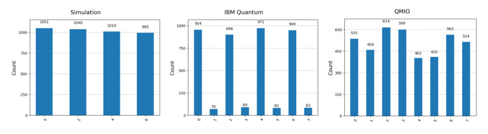
<figcaption class="paper-figure-caption"><b>Fig 1.</b> Figure 1: Measurement distributions for Shor’s algorithm (N = 15, a = 2, k = 3). From left to right: ideal simulation, IBM Quantum hardware results, and QMIO hardware results. The ideal distribution exhibits well-defined peaks corresponding to the order r = 4. On real hardware, noise and decoherence progressively broaden and flatten the distribution, with a more pronounced loss of spectral structure observed on the QMIO device.</figcaption>
</figure>
<figure class="paper-figure-card">
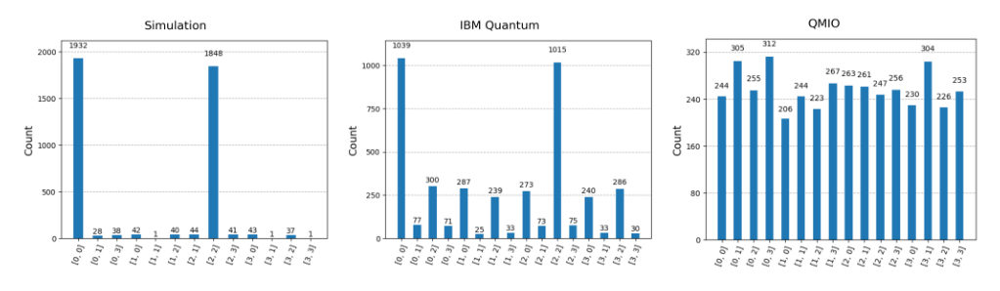
<figcaption class="paper-figure-caption"><b>Fig 2.</b> Figure 2: Measurement distributions for Regev’s factoring algorithm (N = 15, d = 2). From left to right: ideal simulation, IBM Quantum hardware results, and QMIO hardware results. In the ideal case, the distribution exhibits a small set of dominant outcomes consistent with approximate dual lattice sampling. On real hardware, noise and decoherence lead to a more dispersed distribution, with a stronger dilution of geometric structure observed on the QMIO device.</figcaption>
</figure>

**Summary.** This paper experimentally compares Shor's and Regev's quantum factoring algorithms on real NISQ hardware to understand their practical viability. By analyzing measurement distributions using entropy and support size metrics, the authors quantify how hardware noise degrades the distinct information structures required by each algorithm. The results highlight a trade-off between signal concentration and distribution robustness in the current noisy computing era.

**Why it may be interesting.** The comparison of information encoding strategies (1D concentration vs. higher-D lattice sampling) under realistic hardware noise provides critical benchmarks for designing fault-tolerant quantum algorithms.

Detailed structure

**Main problem.** The study compares the experimental performance and robustness of Shor's quantum factoring algorithm against Regev's alternative on current noisy quantum hardware.

**Main result.** While neither algorithm shows a practical advantage for small numbers (N=15), the analysis quantifies how noise degrades information structure, showing distinct failure modes based on whether the required signal is highly concentrated (Shor) or distributed across multiple dimensions (Regev).

**Method.** The authors execute both algorithms on real NISQ quantum processors (QMIO, IBM Quantum) and compare measurement statistics against ideal simulations using quantitative metrics like Shannon Entropy, Effective Support Size, and Top-K Mass.

**Model / system.** The work uses superconducting or trapped-ion based quantum hardware operating in the Noisy Intermediate Scale Quantum (NISQ) regime. The core computation involves implementing modular exponentiation circuits for factoring N=15.

**Key observables.** Shannon Entropy ($H(p)$), Effective Support Size ($	ext{Neff}(p)$), and Top-K Mass ($	ext{M}_4(p)$) derived from measurement probability distributions.

**Important parameters / regimes.** Factoring modulus N=15; quantum hardware backends (QMIO, IBM Quantum); circuit depth and noise levels.

**Assumptions / limitations.** The success of classical post-processing is directly linked to the measurable concentration or distribution structure in the measurement outcomes; the comparison abstracts away from general arithmetic circuit depth issues.

**Figures summary.** Figure 1 visually compares measurement distributions for Shor's algorithm across Ideal, IBM Quantum, and QMIO conditions, showing peak broadening. Figure 2 similarly illustrates dispersion for Regev's algorithm on different backends.

**Paper structure.** The paper reviews quantum factoring algorithms (Shor vs. Regev), details the experimental setup using Qiskit on multiple hardware backends, presents quantitative analysis using distribution metrics ($H, 	ext{Neff}, M_4$), and concludes by comparing the noise-induced degradation profiles.

Abstract

Quantum algorithms for integer factorization represent one of the most prominent applications of quantum computation, with far-reaching implications for modern cryptography. While Shor's algorithm provides a polynomial-time solution in the ideal quantum model, its practical implementation is severely constrained by the limitations of current noisy intermediate-scale quantum (NISQ) hardware. These constraints have motivated the exploration of alternative factoring algorithms with different structural and resource trade-offs.   In this work, we present an experimental study of Regev's quantum factoring algorithm, implemented on real quantum hardware, and compare its behavior with that of Shor's algorithm under analogous conditions. Focusing on the case N = 15, we execute both algorithms on the QMIO quantum computer at the Centro de Supercomputacion de Galicia (CESGA) and contrast the results with one of IBM's open-access quantum computers and ideal simulations. This parallel execution enables a low-level comparison of the two algorithms, highlighting how their respective quantum implementations interact with hardware noise, limited circuit depth, and finite sampling.   Our analysis emphasizes the different ways in which Shor's and Regev's algorithms encode arithmetic structure into quantum states through Fourier sampling in one and higher dimensions, respectively, and how these differences manifest in experimental outcomes. Although neither algorithm demonstrates a practical advantage in the small N regime, the results provide insight into their relative robustness and failure modes on contemporary quantum devices. This study illustrates the value of experimental benchmarking of alternative quantum factoring algorithms as a means of understanding the practical implications of algorithmic design choices in the NISQ era.

[↑ back to top](#top)

### [Pulse-optimised circuit elements for scalable and noise-resilient quantum chemistry](http://arxiv.org/abs/2606.17357v1)

**Authors:** Henrik Gothen, Christopher K. Long, Djamila Hiller, Yunming Qian, Crispin H. W. Barnes, Normann Mertig, David R. M. Arvidsson-Shukur  
**Type:** both · **Category:** quantum information and computing · **PDF:** <https://arxiv.org/pdf/2606.17357v1>  
**Analysis basis:** full PDF text, analyzed in chunks
**Topic relevance:** 🔥 `QC/QI experiment` **4/5** · `analog quantum simulation` **1/5** · `exotic spin models in light-matter` **1/5** · `spintronics-quantum-optics interface` **1/5**

↔ Scroll figures horizontally

<figure class="paper-figure-card">
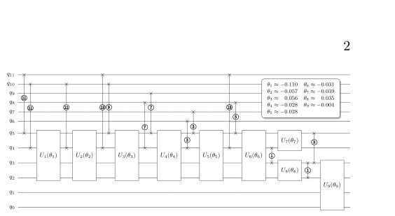
<figcaption class="paper-figure-caption"><b>Fig 1.</b> Figure 1. VQE circuit to prepare an estimate of the LiH ground state. Starting from a 12-qubit Hartree– Fock state, the circuit uses SWAP operations and single- and double-qubit excitations [Eqs. (3) and (4)] to approximate the groundstate of LiH. A classical optimiser is used to fine-tune the excitation strength (θi) of the circuit elements. The cir- cled numbers on the SWAP operations indicate the number of nearest-neighbour SWAP operations required in a linear architecture. The circuit was constructed using numerical simulations of the QEB-ADAPT-VQE algorithm [12].</figcaption>
</figure>
<figure class="paper-figure-card">
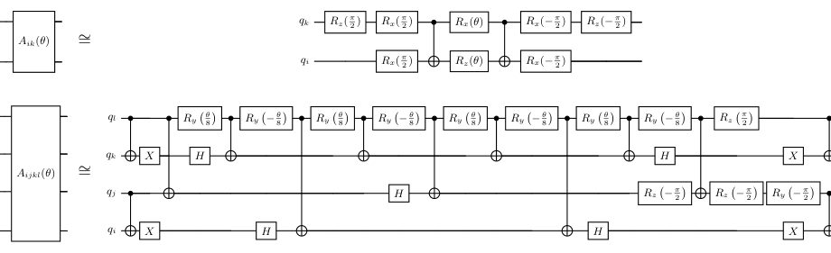
<figcaption class="paper-figure-caption"><b>Fig 2.</b> Figure 2. Decomposition of qubit-excitation elements into primitive gates. The top panel displays the circuit for a single-qubit excitation; the bottom panel displays the circuit for a double-qubit excitation [12]. The qubit-excitation elements require 10 and 34 gates, respectively.</figcaption>
</figure>
<figure class="paper-figure-card">
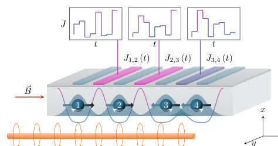
<figcaption class="paper-figure-caption"><b>Fig 3.</b> Figure 3. Schematic of a silicon MOS device. Single- electron spin-qubits (arrows) are confined in Si (light grey) by potential wells (solid curve) created by plunger (semitranspar- ent blue) and barrier gates, also called J-gates (purple/pink) on top of an SiOx layer (dark grey). The J-gates control the potential barriers between electrons, and thus, the exchange interactions. The electrons’ spatial wavefunctions are shown as blue shaded bell curves. Each electron spin is subject to a static, external, magnetic field. A time-dependent magnetic field can be generated by a microwave antenna (orange). The white arrows illustrate the action of the double-qubit excita- tion.</figcaption>
</figure>
<figure class="paper-figure-card">
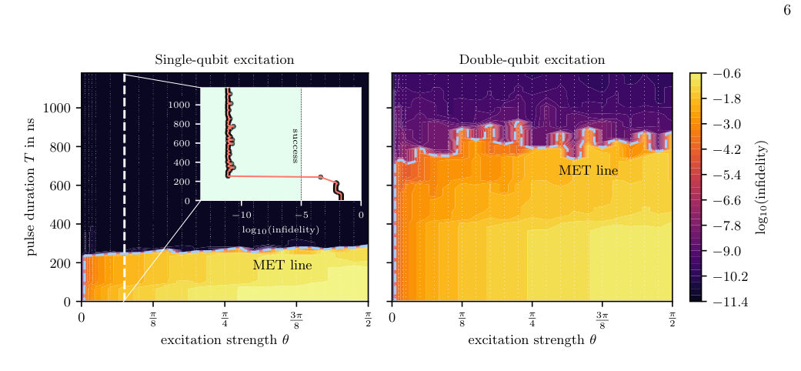
<figcaption class="paper-figure-caption"><b>Fig 4.</b> Figure 4. Performance of pulse-based qubit excitations. Infidelity of a single- (left) and double- (right) qubit excitation plotted as a function of excitation strength θ and pulse duration T. Dark regions indicate (θ, T)-combinations for which we found low-infidelity pulses that approximate a qubit-excitation well. Lighter colours indicate regions of high infidelity, where we were unable to find pulses that approximate qubit excitations. The blue dashed line (where the infidelity equals 10−5) marks the transition between these regions. The inset highlights a vertical cut through our data. Each black dot represents the outcome of the most successful pulse simulation at a fixed T. At large...</figcaption>
</figure>
<figure class="paper-figure-card">
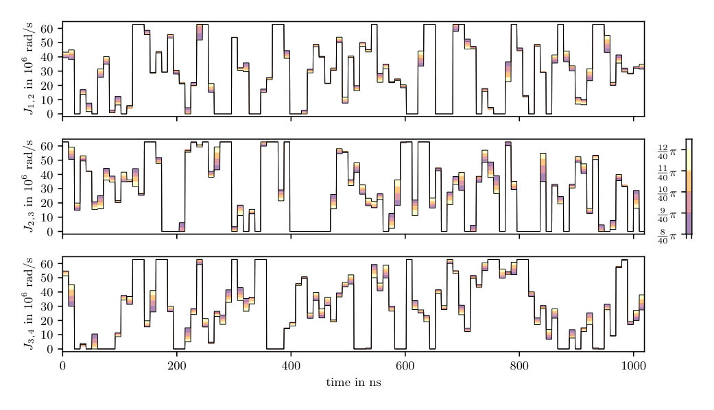
<figcaption class="paper-figure-caption"><b>Fig 5.</b> Figure 5. Pulse shape vs pulse strength. The optimised pulse shapes of double-qubit excitations are plotted for five excitation strengths θ in the interval [ 8</figcaption>
</figure>

**Summary.** The paper presents a novel technique using pulse engineering to drastically speed up fundamental circuit operations required for Variational Quantum Eigensolver (VQE) calculations. By optimizing hardware-specific pulses instead of relying on standard gate sequences, the authors achieve significant run-time reductions (up to 15x). This advancement makes quantum chemistry simulations more feasible and robust against noise on near-term silicon spin-qubit processors.

**Why it may be interesting.** This work directly addresses the practical implementation gap in quantum chemistry by providing a concrete, hardware-aware method to accelerate crucial computational steps on solid-state qubits, which is highly relevant for AMO physicists studying open quantum systems dynamics.

Detailed structure

**Main problem.** Current quantum chemistry calculations are limited by slow algorithmic runtimes on near-term quantum processors.

**Main result.** The authors demonstrated that pulse engineering can accelerate qubit excitations for VQE elements by up to a factor of 15.3 compared to conventional gate-based methods, leading to more noise-robust simulations.

**Method.** They developed a methodology using gradient-ascent pulse engineering (GRAPE) to construct hardware-tailored pulses that directly implement required quantum circuit elements, bypassing full circuit optimization.

**Model / system.** The work is applied to simulating molecular energy levels using the Variational Quantum Eigensolver (VQE) on a silicon spin-qubit quantum processor. The underlying physics involves electron spin qubits governed by Heisenberg chain Hamiltonians.

**Key observables.** Execution times for single- and double-qubit excitations, infidelity ($I$), Minimum Evolution Time ($	ext{MET}$), and the acceleration factor compared to gate-based methods.

**Important parameters / regimes.** Excitation strength ($	heta$), pulse duration ($T$), coherence time ($T_2^* \approx 100 \mu	ext{s}$), and target infidelity threshold ($\epsilon$).

**Assumptions / limitations.** The methodology assumes that high-fidelity pulses for various excitation strengths can be obtained by interpolating between pre-optimized pulse shapes.

**Figures summary.** Figures illustrate the decomposition of required excitations into primitive gates, compare gate-based vs. pulse-based execution times (showing large speedups), and map out the Minimum Excitation Time ($	ext{MET}$) as a function of excitation strength and time.

**Paper structure.** The paper first identifies the runtime bottleneck in VQE for quantum chemistry. It then proposes using gradient-ascent pulse engineering to create efficient, hardware-tailored pulses for fundamental qubit excitations (single/double). The core is the numerical demonstration comparing these optimized pulses against standard gate sequences, concluding with scalability analysis.

Abstract

Useful chemistry calculations on near-term quantum processors are hindered by current algorithmic runtimes. We develop a methodology to significantly reduce these runtimes. Typically, variational quantum eigensolver (VQE) algorithms are implemented as sequences of primitive gates. Our methodology instead relies on gradient-ascent pulse engineering to construct hardware-tailored pulses for the direct implementation of VQEs. As problem sizes increase, it quickly becomes intractable to optimise a pulse that implements an entire VQE ansatz circuit. However, leading VQEs are constructed in a modular fashion. A problem-tailored VQE is assembled from parameterised circuit elements that simulate hopping between two or four electronic spin orbitals. We show that these circuit elements can be implemented more efficiently using hardware-tailored pulses. We numerically demonstrate our methodology on a silicon spin-qubit quantum processor. We find that common circuit elements, known as single- and double-qubit excitations, can be implemented in less than 289 ns and 927 ns, respectively. Compared with conventional gate-based implementations, our pulse-accelerated qubit excitations provide a scalable approach for faster and therefore more noise-robust quantum chemistry simulations by reducing VQE runtimes by up to a factor of 15.3.

[↑ back to top](#top)

### [Average entropy of Bogoliubov-Kubo-Mori random state ensemble](http://arxiv.org/abs/2606.17960v1)

**Authors:** Sohail, Lu Wei  
**Type:** theory · **Category:** quantum information and computing · **PDF:** <https://arxiv.org/pdf/2606.17960v1>  
**Analysis basis:** full PDF text, analyzed in chunks
**Topic relevance:** 🔥 `entanglement & information structure` **4/5** · `Keldysh / 2PI / non-Gaussian methods` **1/5**

↔ Scroll figures horizontally

<figure class="paper-figure-card">
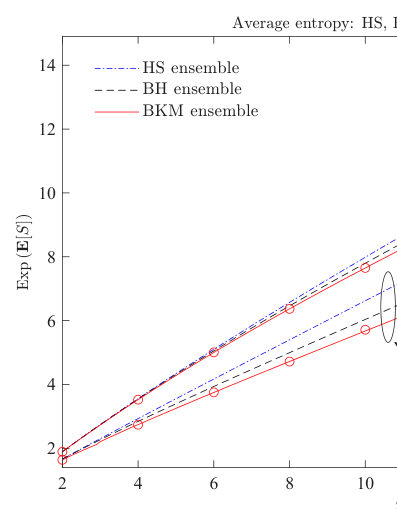
<figcaption class="paper-figure-caption"><b>Fig 1.</b> Fig. 1 Average entropy comparison: the dash-dot lines, dash lines, and solid lines are respectively drawn using exact formulas of HS ensemble in (A5), BH ensemble in (A8), and BKM ensemble in (10). The circles represent numerical simulations of BKM ensemble.</figcaption>
</figure>

**Summary.** This work develops a theoretical framework to calculate the average entanglement entropy for various random state ensembles, focusing on the Bogoliubov-Kubo-Mori (BKM) ensemble. By deriving an exact formula based on spectral moments and special functions, the authors establish quantitative relationships between different measures of quantum randomness. This advances the understanding of how geometric metrics influence entanglement quantification in quantum systems.

**Why it may be interesting.** The rigorous mathematical derivation of entanglement measures for random states, especially using advanced tools like polygamma functions, provides quantitative benchmarks for quantum information theory.

Detailed structure

**Main problem.** The study focuses on deriving an exact, explicit formula for the average entanglement entropy of a random state ensemble induced using the Bogoliubov-Kubo-Mori (BKM) metric.

**Main result.** An exact formula for the average entanglement entropy $\mathbb{E}[S]$ over the BKM ensemble is derived, showing it generates the least average entropy among compared ensembles for finite dimensions.

**Method.** The calculation involves deriving average spectral moments ($\mathbb{E}[R_l]$) using properties of the unconstrained ensemble and relating the average entropy $\mathbb{E}[S]$ to an induced entropy $\mathbb{E}[T]$ via a specific lemma involving polygamma functions.

**Model / system.** The system is a bipartite quantum system described by an $m \times m$ density matrix $\rho$, and the entanglement measure used is the von Neumann entropy, $S = -\text{tr}(\rho \ln \rho)$. The analysis compares three random state ensembles: BKM, Hilbert-Schmidt (HS), and Bures-Hall (BH).

**Key observables.** Average entanglement entropy ($\mathbb{E}[S]$) and average spectral moments ($\mathbb{E}[R_l]$).

**Important parameters / regimes.** System dimension ($m$), parameter $\alpha$, and the related constant $\beta$.

**Assumptions / limitations.** The derivation of $\mathbb{E}[R_l]$ relies only on the density function without using its correlation kernel, which is noted as a technical advance.

**Figures summary.** Figure 1 compares the calculated average entropy for HS, BH, and BKM ensembles against numerical simulation results.

**Paper structure.** The paper builds by first establishing the framework of random state ensembles, deriving the normalization constant $C(\alpha)$ using Wronskian structure, calculating the average spectral moments $\mathbb{E}[R_l]$, and finally presenting the explicit formula for the average induced entropy $\mathbb{E}[T]$ (and thus $\mathbb{E}[S]$).

Abstract

Random states play a foundational role in different branches of modern quantum science. In this work, we study a recently proposed random state ensemble induced from von Neumann entropy through the Bogoliubov-Kubo-Mori (BKM) metric. In particular, we derive an exact yet explicit formula of average entanglement entropy over BKM ensemble. In obtaining the formula, we only make use of properties of normalization constant of the ensemble in the absence of its correlation kernel, contrary to average entropy computation of other ensembles. This new framework paves the way for calculating higher-order cumulants of BKM ensemble beyond the average.

[↑ back to top](#top)

### [Coherent Control of an Embedded Bound State Without a Spectral Gap](http://arxiv.org/abs/2606.17685v1)

**Authors:** Yue Chang  
**Type:** theory · **Category:** other · **PDF:** <https://arxiv.org/pdf/2606.17685v1>  
**Analysis basis:** full PDF text, analyzed in chunks
**Topic relevance:** `analog quantum simulation` **3/5** · `correlated cavity matter` **3/5** · `driven-dissipative phase transition` **3/5** · `methods for driven-dissipative` **3/5** · `Tavis-Cummings & cavity-many-emitter` **2/5** · `non-equilibrium dynamics` **2/5** · `Keldysh / 2PI / non-Gaussian methods` **1/5** · `correlated / nonlocal dissipation` **1/5** · `non-equilibrium universality` **1/5**

↔ Scroll figures horizontally

<figure class="paper-figure-card">
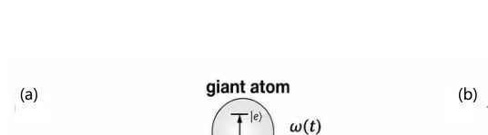
<figcaption class="paper-figure-caption"><b>Fig 1.</b> FIG. 1. Two-knob temporal control of a giant-atom BIC. (a) A two-level giant atom couples to a one-dimensional waveguide at two spatially separated points z1 and z2, with separation d = z2 −z1. For the BIC, the photonic component is confined between the two coupling points. The coupling strength V (t) and the atomic frequency ω(t) provide independent control knobs. (b) Control protocol. Detuning modulation ω(t) dynamically breaks and restores the destructive-interference condition, enabling capture of an incoming single-photon wavepacket into the BIC and release into an outgoing photon. Coupling modulation V (t), in contrast, preserves the BIC condition and adiabatically reshapes the stored...</figcaption>
</figure>
<figure class="paper-figure-card">
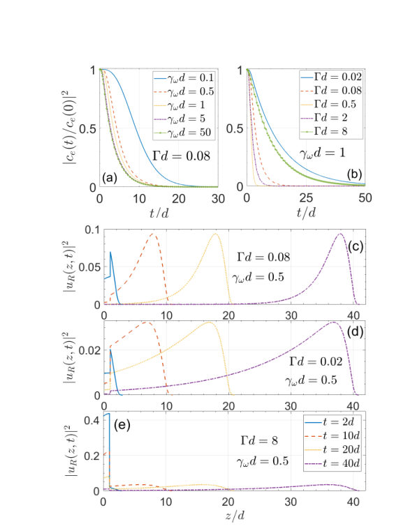
<figcaption class="paper-figure-caption"><b>Fig 2.</b> FIG. 2. Release of the BIC by detuning modulation. (a) Decay of the normalized atomic population |ce (t) /ce(0)|2 for different detuning ramp rates γω, with fixed atom-waveguide coupling Γd = 0.08. (b) Decay of |ce (t) /ce(0)|2 for different coupling strengths Γ, with fixed ramp rate γωd = 1. The release is nonmonotonic in Γ because stronger coupling en- hances both radiative emission and delayed feedback from the confined photonic component. (c)-(e) Right-propagating out- put intensity |uR (z, t)|2 at different times, for fixed γωd = 0.5 and several values of Γ. At long times, after the stored exci- tation has been fully emitted into the waveguide, the output field becomes continuous.</figcaption>
</figure>
<figure class="paper-figure-card">
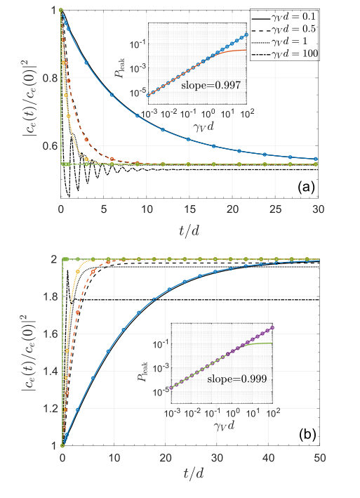
<figcaption class="paper-figure-caption"><b>Fig 3.</b> FIG. 3. Adiabatic control of the BIC. (a),(b) Normal- ized atomic population |ce(t)/ce(0)|2 during coupling mod- ulation V (t) = V0 + ∆V (1 −e−γV t), for (a) ∆V √</figcaption>
</figure>

**Summary.** This paper presents a method to coherently control an embedded bound state (BIC) in a giant atom coupled to a waveguide, overcoming the limitation that BICs lack spectral gap protection. By employing two temporal control knobs—frequency and coupling modulation—the authors show that deterministic single-photon memory operation is possible through adiabatic evolution, with leakage scaling linearly rather than quadratically with the ramp rate.

**Why it may be interesting.** This work directly addresses fundamental issues in open quantum systems by providing a robust protocol to manipulate dark states (BICs) without relying on the standard protection mechanism of spectral gaps, which is highly relevant for photonic quantum information processing.

Detailed structure

**Main problem.** The challenge is achieving coherent control of an embedded bound state (BIC) that lacks a spectral gap, which limits its use as a reliable quantum memory in open photonic systems.

**Main result.** The authors demonstrate that adiabatic control is possible even without a spectral gap, showing the intrinsic leakage probability scales linearly with the ramp rate ($	ext{P}_{	ext{leak}} \propto \gamma$).

**Method.** The study uses theoretical modeling involving time-dependent Hamiltonian evolution and analyzing nonadiabatic coupling effects in waveguide QED.

**Model / system.** The system is a minimal two-point giant atom coupled to a bidirectional one-dimensional photonic waveguide. Control is achieved by modulating the atomic frequency ($\omega(t)$) or the atom-waveguide coupling strength ($V(t)$).

**Key observables.** Normalized atomic population $|c_e(t)/c_e(0)|^2$ and outgoing right-propagating photonic intensities $|	ilde{u}_R(z, t)|^2$.

**Important parameters / regimes.** The ramp rate ($\gamma$) of the control knobs (detuning or coupling modulation) is critical; the linear scaling $	ext{P}_{	ext{leak}} \propto \gamma$ is key.

**Assumptions / limitations.** The analysis relies on treating nonadiabatic coupling perturbatively and assumes perfect mode-matching for initial photon capture.

**Figures summary.** Figures illustrate the two-knob control mechanism, showing atomic population decay rates versus detuning ramp rate ($\gamma\omega$) or coupling strength ($\Gamma$), and demonstrating the outgoing photonic wavefunctions' dependence on $\Gamma$.

**Paper structure.** The paper introduces the BIC system and its limitations. It then details using two temporal control knobs—atomic-frequency modulation for capture/release, and coupling modulation for gapless tuning. The core results focus on proving adiabaticity despite the lack of a spectral gap.

Abstract

Bound states in the continuum (BICs) can confine photonic excitations in open systems without conventional cavities or band gaps, making them natural candidates for long-lived quantum storage and single-photon control. Their use is limited, however, by two obstacles: they are dark to incident photons, and they lack spectral-gap protection from the surrounding continuum. We overcome both limitations in a giant atom coupled to a one-dimensional waveguide using two temporal control knobs. Atomic-frequency modulation breaks and restores the destructive-interference condition, enabling deterministic capture and release of mode-matched single photons. Coupling modulation instead preserves the BIC condition while tuning the atomic and photonic weights of the stored state. A key result is that this embedded state can nevertheless be controlled adiabatically despite the absence of a spectral gap, with an intrinsic leakage probability linear in the ramp rate. By separating radiative access from BIC-preserving deformation, the protocol turns a dark BIC into a single-photon memory whose fidelity is set by the intrinsic continuum-induced leakage law, providing a route to embedded-state control in open photonic platforms.

[↑ back to top](#top)

### [Finite and disordered Kitaev chains: a large deviation study](http://arxiv.org/abs/2606.17881v1)

**Authors:** Clément Fortin, Kai Wang, Tami Pereg-Barnea  
**Type:** theory · **Category:** disordered systems and neural networks · **PDF:** <https://arxiv.org/pdf/2606.17881v1>  
**Analysis basis:** full PDF text, analyzed in chunks
**Topic relevance:** `analog quantum simulation` **3/5** · `methods for driven-dissipative` **3/5** · `Keldysh / 2PI / non-Gaussian methods` **2/5** · `driven-dissipative phase transition` **2/5** · `non-equilibrium universality` **2/5** · `Kondo & dissipative impurity` **1/5** · `correlated / nonlocal dissipation` **1/5** · `entanglement & information structure` **1/5** · `exotic spin models in light-matter` **1/5** · `non-equilibrium dynamics` **1/5**

↔ Scroll figures horizontally

<figure class="paper-figure-card">
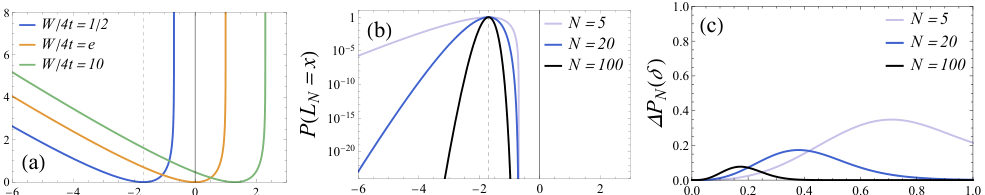
<figcaption class="paper-figure-caption"><b>Fig 1.</b> FIG. 1: (a) The rate function of the MZM’s Lyapunov exponent in the static fermionic Kitaev chain at t = ∆for different disorder strengths W of the chemical potentials µn. The disorder distribution is uniform in [0, W]. The topological phase transition happens at W/4t = e when the minimum of I(x) sits at x = 0. (b) LDP approximation of the probability distribution of the MZM’s Lyapunov exponent LN = x at t = ∆when W/4t = 1/2 for different system sizes. (c) Asymmetric measure of the distributions in (b) as a function of distance δ from the maximum L∞ of the distributions, see Eq. (10). The dashed lines in (a)-(b) are at the thermodynamic value x = L∞.</figcaption>
</figure>
<figure class="paper-figure-card">
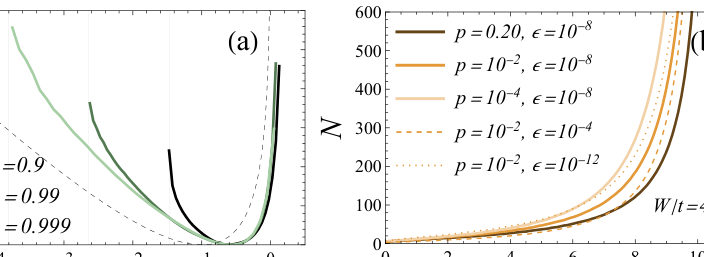
<figcaption class="paper-figure-caption"><b>Fig 2.</b> FIG. 2: (a) Numerical estimation of the rate function governing the fluctuations of the MZM’s Lyapunov exponent for different values of ∆/t. To estimate I(x), we generate 107 disordered Kitaev chains of N = 5 sites with uniformly sampled chemical potentials µn ∈[−W/2, W/2] and W/t = 4. We extract the Lyapunov exponent of each chain from the largest singular value σ1 of the matrix product T A 5 · · · T A 1 (where T A n is defined in Eq. (5)) by setting LN = 1 N ln(σ1). We bin the values of LN and normalize the resulting histogram. We estimate the value of the rate function in each of these bins xi of height P(xi) as I(xi) = −1</figcaption>
</figure>
<figure class="paper-figure-card">
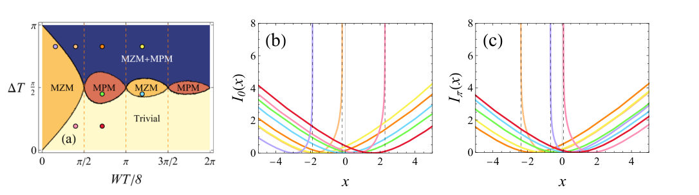
<figcaption class="paper-figure-caption"><b>Fig 3.</b> FIG. 3: (a) Topological phase diagram for the driven Kitaev chain at t = ∆with disordered chemical potentials uniformly sampled µn ∈[−W/2, W/2] and infinite system size N →∞. The chain hosts an MZM (MPM) when the Lyapunov exponent L(0) ∞&lt; 0 (L(π) ∞&lt; 0). The topological phase is thus determined by looking at which of L(0/π) ∞ in Eq. (14) is negative. For numerical purposes, we took a system size of N = 105 sites. The orange vertical dashed lines correspond to WT/8 = nπ/2. (b)–(c) The rate functions of the Lyapunov exponents computed numerically at parameter values corresponding to the colored points in (a) for the MZM (b) and the MPM (c). When WT/8 &gt; π/2, the rate functions I(0/π) lose their...</figcaption>
</figure>
<figure class="paper-figure-card">
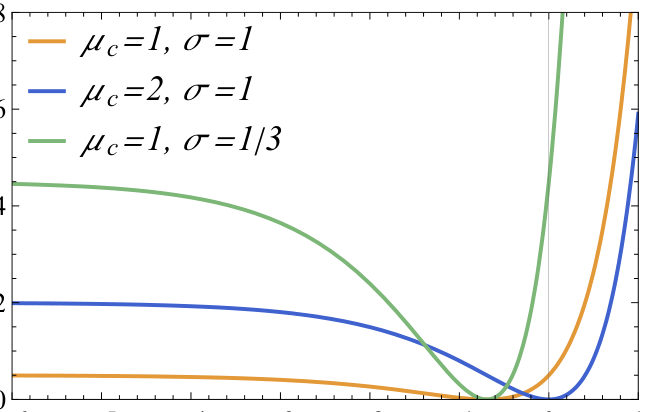
<figcaption class="paper-figure-caption"><b>Fig 4.</b> FIG. 1: Rate function given in Eq. (24) of the Lyapunov exponent LN when the chemical potentials are distributed according to the Gaussian N(µc, σ2) for different values of mean µc and standard deviation σ.</figcaption>
</figure>

**Summary.** This work applies Large Deviations Theory to analyze the fluctuations of Lyapunov exponents governing Majorana edge modes in disordered Kitaev chains. The key finding is that these fluctuations exhibit a measurable asymmetry, which grants an additional protection mechanism to topological states against disorder. This provides new theoretical tools for assessing the stability and required size of quantum devices based on topological properties.

**Why it may be interesting.** The discovery of an inherent fluctuation asymmetry that enhances topological protection is a powerful theoretical result for understanding robustness in quantum materials, providing quantitative metrics beyond simple phase diagrams.

Detailed structure

**Main problem.** The study investigates finite-size effects of topologically protected edge states, specifically analyzing fluctuations beyond the Central Limit Theorem in disordered quantum chains.

**Main result.** The fluctuation statistics of the Lyapunov exponent are found to be fundamentally asymmetric, providing an additional protection mechanism for topological edge states against disorder strength.

**Method.** The analysis heavily relies on Large Deviations Theory (LDT) to derive rate functions ($I(x)$) that characterize the probability decay of deviations from the mean Lyapunov exponent.

**Model / system.** The primary model is the disordered Kitaev chain, analyzed in both static and periodically driven regimes. The system supports Majorana zero modes (MZMs) at its edges.

**Key observables.** Lyapunov exponent ($L_N$), Rate Function ($I(x)$), Asymmetry measure ($\Delta P_N(\delta)$), Minimum required system size ($N$).

**Important parameters / regimes.** Disorder strength ($W$), System size ($N$), Coupling constants ($t, \Delta$), Driving frequency ($\Omega$ or $T$).

**Assumptions / limitations.** The disorder potentials ($\mu_n$) are assumed to be independent and identically distributed (i.i.d.), and the analysis often relies on power-law behavior of the probability density function near specific points.

**Figures summary.** Figures illustrate the rate function $I(x)$ showing characteristic asymmetries, phase diagrams mapping MZM/MPM hosting regions based on Lyapunov signs, and plots detailing how asymmetry is suppressed or restored by changing parameters like disorder strength ($W$) relative to critical values.

**Paper structure.** The paper progresses from establishing the general framework using LDT for Lyapunov exponents in disordered systems. It then applies this theory sequentially to the static Kitaev chain, followed by the driven (Floquet) Kitaev chain, analyzing how asymmetry arises and changes based on disorder strength relative to driving parameters.

Abstract

Topological edge states are celebrated for their robustness against disorder, yet the interplay between disorder and system size remains poorly understood. We use large deviations theory as a framework to study finite-size effects beyond the central limit theorem. We analyze Lyapunov exponent fluctuations in the static and periodically driven disordered Kitaev chain and find an asymmetry in the large deviations statistics that makes stronger edge localizations of Majorana zero modes exponentially more likely than weaker ones. We demonstrate that this fluctuation asymmetry is not tied to the topological phase. This asymmetry endows topological edge states with an additional protection against disorder and persists across a broad class of disorder distribution. We show how to use our framework to find the minimum system size required to satisfy topological quantum computing constraints.

[↑ back to top](#top)

### [Post-Selection Probability and Fidelity of Bidirectional Teleportation](http://arxiv.org/abs/2606.17251v1)

**Authors:** Ning Sun, Lei Feng, Pengfei Zhang  
**Type:** theory · **Category:** quantum information and computing · **PDF:** <https://arxiv.org/pdf/2606.17251v1>  
**Analysis basis:** full PDF text, analyzed in chunks
**Topic relevance:** `entanglement & information structure` **3/5** · `non-equilibrium dynamics` **3/5** · `analog quantum simulation` **2/5** · `methods for driven-dissipative` **2/5** · `non-equilibrium universality` **2/5** · `Keldysh / 2PI / non-Gaussian methods` **1/5** · `correlated / nonlocal dissipation` **1/5** · `driven-dissipative phase transition` **1/5** · `scars & prethermalization` **1/5**

↔ Scroll figures horizontally

<figure class="paper-figure-card">
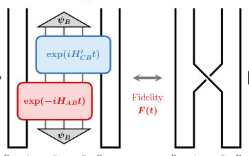
<figcaption class="paper-figure-caption"><b>Fig 1.</b> FIG. 1. The schematic illustration of the bidirectional tele- portation protocol between systems A and C, with reference qubits RA and RC. Here, we allow for errors between the forward and backward evolution Hamiltonians, denoted as H and H′, respectively. It has been established that, un- der scrambled evolution with perfectly reversed dynamics, the protocol provides a probabilistic realization of the SWAP op- eration between A and C systems. The two central quantities governing the protocol are the post-selection probability p(t) and the fidelity of the resulting quantum state F(t).</figcaption>
</figure>
<figure class="paper-figure-card">
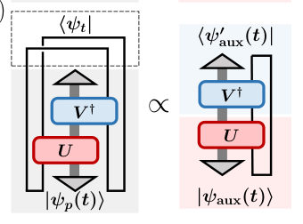
<figcaption class="paper-figure-caption"><b>Fig 2.</b> FIG. 2. The diagrammatic proof of the main relations: (1) between the probability and the subsystem echo, p(t) = LB(t), and (2) between the fidelity and the Loschmidt echo, F(t)p(t) = 2−2NL(t). Here, the overall factor arises from the normalization of the EPR state, which is omitted in the diagrammatic representation. For conciseness, we introduce unitary evolutions U = e−iHABt and V = e−iH′ ABt, and rep- resent the qubits in B by a single thick solid line. The red slash indicates periodic boundary conditions.</figcaption>
</figure>
<figure class="paper-figure-card">
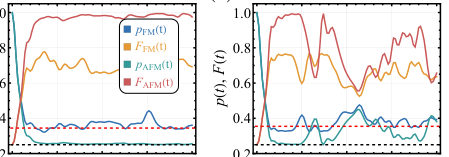
<figcaption class="paper-figure-caption"><b>Fig 3.</b> FIG. 3. We present the numerical results for the quantum Ising model in the absence of errors in the backward evolution. We fix N = 1, M = 8, and g/J = 1.05, and consider (a) h = 0.5 (chaotic [11, 18]) and (b) h = 0 (integrable). We present the post-selection probability and the fidelity as functions of time t for both ferromagnetic and antiferromagnetic initial states, denoted as FM and AFM, respectively. The dashed lines represent the theoretical prediction p(t) = e−sth/2, as described in the main text.</figcaption>
</figure>
<figure class="paper-figure-card">
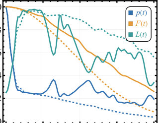
<figcaption class="paper-figure-caption"><b>Fig 4.</b> FIG. 4. We present the numerical results for the quantum Ising model with an error ϵ = 0.05. We fix N = 1, M = 8, and g/J = 1.05, and consider the antiferromagnetic initial state. The solid lines correspond to the integrable case with h = 0, while the dashed lines represent the chaotic case with h = 0.5.</figcaption>
</figure>

**Summary.** This paper analyzes a bidirectional teleportation protocol by relating its success metrics—post-selection probability and fidelity—to established measures of quantum dynamics, such as the Loschmidt echo. The key finding is that integrable Hamiltonians provide superior stability against errors in time-reversed evolution compared to chaotic systems. This offers practical guidance for implementing quantum protocols on realistic hardware.

**Why it may be interesting.** This work bridges quantum information processing protocols with fundamental concepts of quantum chaos and thermalization diagnostics (Loschmidt echo). Showing that integrability enhances robustness against time-reversal errors is highly relevant for designing fault-tolerant quantum devices.

Detailed structure

**Main problem.** The study characterizes the performance of a bidirectional quantum teleportation protocol designed to perform a digital SWAP operation, focusing on how errors in time-reversed dynamics affect key metrics.

**Main result.** The post-selection probability and fidelity can be related directly to standard quantum dynamics diagnostics like the subsystem Loschmidt echo. Crucially, integrable models are shown to maintain higher performance (larger post-selection probability) compared to chaotic ones when errors are present.

**Method.** Theoretical derivation establishing relationships between protocol metrics ($p(t), F(t)$) and dynamical measures ($	ext{L}_B(t), 	ext{L}(t)$). Numerical simulations were used on the quantum Ising model to validate these theoretical connections.

**Model / system.** The system involves a bidirectional teleportation protocol acting on three subsystems (A, B, C) using chaotic Hamiltonian evolution. The analysis is tested using the Quantum Ising model Hamiltonian, which can be tuned between integrable and chaotic regimes.

**Key observables.** Post-selection probability ($p(t)$), Fidelity ($F(t)$), Loschmidt Echo ($	ext{L}(t)$), Subsystem Loschmidt Echo ($	ext{L}_B(t)$).

**Important parameters / regimes.** Time evolution $t$, error strength $\epsilon$, and the Hamiltonian parameters (e.g., coupling constants $J, g, h$) determining integrability vs. chaos.

**Assumptions / limitations.** The analysis relies on relating protocol performance to established quantum dynamics diagnostics; specific results are derived for both errorless and noisy time-reversed dynamics.

**Figures summary.** Figure 1 schematically illustrates the teleportation protocol. Figure 2 diagrammatically proves the relationships between $p(t)$, $	ext{L}_B(t)$, and $F(t)$ versus $	ext{L}(t)$. Figure 3 shows numerical results for the errorless Ising model, comparing initial states. Figure 4 compares performance with errors ($\epsilon=0.05$) for integrable vs. chaotic dynamics.

**Paper structure.** The paper first introduces the bidirectional teleportation protocol and defines the key quantities ($p(t), F(t)$). It then derives theoretical relationships connecting these quantities to Loschmidt echoes. The analysis is applied to the Ising model, comparing errorless (chaotic vs. integrable) and noisy scenarios to draw conclusions about practical implementation.

Abstract

Understanding the scrambling of quantum information is central to many areas of quantum physics, including quantum thermalization, entanglement growth, and quantum information processing. Insights from these studies have, in turn, inspired the development of novel quantum protocols and algorithms. Recently, a bidirectional teleportation protocol was proposed to implement a digital SWAP operation between qubits by leveraging chaotic Hamiltonian evolution combined with measurement and post-selection. In this work, we provide a comprehensive study of two central quantities that characterize the protocol, the post-selection probability and the fidelity, taking into account possible errors in time-reversed dynamics. We show that these quantities can be expressed in terms of standard diagnostics in quantum dynamics, including the Loschmidt echo and its subsystem variant. The results unveil (1) the initial-state dependence of the fidelity and (2) the stability of the post-selection probability in integrable models. Our findings offer practical guidance for the implementation of the protocol on realistic quantum devices.

[↑ back to top](#top)

### [Coupled-Mode Equations with Arbitrary Mode Combinations for Kinetic-Inductance Superconducting Traveling-Wave Parametric Devices: Theory and Experimental Validation](http://arxiv.org/abs/2606.17264v1)

**Authors:** F. Patricio Mena, Camilo Espinoza, Ryan O. Berriel, Ricardo Finger, David J. Thoen  
**Type:** both · **Category:** other · **PDF:** <https://arxiv.org/pdf/2606.17264v1>  
**Analysis basis:** full PDF text, analyzed in chunks
**Topic relevance:** `driven-dissipative phase transition` **3/5** · `methods for driven-dissipative` **3/5** · `analog quantum simulation` **2/5** · `non-equilibrium dynamics` **2/5** · `non-equilibrium universality` **2/5** · `Keldysh / 2PI / non-Gaussian methods` **1/5** · `correlated / nonlocal dissipation` **1/5** · `entanglement & information structure` **1/5**

↔ Scroll figures horizontally

<figure class="paper-figure-card">
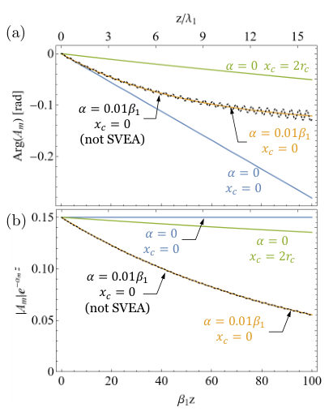
<figcaption class="paper-figure-caption"><b>Fig 1.</b> FIG. 2. Simulation results for one traveling mode, N = 1. (a) Phase and (b) amplitude. Three</figcaption>
</figure>
<figure class="paper-figure-card">
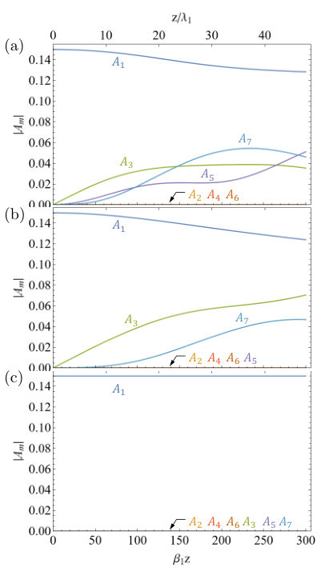
<figcaption class="paper-figure-caption"><b>Fig 2.</b> FIG. 3. Simulation results for harmonic generation with N = 7 (ωn = nω1). For the simulations</figcaption>
</figure>
<figure class="paper-figure-card">
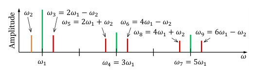
<figcaption class="paper-figure-caption"><b>Fig 3.</b> FIG. 4. Cartoon of the degenerate FWM with higher-order effects. Specifically, two harmonics</figcaption>
</figure>
<figure class="paper-figure-card">
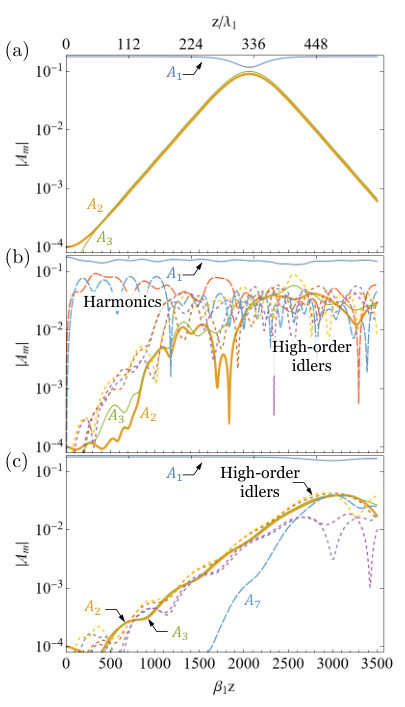
<figcaption class="paper-figure-caption"><b>Fig 4.</b> FIG. 5. Simulation results for FWM (pump, ω1, signal, ω2, idler, ω3) with two harmonics (ω4, ω7)</figcaption>
</figure>
<figure class="paper-figure-card">
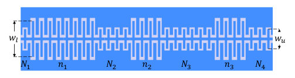
<figcaption class="paper-figure-caption"><b>Fig 5.</b> FIG. 6. Schematics of the unit cell of the CPW DE line used in this work. Three loads, ni, are</figcaption>
</figure>

**Summary.** This work presents an advanced theoretical framework using Coupled-Mode Equations (CMEs) to model parametric processes in superconducting transmission lines, systematically accounting for losses. The theory is rigorously validated by comparing simulations against microwave measurements of harmonic generation. The key finding confirms that the device's nonlinearity scales with its intrinsic depairing current, providing a robust tool for designing high-performance quantum/classical superconducting devices.

**Why it may be interesting.** While focused on superconductivity/microwave physics, the underlying mathematical structure—the use of coupled differential equations to describe energy exchange between multiple interacting modes in a nonlinear medium—is highly analogous to models used in quantum optics and open quantum systems theory.

Detailed structure

**Main problem.** To develop a general theoretical framework using Coupled-Mode Equations (CMEs) that accurately models parametric processes in superconducting traveling-wave devices, specifically incorporating losses and arbitrary combinations of interacting waves.

**Main result.** The authors successfully derived a generalized CME formulation validated by experimental measurements showing excellent agreement for harmonic generation. Crucially, the nonlinear parameter scales with the intrinsic depairing current rather than the measured critical current.

**Method.** The methodology combines theoretical derivation using projection methods on telegrapher's equations to yield CMEs, followed by rigorous validation through microwave measurements of $S_{21}$ variation and harmonic generation.

**Model / system.** The system is a superconducting CPW-based artificial transmission line exhibiting quadratic nonlinearity in its inductance. The model uses CMEs to describe the spatial evolution of multiple interacting wave amplitudes ($A_m$) across different frequency modes.

**Key observables.** Signal gain, harmonic generation power ratios ($P_B/P_A$), relative phase variation of $S_{21}$ with DC current, and the nonlinear parameter $I'_*$.

**Important parameters / regimes.** $I'_*$ (nonlinear parameter), $I_{	ext{dep}}$ (theoretical depairing current), $\gamma_m$ (propagation constant), and characteristic impedance ($Z_{Cm}$).

**Assumptions / limitations.** The primary assumptions involve treating the current as a superposition of plane waves, using the Slowly-Varying Envelope Approximation (SVEA) for simplification, and assuming the general CME structure holds despite losses.

**Figures summary.** Figures illustrate the theoretical model's applicability across various mode combinations (e.g., harmonic generation), show measured $S_{21}$ vs. DC current data fitted by the theory, and present simulated/measured power flow for multiple harmonics.

**Paper structure.** The paper progresses from establishing the need to generalize CMEs for lossy superconducting systems, deriving the general CME formulation applicable to any mode combination, detailing specific physical examples (harmonic generation, FWM), and finally validating this comprehensive model using detailed microwave measurements on a fabricated sample.

Abstract

The coupled-mode equations (CMEs) have proven very successful in describing parametric processes in nonlinear optics. More recently, the same formulation has been used to model microwave superconducting parametric amplifiers and frequency multipliers. However, when applied to the microwave regime, not all assumptions remain valid and losses play a more dramatic role. Here, we revisit the CMEs applied to traveling-wave superconducting amplifiers to include losses and provide a formulation that enables their systematic derivation for any combination of traveling waves. As examples, we discuss the impact of unwanted harmonics and intermodulation products on parametric amplification, as well as harmonic generation. We verify that, if not properly accounted for, device performance can deviate considerably from the ideal case. Furthermore, using a superconducting CPW-based artificial transmission line and combining an independent experimental determination of its nonlinear parameter $I'_*$ with simulations of its linear properties, we obtain a parameter-free validation of this formulation. The nonlinear parameter was determined to be $I'_* \approx 27$ mA which, surprisingly, scales with the theoretical depairing current and not with the much smaller critical current of the device. For the validation, we measured multiple-harmonic generation and found excellent agreement between theory and experiment. The fact that $I'_* \gg I_C$ has direct implications for device design.

[↑ back to top](#top)

### [Frequency upconversion of infrared signals via molecular cavity optomechanical systems with gain](http://arxiv.org/abs/2606.17877v1)

**Authors:** Shu-Xian Quan, Fen Zou, Yong Li  
**Type:** theory · **Category:** other · **PDF:** <https://arxiv.org/pdf/2606.17877v1>  
**Analysis basis:** full PDF text, analyzed in chunks
**Topic relevance:** `Keldysh / 2PI / non-Gaussian methods` **3/5** · `methods for driven-dissipative` **3/5** · `Tavis-Cummings & cavity-many-emitter` **2/5** · `correlated cavity matter` **2/5** · `analog quantum simulation` **1/5** · `correlated / nonlocal dissipation` **1/5** · `driven-dissipative phase transition` **1/5** · `interference shaping light` **1/5** · `non-equilibrium dynamics` **1/5**

↔ Scroll figures horizontally

<figure class="paper-figure-card">
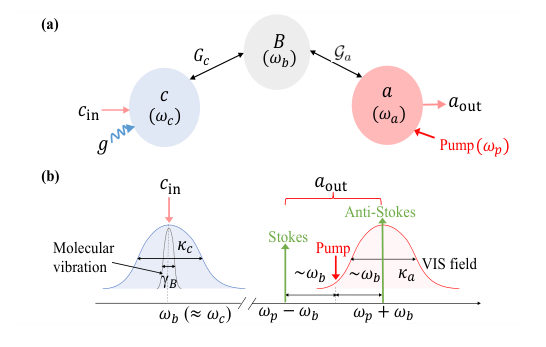
<figcaption class="paper-figure-caption"><b>Fig 1.</b> FIG. 1. (a) Schematic diagram of the molecular cavity op- tomechanical system. Here, the collective mode B composed of N molecules (vibrational frequency ωb) is coupled to both the VIS mode (frequency ωa, decay rate κa) via optomechan- ical interaction and the IR mode (frequency ωc, decay rate κc, and gain rate g) via bilinear interaction. The VIS cavity is driven by a pump field with frequency ωp and amplitude εp. (b) Schematic illustration diagram of the IR to VIS up- conversion in a molecular optomechanical system driven by the red-detuned pump field, where cin includes the incident IR signal, and the cavity frequency is considered to be close to the molecular vibrational frequency (ωb...</figcaption>
</figure>
<figure class="paper-figure-card">
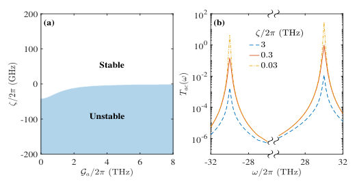
<figcaption class="paper-figure-caption"><b>Fig 2.</b> FIG. 2. (a) The stability diagram associated with the en- hanced optomechanical coupling strength Ga and the effec- tive dissipation rate ζ of IR mode. (b) The conversion effi- ciency Tac(ω) with respect to the frequency ω of incident sig- nal for different effective dissipation rate ζ with Ga/2π = 800 GHz. The parameters are gc/2π = 0.05 GHz, ∆/2π = ωc/2π = ωb/2π = 30 THz, κa/2π = 25 THz, κc/2π = 3 THz, γB/2π = 0.06 THz, and N = 106.</figcaption>
</figure>
<figure class="paper-figure-card">
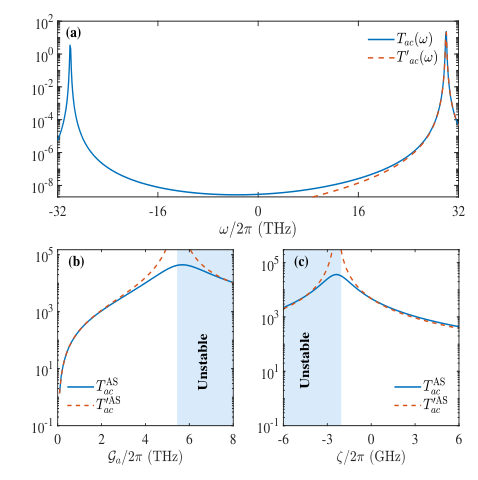
<figcaption class="paper-figure-caption"><b>Fig 3.</b> FIG. 3. (a) The conversion efficiencies Tac(ω) and T ′ ac(ω) as functions of frequency ω for Ga/2π = 800 GHz at ζ/2π = 0.03 THz. (b, c) The conversion efficiencies T AS ac (ω = ωb) and T ′AS ac (ω = ωb) at the first anti-Stokes sideband as functions of the enhanced collective molecular coupling strength Ga and the effective dissipation rate ζ, respectively. In panel (b), ζ/2π = −2 GHz. In panel (c), Ga/2π = 5 THz. Other pa- rameters are ∆/2π = ωc/2π = ωb/2π = 30 THz, κa/2π = 25 THz, κc/2π = 3 THz, γB/2π = 0.06 THz, N = 106, and gc/2π = 0.05 GHz.</figcaption>
</figure>
<figure class="paper-figure-card">
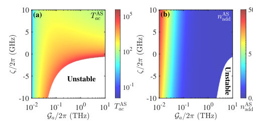
<figcaption class="paper-figure-caption"><b>Fig 4.</b> FIG. 4. (a, b) The conversion efficiency T AS ac and the added noise nAS add at the first anti-Stokes sideband (ω = ωb) as func- tions of the enhanced optomechanical coupling strength Ga and the effective dissipation rate ζ. The parameters are gc/2π = 0.05 GHz, ∆/2π = ωc/2π = ωb/2π = 30 THz, κa/2π = 25 THz, κc/2π = 3 THz, γB/2π = 0.06 THz, and N = 106.</figcaption>
</figure>
<figure class="paper-figure-card">
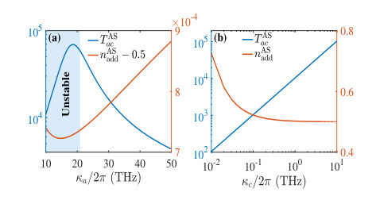
<figcaption class="paper-figure-caption"><b>Fig 5.</b> FIG. 5. The conversion efficiency T AS ac and the added noise nAS add at the first anti-Stokes sideband (ω = ωb) as functions of (a) the decay rate of the VIS mode κa and (b) the decay rate of the IR mode κc. In panel (a), the parameter κc/2π is set to κc/2π = 3 THz. In panel (b), the parameter κa/2π is set to κa/2π = 25 THz. Other parameters are Ga/2π = 5 THz, ζ/2π = −2 GHz, gc/2π = 0.05 GHz, ∆/2π = ωc/2π = ωb/2π = 30 THz, γB/2π = 0.06 THz, and N = 106.</figcaption>
</figure>

**Summary.** The paper theoretically investigates enhancing infrared-to-visible frequency upconversion using molecular cavity optomechanical systems. By introducing controlled gain into the IR cavity, the authors show that conversion efficiencies can be significantly boosted while keeping the added noise low and stable near 0.5. This suggests a viable pathway for highly sensitive quantum detection based on engineered cavity dynamics.

**Why it may be interesting.** This work directly applies advanced quantum optics techniques (QLEs, fluctuation analysis) to a molecular/nanoscale system, demonstrating how engineered gain can overcome fundamental efficiency limits in quantum signal processing.

Detailed structure

**Main problem.** The primary goal is enhancing the efficiency of frequency upconversion of low-frequency infrared (IR) signals to the visible (VIS) range using molecular cavity optomechanical systems.

**Main result.** The incorporation of gain into the IR cavity significantly boosts the upconversion efficiency while maintaining the associated added noise at a low and controllable level, near 0.5.

**Method.** The analysis uses quantum Langevin equations (QLEs) solved in the frequency domain via Fourier transforms to determine input-output relations for the coupled optomechanical system.

**Model / system.** The physical platform is a molecular cavity optomechanical system comprising two cavities and an ensemble of N molecules. The dynamics are modeled by coupling optical fields ($\omega_a, \omega_c$) to intrinsic molecular vibrational modes ($\omega_b$), with the key addition being gain in the IR cavity.

**Key observables.** Conversion efficiency ($T_{AS}^{ac}$), added noise power ($	ext{n}_{	ext{add}}(\omega)$), and output field spectra $ar{S}_{a,out}(\omega)$.

**Important parameters / regimes.** Detunings ($\Delta$), decay rates ($\kappa_a, \kappa_c, \gamma_B$), coupling strengths ($G_a, G_c$), and the gain-induced effective dissipation rate ($\zeta$).

**Assumptions / limitations.** The analysis assumes negligible intrinsic losses for the two single-sided cavities when deriving QLEs, and that $\hbar\omega/k_B T \gg 1$ for noise treatment.

**Figures summary.** Figures illustrate system schematics (Fig. 1), stability diagrams and conversion efficiency vs. frequency (Fig. 2), and show the dependence of conversion efficiency and added noise on key parameters like decay rates ($\kappa_a, \kappa_c$) and coupling strengths ($G_a, \zeta$).

**Paper structure.** The paper proceeds by defining the Hamiltonian and deriving QLEs for the coupled system. It then linearizes these equations, transforms them into matrix form in the frequency domain, and calculates output correlations to determine conversion efficiency and added noise under various parameter regimes.

Abstract

Molecular cavity optomechanical systems have recently emerged as a promising platform for enhancing infrared detection sensitivity, owing to their ability to up-convert low-frequency infrared (IR) photons to visible frequency range. Generally, under red-detuned pumping in such systems, the ideal conversion efficiency of the IR signal approaches 1. To overcome this efficiency constraint, we propose a scheme that incorporates gain into the infrared cavity of a molecular cavity optomechanical system comprising two cavities and an ensemble of N molecules. The upconversion process, which relies on IR absorption and Raman scattering associated with specific vibrational modes, is significantly amplified by the incorporation of gain under the red-detuned conditions. Moreover, our analysis demonstrates that the added noise is maintained near 0.5.

[↑ back to top](#top)

### [Induced Resource Theories and Harvesting via Quantum Probes](http://arxiv.org/abs/2606.17287v1)

**Authors:** Ron Nyström, Simone Cepollaro, Nicola Pranzini, Stefano Cusumano, Alioscia Hamma, Esko Keski-Vakkuri  
**Type:** theory · **Category:** other · **PDF:** <https://arxiv.org/pdf/2606.17287v1>  
**Analysis basis:** full PDF text, analyzed in chunks
**Topic relevance:** `Keldysh / 2PI / non-Gaussian methods` **3/5** · `entanglement & information structure` **2/5** · `measurement-induced transitions` **2/5** · `quantum measurements` **2/5** · `correlated / nonlocal dissipation` **1/5** · `driven-dissipative phase transition` **1/5** · `methods for driven-dissipative` **1/5** · `non-equilibrium dynamics` **1/5**

↔ Scroll figures horizontally

<figure class="paper-figure-card">
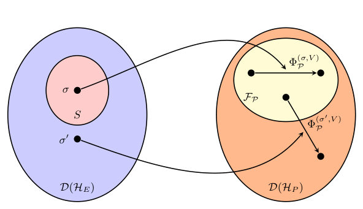
<figcaption class="paper-figure-caption"><b>Fig 1.</b> Figure 1: Induced set of free states S: for a given V , the set S ⊆D(HE) contains states σ for which Φ(σ,V ) P is a free operation of (FP, OP).</figcaption>
</figure>
<figure class="paper-figure-card">
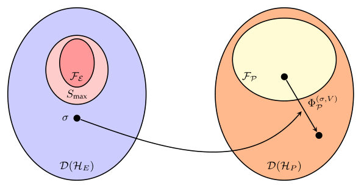
<figcaption class="paper-figure-caption"><b>Fig 2.</b> Figure 2: Depiction of Theorem 1. If there is non-zero resource in the initially free probe state after interaction, then the environment state is σ ∈D \ Smax. Additionally, if FE ⊆S, then the state of the environment is resourceful, i.e. σ /∈FE. Not seeing the resource in P does not imply the environment was in a free state, unless FE = Smax.</figcaption>
</figure>
<figure class="paper-figure-card">
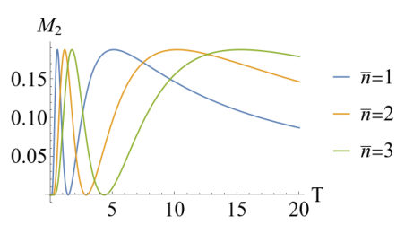
<figcaption class="paper-figure-caption"><b>Fig 3.</b> Figure 3: The SRE as a function of temperature. Here we set ω = 1 and plot different values for the cutoff ¯n.</figcaption>
</figure>
<figure class="paper-figure-card">
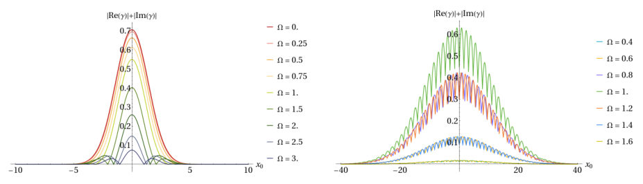
<figcaption class="paper-figure-caption"><b>Fig 4.</b> Figure 4: The 1-norm of the coherence |Re(γ)| + |Im(γ)| as a function of the localization peak of the coherent state x0. For (a) T = 2, σ0 = 2 and k0 = 0, while for (b) T = 10, σ0 = 5 and k0 = 1. In (b), one can see the resonance effect, as setting Ω= 1 yields the largest effect on the detector state.</figcaption>
</figure>

**Summary.** The paper establishes a formal framework called 'induced resource theory' to address how detecting a quantum resource in a controlled probe can prove that the environment possesses that same resource. It develops criteria distinguishing between weak and strong detection capabilities based on the interaction dynamics. This is crucial for analyzing realistic quantum measurements where the system being probed (the environment) lacks a known theoretical description.

**Why it may be interesting.** This work provides a rigorous mathematical structure for resource detection in open quantum systems where the environment cannot be fully characterized, linking fundamental concepts of quantum information theory to realistic physics problems like field interactions.

Detailed structure

**Main problem.** The core problem is determining under what conditions resource generation observed in a quantum probe can reliably serve as evidence for the presence of corresponding resources within an environment, especially when the interaction dynamics are complex or lack defined free operations.

**Main result.** A framework based on induced resource theories is proposed, distinguishing between weak and strong induction; successful harvesting requires specific structural relationships between the environmental state set and the maximal induced free state set ($S_{\max}$).

**Method.** The authors develop mathematical definitions for 'induced' resource theories using probe resource monotones and analyze how these induce constraints on the environment's possible states via unitary evolution channels.

**Model / system.** The general model involves a composite system of a quantum probe ($P$) interacting unitarily with an environment ($E$), which can be modeled as a quantum field (e.g., massless scalar field) or another subsystem whose resource theory is unknown.

**Key observables.** Resource generation in the probe ($r_P > 0$), the set of 'free' environmental states ($S$ or $S_{\max}$), and induced resource monotones like Stabilizer Rényi Entropy (SRE).

**Important parameters / regimes.** The interaction Hamiltonian parameters ($\gamma, q$, etc.), temperature ($eta$), and coupling strengths ($\lambda$).

**Assumptions / limitations.** The framework assumes no *a priori* resource theory for the environment; interpretations are highly dependent on whether the induced resource theory is weak or strong.

**Figures summary.** Figures illustrate how the induced resource theory classifies which environmental states facilitate resource harvesting, and plots show dependencies of coherence/resource measures on parameters like temperature or field localization.

**Paper structure.** The paper builds from defining the problem (harvesting resources from unknown environments) to proposing formal definitions (weak vs. strong induction), applying these concepts to specific physical models (Qubit-Oscillator, UDW), and finally discussing generalizations and quantitative characterization.

Abstract

We consider scenarios in which a quantum system with a well-defined resource theory is used as a probe to interact with an environment, such as a quantum field, for which a resource-theoretic description is absent or incomplete. We clarify if and how the harvesting of a resource in the probe can tell us about the state of the environment. This is particularly ambiguous when the probe-environment interaction is not a free operation, or the concept of such free operations cannot be defined altogether. We propose a framework and precise conditions under which it becomes possible to interpret resource generation on the probe as evidence of resources in the environment, thereby introducing an effective notion of resources for the latter. Our results clarify in which sense resources can be said to be harvested from the environment and provide a systematic way to analyse such processes beyond fully controlled resource-theoretic settings. More generally, this work may provide a step towards a more general understanding of the interplay of different quantum resources.

[↑ back to top](#top)

### [Stochastic signal sensing with finite energy and dead time at the fundamental quantum limit](http://arxiv.org/abs/2606.18133v1)

**Authors:** James W. Gardner, Tuvia Gefen, Matteo Fadel  
**Type:** theory · **Category:** other · **PDF:** <https://arxiv.org/pdf/2606.18133v1>  
**Analysis basis:** full PDF text, analyzed in chunks
**Topic relevance:** `quantum measurements` **3/5** · `entanglement & information structure` **2/5** · `measurement-induced transitions` **2/5** · `Keldysh / 2PI / non-Gaussian methods` **1/5** · `correlated / nonlocal dissipation` **1/5** · `driven-dissipative phase transition` **1/5** · `methods for driven-dissipative` **1/5** · `non-equilibrium dynamics` **1/5**

↔ Scroll figures horizontally

<figure class="paper-figure-card">

<figcaption class="paper-figure-caption"><b>Fig 1.</b> Figure 1. a) Driven, damped mechanical oscillator with drive Ω(t) and damping κ. b) Quantum harmonic oscillator with gain γ and loss Γ. c–d) Prepare-wait-measure-reset metrology, where each of the M cycles takes an interrogation time tint plus a dead time τdead from the combined state preparation, measurement, and reset operations. We show both the (c) unentangled and (d) entangled strategies.</figcaption>
</figure>
<figure class="paper-figure-card">
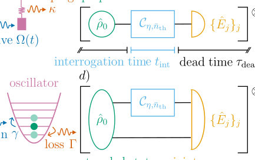
<figcaption class="paper-figure-caption"><b>Fig 2.</b> Fig. 1. In the rotating frame, the master equation is thus:</figcaption>
</figure>
<figure class="paper-figure-card">
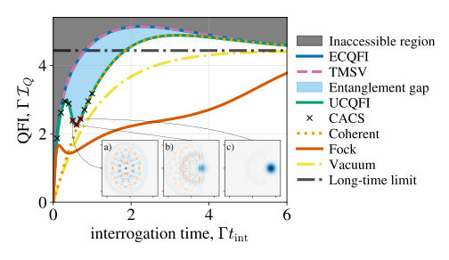
<figcaption class="paper-figure-caption"><b>Fig 3.</b> Figure 2. QFI of √γ for fixed Γ versus interrogation time tint for different initial states. The UCQFI line is an interpolated spline be- tween the CACS results, the coherent QFI at later times, and Fock QFI at very short times [30]. Results for ¯N = 8 and Γ/γ = 20. The three red dots among the CACS points indicate the states shown in the Wigner function plots for Γtint equal to a) 0.5, b) 0.6, and c) 0.7.</figcaption>
</figure>
<figure class="paper-figure-card">
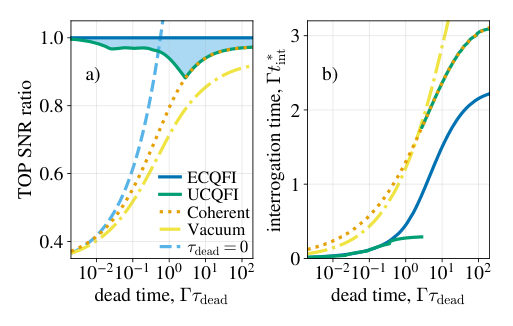
<figcaption class="paper-figure-caption"><b>Fig 4.</b> Figure 3. a) Time-optimized (TOP) SNR relative to the TOP ECQFI SNR versus dead time for different initial states. We also show the entanglement gap and the vacuum protocol with no dead time. The roughness in the UCQFI curve comes from the interpolated spline, e.g. when transitioning between the Fock and CACS results at short dead times. b) Optimal interrogation time t∗ int versus dead time τdead, showing the first-order discontinuity where the optimal unentangled state becomes the coherent state. Results for ¯N = 8 and Γ/γ = 20.</figcaption>
</figure>

**Summary.** This paper rigorously analyzes how finite energy and dead time impact the precision of quantum measurements on stochastic signals. It proves that two-mode squeezed vacuum states are optimal probes for sensing in lossy channels. The findings provide critical guidelines for optimizing quantum metrology protocols relevant to dark matter detection and fundamental physics searches.

**Why it may be interesting.** This work directly addresses practical limitations in quantum measurement protocols by quantifying the resource cost (energy, time) associated with achieving fundamental quantum limits, which is crucial for designing next-generation quantum sensors.

Detailed structure

**Main problem.** The study investigates optimal quantum metrological protocols for sensing stochastic signals when realistic experimental limitations, such as finite energy and dead time, are imposed.

**Main result.** Two-mode squeezed vacuum (TMSV) is proven to be the optimal probe state for estimating parameters in thermal loss channels under finite mean-energy constraints. The analysis also characterizes how entanglement resources affect performance across different noise regimes.

**Method.** The authors utilize Quantum Fisher Information (QFI) and Signal-to-Noise Ratio (SNR) bounds, comparing entangled versus unentangled strategies to determine the ultimate sensing limit.

**Model / system.** The system models quantum harmonic oscillators subjected to stochastic signals corrupted by a thermal loss channel. The evolution is described using master equations in both the density matrix and Heisenberg pictures.

**Key observables.** Quantum Fisher Information (QFI), Signal-to-Noise Ratio ($	ext{SNR}$), Entanglement-Assisted QFI ($	ext{ECQFI}$), and Unentangled QFI ($	ext{UCQFI}$).

**Important parameters / regimes.** Finite mean energy ($ar{N}$), dead time ($	au_{	ext{dead}}$), transmissivity ($\eta$), and thermal bath occupation ($ar{n}_{	ext{th}}$).

**Assumptions / limitations.** The analysis relies on approximations such as the Born-Markov approximation, weak signal limits, and assuming dead time is independent of the sensing strategy.

**Figures summary.** Figures compare QFI vs. interrogation time for different states; one figure shows $	ext{TOP SNR}$ ratios versus dead time ($	au_{	ext{dead}}$), illustrating performance transitions between entangled and unentangled schemes.

**Paper structure.** The paper systematically analyzes the sensing problem by first establishing general bounds, then applying these to specific channels (thermal loss, noise sensing, gain estimation) while incorporating finite energy and dead time effects. It compares optimal states like TMSV against coherent or vacuum states across various parameter regimes.

Abstract

State preparation, measurement, and reset operations take finite time and use finite energy in realistic experiments, yet the impact of this on optimal quantum metrological protocols is not properly understood. We study the effect on sensing a stochastic signal, relevant for the detection of ultralight dark matter and other searches for fundamental physics. We prove that two-mode squeezed vacuum is the optimal probe state given a finite mean-energy constraint for a family of incoherent sensing problems, including noise sensing and quantum illumination. For estimating a gain independent of a loss, we show that entanglement is a required resource to achieve the fundamental quantum limit and observe a non-Gaussian to Gaussian transition in the optimal unentangled state as the dead time increases. We apply our results to bulk acoustic wave resonators.

[↑ back to top](#top)

### [Time-spectral control of accidental coincidences in daylight entanglement-based free-space QKD](http://arxiv.org/abs/2606.17365v1)

**Authors:** Jiyoung Moon, Yonggi Jo, Zaeill Kim, Yong Sup Ihn, Nam Hun Park  
**Type:** both · **Category:** other · **PDF:** <https://arxiv.org/pdf/2606.17365v1>  
**Analysis basis:** full PDF text, analyzed in chunks
**Topic relevance:** `quantum optics experiment` **3/5** · `driven-dissipative phase transition` **2/5** · `methods for driven-dissipative` **2/5** · `QC/QI experiment` **1/5** · `free-space correlated emission` **1/5** · `interference shaping light` **1/5** · `non-equilibrium dynamics` **1/5** · `non-equilibrium universality` **1/5**

↔ Scroll figures horizontally

<figure class="paper-figure-card">
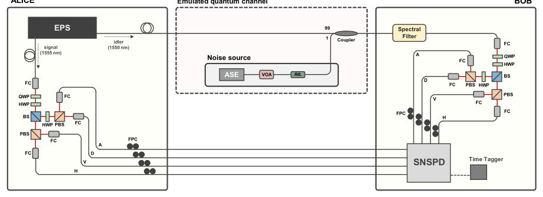
<figcaption class="paper-figure-caption"><b>Fig 1.</b> Figure 1. Controlled indoor testbed used for the time-spectral filtering study. A polarization-entangled photon-pair source generates signal and idler photons at 1555 nm and 1550 nm, respectively. In the indoor validation setup, the source output is delivered directly through fiber to the receiver-side testbed rather than through a free-space quantum channel. The signal photon is sent to Alice, whereas the idler photon enters the indoor emulated quantum-channel section, shown as a dashed- dotted box, where ASE background light passes through a fixed attenuator (ATT) and a VOA before being combined with the Bob-side channel through a 99:1 fiber coupler, spectrally filtered, and delivered to...</figcaption>
</figure>
<figure class="paper-figure-card">
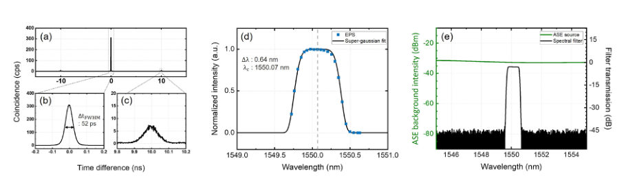
<figcaption class="paper-figure-caption"><b>Fig 2.</b> Figure 2. Temporal and spectral characterization used in the quantitative framework. (a) Representative coincidence histogram over the delay range from −15 ns to 15 ns, showing peaks separated by 10 ns for the 100 MHz repetition rate. (b) Expanded view of the main coincidence peak, with a FWHM of 52 ps. (c) Expanded view of the neighboring side peak at 10 ns. The detector-plane 16-channel summed coincidence histogram was used to obtain the reference true-coincidence component 19,893 cps and source-originated accidental-coincidence component 834 cps under the low-background reference condition. (d) Measured source spectrum, centered at 1550.07 nm with a FWHM of 0.64 nm, together with the...</figcaption>
</figure>
<figure class="paper-figure-card">
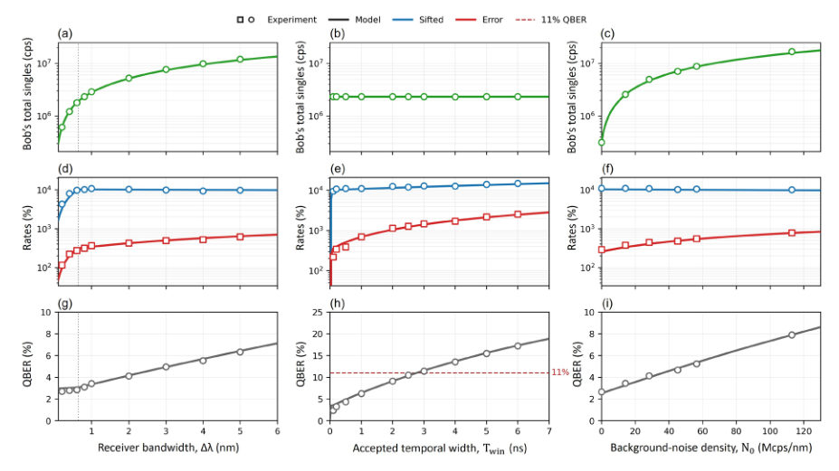
<figcaption class="paper-figure-caption"><b>Fig 3.</b> Figure 3. Controlled indoor validation of receiver-side time-spectral filtering effects. (a-c) Measured and calculated Bob total singles, defined as the sum of the H, V, D, and A count rates at Bob, as functions of receiver bandwidth Δλ, accepted temporal width 𝐓𝐓𝐰𝐰𝐰𝐰𝐰𝐰, and background-noise density 𝐍𝐍𝟎𝟎, respectively. (d-f) Measured and calculated sifted-key and error rates. (g-i) Corresponding measured and calculated QBER. Fixed conditions are 𝐍𝐍𝟎𝟎 = 12.8 Mcps/nm and 𝐓𝐓𝐰𝐰𝐰𝐰𝐰𝐰 = 0.2 ns for (a,d,g), 𝐍𝐍𝟎𝟎 = 12.8 Mcps/nm and Δλ=0.8 nm for (b,e,h), and 𝐓𝐓𝐰𝐰𝐰𝐰𝐰𝐰 = 0.2 ns and Δλ = 0.8 nm for (c,f,i). Markers denote experimental data and solid lines denote model results. Color coding is green for...</figcaption>
</figure>
<figure class="paper-figure-card">
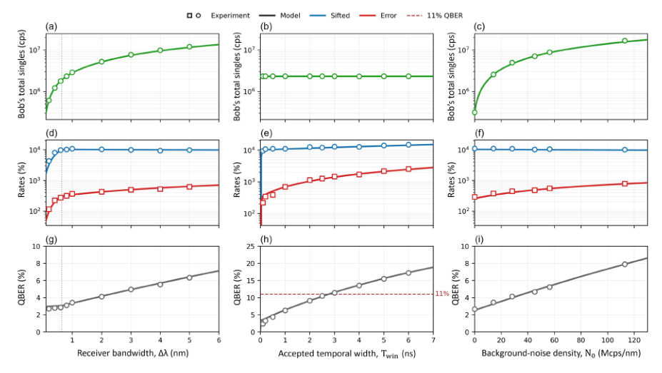
<figcaption class="paper-figure-caption"><b>Fig 4.</b> Figure 3 compares measured Bob total singles, sifted-key rate, error rate, and QBER with the corresponding model predictions for systematic sweeps of receiver bandwidth, accepted temporal width, and background-noise density, thereby testing whether the admitted Bob singles and coincidence budget reproduce the observed performance trends. Here, the quoted background-noise density refers to the injected ASE spectral density before receiver-side filtering, not the detected background after receiver losses. The correct sifted contributions were taken from the anticorrelated matched-basis channels HV/VH and DA/AD, whereas the corresponding error contributions were taken from HH/VV and DD/AA....</figcaption>
</figure>
<figure class="paper-figure-card">
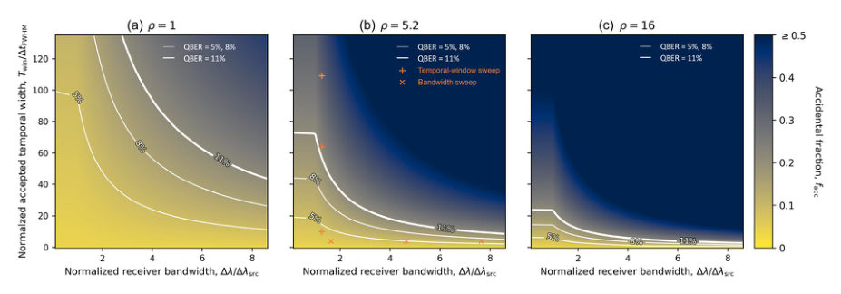
<figcaption class="paper-figure-caption"><b>Fig 5.</b> Figure 4. Accidental-fraction landscape with QBER contours under different background-to-signal conditions. Color maps show the accidental fraction, 𝐟𝐟𝐚𝐚𝐚𝐚𝐚𝐚= 𝐑𝐑𝐚𝐚𝐚𝐚𝐚𝐚/(𝐑𝐑𝐭𝐭𝐭𝐭𝐭𝐭𝐭𝐭+ 𝐑𝐑𝐚𝐚𝐚𝐚𝐚𝐚), as a function of normalized receiver bandwidth, ∆𝛌𝛌/∆𝛌𝛌𝐬𝐬𝐬𝐬𝐬𝐬, and normalized accepted temporal width, 𝐓𝐓𝐰𝐰𝐰𝐰𝐰𝐰/𝚫𝚫𝚫𝚫𝐅𝐅𝐅𝐅𝐅𝐅𝐅𝐅, for ρ = 1.0, 5.2, and 16.0, where 𝐑𝐑𝐚𝐚𝐚𝐚𝐚𝐚 = 𝐑𝐑𝐚𝐚𝐚𝐚𝐚𝐚,𝐬𝐬𝐬𝐬𝐬𝐬+ 𝐑𝐑𝐚𝐚𝐚𝐚𝐚𝐚,𝐛𝐛𝐛𝐛 and 𝚫𝚫𝚫𝚫𝐅𝐅𝐅𝐅𝐅𝐅𝐅𝐅 is the measured main coincidence-peak FWHM of the source. White contours indicate QBER levels of 5%, 8%, and 11%, with the 11% contour emphasized. The cross markers and plus markers in the ρ = 5.2 panel indicate, respectively, three representative conditions selected from the bandwidth...</figcaption>
</figure>

**Summary.** This paper presents a comprehensive framework for controlling accidental coincidences in free-space QKD links operating under daylight conditions. By modeling the impact of receiver bandwidth and temporal acceptance windows, the authors quantify how background noise degrades key rates and increases errors. The work validates this theory with both controlled indoor sweeps and a successful 10 m outdoor demonstration.

**Why it may be interesting.** This work provides critical engineering insights into the practical limitations of quantum communication in real-world environments by rigorously modeling noise sources. For theorists working on open quantum systems, it offers an excellent case study in characterizing environmental coupling (background light) and designing optimal filtering strategies to maintain coherence/fidelity.

Detailed structure

**Main problem.** The primary challenge addressed is mitigating performance degradation in free-space Quantum Key Distribution (QKD) due to accidental coincidences caused by background daylight illumination.

**Main result.** The authors developed a quantitative framework demonstrating that the sifted key rate and QBER can be controlled by optimizing receiver spectral bandwidth and accepted temporal window, achieving high rates in outdoor daylight conditions.

**Method.** They employ a rate-equation model to decompose the coincidence count into true signal, source-originated accidentals, and background-induced accidentals, validating this against systematic indoor sweeps and an outdoor rooftop test.

**Model / system.** The system is based on telecom-wavelength BBM92 QKD using entangled photon pairs in a free-space link. The model incorporates detector dead-time effects, spectral filtering (bandwidth $\Delta\lambda$), and temporal acceptance windows ($T_{	ext{win}}$) to quantify the accidental coincidence budget.

**Key observables.** Sifted-key rate ($\approx 2,811 	ext{ cps}$), Quantum Bit Error Rate ($	ext{QBER} \approx 4.43\%$), and the accidental coincidence fraction ($f_{	ext{acc}}$).

**Important parameters / regimes.** Background-to-signal ratio ($
ho = N_0/S_0$); receiver bandwidth ($\Delta\lambda$); accepted temporal width ($T_{	ext{win}}$).

**Assumptions / limitations.** The framework uses non-paralyzable dead-time corrections and treats multi-click rejection via estimated survival probabilities; the model is designed for rate estimation rather than full microscopic hardware simulation.

**Figures summary.** Figures illustrate indoor testbed setups, spectral/temporal characterizations (histograms), 2D design maps showing how $f_{	ext{acc}}$ and QBER vary with bandwidth and temporal window margin under varying background ratios, and final performance metrics from the 10 m rooftop experiment.

**Paper structure.** The paper first establishes the physical limitations of daylight free-space QKD due to background light. It then develops a comprehensive rate-level model linking receiver filtering parameters ($\Delta\lambda$, $T_{	ext{win}}$) to key performance metrics (sifted rate, QBER). The methodology is validated through detailed indoor sweeps before concluding with successful operation demonstration over a 10 m outdoor link.

Abstract

Daylight entanglement-based free-space quantum key distribution (QKD) is limited by accidental coincidences from receiver-admitted background light. We develop and experimentally validate a receiver-level framework linking receiver bandwidth, accepted temporal width, and background-noise density to Bob singles, sifted-key rate, error rate, and quantum bit error rate (QBER) in telecom-wavelength BBM92 QKD. Indoor sweeps show that useful sifted counts saturate near the source-matched bandwidth, whereas broader bandwidth or higher background mainly increases accidental contamination. Increasing the accepted temporal width leaves Bob singles nearly unchanged but directly raises QBER by enlarging the random-overlap probability. A two-dimensional design map shows that the temporal-window margin contracts rapidly with increasing background-to-signal ratio, while the bandwidth margin remains comparatively broad near source-matched filtering. A 10 m rooftop daylight experiment demonstrates operation in the predicted low-accidental regime, yielding a mean sifted-key rate of 2,811 cps and a mean QBER of 4.43%.

[↑ back to top](#top)

### [Antisite-disorder driven tuning of magnetic properties and exchange-bias in Nd$_{2-x}$Sr$_{x}$CoMnO$_{6-δ}$ $(0 \leq x \leq 1)$ ($δ\sim 0.5$) double perovskites](http://arxiv.org/abs/2606.17244v1)

**Authors:** Kazi Parvez Islam, Jayjit Kumar Dey, Sourav Chowdhury, Samyabrata Paria, Flora Banerjee, Suryakanta Mishra, Suman Kalyan Samanta, Moritz Hoesch, Robert Dankelman, Indu Dhiman, Debraj Choudhury  
**Type:** experiment · **Category:** strongly correlated electrons · **PDF:** <https://arxiv.org/pdf/2606.17244v1>  
**Analysis basis:** full PDF text, analyzed in chunks
**Topic relevance:** `analog quantum simulation` **3/5** · `exotic spin models in light-matter` **3/5** · `spintronics-quantum-optics interface` **3/5** · `Kondo & dissipative impurity` **1/5**

↔ Scroll figures horizontally

<figure class="paper-figure-card">
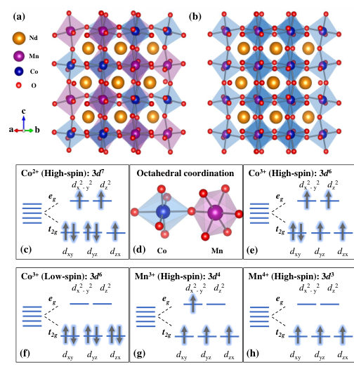
<figcaption class="paper-figure-caption"><b>Fig 1.</b> Figure 1. (color online) (a) Crystal structure of double perovskite Nd2CoMnO6 with different atoms highlighted. Notice the alter- nate stacking of Co/Mn atoms along three crystallographic direc- tions which leads to the B-site “ordered” structure. (b) B-site “dis- ordered” crystal structure where each B-site is occupied by either Co or Mn with equal probability. (c), (e), (f), (g) and (h) highlight different electronic configurations of Co2+ (high-spin), Co3+ (high- spin), Co3+ (low-spin), Mn3+ (high-spin) and Mn4+ (high-spin) re- spectively. (d) shows octahedral coordination of Co and Mn in these compounds.</figcaption>
</figure>
<figure class="paper-figure-card">
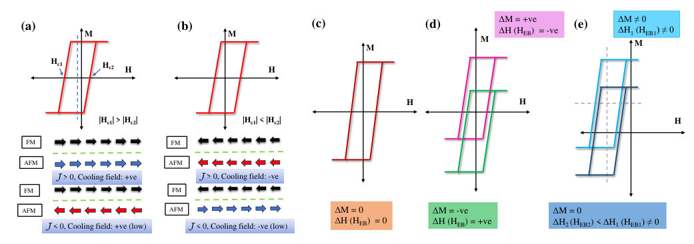
<figcaption class="paper-figure-caption"><b>Fig 2.</b> Figure 2. (color online) (a) and (b) show various scenarios of ferromagnetic–antiferromagnetic interfaces subjected to different cooling fields and interface couplings, resulting in exchange bias (EB) phenomena. (c) shows a perfectly symmetric magnetization loop with its centroid at (0,0) and having 0 EB. (d) shows vertically shifted versions of (c); note that the apparent asymmetry along the applied field axis (H) gives rise to “exchange-bias-like” behavior, although this is merely a manifestation of a minor loop and not intrinsic EB. (e) shows the most common type of loop encountered in real magnetic systems (sky-blue loop with a vertical shift). This loop has been shifted downward to...</figcaption>
</figure>
<figure class="paper-figure-card">
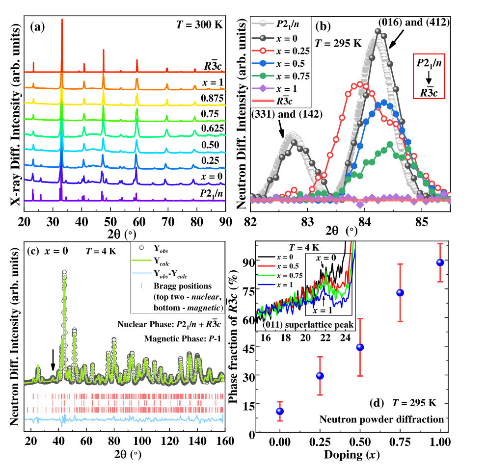
<figcaption class="paper-figure-caption"><b>Fig 3.</b> Figure 3. (color online) (a) Room temperature powder X-ray Diffraction (XRD) pattern of the NSCMO series. The references were taken from ICSD database. (b) Gradual evolution of phase from P21/n to R3c with hole doping as seen in the room temperature neutron powder diffraction (RT-NPD) data. All the reflections (331),(142),(016), and (412) are forbidden in R3c due to the rhombohedral centering condition: −h+k +l = 3n, ruling out Pnma or Pbnm (where only (016) is forbidden but others are allowed). (c) Rietveld refinemnt of 4 K NPD data of x = 0. The most prominent commensurate magnetic contribution has been highlighted by a downward arrow. (d) Fraction of disordered R3c phase as obtained from...</figcaption>
</figure>
<figure class="paper-figure-card">
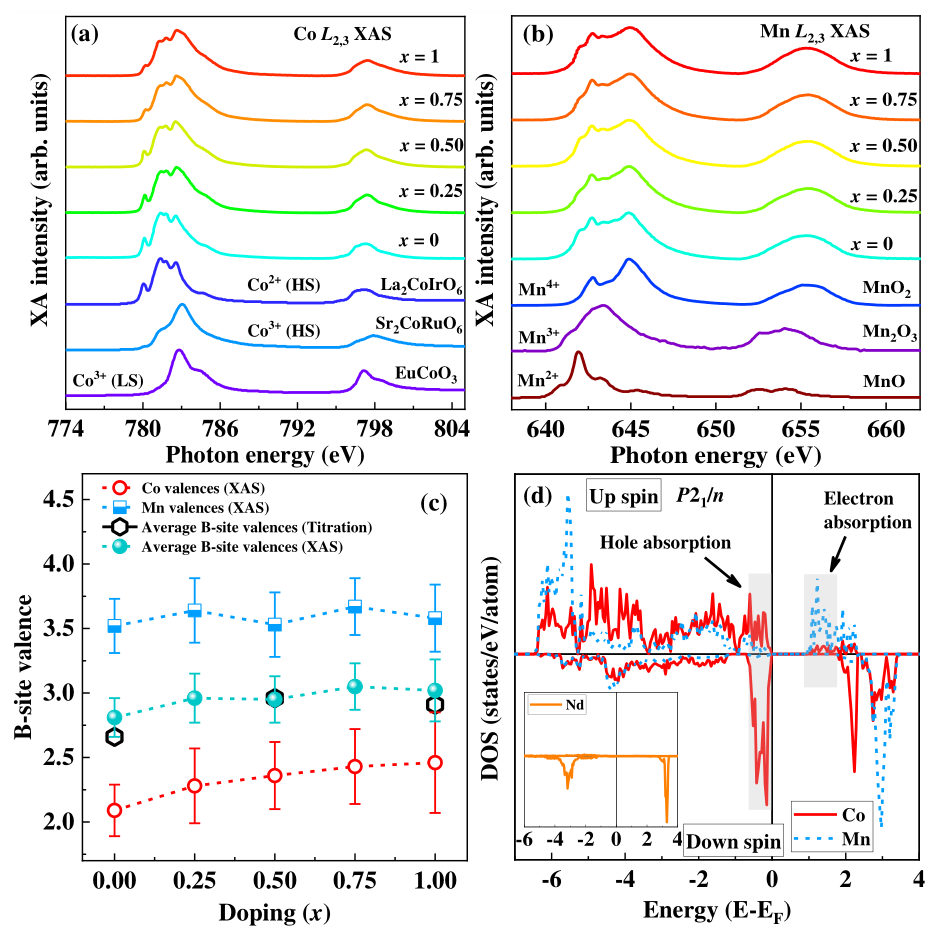
<figcaption class="paper-figure-caption"><b>Fig 4.</b> Figure 4. (color online) (a) Co L2,3 and (b) Mn L2,3 edge XAS spectra along with the reference spectra. (c) Effective Co and Mn valence as well as average B-site valence as a function of x as determined from the weighted linear convolution of the reference spectra. These numbers are compared with the average B-site valence obtained from iodometric titration. (d) Density of states (DOS) plotted for a B-site ordered structure of x = 0 taking Fermi energy level as 0. Hole absorbing behavior of Co and electron absorbing behavior of Mn have been highlighted. Inset shows Nd states deep below the Fermi energy.</figcaption>
</figure>
<figure class="paper-figure-card">
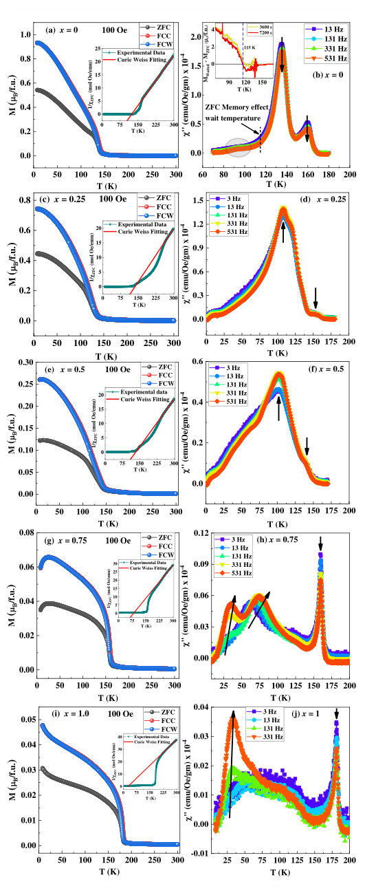
<figcaption class="paper-figure-caption"><b>Fig 5.</b> Figure 5. (color online) (a), (c), (e), (g) and (i) 100 Oe DC magneti- zation data for various x compositions; and (b), (d), (f), (h) and (j) the corresponding AC susceptibility data (imaginary part). Insets show 1/χ plot and standard Curie-Weiss linear fitting of the ZFC magne- tization data. The vertical arrows in the AC data indicate long-range transitions, while the skewed arrows indicate glassy transitions.</figcaption>
</figure>

**Summary.** This work investigates how Sr doping tunes the magnetic properties and exchange bias in $	ext{Nd}_{2-x}	ext{Sr}_x	ext{CoMnO}_{6-\delta}$ double perovskites. By correlating structural changes (monoclinic to rhombohedral) with valence state shifts, the authors reveal that inverse exchange bias arises from competing FM/AFM and FM/glassy interfaces. This demonstrates doping's powerful role in engineering complex magnetic ground states.

**Why it may be interesting.** The detailed study of competing magnetic interactions (FM vs. AFM vs. glassy) in doped perovskites provides a rich platform for understanding emergent magnetism driven by structural disorder, which is highly relevant to correlated electron physics and multiferroics.

Detailed structure

**Main problem.** The study aims to precisely control and understand the transition between normal and inverse exchange bias (EB) states in $	ext{Nd}_{2-x}	ext{Sr}_x	ext{CoMnO}_{6-\delta}$ double perovskites by tuning hole doping via Sr substitution.

**Main result.** Robust inverse EB is identified at $x=0.75$, attributed to competing ferromagnetic–antiferromagnetic and ferromagnetic–glassy interfaces governed by strong magnetic frustration. The findings highlight the crucial role of doping-induced structural and magnetic competition in tailoring magnetic behavior.

**Method.** The research employs a combination of advanced experimental techniques, including neutron powder diffraction (NPD), X-ray absorption spectroscopy (XAS), DC/AC magnetization measurements, and iodometric titration to characterize structure, valence states, and magnetism.

**Model / system.** The physical system is the double perovskite $	ext{Nd}_{2-x}	ext{Sr}_x	ext{CoMnO}_{6-\delta}$ ($0 \leq x \leq 1$). The study investigates how Sr doping induces hole doping, causing structural evolution from monoclinic to rhombohedral phases and altering cation valences ($	ext{Co}^{2+} 
ightarrow 	ext{Co}^{3+}$).

**Key observables.** Exchange bias field ($H_{EB}$), magnetic transition temperatures ($T_c$), crystal structure (monoclinic $
ightarrow$ rhombohedral), Co/Mn valence states, and degree of structural disorder.

**Important parameters / regimes.** Doping concentration $x$ (0 to 1); Oxygen deficiency $\delta$; Cooling field strength ($	ext{H}_{	ext{cool}}$).

**Assumptions / limitations.** The intrinsic EB is determined by carefully correcting for minor-loop effects in the magnetization measurements. The magnetic behavior is modeled as arising from competing FM/AFM and FM/glassy interfaces.

**Figures summary.** Figures illustrate structural phase transitions via NPD, valence state changes via XAS, and complex $M-H$ loops demonstrating normal vs. inverse EB shifts, emphasizing the need for minor loop correction.

**Paper structure.** The paper systematically analyzes structure (NPD/XAS) to track disorder and valence changes as a function of doping ($x$). This structural evolution is then correlated with magnetic measurements (magnetization/AC susceptibility) to pinpoint the origin of the observed exchange bias phenomena, particularly the inverse EB.

Abstract

We demonstrate precise control of exchange bias (EB) in the Nd$_{2-x}$Sr$_x$CoMnO$_{6-δ}$ ($0 \leq x \leq 1$) double-perovskite series through Sr$^{2+}$ induced hole doping, unveiling a remarkable transition between normal and inverse EB states. Employing neutron powder diffraction and X-ray absorption spectroscopy, we reveal a structural evolution from a B-site-ordered monoclinic ($P2_1/n$) phase to a disordered rhombohedral ($R\overline{3}c$) phase with increasing $x$, accompanied by a shift in the effective Co valence from +2 toward +3, while the Mn valence remains essentially unchanged. DC magnetization measurements indicate a gradual suppression of ferromagnetism with hole doping, whereas AC susceptibility measurements at $x = 0.75$ reveal pronounced cluster-glass behavior and the highest EB field of $\sim 4$ kOe at 8 K under a 6 T cooling field. After correcting for minor-loop effects, we identify robust inverse EB at $x = 0.75$, persisting even under a cooling field of 6 T. We attribute this phenomenon to competing ferromagnetic--antiferromagnetic and ferromagnetic--glassy interfaces, governed by strong magnetic frustration and the magnetocrystalline anisotropy associated with rare-earth 4$f$ electrons. These findings elucidate the pivotal role of doping-induced structural and magnetic competition in tailoring EB behavior in rare-earth double perovskites, providing new insights for the design of advanced magnetic materials.

[↑ back to top](#top)

### [High-temperature ferromagnetism and antiferromagnetism in monolayer \ce{CrTe2}: Roles of strong spin-lattice coupling and charge doping](http://arxiv.org/abs/2606.18148v1)

**Authors:** Anupama S, Mukul Kabir  
**Type:** theory · **Category:** strongly correlated electrons · **PDF:** <https://arxiv.org/pdf/2606.18148v1>  
**Analysis basis:** full PDF text, analyzed in chunks
**Topic relevance:** `exotic spin models in light-matter` **3/5** · `spintronics-quantum-optics interface` **3/5** · `analog quantum simulation` **2/5** · `Keldysh / 2PI / non-Gaussian methods` **1/5**

↔ Scroll figures horizontally

<figure class="paper-figure-card">
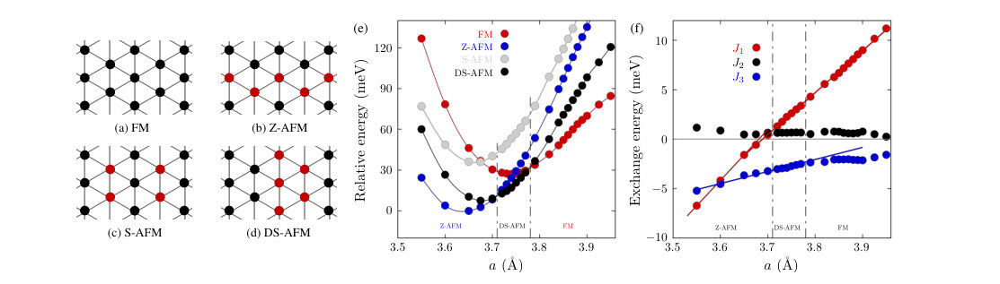
<figcaption class="paper-figure-caption"><b>Fig 1.</b> Figure 1. Magnetic exchange interactions are computed through energy mapping of various in-plane spin-ordered phases, such as (a) ferromagnetic (FM), (b) zigzag antiferromagnetic (Z-AFM), (c) stripe antiferromagnetic (S-AFM), and (d) double- stripe antiferromagnetic (DS-AFM) configurations. Black and red dots denote antiparallel collinear spins. Magnetism depends strongly on the in-plane lattice parameter a of monolayer CrTe2. (e) Magnetic phase stability as a function of the in-plane lattice parameter a. The Z-AFM state is favored below a critical value of a = 3.70 ˚A, while the DS-AFM and FM phases become progressively more stable at larger lattice constants, consistent with experimental...</figcaption>
</figure>
<figure class="paper-figure-card">
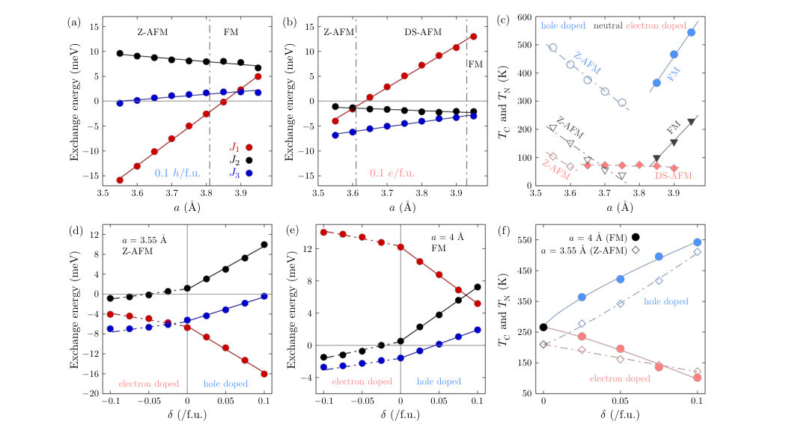
<figcaption class="paper-figure-caption"><b>Fig 2.</b> Figure 3. Calculations reveal a strong dependence of exchange interactions and thus, the transition temperatures on the in- plane lattice parameter and carrier density. Exchange interactions for an isotropic lattice (a1 = a3 = a) in (a) hole-doped (0.1 h/f.u.) and (b) electron-doped (0.1 e/f.u.) CrTe2 monolayers. illustrating the profound effect of carrier doping on the magnetic exchange hierarchy. (c) In hole-doped monolayers, the calculated Curie and N´eel temperatures indicate the persistence of high- temperature ferromagnetism and antiferromagnetism, depending on the lattice parameter a. The DS-AFM state is stabilized under electron doping, though the ordering temperature remains...</figcaption>
</figure>
<figure class="paper-figure-card">
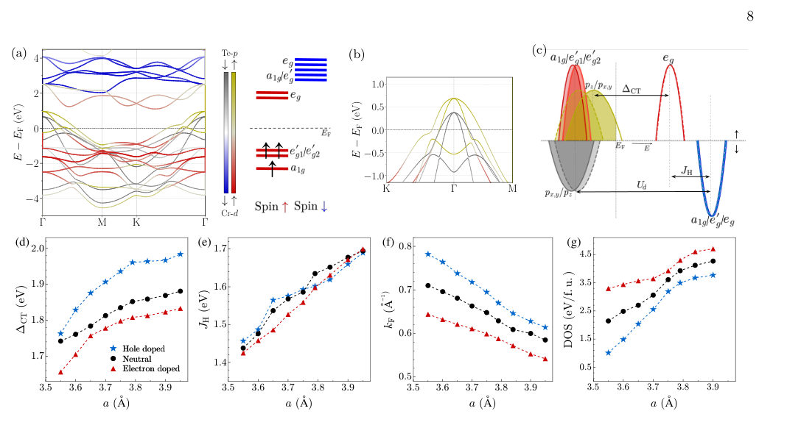
<figcaption class="paper-figure-caption"><b>Fig 3.</b> Figure 4. (a) Spin-polarized electronic band structure of monolayer 1T-CrTe2 calculated for an in-plane lattice parameter a = 3.95 ˚A. The color scale indicates the orbital character, with contributions from Te-p and Cr-d states as labeled. Strong p-d hybridization leads to metallic behavior. The trigonal distortion induced a1g, e′ g, and eg manifolds are schematically indicated, with spin-majority (red) and spin-minority (blue) components. (b) An enlarged view of the electronic structure near the Fermi level reveals a spin-polarized ligand hole pocket at the Γ point, giving rise to a small magnetic moment on the Te sites. (c) Schematic illustration of the spin-polarized density of states...</figcaption>
</figure>
<figure class="paper-figure-card">
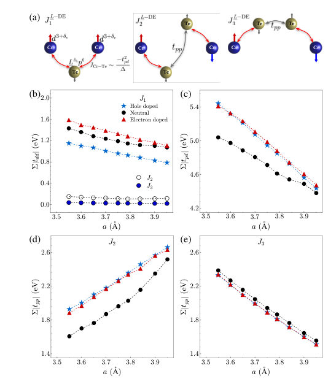
<figcaption class="paper-figure-caption"><b>Fig 4.</b> Figure 5. (a) Schematic representation of the ligand-hole– mediated double exchange interaction pathways. Finite Te moments are strong AFM coupled to Cr-spins, JCr−Te &lt; 0, analogous to the Zhang-Rice mechanism. Ligand-ligand hop- ping tpp enforces AFM coupling between Te moments along the long-range Cr−Te−Te−Cr paths, yielding weak AFM JL−DE 2 and JL−DE 3 interactions. Evolution of the key hop- ping amplitudes with lattice parameter and charge doping, which govern the direct exchange, superexchange, super- superexchange and L-DE, (b) metal-metal hopping tdd, (c) ligand-metal hopping tpd, and (d, e) are ligand-ligand hop- ping tpp along the exchange pathways for the second and third...</figcaption>
</figure>
<figure class="paper-figure-card">
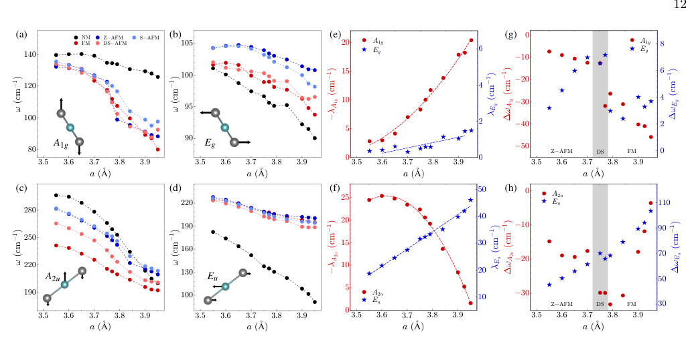
<figcaption class="paper-figure-caption"><b>Fig 5.</b> Figure 6. Phonon frequency evolution and spin-phonon coupling in monolayer CrTe2. Evolution of the Raman-active A1g and Eg modes (a, b), and the IR-active A2u and Eu modes (c, d) as a function of lattice parameter a for various magnetic phases compared to the non-magnetic (NM) state. Insets illustrate the atomic displacement vectors for the corresponding vibrational modes.(e, f) Mode-specific spin-phonon coupling constants λν for Raman and IR modes, calculated from the frequency shifts between the NM (⟨Si · Sj⟩= 0) and FM (⟨Si · Sj⟩= S2) states. The λν indicates strong spin-phonon coupling, with a pronounced dependence on a. Negative values of λν for out-of-plane modes (A1g, A2u) indicate a...</figcaption>
</figure>

**Summary.** This theoretical study maps out the complex magnetic phase diagram of monolayer CrTe2, showing that its magnetic order (FM, Z-AFM, DS-AFM) is exquisitely tunable by applying mechanical strain or controlling carrier doping. By calculating exchange interactions and simulating Raman spectra, the authors provide a comprehensive framework for designing 2D spintronic materials where magnetism can be engineered from first principles.

**Why it may be interesting.** While focused on magnetism, the detailed analysis of spin-lattice coupling (quantifying $\partial^2 J_i / \partial u^2$) and the use of symmetry-breaking signatures in spectroscopy are highly relevant to understanding how external perturbations affect quantum ground states in correlated materials.

Detailed structure

**Main problem.** The study investigates how structural changes (strain) and electronic doping affect the magnetic ground state, phase stability, and transition temperatures in monolayer CrTe2.

**Main result.** The research establishes a rich magnetic phase diagram where the system can exhibit FM, Z-AFM, or DS-AFM phases depending on doping and strain. The magnetism is governed by competing exchange interactions beyond simple conduction electron models.

**Method.** The work combines first-principles DFT calculations with advanced modeling techniques like Heisenberg Monte Carlo simulations and analysis of orbital-resolved hopping parameters.

**Model / system.** The system is monolayer CrTe2, modeled using an effective spin Hamiltonian incorporating nearest, second, and third-neighbor exchange interactions. The strong correlation effects are treated via Hubbard U parameterization.

**Key observables.** Magnetic phase diagram (FM, Z-AFM, DS-AFM), magnetic ordering temperatures ($T_C$, $T_N$), magnetoelastic response, and zone-folded Raman modes.

**Important parameters / regimes.** Lattice strain/parameter ($a$), carrier doping ($\delta$), Hubbard interaction strength ($U$), and exchange coupling ratios ($J_2/J_1, J_3/J_1$).

**Assumptions / limitations.** The analysis relies on mapping complex magnetic interactions onto an effective Heisenberg model; some studies use the bilinear framework supplemented by biquadratic terms.

**Figures summary.** Figures illustrate phase diagrams showing transitions between FM and AFM phases based on strain/doping, and simulated Raman spectra are used to spectroscopically distinguish between different magnetic ground states (e.g., Z-AFM vs DS-AFM).

**Paper structure.** The paper systematically analyzes the interplay of structural parameters ($a$) and doping ($\delta$) by calculating exchange interactions ($J_i$), mapping out phase boundaries, and finally predicting unique spectroscopic fingerprints via Raman scattering simulations.

Abstract

The interplay of structural, electronic, and magnetic degrees of freedom governs phase stability and critical temperatures in two-dimensional magnets. Controlling this coupling is essential for advancing fundamental understanding and spintronic applications. Combining first-principles calculations with Heisenberg Monte Carlo simulations, we reveal a rich magnetic phase diagram governed by the interplay of lattice strain and carrier density. These results provide a unified framework that reconciles diverse experimental reports on epitaxial layers and predicts a novel double-stripe antiferromagnetic phase, further stabilized by electron doping. Moreover, structural and electronic perturbations enable room-temperature ferromagnetism and antiferromagnetism. This magnetic evolution arises from competing, highly tunable direct and ligand-mediated exchange interactions in the presence of Ruderman-Kittel-Kasuya-Yosida coupling. By disentangling their individual contributions, we elucidate the underlying microscopic mechanisms, which transcends the conventional conduction electron picture. Finally, we quantify the colossal magnetoelastic response and identify zone-folded Raman modes that serve as unique experimental fingerprints for phase identification. Together, these results establish \ce{CrTe2} as a versatile platform for two-dimensional spintronics, where magnetic order and transition temperatures are tailorable via structural and electrical engineering.

[↑ back to top](#top)

### [Quantum Routers: A Switching-Fabric Framework for Quantum-Native Forwarding](http://arxiv.org/abs/2606.17773v1)

**Authors:** Jessica Illiano, Caterina De Risi, Angela Sara Cacciapuoti, Marcello Caleffi  
**Type:** theory · **Category:** quantum information and computing · **PDF:** <https://arxiv.org/pdf/2606.17773v1>  
**Analysis basis:** full PDF text, analyzed in chunks
**Topic relevance:** `quantum measurements` **3/5** · `entanglement & information structure` **2/5** · `measurement-induced transitions` **2/5** · `methods for driven-dissipative` **1/5** · `non-equilibrium dynamics` **1/5**

↔ Scroll figures horizontally

<figure class="paper-figure-card">
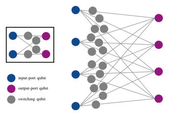
<figcaption class="paper-figure-caption"><b>Fig 1.</b> Fig. 3: Monolithic EC crossbar for N = 2 and N = 4.</figcaption>
</figure>
<figure class="paper-figure-card">

<figcaption class="paper-figure-caption"><b>Fig 2.</b> Fig. 4: Schematic representation of a three-stage Clos topology with stages L, C, R. The ingress stage L and the egress stage R contain r modules of size n×m and m×n, respectively. The middle stage C contains m modules of size r × r. Overall, the topology realizes a switching fabric with N = rn external inputs and N = rn external outputs.</figcaption>
</figure>
<figure class="paper-figure-card">
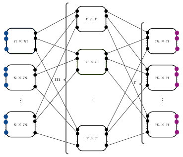
<figcaption class="paper-figure-caption"><b>Fig 3.</b> Fig. 5 illustrates a Clos-type EC fabric with N = 6, r = 3, n = 2, and m = 3. The ingress input-ports and egress output- ports form the external interface, while the remaining qubits</figcaption>
</figure>
<figure class="paper-figure-card">
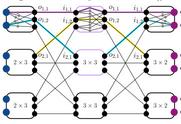
<figcaption class="paper-figure-caption"><b>Fig 4.</b> Fig. 5: Modular EC fabric with N = 6, r = 3, n = 2, m = 3.</figcaption>
</figure>
<figure class="paper-figure-card">
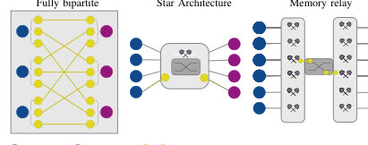
<figcaption class="paper-figure-caption"><b>Fig 5.</b> Fig. 6: EPR-based switching fabric architectures.</figcaption>
</figure>

**Summary.** The paper introduces an entanglement-based switching fabric, the Edge-Controlled (EC) crossbar, as a solution for quantum routers. It proves that this framework achieves constant forwarding depth by utilizing multipartite graph states and local Pauli measurements. This makes it fundamentally superior to existing methods whose latency scales poorly with network size.

**Why it may be interesting.** This work provides a rigorous theoretical framework for designing scalable quantum interconnects by shifting complexity from physical state transmission to resource preparation (entanglement generation), which is crucial for realizing large-scale quantum networks.

Detailed structure

**Main problem.** Developing a quantum-native switching-fabric framework for quantum routers that circumvents limitations imposed by the no-cloning theorem when relaying quantum information.

**Main result.** The proposed Edge-Controlled (EC) fabrics achieve constant forwarding depth, making them superior to matching-driven EPR-based architectures whose latency scales with the number of required connections.

**Method.** The authors formalize forwarding using multipartite entanglement resources (graph states) and derive an 'edge-controlled' design principle for non-blocking operation. Forwarding is realized through local Pauli measurements on these entangled resources.

**Model / system.** The system models a quantum router utilizing graph states $|	ext{G}
angle$ as the forwarding resource, which can be structured monolithically (EC crossbar) or modularly (Clos-type). The core mechanism involves mapping classical switching concepts onto entanglement manipulation via Pauli measurements.

**Key observables.** Forwarding Depth ($D(M)$), Expected Forwarding Latency ($ar{T}(M)$), and resource overhead scaling (e.g., $O(N^2)$ vs. linear).

**Important parameters / regimes.** Number of ports ($N$), number of available measurement devices ($\sigma$), and the ratio defining modular efficiency.

**Assumptions / limitations.** The framework is presented as hardware-agnostic, assuming sufficient measurement parallelism for ideal depth-one operation in EC fabrics. The non-blocking property relies on structural conditions derived from graph theory.

**Figures summary.** Figures illustrate the monolithic and modular structures of the EC crossbar and Clos topology, showing how ports connect to a global switching set $S$. Table I compares latency scaling across different architectures (Star, Memory-relay, EC).

**Paper structure.** The paper progresses from identifying the fundamental problem (no-cloning) to defining entanglement forwarding via graph states. It then derives structural conditions for non-blocking operation, instantiates these with monolithic and modular EC designs, and finally compares the resulting latency scaling against established EPR-based routing methods.

Abstract

Forwarding in quantum networks cannot be realized by directly transposing classical switching fabrics, since the no-cloning theorem and the quantum measurement postulate constrain the direct relay of quantum information while ruling out copy-based buffering and inspection. In this paper, we propose a switching-fabric framework for quantum routers based on multipartite entanglement. Specifically, we formalize the notion of an entanglement-based switching fabric, in which a graph state acts as the forwarding resource and entanglement forwarding is realized through local Pauli measurements. We translate the classical notions of blocking and non-blocking operation into structural conditions for entanglement-based fabrics, by deriving the \textit{edge-controlled (EC) design principle} for non-blocking operation. We instantiate this principle through a monolithic \textit{EC crossbar} and a modular Clos-type EC fabric, for which we characterize resource scaling and identify the regime where the modular design becomes more resource-efficient than the monolithic one. Finally, a forwarding-latency analysis establishes a fundamental distinction between matching-oblivious and matching-driven forwarding: the proposed EC fabrics realize all requested input-output entanglement links with constant forwarding depth under sufficient measurement parallelism, whereas matching-driven EPR-based fabrics exhibit latency that scales with the number of requested connections. The proposed framework provides a hardware-agnostic foundation for quantum-router switching fabrics.

[↑ back to top](#top)

### [Replica theory for the rate functional of the empirical spectral distribution function of diluted Hermitian matrices](http://arxiv.org/abs/2606.17868v1)

**Authors:** Edgar Guzmán-González, Isaac Pérez Castillo  
**Type:** theory · **Category:** disordered systems and neural networks · **PDF:** <https://arxiv.org/pdf/2606.17868v1>  
**Analysis basis:** full PDF text, analyzed in chunks
**Topic relevance:** `Keldysh / 2PI / non-Gaussian methods` **3/5** · `methods for driven-dissipative` **2/5** · `driven-dissipative phase transition` **1/5** · `exotic spin models in light-matter` **1/5** · `non-equilibrium dynamics` **1/5** · `non-equilibrium universality` **1/5**

↔ Scroll figures horizontally

<figure class="paper-figure-card">
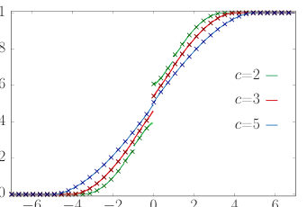
<figcaption class="paper-figure-caption"><b>Fig 1.</b> FIG. 1. Mean empirical spectral distribution function κ1(x) = ⟨iC(x)⟩for Erdős–Rényi adjacency matrices with mean con- nectivity c = 2, 3, 5. The solid curves are obtained from the population-dynamics solution of Eq. (13), while the markers are exact diagonalization results for N × N random matrices. The theoretical curves use the interval [−7, 7] discretized into 200 points, regularizer η = 10−4, a population of 104 func- tions, 103 updates, and 20 independent population-dynamics runs; the shaded bands show the corresponding run-to-run variability and are visible only for c = 2. The diagonaliza- tion markers are averages over 500 matrix realizations of size N = 5000.</figcaption>
</figure>
<figure class="paper-figure-card">
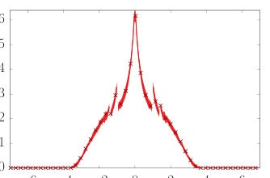
<figcaption class="paper-figure-caption"><b>Fig 2.</b> FIG. 2. Scaled connected covariance Nκ2(x, y) of the empir- ical spectral distribution function for Erdős–Rényi adjacency matrices with mean connectivity c = 2. The top panel shows a density plot of the theoretical population-dynamics result obtained from Eq. (13). The middle panel shows cuts at the dashed horizontal lines in the density plot, and the bottom panel shows the diagonal x = y. In the cuts, solid curves are the theoretical prediction and markers are exact diagonaliza- tion results. The population-dynamics parameters are the in- terval [−7, 7] discretized into 200 points, regularizer η = 10−4, population size 104, 103 updates, and 20 independent runs. Shaded bands in the line...</figcaption>
</figure>
<figure class="paper-figure-card">
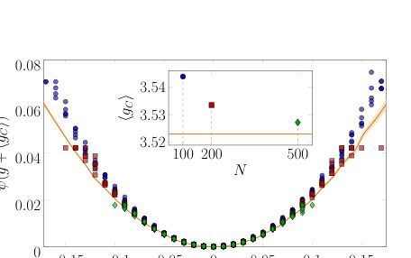
<figcaption class="paper-figure-caption"><b>Fig 3.</b> FIG. 3. Candidate rate function ψ for the Fourier projection gC = R a −a dx sin(πx/a)iC(x), with a = 7, for Erdős–Rényi adjacency matrices with mean connectivity c = 5. The solid curve is the replica-symmetric prediction. The horizontal co- ordinate is shifted by the mean, g = u −⟨gC⟩, so that the minimum is plotted at g = 0, and the normalization is chosen such that ψ(⟨gC⟩) = 0. The inset shows ⟨gC⟩as a function of N, with the solid horizontal line indicating the theoretical value. Exact diagonalization estimates use 4×104 samples for each system size and are repeated 5 times, producing the scat- ter points. The theoretical curve was obtained by discretizing the integrals into 80...</figcaption>
</figure>

**Summary.** This work applies advanced techniques from spin-glass theory (replica method) to calculate the rate functional governing fluctuations of the spectral distribution in sparse random matrices. By deriving explicit formulas for cumulants and comparing them against numerical data, the authors establish a powerful theoretical framework for analyzing spectral observables in complex disordered systems.

**Why it may be interesting.** While focused on random matrices, the use of replica theory and large deviation principles is a powerful mathematical tool applicable to complex systems where mean-field approximations are necessary, providing rigorous statistical descriptions.

Detailed structure

**Main problem.** The paper develops a replica-based framework to determine the rate functional for fluctuations of the empirical spectral distribution function ($i_C$) in diluted Hermitian random matrices.

**Main result.** It derives explicit expressions for the first two cumulants and computes candidate rate functions ($\Psi[\zeta]$) for linear spectral statistics, showing good agreement with numerical diagonalization in the accessible fluctuation regime.

**Method.** The core method involves using replica theory from spin-glass physics to calculate the scaled cumulant-generating functional ($F[\mu]$) via a replica-symmetric saddle-point approximation.

**Model / system.** The system under study is diluted Hermitian random matrices, exemplified by the adjacency matrices of unweighted Erdős–Rényi random graphs with a mean degree $c$. The analysis focuses on spectral statistics derived from these matrices.

**Key observables.** Empirical spectral distribution function ($i_C(x)$), cumulants ($\kappa_1, \kappa_2$), and the rate functional $\Psi[\zeta]$ for linear spectral statistics (e.g., Fourier coefficients).

**Important parameters / regimes.** Mean degree $c$, system size $N$ (analyzed in the thermodynamic limit $N 	o \infty$).

**Assumptions / limitations.** The analysis relies on the replica-symmetric saddle-point ansatz and assumes that a large-deviation principle holds for $i_C$.

**Figures summary.** Figures compare theoretical predictions for $\kappa_1$, $N\kappa_2$, and the rate function $\psi$ against results from exact numerical diagonalization, demonstrating quantitative agreement.

**Paper structure.** The paper builds up the formalism by first defining the generating functional using replicas, then deriving explicit formulas for cumulants via functional derivatives, and finally computing the rate function $\psi(u)$ through transformations relating it to the cumulant-generating functional $f(eta)$.

Abstract

We develop a replica-based framework for the scaled cumulant-generating functional of the empirical spectral distribution function $i_C$ of diluted Hermitian random matrices. Within a replica-symmetric saddle-point assumption, this construction yields a candidate rate functional for fluctuations of $i_C$. As an illustrative application, we consider adjacency matrices of unweighted Erdős-Rényi random graphs with mean degree $c$. We derive explicit expressions for the first two cumulants of $i_C$, indicate how higher cumulants can be obtained from further functional derivatives, and compute the rate function of Fourier coefficients, equivalently of selected linear spectral statistics. The replica-symmetric predictions are tested against exact numerical diagonalization and show good agreement in the accessible fluctuation regime. The approach provides a basis for studying rate functionals of spectral observables in sparse random matrix ensembles.

[↑ back to top](#top)

### [Stochastic Thermodynamics of Score Matching in Diffusion Models](http://arxiv.org/abs/2606.17252v1)

**Authors:** Xuehao Ding, H. T. Quan, Yuhai Tu  
**Type:** theory · **Category:** statistical mechanics · **PDF:** <https://arxiv.org/pdf/2606.17252v1>  
**Analysis basis:** full PDF text, analyzed in chunks
**Topic relevance:** `non-equilibrium dynamics` **3/5** · `non-equilibrium universality` **2/5** · `Keldysh / 2PI / non-Gaussian methods` **1/5** · `correlated / nonlocal dissipation` **1/5** · `driven-dissipative phase transition` **1/5** · `methods for driven-dissipative` **1/5**

↔ Scroll figures horizontally

<figure class="paper-figure-card">
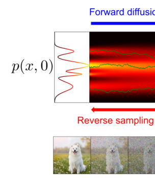
<figcaption class="paper-figure-caption"><b>Fig 1.</b> Fig. 1: Schematic of the diffusion model.</figcaption>
</figure>
<figure class="paper-figure-card">
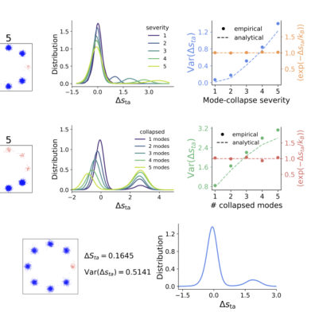
<figcaption class="paper-figure-caption"><b>Fig 2.</b> Fig. 2: Diffusion model on 2D Gaussian-mixture data. (a) Left: The first panel shows the target data distribution, eight Gaussians on a 2D ring with equal weights. The other panels show the distributions generated by five diffusion models with increas- ing collapse severity of a single mode (colored in red). Middle: Density of ∆sta for each mode-collapse severity. Right: Variance of TAEP increasing with the severity of mode collapse and numerical verification of the integral fluctuation theorem. Analyti- cal values from equations (40) and (30) are shown. (b) Similar to (a) but for increasing numbers of collapsed modes. (c) The distributions generated by two diffusion mod- els with similar...</figcaption>
</figure>
<figure class="paper-figure-card">
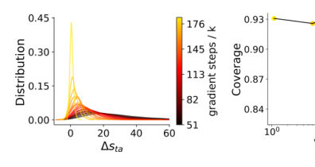
<figcaption class="paper-figure-caption"><b>Fig 3.</b> Fig. 3: Diffusion model on CIFAR-10. (a) The distribution of TAEP along the training process. (b) The coverage of the data manifold by generated samples increases as the variance of TAEP is reduced during the optimization process. (c) The variance of TAEP decreases along with the mean during the optimization process.</figcaption>
</figure>
<figure class="paper-figure-card">
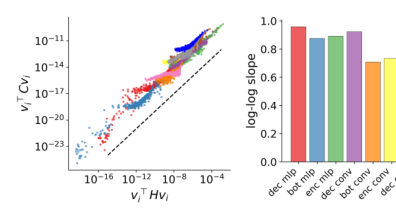
<figcaption class="paper-figure-caption"><b>Fig 4.</b> Fig. 4: Numerical results on the relationship between Hessian (loss curvature) and SGD noise covariance for diffusion model on CIFAR-10. We denote the Hessian matrix by H, the normalized top eigenvectors of H by vi, and the covariance matrix of SGD noise by C. (a) Eigenvalues of the Hessian versus Rayleigh quotients of the SGD noise covariance at the eigenvectors of the Hessian. Results for parameters in the MLP/con- volutional/attention/normalization layers in the decoder/bottleneck/encoder of the U-Net are plotted, with the color coding given in (b). A dashed line with log-log slope equal to 1 is shown for comparison. (b) Log-log slope of the SGD noise covariance v⊤ i Cvi versus the...</figcaption>
</figure>

**Summary.** This work establishes a stochastic thermodynamic framework for diffusion models by introducing the Time-asymmetry Entropy Production (TAEP). It proves that the average TAEP is proportional to the score-matching objective and obeys fluctuation theorems. This offers a deep, physical understanding of why these generative models achieve high sampling diversity.

**Why it may be interesting.** It provides a rigorous physical interpretation of modern generative AI objectives using established tools from non-equilibrium statistical mechanics, linking machine learning loss functions directly to thermodynamic quantities like entropy production.

Detailed structure

**Main problem.** To develop a stochastic thermodynamic framework for score-based diffusion models, relating their training objective to fundamental principles like entropy production.

**Main result.** The average Time-asymmetry Entropy Production (TAEP) is exactly proportional to the score-matching objective, and TAEP obeys exact fluctuation theorems. This provides a thermodynamic explanation for the superior sampling diversity of diffusion models.

**Method.** The authors introduce TAEP, a trajectory-dependent quantity derived from forward and reverse Langevin dynamics, and apply concepts from non-equilibrium statistical physics, including fluctuation theorems.

**Model / system.** The system is score-based diffusion models, which model data generation via a forward diffusion process (data to noise) and a learned reverse sampling process. The analysis treats these processes as stochastic physical systems.

**Key observables.** Time-asymmetry Entropy Production (TAEP), its fluctuations ($	ext{Var}(\Delta s_{	ext{ta}})$), and the ensemble average $\langle \Delta s_{	ext{ta}} 
angle$.

**Important parameters / regimes.** The proportionality constant relating $\langle \Delta s_{	ext{ta}} 
angle$ to the score-matching objective, and the noise strength/curvature of the loss landscape.

**Assumptions / limitations.** The analysis relies on interpreting diffusion models as stochastic physical systems and assumes sufficient network expressivity for the reverse process to approximate the true score function.

**Figures summary.** Figures show TAEP distributions verifying fluctuation theorems, tracking data manifold coverage via $	ext{Var}(\Delta s_{	ext{ta}})$ during training, and demonstrating a positive correlation between SGD noise covariance and the loss landscape Hessian.

**Paper structure.** The paper builds from defining the stochastic framework (Langevin equations) to deriving TAEP, proving it obeys fluctuation theorems, establishing its proportionality to the score-matching objective, and finally analyzing how fluctuations quantify sampling unevenness and guide optimization towards flatter minima.

Abstract

Score-based diffusion models are a powerful class of generative AI systems capable of sampling from complex, high-dimensional probability distributions. Their dynamics consist of a forward diffusion process that transforms data into noise and a learned reverse process that reconstructs data by reversing the probability flow. Here, we develop a stochastic thermodynamic framework for diffusion models and their score-matching objective. We introduce a trajectory-dependent quantity, time-asymmetry entropy production (TAEP), defined from the forward and reverse diffusion dynamics, and show that it obeys exact fluctuation theorems. Remarkably, Hyvärinen's implicit score-matching kernel emerges naturally as a fluctuating component of TAEP, while the average TAEP is exactly proportional to the score-matching objective. We further show that fluctuations of TAEP quantify sampling unevenness and provide a thermodynamic measure of data-manifold coverage. These results yield a quantitative explanation for the superior sampling diversity of diffusion models and reveal a thermodynamic mechanism by which stochastic gradient descent favors flatter, more generalizable solutions. By uncovering the entropic nature of score matching, our work establishes fundamental statistical-mechanical principles underlying diffusion-based generative AI.

[↑ back to top](#top)

### [Twin-beam advantage in quantum LiDAR under correlated noise](http://arxiv.org/abs/2606.17908v1)

**Authors:** Valeria Cimini  
**Type:** theory · **Category:** other · **PDF:** <https://arxiv.org/pdf/2606.17908v1>  
**Analysis basis:** full PDF text, analyzed in chunks
**Topic relevance:** `interference shaping light` **3/5** · `quantum optics experiment` **3/5** · `correlated / nonlocal dissipation` **1/5** · `entanglement & information structure` **1/5** · `quantum measurements` **1/5**

↔ Scroll figures horizontally

<figure class="paper-figure-card">
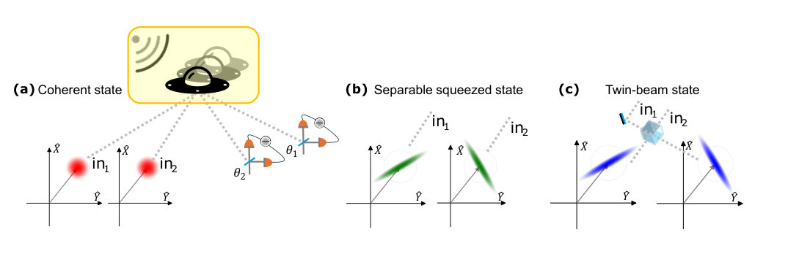
<figcaption class="paper-figure-caption"><b>Fig 1.</b> FIG. 1. LiDAR scheme for the joint estimation of target range and velocity in a noisy environment. The protocol is investigated for three two-mode (in1 and in2) probe families: (a) coherent states, (b) separable squeezed states, and (a) twin-beam states. After target interaction and propagation through the noisy channel, the two reflected modes are analyzed by homodyne detection. The local-oscillator phases θ1 and θ2 can be optimized depending on the considered configuration.</figcaption>
</figure>
<figure class="paper-figure-card">
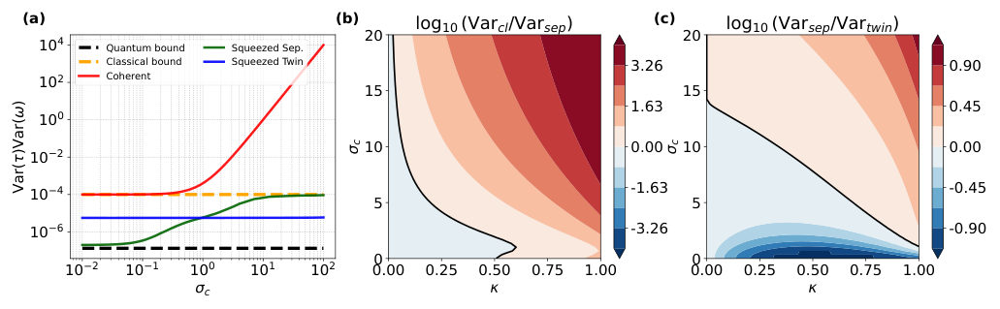
<figcaption class="paper-figure-caption"><b>Fig 2.</b> FIG. 2. (a) Joint range–velocity estimation performance against correlated noise strength σc at fixed probe energy N = 50 for nth = 0 and κ = 1 obtained from homodyne quadratures for coherent states (red), separable squeezed states (green), and twin-beam states (blue). The standard quantum limit for classical light is the orange dashed line (1/(4∆Ω2∆T 2N 2)), while the ultimate Heisenberg limit is the black dashed line ((1/(4∆Ω2∆T 2N 4))). (b) Comparison of coherent states versus separable squeezed states for different levels of loss and correlated jamming noise strength at fixed thermal background nth = 0.5. The panels report the logarithm of the ratio between the variance products...</figcaption>
</figure>
<figure class="paper-figure-card">
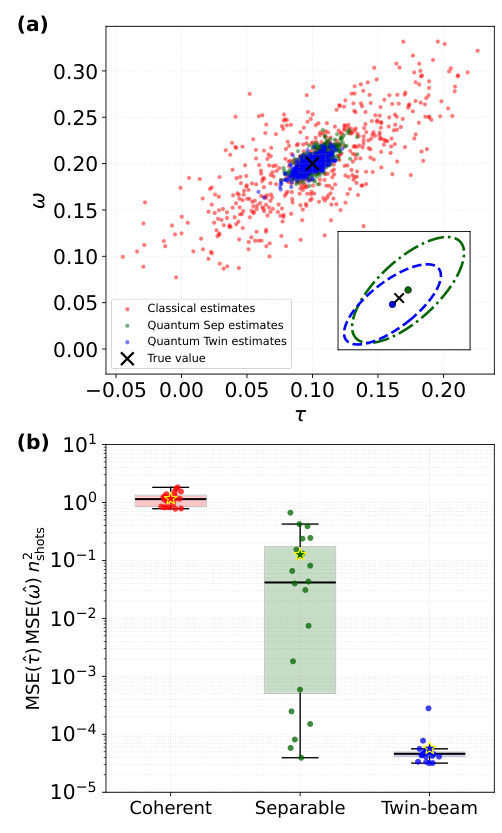
<figcaption class="paper-figure-caption"><b>Fig 3.</b> FIG. 3. Estimator-level reconstruction from homodyne data for the three probe classes at fixed total photon number N = 50, κ = 0.95, nth = 0, and σc = 5: coherent (red), separable squeezed (green), and twin-beam (blue). a Each point in the main panel corresponds to one independent maximum-likelihood estimate (ˆτ, ˆω) obtained from a simulated homodyne dataset of fixed size nshots = 100, generated for the same true operating point (τtrue, ωtrue) (black cross). The inset shows the corresponding covariance ellipses, centered at the sam- ple mean of each estimator distribution. Their area and orientation quantify the joint uncertainty and the residual correlation between the inferred range- and...</figcaption>
</figure>
<figure class="paper-figure-card">
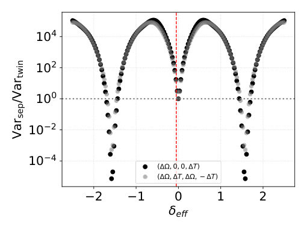
<figcaption class="paper-figure-caption"><b>Fig 4.</b> FIG. 4. State-level robustness of the twin-beam advantage under generalized two-mode encoding. We plot the variance product ratio, evaluated from the complete two-mode Gaussian covariance matrix and mean vector, for σc = 100, κ = 1, and nth = 0 as a func- tion of the encoding asymmetry δeff. Black markers correspond to the independent encoding used in the main text, while gray markers correspond to the mixed encoding. The red dashed line marks the operating point used in the first part of the main-text analysis.</figcaption>
</figure>
<figure class="paper-figure-card">
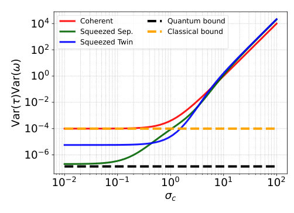
<figcaption class="paper-figure-caption"><b>Fig 5.</b> FIG. 5. Product of the estimator variances as a function of the correlated-noise strength σc for coherent (red), separable squeezed (green), and twin-beam (blue) probes for a fixed homodyne basis.</figcaption>
</figure>

**Summary.** This work analyzes quantum LiDAR performance to determine when entanglement offers an advantage over simple squeezing under realistic noise. By modeling correlated jamming noise, the authors show that twin-beam states provide superior estimation precision compared to classical or locally squeezed light. This establishes a receiver-aware protocol for achieving practical quantum enhancement in remote sensing.

**Why it may be interesting.** It provides a concrete, experimentally relevant roadmap for achieving quantum enhancement in remote sensing by identifying the specific noise structure (correlated interference) that unlocks the full potential of multipartite entanglement over local resources.

Detailed structure

**Main problem.** The study investigates whether entanglement provides a genuine operational advantage over local squeezing for quantum LiDAR when the dominant noise source is structured, correlated interference rather than independent noise.

**Main result.** Correlated noise establishes an operational regime where twin-beam probes outperform both classical and separable squeezed states, provided the receiver adaptively optimizes its measurement basis.

**Method.** The analysis uses a unified Gaussian framework to compare three quantum probe types (coherent, separable squeezed, twin-beam) by calculating joint estimation performance metrics like Fisher Information and Mean Square Error for range and velocity estimation.

**Model / system.** The system is a Quantum LiDAR setup performing joint range ($	au$) and velocity ($\omega$) estimation using bright two-mode Gaussian probes detected via homodyne measurements. The noise model incorporates both standard loss/thermal background and structured correlated jamming noise.

**Key observables.** Joint range–velocity estimation performance (variance products), Mean Square Error (MSE) of parameter estimates, and the ratio quantifying the advantage between different quantum states.

**Important parameters / regimes.** Fixed total signal energy ($N=50$), correlated noise strength ($\sigma_c$), and the adaptive optimization of receiver measurement settings (LO phases).

**Assumptions / limitations.** The analysis assumes that the receiver can adaptively optimize its measurement basis to maximize accessible information, moving beyond simple theoretical bounds.

**Figures summary.** Figures compare joint estimation performance vs. correlated noise strength ($\sigma_c$), showing the hierarchy of advantages; other figures detail reconstruction MSE and covariance ellipses for different probe types under varying conditions.

**Paper structure.** The paper progresses from establishing the general problem in quantum sensing to modeling specific noise regimes (loss/thermal vs. correlated jamming). It then compares the performance metrics across coherent, separable squeezed, and twin-beam states, culminating in demonstrating the operational advantage of entanglement under structured noise via simulation.

Abstract

Quantum light promises improved precision in optical remote sensing, but its practical advantage depends critically on whether nonclassical resources remain useful under realistic noise and experimentally accessible detection. This question becomes especially relevant for LiDAR systems, where a quantum advantage has been demonstrated for target detection and joint range-velocity estimation, but mostly under idealized conditions or simple noise models, such as optical loss and thermal background. A key open point is whether entanglement provides an operational advantage when the dominant disturbance is not independent noise, but structured interference across sensing modes. Here, we address this question by studying the joint estimation of target range and velocity with bright two-mode Gaussian probes and homodyne detection, comparing coherent, separable squeezed, and twin-beam states at a fixed resource budget. Our results reveal a hierarchy of quantum resources set by the noise structure: separable squeezing provides a robust advantage over coherent illumination under loss and thermal background, whereas twin-beam probes become superior under correlated jamming when the receiver is adaptively optimized. These results establish correlated noise as the operational regime in which entanglement provides a robustness advantage beyond local squeezing, opening a receiver-aware route to quantum-enhanced LiDAR in realistic and potentially adversarial environments.

[↑ back to top](#top)

### [Nonlinear Optical Probing of Ferroic-Octupolar Order Parameter in Collinear Altermagnet](http://arxiv.org/abs/2606.17848v1)

**Authors:** P. A. Usachev, R. V. Pisarev, V. V. Pavlov  
**Type:** experiment · **Category:** strongly correlated electrons · **PDF:** <https://arxiv.org/pdf/2606.17848v1>  
**Analysis basis:** full PDF text, analyzed in chunks
**Topic relevance:** `exotic spin models in light-matter` **3/5** · `spintronics-quantum-optics interface` **3/5** · `interference shaping light` **1/5** · `quantum optics experiment` **1/5**

↔ Scroll figures horizontally

<figure class="paper-figure-card">

<figcaption class="paper-figure-caption"><b>Fig 1.</b> FIG. 2. Polarization-dependent SHG signals registered in the two geometries Eω ∥E2ω and Eω ⊥E2ω and at temperatures of 1.6 K and 45 K. The experimental SHG intensities are indicated by points, modelled SHG signals are shown by lines. Inset shows the parallel Eω ∥E2ω and crossed Eω ⊥E2ω</figcaption>
</figure>
<figure class="paper-figure-card">
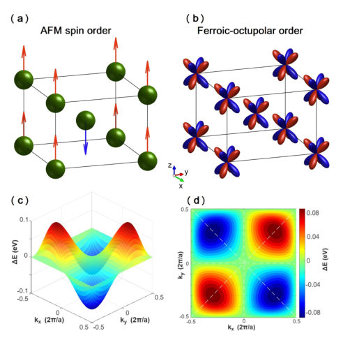
<figcaption class="paper-figure-caption"><b>Fig 2.</b> FIG. 1. (a) The AFM spin order of Co2+ ions and (b) the ferrotype ordering of magnetic octupoles in CoF2. The angu- lar distributions of magnetization density are marked by the red and blue colors representing regions of up and down spin polarizations, respectively [9]. (c) The 3D graph and (d) the flat mapping of d-wave spin splitting in CoF2 (see SI 2 for details).</figcaption>
</figure>
<figure class="paper-figure-card">
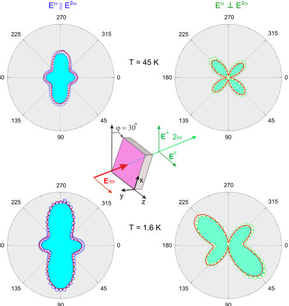
<figcaption class="paper-figure-caption"><b>Fig 3.</b> Figure 3 shows the temperature evolution of SHG inten- sities in two polarization geometries for different angles (Eω ⊥E2ω = 0◦and 45◦, Eω ∥E2ω = 90◦), the angle is counted in respect to Eω for both geometries. These experimental SHG data provide a quantitative measure of the spin-induced contribution. A purely magnetic re-</figcaption>
</figure>
<figure class="paper-figure-card">
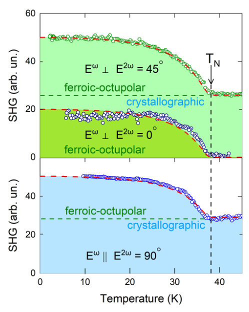
<figcaption class="paper-figure-caption"><b>Fig 4.</b> FIG. 3. Temperature dependencies of SHG intensity for two geometries Eω ⊥E2ω and Eω ∥E2ω (dots). The red dash lines show temperature dependencies of the squared order pa- rameter of CoF2 obtained from the neutron spectroscopy data [42].</figcaption>
</figure>
<figure class="paper-figure-card">
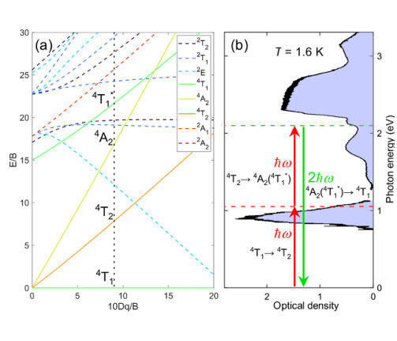
<figcaption class="paper-figure-caption"><b>Fig 5.</b> FIG. 4. (a) Tanabe-Sugano diagram for 3d7 electron com- plex of the Co2+ ion in the octahedral crystal field of F−</figcaption>
</figure>

**Summary.** This work reports on using Second-Harmonic Generation (SHG) spectroscopy as a novel, symmetry-sensitive tool to detect the ferroic-octupolar magnetic order parameter in the altermagnet $	ext{CoF}_2$. By analyzing the temperature and polarization dependence of the SHG signal relative to the Néel temperature, the authors confirm that the observed nonlinear response is directly governed by the hidden antiferromagnetic octupole moment. This establishes a powerful optical pathway for studying complex magnetic ground states.

**Why it may be interesting.** The use of nonlinear optics (SHG) to probe higher-order magnetic multipoles ($	ext{octupole}$) is highly relevant for understanding exotic quantum phases in condensed matter systems that are not captured by simple magnetization measurements.

Detailed structure

**Main problem.** The study aims to develop a direct experimental method to probe the hidden ferroic-octupolar spin order parameter in altermagnets, which lack net magnetization and are invisible to standard magnetometry.

**Main result.** The observation of electric and magnetic dipole forbidden Second-Harmonic Generation (SHG) below the Néel temperature confirms that the signal is proportional to a ferroic-octupole-induced nonlinear polarization, establishing SHG as a novel diagnostic tool for this order.

**Method.** Nonlinear Optical Second-Harmonic Generation (SHG) spectroscopy was employed, analyzing the symmetry dependence of the resulting polarization ($\mathbf{P}_{2\omega}$) relative to temperature and crystal orientation.

**Model / system.** The system is the altermagnet $	ext{CoF}_2$, which exhibits a collinear Antiferromagnetic (AFM) order below $T_N = 38 	ext{ K}$. The theoretical framework models the nonlinear polarization as arising from an electric-quadrupolar term proportional to the magnetic octupole order parameter ($\mathbf{\mathcal{O}}^M$).

**Key observables.** SHG intensity ($I_{2\omega}$), temperature dependence of $I_{2\omega}$, and polarization anisotropy measurements across different incidence angles.

**Important parameters / regimes.** Néel Temperature ($T_N = 38 	ext{ K}$); the ferroic-octupole order parameter ($\mathbf{\mathcal{O}}^M$); photon energy matching three-photon resonance with $	ext{Co}^{2+}$ $d$-$d$ transitions.

**Assumptions / limitations.** The analysis assumes that the total SHG signal is a sum of crystallographic and spin-induced contributions, and that interference between these two components can be neglected for robust measurement.

**Figures summary.** Figures illustrate the AFM spin order; compare polarization-dependent SHG signals above ($T>T_N$) versus below ($T<T_N$) $T_N$; and show the temperature evolution of the spin-induced component confirming its magnetic origin.

**Paper structure.** The paper progresses by establishing the theoretical necessity of probing hidden order parameters, detailing the symmetry analysis linking SHG to the octupole moment ($\mathbf{P}_{2\omega} \propto \chi^{(3)}(\mathbf{\mathcal{O}}^M) : \mathbf{E}_\omega 
abla \mathbf{E}_\omega$), presenting experimental measurements showing temperature and polarization dependence, and concluding with the establishment of the technique's utility.

Abstract

Altermagnetism as a new concept in condensed matter physics is currently being thoroughly investigated. Despite the absence of macroscopic magnetization, altermagnets host a hidden spin order whose direct detection remains a challenge. Here we report on the observation of electric and magnetic dipole forbidden optical second-harmonic generation (SHG) in the altermagnet CoF$_2$ with a centrosymmetric lattice and spin order. We demonstrate that below the Néel temperature $T_N = 38$ K the SHG signal is sensitive to the ferrotype magnetic octupole $\mathbf{\mathcal{O}}^M$ which is the order parameter in the antiferromagnetic phase. By combining polarization-resolved SHG experimental data and a phenomenological symmetry analysis, we show that the altermagnetic spin structure of CoF$_2$ enables a ferroic-octupole-induced electric-quadrupolar nonlinear polarization $\mathbf{P}^{2ω} = \mathrm i\varepsilon_{0}{ }^c\mathbfχ^{(3)}(\mathbf{\mathcal{O}}^M) :\mathbf{E}^ω \nabla \mathbf{E}^ω$. The temperature dependence of SHG reveals a phase transition at $T_N$ confirming the spin origin of the observed signal. The SHG response is resonantly enhanced by a coherent three-photon process caused by the electronic $d$-$d$ transitions of the Co$^{2+}$ ion. Model calculations of SHG polarization rotational anisotropies and temperature dependencies give a reasonable agreement with experimental data, proving the disclosed nonlinear contribution. Our results establish SHG as a novel sensitive tool of ferroic-octupolar spin ordering and highlight the potential of CoF$_2$ and other altermagnets for further nonlinear optical investigations and applications.

[↑ back to top](#top)

### [Thermal One-point Functions and Asymptotic CFT Data: QFT in AdS](http://arxiv.org/abs/2606.17167v1)

**Authors:** Ilija Burić, Francesco Mangialardi, Francesco Russo, Volker Schomerus, Alessandro Vichi  
**Type:** theory · **Category:** statistical mechanics · **PDF:** <https://arxiv.org/pdf/2606.17167v1>  
**Analysis basis:** full PDF text, analyzed in chunks
**Topic relevance:** `Keldysh / 2PI / non-Gaussian methods` **3/5** · `non-equilibrium dynamics` **2/5** · `driven-dissipative phase transition` **1/5** · `methods for driven-dissipative` **1/5** · `non-equilibrium universality` **1/5**

↔ Scroll figures horizontally

<figure class="paper-figure-card">
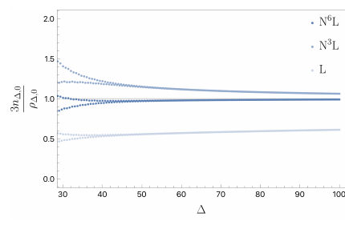
<figcaption class="paper-figure-caption"><b>Fig 1.</b> Figure 1. GFF spectral density of scalars operators with ∆ϕ = 2</figcaption>
</figure>
<figure class="paper-figure-card">
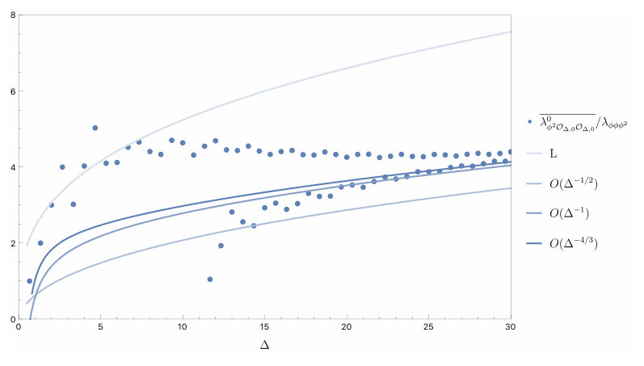
<figcaption class="paper-figure-caption"><b>Fig 2.</b> Figure 2. GFF OPE coefficients λ0 ϕ2OO for scalars, ∆ϕ = 2 3. We compare normalised exact OPE coefficients for scalar exchanged operators with the asymptotic formula (3.39) with additional subleading corrections.</figcaption>
</figure>
<figure class="paper-figure-card">
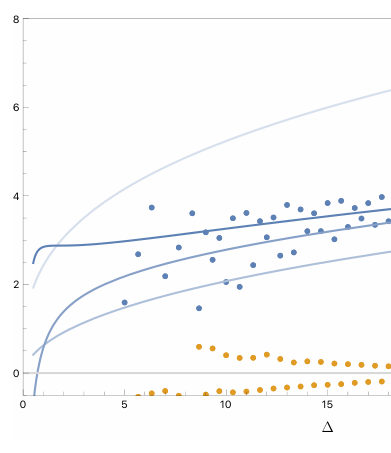
<figcaption class="paper-figure-caption"><b>Fig 3.</b> Figure 3. GFF OPE coefficients λ0 ϕ2OO for spin one, ∆ϕ = 2</figcaption>
</figure>
<figure class="paper-figure-card">
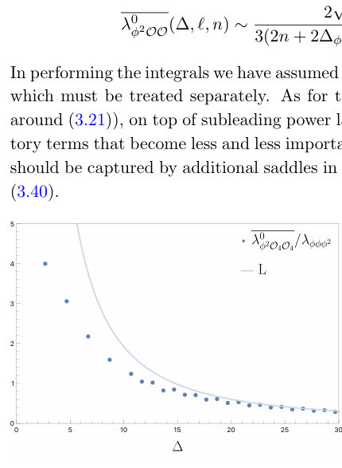
<figcaption class="paper-figure-caption"><b>Fig 4.</b> Figure 4. OPE coefficients with four- and five-particle scalars internal operators, ∆ϕ = 2</figcaption>
</figure>
<figure class="paper-figure-card">
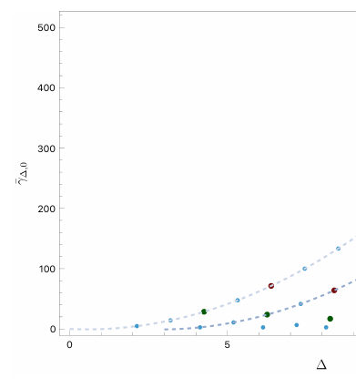
<figcaption class="paper-figure-caption"><b>Fig 5.</b> Figure 5. Low-lying anomalous dimensions of scalars, ∆ϕ = 33</figcaption>
</figure>

**Summary.** This work analyzes thermal properties of a 3D CFT dual to an interacting scalar field in AdS4. Using advanced techniques like thermal inversion formulas, the authors determine the asymptotic behavior of key observables such as spectral densities and OPE coefficients. The main achievement is demonstrating that these derived asymptotic results maintain high quantitative accuracy even when considering intermediate energy regimes and weak interactions.

**Why it may be interesting.** While focused on AdS/CFT, the rigorous development of thermal effective field theories for one-point functions and the extraction of universal asymptotic data are powerful analytical tools applicable to understanding critical phenomena in many quantum systems.

Detailed structure

**Main problem.** The research investigates thermal partition functions and one-point functions of a 3D CFT dual to a massive scalar field in AdS4.

**Main result.** The authors derive asymptotic formulas for spectral density and OPE coefficients that remain quantitatively accurate even at intermediate conformal weights, surviving the inclusion of bulk interactions.

**Method.** They employ thermal inversion formulas applied to correlation functions derived from analyzing the partition function using techniques involving conformal block decompositions and high-temperature expansions.

**Model / system.** The system is a Conformal Field Theory (CFT) in 3D, holographically dual to a massive interacting scalar field theory ($\Phi^3, \Phi^4$) propagating in Anti-de Sitter space (AdS$_4$).

**Key observables.** Thermal partition function, one-point functions of primary fields, spectral density $
ho(\Delta, \ell)$, and OPE coefficients ($\lambda_{\phi O}$).

**Important parameters / regimes.** Inverse temperature ($eta$), chemical potential ($\mu$), conformal dimension ($\Delta$), and spin ($\ell$). The analysis focuses on the high-temperature limit ($eta 	o 0$) and large $\Delta$ regimes.

**Assumptions / limitations.** The analysis relies fundamentally on the AdS/CFT correspondence, utilizing techniques derived from conformal block expansions and asymptotic analysis in complex variables.

**Figures summary.** Figures compare asymptotic formulas for spectral density and OPE coefficients against exact results obtained through various limits (e.g., GFF theory).

**Paper structure.** The paper systematically progresses by first analyzing the non-interacting Generalized Free Field (GFF) theory, then incorporating perturbative corrections from cubic and quartic bulk interactions, applying thermal inversion techniques throughout.

Abstract

We investigate the thermal partition and one-point functions of the three-dimensional conformal field theory dual to a massive interacting scalar field in AdS$_4$. Using thermal inversion formulas, we determine the asymptotic behaviour of the spectral density and OPE coefficients involving heavy operators at fixed spin. We first analyse these CFT data for the generalised free field, corresponding to the non-interacting bulk theory. Then we compute the first-order perturbative corrections induced by the cubic and quartic bulk interactions. The thermal observables considered here probe a sector associated with operators of large dimension and, in the bulk description, a regime dominated by states with large particle number. This regime remains comparatively unexplored even in generalised free field theory. Remarkably, the asymptotic formulas obtained from thermal inversion remain quantitatively accurate far from the asymptotic regime, describing CFT data reliably already at intermediate conformal weights. Our results show that this feature survives the inclusion of bulk interactions and provide new analytic control over heavy-state data in conformal field theories.

[↑ back to top](#top)

### [Demultiplexing Generalized Information via Quantum Transmission Lines](http://arxiv.org/abs/2606.17894v1)

**Authors:** Soham Sau, Anna Jenčová, Tamal Guha  
**Type:** theory · **Category:** quantum information and computing · **PDF:** <https://arxiv.org/pdf/2606.17894v1>  
**Analysis basis:** full PDF text, analyzed in chunks
**Topic relevance:** `entanglement & information structure` **3/5** · `correlated / nonlocal dissipation` **1/5** · `driven-dissipative phase transition` **1/5** · `methods for driven-dissipative` **1/5** · `non-equilibrium dynamics` **1/5**

↔ Scroll figures horizontally

<figure class="paper-figure-card">
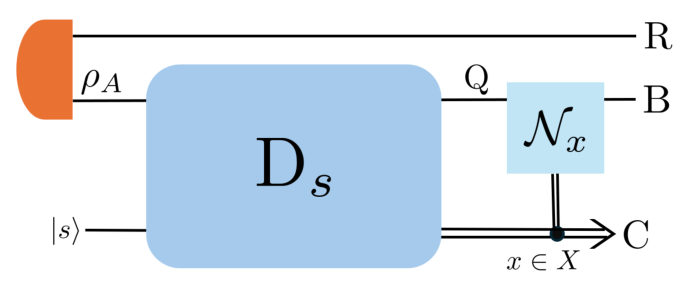
<figcaption class="paper-figure-caption"><b>Fig 1.</b> Figure 1. Schematic diagram of a Q-DEMUX. A bipartite state between Alice A and the Reference R is prepared and Alice’s marginal state ρA is sent through the Q-DEMUX. Depending upon the nature of information encoded in ρA, the selector s ∈{0, 1} is chosen. Finally, at the output end depending upon the classical random variable x ∈X registered in C a pre-decided correction operation Nx is applied on the output quantum state at Q.</figcaption>
</figure>
<figure class="paper-figure-card">
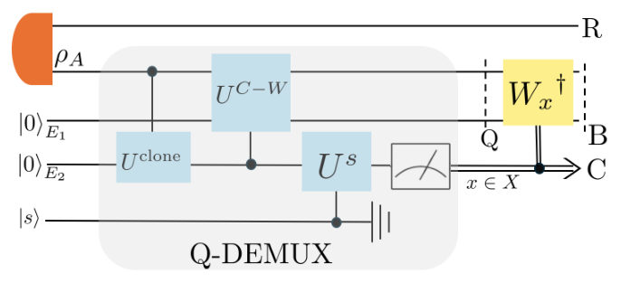
<figcaption class="paper-figure-caption"><b>Fig 2.</b> Figure 2. Circuit diagram for a pure-perfect Q-DEMUX. The gray box denotes the Q-DEMUX realization in terms of the controlled unitary gates (cyan) and the din-dimensional computational basis measurement on E2. Finally, the correcting unitary (yellow) {W † x}x is appended on the subsystem Q ≃AE1 externally.</figcaption>
</figure>

**Summary.** The paper develops the theory of the Quantum Demultiplexer (Q-DEMUX) to quantify the total amount of generalized information (classical plus quantum) that can be perfectly routed from an input state. It establishes fundamental upper bounds on this demultiplexing strength and characterizes the specific types of underlying quantum channels required to achieve these theoretical maximums.

**Why it may be interesting.** This work provides a rigorous quantum information-theoretic framework for understanding how classical and quantum data streams can be simultaneously processed or separated within a single physical device, which has implications for quantum networking protocols.

Detailed structure

**Main problem.** The paper investigates whether generalized information, encompassing both classical and quantum data encoded in a quantum system, can be perfectly routed or 'demultiplexed' at designated output ports using a Quantum Demultiplexer (Q-DEMUX). It seeks to characterize the fundamental limits of this process.

**Main result.** The maximum total demultiplexing strength is bounded by $\log_2 d_{	ext{in}}$, and optimal performance requires the underlying induced quantum channel ($\Lambda_{	ext{ind}}$) to be a specific combination of Random Isometry (RI) and Classical-Quantum (C-Q) channels.

**Method.** The analysis uses information theoretic tools, defining total demultiplexing strength by summing classical mutual information and quantum coherent information. It involves characterizing the Q-DEMUX via its relationship to instrument realizations and deriving upper bounds using capacity arguments.

**Model / system.** The core model is the Quantum Demultiplexer (Q-DEMUX), which acts as a CPTP map taking an input state $
ho^A_{in}$ and routing information to separate quantum ($Q$) and classical ($C$) output ports based on a selector $s$. The process is mathematically linked to induced quantum channels ($\Lambda_{	ext{ind}}$) acting on the system.

**Key observables.** Total Demultiplexing Strength ($T_s(D)$), Classical Mutual Information, Quantum Coherent Information, and the channel's capacity bounds ($C$ and $Q$).

**Important parameters / regimes.** The input dimension ($d_{	ext{in}}$) sets the fundamental upper bound on achievable information transfer ($\log_2 d_{	ext{in}}$).

**Assumptions / limitations.** Key assumptions include relating the Q-DEMUX to instrument realizations and using techniques like Stinespring dilations and bounding arguments based on entropy measures.

**Figures summary.** Figure 2 illustrates a circuit diagram for a pure-perfect Q-DEMUX, involving controlled unitary gates and measurements on an auxiliary system $E_2$.

**Paper structure.** The paper progresses by first defining the Q-DEMUX concept (Chunk 1), then formalizing the total demultiplexing strength by combining classical and quantum components (Chunk 2). Subsequent sections characterize the necessary structure of the underlying channel ($\Lambda_{	ext{ind}}$) required to achieve maximal strength, culminating in theorems that specify these optimal channel forms (Chunks 3, 4, 5).

Abstract

Demultiplexers are the fundamental primitives of network architecture, enabling perfect routing of an input classical signal to a designated one, among multiple output ports. Quantum transmission lines, having access to the quantum systems directly, are able to transmit both the classical and quantum information encoded in quantum systems. A natural question therefore emerges that whether the scrambled classical and quantum information in a quantum system can be perfectly demultiplexed in the designated classical and quantum output ports? Here we answer this question by introducing a quantum to quantum-classical device, namely the quantum demultiplexer (Q-DEMUX). We characterize the class of Q-DEMUXs enabling perfect routing of both the classical and the quantum information along with their simple circuit realizations. Our results highlight an explicit connection between the strength of a Q-DEMUX with the incompatibility of quantum instruments. Finally, we extend the notion in a stronger variant where the sender is oblivious regarding the nature of the data to be transmitted through the Q-DEMUX.

[↑ back to top](#top)

### [Helical Dirac Current with Local Coupling to a Chiral Potential](http://arxiv.org/abs/2606.17618v1)

**Authors:** Ju Gao, Fang Shen  
**Type:** theory · **Category:** other · **PDF:** <https://arxiv.org/pdf/2606.17618v1>  
**Analysis basis:** full PDF text, analyzed in chunks
**Topic relevance:** `spintronics-quantum-optics interface` **3/5** · `Kondo & dissipative impurity` **1/5** · `analog quantum simulation` **1/5** · `exotic spin models in light-matter` **1/5** · `non-equilibrium dynamics` **1/5**

↔ Scroll figures horizontally

<figure class="paper-figure-card">
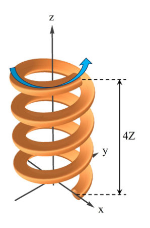
<figcaption class="paper-figure-caption"><b>Fig 1.</b> FIG. 1. A propagating Dirac electron along the +z direction with spin up carries an intrinsic helical conserved current already at zero orbital angular momentum, l = 0. The arrow indicates the circulation direction, and the label 4Z marks four geometric pitches. The helix represents the real-space geometry of the conserved Dirac current rather than a particle trajectory. The central helical curve shows the representative streamline through the characteristic radius ρ = ρ∗, where the azimuthal current density is maximal. The surrounding shaded tube provides only visual thickness around this streamline (rendered with radius a = 0.2ρ∗) and does not depict the current magnitude or radial...</figcaption>
</figure>

**Summary.** The paper demonstrates that Dirac electrons confined in cylinders inherently possess a helical current texture even at zero orbital angular momentum. When this system interacts locally with a spatially chiral scalar potential, the interaction is highly selective, causing diagonal spin channels to vanish while only off-diagonal, spin-flipping channels survive. This establishes a fundamental, geometry-driven mechanism for spin polarization.

**Why it may be interesting.** This work provides a fundamental, purely geometric mechanism for spin-selective interactions in low-dimensional systems, establishing a baseline theory applicable to understanding phenomena like CISS without invoking external magnetic fields or explicit SOC terms.

Detailed structure

**Main problem.** The study investigates the intrinsic helical conserved-current texture carried by Dirac eigenstates confined cylindrically, and how this structure couples locally to an external chiral scalar potential.

**Main result.** This coupling enforces a geometric selection rule: diagonal spin channels vanish while off-diagonal, handedness-converting channels survive. This mechanism is purely local and relies only on the inherent current texture, not external fields or SOC.

**Method.** The authors derived exact spinor solutions for confined Dirac modes and calculated the resulting conserved current density. They then computed a channel-resolved matrix element kernel describing the interaction with a chiral scalar potential.

**Model / system.** The model is a Dirac electron confined in cylindrical geometry (e.g., a nanotube) described by an effective Hamiltonian incorporating confinement potentials. The analysis focuses on the $l=0$ mode and its associated helical current structure.

**Key observables.** Conserved Dirac four-current density components ($j_\phi, j_z$), local helical pitch $Z(
ho)$, and the channel-resolved matrix element kernel $M_{s's}(k', k)$.

**Important parameters / regimes.** Cylinder radius $R$, energy scale $E_k$, chiral potential strength $V_0$, and momentum transfer $q$.

**Assumptions / limitations.** The coupling calculation assumes the chiral potential has support only inside the cylinder, and the analysis focuses on the minimal static local-geometric vertex.

**Figures summary.** Figure 1 illustrates the intrinsic helical conserved current texture at a characteristic radius $
ho^*$, emphasizing that the helix is defined by the current density itself.

**Paper structure.** The paper first establishes the existence and properties of the helical current in confined Dirac modes. It then derives the matrix-element kernel resulting from coupling this current to a static chiral potential, culminating in the selection rule analysis.

Abstract

We show that exact Dirac eigenstates in cylindrical confinement carry a definite helical conserved-current texture even in the zero orbital angular momentum channel l = 0. For the lowest confined mode, the Dirac current contains a nonvanishing azimuthal component together with longitudinal transport and exhibits opposite handedness in the two spin-resolved sectors. The structure also persists into the evanescent region.   We further derive the channel-resolved matrix-element kernel generated by a static chiral scalar potential acting on the confined l = 0 Dirac modes. The resulting spin-selective coupling arises from the Dirac current texture and the scalar chiral potential, and yields a geometric selection rule in which diagonal channels vanish while off-diagonal conversion channels survive. The coupling strength is governed by an internal sampled-current overlap Jchi(k), defined as the integral from 0 to R of f(rho) times jphi_up(rho, k) times rho d rho.   This quantity measures the spatial overlap between the chiral radial profile and the spin-up azimuthal Dirac-current density. The mechanism is fully local and texture-based, without external magnetic fields or spin-orbit coupling.   Within standard Dirac theory, this work identifies the minimal static Dirac-geometric kernel underlying spin-selective response, establishing a baseline structure from which dynamical-medium, scattering, and transport formalisms can be systematically developed toward a complete description of spin-polarization phenomena such as CISS.

[↑ back to top](#top)

### [Robust Spin Splitting and Strain-Controlled Optical Response in Monolayer CrC2N4 for Valleytronic and Optoelectronic Applications](http://arxiv.org/abs/2606.17329v1)

**Authors:** Md. Samrat, Vivek Chowdhury, Sake Wang, Ahmed Zubair  
**Type:** theory · **Category:** other · **PDF:** <https://arxiv.org/pdf/2606.17329v1>  
**Analysis basis:** full PDF text, analyzed in chunks
**Topic relevance:** `spintronics-quantum-optics interface` **3/5** · `analog quantum simulation` **2/5** · `exotic spin models in light-matter` **1/5** · `non-equilibrium dynamics` **1/5**

↔ Scroll figures horizontally

<figure class="paper-figure-card">
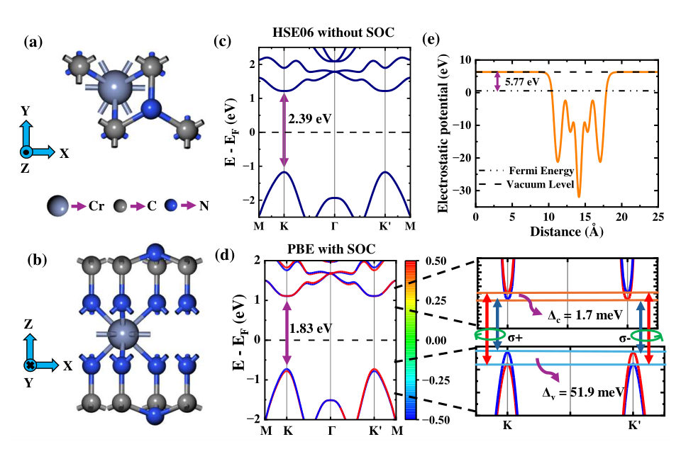
<figcaption class="paper-figure-caption"><b>Fig 1.</b> Figure 1: (a) Top view of monolayer CrC2N4. (b) Side view of monolayer CrC2N4. (c) Band structure (HSE06 without SOC) of monolayer CrC2N4. The band gap is marked using a purple arrow. (d) Band structure (PBE with SOC) of monolayer CrC2N4. The band gap is marked using a purple arrow, and CB and VB spin splittings are marked using orange and cyan horizontal lines, respectively, in the zoomed version. Red and blue arrows indicate the optical transition frequencies occurring at K and K′ valleys, respectively, which are coupled via right and left-hand circular polarization of light. The color bar represents expected values of the spin operator on the spinor wave-functions varying from -0.50...</figcaption>
</figure>
<figure class="paper-figure-card">
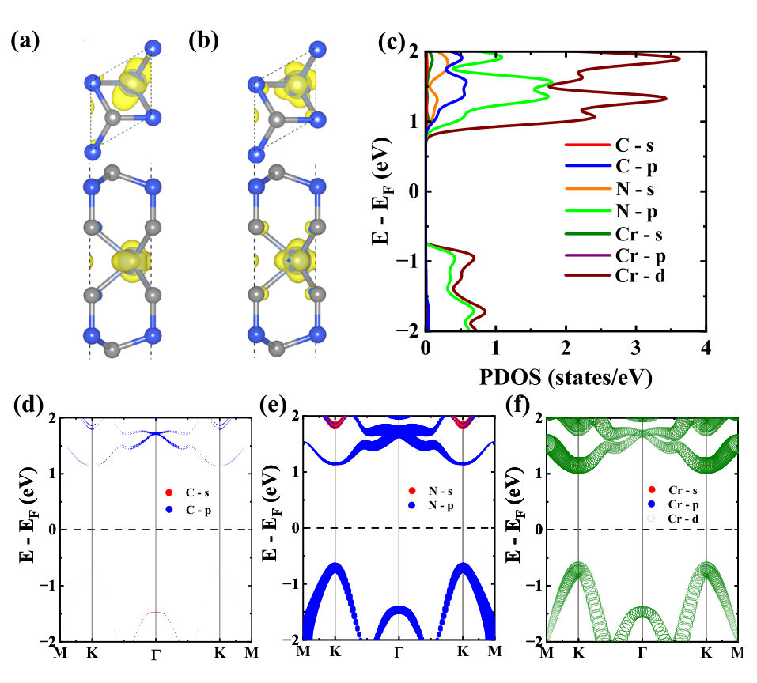
<figcaption class="paper-figure-caption"><b>Fig 2.</b> Figure 2: Band-decomposed charge densities of the (a) valence band maximum (VBM) and (b) conduction band minimum (CBM) of monolayer CrC2N4 at the K point. The isosurface value is set to 0.02 e bohr−3. (c) Spin–orbit-coupled projected density of states (PDOS) of monolayer CrC2N4, showing the orbital contributions from C, N, and Cr atoms. Orbital- projected band structures of the constituent atoms C, N, and Cr are presented in (d), (e), and (f), respectively.</figcaption>
</figure>
<figure class="paper-figure-card">
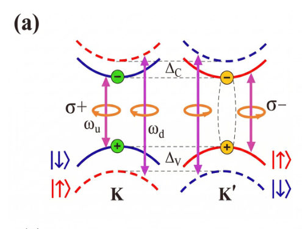
<figcaption class="paper-figure-caption"><b>Fig 3.</b> Figure 3: Spin– and valley-coupled optical selection rules and valley-dependent Hall response. (a) Valley-resolved interband optical transitions at the K and K′ points under circularly polarized light, σ+ and σ−. The transition energies ωu and ωd and the SOC-induced band splittings ∆c and ∆v in the conduction and valence bands are indicated. The red and blue parabolas denote out-of-plane spin-up and spin-down states, respectively. (b) Circularly polarized light induced a photoinduced charge Hall effect by selectively exciting carriers in one valley under an applied in-plane electric field E. (c) Linearly polarized light induces spin and valley Hall effects of electrons and holes, with an...</figcaption>
</figure>
<figure class="paper-figure-card">

<figcaption class="paper-figure-caption"><b>Fig 4.</b> Figure 4: Band structures (with SOC) for (a) −4%, (b) −3%, (c) −2%, (d) −1%, (e) 0%, (f) 1%, (g) 2%, (h) 3%, and (i) 4% biaxial strain. The color bar represents expected values of the spin operator on the spinor wave-functions varying from -0.50 (blue) to +0.50 (red) along the z-axis.</figcaption>
</figure>
<figure class="paper-figure-card">
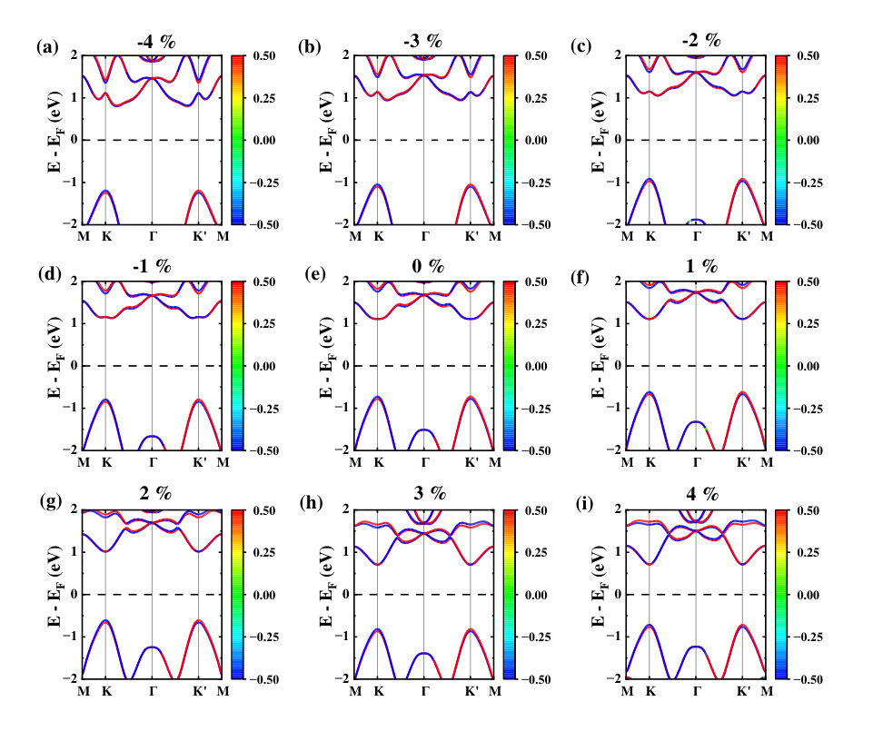
<figcaption class="paper-figure-caption"><b>Fig 5.</b> Figure 5(a–c) illustrate the variations of the band gap, Eg, spin splitting, and carrier</figcaption>
</figure>

**Summary.** This work theoretically investigates monolayer CrC2N4, demonstrating its potential as a tunable 2D semiconductor. Key findings include strong spin-orbit coupling leading to valley-dependent spin splitting and the ability of mechanical strain to precisely control the band gap and optical response. This makes it highly promising for developing next-generation valleytronic and optoelectronic devices.

**Why it may be interesting.** Although focused on solid-state physics, the detailed theoretical modeling of spin-valley coupling and Berry curvature provides a rich platform for understanding topological effects that are relevant to quantum transport phenomena studied in AMO physics.

Detailed structure

**Main problem.** The study investigates the electronic, valley, charge-transfer, and optical properties of monolayer CrC2N4, focusing on how spin-orbit coupling (SOC) and external strain tune its behavior for advanced device applications.

**Main result.** CrC2N4 exhibits strong spin-valley locking due to SOC, and biaxial strain can significantly tune the band gap from 1.987 eV down to 1.421 eV while enhancing Berry curvature for valleytronic use.

**Method.** The research relies heavily on first-principles calculations using DFT (PBE/HSE06) combined with advanced techniques like fully relativistic noncollinear calculations, Bader analysis, and RPA for optical properties.

**Model / system.** The physical system is monolayer CrC2N4. The theoretical framework involves modeling the low-energy states near K/K' valleys using a two-band Dirac-type Hamiltonian to capture spin-valley coupling effects.

**Key observables.** Band gap ($E_g$), SOC-induced spin splittings ($\Delta_v, \Delta_c$), Berry curvature ($\Omega_z$), optical absorption spectrum ($\alpha(\omega)$), and strain dependence of these properties.

**Important parameters / regimes.** Biaxial strain range ($-4\%$ to $+4\%$), Spin splitting values ($51.9 	ext{ meV}$ for VB, $1.7 	ext{ meV}$ for CB).

**Assumptions / limitations.** The analysis uses DFT/ab initio methods; optical spectra are calculated at the RPA level without explicitly including electron-hole interactions via the Bethe–Salpeter equation.

**Figures summary.** Figures illustrate optimized geometries, band structures under SOC and strain, charge density distributions showing Cr-N bonding, and plots detailing the strain dependence of Berry curvature and optical coefficients ($\alpha, n, k$).

**Paper structure.** The paper systematically analyzes the material's intrinsic properties (SOC effects, bonding) first, then details how biaxial strain modulates these electronic and optical responses, culminating in device-relevant predictions for valleytronics and optoelectronics.

Abstract

Monolayer CrC2N4 recently emerged as a promising two-dimensional semiconductor, yet its spin-orbit-coupled (SOC) physics and strain-tunable optical response remained largely unexplored. Here, we investigated the electronic, valley, charge-transfer, and optical properties of pristine and biaxially strained monolayer CrC2N4 using first-principles calculations. The monolayer exhibited a direct band gap at the K/K' valleys. SOC produced valley contrasting out-of-plane spin polarization, yielding a moderate valence band spin splitting of 51.9 meV and a small conduction band spin splitting of 1.7 meV. Orbital-resolved analysis showed that the edge states were mainly governed by Cr-d and N-p hybridization, while Bader analysis indicated polar-covalent bonding through charge transfer toward N atoms. Biaxial strain in the range of -4% to +4% tuned the band gap from 1.987 to 1.421 eV and drove an indirect-to-direct gap transition near -1% strain. Tensile strain enhanced the Berry curvature and red-shifted the optical response toward the visible-near-infrared region. These results suggested monolayer CrC2N4 as a promising platform for strain-engineered valleytronic and optoelectronic device applications.

[↑ back to top](#top)

### [Photon anti-bunching in high harmonic generation](http://arxiv.org/abs/2606.17620v1)

**Authors:** Philipp Stammer, Javier Rivera-Dean, Maciej Lewenstein  
**Type:** theory · **Category:** other · **PDF:** <https://arxiv.org/pdf/2606.17620v1>  
**Analysis basis:** full PDF text, analyzed in chunks
**Topic relevance:** `interference shaping light` **3/5** · `Keldysh / 2PI / non-Gaussian methods` **1/5** · `methods for driven-dissipative` **1/5**

↔ Scroll figures horizontally

<figure class="paper-figure-card">
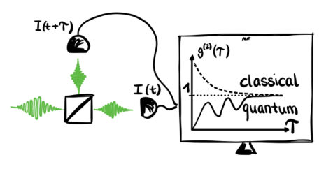
<figcaption class="paper-figure-caption"><b>Fig 1.</b> FIG. 1. Schematics of an experimental HBT-configuration to measure the second-order field correlation function, g(2)(τ), by means of the intensity correlations between the detectors at time I(t) and I(t + τ). While the equal time correlation func- tion g(2)(0) allows to infer on the photon number distribution, only the temporal correlation as a function of τ can conclude on photon anti-bunching via g(2)(0) &lt; g(2)(τ).</figcaption>
</figure>
<figure class="paper-figure-card">
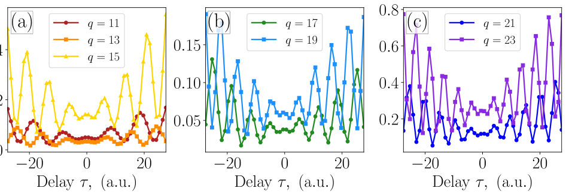
<figcaption class="paper-figure-caption"><b>Fig 2.</b> FIG. 2. We show the normalized second-order correlation function g(2)(τ) for the relevant range of non-perturbative odd har- monics in the plateau (a) q ∈{11, 13, 15} and (b) q ∈{17, 19}, while in (c) q ∈{21, 23} near the cut-off (for the low-order harmonics we refer to the Appendix B in which the same behavior is shown). The time-delay τ is taken to be after one complete cycle of the driving laser field T = 2π/ω, and evaluated at K = 50 delay times. The driving field parameters are E0 = 0.053 a.u. ωL = 0.057 a.u., and Ip = 0.5 a.u., corresponding to that of hydrogen (see SM for details).</figcaption>
</figure>
<figure class="paper-figure-card">
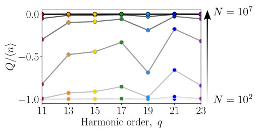
<figcaption class="paper-figure-caption"><b>Fig 3.</b> FIG. 4. Mandel Q-parameter as a function of the harmonic or- ders indicating sub-Poissonian photon statistics as Q &lt; 0. The Q-parameter is shown for increasing number of emitters N in- cluding log10 N ∈{2.0, 2.7, 3.4, 4.1, 4.8, 5.5, 6.7, 7.0}, where the guiding line indicates a fixed emitter number, and the colors are those from Fig. 2 for the respective harmonic order. The same field conditions as those in Fig. 2 are used.</figcaption>
</figure>
<figure class="paper-figure-card">
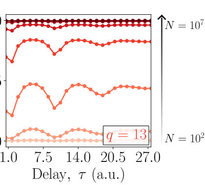
<figcaption class="paper-figure-caption"><b>Fig 4.</b> FIG. 3. Normalized intensity correlation g(2)(τ) of the q = 13 harmonic order for varying number of emitters N (harmonics q = 19 and q = 23 are shown in Fig. 6 of the Appendix B). The atom number increases for increasing color brightness includ- ing log10 N ∈{2.0, 2.7, 3.4, 4.1, 4.8, 5.5, 6.7, 7.0}. The same field conditions as those in Fig. 2 are considered.</figcaption>
</figure>
<figure class="paper-figure-card">
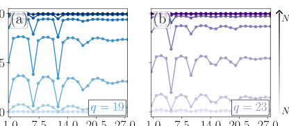
<figcaption class="paper-figure-caption"><b>Fig 5.</b> FIG. 6. Normalized intensity correlation g(2)(τ) for harmonic orders q = 19 in (a) and q = 23 in (b) for varying num- ber of emitters N, showing the same behavior as Fig 3. The atom number increases for increasing color brightness includ- ing log10 N ∈{2.0, 2.7, 3.4, 4.1, 4.8, 5.5, 6.7, 7.0}. The same field conditions as those in Fig. 2 are used.</figcaption>
</figure>

**Summary.** This paper theoretically predicts photon anti-bunching in High Harmonic Generation (HHG), providing the first evidence of single-photon temporal correlations in this process. Using advanced quantum field techniques, the authors calculate the intensity correlation function $g^{(2)}(	au)$, demonstrating that the emission violates classical bounds when considering only one emitted photon. This work is crucial for understanding non-classical light sources generated in intense laser fields.

**Why it may be interesting.** This work is highly relevant to quantum optics and open quantum systems because it provides a rigorous theoretical pathway to observe fundamental non-classical light sources using an established, high-intensity physical process like HHG.

Detailed structure

**Main problem.** The primary goal is to theoretically predict and demonstrate photon anti-bunching—a signature of single-photon emission—within the complex process of High Harmonic Generation (HHG). This marks a first theoretical discovery of non-classical temporal correlations in HHG.

**Main result.** The authors successfully predicted clear evidence of photon anti-bunching ($g^{(2)}(0) < 1$) across the entire harmonic spectrum using quantum field theory methods. They also distinguished this single-photon signature from ensemble statistics like sub-Poissonian distributions.

**Method.** The analysis relies on calculating high-order time correlation functions, specifically $G^{(2)}(	au)$, derived from the Heisenberg picture approach applied to the dipole moment operators within the HHG process.

**Model / system.** The system is High Harmonic Generation (HHG), modeled quantum mechanically using a Hamiltonian incorporating field and interaction terms. The analysis progresses from single-atom calculations to many-emitter scenarios, treating the emission as an upconversion of multiple driving photons into one high-energy harmonic photon.

**Key observables.** Normalized second-order intensity correlation function ($g^{(2)}(	au)$) and the Mandel Q-parameter ($Q$).

**Important parameters / regimes.** Harmonic order ($q$), time delay ($	au$), and the number of emitters ($N$).

**Assumptions / limitations.** The calculations assume an initial vacuum state for the field and utilize approximations that allow separating correlations into coherent and incoherent parts, especially in the many-emitter limit.

**Figures summary.** Figures illustrate $g^{(2)}(	au)$ violating classical bounds (showing anti-bunching) for various harmonics and show how this correlation function approaches unity as the number of emitters ($N$) increases.

**Paper structure.** The paper develops from establishing the theoretical framework using quantum field operators in the Heisenberg picture, calculating $g^{(2)}(	au)$ for single atoms to confirm anti-bunching, and finally extending the analysis to many emitters while distinguishing between temporal correlations (anti-bunching) and number statistics (sub-Poissonian).

Abstract

Photon anti-bunching is the direct evidence for the existence of photons without having a classical counterpart. Unlike bunching of photons, which can have a semi-classical description, the effect of photon anti-bunching can only be understood with quantized electromagnetic fields. However, for the process of high harmonic generation (HHG), where many photons of the driving field are upconverted to a single photon of higher energy, there is yet no clear evidence for the presence of individual photon emission. The key result of this work is the prediction of photon anti-bunching in the process of HHG, marking it the first theoretical discovery of non-classicality in the temporal correlations of HHG photons. While other non-classical signatures in HHG, such as sub-Poissonian statistics or squeezing, have been discussed for an ensemble of photons, the anti-bunching signature reported here is a signature of a single photon. This is achieved by using the recently developed Heisenberg picture approach for quantum optical HHG, revealing clear anti-bunching signatures in the intensity correlation function across the entire harmonic spectrum.

[↑ back to top](#top)

### [Hydrogen s-electrons as the origin of crystal magnetism beyond spin-orbit coupling](http://arxiv.org/abs/2606.17902v1)

**Authors:** Baiqiang Liu, Zhen Gong, Rui Liu, Siyang Liu, Yue Feng, Zhigang Wang  
**Type:** theory · **Category:** strongly correlated electrons · **PDF:** <https://arxiv.org/pdf/2606.17902v1>  
**Analysis basis:** full PDF text, analyzed in chunks
**Topic relevance:** `spintronics-quantum-optics interface` **3/5** · `exotic spin models in light-matter` **1/5**

↔ Scroll figures horizontally

<figure class="paper-figure-card">
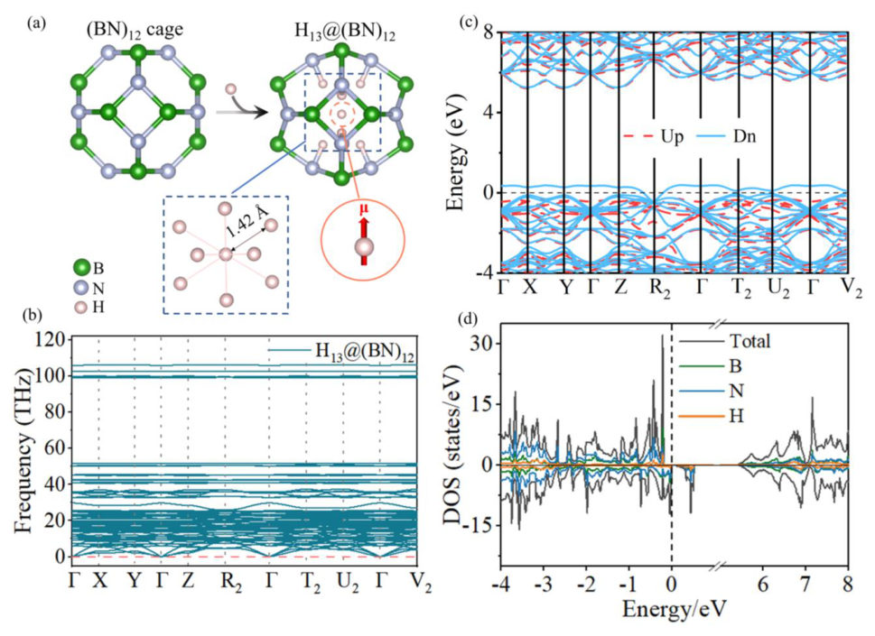
<figcaption class="paper-figure-caption"><b>Fig 1.</b> Fig. 1 | Structural properties of the H13@(BN)12 crystal. a, Schematic illustration of the primitive cell, showing</figcaption>
</figure>
<figure class="paper-figure-card">
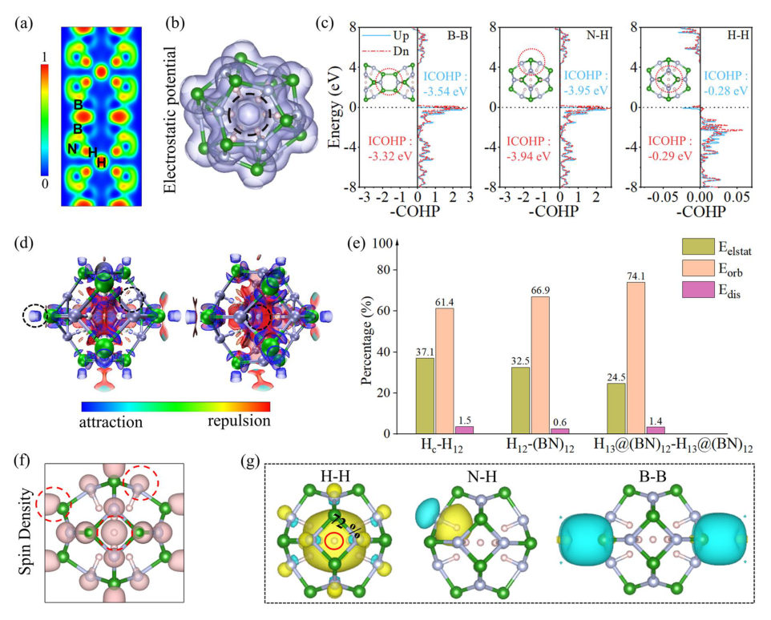
<figcaption class="paper-figure-caption"><b>Fig 2.</b> Fig. 2 | Interaction analyses and magnetic properties of H13@(BN)12. a, ELF map. ELF values close to 0 (blue)</figcaption>
</figure>
<figure class="paper-figure-card">
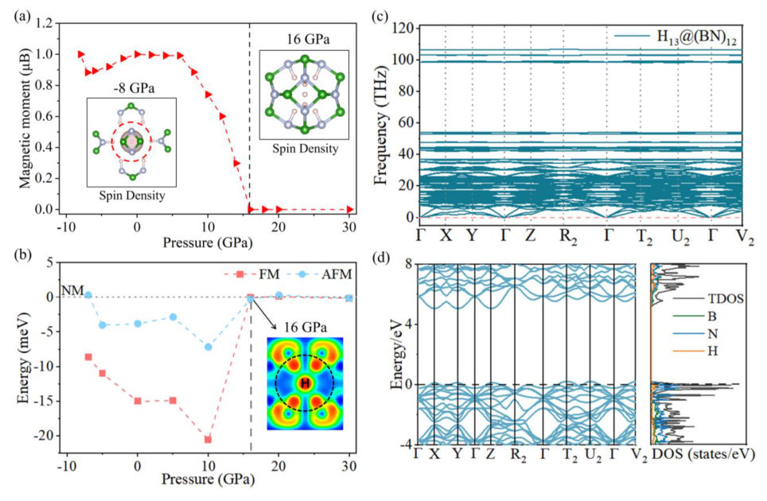
<figcaption class="paper-figure-caption"><b>Fig 3.</b> Fig. 3 | Magnetic properties of the H13@(BN)12 crystal and their modulation under applied stress. a, Evolution</figcaption>
</figure>

**Summary.** This work reports on the discovery of intrinsic ferromagnetism in $	ext{H}_{13}@(	ext{BN})_{12}$, demonstrating that magnetism can arise from hydrogen's $1s$ s-electrons without relying on spin-orbit coupling. Using first-principles calculations, they show this magnetism is stabilized by the cage structure and can be tuned—specifically quenched under high compression—providing a blueprint for low-energy spintronics.

**Why it may be interesting.** It provides a concrete theoretical framework for engineering magnetic materials where conventional $d$ or $f$ electron physics is not required, opening avenues for novel spintronic devices relevant to condensed matter theory.

Detailed structure

**Main problem.** The study addresses the challenge of achieving robust magnetism derived from s-electrons, such as those in hydrogen, which are typically expected to have quenched spins.

**Main result.** A ferromagnetic crystal $	ext{H}_{13}@(	ext{BN})_{12}$ was shown to exhibit intrinsic magnetism originating solely from the central hydrogen $1s$ electron, establishing a pathway for low-SOC magnetic materials.

**Method.** The research relies heavily on first-principles Density Functional Theory (DFT) calculations, supplemented by advanced analyses like Electron Localization Function (ELF), Crystal Orbital Hamilton Population (COHP), and phonon dispersion calculations.

**Model / system.** The model system is the low-Z ferromagnetic crystal $	ext{H}_{13}@(	ext{BN})_{12}$, where thirteen hydrogen atoms are encapsulated within a $(	ext{BN})_{12}$ cage. The magnetism is localized to the central H atom's $1s$ orbital.

**Key observables.** Magnetic moment ($\mu_B$), spin-resolved band structure, Electron Localization Function (ELF) maps, and magnetic energy comparison under stress.

**Important parameters / regimes.** Ambient pressure vs. 16 GPa compression; the critical role of the negative electrostatic potential within the cage.

**Assumptions / limitations.** The stability mechanism is governed by the localization of the central hydrogen $1s$ electron, and SOC effects are negligible due to the s-electron nature.

**Figures summary.** Figures illustrate structural properties, phonon dispersion confirming stability, band structures showing spin splitting, and ELF maps demonstrating electron localization changes under applied stress.

**Paper structure.** The paper systematically establishes the magnetic origin from H $s$-electrons, confirms the ground state magnetism using multiple computational analyses (COHP, ELF), demonstrates the tunability of this magnetism via external pressure/stress, and concludes by outlining its potential for low-energy spintronics.

Abstract

Magnetism has long been attributed to localized d, f, and even p electrons with strong correlations, whereas s electrons exemplified by hydrogen are reactive and tend to have their spins quenched, making s-electron-derived magnetism and long-range ordered magnetic crystals seem unattainable. Here we report a low-Z ferromagnetic crystal H13@(BN)12 using first-principles calculations, where thirteen hydrogen atoms are encapsulated within a (BN)12 cage and magnetism originates from the 1s electron of the central hydrogen atom. The crystal remains stable under ambient pressure owing to chemical precompression. Notably, the central hydrogen atom retains a magnetic moment of 1 μB, with long-range magnetic order established through multicenter bonding within the H13 aggregate and the intercell B-B network, while the zero orbital angular momentum of s electrons renders spin-orbit coupling (SOC) negligible as expected. Electronic structure analyses reveal that the large cavity and central negative electrostatic potential of the (BN)12 cage localize the hydrogen 1s electron, preventing spin quenching. Interestingly, under 16 GPa compression, the system transforms into a nonmagnetic metallic state driven by delocalized electrons of the central hydrogen atom. This study opens a pathway for constructing s-electron-driven magnetic materials and lays the foundation for developing low-energy consumption magnetic devices without SOC.

[↑ back to top](#top)

### [Superconductivity from interband coupling to ferroelectric quantum critical fluctuations in two dimensions](http://arxiv.org/abs/2606.18251v1)

**Authors:** Sudip Kumar Saha, Jonathan Ruhman, Avraham Klein  
**Type:** theory · **Category:** strongly correlated electrons · **PDF:** <https://arxiv.org/pdf/2606.18251v1>  
**Analysis basis:** full PDF text, analyzed in chunks
**Topic relevance:** `Keldysh / 2PI / non-Gaussian methods` **3/5** · `methods for driven-dissipative` **1/5**

↔ Scroll figures horizontally

<figure class="paper-figure-card">
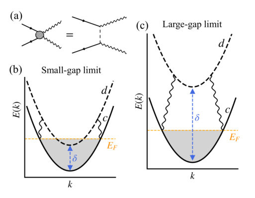
<figcaption class="paper-figure-caption"><b>Fig 1.</b> FIG. 1. The schematic diagram of the two-band model and the interaction via the two-phonon mechanism. (a) The di- agrammatic representation of the two-phonon process. The solid and dashed straight lines represent fermions of lower and upper bands, respectively. The wavy lines represent TO phonons. (b,c) The schematic illustration of the interband interactions mediated by TO phonons in the (b) small-gap limit and (c) large-gap limit. The lower- and higher-energy parabolic bands are shown by solid and dashed lines, respec- tively, separated by a band gap δ. The dashed horizontal line marks the Fermi energy, EF , and the shaded region denotes the occupied electronic states below EF .</figcaption>
</figure>
<figure class="paper-figure-card">
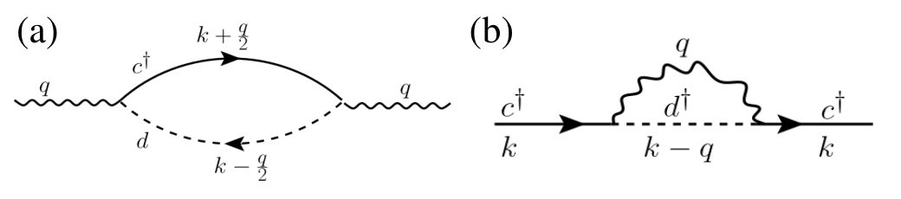
<figcaption class="paper-figure-caption"><b>Fig 2.</b> FIG. 2. The diagram of the self-energy. Panel (a) represents the one-loop polarization bubble and panel (b) represents the fermionic self-energy. The wavy lines represent the boson propagator. The solid and dashed straight lines represent Green’s functions corresponding to fermionic flavors of lower and upper bands, respectively.</figcaption>
</figure>
<figure class="paper-figure-card">
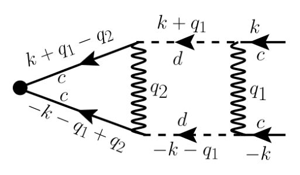
<figcaption class="paper-figure-caption"><b>Fig 3.</b> FIG. 3. The diagrammatic representation of the pairing vertex. The wavy lines represent the boson propagator. The solid and dashed straight lines represent Green’s functions corresponding to fermionic flavors of lower and upper bands, respectively.</figcaption>
</figure>
<figure class="paper-figure-card">
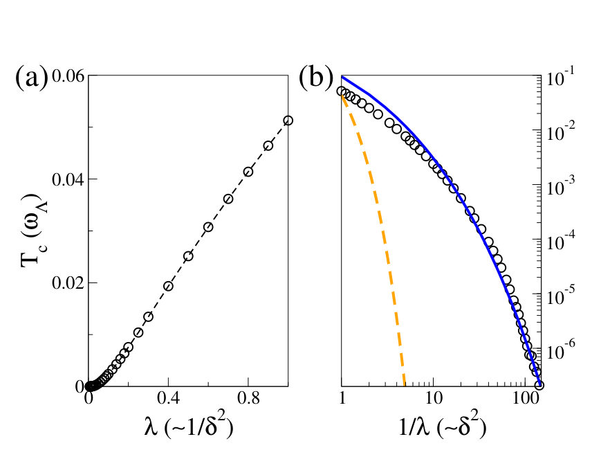
<figcaption class="paper-figure-caption"><b>Fig 4.</b> FIG. 4. Tc (in unit of ωΛ), derived from Eq. (16), as a function of coupling constant, λ in panel (a) and 1/λ in panel (b). The numerical solutions are shown as circles, with a black dashed line added as a guide to the eye. The solid blue line presents the solution of Eq. (18). The solution of BCS expression, (λ/π) log (ωΛ/T BCS c ) = 1, is depicted by the yellow dashed line.</figcaption>
</figure>
<figure class="paper-figure-card">
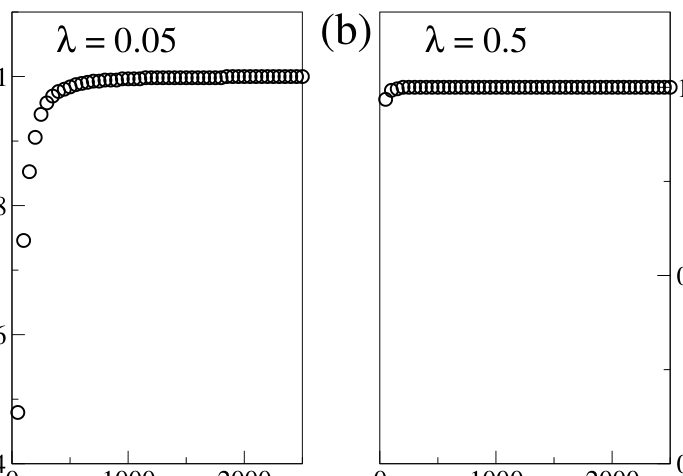
<figcaption class="paper-figure-caption"><b>Fig 5.</b> FIG. 5. The critical temperature T M c , evaluated as a function of frequency cutoff M, is normalized by its asymptotic value Tc, obtained at large M where it becomes independent of M. Panels (a) and (b) correspond to the coupling λ = 0.05 (Tc = 0.00056 ωΛ) and 0.5 (Tc = 0.025 ωΛ), respectively. Notably, for λ = 0.05, T M c converges to Tc at M ≥800, while for λ = 0.5, the convergence is already achieved at M ≥200.</figcaption>
</figure>

**Summary.** This paper develops a quantum critical Eliashberg theory for superconductivity in 2D ferroelectric quantum materials. It shows that an interband 'Stark'-like coupling generates an effective two-phonon interaction that significantly enhances the superconducting critical temperature ($T_c$) beyond standard BCS predictions. The results are highly relevant to understanding unconventional pairing mechanisms in layered oxides and TMDs.

**Why it may be interesting.** The focus on strong electron-phonon coupling mediated by quantum critical fluctuations provides a rich theoretical framework relevant to understanding unconventional superconductivity in layered materials, which often involves complex electronic correlations.

Detailed structure

**Main problem.** The study investigates superconductivity arising from ferroelectric quantum critical fluctuations in two dimensions, addressing the puzzle of enhanced SC when conventional electron-phonon coupling is suppressed.

**Main result.** The superconducting critical temperature ($T_c$) is strongly enhanced relative to BCS expectations due to an effective two-phonon pairing mechanism mediated by interband coupling near a Quantum Critical Point (QCP).

**Method.** The authors construct and solve the quantum critical Eliashberg theory for this 2D system, analyzing different limits of the interband gap.

**Model / system.** The model uses a minimal two-band Hamiltonian describing electrons coupled to a 2D TO phonon mode in a Quantum Ferroelectric Metal (QFEM) near its QCP. The coupling mechanism is an interband 'Stark'-like interaction leading to effective quadratic (two-phonon) pairing.

**Key observables.** Superconducting critical temperature ($T_c$), pairing kernel, and the gap equation solution.

**Important parameters / regimes.** Interband gap magnitude ($\delta$), coupling constant ($\lambda$), dimensionality (2D vs 3D), and frequency cutoffs ($\Lambda\Omega$).

**Assumptions / limitations.** The analysis relies on approximations in the large-gap and small-gap limits, treating the system near criticality, and assuming parabolic bands.

**Figures summary.** Figures illustrate diagrammatic representations of the two-phonon process and plot $T_c$ versus coupling strength ($\lambda$) or inverse coupling strength ($1/\lambda$), comparing results to BCS scaling.

**Paper structure.** The paper develops the theory by constructing the Eliashberg equations, analyzing the pairing vertex in both large-gap and small-gap regimes, and deriving explicit forms for $T_c$ that show parametric enhancement over standard BCS predictions.

Abstract

Soft critical fluctuations associated with ferroelectric quantum phase transitions are typically transverse owing to their polar nature. This implies that the conventional density--density electron--phonon coupling to these modes is strongly suppressed, which is puzzling as a variety of materials exhibit enhanced superconductivity in the vicinity of ferroelectricity. An alternative coupling mechanism is an interband ``Stark''-like coupling that connects bands of opposite parity. In the limit where one of the bands is far in energy, these processes generate an effective quadratic (two-phonon) coupling. In contrast, when both bands lie close to the Fermi energy, the resulting interaction develops singular behavior due to the additional gapless electronic states, motivating a detailed study into the dynamics of this effective two-phonon coupling. To this end, we construct the quantum critical Eliashberg theory for a two-dimensional system across a wide range of interband gap magnitudes, near the quantum critical point. We find that the critical temperature $T_c$ is strongly enhanced relative to conventional BCS expectations. In the large-gap limit, the pairing kernel acquires higher-order logarithmic contributions, leading to a parametrically enhanced $T_c$ governed by cubic and quadratic logarithmic terms. In the small-gap regime, the pairing scale exhibits a modified BCS-like form with an enhanced dependence on the inverse square root of the dimensionless coupling constant. The enhancement is due to the dynamics of the two-phonon pairing whose infrared cutoff is set by $T_c$, resulting in a significant enhancement of superconductivity compared to three-dimensional systems, where it is set by the Fermi energy. Our results elucidate the unique dynamical properties of effective two-phonon interactions, and may be relevant to layered compounds like Td-MoTe$_2$ and doped SrTiO$_3$ membranes.

[↑ back to top](#top)

### [Three-dimensional repulsive Hubbard model](http://arxiv.org/abs/2606.17933v1)

**Authors:** Alexei Sherman  
**Type:** theory · **Category:** strongly correlated electrons · **PDF:** <https://arxiv.org/pdf/2606.17933v1>  
**Analysis basis:** full PDF text, analyzed in chunks
**Topic relevance:** `analog quantum simulation` **3/5** · `Keldysh / 2PI / non-Gaussian methods` **1/5**

↔ Scroll figures horizontally

<figure class="paper-figure-card">
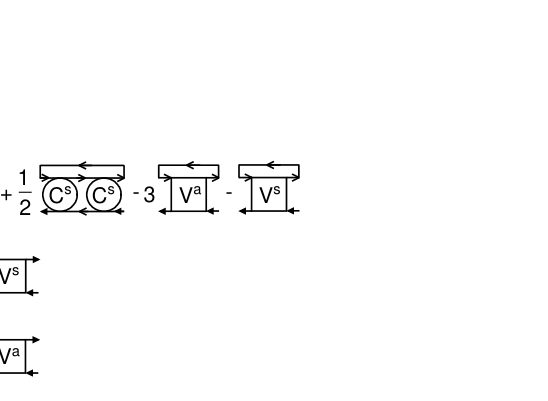
<figcaption class="paper-figure-caption"><b>Fig 1.</b> Fig. 1 (a) Diagrams taken into account in calculations of the irreducible part K(k, j). The circle with the notation C1 is the first-order cumulant, circles with notations Cs and Ca are symmetrized and antisymmetrized second-order cumulants, lines with open arrows are renormalized hopping θ(k, j), squares with notations V s and V a are infinite sums of ladder diagrams symmetrized and antisym- metrized over spin indices. The Bethe-Salpeter equations that they satisfy are depicted in parts (b) and (c).</figcaption>
</figure>
<figure class="paper-figure-card">
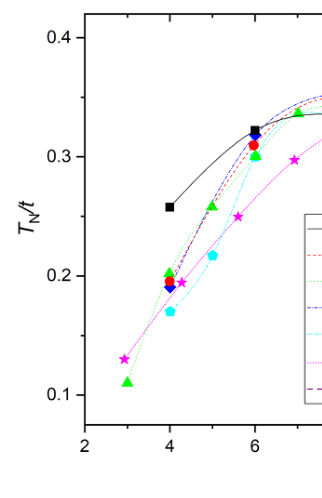
<figcaption class="paper-figure-caption"><b>Fig 2.</b> Fig. 3 The dependence of the N´eel temperature TN on the Hubbard repulsion U calculated with SCDT in a half-filled 83 lattice is shown by black squares. The comparison data are obtained by quantum Monte Carlo simulations [3] (red circles), the dual fermion approach [8] (green triangles), dynamic cluster approximation [6] (blue rhombi), determinantal diagrammatic Monte Carlo [9] (cyan pentagons), and dynamical vertex approximation [7] (magenta stars). The purple dashed line shows the Heisenberg limit TN = 3.83t2/U [15, 16].</figcaption>
</figure>
<figure class="paper-figure-card">

<figcaption class="paper-figure-caption"><b>Fig 3.</b> Fig. 5 The variation of TN with doping in the case U = 4t.</figcaption>
</figure>
<figure class="paper-figure-card">
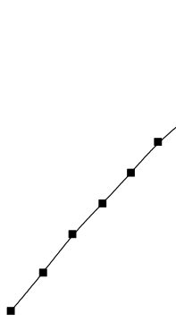
<figcaption class="paper-figure-caption"><b>Fig 4.</b> Fig. 4, one can see that the DOS at U = 4t differs essentially from spectra for larger repulsions. In the former case, the DOS is well separated into an intensive quasiparticle maximum with a dip near ω = 0 originating in part from the Hubbard repulsion and the Slater mechanism [30] and a less intensive higher-frequency electron-spin- excitation continuum. Such a type of DOS is inherent in weak coupling. For U ≥6t, it is difficult to separate the spectrum into these two parts – the case is typical for strong correlations. With their growth, the dip near ω = 0 goes down, and for U ≈9t it transforms into the Mott gap. Notice that we are dealing with the comparatively high temperature, TN...</figcaption>
</figure>
<figure class="paper-figure-card">
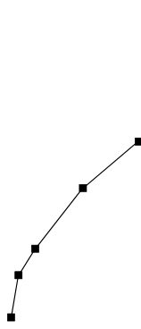
<figcaption class="paper-figure-caption"><b>Fig 5.</b> Fig. 6 The variation of TN with doping in the case U = 12t.</figcaption>
</figure>

**Summary.** This work applies the strong-coupling diagram technique to analyze the phase diagram of the 3D repulsive Hubbard model. It determines critical boundaries between paramagnetic and antiferromagnetic phases while investigating how the density of states evolves across different interaction strengths ($U$). The results highlight complex doping effects, such as plateaus in $T_N$ linked to spectral reconstruction.

**Why it may be interesting.** The study provides detailed theoretical insights into fundamental many-body physics in strongly correlated electron systems, particularly concerning Mott transitions and magnetic ordering in 3D lattices.

Detailed structure

**Main problem.** The study investigates the phase diagram of the three-dimensional repulsive Hubbard model, focusing on the transition between paramagnetic and antiferromagnetic states.

**Main result.** The analysis reveals a Mott transition in the density of states around $U\approx9t$ and shows that doping dependence of the Néel temperature exhibits plateaus linked to changes in electron coupling strength.

**Method.** The strong-coupling diagram technique (SCDT) is employed, involving series expansion in kinetic energy and solving coupled equations for spin and charge susceptibilities.

**Model / system.** The system is the 3D repulsive Hubbard model on a simple cubic lattice, described by the Hamiltonian $	ext{H} = \sum_{\langle l l' 
angle\sigma} t_{ll'} (a^\dagger_{l'\sigma} a_{l\sigma} + h.c.) + U \sum_l n_{l\uparrow} n_{l\downarrow}$.

**Key observables.** Néel temperature ($T_N$), Density of States (DOS), magnetic critical exponent ($\gamma$), and spin/charge susceptibilities.

**Important parameters / regimes.** $U$ (Hubbard repulsion) relative to $t$ (hopping integral); electron concentration $ar{n}$; regimes like $4t \le U \le 12t$.

**Assumptions / limitations.** The primary method relies on the strong-coupling diagram technique, which is most accurate for the limit where $U \gg t$.

**Figures summary.** Figures illustrate the variation of $T_N$ with doping ($ar{n}$) showing plateaus (e.g., Fig. 6), and demonstrate how the DOS changes from weak-coupling quasiparticle features to strong-coupling Mott gaps depending on $ar{n}$ and $U$.

**Paper structure.** The paper systematically analyzes phase boundaries ($T_N(U)$) using SCDT, calculates susceptibilities via determinant analysis ($\Delta(k, 
u)$), and examines how the DOS and critical exponents change as a function of both interaction strength ($U$) and doping ($ar{n}$).

Abstract

The three-dimensional repulsive Hubbard model is investigated using the strong-coupling diagram technique. For half-filling, the boundary between paramagnetic and antiferromagnetic states is determined for the range of the Hubbard repulsion $4t\leq U\leq12t$, where $t$ is the hopping integral between neighboring sites. Along this boundary, the density of states is calculated, and it demonstrates the Mott transition at $U\approx9t$. For $U\geq6t$ and half-filling, the density of states has the shape inherent in the strong electron repulsion, while for $U=4t$, its shape points to weak coupling. The dependence of the Néel temperature $T_{\rm N}$ on the electron concentration $\bar{n}$ is investigated for the cases $U=4t$ and $12t$. In the former case, $T_{\rm N}$ decreases monotonously with $\bar{n}$, while in the latter case, there is a plateau in the dependence near $\bar{n}=0.87$. The plateau is connected to a reconstruction of the density of states caused by an effective weakening of electron coupling due to electron depopulation. For $U=12t$ and half-filling, the magnetic critical exponent $γ\approx1.4$, which is close to the value in the Heisenberg model. Some features resembling the first-order phase transition, revealing themselves in a finite crystal, are discussed.

[↑ back to top](#top)

### [II. Exploring the role of the Crystal Electric Field in the vicinity of a Quantum Critical Point](http://arxiv.org/abs/2606.17305v1)

**Authors:** Julian G. Sereni, Ivan Curlik, Slavo Gabani, Mauro Giovannini  
**Type:** experiment · **Category:** strongly correlated electrons · **PDF:** <https://arxiv.org/pdf/2606.17305v1>  
**Analysis basis:** full PDF text, analyzed in chunks
**Topic relevance:** `Kondo & dissipative impurity` **3/5**

↔ Scroll figures horizontally

<figure class="paper-figure-card">
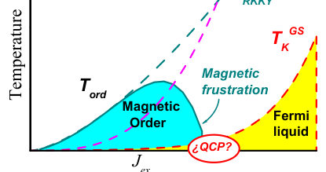
<figcaption class="paper-figure-caption"><b>Fig 1.</b> FIG. 1. Doniach-Lavagna phase diagram showing the differ- ent variation between the Kondo temperature: T CEF K (Jex), used in that model, and the actual ground state: T GS K . The magnetic phase boundary Tord ∝TRKKY [3] is proportional to the magnetic exchange interaction.</figcaption>
</figure>
<figure class="paper-figure-card">
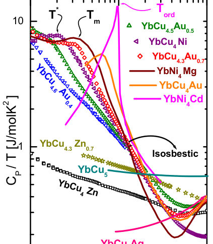
<figcaption class="paper-figure-caption"><b>Fig 2.</b> FIG. 2. (Color online) Comparison of the low temperature specific heat divided temperature of eight YbM4X com- pounds and alloys (M = Ni, Cu and X = Mg [17], Ni [12], Cu [20], Au [14], Zn [26]) lying in the vicinity of a QPC, in a double logarithmic representation. The alloy with Mx =Au0.6 is not included for clarity because its Cm/T(T) dependence coincides with that of X=Ni. Isosbestic point [27] at T ≈1.2 K: coincident temperature with the same en- tropy derivative.</figcaption>
</figure>
<figure class="paper-figure-card">
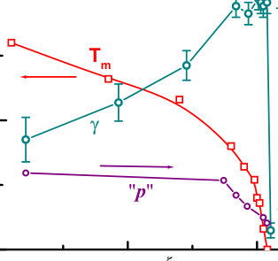
<figcaption class="paper-figure-caption"><b>Fig 3.</b> FIG. 3. (Color online) Left (red) axis: evolution of the Tm anomaly towards the QCP as a function of the chem- ical doping parameter ζ. Right (cian) axis: increase of the CP /T|lim T →0 extrapolation till to reach a maximum at the QCP and (purple) triangle: exponent ’p’ of the CP /T(T &gt; Tm) power laws dependence extracted from Fig 2.</figcaption>
</figure>
<figure class="paper-figure-card">
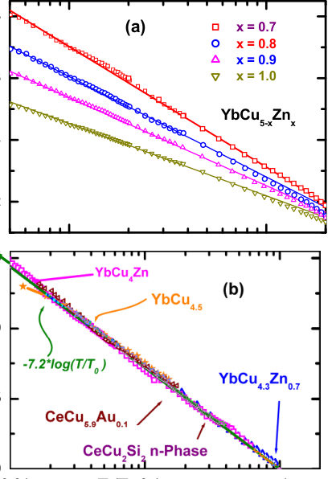
<figcaption class="paper-figure-caption"><b>Fig 4.</b> FIG. 4. (Color online) a) Logarithmic temperature depen- dence of YbCu5−xZnx alloys . b) Comparison of different NFL compounds within the normalized procedure [33] in- cluding two Ce-referent compounds after phonon subtrac- tion (see text).</figcaption>
</figure>
<figure class="paper-figure-card">
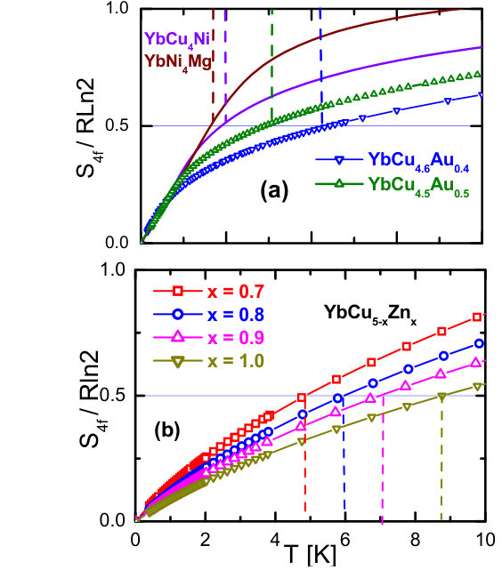
<figcaption class="paper-figure-caption"><b>Fig 5.</b> FIG. 5. (Color online) a) Evaluation of T GS K of some mag- netic alloys and compounds according to the Sm(T = TK) = 1/2RLn2 criterion. b) Same procedure for the T GS K deter- mination for YbCu5−xZnx alloys.</figcaption>
</figure>

**Summary.** This paper investigates the role of Crystal Electric Field splitting in understanding Quantum Critical Points within Yb-based compounds. By analyzing low-temperature specific heat measurements across doping series, the authors refine existing phase diagrams. They conclude that the QCP is better understood as a crossover dominated by quantum fluctuations rather than a singular point defined by diverging thermodynamic quantities.

**Why it may be interesting.** This work provides detailed experimental evidence on how crystal field effects modify the expected critical behavior near magnetic quantum criticality in heavy fermion systems, offering insights into the nature of quantum fluctuations beyond simple mean-field models.

Detailed structure

**Main problem.** The study explores how Crystal Electric Field (CEF) splitting modifies the understanding of Quantum Critical Points (QCPs) when a system transitions between magnetic and Fermi-liquid ground states.

**Main result.** The analysis suggests that the QCP region is better described as a crossover dominated by low-lying quantum fluctuations, rather than a singularity characterized by divergences in specific heat measurements.

**Method.** The research analyzes very low temperature thermodynamic properties, particularly the specific heat divided by temperature (C4f/T), across various doping levels within the YbT4M family of compounds.

**Model / system.** The physical platform is the YbT4M family of intermetallic compounds. The theoretical framework improves upon the Doniach-Lavagna phase diagram by explicitly incorporating CEF splittings to model the competition between magnetic ordering, Kondo screening, and valence fluctuations.

**Key observables.** Specific heat divided by temperature (C4f/T), which exhibits power law dependencies, logarithmic divergences ($\propto \ln(T/T_0)$), or near-constant behavior depending on the electronic regime.

**Important parameters / regimes.** The key parameters include the Kondo temperature ($T_K$), the magnetic ordering temperature ($T_m$), and the CEF splitting energy ($\Delta_{	ext{CEF}}$). The doping level acts as a control parameter mapping out different regimes.

**Assumptions / limitations.** Early models' predictions of divergences at the QCP are revised; instead, the transition is characterized by a clear drop in $C_{4f}/T$ towards zero temperature.

**Figures summary.** Figures illustrate phase diagrams (e.g., magnetic vs. non-magnetic regions) and plot C4f/T versus temperature for various doped alloys to map out distinct physical regimes.

**Paper structure.** The paper systematically analyzes the low-temperature behavior across three identified regimes—magnetic, non-Fermi liquid, and valence fluctuation—using doping as a tuning parameter to construct a more realistic phase diagram around the QCP.

Abstract

Very low temperature thermdynamic properties of the Yb$T_4M$ family of compounds are analyzed in a broad range of behavior including a quantum critical point QCP between magnetic and Fermi-liquid ground states GS. Doniach-Lavagna phase diagram limitations are improved by taking into account crystal electric field CEF splittings. The studied alloys: Yb$T_{5-x}M_x$ (with $T$= Ni, Cu, and $M$= Cd, Mg, Pd, Au, Zn, Ag), allow to gain insight into the evolution of the GS behavior undergoing the QCP region as a function of chemical doping as control parameter. Three types of behaviors are recognized in this system: i) a magnetic one, with weak interactions at $T_m\leq 1$\,K and very low Kondo temperature of their respective doublets GS. Between $T_m$ and $T_q\approx 0.3$\,K, quantum fluctuations start to dominate the scenario with the specific heat $C_{4f}/T(T\geq T_q)$ showing $T$ power law dependencies and a very heavy-fermion {\it plateau} below $T_q$. ii) beyond the QCP the typical non-fermi-liquid logarithmic $T$ dependence: $C_{4f}/T \propto \ln(T/T_0)$ and iii) at the non-magnetic limit, the alloys behave as valence-fluctuation systems with $T_K$ overcoming the CEF splitting. With this experimental information, a more realistic phase diagram can be drawn around the QCP where the scenario is dominated by low lying quantum fluctuations, without $C_{4f}/T|_{Lim T\to 0}$ divergences but a clear drop of its value.

[↑ back to top](#top)

### [The Helical SYK Model and Emergent Infrared Integrability](http://arxiv.org/abs/2606.17161v1)

**Authors:** Gustavo Valdivia-Mera, Bhavay Tyagi, Eric R. Bittner, Pavan Hosur  
**Type:** theory · **Category:** statistical mechanics · **PDF:** <https://arxiv.org/pdf/2606.17161v1>  
**Analysis basis:** full PDF text, analyzed in chunks
**Topic relevance:** `Keldysh / 2PI / non-Gaussian methods` **2/5** · `non-equilibrium dynamics` **2/5** · `Kondo & dissipative impurity` **1/5** · `analog quantum simulation` **1/5** · `correlated / nonlocal dissipation` **1/5** · `driven-dissipative phase transition` **1/5** · `entanglement & information structure` **1/5** · `methods for driven-dissipative` **1/5** · `non-equilibrium universality` **1/5** · `scars & prethermalization` **1/5**

↔ Scroll figures horizontally

<figure class="paper-figure-card">
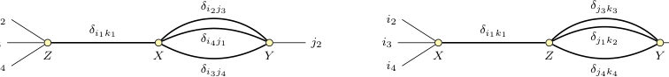
<figcaption class="paper-figure-caption"><b>Fig 1.</b> Figure 1: (a)-(f) correspond to the six graphical large-N counting classes for the primitive tensor structures. Only the conjugate pair shown in panel (f) scales as N7. All other representative classes are subleading.</figcaption>
</figure>

**Summary.** This paper analyzes a helical generalization of the SYK model, exploring how its random quartic interactions behave under renormalization group flow. While generic couplings destroy initial integrability, the disorder-averaged large-$N$ limit forces the system back to an exactly solvable, free, and integrable state in the infrared regime.

**Why it may be interesting.** The connection between random interactions (disorder) and emergent exact solvability in the deep infrared limit is a powerful concept relevant to understanding thermalization and quantum chaos in many-body systems, which has parallels in AMO physics when studying complex interacting regimes.

Detailed structure

**Main problem.** The research investigates the emergence of infrared (IR) integrability in a generalized, random-coupled quantum chaotic model.

**Main result.** In the disorder-averaged large-$N$ IR limit, the theory re-emerges as integrable because all quartic interactions flow to zero due to conformal perturbation theory analysis. The system is exactly solvable when restricted by symmetries or in this deep IR limit.

**Method.** The study employs bosonization, Conformal Perturbation Theory (CPT), and Renormalization Group (RG) flow analysis on a generalized Sachdev-Ye-Kitaev (SYK) model.

**Model / system.** The system is a $1+1$ dimensional helical generalization of the SYK model built from left- and right-moving Majorana fermions with random quartic couplings in flavor-chirality space. The Hamiltonian structure is analyzed across various symmetry constraints, ranging from maximally symmetric to fully general.

**Key observables.** The primary observables are the RG flow coefficients (beta functions) determining coupling strength evolution, and the resulting physical energy density ($\epsilon_{	ext{phys}}$) in solvable limits.

**Important parameters / regimes.** Key parameters include the system size $N$, the disorder strengths $J_S$, and the dimensionality ($1+1$ dimensions). The analysis focuses on the large-$N$ limit.

**Assumptions / limitations.** The analysis assumes Gaussian random couplings for disorder averaging, relies on separating symmetry-constrained sectors from the full interaction space, and uses CPT around a free fixed point.

**Figures summary.** Figures likely summarize the hierarchy of symmetries constraining interactions (Table 2) and illustrate the flow equations or diagonalization results for normal modes.

**Paper structure.** The paper progresses by first establishing the highly symmetric, exactly integrable sector via bosonization. It then analyzes how relaxing symmetries expands the interaction space. The core is the RG analysis showing that disorder averaging forces the system back to an IR fixed point where integrability is recovered through marginal irrelevance.

Abstract

We construct a helical generalization of the Sachdev-Ye-Kitaev (SYK) model in $1+1$ dimensions, built from left- and right-moving Majorana fermions with local quartic interactions and random couplings in flavor-chirality space. These interactions organize into a symmetry-controlled hierarchy of quartic chirality sectors. At the most restrictive end of this hierarchy, symmetry forces the quartic structure into a density-density form, which admits an exact solution using bosonization, rendering the theory integrable. Once the full quartic helical interaction space is allowed, including purely chiral, chirality-balanced, and chirality-imbalanced sectors, this symmetry-protected integrable structure is lost. Nevertheless, the large-$N$ infrared limit remains analytically tractable through short-distance selection rules and disorder averaging. Using conformal perturbation theory about the free fixed point, we show that the entire interaction space is marginally irrelevant, and the theory thus becomes free and integrable in the IR.

[↑ back to top](#top)

### [Closest Accessible Symmetry reduction: a tool for Hamiltonian interpolation analysis](http://arxiv.org/abs/2606.18161v1)

**Authors:** Ana Palacios, Artur Garcia-Saez, Arnau Riera, Marta P. Estarellas  
**Type:** theory · **Category:** statistical mechanics · **PDF:** <https://arxiv.org/pdf/2606.18161v1>  
**Analysis basis:** full PDF text, analyzed in chunks
**Topic relevance:** `analog quantum simulation` **2/5** · `non-equilibrium dynamics` **2/5** · `Keldysh / 2PI / non-Gaussian methods` **1/5** · `driven-dissipative phase transition` **1/5** · `entanglement & information structure` **1/5** · `methods for driven-dissipative` **1/5** · `non-equilibrium universality` **1/5**

↔ Scroll figures horizontally

<figure class="paper-figure-card">
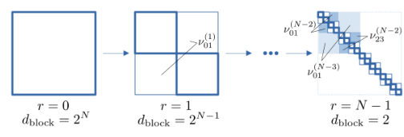
<figcaption class="paper-figure-caption"><b>Fig 1.</b> Figure 1. Illustration of the consecutive block reduction process of H(r), where in each iteration r every block is split in half. Consequently, every iteration a set of {P (r) 0,(η), M (r) A,(η), M (r) B,(η)}2r−1 η=0 is found.</figcaption>
</figure>
<figure class="paper-figure-card">
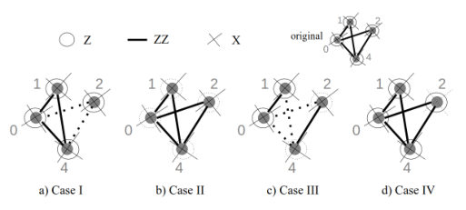
<figcaption class="paper-figure-caption"><b>Fig 2.</b> Figure 2. Illustration of the possible ways to generate a Z2 symmetry in H(s) for A, B of the shape in Eqs. (35) and (36), respectively. Dotted lines represent the elimination of said terms (i.e., their inclusion in ν), and the illustration labelled as “original” is the one corresponding to the full representa- tion of H(s) as per Eq. (7).</figcaption>
</figure>
<figure class="paper-figure-card">
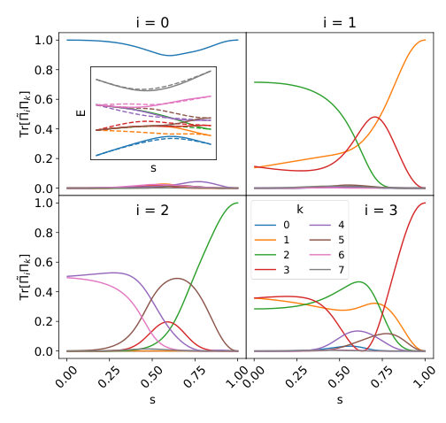
<figcaption class="paper-figure-caption"><b>Fig 3.</b> Figure 3. Fidelity between the first four pseudo-eigenspaces ˜Πk and the true eigenspaces Πk of the system, where the pseudo-eigenspaces are labelled according to their ordering at s = 1. The inset shows the true spectrum (dashed lines) and the pseudo-spectrum (solid) for this particular instance.</figcaption>
</figure>
<figure class="paper-figure-card">
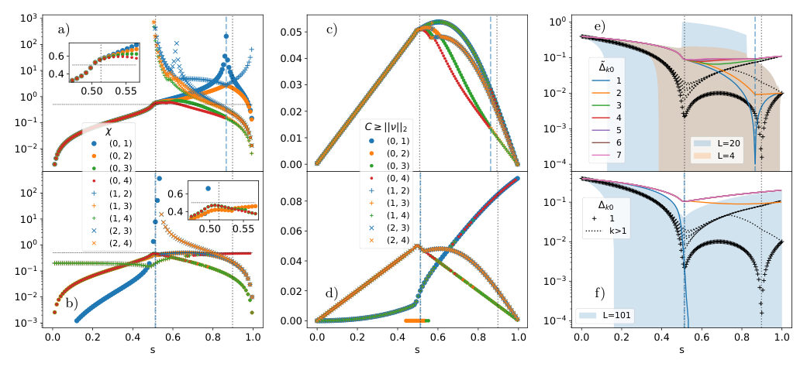
<figcaption class="paper-figure-caption"><b>Fig 4.</b> Figure 5. Simulation of the N = 101 frustrated Ising ring described in the main text without any biasing weights (top row, a, c, e) and with a bias towards minimising the error around the middle according to Eq. (37) (bottom row, b, d, f). The vertical black dotted lines mark sc and smin, and the vertical blue dashed lines indicate their respective predictions from the pseudo-spectra (smin on the top row, sc on the bottom one). Plots a), b) show the hybridisations for all the pairs of the lowest four pseudo-levels for every s, where the horizontal dashed line indicates χ∗= 0.5 and we don’t show values above 103 or below 10−3 to improve visibility. The insets in a), b) present a zoom-in onto...</figcaption>
</figure>
<figure class="paper-figure-card">
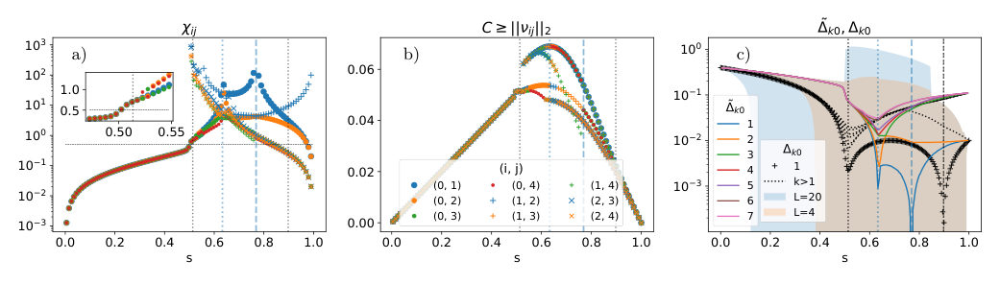
<figcaption class="paper-figure-caption"><b>Fig 5.</b> Figure 6. Simulation of the N = 101 frustrated Ising ring where the optimiser considered minimising the integral of C (Eq. (B1)), without biasing weights. The vertical black lines mark the true transition points sc (dotted) and smin (dashed), while their blue counterparts mark the locations predicted by the pseudo-spectrum. Figure a) shows the hybridisation between all pairs within the lowest four pseudo-levels, with a close-up around the true sc shown in the inset. Plot b) shows the upper bound C on the 2-norm of the off-diagonals (see Eq. (23)) that connects the different pairs of the four lowest-lying pseudo-eigenstates. Since all the nontrivial CAS symmetries found were of type I, in...</figcaption>
</figure>

**Summary.** The paper introduces the Closest Accessible Symmetry (CAS) reduction method to analyze how the energy spectrum of many-body quantum systems changes during Hamiltonian interpolation. By systematically projecting the system onto symmetry-constrained subspaces, it avoids numerical discretization while accurately predicting critical points and characterizing phase transitions via pseudo-spectra and hybridization analysis.

**Why it may be interesting.** This work provides a powerful theoretical tool for analyzing quantum dynamics across phase transitions, offering insights into spectral reorganization that are complementary to standard time-stepping or local approximation methods.

Detailed structure

**Main problem.** The primary goal is to develop a systematic framework for analyzing the energy spectrum of Hamiltonian interpolations between two Hamiltonians without relying on discretizing the interpolation parameter.

**Main result.** The Closest Accessible Symmetry (CAS) reduction provides a hierarchical, non-discretized method to approximate the pseudo-spectrum and locate quantum phase transitions by tracking spectral reorganization across the entire path.

**Method.** The core technique involves projecting the interpolating Hamiltonian onto subspaces defined by accessible symmetries, yielding weakly coupled pseudo-eigenspaces whose coupling strengths are analyzed using hybridization criteria.

**Model / system.** The analysis is applied to general many-body quantum systems undergoing adiabatic evolution, exemplified by the frustrated Ising ring model and linear interpolations between Hamiltonians A and B.

**Key observables.** Quantum phase transition locations (gap closing), pseudo-spectrum $\{\mu_k\}$, hybridization strength $\chi_{kj}$, and spectral gap bounds ($\Delta$ vs. $	ilde{\Delta}$).

**Important parameters / regimes.** The interpolation parameter $s \in [0, 1]$, the structure of accessible symmetries (e.g., single-Pauli string symmetries), and the cost function used to select the optimal symmetry reduction.

**Assumptions / limitations.** The quality of the approximation depends on the compatibility between the chosen accessible symmetry family and the physical problem instance; the method relies on restricting the search space to tractable symmetry generators.

**Figures summary.** Figures illustrate how different types of symmetries ($\mathbb{Z}_2$) can be generated by removing terms from $H(s)$, show fidelity comparisons between pseudo-eigenstates and true eigenstates, and plot spectral gap behavior across phase transitions for the Ising model.

**Paper structure.** The paper introduces the CAS framework, details its application to linear interpolations using symmetry constraints (Types I-IV), develops diagnostic tools like hybridization criteria ($\chi_{kj}$), and compares different optimization strategies (max-cost vs. average cost) on benchmark models.

Abstract

We introduce a framework for analysing the spectrum of Hamiltonian interpolations without heavily relying on discretising the interpolation parameter. The method is based on the concept of accessible symmetries: a problem-class-dependent family of certifiable reflections that induce bipartitions of the Hilbert space. At each step, the interpolation Hamiltonian is projected onto the sectors of the accessible symmetry that is closest to being satisfied, yielding a hierarchy of weakly coupled pseudo-eigenspaces together with explicit residual couplings between them. We show that this representation captures qualitative signatures of quantum phase transitions, provides estimates of their location, and offers insights into their nature. The quality of the approximation is controlled by the compatibility between the accessible symmetry family and the problem instance. Although motivated in spirit by adiabatic quantum computation, our approach applies more broadly to the study of Hamiltonian phase diagrams, providing a new perspective on the spectral reorganisation of many-body quantum systems.

[↑ back to top](#top)

### [Hyperuniform charge distributions and phase transitions in a generalized Aubry-André model](http://arxiv.org/abs/2606.17532v1)

**Authors:** Lujia Xiang, Junmo Jeon, Shiro Sakai  
**Type:** theory · **Category:** disordered systems and neural networks · **PDF:** <https://arxiv.org/pdf/2606.17532v1>  
**Analysis basis:** full PDF text, analyzed in chunks
**Topic relevance:** `driven-dissipative phase transition` **2/5** · `non-equilibrium universality` **2/5** · `Frenkel-Kontorova` **1/5** · `analog quantum simulation` **1/5** · `correlated cavity matter` **1/5** · `non-equilibrium dynamics` **1/5**

↔ Scroll figures horizontally

<figure class="paper-figure-card">
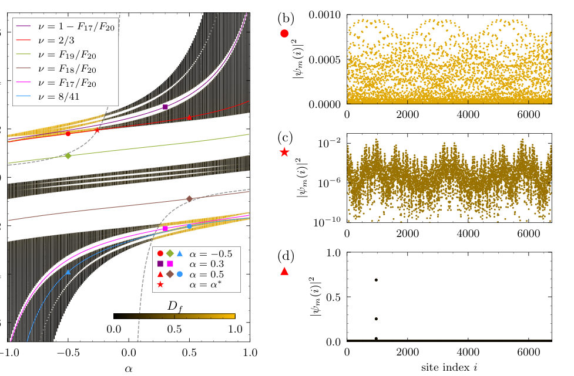
<figcaption class="paper-figure-caption"><b>Fig 1.</b> FIG. 1: Localization characteristics of single-particle eigenstates in the GAA model for λ = 2.5. (a) Landscape of fractal dimension Df, where gold (black) color indicates extended (localized) states. Gray dashed curves represent the mobility edges, and colored solid curves indicate the Fermi energies EF for different filling fractions ν. Different symbols are used to indicate representative (α, ν) points in the regions with different characteristics. In gapped regions, squares (diamonds) denote cases where the lowest unoccupied and highest occupied states have the same (different) localization properties. In gapless regions, circles (triangles) denote extended (localized) states at EF ....</figcaption>
</figure>
<figure class="paper-figure-card">
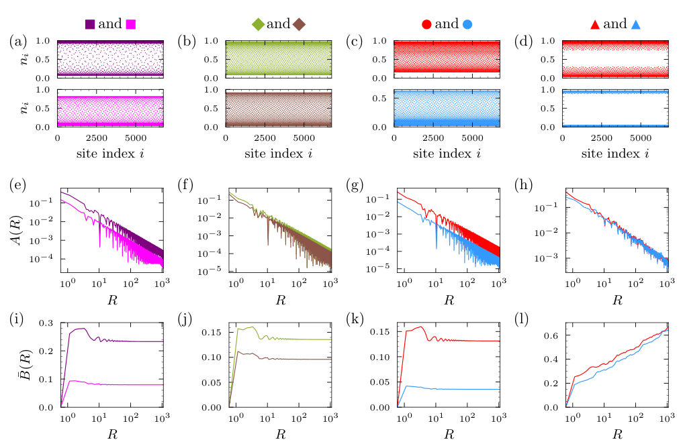
<figcaption class="paper-figure-caption"><b>Fig 2.</b> FIG. 2: Hyperuniformity classification of the GAA model for λ = 2.5. For different (α, ν) points indicated by different symbols in Fig. 1(a), (a)–(d) the charge-density distributions, (e)–(h) log-log plot of A(R) as a function of R and (i)–(l) ¯B(R) as a function of R. The first and second (third and fourth) columns represent the cases of gapped (gapless) phases. In gapped phases, (a,e,i) represent cases where the states just above and below the Fermi energy share identical localization properties (both extended or both localized), while (b,f,j) represent mixed cases (one extended and one localized). For gapless phases, (c,g,k) represent cases where the states around the Fermi energy are...</figcaption>
</figure>
<figure class="paper-figure-card">
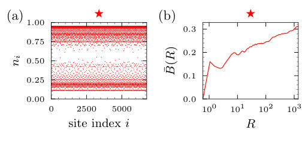
<figcaption class="paper-figure-caption"><b>Fig 3.</b> FIG. 3: (a) Charge-density distribution and (b) ¯B(R) when the mobility edge is located between the highest occupied and lowest unoccupied states, for ν = 2/3, λ = 2.5 and α = −0.25649024.</figcaption>
</figure>
<figure class="paper-figure-card">
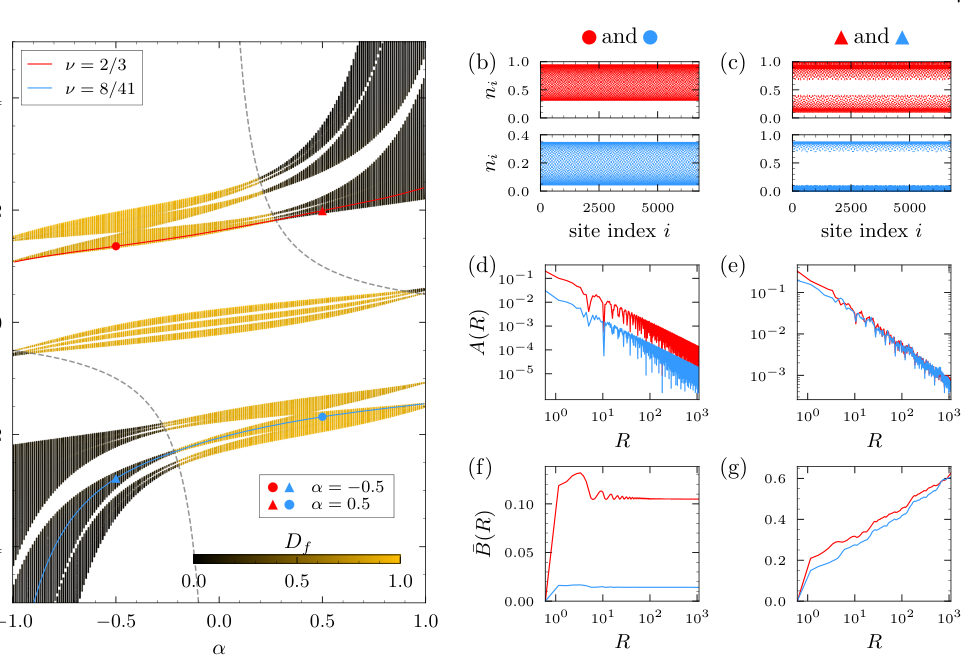
<figcaption class="paper-figure-caption"><b>Fig 4.</b> FIG. 4: (a) Fractal dimension Df landscape for λ = 1.5. Gray dashed curves denote the mobility edges. Four representative (α, ν) points in the gapless phases are marked by the symbols in the panel (a). For those points, (b,c) the charge-density distributions (d,e) log-log plot of A(R) as a function of R and (f,g) ¯B(R) as a function of R. Panels (b,d,f) represent cases where the states around the Fermi energy are extended, while (c,e,g) represent cases where those states are localized.</figcaption>
</figure>
<figure class="paper-figure-card">
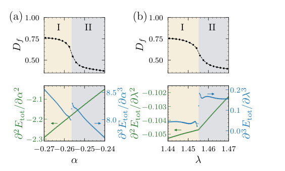
<figcaption class="paper-figure-caption"><b>Fig 5.</b> FIG. 6: Fractal dimension Df and partial derivatives of the total energy per site Etot across the transition between class-I and class-II HU at filling fraction ν = 2/3. (a) Dependence on α at fixed λ = 2.5. (b) Dependence on λ at fixed α = 0.3. The top panels show Df of the highest occupied state, while the bottom panels show the second and third derivatives of Etot with respect to the tuning parameter. The yellow (gray) background color indicates the class-I (-II) HU.</figcaption>
</figure>

**Summary.** This work applies the concept of Hyperuniformity (HU) to analyze charge distributions in the generalized Aubry-André model on aperiodic lattices. It demonstrates that while all distributions are hyperuniform, their specific HU class acts as a fingerprint revealing whether the system is gapped or gapless and how single-particle states localize near the Fermi energy. This framework successfully identifies third-order phase transitions between different insulating many-body states.

**Why it may be interesting.** The use of Hyperuniformity as a universal diagnostic tool to classify quantum phase transitions—especially distinguishing between spectral and mobility gaps—provides a powerful, non-traditional metric for condensed matter theory.

Detailed structure

**Main problem.** To characterize phase transitions in inhomogeneous electron distributions within aperiodic systems, moving beyond classification based solely on symmetry or topology.

**Main result.** The many-body charge distribution is always hyperuniform, but its specific class (I, II, or III) changes across different phases. This change signals a third-order phase transition linked to the localization properties of single-particle states near the Fermi energy.

**Method.** Analysis relies on quantifying global uniformity using Hyperuniformity (HU), derived from scaling behaviors of charge density correlation functions ($ar{B}(R)$) and structure factors ($S(k)$).

**Model / system.** The study uses the Generalized Aubry-André (GAA) model, a tight-binding Hamiltonian applied to an aperiodic lattice. This model is chosen because it supports both localized and extended single-particle states via a mobility edge.

**Key observables.** Hyperuniformity class (Class I vs. Class II), charge density ($\mathbf{n_i}$), Inverse Participation Ratio (IPR), and fractal dimension ($D_f$).

**Important parameters / regimes.** Filling fraction ($
u$), potential strength ($\lambda$), and the location of the Fermi energy ($E_F$) relative to mobility edges.

**Assumptions / limitations.** The analysis assumes that the HU class provides a robust diagnostic tool for distinguishing between spectral gap and mobility gap origins of insulation. The framework is noted to neglect full quantum fluctuations in certain regimes.

**Figures summary.** Figures illustrate the dependence of $ar{B}(R)$ on localization scenarios, showing distinct Class-I (extended) vs. Class-II (localized) behavior; they also map out $D_f$ landscapes and confirm third-order transitions via energy derivative analysis.

**Paper structure.** The paper systematically introduces the GAA model and HU diagnostics, first establishing that charge distributions are always hyperuniform. It then contrasts gapped phases (always Class-I) with gapless phases, where the class depends critically on whether the Fermi level intersects localized or extended single-particle states, culminating in a third-order transition diagnosis.

Abstract

We show the existence of distinct inhomogeneous charge distributions and a phase transition between them in aperiodic fermion systems. Using a generalized Aubry-André model as an example, we obtain various types of charge distributions, which we classify by means of hyperuniformity, a general mean to quantify and classify the global uniformity of spatial distributions. Examining various cases of filling fraction and potential strength and shape, we find that the many-body charge distribution in this model is always hyperuniform, i.e., showing an anomalously suppressed long-range fluctuation, while its hyperuniformity class depends on the localization properties of the states around the Fermi energy, irrespective of those of high-energy states. Namely, the change in the localization properties of these single-particle states leaves a signature in the hyperuniformity class of many-body charge distribution. We further show a change of the hyperuniformity class corresponds to a phase transition between inhomogeneous many-body states, and that it is of the third order.

[↑ back to top](#top)

### [Full-state information-disturbance tradeoff for direction estimation with antiparallel spin-coherent pairs](http://arxiv.org/abs/2606.18040v1)

**Authors:** Massimiliano F. Sacchi  
**Type:** theory · **Category:** quantum information and computing · **PDF:** <https://arxiv.org/pdf/2606.18040v1>  
**Analysis basis:** full PDF text, analyzed in chunks
**Topic relevance:** `entanglement & information structure` **2/5** · `quantum measurements` **2/5** · `exotic spin models in light-matter` **1/5** · `measurement-induced transitions` **1/5** · `spintronics-quantum-optics interface` **1/5**

↔ Scroll figures horizontally

<figure class="paper-figure-card">
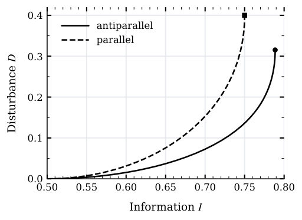
<figcaption class="paper-figure-caption"><b>Fig 1.</b> FIG. 1. Optimal information–disturbance tradeoffs for two-spin direction encoding. The solid curve is the antiparallel spin-1/2 case obtained from the two-sector dual-kernel construction. The dashed curve is the parallel-spin benchmark, equivalent to the irreducible spin-J = 1 spin-coherent-state problem. The markers denote the fully informative endpoints.</figcaption>
</figure>
<figure class="paper-figure-card">
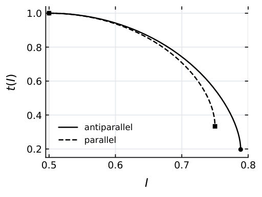
<figcaption class="paper-figure-caption"><b>Fig 2.</b> FIG. 2. Normalized squared traces of the Kraus seeds along the optimal tradeoffs for two spin-1/2 particles. The solid curve is the antiparallel encoding, with t(I) = | Tr X(I)|2/4; the dashed curve is the parallel encoding, with t(I∥) = | Tr χ(I∥)|2/3.</figcaption>
</figure>
<figure class="paper-figure-card">
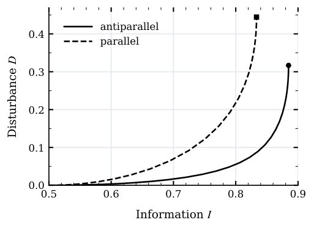
<figcaption class="paper-figure-caption"><b>Fig 3.</b> FIG. 3. Optimal information–disturbance tradeoffs for two-spin direction encoding with j = 1. The solid curve is the antiparallel encoding, obtained from the three-sector dual-kernel construction for 1⊗1 ≃0⊕1⊕2. The dashed curve is the parallel encoding, equivalent to the irreducible spin-J = 2 spin-coherent-state problem. The markers denote the fully informative endpoints.</figcaption>
</figure>
<figure class="paper-figure-card">
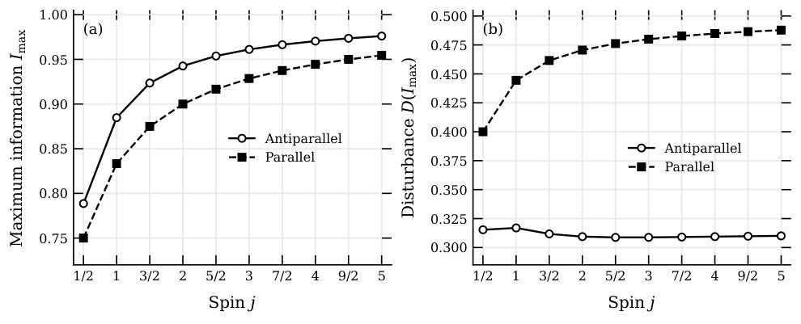
<figcaption class="paper-figure-caption"><b>Fig 4.</b> FIG. 4. Endpoint comparison for antiparallel and parallel spin-coherent encodings as a function of the spin j. Solid curves with circles denote the antiparallel encoding, and dashed curves with squares denote the parallel encoding. Panel (a) shows the maximum directional information. Panel (b) shows the antiparallel endpoint disturbance obtained after optimizing the output state for the maximum-information POVM; it remains substantially below the parallel one. The antiparallel curve is not strictly monotone; it displays a shallow minimum at intermediate spin.</figcaption>
</figure>

**Summary.** This theoretical paper analyzes the optimal information-disturbance tradeoff for estimating direction using two coupled quantum spins. By comparing antiparallel versus parallel spin encodings, the authors prove that the antiparallel configuration yields superior performance in both maximizing directional information and minimizing measurement backaction (disturbance). The results are generalized to arbitrary spin $j$ and analyzed asymptotically.

**Why it may be interesting.** This work provides rigorous quantitative bounds on fundamental resource trade-offs (information vs. disturbance) in quantum metrology, offering concrete advantages of specific physical encoding schemes (antiparallel spins) over simpler ones.

Detailed structure

**Main problem.** The paper determines the optimal trade-off between extracting directional information and disturbing the quantum state when estimating an unknown spatial direction encoded in two antiparallel spins.

**Main result.** For antiparallel encoding, the system consistently achieves both higher directional information and lower output disturbance compared to parallel spin encodings across all analyzed spin values ($j$).

**Method.** The problem is formulated using covariant quantum instruments and solved via semidefinite programming (SDP) techniques applied to a Choi seed operator. The analysis extends from finite-dimensional matrix calculations to asymptotic limits for large spins.

**Model / system.** The system involves two physical spin-$j$ particles whose state encodes directional information, analyzed by comparing antiparallel and parallel spin-coherent pairs. The mathematical framework utilizes group averaging over covariant orbits on the sphere.

**Key observables.** Directional Information ($I$), Full-state Operation Fidelity ($F$), and Disturbance ($D = 1 - F$).

**Important parameters / regimes.** Spin quantum number $j$, which is generalized from spin-1/2 to arbitrary $j$. The large-$j$ limit provides asymptotic bounds for the tradeoff.

**Assumptions / limitations.** The analysis relies on rotational invariance, restricting the optimal measurement strategy to covariant instruments. For endpoint calculations, specific POVMs are fixed, simplifying the optimization compared to the full continuous problem.

**Figures summary.** Figures compare the optimal I-D tradeoffs for antiparallel vs. parallel encodings as a function of spin $j$, showing quantitative advantages for the antiparallel case in both information gain and disturbance reduction.

**Paper structure.** The paper builds from foundational concepts (covariant instruments, SDP formulation) to specific calculations for spin-1/2, then generalizes these results to arbitrary spin $j$. The structure culminates in deriving asymptotic limits using advanced mathematical techniques like Bessel functions.

Abstract

We determine the optimal information--disturbance tradeoff for estimating an unknown spatial direction encoded in two antiparallel spins. Rotational covariance reduces the optimization over all instruments to a finite-dimensional Choi problem: a positive seed operator obeys one trace constraint for each irreducible sector of the input representation, while both the directional score and the operation fidelity are linear functionals of this seed. For two antiparallel spin-$1/2$ particles, whose physical representation decomposes as $0\oplus1$, we derive the two-multiplier dual problem and characterize the optimal instrument from the kernel vectors of the dual slack operator. The optimal operation is a covariant filter with scalar--vector coherence and is generally not a convex interpolation between the identity channel and a measure-and-reprepare strategy. At maximum information we recover the Gisin--Popescu score, but the least disturbing output state is optimized independently, giving a smaller disturbance than both the parallel-spin benchmark and antiparallel measure-and-reprepare. We also formulate the parallel benchmark and, as a central extension of the method, treat antiparallel spin-coherent states of arbitrary spin $j$. In this case the signal coherently occupies all sectors $\ell=0,\ldots,2j$ of $j\otimes j$, the endpoint information is governed by nearest-neighbor sector coherences, and the endpoint disturbance is obtained from an explicit finite block-diagonal eigenvalue problem.

[↑ back to top](#top)

### [Impact of Network Constraints on Fault-Tolerant Distributed Quantum Computing](http://arxiv.org/abs/2606.17495v1)

**Authors:** Eneet Kaur, Shahrooz Pouryousef, Nitish Kumar Chandra, Hassan Shapourian, Jiapeng Zhao, Ramana Kompella, Reza Nejabati  
**Type:** theory · **Category:** quantum information and computing · **PDF:** <https://arxiv.org/pdf/2606.17495v1>  
**Analysis basis:** full PDF text, analyzed in chunks
**Topic relevance:** `QC/QI experiment` **2/5** · `correlated / nonlocal dissipation` **1/5** · `driven-dissipative phase transition` **1/5** · `entanglement & information structure` **1/5** · `methods for driven-dissipative` **1/5** · `non-equilibrium dynamics` **1/5**

↔ Scroll figures horizontally

<figure class="paper-figure-card">
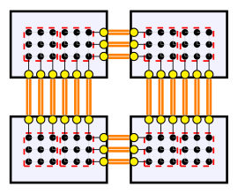
<figcaption class="paper-figure-caption"><b>Fig 1.</b> FIG. 1. (a) Monolithic single-processor design hosting all physical qubits with local nearest-neighbor connectivity. Logical qubits (dashed boundaries) are encoded within local patches. For simplicity, ancilla qubits for parity measurements are not shown. (b) Modular networked architecture distributing computation across multiple independent quantum processing units. Communication qubits at module boundaries enable inter-QPU entanglement distribution.</figcaption>
</figure>
<figure class="paper-figure-card">
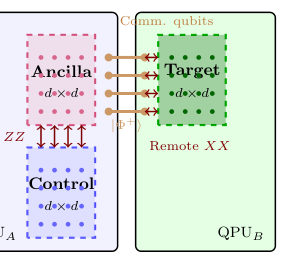
<figcaption class="paper-figure-caption"><b>Fig 2.</b> FIG. 2. Lattice surgery for logical CNOT operations. (a) Local lattice surgery: control-ancilla (ZZ) and ancilla-target (XX) measurements along patch boundaries. Duration: 4d·Tsyn. (b) Remote lattice surgery across QPUA and QPUB. The ancilla-target interaction requires O(d) Bell pairs per syndrome round via communication qubits. Total: O(d2) Bell pairs. (c) EPR timing. Fast:TEPR ≤Tsyn. Slow: TEPR &gt; Tsyn: remote rounds stall, extending duration to 2d · Tsyn + 2d · TEPR.</figcaption>
</figure>
<figure class="paper-figure-card">
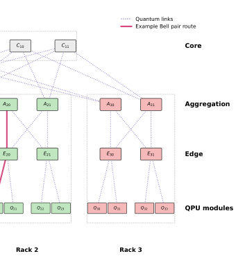
<figcaption class="paper-figure-caption"><b>Fig 3.</b> FIG. 3. Fat-tree topology connecting distributed quantum processing units. QPUs reside at the leaves (within pods or racks which host multiple QPUs along with edge and aggregate switches) of the network and are connected via edge, aggregation, and core switches. Quantum links represent a unified physical interconnect supporting both classical communication and entanglement distribution.</figcaption>
</figure>
<figure class="paper-figure-card">
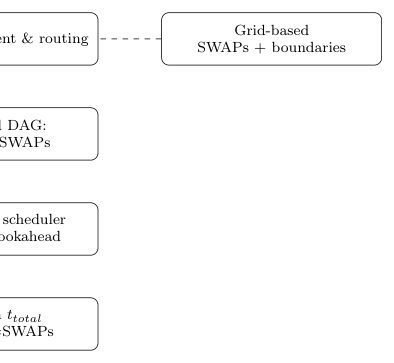
<figcaption class="paper-figure-caption"><b>Fig 4.</b> FIG. 4. End-to-end latency modeling workflow.</figcaption>
</figure>
<figure class="paper-figure-card">
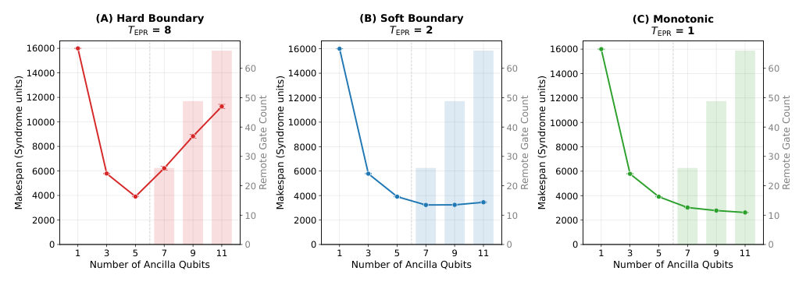
<figcaption class="paper-figure-caption"><b>Fig 5.</b> FIG. 5. This figure shows the ancilla scaling regimes. The parameters of the circuit are 30 logical qubits, w = ∞, Qcomp = 35, two communication qubits and d = 20.</figcaption>
</figure>

**Summary.** This paper develops a comprehensive simulation framework to analyze fault-tolerant distributed quantum computing across modular QPUs. It jointly models error correction overheads with realistic network constraints, such as limited entanglement generation rates and bandwidth contention. The key finding is that system design requires careful tradeoff analysis, as communication bottlenecks can impose performance penalties that outweigh the benefits of higher code distances.

**Why it may be interesting.** For AMO physicists working on quantum networking or trapped ions, this work provides quantitative metrics showing how physical interconnect limitations (like photon loss rates) translate directly into fundamental limits on achievable logical qubit fidelity.

Detailed structure

**Main problem.** The work addresses how network constraints fundamentally impact the performance and feasibility of fault-tolerant quantum computation when scaling to modular, distributed architectures.

**Main result.** The study reveals critical tradeoffs where communication overheads (like entanglement generation latency) can negate the error suppression gains achieved by increasing code distance in distributed systems.

**Method.** It employs an end-to-end simulation framework that jointly models surface-code operations, internal QPU connectivity, and realistic network limitations like finite entanglement rates and bandwidth contention.

**Model / system.** The system is a Quantum Data Center (QDC) composed of multiple interconnected QPUs utilizing surface codes for fault tolerance. The model incorporates lattice surgery protocols to realize logical gates across the network.

**Key observables.** Execution latency, estimated logical error rates (TLER), and circuit makespan ($t_{total}$).

**Important parameters / regimes.** Code distance ($d$), Entanglement-to-Photon Rate (EPR rate), Syndrome extraction time ($T_{syn}$), Idle noise multiplier ($k$), and Seam noise factor ($\lambda$).

**Assumptions / limitations.** The analysis often assumes uniform entanglement generation rates across links and simplifies the complex stochastic nature of error events into mean-field approximations.

**Figures summary.** Figures illustrate architectural comparisons (monolithic vs. distributed), lattice surgery protocols for local/remote CNOTs, network topologies like Fat-trees, and plots showing TLER scaling versus physical error rate under varying noise regimes.

**Paper structure.** The paper develops a systematic framework by first compiling logical circuits to lattice-surgery primitives, then scheduling these operations considering resource contention (ancilla assignment), and finally calculating the total time/error based on network timing models (e.g., slow vs. fast EPR regimes).

Abstract

As we move towards scalable and modular quantum computing, quantum data centres become imperative. Existing analyses typically treat network constraints in isolation or through simplified models, leaving the interplay between error correction operations and communication resources underexplored. In this work, we present an end-to-end simulation framework that jointly models surface-code operations, internal QPU connectivity, and realistic network constraints including finite entanglement generation rates, limited communication qubits, and bandwidth contention, producing execution latency, from which logical error rate estimates are obtained. The framework is modular by design, allowing individual components such as routing heuristics, scheduling policies, and network topologies to be independently replaced. Numerical evaluation reveals distinct operating regimes in which the optimal resource allocation and code distance selection shift depending on the network characteristics. These results point to tradeoffs in the design of distributed quantum computing architectures that are not visible when computation and communication are modeled separately.

[↑ back to top](#top)

### [Operator ordering as an emergent gauge field in twisted bilayer graphene: singular spectral signatures at the magic angle](http://arxiv.org/abs/2606.17349v1)

**Authors:** C. A. S. Almeida  
**Type:** theory · **Category:** strongly correlated electrons · **PDF:** <https://arxiv.org/pdf/2606.17349v1>  
**Analysis basis:** full PDF text, analyzed in chunks
**Topic relevance:** `Keldysh / 2PI / non-Gaussian methods` **2/5** · `analog quantum simulation` **2/5** · `Kondo & dissipative impurity` **1/5** · `methods for driven-dissipative` **1/5** · `non-equilibrium dynamics` **1/5**

↔ Scroll figures horizontally

<figure class="paper-figure-card">
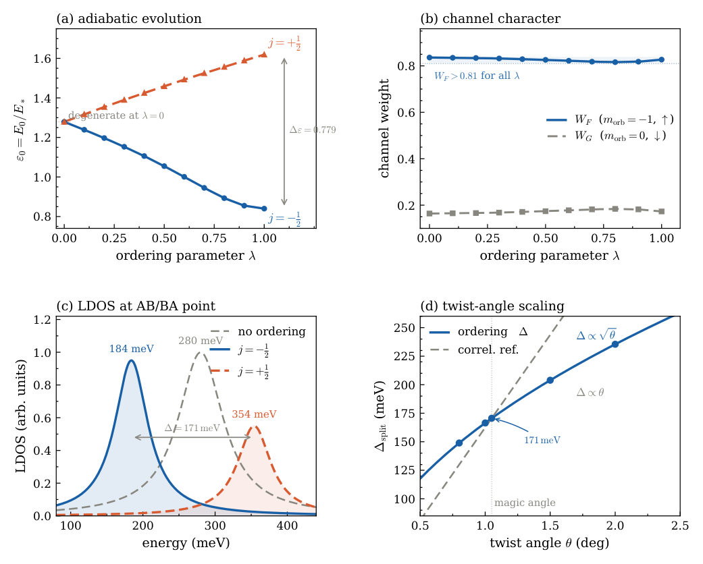
<figcaption class="paper-figure-caption"><b>Fig 1.</b> FIG. 1. Spectral signatures of operator ordering in TBG near the magic angle. (a) Adiabatic evolution of ε0 = E0/E∗for j = ± 1</figcaption>
</figure>

**Summary.** This theoretical work predicts that the spectral features of magic-angle twisted bilayer graphene are governed by an operator ordering correction term. This correction acts like an emergent Aharonov–Bohm flux at stacking boundaries, lifting degeneracy and causing a measurable splitting ($\approx 171$ meV) in the electronic density of states. The finding provides a unique, geometrically derived signature for experimental verification using STM spectroscopy.

**Why it may be interesting.** The mechanism relies on subtle mathematical requirements (self-adjointness, current conservation) applied to a condensed matter system, linking geometric topology (emergent flux) directly to observable electronic structure in strongly correlated materials.

Detailed structure

**Main problem.** To determine the spectral signatures at the AB/BA stacking points of magic-angle twisted bilayer graphene (TBG) that are absent from standard continuum models.

**Main result.** The required Hermitian ordering correction to the Dirac Hamiltonian generates an emergent Aharonov–Bohm flux, splitting the zero-energy degeneracy into two asymmetric Van Hove peaks separated by $\Delta_{	ext{split}} \approx 171$ meV.

**Method.** The analysis involves deriving the necessary self-adjoint extension of the continuum Dirac operator and solving the resulting radial equations near mass zeros using adiabatic interpolation techniques.

**Model / system.** The system is magic-angle twisted bilayer graphene (TBG) modeled by a continuum Dirac Hamiltonian. The key theoretical development is incorporating an ordering term, $H_{	ext{ord}}$, which restores functional-analytic Hermiticity due to spatially varying mass profiles.

**Key observables.** Two asymmetric Van Hove peaks separated by $\Delta_{	ext{split}} \approx 171$ meV; the scaling of this splitting as $\sqrt{	heta}$.

**Important parameters / regimes.** Magic angle ($	heta$), effective mass $m_{	ext{eff}}(\mathbf{r})$, and the emergent flux quantum $h/(2e)$.

**Assumptions / limitations.** The analysis assumes that spectral structure is governed by the self-adjoint extension of the Dirac operator, requiring adherence to current conservation and square-integrability of zero modes.

**Figures summary.** Figures illustrate adiabatic evolution showing gap splitting; LDOS maps show two distinct peaks at AB/BA points; and a plot confirms $\Delta_{	ext{split}}$ scales with $\sqrt{	heta}$.

**Paper structure.** The paper progresses from identifying the failure of naive Hamiltonians to conserve current, deriving the necessary ordering correction ($H_{	ext{ord}}$), mathematically proving its physical necessity via self-adjoint extensions, and finally predicting measurable spectral signatures ($\Delta_{	ext{split}}$) at specific stacking points.

Abstract

Scanning-tunnelling spectroscopy at the AB and BA stacking points of magic-angle twisted bilayer graphene should reveal two asymmetric Van~Hove peaks separated by $Δ_{\mathrm{split}}\approx 171$~meV -- a splitting absent from the standard Bistritzer--MacDonald spectrum. We show this signature arises naturally from the Hermitian ordering correction of the Dirac Hamiltonian with spatially varying mass, which generates an emergent Aharonov--Bohm flux of $h/(2e)$ at each zero of the effective mass $m_{\mathrm{eff}}(\mathbf{r})=w|f(\mathbf{r})|$. In the chiral limit, the interlayer coupling is locally diagonalised by a spatially dependent unitary transformation; the ordering term $H_{\mathrm{ord}}=-\tfrac{i}{2}\boldsymbolσ\cdot \nabla\ln m_{\mathrm{eff}}$ then develops a $1/r$ singularity at the AB/BA stacking points, where $m_{\mathrm{eff}}$ vanishes. The splitting scales as $\sqrtθ$ -- distinguishing it from correlation-driven gaps ($\proptoθ$ or $\propto 1/θ$) -- is gate-voltage independent, and is spatially localised within $r_c\approx 2.1$~nm of each AB/BA point. Within the local asymptotic theory near the zeros of $\mathrm{eff}$, the ordering-corrected zero mode acquires parabolic-cylinder character $D_{-1/2}$. The spatially resolved AB/BA spectrum reported in recent STM studies of magic-angle TBG has not been analysed for two-peak structure and constitutes an immediate experimental test; the predicted cell-averaged broadening of $\approx 14$~meV is consistent with the $16$~meV discrepancy between existing STM data and the BM tight-binding prediction.

[↑ back to top](#top)

### [Optimal Calibration of Quantum Network Links](http://arxiv.org/abs/2606.18167v1)

**Authors:** Vinay Kumar, Claudio Cicconetti, Marco Conti, Andrea Passarella  
**Type:** theory · **Category:** quantum information and computing · **PDF:** <https://arxiv.org/pdf/2606.18167v1>  
**Analysis basis:** full PDF text, analyzed in chunks
**Topic relevance:** `non-equilibrium dynamics` **2/5** · `Keldysh / 2PI / non-Gaussian methods` **1/5** · `correlated / nonlocal dissipation` **1/5** · `driven-dissipative phase transition` **1/5** · `entanglement & information structure` **1/5** · `methods for driven-dissipative` **1/5**

↔ Scroll figures horizontally

<figure class="paper-figure-card">
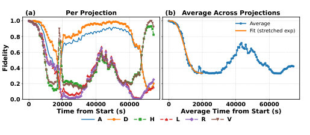
<figcaption class="paper-figure-caption"><b>Fig 1.</b> Fig. 1. Experimental polarisation/fidelity drift on the fiber link of [8]. (a) Time evolution of the six polarization fidelity {A, D, H, L, R, V }. (b) The averaged fidelity decay over the activation period, fitted with an exponential- family model selected by Akaike Information Criterion (AIC). Refer to Appendix A for a detailed processing of experimental data and derivation of this figure.</figcaption>
</figure>
<figure class="paper-figure-card">
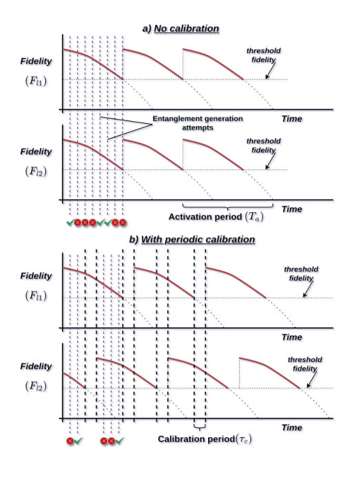
<figcaption class="paper-figure-caption"><b>Fig 2.</b> Fig. 2. An example of a two-link (Fl1 and Fl2) linear quantum network. Fidelity vs. Time for each link with a) No calibration and b) With periodic calibration. The initial fidelity of the generated entangled pair decays over the activation period (Ta). A fixed calibration period (τc) is required to rejuvenate each link. The ✓in the figure means the successful delivery of an entangled pair across the network, while × denotes an unsuccessful attempt due to probabilistic failure of entangled pair generation on either or both of the links involved.</figcaption>
</figure>
<figure class="paper-figure-card">
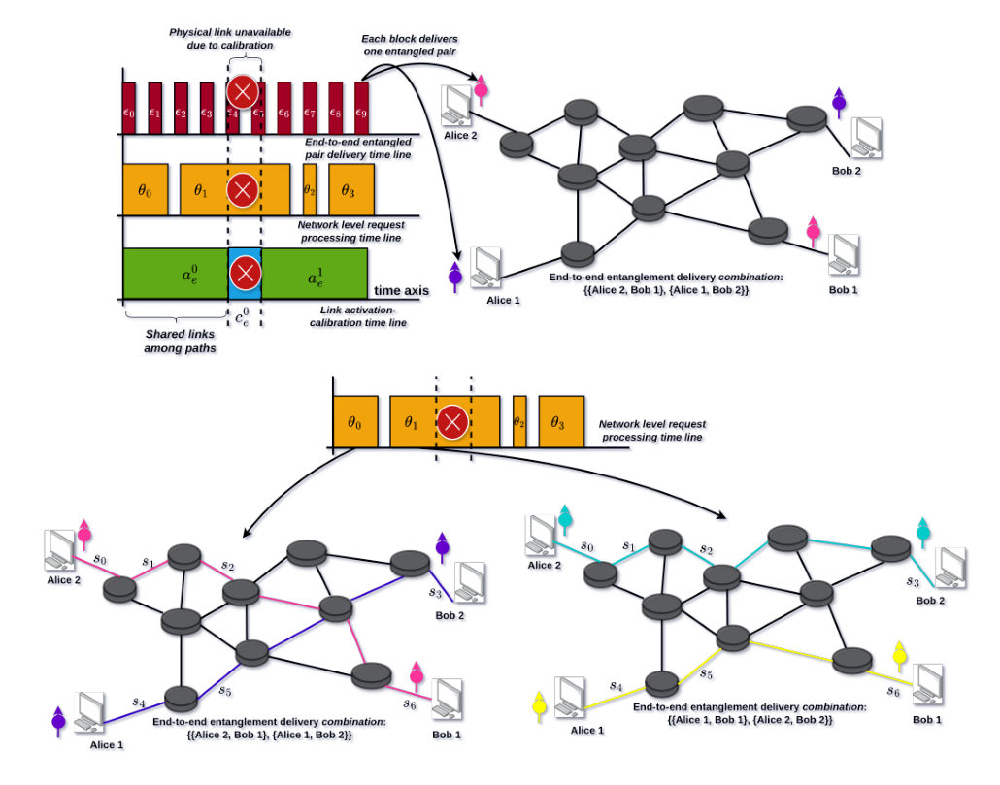
<figcaption class="paper-figure-caption"><b>Fig 3.</b> Fig. 3. Timing diagram. (Top) Each red block represents the delivery of a single entangled pair between a dedicated source–destination pair in a combination. Each orange block denotes the processing time associated with a request for delivering a specific number of entangled pairs between given source–destination pairs. The green and blue blocks correspond to the activation and calibration periods, respectively, of physical link e. The overlap of the activation period a0 e with the time slots of requests θ0 and θ1 induces link sharing among the routing paths involved in the delivery of entangled pairs, particularly for the blocks ϵi, ∀i ∈{0, 1, 2, 3}. (Bottom) The connections switch from...</figcaption>
</figure>
<figure class="paper-figure-card">
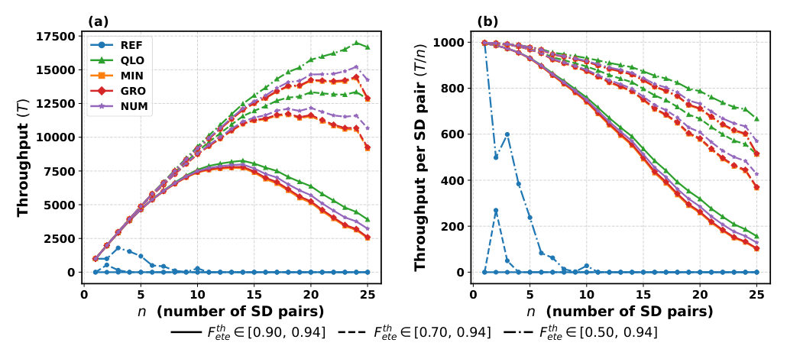
<figcaption class="paper-figure-caption"><b>Fig 4.</b> Fig. 4. Throughput as a function of the number of SD pairs n for all five calibration approaches across three end-to-end fidelity thresholds ranges, F th ete ∈[0.90, 0.94], F th ete ∈[0.70, 0.94], and F th ete ∈[0.50, 0.94]. Panel (a) shows the total throughput summed over all n paths; panel (b) shows the throughput normalised per SD pair. QLO serves as an infeasible upper bound since it ignores the shared link conflict resolution. MIN, GRO, and NUM all enforce feasibility; the gap between them and REF reflects the cost of satisfying F th ete.</figcaption>
</figure>
<figure class="paper-figure-card">
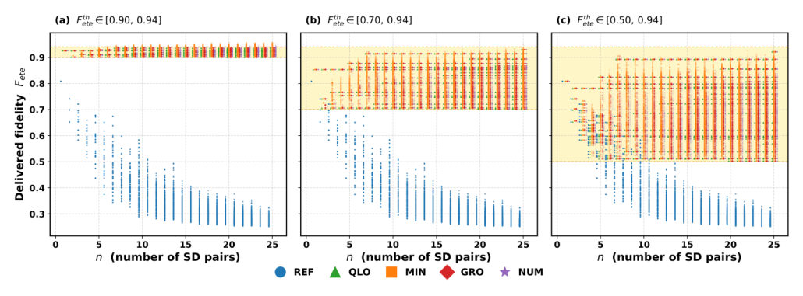
<figcaption class="paper-figure-caption"><b>Fig 5.</b> Fig. 5. Individual delivered end-to-end fidelity for each number of SD pairs n for all approaches. The depicted yellow range is the end-to-end fidelity thresholds set with panel (a) F th ete ∈[0.90, 0.94]; panel (b) F th ete ∈[0.70, 0.94]; panel (c) F th ete ∈[0.50, 0.94]. REF shows a similar pattern across different ranges since it does not account for end-to-end fidelity thresholds, while other approaches all deliver, considering the end-to-end fidelity thresholds.</figcaption>
</figure>

**Summary.** This paper develops optimal scheduling protocols to manage the trade-off between link quality and availability in quantum networks. By modeling fidelity decay over time, it derives analytical solutions for simple chains and proposes advanced heuristics for complex topologies. The work is crucial for designing robust, high-throughput quantum communication infrastructure.

**Why it may be interesting.** It provides a rigorous mathematical framework for resource allocation in realistic quantum communication channels, directly addressing the operational limitations of current quantum network designs by integrating maintenance downtime into the core optimization loop.

Detailed structure

**Main problem.** The core problem is developing an optimal scheduling protocol for quantum network links that balances link quality (fidelity, which decays over time) against availability (which is reduced by necessary calibration downtime). This must be done to maximize overall end-to-end throughput.

**Main result.** For linear chains, the paper derives analytical protocols (QLO) showing optimal scheduling based on fidelity thresholds. For general networks, it proposes heuristics (MIN/GRO) due to non-convex optimization challenges.

**Method.** The work employs network optimization theory, transforming time-dependent fidelity decay into log-fidelity space ($L$-space). It uses analytical derivations for linear chains and heuristic/numerical approaches for complex topologies.

**Model / system.** The system is a quantum network composed of links (modeled as optical fibers) connecting quantum repeaters. Entanglement distribution requires periodic recalibration to counteract environmental drift, creating an operational trade-off.

**Key observables.** End-to-end fidelity ($F_{ete}$), effective throughput ($T$), and the required activation/calibration time periods ($a_e$ vs $c$).

**Important parameters / regimes.** Individual link fidelity thresholds ($L_{th, e}$) and the global end-to-end fidelity constraint ($L$).

**Assumptions / limitations.** The analysis assumes exponential decay of fidelity with activation time. For general networks, the objective function becomes non-convex, necessitating heuristic approximations.

**Figures summary.** Figures illustrate fidelity decay curves (showing single/stretched exponentials) and allowed regions in fidelity space ($	ext{F}_{m0}$ vs $	ext{F}_{m1}$) that define feasible operating points for maximum throughput.

**Paper structure.** The paper progresses from characterizing link degradation via experiment (polarization drift), to developing optimal scheduling for simple linear chains using analytical theorems, and finally extending the methodology to complex, shared-resource general quantum networks using heuristics.

Abstract

The reliable distribution of entanglement is essential for the effective operation of quantum networks. Due to fundamental differences between quantum and classical communication systems, it is necessary to develop specialised algorithms and protocols that also account for quantum-specific constraints. In this work, we focus on the issue of recalibration. As suggested by recent experimental studies, the process of local entanglement generation in a quantum link degrades over time due to environmental changes that have to be estimated and compensated via a calibration operation, during which the link is not available. Therefore, in such a quantum network, every link alternates between an activation period, during which it operates normally, and a calibration period, during which it cannot participate in the end-to-end entanglement distribution, thereby creating a trade-off between link quality (the fidelity of generated pairs, which decays during activation) and availability (the fraction of time the link is usable, which calibration reduces). We develop analytically a protocol for optimally assigning activation periods to each link in linear quantum repeater chains, subject to any general end-to-end fidelity requirements and local initial fidelity thresholds. Building on this foundation, we extend to general quantum networks, where multiple paths may cross at common links, proposing a heuristic approach evaluated in simulations and compared with a benchmark, numerical approach, and theoretical bounds.

[↑ back to top](#top)

### [Optimizing bias-tailored quantum error correction beyond code-capacity noise](http://arxiv.org/abs/2606.17709v1)

**Authors:** César Benito, I. Jesán Velázquez-Reséndiz, Alejandro Bermudez  
**Type:** theory · **Category:** quantum information and computing · **PDF:** <https://arxiv.org/pdf/2606.17709v1>  
**Analysis basis:** full PDF text, analyzed in chunks
**Topic relevance:** `QC/QI experiment` **2/5** · `correlated / nonlocal dissipation` **1/5** · `driven-dissipative phase transition` **1/5** · `entanglement & information structure` **1/5** · `methods for driven-dissipative` **1/5** · `non-equilibrium dynamics` **1/5**

↔ Scroll figures horizontally

<figure class="paper-figure-card">
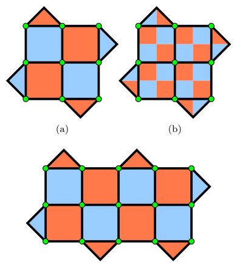
<figcaption class="paper-figure-caption"><b>Fig 1.</b> Figure 1. Qubit and stabilizer arrangement in the sur- face code: data qubits are placed in the vertices of a rect- angular lattice. Each face is associated to a stabilizer, which has X (red) or Z (blue) support on its vertices. a) d = 3 CSS surface code. b) d = 3 XZZX code. c) Anisotropic (dX, dZ) = (3, 5) CSS surface code</figcaption>
</figure>
<figure class="paper-figure-card">
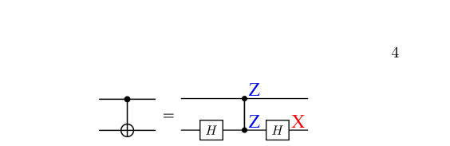
<figcaption class="paper-figure-caption"><b>Fig 2.</b> Figure 2. CNOT to CZ transpilation: standard tran- spilation of a CNOT gate into a controlled-Z gate and two Hadamards. Even if the CZ gate is constructed to ensure Z- noise bias, the H gates transform it to Z ⊗X, losing the bias structure. The H gates introduce additional non-biased noise to the target qubit.</figcaption>
</figure>
<figure class="paper-figure-card">
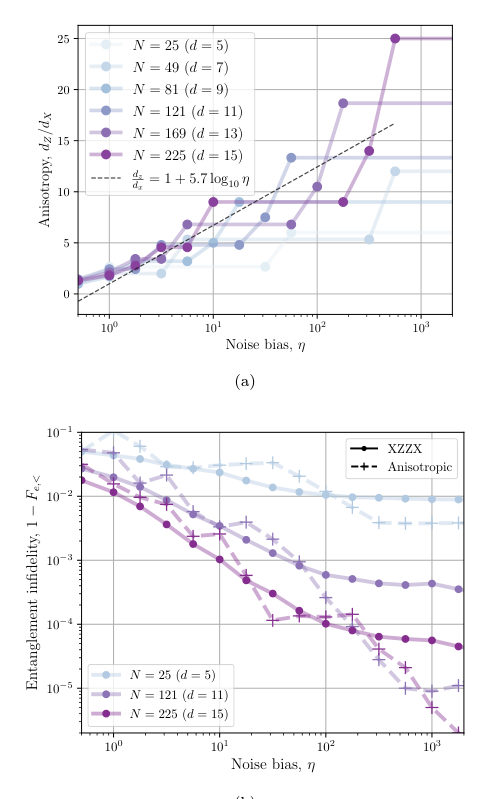
<figcaption class="paper-figure-caption"><b>Fig 3.</b> Figure 3. XZZX and anisotropic surface code under biased code-capacity noise a) Optimal anisotropy that maximizes the entanglement fidelity of the logical qubit, as a function of the bias. The maximum anisotropy for a given distance is limited by the distance itself, which corresponds to having a repetition code instead of a surface code. In this work, we do not consider repetition codes as we limit the minimum distance to dX = 2. We perform a linear fit of the anisotropy to 1 + m log η, considering only points from the N = 225 curve with dX &gt; 3 to limit finite-size effects, that we plot as a dashed grey line. b) Comparison of the logi- cal entanglement infidelities between the XZZX (solid...</figcaption>
</figure>
<figure class="paper-figure-card">
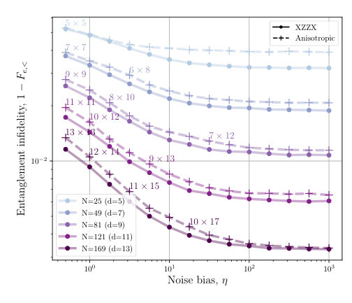
<figcaption class="paper-figure-caption"><b>Fig 4.</b> Figure 4. XZZX and anisotropic surface code under biased circuit-level noise: infidelity comparison between the XZZX (solid dots) and anisotropic (dashed stars) surface code under circuit-level noise with p = 0.003 and variable bias for idle qubits and two-qubit gates. For both codes, there is a residual improvement on the logical error rates under biased noise, but it saturates at η ∼100 due to the CNOT gates used in syndrome extraction producing non-biased noise. For higher distances, where more anisotropy levels are available, anisotropic surface codes match the performance of the XZZX code.</figcaption>
</figure>
<figure class="paper-figure-card">
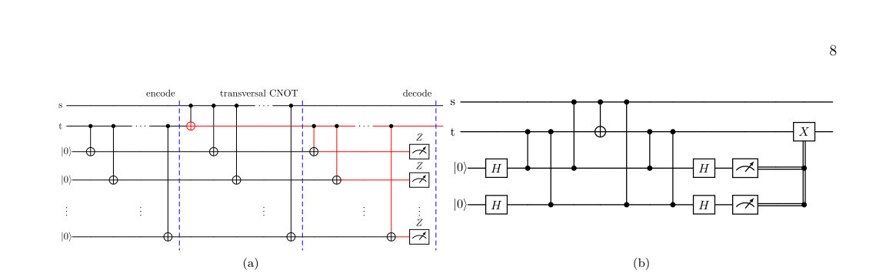
<figcaption class="paper-figure-caption"><b>Fig 5.</b> Figure 5. Bias-filtering CNOT gadget: a) Repetition-code implementation of the bias-filtering gadget. It implements a CNOT gate by encoding the target qubit in a distance d repetition code, performing a transversal CNOT, and finally decoding from parity measurements. A bit flip is applied to the target qubit if more than d/2 measurements are flipped. This allows detecting and correcting the non-biased bit-flip originated in the original CNOT between the source and target qubits, displayed in red. b) Simplified gadget for the distance-3 repetition code, using a depth-5 circuit. The CNOT gates are simplified to CZ gates by canceling out Hadamard gates under the assumption that gate errors...</figcaption>
</figure>

**Summary.** This paper investigates Quantum Error Correction codes designed for biased noise, finding that idealized theoretical advantages vanish under realistic circuit noise. The authors introduce a 'bias-filtering gadget' into the XZZX code structure, demonstrating that this lightweight hardware modification can recover a measurable portion of the lost bias advantage by protecting the physical noise asymmetry during syndrome measurement.

**Why it may be interesting.** It directly addresses the gap between theory (ideal code capacity) and practice (noisy circuits), providing concrete mitigation techniques for hardware-specific error biases relevant to trapped ion or superconducting qubit platforms.

Detailed structure

**Main problem.** The study evaluates how much the theoretical advantage of bias-tailored Quantum Error Correction (QEC) codes diminishes when moving from idealized noise models to realistic circuit-level noise.

**Main result.** Under realistic circuit noise, the predicted advantages are significantly reduced because syndrome extraction itself degrades the physical noise asymmetry; however, a lightweight 'bias-filtering gadget' can partially recover this lost advantage.

**Method.** The authors compare code performance using both idealized code-capacity simulations and detailed circuit-level noise models incorporating gate errors and ancillary qubit encoding/decoding gadgets.

**Model / system.** The work compares XZZX codes against anisotropic rectangular surface codes, analyzing their resilience to partially-biased dephasing noise common in physical quantum hardware platforms like trapped ions or spin qubits.

**Key observables.** QEC error thresholds (p_th), entanglement infidelity ($	ext{Fe}_L$), and the relative improvement factor provided by the bias-filtering gadget.

**Important parameters / regimes.** Noise bias ($\eta$), circuit complexity, code distance ($d$), and the ratio of idle to gate errors ($p_{id}/p_{2q}$).

**Assumptions / limitations.** The analysis assumes that syndrome extraction circuits introduce noise that degrades the initial physical noise asymmetry, which is the central limitation being overcome.

**Figures summary.** Figures compare code performance under ideal vs. circuit-level noise; one figure illustrates the bias-filtering gadget using a repetition code structure during syndrome measurement.

**Paper structure.** The paper progresses by first establishing the theoretical advantage in idealized models, then demonstrating how this advantage collapses under realistic circuit noise due to syndrome extraction errors, and finally proposing and analyzing a specific 'bias-filtering CNOT gadget' to mitigate this degradation.

Abstract

We find that the substantial advantages predicted for bias-tailored quantum error correction (QEC) under code-capacity noise are strongly reduced once realistic syndrome extraction and circuit-level noise models are considered. We start by comparing XZZX codes to rectangular surface codes with a bias-dependent optimised anisotropy. Although code-capacity simulations predict an advantage of rectangular surface codes in the limit of high noise bias, this actually disappears under circuit-level noise, making the XZZX codes the preferred and simplest choice even for platforms that allow for a flexible variation of the code layout adapted to changes in noise calibration. Our results identify bias degradation during syndrome extraction under circuit-level noise as the central limitation of biased-tailored QEC. To partially mitigate this effect, we introduce a bias-filtering CNOT gadget that temporarily encodes the ancillary target qubit during syndrome extraction in a repetition code and, upon measurement and feed forward, manages to reduce the bias degradation. In a regime of high-bias and low-idle errors, this bias-filtering gadget yields a few-percent relative improvement of the XZZX code error threshold, demonstrating that lightweight bias-filtering strategies can recover part of the lost bias-tailoring advantage for realistic circuit-level noise.

[↑ back to top](#top)

### [Kinematic properties of the Pauli equation](http://arxiv.org/abs/2606.17548v1)

**Authors:** E. E. Perepelkin, B. I. Sadovnikov, N. G. Inozemtseva, V. A. Svetovidov  
**Type:** theory · **Category:** other · **PDF:** <https://arxiv.org/pdf/2606.17548v1>  
**Analysis basis:** full PDF text, analyzed in chunks
**Topic relevance:** `Keldysh / 2PI / non-Gaussian methods` **2/5** · `methods for driven-dissipative` **2/5** · `exotic spin models in light-matter` **1/5** · `non-equilibrium dynamics` **1/5**

↔ Scroll figures horizontally

<figure class="paper-figure-card">
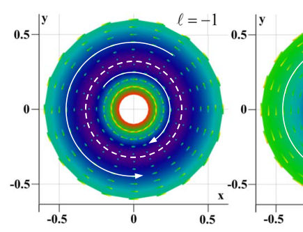
<figcaption class="paper-figure-caption"><b>Fig 1.</b> Fig. 1 Probability flux velocity distribution .</figcaption>
</figure>
<figure class="paper-figure-card">
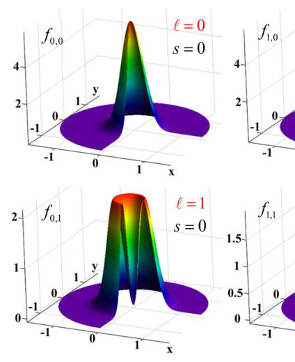
<figcaption class="paper-figure-caption"><b>Fig 2.</b> Fig. 2 Probability density distribution by .</figcaption>
</figure>
<figure class="paper-figure-card">
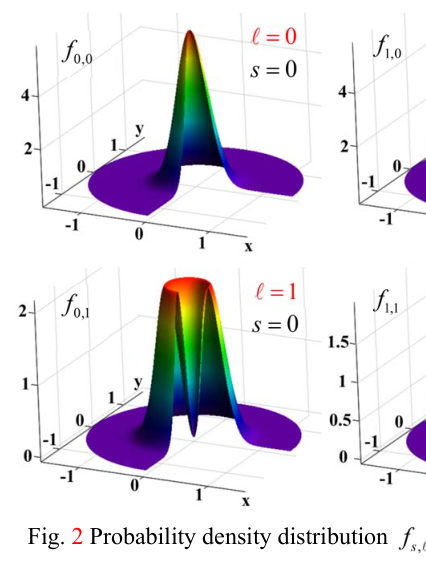
<figcaption class="paper-figure-caption"><b>Fig 3.</b> Fig. 2 shows the probability density distributions</figcaption>
</figure>

**Summary.** This theoretical work analyzes the kinematics of the Pauli equation using advanced formalisms like Wigner-Vlasov. It demonstrates that the spinorial nature leads to a splitting of probability flux and derives coupled Hamilton-Jacobi equations for both the Pauli and Schrödinger systems. The paper is significant for establishing deep mathematical consistency between these fundamental quantum descriptions in electromagnetic environments.

**Why it may be interesting.** The rigorous mathematical connection drawn between the spinorial nature of the Pauli equation and classical/semi-classical Hamilton-Jacobi mechanics is highly relevant for understanding quantum dynamics in external fields, bridging foundational QM theory with semi-classical methods.

Detailed structure

**Main problem.** The paper investigates the kinematic properties of quantum systems governed by the Pauli equation, comparing its dynamics to those described by the Schrödinger equation.

**Main result.** It establishes that the probability flux associated with the Pauli equation splits into two components corresponding to its spinor structure, and derives analogous Hamilton-Jacobi equations for both systems.

**Method.** The analysis heavily utilizes the Wigner-Vlasov formalism, employing Helmholtz decomposition and deriving coupled sets of differential equations for potentials and fluxes.

**Model / system.** The primary model is a spin-1/2 particle governed by the Pauli equation in external electromagnetic fields. The comparison system is the standard Schrödinger equation counterpart.

**Key observables.** Probability current flux ($\mathbf{v}_1, \mathbf{v}_2$), quantum potential ($Q$), Hamilton-Jacobi functions ($H_n$), and magnetic moment ($\mathbf{\mu}_s$).

**Important parameters / regimes.** Uniform magnetic fields, asymmetric quadratic potentials, and the spin coupling constant (related to the Bohr magneton).

**Assumptions / limitations.** The analysis relies on specific gauge choices (e.g., Lorenz $\Psi$-gauge) and approximations within the Wigner-Vlasov expansion.

**Figures summary.** Figure 1 illustrates the probability flux distribution ($v_\lambda
ho$) for different spin components ($\lambda$), showing directional flow relative to color coding.

**Paper structure.** The paper proceeds by first introducing the Wigner-Vlasov formalism, deriving analogues of H-J equations and motion equations (Theorem 1), then constructing a formal link between Pauli and Schrödinger dynamics (Theorem 2), establishing field consistency with Maxwell's equations (Theorem 4), and concluding with explicit solutions for specific potentials.

Abstract

Based on the Wigner-Vlasov formalism, this paper investigates the kinematic properties of the Pauli equation. It is shown that the probability current associated with the Pauli equation can be represented as a superposition of two currents with certain expansion coefficients. Each of these currents corresponds to a particular component of the spinor. The expansion coefficients effectively serve as weighting functions that determine the probability contribution of the corresponding spinor component. Therefore, each spin projection corresponds to its own probability flux. A new system of the Hamilton-Jacobi equations and also a system of motion equations in electromagnetic fields are obtained, taking into account the interaction between the spin and the magnetic field. To illustrate how these equations can be applied we have investigated the quantum system kinematics in detail using an exact solution of the Pauli equation in the presence of a uniform magnetic field and an asymmetric quadratic potential.

[↑ back to top](#top)

### [Why dimensional analysis works: general classification of self-similarity based on scale-invariance](http://arxiv.org/abs/2606.17179v1)

**Authors:** Hirokazu Maruoka  
**Type:** theory · **Category:** statistical mechanics · **PDF:** <https://arxiv.org/pdf/2606.17179v1>  
**Analysis basis:** full PDF text, analyzed in chunks
**Topic relevance:** `non-equilibrium dynamics` **2/5** · `non-equilibrium universality` **2/5** · `Keldysh / 2PI / non-Gaussian methods` **1/5** · `driven-dissipative phase transition` **1/5**

↔ Scroll figures horizontally

<figure class="paper-figure-card">
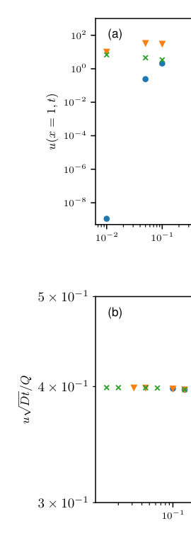
<figcaption class="paper-figure-caption"><b>Fig 1.</b> Fig. 1 Plots of a one-dimensional diffusion process for various diffusion coefficients, D = 1, 10, 50: (a) the concentration of the substance at x = 1 as a function of time t; (b) data collapse obtained by plotting the similarity parameters, u √</figcaption>
</figure>
<figure class="paper-figure-card">
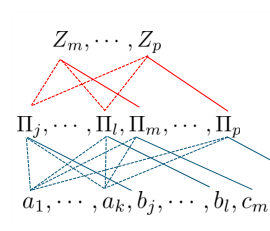
<figcaption class="paper-figure-caption"><b>Fig 2.</b> Fig. 2 Hierarchical structure of similarity parameters. Physical parameters a1, · · · , ak, bj, · · · , bl, cm, · · · , cp are quantities composed of a numerical value and a physical unit. They are not invariant under scale transformations of units. Πj, · · · , Πl, Πm, · · · , Πp are referred to as similarity parameters of the first class, which are composed of physical parameters and are invariant under scale transformations of units. Zm, · · · , Zp are referred to as similarity parameters of the second class, which are composed of similarity parameters of the first class and are invariant under all scale transformations, where 1 &lt; k &lt; j &lt; l &lt; m &lt; p. The dashed lines indicate parameters...</figcaption>
</figure>
<figure class="paper-figure-card">
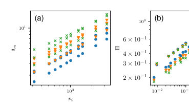
<figcaption class="paper-figure-caption"><b>Fig 3.</b> Fig. 3 Plots of the physical parameters δm versus vi (a), the similarity parameters of the first class, Π = δm/R versus η = ρv2 i /E (b), and the similarity parameters of the second class, Π3κ−1η−1</figcaption>
</figure>
<figure class="paper-figure-card">
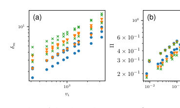
<figcaption class="paper-figure-caption"><b>Fig 4.</b> Figure 3 shows the plots of the physical parameters in Eq. 59, similarity parameters of the first class in Eq. 61, and the similarity parameters of the second class in Eq. 64. The scale invariance is only partially exploited in the representation shown in Fig. 3 (b), whereas all the data points collapse onto a single curve in the representation of Eq. 64 shown in Fig. 3 (c). The solid line in Fig. 3 (c) corresponds to Eq. 66. Note that the function Φex, in which all scale invariance has been exploited, is not a power-law function, as discussed in Eq. 58.</figcaption>
</figure>
<figure class="paper-figure-card">
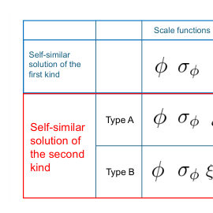
<figcaption class="paper-figure-caption"><b>Fig 5.</b> Fig. 4 Summary of the three kinds of self-similar solutions. A self-similar solution of the first kind is characterized by the absence of an intrinsic scale function ξ, whereas a self-similar solution of the second kind possesses an intrinsic scale function ξ. Self-similar solutions of the second kind can be further subdivided into Type A and Type B according to whether the exponents appearing in ξ are constant or depend on additional dimensionless parameters.</figcaption>
</figure>

**Summary.** This work provides a deep theoretical framework showing that self-similarity arises from scale invariance. It unifies dimensional analysis by proving it works because physical units and parameters share underlying scaling symmetries. The paper classifies all such solutions into three types based on the mathematical structure of their associated scale functions.

**Why it may be interesting.** While not directly about quantum systems, the rigorous mathematical machinery developed for classifying scale invariance and dimensional reduction is highly relevant to analyzing critical phenomena or asymptotic regimes in complex many-body statistical mechanics models.

Detailed structure

**Main problem.** To develop a unified framework for understanding dimensional analysis by rigorously formulating self-similarity from the perspective of scale invariance.

**Main result.** The paper establishes that there are three distinct kinds of self-similar solutions (Type I, II A, and II B) based on how intrinsic scale functions relate to unit transformations. It proves that dimensional analysis works because it exploits the partial sharing of scale invariance between physical units and parameters.

**Method.** The core method involves applying group theory concepts related to scale transformations ($\sigma$) to governing equations, comparing these mathematical invariances with those derived from physical units, and classifying the resulting solutions hierarchically.

**Model / system.** The analysis is applied to various physical models, including one-dimensional diffusion processes, viscoelastic impact dynamics, and modified groundwater flow problems governed by non-linear partial differential equations.

**Key observables.** Self-similar profiles ($\Phi$), data collapse plots, and the structure of similarity parameters ($\Pi, Z$).

**Important parameters / regimes.** Scale factors ($A$), power exponents ($\alpha_{ik}$), dimensionless numbers (e.g., $c$ in groundwater flow).

**Assumptions / limitations.** The derivation assumes that scale functions derived from unit structures can be applied to physical parameters due to the indistinguishability of their numerical transformations.

**Figures summary.** Figures illustrate data collapse for diffusion processes and show hierarchical relationships between different classes of similarity parameters (First Class $
ightarrow$ Second Class).

**Paper structure.** The paper progresses by first defining scale invariance, then applying it to specific PDEs (diffusion, groundwater flow) to derive initial similarity forms. It then develops a general mathematical framework comparing unit scaling vs. parameter scaling, leading to the final three-fold classification of self-similarity.

Abstract

In this work, we formulate self-similarity from the perspective of scale invariance, where a self-similar form is understood as the transformation of a function into a form invariant under scale transformations. By applying this formulation to physical parameters, which consist of numerical values and units, it is demonstrated that dimensional analysis works for physical problems because scale invariance is partially shared between units and physical parameters. This naturally leads to the distinction between similarity of the first kind and similarity of the second kind according to whether the scale functions induced by units and those associated with physical parameters are equivalent or not. Self-similar solutions of the second kind can be further classified according to whether the power exponents of the similarity parameters include functions of dimensionless numbers. This leads to the conclusion that there are three kinds of self-similar solutions. The present work provides a unified framework for understanding dimensional analysis and a universal classification of self-similarity in physical problems.

[↑ back to top](#top)

### [Effects of Josephson Junction Non-idealities on Adiabatic Quantum Flux Parametron Circuits](http://arxiv.org/abs/2606.17338v1)

**Authors:** Daryoush Shiri, Likai Yang, Mohamed A. Hassan, Philip Krantz, Eric T. Holland  
**Type:** theory · **Category:** quantum information and computing · **PDF:** <https://arxiv.org/pdf/2606.17338v1>  
**Analysis basis:** full PDF text, analyzed in chunks
**Topic relevance:** `QC/QI experiment` **2/5** · `driven-dissipative phase transition` **1/5** · `methods for driven-dissipative` **1/5** · `non-equilibrium dynamics` **1/5**

↔ Scroll figures horizontally

<figure class="paper-figure-card">
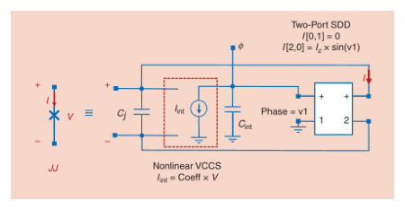
<figcaption class="paper-figure-caption"><b>Fig 1.</b> Fig. 2. The circuit symbol and the mathematical modeling of Josephson junction using a symbolically defined device (SDD). The sinusoidal term, sinpv1q, can be replaced by a polynomial or a more sophisticated function of ϕ for non-ideal JJs. Coeff is 2πCint{Φo. This figure is adapted from [10].</figcaption>
</figure>
<figure class="paper-figure-card">
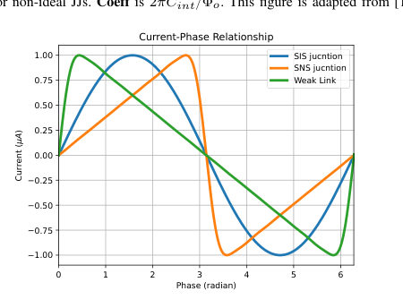
<figcaption class="paper-figure-caption"><b>Fig 2.</b> Fig. 3. Current-phase relationship of three different Josephson junctions modeled in Kesyight ADS using SDD block. The expansion coefficients of odd harmonics for SNS and WL in Eq. (2) are positive and negative, respectively.</figcaption>
</figure>
<figure class="paper-figure-card">
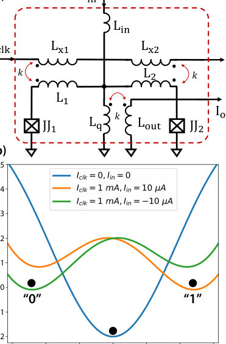
<figcaption class="paper-figure-caption"><b>Fig 3.</b> Fig. 1. (a) AQFP buffer, (b) The potential energy in the SQUID loop (normalized to Josephson energy EJ “ IcΦo{2π ) as a function of ϕx which is average of phases across two JJs. Adiabatic transition of potential from single-well to double-well as Iclk increases. The final state (clockwise and counter clockwise current in the SQUID) depends on the input current polarity, Iin. JJs are modeled as shown in Fig. 2.</figcaption>
</figure>
<figure class="paper-figure-card">
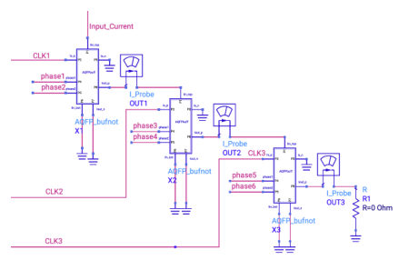
<figcaption class="paper-figure-caption"><b>Fig 4.</b> Fig. 6. A 3-stage AQFP shift register. The input current is fed from the top node of the left-most AQFP gate. The output current of each stage is cascaded to the next stage as the input. The clock of each stage is phase-shifted by 90 degree or 1/4’th of a period relative of the preceding clock.</figcaption>
</figure>
<figure class="paper-figure-card">
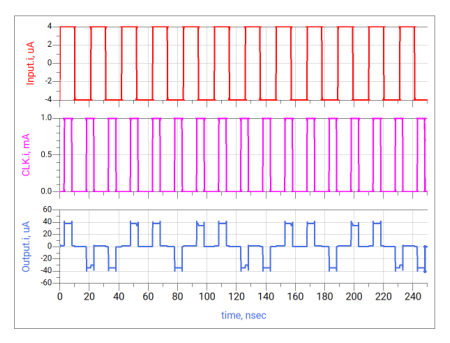
<figcaption class="paper-figure-caption"><b>Fig 5.</b> Fig. 4. AQFP buffer simulation results in Keysight ADS simulator. The clock (magenta) samples the input current (red) on the rising edges and copies a replica of it with one clock pulse duration at the output (blue).</figcaption>
</figure>

**Summary.** This paper analyzes the performance of Adiabatic Quantum Flux Parametron gates, crucial for cryogenic superconducting electronics. It models how non-ideal Josephson junctions (SNS and WL) deviate from ideal sinusoidal behavior by using polynomial expansions in circuit simulations. The results quantify these deviations, showing that junction type dictates critical trade-offs between switching speed, current swing, and operational margin.

**Why it may be interesting.** This work directly addresses hardware limitations in superconducting quantum computing by analyzing how material imperfections (non-sinusoidal CPRs) impact fundamental logic gate performance metrics like speed and energy dissipation.

Detailed structure

**Main problem.** The study investigates how non-sinusoidal current-phase relations (CPR) in Josephson junctions affect the performance of Adiabatic Quantum Flux Parametron (AQFP) gates.

**Main result.** Non-ideal junction types (SNS and WL) significantly alter the switching dynamics, delay, and stability margins compared to ideal SIS junctions, demonstrating trade-offs between speed and current swing for cryogenic digital processing.

**Method.** The authors used symbolic device modeling within the Keysight ADS simulator to analyze transient behavior of AQFP circuits under various junction models.

**Model / system.** The system is based on AQFP logic gates, superconducting circuits utilizing SQUID loops containing Josephson Junctions (JJ). The model compares ideal SIS junctions against non-ideal SNS and WL junctions by incorporating their respective CPRs into the circuit simulation.

**Key observables.** Switching speed, delay, output current swing ($\mu$A), and signal integrity in a 3-stage shift register.

**Important parameters / regimes.** Critical currents ($I_{c1} = I_{c2} = 50\ \mu	ext{A}$), operating frequency (e.g., $5 	ext{ GHz}$), and the nature of the CPR deviation from sinusoidal.

**Assumptions / limitations.** The analysis assumes that using polynomial models via SDD accurately captures the behavior of non-ideal junctions for circuit simulation purposes.

**Figures summary.** Figures illustrate the AQFP buffer schematic, potential energy profiles, comparisons of $I-\phi$ curves (SIS vs. SNS vs. WL), and transient simulations showing signal propagation through a 3-stage shift register.

**Paper structure.** The paper first introduces the AQFP concept using ideal junctions, then models non-ideal junctions (SNS/WL) via polynomial expansions, simulates the basic buffer gate operation, and finally demonstrates functionality using a multi-stage shift register.

Abstract

Adiabatic quantum flux parametron (AQFP) gate is a promising approach to scale up the cryogenic microwave electronics for superconducting qubit multiplexed control. However, the performance of these circuits depends on the quality of the Josephson junctions which are ideally superconductor-insulator-superconductor (SIS) type following the ideal sinusoidal relation between current and quantum phase. We demonstrate how the non-sinusoidal current-phase relation in Superconductor-Normal metal-Superconductor (SNS) and weak link (WL) junctions affects the speed, delay, and margin of the AQFP gates. The JJ models are defined in the Keysight ADS simulator using symbolically defined device (SDD) method.

[↑ back to top](#top)

### [SPICE-Q and Large-Scale Quantum Chip Production](http://arxiv.org/abs/2606.17907v1)

**Authors:** Cai, Ling Qiao, Bin Yang, Fumin Luo, Chang Liu, WeiGui Guo, GuoRong Zhang, XueFei Liu, Qinglang Guo, Bin Wu  
**Type:** theory · **Category:** quantum information and computing · **PDF:** <https://arxiv.org/pdf/2606.17907v1>  
**Analysis basis:** full PDF text, analyzed in chunks
**Topic relevance:** `QC/QI experiment` **2/5** · `Keldysh / 2PI / non-Gaussian methods` **1/5** · `methods for driven-dissipative` **1/5**

↔ Scroll figures horizontally

<figure class="paper-figure-card">
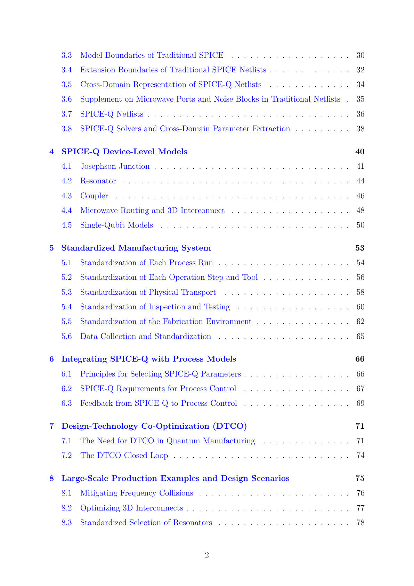
<figcaption class="paper-figure-caption"><b>Fig 1.</b> Low-resolution page preview, page 2</figcaption>
</figure>
<figure class="paper-figure-card">
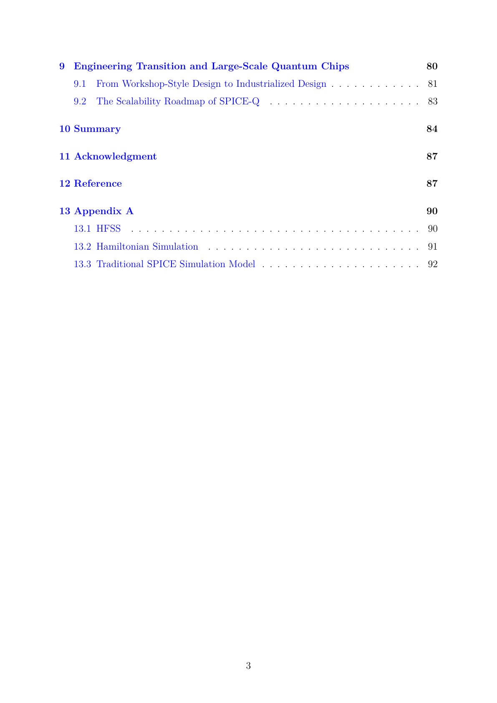
<figcaption class="paper-figure-caption"><b>Fig 2.</b> Low-resolution page preview, page 3</figcaption>
</figure>
<figure class="paper-figure-card">
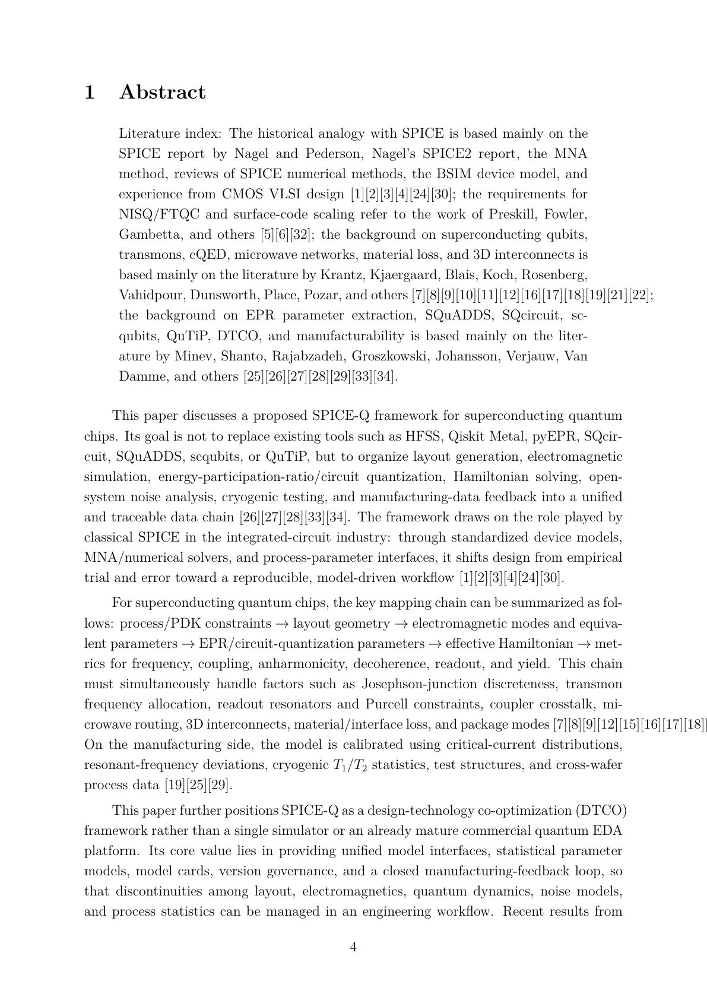
<figcaption class="paper-figure-caption"><b>Fig 3.</b> Low-resolution page preview, page 4</figcaption>
</figure>
<figure class="paper-figure-card">
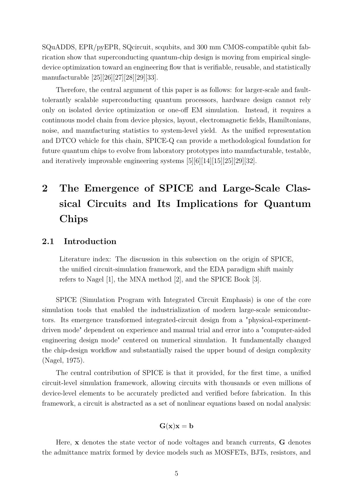
<figcaption class="paper-figure-caption"><b>Fig 4.</b> Low-resolution page preview, page 5</figcaption>
</figure>
<figure class="paper-figure-card">
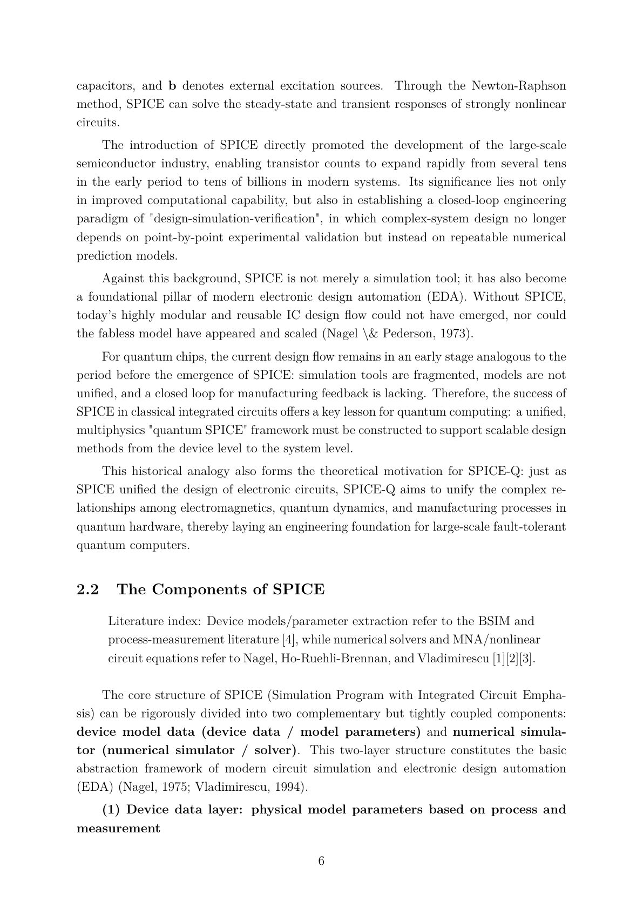
<figcaption class="paper-figure-caption"><b>Fig 5.</b> Low-resolution page preview, page 6</figcaption>
</figure>

**Summary.** This paper introduces SPICE-Q, a comprehensive framework designed to industrialize superconducting quantum chip design. It solves the problem of fragmented simulation tools by creating a unified data chain connecting electromagnetics, device physics, Hamiltonian dynamics, and manufacturing statistics. This shift treats quantum hardware development as a rigorous engineering workflow necessary for scaling fault-tolerant computation.

**Why it may be interesting.** It provides a crucial engineering roadmap for applying advanced open-system dynamics and many-body techniques by formalizing the interface between electromagnetic field theory and quantum information processing models.

Detailed structure

**Main problem.** The design of large-scale, fault-tolerant superconducting quantum processors requires a unified engineering workflow that connects device physics to system performance.

**Main result.** SPICE-Q proposes a Design-Technology Co-Optimization (DTCO) framework that treats quantum chip design as an industrial engineering process rather than isolated simulations.

**Method.** The framework unifies disparate simulation tools (EM solvers, Hamiltonian dynamics, classical circuit simulators) through standardized model interfaces and a traceable data chain.

**Model / system.** The system is superconducting quantum chips built from Josephson junctions, modeled by coupling electromagnetic field solutions to effective Hamiltonians describing qubit dynamics and noise channels.

**Key observables.** Frequency, coupling strength, anharmonicity, decoherence times ($T_1/T_2$), readout performance, and overall manufacturing yield.

**Important parameters / regimes.** Process constraints (PDK), Josephson junction variability ($\delta I_c$), resonator quality factors ($Q$), and 3D interconnect parasitics.

**Assumptions / limitations.** The core assumption is that scaling requires treating the entire design process—from physics to fabrication statistics—as a single, continuous, model-driven engineering workflow.

**Paper structure.** The paper builds an analogy with classical SPICE development (moving from physical equations to parameterized models) and applies this structure to quantum computing, detailing the necessary integration points between EM simulation, Hamiltonian extraction, and statistical yield analysis.

Abstract

We propose SPICE-Q, a SPICE-inspired design-technology co-optimization framework for superconducting quantum processors. Rather than replacing tools such as HFSS, Qiskit Metal, pyEPR, SQcircuit, SQuADDS, scqubits, or QuTiP, SPICE-Q aims to connect them through a unified, traceable data chain spanning process rules, layout, electromagnetic simulation, energy-participation-ratio and circuit quantization, Hamiltonian extraction, noise analysis, cryogenic test, and manufacturing feedback. The central mapping is from process and PDK constraints to layout geometry, electromagnetic modes, equivalent circuit parameters, effective Hamiltonians, and finally metrics such as frequency, coupling, anharmonicity, decoherence, readout performance, and yield. This flow must capture Josephson-junction variability, transmon frequency allocation, resonator and Purcell constraints, coupler crosstalk, microwave routing, 3D interconnects, material/interface loss, package modes, and wafer-scale process statistics. By introducing standardized model interfaces, statistical parameter models, model cards, version governance, and closed-loop calibration from cryogenic and fabrication data, SPICE-Q frames superconducting quantum-chip design as an engineering workflow rather than a collection of isolated simulations. We argue that scalable and fault-tolerant quantum processors will require such a continuous model chain from device physics and electromagnetic fields to quantum dynamics, noise, manufacturability, and system-level yield.

[↑ back to top](#top)

### [Thermodynamic description of wealth inequality in the world](http://arxiv.org/abs/2606.17965v1)

**Authors:** Klaus M. Frahm, Leonardo Ermann, Dima L. Shepelyansky  
**Type:** theory · **Category:** statistical mechanics · **PDF:** <https://arxiv.org/pdf/2606.17965v1>  
**Analysis basis:** full PDF text, analyzed in chunks
**Topic relevance:** `non-equilibrium dynamics` **2/5** · `driven-dissipative phase transition` **1/5** · `non-equilibrium universality` **1/5**

↔ Scroll figures horizontally

<figure class="paper-figure-card">
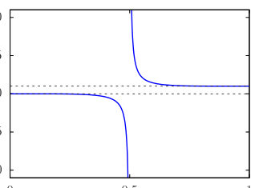
<figcaption class="paper-figure-caption"><b>Fig 1.</b> Figure 1. The left (right) panel shows the (rescaled) temperature NT (the chemical potential µ) versus the rescaled energy ε = E/B for the RJS model Em = m/N, N = 10000. The dashed black lines in the right panel correspond to the values of E0 = 0 and B ≈1 showing that either µ &lt; E0 (for T &gt; 0) or µ &gt; B (for T &lt; 0).</figcaption>
</figure>
<figure class="paper-figure-card">
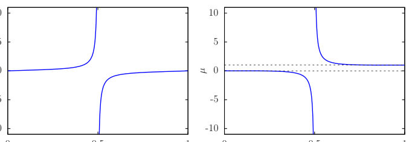
<figcaption class="paper-figure-caption"><b>Fig 2.</b> Fig. 1 shows for the RJS model the dependence of T and µ on ε = E/B ≈E. Note that the left panel shows the rescaled temperature NT since typical numerical values of T are ∼1/N due to the finite value of B in our particular model. The figure illustrates that −µ →0 (µ →−∞) for ε →0 (ε →εC = 1/2). Using (6) one can show (for finite N) that −µ ≈E/(N −1) ≪E for very small energies 0 &lt; E ≪ 1/N and in this particular case we have ρ0 ≈1 (strong condensation) and other ρm ∼E/(NEm) ≪ 1/N (for m &gt; 0). With increasing values of E (or ε) the values of “−µ” increase and more probability is shifted to the other ρm values for m &gt; 0. At ε ≈1/2 we have very large values of “−µ” (and of T) such that all ρm...</figcaption>
</figure>
<figure class="paper-figure-card">
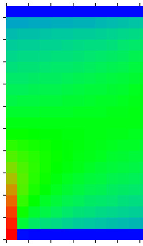
<figcaption class="paper-figure-caption"><b>Fig 3.</b> Figure 2. Color plot of the coarse-grained thermalized occupation probabilities ρm = T/(Em −µ) = (E −µ)/[N(Em −µ)] for the RJS model. The x-axis corresponds to the fraction Em/B ∈[0, 1] (left to right) and the y-axis to the rescaled energy ε (top to bottom for increasing values). The tics indicate integer multiples of 0.1 for both quantities. The color values shown in the color bar correspond to the value of ρm averaged over intervals of size 1/20 . To increase visibility of small values a non-linear color bar scale is used (e.g. green color corresponds to 1/16).</figcaption>
</figure>
<figure class="paper-figure-card">
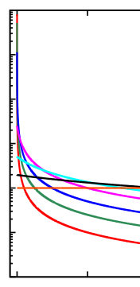
<figcaption class="paper-figure-caption"><b>Fig 4.</b> Figure 3. Dependence of the thermalized occupation probabilities ρm = T/(Em −µ) = (E − µ)/[N(Em −µ)] on Em/B for the RJS model Em = m/N, N = 10000 and different values of ε.</figcaption>
</figure>
<figure class="paper-figure-card">
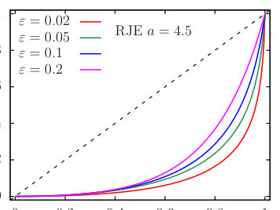
<figcaption class="paper-figure-caption"><b>Fig 5.</b> Figure 4. Left panel: Lorenz curves for the RJS model for ε = 0.05, 0.1, 0.2, 0.4, 0.5 (bottom to top). The x-axis corresponds to the cumulated fraction of households (h) and the y-axis to the cumulated fraction of wealth (w). The dashed line is the line of perfect equipartition w = h. The respective values of the Gini coefficients G for all curves are G = 0.900, 0.800, 0.625, 0.407, 0.333. Right panel: Lorenz curves for the RJE model at a = 4.5 for ε = 0.02, 0.05, 0.1, 0.2 (bottom to top) with respective Gini coefficients G = 0.798, 0.725, 0.678, 0.615. Note that for these two cases the critical value of ε for the transition of positive temperature (with µ &lt; 0) to negative temperature...</figcaption>
</figure>

**Summary.** This paper applies statistical mechanics principles, specifically the Wealth Thermalization Hypothesis (WTH), to model global wealth inequality. It shows that the Rayleigh-Jeans thermal distribution accurately describes empirical data for household wealth and national GDP across decades. The work argues that this thermodynamic condensation mechanism provides a universal physical law governing social stratification.

**Why it may be interesting.** It provides a powerful analogy between condensed matter physics concepts like thermalization and condensation (RJ phenomenon) and macroscopic socio-economic phenomena like global wealth distribution, suggesting universal physical laws govern social structures.

Detailed structure

**Main problem.** To provide a thermodynamic description of global wealth inequality using the Wealth Thermalization Hypothesis (WTH).

**Main result.** The Rayleigh-Jeans (RJ) thermal distribution provides a universal and good description for various real-world curves related to wealth inequality, such as Lorenz curves for household wealth, GDP, and stock markets.

**Method.** The analysis involves deriving analytical expressions for the Lorenz curve and Gini coefficient using continuous models like RJS and RJE spectra, and fitting these theoretical predictions to empirical economic data.

**Model / system.** The system is modeled as 'Social Stratification in a Society' (SSS) where wealth layers are associated with energy levels governed by a nonlinear dynamical system conserving total energy and probability norm. The core model uses the RJS and RJE spectra derived from statistical mechanics principles.

**Key observables.** Lorenz curve ($w$ vs $h$), Gini Coefficient ($G$), Pareto Probability Distribution ($C(w_m)$), Temperature ($T$), Chemical Potential ($\mu$).

**Important parameters / regimes.** The energy parameter $\epsilon$, the spectral parameters $a$, and the regime of condensation (e.g., low $\epsilon$ for strong inequality).

**Assumptions / limitations.** The system undergoes dynamical thermalization governed by weak nonlinear perturbations, allowing the use of a grand canonical ensemble description.

**Figures summary.** Figures compare theoretical Lorenz curves (RJS/RJE) and Pareto distributions against real-world data for household wealth (World 2021), GDP evolution (UN data 1973–2023), and stock markets, demonstrating quantitative agreement.

**Paper structure.** The paper progresses from establishing the WTH framework to deriving analytical solutions for key diagnostics using RJS/RJE models. It then systematically applies these models by fitting parameters to diverse datasets (household wealth, GDP, etc.) to argue for universality.

Abstract

According to the recent Wealth Thermalization Hypothesis (WTH) the wealth inequality in the world is described by the Rayleigh-Jeans (RJ) thermal distribution of interacting agents in a society with social stratification. In this concept, the wealth layers of society are associated with energy levels from a nonlinear dynamical system conserving two integrals of motion being total energy and probability norm. This leads to RJ condensation and the formation of a huge poverty phase of low wealth and a tiny oligarchic phase that captures a main part of total society wealth. This RJ phenomenon has similarities with self cleaning in multimode optical fibers and constraint driven condensation in various physical systems. We analyze real Lorenz and Pareto curves for wealth of households in countries and the world, Gross Domestic Product of countries, market capitalization of companies at stock exchange of Hong Kong, Shanghai, London, bitcoin transactions, world trade between countries and show that the WTH theory gives a good description of these curves. On the basis of this comparison we argue that the RJ thermal distribution provides a universal description of wealth inequality in the world.

[↑ back to top](#top)

### [Quantum Chip Paradigm Framework](http://arxiv.org/abs/2606.17899v1)

**Authors:** Cai, Ling Qiao, Bin Yang, Fumin Luo, WeiGui Guo, GuoRong Zhang, XueFei Liu, Fan Xu, Qinglang Guo, Bin Wu  
**Type:** theory · **Category:** quantum information and computing · **PDF:** <https://arxiv.org/pdf/2606.17899v1>  
**Analysis basis:** full PDF text, analyzed in chunks
**Topic relevance:** `QC/QI experiment` **2/5**

↔ Scroll figures horizontally

<figure class="paper-figure-card">
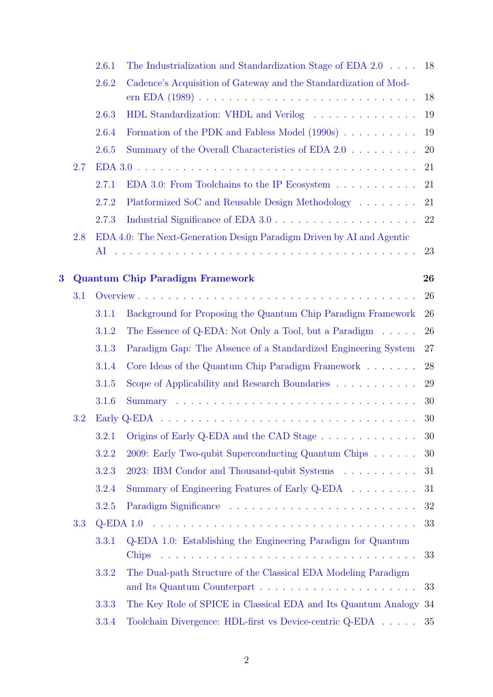
<figcaption class="paper-figure-caption"><b>Fig 1.</b> Low-resolution page preview, page 2</figcaption>
</figure>
<figure class="paper-figure-card">
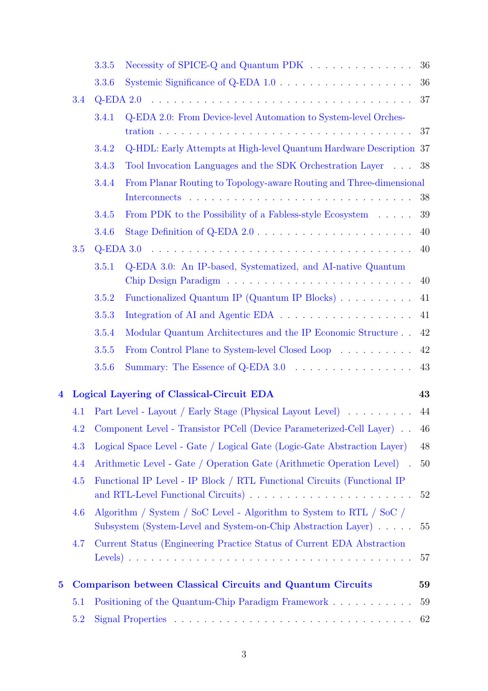
<figcaption class="paper-figure-caption"><b>Fig 2.</b> Low-resolution page preview, page 3</figcaption>
</figure>
<figure class="paper-figure-card">
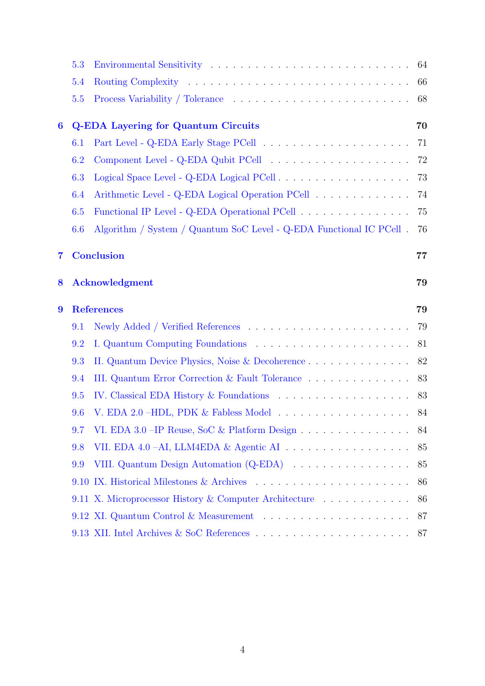
<figcaption class="paper-figure-caption"><b>Fig 3.</b> Low-resolution page preview, page 4</figcaption>
</figure>
<figure class="paper-figure-card">
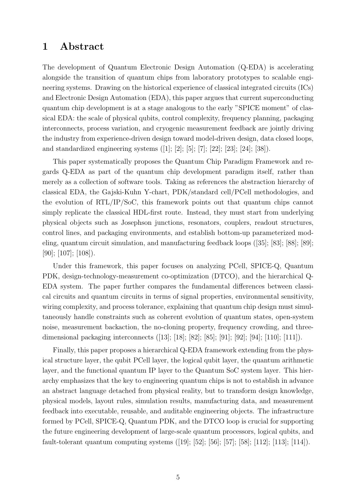
<figcaption class="paper-figure-caption"><b>Fig 4.</b> Low-resolution page preview, page 5</figcaption>
</figure>
<figure class="paper-figure-card">
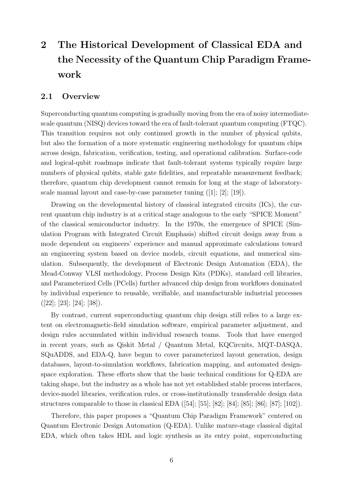
<figcaption class="paper-figure-caption"><b>Fig 5.</b> Low-resolution page preview, page 6</figcaption>
</figure>

**Summary.** This paper outlines the 'Quantum Chip Paradigm Framework' necessary to industrialize superconducting quantum computing. It argues that Q-EDA must adopt a bottom-up, physical modeling approach, mirroring classical EDA advancements. The framework establishes a staged roadmap for achieving scalable, fault-tolerant quantum processors by standardizing design knowledge from physics down to system integration.

**Why it may be interesting.** It provides a crucial engineering blueprint for scaling quantum computation, framing the theoretical physics problem within the practical constraints of semiconductor manufacturing and system integration.

Detailed structure

**Main problem.** The development of Quantum Electronic Design Automation (Q-EDA) is required to scale superconducting quantum chips from laboratory prototypes to reliable, fault-tolerant engineering systems.

**Main result.** The paper proposes a comprehensive 'Quantum Chip Paradigm Framework' that mandates treating Q-EDA as a full development paradigm, necessitating a bottom-up approach starting from physical device models.

**Method.** It draws an analogy between the current quantum design challenges and the historical 'SPICE moment' in classical EDA, advocating for a structured, hierarchical methodology.

**Model / system.** The system is superconducting quantum chips, modeled using underlying physical components like Josephson junctions, resonators, and couplers. The framework proposes a hierarchy from physical structures $\rightarrow$ qubit PCells $\rightarrow$ logical qubits $\rightarrow$ functional IP $\rightarrow$ Quantum SoC.

**Key observables.** Gate fidelities, coherence time, crosstalk structures, resource overhead (T gates/Toffoli), and overall system error budgeting.

**Important parameters / regimes.** Qubit frequency planning, control complexity, packaging interconnects, and the need for Design-Technology-Measurement Co-optimization (DTCO).

**Assumptions / limitations.** The framework assumes that progress requires standardizing design knowledge into reusable, auditable engineering objects across all abstraction levels.

**Figures summary.** Not specified in detail, but the structure implies a progression through different layers of abstraction for quantum chip design.

**Paper structure.** The paper traces the evolution of EDA from classical IC design (SPICE moment) to propose a multi-stage Q-EDA roadmap (1.0 $\rightarrow$ 2.0 $\rightarrow$ 3.0), emphasizing physical modeling and closed-loop optimization.

Abstract

Quantum Electronic Design Automation (Q-EDA) is emerging as quantum chips move from laboratory prototypes to scalable engineering systems. This paper argues that superconducting quantum chip design is approaching a "SPICE moment" similar to early classical EDA, where growing qubit scale, control complexity, frequency planning, packaging, process variation, and cryogenic measurement feedback require a shift from experience-based design to model-driven engineering. We propose a Quantum Chip Paradigm Framework that treats Q-EDA not only as software, but as part of the quantum chip development paradigm. Unlike classical HDL-first design, quantum chip design must begin with physical structures such as Josephson junctions, resonators, couplers, readout elements, control lines, and packaging environments. The framework emphasizes PCell-based modeling, SPICE-Q simulation, Quantum PDKs, and design-technology-measurement co-optimization. We further outline a hierarchical Q-EDA system spanning physical structures, qubit PCells, logical qubits, quantum arithmetic, functional quantum IP, and Quantum SoC systems. The key goal is to turn physical models, layout rules, simulation results, fabrication data, and measurement feedback into reusable and auditable engineering objects for large-scale quantum processors and fault-tolerant quantum computing.

[↑ back to top](#top)

### [Quantum Computing Algebra (QCA), the theory and implementation](http://arxiv.org/abs/2606.17621v1)

**Authors:** Jaroslav Hrdina, Dietmar Hildenbrand, Oliver Rettig  
**Type:** theory · **Category:** quantum information and computing · **PDF:** <https://arxiv.org/pdf/2606.17621v1>  
**Analysis basis:** full PDF text, analyzed in chunks
**Topic relevance:** `entanglement & information structure` **2/5**

↔ Scroll figures horizontally

<figure class="paper-figure-card">
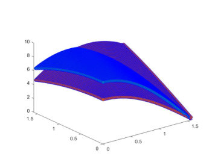
<figcaption class="paper-figure-caption"><b>Fig 1.</b> Figure 3. Payoffs πA ∈⟨0, π/2⟩and πB ∈⟨0, π/2⟩of players A and B for γ = 0</figcaption>
</figure>
<figure class="paper-figure-card">
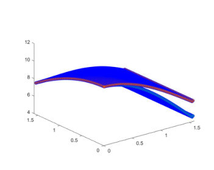
<figcaption class="paper-figure-caption"><b>Fig 2.</b> Figure 4. Payoffs πA ∈⟨0, π/2⟩and πB ∈⟨0, π/2⟩of players A and B for γ = π/2</figcaption>
</figure>
<figure class="paper-figure-card">
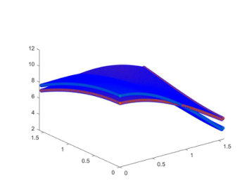
<figcaption class="paper-figure-caption"><b>Fig 3.</b> Figure 5. Payoffs πA ∈⟨0, π/2⟩and πB ∈⟨0, π/2⟩of players A and B for γ = π/3</figcaption>
</figure>

**Summary.** This paper introduces Quantum Computing Algebra (QCA), a novel formalism built on real geometric algebra with a split signature to simplify quantum computation implementation. It successfully maps complex concepts like multi-qubit gates and entanglement into algebraic products, demonstrating its utility by simulating payoffs in quantum game theory models.

**Why it may be interesting.** The development of a concrete, computationally efficient algebraic framework (QCA) that bypasses complex matrix exponentiation by using geometric algebra is highly relevant. It offers a novel mathematical toolset for simulating quantum dynamics and entanglement in systems where direct Hamiltonian simulation becomes intractable.

Detailed structure

**Main problem.** The paper aims to develop a practical framework for quantum computation by bridging abstract Dirac formalism with efficient computational implementation using Geometric Algebra (GA). It specifically addresses the need for an algebraic structure suitable for real-number computation.

**Main result.** A Quantum Computing Algebra (QCA) based on a split-signature construction is proposed, successfully translating quantum mechanics into a real geometric algebra framework. This allows for efficient representation and calculation of multi-qubit systems and entangled strategies in applications like quantum game theory.

**Method.** The authors utilize Geometric Algebra (GA) to represent qubits and operators, employing a split-signature approach within a real Clifford algebra structure. They derive algebraic rules for tensor products and map fermionic creation/annihilation operators to qubit gates.

**Model / system.** The model centers on multi-qubit quantum systems, initially described by the spinor $\psi \in \mathbb{C}^2$ for single qubits. The theory extends this using an algebraic structure derived from Witt generators and idempotents, allowing simulation of complex interactions like those in quantum game theory.

**Key observables.** Payoffs ($\pi_A, \pi_B$) calculated in quantum game theory scenarios (e.g., Prisoner's Dilemma), and the probabilities ($P_{AA}, P_{AB}$, etc.) describing the final entangled state $|\psi_f
angle$.

**Important parameters / regimes.** Entanglement parameter $\gamma$, individual player strategy parameters ($\psi_1, \psi_2$), and the algebraic structure defined by the split signature.

**Assumptions / limitations.** The primary assumption is that using real geometric algebras via a split-signature construction provides a significant computational advantage over previous positive-definite methods for practical implementation on real computers.

**Figures summary.** Figures illustrate the Bloch sphere basis states, the EWL quantization protocol scheme for two qubits, and 3D plots showing calculated payoffs ($\pi_A$ vs $\psi_A$, $\pi_B$ vs $\psi_B$) under varying entanglement conditions ($\gamma$).

**Paper structure.** The paper progresses by first establishing the QCA framework using split-signature GA (Chunk 1). It then details how to represent multi-qubit gates and tensor products algebraically, including mapping fermionic operators via Jordan-Wigner transformation (Chunk 2). Finally, it applies this machinery to model quantum game theory payoffs for systems like the Prisoner's Dilemma (Chunks 3 & 4).

Abstract

We present a real geometric algebra framework designed for the direct translation of the Dirac formalism into geometric algebra representations. Unlike previous approaches based on positive-definite signatures, QCA employs a split-signature construction that enables a natural realization of quantum states and operators while simplifying computational implementation. We further present an implementation of QCA using the \textit{GAALOP} software and show how quantum gates and multi-qubit systems can be efficiently represented and generated computationally. As an application, we demonstrate the use of QCA in quantum game theory, where the real-algebraic formulation provides computational advantages for modeling entangled strategies and quantum interactions. The proposed framework establishes a practical bridge between the abstract formalism of quantum computation and efficient geometric algebra implementations.

[↑ back to top](#top)

### [Making complex CFTs real: The two-dimensional Potts model for $Q>4$ and complex $Q$](http://arxiv.org/abs/2606.18125v1)

**Authors:** Jesper Lykke Jacobsen, Kay Joerg Wiese  
**Type:** theory · **Category:** statistical mechanics · **PDF:** <https://arxiv.org/pdf/2606.18125v1>  
**Analysis basis:** full PDF text, analyzed in chunks
**Topic relevance:** `Keldysh / 2PI / non-Gaussian methods` **1/5** · `analog quantum simulation` **1/5** · `correlated / nonlocal dissipation` **1/5** · `driven-dissipative phase transition` **1/5** · `entanglement & information structure` **1/5** · `methods for driven-dissipative` **1/5** · `non-equilibrium dynamics` **1/5** · `non-equilibrium universality` **1/5**

↔ Scroll figures horizontally

<figure class="paper-figure-card">
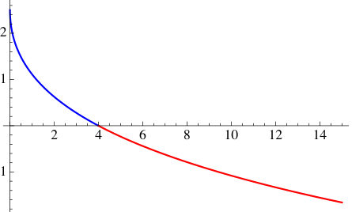
<figcaption class="paper-figure-caption"><b>Fig 1.</b> FIG. 1. 1/b2 as a function of Q. For Q ≤4, b is real, while for Q &gt; 4, b is purely imaginary.</figcaption>
</figure>
<figure class="paper-figure-card">
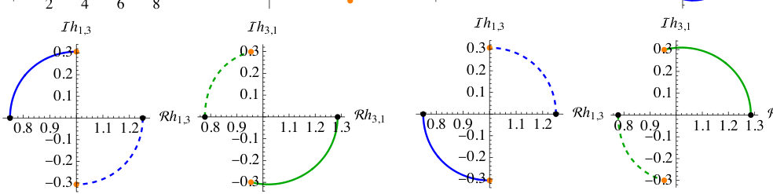
<figcaption class="paper-figure-caption"><b>Fig 2.</b> FIG. 2. Upper row: paths taken in the analytic continuation, starting at Q = 3.41421 (b = 8, black dot) and ending at Q = 5 (b = ±6.5285i, orange dot [gray in B&amp;W]). In the left part of the figure, the path taken is a semicircle in the upper half-plane in Q (“upper path”), while in the right part it is a semicircle in the lower half-plane (“lower path”). The remaining plots show the central charge c, as well as the dimensions h1,3 and h3,1, for the corresponding continuations of the critical point Bb (solid lines) and the tricritical point B−b (dashed lines). Once we arrive at Q →5 (with b ∈iR), shown as an orange dot, the two continuations of c, h1,3 and h3,1, starting from either Bb or...</figcaption>
</figure>
<figure class="paper-figure-card">
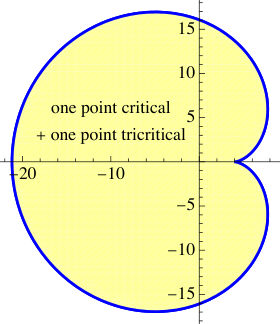
<figcaption class="paper-figure-caption"><b>Fig 3.</b> FIG. 4. The critical domain as a function of Q.</figcaption>
</figure>
<figure class="paper-figure-card">
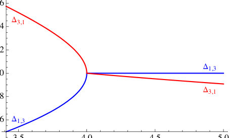
<figcaption class="paper-figure-caption"><b>Fig 4.</b> FIG. 3. ∆1,3 (unphysical branch) and ∆3,1 physical branch.</figcaption>
</figure>
<figure class="paper-figure-card">
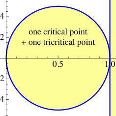
<figcaption class="paper-figure-caption"><b>Fig 5.</b> FIG. 5. In yellow we show the domains in which one fixed point is stable while the other is unstable.</figcaption>
</figure>

**Summary.** This paper investigates the complex Conformal Field Theory associated with the 2D Q-state Potts model, extending its analysis beyond the standard physical regime ($Q \le 4$). By treating $Q$ as a continuous or complex variable, the authors propose that CFT data can be found through analytic continuation of known results. This work is significant for mapping out the full theoretical landscape of this critical system.

**Why it may be interesting.** While focused on statistical mechanics, the rigorous mapping to CFTs provides deep insights into universality classes and non-unitary theories, which share mathematical structures relevant to open quantum systems and boundary physics.

Detailed structure

**Main problem.** The study aims to extend the understanding of Conformal Field Theories (CFTs) associated with the two-dimensional Q-state Potts model into regimes where the number of states, Q, is greater than 4 or complex.

**Main result.** The authors conjecture that all conformal data for this extended regime can be obtained by analytic continuation from known exact results for $Q \le 4$, establishing a framework for complex CFTs in this model.

**Method.** The research combines analytical derivations, numerical transfer-matrix computations, and advanced techniques like minigrid extrapolation to map out the parameter space of the associated CFTs.

**Model / system.** The system is the two-dimensional Q-state Potts model defined on a triangular lattice, which is reformulated into an equivalent loop model whose partition function allows for continuous variation of $Q$.

**Key observables.** Central charge ($c$), critical exponents, three-point structure constants ($\omega$), and the location of fixed points ($z_c$).

**Important parameters / regimes.** The number of states, Q (treated as a complex variable), and the lattice size $L$ (used for extrapolation).

**Assumptions / limitations.** The primary assumption is that the CFT data can be obtained via analytic continuation from the well-understood regime where $Q \le 4$.

**Figures summary.** Figures illustrate paths in the complex Q-plane, convergence of extrapolated parameters ($z_c, c, \omega$) as $L 	o \infty$, and stability domains defined by conformal dimensions.

**Paper structure.** The paper systematically analyzes the model's fixed points across different Q regimes (real vs. complex), develops mathematical tools using transfer matrices and CFT techniques (like Dotsenko-Fateev formulas), and concludes with extensive numerical extrapolation of critical parameters.

Abstract

The two-dimensional $Q$-state Potts model with real couplings has a first-order transition for $Q>4$. Starting from a triangular-lattice Potts model with two- and three-spin interactions, we study an equivalent loop model in which $Q$ is a continuous parameter. By a combination of analytical and numerical arguments, we show that this loop model allows for the collision of a critical and a tricritical fixed point at $Q=4$. These then emerge as a pair of complex conformally invariant theories at $Q>4$, or even complex $Q$, for suitable complex coupling constants. We conjecture that all conformal data (such as the central charge, critical exponents, and three-point structure constants) can be obtained by analytic continuation of known exact results for the loop model with $Q \le 4$. This conjecture is checked, both for real $Q>4$ and for $Q \in \mathbb{C}$, by extensive transfer-matrix computations and comparison to previous studies for $Q=5$.

[↑ back to top](#top)

### [Acceleration-induced spectral blind spots in stimulated atomic transitions](http://arxiv.org/abs/2606.17396v1)

**Authors:** Jiawei Hu, Hongwei Yu  
**Type:** theory · **Category:** other · **PDF:** <https://arxiv.org/pdf/2606.17396v1>  
**Analysis basis:** full PDF text, analyzed in chunks
**Topic relevance:** `Keldysh / 2PI / non-Gaussian methods` **1/5** · `correlated / nonlocal dissipation` **1/5** · `driven-dissipative phase transition` **1/5** · `interference shaping light` **1/5** · `methods for driven-dissipative` **1/5** · `non-equilibrium dynamics` **1/5**

↔ Scroll figures horizontally

<figure class="paper-figure-card">
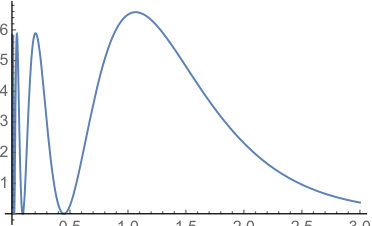
<figcaption class="paper-figure-caption"><b>Fig 1.</b> FIG. 1. K2 iω0/a(k⊥/a) governing the transition probabilities for both stimulated absorption and stimulated Unruh excita- tion by transversely propagating photons. Here ω0/a = 2.</figcaption>
</figure>

**Summary.** The paper theoretically demonstrates that uniform acceleration can induce spectral blind spots in atomic transitions by modifying light-matter coupling. These blind spots manifest as frequencies where both normal stimulated absorption and Unruh excitation are simultaneously suppressed, providing a unique signature of the Unruh effect through signal absence.

**Why it may be interesting.** This work provides a novel signature of the Unruh effect—a frequency-dependent *absence* of response rather than an expected enhancement—which is highly relevant for quantum optics and open system dynamics in non-inertial frames.

Detailed structure

**Main problem.** The study investigates how uniform acceleration fundamentally alters the stimulated light-matter interaction response of an atom, potentially leading to frequency-selective spectral blind spots.

**Main result.** Spectral blind spots occur at discrete frequencies where both ordinary stimulated absorption and acceleration-induced Unruh excitation simultaneously vanish for photons with transverse momentum.

**Method.** The analysis uses quantum electrodynamics formalism applied to a two-level atom coupled to a massless scalar field along an accelerated trajectory, involving Bessel functions.

**Model / system.** The system is a uniformly accelerated two-level atom interacting weakly with the quantized electromagnetic vacuum field. The calculations distinguish between oblique ($k_\perp 
eq 0$) and collinear ($k_\perp = 0$) driving fields.

**Key observables.** Stimulated transition probability, spectral blind spots (frequencies where absorption and excitation vanish).

**Important parameters / regimes.** Proper acceleration ($a$), atomic transition frequency ($\omega_0$), transverse photon momentum component ($k_\perp$).

**Assumptions / limitations.** Weak coupling ($\lambda$) is assumed, and the analysis focuses on uniform acceleration trajectories in natural units.

**Figures summary.** Figure 1 plots a function involving modified Bessel functions of the second kind, $K_2 i\omega_0/a(k_\perp/a)$, which governs both transition probabilities for transversely propagating photons.

**Paper structure.** The paper develops the theory by calculating transition amplitudes using field mode expansions along an accelerated path. It then derives and analyzes the resulting stimulated absorption and Unruh excitation probabilities, contrasting the results for oblique versus collinear driving fields to pinpoint the spectral suppression mechanism.

Abstract

Stimulated transitions are among the most fundamental processes in light-matter interaction, underlying resonant absorption and emission in atomic systems. Here we show that uniform acceleration can convert this familiar response into a frequency-selective absence of response. Specifically, when an incident photon has a nonzero momentum component transverse to the acceleration, the stimulated transition probability vanishes at a discrete set of frequencies fixed by the acceleration, the atomic transition frequency, and the photon propagation angle. At these spectral blind spots, both ordinary stimulated absorption and acceleration-induced excitation are simultaneously suppressed, rendering the atom effectively unresponsive to the incident radiation. The effect arises from the nontrivial response of accelerated atoms to quantum vacuum fluctuations and provides a distinctive signature of the Unruh effect through the absence, rather than the enhancement, of stimulated transitions. We further provide an order-of-magnitude estimate showing that an electron-based implementation with spin splitting in combined electric and magnetic fields could access the required parameter regime. These results reveal an unexplored form of acceleration-modified light-matter interaction and identify spectral blind spots as a new manifestation of the Unruh effect.

[↑ back to top](#top)

### [First-order phase transitions in the three-dimensional Blume-Capel ferromagnet](http://arxiv.org/abs/2606.17691v1)

**Authors:** D. Mataragkas, A. Vasilopoulos, Z. D. Vatansever, Y. Kim, D. -H. Kim, N. G Fytas  
**Type:** theory · **Category:** statistical mechanics · **PDF:** <https://arxiv.org/pdf/2606.17691v1>  
**Analysis basis:** full PDF text, analyzed in chunks
**Topic relevance:** `Keldysh / 2PI / non-Gaussian methods` **1/5** · `analog quantum simulation` **1/5** · `driven-dissipative phase transition` **1/5** · `methods for driven-dissipative` **1/5** · `non-equilibrium dynamics` **1/5** · `non-equilibrium universality` **1/5**

↔ Scroll figures horizontally

<figure class="paper-figure-card">
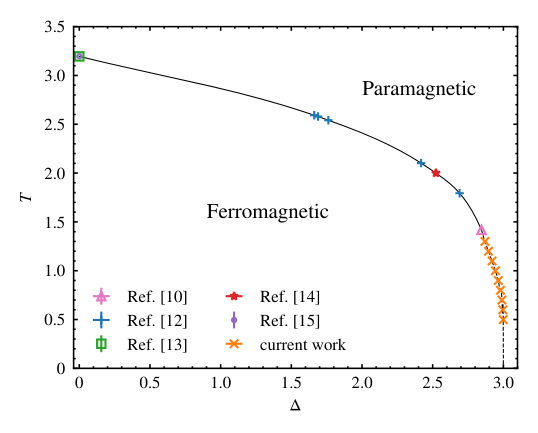
<figcaption class="paper-figure-caption"><b>Fig 1.</b> Figure 1: Phase diagram of the three-dimensional spin-1 Blume-Capel ferromagnet in the (Δ, 𝑇) plane. The transition points investigated in the present work along the first-order segment of the phase boundary (dashed line) are shown together with previous numerical estimates from Refs. [12, 13, 14, 15] for the continuous transition line (solid line). The triangle marks the tricritical-point estimate of Ref. [10], which serves as a reference throughout the present study.</figcaption>
</figure>
<figure class="paper-figure-card">
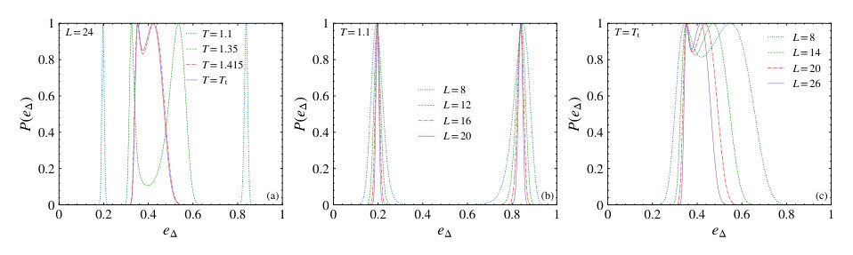
<figcaption class="paper-figure-caption"><b>Fig 2.</b> Figure 2: Normalized probability density functions 𝑃(𝑒Δ) obtained from multicanonical simulations. Panel (a) shows results for a system with linear size 𝐿= 24 at selected temperatures along the first-order transition line. Panels (b) and (c) illustrate the evolution of the distributions with system size at 𝑇= 1.1 in the first-order regime and at the reference tricritical temperature 𝑇= 𝑇t = 1.4182, respectively.</figcaption>
</figure>
<figure class="paper-figure-card">
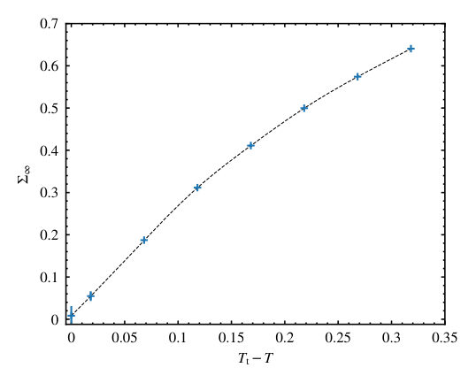
<figcaption class="paper-figure-caption"><b>Fig 3.</b> Figure 3: Thermodynamic-limit surface tension Σ∞as a function of the temperature distance from the tricritical point, 𝑇t −𝑇. The values of Σ∞are obtained from fits of the finite-size data to Eq. (10). The dashed line is a quadratic polynomial fit, illustrating the monotonic approach of the surface tension to zero near tricriticality.</figcaption>
</figure>
<figure class="paper-figure-card">
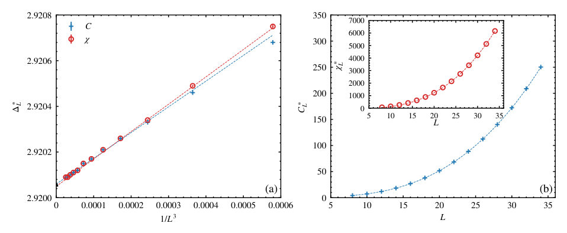
<figcaption class="paper-figure-caption"><b>Fig 4.</b> Figure 4: (a) Finite-size shift of the pseudo-transition fields Δ∗ 𝐿obtained from the locations of the specific-heat (𝐶) and magnetic-susceptibility (𝜒) maxima. The dashed lines represent fits to Eq. (11) using data with 𝐿≥𝐿min = 10. (b) Volume scaling of the specific-heat maxima (main panel) and magnetic-susceptibility maxima (inset) at 𝑇= 1.1. The dashed lines represent fits to the first-order finite-size scaling forms of Eq. (12), using data with 𝐿≥𝐿min = 12.</figcaption>
</figure>
<figure class="paper-figure-card">
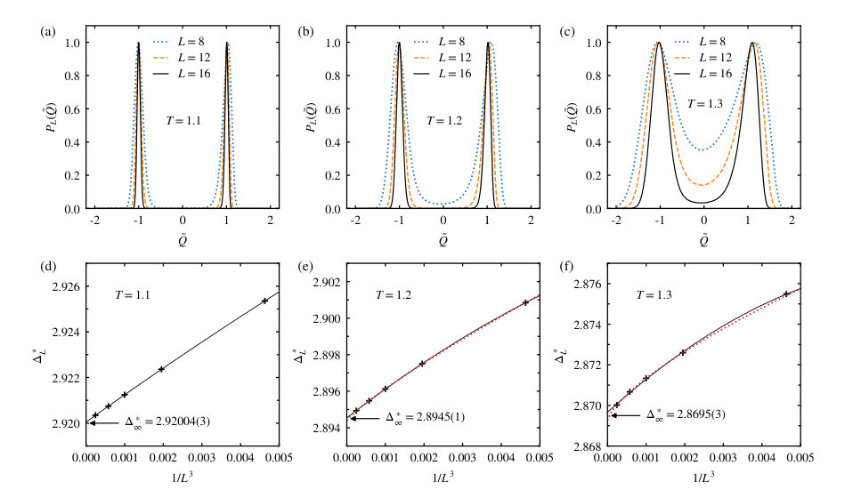
<figcaption class="paper-figure-caption"><b>Fig 5.</b> Figure 5: Field-mixing analysis of the first-order transition regime. Panels (a)–(c) show the probability distribution 𝑃𝐿( ̃) of the rescaled field-mixing variable ̃at the finite-size pseudo-transition point Δ∗ 𝐿for 𝑇= 1.1, 1.2, and 1.3, respectively. As in Fig. 2, the distributions have been normalized to the same peak height. Panels (d)–(f) illustrate the extrapolation of the pseudo-transition fields Δ∗ 𝐿to the thermodynamic limit using the expected 𝐿−3 scaling form with corrections (solid lines) and a simple power-law fit (dotted lines), yielding the corresponding transition fields Δ∗ ∞.</figcaption>
</figure>

**Summary.** This work uses sophisticated Monte Carlo simulations to map out the first-order phase transition line in the 3D Blume-Capel ferromagnet. By analyzing energy distributions and free-energy barriers, the authors detail the crossover from weak to strong first-order behavior near the tricritical point. The study highlights both the success of their simulation methods and their inherent limitations when approaching critical points in higher dimensions.

**Why it may be interesting.** While focused on classical statistical mechanics, the use of advanced simulation techniques (like generalized ensemble methods) to precisely locate critical points and characterize crossover regimes is methodologically relevant for understanding quantum phase transitions in AMO systems.

Detailed structure

**Main problem.** The study investigates first-order phase transitions in the three-dimensional Blume-Capel ferromagnet, focusing on characterizing the crossover behavior from weak to strong first-order regimes down towards low temperatures and connecting this regime to the tricritical point.

**Main result.** The analysis successfully characterizes the evolution of the energy probability density function and determines the interface tension approaching the tricritical region via its vanishing behavior. However, the field-mixing method shows increasing sensitivity limitations in 3D near the tricritical point for accessible system sizes.

**Method.** The research combines multicanonical simulations with two-parameter Wang-Landau sampling within a generalized-ensemble approach to study phase coexistence and finite-size scaling of thermodynamic observables.

**Model / system.** The model is the three-dimensional spin-1 Blume-Capel ferromagnet defined on a simple cubic lattice, governed by a Hamiltonian involving ferromagnetic exchange ($J$) and a crystal-field coupling ($\Delta$).

**Key observables.** Energy probability density function $P(e\Delta)$, free-energy barriers, interface tension ($\Sigma$), magnetic susceptibility ($\chi$), and pseudo-transition fields ($\Delta^*_L$).

**Important parameters / regimes.** Temperature ($T$) and crystal-field coupling ($\Delta$); the tricritical point $(\Delta_t, T_t)$ is a key focus.

**Assumptions / limitations.** The analysis assumes that finite-size scaling laws can be accurately applied to extrapolate bulk properties, though limitations are noted near the tricritical region due to numerical resolution issues in 3D.

**Figures summary.** Figures illustrate the phase diagram, show normalized probability distributions $P(e\Delta)$ revealing double-peaked structures, and plot the interface tension ($\Sigma_\infty$) as a function of temperature distance from the critical point.

**Paper structure.** The paper systematically applies advanced simulation techniques (MUCA/Wang-Landau) to map out the phase boundary. It analyzes finite-size scaling of observables like energy distributions and free-energy barriers, comparing results derived from direct sampling with those from field-mixing analysis along different parameters.

Abstract

We investigate first-order phase transitions in the three-dimensional Blume-Capel ferromagnet on the simple cubic lattice by combining multicanonical simulations with two-parameter Wang-Landau sampling. The generalized-ensemble approach enables a detailed characterization of the coexistence region over a broad range of temperatures and crystal-field couplings, extending from the vicinity of the tricritical point deep into the first-order regime. We analyze the finite-size scaling behavior of thermodynamic observables, with particular emphasis on the energy probability density function, free-energy barriers, and interfacial properties. The evolution of the double-peaked energy distributions reveals a gradual crossover from weak to strong first-order behavior as the temperature is lowered. From the scaling of the free-energy barrier we determine the interface tension along the coexistence line and characterize its approach to the tricritical region through its vanishing behavior. In parallel, a field-mixing analysis based on the joint density of states obtained from two-parameter Wang-Landau simulations is employed to locate first-order transition points and probe tricritical behavior. While this approach has been highly successful in two-dimensional realizations of the Blume-Capel model, we find that in three dimensions its practical implementation becomes increasingly sensitive in the vicinity of the tricritical region, where the shallow structure of the relevant scaling variable distribution limits the ability to resolve coexistence conditions for the system sizes currently accessible. These results delineate the range of applicability of the method in three dimensions and provide a consistent picture of the first-order regime of the model.

[↑ back to top](#top)

### [How twist angle inhomogeneity masks the BKT transition and the order parameter symmetry](http://arxiv.org/abs/2606.17191v1)

**Authors:** Ilaria Maccari, Louk Rademaker, Giulia Venditti  
**Type:** theory · **Category:** disordered systems and neural networks · **PDF:** <https://arxiv.org/pdf/2606.17191v1>  
**Analysis basis:** full PDF text, analyzed in chunks
**Topic relevance:** `Keldysh / 2PI / non-Gaussian methods` **1/5** · `analog quantum simulation` **1/5** · `correlated / nonlocal dissipation` **1/5** · `driven-dissipative phase transition` **1/5** · `methods for driven-dissipative` **1/5**

↔ Scroll figures horizontally

<figure class="paper-figure-card">
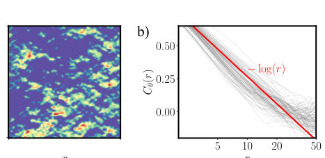
<figcaption class="paper-figure-caption"><b>Fig 1.</b> Figure 1. (a) Typical twist angle map, created by numerically solving the elasticity equations, given a random impurity density of 𝑛imp = 0.1 on a 100 × 100 lattice. The magnitude of the twist angle variations is in arbitrary units. (b) The twist angle inhomogeneity correlation function 𝐶𝜃(r) is long-ranged. Gray dashed lines are correlation functions for 100 different realizations like the one in panel a; the red solid line is a logarithm following Eq. (9).</figcaption>
</figure>
<figure class="paper-figure-card">
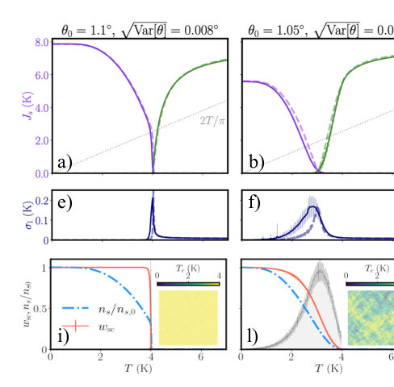
<figcaption class="paper-figure-caption"><b>Fig 2.</b> Figure 2. Results tuning the average 𝜃0 angle and the width √︁</figcaption>
</figure>

**Summary.** The paper demonstrates that spatially correlated disorder, inherent in moiré superconductors due to twist angle variations, fundamentally alters superconducting phase transitions. By modeling the system using a Random Impedance Network, the authors show that this correlation smears the BKT transition and masks intrinsic order parameter symmetries, suggesting $\sigma_1$ is the key diagnostic observable.

**Why it may be interesting.** This work is highly relevant because it uses advanced theoretical tools (elasticity theory coupled with network modeling) to analyze emergent phenomena in disordered quantum materials, providing diagnostic signatures ($\sigma_1$ vs. EMT failure) that are crucial for understanding complex many-body states.

Detailed structure

**Main problem.** The study investigates how spatially correlated disorder, arising from twist angle inhomogeneities in moiré superconductors, masks the expected Berezinskii-Kosterlitz-Thouless (BKT) transition. Furthermore, this disorder obscures the ability to distinguish between different superconducting order parameter symmetries.

**Main result.** Correlated disorder smears the sharp BKT transition into a smooth crossover and causes low-temperature superfluid stiffness to decay in a manner mimicking nodal pairing, regardless of the true symmetry.

**Method.** The authors employ a Random Impedance Network (RIN) model built upon local critical temperatures ($T_{c,i}$) derived from elasticity theory describing twist angle variations. They compare these exact numerical results against simpler Effective Medium Theory (EMT) approximations.

**Model / system.** The system is modeled as two-dimensional superconductors, specifically twisted multilayer graphene in a moiré pattern. Disorder is introduced via long-range correlated fluctuations in the local critical temperature ($T_{c,i}$), which are governed by elasticity theory and result in $\log|r|$ correlations for the twist angle.

**Key observables.** Superfluid stiffness ($J_s$), real part of optical conductivity ($\sigma_1$), DC resistivity ($
ho$), and the local superconducting gap structure.

**Important parameters / regimes.** Twist angle variance ($	ext{Var}[	heta]$), mean twist angle ($	heta_0$), and temperature relative to local $T_c$ ($	au_i$).

**Assumptions / limitations.** The primary assumptions involve modeling disorder via continuum elasticity theory leading to long-range correlations, and using the RIN approach to solve for global transport properties.

**Figures summary.** Figures compare exact RIN solutions to EMT approximations across varying disorder strengths, showing how $\sigma_1$ retains a residual value in the presence of correlated disorder where EMT fails.

**Paper structure.** The paper establishes the theoretical framework using elasticity theory to derive long-range correlations ($C_	heta(r) \propto -\log|r|$). It then implements this into an RIN model, calculating transport observables ($\sigma_1$, $J_s$) and contrasting these exact results against the predictions of EMT.

Abstract

Two-dimensional superconductors, including twisted multilayer graphene, should exhibit a BKT transition, and the $T$-dependence of the superfluid stiffness should distinguish between nodal or gapped order parameter symmetries. However, this picture dramatically changes when spatially correlated disorder is taken into account. Such correlations naturally arise in moiré systems due to twist angle inhomogeneities, which we model using elasticity theory. Using a random impedance network based on realistic disorder in the local $T_c$, we show that the finite-frequency conductance reveals a smeared percolative transition instead of a BKT transition. At low temperatures, the disorder can effectively obscure the distinction between nodal and fully gapped superconducting order parameters. We propose that the real part of the conductivity can be used as a key diagnostic observable to probe the relevance of correlated disorder.

[↑ back to top](#top)

### [Superconductivity from emergent dipolar interactions in a fractionalized Fermi liquid](http://arxiv.org/abs/2606.17159v1)

**Authors:** Mina-Lou Schleith, Arthur Bril, Nick Bultinck  
**Type:** theory · **Category:** strongly correlated electrons · **PDF:** <https://arxiv.org/pdf/2606.17159v1>  
**Analysis basis:** full PDF text, analyzed in chunks
**Topic relevance:** `Keldysh / 2PI / non-Gaussian methods` **1/5** · `Kondo & dissipative impurity` **1/5** · `analog quantum simulation` **1/5**

↔ Scroll figures horizontally

<figure class="paper-figure-card">
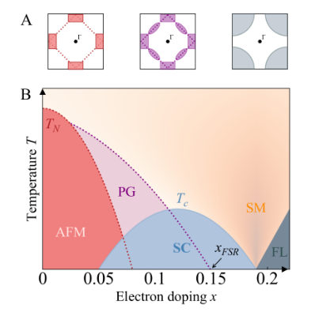
<figcaption class="paper-figure-caption"><b>Fig 1.</b> FIG. 1. A: Evolution of the Fermi surface with doping in the electron-doped cuprates. B: Schematic of the electron-doped cuprate phase diagram. We assume that in the doping range between the offset of anti-ferromagnetic (AFM) order and the Fermi surface reconstruction at xF SR (i.e. the ‘pseudogap (PG)’ region) the normal state of the superconductor (SC) is a fractionalized Fermi liquid.</figcaption>
</figure>
<figure class="paper-figure-card">
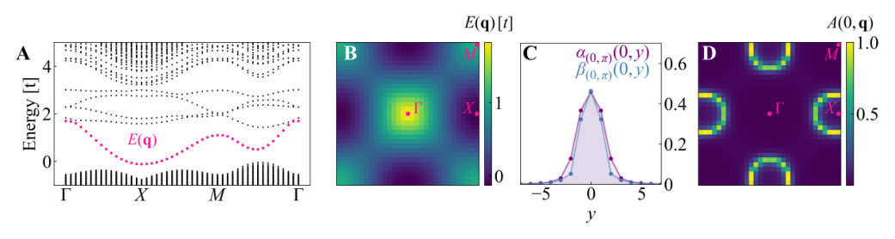
<figcaption class="paper-figure-caption"><b>Fig 2.</b> FIG. 2. A: 2-particle spinon-chargon spectrum along a high-symmetry cut through the Brillouin zone, obtained with t = 1, t′ = −0.2, g = 2.6, χ = 1, v = 2, and m = 0.1. B: Plot of the lowest bound-state band dispersion E(q). C: Absolute value of the q = (π, 0) real-space bound state wavefunctions α(r) and β(r) along (0, y). D: Proxy for the electron spectral function defined in Eq. (34), where ϵ = 0.05 and electrons occupying 15% of the BZ area.</figcaption>
</figure>
<figure class="paper-figure-card">
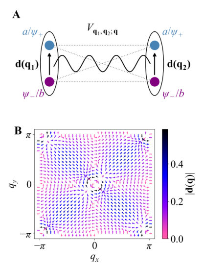
<figcaption class="paper-figure-caption"><b>Fig 3.</b> FIG. 3. A: Schematic of the effective interaction between two spinon-chargon bound states with a finite effective dipole mo- ment. The dipolar interaction is generated by attractive (re- pulsive) interactions between opposite (equal) gauge charges. B: The effective dipole moment distribution of the bound states in the BZ.</figcaption>
</figure>
<figure class="paper-figure-card">
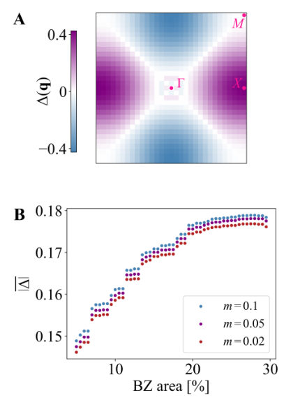
<figcaption class="paper-figure-caption"><b>Fig 4.</b> FIG. 4. Superconducting order parameter ∆(q) obtained by solving the BCS self-consistency equation at temperature T = 0.01t (= 35 K for t = 0.3 eV). A: Order parameter ∆(q) with m = 0.1 and electrons occupying 15% of the BZ area. B: The BZ-averaged order parameter as a function of the fraction of the BZ area contained in the electron pockets for different values of m.</figcaption>
</figure>

**Summary.** The paper constructs a theoretical framework describing how electrons fractionalize into spinons and chargons within the pseudogap phase of cuprates. It demonstrates that the resulting dipolar interaction, dictated by lattice symmetry, generates a repulsive pairing glue peaked at the antiferromagnetic wave vector. Solving the BCS equation with this interaction confirms the emergence of $d_{x^2-y^2}$ superconductivity.

**Why it may be interesting.** This work provides a detailed microscopic mechanism for high-Tc superconductivity in cuprates by linking it directly to emergent gauge symmetries and spin fluctuations, which is highly relevant to strongly correlated electron physics.

Detailed structure

**Main problem.** The paper develops a theory for the transition from a fractionalized Fermi liquid ($	ext{FL}^*$) into a $d_{x^2-y^2}$ superconductor, focusing on the mechanism of Cooper pair formation.

**Main result.** A repulsive dipolar interaction, arising from the projective action of translation symmetry on spinon-chargon bound states, is shown to be necessary and sufficient to induce $d_{x^2-y^2}$-wave superconductivity via BCS theory.

**Method.** The authors derive an effective Hamiltonian by treating electrons as spinon-chargon bound states, calculating the resulting dipolar interaction potential, and solving the self-consistent BCS gap equation.

**Model / system.** The model starts from a spin-fermion description of electron doping in cuprates, utilizing concepts of fractionalization into spinons and chargons coupled by an emergent U(1) gauge symmetry.

**Key observables.** Superconducting order parameter $\Delta(\mathbf{q})$, average superconducting gap magnitude, and the effective dipolar interaction $V_{q_1, -q_1; q}$.

**Important parameters / regimes.** Electron doping level (small doping on top of half-filling), antiferromagnetic wave vector ($Q$), and parameters related to the gauge field coupling strength ($m$).

**Assumptions / limitations.** The analysis assumes the system can be described by a deconfined U(1) gauge theory in the pseudogap regime, and approximations are made regarding continuum limits and projecting interactions onto lowest-energy bands.

**Figures summary.** Figures illustrate the evolution of the Fermi surface with doping, schematic representations of the effective dipolar interaction in momentum space, and plots showing the BZ-averaged superconducting order parameter ($\Delta$) as a function of electron pocket fraction.

**Paper structure.** The paper proceeds by establishing the fractionalized description (spinon/chargon), deriving the Coulomb interaction potential via gauge field integration, calculating the effective dipolar interaction based on symmetry constraints, and finally solving the BCS gap equation using this repulsive interaction to confirm $d$-wave pairing.

Abstract

Starting from the spin-fermion model or Hertz-Millis theory describing electrons coupled to anti-ferromagnetic spin fluctuations we develop a theory to describe the transition from a fractionalized Fermi liquid into a $d_{x^2-y^2}$ superconductor. We focus on small electron doping on top of the half-filled state. The doped electrons enter the system as spinon-chargon bound states, which form a small, reconstructed Fermi surface. The bound states are neutral under the emergent U(1) gauge symmetry of the fractionalized Fermi liquid, but interact via a dipolar two-body potential. We show that because of the projective action of translation symmetry on the spinons and chargons, the Fourier components of this repulsive dipolar interaction are peaked at the anti-ferromagnetic wave vector, thereby providing a robust microscopic mechanism for $d_{x^2-y^2}$ pairing in a fractionalized metal.

[↑ back to top](#top)

### [Theory of clusterization in orbitally degenerate transition-metal compounds driven by lattice instabilities](http://arxiv.org/abs/2606.18014v1)

**Authors:** Soshun Ozaki, Kota Mitsumoto, Chisa Hotta  
**Type:** theory · **Category:** strongly correlated electrons · **PDF:** <https://arxiv.org/pdf/2606.18014v1>  
**Analysis basis:** full PDF text, analyzed in chunks
**Topic relevance:** `Frenkel-Kontorova` **1/5** · `analog quantum simulation` **1/5** · `methods for driven-dissipative` **1/5**

↔ Scroll figures horizontally

<figure class="paper-figure-card">
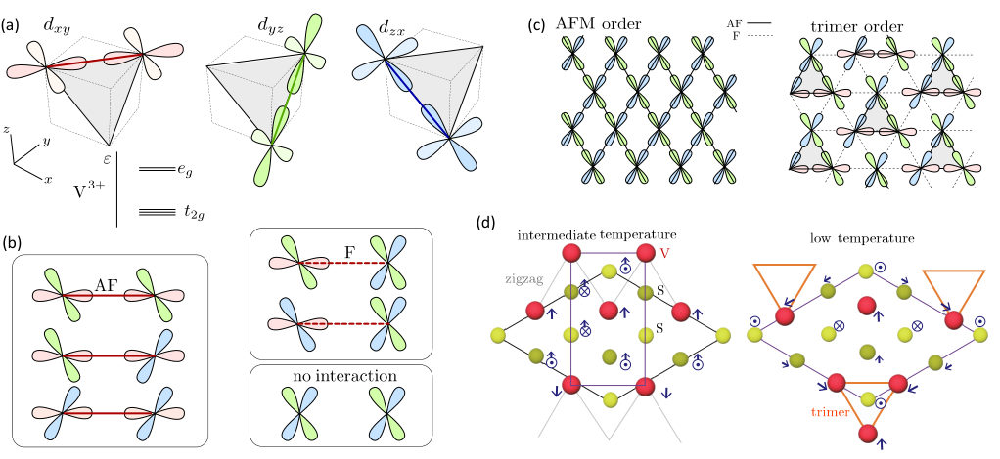
<figcaption class="paper-figure-caption"><b>Fig 1.</b> FIG. 1. (a) The spatial configurations of t2g orbitals on a triangular lattice, where we set the triangular plane perpendicular to the [111] direction in the xyz-coordinate of a crystal field. Three panels show the bond direction along which dxy, dyz, dzx orbitals have the σ type of overlaps where we expect finite t. We set the other two bond directions to have no overlap. (b) Configurations of two of the three orbitals which the electrons occupy on the neighboring two sites along the xy bond, where, unlike panel (a) we only show half of the component of each orbital that lies on the triangular plane. The S = 1/2’s on the two orbitals form S = 1, and when the dxy on both sides are occupied,...</figcaption>
</figure>
<figure class="paper-figure-card">
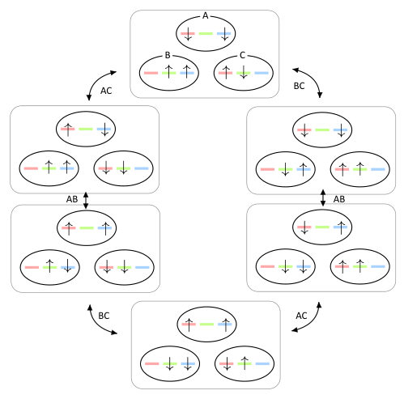
<figcaption class="paper-figure-caption"><b>Fig 2.</b> FIG. 2. Schematic illustration of the major component of the wave function of the Stot = 0 lowest energy state realized by ED on a three-site cluster for Eq.(1).</figcaption>
</figure>
<figure class="paper-figure-card">
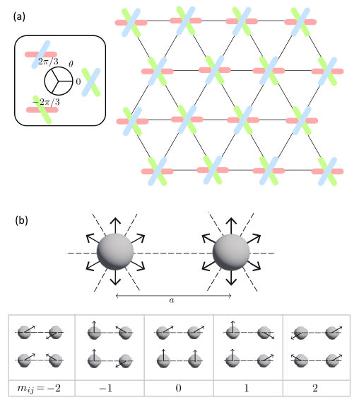
<figcaption class="paper-figure-caption"><b>Fig 3.</b> FIG. 3. (a) Schematic illustration of the effective Hamilto- nian, Eq.(4). (b) Lattice displacement degrees of freedom of the adjacent two sites, whose directions are given in arrows. The relative angles between the two displacements yield the degree of modulation of JF0, JF, and JAF in the effective model of Eq.(4).</figcaption>
</figure>
<figure class="paper-figure-card">
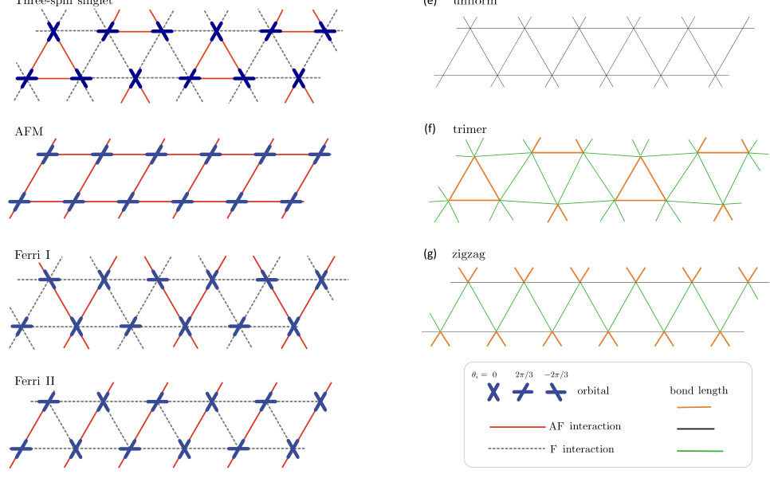
<figcaption class="paper-figure-caption"><b>Fig 4.</b> FIG. 4. (a)–(d): Typical orbital configurations proposed by Yoshitake et al.: (a) three-spin singlet phase, (b) AFM phase, (c) Ferri I phase, and (d) Ferri II phase. Each vertex corresponds to a vanadium atom. Blue thick short bars indicate the direction of electron propagation. Red and blue lines represent S = 1 AFM and FM interactions, respectively. (e)–(g): Lattice distortion patterns experimentally observed in LiVS2: (e) uniform phase, (f) trimer phase, and (g) zigzag phase. Black, yellow, and green lines represent bonds of natural length, compressed bonds, and stretched bonds, respectively.</figcaption>
</figure>
<figure class="paper-figure-card">
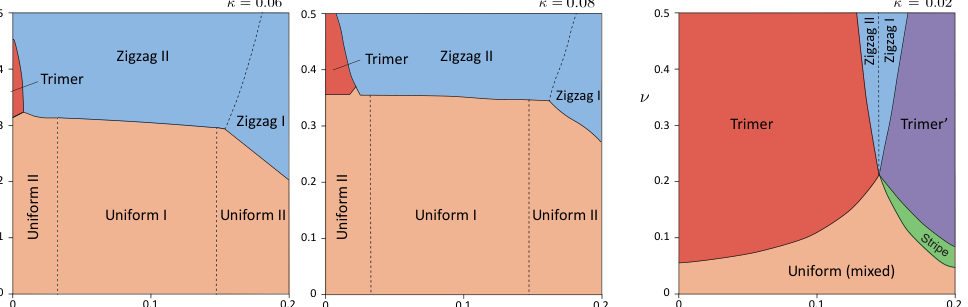
<figcaption class="paper-figure-caption"><b>Fig 5.</b> FIG. 5. Ground state phase diagrams as functions of the Hund’s coupling strength η = JH/U and magnetoelastic coupling ν for (a) the orbital-spin-lattice model in Eq.(9) with κ = 0.06, 0.08 where quantum S = 1 sectors are solved by ED. (b) The orbital-lattice model adopting Eq.(10) for the bond-energy evaluation with κ = 0.02. We find Trimer, Zigzag, and Uniform phases, where the Trimer has a three-spin singlet state, and Zigzag and Uniform phases have Ferrimagnetic ordering of types I, II, or their mixture. There are additional phases labeled Trimer′ (elongated trimer) and stripe in (b) at large η.</figcaption>
</figure>

**Summary.** This theoretical study develops an orbital-spin-lattice model to explain clusterization (trimerization) in transition metal oxides. The key finding is that while electronic interactions favor certain phases, the inclusion of lattice distortions is necessary to stabilize the experimentally observed trimer ground state. The authors use a combination of quantum ED and classical Monte Carlo simulations to map out complex phase diagrams.

**Why it may be interesting.** This work provides a comprehensive framework for understanding how structural degrees of freedom can stabilize exotic magnetic/orbital orders in strongly correlated materials, which is highly relevant to modern condensed matter theory.

Detailed structure

**Main problem.** The study aims to microscopically understand how cluster formation, specifically trimerization, occurs in orbitally degenerate transition-metal compounds due to the interplay between spin, orbital, and lattice degrees of freedom.

**Main result.** Incorporating ionic lattice displacements is crucial; it qualitatively alters phase competition, leading to the robust stabilization of a trimerized ground state that was otherwise unstable or degenerate with other phases.

**Method.** The authors derive an effective orbital-lattice model and employ both quantum Exact Diagonalization (ED) for small clusters and classical Monte Carlo simulations for finite-temperature studies.

**Model / system.** The system models transition-metal compounds ($	ext{LiVS}_2$, $	ext{LiVO}_2$) with electrons in the $t_{2g}$ manifold, starting from a Kanamori-Hubbard Hamiltonian. The effective model incorporates quantum $S=1$ spin degrees of freedom coupled to lattice distortions.

**Key observables.** Ground state phases (Trimer, Zigzag, Ferri), specific heat ($C$), and structure factors ($S_X(q)$) used to diagnose ordering types.

**Important parameters / regimes.** Hund's coupling strength ($\eta = J_H/U$), lattice distortion parameter ($
u$), and elastic constant ($\kappa$).

**Assumptions / limitations.** The analysis relies on projecting the low-energy sector onto the local $S=1$ triplet manifold, and later simplifying this to a classical orbital-lattice model for large-scale simulations.

**Figures summary.** Figures illustrate phase diagrams showing transitions between Trimer, Zigzag, and Ferri phases as functions of coupling strengths ($\eta$ vs $
u$), and energy comparisons between different ordered states in both quantum and classical frameworks.

**Paper structure.** The paper progresses from deriving the effective orbital-lattice Hamiltonian to performing ground state calculations (ED) comparing various competing phases. It then extends this to finite temperature using Monte Carlo simulations, culminating in a detailed phase diagram analysis showing the role of lattice coupling.

Abstract

We derive an effective orbital-lattice model with quantum $S=1$ degrees of freedom for transition-metal compounds, providing a microscopic understanding of cluster formation driven by the cooperative interplay of spin, orbital, and lattice degrees of freedom. Motivated by the trimerized phases observed in LiVS$_2$ and LiVO$_2$, we consider a triangular-lattice three-orbital system with two electrons per site occupying the threefold-degenerate $t_{2g}$ manifold. Starting from a multiorbital Kanamori-Hubbard Hamiltonian, we project the low-energy sector onto the local $S=1$ triplet manifold, in which two electrons occupy different orbitals according to Hund's coupling. The resulting effective model exhibits exchange networks whose geometry is determined by the orbital configuration. However, the orbital-driven exchange interactions alone do not stabilize the experimentally observed trimer phase. We find that by incorporating ionic lattice displacements that modulate transfer integrals and induce bond-dependent exchange couplings on shortened and elongated bonds, the phase competition is qualitatively altered, leading to the robust stabilization of a trimerized ground state within a fully quantum-mechanical framework. We further show that a simplified orbital-lattice model, in which the spin-exchange energy is replaced by effective bond energies, faithfully reproduces the essential ground-state properties of the microscopic model. This reduced description enables large-scale finite-temperature simulations and reveals a rich sequence of thermal phase transitions, including first-order, second-order, and Kosterlitz-Thouless transitions into distinct spin-, orbital-, and lattice-ordered phases.

[↑ back to top](#top)

### [Equilibrium cluster statistics of cooperative and anticooperative binding on finite one-dimensional rings](http://arxiv.org/abs/2606.18020v1)

**Authors:** Thomas Alfonsi, Jérôme Dorignac, John Palmeri, Nils-Ole Walliser  
**Type:** theory · **Category:** statistical mechanics · **PDF:** <https://arxiv.org/pdf/2606.18020v1>  
**Analysis basis:** full PDF text, analyzed in chunks
**Topic relevance:** `Frenkel-Kontorova` **1/5** · `methods for driven-dissipative` **1/5**

↔ Scroll figures horizontally

<figure class="paper-figure-card">

<figcaption class="paper-figure-caption"><b>Fig 1.</b> FIG. 1. Contour plot and heat map of the mean relative oc- cupancy of the lattice at equilibrium, ⟨φ⟩, given by Eq. (6), as a function of the dimensionless interaction potential J and chemical potential µ ranging from −10 to 10, for a lattice size L = 13 (adapted from [9]). The insert is a schematic repre- sentation of the adsorption process, where particles bind and unbind to fixed sites. The interaction J acts between bound nearest-neighbor particles, and µr represents the dimension- less chemical potential of the reservoir.</figcaption>
</figure>
<figure class="paper-figure-card">
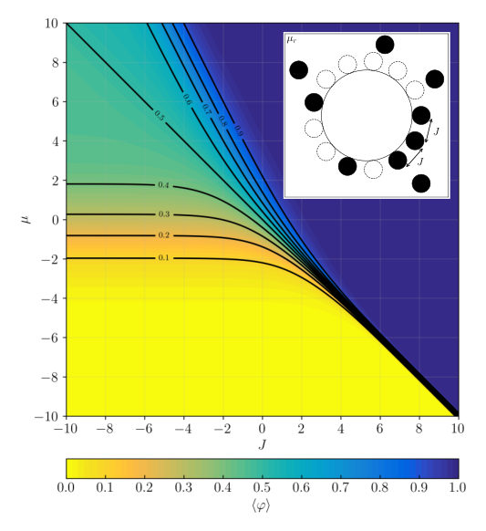
<figcaption class="paper-figure-caption"><b>Fig 2.</b> Fig. 1 shows the parameter diagram of the mean rel- ative occupancy of the lattice, ⟨φ⟩, as a function of</figcaption>
</figure>
<figure class="paper-figure-card">
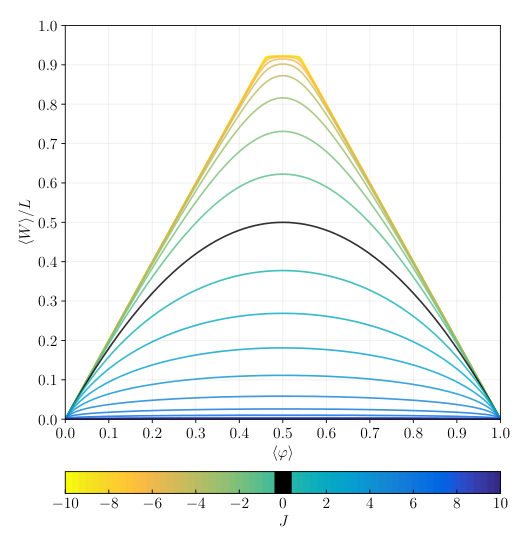
<figcaption class="paper-figure-caption"><b>Fig 3.</b> FIG. 2. Parametric plot of the normalized mean number of domain walls at equilibrium, ⟨W⟩/L, as a function of the mean relative occupancy ⟨φ⟩, for a lattice of size L = 13 according to the analytical expression in Eq. (8). For each curve, the dimensionless interaction potential J ranging from −10 (upmost curve) to 10 (lowest curve) in steps of 1, is held fixed and µ is varied so that ⟨φ⟩covers the interval [0, 1]. The black curve denotes the Hill-Langmuir case, J = 0, computed from Eq. (C3).</figcaption>
</figure>
<figure class="paper-figure-card">
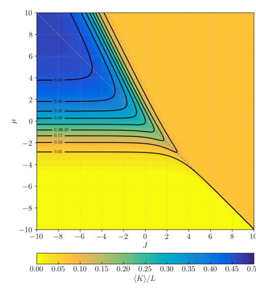
<figcaption class="paper-figure-caption"><b>Fig 4.</b> FIG. 3. Contour plot and heat map of the normalized mean number of clusters at equilibrium, ⟨K⟩/L, as a function of the dimensionless interaction potential J and chemical potential µ ranging from −10 to 10, according to Eq. (10) for a lattice of size L = 13. The dashed gray line represents the Half-Filling of the lattice, where J + µ = 0.</figcaption>
</figure>
<figure class="paper-figure-card">
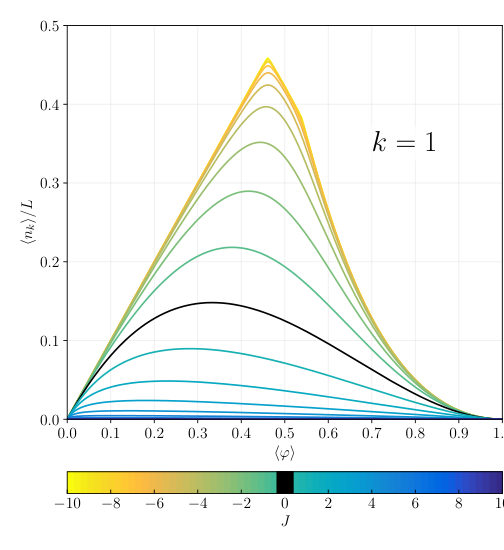
<figcaption class="paper-figure-caption"><b>Fig 5.</b> FIG. 4. Parametric plot of the normalized mean number of clusters of size k at equilibrium, ⟨nk⟩/L, as a function of the mean relative occupancy ⟨φ⟩, for a lattice of size L = 13 and k = 1 according to the analytical expression in Eq. (18). For each curve, the dimensionless interaction potential J ranging from −10 (upmost curve) to 10 (lowest curve) in steps of 1, is held fixed and µ is varied so that ⟨φ⟩covers the interval [0, 1]. The black curve denotes the Hill-Langmuir case, J = 0, computed from Eq. (C7).</figcaption>
</figure>

**Summary.** This paper develops an exact theoretical framework to calculate equilibrium cluster statistics for particles binding on a one-dimensional ring. By analyzing cooperative and anticooperative interactions, it derives key observables like cluster size distributions using advanced combinatorial methods. The results provide quantitative benchmarks for understanding how local interactions dictate the global spatial organization of adsorbed species.

**Why it may be interesting.** The rigorous derivation of exact, finite-size statistical mechanics results for 1D systems provides crucial benchmarks that can be compared against more complex simulations or experimental measurements in biological contexts.

Detailed structure

**Main problem.** The study focuses on determining the equilibrium clustering statistics for cooperative (attractive) and anticooperative (repulsive) binding interactions.

**Main result.** Exact finite-size expressions are derived for key observables like mean occupancy, domain walls, and cluster size distributions, characterizing how spatial organization changes with interaction strength.

**Method.** The analysis employs the grand-canonical formulation using both a transfer matrix approach and an advanced combinatorial cluster-based formalism to manage state space complexity.

**Model / system.** The model is a finite one-dimensional lattice gas of L sites with periodic boundary conditions, serving as a minimal system for adsorption/binding on ring-like substrates. The interactions are governed by nearest-neighbor coupling (J) and an effective chemical potential ($\mu$).

**Key observables.** Mean occupancy ($\langle\varphi
angle$), mean number of domain walls ($\langle W
angle$), mean number of clusters ($\langle K
angle$), cluster-size distribution ($P(k)$), and site-weighted cluster-size distribution ($Q(k)$).

**Important parameters / regimes.** Interaction strength (J) and chemical potential ($\mu$). Key regimes include strong cooperativity, strong anticooperativity, and the noninteracting Hill-Langmuir limit.

**Assumptions / limitations.** The analysis relies on deriving exact expressions for finite periodic systems, utilizing a cluster-based combinatorial formulation to reduce state space complexity from $2^L$ to one scaling with integer partitions ($p(L)$).

**Figures summary.** Figures show contour plots of mean observables ($\langle\varphi
angle$, $\langle W
angle$, $\langle K
angle$) versus interaction parameters, and parametric plots illustrating the dependence of cluster statistics on occupancy ($\langle\varphi
angle$).

**Paper structure.** The paper systematically derives exact finite-size expressions for various correlation functions and observables using two complementary formalisms: a site-based transfer matrix approach and a combinatorial cluster-counting method. It analyzes limiting cases (e.g., $J 	o \pm\infty$, $J=0$) to characterize different binding regimes.

Abstract

We study equilibrium clustering in a finite one-dimensional lattice gas of $L$ sites with periodic boundary conditions, as a minimal model for adsorption and binding on small ring-like substrates. Using a grand-canonical formulation with nearest-neighbor coupling, we derive exact finite-size expressions for the mean occupancy, the mean number of domain walls, and the mean number of clusters. Building on exact $k$-site correlation functions, we further derive expressions for the mean number of clusters of size $k$ and for two complementary size statistics: the cluster-size distribution, and the site-weighted cluster-size distribution. These observables characterize how spatial organization changes across attractive (cooperative) and repulsive (anticooperative) interactions, and highlight finite-size and parity-dependent effects of the underlying lattice, the latter being particularly pronounced near half filling in small systems. To access larger lattices without enumerating all $2^L$ microstates, we also develop a cluster-based combinatorial formulation in which configurations are classified by cluster counts and sizes, reducing the effective state space to a set whose size scales with integer partitions, $\approx e^{\sqrt{L}}$, rather than with $\approx e^{L}$. Taken together, our results provide exact benchmarks for finite periodic systems and suggest experimentally relevant cluster observables that complement occupancy-based measures of cooperativity, with particular relevance for binding on ring-like substrates for biological assemblies.

[↑ back to top](#top)

### [Flat-Band Stoner Instability and Peierls-Phase Origin of the Transdimensional Anomalous Hall Effect in Rhombohedral Graphite](http://arxiv.org/abs/2606.17535v1)

**Authors:** Yang Zhou  
**Type:** theory · **Category:** strongly correlated electrons · **PDF:** <https://arxiv.org/pdf/2606.17535v1>  
**Analysis basis:** full PDF text, analyzed in chunks
**Topic relevance:** `Keldysh / 2PI / non-Gaussian methods` **1/5** · `driven-dissipative phase transition` **1/5**

↔ Scroll figures horizontally

<figure class="paper-figure-card">
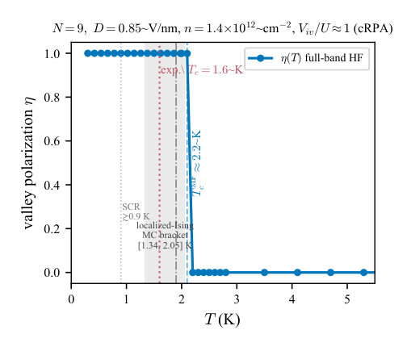
<figcaption class="paper-figure-caption"><b>Fig 1.</b> FIG. 1. Self-consistent valley polarization η(T) from the full 2N-band Hartree-Fock calculation (N = 9, D = 0.85 V/nm). The valley order saturates at η →1 and vanishes at T MF c ≈ 2.2 K (blue dashed). Shaded band: localized-Ising Tc bracket [1.34, 2.05] K (NN lower bound, bare-1/r upper bound; inter- mediate ranges give ≈1.9 K, dash-dot, Supplementary). Red dotted: experimental Tc = 1.6 K [1]; grey dotted: SCR lower bound ≳0.9 K.</figcaption>
</figure>
<figure class="paper-figure-card">
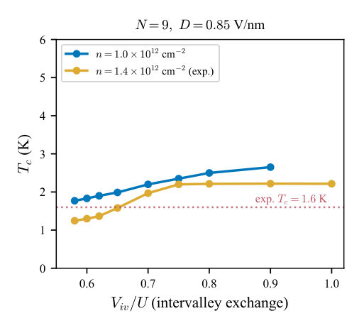
<figcaption class="paper-figure-caption"><b>Fig 2.</b> FIG. 2. Insensitivity of Tc to the intervalley exchange. Self- consistent 2N-band Hartree-Fock T MF c (Viv/U) for N = 9 at D = 0.85 V/nm, at the experimental density n = 1.4 × 1012 cm−2 (orange) and a lower density (blue). Tc saturates at ≈2.2 K for Viv/U ≳0.75; below ∼0.65 the valley polariza- tion is lost. Red dotted: experimental Tc = 1.6 K [1].</figcaption>
</figure>
<figure class="paper-figure-card">
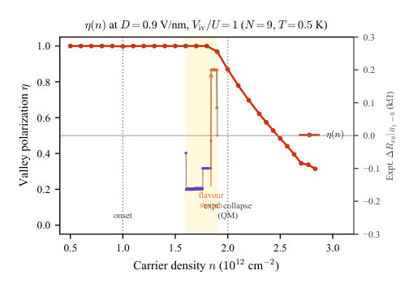
<figcaption class="paper-figure-caption"><b>Fig 3.</b> FIG. 3. Self-consistent valley polarization η(n) (left axis, red) at D = 0.9 V/nm (N = 9, T = 0.5 K), saturated (η →1) for n ≲1.8 × 1012 cm−2. Right axis: experimental ∆Rxy at B∥= 0 (digitized from Extended Data Fig. 6 of Ref. 1), purple/orange for ∆Rxy ≶0. η is the order-parameter mag- nitude, so it stays saturated across the switching window (n = 1.6–1.9) while the ∆Rxy sign reverses at n ≈1.83, marking the valley flavour switch K ↔K′ at fixed |η|. Yellow band: switching window; dotted lines mark hysteresis onset (n = 1.0) and loop collapse (n = 2.0, into the quarter-metal phase).</figcaption>
</figure>
<figure class="paper-figure-card">
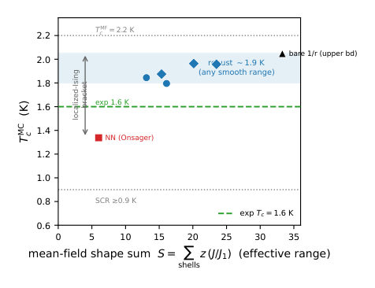
<figcaption class="paper-figure-caption"><b>Fig 4.</b> FIG. 4. Localized-Ising T MC c vs the effective range of the valley-exchange coupling (mean-field shape sum S = P z (J/J1), increasing with range). Every smooth coupling— bare 1/r (upper bound, εK−K′ ≈1), a Yukawa cutoff at the cv coherence length ξ0 = 0.35 nm, and power laws 1/rα</figcaption>
</figure>
<figure class="paper-figure-card">
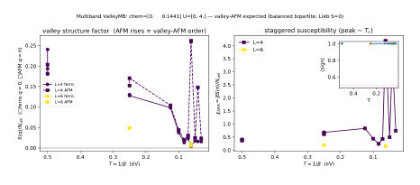
<figcaption class="paper-figure-caption"><b>Fig 5.</b> FIG. 5. Multiband ALF QMC of the 2N-band rhombohe- dral model (N=3): valley structure factor S(q)/Ncell vs T for L = 4, 6 in both the ferromagnetic (q=0, filled) and antifer- romagnetic (q=π, open) channels. S(q)/Ncell decreases with L in both channels at every temperature, i.e. no long-range valley order at the commensurate half-filled flat band. Inset: average sign ⟨s⟩= 1.0 throughout (sign-free).</figcaption>
</figure>

**Summary.** This work provides a comprehensive microscopic theory explaining the Transdimensional Anomalous Hall Effect in rhombohedral graphite. It attributes the effect to a Stoner instability that induces spin-valley polarization ($\eta$), which simultaneously controls both the intrinsic and planar components of the anomalous Hall response. The theoretical framework successfully predicts key experimental signatures like the common critical temperature ($T_c$) across different magnetic field orientations.

**Why it may be interesting.** The detailed analysis of how a magnetic instability (Stoner) couples to structural/orbital effects (Peierls phase) to generate multiple correlated transport responses is highly relevant to understanding emergent quantum phenomena in strongly interacting electronic systems.

Detailed structure

**Main problem.** The paper develops a microscopic theory for the Transdimensional Anomalous Hall Effect (TDAHE) observed in rhombohedral graphite.

**Main result.** The TDAHE is attributed to a flat-band Stoner instability coupled to Peierls-phase gap modulation, leading to a common critical temperature ($T_c$) governing both AHE and TDAHE responses.

**Method.** Theoretical calculations employing self-consistent Hartree-Fock methods, Dynamical Mean-Field Theory (DMFT), and comparison with Ising model simulations are used.

**Model / system.** The system is nine-layer rhombohedral graphite modeled by an $N$-layer ABC-stacked Hamiltonian. The physics hinges on the Stoner criterion ($U
ho(\epsilon_F) > 1$) driving spin-valley polarization ($\eta$).

**Key observables.** Anomalous Hall Conductivity ($\sigma_{	ext{int}}^{xy}$), Transdimensional AHE component ($\sigma_{	ext{PHE}}^{xy}$), and the common critical temperature ($T_c$).

**Important parameters / regimes.** $N$ (number of layers, $N \ge 5$), Stoner interaction strength ($U
ho$), orbital g-factor ($g_{	ext{orb}} \propto N-1$).

**Assumptions / limitations.** The theory assumes the TDAHE is governed by a single order parameter ($\eta$) and that correlation effects are captured by mean-field treatments, with DMFT confirming $Z$-independence.

**Figures summary.** Figures compare theoretical predictions of valley polarization $\eta(T)$ against experimental bounds, showing agreement in the 2D Ising critical fluctuation regime for $T_c$.

**Paper structure.** The paper progresses from identifying the TDAHE phenomenon to proposing the Stoner instability mechanism. It then derives the mathematical dependence of both Hall responses on the valley polarization $\eta$ and the orbital g-factor, culminating in quantitative predictions for $T_c$ and layer scaling.

Abstract

A ``transdimensional'' anomalous Hall effect (TDAHE), where both in-plane ($\Bpar$) and out-of-plane magnetic fields produce hysteretic Hall signals, was recently observed in nine-layer rhombohedral graphite~\cite{Li2026Nature}. We present a microscopic theory attributing the TDAHE to a flat-band Stoner instability coupled to Peierls-phase gap modulation. The flat-band density of states satisfies the Stoner criterion $Uρ(\varepsilon_F) > 1$~\cite{Bultinck2020}, driving a spin-valley-locked ferromagnet whose valley polarization $η$ breaks time-reversal symmetry and generates an intrinsic anomalous Hall conductivity (AHC). The orbital $g$-factor $g_{\mathrm{orb}} = e d_0 v_F (N{-}1)/2 \propto (N{-}1)$ then lets $\Bpar$ modulate the gap, producing the transdimensional response $\propto η$. A self-consistent $2N$-band Hartree-Fock calculation yields complete valley polarization ($η\to 1$) below a mean-field transition $T_c^{\mathrm{MF}} \approx 2.2$~K, reduced by 2D-Ising critical fluctuations to the experimental $T_c \approx 1.6$~K, with $R_{xy} \approx 1.5$~k$Ω$. Because both Hall responses are carried by one order parameter $η$, they share a single $T_c$, as observed; $T_c$ is governed by the Stoner product $Uρ$ and is insensitive to the intervalley exchange, which only gates whether the valley-polarized phase forms, so the exchange strength is not a fitted parameter. Beyond reproducing $R_{xy}$, $T_c$, and the phase window, the theory predicts a sharp onset of valley polarization between $N = 7$ and $N = 9$, a symmetry selection rule fixing the crescent Fermi surface to the $m{=}1$ nematic channel, and a transdimensional-to-conventional Hall ratio $\sigmaPHE/\sigmaAHE^{\mathrm{tot}} = g_{\mathrm{orb}}\Bpar/m$ independent of $η$ and $U$. The $Z$-independence of the intrinsic AHC is verified within dynamical mean-field theory.

[↑ back to top](#top)

### [Learning Dynamics of Chain-of-Thought State Tracking in a Solvable Transformer Model](http://arxiv.org/abs/2606.18164v1)

**Authors:** Niklas Forner, Marcel Kühn, Matthias Thamm, Bernd Rosenow  
**Type:** theory · **Category:** disordered systems and neural networks · **PDF:** <https://arxiv.org/pdf/2606.18164v1>  
**Analysis basis:** full PDF text, analyzed in chunks
**Topic relevance:** `Keldysh / 2PI / non-Gaussian methods` **1/5** · `driven-dissipative phase transition` **1/5**

↔ Scroll figures horizontally

<figure class="paper-figure-card">
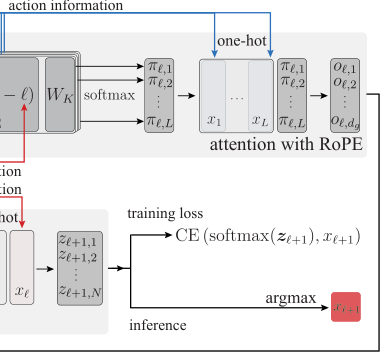
<figcaption class="paper-figure-caption"><b>Fig 1.</b> Figure 1: Problem setup and specialized one-block transformer model. (a) Action token xj selects permutation σxj, which maps current state xℓto next state xℓ+1. (b) Teacher sequence from actions x1, . . . , xL and initial state xL+1; for i = L + 1, . . . , 2L, xi+1 is obtained by applying xi−L to xi. (c) Student prediction: RoPE attention retrieves the action at fixed lag −L, and the logic block applies the corresponding weighted sum of learnable matrices to the one-hot state, producing logits zℓ+1.</figcaption>
</figure>
<figure class="paper-figure-card">
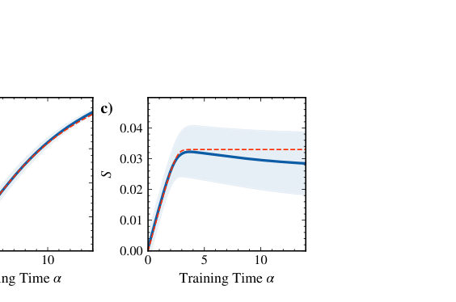
<figcaption class="paper-figure-caption"><b>Fig 2.</b> Figure 2: Dynamics of the order parameters A, R, and S in panels a), b), and c), respectively. Simulations are averaged over 100 seeds, and σ denotes the standard deviation. The theoretical predictions agree very well with the simulations (note different scale in panel c)).</figcaption>
</figure>
<figure class="paper-figure-card">
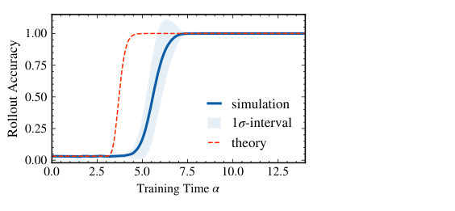
<figcaption class="paper-figure-caption"><b>Fig 3.</b> Figure 3: Final rollout accuracy, averaged over 100 model seeds; σ denotes the standard devia- tion. The theoretical curve uses µk and µk from the order-parameter solutions of Eqs. (15) and constant variances σ2 k = σ2</figcaption>
</figure>
<figure class="paper-figure-card">
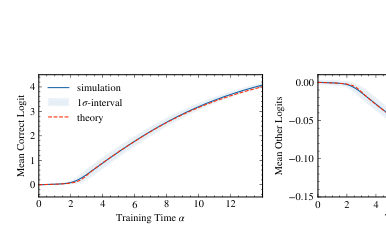
<figcaption class="paper-figure-caption"><b>Fig 4.</b> Figure 4: (a) Mean correct and other logits. (b) Mean-field loss (ℓCE(A, R, S)) compared to the actual loss</figcaption>
</figure>
<figure class="paper-figure-card">
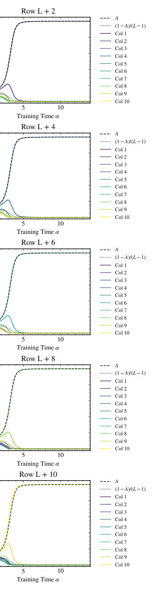
<figcaption class="paper-figure-caption"><b>Fig 5.</b> Figure 5: Entries of the attention block as a function of the learning time.</figcaption>
</figure>

**Summary.** The paper develops a solvable transformer model to study Chain-of-Thought state tracking using permutation composition. By applying mean-field theory, the authors derive differential equations for order parameters describing attention retrieval ($A$) and logic alignment ($R$). The results reveal a predictable, staged learning process leading to a sharp transition in performance, offering mechanistic insight into how complex reasoning emerges from simple component interactions.

**Why it may be interesting.** This provides a rigorous, physics-based framework to analyze emergent computational capabilities (like CoT) within neural networks by mapping learning dynamics onto established concepts from statistical mechanics and phase transitions.

Detailed structure

**Main problem.** The study investigates the training dynamics by which transformer models acquire the ability to perform multi-step, compositional state tracking (Chain-of-Thought). Specifically, it aims to understand how attention retrieval mechanisms and MLP logic modules co-develop during this process.

**Main result.** The learning process is characterized as staged: initially, the logic module learns a heuristic, followed by the attention mechanism locking onto the correct action, enabling efficient alignment of the MLP. This leads to a sharp, theoretically predictable transition in final rollout accuracy.

**Method.** The analysis employs a statistical-physics mean-field description, deriving coupled differential equations for macroscopic order parameters ($A$, $R$, and $S$) that govern the system's evolution over training time ($\alpha$).

**Model / system.** The model is a simplified, solvable one-block transformer trained on a permutation-chain task. It separates action retrieval (via RoPE attention) from state application (via a specialized MLP logic module). The task requires predicting states resulting from composing permutations.

**Key observables.** Attention order parameter ($A$), Teacher-matrix alignment ($R$), Off-target logic overlap ($S$), and final rollout accuracy ($\varrho_L$).

**Important parameters / regimes.** Training time ($\alpha$), sequence length ($L$), size of permutation set ($N$), and the coupling strength parameters derived from the mean-field ansatz.

**Assumptions / limitations.** The analysis relies on a solvable, constrained architecture; key approximations include using a mean-field description for the loss function and assuming Gaussian distributions for logits to derive continuous dynamics.

**Figures summary.** Figures illustrate the evolution of order parameters ($A, R, S$) over training time, showing agreement between simulated results and theoretical predictions derived from differential equations. Another figure tracks final rollout accuracy, predicting a sharp transition near convergence.

**Paper structure.** The paper first sets up the solvable transformer model for state tracking. It then derives mean-field dynamics by defining order parameters ($A, R, S$) based on attention and logic module overlaps. The core of the work involves solving coupled differential equations governing these parameters over training time ($\alpha$), culminating in a theoretical prediction for the final task accuracy.

Abstract

Chain-of-thought generation can turn a multi-step computation into a sequence of locally checkable state updates, but the training dynamics by which transformers acquire such updates remain poorly understood. We study this question in a solvable setting: a simplified one-block transformer trained by supervised next-token prediction on state sequences generated by composing permutations. The architecture separates fixed-lag action retrieval, learned by RoPE attention, from a specialized MLP logic module that applies the retrieved permutation to the current state. Using a statistical-physics mean-field description, we derive dynamics for three order parameters measuring attention retrieval, teacher-matrix alignment, and off-target logic overlap. These equations quantitatively match simulations for the order parameters and, combined with a logit-distribution approximation, qualitatively predict the sharp transition in final rollout accuracy. The analysis reveals staged learning: the logic module first learns a mixed heuristic; attention then locks onto the relevant action, enabling efficient MLP alignment. Together, these results provide a controlled mechanistic account of how attention-based retrieval and MLP-based logic co-develop during chain-of-thought state tracking.

[↑ back to top](#top)

### [Singular Vector Finite Element Basis Functions for Tetrahedra in Complex Electromagnetic Geometries](http://arxiv.org/abs/2606.18140v1)

**Authors:** Samuel T. Elkin, Ghazi Khan, Ebrahim Forati, Brandon W. Langley, Dogan Timucin, Reza Molavi, Thomas E. Roth  
**Type:** theory · **Category:** quantum information and computing · **PDF:** <https://arxiv.org/pdf/2606.18140v1>  
**Analysis basis:** full PDF text, analyzed in chunks
**Topic relevance:** `correlated / nonlocal dissipation` **1/5** · `methods for driven-dissipative` **1/5**

↔ Scroll figures horizontally

<figure class="paper-figure-card">
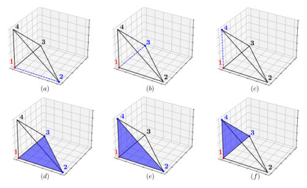
<figcaption class="paper-figure-caption"><b>Fig 1.</b> Fig. 3. Node-singular basis functions and their geometric associations for a tetrahedron with node 1 touching a singular feature, as denoted by the red marker. Figs. (a)-(c) show Nij,g1, where i = 1 and j = 2, 3, 4, with their corresponding edges dashed and highlighted in blue. Figs. (d)-(f) show Nijk,r1, where i = 1 and (j, k) = (2, 3), (2, 4), (3, 4), with their associated faces shaded blue.</figcaption>
</figure>
<figure class="paper-figure-card">
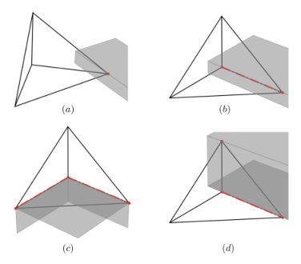
<figcaption class="paper-figure-caption"><b>Fig 2.</b> Fig. 2. Examples of tetrahedra along singular features in a 3D geometry, with singular nodes and edges highlighted in red. In (a), the tetrahedron has only a single node along the conductive wedge, so only one set of node-singular functions is needed. The tetrahedron in (b) has an edge along the feature, so a set of node-singular functions is added for each node on the wedge, along with a set of edge-singular functions for that edge. A tetrahedron on a corner is shown in (c), requiring three sets of node-singular functions and two sets of edge-singular functions. The tetrahedron in (d) requires three sets of node- singular functions and one set of edge-singular functions.</figcaption>
</figure>
<figure class="paper-figure-card">
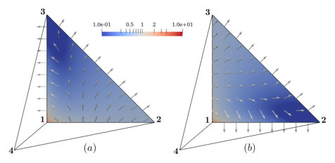
<figcaption class="paper-figure-caption"><b>Fig 3.</b> Fig. 4. Behavior of (a) N12,g1 and (b) N13,g1 with ν = 2/3 along face 123 of a tetrahedron where node 1 is touching a singular feature. The color and arrows indicate the magnitude and direction of the function along the face.</figcaption>
</figure>
<figure class="paper-figure-card">
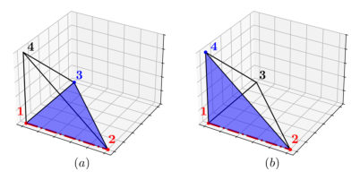
<figcaption class="paper-figure-caption"><b>Fig 4.</b> Fig. 5. Edge-singular basis functions and their geometric associations for a tetrahedron with edge 12 along a singular feature, as denoted by the red dash-dotted line. The functions N123,g1 and N124,g1 have their associated faces shaded blue in (a) and (b) respectively.</figcaption>
</figure>
<figure class="paper-figure-card">
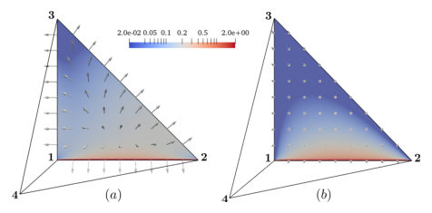
<figcaption class="paper-figure-caption"><b>Fig 5.</b> Fig. 6. Behavior of (a) N123,g1 and (b) N124,g1 with ν = 2/3 along face 123 of a tetrahedron with edge 12 along a singular feature. The color and arrows indicate the magnitude and direction of the function along the face.</figcaption>
</figure>

**Summary.** This paper introduces specialized singular vector finite element basis functions designed to overcome the limitations of standard FEM when simulating electromagnetic fields near sharp geometric features common in superconducting qubits. By incorporating these additive singular terms into tetrahedral elements, the authors achieve highly accurate results for critical parameters like energy participation ratios with computational costs drastically lower than commercial benchmarks.

**Why it may be interesting.** The accurate simulation of energy loss mechanisms in superconducting qubits is crucial for understanding decoherence rates ($	ext{T}_1$, $	ext{T}_2$), which are central topics in quantum information science. The method provides a powerful, computationally efficient tool to analyze these fundamental physical limits.

Detailed structure

**Main problem.** Traditional Finite Element Method (FEM) basis functions fail to accurately model electromagnetic field behavior near singular features, such as those found in superconducting qubit geometries.

**Main result.** The development of specialized, additive singular vector basis functions allows for simulating complex electromagnetic structures with massive computational speedups while maintaining high accuracy comparable to commercial solvers.

**Method.** The authors derive and implement novel singular basis functions (node-singular, edge-singular, rotational) specifically tailored for tetrahedral elements in 3D electromagnetics.

**Model / system.** The work focuses on simulating electromagnetic fields within superconducting quantum circuits, such as GCPW resonators and Xmon qubits, where energy loss near geometric singularities dictates qubit coherence times.

**Key observables.** Participation Ratios (PMS, PMA, PSA) quantifying energy distribution at interfaces; Quality factor (Q); Field magnitude along singular lines.

**Important parameters / regimes.** Singular function order ($s=1, 2, 3$); Frequency ($\omega$); Material permittivities ($\epsilon_i, \epsilon_s$).

**Assumptions / limitations.** The simulation domain is assumed source-free and lossless for the primary derivations; higher-order terms require careful handling of continuity across element interfaces.

**Figures summary.** Figures illustrate field behavior comparisons (standard vs. singular functions) near wedges, show geometric associations of basis functions in tetrahedra, and compare calculated qubit parameters like capacitance and PMS against varying function orders.

**Paper structure.** The paper progresses from identifying the failure of standard FEM at singularities to developing node-singular, then edge-singular, and finally higher-order rotational basis functions. It validates these functions by applying them to calculate key superconducting qubit metrics (PRs, Q) and demonstrating massive computational efficiency gains over commercial tools.

Abstract

Electromagnetic finite element method (FEM) implementations using traditional basis functions struggle to accurately represent field behavior near singular features such as conducting wedges. To combat this, specialized singular basis functions have been introduced to directly model the singular fields in these regions, leading to substantially improved performance. While these efforts have been pursued extensively in 2D, few functions have been developed for 3D elements. In this work, we develop basis functions for this in tetrahedra. Unlike prior functions, these basis functions are additive, meaning they are included alongside the standard vector basis functions to achieve more robust performance. Further, these functions are designed to be adaptable to tetrahedra touching several unique singular features by using combinations of basis functions singular with respect to each node and edge in the element, making them applicable to highly complex geometries. Higher-order interpolatory versions of the basis functions for modeling singular behavior with greater accuracy are also provided. These basis functions lead to substantial improvements in accuracy relative to the standard basis functions, and allow otherwise expensive simulations to be performed at far lower costs. As an application example, we perform simulations to extract critical quantities for designing superconducting qubits that significantly depend on the behavior of singular fields. In Ansys HFSS, this took 21.27 hours and a peak memory usage of 6.23 TB with 800 processors available, while using our singular basis functions achieved comparable results in 196 seconds while using 27.24 GB of memory and only 16 processors. Due to these benefits, our singular basis functions could be applied to enable design optimization of electromagnetic geometries with dominantly singular behavior, such as superconducting qubits.

[↑ back to top](#top)

### [Tunable Superconductivity in 1313-La$_3$Ni$_2$O$_7$: Suppressed under Compression and Possible $s^{\pm}$ Pairing under Tension](http://arxiv.org/abs/2606.17273v1)

**Authors:** Yang Zhang, Ling-Fang Lin, Adriana Moreo, Thomas A. Maier, Elbio Dagotto  
**Type:** theory · **Category:** strongly correlated electrons · **PDF:** <https://arxiv.org/pdf/2606.17273v1>  
**Analysis basis:** full PDF text, analyzed in chunks
**Topic relevance:** `Keldysh / 2PI / non-Gaussian methods` **1/5** · `analog quantum simulation` **1/5**

↔ Scroll figures horizontally

<figure class="paper-figure-card">
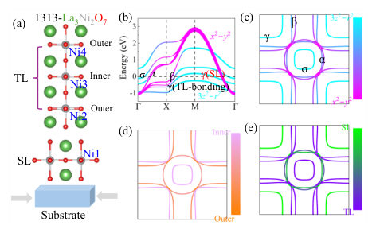
<figcaption class="paper-figure-caption"><b>Fig 1.</b> FIG. 1. (a) Schematic crystal structure of the 1313-LNO film on the LSAO substrate (green = La, gray = Ni, red = O), consisting of alternating SL (one Ni layer) and TL (three Ni layers) blocks, visualized using the VESTA code [77]. (b,c) Tight-binding band structure and Fermi surface of the 1313-LNO film on the LSAO substrate, both with total filling n = 6. The coordinates of the high-symmetry points of the Brillouin zone are Γ = (0, 0, 0), X = (0, 0.5, 0), and M = (0.5, 0.5, 0). (d) Contributions of the inner and outer Ni layers to the Fermi surface of the TL subsystem, at TL filling n = 4.19. (e) Layer-resolved contributions of the SL and TL subsystems to the Fermi surface states at n = 6.</figcaption>
</figure>
<figure class="paper-figure-card">
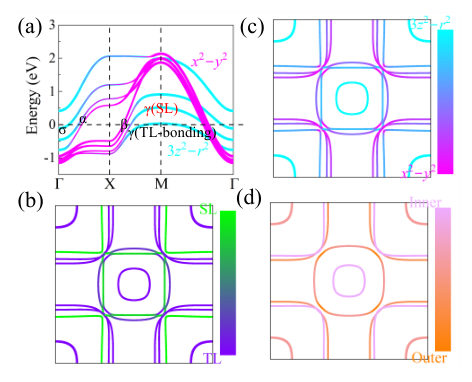
<figcaption class="paper-figure-caption"><b>Fig 2.</b> FIG. 3. (a-b) Tight-binding band structure and Fermi surface for the 1313-La3Ni2O7 film on the KTO substrate, with total filling n = 6, respectively. (c) Layered contributions of the SL and TL subsystems to the Fermi-surface states for a total filling n = 6. (d) The contributions of inner and outer layers to the Fermi surface of the trilayer sublattices, at TL filling n = 4.38. The hopping parameters are provided in SM [87].</figcaption>
</figure>
<figure class="paper-figure-card">
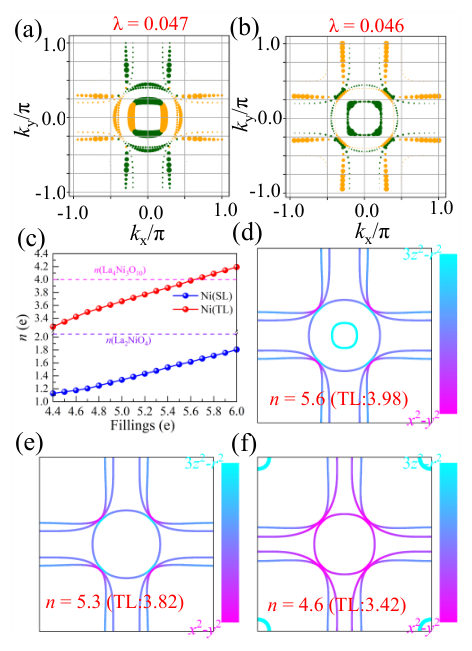
<figcaption class="paper-figure-caption"><b>Fig 3.</b> FIG. 2. (a-b) The RPA-calculated leading superconducting singlet gap structures gα(k) on the Fermi surfaces are shown for (a) the dx2−y2-wave channel with eigenvalue λ = 0.047 and for the (b)s±-wave channel with eigenvalue λ = 0.046, for 1313-La3Ni2O7 films grown on an LSAO substrate for U = 1.2, U ′ = U/2, J = J′ = U/4, calculated for temperature T = 0.01 eV considering the TL-restricted model. Here, the SL states are included in the Hamiltonian, but the interactions U, U ′, J, J′ are set to zero on the SL orbitals. Thus, the SL subsystem will not directly participate in the pairing since the spin-fluctuation interaction for the SL orbitals will be zero. The sign of gα(k) is indicated by...</figcaption>
</figure>
<figure class="paper-figure-card">
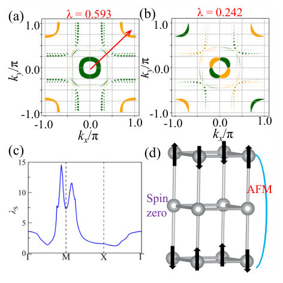
<figcaption class="paper-figure-caption"><b>Fig 4.</b> FIG. 4. (a-b) The RPA-calculated superconducting singlet gap structures gα(k) on the Fermi surfaces for (a) the leading solution s±-wave state with eigenvalue λ = 0.593 and (b) subleading dxy-wave channel with eigenvalue λ = 0.242, for 1313-La3Ni2O7 films grown on the KTO substrate. Here we considered the TL-restricted model (as used in Figs. 2(a-b)) with U = 0.9 eV, U ′ = U/2, J = J′ = U/4, and T = 0.01 eV in the TL subsystem and U = U ′ = J = J′ = 0 in the SL block. The sign of gα(k) is indicated by the color (orange = positive, green = negative), and its amplitude by the point sizes. (c) Leading eigenvalue λs 0(q) of the spin susceptibility tensor χs ℓ1ℓ1ℓ2ℓ2(q), along a high-symmetry...</figcaption>
</figure>
<figure class="paper-figure-card">
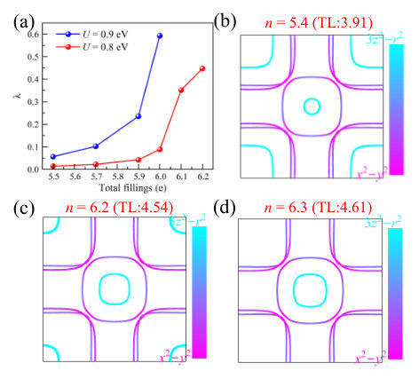
<figcaption class="paper-figure-caption"><b>Fig 5.</b> FIG. 5. (a) The RPA calculated pairing strength λ for the s±</figcaption>
</figure>

**Summary.** This theoretical study uses advanced electronic structure calculations to map out the phase diagram of superconductivity in nickelates under strain. It finds that tensile strain stabilizes a favorable $s^{\pm}$-wave pairing state, while compressive strain suppresses it. The work provides crucial guidelines for engineering high-temperature superconductivity by controlling lattice strain and doping levels.

**Why it may be interesting.** Although focused on cuprate/nickelate physics, the methodology of using RPA to predict unconventional superconductivity based on orbital nesting and external tuning parameters (strain) is highly relevant to understanding correlated electron systems in general.

Detailed structure

**Main problem.** The study investigates how mechanical strain (compression vs. tension) affects superconductivity in 1313-La$_3$Ni$_2$O$_7$ nickelate thin films.

**Main result.** Superconductivity is predicted to emerge via a robust $s^{\pm}$-wave pairing state specifically under tensile strain, while compressive strain suppresses it. The superconducting state requires an optimally sized $\gamma$ Fermi pocket.

**Method.** The research employs Density Functional Theory (DFT) combined with the Random-Phase Approximation (RPA) applied to a tight-binding model of the nickelate layers.

**Model / system.** The system is 1313-La$_3$Ni$_2$O$_7$, modeled as an alternating Single-Layer (SL)/Trilayer (TL) heterostructure. Calculations focus on the TL subsystem, analyzing its electronic structure and superconducting pairing instability.

**Key observables.** Superconducting pairing strength ($\lambda$), gap structures ($g_\alpha(\mathbf{k})$), self-doping effects, and Fermi surface pocket sizes ($\sigma$ at $\Gamma$, $\gamma$ at M).

**Important parameters / regimes.** Strain (compressive vs. tensile), electron/hole doping level ($n$), and the size of the $\gamma$ pocket.

**Assumptions / limitations.** The RPA calculation restricts pairing analysis to the TL subsystem, neglecting direct participation from the SL subsystem in the instability calculation.

**Figures summary.** Figures illustrate band structures and Fermi surfaces under different strain/doping conditions (LSAO vs. KTO). Gap structure plots show the predicted $s^{\pm}$-wave gap symmetry on tensile-strained films.

**Paper structure.** The paper systematically compares results obtained from simulations on LSAO substrates (compressive strain) versus those on KTO substrates (tensile strain), analyzing how doping and strain tune the pairing mechanism towards an optimal $s^{\pm}$ state.

Abstract

Motivated by recent progress in the 1313-La$_3$Ni$_2$O$_7$ nickelate thin films (Nie et al., Nature {\bf 652}, 628 (2026)), we systematically investigate the effects of both compressive and tensile strain in this system. Self-doping effects between the single-layer (SL) and trilayer (TL) blocks are observed in our studies in both cases, but are most pronounced under tensile strain. We find that superconductivity is unlikely to emerge in the 1313 film on the LSAO substrate even with further hole doping. Remarkably, within the random-phase approximation, under {\it tensile} strain, a robust $s^{\pm}$-wave pairing state emerges in the TL subsystem with sign changes between the small electron-like $σ$ pocket at the $Γ$ point and the small hole-like $γ$ pocket at the M point. These pockets are connected by a wave vector close to $(π,π)$. Our calculations also suggest that superconductivity in 1313-LNO requires an optimally sized $γ$ pocket, because an oversized $γ$ pocket suppresses pairing formation. Overall, our results predict strain-dependent electronic reconstruction in 1313-La$_3$Ni$_2$O$_7$ and provide guiding principles for engineering superconductivity under ambient pressure conditions.

[↑ back to top](#top)

### [A polynomial-time approximation scheme for minimum-weight decoding of topological codes](http://arxiv.org/abs/2606.18145v1)

**Authors:** Shouzhen Gu, Lily Wang, Aleksander Kubica  
**Type:** theory · **Category:** quantum information and computing · **PDF:** <https://arxiv.org/pdf/2606.18145v1>  
**Analysis basis:** full PDF text, analyzed in chunks
**Topic relevance:** `analog quantum simulation` **1/5**

↔ Scroll figures horizontally

<figure class="paper-figure-card">
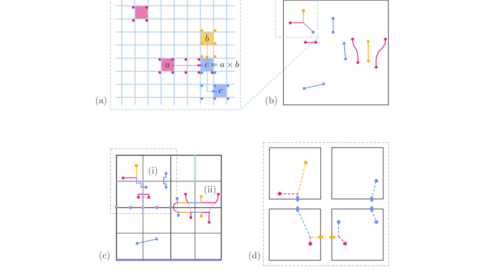
<figcaption class="paper-figure-caption"><b>Fig 1.</b> FIG. 1. (a) A 2D TTI code on a square lattice has a constant number of qubits at each vertex; its stabilizers are associated with faces and supported only on adjacent qubits. Violated stabilizers correspond to abelian anyons, which are point-like excitations that are deterministically moved by string-like operators. Two anyons a and b can be fused together into c = a × b. (b) In the decoding problem, for a given syndrome σ, i.e., a set of excitations (colored dots), we seek a corresponding error e (colored lines) that has minimum or close to minimum weight. (c) To solve it, we recursively partition the lattice into squares; we depict level-1 (thick) and level-2 (thin) squares. The level of...</figcaption>
</figure>
<figure class="paper-figure-card">
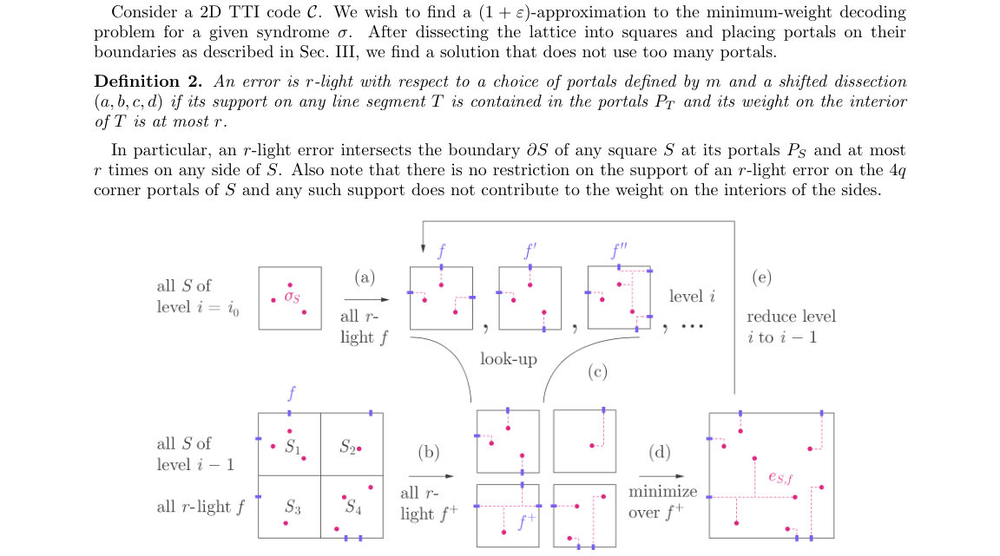
<figcaption class="paper-figure-caption"><b>Fig 2.</b> FIG. 2. Finding the minimum-weight r-light error using dynamic programming. (a) In the base cases, for every level-i0 square S, we consider all r-light f supported on the portals PS and exhaustively search for the solution of the decoding subproblem. (b) To solve the decoding subproblems for a bigger square S of level i −1 and an r-light f on PS, we consider all r-light lifts f +. (c) The r-light lift f + defines decoding subproblems on the level-i subsquares of S, whose solutions we look up. (d) Minimizing over f + gives the solution for the decoding subproblem defined by S and f, (e) which we store in the lookup table.</figcaption>
</figure>
<figure class="paper-figure-card">
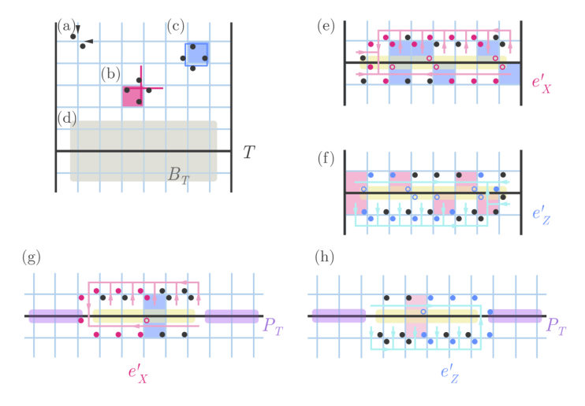
<figcaption class="paper-figure-caption"><b>Fig 3.</b> FIG. 3. (a) To view the toric code in the framework of 2D TTI codes, we move qubits (black dots) from the edges of the lattice in its usual representation to the vertices; (b) and (c) depict X and Z stabilizers, respectively. (d) The buffer BT of a line segment T. (e) For an X error eX (hollow red dots in the yellow region), the Patching Property is proven by moving the corresponding Z excitations (blue squares) along the red path with a string-like operator e′ X (red dots). (f) X excitations created by a Z error eZ (hollow blue dots) are moved analogously along the blue path with a string-like operator e′ Z. Then, e′ = e′ X + e′ Z is equivalent to e = eX + eZ. (g) In the proof of the...</figcaption>
</figure>
<figure class="paper-figure-card">
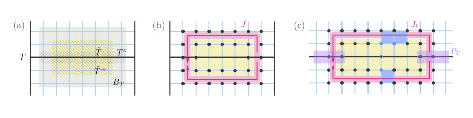
<figcaption class="paper-figure-caption"><b>Fig 4.</b> FIG. 4. (a) The sets of qubits ˜T, ˜T +, T ◦, BT used in proving the Patching Property for 2D TTI codes. (b) The error e ˜ T + supported on ˜T + (yellow region) causes excitations only within the set of plaquettes J in red (due to the assumption on the global syndrome σ). Moving them along the red path annihilates the excitations and gives an equivalent error e′ BT with constant support on T. (c) An error eT + k (blue dots) supported on T + k (yellow region) creates excitations on the blue plaquettes. In general, the syndrome is supported on Jk (red plaquettes). Moving them along the red path annihilates the excitations and gives an equivalent error e′ k whose support on T is contained in...</figcaption>
</figure>
<figure class="paper-figure-card">
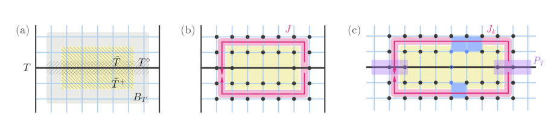
<figcaption class="paper-figure-caption"><b>Fig 5.</b> Fig. 4(c). The set Jk consisting of the plaquettes with a nonzero proper subset of its vertices in T + k contains the possible excitations. The error e′ k is defined by moving all excitations through J to a single location, which has support contained in BT . For Tk on the ends of the T, this uses the fact that we placed an extra portal distance two away from each endpoint of T. Note that the support of e′ k on T is contained in the portals. Because ˜e does not have support on T \ PT , the first property is satisfied. For each k ∈K, the error e has support on Tk, and we add support of e′ on up to four vertices in T. This shows the second property with β′ = 4q. From our placement of portals,...</figcaption>
</figure>

**Summary.** The paper develops a Polynomial-Time Approximation Scheme (PTAS) for the minimum-weight decoding of 2D and higher-dimensional topological stabilizer codes. By adapting techniques from Euclidean geometry problems, it overcomes the NP-hardness barrier for this crucial task in fault-tolerant quantum computation. This provides a computationally efficient decoder that can approximate the true error correction weight to any desired accuracy.

**Why it may be interesting.** This work provides a powerful algorithmic tool for quantum error correction codes by transforming an intractable optimization problem into one solvable efficiently up to arbitrary precision $\epsilon$.

Detailed structure

**Main problem.** The core problem is finding an efficient algorithm for minimum-weight decoding of two-dimensional topological translationally invariant (2D TTI) stabilizer codes.

**Main result.** The authors prove that this NP-hard decoding problem admits a Polynomial-Time Approximation Scheme (PTAS), guaranteeing a solution within $(1+\epsilon)$ of the true minimum weight in polynomial time.

**Method.** The method adapts Arora's PTAS for Euclidean problems, employing recursive lattice dissection and dynamic programming over 'portals' to solve subproblems.

**Model / system.** The study focuses on 2D TTI stabilizer codes (like the toric code), which are fundamental models used in fault-tolerant quantum computation. The decoding process involves finding a minimum-weight error operator consistent with an observed syndrome.

**Key observables.** Error weight ($|e|$), approximation ratio ($(1+\epsilon)$), and the syndrome ($\sigma$).

**Important parameters / regimes.** The accuracy parameter $\epsilon$, the lattice size $L$, and the dimension $D$ (generalizing from 2D to higher dimensions).

**Assumptions / limitations.** The analysis relies on structural properties like the Patching Property and Rerouting Property, which allow errors to be localized and manipulated across recursively defined regions.

**Figures summary.** Figures illustrate the TTI code structure, the recursive partitioning of the lattice into squares with 'portals,' and the dynamic programming steps used to combine solutions from smaller subproblems.

**Paper structure.** The paper builds by first establishing the NP-hardness of exact decoding, then developing a PTAS based on Arora's technique. The core is proving structural theorems (Patching/Rerouting) that enable solving the problem via dynamic programming over recursively dissected regions, culminating in the general $D$-dimensional extension.

Abstract

Two-dimensional topological translationally invariant (2D TTI) stabilizer codes lie at the heart of fault-tolerant quantum computation, but using them requires solving the decoding problem. Minimum-weight decoding of these codes was recently shown to be NP-hard, even in basic settings, such as the color code with Pauli $Z$ errors and the toric code with Pauli $X$, $Y$ and $Z$ errors. Here, we prove that minimum-weight decoding of 2D TTI codes nonetheless admits a polynomial-time approximation scheme (PTAS), i.e., for any constant $\varepsilon>0$, a recovery operator of weight within a multiplicative factor of $1+\varepsilon$ of the minimum can be found in polynomial time. Our approach builds on Arora's PTAS for Euclidean problems, such as the traveling salesman problem, and applies when decoding can be cast in terms of point-like excitations connected by string-like errors. It therefore extends beyond two dimensions, covering certain higher-dimensional topological codes and quantum memories, including the toric code with phenomenological or circuit-level noise.

[↑ back to top](#top)

### [Derivation of height field theory for the two-dimensional classical dimer model from a Grassmann-integral representation](http://arxiv.org/abs/2606.17154v1)

**Authors:** Stephen Powell  
**Type:** theory · **Category:** statistical mechanics · **PDF:** <https://arxiv.org/pdf/2606.17154v1>  
**Analysis basis:** full PDF text, analyzed in chunks
**Topic relevance:** `Keldysh / 2PI / non-Gaussian methods` **1/5**

↔ Scroll figures horizontally

<figure class="paper-figure-card">
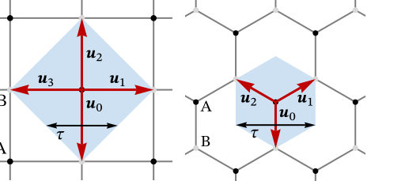
<figcaption class="paper-figure-caption"><b>Fig 1.</b> FIG. 1. Nearest-neighbor vectors 𝒖𝑏for the square (left) and honey- comb (right) lattices. In each case, the two sublattices, A and B, are labeled and the shaded polygon shows a unit cell containing one site of each sublattice. (For the square lattice, this is twice the area of the usual unit cell.) The black horizonal arrows show the distance 𝜏 between adjacent plaquette centers, given by 𝜏= |𝒖𝑏| for the square lattice and 𝜏= √</figcaption>
</figure>
<figure class="paper-figure-card">
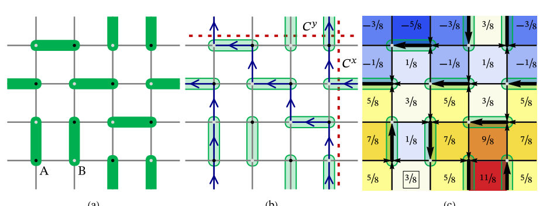
<figcaption class="paper-figure-caption"><b>Fig 2.</b> FIG. 2. (a) A configuration 𝑐of the dimer model on a 4 × 4 square lattice with periodic boundary conditions. The two sublattices, A and B, of the square lattice are labeled. (b) Corresponding directed-loop configuration (see Section III A), shown using blue arrowheads, constructed using the reference configuration 𝑐0 and directed Kasteleyn graph of Fig. 5. Edges appear on links for which the dimer occupation in 𝑐and 𝑐0 is not equal, with direction as in the graph. The dashed red lines show surfaces 𝐶𝑥and 𝐶𝑦that span the periodic boundaries (i.e., loops that wind around the handles of the torus), with normals taken in the positive Cartesian directions. (c) Configuration of flux density...</figcaption>
</figure>
<figure class="paper-figure-card">
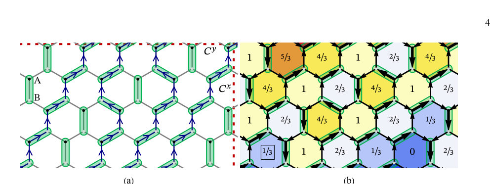
<figcaption class="paper-figure-caption"><b>Fig 3.</b> FIG. 3. (a) A configuration of the dimer model on the honeycomb lattice, with the corresponding directed-loop configuration (see Section III A) shown using blue arrowheads. The dashed red lines show the surfaces 𝐶𝑥and 𝐶𝑦, as in Fig. 2(b). (b) Configuration of flux density 𝐵𝓁(arrows) and height ℎ𝑝for 𝑐. Large and small arrows represent 𝐵𝓁= 2</figcaption>
</figure>
<figure class="paper-figure-card">
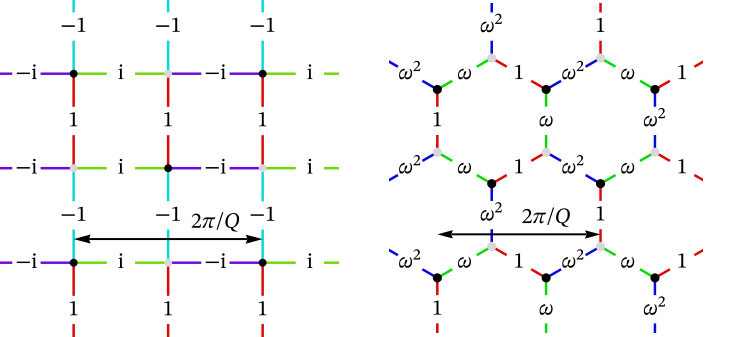
<figcaption class="paper-figure-caption"><b>Fig 4.</b> FIG. 4. Link phases 𝜗𝓁used to define the magnetization (VBS order parameter) for (a) the square lattice and (b) the honeycomb lattice, with 𝜔= e2𝜋i∕3. For both, the sublattice-A site at the bottom left is the origin. This pattern can be associated with a wavevector 𝑸= (𝑄, 0); the arrows show the corresponding spatial periods 2𝜋∕𝑄.</figcaption>
</figure>
<figure class="paper-figure-card">
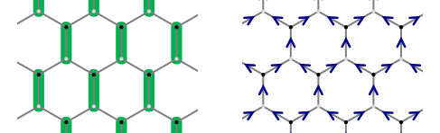
<figcaption class="paper-figure-caption"><b>Fig 5.</b> FIG. 5. Reference configuration 𝑐0 (left column) and corresponding directed Kasteleyn graph (right) on the square lattice (top row) and honeycomb lattice (bottom). Sublattices A and B are shown with black and light-gray points respectively, as labeled in Fig. 2(a) and 3(a). Lattice sites are vertices of the graph and each link gives a sin- gle directed edge. For links that are unoccupied in the reference con- figuration, the edge is directed from sublattice A to sublattice B. For links that are occupied, the edge is reversed. The loop configuration for a given dimer configuration 𝑐, such as shown Fig. 2(b) and 3(a), is given by the subset of the edges where 𝑐and 𝑐0 differ.</figcaption>
</figure>

**Summary.** The paper derives the height field theory for the 2D dimer model by mapping its partition function onto an exact Grassmann integral. Using bosonization techniques, it shows that this lattice problem maps precisely to a continuum description governed by a massless Dirac fermion, yielding explicit results for correlation functions in terms of the height field.

**Why it may be interesting.** This work provides a rigorous quantum field theoretic derivation connecting a classical statistical mechanics model (dimers) to a fundamental continuum description (height field), which is highly relevant for understanding critical phenomena in 2D systems.

Detailed structure

**Main problem.** The primary goal is to derive a continuum height field theory for the two-dimensional classical dimer model by starting from an exact Grassmann-integral representation of its partition function.

**Main result.** The derivation successfully maps the lattice physics onto a massless Dirac fermion, which via bosonization yields the known height field theory, providing explicit expressions for dimer observables in terms of the continuum height field.

**Method.** The methodology involves using an exact Grassmann-integral representation, taking the continuum limit by expanding lattice variables into slowly varying fields, and employing bosonization techniques to relate fermionic determinants to bosonic correlation functions.

**Model / system.** The system is the classical dimer model on bipartite lattices (e.g., square or honeycomb). The partition function sums over all close-packed configurations of dimers, which are characterized by local flux densities ($\mathbf{B}_\ell$) and a valence-bond-solid order parameter ($\Psi_i$).

**Key observables.** Dimer correlation functions $\langle d_{\ell_1}d_{\ell_2} \cdots d_{\ell_n}
angle$, the continuum height field $h(\mathbf{r})$, and related bosonic/fermionic correlators ($\Gamma(\mathbf{r})$).

**Important parameters / regimes.** The analysis is restricted to 2D bipartite lattices, and the derivation relies on assuming that source terms (like $\mathbf{a}$ and $M$) are slowly varying in the continuum limit.

**Assumptions / limitations.** The key assumptions involve taking the continuum limit for lattice variables ($\mathbf{a}_{ib} \propto \partial_\mu a$), relating dimer sums to Grassmann determinants, and assuming that only specific source terms (flux and VBS order) contribute to asymptotic correlations.

**Figures summary.** Figures illustrate the lattice structures (square/honeycomb), mapping dimer configurations to directed-loop patterns, and visualizing the resulting height field contours ($h_p$).

**Paper structure.** The paper proceeds by establishing the Grassmann integral representation for the partition function, performing a continuum limit expansion using slowly varying fields ($\mathbf{a}, M$), relating this determinant structure to bosonic correlation functions via bosonization, and finally deriving the explicit form of the height field theory.

Abstract

The classical dimer model on bipartite lattices hosts a Coulomb phase, characterized by algebraic correlations and topological order. Its long-wavelength properties can be described by the fluctuations of a vector field with zero divergence, which, in two dimensions, is equivalent to a continuum height model. We show how this field theory can be derived constructively for both square and honeycomb lattices, starting from an exact representation of the dimer model in terms of Grassmann integrals. Taking the continuum limit gives a massless Dirac fermion in two-dimensional Euclidean space, which, using bosonization in the path integral representation, maps exactly to the well-known height field theory, incorporating the relationship between its boundary discontinuity (or "tilt") and the flux. By including source terms coupling to the flux density and the local valence-bond-solid order parameter, which we show are the only ones required to describe the asymptotic long-distance correlations, we derive expressions for the dimer observables in terms of the height.

[↑ back to top](#top)

### [Fabless Quantum Chip Design and Commercial Production](http://arxiv.org/abs/2606.17956v1)

**Authors:** Cai, Ling Qiao, Bin Yang, Fumin Luo, WeiGui Guo, GuoRong Zhang, XueFei Liu, Qinglang Guo, Bin Wu  
**Type:** theory · **Category:** quantum information and computing · **PDF:** <https://arxiv.org/pdf/2606.17956v1>  
**Analysis basis:** full PDF text, analyzed in chunks
**Topic relevance:** `QC/QI experiment` **1/5**

↔ Scroll figures horizontally

<figure class="paper-figure-card">
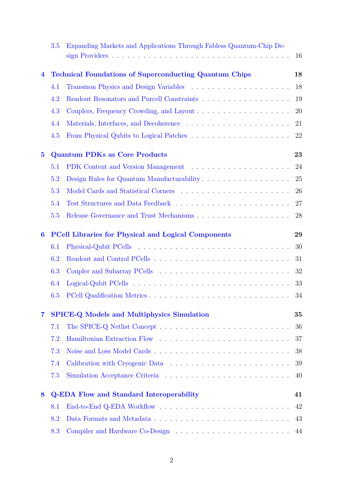
<figcaption class="paper-figure-caption"><b>Fig 1.</b> Low-resolution page preview, page 2</figcaption>
</figure>
<figure class="paper-figure-card">
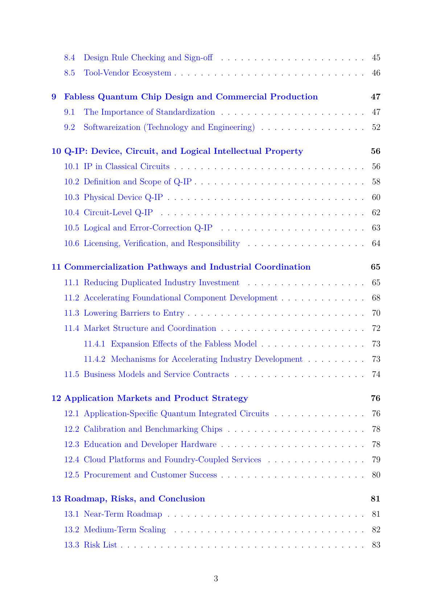
<figcaption class="paper-figure-caption"><b>Fig 2.</b> Low-resolution page preview, page 3</figcaption>
</figure>
<figure class="paper-figure-card">

<figcaption class="paper-figure-caption"><b>Fig 3.</b> Low-resolution page preview, page 4</figcaption>
</figure>
<figure class="paper-figure-card">
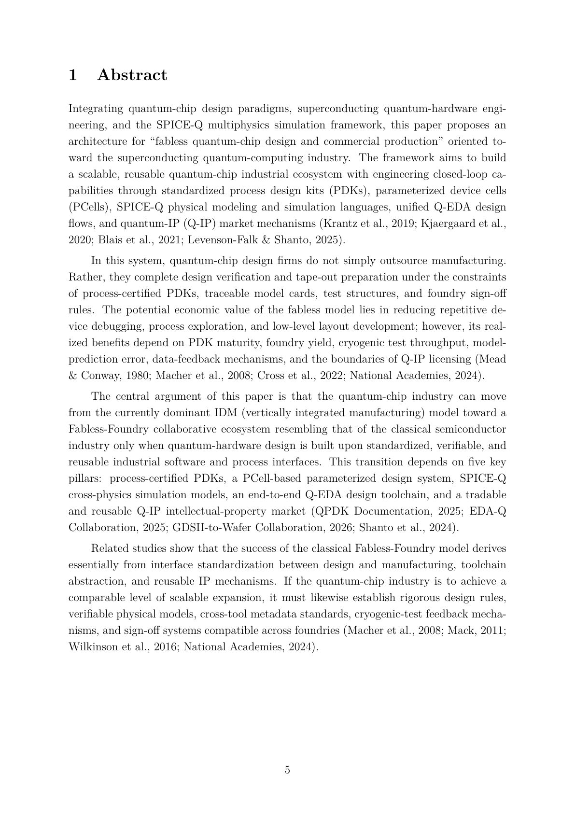
<figcaption class="paper-figure-caption"><b>Fig 4.</b> Low-resolution page preview, page 5</figcaption>
</figure>
<figure class="paper-figure-card">
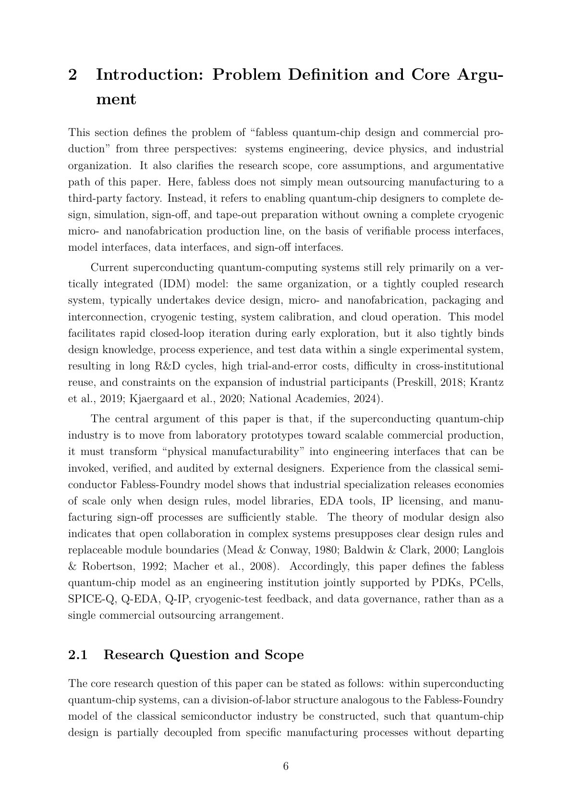
<figcaption class="paper-figure-caption"><b>Fig 5.</b> Low-resolution page preview, page 6</figcaption>
</figure>

**Summary.** This paper outlines a comprehensive fabless architecture necessary to commercialize superconducting quantum chips by mimicking the successful model of the classical semiconductor industry. It argues that moving beyond lab prototypes requires standardizing design through five key pillars: PDKs, parameterized cells, multiphysics simulation (SPICE-Q), automated EDA flows, and an IP market. Ultimately, it defines a path toward scalable, manufacturable quantum hardware by treating physical complexity as a set of verifiable software interfaces.

**Why it may be interesting.** It provides a crucial engineering roadmap, framing quantum hardware development not just as a physics problem but as an industrial systems integration challenge that requires rigorous standardization analogous to mature classical semiconductor flows.

Detailed structure

**Main problem.** The paper addresses the challenge of transitioning superconducting quantum chip development from a laboratory-based, vertically integrated model to a scalable, standardized fabless-foundry industrial ecosystem.

**Main result.** Scalability requires establishing five key pillars—PDKs, PCells, SPICE-Q simulation, Q-EDA automation, and a Q-IP market—to create verifiable, reusable software and process interfaces.

**Method.** The authors propose an architectural framework by drawing analogies from the classical semiconductor industry to define necessary industrial standards for quantum hardware design flow.

**Model / system.** The physical system is superconducting quantum chips (e.g., Transmons). The model involves a complex, multi-physics Hamiltonian ($H_{SPICE-Q}$) whose performance depends on coupling geometry, material loss, and packaging constraints.

**Key observables.** Logical error rate, Q-IP reuse rate, cross-foundry process consistency, and the overall system validation maturity ($V_{	ext{validation}}$).

**Important parameters / regimes.** PDK maturity, foundry yield, cryogenic test throughput, and the boundaries of Quantum Intellectual Property (Q-IP) licensing.

**Assumptions / limitations.** The transition assumes that establishing rigorous, standardized interfaces can overcome the inherent physical complexity and non-ideal nature of quantum devices, allowing for 'constrained decoupling' from full process ownership.

**Paper structure.** The paper progresses by first identifying the limitations of the current IDM model, then proposing a multi-pillar fabless architecture (PDKs $
ightarrow$ PCells $
ightarrow$ SPICE-Q $
ightarrow$ Q-EDA $
ightarrow$ Q-IP), and finally detailing the required continuous closed-loop feedback mechanisms for industrial maturity.

Abstract

This paper proposes a fabless quantum-chip design and production architecture for superconducting quantum computing, centered on the SPICE-Q multiphysics simulation framework. The proposed ecosystem connects process-certified quantum PDKs, parameterized device cells, traceable model cards, SPICE-Q physical modeling languages, unified Q-EDA flows, foundry sign-off rules, cryogenic test feedback, and reusable quantum IP. In this model, design firms do not merely outsource fabrication; they prepare verified tape-outs under standardized process constraints and calibrated physical models. Its economic value lies in reducing repetitive device debugging, process exploration, and low-level layout effort, while its feasibility depends on PDK maturity, foundry yield, cryogenic test throughput, model-prediction accuracy, data-feedback mechanisms, and IP licensing boundaries. We argue that superconducting quantum chips can move from the current largely vertically integrated development model toward a fabless-foundry ecosystem only when hardware design is supported by standardized, verifiable, and reusable software and process interfaces. The required pillars are certified PDKs, PCell-based parameterized design, SPICE-Q cross-physics simulation, end-to-end Q-EDA automation, and a tradable quantum-IP market. By adapting lessons from the classical semiconductor industry to quantum hardware, this framework defines a path toward scalable, manufacturable, and commercially reusable superconducting quantum-chip design.

[↑ back to top](#top)

### [Optimal Probe State for Phase Estimation Under Covariant Measurement](http://arxiv.org/abs/2606.18169v1)

**Authors:** Qipeng Qian, Christos N. Gagatsos  
**Type:** theory · **Category:** quantum information and computing · **PDF:** <https://arxiv.org/pdf/2606.18169v1>  
**Analysis basis:** full PDF text, analyzed in chunks
**Topic relevance:** `quantum measurements` **1/5**

↔ Scroll figures horizontally

<figure class="paper-figure-card">
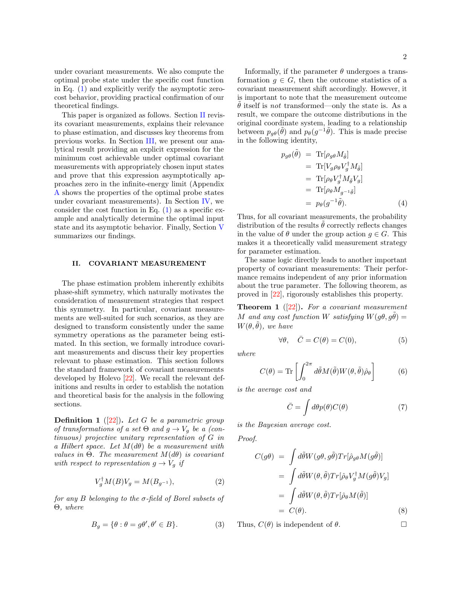
<figcaption class="paper-figure-caption"><b>Fig 1.</b> Low-resolution page preview, page 2</figcaption>
</figure>
<figure class="paper-figure-card">
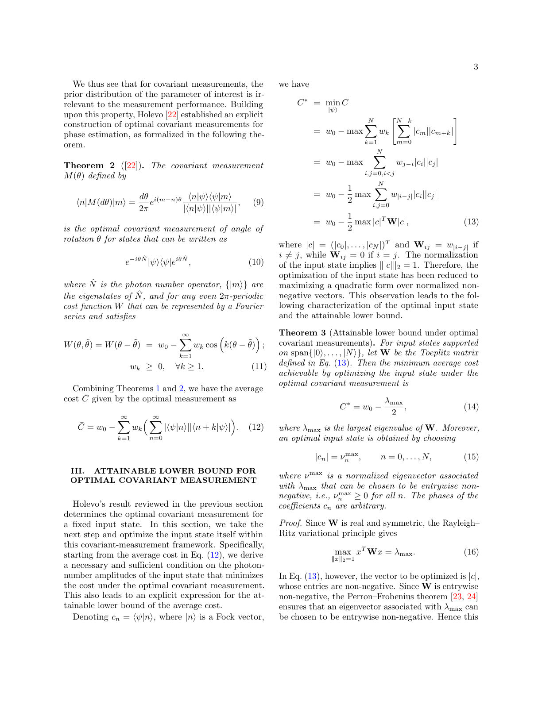
<figcaption class="paper-figure-caption"><b>Fig 2.</b> Low-resolution page preview, page 3</figcaption>
</figure>
<figure class="paper-figure-card">
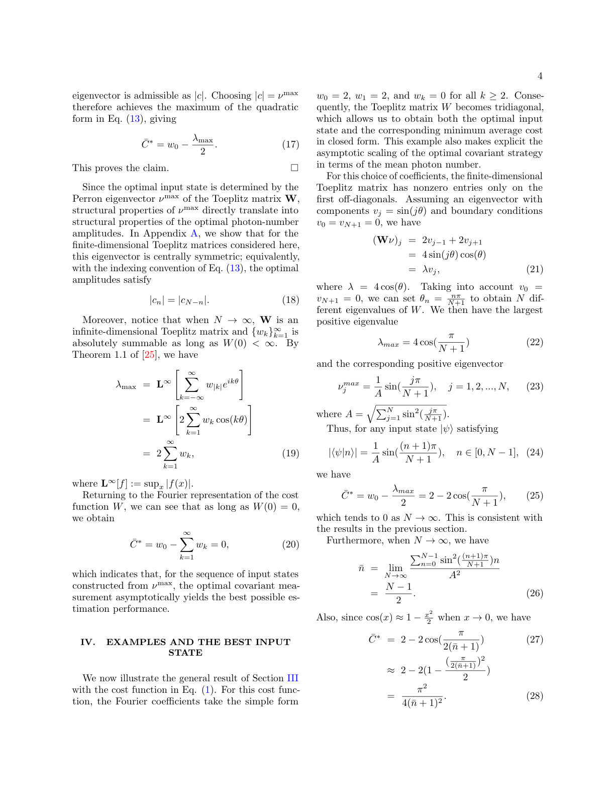
<figcaption class="paper-figure-caption"><b>Fig 3.</b> Low-resolution page preview, page 4</figcaption>
</figure>
<figure class="paper-figure-card">
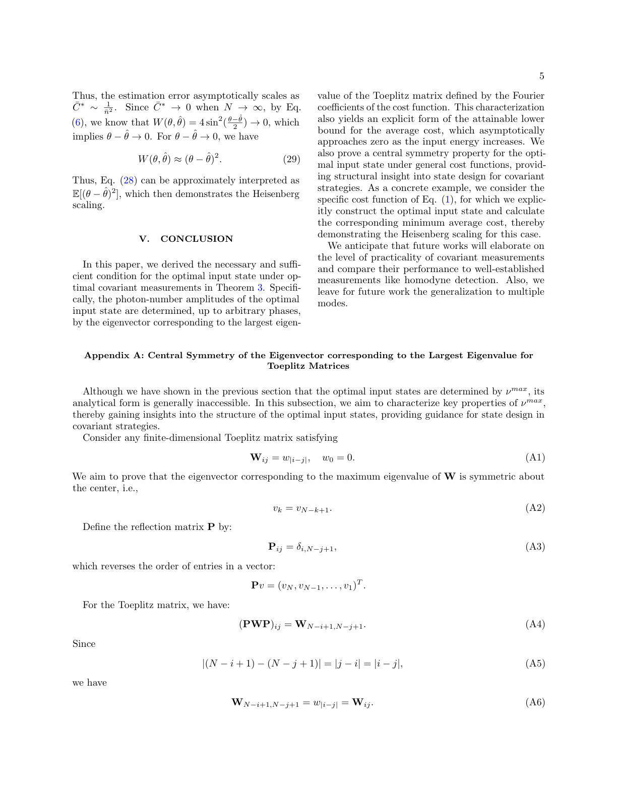
<figcaption class="paper-figure-caption"><b>Fig 4.</b> Low-resolution page preview, page 5</figcaption>
</figure>
<figure class="paper-figure-card">
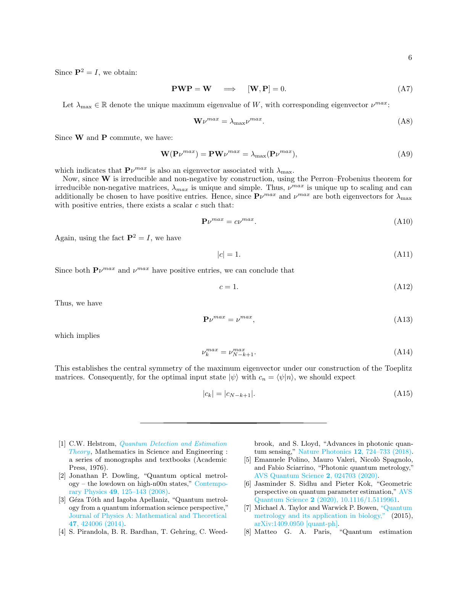
<figcaption class="paper-figure-caption"><b>Fig 5.</b> Low-resolution page preview, page 6</figcaption>
</figure>

**Summary.** This paper develops a method to find the best possible input quantum state for estimating an unknown phase shift under covariant measurement constraints. By reformulating the problem as maximizing a quadratic form involving Toeplitz matrices derived from the cost function, the authors derive explicit formulas for the minimum achievable error bound. The results confirm Heisenberg scaling in specific cases, advancing the theory of quantum metrology.

**Why it may be interesting.** This work provides fundamental theoretical tools for quantum metrology, specifically characterizing the ultimate limits of precision achievable in phase estimation by optimizing the resource state itself, which is crucial for designing practical quantum sensors.

Detailed structure

**Main problem.** The paper aims to optimize the input quantum state $|\psi
angle$ used for phase estimation when measurements are restricted to covariant types.

**Main result.** The optimal input state coefficients are determined by the eigenvector corresponding to the largest eigenvalue of a Toeplitz matrix derived from the cost function. This leads to an explicit lower bound on the average estimation cost, which can achieve Heisenberg scaling in certain limits.

**Method.** The authors optimize the average cost functional over all possible input states, reducing the problem to maximizing a quadratic form involving the Fourier coefficients of the cost function using techniques related to Toeplitz matrices and variational principles.

**Model / system.** The system models single-mode quantum phase estimation ($	heta$) where the measurement process is constrained to be covariant. The analysis uses the Fock coefficients ($c_n = \langle\psi|n
angle$) of the input state $|\psi
angle$ and a cost function $W(	heta, 	ilde{	heta})$.

**Key observables.** The minimum average estimation cost ($ar{C}^*$), the optimal input state amplitudes ($|c_n|$), and the largest eigenvalue ($\lambda_{\max}$) of the associated Toeplitz matrix.

**Important parameters / regimes.** The mean photon number (related to energy scaling), the structure of the even, $2\pi$-periodic cost function $W(	heta, 	ilde{	heta})$, and the asymptotic limit ($N 	o \infty$).

**Assumptions / limitations.** The analysis assumes the measurement is covariant and that the cost function has non-negative Fourier coefficients. The derivation relies on Holevo's framework for optimal measurements given a fixed state.

**Figures summary.** Not specified in the notes, but the results concern explicit formulas for $ar{C}^*$ and the structure of the optimal state vector derived from matrix properties.

**Paper structure.** The paper builds upon Holevo's result by optimizing over the input state. It derives necessary and sufficient conditions using quadratic forms related to Toeplitz matrices, establishes the relationship between the minimum cost and $\lambda_{\max}$, and concludes with explicit calculations for a specific sinusoidal cost function.

Abstract

We study the optimization of input states for phase estimation under covariant measurements. Building on Holevo's framework, which provides the optimal covariant measurement for a fixed input state, we further optimize over the input state itself. For a general even $2π$-periodic cost function with non-negative Fourier coefficients, we derive a necessary and sufficient condition for the optimal input state: Its Fock coefficients are determined, up to arbitrary phases, by the eigenvector corresponding to the largest eigenvalue of a Toeplitz matrix defined by the cost function. This characterization yields an explicit expression for the attainable lower bound of the average cost under optimal covariant measurements and shows that this bound asymptotically approaches zero in the infinite-energy limit. For the specific cost function $W(θ,\tildeθ)=4\sin^2[(θ-\tildeθ)/2]$, we obtain the optimal input state and the corresponding minimum average cost in closed form, demonstrating Heisenberg scaling with respect to the mean photon number.

[↑ back to top](#top)

### [Probing La-based nickelates with Ni 1$s$ core-level photoelectron spectroscopy](http://arxiv.org/abs/2606.17663v1)

**Authors:** Daisuke Takegami, Naoki Ito, Koto Fujinuma, Masato Yoshimura, Grace A. Pan, Dan Ferenc Segedin, Qi Song, Hanjong Paik, Charles M. Brooks, Hanjie Guo, Alexander C. Komarek, Takanori Taniguchi, Masaki Fujita, Julia A. Mundy, Takashi Mizokawa, Liu Hao Tjeng, Berit H. Goodge, Atsushi Hariki  
**Type:** both · **Category:** strongly correlated electrons · **PDF:** <https://arxiv.org/pdf/2606.17663v1>  
**Analysis basis:** full PDF text, analyzed in chunks
**Topic relevance:** `Keldysh / 2PI / non-Gaussian methods` **1/5**

↔ Scroll figures horizontally

<figure class="paper-figure-card">
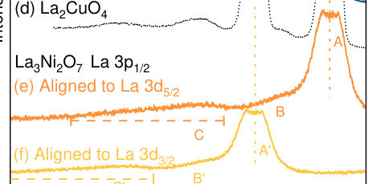
<figcaption class="paper-figure-caption"><b>Fig 1.</b> FIG. 1. (a) Ni 2p core level spectra of Nd3Ni2O7 [13]. (b,c) Overlapping Ni 2p and La 3d core level spectra of (b) La3Ni2O7 and (c) LaNiO3. (d) La 3d core level spectra of La2CuO4. (e,f) La 3p1/2 spectra of La3Ni2O7 shifted to match the centre of the (e) La 3d5/2 and (f) La 3d3/2 to illustrate the overlap of La-derived satellite features in the Ni 2p region. The binding energies of the spectra have been shifted by (a- d) 833 eV, (e) 1205 eV and (f) 1222 eV in order to show the comparison in relative energy.</figcaption>
</figure>
<figure class="paper-figure-card">
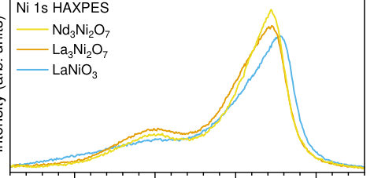
<figcaption class="paper-figure-caption"><b>Fig 2.</b> FIG. 3. Ni 1s core-level spectra of Nd3Ni2O7 (yellow line), La3Ni2O7 (orange line), and LaNiO3 (blue line).</figcaption>
</figure>
<figure class="paper-figure-card">
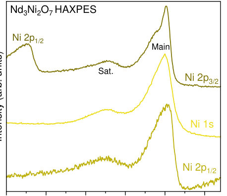
<figcaption class="paper-figure-caption"><b>Fig 3.</b> FIG. 2. Comparison of the Ni 1s core level spectra with the Ni 2p3/2 and/or Ni 2p1/2 for Nd3Ni2O7. The binding energies of the spectra have been shifted by 8332.78 eV (Ni 1s) , 871.8 eV (Ni 2p1/2), and 854.1 eV (Ni 2p3/2).</figcaption>
</figure>
<figure class="paper-figure-card">
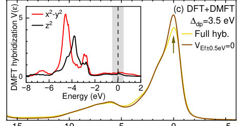
<figcaption class="paper-figure-caption"><b>Fig 4.</b> FIG. 4. (a) DFT+DMFT calculations of the Ni core-level (2p) spectra of Nd3Ni2O7 for different CT energies ∆dp, as discussed in Ref. 13. (b) Spectra calculated for ∆dp = 3.5 eV with hybridization densities uniformly scaled over the entire energy range to 95% (orange) and 90% (red) of the origi- nal value (yellow). The original hybridization density V (ε) for ∆dp = 3.5 eV is shown in the inset of panel (c). The hybridization densities V (ε) for different ∆dp are provided in Ref. 13. (c) Spectra calculated using a modified hybridization density V (ε) in which the hybridization amplitude within the energy window EF ± 0.5 eV (shaded area in the inset) is ar- tificially set to zero. The original...</figcaption>
</figure>

**Summary.** This work compares Ni 1s and Ni 2p photoelectron spectra across various La-based nickelates to probe their electronic structure. The authors argue that the deeper Ni 1s core level offers a clearer view of intrinsic correlations by avoiding spectral overlaps present in the more commonly used Ni 2p measurement. By combining experiment with DFT+DMFT calculations, they successfully map material differences onto changes in fundamental electronic parameters.

**Why it may be interesting.** The detailed spectroscopic analysis of strongly correlated nickelates using core-level photoemission spectroscopy provides direct experimental constraints on the effective Hamiltonians and correlation strengths used in theoretical models like DMFT, which is highly relevant to understanding high-Tc superconductivity mechanisms.

Detailed structure

**Main problem.** The study addresses the challenge of accurately determining the electronic structure of La-based nickelates by comparing core-level photoemission spectra from different Ni core levels.

**Main result.** The deep Ni 1s core level provides a cleaner view of intrinsic electronic excitations compared to the Ni 2p level, which suffers from spectral overlap with the La 3d states. This allows for distinguishing material variations within the Ruddlesden-Popper series.

**Method.** The research combines experimental Hard X-ray Photoelectron Spectroscopy (HAXPES) measurements with theoretical calculations using Density Functional Theory combined with Dynamical Mean-Field Theory (DFT+DMFT).

**Model / system.** The physical system is the Ruddlesden-Popper series of nickelates, including La3Ni2O7, Nd3Ni2O7, and LaNiO3. The analysis focuses on the electronic correlation effects within these layered perovskite structures.

**Key observables.** Core-level binding energies (Ni 1s vs Ni 2p), spectral line shapes, satellite features, and intensity ratios.

**Important parameters / regimes.** Charge transfer energy ($\Delta_{dp}$), hybridization strength ($V(\epsilon)$), and the specific stoichiometry of the nickelate layers.

**Assumptions / limitations.** The analysis assumes that the Ni 1s spectrum is less contaminated by neighboring orbitals compared to the Ni 2p spectrum, allowing it to probe intrinsic electronic correlations.

**Figures summary.** Figures compare Ni 1s and Ni 2p spectra across different nickelates (e.g., Nd3Ni2O7 vs La3Ni2O7), demonstrating spectral overlaps in Ni 2p and showing material-dependent variations in the cleaner Ni 1s spectrum.

**Paper structure.** The paper progresses by first identifying the spectroscopic limitations of the Ni 2p level due to overlap, then presenting evidence from Ni 1s measurements that it is a viable alternative. Finally, theoretical calculations are used to model how changes in electronic parameters ($\Delta_{dp}$, hybridization) account for observed spectral differences between related compounds.

Abstract

We present a comparative Ni core level photoemission study of La$_3$Ni$_2$O$_7$, Nd$_3$Ni$_2$O$_7$, and LaNiO$_3$ using both the Ni $2p$ and the Ni $1s$. We address the challenges in analyzing the widely investigated Ni $2p$ spectra arising from the substantial overlap in energy of the Ni $2p$ with the La $3d$. We show that on the other hand the deep Ni $1s$ core level does provide a clean view on the intrinsic electronic excitations and we highlight its potential to resolve detailed differences in the electronic structure within the strongly correlated Ruddlesden-Popper series La$_{n+1}$Ni$_n$O$_{3n+1}$.

[↑ back to top](#top)

### [Split-Head Quantum Generative Adversarial Network for Crystalline Material Discovery](http://arxiv.org/abs/2606.17852v1)

**Authors:** Huan-Ming Chang, Jen-Yu Chang, Tsung-Wei Huang, En-Jui Kuo  
**Type:** theory · **Category:** disordered systems and neural networks · **PDF:** <https://arxiv.org/pdf/2606.17852v1>  
**Analysis basis:** full PDF text, analyzed in chunks
**Topic relevance:** `methods for driven-dissipative` **1/5**

↔ Scroll figures horizontally

<figure class="paper-figure-card">
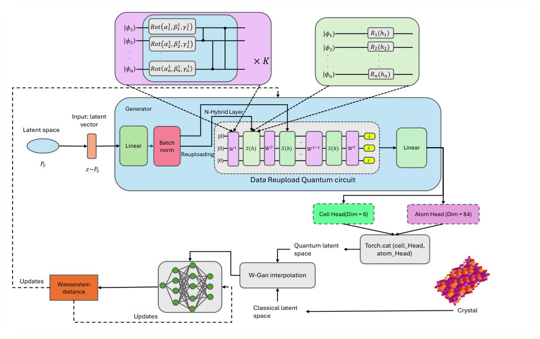
<figcaption class="paper-figure-caption"><b>Fig 1.</b> Fig. 1. Comprehensive operational schematic of the SH-QGAN framework. The diagram illustrates the data re-uploading sequence of the latent vector z, the internal topology of the parameterized quantum circuit (highlighting rotation gates and entanglement layers), and the physical bifurcation of the resultant expectation values into the independent Cell and Atom decoding heads before final Wasserstein evaluation.</figcaption>
</figure>
<figure class="paper-figure-card">
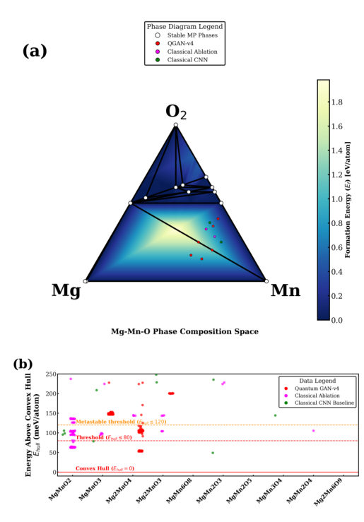
<figcaption class="paper-figure-caption"><b>Fig 2.</b> Fig. 2. Thermodynamic evaluation of generative models. Top (Figure 2.a): Ternary phase diagram of the Mg-Mn-O composition space. The background color gradient indicates absolute Formation Energy (Ef) in eV/atom. White dots denote stable baseline phases defining the true Convex Hull. Red, purple, and green dots represent structures generated by the QGAN-v4, Classical Ablation, and Classical CNN, respectively. Bottom (Figure 2.b): Energy Above Convex Hull (Ehull) stability distribution. The solid red line designates perfect stability (Ehull = 0), while the boundaries at 0.08 eV/atom and 0.12 eV/atom denote the metastable threshold and observation limit. The QGAN- v4 discoveries (red) cluster...</figcaption>
</figure>
<figure class="paper-figure-card">
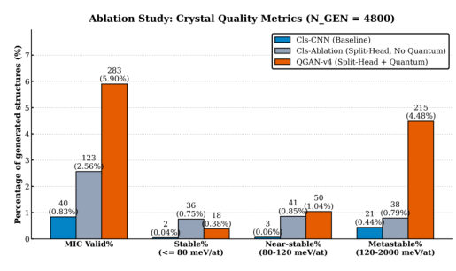
<figcaption class="paper-figure-caption"><b>Fig 3.</b> Fig. 3. Three-Way Ablation Benchmark Bar Chart visualizing the hit-rate percentage across MIC-Valid, Stable, Near-stable, and Metastable outputs for the generative models. The massive delta between the QGAN-v4 and classical models provides definitive mathematical proof justifying the quantum topology.</figcaption>
</figure>
<figure class="paper-figure-card">
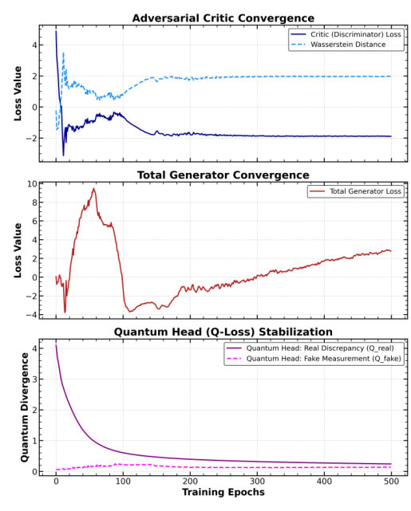
<figcaption class="paper-figure-caption"><b>Fig 4.</b> Fig. 4. Training loss convergence of the SH-QGAN over 500 epochs. Top: Adversarial Critic convergence showing the stabilization of the Wasserstein distance. Middle: Total Generator convergence maintaining active gradients. Bottom: Quantum Head (Q-Loss) stabilization, indicating the model success- fully minimizes compositional discrepancy.</figcaption>
</figure>
<figure class="paper-figure-card">
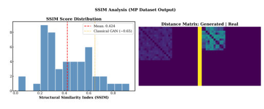
<figcaption class="paper-figure-caption"><b>Fig 5.</b> Fig. 5. Structural Similarity Index Measure (SSIM) analysis confirming true generation versus dataset memorization. The distribution highlights a low mean similarity score (0.483), proving the SH-QGAN invents novel topologies rather than copying training references.</figcaption>
</figure>

**Summary.** This paper introduces a Split-Head Quantum GAN (SH-QGAN) to accelerate the discovery of novel crystalline materials. By separating the prediction of global lattice parameters from local atomic coordinates, the model leverages quantum circuits to achieve unparalleled structural diversity while maintaining high thermodynamic precision. The results demonstrate that combining quantum feature mapping with physics-informed architectural priors is a powerful paradigm for generative materials science.

**Why it may be interesting.** While focused on condensed matter structure generation, the core methodology—using quantum circuits to enhance generative sampling in high-dimensional physical spaces—is highly relevant for developing ML models that respect underlying physical symmetries and constraints.

Detailed structure

**Main problem.** Discovering novel, stable crystalline materials is limited by classical generative models' inability to explore vast 3D chemical space without mode collapse.

**Main result.** The SH-QGAN successfully generates structurally diverse candidates that exhibit superior thermodynamic stability and geometric validity compared to purely classical ablation models.

**Method.** A physics-informed Split-Head Quantum GAN (SH-QGAN) is employed, which decouples lattice parameter prediction from atomic coordinate generation using quantum circuits for enhanced exploration.

**Model / system.** The system studied is the Mg-Mn-O crystalline material space. The model uses an SH-QGAN architecture with a classical WGAN-GP discriminator to generate structures by predicting global cell parameters and local atomic coordinates separately.

**Key observables.** Thermodynamic stability (Energy Above Convex Hull, E_hull), Topological Validity Rate, Structural Similarity Index Measure (SSIM), and electronic bandgap (3.07 eV for the candidate).

**Important parameters / regimes.** The model is evaluated on a constrained core dataset of Mg-Mn-O structures; training involves specific learning rates and micro-batch sizes.

**Assumptions / limitations.** The primary assumption is that decoupling lattice bounds from atomic coordinates (Split-Head) allows the quantum circuit to independently provide necessary spatial diversity beyond classical architectural constraints.

**Figures summary.** Figures illustrate the SH-QGAN schematic, loss convergence over epochs, structural hit-rate comparisons against ablation models, and electronic band structures confirming insulating properties for generated candidates.

**Paper structure.** The paper introduces the problem of generative materials discovery, details the SH-QGAN architecture (decoupling heads), presents training methodologies using WGAN-GP, evaluates performance by comparing it to a classical ablation model, and concludes with DFT validation of top candidates.

Abstract

The discovery of novel crystalline materials is a critical challenge in computational materials science, often limited by the spatial representation limitations and mode collapse typical of classical generative models. Traditionally, developing Quantum GANs for continuous 3D space is hindered by the limited capacity of near-term hardware. To overcome this, we adapt a physics-informed "split-head" architecture right from the quantum trunk to explicitly decouple macroscopic lattice bounds from microscopic atomic coordinates, significantly maximizing resource efficiency. This study disentangles the contributions of quantum circuits from these architectural priors by evaluating a Split-Head Quantum Generative Adversarial Network against an architecture-matched classical ablation model. Evaluated on the highly constrained Mg-Mn-O system, the results reveal a highly nuanced performance dichotomy between the advanced models. The architecture-matched classical ablation model demonstrated superior thermodynamic precision. Conversely, the integration of quantum circuits in the SH-QGAN drove unparalleled structural breadth and latent space exploration, more than doubling the ablation's geometric validity and successfully generating novel, metastable candidates converging on the Mg2MnO4 stoichiometry. These findings clarify that while architectural separation of cell and atom generation drives strict thermodynamic precision, quantum feature mapping independently provides the spatial diversity necessary to overcome mode collapse. Both mechanisms offer distinct, complementary enhancements for the generative discovery of advanced materials.

[↑ back to top](#top)

## Other papers (8)

*Papers from primary archives without highlighted authors or any topic match. Click to expand.*

Show other papers

### [Approximately Decoding the Colour Code](http://arxiv.org/abs/2606.18035v1)

**Authors:** Mark Walters  
**Type:** theory · **Category:** quantum information and computing · **PDF:** <https://arxiv.org/pdf/2606.18035v1>  
**Analysis basis:** full PDF text, analyzed in chunks

↔ Scroll figures horizontally

<figure class="paper-figure-card">
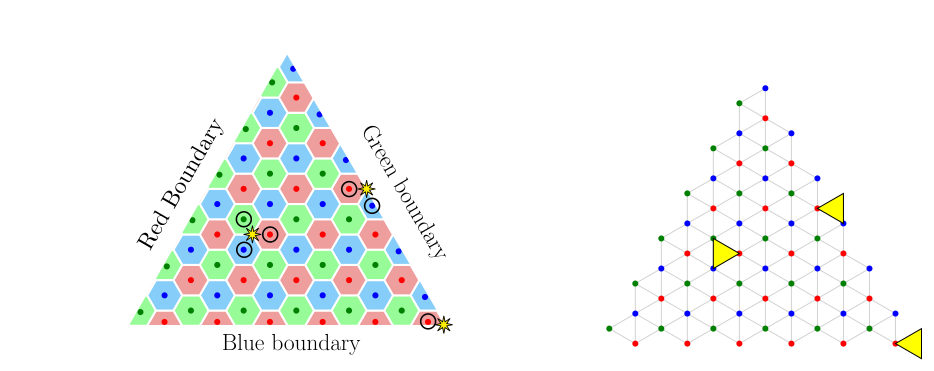
<figcaption class="paper-figure-caption"><b>Fig 1.</b> Figure 1: The colour code and its error model. (a) The 6.6.6 colour code (with boundary). There are data qubits on the vertices of a hexagonal lattice and the checks are the coloured faces. An X-error on a bulk data qubit (the yellow star in the middle of the picture) triggers the three Z-checks shown ringed in black. However, an X-error on a qubit lying on a boundary, only triggers the two checks (faces) containing it (for example the yellow star on the middle right boundary); and if the error occurs it at a corner, it only triggers the single check that it is contained in (the yellow star in the bottom right). (b) The dual lattice of the colour code shown in (a). In this figure the nodes...</figcaption>
</figure>
<figure class="paper-figure-card">
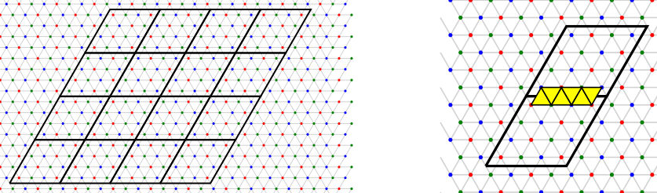
<figcaption class="paper-figure-caption"><b>Fig 2.</b> Figure 2: (a) A rhombus consisting of sixteen tiles. (b) Two adjacent tiles with six errors joining them: one of each colour-orientation.</figcaption>
</figure>
<figure class="paper-figure-card">
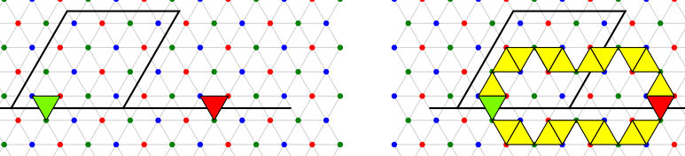
<figcaption class="paper-figure-caption"><b>Fig 3.</b> Figure 3: (a) Given an error f (the red triangle) look in the nearest portal tile (the rhombus shown) and pick the error p with the same colour-orientation (the green triangle) in the nearest portal tile (the tile shown). (b) We can join the red error to the green error by two ‘paths’ as shown: the set of all the shown errors has no syndrome, so the syndrome of the combined yellow and green errors (together these form Ef) is the same as the syndrome of the red error.</figcaption>
</figure>
<figure class="paper-figure-card">
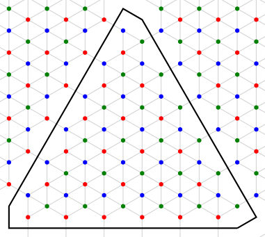
<figcaption class="paper-figure-caption"><b>Fig 4.</b> Figure 4: The distance 11 reduced colour code – the triangular region T shows the embedding of the bounded colour code. We have omitted the checks on the boundary of the triangle as they are not enforced in the reduced colour code. The two key points of the reduced code are that it is infinite so we can apply the modifications we used in Section 5, and if an error set is entirely inside T then its syndrome is identical in the bounded colour code and the reduced colour code.</figcaption>
</figure>
<figure class="paper-figure-card">
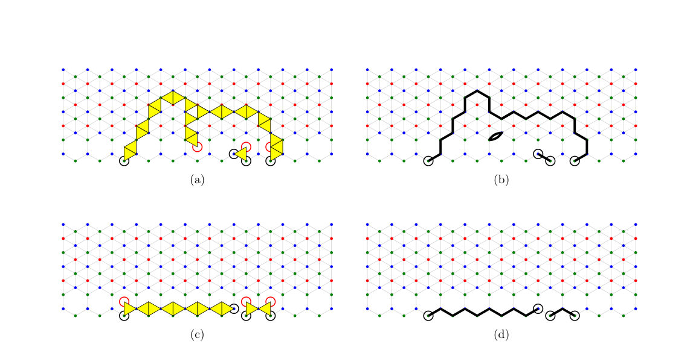
<figcaption class="paper-figure-caption"><b>Fig 5.</b> Figure 5: The four steps in the post-processing described in Lemma 12; working clockwise from the top left: (a) we start with the original error-set. Top right (b): we have the error-set viewed as edges; note one edge (shown as two arcs) is actually a double edge so cancels with itself. Then bottom right (d) we have the projected edge error-set, and then bottom left (c) the actual post-processed error-set. We see that the syndrome of the two sets is the same except for the third row (nodes circled in red).</figcaption>
</figure>

**Summary.** This paper proves that one can find an error-set in the colour code whose weight approximates the true minimum weight decoding within an arbitrary factor $(1+\epsilon)$ using only polynomial time. This result demonstrates that approximate quantum decoding is computationally feasible, despite the underlying exact problem being NP-hard.

**Why it may be interesting.** This work directly addresses the computational complexity limits of quantum error correction, providing a theoretical breakthrough by showing that approximate decoding is tractable even when exact decoding is NP-hard.

Detailed structure

**Main problem.** The core problem is determining whether approximate minimum weight decoding for quantum error-correcting codes, specifically the colour code, can be achieved in polynomial time.

**Main result.** The authors prove that it is possible to find an error-set whose weight is within $(1+\epsilon)$ of the true minimum weight decoding in polynomial time, showing approximate decoding is not NP-hard.

**Method.** The approach adapts techniques from solving Euclidean optimization problems (like Arora's work), using dynamic programming and imposing structural constraints (portal respecting) to reduce the problem complexity iteratively.

**Model / system.** The system modeled is the colour code, defined on an infinite hexagonal lattice or a finite region thereof. It is used as a quantum error-correcting code for detecting errors (X-errors) that generate a measurable syndrome.

**Key observables.** Syndrome ($S$), minimum weight decoding ($	ext{OPT}$), and the resulting approximate error-set weight $|E|$.

**Important parameters / regimes.** Approximation factor $\epsilon$, code distance $d$, lattice size parameters $L$ and $M$.

**Assumptions / limitations.** The initial polynomial algorithm derived is noted to be impractically large in its complexity, requiring significant theoretical leaps for practical implementation.

**Figures summary.** Figures illustrate the colour code structure on lattices (hexagonal/triangular), how errors trigger checks based on location (bulk/boundary), and geometric decompositions using rhombuses or hexagons to constrain error sets.

**Paper structure.** The paper builds by first tackling the general approximation problem, then applying techniques involving lattice decomposition (rhombus tiling) and imposing structural constraints ('portal respecting') via dynamic programming. Finally, it refines this process for specific bounded regions of the code.

Abstract

Recently we showed that minimum weight decoding in the (6.6.6 planar) colour code is NP-hard. However, it remained an open question as to whether it was possible to approximate the minimum weight decoding arbitrarily closely in polynomial time. In this paper we prove that it is possible: for any $\varepsilon>0$ there is an polynomial time algorithm that, given a syndrome, can find an error-set generating that syndrome whose weight is at most $1+\varepsilon$ times the weight of the minimum weight decoding. As a consequence we see that, for any $\varepsilon>0$, there is a polynomial time algorithm that can correct all errors of weight up to $(1-\varepsilon)d/2$ in the distance $d$ colour code (so almost up to the theoretical $d/2$ limit).   The polynomial we give is impractically large, but it does open the door for sensible polynomial time algorithms that approximate minimum weight decoding and, in particular, shows that approximate decoding is not NP-hard.

[↑ back to top](#top)

### [Asymptotically Optimal Circuit Depth for Diagonal Unitary Synthesis and Compilation on Two-Dimensional Grids](http://arxiv.org/abs/2606.17589v1)

**Authors:** Chengzhuo Xu, Xiao Chen, Zhihao Liu, Zhigang Li  
**Type:** theory · **Category:** quantum information and computing · **PDF:** <https://arxiv.org/pdf/2606.17589v1>  
**Analysis basis:** full PDF text, analyzed in chunks

↔ Scroll figures horizontally

<figure class="paper-figure-card">
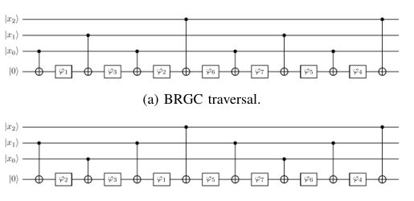
<figcaption class="paper-figure-caption"><b>Fig 1.</b> Fig. 1: Two equivalent basic Gray Path circuits for n = 3: different transition sequences realize the same commuting product of Walsh phases. Phase labels abbreviate the angles φs.</figcaption>
</figure>
<figure class="paper-figure-card">
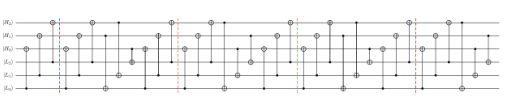
<figcaption class="paper-figure-caption"><b>Fig 2.</b> Fig. 2: CNOT skeletons of the two local mixing modules for nH = nL = 3. Dashed split lines mark the insertion slots (one per step), empty until phases are inserted.</figcaption>
</figure>
<figure class="paper-figure-card">
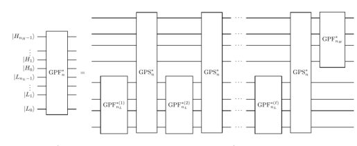
<figcaption class="paper-figure-caption"><b>Fig 3.</b> Fig. 3: Recursive composition of the GPF and GPF∗skele- tons; both carry no phase gates, which are inserted into the slots of their GPS/GPS∗modules (Fig. 2a).</figcaption>
</figure>
<figure class="paper-figure-card">
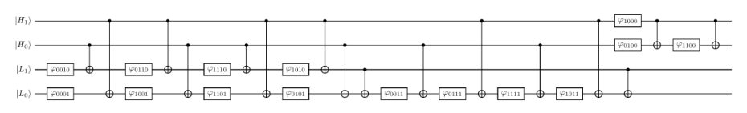
<figcaption class="paper-figure-caption"><b>Fig 4.</b> Fig. 4: Complete GPF phase-insertion circuit for n = 4, obtained by filling every insertion slot of the 4-qubit GPF skeleton. Each phase label φs is indexed by a four-bit Walsh mode.</figcaption>
</figure>
<figure class="paper-figure-card">
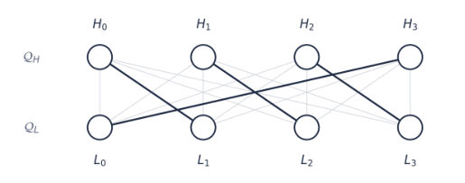
<figcaption class="paper-figure-caption"><b>Fig 5.</b> Fig. 7: Bipartite connectivity abstraction of GPS. Gray edges represent cross-group connections the top-level GPS may access across different steps; black edges illustrate one specific cyclic-offset matching.</figcaption>
</figure>

**Summary.** The paper develops a theoretically optimal method (GPF) for synthesizing diagonal unitary gates. Crucially, it proves that this optimal complexity is maintained when mapping the abstract circuit onto a physically constrained two-dimensional nearest-neighbor grid. This provides essential, closed-form resource estimates that overcome the limitations of heuristic compilation methods.

**Why it may be interesting.** This work provides concrete, analytically derived resource estimates for complex quantum operations on realistic hardware architectures, directly addressing the gap between theoretical circuit design and physical implementation constraints relevant to AMO platforms like trapped ions or superconducting qubits.

Detailed structure

**Main problem.** The core problem is developing an asymptotically optimal circuit depth for synthesizing and compiling diagonal unitary operations on quantum hardware constrained by nearest-neighbor connectivity.

**Main result.** The authors show that the asymptotically optimal depth, $O(2^n/n)$, achieved in all-to-all connectivity using a Gray-Path Framework (GPF), is preserved when compiled onto a two-dimensional nearest-neighbor grid. Furthermore, they detail space-time trade-offs to reduce this depth by factors of $k$.

**Method.** The work combines theoretical circuit synthesis (using recursive decomposition into high/low subspaces) with rigorous compilation techniques that map logical connectivity requirements onto physical 2D lattice movements using offset states and SWAP layers.

**Model / system.** The system involves quantum circuits realizing $n$-qubit diagonal unitaries, $\Lambda_n(	heta)$. The target hardware is modeled as a two-dimensional nearest-neighbor grid, with extensions to linear chains. The synthesis relies on the Gray-Path Framework (GPF) structure.

**Key observables.** Circuit depth ($R_z$ and CNOT layers), gate count, and asymptotic complexity bounds ($\Theta(2^n/n)$).

**Important parameters / regimes.** The number of qubits ($n$), the grid topology (2D nearest-neighbor vs. all-to-all), and the space-time trade-off factor ($k$).

**Assumptions / limitations.** General-purpose compilers relying on heuristic search are intractable at scale; the analysis assumes the existence of a low-jump Gray code sequence for optimal routing.

**Figures summary.** Figures illustrate the recursive structure of GPF, show the mapping onto the two-row grid using offset states (e.g., Fig. 8), and plot normalized depth/gate count convergence curves demonstrating asymptotic optimality compared to search-based routers.

**Paper structure.** The paper progresses from establishing the optimal synthesis complexity via GPF in all-to-all connectivity, then details the mapping of this structure onto a two-row nearest-neighbor grid using offset states and SWAP layers. Finally, it analyzes depth-space trade-offs by replicating phase layers across additional rows.

Abstract

Diagonal unitaries are a fundamental but resource-intensive class of quantum operations, arising as the phase separators of QAOA and the time-evolution blocks of Hamiltonian simulation. Under all-to-all connectivity their optimal depth is established, but on nearest-neighbor hardware general-purpose compilers fall back on heuristic search, which yields no analyzable cost bound and becomes intractable at the very sizes where depth is the bottleneck. We address synthesis and compilation jointly. On the synthesis side, we develop a Gray-Path Framework (GPF) that realizes any $n$-qubit diagonal unitary in asymptotically optimal $R_z$ and CNOT depth $O(2^n/n)$ without ancillas. Our main result is that compiling GPF onto a two-dimensional nearest-neighbor grid preserves this optimality: routing adds depth $Θ(2^n/n)$ and gate count $Θ(2^n)$. Because GPF fixes its entire interaction structure in advance, routing reduces to scheduling a known sequence, with no heuristic search. We give the construction both with and without ancillas: the ancilla-free, cost-optimized layout is a two-row grid, and a $2k$-row layout introduces a space--time tradeoff that cuts depth by $1/k$ while remaining asymptotically optimal for the enlarged register; both are deterministic and analyzed in closed form. The same complexity is also attained on a linear nearest-neighbor chain, so the preservation is topology-independent, holding on any architecture that contains such a chain. All routing bounds are closed-form, giving the concrete resource estimates that heuristic compilers cannot provide at scale.

[↑ back to top](#top)

### [Breaking the bicycle frame: Coset-based quantum LDPC codes](http://arxiv.org/abs/2606.17268v1)

**Authors:** Arda Aydin, Itzhak Tamo, Alexander Barg  
**Type:** theory · **Category:** quantum information and computing · **PDF:** <https://arxiv.org/pdf/2606.17268v1>  
**Analysis basis:** full PDF text, analyzed in chunks

↔ Scroll figures horizontally

<figure class="paper-figure-card">
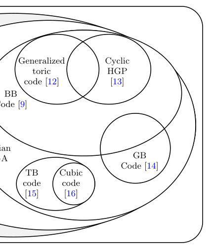
<figcaption class="paper-figure-caption"><b>Fig 1.</b> FIG. 1: Various quantum LDPC codes and their relationship with each other.</figcaption>
</figure>
<figure class="paper-figure-card">
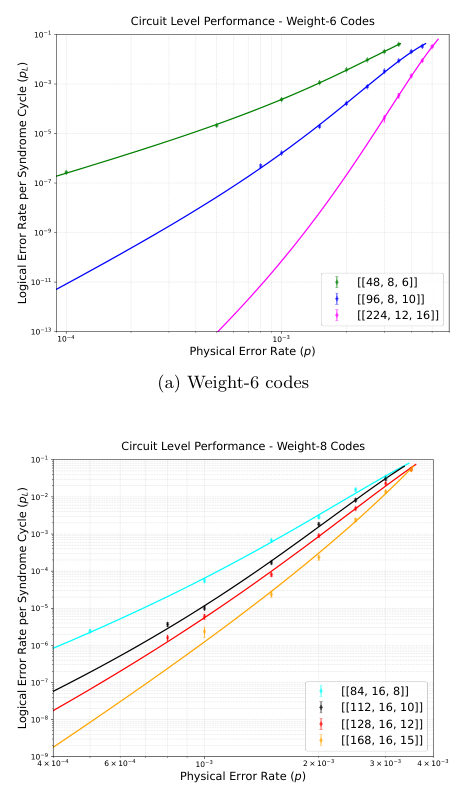
<figcaption class="paper-figure-caption"><b>Fig 2.</b> FIG. 2: Logical error rate 𝑝𝐿as a function of the physical error rate 𝑝for (a) weight-6 and (b) weight-8 𝑄𝐻 𝐺(a, b) codes under the standard circuit-level noise model. The numerical data points represent Monte Carlo simulations, while the solid curves are obtained using the fitting formula ˜𝑝𝐿(𝑝) = 𝑝𝑑circ/2𝑒𝛼+𝛽𝑝+𝛾𝑝2. All codes were decoded using the BP-OSD decoder.</figcaption>
</figure>
<figure class="paper-figure-card">
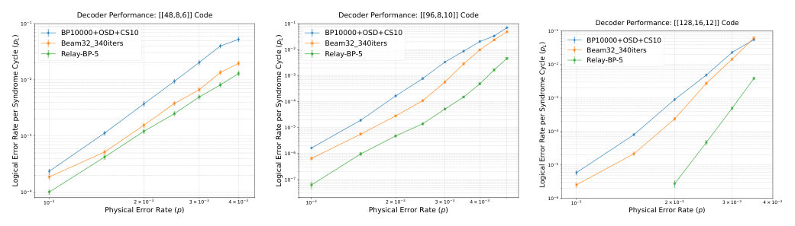
<figcaption class="paper-figure-caption"><b>Fig 3.</b> FIG. 3: Logical error rate 𝑝𝐿as a function of physical error rate 𝑝for various 𝑄𝐻 𝐺(a, b) codes under different decoders: (a) the [[48, 8, 6]] code, (b) the [[96, 8, 10]] code, and (c) the [[128, 16, 12]] code.</figcaption>
</figure>

**Summary.** This paper introduces a generalized group-theoretic construction method for quantum LDPC codes by utilizing the action of a group on its cosets. This framework expands beyond previous constructions, yielding new high-performance codes whose parameters and noise thresholds are analyzed. The authors also provide systematic methods to build efficient syndrome extraction circuits for these novel codes.

**Why it may be interesting.** This work provides a powerful algebraic tool (group theory) to generate structured quantum codes, which is crucial for designing hardware-efficient error correction protocols in superconducting or trapped-ion platforms.

Detailed structure

**Main problem.** The primary goal is to construct novel quantum Low-Density Parity-Check (LDPC) codes that surpass the limitations of existing constructions, particularly those based on Two-Block Group Algebra (2BGA) codes.

**Main result.** A new coset-based construction method is introduced using group actions on cosets, yielding several concrete examples of high-performing quantum LDPC codes with parameters like [[48, 8, 6]].

**Method.** The authors develop a general framework based on the action of a group G on the cosets of its subgroup H to define parity-check matrices for CSS quantum codes.

**Model / system.** The model is theoretical: constructing fault-tolerant quantum error correction codes, specifically two-block CSS quantum LDPC codes defined by group algebra actions $Q^H_G(a, b)$.

**Key observables.** Code parameters $[[n, k, d]]$, achievable syndrome extraction circuit depth ($w+2$), and noise thresholds ($\approx 0.65\%$ for weight-6 family).

**Important parameters / regimes.** Group structures $(G, H)$, stabilizer weights ($w_a, w_b$), code length $n=2[G:H]$, and thickness $	heta$ of the Tanner graph.

**Assumptions / limitations.** The analysis relies on establishing planarity properties for subgraphs related to syndrome extraction cycles and assuming specific structural constraints on group elements to simplify the search space.

**Figures summary.** Figures illustrate relationships between various quantum LDPC codes (e.g., BB Code, ZSZ Code) and detail the structure of the wheel graph used in syndrome extraction analysis.

**Paper structure.** The paper progresses from introducing the general coset-based construction to deriving mathematical properties like thickness bounds using planarity arguments, systematically searching for new code examples, and finally detailing the circuit implementation for syndrome extraction.

Abstract

Generalizing the construction of two-block group algebra (2BGA) codes, we introduce a family of two-block quantum LDPC codes constructed using the action of a group on the cosets of its subgroup. This replaces the regular group actions of the earlier two-block constructions and significantly expands the search space, yielding new quantum LDPC codes outside the 2BGA family. Through a computer search, we identify several new quantum LDPC codes, including weight-6 codes with parameters $[[48,8,6]]$, $[[96,8,10]]$, and $[[224,12,16]]$, as well as weight-8 codes with parameters $[[84,16,8]]$, $[[112,16,10]]$, $[[128,16,12]]$, and $[[168,16,15]]$. Furthermore, we introduce a maximally packed syndrome extraction schedule of depth $w+2$, including initialization and measurement steps, for any code with a maximum stabilizer weight of $w$ from our family. Under a standard circuit-level noise model, our codes, when decoded using BP-OSD, perform competitively with BB codes, achieving thresholds of $\approx0.65\%$ for the weight-6 family and $\approx0.35\%$ for the weight-8 family. Finally, we introduce a group-theoretic framework to generate sequences of graph-based covers of 2BGA codes, recovering and extending recent results on code constructions of this type.

[↑ back to top](#top)

### [Canonical regularization of the stationary Coulomb problem and an Aufbau-like spectral ordering](http://arxiv.org/abs/2606.17359v1)

**Authors:** Anand Aruna Kumar  
**Type:** theory · **Category:** other · **PDF:** <https://arxiv.org/pdf/2606.17359v1>  
**Analysis basis:** full PDF text, analyzed in chunks

↔ Scroll figures horizontally

<figure class="paper-figure-card">
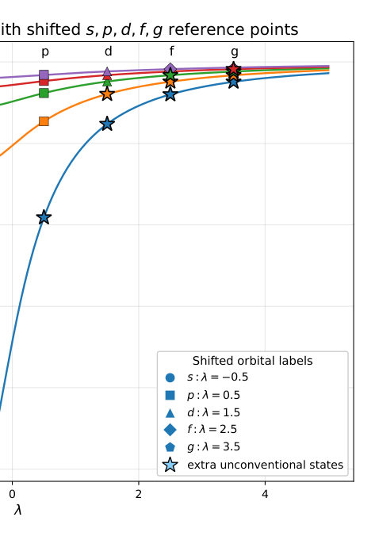
<figcaption class="paper-figure-caption"><b>Fig 1.</b> Figure 1: Regularized energy Enr,λ as a function of the separation label λ.</figcaption>
</figure>
<figure class="paper-figure-card">
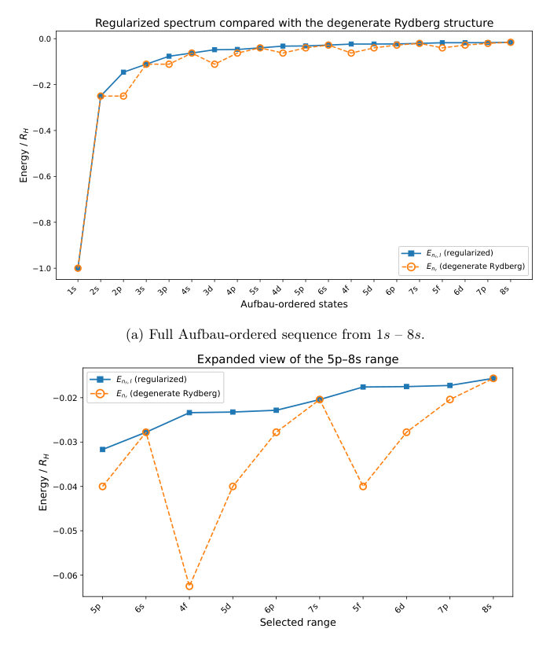
<figcaption class="paper-figure-caption"><b>Fig 2.</b> Figure 2: Comparison of the degenerate Rydberg energies Enr with the shifted regularized spectrum Enr,l along the Aufbau-ordered sequence. The upper panel shows the full displayed range, while the lower panel expands the higher-state region where the energy separation is smaller.</figcaption>
</figure>

**Summary.** The paper analyzes the hydrogen atom using a regularized de Broglie-Bohm quantum mechanical framework. By imposing canonical constraints, the authors modify the standard radial and angular equations, leading to solutions involving generalized special functions with non-integral parameters. This regularization mathematically forces the energy spectrum to exhibit an Aufbau-like ordering for higher angular momentum states, lifting the inherent Coulomb degeneracy.

**Why it may be interesting.** This work is theoretically interesting because it uses advanced mathematical techniques (de Broglie-Bohm formalism, canonical regularization) applied to a fundamental physical problem (Coulomb potential) to derive an emergent structure (Aufbau principle), providing a purely mathematical mechanism for spectral splitting.

Detailed structure

**Main problem.** To investigate whether canonical regularization of the stationary Coulomb problem can intrinsically generate an Aufbau/Madelung spectral ordering, thereby lifting the inherent degeneracy found in the standard hydrogen atom model.

**Main result.** The regularized spectrum yields a sequence that follows the Aufbau/Madelung order for higher angular momentum states, while the $l=0$ sector retains the standard degenerate Rydberg sequence.

**Method.** The authors apply canonical regularization constraints to the de Broglie-Bohm representation of the Coulomb problem, leading to modified Sturm-Liouville equations solved using generalized special functions.

**Model / system.** The system analyzed is the one-center stationary Coulomb potential (hydrogen atom). The mathematical framework involves decomposing the wavefunction into amplitude and phase components within a regularized de Broglie-Bohm representation.

**Key observables.** The energy eigenvalues $E_{n,r,\lambda}$ are key observables; the spectral ordering itself is the primary result.

**Important parameters / regimes.** The regularization introduces non-integral parameters into the associated Laguerre, Legendre, and Bessel functions. The minimum labeling scheme $\lambda = l - 1/2$ is crucial for comparison.

**Assumptions / limitations.** The treatment is explicitly limited to an analytical examination of spectral ordering in a regularized one-center problem, not a replacement for full many-electron atomic structure theory (which requires considering screening and correlation).

**Figures summary.** Figure 1 illustrates the energy $E_{n_r,\lambda}$ vs $\lambda$, showing symmetry around $\lambda = -1/2$ and mapping this minimum branch to the s-sector. Figure 2 compares the degenerate Rydberg energies with the shifted regularized spectrum, demonstrating the Aufbau order.

**Paper structure.** The paper first establishes the mathematical framework by applying canonical regularization to the de Broglie-Bohm equations for the Coulomb problem. It then solves the resulting separated radial, orbital, and axial differential equations using generalized special functions. Finally, it analyzes the energy quantization condition derived from these solutions to map out the spectral ordering.

Abstract

The stationary hydrogen atom has Coulomb degeneracy across orbital levels, whereas the Aufbau/Madelung ordering is an empirical, many-electron rule established in atomic physics. We examine the hydrogen atom through a regularized de Broglie--Bohm representation, in which stationary amplitude current constraints generate separable Sturm--Liouville branches. In this formulation, the radial, orbital, and magnetic sectors acquire canonical Langer-like inverse square corrections. The modified boundary value problems allow analytical solutions and produce a hydrogen-like spectrum with regularized radial and angular indices. Consequently, radial Coulomb quantization acquires an orbital dependent shift, lifting the Coulomb degeneracy and producing a spectral ordering that follows the Aufbau/Madelung sequence.   On this basis, we construct the ordering of the regularized de Broglie--Bohm states and show that the spectral structure retains the standard degenerate Rydberg sequence in the l=0 sector. The separated amplitudes are represented by generalized special function branches, including the associated Laguerre, Legendre, and Bessel functions with non-integral parameters arising from regularized separation. Therefore, the treatment is intended as an analytical examination of spectral ordering in a regularized one center Coulomb problem rather than as a replacement for the many electron atomic structure theory.   Keywords: de Broglie--Bohm representation; Coulomb spectrum; canonical regularization; Langer correction; Sturm--Liouville equations; Aufbau principle; Madelung ordering; associated Legendre functions; associated Laguerre functions; Bessel functions.

[↑ back to top](#top)

### [Cavity method for permutation models on Cayley trees](http://arxiv.org/abs/2606.17751v1)

**Authors:** Masayuki Ohzeki  
**Type:** theory · **Category:** statistical mechanics · **PDF:** <https://arxiv.org/pdf/2606.17751v1>  
**Analysis basis:** full PDF text, analyzed in chunks

↔ Scroll figures horizontally

<figure class="paper-figure-card">
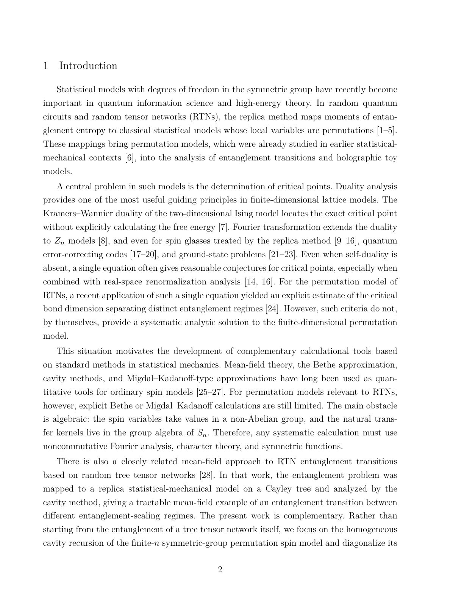
<figcaption class="paper-figure-caption"><b>Fig 1.</b> Low-resolution page preview, page 2</figcaption>
</figure>
<figure class="paper-figure-card">
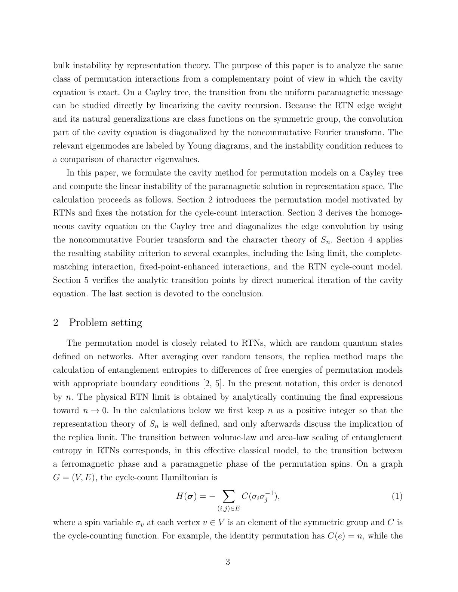
<figcaption class="paper-figure-caption"><b>Fig 2.</b> Low-resolution page preview, page 3</figcaption>
</figure>
<figure class="paper-figure-card">
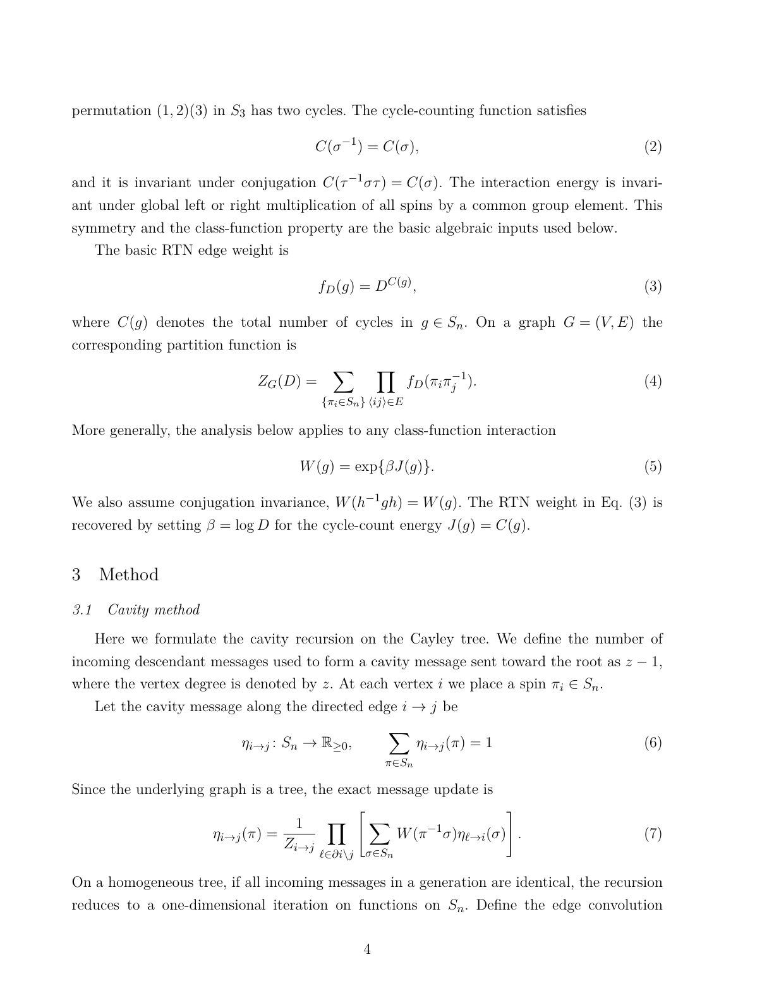
<figcaption class="paper-figure-caption"><b>Fig 3.</b> Low-resolution page preview, page 4</figcaption>
</figure>
<figure class="paper-figure-card">
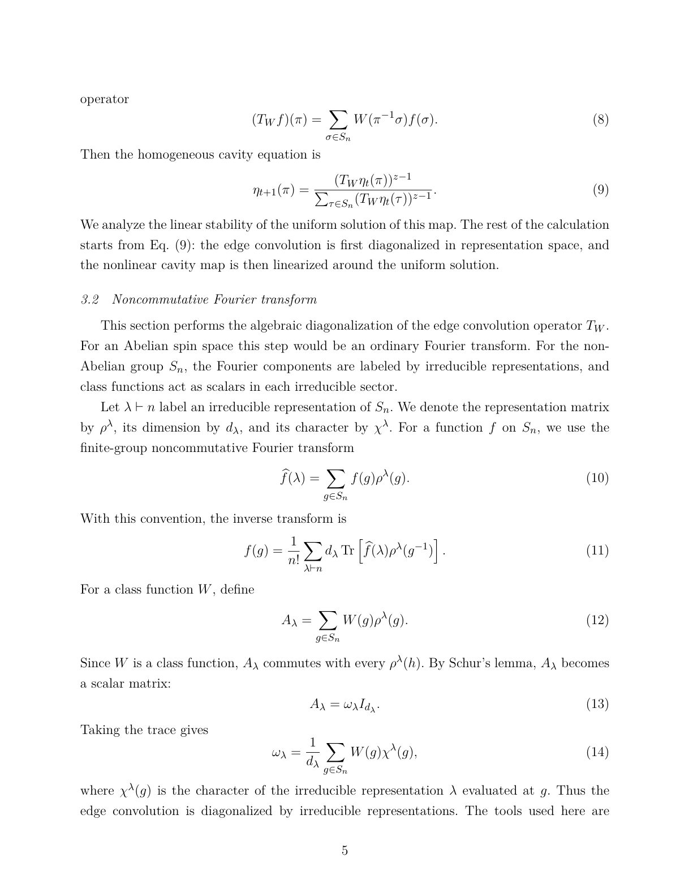
<figcaption class="paper-figure-caption"><b>Fig 4.</b> Low-resolution page preview, page 5</figcaption>
</figure>
<figure class="paper-figure-card">
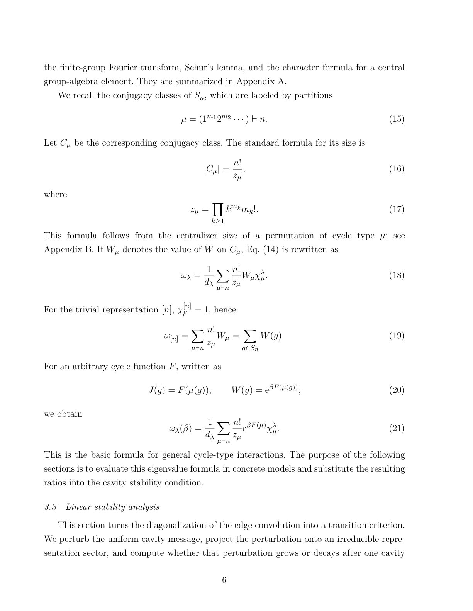
<figcaption class="paper-figure-caption"><b>Fig 5.</b> Low-resolution page preview, page 6</figcaption>
</figure>

**Summary.** This paper studies permutation spin models on Cayley trees by applying the cavity method. It uses representation theory to diagonalize the system's transfer operator, yielding analytic criteria for phase transitions based on character eigenvalue ratios. The results allow researchers to predict critical points in these complex statistical mechanical systems.

**Why it may be interesting.** This work provides a powerful, mathematically rigorous framework (using group representation theory) to analyze phase transitions in complex lattice/tree structures that are far beyond simple mean-field treatments, connecting statistical mechanics to advanced algebraic methods.

Detailed structure

**Main problem.** The research analyzes permutation statistical models defined on a Cayley tree structure to determine their critical points and stability regimes.

**Main result.** The linear stability of the uniform paramagnetic solution is controlled by character eigenvalue ratios derived from diagonalizing the edge convolution operator. The method provides analytic criteria for phase transitions in these complex spin systems.

**Method.** The cavity method, combined with non-commutative Fourier transforms using irreducible representations of the symmetric group $S_n$, is employed to linearize the homogeneous recursion equation around the paramagnetic state.

**Model / system.** The model is a permutation spin system where variables take values in the symmetric group $S_n$. The interaction weights are assumed to be class functions on $S_n$, leading to an edge convolution operator that can be diagonalized in representation space.

**Key observables.** Local stability condition derived from character eigenvalue ratios ($\omega_\lambda / \omega_{[n]}$), and order parameters like Potts-like magnetization ($m_{id}(\eta)$) and standard-representation magnetization ($m_{	ext{std}}(\eta)$).

**Important parameters / regimes.** The coordination number $z$ of the Cayley tree, the size of the group $n$, and the coupling constants embedded in the weight function $W(g)$.

**Assumptions / limitations.** The weights are assumed to be class functions on $S_n$. The analysis relies on approximating bulk critical behavior using the Bethe/Cayley-tree approximation, which may fail for entanglement transitions.

**Figures summary.** Figure 1 illustrates how the magnetization of the cavity fixed point evolves as a function of inverse temperature $eta$ for various models, showing distinct flow regimes relative to the analytically derived instability points.

**Paper structure.** The paper develops the theory by first setting up the model and applying the cavity method. It then uses representation theory to diagonalize the transfer operator, deriving stability criteria based on eigenvalue ratios. Finally, it verifies these analytic results through direct numerical iteration of the cavity equations for specific models.

Abstract

Motivated by permutation statistical models arising in random tensor networks, we study permutation models on a Cayley tree whose variables take values in the symmetric group $\Sn$. The pair interaction is assumed to depend only on the cycle type of the relative permutation. Then the Boltzmann weight is written as a class function on $\Sn$. This property diagonalizes the edge convolution operator in irreducible representation sectors. As a result, the linear stability of the uniform paramagnetic cavity solution is controlled by the character eigenvalue ratios. For cycle-factorized weights, these eigenvalues can be expressed as specializations of Schur functions. We derive the instability criteria and also verify their validity by comparison with direct numerical iterations of the cavity equation.

[↑ back to top](#top)

### [Impulse Decoding of Quantum LDPC Codes: Equivalence of Degeneracy and Code-Shortening](http://arxiv.org/abs/2606.18240v1)

**Authors:** Shobhit Bhatnagar, Michele Pacenti, Nithin Raveendran, David Declercq, Bane Vasić  
**Type:** theory · **Category:** quantum information and computing · **PDF:** <https://arxiv.org/pdf/2606.18240v1>  
**Analysis basis:** full PDF text, analyzed in chunks

↔ Scroll figures horizontally

<figure class="paper-figure-card">
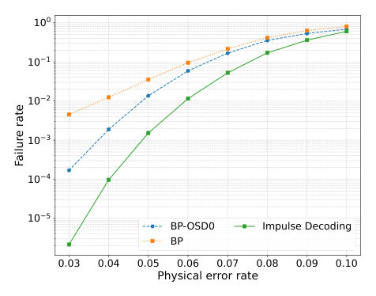
<figcaption class="paper-figure-caption"><b>Fig 1.</b> Fig. 1: Performance of impulse decoding (Algorithm 1) for the [[288, 12, 18]] BB code under code-capacity noise.</figcaption>
</figure>
<figure class="paper-figure-card">
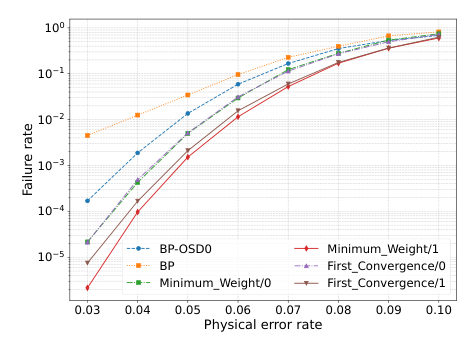
<figcaption class="paper-figure-caption"><b>Fig 2.</b> Fig. 2: Performance of impulse decoding (Algorithm 1) for the [[288, 12, 18]] BB code. The labels 0 and 1 in the legend indicate shortening to 0 and 1, respectively.</figcaption>
</figure>
<figure class="paper-figure-card">
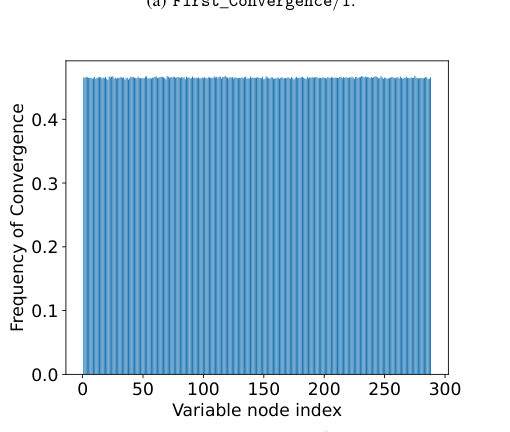
<figcaption class="paper-figure-caption"><b>Fig 3.</b> Fig. 3: Frequency of convergence upon shortening vari- able nodes under (a) First_Convergence/1 and (b) Minimum_Weight/1, for the [[288, 12, 18]] BB code at phys- ical error rate 0.03.</figcaption>
</figure>
<figure class="paper-figure-card">
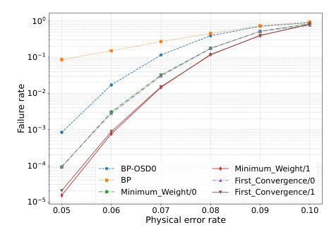
<figcaption class="paper-figure-caption"><b>Fig 4.</b> Fig. 5: Performance of impulse decoding (Algorithm 1) for the [[882, 24, 18 ≤d ≤24]] B1 LP code.</figcaption>
</figure>
<figure class="paper-figure-card">
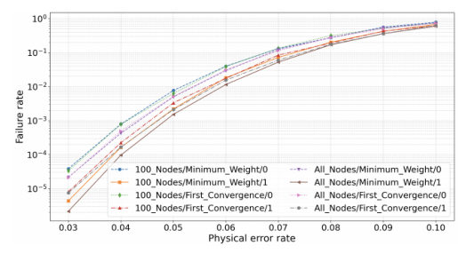
<figcaption class="paper-figure-caption"><b>Fig 5.</b> Fig. 4: Comparison of impulse decoding (Algorithm 1) for the [[288, 12, 18]] BB code when shortening all 288 variable nodes versus shortening only the first 100 variable nodes.</figcaption>
</figure>

**Summary.** This paper develops advanced decoding algorithms, notably impulse decoding, for Quantum LDPC codes by establishing a novel link: quantum degeneracy is equivalent to classical code shortening. The proposed methods significantly improve error correction performance and reduce complexity compared to prior state-of-the-art techniques under realistic noise models.

**Why it may be interesting.** While focused on QEC theory, the rigorous mathematical connection drawn between quantum degeneracy and classical coding concepts like 'shortening' provides deep insights into the underlying algebraic structure of fault-tolerant quantum computation.

Detailed structure

**Main problem.** The paper addresses quantum degeneracy in Quantum Error Correction (QEC) within stabilizer codes, which lacks a clear classical coding-theoretic interpretation.

**Main result.** It establishes that quantum degeneracy is mathematically equivalent to the classical operation of code shortening performed at the decoder. A novel decoding scheme called impulse decoding significantly outperforms existing methods under various noise conditions.

**Method.** The authors develop and compare multiple parallel decoding schemes, including impulse decoding and residual-error decoding, by leveraging the theoretical link between quantum degeneracy and classical code shortening.

**Model / system.** The study focuses on Quantum Low-Density Parity-Check (QLDPC) codes constructed using the stabilizer formalism from pairs of classical linear codes (CSS codes). Performance is tested using specific examples like the [[288, 12, 18]] BB code.

**Key observables.** Failure rate vs. physical error rate; logical error rates; decoding latency; and computational complexity relative to existing decoders.

**Important parameters / regimes.** Physical error rate ($p$); number of parallel decoders ($N$); maximum residual error rounds ($R$).

**Assumptions / limitations.** The analysis relies on the assumption that restricting the search space via code shortening (e.g., fixing $\hat{e}_1=0$) is sufficient to maintain correctness while reducing complexity.

**Figures summary.** Figures compare impulse decoding performance against Belief Propagation variants, showing superior error correction capability; they also illustrate how limiting variable node shortening to a subset maintains high performance.

**Paper structure.** The paper first establishes the theoretical link between degeneracy and code shortening. It then introduces Impulse Decoding as a parallel scheme based on this insight. Finally, it presents advanced variations combining impulse decoding with residual error correction for improved noise resilience.

Abstract

Quantum error correction is essential for building scalable quantum computers. Within the stabilizer formalism, the Calderbank-Shor-Steane framework constructs quantum codes from pairs of classical linear codes. A distinctive feature in this setting is degeneracy, where multiple equivalent error estimates exist-a phenomenon that has no classical counterpart, and the lack of a meaningful classical coding-theoretic interpretation of which has remained a gap in the literature. In this paper, we demonstrate that degeneracy is closely related to the classical operation of shortening of a linear block code. Interestingly, the shortening here takes place at the decoder rather than at the encoder. Leveraging this insight, we present a parallel decoding scheme for quantum low-density parity-check codes, which we term impulse decoding, that significantly outperforms belief propagation with ordered statistics decoding, as well as several other existing techniques, under both code-capacity and circuit-level noise, with significantly lesser complexity. We then present another algorithm based on decoding of residual errors, which when combined with impulse decoding achieves further performance improvement under circuit-level noise.

[↑ back to top](#top)

### [Monopoles, Center Vortices, Confinement in (3+1)d, and the Lens-Space Twisted Partition Function](http://arxiv.org/abs/2606.17708v1)

**Authors:** Yui Hayashi, Yuya Tanizaki  
**Type:** theory · **Category:** other · **PDF:** <https://arxiv.org/pdf/2606.17708v1>  
**Analysis basis:** full PDF text, analyzed in chunks

↔ Scroll figures horizontally

<figure class="paper-figure-card">
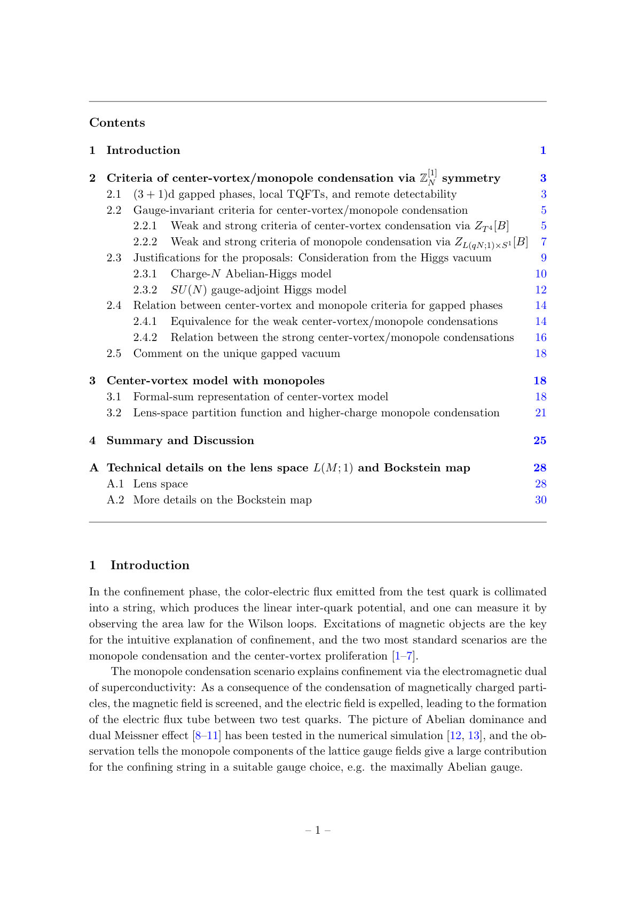
<figcaption class="paper-figure-caption"><b>Fig 1.</b> Low-resolution page preview, page 2</figcaption>
</figure>
<figure class="paper-figure-card">
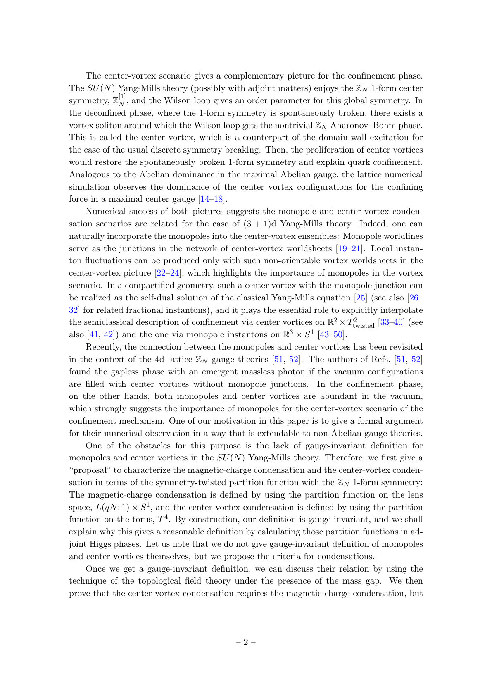
<figcaption class="paper-figure-caption"><b>Fig 2.</b> Low-resolution page preview, page 3</figcaption>
</figure>
<figure class="paper-figure-card">
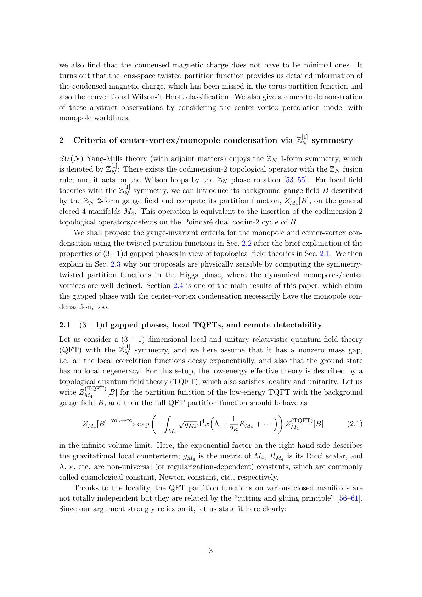
<figcaption class="paper-figure-caption"><b>Fig 3.</b> Low-resolution page preview, page 4</figcaption>
</figure>
<figure class="paper-figure-card">
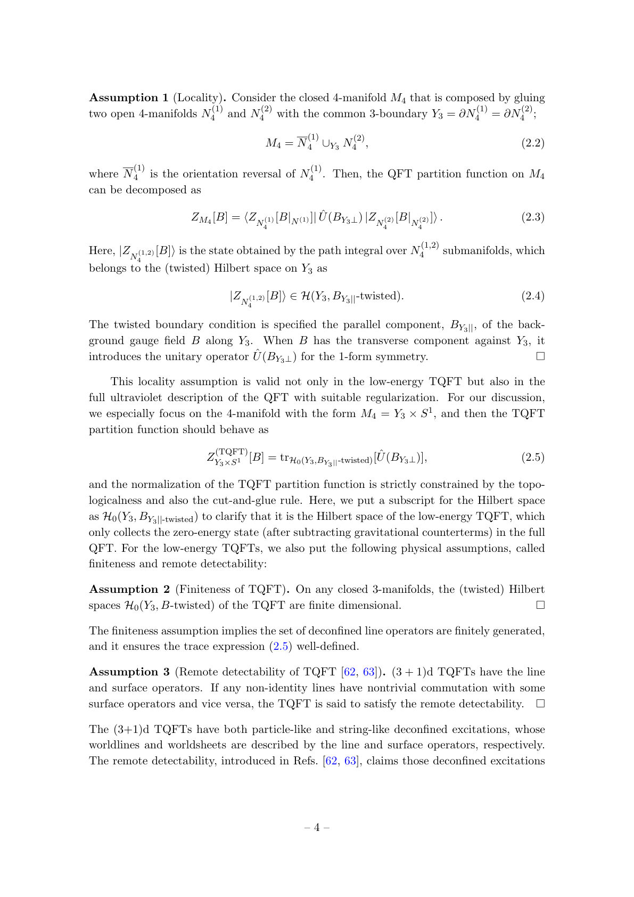
<figcaption class="paper-figure-caption"><b>Fig 4.</b> Low-resolution page preview, page 5</figcaption>
</figure>
<figure class="paper-figure-card">
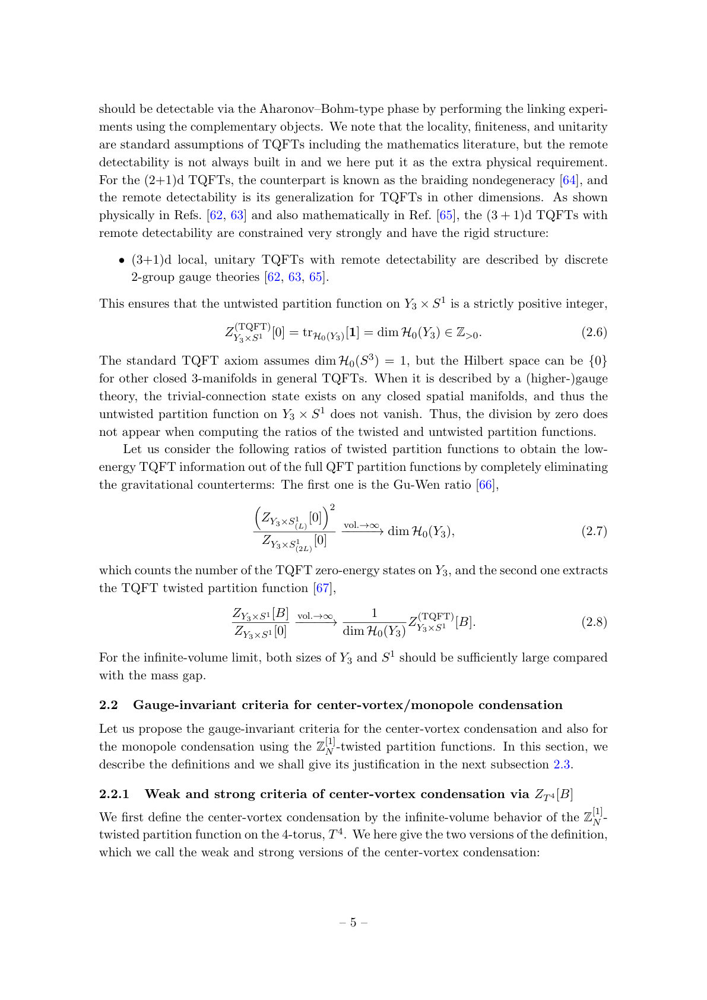
<figcaption class="paper-figure-caption"><b>Fig 5.</b> Low-resolution page preview, page 6</figcaption>
</figure>

**Summary.** This theoretical work develops gauge-invariant criteria to distinguish and relate center-vortex condensation and monopole condensation in $(3+1)$D Yang-Mills theory using twisted partition functions on specific manifolds. The core achievement is proving that these two distinct topological phenomena are mathematically linked, suggesting a unified understanding of confinement mechanisms.

**Why it may be interesting.** While highly specialized, the rigorous mathematical framework connecting different types of topological defects (vortices vs. monopoles) via shared TQFT invariants is conceptually rich for understanding emergent order parameters in quantum field theories.

Detailed structure

**Main problem.** The paper aims to establish gauge-invariant criteria for identifying center-vortex condensation and monopole condensation in $(3+1)$ dimensional Yang-Mills theories.

**Main result.** It proves a deep relationship showing that the gapped phase exhibiting center-vortex condensation necessarily implies the presence of monopole condensation, linking these two confinement mechanisms.

**Method.** The analysis heavily relies on using $\mathbb{Z}_N$-symmetry twisted partition functions calculated on specific 4-manifolds like the torus ($T^4$) and lens spaces ($L(qN; 1) 	imes S^1$).

**Model / system.** The primary model is SU(N) Yang-Mills theory, often studied in the context of an adjoint Higgs phase. The mathematical tools involve topological field theories (TQFTs) and analyzing partition function ratios on compactified spaces.

**Key observables.** The ratio of twisted partition functions $\mathcal{Z}[B]/\mathcal{Z}[0]$ serves as the diagnostic for condensation; other observables include Wilson loops and inter-quark potentials.

**Important parameters / regimes.** The gauge group rank $N$, the background flux parameters ($q, N$), and the assumption of a non-zero mass gap (gapped phase).

**Assumptions / limitations.** Key assumptions include locality, finiteness of the relevant Hilbert space dimension in the TQFT limit, and the existence of a mass gap for the equivalence theorems to hold.

**Figures summary.** Not specified by notes; the structure suggests mathematical derivations involving manifold decompositions (e.g., $M^4 = N_1^4 \cup_{Y^3} N_2^4$) and topological maps like Dehn twists.

**Paper structure.** The paper progresses by first proposing criteria using twisted partition functions on $T^4$ and $L(qN; 1) 	imes S^1$. It then rigorously proves the equivalence between weak/strong condensation for both vortices and monopoles, culminating in topological calculations involving Bockstein maps on lens spaces.

Abstract

We propose the gauge-invariant criteria of center-vortex condensation and monopole condensation using the $\mathbb{Z}_N^{[1]}$-symmetry twisted partition functions: The torus twisted partition function characterizes the center-vortex condensation, and the lens-space twisted partition function characterizes the monopole condensation. To justify our proposal, we study how these twisted partition functions behave in the adjoint Higgs phase and show that their leading nontrivial contributions come from the center vortex and monopole, respectively. Using the techniques of topological field theories, we uncover the relation between the center-vortex and monopole condensations, and in particular, we prove that the gapped phase with the center-vortex condensation necessarily shows the monopole condensation, too. We then study a center-vortex model with monopoles as an illustrative example, and the higher-charge monopole condensation gives an example of the symmetry fractionalization, which goes beyond the conventional Wilson-'t Hooft classification.

[↑ back to top](#top)

### [Quantum mechanics in configuration space in context](http://arxiv.org/abs/2606.17622v1)

**Authors:** Arwa Bukhari, Margherita Moro, Max Davies, Alastair Wilson, Almut Beige  
**Type:** theory · **Category:** other · **PDF:** <https://arxiv.org/pdf/2606.17622v1>  
**Analysis basis:** full PDF text, analyzed in chunks

↔ Scroll figures horizontally

<figure class="paper-figure-card">
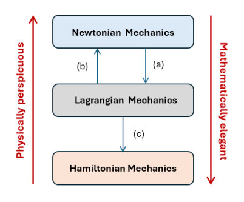
<figcaption class="paper-figure-caption"><b>Fig 1.</b> FIG. 1. Illustration of the relations between the three main formulations of CM, namely Newtonian, Lagrangian and Hamiltonian mechanics. (a) Lagrangian mechanics can be derived from Newtonian mechanics by applying d’Alembert’s principle, thereby leading to the Euler-Lagrange equations in Eq. (8). (b) Moreover, the principle of least action can be used to derive Newton’s second law from Lagrangian mechanics. (c) Hamiltonian mechanics is obtained from the Lagrangian formulation by applying the Legendre transformation. How- ever, this transformation is not always reversible, which is why we cannot always regain Lagrangian mechanics from the Hamiltonian formalism. While Hamiltonian mechanics is...</figcaption>
</figure>
<figure class="paper-figure-card">
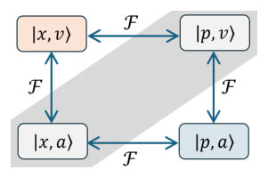
<figcaption class="paper-figure-caption"><b>Fig 2.</b> FIG. 2. Illustration of four different sets of basis states which are all linked via Fourier transforms and which can be used interchangeably to describe a single quantum mechanical par- ticle moving along the x-axis. The most classical among the quantum basis states are the |x, v⟩states which correspond directly to the (x, v) states of Newtonian mechanics. In con- trast to this, the |p, a⟩states, are the least classical quantum bases, since they are equal superpositions of all |x, v⟩states. Such states do not exist in CM.</figcaption>
</figure>
<figure class="paper-figure-card">
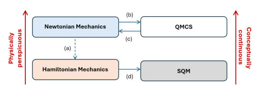
<figcaption class="paper-figure-caption"><b>Fig 3.</b> FIG. 3. An illustration of how QMCS and SQM relate to the classical theories which they respectively reduce. The classical-quantum ‘conceptual continuity’ flows upward in the chart, i.e. the ‘conceptual continuity’ between QMCS and Newtonian mechanics is more enhanced than the conceptual continuity between SQM and Hamiltonian mechanics. (a) As shown earlier in Section II, Hamiltonian mechanics can be derived from Newtonian mechanics. They are nonetheless distinct, and Newtonian mechanics is more physically per- spicuous. (b) QMCS is derived by applying a physically mo- tivated quantisation procedure to Newtonian mechanics. (c) Moreover, we can regain Newton’s equations in QMCS, since highly...</figcaption>
</figure>

**Summary.** The paper proposes Quantum Mechanics in Configuration Space (QMCS) as an alternative formalism to improve the conceptual link between QM and CM. By quantizing based on Newtonian mechanics using position-velocity states, QMCS supports independent observables like velocity ($\hat{v}$), which is often lost in standard canonical quantization. This suggests a more physically transparent quantum theory derived from classical principles.

**Why it may be interesting.** This work is highly relevant to foundational theoretical physics, particularly concerning the precise mathematical structure required to bridge classical intuition (like velocity) into a fully consistent quantum description beyond standard canonical quantization rules.

Detailed structure

**Main problem.** The paper addresses enhancing the conceptual continuity between quantum mechanics (QM) and classical mechanics (CM) by proposing an alternative formalism: Quantum Mechanics in Configuration Space (QMCS). It aims to resolve inconsistencies arising from standard canonical quantization.

**Main result.** QMCS, which quantizes based on Newtonian mechanics using position-velocity states $|x, v\rangle$, provides a framework that maintains strong conceptual continuity with classical dynamics and supports independent observables for velocity ($\hat{v}$) and acceleration ($\hat{a}$).

**Method.** The authors compare three formulations of CM (Newtonian, Lagrangian, Hamiltonian) to determine the most physically transparent quantization procedure. They then derive the quantum dynamics using a basis built on $(x, v)$ states.

**Model / system.** The model is a single mechanical particle moving in free space along one dimension ($x$). The formalism compares standard QM (based on canonical commutation relations) against QMCS (based on Newtonian mechanics).

**Key observables.** Position ($\hat{x}$), velocity ($\hat{v}$), momentum ($\hat{p}$), and acceleration ($\hat{a}$) are key observables, with the paper deriving new commutation relations like $[\hat{v}, \hat{a}] = i\hbar$.

**Important parameters / regimes.** The fundamental constant $\hbar$ governs the quantum corrections; the analysis focuses on the free space limit ($V(x)=0$).

**Assumptions / limitations.** The primary assumption is that Newtonian mechanics provides the most physically perspicuous starting point for quantization. It also assumes QMCS can be compatible with various measurement interpretations.

**Figures summary.** Figures illustrate the conceptual relationship between different CM formulations and show how QMCS maintains a stronger link to classical dynamics compared to standard QM approaches.

**Paper structure.** The paper first establishes the physical problem by comparing CM frameworks (Newtonian vs. Hamiltonian). It then introduces QMCS using the $(x, v)$ basis states. Finally, it derives the quantum dynamics for free space and contrasts its results with standard QM predictions regarding observable consistency.

Abstract

To enhance the way in which wave-particle duality is implemented in the modelling of quantum mechanical systems, Bukhari et al. [New J. Phys. 27, 084501 (2025)] recently introduced an alternative approach to quantum mechanics, namely quantum mechanics in configuration space. This formalism is based on a physically motivated quantisation of Newtonian mechanics and promotes the classical position-velocity states (x,v) to pairwise distinguishable quantum states. The resulting |x,v> states form the basis of the Hilbert space of individual quantum mechanical particles and evolve along classical trajectories. In this paper, we consider the modelling of a mechanical particle in free space and put quantum mechanics in configuration space into context. It is shown that this formalism increases the continuity between quantum and classical mechanics by avoiding a conceptual inconsistency associated with the definition of momentum in canonical quantisation. In addition, we emphasise that standard quantum mechanics and quantum mechanics in configuration space are based on two distinct formulations of classical mechanics.

[↑ back to top](#top)

## Secondary cond-mat archives

*Papers from cond-mat.mtrl-sci, mes-hall, other, soft, supr-con. These archives are de-prioritized — they appear at the end regardless of relevance score.*

### Relevant in secondary archives (22)

### [Bistable topological edge states in polariton microcavities with unpaired Dirac cones](http://arxiv.org/abs/2606.17407v1)

**Authors:** Zhuo Zhang, Yaroslav V. Kartashov, Yongdong Li, Zhen-Nan Tian, Qi-Dai Chen, Yiqi Zhang  
**Type:** theory · **Category:** other · **PDF:** <https://arxiv.org/pdf/2606.17407v1>  
**Analysis basis:** full PDF text, analyzed in chunks
**Topic relevance:** 🔥 `methods for driven-dissipative` **4/5** · `analog quantum simulation` **3/5** · `correlated / nonlocal dissipation` **3/5** · `correlated cavity matter` **3/5** · `driven-dissipative phase transition` **3/5** · `non-equilibrium dynamics` **3/5** · `Kondo & dissipative impurity` **2/5** · `exotic spin models in light-matter` **2/5** · `non-equilibrium universality` **2/5** · `Frenkel-Kontorova` **1/5** · `Keldysh / 2PI / non-Gaussian methods` **1/5** · `Tavis-Cummings & cavity-many-emitter` **1/5** · `interference shaping light` **1/5** · `spintronics-quantum-optics interface` **1/5**

↔ Scroll figures horizontally

<figure class="paper-figure-card">
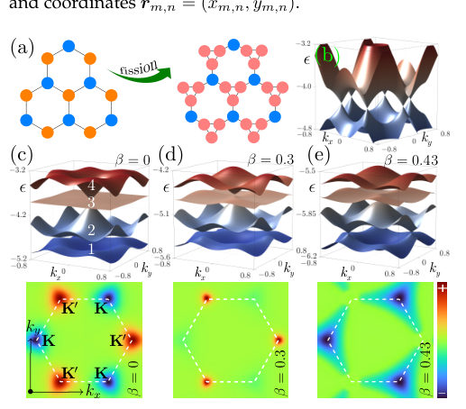
<figcaption class="paper-figure-caption"><b>Fig 1.</b> FIG. 1. (a) Honeycomb array with two sublattices indicated by orange and blue dots and its fissioned version, where pil- lars corresponding to orange dots have been transformed into three pink pillars. Spacing in fissioned array is the same for all pillars and is given by d. (b) Band structure of the hon- eycomb array at β = 0. (c-e) Top row shows band struc- tures of the fissioned honeycomb arrays for different spin-orbit coupling strengths β, while bottom row shows correspond- ing Berry curvature for band 1. Unpaired Dirac cones ap- pear in panel (e) at β ≈0.43. White dashed hexagon shows the first Brillouin zone with coordinates of the K points being (1/3, ±1/31/2)Kx and (−2/3, 0)Kx,...</figcaption>
</figure>
<figure class="paper-figure-card">
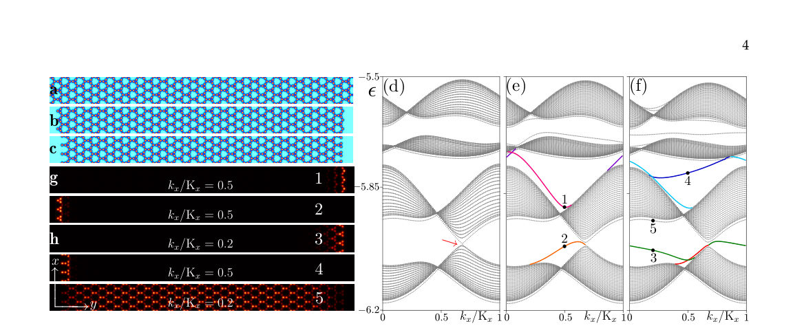
<figcaption class="paper-figure-caption"><b>Fig 2.</b> FIG. 2. (a) Fissioned array with integer number of cells on finite y-window (here y axis is horizontal) and its “projected” linear spectrum ϵ(kx) in (d), where unpaired Dirac cone is indicated by the red arrow. (b) Finite ribbon with zigzag-zigzag boundaries in y made from fissioned array, and its linear spectrum in (e). (c) Finite ribbon with bearded-bearded boundaries in y and its linear spectrum in (f). Edge states in (e) and (f) are shown with colored curves. (g) Density distributions in the edge states (only dominating |ψ−|2 component is shown) corresponding to the dots 1 and 2 in (e). (h) Density distributions in the edge states corresponding to the dots 3 ∼5 in (f). Distributions and...</figcaption>
</figure>
<figure class="paper-figure-card">
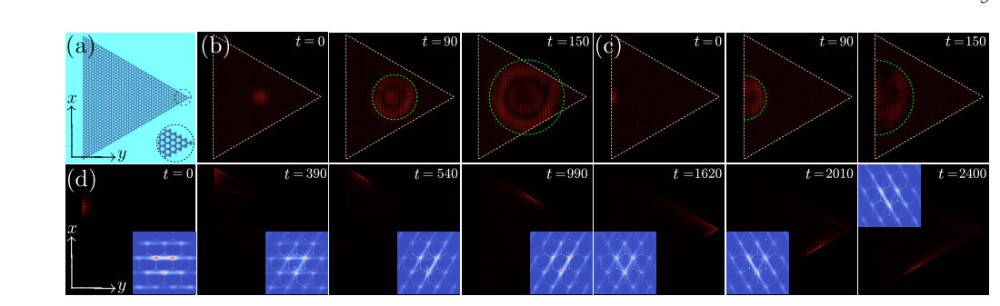
<figcaption class="paper-figure-caption"><b>Fig 3.</b> FIG. 3. (a) Fissioned honeycomb array in a triangular configuration with zigzag edges. Inset shows the magnified sector of the structure. (b) Excitation in the bulk of triangular array corresponding to K′ unpaired Dirac cone that results in conical diffraction. Density distributions |ψ−|2 in different moments of time are shown. Green dotted ring shows theoretical prediction for the radius of conical diffraction pattern. (c) Excitation at the edge of triangular array corresponding to the K′ cone. (d) Evolution of the edge state corresponding to the momentum Kx/3 along the edge. The insets show the density distribution in Fourier space with the hexagons representing Brillouin zones. All...</figcaption>
</figure>
<figure class="paper-figure-card">
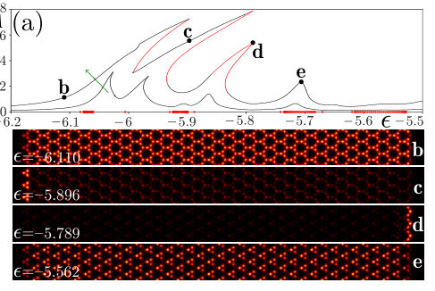
<figcaption class="paper-figure-caption"><b>Fig 4.</b> FIG. 4. (a) Peak amplitude A = max|ψ−| of the dominat- ing ψ−component of the excited state in ribbon configura- tion with zigzag-zigzag edges versus pump frequency detun- ing at kx = 0.5Kx for pump amplitudes h± = 0.001 and 0.004 (increasing as indicated by the green arrow). Red and black curves represent to unstable and stable states, respectively. Red dots on the horizontal axis correspond to energies of lin- ear modes of the array. (b-e) Density distributions of the bulk (b),(e) and edge (c),(d) states (only dominating |ψ−|2 compo- nent is shown) corresponding to the dots in resonance curves from panel (a). Parameter values are β = 0.43, Ω= 0.9, γ = 0.008.</figcaption>
</figure>
<figure class="paper-figure-card">
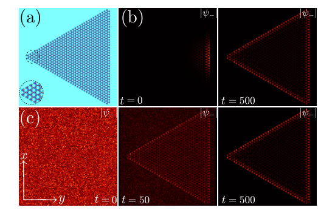
<figcaption class="paper-figure-caption"><b>Fig 5.</b> FIG. 5. (a) Fissioned honeycomb array of microcavity pil- lars in triangular configuration with bearded edges. Inset shows the magnified sector of the structure. (b) Density dis- tributions at t = 0 and t = 500 showing evolution of nonlin- ear edge state with initial Gaussian envelope under the action of uniform resonant pump. (c) Excitation of the edge state from a random noise illustrated by density distributions at t = 0, t = 50 and t = 500. All distributions are shown within the −72 ≤x, y ≤72 window. The parameters are β = 0.43, ϵ = −5.99, γ = 0.008, and Ω= 0.9. Pump amplitude h± = 0.004.</figcaption>
</figure>

**Summary.** This paper proposes using a modified honeycomb microcavity array to create a platform exhibiting unpaired Dirac cones. By analyzing the nonlinear dynamics under resonant pumping, the authors predict and demonstrate the existence of stable, unidirectional dissipative edge solitons. This work advances topological photonics by showing robust energy localization in an inherently lossy system.

**Why it may be interesting.** This work bridges topological physics with nonlinear optics/photonics by demonstrating robust, non-dissipative-like behavior (solitons) in a fundamentally dissipative quantum system, which is highly relevant for engineered light-matter interactions.

Detailed structure

**Main problem.** The research investigates topological edge states emerging from a nonlinear microcavity system that supports unpaired Dirac cones, an unusual spectral feature.

**Main result.** The authors demonstrate the existence of stable, unidirectional dissipative edge solitons circulating indefinitely along the periphery of the structure, which is a first example in this context.

**Method.** The study combines linear analysis using Bloch waves and plane-wave expansion with nonlinear time evolution simulations solved via Newton iteration for dissipative states.

**Model / system.** The system is modeled as an array of microcavity pillars (fissioned honeycomb structure) supporting exciton-polaritons, governed by coupled Gross-Pitaevskii type equations incorporating spin-orbit coupling and external fields.

**Key observables.** Unpaired Dirac cones in the band structure, unidirectional edge states bypassing corners, and stable localized dissipative edge solitons.

**Important parameters / regimes.** Spin-orbit coupling strength (beta), polariton loss rate (gamma), and resonant pumping detuning ($\epsilon$).

**Assumptions / limitations.** The analysis assumes specific parameter regimes where unpaired Dirac cones appear, and the soliton stability is linked to the presence of fissioned sites.

**Figures summary.** Figures illustrate the linear band structure showing unpaired Dirac cones (Fig. 1), density distributions of bulk vs. edge states (Figs. 4b-d), and time evolution confirming stable circulation of the topological edge soliton (Fig. 6).

**Paper structure.** The paper progresses from establishing the unusual spectral topology (unpaired Dirac cones) in the linear regime, to analyzing the emergence of topologically protected edge states, and finally investigating the nonlinear dynamics leading to bistability and persistent dissipative solitons.

Abstract

Among the most intriguing properties of honeycomb lattices is the presence of Dirac points that typically emerge in pairs, which can be destroyed by physical effects breaking certain symmetries of the system and leading to nontrivial band topology. We propose a nonlinear microcavity system supporting condensate of exciton-polaritons, where simultaneous breakup of inversion and time-reversal symmetries results in unusual spectrum with unpaired Dirac cones, profoundly affecting the properties of unidirectional edge states. Realized as an array of microcavity pillars, the inversion symmetry is broken by fission of pillar belonging to one of sublattices of honeycomb array into three pillars, while time-reversal symmetry is broken due to interplay of Zeeman splitting in the external magnetic field and spin-orbit coupling. Despite the absence of complete spectral gap, unidirectional edge states may still emerge that can circumvent array corners. Resonant optical pumping leads to reach bistability effects and allow selective excitation of the edge states. We obtain first example of stable localized dissipative edge soliton that circulates along the periphery of insulator over indefinitely long times without radiation. Our results suggest a new platform for nonlinear topological photonics and reveal nontrivial interplay between unpaired Dirac cones and nonlinear effects.

[↑ back to top](#top)

### [Highly nonlinear Moiré exciton and trion polaritons](http://arxiv.org/abs/2606.18077v1)

**Authors:** Arnab Barman Ray, Trevor Ollis, Fei Cheng, Adam L. Freidman, Aubrey T. Hanbicki, Anthony Nickolas Vamivakas  
**Type:** both · **Category:** other · **PDF:** <https://arxiv.org/pdf/2606.18077v1>  
**Analysis basis:** full PDF text, analyzed in chunks
**Topic relevance:** 🔥 `analog quantum simulation` **4/5** · 🔥 `correlated cavity matter` **4/5** · `driven-dissipative phase transition` **3/5** · `methods for driven-dissipative` **3/5** · `quantum optics experiment` **3/5** · `Tavis-Cummings & cavity-many-emitter` **2/5** · `non-equilibrium dynamics` **2/5** · `non-equilibrium universality` **2/5** · `Keldysh / 2PI / non-Gaussian methods` **1/5** · `correlated / nonlocal dissipation` **1/5** · `entanglement & information structure` **1/5**

↔ Scroll figures horizontally

<figure class="paper-figure-card">
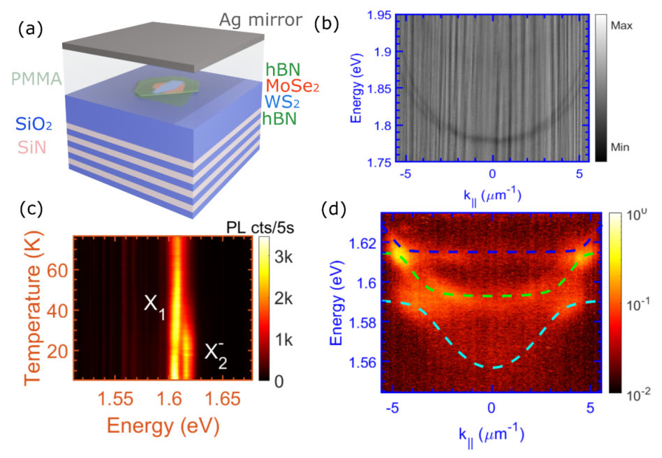
<figcaption class="paper-figure-caption"><b>Fig 1.</b> Figure 1: (a) Render of the device geometry (thickness are not representative) with the bottom DBR, SiO2 and PMMA spacer layers and a top silver mirror, (b) cavity dip away from the heterobilayer, (c) temperature dependent PL spectra from the bare sample without the top mirror (532 nm CW excitation) exhibiting the exciton X1 and the trion X− 2 , (d) normalized Fourier spectra of the heterobilayer PL inside the cavity exhibiting the upper polariton (indigo), middle polariton (green) and lower polariton (cyan), 725 nm pulsed (1 ps) ti-sapphire excitation at an average polariton density of 77 µm−2.</figcaption>
</figure>
<figure class="paper-figure-card">
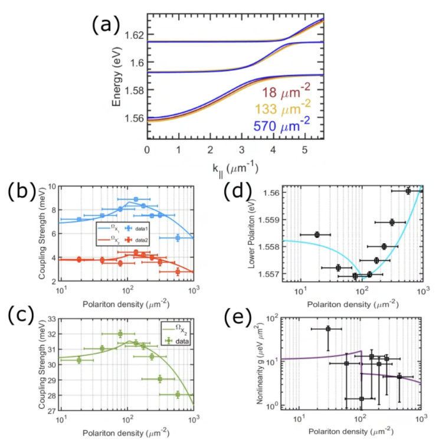
<figcaption class="paper-figure-caption"><b>Fig 2.</b> Figure 2: (a) Fitted PL dispersions of the three polariton branches, color coded according to their polariton densities. Coupling strengths of the (b) X1 exciton and X− 2 trion, and (c) X2 exciton as a function of polariton density. The solid lines are fits obtained from the Lindhard screening model. (d) Variation in the lower polariton energy at k|| = 0 as a function of polariton density, with the fit. (e) Theoretical nonlinearity curve and the extracted nonlinearities (displayed at the average polariton densities, between the two data points used). Errors in coupling strengths and energies are standard errors.</figcaption>
</figure>
<figure class="paper-figure-card">

<figcaption class="paper-figure-caption"><b>Fig 3.</b> Figure 3: (a) PL dispersion at a temperature of 5K, (b) dispersion at 60 K. Temperature dependence of coupling strengths of the (c) X1 exciton, (d) X2 exciton and (e) X− 2 trion. The polariton density in all cases is at ∼1.36 × 103 µm−2.</figcaption>
</figure>
<figure class="paper-figure-card">
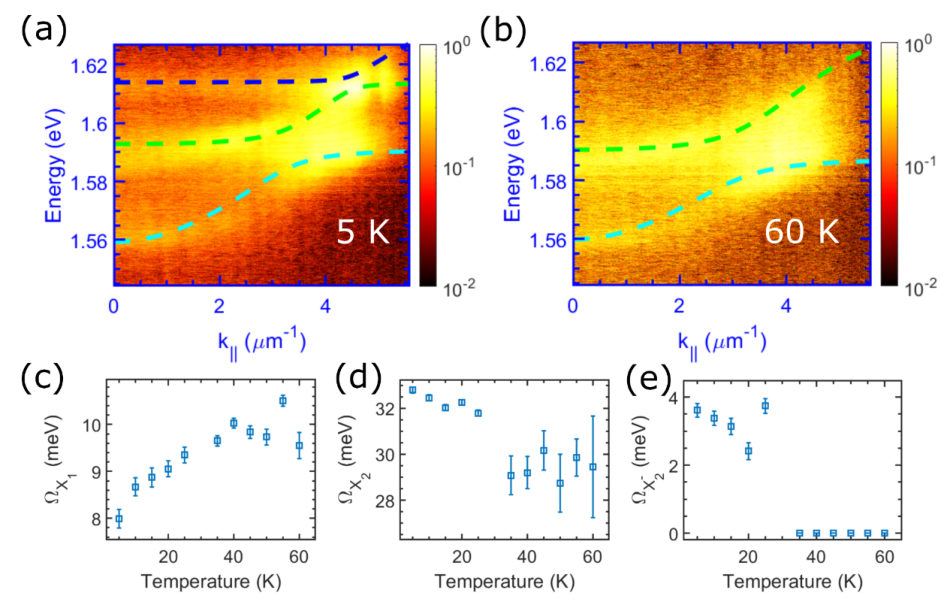
<figcaption class="paper-figure-caption"><b>Fig 4.</b> Fig. 3(b). We note that ΩX1 generally increases with temperature up to 40 K in Fig. 3(c), an</figcaption>
</figure>
<figure class="paper-figure-card">
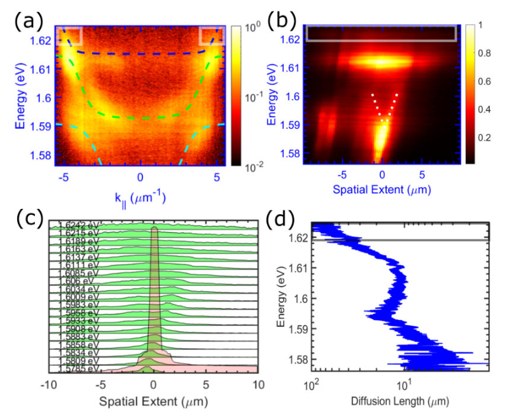
<figcaption class="paper-figure-caption"><b>Fig 5.</b> Figure 4: (a) PL dispersion at a temperature of 5K and polariton density of ∼14.79 µm−2. (b) Spatio-spectrum of the PL emission, with travelling middle polariton branches indicated with white dotted lines. (c) Peak-normalized spectral slices of the real space image at different energies exhibiting extended diffusion at energies corresponding to the bottleneck trion-polariton branch (spatial profile of the 725 nm pulsed laser is indicated by the red shaded area), (d) extracted nominal diffusion lengths as a function of energy. The high- velocity trion-polaritons are indicated in (a), (b), and (d).</figcaption>
</figure>

**Summary.** This paper reports on the observation of strongly coupled Moiré exciton and trion polaritons in semiconductor heterobilayers within an optical microcavity. By combining theory and experiment, the authors reveal a striking non-monotonic nonlinear response to excitation density. The findings highlight large group velocities and unprecedentedly large second-order nonlinearities controllable via doping.

**Why it may be interesting.** This work is highly relevant as it deals with cavity quantum electrodynamics (Cavity QED) in solid-state systems, specifically exploring strong light-matter coupling and nonlinear dynamics mediated by excitons/trions—a core topic in AMO physics and quantum optics.

Detailed structure

**Main problem.** The study investigates the highly nonlinear optical response of strongly coupled Moiré exciton and trion polaritons in heterobilayers. A key focus is understanding the non-monotonic energy shifts and oscillator strength variations as a function of excitation density.

**Main result.** The research demonstrates that the system exhibits strong coupling, leading to lower polariton branches with non-monotonic energy shifts and exceptionally large second-order nonlinearities ($\sim 10^2 \mu	ext{m}$ diffusion length).

**Method.** The work combines theoretical modeling using rate equations and Hamiltonian diagonalization with experimental optical measurements (PL spectroscopy) performed at cryogenic temperatures.

**Model / system.** The physical system is an n-doped $	ext{MoSe}_2/	ext{WS}_2$ heterobilayer placed inside a metal-DBR microcavity. The model incorporates coupled exciton ($	ext{X}$) and trion ($	ext{X}^{-2}$) resonances, utilizing concepts like Lindhard screening to describe carrier interactions.

**Key observables.** Nonlinear dependence of oscillator strengths on polariton density; non-monotonic energy shift in the lower polariton branch; nominal diffusion length ($L_D$) for trion polaritons.

**Important parameters / regimes.** Cryogenic temperature (5 K); initial dopant electron concentration ($n_e$); coupling constants ($\Omega$); screening coefficients ($eta$).

**Assumptions / limitations.** The analysis assumes constant dephasing of 0D excitons when fixing the cavity resonance energy during density variation studies.

**Figures summary.** Figures illustrate device geometry, temperature-dependent PL spectra identifying exciton/trion resonances, and spatio-spectra showing extended diffusion tails near trion polariton energies.

**Paper structure.** The paper progresses from establishing the physical platform (heterobilayers in microcavities) to modeling the coupled dynamics using rate equations. It then analyzes density dependence via nonlinear shifts and concludes by quantifying large-scale spatial transport properties of the resulting polaritons.

Abstract

Moiré multi-layers of transition metal dichalcogenides have been shown to exhibit optical responses that are endowed with a richness that is absent in single monolayers. Much of this can be attributed to the Moiré superlattice that modulates the electronic landscape of these heterostructures. Strongly coupled layer-hybridized excitons in MoSe2/WS2 heterobilayers have been shown to exhibit enhanced optical nonlinearities. In this work we strongly couple layer hybridized excitons and trions in n-doped $\text{MoSe}_2 / \text{WS}_2$ heterobilayers inside an optical microcavity. We find that the additional Lindhard screening from dopant electrons and the formation of trions result in a strikingly non-monotonic nonlinear response. The absence of electron capture in the Moiré superlattice plays a crucial role, promising very large second-order nonlinearities. In this work, trion polaritons manifest as high velocity hot polaritons, reaching nominal diffusion lengths approaching 100 microns.

[↑ back to top](#top)

### [Higher-order topological metasurface based on split-ring resonators with dipole-quadrupole couplings](http://arxiv.org/abs/2606.17855v1)

**Authors:** Alina D. Rozenblit, Nikita A. Olekhno  
**Type:** both · **Category:** other · **PDF:** <https://arxiv.org/pdf/2606.17855v1>  
**Analysis basis:** full PDF text, analyzed in chunks
**Topic relevance:** 🔥 `analog quantum simulation` **4/5** · `driven-dissipative phase transition` **3/5** · `exotic spin models in light-matter` **3/5** · `methods for driven-dissipative` **3/5** · `non-equilibrium dynamics` **2/5** · `correlated / nonlocal dissipation` **1/5** · `correlated cavity matter` **1/5** · `entanglement & information structure` **1/5** · `interference shaping light` **1/5** · `non-equilibrium universality` **1/5**

↔ Scroll figures horizontally

<figure class="paper-figure-card">
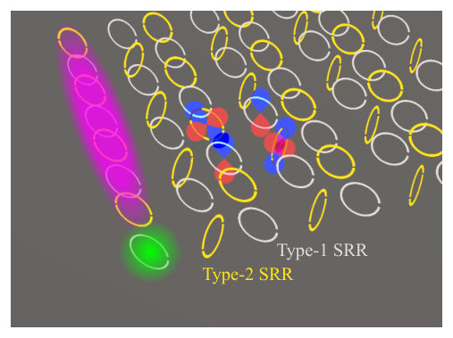
<figcaption class="paper-figure-caption"><b>Fig 1.</b> Figure 1. The proposed scheme for implementing a higher- order PTI with p-d orbital coupling as a radio-frequency meta- surface composed of split-ring resonators (SRRs) of two types: Type-1 (light-gray) featuring a dipole response and Type-2 (yellow) characterized by a quadrupole field pattern, as shown for the unit cell in the center. The regions colored in purple and green highlight edge and corner states, respectively.</figcaption>
</figure>
<figure class="paper-figure-card">
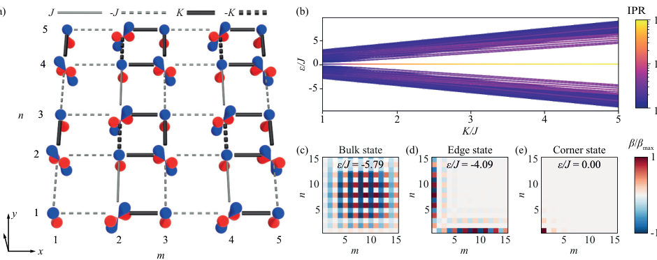
<figcaption class="paper-figure-caption"><b>Fig 2.</b> Figure 2. Eigenstates of the tight-binding model. (a) Theoretical model showing the couplings ±J and ±K between the nearest resonators in a square lattice of p and d orbitals in the (xy) plane. (b) Spectra of normalized eigenenergies ε/J as a function of couplings ratio K/J for the tight-binding model with 15 × 15 sites. The color shows the values of IPR Eq. (1) for the corresponding eigenmodes. (c)-(e) Normalized eigenmode profiles βn,m corresponding to the (c) bulk, (d) edge, and (e) corner states for the system with 15 × 15 sites and couplings K/J = 5.</figcaption>
</figure>
<figure class="paper-figure-card">
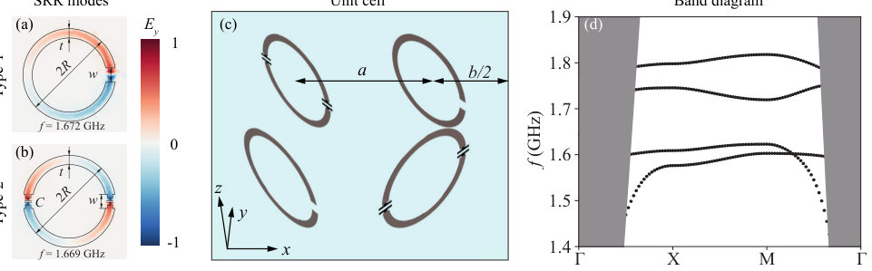
<figcaption class="paper-figure-caption"><b>Fig 3.</b> Figure 3. Numerical simulations of the unit cell. (a) Schematics of a Type-1 SRR characterized by the outer radius R, ring width t, and a gap w superimposed with a numerically simulated distribution of out-of-plane electromagnetic field component Ez at the frequency f = 1.67 GHz at height 0.5 mm for R = 13.5 mm, t = 1 mm, and w = 1.5 mm. (b) The same for a Type-2 SRR with two gaps loaded by capacitors C attached to the pads with sizes 0.6 × 0.4 mm2 for the parameters R = 13.5 mm, t = 1 mm, w = 1.3 mm, and C = 0.2 pF. (c) The unit cell used for band structure simulations with the SRRs from (a)-(b) arranged in a square lattice with periods a = 28 mm and b = 23 mm. (d) Band structure obtained...</figcaption>
</figure>
<figure class="paper-figure-card">
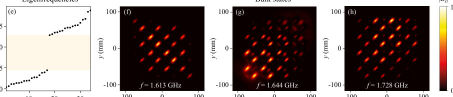
<figcaption class="paper-figure-caption"><b>Fig 4.</b> Figure 4. Numerical simulations of finite structures in the topological and trivial phases. (a) Eigenfrequency spectrum for the finite lattice of 8 × 8 SRRs with periods a = 28 mm and b = 23 mm with weak couplings at the boundaries. Orange shading corresponds to the bulk band gap. (b)-(d) Numerically calculated distributions of the out-of-plane electric field component Ez for the eigenmodes corresponding to (b) bulk (f = 1.644 GHz), (c) edge (f = 1.660 GHz), and (d) corner (f = 1.710 GHz) states, respectively. (e) Eigenfrequency spectrum for the finite lattice of 8 × 8 SRRs with periods a = 28 mm and b = 23 mm with strong couplings at the boundaries. (f)-(h) Numerically calculated...</figcaption>
</figure>
<figure class="paper-figure-card">
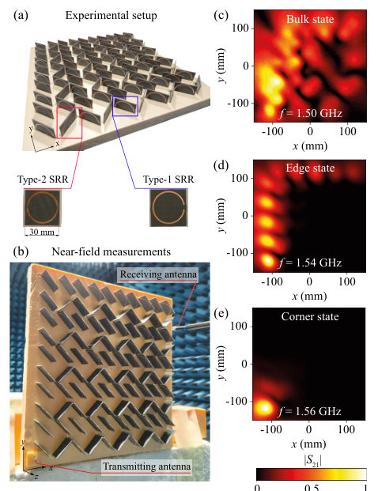
<figcaption class="paper-figure-caption"><b>Fig 5.</b> Figure 5. Experimental studies. (a) Experimentally realized metasurface with an array of 10 × 10 printed circuit board SRRs arranged in a dimerized square lattice with periods a = 28 mm and b = 23 mm. The insets demonstrate Type-1 and Type-2 SRRs. (b) The setup including the electric dipole transmitting antenna and E-field probe receiving antenna that is moved by a spatial scanner. (c)-(e) Experimentally mea- sured distributions of the transmission coefficient |S21|, which characterizes the near-field distribution of the electric field component Ez, corresponding to (c) bulk, (d) edge, and (e) corner states. Each distribution is normalized to its maxi- mum.</figcaption>
</figure>

**Summary.** This work demonstrates how to build a functional radio-frequency platform for studying Higher-Order Topological Insulators (HOTIs) using readily available printed circuit board technology. By engineering metasurfaces with split-ring resonators, the authors successfully observe both edge and corner localized electromagnetic states at microwave frequencies. This provides an accessible and scalable route for future experimental studies of topological physics in engineered media.

**Why it may be interesting.** While focused on microwave photonics rather than fundamental quantum mechanics, the concept of realizing topologically protected boundary modes using engineered artificial lattices is highly relevant to open quantum systems and photonic quantum information processing.

Detailed structure

**Main problem.** The goal is to create a scalable, reconfigurable radio-frequency (RF) platform that realizes the physics of photonic Higher-Order Topological Insulators (HOTIs). This overcomes limitations associated with expensive optical implementations.

**Main result.** The proposed metasurface, built from split-ring resonators (SRRs), successfully supports both edge-localized and corner-localized topological states at microwave frequencies. The approach is demonstrated to be inexpensive using printed circuit board technology.

**Method.** The study combines numerical simulations (using Eigenmode solvers for band structure and IPR calculation) with physical measurements of the transmission coefficient on fabricated PCB structures.

**Model / system.** The system is a metasurface composed of SRRs utilizing couplings between dipole ($p$) and quadrupole ($d$) modes, modeled by a tight-binding Hamiltonian on a dimerized lattice. The platform operates in the 1.5–1.7 GHz microwave range using PCB technology.

**Key observables.** Edge-localized states, corner-localized states, bulk band gap frequencies (e.g., 1.62–1.72 GHz), and state localization quantified by the Inverse Participation Ratio (IPR).

**Important parameters / regimes.** Operating frequency range of 1.5–1.7 GHz; coupling constants $J$ and $K$; SRR geometry parameters like gap width ($w$) and capacitor tolerances.

**Assumptions / limitations.** The analysis relies on nearest-neighbor approximations in the tight-binding model, and the structure lacks full C4 rotational symmetry due to unit cell asymmetry.

**Figures summary.** Figures illustrate schematics of the metasurface using Type-1 (dipole) and Type-2 (quadrupole) SRRs. Simulations show eigenstate profiles confirming distinct bulk, edge, and corner localization patterns, while experimental data confirm field confinement matching theoretical predictions.

**Paper structure.** The paper first introduces the concept of HOTIs in RF metasurfaces using SRRs. It details the tight-binding model and uses numerical simulations to predict topological features (edge/corner states). The latter part validates these findings through physical measurements on fabricated PCB samples, comparing measured field localization against simulation results.

Abstract

Photonic higher-order topological insulators (HOTI) are characterized by a hierarchy of topologically-protected states with different dimensionalities, making them especially interesting for potential applications that combine strong localization of electromagnetic fields and their robust waveguiding. However, their practical implementation often requires expensive processing techniques and is limited by accessible material parameters. In this paper, we demonstrate that a radio-frequency photonic HOTI can be implemented as a metasurface composed of split-ring resonators with couplings between dipole and quadrupole modes. We verify, by numerical simulations and experimentally at frequencies of 1.5-1.7 GHz, that a proposed metasurface supports corner- and edge-localized states. Our results reveal a scalable and easily reconfigurable GHz-range platform that employs printed circuit board technology, thus making crucial steps required for further experimental studies of photonic HOTI and the development of their microwave applications.

[↑ back to top](#top)

### [Anomalous Pairing Currents and a Second Topological Edge Channel in Bosonic Lattices](http://arxiv.org/abs/2606.17538v1)

**Authors:** Chitrak Bhadra, Ángel Rivas, Miguel A. Martin-Delgado  
**Type:** both · **Category:** other · **PDF:** <https://arxiv.org/pdf/2606.17538v1>  
**Analysis basis:** full PDF text, analyzed in chunks
**Topic relevance:** 🔥 `analog quantum simulation` **4/5** · `driven-dissipative phase transition` **3/5** · `methods for driven-dissipative` **3/5** · `non-equilibrium dynamics` **2/5** · `non-equilibrium universality` **2/5** · `quantum optics experiment` **2/5** · `Keldysh / 2PI / non-Gaussian methods` **1/5** · `QC/QI experiment` **1/5** · `correlated cavity matter` **1/5**

↔ Scroll figures horizontally

<figure class="paper-figure-card">
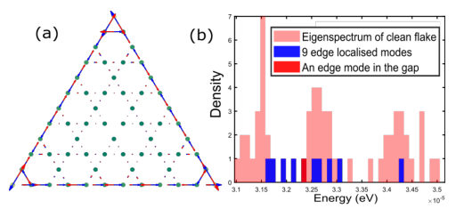
<figcaption class="paper-figure-caption"><b>Fig 1.</b> FIG. 1. Microscopic decomposition of the chiral edge trans- port in a 2D bosonic kagome lattice on a finite zigzag- terminated flake. In (a), blue/red arrows indicate Single Par- ticle Current/Pairing Current for non-zero particle-conserving as well as bosonic pairing interactions. In (b) the eigenspec- trum is shown with red indicating an edge localized topologi- cally protected mode. Blue indicates nine other edge localized modes of varying gap/bulk features. Parameters: ω0 = 50, J = 0.02 ω0, νon = 3J, νoff = 0.1J (Lattice size N = 63); these values are chosen so as to produce opposing chirality of SPC and PC on the same edge.</figcaption>
</figure>
<figure class="paper-figure-card">
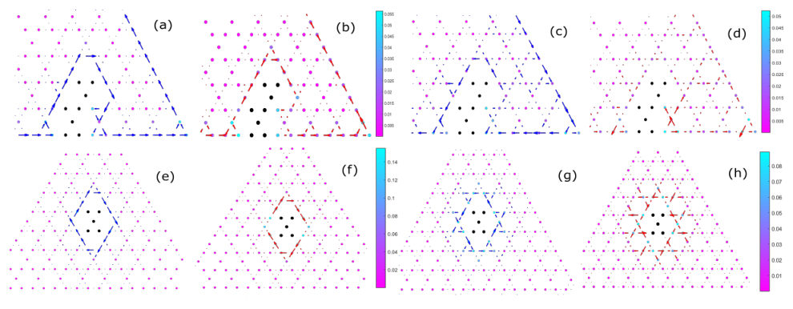
<figcaption class="paper-figure-caption"><b>Fig 2.</b> FIG. 2. Zoomed view of chiral current decomposition around localized defects in the kagome lattice (Lattice size N = 234). Columns compare Case 1 with Case 2. Rows compare a defect at the zigzag edge (top, panels a–d) with a defect deep in the bulk (bottom, e–h). Within each pair of columns the left panel shows the single-particle-conserving current ⟨J ⟩(blue) and the right panel the pairing current ⟨I⟩(red). Arrows indicate current direction; colormap shows the absolute square of the wavefunction at each point. The defect sites are marked in black. Parameters: ω0 = 50, J = 0.02 ω0, defect detuning ωS = 104ω0. Case 1 (a,b,e,f): νon = 0.1J, νoff = 3J, ψs,s′ = 2π/3, φs,s′ = 0. Case 2 (c,d,...</figcaption>
</figure>
<figure class="paper-figure-card">
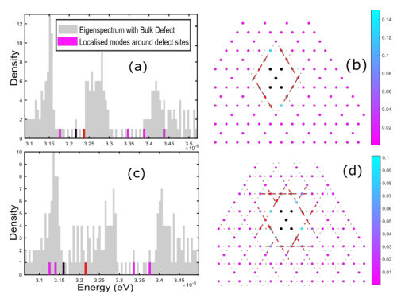
<figcaption class="paper-figure-caption"><b>Fig 3.</b> FIG. 3. Tuning clean chiral currents against anomalous scat- tering in a flux-engineered Hamiltonian (Case 3, ψ, φ ̸= 0). Panels (a-b): νoff ≪νon . Eigenspectrum of the defect- induced localized edge modes shown in (a) with black bar showing the Maximally LEM (MLEM) (also in (c)). Strong localization of currents when defects are introduced in the bulk seen in the example of ⟨I⟩shown by red arrows (b). Pan- els (c-d): νoff ≫νon. Pairing current ⟨I⟩around the defect loop shows anomalous scattering and leakage into neighbor- ing sites shown in (d). In (a) and (c), only the red bar is representative of a localized mode existing on the outer flake boundary, and not on the artificial edge created...</figcaption>
</figure>
<figure class="paper-figure-card">
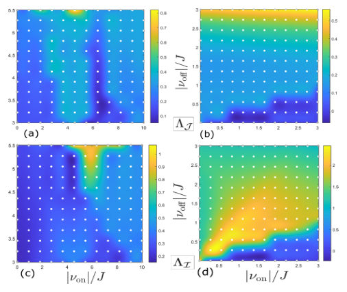
<figcaption class="paper-figure-caption"><b>Fig 4.</b> FIG. 4. Clear signature of flux-engineering effects quantified via ΛJ and ΛI on the plane spanned by a range of (νon, νoff) values compared between Case 1 and Case 3. The white dots are the exact numerical results while the colormap is derived via an interpolating function. For Case 1 both ΛJ (a) and ΛI (c), the leakage is suppressed throughout the plots; en- hancement starts occurring only at unusually high values of BP coupling. Remarkably, Case 3 exhibits a sharp rise in anomalous scattering of PC around the line ΛI ≈1 (d) a feature absent in ΛJ and the leakage increases monotonically (c). Here, as anticipated before, the confined regime is domi- nated by the relative magnitude of the...</figcaption>
</figure>

**Summary.** The paper investigates anomalous pairing currents in bosonic lattices on a kagome structure. It shows that these pairing currents create a second, distinct chiral current channel not found in particle-conserving theories. The key diagnostic tool is the phase-sensitive leakage ratio ($\Lambda_I$), which allows for experimental verification of this unique topological feature in circuit or photonic arrays.

**Why it may be interesting.** This work provides a concrete, measurable diagnostic ($\Lambda_I$) to distinguish genuine topological physics in bosonic systems from standard fermionic models, which is crucial for interpreting measurements in superconducting circuits or photonics.

Detailed structure

**Main problem.** To establish a microscopic statement regarding the distinct topological contribution of anomalous pairing currents ($	ext{PC}$) in bosonic systems, which is absent in particle-conserving models.

**Main result.** Bosonic pairing opens a second chiral current channel ($\langle I 
angle$) distinct from the single-particle hopping current ($\langle J 
angle$), providing a unique topological signature testable in driven quantum platforms.

**Method.** The analysis uses para-unitary diagonalization of the Bogoliubov Hamiltonian and derives lattice continuity equations to calculate both $	ext{SPC}$ and $	ext{PC}$.

**Model / system.** The system is modeled on a 2D kagome lattice using bosonic operators, incorporating hopping terms (single-particle coherence) and pairing terms (anomalous coherence). The model is directly mapped onto superconducting circuits or photonic lattices.

**Key observables.** Single Particle Current ($\langle J 
angle$), Pairing Current ($\langle I 
angle$), Phase-sensitive leakage ratio ($\Lambda_I$), Integer para-unitary Chern numbers ($C_n$).

**Important parameters / regimes.** Hopping phase ($\psi$), Pairing phases ($\varphi$), Coupling ratios (e.g., $
u_{	ext{off}}/
u_{	ext{on}}$), and lattice geometry (kagome).

**Assumptions / limitations.** The standard fermionic index theorem does not transfer literally because the diagonalization structure group is $U(m, m)$ rather than compact $U(2m)$.

**Figures summary.** Figures compare microscopic current decompositions ($	ext{SPC}$ vs $	ext{PC}$) around edges and defects for different phase configurations (Case 1, Case 2, Case 3).

**Paper structure.** The paper develops by first defining the full bosonic Hamiltonian, deriving separate continuity equations for hopping and pairing currents, analyzing topological invariants via para-unitary diagonalization, and finally comparing results across distinct physical regimes (anomalous vs. confined).

Abstract

We show that bosonic pairing opens a second chiral current channel on a 2D kagome lattice, absent from any particle-conserving model. From the continuity equation, we derive both a hopping current and an anomalous pairing current on the lattice, and predict chiral circulation in bulk-gapped phases with integer para-unitary Chern numbers, as well as a phase-sensitive leakage ratio, $Λ_{\cal I}$, for the pairing current around a defect. This ratio can be tuned from confined to strongly anomalous regimes at fixed topology. The two channels differ microscopically: the hopping current is sourced by the on-bond single-particle coherence, whereas the pairing current is sourced by the off-site anomalous coherence, whose spatial range is governed by the BdG pairing gap rather than by the single-particle gap. This separation produces distinct defect-induced signatures in real space, identifies a regime in which bulk topology and anomalous edge response coexist with no analogue in particle-conserving matter, and is directly testable in driven photonic lattices and superconducting-circuit arrays.

[↑ back to top](#top)

### [Tunneling amplifies chirality-induced spin selectivity and explains its current-direction invariance](http://arxiv.org/abs/2606.17823v1)

**Authors:** Fedor Baranov, Virginia Gali, Gal Lemut, Maxim Breitkreiz  
**Type:** theory · **Category:** other · **PDF:** <https://arxiv.org/pdf/2606.17823v1>  
**Analysis basis:** full PDF text, analyzed in chunks
**Topic relevance:** 🔥 `spintronics-quantum-optics interface` **4/5** · `Kondo & dissipative impurity` **3/5** · `methods for driven-dissipative` **3/5** · `Keldysh / 2PI / non-Gaussian methods` **2/5** · `driven-dissipative phase transition` **2/5** · `non-equilibrium dynamics` **2/5** · `correlated / nonlocal dissipation` **1/5** · `exotic spin models in light-matter` **1/5** · `non-equilibrium universality` **1/5**

↔ Scroll figures horizontally

<figure class="paper-figure-card">
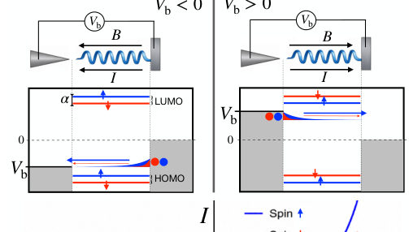
<figcaption class="paper-figure-caption"><b>Fig 1.</b> FIG. 1. Schematic illustration of spin-dependent tunnel- ing across a helical molecule with current-induced magnetic field B. For positive voltage bias (top right), the energy level of tunneling particles (filled circles) is closer to LUMO. Due to current-induced Zeeman splitting of LUMO, the barrier is lower for spin up (blue), which leads to a larger current for spin up than for spin down (see I-V curve below the figure). For negative voltage bias (top left), the charge current and thus the Zeeman splitting are opposite and the tunneling par- ticles are closer to HOMO. The barrier is again lower for spin up. The resulting I-V curve (schematically reproduced at the bottom) has the...</figcaption>
</figure>
<figure class="paper-figure-card">
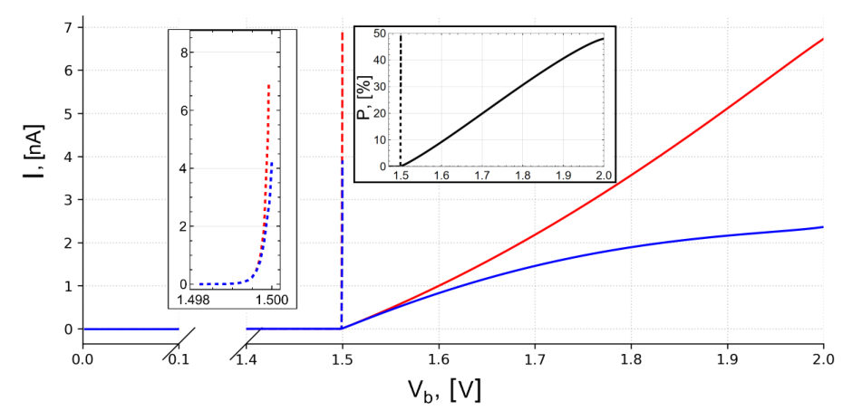
<figcaption class="paper-figure-caption"><b>Fig 2.</b> FIG. 2. Current I+ (blue) and I−(red) versus bias voltage Vb for R = 0 (dashed) and R = 5.5 × 107Ω(solid). The former shows fast exponential growth near the barrier at V0 = 1.5 eV with high spin splitting in a narrow region (see close-up in the left inset), while in the latter case the region of large SP becomes extended. The corresponding SP P is shown in the right inset. Other parameters are L = 12 nm, m = 9me, where me is the electron mass, α0 = 10−4 eV, and T = 0 K.</figcaption>
</figure>
<figure class="paper-figure-card">
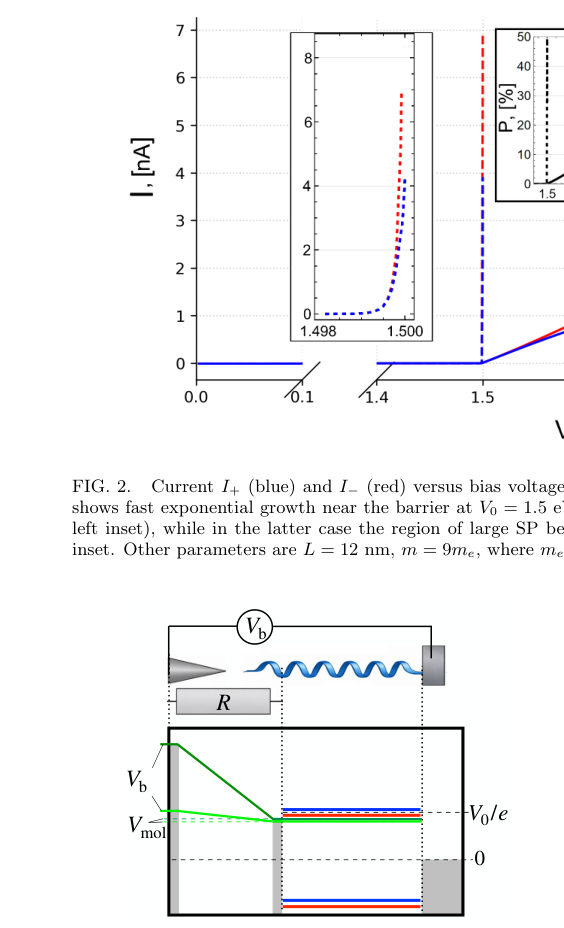
<figcaption class="paper-figure-caption"><b>Fig 3.</b> FIG. 3. Illustration of the effect of dissipation at the tip-molecule interface modeled by a resistor R. The poten- tial Vmol stays close below the energy levels of the molecule (red/blue lines) for an enhanced range of applied voltages Vb due to the current-dependent voltage drop at the resistor, RI = Vb −Vmol. Light and dark green lines illustrate poten- tial profiles for two different values of Vb.</figcaption>
</figure>
<figure class="paper-figure-card">
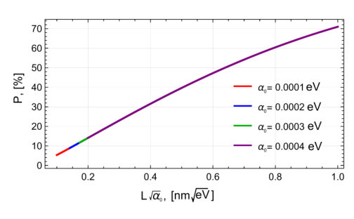
<figcaption class="paper-figure-caption"><b>Fig 4.</b> FIG. 4. SP plotted as a function of the length of the molecule against L √α0. The parameters for these plots are T = 0 K, V0 = 1.5 eV, R = 105Ω, Vb = V0 + (3/4)I0R.</figcaption>
</figure>
<figure class="paper-figure-card">
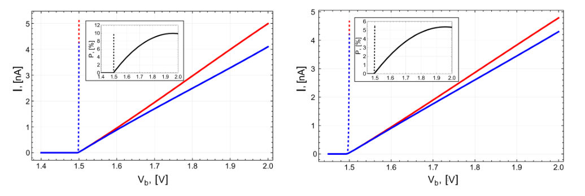
<figcaption class="paper-figure-caption"><b>Fig 5.</b> FIG. 5. Current I+ (blue) and I−(red) as a function of bias voltage Vb at temperature T = 5 K (left) and T = 10 K (right). Dashed curves correspond to R = 0 and solid lines to R = 5.5 × 107Ω. Insets show the corresponding SP. Other parameters are V0 = 1.5 eV, L = 12 nm, and the effective mass m = 9me.</figcaption>
</figure>

**Summary.** The paper proposes a theoretical model explaining Chirality-Induced Spin Selectivity (CISS) in molecular junctions by combining quantum tunneling theory with dissipation. It shows that even weak, current-dependent spin perturbations can lead to near-perfect spin polarization. This mechanism successfully explains the observed symmetry of CISS regarding current reversal while remaining consistent with fundamental transport laws.

**Why it may be interesting.** This work directly addresses spin transport phenomena in nanoscale molecular junctions, which is a key area bridging condensed matter physics with quantum chemistry and AMO concepts like spin-orbit coupling effects on tunneling.

Detailed structure

**Main problem.** The study aims to elucidate the mechanism behind Chirality-Induced Spin Selectivity (CISS) in dc transport through insulating chiral molecules, particularly explaining how large spin polarization can arise while respecting fundamental symmetries.

**Main result.** Quantum tunneling combined with dissipation is shown to amplify small spin-dependent perturbations, yielding high spin polarizations ($\sim 100\%$) and naturally reproducing the characteristic current-direction invariance of CISS.

**Method.** The analysis employs theoretical modeling using a 1D scattering approach, incorporating the WKB approximation for tunneling probabilities in the presence of a weak Zeeman interaction derived from the applied current.

**Model / system.** The system is modeled as quantum tunneling through an insulating chiral molecule placed between two leads. The physics is governed by spin-dependent molecular orbital energies ($V_\sigma$) perturbed by a current-induced magnetic field, and dissipation is included via an external resistor ($R$).

**Key observables.** Spin Polarization (SP), relative transmission difference ($T_{	ext{split}}$), and the dependence of these quantities on applied bias voltage ($V_b$) and molecular length ($L$).

**Important parameters / regimes.** The characteristic mean free path ($\ell_\alpha$), the magnitude of the Zeeman coupling ($\alpha(I)$), and the resistance $R$ (which extends the measurable voltage range).

**Assumptions / limitations.** The model assumes that single-particle descriptions are insufficient due to Kramers' degeneracy, necessitating the inclusion of dissipation. The analysis relies on the WKB approximation for tunneling.

**Figures summary.** Figures compare current ($I_\sigma$) vs bias voltage ($V_b$) curves with and without an added resistor ($R$), demonstrating that $R$ extends the voltage range where high SP is maintained. Another figure confirms the scaling of SP with system length $L$.

**Paper structure.** The paper develops the model by first establishing the necessity of dissipation to overcome single-particle limitations, then deriving the tunneling probabilities using WKB, and finally demonstrating how the resulting current-voltage characteristics naturally exhibit the required symmetry (current-direction invariance).

Abstract

We propose a minimal model for chirality-induced spin selectivity (CISS) in dc transport through insulating chiral molecules, based on quantum tunneling and interaction-induced spin splitting. As a concrete realization of the latter, we consider a weak Zeeman interaction of the particle spin with the current-induced magnetic field, recently shown to occur in helical molecules. We show that quantum tunneling, combined with dissipation, amplifies the effect, so that even such a small spin-dependent perturbation can yield spin polarizations on the order of 100\% across a wide range of applied bias voltages. Furthermore, our tunneling scenario naturally reproduces the characteristic CISS symmetry of the current-voltage dependence -- namely, the invariance of the spin-polarization sign under reversal of the current direction -- while fully respecting Onsager's reciprocity relations.

[↑ back to top](#top)

### [Vortex-Beam-Driven Dirac Materials: Impurity and Polarization Effects on Light-Induced Vortex and Edge States](http://arxiv.org/abs/2606.17341v1)

**Authors:** Trevor W. Walsh, Eric E. Caldwell, Nancy P. Sandler, Mahmoud M. Asmar  
**Type:** theory · **Category:** other · **PDF:** <https://arxiv.org/pdf/2606.17341v1>  
**Analysis basis:** full PDF text, analyzed in chunks
**Topic relevance:** 🔥 `non-equilibrium dynamics` **4/5** · `Kondo & dissipative impurity` **3/5** · `analog quantum simulation` **3/5** · `methods for driven-dissipative` **3/5** · `driven-dissipative phase transition` **2/5** · `Keldysh / 2PI / non-Gaussian methods` **1/5** · `interference shaping light` **1/5** · `non-equilibrium universality` **1/5** · `spintronics-quantum-optics interface` **1/5**

↔ Scroll figures horizontally

<figure class="paper-figure-card">
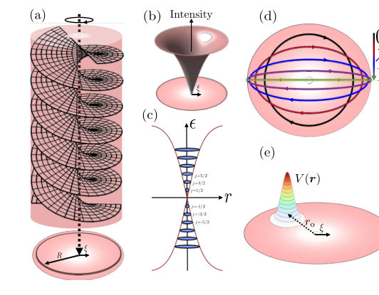
<figcaption class="paper-figure-caption"><b>Fig 1.</b> FIG. 1. (a) Schematic of a VLB normally incident on a mas- sive Dirac sample of radius R. The wavefront indicates the helical phase twist, and (b) shows the radial intensity profile of the VLB across the sample. (c) Bound vortex states as a function of energy and local intensity (characteristic radius of each state is indicated). (d) Polarization detuning: the drive’s polarization is tuned from circular toward linear at fixed in- tensity. (e) Disorder: response in the presence of a Gaussian impurity located at radius r0 from the sample center.</figcaption>
</figure>
<figure class="paper-figure-card">
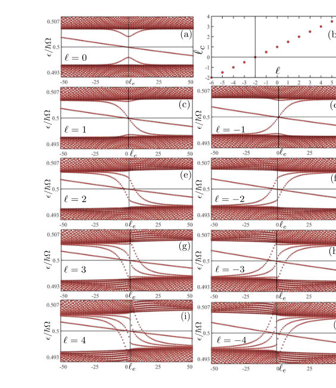
<figcaption class="paper-figure-caption"><b>Fig 2.</b> FIG. 2. Panels (a), (c)–(j) show the quasienergy spectrum of a massive Dirac-like material with gap 2M under irradiation by a VLB. The system parameters are ℏΩ= 2.06M, kFξ = 10, ∆0 = 0.01M, ∆(r) = ∆0 tanh(r/ξ), R = 10ξ, and vF/Ω= 1˚A. The VLB’s OAM, ℓ, is indicated in each panel. The vertical line marks the particle–hole inversion center ℓc, whose dependence on ℓis shown in panel (b). Note that the vertical axis is ϵ = E + ℏΩ/2.</figcaption>
</figure>
<figure class="paper-figure-card">
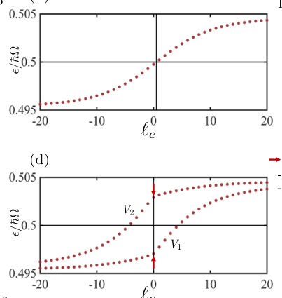
<figcaption class="paper-figure-caption"><b>Fig 3.</b> FIG. 3. (a) Real-space probability density of vortex states for the system of Fig. 2(d). Each disk corresponds to a state labeled by total angular momentum j and orbital angular momentum ℓe, ordered by increasing j from bottom to top. The disk diameter is one quarter of the sample size, and the color scale runs from dark blue (low density) to dark red (high density). (b) Quasienergy dispersion of the vortex branch associated with the states in (a). (c) Real-space probability density of vortex states belonging to two vortex branches (V1,2) for the system of Fig. 2(f). (d) Corresponding quasienergy dispersion of the two vortex branches. The arrows indicate that the most confined states are...</figcaption>
</figure>
<figure class="paper-figure-card">
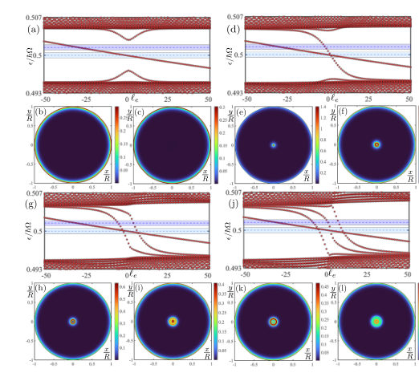
<figcaption class="paper-figure-caption"><b>Fig 4.</b> FIG. 4. LDOS of the VLB-driven system. The probe quasienergies ϵ0 = E0 + ℏΩ/2 and the broadening Γ are in- dicated in the quasienergy spectra shown for ℓ= 0, 1, 2, and 3 in panels (a), (d), (g), and (j), respectively; all other ma- terial and VLB parameters are the same as in Fig. 2. Panels (b), (e), (h), and (k) show the LDOS for E0 = 0, while the remaining panels show the LDOS for E0 = 0.003M. In all cases, Γ = 0.001M.</figcaption>
</figure>
<figure class="paper-figure-card">
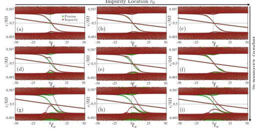
<figcaption class="paper-figure-caption"><b>Fig 5.</b> FIG. 5. Perturbed quasienergy for an impurity placed along the x axis at radial position r0, with strength V0 = 0.85(2g), where 2g is the dynamical gap and g ≡evFA0/(ℏΩ) [75]. Red dots denote the perturbed spectrum, while green dots show the corresponding unperturbed spectrum. The impurity widths are a0/ξ = 0.1 in (a)–(c), 0.25 in (d)–(f), and 0.75 in (g)–(i). In each row, the impurity positions are r0/ξ = 0.25, 0.75, and 1.25 from left to right. All other material and VLB parameters are the same as in Fig. 2(c).</figcaption>
</figure>

**Summary.** This theoretical study investigates the stability of vortex and edge states in Dirac materials driven by structured light beams. By treating impurities and polarization deviations perturbatively, the authors show that while these imperfections break ideal symmetries, the fundamental topological signatures remain observable. The work provides critical guidance on realizing such systems experimentally.

**Why it may be interesting.** This work bridges topological physics (Dirac materials, edge states) with non-equilibrium quantum optics (Floquet engineering). The detailed analysis of how symmetry breaking mechanisms (impurities, detuning) affect quantized light-matter interactions is highly relevant for designing robust quantum devices.

Detailed structure

**Main problem.** The study investigates how impurity scattering and polarization detuning affect light-induced vortex and edge states in finite-size, massive Dirac materials driven by a Vortex Light Beam (VLB). The goal is to understand the robustness of these topological features under realistic imperfections.

**Main result.** Both vortex and edge state signatures remain observable despite impurities and deviations from perfect circular polarization. Polarization detuning causes bulk states to gradually fill the dynamical gap via second-order level repulsion, while off-center impurities break rotational symmetry by mixing angular momentum sectors.

**Method.** The analysis employs Floquet theory applied to a time-dependent Dirac Hamiltonian, solving for quasienergy spectra and real-space wavefunctions using numerical methods adapted for finite geometries. Perturbative corrections are calculated for both impurity potentials and polarization detuning terms.

**Model / system.** The system is a 2D massive Dirac material ($H_D$) irradiated by a VLB, leading to a time-periodic Floquet Hamiltonian ($	ext{H}_F$). The analysis incorporates perturbations from static Gaussian impurities and polarization detuning ($\lambda$), which modifies the effective Hamiltonian.

**Key observables.** Quasienergy spectrum ($\epsilon_m$), real-space probability density ($
ho(r)$), Local Density of States (LDOS), and spectral gap closing/filling.

**Important parameters / regimes.** Vortex Orbital Angular Momentum ($\ell$), polarization detuning ($\lambda$), impurity strength ($V_0$) and spatial extent ($a_0$).

**Assumptions / limitations.** The analysis uses a perturbative approach for both impurities and detuning, assuming the topological edge states remain resolvable. It also relies on specific symmetry constraints (e.g., total angular momentum conservation in ideal cases).

**Figures summary.** Figures illustrate the VLB incidence profile, the quasienergy spectrum showing gap opening/closing with $\ell$ or $\lambda$, and real-space probability densities demonstrating state localization and charge redistribution patterns due to impurities.

**Paper structure.** The paper builds from establishing the ideal Floquet system (vortex/edge states) to analyzing perturbations. It first examines impurity effects, showing angular momentum mixing; then, it analyzes polarization detuning, revealing second-order gap filling via bulk state hybridization; finally, it synthesizes these findings to show robustness.

Abstract

We study impurity scattering and polarization detuning in finite-size vortex-light-beam-driven massive Dirac systems. In finite geometries, circularly polarized vortex light opens a dynamical gap where topological edge states coexist with photoinduced multiply quantized vortex states. We analyze how finite-size effects, vorticity, and effective particle-hole symmetry manifest in the quasienergy spectrum, real-space states, and local density of states. We show that angular-momentum mixing due to localized impurities and impurity clusters reshape vortex states, while when produced by circular polarization, it leads to a gradual filling of the dynamical gap with bulk-derived states. Our results indicate that both vortex and edge signatures remain observable in the presence of impurities and realistic polarization deviations, providing guidance for experimental realizations.

[↑ back to top](#top)

### [Kohn--Luttinger Superconductivity in Flat Chern Bands](http://arxiv.org/abs/2606.17205v1)

**Authors:** Nianlong Zou, Cheng Xu, Yafis Barlas, Yang Zhang  
**Type:** theory · **Category:** strongly correlated electrons · **PDF:** <https://arxiv.org/pdf/2606.17205v1>  
**Analysis basis:** full PDF text, analyzed in chunks
**Topic relevance:** 🔥 `analog quantum simulation` **4/5** · `Keldysh / 2PI / non-Gaussian methods` **1/5** · `driven-dissipative phase transition` **1/5** · `entanglement & information structure` **1/5**

↔ Scroll figures horizontally

<figure class="paper-figure-card">
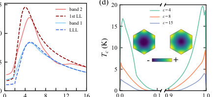
<figcaption class="paper-figure-caption"><b>Fig 1.</b> FIG. 1. (a) Band structure of the SLM. (b) Comparison of form fac- tors between the SLM and ideal Landau levels. The blue markers indicate the magnitude of the SLM form factor, while the black dashed line represents the corresponding ideal LLL form factor. (c) The RPA-screened potential ̃𝑉(𝐪) of the SLM compared with Landau levels. Results are shown for the first band (𝜈= 0.05, corresponding to the LLL) and the second band (𝜈= 1.05, corre- sponding to the first LL), with a relative permittivity of 𝜖𝑟= 10. (d) Dependence of the superconducting transition temperature 𝑇𝑐 on the filling factor 𝜈for various relative permittivities 𝜖𝑟. The plot covers filling ranges near the bottom (𝜈≈0) and top...</figcaption>
</figure>
<figure class="paper-figure-card">
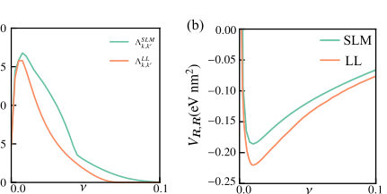
<figcaption class="paper-figure-caption"><b>Fig 2.</b> FIG. 2. (a) 𝑇𝑐curves obtained with the exact SLM form factor and the Landau level approximation, both using the SLM band struc- ture to preserve lattice periodicity. (b) Effective attraction strength in the plane-wave channel versus filling. Both the SLM numeri- cal results and the analytical solution obtained from Eq. (3) ex- hibit a pronounced peak near the band edge. Note that the appar- ent discrepancy, where the SLM yields a higher 𝑇𝑐in (a) despite a weaker attraction in (b), arises because the analytical LL curve in (b) assumes free-electron bands, whereas both calculations in (a) strictly use the SLM dispersion.</figcaption>
</figure>
<figure class="paper-figure-card">
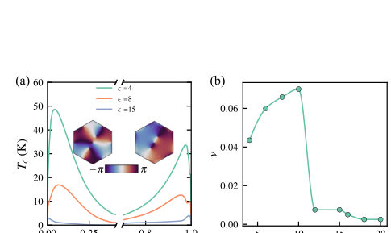
<figcaption class="paper-figure-caption"><b>Fig 3.</b> FIG. 3. (a) Dependence of 𝑇𝑐and the order parameter phase on filling for the spin-polarized skyrmion model. The pairing sym- metry evolves from chiral 𝑓-wave in the low-filling region to chi- ral 𝑝-wave at high filling. (b) Variation of the optimal filling with respect to the dielectric constant 𝜖𝑟.</figcaption>
</figure>
<figure class="paper-figure-card">
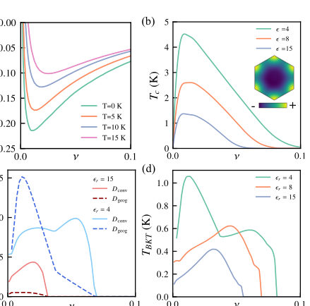
<figcaption class="paper-figure-caption"><b>Fig 4.</b> FIG. 4. (a) RPA interaction strength in the plane-wave channel as a function of filling at different temperatures. (b) 𝑇𝑐versus filling, accounting for the effect of temperature on RPA screening. In- set: Order parameter, which remains nearly invariant with filling. (c) Conventional and geometric contributions to the superfluid weight versus filling for various 𝜖𝑟. (d) BKT transition tempera- ture. For small 𝜖𝑟, a band-edge enhancement is observed, driven by the dominant geometric contribution.</figcaption>
</figure>

**Summary.** This theoretical work reveals that superconductivity in flat Chern bands is governed by a novel 'geometry-driven' Kohn--Luttinger mechanism. By analyzing the alignment between the attractive Coulomb interaction and geometric form factors, the authors predict specific pairing symmetries (s-wave or chiral p/f-wave) depending on spin polarization. This establishes quantum geometry as a fundamental principle organizing unconventional superconductivity in topological materials.

**Why it may be interesting.** While focused on superconductivity, the concept of geometric constraints (quantum geometry) dictating emergent many-body phases is highly relevant to understanding topological order in synthetic quantum platforms or engineered lattice systems studied in AMO physics.

Detailed structure

**Main problem.** The work investigates the mechanism driving superconductivity near correlated topological phases, specifically focusing on a geometry-driven Kohn--Luttinger (KL) pairing mechanism.

**Main result.** They establish that quantum geometry dictates optimal pairing strength in flat Chern bands, leading to extended-$s$-wave instability for unpolarized pairing and chiral $p$/$f$-wave order for spin-polarized pairing.

**Method.** The analysis uses the Random Phase Approximation (RPA) screening of the Coulomb interaction within the framework of a gap equation solved on the Skyrmion lattice model.

**Model / system.** The system is modeled using flat Chern bands, realized minimally via the Skyrmion lattice model. The effective attraction is derived from RPA-screened interactions and analyzed near local band extrema.

**Key observables.** Superconducting transition temperature ($T_c$), order parameter ($\Delta$), pairing symmetry (s-wave, p-wave, f-wave), and superfluid stiffness ($D(T)$).

**Important parameters / regimes.** Fermi filling ($
u$), magnetic length scale ($l_B$), and the degree of spin polarization.

**Assumptions / limitations.** The analysis relies on approximating the form factor near band extrema and uses the Skyrmion lattice model as a minimal realization for flat Chern bands.

**Figures summary.** Figures illustrate the band structure, comparison between SLM and LLL form factors, RPA potential strength vs. filling, and $T_c$ dependence on filling and temperature effects.

**Paper structure.** The paper first introduces the geometry-driven KL mechanism using the Skyrmion lattice model Hamiltonian and RPA screening. It then analyzes spin-unpolarized and spin-polarized pairing channels separately to determine the resulting superconducting symmetry and stability, concluding with finite-temperature analysis.

Abstract

Recent observations of superconductivity near correlated topological phases in flat bands suggest a facile link between flat-band geometry and electron pairing. In this work, we reveal a geometry-driven Kohn--Luttinger mechanism in which Landau-level-like form factors align the attractive lobe of the RPA-screened Coulomb interaction with the form-factor peak, generating an anomalously strong attractive channel near local band extrema. Using the Skyrmion lattice model as a minimal realization, we show that for spin-unpolarized pairing the form-factor magnitude enforces an emergent momentum-space translational symmetry and selects an extended-$s$ instability concentrated at small Fermi pockets, while for spin-polarized pairing the form-factor phase drives chiral $p$- and $f$-wave order without invoking spin fluctuations. The band-extrema enhancement persists in higher Landau-level analogs and survives finite-temperature screening and Berezinskii--Kosterlitz--Thouless phase fluctuations. Our work establishes quantum geometry as a key organizing principle for unconventional pairing in flat Chern bands.

[↑ back to top](#top)

### [Room-temperature tuning and probing of Fermi polarons in atomically thin semiconductors on a plasmonic metasurface](http://arxiv.org/abs/2606.17278v1)

**Authors:** Tingting Wu, Francesca Maria Marchetti, Antonio Tiene, Antonio I. Fernández-Domínguez, Miao Qi, Zhe Wang, Lin Liu, Lei Wei, Francisco J. Garcia-Vidal, Mengxiao Chen, Qi Jie Wang, Yu Luo  
**Type:** both · **Category:** strongly correlated electrons · **PDF:** <https://arxiv.org/pdf/2606.17278v1>  
**Analysis basis:** full PDF text, analyzed in chunks
**Topic relevance:** `Keldysh / 2PI / non-Gaussian methods` **3/5** · `analog quantum simulation` **3/5** · `correlated cavity matter` **3/5** · `driven-dissipative phase transition` **3/5** · `methods for driven-dissipative` **3/5** · `Tavis-Cummings & cavity-many-emitter` **2/5** · `interference shaping light` **2/5** · `spintronics-quantum-optics interface` **2/5** · `Kondo & dissipative impurity` **1/5** · `exotic spin models in light-matter` **1/5** · `non-equilibrium dynamics` **1/5** · `quantum optics experiment` **1/5**

↔ Scroll figures horizontally

<figure class="paper-figure-card">
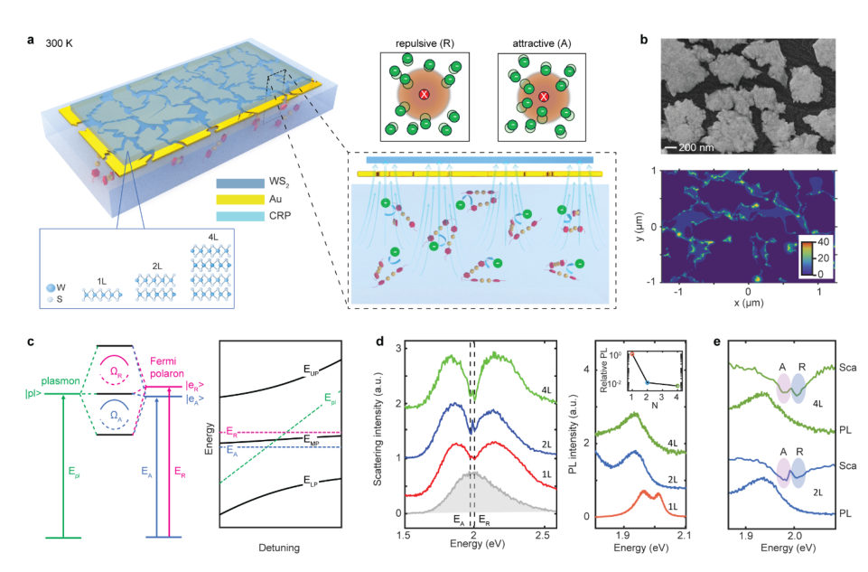
<figcaption class="paper-figure-caption"><b>Fig 1.</b> Figure 1. Branch-resolved scattering readout of Fermi polarons in monolayer and few-</figcaption>
</figure>
<figure class="paper-figure-card">
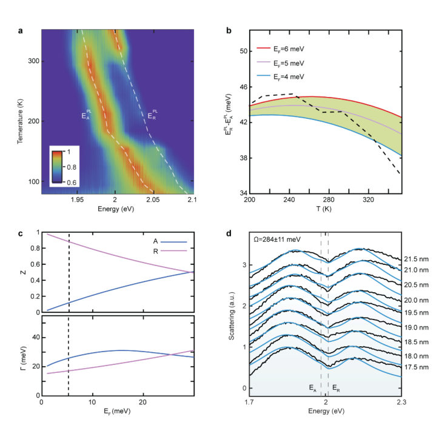
<figcaption class="paper-figure-caption"><b>Fig 2.</b> Figure 2. Benchmarking monolayer WS2 Fermi polarons and validating the metasurface-</figcaption>
</figure>
<figure class="paper-figure-card">
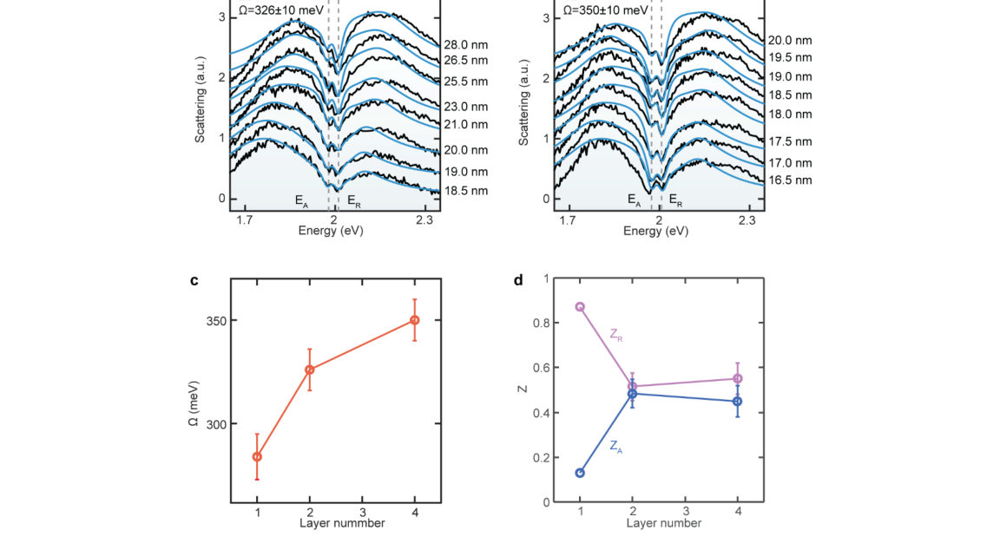
<figcaption class="paper-figure-caption"><b>Fig 3.</b> Figure 3. Fermi polarons in multilayer WS2. Dark-field scattering spectra of 2L (a) and 4L</figcaption>
</figure>
<figure class="paper-figure-card">
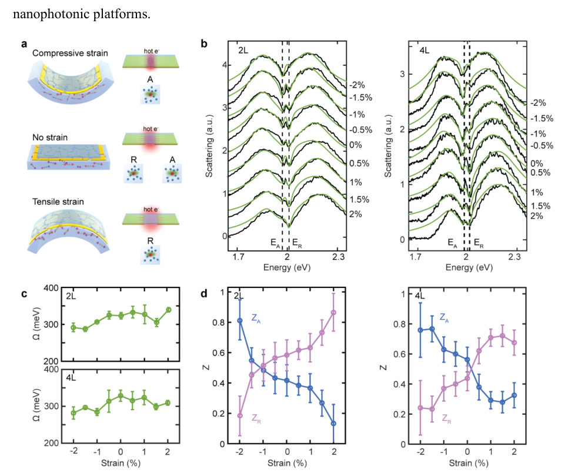
<figcaption class="paper-figure-caption"><b>Fig 4.</b> Figure 4. Strain-programmable redistribution of Fermi polarons. (a) Schematic of uniaxial</figcaption>
</figure>

**Summary.** This research develops a novel platform combining atomically thin semiconductors ($	ext{WS}_2$) with plasmonic metasurfaces to study Fermi polarons at room temperature. By using scattering spectroscopy, the authors achieve quantitative control over polaron branch spectral weights by tuning both the film thickness and applying uniaxial strain. This establishes a powerful tool for manipulating correlated electronic states in 2D materials.

**Why it may be interesting.** The work provides an excellent example of using plasmonics to enhance optical contrast for probing subtle many-body physics (FPs) in solid-state systems, bridging fundamental correlated electron theory with device-relevant heterostructures.

Detailed structure

**Main problem.** The challenge is extending active, quantitative, branch-resolved probing of Fermi polarons (FPs) from monolayer to stacked geometries in atomically thin semiconductors.

**Main result.** The authors successfully demonstrated that integrating $	ext{WS}_2$ with a plasmonic metasurface allows for room-temperature, strain-tunable spectroscopy to resolve and manipulate the attractive and repulsive polaron branches across multiple layers.

**Method.** The study combines dark-field scattering spectroscopy measurements with theoretical modeling based on coupled oscillator Hamiltonians (COM) to fit spectral features.

**Model / system.** The system involves electron-doped $	ext{WS}_2$ flakes (1L to 4L) placed on a strain-tunable plasmonic metasurface. The physics is modeled via the Fermi polaron quasiparticle interacting with the degenerate Fermi sea and coupled to surface plasmons, forming three hybrid polariton branches.

**Key observables.** Polaron branch spectral weights ($w_{AP}, w_{RP}$), Rabi coupling strength ($\Omega$), energy splitting between branches, and temperature dependence of these features.

**Important parameters / regimes.** Layer number (1L to 4L), applied uniaxial strain (tensile/compressive), electron doping level, and plasmonic resonance frequency.

**Assumptions / limitations.** The analysis often assumes that the optical response in multilayer samples is dominated by the metal-proximal layer, simplifying the full vertical averaging problem. PL measurements are sometimes used as an independent benchmark for intrinsic parameters.

**Figures summary.** Figures illustrate the experimental setup (metasurface integration), spectral evolution under strain and thickness changes, and theoretical fitting of coupled oscillator models to extract coupling strengths and spectral weights.

**Paper structure.** The paper progresses by first establishing a robust scattering spectroscopy technique that overcomes PL quenching in multilayers. It then systematically investigates how layer number controls the overall polaron response, culminating in demonstrating that uniaxial strain acts as a powerful knob to deterministically redistribute oscillator strength between the attractive and repulsive branches.

Abstract

The Fermi polaron, arising from interactions between a mobile impurity and a degenerate Fermi sea, is a many-body quasiparticle that provides a sensitive probe of strongly correlated electronic phases in atomically thin semiconductors. In doped transition-metal dichalcogenides, the attractive and repulsive polaron branches are well established in monolayers. However, extending active control and quantitative, branch-resolved probing to stacked geometries has remained elusive because spectral quenching and weak optical contrast restrict access to Fermi polaron signatures. Here, we integrate electron-doped WS$_2$ flakes from monolayer to quadrilayer with a strain-tunable plasmonic metasurface, enabling high-contrast scattering readout at room temperature through coupling between Fermi polaron resonances and surface plasmons. This platform enables quantitative extraction of polaron branch spectral weights and coupling strengths across different layer numbers. We uncover a systematic thickness dependence of the spectral-weight distribution and demonstrate continuous and fully reversible spectral-weight transfer between attractive and repulsive branches in bilayers and quadrilayers, with near-complete transfer achieved in bilayers. By identifying layer number and strain as complementary control parameters for Fermi polarons, our results establish metasurface-enabled scattering spectroscopy as a practical route to resolve and manipulate many-body resonances in stacked van der Waals semiconductors, bridging idealized monolayer polaron physics and device-relevant architectures.

[↑ back to top](#top)

### [Atomic-scale sensing of photoexcitation processes in electronically isolated molecules via atomic force microscopy](http://arxiv.org/abs/2606.17623v1)

**Authors:** Lisanne Sellies, Thomas Buchner, Jinhui Guo, Sonja Bleher, Felix Giselbrecht, Clea Ruth, Andrea Donarini, Jascha Repp, Laerte L. Patera  
**Type:** both · **Category:** other · **PDF:** <https://arxiv.org/pdf/2606.17623v1>  
**Analysis basis:** full PDF text, analyzed in chunks
**Topic relevance:** `driven-dissipative phase transition` **3/5** · `methods for driven-dissipative` **3/5** · `Kondo & dissipative impurity` **2/5** · `non-equilibrium dynamics` **2/5** · `quantum measurements` **2/5** · `quantum optics experiment` **2/5** · `Keldysh / 2PI / non-Gaussian methods` **1/5** · `analog quantum simulation` **1/5** · `correlated / nonlocal dissipation` **1/5** · `measurement-induced transitions` **1/5** · `non-equilibrium universality` **1/5** · `spintronics-quantum-optics interface` **1/5**

↔ Scroll figures horizontally

<figure class="paper-figure-card">
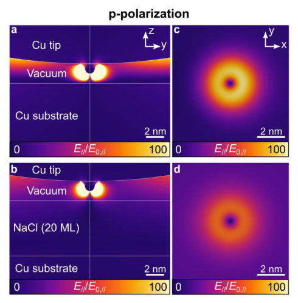
<figcaption class="paper-figure-caption"><b>Fig 1.</b> Fig. 1 | Simulation of the near-field enhancement for p-polarized light. a, b, y-z cross sections of the enhancement for Cu tip-vacuum-Cu substrate and Cu tip-vacuum-NaCl (20 ML)-Cu substrate, respectively. c, d, x-y cross sections 3 Å above the Cu and NaCl surfaces, respectively. The propagation direction of the light is along the x direction. The maximum near-field-enhancement factors are 2300 (a), 1200 (b), 93 (c), and 76 (d). In panels a and b, the signal exceeds the colour-scale maximum and is therefore saturated.</figcaption>
</figure>
<figure class="paper-figure-card">
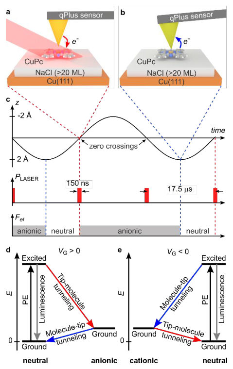
<figcaption class="paper-figure-caption"><b>Fig 2.</b> Fig. 2 | Operating principle of Photoexcited single-charge AFM. Schematic of the PE-AFM measurement scheme showing nanosecond laser pulses phase-locked to the AFM cantilever oscillation. a, Pulses illuminate the tip–sample junction at the cantilever’s zero crossings, exciting the CuPc molecule and inducing electron transfer to the molecule (tip) for suitable positive (negative) values of VG. b, By setting |VG| slightly below the charge bistability threshold, molecular neutralization is steered to occur predominantly near the lower turnaround point of the cantilever oscillation. c, Charge-state- dependent damping mechanism. The asymmetry in molecular charge state between the inward and...</figcaption>
</figure>
<figure class="paper-figure-card">

<figcaption class="paper-figure-caption"><b>Fig 3.</b> Fig. 3a illustrates a schematic representation of the experimental setup, where linearly polarized laser light is focused onto the tip–sample junction (see Methods). Fig. 3b shows the photoexcitation-induced AFM damping (detected as a feedback-induced increased driving amplitude Adrive) signal measured above a CuPc molecule as a function of VG for different laser polarization angles θ. The signal is maximized for p-polarized light (θ = 0°) and vanishes for s- polarized light (θ = 90°), consistent with the polarization dependence of the near-field enhancement (see Fig. 1 and Extended Data Fig. 2a-d). The strong dependence on the light polarization supports the assignment of the observed...</figcaption>
</figure>
<figure class="paper-figure-card">
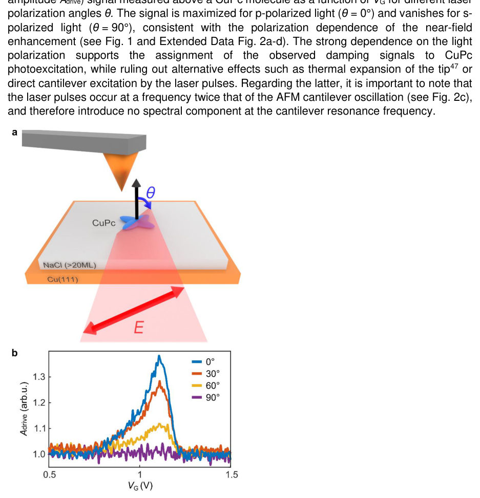
<figcaption class="paper-figure-caption"><b>Fig 4.</b> Fig. 3 | Polarization dependence of the photocurrent signal. a, Schematic indicating the polarization angle θ. b, Polarization dependence of the damping signal as a function of VG.</figcaption>
</figure>
<figure class="paper-figure-card">
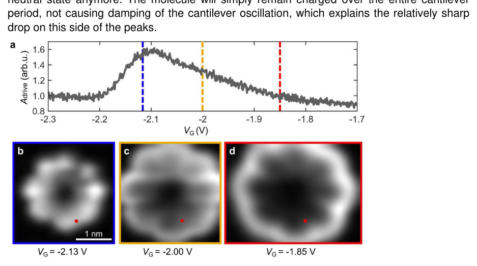
<figcaption class="paper-figure-caption"><b>Fig 5.</b> Fig. 4 | Gate voltage control of photoexcitation detection in CuPc. a, VG-dependent Adrive (indicating damping) for the neutral-to-cationic transition showing an asymmetric lineshape due to the interplay between fixed photoexcitation timing and VG-tunable discharging dynamics. b–d, Constant-height PE- AFM images (Adrive) at VG = –2.13 V (b), –2.00 V (c), and –1.85 V (d). The red dot indicates the position where the spectrum shown in a is taken.</figcaption>
</figure>

**Summary.** The authors introduce Photoexcitation single-charge AFM (PE-AFM) to probe photoexcitation processes in isolated molecules. By synchronizing laser pulses with AFM tip oscillations, they detect charge transfer events related to excited states. This technique provides unprecedented atomic-scale characterization of molecular photophysics, revealing the role of long-lived electronic states.

**Why it may be interesting.** This work directly bridges quantum optics/molecular physics with nanoscale characterization. The ability to map out multi-state potential energy surfaces and measure lifetimes *in situ* at the single-molecule level is highly relevant for understanding open quantum systems dynamics in condensed matter.

Detailed structure

**Main problem.** The primary goal is obtaining atomic-scale insights into photoexcitation processes and subsequent charge transfer dynamics within single, electronically isolated molecules.

**Main result.** The proposed Photoexcitation single-charge AFM (PE-AFM) technique successfully detects these photocurrents with angstrom spatial resolution, revealing the involvement of long-lived excited states like $	ext{Q}_1$.

**Method.** The method combines Atomic Force Microscopy (AFM) with synchronized nanosecond laser pulses to induce photoexcitation and measure subsequent electron tunneling events via changes in cantilever damping.

**Model / system.** The system involves single molecules, such as copper phthalocyanine ($	ext{CuPc}$), adsorbed on non-conductive dielectric films ($	ext{NaCl}$) over a metal substrate. Theoretical modeling uses interacting Hamiltonians to describe the multi-state electronic structure (e.g., $	ext{D}_0$, $	ext{Q}_1$) and potential energy surfaces.

**Key observables.** Photoexcitation-driven AFM contrast, cantilever damping modulation ($\Delta f$), photoemission current, excited-state spectral features, and transition voltages ($V_G$).

**Important parameters / regimes.** Long-lived state lifetime ($	au \approx 11 \, \mu	ext{s}$), spatial resolution ($	ext{\AA}$), laser wavelength ($\lambda = 640 	ext{ nm}$), and gate voltage dependence.

**Assumptions / limitations.** The technique assumes electronic decoupling of molecules via insulating films, and analysis often relies on modeling the rate-limiting step being dictated by the longest-lived excited state pathway.

**Figures summary.** Figures illustrate simulation results for near-field electric field enhancement in dielectric environments, the PE-AFM operating principle showing charge cycling, polarization dependence of the signal, and spatial maps revealing orbital selectivity based on gate voltage.

**Paper structure.** The paper progresses from establishing the need for atomic-scale photoexcitation sensing to detailing the PE-AFM methodology (including simulations), demonstrating its capability via spectroscopy and mapping ($	ext{CuPc}$), and finally using advanced fitting techniques to characterize long-lived excited state dynamics.

Abstract

Atomic-scale insights into light-matter interaction can be obtained using light-assisted scanning probe microscopy techniques. Recently, photoexcited charge carriers have been detected by means of scanning tunnelling microscopy, enabling the study of photo-induced charge transfer with atomic-scale spatial resolution. Here, we propose an approach based on atomic force microscopy (AFM), namely photoexcitation single-charge AFM (PE-AFM), to detect photoexcitation in single molecules adsorbed on non-conductive dielectric films. Synchronizing laser pulses to the oscillation of the tip of an AFM enables the detection of electron tunnelling events that follow photoexcitation. We demonstrate the PE-AFM technique for individual copper phthalocyanine molecules and achieve photoexcitation-driven AFM contrast with ångström spatial resolution. The observed sub-molecular contrast suggests the involvement of a long-lived quadruplet excited state. When combined with the recently developed AFM excited-state spectroscopy including lifetime measurements, PE-AFM enables comprehensive characterization of electronic states involved in photoexcitation and subsequent intersystem crossing, establishing a powerful platform for investigating photophysical processes at the single-molecule level.

[↑ back to top](#top)

### [AC-flux-driven SQUID diode spectroscopy as a probe of current-phase relations](http://arxiv.org/abs/2606.17704v1)

**Authors:** Yuriy Yerin, Iman Askerzade, Alexey Fedorchenko, Ali Gencer, Oleksandr Dobrovolskiy  
**Type:** theory · **Category:** other · **PDF:** <https://arxiv.org/pdf/2606.17704v1>  
**Analysis basis:** full PDF text, analyzed in chunks
**Topic relevance:** `Keldysh / 2PI / non-Gaussian methods` **3/5** · `driven-dissipative phase transition` **3/5** · `methods for driven-dissipative` **3/5** · `non-equilibrium dynamics` **2/5** · `interference shaping light` **1/5** · `non-equilibrium universality` **1/5**

↔ Scroll figures horizontally

<figure class="paper-figure-card">
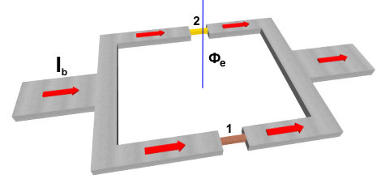
<figcaption class="paper-figure-caption"><b>Fig 1.</b> FIG. 1. Schematic of the asymmetric dc SQUID geome- try. The device consists of two Josephson junctions (1 and 2) threaded by an external magnetic flux Φe = Φdc + Φac cosωt, with dc and ac flux components and biased by the dc current Ib. Junction 1 is a conventional junction with a purely sinusoidal CPR, while junction 2 may support subharmonic and second- harmonic contributions, as described by Eq. (7).</figcaption>
</figure>
<figure class="paper-figure-card">
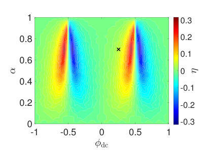
<figcaption class="paper-figure-caption"><b>Fig 2.</b> FIG. 2. Diode efficiency η(φdc,α) of a dc SQUID with two purely sinusoidal Josephson junctions for βc = 1 and βL = 0.15 in the static regime (φac = 0). The cross marks the working point (φdc = 0.25, α = 0.7) used in the remainder of this work.</figcaption>
</figure>
<figure class="paper-figure-card">
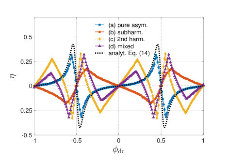
<figcaption class="paper-figure-caption"><b>Fig 3.</b> FIG. 3. Static diode efficiency η(φdc) at φac = 0, βc = 1, βL = 0.15, and α = 0.7, for the four CPR cases defined by Eq. (7), as indicated in the legend. The dotted black curve shows the analytical prediction from Eq. (14). Vertical dotted lines mark the time-reversal symmetric flux values φdc = 0 and φdc = ±1/2.</figcaption>
</figure>
<figure class="paper-figure-card">
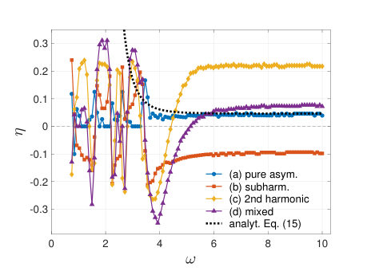
<figcaption class="paper-figure-caption"><b>Fig 4.</b> FIG. 4. Frequency dependence of the diode efficiency η(ω) at fixed φac = 1.5, φdc = 0.25, βc = 1, βL = 0.15, and α = 0.7, for the four CPR cases, as indicated. The dotted black curve shows the analytical prediction from Eq. (15).</figcaption>
</figure>
<figure class="paper-figure-card">
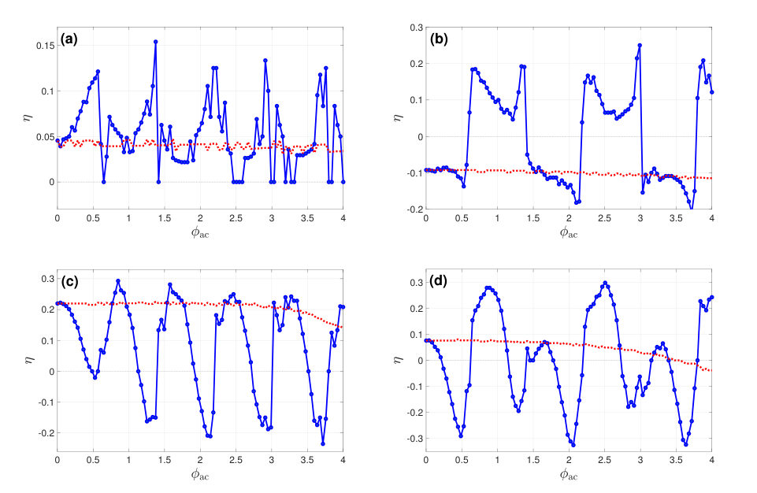
<figcaption class="paper-figure-caption"><b>Fig 5.</b> FIG. 5. Flux-drive-amplitude dependence of the diode efficiency η(φac) at φdc = 0.25, βc = 1, βL = 0.15, and α = 0.7 for four CPR cases: (a) pure amplitude asymmetry, (b) subharmonic only, (c) second-harmonic only, and (d) mixed harmonics. Each panel shows two curves corresponding to ω = 1 (solid blue with markers) and the adiabatic limit ω = 7.5 (dotted red).</figcaption>
</figure>

**Summary.** This work proposes using AC magnetic-flux-driven SQUID diode spectroscopy as a novel diagnostic tool for mapping the Current-Phase Relation (CPR) in unconventional superconductors. By analyzing the resulting 2D phase diagram of the diode efficiency, researchers can distinguish between different CPR harmonics ($\sin\phi$, $\sin(\phi/2)$, $\sin(2\phi)$) based on characteristic Bessel function patterns. This method offers a robust way to probe exotic superconducting states like those found in topological or multiband materials.

**Why it may be interesting.** The technique provides a powerful, non-invasive transport measurement to probe microscopic quantum details of superconducting order parameters (like fractional or higher harmonics) that are otherwise difficult to measure directly.

Detailed structure

**Main problem.** The primary challenge is unambiguously extracting individual Current-Phase Relation (CPR) harmonics from the CPR spectrum, as different components yield nearly identical static interference patterns obscured by device asymmetries and dynamics.

**Main result.** AC magnetic-flux-driven SQUID diode spectroscopy provides a high-resolution diagnostic tool, revealing distinct fingerprints of various CPR harmonics ($\sin\phi$, $\sin(\phi/2)$, $\sin(2\phi)$) through characteristic Bessel function dressings in the 2D phase diagram $\eta(\varphi_{ac}, \omega)$.

**Method.** The authors use complementary reductions of fast-driven dynamics, including Kapitza-type perturbation theory and Jacobi–Anger averaging, to analyze the diode efficiency $\eta$ as a function of AC flux amplitude ($\varphi_{ac}$) and frequency ($\omega$).

**Model / system.** The system is an asymmetric DC SQUID with unequal junction critical currents. The model incorporates Josephson junctions whose CPRs can contain higher-order or fractional harmonics, such as $\sin(\phi/2)$ (4$\pi$-periodic) and $\sin(2\phi)$ ($\pi$-periodic).

**Key observables.** Diode efficiency $\eta(\varphi_{ac}, \omega)$, which exhibits characteristic nodal line patterns governed by Bessel functions ($J_0(\xi_0)$, $J_0(\xi_0/2)$, $J_0(2\xi_0)$).

**Important parameters / regimes.** AC flux amplitude ($\varphi_{ac}$), driving frequency ($\omega$), and the damping regime (overdamped to underdamped).

**Assumptions / limitations.** The analysis relies on approximations like assuming $eta_L \ll 1$ for Jacobi-Anger reduction, and that the system dynamics can be mapped onto an effective CPR structure.

**Figures summary.** Figures illustrate static ($\eta(\varphi_{dc})$), frequency ($\eta(\omega)$), and full 2D phase diagrams ($\eta(\varphi_{ac}, \omega)$) showing distinct arc patterns corresponding to different underlying CPR harmonics.

**Paper structure.** The paper systematically develops the theoretical framework by first establishing the SQUID model, then applying fast-averaging techniques (Jacobi-Anger), and finally mapping the resulting effective CPR components onto measurable signatures in the 2D phase diagram $\eta(\varphi_{ac}, \omega)$ for various harmonic content.

Abstract

The current-phase relation (CPR) of a Josephson junction encodes microscopic information on superconducting states through higher-order and fractional harmonics. However, their unambiguous extraction is challenging, as different CPR components produce nearly identical static interference patterns that are further obscured by device asymmetries, damping, and dynamical effects. Here, we propose probing individual CPR harmonics via the ac magnetic-flux-driven diode effect in asymmetric dc SQUIDs with unequal junction critical currents. Using two complementary reductions of the fast-driven dynamics -- a Kapitza-type perturbation theory for the conventional junction and a Jacobi--Anger averaging for a general CPR -- we show that ac flux modulation dresses each harmonic with a distinct Bessel function, yielding characteristic signatures in the diode efficiency $η(φ_{\rm ac},ω)$ as a function of ac flux amplitude $φ_{\rm ac}$ and frequency $ω$. We verify and extend these predictions by numerical solutions of the coupled dynamical equations for CPRs containing $\sin\varphi$, $\sin(\varphi/2)$, and $\sin 2\varphi$ terms ($\varphi$: superconducting phase difference), and construct phase diagrams of $η(φ_{\rm ac},ω)$. Distinct CPR components are revealed to produce characteristic weak, sparse, dense, or intermodulated arc patterns that remain robust in both overdamped and underdamped regimes. This suggests ac-flux-driven SQUID diode spectroscopy as a probe of current-phase relations in topological materials, multiband systems, and other unconventional superconductors.

[↑ back to top](#top)

### [Energy localization in damped nonlinear disordered metastructures under superharmonic resonance](http://arxiv.org/abs/2606.18076v1)

**Authors:** Lucas José Dantas Alcântara, Arthur Silva Barbosa, Rafael da Silva Raqueti, Najib Kacem, Leopoldo Pisanelli Rodrigues de Oliveira, Noureddine Bouhaddi  
**Type:** theory · **Category:** disordered systems and neural networks · **PDF:** <https://arxiv.org/pdf/2606.18076v1>  
**Analysis basis:** full PDF text, analyzed in chunks
**Topic relevance:** `Frenkel-Kontorova` **3/5** · `methods for driven-dissipative` **3/5** · `driven-dissipative phase transition` **2/5** · `non-equilibrium dynamics` **2/5** · `Keldysh / 2PI / non-Gaussian methods` **1/5** · `correlated / nonlocal dissipation` **1/5** · `non-equilibrium universality` **1/5**

↔ Scroll figures horizontally

<figure class="paper-figure-card">
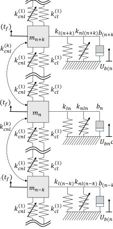
<figcaption class="paper-figure-caption"><b>Fig 1.</b> Fig. 1 Equivalent lumped-parameter model of the metas- tructure. The system consists of a chain of oscillators coupled through linear stiffnesses kcl and nonlinear stiff- nesses kcnl, with coupling interactions extending up to the α-th neighbor and the superscript (k) denotes the coupling order. Each unit cell is defined by the mass m, linear stiff- ness kl, nonlinear stiffness knl, damping coefficient b, and base excitation of amplitude Ub, indexed by n to identify each oscillator. The excitation is tuned around third order superharmonic resonance of the primary mode.</figcaption>
</figure>
<figure class="paper-figure-card">
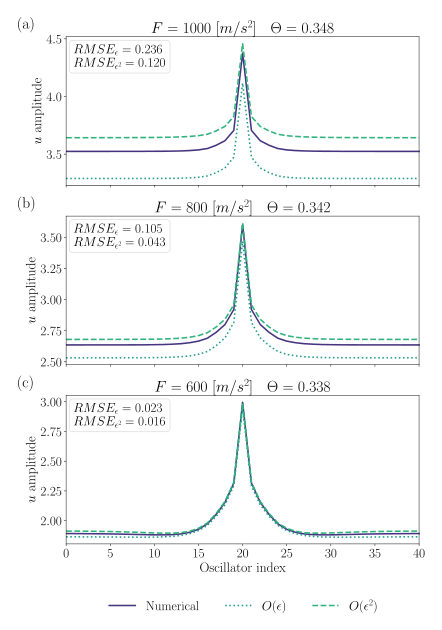
<figcaption class="paper-figure-caption"><b>Fig 2.</b> Fig. 2 Comparison between analytical responses obtained using the method of multiple scales with a single time scale and with two time scales, and the numerical solution obtained from the integration of Eq. (3) for the harden- ing case (± = 1). Panels a)–c) present the comparison for different excitation amplitudes. Numerical validation con- siders all oscillators initially at rest. Analytical solutions are obtained over 100 periods using the DOP853 method with tolerances rtol = 10−6 and atol = 10−8. Numerical integration is performed using the LSODA method with rtol = 10−6 and atol = 10−8 over 500 cycles, with the first 200 discarded as transient and 1000 points adopted per cycle. The...</figcaption>
</figure>
<figure class="paper-figure-card">
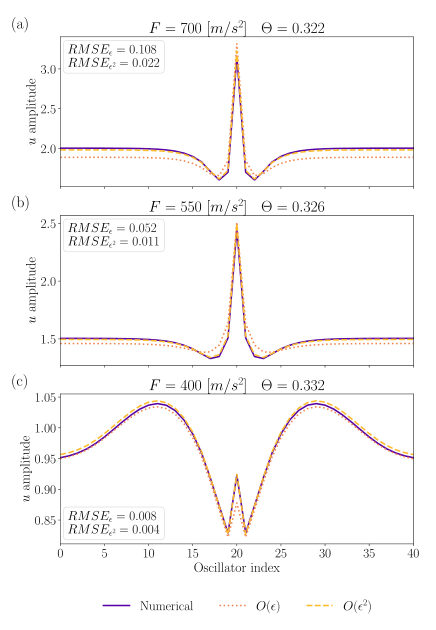
<figcaption class="paper-figure-caption"><b>Fig 3.</b> Fig. 3 Comparison between analytical responses obtained using the method of multiple scales with a single time scale and with two time scales, and the numerical solution obtained from the integration of Eq. (3) for the softening case (± = −1). Panels a)–c) present the comparison for different excitation amplitudes. Numerical validation con- siders all oscillators initially at rest. Analytical solutions are obtained over 100 periods using the DOP853 method with tolerances rtol = 10−6 and atol = 10−8. Numerical integration is performed using the LSODA method with rtol = 10−6 and atol = 10−8 over 500 cycles, with the first 200 discarded as transient and 1000 points adopted per cycle. The...</figcaption>
</figure>
<figure class="paper-figure-card">
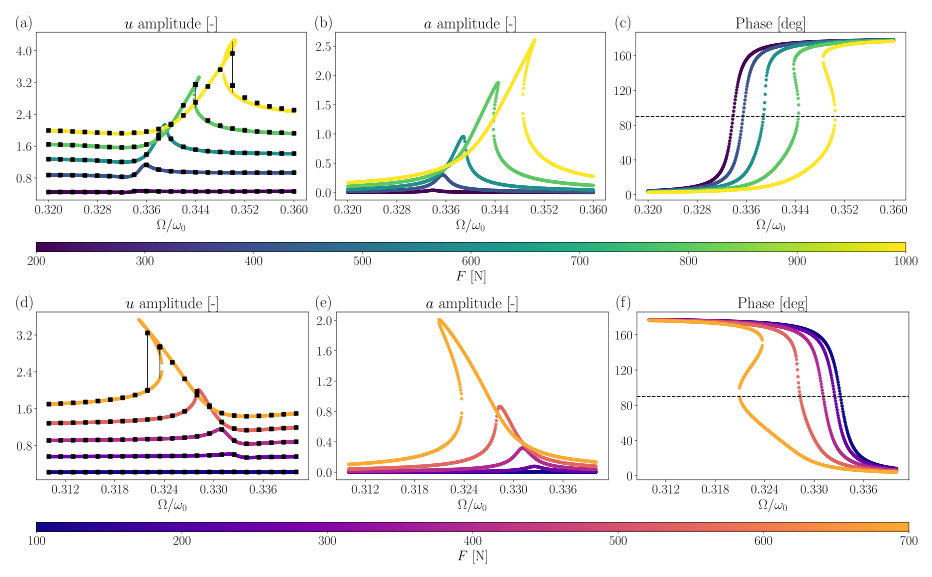
<figcaption class="paper-figure-caption"><b>Fig 4.</b> Fig. 4 Simulation of the 1-DOF system illustrating the limitations of an isolated amplitude analysis. Panels a)–c) corre- spond to the hardening case, while panels d)–f) represent the softening condition. The three columns show the amplitude of un, the amplitude an, and the phase γn, respectively. Numerical validation is performed by selecting points on the un ana- lytical curve as initial conditions for the numerical integration of Eq. (3), producing the black squares. Differences between squares and analytical predictions indicate the limits of the multiple-scales approximation. Integration is performed with the LSODA method using rtol = 10−6 and atol = 10−8, simulating 500 cycles (first...</figcaption>
</figure>
<figure class="paper-figure-card">
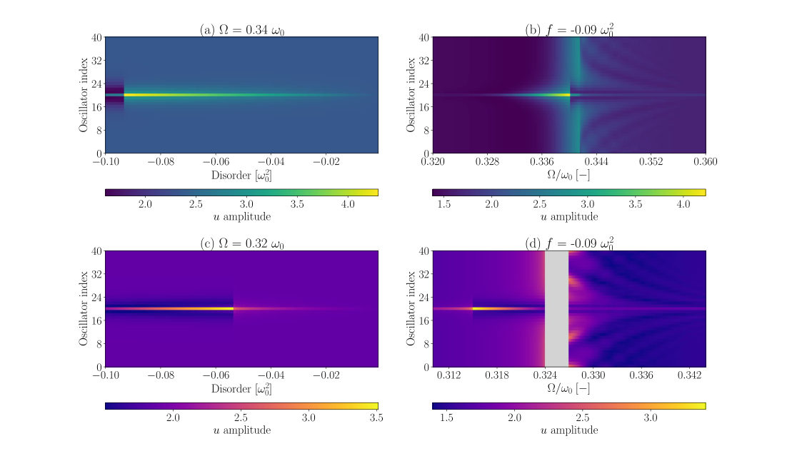
<figcaption class="paper-figure-caption"><b>Fig 5.</b> Fig. 5 Numerical sweeps of soliton nucleation for hardening (a–b) and softening (c–d) regimes. Panels (a,c): fixed excitation frequency with varying disorder; (b,d): fixed disorder with varying frequency. Simulations use the DOP853 method (rtol = 10−6, atol = 10−8) over 100 periods. Parameters: ζ = 0.3/100, ω0 = 100 Hz, β = 2.5 × 109[N/(kg · m3)], e = 0.01, and F = 700m/s2. Gray region (c–d): no steady-state convergence. Absence of nonlinear coupling. Linear coupling up to third order (α = 3), with C(1) l = 2.5%, ω2 0, C(2) l = C(1) l /4, and C(3) l = C(1) l /9. Periodic parameters, except for the introduced disorder. Numerical continuation imposed on the frequency domain.</figcaption>
</figure>

**Summary.** This paper investigates how energy localizes into solitons within complex, damped, nonlinear metamaterials subjected to disorder and driven at superharmonic frequencies. Using advanced perturbation methods like the method of multiple scales, the authors derive governing equations that reveal a crucial difference in phase dynamics compared to simpler resonances. The findings confirm that controlled disorder can induce soliton formation, supporting applications for vibration control strategies.

**Why it may be interesting.** The study of energy localization and soliton formation in disordered nonlinear lattices is a core topic bridging condensed matter physics (disorder effects) and nonlinear dynamics. The extension to superharmonic resonances provides new insights into wave propagation control mechanisms beyond standard primary resonance studies.

Detailed structure

**Main problem.** The paper develops a framework to study energy localization, specifically soliton dynamics, in nonlinear disordered metastructures operating under superharmonic resonance conditions.

**Main result.** It demonstrates that the phase plays a distinct role in superharmonic resonances compared to primary resonances, and shows that soliton nucleation is strongly dependent on disorder reducing the natural frequency.

**Method.** The analysis heavily relies on the Method of Multiple Scales applied to derive governing equations for soliton dynamics at second order, leading to novel restitution equations.

**Model / system.** The system modeled is a metastructure composed of coupled Duffing oscillators with linear and nonlinear coupling terms, incorporating disorder-induced periodicity breaking. The analysis focuses on the steady-state regime under superharmonic excitation.

**Key observables.** Soliton nucleation rate, amplitude profiles ($u_n$ vs $a_n$), convergence criteria ($\max |d A_n/dt| < 10^{-7}$), and Relative Standard Deviation (RSD) quantifying robustness against uncertainty.

**Important parameters / regimes.** Superharmonic excitation frequency ($\Theta$), disorder strength ($\delta
ho$), coupling orders ($\alpha=3$), and the number of degrees of freedom ($N$).

**Assumptions / limitations.** The analysis assumes strong excitation, employs perturbation expansions up to $\epsilon^2$, and makes several approximations regarding neglecting certain couplings or non-resonant terms.

**Figures summary.** Figures illustrate space-time evolution showing convergence criteria satisfaction for localized states versus non-convergent periodic/chaotic responses based on the excitation frequency. Sweeps show soliton nucleation rates dependence on disorder strength and excitation frequency.

**Paper structure.** The paper progresses from establishing the physical model and applying multiple scales to derive governing equations (including novel $\epsilon^2$ terms). It then analyzes the dynamics by comparing analytical solutions with numerical simulations, focusing on the distinct role of phase in superharmonic resonance compared to primary resonance. Finally, it assesses robustness against disorder uncertainty.

Abstract

This paper proposes a framework for energy localization in nonlinear oscillator chains operating in non-fundamental resonance, with emphasis on superharmonic regimes. The system is modeled as a metastructure composed of Duffing oscillators with both linear and nonlinear coupling, incorporating disorder-induced periodicity breaking. Under the assumption of strong excitation, the method of multiple scales is employed to derive the governing equations for soliton dynamics. At first-order perturbation, the classical form of the Nonlinear Schrödinger Equation emerges, whereas second-order analysis yields a previously unreported equation arising from the restitution of time scales. Analytical and numerical results demonstrate the nucleation of solitons in both hardening and softening regimes, based on two approaches: direct time-domain simulations from initially motionless states and numerical continuation in the frequency domain. A key finding is the distinct role of phase in superharmonic resonances compared to the primary resonance; specifically, the coexistence of multiple frequency components in the steady-state response precludes interpreting the soliton directly as a displacement envelope. Instead, the resulting secular terms captures the soliton associated with the resonant contribution, while transient components remain present under superharmonic excitation. Furthermore, robustness against disorder uncertainty is assessed by determining the tolerance levels that preserve the phenomenon. These results support the development of vibration control strategies aimed at mitigating the increase in resonant frequencies associated with the geometric downscaling of mechanical systems.

[↑ back to top](#top)

### [Coherent effects in quantum transport models and their classical counterparts](http://arxiv.org/abs/2606.18224v1)

**Authors:** N. S. Maslova, V. N. Mantsevich, I. M. Sokolov, P. I. Arseyev  
**Type:** theory · **Category:** other · **PDF:** <https://arxiv.org/pdf/2606.18224v1>  
**Analysis basis:** full PDF text, analyzed in chunks
**Topic relevance:** `non-equilibrium dynamics` **3/5** · `driven-dissipative phase transition` **2/5** · `non-equilibrium universality` **2/5** · `Frenkel-Kontorova` **1/5** · `Keldysh / 2PI / non-Gaussian methods` **1/5** · `analog quantum simulation` **1/5** · `correlated / nonlocal dissipation` **1/5** · `methods for driven-dissipative` **1/5**

↔ Scroll figures horizontally

<figure class="paper-figure-card">
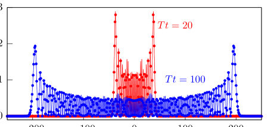
<figcaption class="paper-figure-caption"><b>Fig 1.</b> FIG. 1. Quasi-particle probability density function for a tight- binding chain with regular hopping amplitude with different values of parameter Tt, see text for details. The dots cor- respond to the physically realizable whole values of j, while thin solid lines serving as a guide to the eye are obtained by evaluation of the sum, here given by Eq. (8), for fractional values of j. The same notation is used in Figs. 3, 4, and 5.</figcaption>
</figure>
<figure class="paper-figure-card">
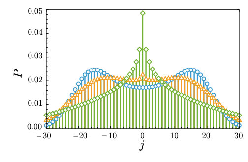
<figcaption class="paper-figure-caption"><b>Fig 2.</b> FIG. 2. The probability to find a particles at a site j of a chain for µ = 20 and different values of σ. One readily infers the transition from a bimodal shape for σ small, σ = 5 (circles) to a monomodal shape for sigma large (σ = 20, diamonds). The intermediate domain (here shown for σ = 7.5, triangles) corresponds to trimodal shapes.</figcaption>
</figure>
<figure class="paper-figure-card">
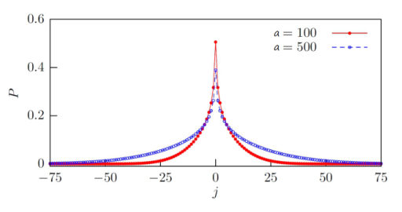
<figcaption class="paper-figure-caption"><b>Fig 3.</b> FIG. 3. Quasi-particle probability density function for clas- sical random hopping amplitude uniform for all pairs of sites for different values of parameter a given by Eq.(27).</figcaption>
</figure>
<figure class="paper-figure-card">
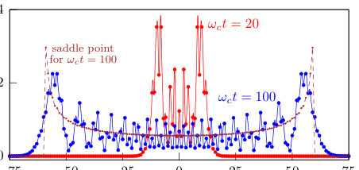
<figcaption class="paper-figure-caption"><b>Fig 4.</b> FIG. 4. Quasi-particle probability density function for differ- ent values of ωct and δ = 0. The quasi-particles are excited at site j = 0. The value of α is taken for α = 0.3.</figcaption>
</figure>
<figure class="paper-figure-card">
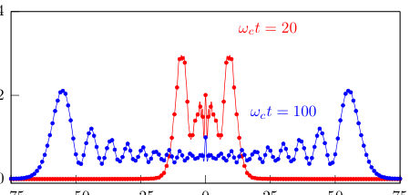
<figcaption class="paper-figure-caption"><b>Fig 5.</b> FIG. 5. Quasi-particle probability density function for ini- tially excited quasi particles at site j = 0 and for different values of parameter ωct and α = 0.3. The uniform phase δ is distributes as P(δ) = 1/2π.</figcaption>
</figure>

**Summary.** The paper investigates quasiparticle transport in various quantum chain models, demonstrating that the time evolution of the probability distribution function mimics classical random walk behaviors. By analyzing phonon-assisted hopping and disordered chains, the authors establish a direct quantum analogue to anomalous diffusion processes, particularly those exhibiting ballistic or U-shaped spreading.

**Why it may be interesting.** This work bridges coherent quantum dynamics with classical anomalous diffusion processes, providing a microscopic quantum origin for phenomena like Lévy walks observed in condensed matter systems.

Detailed structure

**Main problem.** The study analyzes how quasiparticle transport properties behave in quantum systems, specifically comparing coherent quantum dynamics to classical stochastic models like Lévy walks.

**Main result.** Quantum probability distributions exhibit behavior analogous to classical Continuous-Time Random Walk (CTRW) models, showing ballistic spreading or U-shaped profiles due to underlying coherence mechanisms.

**Method.** The analysis involves solving time evolution equations for the probability distribution function (PDF) using tight-binding Hamiltonians and applying advanced mathematical techniques like integral transforms and saddle-point approximations.

**Model / system.** The models include simple tight-binding chains, heterogeneous ensembles of chains with random hopping amplitudes, and phonon-assisted hopping mechanisms in 2D semiconductor systems (like TMDs).

**Key observables.** Time-dependent probability distribution function (PDF) $P_j(t)$, mean squared displacement $\langle x^2 
angle$, and the shape transition of the PDF (bimodal to monomodal).

**Important parameters / regimes.** Hopping amplitude ($T$), phonon coupling strength ($\omega_{ct}$), disorder parameters ($\mu, \sigma$), and time $t$.

**Assumptions / limitations.** The analysis relies on approximations such as the continuum limit, saddle-point approximation for integrals, and assuming specific forms for random phases or hopping amplitudes.

**Figures summary.** Figures illustrate the quasi-particle PDF ($P_j$) showing transitions from bimodal to monomodal shapes in heterogeneous ensembles, and demonstrate U-shaped/ballistic profiles in phonon-assisted hopping models.

**Paper structure.** The paper systematically analyzes transport using several quantum models: simple tight-binding, heterogeneous ensembles (varying disorder), random time-dependent hopping, and finally the detailed analysis of phonon-assisted hopping mechanisms.

Abstract

We analyze the transport properties of quasiparticles locally excited at an initial time moment in several exactly solvable quantum models. It is revealed that, in the investigated quantum systems, the time-dependent probability distribution function (PDF) exhibits behavior similar to that of classical continuous-time random walk (CTRW) models, such as Lévy walks or diffusing diffusivity.

[↑ back to top](#top)

### [Chirality-induced spin selectivity without intrinsic spin-orbit coupling: Role of current-induced molecular orbital moment](http://arxiv.org/abs/2606.17865v1)

**Authors:** Sumit Ghosh, Angela Wittmann, Frank Matthes, Daniel E. Bürgler  
**Type:** theory · **Category:** other · **PDF:** <https://arxiv.org/pdf/2606.17865v1>  
**Analysis basis:** full PDF text, analyzed in chunks
**Topic relevance:** `Keldysh / 2PI / non-Gaussian methods` **3/5** · `spintronics-quantum-optics interface` **3/5** · `methods for driven-dissipative` **2/5** · `exotic spin models in light-matter` **1/5** · `non-equilibrium dynamics` **1/5**

↔ Scroll figures horizontally

<figure class="paper-figure-card">
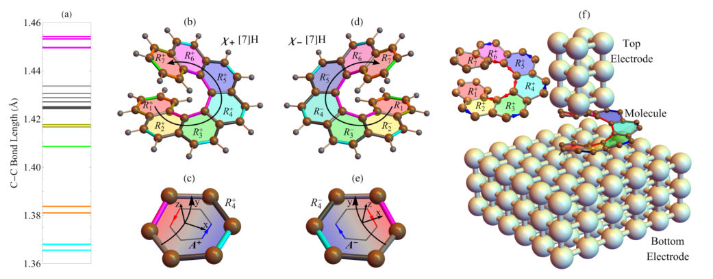
<figcaption class="paper-figure-caption"><b>Fig 1.</b> FIG. 1. Variation of the bond lengths and corresponding gauge fields in the right- and left-handed [7]H enantiomer and schematic device configuration. (a) Different bond lengths and their representative colors. (b) Right-handed (χ+) [7]H enantiomer where R1-R7 show the constituent C six-rings. (c) Variation of bond length in the 4th C six-ring (R+ 4 ), where x, y, and z span the local Cartesian coordinate system. The gradient of the bond length is shown in color in the plane of the C six-ring. Blue and red arrows show the direction of the corresponding gauge field along the outer and inner edge. Corresponding configuration for (d) the left-handed (χ−) [7]H enantiomer and (e) its 4th C...</figcaption>
</figure>
<figure class="paper-figure-card">
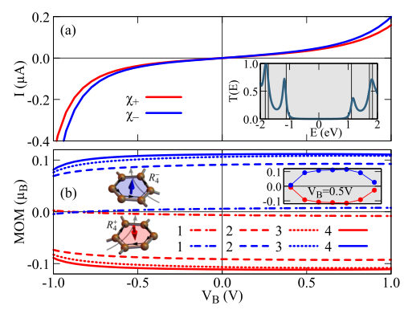
<figcaption class="paper-figure-caption"><b>Fig 2.</b> FIG. 2. I-V characteristics and induced MOM in χ+ and χ− [7]H molecules when electrons with spin polarization along +ˆz are injected. The Fermi level (EF ) is at 0.5 eV. (a) I-V curves of χ+ (red) and χ−(blue) molecules (Fig. 1b,d). Inset shows their degenerate transmission coefficient where the vertical black lines denote the eigenvalues of isolated molecule. (b) MOM due to the ring currents in the molecular rings 1-4 for χ+ (red) and χ−(blue) [7]H molecules. Inset shows the MOM for all seven rings at VB = 0.5 V. Schematics on the left show the bond currents (black arrows, also see Eq. 2) and the resulting MOM (large blue and red arrows) for rings R+ 4 and R− 4 at VB =0.5 V. Large gray...</figcaption>
</figure>
<figure class="paper-figure-card">
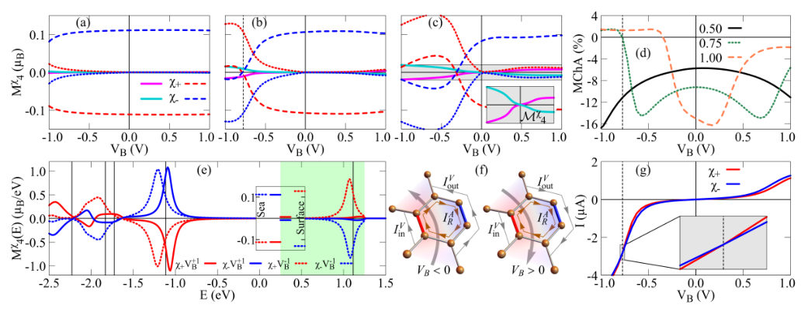
<figcaption class="paper-figure-caption"><b>Fig 3.</b> FIG. 3. Different contributions to the MOM and their impact on MChA and I-V curves. (a-c) Total MOM (dashed) and the Fermi surface contribution (dotted) of the 4th six-ring (M χ 4 ) for EF at (a) 0.5 eV, (b) 0.75 eV and (c) 1.0 eV, where red and blue lines represent the χ+ and χ−enantiomers. Magenta and cyan lines show the antisymmetric component Mχ 4 (see Eq. 4). Inset of (c) enlarges the crossing of Mχ 4 at the Fermi energy. (d) shows the MChA for EF at 0.5 eV (black), 0.75 eV (green dotted), and 1.0 eV (orange dashed). The vertical black dashed line indicates the zero crossing of MChA for EF = 0.75 eV, which is also marked in (b) and (g). (e) shows the distribution of total M χ 4 for VB...</figcaption>
</figure>
<figure class="paper-figure-card">
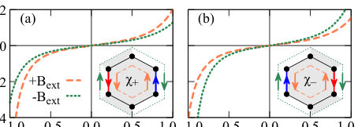
<figcaption class="paper-figure-caption"><b>Fig 4.</b> FIG. 4. I-V curves under opposite external magnetic field. Here we use | H AB · dl| = 0.1| H Aχ · dl|. (a) and (b) show the I-V curves for χ+ and χ−enantiomers, where orange dashed and green dotted lines correspond to positive (+Bext) and negative (−Bext) external magnetic field. Insets show the orientation of the gauge field in a six-ring, where orange and green arrows indicate the gauge field due to ±Bext respec- tively, and red and blue arrows denote the direction of Aχ ij for (a) χ+ and (b) χ−enantiomers (see Fig. 1c,e).</figcaption>
</figure>
<figure class="paper-figure-card">
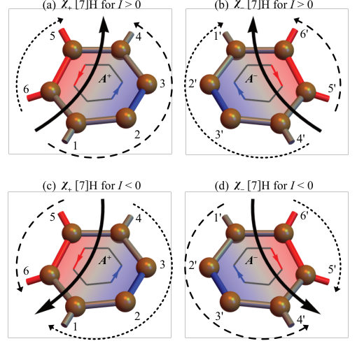
<figcaption class="paper-figure-caption"><b>Fig 5.</b> FIG. 5. Gauge field and current flow in the 4th C six-ring of both [7]H enantiomers for positive (a,b) and negative (c,d) current. Solid black arrows indicate the electron motion when a positive (a,b) or negative (c,d) current is flowing through the molecule. Dashed and dotted arrows represent ccw and cw current components, respectively. The C atoms are numbered ccw from 1 to 6 and from 1’ to 6’, respectively.</figcaption>
</figure>

**Summary.** The paper proposes that Chirality-Induced Spin Selectivity (CISS) in chiral molecules originates from a current-induced Molecular Orbital Moment (MOM). This MOM arises from an effective gauge field associated with structural distortions, allowing the effect to be explained without invoking intrinsic spin-orbit coupling. The theory successfully predicts characteristic asymmetries in transport measurements like MChA.

**Why it may be interesting.** This work provides a detailed theoretical mechanism for spin selectivity based purely on geometric and electronic structure effects (gauge fields/orbital moments), which is highly relevant to molecular spintronics and quantum transport phenomena studied in AMO physics.

Detailed structure

**Main problem.** The paper addresses the unresolved microscopic origin of Chirality-Induced Spin Selectivity (CISS) in helical molecules, proposing a mechanism that accounts for intrinsic molecular contributions.

**Main result.** CISS can arise from a current-induced Molecular Orbital Moment (MOM), whose direction is governed by a gauge field linked to the molecule's structural handedness, all without requiring intrinsic spin-orbit coupling.

**Method.** The theory models transport using a tight-binding Hamiltonian incorporating a Peierls phase derived from bond length variations, and calculates observables via Green's functions.

**Model / system.** The system uses chiral molecules like heptahelicene ($\chi^{\pm}[7]	ext{H}$), modeled by a tight-binding Hamiltonian. The mechanism centers on the generation of an emergent MOM due to circulating charge currents in molecular loops.

**Key observables.** Magnetochiral conductance asymmetry (MChA) and CISS magnetoresistance, I-V characteristics for enantiomers ($\chi^+$ vs $\chi^-$), and the Molecular Orbital Moment (MOM).

**Important parameters / regimes.** Bias voltage ($V_B$), external magnetic field ($B_{	ext{ext}}$), coupling parameters ($t_B, t_T$), and the gauge flux ($\Phi$).

**Assumptions / limitations.** The theory builds upon incorporating a distortion-induced gauge field to satisfy Onsager-Casimir reciprocity relations and explain zero-bias crossings.

**Figures summary.** Figures illustrate I-V curves and MOM in enantiomers under bias/field, showing the influence of structural gauge fields ($\mathbf{A}_\chi$) on transport asymmetry. Later figures detail the decomposition of MOM into Fermi surface and sea contributions.

**Paper structure.** The paper develops a theoretical framework based on modifying the Hamiltonian with a Peierls phase derived from molecular distortion to generate an emergent MOM. It then calculates transport properties (I-V curves, MChA) using Green's functions, analyzing how this MOM dictates chirality effects in the absence of intrinsic SOC.

Abstract

The microscopic origin of the chirality-induced spin selectivity (CISS) in helical molecules remains an open question. Recent experiments suggest that a significant contribution to CISS arises from the molecule itself, which is disregarded in existing interfacial or scattering based theories. Here we present an alternative theory of CISS to address this molecular contribution. The mechanism is based on the circulation of charge current in molecular loops that generates a molecular orbital moment (MOM). The direction of the MOM is governed by the gauge field arising from the structural distortion of the molecule and is associated with the handedness of the molecule. Such a MOM can produce finite CISS magnetoresistance and magnetochiral conductance asymmetries that are even in bias voltage, without violating the Onsager-Casimir reciprocity relations. Depending on the Fermi level and bias voltage, the MOM can be controlled externally, which can result in additional crossings of the enantiomer $I-V$ curves. Finally we explain the origin of the electrical magnetochiral anisotropy within the same framework, which establishes its generic applicability.

[↑ back to top](#top)

### [Distinguishing Majorana zero modes from trivial defect states on the surface of the iron-based superconductor Fe(Te,Se)](http://arxiv.org/abs/2606.17499v1)

**Authors:** Dongfei Wang, Jon Ortuzar, Freek Massee, Ruidan Zhong, Genda Gu, Wende Xiao, Yugui Yao, Roland Wiesendanger  
**Type:** experiment · **Category:** other · **PDF:** <https://arxiv.org/pdf/2606.17499v1>  
**Analysis basis:** full PDF text, analyzed in chunks
**Topic relevance:** `Kondo & dissipative impurity` **3/5** · `spintronics-quantum-optics interface` **2/5** · `Keldysh / 2PI / non-Gaussian methods` **1/5** · `analog quantum simulation` **1/5** · `driven-dissipative phase transition` **1/5** · `methods for driven-dissipative` **1/5**

↔ Scroll figures horizontally

<figure class="paper-figure-card">
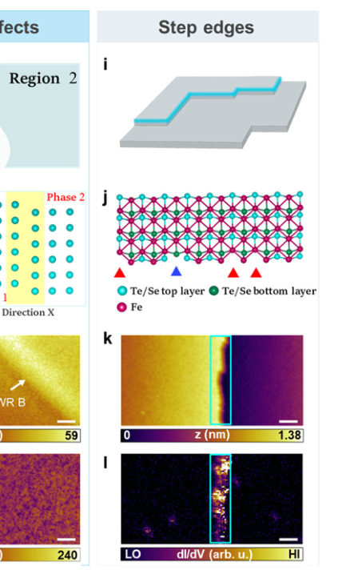
<figcaption class="paper-figure-caption"><b>Fig 1.</b> Fig. 1|Three types of defects on Fe(Te,Se). a, Illustration of magnetic (purple) and non-magnetic (gray)</figcaption>
</figure>
<figure class="paper-figure-card">
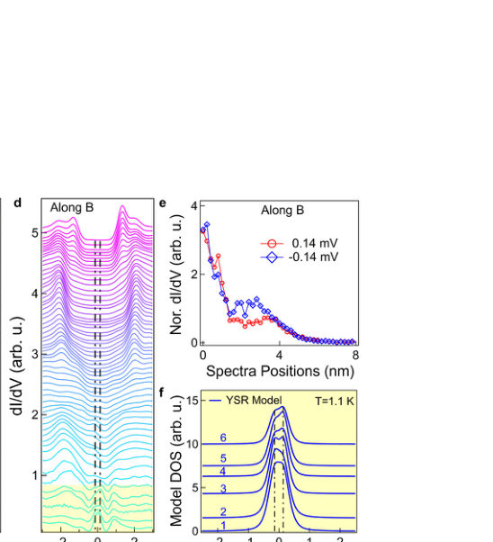
<figcaption class="paper-figure-caption"><b>Fig 2.</b> Fig. 2|Near-zero energy bound state at the step edge of Fe(Te,Se). a, STM image of a step edge at the bottom part. The two arrows indicate the path along which the dI/dV signals were acquired as shown in c-d. b, Two dI/dV spectra taken at the step edge (point 0 at the beginning of arrow A and arrow B). c, From bottom to top: equally spaced 61 dI/dV spectra taken along the 12 nm long arrow A shown in a. d, From bottom to top: equally spaced 60 dI/dV spectra taken along the 12 nm long arrow B shown in a. e, Normalized dI/dV signal at 0.14 mV and -0.14 mV extracted from d within 8 nm starting from the step edge. f, Model plot of the DOS by considering two particle-hole symmetric Lorentzian...</figcaption>
</figure>
<figure class="paper-figure-card">
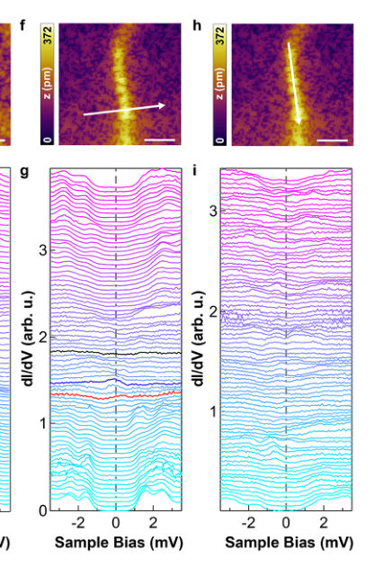
<figcaption class="paper-figure-caption"><b>Fig 3.</b> Fig. 3|In-gap states observed at the Type I wrinkle and Type II line defect bend. a, STM topography</figcaption>
</figure>
<figure class="paper-figure-card">
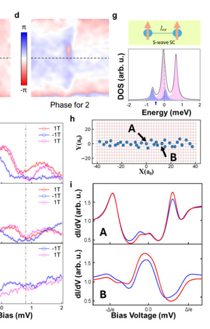
<figcaption class="paper-figure-caption"><b>Fig 4.</b> Fig. 4|Phase shift and spin polarized in-gap state at the Type II line defect bend. a, STM image of</figcaption>
</figure>
<figure class="paper-figure-card">
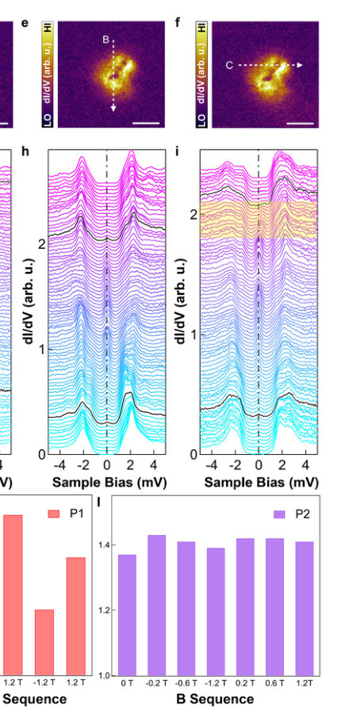
<figcaption class="paper-figure-caption"><b>Fig 5.</b> Fig. 5|Zero-energy bound states for impurities below the surface. a, STM topography of the surface impurity region with atomic resolution. b, The dI/dV map at 0 mV of the same region shown in a. c, The dI/dV taken at point 1 and point 2 indicated by arrows in a and b. d-f, Same as b with dashed arrows indicating where the dI/dV in g-i are taken. g-i, Equally spaced 81 dI/dV spectra along the direction shown in d-f for a total length of 12 nm (g), 14 nm (h) and 12 nm (i). The intensity plots are shown in Fig. S9 d-f. j, The peak energy position within the gap shown in g-i, respectively (in between the two black spectra). The yellow high-lighted region shows how the peak position shifts in i....</figcaption>
</figure>

**Summary.** This work investigates whether near-zero-energy states observed on the surface of an iron-based superconductor are true Majorana zero modes, crucial for topological quantum computing. Using spin-polarized STM, the researchers analyzed defects and found that the spectral signatures are consistently explained by trivial Yu-Shiba-Rusinov bound states rather than robust topological edge modes.

**Why it may be interesting.** While not directly focused on AMO systems, the rigorous experimental methodology—using local probes (STM) combined with quantum mechanical diagnostics (spin/energy resolution)—provides a template for identifying exotic quasiparticles in condensed matter systems relevant to open quantum systems research.

Detailed structure

**Main problem.** The central goal is to experimentally distinguish between true Majorana zero modes (MZMs) and topologically trivial defect states observed on the surface of an iron-based superconductor.

**Main result.** Through detailed spin-polarized scanning tunneling spectroscopy, the authors conclude that the observed near-zero-energy localized states at various defects are better explained by Yu-Shiba-Rusinov bound states originating from unpaired electrons rather than true topological Majorana modes.

**Method.** The study employs advanced Scanning Tunneling Microscopy/Spectroscopy (STM/STS), including spin polarization measurements, to map the density of states across different surface defects like step edges and line defects.

**Model / system.** The physical system is the iron-based superconductor Fe(Te,Se). The analysis involves comparing measured spectroscopic signatures against theoretical models describing YSR bound states coupled by magnetic impurities.

**Key observables.** Near-zero-energy localized states (Zero-Bias Peaks), spin polarization of the density of states ($	ext{SP-STS}$), and spectral weight transfer between positive and negative energies.

**Important parameters / regimes.** Temperature, external magnetic field strength (up to 3 T), and tunneling bias voltage ($V_{	ext{bias}}$).

**Assumptions / limitations.** The analysis assumes that true topological modes would exhibit specific signatures (e.g., dispersing behavior or unique spin dependence) which were not consistently found.

**Figures summary.** Figures illustrate various defect types on the surface, showing $	ext{d}I/	ext{d}V$ maps and line spectra taken across step edges, wrinkles, and bends to characterize in-gap states.

**Paper structure.** The paper systematically examines different classes of defects (step edges, Type I/II line defects) using STS. It progresses from initial observation of zero-bias peaks to detailed analysis involving spin polarization and comparison with established theoretical models for trivial bound states.

Abstract

Majorana zero modes, which obey non-Abelian exchange statistics, are promising candidates for topological quantum computation due to their robustness against environmental perturbations. The iron-based superconductor Fe(Te,Se) has been identified as an intrinsic topological superconductor, possibly hosting Majorana zero modes. In this paper, we report the observation of near-zero-energy localized states at multiple structural defects on the Fe(Te,Se) surface, which could be misidentified as Majorana zero modes without additional verification. By using spin-polarized scanning tunneling spectroscopy, we demonstrate that the near-zero-energy localized states on step edges and line defects originate from topologically trivial Yu-Shiba-Rusinov states. In addition, zero-energy bound states are also observed for regions without surface defects. A combined spatial and magnetic field dependent analysis of the spin-resolved tunneling spectra in these regions reveals that this type of zero-energy states cannot be attributed to the presence of Majorana bound states. These findings emphasize the importance of spin-dependent studies of low-energy states for pursuing Majorana zero modes.

[↑ back to top](#top)

### [Semiclassical Analysis of Tunneling in Graphene under Nonuniform Electrostatic and Magnetic Fields](http://arxiv.org/abs/2606.17689v1)

**Authors:** Maria V. Perel  
**Type:** theory · **Category:** other · **PDF:** <https://arxiv.org/pdf/2606.17689v1>  
**Analysis basis:** full PDF text, analyzed in chunks
**Topic relevance:** `Keldysh / 2PI / non-Gaussian methods` **3/5** · `Kondo & dissipative impurity` **1/5** · `methods for driven-dissipative` **1/5** · `non-equilibrium dynamics` **1/5**

↔ Scroll figures horizontally

<figure class="paper-figure-card">
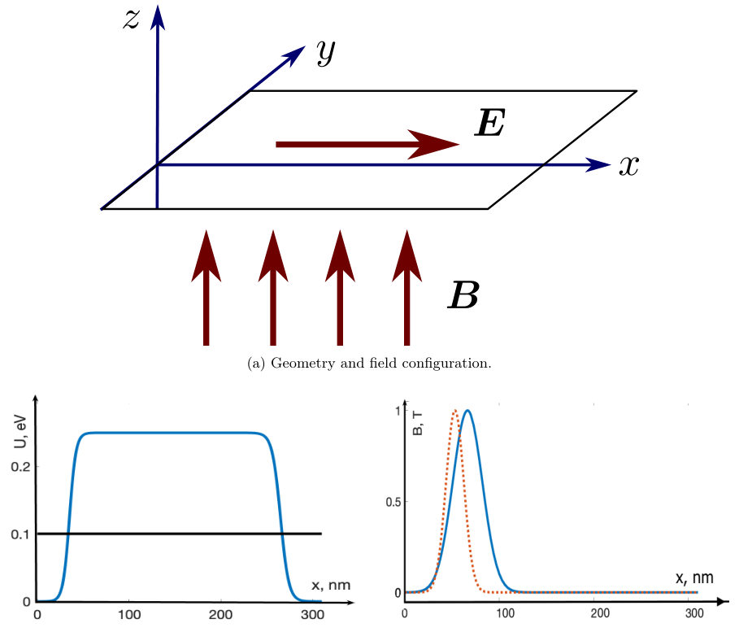
<figcaption class="paper-figure-caption"><b>Fig 1.</b> Figure 1: Schematic of Klein tunnelling in graphene under external fields. The horizontal line indicates the carrier energy E.</figcaption>
</figure>
<figure class="paper-figure-card">
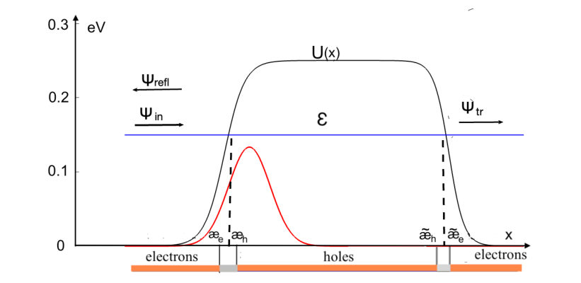
<figcaption class="paper-figure-caption"><b>Fig 2.</b> Figure 2: Charge carrier scattering at a potential barrier U(x) in a spatially varying magnetic field B(x). Horizontal line: carrier energy E. Incoming, reflected, and transmitted waves are Ψin, Ψrefl, and Ψtr. Dashed vertical lines indicate x = κE, defined by E = U(κE). Small ticks indicate the turning (degeneracy) points κe, κh, ˜κh, and ˜κe, which delimit the interfaces between classically allowed and forbidden regions. The central allowed region is hole-like, whereas the outer allowed regions are electron-like.</figcaption>
</figure>
<figure class="paper-figure-card">
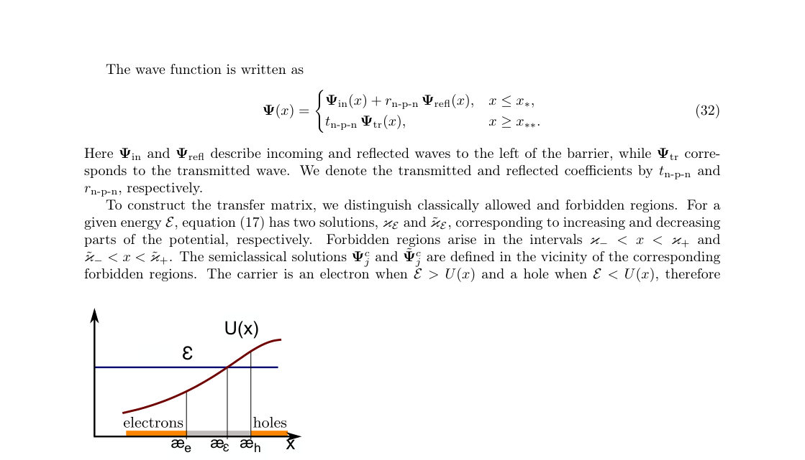
<figcaption class="paper-figure-caption"><b>Fig 3.</b> Figure 3: Turning points κe and κh for electrons and holes with energy E in a monotonically increasing electrostatic potential U(x). The classically allowed regions are x &lt; κe and x &gt; κh, whereas the classically forbidden region is κe &lt; x &lt; κh.</figcaption>
</figure>
<figure class="paper-figure-card">
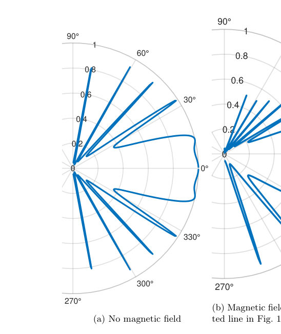
<figcaption class="paper-figure-caption"><b>Fig 4.</b> Figure 4: The absolute value of tn-p-n as a function of the angle of incidence on the barrier.</figcaption>
</figure>

**Summary.** This paper presents a comprehensive semiclassical theory for tunneling in graphene junctions under combined nonuniform electrostatic and magnetic fields. By developing explicit transfer matrix formalisms, the authors calculate transmission coefficients and predict resonance conditions, including 'magic' angles, demonstrating how external fields control electronic transport properties.

**Why it may be interesting.** The use of semiclassical methods (WKB/transfer matrices) to solve quantum transport problems in structured materials like graphene is highly relevant for understanding mesoscopic electronic phenomena, which often bridge between continuum theory and discrete quantum effects.

Detailed structure

**Main problem.** The paper develops a semiclassical theory to analyze the tunneling of Dirac fermions through an n-p-n junction in monolayer graphene when subjected to both nonuniform electrostatic and magnetic fields.

**Main result.** Explicit expressions for reflection and transmission coefficients, including their phases, are derived as functions of energy and incidence angle. The work also establishes semiclassical conditions for Fabry–Pérot resonances and 'magic' angles where enhanced transmission occurs.

**Method.** The analysis employs the WKB (semiclassical) approximation, treating the problem as a connection problem solved via transfer matrices across different potential regimes.

**Model / system.** The physical system is monolayer graphene described by the 2D massless Dirac equation. The model incorporates spatially varying electrostatic potentials ($U(x)$ forming an n-p-n junction) and perpendicular magnetic fields ($B(x)$), both dependent only on one spatial coordinate.

**Key observables.** Reflection coefficients ($r$), transmission coefficients ($t$), phases of $r$ and $t$, Fabry–Pérot resonance conditions, and 'magic' angles.

**Important parameters / regimes.** Energy ($E$), incidence angle ($	heta$), magnetic field strength ($B(x)$), and the spatial variation parameters of the potentials.

**Assumptions / limitations.** The fields are assumed to be smooth functions vanishing outside a finite interval. The analysis relies on the semiclassical approximation, which is valid away from turning points.

**Figures summary.** Figures illustrate the schematic geometry of Klein tunneling under external fields and show numerical results detailing the angular dependence of transmission induced by the magnetic field.

**Paper structure.** The paper builds the theory by first establishing the 1D Dirac equation governing the system. It then uses the transfer matrix formalism to calculate scattering coefficients for single junctions ($n-p$, $p-n$) and finally extends this to analyze Fabry–Pérot resonances across the full $n-p-n$ structure.

Abstract

We develop a semiclassical theory of tunnelling of Dirac fermions through an n-p-n junction in monolayer graphene subjected to a perpendicular magnetic field. Electrostatic and magnetic fields are assumed to be smooth functions of a single spatial coordinate, supported on a finite interval, vanishing outside it, and thus ensuring asymptotically free states. In contrast to earlier studies restricted to constant magnetic fields and exactly solvable electrostatic potential profiles, we consider a general electrostatic potential forming an n-p-n junction and an arbitrary magnetic field, and formulate the corresponding scattering problem. Within the semiclassical approximation, and under an additional assumption on the incidence angle, the problem reduces to a connection problem for a pair of degeneracy points, treated using results from our earlier work. We obtain explicit expressions for the reflection and transmission coefficients, including their phases, as functions of energy and incidence angle. Furthermore, we derive semiclassical conditions for Fabry-Pérot resonances and "magic" angles, and analyse the resulting interference pattern. Numerical results demonstrate the angular dependence of transmission induced by the magnetic field.

[↑ back to top](#top)

### [Spin-Wave Phase Shifter Controlled by a Domain Wall Racetrack](http://arxiv.org/abs/2606.17804v1)

**Authors:** Uladzislau Makartsou, Olena Tartakivska, Paweł Gruszecki, Anton Lutsenko, Sebastiaan van Dijken, Volodymyr V. Kruglyak, Maciej Krawczyk  
**Type:** theory · **Category:** other · **PDF:** <https://arxiv.org/pdf/2606.17804v1>  
**Analysis basis:** full PDF text, analyzed in chunks
**Topic relevance:** `spintronics-quantum-optics interface` **3/5** · `analog quantum simulation` **1/5** · `exotic spin models in light-matter` **1/5** · `non-equilibrium dynamics` **1/5**

↔ Scroll figures horizontally

<figure class="paper-figure-card">
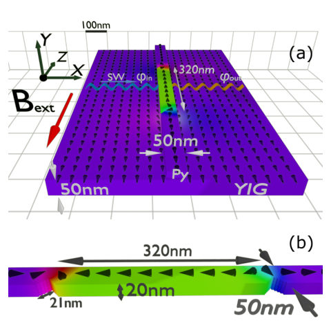
<figcaption class="paper-figure-caption"><b>Fig 1.</b> FIG. 1. Geometry and magnetic configuration of the simu- lated phase shifter. (a) Three-dimensional view of the model: A Py racetrack of 50 nm width and 20 nm thickness is sep- arated by 5 nm from a 50 nm thick YIG film. A static bias magnetic field of Bext = −15 mT is applied along the z-axis. SWs propagate in the YIG film along the x-direction. The SW phase evaluated before and after the Py stripe is shown by φin and φout, respectively. Black arrows indicate the equi- librium magnetization in YIG. (b) Micromagnetic state of the Py stripe: The magnetization in the central domain between the two notches located 320 nm apart is antiparallel to that in the outer parts of the stripe.</figcaption>
</figure>
<figure class="paper-figure-card">
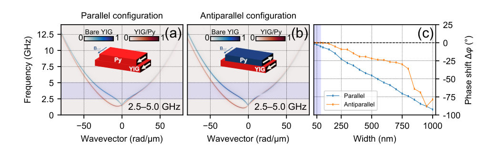
<figcaption class="paper-figure-caption"><b>Fig 2.</b> FIG. 2. Selecting the operating frequency regime. (a,b) Dispersion of a bare YIG film (blue) and YIG/Py bilayer (red) for two orientations of the magnetization in the Py layer: (a) parallel and (b) antiparallel to the magnetization of YIG. (c) The SW phase shift ∆φ induced by a uniformly magnetized Py stripe is shown as a function of the stripe’s width w for the parallel and antiparallel orientations of the stripe’s magnetization relative to that of YIG, the bias magnetic field Bext = −15 mT and the frequency f = 2.8 GHz. The transparent blue regions indicate the working frequency and width ranges.</figcaption>
</figure>
<figure class="paper-figure-card">
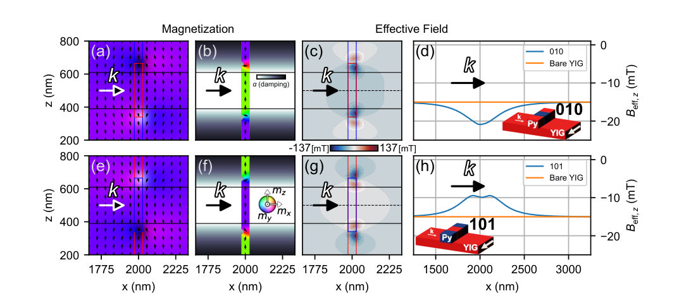
<figcaption class="paper-figure-caption"><b>Fig 3.</b> FIG. 3. Magnetization and effective-field landscapes underlying the DW-induced phase shifts. (a,e) Equilibrium magnetization texture in the YIG layer for (a) 010 and (e) 101 racetrack configurations shown in panels (b) and (f), respectively, for the racetrack width w = 50 nm and magnetic field Bext = −15 mT along the z-axis. The displayed magnetization maps correspond to the top surfaces of the YIG film and the racetrack. (c,g) Corresponding maps of the effective field component Beff,z in the YIG film with the stray field of the racetrack. In (b) and (f), the Gilbert damping parameter increased from the YIG nominal value in the middle to 0.5 at the film edges, as shown by the grey colour...</figcaption>
</figure>
<figure class="paper-figure-card">
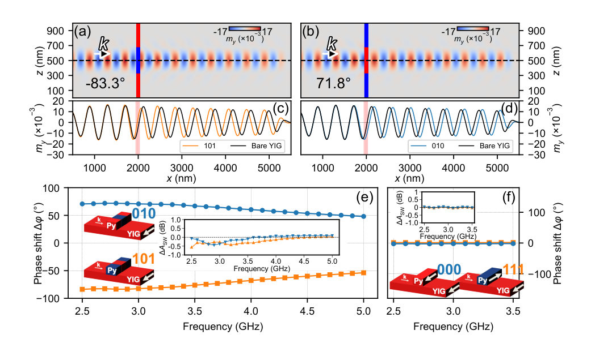
<figcaption class="paper-figure-caption"><b>Fig 4.</b> FIG. 4. Dynamic profiles of SWs propagating in the YIG channel for two DW configurations of the racetrack: (a,c) 101 and (b,d) 010. (a,b) Spatial maps of the dynamic magnetization component my showing SW propagation at frequency 3.0 GHz across the DW region (vertical bar), with the dashed lines indicating the position of the profiles shown in (c) and (d). (c,d) Corresponding one-dimensional my(x) profiles of SWs from the YIG film with (orange and blue lines) and without (black lines) the racetrack. (e) Frequency dependence of the accumulated phase shift of SWs ∆φ for the 101 and 010 configurations of the racetrack. Inset shows the frequency dependence of the transmitted SW intensity...</figcaption>
</figure>
<figure class="paper-figure-card">
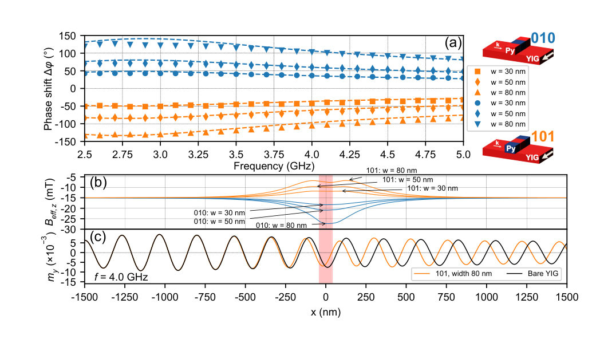
<figcaption class="paper-figure-caption"><b>Fig 5.</b> FIG. 5. Frequency dependence of the SW phase shift ∆φ for racetracks of 30, 50, and 80 nm width and 101 and 010 configurations. (a) Phase shift ∆φ(f) obtained from full MuMax3 simulations (markers) compared with predictions of the WKB-based semi-analytical model (dashed lines). (b) Corresponding effective-field profiles Beff,z(x) for different racetrack widths and both configurations obtained from simulations. (c) Spatial profiles of the dynamic magnetization component my(x) for a racetrack width of 80 nm in the 101 configuration at f = 4.0 GHz, illustrating the accumulated phase shift relative to the reference signal (black).</figcaption>
</figure>

**Summary.** This work proposes a novel spin-wave phase shifter by integrating a domain-wall racetrack into a magnonic waveguide. By exploiting the stray field from magnetic domain walls, researchers can induce large, controllable phase shifts ($\pm 90^\circ$) for propagating spin waves. This demonstrates a scalable route toward functional elements for information processing in magnonics.

**Why it may be interesting.** While focused on classical magnetism, the concept of using engineered magnetic structures to control wave propagation phases is analogous to controlling quantum beam paths or implementing non-linear phase gates in photonic/quantum systems.

Detailed structure

**Main problem.** The goal is to develop a compact, programmable spin-wave phase shifter for magnonic circuits by utilizing the stray field generated by magnetic domain walls.

**Main result.** Moving domain walls on a racetrack structure can induce significant and tunable phase shifts (up to $\pm 90^\circ$) in propagating Damon-Eshbach spin waves without altering the waveguide's physical geometry.

**Method.** The analysis relies heavily on micromagnetic simulations (MuMax3) complemented by semi-analytical models using the Wentzel–Kramers–Brillouin (WKB) approximation to calculate phase accumulation.

**Model / system.** The system consists of a YIG film waveguide patterned with a Permalloy ($	ext{Py}$) domain-wall racetrack. The stray field from pinned magnetic domain walls modifies the internal effective magnetic field experienced by the spin waves propagating in the YIG layer.

**Key observables.** Spin-wave phase shift ($\Delta\varphi$), SW wavelength change, and SW intensity attenuation ($\Delta A_{SW}$).

**Important parameters / regimes.** Bias fields (e.g., $-15 	ext{ mT}$), operating frequencies (2.5–5 GHz), and material parameters for YIG and Py.

**Assumptions / limitations.** The WKB model assumes slowly-varying fields, and the analysis often focuses on a single central 1D slice approximation of the stray field profile.

**Figures summary.** Figures illustrate the geometry (Py racetrack over YIG), dispersion relations comparing bare vs. DW-modified waveguides, and spatial profiles of effective magnetic fields ($B_{	ext{eff},z}$) showing the influence of domain walls.

**Paper structure.** The paper progresses by establishing the physical setup (racetrack/DW interaction), developing theoretical models (WKB approximation for phase shift calculation), presenting simulation results comparing DW-induced shifts to simpler stripe geometries, and concluding with the potential application in magnonic circuits.

Abstract

We propose a spin-wave phase shifter controlled using a domain-wall racetrack. The concept is demonstrated using micromagnetic simulations of a Permalloy domain-wall racetrack placed above a YIG film. The stray field from pinned domain walls modifies the internal magnetic field in the YIG region under the racetrack. This leads to a local change of the spin-wave wavelength and thereby enables control of the phase accumulated by Damon-Eshbach spin waves propagating through the region. Moving domain walls on the racetrack, the same physical structure can provide phase shifts of up to +/-90 degrees, without changing the waveguide geometry. A model based on the semiclassical approximation confirms that the phase shift is dominated by the domain-wall-induced stray field. These results suggest a route toward a compact programmable spin-wave phase shifter for interference-based magnonic circuits for information processing. Moreover, the demonstrated magnonic device integration with a magnetic domain-wall racetrack can lead to its application in in-memory computing.

[↑ back to top](#top)

### [Graphene Josephson diodes from inherent asymmetric disorder](http://arxiv.org/abs/2606.17673v1)

**Authors:** Ivan Villani, Luca Chirolli, Matteo Carrega, Alessandro Crippa, Elia Strambini, Francesco Giazotto, Vaidotas Miseikis, Camilla Coletti, Fabio Beltram, Kenji Watanabe, Takashi Taniguchi, Stefan Heun, Sergio Pezzini  
**Type:** both · **Category:** other · **PDF:** <https://arxiv.org/pdf/2606.17673v1>  
**Analysis basis:** full PDF text, analyzed in chunks
**Topic relevance:** `Keldysh / 2PI / non-Gaussian methods` **2/5** · `driven-dissipative phase transition` **2/5** · `methods for driven-dissipative` **2/5** · `non-equilibrium dynamics` **2/5** · `Kondo & dissipative impurity` **1/5** · `correlated / nonlocal dissipation` **1/5** · `interference shaping light` **1/5** · `non-equilibrium universality` **1/5**

↔ Scroll figures horizontally

<figure class="paper-figure-card">
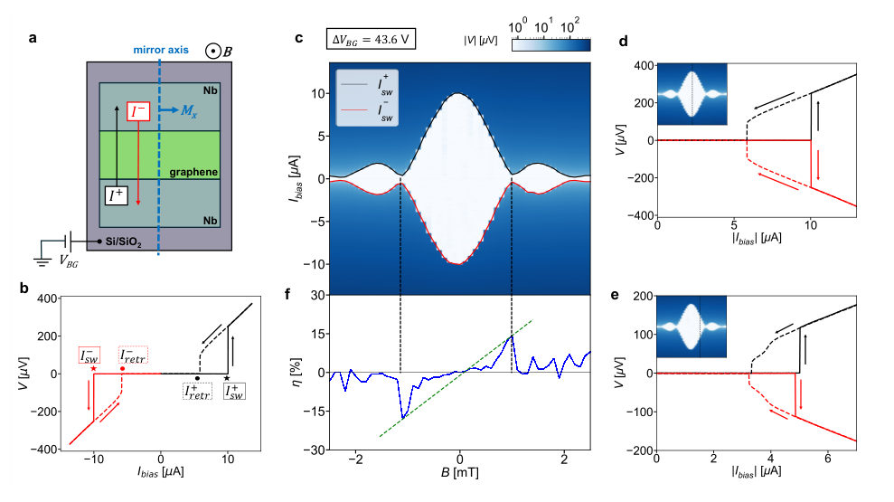
<figcaption class="paper-figure-caption"><b>Fig 1.</b> Figure 1: (a) Top view schematics of device layout. Graphene is encapsulated in hBN and edge-contacted by Nb leads. The heterostructure is placed on top of a Si/SiO2 substrate, which acts as a backgate via the application of a backgate voltage VBG. A current I is applied and flows through the junction, and the voltage drop is measured. Currents flowing in either positive (I+) or negative (I−) directions are indicated, respectively, in black and red. Magnetic field B is applied in the out-of-plane direction. Mirror symmetry axis Mx is indicated. (b) Voltage-current (V-I) curve at B = 0 showing switching-retrapping behaviour. Positive and negative flowing currents are represented respectively...</figcaption>
</figure>
<figure class="paper-figure-card">
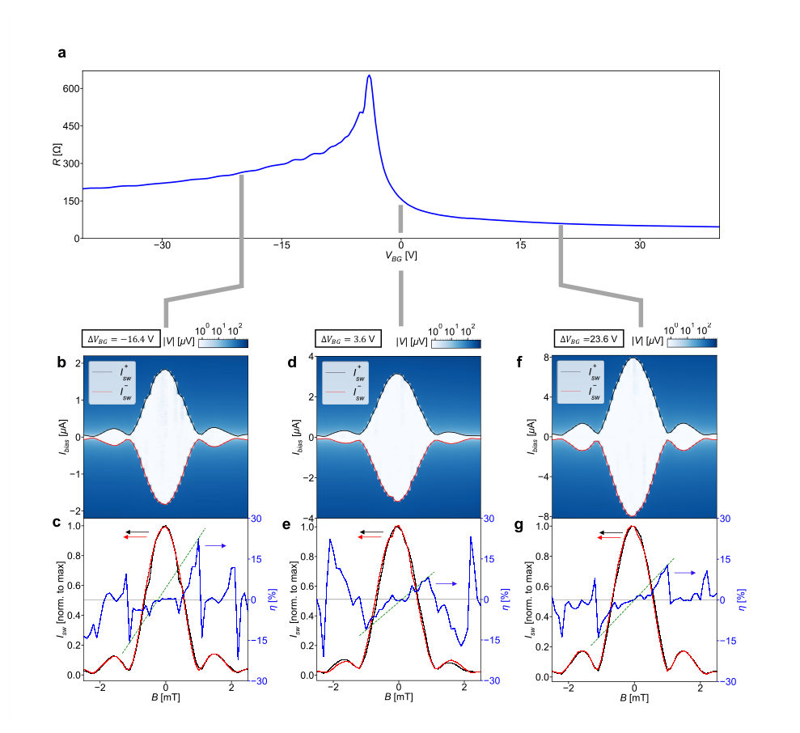
<figcaption class="paper-figure-caption"><b>Fig 2.</b> Figure 2: (a) Backgate sweep: sample resistance R as a function of backgate voltage VBG, measured by applying a large DC current bias. The acquisition position of the Fraunhofer patterns in b,d,f is indicated. T = 4.2 K, B = 0 T. (b-g) Upper row: Fraunhofer patterns (voltage drop |V | as function of out-of-plane magnetic field B and DC bias current Ibias). Lower row: corresponding rectification parameter η at different backgate voltage values. The relative position to the charge neutrality point ∆VBG = VBG −VCNP (VCNP = −3.6 V) is indicated at the top of each panel. (b-c) VBG = −20 V. (d-e) VBG = 0 V. (f-g) VBG = +20 V.</figcaption>
</figure>
<figure class="paper-figure-card">
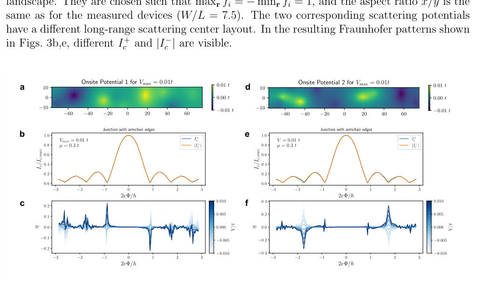
<figcaption class="paper-figure-caption"><b>Fig 3.</b> Figure 3: (a) Onsite potential V1(r) = V f1(r) for V = Vmax = 0.01 t. The spatial coordinates are in units of the lattice constant. (b) Calculated Fraunhofer patterns (I+ c and |I− c |) for V = Vmax and chemical potential µ = 0.3t. (c) Color-coded evolution of the rectification coefficient η for varying V in the range −Vmax &lt; V &lt; Vmax, as a function of applied magnetic flux 2eΦ/h. (d) Onsite potential V2(r) = V f2(r) for V = Vmax = 0.01 t. (e-f) Same as b,c, but for the onsite potential V2 shown in d.</figcaption>
</figure>
<figure class="paper-figure-card">
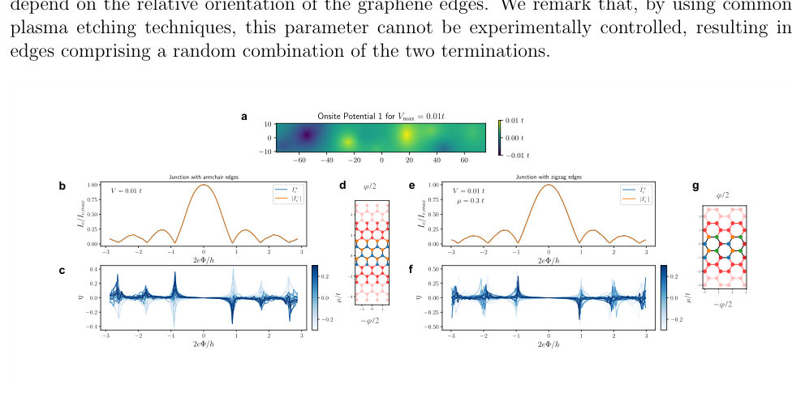
<figcaption class="paper-figure-caption"><b>Fig 4.</b> Figure 4: (a) Onsite potential V1 for V = Vmax = 0.01 t. (b) Calculated Fraunhofer patterns (I+ c and |I− c |) for the case of armchair edges for µ = 0.3t. (c) Color-coded evolution of the rectification coefficient η with chemical potential µ, crossing the Dirac point. (d) Graphene strip with armachair edges. (e-f) Same as b-c, but for a graphene strip with zigzag as shown in g.</figcaption>
</figure>

**Summary.** The research reports on achieving significant supercurrent rectification in graphene Josephson junctions using inherent structural disorder. By combining low-temperature experiments with theoretical modeling, the authors prove that even minor, unavoidable disorder can induce diode behavior by breaking mirror symmetry. This work is vital for advancing superconducting electronics based on 2D materials.

**Why it may be interesting.** This work provides a clean platform (graphene) for observing non-reciprocal quantum transport phenomena, which are crucial for developing superconducting electronic components and understanding symmetry breaking in mesoscopic superconductors.

Detailed structure

**Main problem.** The study demonstrates that graphene Josephson junctions inherently exhibit supercurrent rectification (Josephson diode effect) due to asymmetric disorder, even in highly clean systems.

**Main result.** Supercurrent rectification efficiency exceeding 20% was achieved under an out-of-plane magnetic field, confirming that residual long-range disorder is sufficient to break the necessary mirror symmetry.

**Method.** The work combines experimental measurements of V-I curves and Fraunhofer patterns with theoretical modeling based on a tight-binding Hamiltonian approach.

**Model / system.** The physical system is an hBN-encapsulated graphene Josephson junction contacted by Niobium leads. The theory models the transport using a tight-binding Hamiltonian incorporating disorder potentials $V(x, y)$ and magnetic field effects.

**Key observables.** Supercurrent rectification efficiency ($\eta$), switching currents ($I_{	ext{sw}+}, I_{	ext{sw}-}$), and Fraunhofer interference patterns modulated by current direction.

**Important parameters / regimes.** Out-of-plane magnetic field ($B$), backgate voltage ($V_{BG}$), and the strength/nature of the long-range scattering potential (disorder).

**Assumptions / limitations.** The analysis assumes that residual disorder provides the necessary asymmetry to break mirror symmetry, and approximations like the Andreev limit are used in theoretical derivations.

**Figures summary.** Figures illustrate device schematics, V-I curves showing directional switching currents at different magnetic fields, and Fraunhofer patterns demonstrating non-reciprocity.

**Paper structure.** The paper progresses from establishing the necessity of symmetry breaking (time-reversal + mirror) to presenting experimental evidence of high rectification efficiency, followed by theoretical modeling confirming that disorder is the source of this asymmetry.

Abstract

Josephson diodes are non-reciprocal superconducting devices characterized by different switching currents depending on the current flow direction. They recently attracted considerable theoretical and experimental attention, in view of their possible application as rectifying elements in the field of superconducting electronics, and as probes to investigate symmetry breaking mechanisms in mesoscopic systems. In this work, we show that graphene Josephson junctions provide rectification of supercurrent with an efficiency exceeding 20%. The effect appears applying a mT out-of-plane magnetic field and is enhanced close to the nodes of the Fraunhofer interference pattern. Our theoretical model identifies long-range scattering potentials in the junction as the symmetry-breaking mechanism, which yields supercurrent rectification in highly transparent junctions. While graphene stands as an ultra-clean transmission medium, our work shows that unavoidable residual disorder in a clean two-dimensional system is sufficient to promote this effect. Tailoring of the inversion (mirror) symmetry breaking could be obtained via proper design of external gates.

[↑ back to top](#top)

### [Hybrid Electronic-Ionic Ferroelectricity in Superlubric van der Waals Heterostructures](http://arxiv.org/abs/2606.17502v1)

**Authors:** Jing Huang, Jun Kang, Daniel Bennett  
**Type:** theory · **Category:** statistical mechanics · **PDF:** <https://arxiv.org/pdf/2606.17502v1>  
**Analysis basis:** full PDF text, analyzed in chunks
**Topic relevance:** `driven-dissipative phase transition` **2/5** · `methods for driven-dissipative` **2/5** · `non-equilibrium dynamics` **2/5** · `non-equilibrium universality` **2/5** · `Frenkel-Kontorova` **1/5** · `Keldysh / 2PI / non-Gaussian methods` **1/5** · `analog quantum simulation` **1/5**

↔ Scroll figures horizontally

<figure class="paper-figure-card">
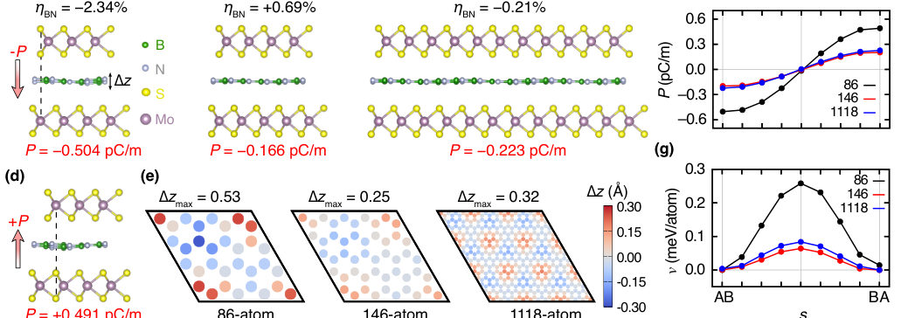
<figcaption class="paper-figure-caption"><b>Fig 1.</b> FIG. 1. (a)–(c) MoS2/hBN/MoS2 heterostructures for (a) 86-atom, (b) 146-atom, and (c) 1118-atom commensurate supercells, where ∆z represents the out-of-plane buckling of the buckled spacer. The biaxial strain ηBN imposed on the hBN spacer in each supercell is shown above, and the out-of-plane polarization P is shown below in red. (d) The 86-atom supercell after sliding of the outer layers, which reverses the direction of the polarization, indicated by the red arrow. (e) Out-of-plane buckling of the atoms in the hBN spacer layer for the three supercells, where ∆zmax is the maximum displacement. (f) Polarization P, and (g) relative change in energy ν as a function of the NEB parameter (s)...</figcaption>
</figure>
<figure class="paper-figure-card">
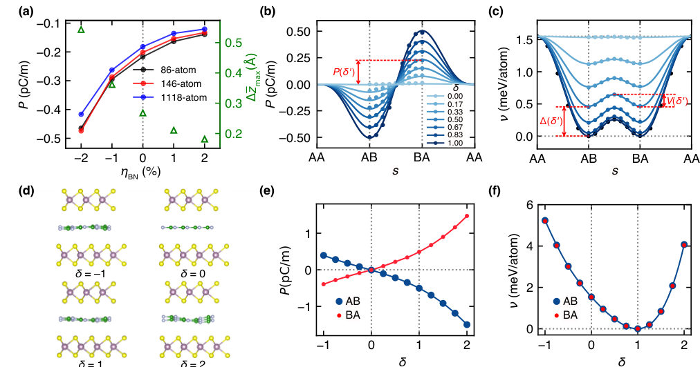
<figcaption class="paper-figure-caption"><b>Fig 2.</b> FIG. 2. (a) Out-of-plane polarization P as a function of biaxial strain imposed on the hBN spacer layer for 86-atom (black), 146-atom (red) and 1118-atom (blue) MBM supercells. The average out-of-plane atomic displacement ∆¯z of the spacer is shown in green. (b), (c) Polarization P and relative energy ν along the NEB path (s) for different fixed values of δ. The data points are results obtained from first-principles calculations, and the solid lines represent fitting to the analytic model described by Eq. (1). The model parameters V, P and ∆from Eq. (1) are highlighted in red for δ ′ = 0.5. (d) Side views of the AB stacked MBM structures in (b) and (c) at δ = −1,0,1,2. (e), (f) P and ν as a...</figcaption>
</figure>
<figure class="paper-figure-card">
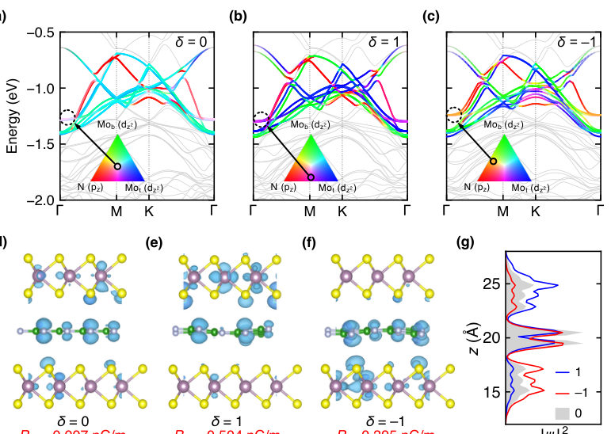
<figcaption class="paper-figure-caption"><b>Fig 3.</b> FIG. 3. (a)–(b) Electronic band structure of an 86-atom MBM supercell for a δ = 0, (b) δ = 1 and (c) δ = −1. The orbital projection of the low-energy valence bands are shown, projecting onto the N pz states (red), and Mo 3dz2 states of the bottom (green) and top (blue) layers. The highlighted states at Γ show hybridization between (a) all three layers (white), (b) the spacer and top layer (pink), and (c) the spacer and bottom layer (orange). (d)–(f) Wavefunction of the state at Γ highlighted in the band structure. (g) Magnitude squared of the same wavefunctions in the out-of-plane direction, averaged in-plane, for δ = 0 (gray region), δ = 1 (blue line) and δ = −1 (red line).</figcaption>
</figure>
<figure class="paper-figure-card">
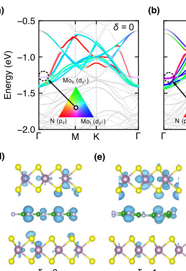
<figcaption class="paper-figure-caption"><b>Fig 4.</b> Fig. 4 shows the four hysteresis loops I–IV as well as the corresponding buckling order parameter δ(E) below. The blue lines represent a sketch of the phase transitions, whereas the orange lines are numerical results obtained from minimiz- ing the model fit to first-principles calculations of MBM. For type I (Fig. 4 (a)), Es (sliding) occurs first, and there is in- sufficient energy to modify the buckling before the sliding is initiated. The spacer is effectively stiff, and the system be- haves like a conventional sFE, with a first-order hysteresis loop [2, 4]. For type II (Fig. 4 (b)), Em δ occurs first, and the spacer begins to un-buckle before sliding occurs. Sliding is accompanied by a...</figcaption>
</figure>
<figure class="paper-figure-card">
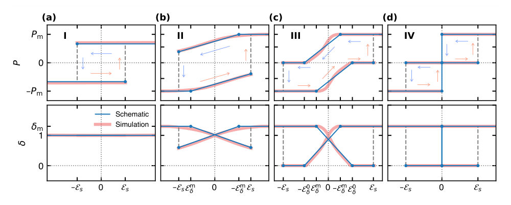
<figcaption class="paper-figure-caption"><b>Fig 5.</b> FIG. 4. (a)–(d) ferroelectric hysteresis loop P(E) (top) and corresponding buckling order parameter δ(E) for the four types I–IV in the analytic model Eq. (1). The three critical electric fields Es, Em δ and E0 δ are shown on the horizontal axes, where Pm is the polarization at Em δ . The blue lines represent a schematic description of hysteresis, while the thick orange lines denote the results obtained from the model calculations, fitting Eq. (1) to the first-principles calculations of the 86-atom MBM supercell.</figcaption>
</figure>

**Summary.** This theoretical work investigates ferroelectricity in superlubric van der Waals heterostructures, demonstrating that the polarization mechanism is not simply due to sliding but results from a hybrid electronic-ionic coupling involving spacer layer buckling. By developing and analyzing an energy functional dependent on both stacking order and buckling, the authors establish these systems as a distinct class of ferroelectrics exhibiting complex switching behaviors.

**Why it may be interesting.** While focused on condensed matter ferroelectrics, the use of coupled order parameters ($	ext{s}$ and $\delta$) to describe emergent collective behavior under external fields shares conceptual parallels with modeling many-body dynamics or phase transitions in open quantum systems where multiple degrees of freedom interact non-trivially.

Detailed structure

**Main problem.** To understand the physical mechanism of polarization and ferroelectricity in Superlubric sliding ferroelectrics (SL-sFEs) and how they fundamentally differ from conventional sliding ferroelectrics.

**Main result.** Polarization arises from a unique hybrid electronic-ionic coupling between interlayer sliding and the out-of-plane buckling of the spacer layer, leading to distinct ferroelectric hysteresis types.

**Method.** The study employs first-principles calculations (DFT) combined with continuum Landau-like models parameterized by key order parameters like stacking ($s$) and buckling ($\delta$).

**Model / system.** The system is modeled using van der Waals heterostructures, such as $	ext{MoS}_2/	ext{hBN}/	ext{MoS}_2$, where the total energy depends on sliding and spacer buckling parameters.

**Key observables.** Out-of-plane polarization ($P$), interlayer sliding friction/energy barrier, and out-of-plane buckling ($\Delta z$).

**Important parameters / regimes.** Strain ($\eta_{	ext{BN}}$) imposed on the spacer layer; critical limits defined by flat ($\delta=0$) or maximum buckling ($\delta_m$) states.

**Assumptions / limitations.** The polarization is not solely driven by sliding, but requires an active coupling mechanism mediated by the spacer's out-of-plane deformation.

**Figures summary.** Figures illustrate polarization vs. strain/buckling parameter ($\delta$), showing smooth approaches to zero polarization at $\delta=0$, and map out four distinct types of ferroelectric hysteresis loops based on critical field ordering.

**Paper structure.** The paper progresses by first establishing the physical system (SL-sFEs), deriving a continuum energy functional dependent on two order parameters ($s$ and $\delta$), analyzing the stationary conditions for these parameters, and finally classifying the resulting complex ferroelectric phase diagrams via hysteresis loops.

Abstract

One strategy to lower the switching barrier in a sliding ferroelectric (sFE) is to insert an incommensurate spacer to reduce sliding friction, creating a superlubric sliding ferroelectric (SL-sFE). However, how polarization survives across the effectively decoupled outer layers remains an open question. We show that SL-sFEs are fundamentally different from conventional sFEs: polarization is not driven by sliding alone, but by an intricate coupling between interlayer sliding and the out-of-plane buckling of the spacer layer. This coupling results in a unique hybrid electronic-ionic polarization arising from asymmetric orbital hybridization. The interplay of these order parameters generates several distinct types of ferroelectric hysteresis, including mixed first- and second-order transitions, multi-step switching, and antiferroelectric-like behavior, establishing SL-sFEs as a distinct class of ferroelectrics.

[↑ back to top](#top)

### [Dispersive mode coupling in $p$-doped semiconductor nanomechanical resonators](http://arxiv.org/abs/2606.17392v1)

**Authors:** Ankang Liu, Mahmoud T. Elewa, Mark I. Dykman  
**Type:** theory · **Category:** other · **PDF:** <https://arxiv.org/pdf/2606.17392v1>  
**Analysis basis:** full PDF text, analyzed in chunks
**Topic relevance:** `driven-dissipative phase transition` **2/5** · `Keldysh / 2PI / non-Gaussian methods` **1/5** · `analog quantum simulation` **1/5** · `correlated / nonlocal dissipation` **1/5** · `correlated cavity matter` **1/5** · `methods for driven-dissipative` **1/5** · `non-equilibrium dynamics` **1/5** · `spintronics-quantum-optics interface` **1/5**

↔ Scroll figures horizontally

<figure class="paper-figure-card">
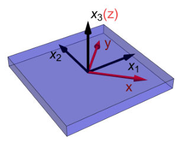
<figcaption class="paper-figure-caption"><b>Fig 1.</b> FIG. 1. The coordinate system for a thin square plate with side length Ls and thickness hs. For a plate cut out along the ⟨100⟩crystalline axes, the coordinates (x1, x2, x3) are parallel to the axes, as indicated by the black arrows. For a plate cut out (in the plane) along the ⟨110⟩axes, the coordinates (x, y) are shown by the red arrows, while the z-coordinate is still normal to the plate.</figcaption>
</figure>
<figure class="paper-figure-card">

<figcaption class="paper-figure-caption"><b>Fig 2.</b> FIG. 2. Temperature dependence of the eigenfrequencies of the second Lamé and torsional modes, ∆α = [ωα(T) − ωα(T0)]/ωα(T0) for a plate cut out along the ⟨110⟩axes. We set T0 = 298 K. Solid lines show the temperature dependence in the presence of doping, whereas the results for undoped crystals are shown by dashed lines.</figcaption>
</figure>
<figure class="paper-figure-card">
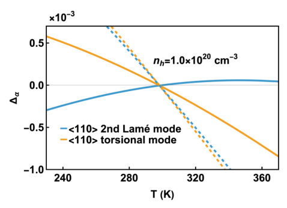
<figcaption class="paper-figure-caption"><b>Fig 3.</b> Figure 3 shows the temperature dependence of the shift of the torsional mode frequency induced by the Lamé mode. These results provide numerical substantiation of the qualitative arguments presented above. At low hole density, nh = 2 × 1019 cm−3, the scaled shift decreases monotonically with the increasing temperature, consis- tent with the estimate ∥ˆΛ(4)∥∝nh/(kBT)3 for a nonde- generate hole gas. Physically, thermal motion broadens the hole distribution, resulting in a reduced sensitivity to the strain-induced change of the hole energy bands. At higher densities, nh = 1 × 1020 cm−3, the tempera- ture dependence becomes nonmonotonic. In this regime, the hole gas is degenerate at low...</figcaption>
</figure>
<figure class="paper-figure-card">
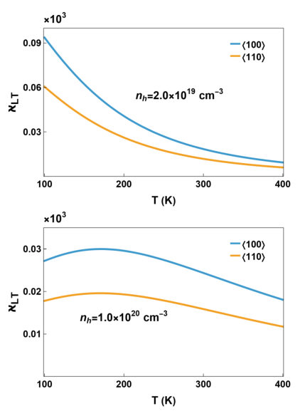
<figcaption class="paper-figure-caption"><b>Fig 4.</b> FIG. 4. Temperature dependence of the cross-Kerr frequency shift ℵLT of the second Lamé mode scaled by the squared am- plitude of the torsional mode. The parameter ℵLT is defined in Eq. (24). The plots refer to a square single-crystal silicon plate with the ratio of the thickness to length hs/Ls = 0.1. The panels show the results for the crystal orientations ⟨100⟩ and ⟨110⟩. The upper and lower panels refer to the hole den- sity nh = 2.0 × 1019 cm−3 and nh = 1.0 × 1020 cm−3, respec- tively.</figcaption>
</figure>
<figure class="paper-figure-card">
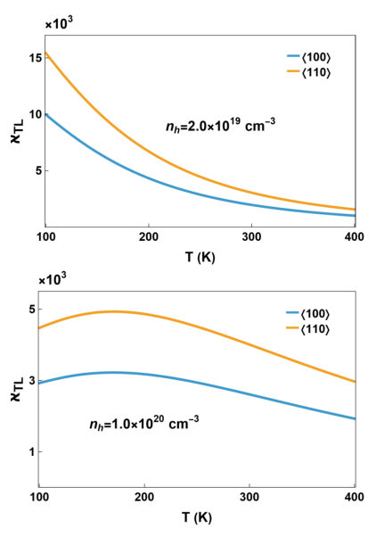
<figcaption class="paper-figure-caption"><b>Fig 5.</b> FIG. 3. Temperature dependence of the cross-Kerr frequency shift ℵTL of the torsional mode scaled by the squared ampli- tude of the second Lamé mode. The parameter ℵTL is defined in Eq. (25). The results refer to a square single-crystal silicon plate with the ratio of the thickness to length hs/Ls = 0.1. The panels show the results for the crystal orientations ⟨100⟩ and ⟨110⟩. The upper and lower panels refer to the hole den- sity nh = 2.0 × 1019 cm−3 and nh = 1.0 × 1020 cm−3, respec- tively.</figcaption>
</figure>

**Summary.** The paper theoretically analyzes dispersive mode coupling in $p$-doped semiconductor nanoresonators by incorporating strain effects on the valence band hole energy. It demonstrates that doping strongly enhances this nonlinear interaction, providing a mechanism to tune mechanical properties via carrier concentration. This has practical implications for developing highly stable quantum sensors and clocks.

**Why it may be interesting.** This work models nonlinear dynamics in a solid-state platform where electronic structure (hole doping) directly modifies mechanical properties. The strong, tunable nonlinearity makes it relevant to quantum sensing and optomechanics.

Detailed structure

**Main problem.** The study investigates how doping in semiconductor nanomechanical resonators enhances dispersive mode coupling (cross-Kerr nonlinearity) between vibrational modes.

**Main result.** Doping significantly strengthens the coupling compared to intrinsic effects, and this enhancement is nonmonotonic with hole density. The system can utilize this effect for temperature stabilization or compensating frequency shifts.

**Method.** The analysis uses a free energy expansion in strain ($\Delta F$) derived from diagonalizing the Luttinger–Kohn–Bir–Pikus Hamiltonian for valence band holes.

**Model / system.** The physical system is a $p$-doped semiconductor nanomechanical resonator, modeled by coupling mechanical vibrational modes (governed by $H_{lin}$) to nonlinear terms arising from strain-dependent hole free energy ($\Delta F$).

**Key observables.** Cross-Kerr coupling parameters ($\gamma$), frequency shifts ($\delta\omega_\alpha$), and phase diffusion coefficients ($D_{	ext{ph}}^\alpha$).

**Important parameters / regimes.** Hole density ($n_h$), temperature ($T$), and the ratio of doping-induced to intrinsic nonlinearities.

**Assumptions / limitations.** The adiabatic approximation is used, assuming hole thermalization time is much shorter than vibrational timescales. The analysis often neglects renormalization effects in coupling parameters.

**Figures summary.** Figures illustrate the temperature dependence of eigenfrequencies and cross-Kerr shifts ($\aleph_{TL}, \aleph_{LT}$), as well as the nonmonotonic density dependence of these shifts for different crystal orientations.

**Paper structure.** The paper progresses by establishing the Hamiltonian, deriving the strain-dependent free energy expansion, calculating mode coupling coefficients using this expansion, and finally analyzing the resulting frequency shifts and temperature/density dependencies for specific resonator geometries (thin plates).

Abstract

Dispersive coupling between vibrational modes with different frequencies is a major nonlinear dynamical effect. We show that in $p$-doped semiconductors such coupling is strongly enhanced. Moreover, the coupling parameters increase with the order of the nonlinearity. The doping-induced dispersive coupling becomes much stronger than the intrinsic one already for moderately strong doping. Its dependence on the hole density is nonmonotonic, and the temperature dependence becomes nonmonotonic for higher densities. Relevant mesoscopic frequency fluctuations are briefly discussed. The results are applied to Si resonators, where doping is used to compensate the temperature dependence of a clock mode, whereas another low-frequency mode is used as a thermometer to enable temperature stabilization.

[↑ back to top](#top)

### [Vector peakon equations and isospectral flows in Clifford algebras](http://arxiv.org/abs/2606.17238v1)

**Authors:** Andrew N. W. Hone, Vladimir S. Novikov, Jacek Szmigielski  
**Type:** theory · **Category:** other · **PDF:** <https://arxiv.org/pdf/2606.17238v1>  
**Analysis basis:** full PDF text, analyzed in chunks
**Topic relevance:** `Frenkel-Kontorova` **1/5** · `Keldysh / 2PI / non-Gaussian methods` **1/5** · `analog quantum simulation` **1/5** · `non-equilibrium dynamics` **1/5**

↔ Scroll figures horizontally

<figure class="paper-figure-card">
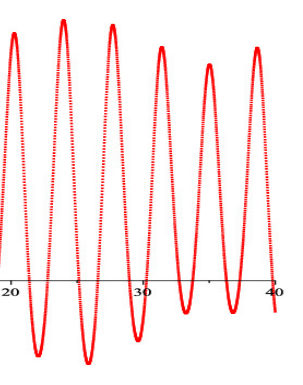
<figcaption class="paper-figure-caption"><b>Fig 1.</b> Figure 1: Travelling wave profile of ˆU given by (3.16), plotted against Z.</figcaption>
</figure>
<figure class="paper-figure-card">
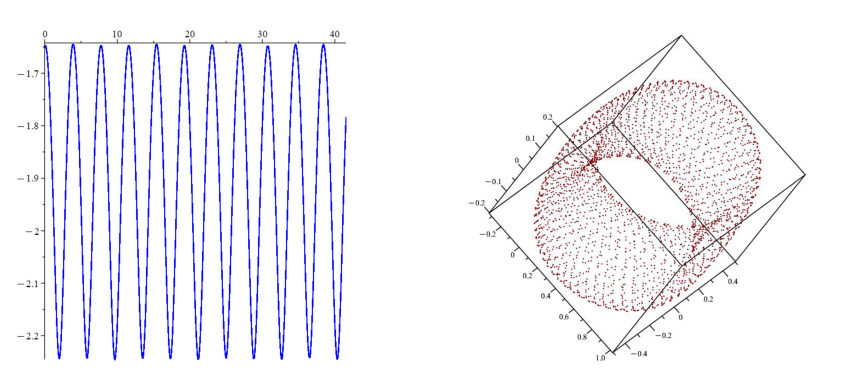
<figcaption class="paper-figure-caption"><b>Fig 2.</b> Figure 2: Travelling wave profile of u against z. Figure 3: Liouville torus projected to ( ˆU, ψ′, ϑ′).</figcaption>
</figure>
<figure class="paper-figure-card">
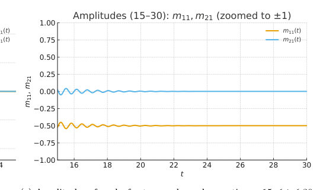
<figcaption class="paper-figure-caption"><b>Fig 3.</b> Figure 4: HS2 peakons satisfying (4.16).</figcaption>
</figure>

**Summary.** This work analyzes complex, multi-component generalizations of the Camassa–Holm equation using Clifford algebras. It establishes deep connections between these PDEs and integrable Hamiltonian systems by employing advanced mathematical tools like spectral theory and reciprocal transformations. The research yields explicit solutions for peakon dynamics in the high-frequency limit, providing a comprehensive classification of related integrable models.

**Why it may be interesting.** While focused on classical PDEs, the rigorous mathematical machinery—integrability theory, spectral methods, and Hamiltonian reduction—is highly relevant to understanding non-linear wave phenomena in quantum field theories or effective descriptions of many-body systems where continuum limits are taken.

Detailed structure

**Main problem.** The study investigates integrable, coupled systems of partial differential equations (PDEs) that represent vector perturbations of the Camassa–Holm equation within the mathematical framework of Clifford algebras.

**Main result.** The authors provide a complete classification of integrable two-component CH perturbations and derive explicit solutions for multi-peakon dynamics in the high-frequency limit, showing connections to Liouville integrable Hamiltonian systems.

**Method.** The analysis employs advanced techniques including spectral theory on Clifford algebras, reciprocal transformations, Lax pair formulations, and reduction to finite-dimensional Hamiltonian systems via travelling wave assumptions.

**Model / system.** The core model is a $d$-component vector PDE system derived from an isospectral deformation problem in $	ext{C}\ell(W)$, generalizing the scalar Camassa–Holm equation. Specific focus is placed on the two-component case ($d=2$) and its high-frequency (Hunter-Saxton) limit.

**Key observables.** Conserved functionals/densities, peakon positions ($x_N$), amplitudes ($m_{ij}$), and the Weyl function $W(\lambda, t)$.

**Important parameters / regimes.** The number of components ($d$), the arbitrary constant $\alpha$, and the specific parameters defining the initial conditions for multi-peakons.

**Assumptions / limitations.** The analysis often assumes zero background solutions when studying travelling waves, and integrability is defined by the existence of an infinite hierarchy of local higher symmetries.

**Figures summary.** Figures illustrate the time evolution of two-component peakon positions and amplitudes for the HS2 system, showing asymptotic periodicity or divergence. Other figures show Liouville tori projections related to the Hamiltonian reduction.

**Paper structure.** The paper progresses from establishing the general integrable structure via Clifford algebras and symmetries (symmetries classification) to analyzing specific reductions like the $d=2$ case using reciprocal transformations, culminating in explicit solutions for multi-peakon dynamics in the high-frequency limit.

Abstract

Starting from a spectral problem posed in a Clifford algebra with $d$ generators and Euclidean signature, we study an integrable, coupled system of PDEs that can be viewed as a vector perturbation of the Camassa--Holm equation with residual orthogonal symmetry. In the two-component case $d=2$, we show that the travelling wave solutions correspond to a Liouville integrable Hamiltonian system with two degrees of freedom, making use of a reciprocal transformation linking the coupled PDEs to a symmetry of the Hirota--Satsuma system. We also present a symmetry classification of all integrable two-component perturbations of Camassa--Holm, and find that besides the $d=2$ system analyzed here, the coupled 2CH system studied by Olver and Rosenau (as well as by Chen, Liu and Zhang, and Falqui), and equations related to either of those systems by Miura transformations, we also obtain a new system that (to the best of our knowledge) has not been reported previously. For the case of an arbitrary number of components $d$, we additionally investigate the short-pulse (high-frequency) regime, in which the limiting dynamics are governed by a vector-valued Hunter-Saxton type system. Furthermore, we provide a detailed analysis of the corresponding measure-valued (weak) solutions associated with this system.

[↑ back to top](#top)

### [Beyond the interface: Persistent Hopping Transport and Frequency Dispersion in Strong-inversion Cryogenic MOSFETs](http://arxiv.org/abs/2606.17547v1)

**Authors:** Keito Yoshinaga, Wataru Miyagi, Ryo Toyoshima, Munehiro Tada, Ken Uchida  
**Type:** experiment · **Category:** disordered systems and neural networks · **PDF:** <https://arxiv.org/pdf/2606.17547v1>  
**Analysis basis:** full PDF text, analyzed in chunks
**Topic relevance:** `Kondo & dissipative impurity` **1/5**

↔ Scroll figures horizontally

<figure class="paper-figure-card">
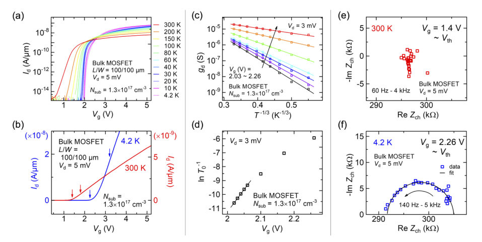
<figcaption class="paper-figure-caption"><b>Fig 1.</b> Figure 1. (a, b) Drain-current versus gate-voltage Id −Vg characteristics at various stage temperatures</figcaption>
</figure>
<figure class="paper-figure-card">
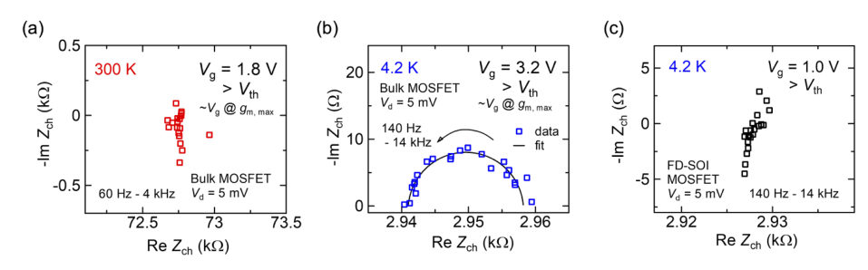
<figcaption class="paper-figure-caption"><b>Fig 2.</b> Figure 2. Cole–Cole plots at Vg &gt; Vth. (a) At 300 K, the response is purely resistive. (b) At 4.2 K, the</figcaption>
</figure>
<figure class="paper-figure-card">
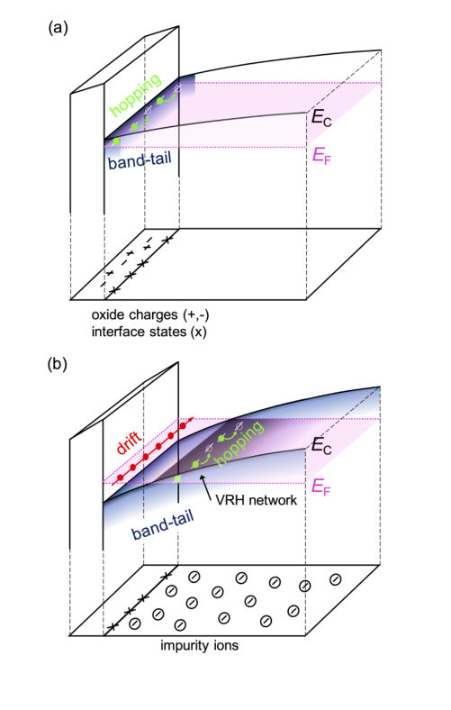
<figcaption class="paper-figure-caption"><b>Fig 3.</b> Figure 3. (a) Conventional models assume that band-tail states are confined to the interface. (b) In reality,</figcaption>
</figure>
<figure class="paper-figure-card">
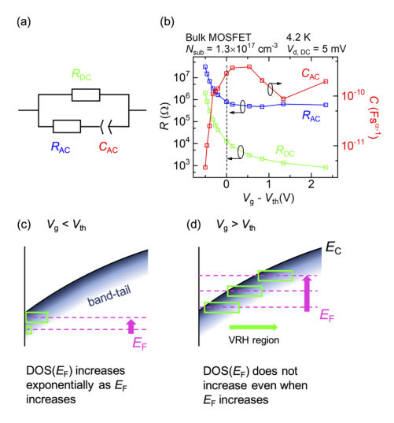
<figcaption class="paper-figure-caption"><b>Fig 4.</b> Figure 4. (a) Equivalent circuit of the VRH network and inversion channel. (b) Vg dependence of the</figcaption>
</figure>

**Summary.** This work investigates intrinsic frequency dispersion in MOSFETs operating at cryogenic temperatures. The authors demonstrate that this dispersion originates from variable-range hopping through band-tail states caused by ionized impurities distributed throughout the depletion region, not just at the oxide interface. This provides a critical correction for accurately modeling high-frequency behavior in cryo-CMOS circuits.

**Why it may be interesting.** While focused on solid-state electronics, the underlying physics—variable-range hopping in disordered potentials induced by impurities—is a canonical problem studied in condensed matter theory related to localization phenomena.

Detailed structure

**Main problem.** To characterize intrinsic frequency dispersion in the channel impedance of cryogenic MOSFETs, particularly deep into the strong-inversion region.

**Main result.** The frequency dispersion is attributed to variable-range hopping through band-tail localized states induced by ionized impurities distributed throughout the depletion region, even when drift conduction dominates.

**Method.** Impedance measurements using LCR meters and analysis via Cole–Cole (Nyquist) plots, combined with DC electrical characterization across varying temperatures and gate voltages.

**Model / system.** The physical system is cryogenic complementary metal-oxide-semiconductor (cryo-CMOS) MOSFETs. The model involves analyzing transport mechanisms in the presence of electrostatic disorder from ionized impurities within the semiconductor depletion region.

**Key observables.** Frequency dispersion characterized by a depressed semicircle in Cole–Cole plots; temperature dependence of conductance ($g_d \propto \exp(T/T_0)^{-1/3}$); extracted circuit parameters ($R_{DC}, R_{AC}, C_{AC}$).

**Important parameters / regimes.** Cryogenic temperatures (down to 4.2 K); strong-inversion regime; high channel doping levels.

**Assumptions / limitations.** The frequency dispersion is governed by hopping conduction through impurity-induced band-tail states, which persists even when drift conduction dominates the DC current.

**Figures summary.** Figures show $	ext{I}_d-	ext{V}_g$ curves and Cole–Cole plots demonstrating the transition to depressed semicircles at low temperatures. Other figures detail the comparison between conventional interface-confined models and the proposed impurity-distributed model.

**Paper structure.** The paper establishes the problem of intrinsic frequency dispersion in cryo-MOSFETs, presents measurements showing this dispersion via Cole-Cole plots, develops a theoretical framework attributing it to VRH through distributed band-tail states, and contrasts this finding with conventional interface-only models.

Abstract

Cryogenic complementary metal-oxide-semiconductor (cryo-CMOS) technology is essential for quantum computing interfaces, which require precise modeling of dynamic device behavior. The output impedance of MOS field-effect transistors (MOSFETs) is frequency dependent, which has been conventionally attributed to extrinsic parasitics. Here, we report an intrinsic frequency dispersion in the channel impedance of cryogenic MOSFETs that persists deep into the strong-inversion region. Through a Cole-Cole analysis, we characterize this dispersion as a depressed semicircle in the impedance plane and attribute its behavior to variable-range hopping through band-tail localized states. Unlike conventional models where band-tail states are confined to the oxide interface, we demonstrate that in MOSFETs with high channel doping the band-tail states are induced by ionized impurities and distributed throughout the depletion region. Our paradigm accounts for frequency dispersion under strong inversion. This work demonstrates that ionized-impurities-induced hopping governs the dynamic response of cryo-MOSFETs channel impedance even when drift conduction dominates, offering critical insights for accurate small-signal modeling and high-frequency cryo-CMOS circuit design.

[↑ back to top](#top)

### [Surface-switchable nonreciprocity protected by Fermi arcs in Weyl semimetal TaAs](http://arxiv.org/abs/2606.17395v1)

**Authors:** Dong Li, Yuki M. Itahashi, Ying-Ming Xie, Menghu Zhou, Yukako Fujishiro, Kunjie Zheng, Yao Guang, Max T. Birch, Ilya Belopolski, Max Hirschberger, Takahiro Morimoto, Xiao-Xiao Zhang, Zhi-An Ren, Naoto Nagaosa, Yoshihiro Iwasa  
**Type:** experiment · **Category:** other · **PDF:** <https://arxiv.org/pdf/2606.17395v1>  
**Analysis basis:** full PDF text, analyzed in chunks
**Topic relevance:** `non-equilibrium dynamics` **1/5**

↔ Scroll figures horizontally

<figure class="paper-figure-card">
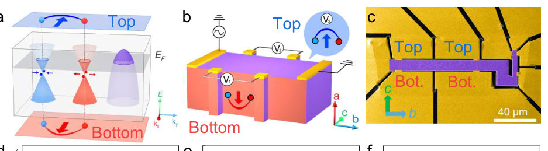
<figcaption class="paper-figure-caption"><b>Fig 1.</b> Fig. 1 | Chirality in TaAs and limitations of linear transport. a, Schematic illustration of two kinds of chirality in the Weyl semimetal TaAs. In the bulk, Weyl fermions possess opposite chirality, indicated by red and blue arrows. On the top and bottom surfaces (normal to c-axis), the associated Fermi arcs exhibit reversed velocity as marked by arrows. TaAs hosts both electron- like Weyl fermions and topologically trivial hole pockets (purple). For clarity, only one representative pair of the total 12 Weyl node pairs is shown. b, Schematic of focused ion beam (FIB) fabricated device and measurement configuration. The top and bottom surfaces are exposed at the sidewalls. c, Scanning...</figcaption>
</figure>
<figure class="paper-figure-card">
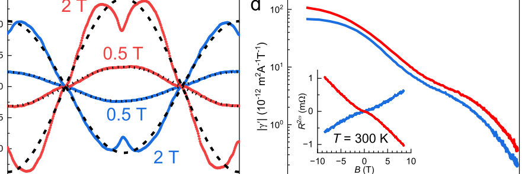
<figcaption class="paper-figure-caption"><b>Fig 2.</b> Fig. 2 | Surface-switchable nonlinear transport on opposing topological surfaces in TaAs. a, Field dependence of second-harmonic resistance R2 at T = 5 K, measured with the angle  set to -90°. Data from the top and bottom topological surfaces are shown in blue and red, respectively. The inset illustrates the angle  between the current and magnetic field. b, R2 as a function of current I at 5 K, 1T. c, Angular dependence of R2 measured under 5 K. Additional features become evident under higher magnetic field (e.g. 2 T). The black dashed lines represent the sine wave fitting. d, Temperature dependence of the nonreciprocal coefficient γ = 2R2/R0JB. R0 is the zero field linear resistance...</figcaption>
</figure>
<figure class="paper-figure-card">
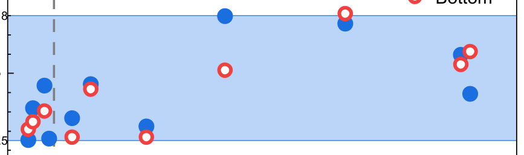
<figcaption class="paper-figure-caption"><b>Fig 3.</b> Fig. 3 | Nontrivial thickness dependence of linear and nonlinear resistivity. The second- harmonic sheet resistance Rs2, normalized by current density J and magnetic field B, is shown for multiple devices. Solid and open circles represent data from the top and bottom topological surfaces, respectively.</figcaption>
</figure>
<figure class="paper-figure-card">
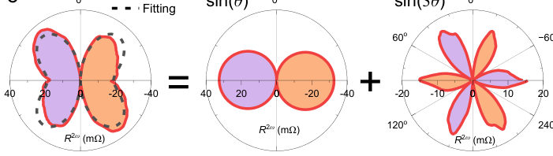
<figcaption class="paper-figure-caption"><b>Fig 4.</b> Fig. 4 | Third-order angular components in Fermi-arc-induced nonlinear transport. a, Illustration of magnetic field Bx induced My mirror symmetry breaking. TaAs hosts 12 Weyl node pairs in total, of which only four are depicted here for clarity. The displacement of the Weyl nodes is identical on the top and bottom surfaces, but the opposite directionality of their Fermi arcs results in a sign-reversed response. b, Polar plot of angular-dependent second- harmonic resistance R2(). The blue raw data is well-fitted by the black dashed curve, which is the sum of sin() and sin(3) components. The right panel shows the fitted sin() component and the residuals, highlighting a clear three-fold...</figcaption>
</figure>

**Summary.** The research reports on measuring nonreciprocal second-harmonic resistance ($R_{2\omega}$) in the Weyl semimetal $	ext{TaAs}$ to prove the existence and chirality of Fermi arcs. By comparing measurements on opposing surfaces, they observed a robust sign reversal and higher-order angular modulations that are absent in bulk conduction, establishing nonlinear transport as a direct probe for these topological surface states.

**Why it may be interesting.** This work provides a novel, highly sensitive, and topologically protected diagnostic tool for characterizing surface states in Weyl semimetals using nonlinear electrical transport, which is valuable for developing next-generation topological electronic devices.

Detailed structure

**Main problem.** To experimentally resolve the chiral nature of Fermi arcs—topologically protected surface states in Weyl semimetals—by developing a nonlinear transport measurement technique.

**Main result.** The study unambiguously demonstrates the chiral nature of Fermi arcs through observing a surface-switchable, sign-reversed, and higher-order nonreciprocal second-harmonic response ($R_{2\omega}$) that is robust up to room temperature.

**Method.** Fabrication of micro-scale devices using Focused Ion Beam (FIB) techniques followed by nonlinear AC transport measurements ($R_{2\omega}$) on opposing topological surfaces.

**Model / system.** The physical system is the archetypal Weyl semimetal, Tantalum Arsenide ($	ext{TaAs}$), which hosts topologically protected surface states known as Fermi arcs connecting bulk Weyl nodes in momentum space.

**Key observables.** Second-harmonic magnetoresistance ($R_{2\omega}$), exhibiting sign reversal between top and bottom surfaces, and angular modulations fitting $\sin(	heta)$ and $\sin(3	heta)$.

**Important parameters / regimes.** Room temperature operation, magnetic field strength (up to 8.9 T), current density ($J$), and surface orientation (top vs. bottom).

**Assumptions / limitations.** Linear transport measurements are dominated by bulk conduction, while the nonlinear response is uniquely sensitive to the topological surface states; theoretical models based on Boltzmann transport fail quantitatively.

**Figures summary.** Figures illustrate the magnetic field dependence of $R_{2\omega}$ showing opposite signs for top/bottom surfaces (Fig 2a), current and angular dependencies revealing $\sin(	heta)$ and $\sin(3	heta)$ patterns (Figs 2c, 4b, 4c), and thickness dependence confirming surface origin (Fig 3).

**Paper structure.** The paper progresses by establishing the need for a new probe (nonlinear transport) due to bulk dominance in linear measurements. It presents evidence of surface-specific signals via sign reversal, confirms topological protection through robustness across temperature/thickness, and finally uses higher-order angular modulations ($\sin(3	heta)$) as definitive 'smoking-gun' evidence.

Abstract

Weyl semimetals host topologically protected surface states, known as Fermi arcs, which connect bulk Weyl nodes in momentum space. Both bulk Weyl nodes and Fermi arcs are anticipated to be chiral. The chirality of bulk bands has been confirmed through observations of the chiral anomaly and Weyl orbits. In contrast, despite their discovery more than a decade ago, the chiral nature of Fermi arcs has remained unresolved. Here we report Fermi-arc-induced nonlinear transport in the archetypal Weyl semimetal TaAs. Using focused ion beam techniques, we fabricated micro-scale devices that enable simultaneous transport measurements on opposing topological surfaces. While linear transport remains dominated by bulk conduction, nonlinear transport uncovers surface-specific contributions, including an exceptionally large third-order nonreciprocal response that exceeds conventional expectations and highlights the crucial role of the singular arc endpoints. Our findings unambiguously demonstrate the chiral nature of Fermi arcs and establish nonlinear transport as a direct probe of these topological surface states. By revealing a surface-switchable, room-temperature nonlinear response that is topologically protected, this work introduces a new functionality in Weyl semimetals. Given the abundance of natural materials predicted to host topological semimetal states, these results open opportunities for exploring nonlinear transport phenomena and device concepts across a broad class of systems.

[↑ back to top](#top)

### Other secondary papers (3)

Show other secondary papers

### [AC calorimetric study of magneto-quantum oscillations in anisotropic multiband V$_2$Ga$_5$ superconductor](http://arxiv.org/abs/2606.17750v1)

**Authors:** Yevhen V. Petrenko, Jozef Kačmarčík, Tomáš Samuely, Jozef Haniš, Slavomír Gabáni, Szymon Królak, Michal J. Winiarski, Tomasz Klimczuk, Martin Gmitra, Peter Samuely  
**Type:** experiment · **Category:** other · **PDF:** <https://arxiv.org/pdf/2606.17750v1>  
**Analysis basis:** full PDF text, analyzed in chunks

↔ Scroll figures horizontally

<figure class="paper-figure-card">
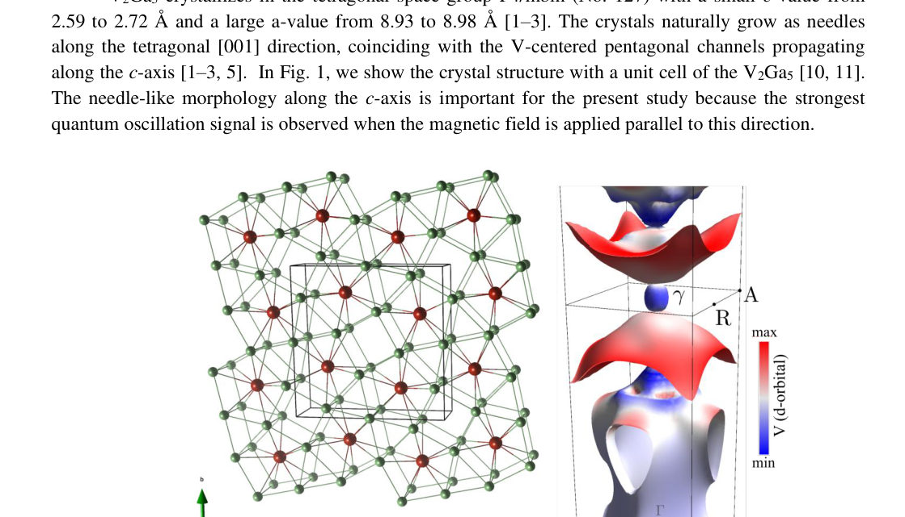
<figcaption class="paper-figure-caption"><b>Fig 1.</b> Fig. 1. a) Schematic view of the crystal structure of V2Ga5. Vanadium atoms are shown with red balls and Gallium atoms with green. The solid box shows one unit cell. b) Calculated Fermi surface with rendered V d-orbitals illustrating the γ pocket centered around the Z point.</figcaption>
</figure>
<figure class="paper-figure-card">
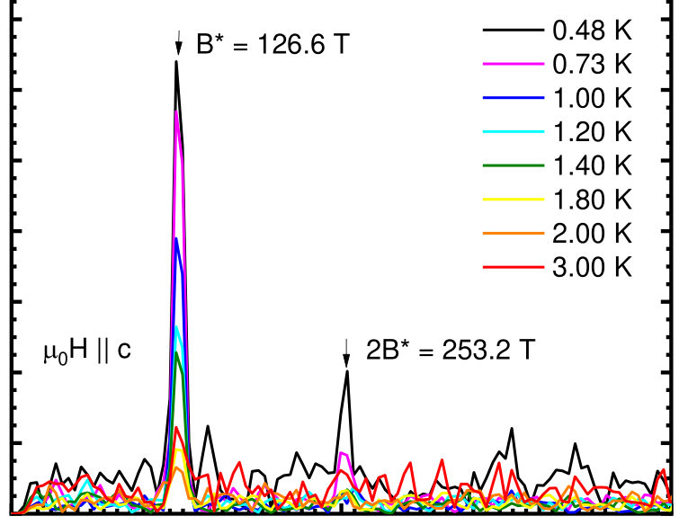
<figcaption class="paper-figure-caption"><b>Fig 2.</b> Fig. 3. The FFT spectra of the Cosc/T data at different temperatures and fields μ0H || c). The peak at 253.2 T represents the second harmonic of oscillations, negligible in further analysis.</figcaption>
</figure>
<figure class="paper-figure-card">
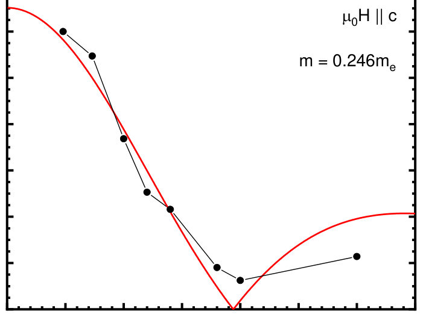
<figcaption class="paper-figure-caption"><b>Fig 3.</b> Fig. 4. |fT&#x27;&#x27;(z)| – fit (red curve) to the FFT amplitude (black dots) for the effective mass determination. A thin black line is a guide for the eyes.</figcaption>
</figure>
<figure class="paper-figure-card">
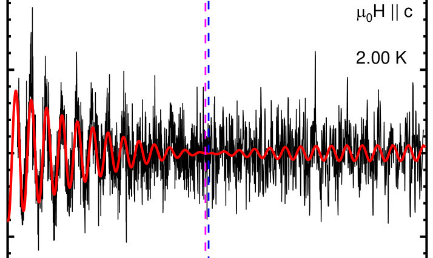
<figcaption class="paper-figure-caption"><b>Fig 4.</b> Fig. 5. Experimental Cosc/T (black curve, μ0H || c) directly fitted to the LK model (red curve) with the only main harmonic of 126.6 T at 2.00 K. The magenta vertical line denotes the node point location, while the blue one shows a position that corresponds to the average m* value, taking into account measurements at different temperatures.</figcaption>
</figure>
<figure class="paper-figure-card">
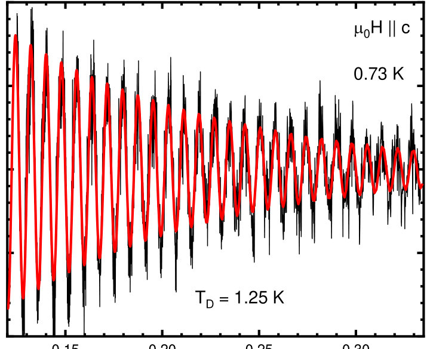
<figcaption class="paper-figure-caption"><b>Fig 5.</b> Fig. 6. Experimental Cosc/T (black curve, μ0H || c) directly fitted (red curve) to the LK model with the only main harmonic of 126.6 T at 0.73 K.</figcaption>
</figure>

**Summary.** This work uses AC calorimetry to study magneto-quantum oscillations in the superconductor V2Ga5. By analyzing these oscillations, the authors successfully map out key parameters of the Fermi surface and demonstrate that the material exhibits a robust, field-independent Berry flux. This establishes ac calorimetry as a powerful technique for probing topological electronic hybridization in complex intermetallics.

**Why it may be interesting.** While focused on superconductivity, the precise measurement and characterization of the geometric phase (Berry flux) using bulk thermodynamic measurements provides an experimental handle on topological electronic structure, which is relevant to advanced condensed matter theory.

Detailed structure

**Main problem.** To probe the bulk electronic structure, including topological properties, of the superconductor V2Ga5 using heat capacity magneto-quantum oscillations (MQOs).

**Main result.** The study confirms a dominant Fermi surface pocket ($\gamma$ pocket) via MQO analysis and demonstrates that the net Berry flux is invariant with magnetic field orientation, establishing ac calorimetry as a powerful probe for topological orbital hybridization.

**Method.** Highly sensitive AC calorimetry measurements of heat capacity under applied magnetic fields, analyzed using Fast Fourier Transform (FFT) to resolve oscillation frequencies.

**Model / system.** The physical system is the single-crystalline superconductor V2Ga5. The analysis relies on Lifshitz–Kosevich theory to interpret MQO signals originating from the $\gamma$ Fermi surface pocket near the Z point of the Brillouin zone.

**Key observables.** Oscillation frequency (126.6 T), effective cyclotron mass, Dingle temperature, quantum relaxation time, and Berry flux ($\Phi_B$).

**Important parameters / regimes.** Low temperatures (down to 0.3 K) and magnetic fields up to 8 T; the measured Berry phase is $\sim 0.8\pi$.

**Assumptions / limitations.** The analysis assumes that MQOs are governed by standard quantum oscillation theory, and that the observed flux invariance relates to a conserved hybridization phase twist.

**Figures summary.** Figures compare MQO signals in heat capacity and magnetization vs. field, show FFT spectra confirming peak frequencies (e.g., 126.6 T), and illustrate the anisotropy of the $\gamma$ pocket.

**Paper structure.** The paper proceeds by presenting the observation of MQOs via AC calorimetry, quantifying fundamental parameters like mass and disorder ($T_D$), and culminating in a topological analysis demonstrating field-orientation invariance of the Berry flux.

Abstract

Unlike de Haas--van Alphen measurements, heat-capacity magneto-quantum oscillations directly probe the oscillatory bulk quasiparticle density of states. Here, we report the observation of MQOs in V$_2$Ga$_5$ single crystals studied via highly sensitive ac calorimetry. The strongest MQO signal is observed for a magnetic field applied along the vanadium chains, in excellent agreement with de Haas--van Alphen magnetization data. A single dominant frequency of 126.6 T resolved by fast Fourier transform confirms the true bulk origin of the elliptical $γ$ Fermi-surface pocket located near the Z point of the Brillouin zone. The angular dependence of the FFT frequency closely tracks the anisotropy of the $γ$ pocket, as supported by first-principles calculations. Analysis of the temperature- and field-dependent MQO amplitudes allows the precise determination of the effective cyclotron mass, Dingle temperature, quantum relaxation time, carrier mobility, and electron mean free path. Furthermore, we demonstrate that the net Berry flux is invariant with respect to the magnetic-field orientation, as a consequence of a conserved hybridization phase twist within the $γ$ pocket. These findings establish ac calorimetry as a powerful macroscopic probe of topological orbital hybridization in complex intermetallics.

[↑ back to top](#top)

### [Double quantum spin Hall phase in bilayer ZrTe$_5$](http://arxiv.org/abs/2606.18130v1)

**Authors:** Chao Chen Ye, Gábor Kalla, Jianting Ye, Jagoda Sławińska  
**Type:** theory · **Category:** other · **PDF:** <https://arxiv.org/pdf/2606.18130v1>  
**Analysis basis:** full PDF text, analyzed in chunks

↔ Scroll figures horizontally

<figure class="paper-figure-card">
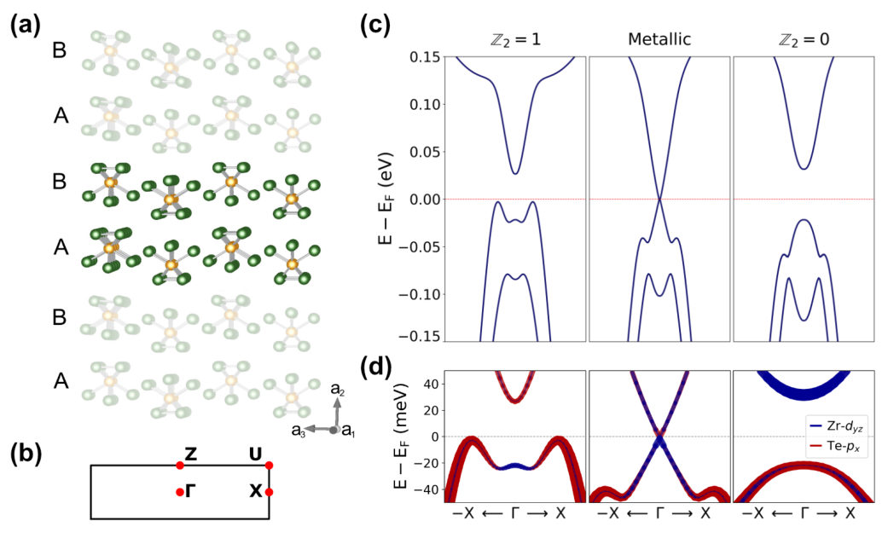
<figcaption class="paper-figure-caption"><b>Fig 1.</b> FIG. 1. (a) Crystal structure of 3D and bilayer ZrTe5; the bilayer that can be exfoliated from the 3D crystal is highlighted. (b) The 2D Brillouin zone. (c) Bandgap evolution along the −X −Γ −X k-path illustrating the topological phase transition. (d) Orbital-projected band inversion during the topological phase transition.</figcaption>
</figure>
<figure class="paper-figure-card">
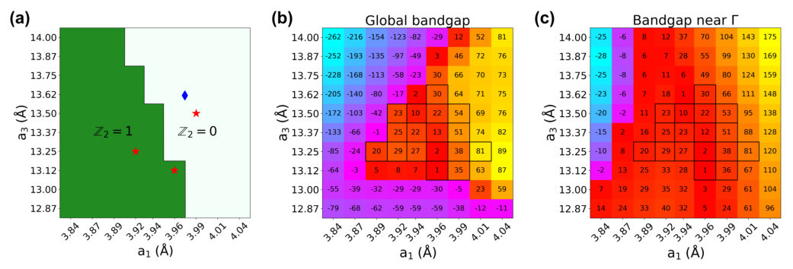
<figcaption class="paper-figure-caption"><b>Fig 2.</b> FIG. 2. (a) Topological phase diagram of bilayer ZrTe5 under lattice deformation, where Z2 = 1 indicates the conventional QSH phase and Z2 = 0 denotes a distinct topological regime corresponding to the double QSH phase. The three red stars mark the deformations of the three phases shown in Figs. 1(c) and 1(d). The dark diamond denotes the fully relaxed DFT structure. (b) The global bandgap and (c) the local bandgap near Γ for each set of lattice parameters, in units of meV. The black frames highlight the deformations for which the global bandgap is located near Γ, where the bandgap closing and reopening occur.</figcaption>
</figure>
<figure class="paper-figure-card">
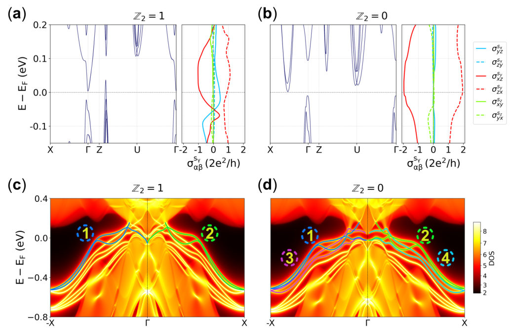
<figcaption class="paper-figure-caption"><b>Fig 3.</b> FIG. 3. Bulk band structures and the corresponding SHC for the representative lattice deformations characterized by (a) Z2 = 1, (b) Z2 = 0. (c) Z2 = 1 regime has two robust edge states connecting valence and conduction bands, as numbered and colored. (d) Z2 = 0 phase has four robust edge states connecting valence and conduction bands, as numbered and colored.</figcaption>
</figure>

**Summary.** This paper reports on bilayer ZrTe5, demonstrating that it can realize a double Quantum Spin Hall (QSH) phase beyond standard topological classifications. Using first-principles calculations, the authors show that applying uniaxial strain allows tuning between this exotic double QSH state and a conventional single pair QSH state. This establishes the material as a promising platform for studying tunable, dissipationless spin transport.

**Why it may be interesting.** This work is interesting because it explores realizing exotic topological states (double QSH) in a solid-state material platform using computational methods, which informs the search for novel quantum materials relevant to spintronics.

Detailed structure

**Main problem.** The study investigates topological phases beyond the conventional Z2 classification, specifically realizing and characterizing a Double Quantum Spin Hall (double QSH) phase in an accessible material system.

**Main result.** Bilayer ZrTe5 is shown to host a tunable phase diagram containing both conventional (Z2=1) and double QSH (Z2=0) phases, demonstrating enhanced edge conductance in the latter.

**Method.** The research relies on first-principles density functional theory calculations (PBE/HSE functionals) combined with advanced topological analysis techniques like calculating the Z2 index and Spin Hall Conductivity (SHC).

**Model / system.** The physical system is bilayer Zirconium pentatelluride (ZrTe5), a layered van der Waals material. The study analyzes its electronic structure under varying uniaxial or biaxial lattice strains.

**Key observables.** Quantized Spin Hall Conductivity (SHC), which exhibits values of 2e^2/h for conventional QSH and 4e^2/h for the double QSH phase.

**Important parameters / regimes.** Uniaxial strain is the key tuning parameter driving the transition between the two topological phases. The robustness of the quantized response is shown over energy windows up to ~100 meV.

**Assumptions / limitations.** The analysis focuses on the bilayer system due to exfoliation feasibility, and it establishes that the Z2 invariant alone is insufficient for classifying these advanced topological states.

**Figures summary.** Figures illustrate the crystal structure, a topological phase diagram mapping out QSH vs. double QSH regimes under strain, and band structures confirming the quantized SHC in both phases.

**Paper structure.** The paper establishes the theoretical motivation by discussing limitations of Z2 classification, presents calculations on bilayer ZrTe5 showing its stable realization of the double QSH phase, details how uniaxial strain drives a transition to the conventional QSH phase, and quantifies the resulting enhanced edge transport properties.

Abstract

Quantum spin Hall insulators (QSH) are topological materials that host helical edge states protected against backscattering, making them ideal candidates for dissipationless spin transport. Within the conventional $\mathbb{Z}_2$ classification, only phases with an odd number of edge state pairs ($\mathbb{Z}_2 = 1$) are topologically nontrivial, whereas even-channel systems ($\mathbb{Z}_2 = 0$) lie beyond this framework but can host robust edge transport characterized by a spin Chern number. Experimentally accessible realizations of such phases remain rare, particularly in systems with sizeable band gaps. Here, we show that bilayer ZrTe$_5$ realizes a double quantum spin Hall phase in its energetically most stable structure. Using first principles calculations, we demonstrate that uniaxial strain drives a transition from this phase to a conventional single pair QSH phase with $\mathbb{Z}_2 = 1$. The double QSH phase hosts two pairs of helical edge states, resulting in enhanced edge conductance and a quantized spin Hall response that remains robust over an energy window of up to $\sim$100 meV. These results establish bilayer ZrTe$_5$ as a tunable platform connecting conventional and double QSH phases within a single material. More broadly, they demonstrate that untwisted van der Waals bilayers can host topological phases beyond the conventional $\mathbb{Z}_2$ classification.

[↑ back to top](#top)

### [Robust Signatures of Fragile Topology](http://arxiv.org/abs/2606.17870v1)

**Authors:** Viktor Könye, Ihor Nimyi, Oleg Janson, Jeroen van den Brink, Jasper van Wezel, Cosma Fulga  
**Type:** both · **Category:** other · **PDF:** <https://arxiv.org/pdf/2606.17870v1>  
**Analysis basis:** full PDF text, analyzed in chunks

↔ Scroll figures horizontally

<figure class="paper-figure-card">
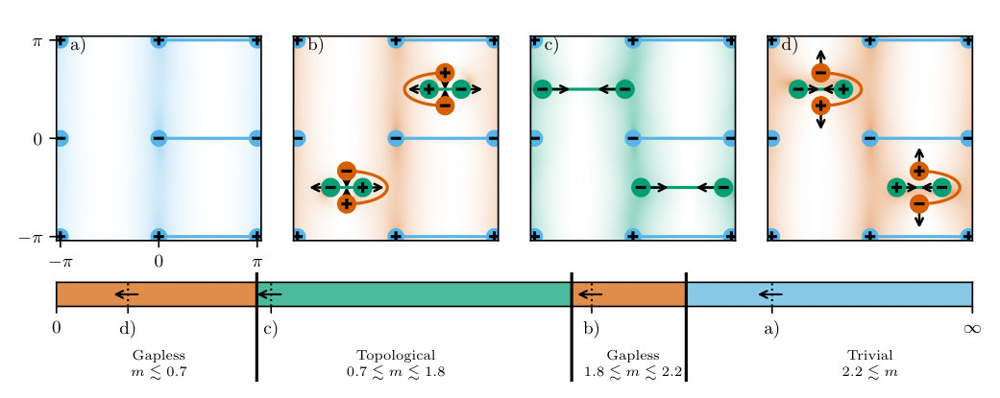
<figcaption class="paper-figure-caption"><b>Fig 1.</b> Figure 1. Topologically distinct phases of the Hamiltonian in Eq. (1) as a function of m, with transition points indicated along the bottom bar. In the orange regions the gap at the Fermi energy is closed. As the gap opens in the green (blue) region we encounter a topological (trivial) insulator with χ = −2 (χ = 0). The panels (a-d) show the degeneracies between various bands at specific values of the parameter m. The intensity of shading in each panel indicates the difference in energy between the two occupied bands on a logarithmic scale. The signs + and −inside colored circles denote winding numbers +1 and −1 respectively. The Dirac points at the TRIM and Dirac strings between them are...</figcaption>
</figure>
<figure class="paper-figure-card">
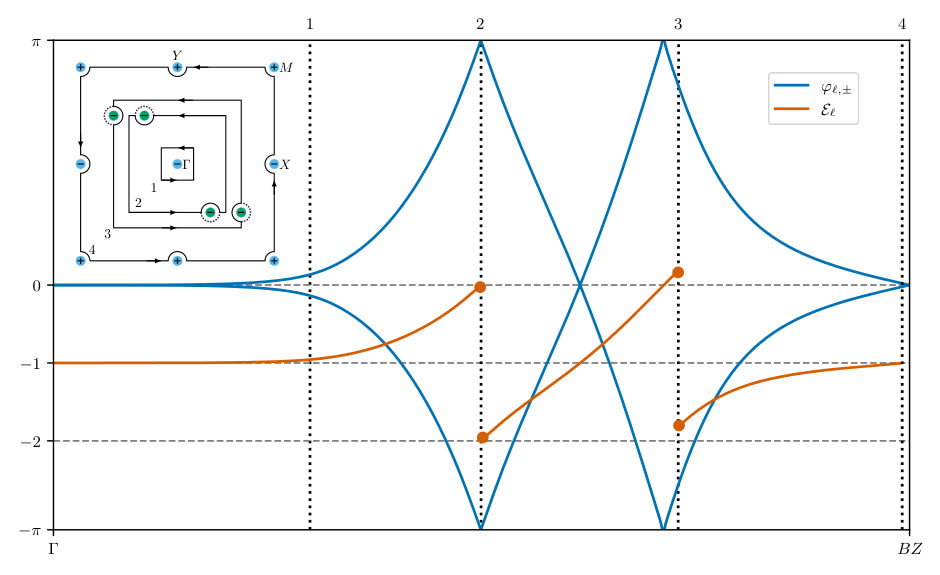
<figcaption class="paper-figure-caption"><b>Fig 2.</b> Figure 2. The spectrum of concentric square Wilson loops (blue) and the corresponding Euler loop (orange) for the Hamiltonian in Eq. (1) with m = 1.75. The horizontal axis represents the radius of the WL, which starts out tightly enclosing the Γ point, and eventually covers the entire BZ. The vertical black dotted lines labeled 1-4 indicate the radii of the corresponding numbered Wilson loops shown in the inset.</figcaption>
</figure>
<figure class="paper-figure-card">
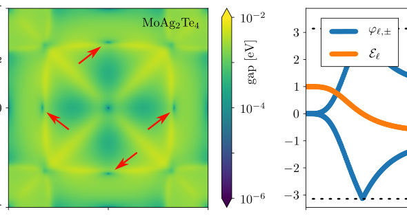
<figcaption class="paper-figure-caption"><b>Fig 3.</b> Figure 3. Dirac cones enforced by fragile topology in MoAg2Te4. The left panel shows the energy gap between the two bands in a pair, with generic Dirac cones (all winding numbers equal to +1) indicated by red arrows. k1,2 are dimensionless momenta in the directions of the two Bravais vectors of the lattice. The right panel is the same as as Fig. 2, showing the Euler loop and the CWLS. This is the third band pair in order of increasing energies, formed by bands numbers five and six. As such, it is located deep in the valence sector around −10 eV to −11 eV.</figcaption>
</figure>
<figure class="paper-figure-card">
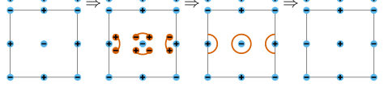
<figcaption class="paper-figure-caption"><b>Fig 4.</b> Figure 4. Schematic figure for the change of the Euler class by the addition of a trivial pair of bands. The top row shows the initially non-trivial band with χ = −2. The bottom row shows the added trivial band. Orange points are the degeneracies formed between the topological and trivial pair. At the end we are left with two separated trivial bands with χ = 0.</figcaption>
</figure>
<figure class="paper-figure-card">
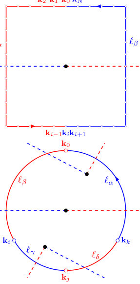
<figcaption class="paper-figure-caption"><b>Fig 5.</b> Figure 5. The different gauges used to patch together the Wilson loop in the case of (a) one Dirac string crossing the loop and (b) three Dirac strings crossing the loop. The solid red and blue lines indicate the different parts of the Wilson loop, evaluated in different gauges. The black dots represent the Dirac points, and dashed red/blue lines indicate the po- sitions of the Dirac strings in the two different gauges, α and β. Notice that these two gauges are chosen such that the re- spective portion of the Wilson loop only contains continuous eigenvectors, never crossing a Dirac string. That is, the solid blue part of the Wilson loop never crosses a dashed blue Dirac string (and the same...</figcaption>
</figure>

**Summary.** The paper introduces a robust topological index, $Q$, designed to detect 'fragile' topological phases in 2D materials possessing specific symmetries. By analyzing the interplay between Wilson loops and the Euler class, the authors prove that this index predicts the existence of bulk Dirac cones. This provides an experimentally verifiable spectroscopic signature for identifying new classes of quantum materials.

**Why it may be interesting.** This work provides a powerful new theoretical framework for classifying topological matter that goes beyond standard invariants like $	ext{Z}_2$ indices, offering a pathway to predict novel electronic properties in complex crystalline systems.

Detailed structure

**Main problem.** The research aims to find robust, experimentally accessible signatures for 'fragile topological phases'—topological states that lack generic protected boundary states and can be trivialized by adding valence bands.

**Main result.** The authors establish a new topological index, $Q$, which guarantees the existence of bulk Dirac cones in 2D materials possessing both time-reversal ($T$) and twofold rotation ($	ext{C}_2$) symmetries. This signature is robust even when the standard Euler class might suggest otherwise.

**Method.** The methodology combines theoretical analysis using toy models (Hamiltonians) with computational predictions derived from first-principles calculations on five different 2D materials.

**Model / system.** The focus is on electronic band structures in crystalline insulators exhibiting $T$ and $	ext{C}_2$ symmetries. The diagnostic tools involve analyzing Wilson Loops ($	ext{W}_\ell$) and the associated Euler class ($\chi$), leading to the specialized index $Q$.

**Key observables.** Dirac points (both TRIM and generic), the topological index $Q$, the Wilson Loop spectrum, and the Euler class $\chi$.

**Important parameters / regimes.** The symmetry constraints ($T$ and $	ext{C}_2$), the band structure parameters ($m$ in toy models), and the specific material compositions tested.

**Assumptions / limitations.** The analysis assumes that the system can be described by isolated, pair-wise coupled bands for index calculation, and it relies on the preservation of $T$ and $	ext{C}_2$ symmetries during calculations.

**Figures summary.** Figures illustrate the evolution of band degeneracies (Dirac points) in toy models as parameters change, showing how gap closing leads to Dirac point formation. Other figures show the calculation of Wilson Loops and Euler loops for specific materials, confirming $Q 
eq 0$.

**Paper structure.** The paper progresses from introducing the problem of fragile topology to developing advanced diagnostic tools (Wilson/Euler loops) in toy models, formalizing the index $Q$, and finally applying this robust index to test its prediction across five distinct real-world materials using DFT calculations.

Abstract

Some topological phases of matter are called fragile. They do not generically host protected gapless boundary states and they can be trivialized by adding additional valence bands. Here we show that fragile topology nevertheless has robust signatures: it yields bulk Dirac cones in two-dimensional materials with arbitrarily many bands. In systems with time-reversal and twofold rotation symmetry, we establish a fragile topological index which guarantees the presence of gap closing points in the band structure. We test this prediction using first-principles calculations in five materials and find that all of them host such Dirac points, suggesting that this is a widespread phenomenon. Our results provide a robust spectroscopic signature of fragile topology which can be directly accessed in experiment. Further, they enable an alternate method for finding Dirac cones in ab-initio simulations, and may be used as a route towards identifying materials with nonlinear transport properties.

[↑ back to top](#top)

