
# arxiv digest (quant-ph + cond-mat) — 2026-06-18

*102 papers · 38 relevant · 0 highlighted*

## 🔥 Most relevant (38)

*Every paper with at least one nonzero topic score, sorted by best-matching score. 🔥 marks scores ≥4/5. Click the title to jump to the full entry below; click [arXiv] to open the paper page. `(secondary)` marks papers from de-prioritized cond-mat archives.*

Show 38 relevant papers

- [Cavity Enhanced Superconductivity](#paper-2606.19171) [[arXiv]](http://arxiv.org/abs/2606.19171v1) `(secondary)` — 🔥 `analog quantum simulation` **4/5** · 🔥 `correlated cavity matter` **4/5** · `driven-dissipative phase transition` **3/5** · `methods for driven-dissipative` **3/5** · `quantum optics experiment` **3/5** · `QC/QI experiment` **2/5** · `non-equilibrium dynamics` **2/5** · `spintronics-quantum-optics interface` **2/5** · `Keldysh / 2PI / non-Gaussian methods` **1/5** · `Kondo & dissipative impurity` **1/5** · `Tavis-Cummings & cavity-many-emitter` **1/5** · `correlated / nonlocal dissipation` **1/5** · `entanglement & information structure` **1/5** · `exotic spin models in light-matter` **1/5** · `interference shaping light` **1/5** · `non-equilibrium universality` **1/5**
- [Nonequilibrium steady states induced by stochastic mid-circuit measurements and resets on a quantum computer](#paper-2606.19027) [[arXiv]](http://arxiv.org/abs/2606.19027v1) — 🔥 `QC/QI experiment` **4/5** · 🔥 `measurement-induced transitions` **4/5** · 🔥 `non-equilibrium dynamics` **4/5** · `correlated / nonlocal dissipation` **3/5** · `driven-dissipative phase transition` **3/5** · `methods for driven-dissipative` **3/5** · `quantum measurements` **3/5** · `non-equilibrium universality` **2/5** · `Keldysh / 2PI / non-Gaussian methods` **1/5** · `analog quantum simulation` **1/5**
- [Towards Entanglement-Enhanced Atom Interferometry Using Bow-Tie Cavities](#paper-2606.18552) [[arXiv]](http://arxiv.org/abs/2606.18552v1) — 🔥 `correlated cavity matter` **4/5** · 🔥 `quantum optics experiment` **4/5** · `Tavis-Cummings & cavity-many-emitter` **3/5** · `analog quantum simulation` **3/5** · `quantum measurements` **3/5** · `correlated / nonlocal dissipation` **2/5** · `entanglement & information structure` **2/5** · `measurement-induced transitions` **2/5** · `Keldysh / 2PI / non-Gaussian methods` **1/5** · `QC/QI experiment` **1/5** · `driven-dissipative phase transition` **1/5** · `interference shaping light` **1/5** · `methods for driven-dissipative` **1/5**
- [Exceptional-Point-Anchored Variational Quantum Eigensolver for Non-Hermitian Many-Body Phase Diagrams: Bridging Skin-Effect Topology and Entanglement Criticality on NISQ Hardware](#paper-2606.18916) [[arXiv]](http://arxiv.org/abs/2606.18916v1) — 🔥 `driven-dissipative phase transition` **4/5** · `analog quantum simulation` **3/5** · `correlated / nonlocal dissipation` **3/5** · `entanglement & information structure` **3/5** · `methods for driven-dissipative` **3/5** · `non-equilibrium universality` **3/5** · `Keldysh / 2PI / non-Gaussian methods` **2/5** · `Kondo & dissipative impurity` **2/5** · `non-equilibrium dynamics` **2/5** · `exotic spin models in light-matter` **1/5** · `scars & prethermalization` **1/5**
- [Equilibration of generalized subsystems: a quantum-channel approach](#paper-2606.18360) [[arXiv]](http://arxiv.org/abs/2606.18360v1) — 🔥 `entanglement & information structure` **4/5** · 🔥 `non-equilibrium dynamics` **4/5** · `methods for driven-dissipative` **3/5** · `non-equilibrium universality` **3/5** · `quantum measurements` **3/5** · `correlated / nonlocal dissipation` **2/5** · `driven-dissipative phase transition` **2/5** · `measurement-induced transitions` **2/5** · `analog quantum simulation` **1/5** · `exotic spin models in light-matter` **1/5** · `scars & prethermalization` **1/5**
- [Holographic Dual of PT Symmetric BCFT](#paper-2606.18629) [[arXiv]](http://arxiv.org/abs/2606.18629v1) — 🔥 `driven-dissipative phase transition` **4/5** · `correlated / nonlocal dissipation` **3/5** · `entanglement & information structure` **3/5** · `methods for driven-dissipative` **3/5** · `non-equilibrium dynamics` **3/5** · `non-equilibrium universality` **3/5** · `Keldysh / 2PI / non-Gaussian methods` **2/5** · `Kondo & dissipative impurity` **2/5** · `analog quantum simulation` **1/5** · `correlated cavity matter` **1/5** · `scars & prethermalization` **1/5**
- [Steady-state spectral kissing and dissipative phase transitions](#paper-2606.18348) [[arXiv]](http://arxiv.org/abs/2606.18348v1) — 🔥 `driven-dissipative phase transition` **4/5** · `correlated / nonlocal dissipation` **3/5** · `methods for driven-dissipative` **3/5** · `non-equilibrium universality` **3/5** · `Keldysh / 2PI / non-Gaussian methods` **2/5** · `Tavis-Cummings & cavity-many-emitter` **2/5** · `non-equilibrium dynamics` **2/5** · `Kondo & dissipative impurity` **1/5** · `analog quantum simulation` **1/5** · `correlated cavity matter` **1/5** · `entanglement & information structure` **1/5** · `scars & prethermalization` **1/5**
- [Dynamical axion quasiparticles: an open quantum system](#paper-2606.18493) [[arXiv]](http://arxiv.org/abs/2606.18493v1) `(secondary)` — 🔥 `methods for driven-dissipative` **4/5** · 🔥 `non-equilibrium dynamics` **4/5** · `Keldysh / 2PI / non-Gaussian methods` **3/5** · `correlated / nonlocal dissipation` **3/5** · `driven-dissipative phase transition` **3/5** · `non-equilibrium universality` **2/5** · `Kondo & dissipative impurity` **1/5** · `analog quantum simulation` **1/5** · `exotic spin models in light-matter` **1/5** · `scars & prethermalization` **1/5**
- [Mapping the non-equilibrium interacting Anderson Impurity Model to an effective Gaussian theory](#paper-2606.19206) [[arXiv]](http://arxiv.org/abs/2606.19206v1) — 🔥 `Kondo & dissipative impurity` **4/5** · 🔥 `methods for driven-dissipative` **4/5** · 🔥 `non-equilibrium dynamics` **4/5** · `Keldysh / 2PI / non-Gaussian methods` **3/5** · `non-equilibrium universality` **3/5** · `entanglement & information structure` **2/5** · `analog quantum simulation` **1/5** · `correlated / nonlocal dissipation` **1/5** · `driven-dissipative phase transition` **1/5**
- [Measurement-enabled online quantum processing with amplitude encoding](#paper-2606.18991) [[arXiv]](http://arxiv.org/abs/2606.18991v1) — 🔥 `QC/QI experiment` **4/5** · 🔥 `quantum measurements` **4/5** · `measurement-induced transitions` **3/5** · `methods for driven-dissipative` **3/5** · `non-equilibrium dynamics` **2/5** · `Keldysh / 2PI / non-Gaussian methods` **1/5** · `analog quantum simulation` **1/5** · `correlated / nonlocal dissipation` **1/5** · `driven-dissipative phase transition` **1/5** · `entanglement & information structure` **1/5** · `exotic spin models in light-matter` **1/5**
- [Josephson spectroscopy in a circular atomic tunnel junction with acceleration-induced symmetry breaking](#paper-2606.18706) [[arXiv]](http://arxiv.org/abs/2606.18706v1) — 🔥 `analog quantum simulation` **4/5** · `methods for driven-dissipative` **3/5** · `non-equilibrium dynamics` **3/5** · `Keldysh / 2PI / non-Gaussian methods` **2/5** · `driven-dissipative phase transition` **2/5** · `non-equilibrium universality` **2/5** · `Frenkel-Kontorova` **1/5** · `correlated / nonlocal dissipation` **1/5** · `entanglement & information structure` **1/5** · `quantum measurements` **1/5**
- [Nonequilibrium nucleation theory for nonconserved fields: from active matter to population dynamics](#paper-2606.18911) [[arXiv]](http://arxiv.org/abs/2606.18911v1) — 🔥 `non-equilibrium dynamics` **4/5** · 🔥 `non-equilibrium universality` **4/5** · `Keldysh / 2PI / non-Gaussian methods` **3/5** · `driven-dissipative phase transition` **3/5** · `methods for driven-dissipative` **3/5** · `Frenkel-Kontorova` **1/5** · `analog quantum simulation` **1/5** · `correlated / nonlocal dissipation` **1/5**
- [Thermodynamics of photonic nonlinear Aharonov-Bohm cages](#paper-2606.18896) [[arXiv]](http://arxiv.org/abs/2606.18896v1) — 🔥 `analog quantum simulation` **4/5** · `driven-dissipative phase transition` **3/5** · `methods for driven-dissipative` **3/5** · `non-equilibrium dynamics` **3/5** · `non-equilibrium universality` **2/5** · `Frenkel-Kontorova` **1/5** · `Keldysh / 2PI / non-Gaussian methods` **1/5** · `correlated / nonlocal dissipation` **1/5** · `correlated cavity matter` **1/5** · `entanglement & information structure` **1/5**
- [Chaos from quantum bath fluctuations](#paper-2606.18340) [[arXiv]](http://arxiv.org/abs/2606.18340v1) — 🔥 `Keldysh / 2PI / non-Gaussian methods` **4/5** · `driven-dissipative phase transition` **3/5** · `methods for driven-dissipative` **3/5** · `non-equilibrium dynamics` **3/5** · `correlated / nonlocal dissipation` **2/5** · `non-equilibrium universality` **2/5** · `Tavis-Cummings & cavity-many-emitter` **1/5** · `correlated cavity matter` **1/5**
- [On operator product expansion in the spin-orbit coupled bosonic system](#paper-2606.19290) [[arXiv]](http://arxiv.org/abs/2606.19290v1) — 🔥 `analog quantum simulation` **4/5** · `Keldysh / 2PI / non-Gaussian methods` **3/5** · `driven-dissipative phase transition` **2/5** · `methods for driven-dissipative` **2/5** · `non-equilibrium dynamics` **2/5** · `non-equilibrium universality` **2/5** · `correlated cavity matter` **1/5** · `entanglement & information structure` **1/5** · `exotic spin models in light-matter` **1/5** · `spintronics-quantum-optics interface` **1/5**
- [Quantum simulation of neutrino oscillations with bosonic encoding](#paper-2606.18755) [[arXiv]](http://arxiv.org/abs/2606.18755v1) — 🔥 `analog quantum simulation` **4/5** · `correlated cavity matter` **3/5** · `quantum optics experiment` **3/5** · `QC/QI experiment` **2/5** · `Tavis-Cummings & cavity-many-emitter` **2/5** · `correlated / nonlocal dissipation` **1/5** · `driven-dissipative phase transition` **1/5** · `entanglement & information structure` **1/5** · `methods for driven-dissipative` **1/5** · `non-equilibrium dynamics` **1/5**
- [Controlling magnetic domain walls with supercurrents](#paper-2606.19078) [[arXiv]](http://arxiv.org/abs/2606.19078v1) `(secondary)` — 🔥 `Keldysh / 2PI / non-Gaussian methods` **4/5** · `methods for driven-dissipative` **3/5** · `spintronics-quantum-optics interface` **3/5** · `driven-dissipative phase transition` **2/5** · `non-equilibrium dynamics` **2/5** · `Frenkel-Kontorova` **1/5** · `correlated / nonlocal dissipation` **1/5** · `exotic spin models in light-matter` **1/5** · `non-equilibrium universality` **1/5**
- [Memory-assisted advantage for state transfer in disordered quantum many-body scar system](#paper-2606.18720) [[arXiv]](http://arxiv.org/abs/2606.18720v1) — 🔥 `analog quantum simulation` **4/5** · 🔥 `scars & prethermalization` **4/5** · `entanglement & information structure` **2/5** · `non-equilibrium dynamics` **2/5** · `non-equilibrium universality` **2/5** · `Keldysh / 2PI / non-Gaussian methods` **1/5** · `correlated / nonlocal dissipation` **1/5** · `driven-dissipative phase transition` **1/5** · `methods for driven-dissipative` **1/5**
- [Quantum solitons and their quantum walks in transmon arrays](#paper-2606.19339) [[arXiv]](http://arxiv.org/abs/2606.19339v1) — 🔥 `analog quantum simulation` **4/5** · `non-equilibrium dynamics` **3/5** · `driven-dissipative phase transition` **2/5** · `methods for driven-dissipative` **2/5** · `non-equilibrium universality` **2/5** · `Frenkel-Kontorova` **1/5** · `Keldysh / 2PI / non-Gaussian methods` **1/5** · `correlated cavity matter` **1/5** · `entanglement & information structure` **1/5**
- [The electric-field-driven intermediate state of three-dimensional superconductors](#paper-2606.18931) [[arXiv]](http://arxiv.org/abs/2606.18931v1) `(secondary)` — 🔥 `non-equilibrium dynamics` **4/5** · `Keldysh / 2PI / non-Gaussian methods` **3/5** · `driven-dissipative phase transition` **3/5** · `methods for driven-dissipative` **3/5** · `non-equilibrium universality` **2/5** · `Frenkel-Kontorova` **1/5** · `correlated / nonlocal dissipation` **1/5**
- [Time-resolved synchronization analysis of stacked intrinsic Josephson junctions of a cuprate superconductor with frequency-modulated terahertz radiation spectra](#paper-2606.18563) [[arXiv]](http://arxiv.org/abs/2606.18563v1) `(secondary)` — 🔥 `non-equilibrium dynamics` **4/5** · `driven-dissipative phase transition` **3/5** · `methods for driven-dissipative` **3/5** · `correlated / nonlocal dissipation` **2/5** · `non-equilibrium universality` **2/5** · `Keldysh / 2PI / non-Gaussian methods` **1/5** · `interference shaping light` **1/5** · `quantum optics experiment` **1/5**
- [Quantum magic is necessary but not sufficient for wormhole-inspired teleportation](#paper-2606.19180) [[arXiv]](http://arxiv.org/abs/2606.19180v1) — 🔥 `entanglement & information structure` **4/5** · `methods for driven-dissipative` **3/5** · `non-equilibrium dynamics` **3/5** · `non-equilibrium universality` **2/5** · `Keldysh / 2PI / non-Gaussian methods` **1/5** · `analog quantum simulation` **1/5** · `correlated / nonlocal dissipation` **1/5** · `driven-dissipative phase transition` **1/5**
- [Mimicry of chaos and $k$-design in higher order OTOCs of Luttinger liquids](#paper-2606.18800) [[arXiv]](http://arxiv.org/abs/2606.18800v1) — 🔥 `entanglement & information structure` **4/5** · `non-equilibrium dynamics` **3/5** · `non-equilibrium universality` **2/5** · `Keldysh / 2PI / non-Gaussian methods` **1/5** · `Kondo & dissipative impurity` **1/5** · `analog quantum simulation` **1/5** · `exotic spin models in light-matter` **1/5** · `methods for driven-dissipative` **1/5** · `scars & prethermalization` **1/5**
- [Probing chaos and thermalization through out-of-time-ordered correlators in random field spin chains](#paper-2606.18982) [[arXiv]](http://arxiv.org/abs/2606.18982v1) — 🔥 `entanglement & information structure` **4/5** · `non-equilibrium dynamics` **3/5** · `analog quantum simulation` **2/5** · `non-equilibrium universality` **2/5** · `correlated / nonlocal dissipation` **1/5** · `driven-dissipative phase transition` **1/5** · `exotic spin models in light-matter` **1/5** · `scars & prethermalization` **1/5**
- [Ghosts versus Unstable Particles in Quantum Field Theory](#paper-2606.18349) [[arXiv]](http://arxiv.org/abs/2606.18349v1) — 🔥 `Keldysh / 2PI / non-Gaussian methods` **4/5** · `methods for driven-dissipative` **3/5** · `non-equilibrium dynamics` **3/5** · `driven-dissipative phase transition` **2/5** · `correlated / nonlocal dissipation` **1/5** · `non-equilibrium universality` **1/5**
- [Characterization of nested Walsh parity-check filters in a single-photon eight-mode register on a cloud photonic processor](#paper-2606.18408) [[arXiv]](http://arxiv.org/abs/2606.18408v1) — 🔥 `QC/QI experiment` **4/5** · `quantum optics experiment` **3/5** · `quantum measurements` **2/5** · `analog quantum simulation` **1/5** · `entanglement & information structure` **1/5** · `interference shaping light` **1/5** · `non-equilibrium dynamics` **1/5**
- [Matrix Product Operators In The Age of Block Encoding](#paper-2606.19083) [[arXiv]](http://arxiv.org/abs/2606.19083v1) — 🔥 `analog quantum simulation` **4/5** · 🔥 `methods for driven-dissipative` **4/5** · `non-equilibrium dynamics` **2/5** · `driven-dissipative phase transition` **1/5** · `entanglement & information structure` **1/5** · `exotic spin models in light-matter` **1/5**
- [Random-matrix reduction in projective quantum mechanics](#paper-2606.19272) [[arXiv]](http://arxiv.org/abs/2606.19272v1) — 🔥 `quantum measurements` **4/5** · `measurement-induced transitions` **3/5** · `correlated / nonlocal dissipation` **1/5** · `driven-dissipative phase transition` **1/5** · `methods for driven-dissipative` **1/5** · `non-equilibrium dynamics` **1/5**
- [Coherent Microwave Control of Optically Addressable Donor Qubits in ZnO](#paper-2606.19016) [[arXiv]](http://arxiv.org/abs/2606.19016v1) — 🔥 `QC/QI experiment` **4/5** · `spintronics-quantum-optics interface` **3/5** · `exotic spin models in light-matter` **1/5** · `quantum measurements` **1/5** · `quantum optics experiment` **1/5**
- [Integration of diamond nanobeams with SnVs on Al2O3 waveguides for scalable quantum photonic chip application](#paper-2606.18711) [[arXiv]](http://arxiv.org/abs/2606.18711v1) — 🔥 `QC/QI experiment` **4/5** · `quantum optics experiment` **3/5** · `analog quantum simulation` **1/5** · `interference shaping light` **1/5** · `spintronics-quantum-optics interface` **1/5**
- [Observation of anyonic thermodynamics and generalized Pauli principle](#paper-2606.19009) [[arXiv]](http://arxiv.org/abs/2606.19009v1) — 🔥 `analog quantum simulation` **4/5** · `non-equilibrium dynamics` **2/5** · `driven-dissipative phase transition` **1/5** · `entanglement & information structure` **1/5** · `non-equilibrium universality` **1/5**
- [Entanglement response to Temperature in Interacting Two-Qubit Thermal States](#paper-2606.18415) [[arXiv]](http://arxiv.org/abs/2606.18415v1) — 🔥 `entanglement & information structure` **4/5** · `Keldysh / 2PI / non-Gaussian methods` **1/5** · `correlated / nonlocal dissipation` **1/5** · `driven-dissipative phase transition` **1/5**
- [Piezoelectric resonators in thin-film barium titanate from room temperature to millikelvin](#paper-2606.18522) [[arXiv]](http://arxiv.org/abs/2606.18522v1) — 🔥 `QC/QI experiment` **4/5** · `analog quantum simulation` **1/5** · `correlated cavity matter` **1/5** · `spintronics-quantum-optics interface` **1/5**
- [Tunable Chaos in the Finite Mean SYK Model](#paper-2606.18529) [[arXiv]](http://arxiv.org/abs/2606.18529v1) — 🔥 `entanglement & information structure` **4/5** · `non-equilibrium dynamics` **2/5** · `non-equilibrium universality` **1/5**
- [Universal entanglement probes of topological order and locally-achiral manifolds](#paper-2606.18361) [[arXiv]](http://arxiv.org/abs/2606.18361v1) — 🔥 `entanglement & information structure` **4/5** · `analog quantum simulation` **2/5** · `Keldysh / 2PI / non-Gaussian methods` **1/5**
- [Ground- and excited-state energies extraction via Trotterization on IBM quantum computers](#paper-2606.18534) [[arXiv]](http://arxiv.org/abs/2606.18534v1) — 🔥 `QC/QI experiment` **4/5** · `methods for driven-dissipative` **1/5** · `non-equilibrium dynamics` **1/5**
- [The quantum-advantage resource in multimode OPA light: Identification, optimization, extraction](#paper-2606.18605) [[arXiv]](http://arxiv.org/abs/2606.18605v1) — 🔥 `entanglement & information structure` **4/5** · `Keldysh / 2PI / non-Gaussian methods` **1/5**
- [Spontaneous parametric down-conversion pumped by spatiotemporal structured light](#paper-2606.19219) [[arXiv]](http://arxiv.org/abs/2606.19219v1) — 🔥 `interference shaping light` **4/5**

## All papers (73, sorted by relevance)

*Papers from quant-ph and your primary cond-mat archives (quant-gas, stat-mech, str-el, dis-nn). Highlighted papers (⭐) come first, then everything else sorted by topic-relevance score, highest first.*

### [Nonequilibrium steady states induced by stochastic mid-circuit measurements and resets on a quantum computer](http://arxiv.org/abs/2606.19027v1)

**Authors:** Jakob Murauer, Sabine Tornow, Gabriele Perfetto  
**Type:** both · **Category:** statistical mechanics · **PDF:** <https://arxiv.org/pdf/2606.19027v1>  
**Analysis basis:** full PDF text, analyzed in chunks
**Topic relevance:** 🔥 `QC/QI experiment` **4/5** · 🔥 `measurement-induced transitions` **4/5** · 🔥 `non-equilibrium dynamics` **4/5** · `correlated / nonlocal dissipation` **3/5** · `driven-dissipative phase transition` **3/5** · `methods for driven-dissipative` **3/5** · `quantum measurements` **3/5** · `non-equilibrium universality` **2/5** · `Keldysh / 2PI / non-Gaussian methods` **1/5** · `analog quantum simulation` **1/5**

↔ Scroll figures horizontally

<figure class="paper-figure-card">
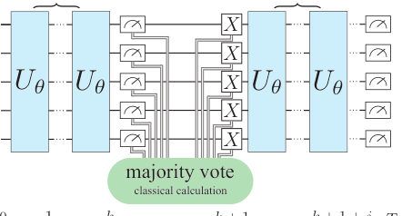
<figcaption class="paper-figure-caption"><b>Fig 1.</b> FIG. 1. Noisy reset protocol and its hardware implementa- tion. (a) For poissonian resetting, at each discrete time step, the system either evolves unitarily with probability 1 −r (the unitary is sketched in the blue panel), or undergoes a reset. In the conditional protocol, the reset state is determined by a majority vote on the mid-circuit measurement (oscilloscope drawings) outcomes. We account in the theory for readout er- rors, which effectively result into a depolarization of the reset state (red panel). Averaging over many stochastic realiza- tions of resetting yields a NESS at long times. (b) Quantum circuit implementation of a single reset realization. Unitary gates Uθ are applied...</figcaption>
</figure>
<figure class="paper-figure-card">
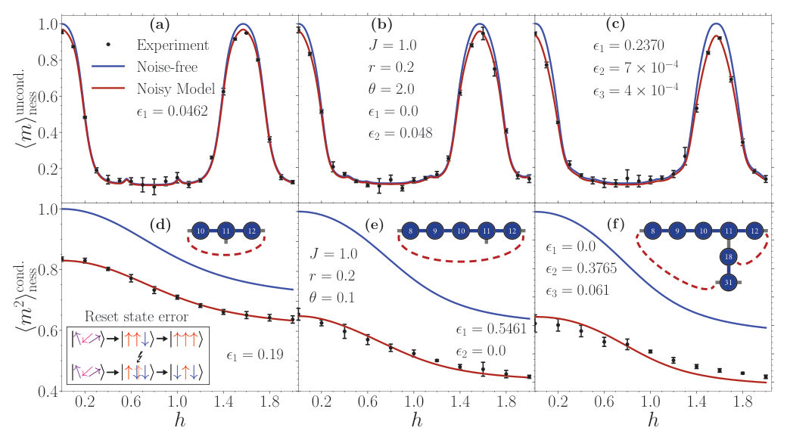
<figcaption class="paper-figure-caption"><b>Fig 2.</b> FIG. 2. Comparison between experimental results and theoretical predictions of unconditional and conditional reset protocols. (a)-(c) Unconditional reset protocol for 3, 5, and 7 qubits, respectively, evaluated up to a maximum time T = 105. (d)-(f) Conditional reset protocol for 3, 5, and 7 qubits, evaluated up to T = 400. In all panels, experimental hardware results (dots) are compared with noiseless theoretical simulations (blue solid lines) and theoretical predictions from the noisy reset model (red solid lines), sketched in panel (d). Error bars denote 95% confidence intervals derived from 5 independent experimental runs. The optimal fitted noise probabilities ϵi are reported in the...</figcaption>
</figure>

**Summary.** This paper develops and experimentally validates a theoretical framework for achieving Non-Equilibrium Steady States (NESS) in quantum many-body systems using stochastic mid-circuit measurements and resets. By applying this to the Floquet transverse-field Ising model on superconducting qubits, the authors show that engineered collective stationary states can be reliably prepared on noisy hardware. This work is significant because it provides a practical methodology for utilizing measurement feedback to control quantum dynamics away from thermal equilibrium.

**Why it may be interesting.** This work bridges fundamental non-equilibrium statistical mechanics concepts with cutting-edge quantum hardware capabilities, providing a concrete pathway for engineering complex steady states beyond thermal equilibrium.

Detailed structure

**Main problem.** The core problem is validating theoretical predictions of Non-Equilibrium Steady States (NESS) induced by stochastic mid-circuit measurements and resets on actual quantum hardware.

**Main result.** The derived noisy conditional resetting theory quantitatively agrees with experimental data on superconducting qubits, demonstrating that collective stationary states can be engineered despite noise.

**Method.** The authors combine theoretical derivations using discrete Laplace transforms for NESS calculation with extensive experimental implementation on a superconducting processor.

**Model / system.** The system is the interacting Floquet transverse-field Ising model simulated on a superconducting quantum processor (ibm_marrakesh). The dynamics involve alternating unitary evolution ($U_	heta$) with stochastic measurements and conditional resets.

**Key observables.** Longitudinal magnetization density ($\langle m 
angle$) and squared magnetization density ($\langle m^2 
angle$).

**Important parameters / regimes.** Transverse field strength ($h$), coupling strengths ($J$), system size ($N=3, 5, 7$ qubits).

**Assumptions / limitations.** The theory models resets as a semi-Markov process and accounts for readout errors; the experimental analysis compares various noise models (e.g., depolarizing channel vs. noisy reset state model).

**Figures summary.** Figures compare measured magnetization versus theoretical predictions across different qubit numbers, showing crossover behavior related to quantum phase transitions.

**Paper structure.** The paper progresses from general theory derivations of NESS in discrete time (using Laplace transforms) to applying this framework to the specific Floquet TFIM model, culminating in hardware implementation and noise characterization.

Abstract

Stochastic resetting has emerged as a versatile protocol to drive quantum many-body systems to non-equilibrium steady states by interspersing unitary dynamics with measurements and resets at random times. In spite of this, a quantum hardware validation of such non-equilibrium steady states is still missing. Here, we achieve this goal by first formulating a noisy discrete-time theory where unitary gates alternate with noisy mid-circuit projective measurements and conditional resets. This noisy conditional resetting theory is then demonstrated on a superconducting quantum processor for up to $N=7$ qubits. We consider, as a paradigmatic case, the unitary dynamics of the interacting Floquet transverse-field Ising model. The stationary state of the noisy conditional resetting agrees quantitatively with the experiments, and it shows crossover behavior related to the equilibrium quantum phase transition of the model. Our results might thus pave the way for the preparation of collective stationary states on noisy quantum devices and for further developments of quantum algorithms involving mid-circuit measurements.

[↑ back to top](#top)

### [Towards Entanglement-Enhanced Atom Interferometry Using Bow-Tie Cavities](http://arxiv.org/abs/2606.18552v1)

**Authors:** Christian Mancini, Marco Malitesta, Tommaso Mariani, Annalisa Pappalardo, Giuseppe Vinelli, Paolo Vezio, Gabriele Rosi, Enrico Meli, Leonardo Salvi, Guglielmo Maria Tino  
**Type:** both · **Category:** other · **PDF:** <https://arxiv.org/pdf/2606.18552v1>  
**Analysis basis:** full PDF text, analyzed in chunks
**Topic relevance:** 🔥 `correlated cavity matter` **4/5** · 🔥 `quantum optics experiment` **4/5** · `Tavis-Cummings & cavity-many-emitter` **3/5** · `analog quantum simulation` **3/5** · `quantum measurements` **3/5** · `correlated / nonlocal dissipation` **2/5** · `entanglement & information structure` **2/5** · `measurement-induced transitions` **2/5** · `Keldysh / 2PI / non-Gaussian methods` **1/5** · `QC/QI experiment` **1/5** · `driven-dissipative phase transition` **1/5** · `interference shaping light` **1/5** · `methods for driven-dissipative` **1/5**

↔ Scroll figures horizontally

<figure class="paper-figure-card">
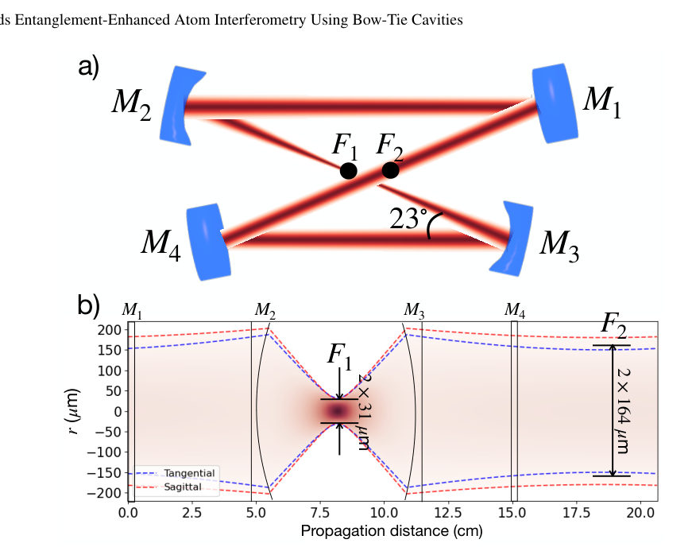
<figcaption class="paper-figure-caption"><b>Fig 1.</b> Figure 1: a) Scheme of the optical cavity with the indication of the four mirrors M1-M4 and the location of the primary (F1) and secondary focus (F2). b) Cavity mode waist as a function of the propagation distance in the unfolded M1-M2-M3-M4-M1 path. The waist values shown, 31 and 164 µm, corresponding to F1 and F2, refer to the geometric mean of the tangential and sagittal waists.</figcaption>
</figure>
<figure class="paper-figure-card">
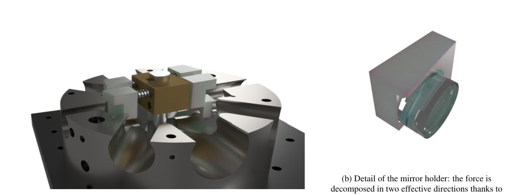
<figcaption class="paper-figure-caption"><b>Fig 2.</b> Figure 2: 3D rendering of the assembly setup. The central holder maintains constant pressure on the mirrors in appropriate directions, ensuring proper contact with the spacer.</figcaption>
</figure>
<figure class="paper-figure-card">
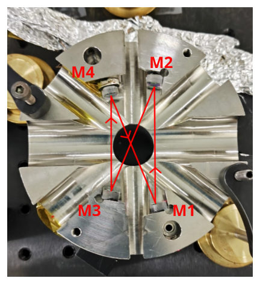
<figcaption class="paper-figure-caption"><b>Fig 3.</b> Figure 3: Photograph of the titanium cavity after the mirrors were glued to the spacer. The 689 nm laser path is highlighted in red, and the four cavity mirrors are labeled.</figcaption>
</figure>
<figure class="paper-figure-card">
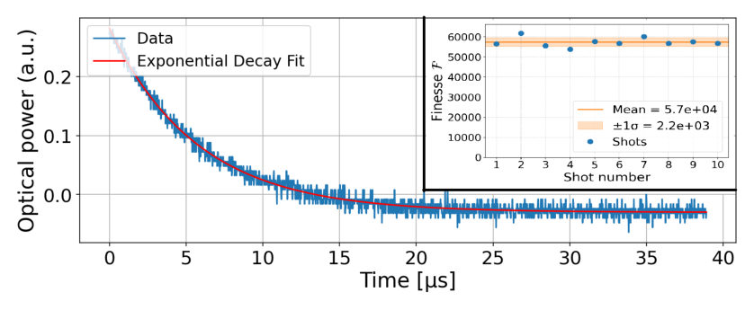
<figcaption class="paper-figure-caption"><b>Fig 4.</b> Figure 4: Exponential decay of the reflected light used to determine the cavity finesse. Inset: results of ten independent measurements, yielding F = (5.7±0.2)×104.</figcaption>
</figure>
<figure class="paper-figure-card">
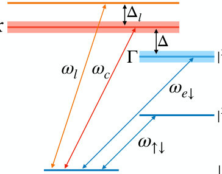
<figcaption class="paper-figure-caption"><b>Fig 5.</b> Figure 5: Schematic representation of the relevant frequencies involved in the squeezing dynamics.</figcaption>
</figure>

**Summary.** This paper presents the design, realization, and theoretical characterization of a monolithic bow-tie cavity optimized for quantum-enhanced atom interferometry using strontium atoms. By leveraging the cavity's unique traveling-wave geometry, the authors demonstrate that entanglement can be generated to suppress quantum projection noise significantly. The results predict state-of-the-art squeezing levels, positioning this platform for next-generation precision measurements.

**Why it may be interesting.** This work is highly relevant as it merges advanced concepts from cavity Quantum Electrodynamics (Cavity QED) with matter-wave interferometry. The bow-tie geometry solves a critical engineering problem—achieving uniform coupling in free-fall atomic ensembles—while the squeezing analysis pushes towards Heisenberg scaling.

Detailed structure

**Main problem.** The primary goal is to overcome the quantum projection noise limit inherent in atom interferometry to achieve enhanced precision measurements of fundamental physical constants.

**Main result.** The realized monolithic bow-tie cavity is predicted to enable metrological gains approaching 24 dB (via feedback) and 28 dB (via QND measurements) for ensembles up to $10^5$ atoms.

**Method.** The work combines experimental realization of a specialized optical resonator with theoretical modeling of quantum squeezing dynamics achievable through cavity-mediated atom-light interactions.

**Model / system.** The system utilizes strontium atoms coupled to light within a monolithic bow-tie ring cavity. This geometry is chosen because its traveling-wave nature ensures homogeneous coupling across the entire atomic ensemble, unlike conventional standing-wave cavities.

**Key observables.** Metrological gain ($\xi^2$), spin squeezing parameter, and measured cavity finesse ($F=5.7	imes 10^4$).

**Important parameters / regimes.** Atomic number ($N \le 10^5$), cavity linewidth ($\kappa$), atomic transition wavelength (689 nm), and coupling strength ($N\eta$).

**Assumptions / limitations.** The analysis relies on the dispersive regime ($\Delta \gg \Gamma, \kappa$) for squeezing calculations, though limitations arise when $\kappa$ approaches $\Gamma$.

**Figures summary.** Figures predict minimum Wineland squeezing parameter ($\xi^2$) scaling with atomic number ($N$) and cavity finesse ($F$), comparing results from cavity feedback versus QND measurements.

**Paper structure.** The paper progresses from identifying the noise limit in atom interferometry, detailing the specialized bow-tie cavity design for homogeneous coupling, characterizing its physical parameters (finesse, stability), and finally modeling/predicting the achievable quantum squeezing levels using both cavity feedback and QND measurement formalisms.

Abstract

Atom interferometers are among the most sensitive instruments for precision measurements and tests of fundamental physics. Their performance, however, is ultimately limited by quantum projection noise when uncorrelated atomic ensembles are employed. Cavity-assisted generation of entangled states has proven to be a promising route toward quantum-enhanced interferometry beyond the standard quantum limit. In this work, we present the realization and characterization of a monolithic bow-tie cavity developed to achieve a strong collective atom-light coupling with strontium atoms. Unlike conventional standing-wave Fabry-Pérot resonators, the traveling-wave geometry of the bow-tie cavity provides homogeneous atom-light coupling over the entire atomic ensemble, making it particularly suitable for entanglement-enhanced atom interferometry with freely falling atoms. The monolithic cavity architecture presents several scientifically relevant features such as high mechanical stability, high finesse, robustness against mirror misalignment, optical and atomic access and the option of generating squeezed states through different strategies. The cavity was realized for operation on the strontium $(5s^2) ^1S_0-(5s5p) ^3P_1$ transition at 689 nm and achieves a finesse of $\mathcal{F}=5.7\times 10^4$ while keeping the transmission of a single mirror sufficiently large to allow for efficient atomic information extraction. In this geometry, the cavity supports two foci with waists of 164 $μ$m and 31 $μ$m which gives access to different regimes of atom-cavity coupling. For ensembles containing up to $10^5$ atoms, the cavity is expected to enable metrological gains approaching 24 dB of spin squeezing through cavity-feedback squeezing, and 28 dB through quantum non-demolition measurements, demonstrating its potential as a platform for next-generation quantum-enhanced atom interferometers.

[↑ back to top](#top)

### [Exceptional-Point-Anchored Variational Quantum Eigensolver for Non-Hermitian Many-Body Phase Diagrams: Bridging Skin-Effect Topology and Entanglement Criticality on NISQ Hardware](http://arxiv.org/abs/2606.18916v1)

**Authors:** Akoramurthy B, Surendiran B, Xiaochun Cheng  
**Type:** theory · **Category:** quantum information and computing · **PDF:** <https://arxiv.org/pdf/2606.18916v1>  
**Analysis basis:** full PDF text, analyzed in chunks
**Topic relevance:** 🔥 `driven-dissipative phase transition` **4/5** · `analog quantum simulation` **3/5** · `correlated / nonlocal dissipation` **3/5** · `entanglement & information structure` **3/5** · `methods for driven-dissipative` **3/5** · `non-equilibrium universality` **3/5** · `Keldysh / 2PI / non-Gaussian methods` **2/5** · `Kondo & dissipative impurity` **2/5** · `non-equilibrium dynamics` **2/5** · `exotic spin models in light-matter` **1/5** · `scars & prethermalization` **1/5**

↔ Scroll figures horizontally

<figure class="paper-figure-card">
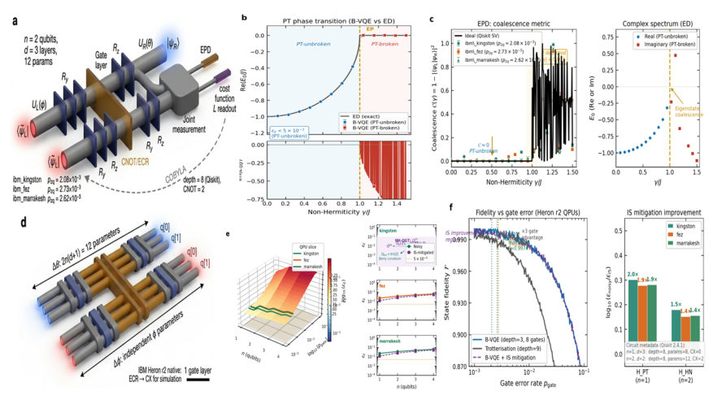
<figcaption class="paper-figure-caption"><b>Fig 1.</b> Figure 1: Experimental demonstration of parity-time (PT) symmetry dynamics and exceptional-point detection using variational quantum eigensolvers on IBM quantum processors. (a) Hardware-efficient variational ansatz employed for the bi-variational quantum eigensolver (B-VQE), showing parameterized single-qubit rotations, entangling layers, and exceptional-point detection (EPD) measurement strategy. (b) PT-phase transition characterized by the real and imaginary components of the ground-state energy as a function of the non-Hermiticity parameter γJ, comparing B-VQE results with exact diagonalization (ED). The exceptional point (EP) is identified at the PT-symmetry breaking transition. (c)...</figcaption>
</figure>
<figure class="paper-figure-card">
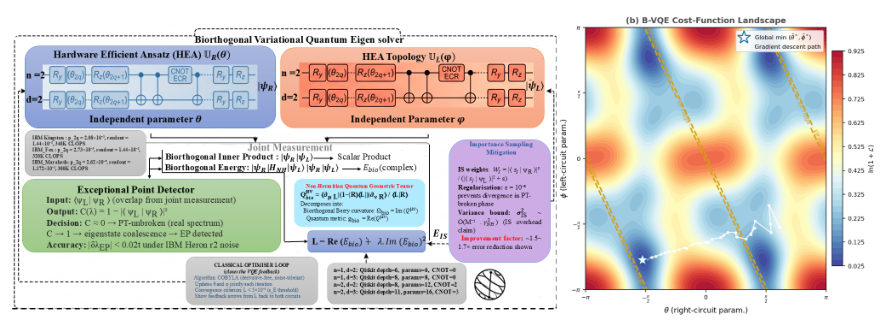
<figcaption class="paper-figure-caption"><b>Fig 2.</b> Figure 2: B-VQE circuit architecture and optimisation convergence (Qiskit-Aer simulation). (a) Dual-circuit architecture: the right-state circuit URθ (blue) and left-state circuit ULϕ (red) are built as Qiskit 2.4.1 QuantumCircuit objects with hardware-efficient ansatz layers (Ry-Rz + CNOT ladder); the biorthogonal cost function LB-VQE and EPD coalescence metric Cλ are evaluated jointly. Noise parameters are from IBM Heron r2 calibration data (ibm kingston, ibm fez, ibm marrakesh). (b) COBYLA convergence trace for γJ = 0.75 (n = 1, d = 3): the cost LB-VQE (blue) converges below the target εE = 5 × 10−3 (red dashed) within ≈120 iterations; the shaded band shows ±15% shot-noise fluctuations.</figcaption>
</figure>
<figure class="paper-figure-card">
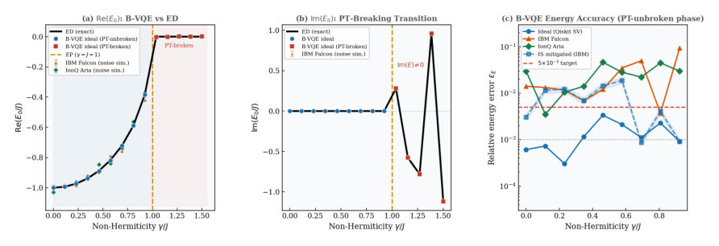
<figcaption class="paper-figure-caption"><b>Fig 3.</b> Figure 3: B-VQE energy accuracy across the PT transition (Qiskit-Aer noise-model simulation). (a) ReE0 vs γJ: ED reference (black), B-VQE ideal statevector (circles/squares, blue/red for PT-unbroken/broken phases), ibm kingston noisy simulation (squares, teal), ibm fez noisy simulation (diamonds, orange), ibm marrakesh noisy simulation (triangles, green). The gold dashed line marks the analytically exact EP at γ = J = 1. (b) ImE0 vs γJ: B-VQE correctly captures the onset of complex eigenvalues in the PT-broken phase (γ &gt; J). (c) Relative energy error εE in the PT-unbroken phase: B-VQE ideal achieves εE &lt; 5 × 10−3 throughout; IS mitigation (dashed blue) reduces IBM noise errors by 30-50%;...</figcaption>
</figure>
<figure class="paper-figure-card">
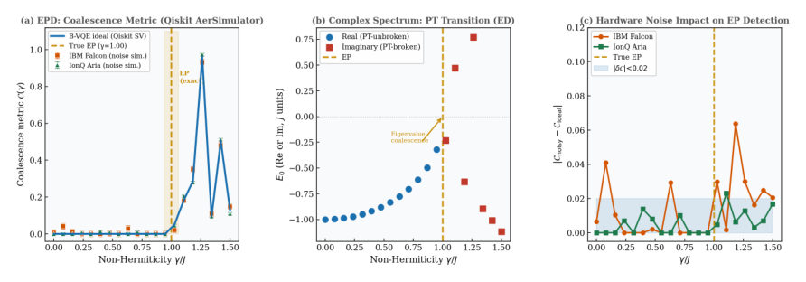
<figcaption class="paper-figure-caption"><b>Fig 4.</b> Figure 4: EP detection via coalescence metric under hardware noise. (a) Coalescence metric Cγ = 1 −|⟨ψL|ψR⟩|2</figcaption>
</figure>
<figure class="paper-figure-card">
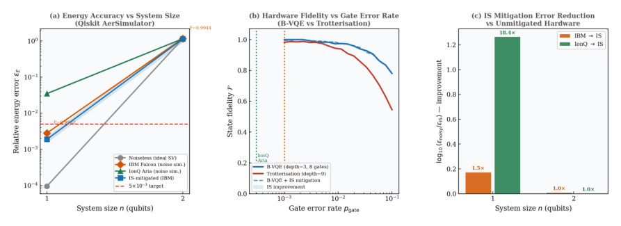
<figcaption class="paper-figure-caption"><b>Fig 5.</b> Figure 5: Noise mitigation benchmarking (Qiskit-Aer). (a) Relative energy error εE vs system size n for noiseless (grey circles), ibm kingston (teal circles), ibm fez (orange diamonds), ibm marrakesh (green triangles), and IS-mitigated ibm kingston (blue squares). Annotated F values give the circuit fidelity F = 1 −p1qn1q1 −p2qncx from the Qiskit noise model. Shaded band: ±15% IS shot-noise uncertainty at M = 16384 shots. (b) State fidelity F vs gate error rate pgate: B-VQE (depth 3, blue) vs Trotterisation (depth 9, red); IS-mitigated B-VQE (dashed blue). Vertical dotted lines mark operating points of ibm kingston (p2q = 2.08 × 10−3), ibm fez (p2q = 2.73 × 10−3), and ibm marrakesh (p2q =...</figcaption>
</figure>

**Summary.** The paper introduces the Biorthogonal Variational Quantum Eigensolver (B-VQE) to simulate non-Hermitian many-body physics on NISQ hardware. It overcomes limitations of previous methods by using dual circuits and importance sampling, allowing for accurate mapping of phase diagrams that exhibit topological features like skin effects and exceptional points. This establishes B-VQE as a scalable tool for studying open quantum systems.

**Why it may be interesting.** This work directly addresses the frontier of applying variational quantum algorithms to open quantum systems, providing concrete, resource-aware protocols for mapping complex phase diagrams inaccessible via standard VQE techniques.

Detailed structure

**Main problem.** Developing a scalable quantum algorithm to simulate non-Hermitian many-body systems on NISQ hardware, which is challenging due to the lack of standard eigenvalue formulations.

**Main result.** The Biorthogonal VQE (B-VQE) successfully maps out complex phase diagrams, detects exceptional points (EPs), and characterizes topological transitions with polynomial overhead scaling.

**Method.** It employs a dual-circuit ansatz to approximate left and right eigenstates and minimizes a specialized biorthogonal cost function. Importance-sampling mitigation is used to remove the need for costly post-selection.

**Model / system.** The study applies to general non-Hermitian Hamiltonians, tested on specific models like the non-Hermitian Hubbard chain, NH-XXZ spin chain, and 2D t-J model. These systems exhibit phenomena such as PT-symmetry breaking and the Non-Hermitian Skin Effect.

**Key observables.** Biorthogonal Energy ($E_{bio}$), Coalescence Metric ($C_\lambda$), Biorthogonal Entanglement Entropy ($S_{bio}$), Loschmidt echo ($\mathcal{L}_t^2$), and Topological Chern Number ($C_{	ext{state}}$).

**Important parameters / regimes.** System size (N=10 sites), non-Hermiticity parameter ($\gamma$ or $\lambda$), and noise levels simulated on NISQ hardware.

**Assumptions / limitations.** The primary assumption is that the B-VQE ansatz can efficiently approximate the required biorthogonal eigenstates, and that importance sampling mitigation maintains polynomial scaling.

**Figures summary.** Figures illustrate phase diagrams showing transitions between ergodic, MBL, and skin-localized phases; they also show $S_{bio}$ scaling laws (volume vs. area law) and the coalescence metric identifying EPs.

**Paper structure.** The paper introduces B-VQE for non-Hermitian systems, details the mathematical framework using biorthogonality, presents diagnostic tools like the EPD and NH-QGT, validates the approach on multiple physical models (Hubbard, XXZ, t-J), and concludes by benchmarking its scalability against classical/other quantum methods.

Abstract

We introduce the Biorthogonal Variational Quantum Eigensolver (B-VQE), a quantum algorithm for simulating non-Hermitian many-body systems on noisy intermediate-scale quantum (NISQ) hardware. Non-Hermitian quantum matter exhibits exceptional points, parity-time symmetry breaking, and non-Hermitian skin effects, yet existing quantum algorithms often rely on costly post-selection procedures and are not designed to capture biorthogonal eigenstates.   B-VQE employs independent variational circuits to represent the left and right eigenstates of a non-Hermitian Hamiltonian and optimizes a biorthogonal objective function that directly tracks non-Hermitian phase transitions. The framework incorporates an Exceptional-Point Detector (EPD) that identifies exceptional points through a hardware-native coalescence metric and a Non-Hermitian Quantum Geometric Tensor (NH-QGT) readout that distinguishes state-topological and band-topological signatures in interacting many-body systems. To overcome the exponential overhead associated with conventional non-Hermitian simulation, we develop an importance-sampling mitigation strategy that removes the need for ancilla-based post-selection while retaining polynomial computational scaling.   We validate the approach on three representative models: a non-Hermitian Hubbard chain, a non-Hermitian XXZ spin chain, and a two-dimensional non-Hermitian (t)-(J) model. B-VQE achieves relative energy errors below (5\times10^{-3}) and locates exceptional points with high accuracy on noise-free simulations while resolving phase boundaries associated with localization, quantum scars, and skin-effect physics. These results establish B-VQE as a scalable NISQ methodology for constructing non-Hermitian many-body phase diagrams and exploring topological and critical phenomena in open quantum systems.

[↑ back to top](#top)

### [Equilibration of generalized subsystems: a quantum-channel approach](http://arxiv.org/abs/2606.18360v1)

**Authors:** Pedro S. Correia, Adalberto D. Varizi, Gabriel Dias Carvalho  
**Type:** theory · **Category:** statistical mechanics · **PDF:** <https://arxiv.org/pdf/2606.18360v1>  
**Analysis basis:** full PDF text, analyzed in chunks
**Topic relevance:** 🔥 `entanglement & information structure` **4/5** · 🔥 `non-equilibrium dynamics` **4/5** · `methods for driven-dissipative` **3/5** · `non-equilibrium universality` **3/5** · `quantum measurements` **3/5** · `correlated / nonlocal dissipation` **2/5** · `driven-dissipative phase transition` **2/5** · `measurement-induced transitions` **2/5** · `analog quantum simulation` **1/5** · `exotic spin models in light-matter` **1/5** · `scars & prethermalization` **1/5**

↔ Scroll figures horizontally

<figure class="paper-figure-card">
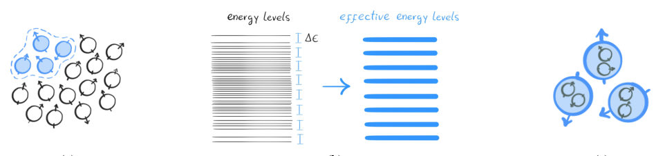
<figcaption class="paper-figure-caption"><b>Fig 1.</b> FIG. 1. Examples of limited accessible information. (a) In the standard subsystem picture, only a subset of particles is accessible, while the rest forms an inaccessible environment. (b) Finite-resolution energy measurements group microscopic energy levels into effective energy win- dows, so that only a coarse-grained energy description is accessible. (c) In a blurred and saturated detector, distinct microscopic configurations can become indistinguishable at the accessible level; for instance, two microscopic qubits may be described by a single effective two-level system.</figcaption>
</figure>
<figure class="paper-figure-card">
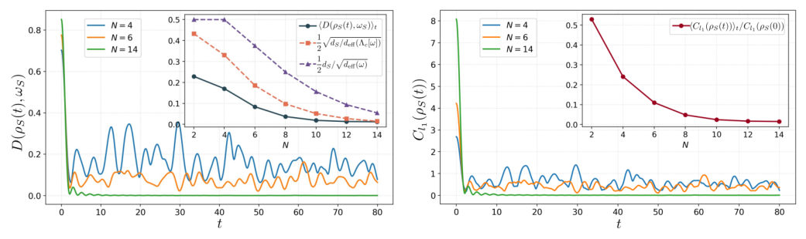
<figcaption class="paper-figure-caption"><b>Fig 2.</b> FIG. 2. Numerical illustration of the finite-resolution energy channel for a finite Ising spin chain. In both panels, the initial state is a balanced coherent superposition of all energy eigenstates, and the spectrum is partitioned into K = N resolved energy windows. Left: temporal behavior of the trace distance D(ϱS(t), ωS), together with its time average and the two equilibration bounds shown in the inset. Right: temporal behavior of the accessible coherence Cl1(ϱS(t)) between distinct effective energy levels, included as a diagnostic of the off-diagonal sector already controlled by trace-distance equilibration; the inset shows the normalized average coherence ⟨Cl1(ϱS(t))⟩t/Cl1(ϱS(0)).</figcaption>
</figure>

**Summary.** This paper develops a unified theoretical framework to study quantum equilibration when information access is limited, modeling the accessible state via a quantum channel acting on the full system. The key finding is that equilibration bounds are determined by comparing the subsystem size to the effective dimension of discarded microscopic details. This has broad implications for understanding thermalization in realistic, measurement-constrained quantum systems.

**Why it may be interesting.** This work provides a powerful, general mathematical tool for analyzing thermalization and relaxation in complex quantum systems where the environment or measurement process is not simply modeled by a partial trace. It unifies several distinct physical concepts under one rigorous framework.

Detailed structure

**Main problem.** The core problem is understanding quantum equilibration—how an effective, time-independent description emerges for accessible degrees of freedom even when the underlying microscopic dynamics are unitary and reversible.

**Main result.** The authors provide a unified state-level framework showing that equilibration bounds depend on the ratio between the subsystem dimension and the effective dimension of discarded microscopic information. They also show that accessible coherences are strongly suppressed during this process.

**Method.** The work introduces 'generalized subsystems,' modeling the accessible state as the output of a quantum channel acting on the full system state, allowing for a unified treatment encompassing partial traces and measurement restrictions (POVMs).

**Model / system.** The analysis is general but uses the Ising spin chain model as a concrete example to test equilibration bounds. The dynamics are governed by unitary evolution under a Hamiltonian, and information access is restricted via quantum channels ($\Lambda$).

**Key observables.** Time-averaged trace distance $D(
ho_S(t), \omega_S)$ (measuring deviation from equilibrium) and accessible coherence measures $C_{l1}(\varrho_S)$.

**Important parameters / regimes.** The ratio of the subsystem dimension ($d_S$) to the effective dimension explored by microscopic dynamics ($	ext{deff}(\Lambda_c[\omega])$).

**Assumptions / limitations.** The framework assumes that restricted access can be modeled by a quantum channel (CPTP map), and some derivations rely on non-degenerate energy gaps for simplification.

**Figures summary.** Figure 2 illustrates the time evolution of both the trace distance $D(\varrho_S(t), \omega_S)$ and the accessible coherence $C_{l1}(\varrho_S(t))$ for a finite Ising chain, showing decay towards equilibrium/zero.

**Paper structure.** The paper develops the generalized quantum channel framework first, deriving sharp bounds based on effective dimensions. It then applies this to specific physical scenarios like POVMs and finite-resolution energy measurements, culminating in numerical simulations on an Ising model to demonstrate coherence suppression.

Abstract

Quantum systems governed by unitary and reversible microscopic dynamics may nevertheless exhibit equilibration, in the sense that some effective description becomes time-independent. Standard equilibration results usually consider two separate situations: system-environment structures, in which the composite system evolves unitarily while the system of interest equilibrates, and restricted measurements, such as coarse-grained POVMs and observables, in which the measurement statistics equilibrate. Here, we bring these descriptions into a common state-level framework using the concept of generalized subsystems, where the accessible effective state appears as the output of a quantum channel acting on the microscopic state. We derive bounds showing that generalized subsystems equilibrate when their dimension is small compared with the effective dimension of the discarded microscopic information. We further show that this condition is met for typical initial states in large subspaces and that the resulting equilibrium description is largely insensitive to microscopic initial details. The framework recovers the usual equilibration bounds for ordinary subsystems and finite families of POVMs. As an example, we also introduce a finite-resolution energy channel that maps unresolved microscopic energy levels into effective energy levels, thereby making residual effective coherences explicit and showing how spectral multiplicities constrain those coherences while strengthening equilibration. Our results provide a unified state-level formulation of quantum equilibration under general forms of limited accessible information.

[↑ back to top](#top)

### [Holographic Dual of PT Symmetric BCFT](http://arxiv.org/abs/2606.18629v1)

**Authors:** Ryota Maeda, Nanami Nakamura, Tadashi Takayanagi  
**Type:** theory · **Category:** statistical mechanics · **PDF:** <https://arxiv.org/pdf/2606.18629v1>  
**Analysis basis:** full PDF text, analyzed in chunks
**Topic relevance:** 🔥 `driven-dissipative phase transition` **4/5** · `correlated / nonlocal dissipation` **3/5** · `entanglement & information structure` **3/5** · `methods for driven-dissipative` **3/5** · `non-equilibrium dynamics` **3/5** · `non-equilibrium universality` **3/5** · `Keldysh / 2PI / non-Gaussian methods` **2/5** · `Kondo & dissipative impurity` **2/5** · `analog quantum simulation` **1/5** · `correlated cavity matter` **1/5** · `scars & prethermalization` **1/5**

↔ Scroll figures horizontally

<figure class="paper-figure-card">
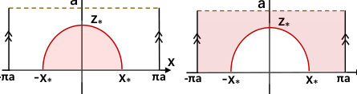
<figcaption class="paper-figure-caption"><b>Fig 1.</b> FIG. 1. Sketches of gravity duals of the BCFT with the asym- metric exactly marginal deformation (colored region), where the red curve describes the EOW brane. The left and right panel corresponds to the case where ϕ is real and imaginary, respectively.</figcaption>
</figure>
<figure class="paper-figure-card">
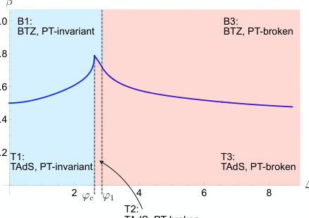
<figcaption class="paper-figure-caption"><b>Fig 2.</b> FIG. 3. A sketch of phase diagram. The PT symmetry is spontaneously broken in the red colored phases, while it is unbroken in the blue colored ones.</figcaption>
</figure>
<figure class="paper-figure-card">
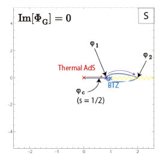
<figcaption class="paper-figure-caption"><b>Fig 3.</b> FIG. 4. The contour plot of Im ΦG = 0. Starting from s = 1, the BTZ branch follows the blue path and is analytically con- tinued to the purple branch, while the Thermal AdS branch start from s = 0, follows the red path and is continued to the same purple branch. Thus ΦT and ΦB have been analytically continued twice at the same value φ1, φ2.</figcaption>
</figure>
<figure class="paper-figure-card">
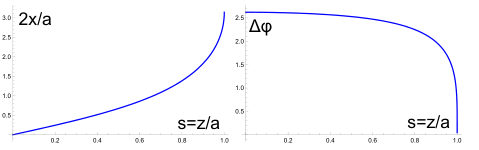
<figcaption class="paper-figure-caption"><b>Fig 4.</b> FIG. 5. Plots of Plots of 2x∗</figcaption>
</figure>
<figure class="paper-figure-card">
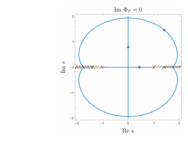
<figcaption class="paper-figure-caption"><b>Fig 5.</b> FIG. 8. The contour plot of Im ΦT = 0. The contour extends along the real axis from −1 to 1, the full imaginary axis, and also the non-trivial curve in each quadrant. To monotonically increase the value of ΦT , we start from s = 1, pass through s = 0 and s = 1.994i, and follow the route in first quadrant. As we saw, ϕT (s = 1) = 0, ΦT (s = 0) = φc, and ΦT (s ≃ 1.937i) = φ1. We also note that the function has fourth-root branch points at s = ±1, and logarithmic ones at s = ± √</figcaption>
</figure>

**Summary.** This paper develops the holographic dual description for a 2D CFT with non-Hermitian $	ext{PT}$-symmetric boundary conditions using AdS/BCFT. Key findings include identifying the spontaneous breaking of $	ext{PT}$ symmetry and calculating entanglement entropy growth in quantum quench scenarios that surpass standard bounds. It provides a comprehensive theoretical framework linking gravity, field theory, and non-Hermitian physics.

**Why it may be interesting.** The connection between $	ext{PT}$-symmetry, non-Hermiticity, and holographic duality provides a powerful toolset for studying open quantum systems whose Hamiltonians are not standardly Hermitian, which is highly relevant to modern AMO physics.

Detailed structure

**Main problem.** The research aims to find a holographic dual for a two-dimensional Conformal Field Theory (CFT) subjected to non-Hermitian but Parity-Time ($	ext{PT}$) symmetric boundary conditions.

**Main result.** The study demonstrates spontaneous $	ext{PT}$ symmetry breaking as the interaction strength increases, and it calculates entanglement entropy growth during quantum quenches that exceeds standard predictions.

**Method.** The authors employ the AdS/BCFT duality, calculating on-shell actions in thermal ($	ext{TAdS}$) and black hole ($	ext{BTZ}$) geometries to determine system energy and phase transitions.

**Model / system.** The model involves a $	ext{BCFT}$ defined on an interval with non-Hermitian boundary interactions localized via an End-of-the-World ($	ext{EOW}$) brane in the gravity dual. The analysis covers different phases, including thermal and black hole regimes.

**Key observables.** Energy ($E_T$), entanglement entropy growth rate ($\Delta S_A(t)$), and the boundary scalar source ($\Delta\phi$).

**Important parameters / regimes.** The deformation parameter $\Delta\phi$ controls the transition between $	ext{PT}$-symmetric and $	ext{PT}$-broken phases, with a critical point $\phi_c$.

**Assumptions / limitations.** The analysis involves approximations for small deformations ($\Delta\phi \ll 1$) and requires extending calculations across different Riemann surfaces to map out the full parameter space.

**Figures summary.** Figures illustrate the energy $E_T$ dependence on $\Delta\phi$, phase diagrams mapping system regimes, and plots showing how boundary parameters ($X, \Phi$) are calculated along specific contours in the complex plane.

**Paper structure.** The paper systematically analyzes the holographic dual across different phases (Thermal AdS vs. BTZ BH), determines critical points for symmetry breaking ($	ext{PT}$ breaking), and extends the analysis to quantum quench dynamics by Wick rotating the setup.

Abstract

We present a holographic dual of a two dimensional conformal field theory with non-hermitian but Parity-Time (PT) symmetric boundary conditions, by applying the AdS/BCFT duality and by introducing an imaginary valued scalar field localized on an end-of-the-world brane. We find that as we increase the strength of the non-hermitian PT symmetric interactions, the system experiences a spontaneous PT symmetry breaking. We also consider its Wick rotated setup as a new quantum quenched state and show that its growth of entanglement entropy can be larger than the standard results obtained from standard Cardy states.

[↑ back to top](#top)

### [Steady-state spectral kissing and dissipative phase transitions](http://arxiv.org/abs/2606.18348v1)

**Authors:** Devesh Karthik, Jorge Chávez-Carlos, Edson M. Signor, Victor S. Batista, Francisco Pérez-Bernal, Lea F. Santos  
**Type:** theory · **Category:** statistical mechanics · **PDF:** <https://arxiv.org/pdf/2606.18348v1>  
**Analysis basis:** full PDF text, analyzed in chunks
**Topic relevance:** 🔥 `driven-dissipative phase transition` **4/5** · `correlated / nonlocal dissipation` **3/5** · `methods for driven-dissipative` **3/5** · `non-equilibrium universality` **3/5** · `Keldysh / 2PI / non-Gaussian methods` **2/5** · `Tavis-Cummings & cavity-many-emitter` **2/5** · `non-equilibrium dynamics` **2/5** · `Kondo & dissipative impurity` **1/5** · `analog quantum simulation` **1/5** · `correlated cavity matter` **1/5** · `entanglement & information structure` **1/5** · `scars & prethermalization` **1/5**

↔ Scroll figures horizontally

<figure class="paper-figure-card">
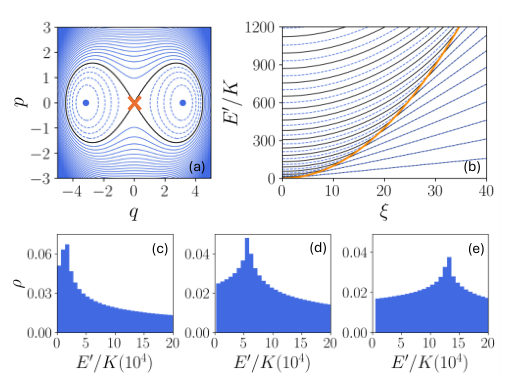
<figcaption class="paper-figure-caption"><b>Fig 1.</b> FIG. 1. Isolated KPO. (a) Classical phase-space structure of the Hamiltonian in Eq. (2) for ξ = 5. The blue dots mark the global minima, the orange cross at (0, 0) indicates the hy- perbolic point, and the black curve crossing at the origin is the separatrix. (b) Excitation energies E′ = E −EGS of the quantum Hamiltonian in Eq. (1) as a function of the squeezing amplitude ξ, showing spectral kissing. The orange line indi- cates the ESQPT critical energy E′ c = Kξ2. (c)–(e) Density of states for (c) ξ = 120, (d) ξ = 240, (e) ξ = 360, indicating the clustering of energy levels characteristic of ESQPTs.</figcaption>
</figure>
<figure class="paper-figure-card">
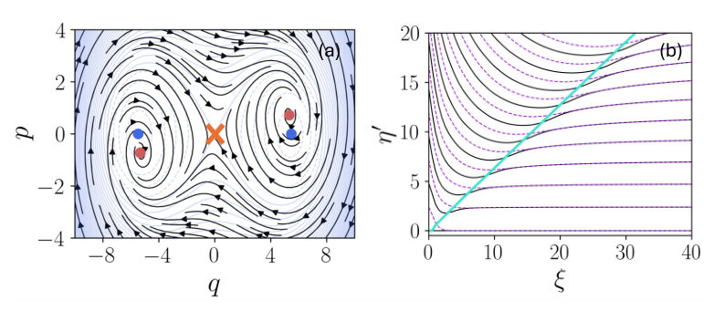
<figcaption class="paper-figure-caption"><b>Fig 2.</b> FIG. 2. Open KPO for the parameters κ/K = 2 and nth = 0.1. (a) Classical phase space dissipative flow for ξ = 15. The cross marks the hyperbolic point at the origin, red circles denote the stable spiral attractors, and blue circles the minima of the closed system. (b) Eigenvalues η′ = η −η0 of the steady-state Hamiltonian Hss vs. ξ, showing steady-state spectral-kissing. The blue line indicates the number nss of paired eigenvalues of Hss, as defined in Eq. (12).</figcaption>
</figure>
<figure class="paper-figure-card">
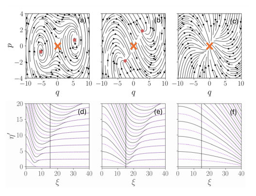
<figcaption class="paper-figure-caption"><b>Fig 3.</b> FIG. 3. Open KPO for nth = 0.1 and increasing dissipa- tion strength; from left to right: κ/K = 16, 56, and 160. (a)-(c) Classical phase space dissipative flow for ξ = 15, cor- responding to κc/K = 60. The cross marks the fixed point at the origin, which is hyperbolic in (a)-(b) and becomes a sta- ble attractor in (c). The red circles denote (a) stable spirals and (b) stable nodes. (d)-(f) Eigenvalues η′ = η −η0 of the steady-state Hamiltonian Hss as a function of ξ. The vertical line indicates the value of ξ = 15 used in the corresponding upper panels (a)-(c).</figcaption>
</figure>

**Summary.** The paper explores how quantum phenomena like 'spectral kissing,' typically seen in isolated systems, manifest in the presence of environmental dissipation. Using an Open Kerr Parametric Oscillator as a model, it shows that spectral pairing persists in the steady-state spectrum when dissipation is weak. The transition where this pairing vanishes marks a distinct dissipative phase transition.

**Why it may be interesting.** This work provides a concrete theoretical framework for observing quantum coherence signatures (like spectral kissing) surviving decoherence, which is crucial for understanding realistic quantum devices and open quantum system dynamics.

Detailed structure

**Main problem.** The study investigates whether spectral signatures observed in closed quantum systems, specifically 'spectral kissing,' persist as a measurable feature when the system is coupled to an environment (dissipative counterpart).

**Main result.** Spectral kissing persists in the weak-dissipation regime of the steady-state density matrix spectrum, mirroring the closed system's behavior. The disappearance of this pairing signals a clear dissipative phase transition.

**Method.** The analysis combines examining the eigenvalues of the effective steady-state Hamiltonian ($\hat{H}_{ss}$) with deriving and analyzing the classical limit dynamics governed by a Lindblad master equation.

**Model / system.** The representative model is an Open Kerr Parametric Oscillator (KPO). The system evolution is described by a Lindblad master equation, and its classical counterpart exhibits a double-well phase-space structure.

**Key observables.** Steady-state eigenvalues of $\hat{H}_{ss}$, the degree of eigenvalue pairing (spectral kissing), and the critical dissipation strength ($\kappa_c$).

**Important parameters / regimes.** Dissipation strength ($\kappa$), squeezing amplitude ($\xi$), thermal occupation number ($n_{th}$), and the ratio $\kappa/\kappa_c$.

**Assumptions / limitations.** The analysis relies on the weak-dissipation regime ($\kappa$ small) to relate steady-state eigenstates to closed system features, and uses semiclassical approximations.

**Figures summary.** Figures illustrate classical phase-space flow (showing attractors), quantum excitation energies vs. squeezing parameter showing spectral kissing, and how these signatures vanish as dissipation strength increases past a critical point.

**Paper structure.** The paper first establishes the closed system's ESQPT via spectral kissing. It then extends this analysis to the open system using the Lindblad equation, demonstrating that the quasi-degenerate pairing of steady-state eigenvalues mirrors the closed case in weak dissipation. Finally, it derives analytical expressions from the classical limit to pinpoint the critical lines where this dissipative phase transition occurs.

Abstract

Spectral kissing, recently realized in a Kerr parametric oscillator (KPO), refers to the merging of pairs of energy levels and arises as a manifestation of an excited-state quantum phase transition (ESQPT). Here, we show that this phenomenon has a dissipative counterpart encoded in the spectrum of the steady-state density matrix. Using a dissipative KPO as a representative example, we demonstrate that, in the weak-dissipation regime, the eigenvalues of the steady-state density matrix organize into quasi-degenerate pairs that mirror the spectral kissing of the corresponding closed system. As the dissipation strength increases, this pairing gradually disappears. By analyzing the classical limit of the system, we derive analytical expressions for the critical lines governing both the onset of steady-state spectral kissing and its disappearance at a dissipative phase transition.

[↑ back to top](#top)

### [Mapping the non-equilibrium interacting Anderson Impurity Model to an effective Gaussian theory](http://arxiv.org/abs/2606.19206v1)

**Authors:** Emmanuel Bogacz, Graham Kells, Andrew K. Mitchell  
**Type:** theory · **Category:** strongly correlated electrons · **PDF:** <https://arxiv.org/pdf/2606.19206v1>  
**Analysis basis:** full PDF text, analyzed in chunks
**Topic relevance:** 🔥 `Kondo & dissipative impurity` **4/5** · 🔥 `methods for driven-dissipative` **4/5** · 🔥 `non-equilibrium dynamics` **4/5** · `Keldysh / 2PI / non-Gaussian methods` **3/5** · `non-equilibrium universality` **3/5** · `entanglement & information structure` **2/5** · `analog quantum simulation` **1/5** · `correlated / nonlocal dissipation` **1/5** · `driven-dissipative phase transition` **1/5**

↔ Scroll figures horizontally

<figure class="paper-figure-card">
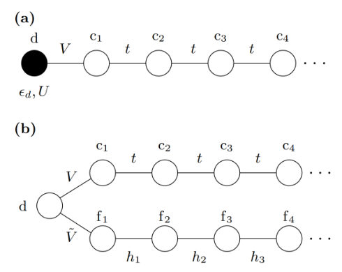
<figcaption class="paper-figure-caption"><b>Fig 1.</b> FIG. 1. Schematic representations of the bare and effective models in chain form. (a) Interacting AIM; and (b) Non- interacting effective model in which U = 0 but the impurity couples to an additional auxiliary chain of fermions fn.</figcaption>
</figure>
<figure class="paper-figure-card">

<figcaption class="paper-figure-caption"><b>Fig 2.</b> FIG. 3. Same as Fig. 2 but for N = 101 bath sites, with the AIM calculation now performed using TDVP-MPS methods.</figcaption>
</figure>
<figure class="paper-figure-card">
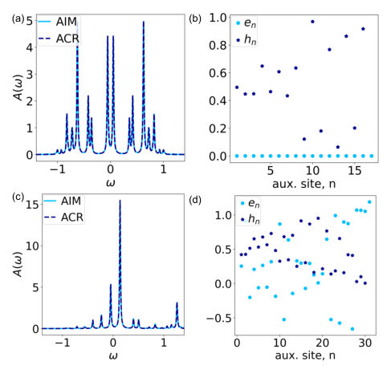
<figcaption class="paper-figure-caption"><b>Fig 3.</b> FIG. 2. Auxiliary chain mapping in equilibrium for the AIM with N = 7 bath sites. Panels (a,c) show the impurity spectral function A(ω) for the interacting AIM computed exactly with ED (light blue lines), and for the effective non-interacting ACR (dark blue lines). Panels (b,d) show the auxiliary chain parameters. Here U = 1, t = 0.5, V = 0.2 and ϵd = −U/2 (half filling) in (a,b) but ϵd = 0 (mixed valence) in (c,d).</figcaption>
</figure>
<figure class="paper-figure-card">
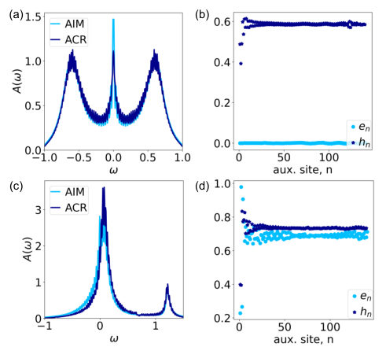
<figcaption class="paper-figure-caption"><b>Fig 4.</b> Fig. 2 shows results for the equilibrium mapping from the interacting AIM to the non-interacting ACR. Here we consider an impurity coupled to N = 7 physical bath sites, and solve the bare model exactly in the strongly-correlated regime using ED. We take represen- tative model parameters U = 1, t = 0.5, V = 0.2. The choice t = 0.5 means a conduction electron bandwidth D = 1 in the thermodynamic limit N →∞, and we use this as our unit of energy. Top panels (a,b) are for the half-filling case ϵd = −U/2 whereas bottom panels (c,d) are for the mixed-valence case ϵd = 0. We keep these same set of parameters throughout the paper to afford a direct comparison of results (but vary N). Left pan- els...</figcaption>
</figure>
<figure class="paper-figure-card">
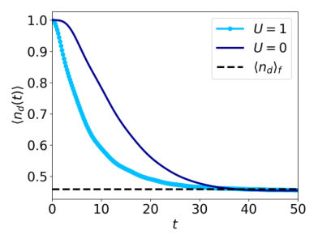
<figcaption class="paper-figure-caption"><b>Fig 5.</b> FIG. 4. Time evolution of impurity occupation following a quench in the AIM, comparing interacting (U = 1, light blue line) and non-interacting (U = 0, dark blue) cases. Plotted for N = 301, t = 0.5, V = 0.2, ϵi d = −U/2. For U = 1 we choose ϵf d = 0; for U = 0 we tune ϵf d to give the same impurity occupation in the long-time limit (dashed line).</figcaption>
</figure>

**Summary.** The paper tackles the formidable challenge of simulating strongly correlated systems like the Anderson Impurity Model when driven out of equilibrium. The authors introduce a novel mapping that rewrites the interacting dynamics as an effective, non-interacting Gaussian theory coupled to auxiliary degrees of freedom. This allows researchers to analyze complex many-body physics by solving a mathematically simpler, albeit larger, single-particle problem.

**Why it may be interesting.** This work provides a powerful conceptual and computational tool for analyzing non-equilibrium quantum dynamics. By transforming an intractable interacting problem into a solvable non-interacting one (albeit larger), it offers new insights into information propagation and correlation physics beyond standard equilibrium methods.

Detailed structure

**Main problem.** The core challenge is understanding the complex, time-evolving dynamics of strongly interacting quantum impurity models when driven out of equilibrium (quenched).

**Main result.** The authors demonstrate that this non-equilibrium AIM evolution can be exactly mapped onto a completely non-interacting effective Gaussian theory coupled to an auxiliary chain.

**Method.** They employ advanced numerical techniques like DMRG/MPS and variational optimization, treating the parameters of the effective non-interacting model as variational variables fitted against time-dependent expectation values from the interacting system.

**Model / system.** The study focuses on the Anderson Impurity Model (AIM), which describes local moments in quantum dots or correlated materials. The method maps its complex interaction dynamics onto a solvable, non-interacting Hamiltonian augmented by auxiliary degrees of freedom.

**Key observables.** Impurity occupation $\langle n_d(t) 
angle$, real-space site occupations $\langle n_j(t) 
angle$, and the spectral function $A(\omega)$.

**Important parameters / regimes.** Interaction strength ($U$), impurity level ($\epsilon_d$), quench parameters (initial vs. final potentials), and the size of the auxiliary chain ($M$).

**Assumptions / limitations.** The primary assumption is that an effective non-interacting description, parameterized by optimizing against time evolution data, can capture the full dynamics of the interacting system.

**Figures summary.** Figures compare spectral functions (A(omega)) and quench dynamics ($\langle n_d(t) 
angle$) between the true AIM and the optimized auxiliary chain representation, showing quantitative agreement for both equilibrium and non-equilibrium regimes.

**Paper structure.** The paper progresses from establishing the complexity of out-of-equilibrium AIM dynamics to developing the mapping strategy via Green's function formalism (spectral domain), then applying this mapping iteratively by optimizing parameters against time-dependent expectation values in real space, culminating in validation across multiple observables.

Abstract

Quantum impurity models with strong electron correlations, such as the paradigmatic Anderson Impurity Model (AIM), are central to our understanding of a range of physical phenomena including local moment formation, Coulomb blockade and Kondo screening. They describe magnetic atoms and molecules on surfaces, quantum dot circuits, and correlated materials through dynamical mean field theory. The physics of such systems in strongly non-equilibrium conditions is particularly complex and challenging to capture, whereas Gaussian models of free fermions can be easily solved. Here we show that the time-evolving dynamics of the AIM after a quench can be described by a completely non-interacting version of the model, at the expense of coupling to additional static auxiliary degrees of freedom. Starting from the full solution of the quenched AIM using ED and DMRG, we study the properties of this mapping using numerical optimization, and uncover intriguing structure in the auxiliary system. The method allows us to understand interacting non-equilibrium dynamics through the simpler lens of an effective non-interacting system of larger dimension.

[↑ back to top](#top)

### [Measurement-enabled online quantum processing with amplitude encoding](http://arxiv.org/abs/2606.18991v1)

**Authors:** Giacomo Franceschetto, Pere Mujal, Rodrigo Martínez-Peña  
**Type:** both · **Category:** quantum information and computing · **PDF:** <https://arxiv.org/pdf/2606.18991v1>  
**Analysis basis:** full PDF text, analyzed in chunks
**Topic relevance:** 🔥 `QC/QI experiment` **4/5** · 🔥 `quantum measurements` **4/5** · `measurement-induced transitions` **3/5** · `methods for driven-dissipative` **3/5** · `non-equilibrium dynamics` **2/5** · `Keldysh / 2PI / non-Gaussian methods` **1/5** · `analog quantum simulation` **1/5** · `correlated / nonlocal dissipation` **1/5** · `driven-dissipative phase transition` **1/5** · `entanglement & information structure` **1/5** · `exotic spin models in light-matter` **1/5**

↔ Scroll figures horizontally

<figure class="paper-figure-card">
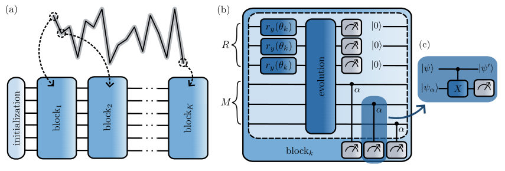
<figcaption class="paper-figure-caption"><b>Fig 1.</b> FIG. 1: Quantum reservoir computing scheme for the online protocol using amplitude encoding. (a) The complete circuit for the algorithm over K time steps, with one block per step. (b) Description of a circuit block at time step k. (c) Description of the indirect measurement circuit for a memory qubit and its ancilla.</figcaption>
</figure>
<figure class="paper-figure-card">
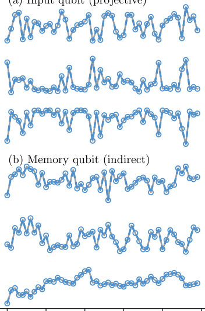
<figcaption class="paper-figure-caption"><b>Fig 2.</b> FIG. 2: Comparison of expectation values obtained from the spin model and the circuit model for (a) the input qubit under projective measurement and for (b) a memory qubit under indirect measurement.</figcaption>
</figure>
<figure class="paper-figure-card">
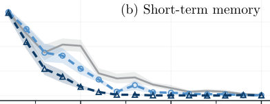
<figcaption class="paper-figure-caption"><b>Fig 3.</b> FIG. 3: Capacity of the hardware-tailored reservoir architecture for (a) predicting the Santa Fe time series and (b) solving the STM task.</figcaption>
</figure>
<figure class="paper-figure-card">
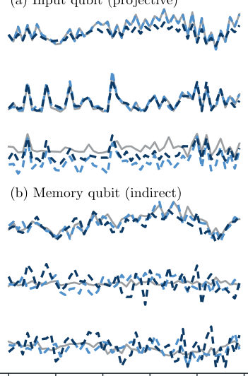
<figcaption class="paper-figure-caption"><b>Fig 4.</b> FIG. 5: Comparison of expectation values obtained from the spin model, the circuit simulation and the hardware-tailored realization for (a) the input qubit under projective measurement and for (b) a memory qubit under indirect measurement.</figcaption>
</figure>
<figure class="paper-figure-card">
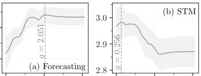
<figcaption class="paper-figure-caption"><b>Fig 5.</b> FIG. 4: Optimization of the measurement strength with the spin model for the hardware-tailored experiment.</figcaption>
</figure>

**Summary.** This paper presents a novel protocol for performing amplitude-encoded quantum reservoir computing online using mid-circuit measurements. By introducing an indirect measurement scheme, the authors overcome limitations of previous methods that required input buffering or complex resets. The work provides both theoretical foundations and hardware demonstrations showing scalable monitoring of complex quantum reservoir dynamics.

**Why it may be interesting.** This work directly addresses the challenge of implementing complex, continuous quantum information processing protocols (like QRC) on noisy, discrete hardware by developing measurement techniques that preserve online operation and system observability.

Detailed structure

**Main problem.** The primary goal is to develop an online quantum reservoir computing (QRC) protocol that realizes amplitude encoding on physical quantum hardware while maintaining linear runtime scaling.

**Main result.** The proposed method successfully enables the monitoring of full system dynamics by combining mid-circuit measurements with a novel indirect measurement scheme, providing a practical path for scalable QRC implementation.

**Method.** The core technique involves using mid-circuit measurement and reset operations to simulate partial trace dynamics required for amplitude encoding, supplemented by an ancillary qubit based indirect measurement protocol.

**Model / system.** The system is modeled as a quantum reservoir computing setup, comparing theoretical spin models (Ising Hamiltonian) with circuit implementations on hardware platforms like superconducting qubits or trapped ions concepts. The memory evolution follows recurrent dynamics $
ho_u^k = L_k[
ho_u^{k-1}]$.

**Key observables.** Expected values of Pauli operators ($\langle\hat{\sigma}_x
angle, \langle\hat{\sigma}_y
angle, \langle\hat{\sigma}_z
angle$) for both input (direct) and memory (indirect) qubits; the capacity $C(\eta)$ of the reservoir.

**Important parameters / regimes.** Measurement strength parameter $\alpha$ (or related coupling constants like $g$), which controls the measurement backaction, ranging from projective ($\alpha=1$) to weak limits.

**Assumptions / limitations.** Previous methods requiring input buffering or 'rewinding' are avoided; hardware limitations force approximations like nearest-neighbor Hamiltonians and finite time windows for long sequences.

**Figures summary.** Figures illustrate the QRC circuit structure, compare dynamics across spin model/circuit simulation/hardware realizations, and plot capacity $C(\eta)$ versus measurement strength or observable combinations for forecasting tasks.

**Paper structure.** The paper introduces the theoretical protocol combining amplitude encoding via mid-circuit measurements with an indirect measurement scheme. It then details the mathematical formulation using both spin models and circuit maps before presenting proof-of-principle implementations and benchmarking on time series forecasting and STM tasks.

Abstract

We introduce a quantum reservoir computing online protocol that realizes amplitude encoding on quantum hardware. Our scheme combines mid-circuit measurement and reset operations to implement the partial-trace dynamics underlying amplitude encoding, while an indirect measurement scheme provides access to reservoir observables without interrupting temporal processing. In contrast to other approaches, our method preserves online operation, avoids input buffering, and keeps the runtime linear in the number of time steps. We present the theoretical formulation of the protocol and a proof-of-principle implementation on quantum hardware, and we evaluate its performance on two standard benchmark tasks. Our results show that the reservoir dynamics can be monitored through both direct measurements of the input qubits and indirect measurements of the memory qubits, enabling observation of the full system while isolating the internal evolution of the reservoir. This work provides a practical route toward scalable hardware implementations of amplitude-encoded quantum reservoir computing and opens the door to systematic experimental studies of complex quantum reservoirs.

[↑ back to top](#top)

### [Josephson spectroscopy in a circular atomic tunnel junction with acceleration-induced symmetry breaking](http://arxiv.org/abs/2606.18706v1)

**Authors:** Yurii Borysenko, Yuriy Bidasyuk, Olena Prykhodko, Gerhard Birkl, Dominik Pfeiffer, Ludwig Lind, Mark Edwards, Alexander Yakimenko  
**Type:** theory · **Category:** quantum gases · **PDF:** <https://arxiv.org/pdf/2606.18706v1>  
**Analysis basis:** full PDF text, analyzed in chunks
**Topic relevance:** 🔥 `analog quantum simulation` **4/5** · `methods for driven-dissipative` **3/5** · `non-equilibrium dynamics` **3/5** · `Keldysh / 2PI / non-Gaussian methods` **2/5** · `driven-dissipative phase transition` **2/5** · `non-equilibrium universality` **2/5** · `Frenkel-Kontorova` **1/5** · `correlated / nonlocal dissipation` **1/5** · `entanglement & information structure` **1/5** · `quantum measurements` **1/5**

↔ Scroll figures horizontally

<figure class="paper-figure-card">
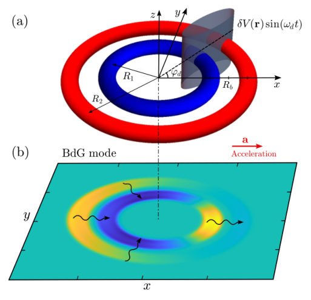
<figcaption class="paper-figure-caption"><b>Fig 1.</b> FIG. 1. Schematic of the dual-ring Bose Josephson junction. (a) Two coaxial toroidal condensates separated by a barrier that supports coherent tunneling between the rings, together with an additional time-dependent potential used to perturb the system. (b) The density modulation of a Bogoliubov mode that becomes active in the population-imbalance dynamics. Arrows indicate the direction of the tunneling flow across the barrier.</figcaption>
</figure>
<figure class="paper-figure-card">
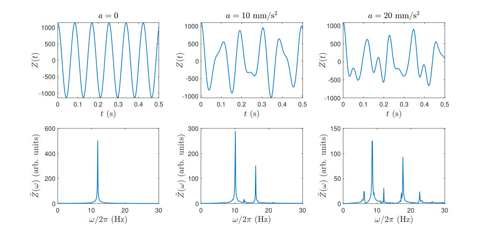
<figcaption class="paper-figure-caption"><b>Fig 2.</b> FIG. 2. Time evolution of the population imbalance Z(t) (top row) and the corresponding Fourier spectra (bottom row) for three values of the acceleration: a = 0 (left column), a = 10 mm/s2 (middle column), and a = 20 mm/s2 (right column). For a nonzero acceleration, Z(t) exhibits a pronounced beating pattern, indicating the presence of several active oscillation frequencies. In the Fourier spectra, the single dominant Josephson peak observed at a = 0 evolves into a multiplet structure whose components shift with increasing acceleration.</figcaption>
</figure>
<figure class="paper-figure-card">
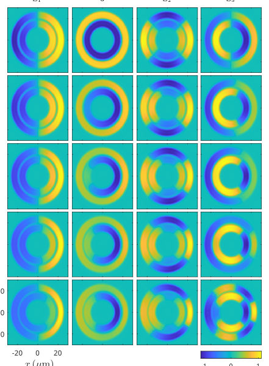
<figcaption class="paper-figure-caption"><b>Fig 3.</b> FIG. 4. Spatial structure of the lowest Bogoliubov modes active in the population-imbalance dynamics, represented by the density perturbation δρn defined in Eq. (17). The rows correspond to a = 0 (top), 5 mm/s2, 10 mm/s2, 15 mm/s2, and 20 mm/s2 (bottom). With increasing acceleration, the mode profiles become progressively distorted and asymmetric, consistent with the growth of their activity in Fig. 5 and with the associated changes in the tunneling dynamics.</figcaption>
</figure>
<figure class="paper-figure-card">
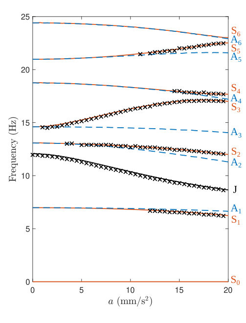
<figcaption class="paper-figure-caption"><b>Fig 4.</b> FIG. 3. Elementary-excitation spectrum as a function of the applied acceleration a. Solid red lines represent modes sym- metric with respect to the x axis (labeled Sn), while dashed blue lines represent antisymmetric modes (labeled An). The zero-frequency Goldstone mode is labeled S0. The mode la- beled J is the principal Josephson mode discussed in the text. For a &gt; 0, symmetry breaking activates additional modes in the population-imbalance dynamics, leading to the multiplet structure seen in Fig. 2. Black crosses denote the peak fre- quencies extracted from the dynamical simulations.</figcaption>
</figure>
<figure class="paper-figure-card">
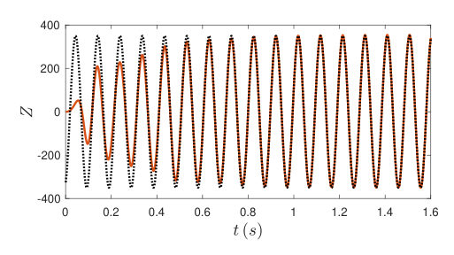
<figcaption class="paper-figure-caption"><b>Fig 5.</b> FIG. 6. Oscillations of the population imbalance Z(t) between the rings under periodic driving with frequency ωd/2π = 10.25 Hz close to the resonance with one of the Bo- goliubov modes. The dissipation parameter γ = 5 × 10−3</figcaption>
</figure>

**Summary.** The paper analyzes Josephson dynamics in a double-ring Bose-Einstein condensate subjected to an external linear acceleration. This acceleration breaks the system's axial symmetry, causing the simple plasma oscillation spectrum to become multi-modal. The authors propose a spectroscopic protocol using localized driving fields to selectively measure these newly activated collective Bogoliubov modes.

**Why it may be interesting.** This work provides a concrete, controllable platform (accelerated BECs) to experimentally realize and spectroscopically probe fundamental concepts like symmetry-protected degeneracies and mode coupling in many-body quantum systems.

Detailed structure

**Main problem.** The study investigates how an external linear acceleration breaks the axial symmetry of a Bose-Josephson junction formed by two coupled BEC rings, thereby modifying its Josephson dynamics.

**Main result.** Acceleration transforms the single Josephson plasma oscillation into a multimode response, activating specific Bogoliubov collective modes whose spectral components can be selectively probed via spectroscopy.

**Method.** The analysis employs Gross-Pitaevskii simulations and Bogoliubov-de Gennes (BdG) theory, proposing a mode-resolved spectroscopic protocol using localized periodic driving perturbations.

**Model / system.** The system is a coplanar double-ring trap containing $^{87}	ext{Rb}$ atoms in a BEC. The dynamics are modeled by the GPE, incorporating an external linear acceleration term that breaks rotational symmetry.

**Key observables.** Population imbalance oscillations ($Z(t)$), Josephson plasma oscillation frequency spectrum, and spectral components corresponding to active Bogoliubov modes.

**Important parameters / regimes.** External acceleration magnitude ($a$), driving frequency ($\omega_d$), and the coupling strength/interaction parameter ($g$).

**Assumptions / limitations.** The analysis assumes low-energy dynamics allowing for an effective 2D description, and utilizes linear response theory (BdG) in conjunction with dissipative time-dependent methods.

**Figures summary.** Figures illustrate the transition from a single spectral peak to a multiplet structure as acceleration increases; they also show mode activity ($D_n$) confirming S-type mode activation and spatial maps of density perturbations ($\delta
ho_n$).

**Paper structure.** The paper progresses by first establishing the baseline Josephson dynamics at zero acceleration, then introducing acceleration to induce symmetry breaking, which is theoretically linked to the activation of specific Bogoliubov modes. Finally, it details a spectroscopic protocol using localized driving fields to selectively measure these activated modes.

Abstract

We study Josephson dynamics in a long atomic Bose-Josephson junction formed by two tunnel-coupled coplanar Bose-Einstein-condensate rings. An in-plane linear acceleration breaks the axial symmetry of the trap and transforms a single Josephson plasma oscillation into a multimode population-imbalance response. Gross-Pitaevskii simulations and Bogoliubov-de Gennes analysis show that the additional spectral components arise from collective modes that acquire finite overlap with the population-imbalance operator under symmetry breaking, with their activation governed by reflection symmetry about the acceleration direction. We also propose a mode-resolved Josephson-spectroscopy protocol based on a weak localized periodic perturbation. Frequency scans reveal resonant amplitude peaks and phase shifts at the eigenfrequencies of active Bogoliubov modes, while angular scans of the drive position provide access to the angular structure of the corresponding mode density perturbations. A dissipative time-dependent Bogoliubov theory yields analytical response functions in quantitative agreement with full Gross-Pitaevskii simulations in the linear regime. Our results demonstrate that accelerated dual-ring condensates provide a controllable platform for symmetry-selected Josephson dynamics and spectroscopic probing of collective modes.

[↑ back to top](#top)

### [Nonequilibrium nucleation theory for nonconserved fields: from active matter to population dynamics](http://arxiv.org/abs/2606.18911v1)

**Authors:** Michalis Chatzittofi, Noah Ziethen, Cesare Nardini, Michael E. Cates  
**Type:** theory · **Category:** statistical mechanics · **PDF:** <https://arxiv.org/pdf/2606.18911v1>  
**Analysis basis:** full PDF text, analyzed in chunks
**Topic relevance:** 🔥 `non-equilibrium dynamics` **4/5** · 🔥 `non-equilibrium universality` **4/5** · `Keldysh / 2PI / non-Gaussian methods` **3/5** · `driven-dissipative phase transition` **3/5** · `methods for driven-dissipative` **3/5** · `Frenkel-Kontorova` **1/5** · `analog quantum simulation` **1/5** · `correlated / nonlocal dissipation` **1/5**

↔ Scroll figures horizontally

<figure class="paper-figure-card">
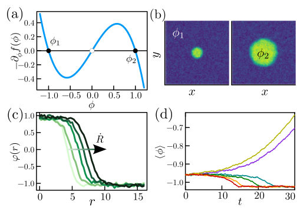
<figcaption class="paper-figure-caption"><b>Fig 1.</b> FIG. 1. (a) Plot of ⟨˙ϕ⟩= −µ against ϕ for spatially homoge- neous states of Active Model A (AMA). The two states ϕ1,2 are locally stable and are denoted by dark circles. (b) Time evolution of a nucleating droplet of stable phase ϕ2 in the metastable phase ϕ1. (c) The droplet expands with a velocity ˙R. The plot reports the time-evolution of the interfacial pro- file (colors from light to dark) as obtained from simulations of AMA. (d) Trajectories of the global density during two suc- cessful and four unsuccessful nucleation events; different lines correspond to different realizations of the stochastic process starting from a spherical droplet with R ≲Rc. Data for pan- els (b–d) corresponds...</figcaption>
</figure>
<figure class="paper-figure-card">
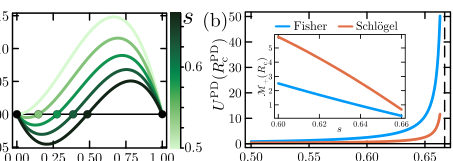
<figcaption class="paper-figure-caption"><b>Fig 2.</b> FIG. 2. (a) The driving force for the two population dynam- ics models, showing the two fixed points of the deterministic dynamics ϕ1 = 0, ϕ2 = 1; the asymmetry between the two species s modifies the location of the unstable fixed point. (b) Barrier heights for different values of asymmetry s show- ing how nucleation probabilities are affected by the form of the noise variance; the inset reports the mobilities M for the two models.</figcaption>
</figure>
<figure class="paper-figure-card">
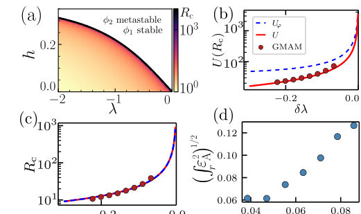
<figcaption class="paper-figure-caption"><b>Fig 3.</b> FIG. 3. Results for AMA in two dimensions: (a) Color map of the critical radius Rc in the NNT limit as a function of activity λ and external field h: ϕ1 (ϕ2) is metastable for finite (infinite) values of Rc, and NNT is valid close to the solid line (where Rc →∞). (b) The quasipotential barrier in the NNT analysis (orange line); in the time-reversed relaxation (TRR) ansatz εA →0 (blue dashed line): and by numerical (GMAM) minimization of the action (dots). (c) The same comparison for the critical radius. (d) Deviation in the interfacial profile between NNT and TRR, quantified via ( R</figcaption>
</figure>

**Summary.** This paper develops a Nonequilibrium Nucleation Theory (NNT) for physical systems where the order parameter is not conserved, extending classical theory. It derives an effective dynamical equation for droplet growth by carefully defining the reaction coordinate. The work demonstrates that non-equilibrium effects significantly alter the nucleation barrier compared to equilibrium predictions, validating the approach using active matter models.

**Why it may be interesting.** While focused on classical statistical mechanics, the techniques developed—analyzing rare events in non-equilibrium dynamics via minimum action principles—are highly relevant to understanding quantum tunneling or escape rates in open quantum systems far from equilibrium.

Detailed structure

**Main problem.** The primary goal is to develop a Nonequilibrium Nucleation Theory (NNT) that extends Classical Nucleation Theory (CNT) to systems where the order parameter is non-conserved and detailed balance is broken.

**Main result.** The authors construct an NNT framework for nonconserved dynamics, showing that the nucleation barrier differs significantly from equilibrium predictions because interfacial profile deviations enter at leading order. This theory successfully predicts results for active matter and population dynamics models.

**Method.** The theory involves treating the droplet radius as a 1D reaction coordinate and deriving an effective Langevin equation by systematically expanding the stochastic dynamics, carefully defining the coordinate to project out error terms.

**Model / system.** The theory applies to field theories governed by a single, scalar, non-conserved order parameter $\phi(x, t)$, exemplified by active matter models (like Active Model A) and population dynamics systems that violate detailed balance.

**Key observables.** Nucleation rate, critical radius ($R_c$), and the quasipotential barrier $U(R)$.

**Important parameters / regimes.** Noise variance ($T$), interfacial tension ($\sigma_{eq}$), and the deviation parameter $\epsilon_A$ quantifying profile mismatch.

**Assumptions / limitations.** The derivation assumes that fluctuations away from spherical shape are negligible, and it requires careful definition of the reaction coordinate to manage systematic errors arising from projecting out deviations from the time-reversed relaxation path.

**Figures summary.** Figures illustrate AMA dynamics (time evolution, interfacial profile) and compare calculated quasipotential barriers ($U(R)$ vs $U_\phi$ vs numerical results), highlighting the deviation $\epsilon_A$.

**Paper structure.** The paper builds from the established CNT framework to introduce the necessary modifications for non-equilibrium systems. It derives the generalized Langevin equation for the reaction coordinate, analyzes the resulting quasipotential, and validates these analytical predictions against numerical simulations using active matter models.

Abstract

Classical nucleation theory (CNT) describes the formation of a stable phase from a metastable one. In equilibrium systems, it quantifies the free-energy competition between a favorable bulk gain and an unfavorable interfacial cost. For systems without detailed balance, the corresponding nonequilibrium nucleation theory (NNT) was so far developed only for cases with a conserved order parameter, such as active fluid-fluid phase separation. Here we construct the NNT for systems with a (single, scalar) nonconserved order parameter. Unlike in the conserved case, the nucleation barrier controlling (noise-driven) droplet growth is profoundly altered by deviations in the interfacial density profile from the one arising during (deterministic) droplet relaxation. The barrier can nonetheless be analysed by carefully defining the reaction coordinate (droplet radius) to project out those deviations. We give explicit NNT predictions for models drawn from population dynamics and active matter, finding excellent agreement with numerical studies.

[↑ back to top](#top)

### [Thermodynamics of photonic nonlinear Aharonov-Bohm cages](http://arxiv.org/abs/2606.18896v1)

**Authors:** Stefano Iubini, Carlo Danieli  
**Type:** theory · **Category:** statistical mechanics · **PDF:** <https://arxiv.org/pdf/2606.18896v1>  
**Analysis basis:** full PDF text, analyzed in chunks
**Topic relevance:** 🔥 `analog quantum simulation` **4/5** · `driven-dissipative phase transition` **3/5** · `methods for driven-dissipative` **3/5** · `non-equilibrium dynamics` **3/5** · `non-equilibrium universality` **2/5** · `Frenkel-Kontorova` **1/5** · `Keldysh / 2PI / non-Gaussian methods` **1/5** · `correlated / nonlocal dissipation` **1/5** · `correlated cavity matter` **1/5** · `entanglement & information structure` **1/5**

↔ Scroll figures horizontally

<figure class="paper-figure-card">
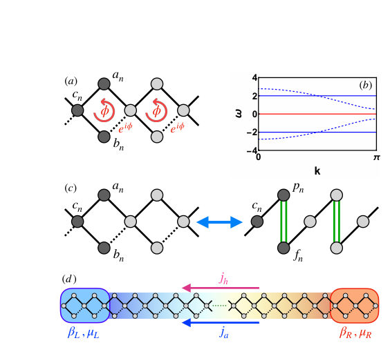
<figcaption class="paper-figure-caption"><b>Fig 1.</b> FIG. 1. Nonlinear Aharonov-Bohm lattice and non- equilibrium setup. (a) Diamond lattice profile with magnetic field of flux ϕ. The black dots indicate the fundamental unit- cell. (b) Band structure for ϕ = π 4 (dashed) and ϕ = π (solid). The ϕ-independent flat band ω0 = 0 is shown in red color. (c) Detangling rotation U of the nonlinear chain for ϕ = π. The black lines represent the linear hopping, while the double green lines represent the nonlinear connections be- tween disconnected trimers. (d) Schematic representation of the MonteCarlo reservoir method, where the left (L) and the right (R) ends of the lattice are connected to a bath (colored in blue and orange respectively) each...</figcaption>
</figure>
<figure class="paper-figure-card">
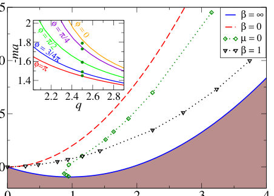
<figcaption class="paper-figure-caption"><b>Fig 2.</b> FIG. 2. Equilibrium phase diagram for γ = 2 and ϕ = π. Symbols refer to equilibrium simulations with N = 20. Inset: harmonic limit. Rescaled average norm −ma versus q accord- ing to Eq. (7) (solid lines). Green circles refer to equilibrium numerical simulations (green circles) performed for q = 2.5 and m = −1 for corresponding values of ϕ. Simulations were performed evolving Eq. (2) in the presence of grand canonical reservoirs. Data shown refer to N = 50 and time averages t = 5 × 106 units.</figcaption>
</figure>
<figure class="paper-figure-card">
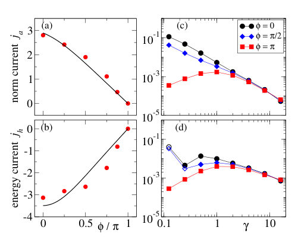
<figcaption class="paper-figure-caption"><b>Fig 3.</b> FIG. 3. Stationary currents of norm (first row) and en- ergy (second row) for βL = 0.2, βR = 0.316, µ = −3.16 and N = 50. (a-b) Dependence of ja and jh on the flux ϕ in the linear limit: symbols refer to numerical simulations, solid curves are obtained from Landauer theory in Eq. (8). Numer- ical fluxes are rescaled by an arbitrary constant factor. (c-d) Dependence of ja and jh on the nonlinear parameter γ for ϕ = 0 (black), ϕ = π</figcaption>
</figure>
<figure class="paper-figure-card">
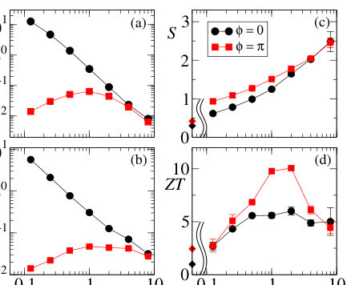
<figcaption class="paper-figure-caption"><b>Fig 4.</b> FIG. 4. Coupled transport in systems. Norm conductivity σ (a), heat conductivity κ (b), Seebeck coefficient S (c) and figure of merit ZT (d) versus γ computed for ϕ = 0 (black) and ϕ = π (red) with N = 100, β = 0.32 and m = −1. Diamonds in (c,d), correspond to analytical estimates for γ = 0 via Landauer theory.</figcaption>
</figure>
<figure class="paper-figure-card">
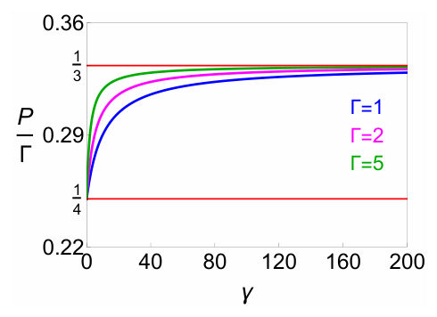
<figcaption class="paper-figure-caption"><b>Fig 5.</b> FIG. 5. Positive real root P of the polynomial f(P, Γ, γ) rescaled by constant Γ as function the nonlinear strength γ for Γ = 1 (blue), Γ = 2 (magenta), and Γ = 5 (green).</figcaption>
</figure>

**Summary.** This paper analyzes the thermodynamics and transport properties of nonlinear photonic lattices subjected to an artificial magnetic flux. By controlling this flux, the system can be tuned from a conductor to an insulator, or its thermoelectric efficiency can be significantly enhanced. The methodology combines advanced statistical mechanics with quantum transport theory.

**Why it may be interesting.** This work provides a concrete, tunable platform—photonic lattices—to study fundamental concepts of quantum transport, including the interplay between geometric constraints (caging) and nonlinearity in optimizing energy conversion devices.

Detailed structure

**Main problem.** The study investigates the equilibrium and non-equilibrium thermodynamics of photonic lattices exhibiting Kerr nonlinearity, focusing on how a synthetic magnetic flux controls transport properties.

**Main result.** Tuning the synthetic magnetic flux can transform the system between conducting and insulating states at weak nonlinearity, while intermediate nonlinearities significantly enhance thermoelectric performance by optimizing current channels.

**Method.** The authors employ thermodynamic formalism, linear response theory (Onsager relations), and Landauer theory to calculate transport coefficients like conductivity and Seebeck coefficient.

**Model / system.** The system is a quasi 1D photonic diamond lattice threaded by a synthetic magnetic flux ($\phi$) and possessing local Kerr nonlinearity ($\gamma$). The dynamics are analyzed using coupled field equations derived from the Hamiltonian.

**Key observables.** Average norm density ($a$), energy density ($h$), heat current, norm current ($j_a$), Seebeck coefficient ($S$), and thermoelectric figure of merit ($ZT$).

**Important parameters / regimes.** Synthetic magnetic flux ($\phi$), nonlinear strength ($\gamma$), temperature/chemical potential imbalances ($eta, \mu$). Key regimes include the linear limit ($\gamma=0$) and the Aharonov-Bohm caging condition ($\phi=\pi$).

**Assumptions / limitations.** The analysis assumes specific boundary conditions (Monte Carlo reservoirs) for non-equilibrium calculations and utilizes approximations like Gaussian integrals in normal mode expansions.

**Figures summary.** Figures illustrate band structures showing flat bands at $\phi=\pi$, phase diagrams mapping accessible thermodynamic regions, and plots detailing the dependence of currents ($j_a, j_h$) on flux ($\phi$) and nonlinearity ($\gamma$).

**Paper structure.** The paper progresses by first establishing the model Hamiltonian and analyzing equilibrium states (phase diagrams). It then moves to non-equilibrium transport using Landauer theory and Onsager relations to quantify how $\phi$ and $\gamma$ control currents and thermoelectric efficiency.

Abstract

We investigate equilibrium and non-equilibrium thermodynamics of one-dimensional photonic diamond lattices with Kerr nonlinearity. The equilibrium phase diagram is obtained as a function of the synthetic magnetic flux acting on each plaquette. In the linear regime, the magnetic flux can induce Aharonov-Bohm caging, flattening all Bloch bands and suppressing particle and energy currents. In this caging regime, non-vanishing currents are enabled by nonlinearity. By imposing stationary temperature- and chemical potential- imbalances at the system boundaries, we show that at weak nonlinearity fine tuning the flux at the Aharonov-Bohm caging transforms the system from a conductor to an insulator. For intermediate nonlinear strength, the system remains conducting for all magnetic fluxes; however, the caging condition significantly enhances the Seebeck coefficient and thermoelectric figure of merit, improving the thermoelectric features of the system. Our results give evidence of a novel route towards optimization of coupled transport devices, based on the control of linear versus nonlinear conduction channels via a synthetic magnetic flux.

[↑ back to top](#top)

### [Chaos from quantum bath fluctuations](http://arxiv.org/abs/2606.18340v1)

**Authors:** Ilan Baud, Tamoghna Ray, Mahaveer Prasad, Manas Kulkarni, Camille Aron  
**Type:** theory · **Category:** statistical mechanics · **PDF:** <https://arxiv.org/pdf/2606.18340v1>  
**Analysis basis:** full PDF text, analyzed in chunks
**Topic relevance:** 🔥 `Keldysh / 2PI / non-Gaussian methods` **4/5** · `driven-dissipative phase transition` **3/5** · `methods for driven-dissipative` **3/5** · `non-equilibrium dynamics` **3/5** · `correlated / nonlocal dissipation` **2/5** · `non-equilibrium universality` **2/5** · `Tavis-Cummings & cavity-many-emitter` **1/5** · `correlated cavity matter` **1/5**

↔ Scroll figures horizontally

<figure class="paper-figure-card">
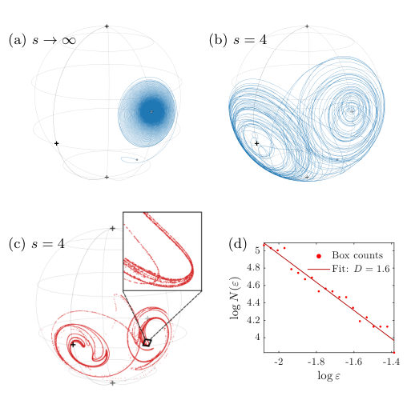
<figcaption class="paper-figure-caption"><b>Fig 1.</b> FIG. 1. Noise-induced chaotic attractor for λ &gt; λc. Rep- resentative spin trajectories: (a) classical dissipative Dicke model in the limit s →∞, and (b) stochastic Dicke model at s = 4, both initialized at the black dot and with dynamics governed by Eqs. (3). Black crosses denote the four classical fixed points. (c) Random strange attractor at s = 4 (inset: zoom), obtained from pullback dynamics for a fixed noise real- ization and N0 = 105 initial conditions. (d) Box-counting es- timate of the fractal dimension of the strange attractor shown in (c), embedded in a four-dimensional phase space, yielding D ≈1.6. Parameters: ωs = ωc = 1, κ = 0.5, λ = 1.0.</figcaption>
</figure>
<figure class="paper-figure-card">
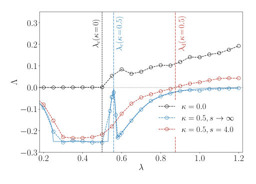
<figcaption class="paper-figure-caption"><b>Fig 2.</b> FIG. 2. Effects of the dissipative environment on the Lya- punov exponent Λ. Closed Dicke model, κ = 0 (black): the dynamics are chaotic Λ &gt; 0 for spin-boson interactions λ ≳λc. Classical dissipative Dicke model, κ = 0.5, s →∞ (blue): non-chaotic dynamics: Λ ≤0 for all λ, matching the exact prediction from linearized dynamics (solid blue). Stochastic Dicke model, κ = 0.5, s = 4 (red): finite-spin quantum fluctuations restores chaotic dynamics Λ &gt; 0 for λ &gt; λd &gt; λc. Parameters: ωs = ωc = 1 (10 initial states and 50 noise histories per initial state).</figcaption>
</figure>
<figure class="paper-figure-card">
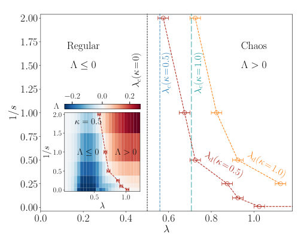
<figcaption class="paper-figure-caption"><b>Fig 3.</b> FIG. 3. Dynamical phase diagram in the coupling λ vs noise strength 1/s plane for several values of κ. The thermody- namical phase transitions at s →∞are located at λc marked by the vertical lines. The dynamical thresholds λd separat- ing non-chaotic (Λ ≤0) and chaotic (Λ &gt; 0) regimes were extracted from data analogous to the finite-s results shown in Fig. 2. Error bars are set by the bin size in λ. Inset: heat map of the Lyapunov exponent for κ = 0.5. Parameters: ωs = ωc = 1 (10 initial states and 50 noise histories per initial state).</figcaption>
</figure>

**Summary.** The paper investigates chaos generation in the dissipative Dicke model by analyzing the effect of quantum noise from a thermal bath. Using semiclassical approximations, they show that while the classical dynamics are regular, finite environmental fluctuations drive the system into a random strange attractor with positive Lyapunov exponents. This establishes a mechanism where environmental coupling can induce complex chaotic behavior.

**Why it may be interesting.** This work directly addresses non-equilibrium quantum dynamics, showing how environmental coupling can fundamentally alter system behavior from stable to chaotic, which is crucial for understanding open quantum systems.

Detailed structure

**Main problem.** The core problem is investigating whether quantum fluctuations originating from a zero-temperature environment can induce deterministic chaos in a physical system that is otherwise classically regular.

**Main result.** Quantum noise successfully generates a random strange attractor characterized by a positive Lyapunov exponent, even when the underlying classical dynamics are stable and non-chaotic.

**Method.** The analysis employs semiclassical approximations (Truncated Wigner Approximation) to derive stochastic differential equations (SDEs), followed by numerical simulation of these SDEs and calculation of Lyapunov exponents and fractal dimensions.

**Model / system.** The study uses the dissipative Dicke model, which describes an electric-dipole interaction between a collective spin and a leaky cavity mode. The dynamics are governed by a Lindblad master equation mapped onto stochastic equations in the semiclassical limit (large but finite spin $s$).

**Key observables.** Lyapunov exponent ($\Lambda$), fractal dimension ($D$), and the structure of the random attractor $\mathcal{A}_\xi$.

**Important parameters / regimes.** Dissipation rate ($\kappa$), coupling constant ($\lambda$), and the noise strength parameter ($1/s$). The superradiant regime ($\lambda > \lambda_c$) is key for chaos generation.

**Assumptions / limitations.** The analysis relies on the semiclassical limit ($s$ large but finite) and uses the Truncated Wigner Approximation, which neglects intrinsic quantum fluctuations while retaining environmental noise terms.

**Figures summary.** Figures illustrate the transition from deterministic convergence to superradiant fixed points (classical limit) to the emergence of a random strange attractor via stochastic dynamics. Box-counting estimates confirm fractal dimensions ($D \approx 1.6$).

**Paper structure.** The paper develops the semiclassical description using the Wigner function, derives the resulting SDEs for the dissipative Dicke model, and then analyzes the stability of the attractors by calculating Lyapunov exponents in different parameter regimes ($\lambda$ vs $s$).

Abstract

The effect of a large environment on a finite-size quantum mechanical system is two-fold: It brings dissipation, but also fluctuations of thermal and quantum origin. While dissipation tends to stabilize the dynamics, we question if and how environmental quantum fluctuations can generate chaos in an otherwise classically non-chaotic system. We work out a paradigmatic model of quantum optics: the dissipative Dicke model, where a large spin interacts with a dissipative harmonic mode. We dial in the classical/quantum correspondence by working in the semiclassical regime at large but finite spin. We demonstrate that, starting from a classically regular phase space in the superradiant regime, quantum noise can generate a strange attractor with fractal dimension and a positive Lyapunov exponent. We unveil the deep connection with shear-induced chaos that was recently developed in the mathematical community.

[↑ back to top](#top)

### [On operator product expansion in the spin-orbit coupled bosonic system](http://arxiv.org/abs/2606.19290v1)

**Authors:** Rajesh Kumar Gupta, Siddhant Tiwari  
**Type:** theory · **Category:** quantum gases · **PDF:** <https://arxiv.org/pdf/2606.19290v1>  
**Analysis basis:** full PDF text, analyzed in chunks
**Topic relevance:** 🔥 `analog quantum simulation` **4/5** · `Keldysh / 2PI / non-Gaussian methods` **3/5** · `driven-dissipative phase transition` **2/5** · `methods for driven-dissipative` **2/5** · `non-equilibrium dynamics` **2/5** · `non-equilibrium universality` **2/5** · `correlated cavity matter` **1/5** · `entanglement & information structure` **1/5** · `exotic spin models in light-matter` **1/5** · `spintronics-quantum-optics interface` **1/5**

↔ Scroll figures horizontally

<figure class="paper-figure-card">
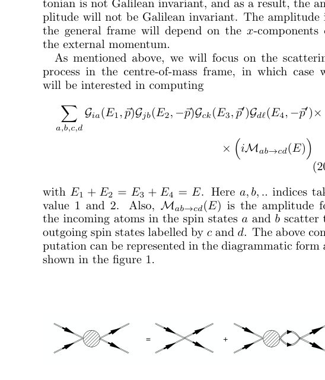
<figcaption class="paper-figure-caption"><b>Fig 1.</b> FIG. 1: The 2→2 scattering diagram. The double line repre- sents the matrix valued propagator.</figcaption>
</figure>
<figure class="paper-figure-card">
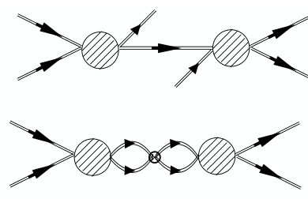
<figcaption class="paper-figure-caption"><b>Fig 2.</b> FIG. 2: The figure in (a) computes the expectation value of the operator ψ† σ(⃗r) and ψ† σ′(⃗r′). The figure in (b) computes the expectation value of the local operator ψ† aψ† bψcψd(⃗r).</figcaption>
</figure>

**Summary.** This paper develops the Operator Product Expansion for bosonic fields in a spin-orbit coupled Bose gas. By calculating the short-distance expansion of field products, it determines contact densities that characterize various quantum phases like supersolidity. The methodology combines advanced many-body theory with detailed calculations involving Green's functions and scattering amplitudes.

**Why it may be interesting.** This work provides rigorous theoretical tools (OPE) to probe universal physics near quantum critical points in controllable ultracold atomic systems, linking microscopic interactions to macroscopic phase behavior.

Detailed structure

**Main problem.** The primary goal is deriving the Operator Product Expansion (OPE) for two separated bosonic field operators in a spin-orbit coupled system, with a specific focus on calculating the contact density term.

**Main result.** The OPE coefficients and contact densities are derived analytically, showing explicit functional forms dependent on coupling constants ($g, \lambda$) and exhibiting distinct behaviors across different quantum phases (e.g., supersolidity).

**Method.** The analysis employs advanced many-body techniques including the LSZ reduction formula, Feynman diagram calculations for scattering amplitudes, and evaluating bilocal operators using Green's functions in momentum space.

**Model / system.** The system is an ultra-cold bosonic gas modeled by pseudo-spinor bosons subjected to spin-orbit coupling induced by counter-propagating laser beams. The Hamiltonian includes kinetic energy, Rabi/Raman coupling ($\Omega$), and interaction terms ($g, \lambda$).

**Key observables.** OPE coefficients $C_{\sigma\sigma', n}(\vec{r})$, scattering amplitudes ($M_{ab 	o cd}(E)$), and contact densities like $\langle (\psi^\dagger_i \psi_i)^2 
angle$.

**Important parameters / regimes.** Coupling constants ($\Omega, g, \lambda$), momentum transfer ($\vec{k}$), and the separation distance ($\vec{r}$) used in the OPE.

**Assumptions / limitations.** The analysis often focuses on the leading non-analytic terms proportional to $\vec{r}$, ignores contributions analytic in $\vec{r}$, and sometimes restricts calculations to specific limits like the coherent coupling case ($\kappa_0=0$).

**Figures summary.** Not specified, but the notes detail equations (e.g., Eq 39, 42, 47) presenting derived functional forms for OPEs and contact densities.

**Paper structure.** The paper progresses from setting up the Hamiltonian and diagonalizing single-particle operators to deriving scattering amplitudes via one-loop integrals, culminating in explicit derivations of the OPE structure and analyzing how contact densities change across different quantum phases.

Abstract

Ultra-cold bosonic systems can be tuned to exhibit quantum phase transitions. For example, the Rabi-coupled bosonic system exhibits ferromagnetic and paramagnetic phases, whereas the spin-orbit-coupled system exhibits exciting phases such as supersolidity. The physics of these phases and phase transitions is very rich. It is an important topic of research to probe these phases and phase transitions using various tools in many-body physics. The operator product expansion (OPE) provides one such tool. It expresses the product of two separated operators as a series expansion of local operators. In this article, we will derive the OPE of two operators $ψ^\dagger_σ(\vec r)$ and $ψ_{σ'}(\vec r')$. More specifically, we look for the contact density term, which controls many of the universal physics of the underlying bosonic system.

[↑ back to top](#top)

### [Quantum simulation of neutrino oscillations with bosonic encoding](http://arxiv.org/abs/2606.18755v1)

**Authors:** Sandeep Joshi  
**Type:** theory · **Category:** other · **PDF:** <https://arxiv.org/pdf/2606.18755v1>  
**Analysis basis:** full PDF text, analyzed in chunks
**Topic relevance:** 🔥 `analog quantum simulation` **4/5** · `correlated cavity matter` **3/5** · `quantum optics experiment` **3/5** · `QC/QI experiment` **2/5** · `Tavis-Cummings & cavity-many-emitter` **2/5** · `correlated / nonlocal dissipation` **1/5** · `driven-dissipative phase transition` **1/5** · `entanglement & information structure` **1/5** · `methods for driven-dissipative` **1/5** · `non-equilibrium dynamics` **1/5**

↔ Scroll figures horizontally

<figure class="paper-figure-card">
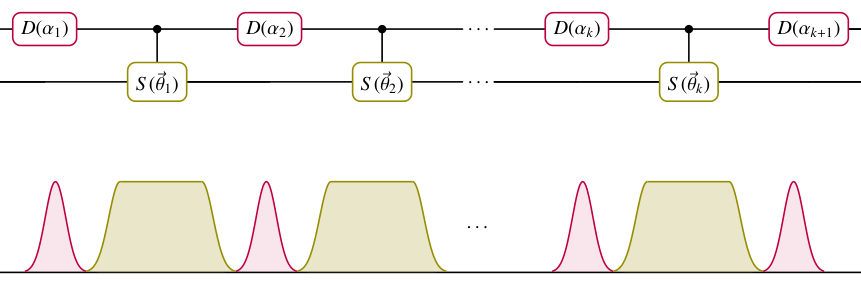
<figcaption class="paper-figure-caption"><b>Fig 1.</b> Figure 1: Universal control of a cavity bosonic mode using displacement and SNAP gates. An arbitrary unitary operation in a d-dimensional cavity subspace can be decomposed into a sequence of k + 1 displacement gates, D(α), and k SNAP gates, S (⃗θ). In this work, displacement operations are implemented using short Gaussian-shaped control pulses applied through cavity drive, while SNAP gates are realized using longer flat-top Gaussian pulses that induce photon-number- dependent rotations of the ancilla qubit. Together, these operations provide universal control over the cavity Hilbert space.</figcaption>
</figure>
<figure class="paper-figure-card">
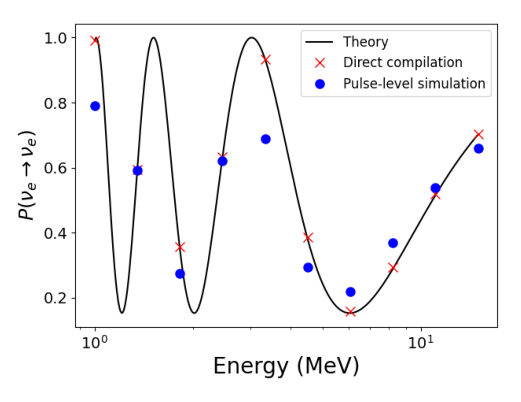
<figcaption class="paper-figure-caption"><b>Fig 2.</b> Figure 2: Quantum simulation of two-flavor neutrino vacuum oscillation for the Fock-state-encoded cavity qubits. The solid line represents the theoretical prediction (θvac = 33.5◦, ∆m2 = 7.5×10−5 eV2), while the symbols correspond to the quantum simulation results obtained using direct compilation [Eq. (21)] and pulse-level simulation [Appendix A].</figcaption>
</figure>
<figure class="paper-figure-card">
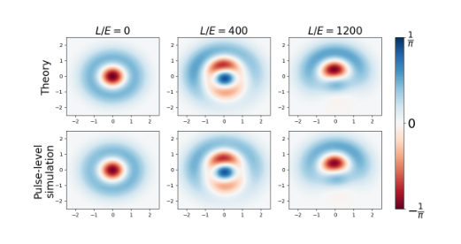
<figcaption class="paper-figure-caption"><b>Fig 3.</b> Figure 3: Wigner function of the neutrino flavor state |νµ⟩, initially encoded in the cavity Fock state |1⟩. As the neutrino propagates, flavor mixing causes the encoded cavity state to evolve. The top row shows the theoretically predicted states, while the bottom row shows the corresponding pulse-level simulation results.</figcaption>
</figure>
<figure class="paper-figure-card">
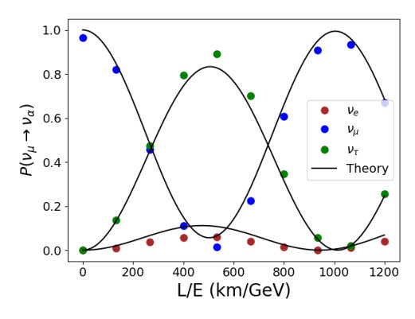
<figcaption class="paper-figure-caption"><b>Fig 4.</b> Figure 4: Pulse-level simulation of three-flavor neutrino oscillations. The three flavor states are encoded in the cavity Fock subspace {|0⟩, |1⟩, |2⟩}. The neutrino mixing matrix is compiled using two building blocks of the form (B.1) and the parameters of the SNAP and displacement gates are optimized numerically using the qgrad package.</figcaption>
</figure>

**Summary.** The paper details the use of superconducting microwave cavities with bosonic encoding to simulate fundamental particle physics processes, specifically neutrino oscillations. By synthesizing arbitrary unitary gates using Displacement and SNAP operations, the authors demonstrate that this cavity platform can accurately model these complex quantum dynamics. This establishes a strong link between advanced quantum control in circuit QED and high-energy physics simulation.

**Why it may be interesting.** This work is highly relevant as it combines advanced quantum control techniques (pulse shaping, gate synthesis) within a solid-state platform (Circuit QED) to simulate complex many-body physics problems like neutrino oscillations, which is a core area of AMO research.

Detailed structure

**Main problem.** The primary goal is the quantum simulation of two- and three-flavor neutrino oscillations using superconducting circuits.

**Main result.** The authors demonstrate that cavity-based bosonic encoding provides a viable platform for this simulation, showing agreement between simulated probabilities and theoretical predictions.

**Method.** They implement required unitary operations by combining Displacement gates and Selective Number-dependent Arbitrary Phase (SNAP) gates through carefully designed pulse sequences.

**Model / system.** The system uses superconducting qubits coupled to a microwave cavity mode. Information is encoded in the bosonic Fock states of the cavity ($\{|n
angle\}$), allowing for qudit representation, which is controlled via dispersive coupling and ancillary qubit manipulation.

**Key observables.** Neutrino oscillation probabilities (e.g., $P(
u_e 	o 
u_e)$) and state evolution visualized via Wigner functions.

**Important parameters / regimes.** Coherence times ($T_1, T_\phi$), cavity frequency ($\omega_c$), coupling strength ($\chi$), and mixing parameters ($\Delta m^2, 	heta$).

**Assumptions / limitations.** The control scheme relies on the dispersive regime ($\Delta \gg g$) and uses approximations for gate implementation (e.g., perturbative expansion for small rotations). Pulse-level simulations incorporate Lindblad master equation dynamics.

**Figures summary.** Figures illustrate the decomposition of arbitrary unitaries into SNAP/Displacement gates, compare simulated vs. theoretical oscillation probabilities for two-flavor mixing, and show Wigner function evolution.

**Paper structure.** The paper first details the universal control scheme using bosonic encoding (D and S gates). It then applies this framework to compile the necessary unitaries for simulating neutrino oscillations in both two- and three-flavor scenarios, comparing direct compilation vs. pulse-level simulation results.

Abstract

Superconducting qubits offer a versatile platform for quantum simulation. In this architecture, quantum information can be encoded in the bosonic modes of a microwave cavity, offering an alternative to conventional qubit-based encoding schemes. These cavity bosonic modes can be manipulated using a single ancillary qubit. In this work, we investigate the quantum simulation of two- and three-flavor neutrino oscillations using Fock-basis encoding of a cavity mode. We design pulse sequences for implementing the required unitary operations through selective number-dependent arbitrary phase (SNAP) and displacement gates. Pulse-level control is employed to realize high-fidelity gate operations on the encoded cavity mode. The resulting neutrino oscillation probabilities obtained from quantum simulation exhibit close agreement with the corresponding theoretical predictions, demonstrating the feasibility of cavity-based bosonic encoding schemes for quantum simulation.

[↑ back to top](#top)

### [Memory-assisted advantage for state transfer in disordered quantum many-body scar system](http://arxiv.org/abs/2606.18720v1)

**Authors:** Paranjoy Chaki, Ujjwal Sen  
**Type:** theory · **Category:** disordered systems and neural networks · **PDF:** <https://arxiv.org/pdf/2606.18720v1>  
**Analysis basis:** full PDF text, analyzed in chunks
**Topic relevance:** 🔥 `analog quantum simulation` **4/5** · 🔥 `scars & prethermalization` **4/5** · `entanglement & information structure` **2/5** · `non-equilibrium dynamics` **2/5** · `non-equilibrium universality` **2/5** · `Keldysh / 2PI / non-Gaussian methods` **1/5** · `correlated / nonlocal dissipation` **1/5** · `driven-dissipative phase transition` **1/5** · `methods for driven-dissipative` **1/5**

↔ Scroll figures horizontally

<figure class="paper-figure-card">
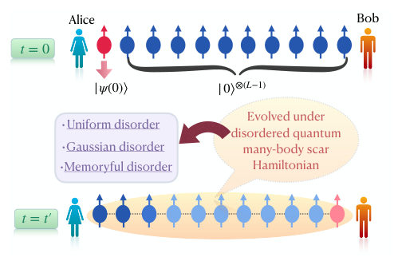
<figcaption class="paper-figure-caption"><b>Fig 1.</b> Figure 1. Schematic representation of quantum state transfer through a disordered many-body scar system. In this schematic diagram, we present a pictorial illustration of quantum state transfer through a disordered many-body scar system. Alice aims to transfer her state |ψ(0)⟩to Bob through the time evolution governed by the disordered many-body scar Hamiltonian. Here, the total system size is L, and the remaining L−1 spins in the chain are initially prepared in the state |0⟩⊗(L−1).</figcaption>
</figure>
<figure class="paper-figure-card">
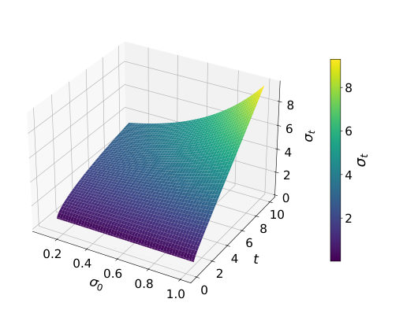
<figcaption class="paper-figure-caption"><b>Fig 2.</b> Figure 2. Behavior of σt with time t and σ0. We plot the standard deviation σt with time t, and σ0 is depicted by a sequential color plot. Here the time (t) axes and σ0 are taken along the horizontal plane, and σt is plotted along the vertical axes.</figcaption>
</figure>
<figure class="paper-figure-card">
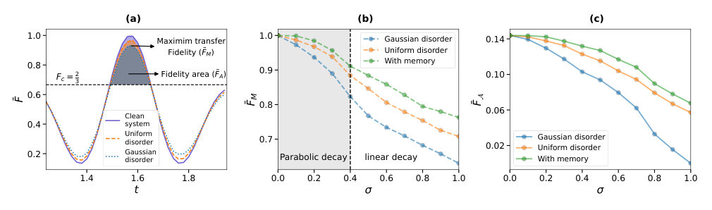
<figcaption class="paper-figure-caption"><b>Fig 3.</b> Figure 3. Variation of maximum fidelity and fidelity area with disorder strengths. In panel (a), we plot the variation of the transfer fidelity ¯F with time (t). The curve corresponding to the clean system is represented by the smooth violet line, while the curves corresponding to uniform, Gaussian, and time-dependent memoryful disorder are shown by the dashed orange and dotted blue lines, respectively. The horizontal dashed line at 2/3 represents the classical fidelity Fc. The shaded region above this line under the dynamical fidelity curve denotes the regime where the fidelity exceeds the classical fidelity. Panel (b) shows the variation of the maximum fidelity ¯FM with the disorder...</figcaption>
</figure>
<figure class="paper-figure-card">
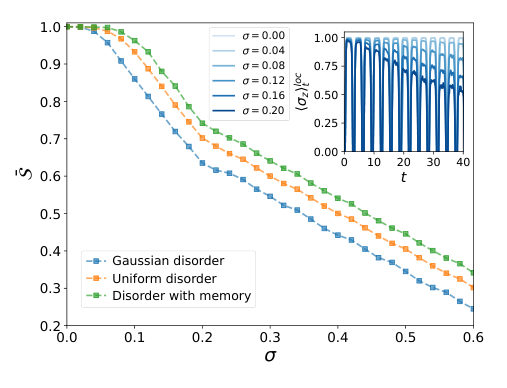
<figcaption class="paper-figure-caption"><b>Fig 4.</b> Figure 4. Behavior of the degree of scarness as a function of disorder strength. Here we plot ¯S as a function of σ for Gaus- sian, uniform, and memoryful disorder. The blue, orange, and green dashed curves with square markers denote Gaussian, uni- form, and time-dependent (memoryful) disorder. In the inset, we plot ⟨σz⟩loc t as a function of t corresponding to Gaussian disor- der for different disorder strengths σ. The different values σ = 0.00, 0.04, 0.08, 0.12, 0.16, 0.20 are represented by sequential col- ors with varying intensity. The whole study is done for λ = 1, h = 1/2, and system size L = 16.</figcaption>
</figure>
<figure class="paper-figure-card">
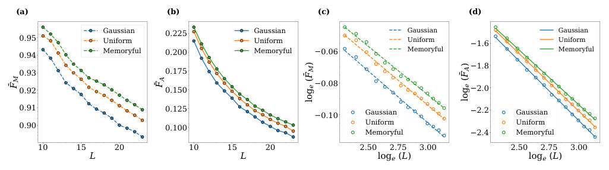
<figcaption class="paper-figure-caption"><b>Fig 5.</b> Figure 5. Scaling of ¯FM and ¯FM with system size (L). In panel (a), we present the maximum fidelity ¯FM as a function of the system size L, considering to L = 10, 11, 12, 13, 14, .., 22, 23. The orange, blue, and green dashed curves with circular markers correspond to uniform, Gaussian, and time-dependent memoryful disorders, respectively. Panel (b) shows the corresponding behavior of ¯FA for the same range of system sizes. The data points are represented using the same type of markers and color for the three types of disorders as in panel (a), but with different line styles (smooth lines). In panel (c), we perform a scaling analysis of ¯FM, demonstrating a clear log-log scaling behavior....</figcaption>
</figure>

**Summary.** The paper analyzes Quantum State Transfer in disordered many-body scar systems, comparing memoryful disorder against memoryless types. It finds that the presence of 'memory' in the disorder significantly boosts state transfer fidelity and robustness. This enhancement is linked to increased scarness and nonergodicity, suggesting a mechanism for designing quantum channels resistant to noise.

**Why it may be interesting.** This work directly addresses how structured randomness (memory) can stabilize quantum information transfer in complex many-body systems, which is crucial for understanding robust quantum computation protocols in realistic noisy environments.

Detailed structure

**Main problem.** The study investigates how incorporating 'memory' into disorder affects quantum communication, specifically Quantum State Transfer (QST), within many-body scar systems.

**Main result.** Memoryful disorder significantly enhances QST performance compared to memoryless disorders (uniform or Gaussian). This enhancement is correlated with a higher degree of scarness and larger Inverse Participation Ratios (IPR) for the optimal state.

**Method.** The analysis compares different disorder types using fidelity measures ($ar{F}_M$, $ar{F}_A$) and performs finite-size scaling analyses on these metrics. It also calculates the IPR to diagnose nonergodicity effects.

**Model / system.** The system is a one-dimensional many-body scar system governed by a complex Hamiltonian involving nearest-neighbor couplings and three-body interaction terms, subjected to disorder modeled as memoryful or memoryless (uniform/Gaussian).

**Key observables.** Maximum transfer fidelity ($ar{F}_M$), Fidelity Area ($ar{F}_A$), Degree of Scarness ($ar{S}$), Inverse Participation Ratio ($	ext{IPRM}$, $	ext{IPRA}$).

**Important parameters / regimes.** Disorder strength ($\sigma$), System size ($L$), and the type of disorder (memoryful vs. memoryless).

**Assumptions / limitations.** The analysis assumes that higher scarness and nonergodicity, promoted by memoryful disorder, are key factors enhancing state transfer fidelity.

**Figures summary.** Figures illustrate QST schematics, show the decay of $ar{F}_M$ and $ar{F}_A$ vs. disorder strength ($\sigma$), plot $ar{S}$ vs. $\sigma$, and display scaling analysis results for $ar{F}_M$ and $ar{F}_A$ with system size $L$.

**Paper structure.** The paper systematically compares three disorder types, quantifying performance using fidelity metrics, analyzing the role of scarness via revival measurements, and finally confirming the benefit of memory effects through scaling analysis and IPR calculations.

Abstract

We analyze how memory in disorder facilitates quantum communication in many-body scar systems. We consider three distinct types of disorder, viz., memoryful, and memoryless uniform and Gaussian, and compare their respective performances in facilitating quantum state transfer. Using the maximum transfer fidelity and fidelity area as figures of merit, we find that memoryful disorder yields a better performance than the memoryless disordered channels. Furthermore, the maximum transfer fidelity exhibits an initial parabolic decay with disorder strength, followed by a linear decrease, for all the disorder models considered. We introduce a degree of scarness, and show that it is higher for memoryful disorder in comparison to memoryless disorders, implying a role of scarness in the quantum state transfer protocol. We further perform a scaling analysis, revealing that memory effect in disorder is not only beneficial for short-distance but also long-distance quantum state transfer. Finally, we show that the state yielding the maximum transfer fidelity has larger inverse participation ratio for memoryful disorder in comparison to the other two disorders, highlighting the role of nonergodicity in enhancing state transfer.

[↑ back to top](#top)

### [Quantum solitons and their quantum walks in transmon arrays](http://arxiv.org/abs/2606.19339v1)

**Authors:** Ben Blain, Giampiero Marchegiani, Luigi Amico, Gianluigi Catelani  
**Type:** theory · **Category:** other · **PDF:** <https://arxiv.org/pdf/2606.19339v1>  
**Analysis basis:** full PDF text, analyzed in chunks
**Topic relevance:** 🔥 `analog quantum simulation` **4/5** · `non-equilibrium dynamics` **3/5** · `driven-dissipative phase transition` **2/5** · `methods for driven-dissipative` **2/5** · `non-equilibrium universality` **2/5** · `Frenkel-Kontorova` **1/5** · `Keldysh / 2PI / non-Gaussian methods` **1/5** · `correlated cavity matter` **1/5** · `entanglement & information structure` **1/5**

↔ Scroll figures horizontally

<figure class="paper-figure-card">
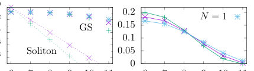
<figcaption class="paper-figure-caption"><b>Fig 1.</b> FIG. 1. Quantum solitons in the BH model. (a) Schematic showing the spectrum of Eq. (1) system as a function of the interaction strength for homogeneous hopping and chemical potential. As the interaction increases, a clear energy gap develops, with a soliton band (here labeled as B) composed of M states detaching from the rest of the spectrum. (b) Sorted eigenvalues of the Bose-Hubbard model in the soliton band. The dashed line shows a numerical approximation for N = 2 – see text for details. (c) Schematics showing the ground state of the BH model (top) and a spatially localised quantum soliton (bottom). (d) Per-site density of the ground state (GS, solid connecting lines) of the...</figcaption>
</figure>
<figure class="paper-figure-card">
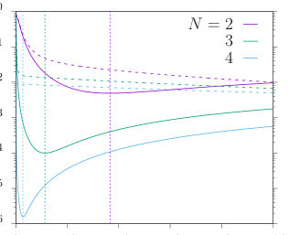
<figcaption class="paper-figure-caption"><b>Fig 2.</b> FIG. 2. The infidelity of a projected boson stack (solid lines) and a boson stack (dashed lines) with the ground state of the BH Hamiltonian Eq. (1) as a function of the pinning ∆µ6 in the central site for M = 11 and U = −10J. The dotted vertical lines identify the pinning at which minimum infidelity is found for the projected stack for each N.</figcaption>
</figure>
<figure class="paper-figure-card">
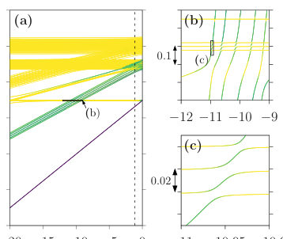
<figcaption class="paper-figure-caption"><b>Fig 3.</b> FIG. 3. Energy spectrum of the BH Hamiltonian as a function of central pinning strength ∆µ6 for N = 3 bosons, M = 11 sites, and U = −10J. The line color shows the overlap of each eigenstate with an N-particle boson stack on the central site. The dashed vertical line identifies the value of ∆µ6 for optimal ground state fidelity with a projected boson stack. (b)-(c) En- larged plots of the spectrum for energies En −ω01N ∼−NU and pinning ∆µ6 ∼U, for which the states |(N −1)6, 1i̸=6⟩ are quasi-degenerate with the boson stacks |Ni̸=6⟩(see text).</figcaption>
</figure>
<figure class="paper-figure-card">
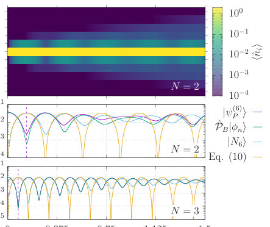
<figcaption class="paper-figure-caption"><b>Fig 4.</b> FIG. 4. The constant pinning protocol for soliton prepara- tion. (a) Time evolution starting from an N = 2 boson stack with constant strong pinning for ∆µ6 = −11.6J. Panels (b) and (c) show the infidelity I [|ψ⟩] of the evolved boson stack for N = 2, ∆µ6 = −11.6J, and N = 3, ∆µ6 = −19.7J, respectively, with the target quantum soliton in the uniform system (purple), the projector ˆPB over the soliton band of the uniform system (green), and the initial state (blue). In orange is the stack infidelity 1 −|⟨N6|ψ(t)⟩|2 from Eq. (10). The vertical dashed purple lines show the time of the min- ima of target state infidelity. Data is for the BH model with U = −10J, M = 11.</figcaption>
</figure>
<figure class="paper-figure-card">
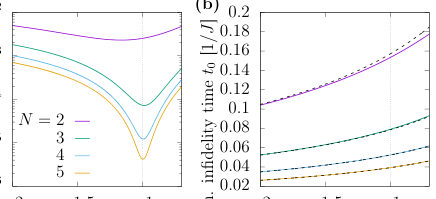
<figcaption class="paper-figure-caption"><b>Fig 5.</b> FIG. 5. Finding the parameters for the constant pinning protocol. (a) Plot of the minimum infidelity with a quantum soliton in the uniform system for a boson stack evolved in the time range 0 . . . 1/J in a system with constant pinning ∆µ6. (b) The time t0 at which the minimum infidelity is taken. The dashed horizontal lines show topt 0 for each N. The dotted vertical line is at ∆µ6 = U(N −1), intersections with data series giving the approximate value of topt 0 . Data is for the BH model with U = −10J, M = 11.</figcaption>
</figure>

**Summary.** This paper theoretically investigates the existence and preparation of quantum solitons in arrays of superconducting transmon qubits modeled by an attractive Bose-Hubbard Hamiltonian. By developing non-adiabatic state preparation protocols, the authors show that these localized soliton states can be reliably generated. The study further analyzes the unique quantum walk dynamics exhibited by these solitons compared to standard boson stacks.

**Why it may be interesting.** This work bridges superconducting circuit hardware with fundamental condensed matter physics concepts like solitons and quantum walks, providing a concrete roadmap for realizing complex many-body simulations on near-term quantum devices.

Detailed structure

**Main problem.** The study investigates quantum solitons and their associated quantum walks within superconducting transmon arrays, aiming to establish this platform for simulating complex many-body physics.

**Main result.** The research demonstrates that the system supports robust, spatially localized quantum soliton states whose preparation fidelity can be controlled via non-adiabatic protocols in superconducting circuits.

**Method.** Theoretical analysis using the Bose-Hubbard Hamiltonian, involving numerical diagonalization, adiabatic/non-adiabatic state preparation protocols, and time evolution simulations to track quantum walk dynamics.

**Model / system.** The physical system is a linear array of capacitively coupled transmons, modeled by an attractive Bose-Hubbard (BH) Hamiltonian. The analysis focuses on the emergence of a 'soliton band' in the energy spectrum when interactions are strong.

**Key observables.** Spatially localized quantum solitons, quantum interference patterns (quantum walk), correlation length ($\xi_C$), density decay length ($\xi_N$), and preparation fidelity ($I$).

**Important parameters / regimes.** Attractive interaction strength ($U < 0$), hopping parameter ($J$), particle number ($N=2, 3$), and pinning potential strengths ($\Delta\mu_6$).

**Assumptions / limitations.** The analysis relies on approximations for effective hopping terms in the strongly attractive regime and assumes dynamic tunability of chemical potentials for state preparation.

**Figures summary.** Figures illustrate the BH spectrum showing a soliton band, compare density profiles for different soliton construction protocols, and track time evolution of occupation numbers and infidelity during quench dynamics.

**Paper structure.** The paper progresses from establishing the theoretical framework (BH model) to comparing multiple state preparation protocols (projected stack vs. single-stack), detailing optimal non-adiabatic quenching procedures, and finally analyzing the resulting quantum walk dynamics by comparing soliton evolution against standard boson stacks.

Abstract

Superconducting qubits are artificial atoms whose spectra and interactions can be engineered through appropriate circuit design, a versatility that can be exploited for quantum simulation. We theoretically investigate a linear array of capacitively coupled transmons, effectively described by a Bose-Hubbard Hamiltonian with attractive interaction. We revisit the discrete-soliton nature of the lowest-energy band of the spectrum, and identify spatially localized quantum solitons. The solitonic character of these states is revealed through their time evolution, which displays a quantum interference pattern, or quantum walk, highlighting their composite nature. We discuss protocols for preparing spatially localized quantum solitons that are compatible with current state-of-the-art tunable-transmon circuits. Our results demonstrate that superconducting circuits provide a promising and experimentally accessible platform for the investigation of quantum soliton physics.

[↑ back to top](#top)

### [Quantum magic is necessary but not sufficient for wormhole-inspired teleportation](http://arxiv.org/abs/2606.19180v1)

**Authors:** Sudhanva Joshi, Sunil Kumar Mishra  
**Type:** theory · **Category:** quantum information and computing · **PDF:** <https://arxiv.org/pdf/2606.19180v1>  
**Analysis basis:** full PDF text, analyzed in chunks
**Topic relevance:** 🔥 `entanglement & information structure` **4/5** · `methods for driven-dissipative` **3/5** · `non-equilibrium dynamics` **3/5** · `non-equilibrium universality` **2/5** · `Keldysh / 2PI / non-Gaussian methods` **1/5** · `analog quantum simulation` **1/5** · `correlated / nonlocal dissipation` **1/5** · `driven-dissipative phase transition` **1/5**

↔ Scroll figures horizontally

<figure class="paper-figure-card">
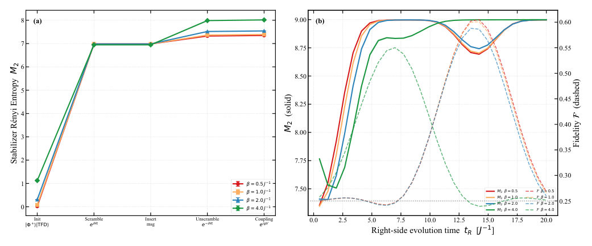
<figcaption class="paper-figure-caption"><b>Fig 1.</b> FIG. 1: Protocol-resolved magic dynamics in the SYK WITP at Nmaj = 10. (a) Disorder-averaged SRE M2 at each discrete protocol stage for four inverse temperatures β. The dominant magic generation occurs during scrambling (Stage 1), with a secondary β-dependent increase at the coupling stage (Stage 4). (b) M2 (solid lines, left axis) and teleportation fidelity F (dashed lines, right axis) during right-side evolution. The gravitational regime (β = 4.0 J−1, green) peaks in fidelity earliest but at a lower value, while the peaked-size regime (β = 0.5 J−1, red) achieves the highest fidelity at late times after M2 has nearly saturated. Error bands represent the standard error of the mean over Navg...</figcaption>
</figure>
<figure class="paper-figure-card">
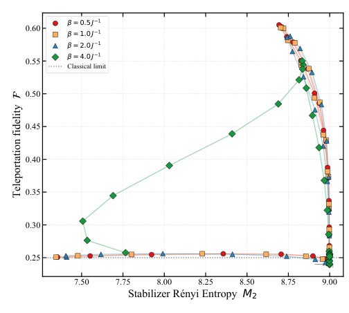
<figcaption class="paper-figure-caption"><b>Fig 2.</b> FIG. 2: Parametric fidelity–magic trajectories during right-side evolution. Each point corresponds to a value of tR; arrows indicate the direction of increasing tR. The gravitational regime (β = 4.0 J−1, green diamonds) shows fidelity rising concurrently with M2, while the peaked-size regime (β = 0.5, 1.0 J−1, red circles and orange squares) remains at the classical limit F = 0.25 until M2 approaches its saturation value, at which point fidelity rises abruptly. The dotted line marks the classical limit.</figcaption>
</figure>
<figure class="paper-figure-card">
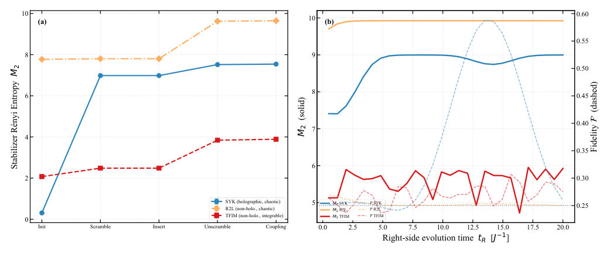
<figcaption class="paper-figure-caption"><b>Fig 3.</b> FIG. 3: Comparison of magic dynamics across three models at β = 2.0 J−1, Nmaj = 10. (a) Stage-resolved SRE. The R2L model generates near-maximal magic (M2 ≈9.8, close to M Haar 2 = 10.0), while the TFIM remains at low magic throughout. (b) M2 (solid, left axis) and F (dashed, right axis) during right-side evolution. Only the SYK model (blue) achieves a clear fidelity peak above the classical limit. The R2L model (orange) thermalizes to near-Haar-random magic but fails to teleport, demonstrating that raw non-stabilizerness does not predict teleportation success. The TFIM (red) shows integrable finite-size oscillations.</figcaption>
</figure>
<figure class="paper-figure-card">
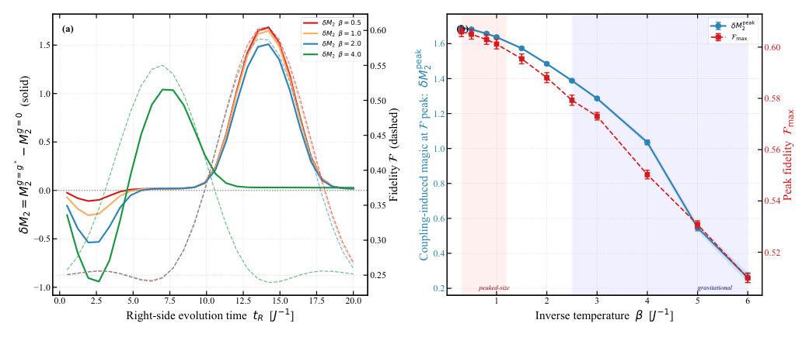
<figcaption class="paper-figure-caption"><b>Fig 4.</b> FIG. 4: Baseline-subtracted magic during wormhole traversal. (a) δM2(tR) = M (g=g∗) 2 (tR) −M (g=0) 2 (tR) (solid, left axis) and fidelity F (dashed, right axis) for four temperatures. At early tR, δM2 &lt; 0 indicates that the coupling suppresses magic relative to the uncoupled baseline; at later times, δM2 peaks near the fidelity maximum, reflecting the channeling of non-stabilizer resources into the teleportation signal. (b) δM peak 2 (blue, left axis) and Fmax (red, right axis) across an eleven-point β grid. Both decrease monotonically with β, confirming a quantitative link between coupling-induced magic and teleportation performance. Shaded regions indicate the peaked-size (red) and...</figcaption>
</figure>
<figure class="paper-figure-card">
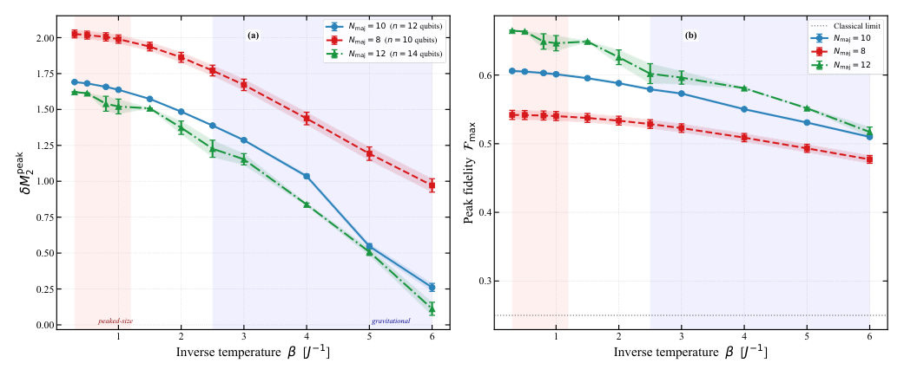
<figcaption class="paper-figure-caption"><b>Fig 5.</b> FIG. 5: Finite-size scaling of the magic channeling diagnostic across three system sizes. (a) δM peak 2 vs β for Nmaj = 8 (red squares, ntot = 10), 10 (blue circles, ntot = 12), and 12 (green triangles, ntot = 14). All three sizes decrease monotonically with β, and the decrease steepens with system size, indicating a sharpening regime separation. (b) Peak fidelity Fmax vs β for the same three sizes; the larger system achieves higher fidelity while preserving the qualitative β-dependence. All data use Navg = 30. Shaded regions indicate the peaked-size and gravitational regimes.</figcaption>
</figure>

**Summary.** This work characterizes how 'quantum magic,' quantified by the Stabilizer Rényi Entropy, governs wormhole-inspired teleportation in the SYK model. The key finding is that raw non-stabilizerness is insufficient; successful transfer depends on a structured redistribution of these resources, which manifests differently depending on the system's temperature regime.

**Why it may be interesting.** It provides a powerful, quantifiable diagnostic tool ($\delta M^2$) that distinguishes between generic quantum scrambling and structured resource channeling required for non-trivial quantum operations like teleportation.

Detailed structure

**Main problem.** The study investigates the role of 'Quantum magic' (non-stabilizerness) in facilitating wormhole-inspired quantum teleportation protocols.

**Main result.** Successful teleportation requires not just a large amount of non-stabilizerness, but rather a structured redistribution of these resources, which is qualitatively different between high and low temperature regimes.

**Method.** The authors track the Stabilizer Rényi Entropy (SRE) across multiple stages of the protocol using time evolution simulations and comparing results against known control models.

**Model / system.** The analysis uses the Sachdev-Ye-Kitaev (SYK) model dynamics on a double system ($L \otimes R$) to simulate the Wormhole-Inspired Teleportation Protocol (WITP).

**Key observables.** Stabilizer Rényi Entropy (SRE), Teleportation Fidelity ($F$), and baseline-subtracted magic diagnostic ($\delta M^2$).

**Important parameters / regimes.** Inverse temperature ($eta$) controlling the system regime (gravitational vs. peaked-size) and coupling strength ($g$).

**Assumptions / limitations.** The analysis relies on finite-$N$ numerics for SRE calculation, which is noted to obscure some traditional holographic signatures.

**Figures summary.** Figures illustrate parametric trajectories of Fidelity vs. Magic in different temperature regimes, showing distinct functional dependencies and evidence of trajectory collapse when normalized by the Haar-typical value.

**Paper structure.** The paper systematically analyzes the protocol stages (scrambling $
ightarrow$ coupling $
ightarrow$ extraction), contrasting results from SYK against random/integrable models to isolate the necessary structural requirements for information transfer.

Abstract

We investigate the dynamics of Quantum magic, formally known as non-stabilizerness, quantified by the stabilizer Rényi entropy (SRE), across the stages of the wormhole-inspired teleportation protocol (WITP) in the Sachdev-Ye-Kitaev (SYK) model. By tracking the SRE of the full pure state across scrambling, message insertion, left-right coupling, and right-side extraction, we uncover a regime-dependent relationship between magic accumulation and teleportation fidelity. In the gravitational (low temperature) regime, fidelity rises concurrently with magic from early times, whereas in the peaked-size (high temperature) regime, the magic saturates near the Haar-typical value before teleportation onset. A baseline-subtracted diagnostic comparing coupled and uncoupled protocols reveals that the double-trace coupling first suppresses and then channels non-stabilizer resources toward the teleportation signal, with the channel amplitude decreasing monotonically with inverse temperature. Comparison with a chaotic random two-local model, which generates near-maximal magic yet fails to teleport, demonstrates that structured magic redistribution, rather than raw non-stabilizerness, underlies successful wormhole traversal. Moreover, the magic transiently dips at the fidelity peak, marking the teleportation event in the time domain. Our results are robust across the three system sizes studied ($N_{\mathrm{maj}}=8,10,12$), and the fidelity-magic trajectories exhibit an approximate collapse across system sizes when the SRE is normalized by the Haar-typical prediction.

[↑ back to top](#top)

### [Mimicry of chaos and $k$-design in higher order OTOCs of Luttinger liquids](http://arxiv.org/abs/2606.18800v1)

**Authors:** Balázs Dóra, Catalin Pascu Moca, Roderich Moessner  
**Type:** theory · **Category:** strongly correlated electrons · **PDF:** <https://arxiv.org/pdf/2606.18800v1>  
**Analysis basis:** full PDF text, analyzed in chunks
**Topic relevance:** 🔥 `entanglement & information structure` **4/5** · `non-equilibrium dynamics` **3/5** · `non-equilibrium universality` **2/5** · `Keldysh / 2PI / non-Gaussian methods` **1/5** · `Kondo & dissipative impurity` **1/5** · `analog quantum simulation` **1/5** · `exotic spin models in light-matter` **1/5** · `methods for driven-dissipative` **1/5** · `scars & prethermalization` **1/5**

↔ Scroll figures horizontally

<figure class="paper-figure-card">
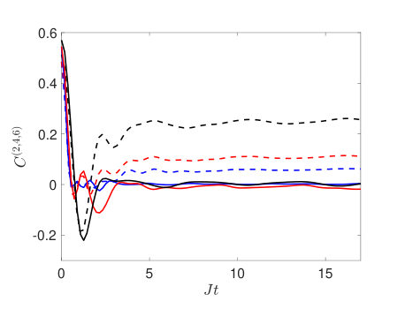
<figcaption class="paper-figure-caption"><b>Fig 1.</b> FIG. 1. The time evolution of the C(6) (blue), C(4) (red) and C(2) (black) of Eq. (5) is shown for the XXZ model with N = 26 for ∆= 0.2 (dashed lint) and 0.6 (solid line). After an initial transient time ∼1/J, the OTOCs saturate fast to their steady state values. For ∆= 0.6 (solid lines), the steady state values are almost vanishing and mimic high scrambling with unitary 2-, 4- and 6-design structures.</figcaption>
</figure>
<figure class="paper-figure-card">
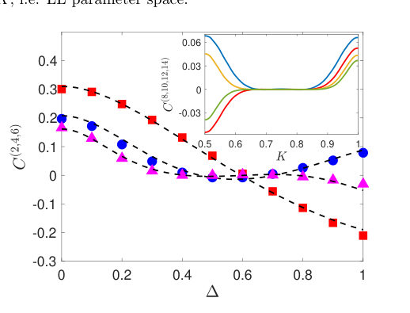
<figcaption class="paper-figure-caption"><b>Fig 2.</b> FIG. 2. The long time limit of the k = 1 (red square), 2 (blue circle) and 3 (magenta triangle) OTOC of the staggered part of the spin density is shown for the XXZ chain with N = 26 inside the light cone. The symbols are the numerical data from ED, the lines are Eqs. (10), (11) and (13) with λ = 2 and c = Kπ. The cos(2c) is shifted by 0.24 for the k = 1, 2 OTOCs and by 0.16 for the k = 3 version to account for the background signal in the numerics due to a) additional power law decaying terms, b) the long wavelength part of the spin density and c) interplay between long and short wavelength terms. No other fitting parameters are used. The inset shows the k = 4, 5, 6, 7 OTOC in the long time...</figcaption>
</figure>

**Summary.** The paper analyzes higher-order Out-of-Time-Order Correlators in Luttinger liquids to probe information scrambling. By mapping the late-time saturation of these correlators onto the partition function of a non-Hermitian Harper model, the authors demonstrate that LLs exhibit complex, apparent chaotic behavior even when viewed through high-order diagnostics.

**Why it may be interesting.** This work connects advanced concepts of quantum chaos (OTOCs) with specific condensed matter models (LL), providing a powerful diagnostic tool for characterizing scrambling dynamics beyond standard quadratic measures.

Detailed structure

**Main problem.** The study investigates higher-order generalizations of Out-of-Time-Order Correlators (OTOCs) to provide a detailed metric for quantum chaos and information scrambling in interacting quantum systems.

**Main result.** Higher-order OTOCs saturate to steady-state values that map exactly onto the partition function of a non-Hermitian Harper model, revealing an unexpectedly profound degree of apparent scrambling in Luttinger liquids.

**Method.** The authors employ bosonization techniques and detailed numerical calculations to extract the time evolution of higher-order correlators up to the seventh order.

**Model / system.** The primary systems studied are Luttinger liquids (LL) and their lattice realization, the spin-1/2 XXZ Heisenberg chain. The analysis uses low-energy bosonic descriptions derived from these models.

**Key observables.** Higher-order OTOCs, denoted $C(2k)(t)$, which measure information scrambling and are compared to indicators of quantum chaos like higher-$k$-design formation.

**Important parameters / regimes.** The Luttinger liquid parameter ($K$) controls the interaction strength; the analysis distinguishes between non-interacting ($K=1$) and interacting regimes.

**Assumptions / limitations.** The analysis relies on the validity of the LL description for low-energy physics, and approximations are made regarding power law decaying terms in the late time limit.

**Figures summary.** Figures illustrate the fast saturation of $C(6)$, $C(4)$, and $C(2)$ to steady states. For stronger interactions ($\Delta=0.6$), these steady-state values approach zero, mimicking high scrambling with unitary 2-, 4-, and 6-design structures.

**Paper structure.** The paper systematically introduces OTOCs, develops the formalism for higher-order correlators using bosonization, calculates their time evolution in LL/XXZ chains, establishes the mapping to the Harper model partition function, and interprets the results regarding $k$-design formation.

Abstract

Out-of-time-order correlators (OTOCs) provide a fundamental metric for quantum chaos, but capturing the fine structure of information scrambling requires exploring their higher-order generalizations. Here, we systematically investigate the sequence of higher-order OTOCs in a Luttinger liquid and its lattice realization, the XXZ Heisenberg chain. Using bosonization and numerics, we extract the full temporal dynamics of the first three OTOCs, revealing that they rapidly erase memory of the initial state, and quickly saturate to their steady state values. Strikingly, we show that calculating the late time saturation values for the entire sequence of higher-order OTOCs maps exactly onto determining the partition function of a non-Hermitian Harper model. Through this mapping, we demonstrate that for moderately strong interactions, the steady-state OTOCs become parametrically small up to the seventh order, mimicking higher $k$-design. Our results reveal that Luttinger liquids exhibit an unexpectedly profound degree of apparent scrambling when viewed through the lens of higher-order OTOCs.

[↑ back to top](#top)

### [Probing chaos and thermalization through out-of-time-ordered correlators in random field spin chains](http://arxiv.org/abs/2606.18982v1)

**Authors:** C Jisha, Shivam Mishra, Ravi Prakash  
**Type:** theory · **Category:** statistical mechanics · **PDF:** <https://arxiv.org/pdf/2606.18982v1>  
**Analysis basis:** full PDF text, analyzed in chunks
**Topic relevance:** 🔥 `entanglement & information structure` **4/5** · `non-equilibrium dynamics` **3/5** · `analog quantum simulation` **2/5** · `non-equilibrium universality` **2/5** · `correlated / nonlocal dissipation` **1/5** · `driven-dissipative phase transition` **1/5** · `exotic spin models in light-matter` **1/5** · `scars & prethermalization` **1/5**

↔ Scroll figures horizontally

<figure class="paper-figure-card">
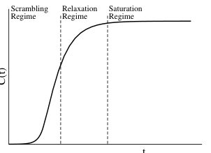
<figcaption class="paper-figure-caption"><b>Fig 1.</b> FIG. 1. A schematic depicting the scrambling, relxation and saturation regime of OTOC.</figcaption>
</figure>
<figure class="paper-figure-card">
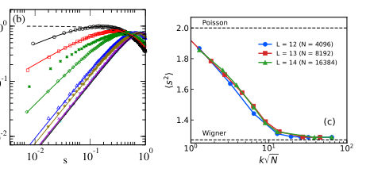
<figcaption class="paper-figure-caption"><b>Fig 2.</b> FIG. 2. Spacing distributions for Hamiltonian HII for several values of field strength k on (a) linear, and (b)log-log scale. The eigen-energies are unfolded using Eq. (3). Symbols rep- resent the numerical data and solid lines represent the fitting curves for the spacing distribution, P(s) = c0sγ exp(−c1sα). For 0.1 ≤k ≤3, γ = 1. (c) The crossover scales as 1/ √</figcaption>
</figure>
<figure class="paper-figure-card">
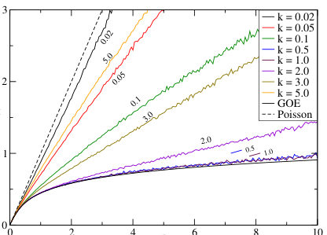
<figcaption class="paper-figure-caption"><b>Fig 3.</b> FIG. 3. Number variance statistic for different field strengths.</figcaption>
</figure>
<figure class="paper-figure-card">
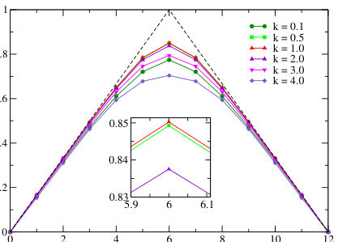
<figcaption class="paper-figure-caption"><b>Fig 4.</b> FIG. 4. Average entanglement entropy of midspectrum eigen- states for the Hamiltonian HII. The size of the subsystem SA is varied as LA = 0, 1..., 12 for values of the crossover param- eter 0.1 ≤k ≤4. The dashed line represents the maximum entanglement entropy Smax A .</figcaption>
</figure>
<figure class="paper-figure-card">
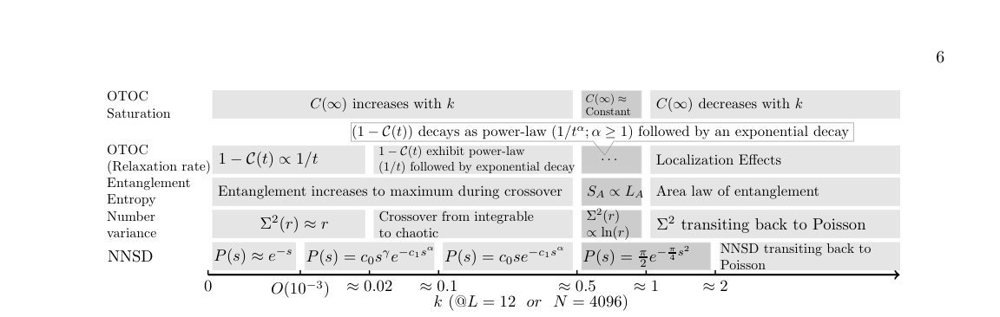
<figcaption class="paper-figure-caption"><b>Fig 5.</b> FIG. 5. A schematic to summarize crossover from integrability to chaos in NNSD, number variance statistic, entanglement entropy, and OTOC. Dark shaded blocks correspond to agreement with RMT or completely thermalized cases.</figcaption>
</figure>

**Summary.** The paper uses Out-of-Time-Ordered Correlators and spectral statistics to probe quantum chaos in a random field spin chain. It establishes that the decay dynamics of these correlators—specifically distinguishing between power-law and exponential relaxation—can precisely map out the transition from integrable to chaotic or localized phases as disorder increases.

**Why it may be interesting.** This work provides quantitative signatures for quantum chaos in disordered many-body systems, offering robust theoretical tools (like OTOC analysis) to distinguish fundamental dynamical regimes relevant to non-equilibrium physics.

Detailed structure

**Main problem.** The study investigates how quantum chaos and thermalization manifest in many-body systems by analyzing Out-of-Time-Ordered Correlators (OTOCs). The goal is to distinguish between different dynamical regimes, such as integrable, chaotic, and Many-Body Localized (MBL) phases.

**Main result.** The OTOC dynamics provide a clear diagnostic tool: integrable systems show power-law $(1/t)$ relaxation, while chaotic systems exhibit higher-degree power-law decay followed by exponential relaxation. Spectral statistics like the number variance confirm these transitions across different disorder strengths.

**Method.** The authors use theoretical diagnostics including OTOCs, Nearest Neighbor Spacing Distribution (NNSD), and Number Variance ($\Sigma_2(r)$) applied to a random field spin chain Hamiltonian. They analyze the time evolution of these quantities in different energy eigenbases.

**Model / system.** The system is a Heisenberg spin-1/2 chain subjected to random fields, described by $H_{II} = H_I + \sum h_i\sigma_x^i + \sum g_i\sigma_z^i$. The disorder strength ($k$) acts as the primary tuning parameter controlling the transition between integrable, chaotic, and MBL regimes.

**Key observables.** Out-of-Time-Ordered Correlators (OTOCs), Number Variance ($\Sigma_2(r)$), Nearest Neighbor Spacing Distribution (NNSD), and Entanglement Entropy ($S_A$).

**Important parameters / regimes.** Disorder strength ($k$), time $t$, and the comparison between power-law decay vs. exponential decay rates.

**Assumptions / limitations.** The analysis relies on comparing numerical results to predictions from Random Matrix Theory (RMT) and utilizing the Eigenstate Thermalization Hypothesis (ETH) for long-time saturation values.

**Figures summary.** Figures illustrate the crossover of NNSD from Poisson to Wigner statistics with increasing disorder, plot $\Sigma_2(r)$ showing transitions between linear and GOE behavior, and track OTOC decay rates distinguishing power-law vs. exponential relaxation.

**Paper structure.** The paper systematically analyzes the dynamics across three time regimes (scrambling, relaxation, saturation) using multiple diagnostics (OTOCs, spectral statistics). It maps out a phase diagram based on disorder strength ($k$), confirming transitions between integrable, chaotic, and MBL phases.

Abstract

Out-of-time-ordered correlators (OTOCs) have emerged as a diagnostic of information scrambling and quantum chaos in many-body systems. We investigate the imprints of chaos in the dynamics of OTOCs in the Heisenberg spin-$1/2$ chain with random fields. The system is parameterized to exhibit a crossover from integrable to chaotic dynamics. We demonstrate numerically that the approach to saturation of the OTOC can distinguish between integrable and chaotic regimes, with a power-law $(1/t)$ relaxation for integrable systems and a higher-degree power-law decay $(1/t^α; α\ge 1)$ followed by an exponential relaxation for the chaotic regime. We further show that long-range spectral statistics, such as the number variance, are more effective in characterizing quantum chaos in the regime near saturation of OTOC. We also demonstrate that the relaxation and initial scrambling regimes exhibit distinct and universal features, with the former being sensitive and the latter being robust against different realizations of random-fields. The long-time saturation of OTOC also fluctuates with different realizations, and its exact expression is derived through the Eigenstate Thermalization Hypothesis.

[↑ back to top](#top)

### [Ghosts versus Unstable Particles in Quantum Field Theory](http://arxiv.org/abs/2606.18349v1)

**Authors:** Luca Buoninfante  
**Type:** theory · **Category:** other · **PDF:** <https://arxiv.org/pdf/2606.18349v1>  
**Analysis basis:** full PDF text, analyzed in chunks
**Topic relevance:** 🔥 `Keldysh / 2PI / non-Gaussian methods` **4/5** · `methods for driven-dissipative` **3/5** · `non-equilibrium dynamics` **3/5** · `driven-dissipative phase transition` **2/5** · `correlated / nonlocal dissipation` **1/5** · `non-equilibrium universality` **1/5**

↔ Scroll figures horizontally

<figure class="paper-figure-card">
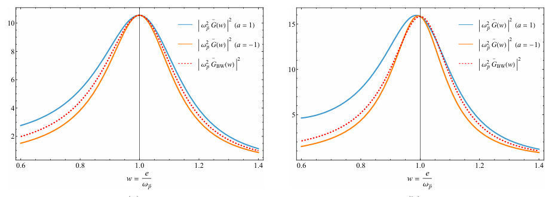
<figcaption class="paper-figure-caption"><b>Fig 1.</b> Figure 1: The behavior of |ω2 ⃗p ¯G(w)|2 as a function of w = e/ω⃗p is shown for both the ordinary (a = 1, blue line) and ghost (a = −1, orange line) cases, and compared with the Breit-Wigner function |ω2 ⃗p ¯GBW(w)|2 (red dashed line). For illustrative purposes, (a) in the left panel we set g2/(32π2ω2 ⃗p) = 0.1, m/ω⃗p = 1, and µ/ω⃗p = 0.1, which give Γ/ω⃗p ≃0.31; (b) in the right panel the same values of parameters are chosen except for µ/ω⃗p = 0.3, giving Γ/ω⃗p ≃0.25.</figcaption>
</figure>
<figure class="paper-figure-card">
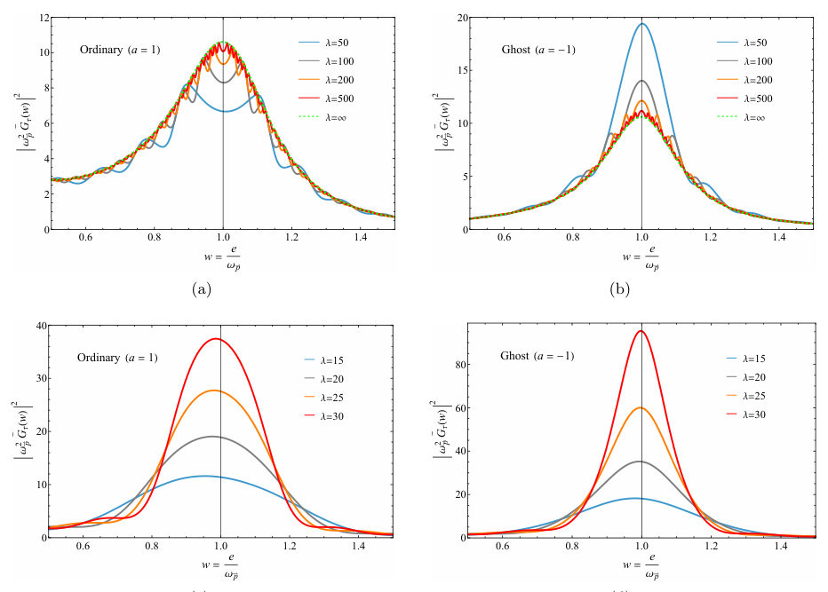
<figcaption class="paper-figure-caption"><b>Fig 2.</b> Figure 2: The behavior of |ω2 ⃗p ¯Gτ(w)|2 as a function of w = e/ω⃗p is shown for different values of λ ≡ω⃗pτ. Panels (a) and (b) contain the plots with λ = 50 (blue line), λ = 100 (gray line), λ = 200 (orange line), λ = 500 (red line), and λ = ∞(green dashed line), for g2/(32π2ω2 ⃗p) = 0.1. Panels (c) and (d) contain the plots with λ = 15 (blue line), λ = 20 (gray line), λ = 25 (orange line), and λ = 30 (red line), for g2/(32π2ω2 ⃗p) = 0.01. The left panels correspond to the ordinary case, while the right panels to the ghost case. In all plots we set m/ω⃗p = 0.95 and µ/ω⃗p = 0.1.</figcaption>
</figure>
<figure class="paper-figure-card">
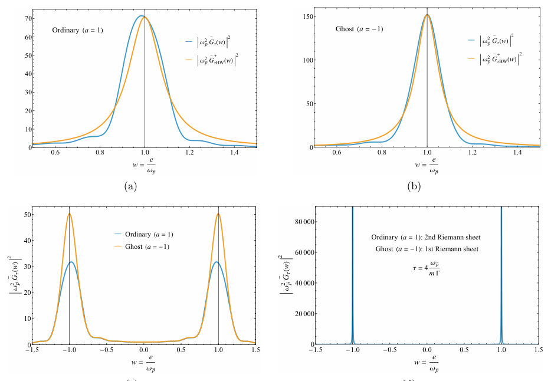
<figcaption class="paper-figure-caption"><b>Fig 3.</b> Figure 3: In the upper panels, the behaviors of |ω2 ⃗p ¯Gτ(w)|2 (blue line) and |ω2 ⃗p ¯G+ τBW(w)|2 (orange line) around the positive-energy peak are compared for λ ≡ω⃗pτ = 40; (a) corresponds to the ordinary case, while (b) to the ghost case. Panel (c) shows |ω2 ⃗p ¯Gτ(w)|2 as a function of w = e/ω⃗p in the ordinary (blue line) and ghost (orange line) cases, for λ = ω⃗pτ = 25. Panel (d) shows |ω2 ⃗p ¯Gτ(w)|2 in the ordinary (ghost) case in the second (first) Riemann sheet, for τ = 4ω⃗p/(mΓ) ⇔ Γeff = 3mΓ/(2ω⃗p). In all plots we set m/ω⃗p = 1, µ/ω⃗p = 0.4, and g2/(32π2ω2 ⃗p) = 0.01.</figcaption>
</figure>
<figure class="paper-figure-card">
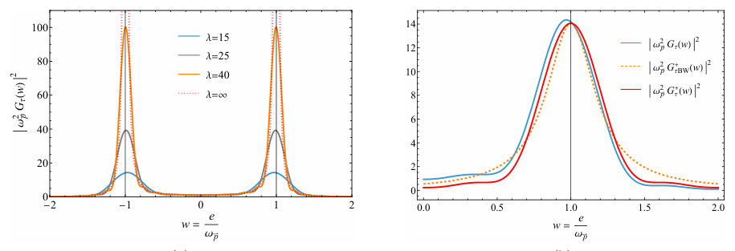
<figcaption class="paper-figure-caption"><b>Fig 4.</b> Figure 4: (a) The behavior of |ω2 ⃗pGτ(w)|2 as a function of the dimensionless energy variable w = e/ω⃗p is plotted for different values of λ = ω⃗pτ : λ = 15 (blue solid line), λ = 25 (gray solid line), λ = 40 (orange solid line), and λ = ∞(red dotted line). (b) The behaviors of |ω2 ⃗pGτ(w)|2</figcaption>
</figure>

**Summary.** This theoretical paper distinguishes between decaying unstable particles and unphysical 'ghost' states by examining their propagators. By comparing infinite-time limits with finite-time formulations, the authors argue that ghosts cannot exist as freely propagating asymptotic states. The work provides a detailed framework for understanding how time duration affects the observable signatures of particle decay versus quantum field pathologies.

**Why it may be interesting.** While focused on QFT fundamentals, the methodology of analyzing time evolution in finite windows to resolve asymptotic ambiguities is highly relevant for open quantum systems and non-equilibrium dynamics where boundary conditions (like finite measurement times) are crucial.

Detailed structure

**Main problem.** The paper elucidates the physical distinction between 'ghost' particles (negative norm states) and standard unstable particles within Quantum Field Theory (QFT). It specifically contrasts their behavior when analyzed in infinite versus finite time.

**Main result.** The study concludes that freely propagating ghost particles do not exist in the asymptotic limit, as their one-particle state is masked by multi-particle interference. Finite-time analysis reveals distinct temporal regimes governing particle dynamics.

**Method.** The authors analyze the dressed propagator by resumming radiative corrections and comparing analytic structures (pole locations on Riemann sheets) across infinite and finite time intervals ($	au$).

**Model / system.** The model involves scalar fields $\chi$ and $\phi$ interacting via $L_{	ext{int}} = g \phi \chi^2$. The analysis is generalized to include models relevant for quantum gravity, such as quadratic gravity.

**Key observables.** Dressed propagator ($ar{G}$), spectral density ($
ho$), resonance peak width and height, and the asymptotic pole structure in the complex momentum plane.

**Important parameters / regimes.** Time interval $	au$, particle mass $m$, coupling constant $g$, and the distinction between ordinary ($a=1$) and ghost ($a=-1$) field parameters.

**Assumptions / limitations.** The analysis relies heavily on approximations, including the narrow-width approximation ($\Gamma/m \ll 1$) and assuming large time intervals ($	au \gg 1/\omega_{\vec{p}}$) for certain derivations.

**Figures summary.** Figures compare the modulus squared of the dressed propagator for ordinary vs. ghost cases against the standard Breit-Wigner form, showing how finite-time effects amplify differences in resonance behavior.

**Paper structure.** The paper progresses by first establishing the infinite-time asymptotic picture (comparing pole structures) and then developing a detailed analysis using finite-time propagators ($ar{G}_	au$), identifying distinct temporal regimes that govern whether free-particle, resonant, or multi-particle decay dominates.

Abstract

We elucidate the physical nature of ghosts above the multi-particle threshold by contrasting them with unstable particles in quantum field theory. We first consider the asymptotic formulation, where ordinary positive-norm one-particle states can be unstable and decay, whereas ghosts survive asymptotically without decaying, yet admit no particle interpretation due to interference with the multi-particle component which masks the negative-norm one-particle state. This distinction originates from two different analytic structures of the dressed propagator, whose complex conjugate poles lie in the first or second Riemann sheet in the ghost or ordinary case, respectively. Ghost resonances are, in principle, phenomenologically distinguishable from ordinary ones, being narrower and exhibiting weaker interference between positive- and negative-energy peaks. We then formulate the quantum field theory in a finite interval of time and, working within a suitable approximation for the dressed propagator, find that finite-time effects amplify differences in the resonant behavior and give rise to new features, such as higher peaks in ghost resonances. Distinct temporal regimes are also identified: for times shorter than the inverse width, an approximate free-particle description is valid, whereas at later times interactions and interference effects dominate, leading to decay or multi-particle masking. Complex poles in the dressed propagator emerge only at late times and become complex-conjugate pairs asymptotically, determining the asymptotic dynamics. This study supports the absence of freely propagating ghost particles in the asymptotic limit.

[↑ back to top](#top)

### [Characterization of nested Walsh parity-check filters in a single-photon eight-mode register on a cloud photonic processor](http://arxiv.org/abs/2606.18408v1)

**Authors:** Emma Tully, Jonathan Washburn, Megan Simons  
**Type:** experiment · **Category:** quantum information and computing · **PDF:** <https://arxiv.org/pdf/2606.18408v1>  
**Analysis basis:** full PDF text, analyzed in chunks
**Topic relevance:** 🔥 `QC/QI experiment` **4/5** · `quantum optics experiment` **3/5** · `quantum measurements` **2/5** · `analog quantum simulation` **1/5** · `entanglement & information structure` **1/5** · `interference shaping light` **1/5** · `non-equilibrium dynamics` **1/5**

↔ Scroll figures horizontally

<figure class="paper-figure-card">
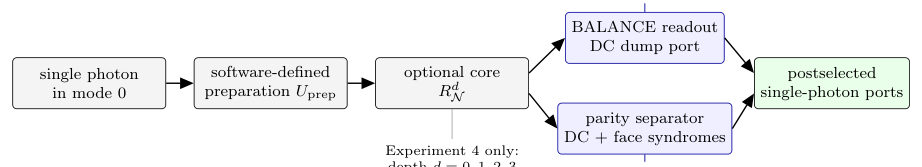
<figcaption class="paper-figure-caption"><b>Fig 1.</b> FIG. 2. Experimental workflow for the single-photon hardware tests. A software-defined preparation unitary maps the injected single photon to a target neutral or parity-checked input state. Depending on the experiment, the prepared state is sent directly to a separator or first through d applications of the neutral-sector unitary core RN . BALANCE readout measures the DC leakage channel, while the parity separator routes the DC/sum and face-parity syndrome channels to output ports. All reported probabilities are normalized to postselected single-photon detections across the eight logical ports.</figcaption>
</figure>
<figure class="paper-figure-card">
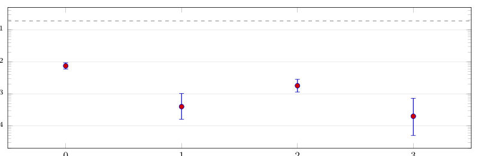
<figcaption class="paper-figure-caption"><b>Fig 2.</b> FIG. 3. Dump probability at the tested neutral-sector core depths on a logarithmic scale (Experiment 4). These are four operating-depth points (0, 1, 2, 3 applications) with a non-monotonic ordering, not a depth scan: no curve is fit through them and the figure should not be read as a depth-scaling trend (a dedicated ∼10–20 cycle scan, deferred to future work, would be required to extract a per-cycle leakage rate). Markers are the hardware values; vertical bars are 95% Wilson confidence intervals. The dashed line is the non-neutral control level (ˆp = 0.190, the 1× control; the no-core-cycle control agrees at 0.196, statistically indistinguishable from it, so the core does not by itself...</figcaption>
</figure>

**Summary.** The research characterizes the implementation of nested Walsh parity-check filters on an eight-mode photonic processor to encode and protect single-photon states. By measuring leakage suppression and syndrome routing fidelity across hundreds of thousands of shots, the authors validate the feasibility of using such hardware for quantum error correction primitives. This work advances the understanding of physical limitations in scaling fault-tolerant quantum computation.

**Why it may be interesting.** This work provides a crucial, highly detailed experimental benchmark for implementing abstract quantum error-correcting principles using near-term linear optical hardware, directly addressing resource limitations in physical realization.

Detailed structure

**Main problem.** The paper characterizes the faithful implementation of nested Walsh parity-check filters on a photonic processor to encode and protect quantum states in a single-photon eight-mode register.

**Main result.** They successfully demonstrated high fidelity for subspace projection, achieving significant suppression factors ($\approx 21	imes$) for residual leakage compared to ideal baselines, while confirming the structure of syndrome routing channels.

**Method.** The methodology involves performing single-photon measurements on a cloud photonic processor, testing the physical realization of abstract quantum error-correcting codes (like the extended Hamming code) via path/mode encodings.

**Model / system.** The system uses a single-photon eight-mode spatial register indexed by the vertices of a 3-cube ($Q_3$) on Quandela's Belenos processor. The encoding realizes subspaces corresponding to classical codes, such as the zero-sum neutral subspace and the $[8,4,4]$ extended Hamming code.

**Key observables.** Residual DC-port leakage (mean $0.6\%$), selectivity of face-parity syndrome channels ($94$-$99\%$), and Hong-Ou-Mandel visibility degradation/recovery.

**Important parameters / regimes.** Number of detections ($>340,000$); suppression factors ($\approx 21	imes$); fixed-pattern separator bias ($\pm 0.02$).

**Assumptions / limitations.** The measurements are conditional on postselected single-photon detections and do not demonstrate full error correction or protection against photon loss.

**Figures summary.** Figures illustrate the $Q_3$ vertex layout, the Gray-code Hamiltonian cycle ordering modes for the core, and show leakage/dump probabilities as a function of applied unitary depth or error injection strength.

**Paper structure.** The paper progresses by first defining the theoretical encoding (nested filters realizing specific codes), then detailing the experimental setup on the photonic chip, followed by quantitative measurements of leakage suppression, syndrome routing fidelity, and diagnostic tests like HOM visibility degradation.

Abstract

We characterize two nested Walsh parity-check filters implemented on Quandela's Belenos cloud photonic processor in a single-photon eight-mode spatial register. The modes are indexed by the vertices of the cube $Q_3$. The filters realize the classical $[8,7,2]$ single-parity-check code, the zero-sum neutral subspace $\mathcal{N}$ and the $[8,4,4]$ extended Hamming code, the parity-checked subspace $\mathcal{S}\subset\mathcal{N}$ with one DC and three face-parity syndrome channels. These are first-quantized path/mode encodings of classical codes: the experiment verifies leakage suppression and syndrome routing, not error correction or protection against photon loss, and all probabilities are conditional on postselected single-photon detections. Across more than 340,000 detections, neutral inputs show residual DC-port leakage of $0.02\%$-$1.1\%$ (mean $0.6\%$), corresponding to $\approx21\times$ suppression relative to the ideal $0.125$ DC-capture baseline and $31.6\times$ relative to the measured non-neutral control. Injected DC contamination gives a monotonic soft error signal, and the three face-parity syndrome channels route to their predicted ports with $94$-$99\%$ selectivity. A sector-preserving unitary core keeps leakage far below non-neutral controls over one to three applications, with differences dominated by calibration and compilation systematics rather than gate-cycle physics. We quantify these limits, including fixed-pattern separator bias, $\pm 0.02$ calibration offsets, and compilation scatter near the $10^{-3}$ leakage level, and report a Hong-Ou-Mandel degradation episode in which suppression vanished and recovered after recalibration.

[↑ back to top](#top)

### [Matrix Product Operators In The Age of Block Encoding](http://arxiv.org/abs/2606.19083v1)

**Authors:** Eugene Dumitrescu  
**Type:** theory · **Category:** quantum information and computing · **PDF:** <https://arxiv.org/pdf/2606.19083v1>  
**Analysis basis:** full PDF text, analyzed in chunks
**Topic relevance:** 🔥 `analog quantum simulation` **4/5** · 🔥 `methods for driven-dissipative` **4/5** · `non-equilibrium dynamics` **2/5** · `driven-dissipative phase transition` **1/5** · `entanglement & information structure` **1/5** · `exotic spin models in light-matter` **1/5**

↔ Scroll figures horizontally

<figure class="paper-figure-card">
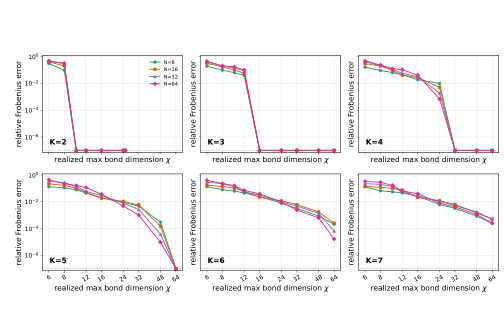
<figcaption class="paper-figure-caption"><b>Fig 1.</b> Figure 1. MPO bond dimension scaling for the representation of Hamiltonian powers. The bond dimension exhibits modest growth in 𝜒, significantly below the uncompressed 5𝐾scaling, and is importantly independent of system size.</figcaption>
</figure>
<figure class="paper-figure-card">
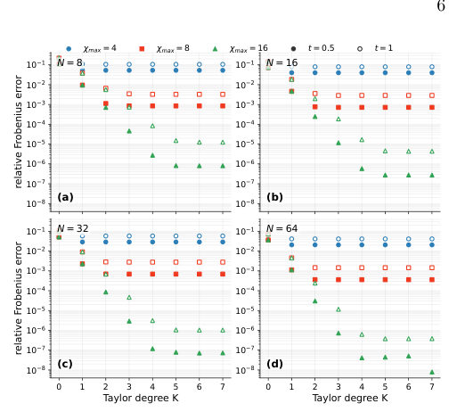
<figcaption class="paper-figure-caption"><b>Fig 2.</b> Figure 2. Relative Frobenius error in synthesizing Hamil- tonian simulation unitaries as an MPO Taylor expansion, ||𝑒−𝑖𝐻𝑡−∑︀𝐾 𝑘=0 (−𝑖𝐻𝑡)k</figcaption>
</figure>
<figure class="paper-figure-card">
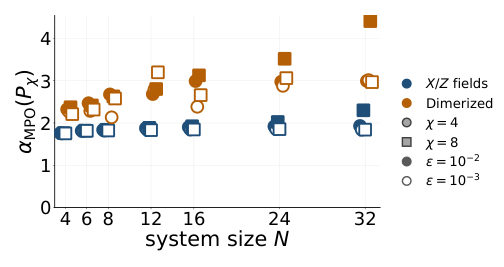
<figcaption class="paper-figure-caption"><b>Fig 3.</b> Figure 3. MPO block encoding normalization 𝛼MPO. The blue (orange) markers represent the model with additional fields (dimerization) for 𝑡= 0.5. Results for 𝜖= 10−2 (10−3) are indicated by the filled in (open) markers. Circles and squares denote 𝜒= 4 and 𝜒= 8 respectively.</figcaption>
</figure>

**Summary.** This work introduces a block-encoding compiler that treats Matrix Product Operators (MPOs) as natural intermediate representations for quantum circuits. It significantly accelerates Hamiltonian simulation by compiling the time evolution operator directly within the MPO structure, avoiding exponential resource scaling associated with explicit Pauli expansions.

**Why it may be interesting.** For AMO physicists studying open quantum systems or dynamics, the ability to efficiently simulate complex Hamiltonians like Heisenberg models using tensor network formalisms is crucial for accessing regimes where standard methods fail due to exponential overheads.

Detailed structure

**Main problem.** The paper addresses the challenge of efficiently compiling quantum circuits for simulating time evolution generated by Hamiltonians expressed as Matrix Product Operators (MPOs). It aims to improve upon standard methods that suffer from exponential resource scaling.

**Main result.** A novel MPO block-encoding compiler achieves polynomial speedups by treating MPOs as structured intermediate representations, thereby avoiding the prohibitive $\mathcal{O}(NK)$ Pauli-string growth seen in explicit expansions.

**Method.** The core method involves developing a block-encoding compiler that maps MPOs to conditional PREP and SELECT stages within a Linear Circuit Unit (LCU) framework. This allows for compiling polynomial transformations directly at the MPO level.

**Model / system.** The focus is on real-time quantum Hamiltonian simulation, exemplified by the Heisenberg model and its perturbed variants. The underlying mathematical structure is the representation of time evolution unitaries ($e^{-itH}$) using tensor networks (MPOs).

**Key observables.** Computational cost scaling, MPO bond dimension ($\chi$), Pauli-string growth rate, and the normalization overhead factor ($\alpha$).

**Important parameters / regimes.** Bond dimension ($\chi$), truncation error, system size ($N$), and Taylor expansion order ($K$).

**Assumptions / limitations.** The analysis assumes that classical pre-processing using tensor network data structures can accelerate quantum algorithms. It compares different compilation routes (Pauli vs. MPO-transition).

**Figures summary.** Figures illustrate the scaling of MPO bond dimension ($\chi$) independent of system size for Hamiltonian powers, and compare relative Frobenius errors when synthesizing unitaries via MPO Taylor expansions.

**Paper structure.** The paper develops a block-encoding compiler by first mapping MPOs to LCU structures. It then compares this MPO-transition route against explicit Pauli expansion routes, demonstrating polynomial speedups in resource scaling for simulating time evolution.

Abstract

We develop a block-encoding compiler that speeds up linear combination of unitaries Hamiltonian simulation programs by treating matrix product operators as compressed, virtual-path LCU programs. In showing how these new conditional PREP and SELECT stages are compiled in terms of a parent matrix product operator, we go beyond typical operator splitting product formulas and illustrate how tensor networks are a natural language and valid intermediate representation for quantum circuits. Our results are numerically verified for two important cases, namely, Heisenberg and perturbed Heisenberg-adjacent chain real-time evolution, and highlight polynomial speedups. Specifically, we highlight a polynomial speedup that avoids the $\mathcal{O}(N^K)$ Pauli-string growth when the compressed MPO bond dimension and path normalization remain mild. We quantify how MPO truncation error and bond-dimension budgets affect the compiled polynomial representation. Our algorithms show how classical pre-processing in terms of tensor network data structures opens new avenues to accelerate quantum algorithms.

[↑ back to top](#top)

### [Random-matrix reduction in projective quantum mechanics](http://arxiv.org/abs/2606.19272v1)

**Authors:** Alexey A. Kryukov  
**Type:** theory · **Category:** other · **PDF:** <https://arxiv.org/pdf/2606.19272v1>  
**Analysis basis:** full PDF text, analyzed in chunks
**Topic relevance:** 🔥 `quantum measurements` **4/5** · `measurement-induced transitions` **3/5** · `correlated / nonlocal dissipation` **1/5** · `driven-dissipative phase transition` **1/5** · `methods for driven-dissipative` **1/5** · `non-equilibrium dynamics` **1/5**

↔ Scroll figures horizontally

<figure class="paper-figure-card">
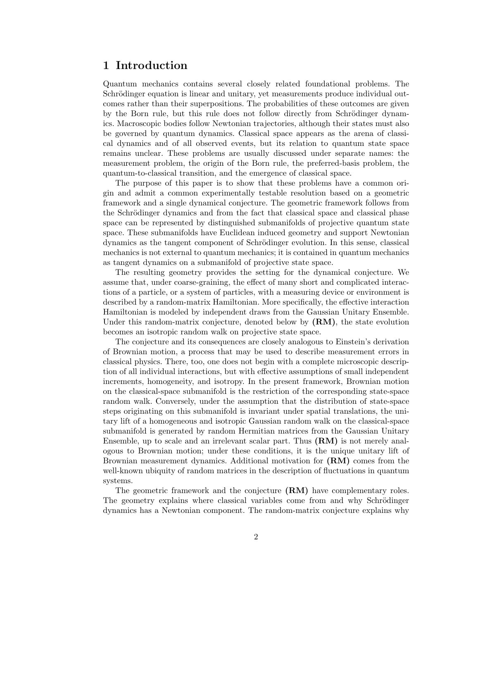
<figcaption class="paper-figure-caption"><b>Fig 1.</b> Low-resolution page preview, page 2</figcaption>
</figure>
<figure class="paper-figure-card">
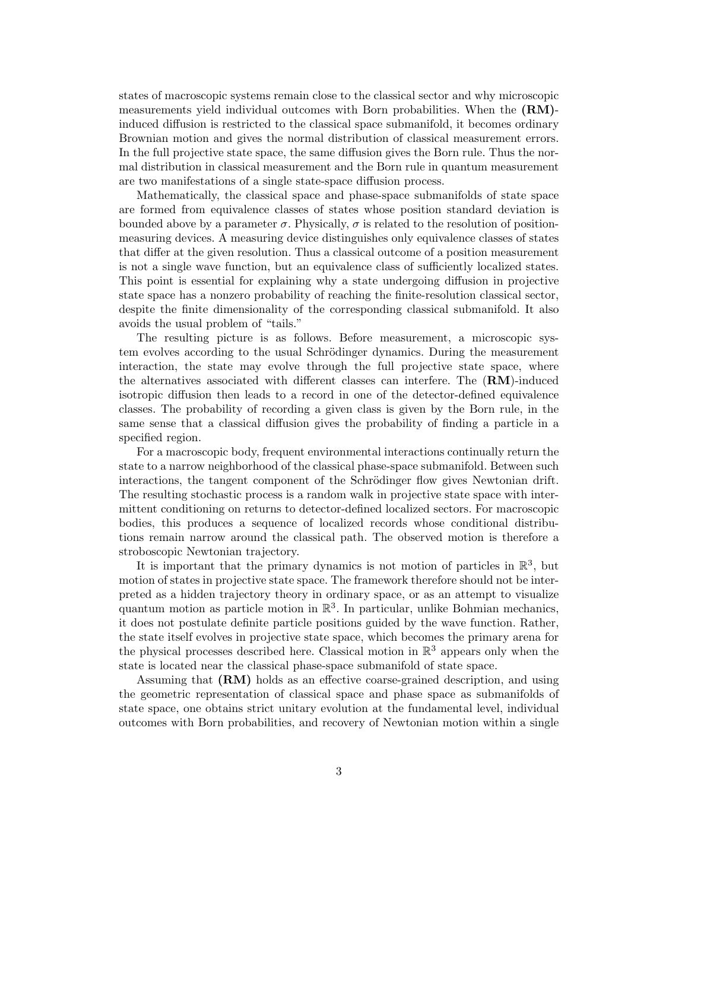
<figcaption class="paper-figure-caption"><b>Fig 2.</b> Low-resolution page preview, page 3</figcaption>
</figure>
<figure class="paper-figure-card">
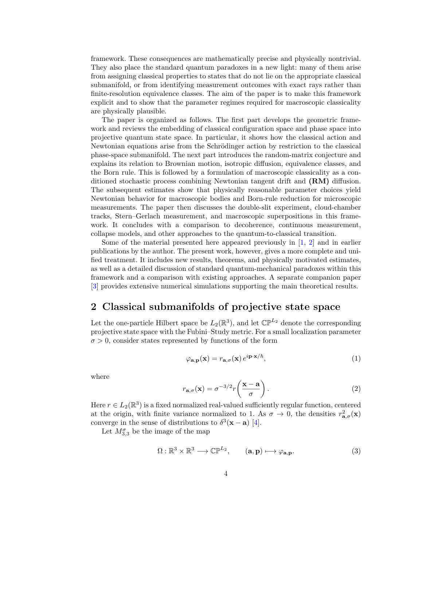
<figcaption class="paper-figure-caption"><b>Fig 3.</b> Low-resolution page preview, page 4</figcaption>
</figure>
<figure class="paper-figure-card">
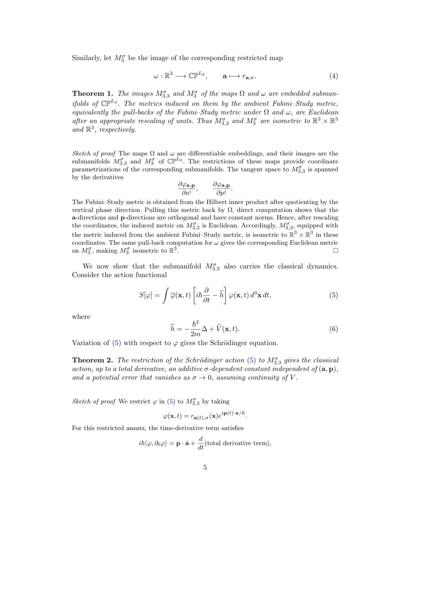
<figcaption class="paper-figure-caption"><b>Fig 4.</b> Low-resolution page preview, page 5</figcaption>
</figure>
<figure class="paper-figure-card">
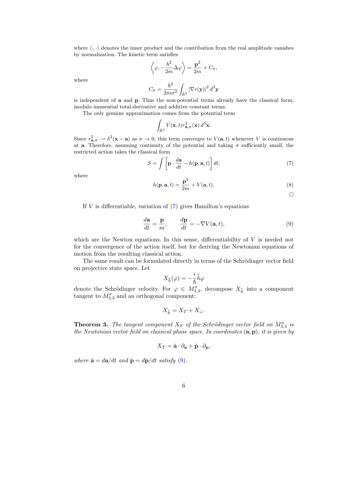
<figcaption class="paper-figure-caption"><b>Fig 5.</b> Low-resolution page preview, page 6</figcaption>
</figure>

**Summary.** The paper proposes that quantum mechanics can be understood by viewing classical reality as specific, localized submanifolds embedded within the full projective quantum state space. Measurement and environmental interaction are modeled unitarily via random-matrix dynamics (GUE), which forces stochastic diffusion leading to Born probabilities and stabilizing macroscopic systems into predictable Newtonian trajectories.

**Why it may be interesting.** This work provides a highly abstract yet potentially unifying geometric mechanism for solving foundational problems in QM, linking stochastic processes (Brownian motion/GUE) directly to the emergence of classical determinism within a strictly unitary framework.

Detailed structure

**Main problem.** To develop a unified, geometrically consistent framework that resolves foundational quantum mechanics problems like measurement, the origin of the Born rule, and the quantum-to-classical transition.

**Main result.** The framework successfully embeds classical dynamics (Newtonian motion) as distinguished submanifolds within the projective quantum state space, while environmental interactions are modeled by random-matrix dynamics yielding isotropic diffusion.

**Method.** It employs a geometric approach, identifying classical spaces with low-resolution equivalence classes on the projective state manifold. Measurement and environment coupling are modeled using Random Matrix Theory (GUE) to enforce unitary stochastic evolution.

**Model / system.** The system is quantum mechanics evolving in the projective Hilbert space ($	ext{CPL}^2$). Classical dynamics emerge when the state is restricted to localized submanifolds ($M_\sigma^3$) whose geometry is Euclidean, yielding Newtonian equations via the tangent component of the Schrödinger flow.

**Key observables.** Born-rule transition probabilities (microscopic); Stroboscopic Newtonian trajectories (macroscopic); Equivalence classes defining measurement outcomes.

**Important parameters / regimes.** Localization parameter $\sigma$ (related to measurement resolution); Planck's constant ($\hbar$); Random Matrix Ensemble (GUE).

**Assumptions / limitations.** The central assumption is the Random-Matrix Conjecture, positing that environmental interactions are unitarily equivalent to random matrices drawn from the GUE. It also assumes classicality arises from finite-resolution coarse-graining.

**Figures summary.** Not specified in notes; figures likely illustrate the geometric embedding of classical manifolds within the projective state space and the stochastic nature of measurement paths.

**Paper structure.** The paper builds by first establishing the geometric embedding of classical phase/configuration spaces as submanifolds. It then introduces the Random-Matrix Conjecture to model environmental coupling, showing this leads to isotropic diffusion (Born rule). Finally, it synthesizes these elements to provide a unitary account of measurement and the quantum-to-classical transition.

Abstract

We develop a state-space geometric framework for measurement, classicality, and quantum paradoxes, based on one dynamical conjecture. Classical configuration space and classical phase space for a mechanical system arise as distinguished submanifolds of projective quantum state space. On these submanifolds, the Fubini--Study geometry induces Euclidean classical geometry, and the tangent component of Schrödinger evolution reproduces Newtonian dynamics. Within this framework, interactions with measuring devices and environments are described by random-matrix dynamics on projective state space, generated by matrices drawn from the Gaussian Unitary Ensemble. We show that this random-matrix dynamics yields isotropic diffusion, giving Born-rule transition probabilities in microscopic measurements and stabilizing classical behavior in macroscopic systems. We further argue that the random-matrix conjecture is not an independent ad hoc assumption: under natural translation-invariance assumptions on the distribution of state-space steps originating on the classical submanifold, the unitary lift of homogeneous and isotropic Brownian motion on that submanifold is uniquely given by the Gaussian Unitary Ensemble, up to scale and an irrelevant scalar part. The resulting framework provides a unitary account of measurement and the quantum-to-classical transition and, if accepted, offers a dynamical resolution of standard quantum paradoxes.

[↑ back to top](#top)

### [Coherent Microwave Control of Optically Addressable Donor Qubits in ZnO](http://arxiv.org/abs/2606.19016v1)

**Authors:** Ethan R. Hansen, Dong-Rong Wu, Yixuan Li, Yaser Silani, Joseph Falson, Yusuke Kozuka, Masashi Kawasaki, Yuan Ping, Kai-Mei C Fu  
**Type:** experiment · **Category:** quantum information and computing · **PDF:** <https://arxiv.org/pdf/2606.19016v1>  
**Analysis basis:** full PDF text, analyzed in chunks
**Topic relevance:** 🔥 `QC/QI experiment` **4/5** · `spintronics-quantum-optics interface` **3/5** · `exotic spin models in light-matter` **1/5** · `quantum measurements` **1/5** · `quantum optics experiment` **1/5**

↔ Scroll figures horizontally

<figure class="paper-figure-card">
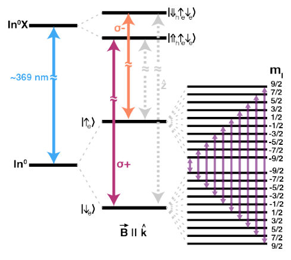
<figcaption class="paper-figure-caption"><b>Fig 1.</b> FIG. 1: Energy-level structure of a neutral indium donor in ZnO in Faraday geometry, ⃗B ∥ˆk ∥ˆc, in which ˆk is the optical axis and ˆc is the ZnO c-axis. The neutral donor ground state (In0) consists of two electron-spin states split by the Zeeman interaction. Optical excitation near 369 nm drives transitions to the donor-bound exciton state (In0X), whose two hole-spin states are also Zeeman split. The spin- selective optical transitions are labeled by their circular po- larization, σ+ and σ−. Hyperfine coupling to the 115In nu- clear spin (I = 9/2) further splits each electron-spin mani- fold into ten sublevels labeled by mI.</figcaption>
</figure>
<figure class="paper-figure-card">
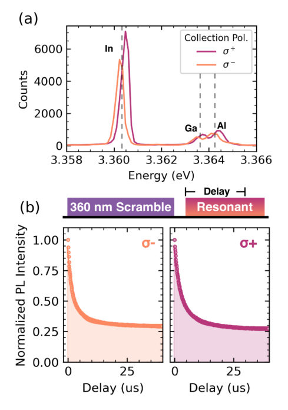
<figcaption class="paper-figure-caption"><b>Fig 2.</b> FIG. 2: (a) In0X photoluminescence from implanted In at B = 6 T collected in σ+ and σ−polarization. Also observed are Ga and Al transitions originating from the substrate. Dashed lines label the zero-field donor-bound-exciton tran- sitions for In, Ga, and Al donors. Spectra are instrument resolution limited. Excitation wavelength is 360 nm (b) Time-resolved optical pumping at B = 300 mT following a 360 nm scramble pulse and resonant excitation on the σ−(369.26781 nm) and σ+ (369.26457 nm) transitions. The scramble and resonant pump powers are each 150 nW and applied for a duration of 150 µs. Traces are background- subtracted and normalized. T = 5.5 K.</figcaption>
</figure>
<figure class="paper-figure-card">
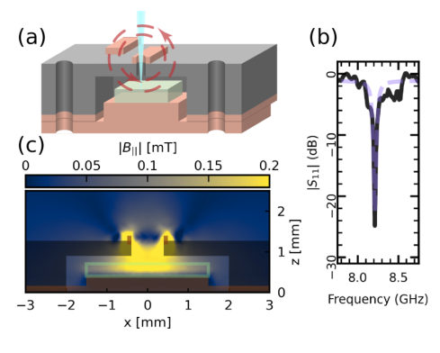
<figcaption class="paper-figure-caption"><b>Fig 3.</b> FIG. 3: Microwave resonator for coherent spin control. (a) Schematic of the microstrip resonator with the embed- ded ZnO sample. The blue beam indicates optical access through the central hole, and the red arrows indicate the microwave magnetic field. (b) Measured reflection spec- trum, |S11|, showing a resonance near 8.2 GHz. Dashed purple curve is the simulated |S11|. (c) Simulated in-plane microwave magnetic field, |B∥|, for an applied microwave power of 0.5 W. (CST Microwave Studio [24].)</figcaption>
</figure>
<figure class="paper-figure-card">
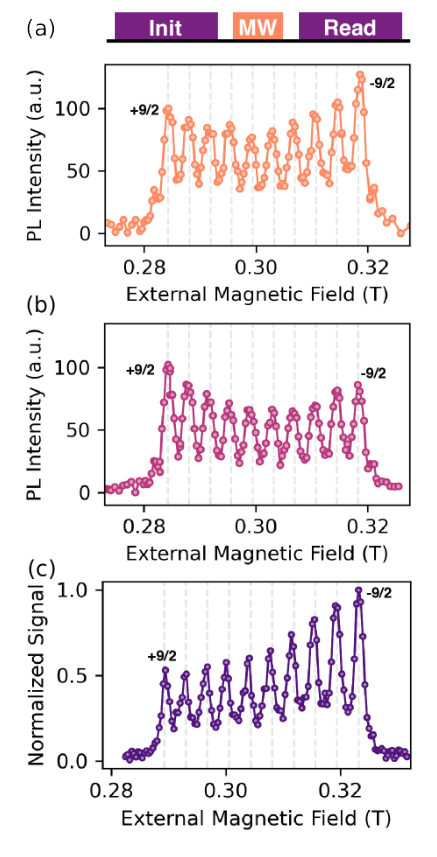
<figcaption class="paper-figure-caption"><b>Fig 4.</b> FIG. 4: (a,b) Pulsed ODMR spectra acquired by sweeping the external magnetic field at fixed microwave frequency (fMW = 8.20 GHz) with resonant optical pumping on the σ−and σ+ transitions, respectively. ΩR/2π = 23 MHz for panels (a) and (b). (c) Pulsed ODMR spectrum acquired with σ−pumping after tilting the sample by approximately 13◦relative to the configuration used in panels (a) and (b); ΩR/2π = 19 MHz and fMW = 8.33 GHz. Vertical dashed lines are split by 104 MHz and aligned with the 10 hyperfine transitions. T=5.5 K.</figcaption>
</figure>
<figure class="paper-figure-card">
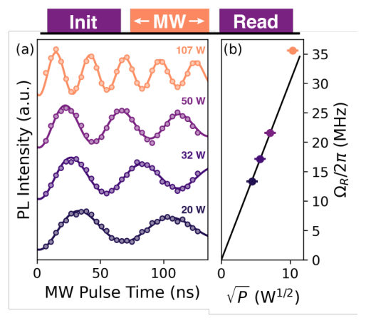
<figcaption class="paper-figure-caption"><b>Fig 5.</b> FIG. 5: (a) Pulsed Rabi measurements on the mI = −9/2 hyperfine transition for four applied microwave powers. Ac- quired with σ−optical pumping. The traces are vertically offset for clarity. Solid curves are a simultaneous fit to an en- semble Rabi model in which the coherent two-level response is averaged over a Gaussian distribution of static microwave detunings with fixed width σ∆/2π = 13 MHz, correspond- ing to T ∗ 2 ≃17 ns for a Gaussian Ramsey envelope. No additional homogeneous decay is included in these curves, i.e. T2 →∞. The fit uses a shared timing offset and in- dependent Rabi frequency, amplitude, and baseline for each microwave power. (b) Rabi frequencies fR = ΩR/2π ex-...</figcaption>
</figure>

**Summary.** The researchers successfully achieved coherent microwave manipulation of donor electron spins in ZnO, confirming its potential as a qubit platform. They characterized Rabi oscillations and measured coherence times using advanced pulse sequences. The key finding is that while microwave control works, the coherence time is limited by spectral diffusion from the local electronic spin bath, presenting an open challenge for future quantum device development.

**Why it may be interesting.** This work provides a concrete experimental realization of solid-state spin qubits in a wide-bandgap semiconductor ($	ext{ZnO}$), directly addressing the feasibility of microwave control necessary for quantum gate operations.

Detailed structure

**Main problem.** The primary goal was to demonstrate coherent microwave control of donor electron spins in ZnO, overcoming limitations inherent in purely optical manipulation techniques.

**Main result.** Coherent Rabi oscillations were observed with a $\pi$-pulse time of $\sim 14$ ns, establishing microwave control. However, the measured spin coherence ($T_2$) was found to be significantly shorter than previously reported values.

**Method.** The experiment utilized pulsed optically-detected magnetic resonance (PODMR) combined with microwave excitation within a microstrip resonator geometry embedded in ZnO.

**Model / system.** The system consists of optically addressable shallow donors ($	ext{In}$ ions) implanted in a $	ext{ZnO}$ host lattice. The physics involves the coupling between the electron spin, the ${}^{115}	ext{In}$ nuclear spin ($I=9/2$), and external microwave fields.

**Key observables.** Rabi frequency ($\Omega/2\pi \approx 36$ MHz), $\pi$-pulse time ($\sim 14$ ns), inhomogeneous dephasing time ($T_*^2 = 17$ ns), and Hahn echo coherence time ($T_2 \approx 200$ ns).

**Important parameters / regimes.** Low temperature (1.7 K), high magnetic field regimes for characterization, and the hyperfine coupling constant associated with ${}^{115}	ext{In}$.

**Assumptions / limitations.** The short coherence time is attributed to spectral diffusion from the local electronic spin environment, ruling out microwave heating or instantaneous diffusion as dominant causes.

**Figures summary.** Figures detail PL/PLE confirming donor incorporation and linewidths; schematics show the resonator geometry; Rabi oscillations confirm coherent control; Ramsey/Hahn echo sequences quantify coherence decay times.

**Paper structure.** The paper establishes the physical platform (ZnO donors), demonstrates initialization and hyperfine-resolved microwave control via PODMR, characterizes fundamental dynamics using Rabi oscillations, and finally measures coherence time ($T_2$) using advanced pulse sequences to diagnose decoherence mechanisms.

Abstract

Optically addressable shallow donors in ZnO combine efficient spin-selective optical transitions with the potential for long spin coherence in an isotopically purifiable host lattice, making them an attractive platform for spin-photon quantum technologies. A key missing capability, however, has been coherent control beyond the small-angle rotations accessible with ultrafast optical pulses. Here we demonstrate coherent microwave control of implanted $^{115}\mathrm{In}$ donors in ZnO. Resonant optical pumping initializes and reads out the donor electron spin. Pulsed optically-detected magnetic resonance resolves the ten hyperfine transitions associated with the coupled $^{115}\mathrm{In}$ nuclear spin (I = 9/2) and reveals optical-pumping-induced nuclear spin polarization. We observe coherent Rabi oscillations with a maximum Rabi frequency of $Ω/2π= 36.2 \pm 0.7$\;MHz, corresponding to a $π$-pulse time of 13.8$\pm$0.3\;ns, and characterize the spin coherence using Ramsey, Hahn echo and dynamical-decoupling measurements. Unexpectedly, the measured coherence is substantially shorter than reported in previous optical studies of donor spins in ZnO at high magnetic field. Control experiments rule out several simple explanations including microwave heating and instantaneous diffusion from the driven donor ensemble, leaving an open question regarding the origin of decoherence at low magnetic field in microwave-controlled ZnO donors. These results establish microwave control of ZnO donor qubits with resonant optical access to specific donor species. More broadly, they demonstrate that coherent microwave control can be achieved in optically addressable spin systems with nanosecond-scale inhomogeneous dephasing, enabling field-, temperature-, and materials-dependent studies of coherence-limiting mechanisms and the development of optically interfaced electron-nuclear spin registers.

[↑ back to top](#top)

### [Integration of diamond nanobeams with SnVs on Al2O3 waveguides for scalable quantum photonic chip application](http://arxiv.org/abs/2606.18711v1)

**Authors:** Yeting Yang, Ryota Kitagawa, Tetsuya Miyatake, Masaharu Hida, Naoki Fushimi, Koki Kaminaka, Takuto Yamaguchi, Toshiki Iwai, Itsuki Takagi, Hidetsugu Matsukiyo, Satomi Ishida, Satoshi Iwamoto, Manabu Ohtomo, Toshiyuki Miyazawa, Kenichi Kawaguchi, Ryoichi Ishihara, Shintaro Sato  
**Type:** experiment · **Category:** quantum information and computing · **PDF:** <https://arxiv.org/pdf/2606.18711v1>  
**Analysis basis:** full PDF text, analyzed in chunks
**Topic relevance:** 🔥 `QC/QI experiment` **4/5** · `quantum optics experiment` **3/5** · `analog quantum simulation` **1/5** · `interference shaping light` **1/5** · `spintronics-quantum-optics interface` **1/5**

↔ Scroll figures horizontally

<figure class="paper-figure-card">
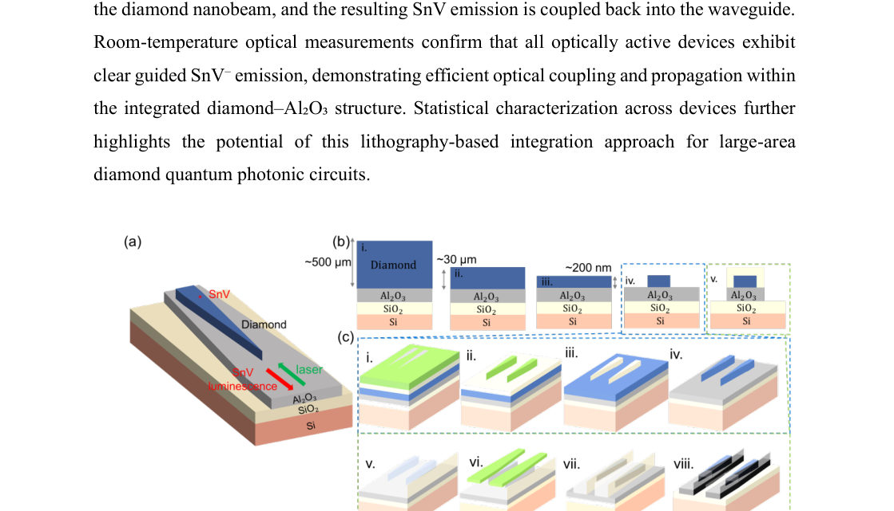
<figcaption class="paper-figure-caption"><b>Fig 1.</b> Fig. 1. Concept and fabrication flow of the diamond–Al₂O₃ photonic device. (a) Schematic of the dual-taper structure, in which a diamond nanobeam containing SnV</figcaption>
</figure>
<figure class="paper-figure-card">
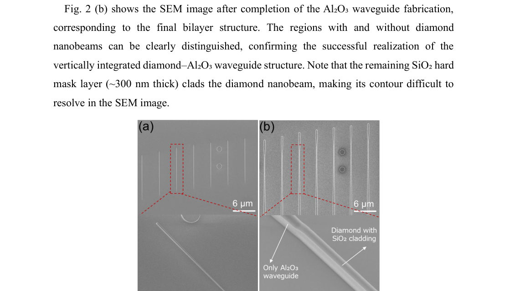
<figcaption class="paper-figure-caption"><b>Fig 2.</b> Fig. 2. Structural characterization of fabricated diamond-on-waveguide devices. (a) Tilted-view (20°) SEM image of the fabricated diamond nanobeams after the diamond etching step (Fig. 1 (c) (iv)), showing an array of seven nanobeams. The inset presents a magnified SEM image (rotated-45°) of a representative nanobeam. (b) SEM image of the completed diamond-on-waveguide device after the waveguide fabrication step (Fig. 1 (c) (viii)). The inset shows a magnified view of a representative structure. Arrows indicate the regions corresponding to the bare Al₂O₃ waveguide and the waveguide supporting the diamond nanobeam.</figcaption>
</figure>
<figure class="paper-figure-card">
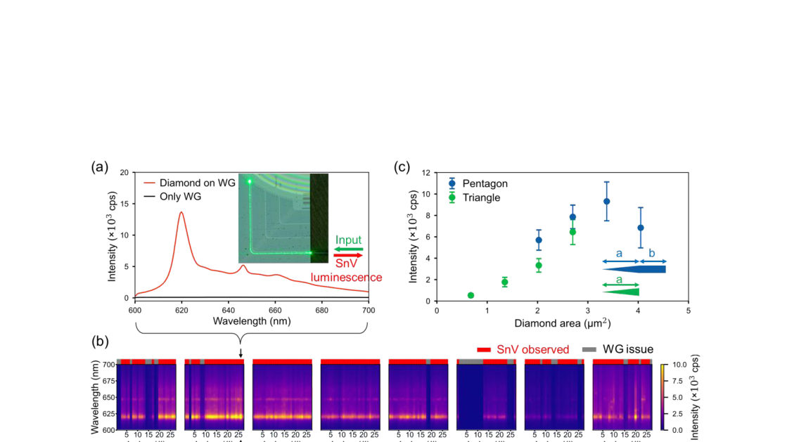
<figcaption class="paper-figure-caption"><b>Fig 3.</b> Fig. 3. Optical characterization and statistical device yield. (a) Photoluminescence spectrum of a diamond–on–Al₂O₃ waveguide device, showing the SnV⁻ ZPL emission coupled into the waveguide. Inset: Optical images under 520-nm excitation. (b) Heatmap of PL spectra collected from multiple devices across the chip, illustrating high-yield SnV⁻ emission. Devices are grouped by diamond geometry: pentagon- shaped nanobeam with triangular taper (green) and triangular taper only (blue), defined by the triangular taper length a and rectangular section length b. For each geometry, 27 devices were measured. “WG issue” represents devices with no detectable PL. (c) Statistical correlation between...</figcaption>
</figure>

**Summary.** The paper reports on the fabrication and characterization of a novel hybrid photonic chip integrating SnV color centers in diamond nanobeams with Al2O3 waveguides. By achieving clear, room-temperature guided emission, the authors demonstrate a scalable, lithography-based method for coupling solid-state quantum emitters into integrated optical circuits.

**Why it may be interesting.** This work directly addresses the hardware challenge of coupling solid-state qubits to photonics, which is central to building scalable quantum networks and quantum computing architectures. The demonstrated scalability via lithography is highly relevant for AMO/Quantum Optics research.

Detailed structure

**Main problem.** The primary goal is developing a scalable fabrication method to integrate solid-state quantum emitters, specifically Tin-Vacancy (SnV) centers in diamond, with integrated photonic waveguides for quantum chip applications.

**Main result.** The authors successfully demonstrated efficient optical coupling by observing clear guided SnV emission at room temperature using a wafer-compatible bilayer fabrication approach. This confirms the feasibility of integrating these solid-state qubits into scalable photonic circuits.

**Method.** The work involves complex, multi-step nanofabrication combining wafer bonding, precise thinning (using RIE), and lithographically defined etching to create a diamond nanobeam coupled to an Al2O3 waveguide.

**Model / system.** The physical system is a vertically integrated 'diamond-on-Al2O3' dual-taper waveguide structure. The quantum element is the SnV color center acting as a solid-state qubit, whose emission is coupled into the engineered photonic waveguide.

**Key observables.** Clear guided SnV- emission peak at approximately 620 nm (Zero Phonon Line), and an overall device yield of 82.9% across tested devices.

**Important parameters / regimes.** The nanobeam thickness ($\sim 200 	ext{ nm}$), the waveguide material ($	ext{Al}_2	ext{O}_3$), and the operating temperature (room temperature) are critical parameters.

**Assumptions / limitations.** The process assumes that the fabrication steps, particularly etching and bonding, maintain the structural integrity required for efficient optical coupling between the diamond nanobeam and the waveguide.

**Figures summary.** Figures show schematic fabrication flows, SEM images confirming the physical structure of the integrated bilayer device, and PL spectra comparing emission from coupled vs. reference waveguides to validate coupling efficiency.

**Paper structure.** The paper follows a progression from conceptual design (schematics) through detailed structural characterization (SEM), culminating in optical measurements (PL spectroscopy) that confirm the functional integration of the quantum emitter into the photonic platform.

Abstract

Tin vacancy (SnV) centers in diamond are promising solid state qubits for integrated quantum photonics. Here, we fabricate and characterize a diamond on Al2O3 dual taper waveguide structure containing SnV centers, demonstrating optical coupling between the diamond nanobeam and the underlying Al2O3 waveguide. The devices are realized using a bilayer fabrication approach compatible with wafer scale lithography. Clear guided SnV- emission is observed in all optically active devices, indicating effective optical coupling in the integrated structure. These results demonstrate a scalable fabrication approach toward integrating diamond color centers with photonic waveguides.

[↑ back to top](#top)

### [Observation of anyonic thermodynamics and generalized Pauli principle](http://arxiv.org/abs/2606.19009v1)

**Authors:** Fansu Wei, Chi Zhang, Zimeng Ye, Dengbo Wang, Botao Wang, Xiaoji Zhou, Hepeng Yao  
**Type:** both · **Category:** quantum gases · **PDF:** <https://arxiv.org/pdf/2606.19009v1>  
**Analysis basis:** full PDF text, analyzed in chunks
**Topic relevance:** 🔥 `analog quantum simulation` **4/5** · `non-equilibrium dynamics` **2/5** · `driven-dissipative phase transition` **1/5** · `entanglement & information structure` **1/5** · `non-equilibrium universality` **1/5**

↔ Scroll figures horizontally

<figure class="paper-figure-card">
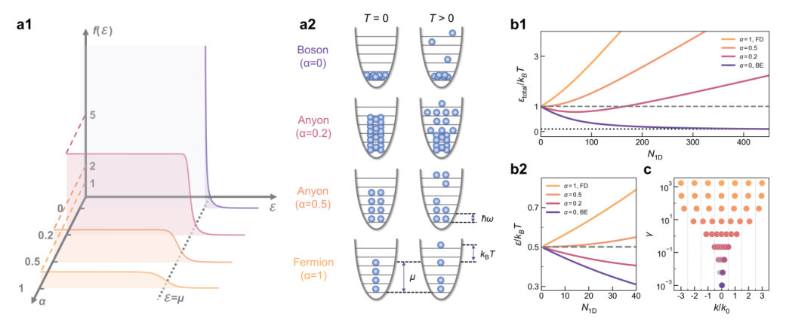
<figcaption class="paper-figure-caption"><b>Fig 1.</b> Figure 1. Illustration of the anyonic generalized exclusion statistics. a1, Mean occupation number f(E) versus state energy E at finite temperature for generalized exclusion statistics with different statistical parameter α. The curves represent Bose-Einstein (BE, α = 0, purple), Fermi-Dirac (FD, α = 1, orange), and two typical anyonic (α = 0.2, light purple; α = 0.5, dark orange) distributions. µ denotes the chemical potential. At high energies (E ≫µ), all distributions asymptotically approach zero. At lower energies, f(E) increases and saturates at the statistical upper bound 1/α, consistent with the generalized Pauli exclusion principle. a2, Schematic of state occupations in a 1D...</figcaption>
</figure>
<figure class="paper-figure-card">
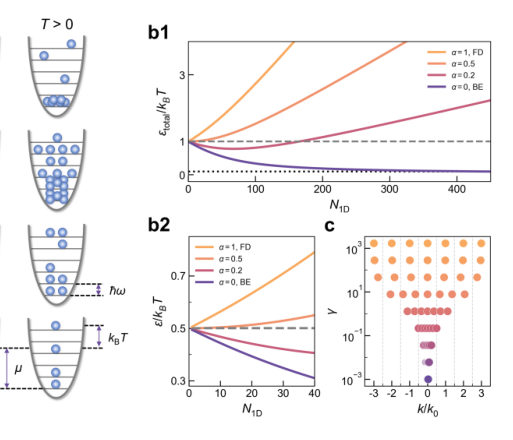
<figcaption class="paper-figure-caption"><b>Fig 2.</b> Fig. 1a2. According to this filling pattern, the total energy per particle εtotal and its related equation of state can serve as a good indicator for determining α [28]. In Fig. 1b, we plot εtotal as a function of 1D particle number N1D for ideal gases under different statistical distributions based on Eqs. (1, 2). In the dilute limit N1D →0, the identical particle postulate of quantum mechanics fails and all types of statistics collapse into the classical Maxwell-Boltzmann limit. According to the equi-partition theorem, it reads εtotal = ε + εV = kBT (black dashed line) with ε and εV the averaged internal and external potential energies, respectively.</figcaption>
</figure>
<figure class="paper-figure-card">
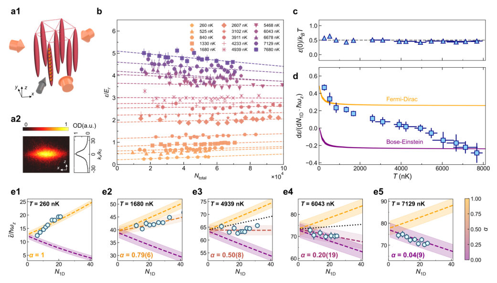
<figcaption class="paper-figure-caption"><b>Fig 3.</b> Figure 2. Observation of the equation of state for anyonic thermodynamics. a1, Experimental realization of 1D Bose molecular gases in tubes formed by 2D triangular optical lattices. The lattice is created by three coherent traveling-wave laser beams arranged at 120◦to each other (yellow arrow). Imaging is performed perpendicular to the tubes, at 30◦to one lattice beam path (grey arrow). a2, Typical time-of-flight absorption images for T = 260(10) nK and as = 743a0. The right panel shows the obtained momentum distribution n(kz) along the z- direction. b, The energy per particle ε (in units of the recoil energy Er) as a function of total particle number Ntotal for different temperatures T...</figcaption>
</figure>
<figure class="paper-figure-card">
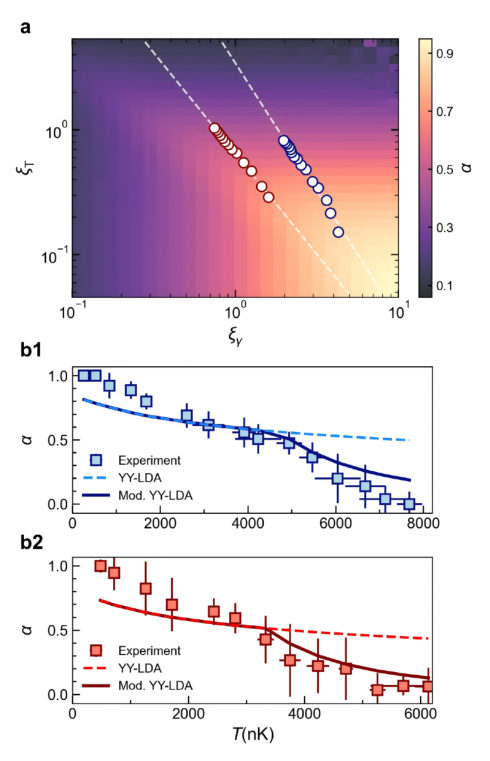
<figcaption class="paper-figure-caption"><b>Fig 4.</b> Figure 3. Phase diagram of statistical parameter α. a, Phase dia- gram of the statistical parameter α as a function of reduced temper- ature ξT and reduced interaction ξγ, computed from YY-LDA. The color code indicates crossover from fermionic statistics (α = 1, or- ange) to bosonic statistics (α = 0, purple). The parameter ranges for experimental measurements are indicated for V2D = 10Er (blue cir- cles, measurement in Fig. 2b) and V2D = 5Er (red circles), with their linear fit on a log-log scale (dashed lines). b1, The measured statis- tical parameters α as a function of temperature T (squares), together with the corresponding theoretical predictions from (a) (dashed line). The solid line...</figcaption>
</figure>
<figure class="paper-figure-card">
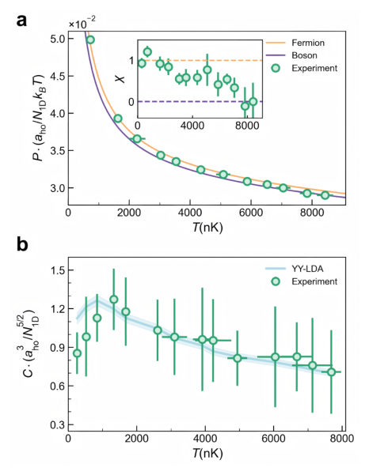
<figcaption class="paper-figure-caption"><b>Fig 5.</b> Figure 4. Measurement of anyonization in other thermodynamic properties. a, Pressure P as a function of temperature T (green circles), together with the analytical curves of FD and BE statis- tics (orange and purple solid lines). The inset shows the metric χ = (PExp −PB)/(PF −PB) for evaluating the statistics. b, The detected Tan’s contact C versus temperature. The green cir- cles are experimental data obtained by taking the difference between the measurements at magnetic fields of 680 G (γ ≃20.4) and 690 G (γ ≃23.4), and the blue line is the YY-LDA result. All experimental results are averaged over 60 realizations.</figcaption>
</figure>

**Summary.** The research demonstrates the experimental observation of anyonic thermodynamics in a 1D strongly interacting quantum gas. By measuring thermodynamic signatures like the equation of state and pressure, the authors confirm that the system obeys Generalized Exclusion Statistics (GES). This work establishes a versatile platform for engineering and studying fractional statistics in quantum matter.

**Why it may be interesting.** This work provides a highly controlled platform for observing fundamental quantum statistics beyond standard bosons and fermions, which is crucial for understanding exotic matter states in ultracold atomic systems.

Detailed structure

**Main problem.** The primary goal is to experimentally realize and detect anyonic thermodynamics governed by generalized exclusion statistics (GES) in a quantum gas system.

**Main result.** The authors successfully measured the equation of state, showing a continuous crossover from fermionic ($\alpha 	o 1$) to bosonic ($\alpha 	o 0$) statistics, providing direct evidence for the generalized Pauli principle.

**Method.** Measurements involve analyzing the equation of state and other thermodynamic quantities (like pressure and Tan's contact) by tuning temperature and interaction strength in a 1D quantum gas.

**Model / system.** The system is a one-dimensional strongly interacting quantum gas, modeled using the Lieb-Liniger Hamiltonian for ${}^6	ext{Li}_2$ molecules confined in optical lattices. The theory relies on mapping dynamics to statistical exclusion via GES.

**Key observables.** Equation of state ($\epsilon_{	ext{total}}$ vs $N_{1	ext{D}}$), pressure ($P$), Tan's contact ($C$), and the effective statistical parameter $\alpha$.

**Important parameters / regimes.** Statistical parameter $\alpha$ (interpolating between 0 and 1), temperature ($T$), interaction strength ($\gamma$), and particle number ($N_{1	ext{D}}$).

**Assumptions / limitations.** The analysis often relies on the local-density approximation (LDA) when treating trapped systems, and a bijective mapping is used to relate dynamical interactions to statistical exclusion in 1D.

**Figures summary.** Figures illustrate the crossover of $\epsilon_{	ext{total}}$ vs $N_{1	ext{D}}$ across different $\alpha$ values; other figures show pressure ($P$) and Tan's contact ($C$) measurements confirming the FD-BE crossover trend.

**Paper structure.** The paper establishes the theoretical framework connecting anyons to GES, details the experimental setup in 1D quantum gases, presents measurements of thermodynamic quantities (equation of state, pressure), and concludes by quantifying the continuous statistical crossover via $\alpha$.

Abstract

Anyons are quasiparticles with quantum statistics interpolating between those of bosons and fermions. Two distinct manifestations of anyonic behaviour have been theoretically established: fractional exchange statistics where particle exchange can produce any phase, and generalized exclusion statistics which extends the Pauli exclusion principle. While anyons exhibiting fractional exchange statistics have been observed in diverse platforms, experimental realizations of generalized exclusion statistics and direct measurements of its thermodynamic signatures have remained elusive. Here, we realize an anyonic thermodynamic ensemble obeying generalized exclusion statistics and detect its anyonic thermodynamics in a one-dimensional strongly interacting quantum gas. To achieve this, we exploit the bijective mapping between dynamical and statistical interactions in one dimension. By tuning interaction strength and temperature over a wide range, we measure the equation of state and identify clear departures from Bose-Einstein and Fermi-Dirac statistics. These deviations are quantitatively captured by generalized exclusion statistics, providing direct evidence for the generalized Pauli principle. Independent probes of other thermodynamic quantities including pressure and the Tan contact further validate this framework. Our results establish a versatile platform for engineering anyonic exclusion statistics and open the door to thermodynamic applications of anyons in quantum technologies.

[↑ back to top](#top)

### [Entanglement response to Temperature in Interacting Two-Qubit Thermal States](http://arxiv.org/abs/2606.18415v1)

**Authors:** Zain H. Saleem, Iram Saleem  
**Type:** theory · **Category:** statistical mechanics · **PDF:** <https://arxiv.org/pdf/2606.18415v1>  
**Analysis basis:** full PDF text, analyzed in chunks
**Topic relevance:** 🔥 `entanglement & information structure` **4/5** · `Keldysh / 2PI / non-Gaussian methods` **1/5** · `correlated / nonlocal dissipation` **1/5** · `driven-dissipative phase transition` **1/5**

↔ Scroll figures horizontally

<figure class="paper-figure-card">
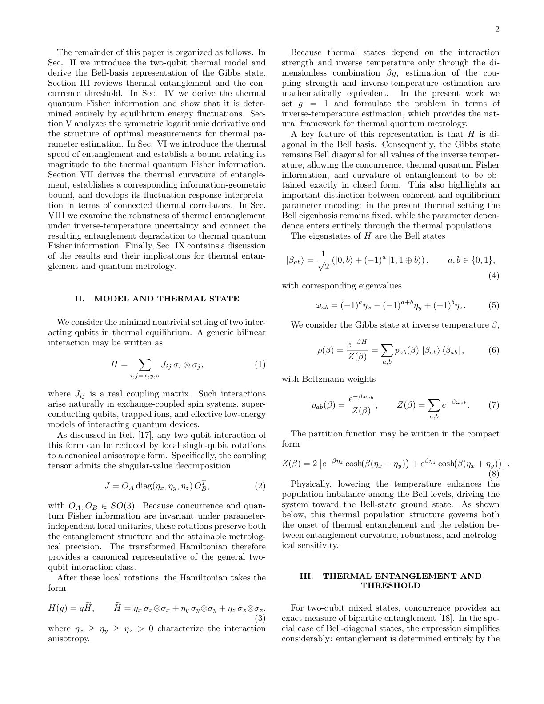
<figcaption class="paper-figure-caption"><b>Fig 1.</b> Low-resolution page preview, page 2</figcaption>
</figure>
<figure class="paper-figure-card">
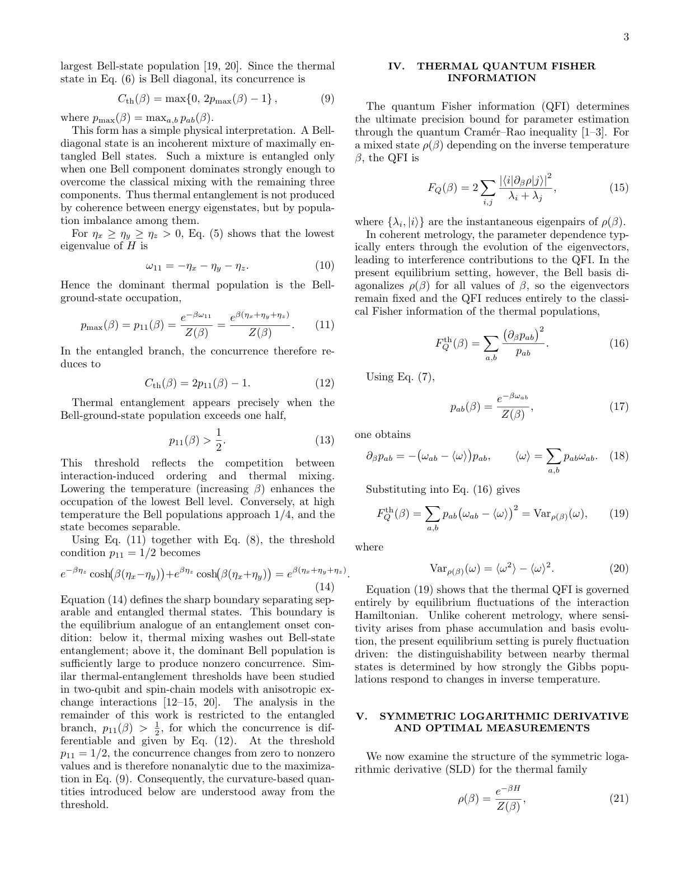
<figcaption class="paper-figure-caption"><b>Fig 2.</b> Low-resolution page preview, page 3</figcaption>
</figure>
<figure class="paper-figure-card">
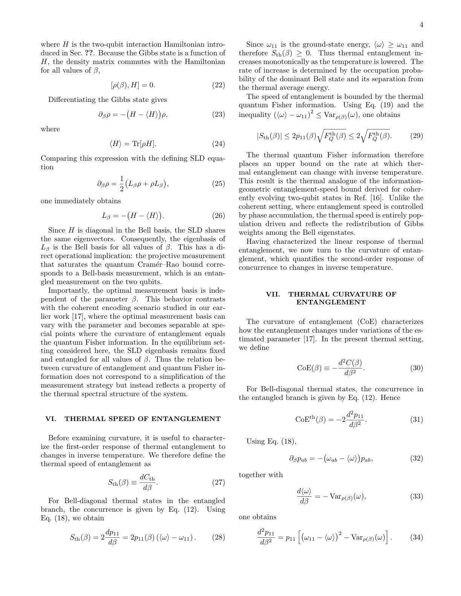
<figcaption class="paper-figure-caption"><b>Fig 3.</b> Low-resolution page preview, page 4</figcaption>
</figure>
<figure class="paper-figure-card">
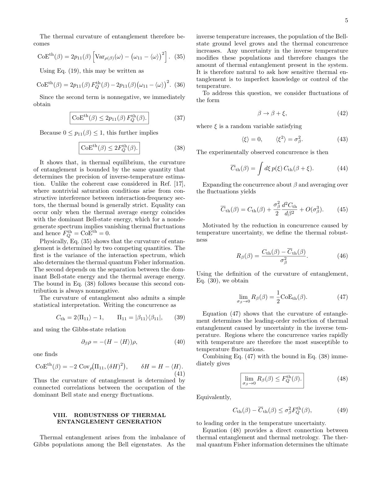
<figcaption class="paper-figure-caption"><b>Fig 4.</b> Low-resolution page preview, page 5</figcaption>
</figure>
<figure class="paper-figure-card">
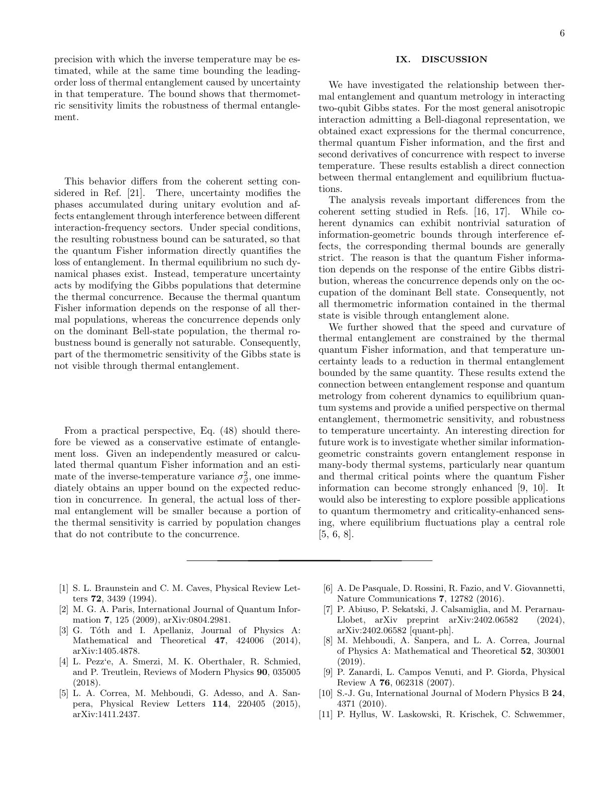
<figcaption class="paper-figure-caption"><b>Fig 5.</b> Low-resolution page preview, page 6</figcaption>
</figure>

**Summary.** This paper analyzes the entanglement response of interacting two-qubit systems to temperature changes by deriving exact expressions for thermal concurrence and TQFI. It establishes that both how fast entanglement changes with temperature and how much it degrades due to temperature uncertainty are fundamentally limited by the system's TQFI. This provides a new, fluctuation-based constraint on quantum information in thermal equilibrium.

**Why it may be interesting.** This work provides a rigorous link between quantum information measures (entanglement) and fundamental thermodynamic/metrological quantities (QFI) in an equilibrium setting, which is crucial for understanding sensing near critical points or thermalization processes.

Detailed structure

**Main problem.** The study investigates how entanglement, quantified by thermal concurrence, changes when subjected to variations in temperature within interacting two-qubit systems.

**Main result.** The rate of change and the loss due to temperature uncertainty in thermal entanglement are fundamentally bounded by the Thermal Quantum Fisher Information (TQFI).

**Method.** The authors derived exact analytical expressions for various thermal observables, including concurrence and TQFI derivatives, using the properties of the Gibbs state.

**Model / system.** The system is an interacting two-qubit model analyzed in thermal equilibrium, described by a general interaction Hamiltonian $H$ leading to a Gibbs state $
ho(eta)$.

**Key observables.** Thermal Concurrence ($C_{	ext{th}}(eta)$), Thermal Quantum Fisher Information ($	ext{F}_{th}^Q(eta)$), and their first/second derivatives with respect to inverse temperature ($eta$).

**Important parameters / regimes.** Inverse temperature ($eta$), the entanglement threshold defined by $p_{11}(eta) = 1/2$, and temperature uncertainty ($\sigma_eta^2$).

**Assumptions / limitations.** The analysis is restricted to two interacting qubits, assuming the Hamiltonian can be analyzed in a canonical anisotropic form.

**Paper structure.** The paper establishes the framework by defining thermal entanglement and TQFI for the system. It then derives key bounds showing that both the rate of change and the robustness against temperature uncertainty are constrained by $	ext{F}_{th}^Q(eta)$. Finally, it discusses the implications of these bounds compared to coherent dynamics.

Abstract

We investigate the response of entanglement to temperature variations in interacting two-qubit thermal states. For a general two-qubit interaction Hamiltonian, we derive exact expressions for the thermal concurrence, its first and second derivatives with respect to inverse temperature, and the thermal quantum Fisher information. We show that the rate of change of thermal entanglement is bounded by the thermal quantum Fisher information. We further derive a bound relating entanglement curvature and thermal quantum Fisher information, and show that temperature uncertainty induces a loss of entanglement bounded by the same quantity that determines thermometric sensitivity. These results establish thermal quantum Fisher information as a fundamental constraint on the response and robustness of entanglement in interacting two-qubit thermal states.

[↑ back to top](#top)

### [Piezoelectric resonators in thin-film barium titanate from room temperature to millikelvin](http://arxiv.org/abs/2606.18522v1)

**Authors:** Hao Tian, Shu-Yuan Chang, Nuha Akhtar, Kasra Sardashti, Mohammad Mirhosseini  
**Type:** both · **Category:** quantum information and computing · **PDF:** <https://arxiv.org/pdf/2606.18522v1>  
**Analysis basis:** full PDF text, analyzed in chunks
**Topic relevance:** 🔥 `QC/QI experiment` **4/5** · `analog quantum simulation` **1/5** · `correlated cavity matter` **1/5** · `spintronics-quantum-optics interface` **1/5**

↔ Scroll figures horizontally

<figure class="paper-figure-card">
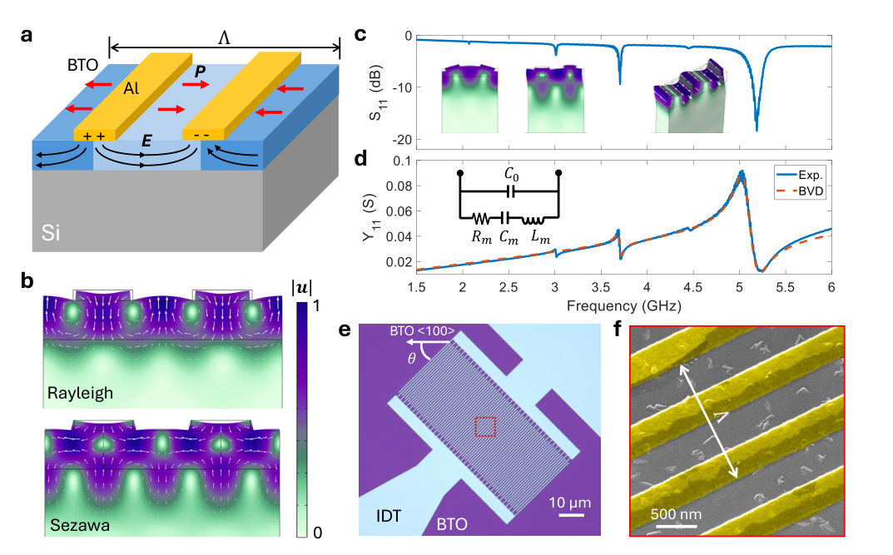
<figcaption class="paper-figure-caption"><b>Fig 1.</b> FIG. 1. Device design and characterization. a, Three-dimensional (3D) schematic showing one period Λ of the IDT, with aluminum (yellow) electrodes. The black and red arrows denote the electric field and polarization in BTO, respectively. b, Numerical simulation of higher-order Rayleigh (top) and Sezawa (bottom) modes matched with the periodically poled IDT. The colormap is the normalized displacement magnitude u with white arrows denoting the displacement direction. c, Measured microwave reflection spectrum (S11) of a typical IDT under 30 V bias. Insets from left to right are mode profiles for the fundamental Rayleigh and Sezawa modes, and the shear horizontal mode. d, Calibrated admittance...</figcaption>
</figure>
<figure class="paper-figure-card">
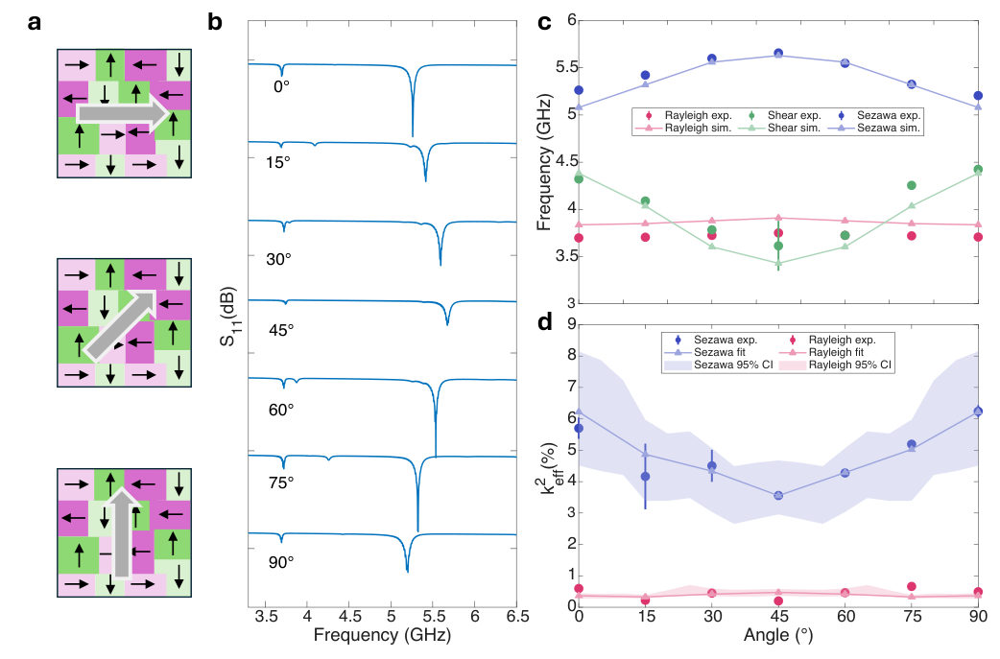
<figcaption class="paper-figure-caption"><b>Fig 2.</b> FIG. 2. Orientation dependence of the BTO SAW resonators. a, Schematics of the multi-domain BTO model. The elastic and piezoelectric properties of the thin film is modeled as a mosaic ensemble of single domains with four orthogonal polarizations. The IDT is rotated relative to the BTO lattice from 0◦to 90◦(top to bottom). The black and gray arrows represent polarizations of each domain and the direction of IDT, respectively. b, S11 spectra under different IDT orientations. Traces are offset vertically for better visibility, with spacing between y-ticks of 50 dB. Angle dependence of c, the mechanical frequencies and d, k2 eff for Rayleigh (red), shear (green), and Sezawa (blue) modes....</figcaption>
</figure>
<figure class="paper-figure-card">
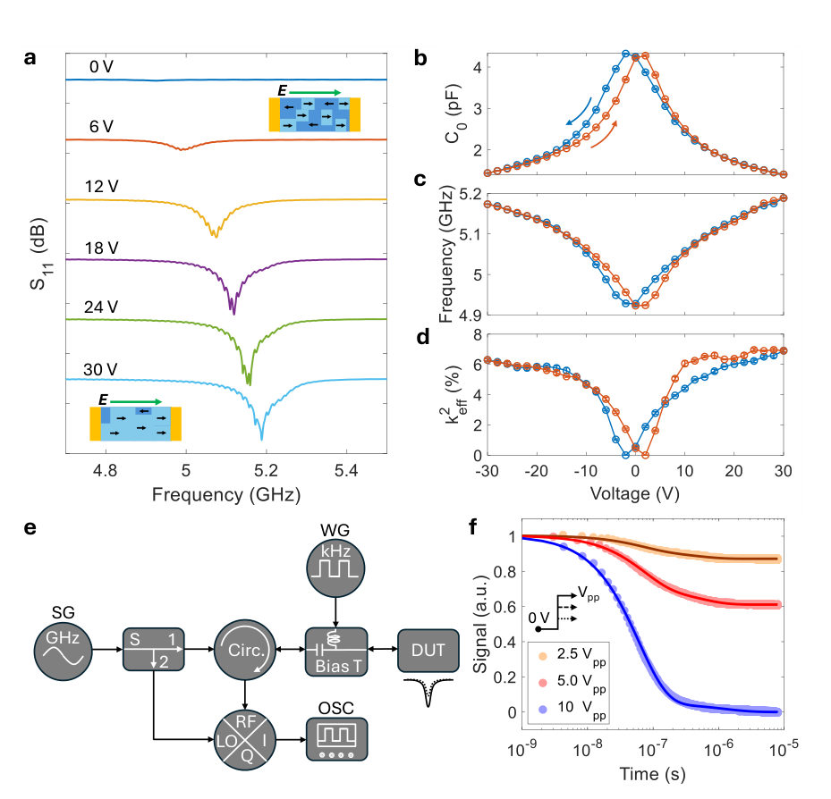
<figcaption class="paper-figure-caption"><b>Fig 3.</b> FIG. 3. Reconfigurable BTO SAW resonator. a, S11 response of the Sezawa mode with an increasing biasing voltage from 0 to 30 V (top to bottom). Each trace is vertically shifted for better illustration. The spacing between y-ticks is 20 dB. The insets schematically show the initial and final polarization states after aligning with the external electric field. b- d, Hysteresis curves measured with increasing (red) and decreasing (blue) DC bias for intrinsic capacitance C0, resonant frequency, and electromechanical coupling k2 eff, respectively. The error bar is the standard deviation from the measurements of four consecutive loops. e, Schematic of the setup for measuring the switching...</figcaption>
</figure>
<figure class="paper-figure-card">
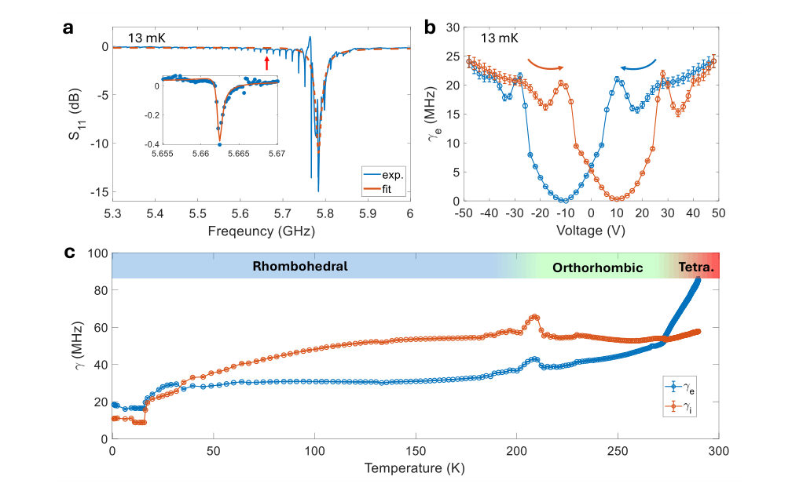
<figcaption class="paper-figure-caption"><b>Fig 4.</b> FIG. 4. Temperature dependence of BTO’s piezoelectric response a, Measured S11 spectrum (blue) at 13 mK together with fitting (red dashed line) used to extract external coupling γe. Inset highlights one of the bulk acoustic modes (red arrow) with a fitted linewidth of 80 kHz. b, Hysteresis curve of γe at 13 mK up to 50 V, showing an increased coercive field and remanent polarization. c, External (γe, blue) and internal (γi, red) coupling rates as a function of temperature from 300 K to 0.7 K. Shaded color band marks the corresponding phase transition of BTO. The error bars in b and c are 95% CI from nonlinear fitting. The bias in a and c is 30 V.</figcaption>
</figure>

**Summary.** This paper thoroughly characterizes thin-film Barium Titanate (BTO) resonators, demonstrating its strong piezoelectric response from room temperature down to cryogenic temperatures. By measuring SAW resonances and analyzing ferroelectric switching dynamics, the authors establish that BTO remains a viable, highly coupled platform for both classical RF electronics and emerging superconducting quantum circuits.

**Why it may be interesting.** The demonstration that a classical ferroelectric material like BTO maintains significant coupling strength ($d_{33,	ext{eff}}$) down to the millikelvin regime is highly relevant for integrating solid-state transducers into superconducting quantum circuits and quantum memories.

Detailed structure

**Main problem.** The study characterizes the piezoelectric properties of thin-film Barium Titanate (BTO) across a wide temperature range, specifically investigating its potential for coupling in superconducting quantum circuits.

**Main result.** Thin-film BTO exhibits strong piezoelectric coupling ($d_{33,	ext{eff}} \approx 19 	ext{ pC/N}$ at millikelvin), which persists down to cryogenic temperatures, making it a promising platform for both classical RF and quantum information technologies.

**Method.** The research combines microwave characterization of Surface Acoustic Wave (SAW) resonators with finite-element modeling and scaling relations to extract effective piezoelectric coefficients across temperature regimes.

**Model / system.** The physical system is an Interdigital Transducer (IDT) fabricated on thin-film BTO deposited on a Si substrate. The analysis models the material's ferroelectric, piezoelectric, and elastic responses under varying DC bias and cryogenic temperatures.

**Key observables.** Electromechanical coupling coefficient ($k_{2	ext{eff}}$), effective piezoelectric coefficients ($d_{31}, d_{33}, d_{15}$), resonance frequency shifts, and the temperature dependence of these parameters.

**Important parameters / regimes.** Temperature range (Room Temperature to millikelvin); high electromechanical coupling ($\sim 14\%$) and fast switching dynamics ($\sim 100 	ext{ ns}$).

**Assumptions / limitations.** The analysis relies on extracting coefficients via scaling relations at cryogenic temperatures due to measurement limitations, and assumes the persistence of piezoelectric coupling mechanisms.

**Figures summary.** Figures show SAW resonance spectra ($S_{11}$) at various temperatures, hysteresis loops ($\gamma_e$) demonstrating ferroelectric switching, and plots detailing the temperature dependence of coupling rates and coefficients.

**Paper structure.** The work progresses from characterizing room-temperature performance (high $k_{2	ext{eff}}$) to studying voltage-controlled reconfigurability, culminating in detailed measurements and analysis of piezoelectric response at millikelvin temperatures for quantum applications.

Abstract

Ferroelectric materials, with their strong nonlinearities, underpin key technologies across radio-frequency (RF) signal processing, optical communications, and emerging quantum systems. Barium titanate (BTO) is a notable example, combining strong piezoelectric and electro-optic responses. While bulk BTO has been studied for decades, the piezoelectric properties of its recently available thin films, and their behavior at the millikelvin temperatures relevant to quantum hardware, remain largely unexplored. Here, we fabricate and characterize surface acoustic wave (SAW) resonators on thin-film BTO. The measured devices exhibit high electromechanical coupling (k2eff 0.14 at 5.2 GHz) and operate up to 7.8 GHz. From these measurements, combined with finite-element modeling of the multi-domain microstructure, we extract an effective piezoelectric coefficient d33eff of 53 pC/N, comparable to bulk BTO. Exploiting the intrinsic ferroelectricity, we further demonstrate low-voltage switching with a fast (100 ns) response, attractive for reconfigurable RF front-ends and parametric amplifiers. Extending these measurements to millikelvin temperatures, we find that the piezoelectric response persists, with d33eff 19 pC/N, pointing to the potential of BTO for piezoelectric coupling in superconducting quantum circuits. These results position thin-film BTO as a promising piezoelectric platform for both classical and quantum information technologies.

[↑ back to top](#top)

### [Tunable Chaos in the Finite Mean SYK Model](http://arxiv.org/abs/2606.18529v1)

**Authors:** Arkaprava Mukherjee, Sumilan Banerjee, Sandip P. Trivedi, Nandini Trivedi  
**Type:** theory · **Category:** strongly correlated electrons · **PDF:** <https://arxiv.org/pdf/2606.18529v1>  
**Analysis basis:** full PDF text, analyzed in chunks
**Topic relevance:** 🔥 `entanglement & information structure` **4/5** · `non-equilibrium dynamics` **2/5** · `non-equilibrium universality` **1/5**

↔ Scroll figures horizontally

<figure class="paper-figure-card">
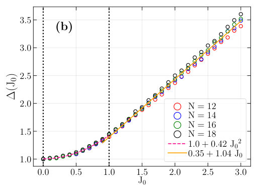
<figcaption class="paper-figure-caption"><b>Fig 1.</b> FIG. 2. a) Density of states ρ(E) for N = 18, and δJ = 1, for changing mean values J0 (different colors). (b) Scaling of the energy spread ∆as a function of J0 for different N (indicated by different colors). For J0 &lt; 1, a quadratic fit (dashed line) and for 1 &lt; J0 &lt; 3, a linear fit (solid line) have been used.</figcaption>
</figure>
<figure class="paper-figure-card">
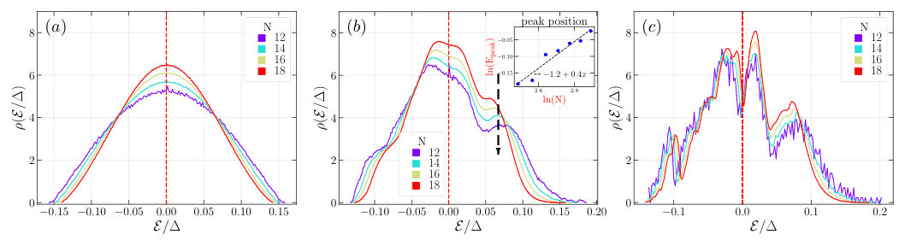
<figcaption class="paper-figure-caption"><b>Fig 2.</b> FIG. 3. Many-body density of states for different N for a) J0 = 0, J = 1, b) J0 = 3, J = 1, c) J0 = 1, J = 0. Inset figure in b) shows the position of the positive peak energy as a function of N in a log-log Plot.</figcaption>
</figure>
<figure class="paper-figure-card">
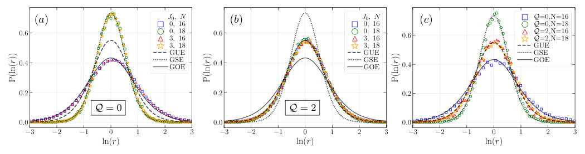
<figcaption class="paper-figure-caption"><b>Fig 3.</b> FIG. 4. Plot of the probability P(r) where r is the ratio of the energy separation of the ith energy level from the one below relative to the one above, as a function of ln(r), showing agreement with RMT ensembles (GUE, GOE, GSE). a) Q = 0 sector, for N = 16, 18, and J0 = 0, 3, δJ = 1; b) Q = 2 sector for N = 16, 18 and J0 = 0, 3 δJ = 1; c) Fixed coupling model with δJ = 0, for Q = 0, 2. In all the plots two values of N = 16, 18 are shown and J0 = 1.</figcaption>
</figure>
<figure class="paper-figure-card">
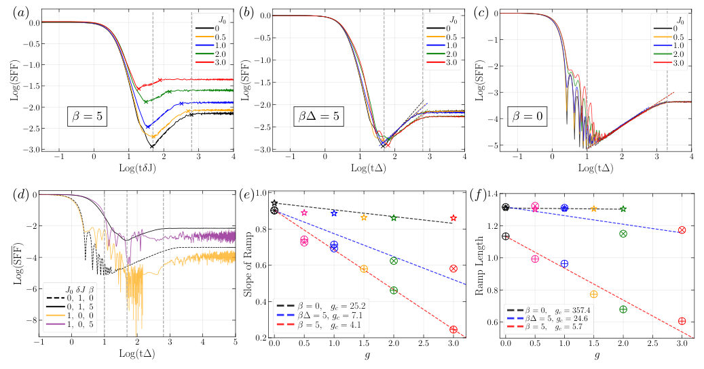
<figcaption class="paper-figure-caption"><b>Fig 4.</b> FIG. 5. (a), (b), (c): Spectral form factor SFF for different mean values, J0, at β = 5 and β = 0. (d) SFF for zero mean (J0 = 0, δJ = 1), and zero standard deviation (δJ = 0, J0 = 1). (e) Slope of the ramp region extracted from (a), (b) as a fuunction of g = J0/δJ (ratio of mean-to-standard deviation ). (f) The length of the ramp region obtained from (a) and (b) as a function of g.</figcaption>
</figure>
<figure class="paper-figure-card">
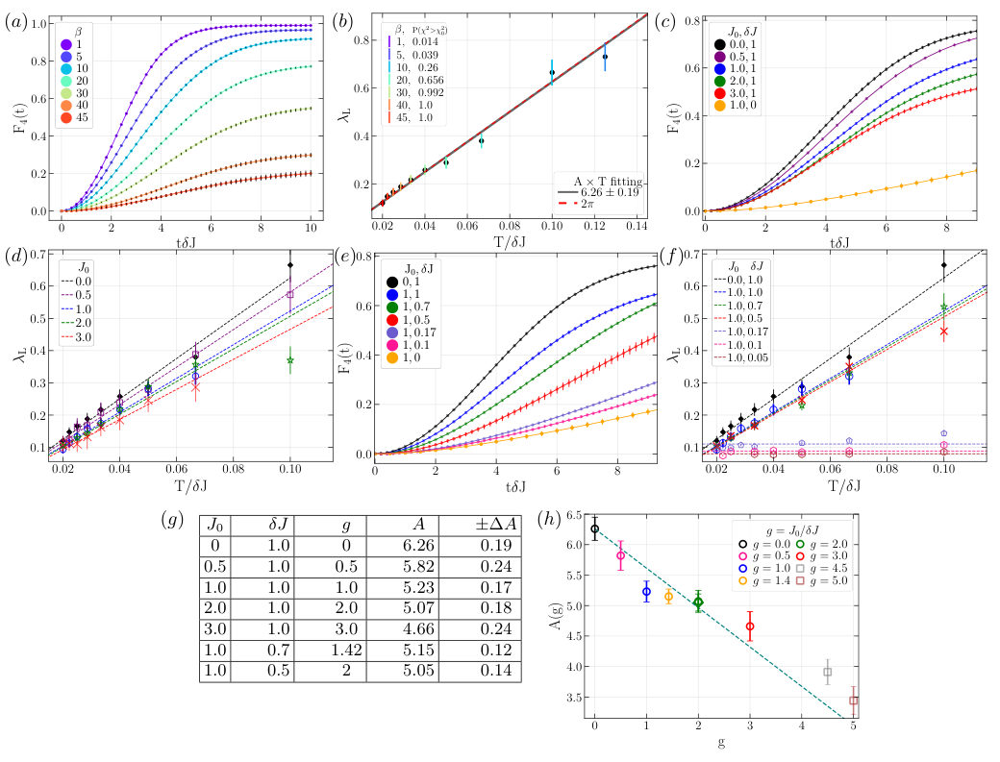
<figcaption class="paper-figure-caption"><b>Fig 5.</b> FIG. 6. a) OTOCs with J0 = 0 at different values of β. b) Lyapunov exponent as a function of β, for J0 = 0. Black curve from fitting data, and red curve for Lyapunov exponent saturating the chaos bound, in good agreement. c) OTOCs for varying J0 at β = 20, and δJ = 1; showing that the rate of increase of F4 slows down as J0 increases. d)Lyapunov exponent λL vs T/δJ showing agreement with fast scrambling behaviour, eq.(40). The coefficient A becomes smaller as J0 increases. e) OTOCs for varying δJ, keeping J0 = 1, and β = 20. Black curve is for J0 = 0, δJ = 1, β = 20. f) λL plotted against T, with a linear fit confirming the fast scrambling behavior. A deviation from this behavior is...</figcaption>
</figure>

**Summary.** The paper explores the generalized SYK model by varying the mean-to-standard deviation ratio of its random couplings. It demonstrates a continuous crossover from highly chaotic behavior (maximal scrambling) towards less chaotic regimes as disorder is tuned. This work highlights that different measures of quantum chaos can decouple, providing deeper insights into the relationship between entropy and maximal chaos in strongly correlated systems.

**Why it may be interesting.** This work provides a detailed theoretical framework for understanding how tuning disorder in strongly interacting fermionic systems modifies fundamental concepts like maximal chaos and scrambling, which are central to holographic theories and condensed matter physics.

Detailed structure

**Main problem.** The study investigates how tuning the mean-to-standard-deviation ratio ($g$) of random couplings affects the chaotic properties of the Sachdev-Ye-Kitaev (SYK) model, exploring a crossover between chaotic and non-chaotic regimes.

**Main result.** Increasing $g$ causes a continuous chaotic-to-non-chaotic crossover in scrambling dynamics; crucially, different measures of chaos decouple, showing that finite residual entropy does not mandate maximal chaos.

**Method.** The analysis employs multiple quantum chaos diagnostics—including Lyapunov exponents (from OTOCs), spectral form factors (SFF), and nearest-neighbor level spacing statistics—across varying disorder parameters.

**Model / system.** The system is the generalized Sachdev-Ye-Kitaev (SYK) model, featuring fermions with all-to-all interactions whose complex couplings are drawn from a Gaussian distribution parameterized by $g = J_0/\deltaJ$.

**Key observables.** Lyapunov exponent ($\lambda_L$), Residual Entropy ($S_0/N$), Out-of-Time Correlators (OTOCs), Spectral Form Factor (SFF), and nearest-neighbor energy level spacing statistics.

**Important parameters / regimes.** The tuning parameter $g = J_0/\deltaJ$, which controls the degree of randomness in the couplings, ranging from $g=0$ (standard SYK) to $g 	o \infty$ (clean limit).

**Assumptions / limitations.** Numerical simulations rely on Exact Diagonalization (ED) for finite system sizes ($N$), and the analysis assumes self-averaging properties hold in the thermodynamic limit.

**Figures summary.** Figures summarize the evolution of chaos diagnostics across varying $g$, showing $\lambda_L$ decreasing from $2\pi T$ to zero, while level repulsion persists and residual entropy remains finite.

**Paper structure.** The paper systematically analyzes spectral density ($
ho(E)$), entanglement entropy ($S_A$), and various time-domain chaos measures (OTOCs, SFF) as functions of the disorder parameter $g$, demonstrating the decoupling between these different indicators of quantum chaos.

Abstract

The complex Sachdev-Ye-Kitaev (SYK) model, featuring fermions with all-to-all interactions, serves as a dual paradigm for understanding non-Fermi liquid behavior and the holographic nature of charged black holes. Two defining characteristics of the standard SYK model are its maximal chaos (Lyapunov exponent $λ_{\mathrm{L}}=2πT$ at temperature $T$), and its finite zero-temperature residual entropy. While previous studies have largely focused on couplings drawn from a zero-mean Gaussian distribution, we investigate a generalized model with a finite mean-to-standard-deviation ratio, $g\equiv J_{0}/δJ$ of the coupling distribution in order to get deeper insight into the evolution of chaos. We find that increasing $g$ yields the following effects: (i) The system remains a fast scrambler with $λ_{\mathrm{L}}=A~T$, but with a suppressed coefficient $A<2π$. (ii) In the limit $g\to \infty$, out-of-time-ordered correlators (OTOCs) no longer exhibit exponential growth with $λ_{\mathrm{L}}\simeq 0$. (iii) The spectral correlations indicative of late-time chaos maintain Wigner-Dyson level spacing statistics for all values of $g$. (iv) The system preserves a finite residual entropy, albeit with reduced magnitude, for all $g$ values. We conclude that in this generalized SYK model, there is a chaotic to non-chaotic crossover. Moreover different measures of chaos decouple, demonstrating that the presence of finite residual entropy does not strictly imply maximal chaos.

[↑ back to top](#top)

### [Universal entanglement probes of topological order and locally-achiral manifolds](http://arxiv.org/abs/2606.18361v1)

**Authors:** Yarden Sheffer  
**Type:** theory · **Category:** other · **PDF:** <https://arxiv.org/pdf/2606.18361v1>  
**Analysis basis:** full PDF text, analyzed in chunks
**Topic relevance:** 🔥 `entanglement & information structure` **4/5** · `analog quantum simulation` **2/5** · `Keldysh / 2PI / non-Gaussian methods` **1/5**

↔ Scroll figures horizontally

<figure class="paper-figure-card">
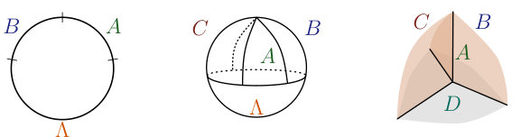
<figcaption class="paper-figure-caption"><b>Fig 1.</b> Figure 1: Partition of the 1,2 and 3-sphere into regions. The 3-sphere is considered as R3 compactified at infinity.</figcaption>
</figure>
<figure class="paper-figure-card">
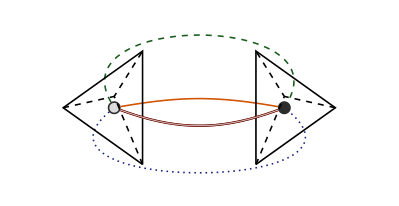
<figcaption class="paper-figure-caption"><b>Fig 2.</b> Figure 2: The “trivial” multi entropy ⟨ψ|ψ⟩defines the manifold SD by gluing two D-simplexes, and the appropriate gem, here shown for D = 3.</figcaption>
</figure>
<figure class="paper-figure-card">
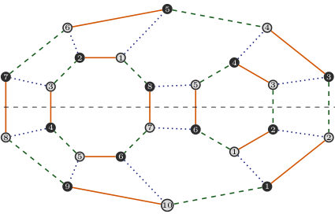
<figcaption class="paper-figure-caption"><b>Fig 3.</b> Figure 6: A gem of S2 with three cycles in G12 and n1, n2, n3 = 6, 8, 10. The dashed line represents the reflection plane.</figcaption>
</figure>
<figure class="paper-figure-card">
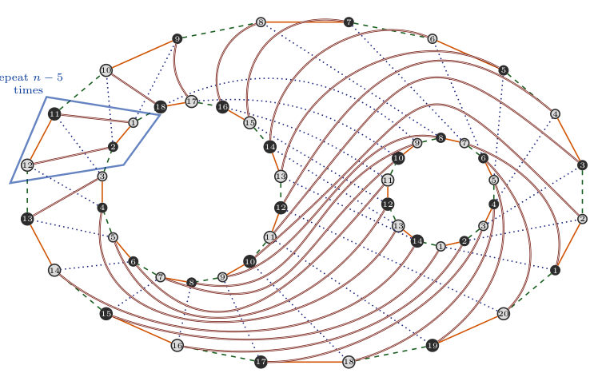
<figcaption class="paper-figure-caption"><b>Fig 4.</b> Figure 7: The gems for F8n. The motif encircled in blue should be repeated n −5 times consecutively (here for n = 6).</figcaption>
</figure>
<figure class="paper-figure-card">
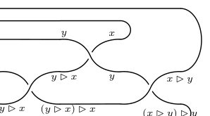
<figcaption class="paper-figure-caption"><b>Fig 5.</b> Figure 9: (a) coloring rule for the crossing. (b) Coloring of the figure-8 knot.</figcaption>
</figure>

**Summary.** The paper develops multi-entropy entanglement measures to probe the universal properties of topological order by calculating the topological partition function $Z(M)$. It establishes that this extraction is possible only if the manifold $M$ possesses a property called 'local achirality.' This framework successfully distinguishes between different types of topological phases and relates these quantum constraints to fundamental geometric invariants like the Pontryagin number in higher dimensions.

**Why it may be interesting.** This work provides a powerful theoretical link between quantum entanglement measures derived from ground states and deep geometric invariants of spacetime manifolds, which is crucial for classifying exotic topological phases beyond standard symmetry protection.

Detailed structure

**Main problem.** The central problem is determining if multi-entropy entanglement measures can extract all universal information about a topological order from the ground state wavefunction.

**Main result.** Topological partition functions $Z(M)$ can be extracted universally if the underlying manifold $M$ satisfies a condition called 'local achirality.'

**Method.** The authors use multi-entropy measures, which are multipartite entanglement generalizations, and relate their phase to the topological partition function $Z(M)$. They establish geometric constraints (like vanishing Pontryagin numbers) that characterize these locally-achiral manifolds.

**Model / system.** The study concerns topologically ordered quantum phases of matter described by gapped ground states on lattices approximating various manifolds ($S^3$, 4-manifolds). Specific models include Quantum Double Theories $D(G_{p,q}, u)$ and Time-Reversal Symmetry Protected Topological Orders (T-SPT).

**Key observables.** Multi-entropy measures $M(\psi)$, the topological partition function $Z(M)$, and geometric invariants like the Pontryagin number $\int_M p_1$.

**Important parameters / regimes.** The dimension of the manifold ($d$), specific parameters defining anyon theories $(p, q, u)$, and the local achirality condition.

**Assumptions / limitations.** It is assumed that multi-entropy measures are valid probes for universal information extraction, and in higher dimensions, local achirality implies vanishing Pontryagin numbers.

**Figures summary.** Figures illustrate manifold constructions (e.g., $S^3$ decomposition), entanglement structures using 'gems,' and the relationship between topological invariants and geometric properties like the Pontryagin number.

**Paper structure.** The paper progresses by first defining multi-entropy probes, establishing the condition of local achirality required to extract $Z(M)$, demonstrating this capability for 2+1D theories beyond modular data, and finally extending the analysis to higher dimensions (4D) by relating local achirality to vanishing Pontryagin numbers.

Abstract

We consider the problem of identifying a topological order based on bulk entanglement of the ground-state wavefunction. Previous work showed that some universal information can be extracted from multi-entropy measures, a class of multipartite entanglement measures obtained by applying permutation operators exchanging the degrees of freedom between different replicas of the wavefunction. It remains an open question to what extent such entanglement measures can be used to extract any universal information from the ground state. Here we show that the topological partition function $Z(M)$ of a manifold $M$ can be extracted provided that $M$ satisfies a topological condition which we term ``local achirality". We show that locally-achiral manifolds can be used to extract universal properties of 2+1d topological phases that go beyond the $S$ and $T$ matrices. As a first step towards classifying locally-achiral manifolds, we show that, in four dimensions, such manifolds have vanishing Pontryagin number. We relate this property to the existence of beyond-cohomology time-reversal symmetry protected topological order (T-SPT) in four dimensions. Finally, we present an entanglement measure that detects this nontrivial T-SPT.

[↑ back to top](#top)

### [Ground- and excited-state energies extraction via Trotterization on IBM quantum computers](http://arxiv.org/abs/2606.18534v1)

**Authors:** Fernando Espinoza-Ortiz, Chungwei Lin, Chih-Chun Chien  
**Type:** both · **Category:** quantum information and computing · **PDF:** <https://arxiv.org/pdf/2606.18534v1>  
**Analysis basis:** full PDF text, analyzed in chunks
**Topic relevance:** 🔥 `QC/QI experiment` **4/5** · `methods for driven-dissipative` **1/5** · `non-equilibrium dynamics` **1/5**

↔ Scroll figures horizontally

<figure class="paper-figure-card">
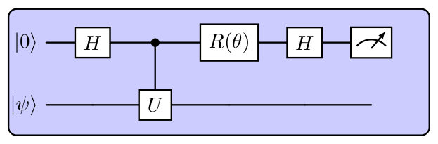
<figcaption class="paper-figure-caption"><b>Fig 1.</b> Figure 1. The Hadamard test for computing the real and imaginary parts of the time signal g(t) where R(θ) is the phase gate.</figcaption>
</figure>
<figure class="paper-figure-card">
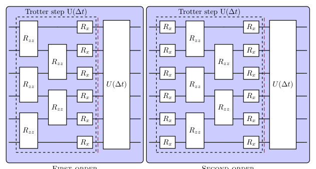
<figcaption class="paper-figure-caption"><b>Fig 2.</b> Figure 3. First and second order Trotterization circuits for a 6-spin TFIM with open boundary condition. Note that the rotation angle for the Rx gates are not the same between circuits. The Rx gates in the second-order Trotterization are θ = −∆t due to the symmetrization in Eq. (6), and the angle in the first-order Trotterization is θ = −2∆t. Meanwhile, the Rzz gates share the same angle θ = −2∆t following equations Eq. (5) and Eq (6).</figcaption>
</figure>
<figure class="paper-figure-card">
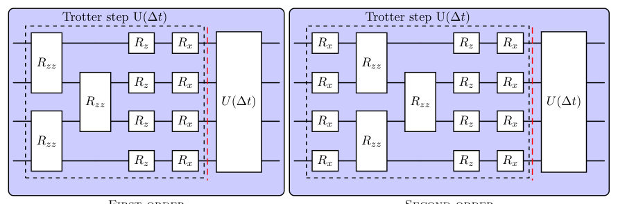
<figcaption class="paper-figure-caption"><b>Fig 3.</b> Figure 4. First and second-order Trotterization circuits for 4-spin TLFIM with open boundary condition. The Rx gates in the second-order Trotterization have angles θ = −∆t due to the symmetrization in Eq. (9), and the angle in the first-order Trotterization is θ = −2∆t. Akin to the TFIM, the Rzz and Rz gates share the same angle θ = −2∆t following Eq. (9).</figcaption>
</figure>
<figure class="paper-figure-card">
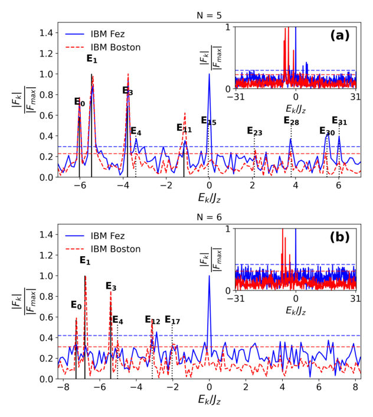
<figcaption class="paper-figure-caption"><b>Fig 4.</b> Figure 5. Fourier spectra of the TFIM with hx/Jz = 1, ∆t/t0 = 0.1, and τ/t0 = 50 for (a) N = 5 and (b) N = 6 spins from IBM Fez and Boston QPUs. The circuits were ran with 6500 shots per circuit to ensure signal resolutions. Each spin simulation consisted of 1002 total circuits; split evenly for extracting the real and imaginary components of the signal. With the guiding state |0⟩⊗N, for N = 5 (N = 6) we can resolve 9 (6) eigenenergies, indicated by the vertial dashed lines. The horizontal dashed lines indicate the background noise threshold according to Eq. (11).</figcaption>
</figure>
<figure class="paper-figure-card">
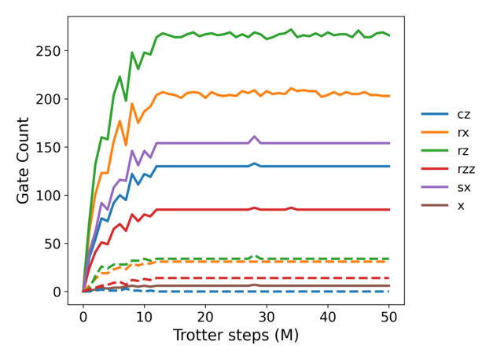
<figcaption class="paper-figure-caption"><b>Fig 5.</b> Figure 6. Gate counts versus Trotter steps M for the optimized circuits of the N = 3 TLFIM with second-order Trotterization and ∆t/t0 = 0.241, hx/Jz = 1, and hz/Jz = 0.1. The dashed lines are the gate counts only for the Trotterization of the time-evolution operator after transpilation on IBM Boston, and the solid lines are the gate counts for the controlled unitary for the H-test after transpilation on IBM Boston. For the N = 3 TLFIM, the circuit becomes of constant depth after BQSkit optimization.</figcaption>
</figure>

**Summary.** The paper presents a robust method to extract multiple eigenenergies of Ising-type models using noisy IBM quantum computers. It combines Trotterization with the Hadamard test and DFT analysis, achieving significant results by optimizing circuits toward constant depth. This advances the field's capability beyond simple ground-state finding towards full spectral characterization on NISQ devices.

**Why it may be interesting.** This work is highly relevant as it pushes the boundary of quantum simulation techniques toward extracting detailed spectral information (multiple eigenvalues) rather than just the ground state, which is a major goal for simulating complex Hamiltonians in condensed matter physics.

Detailed structure

**Main problem.** The core problem is extracting multiple ground- and excited-state energies of quantum many-body systems using noisy, near-term quantum hardware.

**Main result.** The authors successfully demonstrated the reliable extraction of several low-lying eigenenergies for both TFIM and TLFIM on IBM quantum computers, comparing results across different hardware generations.

**Method.** They employ the Hadamard test combined with Trotterized time-evolution operators, followed by a Discrete Fourier Transform (DFT) to map the time dynamics back to spectral energies.

**Model / system.** The study focuses on simulating the Transverse Field Ising Model (TFIM) and its variant, the Transverse Longitudinal Field Ising Model (TLFIM). These models are implemented on IBM quantum processors using Trotterization circuits optimized for constant depth where possible.

**Key observables.** Eigenenergies ($E_k$), spectral weights ($|c_k|^2$), and the time-dependent signal $g(t) = \langle\psi|e^{-i \hat{H}t}|\psi
angle$.

**Important parameters / regimes.** The analysis involves balancing Trotter error ($\Delta t$) against circuit depth, with specific parameters like $\Delta t/t_0 = 0.1$ (TFIM) and $\Delta t/t_0 = 0.241$ (TLFIM) being crucial.

**Assumptions / limitations.** The method assumes that the signal can be accurately reconstructed via DFT despite noise, and it relies on optimizing circuits to achieve constant depth where possible.

**Figures summary.** Figures show Fourier spectra confirming resolved eigenenergies above a calculated noise threshold ($\eta_i$), and comparisons of measured population dynamics $|\langle 0^{\otimes N}|\psi(t)
angle|^2$ against high-accuracy classical Runge-Kutta simulations for both TFIM and TLFIM.

**Paper structure.** The paper introduces the H-test/Trotterization framework, details optimizations like Constant-Depth Circuits (CDCs) for specific Hamiltonians (TFIM), applies this to both TFIM and TLFIM, and concludes by comparing results across different IBM hardware generations against classical benchmarks.

Abstract

We implement the Hadamard test with Trotterized time-evolution operators on IBM quantum computers to simultaneously extract ground- and excited-state energies of the transverse field Ising model (TFIM) and transverse longitudinal field Ising model (TLFIM). The Trotterization circuits for the TFIM admit constant-depth circuits (CDCs) for arbitrary time, allowing us to locate a large number of eigen-energies above the background noise for up to six spins. Via circuit synthesis we show that the three-spin TLFIM has constant-depth structure although it does not meet the known CDC criteria. The CDCs enable the extraction of the ground and first-excited state energies of the three-site TLFIM via its dynamics. We also address complications from the noisy background and discrete Fourier transform to enhance the reliability of the extraction process and compare the results from different generations of IBM hardware to highlight the improvement.

[↑ back to top](#top)

### [The quantum-advantage resource in multimode OPA light: Identification, optimization, extraction](http://arxiv.org/abs/2606.18605v1)

**Authors:** Vitaly Kocharovsky, Kunwar Kalra  
**Type:** theory · **Category:** quantum information and computing · **PDF:** <https://arxiv.org/pdf/2606.18605v1>  
**Analysis basis:** full PDF text, analyzed in chunks
**Topic relevance:** 🔥 `entanglement & information structure` **4/5** · `Keldysh / 2PI / non-Gaussian methods` **1/5**

↔ Scroll figures horizontally

<figure class="paper-figure-card">
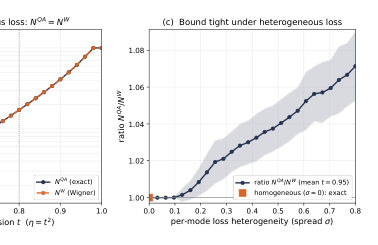
<figcaption class="paper-figure-caption"><b>Fig 1.</b> Fig. 1. Depletion of the quantum-advantage resource by pruning and photon loss: Normalized Wigner lower bound, Eq. (11), 𝑁𝑊, and exact value, Eq. (9), 𝑁𝑄𝐴, of the resource dimension as functions of (a) the number of modes 𝑀′ remaining after random one-at-a-time pruning 𝑀−𝑀′ modes and (b, c) field attenuation applied to all modes. (a) Random pruning: Mean ± standard deviation over 24 random interferometers and pruning orders. The easy-to-compute bound tracks the exact dimension along the whole trajectory, and both collapse by an order of magnitude at half budget (𝑀′/𝑀= 1/2). (b) Homogeneous loss, {𝑡𝑗= 𝑡}𝑀 𝑗=1: Normalized dimensions 𝑁𝑄𝐴and 𝑁𝑊coincide; the resource collapses by one order of...</figcaption>
</figure>
<figure class="paper-figure-card">
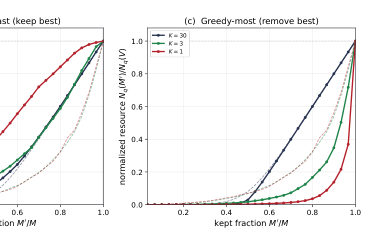
<figcaption class="paper-figure-caption"><b>Fig 2.</b> Fig. 2. Depletion of the quantum-advantage resource by tracing out (pruning) modes, 𝑀= 30, 𝑟= 1.0. Every panel plots the normalized resource 𝑁𝑄𝐴(𝑀′)/𝑁𝑞(𝑉)—the surviving fraction of the full resource—against the kept fraction 𝑀′/𝑀of modes. (a) Random pruning: The resource collapses roughly linearly to zero near 𝑀′/𝑀= 0.5, the asymptotics 𝑁𝑞∝𝑀′ −𝑀/2 is tied to the 𝑀-fold kernel of the classical part, dim ker𝑉𝑐= 𝑀. (b, c) Targeted one-at-a-time pruning by two extreme strategies, for 𝐾= 30, 3, 1 (colored; solid = greedy, dashed = random reference at the same 𝐾): greedy-least (b) removes the least-valuable mode each step (keeps the most resource), greedy-most (c) removes the most-valuable...</figcaption>
</figure>
<figure class="paper-figure-card">
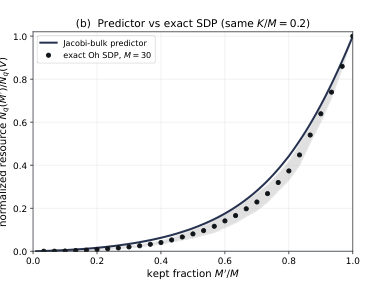
<figcaption class="paper-figure-caption"><b>Fig 3.</b> Fig. 3. Quantum-advantage resource under random pruning at large mode number, via the Jacobi-bulk predictor. (a) Resource dimension 𝑁𝑞(𝑀′) vs. the number of kept modes 𝑀′ for 𝑀= 3000, 𝐾= 600 squeezed at 𝑟= 1 (that is, 𝑁𝑞(𝑉) = 𝐾sinh2 𝑟= 828.7): The predictor (curve) and direct Monte-Carlo samples (drawing the singular values of a Haar block, no SDP convex optimization) agree, with the resource falling to 89 (11%) by half budget. This is a regime where the exact convex optimization is intractable. (b) At the same ratio 𝐾/𝑀= 0.2 the predictor matches the exact SDP convex optimization at a tractable size (𝑀= 30), validating it. The mean-field predictor slightly overestimates at intermediate...</figcaption>
</figure>
<figure class="paper-figure-card">
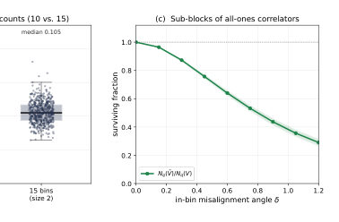
<figcaption class="paper-figure-caption"><b>Fig 4.</b> Fig. 4. Depletion of the quantum-advantage resource by coarse-grained binning of 𝑀= 30 squeezed entangled lossy modes. (a) Distribution over 560 random states and binnings (bin count ¯𝑀drawn from [6, 18]): The median surviving fraction is 0.036 and no binning exceeds 1 (monotonicity, Eq. (21)). The loss is severe and worsens with 𝑀(median ∼0.14 at 𝑀∼8 falling to 0.036 at 𝑀= 30). (b) Surviving fraction at two fixed bin counts, ¯𝑀= 10 (bins of 3) vs. ¯𝑀= 15 (bins of 2), over the same ensemble (box = quartiles, dots = individual binnings): The coarser count strands more resource, leaving a median of only ≈0.016 against ≈0.105 for the finer one – isolating the effect of binning granularity...</figcaption>
</figure>
<figure class="paper-figure-card">
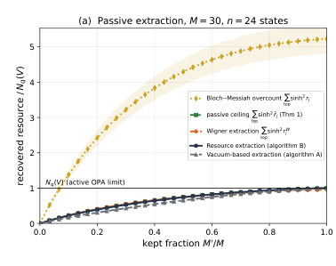
<figcaption class="paper-figure-caption"><b>Fig 5.</b> Fig. 5. Commonly used Bloch–Messiah algorithm vs. resource extraction algorithm B and other algorithms for a heterogeneous-loss ensemble (per-mode power transmission 𝜂= 𝑡2 ∈[0.1, 0.5]; 𝑀= 30, 𝑛= 24 states). (a) Ensemble-averaged recovered fraction 𝑁𝑞(kept)/𝑁𝑞(𝑉) vs. kept fraction 𝑀′/𝑀. The resource extraction algorithm B is the preferable unique passive procedure for which the per-mode rank statistic sinh2 ˜𝑟𝑗adds up exactly to the total resource, Í 𝑗sinh2 ˜𝑟𝑗= 𝑁𝑞(𝑉), Eq. (25). (b) 𝑁𝐵𝑀 𝑞 (𝑉)/𝑁𝑞(𝑉) vs. mean transmission. The Bloch–Messiah algorithm severely overestimates the true resource.</figcaption>
</figure>

**Summary.** This work introduces a novel 'quantum-advantage resource' measure for multimode Gaussian light, quantifying its inherent quantum complexity using advanced convex optimization techniques. By analyzing pulsed OPAs, the authors demonstrate that this resource can be maximized and extracted, providing a critical theoretical tool for realizing scalable photonic quantum computing beyond simple entanglement measures.

**Why it may be interesting.** It provides a rigorous mathematical framework ($	ext{\#P}$-hard complexity) to quantify the non-classical resources in continuous variable systems, offering a superior metric over standard entanglement measures for assessing true computational advantage.

Detailed structure

**Main problem.** To introduce and provide a universal quantitative measure for the 'quantum-advantage resource' contained within mixed multimode Gaussian states, distinguishing it from classical correlations.

**Main result.** The proposed quantum complexity resource dimension ($N_{QA}$) is shown to be a more realistic metric than previous measures like Bloch–Messiah supermodes, and this resource can be engineered in pulsed OPAs for photonic quantum computing.

**Method.** The analysis uses convex optimization techniques applied to the quadrature covariance matrix, relating the resource measure to the $\text{\#P}$-hard complexity of joint photon number probability distributions via the Hafnian Master Theorem.

**Model / system.** The system is modeled using multimode Gaussian states generated by pulsed Optical Parametric Amplifiers (OPAs). The state is characterized entirely by its quadrature covariance matrix, $V$.

**Key observables.** Quantum-advantage resource dimension ($N_{QA}$), the quantum part of the covariance matrix ($V_q$), and the mean photon number in the quantum part ($\langle n_S 
angle$).

**Important parameters / regimes.** The squeezing parameters ($\tilde{r}_j$) derived from $V_q$, and the number of modes ($M$) which can reach thousands.

**Assumptions / limitations.** The analysis is primarily restricted to Gaussian states, although it aims to guide applications toward non-Gaussian regimes. It assumes that the resource measure depends only on the exponential factor of complexity.

**Figures summary.** Figures compare the exact quantum advantage resource ($N_{QA}$) against the Wigner quasi-probability distribution bound ($N_W$), showing excellent agreement, and illustrate how mode pruning severely depletes this resource.

**Paper structure.** The paper develops the theoretical framework by defining the resource via convex optimization (Oh decomposition), comparing it to older metrics (BM supermodes), deriving bounds using Wigner functions, analyzing resource depletion under loss/pruning, and finally applying these concepts to pulsed OPA sources for quantum computation.

Abstract

We introduce the notion and reveal remarkable properties of quantum complexity resource contained in a mixed multimode Gaussian state and providing universal quantitative characterization of its quantum advantage. The notion is based on convex optimization, multimode photon number statistics, Hafnian Master Theorem, and #P-hard complexity. We consider pulsed OPAs targeting maximal quantum complexity resource and thousands of multipartite-entangled squeezed modes of output light via nonlinear, spatio-temporally nonadiabatic generation inside OPA and optimized extraction out of OPA. We show that such figure of merit is more realistic than Bloch--Messiah supermodes and guides to multimode OPAs opening new paths to important applications in quantum information science such as generation of 3D cluster states for one-way photonic quantum computing and demonstration of quantum advantage.

[↑ back to top](#top)

### [Spontaneous parametric down-conversion pumped by spatiotemporal structured light](http://arxiv.org/abs/2606.19219v1)

**Authors:** Lukas Montenegro, Rafael F. Barros  
**Type:** theory · **Category:** other · **PDF:** <https://arxiv.org/pdf/2606.19219v1>  
**Analysis basis:** full PDF text, analyzed in chunks
**Topic relevance:** 🔥 `interference shaping light` **4/5**

↔ Scroll figures horizontally

<figure class="paper-figure-card">
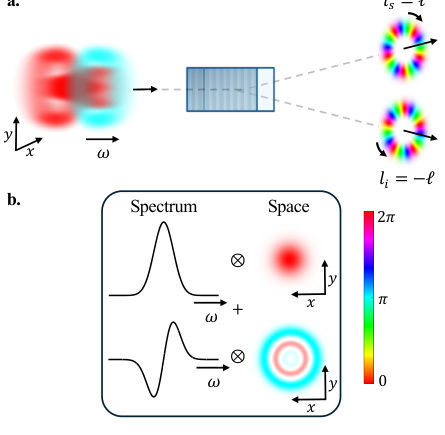
<figcaption class="paper-figure-caption"><b>Fig 1.</b> FIG. 1. a) Conceptual image of SPDC photons produced by pumping a nonlinear crystal with a spatiotemporally struc- tured pump beam. The pump field shown is composed of ultrafast pulse shapes attached to superpositions of radial Laguerre-Gaussian spatial modes (lp = 0), as illustrated in b). The signal and idler photons are spatially projected onto counter-rotating OAM modes with ls = ℓand li = −ℓ.</figcaption>
</figure>
<figure class="paper-figure-card">
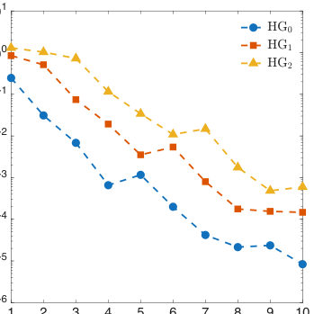
<figcaption class="paper-figure-caption"><b>Fig 2.</b> FIG. 3. Fidelity of the effective nonlinear susceptibility to Hermite-Gaussian targets obtained by a genetic optimization of the pump spatial structure with varying ℓ. The fidelity is measured as the Euclidean distance to the target nonlinear coefficient.</figcaption>
</figure>
<figure class="paper-figure-card">
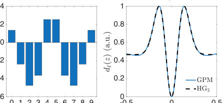
<figcaption class="paper-figure-caption"><b>Fig 3.</b> FIG. 2. Hermite-Gaussian nonlinear coefficients obtained L = 15 mm, ℓ= 9, δω∆βL = 16, and zR/L = 0.2. The first column shows the coefficients ¯cm optimized with a genetic al- gorithm to minimize the Euclidean distance ||dℓ(z)−dT (z)|| to Hermite-Gaussian targets of a. zeroth, b. first and c. second order. The target nonlinear coefficients and the correspond- ing optimization results are shown on the second column.</figcaption>
</figure>
<figure class="paper-figure-card">
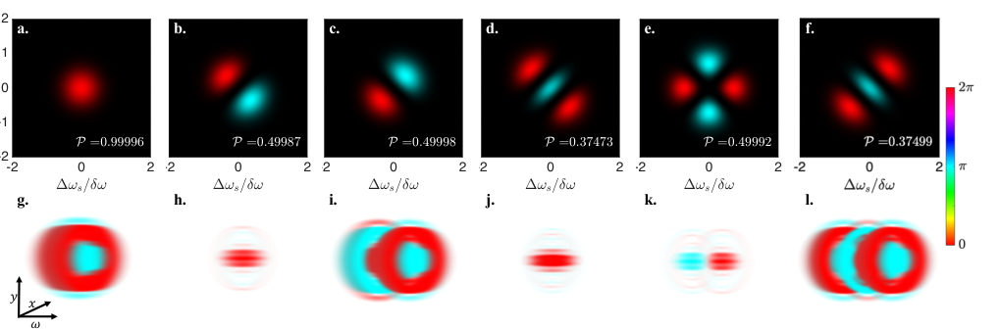
<figcaption class="paper-figure-caption"><b>Fig 4.</b> FIG. 4. Hermite-Gaussian joint spectral amplitudes in the rotated basis and their respective spatiotemporal pumps. We show the HG00 state in a./g., HG01 in b./h., HG10 in c./i., HG02 in d./j., HG11 in e./k., and HG20 in f./l.. Here ∆ωs/i = ωs/i−ω0 s/i, ω0 being the central, phase-matched frequency corresponding to the wavelength of 1560 nm. The nonlinear medium considered is a type-II KTiOPO4 crystal, and all other parameters are the same as in Fig. 2.</figcaption>
</figure>
<figure class="paper-figure-card">
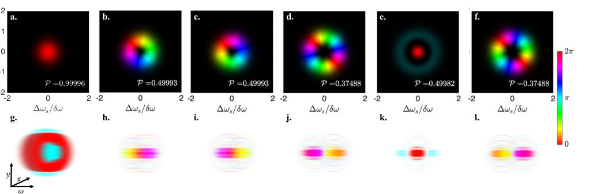
<figcaption class="paper-figure-caption"><b>Fig 5.</b> FIG. 5. Joint spectral amplitudes and their respective spatiotemporal pump structures in the Laguerre-Gauss basis. These states represent superpositions of the states created in 4 and are all maximally entangled. Figures a. and g. represent the gaussian mode; figures b. and h. and c. and i. represent modes LG+1 0 and LG−1 0 , respectively, while figures d. and j., e. and k. and f. and l. represent the modes of order two, LG+2 0 , LG0 1 and LG−2 0 .</figcaption>
</figure>

**Summary.** The paper presents a method to precisely control the spectral correlations of entangled photon pairs generated via SPDC using structured light pumps. By exploiting the Gouy phase mismatch, the authors show that structuring the pump in both space and spectrum allows for 'field-programmable' generation of complex quantum states. This offers a powerful alternative to traditional crystal engineering for advanced quantum source development.

**Why it may be interesting.** This work is highly relevant to quantum optics, specifically in the area of photon source engineering. The concept of 'field-programmable' sources that bypass complex crystal fabrication techniques by manipulating the pump beam is a major theoretical advance for generating high-dimensional entangled states.

Detailed structure

**Main problem.** The research aims to achieve all-optical control over the spectral correlations of photon pairs generated via Spontaneous Parametric Down-Conversion (SPDC). This is accomplished by structuring the pump beam in both spatial and spectral domains.

**Main result.** By utilizing Gouy phase matching with spatiotemporally structured light, the authors demonstrate full control over biphoton spectral correlations, enabling the generation of complex quantum states inaccessible through traditional crystal engineering methods.

**Method.** The method involves modeling SPDC using mode expansions (e.g., Hermite-Gaussian basis) and deriving the joint spectral amplitude (JSA) dependence on the pump field's spatiotemporal structure via the Gouy phase mismatch.

**Model / system.** The physical system is SPDC in a nonlinear medium, modeled by an interaction Hamiltonian. The control mechanism relies on structuring the pump beam using its spatial and temporal wavepacket properties to dictate the effective phase-matching function.

**Key observables.** Mode-dependent joint spectral amplitude (mJSA), fidelity of the effective nonlinear susceptibility ($\chi_{	ext{eff}}$) matching target Hermite-Gaussian structures, and spectral purity ($P$).

**Important parameters / regimes.** The Gouy phase mismatch term $\Delta \phi_G(z)$ is crucial; control is achieved by structuring the pump field in space (spatial modes) and spectrum (temporal wavepackets).

**Assumptions / limitations.** Approximations include using the standard SPDC regime (low pair generation probability) and assuming linear dispersion.

**Figures summary.** Figures illustrate conceptual setups with structured pumps, optimization results showing high fidelity of $\chi_{	ext{eff}}$ matching HG targets, and examples of generated JSAs using Laguerre-Gaussian modes in a rotated spectral basis.

**Paper structure.** The paper develops the theoretical framework by relating the mJSA to the pump field structure via Gouy phase matching. It then demonstrates this control capability by generating specific quantum states (separable vs. entangled) and compares it favorably against previous methods like those using Aperiodically Poled Crystals.

Abstract

Here we investigate the all-optical control of spectral correlations in spontaneous parametric down-conversion. We show that when photon pairs are projected onto high-order spatial modes, the spatial structure of the pump field defines the phase-matching function of the nonlinear interaction. Thus, by structuring the pump field in both space and spectrum, the biphoton spectral correlations are fully controlled.Considering a standard periodically-poled crystal as the nonlinear medium, we show that the Gouy phase matching method proposed here can generate both spectrally uncorrelated and high-dimensional spectrally entangled photon pairs, similarly to what is achieved with aperiodically-poled crystals. Furthermore, we show that our method can generate a wider class of quantum states if the pump field is a spatiotemporal wavepacket, that is, if its spatial and spectral structures are correlated.

[↑ back to top](#top)

### [Universal photon blockade via two-photon light-matter interaction at chiral exceptional points](http://arxiv.org/abs/2606.18756v1)

**Authors:** Hai-Tao Dong, Meng-Long Song, Si-Yu Zhang, Xue-Ke Song, Liu Ye, Dong Wang  
**Type:** theory · **Category:** other · **PDF:** <https://arxiv.org/pdf/2606.18756v1>  
**Analysis basis:** full PDF text, analyzed in chunks
**Topic relevance:** `Tavis-Cummings & cavity-many-emitter` **3/5** · `correlated cavity matter` **3/5** · `driven-dissipative phase transition` **3/5** · `interference shaping light` **3/5** · `analog quantum simulation` **2/5** · `correlated / nonlocal dissipation` **2/5** · `methods for driven-dissipative` **2/5** · `non-equilibrium universality` **2/5** · `Keldysh / 2PI / non-Gaussian methods` **1/5** · `entanglement & information structure` **1/5** · `non-equilibrium dynamics` **1/5**

↔ Scroll figures horizontally

<figure class="paper-figure-card">
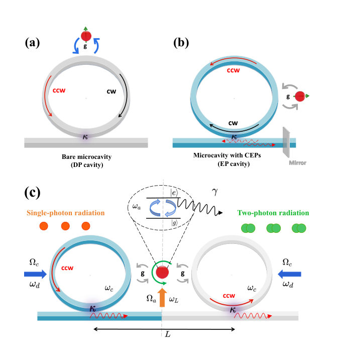
<figcaption class="paper-figure-caption"><b>Fig 1.</b> FIG. 1. Schematics of the cavity QED systems and the equivalent models. (a) A standard resonator supporting degenerate CW and CCW modes. A two-level atom couples to both modes with equal strength g. κ denotes the cavity-waveguide decay rate. (b) A mirror on the waveguide introduces strong unidirectional coupling from the CCW to the CW mode, driving the system to CEPs. (c) The EP system is unfolded via mirror symmetry into a cascaded model with a spatial separation L. Ωc (Ωa) represents the driving strength of the pump field, and ωd (ωL) represents the driving frequency.</figcaption>
</figure>
<figure class="paper-figure-card">
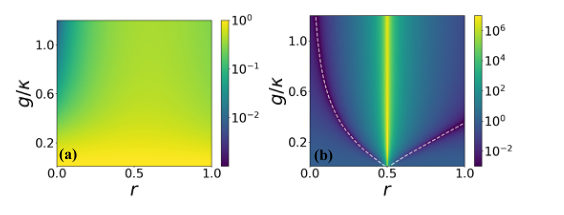
<figcaption class="paper-figure-caption"><b>Fig 2.</b> FIG. 3. Density plots of the steady-state equal-time second-order correlation functions versus the nonlinear atom-cavity coupling strength g/κ and the mirror reflectivity r under cavity driving. (a) The correlation function in the left cavity, g(2) L (0). (b) The corre- lation function in the right cavity, g(2) R (0). The system parameters are chosen as γ/κ = 1, Ωc/κ = 0.01, ∆a = 0, and φ = 0 and the white dashed line in the figure corresponds to the relation: g/κ = |2r −1| p</figcaption>
</figure>
<figure class="paper-figure-card">
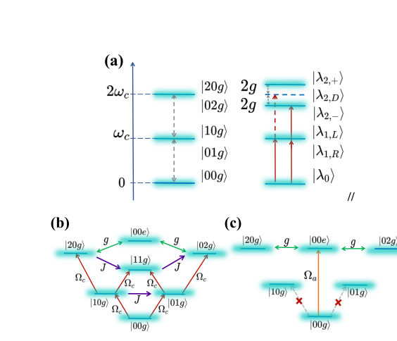
<figcaption class="paper-figure-caption"><b>Fig 3.</b> FIG. 2. (a) Energy spectrum of the two-photon two-mode JC model. (b) Transition pathways of the cavity drive in the quantum interference model. In the panels, J = −iκ|r|eiφ. (c) Transition pathways of the atom drive in the quantum interference model.</figcaption>
</figure>
<figure class="paper-figure-card">
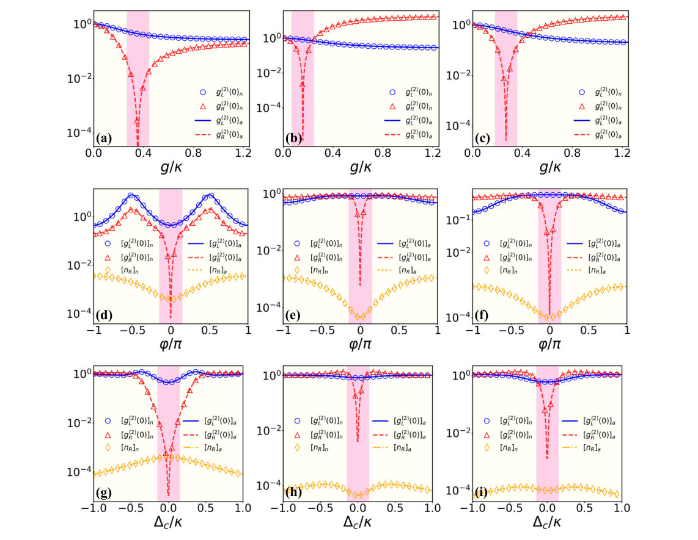
<figcaption class="paper-figure-caption"><b>Fig 4.</b> FIG. 4. (a)-(c) g(2) s (0) as a function of g in the resonant case ∆c = 0 for Ωc/κ = 0.01, γ/κ = 1 and (a) r = 1,(b) r = 0.33 and (c) r = 0.25 . (d)-(f) g(2) s (0) and nR as a function of φ in the resonant case ∆c = 0 for Ωc/κ = 0.01,γ/κ = 1 and (d) r = 1, g/κ = 0.354,(e) r = 0.33, g/κ = 0.158 and (f) r = 0.25, g/κ = 0.267. (g)-(i) g(2) s (0) and nR as a function of ∆c for Ωc/κ = 0.01,γ/κ = 1, φ = 0 and (g) r = 1, g/κ = 0.354, (h) r = 0.33, g/κ = 0.158 and (i) r = 0.25, g/κ = 0.267. In the panels, the subscripts ”n” and ”a” denote numerical and analytical solutions, respectively.</figcaption>
</figure>
<figure class="paper-figure-card">
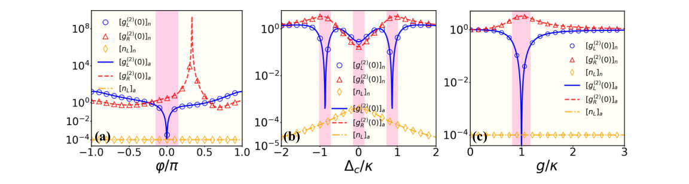
<figcaption class="paper-figure-caption"><b>Fig 5.</b> FIG. 5. (a) Plots of the g(2) s (0)(s = L, R) and nL as a function of φ with system parameters r = 1, γ/κ = 1, ∆c/κ = 0.866, g/κ = 1. (b) Plots of the g(2) s (0)(s = L, R) and nL as a function of ∆c with system parameters r = 1, φ = 0 , γ/κ = 1, g/κ = 1. (c) Plots of the g(2) s (0)(s = L, R) and nL as a function of ∆c with system parameters r = 1, φ = 0, γ/κ = 1, ∆c/κ = 0.866. In the panels, the subscripts ”n” and ”a” denote numerical and analytical solutions, respectively.</figcaption>
</figure>

**Summary.** The paper theoretically investigates how chiral exceptional points in an optical microcavity can be exploited to achieve universal photon blockade. By analyzing the system's nonreciprocal dynamics, the authors demonstrate that one direction of light propagation exhibits strong anti-bunching (PB), while the other shows different statistics. This provides a pathway for designing highly directional quantum sources.

**Why it may be interesting.** This work is highly relevant to AMO physics and quantum optics as it explores non-Hermitian effects (CEPs) to engineer fundamental quantum phenomena like single-photon emission with unprecedented directional control, moving beyond standard cavity QED setups.

Detailed structure

**Main problem.** The study investigates achieving universal photon blockade (PB) using two-photon light-matter interactions within a microcavity system exhibiting chiral exceptional points (CEPs). The goal is to build multiplexing quantum sources with nonreciprocal photon statistics.

**Main result.** The presence of CEPs causes a stark contrast in photon statistics between the two counter-propagating modes: one mode exhibits strong PB ($g^{(2)} 	o 0$), while the other shows Poissonian or super-Poissonian distribution, enabling directional control.

**Method.** Theoretical analysis using the extended cascade quantum master equation and deriving equations of motion for probability amplitudes. Photon statistics are diagnosed via equal-time second-order correlation functions, $g^{(2)}(0)$.

**Model / system.** The system is an optical microcavity coupled to a quantum emitter (QE), modeled by a two-photon two-mode JC Hamiltonian ($H_{JC}$). The dynamics are governed by the master equation incorporating cavity and atomic decay rates.

**Key observables.** Second-order correlation functions ($g^{(2)}_L(0)$ and $g^{(2)}_R(0)$), mean photon numbers ($n_L, n_R$), and probability amplitudes of Fock states.

**Important parameters / regimes.** Coupling strength ($g/\kappa$), detuning ($\Delta_c/\kappa$), phase ($\phi$), and cavity/mirror reflectivity ($r$).

**Assumptions / limitations.** The analysis relies on the weak-driving regime approximation in some sections, and the system dynamics are modeled using a master equation approach.

**Figures summary.** Figures illustrate $g^{(2)}(0)$ dependence on parameters like coupling strength, phase, and detuning. Key findings show PB ($g^{(2)} 	o 0$) appearing selectively in one mode (e.g., the right cavity) under specific parameter settings ($\phi=0$ or $\Delta_c=0$).

**Paper structure.** The paper develops by first establishing the theoretical framework using a two-photon JC model and master equation dynamics. It then analyzes the system's steady-state behavior, focusing on how CEPs induce directional differences in photon statistics (PB vs. bunching) under varying driving conditions (resonant vs. detuned).

Abstract

The photon blockade (PB) effect is a hallmark non-classical phenomenon in quantum optics and finds important applications for building quantum sources, while the control of PB by the non-Hermitian exceptional points remains largely unexplored. In this work, we theoretically investigate universal photon blockade in a microcavity harboring chiral exceptional points (CEPs) for building multiplexing quantum sources with nonreciprocal photon statistics. The results reveal that the presence of the CEPs leads to a stark contrast in the photon statistics of two whispering-gallery modes with opposite propagating directions. That is, one mode exhibits a strong PB effect while the other displays either sub-Poissonian or super-Poissonian distribution. Our findings thus may pave the way for advanced applications of photon blockade, and provide a theoretical foundation for the selective generation of single-photon and two-photon emission

[↑ back to top](#top)

### [Contextuality as a Diagnostic of Translation-Symmetry Breaking in Translation-Invariant 1D Hamiltonians](http://arxiv.org/abs/2606.19033v1)

**Authors:** Xiao Zeng, Kaiyan Yang, Lingxia Zhang, Zizhu Wang  
**Type:** theory · **Category:** statistical mechanics · **PDF:** <https://arxiv.org/pdf/2606.19033v1>  
**Analysis basis:** full PDF text, analyzed in chunks
**Topic relevance:** `analog quantum simulation` **3/5** · `entanglement & information structure` **3/5** · `methods for driven-dissipative` **3/5** · `Frenkel-Kontorova` **2/5** · `Keldysh / 2PI / non-Gaussian methods` **2/5** · `quantum measurements` **2/5** · `correlated / nonlocal dissipation` **1/5** · `correlated cavity matter` **1/5** · `driven-dissipative phase transition` **1/5** · `exotic spin models in light-matter` **1/5** · `non-equilibrium dynamics` **1/5** · `non-equilibrium universality` **1/5**

↔ Scroll figures horizontally

<figure class="paper-figure-card">
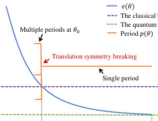
<figcaption class="paper-figure-caption"><b>Fig 1.</b> FIG. 1: Schematic classical-to-quantum symmetry selection along a parameterized Hamiltonian family H(θ). We assume H(θ0) saturates the classical bound while H(θ1) reaches the maximal quantum violation. As θ is tuned from θ0 to θ1, the ground-state energy density e(θ) decreases and contextuality appears. At θ0, the classical-saturating Hamiltonian has a ground space supporting multiple distinct commensurate periods. For θ &gt; θ0, this period degeneracy is lifted and the ground state becomes strictly pQ-periodic with pQ &gt; 1, signaling spontaneous breaking of one-site translation symmetry.</figcaption>
</figure>
<figure class="paper-figure-card">
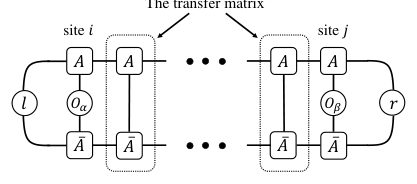
<figcaption class="paper-figure-caption"><b>Fig 2.</b> FIG. 3: The diagram representation of the correlation function 〈Oi αO j β〉. l, r are the left and right fixed points of</figcaption>
</figure>
<figure class="paper-figure-card">
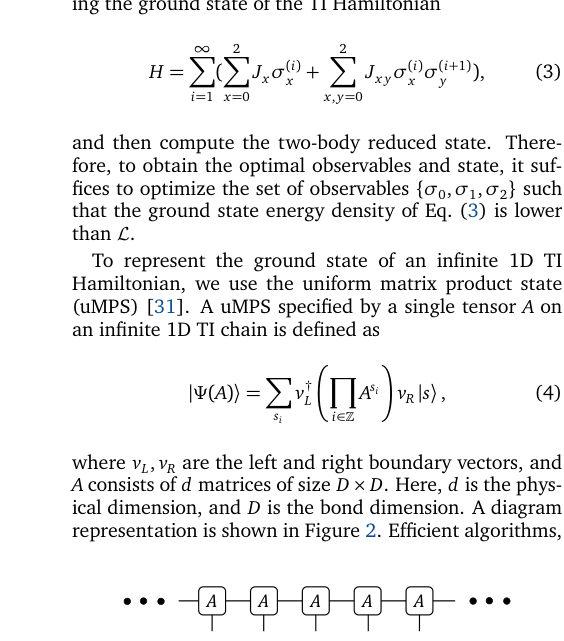
<figcaption class="paper-figure-caption"><b>Fig 3.</b> FIG. 2: A diagram representation of uMPS.</figcaption>
</figure>
<figure class="paper-figure-card">
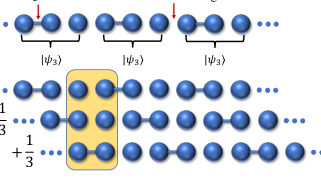
<figcaption class="paper-figure-caption"><b>Fig 4.</b> FIG. 4: Structure of the ground state |Ψ(A)〉. |Ψ(A)〉is the symmetrization of the state |ψ3〉⊗∞, and |ψ3〉is a state that is a product of a two-partite entangled state and a single-partite state. The yellow box shows the symmetrized two-site reduced density matrix.</figcaption>
</figure>
<figure class="paper-figure-card">
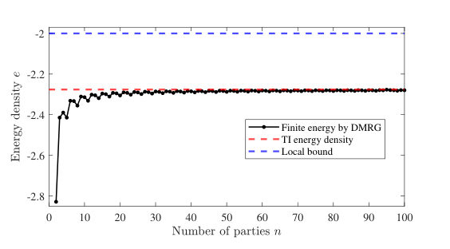
<figcaption class="paper-figure-caption"><b>Fig 5.</b> FIG. 5: The energy densities of Eq. (18) (left-hand side with observables Eq. (11)) computed using DMRG with OBC. Note that DMRG sometimes falls into local minima for this model, and the final energy seems to depend on the initial tensor. Each point in this figure are the lowest energy from 100 runs of DMRG for each n ∈{3,...,100}.</figcaption>
</figure>

**Summary.** This work establishes that contextuality serves as a quantitative diagnostic for detecting spontaneous translation-symmetry breaking in 1D quantum systems. By analyzing how the maximal violation of contextuality witnesses forces the ground state into a unique periodic structure, it connects fundamental concepts from quantum information theory to condensed matter physics principles like commensurate order.

**Why it may be interesting.** It provides a powerful, measurable quantum correlation diagnostic—contextuality—that directly maps onto fundamental concepts in condensed matter physics like spontaneous symmetry breaking and emergent periodicity.

Detailed structure

**Main problem.** The paper investigates contextuality as a diagnostic tool for detecting spontaneous breaking of translation symmetry in quantum systems described by translation-invariant Hamiltonians.

**Main result.** Maximal quantum violation of contextuality witnesses coincides with the spontaneous breaking of one-site translation symmetry, forcing the ground state into a unique, strictly periodic structure ($p>1$).

**Method.** The analysis uses advanced mathematical tools including Semidefinite Programming (SDP) hierarchies (NPA), Matrix Product States (MPS), and variational minimization to derive lower bounds for quantum correlations.

**Model / system.** The study focuses on infinite one-dimensional translation-invariant chains governed by local Hamiltonians, analyzed using contextuality witnesses derived from energy density measurements.

**Key observables.** Contextuality violation ($\langle E 
angle_{	ext{TI}} < L$), the emergent periodicity ($p_Q > 1$) of the ground state, and the associated energy density $e(	heta)$.

**Important parameters / regimes.** The interpolation parameter $	heta$ controls the Hamiltonian family between classical-bound and quantum-optimal regimes; system size reduction to finite rings is also key.

**Assumptions / limitations.** Approximations include using LTI states in SDP relaxations, and assuming that the contextuality witness can be mapped onto a local energy density observable.

**Figures summary.** Figures schematically illustrate the transition from multiple degenerate periods at the classical bound to a single quantum-selected period upon increasing contextuality violation. Finite-size scaling plots show convergence of energy densities.

**Paper structure.** The paper systematically develops the connection between contextuality, symmetry breaking, and periodicity by first establishing bounds using SDPs (NPA hierarchy), then demonstrating this via MPS/variational methods, and finally showing the physical implication through period selection upon tuning Hamiltonian parameters.

Abstract

Bell- and contextuality-type inequalities have become practical probes of many-body quantum correlations, often involving only few-body correlators and quantities with a direct Hamiltonian interpretation such as an energy density. Here we show that, in infinite one-dimensional translation-invariant chains, contextuality can acquire a genuinely thermodynamic meaning: within the witness families studied, the maximal quantum violation coincides with spontaneous breaking of one-site translation symmetry, producing strictly $p$-periodic ground states with $p>1$. Along natural continuous interpolations between classical-bound and quantum-optimal Hamiltonians, the classical bound marks a symmetry-breaking point where competing classical periodicities are lifted in favor of a unique quantum-selected period. At the quantum optimum, the studied families admit exact finite-size reductions: a translation-invariant contextuality witness induces a $p$-site periodic-boundary-condition inequality with identical classical and quantum bounds (hence no loss under reduction), and in several cases the resulting finite inequalities are tight. This reduction turns an infinite-chain contextuality certification into a compact, hardware-testable benchmark on a small ring, requiring only local energy measurements. We establish the mechanism analytically in representative two- and three-body witness models and corroborate it more broadly using a translation-invariant adaptation of semidefinite-program hierarchies together with variational matrix-product-state algorithms.

[↑ back to top](#top)

### [Quantum Pump Depletion and Multicomponent Schrödinger-Cat-Like States in Doubly Pumped Intraresonance Kerr Microresonators](http://arxiv.org/abs/2606.19085v1)

**Authors:** Ranjit Singh, Alexander E. Teretenkov  
**Type:** theory · **Category:** quantum information and computing · **PDF:** <https://arxiv.org/pdf/2606.19085v1>  
**Analysis basis:** full PDF text, analyzed in chunks
**Topic relevance:** `correlated cavity matter` **3/5** · `driven-dissipative phase transition` **3/5** · `entanglement & information structure` **3/5** · `methods for driven-dissipative` **2/5** · `non-equilibrium dynamics` **2/5** · `non-equilibrium universality` **2/5** · `Keldysh / 2PI / non-Gaussian methods` **1/5** · `analog quantum simulation` **1/5** · `correlated / nonlocal dissipation` **1/5** · `interference shaping light` **1/5**

↔ Scroll figures horizontally

<figure class="paper-figure-card">

<figcaption class="paper-figure-caption"><b>Fig 1.</b> FIG. 1. Mean photon numbers ⟨n0⟩, ⟨n1⟩and quadrature variances ∆X2 0, ∆P 2 0 , ∆X2 1, and ∆P 2 1 as functions of nor- malized interaction length τ = g2t. The dashed vertical line indicates τmax, where the generated-mode population ⟨n1⟩is maximal and the pump population ⟨n0⟩is near its minimum.</figcaption>
</figure>
<figure class="paper-figure-card">
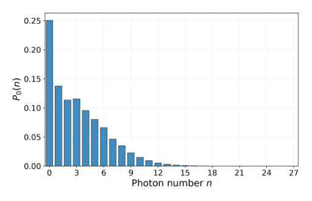
<figcaption class="paper-figure-caption"><b>Fig 2.</b> FIG. 2. Photon-number distribution P0(n; τmax) of the pump mode a0. The broadening and deformation relative to the initial coherent-state distribution arise from quantum pump depletion and entanglement between the pump and generated sectors.</figcaption>
</figure>
<figure class="paper-figure-card">
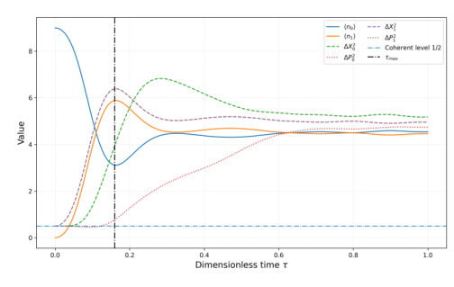
<figcaption class="paper-figure-caption"><b>Fig 3.</b> Figure 1 shows the transfer of population from the pump sector to the generated modes. Because the pump modes a0 and a3 are treated quantum mechanically, this transfer represents genuine quantum pump depletion rather than an externally prescribed classical drive. The quadrature variances reveal weak but measurable squeezing of the pump modes. For the representative pump mode a0, the minimum variance is</figcaption>
</figure>
<figure class="paper-figure-card">
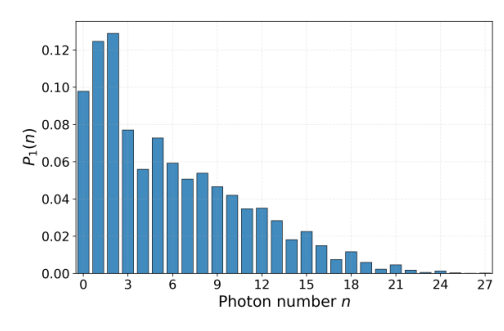
<figcaption class="paper-figure-caption"><b>Fig 4.</b> FIG. 3. Photon-number distribution P1(n; τmax) of the generated mode a1. The strongly non-Poissonian statistics demonstrate that the generated field cannot be described as a coherent state and instead reflects the underlying quantum photon-conversion dynamics.</figcaption>
</figure>
<figure class="paper-figure-card">
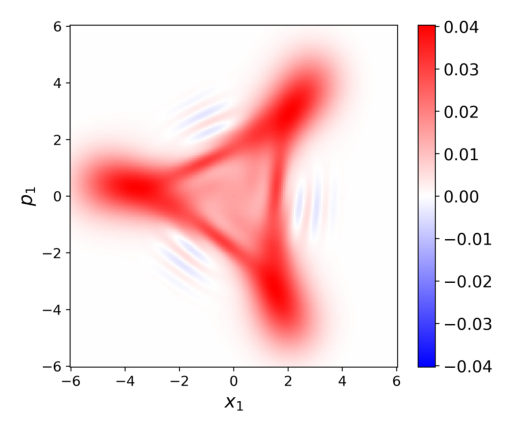
<figcaption class="paper-figure-caption"><b>Fig 5.</b> FIG. 5. Wigner function W1(x1, p1; τmax) of the gener- ated mode a1 at τ = τmax for the reduced photon-conversion Hamiltonian. Pronounced interference fringes and negative regions reveal strong nonclassicality and indicate the forma- tion of a Schr¨odinger-cat-like state. The strongest Wigner negativity occurs near τ = τmax, which coincides with the maximum population of a1 and strong depletion of the pump mode a0.</figcaption>
</figure>

**Summary.** The paper analyzes how doubly pumped Kerr microresonators generate complex, non-Gaussian Schrödinger-cat-like states by treating pump depletion quantum mechanically. By comparing the full dynamics to simplified models, the authors demonstrate that genuine quantum back-action is crucial for maintaining the fragile interference patterns (Wigner negativity) associated with these highly nonclassical resources.

**Why it may be interesting.** This work directly addresses generating nonclassical states—specifically cat-like structures—using cavity nonlinearities, which is a central theme in continuous-variable quantum information processing and quantum optics.

Detailed structure

**Main problem.** The study investigates quantum pump depletion and the generation of non-Gaussian, cat-like states in Kerr microresonators.

**Main result.** Quantum-depleted intraresonance dynamics are shown to generate multicomponent Schrödinger-cat-like states characterized by Wigner negativity, which is suppressed when uncompensated nonlinear phase terms (SPM/XPM) dominate.

**Method.** The authors employ a full quantum treatment of the pump modes and compare it against an effective reduced model that isolates resonant photon conversion dynamics.

**Model / system.** The system is a doubly pumped Kerr microresonator operating in the intraresonance regime. The Hamiltonian includes terms for Self-Phase Modulation (SPM), Cross-Phase Modulation (XPM), and Four-Wave Mixing (FWM).

**Key observables.** Wigner function negativity, non-Poissonian photon number statistics, quadrature squeezing, and single-mode Schmidt numbers quantifying entanglement.

**Important parameters / regimes.** The $n=2$ intraresonance branch exhibits a residual $\mathbb{Z}_3$ symmetry; the dynamics are tracked up to a characteristic interaction length $\tau_{\text{max}}$.

**Assumptions / limitations.** The primary comparison is between the full quantum Kerr Hamiltonian and an effective reduced model that isolates coherent photon conversion, with the undepleted-pump limit serving as a baseline approximation.

**Figures summary.** Figures illustrate Wigner functions for both reduced (quantum-depleted) and full models, showing negative regions indicating nonclassicality. Photon number distributions ($P(n)$) are shown for pump and generated modes at peak conversion ($\tau_{\text{max}}$).

**Paper structure.** The paper develops the dynamics by first defining the full Kerr Hamiltonian, then deriving a reduced model focusing on resonant photon conversion, analyzing key diagnostics (Wigner function, squeezing), and finally comparing these results against the simpler undepleted-pump approximation to highlight the necessity of quantum back-action.

Abstract

We investigate quantum pump depletion and non-Gaussian state generation in doubly pumped Kerr microresonators operating in the intraresonance regime. The pump modes are treated quantum mechanically rather than as undepleted classical amplitudes, allowing pump depletion, back-action, entanglement generation, quadrature fluctuations, and Wigner-function negativity to emerge from the same multimode dynamics. Starting from the Kerr four-wave-mixing selection rule, we distinguish an effective resonant photon-conversion model from the full Kerr Hamiltonian containing self-phase modulation (SPM), cross-phase modulation (XPM), and four-wave mixing (FWM). The reduced model isolates the photon-conversion network responsible for the discrete $\mathbb{Z}_{n+1}$ phase structure, whereas the full model retains operator-valued nonlinear Kerr phases. For the \(n=2\) intraresonance branch, the four-mode reduced initial-value problem with fixed coherent pump phases has a residual \(\mathbb{Z}_3\) symmetry and generates cat-like Wigner structures near the interaction length at which the generated-mode population \(\langle n_1\rangle\) is maximal and the pump population \(\langle n_0\rangle\) is strongly depleted. The resulting states are not the canonical even or odd coherent states of Dodonov, Malkin, and Man'ko, but multicomponent Schrödinger-cat-like states characterized by Wigner negativity, non-Poissonian statistics, pump-mode quadrature squeezing, and large single-mode Schmidt numbers. Comparison of the reduced and full Kerr dynamics shows that uncompensated SPM/XPM-induced phase shearing suppresses the interference fringes and Wigner negativity responsible for the clearest cat-like signatures. These results identify quantum-depleted intraresonance Kerr dynamics as a route to symmetry-organized non-Gaussian states in Kerr resonators.

[↑ back to top](#top)

### [Classical dissipative search of unstructured database](http://arxiv.org/abs/2606.18835v1)

**Authors:** A. E. Allahverdyan, Y. Bisharyan  
**Type:** theory · **Category:** disordered systems and neural networks · **PDF:** <https://arxiv.org/pdf/2606.18835v1>  
**Analysis basis:** full PDF text, analyzed in chunks
**Topic relevance:** `exotic spin models in light-matter` **3/5** · `methods for driven-dissipative` **3/5** · `analog quantum simulation` **2/5** · `driven-dissipative phase transition` **2/5** · `non-equilibrium dynamics` **2/5** · `non-equilibrium universality` **2/5** · `Frenkel-Kontorova` **1/5** · `Keldysh / 2PI / non-Gaussian methods` **1/5** · `correlated / nonlocal dissipation` **1/5**

↔ Scroll figures horizontally

<figure class="paper-figure-card">
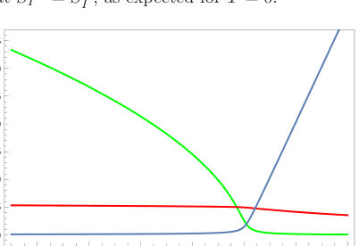
<figcaption class="paper-figure-caption"><b>Fig 1.</b> FIG. 1: For the spherical model (1, 10, 11, 20–22) we show the mean of the selected spin S1/200 (green), the mean of a nonselected spin S3 (red) and the inverse relaxation time σ as a function of temperature for N = 104, R = 1, J = 0.2, ǫ = 0.05 (weak fields). The external fields {hI}N I=1 are random Gaussian variables with w = 1.54, h1 = 0.33, and h2 = 2.77; see (25–28). T = R is the phase-transition point, where S1 starts to increase from a nearly zero value to S1 ∝ √</figcaption>
</figure>
<figure class="paper-figure-card">
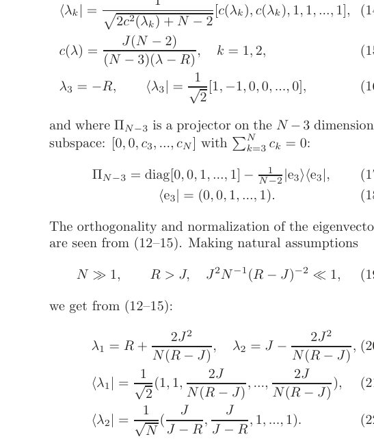
<figcaption class="paper-figure-caption"><b>Fig 2.</b> Fig. 1 shows that for N ≫1 and weak external fields ǫ ≪1, the model described by (10, 11, 20–22) undergoes a phase-transition at T = R, where the mean selected spins S1 and S2 start to grow. For T ≤R, the inverse relaxation time σ is small. Both σ and the mean non- selected spin S3 (and SI&gt;3) are weakly-dependent on T for T ≤R. Hence, we shall analytically study the regime of low temperatures T ≪R, where S1 and S2 maximize. Low temperatures. Eq. (10) simplifies in the limit T →0 (i.e., T ≪R). Now the terms ∝T in (10) can be neglected, and (10) is solved by noting that the inverse relaxation time σ tends for T →0 to a con- stant, σ = O(ǫN −1/2), as confirmed in (23), and seen in Fig. 1. Hence...</figcaption>
</figure>

**Summary.** This paper models unstructured database search using a classical system of interacting spherical spins governed by dissipative dynamics. By analyzing the relaxation time to equilibrium at low temperatures, the authors show that the search time scales faster than Grover's quantum limit. This suggests that classical, dissipative analog computers can surpass unitary quantum computation for certain search problems.

**Why it may be interesting.** It provides a concrete physical analogy for computation using classical dissipative dynamics, linking concepts from spin glasses (disordered systems) to computational complexity theory, which is relevant for understanding non-unitary information processing.

Detailed structure

**Main problem.** The paper proposes a physical realization of unstructured database search using classical, dissipative dynamics on a spin system, aiming to achieve a search time faster than Grover's quantum algorithm.

**Main result.** The search time scales as O(M^a) with a factor 'a' less than 1/2, demonstrating that a classical dissipative analog computer can outperform the standard quantum unitary approach for this task.

**Method.** The analysis uses statistical mechanics tools, specifically solving over-damped Langevin equations and analyzing the low-temperature equilibrium state of the spin system.

**Model / system.** The model is a spherical spin system where the database is encoded by inter-spin couplings. The Hamiltonian includes coupling terms ($J_{IJ}$) and an external field term ($\epsilon h_I$), constrained by $\sum S_I^2 = N$.

**Key observables.** Mean magnetization of selected spins ($\langle S_1 
angle, \langle S_2 
angle$) and the relaxation time to equilibrium ($1/\sigma$).

**Important parameters / regimes.** The search performance depends critically on the ratio between coupling strengths ($R$ vs $J$), temperature ($T$), and external field strength ($\epsilon$). The regime $T \ll R$ is crucial.

**Assumptions / limitations.** Key assumptions include neglecting inertia in the dynamics, assuming random Gaussian external fields $\{h_I\}$, and analyzing the system in the low-temperature limit ($T 	o 0$) or specific scaling regimes for $\epsilon$.

**Figures summary.** Figure 1 illustrates a phase transition occurring at $T=R$, showing how selected spins begin to grow below this critical temperature, which is central to the search mechanism.

**Paper structure.** The paper develops the model using Hamiltonian and Langevin dynamics, analyzes the low-temperature limit to determine relaxation times, and compares the resulting scaling of the search time against established quantum bounds like Grover's algorithm.

Abstract

We propose a physical realization of the unstructured database search that works via classical, dissipative model of spherical spins. The database is implemented via spin-spin couplings, where the selected coupling refers to a larger ferromagnetic interaction between two selected spins. The low-temperature equilibrium of this model leads to magnetization strongly concentrated on the selected spins, which means that the search is complete. The search time refers to the relaxation time to equilibrium from a homogeneous initial state, and is described via Langevin equations. This time scales as ${\cal O}(M^a)$ with $a<1/2$, where $M$ is the database volume. This is faster than Grover's search, showing how a dissipative, classical analog computer can overcome the quantum unitary computer.

[↑ back to top](#top)

### [Suppression of Extrinsic Anomalous Hall Conductivity in Disordered Parity Anomalous Semimetal](http://arxiv.org/abs/2606.18945v1)

**Authors:** Shi-Hao Bi, Bo Fu, Shun-Qing Shen  
**Type:** theory · **Category:** disordered systems and neural networks · **PDF:** <https://arxiv.org/pdf/2606.18945v1>  
**Analysis basis:** full PDF text, analyzed in chunks
**Topic relevance:** `Keldysh / 2PI / non-Gaussian methods` **3/5** · `methods for driven-dissipative` **3/5** · `driven-dissipative phase transition` **2/5** · `non-equilibrium dynamics` **2/5** · `non-equilibrium universality` **2/5** · `Kondo & dissipative impurity` **1/5** · `analog quantum simulation` **1/5** · `correlated / nonlocal dissipation` **1/5** · `exotic spin models in light-matter` **1/5** · `spintronics-quantum-optics interface` **1/5**

↔ Scroll figures horizontally

<figure class="paper-figure-card">
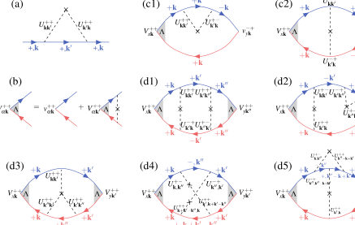
<figcaption class="paper-figure-caption"><b>Fig 1.</b> Figure 1. Feynman diagrams for the extrinsic mechanisms of anomalous Hall conductivity. (a) The self-energy within the self- consistent Born approximation. (b) Ladder diagrams for the disorder- renormalized velocity operator 𝑉++ 𝛼k. The shaded area, denoted by Λ, is the diffuson contribution to the vertex correction of the bare ve- locity 𝑣++ 𝛼k. (c1, c2) The diagrammatic representation of side-jump mechanism for the anomalous Hall conductivity. The diagrammatic representation of the (d1, d2) intrinsic and (d3) extrinsic skew scat- tering mechanism, together with the (d4) X and (d5) Ψ diagram for coherent skew scattering. Each diagram represents a unique family of contributions, which...</figcaption>
</figure>
<figure class="paper-figure-card">
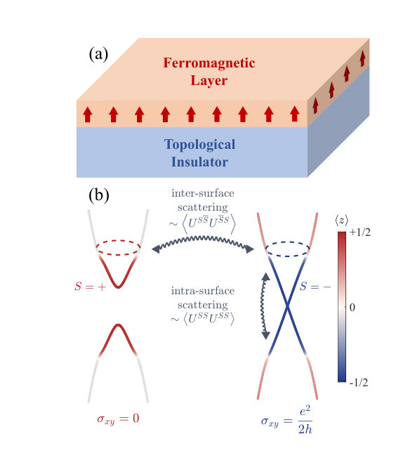
<figcaption class="paper-figure-caption"><b>Fig 2.</b> Figure 2. (a) Schematic illustration of a semi-magnetic topological insulator film. (b) Intra- and inter-surface scattering in gapless and gapped Dirac cone states. The color denotes the average 𝑧-position distribution.</figcaption>
</figure>
<figure class="paper-figure-card">
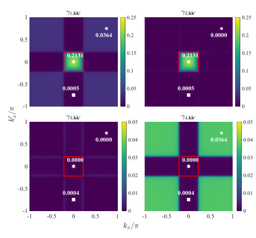
<figcaption class="paper-figure-caption"><b>Fig 3.</b> Figure 3. Numerical calculation of 𝛾𝑖,kk′. Typical values are labeled near the markers. We set 𝑘𝑦= 𝑘′ 𝑦= 0, and 𝐿𝑧= 40. The red boxes indicate the parity-invariant regime.</figcaption>
</figure>
<figure class="paper-figure-card">
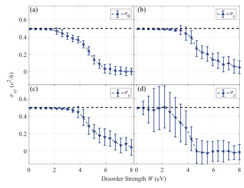
<figcaption class="paper-figure-caption"><b>Fig 4.</b> Figure 4. Real-space Hall conductivity of the PAS calculated us- ing Prodan’s formula [9, 36, 37]. The various markers and legends correspond to different types of impurities, respectively. System pa- rameters: The simulations employed a system size of 𝐿𝑥= 𝐿𝑦= 28 and 𝐿𝑧= 10, with the top 3 layers exhibiting ferromagnetic order. Additional parameters [48] included 𝜆∥= 0.41 eV, 𝜆⊥= 0.44 eV, 𝑡∥= 0.566 eV, 𝑡⊥= 0.40 eV, 𝑉0 = 0.1 eV, 𝑚0 = 0.28 eV and 𝜖𝐹= 10 meV. Lattice constants were set to 𝑎= 𝑏= 1 nm and 𝑐= 0.5 nm [48]. To minimize statistical fluctuations, 100 samples were averaged for each data point.</figcaption>
</figure>

**Summary.** This theoretical work analyzes a Parity Anomalous Semimetal exhibiting a half-quantized Hall effect. By calculating the contributions from standard disorder mechanisms like side-jump and skew-scattering using advanced many-body techniques, the authors prove that these extrinsic effects vanish. This confirms the intrinsic robustness of the half-quantized topological state against realistic material disorder.

**Why it may be interesting.** While focused on topological materials, the rigorous mathematical treatment of disorder effects (using SCBA) and the demonstration of robustness against scattering are highly relevant to understanding localization phenomena in complex quantum systems, which shares methodological overlap with disordered lattice models used in condensed matter theory.

Detailed structure

**Main problem.** The study investigates how extrinsic disorder contributions, specifically side-jump and skew-scattering mechanisms, affect the half-quantized anomalous Hall conductivity in a Parity Anomalous Semimetal (PAS).

**Main result.** The analysis rigorously demonstrates that both the side-jump and skew-scattering mechanisms make no net contribution to the half-quantized Hall conductance. This proves that the PAS phase is robust against such extrinsic disorder effects.

**Method.** The investigation employs analytical techniques, including the self-consistent Born approximation (SCBA) within the Kubo formalism, applied to a tight-binding Hamiltonian model.

**Model / system.** The system modeled is a disordered Parity Anomalous Semimetal (PAS), derived from semi-magnetic topological insulator thin films exhibiting gapless Dirac cone surface states. The analysis uses lattice Hamiltonians and incorporates on-site random potentials for disorder scattering.

**Key observables.** Anomalous Hall conductivity ($\sigma_{xy}$), specifically its half-quantized value ($rac{1}{2} e^2/h$), and the contributions from side-jump ($\sigma_{sj}$) and skew-scattering ($\sigma_{sk}$).

**Important parameters / regimes.** The Fermi level position relative to the Dirac cone, disorder strength ($W$), and scattering times ($	au$).

**Assumptions / limitations.** Key assumptions include treating different scattering mechanisms as statistically independent and utilizing approximations like the Ioffe-Regel condition in certain regimes.

**Figures summary.** Figures illustrate Feynman diagrams detailing various scattering contributions to $\sigma_{xy}$ and show schematic representations of how disorder affects gapless versus gapped Dirac cone states.

**Paper structure.** The paper follows a theoretical derivation, first establishing the model Hamiltonian and then systematically calculating the total anomalous Hall conductivity by evaluating the individual contributions from side-jump and skew-scattering terms using advanced Green's function techniques.

Abstract

We present an analytical investigation of the extrinsic contributions to the anomalous Hall conductivity in the context of the half-quantized Hall effect observed in disordered parity anomalous semimetal emerged from semi-magnetic topological insulator thin films. The gapless Dirac cone surface state, which embodies the quintessence of the half-quantized Hall effect, exhibits remarkable robustness against disorder scattering. Two primary extrinsic mechanisms, the side-jump and skew-scattering, are deemed irrelevant and make no contributions. These results establish the parity anomalous semimetal as a disorder-resilient quantum phase, thereby providing insights into Dirac fermion physics.

[↑ back to top](#top)

### [A quantum-like model of political consensus via non self-adjoint Hamiltonians](http://arxiv.org/abs/2606.19014v1)

**Authors:** Fabio Bagarello, Gloria Liarda  
**Type:** theory · **Category:** other · **PDF:** <https://arxiv.org/pdf/2606.19014v1>  
**Analysis basis:** full PDF text, analyzed in chunks
**Topic relevance:** `driven-dissipative phase transition` **3/5** · `methods for driven-dissipative` **3/5** · `non-equilibrium dynamics` **3/5** · `non-equilibrium universality` **2/5** · `Keldysh / 2PI / non-Gaussian methods` **1/5** · `correlated / nonlocal dissipation` **1/5**

↔ Scroll figures horizontally

<figure class="paper-figure-card">
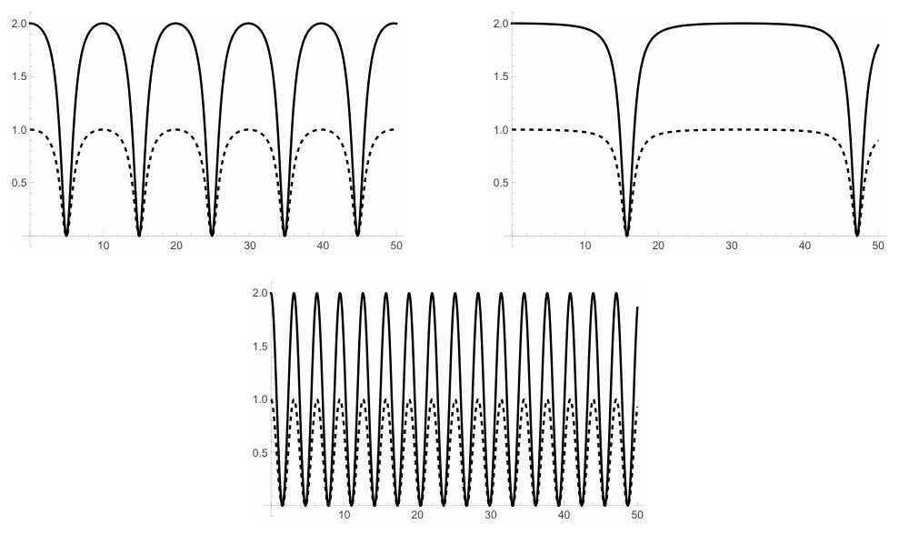
<figcaption class="paper-figure-caption"><b>Fig 1.</b> Figure 1: ˆf(t) = ˆc(t) (dashed line) and their sum (thick line), for Ψ(0) = φ11 and (λ1, λ2) = (1, 0.1) (up left), (λ1, λ2) = (1, 0.01) (up right), (λ1, λ2) = (1, 1) (down)</figcaption>
</figure>
<figure class="paper-figure-card">
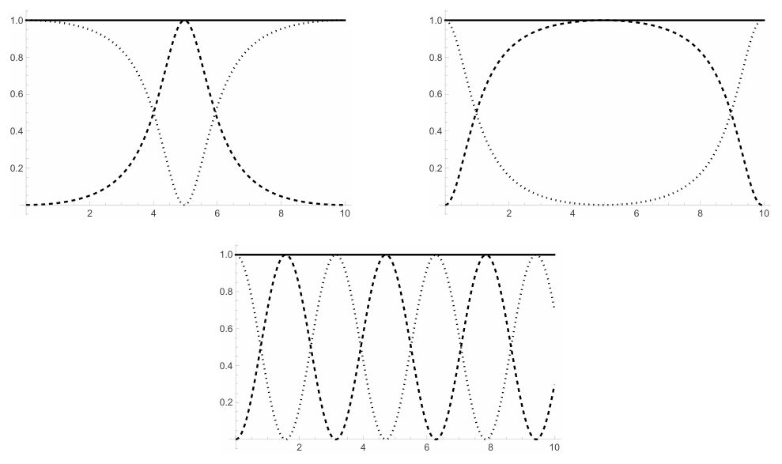
<figcaption class="paper-figure-caption"><b>Fig 2.</b> Figure 2: ˆr(t) (dashed line), ˆc(t) (dotted line) and their sum (thick line), for Ψ(0) = φ01 and (λ1, λ2) = (1, 0.1) (up left), (λ1, λ2) = (0.1, 1) (up right) and (λ1, λ2) = (1, 1) (down)</figcaption>
</figure>
<figure class="paper-figure-card">
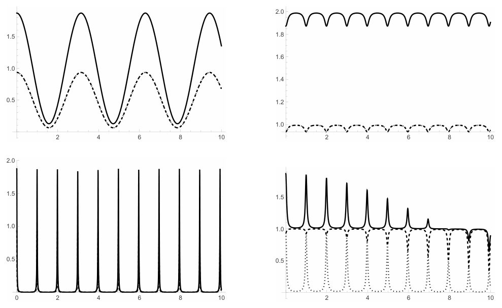
<figcaption class="paper-figure-caption"><b>Fig 3.</b> Figure 3: ˆf(t) (dashed line), ˆc(t) (dotted line) and their sum (thick line), for α = 100, β = γ = 25 and η = 10 and for (λ1, λ2, λ3, λ4) = (1, 1, 1, 1) (up left), for (λ1, λ2, λ3, λ4) = (100, 0.1, 0.1, 0.1) (up right), for (λ1, λ2, λ3, λ4) = (0.1, 100, 0.1, 0.1) (down left) and for (λ1, λ2, λ3, λ4) = (0.1, 0.1, 0.1, 100) (down right)</figcaption>
</figure>
<figure class="paper-figure-card">
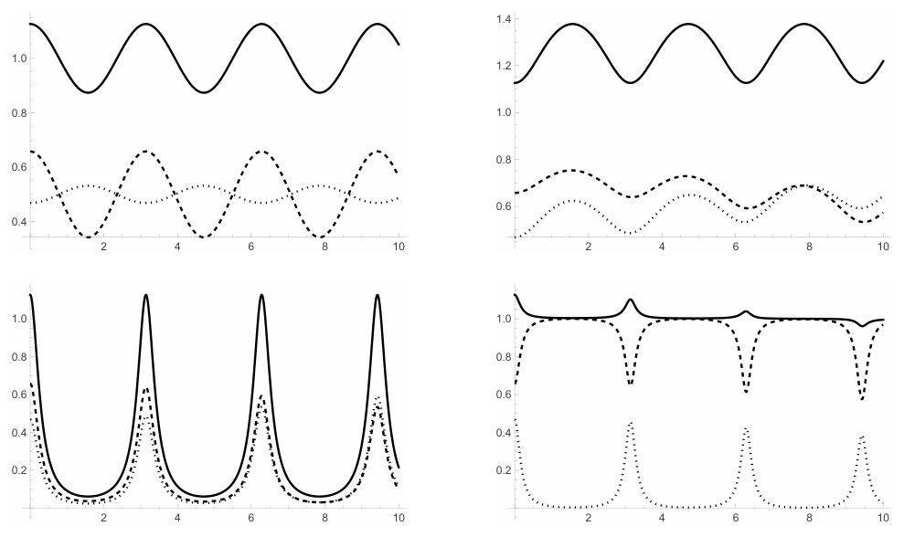
<figcaption class="paper-figure-caption"><b>Fig 4.</b> Figure 4: ˆf(t) (dashed line), ˆc(t) (dotted line) and their sum (thick line), for α = 50, β = 100, γ = 80 and η = 10 and for (λ1, λ2, λ3, λ4) = (1, 1, 1, 1) (up left), for (λ1, λ2, λ3, λ4) = (10, 0.1, 0.1, 0.1) (up right), for (λ1, λ2, λ3, λ4) = (0.1, 10, 0.1, 0.1)(down left) and for (λ1, λ2, λ3, λ4) = (0.1, 0.1, 0.1, 10) (down right)</figcaption>
</figure>

**Summary.** This paper applies quantum mechanics concepts, specifically using non self-adjoint Hamiltonians, to create a 'quantum-like' model of political consensus. It tracks how supporters' opinions change based on the perceived competence of a governing coalition. The key novelty is demonstrating that this mathematical structure allows for observables to lose and regain compatibility over time, mirroring real-world shifts in public trust.

**Why it may be interesting.** This work provides a novel mathematical framework—using non-Hermitian quantum dynamics—to model complex, open, and inherently non-equilibrium social phenomena like political trust decay, which is highly relevant to theoretical physics applications in decision theory.

Detailed structure

**Main problem.** The paper models how political consensus or trust changes over time based on a governing coalition's perceived performance.

**Main result.** The use of non self-adjoint Hamiltonians and associated $\gamma$-dynamics allows the model to capture the loss and recovery of compatibility between observables (like efficiency and supporter satisfaction) over time, which standard Hermitian dynamics cannot predict.

**Method.** The methodology employs a quantum-like formalism using non self-adjoint Hamiltonians ($H 
eq H^\dagger$) to govern time evolution via $\gamma$-dynamics ($\gamma_t(X) = e^{iH^\dagger t} X e^{-iHt}$).

**Model / system.** The system models a political coalition ($\C$) and its supporters ($\Sc$), represented by operators $\hat{C}$ (efficiency) and $\hat{F}$ (satisfaction). The dynamics are governed by various non-self-adjoint Hamiltonians ($H_1, H_2, H_3$).

**Key observables.** Time-evolved expectation values of observables ($\hat{c}(t), \hat{f}(t)$) and the commutator $[\gamma_t(\hat{F}), \gamma_t(\hat{C})]$.

**Important parameters / regimes.** The ratio $
u = \lambda_1 / \lambda_2$ (the index of success for G); coupling constants ($\lambda_i$).

**Assumptions / limitations.** The core assumption is that standard self-adjoint dynamics are insufficient because they fail to predict the time evolution of observable compatibility in complex socio-political systems.

**Figures summary.** Figures illustrate the sinusoidal time dependencies of $\hat{f}(t)$ and $\hat{c}(t)$ for various ratios of coupling constants ($\lambda_1, \lambda_2$), showing periodic behavior.

**Paper structure.** The paper introduces the problem using non-self-adjoint Hamiltonians, proposes three specific models ($H_1, H_2, H_3$) corresponding to different physical interpretations, and analyzes their dynamical behavior by calculating time evolution of observables and commutators.

Abstract

We discuss here how non self-adjoint Hamiltonians, and their related Heisenberg-like dynamics, can be used to model a political system consisting in a coalition $\C$ of different parties (forming a government) and by their (original) supporters $\Sc$. Our aim is to model how the opinion of these supporters changes depending on the efficiency, competence and coherence of the coalition $\C$, as these are perceived by $\Sc$ during their action while governing. After a rather general introduction we propose three specific models, and we describe and comment the dynamical behaviour of the { full} system, $\Sc\cup\C$. The role of the so-called {\em balanced Hamiltonians}, recently introduced by the authors in connection with integrals of motion, is discussed in details.

[↑ back to top](#top)

### [Floquet framework for driven polar quantum systems](http://arxiv.org/abs/2606.19330v1)

**Authors:** Viktor Novičenko, Piotr Gładysz, Karolina Słowik, Egidijus Anisimovas  
**Type:** theory · **Category:** other · **PDF:** <https://arxiv.org/pdf/2606.19330v1>  
**Analysis basis:** full PDF text, analyzed in chunks
**Topic relevance:** `analog quantum simulation` **3/5** · `methods for driven-dissipative` **3/5** · `non-equilibrium dynamics` **3/5** · `driven-dissipative phase transition` **2/5** · `Keldysh / 2PI / non-Gaussian methods` **1/5** · `non-equilibrium universality` **1/5**

↔ Scroll figures horizontally

<figure class="paper-figure-card">
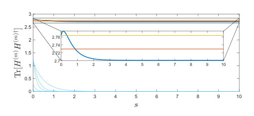
<figcaption class="paper-figure-caption"><b>Fig 1.</b> FIG. 1. Harmonic weights obtained from the numerical inte- gration of the flow equations (blue lines) and from the ana- lytical effective Hamiltonians: the zeroth-order Hamiltonian, Eq. (6) (yellow line), and the zeroth-plus-first-order Hamilto- nian, Eqs. (6) and (10) (red line). Light blue lines correspond to nonzero harmonics, m &gt; 0, while the dark blue line cor- responds to the zero harmonic. The inset shows the conver- gence of the zero-harmonic weight. Including the first-order correction brings the analytical result closer to the numerical effective Hamiltonian. The parameters are ω = 4.122 × 2π kHz, ωeg −ω = 0.2 × 2π kHz, gz = 0.8ω, and gx = 0.5 × 2π kHz, chosen in accordance with...</figcaption>
</figure>
<figure class="paper-figure-card">
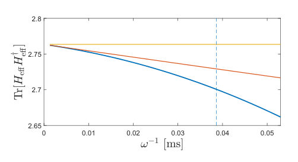
<figcaption class="paper-figure-caption"><b>Fig 2.</b> FIG. 2. Effective Hamiltonian weights obtained numerically as a function of inverse driving frequency (blue line), in com- parison with the analytical zeroth-order result (yellow line), and the zeroth-plus-first-order result (red line). The parame- ters are the same as in Fig. 1. The dashed vertical line marks ω = 4.122 × 2π kHz, used in Fig. 3.</figcaption>
</figure>
<figure class="paper-figure-card">
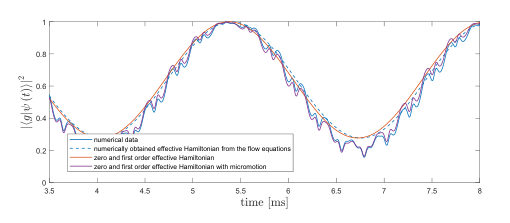
<figcaption class="paper-figure-caption"><b>Fig 3.</b> FIG. 3. Comparison of the dynamics obtained from direct in- tegration of the Schr¨odinger equation generated by the Hamil- tonian in Eq. (1) (blue solid line) with effective Hamiltonian descriptions: the Floquet effective Hamiltonian obtained from the integration of the flow equations (blue dashed line), ana- lytically obtained Floquet effective Hamiltonian up to the first order, Eqs. (6) and (9) without (red solid line) or with micro- motion included analytically up to the first order (Eq. (12), purple solid line). The initial state is |ψ(0)⟩= |g⟩. Parame- ters as in Fig. 1.</figcaption>
</figure>
<figure class="paper-figure-card">
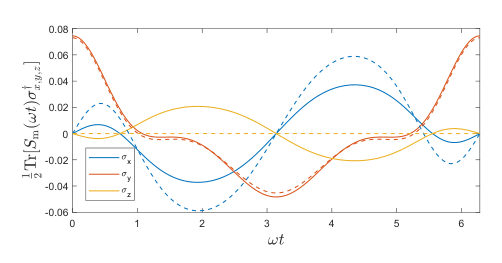
<figcaption class="paper-figure-caption"><b>Fig 4.</b> FIG. 4. Comparison of the numerically obtained micromo- tion operator (solid lines) with the analytical expression (12) (dashed lines) for various initial phases. Three projections of the micromotion vector to the basis vectors {ˆσx, ˆσy, ˆσz} of su(2) Lie algebra are depicted in different colors, see legend.</figcaption>
</figure>
<figure class="paper-figure-card">
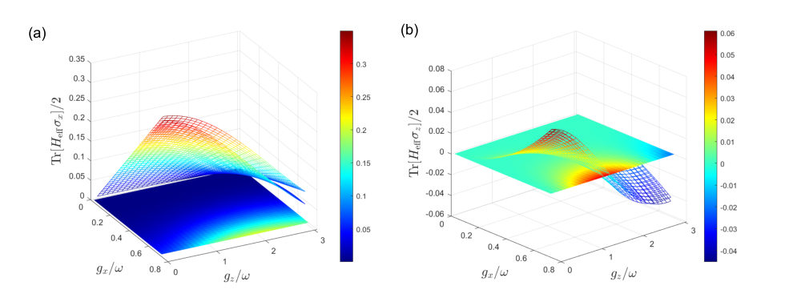
<figcaption class="paper-figure-caption"><b>Fig 5.</b> FIG. 5. Comparison of the analytical and numerical effective Hamiltonians over the two-dimensional parameter space spanned by gx and gz. Panels (a) and (b) show the coefficients multiplying ˆσx and ˆσz, respectively, in the decomposition (14). The flat colored surface shows the difference between the analytical and numerical results, multiplied by a factor of 5 for visibility.</figcaption>
</figure>

**Summary.** The paper develops and compares two advanced methods—analytical high-frequency expansion and numerical flow equations—to find the effective Hamiltonian for a driven polar quantum system. It successfully handles complex interactions by treating longitudinal coupling nonperturbatively, providing accurate predictions across various coupling regimes relevant to modern quantum hardware.

**Why it may be interesting.** This work provides a robust theoretical toolkit to analyze driven quantum systems where standard approximations fail due to strong coupling terms ($g_z \sim \omega$), making it highly relevant for trapped ion or superconducting circuit platforms.

Detailed structure

**Main problem.** The paper addresses developing a Floquet treatment for a driven polar two-level quantum system subjected to both longitudinal and transverse coupling from a periodic field.

**Main result.** A dual framework combining analytical high-frequency expansions with numerical flow equations successfully yields the time-independent effective Hamiltonian, even when longitudinal couplings are strong.

**Method.** The authors employ Floquet theory, utilizing an analytical expansion (up to first order in $\omega^{-1}$) and a numerical flow-equation approach based on continuous block diagonalization.

**Model / system.** The system is a driven two-level quantum system characterized by a Hamiltonian involving longitudinal ($g_z$) and transverse ($g_x$) coupling strengths modulated periodically by the driving frequency ($\omega$).

**Key observables.** Effective transverse coupling strength, effective detuning, time evolution operator ($\hat{U}_{	ext{eff}}$), and reconstructed micromotion components.

**Important parameters / regimes.** Driving frequency ($\omega$), longitudinal coupling ($g_z$), transverse coupling ($g_x$), and the ratio $g_x/\omega$.

**Assumptions / limitations.** The analytical method relies on a high-frequency expansion in $\omega^{-1}$, while the numerical flow approach requires truncation of the harmonic series.

**Figures summary.** Figures compare convergence of harmonic weights, validate the zeroth-plus-first-order expansion against numerical results, and show agreement between direct integration, flow-equation, and analytical effective Hamiltonians across various coupling regimes.

**Paper structure.** The paper first introduces the physical model and Hamiltonian. It then details the analytical derivation using dressing transformations and high-frequency expansions. Subsequently, it presents the complementary numerical flow-equation framework for calculating the time-independent effective Hamiltonian, culminating in comparisons between both methods.

Abstract

We present an analytical and numerical Floquet treatment of a driven polar two-level quantum system characterized by both longitudinal and transverse coupling to a periodic field. Analytically, we derive a dressed-frame effective Hamiltonian up to first order in the inverse driving frequency, incorporating the longitudinal coupling nonperturbatively. This yields closed expressions for the effective transverse coupling strength and the effective detuning, both of which are modified by the presence of the longitudinal interaction. In the nonpolar limit, these expressions recover the usual near-resonant Rabi coupling and the Bloch-Siegert shift. As a second main result, we develop a numerical flow-equation framework that yields a time-independent effective Hamiltonian across a broad range of transverse and longitudinal coupling strengths. This dual framework is relevant for a variety of platforms, including driven polar quantum systems, optical lattices, superconducting circuits, and solids subject to surface acoustic waves.

[↑ back to top](#top)

### [Hydrodynamics of perfect fluids with anomalies from the fermionic path integral](http://arxiv.org/abs/2606.18779v1)

**Authors:** Alexander G. Abanov, Andrea Cappelli  
**Type:** theory · **Category:** other · **PDF:** <https://arxiv.org/pdf/2606.18779v1>  
**Analysis basis:** full PDF text, analyzed in chunks
**Topic relevance:** `Keldysh / 2PI / non-Gaussian methods` **3/5** · `driven-dissipative phase transition` **2/5** · `non-equilibrium dynamics` **2/5** · `non-equilibrium universality` **2/5** · `Kondo & dissipative impurity` **1/5** · `analog quantum simulation` **1/5** · `correlated / nonlocal dissipation` **1/5** · `methods for driven-dissipative` **1/5**

↔ Scroll figures horizontally

<figure class="paper-figure-card">

<figcaption class="paper-figure-caption"><b>Fig 1.</b> Low-resolution page preview, page 2</figcaption>
</figure>
<figure class="paper-figure-card">
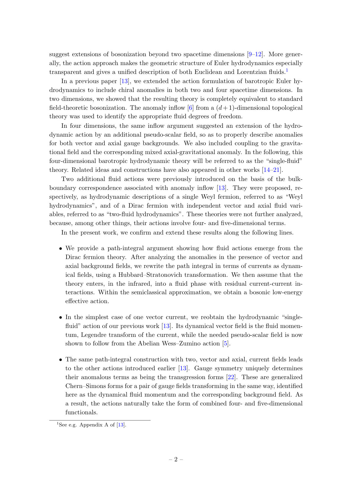
<figcaption class="paper-figure-caption"><b>Fig 2.</b> Low-resolution page preview, page 3</figcaption>
</figure>
<figure class="paper-figure-card">
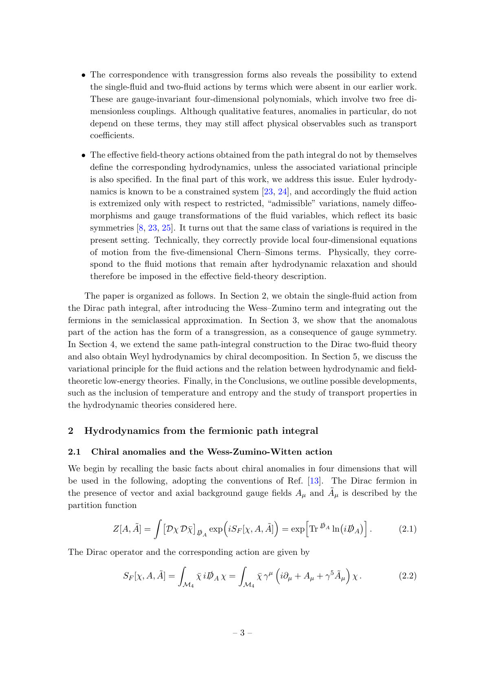
<figcaption class="paper-figure-caption"><b>Fig 3.</b> Low-resolution page preview, page 4</figcaption>
</figure>
<figure class="paper-figure-card">
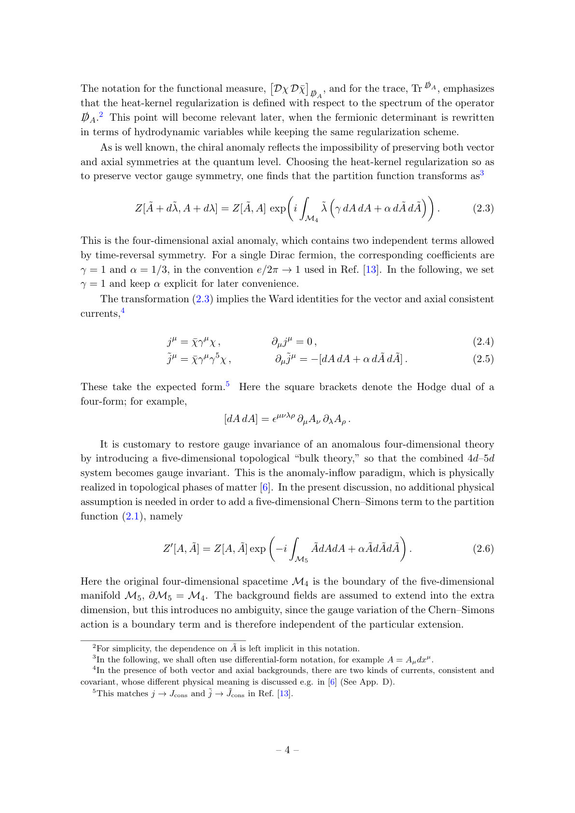
<figcaption class="paper-figure-caption"><b>Fig 4.</b> Low-resolution page preview, page 5</figcaption>
</figure>
<figure class="paper-figure-card">
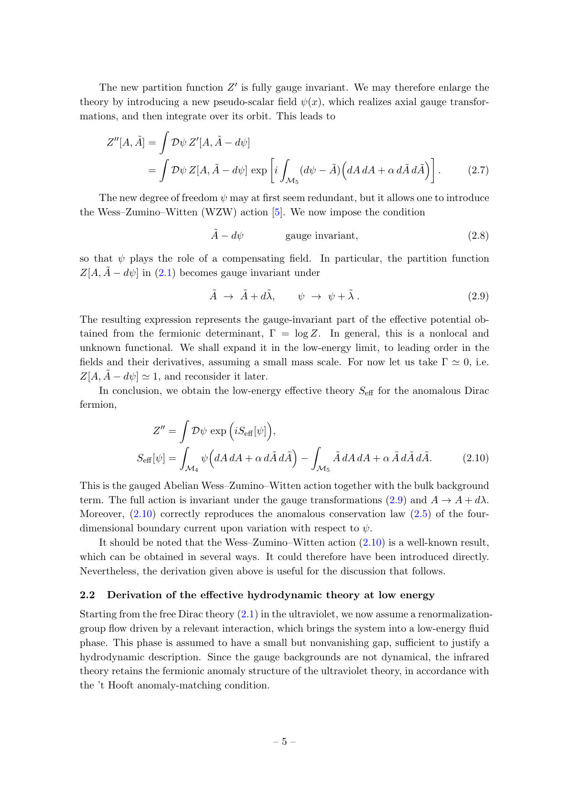
<figcaption class="paper-figure-caption"><b>Fig 5.</b> Low-resolution page preview, page 6</figcaption>
</figure>

**Summary.** This work derives the hydrodynamic action for anomalous fermionic fluids by calculating the low-energy effective action from the Dirac fermion's path integral. It successfully incorporates chiral anomalies using transgression forms derived from higher-dimensional bulk terms. The resulting framework provides a microscopic, quantum field theory justification for the necessary ingredients in anomalous hydrodynamics.

**Why it may be interesting.** While focused on condensed matter theory (anomalous hydrodynamics), the rigorous use of path integrals, effective field theories, and symmetry constraints mirrors advanced techniques used in describing quantum many-body systems far from equilibrium.

Detailed structure

**Main problem.** To provide a microscopic explanation for incorporating chiral anomalies into the hydrodynamic action formulation derived from fermionic path integrals.

**Main result.** The effective low-energy action is shown to correspond to previously proposed anomalous hydrodynamic actions, yielding specific forms for single-fluid and two-fluid systems involving transgression forms.

**Method.** The analysis involves integrating out Dirac fermions via the path integral method, utilizing anomaly inflow concepts (5D Chern-Simons terms), and deriving the low-energy effective action through restricted variational principles.

**Model / system.** The system models a perfect fluid described by an anomalous Dirac fermion coupled to background vector and axial gauge fields. The theory is analyzed in both single-fluid and two-fluid (vector/axial) regimes.

**Key observables.** Hydrodynamic action ($	ext{Seff}$), transgression forms, conserved currents ($J, 	ilde{J}$), and the resulting equations of motion derived from restricted variations.

**Important parameters / regimes.** Zero temperature limit, residual irrelevant current-current interactions, and coupling constants related to anomaly coefficients ($\alpha$).

**Assumptions / limitations.** The derivation assumes an infrared fluid phase where a semiclassical low-energy effective action can be obtained, requiring the use of restricted variations (gauge/diffeomorphism) to define local 4D equations.

**Paper structure.** The paper progresses from analyzing the fermionic path integral and obtaining the initial effective action via anomaly inflow. It then details the derivation of the single-fluid and two-fluid actions, culminating in applying restricted variational principles to derive the final local 4D hydrodynamic equations of motion.

Abstract

The path integral of the Dirac fermion with vector and axial gauge backgrounds is analyzed near the infrared limit in the presence of residual irrelevant current-current interaction. After integrating out fermions, a semiclassical low-energy effective action is obtained, written in terms of currents. Its expression is found to correspond to the hydrodynamic action previously proposed for perfect barotropic fluids with anomalies at zero temperature. This approach also leads to two further hydrodynamic actions to be associated, respectively, with the Weyl fermion, and the Dirac fermion having independent vector and axial currents. These actions feature four- and five-dimensional bulk-boundary terms, owing to anomaly inflow, which are identified as being the so-called transgression forms. These are generalizations of Chern--Simons forms that involve two gauge fields: the dynamical field and the background field. The path-integral argument provides a ``microscopic'' explanation for several ingredients of the action formulation of hydrodynamics that are necessary to incorporate anomalies. It also clarifies the infrared reduction required to pass from the effective field theory to a local hydrodynamic description. This reduction is implemented by considering restricted variations of the action, familiar from hydrodynamics, which at the same time lead to four-dimensional equations of motion from the five-dimensional transgression terms.

[↑ back to top](#top)

### [Random-matrix reduction in projective quantum mechanics: Numerical simulations](http://arxiv.org/abs/2606.19273v1)

**Authors:** Alexey A. Kryukov  
**Type:** theory · **Category:** other · **PDF:** <https://arxiv.org/pdf/2606.19273v1>  
**Analysis basis:** full PDF text, analyzed in chunks
**Topic relevance:** `measurement-induced transitions` **3/5** · `quantum measurements` **3/5** · `non-equilibrium dynamics` **2/5** · `correlated / nonlocal dissipation` **1/5** · `driven-dissipative phase transition` **1/5** · `entanglement & information structure` **1/5** · `interference shaping light` **1/5** · `non-equilibrium universality` **1/5**

↔ Scroll figures horizontally

<figure class="paper-figure-card">
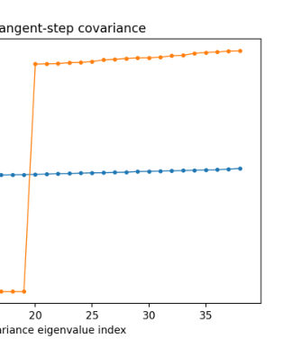
<figcaption class="paper-figure-caption"><b>Fig 1.</b> Fig. 1: Eigenvalues of the covariance matrix of infinitesimal tangent displacements. GUE fills all real tangent directions approximately equally, whereas GOE leaves half of the real tangent directions with zero variance.</figcaption>
</figure>
<figure class="paper-figure-card">
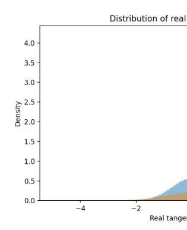
<figcaption class="paper-figure-caption"><b>Fig 2.</b> Fig. 2: Pooled real tangent components for GUE and GOE infinitesimal steps. The spike at zero for GOE reflects the absence of fluctuations in half of the real tangent directions at the chosen projective point.</figcaption>
</figure>
<figure class="paper-figure-card">
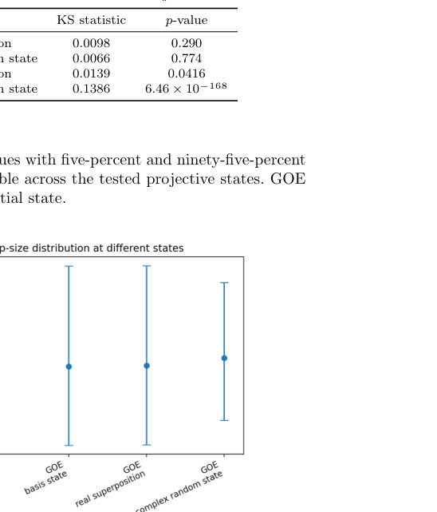
<figcaption class="paper-figure-caption"><b>Fig 3.</b> Fig. 3: Homogeneity check for the distribution of ∥δψ⊥∥2. For GUE, the distribution is independent of the tested initial projective state. For GOE, the distribution changes for a genuinely complex state, reflecting the preferred real structure of the ensemble.</figcaption>
</figure>
<figure class="paper-figure-card">
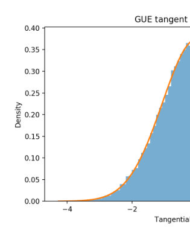
<figcaption class="paper-figure-caption"><b>Fig 4.</b> Fig. 4: Histogram of tangential increments ∆a obtained by projecting GUE-induced state-space increments onto the tangent direction of M σ 1 at a = 0. The distribution agrees with a Gaussian fit.</figcaption>
</figure>
<figure class="paper-figure-card">
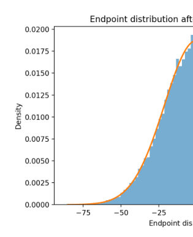
<figcaption class="paper-figure-caption"><b>Fig 5.</b> Fig. 5: Endpoint distribution after 400 projected GUE-induced tangent increments on M σ 1 . The histogram agrees with the Gaussian distribution predicted by Brownian scaling.</figcaption>
</figure>

**Summary.** The paper develops a comprehensive model showing that complex quantum phenomena—from interference patterns to classical motion—are unified as coarse-grained manifestations of stochastic unitary diffusion in projective Hilbert space. By using random matrices, it numerically confirms how measurement and environmental monitoring effectively 'lose' information about the full quantum history, leading to apparent irreversibility.

**Why it may be interesting.** This work provides a powerful, unifying mathematical framework connecting fundamental quantum concepts like measurement collapse, decoherence, and classical emergence through the lens of random matrix theory dynamics. It offers concrete numerical tests for abstract theoretical conjectures.

Detailed structure

**Main problem.** The research investigates how various quantum phenomena, such as Born rule frequencies, double-slit interference, and classical motion, emerge from the stochastic unitary evolution governed by random matrices in projective Hilbert space.

**Main result.** It demonstrates that these diverse physical manifestations are all consistent coarse-grained consequences of a single underlying stochastic unitary mechanism driven by Gaussian Unitary Ensemble Hamiltonians.

**Method.** The work relies heavily on numerical simulations to test theoretical predictions, analyzing projected increments, path reversibility, and the behavior of state vectors under measurement constraints.

**Model / system.** The core model is projective quantum mechanics ($\mathbb{CP}^{N-1}$), where state evolution is driven by random Hamiltonians drawn from GUE. The analysis extends to multi-particle systems and incorporates detector-defined equivalence classes.

**Key observables.** Isotropy/Homogeneity of diffusion, Gaussianity of projected increments, Born frequencies matching hitting probabilities, and the stability of recorded measurement records (Zeno effect analogue).

**Important parameters / regimes.** The dimensionality $N$, the ratio of device localization scale to detector resolution ($\delta D/R_D$), and the number of environmental monitoring steps ($n$).

**Assumptions / limitations.** Key assumptions include approximating continuous dynamics via discrete random matrix steps, assuming Gaussian state representations on localized manifolds, and defining effective irreversibility through coarse-graining by measurement.

**Figures summary.** Figures illustrate the failure of GOE vs. GUE isotropy (Fig 1), Brownian scaling on classical submanifolds (Fig 2/3), matching Born frequencies to random walk hitting probabilities (Fig 8), and showing path loss leading to apparent irreversibility (Figs 41, 43).

**Paper structure.** The paper builds logically by first establishing the basic stochastic diffusion properties in projective space (GUE vs GOE), then restricting this motion to classical submanifolds ($M_\sigma$), analyzing boundary effects and measurement outcomes (Born rule/double-slit), extending to multi-particle systems, and finally synthesizing these findings into a unified picture of effective irreversibility.

Abstract

We present numerical simulations supporting the random-matrix state-reduction framework developed in the companion theoretical paper. The simulations test the main derived features of the model: isotropic diffusion generated by Gaussian Unitary Ensemble Hamiltonians in projective state space, the restriction of this diffusion to Brownian motion on the classical submanifold, Born-rule frequencies for detector-defined outcome classes, and stroboscopic Newtonian motion for macroscopic systems under repeated environmental monitoring. We also compare GUE and GOE random Hamiltonians and show that GOE fails to produce the required isotropic complex projective diffusion. Further simulations examine finite-resolution detector records in the double-slit experiment, Zeno stability of recorded equivalence classes, effective irreversibility from high-dimensional state-space dynamics and loss of path information, and tensor-product particle-device dynamics in the device limit. The results show that microscopic state reduction, stable measurement records, effective irreversibility, and macroscopic classicality can be described as different coarse-grained manifestations of the same stochastic unitary mechanism.

[↑ back to top](#top)

### [Topological spectral form factor reveals emergent non-Hermitian single-particle $\mathcal{PT}$ transitions from many-body quantum chaos](http://arxiv.org/abs/2606.19331v1)

**Authors:** Daniel Harkin, Chun Y. Leung, Amos Chan  
**Type:** theory · **Category:** statistical mechanics · **PDF:** <https://arxiv.org/pdf/2606.19331v1>  
**Analysis basis:** full PDF text, analyzed in chunks
**Topic relevance:** `Keldysh / 2PI / non-Gaussian methods` **3/5** · `driven-dissipative phase transition` **3/5** · `non-equilibrium universality` **2/5** · `Kondo & dissipative impurity` **1/5** · `analog quantum simulation` **1/5** · `correlated / nonlocal dissipation` **1/5** · `methods for driven-dissipative` **1/5** · `non-equilibrium dynamics` **1/5**

↔ Scroll figures horizontally

<figure class="paper-figure-card">
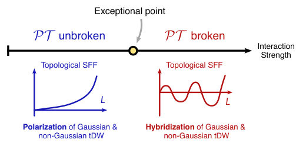
<figcaption class="paper-figure-caption"><b>Fig 1.</b> FIG. 1. Topological SFF and PT transitions. In generic quantum many-body chaotic systems, TopSFF with global swap operator inserted as a spatially extended defect exhibits an emergent PT symmetry breaking transition at a finite in- teraction strength. In the PT unbroken phase, the leading modes are polarised into Gaussian or non-Gaussian temporal domain walls (tDW), producing monotonic exponential scal- ing in system size L at sufficiently large L. In the PT broken phase, the two tDW species hybridise, producing oscillations in L with an exponential envelope. At the exceptional point, mode coalescence renders the effective tDW dynamics non- diagonalizable, producing a Jordan-block...</figcaption>
</figure>
<figure class="paper-figure-card">
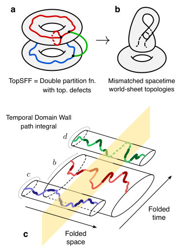
<figcaption class="paper-figure-caption"><b>Fig 2.</b> FIG. 2. Topological SFF as path integral of tempo- ral domain walls. (a) TopSFF is constructed by inserting non-trivial topological defects onto SFF as double partition functions, leading to (b) mismatched spacetime world-sheet topologies. (c) For a (1 + 1)D generic quantum many-body chaotic system, the ensemble-averaged TopSFF with a spa- tially extended global swap defect exactly maps to an effective (3 + 1)D path integral of emergent tDW (yellow slice). The tDW has two species, Gaussian and non-Gaussian (lighter and darker colours), and is specified by three folded-time loop co- ordinates while propagating along space as a non-Hermitian single particle.</figcaption>
</figure>
<figure class="paper-figure-card">
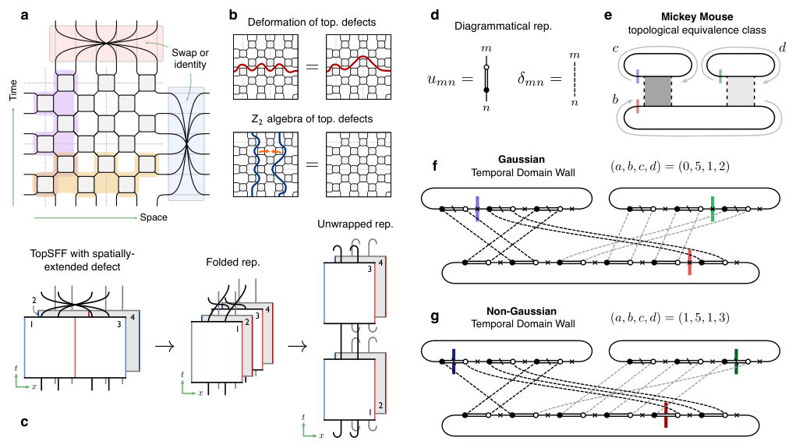
<figcaption class="paper-figure-caption"><b>Fig 3.</b> FIG. 3. Temporal domain walls and Mickey Mouse diagrams. (a) A global swap defect or the identity operator may be inserted along the spatial or temporal direction of the worldsheet describing a quantum many-body system evolved by local unitary gates. (b) Topological invariance allows local deformations of the defect line after folding described in (c), while two swap defects fuse to the identity, realizing the Z2 algebra. (c) For the TopSFF with a spatially extended global swap defect, worldsheets 3 and 4 are folded onto worldsheets 1 and 2 along the parity inversion axes (red and blue), so that parity-related degrees of freedom are stacked. Unwrapping each folded site in the time direction...</figcaption>
</figure>
<figure class="paper-figure-card">
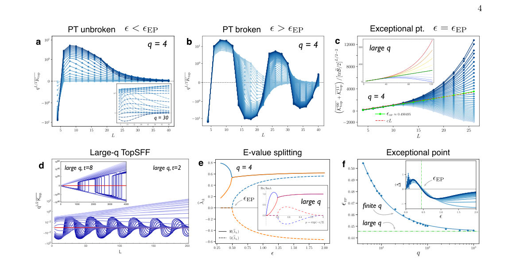
<figcaption class="paper-figure-caption"><b>Fig 4.</b> FIG. 4. Finite-q and large-q signatures of TopSFF PT transition. We exactly compute TopSFF in the k = (π, π, 0) sector, with finite-q data at t = 2 and with large-q results for arbitrary t in the pre-Heisenberg regime. Darker lines denote stronger interaction strength. (a) In the PT unbroken phase, the TopSFF at q = 4 displays exponential scaling with system size L at sufficiently large L. The inset in (a) shows that TopSFF can exponentially increase for sufficiently large q, e.g. q = 30, consistent with the large-q spectrum of TopSFF in (e) and [36]. (b) In the PT broken phase, TopSFF at q = 4 exhibits oscillatory behaviour with an exponential envelope. (c) At the exceptional point,...</figcaption>
</figure>
<figure class="paper-figure-card">
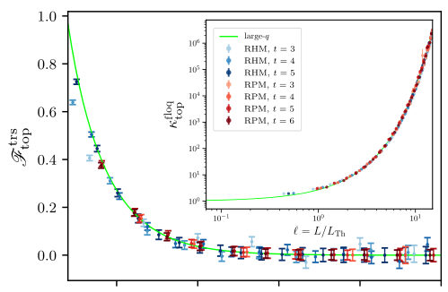
<figcaption class="paper-figure-caption"><b>Fig 5.</b> FIG. 5. Finite-q TopSFF collapse for temporally ex- tended defects. Topological free energy F trs top of a tempo- rally extended global swap defect in the TRS RPM at q = 3 (red), and the TRS Random Hamiltonian Model (RHM) [36] at q = 2 (blue), compared with the large-q scaling form (green). Inset: finite-q collapse of the TopSFF Kfloq top with temporally extended translation defect for the corresponding Floquet models (without TRS).</figcaption>
</figure>

**Summary.** The paper introduces and analyzes the Topological Spectral Form Factor (TopSFF) as a probe for global quantum properties in chaotic many-body systems. By mapping this observable to an effective non-Hermitian single-particle model, the authors precisely locate and characterize a $\mathcal{PT}$ symmetry breaking transition at a finite interaction strength. This methodology offers a universal signature of underlying spectral phase transitions.

**Why it may be interesting.** This work provides a powerful, universal diagnostic tool ($	ext{TopSFF}$) to detect fundamental symmetries like $\mathcal{PT}$ symmetry breaking in complex quantum chaotic systems without needing explicit knowledge of the full many-body Hamiltonian dynamics.

Detailed structure

**Main problem.** The study investigates how topological defects inserted into quantum partition functions can probe global properties, specifically mapping the Topological Spectral Form Factor (TopSFF) to an emergent non-Hermitian single-particle problem.

**Main result.** The TopSFF reveals a clear signature of $\mathcal{PT}$ symmetry breaking in the effective dynamics: monotonic exponential scaling below a critical interaction strength ($\epsilon_{	ext{EP}}$), and oscillations above it, with linear enhancement at $\epsilon_{	ext{EP}}$.

**Method.** The authors use diagrammatic techniques, mapping the TopSFF to an emergent $(3+1)$D temporal domain wall (tDW) problem whose dynamics are analyzed via a transfer matrix approach.

**Model / system.** The analysis is applied to generic 1D many-body chaotic systems modeled by random quantum circuits (e.g., Random Phase Model). The key diagnostic tool is the TopSFF, which probes mismatched spacetime world-sheet topologies.

**Key observables.** Topological Spectral Form Factor ($	ext{TopSFF}$), effective discriminant ($b_\Delta$), and scaling functions for topological free energy differences ($\Delta F_{	ext{top}}$).

**Important parameters / regimes.** Interaction strength ($\epsilon$) relative to the critical point ($\epsilon_{	ext{EP}}$), system size ($L$), and defect type (global swap vs. time translation).

**Assumptions / limitations.** The analysis relies on mapping the complex many-body problem onto an effective non-Hermitian single-particle dynamics, particularly in the large-$q$ limit.

**Figures summary.** Figures illustrate the three distinct regimes of $	ext{TopSFF}$ vs. interaction strength ($\epsilon$), showing monotonic growth, oscillations, and linear enhancement at the exceptional point. Other figures confirm universal scaling collapses for both SFF and TopSFF in different Thouless limits.

**Paper structure.** The paper systematically develops the concept by defining the $	ext{TopSFF}$ using topological defects, deriving its mapping to a tDW problem, analyzing the resulting non-Hermitian Hamiltonian's spectral properties (eigenvalues/discriminant), and finally confirming these findings through multiple scaling limits and finite-$q$ numerical checks.

Abstract

In equilibrium physics, topological defect insertions in quantum and classical partition functions provide non-perturbative probes of phase transitions beyond local observables. In non-equilibrium physics, the spectral form factor provides a minimal probe of universal quantum dynamics, and admits a representation as a product of two partition functions at imaginary inverse temperature. We define the topological spectral form factor (TopSFF) by inserting topological defects acting non-trivially on the doubled partition functions, producing mismatched spacetime world-sheet topologies. For the minimal $\mathbb{Z}_2$ spatially extended defect, implemented by the global swap operator, we derive an exact mapping of the TopSFF of a generic 1D many-body chaotic system to an emergent $(3+1)$D non-Hermitian single-particle problem describing a temporal domain wall (tDW). We show analytically that the effective tDW dynamics undergoes a $\mathcal{PT}$ symmetry breaking transition at a finite interaction strength $ε_{\mathrm{EP}}$: below $ε_{\mathrm{EP}}$, the leading modes are polarized into Gaussian or non-Gaussian tDW sectors and the TopSFF varies monotonically and exponentially with system size; above $ε_{\mathrm{EP}}$, the tDW sectors hybridize and the TopSFF oscillates with system size; at the exceptional point $ε_{\mathrm{EP}}$, Jordan non-diagonality produces a linear-in-system-size enhancement. For temporally extended topological defects, we derive exact universal scaling forms for the TopSFF free energy in systems with time reversal or time translation symmetry, and verify them numerically in independent models.

[↑ back to top](#top)

### [When Isolated Quantum Systems Appear Classical](http://arxiv.org/abs/2606.19188v1)

**Authors:** Thiago R. de Oliveira, Pedro S. Correia, Tiago Debarba, Gabriel Dias Carvalho, Raúl O. Vallejos, Fernando de Melo  
**Type:** theory · **Category:** statistical mechanics · **PDF:** <https://arxiv.org/pdf/2606.19188v1>  
**Analysis basis:** full PDF text, analyzed in chunks
**Topic relevance:** `non-equilibrium dynamics` **3/5** · `entanglement & information structure` **2/5** · `non-equilibrium universality` **2/5** · `scars & prethermalization` **2/5** · `correlated / nonlocal dissipation` **1/5** · `driven-dissipative phase transition` **1/5** · `measurement-induced transitions` **1/5** · `methods for driven-dissipative` **1/5**

↔ Scroll figures horizontally

<figure class="paper-figure-card">
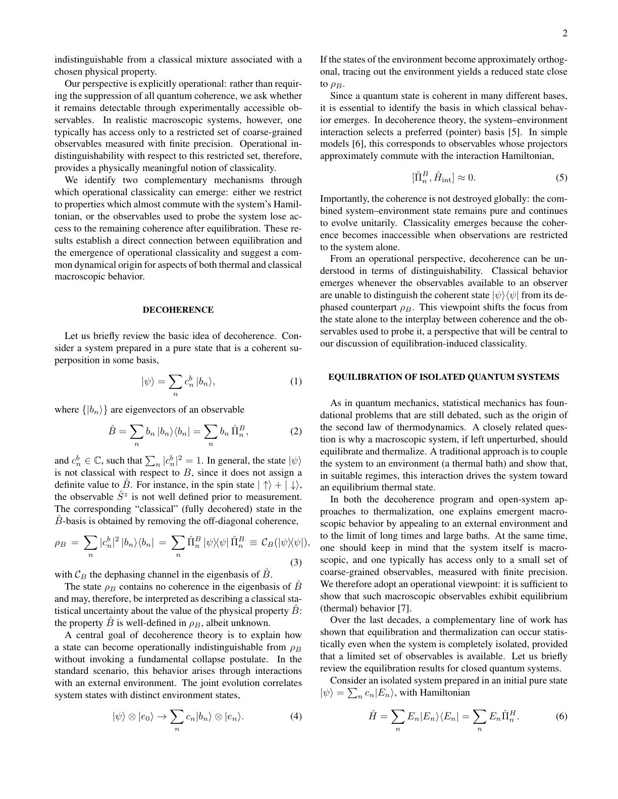
<figcaption class="paper-figure-caption"><b>Fig 1.</b> Low-resolution page preview, page 2</figcaption>
</figure>
<figure class="paper-figure-card">
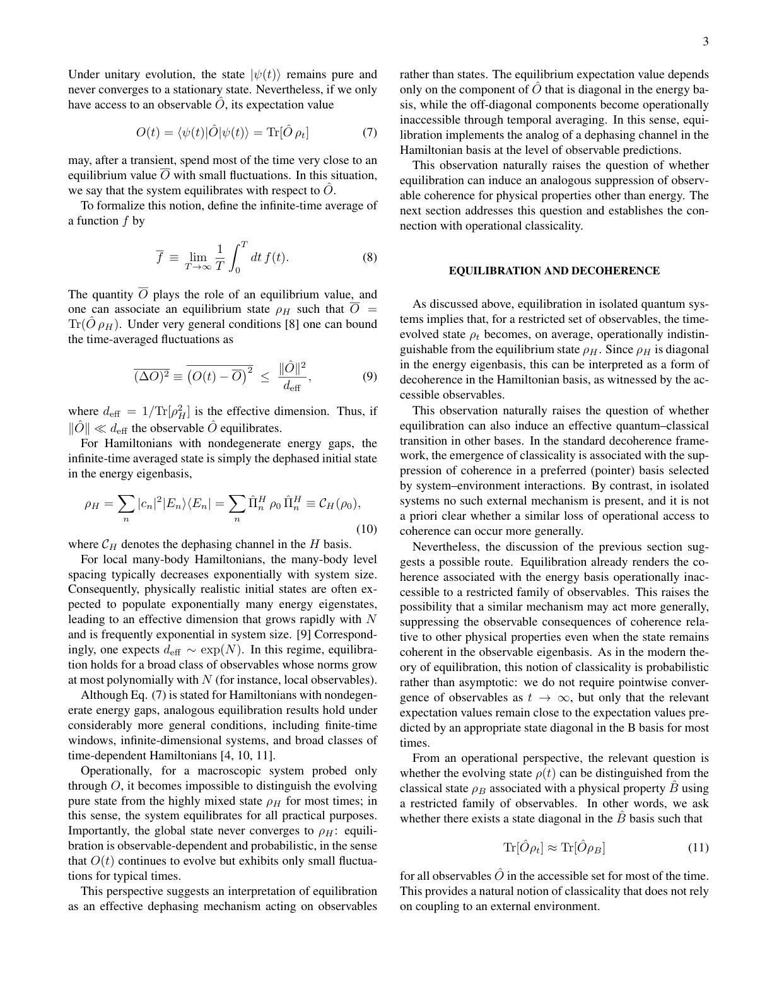
<figcaption class="paper-figure-caption"><b>Fig 2.</b> Low-resolution page preview, page 3</figcaption>
</figure>
<figure class="paper-figure-card">
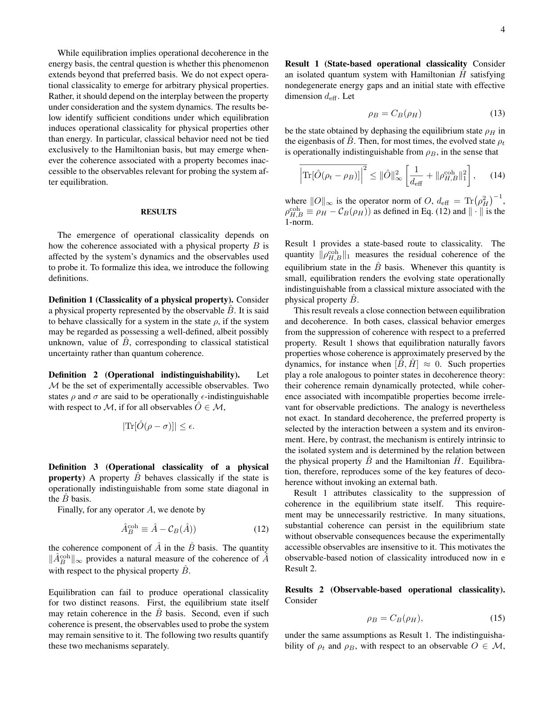
<figcaption class="paper-figure-caption"><b>Fig 3.</b> Low-resolution page preview, page 4</figcaption>
</figure>
<figure class="paper-figure-card">
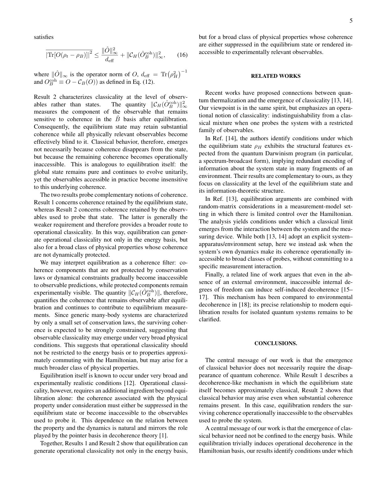
<figcaption class="paper-figure-caption"><b>Fig 4.</b> Low-resolution page preview, page 5</figcaption>
</figure>
<figure class="paper-figure-card">
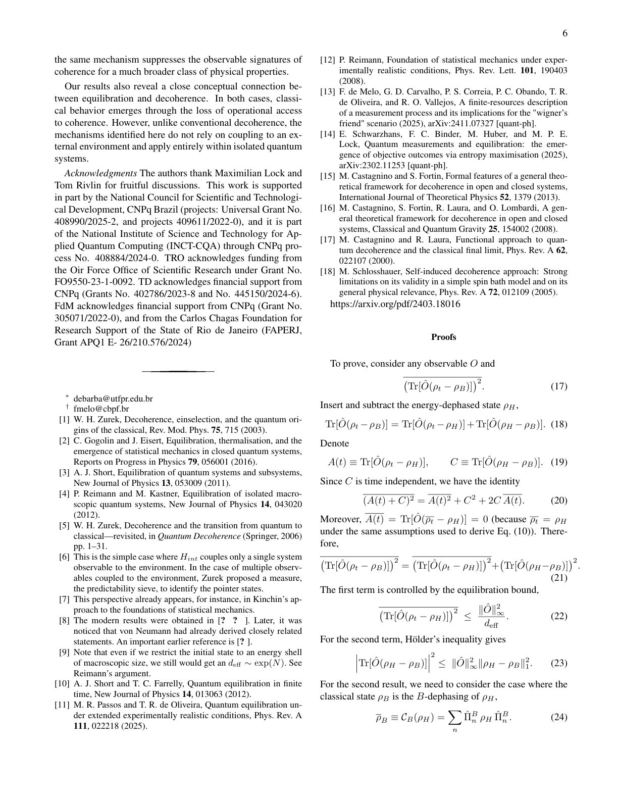
<figcaption class="paper-figure-caption"><b>Fig 5.</b> Low-resolution page preview, page 6</figcaption>
</figure>

**Summary.** This paper explores how isolated quantum systems can spontaneously exhibit classical behavior through intrinsic equilibration processes. It establishes that operational classicality arises when coherence becomes inaccessible to measurements, rather than requiring its physical disappearance. This provides a direct theoretical connection between thermalization in closed systems and the origin of classicality.

**Why it may be interesting.** This work provides a fundamental theoretical link between two major open problems—thermalization and quantum-to-classical transition—within the context of closed quantum systems, challenging the necessity of external environments for classical behavior.

Detailed structure

**Main problem.** The paper investigates whether the intrinsic equilibration mechanism observed in fully isolated quantum systems can also account for the emergence of classical behavior (the quantum-to-classical transition).

**Main result.** Operational classicality can emerge even when substantial coherence remains in the equilibrium state, provided that this coherence becomes operationally inaccessible to measurements.

**Method.** The authors derive sufficient conditions for operational classicality by analyzing time-averaged expectation values and bounding fluctuations using concepts derived from equilibration theory.

**Model / system.** The study considers isolated quantum systems evolving unitarily under a Hamiltonian H, focusing on the transition from pure state evolution to behavior indistinguishable from a classical mixture.

**Key observables.** Expectation values of observables $\langle \hat{O} 
angle(t)$, operational distinguishability between states ($
ho$ vs. $
ho_B$), and coherence components ($\|
ho_{	ext{coh}}^{H,B}\|$).

**Important parameters / regimes.** The time-average limit ($T 	o \infty$) and the effective dimension ($d_{	ext{eff}}$) governing fluctuation bounds.

**Assumptions / limitations.** The analysis is operational, focusing on indistinguishability with respect to a restricted set of coarse-grained observables; it assumes specific mathematical relationships between state evolution and equilibrium states.

**Paper structure.** The paper builds from the established understanding of thermalization in isolated systems to derive rigorous bounds connecting this equilibration process directly to the conditions required for operational classicality, showing two complementary routes for this emergence.

Abstract

The emergence of classical behavior and the origin of thermal equilibrium are two central problems in the foundations of physics. In the standard accounts, both phenomena are typically explained through interactions with an external environment: decoherence suppresses quantum interference, while coupling to a thermal bath drives relaxation toward equilibrium. Over the last decades, however, it has become clear that equilibration and thermalization can arise even in fully isolated quantum systems, in the operational sense that the expectation values of relevant observables remain close to equilibrium values for most of the time. Here, we ask whether the same intrinsic equilibration mechanism can also account for the emergence of classical behavior. Using rigorous bounds on equilibration in closed systems, we derive sufficient conditions under which a time-evolved pure state becomes, for most times, operationally indistinguishable from a classical mixture associated with a chosen physical property. We identify two complementary routes to such operational classicality: either the chosen property almost commutes with the system Hamiltonian or the observables used to probe the system lose access to the remaining coherence after equilibration. Our results show that classical behavior need not be confined to the energy basis and may emerge even when substantial coherence remains present in the equilibrium state. This establishes a direct connection between two foundational questions: the origin of thermalization in isolated quantum systems and the quantum-to-classical transition

[↑ back to top](#top)

### [Negative diffusivity of excitons in electron-hole plasmas](http://arxiv.org/abs/2606.18401v1)

**Authors:** H. Terças, V. N. Mantsevich  
**Type:** theory · **Category:** other · **PDF:** <https://arxiv.org/pdf/2606.18401v1>  
**Analysis basis:** full PDF text, analyzed in chunks
**Topic relevance:** `driven-dissipative phase transition` **3/5** · `non-equilibrium dynamics` **3/5** · `non-equilibrium universality` **2/5** · `Keldysh / 2PI / non-Gaussian methods` **1/5** · `analog quantum simulation` **1/5** · `correlated / nonlocal dissipation` **1/5** · `methods for driven-dissipative` **1/5**

↔ Scroll figures horizontally

<figure class="paper-figure-card">
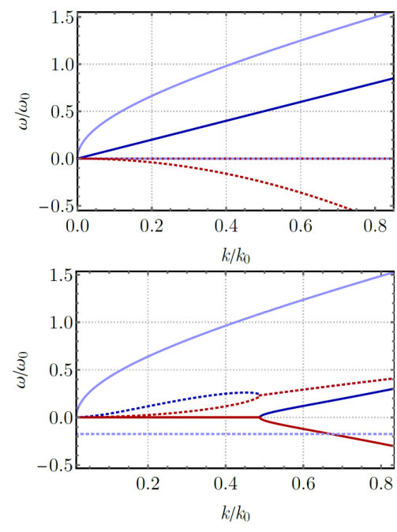
<figcaption class="paper-figure-caption"><b>Fig 1.</b> FIG. 1. Dispersion relation of the exciton-plasma system, in units of k0 = e2n0/(2meDX) and ω0 = DXk2 0. Top panel: normal modes in the absence of exciton-plasma coupling, γe = γh = 0, featuring a diffusive mode (ω1, red line), plasma acoustic (ω2, light blue line) and plasma optical (ω3, dark blue line). Right panel: the same modes as obtained for γe = γh = 0.1γX, and ¯vX = 2.8vth. In all the cases, we have assumed a diffusion constant of DX = 0.9v2 th/ωp.</figcaption>
</figure>
<figure class="paper-figure-card">
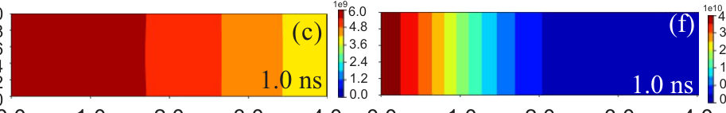
<figcaption class="paper-figure-caption"><b>Fig 2.</b> FIG. 2. Diffusion dynamics in a quasi-one-dimensional channel. Normal diffusive transport, corresponding to eDX &gt; 0, where the exciton density profile broadens in time and the peak amplitude decreases, in agreement with the purely dissipative regime described by Eq. (9).</figcaption>
</figure>
<figure class="paper-figure-card">
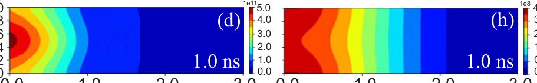
<figcaption class="paper-figure-caption"><b>Fig 3.</b> FIG. 3. Diffusion dynamics in a quasi-one-dimensional channel. Negative diffusion regime, corresponding to eDX &lt; 0, where the exciton density develops a localized enhancement and increases in amplitude, signaling a dynamical instability. This behavior originates from the hybridization between the exciton diffusive mode and the acoustic plasma mode, as described by Eq. (28), and provides a real-space manifestation of the gain predicted by the dispersion relation in Fig. 1.</figcaption>
</figure>

**Summary.** This paper develops a hydrodynamic model for exciton transport coupled to an electron-hole plasma in 2D semiconductors. It shows that while simple collision models predict positive diffusion, including the inertia of the plasma leads to hybridization with acoustic plasmon modes. This coupling generates a dynamical instability, manifesting as a theoretically predicted negative effective exciton diffusivity.

**Why it may be interesting.** While focused on condensed matter transport, the mechanism—where collective plasma modes drive a non-dissipative instability that modifies particle transport coefficients—is analogous to instabilities studied in open quantum systems or driven many-body dynamics.

Detailed structure

**Main problem.** The study investigates exciton transport dynamics, specifically focusing on the theoretical conditions under which an effective negative diffusion coefficient can arise in two-dimensional semiconductors.

**Main result.** Negative exciton diffusivity is predicted to occur when the system's collective plasma oscillations (plasmons) couple strongly with the slow excitonic motion, leading to a dynamical instability rather than simple nonlinear effects.

**Method.** The authors developed and utilized a minimal hydrodynamic framework by treating excitons, electrons, and holes as coupled fluids, analyzing the resulting dispersion relations in Fourier space.

**Model / system.** The physical system is an exciton-electron-hole plasma within 2D semiconductors (like TMDs). The model treats the three species using coupled fluid dynamics equations, moving from simple collision models to full self-consistent analysis incorporating plasmons.

**Key observables.** Effective exciton diffusivity ($D_{eff}^X$), dispersion relation ($\omega$), and the sign of the effective diffusion coefficient (positive for damping, negative for instability).

**Important parameters / regimes.** Plasma inertia, collective charge oscillation frequency ($\omega_p$), collision rates ($\gamma_X, \gamma_p$), and the degree of coupling between excitons and plasma modes.

**Assumptions / limitations.** Initial analyses assume quasi-neutrality or symmetric effective masses; the key result requires incorporating plasmons beyond simple diffusive plasma dynamics.

**Figures summary.** Figure 2 illustrates normal, dissipative diffusion (positive $D_{eff}^X$), while Figure 3 demonstrates the negative diffusion regime characterized by localized density enhancement and growing amplitude due to hybridization with the acoustic plasma mode.

**Paper structure.** The paper progresses from analyzing simple collisional regimes where diffusivity remains positive, through incorporating full self-consistent dynamics involving plasmons, culminating in the derivation of the instability condition leading to negative effective diffusivity.

Abstract

We develop a minimal hydrodynamic framework to describe exciton transport in the presence of an electron hole plasma in 2D semiconductors. Treating excitons, electrons, and holes as coupled fluids, we show that exciton diffusion is strongly renormalized by momentum exchange with the plasma. In the collisional regime, mutual diffusion leads to a nontrivial redistribution of transport coefficients but preserves the positivity of the exciton diffusivity. In contrast, when plasma inertia and collective charge oscillations are accounted for, the exciton diffusive mode hybridizes with acoustic plasma modes, giving rise to a dynamical instability manifested as an effective negative diffusion coefficient. We demonstrate that this instability originates from the nonequilibrium coupling between slow excitons and fast plasma degrees of freedom, rather than from nonlinear diffusion or thermodynamic effects. Our results provide a unified physical mechanism for negative exciton diffusivity reported in recent experiments and establish collective plasma dynamics as a key control parameter of exciton transport in 2D materials.

[↑ back to top](#top)

### [Blind Symmetry Matching in Quantum States with Application to Shot-Count Reduction](http://arxiv.org/abs/2606.19196v1)

**Authors:** Mitchell A. Thornton  
**Type:** theory · **Category:** quantum information and computing · **PDF:** <https://arxiv.org/pdf/2606.19196v1>  
**Analysis basis:** full PDF text, analyzed in chunks
**Topic relevance:** `quantum measurements` **3/5** · `measurement-induced transitions` **2/5** · `analog quantum simulation` **1/5** · `entanglement & information structure` **1/5** · `methods for driven-dissipative` **1/5** · `non-equilibrium dynamics` **1/5**

↔ Scroll figures horizontally

<figure class="paper-figure-card">
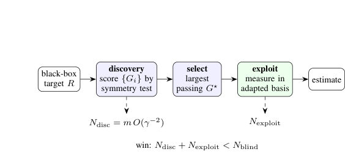
<figcaption class="paper-figure-caption"><b>Fig 1.</b> Fig. 1. The blind-matching pipeline. Discovery scores a candidate family by a symmetry test (weak twirl or strong sector projection), the selection rule takes the largest passing group, and exploitation reads the target in its symmetry- adapted basis. Here R is the unknown state, or its covariance, whose carried symmetry is to be discovered. Every shot, discovery included, is charged against the structure-blind baseline.</figcaption>
</figure>
<figure class="paper-figure-card">
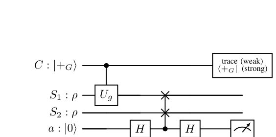
<figcaption class="paper-figure-caption"><b>Fig 2.</b> Fig. 2. The discovery circuit. A controlled group action twirls one copy of the target; discarding the group register C realizes the weak twirl (incoherent average), while post-selecting it on |+G⟩realizes the strong twirl (coherent average, heralded by the sector weight). The SWAP test on ancilla a returns the matching score. The controlled twirl and Hilbert-Schmidt test are in the symmetry-testing family of [8]; amplitude estimation accelerates the readout. For a cyclic group |+G⟩= H⊗n |0⟩and the controlled action is one modular adder.</figcaption>
</figure>
<figure class="paper-figure-card">
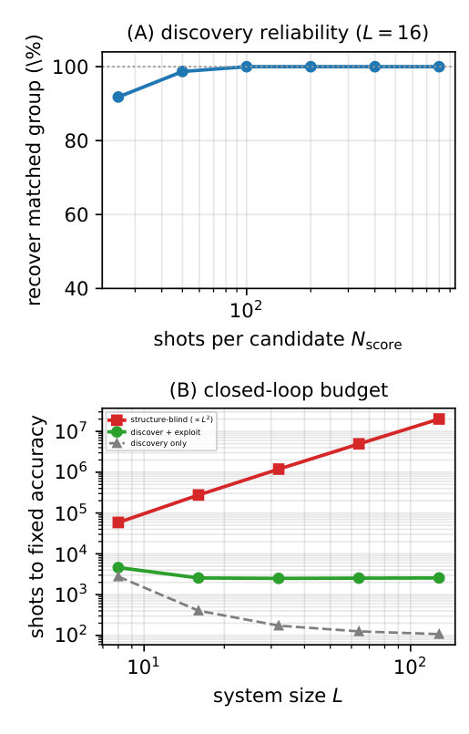
<figcaption class="paper-figure-caption"><b>Fig 3.</b> Fig. 3. Weak-mode loop on momentum readout. (A) Discovery recovers the matched group from a few symmetry-test shots per candidate. (B) The structure-blind cost grows as L2 while the total pipeline cost stays nearly flat; discovery cost alone falls with L.</figcaption>
</figure>
<figure class="paper-figure-card">
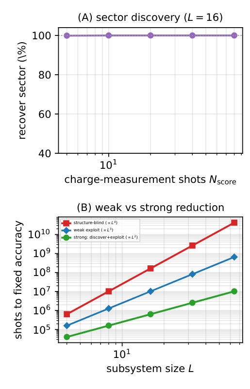
<figcaption class="paper-figure-caption"><b>Fig 4.</b> Fig. 4. Strong-mode loop on the two-system target. (A) The occupied sector is recovered from a handful of charge-measurement shots. (B) Structure- blind cost grows as L4, weak exploitation as L3, and strong discovery-plus- exploitation as L2; the strong mode buys an extra factor of L over the weak mode.</figcaption>
</figure>

**Summary.** This paper introduces Blind Symmetry Matching, an advanced technique to estimate unknown statistical properties in quantum computations by first discovering the underlying symmetry group from measurement data. By selecting and exploiting this discovered symmetry, the method significantly reduces the required number of measurements (shots) compared to structure-blind estimation techniques.

**Why it may be interesting.** It provides a powerful, general-purpose primitive for quantum algorithm design that moves beyond assuming prior knowledge of system symmetries, which is crucial for applying quantum computation to complex physical systems where symmetries are emergent or unknown.

Detailed structure

**Main problem.** To develop a method, called Blind Symmetry Matching, that reduces the required number of measurement shots for estimating unknown statistical quantities in quantum computations when the underlying symmetry is not known beforehand.

**Main result.** The proposed pipeline successfully discovers an unknown symmetry group and exploits it to achieve significant shot count reductions, with the strong confinement mode showing superior scaling ($\propto L^2$) compared to structure-blind methods.

**Method.** The method involves a three-step process: (1) Discovery of candidate symmetries via specialized tests (weak/strong twirls), (2) Selection of the largest passing group ($G^\star$), and (3) Exploitation by measuring the target observable in the symmetry-adapted basis.

**Model / system.** The framework is general over finite groups, demonstrated using quantum computations on systems like an L-site ring or two interacting systems. The target quantity to be estimated is a statistical expectation value of an operator $R$.

**Key observables.** Matching Score ($s_T(R)$), Shot Count Reduction Factor, Weak/Strong Twirl measurements.

**Important parameters / regimes.** System size ($L$), group order ($|G|$), and the ratio between discovery cost and exploitation savings.

**Assumptions / limitations.** The target quantity must be statistical (an expectation value or distribution) rather than a single deterministic outcome. The discovery overhead must be less than the shot savings achieved by exploiting the symmetry.

**Figures summary.** Figures illustrate the overall blind-matching pipeline (Discovery $	o$ Selection $	o$ Exploitation), detailing circuits for weak vs. strong twirls, and comparing scaling costs ($L^4$ vs $L^3$ vs $L^2$) across different modes.

**Paper structure.** The paper introduces the problem of unknown symmetry estimation, details the mathematical framework involving weak (commutation) and strong (confinement) symmetry tests, proves the selection rule is unbiased, and concludes with seeded demonstrations showing exponential resource savings.

Abstract

Measuring a quantum computation in a basis adapted to a symmetry it carries reduces the repeated measurements, commonly referred to as ``shots'', needed to read a statistical answer. Detecting the symmetry a quantum state carries has many uses: certifying a claimed symmetry, identifying a conserved-charge sector, flagging symmetry-breaking as an error signature, and selecting a compression or readout basis; shot-count reduction is developed here as one exemplary case. Existing methods assume the symmetry is known in advance; we remove that assumption. When it is unknown, the carried symmetry is discovered from the data by a symmetry test that scores candidate groups, and the largest passing group is exploited as the measurement basis. We state the pipeline precisely, prove the selection rule is unbiased, and charge discovery in full. Two conditions are treated, both detected by the same score with a different projection: a weak condition, commutation with the representation, and a strong condition, confinement to a single charge sector, the distinction drawn in the quantum-reference-frame literature. A single circuit, a controlled twirl followed by a SWAP test, discovers both: discarding the group register tests the weak condition, post-selecting it the strong one. The framework is general over finite groups, with cyclic (Fourier), dihedral, and symmetric-group (Schur-Weyl) examples; strong confinement to the symmetric, or Dicke, subspace is an exponential reduction. Seeded demonstrations show the loop wins net of discovery: weak matching on momentum readout reduces shots by a factor widening from ten to several thousand, and strong matching on a two-system target by a further factor of the subsystem size. Blind symmetry matching is a practical primitive for the common case where the matched basis cannot be written down in advance.

[↑ back to top](#top)

### [Sensitive endoscopic diamond magnetometer for non-contact sensing in confined environments](http://arxiv.org/abs/2606.18871v1)

**Authors:** Johannes Wesseler, Roland Nagy  
**Type:** experiment · **Category:** other · **PDF:** <https://arxiv.org/pdf/2606.18871v1>  
**Analysis basis:** full PDF text, analyzed in chunks
**Topic relevance:** `spintronics-quantum-optics interface` **3/5** · `QC/QI experiment` **2/5** · `quantum measurements` **2/5** · `exotic spin models in light-matter` **1/5** · `quantum optics experiment` **1/5**

↔ Scroll figures horizontally

<figure class="paper-figure-card">
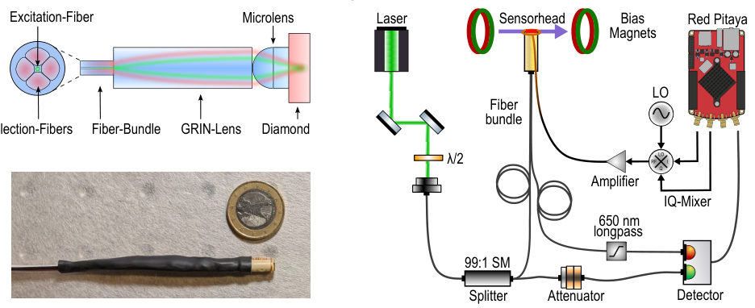
<figcaption class="paper-figure-caption"><b>Fig 1.</b> Figure 1: Endoscopic NV magnetometer architecture. a, Schematic of the endoscopic sensor head optics. Excitation light is delivered through the central fiber of the fused fiber bundle and focused into the diamond by the micro-objective, while NV fluorescence is collected through the four outer fibers. b, Photograph of the packaged 6 mm diameter sensor head next to a 1-euro coin for scale. c, Schematic of the complete measurement setup. The sensor receives microwave control signals from the FPGA-based backend, while the laser and photodetector are connected through the fiber bundle. Detection is performed with an auto-balanced photodetector for laser-noise cancellation.</figcaption>
</figure>
<figure class="paper-figure-card">
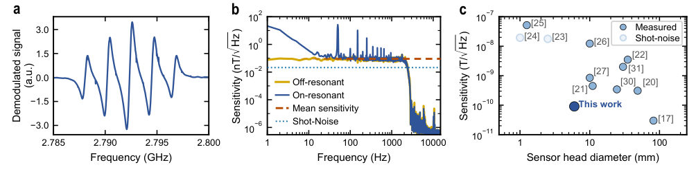
<figcaption class="paper-figure-caption"><b>Fig 2.</b> Figure 2: Sensitivity characterization of the endoscopic NV magnetometer. a, Lock- in ODMR spectrum for the [100] bias-field alignment of the addressed ms = 0 ↔ms = −1 transition using simultaneous excitation of the 14N hyperfine triplet. The central zero crossing is used as the operating point for magnetic-field and sensitivity measurements. b, Magnetic- field amplitude spectral density for the [100] bias-field alignment (blue). The brown dashed line indicates the mean sensitivity of 91 pT/ √</figcaption>
</figure>
<figure class="paper-figure-card">
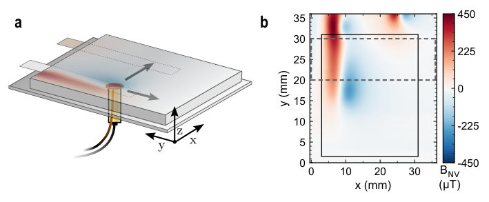
<figcaption class="paper-figure-caption"><b>Fig 3.</b> Figure 3: Magnetic scanning of a lithium-ion pouch cell. a, Measurement geometry. The pouch cell is translated across the fixed endoscopic sensor head with a motorized stage while the sensor measures the magnetic field. b, Zero-current map of the field BNV with the battery resting at 3.7 V. The black outline marks the cell body, and the grey dashed box indicates the region scanned during charge and discharge measurements. The strong vertical feature on the left arises from the ferromagnetic nickel anode tab.</figcaption>
</figure>
<figure class="paper-figure-card">
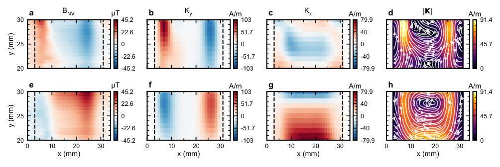
<figcaption class="paper-figure-caption"><b>Fig 4.</b> Figure 4: Magnetic-field maps and reconstructed sheet-current density during battery operation. Panels a–d show the charging measurements and panels e–h show the discharging measurements. The first column shows the measured background-subtracted magnetic field. The second and third columns show the reconstructed sheet-current components Ky and Kx. The fourth column shows the current-density magnitude |K|, with streamlines indicating the large-scale current flow. The reconstruction uses the real-space regularized inversion described in Supplementary Note 8.</figcaption>
</figure>

**Summary.** The authors developed and tested a miniaturized diamond magnetometer capable of measuring magnetic fields non-contactly in confined spaces. By coupling excitation and collection through separate fiber cores, they overcame previous performance bottlenecks. This allowed them to successfully image the internal current flow within a lithium-ion battery, opening new avenues for portable energy diagnostics.

**Why it may be interesting.** This work represents a significant engineering achievement in applied quantum sensing, demonstrating how fundamental quantum phenomena ($	ext{NV}^-$ magnetometry) can be packaged into robust, deployable tools for industrial diagnostics (battery testing).

Detailed structure

**Main problem.** The core challenge is developing a quantum magnetometer sensitive enough for real-world, non-contact measurements within confined spaces, such as imaging the internal current flow of packaged batteries.

**Main result.** The authors successfully demonstrated an endoscopic diamond magnetometer achieving $91 	ext{ pT}/\sqrt{	ext{Hz}}$ sensitivity while mapping depth-integrated current density maps inside a lithium-ion pouch cell during charge and discharge cycles.

**Method.** Magnetic field measurements are performed using Optically Detected Magnetic Resonance (ODMR) on Nitrogen-Vacancy centers in diamond, coupled with advanced signal processing like closed-loop frequency tracking and real-space regularization for inverse problem solving.

**Model / system.** The system uses a miniaturized, multi-core fiber-coupled diamond sensor head. The physics relies on the spin triplet ground state of $	ext{NV}^-$ centers, whose resonance frequencies shift linearly with the local magnetic field ($\delta
u \propto B$).

**Key observables.** Magnetic-field sensitivity ($91 	ext{ pT}/\sqrt{	ext{Hz}}$), depth-integrated sheet current density maps ($\mathbf{K}(x, y)$ in $	ext{A/m}$), and the ODMR resonance frequency shift.

**Important parameters / regimes.** Sensor diameter ($\le 6 	ext{ mm}$), measurement bandwidth ($2 	ext{ kHz}$), stand-off distance ($\approx 2 	ext{ mm}$), and regularization parameters ($\lambda$, $\mu_{	ext{div}}$).

**Assumptions / limitations.** The reconstructed current density is depth-integrated, meaning the exact spatial distribution of current within the battery thickness cannot be resolved. The measurement assumes a linear relationship between field shift and magnetic field.

**Figures summary.** Figures illustrate the endoscopic sensor architecture (multi-core fiber bundle), the setup for imaging batteries, and maps showing reconstructed current density components ($K_x, K_y$) during charging/discharging cycles.

**Paper structure.** The paper progresses from establishing the physical limitations of miniaturization to detailing the optical engineering solution (multi-core coupling). It then describes the quantum measurement technique (ODMR with closed-loop tracking) and culminates in applying this system to solve a complex inverse problem: reconstructing internal current sheets from external magnetic field measurements.

Abstract

Transitioning quantum magnetometry from laboratory environments to real-world applications has been limited by a persistent trade-off between sensor miniaturization and magnetic sensitivity. While bulky systems can achieve high sensitivity, endoscopic probes commonly suffer from inefficient fluorescence collection and reduced performance. Here we resolve this trade-off and present a miniaturized diamond quantum magnetometer with a 6 mm diameter endoscopic sensor head, achieving a magnetic-field sensitivity of 91 pT/sqrt(Hz) with a 2 kHz measurement bandwidth in a magnetically unshielded environment. The fluorescence collection bottleneck is overcome by separating excitation and collection into different cores of a fused multi-core fiber bundle, coupled to the diamond through a custom high-numerical-aperture micro-objective. A compact FPGA-based backend performs microwave control, lock-in detection and real-time resonance tracking, enabling robust operation during magnetic-field imaging. To demonstrate the practical utility of the miniaturized sensor, we image the magnetic field of a commercial lithium-ion pouch cell during charge and discharge and reconstruct depth-integrated current-density maps of the current flow. These results show that endoscopic diamond magnetometers can combine high sensitivity with a probe geometry suitable for confined, unshielded measurements, opening new avenues in battery technology and beyond.

[↑ back to top](#top)

### [Coherence measures in the strictly incoherent operation framework and its application in the multi-path interferometer](http://arxiv.org/abs/2606.18631v1)

**Authors:** Peiru Li, Jingyan Liu, Ming-Jing Zhao  
**Type:** theory · **Category:** quantum information and computing · **PDF:** <https://arxiv.org/pdf/2606.18631v1>  
**Analysis basis:** full PDF text, analyzed in chunks
**Topic relevance:** `interference shaping light` **3/5** · `correlated / nonlocal dissipation` **1/5** · `driven-dissipative phase transition` **1/5** · `entanglement & information structure` **1/5** · `methods for driven-dissipative` **1/5** · `non-equilibrium dynamics` **1/5**

↔ Scroll figures horizontally

<figure class="paper-figure-card">
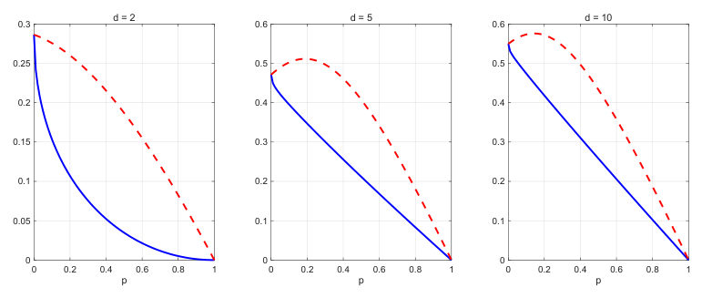
<figcaption class="paper-figure-caption"><b>Fig 1.</b> FIG. 1: (Color Online) The comparison of the exact value CF diag and its upper bound in Theorem</figcaption>
</figure>
<figure class="paper-figure-card">
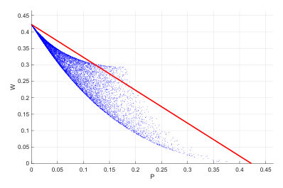
<figcaption class="paper-figure-caption"><b>Fig 2.</b> FIG. 2: The P −W diagrams for the randomly sampled pure states in three-path interferometer.</figcaption>
</figure>
<figure class="paper-figure-card">
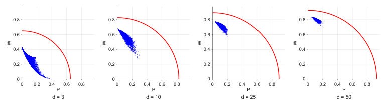
<figcaption class="paper-figure-caption"><b>Fig 3.</b> FIG. 3: The P −W diagrams for randomly sampled pure quantum states in dimensions d =</figcaption>
</figure>

**Summary.** The paper develops a novel, fidelity-based measure of quantum coherence applicable within the framework of strictly incoherent operations. It proves this measure's mathematical validity and monotonicity, and critically applies it to multi-path interferometers. The results yield quantitative bounds on wave-particle duality expressed in terms of fidelity, offering deeper insights into fundamental quantum behavior.

**Why it may be interesting.** This work provides a rigorous mathematical tool ($C_{	ext{diag}}$) to quantify quantum coherence loss under realistic physical constraints (SIOs), which is crucial for understanding decoherence processes relevant across quantum optics and information theory.

Detailed structure

**Main problem.** The paper addresses the fundamental challenge of quantifying quantum coherence, particularly within the mathematical framework defined by strictly incoherent operations (SIOs). It aims to establish a robust measure that characterizes this loss of quantumness.

**Main result.** A fidelity-based coherence measure, $C_F^{	ext{diag}}(
ho)$, is proposed and proven to be monotonic under SIOs. Furthermore, the authors derive quantitative wave-particle duality relations for multi-path interferometers using this measure.

**Method.** The methodology involves defining a general coherence measure based on the fidelity between the state $
ho$ and its diagonal projection $\Delta(
ho)$, leading to $C_F^{	ext{diag}}(
ho) = 1 - F(
ho, \Delta(
ho))$. This is then applied analytically and numerically to interferometric models.

**Model / system.** The primary model involves general quantum states $
ho$ in a $d$-dimensional Hilbert space. The application context is the multi-path interferometer, which allows for the characterization of wave-particle duality using coherence measures.

**Key observables.** Coherence measures ($C_{	ext{diag}}$), Wave Measure ($W(
ho)$), Particle Measure ($P(
ho)$), and Fidelity ($F$).

**Important parameters / regimes.** The dimensionality $d$ (number of paths) is a key parameter, as are the rank $k$ of the diagonal state $\Delta(
ho)$.

**Assumptions / limitations.** The coherence measure $C_{	ext{diag}}(
ho)$ is inherently basis-dependent because it relies on projecting onto a specific reference basis via $\Delta(\cdot)$.

**Figures summary.** Figures compare the calculated values of the coherence measure against theoretical upper bounds (e.g., Theorem 4). Figure 3 specifically shows $P-W$ diagrams for sampled pure states in various dimensions ($d=3, 10, 25, 50$), illustrating that these points lie within a boundary defined by the quadric form $W^2 + P^2 = 1 - 1/\sqrt{d}$.

**Paper structure.** The paper first establishes the general theory of coherence measures in SIOs, proposing and proving properties for $C_{	ext{diag}}(
ho)$. It then rigorously proves its monotonicity. Finally, it applies this framework to derive quantitative bounds on wave-particle duality in multi-path interferometers.

Abstract

Quantifying coherence is an essential endeavor in both quantum foundations and quantum technologies. In this paper, we study the coherence measures in terms of the diagonal states in the strictly incoherent operations framework. Specifically, we propose a coherence measure in terms of fidelity and provide its analytical expression. The relations between the proposed coherence measure and some other coherence measures are derived. Furthermore, we prove its monotonicity under incoherent operations. As an application, we explore the role of the proposed coherence measure in characterizing the waveness in the multi-path interferometer. As a result, some wave-particle dualities in terms of fidelity are presented. This work not only deepens the interpretation of the diagonal states on characterizing quantum states, but also promotes the quantitative description of the wave-particle behaviors in the multi-path interferometer.

[↑ back to top](#top)

### [Large-deviation tails of critical order-parameter distributions](http://arxiv.org/abs/2606.19030v1)

**Authors:** Jinhong Zhu, Yihao Xu, Abbas Ali Saberi, Youjin Deng  
**Type:** theory · **Category:** statistical mechanics · **PDF:** <https://arxiv.org/pdf/2606.19030v1>  
**Analysis basis:** full PDF text, analyzed in chunks
**Topic relevance:** `non-equilibrium universality` **3/5** · `non-equilibrium dynamics` **2/5** · `Keldysh / 2PI / non-Gaussian methods` **1/5** · `analog quantum simulation` **1/5** · `driven-dissipative phase transition` **1/5**

↔ Scroll figures horizontally

<figure class="paper-figure-card">
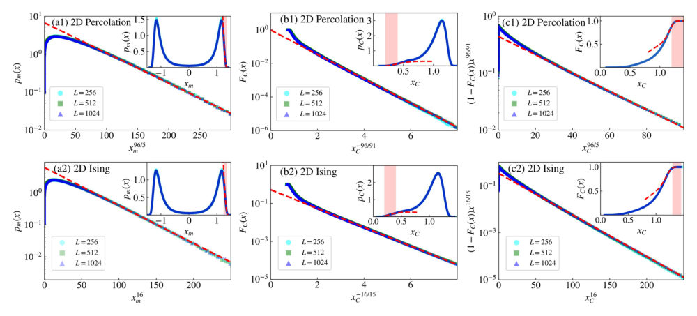
<figcaption class="paper-figure-caption"><b>Fig 1.</b> Figure 1. Probability distributions of the rescaled order parameters in two dimensions. Panels (a1)–(c1) show 2D percolation, and panels (a2)–(c2) show the 2D FK-Ising model. Different colors correspond to different system sizes. Panels (a1) and (a2) show pm(x) versus x 1/(1−y∗ h) m in the large-x regime; the insets show the full PDFs of xm. Panels (b1) and (b2) show the left tail of the CDF FC(x) versus x −1/y∗ h C ; the insets show the full PDFs of xC. Panels (c1) and (c2) show (1 −FC(x))x1/y∗ h versus</figcaption>
</figure>
<figure class="paper-figure-card">
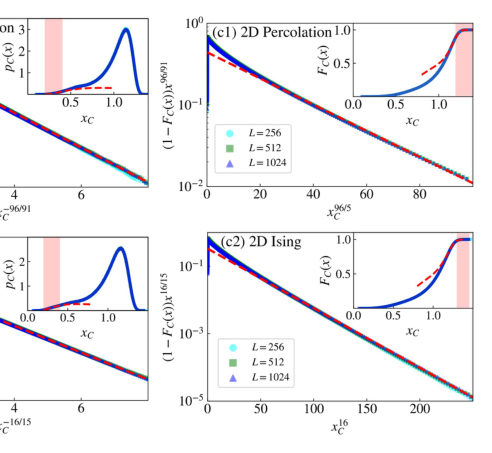
<figcaption class="paper-figure-caption"><b>Fig 2.</b> Figure 2 shows the results for the three-dimensional simple cubic lattice. We use the high-precision estimates yh = 2.4818(4) for the 3D Ising universality class [26] and yh = 2.522 95(15) for 3D percolation [27]. These give y∗ h ≈0.8273 for Ising and y∗ h ≈0.8410 for percolation. For xm, Figs. 2(a1) and 2(a2) plot pm(x) against x1/(1−y∗ h) m . The data show the expected semi-logarithmic</figcaption>
</figure>
<figure class="paper-figure-card">
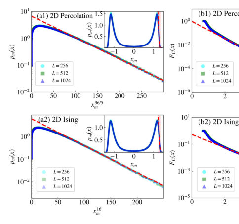
<figcaption class="paper-figure-caption"><b>Fig 3.</b> Figure 1 shows the results for the two-dimensional square lattice. The reduced magnetic exponent is y∗ h = 15/16 for the 2D Ising universality class and y∗ h = 91/96 for 2D percolation. These values imply large right-tail exponents, 1/(1 −y∗ h) = 16 for Ising and 96/5 for per- colation, making the two-dimensional tails particularly</figcaption>
</figure>
<figure class="paper-figure-card">
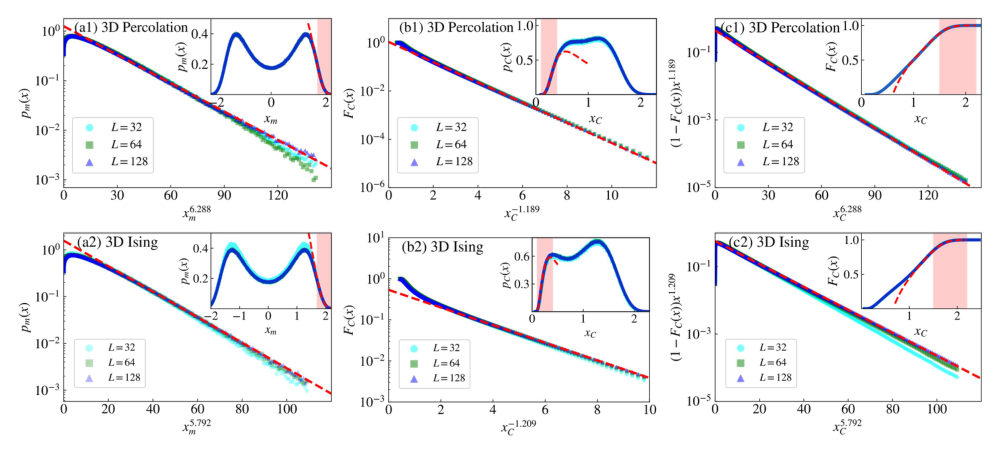
<figcaption class="paper-figure-caption"><b>Fig 4.</b> Figure 2. Probability distributions of the rescaled order parameters in three dimensions. Panels (a1)–(c1) show 3D percolation, and panels (a2)–(c2) show the 3D FK-Ising model. Different colors correspond to different system sizes. Panels (a1) and (a2) show pm(x) versus x 1/(1−y∗ h) m in the large-x regime; the insets show the full PDFs of xm. Panels (b1) and (b2) show the left tail of the CDF FC(x) versus x −1/y∗ h C ; the insets show the full PDFs of xC. Panels (c1) and (c2) show (1 −FC(x))x1/y∗ h versus</figcaption>
</figure>
<figure class="paper-figure-card">
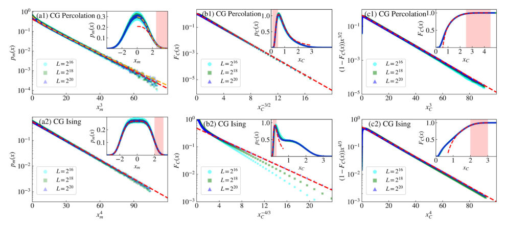
<figcaption class="paper-figure-caption"><b>Fig 5.</b> Figure 3. Probability distributions of the rescaled order parameters on the complete graph. Panels (a1)–(c1) show critical percolation, and panels (a2)–(c2) show the FK-Ising model. Different colors correspond to different system sizes. Panels (a1) and (a2) show pm(x) versus x 1/(1−y∗ h) m in the large-x regime; the insets show the full PDFs of xm. Panels (b1) and (b2) show the left tail of the CDF FC(x) versus x −1/y∗ h C ; the insets show the full PDFs of xC. Panels (c1) and (c2) show (1 −FC(x))x1/y∗ h</figcaption>
</figure>

**Summary.** This paper investigates how large deviations in order parameters reveal fundamental aspects of criticality that standard averages miss. By studying percolation and Ising models on various lattices, the authors derive universal scaling laws for these tails. The results demonstrate a deep connection between geometric constraints (like those found on complete graphs) and the underlying critical physics.

**Why it may be interesting.** While focused on classical statistical mechanics, the rigorous mathematical techniques for analyzing rare events and universality in critical systems are foundational concepts applicable across many-body physics, including quantum phase transitions.

Detailed structure

**Main problem.** The study focuses on probing universality beyond standard finite-size scaling by analyzing the large-deviation tails of critical order-parameter distributions.

**Main result.** The analysis establishes universal scaling forms for these tails, revealing that rare configurations in complex systems (like the complete graph FK-Ising model) can be governed by different underlying physics (e.g., percolation vs. Ising).

**Method.** The authors employ large-deviation theory and finite-size scaling arguments to derive and test universal scaling forms for the cumulative distribution functions of rescaled order parameters.

**Model / system.** The work examines critical phenomena in both bond percolation and the Fortuin–Kasteleyn (FK) Ising model across various geometries: 2D lattices, 3D lattices, and complete graphs.

**Key observables.** Rescaled magnetization-like variable ($x_m = |M|/\langle|M|
angle$) and the rescaled largest-cluster variable ($x_C = C_1/\langle C_1
angle$).

**Important parameters / regimes.** Critical exponents, dimensionality (2D, 3D), and the mean-field limit (complete graph).

**Assumptions / limitations.** The analysis assumes that the leading exponential cost in the large deviation tail is governed by specific critical exponents derived from scaling theory.

**Figures summary.** Figures illustrate the collapse of scaled probability distributions for both order parameters across different dimensions, highlighting deviations and crossovers (e.g., percolation-like vs. Ising-like scaling on the complete graph).

**Paper structure.** The paper develops theoretical frameworks using finite-size scaling to predict tail behavior, applies these forms to specific models (percolation/Ising) on different lattices, and uses Monte Carlo simulations to test the predicted universal scaling laws.

Abstract

Large-deviation tails of critical probability distributions provide a sensitive probe of universality beyond standard finite-size scaling. We study these tails for critical percolation and Fortuin--Kasteleyn Ising models on two-dimensional lattices, three-dimensional lattices, and complete graphs. We consider two rescaled order parameters: the magnetization-like variable $x_m=|M|/\langle |M|\rangle$, including a signed cluster-mass analogue for percolation, and the largest-cluster variable $x_C=C_1/\langle C_1\rangle$. For $x_m$, we test the expected stretched-exponential large-deviation tail and show that the same form applies to the percolation analogue. For $x_C$, guided by the exact complete-graph result and scaling arguments, we propose universal scaling forms for both tails of the cumulative distribution and test them by extensive Monte Carlo simulations. In the complete-graph FK-Ising model, the left tail is governed by rare configurations with percolation-like scaling rather than by the typical Ising scaling. Our results show that the tails of order-parameter distributions reveal universal features of critical fluctuations that are not captured by averaged observables alone.

[↑ back to top](#top)

### [All Reflective Field-widened Unbalanced Interferometer for Quantum Sensing and Communication Applications](http://arxiv.org/abs/2606.18358v1)

**Authors:** Ramy Tannous, Dogan Sinar, Tabitha D. Arulpragasam, Thomas Jennewein  
**Type:** both · **Category:** quantum information and computing · **PDF:** <https://arxiv.org/pdf/2606.18358v1>  
**Analysis basis:** full PDF text, analyzed in chunks
**Topic relevance:** `interference shaping light` **3/5** · `quantum optics experiment` **2/5** · `QC/QI experiment` **1/5** · `free-space correlated emission` **1/5**

↔ Scroll figures horizontally

<figure class="paper-figure-card">
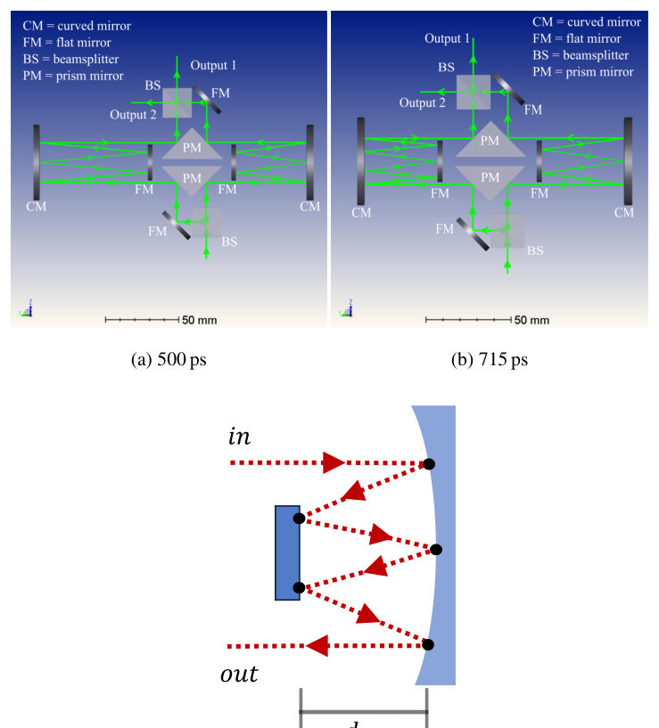
<figcaption class="paper-figure-caption"><b>Fig 1.</b> FIG. 1: Schematic of the optical design of the Offner relay interferometer. (a) Model of an ORI</figcaption>
</figure>
<figure class="paper-figure-card">

<figcaption class="paper-figure-caption"><b>Fig 2.</b> FIG. 2: Simulated coherent interference maxima (bottom) and minima (top) using non-sequential</figcaption>
</figure>
<figure class="paper-figure-card">
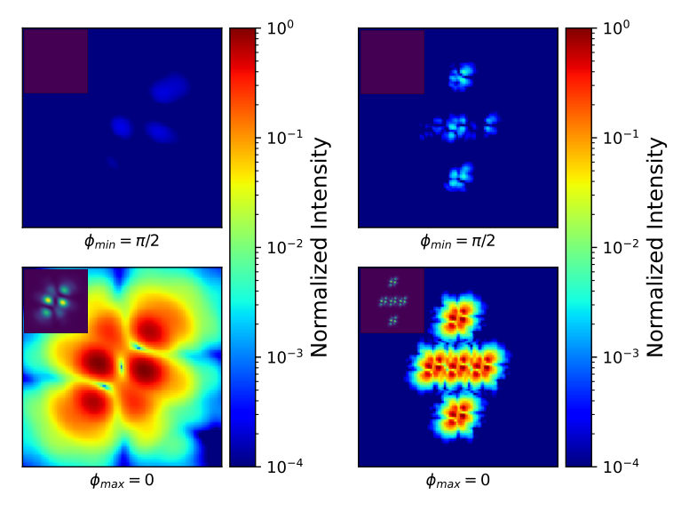
<figcaption class="paper-figure-caption"><b>Fig 3.</b> Fig. 3 shows the relative phase of the output of a refractive field-widened interferometer that uses</figcaption>
</figure>
<figure class="paper-figure-card">
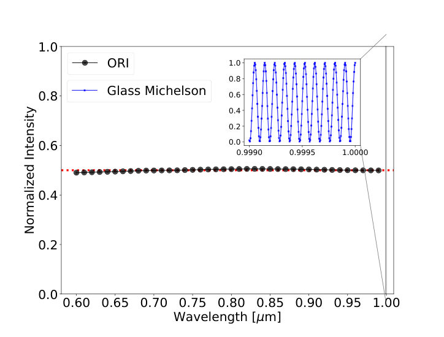
<figcaption class="paper-figure-caption"><b>Fig 4.</b> FIG. 3: The main figure shows the intensity of one of the outputs of the ORI as a function of</figcaption>
</figure>
<figure class="paper-figure-card">
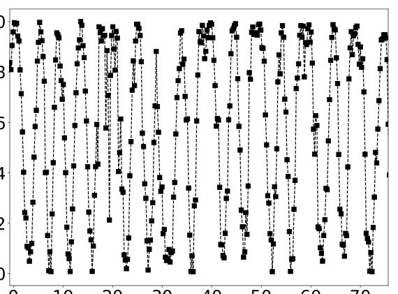
<figcaption class="paper-figure-caption"><b>Fig 5.</b> FIG. 4: Normalized multimode signal intensity measured at the output of the ORI with a camera.</figcaption>
</figure>

**Summary.** This paper introduces an all-reflective interferometer designed to overcome wavefront distortion issues inherent in free-space quantum communication. By using only mirrors, the device maintains high interference visibility and remains achromatic across broadband light sources. This makes it a robust alternative to traditional interferometers for applications like satellite quantum links.

**Why it may be interesting.** This work directly addresses hardware limitations in quantum networking by proposing a robust, passive optical element suitable for field-free propagation channels, which is crucial for scaling up quantum information infrastructure.

Detailed structure

**Main problem.** The primary challenge addressed is developing passive interferometers for free-space quantum communication that can operate reliably over turbulent atmospheric channels without complex adaptive optics.

**Main result.** The proposed all-reflective interferometer achieves high interference visibility (>0.97) for spatially multimode beams and is inherently achromatic across broadband wavelengths, outperforming refractive alternatives.

**Method.** The authors employed numerical optical ray tracing simulations to model the performance of their novel reflective interferometer design (Offner Relay Interferometer).

**Model / system.** The core system is an All Reflective Field-widened Unbalanced Interferometer utilizing only standard spherical mirrors in a cavity configuration. This setup is designed for time-bin encoded qubits used in quantum communication.

**Key observables.** Interference visibility (V), physical footprint, and chromatic dependence of the interference signal across broadband wavelengths (600 nm to 1000 nm).

**Important parameters / regimes.** High visibility (>0.97); achromatic performance; ability to handle spatially multimode beams.

**Assumptions / limitations.** The design is assumed to be limited by beam clipping in the horizontal direction and that refractive interferometers suffer from significant chromatic dispersion.

**Figures summary.** Figures illustrate the ORI schematic, simulated interference maxima/minima showing high visibility even with angular offsets, and comparisons demonstrating the ORI's wavelength independence versus dispersive glass setups. Other figures show imaging capabilities.

**Paper structure.** The paper introduces the need for turbulence-resistant quantum links, presents the reflective Offner Relay Interferometer (ORI) design, validates its performance via simulations against refractive and standard Michelson designs, and demonstrates its applicability in sensing and communication contexts.

Abstract

Interference of time-bin encoded signals over free-space optical channels typically requires stringent mode filtering on receivers due to wavefront distortions from atmospheric turbulence, conventionally addressed with adaptive optics. Passive multimode receivers based on field-widened interferometers present a compelling alternative, enabling direct interference without the overhead of wavefront correction. We demonstrate a field-widened interferometer design that is implemented solely with reflective surfaces and achieves a high interference visibility (greater than 0.97) for spatially multimode beams. The interference of the multimode beams is enabled by two imaging systems that consist of a cavity configuration between a spherical concave mirror and a flat mirror. The configuration enables small form-factors, is inherently achromatic, and is based on standard spherical mirrors which reduces the complexity of the system. The interferometer is applicable for spatially multimode and turbulent optical channels, such as satellite communication, and is designed for quantum systems that use time-bin encoded qubits.

[↑ back to top](#top)

### [$d$-wave altermagnetism revealed by resonant inelastic X-ray scattering](http://arxiv.org/abs/2606.18731v1)

**Authors:** Guangkai Zhang, Yuehong Li, Xubin Ye, Vincent C. Morano, Sze Tung Li, Jaewon Choi, Rebecca Scatena, Shuai Tang, Maocai Pi, Mengqi Ye, Mirian Garcia-Fernandez, Alessandro Bombardi, Xiaomei Qin, Zhao Pan, Daniel G. Mazzone, Qisi Wang, Yi Lu, Yao Shen, Youwen Long  
**Type:** both · **Category:** strongly correlated electrons · **PDF:** <https://arxiv.org/pdf/2606.18731v1>  
**Analysis basis:** full PDF text, analyzed in chunks
**Topic relevance:** `exotic spin models in light-matter` **3/5** · `spintronics-quantum-optics interface` **3/5**

↔ Scroll figures horizontally

<figure class="paper-figure-card">
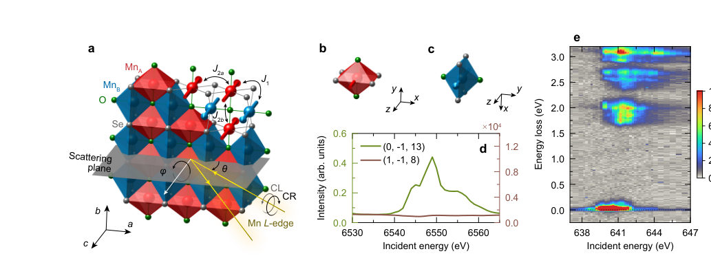
<figcaption class="paper-figure-caption"><b>Fig 1.</b> FIG. 1. Crystal symmetry of La2O3Mn2Se2 and resonant X-ray scattering characterization. a, Schematic of</figcaption>
</figure>
<figure class="paper-figure-card">
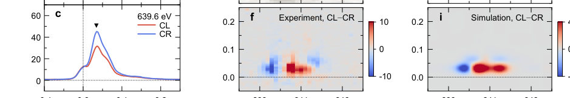
<figcaption class="paper-figure-caption"><b>Fig 2.</b> FIG. 2. Circular dichroism in single-magnon excitations. a, Representative RIXS spectrum in the CL channel. Open</figcaption>
</figure>
<figure class="paper-figure-card">
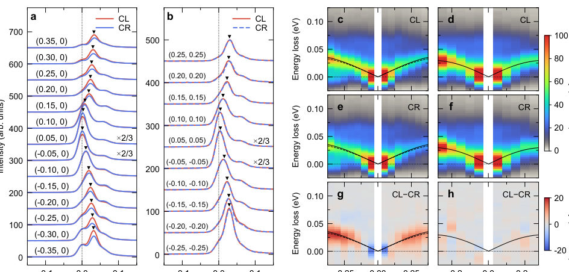
<figcaption class="paper-figure-caption"><b>Fig 3.</b> FIG. 3. Magnon dispersion and momentum dependence of circular dichroism. a, b, RIXS spectra measured at</figcaption>
</figure>
<figure class="paper-figure-card">
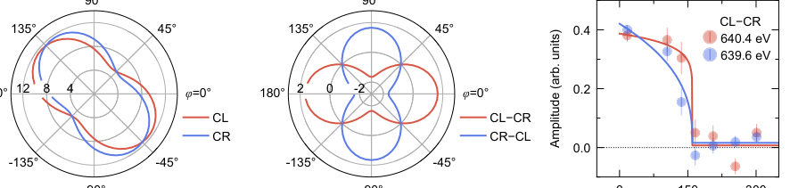
<figcaption class="paper-figure-caption"><b>Fig 4.</b> FIG. 4. Azimuthal dependence of circular dichroism. a, b, Azimuthal angle (ϕ) dependence of the fitted single-magnon</figcaption>
</figure>

**Summary.** This paper reports definitive experimental evidence for $d$-wave altermagnetism in the material $	ext{La}_2	ext{O}_3	ext{Mn}_2	ext{Se}_2$ using resonant inelastic X-ray scattering (RIXS). By analyzing circular dichroism, the authors resolve a long-standing debate by proving that this signal is an intrinsic consequence of altermagnetic symmetry rather than an experimental artifact. This establishes polarized RIXS as a powerful diagnostic tool for characterizing exotic magnetic phases.

**Why it may be interesting.** The work provides a highly sensitive spectroscopic tool (polarized RIXS) to probe subtle magnetic symmetries in correlated materials, offering insights into how lattice structure dictates emergent quantum magnetic order beyond simple collinear models.

Detailed structure

**Main problem.** The study aims to definitively resolve whether circular dichroism observed in Resonant Inelastic X-ray Scattering (RIXS) is an intrinsic signature of altermagnetism or merely an artifact of experimental geometry.

**Main result.** The authors provide unambiguous evidence for $d$-wave altermagnetism in $	ext{La}_2	ext{O}_3	ext{Mn}_2	ext{Se}_2$, proving that the observed RIXS dichroism is a direct consequence of fundamental altermagnetic symmetry constraints.

**Method.** The research combines advanced experimental measurements using circularly polarized RIXS at the Mn $L_3$ edge with theoretical modeling via Exact Diagonalization (ED) calculations based on lattice symmetries.

**Model / system.** The system is the strongly correlated Lieb-lattice magnet $	ext{La}_2	ext{O}_3	ext{Mn}_2	ext{Se}_2$, which exhibits altermagnetism—a magnetic order with compensated moments lacking relativistic spin-orbit coupling. The theoretical framework models two non-interacting Mn sublattices connected by specific symmetry operations.

**Key observables.** Circular dichroism ($\Delta I = I_{CL} - I_{CR}$) in the single-magnon excitation peak, which exhibits a distinct $d$-wave symmetry and vanishes above the Néel temperature.

**Important parameters / regimes.** The measurements are performed at low temperatures (e.g., 15 K) and involve varying incident photon energy, momentum transfer ($\mathbf{q}$), and azimuthal angle ($\phi$).

**Assumptions / limitations.** The analysis assumes that the observed dichroism is governed by symmetry constraints derived from the altermagnetic order, independent of magnon branch splitting or quasi-elastic susceptibility.

**Figures summary.** Figures illustrate the crystal structure and RIXS geometry; key figures map the momentum dependence and azimuthal ($\phi$) variation of the circular dichroism signal, showing clear $d$-wave anisotropy at low temperatures.

**Paper structure.** The paper establishes the physical context of altermagnetism, details the experimental setup using polarized RIXS on $	ext{La}_2	ext{O}_3	ext{Mn}_2	ext{Se}_2$, presents the measurement results showing $d$-wave dichroism, and concludes by theoretically proving that this signal arises directly from symmetry breaking inherent to the altermagnetic state.

Abstract

Altermagnetism defines a third fundamental class of collinear magnetic order, featuring compensated magnetic moments with antiparallel spin alignment, yet lifted Kramers degeneracy without the need for relativistic spin-orbit coupling. Its ability to host spin-polarized electronic bands and unconventional chiral magnons makes it a promising platform for functional materials. However, experimental verification has proven challenging; while circular dichroism in resonant inelastic X-ray scattering (RIXS) has been suggested as a signature of chiral magnons, it remains controversial whether this effect is an intrinsic property of altermagnetism or an artifact of experimental geometry. In this work, we resolve this debate and provide unambiguous experimental evidence of $d$-wave altermagnetism in the strongly correlated Lieb-lattice magnet La$_2$O$_3$Mn$_2$Se$_2$. The RIXS spectra exhibit a $d$-wave-symmetry circular dichroism in the magnetic excitations that vanishes in the paramagnetic phase. Through RIXS-operator symmetry analysis and exact-diagonalization calculations, we prove that the observed dichroism is a direct consequence of altermagnetic symmetry constraints, independent of magnon branch splitting. Our results provide definitive evidence for the experimental realization of $d$-wave altermagnetism in La$_2$O$_3$Mn$_2$Se$_2$ and establish circularly polarized RIXS as a highly symmetry-sensitive spectroscopic framework for detecting magnetic phases that evade conventional probes.

[↑ back to top](#top)

### [An effective field theory approach to the sign problem in BFSS](http://arxiv.org/abs/2606.18396v1)

**Authors:** Gauri Batra, Henry W. Lin, Haifeng Tang  
**Type:** theory · **Category:** statistical mechanics · **PDF:** <https://arxiv.org/pdf/2606.18396v1>  
**Analysis basis:** full PDF text, analyzed in chunks
**Topic relevance:** `Keldysh / 2PI / non-Gaussian methods` **3/5** · `driven-dissipative phase transition` **1/5** · `methods for driven-dissipative` **1/5**

↔ Scroll figures horizontally

<figure class="paper-figure-card">
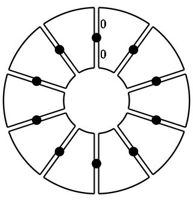
<figcaption class="paper-figure-caption"><b>Fig 1.</b> Figure 1: The planar Wick contraction of ⟨Wid Wρ⟩0. The rungs that connect the inner and outer ring are the dressed propagators in the large D approximation for the bosonic zero modes.</figcaption>
</figure>
<figure class="paper-figure-card">
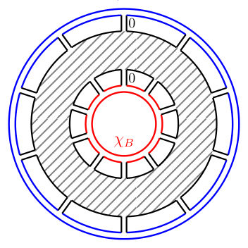
<figcaption class="paper-figure-caption"><b>Fig 2.</b> Figure 2: The leading planar diagrams that contribute to ⟨cos θ⟩in the replica expansion. The bosonic rungs enter the annulus from the outer fermion ring and are absorbed into the non-perturbative zero-mode correlator. This presentation makes manifest that only the external bosonic legs that contract the two single-trace operators T10 are kept explicit; the resummation of all bosonic interactions inside the connected two-point function lives entirely inside the hashed annulus. We may think of Figure 1 as a possible contribution to the annulus.</figcaption>
</figure>
<figure class="paper-figure-card">
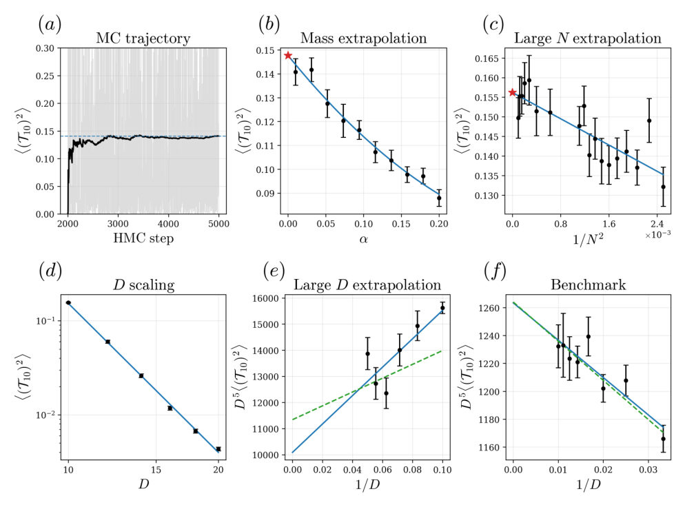
<figcaption class="paper-figure-caption"><b>Fig 3.</b> Figure 3: (a) Monte Carlo history at D = 10, N = 30, α = 0.01, showing ⟨(T10)2⟩versus HMC step (after 2000 thermalization steps). The light gray curve is the instantaneous value with large fluctuation, the black curve is the stabilized running average, and the blue dashed line is the average value at the end of the HMC run. (b) Mass extrapolation at fixed D = 10 and N = 30, showing ⟨(T10)2⟩versus mass α. Black points with error bars are HMC data, the blue curve is a polynomial fit, and the red star is the extrapolated value at α = 0. (c) Large-N extrapolation at fixed D = 10 using data already extrapolated to α = 0, showing ⟨(T10)2⟩versus N −2. Black points with error bars are the...</figcaption>
</figure>
<figure class="paper-figure-card">
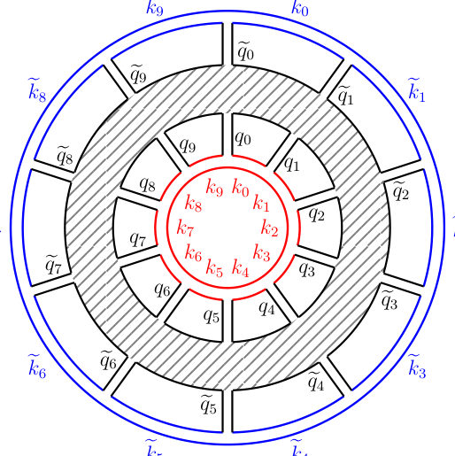
<figcaption class="paper-figure-caption"><b>Fig 4.</b> Figure 4: The higher-dimensional ring. We have labeled the d −1 spatial momentum carried by each propagator. The bosonic modes that enter the hashed annulus carry momentum q or eq but are zero-modes on the thermal circle.</figcaption>
</figure>
<figure class="paper-figure-card">
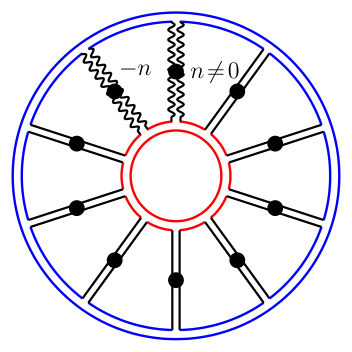
<figcaption class="paper-figure-caption"><b>Fig 5.</b> Figure 5: Same diagram as figure 2, except that two adjacent bosonic rungs carry non-zero Matsubara frequencies n and −n. We have replaced two Xi matrices with fast modes; the gauge field A0 is constant in static gauge.</figcaption>
</figure>

**Summary.** This paper develops an effective field theory framework to analyze the notorious fermion sign problem in BFSS matrix quantum mechanics. By using high-temperature expansions and symmetry arguments, the authors determine that while the sign problem is present, its perturbative onset is delayed, suggesting manageable errors at moderate temperatures. The work establishes scaling laws for the suppression of the phase factor in the large-$N$ limit.

**Why it may be interesting.** While focused on high-energy physics, the methodology of analyzing complex phases and divergences in path integrals is highly relevant to understanding sign problems in lattice simulations of quantum field theories, which share mathematical structures with many statistical mechanics models.

Detailed structure

**Main problem.** The primary challenge addressed is the fermion sign problem, which prevents direct classical simulation of quantum theories involving fermions using Monte Carlo methods.

**Main result.** The authors show that while the sign problem exists in the continuum limit for BFSS theory, its leading perturbative onset is at a high loop order, and for moderate temperatures, the resulting error in thermodynamic quantities is small.

**Method.** They employ an effective field theory approach combined with the high-temperature expansion to reduce the path integral to a bosonic zero-mode integral. The sign problem is diagnosed by analyzing the expectation value of the Pfaffian phase $\langle e^{i	heta} 
angle$.

**Model / system.** The analysis focuses on the D0-brane/BFSS matrix quantum mechanics, which is generalized to higher-dimensional maximally supersymmetric Yang-Mills (SYM) theories at finite temperature.

**Key observables.** The expectation value $\langle \cos 	heta 
angle$ of the Pfaffian phase operator ($	ext{Pf}(M)$), and thermodynamic quantities like Free Energy $F(T)$.

**Important parameters / regimes.** High temperatures ($T$), large-$N$ limit ('t Hooft limit), coupling constant $\lambda$, and inverse temperature $eta$.

**Assumptions / limitations.** The analysis relies heavily on the high-temperature expansion, integrating out massive Matsubara modes. The perturbative approach is assumed to be valid up to certain orders.

**Figures summary.** Figures illustrate planar Wick contractions for correlators contributing to $\langle \cos 	heta 
angle$ in the replica expansion and show Monte Carlo results benchmarking analytic calculations of $\langle(T_{10})^2
angle$.

**Paper structure.** The paper systematically analyzes the sign problem using effective field theory, deriving scaling laws in the large-$N$ limit via multiple techniques (replica method, large-D expansion), and calculating subleading temperature corrections through symmetry analysis.

Abstract

The sign problem is a notorious obstacle for classically simulating quantum theories with fermions. We propose an effective field theory method for analyzing the sign problem. At high temperatures, a $d$+1 dimensional field theory reduces to a bosonic $d$-dimensional theory; the phase of the Pfaffian in the higher dimensional theory is encoded in an operator in the lower dimensional theory. We apply this framework to the D0-brane/BFSS matrix quantum mechanics, where the phase becomes an operator in a bosonic multi-matrix integral. Our results show that the continuum theory has a sign problem that persists in the large-$N$ 't Hooft regime. However, detecting the sign problem involves going to 10-loop order in the high-temperature expansion. This delayed onset follows from the fact that the Pfaffian phase transforms as an $O(9)$ pseudoscalar. Furthermore, the relevant diagrams give a numerically small prefactor. Consequently, ignoring the sign problem leads to a relatively small fractional error in thermodynamic quantities for temperatures $T \gtrsim λ^{1/3}$. However, at stronger coupling in the 't Hooft regime, the sign problem may become more severe. Finally, we initiate the application of this framework to higher-dimensional maximally supersymmetric Yang-Mills theories.

[↑ back to top](#top)

### [Enhancing the teleportation fidelity of a quantum network using purification](http://arxiv.org/abs/2606.18743v1)

**Authors:** Soumit Roy, Md Sohel Mondal, Siddhartha Santra, Indranil Chakrabarty  
**Type:** theory · **Category:** quantum information and computing · **PDF:** <https://arxiv.org/pdf/2606.18743v1>  
**Analysis basis:** full PDF text, analyzed in chunks
**Topic relevance:** `entanglement & information structure` **3/5** · `interference shaping light` **1/5** · `non-equilibrium dynamics` **1/5**

↔ Scroll figures horizontally

<figure class="paper-figure-card">
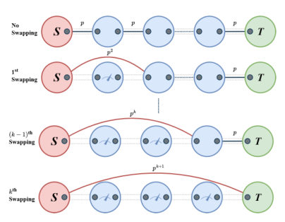
<figcaption class="paper-figure-caption"><b>Fig 1.</b> FIG. 1. Step-by-step Entangled Swapping scenario: The source (S) and the target (T) are not initially connected directly. How- ever, there are intermediate repeater stations in between them. After kth swapping, there is a connection between S and T via an isotropic state with parameter pk+1.</figcaption>
</figure>
<figure class="paper-figure-card">
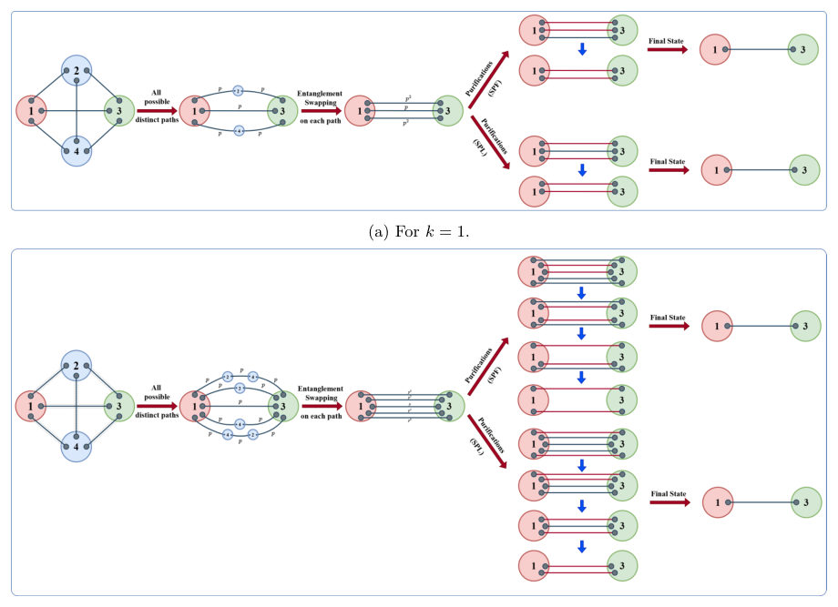
<figcaption class="paper-figure-caption"><b>Fig 2.</b> FIG. 2. Algorithm for evaluating F tel avg using the SPF and SPL purification strategies (k = 1 and k = kmax) for a complete graph with N = 4. The procedure is illustrated for a single source–target pair, (S, T) = (1, 3). The remaining pairs can be treated analogously, and the F tel avg is obtained by averaging over all pairs.</figcaption>
</figure>
<figure class="paper-figure-card">
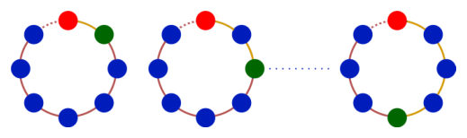
<figcaption class="paper-figure-caption"><b>Fig 3.</b> FIG. 3. Purification procedure for an N-node ring network (RN) for both k = 1 and k = kmax. A fixed source node (marked in red) is considered, and the two distinct paths (marked in different colors) are determined based on the positions of the target nodes (marked in green). Based on the symmetry, the remaining configurations can be obtained analogously after the final step.</figcaption>
</figure>
<figure class="paper-figure-card">
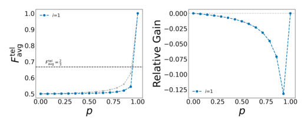
<figcaption class="paper-figure-caption"><b>Fig 4.</b> FIG. 4. Plots of (a) F tel avg as a function of p and (b) relative gain as a function of p for a ring network with N = 100 and k = 1 = kmax. The total number of paths is taken to be z = zmax = 2. The horizontal black line suggests F tel avg = 2 3. The grey line denotes the variation of F tel avg with respect to p for the without MPEP scenario.</figcaption>
</figure>
<figure class="paper-figure-card">
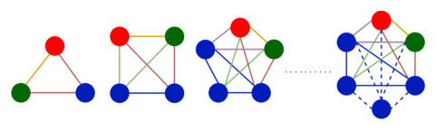
<figcaption class="paper-figure-caption"><b>Fig 5.</b> FIG. 5. Purification procedure for an N-node complete graph network (CGN) for k = 1. A fixed source (marked in red) and target (marked in green) are considered, and the paths are de- termined based on the total number of intermediate nodes. As the total number of nodes increases, the number of intermediate nodes—and hence the number of available paths—also increases; the additional paths at each step are indicated by different col- ors. Due to symmetry, the remaining (S, T) pairs can be treated analogously after the final step.</figcaption>
</figure>

**Summary.** This paper rigorously analyzes how entanglement distribution schemes affect the overall 'resourcefulness' of quantum networks. It demonstrates that utilizing multi-path entanglement purification (MPEP) significantly boosts average teleportation fidelity compared to simpler methods. The findings provide critical guidelines for designing robust quantum communication channels across various network topologies.

**Why it may be interesting.** This work provides a detailed resource assessment framework for quantum networks, directly impacting the design principles for long-distance quantum communication infrastructure by quantifying the benefit of advanced protocols like MPEP over simple repeater chains.

Detailed structure

**Main problem.** The core problem is quantifying the 'resourcefulness' of quantum networks by comparing entanglement distribution schemes, specifically single-path swapping versus multi-path entanglement purification.

**Main result.** Multi-path entanglement purification (MPEP) significantly enhances the average teleportation fidelity ($	ext{F}_{	ext{tel}}^{	ext{avg}}$) compared to using only the best available path, and the order of purification matters due to non-associativity.

**Method.** The authors analyze network resourcefulness by calculating $	ext{F}_{	ext{tel}}^{	ext{avg}}$, which is averaged over all source-target pairs. They compare protocols based on entanglement swapping versus sequential entanglement purification using multiple paths.

**Model / system.** The study models quantum networks (QN) with various topologies, including regular lattices (Ring, Square, Triangular) and random graphs (Erdős-Rényi). Communication relies on shared entangled states distributed over physical links.

**Key observables.** Average teleportation fidelity ($	ext{F}_{	ext{tel}}^{	ext{avg}}$), which quantifies the network's overall quantum communication capability.

**Important parameters / regimes.** Visibility parameter ($p$), number of nodes ($N$), edge usage constraints ($k=1$ vs $k=	ext{kmax}$), and the order/strategy of purification (SPF vs SPL).

**Assumptions / limitations.** The analysis often assumes homogeneous networks with isotropic edges, although generalizations to irregular graphs are performed. The superiority of the Shortest Path Last (SPL) strategy over Shortest Path First (SPF) is a key theoretical result.

**Figures summary.** Figures illustrate purification procedures for various lattices (RN, CGN, TLN), showing how $	ext{F}_{	ext{tel}}^{	ext{avg}}$ changes as a function of entanglement visibility ($p$) and the number of paths/purification steps used. Saturation behavior is also shown.

**Paper structure.** The paper systematically analyzes network resourcefulness by first defining the metric ($	ext{F}_{	ext{tel}}^{	ext{avg}}$), then comparing single-path vs. multi-path strategies, deriving theoretical results for optimal purification ordering (SPL > SPF), and finally applying these findings to various lattice topologies under different edge usage constraints.

Abstract

Complex quantum networks can support a diverse set of long-range entanglement distribution schemes ranging from linear repeater protocols to multipath entanglement purification strategies. As a result, a network's resourcefulness, that is its ability to facilitate quantum communication, depends on the deployed distribution scheme. In this work, we analyse and compare the resourcefulness of quantum networks across a broad range of network topologies, including both regular and random networks, under two distinct entanglement distribution schemes. The first relies on entanglement swapping along a single path connecting a source-target pair, while the second exploits entanglement purification using multiple paths between the same source and target nodes. The resourcefulness of the network is quantified using a recently described metric [1] that averages over the maximum teleportation fidelity between arbitrary source-target pairs in the network. We present algorithms for estimating this metric under constraints of edge-usage and ordering of paths. Our results not only demonstrate the sensitivity of the average maximum teleportation fidelity metric to the choice of entanglement distribution protocol, but also highlight the significant improvements enabled by network purification schemes. In particular, purification-based approaches can substantially enhance average teleportation fidelity, thereby improving the overall teleportation capability of quantum networks.

[↑ back to top](#top)

### [Ground state preparation of random all-to-all Hamiltonians using ADAPT-VQE](http://arxiv.org/abs/2606.18339v1)

**Authors:** Sabhyata Gupta, Bharath Sambasivam, Sophia E. Economou, Edwin Barnes, Alexander F. Kemper, Raghav G. Jha  
**Type:** theory · **Category:** disordered systems and neural networks · **PDF:** <https://arxiv.org/pdf/2606.18339v1>  
**Analysis basis:** full PDF text, analyzed in chunks
**Topic relevance:** `entanglement & information structure` **3/5** · `exotic spin models in light-matter` **1/5** · `non-equilibrium dynamics` **1/5**

↔ Scroll figures horizontally

<figure class="paper-figure-card">
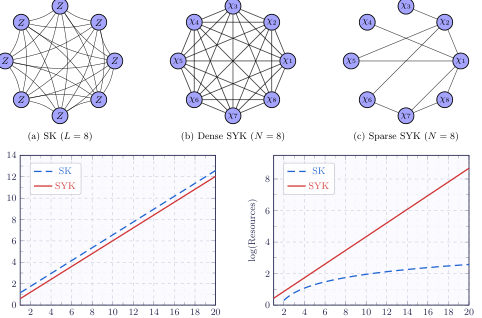
<figcaption class="paper-figure-caption"><b>Fig 1.</b> FIG. 1. (a)–(c) Schematic representations of the three models we consider in this paper. All of them have all-to-all interac- tions, and the edges (denoting coupling) are taken at random from some distribution. For the SYK model, two blue cir- cles represent one qubit, while for the SK model, one circle represents one qubit. Panels (d) and (e) show the scaling of the dynamical Lie algebra (DLA) dimension and the required resources with number of qubits n for the SK (dashed blue) and SYK (solid red) models.</figcaption>
</figure>
<figure class="paper-figure-card">
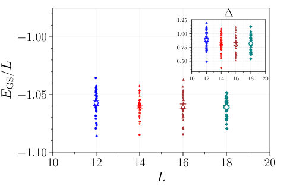
<figcaption class="paper-figure-caption"><b>Fig 2.</b> FIG. 2. The exact diagonalization results for the ground state energy and the gap ∆= E1 −E0 (inset) for the quantum SK model with up to 18 qubits and Γ = 1. The results are averaged over 30 instances of the model. The gap for the SK model is significantly larger than that for the SYK model shown in the inset of Fig. 4.</figcaption>
</figure>
<figure class="paper-figure-card">
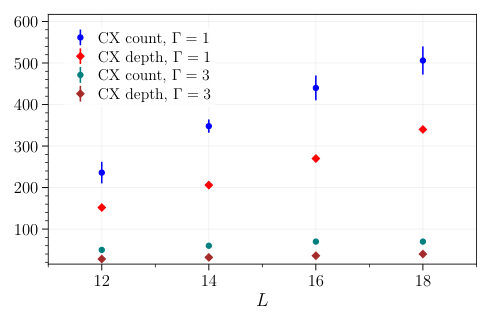
<figcaption class="paper-figure-caption"><b>Fig 3.</b> FIG. 3. The CX count and depth of the unitary circuit that prepares the ground state averaged over 5 instances of the quantum SK model with L sites. Results are shown for two different values of the transverse magnetic field, Γ.</figcaption>
</figure>
<figure class="paper-figure-card">
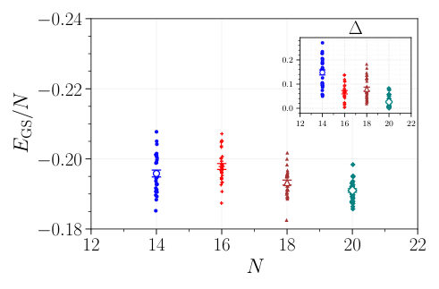
<figcaption class="paper-figure-caption"><b>Fig 4.</b> FIG. 4. Exact diagonalization results for the ground-state energy and spectral gap ∆of the dense SYK model up to N = 20. The results are averaged over 30 disorder realizations.</figcaption>
</figure>
<figure class="paper-figure-card">
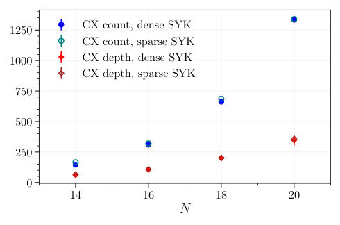
<figcaption class="paper-figure-caption"><b>Fig 5.</b> FIG. 5. CNOT count and depth of the ADAPT-VQE circuits that prepare the ground state, averaged over five disorder realizations of the dense and sparse SYK models.</figcaption>
</figure>

**Summary.** The paper demonstrates that an adaptive variational quantum algorithm, TETRIS-ADAPT-VQE, can accurately simulate the ground states of complex random Hamiltonians like the SK and SYK models. While achieving high fidelity, the authors find that preparation efficiency is limited by the inherent volume-law entanglement in these systems, suggesting a fundamental challenge for current quantum simulation techniques.

**Why it may be interesting.** This work directly addresses the computational limits of simulating highly entangled quantum many-body systems using near-term quantum hardware algorithms like VQE variants. The comparison between SK and SYK provides crucial benchmarks for assessing algorithmic scalability in disordered physics.

Detailed structure

**Main problem.** The primary challenge is efficiently preparing the ground state of random, all-to-all interacting Hamiltonians, which exhibit volume-law entanglement making them hard for classical tensor network methods.

**Main result.** TETRIS-ADAPT-VQE successfully prepares high-fidelity ground states for both quantum SK and SYK models up to moderate sizes, though the preparation proves inefficient for dense or moderately sparse SYK systems due to inherent entanglement structure.

**Method.** The authors employ an advanced variational quantum algorithm, ADAPT-VQE, which adaptively builds a quantum circuit ansatz by selecting operators based on their local gradient contribution to the Hamiltonian expectation value.

**Model / system.** The study focuses on random Hamiltonians, specifically the Quantum Sherrington-Kirkpatrick (SK) model and the Sachdev-Ye-Kitaev (SYK) model. These models feature all-to-all interactions and are used to probe quantum simulation limits.

**Key observables.** Fidelity ($\ge 99.3\%$ for SYK, $\ge 99.9998\%$ for SK), ground-state energy error ($\delta$), circuit depth/CNOT count, and bipartite von Neumann entanglement entropy (SEE).

**Important parameters / regimes.** System sizes ($L=18$ for SK; $N=20$ for SYK), transverse field strength ($\Gamma$), and Hamiltonian sparsity parameter ($k_s$).

**Assumptions / limitations.** The analysis assumes that the difficulty in simulation scales with entanglement structure (volume-law) rather than just the explicit number of non-zero terms in the Hamiltonian.

**Figures summary.** Figures illustrate schematic representations of SK and SYK models, scaling plots showing resource requirements vs. system size, and comparisons between ADAPT performance for different disorder realizations.

**Paper structure.** The paper introduces the problem (hard ground states), details the ADAPT-VQE methodology, applies it to the SK model (showing efficiency gains) and then compares its performance on dense versus sparse SYK models, concluding that entanglement structure dictates difficulty over Hamiltonian sparsity.

Abstract

The ground state of random Hamiltonians with all-to-all interactions such as the quantum Sherrington-Kirkpatrick (SK) model and the Sachdev-Ye-Kitaev (SYK) model follow volume-law entanglement and are expected to be hard to model using tensor networks. In recent years, some progress has been made to push the limit of classical methods using neural quantum states. However, it remains an open question whether there exist quantum algorithms that could offer a quantum advantage over the state-of-the-art classical methods in simulating random Hamiltonians. In this work, we show that one such algorithm, TETRIS-ADAPT-VQE, can construct accurate ground states for dense and sparse SYK models containing up to $N=20$ Majorana fermions achieving fidelities $\geq 99.3\%$ and for the quantum SK model with up to $L=18$ sites achieving fidelities $\geq 99.9998\%$. We find that while the preparation of ground states is efficient (in terms of operator pool size and circuit depth) for the SK model, it is not efficient for either dense or moderately sparse SYK models.

[↑ back to top](#top)

### [Separation of Statistical Complexity and Trainability in Variational Quantum Circuits](http://arxiv.org/abs/2606.18580v1)

**Authors:** Suman Mandal, Maximillian Daughtry, Eduardo R. Mucciolo  
**Type:** theory · **Category:** quantum information and computing · **PDF:** <https://arxiv.org/pdf/2606.18580v1>  
**Analysis basis:** full PDF text, analyzed in chunks
**Topic relevance:** `entanglement & information structure` **3/5** · `analog quantum simulation` **1/5** · `non-equilibrium dynamics` **1/5**

↔ Scroll figures horizontally

<figure class="paper-figure-card">
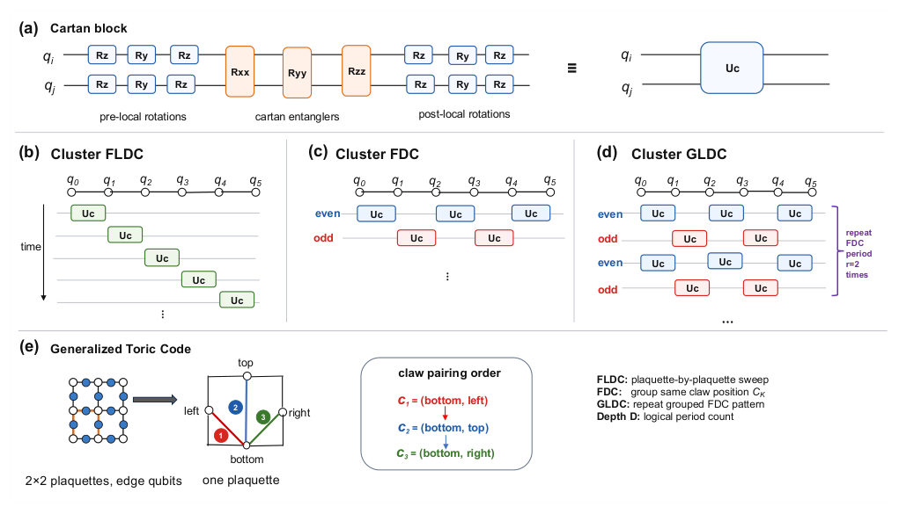
<figcaption class="paper-figure-caption"><b>Fig 1.</b> FIG. 1. Circuit architecture used in the simulations. Panel (a) shows the two-qubit Cartan block, consisting of local Euler rotations, three Cartan entanglers RXX, RY Y , and RZZ, and final local Euler rotations. The block is represented compactly as Uc in the remaining panels. Panels (b)–(d) show the cluster-Ising scheduling: FLDC applies a sequential nearest-neighbor sweep, FDC uses grouped even/odd brick-wall layers, and GLDC repeats the FDC grouped pattern. Panel (e) shows the generalized toric code edge-qubit layout for the 2 × 2 plaquette system with N = 12 qubits, together with the claw ordering used within each plaquette. The depth convention used in these schedules is defined in...</figcaption>
</figure>
<figure class="paper-figure-card">
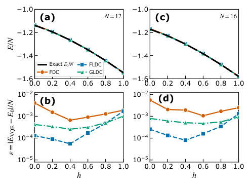
<figcaption class="paper-figure-caption"><b>Fig 2.</b> FIG. 2. Cluster-Ising VQE results for N = 12 [panels (a) and (b)] and N = 16 [panels (c) and (d)]. The upper panels show the optimized energy per qubit, while the lower panels show the normalized error ϵ = |EVQE −E0|/N. The FDC and FLDC curves use one logical period, whereas the GLDC curve uses two repetitions of the grouped FDC pattern, r = 2. All VQE calculations use 100 random restarts and 1000 Adam iterations per restart.</figcaption>
</figure>
<figure class="paper-figure-card">
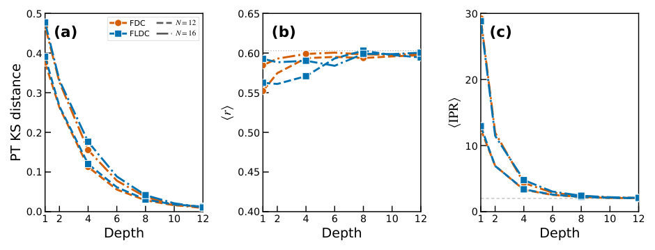
<figcaption class="paper-figure-caption"><b>Fig 3.</b> FIG. 3. Cluster-Ising statistics-only diagnostics for random-parameter FDC and FLDC ensembles at N = 12 and N = 16. The panels show: (a) the Porter-Thomas KS distance, (b) the entanglement-spectrum adjacent-gap average ratio ⟨r⟩, and (c) the normalized average inverse participation ratio ⟨IPR⟩. In panel (b), the dotted horizontal line marks the GUE reference value. In panel (c), the horizontal reference line marks the random-state-like delocalization value ⟨IPR⟩≃2 for the normalization used here. Each point is averaged over 100 random circuit samples.</figcaption>
</figure>
<figure class="paper-figure-card">
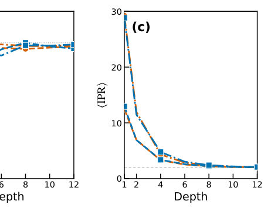
<figcaption class="paper-figure-caption"><b>Fig 4.</b> Figure 5 displays the Porter-Thomas KS distance, the entanglement-spectrum average ratio, and the IPR for</figcaption>
</figure>
<figure class="paper-figure-card">
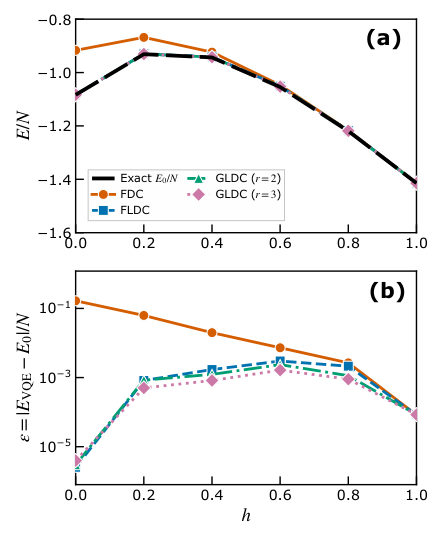
<figcaption class="paper-figure-caption"><b>Fig 5.</b> FIG. 4. Generalized toric-code VQE results for the N = 12 edge-qubit geometry with claw within-plaquette ordering. Panel (a) shows the optimized energy per qubit, and panel (b) shows the normalized error ϵ = |EVQE −E0|/N. The FDC and FLDC curves use one logical period, whereas the GLDC curves use two and three repetitions of the grouped FDC pattern, r = 2 and r = 3, respectively. All VQE calculations use 100 random restarts and 1000 Adam iterations per restart.</figcaption>
</figure>

**Summary.** The paper investigates whether the statistical complexity of Variational Quantum Circuits (VQCs) dictates their trainability. By analyzing structured circuits on Ising and Toric Code models, the authors show that standard randomness diagnostics can appear at shallow depths without causing barren plateaus. This suggests a fundamental separation between local structural complexity and global optimization landscape properties.

**Why it may be interesting.** This work is highly relevant because it provides theoretical guidance on designing quantum algorithms, suggesting that simply maximizing circuit expressivity or achieving high 'randomness' in state preparation might not be necessary—or even desirable—for successful variational optimization.

Detailed structure

**Main problem.** The research aims to separate whether statistical signatures of complexity (like randomness) in Variational Quantum Circuits (VQCs) are inherently linked to the practical trainability of these circuits.

**Main result.** Statistical diagnostics indicating random-state behavior can emerge at shallow circuit depths without causing exponential gradient suppression, suggesting a separation between structural complexity and optimization landscape properties.

**Method.** The authors analyze VQCs applied to structured Hamiltonians using multiple diagnostic tools: Porter-Thomas statistics, entanglement spectrum analysis (adjacent-gap ratio), and Inverse Participation Ratio (IPR).

**Model / system.** The study uses the one-dimensional cluster-Ising model and a generalized toric code Hamiltonian on lattice geometries. The circuits are structured using specific local building blocks (Cartan block) within various depth schedules (FDC, FLDC, GLDC).

**Key observables.** Porter-Thomas KS distance, entanglement-spectrum adjacent-gap ratio ($\langle r 
angle$), Inverse Participation Ratio ($	ext{IPR}$), and gradient variance/norm ($	ext{Var}(\partial E / \partial 	heta)$).

**Important parameters / regimes.** Circuit depth ($D$), system size ($N$), Hamiltonian parameters ($J, J', h$, etc.), and the comparison between optimized states vs. random-parameter ensembles.

**Assumptions / limitations.** The analysis is restricted to finite-depth circuits and finite system sizes; the locality argument relies on the underlying Hamiltonian being local.

**Figures summary.** Figures show VQE results (energy/error) for both models across different depths, alongside diagnostic plots tracking PT distance, $\langle r 
angle$, and $\langle IPR 
angle$ versus depth, demonstrating convergence toward random benchmarks while optimization remains accurate.

**Paper structure.** The paper systematically compares the evolution of multiple complexity diagnostics ($	ext{PT}$, $\langle r 
angle$, $	ext{IPR}$) as circuit depth increases for two different physical models. It contrasts these statistical findings with direct measurements of VQE performance (energy and gradient variance) to argue for a decoupling between the measures.

Abstract

Variational quantum algorithms (VQAs) are among the leading approaches for near-term quantum computing, yet their performance can degrade in barren plateau regimes characterized by vanishing gradients. A widely held intuition is that increasing circuit expressivity, often associated with random-state behavior, leads to a loss of trainability. Existing results show that sufficiently random circuits can lead to barren plateaus. Here we show that standard statistical signatures of randomness can emerge well before this regime, without degrading trainability. We demonstrate this behavior in structured variational circuits applied to the one-dimensional cluster-Ising model and a generalized toric code Hamiltonian. To characterize state complexity, we analyze Porter-Thomas statistics, entanglement-spectrum level statistics, and inverse participation ratios. Across both models, increasing circuit depth drives these diagnostics toward random-state-like or random-matrix-like behavior, while variational optimization remains effective, with no evidence of exponential gradient suppression in the regime studied. We interpret this behavior in terms of locality. Spectral correlations develop at relatively shallow depth through locally generated structure, while global state randomization and the associated concentration-of-measure effects are not yet realized. These results show that commonly used statistical diagnostics of complexity do not by themselves determine trainability. Instead, they point to a separation between different aspects of complexity in finite-depth variational circuits.

[↑ back to top](#top)

### [Noncyclic geometric phase in three-level Ramsey interferometry for enhanced metrology](http://arxiv.org/abs/2606.18443v1)

**Authors:** Zhifan Zhou, Yaxin Li  
**Type:** theory · **Category:** other · **PDF:** <https://arxiv.org/pdf/2606.18443v1>  
**Analysis basis:** full PDF text, analyzed in chunks
**Topic relevance:** `interference shaping light` **3/5** · `quantum measurements` **1/5**

↔ Scroll figures horizontally

<figure class="paper-figure-card">
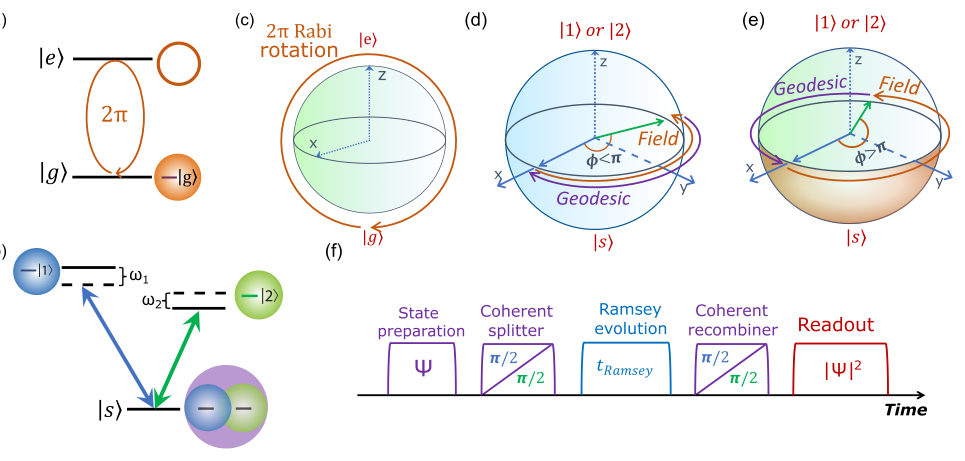
<figcaption class="paper-figure-caption"><b>Fig 1.</b> FIG. 1: Geometric phase in a noncyclic three-level Ramsey interferometer. (a,c) A full 2π Rabi cycle in a two-level system gives a global phase of π, equal to half the solid angle enclosed on the Bloch sphere. (b) V-type example: the shared state |s⟩couples to two signal-collecting states |1⟩and |2⟩with transition frequencies ω1 and ω2. Their internal two-path interference is projected back onto the shared readout channel. (d,e) As the relative rotation crosses ϕ = π, the geodesic closure switches branches, producing a noncyclic geometric phase jump and a sharp change in the projected readout phase. (f) Ramsey sequence with state preparation, coherent splitting, Ramsey evolution,...</figcaption>
</figure>
<figure class="paper-figure-card">
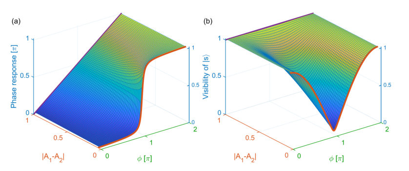
<figcaption class="paper-figure-caption"><b>Fig 2.</b> FIG. 2: Geometric phase amplification and visibility tradeoff. (a) Phase-response landscape as a function of the accumulated differential phase ϕ and the pathway imbalance |A1 −A2|. The purple and orange cuts denote the standard Ramsey-like limit |A1 −A2| = 1 and a representative near-balanced geometric-response case with A1 = 0.525 and A2 = 0.475, corresponding to |A1 −A2| = 0.05, respectively. In the Ramsey-like limit, the projected internal two-path amplitude reduces to eiϕ/2, so the readout phase varies linearly as Φ = ϕ/2. For nearly balanced pathways, the response becomes strongly nonlinear near the noncyclic-critical point ϕ = π, producing an amplified local phase response. (b)...</figcaption>
</figure>
<figure class="paper-figure-card">
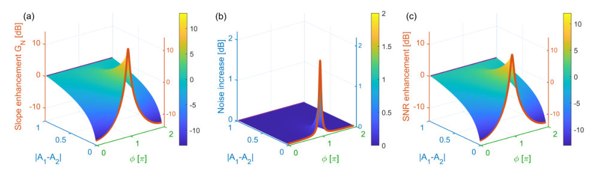
<figcaption class="paper-figure-caption"><b>Fig 3.</b> FIG. 3: Sensitivity landscape of the noncyclic geometric phase response. (a) Normalized phase-response gain GN, (b) visibility-induced readout-phase-noise increase, and (c) resulting net SNR enhancement as functions of the accumulated phase ϕ and pathway imbalance |A1 −A2|. The purple and orange cuts denote the Ramsey-like limit |A1 −A2| = 1 and the representative near-balanced case |A1 −A2| = 0.05, respectively. For the orange cut, the maximum normalized phase-response gain is Gmax N = 1/|A1 −A2| = 20, while the minimum visibility remains finite, Vmin = |A1 −A2| = 0.05. The positive SNR-enhancement region in (c) defines a finite operating window where the geometric phase gain outweighs the...</figcaption>
</figure>
<figure class="paper-figure-card">
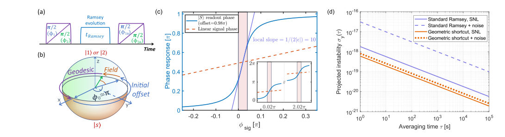
<figcaption class="paper-figure-caption"><b>Fig 4.</b> FIG. 4: Geometric shortcut enabled by the noncyclic phase response. (a) Shortcut Ramsey protocol: the first Ramsey pulse sets the initial relative offset phase ϕoff = ϕ1 −ϕ2, while the final Ramsey pulse acts as an analyzer with phases ϕ1a and ϕ2a scanned to read out the projected phase. (b) Offset-controlled trajectory and geodesic closure near the critical branch point. (c) Offset-displaced phase response for |A1 −A2| = 0.05 with ϕoff = 0.98π; the shaded region marks the shortcut operating window near ϕsig ≃0.02π. (d) Projected fractional instability. Solid curves are shot-noise-limited; dashed/dotted curves include additive classical phase noise, ξCLA = 0.1 rad. The shortcut projections...</figcaption>
</figure>

**Summary.** The paper introduces enhanced phase sensing in three-level Ramsey interferometers by utilizing a noncyclic geometric phase response. By analyzing the interference between two internal paths, researchers derive a mechanism that sharply amplifies the readout phase near specific operating points. This allows for a projected improvement in measurement stability compared to standard methods, provided external technical noise is present.

**Why it may be interesting.** This work provides a concrete, theoretically derived method for engineering quantum sensors by manipulating geometric phase accumulation, offering a pathway to surpass standard metrological limits in atomic systems.

Detailed structure

**Main problem.** The goal is to enhance phase sensing sensitivity beyond standard linear accumulation by exploiting a noncyclic geometric phase response in Ramsey interferometry.

**Main result.** A net Signal-to-Noise Ratio (SNR) gain can be achieved only within a finite operating window where the enhanced local phase slope compensates for visibility reduction and technical noise. This allows for a 'geometric shortcut' to improved projected stability via faster sampling cycles.

**Method.** The analysis models the three-level system interference, deriving effective fringe visibility ($V_s$) and readout phase ($\Phi$). Sensitivity is quantified by analyzing the local phase-response gain versus noise penalties.

**Model / system.** The physical platform is a three-level Ramsey interferometer. The mechanism relies on the interference of amplitudes from two signal-collecting internal paths onto a shared readout channel, generating a noncyclic geometric phase jump near a geodesic-closure transition.

**Key observables.** Readout phase $\Phi(\phi)$, projected visibility $V_s(\phi)$, inferred signal-phase uncertainty ($\Delta\phi$), and the net SNR enhancement factor ($E$).

**Important parameters / regimes.** Pathway imbalance ($\epsilon = A_1 - A_2$), technical noise level ($\xi_{CLA}$), and the initial Ramsey phase offset ($\phi_{	ext{off}}$).

**Assumptions / limitations.** The technique's utility is shown to be most pronounced when additive classical phase noise ($\xi_{CLA}$) is present, as this external noise source can be leveraged by the geometric enhancement.

**Figures summary.** Figures illustrate the gain–visibility tradeoff (showing $G_{max}^N$ vs. $V_{min}$), map the finite SNR enhancement window, and compare projected fractional instability for standard versus shortcut protocols.

**Paper structure.** The paper progresses from deriving the effective fringe structure ($P_s(t)$) to quantifying the local phase-response gain ($G_N$). It then analyzes the trade-off between this gain and visibility loss. Finally, it applies these findings to predict a measurable improvement in clock stability using an offset-controlled 'shortcut protocol'.

Abstract

In a standard two-level Ramsey interferometer, the measured phase accumulates linearly during the interrogation time. Here, we introduce three-level Ramsey interferometry that employs a noncyclic geometric phase response to enhance phase sensing, with projected internal-path interference reshaping the mapping from accumulated signal phase to readout phase. Near a geodesic-closure transition, a small accumulated signal phase produces a sharply amplified readout-phase shift. We quantify the accompanying gain--visibility tradeoff and identify a finite operating window in which the amplified response yields a net signal-to-noise-ratio gain under technical-noise-limited conditions. By tuning an initial Ramsey phase offset, this high-slope window can be positioned at a desired operating point and sampled repeatedly with shorter cycles, providing a geometric shortcut to improved projected stability. More broadly, these results establish a multilevel Ramsey route to enhanced phase sensitivity in quantum platforms, where two signal-collecting internal paths interfere to produce a noncyclic geometric response.

[↑ back to top](#top)

### [Characterization of three-qubit controlled unitary gates of Schmidt rank three](http://arxiv.org/abs/2606.18612v1)

**Authors:** Xiutao Zhang  
**Type:** theory · **Category:** quantum information and computing · **PDF:** <https://arxiv.org/pdf/2606.18612v1>  
**Analysis basis:** full PDF text, analyzed in chunks
**Topic relevance:** `entanglement & information structure` **3/5**

↔ Scroll figures horizontally

<figure class="paper-figure-card">
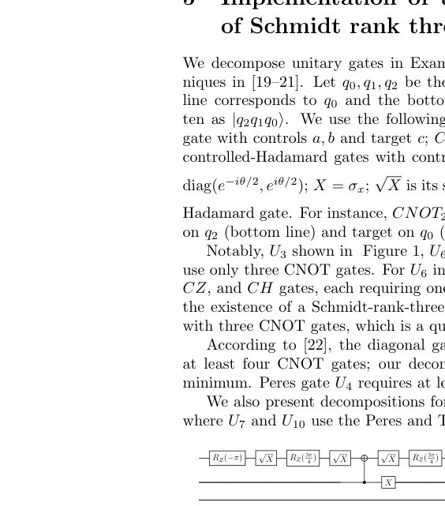
<figcaption class="paper-figure-caption"><b>Fig 1.</b> Figure 1: Quantum circuit for U3 defined in (19).</figcaption>
</figure>
<figure class="paper-figure-card">
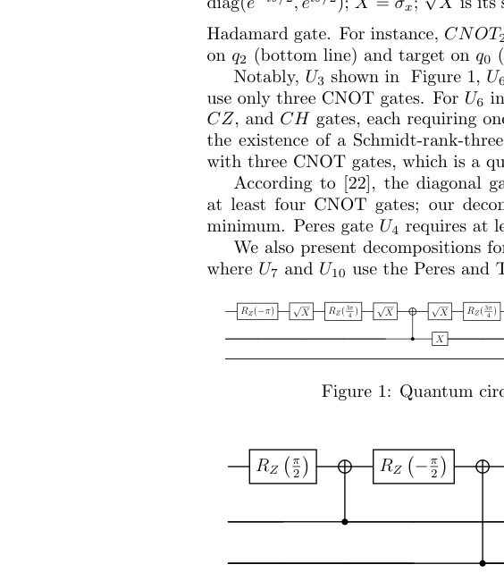
<figcaption class="paper-figure-caption"><b>Fig 2.</b> Figure 2: Quantum circuit for U8 defined in (24).</figcaption>
</figure>
<figure class="paper-figure-card">
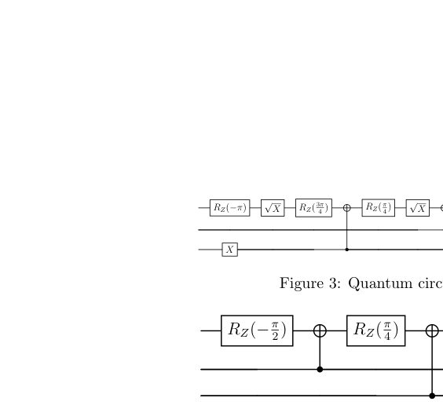
<figcaption class="paper-figure-caption"><b>Fig 3.</b> Figure 4: Quantum circuit for U5 defined in (21).</figcaption>
</figure>

**Summary.** This paper rigorously characterizes three-qubit controlled unitary gates based on their operator Schmidt rank. It establishes precise mathematical conditions determining when these gates have $	ext{sr}=3$, linking this structural property to the resulting state's entanglement structure and minimal circuit implementation using CNOT gates.

**Why it may be interesting.** The detailed characterization of gate complexity via Schmidt rank provides fundamental theoretical bounds on quantum circuit design, which is crucial for understanding resource efficiency in quantum computation protocols.

Detailed structure

**Main problem.** The primary goal is characterizing three-qubit controlled unitary gates by establishing necessary and sufficient conditions for them to possess a Schmidt rank of exactly three.

**Main result.** The authors derive explicit mathematical conditions for $	ext{sr}(U)=3$ for various gate forms ($U_1, U_2$), showing that this structural property relates to the linear independence of component operators.

**Method.** The work employs advanced linear algebra techniques, analyzing the span and linear dependence of operator components (like Pauli matrices) derived from the unitary structure. It also analyzes state-level entanglement using measures like the tripartite tangle.

**Model / system.** The system under study is a three-qubit quantum processor implementing controlled unitary gates ($U$). The analysis focuses on the mathematical properties of these unitaries, rather than simulating physical hardware.

**Key observables.** Schmidt rank ($	ext{sr}(U)$), bipartite and tripartite entanglement measures (tangles $	au$), and circuit complexity (minimum CNOT count).

**Important parameters / regimes.** Phase parameters ($\gamma, \delta$) governing the gate structure, and structural coefficients ($t_0, t_1, t_2$).

**Assumptions / limitations.** The analysis relies on simplifying assumptions regarding local unitary invariance to reduce general forms into manageable structures ($U_1, U_2$), and assumes specific linear independence conditions for certain operator sets.

**Figures summary.** Figures illustrate quantum circuits implementing specific gates ($U_3, U_8, U_{11}, U_5$) and demonstrate the relationship between gate structure and entanglement properties.

**Paper structure.** The paper proceeds by first establishing general structural forms for controlled unitaries. It then analyzes these forms case-by-case using linear algebra to derive necessary and sufficient conditions for $	ext{sr}=3$. Finally, it connects this operator-level classification to state-level entanglement capabilities.

Abstract

We characterize three-qubit controlled unitary gates of Schmidt rank three, establishing necessary and sufficient conditions for such gates to have Schmidt rank three. We construct explicit examples and analyze their entanglement capabilities, showing that gates with Schmidt rank three can generate output states ranging from fully separable to maximal GHZ-class states. Within this classification, we present a parameterized gate family that produces an output W-class state whose bipartite tangles for subsystems AB and AC are modulated as simple trigonometric functions of a single phase parameter. The examples also include gates implementable with only three CNOT gates, showing that this lower bound is achievable. Decompositions that achieve the minimum possible CNOT count for several other cases are provided as well. Our results bridge Schmidt rank classification, entanglement structure, and resource-efficient circuit synthesis.

[↑ back to top](#top)

### [Attention as Frustrated Synchronization](http://arxiv.org/abs/2606.18694v1)

**Authors:** Joshua Nunley  
**Type:** theory · **Category:** disordered systems and neural networks · **PDF:** <https://arxiv.org/pdf/2606.18694v1>  
**Analysis basis:** full PDF text, analyzed in chunks
**Topic relevance:** `driven-dissipative phase transition` **2/5** · `methods for driven-dissipative` **2/5** · `Frenkel-Kontorova` **1/5** · `analog quantum simulation` **1/5** · `correlated / nonlocal dissipation` **1/5** · `exotic spin models in light-matter` **1/5** · `non-equilibrium dynamics` **1/5** · `non-equilibrium universality` **1/5**

↔ Scroll figures horizontally

<figure class="paper-figure-card">
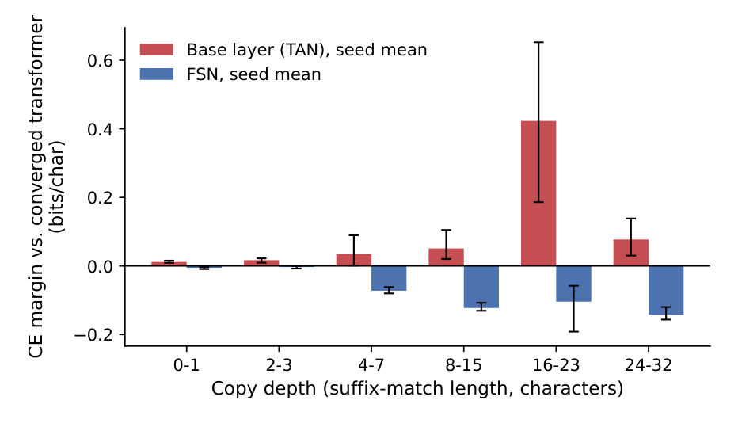
<figcaption class="paper-figure-caption"><b>Fig 1.</b> Figure 1: Per-token cross-entropy margins against the converged transformer baseline, in bits per character, by copy-depth bin, for the converged base Kuramoto attention layer and the converged FSN. Each bar is the mean over the three seeds of that model, and the whiskers span the per-seed range, that is, they run from the minimum to the maximum of the three per-seed margins in the bin. Bars below the zero line indicate an advantage over the transformer. Every base-layer seed is behind the transformer in every bin, with the failure concentrated on the sixteen-to-twenty-three bin. Every FSN seed is ahead of the transformer on every bin of depth four and beyond. Per-seed values with...</figcaption>
</figure>
<figure class="paper-figure-card">
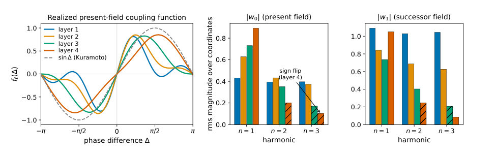
<figcaption class="paper-figure-caption"><b>Fig 2.</b> Figure 2: The trained kernel, read as coupling functions. Left: the realized present-field coupling function of each layer, fℓ(∆) = 1</figcaption>
</figure>
<figure class="paper-figure-card">
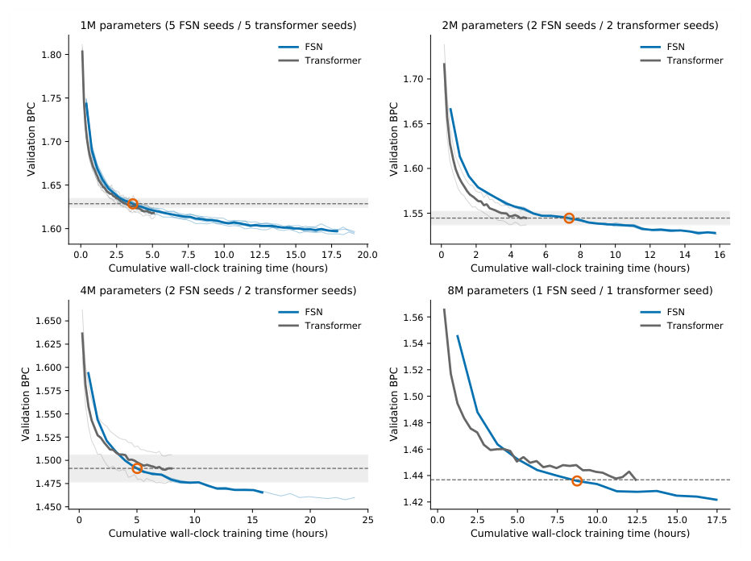
<figcaption class="paper-figure-caption"><b>Fig 3.</b> Figure 3: Validation loss against cumulative wall-clock training time at each rung of the parameter ladder on enwik8. Faint lines are individual seeds (FSN in blue, transformer in gray); bold lines are the seed means. The shaded band spans the transformer seeds’ thirty-epoch validation losses and the dashed line their mean; the open circle marks where the mean FSN curve crosses that mean target. Seed counts are given in each panel title.</figcaption>
</figure>
<figure class="paper-figure-card">
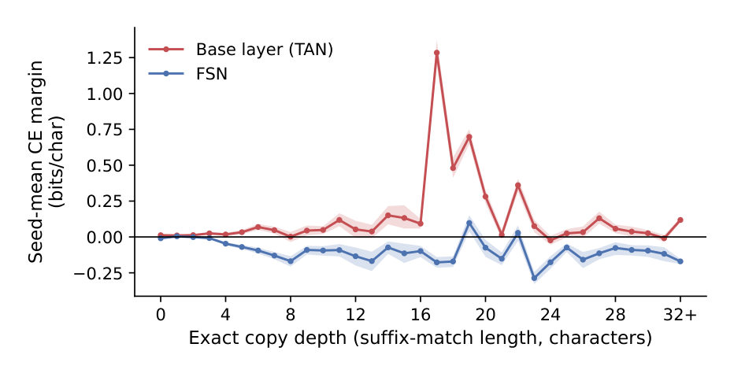
<figcaption class="paper-figure-caption"><b>Fig 4.</b> Figure 4: Seed-mean cross-entropy margin against the converged transformer at every exact copy depth, in bits per character, for the base layer and the FSN (three seeds each). Shaded bands are ninety-five-percent position-bootstrap intervals around the seed mean (two thousand resamples). The final point pools every position of depth thirty-two and beyond. Depths below sixteen use the standard slice, and depths of sixteen and beyond pool the standard and enriched slices, exactly as in Table 4. The base layer’s deficit on the sixteen-to-twenty-three bin does not rise uniformly with depth. It concentrates in spikes at depths seventeen, nineteen, and twenty-two, which correspond to specific...</figcaption>
</figure>

**Summary.** This paper proposes the Frustrated Synchronization Network (FSN), an attention mechanism that reinterprets context processing as frustrated synchronization among coupled oscillators. By replacing standard consensus mechanisms with dynamics incorporating data-driven frustration and delays, the FSN achieves state-of-the-art performance on character-level text and code benchmarks compared to transformers.

**Why it may be interesting.** The explicit mapping of complex neural network dynamics onto established concepts from coupled oscillator theory (Kuramoto models) provides a novel physical interpretation for sequence modeling failures, particularly concerning long-range dependencies.

Detailed structure

**Main problem.** The paper addresses how sequence prediction can be improved by modifying attention mechanisms from consensus-based retrieval to a process modeled by frustrated synchronization.

**Main result.** The proposed Frustrated Synchronization Network (FSN) consistently outperforms tuned transformer baselines on character-level text and code corpora, especially when analyzing performance on long-range copy events.

**Method.** It introduces the FSN, which models token state updates using a complex coupling kernel derived from coupled oscillators on a torus, incorporating frustration angles and data-dependent delays.

**Model / system.** The core model is the Frustrated Synchronization Network (FSN), an oscillator-based attention layer replacing standard self-attention. It uses phases on a torus ($\mathbb{T}^k$) and models coupling via Kuramoto–Sakaguchi-like dynamics, where prediction is framed as synchronization frustrated by the data's transition.

**Key observables.** Validation loss (bits per character) on enwik8 and code corpora; performance margins analyzed across 'copy depth' bins ($\ell$); convergence rates over epochs.

**Important parameters / regimes.** One-million to eight-million parameters; copy depth $\ell$; frustration angles derived from data transitions ($\delta_u$).

**Assumptions / limitations.** The analysis assumes that the failure of standard attention on long repetitions is due to its inability to capture non-periodic, accumulated 'winding information' present in the raw phase state.

**Figures summary.** Figures show per-token cross-entropy margins vs. copy depth bins, demonstrating the FSN's advantage where base layers fail (deep bins $\ge 4$). Other figures track loss vs. training time across parameter scales.

**Paper structure.** The paper builds by first defining the physical analogy of attention as synchronization, then introducing the FSN kernel structure (including harmonics and delay terms), presenting quantitative results showing superior performance over transformers on convergence and deep-copy tasks, and finally analyzing efficiency scaling with model size.

Abstract

A network of oscillators that synchronizes perfectly computes nothing further, so an attention architecture built from synchronization must locate its computation in structured departures from agreement. We introduce the Frustrated Synchronization Network (FSN), whose token states are phases on a torus and whose entire value pathway is one learned complex coupling kernel over harmonics and a one-step delay. Each component of the kernel is a frustration in the sense of the synchronization literature. The complex phases are static Kuramoto-Sakaguchi frustration angles, the signed harmonics are repulsive Daido components, and the delay term, which couples each token to the successors of the tokens it attends to, is algebraically identical to Kuramoto-Sakaguchi coupling whose frustration angle is the data's own transition, so next-token prediction is implemented as synchronization frustrated by the data. At matched one-million-parameter and training budgets on character-level text and code, the FSN's validation loss is below a tuned RoPE-SwiGLU transformer's at every epoch measured, and the comparison survives training the baseline to convergence: every thirty-epoch enwik8 seed finishes below the transformer's converged fifty-epoch loss of 1.611, and the FSN's completed fifty-epoch runs converge to 1.5953 +/- 0.0014. A variant with every feed-forward block replaced by mean-field coupling to learned collective modes, leaving no multilayer perceptron in the stack, tracks the transformer. On natural text the unfrustrated base layer falls behind the converged transformer at every copy depth, worst on long-range copy events; the kernel reverses the deficit at every depth of four and beyond. Headline comparisons are at the one-million-parameter scale; a scale ladder is complete through four million parameters with the advantage persisting, and remaining arms are marked as in progress.

[↑ back to top](#top)

### [Chiral Packings in Cylinders are Ultrasensitive to Confinement Deformation](http://arxiv.org/abs/2606.19082v1)

**Authors:** Xuebin Wang, Jiahao Guo, Yao Li  
**Type:** both · **Category:** statistical mechanics · **PDF:** <https://arxiv.org/pdf/2606.19082v1>  
**Analysis basis:** full PDF text, analyzed in chunks
**Topic relevance:** `driven-dissipative phase transition` **2/5** · `non-equilibrium dynamics` **2/5** · `non-equilibrium universality` **2/5** · `Frenkel-Kontorova` **1/5** · `analog quantum simulation` **1/5** · `methods for driven-dissipative` **1/5**

↔ Scroll figures horizontally

<figure class="paper-figure-card">
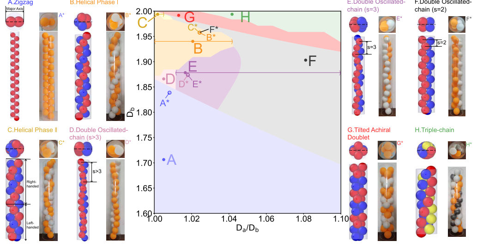
<figcaption class="paper-figure-caption"><b>Fig 1.</b> Figure 1. Phase diagram. Simulations of elliptic cylinders with minor axis Db ∈[1.6, 2], aspect ratio Da/Db ∈[1, 1.10], and sphere numbers N ≤25 are performed. Here, the sphere diameter is taken as the unit length, i.e., d = 1, and all other quantities are expressed relative to d. The phase diagram contains eight regions of densest packing structures (A−H), with representative snapshots displayed beside it. Each snapshot is obtained at the parameters of its respective solid point in the phase diagram. The corresponding phase structures observed in the macroscopic experiments of table-tennis ball packings (A∗−H∗) are shown beside the snapshots, which are obtained at the parameter values...</figcaption>
</figure>
<figure class="paper-figure-card">
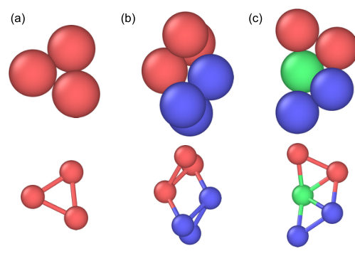
<figcaption class="paper-figure-caption"><b>Fig 2.</b> Figure 2. Typical blocks in packing structures. The first row shows snapshots of the actual spheres, and the bonds in the second row indicate the contact relationships between spheres. (a) A triplet of spheres comprises three spheres in contact with each other and with the wall, exhibiting chirality. It appears in various structures and is used in the triplet-sphere packing block method. (b) The central red and blue spheres have an angular difference of π and do not contact each other, forming a defect that appears in helical phase II. Triplets composed of red and blue spheres exhibit opposite chiralities. (c) Red- green and blue-green triplets display opposite chiralities, a feature that...</figcaption>
</figure>
<figure class="paper-figure-card">
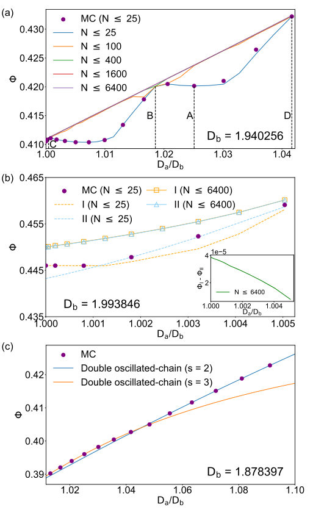
<figcaption class="paper-figure-caption"><b>Fig 3.</b> Figure 3. Packing fractions. The packing fractions ϕ from theoretical predictions (lines) are compared with the packing fraction ϕ from N ≤25 MC simulations (purple points). (a) For Db = 1.940256, densest structures are derived using the triplet-sphere packing block method at N ≤25, 100, 400, 1600, 6400. Here, the curves for N ≤1600 and N ≤6400 nearly coincide. Structures corresponding to the dashed lines A, B, C, and D are presented in Fig. 5(a)–(d), respectively. (b) For Db = 1.993846, densest structures are found using the triplet-sphere packing block method (helical phase I) and the defective triplet-sphere packing block method (helical phase II) at small (N ≤25) and large (N ≤6400)...</figcaption>
</figure>
<figure class="paper-figure-card">
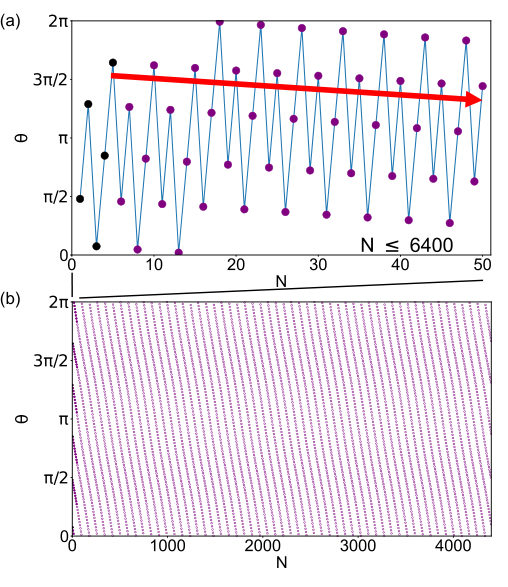
<figcaption class="paper-figure-caption"><b>Fig 4.</b> Figure 4. The hierarchical periodic structure. When Db = 1.940256 and Da/Db = 1.02512, the optimal number of spheres is N ∗= 4397 for N ≤6400. Solid dots denote the first 50 spheres, hollow dots denote the following spheres, and black solid dots mark the first subperiod. (a) The angular po- sitions θ of the first 50 spheres are shown, revealing that the structure is composed of five-sphere subperiods. Red arrows indicate the angular offsets of spheres across subperiods. (b) The angular positions θ of all 4397 spheres reveal a longer- period structure.</figcaption>
</figure>
<figure class="paper-figure-card">
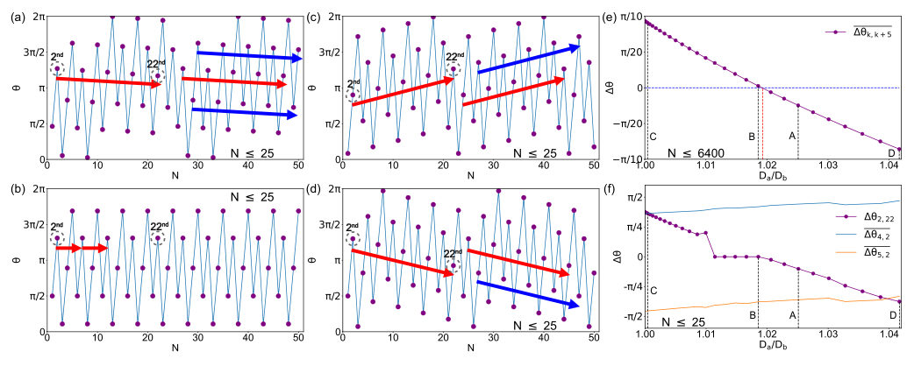
<figcaption class="paper-figure-caption"><b>Fig 5.</b> Figure 5. Discussion of the effect of periodic boundary conditions on the structure. For minor axis Db = 1.940256: for sphere number N ≤25, we use the triplet-sphere packing block method to find the densest structures, and then apply periodic boundary conditions to obtain the angular positions of the first 50 spheres for four cases. (a) aspect ratio Da/Db = 1.02512; the optimal number of spheres is N ∗= 25. (b) Da/Db = 1.018554, N ∗= 5. (c) Da/Db = 1.000450, N ∗= 22. (d) Da/Db = 1.041667, N ∗= 23. The arrows indicate how the angular positions of spheres change across subperiods over one period. In Figure (a), the spheres marked by the left red arrow are not collinear with those marked by...</figcaption>
</figure>

**Summary.** This work explores how hard sphere packings change when confined in slightly deformed elliptic cylinders compared to perfect circles. By combining theory, simulation, and experiment, the authors show that even minor anisotropy can induce entirely new, complex helical phases. This provides crucial insights for designing materials and understanding biological structures like those found in zebrafish.

**Why it may be interesting.** While focused on classical packing, the study of phase transitions driven by subtle geometric changes (anisotropy) and the emergence of complex, ordered states from simple constraints is highly relevant to understanding order-disorder transitions in soft matter systems studied in AMO physics.

Detailed structure

**Main problem.** The study investigates how chiral packing structures of hard spheres change when confined within non-circular (elliptic) cylinders compared to ideal circular ones.

**Main result.** Weak cross-sectional deformation triggers entirely new phases, including double oscillated-chain phases, revealing the significant role of cylindrical anisotropy in determining dense packings.

**Method.** The research combines theoretical development for helical phases with extensive simulations (Monte Carlo) and macroscopic experiments using table-tennis balls.

**Model / system.** The system models hard spheres packed inside elliptic cylinders defined by a minor axis $D_b$ and an aspect ratio $D_a/D_b$. The analysis focuses on finding the densest possible packing structure under these anisotropic boundary conditions.

**Key observables.** Packing fraction ($\phi$), global chirality, and identification of specific helical phases (e.g., Zigzag, Helical Phase I/II, Double Oscillated-chain).

**Important parameters / regimes.** Cylinder anisotropy parameters ($D_b \in [1.60, 2.00]$, $D_a/D_b \in [1.00, 1.10]$) and the number of spheres ($N$).

**Assumptions / limitations.** The theoretical methods rely on constructing structures using specific geometric constraints (e.g., triplet-sphere packing block method), which are approximations compared to infinite systems.

**Figures summary.** Figures illustrate phase diagrams showing eight distinct regions of densest packing structures across varying anisotropy parameters, alongside experimental snapshots confirming these predicted phases.

**Paper structure.** The paper progresses by establishing the baseline in circular cylinders, then systematically introducing elliptic deformation. It develops a new theory for helical phases and validates this theory through simulations (MC) and finally confirms the predicted structures using physical experiments.

Abstract

Sphere packings in circular cylinders have attracted substantial research interest, among which the discovery of chiral helical structures is the most iconic. However, recent experimental results on zebrafish do not match the known packing structures in circular cylinders. To account for the inherent imperfections of biological tubes, we take elliptic cylinders as the canonical deformation of circular cylinders and investigate the densest packings of hard spheres in them using simulation, theory, and experiments. Starting from the chiral structures in circular cylinders, we demonstrate that even a weak cross-sectional deformation can trigger entirely new phases, including ones that either eliminate global chirality or significantly complicate the chiral structures. This reveals the significant effect of cylindrical anisotropy. The new helical phases under anisotropic confinement remain chiral and develop hierarchical periodic structures, which are difficult to obtain by simulations but are predicted by our newly developed theory for helical phases in elliptic cylinders. The theory also predicts double oscillated-chain phases without chirality, which perfectly match the simulations. Our work offers fresh insights into understanding packings in anisotropic cylinders, which will help researchers to design new materials and to understand many living systems.

[↑ back to top](#top)

### [Efficient simulation of noisy entanglement generation](http://arxiv.org/abs/2606.18808v1)

**Authors:** Lorenzo Brevi, Federico Grasselli, Alessandro Caraceni, Massimiliano Proietti, Massimiliano Dispenza, Enrico Prati  
**Type:** both · **Category:** quantum information and computing · **PDF:** <https://arxiv.org/pdf/2606.18808v1>  
**Analysis basis:** full PDF text, analyzed in chunks
**Topic relevance:** `correlated / nonlocal dissipation` **2/5** · `entanglement & information structure` **2/5** · `QC/QI experiment` **1/5** · `driven-dissipative phase transition` **1/5** · `methods for driven-dissipative` **1/5** · `non-equilibrium dynamics` **1/5** · `quantum optics experiment` **1/5**

↔ Scroll figures horizontally

<figure class="paper-figure-card">
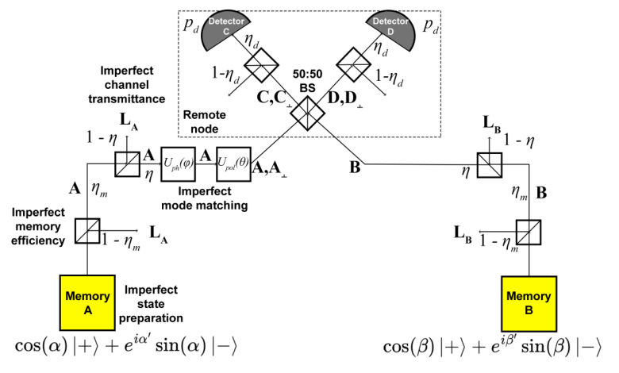
<figcaption class="paper-figure-caption"><b>Fig 1.</b> Figure 1: The optical setup required by the Barrett-Kok (BK) protocol, which enables two spatially-separated quan- tum memories, A and B, to probabilistically establish an entangled state. The setup depicts the way in which we modeled the various error sources accounted for in this work. The memories are initialized imperfectly in the states cos α |+⟩+ eiα′ sin α |−⟩for memory A and cos β |+⟩+ eiβ′ sin β |−⟩for memory B, where |+⟩= (|↑⟩+ |↓⟩)/ √</figcaption>
</figure>
<figure class="paper-figure-card">
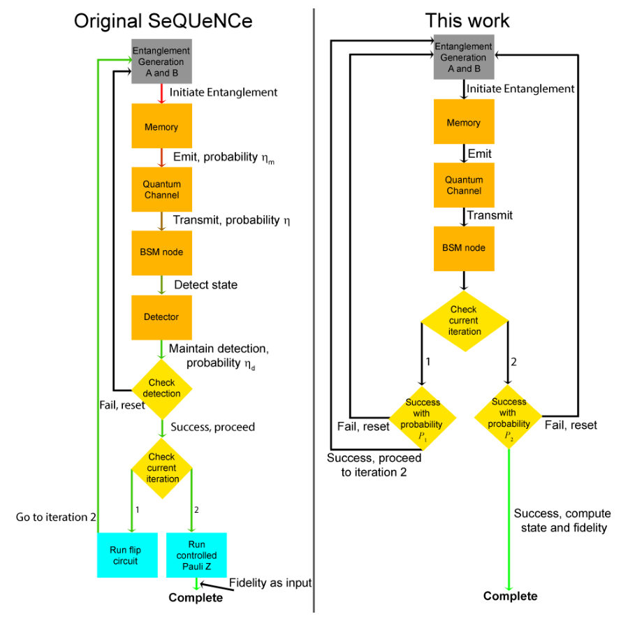
<figcaption class="paper-figure-caption"><b>Fig 2.</b> Figure 2: A simplified overview of the computational pipeline for the original SeQUeNCe (on the left) and our work (on the right). The grey and orange squares represent modules, with the orange ones being modules that represent physical components of the setup. The yellow diamonds represent if/else statements. The blue squares represent operations that re- quire simulating a quantum circuit. The arrows represent operations. The arrow is colored if a state is being tracked, and changes color whenever an operation might change the matter-photon state. At a glance, the main difference from the orig- inal pipeline is that we do not require tracking and updating a quantum state throughout the...</figcaption>
</figure>
<figure class="paper-figure-card">
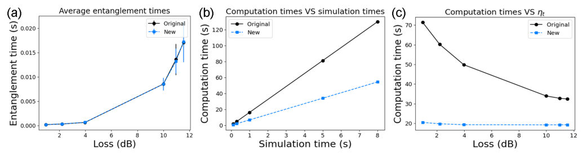
<figcaption class="paper-figure-caption"><b>Fig 3.</b> Figure 3: (a) Average time to obtain a successful entanglement event between two memories, as a function of the total photon loss L = −10 log10 ηt, where ηt = ηmηηd. (b) Average computation time as a function of the total simulated time. (c) Average computation time as a function of total loss, L. In all plots the black solid lines are the results for the native SeQUeNCe, while the blue dashed lines are the results for our version. The computation times reported in this figure are obtained on the following CPU: AMD Ryzen Threadripper 3990X 64-Core Processor.</figcaption>
</figure>
<figure class="paper-figure-card">
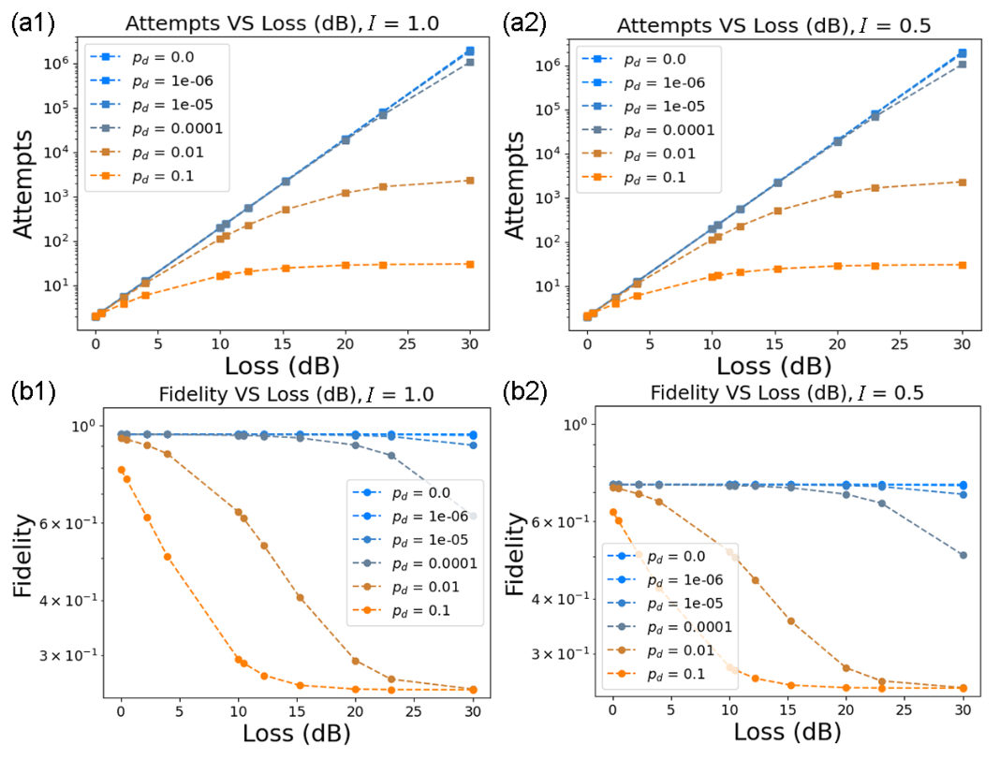
<figcaption class="paper-figure-caption"><b>Fig 4.</b> Figure 4: (a) Average number of entanglement attempts as a function of total loss L, given by: L = −10 log10 ηt, for (a1) indistinguishable photons (I = 1 and θ = 0) and (a2) photons with indistinguishability I = 0.5 (θ = π 4 ) . (b) Average fi- delity of entangled pairs as a function of L for (b1) indistinguishable photons (I = 1) and (b2) photons with I = 0.5. In all plots the results are displayed for various values of dark count probability, from pd = 0 (blue) to pd = 0.1 (orange)</figcaption>
</figure>
<figure class="paper-figure-card">
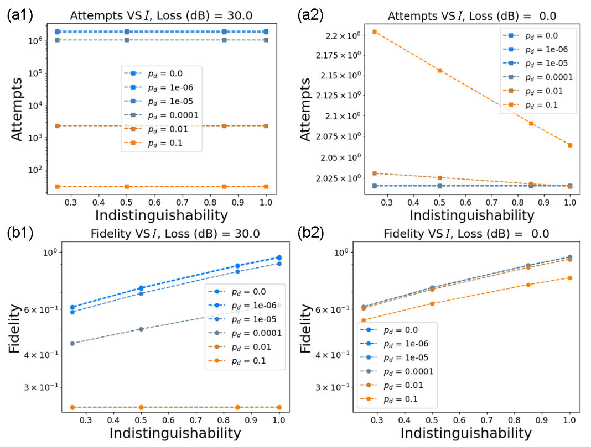
<figcaption class="paper-figure-caption"><b>Fig 5.</b> Figure 5: (a) Average number of entanglement attempts as a function of I for (a1) ηt = 10−3 and (a2) ηt = 1. (b) Aver- age fidelity of entangled pairs as a function of I for (a1) ηt = 10−3 and (a2) ηt = 1. In all plots the results are displayed for various values of dark count probability, from pd = 0 (blue) to pd = 0.1 (orange)</figcaption>
</figure>

**Summary.** This paper tackles the challenge of simulating entanglement generation in noisy quantum networks using the BK protocol. The authors derive analytical formulas to calculate success probability and fidelity under various noise sources, integrating these into a significantly faster simulator. This advancement enhances the field's ability to design robust, large-scale quantum internet infrastructure.

**Why it may be interesting.** This work directly addresses the engineering challenges of scaling quantum communication networks by providing validated simulation tools that account for realistic physical imperfections beyond simple loss models.

Detailed structure

**Main problem.** The core problem is developing efficient and realistic simulation tools for entanglement distribution in quantum networks, which is crucial for realizing the quantum internet.

**Main result.** The authors developed an upgraded simulator that is significantly faster (over 60% reduction in computation time) while accurately modeling multiple noise sources like imperfect mode matching, dark counts, and channel loss. The simulation successfully benchmarks against real experimental data.

**Method.** They derived generalized analytical expressions for key metrics—success probability, output state fidelity, and entanglement generation time—for the Barrett-Kok (BK) protocol under various noise models. These analytics were then integrated into an upgraded quantum network simulator (SeQUeNCe).

**Model / system.** The work focuses on simulating the probabilistic Bell state generation using the BK protocol between two spatially separated quantum memories, incorporating realistic imperfections such as detector efficiency ($\eta_d$), channel loss ($\eta$), and initial state deviations.

**Key observables.** Success probability, output state fidelity ($F$), average entanglement generation time, and final state fidelity.

**Important parameters / regimes.** Noise parameters include memory/detector efficiencies ($\eta_m, \eta_d$), channel transmittance ($\eta$), polarization mismatch angle ($	heta$), dark count probability ($p_d$), and initial state preparation errors ($\alpha, eta$).

**Assumptions / limitations.** The analysis often simplifies by assuming certain error sources are negligible or zeroed out (e.g., $	heta = \phi = \alpha = eta = p_d = 0$) to derive core analytical results, though the final simulator handles multiple sources.

**Figures summary.** Figures compare average entanglement time vs. loss and computation time scaling; other figures illustrate how fidelity and attempts change as a function of indistinguishability ($I$) or dark count probability ($p_d$).

**Paper structure.** The paper progresses from deriving analytical results for the BK protocol under various noise sources, upgrading an existing simulator (SeQUeNCe) to incorporate these analytics for speed, and finally benchmarking this improved tool against real experimental data.

Abstract

End-to-end entanglement distribution is a key capability of upcoming quantum networks, enabling applications like distributed quantum computing, quantum sensor networks, and secure communications. Hence, its realistic and efficient simulation is crucial for quantum network design and for assessing the ability of a network to run certain applications. This work provides tools to scale-up and improve the realism of entanglement generation simulations in quantum networks. This is achieved by deriving analytical results that directly return the success probability, the output state and corresponding fidelity of a selected entanglement generation protocol, while accounting for a variety of noise sources affecting the protocol. These results are then integrated and streamlined in an upgraded version of SeQUeNCe, one of the most popular quantum network simulators. The resulting simulator features increased scalability by reducing computation time by more than 60%, while allowing for a variety of realistic noise sources, including imperfect mode matching, dark counts, and imperfect memory initialization. The simulator is also benchmarked with real experimental data and is capable of replicating the average entanglement generation time and the final state fidelity of a selected experiment. Altogether, the results can enhance current quantum network simulation capabilities towards large-scale networks, paving the way for the future quantum internet.

[↑ back to top](#top)

### [Scalable quantum circuit knitting using a weak-coupling approximation](http://arxiv.org/abs/2606.19035v1)

**Authors:** John P. T. Stenger, Daniel Gunlycke, Nikos Chrisochoides  
**Type:** theory · **Category:** quantum information and computing · **PDF:** <https://arxiv.org/pdf/2606.19035v1>  
**Analysis basis:** full PDF text, analyzed in chunks
**Topic relevance:** `quantum measurements` **2/5** · `Keldysh / 2PI / non-Gaussian methods` **1/5** · `correlated / nonlocal dissipation` **1/5** · `driven-dissipative phase transition` **1/5** · `entanglement & information structure` **1/5** · `methods for driven-dissipative` **1/5**

↔ Scroll figures horizontally

<figure class="paper-figure-card">
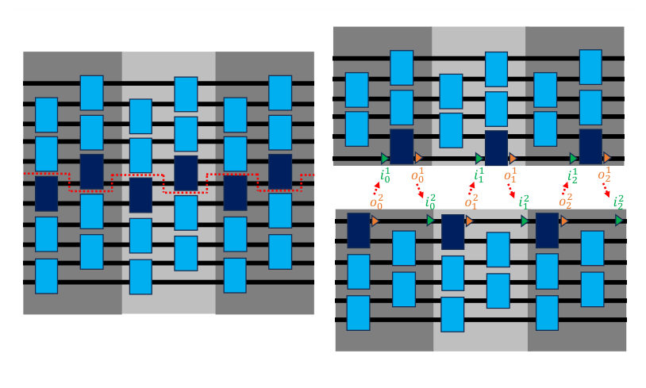
<figcaption class="paper-figure-caption"><b>Fig 1.</b> Fig. 1. A quantum circuit cut along a single qubit line. Left: full circuit. Right: resulting subcircuits. The solid lines represent qubits and the rectangles represent two qubit operators that may be composed of multiple one and two qubit gates. Operators connecting to the cut qubit are drawn darker than the others representing that they are weak. The shaded areas represent layers of the circuit. The dashed line shows the division of the circuit. Each time the dashed line crosses a qubit, a cut is made. Green triangles represent input operations, which include qubit resets and single qubit gates. Orange triangles represent output operations, which include measurement and single qubit...</figcaption>
</figure>
<figure class="paper-figure-card">
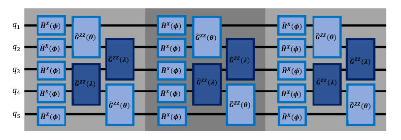
<figcaption class="paper-figure-caption"><b>Fig 2.</b> Fig. 2. Depiction of the quantum circuit used in our demonstration. Lines represent qubits and boxes represent quantum logic gates. Each shaded region represents one layer of the circuit. In each layer, there is a set of single qubit 𝐻𝑋(𝜙) gates and two qubit 𝐺𝑍𝑍(𝜃) gates. We set 𝜙= 0.1 and 𝜃= 0.5. The coupling 𝜆is varied.</figcaption>
</figure>
<figure class="paper-figure-card">
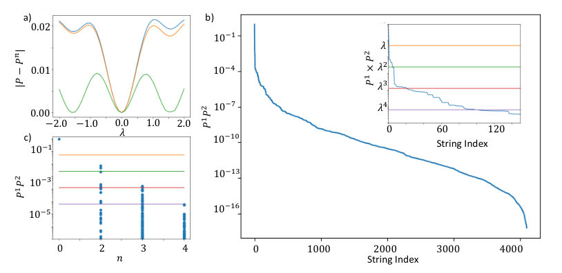
<figcaption class="paper-figure-caption"><b>Fig 3.</b> Fig. 3. Demonstration for a three layered circuit. (a) the error in the final probability for 𝐹= 00000 as a function of the coupling 𝜆to the cut qubit 𝑞3. In order of decreasing error, the curves represent 𝑛= 0, 𝑛= 1, and 𝑛= 2. (b) final contributed probability of each string combination. The inset is a magnification of the same data with horizontal lines corresponding to powers of 𝜆. (c) final contributed probability of each string combination sorted into bins of 𝑛. The horizontal lines corresponding to powers of 𝜆.</figcaption>
</figure>
<figure class="paper-figure-card">

<figcaption class="paper-figure-caption"><b>Fig 4.</b> Figure 3a shows the error in the final probability of the final output 𝐹= 00000. The blue curve is for 𝑛= 0, the orange for 𝑛= 1, and the green for 𝑛= 2. We see that the error is identically 𝑃−𝑃𝑛= 0 at 𝜆= 0 in all cases. As |𝜆| is increased, so is the error. Away from 𝜆= 0, the error is reduced for larger 𝑛. Notice that the real error is much less than the general error bound, Eq. (18), with 𝛾= (𝑁𝑥𝜆)1/3. As mentioned above, the specifics of the circuit can reduce the error. In this case, there are two major factors that reduce the error. Firstly, applying a single flip cannot result in the final measurement 𝐹= 00000, and therefore there is nearly zero first order error. Secondly, as there...</figcaption>
</figure>

**Summary.** This work introduces a scalable technique called 'quantum circuit knitting' to perform distributed quantum computations. By assuming weak coupling across circuit cuts, the classical resources required scale polynomially rather than exponentially. This allows for simulating large, complex quantum circuits by decomposing them into manageable, weakly interacting sub-problems.

**Why it may be interesting.** While focused on computation, the rigorous mathematical framework developed for bounding error propagation ($\epsilon_{	ext{total}}$) through weak coupling connections is highly relevant to open quantum systems where system-environment interactions are modeled perturbatively.

Detailed structure

**Main problem.** The paper addresses the challenge of performing Distributed Quantum Computing (DQC) by reducing the classical information cost associated with circuit knitting.

**Main result.** A method is presented that reduces the classical resource requirement from exponential to polynomial scaling by exploiting weak coupling approximations across circuit cuts.

**Method.** It uses a weak-coupling approximation, modeling the quantum process as a partition between two sub-circuits connected by a single weakly coupled qubit. This allows for the derivation of transformation matrices ($\Gamma$) relating measurement probabilities.

**Model / system.** The model involves general quantum circuits (e.g., those used in QAOA) that are conceptually cut along a central, weakly coupled qubit line. The analysis tracks probability evolution using symbolic string representations ($\alpha$-type and $\sigma$-type strings).

**Key observables.** Approximate full-circuit probability ($P_n^F$), total error ($\epsilon_{	ext{total}}$), and the condition number of the reconstruction matrix ($\kappa_\infty(\Gamma_n)$).

**Important parameters / regimes.** Coupling strength ($\lambda$) and approximation parameter ($\gamma$); the approximation level $n$ dictates the polynomial scaling of resources.

**Assumptions / limitations.** The core assumption is that the coupling between the two main parts of the process via the cut qubit is weak, allowing for Taylor-like expansions in $\lambda$.

**Figures summary.** Figures illustrate quantum circuits cut along a single qubit line showing input/output operations; another figure depicts a simulated 5-qubit register circuit with layers of gates.

**Paper structure.** The paper develops from the weak-coupling expansion leading to commutator relations, details the positional-symbolic correspondence (PSC) for maintaining consistency between string types, and culminates in error bounding formulas that analyze the total error as a combination of approximation, hardware noise, and statistical errors.

Abstract

We present a method for performing distributed quantum computing with controlled approximations. Exact distributed quantum computing requires exponential classical information to reconstruct the quantum process. However, we show how the classical cost is reduced to polynomial if the quantum procedure can be partitioned between a qubit that is weakly coupled the other qubits. We demonstrate our method for a layered circuit based on the circuits used for the quantum approximate optimization algorithm.

[↑ back to top](#top)

### [Covert Blockwise Coding with Sequential Detection over Thermal-Loss Bosonic Channels](http://arxiv.org/abs/2606.18666v1)

**Authors:** Qipeng Qian, Yuntao Qian  
**Type:** theory · **Category:** other · **PDF:** <https://arxiv.org/pdf/2606.18666v1>  
**Analysis basis:** full PDF text, analyzed in chunks
**Topic relevance:** `quantum measurements` **2/5** · `Keldysh / 2PI / non-Gaussian methods` **1/5** · `correlated / nonlocal dissipation` **1/5** · `driven-dissipative phase transition` **1/5** · `methods for driven-dissipative` **1/5**

↔ Scroll figures horizontally

<figure class="paper-figure-card">
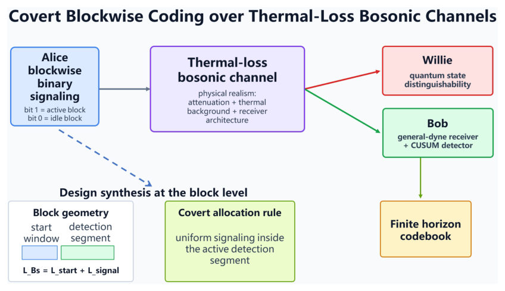
<figcaption class="paper-figure-caption"><b>Fig 1.</b> Fig. 1. Overview of the proposed blockwise signaling architecture and same-block detection design. Each block acts as a binary super-symbol, with active and idle blocks representing bits 1 and 0, respectively. Under a per-block covert budget, Willie’s side imposes a QRE-based covertness constraint, while Bob applies a physically realizable Gaussian receiver followed by a cumulative sum (CUSUM) detector to achieve same-block threshold crossing. The resulting design law determines the signaling level, detection-segment length, and blockwise binary codebook structure.</figcaption>
</figure>
<figure class="paper-figure-card">
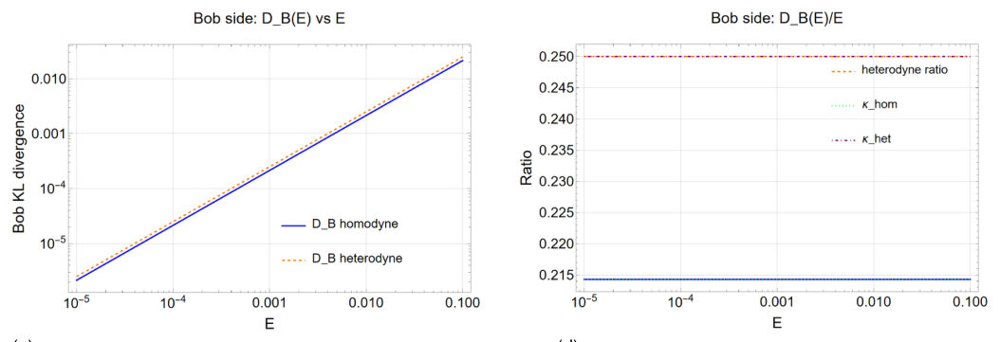
<figcaption class="paper-figure-caption"><b>Fig 2.</b> Fig. 2. Numerical verification of the small-signal laws derived in Section II-C and Section II-D. The top row validates the Willie-side quadratic law DW (E) = cW E2 + o(E2), while the bottom row validates the Bob-side linear law DB(E) = κBobE + o(E) for amplitude-sensitive Gaussian receivers. Together, the four panels confirm the basic asymmetry underlying the proposed framework: Willie’s detectability grows quadratically in the signaling energy, whereas Bob’s post-change information grows linearly.</figcaption>
</figure>
<figure class="paper-figure-card">
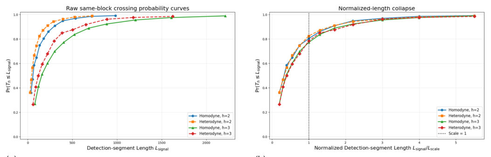
<figcaption class="paper-figure-caption"><b>Fig 3.</b> Fig. 3. Numerical validation of Corollary 2. The left panel shows the raw same-block crossing probability curves: longer detection segments improve crossing, heterodyne outperforms homodyne, and larger thresholds shift the transition to the right. The right panel shows that, after normalization by the predicted scale h2cW /(κ2 Bobδblock), the transition regions become substantially aligned. This confirms that the corollary captures the correct leading-order dependence of the minimum detection-segment length on h, cW , κBob, and δblock.</figcaption>
</figure>

**Summary.** This paper introduces the first receiver-centric framework for covert communication over noisy bosonic channels. It exploits the fundamental difference in how an eavesdropper (Willie) and a legitimate receiver (Bob) detect signals—quadratic versus linear distinguishability—to derive optimal signaling strategies. The result provides explicit design laws linking channel parameters, security budgets, and required detection segment lengths for quantum optical systems.

**Why it may be interesting.** This work provides a concrete bridge between abstract information-theoretic security guarantees (covertness) and practical quantum optical engineering design rules (receiver optimization, signal processing).

Detailed structure

**Main problem.** The paper develops a receiver-centric framework for covert quantum communication over thermal-loss bosonic channels, aiming to maximize detection probability while satisfying an adversary's covertness constraint.

**Main result.** It derives an explicit minimum detection-segment length law that balances the linear growth of Bob's detectability against Willie's quadratic detectability using a CUSUM detector.

**Method.** The authors use small-signal approximations to analyze distinguishability measures (KL divergence) and optimize energy allocation subject to covertness constraints, leading to concrete design rules for blockwise coding.

**Model / system.** The system is quantum communication over thermal-loss bosonic channels. Detection relies on a physically realizable Gaussian receiver followed by a single-pass Cumulative Sum (CUSUM) detector.

**Key observables.** Bob's post-change information growth (linear in signal energy, $D_B \sim E$), Willie's detectability via Quantum Relative Entropy (quadratic in signal energy, $D_W \sim E^2$), and the CUSUM crossing probability.

**Important parameters / regimes.** Thermal loss ($\eta$), background brightness ($ar{n}_B$), per-block covert budget ($\delta_{	ext{block}}$), and detection segment length ($L_{	ext{signal}}$).

**Assumptions / limitations.** The analysis relies heavily on small-signal regime approximations for the distinguishability measures, and assumes a Gaussian receiver readout.

**Figures summary.** Figures validate the small-signal asymmetry (Willie quadratic vs. Bob linear) and confirm that the empirical same-block crossing probability scales correctly with a predicted characteristic length scale derived from system parameters.

**Paper structure.** The paper builds by first establishing the physical model, deriving the asymptotic distinguishability laws for both parties, optimizing energy allocation under the covertness constraint (uniform allocation), and finally deriving the explicit minimum detection segment length required for reliable same-block detection using CUSUM theory.

Abstract

We develop, to our knowledge, the first receiver-centric blockwise sequential-detection framework for covert communication over thermal-loss bosonic channels. In this architecture, each block serves as a binary super-symbol, and the key design problem is to determine the minimum detection-segment length that enables Bob to detect an active block before the block ends while remaining covert to Willie. For any fixed physically realizable general-dyne receiver, Bob's post-change information growth is linear in the small-signal regime, whereas Willie's detectability obeys a quadratic quantum relative entropy law. Exploiting this asymmetry, we show that under a per-block covertness budget the asymptotically optimal signaling strategy is uniform across the detection segment, and we derive an explicit minimum-length condition under which a single-pass cumulative sum (CUSUM) detector crosses threshold within the same block with exponentially high probability. The resulting design law yields a covert blockwise binary codebook over a finite transmission horizon and establishes a concrete link between bosonic covert communication, sequential detection, and blockwise signaling design. More broadly, these results provide design guidance for covert quantum communication systems with physically realizable receivers, and help bridge information-theoretic covertness guarantees with implementable receiver-aware optical communication design.

[↑ back to top](#top)

### [Role of Local Structural Variation in X-ray Photoelectron Spectrum of Silicon Oxide Interfaces](http://arxiv.org/abs/2606.18769v1)

**Authors:** Mikael Santonen, Sari Granroth, Johanna Laaksonen, Pekka Laukkanen, Johannes Niskanen  
**Type:** both · **Category:** disordered systems and neural networks · **PDF:** <https://arxiv.org/pdf/2606.18769v1>  
**Analysis basis:** full PDF text, analyzed in chunks
**Topic relevance:** `non-equilibrium dynamics` **2/5** · `Keldysh / 2PI / non-Gaussian methods` **1/5** · `driven-dissipative phase transition` **1/5** · `methods for driven-dissipative` **1/5** · `non-equilibrium universality` **1/5**

↔ Scroll figures horizontally

<figure class="paper-figure-card">
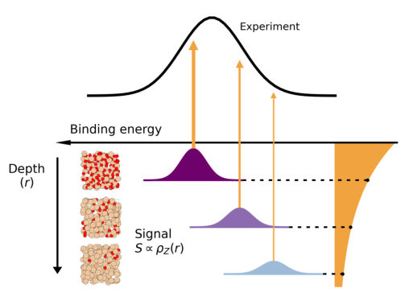
<figcaption class="paper-figure-caption"><b>Fig 1.</b> FIG. 1. The build-up of an X-ray photoelectron spectrum in surface-oxidized silicon. The chemical shift for an atom depends on the local oxygen number density ρO(r), which decays towards bulk silicon. In case of oxygen, the native sig- nal strength at depth r is inherently proportional to ρO(r), whereas for silicon the respective number density ρSi(r) and native signal strength vary less. Attenuation due to inelastic electron scattering yields an exponentially decaying factor for the native signal in the depth-integrated spectrum. The free mean path λph of the incident photon is assumed to be or- ders of magnitude longer than the free mean path λel of the photoelectron.</figcaption>
</figure>
<figure class="paper-figure-card">
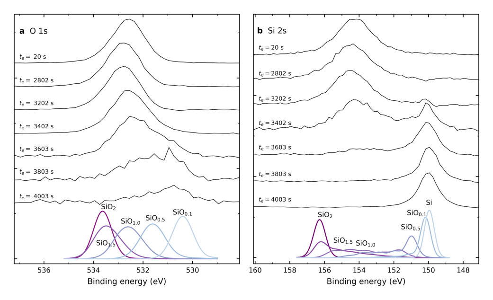
<figcaption class="paper-figure-caption"><b>Fig 2.</b> FIG. 2. Processed layer-wise spectra for O 1s (a) and Si 2s (b) derived from observed raw X-ray photoelectron spectra for sputtered silicon oxide is shown on top with te showing the etch time of the topmost raw specrum in the reconstruction. The layer-wise spectra were binned with consecutive pairs to reduce noise. Simulated ensemble-averaged O 1s and Si 2s spectra for different compositions of SiOx and pure Si are shown in the bottom. The simulated spectra have been shifted by 4.0 eV (O 1s) and 12.0 eV (Si 2s) towards the experimental peaks. 5000 sites were calculated for each composition with sites from tens anneal runs for each. A weak plasmon loss peak from the Si 2p overlaps with the...</figcaption>
</figure>
<figure class="paper-figure-card">
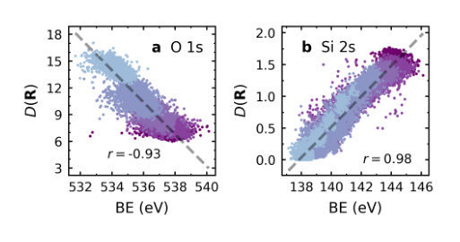
<figcaption class="paper-figure-caption"><b>Fig 3.</b> FIG. 3. The dependence of the O 1s (a) and Si 2s (b) binding energies on the local atomistic environment descriptor D(R) shows a clear correlation. The opposite trends originate from a different element being used in the respective descriptor. The colors correspond with the peaks in Figure 2. For details, see text.</figcaption>
</figure>
<figure class="paper-figure-card">
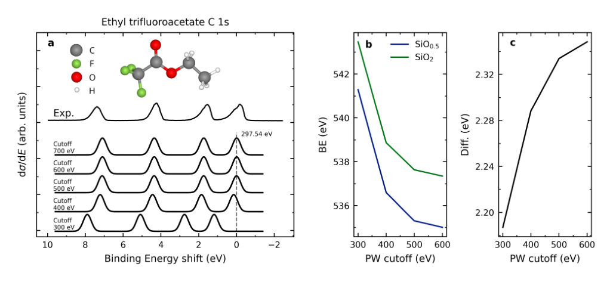
<figcaption class="paper-figure-caption"><b>Fig 4.</b> FIG. 4. C 1s binding energy shifts in the ethyl-trifluoroacetate (a), i.e. the ”ESCA molecule”, evaluated as a function of the plane wave cutoff. Experimental XPS digitized from [O. Travnikova, K. J. Børve, M. Patanen, J. S¨oderstr¨om, C. Miron, L. J. Sæthre, N. M˚artensson, and S. Svensson, Journal of Electron Spectroscopy and Related Phenomena 185, 191 (2012)] is shown for comparison. Absolute binding energies (b) in SiO0.5 &amp; SiO2 and binding energy shifts (c) between the two SiOx evaluated as a function of the plane wave cutoff.</figcaption>
</figure>
<figure class="paper-figure-card">
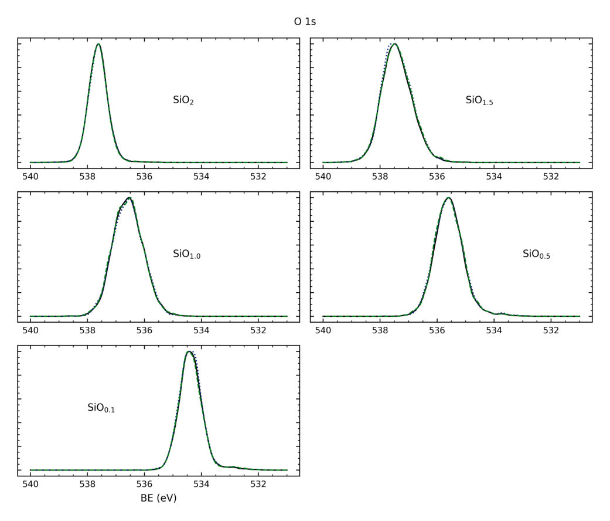
<figcaption class="paper-figure-caption"><b>Fig 5.</b> FIG. 5. The black solid line shows the resulting O 1s XPS spectrum for each SiOx system from 5000 calculated binding energies broadened with 0.5 eV FWHM Gaussians . The two dashed lines in color show spectra from 2500 BEs each.</figcaption>
</figure>

**Summary.** This work investigates how structural randomness in silicon oxide interfaces broadens X-ray photoelectron spectra. By combining MD simulations with DFT calculations, the authors show that spectral broadening results not from multiple distinct chemical states, but from a continuous statistical distribution of binding energies dictated by local atomic arrangements.

**Why it may be interesting.** While focused on solid-state spectroscopy, the methodology of linking macroscopic spectroscopic features to underlying statistical distributions arising from quenched disorder is highly relevant to understanding complex many-body systems where local environments dictate global properties.

Detailed structure

**Main problem.** The study challenges conventional chemical state assignments in oxide X-ray photoelectron spectra by demonstrating that core-level binding energies arise from a continuous distribution governed by local structural variation.

**Main result.** Statistical simulations successfully reproduce the observed spectral broadening, showing that intermediate stoichiometry regions exhibit wide energy spreads rather than distinct, discrete spectral fingerprints.

**Method.** The research combines Density Functional Theory (DFT) calculations with Molecular Dynamics (MD) simulations to generate ensemble averages of core-level binding energies from amorphous silicon oxide structures.

**Model / system.** The system under investigation is the $	ext{SiOx}$ interface, modeled using supercells derived from MD quench simulations spanning varying oxygen concentrations ($x$). The analysis focuses on how local structural disorder influences electronic properties.

**Key observables.** Core-level binding energies ($	ext{O } 1s$ and $	ext{Si } 2s$), spectral broadening (up to $5 	ext{ eV}$), depth profiles reconstructed from sputtering, and structural descriptors like the void distribution curve.

**Important parameters / regimes.** The analysis is sensitive to local structure variations over a radius of approximately $5 	ext{ Å}$, and simulations cover compositions from pure Si to $	ext{SiO}_2$.

**Assumptions / limitations.** Key assumptions include treating the observed spectrum as an integral over underlying layers (sputtering model) and assuming constant ionization cross-sections for DFT calculations.

**Figures summary.** Figures illustrate conceptual XPS build-up, layer-resolved spectra comparisons with simulations, correlation plots between BE shifts and structural descriptors ($D(R)$), and void size distributions for $	ext{SiO}_2$.

**Paper structure.** The paper progresses by establishing the experimental challenge (XPS interpretation in disordered oxides), developing simulation tools (DFT/MD), quantifying the structural disorder using descriptors, and finally demonstrating that this continuous variation explains the observed spectral broadening.

Abstract

We show that the broad X-ray photoelectron lines of silicon oxide on silicon arise from a continuous statistical distribution of core-level binding energies. Statistical simulations spanning compositions from Si to SiO$_2$ reproduce the full extent of this broadening, reaching 5 eV for SiO$_{1.0}$ , in quantitative agreement with 0.23 nm layer-resolved spectra reconstructed from Ar$^+$ sputtering data. This continuous distribution blurs distinct spectral fingerprints of local structural motifs, thereby challenging conventional chemical state assignment in oxide X-ray photoelectron spectra.

[↑ back to top](#top)

### [Emergence of Resonating Valence-Bond Correlations in Stretched Graphene](http://arxiv.org/abs/2606.18973v1)

**Authors:** Sam Azadi, A. Principi, T. D. Kühne, M. S. Bahramy  
**Type:** theory · **Category:** strongly correlated electrons · **PDF:** <https://arxiv.org/pdf/2606.18973v1>  
**Analysis basis:** full PDF text, analyzed in chunks
**Topic relevance:** `analog quantum simulation` **2/5** · `exotic spin models in light-matter` **1/5**

↔ Scroll figures horizontally

<figure class="paper-figure-card">
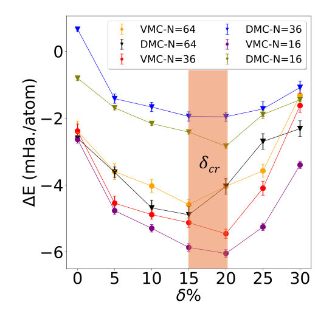
<figcaption class="paper-figure-caption"><b>Fig 1.</b> FIG. 1. Energy difference ∆E = EJAGP −EJSD as a func- tion of in-plane biaxial strain δ, obtained from VMC and DMC calculations for system sizes N = 16, 36, and 64 atoms. The shaded region indicates the critical strain δcr, where ∆E reaches its minimum; for δ &gt; δcr, ∆E increases with further stretching. The nonmonotonic behavior reflects the enhance- ment of static, RVB-like singlet correlations up to δcr, followed by a crossover to a different correlation regime at larger strain.</figcaption>
</figure>
<figure class="paper-figure-card">
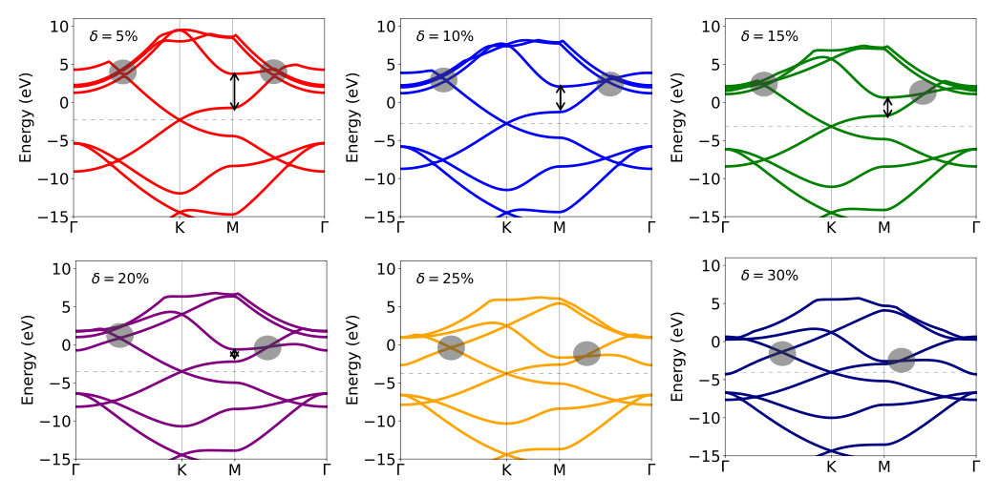
<figcaption class="paper-figure-caption"><b>Fig 2.</b> FIG. 2. DFT band structure of graphene obtained at biaxial stretch δ = 5%, 10%, 15%, 15%, 20%, 25%, 30%. The shaded regions in the conduction bands along the M–Γ and K–Γ directions highlight the crossings between the π∗and σ∗bands. The evolution of these crossings with increasing δ is shown. The arrow at the M point indicates the gap between the two lowest conduction bands, which decreases with increasing δ due to the reduced slope and flattening of the π∗band.</figcaption>
</figure>
<figure class="paper-figure-card">
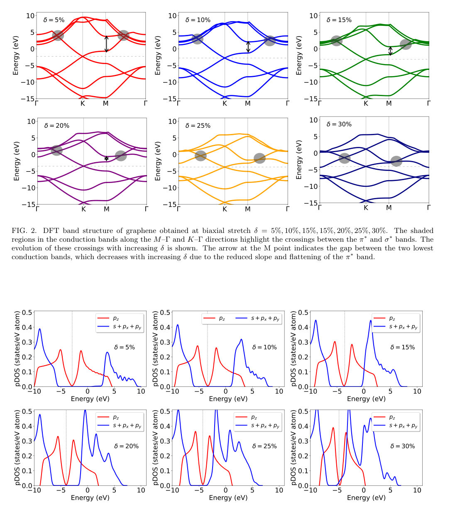
<figcaption class="paper-figure-caption"><b>Fig 3.</b> FIG. 3. DFT project density of states (pDOS) of graphene obtained at biaxial stretch δ = 5%, 10%, 15%, 15%, 20%, 25%, 30%.</figcaption>
</figure>
<figure class="paper-figure-card">
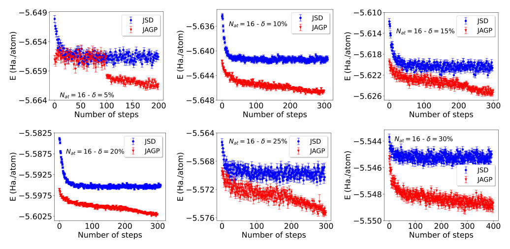
<figcaption class="paper-figure-caption"><b>Fig 4.</b> FIG. 4. VMC energy as a function of the number of optimization steps computed using JSD and JAGP wave functions for system size N=16.</figcaption>
</figure>
<figure class="paper-figure-card">
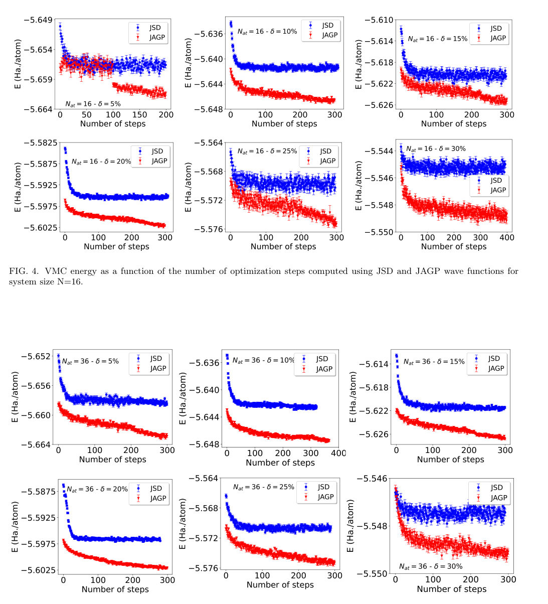
<figcaption class="paper-figure-caption"><b>Fig 5.</b> FIG. 5. VMC energy as a function of the number of optimization steps computed using JSD and JAGP wave functions for system size N=36.</figcaption>
</figure>

**Summary.** The research uses advanced Quantum Monte Carlo methods to study how tensile strain affects electron correlations in graphene. By comparing standard and Resonating Valence Bond (RVB) wave functions, the authors find that stretching the lattice enhances correlation effects up to a critical strain ($\delta_{cr}$). This demonstrates a tunable pathway to stabilize highly correlated electronic states in Dirac materials.

**Why it may be interesting.** This work provides direct, quantitative evidence that external mechanical tuning (strain) can be used as a simple knob to tune fundamental electronic interactions in Dirac materials, potentially stabilizing exotic correlated phases like those described by RVB theory.

Detailed structure

**Main problem.** To determine how tensile strain modifies electronic correlations in graphene, potentially driving a transition into a regime dominated by Resonating Valence Bond (RVB) physics.

**Main result.** Tensile expansion enhances RVB-like singlet correlations up to a critical strain ($\delta_{cr} \approx 15\% - 20\%$), where the energy gain of the RVB ansatz peaks, indicating a nonmonotonic evolution of correlation strength.

**Method.** Variational and Diffusion Quantum Monte Carlo (VMC/DMC) simulations are used to calculate ground state energies by comparing two wave function ansätze: a standard Jastrow-Slater determinant and an RVB-based Geminal Product ansatz.

**Model / system.** The system is graphene, modeled on its honeycomb lattice. The study investigates the effect of biaxial tensile strain ($\delta$) on the electronic correlation energy, treating electron interactions beyond simple mean-field approximations.

**Key observables.** Energy gain ($\Delta E = E_{	ext{RVB}} - E_{	ext{JSD}}$) as a function of strain $\delta$; band structure renormalization (pDOS); total ground state energy.

**Important parameters / regimes.** Tensile strain ($\delta$); Critical Strain ($\delta_{cr}$) in the $15\% < \delta_{cr} < 20\%$ range; System sizes ($N=16, 36, 64$).

**Assumptions / limitations.** The use of fixed-node approximation in DMC; The necessity of using an RVB ansatz (JAGP) to capture static correlation effects neglected by single-determinant forms.

**Figures summary.** Figures illustrate the energy gain ($\Delta E$) vs. strain, showing nonmonotonic behavior with a peak/crossover point at $\delta_{cr}$. Tables present calculated total energies using both JSD and JAGP wave functions across various strains.

**Paper structure.** The paper systematically calculates ground state properties (energy) for graphene under increasing biaxial strain ($\delta$) by comparing the results from two increasingly sophisticated quantum many-body wave function ansätze (JSD vs. RVB/AGP), revealing a critical transition point.

Abstract

Electronic correlations in graphene are generally considered weak due to the large bandwidth of its $π$ electrons. Here we show that tensile expansion of the honeycomb lattice provides a direct route to enhancing correlation effects. Using variational and diffusion quantum Monte Carlo, we compare a conventional Jastrow-Slater determinant wave function with a resonating-valence-bond (RVB) Jastrow-antisymmetrized geminal product ansatz for a series of stretched graphene lattices. We find that the energy gain of the RVB state relative to the single-determinant description increases with bond expansion up to a critical strain $δ_{\mathrm{cr}}$, and decreases beyond it, revealing a nonmonotonic evolution of electronic correlations. The crossover is found to occur in the range $15\% < δ_{\mathrm{cr}} < 20\%$, in agreement with mechanical stability limits. This behavior indicates a transition from a weakly correlated Dirac semimetal to a regime with enhanced non-dynamic correlation and short-range singlet pairing. Our results provide direct many-body evidence that lattice expansion drives graphene into a regime where RVB-like correlations become energetically favorable, offering a simple route to tuning correlation effects in Dirac materials.

[↑ back to top](#top)

### [Benchmark of Pauli Correlation Encoding for different optimisation problems](http://arxiv.org/abs/2606.18914v1)

**Authors:** Fernando Alonso, Colomán Samprón, Jacobo Veiga, Mariamo Mussa Juane, Andrés Gómez  
**Type:** both · **Category:** quantum information and computing · **PDF:** <https://arxiv.org/pdf/2606.18914v1>  
**Analysis basis:** full PDF text, analyzed in chunks
**Topic relevance:** `QC/QI experiment` **2/5**

↔ Scroll figures horizontally

<figure class="paper-figure-card">
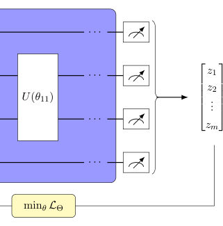
<figcaption class="paper-figure-caption"><b>Fig 1.</b> Figure 1: Schematic of the quantum circuit used to construct the PQC.</figcaption>
</figure>
<figure class="paper-figure-card">
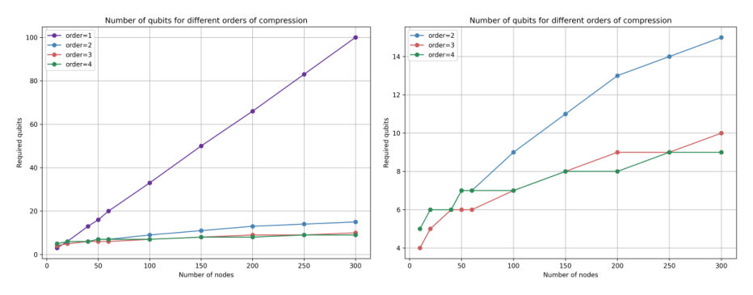
<figcaption class="paper-figure-caption"><b>Fig 2.</b> Figure 2: Scaling of the number of qubits as a function of the number of variables for MCP.</figcaption>
</figure>
<figure class="paper-figure-card">
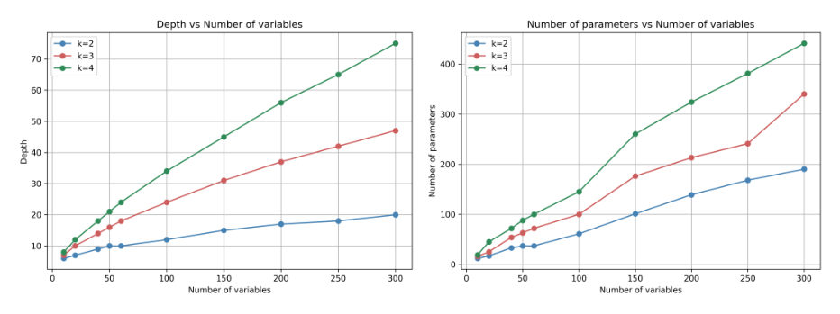
<figcaption class="paper-figure-caption"><b>Fig 3.</b> Figure 3: Scaling of the number of layers and parameters under the assumed configuration.</figcaption>
</figure>
<figure class="paper-figure-card">
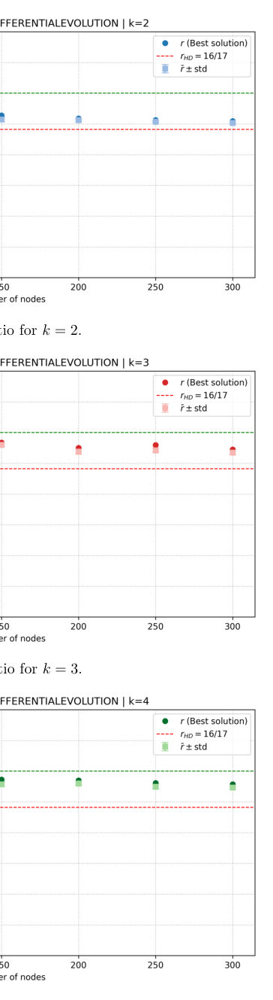
<figcaption class="paper-figure-caption"><b>Fig 4.</b> Figure 4: Results obtained using regularisation for the 10 MCP instances.</figcaption>
</figure>
<figure class="paper-figure-card">
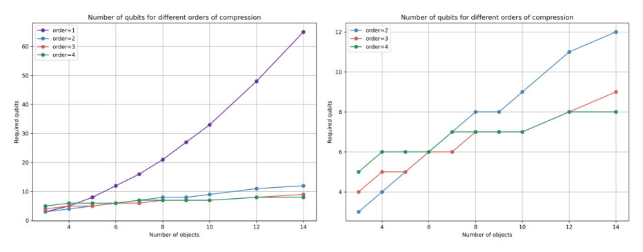
<figcaption class="paper-figure-caption"><b>Fig 5.</b> Figure 5: Scaling of the number of qubits as a function of the number of variables for the BPP.</figcaption>
</figure>

**Summary.** This paper rigorously benchmarks Pauli Correlation Encoding (PCE) as an efficient method to map large combinatorial optimization problems onto small qubit systems. By testing on multiple NP-hard instances and analyzing noise effects, it demonstrates that PCE offers a scalable quantum approach with performance competitive to classical solvers. The work provides critical guidance on parameter tuning required for near-term quantum hardware.

**Why it may be interesting.** It provides a detailed roadmap for applying quantum computation principles—specifically encoding techniques like PCE—to classically hard optimization problems, offering insights into the necessary parameter regimes for near-term devices.

Detailed structure

**Main problem.** The work evaluates a quantum-classical optimization framework using Pauli Correlation Encoding (PCE) to solve complex combinatorial optimization problems like Max Cut, Bin Packing, and TSP.

**Main result.** The PCE-based framework achieves competitive performance on benchmark problems, demonstrating that higher compression orders ($k$) improve solution quality by enhancing expressive capacity, even when considering hardware noise effects.

**Method.** Optimization is performed by minimizing a cost function over parameters ($\vec{\Theta}$) applied to a Parametrised Quantum Circuit (PQC), often using gradient-free optimizers like Differential Evolution (DE).

**Model / system.** The model uses Pauli strings ($\Pi$) to encode $m$ binary variables onto a polynomial number ($n$) of qubits, forming the basis for variational quantum circuits with hardware-efficient ansatze.

**Key observables.** Solution ratio (comparing achieved cost to best known/max), feasibility rate of solutions, and quantitative metrics like mean/min row max and gap derived from relaxed variables.

**Important parameters / regimes.** Compression order ($k$), relaxation hyperparameters ($\alpha$, $eta$), penalty weights ($\lambda_i$), number of shots, and noise levels (ideal vs. noisy backend).

**Assumptions / limitations.** The performance heavily relies on careful calibration of numerous hyperparameters; the analysis often assumes a specific ansatz structure and uses post-processing heuristics to refine solutions.

**Figures summary.** Figures compare solution ratios across different compression orders ($k$) for MCP, show scaling of qubits vs. variables for BPP/TSP, and use heatmaps to visualize how penalty parameters affect variable separation metrics (e.g., meangap).

**Paper structure.** The paper systematically benchmarks PCE on multiple problems (MCP, BPP, TSP), analyzing the impact of compression order ($k$), noise models, post-processing steps (like 2-opt for TSP), and hyperparameter tuning ($\alpha, eta$) to establish performance boundaries.

Abstract

The continuous progress of quantum technologies has spurred the exploration of their potential applications across diverse fields, particularly in combinatorial optimisation. In this work, we study a quantum-classical optimisation framework based on Pauli Correlation Encoding, an encoding scheme that can represent m binary variables using a polynomial number of qubits. To evaluate the performance of the method, we use four classical optimisation problems against the instances of the QOPTLib benchmark. The study includes an analysis of the impact of the compression order of the encoding scheme, the problem structure, and hyperparameter selection on solution quality, as well as the role of post-processing in improving performance. Additionally, we study the effect of shot-based execution and hardware noise, showing how these factors influence both the accuracy of expected value estimation and the overall dynamics of the optimisation process. The results indicate that the proposed PCE-based framework achieves competitive performance against the benchmark and, in several cases, obtains equivalent or even superior solutions, highlighting its potential as an efficient encoding strategy for quantum optimisation in the NISQ and near fault-tolerant era.

[↑ back to top](#top)

### [Self-averaging of replica overlaps in the random field Edwards-Anderson model](http://arxiv.org/abs/2606.18752v1)

**Authors:** C. Itoi, Y. Sakamoto  
**Type:** theory · **Category:** disordered systems and neural networks · **PDF:** <https://arxiv.org/pdf/2606.18752v1>  
**Analysis basis:** full PDF text, analyzed in chunks
**Topic relevance:** `Keldysh / 2PI / non-Gaussian methods` **1/5** · `analog quantum simulation` **1/5** · `exotic spin models in light-matter` **1/5**

↔ Scroll figures horizontally

<figure class="paper-figure-card">
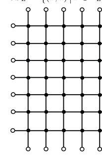
<figcaption class="paper-figure-caption"><b>Fig 1.</b> Figure 1: Black dots and white dots represent the sites in Λ7 and its boundary ∂Λ7, respectively. Solid lines represent bonds in B7 and ∂B7. Assume that an Ising spin described by the spin variable σx ∈{1, −1} sits at each site x ∈ΛL. A spin configuration, i.e., the collection of all spin variables on ΛL, is denoted as σ = (σx)x∈ΛL, and CL denotes the set of all spin configurations on ΛL. The boundary spin at each boundary site u ∈∂ΛL is described by a continuous variable bu ∈[−1, 1]. The collection of all bu for u ∈∂ΛL is denoted as b = (bu)u∈∂ΛL, and the set of all b is denoted as ∂CL. For any x, y ∈Zd such that |x −y| = 1, let Jx,y = Jy,x ∈R be a random exchange interaction between sites x...</figcaption>
</figure>
<figure class="paper-figure-card">
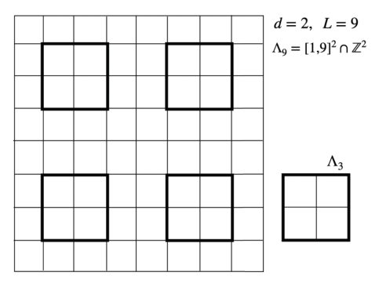
<figcaption class="paper-figure-caption"><b>Fig 2.</b> Figure 2: Four translated copies of Λ3 are embedded into Λ9. This corresponds to the optimal choice (4.35).</figcaption>
</figure>

**Summary.** This paper rigorously proves that the replica overlap in the random field Edwards-Anderson spin glass model exhibits self-averaging in the infinite volume limit. This is achieved by relating order parameters to derivatives of the free energy density and employing sophisticated mathematical inequalities. The result confirms a specific behavior for finite-dimensional disordered systems, distinguishing them from mean-field models.

**Why it may be interesting.** While focused on classical spin glasses, the mathematical techniques used for analyzing quenched disorder and replica symmetry breaking are foundational tools in modern statistical physics that can inform theories of quantum disordered systems or complex energy landscapes relevant to AMO physics.

Detailed structure

**Main problem.** The central problem is proving the self-averaging of the replica overlap in the Edwards-Anderson (EA) spin glass model when subjected to a random external field.

**Main result.** The variance of the replica overlap is proven to vanish in the infinite-volume limit for almost all coupling constants, establishing self-averaging properties for this disordered system.

**Method.** The proof utilizes advanced techniques involving derivatives of the free energy density with respect to the random field strength and relies on correlation inequalities (like Tasaki's) to bound the variance terms.

**Model / system.** The study focuses on the Edwards-Anderson (EA) spin glass model, defined by a Hamiltonian incorporating quenched random couplings ($J_{x,y}$) and an external random magnetic field ($h_g$). The analysis is performed in the thermodynamic limit (infinite volume).

**Key observables.** Replica overlap ($R_{\alpha,eta}^L$), Edwards-Anderson (EA) order parameter ($q_{EA}$), and the free energy density ($\varphi_L$).

**Important parameters / regimes.** Temperature ($eta$), random field strength ($h_g$), system dimension ($d$), and the infinite volume limit ($L 	o \infty$).

**Assumptions / limitations.** The proof requires that the free energy density be independent of boundary conditions for the random field EA model, and it is restricted to short-range interactions.

**Figures summary.** Figure 1 illustrates a lattice structure ($\Lambda_7$) and its boundary ($\partial\Lambda_7$) in two dimensions ($d=2$).

**Paper structure.** The paper develops the theory by relating order parameters to derivatives of the free energy density, proving self-averaging theorems using correlation inequalities, and contrasting these findings with mean-field models like SK.

Abstract

The self-averaging of the replica overlap is proven in the Edwards-Anderson (EA) model under random field almost everywhere in the coupling constant space in any dimension. The EA order parameter is represented in terms of the derivative of the free energy density with respect to the random field strength, regardless of boundary conditions. Tasaki's correlation inequality for finite-dimensional spin glass models shows that the expectation of the squared replica overlap is bounded by the squared EA order parameter. These simple evaluations enable us to prove that the variance of the replica overlap vanishes in the infinite-volume limit. The self-averaging of the replica bond overlap is proven also in the EA model with Gaussian exchange interaction without random field. Short-range spin glass models have been shown to behave differently from mean-field spin glass models with RSB phase.

[↑ back to top](#top)

### [Trion Hall effect in electron-hole double layers](http://arxiv.org/abs/2606.18647v1)

**Authors:** Raghav Chaturvedi, Phuong X. Nguyen, Patrick Knüppel, Kenji Watanabe, Takashi Taniguchi, Kin Fai Mak, Jie Shan  
**Type:** experiment · **Category:** strongly correlated electrons · **PDF:** <https://arxiv.org/pdf/2606.18647v1>  
**Analysis basis:** full PDF text, analyzed in chunks
**Topic relevance:** `analog quantum simulation` **1/5** · `correlated cavity matter` **1/5** · `spintronics-quantum-optics interface` **1/5**

↔ Scroll figures horizontally

<figure class="paper-figure-card">
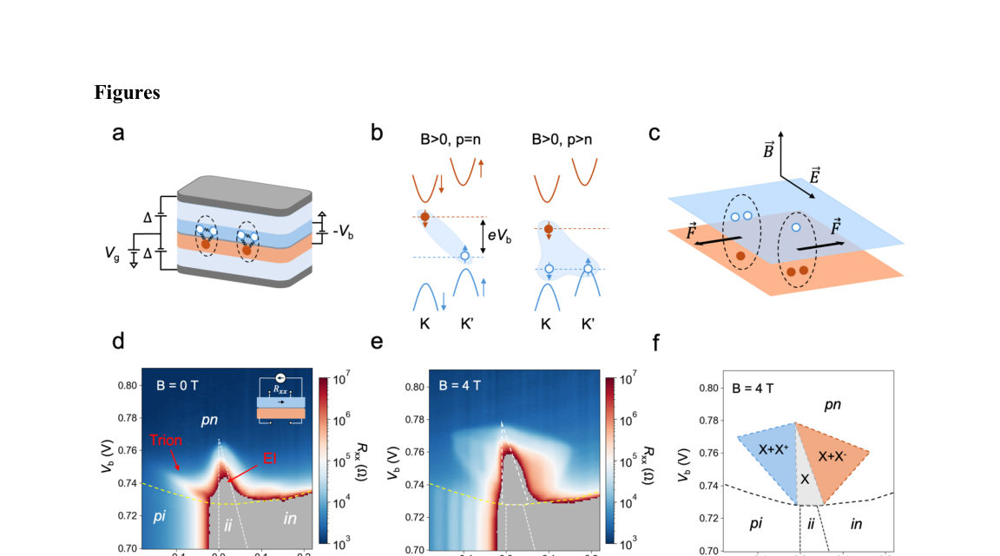
<figcaption class="paper-figure-caption"><b>Fig 1.</b> Figure 1 | Trions in Coulomb-coupled electron-hole double layers. a, Schematic dual-gated device structure supporting trions (three-particle bound states encircled by dashed lines). The electron (orange) and hole (blue) layers are separated by a thin (≈2nm) hBN barrier in the channel. 𝑉&quot; and Δ denote the symmetric and antisymmetric combination of the gate voltages, respectively; 𝑉! is the bias voltage applied to the Mo-layer. b, Schematic type-II band alignment under a finite magnetic field with spin- and valley-split Mo-conduction bands (orange) and W-valence bands (blue). The electron- and hole-Fermi levels are split by 𝑒𝑉!. Excitons form when their binding energy exceeds the interlayer...</figcaption>
</figure>
<figure class="paper-figure-card">
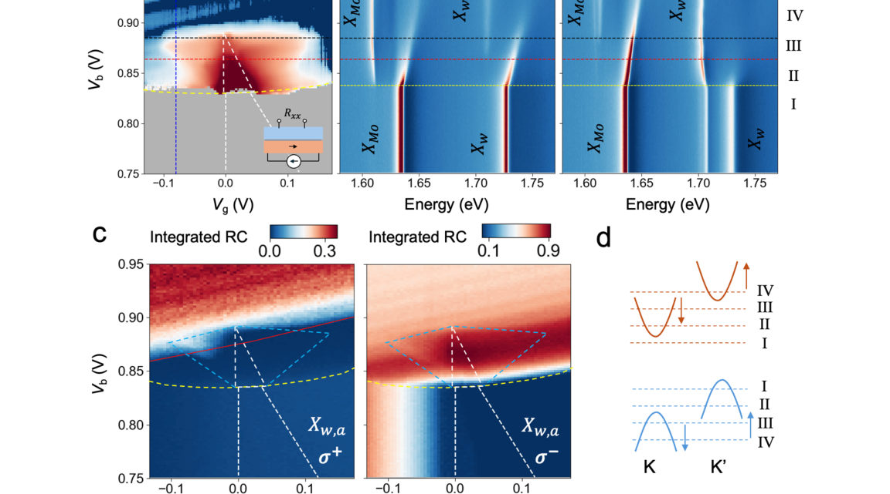
<figcaption class="paper-figure-caption"><b>Fig 2.</b> Figure 2 | Phase diagram under finite magnetic fields. a, 𝑅(((+,-&quot;) as a function of 𝑉&quot; and 𝑉! at 𝐵= 6T and 𝑇= 1.5K (device 3). Schematic measurement configuration is shown in the inset. b, Reflection contrast (RC) spectra in the 𝜎&#x27; (left) and 𝜎$ (right) channels measured along the blue dashed line in a. 𝑋P(QR) and 𝑋P(QR),- denote the neutral exciton (or repulsive polaron) and the attractive polaron resonances in the W(Mo)-layer, respectively. Red and black dashed lines mark the onset of occupation of both valleys in the W- and Mo-layers, respectively; yellow dashed line marks the onset of the pn region. Equilibrium positive trions (with large 𝑅(((+,-&quot;)) emerge only in between the red and...</figcaption>
</figure>
<figure class="paper-figure-card">
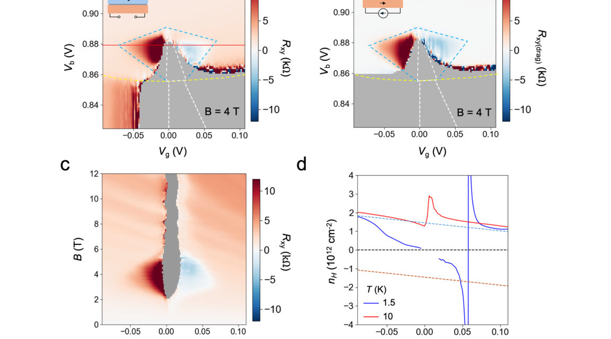
<figcaption class="paper-figure-caption"><b>Fig 3.</b> Figure 3 | Trion Hall effect. a,b, 𝑅() (a) and 𝑅()(+,-&quot;) (b) as a function of 𝑉&quot; and 𝑉! at 𝐵= 4T and 𝑇= 1.5K (device 2). Schematic measurement configurations are shown in the inset. Dashed lines mark the phase boundaries corresponding to those in Fig. 1f. c, Magnetic field dependence of 𝑅() along the red line in a. d, Hall density, 𝑛/, plotted along the red line in a at 𝑇= 1.5K and 10K. The orange and blue dashed lines denote the expected electron and hole densities in the Mo- and W-layers, respectively, based on the calibrated gate capacitances.</figcaption>
</figure>
<figure class="paper-figure-card">
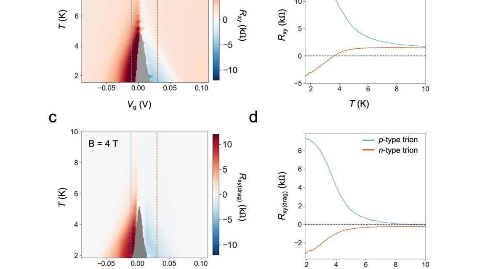
<figcaption class="paper-figure-caption"><b>Fig 4.</b> Figure 4 | Temperature dependence of the trion Hall effect. a,c, 𝑅() (a) and 𝑅()(+,-&quot;) (c) as a function of 𝑉&quot; and 𝑇 at 𝐵= 4T along the red line in Fig. 3a. b,d, Line cuts of a and c on the positive trion (blue line) and negative trion (orange line) side. A sign change in both 𝑅() and 𝑅()(+,-&quot;) around charge neutrality (i.e. 𝑉&quot; ≈0V) is observed for 𝑇≲8K when trions emerge; 𝑅()(+,-&quot;) approaches zero at high temperatures as trions are ionized into free carriers.</figcaption>
</figure>

**Summary.** The study reports the observation of a measurable Hall effect for trions—three-particle bound states—in MoSe2/WSe2 heterobilayers. By measuring transport properties under magnetic fields, the authors confirm that these composite particles carry unique charge responses, including an electron-Hall effect in a hole layer. This opens avenues for studying quantum phenomena associated with multi-body correlated phases.

**Why it may be interesting.** This work provides experimental realization of correlated electron physics beyond simple excitons, exploring three-body bound states (trions) and their unique magneto-transport signatures, which is highly relevant to strongly correlated materials research.

Detailed structure

**Main problem.** The study aims to observe and characterize the Hall effect for trions (three-particle bound states of electrons and holes) in electron-hole double layers.

**Main result.** A distinct Trion Hall effect is observed, including an electron-Hall effect measured within a hole-doped layer due to negative trion drags. This confirms the existence and transport properties of these composite particles.

**Method.** The research combines electrical transport measurements (standard Hall bar and Coulomb drag) with optical spectroscopy (reflection contrast) under perpendicular magnetic fields.

**Model / system.** The physical system is a Coulomb-coupled electron-hole double layer realized in 2D semiconductor heterostructures, specifically MoSe2/WSe2 heterobilayers. The physics involves the formation and transport of excitons and trions within this coupled quantum well structure.

**Key observables.** Hall resistance ($
ho_{xy}$), Coulomb drag resistance ($
ho_{	ext{drag}}$), longitudinal resistance ($R_{xx}$), and optical resonance shifts (RC spectra).

**Important parameters / regimes.** Temperature ($T \approx 1.5	ext{K}$ to $10	ext{K}$), Magnetic Field ($B$ up to $12	ext{T}$), Gate Voltages ($V_g$, $V_+$), and carrier densities.

**Assumptions / limitations.** The analysis assumes that the observed transport phenomena are dominated by the contributions of free carriers, excitons, and trions, which can be modeled using conductivity tensors.

**Figures summary.** Figures detail phase diagrams mapping out regions hosting different charge states (exciton insulator vs. trion fluid) as a function of magnetic field and gate voltage, alongside measurements showing the disappearance of the effect at high T or B.

**Paper structure.** The paper systematically presents evidence by first establishing the platform, then measuring transport coefficients ($R_{xx}, R_{xy}$, drag), mapping out phase boundaries in $B$-field/gate-voltage space, and finally confirming the physical mechanism through temperature and density dependence studies.

Abstract

The realization of Coulomb coupled electron-hole double layers in 2D semiconductor heterostructures has enabled the thermodynamic and transport studies of equilibrium exciton fluids without a magnetic field. By doping the exciton fluid with additional electrons/holes, an equilibrium fluid of trions - three particle bound states of electrons and holes - further emerge, providing the platform to explore new transport phenomena associated with such composite particles. Here we report the observation of a Hall effect for trions in MoSe2/WSe2 heterobilayers, which support Coulomb-coupled electron and hole fluids with tunable densities. The Hall effect arises from a Lorentz force on trions under a perpendicular magnetic field. It is manifested in both Hall drag measurements and standard Hall effect measurements on just one of the semiconductor layers. For negatively charged trions, an electron Hall effect is observed even in a hole doped WSe2 monolayer due to the presence of trion drags. The trion Hall effect also disappears when the trions are ionized at elevated temperatures and/or high trion densities. Our work opens the door for realizing quantum oscillations and the quantum Hall effect for trions.

[↑ back to top](#top)

### [Hallmark Signatures of Electronic Pairing in Two-Photon Two-Electron Coincidence Angle-Resolved Photoemission Spectroscopy](http://arxiv.org/abs/2606.18616v1)

**Authors:** Janez Bonca, Alberto Nocera, Andrea Damascelli, Mona Berciu  
**Type:** theory · **Category:** strongly correlated electrons · **PDF:** <https://arxiv.org/pdf/2606.18616v1>  
**Analysis basis:** full PDF text, analyzed in chunks
**Topic relevance:** `Keldysh / 2PI / non-Gaussian methods` **1/5** · `analog quantum simulation` **1/5**

↔ Scroll figures horizontally

<figure class="paper-figure-card">
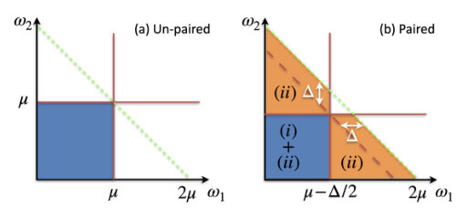
<figcaption class="paper-figure-caption"><b>Fig 1.</b> Figure 1. Shaded regions indicate where 2γ →2e 2eARPES spec- tral weight can appear in the (ω1, ω2) plane of the photoelectrons’ energies, for (a) a quasiparticle liquid and (b) a liquid of pairs with binding energy ∆; µ is the chemical potential. In (b), the orange re- gions labeled ‘(ii)’ are accessible only when both electrons originate from the same pair, while the blue region admits contributions from electrons ejected from different pairs, labeled ‘(i)’. The significance of the solid and dashed lines is explained in the text.</figcaption>
</figure>
<figure class="paper-figure-card">
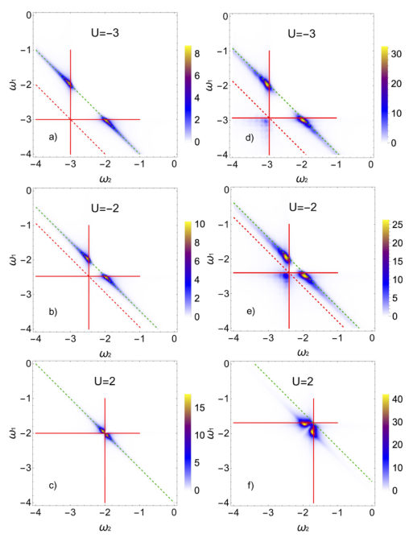
<figcaption class="paper-figure-caption"><b>Fig 2.</b> Figure 2. Momentum-integrated 2eARPES weight D(ω1, ω2) for the pure Hubbard model (λ = 0). Left column: VED results for Ne = 2, N = 90. Right column: DMRG results for Ne = 12, N = 48 (n = 0.25). In all panels tel = 1, U = −3, −2, +2 (top to bottom), and η = 0.05. Lines as in Fig. 1.</figcaption>
</figure>
<figure class="paper-figure-card">
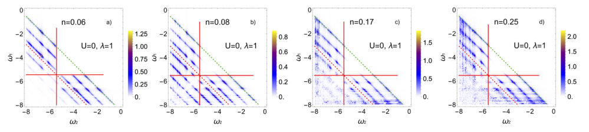
<figcaption class="paper-figure-caption"><b>Fig 3.</b> Figure 3. Momentum-integrated 2eARPES weight D(ω1, ω2) for the pure Holstein model (U = 0, λ = 1.0, Ω= 1.0, tph = 0). (a) VED results for Ne = 2, N = 34 (n →0). (b)–(d) DMRG results for N = 48 and Ne = 4, 8, 12, respectively. Lines as in Fig. 1, with µ and ∆ extracted from DMRG.</figcaption>
</figure>
<figure class="paper-figure-card">
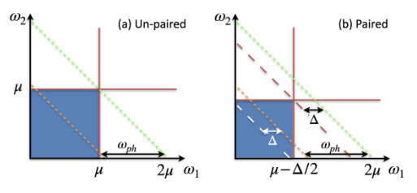
<figcaption class="paper-figure-caption"><b>Fig 4.</b> Figure 4. Counterparts to Fig. 1 for the γ →2e setup. (a) Unpaired case: the dotted orange line marks the global energy maximum for γ →2e processes. (b) Paired case: the dotted orange (dashed white) line marks the global maximum for type-(ii) [type-(i)] γ →2e pro- cesses. Blue shaded regions show where conventional γ →e ARPES weight is expected; unlike for the 2γ →2e setup, here the 2eARPES signal is not energetically separated from this background.</figcaption>
</figure>

**Summary.** The paper introduces two-photon two-electron coincidence ARPES ($2\gamma 	o 2e$ $2e$ARPES) as a superior technique for studying electronic pairing in correlated materials. Theoretically, it shows that this method yields an unambiguous energy separation between photoemission signals originating from electrons within the same pair versus those from different pairs. This allows for model-independent identification of superconducting signatures directly from the coincidence spectrum.

**Why it may be interesting.** This work provides a powerful spectroscopic diagnostic tool applicable to strongly correlated materials, offering a way to probe pairing mechanisms directly without relying on complex material-specific assumptions or complementary measurements.

Detailed structure

**Main problem.** To develop a method that provides a direct and unambiguous probe of electronic pairing in strongly correlated quantum materials, overcoming limitations of standard ARPES.

**Main result.** Two-photon two-electron coincidence ARPES ($2\gamma 	o 2e$ $2e$ARPES) offers a model-independent separation in the photoemission energy plane between signals from electrons originating from the same pair and those from different pairs, allowing direct measurement of pairing signatures.

**Method.** Theoretical derivation of coincident photoelectron intensity formulas and comparison of spectral weight regions in the $(\omega_1, \omega_2)$ energy plane for paired versus unpaired ground states.

**Model / system.** The study applies general theoretical grounds to strongly correlated electron systems, modeled using frameworks like the Hubbard model or Hubbard-Holstein model. The analysis focuses on distinguishing between paired and unpaired electronic ground states.

**Key observables.** Coincidence photoelectron intensity $D(\omega_1, \omega_2)$ in the $(\omega_1, \omega_2)$ energy plane; specific energy bounds related to pair binding energy ($\Delta$) and boson energy ($\Omega$).

**Important parameters / regimes.** Pairing gap ($\Delta$), pair binding energy, chemical potential ($\mu$), and the photon/boson energies ($\omega_{ph}, \Omega$).

**Assumptions / limitations.** The analysis relies on the sudden approximation when photoelectrons depart; results are derived at zero temperature but expected to apply to preformed pair liquids.

**Figures summary.** Figures illustrate the spectral weight regions in the $(\omega_1, \omega_2)$ plane for both quasiparticle liquid and paired states, showing distinct boundaries separating type-(i) (different pairs) and type-(ii) (same pair) emission signals.

**Paper structure.** The paper establishes general theoretical grounds by deriving intensity formulas, analyzes the spectral separation in the $(\omega_1, \omega_2)$ plane for both paired and unpaired systems using numerical simulations of correlated models, and contrasts this method with one-photon setups.

Abstract

Understanding strongly correlated quantum materials remains a central challenge in condensed matter physics and materials science. While angle-resolved photoemission spectroscopy (ARPES) has become an indispensable probe of single-quasiparticle excitations, it accesses electronic correlations only indirectly. Here we show that unlike one-photon in, two-electrons out coincidence ARPES ($γ\!\rightarrow\!2e$ 2eARPES), the two-photon in, two-electron out $2γ\!\rightarrow\!2e$ 2eARPES provides a direct and unambiguous probe of electronic pairing. We establish this on general theoretical grounds and substantiate it through large-scale numerical simulations of strongly correlated models with both paired and unpaired ground states. The key result is a model-independent separation in the $(ω_1,ω_2)$ plane of the two photoelectrons' energies, between signal from electrons emitted from the \emph{same} pair and signal from electrons emitted from \emph{different} pairs; this follows from energy conservation alone and is independent of any material-specific assumptions. Our findings demonstrate that $2γ\!\rightarrow\!2e$ 2eARPES can identify pairing and extract the pair binding energy as well as the energy of the 'glue' boson without any sophisticated data analysis or complementary measurements.

[↑ back to top](#top)

### [Exact propagating Dirac wave packets in an attractive Coulomb-like potential](http://arxiv.org/abs/2606.18470v1)

**Authors:** Siddhant Das  
**Type:** theory · **Category:** other · **PDF:** <https://arxiv.org/pdf/2606.18470v1>  
**Analysis basis:** full PDF text, analyzed in chunks
**Topic relevance:** `non-equilibrium dynamics` **1/5**

↔ Scroll figures horizontally

<figure class="paper-figure-card">
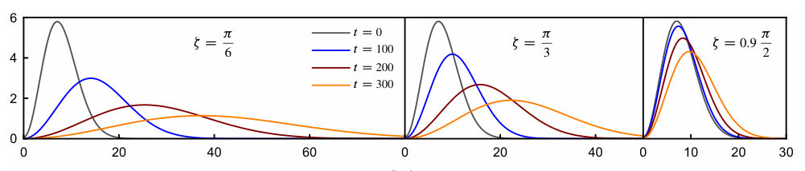
<figcaption class="paper-figure-caption"><b>Fig 1.</b> FIG. 1. Time evolution of the marginal density (16) for the elementary-function wave packet with 𝑤0 = 50. The propagation slows as the confinement 𝜁strengthens, freezing completely as 𝜁→𝜋/2.</figcaption>
</figure>
<figure class="paper-figure-card">
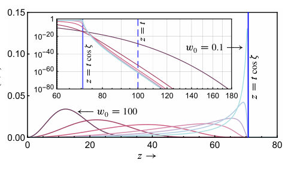
<figcaption class="paper-figure-caption"><b>Fig 2.</b> FIG. 2. Marginal density (16) at 𝑡= 100 and 𝜁= 𝜋/4, for 𝑤0 from 100 (darkest) to 0.1 (lightest). As 𝑤0 falls below the Compton scale (≃1), the leading edge sharpens against the effective light cone 𝑧= 𝑡cos 𝜁 (solid blue). Inset: log-log view of the tails reaching beyond both 𝑧= 𝑡cos 𝜁and the true light cone 𝑧= 𝑡(dashed blue).</figcaption>
</figure>

**Summary.** This paper presents the construction of exact, propagating wave-packet solutions for the Dirac equation in an attractive Coulomb-like potential. The key findings include demonstrating that the probability density decouples from spin and that the wave packet's time evolution freezes at a critical coupling strength. This provides significant analytical insight into relativistic quantum dynamics in structured potentials.

**Why it may be interesting.** This work provides exact analytical solutions for wave propagation in a confining potential within a relativistic framework, which is highly relevant to understanding particle confinement in structured media or quantum waveguides beyond simple approximations.

Detailed structure

**Main problem.** The primary goal is constructing exact, positive-energy, normalizable wave-packet solutions for the Dirac equation subjected to an attractive Coulomb-like potential ($V = -v_0/
ho$).

**Main result.** The authors constructed novel families of exact solutions exhibiting two key features: spin-density decoupling and temporal freezing at a critical coupling. These solutions correctly reduce to known nonrelativistic forms like the Hermite–Gauss wave packet.

**Method.** Methods involve solving coupled partial differential equations derived from the Dirac Hamiltonian, utilizing superposition techniques, and mapping solutions from the 2D Helmholtz equation (H->D map).

**Model / system.** The model is the relativistic Dirac equation solved in cylindrical coordinates with a central potential $V = -v_0/
ho$. The analysis focuses on propagating wave packets characterized by their longitudinal marginal density.

**Key observables.** Longitudinal marginal density $P(z, t)$, spin-density decoupling ($\Psi^\dagger\Psi$ independent of spin), and the group velocity's slowing down as confinement increases.

**Important parameters / regimes.** The coupling constant $v_0$, which has a critical value leading to temporal freezing; the nonrelativistic limit ($c 	o \infty$).

**Assumptions / limitations.** The analysis initially sets $\hbar=m=c=1$ and focuses on positive-energy eigenstates. The derivation relies on symmetry considerations for axisymmetric Hamiltonians.

**Figures summary.** Figure 1 illustrates the time evolution of the marginal density showing dispersive spreading that slows down as confinement increases, leading to temporal freezing. Figure 2 shows this effect for varying coupling parameters.

**Paper structure.** The paper systematically derives solutions by first establishing the governing PDEs, providing explicit examples using elementary functions, and later developing a general mapping scheme (H->D) from known solvable equations like the Helmholtz equation.

Abstract

We construct exact, positive-energy, normalizable wave-packet solutions of the Dirac equation in the axisymmetric potential $V=-\,v_0/ρ$ -- to our knowledge, the first such solutions in any external potential. Remarkably, one family comprises only elementary functions whose longitudinal profiles reproduce the free-Schrödinger Hermite--Gauss wave packets in the nonrelativistic limit. All packets share two striking features: (i) a probability density that is pointwise decoupled from spin orientation -- despite the inherent spin-orbit coupling of the Dirac equation -- and (ii) a complete freezing of their time evolution at the critical coupling $v_0\to\hbar c/2$. We also present a simple scheme that maps solutions of the 2D Helmholtz equation to further exact Dirac wave packets.

[↑ back to top](#top)

### [Quantum algorithm for Valiant-Vazirani reduction](http://arxiv.org/abs/2606.18428v1)

**Authors:** Patrick Kelly, Victoria S. Ordonez, Michael R. Geller  
**Type:** theory · **Category:** quantum information and computing · **PDF:** <https://arxiv.org/pdf/2606.18428v1>  
**Analysis basis:** full PDF text, analyzed in chunks
**Topic relevance:** `driven-dissipative phase transition` **1/5**

↔ Scroll figures horizontally

<figure class="paper-figure-card">
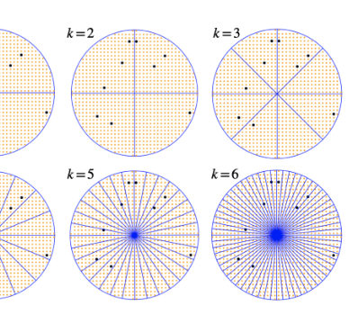
<figcaption class="paper-figure-caption"><b>Fig 1.</b> Figure 1: Valiant-Vazirani filter. (a) Illustration of the set {0, 1}n containing all n-bit strings x, shown as points. Points marked black (chosen randomly) indicate s satisfying assignments with f(x) = 1. In this example, n = 10 and s = 9. (b) Random partition into 2k subsets for different values of k. For each k, the individual sectors can be indexed by a number a ∈{0, 1}k (not shown in the illustration). When s ≈2k there is, on average, 1 satisfying assignment per circular sector. In the example shown, this occurs when k = 3.</figcaption>
</figure>
<figure class="paper-figure-card">
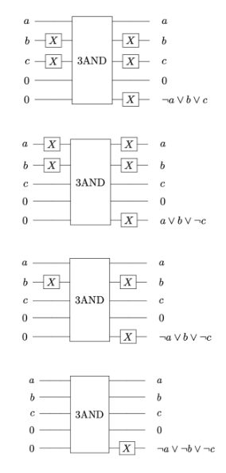
<figcaption class="paper-figure-caption"><b>Fig 2.</b> Figure 3: Circuits to implement the 8 clause signatures. Here a, b, c ∈{0, 1} and X is a σx gate. The 3AND gate is defined in Figure 4.</figcaption>
</figure>
<figure class="paper-figure-card">
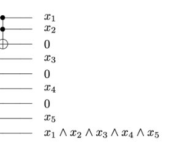
<figcaption class="paper-figure-caption"><b>Fig 3.</b> Figure 5: Circuit to implement M-bit conjunction using CCNOTs. Here xi ∈{0, 1}. This requires O(M) CCNOT gates and O(M) additional ancilla initialized to |0⟩. The case M = 5 is shown.</figcaption>
</figure>

**Summary.** The paper develops a quantum algorithm implementing the Valiant-Vazirani reduction by transforming SAT into UNIQUE SAT. This is achieved by constructing a complex oracle circuit based on random hashing constraints and leveraging 'torsion nonlinearity' found in systems like Bose-Einstein condensates. The result suggests that fault-tolerant implementation could solve NP problems, though this speedup requires nonlinear quantum hardware.

**Why it may be interesting.** This work directly bridges abstract complexity theory (NP-completeness) with concrete proposals for nonlinear quantum computation, offering a pathway to solving hard problems using physical models like BECs that exhibit such nonlinearities.

Detailed structure

**Main problem.** To construct a quantum algorithm for the Valiant-Vazirani reduction, which reduces the NP-complete SAT problem to UNIQUE SAT.

**Main result.** The authors provide a randomized polynomial-time reduction from SAT to UNIQUE SAT using a filtered oracle. This implies that fault-tolerant implementation could solve NP problems in polynomial time via nonlinear quantum coprocessors.

**Method.** The core method involves constructing a filtered Boolean function $\phi(x)$ by combining the original 3SAT formula with indicator functions derived from random hash constraints, which are then implemented using reversible oracle circuits.

**Model / system.** The theoretical framework relies on extending gate-based quantum computation to include auxiliary degrees of freedom governed by a nonlinear Schrödinger equation. The specific nonlinearity utilized is 'torsion nonlinearity,' arising in models like two-component Bose-Einstein condensates or spin systems with all-to-all Ising interaction.

**Key observables.** The probability $p = 	ext{Pr}(X=1)$ of finding the unique satisfying assignment, and the expected number of solutions $\lambda$.

**Important parameters / regimes.** The analysis requires choosing an optimal hash dimension $k$ such that $1/16 < \lambda \le 1/8$, and the speedup is contingent on operating in the noise-free limit.

**Assumptions / limitations.** The primary assumptions are the existence of a fault-tolerant nonlinear quantum coprocessor simulating torsion, and the analysis holds strictly in the idealized noise-free limit.

**Figures summary.** Figures illustrate the Valiant-Vazirani filter concept using random partitioning, circuits for encoding hash constraints (8 clause signatures), and general circuit structures for implementing 3AND gates and conjunctions using CCNOTs.

**Paper structure.** The paper first establishes the theoretical reduction from SAT to UNIQUE SAT. It then details the construction of the filtered oracle by rewriting the indicator function into a system of linear equations over $\mathbb{F}_2$, which is finally implemented via complex quantum circuits involving ancilla qubits and CCNOT gates.

Abstract

There is growing interest in extensions of the standard model of gate-based quantum computation to include auxiliary degrees of freedom evolving according to a nonlinear Schrödinger equation. By reducing the Boolean satisfiability problem SAT to quantum state discrimination, Abrams and Lloyd argued that the right type of nonlinearity can be used to solve {\sf NP} and \#{\sf P} problems in polynomial time, at least in an idealized noise-free limit. For practical implementation, however, we are restricted to simulated and emergent nonlinearities, such as that appearing in mean field models for ultracold atoms and similar ensembles. A prominent example is the torsion model, which arises in two-component Bose-Einstein condensates and spin models with all-to-all Ising interaction. But torsion-based state discrimination appears to fall short of solving SAT. Here we close this gap by constructing the filtered oracle of the Valiant-Vazirani theorem, providing a randomized polynomial-time reduction from SAT to UNIQUE SAT, a promise problem where there is at most 1 satisfying assignment. In the noise free limit, the UNIQUE SAT problem can be olved in polynomial time using torsion nonlinearity. Quantum Valiant-Vazirani reduction is no faster than the efficient classical version, but a fault-tolerant implementation coupled to a nonlinear quantum coprocessor simulating torsion would enable polynomial time solution to {\sf NP} (but not \#{\sf P}) problems.

[↑ back to top](#top)

### [Quantum circuit decomposition of the tangent-fermion Dirac operator](http://arxiv.org/abs/2606.19020v1)

**Authors:** C. W. J. Beenakker  
**Type:** theory · **Category:** quantum information and computing · **PDF:** <https://arxiv.org/pdf/2606.19020v1>  
**Analysis basis:** full PDF text, analyzed in chunks
**Topic relevance:** `analog quantum simulation` **1/5**

↔ Scroll figures horizontally

<figure class="paper-figure-card">
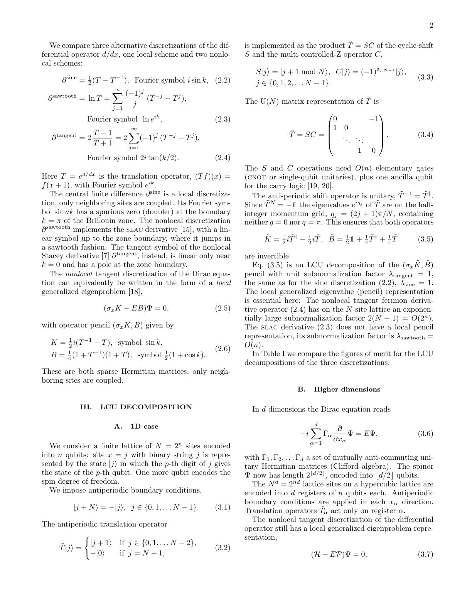
<figcaption class="paper-figure-caption"><b>Fig 1.</b> Low-resolution page preview, page 2</figcaption>
</figure>
<figure class="paper-figure-card">
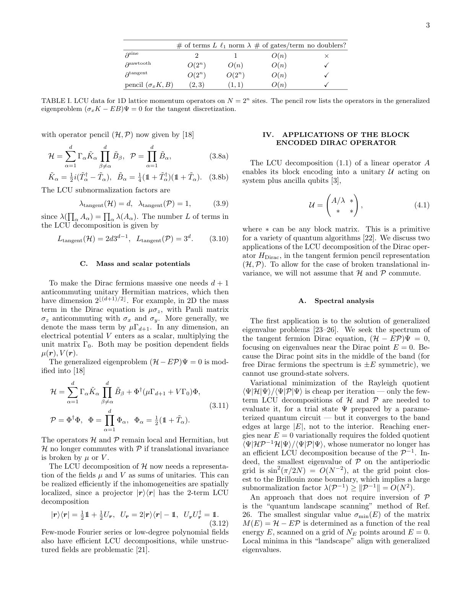
<figcaption class="paper-figure-caption"><b>Fig 2.</b> Low-resolution page preview, page 3</figcaption>
</figure>
<figure class="paper-figure-card">
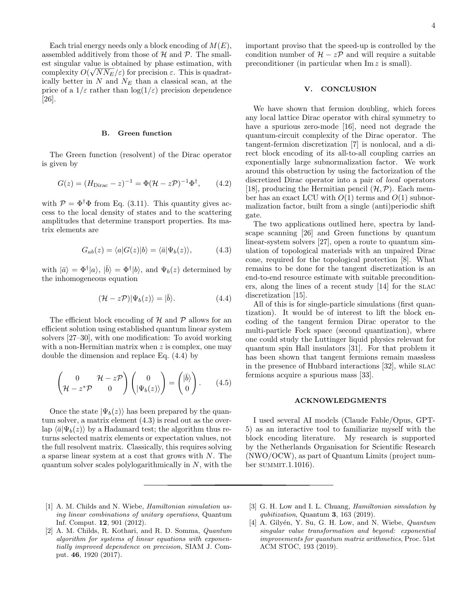
<figcaption class="paper-figure-caption"><b>Fig 3.</b> Low-resolution page preview, page 4</figcaption>
</figure>
<figure class="paper-figure-card">
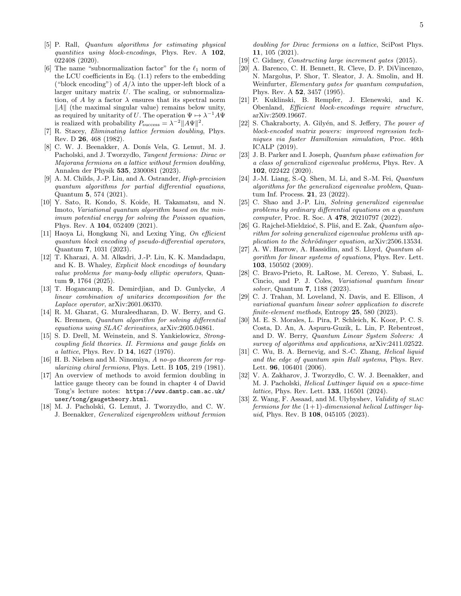
<figcaption class="paper-figure-caption"><b>Fig 4.</b> Low-resolution page preview, page 5</figcaption>
</figure>

**Summary.** The paper tackles the challenge of implementing lattice Dirac operators on quantum computers, where standard methods suffer from exponentially growing circuit complexity. By reformulating the problem using the tangent-fermion discretization within a generalized eigenvalue framework, the authors achieve an encoding whose resource requirements scale favorably (polylogarithmically or $O(1)$) with system size.

**Why it may be interesting.** This work directly addresses the resource scaling of simulating fundamental condensed matter Hamiltonians (like Dirac fermions) on near-term quantum hardware by providing a method to encode them efficiently in terms of unitaries.

Detailed structure

**Main problem.** Developing an efficient quantum circuit representation for the Dirac operator on a lattice that avoids fermion doubling while maintaining polynomial scaling with system size.

**Main result.** The tangent-fermion discretization, when formulated as a generalized eigenvalue problem $(	ext{H} - E	ext{P})\Psi = 0$, yields operators whose quantum circuits have term counts and subnormalization factors independent of lattice size, matching the efficiency of elliptic operators.

**Method.** Analyzing the Linear Combination of Unitaries (LCU) decomposition for discretized Dirac operators and reformulating the problem into a local generalized eigenvalue structure to achieve efficient encoding.

**Model / system.** The 1D/higher-dimensional Dirac equation discretized on a lattice, comparing standard discretizations ($\partial_{\sin}$) against the tangent-fermion scheme. The core mathematical tool is casting the problem as $(	ext{H} - E	ext{P})\Psi = 0$.

**Key observables.** Eigenvalues near $E=0$, smallest singular value $\sigma_{\min}(E)$, and the efficiency metrics ($L$ and $\lambda$) of the quantum circuit encoding.

**Important parameters / regimes.** Lattice size ($N$), energy ($E$), and the structure of the operators $	ext{H}$ and $	ext{P}$.

**Assumptions / limitations.** The analysis relies on recasting the problem into a generalized eigenvalue form $(	ext{H} - E	ext{P})\Psi = 0$ to bypass the efficiency bottlenecks found in direct LCU decompositions of non-local operators.

**Figures summary.** Table I compares the figures of merit ($L$, $\lambda$) for different discretizations, showing that only the pencil representation for $\partial_{	ext{tangent}}$ achieves $O(1)$ scaling for both metrics.

**Paper structure.** The paper first establishes the efficiency limitations of standard Dirac operator discretizations in quantum circuits. It then introduces and analyzes the tangent-fermion discretization by recasting it into a local generalized eigenvalue problem $(	ext{H} - E	ext{P})\Psi = 0$. Finally, it discusses methods for solving this system, such as quantum landscape scanning.

Abstract

The Dirac operator on a lattice cannot be both local and free of fermion doubling, at least not without breaking fundamental symmetries. Non-local, symmetry-preserving discretizations that avoid doubling have a quantum circuit representation as a linear-combination-of-unitaries (LCU) in which both the number of terms and their norm (the subnormalization factor) grow with the lattice size, compromising the efficiency of a quantum algorithm. We show that the tangent-fermion discretization escapes this obstruction when the Dirac equation is written as a generalized eigenvalue problem with a local operator pencil: Each member of the pencil has an exact LCU, with term count that is independent of lattice size and with subnormalization factor of order unity, on a par with elliptic operators. This provides an efficient block-encoding primitive for Dirac spectra and Green functions without fermion doubling.

[↑ back to top](#top)

### [Quantum-Classical Auxiliary-Field Quantum Monte Carlo at the Edge of Practicability](http://arxiv.org/abs/2606.19239v1)

**Authors:** Francesco Nappi, Matthew Kiser, Fedor Šimkovic  
**Type:** theory · **Category:** numerical methods · **PDF:** <https://arxiv.org/pdf/2606.19239v1>  
**Analysis basis:** full PDF text, analyzed in chunks
**Topic relevance:** `methods for driven-dissipative` **1/5**

↔ Scroll figures horizontally

<figure class="paper-figure-card">
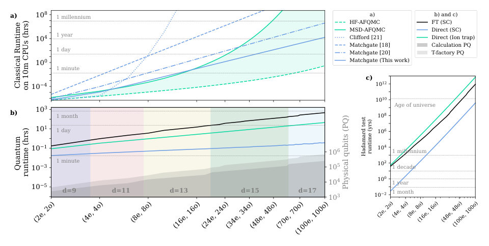
<figcaption class="paper-figure-caption"><b>Fig 1.</b> FIG. 1. Estimated classical and quantum resource requirements of QC-AFQMC. Further details on assumptions and timings used to construct this figure can be found in Sections II B and IV D. a) Estimated total classical runtime of classical ph-AFQMC (green) and hybrid QC-AFQMC (blue) implementations as a function of the chemical system size described by (Nelec, Norb). b) Quantum runtime and physical qubit (PQ) count estimates for collecting matchgate shadow data using a FT quantum computer based on surface code error correction, as well as from direct NISQ implementations using superconducting (SC) and ion-trap quantum hardware. c) QC-AFQMC runtimes for NISQ and FT implementations using the...</figcaption>
</figure>
<figure class="paper-figure-card">
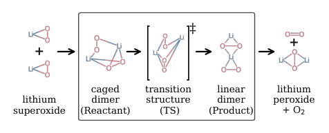
<figcaption class="paper-figure-caption"><b>Fig 2.</b> FIG. 2. Reaction pathway of lithium superoxide to lithium peroxide and molecular oxygen [36].</figcaption>
</figure>
<figure class="paper-figure-card">
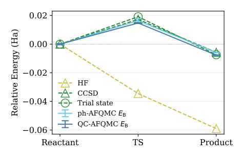
<figcaption class="paper-figure-caption"><b>Fig 3.</b> FIG. 4. Reaction energies for three configurations of the rearrangement pathway of Li2O4 lithium superoxide dimer (shown in Fig. 2), where lithium peroxide and oxygen (prod- uct) are formed from a lithium superoxide dimer (reactant) through a transition state (TS). Calculations are performed in the cc-pVDZ basis set using an active space of 26 electrons in 20 orbitals. We compare the results for Hartree-Fock, CCSD, the trial state (top 3 determinants of CCSD) and block en- ergies EB during QC-AFQMC and ph-AFQMC calculations. Absolute energies are given in Table II.</figcaption>
</figure>
<figure class="paper-figure-card">
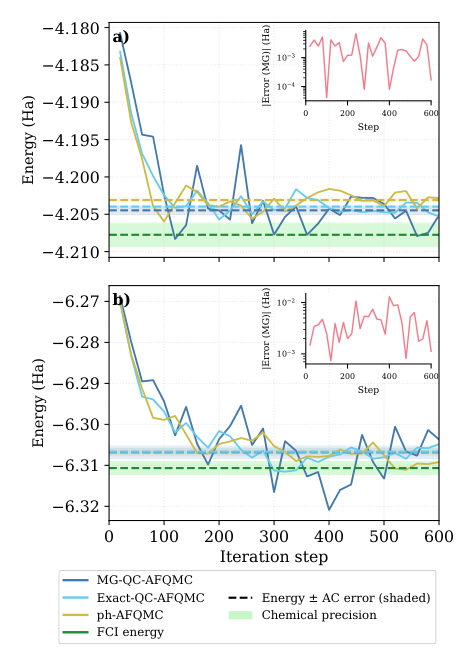
<figcaption class="paper-figure-caption"><b>Fig 4.</b> FIG. 3. QC-AFQMC evolution for a) H8 and b) H12 hydro- gen chains with R = 1.5˚A using experimental and simulated data, respectively. We show convergence curves where ener- gies are computed using either matchgate shadow data (MG- QC-AFQMC) or via a state-vector representation of the trial state (Exact-QC-AFQMC). Fully classical ph-AFQMC curves and exact FCI energies are shown for comparison. Insets show the error of the energy estimation of MG-QC-AFQMC with respect to the exact energy calculation of Exact-QC-AFQMC.</figcaption>
</figure>
<figure class="paper-figure-card">
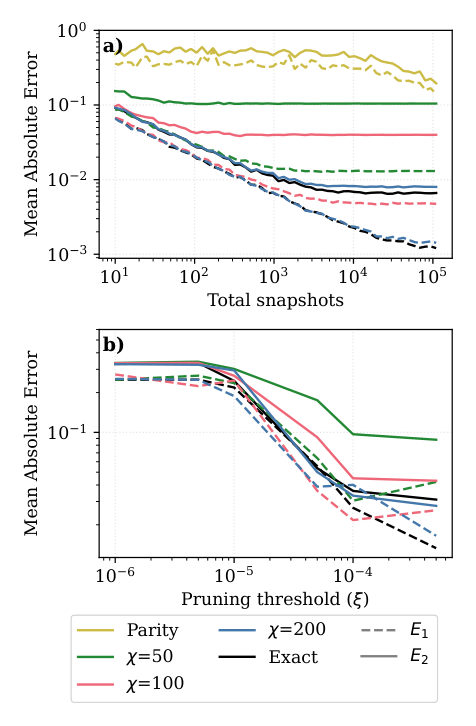
<figcaption class="paper-figure-caption"><b>Fig 5.</b> FIG. 6. Performance analysis of the filter state method using MPS states for the H8 hydrogen-chain system. a) Overlap, one-body energy and two-body energy errors for a fixed filter threshold ξ and variable bond dimensions χ of the classical simulation of the circuit are used as a filter. SV corresponds to a full state vector filter representation. b) The number of snapshots is fixed to 2,000, while χ and ξ are varied.</figcaption>
</figure>

**Summary.** The paper introduces significant algorithmic enhancements to Quantum-Classical Auxiliary-Field Quantum Monte Carlo (QC-AFQMC) methods. By improving how singular Pfaffians are calculated and utilizing advanced differentiation techniques, the method's scaling is dramatically improved from $\mathcal{O}(N^{5.5})$ to $\mathcal{O}(N^{4.5})$. This advancement brings QC-AFQMC closer to treating chemically relevant systems by demonstrating feasibility for larger molecular models.

**Why it may be interesting.** This work directly addresses the computational bottleneck in simulating strongly correlated electronic structure problems, providing a concrete pathway toward achieving quantum advantage in chemistry by optimizing classical post-processing steps.

Detailed structure

**Main problem.** The primary challenge is improving the computational scaling of Quantum-Classical Auxiliary-Field Quantum Monte Carlo (QC-AFQMC) for calculating ground state energies in fermionic systems.

**Main result.** The authors achieved a significant algorithmic improvement, reducing the dominant per-step classical scaling from $	ilde{\mathcal{O}}(N^{5.5})$ to $	ilde{\mathcal{O}}(N^{4.5})$, leading to substantial estimated runtime reductions for chemically relevant systems.

**Method.** The core method is QC-AFQMC, which combines quantum state preparation (using matchgate shadows) with classical Monte Carlo sampling. Key algorithmic improvements include applying Aitken's block transformation to handle singular Pfaffians and using algorithmic differentiation for the force bias calculation.

**Model / system.** The work applies to calculating ground-state energies of molecular systems, demonstrated on $	ext{H}_8$ and hydrogen chains up to $	ext{H}_{12}$, as well as the $	ext{Li}_2	ext{O}_4$ lithium superoxide dimer rearrangement pathway. The underlying physics is described by a second-quantized Hamiltonian.

**Key observables.** Ground-state energy; computational runtimes (classical and quantum); scaling exponents ($N$, number of molecular spin-orbitals).

**Important parameters / regimes.** System size (up to 100 orbitals demonstrated in estimates); error mitigation threshold ($\xi$ or $\eta$); required qubit counts for fault tolerance.

**Assumptions / limitations.** The method relies on algorithmic improvements like Aitken's transformation and the use of matchgate shadow tomography, which are approximations necessary due to current quantum hardware limitations.

**Figures summary.** Figures illustrate resource requirements vs. system size, reaction pathway diagrams for $	ext{Li}_2	ext{O}_4$, and energy evolution curves comparing QC-AFQMC against other methods like ph-AFQMC.

**Paper structure.** The paper details the theoretical framework of QC-AFQMC, presents algorithmic improvements (Aitken's transformation, differentiation), validates these improvements through scaling analysis, and applies the method to benchmark molecular systems ($	ext{H}_8$, $	ext{Li}_2	ext{O}_4$).

Abstract

We introduce algorithmic improvements to quantum-classical auxiliary-field quantum Monte Carlo (QC-AFQMC) that reduce the dominant per-step classical scaling from $\tilde{\mathcal{O}}(N^{5.5})$ to $\tilde{\mathcal{O}}(N^{4.5})$ as a function of the number of molecular spin-orbitals $N$. Central to this improvement is the application of Aitken's block transformation to handle singular Pfaffians arising in the estimation of overlaps between a quantum trial state and classical Slater-determinant walkers. Together with the use of algorithmic differentiation for the computation of the force bias, this yields a $248\times$ estimated runtime improvement for a system of 100 molecular orbitals. Using our workflow, we demonstrate a ground-state energy calculation for $H_8$ from quantum data collected on IQM Emerald and post-processed with a tensor-network-based error-mitigation technique. We further validate the method's scalability through noiseless simulation of hydrogen chains up to $H_{12}$, and on the lithium-air battery related rearrangement pathway of the $Li_2O_4$ lithium superoxide dimer in a (26e, 20o) active space. We estimate both quantum and classical runtimes for a potential fault-tolerant implementation of QC-AFQMC, showing that the method holds promise for the early fault-tolerant era. These results move QC-AFQMC a step closer to treating chemically relevant systems.

[↑ back to top](#top)

### [Towards an Optimally Distributed Quantum Fourier Transform Circuit](http://arxiv.org/abs/2606.18494v1)

**Authors:** Zachary Vernec, Michael Silver, Hans-Arno Jacobsen  
**Type:** both · **Category:** quantum information and computing · **PDF:** <https://arxiv.org/pdf/2606.18494v1>  
**Analysis basis:** full PDF text, analyzed in chunks
**Topic relevance:** `entanglement & information structure` **1/5**

↔ Scroll figures horizontally

<figure class="paper-figure-card">
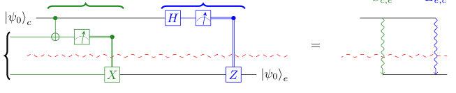
<figcaption class="paper-figure-caption"><b>Fig 1.</b> Figure 1. A state teleportation protocol (teledata) using starting and ending processes. The LHS uses a common circuit notation such as would be used in [26], while the RHS has the same circuit in the notation of Wu et al. [27] with snake arrows representing the flow of information.</figcaption>
</figure>
<figure class="paper-figure-card">
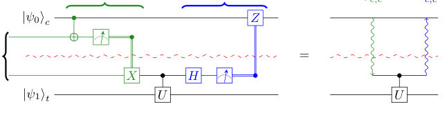
<figcaption class="paper-figure-caption"><b>Fig 2.</b> Figure 2. A gate teleportation protocol (telegate) using starting and ending processes. The same diagrammatic notation is used on the left-hand side and right-hand side as Fig. 1.</figcaption>
</figure>
<figure class="paper-figure-card">
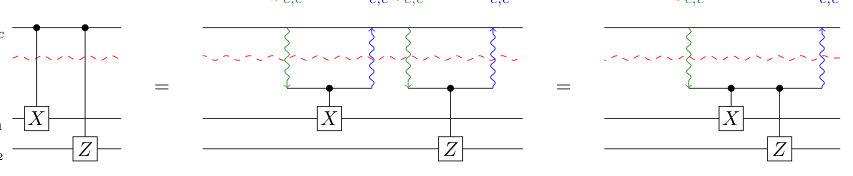
<figcaption class="paper-figure-caption"><b>Fig 3.</b> Figure 3. An example of gate packing the CX gate and the CZ gate, both with control qubit c and targeting qubits t1, t2 on the same QPU. On the left is the circuit that needs to be partitioned. In the middle is the circuit partition without gate packing, which requires two starting processes and therefore two e-bits. On the right is an equivalent partition where the CX and CZ gates are packed so that a single starting process (and single e-bit) is required.</figcaption>
</figure>
<figure class="paper-figure-card">
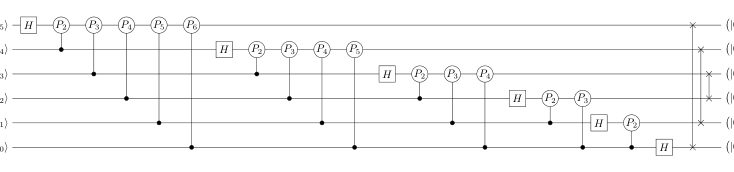
<figcaption class="paper-figure-caption"><b>Fig 4.</b> Figure 5. The traditional circuit for the quantum Fourier transform on 6 qubits, where the subscript k of a controlled phase gate defines a phase factor e2πi/2k as in [26].</figcaption>
</figure>
<figure class="paper-figure-card">
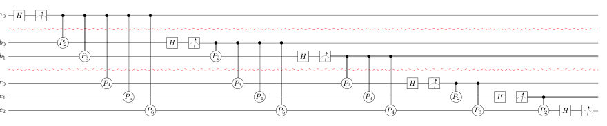
<figcaption class="paper-figure-caption"><b>Fig 5.</b> Figure 6. Semi-classical QFT circuit on 6 qubits. Note that the double lines represent classical information propagation and classical control.</figcaption>
</figure>

**Summary.** This paper tackles the critical problem of distributing the QFT circuit across multiple QPUs by minimizing entanglement overhead using a technique called gate packing. The authors prove that their specialized, optimal partitioning scheme significantly reduces the required e-bit count compared to general methods. This work provides both theoretical guarantees and empirical validation on quantum hardware for building scalable distributed quantum processors.

**Why it may be interesting.** It provides a concrete, resource-aware compilation strategy for one of the most fundamental subroutines in quantum algorithms (QFT), directly addressing the engineering challenge of scaling quantum computation across multiple physical devices.

Detailed structure

**Main problem.** The primary goal is to develop an optimal method for partitioning the Quantum Fourier Transform (QFT) circuit so that it can run efficiently on a distributed quantum system while minimizing required entanglement resources.

**Main result.** The authors propose and prove an optimal gate-packing-based partitioning scheme for the QFT, demonstrating resource savings compared to general algorithms. This method achieves analytically proven lower bounds on the required e-bit count in bipartite cases.

**Method.** The work employs circuit rewriting using quantum teleportation protocols (Teledata/Telegate) and introduces 'gate packing' to efficiently group multiple two-qubit gates into single entanglement operations. Theoretical proofs establish optimal qubit assignment strategies based on minimizing the total required e-bits.

**Model / system.** The model is a distributed quantum computing architecture utilizing multiple Quantum Processing Units (QPUs) connected by entanglement channels, with the QFT circuit being the specific unitary operation analyzed. The analysis compares theoretical bounds derived from communication complexity ($Q_0$) against practical implementations on simulated and physical hardware.

**Key observables.** e-bit count (the number of maximally entangled qubit pairs required), Average Fidelity ($F$), Circuit Depth, and Time taken for execution.

**Important parameters / regimes.** Number of QPUs ($m$), total qubits ($n$), QPU capacities ($n_1, \dots, n_m$), and the constant ancilla limit (e.g., 1 or 2).

**Assumptions / limitations.** The analysis often assumes access to necessary entanglement resources; comparisons are sometimes made between exact circuits and approximate versions generated by standard compilers like Pytket.

**Figures summary.** Figures illustrate protocols like Teledata/Telegate, show comparisons of e-bit requirements (packed vs. non-packed), and present fidelity decay curves comparing naive partitioning against the proposed gate-packed scheme on simulated and physical hardware.

**Paper structure.** The paper progresses from defining the problem (QFT distribution) to introducing advanced techniques like gate packing and detached gates, establishing theoretical lower bounds via communication complexity analysis, deriving optimal assignment theorems, and finally validating these results through both simulation and actual quantum hardware measurements.

Abstract

A promising avenue for scaling quantum computing is to connect quantum processing units (QPUs) by generating entanglement between them. This requires circuit partitioning: partially rewriting quantum circuits to run on a distributed quantum system using quantum teleportation protocols, while preserving the unitary operation implemented by the circuit. The key metric to minimize when partitioning is the e-bit count, defined as the number of maximally entangled qubit pairs that must be generated between QPUs. We focus on partitioning the quantum Fourier transform (QFT) circuit, which is widely used as a subroutine in quantum algorithms such as quantum phase estimation and arithmetic circuits. Specifically, we present a partitioning scheme based on optimal gate-packing, compare it against prior analytical partitioning schemes for the QFT, and evaluate it against partitions produced by general-purpose circuit partitioning algorithms. We further validate our approach by implementing the partitioned circuit on quantum hardware.

[↑ back to top](#top)

## Other papers (5)

*Papers from primary archives without highlighted authors or any topic match. Click to expand.*

Show other papers

### [Bulk-boundary correspondence of (1+1)D symmetric gapped phases](http://arxiv.org/abs/2606.19137v1)

**Authors:** Yizhou Ma, Gen Yue, Tian Lan  
**Type:** theory · **Category:** strongly correlated electrons · **PDF:** <https://arxiv.org/pdf/2606.19137v1>  
**Analysis basis:** full PDF text, analyzed in chunks

↔ Scroll figures horizontally

<figure class="paper-figure-card">
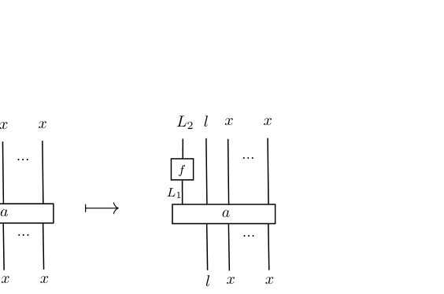
<figcaption class="paper-figure-caption"><b>Fig 1.</b> Figure 1: Definition of Std, which will be called ReaDHR later.</figcaption>
</figure>
<figure class="paper-figure-card">
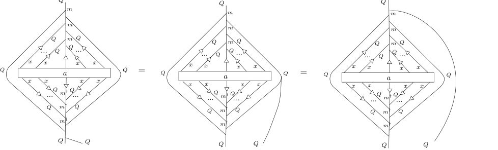
<figcaption class="paper-figure-caption"><b>Fig 2.</b> Figure 2: The Frobenius conditions ensure that scr(a) is a right Q-module map. Similarly, it is also a left Q-module map.</figcaption>
</figure>
<figure class="paper-figure-card">
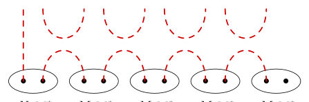
<figcaption class="paper-figure-caption"><b>Fig 3.</b> Figure 4: Each oval denotes a lattice site, the red dashed lines denote the interactions. N ∈Repψ(G) on the boundary site N ⊗M ∗is a dangling edge mode.</figcaption>
</figure>
<figure class="paper-figure-card">
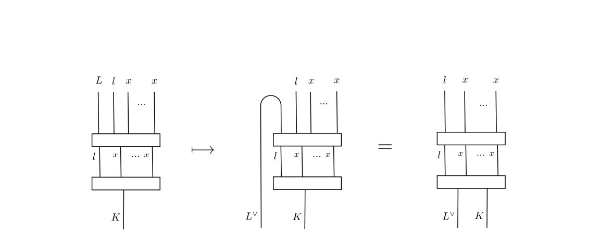
<figcaption class="paper-figure-caption"><b>Fig 4.</b> Figure 5: The bending isomorphism allows comparing ReaDHR(L) ⊠ReaBCond(K) to ReaBCond(L∨(K)).</figcaption>
</figure>

**Summary.** This theoretical work establishes a comprehensive bulk-boundary correspondence for one-dimensional gapped quantum phases with generalized symmetries. By employing operator algebras and advanced category theory, the authors rigorously prove that the bulk topological order can be mathematically derived from the structure of the boundary physics via the enriched center construction. This provides a powerful classification tool for understanding how edge states are dictated by the bulk material properties.

**Why it may be interesting.** The rigorous mathematical machinery developed—connecting algebraic structures like centers of enriched categories to physical observables—provides a powerful, general tool for classifying topological phases beyond simple symmetry groups, which is highly relevant for understanding correlated electron systems.

Detailed structure

**Main problem.** The paper develops a rigorous operator-algebraic framework to establish the bulk-boundary correspondence for $(1+1)$D gapped quantum phases possessing categorical symmetry.

**Main result.** It proves that the enriched monoidal category describing the bulk topological structure is equivalent to the enriched center of the category describing the boundary physics. This provides a complete mathematical classification linking bulk and edge properties.

**Method.** The methodology relies on working in the thermodynamic limit using $C^*$-algebras, constructing Hamiltonians via commuting-projector interactions, and employing advanced tools from enriched category theory (DHR bimodules, centers of categories).

**Model / system.** The focus is on one-dimensional gapped quantum spin chains exhibiting categorical symmetry. The analysis uses abstract mathematical structures like unitary fusion categories ($\mathcal{C}$) and module categories ($\mathcal{M}$), rather than a single concrete Hamiltonian.

**Key observables.** Ground states of constructed Hamiltonians, the boundary DHR category, and the bulk/boundary topological field theories (SymTFTs).

**Important parameters / regimes.** The system is analyzed in the thermodynamic limit; symmetry structure is governed by the fusion category $\mathcal{C}$.

**Assumptions / limitations.** The framework assumes the existence of a unitary fusion category and an indecomposable semisimple right module category, allowing for the construction of quasi-local algebras.

**Figures summary.** Figure 6 summarizes the complete description of 1D symmetric gapped phases, relating four components: bulk SymTFT, boundary SymTFT, the category of boundary conditions ($	ext{BCond}$), and the underlying algebraic structures.

**Paper structure.** The paper builds from general concepts in infinite lattice algebras (AF algebras) to specific constructions for fusion spin chains. It then systematically establishes equivalences between operator-algebraic descriptions of boundary physics (via DHR categories) and abstract categorical definitions, culminating in the central theorem relating bulk structure to the center of the boundary structure.

Abstract

We develop an operator-algebraic framework for boundary conditions and bulk-boundary correspondence in one-dimensional gapped phases with categorical symmetry. Working directly in the thermodynamic limit, we construct half-infinite fusion spin chains and commuting-projector boundary Hamiltonians from a unitary fusion category $\mathcal{C}$, an indecomposable semisimple right $\mathcal{C}$-module category $\mathcal{M}$, a Q-system $Q\in\mathcal{C}$ specifying the bulk phase, and a right $Q$-module $K\in\mathcal{M}_{Q}$, regarded as an object of $\mathcal{M}_{Q}^{\mathrm{op}}$, specifying the boundary. We prove that these Hamiltonians have unique ground states and that the resulting realization functor $\mathcal{M}_{Q}^{\mathrm{op}}\to\mathrm{BCond}$ is an equivalence, so simple boundary conditions are classified by simple objects of $\mathcal{M}_{Q}$ and general boundary conditions by their finite direct sums. We also give a microscopic formulation of the boundary symmetry topological field theory using DHR bimodules of the boundary quasi-local algebra. For a half-infinite fusion spin chain, the boundary DHR category is monoidally equivalent to $(\mathcal{C}_{\mathcal{M}}^{\vee})^{\mathrm{rev}}$, and the canonical action of the bulk DHR category on it agrees with the categorical action of $Z_1(\mathcal{C}^{\mathrm{rev}})$. Finally, we identify the action of the boundary DHR category on boundary conditions with the categorical action of $(\mathcal{C}_{\mathcal{M}}^{\vee})^{\mathrm{rev}}$ on $\mathcal{M}_{Q}^{\mathrm{op}}$. This yields a one-dimensional bulk-boundary correspondence: the enriched monoidal category describing the bulk is the enriched center of the enriched category describing the boundary.

[↑ back to top](#top)

### [Evidence for Multiband Superconductivity in 2H-NbSeS](http://arxiv.org/abs/2606.19107v1)

**Authors:** K. Yadav, M. Lamba K. Bhattacharya, M. Majumder, S. Patnaik  
**Type:** both · **Category:** strongly correlated electrons · **PDF:** <https://arxiv.org/pdf/2606.19107v1>  
**Analysis basis:** full PDF text, analyzed in chunks

↔ Scroll figures horizontally

<figure class="paper-figure-card">
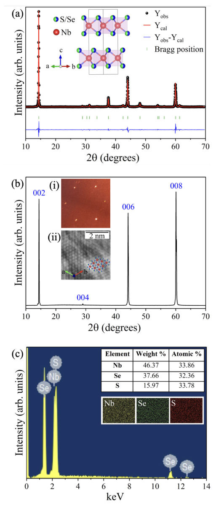
<figcaption class="paper-figure-caption"><b>Fig 1.</b> FIG. 1. (a) Rietveld refinement of the PXRD pattern of 2H- NbSeS; the inset shows the crystal structure of the unit cell. (b) XRD pattern of a NbSeS single crystal showing only (00l) reflections. Inset (i) shows the Laue back-reflection pattern and inset (ii) the HRTEM image revealing the atomic lattice of 2H-NbSeS, overlaid with the simulated crystal structure projected along the ab-plane. (c) EDX spectrum recorded from a 2H-NbSeS single crystal, with the table summariz- ing the mean atomic composition of the constituent elements. The insets present the corresponding elemental distribution maps for the selected region.</figcaption>
</figure>
<figure class="paper-figure-card">
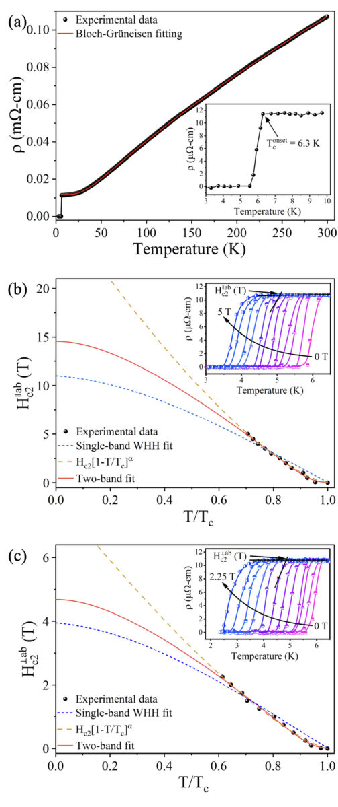
<figcaption class="paper-figure-caption"><b>Fig 2.</b> FIG. 2. (a) Zero-field electrical resistivity as a function of temperature, along with a Bloch-Gr¨uneisen fit in the metallic- state region. The inset shows an enlarged view of the su- perconducting transition at 6.3 K. (b) and (c) Temperature dependence of the upper critical fields H∥ab c2 and H⊥ab c2 ex- tracted from the field-dependent resistivity data [insets of (b) and (c)]. Solid and dashed curves represent different theoret- ical fits as described in the text.</figcaption>
</figure>
<figure class="paper-figure-card">
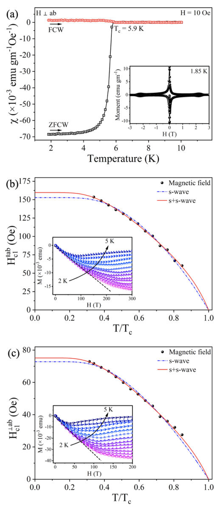
<figcaption class="paper-figure-caption"><b>Fig 3.</b> FIG. 3. (a) Temperature-dependent magnetization (ZFCW- FCW) measured in an applied field of 10 Oe with H ⊥ab. The inset shows the field-dependent magnetization (M-H loop) at 1.85 K. (b) and (c) Temperature dependence of the lower criti- cal field Hc1(T) extracted for H ∥ab and H ⊥ab, respectively [insets of (b) and (c)]. The dash-dotted blue lines correspond to single-gap s-wave fits and the solid red lines to two-gap s + s wave fits.</figcaption>
</figure>
<figure class="paper-figure-card">
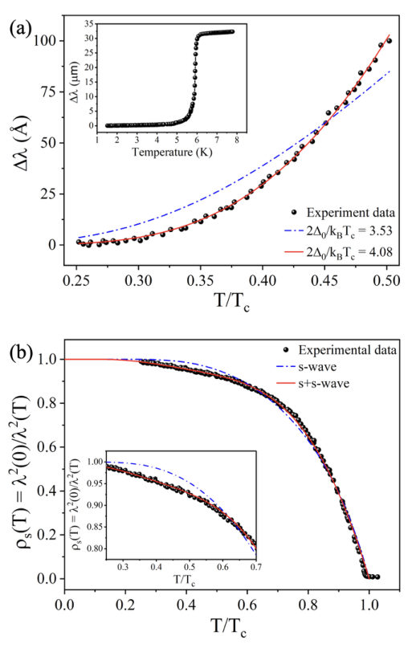
<figcaption class="paper-figure-caption"><b>Fig 4.</b> FIG. 4. (a) Low-temperature penetration-depth varia- tion ∆λ(T) as a function of reduced temperature down to 0.25 Tc, fitted with exponential models [solid red line with 2∆0/kBTc = 4.08 and dot-dashed blue line with 2∆0/kBTc = 3.53]. The inset shows the variation of the rf penetration depth as a function of temperature in zero applied magnetic field. (b) Superfluid density ρs(T) = λ2(0)/λ2(T) derived from λ(T), fitted over the full temperature range using both single-gap and s + s wave models. The inset highlights the low-temperature region.</figcaption>
</figure>
<figure class="paper-figure-card">
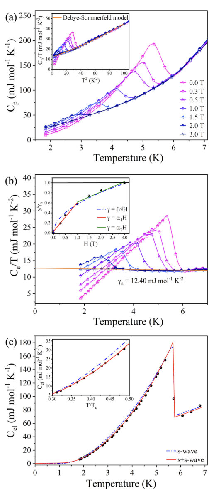
<figcaption class="paper-figure-caption"><b>Fig 5.</b> FIG. 5. (a) Temperature dependence of the specific heat Cp(T) measured under various magnetic fields. The inset shows Cp/T versus T 2 along with the Debye-Sommerfeld fit (solid orange line). (b) Ce/T versus T at different magnetic fields; the inset shows the field dependence of the Sommerfeld coefficient γ(H). (c) Temperature dependence of the elec- tronic specific heat Ce(T) at zero field, fitted with single-gap s-wave and two-gap s + s wave models.</figcaption>
</figure>

**Summary.** This work investigates superconductivity in 2H-NbSeS, a material engineered to suppress CDW order. By analyzing critical fields, specific heat, and magnetic penetration depth across multiple probes, the authors conclusively demonstrate that the superconducting state requires a two-band model. This provides strong evidence for an intrinsic multiband pairing mechanism, distinguishing it from competing electronic instabilities.

**Why it may be interesting.** The rigorous differentiation between intrinsic pairing mechanisms (multiband) and competing orders (CDW) using quantitative measurements is highly relevant for understanding complex many-body ground states in condensed matter physics.

Detailed structure

**Main problem.** The primary challenge is distinguishing intrinsic multiband superconductivity from spurious effects caused by competing electronic orders, such as Charge Density Wave (CDW) formation, in layered superconductors.

**Main result.** The superconducting properties of 2H-NbSeS are robustly described by a two-band model, indicating an intrinsic, strongly asymmetric multiband pairing mechanism rather than CDW-related artifacts.

**Method.** A combination of advanced experimental measurements (critical fields, specific heat, penetration depth) and theoretical modeling (single-gap vs. two-band fitting) was employed to analyze the superconducting state.

**Model / system.** The study focuses on single-crystalline 2H-NbSeS, a mixed-chalcogen analogue of 2H-NbSe2. The system is characterized by intrinsic substitutional disorder (Se/S), which suppresses long-range CDW order while preserving the layered crystal structure.

**Key observables.** Upper and lower critical magnetic fields ($H_{c2}, H_{c1}$), superfluid density ($
ho_s(T)$), electronic specific heat ($C_e(T)$), and superconducting gap values ($\Delta_1, \Delta_2$).

**Important parameters / regimes.** The in-plane upper critical field exceeds the weak-coupling Pauli limit; the analysis requires a dirty-limit two-band model with a large diffusivity ratio.

**Assumptions / limitations.** It is assumed that random substitutional disorder effectively suppresses long-range CDW order, thereby isolating the intrinsic superconducting pairing mechanism for investigation.

**Figures summary.** Figures show XRD patterns confirming crystal structure and stoichiometry; subsequent figures analyze $H_{c2}(T)$ curvature requiring a two-band fit, and $\Delta\lambda(T)$ and $C_e(T)$ data are used to confirm the necessity of a two-gap model.

**Paper structure.** The paper progresses by first establishing the clean structural platform (disorder suppressing CDW), then using transport measurements ($H_{c2}$) to necessitate a two-band description, and finally confirming this multiband nature through multiple thermodynamic probes like specific heat and penetration depth ($\Delta\lambda$).

Abstract

The nature of superconductivity in 2H-NbSe2 has generated sustained debate in the recent past. While angle resolved photoemission spectroscopy data have been interpreted as evidence for multiband superconductivity, the data from scanning tunneling microscope experiments relate to strongly anisotropic single-band superconductivity. In the later case, the charge density wave (CDW) order mimics the multigap character. Because the CDW reconstructs the Fermi surface and modifies the superconducting gap distribution, disentangling intrinsic multiband pairing from CDW-related effects is challenging. To address this issue, we investigate single-crystalline 2H-NbSeS, a mixed-chalcogen analogue of 2H-NbSe2 in which random Se/S substitution suppresses long-range CDW order while preserving the layered crystal structure P63/mmc. The material becomes superconducting below 6.0 K with moderate magnetic anisotropy. The upper critical field exhibits a pronounced upward curvature that cannot be described within a single-band framework but is well captured by a dirty-limit two-band model with a large diffusivity ratio. This indicates strong band-dependent scattering. The in-plane upper critical field exceeds the weak-coupling Pauli limit. Measurements of the lower critical field, superfluid density, and electronic specific heat are consistent with an interpretation of a fully gapped superconducting state with two nodeless gaps of different magnitudes.

[↑ back to top](#top)

### [Exponentially many initializations to avoid barren plateaus](http://arxiv.org/abs/2606.18515v1)

**Authors:** Ankit Kulshrestha, Ricard Puig, Diego García-Martín, Lukasz Cincio, Ilya Safro, Zoë Holmes, M. Cerezo  
**Type:** theory · **Category:** quantum information and computing · **PDF:** <https://arxiv.org/pdf/2606.18515v1>  
**Analysis basis:** full PDF text, analyzed in chunks

↔ Scroll figures horizontally

<figure class="paper-figure-card">
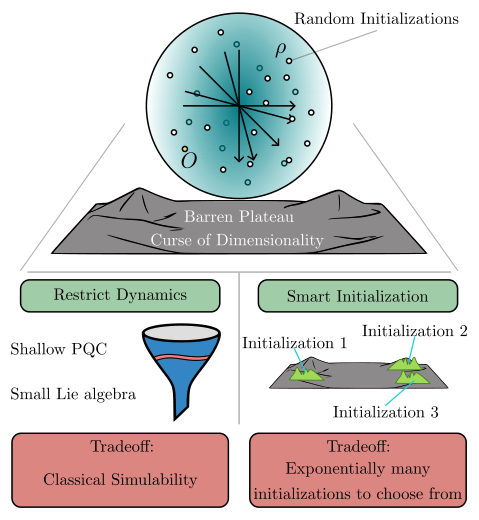
<figcaption class="paper-figure-caption"><b>Fig 1.</b> Figure 1. Schematic picture of the main message of this work. Barren plateaus arise as an average-case consequence of exploring an exponentially large space, leading to concentration of loss functions and gradients. One way to avoid this problem is to restrict the dynamics to a smaller effective subspace, e.g., through shallow local structure, symmetries, or small Lie al- gebras; however, this can make the model more amenable to classical simulation. A different route is to use smart parame- ter initializations, which do not necessarily shrink the accessible space, but instead bias optimization toward special trainable pockets of the landscape. The tradeoff is then no longer only how to...</figcaption>
</figure>
<figure class="paper-figure-card">
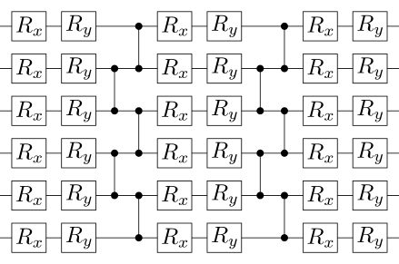
<figcaption class="paper-figure-caption"><b>Fig 2.</b> Figure 2. Circuit ansatz. We consider a PQC composed of single-qubit Rx and Ry rotations followed by nearest-neighbor CZ entangling gates. The example shown corresponds to n = 6 qubits and L = 3 layers.</figcaption>
</figure>
<figure class="paper-figure-card">
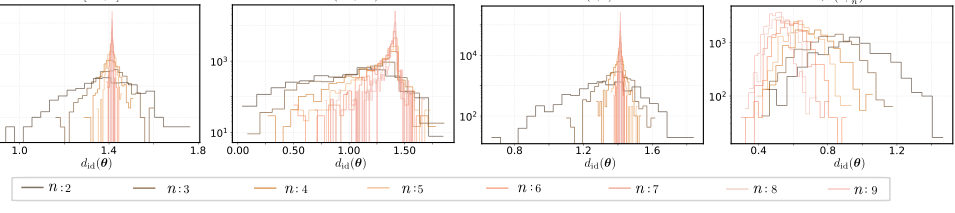
<figcaption class="paper-figure-caption"><b>Fig 3.</b> Figure 3. Distribution of did(θ) for several initialization families and system sizes. We consider an L = 4 layered circuit (see Fig. 2), where the parameters are initialized i.i.d. from a uniform distribution Unif[−π, π], a Beta distribution Beta(α, β), and two Gaussian initializations N(0, σ), with σ = 1 and σ = 1/√n.</figcaption>
</figure>
<figure class="paper-figure-card">
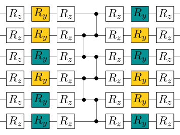
<figcaption class="paper-figure-caption"><b>Fig 4.</b> Figure 4. Circuit ansatz for Max-Cut example. We con- sider a PQC composed of single-qubit Rz, Ry, Rz rotations followed by nearest-neighbor CZ entangling gates. The exam- ple shown corresponds to n = 6 qubits and L = 2 layers. Given that each Ry can be initialized using two distributions, there are 2nL choices, which we here schematically show by coloring gates according to which initialization was used.</figcaption>
</figure>
<figure class="paper-figure-card">
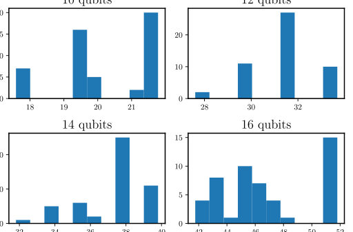
<figcaption class="paper-figure-caption"><b>Fig 5.</b> Figure 5. Distribution of local minima after training for Max-Cut problem. We show a histogram of the final expec- tation value for different system sizes.</figcaption>
</figure>

**Summary.** This work analyzes barren plateaus in VQAs by developing a first-moment diagnostic tool. It proves that avoiding these flat regions is non-unique, allowing for exponentially many distinct initialization strategies. The key takeaway is that choosing an initialization strategy becomes a new challenge: selecting the right trainable 'pocket' among many viable options.

**Why it may be interesting.** It provides a deep theoretical understanding of the geometry of quantum optimization landscapes, suggesting that 'avoiding flatness' is not enough; one must also select the correct basin of attraction among many possibilities.

Detailed structure

**Main problem.** The paper addresses the barren plateau phenomenon in Variational Quantum Algorithms (VQAs), which causes loss functions to become exponentially flat during training.

**Main result.** It demonstrates that avoiding barren plateaus is highly non-unique, allowing for the construction of exponentially many inequivalent initialization strategies. Furthermore, these different initializations can lead the optimization process toward distinct local minima.

**Method.** The analysis introduces a first-moment framework and uses operator diagnostics (like the expected Heisenberg-evolved operator gap) to characterize when an initialization escapes the fully concentrated barren-plateau fixed point.

**Model / system.** The study focuses on Parameterized Quantum Circuits (PQCs) acting on $n$-qubit Hilbert spaces, where the goal is minimizing a loss function derived from quantum expectation values.

**Key observables.** Expected Heisenberg-evolved operator gap ($\xi_{BP,\gamma}$), first moment coefficients ($a$ and $b$), and the squared derivative of the loss function ($\mathbb{E}_	heta \left[ rac{\partial L(	heta)}{\partial	heta} 
ight]^2$).

**Important parameters / regimes.** The number of qubits ($n$), circuit depth ($L$), initialization width ($\varsigma$), and specific graph structures (e.g., constant-odd-degree graphs).

**Assumptions / limitations.** The analysis often assumes the existence of a naïve parameter distribution causing BPs, or relies on simplifying assumptions about graph topologies and gate commutativity for deriving bounds.

**Figures summary.** Figures illustrate schematic trade-offs between restricting dynamics vs. smart initialization; heatmaps show gradient magnitudes across qubits/layers for different initializations; contour plots visualize local gradient landscapes.

**Paper structure.** The paper builds from defining the BP problem to introducing the first-moment diagnostic, proving existence theorems for exponentially many non-concentrating initializations, and finally showing that these distinct initializations lead to measurably different optimization behaviors.

Abstract

Barren plateaus are stated as an average-case phenomenon: pick an ansatz, initialize it naively, and concentration follows. This has led to the common view that a potential cure for barren plateaus is simply to initialize the parameters more carefully. Here we show that the situation is subtler. We introduce a first-moment framework that gives a simple operator-level diagnostic for when an initialization may escape the fully concentrated barren-plateau fixed point, and for comparing the biases induced by different initialization strategies. Our framework recovers several known initialization schemes such as identity and Gaussian initialization, but also shows that barren-plateau avoidance is highly non-unique. Indeed, many shifted, biased, and non-symmetric parameter distributions can avoid concentration, and these choices need not be equivalent. In fact, our results show that one can generate exponentially many families of inequivalent initialization strategies. Then, our numerics indicate that different first-moment-distinct initializations can lead to different attained minima, suggesting that avoiding barren plateaus via smart initializations can trade the exponential concentration problem for the challenge of selecting the right trainable pocket amongst many options.

[↑ back to top](#top)

### [Extracting effective scaling exponents in finite-size hyperuniform systems](http://arxiv.org/abs/2606.18848v1)

**Authors:** Yuan Liu, Xurui Li, Jianxiang Tian, Xunwang Yan, Ge Zhang  
**Type:** theory · **Category:** disordered systems and neural networks · **PDF:** <https://arxiv.org/pdf/2606.18848v1>  
**Analysis basis:** full PDF text, analyzed in chunks

↔ Scroll figures horizontally

<figure class="paper-figure-card">
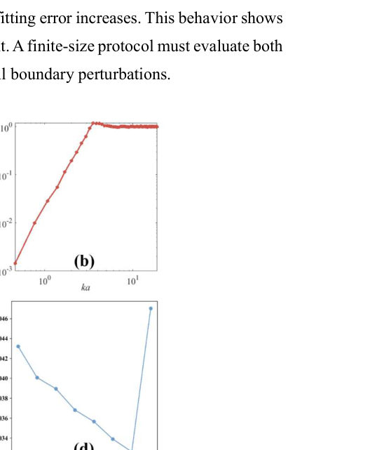
<figcaption class="paper-figure-caption"><b>Fig 1.</b> FIG. 1. Sensitivity of the ensemble-averaged 𝑆(𝑘) fit to the fitting window for the representative system with 𝑁௣= 200 and 𝛼୲୦ୣ୭୰୷= 3.0. Panel (a) shows 𝑆(𝑘) as a function of 𝑘𝑎 on a linear</figcaption>
</figure>
<figure class="paper-figure-card">
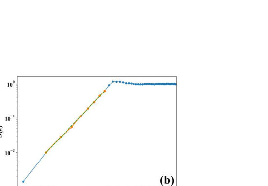
<figcaption class="paper-figure-caption"><b>Fig 2.</b> FIG. 3. Regularized low-𝑘 fitting window for the representative system with 𝑁௣= 200 and 𝛼୲୦ୣ୭୰୷= 3.0. Panel (a) shows the ensemble-averaged 𝑆(𝑘) as a function of 𝑘𝑎 on a linear scale.</figcaption>
</figure>
<figure class="paper-figure-card">
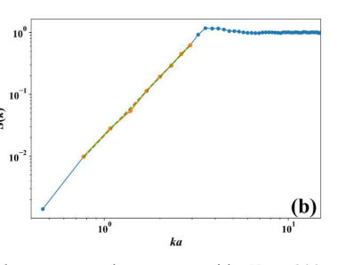
<figcaption class="paper-figure-caption"><b>Fig 3.</b> Figure 3 shows the position of the selected window on the ensemble-averaged</figcaption>
</figure>
<figure class="paper-figure-card">
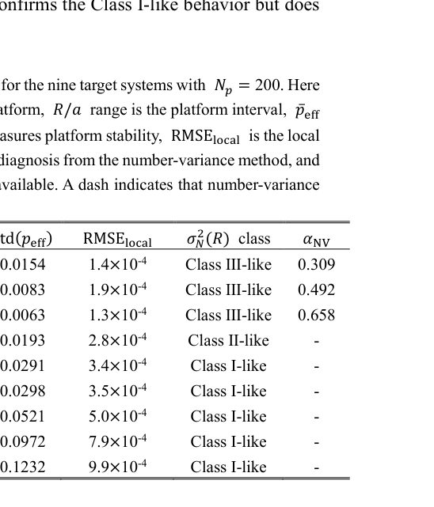
<figcaption class="paper-figure-caption"><b>Fig 4.</b> Figure 4 shows three representative cases, 𝛼୲୦ୣ୭୰୷=0.5, 1.0 and 3.0 corresponding</figcaption>
</figure>
<figure class="paper-figure-card">
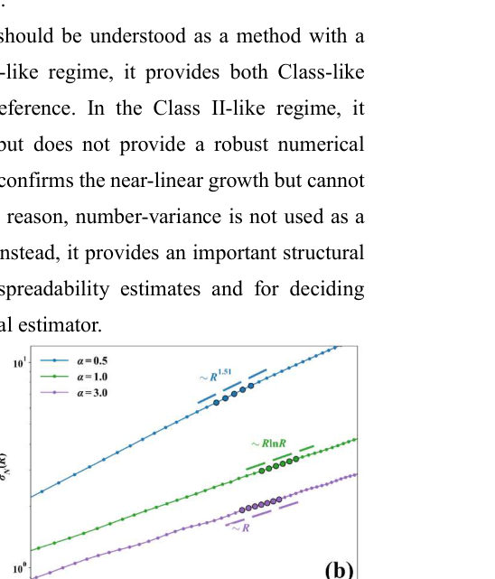
<figcaption class="paper-figure-caption"><b>Fig 5.</b> FIG. 4. Number-variance tail-platform identification for three representative systems. The cases 𝛼୲୦ୣ୭୰୷=0.5, 1.0 and 3.0 correspond to Class III-like, Class II-like, and Class I-like diagnoses,</figcaption>
</figure>

**Summary.** The paper addresses the difficulty of measuring scaling exponents ($\alpha$) in finite hyperuniform systems by developing a sophisticated, multi-method protocol. It combines analysis from structure factors, number variance, and dynamic spreadability to yield a robust 'effective' exponent estimate. This methodology is vital for accurately characterizing structural correlations in real or simulated disordered materials.

**Why it may be interesting.** This work provides advanced analytical tools for characterizing long-range correlations in disordered materials, which is crucial for understanding the physics of amorphous solids or colloidal suspensions where true asymptotic measurements are impossible.

Detailed structure

**Main problem.** The core challenge is accurately estimating the effective scaling exponent ($\alpha$) that characterizes the suppression of long-wavelength density fluctuations in finite-size hyperuniform point configurations.

**Main result.** A robust, method-aware protocol combining structure factor analysis, number variance diagnosis, and spreadability measurements provides a stable estimate for $\alpha$ by assessing internal consistency across different diagnostic tools.

**Method.** The authors developed a joint empirical estimator that synthesizes results from three complementary methods: regularized low-$k$ window screening on $S(k)$, Class-like diagnosis from number variance, and plateau-window analysis of the spreadability excess $E(	au)$.

**Model / system.** The study focuses on theoretical models of hyperuniform point configurations in 2D, often generated by constraining the structure factor $S(k)$ to follow a prescribed power law, allowing for systematic testing across various target exponents $\alpha$.

**Key observables.** Effective scaling exponent ($\alpha$), Structure Factor ($S(k)$), Number Variance ($\sigma^2(R)$), and Spreadability Excess ($E(	au) = S(\infty) - S(t)$).

**Important parameters / regimes.** The analysis is highly dependent on the accessible length scales (low-$k$ cutoff, window size $R$, time $	au$) due to finite-size effects.

**Assumptions / limitations.** It assumes that by combining multiple diagnostic methods and implementing rigorous window selection protocols, one can extract a stable *effective* exponent even when true thermodynamic limits are inaccessible.

**Figures summary.** Figures illustrate the sensitivity of extracted $\alpha$ to fixed fitting windows (Table II) and demonstrate how different physical observables ($S(k)$, $E(	au)$) require specific intermediate-range analysis windows to yield consistent results.

**Paper structure.** The paper systematically introduces the limitations of individual methods, proposes a unified protocol by combining three distinct analyses ($S(k)$, $\sigma^2(R)$, $E(	au)$), and validates this combined approach using benchmark systems and independently generated physical models.

Abstract

Hyperuniform systems strongly suppress long-wavelength density fluctuations, which is quantitatively characterized by the small-wavenumber scaling. In finite samples, however, accurately estimating the hyperuniformity exponent α can be challenging. The inferred value depends strongly on the range of length scales accessible in the measurement, finite-size effects, and the specific characterization method employed, whether based on Fourier-space structure factors, real-space density fluctuations, or dynamical probes such as diffusion spreadability. In particular, the structure-factor method provides the most direct estimate of α, but is sensitive to empirical low-k fitting cutoffs. The number-variance method offers a real-space Class-like diagnosis, but contributes a numerical exponent only when the finite-size data retain Class III-like scaling information. The spreadability method provides a smoother dynamic estimate and reduces configuration-level fluctuations, but requires a physically admissible long-time fitting window. Here, we develop a practical method-aware protocol for robust estimation of the effective scaling exponent α in finite-size hyperuniform point configurations, combining three complementary methods with distinct roles. Our protocol summarizes the method-specific estimates through a joint empirical estimator and reports the internal dispersion among the participating methods to determine the optimal estimate.

[↑ back to top](#top)

### [Gatekeepers and Hallucinations: A Layered Evaluation Framework for LLM-Driven Quantum Circuit Generation](http://arxiv.org/abs/2606.18422v1)

**Authors:** Christopher Coleman, Sharon Marfatia  
**Type:** theory · **Category:** quantum information and computing · **PDF:** <https://arxiv.org/pdf/2606.18422v1>  
**Analysis basis:** full PDF text, analyzed in chunks

↔ Scroll figures horizontally

<figure class="paper-figure-card">
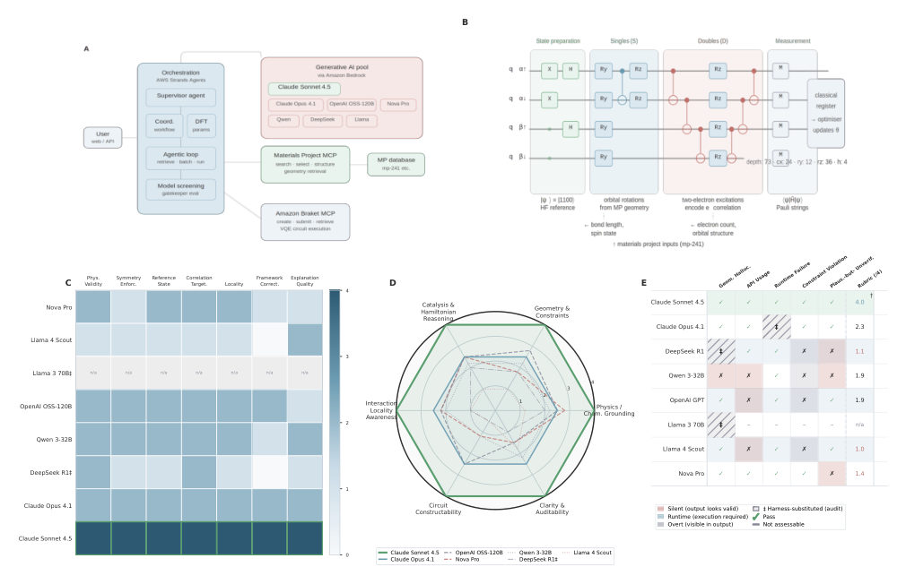
<figcaption class="paper-figure-caption"><b>Fig 1.</b> FIG. 1: System architecture, circuit structure, and screening overview. (A) Agentic pipeline schematic showing tool-mediated Materials Project retrieval via MCP server, multi-agent orchestration (Supervisor, Coordinator, DFT, and Structure agents), Amazon Braket circuit execution, and the generative AI model pool evaluated in this work. (B) Schematic VQE circuit for H2/STO-3G/Jordan–Wigner/UCCSD (mp-241) illustrating how Materials Project data encodes into gate structure: bond length and spin state determine the Hartree–Fock reference initialization; orbital count and electron number determine the singles and doubles excitation layers; the measurement layer feeds the classical optimizer....</figcaption>
</figure>
<figure class="paper-figure-card">
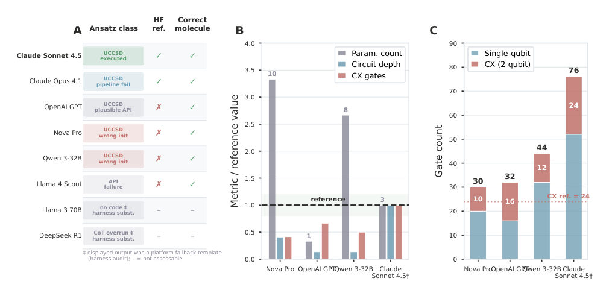
<figcaption class="paper-figure-caption"><b>Fig 2.</b> FIG. 2: Circuit fidelity and ansatz classification (H2/STO-3G/JW/UCCSD, mp-241). (A) Ansatz classification per model from code inspection. Colour encodes failure detectability: pale red = silent (output looks valid), pale blue = runtime (requires execution to detect), grey = overt (visible in output). HF ref. and correct molecule are binary checks. Entries for Llama 3 70B and DeepSeek R1 correspond to harness-substituted templates rather than model generations (Sec. V A, Harness audit). (B) Variational parameter count, circuit depth, and CX gate count for models producing numeric output, normalised to the reference values (dashed line; params = 3, analytic; depth = 73 and CX = 24, Qiskit...</figcaption>
</figure>
<figure class="paper-figure-card">
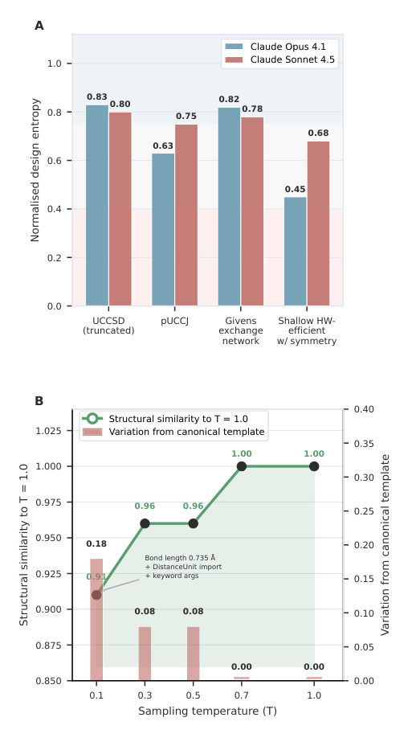
<figcaption class="paper-figure-caption"><b>Fig 3.</b> FIG. 3: Design entropy and temperature stability (model-reported metrics). (A) Normalized design entropy by model and ansatz family, computed from the empirical distribution of distinct (depth, two-qubit gate count, parameter count) tuples across repeated Prompt 2 v3 runs (crystalline silicon, mp-149). Higher entropy indicates broader exploration; lower entropy indicates template-driven generation. (B) Temperature stability of Claude Sonnet 4.5 across T ∈{0.1, 0.3, 0.5, 0.7, 1.0} (Prompt 1, H2/mp-241, n = 5 runs). Left axis: structural similarity to the T = 1.0 reference (green line). Right axis: variation from the canonical template (red bars). All outputs pass a functional checklist of 8...</figcaption>
</figure>
<figure class="paper-figure-card">
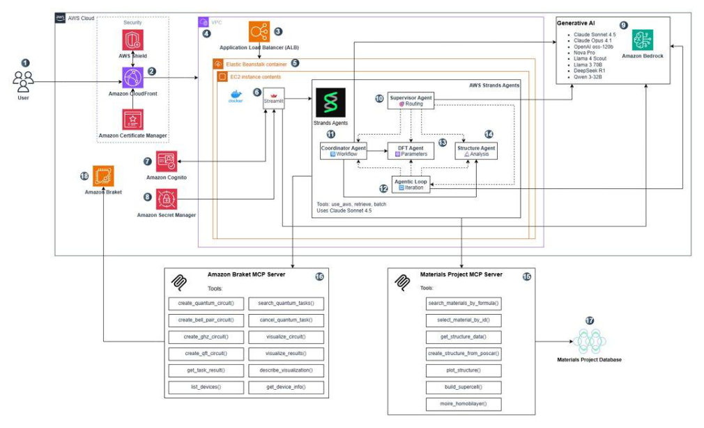
<figcaption class="paper-figure-caption"><b>Fig 4.</b> FIG. 4: AWS service architecture for the QMI multi-agent platform. Numbered components correspond to the request flow described in the text. (1–3) User traffic enters via Amazon CloudFront (with AWS Shield and Certificate Manager for security) and is routed through an Application Load Balancer to the Elastic Beanstalk container. (4–6) Inside the EC2 instance, a Docker-containerised Streamlit application hosts the Strands Agents runtime. (7–8) Amazon Cognito handles user authentication; AWS Secrets Manager provides secure credential storage for all API keys. (9–10) The Supervisor Agent routes queries to Amazon Bedrock, which provides access to all eight foundation models evaluated in this...</figcaption>
</figure>

**Summary.** This paper introduces a comprehensive, multi-layered evaluation framework designed to rigorously test LLMs generating quantum circuits for chemistry simulations. It moves beyond checking if code runs by assessing physical validity, structural consistency (design entropy), and adherence to known chemical principles. The findings emphasize that robust validation infrastructure is as critical as the models themselves for reliable deployment.

**Why it may be interesting.** This work directly addresses the reliability bottleneck for integrating advanced AI tools into computational physics pipelines, providing necessary validation metrics beyond simple functional testing.

Detailed structure

**Main problem.** The core challenge is developing robust evaluation methods for Large Language Models (LLMs) when they are tasked with generating complex, executable quantum circuits for scientific simulations.

**Main result.** A layered evaluation framework incorporating gatekeeper rubrics, circuit fidelity checks against reference values, and design entropy proves necessary to reliably deploy LLM-assisted quantum circuit generation in practice.

**Method.** The authors propose a three-part validation system: (1) A rubric screening across seven criteria; (2) Fidelity analysis comparing generated circuits to known analytical/reference implementations; and (3) Design entropy measurement for behavioral consistency.

**Model / system.** The focus is on Variational Quantum Eigensolvers (VQE) applied to molecular systems, specifically using the $	ext{H}_2/	ext{STO-3G}/	ext{Jordan–Wigner}/	ext{UCCSD}$ mapping. The evaluation platform itself is an agentic pipeline integrating LLMs with quantum chemistry workflows.

**Key observables.** Five failure modes (e.g., geometry hallucination, nonexistent API usage), rubric scores (0-4), circuit depth/gate counts, and design entropy values.

**Important parameters / regimes.** The fidelity of the generated ansatz relative to analytical expectations; temperature ($T$) for testing model stability.

**Assumptions / limitations.** The framework assumes that LLM failures can be categorized structurally rather than being tied to a specific model architecture. A significant limitation noted is the reliance on single-rater scoring for rubrics.

**Figures summary.** Figures illustrate the system architecture, VQE circuits, rubric heatmaps showing model performance across criteria, and radar plots/graphs detailing design entropy and temperature stability of generated code.

**Paper structure.** The paper introduces the problem space (LLMs in quantum workflows), details the layered evaluation framework components (gatekeeper, fidelity check, entropy), presents empirical results using multiple models on molecular systems, and concludes with a discussion on infrastructure auditing and future improvements.

Abstract

As large language models (LLMs) become embedded in quantum simulation workflows (IDE copilots, notebook assistants, agentic pipelines), evaluation must move beyond functional correctness to anticipate and catch structured failures before they propagate through expensive pipelines. We present a layered evaluation framework for materials-informed Variational Quantum Eigensolver (VQE) circuit generation: (i) a gatekeeper screening rubric across seven physical and framework criteria; (ii) a circuit fidelity analysis comparing model outputs against analytical and reference-implementation values for H2/STO-3G/Jordan-Wigner/UCCSD, with ansatz classification and gate-composition breakdown; and (iii) design entropy, a run-to-run behavioral consistency metric. We surface a taxonomy of five distinct LLM failure modes (geometry hallucination, nonexistent API usage, runtime integration failures, constraint violations, and plausible-but-unverifiable output), each with distinct detectability profiles and structural to the task rather than to any one model. A forensic audit of the evaluation platform's own source code further establishes that two apparent model failures originated in the harness through silent fallback-template substitution, demonstrating that evaluation infrastructure belongs inside the same trust boundary as the models it tests. Applied across multiple foundation models on a Materials Project integrated pipeline, the framework shows that gatekeeper-style validation is necessary, not optional, for reliable deployment.

[↑ back to top](#top)

## Secondary cond-mat archives

*Papers from cond-mat.mtrl-sci, mes-hall, other, soft, supr-con. These archives are de-prioritized — they appear at the end regardless of relevance score.*

### Relevant in secondary archives (24)

### [Cavity Enhanced Superconductivity](http://arxiv.org/abs/2606.19171v1)

**Authors:** Hanxiang Zhang, Zexin Feng, I-Te Lu, Zhiwei Li, Songhao Guo, Qiuyu Shang, Dening Luan, Mingcheng Panmai, Kenji Watanabe, Takashi Taniguchi, Angel Rubio, Weibo Gao  
**Type:** experiment · **Category:** other · **PDF:** <https://arxiv.org/pdf/2606.19171v1>  
**Analysis basis:** full PDF text, analyzed in chunks
**Topic relevance:** 🔥 `analog quantum simulation` **4/5** · 🔥 `correlated cavity matter` **4/5** · `driven-dissipative phase transition` **3/5** · `methods for driven-dissipative` **3/5** · `quantum optics experiment` **3/5** · `QC/QI experiment` **2/5** · `non-equilibrium dynamics` **2/5** · `spintronics-quantum-optics interface` **2/5** · `Keldysh / 2PI / non-Gaussian methods` **1/5** · `Kondo & dissipative impurity` **1/5** · `Tavis-Cummings & cavity-many-emitter` **1/5** · `correlated / nonlocal dissipation` **1/5** · `entanglement & information structure` **1/5** · `exotic spin models in light-matter` **1/5** · `interference shaping light` **1/5** · `non-equilibrium universality` **1/5**

↔ Scroll figures horizontally

<figure class="paper-figure-card">
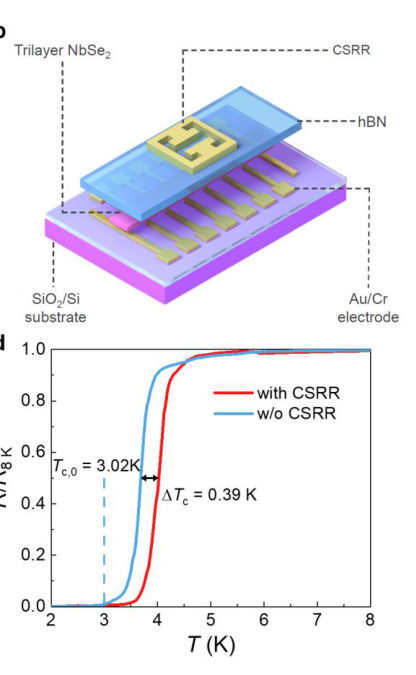
<figcaption class="paper-figure-caption"><b>Fig 1.</b> Figure 1 | Enhancement of superconductivity in NbSe2 coupled to a complementary split-</figcaption>
</figure>
<figure class="paper-figure-card">
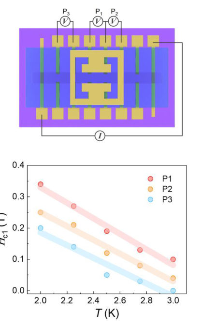
<figcaption class="paper-figure-caption"><b>Fig 2.</b> Figure 2 | Dependence of superconducting enhancement on the local cavity</figcaption>
</figure>
<figure class="paper-figure-card">
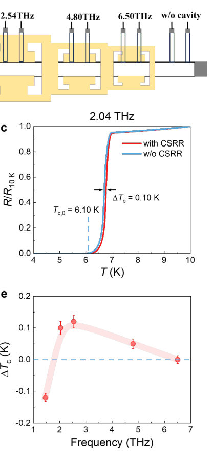
<figcaption class="paper-figure-caption"><b>Fig 3.</b> Figure 3 | Dependence of superconducting enhancement on the frequency of CSRR. a,</figcaption>
</figure>

**Summary.** The authors experimentally demonstrate that coupling a superconductor ($	ext{NbSe}_2$) to an engineered terahertz cavity (CSRR) can enhance its critical temperature. By tuning the cavity resonance near $2 	ext{ THz}$, they achieved up to a 10% increase in $T_c$, establishing cavity engineering as a powerful tool for tailoring quantum materials.

**Why it may be interesting.** This work directly bridges cavity quantum electrodynamics principles into condensed matter physics by using engineered electromagnetic environments to tune fundamental superconducting properties, which is highly relevant for open quantum systems research.

Detailed structure

**Main problem.** To experimentally demonstrate that vacuum electromagnetic fluctuations, controlled via cavity engineering, can enhance superconductivity in quantum materials.

**Main result.** The superconducting transition temperature ($T_{c,0}$) of few-layer $	ext{NbSe}_2$ increased by approximately 10% when coupled to a terahertz cavity resonant at $2.04 	ext{ THz}$.

**Method.** Transport measurements (R-T curves) were performed on superconducting films integrated with a complementary split-ring resonator (CSRR) structure, combined with field simulations.

**Model / system.** The system involves few-layer niobium diselenide ($	ext{NbSe}_2$), a van der Waals superconductor, coupled to a $	ext{THz}$ cavity formed by a CSRR. The study probes the interaction between superconductivity and local electromagnetic fields.

**Key observables.** Superconducting transition temperature ($T_{c,0}$), lower critical field ($H_{c1}$), and the change in $T_{c,0}$ ($\Delta T_c$).

**Important parameters / regimes.** Resonant frequency of the cavity (e.g., $2.04 	ext{ THz}$), local electric field strength ($\sim 0.8 	ext{ V/m}$), and material thickness.

**Assumptions / limitations.** The enhancement is attributed to the resonant electromagnetic environment, after rigorously ruling out contributions from sample inhomogeneity or charge density wave (CDW) effects via control experiments.

**Figures summary.** Figures show $R$-$T$ curves demonstrating enhanced $T_{c,0}$ at specific cavity resonances ($2.04 	ext{ THz}$) compared to baseline measurements, and plots illustrating the spatial dependence of this enhancement across the cavity field profile.

**Paper structure.** The paper establishes the problem by noting previous suppression results, then presents the experimental setup using $	ext{NbSe}_2$/CSRR. It systematically measures $T_{c,0}$ as a function of location (spatial mapping) and resonance frequency (spectral mapping), concluding that optimal enhancement occurs near $2 	ext{ THz}$.

Abstract

Vacuum electromagnetic fluctuations have recently emerged as a promising means of controlling collective quantum phases. Although cavity-induced modifications of superconductivity have been widely predicted, experimental studies have so far reported only suppression of superconducting properties. Here, by carefully tuning a terahertz cavity to resonate with key phononic modes in few-layer niobium diselenide (NbSe2), we demonstrate cavity-enhanced superconductivity in few-layer NbSe2 coupled to a complementary split-ring resonator. In trilayer NbSe2, the superconducting transition temperature increases by ~10%, from 3.02 K to 3.41 K, when coupled to a cavity resonant at 2.04 THz. The enhancement exhibits a clear spatial dependence following the cavity field profile and a non-monotonic frequency dependence, with maximal enhancement near 2 THz. These results provide experimental evidence that vacuum electromagnetic fields can enhance superconductivity and establish cavity engineering as a powerful platform for tailoring quantum materials.

[↑ back to top](#top)

### [Dynamical axion quasiparticles: an open quantum system](http://arxiv.org/abs/2606.18493v1)

**Authors:** Daniel Boyanovsky  
**Type:** theory · **Category:** statistical mechanics · **PDF:** <https://arxiv.org/pdf/2606.18493v1>  
**Analysis basis:** full PDF text, analyzed in chunks
**Topic relevance:** 🔥 `methods for driven-dissipative` **4/5** · 🔥 `non-equilibrium dynamics` **4/5** · `Keldysh / 2PI / non-Gaussian methods` **3/5** · `correlated / nonlocal dissipation` **3/5** · `driven-dissipative phase transition` **3/5** · `non-equilibrium universality` **2/5** · `Kondo & dissipative impurity` **1/5** · `analog quantum simulation` **1/5** · `exotic spin models in light-matter` **1/5** · `scars & prethermalization` **1/5**

↔ Scroll figures horizontally

<figure class="paper-figure-card">
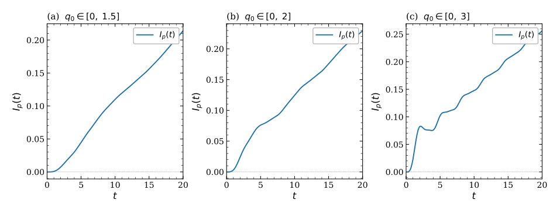
<figcaption class="paper-figure-caption"><b>Fig 1.</b> Figure 1: Ip(t) for ⃗q = 0; β = 1; t ∈[0, 20] with three upper cutoffs. (a) Λp = 1.5; (b) Λp = 2; (c) Λp = 3,</figcaption>
</figure>
<figure class="paper-figure-card">
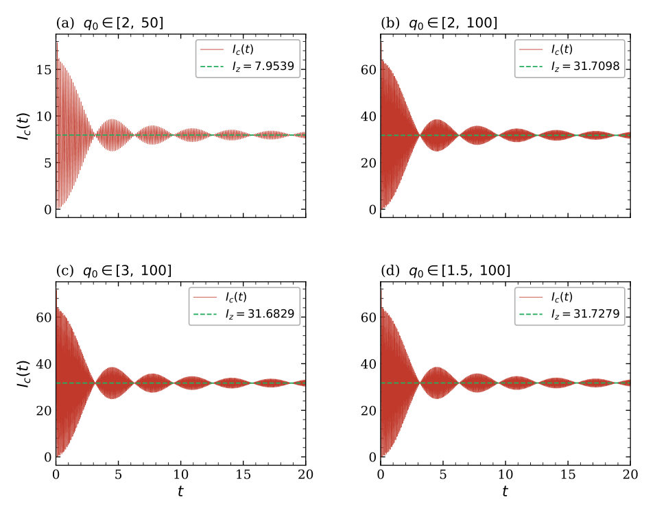
<figcaption class="paper-figure-caption"><b>Fig 2.</b> Figure 2: Ic(t) (red) and Iz (green dashed) for ⃗q = 0; β = 1 and the four cutoffcombinations: (a) [Λp, Λmax] =</figcaption>
</figure>
<figure class="paper-figure-card">
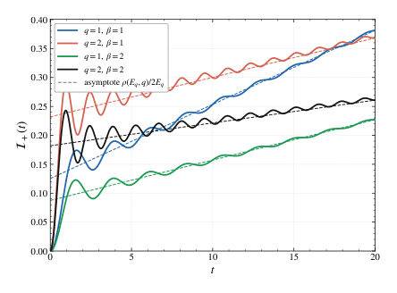
<figcaption class="paper-figure-caption"><b>Fig 3.</b> Figure 3: I+(t) with Eφ(⃗q) ≡ p</figcaption>
</figure>
<figure class="paper-figure-card">
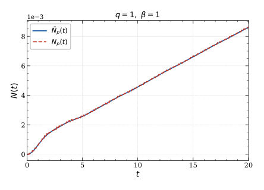
<figcaption class="paper-figure-caption"><b>Fig 4.</b> Figure 4: Np(t) with Eφ(⃗q) ≡ p</figcaption>
</figure>
<figure class="paper-figure-card">
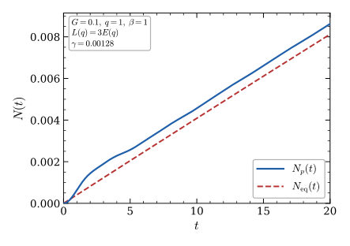
<figcaption class="paper-figure-caption"><b>Fig 5.</b> Figure 5: Np(t) with Eφ(⃗q) ≡ p</figcaption>
</figure>

**Summary.** The paper analyzes the time evolution of dynamical axion quasiparticles coupled to a photon bath using open quantum system formalisms. By deriving and comparing results from a Quantum Master Equation (QME) with those from quantum many-body linear response, it reveals non-Markovian transient effects like anti-Zeno dynamics. This work provides a unified theoretical framework for understanding dissipation in topological materials.

**Why it may be interesting.** This work is highly relevant as it tackles non-equilibrium dynamics in topological systems by bridging two powerful theoretical tools—open quantum system master equations and many-body linear response theory—to study transient phenomena.

Detailed structure

**Main problem.** The study investigates the non-equilibrium dynamics of emergent dynamical axion quasiparticles (DAQ) coupled to a photon bath via a Chern-Simons term, treating it as an open quantum system.

**Main result.** The analysis establishes a direct bridge between the Quantum Master Equation (QME) approach and quantum many-body linear response theory, revealing transient non-Markovian effects like anti-Zeno dynamics.

**Method.** The authors derive and analyze the time evolution using a QME derived with only a partial Markov approximation, comparing it rigorously to results from quantum many-body linear response theory.

**Model / system.** The system involves DAQ quasiparticles coupled to an electromagnetic bath via a Chern-Simons term. The dynamics are modeled by deriving and solving the reduced density matrix evolution equation (QME).

**Key observables.** Coherences, population of the DAQ condensate, topological susceptibility ($\chi_t$), and the expectation value of the induced Chern-Simons density.

**Important parameters / regimes.** Transient time scales are crucial; early time dynamics exhibit quantum anti-Zeno effects, violating Fermi's Golden rule and detailed balance.

**Assumptions / limitations.** The primary approximations include using a partial Markov approximation in the QME and assuming weak coupling ($g^2$ order) when applying factorization techniques from linear response theory.

**Figures summary.** Figures illustrate the time evolution of rate integrals, showing the transition from early-time oscillatory behavior to long-time secular growth consistent with different theoretical limits.

**Paper structure.** The paper progresses by first setting up the open quantum system framework (QME), then deriving equivalent equations using linear response theory, and finally analyzing the resulting time evolution in multiple regimes (transient vs. long-time) to confirm consistency across methods.

Abstract

We study the non-equilibrium dynamics of emergent dynamical axion quasiparticles (DAQ) coupled to a photon bath in equilibrium via a Chern-Simons term as a quantum open system. A quantum master equation (QME) is derived up to second order in this coupling implementing only a \emph{partial} Markov approximation, allowing time dependent rates in the Lindblad (QME). These are determined by the equilibrium correlation functions of the Chern-Simons density, and their time dependence allows us to explore transient dynamics in coherences and population: the formation of the quasiparticle on short time scales and its decay, and the build-up of population with an effective time dependent rate. Early time evolution features quantum \emph{anti} Zeno dynamics with enhanced quasiparticle decay and population growth. These phenomena describe transient violations of Fermi's Golden rule and of \emph{detailed balance}, and are distinct \emph{non-Markovian} effects directly related to the spectral density of the Chern-Simons correlators. We obtain the equation of motion of coherent (DAQ) condensates both with the (QME) and with quantum many body linear response establishing a direct bridge between both methods. As a corollary we obtain the expectation value of the Chern-Simons density \emph{induced} by a (DAQ) condensate in linear response, the topological susceptibility is shown to be proportional to the (DAQ) many body self-energy. We provide a Feynman diagram-based interpretation of approximations invoked in the (QME) and corrections from system-bath correlations in higher order.

[↑ back to top](#top)

### [Controlling magnetic domain walls with supercurrents](http://arxiv.org/abs/2606.19078v1)

**Authors:** Tim Kokkeler, Risto Ojajärvi, F. Sebastian Bergeret, Tero T. Heikkilä  
**Type:** theory · **Category:** other · **PDF:** <https://arxiv.org/pdf/2606.19078v1>  
**Analysis basis:** full PDF text, analyzed in chunks
**Topic relevance:** 🔥 `Keldysh / 2PI / non-Gaussian methods` **4/5** · `methods for driven-dissipative` **3/5** · `spintronics-quantum-optics interface` **3/5** · `driven-dissipative phase transition` **2/5** · `non-equilibrium dynamics` **2/5** · `Frenkel-Kontorova` **1/5** · `correlated / nonlocal dissipation` **1/5** · `exotic spin models in light-matter` **1/5** · `non-equilibrium universality` **1/5**

↔ Scroll figures horizontally

<figure class="paper-figure-card">
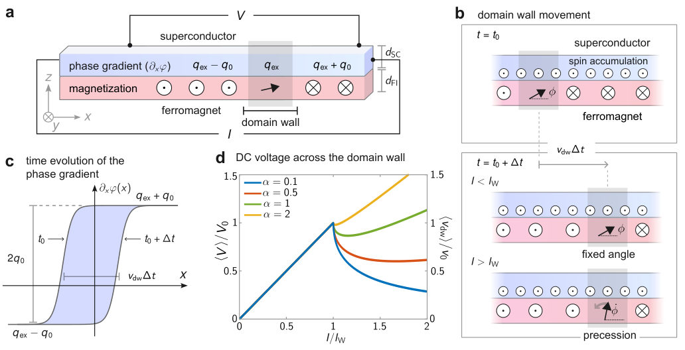
<figcaption class="paper-figure-caption"><b>Fig 1.</b> Figure 1. (a) Superconductor–ferromagnet bilayer. Magnetic proximity effect and SOC induce into the superconductor a helical superfluid momentum q0, whose sign changes across the domain wall. Supercurrent I induces an additional superfluid momentum qex. (b) Spin accumulation generated by the supercurrent via the spin-galvanic effect drives the domain wall (DW) at velocity vdw. Below the Walker breakdown current, I &lt; IW, the wall moves with a fixed shape, while above the Walker breakdown current, I &gt; IW, the spins in the domain wall precess while the wall moves. (c) Snapshots of the superconducting superfluid momentum at two distinct times during DW motion. The voltage V = 2q0vdw across the...</figcaption>
</figure>
<figure class="paper-figure-card">
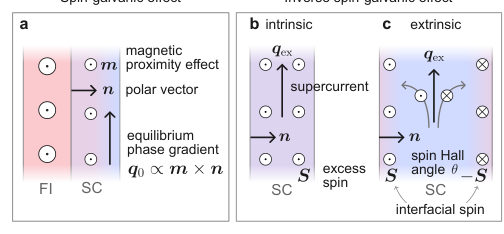
<figcaption class="paper-figure-caption"><b>Fig 2.</b> Figure 2. (a) Generation of equilibrium superfluid momentum by spin-galvanic effect. Magnetic proximity effect induces a Zeeman field in the SC (with direction m). Together with the polar vector n this generates a current, which is canceled by a superfluid momentum q0. (b) and (c) Generation of spin by supercurrent due to inverse spin galvanic effect (ISGE). The intrinsic ISGE generates an excess spin in the bulk of the SC due to broken inversion symmetry. The extrinsic ISGE (spin Hall effect) generates a transverse spin current which shows up as interfacial spin. Both mechanisms involve the polar vector n.</figcaption>
</figure>
<figure class="paper-figure-card">
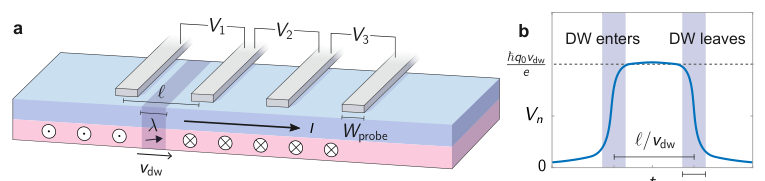
<figcaption class="paper-figure-caption"><b>Fig 3.</b> Figure 3. Electrical detection of the domain wall motion. (a) Setup with multiple voltage probes. (b) Sketch of the time-dependent voltage signal due to domain wall movement. The voltage is maximized when the domain wall is between the two probes. When the domain wall leaves, the signal decays sharply over a time-scale determined by the domain wall speed, and the domain wall size or the superconductor coherence length. After this initial period, a tail remains, which is exponentially suppressed in ∆ kBT , and extends over the charge imbalance relaxation time.</figcaption>
</figure>

**Summary.** This paper theoretically models the control of magnetic domain walls in superconductor/ferromagnetic insulator bilayers using supercurrents. It shows that the superconducting state allows for low-power, measurable motion of these walls by generating an equilibrium superfluid momentum. This work is significant for developing energy-efficient memory elements for cryogenic quantum computing applications.

**Why it may be interesting.** The work provides a detailed theoretical framework connecting superconducting phenomena (supercurrents, superfluid momentum) directly to spintronic memory elements (domain walls), offering insights into energy-efficient quantum/cryogenic device operation.

Detailed structure

**Main problem.** The research aims to develop a fast, reliable magnetic memory technology for cryogenic computing by controlling magnetic domain walls using superconducting supercurrents.

**Main result.** Supercurrent-driven motion of domain walls is predicted, generating a measurable voltage and dissipating power orders of magnitude lower than in normal state setups. The mechanism relies on the generation of an equilibrium superfluid momentum ($q_0$).

**Method.** The analysis employs advanced theoretical techniques including quasiclassical Green's functions (Keldysh formalism), coupled action formulations for superconducting and magnetic systems, and solving coupled differential equations for domain wall dynamics.

**Model / system.** The system is a superconductor/ferromagnetic insulator bilayer. The physics involves coupling between supercurrent-induced spin accumulation (via ISGE) and the magnetization dynamics described by modified LLG equations.

**Key observables.** Domain wall velocity ($v_{dw}$), measurable voltage ($V \propto q_0 v_{dw}$), dissipated power ($P$), and temperature increase ($\Delta T$).

**Important parameters / regimes.** Supercurrent density ($j$), superconducting gap ($\Delta$), spin-orbit coupling strength, Gilbert damping parameter ($\alpha$), and the equilibrium superfluid momentum ($q_0$).

**Assumptions / limitations.** The analysis often assumes an adiabatic limit for motion (low speed) and that the FI is much thinner than the SC to ensure spin-charge coupling dominates over Oersted fields.

**Figures summary.** Figures illustrate the physical setup, domain wall dynamics under varying currents relative to a critical current ($I_W$), snapshots of superfluid momentum during motion, and theoretical derivations relating voltage/power to velocity.

**Paper structure.** The paper builds from establishing the fundamental coupling mechanisms (ISGE, $q_0$ generation) to deriving the coupled equations of motion for domain wall coordinates. It then analyzes the resulting dynamics, power balance ($P=D$), and finally addresses thermal stability by calculating temperature increases due to dissipation.

Abstract

Establishing a versatile, fast and reliable magnetic memory technology is a giant bottleneck for cryogenic computing since present-day room-temperature solutions either cease to work or consume too much power. The long-term goal of superconducting spintronics has been to overcome this bottleneck by generating magnetic memories with equal-spin triplet supercurrent driven through them to control their magnetization direction. This path has been hampered by the short spin relaxation length and strong anisotropy in ferromagnets. Here we show how the supercurrent driven generation of spin accumulation in a superconductor/magnetic insulator bilayer, together with Gilbert damping of magnetization lead to a motion of magnetic domain walls. This manifests as a local voltage across the wall, which allows its position to be identified. Associated with this voltage and the current, there is Joule power which is dissipated via the Gilbert damping. The power required to maintain domain wall motion is orders of magnitude smaller than in the normal state, where most of the power is wasted in producing the current.

[↑ back to top](#top)

### [The electric-field-driven intermediate state of three-dimensional superconductors](http://arxiv.org/abs/2606.18931v1)

**Authors:** Ion Cojocari, Enzo Andreani, Paola Verniere, Florian Pallier, Marc Gabay, Miguel Monteverde, Claire Marrache-Kikuchi, Shamashis Sengupta  
**Type:** both · **Category:** other · **PDF:** <https://arxiv.org/pdf/2606.18931v1>  
**Analysis basis:** full PDF text, analyzed in chunks
**Topic relevance:** 🔥 `non-equilibrium dynamics` **4/5** · `Keldysh / 2PI / non-Gaussian methods` **3/5** · `driven-dissipative phase transition` **3/5** · `methods for driven-dissipative` **3/5** · `non-equilibrium universality` **2/5** · `Frenkel-Kontorova` **1/5** · `correlated / nonlocal dissipation` **1/5**

↔ Scroll figures horizontally

<figure class="paper-figure-card">
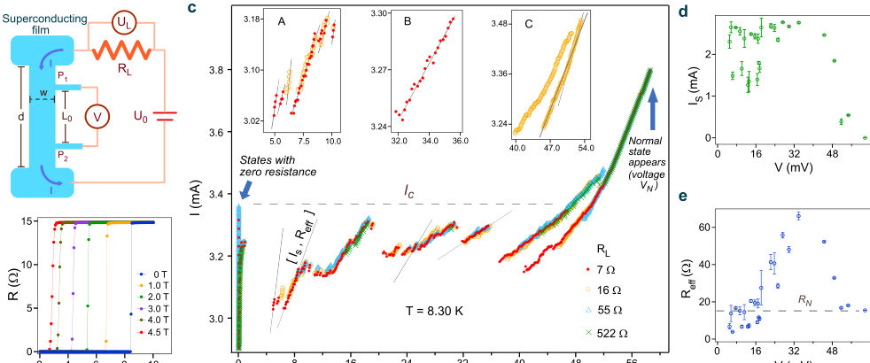
<figcaption class="paper-figure-caption"><b>Fig 1.</b> FIG. 1. (a) Circuit implemented for measuring transport behaviour of the superconducting film without current-biasing the sample. (b) Resistance (R) of the film measured in four-probe configuration as a function of temperature (T), with magnetic fields applied in the perpendicular direction. (c) I-V plots obtained by increasing the dc voltage U0. Insets A, B, C: Close-up view of data points in some selected regions. (d,e) Values of the intercept on current-axis (IS) and effective resistance (Reff), extracted from linear fits at different parts of the I-V curves, plotted as a function of V . Each point corresponds to the mean value of the voltage range used for the linear fit.</figcaption>
</figure>
<figure class="paper-figure-card">
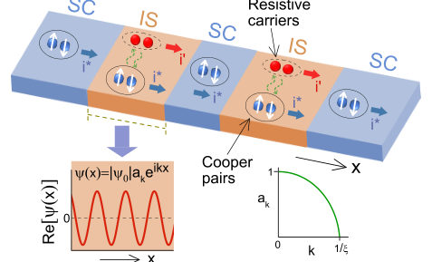
<figcaption class="paper-figure-caption"><b>Fig 2.</b> FIG. 3. When an electric field penetrates into the super- conducting film, it is broken up into alternating regions of intermediate state (IS) and superconducting state (SC). The I-V relations observed by us can be described as an addition of two current components inside IS domains - a supercur- rent (i∗) carried by Cooper pairs and a dissipative current (i′) carried by resistive carriers. It is not implied that the two channels are spatially separated. Voltage gradients lead to dynamical fluctuations of both the amplitude and phase of the superconducting order parameter.</figcaption>
</figure>

**Summary.** This paper investigates the unique 'intermediate state' found in 3D superconductors under applied electric fields. By combining experiments on Nb films with Ginzburg-Landau theory, the authors characterize a nonclassical regime where superconducting supercurrent coexists with measurable dissipative charge transport. This work provides insight into how quantum fluids behave when driven far from thermodynamic equilibrium.

**Why it may be interesting.** This work explores non-equilibrium dynamics in superconductors, which is a key area bridging condensed matter physics with open quantum systems concepts. The analysis of current decomposition into supercurrent and dissipative components touches upon energy dissipation mechanisms far from equilibrium.

Detailed structure

**Main problem.** The study investigates the non-equilibrium electronic state of three-dimensional superconductors when subjected to finite electric fields, focusing on an 'intermediate state' where supercurrent and dissipative charge transport coexist.

**Main result.** The authors demonstrate the existence of an Electric-Field-Driven Intermediate State (EFDIS) characterized by linear segments in I-V curves, suggesting a nonclassical regime distinct from simple parallel conduction models.

**Method.** The research combines experimental measurements on superconducting films with theoretical modeling based on Ginzburg-Landau theory to analyze order parameter fluctuations under bias.

**Model / system.** The system is pristine, unpatterned 3D superconducting films (Nb). The analysis uses the Ginzburg-Landau framework, simplifying the problem to a one-dimensional variation of the order parameter $\psi(x)$ along the length $L$.

**Key observables.** Resistance ($R$), effective conductance ($	ext{g}_{	ext{eff}}$), supercurrent intercept ($I_S$), and the relationship between voltage drop ($v$) and the rate of change of the wavevector ($k$).

**Important parameters / regimes.** Coherence length ($\xi$), applied magnetic field ($H$), temperature ($T$), and source voltage ($U_0$).

**Assumptions / limitations.** The analysis assumes small magnetic fields, neglects the vector potential $\mathbf{A}$ in some derivations, and models the system as having alternating regions of IS and SC.

**Figures summary.** Figures show I-V curves under applied voltage/field, illustrating distinct linear segments corresponding to the EFDIS. Plots also quantify the dependence of $I_S$ and $	ext{R}_{	ext{eff}}$ on bias voltage.

**Paper structure.** The paper moves from experimental observation (measuring $I$-$V$ curves) to theoretical modeling using Ginzburg-Landau theory, deriving relationships between voltage drop and order parameter fluctuations ($v \propto |	ext{d}k/	ext{d}t|$).

Abstract

The coexistence of superconductivity and finite electric fields may enable access to intriguing forms of electronic states. We demonstrate the emergence of an intermediate state in which electric fields penetrate the system while superconductivity still persists. Our measurements reveal a nonclassical regime characterized by the simultaneous presence of supercurrent and dissipative charge transport. This state, realized in a pristine unpatterned three-dimensional system, arises from electric-field-driven order parameter fluctuations. It provides a platform to explore dissipative states of charged quantum fluids far from equilibrium.

[↑ back to top](#top)

### [Time-resolved synchronization analysis of stacked intrinsic Josephson junctions of a cuprate superconductor with frequency-modulated terahertz radiation spectra](http://arxiv.org/abs/2606.18563v1)

**Authors:** Masashi Miyamoto, Keisuke Mizoguchi, Ryota Kobayashi, Nozomi Yagyu, Manabu Tsujimoto, Itsuhiro Kakeya  
**Type:** experiment · **Category:** strongly correlated electrons · **PDF:** <https://arxiv.org/pdf/2606.18563v1>  
**Analysis basis:** full PDF text, analyzed in chunks
**Topic relevance:** 🔥 `non-equilibrium dynamics` **4/5** · `driven-dissipative phase transition` **3/5** · `methods for driven-dissipative` **3/5** · `correlated / nonlocal dissipation` **2/5** · `non-equilibrium universality` **2/5** · `Keldysh / 2PI / non-Gaussian methods` **1/5** · `interference shaping light` **1/5** · `quantum optics experiment` **1/5**

↔ Scroll figures horizontally

<figure class="paper-figure-card">
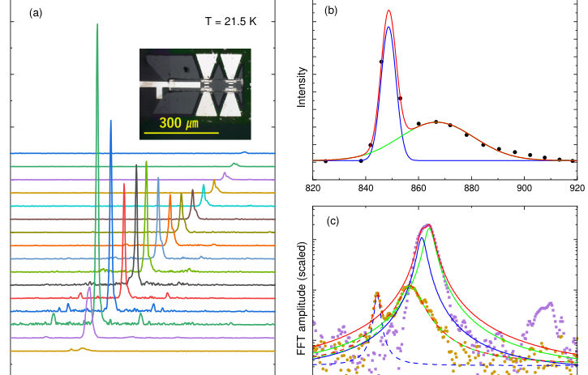
<figcaption class="paper-figure-caption"><b>Fig 1.</b> FIG. 1. (a) Mesa voltage dependence of the radiation spectrum for Vm = 0 at bath temperature</figcaption>
</figure>
<figure class="paper-figure-card">
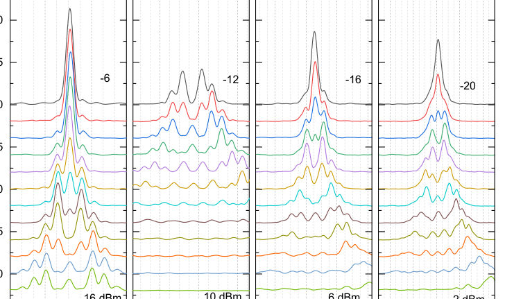
<figcaption class="paper-figure-caption"><b>Fig 2.</b> FIG. 2. Frequency modulated spectrum when superimposed frequency fm is varied from 3.00 GHz</figcaption>
</figure>
<figure class="paper-figure-card">
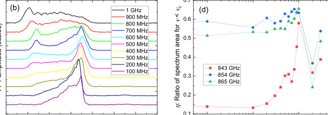
<figcaption class="paper-figure-caption"><b>Fig 3.</b> FIG. 3. (a) FM spectra centred at 865 GHz with VB0 = 2.45 V (broken curves), where IUM(ν) has</figcaption>
</figure>
<figure class="paper-figure-card">
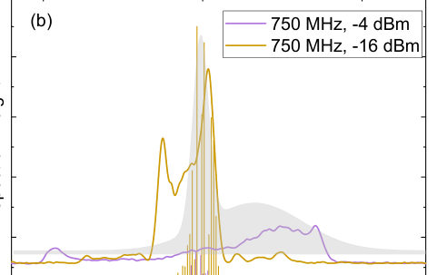
<figcaption class="paper-figure-caption"><b>Fig 4.</b> FIG. 4. (a) Spectra at fm = 100 MHz, Pm = −20 dBm, VB0 = 2.42 (black), 2.36 V (red).</figcaption>
</figure>
<figure class="paper-figure-card">
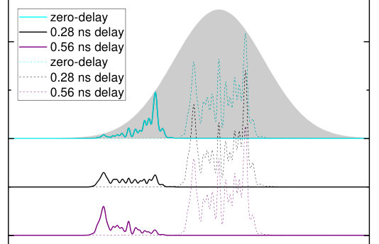
<figcaption class="paper-figure-caption"><b>Fig 5.</b> FIG. 5. Numerically obtained FM spectra at fm = 1 GHz νc = 840 and 870 GHz (solid and broken</figcaption>
</figure>

**Summary.** The study investigates the ultrafast dynamics of Josephson plasma oscillations in cuprate superconductors by analyzing their response to frequency-modulated terahertz radiation. By fitting spectral sidebands with models incorporating a finite synchronization time ($	au_s$), the authors quantify the non-equilibrium plasmon lifetime, providing deep insight into the coupled electrodynamics of these superconducting junctions.

**Why it may be interesting.** This work bridges solid-state superconductivity (high-Tc cuprates) with non-equilibrium quantum dynamics, using THz spectroscopy as a powerful probe for collective plasma oscillations and relaxation processes in strongly correlated materials.

Detailed structure

**Main problem.** The study aims to perform a time-resolved synchronization analysis of stacked intrinsic Josephson junctions (IJJs) in a cuprate superconductor when subjected to frequency-modulated terahertz radiation spectra.

**Main result.** The analysis successfully estimates a synchronized relaxation time ($	au_s \simeq 0.28	ext{ ns}$) by analyzing spectral transformations, revealing sub-nanosecond non-equilibrium dynamics of the coupled Josephson plasma.

**Method.** The researchers used frequency-modulated terahertz spectroscopy on $	ext{Bi}_2	ext{Sr}_2	ext{CaCu}_2	ext{O}_{8+δ}$ IJJs, comparing measured sideband spectra to theoretical models incorporating a finite relaxation time ($	au_s$).

**Model / system.** The physical system is a Josephson Plasma Emitter (JPE) formed by stacked intrinsic Josephson junctions in the cuprate superconductor $	ext{Bi}_2	ext{Sr}_2	ext{CaCu}_2	ext{O}_{8+δ}$, coupled with external patch antennas. The dynamics are governed by nonlinear oscillator behavior exhibiting AC Josephson effect excitation.

**Key observables.** Unmodulated intensity distribution ($I_{\mathrm{UM}}(\omega)$), frequency-modulated spectra ($I_{\mathrm{FM}}(\omega)$), and the spectral intensity ratio $\eta(	ext{fm}, 
u_c)$.

**Important parameters / regimes.** Synchronization relaxation time ($	au_s$), modulation frequencies ($f_m$ up to $1	ext{ GHz}$), and central resonance frequencies ($
u_c \approx 840-870	ext{ GHz}$).

**Assumptions / limitations.** The analysis assumes that the spectral changes observed require introducing a finite relaxation time $	au_s$, which is interpreted as the lifetime of the macroscopic plasmon.

**Figures summary.** Figures illustrate the double Gaussian peak structure in unmodulated spectra, and show how sideband intensities in FM spectra shift and change shape as a function of $f_m$ and assumed $	au_s$.

**Paper structure.** The paper progresses from characterizing the static spectrum ($I_{\mathrm{UM}}(\omega)$) to analyzing the frequency-modulation response. It then introduces theoretical models incorporating finite relaxation times ($	au_s$) to quantitatively reproduce observed spectral transformations across varying $f_m$ regimes.

Abstract

Terahertz radiation from $\text{Bi}_2\text{Sr}_2\text{CaCu}_2\text{O}_{8+δ}$ intrinsic Josephson junctions (IJJs) provides an ideal platform to study the synchronization of a macroscopic quantum system. Here, we present a spectral analysis of a frequency-modulated Josephson plasma emitter coupled with patch antennas. In the unmodulated intensity distribution as a function of radiation frequency $I_{\mathrm{UM}}(ω)$, we observe a double Gaussian peak structure. Crucially, double-peak spectra obtained at a constant bias voltage imply either a rapid temporal distribution of resonances or their simultaneous excitation, driven by the mutual electromagnetic coupling between the IJJ mesa and the antennas. At low modulation frequencies $f_m$, the spectra are well reproduced by the products of $I_{\mathrm{UM}}(ω)$ and frequency combs, yielding a synchronized relaxation time $τ_s \simeq 0.28\text{ ns}$. Incorporating $τ_s$ quantitatively reproduces a drastic spectral transformation observed around $f_m \sim 1\text{ GHz}$, unveiling the sub-nanosecond non-equilibrium dynamics of coupled Josephson plasma.

[↑ back to top](#top)

### [Exclusion Statistics as a Thermodynamic Resource in Quantum Heat Engines](http://arxiv.org/abs/2606.19310v1)

**Authors:** Sampurna Karmakar, Aziz Hasan, Sourin Das  
**Type:** theory · **Category:** statistical mechanics · **PDF:** <https://arxiv.org/pdf/2606.19310v1>  
**Analysis basis:** full PDF text, analyzed in chunks
**Topic relevance:** `exotic spin models in light-matter` **3/5** · `spintronics-quantum-optics interface` **3/5** · `driven-dissipative phase transition` **2/5** · `non-equilibrium dynamics` **2/5** · `non-equilibrium universality` **2/5** · `Frenkel-Kontorova` **1/5** · `Keldysh / 2PI / non-Gaussian methods` **1/5** · `analog quantum simulation` **1/5** · `correlated / nonlocal dissipation` **1/5** · `methods for driven-dissipative` **1/5**

↔ Scroll figures horizontally

<figure class="paper-figure-card">
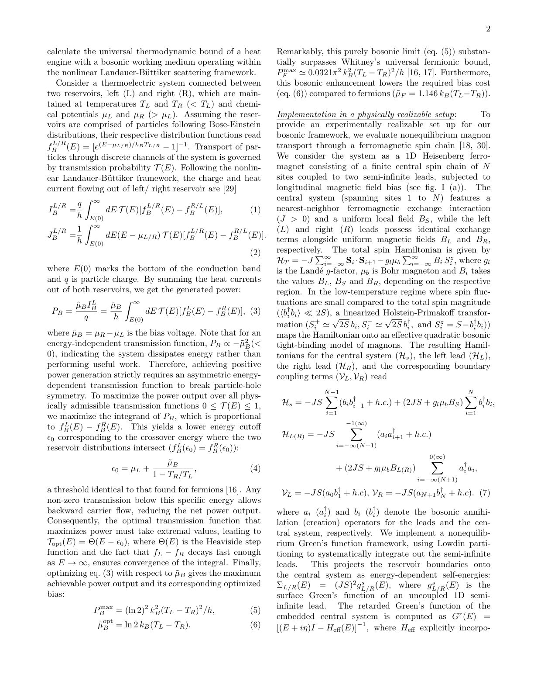
<figcaption class="paper-figure-caption"><b>Fig 1.</b> Low-resolution page preview, page 2</figcaption>
</figure>
<figure class="paper-figure-card">
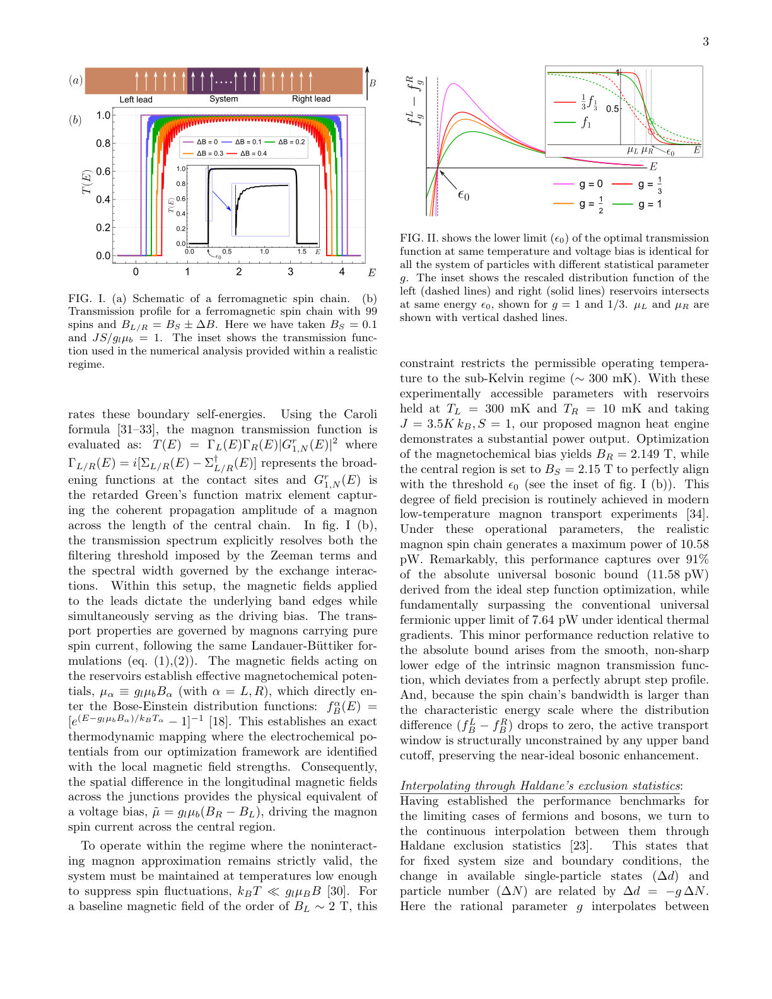
<figcaption class="paper-figure-caption"><b>Fig 2.</b> Low-resolution page preview, page 3</figcaption>
</figure>
<figure class="paper-figure-card">
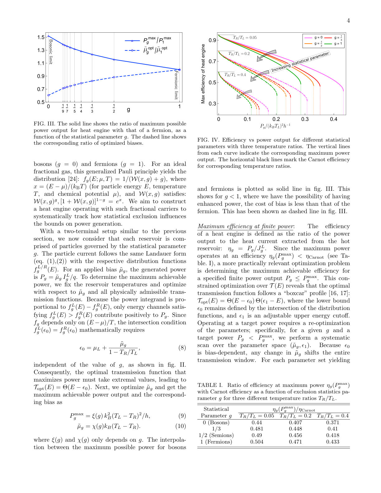
<figcaption class="paper-figure-caption"><b>Fig 3.</b> Low-resolution page preview, page 4</figcaption>
</figure>
<figure class="paper-figure-card">
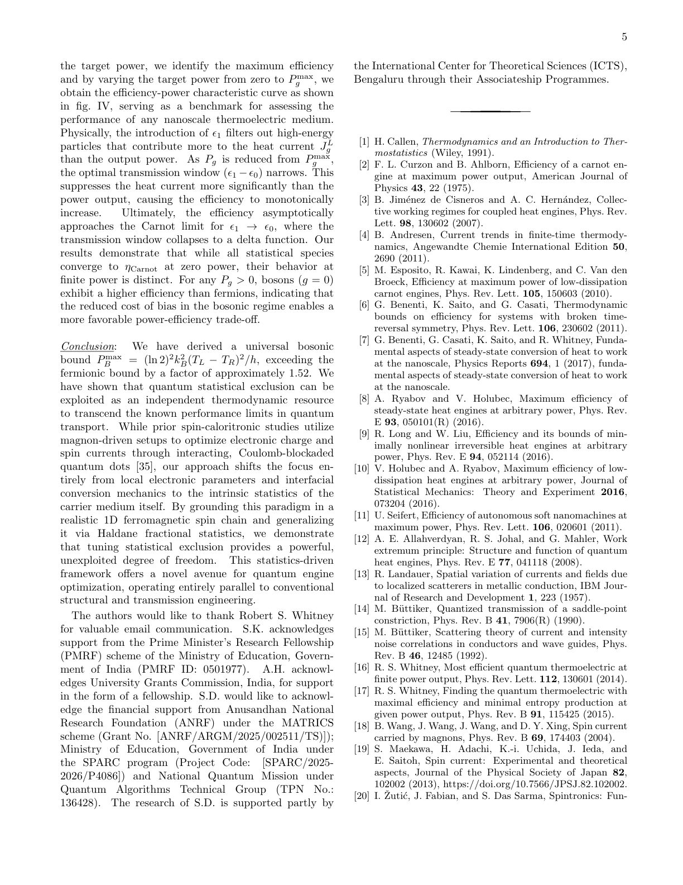
<figcaption class="paper-figure-caption"><b>Fig 4.</b> Low-resolution page preview, page 5</figcaption>
</figure>
<figure class="paper-figure-card">
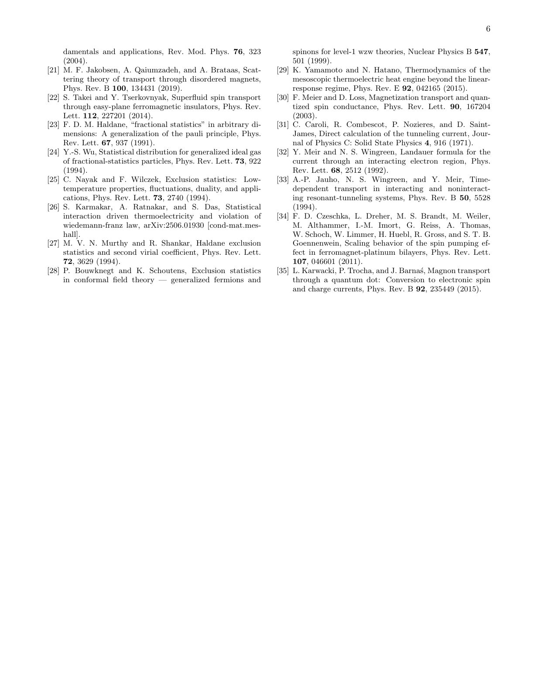
<figcaption class="paper-figure-caption"><b>Fig 5.</b> Low-resolution page preview, page 6</figcaption>
</figure>

**Summary.** This work demonstrates that the statistical nature of charge carriers fundamentally limits the maximum power achievable by quantum heat engines. By modeling magnon transport and incorporating Haldane's fractional exclusion statistics, the authors show that bosonic behavior significantly enhances this limit over fermionic predictions, establishing statistical exclusion as a tunable thermodynamic resource.

**Why it may be interesting.** It connects fundamental concepts of quantum statistics (bosonic/fermionic nature) directly to macroscopic thermodynamic performance metrics like power output in mesoscopic devices.

Detailed structure

**Main problem.** To investigate quantum statistical exclusion as a thermodynamic resource by comparing the maximum power extractable from heat engines operating with different carrier statistics (fermionic vs. bosonic).

**Main result.** Bosonic working media yield strictly enhanced universal maximum power compared to fermionic limits, and Haldane's fractional statistics parameterizes this enhancement continuously.

**Method.** The analysis uses the nonlinear Landauer-Büttiker framework applied to a quantum thermoelectric heat engine model.

**Model / system.** The system is modeled using magnon transport through a ferromagnetic spin chain, analyzed via an effective quadratic bosonic tight-binding Hamiltonian in the low-temperature limit.

**Key observables.** Maximum power ($P_{	ext{max}}$), efficiency ($\eta$), and the ratio of maximum power output vs. fermionic bound.

**Important parameters / regimes.** Haldane exclusion statistics parameter ($g$), temperature difference ($T_L - T_R$), and magnetic field strengths defining chemical potentials.

**Assumptions / limitations.** The analysis relies on the nonlinear Landauer-Büttiker framework, assuming low temperatures for noninteracting magnon approximation.

**Figures summary.** Figures illustrate the schematic of the spin chain setup, transmission profiles showing filtering thresholds, and plots comparing power output ratios versus the statistics parameter g.

**Paper structure.** The paper establishes the theoretical bounds using Landauer-Büttiker formalism, compares fermionic vs. bosonic limits, introduces Haldane interpolation, and applies this framework to a magnon transport model to quantify the enhancement.

Abstract

The maximum power extractable from a quantum thermoelectric heat engine operating with free fermion carriers is bounded by the universal Whitney limit, $P_{\text{fermion}}^{\max} \simeq 0.0321π^2 k_B^2(T_L-T_R)^2/h$. We demonstrate that this bound is not fundamental to quantum heat engines but is instead an artifact of fermionic statistics. Within the nonlinear Landauer-Büttiker framework, a bosonic working medium yields a strictly enhanced universal maximum power, $P_{\text{boson}}^{\max} = (\ln 2)^2\, k_B^2(T_L-T_R)^2/h$, exceeding the fermionic limit by a factor of $(\ln 2)^2/(0.0321π^2) \approx 1.52$. We propose magnon transport through a ferromagnetic spin chain as an experimentally viable bosonic realization. Incorporating Haldane fractional exclusion statistics with parameter $g$ provides a continuous interpolation between the bosonic ($g = 0$) and fermionic ($g = 1$) limits, revealing a monotonic enhancement of maximum power for $g < 1$ at reduced bias cost. These results establish quantum statistical exclusion as a previously unrecognized and independently tunable thermodynamic resource, opening performance regimes inaccessible to conventional carrier-engineering approaches.

[↑ back to top](#top)

### [Bidirectional motion of antiferromagnetic skyrmions driven by competing spin torques](http://arxiv.org/abs/2606.18657v1)

**Authors:** Laichuan Shen, Wang Kang, Xichao Zhang, Qiuping Huang, Yalin Lu, Zhifeng Zhu, Yan Zhou  
**Type:** theory · **Category:** other · **PDF:** <https://arxiv.org/pdf/2606.18657v1>  
**Analysis basis:** full PDF text, analyzed in chunks
**Topic relevance:** `non-equilibrium dynamics` **3/5** · `spintronics-quantum-optics interface` **3/5** · `driven-dissipative phase transition` **2/5** · `non-equilibrium universality` **2/5** · `Frenkel-Kontorova` **1/5** · `Keldysh / 2PI / non-Gaussian methods` **1/5** · `analog quantum simulation` **1/5** · `correlated / nonlocal dissipation` **1/5** · `exotic spin models in light-matter` **1/5** · `methods for driven-dissipative` **1/5**

↔ Scroll figures horizontally

<figure class="paper-figure-card">
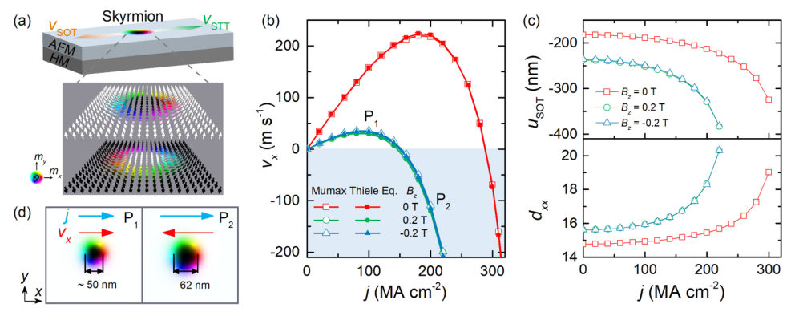
<figcaption class="paper-figure-caption"><b>Fig 1.</b> Figure 1: (a) Top panel: Sketch of the calculation model, composed of an antiferromagnet (AFM) and a heavy metal (HM). The yellow and green arrows represent the velocities of skyrmions driven by SOT and STT, respectively. Bottom panel: Magnetic texture of an antiferromagnetic skyrmion in a two-sublattice model, with colored areas reflecting the in- plane component of magnetization and black (white) areas indicating the magnetizations along the −z (+z) direction. (b) Skyrmion velocity vx as a function of the current density j with different values of magnetic field Bz. Hollow and solid symbols represent the results obtained from micromagnetic simulations and Thiele equation, respectively....</figcaption>
</figure>
<figure class="paper-figure-card">
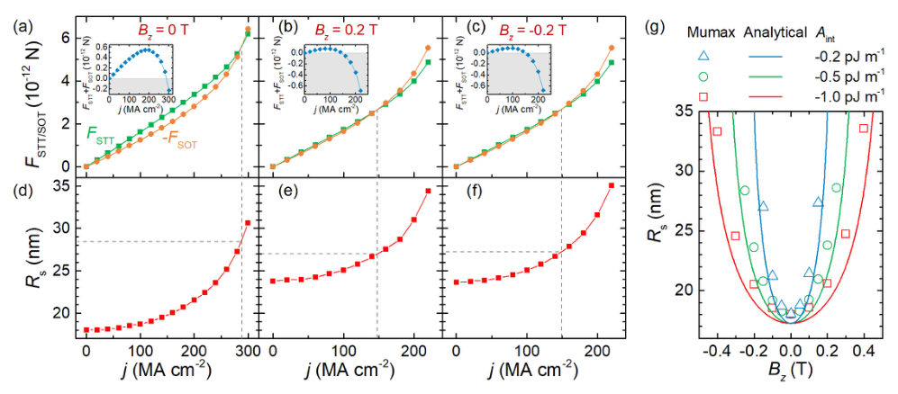
<figcaption class="paper-figure-caption"><b>Fig 2.</b> Figure 2: (a)-(c) Calculated forces induced by STT (FSTT) and SOT (FSOT) as a function of current density j for different values of Bz. The vertical dashed line indicates the current at which the strengths of FSTT and FSOT are reversed. The insets show the net force (FSTT + FSOT). (d)-(f) Skyrmion radius Rs as a function of the current j, where Rs is defined as the radius of the contour with nz = 0. (g) The dependence of the skyrmion radius Rs on the magnetic field Bz, with differ- ent values of the interlayer coupling strength Aint. The symbols are the simulation results with j = 0; the curves represent the analytical results.</figcaption>
</figure>
<figure class="paper-figure-card">
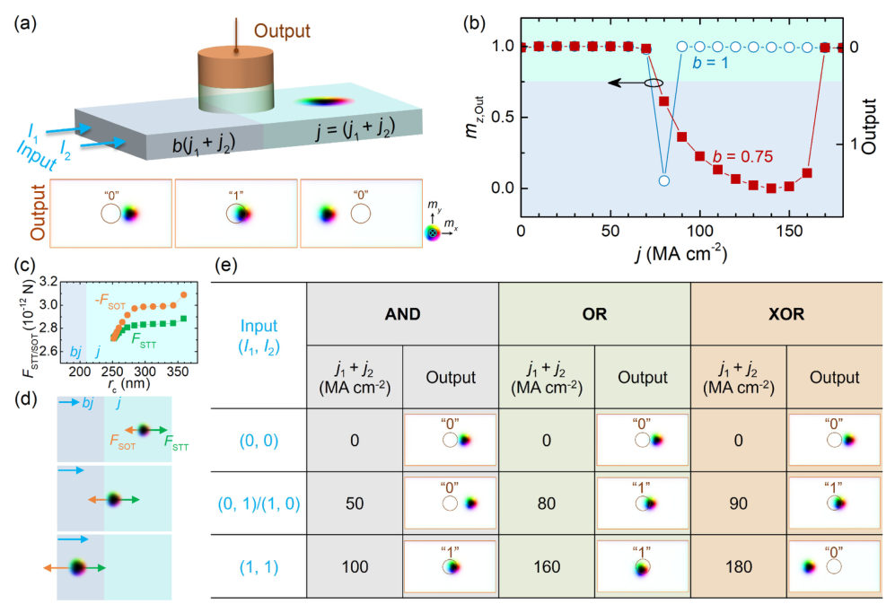
<figcaption class="paper-figure-caption"><b>Fig 3.</b> Figure 3: (a) Schematic of the skyrmion-based logic device. Two currents I1 and I2 (with current densities j1 and j2) are designed as logic inputs; logic input “1” (“0”) corresponds to (not) applying current to the device. The logic outputs “1” and “0” are defined as the presence and absence of the skyrmion underneath the middle detector, respectively (bottom panel). Here, b represents the ratio of the current density on the left side of racetrack to that on the right side. (b) Mag- netization mz,Out of the sublayer underneath the middle detector for different current densities j with two values of b = 1 and 0.75. The decrease in mz,Out from ∼ +1 is due to the skyrmion entering the...</figcaption>
</figure>
<figure class="paper-figure-card">
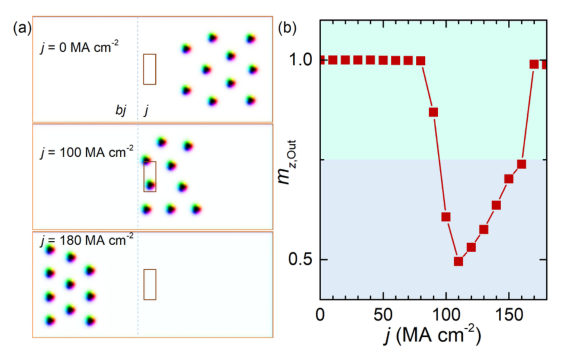
<figcaption class="paper-figure-caption"><b>Fig 4.</b> Figure 4: (a) Snapshots of magnetic structures under different currents. The box in the middle indicates the detection area. (b) Magnetization mz,Out of the sublayer underneath the detector for different current densities j. In the simulations, the model size is 1600 × 700 × 3 nm3, the size of square detector is 80 × 200 nm2, the simulation time is 60 ns, b = 0.75, Bz = 0.23 T, and α = 0.05.</figcaption>
</figure>

**Summary.** This work explores how antiferromagnetic skyrmions exhibit bidirectional motion when subjected to competing spin torques (STT and SOT). By analyzing the force balance governing this motion, the authors demonstrate that a critical current threshold causes the skyrmion direction to reverse. This controllable mechanism is then leveraged to propose and validate programmable logic gates based on magnetic racetrack devices.

**Why it may be interesting.** While focused on spintronics rather than fundamental quantum information, the study deals with non-equilibrium dynamics of topological textures driven by external currents, which shares conceptual links with open quantum systems modeling where dissipation and driving fields are crucial.

Detailed structure

**Main problem.** The study investigates the previously unexplored bidirectional dynamics of antiferromagnetic skyrmions when driven by competing spin-transfer torque (STT) and spin-orbit torque (SOT). The goal is to utilize this mechanism for developing programmable logic devices.

**Main result.** It was computationally demonstrated that AFM skyrmion motion can reverse direction above a critical current threshold. This bidirectional motion, tunable by an external magnetic field, enables the design of functional logic gates.

**Method.** The dynamics are analyzed using micromagnetic simulations solving the LLG equation and supplemented by the Thiele approach for analytical understanding of the force balance.

**Model / system.** The system models antiferromagnetic skyrmions in a structure coupled with a heavy metal layer to induce interfacial Dzyaloshinskii-Moriya interaction. The dynamics are governed by current-induced STT and SOT forces acting on the topological spin texture.

**Key observables.** Skyrmion velocity ($v_x$), force components ($F_{STT}, F_{SOT}$), skyrmion radius ($R_s$), and logic gate output states (e.g., AND, OR, XOR).

**Important parameters / regimes.** Driving current density ($j$), out-of-plane magnetic field ($B_z$), and the relative strengths of STT vs. SOT torques.

**Assumptions / limitations.** The analysis relies on the Thiele equation approximation for describing the collective dynamics, and it assumes that logic operation limits can be controlled by local current modulation factors.

**Figures summary.** Figures illustrate velocity reversal ($v_x$ vs $j$) showing positive to negative changes; force balance plots show sign reversals in net force; and schematics demonstrate AND/OR/XOR gate functionality based on current ranges.

**Paper structure.** The paper first establishes the physical model and uses simulations to observe bidirectional motion. It then analyzes the underlying physics using the Thiele equation, showing that the reversal stems from competing torques affecting skyrmion size. Finally, it applies this understanding to design and demonstrate programmable logic gates in a racetrack geometry.

Abstract

Antiferromagnetic skyrmions are swirling topological spin textures with rich dynamics and intriguing transport properties, yet their bidirectional dynamics remain largely unexplored. Here, we investigate the dynamics of antiferromagnetic skyrmions driven by current-induced spin-transfer and spin-orbit torques. We computationally demonstrate that antiferromagnetic skyrmions moving in one direction at low current densities can reverse their motion direction when the driving current is above a threshold. Based on the Thiele approach analysis, we show that this bidirectional motion originates from a change in the relative strengths of two effective forces arising from spin-transfer and spin-orbit torques. Furthermore, exploiting this bidirectional motion on a single racetrack, we design programmable logic gates. Our results not only uncover a hidden mechanism for bidirectional skyrmion motion but also facilitate the development of antiferromagnet-based logic devices.

[↑ back to top](#top)

### [Persistent current and orbital magnetization along a valley-contrasting junction in bilayer graphene in a magnetic field](http://arxiv.org/abs/2606.18461v1)

**Authors:** K. Shizuya  
**Type:** theory · **Category:** other · **PDF:** <https://arxiv.org/pdf/2606.18461v1>  
**Analysis basis:** full PDF text, analyzed in chunks
**Topic relevance:** `exotic spin models in light-matter` **3/5** · `spintronics-quantum-optics interface` **3/5** · `analog quantum simulation` **2/5** · `driven-dissipative phase transition` **2/5** · `non-equilibrium dynamics` **2/5** · `Keldysh / 2PI / non-Gaussian methods` **1/5** · `Kondo & dissipative impurity` **1/5** · `methods for driven-dissipative` **1/5** · `non-equilibrium universality` **1/5**

↔ Scroll figures horizontally

<figure class="paper-figure-card">
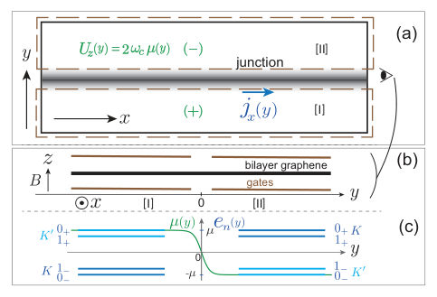
<figcaption class="paper-figure-caption"><b>Fig 1.</b> FIG. 1. (a) Schematic of a bilayer sample divided into two domains by electrostatic gating across a junction (shaded area). (b) Cross-section view of the sample. (c) Interlayer bias µ(y) = −µ tanh(y/wjc) with a reversal of polarity across y = 0. Shown in blue are the associated PZM spectra of val- leys K and K′ in the bulk domains |y| ≫wjc.</figcaption>
</figure>
<figure class="paper-figure-card">
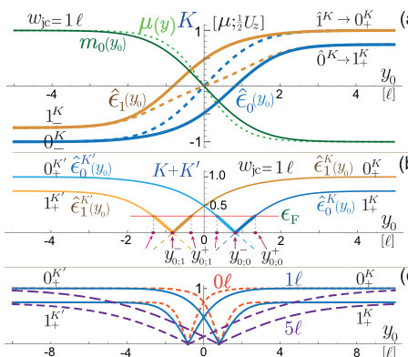
<figcaption class="paper-figure-caption"><b>Fig 2.</b> FIG. 2. (a) PZM spectra in valley K under a sharp bias µ(y) with wjc = 1ℓ. Levels (1K −, 0K −) in the lower domain y0 ≪0 get mixed across the junction at y0 ∼0 and turn into (0K + , 1K + ) for y0 ≫0, avoiding thereby level crossing. Another valley K′ also supports the same spectra with inverted signs, with orbital change (0K′ + , 1K′ + ) →(1K′ −, 0K′ −). (b) Electron spectra above the charge-neutral ground state in full valleys K + K′. Four channels (per spin) of active orbitally-mixed electron modes are trapped within the bulk band gap. (c) The level spectra scarcely change as the kink gets steeper wjc = 1ℓ→0 while they spread in width with increasing wjc.</figcaption>
</figure>
<figure class="paper-figure-card">
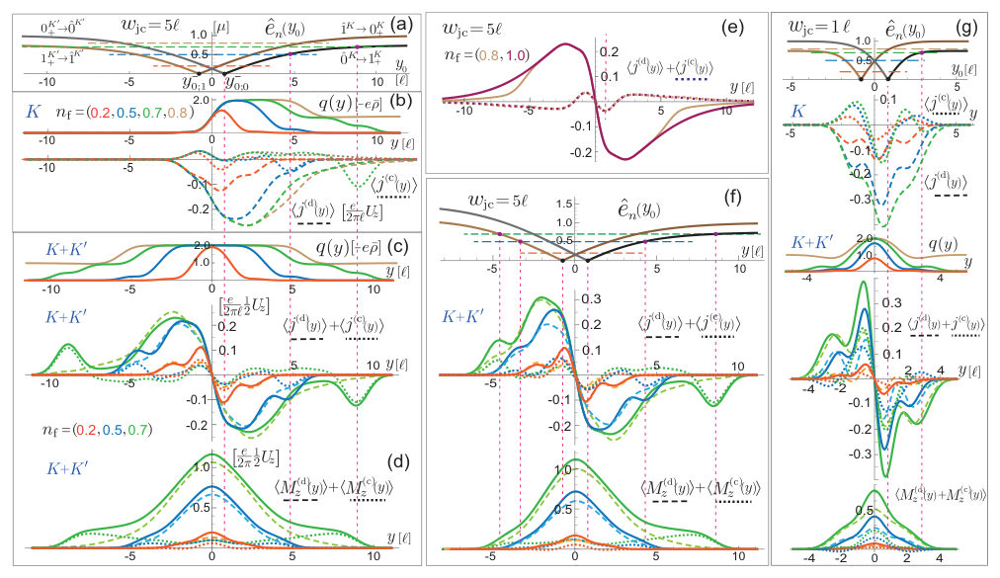
<figcaption class="paper-figure-caption"><b>Fig 3.</b> FIG. 3. Electron kink states formed along a valley-contrasting junction. (a) PZM spectra above the charge-neutral ground state under a bias µ(y) with wjc = 5ℓ. Charge density q(y) and current density jx(y) = j(c)(y) + j(d)(y) that develop (b) in valley K alone and (c) in full valleys K + K′ at filling nf = (0.2, 0.5, 0.7, 0.8). The current jx flows in one way on each side of the junction, showing two peak profiles associated with j(d) (dashed curves) and j(c) (dotted curves). (d) Orbital magnetization density Mz(y) = M (d) z (y) + M (c) z (y) in full valleys K + K′. The drift component ⟨M (d) z (y)⟩grows steadily with the kink state. In contrast, ⟨M (c) z (y)⟩slowly grows toward the edges y...</figcaption>
</figure>

**Summary.** This theoretical work analyzes how a spatially varying interlayer bias creates localized 'kink states' in bilayer graphene under a magnetic field. These states host persistent currents composed of drift and cyclotron components, which combine to form a controllable orbital magnetization channel. This mechanism suggests a pathway for realizing valley-based electronic devices.

**Why it may be interesting.** While focused on condensed matter physics, the concept of controlling localized topological edge/junction modes via external fields and biases mirrors principles used in designing quantum interconnects or realizing artificial gauge fields relevant to AMO systems.

Detailed structure

**Main problem.** The study investigates the observable electric and magnetic properties of localized electron states, known as 'kink states,' that form along a junction where the interlayer bias in bilayer graphene changes sign.

**Main result.** These kink states support persistent currents composed of both drift and circulating components, which together create a controllable, quasi-one-dimensional channel of orbital magnetization useful for valley electronics.

**Method.** The analysis involves diagonalizing the effective Hamiltonian derived from the low-energy physics of pseudo-zero modes in momentum space, using techniques like oscillator basis expansions and unitary transformations.

**Model / system.** The system is bilayer graphene subjected to a perpendicular magnetic field ($B_z$) and an interlayer bias ($\mu(y)$) that varies spatially across a junction. The low-energy physics is captured by analyzing the pseudo-zero mode (PZM) levels.

**Key observables.** Persistent current (total, drift $j^{(d)}$, circulating $j^{(c)}$), localized orbital magnetization $\langle M_z 
angle$, and energy spectra ($\hat{e}_n(y_0)$).

**Important parameters / regimes.** Interlayer bias magnitude ($\mu$), magnetic field ($B$), junction width ($w_{jc}$), and Fermi level position ($\epsilon_F$).

**Assumptions / limitations.** The analysis assumes the system is in the quantum Hall regime, and approximations are made regarding the relative strength of different coupling terms (e.g., $|e_0| = \mu \ll e_2$).

**Figures summary.** Figures illustrate the sample geometry with the bias profile $\mu(y)$, show the evolution of PZM spectra across the junction, and depict the resulting trapped active electron modes.

**Paper structure.** The paper systematically derives the effective Hamiltonian for the kink states, analyzes the energy spectrum's gap opening/avoidance, and then calculates the associated current components (drift vs. circulating) to demonstrate the net persistent magnetization channel.

Abstract

In a magnetic field bilayer graphene hosts an octet of pseudo-zero-mode electron levels nearly degenerate in orbitals $n=(0,1)$, valleys and spins. They split in valleys by electrostatic gating. In gated bilayer graphene, in which the interlayer bias is set up to flip sign across a line, one has a line junction that traps a portion of pseudo-zero-mode electrons inside the insulating bulk band gap, giving rise to electron states localized along the junction, known as kink states. A close look is made into the spectra and electromagnetic response of such kink states. There are two species of valley current associated with them, a drift current driven by the bias gradient and a circulating current coming from cyclotron motion. It turns out that they both flow in essentially the same direction, with the circulating current exhibiting a magnetic character distinct from those of other higher levels. In equilibrium they spatially circulate within the kink states, creating a quasi-one-dimensional channel of orbital magnetization. The electric control of the orbital magnetization and valley currents via a network of gated junctions will find useful applications in valley electronics.

[↑ back to top](#top)

### [Magnon-dislon hybridization in magnetic insulators](http://arxiv.org/abs/2606.18513v1)

**Authors:** Carlos Saji, Nicolas Vidal-Silva, Roberto E. Troncoso  
**Type:** theory · **Category:** other · **PDF:** <https://arxiv.org/pdf/2606.18513v1>  
**Analysis basis:** full PDF text, analyzed in chunks
**Topic relevance:** `Keldysh / 2PI / non-Gaussian methods` **3/5** · `spintronics-quantum-optics interface` **3/5** · `methods for driven-dissipative` **2/5** · `analog quantum simulation` **1/5** · `correlated / nonlocal dissipation` **1/5** · `driven-dissipative phase transition` **1/5** · `exotic spin models in light-matter` **1/5** · `non-equilibrium dynamics` **1/5**

↔ Scroll figures horizontally

<figure class="paper-figure-card">
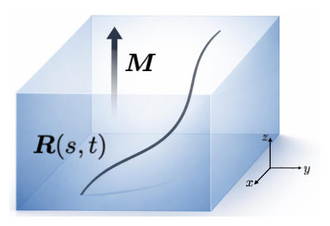
<figcaption class="paper-figure-caption"><b>Fig 1.</b> FIG. 1. Schematic of a dynamical dislocation in a three- dimensional magnetic crystal. Transverse fluctuations of the dislocation line Rµ(s, t) define dislon excitations that hy- bridize with magnons propagating around the equilibrium magnetization M.</figcaption>
</figure>
<figure class="paper-figure-card">
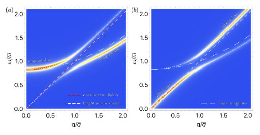
<figcaption class="paper-figure-caption"><b>Fig 2.</b> FIG. 2. Hybridization between magnons and screw-dislons. (a) Magnon and (b) dislon spectral weights. The avoided crossing signals coherent hybridization and spectral-weight transfer. Far from resonance, the hybrid modes recover their magnon- or dislon-like character. The red dashed line in (a) marks the symmetry-protected dark screw-dislon branch, which remains uncoupled to magnons. White dotted and dashed lines denote the hybridized and bare dispersions, re- spectively.</figcaption>
</figure>
<figure class="paper-figure-card">
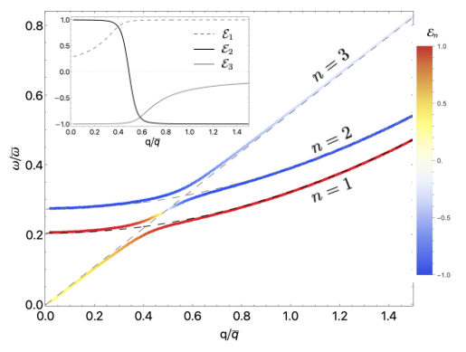
<figcaption class="paper-figure-caption"><b>Fig 3.</b> FIG. 3. Hybrid edge magnon–dislon spectrum, with the branches ωn(qz), colored according to their ellipticity En, for ω0 = 0.8¯ω, J ¯q2 = 0.2¯ω, geff = 0.15¯ω, with geff = p</figcaption>
</figure>

**Summary.** This theoretical paper develops an effective field theory for the interaction between magnons and quantized lattice dislocations in magnetic insulators. By analyzing the coupling strength based on dislocation topology (screw vs. edge), the authors predict distinct, observable signatures like helicity-selective modes or finite spin ellipticity. This highlights topological defects as controllable sources of novel quantum dynamics.

**Why it may be interesting.** This work provides a concrete example of how topological defects can introduce novel, geometrically constrained coupling channels into collective excitations (magnons), offering new avenues to control spin dynamics beyond simple bulk interactions.

Detailed structure

**Main problem.** The study investigates spin dynamics in ordered magnetic insulators when coupled to topological lattice defects, specifically dislocations (dislons). The goal is to develop a unified theoretical framework describing this magnon-dislon hybridization.

**Main result.** The coupling mechanism is highly dependent on the dislocation type: screw dislocations exhibit helicity-selective coupling and dark modes, while edge dislocations generate finite spin-precession ellipticity due to the glide constraint. This establishes defects as sources of observable polarization fingerprints in magnon spectra.

**Method.** The authors develop an effective field theory using fracton–elasticity duality, recasting the dynamics into a gauge field framework. They calculate the coupled excitations by integrating out the elastic gauge field to derive a mixed magnon-dislon vertex.

**Model / system.** The system is a ferromagnetic crystal containing embedded dislocations. The model uses an effective action $S_{	ext{eff}}$ describing the coupling between spin fluctuations (magnons) and dislocation vibrations (dislons), treated as coupled bosonic excitations.

**Key observables.** Magnon–dislon hybridization gap ($\Delta h$), polarization fingerprints, and finite spin-precession ellipticity ($E_n$) for edge dislocations.

**Important parameters / regimes.** The coupling strength $g$, the momentum transfer $\kappa$, and the distinction between screw vs. edge dislocation geometries are crucial parameters.

**Assumptions / limitations.** Approximations include linear order in small transverse dislon fields, assuming a strict quasi-one-dimensional limit for calculations, and using weak-coupling expansions near resonance.

**Figures summary.** Figures illustrate the spectral weights showing avoided crossings for screw dislocations and demonstrate the anisotropic coupling leading to elliptical polarization for edge dislocations.

**Paper structure.** The paper builds from deriving the full magnetoelastic action via gauge fields, calculating the propagator components, deriving the mixed vertex by integrating out the elastic field, and finally analyzing the resulting coupled quadratic Hamiltonian for both screw and edge geometries.

Abstract

Spin dynamics in ordered magnets with topological lattice defects is investigated. Using fracton--elasticity duality, we develop an effective field theory of magnons coupled to quantized lattice dislocations (dislons) in magnetic insulators. Within this framework, an elastic gauge field mediates a nonlocal interaction between dislocations and magnetization gradients. The resulting magnetoelastic coupling gives rise to coherent magnon-dislon hybridization whose properties are dictated by dislocation topology. Screw dislocations exhibit helicity-selective hybridization and symmetry-protected dark dislon sectors, while edge dislocations generate anisotropic hybrid excitations with finite spin-precession ellipticity through the glide constraint. Our results establish dislocations as dynamical topological defects with directly observable polarization fingerprints in magnon spectra, and reveal magnon-dislon hybridization as a new route to control spin dynamics.

[↑ back to top](#top)

### [Theory of nonlinear spin transport in chiral conductors](http://arxiv.org/abs/2606.19274v1)

**Authors:** Lorenzo Cavicchi, Marco Polini  
**Type:** theory · **Category:** other · **PDF:** <https://arxiv.org/pdf/2606.19274v1>  
**Analysis basis:** full PDF text, analyzed in chunks
**Topic relevance:** `Keldysh / 2PI / non-Gaussian methods` **3/5** · `spintronics-quantum-optics interface` **3/5** · `methods for driven-dissipative` **2/5** · `non-equilibrium dynamics` **2/5** · `exotic spin models in light-matter` **1/5** · `non-equilibrium universality` **1/5**

↔ Scroll figures horizontally

<figure class="paper-figure-card">
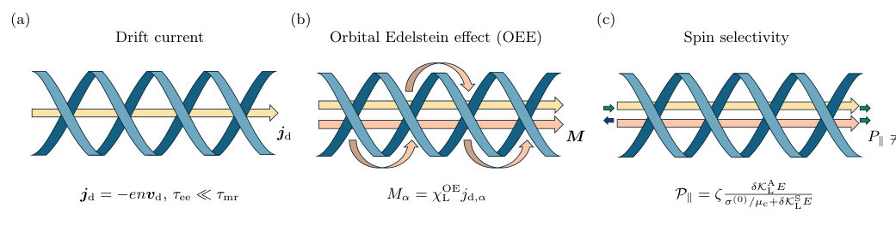
<figcaption class="paper-figure-caption"><b>Fig 1.</b> FIG. 1. (a) Due to fast electron-electron interactions with respect to momentum-relaxing processes (τee ≪τmr), the system reaches a quasi-equilibrium state carrying a finite, time-independent, and spatially homogeneous current jd (yellow arrow). (b) The chiral system develops an orbital magnetization M (orange arrow) due to current flow—i.e. this is the OEE. (c) The coupling between the orbital magnetization and the electron’s spin (small green and blue arrows) produces a finite spin polarization P∥.</figcaption>
</figure>

**Summary.** This paper develops a non-equilibrium theory to explain the Chirality-Induced Spin Selectivity (CISS) effect by connecting it mathematically to the Orbital Edelstein Effect (OEE). The authors show that current flow induces an orbital magnetization ($\mathbf{M}$) in chiral materials, and this $\mathbf{M}$ then generates a measurable spin polarization ($P_{\parallel}$). This establishes CISS as a direct consequence of the material's inherent chiro-optical response.

**Why it may be interesting.** This work is highly relevant as it connects fundamental concepts from spintronics (CISS) with linear response phenomena (OEE), providing a theoretical mechanism for generating spin polarization without relying on traditional magnetic materials, which has implications for quantum transport modeling.

Detailed structure

**Main problem.** The primary goal is to provide a microscopic theoretical explanation for the Chirality-Induced Spin Selectivity (CISS) effect by establishing a link between CISS and the Orbital Edelstein Effect (OEE).

**Main result.** The theory successfully demonstrates that the current-induced orbital magnetization ($\mathbf{M}$) generates an effective Zeeman splitting, which in turn causes a finite spin polarization ($P_{\parallel}$), thereby linking CISS to intrinsic chiro-optical properties like natural optical activity.

**Method.** The authors employ a non-equilibrium transport theory framework, utilizing a quasi-equilibrium assumption and analyzing the system's response via small-drift expansions of the spin-resolved distribution function.

**Model / system.** The study focuses on chiral electronic systems (conductors) subjected to an external electric field ($\mathbf{E}$), modeling the transport using concepts derived from the Orbital Edelstein Effect and incorporating chirality parameters ($\zeta$).

**Key observables.** Finite spin polarization ($P_{\parallel}$), orbital magnetization ($\mathbf{M}$), and the resulting non-linear, spin-polarized current components.

**Important parameters / regimes.** The theory is sensitive to the ratio of scattering times ($	au_{ee} \ll 	au_{mr}$) and depends on chirality ($\zeta$).

**Assumptions / limitations.** Key assumptions include reaching a quasi-equilibrium state under a finite drift current density, using the local/static limit for OEE calculations, and employing small-drift expansions.

**Figures summary.** Figure 1 illustrates the three sequential physical steps: (a) generation of the drift current ($\mathbf{j}_d$); (b) induction of orbital magnetization ($\mathbf{M}$) via OEE; and (c) coupling between $\mathbf{M}$ and spin leading to $P_{\parallel}$.

**Paper structure.** The paper builds logically by first introducing the CISS effect, then proposing the theoretical bridge through the OEE, deriving the necessary non-equilibrium transport equations, and finally calculating the resulting spin polarization in terms of system chirality.

Abstract

The chirality-induced spin selectivity (CISS) effect, discovered by Naaman and collaborators in 1999, describes the emergence of a finite spin polarization in response to current flow through a chiral electronic system. While extensive experimental studies have verified the presence of CISS in molecular systems and, more recently, in chiral materials, a complete microscopic understanding of this effect remains elusive. In this work, we propose a theoretical framework linking the CISS effect to the orbital Edelstein effect. In the latter, a drive current induces a finite orbital magnetization, even in the absence of spin-orbit coupling. Our non-equilibrium theory naturally explains key features of the CISS effect: its persistence in systems with weak or vanishingly small spin-orbit coupling and its connection to natural optical activity, a distinctive signature of chiral systems.

[↑ back to top](#top)

### [Supratransmission in Lattices with Purely Nonlinear Coupling](http://arxiv.org/abs/2606.19237v1)

**Authors:** Defri Ahmad, Tae-Yeon Kim, Andreas Schiffer, Jinkyu Yang, Hadi Susanto  
**Type:** theory · **Category:** other · **PDF:** <https://arxiv.org/pdf/2606.19237v1>  
**Analysis basis:** full PDF text, analyzed in chunks
**Topic relevance:** `non-equilibrium dynamics` **3/5** · `Frenkel-Kontorova` **2/5** · `driven-dissipative phase transition` **1/5** · `methods for driven-dissipative` **1/5** · `non-equilibrium universality` **1/5**

↔ Scroll figures horizontally

<figure class="paper-figure-card">
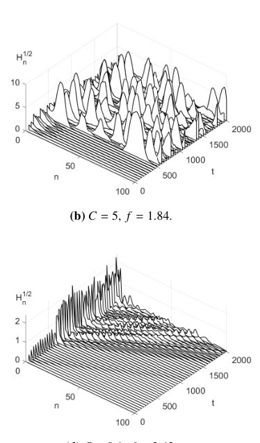
<figcaption class="paper-figure-caption"><b>Fig 1.</b> Fig. 1. Spatiotemporal evolution of √퐻푛for the discrete sine–Gordon model (1.8) with 푝= 1 and 휔= 0.9. Panels (a,c): subthreshold forcing yields an evanescent response confined near the driven boundary. Panels (b,d): slightly above threshold, the boundary excitation generates a propagating wavefront, indicating supratransmission. For weak coupling (퐶= 0.1), the transmitted energy is significantly reduced due to discreteness-induced trapping.</figcaption>
</figure>
<figure class="paper-figure-card">
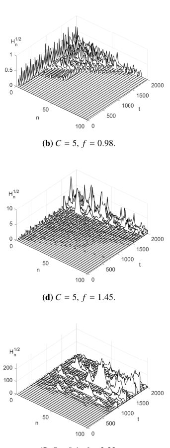
<figcaption class="paper-figure-caption"><b>Fig 2.</b> Fig. 2. Same setting as Fig. 1, but for nonlinear coupling with 푝= 3. Below threshold (a,c,e), the response remains evanescent. Panels (b,c) show intermittent leakage due to weak instabilities of the evanescent state, but not sustained transmission. Above threshold (d,f), pronounced energy propagation occurs, with stronger and more irregular wavefronts than in the linear case (푝= 1).</figcaption>
</figure>
<figure class="paper-figure-card">
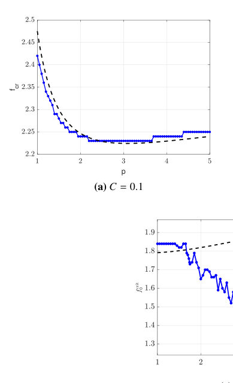
<figcaption class="paper-figure-caption"><b>Fig 3.</b> Fig. 3. Critical driving amplitude 푓cr versus coupling exponent 푝for 휔= 0.9 and three values of 퐶. Solid curves: thresholds obtained from the full model (1.8). Dashed curves: predictions of the DpS approximation (3.3). For small and intermediate coupling, the DpS model reproduces the numerical trends; for strong coupling (퐶= 5), it fails to capture the non-monotone dependence in the strong-coupling regime of the full model.</figcaption>
</figure>
<figure class="paper-figure-card">
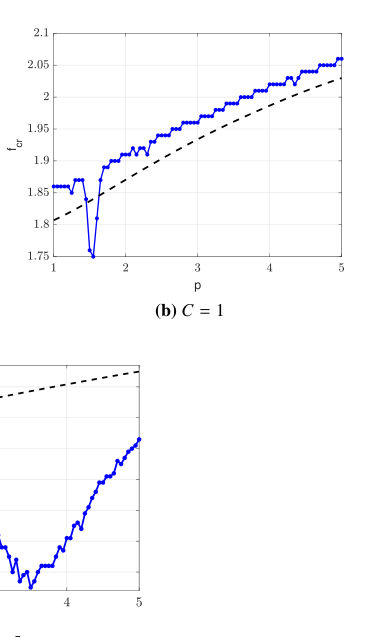
<figcaption class="paper-figure-caption"><b>Fig 4.</b> Figure 3 summarizes the dependence of the threshold amplitude 푓cr on the exponent 푝for weak, intermediate, and strong coupling. These trends indicate that the interplay between 퐶and 푝is nontrivial, and that the transmission threshold is sensitive to both the interaction strength and the nonlinear coupling law. While the overall trends appear qualitatively similar across coupling regimes, the underlying mechanisms differ, as discussed below. For 퐶= 0.1, Fig. 3a, the threshold decreases with increasing 푝, reaches a shallow minimum near 푝≈3, and then rises. At 퐶= 1 (Fig. 3b), the dependence becomes nearly linear, with small irregularities for 1 &lt; 푝&lt; 2. For 퐶= 5 (Fig. 3c), the behavior is...</figcaption>
</figure>
<figure class="paper-figure-card">
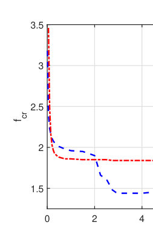
<figcaption class="paper-figure-caption"><b>Fig 5.</b> Fig. 4. Critical driving amplitude as a function of coupling strength 퐶for 푝= 1 and 푝= 3. In both cases, 푓cr saturates as 퐶→∞. For 푝= 1, the limiting threshold is in agreement with the strong-coupling prediction of the DpS model (6.11). For 푝= 3, it is slightly lower, reflecting the destabilizing effect of nonlinear coupling.</figcaption>
</figure>

**Summary.** This paper analyzes supratransmission in lattices where coupling is purely nonlinear, meaning no standard linear pass band exists. Using asymptotic methods, the authors derive a discrete p-Schrödinger equation to model energy transport. They find that while weak coupling suggests thresholding via bifurcations, strong coupling indicates the onset of transmission is governed by spectral instability rather than simple amplitude thresholds.

**Why it may be interesting.** The work provides a detailed theoretical framework for energy transport in nonlinear wave systems lacking linear band structures. The distinction between fold-induced vs. instability-induced thresholds is highly relevant to understanding non-integrable, strongly coupled physical media.

Detailed structure

**Main problem.** The study investigates supratransmission—energy transport outside the linear pass band—in nonlinear lattices where coupling is purely nonlinear, meaning no underlying linear spectrum exists.

**Main result.** The authors establish that supratransmission occurs in these fully nonlinear systems, identifying that the mechanism shifts between fold bifurcations (weak coupling) and instability of the lower stationary branch (strong coupling).

**Method.** The analysis employs asymptotic reduction to derive a discrete p-Schrödinger (DpS) equation, supplemented by perturbation theory for analytical approximations and numerical continuation/stability analysis.

**Model / system.** The model is based on nonlinear lattices governed by power-law interaction potentials, leading to equations like the discrete sine-Gordon model. The coupling is purely nonlinear ($\varphi(x)$), contrasting with systems possessing linear spectral components.

**Key observables.** Supratransmission (energy propagation at frequencies outside the linear pass band), critical driving amplitude ($\mathcal{F}_{crit}$ or $	ilde{a}_{cr}$), and stability eigenvalues ($\lambda$).

**Important parameters / regimes.** Nonlinearity exponent ($p$ or $
ho$), coupling strength ($C$ or $C_b$), driving frequency ($\omega$), and the approximation regime (weak vs. strong coupling).

**Assumptions / limitations.** The primary approximations involve deriving the DpS equation for weak/intermediate coupling, which is noted to fail in the strong-coupling limit where instability mechanisms dominate.

**Figures summary.** Figures illustrate spatiotemporal evolution comparing linear ($
ho=1$) and nonlinear ($
ho=3$) couplings below and above threshold. Other figures compare numerically computed critical amplitudes against asymptotic predictions based on different coupling strengths.

**Paper structure.** The paper progresses by first establishing the model (nonlinear lattices), deriving approximations like the DpS equation, analyzing supratransmission thresholds using bifurcation theory (weak coupling), and finally contrasting these results with numerical findings in the strong-coupling regime where instability is suggested as the true mechanism.

Abstract

Supratransmission is examined in nonlinear lattices with purely nonlinear coupling, extending the phenomenon to systems that lack a linear pass band. In contrast to standard lattices with mixed linear-nonlinear interactions, the present model has no linear spectrum, so energy propagation arises entirely from nonlinear effects. Asymptotic analysis yields a discrete $p$-Schrödinger (DpS) equation that {provides an accurate description in the weak- and intermediate-coupling regimes and offers qualitative insight in the strong-coupling regime}. Perturbation provides analytical approximations for the critical driving amplitude, explicitly showing its dependence on the driving frequency, coupling strength, and the nonlinearity exponent $p$. The analysis identifies a non-trivial dependence of the critical amplitude on $p$, with distinct trends in different coupling regimes. Numerical continuation and direct simulations {validate the theory in regimes where the asymptotic reduction is applicable and show good agreement across a wide range of parameters}. The results establish supratransmission in fully nonlinear lattices and clarify the associated energy-transport mechanisms, with relevance to mechanical lattices, tunable metamaterials, and nonlinear optical arrays.

[↑ back to top](#top)

### [Theory of In-Plane Orbital Magnetization with Layer Hybridization](http://arxiv.org/abs/2606.18891v1)

**Authors:** Jin-Xin Hu, Zi-Ting Sun, Yugui Yao  
**Type:** theory · **Category:** other · **PDF:** <https://arxiv.org/pdf/2606.18891v1>  
**Analysis basis:** full PDF text, analyzed in chunks
**Topic relevance:** `exotic spin models in light-matter` **3/5** · `spintronics-quantum-optics interface` **3/5** · `Keldysh / 2PI / non-Gaussian methods` **1/5**

↔ Scroll figures horizontally

<figure class="paper-figure-card">
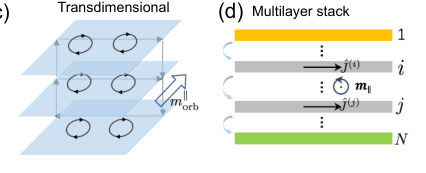
<figcaption class="paper-figure-caption"><b>Fig 1.</b> FIG. 1. Dimensional crossover of orbital magnetic moments in layered systems. (a) In an ideal two-dimensional system, Bloch electrons carry only an out-of-plane orbital magnetic moment mz orb. (b) In a three-dimensional crystal, both mz orb and an in-plane component m∥ orb can occur. (c) In the trans- dimensional regime, m∥ orb is generated by coherent interlayer orbital motion associated with circulating interlayer currents. (d) In a layer-hybridized multilayer stack, the current loop formed between the i-th and j-th layers contributes to the in-plane orbital magnetic moment.</figcaption>
</figure>
<figure class="paper-figure-card">
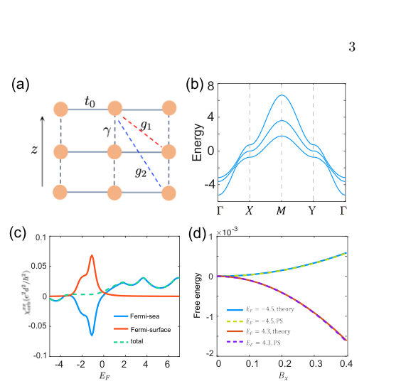
<figcaption class="paper-figure-caption"><b>Fig 2.</b> FIG. 2. Model validation of the in-plane orbital magnetic susceptibility. (a) Three-layer square-lattice model with in- tralayer hopping t0 and interlayer hoppings γ, g1, and g2. (b) Band structure for the model used in the numerical calcula- tions. (c) In-plane orbital susceptibility χxx orb as a function of Fermi energy EF , decomposed into Fermi-surface, Fermi- sea, and total contributions. (d) Field-dependent free-energy shift under an in-plane magnetic field Bx. Dashed curves are obtained from the full Peierls-substitution calculation, while solid curves show −1</figcaption>
</figure>
<figure class="paper-figure-card">
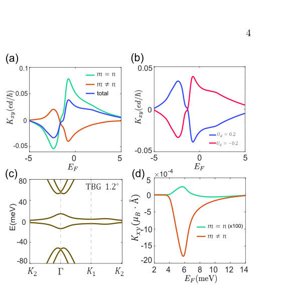
<figcaption class="paper-figure-caption"><b>Fig 3.</b> FIG. 3. In-plane orbital magnetoelectric response. (a) Kinetic magnetoelectric coefficient Kxy as a function of Fermi energy EF , resolved into intraband (m = n), interband (m ̸= n), and total contributions. (b) Gate-controlled switching of Kxy under opposite displacement fields Ud = ±0.2. (c) Represen- tative moire miniband structure of twisted bilayer graphene at twist angle 1.2◦. (d) Calculated Kxy in the twisted-bilayer- graphene model, showing the relative intraband and inter- band contributions.</figcaption>
</figure>

**Summary.** This paper develops a comprehensive theory for calculating the in-plane orbital magnetization and susceptibility in layered quantum materials. It addresses the unique 'transdimensional' regime where interlayer coupling is crucial, leading to an orbital response absent in simpler 2D or bulk models. The key prediction is the realization of a gate-tunable in-plane magnetoelectric effect.

**Why it may be interesting.** This work is highly relevant as it extends fundamental concepts of orbital magnetism into complex low-dimensional heterostructures, providing theoretical tools for designing novel 'orbitronic' devices.

Detailed structure

**Main problem.** The paper develops a theory for calculating the in-plane orbital magnetization ($\mathbf{M}_{\parallel}^{	ext{orb}}$) and susceptibility ($\chi^{ab}_{	ext{orb}}$) in multilayer quantum systems subjected to an in-plane magnetic field.

**Main result.** A systematic framework is established that predicts a gate-tunable in-plane orbital magnetoelectric effect in layered materials, which is distinct from conventional 3D or ideal 2D responses.

**Method.** The theory uses the current-loop picture to construct the in-plane orbital angular momentum operator and derives expressions for magnetization and susceptibility using modern theory concepts like Berry curvature contributions.

**Model / system.** The study focuses on layered materials, including few-layer graphene and moiré heterostructures, modeled by $N$-layer square-lattice Hamiltonians with interlayer hopping terms. The analysis covers the 'transdimensional' regime where layer thickness is comparable to the vertical mean free path.

**Key observables.** In-plane orbital magnetic moment ($\hat{\mathbf{m}}_{\parallel}$), in-plane orbital magnetization ($\mathbf{M}_{	ext{orb}}^{\parallel}$), and in-plane orbital magnetic susceptibility ($\chi_{ab}^{	ext{orb}}$).

**Important parameters / regimes.** Layer thickness ($d$), interlayer hopping parameters ($\gamma, g_1, g_2$), external gate electric field ($U_d$), and the ratio of layer thickness to mean free path ($d/l_z$).

**Assumptions / limitations.** The theory is most applicable in the transdimensional regime where coherent interlayer tunneling survives; some calculations use continuum limit approximations for specific systems like TBG.

**Figures summary.** Figures illustrate the dimensional crossover of orbital moments across 2D, 3D, and transdimensional regimes. Other figures show model validation of $\chi^{xx}_{	ext{orb}}$ vs $E_F$ and demonstrate gate control over the in-plane magnetoelectric response ($K_{xy}$).

**Paper structure.** The paper develops the theory by first constructing the in-plane orbital magnetic moment operator from a current-loop picture. It then derives exact expressions for magnetization and susceptibility, applying these to predict phenomena like the magnetoelectric effect and magnetoresistance in specific layered models.

Abstract

The modern theory of orbital magnetization successfully describes the response of Bloch electrons to magnetic fields in fully periodic crystals, but it does not directly address the distinct regime of an in-plane field in multilayer systems with layer hybridization. Coherent interlayer tunneling allows electrons to form circulating current loops, producing an in-plane orbital response that is absent in a strictly two-dimensional limit and qualitatively different from the conventional three-dimensional one. Here we develop a theory of in-plane orbital magnetization for this {\it transdimensional} regime, where the layer thickness is comparable to the vertical mean free path. Starting from the current-loop picture, we construct the in-plane orbital angular momentum operator and derive exact expressions for the orbital magnetic moment and the in-plane orbital magnetic susceptibility. As an application, we predict a gate-tunable in-plane orbital magnetoelectric effect in layered materials. Our framework establishes a general foundation for in-plane orbital responses and suggests new opportunities for orbitronics in layer-hybridized quantum materials.

[↑ back to top](#top)

### [Constriction-induced modulation of charging energy in a quantum Hall cavity](http://arxiv.org/abs/2606.19187v1)

**Authors:** Emily Hajigeorgiou, Arup Kumar Paul, Mario Di Luca, Vladimir Umansky, Moty Heiblum, Mitali Banerjee  
**Type:** experiment · **Category:** other · **PDF:** <https://arxiv.org/pdf/2606.19187v1>  
**Analysis basis:** full PDF text, analyzed in chunks
**Topic relevance:** `correlated cavity matter` **3/5** · `driven-dissipative phase transition` **1/5** · `interference shaping light` **1/5**

↔ Scroll figures horizontally

<figure class="paper-figure-card">
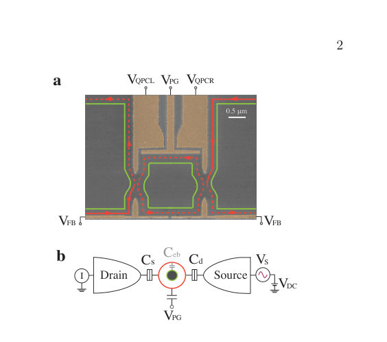
<figcaption class="paper-figure-caption"><b>Fig 1.</b> FIG. 1. Device picture and schematic. a, False-colored SEM image of the 2 × 2 µm2 cavity. The fishbone gates are biased at VFB = −0.6 V, and the left, right QPC, and plunger gate voltages are denoted VQPCL, VQPCR, and VPG. The edge- state structure at ν = 2 is shown: the inner edge is fully reflected (light green), while the outer edge is partially trans- mitted at the QPCs (red). b, Schematic of the cavity and its electrostatic environment. A small AC excitation Vs is applied on top of a DC bias VDC at the source, and the resulting AC current is measured at the drain. The dot is tunnel-coupled to the source and drain via the QPCs, with capacitances CS and CD, and capacitively coupled to...</figcaption>
</figure>
<figure class="paper-figure-card">
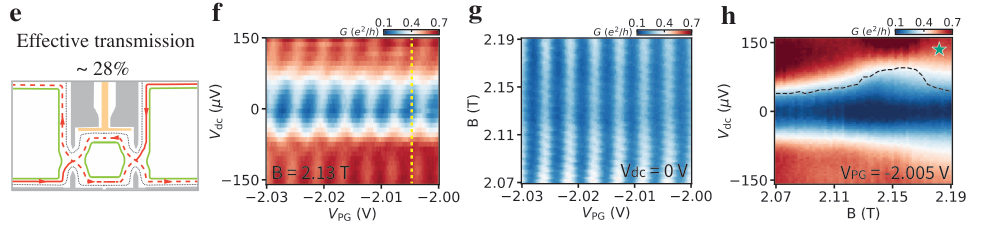
<figcaption class="paper-figure-caption"><b>Fig 2.</b> FIG. 2. a–d, Effective transmission &lt; 10% (QPC setting as in Fig. 3e). e–h, Effective transmission ≈28% (QPC setting as in Fig. 3f). a,e, Device schematics for the two regimes; only the outer edge is partitioned. The plunger gate (VPG) is highlighted in yellow, while all other gates (grey) are fixed. Black dotted lines indicate the confinement potential. b,f, Coulomb diamonds taken at 2.13 T; the yellow dashed line marks the fixed plunger-gate voltage used in d,h. c,g, Evolution of conductance oscillations with magnetic field taken at VDC = 0 V . d,h, Conductance at fixed plunger-gate voltage (yellow dashed line in b,f), showing the evolution of a fixed charge state N with magnetic field...</figcaption>
</figure>
<figure class="paper-figure-card">
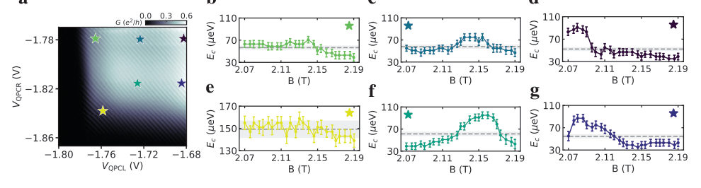
<figcaption class="paper-figure-caption"><b>Fig 3.</b> FIG. 3. a, Conductance map as a function of left and right barrier voltages, with VP G = −2 V. Each colored star corresponds to a trace in the following panels, labeled accordingly. b–g, Charging energy as a function of magnetic field, extracted from VDC(B) obtained from measurements similar to those shown in Fig. 2d,h. The grey dashed line indicates the mean, and the shaded region denotes the ±10% interval.</figcaption>
</figure>
<figure class="paper-figure-card">
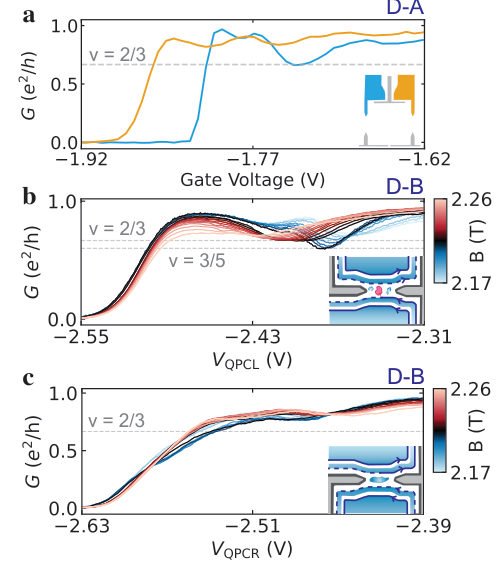
<figcaption class="paper-figure-caption"><b>Fig 4.</b> FIG. 4. a, Conductance through the left (blue) and right (or- ange) QPCs of device A (D-A), measured while the opposite constriction fully transmits the outer edge mode. The left QPC exhibits a clear ν = 2/3 plateau. Data are taken at B = 2.13 T. b, Conductance through the left QPC of de- vice B (D-B) as a function of magnetic field, with the right QPC fully open. A ν = 3/5 feature evolves into a pro- nounced ν = 2/3 plateau with increasing magnetic field. c, Conductance through the right QPC of device B (D-B) as a function of magnetic field, with the left QPC fully open. The inset schematics in b,c illustrate the QPC region in the two regimes: in b, an incompressible fractional quantum...</figcaption>
</figure>

**Summary.** The researchers investigated Coulomb charging effects in a quantum Hall cavity using QPCs. They demonstrated experimentally that the charging energy is not static but varies significantly with the magnetic field when the constrictions are strongly coupled. This modulation proves that the QPC barriers act as dynamic electrostatic elements, providing crucial corrections for interpreting advanced measurements like those seeking evidence of anyons.

**Why it may be interesting.** This work directly challenges simplified electrostatic models in mesoscopic quantum systems, showing that interaction effects (via FQH states) dynamically modify fundamental parameters like charging energy, which has implications for interpreting anyonic statistics measurements.

Detailed structure

**Main problem.** Interpreting interference signals in quantum Hall interferometers is complicated by Coulomb charging effects, which are often incorrectly treated as static properties.

**Main result.** The charging energy in the cavity is strongly and non-monotonically modulated by the magnetic field, varying up to 60% over a small field range.

**Method.** Differential conductance measurements were used on gate-defined quantum Hall cavities tuned to the Coulomb-dominated regime. The charging energy was extracted from the voltage bias at the apex of measured Coulomb diamonds.

**Model / system.** The system is a quantum Hall cavity fabricated on a GaAs/AlGaAs heterostructure, operating in the fractional quantum Hall regime. Transport is analyzed by tuning Quantum Point Contacts (QPCs) that act as active electrostatic elements controlling coupling to leads.

**Key observables.** Charging energy ($E_C$), differential conductance ($	ext{d}I/	ext{d}V_s$), and Coulomb blockade resonances.

**Important parameters / regimes.** Magnetic field ($B$) modulation (up to 60% variation over $100 	ext{ mT}$), strong cavity-to-lead coupling regime, and the formation of incompressible fractional quantum Hall states ($
u=2/3$).

**Assumptions / limitations.** The analysis assumes that QPC constrictions are active electrostatic elements whose local compressibility dictates the effective capacitance between the cavity and leads.

**Figures summary.** Figures illustrate device setups, comparisons between weak and strong coupling regimes showing Coulomb diamonds, and plots detailing $E_C$ vs. $B$, correlating modulation with FQH state formation in QPCs.

**Paper structure.** The paper establishes the problem of static charging energy assumptions, presents measurements demonstrating non-monotonic $E_C(B)$ dependence only when coupling is strong, and attributes this to dynamic screening mechanisms governed by local compressibility changes within the constrictions.

Abstract

Electronic Fabry-Pérot interferometers (FPIs) operating in the fractional quantum Hall regime are a key platform for probing anyonic braiding statistics, yet interpreting their interference signals is complicated by Coulomb charging effects, which are commonly treated as parasitic, static properties governed by the cavity's geometry and electrostatics. Here, using a gate-defined quantum Hall cavity tuned to the Coulomb-dominated regime, we demonstrate that the charging energy is in fact strongly and non-monotonically modulated by the magnetic field, varying by up to 60% over a range of only 100 mT. The effect appears exclusively when the quantum point contacts (QPCs) forming the cavity are weakly pinched off, i.e., in the strong cavity-to-lead coupling regime. By correlating the charging energy modulation with the QPC magneto-conductance, we attribute this behavior to field-dependent changes in local compressibility and electrostatic screening between the cavity and the leads, driven by the formation of incompressible fractional quantum Hall states within the constrictions. This result establishes QPC constrictions of quantum Hall cavities as active electrostatic elements rather than passive boundaries, revealing a dynamic screening mechanism, with direct consequences for the interpretation of interference measurements and the extraction of anyonic statistics.

[↑ back to top](#top)

### [On the quasi-continuum approximation of some localized patterns in the FPUT lattice](http://arxiv.org/abs/2606.18622v1)

**Authors:** Su Yang, Wenrong Sun, Lei Liu, Panayotis G. Kevrekidis  
**Type:** theory · **Category:** other · **PDF:** <https://arxiv.org/pdf/2606.18622v1>  
**Analysis basis:** full PDF text, analyzed in chunks
**Topic relevance:** `Frenkel-Kontorova` **3/5** · `non-equilibrium dynamics` **1/5**

↔ Scroll figures horizontally

<figure class="paper-figure-card">
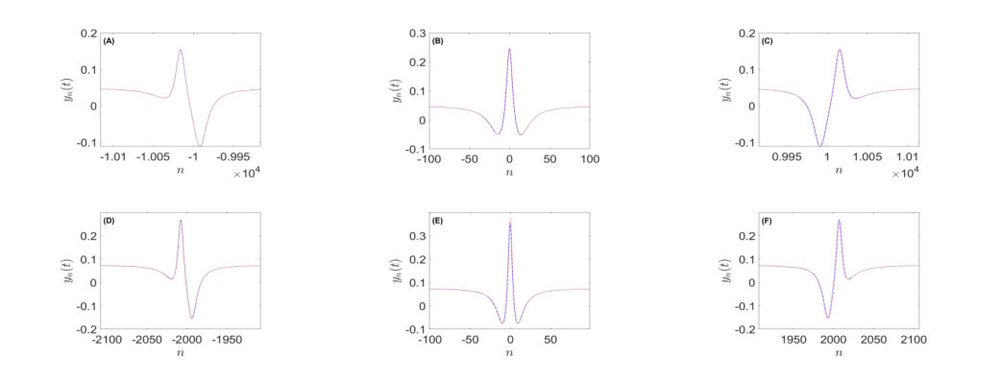
<figcaption class="paper-figure-caption"><b>Fig 1.</b> FIG. 1. Comparison of the second-order rational solutions. The first and second row depict the comparisons associated with ϵ = 0.05, 0.075, respectively. Note that the solid blue curves display the numerical solutions of the FPUT lattice (4), and the dashed red curves showcase the exact solutions specified in Sec. IV. In addition, notice that K2 = 4 and K4 = 1 in all the relevant numerical simulations.</figcaption>
</figure>
<figure class="paper-figure-card">
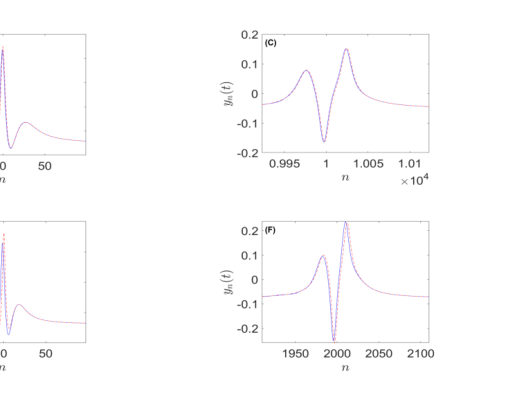
<figcaption class="paper-figure-caption"><b>Fig 2.</b> FIG. 2. Same as in Fig. 1 but now for the comparisons of the third-order rational solutions.</figcaption>
</figure>
<figure class="paper-figure-card">
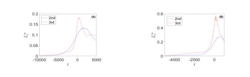
<figcaption class="paper-figure-caption"><b>Fig 3.</b> FIG. 3. The relative L∞ e losses for the 2nd and 3rd-order rational solutions. Panels (A) and (B) refer to the losses computed for the cases of ϵ = 0.05 and 0.075, respectively.</figcaption>
</figure>
<figure class="paper-figure-card">
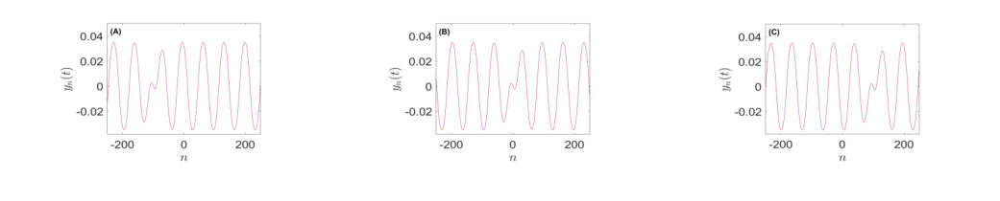
<figcaption class="paper-figure-caption"><b>Fig 4.</b> FIG. 4. The comparison of the dark breather solution on the snoidal background. Panels (A), (B), (C) depict the comparisons made at t = −100, 0, 100, respectively, where ϵ = 0.05, k = 0.7, and K2 = −K4 = 1. Finally, note that the solid blue and dashed red curves refer to the numerical solutions of the FPUT lattice (4) and the associated analytical solutions specified in Eq. (21).</figcaption>
</figure>
<figure class="paper-figure-card">
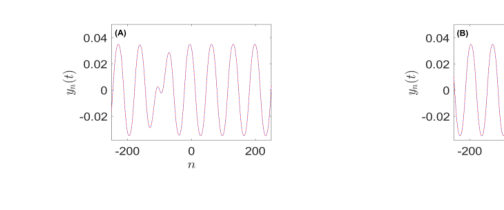
<figcaption class="paper-figure-caption"><b>Fig 5.</b> Fig. 6 depicts the relevant comparisons of the localized al- gebraically decaying soliton on the dnoidal wave background. Similar to the comparisons of the dark breather structure in Subsection V A, the soliton structure of the numerical dynam- ics of the FPUT lattice fits very well with the analytical so- lutions and appears to be naturally propagating through the</figcaption>
</figure>

**Summary.** This paper investigates localized wave phenomena on the FPUT lattice by employing a quasi-continuum approximation derived from the modified KdV equation. By using exact solutions of the mKdV equation to initialize the discrete lattice, the authors demonstrate that this reduction accurately models various structures like solitons and rogue waves across different background states. This methodology provides a powerful tool for studying wave dynamics in nonlinear lattices.

**Why it may be interesting.** This work bridges the gap between continuum integrable models (like mKdV) and discrete physical systems (FPUT lattice), a common theme in nonlinear physics relevant to understanding wave propagation in structured materials.

Detailed structure

**Main problem.** The work analyzes localized wave patterns, such as rogue waves, solitons, and breathers, that can exist within the dynamics of the FPUT lattice.

**Main result.** The study successfully demonstrates that exact solutions derived from the modified KdV equation can be used to construct initial conditions for the FPUT lattice, showing good quantitative agreement between numerical simulations and analytical predictions.

**Method.** A quasi-continuum approximation is employed by deriving a reduced integrable equation (mKdV) from the discrete FPUT lattice model. The exact solutions of this continuum equation are then mapped back to initialize and validate time evolution on the discrete lattice.

**Model / system.** The primary system is the Fermi–Pasta–Ulam–Tsingou (FPUT) lattice, governed by a nonlinear chain interaction potential. This discrete model is approximated by the continuous modified Korteweg-de Vries (mKdV) equation under specific assumptions ($K_3=0$).

**Key observables.** Rogue-wave profiles, solitons, breathers, and the relative $L_\infty$ error ($\epsilon(t)$) quantifying the agreement between numerical FPUT dynamics and analytical mKdV solutions.

**Important parameters / regimes.** The smallness parameter $\epsilon \ll 1$, which governs the validity of the multi-scale expansion; and elliptic moduli ($k$) used to define various background wave states (snoidal, dnoidal, cnoidal).

**Assumptions / limitations.** The analysis assumes $K_3=0$ ($eta$-FPUT model) for the reduction to mKdV, and relies on formal smallness parameters $\epsilon \ll 1$ for the continuum approximation.

**Figures summary.** Figures compare numerical FPUT dynamics initialized via the method against analytical second-order rational solutions; other figures plot the relative $L_\infty$ error across different solution orders and background types (e.g., dark breathers on snoidal backgrounds).

**Paper structure.** The paper proceeds by deriving the mKdV reduction from the FPUT lattice, then utilizing exact mKdV solutions to set initial conditions for the discrete system. It systematically tests this approach by examining localized waves—solitons, breathers, and rogue waves—on various background states (homogeneous, snoidal, dnoidal, cnoidal).

Abstract

In the present work, we present a number of localized wave patterns that are theoretically analyzed and   numerically illustrated to be observable within the   widely applicable paradigm of the FPUT lattice. In particular, we derive a modified KdV equation from the FPUT lattice, which admits a variety of localized waves including these exact rational solutions representing rogue-wave profiles, solitons and breathers on the top of not only homogeneous,   but also periodic elliptic function traveling-wave background. We utilize these exact solutions of the modified KdV reduction to construct consistent initial conditions for the FPUT lattice and perform time stepping of the latter. Relevant comparisons between these numerical solutions of the FPUT lattice and their associated analytical counterparts have been conducted to demonstrate good performance of the derived modified KdV reduction in approximating distinct localized wave structures from the FPUT lattice.   This approach paves the way for importing a number of   quasi-continuum waveforms to the FPUT lattice and the   potential associated physical experiments, including recent   ones in mechanical metamaterials.

[↑ back to top](#top)

### [Quantum Geometry and Topology of Bulk Plasmons in Weyl Metals](http://arxiv.org/abs/2606.18346v1)

**Authors:** Hong-Yi Xie, Peter Abbamonte, Bruno Uchoa  
**Type:** theory · **Category:** other · **PDF:** <https://arxiv.org/pdf/2606.18346v1>  
**Analysis basis:** full PDF text, analyzed in chunks
**Topic relevance:** `interference shaping light` **3/5** · `Keldysh / 2PI / non-Gaussian methods` **1/5**

↔ Scroll figures horizontally

<figure class="paper-figure-card">
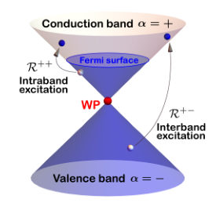
<figcaption class="paper-figure-caption"><b>Fig 1.</b> FIG. 1. Energy bands near a Weyl point (WP) enclosed by a Fermi surface. Plasmon processes involve both intraband and interband particle-hole transitions, which contribute to the plasmon envelope function Rαβ q (Q). The interband com- ponent R+−(R−+) has monopole structure and has a finite vorticity in the relative momentum coordinates q.</figcaption>
</figure>
<figure class="paper-figure-card">
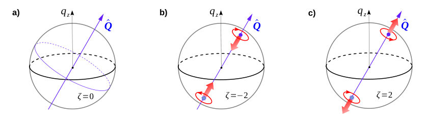
<figcaption class="paper-figure-caption"><b>Fig 2.</b> FIG. 2. Illustration of the topological structure of the envelope functions Rαβ q (Q →0). The sphere (gray line) is defined by the polar and azimuthal angles of the relative momentum q. The equator is the branch cut of the qc ̸= 0 MSH. The COM momentum axis ˆQ is depicted by the blue arrow. a) Intraband components Rαα q (α = ±) exhibit a nodal plane (blue circle) orthogonal to the ˆQ axis, with no vortex present (ζ = 0). b) Interband component R+− q exhibits a nodal line along the ˆQ axis with total vorticity ζ = −2. Two vortices with vorticity −1 (red arrows) form around the ˆQ axis. c) The interband component R−+ q exhibits a nodal line along the ˆQ axis, with two vortices with vorticity...</figcaption>
</figure>

**Summary.** This theoretical work investigates how the topology inherent in Weyl metals dictates the nature of their collective plasmon excitations. It proves that these plasmons carry a topological charge quantified by vorticity ($\zeta$), which manifests as unique optical selection rules, allowing them to interact preferentially with light polarized along specific directions.

**Why it may be interesting.** The connection between topological invariants (Chern number) and measurable optical properties (polarization selection rules, SHG) is highly relevant for quantum optics and condensed matter theory.

Detailed structure

**Main problem.** The study addresses the quantum geometric structure and topological properties of plasmons—collective excitations—within Weyl metals.

**Main result.** Weyl metal plasmons are shown to possess a monopole structure and finite vorticity ($\zeta = 2C_W$), leading to unique optical selection rules where they couple selectively to light polarized along the dipole moment $\mathbf{d}$.

**Method.** The analysis employs linear response theory (RPA) applied to the electron-hole pair operators, utilizing concepts from Berry curvature and quantum geometry tensors.

**Model / system.** The system is Weyl metals, modeled by a Hamiltonian describing fermionic spinors. The physics is analyzed through the plasmon polarization bubble $\Pi_R(Q, \omega)$ and its susceptibility tensor $\chi_{ij}(\omega)$.

**Key observables.** Plasmon dispersion ($\omega_Q$), vorticity ($\zeta$), effective dipole moment ($\mathbf{d}$), and optical selection rules for light coupling.

**Important parameters / regimes.** Fermi momentum ($k_F$), plasmon frequency ($\omega_0$), and the topological charge (Chern number $C_W$).

**Assumptions / limitations.** The analysis relies on the Random Phase Approximation (RPA) level for plasmon calculation, assuming weak light fields and zero temperature in some derivations.

**Figures summary.** Figures illustrate the monopole structure of interband components, showing nodal planes ($\zeta=0$) and vortex structures ($\zeta=\pm 2$) related to different plasmon components.

**Paper structure.** The paper progresses from defining the quantum geometric framework using form factor matrices to calculating the polarization function $\Pi_R$ via integrals. It then analyzes the resulting susceptibility tensor $\chi_{ij}(\omega)$ to derive unique optical selection rules and predict phenomena like Second Harmonic Generation (SHG).

Abstract

We address the quantum geometric structure of plasmons in Fermi surfaces enclosing a topological charge. We demonstrate that Weyl fermion plasmons have monopole structure, are topological and have a finite vorticity $ζ=2\mathsf{C}_{\text{w}}$, where $\mathsf{C}_{\text{w}}$ is the Chern number of the Fermi surface enclosing the Weyl point. We show that these plasmons selectively couple to light linearly polarized along the plasmon effective dipole moment $\mathbf{d}$, which has quantum geometric origin and points along the direction of the plasmon center of mass momentum $\hat{\mathbf{Q}}$. We suggest that Weyl metal topological plasmons have distinctive optical properties compared to conventional plasmons.

[↑ back to top](#top)

### [Projected altermagnetism by symmetry reduction at surfaces and in thin films](http://arxiv.org/abs/2606.18964v1)

**Authors:** Sopheak Sorn, Charanpreet Singh, Lukasz Plucinski, Gustav Bihlmayer, Yuriy Mokrousov, Wulf Wulfhekel  
**Type:** theory · **Category:** other · **PDF:** <https://arxiv.org/pdf/2606.18964v1>  
**Analysis basis:** full PDF text, analyzed in chunks
**Topic relevance:** `spintronics-quantum-optics interface` **3/5**

↔ Scroll figures horizontally

<figure class="paper-figure-card">
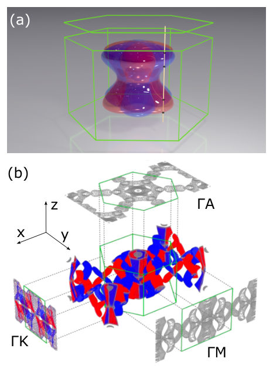
<figcaption class="paper-figure-caption"><b>Fig 1.</b> FIG. 1. Illustration of bulk states projecting onto surface BZ in g-wave AM CrSb. (a) Schematic representation of the bulk states at the Fermi level and their Sz spin polar- ization (blue/red) projecting onto the (001) surface BZ (top- most green hexagon) along the direction of the orange line. Blue and red bulk states project onto the same points, lead- ing to spin-degenerate states throughout the surface BZ. (b) Projections of bulk states as computed from DFT onto three surfaces indicate a rich variety of outcomes. ΓA and ΓM pro- jections yield spin-degenerate outcomes (colorless), while ΓK projection strikingly leads to a d-wave spin splitting.</figcaption>
</figure>
<figure class="paper-figure-card">
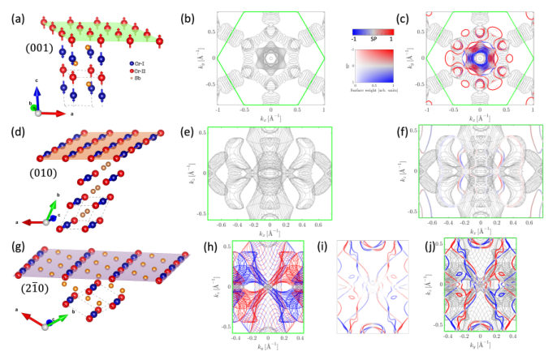
<figcaption class="paper-figure-caption"><b>Fig 2.</b> FIG. 2. Crystal structure (a,d,g) of CrSb thin slabs of (001), (010), and (210) orientation, respectively. (b, e, h) display the color-coded z-spin polarization of the projected bulk states at the Fermi level onto the BZ of the slabs highlighting its absence for the (001) and (010) orientation, and its d-wave symmetry for the (210) orientation. To single out surface states, we contrast them with results from the slab calculations shown in (c, f, j), through which the surface states are clearly seen as the additional lines on top of the bulk states. They exhibit pronounced z-spin polarization as reflected in their strong color intensity that overshadows the gray bulk states. Particularly for...</figcaption>
</figure>

**Summary.** This work explores how cutting a bulk altermagnetic material into thin films or exposing its surfaces fundamentally changes its magnetic electronic structure. By applying group theory and advanced calculations, the authors show that surface orientation dictates whether the spin splitting is conventional, ferromagnetic-like, or possesses a desirable d-wave symmetry. This demonstrates that surface engineering offers a powerful route to tune quantum magnetic properties.

**Why it may be interesting.** While focused on condensed matter magnetism, the concept of controlling electronic properties via boundary conditions (surfaces) by exploiting symmetry breaking is highly relevant to designing quantum materials for spintronics and topological phenomena.

Detailed structure

**Main problem.** The study investigates how breaking crystal symmetries at surfaces and in thin films fundamentally alters the electronic structure and spin-splitting patterns of bulk altermagnetic materials.

**Main result.** Symmetry reduction dictates that while some surfaces yield conventional antiferromagnetic behavior, specific orientations (like (210)) can stabilize desirable d-wave spin splitting, suggesting surface engineering is a tunable platform for controlling magnetism.

**Method.** The research combines group-theoretical analysis of symmetry constraints with first-principles electronic structure calculations (DFT/Tight-Binding) to model the projected band structures.

**Model / system.** The system under study is altermagnetic materials, exemplified by CrSb. The theoretical framework analyzes the spin splitting term in the Bloch Hamiltonian based on the material's magnetic octupole moment and the symmetry of the terminating surface plane.

**Key observables.** Spin-split electronic states (momentum-dependent), the symmetry of the spin splitting (e.g., d-wave vs. ferromagnetic-like), and the presence/absence of spin degeneracy in the 2D Brillouin zone.

**Important parameters / regimes.** Surface orientation ((001), (010), (210)), Spin-Orbit Coupling (SOC) strength, and the nature of the altermagnetic order parameter ($\varphi$).

**Assumptions / limitations.** Initial analyses rely on a bulk-projection picture; some calculations assume fixed atomic positions without structural relaxation.

**Figures summary.** Figures illustrate band structures projected onto surface BZs for different orientations, showing spin degeneracy or specific symmetry splittings (e.g., d-wave splitting confirmed for the (210) plane).

**Paper structure.** The paper progresses by first establishing the theoretical dependence on symmetry reduction, then analyzing multiple surfaces ((001), (010), (210)) using group theory and DFT/TB calculations to map out how surface termination dictates the resulting spin texture.

Abstract

Altermagnets are a newly identified class of magnetic materials that combine vanishing net magnetization within the unit cell with spin-split electronic states. Their theoretical description relies on symmetry properties of the bulk band structure. Surfaces and thin films, however, inherently break these symmetries. Here, we investigate the consequences of such symmetry reduction for the electronic structure of bulk altermagnets near the surface and of thin films. When the surface coincides with a symmetry plane of the bulk altermagnetic order, the resulting two-dimensional Brillouin zone exhibits spin-degenerate bands, corresponding to conventional antiferromagnetic behavior. In all other cases, the symmetry of the altermagnetic order is reduced, leading to modified spin splitting. Remarkably, we discover a thin-film geometry of a $g$-wave altermagnet with a particular surface orientation that enables a $d$-wave spin splitting, which is commonly accompanied by the spin-splitter effect, suggesting the functionalization of non-$d$-wave altermagnets by surfaces. Our findings demonstrate that symmetry breaking at surfaces and in thin films fundamentally reshapes altermagnetic spin textures, providing a tunable platform for controlling spin-dependent electronic phenomena.

[↑ back to top](#top)

### [Electron state tomography from quasiparticle interference maps](http://arxiv.org/abs/2606.18858v1)

**Authors:** A. Razanajatovo, J. Cayssol, C. Dutreix  
**Type:** both · **Category:** other · **PDF:** <https://arxiv.org/pdf/2606.18858v1>  
**Analysis basis:** full PDF text, analyzed in chunks
**Topic relevance:** `Keldysh / 2PI / non-Gaussian methods` **2/5** · `Kondo & dissipative impurity` **2/5** · `entanglement & information structure` **2/5** · `measurement-induced transitions` **2/5** · `quantum measurements` **2/5** · `analog quantum simulation` **1/5** · `correlated / nonlocal dissipation` **1/5** · `driven-dissipative phase transition` **1/5** · `methods for driven-dissipative` **1/5** · `non-equilibrium dynamics` **1/5**

↔ Scroll figures horizontally

<figure class="paper-figure-card">
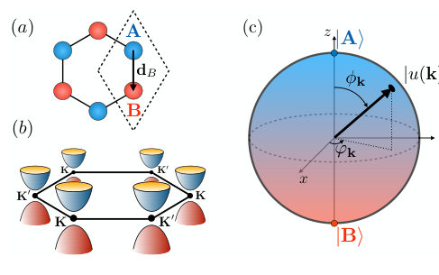
<figcaption class="paper-figure-caption"><b>Fig 1.</b> FIG. 1. (a) Honeycomb lattice with two orbitals A and B per unit cell and relative position dB. (b) Low-energy spectrum with circular CECs at the BZ corners K and K′. (c) Bloch sphere representation of the electron state |u(k)⟩. The north (south) pole maps the orbital-polarized state |A⟩(|B⟩).</figcaption>
</figure>
<figure class="paper-figure-card">
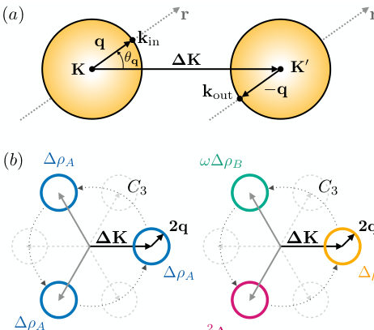
<figcaption class="paper-figure-caption"><b>Fig 2.</b> FIG. 2. (a) Elastic backscattering process coupling the pair of stationary points kin = K + q and kout = K′ −q along two CECs. (b) Orbital contributions in Fourier space showing 2q-radius rings at three intervalley vectors ∆K related by C3 symmetry: ∆ρA remains unchanged under C3 rotation, while ∆ρB picks a phase factor ω = exp(iΦB).</figcaption>
</figure>
<figure class="paper-figure-card">
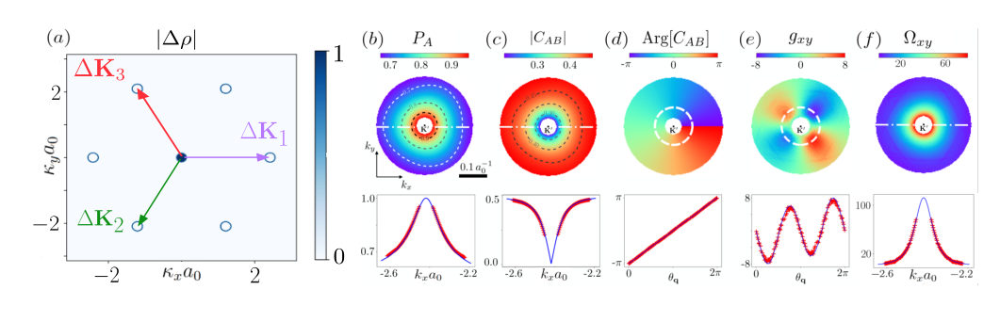
<figcaption class="paper-figure-caption"><b>Fig 3.</b> FIG. 3. (a) Unpolarized QPI map showing the LDOS intensity |∆ρ| in Fourier space at energy E = 0.15t. The vectors ∆K1,2,3 point toward intervalley backscattering intensity rings related by C3 symmetry. (b-f) 2D maps of the density matrix and geometric tensor reconstructed in valley K′ from intervalley backscattering rings as shown in panel (a): (b) population PA, (c) coherence modulus |CBA|, (d) coherence phase Arg[CBA], (e) quantum metric gxy, and (f) Berry curvature Ωxy. The components gxx, gyy, Ωxx and Ωyy are shown in Ref. [73]. The bottom row shows cuts of the QPI-reconstructed quantities (red crosses) along the white dashed lines in the 2D maps on top. They compare to their...</figcaption>
</figure>

**Summary.** This paper introduces a novel tomography technique to extract detailed electronic properties, such as the density matrix and Quantum Geometric Tensor, from standard STM QPI maps. By exploiting crystal symmetries, the method resolves orbital contributions that are otherwise averaged out by unpolarized tips. This breakthrough establishes impurities as powerful probes for mapping band structures in honeycomb materials.

**Why it may be interesting.** While focused on solid-state physics, the core concept of reconstructing a full quantum state (density matrix) from limited, symmetry-averaged measurements mirrors challenges in characterizing open quantum systems where only macroscopic observables are accessible.

Detailed structure

**Main problem.** The goal is to reconstruct the density matrix of electron states and the quantum geometric tensor (QGT) from quasiparticle interference (QPI) maps obtained using conventional, unpolarized scanning tunneling microscopy (STM) tips.

**Main result.** The method successfully establishes impurities as tomographic probes for band structures, allowing the reconstruction of the full density matrix and QGT directly from unpolarized LDOS measurements.

**Method.** It utilizes a tomography approach based on exploiting the symmetry properties (point group representations) of scattering states to disentangle orbital contributions within the total measured LDOS modulation.

**Model / system.** The analysis focuses on two-orbital models defined on a honeycomb lattice, relevant for graphene heterostructures and direct-gap semiconductors. The low-energy physics is described by a $2 	imes 2$ Hamiltonian $\hat{H}(\mathbf{k})$.

**Key observables.** Density matrix ($\hat{\rho}$), orbital populations ($P_\alpha$), quantum coherence ($C_{BA}$), Quantum Metric (Re[QGT]), and Berry Curvature (Im[QGT]).

**Important parameters / regimes.** The analysis is sensitive to the inverse lifetime ($\eta$) which determines the width of Circularly Enriched Crystals (CECs).

**Assumptions / limitations.** The method assumes that backscattering between time-reversed states maps the density matrix into distinct, symmetry-resolvable orbital contributions.

**Figures summary.** Figures illustrate the honeycomb lattice structure, the low-energy spectrum near BZ corners K and K', and show visualizations of the reconstructed QGT components ($\Omega_{xy}$) in various valleys.

**Paper structure.** The paper introduces the problem by defining the need for tomography; it details the methodology using symmetry analysis on the $\hat{T}$-matrix approach; it presents numerical results confirming reconstruction accuracy against theoretical models; and concludes by establishing the technique's broad applicability to hexagonal heterostructures.

Abstract

Characterizing electronic band structures requires precise knowledge of wave functions and their quantum geometry. Here, we introduce a tomography method to reconstruct the density matrix of electron states from quasiparticle interference maps around single impurities. We consider two-orbital models on a honeycomb lattice, relevant to graphene heterostructures and direct-gap semiconductors. For on-site impurities, backscattering between time-reversed states directly maps the density matrix populations and coherences into distinct orbital contributions in the interference map. While local probes usually lack orbital resolution, these orbital contributions transform under distinct symmetry group representations and can thus be disentangled to reveal the density matrix and quantum geometric tensor of the scattering states. This establishes impurities as tomographic probes for band structures in scanning tunneling microscopy using conventional, unpolarized tips.

[↑ back to top](#top)

### [From Localized Packets to Plane Waves: A Time-Domain Approach to Transport in Mesoscopic Systems](http://arxiv.org/abs/2606.19012v1)

**Authors:** Andrzej Biborski  
**Type:** theory · **Category:** other · **PDF:** <https://arxiv.org/pdf/2606.19012v1>  
**Analysis basis:** full PDF text, analyzed in chunks
**Topic relevance:** `non-equilibrium dynamics` **2/5** · `Keldysh / 2PI / non-Gaussian methods` **1/5** · `Kondo & dissipative impurity` **1/5** · `methods for driven-dissipative` **1/5**

↔ Scroll figures horizontally

<figure class="paper-figure-card">
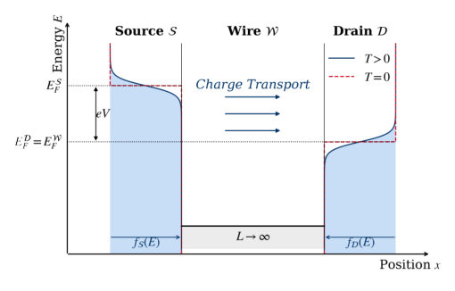
<figcaption class="paper-figure-caption"><b>Fig 1.</b> FIG. 1. The sketch of the system considered here. L →∞in pracise .</figcaption>
</figure>
<figure class="paper-figure-card">
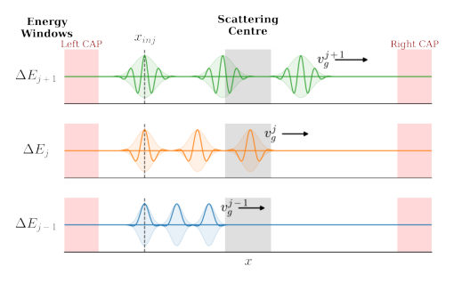
<figcaption class="paper-figure-caption"><b>Fig 2.</b> FIG. 2. The cartoon illustrating the simulation algorithm and its main assumptions. The simulation box is supplied with CAP on each boundary and optionally the with scat- tering center. The packet propagation can be performed in- dependently for each energy window ∆Ej. Note, that group velocity vg, as well as, the shape of packet and its oscillations generally depend on ∆Ej, that is, not only on its width but also on Ej/j−1.</figcaption>
</figure>
<figure class="paper-figure-card">
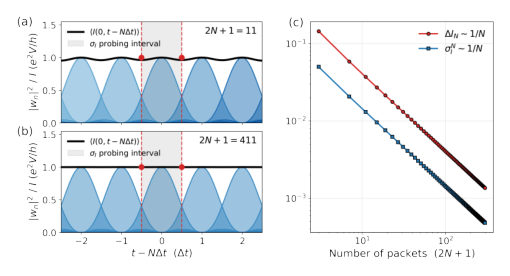
<figcaption class="paper-figure-caption"><b>Fig 3.</b> FIG. 3. Reconstruction of the direct current (DC) via Wan- nier wave packet. (a, b) Time evolution of the injected packet probability densities (|wn|2, blue curves) and the resulting to- tal current ⟨I⟩(solid black lines). Red dashed vertical lines denote the steady-state sampling window. For a sparse packet train (2N + 1 = 11, panel a), discrete source oscillations are prominent. Increasing the packet count (2N + 1 = 411, panel b) suppresses these fluctuations, smoothly recovering the con- tinuous Landauer DC limit. (c) Log-log convergence analysis. Both the absolute error of the reconstructed current ∆IN (red dots) and the standard deviation of the steady-state oscilla- tions σN I (blue...</figcaption>
</figure>
<figure class="paper-figure-card">
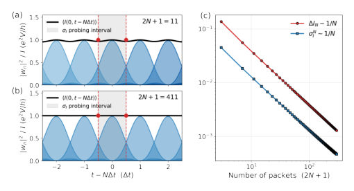
<figcaption class="paper-figure-caption"><b>Fig 4.</b> FIG. 5. The analysis of the formation of noiseless DC similar to that presented in Fig.3 but in the parabolic regime. Again, only small number of packets results in the fluctuations (a), whereas increase in N reproduces nearly noiseless current (b). In parabolic regime also, the ∆IN and the standard deviation of the steady-state oscillations σN I scale as ∼1/N as shown in panel (c).</figcaption>
</figure>
<figure class="paper-figure-card">
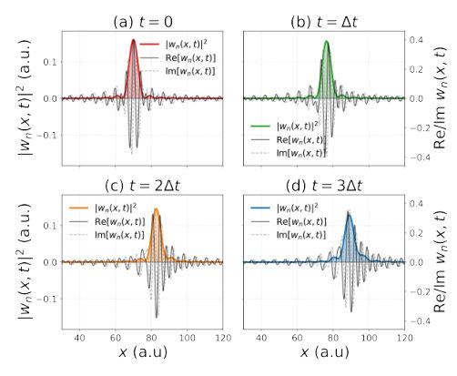
<figcaption class="paper-figure-caption"><b>Fig 5.</b> FIG. 4. Spatiotemporal evolution of a single Wannier wave packet under a parabolic dispersion relation. Panels (a)–(d) display snapshots of the propagating wave packet at successive time steps t = 0, ∆t, 2∆t, and 3∆t. The thick colored curves denote the probability density envelope |wn(x, t)|2 (left axis), whereas the thin solid black and dashed grey lines represent the real and imaginary parts of the wave function, respectively (right axis).</figcaption>
</figure>

**Summary.** The paper develops an exact time-domain formalism for quantum transport in mesoscopic systems by representing fermionic excitations as orthogonal wave packets. This approach rigorously derives Landauer conductance without relying on momentum space, and it extends to analyze complex non-linear devices like RTDs by calculating dynamic admittance from time-dependent packet evolution.

**Why it may be interesting.** This work provides a powerful, alternative theoretical lens—the wave packet picture—to understand quantum transport phenomena typically analyzed using steady-state scattering matrices (Landauer/NEGF), offering insights into the underlying time dynamics.

Detailed structure

**Main problem.** To establish a rigorous, self-contained time-domain construction of Landauer transport that bridges the gap between the continuous energy-domain scattering framework and a discrete, time-resolved picture.

**Main result.** The formalism successfully reproduces the quantized Landauer conductance ($e^2/h$) in the time domain using orthogonal fermionic wave packets, bypassing momentum-space kinematics entirely.

**Method.** It employs second quantization, defining packet creation operators via Fourier transforms and enforcing Pauli exclusion to quantize time ($\Delta t = h/eV$).

**Model / system.** The study models quantum transport in mesoscopic conductors, specifically analyzing structures like the Resonant Tunneling Diode (RTD) using fermionic wave packets (Wannier states).

**Key observables.** Landauer conductance ($G_0$), DC current ($\langle \hat{I}(x, t) 
angle$), dynamic admittance ($Y(\omega)$), and resonance lifetimes ($	au_i$).

**Important parameters / regimes.** Temperature ($T=0$ vs $T>0$), applied bias voltage ($V_{	ext{bias}}$), energy window $[	ext{0}, eV]$, and fundamental time quantization $\Delta t = h/eV$.

**Assumptions / limitations.** The initial derivation assumes the Hamiltonian is elastic, and for finite T, it uses a systematic coarse-graining approximation over disjoint energy windows.

**Figures summary.** Figures illustrate current convergence from discrete oscillations to the continuous Landauer limit; they also show spatiotemporal evolution of wave packets under parabolic dispersion and the extraction of dynamic admittance components ($G(\omega), B(\omega)$) across resonance features.

**Paper structure.** The paper progresses by first establishing the time-domain formalism for $T=0$ transport, then extending it to finite temperature via energy window decomposition, and finally applying this framework to analyze non-linear devices like RTDs, including AC admittance measurements.

Abstract

Quantum transport in mesoscopic systems is conventionally formulated within the Landauer--Büttiker scattering framework, where steady-state currents emerge from the transmission of plane waves representing propagating carriers. While highly successful, this description obscures the explicit time-domain dynamics of individual fermionic excitations and their role in establishing macroscopic transport. Here, we present an exact and self-contained time-domain construction of Landauer transport based on a discrete basis of orthogonal fermionic wave packets. Starting from a second-quantized formulation, we define packet creation operators via a continuous Fourier transform over a finite transport energy window. By encoding the Pauli exclusion principle, which enforces a fundamental temporal spacing $Δt = h/eV$, the current is reproduced in terms of orthogonal wave packets that are used for the rigorous construction of the many-body fermionic state. In this representation, a noiseless current emerges as a deterministic sequence of charge-carrying events, yielding the Landauer conductance $G_0 = e^2/h$ without invoking momentum-space kinematics. We further demonstrate that this construction remains exact for arbitrary energy dispersion. Additionally, the underlying Fock space decomposition into finite disjoint energy sub-bands renders the numerical approach highly scalable for high performance computing platforms. Our results establish a direct and rigorous bridge between the continuous scattering description of quantum transport and a discrete, time-resolved picture based on fermionic wave packets.

[↑ back to top](#top)

### [Counterintuitive inverse superconducting transition beyond 4He-cooling limit](http://arxiv.org/abs/2606.18683v1)

**Authors:** Haowen Han, Yi Bian, Tong Ma, Yusong Zhao, Nuofu Chen, Chuanying Xi, Ze Wang, Binghui Ge, Hongliang Dong, Jia-Cai Nie, Ho-Kwang Mao, Jikun Chen  
**Type:** experiment · **Category:** strongly correlated electrons · **PDF:** <https://arxiv.org/pdf/2606.18683v1>  
**Analysis basis:** full PDF text, analyzed in chunks
**Topic relevance:** `non-equilibrium dynamics` **2/5** · `driven-dissipative phase transition` **1/5** · `non-equilibrium universality` **1/5**

↔ Scroll figures horizontally

<figure class="paper-figure-card">
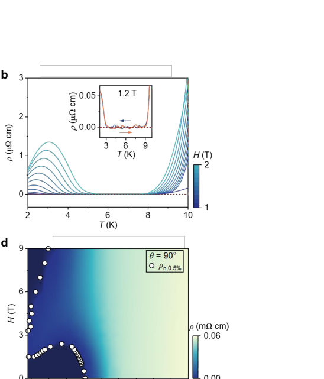
<figcaption class="paper-figure-caption"><b>Fig 1.</b> Fig. 1 | Inverse superconducting transitions beyond 4He cooling-limit. a, Temperature-</figcaption>
</figure>
<figure class="paper-figure-card">
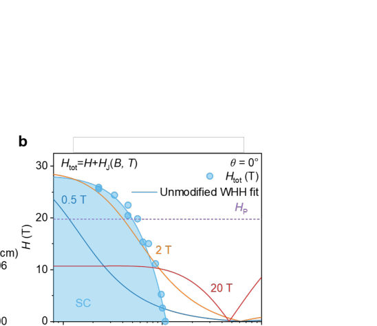
<figcaption class="paper-figure-caption"><b>Fig 2.</b> Fig. 2 | Mechanism underlying Kelvin-ranged inverse superconducting transition. a, High-</figcaption>
</figure>
<figure class="paper-figure-card">
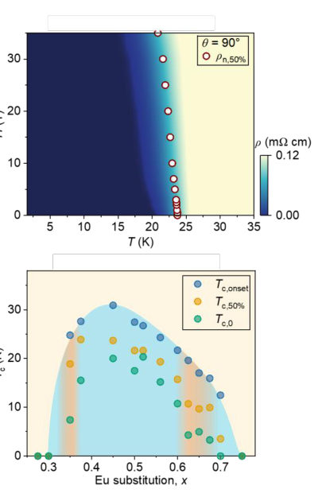
<figcaption class="paper-figure-caption"><b>Fig 3.</b> Fig. 3 | Eu-based superconducting phase-diagram for inverse superconducting transitions.</figcaption>
</figure>
<figure class="paper-figure-card">
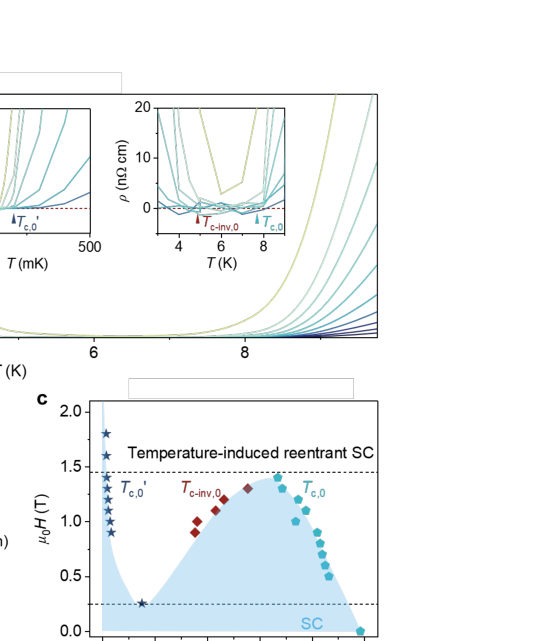
<figcaption class="paper-figure-caption"><b>Fig 4.</b> Fig. 4 | Extended framework enabling temperature-induced reentrant superconductivity.</figcaption>
</figure>

**Summary.** The authors report discovering an inverse superconducting transition—where superconductivity appears upon heating—in Eu-doped nickelates. They demonstrate this effect persists above the 4He cooling limit using high magnetic fields and current injection. This work suggests that complex magnetic interactions can fundamentally alter the thermal stability of quantum superconducting phases.

**Why it may be interesting.** This work explores non-equilibrium quantum phenomena in strongly correlated materials where thermal fluctuations are not purely decohering but can actively engineer superconducting states, which is highly relevant to understanding exotic pairing mechanisms beyond BCS theory.

Detailed structure

**Main problem.** The research investigates counterintuitive superconducting transitions, specifically superconductivity induced by an *increase* in temperature (inverse transition), moving beyond previously observed limits.

**Main result.** They report observing field-modulated inverse superconducting transitions above the 4He-cooling limit in Eu-based infinite-layer nickelates, suggesting a mechanism involving temperature-induced magnetic field dominance.

**Method.** The study relies on detailed transport measurements, including resistivity vs. temperature ($
ho$-$T$), resistivity vs. magnetic field ($
ho$-$H$), and current-voltage ($I$-$V$) characteristics under high fields.

**Model / system.** The physical platform is Eu-doped infinite-layer nickelates (e.g., $	ext{EuxNd}_{1-x}	ext{NiO}_2$). The behavior is analyzed by comparing measured effective magnetic fields to theoretical upper critical fields, deviating from standard Jaccarino-Peter compensation models.

**Key observables.** Zero-resistance state boundaries ($T_{c	ext{-inv}}$ and $T_c$), field dependence ($
ho$-$H$ cross-linking), current density triggering of transitions, and reemerged superconductivity at sub-Kelvin temperatures.

**Important parameters / regimes.** Magnetic fields up to 35 T; temperature ranges spanning from $\sim 60 	ext{ mK}$ to several Kelvin; doping levels (overdoped/underdoped regimes).

**Assumptions / limitations.** The analysis assumes that the inverse transition is governed by an alternating dominance of effective magnetic fields related to Eu$^{2+}$ compensations relative to $H_{c2}$.

**Figures summary.** Figures illustrate $
ho$-$T$ curves showing the characteristic inverse superconducting dome, high-field phase diagrams mapping the boundaries between normal and superconducting states, and $I$-$V$ characteristics demonstrating current-induced transitions.

**Paper structure.** The paper systematically presents evidence for the unusual superconducting phase diagram, first establishing the existence of the inverse transition ($T_{c	ext{-inv}}$), then detailing its field and current dependence, and finally proposing a mechanism based on magnetic field compensation effects.

Abstract

Thermally driven quantum-orders observed in exceptional instances may redefine the role of thermal-fluctuation from a source of decoherence to a resource for coherent-state engineering. While preliminary signs of counterintuitive temperature-rise-triggered superconductivity manifested in CeCu2Si2, ErRh4B4, Ho1.2Mo6S8 and (La,Ce)Al2, their critical-temperatures (Tc-inv) remain below Kelvin-range, precluding substantial applications. Here, we report field-modulated inverse-superconducting-transitions above 4He-cooling-limit in Eu-based infinite-layer nickelates (EuxNd1-xNiO2 and EuxPr1-xNiO2) grown on a substrate under both overdoped and underdoped regimes. Paradigmatically, superconductivity with zero-resistance is confined between Tc-inv (2.6-5.4 K) and another higher normal-Tc, rising and decreasing with applied magnetic-field, respectively. Starting from the resistive-state below Tc-inv, the inverse-superconducting-transition is driven by not only temperature-rising, but also current-density, while superconductivity further vanishes at higher temperature and current thresholds. The Kelvin-range inverse superconducting transition is plausibly explained by temperature-induced alternating dominance of effective magnetic-fields arising from Eu2+4f7 related compensations relative to the upper-critical-field. Furthermore, an extended-phenomenological-framework is also supported by reemerged superconductivity below 300 mK under magnetic-field, giving rise to an unprecedented temperature-induced reentrant superconductivity. Our findings establish magnetic-interaction-reconfigured high-Tc systems as fertile platforms for exploring quantum phenomena that reverse thermal-decoherence paradigm, also enabling antithetical-designs to unlock untapped application-scenarios for quantum-phase-transition devices.

[↑ back to top](#top)

### [Room-Temperature Calcium Intercalation into Graphite Catalyzed by Sodium](http://arxiv.org/abs/2606.19024v1)

**Authors:** Akira Iyo, Shigeyuki Ishida, Hiroshi Eisaki, Hiraku Ogino, Kenji Kawashima  
**Type:** experiment · **Category:** other · **PDF:** <https://arxiv.org/pdf/2606.19024v1>  
**Analysis basis:** full PDF text, analyzed in chunks
**Topic relevance:** `non-equilibrium dynamics` **2/5** · `driven-dissipative phase transition` **1/5** · `non-equilibrium universality` **1/5**

↔ Scroll figures horizontally

<figure class="paper-figure-card">
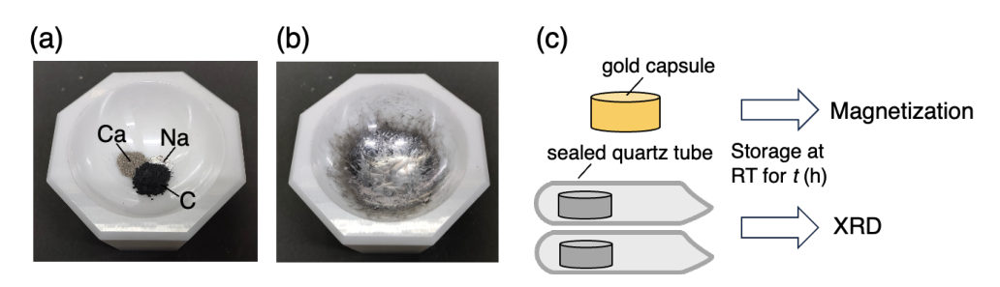
<figcaption class="paper-figure-caption"><b>Fig 1.</b> FIG. 1. Experimental workflow: (a) weighing of Ca, C, and Na, (b) mixing using a zirconia mortar and pestle, (c) sealing in gold capsule or quartz tube, and (d) magnetization and XRD measurements after storage at RT for t hours.</figcaption>
</figure>
<figure class="paper-figure-card">
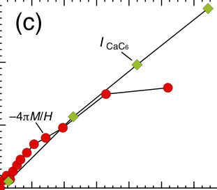
<figcaption class="paper-figure-caption"><b>Fig 2.</b> FIG 3. (a) XRD patterns after various storage times; (b) t-dependence of Tc; (c) √t-dependence of –4πMFC/H at 2 K and CaC₆ peak intensity ICaC6.</figcaption>
</figure>

**Summary.** This work demonstrates that sodium catalysis allows for the room-temperature synthesis of superconducting $	ext{CaC}_6$ by intercalating calcium into graphite. By monitoring magnetic susceptibility and crystal structure over time, the researchers confirmed progressive material formation, suggesting a diffusion-limited mechanism with potential applications in advanced energy storage like Ca-ion batteries.

**Why it may be interesting.** While focused on solid-state chemistry/materials science, the observation of temperature-dependent superconducting transitions ($T_c$ increasing with time) and the underlying mechanism (diffusion control) touches upon non-equilibrium phase transitions relevant to condensed matter physics.

Detailed structure

**Main problem.** The study addresses the challenge of forming superconducting Calcium Carbide ($	ext{CaC}_6$) via intercalation into graphite at room temperature (RT), a process previously thought to require high temperatures.

**Main result.** Sodium ($	ext{Na}$) catalysis successfully enables the formation of superconducting $	ext{CaC}_6$ at RT, with superconductivity confirmed by diamagnetism and $	ext{XRD}$ peaks that evolve over time.

**Method.** The researchers used a controlled experimental setup involving mixing $	ext{Ca}$, graphite, and $	ext{Na}$ precursors, followed by measurements of magnetic susceptibility (SQUID) and X-ray Diffraction ($	ext{XRD}$) as a function of storage time at RT.

**Model / system.** The physical system is the intercalation reaction: $	ext{Ca} + 	ext{Graphite} (	ext{C}) \xrightarrow{	ext{Na catalyst}} 	ext{CaC}_6$. The process is monitored by tracking the growth of superconducting phases within a solid-state mixture.

**Key observables.** Superconducting diamagnetism (Meissner effect), $	ext{XRD}$ peak intensity for $	ext{CaC}_6$, and the superconducting transition temperature ($T_c$).

**Important parameters / regimes.** Storage time ($t$), which showed a square root ($\sqrt{t}$) dependence for superconducting volume fraction indicators.

**Assumptions / limitations.** The process is assumed to be diffusion-controlled, leading to the $\sqrt{t}$ scaling observed in the superconducting signals.

**Figures summary.** Figures illustrate the experimental workflow, temperature dependence of magnetic susceptibility versus storage time, and show how both $	ext{XRD}$ patterns and superconducting indicators scale with $\sqrt{t}$.

**Paper structure.** The paper follows a structure detailing sample preparation, performing measurements over varying storage times at RT, analyzing the time evolution of superconductivity via magnetometry and structural changes via XRD.

Abstract

Calcium (Ca) insertion into graphite (C) has been considered to require elevated temperatures, and its occurrence at room temperature (RT) has been regarded as highly unlikely. Here, we demonstrate that sodium (Na) catalysis enables the formation of superconducting CaC$_6$ even at RT. In mixtures of Ca, Na, and graphite, the gradual development of superconducting diamagnetism and the emergence of X-ray diffraction peaks confirm the formation of CaC$_6$ during storage at RT. The superconducting transition temperature increases with storage time, and the amount of CaC$_6$ scales proportionally to the square root of storage time. These findings provide new insights into the mechanism of superconductivity and Na-catalyzed formation of CaC$_6$, and highlight the potential of this RT intercalation process for practical applications such as electrode materials in Ca-ion batteries.

[↑ back to top](#top)

### [Polarized neutron scattering as a probe for vortex-type spin correlations in iron oxide multicore assemblies](http://arxiv.org/abs/2606.18791v1)

**Authors:** Venus Rai, Ivan Titov, Elizabeth M. Jefremovas, Štefan Liščák, Sivarenjini Shan, Nina-Juliane Steinke, Jonathan Leliaert, Álvaro Gallo-Córdova, María P. Morales, Davide Peddis, Pierfrancesco Maltoni, Luis Fernández Barquín, Andreas Michels, Michael P. Adams  
**Type:** experiment · **Category:** other · **PDF:** <https://arxiv.org/pdf/2606.18791v1>  
**Analysis basis:** full PDF text, analyzed in chunks
**Topic relevance:** `analog quantum simulation` **1/5** · `exotic spin models in light-matter` **1/5** · `spintronics-quantum-optics interface` **1/5**

↔ Scroll figures horizontally

<figure class="paper-figure-card">
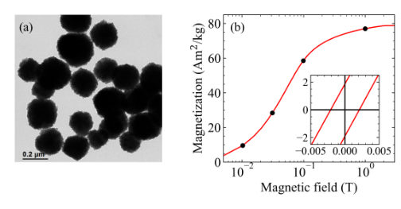
<figcaption class="paper-figure-caption"><b>Fig 1.</b> FIG. 1. (a) Transmission electron microscopy image of iron oxide nanoflowers with an average flower size of D = 220 ± 20 nm. Each nanoflower consists of nanocrystallites with an average size of about 10 nm determined from the analysis of wide-angle x-ray diffraction data [20]. (b) Room-temperature magnetization data of the 220 nm nanoflower sample (log- linear scale, only the upper right quadrant is shown). The black dots mark the field values of the SANS measurements. The inset highlights the hysteretic behavior at small fields.</figcaption>
</figure>
<figure class="paper-figure-card">
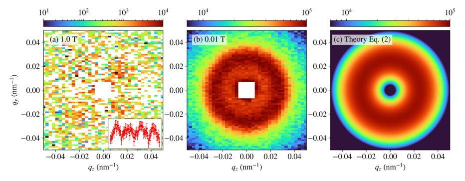
<figcaption class="paper-figure-caption"><b>Fig 2.</b> FIG. 2. (a) Two-dimensional experimental spin-flip SANS cross section dΣsf/dΩ(in cm−1) of iron oxide nanoflowers at applied magnetic fields of (a) 1.0 T and (b) 0.01 T (H0 ∥ez ⊥k0 ∥ex). The inset in (a) depicts a sin2 θ cos2 θ type angular variation of dΣsf/dΩat 1 T, which is characteristic for the saturated state. (c) Analytical prediction by the linear vortex model [Eq. (2)] using the following parameters: m1R/m0 = 100, R = 93 nm, and αc = arccos [( √</figcaption>
</figure>
<figure class="paper-figure-card">
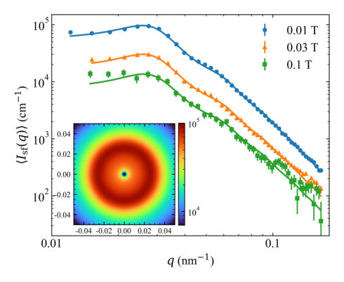
<figcaption class="paper-figure-caption"><b>Fig 3.</b> FIG. 3. (•) Experimental ⟨Isf(q)⟩at several applied magnetic fields (see inset, log-log scale). Solid lines: fit to the linear vor- tex model [Eqs. (3)−(5)]. Inset: 2D spin-flip SANS at 0.01 T computed based on the fit results [compare to Fig. 2(b)].</figcaption>
</figure>

**Summary.** This work uses polarized small-angle neutron scattering (SANS) to experimentally map the magnetic microstructure of iron oxide nanoflowers. By analyzing the spin-flip scattering intensity at low applied fields, the researchers provide strong evidence for the formation of vortex-type magnetization states within these assemblies. This methodology demonstrates SANS's power in characterizing complex, non-uniform magnetic correlations in densely packed nanomaterials.

**Why it may be interesting.** While focused on magnetism, the use of scattering techniques to probe mesoscopic, non-uniform magnetic order parameters (like vortices) provides an analogy for studying complex, spatially varying order parameters in other condensed matter systems.

Detailed structure

**Main problem.** The study investigates vortex-type spin correlations within iron oxide multicore assemblies.

**Main result.** Experimental measurements of the spin-flip SANS cross section reveal an isotropic ring structure at low fields, which is quantitatively consistent with theoretical predictions for flux-closure states stabilized by magnetostatic and exchange energies.

**Method.** Polarized small-angle neutron scattering (SANS) was employed to probe the magnetic microstructure of the assemblies.

**Model / system.** The physical system consists of iron oxide nanoflowers, modeled using a linear vortex magnetization Ansatz. The analysis compares measured spin-flip cross sections against theoretical models incorporating particle interactions via structure factors.

**Key observables.** Spin-flip SANS cross section (dSigma_sf/dOmega) and its field evolution at intermediate momentum transfers (q).

**Important parameters / regimes.** Low applied magnetic fields are crucial for observing vortex formation; the characteristic isotropic ring feature is key.

**Assumptions / limitations.** The analysis uses an effective model incorporating the Percus-Yevick structure factor to account for dense packing and size distribution, building upon initial dilute ensemble approximations.

**Figures summary.** Figure 1 shows TEM images of nanoflowers and magnetization hysteresis. Figure 2 compares experimental spin-flip scattering at different fields (1.0 T vs 0.01 T) with the linear vortex model prediction.

**Paper structure.** The paper progresses from defining the physical system and theoretical framework for vortex modeling to presenting quantitative comparisons between measured SANS data and calculated cross sections, culminating in evidence supporting the vortex state formation.

Abstract

We report an experimental investigation of the magnetic microstructure of iron oxide multicore assemblies by means of polarized small-angle neutron scattering (SANS). Guided by a recently developed analytical theory for vortex-state magnetic nanoparticles, we provide a quantitative comparison between the measured and calculated cross sections, revealing signatures that are consistent with vortex-type magnetization configurations at low applied magnetic fields. In particular, the field evolution and the characteristic isotropic ring-type feature of the spin-flip scattering intensity at intermediate momentum transfers are in line with the formation of flux-closure states. The latter are stabilized by the interplay of exchange, Zeeman, and magnetostatic energies. The methodology allows for a statistically significant characterization of vortex states in densely packed nanoparticle systems, thereby complementing surface-sensitive techniques that are commonly limited to the observation of spin structures in individual particles.

[↑ back to top](#top)

### [Thermodynamic-Kinetic Decoupling Enables Stable Excitonic Emission in Defect-Tolerant Cu-Based Quantum Dots](http://arxiv.org/abs/2606.18939v1)

**Authors:** Haoran Chen, Zhipeng Xu, Chunjian Li, Lei Hou, Dechao Yu, Xiaobin Xie, Yue Liu, Bohua Dong, Lixin Cao, Chenghui Xia  
**Type:** experiment · **Category:** other · **PDF:** <https://arxiv.org/pdf/2606.18939v1>  
**Analysis basis:** full PDF text, analyzed in chunks
**Topic relevance:** `driven-dissipative phase transition` **1/5** · `interference shaping light` **1/5** · `quantum optics experiment` **1/5**

↔ Scroll figures horizontally

<figure class="paper-figure-card">
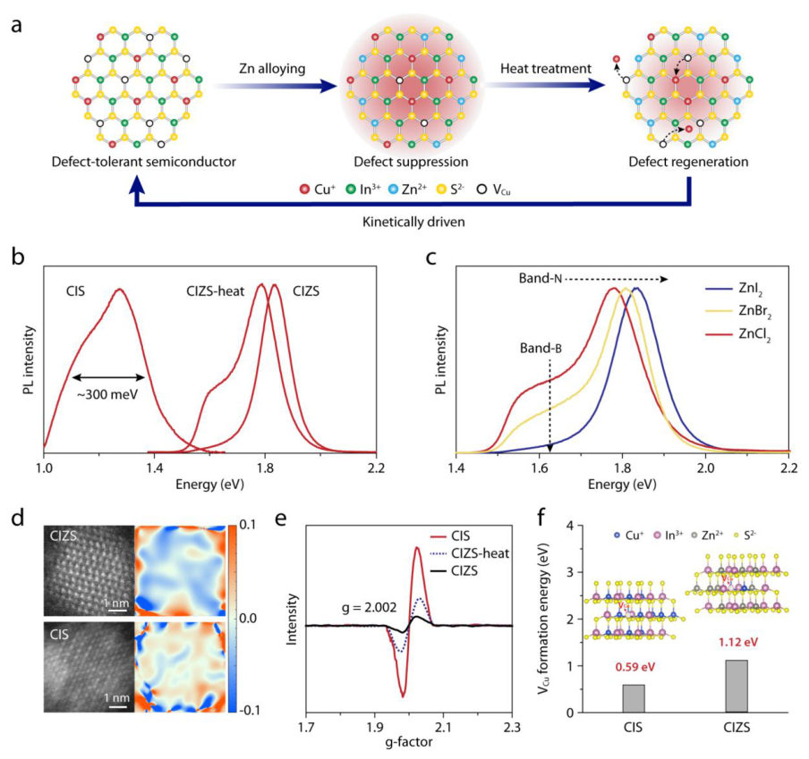
<figcaption class="paper-figure-caption"><b>Fig 1.</b> Figure 1. Zn2+ alloying thermodynamically suppresses native defects and redirects CIS emission</figcaption>
</figure>
<figure class="paper-figure-card">
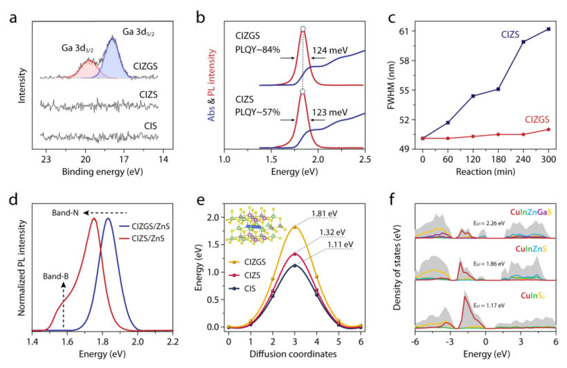
<figcaption class="paper-figure-caption"><b>Fig 2.</b> Figure 2. Ga3+ acts as a kinetic “locking” agent that stabilizes the Zn-optimized cation</figcaption>
</figure>
<figure class="paper-figure-card">
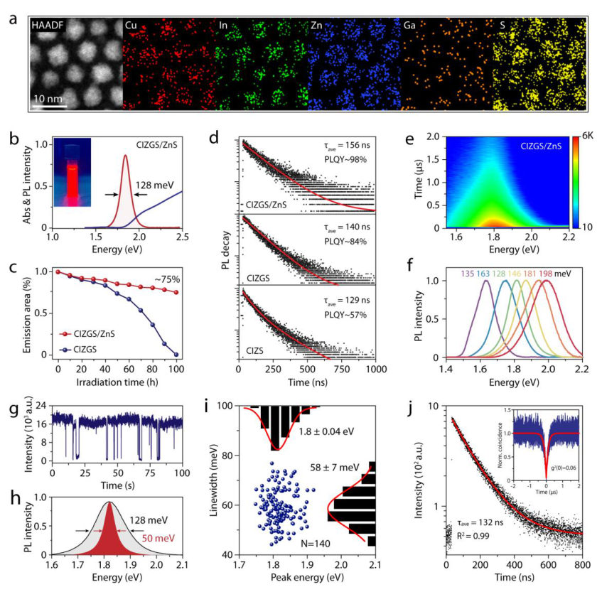
<figcaption class="paper-figure-caption"><b>Fig 3.</b> Figure 3. The thermodynamically narrowed and kinetically locked cores withstand ZnS shell</figcaption>
</figure>
<figure class="paper-figure-card">
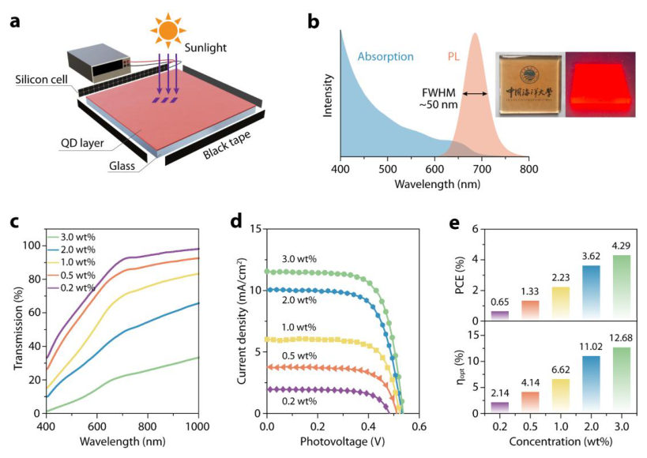
<figcaption class="paper-figure-caption"><b>Fig 4.</b> Figure 4. Narrow, stable excitonic emission translates into reduced reabsorption losses and</figcaption>
</figure>

**Summary.** This research introduces a novel 'thermodynamic–kinetic decoupling' method to stabilize excitonic emission in defect-prone Cu-based quantum dots. By alloying with Zn and Ga, the researchers suppress native defects thermodynamically while kinetically locking the structure against degradation. This results in high-purity, stable emitters that significantly boost the efficiency of luminescent solar concentrators.

**Why it may be interesting.** The work provides a clear, actionable framework—the 'strain-and-pin' strategy—for controlling intrinsic electronic properties in complex semiconductor materials by manipulating both their equilibrium thermodynamics and kinetic barriers.

Detailed structure

**Main problem.** The primary challenge is achieving stable, narrow-band excitonic emission in defect-tolerant, heavy-metal-free quantum dots (QDs) that are prone to broad, defect-related photoluminescence.

**Main result.** By implementing a thermodynamic–kinetic decoupling strategy using Zn and Ga alloying, the researchers created highly stable QDs exhibiting near-unity quantum yield and narrow excitonic emission suitable for high-efficiency devices like LSCs.

**Method.** The study combines advanced synthesis techniques (cation exchange, shell growth) with rigorous characterization methods including single-dot spectroscopy, time-resolved PL, and device testing.

**Model / system.** The physical system is colloidal CuInS2-based quantum dots ($	ext{CIZGS/ZnS}$), which are engineered by alloying ($	ext{Zn}^{2+}$) to thermodynamically suppress native defects and subsequently stabilizing the structure using $	ext{Ga}^{3+}$ incorporation to kinetically pin cation migration.

**Key observables.** PL linewidth (narrowing from $>300 	ext{ meV}$ to $\sim 58-120 	ext{ meV}$), Quantum Yield ($\approx 98\%$), Single-photon purity ($g_2(0) = 0.06$), and External Optical Efficiency ($\eta_{opt} = 12.68\%$ in LSCs).

**Important parameters / regimes.** Lattice strain induced by $	ext{Zn}^{2+}$ alloying; the energetic penalty for cation displacement (kinetic barrier); operating temperature ($T=300 	ext{ K}$).

**Assumptions / limitations.** The observed spectral narrowing and stability are directly attributable to the engineered thermodynamic suppression of defects combined with kinetic stabilization against defect regeneration during processing.

**Figures summary.** Figures illustrate spectral evolution across different QD compositions ($	ext{CIS} 	o 	ext{CIZS} 	o 	ext{CIZGS/ZnS}$), structural changes via STEM/XRD, and device performance metrics like $J–V$ curves for LSCs.

**Paper structure.** The paper follows a logical progression: identifying the defect-limited emission problem $
ightarrow$ applying thermodynamic control ($	ext{Zn}^{2+}$ alloying) to narrow the band $
ightarrow$ addressing kinetic instability ($	ext{Ga}^{3+}$ incorporation) $
ightarrow$ demonstrating final stability and high performance in optoelectronic devices (LSCs).

Abstract

Colloidal quantum dots that simultaneously offer room-temperature single-photon purity and high photoluminescence quantum yield are sought for quantum optics, but remain elusive in environmentally benign materials. We introduce a thermodynamic-kinetic decoupling strategy that transforms defect-tolerant CuInS2 quantum dots into bright, narrowband, and photostable single-photon emitters. Zn2+ alloying strains the lattice, thermodynamically suppressing native copper vacancies and narrowing the emission from a broad defect band of approximately 300 meV to an excitonic line of approximately 120 meV. Ga3+ incorporation then kinetically pins the cation sublattice against Cu+ migration, preventing defect regeneration during ZnS shell growth. The resulting Cd-free core/shell dots achieve near-unity quantum yield of approximately 98% while retaining narrow excitonic emission. Critically, room-temperature single-dot spectroscopy reveals homogeneous linewidths as low as approximately 58 meV, strongly suppressed blinking, and high-purity single-photon emission with g2(0) = 0.06. This stabilized excitonic emission directly reduces reabsorption losses in luminescent solar concentrators, yielding an external optical efficiency of 12.68%. Our work establishes a generalizable framework to unlock intrinsic excitonic photophysics in ion-mobile, defect-prone semiconductors, opening a viable path toward high-performance heavy-metal-free emitters for quantum light sources.

[↑ back to top](#top)

### [Generalized deformation potential and machine-learning approaches for electron-phonon coupling and thermoelectric transport in semiconductors](http://arxiv.org/abs/2606.19130v1)

**Authors:** Ransell D'Souza, Ivana Savic  
**Type:** both · **Category:** disordered systems and neural networks · **PDF:** <https://arxiv.org/pdf/2606.19130v1>  
**Analysis basis:** full PDF text, analyzed in chunks
**Topic relevance:** `methods for driven-dissipative` **1/5**

↔ Scroll figures horizontally

<figure class="paper-figure-card">
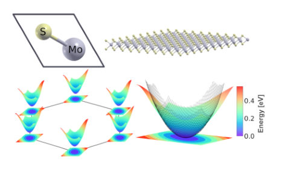
<figcaption class="paper-figure-caption"><b>Fig 1.</b> FIG. 1. (Top left) Top view of the hexagonal unit cell of monolayer MoS2. (Top right) Atomic structure of a MoS2 sheet. (Lower left) The energy dispersion of the lowest con- duction band of MoS2, calculated using density functional theory (DFT) in the vicinity of the K and K′ points in the hexagonal Brillouin zone. (Lower right) The black curve is the dispersion of the conduction band obtained using the Kane model fitted to DFT results, shown in color.</figcaption>
</figure>
<figure class="paper-figure-card">
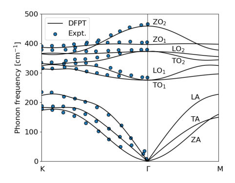
<figcaption class="paper-figure-caption"><b>Fig 2.</b> FIG. 2. The phonon dispersion of single layer MoS2 cal- culated using density functional perturbation theory, repre- sented with solid lines. The experimental data taken from Ref. [52] are shown with circles [53]. The acoustic phonon branches are in-plane longitudinal (LA), in-plane transverse (TA) and out-of-plane (ZA). The optical modes are two in- plane longitudinal (LO) modes, two in-plane transverse (TO) modes, and two out-of-plane (ZO) modes.</figcaption>
</figure>
<figure class="paper-figure-card">
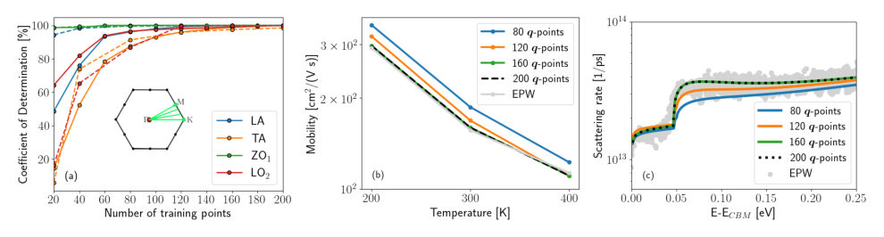
<figcaption class="paper-figure-caption"><b>Fig 3.</b> FIG. 3. (a) Coefficient of determination for phonon-mode resolved electron-phonon matrix elements as a function of the size of the training dataset. The results corresponding to the datasets consisting of 1 k-point located at K and uniformly distributed q-points along selected lines in the Brillouin zone (the ”uniform” datasets) are shown by solid lines. The results obtained from the datasets with 1 k-point located at K and randomly chosen q-points are shown by dashed lines. LA and TA correspond to longitudinal and transverse acoustic phonons, respectively. ZO1 and LO2 stand for the homopolar and polar optical phonons, respectively. Inset: Selected directions in the first Brillouin zone...</figcaption>
</figure>
<figure class="paper-figure-card">
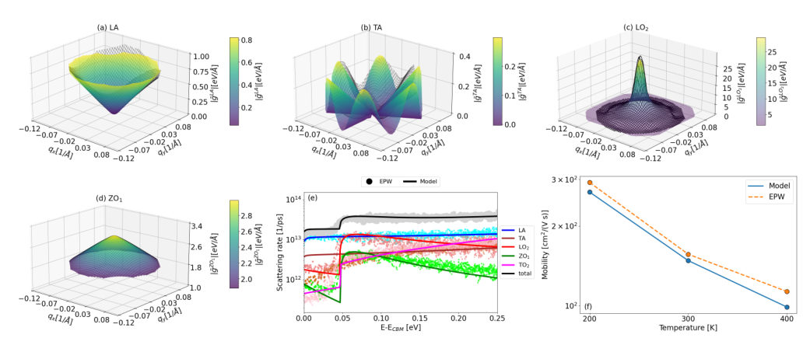
<figcaption class="paper-figure-caption"><b>Fig 4.</b> FIG. 4. Phonon-mode resolved scaled electron-phonon matrix elements with the initial electronic state at the K point as a function of the phonon wave vector. The results shown in color are obtained using the model approach. The black curves are the results obtained using the EPW code. Panels (a), (b), (c) and (d) correspond to longitudinal acoustic (LA), transverse acoustic (TA), polar optical (LO2) and homopolar optical (ZO1) phonons, respectively. (e) Scattering rates versus energy with respect to the conduction band minima at K and K′. Solid lines represent the model results, while the dots correspond to the EPW results. (f) Electron mobility versus temperature. Solid lines represent the...</figcaption>
</figure>
<figure class="paper-figure-card">
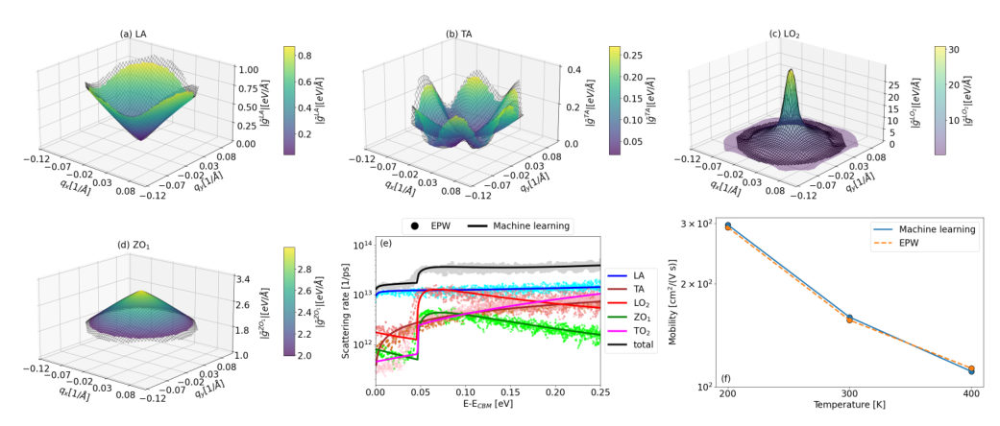
<figcaption class="paper-figure-caption"><b>Fig 5.</b> FIG. 5. Phonon-mode resolved scaled electron-phonon matrix elements with the initial electronic state at the K point as a function of the phonon wave vector. The results shown in color are obtained using the machine-learning approach. The black curves are the results obtained using the EPW code. Panels (a), (b), (c) and (d) correspond to longitudinal acoustic (LA), transverse acoustic (TA), polar optical (LO2) and homopolar optical (ZO1) phonons, respectively. (e) Scattering rates versus energy with respect to the conduction band minima at K and K′. Solid lines represent the machine-learning results, while the dots correspond to the EPW results. (f) Electron mobility versus temperature....</figcaption>
</figure>

**Summary.** This work tackles the computational bottleneck in calculating electronic transport properties by proposing and comparing two efficient alternatives to standard DFT methods: a generalized model approach and a machine learning interpolation technique. By applying these methods to MoS2, the authors demonstrate that ML offers high accuracy while being significantly faster, providing a powerful tool for predicting thermoelectric performance in novel 2D semiconductors.

**Why it may be interesting.** The integration of machine learning directly into solid-state physics calculations for complex many-body interactions like electron-phonon coupling represents a powerful paradigm shift in materials discovery, moving beyond purely deterministic, computationally prohibitive first-principles methods.

Detailed structure

**Main problem.** Computing electron-phonon coupling and thermoelectric transport properties from first principles is computationally expensive, necessitating efficient predictive methods.

**Main result.** The machine learning approach was shown to be more accurate and straightforward to implement than model approaches for predicting these complex material parameters in 2D semiconductors like MoS2.

**Method.** The study compares three methods: rigorous DFPT+Wannier interpolation, a generalized acoustic deformation potential model, and a novel Machine Learning regression technique (using GPR/PFR) trained on limited first-principles data.

**Model / system.** The focus is on monolayer MoS2, where electronic transport near the K/K' valleys is governed by electron-phonon coupling ($	ext{el-ph}$), which dictates thermoelectric coefficients. The underlying physics involves modeling phonon modes (acoustic and optical) and their interaction with electrons.

**Key observables.** Electrical conductivity ($\sigma$), Seebeck coefficient ($S$), Power Factor ($	ext{PF}$), electron mobility, and $	ext{el-ph}$ matrix elements.

**Important parameters / regimes.** Temperature dependence, carrier concentration regimes (e.g., $10^{12}–10^{13} 	ext{ cm}^{-2}$), and the specific phonon modes ($	ext{LA}, 	ext{TA}, 	ext{LO}_2$, etc.).

**Assumptions / limitations.** The momentum relaxation time approximation is used for transport calculations, and discrepancies with experiment are often attributed to extrinsic disorder effects.

**Figures summary.** Figures illustrate energy dispersion, phonon dispersion, comparisons of calculated vs. state-of-the-art $	ext{el-ph}$ matrix elements across different methods (ML vs Model vs DFPT), and temperature/concentration dependence of mobility and thermoelectric properties.

**Paper structure.** The paper progresses by first establishing the computational bottleneck, then detailing two alternative methodologies (Model approach and ML interpolation) for calculating coupling parameters, validating these against established benchmarks, and finally applying the best method to predict key transport coefficients ($\sigma$, $S$, $	ext{PF}$) across various doping regimes.

Abstract

The ability to compute electron-phonon coupling from first principles, using density functional perturbation theory and interpolation techniques, has enabled predictive calculations of electronic transport coefficients in crystalline materials. However, these methods are still computationally expensive. Here we present two inexpensive methods to obtain thermoelectric transport properties of semiconductors using a small number of electron-phonon matrix elements calculated from first principles. The first method combines models for coupling of electrons with different phonon modes whose parameters are obtained from $\sim 10$ matrix elements per electronic band and phonon mode calculated from first principles. Within this method, we formulate the acoustic deformation potential model for arbitrary crystal symmetries and band extrema locations. The second method uses machine learning to interpolate $\sim 100$ electron-phonon matrix elements per electronic band and phonon mode on dense reciprocal space grids in the parts of the Brillouin zone relevant for transport. We apply both methods to two-dimensional MoS$_2$ and show very good agreement with the state-of-the-art method. The calculated thermoelectric properties also agree well with experiments. We find that the machine-learning method is more accurate and straightforward to implement compared to the model approach.

[↑ back to top](#top)

### [Topology of Bloch Bands from Cauchy Data](http://arxiv.org/abs/2606.19141v1)

**Authors:** Didier Felbacq, Emmanuel Rousseau  
**Type:** theory · **Category:** other · **PDF:** <https://arxiv.org/pdf/2606.19141v1>  
**Analysis basis:** full PDF text, analyzed in chunks
**Topic relevance:** `Frenkel-Kontorova` **1/5**

↔ Scroll figures horizontally

<figure class="paper-figure-card">
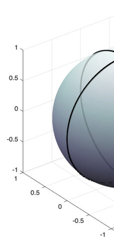
<figcaption class="paper-figure-caption"><b>Fig 1.</b> Figure 1: Trajectory of the Cauchy data on the Riemann sphere obtained numerically by a direct computation of χ. The North and South poles correspond to the Neumann and Dirichlet conditions respectively.</figcaption>
</figure>
<figure class="paper-figure-card">
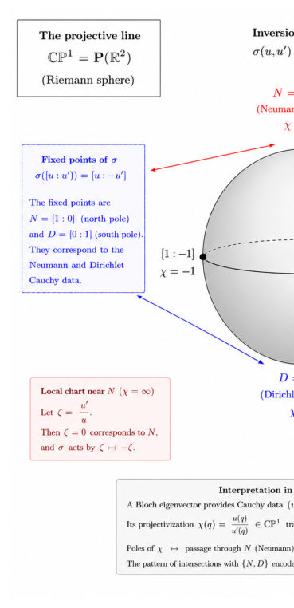
<figcaption class="paper-figure-caption"><b>Fig 2.</b> Figure 2: The projective space CP1 as the space of projectivized Cauchy data. The inversion action σ(u, u′) = (u, −u′) induces a reflection χ →−χ on CP1 . The fixed points N = [1 : 0] (Neumann condition, χ = ∞) and D = [0 : 1] (Dirichlet condition, χ = 0) are the poles and the zeros of the projective coordinate χ = u/u′. Their inversion eigenvalues are +1 and −1 respectively.</figcaption>
</figure>
<figure class="paper-figure-card">
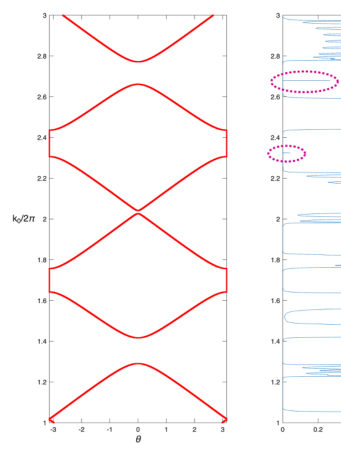
<figcaption class="paper-figure-caption"><b>Fig 3.</b> Figure 3: The left and right panels give the band diagram of each structure. Two common band gaps are opened for k0/2π around 2.3 and 2.7. The peaks in the transmission spectrum, surrounded by an ellipsis, correspond to edge modes, i.e. a mode decreasing exponentially in each structure, at these values of the wavenumber.</figcaption>
</figure>
<figure class="paper-figure-card">
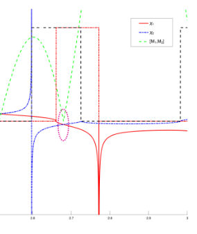
<figcaption class="paper-figure-caption"><b>Fig 4.</b> Figure 4: In blue and red: graphs of the functions χ1 and −χ2. They cross at values of k0 for which there is an edge mode. Note that for both modes, the Pole-Zero structure is ZP for χ1 and PZ for χ2. In green: graph of the norm of the commutant of the monodromy matrices. It is null at an edge mode. The positions of the two edge modes are indicated by the dotted ellipsis. The value 1 of the indicator functions represent the positions of the gaps.</figcaption>
</figure>

**Summary.** This work establishes a geometric interpretation for the topological invariant of Bloch bands in inversion-symmetric periodic media. It proves that the physical pole-zero pattern observed at band edges is mathematically equivalent to the first Stiefel–Whitney class of an associated Real line bundle. This unifies several advanced concepts—Berry-Zak phases, local systems, and characteristic classes—into a single coherent framework.

**Why it may be interesting.** It provides a deep mathematical framework connecting physical band topology (Berry-Zak phase) to fundamental concepts in algebraic topology ($w_1$ class), which is valuable for understanding topological phases in general condensed matter systems.

Detailed structure

**Main problem.** To provide a rigorous geometric interpretation of the topological classification of Bloch bands in one-dimensional periodic media possessing inversion symmetry.

**Main result.** The pole-zero pattern invariant ($\eta_{PZ}$) associated with these bands is shown to be geometrically equivalent to the first Stiefel–Whitney class ($w_1$) of an associated Real eigenline bundle.

**Method.** The analysis uses concepts from differential geometry, specifically relating monodromy representations over the Brillouin circle ($S^1$) to characteristic classes via the action of inversion symmetry on Cauchy data in $\mathbb{CP}^1$.

**Model / system.** The study concerns one-dimensional periodic media characterized by an inversion-symmetric potential $V(x)$, analyzed using Bloch wave theory and the associated Helmholtz/Schrödinger equation.

**Key observables.** Pole-zero pattern (ZP vs PZ), monodromy sign ($
ho = s_0 s_\pi$), first Stiefel–Whitney class ($w_1 \in H^1(S^1; \mathbb{Z}_2)$).

**Important parameters / regimes.** Inversion eigenvalues at band edges ($s_0, s_\pi \in \{\pm 1\}$), the quasi-momentum $q$ (parameterized by $S^1$).

**Assumptions / limitations.** The system is assumed to be one-dimensional, periodic, and possess inversion symmetry; the complex Bloch bundle itself is topologically trivial.

**Figures summary.** Figures illustrate the trajectory of Cauchy data on $\mathbb{CP}^1$ showing fixed points corresponding to Dirichlet/Neumann conditions, and plot band structures alongside transmission spectra indicating edge modes.

**Paper structure.** The paper builds from characterizing the pole-zero pattern via impedance functions to establishing a geometric link by analyzing how inversion symmetry dictates the monodromy of the associated Real eigenline bundle over $S^1$.

Abstract

In a previous work, the topology of inversion-symmetric one-dimensional periodic media was characterized through the pole-zero pattern of an impedance-like function associated with Bloch waves. This construction reproduces the Berry--Zak invariant and provides a criterion for topological interface states.   In the present work, we give a geometric interpretation of this formalism. We show that poles and zeros arise naturally from the action of inversion symmetry on the projectivized space of Cauchy data. The corresponding Dirichlet and Neumann states are identified with the two fixed points of the induced $\mathbb Z_2$ action on the Riemann sphere.   The key observation is that Bloch eigenvectors are naturally constructed on the universal covering of the Brillouin circle. The topology of the associated Real eigenline bundle is encoded in the action of the deck transformation group on lifted eigenvectors. This action is described by a monodromy sign $ρ\in\{\pm1\}$, determined by the inversion representations carried by the band at the fixed points of the Brillouin zone.   We show that this monodromy defines a natural rank-one local system over the Brillouin circle. The corresponding Real line bundle is classified by its first Stiefel--Whitney class, which coincides with the associated $\mathbb Z_2$ pole-zero invariant. This establishes a geometric connection between the pole-zero formalism, Berry--Zak phases, Real bundles and local coefficient systems.

[↑ back to top](#top)
