
# arxiv digest (quant-ph + cond-mat) — 2026-06-19

*125 papers · 50 relevant · 1 highlighted*

## 🔥 Most relevant (50)

*Every paper with at least one nonzero topic score, sorted by best-matching score. 🔥 marks scores ≥4/5. Click the title to jump to the full entry below; click [arXiv] to open the paper page. `(secondary)` marks papers from de-prioritized cond-mat archives.*

Show 50 relevant papers

- [String dynamics of a (2+1)D U(1) quantum link model on a digital quantum computer](#paper-2606.19601) [[arXiv]](http://arxiv.org/abs/2606.19601v1) — 🔥 `non-equilibrium dynamics` **5/5** · 🔥 `QC/QI experiment` **4/5** · 🔥 `analog quantum simulation` **4/5** · 🔥 `methods for driven-dissipative` **4/5** · 🔥 `non-equilibrium universality` **4/5** · `driven-dissipative phase transition` **3/5** · `exotic spin models in light-matter` **3/5** · `Keldysh / 2PI / non-Gaussian methods` **1/5** · `entanglement & information structure` **1/5**
- [Space-time duality approach to (inhomogeneous) integrable quenches](#paper-2606.20445) [[arXiv]](http://arxiv.org/abs/2606.20445v1) — 🔥 `non-equilibrium dynamics` **5/5** · 🔥 `entanglement & information structure` **4/5** · 🔥 `non-equilibrium universality` **4/5** · `Keldysh / 2PI / non-Gaussian methods` **3/5** · `analog quantum simulation` **2/5** · `methods for driven-dissipative` **2/5** · `scars & prethermalization` **2/5** · `correlated / nonlocal dissipation` **1/5** · `driven-dissipative phase transition` **1/5** · `exotic spin models in light-matter` **1/5**
- [Proposal of quantum arrival-time measurement with a Bose-Einstein condensate](#paper-2606.20278) [[arXiv]](http://arxiv.org/abs/2606.20278v1) — 🔥 `quantum measurements` **5/5** · 🔥 `measurement-induced transitions` **4/5** · `analog quantum simulation` **3/5** · `non-equilibrium dynamics` **2/5** · `quantum optics experiment` **2/5** · `Keldysh / 2PI / non-Gaussian methods` **1/5** · `QC/QI experiment` **1/5** · `driven-dissipative phase transition` **1/5** · `methods for driven-dissipative` **1/5**
- [Unleashing Emergent Fermions with Rydberg Atom Simulators](#paper-2606.19444) [[arXiv]](http://arxiv.org/abs/2606.19444v1) — 🔥 `Rydberg arrays` **5/5** · 🔥 `analog quantum simulation` **4/5** · `non-equilibrium universality` **3/5** · `entanglement & information structure` **2/5** · `non-equilibrium dynamics` **2/5** · `Keldysh / 2PI / non-Gaussian methods` **1/5** · `QC/QI experiment` **1/5** · `driven-dissipative phase transition` **1/5** · `methods for driven-dissipative` **1/5**
- [Emergency hub placement with a neutral-atom quantum computer](#paper-2606.19589) [[arXiv]](http://arxiv.org/abs/2606.19589v1) — 🔥 `Rydberg arrays` **5/5** · 🔥 `QC/QI experiment` **4/5** · 🔥 `analog quantum simulation` **4/5** · `methods for driven-dissipative` **1/5**
- [Arrival times of an atomic Bose-Einstein condensate](#paper-2606.20281) [[arXiv]](http://arxiv.org/abs/2606.20281v1) — 🔥 `quantum measurements` **5/5** · 🔥 `measurement-induced transitions` **4/5** · `analog quantum simulation` **1/5** · `methods for driven-dissipative` **1/5** · `non-equilibrium dynamics` **1/5**
- [Multi-particle gates on driven one-dimensional paths: probing deep traps](#paper-2606.20294) [[arXiv]](http://arxiv.org/abs/2606.20294v1) — 🔥 `Frenkel-Kontorova` **4/5** · 🔥 `non-equilibrium dynamics` **4/5** · `analog quantum simulation` **3/5** · `driven-dissipative phase transition` **3/5** · `methods for driven-dissipative` **3/5** · `non-equilibrium universality` **3/5** · `correlated / nonlocal dissipation` **2/5** · `Keldysh / 2PI / non-Gaussian methods` **1/5** · `Kondo & dissipative impurity` **1/5** · `entanglement & information structure` **1/5** · `scars & prethermalization` **1/5**
- [Solving Nonequilibrium Dynamics via Influence Matrix Bootstrap: Floquet-PXP Model](#paper-2606.19430) [[arXiv]](http://arxiv.org/abs/2606.19430v1) — 🔥 `analog quantum simulation` **4/5** · 🔥 `methods for driven-dissipative` **4/5** · 🔥 `non-equilibrium dynamics` **4/5** · `Rydberg arrays` **3/5** · `entanglement & information structure` **3/5** · `non-equilibrium universality` **3/5** · `scars & prethermalization` **2/5** · `Keldysh / 2PI / non-Gaussian methods` **1/5** · `correlated / nonlocal dissipation` **1/5** · `driven-dissipative phase transition` **1/5**
- [Entanglement structure of the dynamical phases in the sub-Ohmic spin-boson model](#paper-2606.20313) [[arXiv]](http://arxiv.org/abs/2606.20313v1) — 🔥 `entanglement & information structure` **4/5** · 🔥 `methods for driven-dissipative` **4/5** · `correlated / nonlocal dissipation` **3/5** · `driven-dissipative phase transition` **3/5** · `exotic spin models in light-matter` **3/5** · `non-equilibrium dynamics` **2/5** · `non-equilibrium universality` **2/5** · `Keldysh / 2PI / non-Gaussian methods` **1/5** · `Kondo & dissipative impurity` **1/5** · `analog quantum simulation` **1/5** · `spintronics-quantum-optics interface` **1/5**
- [Near-Optimal Learning of Local Lindbladians](#paper-2606.20535) [[arXiv]](http://arxiv.org/abs/2606.20535v1) — 🔥 `methods for driven-dissipative` **4/5** · `Keldysh / 2PI / non-Gaussian methods` **3/5** · `correlated / nonlocal dissipation` **3/5** · `driven-dissipative phase transition` **3/5** · `entanglement & information structure` **2/5** · `non-equilibrium dynamics` **2/5** · `non-equilibrium universality` **2/5** · `Kondo & dissipative impurity` **1/5** · `analog quantum simulation` **1/5** · `measurement-induced transitions` **1/5** · `quantum measurements` **1/5** · `scars & prethermalization` **1/5**
- [Boltzmann-constrained extraction of spin splitting and momentum relaxation in d-wave altermagnets](#paper-2606.19785) [[arXiv]](http://arxiv.org/abs/2606.19785v1) `(secondary)` — 🔥 `methods for driven-dissipative` **4/5** · `driven-dissipative phase transition` **3/5** · `non-equilibrium dynamics` **3/5** · `Keldysh / 2PI / non-Gaussian methods` **2/5** · `analog quantum simulation` **2/5** · `non-equilibrium universality` **2/5** · `spintronics-quantum-optics interface` **2/5** · `Kondo & dissipative impurity` **1/5** · `correlated / nonlocal dissipation` **1/5** · `exotic spin models in light-matter` **1/5**
- [Many-Body Protection of Topological Edge Memory in Strong Interacting Quenches](#paper-2606.19437) [[arXiv]](http://arxiv.org/abs/2606.19437v1) — 🔥 `analog quantum simulation` **4/5** · 🔥 `non-equilibrium dynamics` **4/5** · `non-equilibrium universality` **3/5** · `entanglement & information structure` **2/5** · `methods for driven-dissipative` **2/5** · `scars & prethermalization` **2/5** · `Keldysh / 2PI / non-Gaussian methods` **1/5** · `correlated / nonlocal dissipation` **1/5** · `driven-dissipative phase transition` **1/5** · `exotic spin models in light-matter` **1/5**
- [Robust Generation of Topological Biphoton Mode via Adiabatic Passage](#paper-2606.19786) [[arXiv]](http://arxiv.org/abs/2606.19786v1) — 🔥 `analog quantum simulation` **4/5** · `interference shaping light` **3/5** · `driven-dissipative phase transition` **2/5** · `entanglement & information structure` **2/5** · `methods for driven-dissipative` **2/5** · `non-equilibrium dynamics` **2/5** · `Frenkel-Kontorova` **1/5** · `QC/QI experiment` **1/5** · `correlated cavity matter` **1/5** · `exotic spin models in light-matter` **1/5** · `non-equilibrium universality` **1/5** · `quantum optics experiment` **1/5**
- [Temporal dissipative solitons and optical frequency combs in coherently driven Kerr resonators](#paper-2606.20026) [[arXiv]](http://arxiv.org/abs/2606.20026v1) `(secondary)` — 🔥 `methods for driven-dissipative` **4/5** · `correlated cavity matter` **3/5** · `driven-dissipative phase transition` **3/5** · `correlated / nonlocal dissipation` **2/5** · `non-equilibrium dynamics` **2/5** · `non-equilibrium universality` **2/5** · `Keldysh / 2PI / non-Gaussian methods` **1/5** · `analog quantum simulation` **1/5** · `interference shaping light` **1/5** · `superradiant laser` **1/5**
- [Transient triplet blockade in Andreev junction](#paper-2606.20170) [[arXiv]](http://arxiv.org/abs/2606.20170v1) — 🔥 `methods for driven-dissipative` **4/5** · 🔥 `non-equilibrium dynamics` **4/5** · `Keldysh / 2PI / non-Gaussian methods` **3/5** · `Kondo & dissipative impurity` **3/5** · `non-equilibrium universality` **2/5** · `analog quantum simulation` **1/5** · `correlated / nonlocal dissipation` **1/5** · `correlated cavity matter` **1/5** · `driven-dissipative phase transition` **1/5**
- [Designing all possible logic gates in phononic lattices: A theoretical study](#paper-2606.19973) [[arXiv]](http://arxiv.org/abs/2606.19973v1) `(secondary)` — 🔥 `methods for driven-dissipative` **4/5** · 🔥 `non-equilibrium dynamics` **4/5** · `Keldysh / 2PI / non-Gaussian methods` **3/5** · `driven-dissipative phase transition` **3/5** · `non-equilibrium universality` **2/5** · `Frenkel-Kontorova` **1/5** · `analog quantum simulation` **1/5** · `correlated / nonlocal dissipation` **1/5**
- [Effective Faraday interaction between light and Helium-3 nuclear spins in a multi-pass cell](#paper-2606.20328) [[arXiv]](http://arxiv.org/abs/2606.20328v1) — 🔥 `quantum optics experiment` **4/5** · `exotic spin models in light-matter` **3/5** · `quantum measurements` **3/5** · `spintronics-quantum-optics interface` **3/5** · `measurement-induced transitions` **2/5** · `analog quantum simulation` **1/5** · `correlated / nonlocal dissipation` **1/5** · `driven-dissipative phase transition` **1/5** · `interference shaping light` **1/5**
- [Observation of complete delocalization in disordered photonic lattices](#paper-2606.19436) [[arXiv]](http://arxiv.org/abs/2606.19436v1) — 🔥 `analog quantum simulation` **4/5** · `methods for driven-dissipative` **3/5** · `quantum optics experiment` **3/5** · `driven-dissipative phase transition` **2/5** · `non-equilibrium dynamics` **2/5** · `Kondo & dissipative impurity` **1/5** · `QC/QI experiment` **1/5** · `correlated cavity matter` **1/5** · `interference shaping light` **1/5** · `non-equilibrium universality` **1/5**
- [Optimized Quantum States for Sensing in the Presence of Loss and Phase Noise](#paper-2606.19649) [[arXiv]](http://arxiv.org/abs/2606.19649v1) — 🔥 `methods for driven-dissipative` **4/5** · `Keldysh / 2PI / non-Gaussian methods` **3/5** · `correlated / nonlocal dissipation` **2/5** · `driven-dissipative phase transition` **2/5** · `entanglement & information structure` **2/5** · `non-equilibrium dynamics` **2/5** · `analog quantum simulation` **1/5** · `correlated cavity matter` **1/5** · `interference shaping light` **1/5** · `non-equilibrium universality` **1/5**
- [Polymer-polymer interdiffusion: effects of entanglements and a polymeric source](#paper-2606.20462) [[arXiv]](http://arxiv.org/abs/2606.20462v1) — 🔥 `non-equilibrium dynamics` **4/5** · `methods for driven-dissipative` **3/5** · `non-equilibrium universality` **3/5** · `Keldysh / 2PI / non-Gaussian methods` **2/5** · `analog quantum simulation` **2/5** · `driven-dissipative phase transition` **2/5** · `Frenkel-Kontorova` **1/5** · `correlated / nonlocal dissipation` **1/5** · `entanglement & information structure` **1/5**
- [sft-wick: A formalism and package for Feynman-diagram expansion and evaluation in stochastic field theories](#paper-2606.19480) [[arXiv]](http://arxiv.org/abs/2606.19480v1) — 🔥 `Keldysh / 2PI / non-Gaussian methods` **4/5** · `methods for driven-dissipative` **3/5** · `analog quantum simulation` **2/5** · `correlated / nonlocal dissipation` **2/5** · `driven-dissipative phase transition` **2/5** · `non-equilibrium dynamics` **2/5** · `non-equilibrium universality` **2/5** · `Kondo & dissipative impurity` **1/5** · `entanglement & information structure` **1/5**
- [The use of Peres lattices in periodically driven systems](#paper-2606.20009) [[arXiv]](http://arxiv.org/abs/2606.20009v1) — 🔥 `analog quantum simulation` **4/5** · 🔥 `non-equilibrium dynamics` **4/5** · `methods for driven-dissipative` **3/5** · `non-equilibrium universality` **3/5** · `driven-dissipative phase transition` **2/5** · `entanglement & information structure` **1/5** · `exotic spin models in light-matter` **1/5** · `scars & prethermalization` **1/5**
- [Phase locking nuclear spins in silicon with spin-orbit coupling](#paper-2606.20340) [[arXiv]](http://arxiv.org/abs/2606.20340v1) — 🔥 `QC/QI experiment` **4/5** · `analog quantum simulation` **3/5** · `spintronics-quantum-optics interface` **3/5** · `non-equilibrium dynamics` **2/5** · `correlated / nonlocal dissipation` **1/5** · `driven-dissipative phase transition` **1/5** · `entanglement & information structure` **1/5** · `exotic spin models in light-matter` **1/5** · `methods for driven-dissipative` **1/5** · `quantum measurements` **1/5**
- [QMaxCal: Path-Space Regularization for Open Quantum Control via Girsanov's Theorem](#paper-2606.19947) [[arXiv]](http://arxiv.org/abs/2606.19947v1) — 🔥 `methods for driven-dissipative` **4/5** · 🔥 `quantum measurements` **4/5** · `measurement-induced transitions` **3/5** · `correlated / nonlocal dissipation` **2/5** · `non-equilibrium dynamics` **2/5** · `Keldysh / 2PI / non-Gaussian methods` **1/5** · `QC/QI experiment` **1/5** · `driven-dissipative phase transition` **1/5**
- [Variational Polaron Theory for Ground States of Strongly Coupled Light-Matter and Electron-Phonon Systems](#paper-2606.19748) [[arXiv]](http://arxiv.org/abs/2606.19748v1) — 🔥 `correlated cavity matter` **4/5** · `Dicke superradiance` **3/5** · `analog quantum simulation` **3/5** · `Tavis-Cummings & cavity-many-emitter` **2/5** · `Keldysh / 2PI / non-Gaussian methods` **1/5** · `driven-dissipative phase transition` **1/5** · `entanglement & information structure` **1/5** · `exotic spin models in light-matter` **1/5** · `methods for driven-dissipative` **1/5** · `superradiant laser` **1/5**
- [Mixed Floquet Lattice model for gapless topology](#paper-2606.20378) [[arXiv]](http://arxiv.org/abs/2606.20378v1) `(secondary)` — 🔥 `non-equilibrium dynamics` **4/5** · `analog quantum simulation` **3/5** · `driven-dissipative phase transition` **3/5** · `methods for driven-dissipative` **3/5** · `non-equilibrium universality` **2/5** · `Frenkel-Kontorova` **1/5** · `Keldysh / 2PI / non-Gaussian methods` **1/5**
- [Benchmark of quantum algorithms for ground state preparation in the presence of noise](#paper-2606.20551) [[arXiv]](http://arxiv.org/abs/2606.20551v1) — 🔥 `analog quantum simulation` **4/5** · `driven-dissipative phase transition` **3/5** · `methods for driven-dissipative` **3/5** · `non-equilibrium universality` **2/5** · `Keldysh / 2PI / non-Gaussian methods` **1/5** · `correlated / nonlocal dissipation` **1/5** · `entanglement & information structure` **1/5** · `non-equilibrium dynamics` **1/5**
- [Extracting the physical content of Liouvillian eigenmodes: Semiclassical quantization](#paper-2606.20271) [[arXiv]](http://arxiv.org/abs/2606.20271v1) — 🔥 `methods for driven-dissipative` **4/5** · `Keldysh / 2PI / non-Gaussian methods` **3/5** · `driven-dissipative phase transition` **3/5** · `non-equilibrium dynamics` **2/5** · `non-equilibrium universality` **2/5** · `correlated / nonlocal dissipation` **1/5** · `scars & prethermalization` **1/5**
- [Smooth time-dependent control of dipolar Bose-Einstein condensates](#paper-2606.20507) [[arXiv]](http://arxiv.org/abs/2606.20507v1) — 🔥 `analog quantum simulation` **4/5** · `methods for driven-dissipative` **3/5** · `non-equilibrium dynamics` **3/5** · `non-equilibrium universality` **2/5** · `Keldysh / 2PI / non-Gaussian methods` **1/5** · `correlated / nonlocal dissipation` **1/5** · `driven-dissipative phase transition` **1/5** · `entanglement & information structure` **1/5**
- [Spin transport in a normal meta-altermagnetic superconducting nanowire junction](#paper-2606.20279) [[arXiv]](http://arxiv.org/abs/2606.20279v1) `(secondary)` — 🔥 `Keldysh / 2PI / non-Gaussian methods` **4/5** · `methods for driven-dissipative` **3/5** · `non-equilibrium dynamics` **3/5** · `driven-dissipative phase transition` **2/5** · `non-equilibrium universality` **2/5** · `Kondo & dissipative impurity` **1/5** · `exotic spin models in light-matter` **1/5**
- [Electric-field-driven magnetic switching and tightly bound interlayer excitons in bilayer CrSBr](#paper-2606.20159) [[arXiv]](http://arxiv.org/abs/2606.20159v1) `(secondary)` — 🔥 `spintronics-quantum-optics interface` **4/5** · `exotic spin models in light-matter` **3/5** · `analog quantum simulation` **2/5** · `driven-dissipative phase transition` **2/5** · `correlated cavity matter` **1/5** · `non-equilibrium dynamics` **1/5** · `non-equilibrium universality` **1/5** · `quantum optics experiment` **1/5**
- [Non-Hermitian Skin Effect Enhances Pairing Correlations in Moiré Hubbard Systems](#paper-2606.20425) [[arXiv]](http://arxiv.org/abs/2606.20425v1) — 🔥 `analog quantum simulation` **4/5** · `methods for driven-dissipative` **3/5** · `driven-dissipative phase transition` **2/5** · `non-equilibrium universality` **2/5** · `Kondo & dissipative impurity` **1/5** · `correlated / nonlocal dissipation` **1/5** · `entanglement & information structure` **1/5** · `non-equilibrium dynamics` **1/5**
- [Multi-objective design of photon blockade for bright single-photon sources](#paper-2606.20160) [[arXiv]](http://arxiv.org/abs/2606.20160v1) — 🔥 `methods for driven-dissipative` **4/5** · `correlated cavity matter` **3/5** · `analog quantum simulation` **2/5** · `correlated / nonlocal dissipation` **2/5** · `Keldysh / 2PI / non-Gaussian methods` **1/5** · `Tavis-Cummings & cavity-many-emitter` **1/5** · `driven-dissipative phase transition` **1/5**
- [QMCtwin: Master-Equation Simulation of Syndrome Statistics Beyond Pauli Noise](#paper-2606.19848) [[arXiv]](http://arxiv.org/abs/2606.19848v1) — 🔥 `methods for driven-dissipative` **4/5** · `correlated / nonlocal dissipation` **3/5** · `QC/QI experiment` **2/5** · `non-equilibrium dynamics` **2/5** · `Keldysh / 2PI / non-Gaussian methods` **1/5** · `driven-dissipative phase transition` **1/5** · `entanglement & information structure` **1/5**
- ⭐ [Interaction geometry and ground-state properties of sparse quantum lattice models](#paper-2606.20387) [[arXiv]](http://arxiv.org/abs/2606.20387v1) — 🔥 `analog quantum simulation` **4/5** · `entanglement & information structure` **3/5** · `non-equilibrium dynamics` **2/5** · `correlated / nonlocal dissipation` **1/5** · `driven-dissipative phase transition` **1/5** · `exotic spin models in light-matter` **1/5** · `non-equilibrium universality` **1/5**
- [Optimal Ansatz-free Hamiltonian Learning In Situ](#paper-2606.19486) [[arXiv]](http://arxiv.org/abs/2606.19486v1) — 🔥 `quantum measurements` **4/5** · `measurement-induced transitions` **3/5** · `QC/QI experiment` **2/5** · `analog quantum simulation` **1/5** · `methods for driven-dissipative` **1/5** · `non-equilibrium dynamics` **1/5**
- [Trends, Volatility, Correlations, and Critical Phenomena in Financial Markets](#paper-2606.20145) [[arXiv]](http://arxiv.org/abs/2606.20145v1) — 🔥 `non-equilibrium universality` **4/5** · `driven-dissipative phase transition` **3/5** · `non-equilibrium dynamics` **2/5** · `Frenkel-Kontorova` **1/5** · `Keldysh / 2PI / non-Gaussian methods` **1/5** · `methods for driven-dissipative` **1/5**
- [Anomalous magneto-optical response at $\mathrm{RuO_2 / WSe_2}$ van der Waals interface](#paper-2606.20262) [[arXiv]](http://arxiv.org/abs/2606.20262v1) — 🔥 `spintronics-quantum-optics interface` **4/5** · `exotic spin models in light-matter` **3/5** · `quantum optics experiment` **2/5** · `Kondo & dissipative impurity` **1/5** · `analog quantum simulation` **1/5**
- [Discrimination of genuinely nonlocal sets without entanglement in multipartite systems](#paper-2606.20380) [[arXiv]](http://arxiv.org/abs/2606.20380v1) — 🔥 `entanglement & information structure` **4/5** · `quantum measurements` **3/5** · `measurement-induced transitions` **2/5** · `correlated / nonlocal dissipation` **1/5** · `methods for driven-dissipative` **1/5**
- [Faking entanglement with imperceptible measurement deviations](#paper-2606.20396) [[arXiv]](http://arxiv.org/abs/2606.20396v1) — 🔥 `entanglement & information structure` **4/5** · `quantum measurements` **3/5** · `QC/QI experiment` **2/5** · `measurement-induced transitions` **1/5** · `quantum optics experiment` **1/5**
- [Mitigating Trotter Errors via Post-Processed Symmetry Restoration](#paper-2606.20242) [[arXiv]](http://arxiv.org/abs/2606.20242v1) — 🔥 `analog quantum simulation` **4/5** · `quantum measurements` **3/5** · `measurement-induced transitions` **2/5** · `exotic spin models in light-matter` **1/5** · `non-equilibrium dynamics` **1/5**
- [QPU-scale randomized benchmarking via Bell-pair injection](#paper-2606.20123) [[arXiv]](http://arxiv.org/abs/2606.20123v1) — 🔥 `QC/QI experiment` **4/5** · 🔥 `entanglement & information structure` **4/5** · `correlated / nonlocal dissipation` **1/5** · `methods for driven-dissipative` **1/5** · `non-equilibrium dynamics` **1/5**
- [Many-body chirality of topological stabilizer states](#paper-2606.20472) [[arXiv]](http://arxiv.org/abs/2606.20472v1) — 🔥 `entanglement & information structure` **4/5** · `analog quantum simulation` **3/5** · `correlated / nonlocal dissipation` **1/5** · `driven-dissipative phase transition` **1/5** · `exotic spin models in light-matter` **1/5**
- [Optimal multi-spectral squeezing via deterministic 2D-phase optimization](#paper-2606.20192) [[arXiv]](http://arxiv.org/abs/2606.20192v1) — 🔥 `quantum optics experiment` **4/5** · `interference shaping light` **3/5** · `quantum measurements` **2/5** · `QC/QI experiment` **1/5**
- [Electrical Noise Produced by Micron-Sized Particles above a Surface Paul Trap](#paper-2606.19585) [[arXiv]](http://arxiv.org/abs/2606.19585v1) — 🔥 `QC/QI experiment` **4/5** · `Keldysh / 2PI / non-Gaussian methods` **1/5** · `correlated / nonlocal dissipation` **1/5** · `driven-dissipative phase transition` **1/5** · `methods for driven-dissipative` **1/5**
- [Entropy Estimation in Multi-Qutrit Systems via Variational and Classical Neural Networks](#paper-2606.20504) [[arXiv]](http://arxiv.org/abs/2606.20504v1) — 🔥 `entanglement & information structure` **4/5** · `methods for driven-dissipative` **1/5** · `quantum measurements` **1/5**
- [Optimal Shadow Estimation with Minimal Measurement Settings](#paper-2606.20003) [[arXiv]](http://arxiv.org/abs/2606.20003v1) — 🔥 `quantum measurements` **4/5** · `entanglement & information structure` **1/5** · `measurement-induced transitions` **1/5**
- [Entanglement Scaling and Problem Structure in Quantum Approximate and Adiabatic Optimization Algorithms](#paper-2606.19502) [[arXiv]](http://arxiv.org/abs/2606.19502v1) — 🔥 `entanglement & information structure` **4/5** · `non-equilibrium dynamics` **1/5**
- [Majorana bound states in a hybrid Kitaev ladder with long-range pairing](#paper-2606.19963) [[arXiv]](http://arxiv.org/abs/2606.19963v1) — 🔥 `analog quantum simulation` **4/5** · `Keldysh / 2PI / non-Gaussian methods` **1/5**
- [General circuit mapping algorithm for neutral atom quantum computers](#paper-2606.20503) [[arXiv]](http://arxiv.org/abs/2606.20503v1) — 🔥 `QC/QI experiment` **4/5**

## ⭐ Highlighted (1)

*Papers by authors on your watch list. Click the title to jump to the full entry below; click [arXiv] to open the paper page.*

Show 1 highlighted papers

- ⭐ [Interaction geometry and ground-state properties of sparse quantum lattice models](#paper-2606.20387) [[arXiv]](http://arxiv.org/abs/2606.20387v1) — Andrew J. Daley

## All papers (100, sorted by relevance)

*Papers from quant-ph and your primary cond-mat archives (quant-gas, stat-mech, str-el, dis-nn). Highlighted papers (⭐) come first, then everything else sorted by topic-relevance score, highest first.*

### ⭐ [Interaction geometry and ground-state properties of sparse quantum lattice models](http://arxiv.org/abs/2606.20387v1)

**Highlighted author(s):** Andrew J. Daley  
**Authors:** Alex Gunning, Sebastian Schmid, Zhengxiao Liu, Sridevi Kuriyattil, Aydin Deger, Andrew J. Daley  
**Type:** theory · **Category:** statistical mechanics · **PDF:** <https://arxiv.org/pdf/2606.20387v1>  
**Analysis basis:** full PDF text, analyzed in chunks
**Topic relevance:** 🔥 `analog quantum simulation` **4/5** · `entanglement & information structure` **3/5** · `non-equilibrium dynamics` **2/5** · `correlated / nonlocal dissipation` **1/5** · `driven-dissipative phase transition` **1/5** · `exotic spin models in light-matter` **1/5** · `non-equilibrium universality` **1/5**

↔ Scroll figures horizontally

<figure class="paper-figure-card">
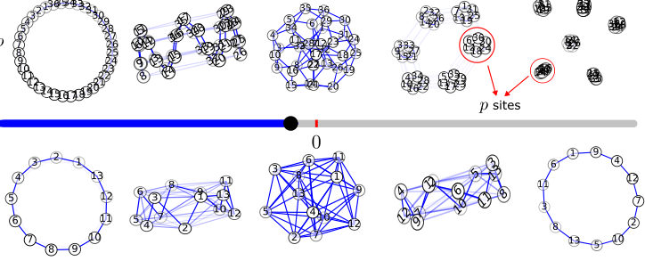
<figcaption class="paper-figure-caption"><b>Fig 1.</b> FIG. 1. Slider schematic of the geometry underlying the sparse long-range models as a function of the tuning parameter s. For the power-of-p construction (top), varying s continuously deforms the effective interaction geometry between the N = pl sites, interpolating between a ring-like structure, intermediate “tambourine”-like connectivity, a sparse all-to-all configuration, and finally a set of disconnected loops of size p. Here p = 6, l = 2, N = 36. The Fibonacci construction (bottom), defined on N sites with N a Fibonacci number, exhibits a symmetric evolution about s = 0, transitioning from a ring-like geometry through increasingly connected structures to a maximally connected...</figcaption>
</figure>
<figure class="paper-figure-card">
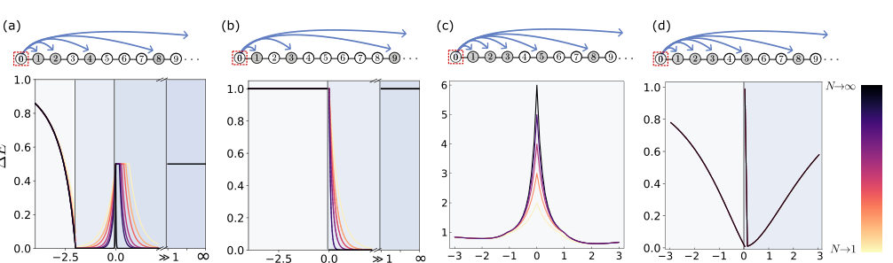
<figcaption class="paper-figure-caption"><b>Fig 2.</b> FIG. 2. Energy gap analysis characterising phases of the classical Ising model on power-of-p and Fibonacci graphs. (a) Power- of-two phase diagram, representative of all even p. Four distinct phases appear in the thermodynamic limit. As p increases, the first critical point (located at s = −2 for p = 2) shifts towards s = −1. (b) Power-of-three phase diagram, representative of all odd p. Three phases occur in the thermodynamic limit. The antiferromagnetic (AFM) configuration remains a ground state for all s; for s &gt; 0, an extensive manifold of competing states becomes degenerate with the AFM. (c) Fibonacci graph for even Fibonacci system sizes Nfib = 34, 144, 610, . . . . No phase...</figcaption>
</figure>
<figure class="paper-figure-card">
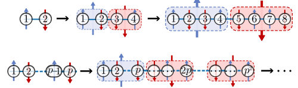
<figcaption class="paper-figure-caption"><b>Fig 3.</b> FIG. 3. Recursive construction of ground-state configurations for power-of-even p graphs. For p = 2 (top), the system size is doubled by appending a globally flipped copy of the previous configuration, yielding an antiferromagnetic ordering of two effective blocks (shown in green/red). Iterating this step gen- erates larger system sizes. For general even p (bottom), the construction proceeds analogously by concatenating p copies of the previous configuration with alternating sign, producing an antiferromagnetic arrangement of p effective blocks.</figcaption>
</figure>
<figure class="paper-figure-card">
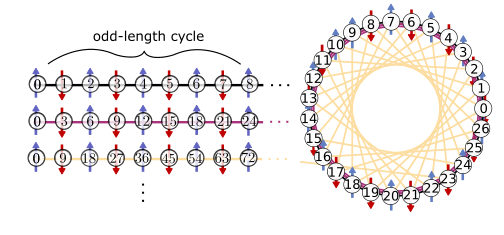
<figcaption class="paper-figure-caption"><b>Fig 4.</b> FIG. 4. Antiferromagnetic state on the p = 3 graph revealing minimal frustration. (Right) The power-of-three graph with each interaction distance d = 3i generating a closed cycle on the ring. Cycles corresponding to d = 1 (black), d = 3 (purple), and d = 9 (peach) are shown. Spins on odd sites are up (blue) and spins on even sites are down (red), corresponding to the antiferromagnetic configuration. (Left) Each colored cycle is unraveled into a one-dimensional chain. Since all cycles have odd length, an antiferromagnetic ordering necessarily frus- trates one bond per cycle, visible at the chain ends. This is the minimal number of frustrated bonds possible on an odd- length cycle.</figcaption>
</figure>
<figure class="paper-figure-card">
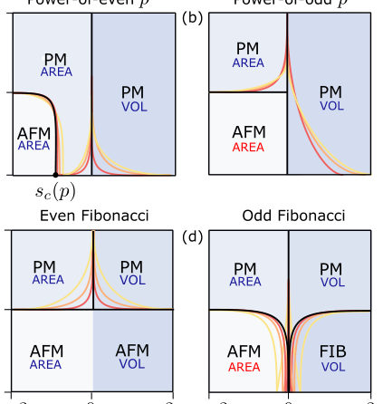
<figcaption class="paper-figure-caption"><b>Fig 5.</b> FIG. 5. Schematics of quantum phase diagrams for the transverse-field Ising model on logarithmically sparse graphs. Panels (a) and (b) show representative power-of-p graphs: p = 2 for the even-p class with N = 8, 16, 32 and p = 3 for the odd-p class with N = 9, 27, 81. Panels (c) and (d) show Fibonacci graphs for even and odd Fibonacci system sizes, respectively, using the accessible sequences N = 8, 34, 144 and N = 13, 21, 55. Colored curves denote finite-size estimates of phase boundaries where numerical convergence is obtained, while the bold black curves summarize the thermodynamic extrapolations, combining finite-size scaling, SKQD results, and analytically controlled limiting regimes....</figcaption>
</figure>

**Summary.** This research explores how the geometric arrangement of interactions dictates the low-energy phases of complex quantum lattice models on sparse graphs. By analyzing power-of-$p$ and Fibonacci structures, the authors establish an 'effective-geometry principle' that unifies understanding across different interaction regimes. The findings are crucial for designing and predicting the behavior of experimentally realized long-range quantum systems.

**Why it may be interesting.** This work provides a powerful, general framework for understanding how topology and connectivity dictate quantum many-body physics in systems with long-range interactions, which is highly relevant to engineered quantum materials or artificial lattices.

Detailed structure

**Main problem.** The study investigates how the geometric structure of interactions dictates the low-energy quantum phases and phase transitions in sparse, long-range quantum lattice models.

**Main result.** Phase structure is governed by an 'effective-geometry principle,' showing distinct behaviors for even vs. odd power-of-$p$ graphs, and revealing symmetries (like those in Fibonacci graphs) that map short-range physics onto long-range limits.

**Method.** The analysis employs a combination of analytical techniques (e.g., diagonalization in momentum space), numerical simulations (DMRG, Monte Carlo), and scaling arguments to characterize ground states across various interaction regimes.

**Model / system.** The models are sparse quantum lattices, including power-of-$p$ graphs and Fibonacci graphs, analyzed using both Transverse Field Ising Models (spin systems) and fermionic hopping Hamiltonians. Interactions decay with distance $d$ as $J_d \propto d^s$.

**Key observables.** Ground-state phase diagrams, spectral gaps ($\Delta E$), entanglement scaling (area/volume law), and density-density correlation functions ($g_2(d)$).

**Important parameters / regimes.** The interaction exponent $s$ acts as a primary control knob, determining the relative weight of short vs. long-range interactions; graph structure (e.g., $p=2$ vs. $p=3$) is crucial.

**Assumptions / limitations.** The analysis often relies on mapping complex systems to effective 1D geometries or assuming specific asymptotic limits ($s 	o -\infty$ or $s 	o +\infty$).

**Figures summary.** Figures illustrate phase diagrams for different graph types, show spectral gap closing/reopening as a function of the interaction exponent $s$, and compare correlation functions based on system size parity (even vs. odd N).

**Paper structure.** The paper systematically compares results across multiple graph families (power-of-$p$ vs. Fibonacci) and models (spin vs. fermionic), establishing a unified 'effective-geometry principle' that governs phase transitions regardless of the specific lattice structure.

Abstract

We investigate how interaction geometry shapes the low-energy phases of sparse tunable long-range quantum models. We focus on a class of graphs whose degree grows logarithmically with system size, and show how symmetry and frustration in graph connectivity can drive, suppress, and reshape ground-state phase transitions. The central examples are power-of-$p$ graphs, where even and odd values of $p$ exhibit qualitatively distinct behaviour: even-$p$ graphs inherit the rich phase structure of the power-of-two model, while odd-$p$ graphs are governed by geometric frustration. Fibonacci graphs provide a contrasting case, lacking the discrete self-similarity of the power-of-$p$ family but exhibiting a direct geometric mapping between the short- and long-range limits. Across our models, we find that phase structure and criticality are governed by the same effective-geometry principle, unifying our framework for experimentally motivated long-range quantum systems.

[↑ back to top](#top)

### [String dynamics of a (2+1)D U(1) quantum link model on a digital quantum computer](http://arxiv.org/abs/2606.19601v1)

**Authors:** Anthony Gandon, Alessandro Mariani, Debasish Banerjee, Emilie Huffman, Gurtej Kanwar, Francesco Tacchino, Uwe-Jens Wiese, Ivano Tavernelli  
**Type:** both · **Category:** statistical mechanics · **PDF:** <https://arxiv.org/pdf/2606.19601v1>  
**Analysis basis:** full PDF text, analyzed in chunks
**Topic relevance:** 🔥 `non-equilibrium dynamics` **5/5** · 🔥 `QC/QI experiment` **4/5** · 🔥 `analog quantum simulation` **4/5** · 🔥 `methods for driven-dissipative` **4/5** · 🔥 `non-equilibrium universality` **4/5** · `driven-dissipative phase transition` **3/5** · `exotic spin models in light-matter` **3/5** · `Keldysh / 2PI / non-Gaussian methods` **1/5** · `entanglement & information structure` **1/5**

↔ Scroll figures horizontally

<figure class="paper-figure-card">
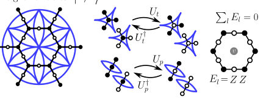
<figcaption class="paper-figure-caption"><b>Fig 1.</b> FIG. 1. a) Hexafoil lattice, in blue, with gauge degrees of freedom on the edges of the hexafoil lattice. The dual heavy- hexagonal lattice, in black, corresponds to the available hard- ware topology. It has qubit degrees of freedom on the vertices represented by dots. b) Correspondence of states and oper- ators under the dualization from gauge to height variables. With open boundary conditions, each configuration of gauge fluxes is equivalent to two height variable configurations.</figcaption>
</figure>
<figure class="paper-figure-card">
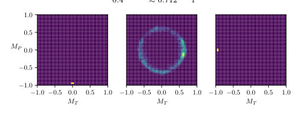
<figcaption class="paper-figure-caption"><b>Fig 2.</b> FIG. 2. Histograms of the sampled Monte Carlo distributions of the MT , MP observables at three different values of KP , namely KP = 0.4 (phase where the petals are ordered), KP = 0.712 (the transition point) and KP = 1.0 (phase where the triangles order). The central picture shows the emergent U(1) symmetry at the transition point.</figcaption>
</figure>
<figure class="paper-figure-card">
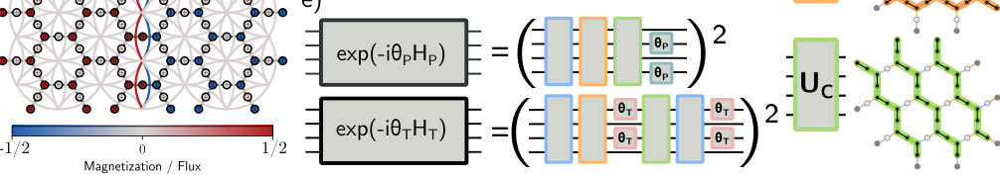
<figcaption class="paper-figure-caption"><b>Fig 3.</b> FIG. 3. a) b) Two sublattices of the heavy-hex hardware graph used in this work, with 4 and 13 heavy-hexagons respectively. The height variables are initially prepared in the lowest-energy eigenstate of Hdual(∞) corresponding to a Gauss law sector with two static charges qv = ±1 on the boundary. The initial qubit states are labeled as |0/1⟩and |±⟩with associated magnetization colored from blue to red. Trotter decomposition of the dual spin Hamiltonian Hdual. c) Tricoloring of the edges Ehhex. d) Independent non-Clifford layers (pink and turquoise) and Clifford layers (blue, orange, green). e) This Trotter decomposition involves 6 entangling layers for the petal Hamiltonian HP and 8...</figcaption>
</figure>
<figure class="paper-figure-card">
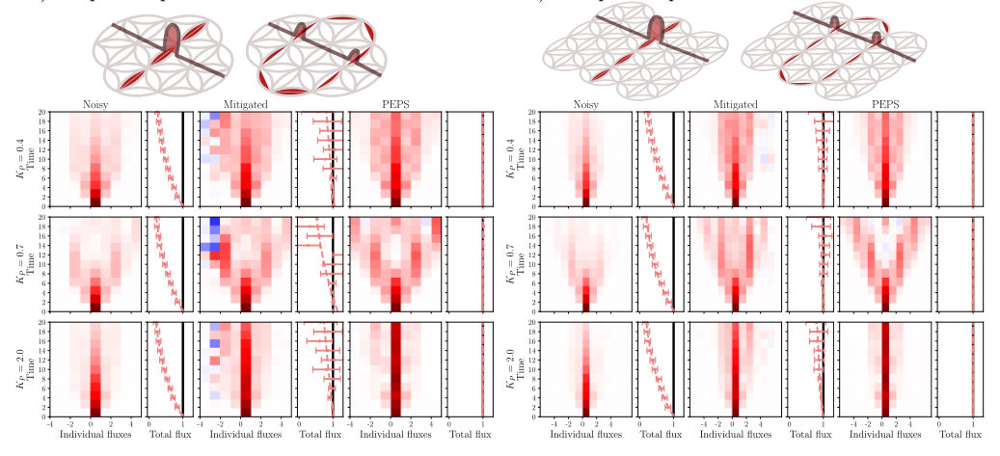
<figcaption class="paper-figure-caption"><b>Fig 4.</b> FIG. 4. Dynamics of the petal flux densities along a single cross-section for the lattices with respectively 4 and 13 full heavy- hexagons. The estimators from the quantum hardware, both raw and mitigated, are compared to reference PEPS results at multiple couplings KP ∈{0.4, 0.7, 2.0}. The single transversal slice, or cross-section, is represented at the top of the figure in two cartoon flux configurations that are explored throughout the dynamics. The first one corresponds to a narrow flux line carrying a full integer flux, while the second one corresponds to two well-resolved flux lines carrying half fluxes. The observables are measured for various circuit depths corresponding to total...</figcaption>
</figure>
<figure class="paper-figure-card">
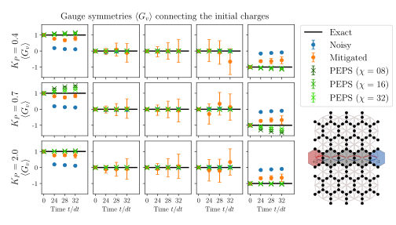
<figcaption class="paper-figure-caption"><b>Fig 5.</b> FIG. 5. Expectation values of the gauge symmetry opera- tors Gv for the subset of sites v ∈Vhfoil connecting the two static charges in the larger lattice with 13 heavy-hexagons. The drawing highlights the five gauge symmetries as well as their expected eigenvalues gv. The experiment was repeated both on hardware (blue and orange points) and simulated with PEPS at finite bond-dimensions χ ∈{8, 16, 32} (green points), at long times t = k × dt with k ∈{24, 28, 32} and for the couplings KP ∈{0.4, 0.7, 2.0}.</figcaption>
</figure>

**Summary.** This work investigates the string dynamics and phase transitions of a (2+1)D U(1) quantum link model using both state-of-the-art digital quantum simulations and theoretical tensor network methods. By simulating real-time quenches, the researchers probe phenomena like flux fractionalization and confinement in regimes inaccessible to traditional classical simulation techniques.

**Why it may be interesting.** The combination of simulating gauge theories—which are notoriously difficult due to sign problems—on superconducting qubits provides a unique, highly relevant platform for studying non-equilibrium dynamics in condensed matter systems.

Detailed structure

**Main problem.** The study focuses on understanding string dynamics, phase transitions, and confining properties within a (2+1)D U(1) quantum link model.

**Main result.** Experimental quantum simulations show good agreement with tensor-network calculations at short times, confirming the model's ability to probe real-time dynamics near critical points.

**Method.** The research combines digital quantum simulation (quantum quenches) for real-time evolution with Quantum Monte Carlo and Tensor Network methods for equilibrium/static properties.

**Model / system.** The system is a minimal U(1) quantum link model defined on lattices like the hexafoil lattice, governed by plaquette interactions involving spin-1/2 variables representing electric flux.

**Key observables.** String tension ($\sigma$), transverse quantum fluctuations of the string, local order parameters ($M_T, M_P$), and gauge symmetry violations ($\|G_v - g_v\|^2$).

**Important parameters / regimes.** Coupling constants ($K_P, K_E$) are varied to map out phase diagrams; critical points near $K_P=0.7$ are key.

**Assumptions / limitations.** The quantum hardware simulations rely on error mitigation techniques (like CPT) to counteract noise, and theoretical comparisons use approximations like PEPS bond dimensions ($\chi$).

**Figures summary.** Figures illustrate dynamics of flux densities for varying couplings ($K_P$), compare raw vs. mitigated expectation values against tensor network results, and plot energy/magnetization order parameters across phase diagrams.

**Paper structure.** The paper progresses from defining the Hamiltonian and lattice geometry to performing equilibrium QMC calculations (mapping out phases) and finally executing real-time quantum quench experiments on hardware to probe dynamic behavior near critical points.

Abstract

The (2+1)D U(1) pure gauge theory always exists in the confining phase, with strings of non-zero string tension giving a characteristic linear potential between static charges. This makes it a useful testing ground for quantum computing methods designed to study string dynamics of confining gauge theories. Here we implement a minimal U(1) quantum link model on a quantum computer with qubit degrees of freedom representing the dual height variables of the model. This facilitates an efficient realization of plaquette interactions and enables effective calculations of real-time dynamics that are inaccessible to traditional quantum Monte Carlo. A specifically tailored lattice geometry is chosen to match the heavy-hexagonal geometry of the IBM quantum hardware used here, minimizing non-adjacent qubit interactions. By performing quantum quenches from a simple initial string state, we probe the transverse quantum fluctuations of the string before it thermalizes. Our experimental results from digital quantum simulations, with up to 112 qubits, show good agreement with reference tensor-network calculations at short times and with thermal averages at long times. Near the phase transition, the quench dynamics exhibit large fluctuations of the initial string that extend across both spatial dimensions of the lattice. Nonetheless, our error-mitigated estimators from the quantum hardware also give accurate predictions in that regime, with noise-induced violations of local gauge symmetries comparable to finite-bond-dimension tensor-network results.

[↑ back to top](#top)

### [Space-time duality approach to (inhomogeneous) integrable quenches](http://arxiv.org/abs/2606.20445v1)

**Authors:** Riccardo Travaglino, Pasquale Calabrese, Katja Klobas, Bruno Bertini  
**Type:** theory · **Category:** statistical mechanics · **PDF:** <https://arxiv.org/pdf/2606.20445v1>  
**Analysis basis:** full PDF text, analyzed in chunks
**Topic relevance:** 🔥 `non-equilibrium dynamics` **5/5** · 🔥 `entanglement & information structure` **4/5** · 🔥 `non-equilibrium universality` **4/5** · `Keldysh / 2PI / non-Gaussian methods` **3/5** · `analog quantum simulation` **2/5** · `methods for driven-dissipative` **2/5** · `scars & prethermalization` **2/5** · `correlated / nonlocal dissipation` **1/5** · `driven-dissipative phase transition` **1/5** · `exotic spin models in light-matter` **1/5**

↔ Scroll figures horizontally

<figure class="paper-figure-card">
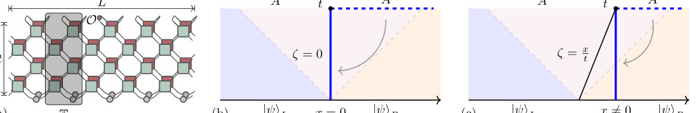
<figcaption class="paper-figure-caption"><b>Fig 1.</b> Figure 1: (a): A tensor-network diagram of a local expectation value after a quantum quench under circuit evolution. Green and red gates represent U and U ∗respectively, gray circles at the bottom are the initial (product) state, and the circle at the top is a local observable O. Equivalently the tensor network can be contracted in space by replacing the space-transfer matrix T with the projector to its leading eigenvectors. (b): Duality from the original entropy of A at time t (dashed blue line) to the entropy in the dual channel at the boundary of A (full blue line). The light cone represents the region in which the occupation functions are a mixture of those of left and right states....</figcaption>
</figure>
<figure class="paper-figure-card">
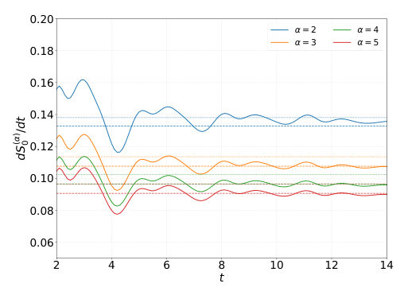
<figcaption class="paper-figure-caption"><b>Fig 2.</b> Figure 2: Instantaneous slope of the Rényi entropies of [0, ∞] after a quench from the bipartite state |N, 0⟩L ⊗ |N, π/12⟩R in the XXZ chain with ∆= 4. Dashed lines represent the predictions obtained by using sgn(ε′(θ)), while dotted lines are the predictions obtained using sgn(vdr(θ)).</figcaption>
</figure>
<figure class="paper-figure-card">
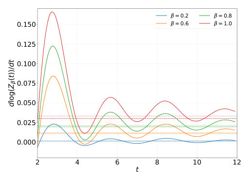
<figcaption class="paper-figure-caption"><b>Fig 3.</b> Figure 3: Instantanoeus slope of the FCS of the left half [−∞, 0] in a quench from the state |N, 0⟩L ⊗|D⟩R in the XXZ chain with ∆= 0.5. While the numerics ex- hibits good convergence to the asymptotic values pre- dicted, strong oscillations make it impossible to distin- guish between the two sign choices on the time intervals accessible via TEBD.</figcaption>
</figure>
<figure class="paper-figure-card">
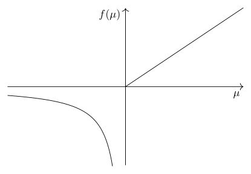
<figcaption class="paper-figure-caption"><b>Fig 4.</b> Figure 4: Sketch of a possible reparametrisation f(µ) that is non-monotonic but injective.</figcaption>
</figure>
<figure class="paper-figure-card">
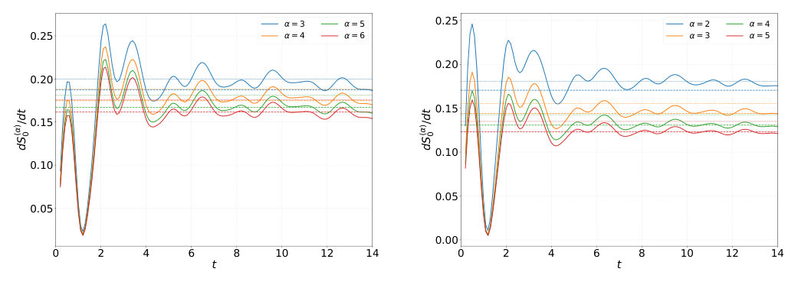
<figcaption class="paper-figure-caption"><b>Fig 5.</b> Figure 5: Instantaneous slope of Rényi entropies in two quenches in the XXZ chain with ∆= 4. On the left the initial state is |N, 0⟩L ⊗|N, π/6⟩R, while on the right |N, 0⟩L ⊗|N, π/8⟩R. Dashed lines represent the predictions obtained by using sgn(ε′(θ)), while dotted lines are the predictions obtained using sgn(vdr(θ)). In both cases, while for lower α it is impossible to distinguish between the two predictions at the scale accessible via TEBD, the solution at higher α shows clearly that the numerical solution converges to the dashed line.</figcaption>
</figure>

**Summary.** The paper develops and refines a Space-Time Duality Approach (SDA) to analyze non-equilibrium dynamics in integrable quantum many-body systems. It resolves previous theoretical ambiguities to provide exact analytical formulas for quantities like entanglement growth and charge fluctuations following general quenches. This advances the understanding of how equilibrium concepts can be used to solve complex, out-of-equilibrium physics problems.

**Why it may be interesting.** This work provides powerful, general theoretical tools for understanding how quantum information spreads and thermalizes in interacting systems far from equilibrium, which is central to modern AMO physics research on open quantum systems.

Detailed structure

**Main problem.** Characterizing universal aspects of non-equilibrium quantum many-body dynamics, particularly for interacting systems far from equilibrium.

**Main result.** The authors derive closed-form analytical predictions for entanglement growth and charge fluctuations after general inhomogeneous quenches in integrable systems by resolving ambiguities in the space-time duality approach (SDA).

**Method.** They employ the Space-Time Duality Approach (SDA), which maps non-equilibrium dynamics to stationary properties of a dual theory, utilizing generalized Thermodynamic Bethe Ansatz (TBA) equations and Generalized Hydrodynamics (GHD).

**Model / system.** The study focuses on one-dimensional integrable quantum systems, exemplified by the XXZ spin chain model. The analysis covers both gapped ($\Delta > 1$) and gapless ($\Delta \le 1$) regimes.

**Key observables.** Entanglement growth (Rényi entropies $S_\alpha$), fluctuations of conserved charges, and one-point functions of local operators.

**Important parameters / regimes.** The quench protocol is general and inhomogeneous; key limits include the homogeneous quench limit ($\zeta=0$) and the Von Neumann limit ($\alpha 	o 1$).

**Assumptions / limitations.** The initial state $|\psi_0
angle$ is assumed to have short-range correlations, and the framework relies on assuming scale invariance for bipartite quenches.

**Figures summary.** Figures illustrate tensor-network diagrams showing local expectation values under circuit evolution and map out the duality between entropy calculations in the original and dual channels. Other figures show instantaneous slopes of Rényi entropies and FCS vs. time for the XXZ chain quench.

**Paper structure.** The paper establishes the SDA framework, resolves its intrinsic ambiguities by matching predictions to known results (like Rule 54), derives closed-form expressions using generalized TBA/GHD techniques, and benchmarks these analytical results against TEBD simulations of the XXZ chain.

Abstract

Characterising the universal aspects of non-equilibrium quantum many-body dynamics is one of the key goals of this century's physics research. Progress, however, is hindered by the lack of general theoretical frameworks for studying interacting quantum matter far from equilibrium. A recent breakthrough has been the realization that several key non-equilibrium quantities, such as the rate of growth of entanglement or the fluctuations of conserved charges within finite subsystems, can be related to equilibrium properties through a space-time duality that effectively exchanges the roles of space and time. This observation effectively enables the study of non-equilibrium phenomena using tools and concepts borrowed from equilibrium statistical mechanics and thermodynamics. A first proof of principle of this framework, dubbed space-time duality approach (SDA), was provided by interacting integrable systems, where thermodynamic properties can often be characterized exactly, while dynamical quantities typically remain beyond analytical reach. Subsequent developments, however, revealed that the SDA suffered from an intrinsic ambiguity, restricting its applicability to homogeneous quenches and to charge fluctuations arising from symmetric initial states. Here we resolve this ambiguity from first principles and derive closed-form predictions for entanglement growth and charge fluctuations after general quantum quenches. We benchmark our results against the exact analytical solution of the Rule 54 quantum cellular automaton and extensive TEBD simulations of the XXZ chain. Moreover we show that, when specialised to the entanglement entropy, our framework naturally reproduces the predictions of the quasiparticle picture.

[↑ back to top](#top)

### [Proposal of quantum arrival-time measurement with a Bose-Einstein condensate](http://arxiv.org/abs/2606.20278v1)

**Authors:** Pascal Naidon, Lucas Happ, Denis Boiron  
**Type:** both · **Category:** quantum gases · **PDF:** <https://arxiv.org/pdf/2606.20278v1>  
**Analysis basis:** full PDF text, analyzed in chunks
**Topic relevance:** 🔥 `quantum measurements` **5/5** · 🔥 `measurement-induced transitions` **4/5** · `analog quantum simulation` **3/5** · `non-equilibrium dynamics` **2/5** · `quantum optics experiment` **2/5** · `Keldysh / 2PI / non-Gaussian methods` **1/5** · `QC/QI experiment` **1/5** · `driven-dissipative phase transition` **1/5** · `methods for driven-dissipative` **1/5**

↔ Scroll figures horizontally

<figure class="paper-figure-card">
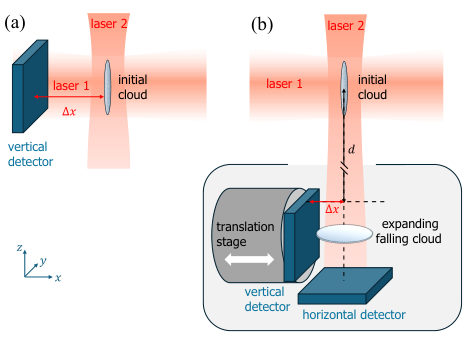
<figcaption class="paper-figure-caption"><b>Fig 1.</b> Figure 1. (a) Standard arrival-time experiment. (b) Our experimental setup proposal. In both cases, a vertical and a horizontal laser beams form an optical dipole trap in which a cloud of metastable helium-4 atoms is trapped – here, it is illustrated for configuration (1) of the lasers, which produces a vertical cigar-shaped cloud. At some time, the cloud is released by switching off laser 2 (a) or both laser beams (b). In our proposal (b), the cloud falls into a lower chamber where it can be detected on a horizontal and a vertical microchannel plate detector.</figcaption>
</figure>
<figure class="paper-figure-card">
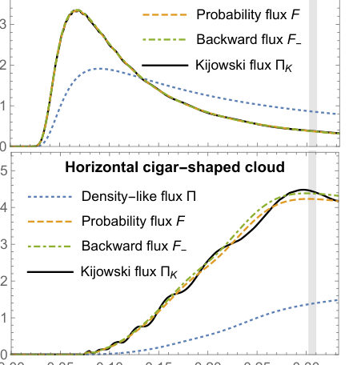
<figcaption class="paper-figure-caption"><b>Fig 2.</b> Figure 2. Arrival-time distributions based on the predic- tions Eqs. (1-4) for a helium-4 atom in a condensate of 104</figcaption>
</figure>
<figure class="paper-figure-card">
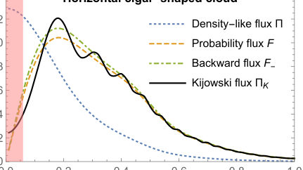
<figcaption class="paper-figure-caption"><b>Fig 3.</b> Figure 3. Average number of counts on the vertical detec- tor, based on the predictions Eqs. (1-4), as a function of the horizontal position of the detector. The counts at a given position correspond to a single experiment with 104</figcaption>
</figure>

**Summary.** The authors propose using Bose-Einstein condensates to experimentally investigate the controversial question of particle arrival time. By measuring the arrival flux at a detector placed far from the source, they circumvent technical limitations and can distinguish between competing theoretical models for quantum transport. This provides a powerful testbed connecting fundamental theory with advanced cold atom experiments.

**Why it may be interesting.** This work is highly relevant as it merges fundamental theoretical questions about quantum dynamics with cutting-edge experimental techniques in cold atom physics, providing a concrete roadmap for testing foundational quantum concepts.

Detailed structure

**Main problem.** The work addresses the fundamental, long-standing quantum mechanical question of determining the time taken for a particle to travel between two points.

**Main result.** A novel experimental setup using Bose-Einstein condensates can measure the arrival flux at a distant detector, allowing unambiguous discrimination between various theoretical predictions for arrival-time distributions.

**Method.** The methodology proposes measuring the arrival flux on a detector placed far from the source, rather than attempting direct time measurement near the source to avoid back-action and technical limitations.

**Model / system.** The physical system is a Bose-Einstein condensate (BEC) of ultracold atoms. The dynamics are governed by the Gross-Pitaevskii equation, and the experiment utilizes the BEC's expansion as it falls towards a detector.

**Key observables.** The primary observable is the average number of detected counts on the detector as a function of its horizontal position ($\Delta x$), which reveals the arrival flux distribution $\Pi(t)$.

**Important parameters / regimes.** Key parameters include the total atom number ($N$) and trapping frequencies ($\omega_{\parallel}, \omega_{\perp}$), with noise reduction requiring averaging over many experimental runs.

**Assumptions / limitations.** The analysis assumes that measurements can be performed far from the source to minimize disturbance, and that sufficient averaging is possible to overcome shot noise obscuring predicted oscillations.

**Figures summary.** Figures illustrate the limitations of standard near-source detection versus the proposed distant setup. Supplementary figures demonstrate how increasing atom number ($N$) and averaging over many experiments are necessary to reveal small oscillatory patterns predicted by axiomatic approaches.

**Paper structure.** The paper first establishes the theoretical ambiguity regarding arrival time measurements, then details the practical limitations of existing setups (Fig 1a). It proposes a novel, distant detection scheme using BECs (Fig 1b), discusses observable diagnostics ($\Delta x$ dependence), and finally analyzes the feasibility of detecting subtle quantum effects like oscillations via noise analysis.

Abstract

This work shows how a Bose-Einstein condensate of ultracold atoms could be used to address a long-standing question in quantum theory: how much time does it take for a particle to reach a detector? To this end, we propose a realistic experimental setup, whose key idea is not to measure arrival times directly, but the arrival flux on the detector as a function of its position. This novel approach not only solves practical issues with having a detector close to the system, but also results in signals that allow to unambiguously distinguish different theoretical predictions. This proposal raises prospects for resolving the decades-old debate on this fundamental issue.

[↑ back to top](#top)

### [Unleashing Emergent Fermions with Rydberg Atom Simulators](http://arxiv.org/abs/2606.19444v1)

**Authors:** Hanteng Wang, Xingyu Li, Shang Liu, Yingfei Gu, Chengshu Li  
**Type:** both · **Category:** other · **PDF:** <https://arxiv.org/pdf/2606.19444v1>  
**Analysis basis:** full PDF text, analyzed in chunks
**Topic relevance:** 🔥 `Rydberg arrays` **5/5** · 🔥 `analog quantum simulation` **4/5** · `non-equilibrium universality` **3/5** · `entanglement & information structure` **2/5** · `non-equilibrium dynamics` **2/5** · `Keldysh / 2PI / non-Gaussian methods` **1/5** · `QC/QI experiment` **1/5** · `driven-dissipative phase transition` **1/5** · `methods for driven-dissipative` **1/5**

↔ Scroll figures horizontally

<figure class="paper-figure-card">
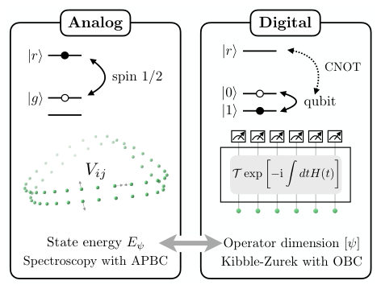
<figcaption class="paper-figure-caption"><b>Fig 1.</b> Figure 1. Schematic of two routes for probing emergent fermions with Rydberg atom simulators. (Left) In the analog mode, each atom realizes a spin-1/2 degree of freedom, and the geometric reconfigurability of the array, together with the interactions Vij, constructs the tricritical Ising model with APBC. Spectroscopy provides access to the fermionic state energies Eψ. (Right) In the digital mode, a qubit array with programmable gates implements the real-time evolution of a fermionic Kibble–Zurek protocol with OBC, probing the scal- ing dimension [ψ].</figcaption>
</figure>
<figure class="paper-figure-card">
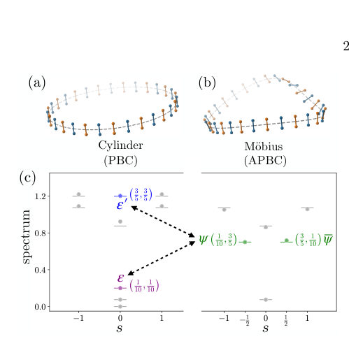
<figcaption class="paper-figure-caption"><b>Fig 2.</b> Figure 2. (a) Cylinder geometry realizing PBC with 2L atoms. (b) Optimized developable M¨obius geometry realiz- ing APBC. (c) Corresponding low-energy spectra, organized by conformal spin s. The bosonic primaries ε (blue) and ε′</figcaption>
</figure>
<figure class="paper-figure-card">
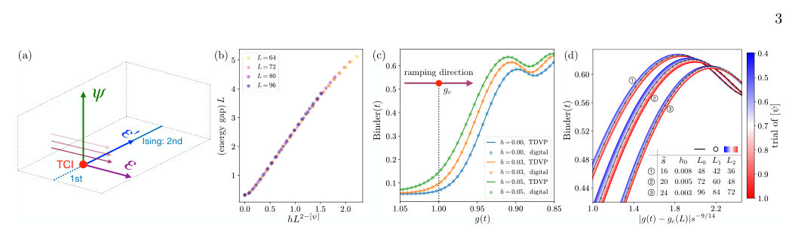
<figcaption class="paper-figure-caption"><b>Fig 3.</b> Figure 3. (a) Schematic near the TCI point in the (ε, ε′, ψ) parameter space, controlled by (g −gc, λ−λTCI, h). The pale-purple arrows indicate ramp trajectories passing near the TCI point at different fixed h. (b) Finite-size scaling collapse of the gap opened by Hχ at the TCI point. (c) Dynamical Binder ratio during a ramp across the transition for L = 16, comparing TDVP lines with digital-circuit data points. (d) Fermionic Kibble–Zurek results for the three data sets labeled 1 ○, 2 ○, and 3 ○, each with different ˜s and h0. Each data set contains three system sizes (L0, L1, L2), whose KZ curves collapse when [ψ] = 7/10. The color scale denotes the trial value of [ψ]; values away from...</figcaption>
</figure>
<figure class="paper-figure-card">
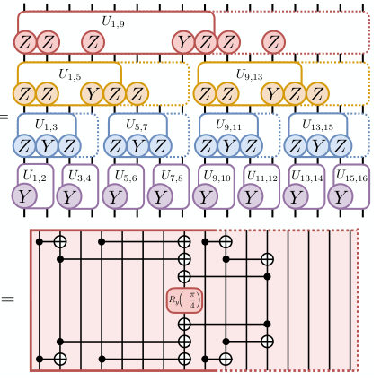
<figcaption class="paper-figure-caption"><b>Fig 4.</b> Figure 4. Circuit implementation of e−itHχ in the FBK ba- sis for L = 16. (a) From bottom to top, UFBK maps JW Majoranas χi to FBK Majoranas eχi, UL→1 rotates P</figcaption>
</figure>
<figure class="paper-figure-card">
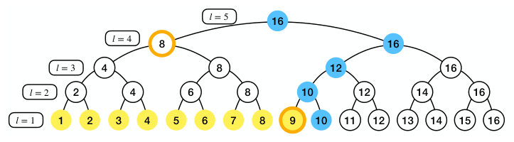
<figcaption class="paper-figure-caption"><b>Fig 5.</b> Figure 5. The Fenwick tree for L = 16 with five layers, l = 1, ..., 5. In each layer other than l = 1, a node has the same number as its right-hand-side leaf. Each node by definition “controls” all other nodes below. With the Fenwick tree, one can easily transform the JW-related operators X1 · · · Xi and Zi into the FBK basis. Taking the same example as in Fig. 4(b), X1 · · · X9 is transformed to X8X9 because the nodes 8 and 9 (circled in orange) control the lowermost leaves 1 through 9 (highlighted in yellow), with Λ(9) = {8, 9}. On the other hand, Z10 is transformed to Z10Z12Z16 (highlighted in blue), by tracking which nodes are traversed when one starts from 10 and goes all the way up.</figcaption>
</figure>

**Summary.** The paper details two advanced protocols—one analog and one digital—to use Rydberg atom simulators to experimentally investigate emergent fermionic excitations in bosonic quantum systems. By leveraging geometric reconfigurability, they achieve state-of-the-art circuit depth scaling for simulating non-local dynamics. This establishes the platform as a powerful tool for testing fundamental concepts from condensed matter theory.

**Why it may be interesting.** This work is highly relevant as it pushes the boundaries of experimental realization in AMO physics by mapping abstract theoretical concepts (emergent fermions, CFT) onto a programmable hardware platform (Rydberg atoms), while simultaneously advancing the computational methods needed to simulate these complex interactions.

Detailed structure

**Main problem.** To experimentally probe emergent fermions that are nonlocally defined within a bosonic quantum many-body system, particularly by characterizing critical phenomena and scaling dimensions.

**Main result.** The authors propose complementary analog (Möbius band) and digital (Kibble-Zurek ramping) protocols using Rydberg atom simulators to verify conformal invariance and establish the platform's capability for probing emergent fermionic excitations.

**Method.** The work combines theoretical analysis of boundary conditions (APBC vs. OBC) with quantum simulation techniques, including implementing complex non-local gates via binary-tree compression on programmable qubit arrays.

**Model / system.** The primary platform is the Rydberg atom simulator, which can realize both analog and digital protocols. The physics involves studying critical points (TCI class) where emergent fermionic degrees of freedom are expected to appear in an otherwise bosonic system.

**Key observables.** Universal energy ratios ($\epsilon, \epsilon', \psi$), fermionic Kibble-Zurek scaling exponent ($\chi$), and the dynamical Binder ratio collapse.

**Important parameters / regimes.** The geometry (Möbius band vs. cylinder), the perturbation strength ($h$), system size ($L$), and critical exponents ($\psi$).

**Assumptions / limitations.** In the analog mode, realizing a developable Möbius band geometry is assumed. In the digital mode, Open Boundary Conditions are crucial for isolating the fermionic scaling dimension $[\psi]$.

**Figures summary.** Figures illustrate schematics of both protocols (Möbius band/Qubit array), finite-size scaling collapses confirming predicted exponents ($\chi$), and detailed circuit diagrams showing $O(\log L \log \log L)$ gate depth via binary-tree compression.

**Paper structure.** The paper is structured around two complementary approaches: the analog method using geometric constraints (Möbius band) to enforce antiperiodic boundary conditions, and the digital method employing quantum circuits for dynamic probing (Kibble-Zurek). A significant portion details the advanced quantum circuit compilation techniques required for non-local gates.

Abstract

Rydberg atom simulators, in both analog and digital modes, have attracted significant recent interest due to their versatile geometric reconfigurability. In this work, leveraging this feature, we propose two complementary approaches, one for each mode, to characterize emergent fermions in critical quantum many-body systems. In the analog mode, we assemble the Rydberg atoms in a "developable" (namely, preserving local couplings) Möbius band geometry to realize antiperiodic boundary conditions, where fermionic states reside. Spectroscopic measurement in this sector then reveals universal energy ratios of the bosonic and fermionic states. In the digital mode, we carry out a fermionic version of Kibble-Zurek ramping with a quantum circuit, directly addressing the fermionic scaling form. Reconfigurability allows an exponential speed-up of this task, with an $O(\log L\log\log L)$ circuit-depth overhead. Our work establishes the Rydberg atom simulator as a uniquely powerful platform to attack the notoriously difficult issue of experimentally probing emergent fermions that are nonlocally defined in a bosonic system.

[↑ back to top](#top)

### [Emergency hub placement with a neutral-atom quantum computer](http://arxiv.org/abs/2606.19589v1)

**Authors:** Sara Tarquini, Matteo Vandelli, Francesco Ferrari, Daniele Dragoni, Francesco Tudisco  
**Type:** both · **Category:** other · **PDF:** <https://arxiv.org/pdf/2606.19589v1>  
**Analysis basis:** full PDF text, analyzed in chunks
**Topic relevance:** 🔥 `Rydberg arrays` **5/5** · 🔥 `QC/QI experiment` **4/5** · 🔥 `analog quantum simulation` **4/5** · `methods for driven-dissipative` **1/5**

↔ Scroll figures horizontally

<figure class="paper-figure-card">
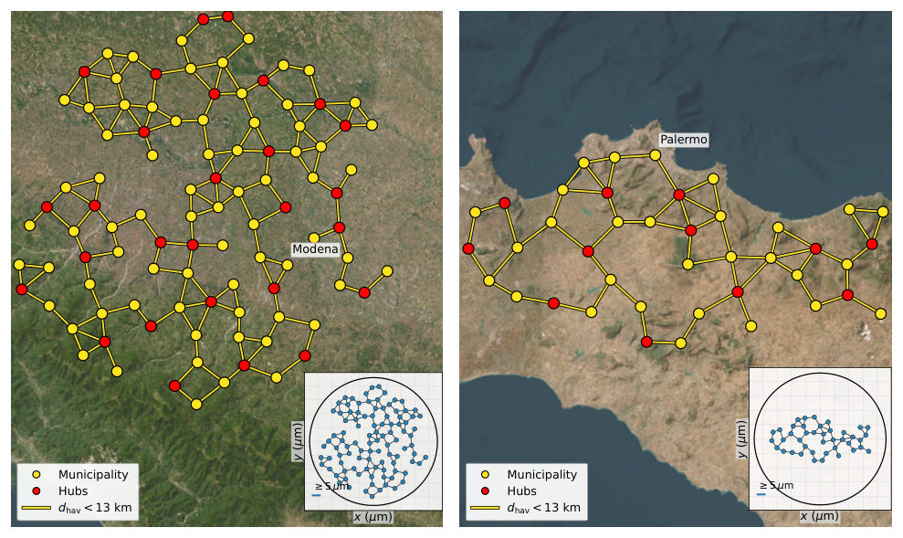
<figcaption class="paper-figure-caption"><b>Fig 1.</b> Figure 1: Case studies of emergency hub placement in the Po Valley area near Modena (left) and in north-western Sicily, including Palermo (right). Graph nodes represent municipalities that are candidate locations for the placement of EOCs. Edges connect pairs of locations which lie within the given travel time Tmax. Red nodes denote the optimal solution of the mDS problem (1) on these graphs. The bottom-left insets of both panels show the embedding of each problem graph in the neutral-atom QPU chamber, corresponding to the associated atomic register.</figcaption>
</figure>
<figure class="paper-figure-card">
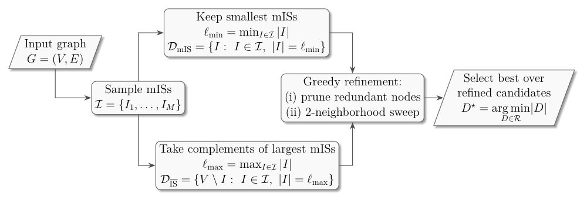
<figcaption class="paper-figure-caption"><b>Fig 2.</b> Figure 2: Two-branch workflow for approximating the minimum dominating set (mDS) from sampled maximal independent sets (mIS), obtained either by classical or quantum methods.</figcaption>
</figure>
<figure class="paper-figure-card">
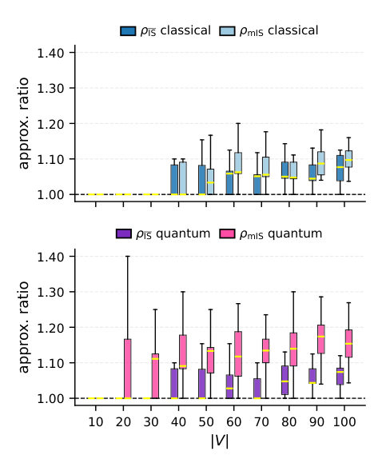
<figcaption class="paper-figure-caption"><b>Fig 3.</b> Figure 3: Boxplot of the approximation ratios found by each branch of the proposed algorithm, ρmIS and ρIS [see Equation (9)], as a function of graph size |V |. We collect statistics on 30 test instances of increasing size up to |V | = 100 on randomly generated unit-disk graphs. The upper panel shows results obtained by sampling mISs classically, while the lower panel shows those obtained with the emulated quantum sampler.</figcaption>
</figure>
<figure class="paper-figure-card">
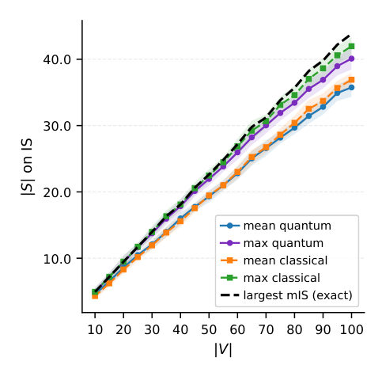
<figcaption class="paper-figure-caption"><b>Fig 4.</b> Figure 4: Mean and maximum sizes of the independent sets obtained with the quantum and classical samplers. We show their average (dots) and the standard deviation (shaded area) across the instances used for the statistical experiments summarized in Figure 3. The dashed black line indicates the size of the largest mIS, averaged over the various instances.</figcaption>
</figure>
<figure class="paper-figure-card">
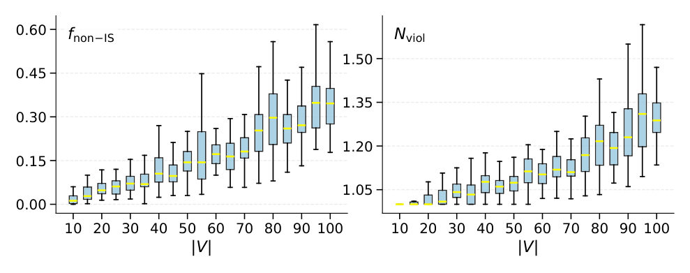
<figcaption class="paper-figure-caption"><b>Fig 5.</b> Figure 5: Left panel: frequency of invalid (i.e., non-IS) samples f¬IS among raw bitstrings from the emulated quantum algorithm. Right panel: severity of the IS violation among non-IS samples, as measured by the number of violating edges Nviol. Statistics are collected over the same instances used for Figure 3.</figcaption>
</figure>

**Summary.** The research tackles the critical emergency hub placement problem by modeling it as finding a Minimum Dominating Set on a graph. They propose and test a hybrid algorithm that uses neutral-atom quantum computers to sample candidate solutions (Independent Sets). The results show that even with hardware noise, this approach yields near-optimal solutions for large, realistic graphs, validating the use of current analog quantum devices for practical optimization tasks.

**Why it may be interesting.** This is highly relevant as it directly applies advanced AMO physics tools (Rydberg blockade in neutral atoms) to solve a complex, real-world combinatorial optimization problem, demonstrating near-term quantum utility beyond simple simulation.

Detailed structure

**Main problem.** The paper addresses the NP-hard Minimum Dominating Set (mDS) problem, framed as optimizing emergency hub placement in disaster response scenarios.

**Main result.** The authors demonstrated that using neutral-atom quantum computers operating in analog mode can generate near-optimal solutions for this graph optimization problem on real-world instances up to 100 nodes.

**Method.** A hybrid quantum-classical framework is proposed, where the neutral-atom QPU samples candidate Independent Sets (IS), which are then used via classical post-processing and refinement steps to approximate the mDS.

**Model / system.** The physical platform utilized is a neutral-atom quantum computer (specifically mentioning Pasqal's Fresnel processor). The computation relies on the Rydberg blockade mechanism, which naturally constrains the system's low-energy subspace to represent valid independent sets.

**Key observables.** Approximation ratio ($
ho$), fraction of invalid samples ($f_{
eg IS}$), and the size of the found dominating set ($mDS$).

**Important parameters / regimes.** Instance sizes up to 100 nodes, target response time (e.g., 10 minutes), and QPU operational parameters like Rabi frequency ($\Omega$) and detuning ($\delta$).

**Assumptions / limitations.** The core assumption is that the quantum sampling of ISs can provide a sufficiently good starting point for classical refinement to solve the mDS problem, despite hardware noise.

**Figures summary.** Figures compare performance metrics (like approximation ratios) across different methods: fully classical, emulated QPU, and actual QPU measurements for instances like Palermo and Modena.

**Paper structure.** The paper first defines the graph theory problem (mDS $	o$ IS sampling). It then details the hybrid quantum-classical workflow. The core of the work involves benchmarking this approach on synthetic and realistic geographic case studies using the neutral-atom QPU hardware, comparing results against classical solvers.

Abstract

We study the problem of emergency operation center placement in disaster response, where a minimal number of hubs must be selected to ensure timely coverage of all affected locations. This task can be formulated as a minimum dominating set problem on a graph encoding reachability within a target response time. We propose a hybrid quantum-classical approximation framework that leverages neutral-atom quantum computers as independent set samplers. Candidate dominating sets are constructed from both small maximal independent sets and complements of large independent sets, and are subsequently refined via a lightweight classical procedure. We benchmark the approach on synthetic instances and realistic case studies, and implement it on the Fresnel quantum processor by Pasqal, solving instances of up to 100 nodes. Our results show that quantum-generated samples, despite hardware noise, enable near-optimal solutions of the placement problem. Overall, our results demonstrate that neutral-atom devices operating in analog mode can already be used to tackle graph optimization problems for real-world applications.

[↑ back to top](#top)

### [Arrival times of an atomic Bose-Einstein condensate](http://arxiv.org/abs/2606.20281v1)

**Authors:** Pascal Naidon, Lucas Happ, Denis Boiron  
**Type:** theory · **Category:** quantum gases · **PDF:** <https://arxiv.org/pdf/2606.20281v1>  
**Analysis basis:** full PDF text, analyzed in chunks
**Topic relevance:** 🔥 `quantum measurements` **5/5** · 🔥 `measurement-induced transitions` **4/5** · `analog quantum simulation` **1/5** · `methods for driven-dissipative` **1/5** · `non-equilibrium dynamics` **1/5**

↔ Scroll figures horizontally

<figure class="paper-figure-card">
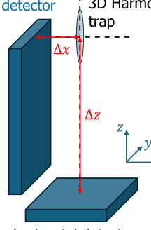
<figcaption class="paper-figure-caption"><b>Fig 1.</b> Figure 1. Schematic setup for measuring the arrival times of an atomic Gaussian wave packet. A metastable atom is initially prepared in the ground state of a three-dimensional harmonic trap (shown here as an ellipsoid). The atom is then released from the trap and observed on a horizontal detector and a vertical detector separated from the trap by distances ∆z and ∆x respectively, as indicated by the red arrows.</figcaption>
</figure>
<figure class="paper-figure-card">
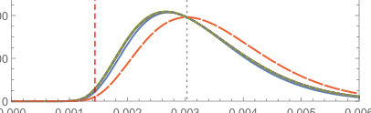
<figcaption class="paper-figure-caption"><b>Fig 2.</b> Figure 3. Same as Fig. 2 for a trapping frequency ωz = 2π × 2000 Hz. The distance of the detector is still ∆z = 3, 20, 40 σx, (from top to bottom panel) which now cor- responds to approximately 0.003, 0.022, 0.044 mm. For ∆z ≥20σx, all predictions (solid curves) are nearly in- distinguishable and well reproduced by the semi-classical flux Eq. (30) shown by the gray dashed curve.</figcaption>
</figure>
<figure class="paper-figure-card">
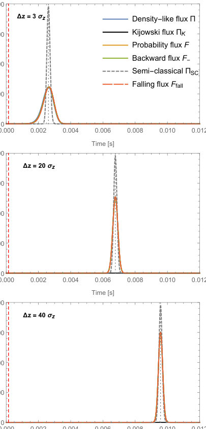
<figcaption class="paper-figure-caption"><b>Fig 3.</b> Figure 2. Arrival-time distributions for an isolated helium- 4 atom detected onto a horizontal planar detector, based on different predictions Eqs. (26-30). For the density- like flux Eq. (26), the coefficient α is set to gtfall. The atom is initially trapped in a harmonic trap with frequency ωz = 2π × 20 Hz and the detector is separated from the trap by a distance ∆z = 3, 20, 40 σx, (from top to bottom panel) corresponding approximately to 0.03, 0.2, 0.4 mm. The gray vertical dotted line indicates the classical fall time tfall Eq. (22), and the red vertical dashed line the time tσ Eq. (21) beyond which the system is in the gravity- dominated regime. All predictions are nearly...</figcaption>
</figure>
<figure class="paper-figure-card">
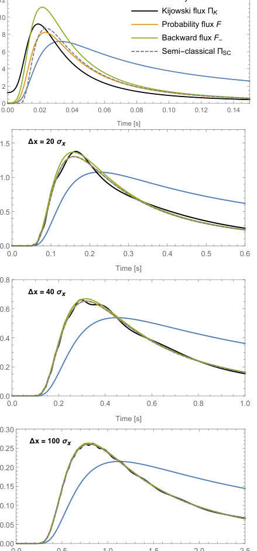
<figcaption class="paper-figure-caption"><b>Fig 4.</b> Figure 4. Arrival-time distributions for an isolated helium- 4 atom detected onto a vertical planar detector, based on the different predictions, Eqs. (34-38). The atom is initially trapped in a harmonic trap with frequency ωx = 2π×20 Hz and the detector is separated from the trap by a distance ∆x = 3, 20, 40, 100 σx, (from top to bottom panel) cor- responding approximately to 0.03, 0.2, 0.4, 1.1 mm. Only the density-like flux (blue curve) differs significantly from the other predictions for large ∆x. It is given by the prob- ability density scaled by an arbitrary coefficient α set here to 1.0 mm/s.</figcaption>
</figure>
<figure class="paper-figure-card">
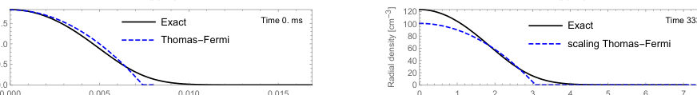
<figcaption class="paper-figure-caption"><b>Fig 5.</b> Figure 5. Density cuts along the axial (x∥) and transverse (x⊥) directions through a cigar-shaped condensate of 104</figcaption>
</figure>

**Summary.** This work investigates how repulsive interactions modify the predicted arrival time distributions for an atomic Bose-Einstein condensate. By solving the Gross-Pitaevskii equation and comparing multiple theoretical fluxes, the authors show that while interactions cause quantitative changes from non-interacting atoms, measuring in specific expansion regimes offers a path to experimentally distinguish between competing quantum measurement theories.

**Why it may be interesting.** This paper tackles a fundamental ambiguity in quantum measurement theory—defining particle detection flux near the source—using the highly controllable platform of BECs to test theoretical boundaries.

Detailed structure

**Main problem.** The primary challenge is determining the theoretically consistent distribution of arrival times for an atomic Bose-Einstein condensate (BEC) when detected very close to its trapping region.

**Main result.** Interactions modify theoretical predictions for arrival time distributions, and measuring arrivals in loose expansion directions allows probing regimes where different quantum theories yield distinct, testable results.

**Method.** The authors solve the time-dependent Gross-Pitaevskii equation numerically and analytically to derive various flux formulations (density-like, Kijowski, probability) for comparison.

**Model / system.** The system is an atomic BEC governed by the Gross-Pitaevskii equation. The analysis compares results from non-interacting particles against those including repulsive interactions ($g|\psi|^2$).

**Key observables.** Arrival-time distribution $\Pi(t)$ onto a detector surface, comparing density flux, Kijowski flux ($\Pi_K$), and probability flux ($F$).

**Important parameters / regimes.** The comparison is highly dependent on the detection separation ($\Delta x$ or $\Delta z$) relative to the initial trap size ($\sigma$), especially in the short-distance regime.

**Assumptions / limitations.** Approximations include using the scaling Thomas-Fermi method for dynamics and assuming specific forms for quantum flux calculations, though the paper aims to test these limits.

**Figures summary.** Figures illustrate arrival-time distributions comparing interacting vs. non-interacting cases, showing convergence towards falling flux at large separations but distinct behavior at small separations.

**Paper structure.** The work systematically reviews multiple theoretical approaches for arrival time measurement, first analyzing the general free-fall case with gravity, then extending these analyses to include mean-field interactions via the GPE and scaling approximations.

Abstract

The times of flight of an atomic Bose-Einstein condensate are theoretically investigated in the experimentally unexplored regime corresponding to detection close to the trap of the condensate. In this regime, there is no consensus on how to calculate the distribution of times of arrival onto the detector. For non-interacting particles, distinct theoretical predictions have been made in the past. This work analyses how these predictions are modified for an interacting Bose-Einstein condensate. For this purpose, a time-dependent Gross-Pitaevskii equation is solved analytically and numerically.

[↑ back to top](#top)

### [Multi-particle gates on driven one-dimensional paths: probing deep traps](http://arxiv.org/abs/2606.20294v1)

**Authors:** Harsh Jain, Shankar Ghosh, Archishman Raju  
**Type:** both · **Category:** statistical mechanics · **PDF:** <https://arxiv.org/pdf/2606.20294v1>  
**Analysis basis:** full PDF text, analyzed in chunks
**Topic relevance:** 🔥 `Frenkel-Kontorova` **4/5** · 🔥 `non-equilibrium dynamics` **4/5** · `analog quantum simulation` **3/5** · `driven-dissipative phase transition` **3/5** · `methods for driven-dissipative` **3/5** · `non-equilibrium universality` **3/5** · `correlated / nonlocal dissipation` **2/5** · `Keldysh / 2PI / non-Gaussian methods` **1/5** · `Kondo & dissipative impurity` **1/5** · `entanglement & information structure` **1/5** · `scars & prethermalization` **1/5**

↔ Scroll figures horizontally

<figure class="paper-figure-card">
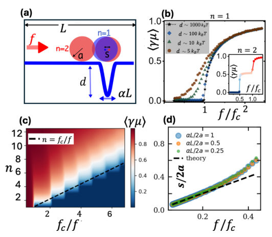
<figcaption class="paper-figure-caption"><b>Fig 1.</b> FIG. 1. (a) shows a periodic potential well (blue) with po- tential depth d and trap size αL, periodicity L and a driving force f along the path. The blue particle represents n = 1 and the two red particles represent n = 2 on the path. (b) shows the variation of particle’s transport efficiency ⟨γµ⟩versus f/fc for a single particle and various potential well depths d. Inset shows the transport efficiency for n = 2 and d = 1000kBT. (c) shows the phase diagram for current ⟨γµ⟩with n parti- cles on the vertical axis and f/fc on the horizontal axis for d = 1000 kBT. Dashed line is n = fc/f. (d) shows the nor- malized shift s/2a in the position of the particle at the edge as a function of f/fc.</figcaption>
</figure>
<figure class="paper-figure-card">
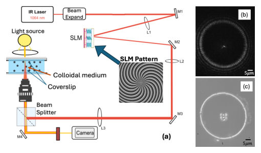
<figcaption class="paper-figure-caption"><b>Fig 2.</b> FIG. 2. (a) shows the experimental setup for the optical tweezer consisting of a spatial light modulator (SLM), mir- rors M1-3 and lenses L1-3, along with the phase pattern of Laguerre Gaussian beam projected on the SLM. (b) shows the optical vortex seen by the camera reflected by the cover- slip. (c) shows a long exposure image (exposure time ∼10s) for particles moving along the circular trap generated by the optical vortex</figcaption>
</figure>
<figure class="paper-figure-card">
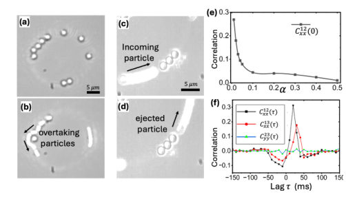
<figcaption class="paper-figure-caption"><b>Fig 3.</b> FIG. 3. (a) shows a snapshot of 2 µm particles on a circular trap. (b) shows a long exposure shot of particles overtaking a trapped particle in a wide trap. (c) shows long exposure im- age of a 2 µm particle moving towards a cluster of 3 trapped particles, and (d) shows emission of a particle from the ‘par- ticle gate’ after collision (e) shows the simulation results for C12 xx(0) versus α for particle positions inside the cluster (f) shows the correlation at lag τ for experimental data.</figcaption>
</figure>
<figure class="paper-figure-card">

<figcaption class="paper-figure-caption"><b>Fig 4.</b> Fig. 3 shows colloidal particles moving on the optical vortex path and getting stuck in deep potential wells that result from charge heterogeneities. Fig. 3(a) shows the snapshot of particles of diameter 2 µm on a wider opti- cal vortex circumferential path with R ≈10 µm, with exposure time of ∼10 ms and (b) shows a longer expo- sure time of ∼1 s in the same scenario. The particles not stuck in a trap are able to overtake a particle stuck in the trap on the circumferential path with the path width w ≳2a. Fig. 3(c-d) shows particles with diameter ≈2 µm on a narrower section of the circumferential path with R ≈22 µm where w ≲2a. The particles are unable to overtake each other along the path...</figcaption>
</figure>
<figure class="paper-figure-card">
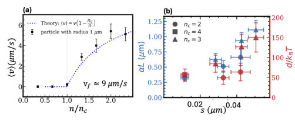
<figcaption class="paper-figure-caption"><b>Fig 5.</b> FIG. 4. (a) shows average velocity ⟨v⟩for particles of diameter 2 µm versus n/nc. (b) shows the measured shift s versus trap size αL (left,blue) and normalized depth d/kBT for the same value of driving force f, for nc = 2, 3, 4 and at different trap locations.</figcaption>
</figure>

**Summary.** The research explores how interacting colloidal particles exhibit collective motion when driven through deep potential traps, mimicking particle-gate physics. By combining Brownian dynamics simulations with optical trapping experiments, the authors demonstrate a sharp transition to finite current only above a critical particle number ($n_c$). This technique allows for the study of highly confined, non-equilibrium transport regimes relevant to molecular or biological systems.

**Why it may be interesting.** This work provides a physical platform to study non-equilibrium transport and correlated dynamics, which has analogies in open quantum systems where environmental coupling dictates collective behavior.

Detailed structure

**Main problem.** The study investigates single-file transport of colloidal particles driven through periodic potential wells, focusing on how particle interactions induce collective correlated motion.

**Main result.** A finite current only appears when the number of particles exceeds a critical threshold ($n_c$), demonstrating a particle-gate-like behavior in deep traps. The technique allows characterizing trap depths inaccessible by standard theoretical methods.

**Method.** The work combines overdamped Brownian dynamics simulations with experimental realization using colloidal particles driven by an optical vortex generated via an SLM.

**Model / system.** The system models colloidal particles moving on a periodic path under a tilted potential, which is realized experimentally using repulsive electrical double-layer interactions and optically induced driving forces. The theoretical framework involves the overdamped Langevin equation.

**Key observables.** Particle current ($\langle\gamma_\mu
angle$), critical cluster size ($n_c$), and particle position shift ($s$).

**Important parameters / regimes.** Trap depth (up to several hundred $k_B T$), force ratio ($f/f_c$), and particle number ($n$).

**Assumptions / limitations.** The analysis relies on the small trap limit ($\alpha L \le 2a$) for certain approximations, and the experimental setup models interactions using DLVO potentials.

**Figures summary.** Figures illustrate potential well geometries, phase diagrams showing current dependence on $n$ and force ratio, and details of the optical vortex generation setup.

**Paper structure.** The paper progresses from theoretical modeling of particle-gate behavior in deep traps to detailed experimental implementation using colloidal particles trapped by an optical vortex generated via SLM modulation.

Abstract

We study single-file transport of driven overdamped colloidal particles on a periodic path with deep potential wells. In the small trap limit (i.e., trap size smaller than particle size), the particle current transitions from zero to finite as the number of particles on the path exceeds a critical number $n_c$. Beyond this threshold, $n_c$ particles cluster behind the trap, demonstrating collective correlated motion. The remaining `extra' particles circulate, giving a finite current. We study this phenomenon numerically using overdamped Brownian dynamics simulations, and present an experimental realization of this behaviour for micron-scale colloidal particles driven in an optical vortex. Using our experimental observations, we present results characterizing potential wells as deep as several hundred $k_BT$.

[↑ back to top](#top)

### [Solving Nonequilibrium Dynamics via Influence Matrix Bootstrap: Floquet-PXP Model](http://arxiv.org/abs/2606.19430v1)

**Authors:** Xiao-Yang Yang, He-Ran Wang, Zhong Wang  
**Type:** theory · **Category:** other · **PDF:** <https://arxiv.org/pdf/2606.19430v1>  
**Analysis basis:** full PDF text, analyzed in chunks
**Topic relevance:** 🔥 `analog quantum simulation` **4/5** · 🔥 `methods for driven-dissipative` **4/5** · 🔥 `non-equilibrium dynamics` **4/5** · `Rydberg arrays` **3/5** · `entanglement & information structure` **3/5** · `non-equilibrium universality` **3/5** · `scars & prethermalization` **2/5** · `Keldysh / 2PI / non-Gaussian methods` **1/5** · `correlated / nonlocal dissipation` **1/5** · `driven-dissipative phase transition` **1/5**

↔ Scroll figures horizontally

<figure class="paper-figure-card">
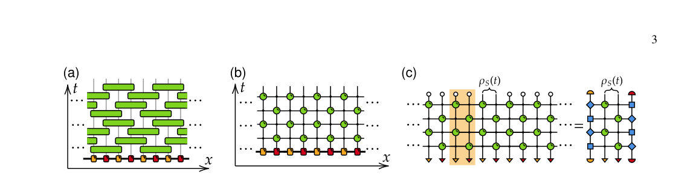
<figcaption class="paper-figure-caption"><b>Fig 1.</b> FIG. 1. Tensor-network representation of the Rule 201 quantum cellular automaton. Time steps t = 2. (a) Brickwork quantum circuit. (b) Rule 201 quantum cellular automaton represented in interactions round-a-face. (c) Dynamics of a local subsystem on two sites, where the rest of the system is traced out and gives rise to influence matrices, represented as matrix product states on two sides. The shaded region is the spatial transfer matrix.</figcaption>
</figure>
<figure class="paper-figure-card">
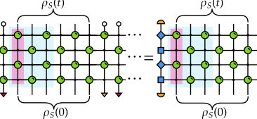
<figcaption class="paper-figure-caption"><b>Fig 2.</b> FIG. 2. Nonequilibrium dynamics in the presence of quantum defects. Local gates in the shaded region are deformed away from the cellular automaton according to Eq. (17). The red region corresponds to the period-three initial state, while the light-blue region corresponds to the period-five initial state. Using the exact solution of the influence matrix, the subsystem dynamics can be computed for arbitrarily long times.</figcaption>
</figure>
<figure class="paper-figure-card">
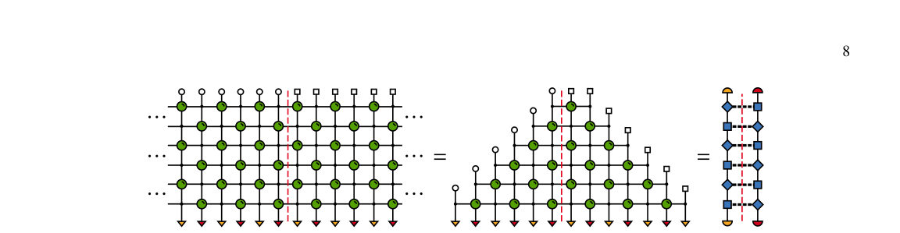
<figcaption class="paper-figure-caption"><b>Fig 3.</b> FIG. 4. Schematic of the R´enyi-n entropy calculation. Time steps t = 3. The red dashed line indicates the location of the bipartition. The black dashed lines on the right-hand side indicate the contraction for the n-layer folded tensors A and B, as defined in Eqs. (24) and (25).</figcaption>
</figure>
<figure class="paper-figure-card">
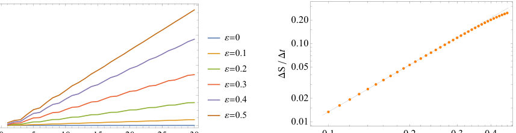
<figcaption class="paper-figure-caption"><b>Fig 4.</b> FIG. 5. Dependence of the bipartite R´enyi-2 entropy on time and parameter ε. The left panel shows the entropy growth in time. The right panel shows the quantity (S(t = 30) −S(t = 15))/15 as a function of ε, with the gray line 4ε2/3 shown for reference.</figcaption>
</figure>
<figure class="paper-figure-card">
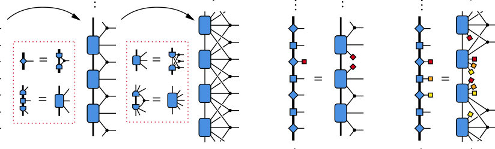
<figcaption class="paper-figure-caption"><b>Fig 5.</b> FIG. 6. (a) The transformation from a matrix product state to split-index matrix product states with three and five physical indices in each tensor. (b,c) Measurements can reduce the bond dimension, as captured by the structure of the split-index matrix product states.</figcaption>
</figure>

**Summary.** This paper tackles the difficult problem of simulating nonequilibrium quantum dynamics in integrable systems using the influence matrix formalism. By developing generalized zipper conditions and a numerical bootstrap method, the authors provide an exact framework to calculate time evolution for models like the Rule 201 QCA. This allows for detailed study of phenomena such as entanglement growth and memory structure separation.

**Why it may be interesting.** This work provides powerful, mathematically rigorous tools (generalized zipper conditions) to analyze non-equilibrium quantum dynamics that are often intractable, directly connecting theoretical concepts to experimental platforms like Rydberg arrays.

Detailed structure

**Main problem.** The primary challenge addressed is accurately characterizing nonequilibrium integrable dynamics in quantum many-body systems, which remains difficult even when equilibrium properties are well understood.

**Main result.** The authors developed a framework using influence matrices and generalized zipper conditions to find exact solutions for local dynamics, enabling the unified study of both thermalizing and nonthermalizing regimes.

**Method.** The core methodology involves employing the tensor-network approach via influence matrices, developing 'generalized zipper conditions' for exact solvability, and utilizing a numerical bootstrap method to solve these complex constraints.

**Model / system.** The study focuses on the "Rule 201" quantum cellular automaton (QCA), which is an integrable Trotterization of the PXP Hamiltonian. The theory is designed to be testable on state-of-the-art platforms like Rydberg atom arrays.

**Key observables.** Entanglement growth, reduced density matrix evolution ($
ho_S(t)$), and multitime correlations characterized by a 'hidden Markov order'.

**Important parameters / regimes.** The bond dimension ($\chi$) of the influence matrix is critical; the analysis explores regimes where $\chi$ remains finite.

**Assumptions / limitations.** The method assumes that the relevant influence matrices admit an exact, finite-bond-dimension Matrix Product State (MPS) representation at long times for solvability.

**Figures summary.** Figures illustrate tensor network representations of the QCA circuit, time evolution under local perturbations (quantum defects), and the calculation of Rényi entropy using specialized tensor structures like SIMPS.

**Paper structure.** The paper progresses by first establishing the theoretical framework (influence matrices, zipper conditions) for solving the dynamics. It then applies this to specific models (Rule 201/PXP), analyzing observables like entanglement and memory structure, culminating in a discussion of numerical implementation via bootstrap techniques.

Abstract

Studies of integrable systems have profoundly deepened the fundamental understanding of quantum many-body physics. While equilibrium properties such as ground states and thermodynamics can often be characterized efficiently, accurately characterizing nonequilibrium integrable dynamics remains a significant challenge. Here, we address this problem in the "Rule 201" quantum cellular automaton, an integrable Trotterization of the PXP Hamiltonian. Using the tensor-network approach of the influence matrix, we develop local conditions called generalized zipper conditions that allow exact solutions of local dynamics. We also introduce a numerical bootstrap method for solving influence matrices with finite but relatively large bond dimensions. This uncovers a rich landscape of nonequilibrium behavior exhibiting initial-state dependence. As an example, we investigate the fate of persistent oscillating dynamics under local non-integrable perturbations, and present analytical results for non-thermal relaxation constrained by conservation laws. We also obtain numerically exact results for entanglement growth across a broad class of initial states. Furthermore, from an information-theoretic perspective, we identify a refined structure of multitime correlations termed the hidden Markov order: the memory encoded in the dynamics separates into finite-length and long-range distributed components, which becomes transparent in an exact split-index matrix-product-state representation of the influence matrix. Our approach enables unified investigations of nonthermalizing and thermalizing regimes of nonequilibrium dynamics within a single analytically tractable model, and can be tested experimentally in state-of-the-art quantum simulators such as Rydberg atom arrays.

[↑ back to top](#top)

### [Entanglement structure of the dynamical phases in the sub-Ohmic spin-boson model](http://arxiv.org/abs/2606.20313v1)

**Authors:** Cunxi Gong, Zirui Sheng, Weitang Li  
**Type:** theory · **Category:** other · **PDF:** <https://arxiv.org/pdf/2606.20313v1>  
**Analysis basis:** full PDF text, analyzed in chunks
**Topic relevance:** 🔥 `entanglement & information structure` **4/5** · 🔥 `methods for driven-dissipative` **4/5** · `correlated / nonlocal dissipation` **3/5** · `driven-dissipative phase transition` **3/5** · `exotic spin models in light-matter` **3/5** · `non-equilibrium dynamics` **2/5** · `non-equilibrium universality` **2/5** · `Keldysh / 2PI / non-Gaussian methods` **1/5** · `Kondo & dissipative impurity` **1/5** · `analog quantum simulation` **1/5** · `spintronics-quantum-optics interface` **1/5**

↔ Scroll figures horizontally

<figure class="paper-figure-card">
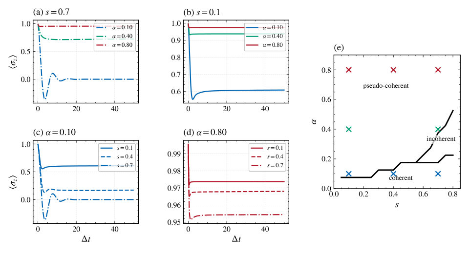
<figcaption class="paper-figure-caption"><b>Fig 1.</b> Figure 1: Spin polarization dynamics and population-based phase diagram of the sub-Ohmic spin-boson model. Panels (a) and (b) show the evolution of ⟨σz(t)⟩at fixed s with in- creasing coupling strength α, illustrating the crossover from coherent to incoherent and pseudo-coherent dynamics. Panels (c) and (d) show trajectories at fixed α with increasing s, demonstrating the recovery of coherent behavior at larger spectral exponents. Panel (e) shows the resulting phase diagram over the (s, α) parameter space at ωc = 10∆; the three regions correspond to coherent, incoherent, and pseudo-coherent spin polarization dynamics. The crosses mark the representative parameter points used in panels...</figcaption>
</figure>
<figure class="paper-figure-card">
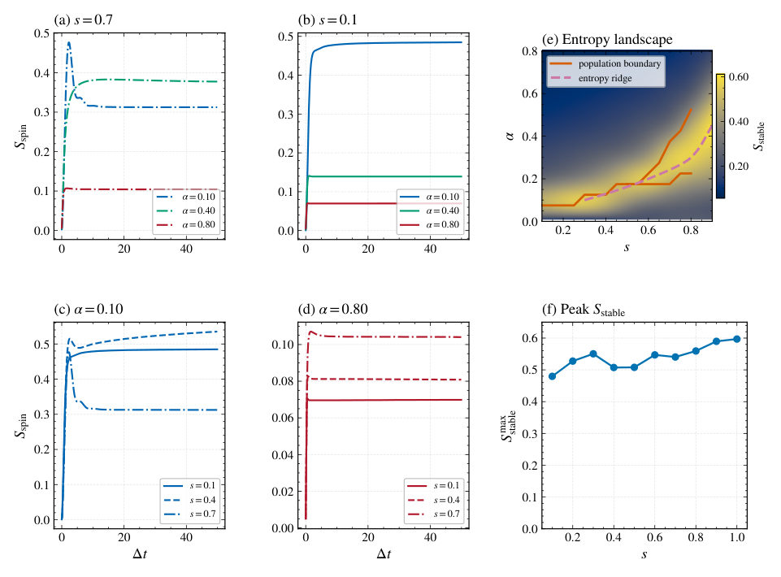
<figcaption class="paper-figure-caption"><b>Fig 2.</b> Figure 2: Spin entanglement entropy dynamics and stationary entropy landscape. Panels (a)–(d) show the spin entanglement entropy Sspin(t) for representative parameter sets, ob- tained from the reduced density matrix of the spin subsystem. Most trajectories rapidly approach a stationary plateau after an initial transient. Panel (e) shows the stationary en- tropy landscape: the color map represents the stationary spin entanglement entropy Sstable over the (s, α) parameter space. The red line denotes the population-based dynamical phase boundaries determined from ⟨σz(t)⟩, while the purple dashed line traces the fixed-α ridge sridge(α) = arg maxs Sstable(s, α). Panel (f) shows Smax stable(s) =...</figcaption>
</figure>
<figure class="paper-figure-card">
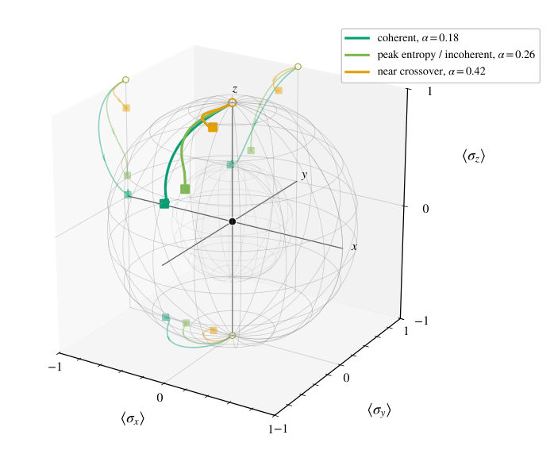
<figcaption class="paper-figure-caption"><b>Fig 3.</b> Figure 3: Representative three-dimensional Bloch trajectories at s = 0.7. The solid outer wireframe is the pure-state Bloch sphere (r = 1, Sspin = 0), and the lighter inner shell marks r ≃0.48, close to the smallest stationary radius among the s = 0.7 trajectories (maximum Sspin). The black dot marks the origin (r = 0), so the distance from this point gives the instantaneous Bloch radius. Open circles mark the initial state and squares mark the terminal points.</figcaption>
</figure>
<figure class="paper-figure-card">
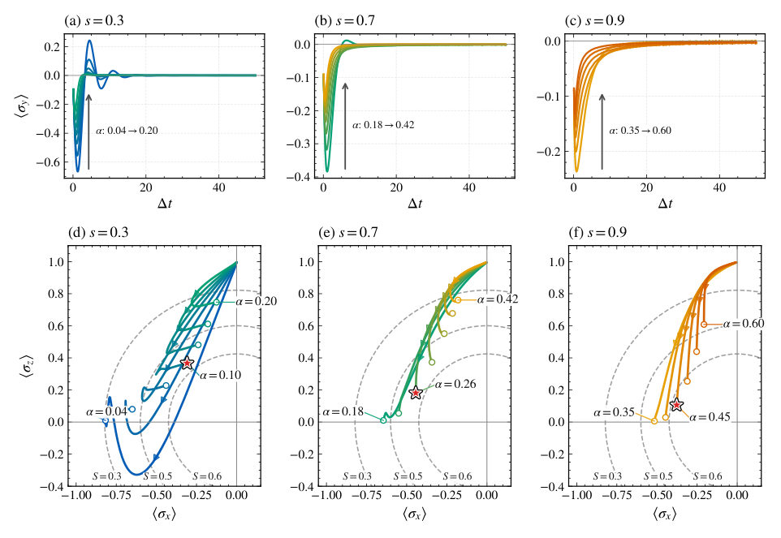
<figcaption class="paper-figure-caption"><b>Fig 4.</b> Figure 4: Tunneling current and Bloch-sphere trajectories across the dynamical crossover. Panels (a)–(c) show the tunneling current ⟨σy(t)⟩for representative coupling strengths at fixed s (α = 0.04–0.20 for s = 0.3, α = 0.18–0.42 for s = 0.7, and α = 0.35–0.60 for s = 0.9). Panels (d)–(f) show the corresponding projected trajectories in the (⟨σx⟩, ⟨σz⟩) plane; dashed circles indicate constant spin entanglement entropy contours. The red star marks the fixed-s peak-entropy trajectory. Color encodes coupling strength α within each panel, progressing from weak (cool) to strong (warm) coupling.</figcaption>
</figure>
<figure class="paper-figure-card">
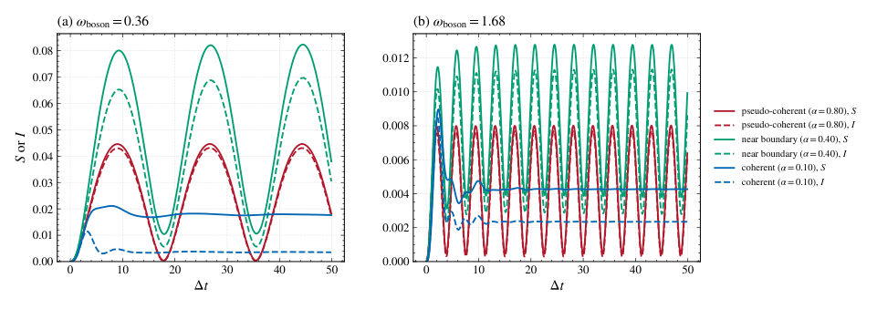
<figcaption class="paper-figure-caption"><b>Fig 5.</b> Figure 5: Mode-resolved environmental entanglement in representative dynamical regimes at s = 0.7. Panels (a) and (b) show the mode entanglement entropy S (solid) and the spin– boson-mode mutual information I (dashed), computed from the spin–mode 2-body entropy, for a low-frequency mode (ωboson ≈0.36) and a higher-frequency mode (ωboson ≈1.68), respectively. In the pseudo-coherent and near-boundary non-coherent cases, both quantities exhibit periodic oscillations whose magnitudes are close, indicating that the mode is primarily correlated with the spin.</figcaption>
</figure>

**Summary.** The paper investigates the entanglement structure of the sub-Ohmic spin-boson model across different dynamical phases. Using advanced tensor network simulations, the authors map the stationary spin entanglement entropy landscape against known population phase boundaries. They find that while entanglement is a powerful diagnostic tool, its scalar representation fails to capture all structural details seen in classical population dynamics.

**Why it may be interesting.** This work provides a quantitative link between macroscopic dynamical classifications (like coherence regimes) and microscopic quantum information measures (entanglement), which is crucial for understanding dissipation in open quantum systems relevant to quantum computing and molecular physics.

Detailed structure

**Main problem.** The study aims to determine if the distinct dynamical regimes (coherent, incoherent, pseudo-coherent) observed in the sub-Ohmic spin-boson model correspond to unique entanglement structures between the spin and its environment.

**Main result.** The stationary spin entanglement entropy landscape broadly follows population-based phase boundaries at small coupling strengths but fails to reproduce the expected two-branch structure at large couplings, suggesting a limitation in using scalar entropy alone for full characterization.

**Method.** The authors employed Tree Tensor Network States (TTNS) combined with projector-splitting time evolution (TDVP-PS) to simulate the system dynamics and calculate various entanglement measures over parameter space scans.

**Model / system.** The physical model is the Spin-Boson Model, describing a two-level quantum system coupled linearly to an environment characterized by a sub-Ohmic spectral density function. The Hamiltonian governs the interaction between the spin and the bosonic bath modes.

**Key observables.** Spin entanglement entropy ($S_{	ext{spin}}(t)$), stationary spin entanglement entropy landscape ($S_{	ext{stable}}$), Bloch vector trajectory, and mode-resolved bath entanglement.

**Important parameters / regimes.** The sub-Ohmic spectral exponent ($s$) and the coupling strength ($\alpha$), which define the environmental interaction regime.

**Assumptions / limitations.** The analysis relies on projecting the dynamics onto a variational manifold using TTNS methods, and it assumes that the stationary entropy landscape provides sufficient information to classify dynamical regimes.

**Figures summary.** Figures illustrate the time evolution of spin polarization ($\langle\sigma_z(t)
angle$) defining phase boundaries, alongside plots showing the stationary entanglement entropy landscape ($S_{	ext{stable}}$) as a function of $(s, \alpha)$, and projected Bloch trajectories in the $(\langle\sigma_x
angle, \langle\sigma_z
angle)$ plane.

**Paper structure.** The paper first establishes the physical model (Spin-Boson Model) and the dynamical classification based on population observables. It then introduces advanced numerical techniques (TTNS/TDVP-PS) to calculate entanglement measures. The core of the work involves mapping the stationary entanglement entropy landscape, comparing its structure against known population phase boundaries, and performing mode-resolved analysis.

Abstract

The sub-Ohmic spin-boson model exhibits three distinct dynamical regimes in its spin population dynamics, classified as coherent, incoherent, and pseudo-coherent. Whether these regimes correspond to distinct spin-bath entanglement structures remains an open question. Here we address this using tree tensor network states with projector-splitting time evolution (TTN-TDVP-PS), scanning a broad grid in the sub-Ohmic $(s, α)$ plane. We find that the spin entanglement entropy $S_\mathrm{spin}(t)$ reaches a stationary plateau on a timescale shorter than the polarization relaxation, enabling construction of a stationary entropy landscape from the stationary value $S_\mathrm{stable}$. Within this scalar entropy landscape, the entropy ridge broadly follows the population-based phase boundary at small $s$, but does not reproduce the two-branch structure at large $s$. The ridge remains single-valued within the incoherent region rather than separately tracking both population-based transitions. The Bloch-sphere representation provides a geometric interpretation of this behavior. The entropy plateau corresponds to trajectories settling onto constant-radius shells, with the ridge marking the parameters of smallest stationary Bloch radius. Mode-resolved bath entanglement shows that low-frequency modes dominate the environmental entropy scale and that coherent dynamics enhance bath-mode correlations beyond direct spin--mode correlations. These results establish the stationary spin entanglement entropy as a physically informative observable that complements population-based classifications of dissipative quantum dynamics.

[↑ back to top](#top)

### [Near-Optimal Learning of Local Lindbladians](http://arxiv.org/abs/2606.20535v1)

**Authors:** Itai Arad, Zhili Chen, Naixu Guo, Patrick Rebentrost, Zhan Yu  
**Type:** theory · **Category:** quantum information and computing · **PDF:** <https://arxiv.org/pdf/2606.20535v1>  
**Analysis basis:** full PDF text, analyzed in chunks
**Topic relevance:** 🔥 `methods for driven-dissipative` **4/5** · `Keldysh / 2PI / non-Gaussian methods` **3/5** · `correlated / nonlocal dissipation` **3/5** · `driven-dissipative phase transition` **3/5** · `entanglement & information structure` **2/5** · `non-equilibrium dynamics` **2/5** · `non-equilibrium universality` **2/5** · `Kondo & dissipative impurity` **1/5** · `analog quantum simulation` **1/5** · `measurement-induced transitions` **1/5** · `quantum measurements` **1/5** · `scars & prethermalization` **1/5**

↔ Scroll figures horizontally

<figure class="paper-figure-card">
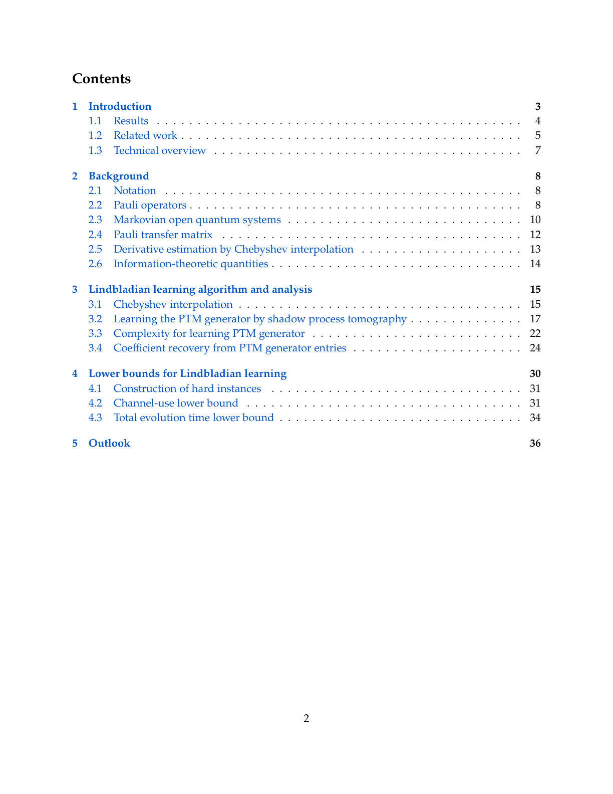
<figcaption class="paper-figure-caption"><b>Fig 1.</b> Low-resolution page preview, page 2</figcaption>
</figure>
<figure class="paper-figure-card">
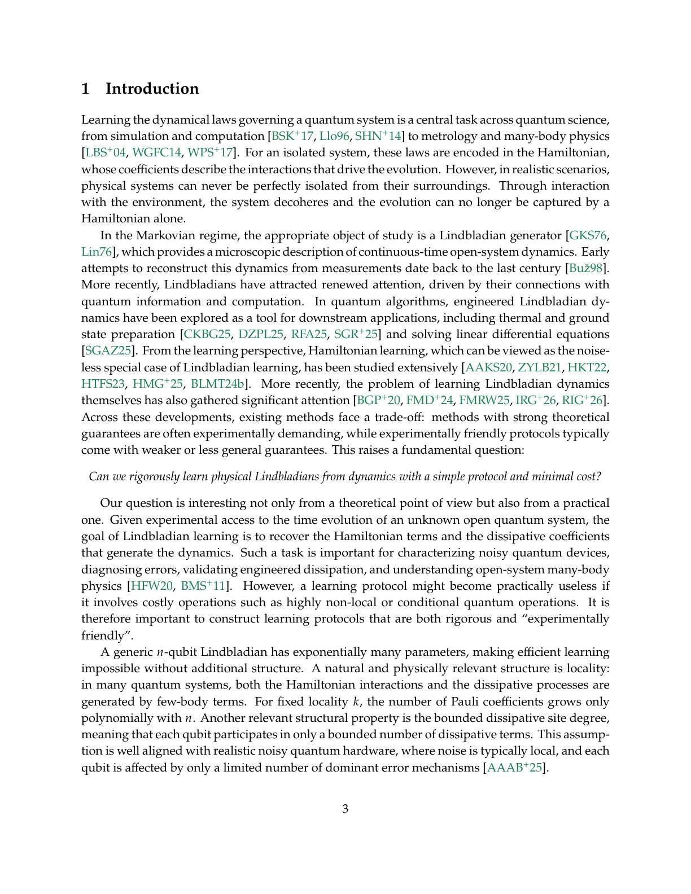
<figcaption class="paper-figure-caption"><b>Fig 2.</b> Low-resolution page preview, page 3</figcaption>
</figure>
<figure class="paper-figure-card">
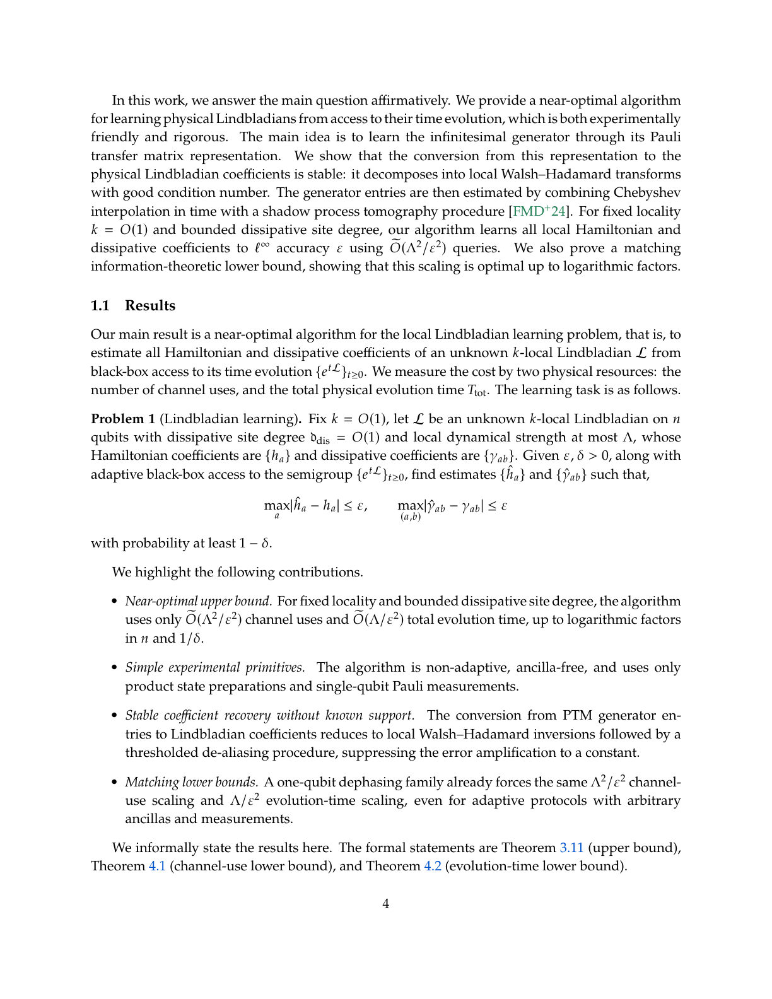
<figcaption class="paper-figure-caption"><b>Fig 3.</b> Low-resolution page preview, page 4</figcaption>
</figure>
<figure class="paper-figure-card">
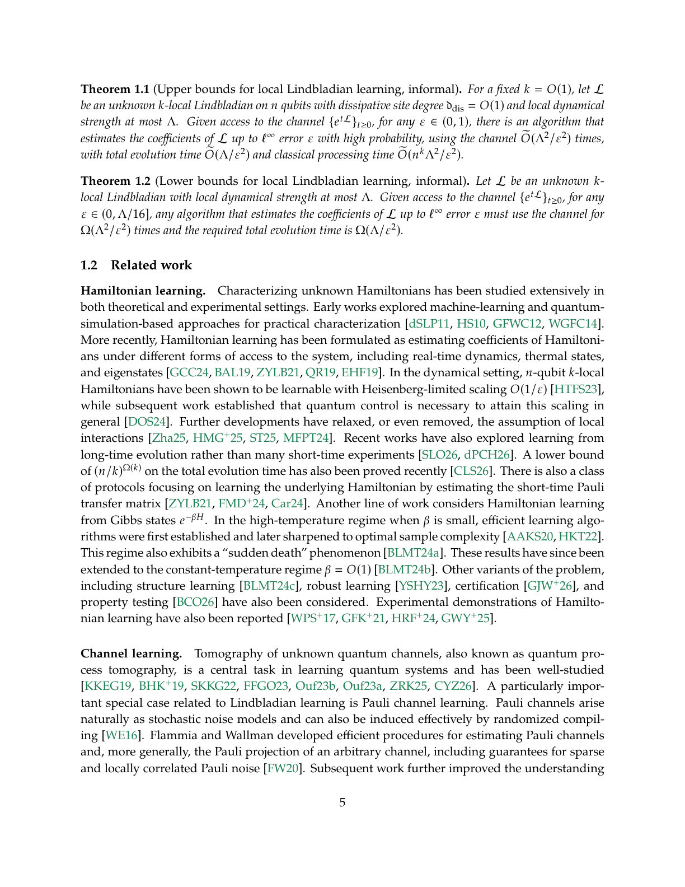
<figcaption class="paper-figure-caption"><b>Fig 4.</b> Low-resolution page preview, page 5</figcaption>
</figure>
<figure class="paper-figure-card">
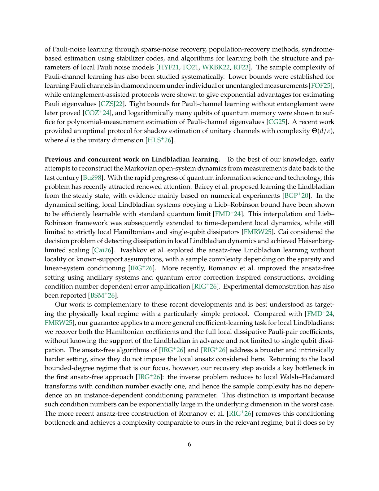
<figcaption class="paper-figure-caption"><b>Fig 5.</b> Low-resolution page preview, page 6</figcaption>
</figure>

**Summary.** This paper presents a near-optimal algorithm to learn the coefficients of a local Lindbladian generator describing open quantum system evolution. By combining shadow tomography with spectral differentiation and Fourier inversion, they achieve resource scaling that matches established information-theoretic lower bounds. This work is crucial as it quantifies the fundamental limits on characterizing noise processes in quantum computation.

**Why it may be interesting.** This work provides rigorous resource estimates for characterizing open quantum dynamics, establishing fundamental limits that distinguish between Hamiltonian learning (Heisenberg limit) and full Lindbladian estimation (Standard Quantum Limit).

Detailed structure

**Main problem.** The primary goal is to estimate all Hamiltonian and dissipative coefficients that define a local Lindbladian generator ($\mathcal{L}$) from black-box access to the system's time evolution.

**Main result.** The authors provide an algorithm achieving near-optimal scaling, matching information-theoretic lower bounds for both channel uses ($\Omega(\Lambda^2/\epsilon^2)$) and total evolution time ($\Omega(\Lambda/\epsilon^2)$).

**Method.** The method combines shadow process tomography to estimate finite-time Pauli transfer matrices (PTMs), followed by Chebyshev interpolation in time, and finally stable local Fourier inversions (Walsh–Hadamard transforms) to recover the Lindbladian coefficients.

**Model / system.** The system is an open quantum system evolving under a Markovian process governed by a $k$-local Lindbladian $\mathcal{L}$. The analysis focuses on systems with bounded local dynamical strength ($\lambda_{	ext{loc}} \le \Lambda$).

**Key observables.** Pauli transfer matrices (PTMs), Lindbladian coefficients ($\{h_a\}, \{\gamma_{ab}\}$), and the time-evolved quantum state $\mathcal{E}_t(
ho)$.

**Important parameters / regimes.** Local dynamical strength bound ($\Lambda$), target accuracy ($\epsilon$), number of qubits ($n$), and locality ($k$).

**Assumptions / limitations.** The Lindbladian is assumed to be $k$-local with a bounded local dynamical strength $\Lambda$. The algorithm requires non-adaptive measurements using only random product states.

**Figures summary.** Not specified in the notes, but the structure implies showing algorithmic steps (Algorithm 1/2) and theoretical bounds (Theorems 1.1, 4.1, etc.).

**Paper structure.** The paper develops an upper bound algorithm using shadow tomography and interpolation to estimate PTMs, followed by a coefficient recovery step using local Fourier inversion. This is complemented by deriving matching lower bounds using relative entropy arguments on hard instances (like one-qubit dephasing).

Abstract

We study the problem of learning local Lindbladians from black-box access to the physical evolution, and the goal is to estimate all Hamiltonian and dissipative coefficients. We give an algorithm built directly from finite-time channel probes, which runs the unknown evolution for short times, estimates the corresponding Pauli transfer matrices from classical shadows, and converts these estimates into Lindbladian coefficients by stable local Fourier inversions. For fixed locality and bounded dissipative site degree, the uses of the dynamical evolution and total evolution time scale as $\widetilde{O}(Λ^2/\varepsilon^2)$ and $\widetilde{O}(Λ/\varepsilon^2)$ respectively, in the local dynamical strength bound $Λ$ and target accuracy $\varepsilon$, with only logarithmic dependence on the number of qubits. The algorithm is non-adaptive, uses no ancillas, and uses only random product states as inputs followed by random Pauli measurements. The method does not require knowing the support of the Lindbladian in advance. We complement the algorithm with matching lower bounds, showing that the learning algorithm is near-optimal both in physical dynamics accesses and in total evolution time. We construct a single-qubit dephasing Lindbladian family that already requires $Ω(Λ^2/\varepsilon^2)$ channel uses and $Ω(Λ/\varepsilon^2)$ total evolution time, even for adaptive algorithms with arbitrary ancillas and measurements. In particular, the lower bounds imply that the Heisenberg-limited scaling achievable for Hamiltonian learning is information-theoretically impossible once dissipative coefficients must be estimated.

[↑ back to top](#top)

### [Many-Body Protection of Topological Edge Memory in Strong Interacting Quenches](http://arxiv.org/abs/2606.19437v1)

**Authors:** Yuxiao Hang, Stephan Haas, Rishabh Jha  
**Type:** theory · **Category:** statistical mechanics · **PDF:** <https://arxiv.org/pdf/2606.19437v1>  
**Analysis basis:** full PDF text, analyzed in chunks
**Topic relevance:** 🔥 `analog quantum simulation` **4/5** · 🔥 `non-equilibrium dynamics` **4/5** · `non-equilibrium universality` **3/5** · `entanglement & information structure` **2/5** · `methods for driven-dissipative` **2/5** · `scars & prethermalization` **2/5** · `Keldysh / 2PI / non-Gaussian methods` **1/5** · `correlated / nonlocal dissipation` **1/5** · `driven-dissipative phase transition` **1/5** · `exotic spin models in light-matter` **1/5**

↔ Scroll figures horizontally

<figure class="paper-figure-card">

<figcaption class="paper-figure-caption"><b>Fig 1.</b> Figure 2: Schematic of the four quench protocols. Each arrow represents a strong quench from a topological ini- tial ground state at δi = −0.95 to dynamics generated by a final Hamiltonian at δf = 0.95, with SP or MB char- acter determined by whether Ji,f z vanishes. The labels δi and δf refer to the equilibrium phase diagram of the Hamiltonians, not to a topological classification of the time-evolved state.</figcaption>
</figure>
<figure class="paper-figure-card">
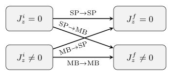
<figcaption class="paper-figure-caption"><b>Fig 2.</b> Figure 2 shows the four quench protocols schemati- cally; the two qualitative classes identified above and es- tablished in this work organize the entire analysis. a. Free post-quench class (SP→SP and MB→SP). In the SP→SP quench the dynamics is solved exactly by a correlation-matrix approach, benchmarked against ex- act diagonalization to machine precision. The boundary- mode return amplitude decays asymptotically as t−3/2, with a dimerization-dependent envelope time and beat period computed analytically; this fixes the intrinsic re- laxation scale of the free boundary dynamics and pro- vides the quantitative reference for all other protocols. In the MB→SP quench we prove that the edge...</figcaption>
</figure>
<figure class="paper-figure-card">
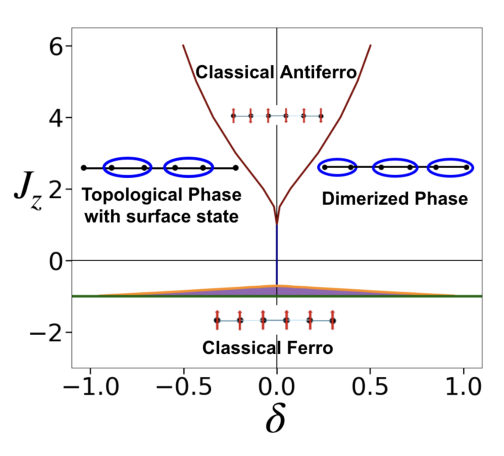
<figcaption class="paper-figure-caption"><b>Fig 3.</b> Figure 1: Model and equilibrium phase diagram. (a) Chain geometry. (b) Ground-state phase diagram; pa- rameters used in this work are indicated.</figcaption>
</figure>
<figure class="paper-figure-card">
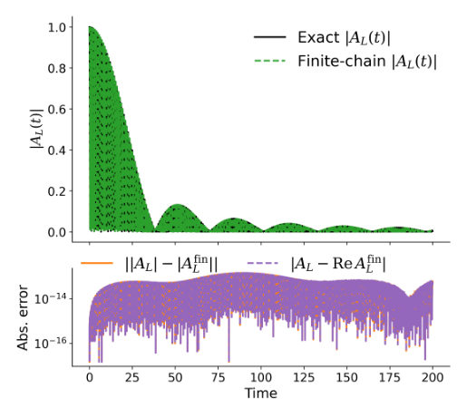
<figcaption class="paper-figure-caption"><b>Fig 4.</b> Figure 3: Benchmark of the exact boundary-return ampli- tude for the SP →SP quench with L = 200, δi = −0.95, and δf = +0.95. Since both |ϕL⟩and |A1⟩are real vectors and H(1) f is a real symmetric matrix, AL(t) is real for all t (see Theorem 1), so |AL(t)| = |Re AL(t)| and the mod- ulus comparison is unambiguous. The upper panel com- pares |AL(t)| obtained from the exact semi-infinite inte- gral representation, Eq. (11)–(12), with direct propaga- tion of the initial left boundary mode, Eq. (10), on the fi- nite open chain of length L = 200. The lower panel shows two error measures over the full interval 0 ≤t ≤200: the modulus difference |AL(t)| −|Afin L (t)| and the real- part difference...</figcaption>
</figure>
<figure class="paper-figure-card">
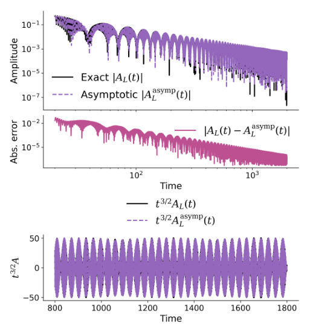
<figcaption class="paper-figure-caption"><b>Fig 5.</b> Figure 4: Benchmark of the large-time asymptotic for- mula for the SP →SP quench with L = 200, δi = −0.95, and δf = +0.95. The upper panel compares the ex- act amplitude |AL(t)| with the leading asymptotic ap- proximation |Aasymp L (t)| from Eq. (16) over the interval 20 ≤t ≤2000. The middle panel shows the absolute er- ror |AL(t)−Aasymp L (t)|. The lower panel shows the scaled quantities t3/2AL(t) and t3/2Aasymp L (t) over the late-time window 800 ≤t ≤1800. The bounded oscillatory behav- ior in the lower panel is the numerical signature of the asymptotic law AL(t) = O(t−3/2).</figcaption>
</figure>

**Summary.** The paper explores how topological memory survives when a quantum system undergoes a quench into an interacting environment. By comparing single-particle and many-body evolution regimes, the authors rigorously prove that interactions actively protect this boundary memory over extended time scales. This reveals a fundamental 'many-body protection mechanism' in non-integrable systems.

**Why it may be interesting.** This work provides rigorous analytical proof of topological protection mechanisms in strongly correlated, non-integrable systems far from equilibrium, which is a major frontier in quantum dynamics research relevant to condensed matter theory.

Detailed structure

**Main problem.** The study investigates whether topological memory encoded in an initial quantum state survives non-equilibrium evolution (quantum quenches) within strongly interacting, non-integrable many-body systems.

**Main result.** Interactions in the final Hamiltonian provide a 'many-body protection mechanism,' markedly extending the finite-time retention of boundary topological memory beyond what is predicted by free or single-particle dynamics.

**Method.** The analysis combines exact analytical solutions for non-interacting limits (using correlation matrices) with deriving finite-time stability bounds and employing perturbative techniques to construct dressed, approximately conserved operators in interacting regimes.

**Model / system.** The system is a bond-alternating XXZ spin chain modeled by an SSH-like Hamiltonian. Quenches are analyzed from a topologically non-trivial initial state ($\delta_i < 0$) to various final states ($\delta_f$), covering both free and genuinely interacting post-quench Hamiltonians.

**Key observables.** Topological boundary memory, specifically the first-dimer magnetization $\langle S_{z1} 
angle$, and the boundary-mode return amplitude $A_L(t)$.

**Important parameters / regimes.** The distinction between free vs. genuinely interacting post-quench Hamiltonians; the dimerization parameter ($\delta$); and the small coupling strength ($\epsilon$) used in perturbative analysis.

**Assumptions / limitations.** The structure of the study is fundamentally organized around classifying the quench based on whether the final Hamiltonian ($H_f$) is free (quadratic) or genuinely interacting (many-body).

**Figures summary.** Figures benchmark the boundary-mode return amplitude decay, showing $t^{-3/2}$ for free dynamics. Other figures compare numerical results against analytical bounds derived from perturbative corrections to conserved charges.

**Paper structure.** The paper systematically analyzes four quench protocols (SP$	o$SP, MB$	o$SP, SP$	o$MB, MB$	o$MB), first establishing exact results for the non-interacting case ($J_z=0$) and then using stability bounds and dressed operator constructions to prove memory retention in the interacting many-body limit.

Abstract

Quantum quenches drive edge states far from equilibrium, yet whether the memory of a topological initial state survives in a non-integrable, interacting system has remained largely unexplored. We study this question in the bond-alternating XXZ chain -- an interacting Su--Schrieffer--Heeger model hosting symmetry-protected topological edge modes with markedly enhanced boundary magnetization -- and analyze quenches across all combinations of single-particle and many-body initial and final Hamiltonians. The results organize by a single distinction as we rigorously establish in this work: whether the post-quench Hamiltonian is free or genuinely interacting. For a free post-quench Hamiltonian, the dynamics is solved exactly by a correlation-matrix approach; the boundary-mode return amplitude decays as $t^{-3/2}$, and initial interactions enter only through a dressed one-body density matrix. For a genuinely interacting post-quench Hamiltonian, finite-time stability bounds prove that away from local resonances the first-dimer magnetization remains stable on time windows growing as arbitrarily large powers of the inverse inter-dimer coupling. Matrix product state simulations across all four protocols show that interactions in the final Hamiltonian markedly extend finite-time boundary memory -- with local suppression near the isotropic $SU(2)$ point -- revealing a many-body protection mechanism in a non-integrable system where scrambling would otherwise wash out initial-state memory fast.

[↑ back to top](#top)

### [Robust Generation of Topological Biphoton Mode via Adiabatic Passage](http://arxiv.org/abs/2606.19786v1)

**Authors:** Jaesung Lim, Jihwan Kim, Dong-Gil Im, Kyungdeuk Park, Dongkyu Kim, Yonggi Jo, Yong Sup Ihn  
**Type:** theory · **Category:** quantum information and computing · **PDF:** <https://arxiv.org/pdf/2606.19786v1>  
**Analysis basis:** full PDF text, analyzed in chunks
**Topic relevance:** 🔥 `analog quantum simulation` **4/5** · `interference shaping light` **3/5** · `driven-dissipative phase transition` **2/5** · `entanglement & information structure` **2/5** · `methods for driven-dissipative` **2/5** · `non-equilibrium dynamics` **2/5** · `Frenkel-Kontorova` **1/5** · `QC/QI experiment` **1/5** · `correlated cavity matter` **1/5** · `exotic spin models in light-matter` **1/5** · `non-equilibrium universality` **1/5** · `quantum optics experiment` **1/5**

↔ Scroll figures horizontally

<figure class="paper-figure-card">
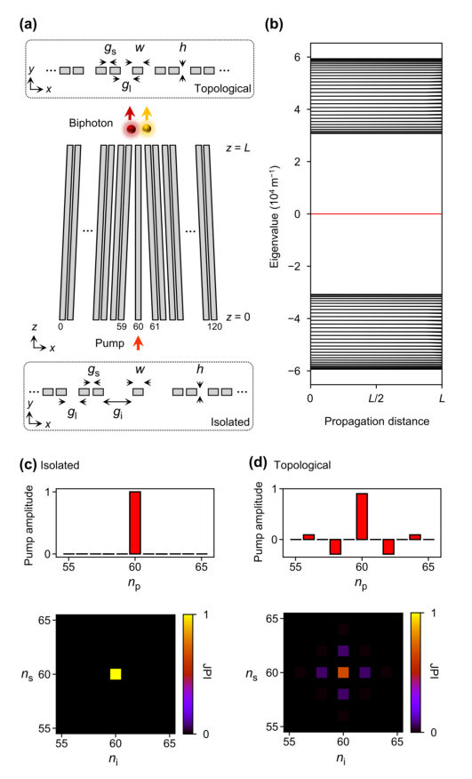
<figcaption class="paper-figure-caption"><b>Fig 1.</b> FIG. 1. Concept of topological biphoton generation via adi- abatic passage in a silicon waveguide array. (a) Schematic of the adiabatic connection from an isolated-waveguide ar- ray to a topological lattice. (b) Variation of the eigenvalue spectrum during propagation, indicating that the separation between the bulk bands and the midgap state is preserved. (c, d) Pump amplitude and biphoton JPI, both supported by the midgap mode of (c) the isolated-waveguide lattice and (d) the topological lattice.</figcaption>
</figure>
<figure class="paper-figure-card">
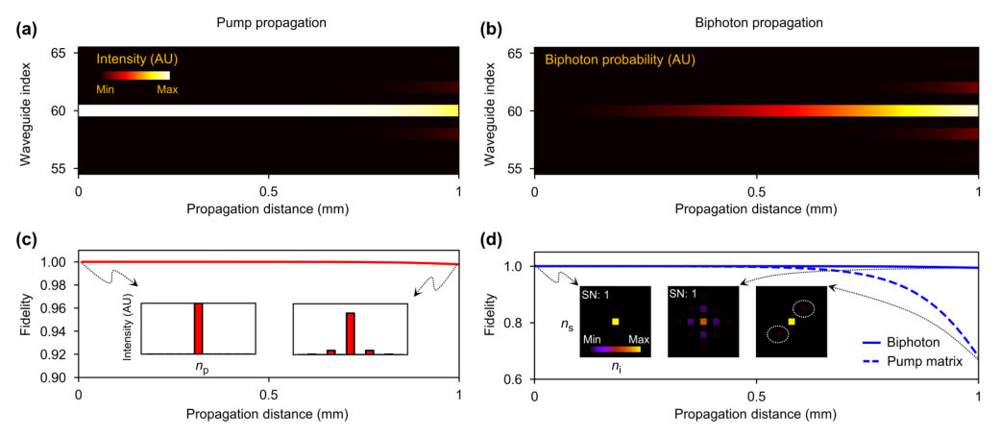
<figcaption class="paper-figure-caption"><b>Fig 2.</b> FIG. 2. Adiabatic evolution of the pump and biphoton states for a device length of 1.0 mm. (a) Evolution of the pump intensity along the propagation distance. (b) Biphoton probability distribution during the adiabatic passage. (c) Fidelity of the propagating pump field with respect to the midgap mode, confirming high fidelity adiabatic transfer. The insets show the pump intensity profiles at the input and output facets. (d) Fidelity of the evolving biphoton state (solid line) and the normalized pump matrix defined in Eq. (6) (dashed line), both relative to the midgap biphoton mode. The insets display the JPI profiles and the corresponding SN.</figcaption>
</figure>
<figure class="paper-figure-card">
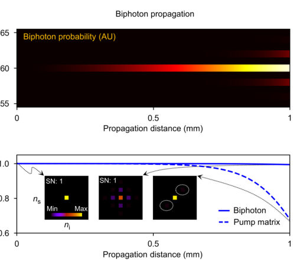
<figcaption class="paper-figure-caption"><b>Fig 3.</b> Fig. 3(a) shows the eigenvalue spectra of the topo- logical array at various gap disorder levels, δ. While the bandgap narrows as δ increases, the inset confirms that a finite gap persists even at the maximum disor- der strength, verifying the presence of the topological protected mode. For the adiabatic structure, the lower panel of Fig. 3(a) shows the fidelity between the output field and the topological mode of each disordered sample when the pump is injected into the central waveguide. Each point represents the mean fidelity, and the shaded region indicates one standard deviation. The mean fi- delity remains near unity, reaching 0.996 at the highest disorder level and confirming the...</figcaption>
</figure>
<figure class="paper-figure-card">
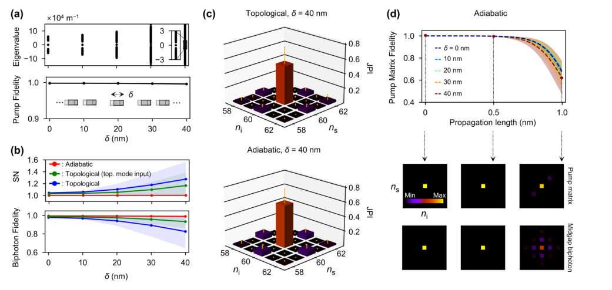
<figcaption class="paper-figure-caption"><b>Fig 4.</b> FIG. 3. Comparison of the gap disorder tolerance between an adiabatic structure and a conventional topological waveguide array. (a) Top: Eigenvalue spectra of the topological lattice samples across a range of gap disorder strength, δ (0 to 40 nm). The inset confirms the persistence of the finite bandgap and midgap state even at maximum disorder. Bottom: Output pump fidelity of the adiabatic structure, maintaining near-unity values across all gap disorder levels. (b) Comparison of the output biphoton SN (top) and fidelity (bottom). The adiabatic scheme (red) exhibits superior resilience compared to the conventional topological array excited through a central waveguide input (blue) or the...</figcaption>
</figure>
<figure class="paper-figure-card">
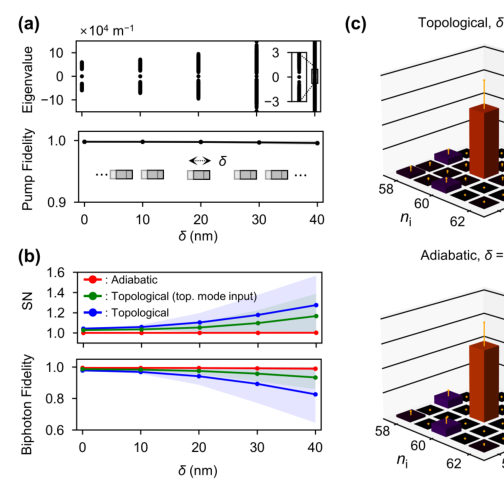
<figcaption class="paper-figure-caption"><b>Fig 5.</b> Fig. 3(b) presents the SN and fidelity of the output biphoton state. In the conventional topological array with central waveguide injection, the SN increases to 1.27 ± 0.293 while the fidelity drops to 0.826 ± 0.181 at the highest disorder strength. Even when the pump is launched into the topological mode, the SN still rises to 1.17 ± 0.221 and the fidelity degrades to 0.933 ± 0.074, accompanied by a relatively broad distribution. This confirms that biphoton generation in the conventional topological lattices is not fully resilient to disorder, con- sistent with a prior study [32]. In contrast, the adiabatic structure preserves the near-unity SN, while the fidelity exhibits only a slight...</figcaption>
</figure>

**Summary.** The paper introduces an adiabatic passage technique to generate topological biphoton modes in waveguide arrays, overcoming the issue of structural disorder that plagues conventional methods. By first isolating the nonlinear process and then adiabatically transferring the state into the robust topological mode, the authors achieve high fidelity and unit Schmidt number even with significant disorder. This provides a practical design strategy for building reliable integrated quantum photonic devices.

**Why it may be interesting.** This work directly addresses practical limitations in integrated quantum photonics by providing a robust protocol (adiabatic passage) that leverages topological properties to maintain high-fidelity quantum state preparation despite realistic fabrication imperfections.

Detailed structure

**Main problem.** The primary challenge is achieving robust generation of topological biphoton modes for on-chip quantum processing, as structural disorder degrades the quantum state fidelity in conventional waveguide structures.

**Main result.** An adiabatic passage connecting an isolated site to a topological defect array maintains high biphoton fidelity and unit Schmidt number even with significant waveguide gap disorder. This method also preserves near-unity interference visibility for path entangled NOON states.

**Method.** The authors propose using an adiabatic passage technique, initiating the nonlinear process in a strongly isolated regime before adiabatically transferring the generated state into the desired topological mode.

**Model / system.** The system is modeled as a one-dimensional silicon waveguide array supporting a Su–Schrieffer–Heeger (SSH) lattice. The dynamics are governed by coupled evolution equations for the pump and biphoton fields, incorporating nonlinear coupling via Spontaneous Four-Wave Mixing (SFWM).

**Key observables.** Biphoton fidelity ($|\langle T|\Psi
angle|^2$), Schmidt number ($	ext{SN}$), quantum interference visibility ($V$), and spatial joint path intensity (JPI) distributions.

**Important parameters / regimes.** Waveguide gap disorder ($\delta$, up to 40 nm); pump wavelength (1550 nm); signal/idler wavelengths (1545 nm / 1555 nm).

**Assumptions / limitations.** The method assumes that initiating the nonlinear process in a strongly isolated regime effectively suppresses unwanted coupling, and that the gap disorder preserves chiral symmetry.

**Figures summary.** Figures illustrate schematics of the adiabatic connection (Fig. 1), eigenvalue spectrum separation confirming topological protection (Fig. 1b), spatial distributions comparing isolated vs. topological JPI under disorder (Fig. 3c/d), and performance comparisons for NOON states showing high visibility in the adiabatic case versus degradation in conventional arrays (Fig. 5).

**Paper structure.** The paper establishes the problem of disorder-induced decoherence, introduces the SSH model and the concept of adiabatic passage, details the simulation methodology comparing adiabatic vs. conventional structures, demonstrates superior robustness for biphoton generation, and finally extends the findings to path entangled NOON states.

Abstract

Topological waveguide arrays support robust mode propagation in the presence of fabrication imperfections, providing a significant advantage for on-chip quantum information processing. However, this robustness does not fully extend to nonlinear biphoton generation. Structural disorder can enhance the excitation of non-topological biphoton modes during nonlinear interactions, which degrades the quantum properties of the generated state. To overcome this limitation, we propose an adiabatic passage that connects an isolated site to a topological defect array. By initiating the nonlinear process in a strongly isolated regime, nonlinear coupling to unwanted modes is effectively suppressed, thereby preserving the Schmidt number of the generated state. The subsequent adiabatic connection facilitates the high fidelity transfer of the generated biphoton into the topological biphoton mode. Our numerical simulations demonstrate that, unlike conventional topological structures, the adiabatic scheme maintains both high biphoton fidelity and a unit Schmidt number in the presence of waveguide gap disorder. Furthermore, we show that this robustness extends to path entangled NOON states, achieving a near-unity quantum interference visibility. Our approach provides a practical design strategy for disorder-tolerant integrated quantum photonic devices.

[↑ back to top](#top)

### [Transient triplet blockade in Andreev junction](http://arxiv.org/abs/2606.20170v1)

**Authors:** R. Taranko, J. Baranski, A. Jankiewicz, K. Wrzesniewski, I. Weymann, T. Domanski  
**Type:** theory · **Category:** strongly correlated electrons · **PDF:** <https://arxiv.org/pdf/2606.20170v1>  
**Analysis basis:** full PDF text, analyzed in chunks
**Topic relevance:** 🔥 `methods for driven-dissipative` **4/5** · 🔥 `non-equilibrium dynamics` **4/5** · `Keldysh / 2PI / non-Gaussian methods` **3/5** · `Kondo & dissipative impurity` **3/5** · `non-equilibrium universality` **2/5** · `analog quantum simulation` **1/5** · `correlated / nonlocal dissipation` **1/5** · `correlated cavity matter` **1/5** · `driven-dissipative phase transition` **1/5**

↔ Scroll figures horizontally

<figure class="paper-figure-card">
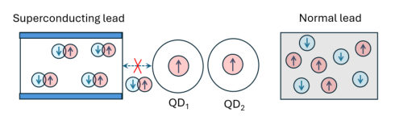
<figcaption class="paper-figure-caption"><b>Fig 1.</b> FIG. 1. Schematics of the spin triplet configuration in two quantum dots (QD1,2) coupled between the normal (N) and superconducting (S) leads, which blocks a transfer of the Cooper pairs on QD1.</figcaption>
</figure>
<figure class="paper-figure-card">
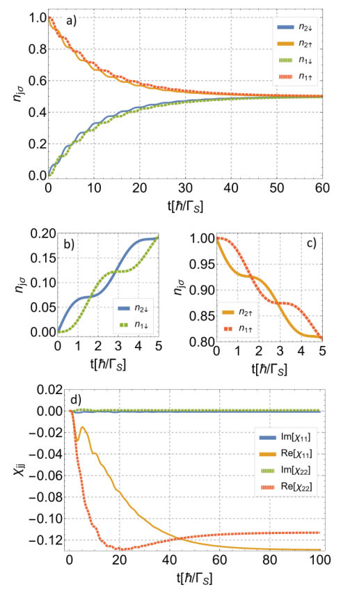
<figcaption class="paper-figure-caption"><b>Fig 2.</b> FIG. 2. The time-dependent electron occupancy of the quan- tum dots (panels a-c) and the pairing amplitudes χjj (panel d), obtained for V12 = ΓS, εjσ = 0, ΓN = 0.2ΓS, assuming the initial conditions nj↓= 0, nj↑= 1. Panels b and c show the evolution of njσ(t) in the interval t ∈⟨0, 5⟩ ℏ ΓS .</figcaption>
</figure>
<figure class="paper-figure-card">
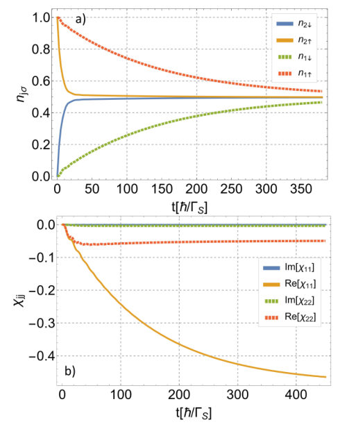
<figcaption class="paper-figure-caption"><b>Fig 3.</b> FIG. 3. The time-dependent electron occupancies of the quan- tum dots obtained in the weak coupling limit, V12 = 0.1ΓS, using the same model parameters as in Fig. 2.</figcaption>
</figure>
<figure class="paper-figure-card">
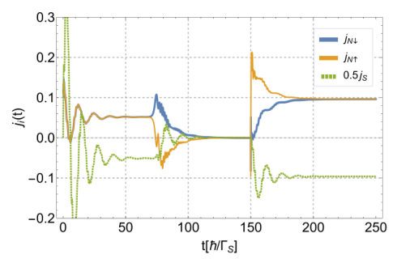
<figcaption class="paper-figure-caption"><b>Fig 4.</b> FIG. 6. The time-dependent charge currents flowing from the normal lead, jNσ, and from superconducting electrode, jS, through S-QD1-QD2-N junction weakly biased at t = 0+ by the initial voltage V0 = 2ΓS. At t0 = 75 ℏ</figcaption>
</figure>
<figure class="paper-figure-card">
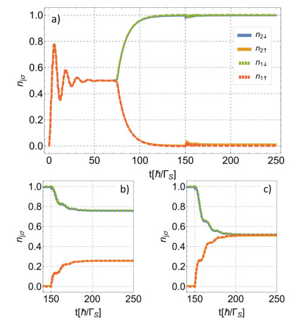
<figcaption class="paper-figure-caption"><b>Fig 5.</b> FIG. 4. The time-dependent occupancies of the quantum dots obtained for the empty quantum dots contacted at t = 0+ to external leads which, at t0 = 75 ℏ</figcaption>
</figure>

**Summary.** The paper theoretically models charge transport through a double quantum dot junction coupled to superconductors, focusing on transient blockade effects caused by spin triplet configurations. By analyzing time evolution under magnetic fields and bias voltages, the authors characterize how these non-equilibrium states suppress Andreev current and how external stimuli can restore superconducting coherence.

**Why it may be interesting.** This work directly addresses non-equilibrium dynamics in superconducting quantum circuits, which is crucial for understanding energy dissipation and coherence control in solid-state qubits.

Detailed structure

**Main problem.** The study investigates transient triplet blockade effects arising from non-equilibrium conditions within a double quantum dot junction coupled to superconductors.

**Main result.** The system exhibits distinct time scales for charge transfer in weakly coupled regimes, and the superconducting pairing amplitude shows a non-monotonic dependence on an external magnetic field due to bound state energy rearrangement.

**Method.** The analysis employs analytical and numerical techniques based on the Heisenberg equation of motion and Laplace transforms to track time-dependent expectation values of operators.

**Model / system.** The physical system is a nanoscopic junction comprising two quantum dots (QD1, QD2) coupled in series between a normal metal lead (N) and a superconductor (S). The model incorporates Anderson-type Hamiltonians for the QDs and BCS theory for the superconductor.

**Key observables.** Time-dependent electron occupancy ($n_{j\sigma}(t)$), on-dot pairing amplitudes ($\chi_{jj}(t)$), and charge currents ($j_{N\sigma}, j_S$).

**Important parameters / regimes.** Inter-dot coupling strength ($V_{12}$), external magnetic field ($B$), bias voltage ($V$), and characteristic time scales ($	au \sim \hbar/\Gamma_N$ vs $	au_A \sim \hbar/|V_{12}|$).

**Assumptions / limitations.** The analysis often assumes the large bandwidth limit for the normal lead and sometimes neglects correlation effects initially, though advanced methods like tdNRG are referenced.

**Figures summary.** Figures illustrate time-dependent charge currents showing suppression upon magnetic field switching and recovery with bias, and show the evolution of pairing and spin correlations under varying fields and couplings.

**Paper structure.** The paper progresses by defining the Hamiltonian, deriving equations for time-dependent observables using Green's functions/Laplace transforms, analyzing specific physical protocols (initial quench, B-field application, voltage bias), and comparing results across different coupling regimes (strong vs. weak).

Abstract

We study the time-dependent triplet configuration, appearing under nonequilibrium conditions in a nanoscopic junction with two quantum dots coupled in series between superconductor and normal metallic lead. We show that in the situation, when both quantum dots are singly occupied by identical spin electrons, the on-dot electron pairing is suppressed what substantially affects the subgap charge transport. We investigate processes in which such configuration can be temporarily encountered, either due to the initial conditions or by imposing the external magnetic field. Our analytical and numerical calculations provide estimations for the temporal scales, characterizing evolution of the triplet configuration which could be manifested in the time-resolved tunneling measurements. Such nonequilibrium features of the triplet configuration might be relevant to operations on superconducting qubits, in their conventional and/or topological realizations.

[↑ back to top](#top)

### [Effective Faraday interaction between light and Helium-3 nuclear spins in a multi-pass cell](http://arxiv.org/abs/2606.20328v1)

**Authors:** Kaiwen Yi, Yida Sha, Zejia Lin, Matteo Fadel, Xiang Peng  
**Type:** experiment · **Category:** other · **PDF:** <https://arxiv.org/pdf/2606.20328v1>  
**Analysis basis:** full PDF text, analyzed in chunks
**Topic relevance:** 🔥 `quantum optics experiment` **4/5** · `exotic spin models in light-matter` **3/5** · `quantum measurements` **3/5** · `spintronics-quantum-optics interface` **3/5** · `measurement-induced transitions` **2/5** · `analog quantum simulation` **1/5** · `correlated / nonlocal dissipation` **1/5** · `driven-dissipative phase transition` **1/5** · `interference shaping light` **1/5**

↔ Scroll figures horizontally

<figure class="paper-figure-card">
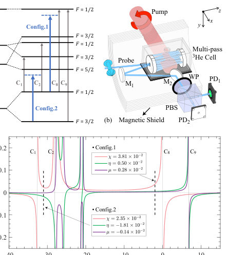
<figcaption class="paper-figure-caption"><b>Fig 1.</b> Figure 1. 3He transitions and experimental setup. (a) Fine struc- ture and hyperfine structure of states 23S1 and 23P in 3He (not to scale). The two probe-frequency operating points employed in this work are marked as “Config.1” and “Config.2”. (b) Schematic of the experimental setup. PBS: polarization beam splitter; M: mirrors; PD: photodiodes; WP: half-wave plate for S y measurement. (c) Coupling constants χ, η, µ for the metastable F = 1/2 and F = 3/2 levels, plotted in units of σ2Γ/(4Abeam) as a function of the light-frequency detuning ∆p referenced to the C8 transition. The values of coupling constants in the two probe detuning configurations are highlighted.</figcaption>
</figure>
<figure class="paper-figure-card">
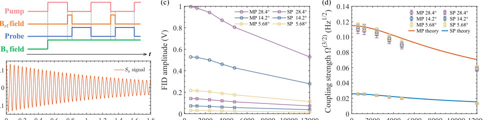
<figcaption class="paper-figure-caption"><b>Fig 2.</b> Figure 2. Effective coupling measurement sequence and magnetic field dependence. (a) Timing diagram for the pump beam, rf Rabi pulse Brf, probe readout, and bias magnetic field Bx. High (low) level denotes on (off) state. (b) Typical S y FID signal measured for the single-pass 3He cell at a Bx = 600 nT, M = 0.38, and θ = 28.4◦under Config.2. Dependence of the FID signal amplitude (c) and of the corresponding effective coupling strength Ω(3/2) (d) on the bias magnetic field, for different tilt angles θ under Config.2. Square (circle) markers represent measurement from the single-(multi-)pass cell with M = 0.38 (M = 0.67), while the curves show the simulation results based on the full model....</figcaption>
</figure>
<figure class="paper-figure-card">
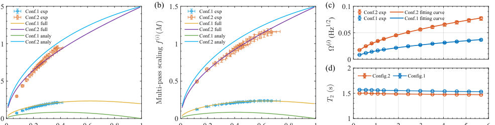
<figcaption class="paper-figure-caption"><b>Fig 3.</b> Figure 3. Coupling dependence on the nuclear polarization and on the probe power. (a,b) Comparison of the scaling function f (i)(M) obtained in the single- and multi-pass experiments (dots) with the analytical/full models (lines, see Eqs. (4) and Sec. IV C of [35], including a factor 1/2 to correct for a typo in Ref. [34]). Error bars mostly come from uncertainty in the value of M. (c) Dependence of the effective coupling strength Ω(i) on the probe power in the single-pass cell. Solid lines are fits using the function Ω(i) = k √PL. (d) Dependence of the 3He ground-state transverse relaxation time T2 on the probe power in the single-pass cell.</figcaption>
</figure>

**Summary.** The researchers demonstrated an effective Faraday interaction between light and Helium-3 nuclear spins using metastable atoms generated in a multi-pass gas cell. By quantifying this interaction, they established a practical method for optically accessing these long-lived quantum memories. This paves the way for generating highly entangled, spin-squeezed states for advanced quantum sensing.

**Why it may be interesting.** This work provides a concrete, experimentally validated pathway for coupling light fields directly to nuclear spins—a notoriously difficult task due to long coherence times but weak optical coupling—making it highly relevant to quantum optics and open quantum systems research.

Detailed structure

**Main problem.** The central goal is to realize and quantify a controllable light-nuclear spin interface for Helium-3 nuclear spins, which is crucial for advancing quantum metrology applications like generating spin-squeezed states.

**Main result.** The authors successfully demonstrated an effective Faraday interaction mediated by metastability-exchange collisions (MECs) in a multi-pass cell. They projected achieving a measurement-induced squeezing rate of $0.52 	ext{ s}^{-1}$ with increased probe power.

**Method.** The experiment uses optical pumping and measures the resulting spin dynamics via Free Induction Decay (FID) signals, comparing single-pass versus enhanced multi-pass cell geometries to characterize the coupling strength $\Omega(i)$.

**Model / system.** The system involves ${}^3	ext{He}$ gas at room temperature, where metastable atoms generated by an RF discharge mediate a Faraday interaction between the light probe and the ground-state nuclear spin. The theoretical framework models this using effective Hamiltonians derived from atomic level structures.

**Key observables.** Effective coupling strength $\Omega(i)$, Free Induction Decay (FID) signal amplitude, Nuclear polarization ($M$), and Metastable density ($\langle n_m 
angle$).

**Important parameters / regimes.** Nuclear polarization ($M$), applied magnetic field ($B$), probe beam power ($	ext{PL}$), optical depth enhancement via multi-pass cells, and the ratio of coupling constants ($\chi$ vs. $\eta$).

**Assumptions / limitations.** The analysis relies on approximations such as weak Faraday coupling, short MEC times relative to Larmor periods, and quasi-static nuclear polarization.

**Figures summary.** Figures illustrate the setup (multi-pass cell), the dependence of the effective coupling strength $\Omega(i)$ on magnetic field and probe power, and time traces showing the switchability of the interaction by controlling the RF discharge power.

**Paper structure.** The paper progresses from establishing the fundamental physical mechanism (MECs mediating Faraday interaction) to detailed measurements of key parameters like metastable density and polarization. It then systematically compares single-pass vs. multi-pass cell results, culminating in demonstrating the scalability towards high squeezing rates.

Abstract

Helium-3 nuclear spins form an exceptionally stable quantum system with extremely long coherence time, offering exciting opportunities for quantum technologies. In particular, nuclear spin-squeezed states promise enhanced precision for sensing tasks and tests of new physics. A central challenge for all these applications is the realization of a controllable light-nuclear spin interface. Here we experimentally demonstrate such an interface by exploiting metastability-exchange collisions in a low-pressure helium-3 gas cell at room temperature. A radio-frequency discharge produces a small population of metastable atoms that both enables efficient optical pumping and mediates an effective Faraday interaction between the collective nuclear spin and an optical probe. We quantitatively characterize the strength of this interaction as a function of the nuclear polarization, applied magnetic field, and probe-beam parameters. Moreover, we show that using a multi-pass cell enhances this interaction by effectively increasing the optical depth. Extrapolating to a tenfold increase of the probe power used in the present experiment, we project a measurement-induced squeezing rate of 0.52 s$^{-1}$. Our results provide a practical pathway for optical access to helium-3 nuclear spins and open prospects for generating long-lived, macroscopic nuclear spin-squeezed states for quantum metrology.

[↑ back to top](#top)

### [Observation of complete delocalization in disordered photonic lattices](http://arxiv.org/abs/2606.19436v1)

**Authors:** Biplab Pal, Rodrigo A. Vicencio  
**Type:** both · **Category:** disordered systems and neural networks · **PDF:** <https://arxiv.org/pdf/2606.19436v1>  
**Analysis basis:** full PDF text, analyzed in chunks
**Topic relevance:** 🔥 `analog quantum simulation` **4/5** · `methods for driven-dissipative` **3/5** · `quantum optics experiment` **3/5** · `driven-dissipative phase transition` **2/5** · `non-equilibrium dynamics` **2/5** · `Kondo & dissipative impurity` **1/5** · `QC/QI experiment` **1/5** · `correlated cavity matter` **1/5** · `interference shaping light` **1/5** · `non-equilibrium universality` **1/5**

↔ Scroll figures horizontally

<figure class="paper-figure-card">
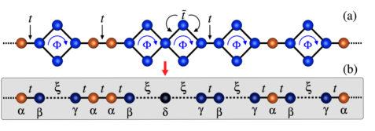
<figcaption class="paper-figure-caption"><b>Fig 1.</b> FIG. 1. (a) Diagram of a random diamond-dot chain. t and ¯t define the respective couplings, and Φ indicates the magnetic flux. (b) The renormalized version of the origi- nal DD chain, with ξ representing the effective horizontal coupling in each renormalized diamond plaquette.</figcaption>
</figure>
<figure class="paper-figure-card">
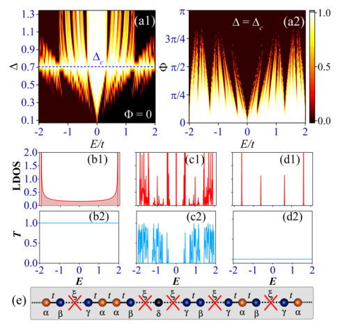
<figcaption class="paper-figure-caption"><b>Fig 2.</b> FIG. 2. (a1) Density plot of T as a function of E and ∆, for Φ = 0. (a2) same as (a1) as a function of E and Φ, for ∆c = 1/ √</figcaption>
</figure>
<figure class="paper-figure-card">
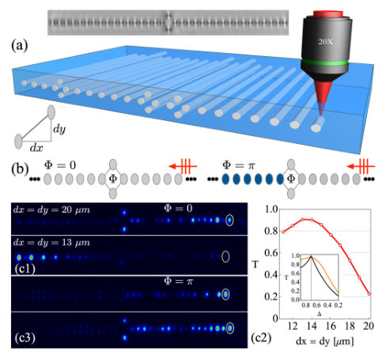
<figcaption class="paper-figure-caption"><b>Fig 3.</b> FIG. 3. (a) Sketch of the fs laser-writing technique. Upper inset: Microscope image of a lattice with a single diamond plaquette. Bottom inset: diamond geometry. (b) Sketch of a single-diamond lattice with zero (left) and π (right) fluxes (gray and blue colors correspond to S and P sites, respectively). (c1) Intensity output profiles for Φ = 0, after a right edge excitation, and or dx = 20 µm (top) and 13 µm (bottom). (c2) Transmission data T vs. diamond geometry dx = dy for an edge excitation with Φ = 0. Inset: Numerical T (orange) and theoretical ⟨T⟩k (black) vs. ∆. (c3) Same as (c1) for Φ = π.</figcaption>
</figure>
<figure class="paper-figure-card">

<figcaption class="paper-figure-caption"><b>Fig 4.</b> FIG. 4. (a1) Microscope image of a random realization with 9 plaquettes for Φ = 0. (a2) Numerical transmission versus ∆for a lattice with 9 plaquettes, for a single (red) and averaged (black) edge and bulk (green) excitations. (b1) Extracted transmission data for the intensity output images (IOI) shown in (b2) and (b3), for dx ∈{11, 20} µm. (c1) and (c2) IOI for a lattice with 16 diamond plaquettes for dx = 13 and 20 µm, respectively, for edge (top) and bulk (bottom) excitations. (d) IOI for a bulk excitation of a lattice with 32 plaquettes for dx = 13 (top) and 20 (bottom) µm. (e) Sketch for Φ = π. (f) IOI for lattices with 16 plaquettes and Φ = π, for dx = 13 µm (top), 15 µm (center), and...</figcaption>
</figure>
<figure class="paper-figure-card">
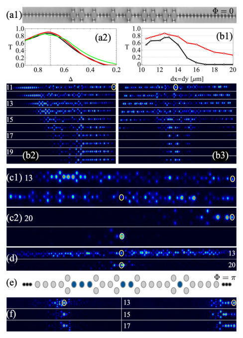
<figcaption class="paper-figure-caption"><b>Fig 5.</b> Fig. 4(b1) shows the extracted data from the exper- iments performed on the lattice shown in Fig. 4(a1), for different geometries dx = dy and for λ = 750 nm.</figcaption>
</figure>

**Summary.** The paper demonstrates that perfect energy transmission can be engineered in highly disordered photonic lattices by tuning the lattice geometry to a specific critical condition. Using both theory and experiment on diamond-dot structures, the authors show this mechanism allows for precise control over wave localization, moving from localized states to ballistic transport.

**Why it may be interesting.** This work provides a concrete platform—photonic crystals—to study fundamental concepts of wave localization (Anderson localization) in disordered media, offering an optical analogue to solid-state physics problems relevant to quantum transport.

Detailed structure

**Main problem.** The study investigates the phenomenon of complete absence of Anderson localization (AL) and perfect energy transmission in a completely disordered photonic lattice.

**Main result.** Perfect, ballistic transmission is achieved when the geometry approaches a critical condition ($\Delta = \Delta_c$), allowing for control over energy transport from localized to perfectly transmitted states.

**Method.** The research combines analytical theoretical proofs with numerical simulations and direct experimental measurements using femtosecond laser-written photonic lattices.

**Model / system.** The system is a disordered diamond-dot (DD) photonic lattice, modeled by a tight-binding Hamiltonian mapped to an effective 1D model. The disorder is controlled via geometrical parameters like the hopping ratio ($\Delta$) and an applied effective magnetic flux ($\Phi$).

**Key observables.** Transmission probability ($T$), which is measured experimentally as intensity output profiles (IOI) and theoretically calculated based on energy $E$.

**Important parameters / regimes.** The critical geometrical parameter $\Delta_c = 1/\sqrt{2}$ and the effective magnetic flux $\Phi$ are crucial for controlling transport regimes.

**Assumptions / limitations.** Initial analysis assumes symmetric geometries ($d_x = d_y$) for simplicity, though the core physics relates to disorder-induced localization/delocalization transitions.

**Figures summary.** Figures illustrate the random DD chain structure, show transmission probability dependence on energy and geometry ($\Delta$), and present experimental intensity profiles confirming high transmission near critical geometries.

**Paper structure.** The paper develops by first establishing the theoretical model (tight-binding Hamiltonian), analytically deriving the condition for perfect transmission ($\Delta = \Delta_c$), supporting this with numerical simulations showing flux effects, and finally validating the findings through direct experimental measurements on fabricated photonic lattices.

Abstract

We present the exceptional phenomenon of complete absence of Anderson localization, and perfect transmission of particles, in a completely disordered diamond-dot chain. We analytically show a proof for the condition to observe this exceptional phenomenon, based on a transparent window emerging from a geometrical condition. We support our theoretical prediction by numerical simulations and direct experimental observation of the transmission probabilities of the light in a femtosecond laser-written diamond-dot photonic lattices. We additionally show that for a $π$ effective magnetic flux, extreme localization of the light in the same system may occur, independently on the specific geometry. Our results open up an excellent platform for controlling the transmission of energy from ballistic to zero transmission, in a completely disordered lattice system..

[↑ back to top](#top)

### [Optimized Quantum States for Sensing in the Presence of Loss and Phase Noise](http://arxiv.org/abs/2606.19649v1)

**Authors:** Shruti Maliakal, Zachary Mann, Christopher Wipf, Rana X Adhikari, Su Direkci, Yanbei Chen  
**Type:** theory · **Category:** other · **PDF:** <https://arxiv.org/pdf/2606.19649v1>  
**Analysis basis:** full PDF text, analyzed in chunks
**Topic relevance:** 🔥 `methods for driven-dissipative` **4/5** · `Keldysh / 2PI / non-Gaussian methods` **3/5** · `correlated / nonlocal dissipation` **2/5** · `driven-dissipative phase transition` **2/5** · `entanglement & information structure` **2/5** · `non-equilibrium dynamics` **2/5** · `analog quantum simulation` **1/5** · `correlated cavity matter` **1/5** · `interference shaping light` **1/5** · `non-equilibrium universality` **1/5**

↔ Scroll figures horizontally

<figure class="paper-figure-card">
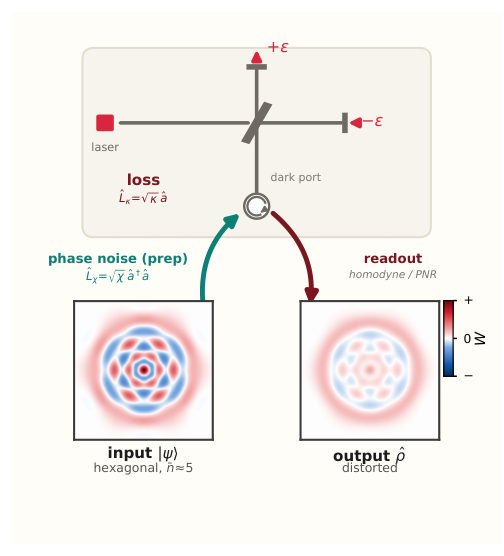
<figcaption class="paper-figure-caption"><b>Fig 1.</b> FIG. 1: Optimized non-Gaussian probe states for displacement sensing in an interferometer limited by loss and phase noise. A state with discrete (C6) rotational symmetry (¯n ≈5) is prepared and injected at the dark port through a circulator, and the returning field is read out at the same port. Phase noise acts during state preparation (dephasing, ˆLχ = √χ ˆa†ˆa) and photon loss acts during sensing (ˆLκ = √κ ˆa); the small displacement ϵ to be estimated enters at the end mirrors. Wigner functions show the input probe (left) and its distorted output (right), obtained by evolving the state through both channels with the Lindblad master equation.</figcaption>
</figure>
<figure class="paper-figure-card">
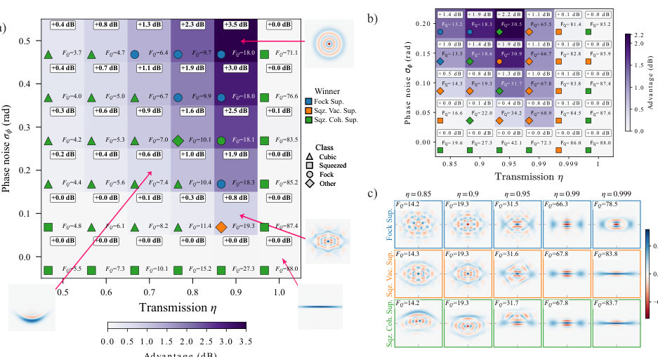
<figcaption class="paper-figure-caption"><b>Fig 2.</b> FIG. 2: Non-Gaussian advantage, Ntarget = 5. (a) dB advantage of the optimized state over the best Gaussian state across the (η, σϕ) grid; marker shape indicates the state class (square=squeezed, circle=Fock, triangle=cubic, diamond=other) and marker color the winning ansatz, with insets showing Wigner functions of representative optimized states. (b) A finer zoom into the experimentally relevant low-loss, low-phase-noise region, η ∈[0.85, 0.999], σϕ ∈[0, 0.2]. (c) Wigner functions of the optimized states across η at σϕ = 0.1 for the three ansatze (rows: Fock, squeezed vacuum, and displaced squeezed vacuum superpositions); the discrete rotational symmetry steps down in order 6 →4 →2 as loss...</figcaption>
</figure>
<figure class="paper-figure-card">
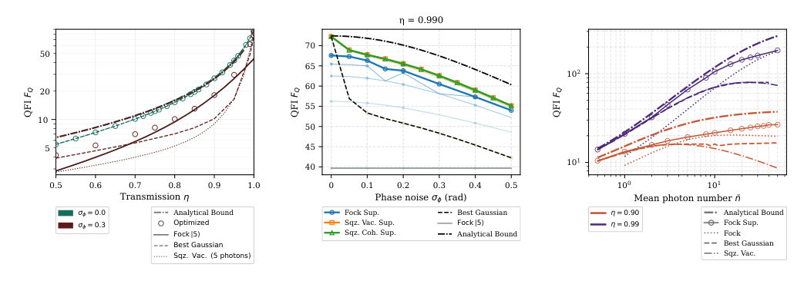
<figcaption class="paper-figure-caption"><b>Fig 3.</b> FIG. 3: QFI trends. (a) QFI vs. η at σϕ ∈{0, 0.3}, Ntarget = 5. (b) QFI vs. σϕ at η = 0.99, Ntarget = 5. (c) QFI vs. Ntarget at σϕ=0.1 for η ∈{0.9, 0.99}. Solid lines: Fock; dotted: squeezed vacuum; dashed: best Gaussian within the energy limit; markers: best optimized state.</figcaption>
</figure>
<figure class="paper-figure-card">
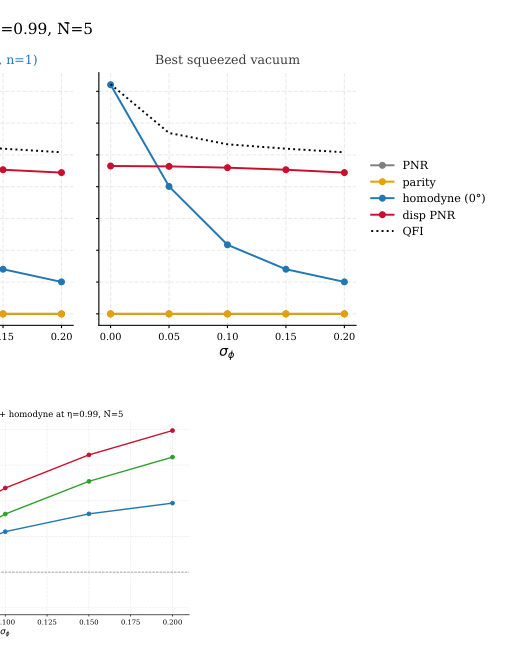
<figcaption class="paper-figure-caption"><b>Fig 4.</b> FIG. 4</figcaption>
</figure>
<figure class="paper-figure-card">
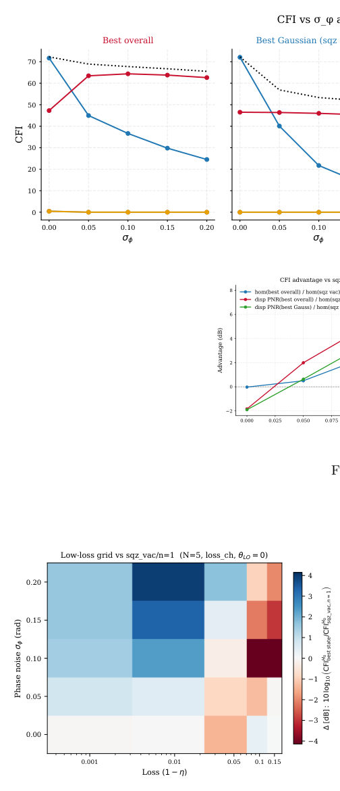
<figcaption class="paper-figure-caption"><b>Fig 5.</b> FIG. 5: Homodyne (θ = 0) CFI of the best optimized state relative to the optimized squeezed vacuum across the low-loss grid, ∆= 10 log10  CFIhom best/CFIhom sqz. vac.  in</figcaption>
</figure>

**Summary.** This theoretical study optimizes quantum states for enhanced sensing in noisy environments characterized by photon loss and phase noise. By numerically maximizing the Quantum Fisher Information, the authors prove that non-Gaussian states surpass Gaussian limits, achieving measurable advantages up to 2.2 dB under realistic conditions. The work is crucial for advancing practical quantum measurement techniques.

**Why it may be interesting.** This work directly addresses open quantum systems and quantum optics by providing concrete, non-Gaussian resource states that maintain quantum advantages even when realistic noise channels (loss/dephasing) are present. The comparison between QFI and CFI is particularly insightful for experimentalists.

Detailed structure

**Main problem.** The research aims to enhance quantum sensing sensitivity beyond the standard quantum limit (SQL) when the system is corrupted by both photon loss and phase noise.

**Main result.** Non-Gaussian states, specifically Fock-like, cubic-phase-like, and discrete rotational symmetry states, were found to outperform all Gaussian states, achieving up to a 2.2 dB non-Gaussian advantage under specific noisy conditions.

**Method.** The authors used numerical optimization techniques to maximize the Quantum Fisher Information (QFI) across various input state ansatze while incorporating Lindblad operators for loss and phase noise.

**Model / system.** The system models quantum metrology, relevant to gravitational-wave detectors. The dynamics are governed by a Hamiltonian subject to amplitude damping (loss) and dephasing (phase noise).

**Key observables.** Quantum Fisher Information (QFI), Non-Gaussian Advantage (in dB), Classical Fisher Information (CFI), Signal-to-Noise Ratio (SNR) gain.

**Important parameters / regimes.** Average photon number ($ar{n}$), Photon loss ($1-\eta$), Phase noise standard deviation ($\sigma_\phi$).

**Assumptions / limitations.** The analysis compares QFI derived from optimal measurements against those achievable with specific, experimentally relevant readouts like homodyne detection.

**Figures summary.** Figures illustrate the non-Gaussian advantage across parameter grids $(\eta, \sigma_\phi)$, show Wigner function evolution, and compare CFI gains for different measurement types (PNR vs. Homodyne).

**Paper structure.** The paper systematically analyzes the optimal state class by mapping out regions in the loss/noise parameter space where Fock-like, cubic-phase-like, or rotationally symmetric states yield the maximum QFI advantage.

Abstract

Squeezed vacuum lets gravitational-wave detectors and other quantum sensors surpass the standard quantum limit, and is optimal in the loss-limited regime; phase noise breaks this optimality. Numerically optimizing the quantum Fisher information across the loss and phase-noise landscape, we identify non-Gaussian states that outperform any Gaussian state. These fall into three classes: Fock-like, cubic-phase-like, and states with discrete rotational symmetry. Limiting the average number of photons in the input state to $\bar{n}=5$, with $1-η= 5\%$ photon loss and 200 mrad phase noise, the non-Gaussian advantage reaches up to 2.2 dB. Furthermore, we observe that the non-Gaussian advantage can persist even when the measurement strategy is homodyne detection.

[↑ back to top](#top)

### [Polymer-polymer interdiffusion: effects of entanglements and a polymeric source](http://arxiv.org/abs/2606.20462v1)

**Authors:** Avraham Moriel, Howard A. Stone  
**Type:** theory · **Category:** statistical mechanics · **PDF:** <https://arxiv.org/pdf/2606.20462v1>  
**Analysis basis:** full PDF text, analyzed in chunks
**Topic relevance:** 🔥 `non-equilibrium dynamics` **4/5** · `methods for driven-dissipative` **3/5** · `non-equilibrium universality` **3/5** · `Keldysh / 2PI / non-Gaussian methods` **2/5** · `analog quantum simulation` **2/5** · `driven-dissipative phase transition` **2/5** · `Frenkel-Kontorova` **1/5** · `correlated / nonlocal dissipation` **1/5** · `entanglement & information structure` **1/5**

↔ Scroll figures horizontally

<figure class="paper-figure-card">
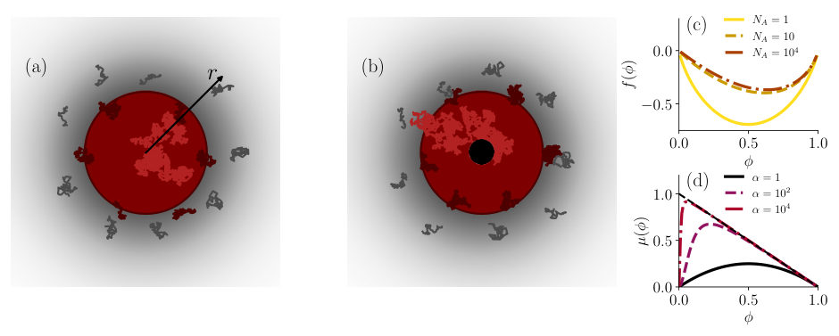
<figcaption class="paper-figure-caption"><b>Fig 1.</b> FIG. 1. Passive (droplet) diffusion, and source-driven diffusion. (a) A sketch of an A-mer droplet interdiffusing into a B-mer surrounding medium. The A-mers are depicted as red polymers, and B-mers as gray ones. (b) A source-driven problem, where the source is depicted as a small black circle at the center of the droplet. The source generates A-mers, that then diffuse into the B-mers. (c) Plots of f(ϕ) in the absence of interactions (χ=0) and for monomer surroundings (NB =1) for a wide range of polymer lengths NA. Increasing the polymer length increases the energetic minima, and develops an asymmetry from ϕ=0.5. (d) Plots of the friction function µ(ϕ) for various values of α (the B-mers...</figcaption>
</figure>
<figure class="paper-figure-card">
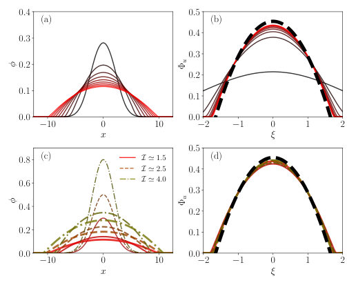
<figcaption class="paper-figure-caption"><b>Fig 2.</b> FIG. 2. Numerical and analytical solutions for unentangled polymer interdiffusion with α = 1. (a) The spreading A-mer droplet dynamics of ϕ, as obtained from our 1D numerical simulations of Eqs. (7)-(11) ϕmax = 0.3 corresponding to I ≃ 1.5). Early times are depicted as gray, and later times are drawn in red. (b) The same ϕ profiles drawn using the self- similar Φu =ϕ/ (I2/t) 1/3, and ξ=x/ (It)1/3. Dashed black line</figcaption>
</figure>
<figure class="paper-figure-card">
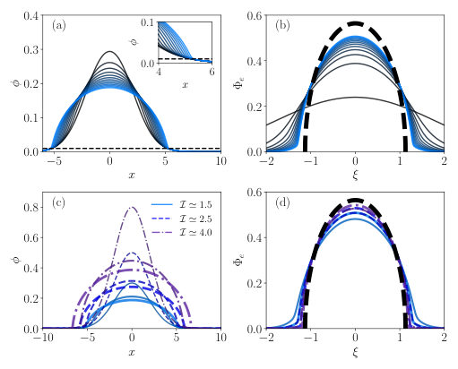
<figcaption class="paper-figure-caption"><b>Fig 3.</b> FIG. 3. Numerical and analytical solutions for entangled polymer interdiffusion with α=104. (a) The spreading A-mer droplet dynamics of ϕ, as obtained from our 1D numerical simulations of Eqs. (7)-(11) (using ϕmax = 0.3 corresponding to I ≃1.5). Early times are depicted as gray, and later times are drawn in blue. Horizontal dashed line indicates ϕ=α−1/2. Inset: a close-up on the transition region ϕ ≃α−1/2 showing the formed tails. (b) The same ϕ profiles drawn using the self- similar Φe =ϕ/ (I2/t) 1/4, and ξ=x/ (I2t) 1/4. Dashed black line</figcaption>
</figure>
<figure class="paper-figure-card">
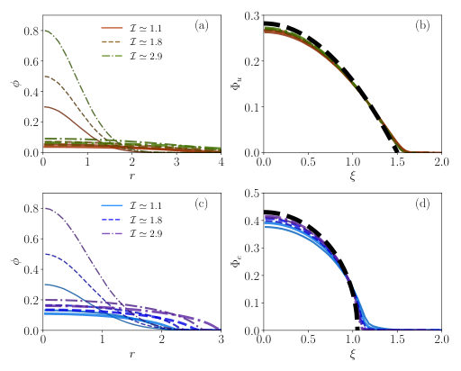
<figcaption class="paper-figure-caption"><b>Fig 4.</b> FIG. 4. Numerical and analytical solutions for unentangled polymer interdiffusion in 2D. (a) Snapshots of the radially- averaged ϕ from 2D simulations of Eqs. (1)-(3), with α = 1, and with different initial ϕmax values of 0.3, 0.5 and 0.8, cor- responding to different I values (see legend). (b) The same snapshots as in (a) cast as self-similar solutions, with the self- similar solution plotted as a thick dashed black line. (c) Same as panel (a) but for the entangled case with α=104. (d) The same snapshots as in (c) cast as self-similar solutions, with the self-similar solution in black dashed line.</figcaption>
</figure>
<figure class="paper-figure-card">
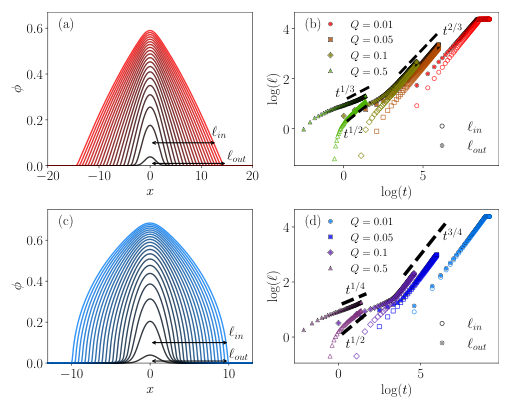
<figcaption class="paper-figure-caption"><b>Fig 5.</b> FIG. 5. Numerical solutions for unentangled and entangled source-driven polymer interdiffusion with f(t) = Q. (a) Un- entangled α=1 source-driven A-mer dynamics ϕ, as obtained from our full 1D numerical simulations of Eqs. (7)-(11) (with α = 1, NA = 104, and Q = 0.1). Early times are depicted as gray, and later times are drawn in red. We denote the two length scales ℓin and ℓout, as the half-width of the droplet’s domain that is ϕ&gt;0.1 for ℓin and ϕ&gt;0.01 for ℓout. (b) Time- dependence of ℓin and ℓout for different source amplitudes Q. At short times, ℓin ∼t1/2 similar to a linear diffusion scal- ing, while ℓout ∼t1/3 as in the passive droplet scenario. At long times, both length scales...</figcaption>
</figure>

**Summary.** This paper theoretically models how two different types of polymers diffuse into each other, considering the physical impact of chain entanglements. By using advanced continuum mechanics and nonlinear diffusion equations, the authors show that even when an external source drives the process, the local structure of the diffusing front remains predictable based on established scaling laws.

**Why it may be interesting.** While focused on polymer physics, the mathematical techniques—deriving nonlinear PDEs from continuum mechanics, using self-similarity reduction, and analyzing non-equilibrium transport far from equilibrium—are highly relevant to modeling complex dynamics in open quantum systems or reaction-diffusion processes in quantum materials.

Detailed structure

**Main problem.** The study investigates polymer-polymer interdiffusion, specifically analyzing how chain entanglements and external polymeric sources affect the transport dynamics.

**Main result.** The front characteristics of diffusing droplets remain structurally similar whether diffusion is passive or source-driven, although the time evolution scaling exponents change based on entanglement effects.

**Method.** The authors utilize a two-fluid formalism, deriving nonlinear diffusion equations and employing self-similar solutions and asymptotic expansions to solve for concentration profiles in 1D and 2D.

**Model / system.** The system models the interdiffusion of two polymeric species (A-mers and B-mers) governed by continuity and momentum conservation equations. The complexity is captured by incorporating entanglement effects via a friction function $\mu(\phi)$ and analyzing regimes ranging from unentangled to highly entangled.

**Key observables.** Volume fraction profile ($\phi$), droplet radii ($\ell_{in}, \ell_{out}$), mean velocity ($v$), and relative speed ($w$).

**Important parameters / regimes.** Entanglement parameter ($\alpha$), nonlinearity exponent ($m=2$ for unentangled, $m=3$ for entangled), and source term time dependence ($f \propto t^{q-1}$).

**Assumptions / limitations.** Key approximations include neglecting material stresses ($\sigma$) and assuming the system is dominated by osmotic pressure. The analysis also relies on specific power-law forms for the external source.

**Figures summary.** Figures illustrate numerical and analytical solutions for 1D and 2D interdiffusion, comparing passive vs. source-driven scenarios across unentangled ($\alpha=1$) and entangled ($\alpha\gg 1$) regimes, showing scaling collapse.

**Paper structure.** The paper builds from the general two-fluid formalism to reduced 1D equations of motion. It then analyzes self-similar solutions for passive diffusion, extends this analysis to include an external source term $S$, and finally derives asymptotic forms confirming local geometric similarity despite global changes in scaling.

Abstract

Many industrial applications and biological scenarios involve the interdiffusion of two polymeric species. Motivated by biological subcellular source-driven processes, we study polymer-polymer interdiffusion problems in the absence or the presence of a polymeric source, for both unentangled and entangled scenarios. Utilizing a two-fluid formalism, we arrive at scaling relations, self-similar reductions, and analytical solutions, which are confirmed with one- and two-dimensional numerical simulations. The introduction of a source term breaks the self-similar structure, modifying the boundary conditions and the domain of integration. Nevertheless, we show that the front characteristics of the diffusing droplet exhibit similar spatial structures as in the absence of a source. Our results allow deeper understanding of polymer-polymer interdiffusion and nonlinear transport, especially in the presence of a source.

[↑ back to top](#top)

### [sft-wick: A formalism and package for Feynman-diagram expansion and evaluation in stochastic field theories](http://arxiv.org/abs/2606.19480v1)

**Authors:** Zheng Zhang  
**Type:** theory · **Category:** statistical mechanics · **PDF:** <https://arxiv.org/pdf/2606.19480v1>  
**Analysis basis:** full PDF text, analyzed in chunks
**Topic relevance:** 🔥 `Keldysh / 2PI / non-Gaussian methods` **4/5** · `methods for driven-dissipative` **3/5** · `analog quantum simulation` **2/5** · `correlated / nonlocal dissipation` **2/5** · `driven-dissipative phase transition` **2/5** · `non-equilibrium dynamics` **2/5** · `non-equilibrium universality` **2/5** · `Kondo & dissipative impurity` **1/5** · `entanglement & information structure` **1/5**

↔ Scroll figures horizontally

<figure class="paper-figure-card">
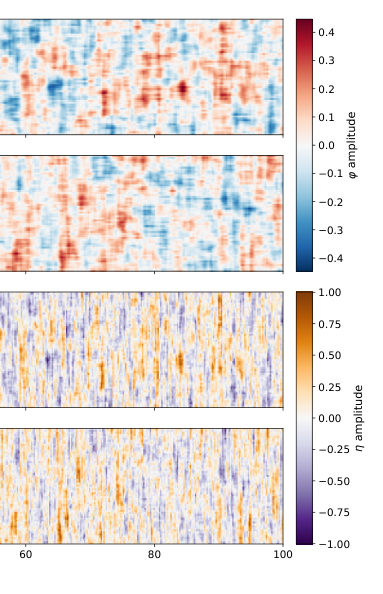
<figcaption class="paper-figure-caption"><b>Fig 1.</b> Figure 1: Space–time evolution of a single realisation. Top two panels show the physical fields φ1 and φ2 building up correlated fluctuations from zero initial conditions; bottom two panels show the driving fields η1 and η2 that source them, with spatial correlation length σx and temporal correlation σt = 0.3. Colour scales are separate for φ and η because the time-integrated physical fields have considerably larger amplitude than the drivers.</figcaption>
</figure>
<figure class="paper-figure-card">
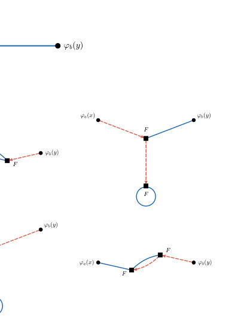
<figcaption class="paper-figure-caption"><b>Fig 2.</b> Figure 2: Feynman diagrams for ⟨φa(x, t) φb(y, t)⟩ with the cubic interaction vertex (−i) F (3) abd φaφbψd. Top: zeroth order (single C-propagator). Bottom: second order (six distinct topologies with multiplicities). Blue solid: C-propagator; red dashed with arrow: R-propagator; circles: external points; squares: interaction vertices.</figcaption>
</figure>
<figure class="paper-figure-card">
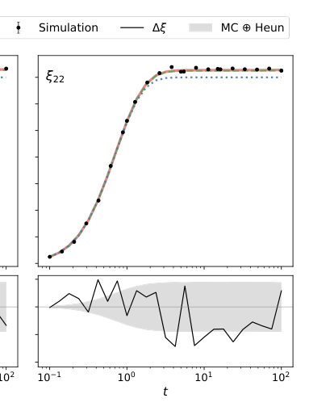
<figcaption class="paper-figure-caption"><b>Fig 3.</b> Figure 3: Two-point correlators at r = 0.5 σx versus time. Top: perturbative predictions (dotted: ξ(0); dashed: ξ(0+2); solid: ξ(0+2+4)) and simulation (markers with error bars). Bottom: residual ξpert −ξsim with combined uncertainty band. Left: ξ11; right: ξ22.</figcaption>
</figure>
<figure class="paper-figure-card">
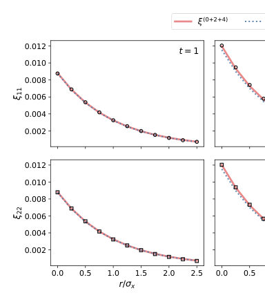
<figcaption class="paper-figure-caption"><b>Fig 4.</b> Figure 4: Correlators versus spatial separation at three times. Dotted: ξ(0); solid: ξ(0+2+4); markers: simulation. Rows: ξ11 and ξ22; columns: t = 1, 15, 30.</figcaption>
</figure>
<figure class="paper-figure-card">
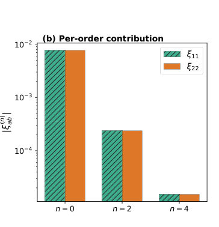
<figcaption class="paper-figure-caption"><b>Fig 5.</b> Figure 5: Perturbative convergence at r = 0.4 σx, t = 3. (a) Cumulative sum for ξ11 (hatched bars) and ξ22 (solid bars); dashed lines mark the simulation values. (b) Per-order contributions |ξ(n)|, showing geometric suppression ∼λn/2.</figcaption>
</figure>

**Summary.** This paper introduces sft-wick, a computational package designed to systematically calculate perturbative expansions in complex stochastic field theories using the MSR formalism. It overcomes combinatorial explosion by enumerating Feynman diagrams based on spatial topology rather than direct Wick contractions. The tool provides both symbolic diagram tables and numerical predictions for correlation functions, validating its approach against direct Langevin simulations.

**Why it may be interesting.** While focused on classical stochastic fields, the rigorous application of path integrals, perturbation theory, and systematic diagrammatic expansion techniques are highly relevant for analyzing quantum open systems where noise or dissipation is modeled stochastically.

Detailed structure

**Main problem.** Developing a systematic and computationally tractable method for performing perturbative expansions and evaluating Feynman diagrams arising from stochastic field theories formulated via the path integral.

**Main result.** The authors present sft-wick, an open-source Python package that automates the calculation of diagram tables and numerically evaluates integrals for multi-component stochastic systems.

**Method.** It uses the Martin–Siggia–Rose (MSR) formalism to map stochastic differential equations onto a path integral, which is then expanded perturbatively using Wick's theorem applied via topological enumeration rather than direct contraction.

**Model / system.** The theory applies to multi-component Stochastic Partial Differential Equations (SPDEs) governed by Langevin-type dynamics. The formalism handles matrix propagators and non-Gaussian driving noise specified by arbitrary cumulants.

**Key observables.** Correlation functions, specifically the equal-time two-point correlation function $\langle\varphi_a(x, t) \varphi_b(y, t)
angle_S$, are computed as primary observables.

**Important parameters / regimes.** The calculation depends on the response propagator ($R$) and the correlation propagator ($C$), which are derived from the linear dynamics operator ($\hat{D}$) and cumulant functions of the noise $\eta^a$.

**Assumptions / limitations.** Key assumptions include adopting the Itô prescription, enforcing causal constraints (retarded propagators), and relying on Wick's theorem for Gaussian free theories.

**Figures summary.** Figures illustrate Feynman diagrams at various orders (up to fourth order) for correlation functions, comparing perturbative predictions against direct Langevin simulation data to demonstrate convergence.

**Paper structure.** The paper first derives the MSR path integral formulation for SPDEs. It then details the perturbative expansion using Dyson series and Wick's theorem. The core contribution is the sft-wick package, which implements a topology engine to systematically generate diagram tables before numerical evaluation of integrals.

Abstract

When stochastic field dynamics are cast into a path-integral formulation, perturbation theory becomes systematic but the resulting expansion quickly grows combinatorially large. The setting targeted here includes multi-component, multi-dimensional fields with matrix propagators, tensor-valued couplings, and non-Gaussian driving noise specified by arbitrary $n$-point cumulants. Wick pairings grow factorially, and component indices must be routed through the tensor-valued vertices. The useful output is not a raw contraction list, but a diagram table: one entry per topology, with multiplicities, coupling sums, signs, and causal constraints resolved. We present sft-wick, an open-source Python package that constructs these diagram tables and computes their integrals numerically. Given an action and an observable, it enumerates topologically distinct Feynman diagrams, derives their algebraic coefficients, and evaluates the resulting diagram integrals from user-supplied response and cumulant functions. The core algorithm enumerates spatial topologies before routing component indices, avoiding contraction-by-contraction Wick expansion. Response-field constraints, including vanishing response-response contractions, the ito prescription, and the absence of causal response loops, are enforced during enumeration. Predictions are validated against direct Langevin simulation, agreeing to within the simulation's statistical noise.

[↑ back to top](#top)

### [The use of Peres lattices in periodically driven systems](http://arxiv.org/abs/2606.20009v1)

**Authors:** Lukáš Honsa, Jan Střeleček, Jakub Novotný, Pavel Cejnar  
**Type:** theory · **Category:** other · **PDF:** <https://arxiv.org/pdf/2606.20009v1>  
**Analysis basis:** full PDF text, analyzed in chunks
**Topic relevance:** 🔥 `analog quantum simulation` **4/5** · 🔥 `non-equilibrium dynamics` **4/5** · `methods for driven-dissipative` **3/5** · `non-equilibrium universality` **3/5** · `driven-dissipative phase transition` **2/5** · `entanglement & information structure` **1/5** · `exotic spin models in light-matter` **1/5** · `scars & prethermalization` **1/5**

↔ Scroll figures horizontally

<figure class="paper-figure-card">
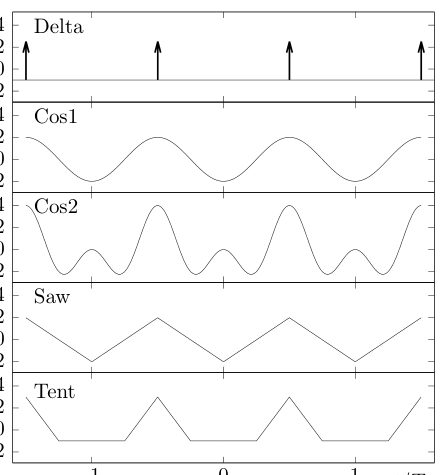
<figcaption class="paper-figure-caption"><b>Fig 1.</b> FIG. 1. Various driving functions g(t) from Eqs. (4a)–(4e). The black vertical arrows represent the delta functions.</figcaption>
</figure>
<figure class="paper-figure-card">
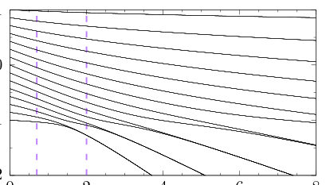
<figcaption class="paper-figure-caption"><b>Fig 2.</b> FIG. 2. Spectrum of the stationary Hamiltonian b H0 from Eq. (2) for j = 7. The parameter values used in the following text are indicated by dashed vertical lines.</figcaption>
</figure>
<figure class="paper-figure-card">
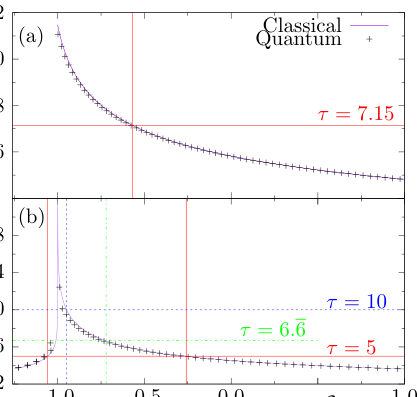
<figcaption class="paper-figure-caption"><b>Fig 3.</b> FIG. 4. The period τ of classical trajectories for Hamilto- nian (12) with (a) κ = 0.7 and (b) κ = 2 as a function of scaled energy E = E/j. The purple line depicts the classical calculation of τ(E), the black crosses show the estimate (13) from the spacings of quantum energy levels for j = 30. Ener- gies and periods corresponding to the trajectories higlighted in Fig. 3 are marked.</figcaption>
</figure>
<figure class="paper-figure-card">
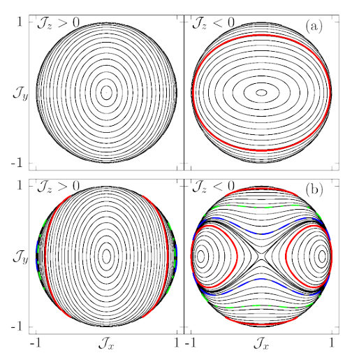
<figcaption class="paper-figure-caption"><b>Fig 4.</b> FIG. 3. Classical phase space trajectories of the stationary system for (a) κ = 0.7 (upper plots) and (b) κ = 2 (lower plots). The left and right plots, respectively, show the upper and lower hemispheres of the Bloch sphere. Trajectories with some specific time periods τ, that will turn important in later discussions, are highlighted.</figcaption>
</figure>
<figure class="paper-figure-card">
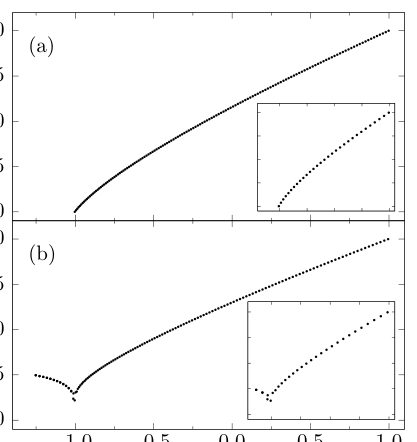
<figcaption class="paper-figure-caption"><b>Fig 5.</b> FIG. 5. The Peres lattice for observables b H0 and bJz for Hamiltonian (2) with (a) κ = 0.7 and (b) κ = 2. We set j = 70 (the main panels) and j = 15 (the insets).</figcaption>
</figure>

**Summary.** This work extends the Peres lattice technique from stationary Hamiltonians to periodically driven quantum systems. It demonstrates that this method is highly effective for diagnosing complex dynamics, allowing researchers to map out resonances, track the onset of chaos, and identify critical points in Floquet spectra. The analysis confirms the utility of geometric tools to understand time-dependent many-body physics.

**Why it may be interesting.** It provides a powerful, geometric diagnostic tool (Peres lattices) to visualize complex phenomena like chaos and resonances in time-dependent quantum systems, bridging the gap between static and driven many-body physics relevant to cavity QED or ultracold atoms.

Detailed structure

**Main problem.** The primary goal is extending the Peres lattice method, originally for stationary systems, to analyze complex dynamics in periodically driven quantum systems.

**Main result.** The Peres lattice successfully diagnoses key features of driven systems, including detecting resonances, monitoring the onset of chaos, and characterizing critical points related to Floquet modes.

**Method.** The analysis involves mapping the time-periodic evolution onto an extended, effective stationary Hamiltonian whose eigenstates (Floquet modes) are then analyzed using the Peres lattice structure.

**Model / system.** The study focuses on periodically driven quantum systems, exemplified by a Lipkin–Meshkov–Glick type model involving collective spin operators ($\hat{J}_x, \hat{J}_z$). The dynamics are governed by a time-dependent Hamiltonian $\hat{H}(t) = \hat{H}_0 + \eta g(t) \hat{H}'$.

**Key observables.** Peres lattice coordinates (expectation values of observables), Floquet quasienergies, and the similarity measure $N$ comparing driven vs. stationary dynamics.

**Important parameters / regimes.** Driving strength ($\eta$), time period ($T$), system size parameter ($j$), and critical coupling constants ($\kappa_c$).

**Assumptions / limitations.** The analysis relies on approximating the full Floquet evolution operator using truncated expansions (e.g., BCH or Dyson series) to construct effective stationary Hamiltonians.

**Figures summary.** Figures illustrate Peres lattices for both stationary and kicked systems, showing structural changes corresponding to resonances and chaos onset; they also compare Husimi distributions derived from different driving forms.

**Paper structure.** The paper progresses by first establishing the applicability of Peres lattices to driven systems, then analyzing quantum phase transitions in the stationary limit, followed by detailed investigations into resonance detection, chaos growth, and comparisons between various continuous and kicked driving protocols using approximation techniques.

Abstract

We demonstrate the strength of the method of Peres lattices in periodically driven quantum systems. The method, which has previously been used mostly in stationary systems, enables us to efficiently detect resonances in the driven system, to monitor the onset of chaos, and to recognize critical properties of the Floquet modes. It also allows quick comparisons of the spectra of Floquet modes for various driving Hamiltonians and transparent tests of the iterative approximation techniques based on effective stationary Hamiltonians.

[↑ back to top](#top)

### [Phase locking nuclear spins in silicon with spin-orbit coupling](http://arxiv.org/abs/2606.20340v1)

**Authors:** Habitamu Y. Walelign, Manas Ranjan Sahu, John M. Nichol  
**Type:** both · **Category:** quantum information and computing · **PDF:** <https://arxiv.org/pdf/2606.20340v1>  
**Analysis basis:** full PDF text, analyzed in chunks
**Topic relevance:** 🔥 `QC/QI experiment` **4/5** · `analog quantum simulation` **3/5** · `spintronics-quantum-optics interface` **3/5** · `non-equilibrium dynamics` **2/5** · `correlated / nonlocal dissipation` **1/5** · `driven-dissipative phase transition` **1/5** · `entanglement & information structure` **1/5** · `exotic spin models in light-matter` **1/5** · `methods for driven-dissipative` **1/5** · `quantum measurements` **1/5**

↔ Scroll figures horizontally

<figure class="paper-figure-card">
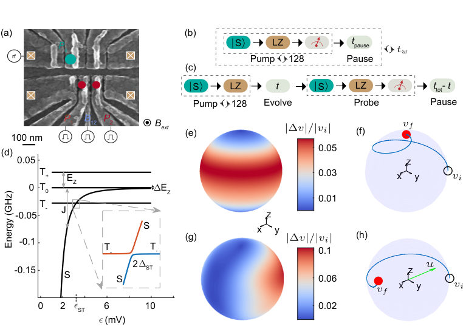
<figcaption class="paper-figure-caption"><b>Fig 1.</b> FIG. 1. Experimental setup. (a) Scanning electron micrograph of a device nominally identical to the one used in this work. The plunger gates P1(2) define the ST qubit, and the gate Ps defines the sensor dot. (b) Pulse sequences used for probing the screened dark states and (c) for the phase control experiment. (d) Relevant energy levels for the experiment. Zeeman energy, Ez, separates the two polarized triplet states, T±, from the unpolarized triplet state T0. ∆Ez denotes the longitudinal Zeeman field gradient between the dots while J is the effective exchange coupling that separates the states S and T0. (e) Net change in the nuclear polarization vector after one LZ sweep and pause, as a...</figcaption>
</figure>
<figure class="paper-figure-card">
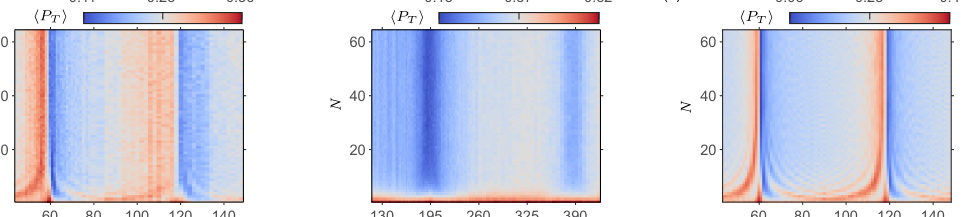
<figcaption class="paper-figure-caption"><b>Fig 2.</b> FIG. 2. Screened dark state. (a) Triplet probability ⟨PT ⟩(red) and root-mean-square gap ⟨|∆|2 ST ⟩1/2 (blue) vs. tw at Bext = 2 mT (left) and 0.6 mT (right) after 128 LZ sweeps. The lines connecting the data points are guides to the eye. (b) ⟨PT ⟩vs. LZ sweep number N and tw. After a few tens of LZ sweeps, the system reaches a steady state. (c) t(1) w , t(2) w , and ntL vs. Bext (d) Numerical simulations corresponding to the experiments in (b) at Bext = 2 mT with ∆HF = 100 kHz and u = 100 kHz (see Supplementary Material).</figcaption>
</figure>
<figure class="paper-figure-card">
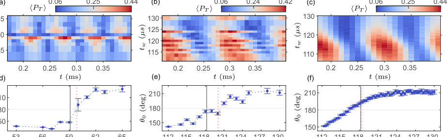
<figcaption class="paper-figure-caption"><b>Fig 3.</b> FIG. 3. Nuclear-spin phase lock. ⟨PT ⟩vs. tw and evolution time t for (a) Bext = 2 mT and (b) Bext = 1 mT. (c) Simulation at Bext = 1 mT and u = 50 kHz, ∆HF = 100 kHz. For the 2-mT data, there was a device shift at tw = 60 µs, which is responsible for the low visibility as well as slightly higher error bar at that tw. Phase as a function of tw for the (d) 2-mT data, (e) 1-mT data, and (f) simulation, extracted by fitting to Eq. (3). In all of the phase plots, the horizontal light black line indicates θ0 = π, while the black solid vertical line indicates tw = tL, where θ0 = π is expected. The dashed vertical line is the inverse of the mean fitted spin precession frequencies, with values of...</figcaption>
</figure>
<figure class="paper-figure-card">
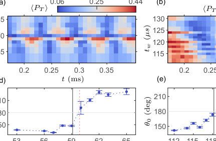
<figcaption class="paper-figure-caption"><b>Fig 4.</b> Figure 2(a) shows the results of these measurements at different magnetic fields. We observe a pronounced non-monotonic variation in ⟨PT ⟩and ⟨|∆ST |2⟩1/2 with tw. In particular, ⟨PT ⟩and ⟨|∆ST |2⟩1/2 have local min- ima at equally-spaced times t(1) w , t(2) w , · · · , which depend on Bext. Plotting t(1) w and t(2) w vs. Bext, together with the Larmor period tL and its integer multiples, reveals that t(n) w ≈ntL [Fig. 2(c)]. These data indicate that ⟨|∆ST |2⟩1/2 reaches a local minimum through dynamic nuclear polarization when the wait between LZ sweeps is an integer multiple of the Larmor period. This configu- ration with a reduced ⟨|∆ST |2⟩1/2 is a dark state because it features reduced...</figcaption>
</figure>
<figure class="paper-figure-card">

<figcaption class="paper-figure-caption"><b>Fig 5.</b> Figure 2(b) shows the transient behavior of ⟨PT ⟩as</figcaption>
</figure>

**Summary.** The research demonstrates a novel method to coherently control nuclear spins in silicon quantum dots by leveraging the internal spin-orbit coupling (SOC). By engineering specific pulse sequences that induce dynamic nuclear polarization, the nuclear spins can be phase-locked to this internal electronic field. This breakthrough opens pathways for building solid-state quantum memories with enhanced controllability.

**Why it may be interesting.** This work provides a concrete demonstration of using intrinsic material couplings (SOC) as an internal clock or reference field for quantum memory elements, bypassing the need for external microwave infrastructure.

Detailed structure

**Main problem.** To achieve coherent control over nuclear spin ensembles without relying on external phase references, which is crucial for scalable quantum memory.

**Main result.** The internal electronic spin-orbit coupling (SOC) can be utilized to deterministically phase-lock the nuclear spins, enabling measurement of their coherence and precession using only internal couplings.

**Method.** The study combines experimental measurements on silicon quantum dots with detailed numerical simulations of the electron-nuclear many-body system dynamics.

**Model / system.** The platform is a double quantum dot in silicon hosting coupled electronic spins (S-T transitions) and nuclear spins ($	ext{}^{29}	ext{Si}$). The physics involves coupling between the electron spin, the SOC term ($u$), and the hyperfine interaction ($\Delta HF$).

**Key observables.** Coherent precession of nuclear spins, inhomogeneous dephasing time ($T_2^*$), and the electronic transition probability $\langle P_T 
angle$ as a function of wait times ($t_w$) or evolution time ($t$).

**Important parameters / regimes.** External magnetic fields ($	ext{B}_{	ext{ext}}$), SOC strength ($u$), hyperfine coupling ($\Delta HF$), and the ratio between these couplings.

**Assumptions / limitations.** The analysis sometimes treats nuclei as classical spins for Hamiltonian derivation, and simulations account for various noise sources (e.g., white magnetic noise).

**Figures summary.** Figures illustrate how SOC modifies polarization regions; subsequent figures show time evolution of $\langle P_T 
angle$ vs. $t_w$, demonstrating the stroboscopic screening effect when $t_w$ matches the Larmor period, and finally plot coherence decay envelopes.

**Paper structure.** The paper progresses from establishing the need for internal control to detailing the mechanism (SOC-induced phase locking via screening), quantifying this control by measuring free precession and coherence times, and concluding with a comprehensive analysis of parameter dependence ($u$ vs $\Delta HF$).

Abstract

Because they have such long coherence times, nuclear spins have extraordinary potential for use in quantum information processing devices. However, coherent nuclear spin control generally requires external phase references, such as microwave control fields. Here, we phase-lock a $^{29}$Si nuclear spin ensemble in a silicon quantum dot using only the internal electronic spin-orbit coupling as a phase reference. When driven with the quantum-dot electrons, the nuclear spins align themselves to a phase determined by the electronic spin-orbit coupling and the timing of the drive protocol. This enables us to measure the coherent precession and inhomogeneous dephasing of the nuclear spins. We corroborate our results with detailed numerical simulations of the many-body electron nuclear system. Our work opens new routes for coherently controlling solid-state nuclear spin ensembles.

[↑ back to top](#top)

### [QMaxCal: Path-Space Regularization for Open Quantum Control via Girsanov's Theorem](http://arxiv.org/abs/2606.19947v1)

**Authors:** Merijn Moody, Zier Mensch, Miranda C. N. Cheng, Peter G. Bolhuis, Max Welling  
**Type:** both · **Category:** quantum information and computing · **PDF:** <https://arxiv.org/pdf/2606.19947v1>  
**Analysis basis:** full PDF text, analyzed in chunks
**Topic relevance:** 🔥 `methods for driven-dissipative` **4/5** · 🔥 `quantum measurements` **4/5** · `measurement-induced transitions` **3/5** · `correlated / nonlocal dissipation` **2/5** · `non-equilibrium dynamics` **2/5** · `Keldysh / 2PI / non-Gaussian methods` **1/5** · `QC/QI experiment` **1/5** · `driven-dissipative phase transition` **1/5**

↔ Scroll figures horizontally

<figure class="paper-figure-card">
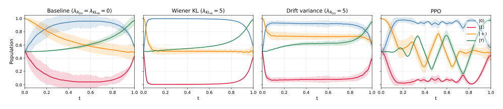
<figcaption class="paper-figure-caption"><b>Fig 1.</b> Figure 1. SSE-trajectory population variance at γT = 2. Mean populations across 128 SSE samples (lines) with ±1σ bands for the baseline (λKLW = λRDV = 0), Wiener KL (λKLW = 5), drift-variance (λRDV = 5), and PPO. Wiener KL contracts the time-integrated population variance from 0.0321 (baseline) to 0.0021, a 15× reduction, consistent with the policy routing the state along ker L where both the SSE drift and noise vanish. Drift-variance reduces the variance relative to baseline but stabilizes outside ker L.</figcaption>
</figure>
<figure class="paper-figure-card">
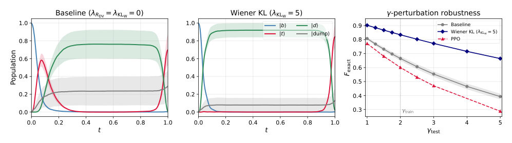
<figcaption class="paper-figure-caption"><b>Fig 2.</b> Figure 2. Diamond system, γtrain = 2, T = 1. Left, middle: SSE-trajectory populations (mean across 128 samples, ±1σ) for baseline (F = 0.665) and Wiener KL (λKLW = 5, F = 0.834); the regularizer routes population through |d⟩∈ker L rather than the lossy direct coupling. Right: fidelity vs. γtest for policies trained at γ = 2; full statistics in Appendix E.4.</figcaption>
</figure>
<figure class="paper-figure-card">
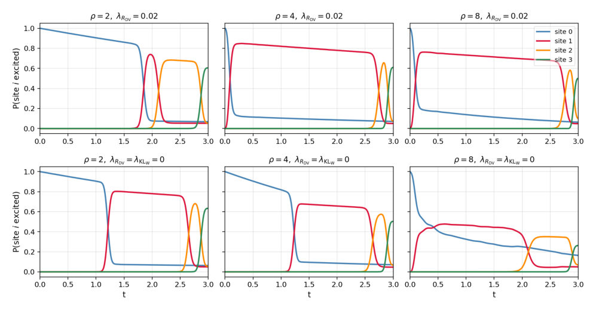
<figcaption class="paper-figure-caption"><b>Fig 3.</b> Figure 3. Site populations across the asymmetry sweep. Columns: ρ ∈{2, 4, 8}. Rows: drift-variance (λRDV = 0.02, top), baseline (bottom). Each panel shows the single-site excitation population ⟨ψ(t)|(I −σ(i) z )/2|ψ(t)⟩at sites i ∈{0, 1, 2, 3} (i.e., the probability that site i holds the excitation); these four observables are the natural readout because the task is excitation transfer. Curves are drawn from a representative seed at each ρ cell (selection rule and per-seed fidelities in Appendix E.5, Table 8).</figcaption>
</figure>
<figure class="paper-figure-card">
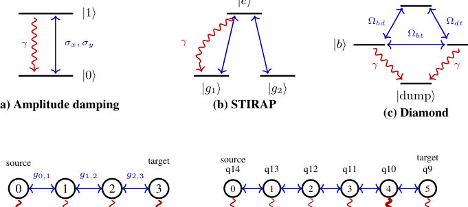
<figcaption class="paper-figure-caption"><b>Fig 4.</b> Figure 4. Level structure and noise structure of the five benchmarks. Blue double arrows mark coherent control couplings; red squiggly arrows mark decoherence channels (each acts on the density matrix as a Lindblad operator Lk). (a) Amplitude damping: |1⟩ decays to |0⟩, two controls drive arbitrary single-qubit rotations. (b) STIRAP: two stable ground states |g1⟩, |g2⟩coupled through a lossy excited state |e⟩that decays back to |g1⟩. (c) Diamond: two lossy computational states |b⟩, |t⟩each decay to |dump⟩; the auxiliary state |d⟩is in ker Lb ∩ker Lt and provides a safe indirect route. (d) Chain-4: four qubits with site-specific dephasing; edge sites carry rates ρκint, interior sites κint...</figcaption>
</figure>
<figure class="paper-figure-card">
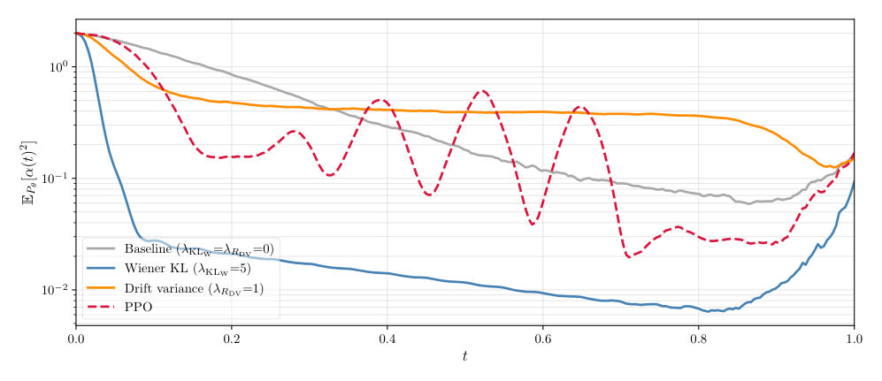
<figcaption class="paper-figure-caption"><b>Fig 5.</b> Figure 5. Wiener KL integrand Eψ[α(t)2], γT = 2. Trajectory-averaged drift squared on a logarithmic axis. Wiener KL suppresses α toward ker L, reducing the time-integrated value 1</figcaption>
</figure>

**Summary.** The paper introduces QMaxCal, a novel path-space regularization technique for open quantum control derived from Girsanov's theorem applied to quantum trajectories. It yields two regularizers ($	ext{KL}_W$ and $	ext{RDV}$) that guide the system away from decoherence effects by penalizing observable deviations in the noise process. These methods significantly boost final-state fidelity across diverse multi-qubit benchmarks compared to existing optimization techniques.

**Why it may be interesting.** This work provides a powerful, mathematically rigorous framework for optimizing quantum controls in noisy environments by penalizing the *consequences* of noise on the trajectory distribution rather than just the control pulse amplitude itself. The computational advantage of using trajectory space over density matrices is also notable.

Detailed structure

**Main problem.** Developing reliable quantum control policies for open quantum systems that can effectively combat decoherence induced by environmental noise.

**Main result.** The proposed path-space regularizers significantly outperform unregularized gradient-based and reinforcement learning baselines, achieving up to 50% reduction in infidelity across various multi-qubit benchmarks.

**Method.** The method uses Girsanov's theorem applied to quantum trajectories (stochastic Schrödinger equation) to derive closed-form, differentiable estimators of the KL divergence between path measures. This forms the basis for two novel regularizers: Wiener KL ($	ext{KL}_W$) and Drift-Variance ($	ext{RDV}$).

**Model / system.** The systems are open quantum systems modeled by Lindblad master equations, simulated via stochastic Schrödinger equations (SSE) using diffusive unravellings. Benchmarks include single/multi-qubit chains, STIRAP processes, and the IBM Kingston processor.

**Key observables.** Final-state fidelity ($F$), time-integrated population variance ($\int 	ext{Var}[P_k(t)] dt$), occupation of lossy states, and path KL divergence terms.

**Important parameters / regimes.** Decoherence rates ($\kappa, \gamma$), noise mismatch factors (e.g., $2.5	imes$ mismatch), and regularization weights ($\lambda_{	ext{KLW}}, \lambda_{	ext{RDV}}$).

**Assumptions / limitations.** The analysis relies on the diffusive unravelling of the SSE, which is mathematically tractable via Girsanov's theorem; it does not directly apply to jump unravellings or non-Markovian environments.

**Figures summary.** Figures compare trajectory population variance and fidelity across different regularization schemes (Wiener KL vs. baseline) for tasks like $|+
angle 	o |Y
angle$ and STIRAP, demonstrating suppression of lossy state occupation.

**Paper structure.** The paper builds from the theoretical foundation using Girsanov's theorem to derive path-space regularizers ($	ext{KL}_W$, $	ext{RDV}$), then applies these methods sequentially across multiple physical benchmarks (qubit tasks, STIRAP, superconducting chains) while comparing performance against standard control optimization techniques.

Abstract

Reliable quantum control in the presence of decoherence requires policies that combat the effect of environmental noise on the controlled dynamics. Open quantum systems under continuous monitoring generate classical measurement records whose drift depends on the noise experienced by the system; the records of two evolutions sharing the same decoherence channels differ only in this drift, so Girsanov's theorem yields a closed-form, differentiable estimator of the KL divergence between their trajectory distributions. We instantiate this estimator with two physically motivated reference measures, yielding two regularizers that both drive the system toward states where the effects of decoherence are minimal: the Wiener KL (KL_W), which is empirically more effective under certain conditions on the noise model, and the drift-variance regularizer (R_DV), which works for all noise models. Both are qualitatively distinct from existing penalties on control fluence or smoothness: they penalize the observable consequences of control on the decoherence channels rather than the control amplitude itself. The regularizers outperform unregularized gradient-based and reinforcement-learning baselines across a range of open quantum systems -- including single- and multi-qubit benchmarks and a multi-qubit chain calibrated to a published snapshot of the IBM Kingston processor -- along several axes of evaluation: final-state fidelity, robustness to mismatch in the assumed noise model (gains grow from +17 pp at training noise to +27 pp under 2.5x noise mismatch), and occupation of forbidden states. The regularizers reduce infidelity by up to 50%, with ~16% gains on the calibrated IBM Kingston chain.

[↑ back to top](#top)

### [Variational Polaron Theory for Ground States of Strongly Coupled Light-Matter and Electron-Phonon Systems](http://arxiv.org/abs/2606.19748v1)

**Authors:** Nguyen Thanh Phuc  
**Type:** theory · **Category:** other · **PDF:** <https://arxiv.org/pdf/2606.19748v1>  
**Analysis basis:** full PDF text, analyzed in chunks
**Topic relevance:** 🔥 `correlated cavity matter` **4/5** · `Dicke superradiance` **3/5** · `analog quantum simulation` **3/5** · `Tavis-Cummings & cavity-many-emitter` **2/5** · `Keldysh / 2PI / non-Gaussian methods` **1/5** · `driven-dissipative phase transition` **1/5** · `entanglement & information structure` **1/5** · `exotic spin models in light-matter` **1/5** · `methods for driven-dissipative` **1/5** · `superradiant laser` **1/5**

↔ Scroll figures horizontally

<figure class="paper-figure-card">
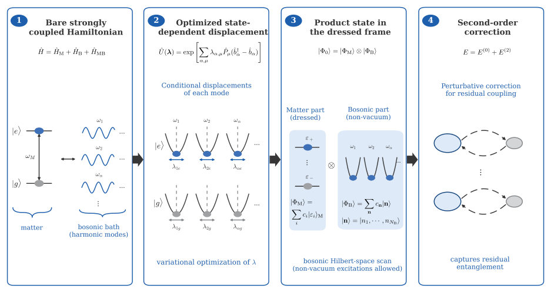
<figcaption class="paper-figure-caption"><b>Fig 1.</b> FIG. 1: Schematic of the variational polaron theory. Optimized state-dependent displacements absorb the dominant bosonic dressing into the basis, yielding a dressed frame in which a matter–boson product state is variationally optimized. Residual matter–boson correlations are subsequently included by a second-order perturbative correction.</figcaption>
</figure>
<figure class="paper-figure-card">
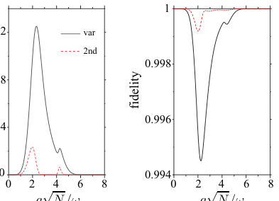
<figcaption class="paper-figure-caption"><b>Fig 2.</b> FIG. 2: Dicke-model ground-state accuracy for N = 1. ‘var’ denotes the optimized zeroth-order result, whereas ‘2nd’ in- cludes the second-order correction. The correction lowers the maximum energy error below 0.2% and raises the fidelity above 0.999, quantifying the practical onset of transformed- frame decoupling.</figcaption>
</figure>
<figure class="paper-figure-card">
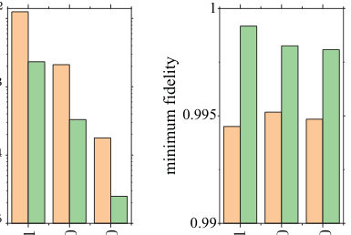
<figcaption class="paper-figure-caption"><b>Fig 3.</b> FIG. 3: Scaling of Dicke-model accuracy with emitter num- ber. (a) Maximum relative ground-state energy error, |δE|/E, for N = 1, 10, and 100; orange and green bars denote the zeroth-order and second-order results, respectively. (b) Minimum ground-state fidelity over the same coupling range, showing near-unity agreement after the perturbative correc- tion.</figcaption>
</figure>
<figure class="paper-figure-card">
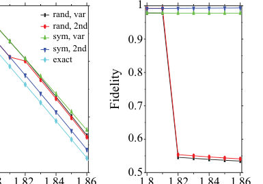
<figcaption class="paper-figure-caption"><b>Fig 4.</b> FIG. 5: Effect of translational-symmetry constraint on the Holstein-model ground state near intermediate coupling. (a) Ground-state energy versus g/ω for unconstrained random initial states (‘rand’) and translationally symmetric states (‘sym’), compared with exact diagonalization; ‘var’ and ‘2nd’ denote zeroth-order and second-order results. (b) Corre- sponding fidelity. The unconstrained solution can have lower variational energy but poor fidelity, whereas the symmetry- constrained branch remains close to the exact ground state.</figcaption>
</figure>
<figure class="paper-figure-card">
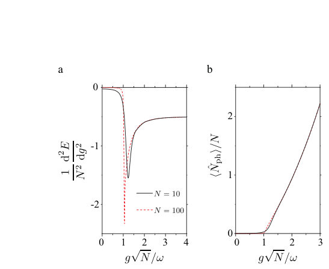
<figcaption class="paper-figure-caption"><b>Fig 5.</b> FIG. 4: Superradiant quantum phase transition in the Dicke model. (a) Scaled second derivative of the ground-state en- ergy, N −2d2E/dg2, versus g √</figcaption>
</figure>

**Summary.** This paper introduces a variational polaron theory to accurately calculate the ground states of systems strongly coupled between matter excitations and bosonic fields. By using an optimized, state-dependent transformation, it overcomes limitations faced by perturbative methods in the ultrastrong coupling regime. The framework is rigorously tested on both light-matter (Dicke) and electron-phonon (Holstein) models with high quantitative accuracy.

**Why it may be interesting.** This work directly addresses nonperturbative quantum dynamics in cavity QED and molecular physics, providing a robust tool for calculating dressed ground states where standard perturbation theory fails.

Detailed structure

**Main problem.** Developing a reliable ground-state theory for systems exhibiting strong coupling between matter degrees of freedom (like electrons or atoms) and bosonic modes (light or phonons).

**Main result.** The variational polaron framework provides an asymptotically correct, nonperturbative method that accurately models dressing effects in both weak and ultrastrong coupling regimes.

**Method.** It employs a state-dependent polaron transformation followed by variational optimization of the resulting product-state ansatz, with residual correlations treated via second-order perturbation theory.

**Model / system.** The theory is applied to strongly coupled light-matter systems (Dicke model) and electron-phonon systems (Holstein model), where the Hamiltonian includes matter ($\hat{H}_M$), bosonic ($\hat{H}_B$), and coupling ($\hat{H}_{MB}$) terms.

**Key observables.** Ground-state energies, fidelities, and superradiant transition characteristics.

**Important parameters / regimes.** The coupling strength ratio ($g/\omega$) is critical, testing regimes from weak to ultrastrong coupling.

**Assumptions / limitations.** The zeroth-order state is a dressed reference frame derived from the polaron transformation; residual correlations beyond this product state are treated perturbatively.

**Figures summary.** Figures benchmark the theory on the Dicke model (showing superradiant transition and error reduction) and the Holstein model (comparing energy vs. symmetry constraints).

**Paper structure.** The paper introduces the variational polaron framework, details the transformation and optimization procedure, and validates its accuracy by benchmarking against established models like the Dicke and Holstein Hamiltonians.

Abstract

Strong light-matter and electron-phonon coupling generate ground states dressed by virtual bosonic excitations, making bare-state truncations and perturbative treatments unreliable in the ultrastrong-coupling regime. We introduce a nonperturbative variational ground-state framework based on a state-dependent polaron transformation, combined with a product-state ansatz and a second-order perturbative correction for residual matter-boson entanglement. We show that the optimized transformed frame becomes asymptotically decoupled at infinite coupling, because the leading linear coupling is canceled while off-diagonal matter transitions are suppressed by displaced-oscillator overlaps. The approach is asymptotically correct in both weak- and strong-coupling limits and remains accurate in the intermediate regime, where fixed polaron transformations are least reliable. Dicke-model benchmarks reproduce ground-state energies, fidelities, and the superradiant transition, with second-order energy errors below 0.2%. Holstein-model benchmarks yield errors below 0.5% and clarify how translational symmetry affects wave-function quality. This dressed-basis framework enables nonperturbative modeling of strongly coupled light-matter and electron-phonon systems.

[↑ back to top](#top)

### [Benchmark of quantum algorithms for ground state preparation in the presence of noise](http://arxiv.org/abs/2606.20551v1)

**Authors:** Daniel Molpeceres, Sirui Lu, J. Ignacio Cirac, Barbara Kraus  
**Type:** theory · **Category:** quantum information and computing · **PDF:** <https://arxiv.org/pdf/2606.20551v1>  
**Analysis basis:** full PDF text, analyzed in chunks
**Topic relevance:** 🔥 `analog quantum simulation` **4/5** · `driven-dissipative phase transition` **3/5** · `methods for driven-dissipative` **3/5** · `non-equilibrium universality` **2/5** · `Keldysh / 2PI / non-Gaussian methods` **1/5** · `correlated / nonlocal dissipation` **1/5** · `entanglement & information structure` **1/5** · `non-equilibrium dynamics` **1/5**

↔ Scroll figures horizontally

<figure class="paper-figure-card">
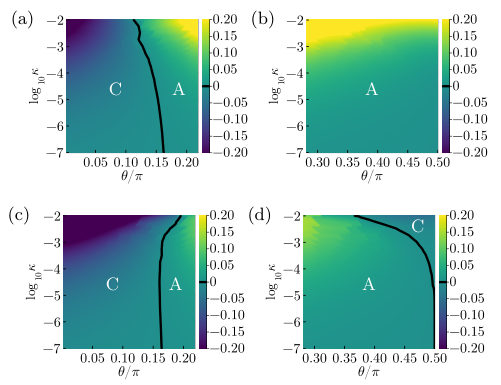
<figcaption class="paper-figure-caption"><b>Fig 1.</b> FIG. 1. Difference ecool opt −eadiab opt between the optimal relative energies achieved by the cooling and the adiabatic algorithms, plotted as a function of θ/π (horizontal axis) and log10 κ (ver- tical axis) for N = 100 systems. Negative values (blue/dark) indicate that cooling gives lower energy (region labeled “C”); positive values (yellow/bright) indicate that the adiabatic al- gorithm gives lower energy (region labeled “A”). The black contour marks eopt cool = eopt adiab. (a) Topological phase, adiabatic algorithm starting from |0⟩⊗N (ideal): cooling gives lower energy throughout most of this phase. (b) Trivial phase, ideal adiabatic algorithm: the adiabatic algorithm gives lower en-...</figcaption>
</figure>
<figure class="paper-figure-card">
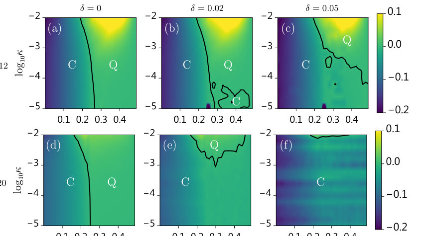
<figcaption class="paper-figure-caption"><b>Fig 2.</b> FIG. 2. Difference ecool opt −eQAOA opt as a function of θ/π (horizontal) and log10 κ (vertical) for N = 20. Blue: cooling gives lower energy (labeled “C”); yellow: QAOA gives lower energy (labeled “Q”); black contour: equal performance. Top row (Npars = 12): cooling with coupling range rc = 0.5 and two cycles; QAOA with p = 6 layers. Bottom row (Npars = 20): rc = 1.5, p = 10. Columns show increasing deviation of the exact parameters, δ: (a, d) δ = 0 (exact parameters); (b, e) δ = 0.02; (c, f) δ = 0.05, each averaged over 100 random perturbations. Both algorithms start from ρcool(π/2). As δ increases, the region where cooling outperforms QAOA expands, demonstrating cooling’s greater...</figcaption>
</figure>
<figure class="paper-figure-card">
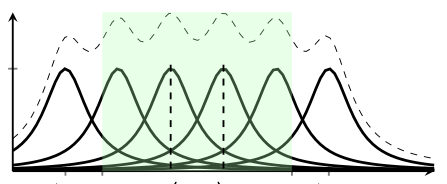
<figcaption class="paper-figure-caption"><b>Fig 3.</b> FIG. 3. Individual cooling rates γk,i c (Lorentzian profiles) and their sum ˜γc k (dashed curve) as a function of the mode energy ϵk for a set of bath frequencies {∆r} equally spaced over the interval [∆m, ∆M]. The spacing between two adjacent frequencies is xγ0, where x is a dimensionless parameter and γ0 ∝1/t is the Lorentzian linewidth. Each frequency generates a resonance peak of width γ0 centered at ϵk = ∆r and height 2g2/γ2 0. When the peaks overlap sufficiently (x ≲1), the averaged cooling rate γc k becomes approximately independent of k, ensuring uniform cooling of all modes in the range [ϵm, ϵM] (green area).</figcaption>
</figure>
<figure class="paper-figure-card">
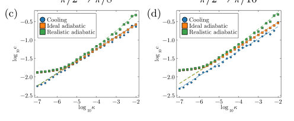
<figcaption class="paper-figure-caption"><b>Fig 4.</b> FIG. 4. Optimal relative energy eopt (log scale) as a func- tion of the noise strength κ (log scale) for N = 100 sites, comparing three protocols: analytic cooling with gt = 0.5 and ∆M(m) = ϵM(m) ± 0.4 (blue circles), ideal adiabatic with initial state |0⟩⊗N (orange squares), and realistic adiabatic with initial state ρcool(π/2) (green squares). Dashed lines show the analytic predictions from Eq. (24) (blue, κ1/3) and Appendix B (orange, green). (a) θf = π/3 (trivial phase): the adiabatic κ2/3 scaling gives lower energy than the achievable rate of the cooling algorithm, which is κ1/3. (b) θf = π/6 (topological phase): both scale as κ1/3; the adiabatic algorithm gives slightly lower energy....</figcaption>
</figure>
<figure class="paper-figure-card">
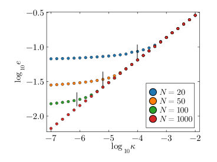
<figcaption class="paper-figure-caption"><b>Fig 5.</b> FIG. 5. Optimal relative energy eadiab opt as a function of the noise rate κ for different system sizes N and target θf = π/10 for the ideal adiabatic algorithm. The smaller the system size, the more prominent the effect of the k = N/2 mode is, and the larger the κmin where the crossover (predicted by the vertical lines) happens. The predicted plateau values of log10 e are determined by the finite-size floor 2ϵN/2/|EGS|.</figcaption>
</figure>

**Summary.** This paper rigorously benchmarks ground state preparation algorithms (cooling, adiabatic, QAOA) for fermionic systems subject to environmental noise. It establishes that the optimal protocol is highly dependent on the system's underlying quantum phase, demonstrating superior robustness for cooling protocols in topologically non-trivial regimes compared to other methods.

**Why it may be interesting.** This work provides a rigorous, quantitative comparison of state preparation techniques under realistic noise models, directly informing the resource estimation for fault-tolerant quantum computation in condensed matter contexts.

Detailed structure

**Main problem.** The paper benchmarks various quantum algorithms—cooling, adiabatic evolution, and QAOA—to determine the most efficient method for preparing a ground state of a fermionic system when subjected to environmental noise.

**Main result.** The optimal algorithm depends critically on the phase transition of the Hamiltonian: cooling protocols are superior in the topological phase, while adiabatic methods show advantages in the trivial phase. Furthermore, cooling is shown to be more robust against parameter imperfections than QAOA.

**Method.** The analysis combines analytical derivations of scaling laws for achievable relative energy with numerical simulations across different noise regimes and system parameters.

**Model / system.** The model uses an exactly solvable family of quadratic fermionic Hamiltonians, $H_S(	heta)$, which exhibits a quantum phase transition between trivial ($	heta > \pi/4$) and topological ($	heta < \pi/4$) phases. Noise is modeled using depolarizing noise.

**Key observables.** The primary observable is the achievable relative energy ($e = (E - E_{GS})/E_{GS}$), analyzed as a function of the noise rate $\kappa$.

**Important parameters / regimes.** Noise rate ($\kappa$), Hamiltonian parameter ($	heta$) defining the phase, and algorithm-specific parameters like evolution time ($T$) or cooling cycles.

**Assumptions / limitations.** The analysis relies on approximations such as weak coupling limits, low-noise regimes, and specific initial state assumptions for adiabatic/QAOA protocols.

**Figures summary.** Figures compare the relative energy differences between algorithms (e.g., $e_{	ext{cool}} - e_{	ext{QAOA}}$) across varying noise levels ($\kappa$) and system phases ($	heta$), illustrating crossovers in performance dominance.

**Paper structure.** The paper systematically compares three protocols—adiabatic, QAOA, and cooling—by deriving scaling laws for the relative energy $e(\kappa)$ in both trivial and topological regimes. It then analyzes the trade-offs between non-adiabatic excitations (time dependence) and noise accumulation ($\kappa$ dependence).

Abstract

We compare the performance of representative cooling, adiabatic, and optimization algorithms for ground-state preparation in the presence of noise. Using an exactly solvable family of quadratic fermionic Hamiltonians subject to depolarizing noise, we derive the scaling of the achievable relative energy as a function of the noise rate and support these results with numerical simulations. The Hamiltonian exhibits two phases, separated by a quantum phase transition. As expected, the performance of the different algorithms depends on the phase: adiabatic evolution is favorable in the trivial phase, while a multi-frequency cooling algorithm, as proposed in [1], becomes competitive or superior in the topological phase, where gap-closing limits adiabatic protocols. We further present numerical results for the quantum approximate optimization algorithm [2], showing that it performs competitively with cooling in the trivial phase but is typically outperformed in the topological regime. Finally, we show that for this model the cooling protocol exhibits enhanced robustness to parameter imperfections, highlighting its potential advantage for realistic implementations of noisy quantum state preparation.   The analytical approach developed here, in conjunction with numerical validation, establishes an extendable approach to benchmarking ground-state preparation algorithms.

[↑ back to top](#top)

### [Extracting the physical content of Liouvillian eigenmodes: Semiclassical quantization](http://arxiv.org/abs/2606.20271v1)

**Authors:** Ashlin V Thomas, Felix Fritzsch, Masudul Haque, Shovan Dutta  
**Type:** theory · **Category:** statistical mechanics · **PDF:** <https://arxiv.org/pdf/2606.20271v1>  
**Analysis basis:** full PDF text, analyzed in chunks
**Topic relevance:** 🔥 `methods for driven-dissipative` **4/5** · `Keldysh / 2PI / non-Gaussian methods` **3/5** · `driven-dissipative phase transition` **3/5** · `non-equilibrium dynamics` **2/5** · `non-equilibrium universality` **2/5** · `correlated / nonlocal dissipation` **1/5** · `scars & prethermalization` **1/5**

↔ Scroll figures horizontally

<figure class="paper-figure-card">
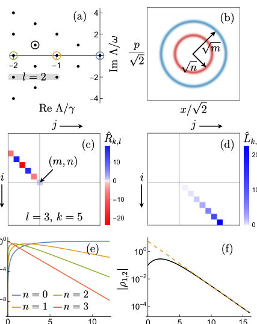
<figcaption class="paper-figure-caption"><b>Fig 1.</b> FIG. 2. (a) Liouville spectrum of a harmonic oscillator with frequency ω and damping γ. The imaginary parts are set by the phase winding l, corresponding to the l-th diagonal in the Fock basis. (b) An eigenmode (for l ̸= 0) represents coherence between two Fock states m and n. (c,d) Corresponding right and left eigenstates overlap only at (m, n). (e) Populations of different Fock states after starting from |n = 3⟩with γ = 0.5, each governed by a specific eigenvalue circled in (a) with the same color. (f) Coherence between Fock states |1⟩and |2⟩ after starting from the coherent state |α = 2⟩with ω = 1, γ = 0.5. The asymptotic decay (dashed line) is governed by the corresponding eigenmode...</figcaption>
</figure>
<figure class="paper-figure-card">
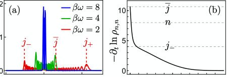
<figcaption class="paper-figure-caption"><b>Fig 2.</b> FIG. 3. (a) Thermal broadening of the eigenmode with m = n = 100 in the distribution over Fock states |j⟩at different inverse temperatures β. (b) Instantaneous decay rate of the return probability of the Fock state |n = 8⟩for βω = 2, γ = 1.</figcaption>
</figure>
<figure class="paper-figure-card">
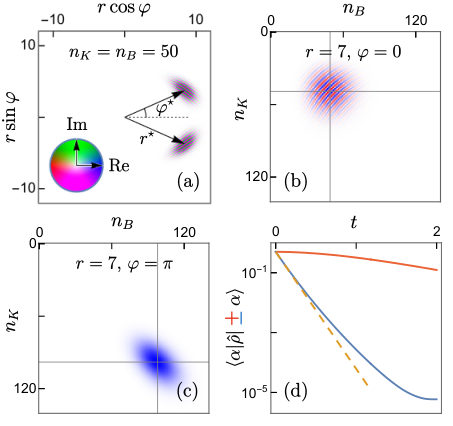
<figcaption class="paper-figure-caption"><b>Fig 3.</b> FIG. 4. (a) A section of the super Husimi function CnK,nB(αK, αB) in doubled phase space (see text) for the eigenmode that represents population of the Fock state |n = 50⟩. Here, r = |αK| = |αB| and φ = arg(α∗ KαB). Arrows show the peak locations at r⋆&gt; √n and φ⋆̸= 0. (b,c) Dis- tribution over the eigenmodes for a given r and φ, peaked at n⋆ K = n⋆ B ≈r2 for φ = 0 and n⋆ K = n⋆ B ≈2r2 for φ = π (gray lines). (d) Starting from a cat state |α⟩+ |−α⟩with α = 3, ω = 0, γ = 0.5, the population ⟨α|ˆρ|α⟩decays quadratically, whereas the coherence ⟨α|ˆρ| −α⟩decays at a rate given by the dominant eigenmode for φ = π (dashed line).</figcaption>
</figure>
<figure class="paper-figure-card">
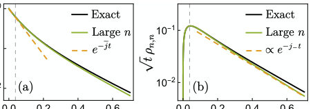
<figcaption class="paper-figure-caption"><b>Fig 4.</b> FIG. 5. Return probability of |n = 10⟩for βω = 2, γ = 1, comparing exact [Eq. (21)] and large-n [Eq. (22)] predictions. The gray line at t = 1/(2j) is where √</figcaption>
</figure>

**Summary.** The paper develops a novel quasiprobability measure to give physical meaning to Liouvillian eigenmodes in open quantum systems. By interpreting these modes as coherence distributions, the authors successfully generalize semiclassical quantization concepts, showing that quantized orbital structures persist even under damping from a thermal bath.

**Why it may be interesting.** This work provides a powerful theoretical tool—the quasiprobability measure—to bridge semiclassical quantization concepts (like invariant tori) from conservative Hamiltonian systems into the complex realm of open quantum dynamics governed by dissipation.

Detailed structure

**Main problem.** The primary challenge is interpreting the physical meaning of Liouvillian eigenmodes for open quantum systems, where standard energy eigenstates are insufficient due to time-decaying right and left eigenstates.

**Main result.** The authors introduce a quasiprobability measure that successfully interprets an eigenmode as a coherence distribution, demonstrating that semiclassical quantization concepts (like quantized orbits) can be extended to dissipative open systems.

**Method.** They employ a physically motivated quasiprobability measure combining right and left eigenstates, mapping the dynamics onto a doubled phase space structure. This allows for analyzing spectral properties via generalized Husimi functions.

**Model / system.** The study focuses on open quantum systems governed by Lindblad master equations ($rac{d\hat{
ho}}{dt} = L\hat{
ho}$), specifically modeling damped harmonic oscillators and quadratic Liouvillians. The analysis uses Fock basis representations and superoperators.

**Key observables.** Coherence measure ($C_p$), return probability, Super Husimi function $C_{n_K, n_B}(\alpha_K, \alpha_B)$, and the persistence of quantized 'orbits' in phase space.

**Important parameters / regimes.** Damping rates ($\gamma$), thermal bath temperature (related to $eta$), and relative phases ($\phi$) between coherent components.

**Assumptions / limitations.** The dynamics are assumed to be CPTP (Completely Positive Trace-Preserving) and Markovian. For quantization results, the damping is often assumed isotropic in phase space.

**Figures summary.** Figures illustrate quantized 'orbits' for damped oscillators, show the Liouville spectrum revealing coherence between Fock states, and map out sections of the super Husimi function in doubled phase space, demonstrating peak locations.

**Paper structure.** The paper progresses by first establishing the need for a new measure (quasiprobability) to interpret open system dynamics. It then applies this framework to simple models like the damped oscillator, deriving explicit formulas and asymptotic results for coherence distributions and return amplitudes.

Abstract

Unlike in closed quantum systems where individual energy eigenstates are understood as physical excitations, open quantum systems have distinct right and left eigenstates of the Liouvillian that decay with time and are difficult to interpret. Here we introduce a physically motivated quasiprobability measure combining the two types of eigenstates that interprets a Liouville eigenmode as a set of coherences. This coherence measure is intimately connected to the return probability and allows one to visualize the modes as quasiprobability distributions in a "doubled" phase space. Using this measure we show that, remarkably, an oscillator retains its quantized "orbits" in phase space for a large class of linear and nonlinear damping, thus providing a formulation of semiclassical quantization for open systems. The orbits have measurable dynamical signatures and are broadened in the presence of a thermal bath, similar to energy levels. For quadratic systems, our results yield an extension of the concept of invariant tori, which play a central role in Hamiltonian systems.

[↑ back to top](#top)

### [Smooth time-dependent control of dipolar Bose-Einstein condensates](http://arxiv.org/abs/2606.20507v1)

**Authors:** Chris Whitty, Aitor Alaña, Michele Modugno, Xi Chen, Géza Tóth, Andreas Ruschhaupt, Eugene Ya. Sherman  
**Type:** theory · **Category:** quantum gases · **PDF:** <https://arxiv.org/pdf/2606.20507v1>  
**Analysis basis:** full PDF text, analyzed in chunks
**Topic relevance:** 🔥 `analog quantum simulation` **4/5** · `methods for driven-dissipative` **3/5** · `non-equilibrium dynamics` **3/5** · `non-equilibrium universality` **2/5** · `Keldysh / 2PI / non-Gaussian methods` **1/5** · `correlated / nonlocal dissipation` **1/5** · `driven-dissipative phase transition` **1/5** · `entanglement & information structure` **1/5**

↔ Scroll figures horizontally

<figure class="paper-figure-card">
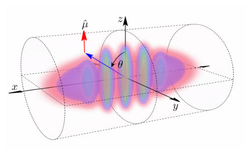
<figcaption class="paper-figure-caption"><b>Fig 1.</b> FIG. 1. Diagram of the system setup: The ground state den- sity for the supersolid phase with as = 90.9 a0 is shown, with the cylindrical geometry of the system highlighted. The mag- netic dipole moment is shown as ˆµ, oriented in the ˆz direction.</figcaption>
</figure>
<figure class="paper-figure-card">
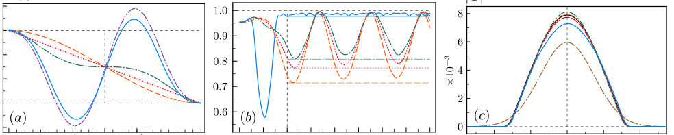
<figcaption class="paper-figure-caption"><b>Fig 2.</b> FIG. 2. Control within the superfluid regime: (a) Examples of as(t) for tf = 8: three polynomial control schemes defined in Eq. (20), a(1) s (t) (dotted-red), a(2) s (t) (dashed-orange), and a(3) s (t) (dot-dashed green), the VAIE scheme a(v) s (t) (solid blue) and the numerical optimized VAIE scheme a(vn) s (t) (dash-double-dot purple). (b) Plot of FT (t) for tf = 8 for the control schemes shown in (a). The vertical dashed-line at t = 8 denotes the control time tf, with as(t) = af s for t ≥tf. The horizontal lines for t ≥tf = 8 highlight the calculation of Fmin [Eq. (8)] for each control scheme. (c) Comparison of x-axis density slice of |Ψ|2</figcaption>
</figure>
<figure class="paper-figure-card">
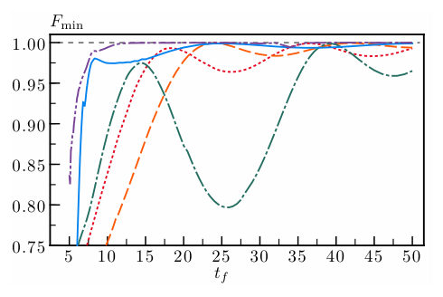
<figcaption class="paper-figure-caption"><b>Fig 3.</b> FIG. 3. Comparison of as(t) control schemes in the super- fluid regime: Fmin [Eq. (8)] versus different control times tf is calculated for the polynomial schemes, a(1) s (t) (dotted- red), a(2) s (t) (dashed-orange), a(3) s (t) (dot-dashed green), the VAIE scheme a(v) s (t) (solid blue) and the numerically opti- mized VAIE scheme (dash-double-dot purple).</figcaption>
</figure>
<figure class="paper-figure-card">
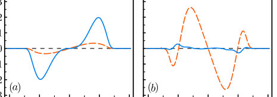
<figcaption class="paper-figure-caption"><b>Fig 4.</b> FIG. 4. Snapshots of jx(x, t) [Eq. (21)] with tf = 8, the poly- nomial scheme a(2) s (t) (dashed-orange) and the VAIE scheme a(v) s (t) (solid blue). (a) t = 4 and (b) t = tf demonstrate that a(v) s (t) produces an initially larger current density flow than a(2) s (t), and this flow is suppressed as t →tf and beyond, as shown in (b) at t = tf. This is in contrast to a(2) s (t), which initially has lower current density flow, but results in large oscillations in the current density for t ≥tf.</figcaption>
</figure>
<figure class="paper-figure-card">
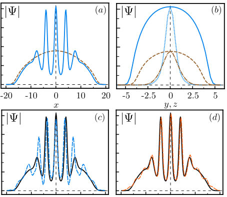
<figcaption class="paper-figure-caption"><b>Fig 5.</b> FIG. 5. (a)-(b) Axis density slices of the exact groundstates at initial and final as: (a) Numerical ground state x-axis density slices |Ψ(x, 0, 0)| for a0 s = 95.9 a0 (dashed-brown) and af s = 90.9 a0 (solid blue). Note that Fig. 1 is a 3D representation of the exact ground state at as = 90.9a0. (b) Numerical ground state y and z-axis density slices for a0 s = 95.9 a0, |Ψ(0, y, 0)| (dot-dashed brown) and |Ψ(0, 0, z)| (dashed brown), and for af s = 90.9 a0, |Ψ(0, y, 0)| (dotted-blue) and |Ψ(0, 0, z)| (solid blue).(c)-(d) Comparison of final-state x-axis density slice at t = tf = 45 with the exact ground state at af s = 90.9 a0 (solid- black): (c) Time-evolved state using polynomial scheme...</figcaption>
</figure>

**Summary.** The paper develops sophisticated time-dependent control protocols using Shortcuts to Adiabaticity techniques to manipulate dipolar Bose-Einstein condensates across their superfluid-to-supersolid phase transition. By employing variational and direct optimization methods, the authors design smooth changes in the scattering length that minimize excitations and maintain high fidelity throughout the process.

**Why it may be interesting.** This work represents an advanced application of optimal control theory to highly interacting quantum many-body systems. The ability to precisely guide a system through a quantum phase transition while minimizing excitations is crucial for realizing novel quantum states in cold atom experiments.

Detailed structure

**Main problem.** The primary goal is designing smooth time-dependent control protocols for dipolar Bose-Einstein condensates (BECs) to manage the transition between superfluid and supersolid phases while minimizing excitations.

**Main result.** Variational approaches combined with direct numerical optimization successfully design control profiles, such as $a^{(
u)}_s(t)$, that achieve high fidelity ($F_{\min} \gtrsim 0.95$) and suppress unwanted probability currents during the phase transition.

**Method.** The study employs Shortcuts to Adiabaticity (STA) techniques, utilizing a variational approach with inverse engineering (VAIE) for superfluid regimes and direct optimization protocols for the challenging superfluid-supersolid transition.

**Model / system.** The system is dipolar BECs, modeled by an extended Gross-Pitaevskii equation (eGPE). The Hamiltonian includes kinetic energy, external potential, long-range anisotropic dipole-dipole interaction (DDI), and tunable contact interactions. Control is exerted via the time-dependent s-wave scattering length, $a_s(t)$.

**Key observables.** Time-dependent target-overlap fidelity ($F_T(t)$) and its minimum value ($F_{\min}$); probability density current ($\mathbf{j}_x(x, t)$); Inverse Participation Ratio (IPR).

**Important parameters / regimes.** The critical scattering length $a_c$ that separates the superfluid and supersolid phases; the control time duration ($t_f$).

**Assumptions / limitations.** The variational ansatz used in the VAIE method is assumed to be separable, which limits its accuracy near the phase transition. Spherical truncation of the dipole interaction was also considered.

**Figures summary.** Figures compare current density snapshots ($\mathbf{j}_x$) showing flow suppression by optimized schemes versus oscillations from polynomial schemes; fidelity plots show $F_{\min}$ comparisons across various control protocols.

**Paper structure.** The paper establishes the eGPE model, details the use of STA techniques, applies a variational approach for superfluid evolution, and then uses direct optimization to design robust controls specifically for crossing the superfluid-supersolid phase boundary.

Abstract

We consider protocols for control of dipolar Bose-Einstein condensates where the critical role is played by the long-range anisotropic interatomic magnetic dipole-dipole interaction. The phase diagram of such a condensate has been explored theoretically and experimentally with certain values of the interatomic scattering length corresponding to superfluid and supersolid phases, where supersolidity appears as a modulation in the ground state density. Preparation of this modulated ground state is challenging, since excitations appear as a result of a finite-time evolution required to produce qualitative changes in the wavefunction density. To solve this problem we consider the time-dependent control of a dipolar Bose-Einstein condensate using shortcuts to adiabaticity techniques, concentrating on design of the time-dependent scattering length, a parameter of the system easily tunable by contemporary experiments. The first technique is the variational approach based on the Euler-Lagrange equations for a separable ansatz describing the evolution of the superfluid state. Secondly, we study the transition from superfluid to supersolid using a direct optimization protocol. We discuss the fidelity of the developed protocols in terms of the evolution time.

[↑ back to top](#top)

### [Non-Hermitian Skin Effect Enhances Pairing Correlations in Moiré Hubbard Systems](http://arxiv.org/abs/2606.20425v1)

**Authors:** Yang Zhou, Jianwen Chen, Ruipeng Wei  
**Type:** theory · **Category:** strongly correlated electrons · **PDF:** <https://arxiv.org/pdf/2606.20425v1>  
**Analysis basis:** full PDF text, analyzed in chunks
**Topic relevance:** 🔥 `analog quantum simulation` **4/5** · `methods for driven-dissipative` **3/5** · `driven-dissipative phase transition` **2/5** · `non-equilibrium universality` **2/5** · `Kondo & dissipative impurity` **1/5** · `correlated / nonlocal dissipation` **1/5** · `entanglement & information structure` **1/5** · `non-equilibrium dynamics` **1/5**

↔ Scroll figures horizontally

<figure class="paper-figure-card">
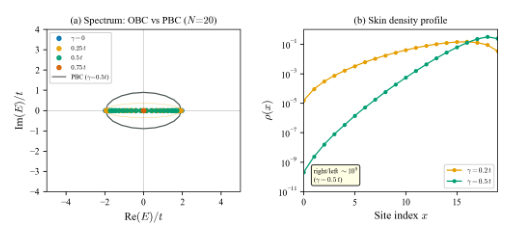
<figcaption class="paper-figure-caption"><b>Fig 1.</b> FIG. 2. (a) Complex energy spectrum of the Hatano-Nelson model (N = 20) under OBC (colored dots) and PBC (black arc, γ =0.5t) for increasing γ/t. The OBC spectrum collapses onto the real axis, distinct from the PBC complex arc. (b) Skin density profile ρ(x) on a logarithmic scale for two non- reciprocal couplings within the Hermiticity window (|γ| &lt; t), showing exponential accumulation with a right/left ratio exceeding 109 at γ = 0.5 t.</figcaption>
</figure>
<figure class="paper-figure-card">
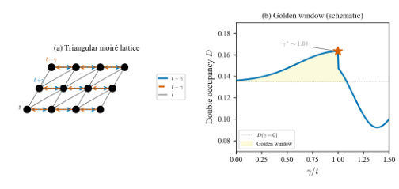
<figcaption class="paper-figure-caption"><b>Fig 2.</b> FIG. 1. (a) Triangular moir´e superlattice with non-reciprocal hopping. Right-hopping t+γ (solid blue) exceeds left-hopping t −γ (dashed red); other bonds retain t. (b) Schematic of the golden window: the double occupancy D(γ) rises to a peak at γ∗∼1.0 t (NHSE-induced LDOS amplification) then declines at stronger non-reciprocity (over-localization). The qualitative dome is established quantitatively in Fig. 3.</figcaption>
</figure>
<figure class="paper-figure-card">
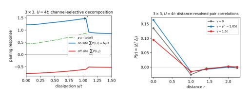
<figcaption class="paper-figure-caption"><b>Fig 3.</b> FIG. 4. (a) Decomposition of χSC(γ) on the 3 × 3 lattice at U = 4t: the on-site channel χon = NsD (blue) rises +21% while the negative off-site part χoff (AFM competition, red) shrinks 22% in magnitude; their sum (green dashed) grows +98%. (b) Distance-resolved P(r) = ⟨∆† i∆j⟩R: at γ∗= 1.05t the on-site component is enhanced while the negative nearest- neighbor component weakens (from −0.026 to −0.016), di- rectly exposing the pair-channel restructuring.</figcaption>
</figure>
<figure class="paper-figure-card">
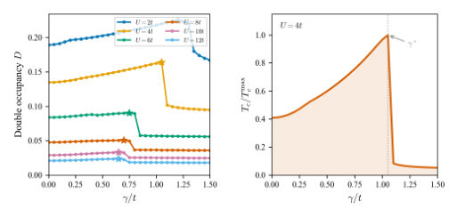
<figcaption class="paper-figure-caption"><b>Fig 4.</b> FIG. 3. (a) Double occupancy D(γ) at different U values from 3×3 ED. The golden window (non-monotonic peak) is present for all U ≥2t, with enhancement peaking at U = 4t (+21%). (b) BCS scaling estimate Tc(γ)/T max c at U = 4t, shown only as a qualitative fingerprint of the same pairing- response dome.</figcaption>
</figure>
<figure class="paper-figure-card">
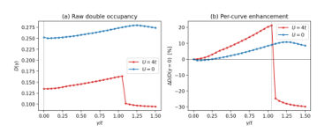
<figcaption class="paper-figure-caption"><b>Fig 5.</b> FIG. 5. (a) Raw D(γ) at U = 4t (red) and U = 0 (blue, single- particle baseline). (b) Per-curve enhancement ∆D/D(γ=0): correlations raise the peak from +10.9% to +21.3% and in- duce a sharp collapse at large γ absent from the U = 0 base- line, demonstrating a genuinely many-body golden window.</figcaption>
</figure>

**Summary.** The paper demonstrates that the Non-Hermitian Skin Effect can significantly enhance superconducting pairing correlations in moiré Hubbard systems. This enhancement occurs within a specific 'golden window' of non-reciprocity ($\gamma$), acting by selectively boosting on-site pairing while suppressing competing antiferromagnetic tendencies. The findings are robustly confirmed across multiple computational methods and suggest an experimentally measurable signature in driven quantum devices.

**Why it may be interesting.** This work connects topological phenomena (NHSE) directly to strongly correlated physics (superconductivity), providing a mechanism where engineered boundary conditions can tune pairing interactions in quantum materials.

Detailed structure

**Main problem.** Investigating whether the Non-Hermitian Skin Effect (NHSE) can enhance pairing correlations in Moiré Hubbard systems.

**Main result.** The NHSE causes a non-monotonic enhancement of pairing susceptibility, peaking in an intermediate 'golden window' of non-reciprocity ($\gamma$), which is confirmed to be a genuine many-body effect.

**Method.** Calculations utilize Exact Diagonalization (ED) and Non-Hermitian DMRG on the non-Hermitian Hubbard model. The results are cross-checked using BCS scaling estimates.

**Model / system.** The system is electrons hopping on a triangular moiré superlattice described by the non-Hermitian Hubbard model, incorporating nearest-neighbor hopping ($t$), on-site repulsion ($U$), and an engineered asymmetric hopping term ($\gamma$) creating non-reciprocity.

**Key observables.** Double occupancy $D(\gamma)$, pairing susceptibility $\chi_{SC}$ (decomposed into on-site/off-site), and the superconducting critical temperature $T_c(\gamma)$.

**Important parameters / regimes.** Non-reciprocity parameter $\gamma$, interaction strength $U$ relative to hopping $t$, and the intermediate 'golden window' regime ($\gamma \in [0.5, 1.2]t$).

**Assumptions / limitations.** The analysis focuses on finite clusters (e.g., $3	imes3$) and does not claim long-range superconducting order; the enhancement is shown to be a finite-cluster effect.

**Figures summary.** Figures illustrate the non-monotonic dome shape of $D(\gamma)$ in the golden window, the channel-selective decomposition of $\chi_{SC}$ showing enhanced on-site pairing and suppressed AFM correlations, and predicted dome-shaped $T_c(\gamma)$ fingerprints.

**Paper structure.** The paper establishes the physical model (NHSE in moiré systems), calculates key observables like $D(\gamma)$ and $\chi_{SC}$ using ED/DMRG, identifies the non-monotonic 'golden window' as a many-body effect, and predicts testable experimental signatures for coherent vs. dissipative driving.

Abstract

We show that the non-Hermitian skin effect (NHSE) can enhance pairing correlations in moiré Hubbard systems through a channel-selective mechanism: skin-induced localization amplifies the boundary density of states, strengthening local pairing tendencies within an intermediate ``golden window'' of non-reciprocity $γ\in[0.5,1.2]\,t$. Using exact diagonalization of the non-Hermitian Hubbard model on triangular lattices with open boundaries, we map the $(U,γ)$ phase diagram. The double occupancy $D(γ)$ exhibits non-monotonic behavior -- rising by up to 21\% then declining -- reflecting a competition between NHSE-enhanced boundary pairing and over-localization. A decomposition of the pairing susceptibility $χ_{\mathrm{SC}}$ on the $3\times3$ cluster reveals that the NHSE acts \emph{channel-selectively}: it enhances on-site pairing ($+21\%$) while simultaneously suppressing competing antiferromagnetic correlations (22\% reduction), so that the total pairing susceptibility, dominated by the on-site channel, grows by $+98\%$ on that cluster. These trends are corroborated by an independent non-Hermitian DMRG calculation and establish an enhancement of finite-cluster pairing correlations rather than trivial density redistribution. We do not claim long-range superconducting order. A BCS scaling estimate converts the same pairing-response signal into a dome-shaped $T_c(γ)$ fingerprint, suggesting an experimentally distinguishable response in coherent-drive versus reservoir-dominated moiré devices.

[↑ back to top](#top)

### [Multi-objective design of photon blockade for bright single-photon sources](http://arxiv.org/abs/2606.20160v1)

**Authors:** Sunkyu Yu, Xianji Piao, Namkyoo Park  
**Type:** theory · **Category:** other · **PDF:** <https://arxiv.org/pdf/2606.20160v1>  
**Analysis basis:** full PDF text, analyzed in chunks
**Topic relevance:** 🔥 `methods for driven-dissipative` **4/5** · `correlated cavity matter` **3/5** · `analog quantum simulation` **2/5** · `correlated / nonlocal dissipation` **2/5** · `Keldysh / 2PI / non-Gaussian methods` **1/5** · `Tavis-Cummings & cavity-many-emitter` **1/5** · `driven-dissipative phase transition` **1/5**

↔ Scroll figures horizontally

<figure class="paper-figure-card">
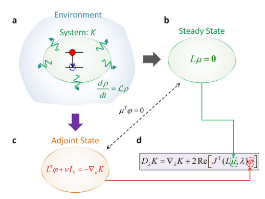
<figcaption class="paper-figure-caption"><b>Fig 1.</b> Fig. 1. Liouville-space adjoint method. a, Markovian open quantum system specified by L(λ)</figcaption>
</figure>
<figure class="paper-figure-card">
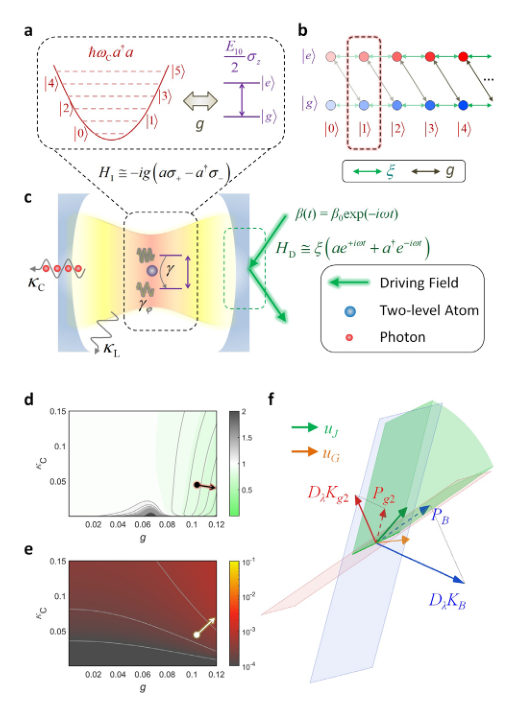
<figcaption class="paper-figure-caption"><b>Fig 2.</b> Fig. 2. Multi-objective optimization of an open JC single-photon source. a, JC coupling</figcaption>
</figure>
<figure class="paper-figure-card">
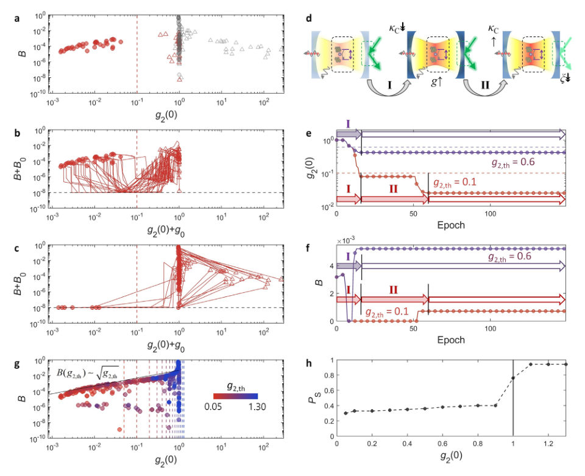
<figcaption class="paper-figure-caption"><b>Fig 3.</b> Fig. 3. Continuous transition toward high-quality single-photon sources. a, Initial (triangles)</figcaption>
</figure>
<figure class="paper-figure-card">
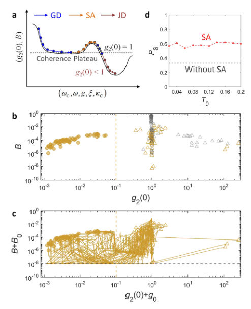
<figcaption class="paper-figure-caption"><b>Fig 4.</b> Fig. 4. Simulated-annealing-assisted optimization. a, Schematic of the optimization landscape,</figcaption>
</figure>

**Summary.** The paper presents a novel computational framework to solve the multi-objective optimization problem of designing high-performance single-photon sources. By combining Liouville-space adjoint methods with simulated annealing, the authors can navigate conflicting design requirements for purity and brightness in open quantum systems. This methodology offers a general tool for engineering complex quantum optical devices.

**Why it may be interesting.** This work provides a general, computationally rigorous recipe for inverse design in open quantum systems, which is crucial for engineering complex quantum devices like single-photon emitters where multiple physical constraints must be satisfied simultaneously.

Detailed structure

**Main problem.** The core challenge is designing high-quality single-photon sources by simultaneously optimizing conflicting performance metrics like purity ($g^{(2)}(0)$) and brightness ($B$).

**Main result.** A computational framework combining Liouville-space adjoint methods with simulated annealing achieves a high success rate ($\approx 60\%$) for achieving low $g^{(2)}(0)$ while maintaining theoretically bounded brightness.

**Method.** The authors developed an optimization routine using the Liouville-space adjoint formulation to efficiently calculate parameter gradients, augmented by simulated annealing to escape local minima in the multi-objective design landscape.

**Model / system.** The study models single-photon sources using open quantum systems dynamics, specifically employing the Lindblad master equation applied to a cavity Quantum Electrodynamics (Cavity QED) setup described by the Jaynes-Cummings Hamiltonian.

**Key observables.** Second-order correlation function ($g^{(2)}(0)$), photon outcoupling rate/Brightness ($B$), and system parameters like coupling strength ($g$) and decay rates ($\kappa_C, \gamma$).

**Important parameters / regimes.** The optimization is performed over a multi-dimensional parameter space including cavity frequency ($\omega_C$), atomic transition frequency ($\omega$), coupling strength ($g$), etc.

**Assumptions / limitations.** The analysis relies on the Lindblad master equation framework and employs advanced mathematical techniques like adjoint methods to handle complex gradient calculations in open quantum systems.

**Figures summary.** Figures illustrate optimization landscapes showing conflicting gradients, successful two-stage transition trajectories (suppressing $g^{(2)}$ then recovering $B$), and the necessity of simulated annealing for high success probability.

**Paper structure.** The paper introduces the physical problem, details the mathematical machinery (Liouville-space adjoint formulation), presents the multi-objective optimization strategy (Jacobian descent + SA), and validates the method using the JC model to achieve quantitative design results.

Abstract

High-quality single-photon sources, realized through saturable emitters, photon blockade, or heralded pair generation, are indispensable building blocks for photonic quantum platforms. Although these mechanisms suppress multiphoton emission through distinct principles typically captured by analytical models, their practical implementation is constrained by conflicting requirements for purity, brightness, and indistinguishability, which must be balanced within high-dimensional design landscapes. Here, we propose a computational framework for optimizing competing metrics of single-photon sources. Building on a Liouville-space adjoint formulation that efficiently evaluates multiple objectives in Markovian open quantum systems, we develop a Jacobian-based update, which ensures first-order monotonic reduction of multi-objective costs. By incorporating simulated annealing to escape gradient-vanishing plateaus, our framework achieves a design success rate of nearly 60 % for photon blockade with g2(0) smaller than 0.1 and theoretically bounded brightness across a broad parameter space, without any analytical guidance. This framework provides a general recipe for multi-objective design of open quantum systems.

[↑ back to top](#top)

### [QMCtwin: Master-Equation Simulation of Syndrome Statistics Beyond Pauli Noise](http://arxiv.org/abs/2606.19848v1)

**Authors:** Tong Shen, Huo Chen, Benchen Huang, Tyler Takeshita, Arian Vezvaee, Izhar Medalsy, Daniel A. Lidar  
**Type:** theory · **Category:** quantum information and computing · **PDF:** <https://arxiv.org/pdf/2606.19848v1>  
**Analysis basis:** full PDF text, analyzed in chunks
**Topic relevance:** 🔥 `methods for driven-dissipative` **4/5** · `correlated / nonlocal dissipation` **3/5** · `QC/QI experiment` **2/5** · `non-equilibrium dynamics` **2/5** · `Keldysh / 2PI / non-Gaussian methods` **1/5** · `driven-dissipative phase transition` **1/5** · `entanglement & information structure` **1/5**

↔ Scroll figures horizontally

<figure class="paper-figure-card">
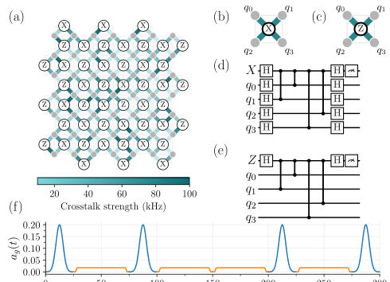
<figcaption class="paper-figure-caption"><b>Fig 1.</b> FIG. 1. Surface-code layout and syndrome-extraction circuits used in the distance-7 simulation. (a) Rotated surface-code layout with 49 data qubits (grey disks) and 48 measurement qubits (circles with X or Z). Measurement qubits are labeled by the stabilizer type they measure, X or Z, and edges indi- cate nearest-neighbor couplings Jij/2π; the color scale shows the sampled residual ZZ crosstalk strength. (b-c) Represen- tative four-body X- and Z-type stabilizer neighborhoods, re- spectively. (d-e) Gate schedules for measuring X- and Z-type stabilizers during the syndrome-extraction round. A box with an H denotes a Hadamard gate, and a solid vertical line with filled endpoints denotes a...</figcaption>
</figure>
<figure class="paper-figure-card">
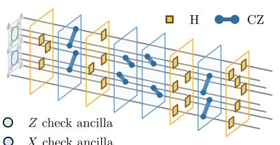
<figcaption class="paper-figure-caption"><b>Fig 2.</b> FIG. 2. Representative two-plaquette schedule used to con- struct the distance-7 syndrome-extraction round in the sim- ulation. The schedule is obtained by applying the X and Z checks in Fig. 1(d,e) across the layout in Fig. 1(a), with the single-qubit basis-change gates and the two-qubit entangling gates grouped into conflict-free layers.</figcaption>
</figure>
<figure class="paper-figure-card">
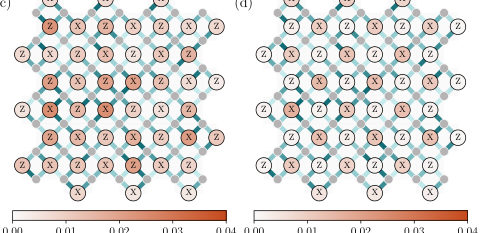
<figcaption class="paper-figure-caption"><b>Fig 3.</b> FIG. 4. Spatial distribution of (a),(b) syndrome-extraction bias and (c),(d) disagreement probability for the distance- 7 rotated surface code at ∆g = 0. For (a), (b), each la- beled measurement qubit is colored by the bias of its check. (a),(c) Realistic noise QMC simulation. (b),(d) Clifford sim- ulation using the noise parameters in Table I. For (c),(d), each measurement qubit is colored by p̸= k , the probability that the final ancilla readout disagrees with the correspond- ing data-stabilizer value. For X-type checks, the mean value is 1.16(±0.02)×10−2 in the QMC simulation and 1.03×10−2</figcaption>
</figure>
<figure class="paper-figure-card">
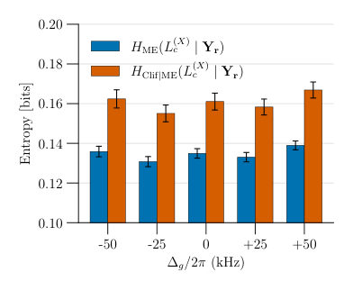
<figcaption class="paper-figure-caption"><b>Fig 4.</b> FIG. 6. Conditional string-parity uncertainty for ME simu- lations at various detunings compared with the fixed Pauli- twirled Stim predictor defined in Section IV. Blue bars show the ME conditional entropy HME(L(X) c | Yr), evaluated using ME row-patch syndrome weights and ME conditional string- parity probabilities. Orange bars show the cross entropy HClif|ME(L(X) c | Yr), obtained by using the ME conditional probabilities as the target distribution and the Stim condi- tional probabilities as the predictor. Bars are averaged over the same row-patch and horizontal-string pairs used in Fig. 5, and error bars are obtained by bootstrap resampling.</figcaption>
</figure>
<figure class="paper-figure-card">
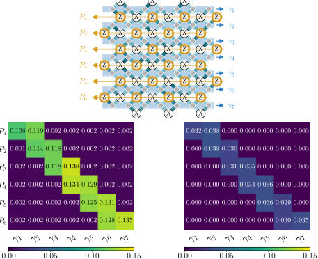
<figcaption class="paper-figure-caption"><b>Fig 5.</b> FIG. 5. Mutual information between local row patches of Z-type syndrome checks and representative logical- ¯Z string- parity proxies at ∆g = 0. (a) Schematic of the analysis. The six row patches P1, . . . , P6 each contain four Z-type syn- drome checks, and the seven horizontal data-string supports γ1, . . . , γ7 define minimum-weight representatives ¯Zγc of the logical- ¯Z operator. (b) Mutual information Iµ(L(X) c ; Yr) be- tween the four-bit row-patch syndrome variable Yr of row patch Pr and the corresponding −1 horizontal string-parity variable L(X) c . Values are computed from the QMC master- equation estimator (left) and from Stim samples using the Pauli-twirled stochastic noise model...</figcaption>
</figure>

**Summary.** The paper introduces QMCtwin, a quantum Monte Carlo simulation technique for solving the master equation of error-prone Quantum Error Correction (QEC) circuits. By simulating realistic superconducting noise sources, it demonstrates that standard Pauli noise models fail to capture crucial syndrome statistics. This provides a vital diagnostic tool for building more accurate decoders facing real-world hardware imperfections.

**Why it may be interesting.** This work is highly relevant as it pushes beyond idealized noise models common in QEC theory by providing a rigorous computational tool to simulate complex, open-system dynamics that govern real hardware performance.

Detailed structure

**Main problem.** Standard quantum error correction (QEC) simulations often inaccurately model hardware noise by using simplified stochastic Pauli models, discarding crucial coherent phase or nonunital drift information.

**Main result.** The proposed QMCtwin framework successfully predicts syndrome-extraction biases and correlations that are entirely absent or strongly suppressed in conventional Pauli/Clifford noise descriptions.

**Method.** The authors developed QMCtwin, a sign-problem-suppressed quantum Monte Carlo method to simulate the full master-equation dynamics of QEC circuits, comparing these results against standard Pauli-twirled Clifford simulations.

**Model / system.** The study applies this framework to a distance-7 rotated surface code using 97 physical qubits, incorporating realistic superconducting noise mechanisms like relaxation, dephasing, and residual ZZ crosstalk into the master equation.

**Key observables.** Syndrome probabilities ($\Pr(m)$), syndrome-extraction biases ($\delta_k$), disagreement probability ($p_{
eq k}$), and mutual information quantifying information loss between ME and Pauli models.

**Important parameters / regimes.** Distance-7 surface code, 97 physical qubits, noise parameters ($T_1, T_\phi$, detuning $\Delta g/2\pi$), simulation time (300 ns).

**Assumptions / limitations.** The QMC estimator is assumed to be unbiased and ergodic; the Pauli model approximation for noise sources is explicitly noted as an approximation of the full master-equation evolution.

**Figures summary.** Figures illustrate the stability of the QMC estimator diagnostics (trace/phase) over time, and spatial maps comparing syndrome biases ($\delta_k$) and disagreement probabilities ($p_{
eq k}$) between the realistic ME simulation and the Pauli-twirled Clifford model.

**Paper structure.** The paper first establishes the limitations of current noise models. It then details the QMCtwin master-equation solver, applies it to a full syndrome extraction round on a surface code, and finally uses information-theoretic diagnostics (like KL divergence) to quantify the structural differences between the two simulation approaches.

Abstract

As quantum error correction moves toward large-scale experimental implementations, decoder performance increasingly depends on how faithfully hardware noise is translated into syndrome statistics. Standard stabilizer workflows achieve scalability by replacing device dynamics with stochastic Pauli or detector-error models, but this compression can discard coherent phase information, nonunital drift, continuous-time effects of always-on couplings, and correlations generated by simultaneous Hamiltonian and dissipative evolution. Here we present QMCtwin, a sign-problem-suppressed quantum Monte Carlo framework for master-equation simulation of QEC circuits, and apply it to a full syndrome-extraction round of a distance-$7$ rotated surface code with $97$ physical qubits. The open-system model includes realistic superconducting-device noise mechanisms such as relaxation, pure dephasing, coherent gate miscalibration, residual $ZZ$ crosstalk, and drive-qubit detuning. By directly estimating syndrome observables from the QMC-generated stochastic density matrix estimator, we compare the master-equation dynamics with their Pauli-twirled Clifford simulation counterparts. QMCtwin predicts syndrome-extraction biases and correlations between syndromes and proxies of logical-string-parity that are absent or strongly suppressed in the stochastic Pauli description. We introduce information-theoretic diagnostics that further quantify how information concerning syndromes versus string-parity proxies differs between the realistic master-equation simulation and the corresponding Pauli-twirled model. These results show that QMC-based master-equation digital twins can expose noise features hidden by conventional Pauli/Clifford noise models and provide a practical path toward more accurate decoder-facing syndrome models.

[↑ back to top](#top)

### [Optimal Ansatz-free Hamiltonian Learning In Situ](http://arxiv.org/abs/2606.19486v1)

**Authors:** Taiqi Zhou, Weiyuan Gong  
**Type:** theory · **Category:** quantum information and computing · **PDF:** <https://arxiv.org/pdf/2606.19486v1>  
**Analysis basis:** full PDF text, analyzed in chunks
**Topic relevance:** 🔥 `quantum measurements` **4/5** · `measurement-induced transitions` **3/5** · `QC/QI experiment` **2/5** · `analog quantum simulation` **1/5** · `methods for driven-dissipative` **1/5** · `non-equilibrium dynamics` **1/5**

↔ Scroll figures horizontally

<figure class="paper-figure-card">
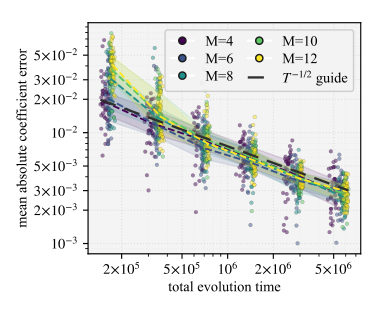
<figcaption class="paper-figure-caption"><b>Fig 1.</b> Figure 2: Mean absolute coefficient error versus total evolution time for Algorithm 3 in learning random ansatz-free sparse Hamiltonians (left) and random k-local Hamiltonians (right). The black dashed line is a T −1/2 guide.</figcaption>
</figure>

**Summary.** The paper presents an optimal, control-free algorithm to reconstruct the unknown Hamiltonian of a quantum system from limited measurement data. By establishing matching upper and lower bounds, it proves that the required total experimental time scales as $O(\Lambda/\epsilon^2 \log (\Lambda/\epsilon))$. This result is crucial for advancing in situ characterization techniques on near-term quantum hardware.

**Why it may be interesting.** This work provides a rigorous, resource-optimal theoretical framework for characterizing quantum hardware parameters ($H$) using only basic, noise-resilient measurements available on current NISQ devices.

Detailed structure

**Main problem.** The core problem is learning an unknown, potentially complex Hamiltonian ($H$) governing a quantum system solely from time-evolution measurements accessible in near-term quantum hardware.

**Main result.** The authors derive the optimal scaling for total evolution time required for this task, establishing both an upper bound $O(rac{\Lambda}{\epsilon^2} \log rac{\Lambda}{\epsilon})$ and a matching lower bound $\Omega(rac{\Lambda}{\epsilon^2} \log rac{\Lambda}{\epsilon})$.

**Method.** The methodology involves developing sequential measurement protocols: first, using random time sampling (displacement sieve) to identify the support of $H$, followed by cross-Pauli measurements and parity sampling to estimate the coefficients.

**Model / system.** The system is an arbitrary quantum processor whose dynamics are governed by a Hamiltonian $H = \sum \lambda_u P_u$ in the Pauli basis. The focus is on implementing this learning process using only product state preparation and measurement (SPAM) access, mimicking near-term hardware constraints.

**Key observables.** Correlation functions derived from time evolution, specifically second derivatives of same-Pauli measurements ($C''_{P_v}(0)$) for support finding, and first derivatives of cross-Pauli measurements ($(F^{(c)}_{A,B})'(0)$) for coefficient estimation.

**Important parameters / regimes.** $\Lambda$ (Hamiltonian norm bound), $\epsilon$ (desired accuracy), $t_0$ (time resolution on a discrete grid).

**Assumptions / limitations.** The protocol is analyzed under the assumption of local depolarization noise (SPAM errors) and relies heavily on mathematical tools like band-limited kernel sampling and summation rules for discretization.

**Figures summary.** Not specified, but the notes detail algorithmic steps involving sieves, random sampling, and complexity scaling comparisons.

**Paper structure.** The paper builds from continuous time analysis (using displacement/cross-correlation measurements) to discrete time analysis (applying summation rules), culminating in establishing optimal lower bounds for the total required measurement time $T_{tot}$.

Abstract

Characterizing the features of a Hamiltonian that governs a quantum system serves as a fundamental subroutine of quantum device calibration, signal sensing, and error correction. Recent works proposed protocols have achieved the optimal Heisenberg-limited scaling learning ansatz-free Hamiltonians from their real-time evolutions without fully specifying interaction structures. However, these protocols rely on both deep circuits with interleaving probes and control, and extremely short time resolution, making them difficult to implement on near- and intermediate-term in situ quantum experiments. In this work, we propose a computationally efficient, control-free, and ancilla-free algorithm that uses only Pauli product state preparation and measurement, and learns an ansatz-free Hamiltonian $H$ with $||H||\leqΛ$ in total evolution time of $Θ(\fracΛ{ε^2}\log(\fracΛε))$. The evolution time cost of our algorithm is optimal for any control-free protocols as we further prove a lower bound of $Ω(\fracΛ{ε^2}\log(\fracΛε))$. Technically, our method introduces a randomized-sampling framework that combines band-limited kernel-based time sampling with a displacement sieve for Hamiltonian structure learning. The characteristic probe time resolution depends only on $Λ$ instead of $\varepsilon$, which makes our protocol especially appealing in the high-precision regime for sensing and calibration applications. We also show that the algorithm maintains the same asymptotic total evolution time in the presence of state-preparation-and-measurement (SPAM) noise when the Hamiltonian is local after calibration. Our results demonstrate the fundamental cost of experimentally friendly Hamiltonian learning and provide a practical route to rigorous in situ characterization of near-term quantum platforms.

[↑ back to top](#top)

### [Trends, Volatility, Correlations, and Critical Phenomena in Financial Markets](http://arxiv.org/abs/2606.20145v1)

**Authors:** Sara A. Safari, Christoph Schmidhuber  
**Type:** theory · **Category:** statistical mechanics · **PDF:** <https://arxiv.org/pdf/2606.20145v1>  
**Analysis basis:** full PDF text, analyzed in chunks
**Topic relevance:** 🔥 `non-equilibrium universality` **4/5** · `driven-dissipative phase transition` **3/5** · `non-equilibrium dynamics` **2/5** · `Frenkel-Kontorova` **1/5** · `Keldysh / 2PI / non-Gaussian methods` **1/5** · `methods for driven-dissipative` **1/5**

↔ Scroll figures horizontally

<figure class="paper-figure-card">
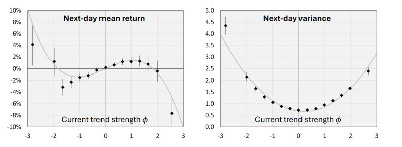
<figcaption class="paper-figure-caption"><b>Fig 1.</b> Figure 1: Left: The expectation value E(r) of tomorrow’s return in a futures market can</figcaption>
</figure>
<figure class="paper-figure-card">
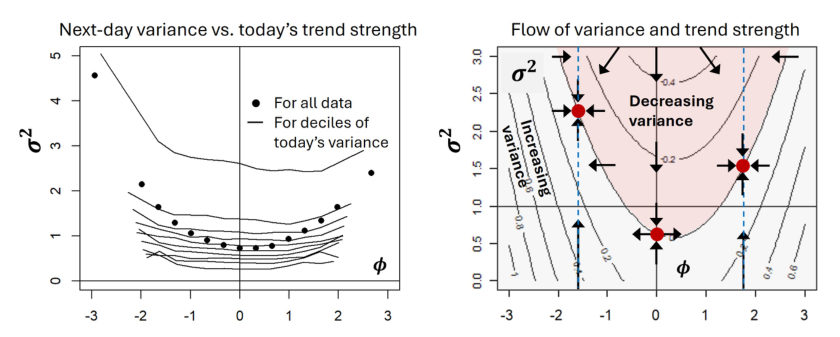
<figcaption class="paper-figure-caption"><b>Fig 2.</b> Figure 2: Left: Tomorrow’s variance as a function of today’s trend strength, both overall</figcaption>
</figure>
<figure class="paper-figure-card">
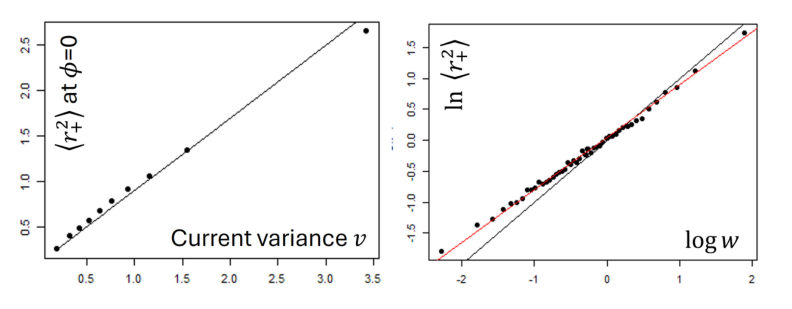
<figcaption class="paper-figure-caption"><b>Fig 3.</b> Figure 3: Left: The next day square-return appears to be almost linear in today’s variance.</figcaption>
</figure>
<figure class="paper-figure-card">

<figcaption class="paper-figure-caption"><b>Fig 4.</b> Fig. 3 (left) plots the average of tomorrow’s square return ⟨r2 t+1⟩(as an estimate of the</figcaption>
</figure>
<figure class="paper-figure-card">
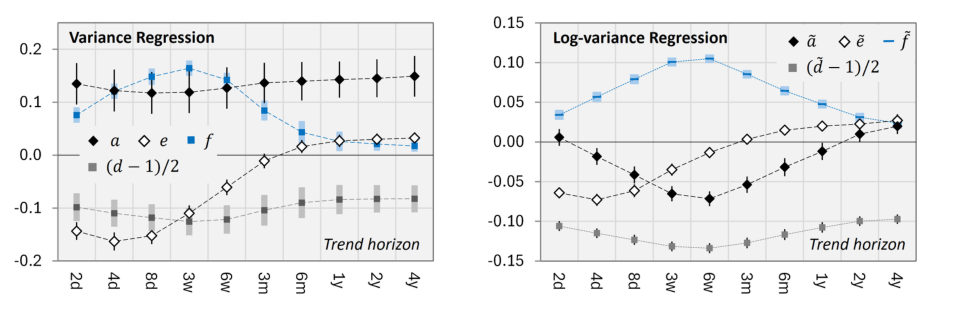
<figcaption class="paper-figure-caption"><b>Fig 5.</b> Figure 4: Left: coefficients of the regression of the variance as a function of the trend horizon</figcaption>
</figure>

**Summary.** This work models financial market dynamics by treating them through the lens of statistical mechanics, drawing parallels to lattice gas models near criticality. It quantifies how future volatilities and correlations depend non-linearly on current trends using regression techniques. The findings suggest that market risk can be significantly improved by incorporating these trend-dependent effects.

**Why it may be interesting.** It provides a direct, quantitative mapping of complex financial time series behavior—such as volatility clustering and trend dependence—onto established concepts from statistical physics, like critical phenomena and phase transitions.

Detailed structure

**Main problem.** The paper aims to develop a statistical-mechanical framework to model financial market dynamics by analyzing trends, volatility, and correlations.

**Main result.** It finds that variance and correlation exhibit predictable non-linear dependencies on current market trends ($\phi_t$), suggesting the system behaves near a critical point.

**Method.** The analysis uses nonlinear regression techniques (polynomial fitting) applied to historical financial return data, drawing analogies with lattice gas models near criticality.

**Model / system.** The model treats financial markets as analogous to a lattice gas or an Ising-like system near its critical point. The dynamics are governed by potentials involving trend strength ($\phi$) and variance ($\sigma^2$), leading to equations for $\langle 	ext{r}^2_{t+1} 
angle$ and $
ho_{t+1}$.

**Key observables.** Next-day volatility ($\langle 	ext{r}^2_{t+1} 
angle$), next-week correlation ($
ho_{t+1}$), trend strength ($\phi_t$), skewness, and kurtosis.

**Important parameters / regimes.** Trend horizon ($T$), coefficients from polynomial fits (e.g., $f>0$ for variance growth, $g<1$ for mean reversion).

**Assumptions / limitations.** The market dynamics can be effectively described by potentials derived from statistical physics models, such as the lattice gas model near criticality.

**Figures summary.** Figures illustrate how expected return and variance change parabolically with trend strength ($\phi_t$), and contour plots show variance changes based on combinations of current variance and trend strength.

**Paper structure.** The paper progresses from modeling returns (cubic polynomial) to modeling variance (quadratic polynomial in $\sigma^2_t$ and $\phi_t$) and finally to modeling correlations, culminating in the analogy with a lattice gas near its critical point.

Abstract

We forecast future volatilities and correlations of financial markets based on the current trends in these markets. This complements previous work that models future expected returns by a cubic polynomial of the current trend strength. Empirically, we observe that volatilities and correlations tend to increase day after day in times of strong up- or down-trends. This effect is particularly pronounced in down-trends. It can be accurately quantified by quadratic polynomials of today's trend strengths, which refine common mean-reversion models of volatilities and correlations. Our results improve the prediction of market risk by accounting for market trends. They also support a recent proposal to model financial markets by a lattice gas near its critical point.

[↑ back to top](#top)

### [Anomalous magneto-optical response at $\mathrm{RuO_2 / WSe_2}$ van der Waals interface](http://arxiv.org/abs/2606.20262v1)

**Authors:** Muhammad Hassan Shaikh, Abhijith Puthiya Veettil, Collin Maurtua, Dai Q. Ho, Subhash Bhatt, David T. Plouff, Malitha Gulawita, Kenji Watanabe, Takashi Taniguchi, John Q. Xiao, Anderson Janotti, Chitraleema Chakraborty  
**Type:** experiment · **Category:** other · **PDF:** <https://arxiv.org/pdf/2606.20262v1>  
**Analysis basis:** full PDF text, analyzed in chunks
**Topic relevance:** 🔥 `spintronics-quantum-optics interface` **4/5** · `exotic spin models in light-matter` **3/5** · `quantum optics experiment` **2/5** · `Kondo & dissipative impurity` **1/5** · `analog quantum simulation` **1/5**

↔ Scroll figures horizontally

<figure class="paper-figure-card">
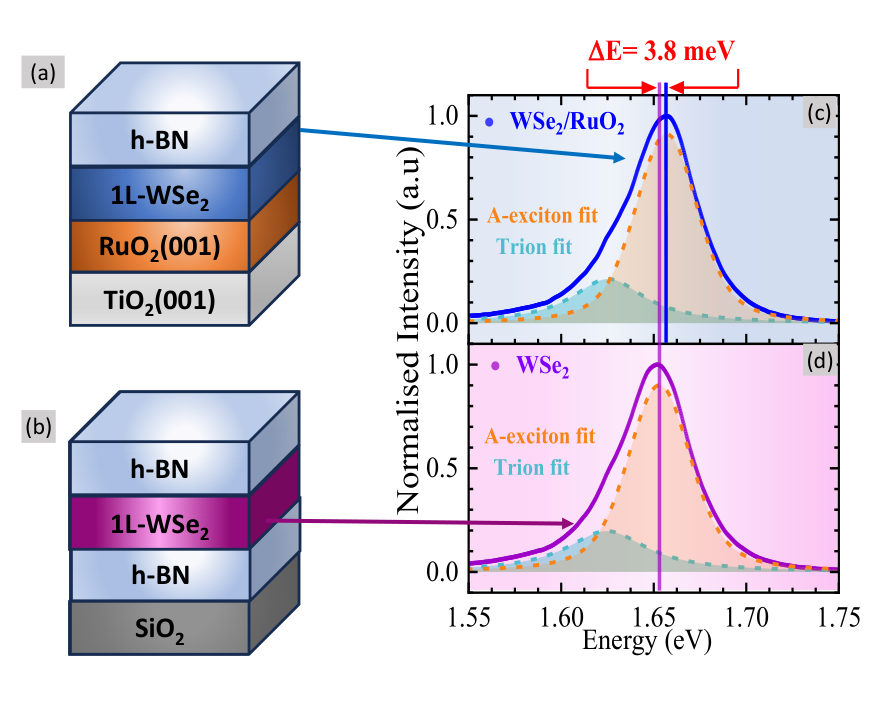
<figcaption class="paper-figure-caption"><b>Fig 1.</b> Figure 1: (a) Schematic of a heterostructure consisting of a monolayer WSe2 atop a RuO2 (001) film, with h-BN encapsulation on top, used for surface magnetism studies. (b) Schematic of the control sample: a monolayer WSe2 encapsulated by h-BN on both top and bottom. (c,d) Room-temperature PL spectra of monolayer WSe2 from the devices shown in (a) and (b), respectively. The dotted lines represent Lorentzian fits for A-excitons (yellow) and trions (cyan) used to extract peak energies. The peak energy of WSe2 atop RuO2 is blue-shifted by 3.8±0.1 meV compared to the encapsulated bare WSe2.</figcaption>
</figure>
<figure class="paper-figure-card">
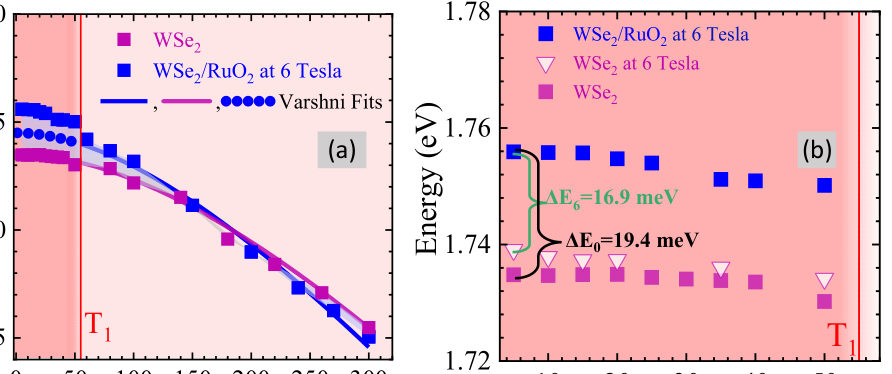
<figcaption class="paper-figure-caption"><b>Fig 2.</b> Figure 2: (a) Peak energy of WSe2 as a function of temperature. Blue squares represent the peak energy of WSe2 atop RuO2 in the presence of a 6 T out-of-plane magnetic field. Purple squares represent the peak energy of encapsulated WSe2 without any applied magnetic field. Solid lines are Varshni fits for encapsulated WSe2 (purple) and WSe2 atop RuO2 (blue). Encapsulated WSe2 peak energy follows the Varshni fit across the entire temperature range, while WSe2 atop RuO2 follows it until 55 K (T1). Beyond that, the Varshni behavior is shown by the blue dotted line. (b) Peak energy below T1 for WSe2 atop RuO2 in the presence of 6 T (blue squares), encapsulated WSe2 at 0 T (purple squares), and...</figcaption>
</figure>
<figure class="paper-figure-card">
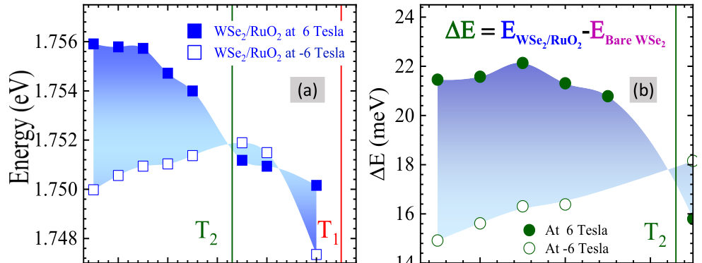
<figcaption class="paper-figure-caption"><b>Fig 3.</b> Figure 3: (a) Peak energy of WSe2 atop RuO2 as a function of temperature in the presence of ±6 T. The separation between the peak energies for positive and negative fields is minimal between 55 K (T1) and 33 K (T2), and increases below T2. (b) Magnitude of the energy difference between WSe2 atop RuO2 and encapsulated WSe2 as a function of temperature below T2 in the presence of ±6 T.</figcaption>
</figure>
<figure class="paper-figure-card">
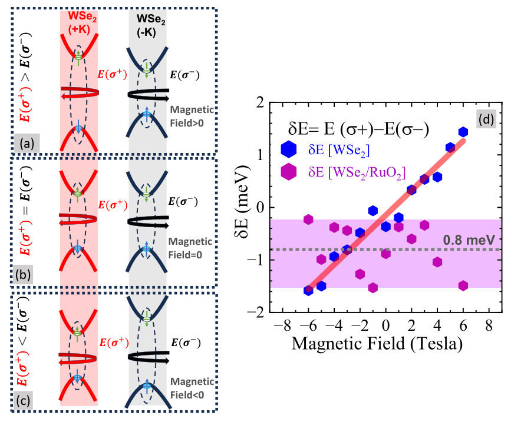
<figcaption class="paper-figure-caption"><b>Fig 4.</b> Figure 4: (a), (b), and (c) show schematics of valley-specific transitions in WSe2 and a comparison between right-handed and left-handed emission energies (E(σ+) and E(σ−)) for magnetic fields greater than, equal to, and less than zero, respectively. (d) Valley splitting energy magnitude (δE) as a function of magnetic field for encapsulated WSe2 (blue diamonds) and WSe2 atop RuO2 (purple diamonds). The red line shows the linear fit for the Zeeman splitting behavior of encapsulated WSe2, from which the extracted g-factor was found to be 4.07 ± 0.24. The highlighted region shows the minimum and maximum fluctuation in energy splitting values in the WSe2/RuO2 heterostructure, and the mean value...</figcaption>
</figure>

**Summary.** The research investigates weak surface magnetism in $\mathrm{RuO_2}$ by studying its interaction with monolayer $\mathrm{WSe_2}$ using magneto-optical spectroscopy. Anomalous energy shifts and unique field responses observed below 55 K strongly suggest that the valley states are governed by interfacial magnetic exchange fields. This establishes a powerful, non-invasive optical tool for characterizing subtle magnetism in challenging material systems.

**Why it may be interesting.** This work provides an optical method to probe weak magnetic interactions at interfaces without requiring the deposition of an additional ferromagnetic layer, which is highly relevant for understanding correlated electron systems in 2D heterostructures.

Detailed structure

**Main problem.** The study aims to probe weak interfacial magnetic states at the surface of $\mathrm{RuO_2}$ using optical techniques, circumventing the controversy surrounding its bulk magnetic ground state.

**Main result.** Anomalous magneto-optical responses, including temperature-dependent energy shifts and unusual valley splitting behavior in $\mathrm{WSe_2}$, were observed, suggesting that interfacial exchange fields govern the electronic structure via weak surface magnetism.

**Method.** Temperature-dependent magneto-optical spectroscopy (magneto-photoluminescence) was performed on a van der Waals heterostructure ($\mathrm{WSe_2}$ atop $\mathrm{RuO_2}$) compared to an encapsulated control sample, using applied out-of-plane magnetic fields.

**Model / system.** The physical system is the $\mathrm{WSe_2/RuO_2}$ van der Waals heterostructure. The investigation focuses on emergent surface magnetism in $\mathrm{RuO_2}$ and its influence on the excitonic states of monolayer $\mathrm{WSe_2}$.

**Key observables.** Anomalous excitonic energy shift, deviation from Varshni behavior below 55 K, and field-dependent valley splitting ($\sigma^+$ vs. $\sigma^-$ polarization measurements).

**Important parameters / regimes.** Temperature ($T < 55$ K), applied magnetic field (up to $\pm 6 	ext{ T}$ out-of-plane).

**Assumptions / limitations.** The anomalous optical response is attributed to interfacial exchange fields associated with weak surface magnetic states in $\mathrm{RuO_2}$, rather than conventional Zeeman splitting or non-magnetic effects.

**Figures summary.** Figures illustrate the temperature dependence of the excitonic peak energy, showing a deviation from Varshni behavior only in the $\mathrm{WSe_2/RuO_2}$ sample below $T_1$. They also show polarization-resolved measurements demonstrating negligible Zeeman splitting in the heterostructure compared to the control.

**Paper structure.** The paper establishes the problem of probing weak surface magnetism, details the use of magneto-optical spectroscopy on the $\mathrm{WSe_2/RuO_2}$ system, presents evidence for anomalous temperature and field dependencies (deviation from Varshni behavior), and concludes by positioning this technique as a tool for studying emergent interfacial magnetism.

Abstract

Ruthenium dioxide ($\mathrm{RuO_2}$) has been proposed as an altermagnetic candidate, although its magnetic ground state remains controversial. Here, we probe weak interfacial magnetic states at the surface of (001)-oriented $\mathrm{RuO_2}$ films using the magnetic proximity effect (MPE) in a van der Waals heterostructure consisting of monolayer tungsten diselenide ($\mathrm{WSe_2}$) atop $\mathrm{RuO_2}$. Temperature-dependent magneto-optical spectroscopy reveals an anomalous excitonic energy shift and a deviation from conventional Varshni behavior below 55 K that are absent in an encapsulated $\mathrm{WSe_2}$ control sample. The anomalous shift reverses sign upon field cooling with opposite magnetic field polarity, indicating a magnetic origin. Polarization-resolved measurements further show a nearly field-independent and fluctuating valley splitting in $\mathrm{WSe_2 / RuO_2}$ in strong contrast to the conventional linear Zeeman splitting observed in the control bare $\mathrm{WSe_2}$ sample. These results suggest that the valley states are governed predominantly by interfacial exchange fields associated with weak surface magnetic states in $\mathrm{RuO_2}$, which do not produce a conventional linear Zeeman response within the applied magnetic field range. Importantly, this approach enables direct optical probing of emergent surface magnetism without introducing an additional ferromagnetic layer, positioning MPE-based optical probing as a tool for investigating weak surface magnetism and offering new possibilities for studying magnetic materials with controversial magnetic states.

[↑ back to top](#top)

### [Discrimination of genuinely nonlocal sets without entanglement in multipartite systems](http://arxiv.org/abs/2606.20380v1)

**Authors:** Ziying Hou, Huaqi Zhou, Limin Gao  
**Type:** theory · **Category:** quantum information and computing · **PDF:** <https://arxiv.org/pdf/2606.20380v1>  
**Analysis basis:** full PDF text, analyzed in chunks
**Topic relevance:** 🔥 `entanglement & information structure` **4/5** · `quantum measurements` **3/5** · `measurement-induced transitions` **2/5** · `correlated / nonlocal dissipation` **1/5** · `methods for driven-dissipative` **1/5**

↔ Scroll figures horizontally

<figure class="paper-figure-card">
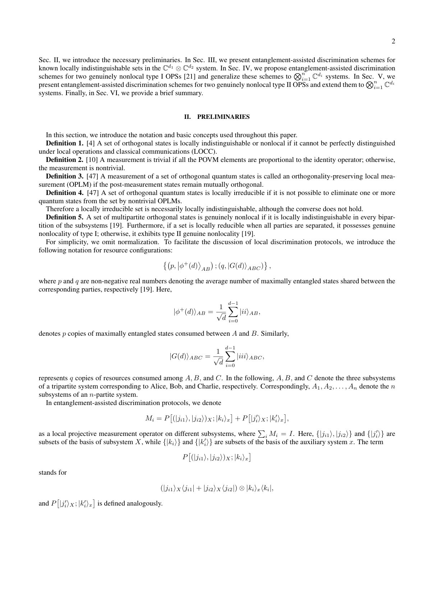
<figcaption class="paper-figure-caption"><b>Fig 1.</b> Low-resolution page preview, page 2</figcaption>
</figure>
<figure class="paper-figure-card">
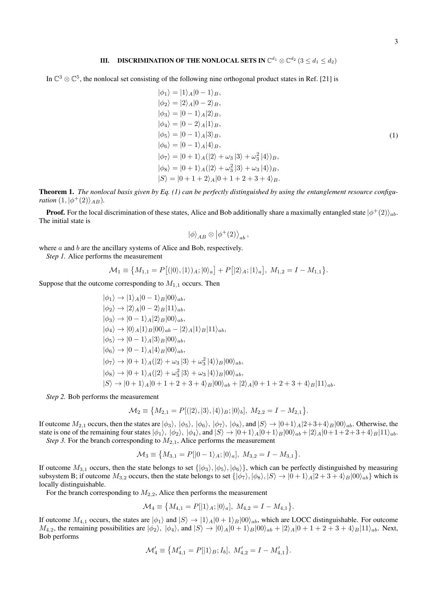
<figcaption class="paper-figure-caption"><b>Fig 2.</b> Low-resolution page preview, page 3</figcaption>
</figure>
<figure class="paper-figure-card">
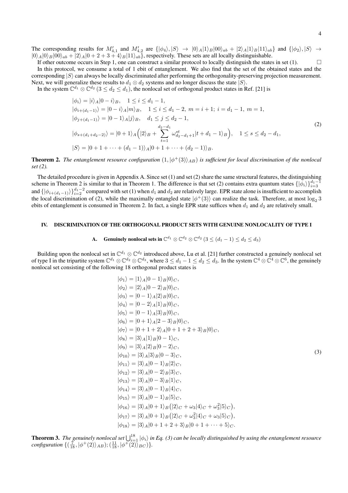
<figcaption class="paper-figure-caption"><b>Fig 3.</b> Low-resolution page preview, page 4</figcaption>
</figure>
<figure class="paper-figure-card">
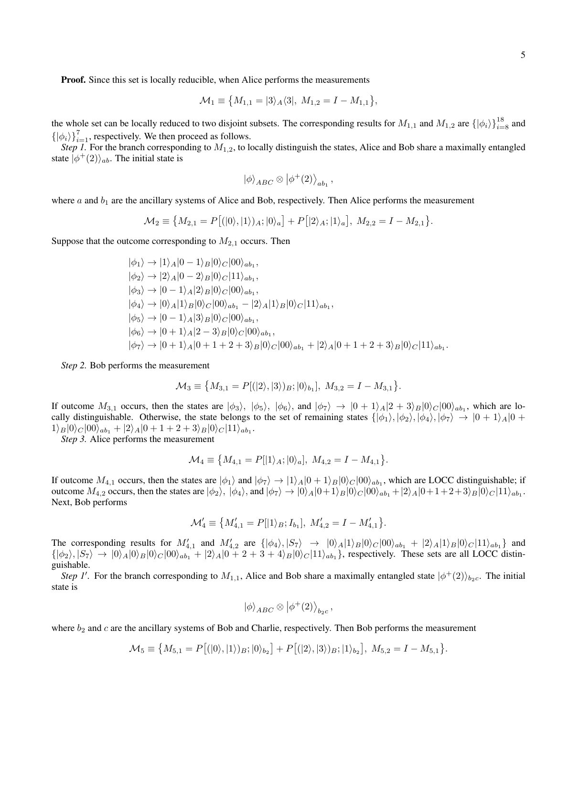
<figcaption class="paper-figure-caption"><b>Fig 4.</b> Low-resolution page preview, page 5</figcaption>
</figure>
<figure class="paper-figure-card">
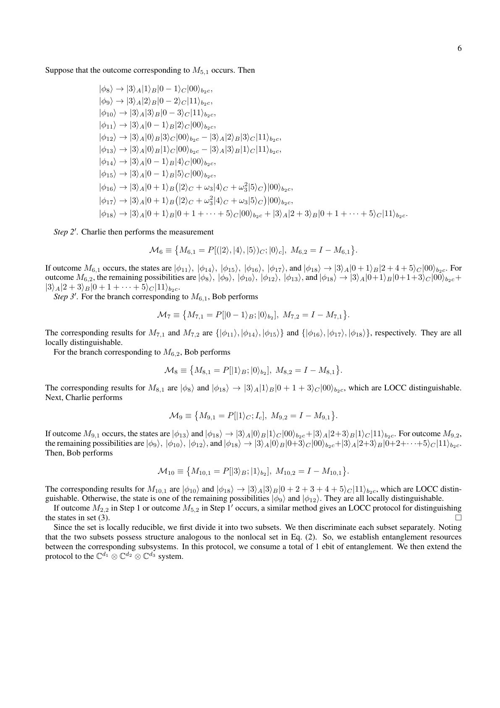
<figcaption class="paper-figure-caption"><b>Fig 5.</b> Low-resolution page preview, page 6</figcaption>
</figure>

**Summary.** This paper develops comprehensive protocols to distinguish between genuinely nonlocal sets of orthogonal product states in multipartite quantum systems. By classifying these sets into Type I and Type II based on local reducibility, the authors determine the minimal entanglement resources required for perfect discrimination. The results provide a general framework applicable from bipartite up to $n$-partite systems.

**Why it may be interesting.** This work provides a rigorous theoretical framework for quantifying the minimum quantum resources needed to verify fundamental properties like genuine nonlocality, which is crucial for quantum cryptography and foundational tests of quantum mechanics.

Detailed structure

**Main problem.** The paper addresses the challenge of perfectly discriminating between sets of quantum states that exhibit genuine nonlocality in multipartite systems.

**Main result.** It establishes robust, resource-efficient protocols showing that discrimination requires minimal entanglement resources, such as a single EPR pair or GHZ state, depending on the type and dimensionality of the nonlocal set.

**Method.** The core method involves constructing multi-step measurement sequences using local operations and classical communication (LOCC), supplemented by shared ancillary entangled states to overcome inherent nonlocality barriers.

**Model / system.** The system consists of multipartite orthogonal product quantum states defined over tensor products of qudit spaces ($\mathbb{C}^{d_1} \otimes \cdots \otimes \mathbb{C}^{d_n}$). The sets are classified as Type I (reducible) or Type II (irreducible) based on local indistinguishability.

**Key observables.** The outcomes of sequential local projective measurements ($M_k$) performed by different subsystems (Alice, Bob, Charlie) serve as the primary diagnostics for state identification.

**Important parameters / regimes.** The required entanglement resources are key parameters, including single EPR pairs ($\vert\phi^+(2)
angle$), GHZ states ($\vert G(3)
angle$), and maximally entangled states in higher-dimensional systems.

**Assumptions / limitations.** The protocols assume the existence of specific maximally entangled resource states and that the sets being discriminated are indeed genuinely nonlocal but locally distinguishable given sufficient entanglement assistance.

**Paper structure.** The paper progresses by first defining genuine nonlocality, then presenting specialized discrimination schemes for low-dimensional bipartite systems (Type I/II), generalizing these protocols to tripartite and $n$-partite systems using increasing levels of shared entanglement resources.

Abstract

Genuine nonlocality arises when a set of multipartite orthogonal states is locally indistinguishable under any bipartition of the subsystems. The entanglement-assisted discrimination of such genuinely nonlocal orthogonal product sets has attracted significant attention in quantum information. Based on the criterion of local irreducibility, genuine nonlocality is classified into Type I (reducible) and Type II (irreducible). We present entanglement-assisted discrimination schemes for both types of genuinely nonlocal sets that use minimal resources. For low-dimensional cases, Type I sets require only a single EPR pair, whereas Type II sets necessitate only one GHZ state. We extend these protocols to higher-dimensional systems: the discrimination of Type I sets requires only one maximally entangled state in a two-qutrit system, while that of Type II sets similarly demands a single maximally entangled state in a three-qutrit system. For $n$-partite ($n > 3$) systems, Type I sets continue to require only one maximally entangled state, whereas Type II sets necessitate just one additional EPR pair compared to their Type I counterparts. These results provide a robust framework for the efficient discrimination of genuinely nonlocal sets using minimal quantum resources.

[↑ back to top](#top)

### [Faking entanglement with imperceptible measurement deviations](http://arxiv.org/abs/2606.20396v1)

**Authors:** Jaime Moreno, Elna Svegborn, Simon Morelli, Markus Hiekkamäaki, Lea Kopf, Robert Fickler, Armin Tavakoli  
**Type:** both · **Category:** quantum information and computing · **PDF:** <https://arxiv.org/pdf/2606.20396v1>  
**Analysis basis:** full PDF text, analyzed in chunks
**Topic relevance:** 🔥 `entanglement & information structure` **4/5** · `quantum measurements` **3/5** · `QC/QI experiment` **2/5** · `measurement-induced transitions` **1/5** · `quantum optics experiment` **1/5**

↔ Scroll figures horizontally

<figure class="paper-figure-card">
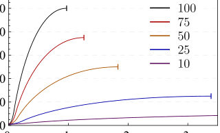
<figcaption class="paper-figure-caption"><b>Fig 1.</b> Fig. 1: Falsely verified Schmidt number K as a function of: a) error for fixed dimension d ∈{10, 25, 50, 75, 100}, and b) dimension for fixed error ε ∈ {0.5%, 0.7%, 1%, 2%, 3%}. The gray dashed line in b) corresponds to the largest mean- ingful Schmidt number (K = d) under the idealized measurement assumptions. The cut-off at which the model reaches K = d is marked in both figures by vertical lines.</figcaption>
</figure>
<figure class="paper-figure-card">
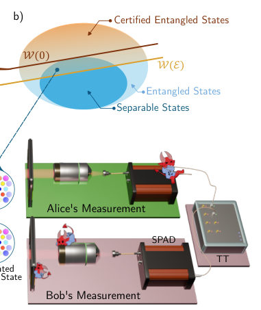
<figcaption class="paper-figure-caption"><b>Fig 2.</b> Fig. 2: Illustrative schematic of the experimental setup employing the macro-pixel basis as the local dimension of a two-photon state and results for the average fidelity model across various ε-perturbations and dimensions. a) Diagram depicting the catego- rization of quantum states according to their entanglement class and the classification carried out by an entanglement witness, illustrated by the line delimiter, depending on the ε-perturbation. b) Individual states corresponding to the elements of a multi- outcome measurement for the unperturbed and ε-perturbed entanglement witness for ε = 0.7%. The ε-demons indicate the small perturbation introduced in the system by an attacker. c)...</figcaption>
</figure>
<figure class="paper-figure-card">
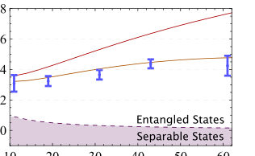
<figcaption class="paper-figure-caption"><b>Fig 3.</b> Fig. 3: Experimental results for the average fidelity model. a) scaling of the entan- glement witness with ε at a fixed local dimension d = 31. The red curve indicates the ideal theoretical model, whereas the orange curve shows the model after including a crosstalk ratio of Cr = 1 : 700. b) Scaling of the entanglement witness value with dimension for a fixed perturbation ε = 0.7%.</figcaption>
</figure>

**Summary.** The research reveals a fundamental vulnerability in high-dimensional entanglement detection: small, systematic measurement errors allow an attacker to trick verification protocols. By perturbing measurements on photonic spatial modes, the authors successfully demonstrated faking strong entanglement signals from simple product states. This mandates developing new, robust verification techniques resilient to bounded experimental discrepancies.

**Why it may be interesting.** This work directly impacts the trustworthiness of quantum hardware characterization protocols, suggesting that device imperfections can be exploited to mislead users into believing a system possesses valuable entanglement resources.

Detailed structure

**Main problem.** The paper demonstrates that arbitrarily small, adversarially encoded measurement errors can lead to the false certification of high-dimensional entanglement in systems that are fundamentally separable.

**Main result.** Even with minor imperfections (e.g., 0.7% error), current entanglement verification methods fail spectacularly by falsely certifying significant levels of entanglement ($K$) for product states, especially as system dimensionality ($d$) increases.

**Method.** The authors analyze the violation of an entanglement witness ($W_d$), showing that introducing $\epsilon$-perturbations to the measurement bases allows separable states to mimic the expected correlations of entangled states.

**Model / system.** The study uses high-dimensional bipartite quantum states, experimentally realized using classical photonic states encoded in the spatial degree of freedom (macro-pixels). The theoretical framework relies on entanglement witnesses tested against product states.

**Key observables.** Entanglement witness value ($W_d$), falsely certified Schmidt number ($K$), and the measurement error parameter ($\epsilon$).

**Important parameters / regimes.** System dimension ($d$) up to 61, small perturbation $\epsilon$ (as low as 0.7%), and crosstalk ratios.

**Assumptions / limitations.** The core assumption being challenged is that quantum measurements can be realized exactly; the analysis explores models based on average or worst-case fidelity approximations for measurement errors.

**Figures summary.** Figures illustrate how the faked entanglement ($K$) scales with both the error ($\epsilon$) and the dimension ($d$), showing a rapid increase in vulnerability as $d$ grows.

**Paper structure.** The paper develops theoretical models comparing different fidelity measures (average vs. worst-case) to quantify the attack, followed by detailed experimental implementation using photonic spatial modes to demonstrate the faking effect across increasing dimensions.

Abstract

Quantum entanglement is a central resource underpinning emerging quantum technologies, enabling capabilities beyond those of classical systems. Accurate verification of entanglement is therefore crucial. However, experimental schemes usually rely on the assumption that quantum measurements can be realized exactly. As the complexity of a quantum system grows, this assumption typically becomes increasingly unrealistic, therefore leading to a widening mismatch between theoretical models and experimental implementations. Here we demonstrate that arbitrarily small measurement errors, when adversarially encoded in the measurement apparatus, can lead to the false certification of high-dimensional entanglement in systems that are, in fact, separable. This is achieved by introducing explicit hacking attacks to measurement devices in well-established entanglement verification tests. We further experimentally demonstrate this effect using classical photonic states encoded in the spatial degree of freedom, spanning up to 61 dimensions with measurement fidelity errors as low as 0.23%. Our results uncover a fundamental vulnerability in current methods for high-dimensional entanglement detection, highlighting the susceptibility of complex quantum devices to small adversarial perturbations. The findings underscore the need for developing secure verification of quantum information that is robust to bounded discrepancies between theory and experiment.

[↑ back to top](#top)

### [Mitigating Trotter Errors via Post-Processed Symmetry Restoration](http://arxiv.org/abs/2606.20242v1)

**Authors:** Sangjin Lee, Sangkook Choi  
**Type:** theory · **Category:** strongly correlated electrons · **PDF:** <https://arxiv.org/pdf/2606.20242v1>  
**Analysis basis:** full PDF text, analyzed in chunks
**Topic relevance:** 🔥 `analog quantum simulation` **4/5** · `quantum measurements` **3/5** · `measurement-induced transitions` **2/5** · `exotic spin models in light-matter` **1/5** · `non-equilibrium dynamics` **1/5**

↔ Scroll figures horizontally

<figure class="paper-figure-card">
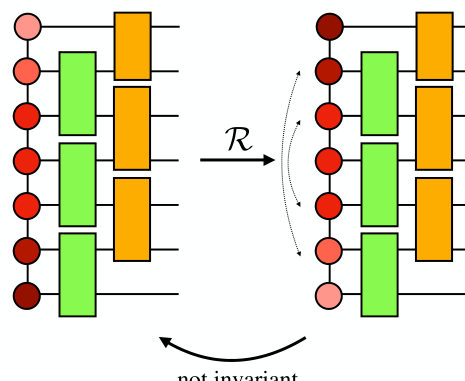
<figcaption class="paper-figure-caption"><b>Fig 1.</b> FIG. 1. Inconsistency of symmetry operations in quan- tum circuits. A physical symmetry of the Hamiltonian should be preserved during quantum simulation. However, some symmetries (here, a reflection symmetry R) are explic- itly broken when compiling the dynamics via Trotterization. These symmetry-violating contributions manifest as unphys- ical Trotter errors in the measurement outcomes.</figcaption>
</figure>
<figure class="paper-figure-card">
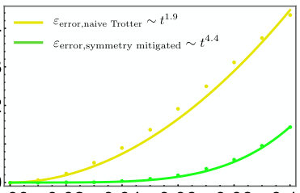
<figcaption class="paper-figure-caption"><b>Fig 2.</b> FIG. 2. Symmetry-mitigated results for the seven-site one- dimensional XY model. Yellow markers represent the expec- tation values obtained by the naive first-order Trotter simu- lation (V2), and green markers correspond to the symmetry- mitigated results using our post-processing protocol. Solid lines indicate polynomial fits. The naive Trotter error scales as O(t1.9), while the symmetry-mitigated error is drastically suppressed to O(t4.4).</figcaption>
</figure>
<figure class="paper-figure-card">
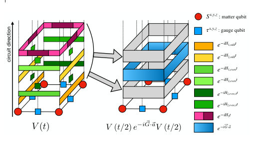
<figcaption class="paper-figure-caption"><b>Fig 3.</b> FIG. 3. Trotterized circuit for the 1D Schwinger model. Red circles and blue squares represent qubit-encoded matter and gauge degrees of freedom, respectively. The intermediate gauge transformation e−i ⃗ G·⃗a is inserted between two V2(t/2) Trotter layers to mitigate covariant errors.</figcaption>
</figure>
<figure class="paper-figure-card">
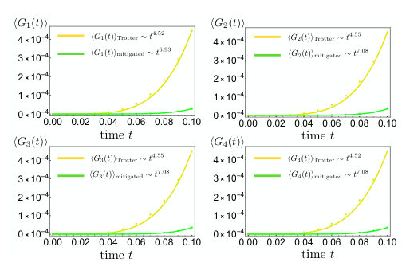
<figcaption class="paper-figure-caption"><b>Fig 4.</b> FIG. 4. Measurement of gauge violations ⟨Gi=1,2,3,4(t)⟩over time in the 1D Schwinger model. The results demonstrate that our intermediate gauge-twirling protocol systematically suppresses the unphysical gauge violations compared to the unmitigated Trotter circuit.</figcaption>
</figure>

**Summary.** The paper introduces a symmetry-based error mitigation protocol designed to counteract the symmetry-breaking errors inherent in Trotterized quantum simulations. By averaging measurement results over symmetry transformations—either at the initial state or between simulation layers—the method effectively filters out unphysical dynamics while preserving the true, ideal time evolution. This offers a powerful, depth-preserving tool for simulating complex condensed matter and gauge theories on current quantum hardware.

**Why it may be interesting.** This is highly relevant as it provides a systematic, hardware-agnostic way to correct for fundamental algorithmic errors in quantum simulation that plague near-term devices, particularly when simulating lattice gauge theories or systems with known symmetries.

Detailed structure

**Main problem.** Trotterization, used for quantum simulation, inherently breaks the symmetries of the target Hamiltonian, leading to unphysical algorithmic errors in simulating complex many-body systems.

**Main result.** A symmetry-based post-processing protocol can systematically project out these symmetry-violating Trotter errors by averaging measurement outcomes over symmetry transformations. This provides a depth-preserving method to substantially improve simulation fidelity.

**Method.** The core technique involves classical post-processing: either preparing the initial state in a symmetrically transformed basis or interleaving symmetry operations between discrete Trotter layers, followed by ensemble averaging of measurements.

**Model / system.** The work applies to general quantum many-body systems, benchmarking on the one-dimensional XY model (spatial reflection symmetry) and the 1D Schwinger model (local gauge invariance). The underlying physics involves Hamiltonians with known symmetries that constrain the accessible Hilbert space.

**Key observables.** Expectation values of physical observables $\langle O(t) 
angle$, specifically monitoring for violations of spatial reflection or local Gauss's law.

**Important parameters / regimes.** The error scaling is compared between naive Trotterization (e.g., $O(t^{1.9})$) and the symmetry-mitigated protocol ($O(t^{4.4})$).

**Assumptions / limitations.** The method assumes that the observable respects the underlying symmetries, allowing for projection onto symmetric subspaces; it is also shown to handle non-local or anti-unitary symmetries.

**Figures summary.** Figures compare naive Trotter error scaling versus symmetry-mitigated error scaling for the XY model and illustrate the circuit structure involving gauge transformations interleaved between Trotter layers for the Schwinger model.

**Paper structure.** The paper first establishes the problem of symmetry breaking in Trotterization, then details the post-processing protocol (initial state vs. interleaving), and finally benchmarks this method on specific models like the XY and Schwinger models to demonstrate error suppression.

Abstract

Quantum simulation is a powerful tool for exploring complex quantum many-body systems such as condensed matter physics and gauge theories. Trotterization, which approximates the ideal time evolution operator by decomposing it into a sequence of local gate operations, is one of the most widely used quantum simulation algorithms. However, such Trotterized implementations generally fail to preserve the symmetries of the target Hamiltonian during compilation. As a result, they can drive quantum states out of symmetrically allowed subspaces, leading to unphysical dynamics and symmetry-violating algorithmic errors. In this work, we propose a symmetry-based Trotter error mitigation protocol using classical post-processing. By applying symmetry transformations to the initial state or interleaving them between discrete Trotter layers, and then averaging an ensemble of the resulting measurement outcomes via classical post-processing, our method systematically projects out the symmetry-violating components of the Trotter error while leaving the ideal dynamics unchanged. Importantly, this framework naturally accommodates non-local spatial symmetries and anti-unitary operations such as time reversal, which are difficult or impossible to implement directly with hardware-native quantum gates. We benchmark our protocol on the one-dimensional XY model and the one-dimensional Schwinger model. In the XY model, enforcing reflection symmetry suppresses the leading-order Trotter error, whereas in the Schwinger model, interleaving gauge transformations between Trotter layers enables gauge-twirling effectively to reduce unphysical violations of local Gauss's law. These results demonstrate that symmetry-based post-processing provides a depth-preserving route to substantially improving the fidelity of Trotterized quantum simulations on near-term devices.

[↑ back to top](#top)

### [QPU-scale randomized benchmarking via Bell-pair injection](http://arxiv.org/abs/2606.20123v1)

**Authors:** Haripriya Pettugani, María Aguado-Yáñez, Astryd Park, Daniel Bultrini, James R. Wootton  
**Type:** both · **Category:** quantum information and computing · **PDF:** <https://arxiv.org/pdf/2606.20123v1>  
**Analysis basis:** full PDF text, analyzed in chunks
**Topic relevance:** 🔥 `QC/QI experiment` **4/5** · 🔥 `entanglement & information structure` **4/5** · `correlated / nonlocal dissipation` **1/5** · `methods for driven-dissipative` **1/5** · `non-equilibrium dynamics` **1/5**

↔ Scroll figures horizontally

<figure class="paper-figure-card">
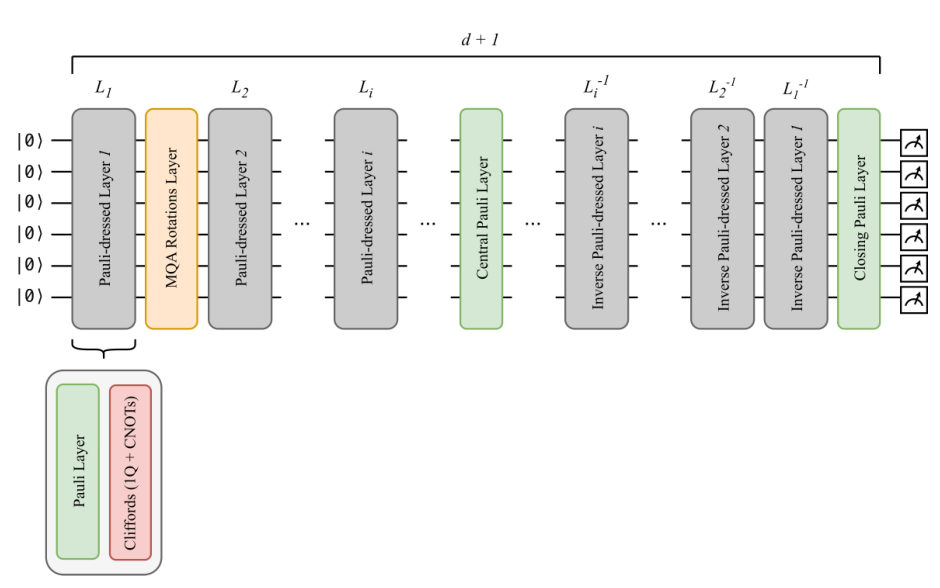
<figcaption class="paper-figure-caption"><b>Fig 1.</b> FIG. 1. MQA Circuit Structure. The yellow block highlights the additional structured layer (Rx(θ) on control qubits of the first entangling layer) inserted in the forward half. Except for the initial and final single-qubit Clifford layers (omitted), all other layers follow the standard MRB architecture.</figcaption>
</figure>
<figure class="paper-figure-card">
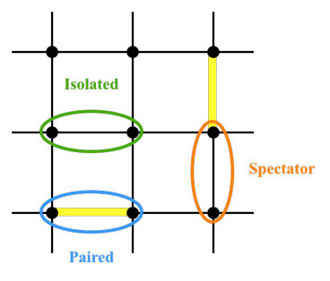
<figcaption class="paper-figure-caption"><b>Fig 2.</b> FIG. 2. Types of Edges. The yellow lines indicate qubit pairs that become entangled by the newly inserted MQA layer. Blue edges represent paired qubits, orange edges are the spectator qubits, and the remaining isolated edges are shown in green.</figcaption>
</figure>
<figure class="paper-figure-card">
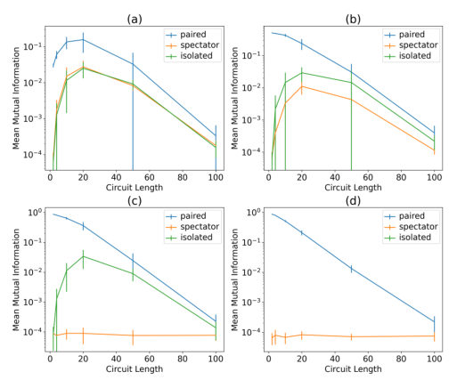
<figcaption class="paper-figure-caption"><b>Fig 3.</b> FIG. 3. MMI for Custom Noisy Backend. Dependence of the Mean Mutual Information (MMI) on the initial entangling angle θ and entanglement density ξ for each edge type in an 8-qubit system, with p2 = 0.01, samples = 20 and shots = 10000. (a) θ = 0, ξ = 0.25. (b) θ = π/4, ξ = 0.25. (c) θ = π/2, ξ = 0.25. (d) θ = π/2, ξ = 1.</figcaption>
</figure>
<figure class="paper-figure-card">
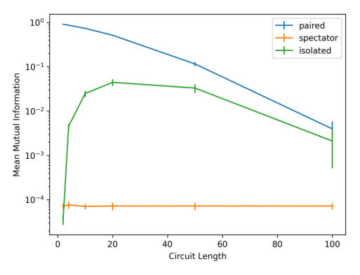
<figcaption class="paper-figure-caption"><b>Fig 4.</b> FIG. 4. MMI for Stabilizer Backend. MQA simulations of 156 qubits on the ibm fez topology with p2 = 0.01, samples = 20 and shots = 10000. The initial entangling angle is fixed at θ = π/2, consistent with the stabilizer backend that allows only Clifford gates.</figcaption>
</figure>
<figure class="paper-figure-card">
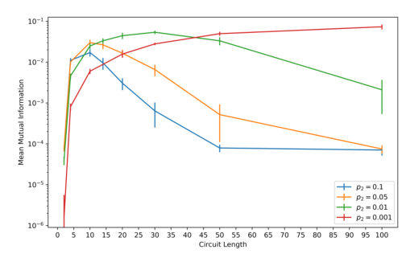
<figcaption class="paper-figure-caption"><b>Fig 5.</b> FIG. 5. Isolated Pairs for Stabilizer Backend. MQA simulations of 156 qubits on the ibm fez topology for isolated pairs, showing the impact of depolarizing noise on the MMI evolution. The initial entangling angle is fixed at θ = π/2, with lengths = [2,4,10,14,20,30,50,100], samples = 20 and shots = 10000.</figcaption>
</figure>

**Summary.** The paper introduces Mirror Quantum Awesomeness (MQA), an advanced benchmarking technique combining MRB's global error estimation with QA's structural correlation analysis. By tracking per-edge mutual information, MQA provides a more detailed picture of noise accumulation than standard methods. The results validate this approach on large quantum processors, successfully locating a critical circuit depth where current error mitigation techniques are expected to fail.

**Why it may be interesting.** This work provides advanced diagnostic tools that move beyond simple average gate fidelity measurements, offering insights into how structured correlations decay in large-scale quantum devices, which is crucial for understanding noise mechanisms relevant to AMO platforms like trapped ions or superconducting qubits.

Detailed structure

**Main problem.** Developing comprehensive benchmarking techniques for large Quantum Processing Units (QPUs) to accurately quantify performance metrics beyond simple gate fidelities, especially in the presence of accumulating errors.

**Main result.** The proposed Mirror Quantum Awesomeness (MQA) protocol successfully tracks per-edge correlation dynamics and locates a critical circuit depth ($\sim 50$ for ibm fez), offering two complementary methods to estimate device limitations.

**Method.** The authors introduce MQA, a hybrid benchmarking protocol that integrates the structured entanglement analysis of Quantum Awesomeness (QA) into the established framework of Mirror Randomized Benchmarking (MRB). They use Mutual Information (MI) to quantify correlation degradation across varying circuit depths.

**Model / system.** The work is demonstrated on physical 156-qubit processors (ibm fez, ibm kingston) and simulated using custom noisy backends. The analysis focuses on qubit connectivity graphs, particularly those admitting perfect matchings for topological variants.

**Key observables.** Average entanglement infidelity ($\epsilon_{\Omega}$), Mutual Information (MI), Effective Polarization (EP), and the critical circuit depth where structured correlations decay due to noise.

**Important parameters / regimes.** Circuit depth ($d$), initial entangling angle ($	heta$), two-qubit gate density ($\xi$), and hardware error rates ($p_1, p_2$).

**Assumptions / limitations.** The topological variant (TMQA) assumes the coupling graph admits a perfect matching and is embeddable in two dimensions. For MQA analysis, parity-based measurement approximations are used.

**Figures summary.** Figures illustrate MMI dependence on depth for different edge types (paired, spectator, isolated), compare EP decay between MRB and MQA across various backends, and show TMQA performance metrics ($P_{topo}, P_{pairs}$) vs. noise levels.

**Paper structure.** The paper builds from standard MRB to the hybrid MQA protocol, introducing MI analysis for per-edge dynamics. It then extends this to Topological MQA (TMQA), which uses graph theory and decoding problems to find a second critical depth estimate, validating both on real hardware.

Abstract

Mirror randomized benchmarking (MRB) is an established technique that provides a global error metric at the scale of a whole QPU. To expand upon this we introduce Mirror Quantum Awesomeness (MQA), a hybrid protocol that adds a structured entangling layer to MRB circuits. This enables per-edge correlation dynamics to be tracked via mutual information while preserving the MRB infidelity estimate. The resulting analysis of the injected entangled pairs locates a critical circuit depth, beyond which rudimentary error mitigation techniques can be expected to fail. A topological variant, Topological MQA, supplies a second critical depth via a decoder based on the surface-code decoding problem. Both are validated in simulation and demonstrated on the 156-qubit \texttt{ibm\_fez} and \texttt{ibm\_kingston} processors, where MQA closely agrees with MRB on the entanglement infidelity and the critical depth for \texttt{ibm\_fez} is found to be $\sim 50$.

[↑ back to top](#top)

### [Many-body chirality of topological stabilizer states](http://arxiv.org/abs/2606.20472v1)

**Authors:** Tyler D. Ellison, Dongjin Lee, Zhi Li, Amin Moharramipour, Yasamin Panahi, Beni Yoshida  
**Type:** theory · **Category:** other · **PDF:** <https://arxiv.org/pdf/2606.20472v1>  
**Analysis basis:** full PDF text, analyzed in chunks
**Topic relevance:** 🔥 `entanglement & information structure` **4/5** · `analog quantum simulation` **3/5** · `correlated / nonlocal dissipation` **1/5** · `driven-dissipative phase transition` **1/5** · `exotic spin models in light-matter` **1/5**

↔ Scroll figures horizontally

<figure class="paper-figure-card">
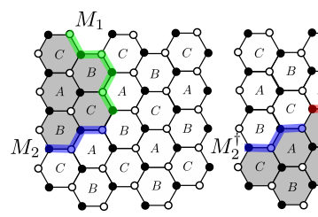
<figcaption class="paper-figure-caption"><b>Fig 1.</b> Figure 2: Construction of string operators M1, M2, M3 for T-junction.</figcaption>
</figure>
<figure class="paper-figure-card">
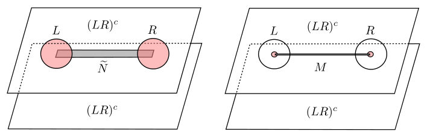
<figcaption class="paper-figure-caption"><b>Fig 2.</b> Figure 3: In the canonical purification picture, the two states |˜Φ⟩≡( e N ⊗I)|Ψρ⟩and |Φ⟩≡ (M ⊗I)|Ψρ⟩coincide on (LR)c.</figcaption>
</figure>
<figure class="paper-figure-card">
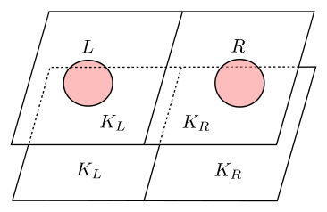
<figcaption class="paper-figure-caption"><b>Fig 3.</b> Figure 4: The system is divided into four subsystems L, KL, KR, R in the canonical purification picture. Here, L (R) is decoupled from KRR (KLL).</figcaption>
</figure>
<figure class="paper-figure-card">
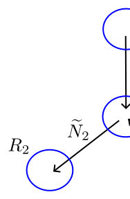
<figcaption class="paper-figure-caption"><b>Fig 4.</b> Figure 5: Concentrating anyons in the T-junction.</figcaption>
</figure>
<figure class="paper-figure-card">
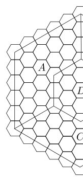
<figcaption class="paper-figure-caption"><b>Fig 5.</b> Figure 6: Four-partite subsystems ABCD. The surrounding region E may be empty.</figcaption>
</figure>

**Summary.** The paper introduces a rigorous concept of 'many-body chirality' by defining it as an obstruction to transforming a quantum state into its complex conjugate via local operations. It proves this diagnostic is sensitive to the underlying anyon theory's mirror symmetry, revealing forms of chirality invisible to standard entanglement measures like the modular commutator.

**Why it may be interesting.** This work provides powerful, non-local diagnostics (like 4-partite chirality) for topological order that are robust against local noise or simple entanglement measures, which is crucial for understanding fault-tolerant quantum computation.

Detailed structure

**Main problem.** The primary goal is to develop a quantum information theoretic characterization of chirality in many-body quantum states, moving beyond insufficient diagnostics like the modular commutator.

**Main result.** LO-chirality for $Z(k)_d$ stabilizer theories is equivalent to the underlying anyon data being mirror invariant, and this obstruction is intrinsically four-partite. Furthermore, these systems exhibit intrinsic 'imaginarity' if $d>2$.

**Method.** The authors introduce LO-chirality as an obstruction to transforming a state into its complex conjugate via local operations (LO), contrasting it with conventional entanglement measures.

**Model / system.** The analysis focuses on topological phases realized by abelian anyons, specifically $Z(k)_d$ stabilizer mixed and pure states, often modeled on lattices like the honeycomb lattice.

**Key observables.** LO-chirality, LU-imaginarity (intrinsic complex phase structure), four-partite entanglement measures, and the chiral central charge ($c_-$).

**Important parameters / regimes.** The anyon level $d$ (especially $d>2$), the number of parties involved in chirality detection (four-partite vs. tripartite), and the nature of local operations (LO vs. LU).

**Assumptions / limitations.** The analysis relies on establishing equivalences between different notions of chirality (e.g., LO-chirality $\iff$ four-partite chirality) for specific model classes.

**Figures summary.** Not specified, but the notes suggest comparisons in tables summarizing various topological models against multiple chirality diagnostics ($c^-$, LO chiral, Four-partite chiral).

**Paper structure.** The paper develops concepts sequentially: first defining LO-chirality and linking it to mirror invariance for $Z(k)_d$ theories; then establishing the four-partite nature of this obstruction; subsequently introducing LU-imaginarity as a deeper resource property; and finally applying these tools to analyze specific lattice realizations.

Abstract

A defining feature of chirality is the distinction between a system and its mirror image. Despite extensive experimental observations of chiral phases and theoretical advances, a quantum-information theoretic characterization of chirality based solely on the entanglement structure of many-body quantum states remains elusive. Here, we introduce the notion of many-body chirality by formulating it as an obstruction to transforming a quantum state into its complex conjugate through finite-depth local operations. We rigorously establish many-body chirality for stabilizer realizations of $\mathbb{Z}_d^{(k)}$ anyon theories, proving that complex conjugation can be implemented by local quantum channels if and only if the underlying anyon data are mirror invariant. This reveals forms of chirality that evade conventional diagnostics, including examples with vanishing modular commutator, vanishing chiral central charge, and commuting-projector realizations. We further show that this obstruction is intrinsically four-partite, while invisible to tripartite entanglement structure. Finally, we prove that $\mathbb{Z}_d^{(k)}$ states with $d>2$ possess intrinsic many-body imaginarity: their complex phase structure cannot be removed by finite-depth local unitaries. Remarkably, this includes states that are not many-body chiral.

[↑ back to top](#top)

### [Optimal multi-spectral squeezing via deterministic 2D-phase optimization](http://arxiv.org/abs/2606.20192v1)

**Authors:** Bastien Oriot, Peter Namdar, Emilie Gillet, RL Rincon Celis, Valentina Parigi  
**Type:** experiment · **Category:** quantum information and computing · **PDF:** <https://arxiv.org/pdf/2606.20192v1>  
**Analysis basis:** full PDF text, analyzed in chunks
**Topic relevance:** 🔥 `quantum optics experiment` **4/5** · `interference shaping light` **3/5** · `quantum measurements` **2/5** · `QC/QI experiment` **1/5**

↔ Scroll figures horizontally

<figure class="paper-figure-card">
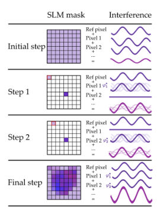
<figcaption class="paper-figure-caption"><b>Fig 1.</b> FIG. 1. Visual representation of the algorithm. Only the op- timization of the first two pixels is shown. The purple pixel in the middle is the reference pixel; the white pixels are the ones reflected out and filtered in the Fourier plane. On the right is represented the contribution of each pixel to the inter- ference signal while the phase between the LO and the seed is scanned.</figcaption>
</figure>
<figure class="paper-figure-card">
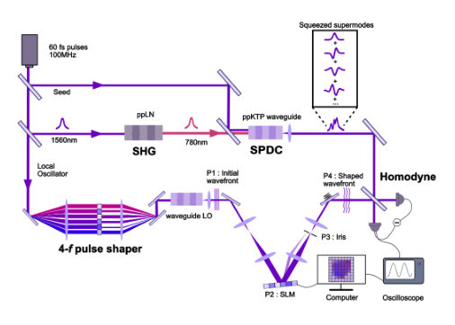
<figcaption class="paper-figure-caption"><b>Fig 2.</b> FIG. 3. Scheme of the experimental setup. The second har- monic of the femtosecond laser pumps a ppKTP crystal for squeezing generation. A second portion of the main laser is spectrally shaped and spatially optimized to serve as the local oscillator in homodyne detection. When squeezing is measured, the seed path is blocked. For spatial phase opti- mization of the LO, the 780 nm beam is blocked while the seed is used to mimic the quantum signal. To maximize its overlap with the LO, a photodiode is placed at the beam splitter (BS) output to monitor the interference fringes.</figcaption>
</figure>
<figure class="paper-figure-card">
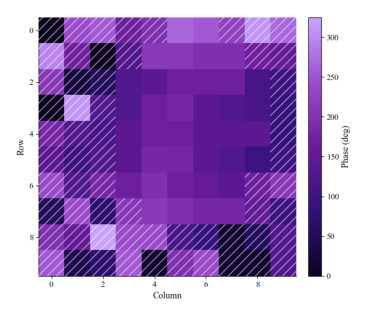
<figcaption class="paper-figure-caption"><b>Fig 3.</b> FIG. 5. Obtained phase map; the non-hatched portion shows where the beam is physically on the screen.</figcaption>
</figure>
<figure class="paper-figure-card">
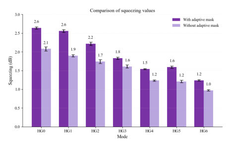
<figcaption class="paper-figure-caption"><b>Fig 4.</b> FIG. 6. Measurement of squeezing with and without the adaptive mask.</figcaption>
</figure>

**Summary.** The paper presents a deterministic algorithm to optimize the spatial phase mask applied to a local oscillator beam in waveguide-based quantum optics experiments. By treating the visibility as a sum of pixel contributions, they achieve superior mode overlap compared to previous methods. This optimization directly translates into measurable improvements in multi-spectral squeezing levels, advancing practical quantum measurement techniques.

**Why it may be interesting.** This work provides an interpretable, physically grounded methodology to enhance quantum state measurements (squeezing) in integrated photonic platforms by deterministically controlling spatial mode matching, which is crucial for scaling quantum technologies.

Detailed structure

**Main problem.** The primary goal is optimizing multi-spectral squeezing for quantum protocols by maximizing the mode overlap efficiency between a local oscillator (LO) beam and the quantum signal beam.

**Main result.** A deterministic phase shaping algorithm increased the measured visibility from 76% to 84%, leading to a quantifiable improvement in quantum readout, specifically increasing squeezing from -2.08 dB to -2.64 dB.

**Method.** The authors developed and implemented a deterministic sequential optimization algorithm that treats the problem as maximizing the sum of contributions from individual spatial pixels on an SLM mask.

**Model / system.** The experiment uses a waveguide-based setup employing homodyne detection to measure squeezing. The LO's spatial profile is shaped using a Spatial Light Modulator (SLM) whose pixel phases are optimized relative to a reference pixel.

**Key observables.** Visibility ($V$), Mode Overlap Efficiency ($\eta_{mod}$), and Squeezing level (measured in dB).

**Important parameters / regimes.** The optimization scales linearly with the number of pixels, providing an efficient alternative to black-box machine learning techniques.

**Assumptions / limitations.** The visibility function is assumed to decompose additively across individual pixel contributions, allowing for sequential single-parameter optimization.

**Figures summary.** Figures illustrate the algorithm flow (sequential phase optimization), the experimental setup involving LO shaping on an SLM, and comparisons of measured squeezing with and without the adaptive mask.

**Paper structure.** The paper introduces the problem of mode overlap in homodyne detection, details the theoretical decomposition of visibility into pixel contributions, presents the novel deterministic sequential algorithm for phase optimization, validates this method experimentally using a waveguide setup, and concludes by quantifying the resulting quantum enhancement.

Abstract

Optimization routines are ubiquitous in quantum information technologies and essential to reach the resource levels required by quantum protocols. Specifically, multi-spectral squeezing for use in such protocols requires that losses be kept minimal at every stage, including coherent detection, which is performed by interfering the signal with a classical local-oscillator beam. This in turn requires control over all optical degrees of freedom of the beam in order to optimize the detection. The most general framework for this optimization relies on agnostic, off-the-shelf machine-learning techniques. Here we take the opposite approach: by focusing on a physical description of the specific optical process, we develop a deterministic sequential algorithm that provably reaches the global maximum of the visibility in a pixel basis and scales linearly with the number of pixels, thereby offering an efficient and theoretically grounded alternative to black-box optimization. In our waveguide-based setup, the optimized mask increases the visibility from 76% to 84%, corresponding to a 20% gain in mode-matching efficiency. Multi-spectral squeezing measurements confirm that this improvement translates directly into quantum readout: for the most squeezed spectral mode, the squeezing increases from $-2.08$ dB to $-2.64$ dB, consistent with the inferred efficiency gain. These results establish deterministic spatial phase shaping as an effective, interpretable route to enhanced multimode squeezing in waveguide platforms.

[↑ back to top](#top)

### [Electrical Noise Produced by Micron-Sized Particles above a Surface Paul Trap](http://arxiv.org/abs/2606.19585v1)

**Authors:** Ben Saarel, Ozgur Sahin, Hartmut Häffner, Alpha T. N'Diaye  
**Type:** experiment · **Category:** other · **PDF:** <https://arxiv.org/pdf/2606.19585v1>  
**Analysis basis:** full PDF text, analyzed in chunks
**Topic relevance:** 🔥 `QC/QI experiment` **4/5** · `Keldysh / 2PI / non-Gaussian methods` **1/5** · `correlated / nonlocal dissipation` **1/5** · `driven-dissipative phase transition` **1/5** · `methods for driven-dissipative` **1/5**

↔ Scroll figures horizontally

<figure class="paper-figure-card">
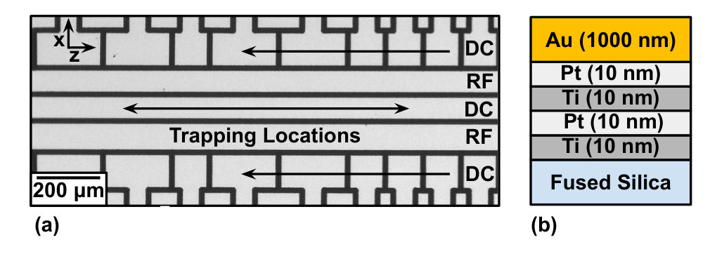
<figcaption class="paper-figure-caption"><b>Fig 1.</b> FIG. 1. Trap fabrication and layout. (a) Microscope image of the trap after fabrication. (b) Schematic of the metal layers deposited onto the fused silica substrate.</figcaption>
</figure>
<figure class="paper-figure-card">
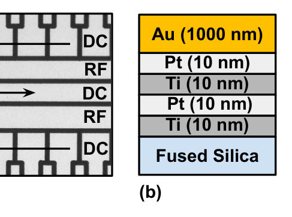
<figcaption class="paper-figure-caption"><b>Fig 2.</b> Fig. 2 displays the measured heating rates for ω = 2π × 1 MHz at various trapping locations along the length of the trap. For positions L1-L3, the heating rates remain constant at ≈200quanta/s. For positions L3-L7, the heating rate depends strongly on the trapping location z. The maximum heating rate we measure is 77000(7000) quanta/s at location L6. Fig. 3 shows the scaling of the heating rate with motional frequency ω at selected locations along the trap. We fit Eq. 4 to determine the power-law noise exponent α; the best-fit curves are plotted in Fig. 3 and the fit parameters are displayed in Table I.</figcaption>
</figure>
<figure class="paper-figure-card">
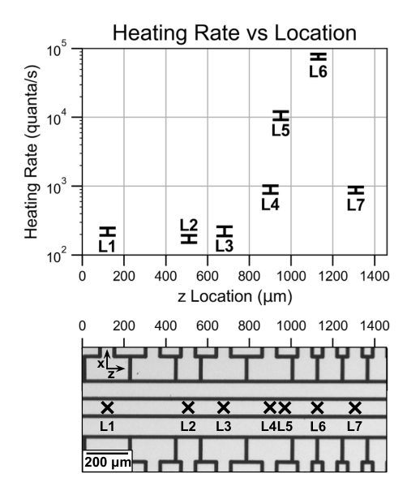
<figcaption class="paper-figure-caption"><b>Fig 3.</b> FIG. 2. Heating rates measured at different z-locations along the trap. All heating rates are taken at a motional frequency ω = 2π ×1MHz.</figcaption>
</figure>
<figure class="paper-figure-card">
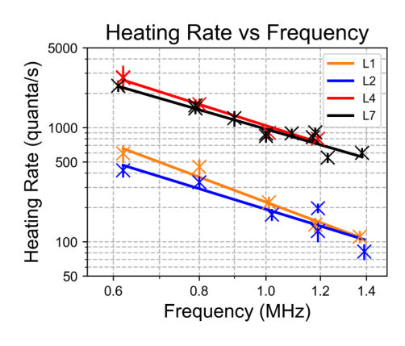
<figcaption class="paper-figure-caption"><b>Fig 4.</b> FIG. 3. Frequency dependence of the heating rates at trapping loca- tions L1, L2, L4, and L7. We fit Eq. 4 to the data and plot the best-fit curves in the figure.</figcaption>
</figure>
<figure class="paper-figure-card">
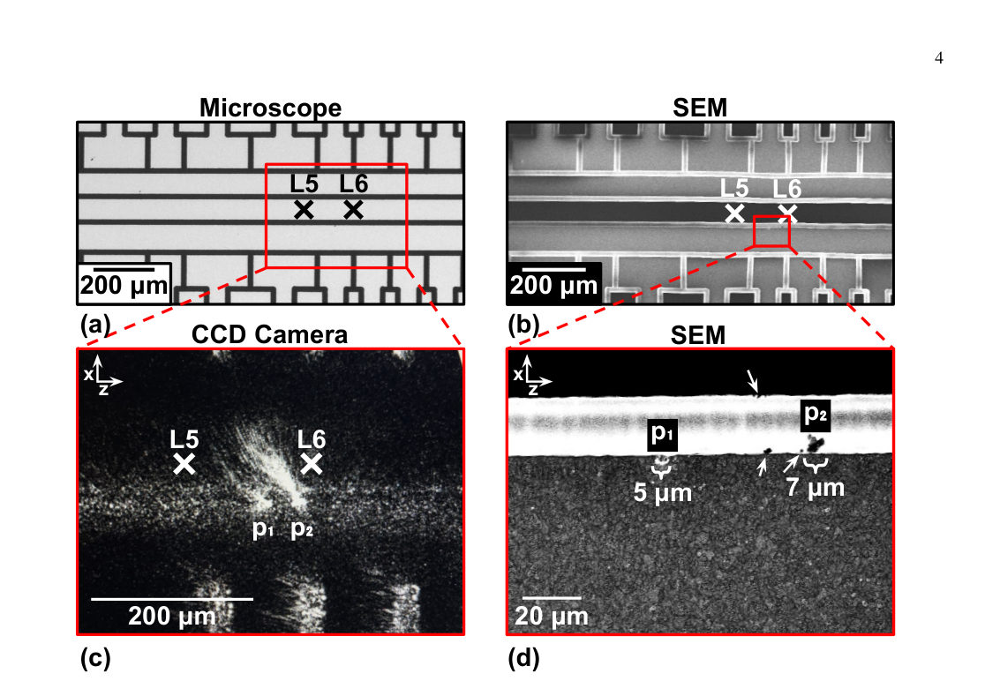
<figcaption class="paper-figure-caption"><b>Fig 5.</b> FIG. 4. Defect images. (a) Microscope image of the trap immediately after fabrication and prior to heating rate measurements. (b) Low- magnification SEM image of the trap taken after heating rate measurements. (c) CCD camera image of the trap taken during heating rate measurements, with point defects p1 and p2 illuminated by a grazing-incidence laser beam. (d) High-magnification SEM image of the trap taken after heating rate measurements. The two largest particles are labeled p1 and p2 and correspond to the point defects in the CCD camera image. Smaller particles are indicated by arrows.</figcaption>
</figure>

**Summary.** The researchers investigated electric field noise limiting quantum operations in a surface Paul trap. They found that the noise is strongly correlated with micron-sized particles on the electrode surface. By modeling these particles as lossy dielectrics, they successfully explained the magnitude and frequency dependence of the measured noise, offering a key insight into improving ion trap fidelity.

**Why it may be interesting.** This work provides crucial experimental grounding for open quantum system modeling in trapped ions. By quantifying environmental noise sources (surface defects) using established electromagnetic theory, it helps refine decoherence models essential for scaling up ion-trap quantum computers.

Detailed structure

**Main problem.** Electric field noise originating from the surface of ion trap electrodes degrades the fidelity of quantum computing operations, but its microscopic origins are unclear.

**Main result.** The measured electric field noise correlates strongly with the presence of micron-sized particles on the trap surface, and this noise can be successfully modeled by treating these particles as lossy dielectrics.

**Method.** The authors measured the heating rate ($\dot{n}$) of a single trapped ion's motion to quantify the spectral density of electric field noise ($S_E(\omega)$).

**Model / system.** The experiment uses a linear surface Paul trap. The theoretical model treats the noise source as dielectric particles on the electrode surface, whose dissipation is governed by an effective loss tangent ($	an	heta$).

**Key observables.** Electric field noise levels (measured via ion heating rate $\dot{n}$), frequency dependence of noise ($S_E(\omega) \propto 1/\omega$), and particle presence visualized via SEM/CCD.

**Important parameters / regimes.** The effective loss tangent was determined to be $	an	heta = 0.33(0.06)$. Noise levels varied by three orders-of-magnitude across a $600\,\mu	ext{m}$ section.

**Assumptions / limitations.** Particles are modeled as lossy dielectrics, and low-noise regions are assumed to be limited by mechanisms similar to other low-noise traps.

**Figures summary.** Figures show trap fabrication details, measured heating rates across different locations (L1-L7), frequency dependence fits for selected sites, and microscopy images confirming particle presence near high-noise areas.

**Paper structure.** The paper establishes the problem of noise in ion traps, presents measurements showing strong spatial variation correlated with particles, develops a theoretical model linking this noise to dielectric loss, and validates the model against measured frequency and spatial dependencies.

Abstract

Electric field noise produced by the surface of ion trap electrodes reduces the fidelity of quantum computing operations. Despite decades of investigation its microscopic origins remain unclear. Here, we measure electric field noise at trapping locations along the symmetry axis of a linear surface Paul trap. We find that noise levels vary by three orders-of-magnitude in one 600$\,μ$m section of the trap. Optical and scanning electron microscope images show micron-sized particles close to the trapping locations with the highest noise levels. We find that modeling the particles as a lossy dielectric with a effective loss tangent $\tanθ=0.33(0.06)$ describes the magnitude of the noise, as well as its spatial and frequency dependence. Our observations may explain the large variation of reported noise levels in literature.

[↑ back to top](#top)

### [Entropy Estimation in Multi-Qutrit Systems via Variational and Classical Neural Networks](http://arxiv.org/abs/2606.20504v1)

**Authors:** Sai Sakunthala Guddanti, Anil Prabhakar, Ria Rushin Joseph  
**Type:** theory · **Category:** quantum information and computing · **PDF:** <https://arxiv.org/pdf/2606.20504v1>  
**Analysis basis:** full PDF text, analyzed in chunks
**Topic relevance:** 🔥 `entanglement & information structure` **4/5** · `methods for driven-dissipative` **1/5** · `quantum measurements` **1/5**

↔ Scroll figures horizontally

<figure class="paper-figure-card">
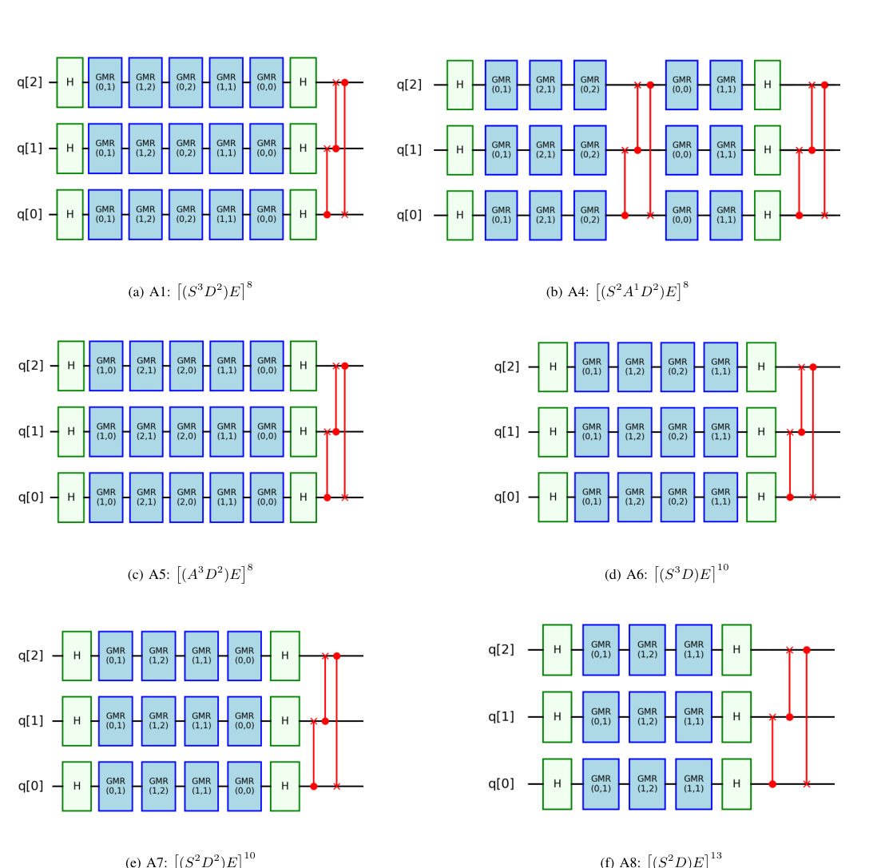
<figcaption class="paper-figure-caption"><b>Fig 1.</b> Fig. 1: Three-qutrit variational circuit ansatzes A1, A4, A5, A6, A7, and A8 are shown for single layer. Each circuit consists of layers of local GMR gates interleaved with entangling operations (CSUM gates). In the figures, the ordered index pairs (i, j) label the generator class: i &lt; j denotes symmetric generators, i &gt; j antisymmetric generators, and i = j diagonal generators; this notation is used solely to distinguish generator types. Each ansatz is denoted as [B]L, where B represents a variational block composed of symmetric (S), antisymmetric (A), and diagonal (D) GMRs followed by an entangling layer (E), and L is the number of layers.</figcaption>
</figure>
<figure class="paper-figure-card">
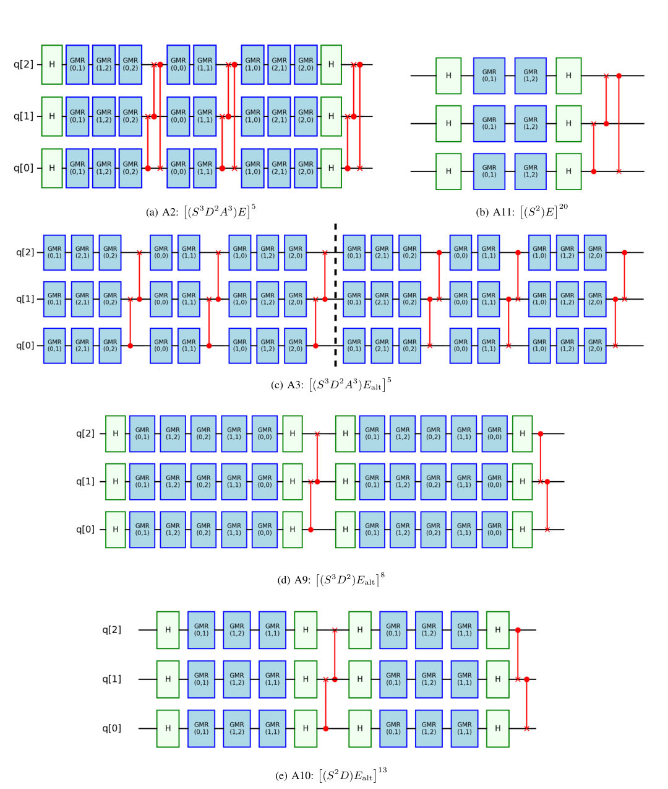
<figcaption class="paper-figure-caption"><b>Fig 2.</b> Fig. 2: Three-qutrit variational circuit ansatzes A2, A11, A3, A9 and A10. Circuits follow the same GMR index notation as in Fig. 1. Ansatzes A3, A9 and A10 are shown over two layers to highlight alternating entanglement connectivity, while A2 and A11 are shown for a single layer. Hadamard-type basis-change gates are omitted for clarity in A3.</figcaption>
</figure>
<figure class="paper-figure-card">
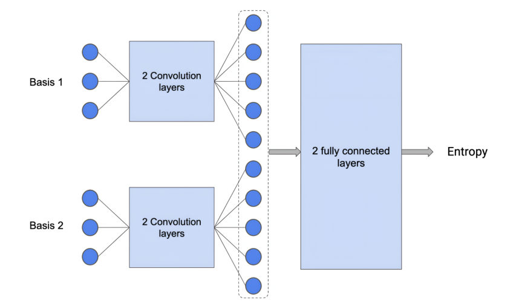
<figcaption class="paper-figure-caption"><b>Fig 3.</b> Fig. 3: Schematic of the CNN-based entropy estimator. Measurement outcome distributions from different bases are processed by convolutional layers and combined via fully connected layers to predict the entropy. Only two bases are shown for illustration.</figcaption>
</figure>
<figure class="paper-figure-card">
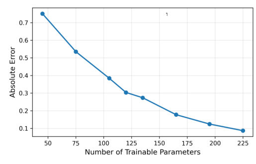
<figcaption class="paper-figure-caption"><b>Fig 4.</b> Fig. 4: Parameter study using Ansatz 1 on a 60% mixed 3- qutrit state. The entropy estimation error decreases with in- creasing number of trainable parameters under ideal simulation conditions.</figcaption>
</figure>
<figure class="paper-figure-card">
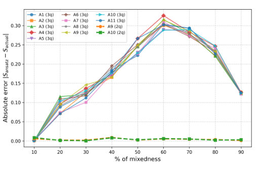
<figcaption class="paper-figure-caption"><b>Fig 5.</b> Fig. 5: Absolute prediction error in the estimation of von Neumann entropy for two- and three-qutrit quantum states as a function of the percentage of mixedness. Two-qutrit states have negligible error while all ansatzes for three-qutrit VQA perform similar.</figcaption>
</figure>

**Summary.** The paper proposes two complementary techniques—Variational Quantum Algorithms (VQAs) and Convolutional Neural Networks (CNNs)—to estimate the von Neumann entropy of multi-qutrit quantum states. It finds that while VQAs are accurate for small systems, CNNs provide superior scalability and robustness when analyzing larger qudit systems by learning features directly from measurement data.

**Why it may be interesting.** This work directly addresses resource estimation in quantum information processing. The comparison between physically constrained variational methods and data-driven machine learning estimators provides crucial guidance on which computational paradigm is best suited for scaling quantum characterization tasks beyond small proof-of-concept systems.

Detailed structure

**Main problem.** The core problem is estimating the von Neumann entropy of quantum states in multi-qutrit systems, which is computationally hard due to the exponential scaling of full state tomography.

**Main result.** A trade-off exists between VQAs and CNNs: VQAs are effective for small systems due to physical constraints, while CNNs offer superior scalability and robustness for larger qutrit systems by learning directly from measurement statistics.

**Method.** The study compares two methods: Variational Quantum Algorithms (VQAs) using parameterized unitaries on the quantum hardware side, and classical Convolutional Neural Networks (CNNs) trained on tensor-product measurements of mutually unbiased bases.

**Model / system.** The system under study is multi-qutrit quantum states ($d=3$ per qutrit), analyzed for systems ranging from two to five qutrits. The methods are tested using ideal, noise-free quantum simulation environments.

**Key observables.** Von Neumann entropy $S(
ho)$, estimation error (e.g., 90th-percentile absolute error in nats), and measurement probabilities derived from various bases.

**Important parameters / regimes.** The number of trainable parameters ($\approx 120$ fixed for VQAs) and the fraction of measurements used ($12.5\%$ sufficient for high accuracy in large systems).

**Assumptions / limitations.** The analysis is primarily conducted within simulated, noise-free settings; full state tomography is assumed to be infeasible.

**Figures summary.** Figures illustrate specific VQA ansatzes (A1-A11) and the CNN architecture. Key plots show error dependence on parameters/gates for VQAs, and error vs. system size/measurement bases for both methods, demonstrating scalability differences.

**Paper structure.** The paper systematically introduces entropy estimation in multi-qutrit systems, details the VQA approach (using GMR gates to align basis with eigenbasis), presents the CNN approach using MUB measurements, and concludes by comparing their performance across different system sizes, establishing a clear methodological guideline.

Abstract

We present a systematic study of von Neumann entropy estimation in multi-qutrit quantum systems using two complementary approaches: variational quantum algorithms (VQAs) and classical convolutional neural networks (CNNs), evaluated using an ideal (noise-free) quantum simulator. For systems up to three qutrits, we construct and evaluate 11 hardware-efficient SU(3)-inspired ansatzes. A parameter sweep shows that estimation accuracy is primarily determined by the number of trainable parameters, provided sufficient entanglement is present. Based on this study, we fix the parameter count to approximately 120 for subsequent experiments, observing that increasing entangling-gate counts beyond a threshold yields only marginal improvements. For larger systems (two to five qutrits), we use a CNN trained on measurement outcomes from tensor-product mutually unbiased bases. The model achieves accurate and stable predictions and exhibits a systematic improvement in performance with system size, with the highest errors for two-qutrit systems and the lowest for five-qutrit systems. Notably, using only 12.5% of the measurements required for full state tomography is sufficient to reach 90th-percentile absolute errors of approximately 0.13-0.16 nats for both four- and five-qutrit systems. The CNN model is also robust to shot noise and generalizes well to out-of-distribution states. Overall, within the simulated settings studied here, our results indicate a transition in practical methods: VQAs are effective for small systems, while CNN-based estimators offer improved scalability and robustness for larger qutrit systems.

[↑ back to top](#top)

### [Optimal Shadow Estimation with Minimal Measurement Settings](http://arxiv.org/abs/2606.20003v1)

**Authors:** Zhiyao Yang, Datong Chen, Huangjun Zhu  
**Type:** theory · **Category:** quantum information and computing · **PDF:** <https://arxiv.org/pdf/2606.20003v1>  
**Analysis basis:** full PDF text, analyzed in chunks
**Topic relevance:** 🔥 `quantum measurements` **4/5** · `entanglement & information structure` **1/5** · `measurement-induced transitions` **1/5**

↔ Scroll figures horizontally

<figure class="paper-figure-card">
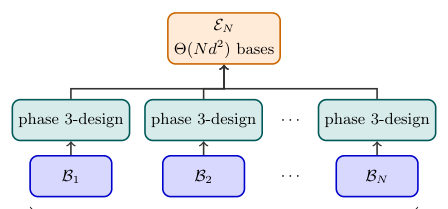
<figcaption class="paper-figure-caption"><b>Fig 1.</b> FIG. 1. Construction of the optimal measurement ensemble EN for worst-case shadow estimation from mutually unbiased bases (MUBs) and phase 3-designs. Each phase 3-design is constructed from Θ(d2) bases. The ensemble EN is composed of Θ(d2) bases whenever N = O(1) but can achieve optimal scaling in the worst-case shadow norm as long as N ≥2.</figcaption>
</figure>
<figure class="paper-figure-card">
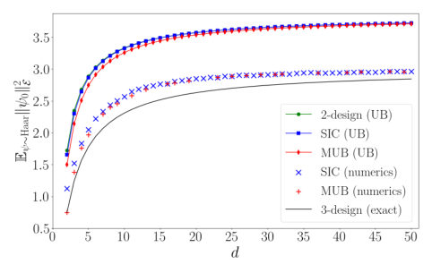
<figcaption class="paper-figure-caption"><b>Fig 2.</b> FIG. 2. Mean squared shadow norm for fidelity estimation of Haar-random pure states versus dimension d. SIC and MUB results are compared with upper bounds from Eq. (11), the exact 3-design result, and the worst-case 2-design bound [based on Proposition 1 and Eq. (11)]. Notably, the average performance across all 2-designs, including SICs and MUBs, nearly matches the 3-design benchmark.</figcaption>
</figure>
<figure class="paper-figure-card">
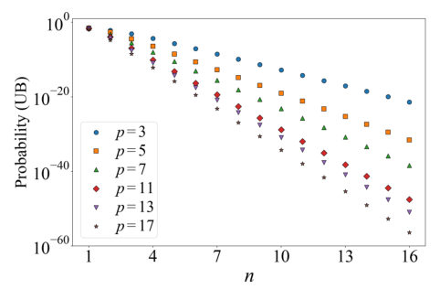
<figcaption class="paper-figure-caption"><b>Fig 3.</b> FIG. 3. Probability that ∥ψ0∥2 E ≥9 for a Haar-random pure state ψ in fidelity estimation based on n-qudit stabilizer mea- surements with local dimension p. The rapid decay confirms constant sample complexity for generic target states, in agree- ment with Theorem 3 and Proposition 3.</figcaption>
</figure>

**Summary.** This work rigorously analyzes the measurement resources needed to estimate unknown quantum properties via shadow estimation. It proves a fundamental complexity gap: achieving optimal performance in the worst case requires $\Theta(d^2)$ measurements, while average-case optimality is achieved with only $\Theta(d)$ measurements using state 2-designs.

**Why it may be interesting.** The clear separation between worst-case and average-case resource requirements is crucial for designing practical quantum protocols, suggesting that simple, structured measurements are sufficient for most real-world applications.

Detailed structure

**Main problem.** The core problem is determining the minimal measurement complexity required for achieving optimal shadow estimation of quantum properties from randomized measurements.

**Main result.** A fundamental separation is established: worst-case optimality requires $\Theta(d^2)$ measurement bases, whereas average-case performance only needs $\Theta(d)$ bases.

**Method.** The authors use the framework of $t$-designs (state and unitary) to analyze the shadow norm variance ($\lVert O 
Vert^2_E$) under different averaging procedures (worst-case vs. Haar random).

**Model / system.** The system involves estimating properties of an unknown quantum state $
ho$ in a $d$-dimensional Hilbert space using measurement ensembles $\{|\phi_i
angle, w_i\}$ forming a POVM.

**Key observables.** Shadow norm ($\lVert O 
Vert^2_E$), mean squared shadow norm, and the required number of measurement bases ($N$).

**Important parameters / regimes.** $d$ (system dimension), $t$-design order ($t=2$ or $t=3$), and the complexity gap between worst-case ($\Theta(d^2)$) and average-case ($\Theta(d)$).

**Assumptions / limitations.** The analysis often assumes that the measurement ensemble forms a state 2-design to simplify expectation value calculations.

**Figures summary.** Figures compare mean squared shadow norms for fidelity estimation using different measurements (SIC-POVMs vs. MUBs) and show convergence towards theoretical bounds, illustrating the performance gap.

**Paper structure.** The paper progresses by defining the shadow norm variance, establishing necessary conditions via $t$-designs, proving the $\Theta(d^2)$ lower bound for worst-case scenarios using explicit constructions (MUBs), and then demonstrating the $\Theta(d)$ sufficiency for average-case performance.

Abstract

Shadow estimation is a powerful framework for predicting quantum properties from randomized measurements. While $3$-design protocols achieve optimal worst-case performance, the minimal number of measurement bases required for such optimality has remained open. Here we prove that $Θ(d^2)$ measurement bases are both necessary and sufficient for worst-case optimal shadow estimation and construct an explicit basis family. In stark contrast, any state $2$-design already suffices for average-case optimality: the mean squared shadow norm of normalized observables is bounded by a universal constant, and we prove strong concentration for Haar-random states, yielding constant sample complexity for generic pure-state fidelity estimation. Easily implementable $2$-designs -- from mutually unbiased bases, cyclic measurements, or shallow $\mathcal{O}(\log n)$-depth circuits -- enable optimal average-case protocols with remarkably simple measurement strategies. Our results establish a fundamental complexity separation: worst-case estimation requires $Θ(d^2)$ bases, whereas average-case performance requires only $Θ(d)$ bases, with broad implications for quantum information theory and near-term experiments.

[↑ back to top](#top)

### [Entanglement Scaling and Problem Structure in Quantum Approximate and Adiabatic Optimization Algorithms](http://arxiv.org/abs/2606.19502v1)

**Authors:** Georgios Arapantonis, Paraj Titum, Gregory Quiroz  
**Type:** theory · **Category:** quantum information and computing · **PDF:** <https://arxiv.org/pdf/2606.19502v1>  
**Analysis basis:** full PDF text, analyzed in chunks
**Topic relevance:** 🔥 `entanglement & information structure` **4/5** · `non-equilibrium dynamics` **1/5**

↔ Scroll figures horizontally

<figure class="paper-figure-card">
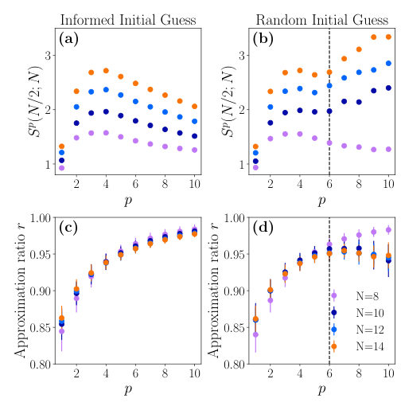
<figcaption class="paper-figure-caption"><b>Fig 1.</b> FIG. 1. Comparison of random and informed initialization strategies. Panels (a) and (b) present the average Sp(N/2; N) as a function of QAOA depth p for informed and random initialization, respectively. Panels (c) and (d) show the corresponding approximation ratios. Re- sults are averaged over 50 random instances of weighted complete graphs. Error bars indicate the standard error of the mean and are too small to be visible in panels (a) and (b). The performance of the classical optimizer can affect the entanglement profile of complete graphs.</figcaption>
</figure>
<figure class="paper-figure-card">
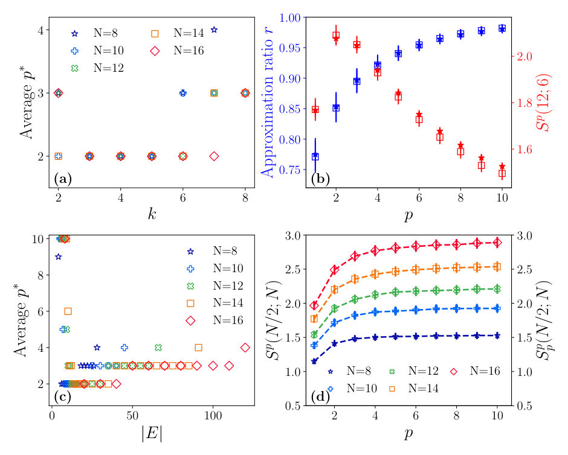
<figcaption class="paper-figure-caption"><b>Fig 2.</b> FIG. 2. Numerical simulations of Sp(N/2; N) and Sp p(N/2; N) as a function of QAOA depth p for Dataset KR and Dataset ED. The average number of QAOA layers p∗required to reach Sp∗(N/2; N) = Sreq(N/2; N), for Dataset KR and Dataset ED are shown in panels (a) and (c), respectively, for different system sizes N. In addition, panel (b) shows simulations for weighted 3-regular graphs with N = 12 using informed (stars) and random initial guesses (squares) for optimization. The entanglement entropy Sp p(N/2; N) at the final layer of the QAOA circuit (dashed line), and the maximum entanglement entropy Sp(N/2; N) (data points with different markers) as a function of QAOA depth p are shown for sparse...</figcaption>
</figure>
<figure class="paper-figure-card">
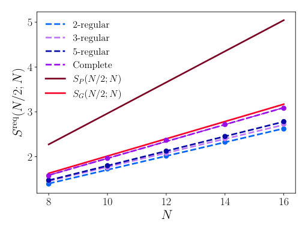
<figcaption class="paper-figure-caption"><b>Fig 3.</b> FIG. 3. Scaling of Sreq(N/2; N) in QAOA for Datasets KR and CW. SP (N/2; N) and SG(N/2; N) denote analytical predictions for Haar random states (i.e. Page Value) and fermionic Gaussian states, respectively; see Sec. V C for further details. Error bars denote the standard error of the mean and are smaller than the marker size. The required entanglement is upper-bounded by that of fermionic Gaussian states and scales linearly with system size for both training schemes implemented in this work.</figcaption>
</figure>
<figure class="paper-figure-card">
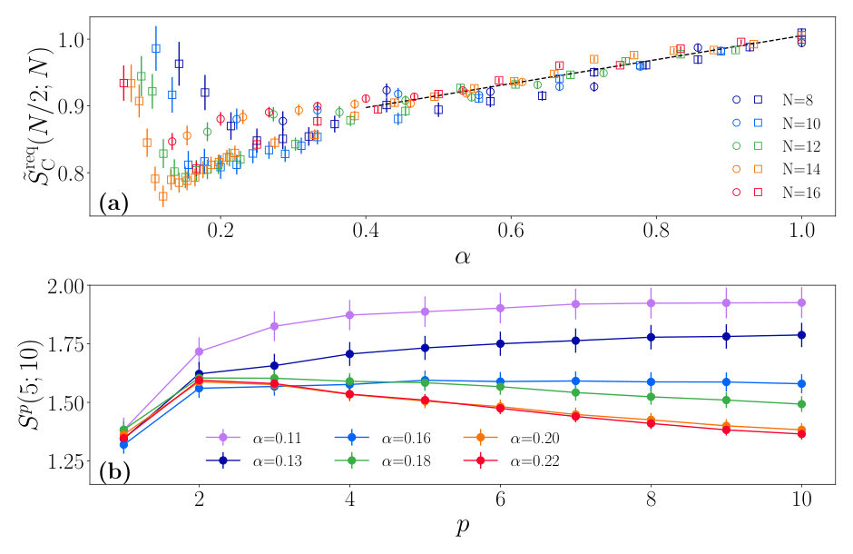
<figcaption class="paper-figure-caption"><b>Fig 4.</b> FIG. 4. Numerical simulations for entanglement requirement of QAOA for arbitrary graphs. Results from Dataset KR (circles) and Datasets CW and ED (squares) are shown. Panel (a) shows results, normalized by complete graphs, as a function of edge density. Dashed lines indicate the linear fit described in the text. Panel (b) shows Sp(N/2; N) versus QAOA depth for N = 10 qubits with different edge counts. Error bars denote the standard error of the mean. The fit accurately captures the entanglement in the high edge-density regime.</figcaption>
</figure>
<figure class="paper-figure-card">
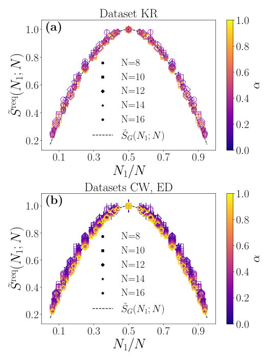
<figcaption class="paper-figure-caption"><b>Fig 5.</b> FIG. 5. Numerical simulations for the entanglement requirement in QAOA, across all bipartitions and different graph families. Data for (a) k-regular graphs from Dataset KR and (b) complete graphs and graphs with varying edges from Datasets CW, ED are shown. Differ- ent colors reflect the edge density, while different markers indicate the system size. Error bars denote the standard error of the mean. For graphs with large edge density, the numerical data collapse onto a single curve, which is well described by Eq. (19).</figcaption>
</figure>

**Summary.** This paper rigorously compares the entanglement scaling between QAOA and AQC when solving MaxCut on various graphs. It demonstrates that while both methods show volume-law scaling, their specific entanglement profiles differ based on the algorithm's structure and the annealing schedule chosen. The findings establish a strong link between quantum resource theory (entanglement) and the fundamental performance characteristics of near-term quantum algorithms.

**Why it may be interesting.** This work provides deep insights into the resource theory aspect of quantum computation by quantifying exactly *how* much entanglement is required and generated by different algorithmic approaches for optimization problems.

Detailed structure

**Main problem.** The paper investigates how entanglement scaling relates to problem structure when comparing two major quantum optimization paradigms: QAOA and AQC, applied to the MaxCut problem.

**Main result.** QAOA exhibits entanglement scaling consistent with fermionic Gaussian states under optimal parameter training, while AQC shows distinct, schedule-dependent entanglement profiles. The study highlights that classical optimization protocols significantly impact the observed entanglement profile in variational algorithms.

**Method.** The authors use numerical simulations to calculate and compare entanglement entropy across various bipartitions for QAOA and AQC applied to MaxCut on different graph structures (k-regular, complete).

**Model / system.** The system is modeled using qubits encoding the MaxCut problem Hamiltonian ($H_C$). The algorithms analyzed are the Quantum Approximate Optimization Algorithm (QAOA) and Adiabatic Quantum Computation (AQC), which operate in a Hilbert space of dimension $2^N$.

**Key observables.** Entanglement entropy ($S$), approximation ratio ($r$), required entanglement ($	ext{S}_{	ext{req}}$), and the peak depth ($p^*$) at which maximum entanglement is reached.

**Important parameters / regimes.** QAOA depth ($p$), graph edge density ($\alpha$), system size ($N$), and the specific annealing schedule function $f(s)$ for AQC.

**Assumptions / limitations.** The analysis often relies on sampling an ensemble of bipartitions to estimate average entanglement entropy, which is assumed accurate enough for scaling studies. It also compares results against analytical bounds like the Page Value and FGS estimates.

**Figures summary.** Figures compare required entanglement ($	ext{S}_{	ext{req}}$) vs. depth ($p$) or edge density ($\alpha$) across different graph types (k-regular, complete), contrasting QAOA/AQC behavior with theoretical benchmarks like fermionic Gaussian states.

**Paper structure.** The paper systematically compares the entanglement scaling of QAOA and AQC for MaxCut on various graphs, detailing how initialization strategies affect results, establishing connections to FGS bounds, and analyzing the dependence of AQC entanglement on the annealing schedule path.

Abstract

Entanglement is widely regarded as a key resource underlying the power of quantum algorithms and their potential to achieve quantum advantage. With the emergence of variational quantum algorithms, however, questions have arisen regarding how entanglement relates to problem structure and algorithmic performance in near-term quantum applications. Here, we examine this relationship through the Quantum Approximate Optimization Algorithm (QAOA), a specific class of variational algorithms, applied to the MaxCut problem. We show that suboptimal variational parameter training can significantly modify the observed entanglement profile, obscuring its scaling behavior. By employing a high-performance optimizer, we find empirical evidence that QAOA exhibits entanglement scaling consistent with that of fermionic Gaussian states (up to a scaling factor) across a broad range of MaxCut instances. We further compare these results with adiabatic quantum computation, observing annealing-schedule-dependent entanglement profiles whose scaling behavior differs markedly from that of QAOA. Together, these findings provide new insight into how entanglement manifests in and distinguishes these two algorithmic paradigms, highlighting its connection to both computational performance and application structure.

[↑ back to top](#top)

### [Majorana bound states in a hybrid Kitaev ladder with long-range pairing](http://arxiv.org/abs/2606.19963v1)

**Authors:** Rajiv Kumar, Tapan Mishra, Levan Chotorlishvili, Sunil Kumar Mishra  
**Type:** theory · **Category:** other · **PDF:** <https://arxiv.org/pdf/2606.19963v1>  
**Analysis basis:** full PDF text, analyzed in chunks
**Topic relevance:** 🔥 `analog quantum simulation` **4/5** · `Keldysh / 2PI / non-Gaussian methods` **1/5**

↔ Scroll figures horizontally

<figure class="paper-figure-card">
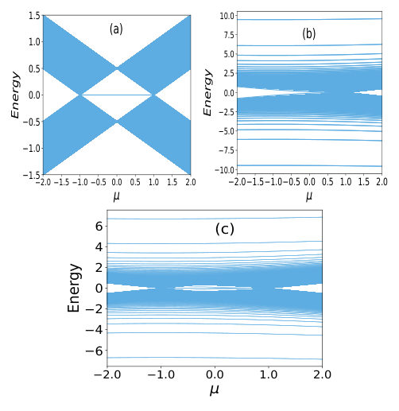
<figcaption class="paper-figure-caption"><b>Fig 1.</b> Figure 2. Energy spectrum for the (a) conventional Kitaev chain and (b) LR Kitaev chain (c) Hybrid Kitaev ladder with tν = 0.0 under OBC. The parameters used are t = ∆= 1.0 and L = 1000, with α = 0.5 for the LR pairing shown in panel (b).</figcaption>
</figure>
<figure class="paper-figure-card">
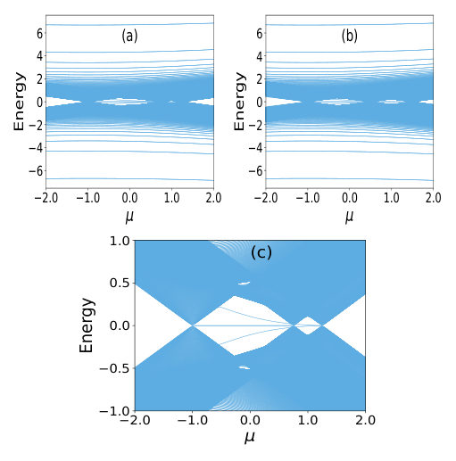
<figcaption class="paper-figure-caption"><b>Fig 2.</b> Figure 3. Energy spectrum for the hybrid Kitaev ladder under OBC with t = ∆= 1.0, α = 0.5, and chain lengths N = 2L = 1000. The spectra are shown for different inter-leg coupling strengths: (a) tν = 0.5 and (b) tν = 1.0 (c) Zoomed-in view of the region of interest of energy spectrum shown in (a).</figcaption>
</figure>
<figure class="paper-figure-card">
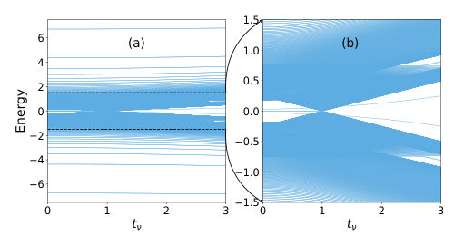
<figcaption class="paper-figure-caption"><b>Fig 3.</b> Figure 4. (a) Energy spectrum as a function of the inter-leg coupling strength tν for the hybrid Kitaev ladder under OBC with fixed µ = 0.5, t = ∆= 1.0, and LR pairing exponent α = 0.5. (b) Zoomed in portion of (a) is shown for clarity.</figcaption>
</figure>
<figure class="paper-figure-card">
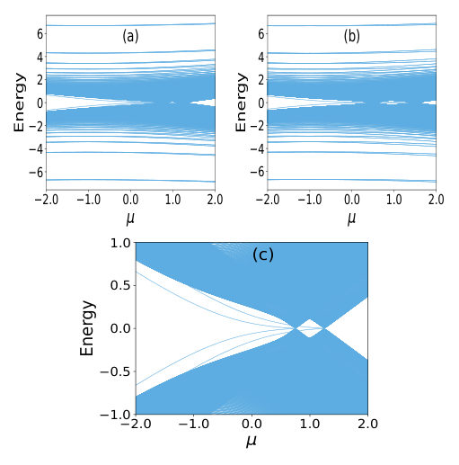
<figcaption class="paper-figure-caption"><b>Fig 4.</b> Figure 5. Energy spectrum for the LR–LR Kitaev ladder under OBC with t = ∆= 0.5, α = 0.5, and chain lengths N = 2L = 1000. The spectra are shown for different inter-leg coupling strengths: (a) tν = 0.5 and (b) tν = 1.0 (c) Zoomed- in view of the region of interest of energy spectrum shown in (a).</figcaption>
</figure>
<figure class="paper-figure-card">
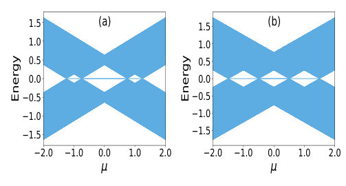
<figcaption class="paper-figure-caption"><b>Fig 5.</b> Figure 6. Energy spectrum for the NN - NN Kitaev ladder under OBC with t = ∆= 1.0 and chain lengths N = 2L = 1000. The spectra are shown for different inter-leg coupling strengths: (a) tν = 0.5 and (b) tν = 1.0.</figcaption>
</figure>

**Summary.** The paper theoretically investigates a hybrid superconducting ladder featuring both nearest-neighbor and long-range pairing interactions. By analyzing the system's energy spectrum using the BdG Hamiltonian, the authors map out a complex topological phase diagram controlled by three parameters: chemical potential ($\mu$), inter-leg coupling ($t_
u$), and the LR exponent ($\alpha$). The key finding is that these parameters allow for precise engineering of Majorana zero modes, enabling transitions between different numbers of localized edge states.

**Why it may be interesting.** This work is highly relevant as it provides a concrete theoretical framework for realizing tunable topological superconductivity by incorporating non-local (long-range) pairing effects into established models like the Kitaev chain. The ability to control mode numbers via $\alpha$ is key for designing robust quantum hardware.

Detailed structure

**Main problem.** The study investigates how incorporating long-range (LR) pairing interactions modifies the topological phase diagram of superconducting systems, specifically focusing on Majorana bound states (MBSs). The goal is to demonstrate controlled tuning of these exotic quantum states.

**Main result.** The system exhibits a rich topological phase diagram where varying the LR pairing exponent ($\alpha$) and inter-leg coupling ($t_
u$) allows for transitions between phases hosting two or four Majorana zero modes. This confirms that long-range interactions provide an additional, tunable mechanism to engineer topological superconductivity.

**Method.** The analysis relies on constructing and solving the Bogoliubov-de Gennes (BdG) Hamiltonian in momentum space to determine the energy spectra and identify gap closings corresponding to topological phase transitions.

**Model / system.** The model is an inter-leg coupled hybrid Kitaev ladder, consisting of two parallel superconducting chains. One chain has conventional nearest-neighbor ($p$-wave) pairing, while the other incorporates algebraically decaying long-range (LR) pairing interactions.

**Key observables.** Majorana zero modes (MZMs), Massive Dirac modes (MDMs), topological phase boundaries, and the number of localized edge states.

**Important parameters / regimes.** Long-range pairing exponent ($\alpha$), inter-leg coupling strength ($t_
u$), chemical potential ($\mu$), and superconducting pairing strengths ($\Delta$).

**Assumptions / limitations.** The system is modeled using spinless fermions obeying standard fermionic anti-commutation relations, and the analysis maps topological transitions to bulk gap closing points.

**Figures summary.** Figures illustrate energy spectra showing how changing $t_
u$ or $\alpha$ shifts transition points and controls the coexistence of MZMs and MDMs. Phase diagrams map out the regions in $(\mu, t_
u)$ and $(\alpha, \mu)$ space corresponding to different topological states.

**Paper structure.** The paper systematically analyzes the Hamiltonian by first establishing the model (hybrid Kitaev ladder), then using BdG theory to calculate spectra across varying parameters ($\mu, t_
u, \alpha$), leading to detailed phase diagram construction and concluding with implications for quantum engineering.

Abstract

We investigate an inter-leg coupled hybrid Kitaev ladder composed of two parallel superconducting chains with distinct pairing interactions. The upper chain of the ladder hosts conventional $p$-wave pairing, while the lower chain exhibits long-range pairing that decays algebraically with distance. We demonstrate that the mutual influence of long-range pairing exponent, chemical potential, and inter-leg coupling strength gives rise to a rich topological phase diagram characterized by multiple Majorana zero modes and massive Dirac modes. In particular, we show that the inter-leg coupling renormalizes the effective energy scales, leading to a systematic shift of the topological phase boundaries and enabling controlled tuning of the Majorana modes. Furthermore, we identify a transition from a two Majorana zero mode phase to a phase encapsulating four Majorana zero modes, as the long-range pairing exponent is varied. This transition is accompanied by a crossover regime in which Majorana zero modes coexist with massive Dirac modes, reflecting hybridization between edge and bulk excitations. This ladder thus provides a minimal and attractive platform for realizing the impact of a long-range pairing on topological phases. Our results highlight the potential of long-range hybrid systems for engineering tunable topological states relevant for quantum information applications.

[↑ back to top](#top)

### [General circuit mapping algorithm for neutral atom quantum computers](http://arxiv.org/abs/2606.20503v1)

**Authors:** Neven Gentil, Lous S. Rianne, Aida Todri-Sanial  
**Type:** theory · **Category:** other · **PDF:** <https://arxiv.org/pdf/2606.20503v1>  
**Analysis basis:** full PDF text, analyzed in chunks
**Topic relevance:** 🔥 `QC/QI experiment` **4/5**

↔ Scroll figures horizontally

<figure class="paper-figure-card">
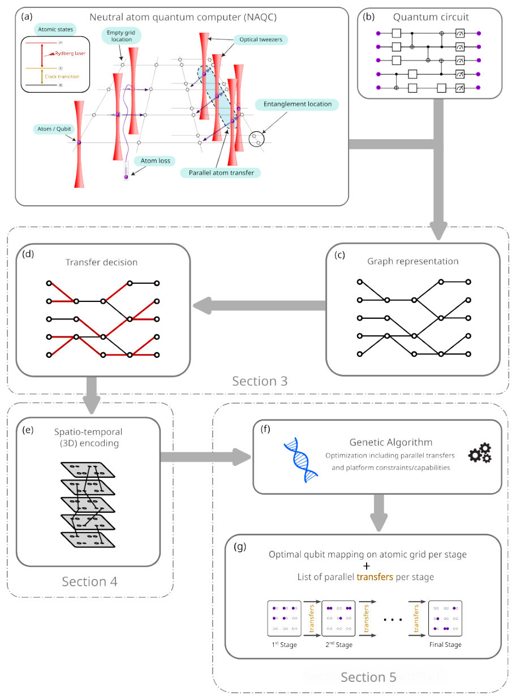
<figcaption class="paper-figure-caption"><b>Fig 1.</b> Figure 1: Schematic overview of the proposed mapper algorithm. Given a specific neutral atom platform (a) and a quantum circuit (b), the quantum digraph represents the decomposition of gate operations into different stages and atom transfers between the stages (c). This graph encompasses the specific platform constraints and capabilities. The graph representation allows to decouple qubit placement at each stage from the transfer scheme used between stages. An optimal transfer scheme is deduced (d) and used to build an efficient encoding of the mapping problem (e). Then, a genetic algorithm (f) converges to a global optimum with respect to the distance traveled by the atoms and the parallel...</figcaption>
</figure>
<figure class="paper-figure-card">
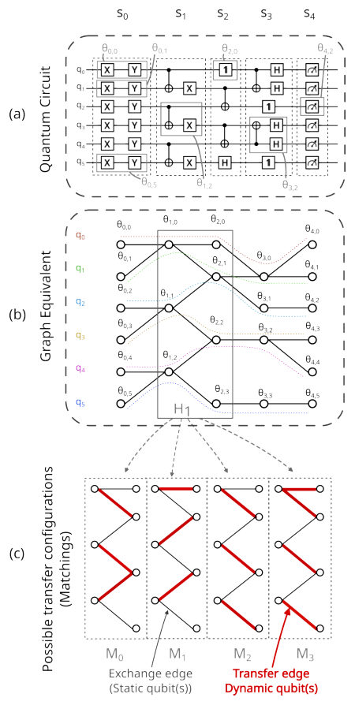
<figcaption class="paper-figure-caption"><b>Fig 2.</b> Figure 2: Example of quantum circuit transformed into a quantum circuit digraph with extraction of possible matchings between consecutive stages. (a) is an exam- ple of scheduled quantum circuit. The stages are labeled si. Inside the stages, the series of gates affecting com- mon qubits are grouped into instructions θi,j. Transfers of the qubits, or remapping, are executed between each stage exclusively. (b) is the associated general quantum digraph G from (a). The edges are directed from θi,j to θi+1,j′. The instructions applied on the qubits along the stages are represented by colored dotted lines: q0 un- dergoes θ0,0, θ1,0, θ2,0, θ3,0 and θ4,0 for example. The subgraph H1 is extracted...</figcaption>
</figure>
<figure class="paper-figure-card">
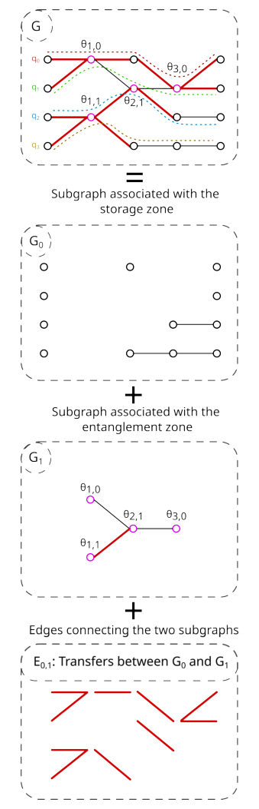
<figcaption class="paper-figure-caption"><b>Fig 3.</b> Figure 3: Decomposition of part of the quantum cir- cuit from Figure 2 for a zoned architecture with two zones. The edges marked as transfers are in red. The edges marked as static are in black. The instructions containing two qubits are pink circles. In this example, ˆθZ1 = {θ1,0, θ1,1, θ2,1, θ3,0}. G is therefore the union of the subgraph G0 containing single-qubit gates only, G1 containing two-qubit gates/single qubit gates, and the edges E0,1 connecting G0 and G1. Since the physical zones associated with G0 and G1 are spatially separated, the edges connecting G0 and G1 are necessarily trans- fers.</figcaption>
</figure>
<figure class="paper-figure-card">
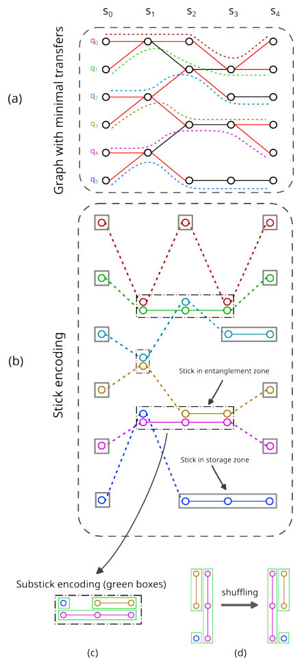
<figcaption class="paper-figure-caption"><b>Fig 4.</b> Figure 4: Transforming the graph representation into stick encoding. Sub-figure (a) is the digraph G of the quantum circuit in Figure 2 where the matchings (black edges) fit the minimum number of transfers for a Z-arch. The red edges are transfers: 16 transfers are required to run the circuit on a two-zoned architecture. Sub-figure (b) is the efficient stick encoding of G. The black boxes are sticks associated with G0 while dashed black boxes are sticks associated with G1 (see Figure 3). The dot- ted lines are transfers. The colors correspond to the qubit colors in (a). Sub-figure (c) is an example of sub- sticks encapsulation (green boxes). Sub-figure (d) is an example of shuffling of the...</figcaption>
</figure>
<figure class="paper-figure-card">
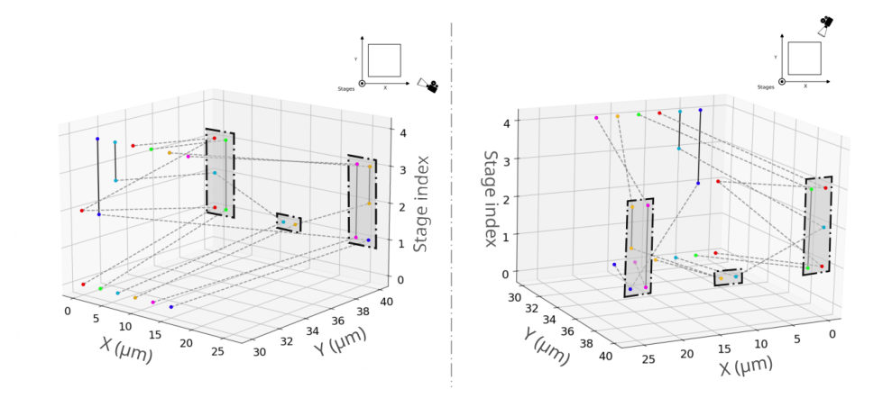
<figcaption class="paper-figure-caption"><b>Fig 5.</b> Figure 5: A 3D view of the stick encoding described in Figure 4 for a 2Z-arch. The atomic grid is the XY plane. The Z axis is time / stages. The atoms are colored according to Figure 2. The transfers are dotted grey lines connecting the atoms. The black lines represent the substicks. We clearly see the atoms in the storage zone at Y=30, Stage index=0 and Y=30, Stage index=4. The entanglement zone is located along the Y=40 vertical plane. Dashed black boxes encompass sticks/substicks involved in the entanglement zone.</figcaption>
</figure>

**Summary.** This paper introduces a general graph-theoretic framework to optimize the compilation of quantum circuits for Neutral Atom Quantum Computers (NAQC). By modeling physical qubit transfers as a combinatorial optimization problem solved with a genetic algorithm, it minimizes required atom movements and maximizes parallel operations. This results in hardware-aware mappings that promise higher fidelity and better efficiency on NAQC devices.

**Why it may be interesting.** This work directly addresses hardware limitations—specifically qubit mobility and associated error rates—in emerging quantum computing platforms based on neutral atoms, providing crucial algorithmic tools for realizing scalable quantum computation.

Detailed structure

**Main problem.** The core challenge is developing an efficient, architecture-aware algorithm to compile quantum circuits for Neutral Atom Quantum Computers (NAQC) by minimizing the physical movement and required transfers of qubits.

**Main result.** The proposed graph-theoretic framework consistently finds fewer qubit transfers compared to state-of-the-art compilers, providing a practical tool that reduces movement-induced errors on NAQC devices.

**Method.** The authors model the circuit as a sequence of stages and use graph-theoretic combinatorial optimization (encoding it as a nonlinear integer program) solved via a genetic algorithm to optimize qubit mapping.

**Model / system.** The system is an NAQC platform using ultracold atoms trapped by optical tweezers. The compilation process involves decomposing the circuit into stages, modeling transfers between these stages using graphs, and optimizing for minimal physical movement.

**Key observables.** Total number of qubit transfers ($\lambda_q$), total traveled distance ($\mu$m), and the count of Parallel Transfer Operations (PTOs).

**Important parameters / regimes.** Qubit coherence time, Rydberg blockade interaction range ($\sim 2-4 \mu	ext{m}$), and physical zone constraints.

**Assumptions / limitations.** The optimization relies on decomposing the problem into local maximum weighted matchings at each stage transition, assuming independence between these stages for the global optimum calculation.

**Figures summary.** Figures illustrate the decomposition of a quantum circuit into stages and transfer decision graphs; they also show the stick encoding, the process of breaking cycles in transfer digraphs, and benchmark comparisons against existing mappers.

**Paper structure.** The paper builds from identifying the physical constraints (qubit movement) to proposing a graph-theoretic framework. It details how the problem is formulated as an integer program solved by a genetic algorithm, culminating in comparative results showing performance improvements over existing compilers.

Abstract

Neutral atom quantum computers (NAQC) are emerging as a promising, scalable quantum computing platform because of their long qubit coherence, flexible qubit arrangement, and multiqubit gate capabilities. However, circuit execution often requires physically moving qubits, making compilation a critical optimization challenge. We propose a circuit independent mathematical framework built on graph-theoretic combinatorial optimization that determines the minimal number of required qubit transfers. This model captures spatial constraints specific to NAQC platforms with zone-limited gate operations and multi-qubit gates. From this framework, we encode the qubit mapping problem as a nonlinear integer program and solve it using a genetic algorithm, enabling trade-offs between minimizing the total traveled distance and the number of parallel transfer operations. Compared to the state-of-the-art scalable compiler for zoned architectures, our approach consistently finds fewer transfers. Depending on the optimization focus, our method produces shorter traveled distances or fewer parallel transfer operations. This work provides both theoretical guaranties and a practical tool for efficient, architecture-aware quantum circuit compilation. As a result, practitioners can generate hardware-aware mappings that reduce movement-induced errors and better exploit atom transfer parallelism, directly improving execution efficiency on NAQC devices.

[↑ back to top](#top)

### [Attosecond Path Qubits in High-Harmonic Generation: Classical Dephasing and Trace-Out Decoherence](http://arxiv.org/abs/2606.20372v1)

**Authors:** A. Marchisio, C. Granados, M. F. Ciappina, O. Cohen  
**Type:** theory · **Category:** quantum information and computing · **PDF:** <https://arxiv.org/pdf/2606.20372v1>  
**Analysis basis:** full PDF text, analyzed in chunks
**Topic relevance:** `correlated / nonlocal dissipation` **3/5** · `driven-dissipative phase transition` **3/5** · `methods for driven-dissipative` **3/5** · `quantum measurements` **3/5** · `Keldysh / 2PI / non-Gaussian methods` **2/5** · `entanglement & information structure` **2/5** · `interference shaping light` **2/5** · `non-equilibrium dynamics` **2/5** · `non-equilibrium universality` **2/5** · `measurement-induced transitions` **1/5**

↔ Scroll figures horizontally

<figure class="paper-figure-card">
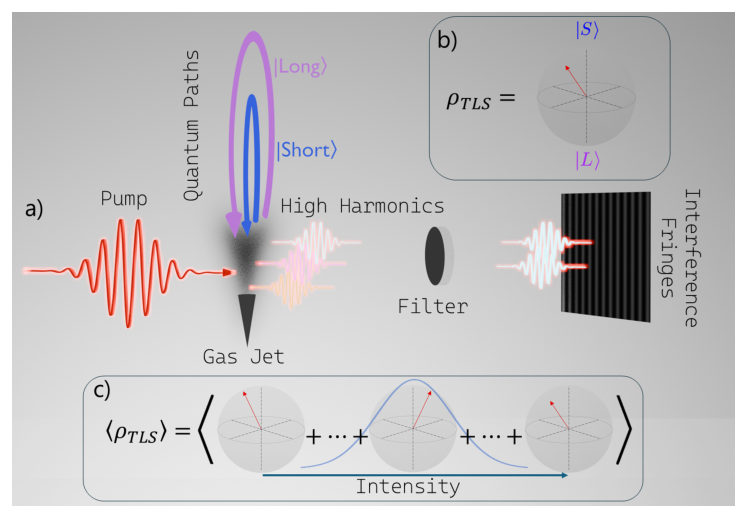
<figcaption class="paper-figure-caption"><b>Fig 1.</b> Figure 1: Attosecond-path qubits in HHG. (a) Schematic of a prototypical HHG experiment, together with the dominant quantum orbits that define the two-path states. (b) Bloch-sphere representation of the APQ density matrix (See Eq. (9)), and (c) of its ensemble average under shot-by-shot fluctuations. For each laser shot, a distinct effective two-level state is defined, and the ensemble average over these realizations yields the mixed state introduced in Eq. (26).</figcaption>
</figure>
<figure class="paper-figure-card">
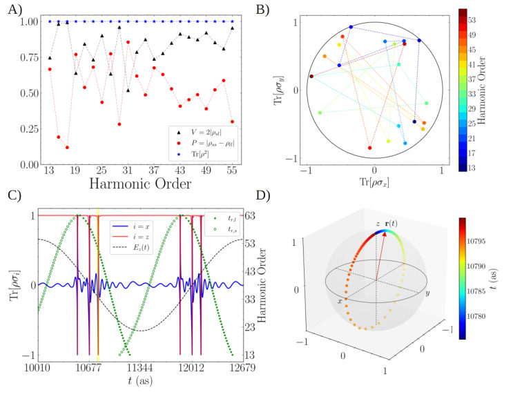
<figcaption class="paper-figure-caption"><b>Fig 2.</b> Figure 2: APQ and TLS Bloch vector dynamics for pure-state density matrices. (A) Interferometric visibility V (black triangles), predictability P (red circles), and state purity Tr[ρ2] (blue stars) as functions of harmonic order for the APQ. (B) Complex coherence map showing the x and y Bloch-vector components as a function of harmonic order; the dashed lines trace the spectral evolution within the unit disk. (C) Real-time evolution of the Bloch-vector components during one optical cycle for the time-domain TLS, together with the semiclassical ionization (ti) and recombination (tr) times derived from saddle-point solutions (see SM). (D) Three-dimensional Bloch-sphere trajectory of the TLS...</figcaption>
</figure>
<figure class="paper-figure-card">
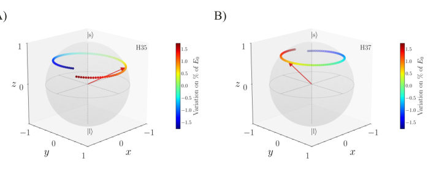
<figcaption class="paper-figure-caption"><b>Fig 3.</b> Figure 3: APQ Bloch vector for different laser intensities. (A) APQ Bloch vector for H35 and (B) H37, as a function of laser intensity. The scale is presented as a percentage of variation from the central value, E0 = 0.109 a.u.</figcaption>
</figure>
<figure class="paper-figure-card">
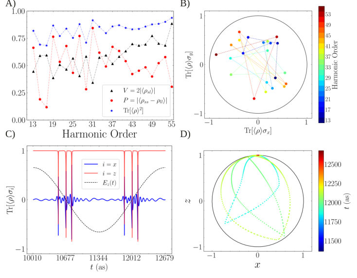
<figcaption class="paper-figure-caption"><b>Fig 4.</b> Figure 4: APQ and TLS Bloch vector dynamics for the ensemble-averaged density matrix. (A) Interferometric visibility V (black triangles), predictability P (red circles), and state purity Tr[ρ2] (blue stars) as functions of harmonic order. (B) Complex coherence map showing the x and y Bloch-vector components as a function of harmonic order; Comparing with Figure 2(b), the contraction toward the center of the disk illustrates the dephasing-induced decoherence. (C) Real-time evolution of the ensemble-averaged Bloch-vector components during one optical cycle for the time-domain TLS. (D) Three-dimensional Bloch-sphere trajectory of the ensemble-averaged TLS over half an optical cycle,...</figcaption>
</figure>
<figure class="paper-figure-card">
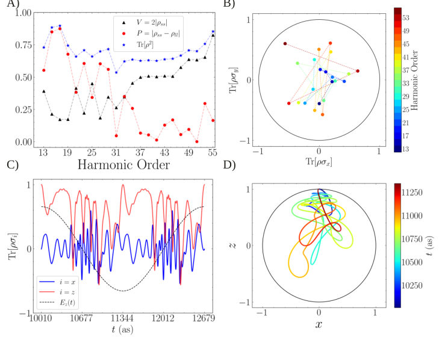
<figcaption class="paper-figure-caption"><b>Fig 5.</b> Figure 5: Bloch vector dynamics after tracing over transverse momentum. (A) Interferometric visibility V (black triangles), predictability P (red circles), and state purity Tr[ρ2] (blue stars) as functions of harmonic order for the integrated APQ. (B) Complex coherence map representing the x and y Bloch-vector components as a function of harmonic order; Comparing with Figs. 2(b) and 4(b), the reduction in oscillation amplitudes illustrates the intrinsic decoherence induced by the trace-out of transverse degrees of freedom. (C) Real-time evolution of the integrated Bloch-vector components over one optical cycle for the time-domain TLS. (D) Three- dimensional Bloch-sphere trajectory of the...</figcaption>
</figure>

**Summary.** The paper treats High-Harmonic Generation as a form of attosecond interferometry, defining the two dominant electron paths (short and long) as an Attosecond Path Qubit (APQ). It rigorously distinguishes between decoherence caused by classical laser intensity fluctuations (dephasing) and fundamental information loss due to unobserved transverse momentum (trace-out). This establishes HHG as a powerful tool for quantum state characterization in the attosecond regime.

**Why it may be interesting.** This work directly bridges attosecond physics (HHG) with fundamental concepts of open quantum systems theory, providing measurable signatures ($V$ vs. $P$) to diagnose coherence loss in an extreme non-equilibrium quantum process.

Detailed structure

**Main problem.** To develop a reduced-state framework for diagnosing coherence loss in High-Harmonic Generation (HHG) by treating the dominant short and long electron trajectories as an experimentally addressable two-level subsystem: an attosecond path qubit (APQ).

**Main result.** The study successfully distinguishes between classical dephasing (ensemble averaging) and fundamental quantum decoherence (trace-out of unobserved transverse momentum), establishing HHG as a platform for engineering trajectory-based quantum states.

**Method.** The authors formulate a trajectory-resolved density matrix for the APQ, analyzing its evolution under both environmental coupling models: classical noise and partial tracing over transverse degrees of freedom.

**Model / system.** The physical system is High-Harmonic Generation (HHG), modeled using the Strong-Field Approximation (SFA). The core concept involves mapping the electron's continuum dynamics onto an effective two-level Hilbert space spanned by short and long quantum trajectories, forming the APQ.

**Key observables.** APQ purity ($	ext{Tr}[
ho^2]$), Bloch vector components ($r_x, r_y, r_z$), Interferometric Visibility ($V$), and Predictability ($P$).

**Important parameters / regimes.** Attosecond timescale dynamics, laser intensity fluctuations (Gaussian distribution), transverse momentum integration limits.

**Assumptions / limitations.** The analysis relies on the Strong-Field Approximation (SFA) and assumes that short and long trajectories define an approximately orthogonal basis for the APQ.

**Figures summary.** Figures illustrate Bloch vector dynamics for both pure states and mixed states under dephasing (intensity fluctuations) and decoherence (transverse momentum integration), showing the reduction of coherence magnitude in both cases.

**Paper structure.** The paper progresses by first defining the APQ basis from HHG trajectories, then quantifying coherence loss via two distinct channels—classical dephasing and quantum trace-out decoherence—to establish a comprehensive diagnostic framework for attosecond interferometry.

Abstract

High-harmonic generation (HHG) is governed by interference between electron trajectories. We propose that the dominant short and long trajectories define an experimentally addressable two-level subsystem: an attosecond path qubit (APQ). We formulate a trajectory-resolved density matrix to identify two distinct coherence-loss mechanisms: classical dephasing from ensemble averaging and quantum decoherence arising from the trace-out of unobserved degrees of freedom. By investigating shot-to-shot fluctuations and unresolved transverse momentum, we demonstrate that while dephasing suppresses coherence through averaging, the ``trace-out'' channel produces mixed states even for fixed driving parameters. We explore how these mechanisms modify APQ purity and show that mode selection and conditioning provide operational routes to isolate them. These results establish a reduced-state framework for diagnosing coherence loss in HHG and for engineering trajectory-based quantum states in attosecond interferometry.

[↑ back to top](#top)

### [Simulation of Non-Markovian Quantum Accelerated Dynamics via Time-Fractional Schrödinger Equation](http://arxiv.org/abs/2606.20024v1)

**Authors:** Dongmei Wei, Junxiang Wang, Hanxiu Xu, Cancan Chen, Jiaying Wu  
**Type:** theory · **Category:** other · **PDF:** <https://arxiv.org/pdf/2606.20024v1>  
**Analysis basis:** full PDF text, analyzed in chunks
**Topic relevance:** `correlated / nonlocal dissipation` **3/5** · `methods for driven-dissipative` **3/5** · `non-equilibrium dynamics` **3/5** · `Tavis-Cummings & cavity-many-emitter` **2/5** · `driven-dissipative phase transition` **2/5** · `non-equilibrium universality` **2/5** · `Keldysh / 2PI / non-Gaussian methods` **1/5** · `Kondo & dissipative impurity` **1/5** · `analog quantum simulation` **1/5** · `correlated cavity matter` **1/5** · `entanglement & information structure` **1/5** · `scars & prethermalization` **1/5**

↔ Scroll figures horizontally

<figure class="paper-figure-card">
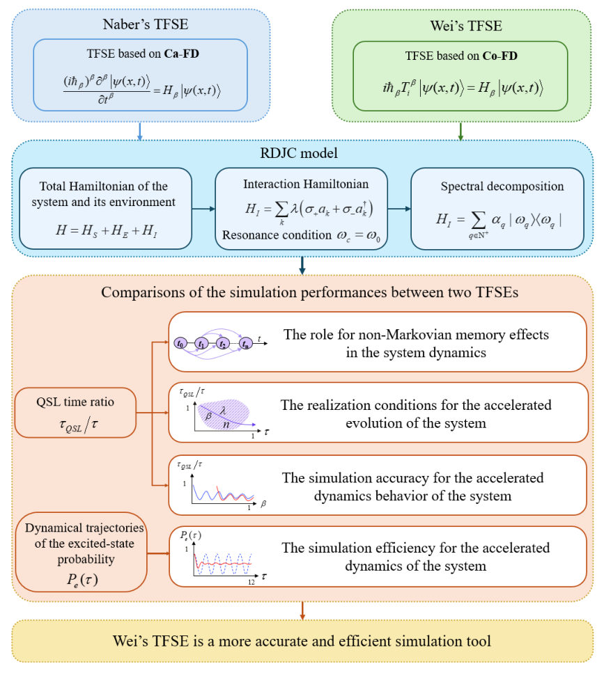
<figcaption class="paper-figure-caption"><b>Fig 1.</b> Figure 1: Schematic framework of this work. The simulation performances of Naber’s TFSE and Wei’s TFSE in the RDJC model are compared by calculating the QSL time ratio 𝜏𝑄𝑆𝐿∕𝜏and tracking the dynamical trajectory of the excited-state probability 𝑃𝑒(𝜏).</figcaption>
</figure>
<figure class="paper-figure-card">
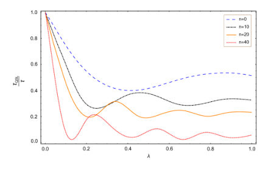
<figcaption class="paper-figure-caption"><b>Fig 2.</b> Figure 4: Under the framework of Wei’s TFSE, the QSL time ratio 𝜏𝑄𝑆𝐿∕𝜏of the single-qubit open system as a function of the coupling strength 𝜆for different photon numbers 𝑛= 0, 10, 20, 40, where the fractional order is set as 𝛽= 0.8 and the evolution time as 𝜏= 1.</figcaption>
</figure>
<figure class="paper-figure-card">
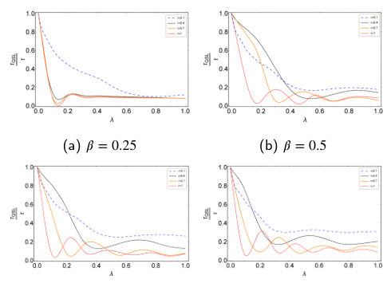
<figcaption class="paper-figure-caption"><b>Fig 3.</b> Figure 2: Under the framework of Wei’s TFSE, the QSL time ratio 𝜏𝑄𝑆𝐿∕𝜏of the single-qubit open system as a function of the coupling strength 𝜆for different fractional orders 𝛽and evolution times 𝜏, where (a) 𝛽= 0.25, (b) 𝛽= 0.5, (c) 𝛽= 0.75, and (d) 𝛽= 1. Other parameters are set as 𝜏= 0.1, 0.4, 0.7, 1 and 𝑛= 40.</figcaption>
</figure>
<figure class="paper-figure-card">
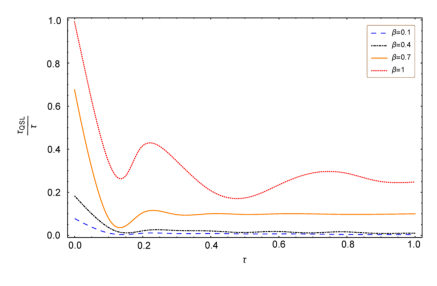
<figcaption class="paper-figure-caption"><b>Fig 4.</b> Figure 3: Under the framework of Wei’s TFSE, the QSL time ratio 𝜏𝑄𝑆𝐿∕𝜏of the single-qubit open system as a function of the evolution time 𝜏for different fractional orders 𝛽= 0.1, 0.4, 0.7, 1, where the coupling strength is set as 𝜆= 0.5 and the photon number as 𝑛= 40.</figcaption>
</figure>
<figure class="paper-figure-card">
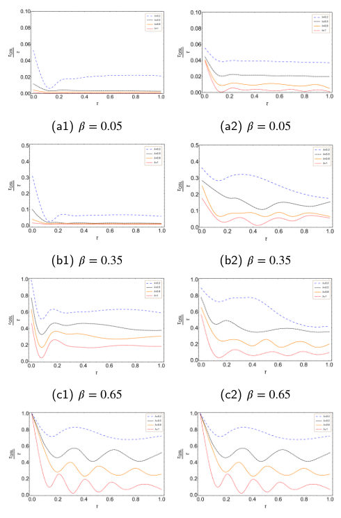
<figcaption class="paper-figure-caption"><b>Fig 5.</b> Figure 5: Under the frameworks of Naber’s TFSE and Wei’s TFSE, the QSL time ratio 𝜏𝑄𝑆𝐿∕𝜏of the single-qubit open system as a function of the evolution time 𝜏for different fractional orders 𝛽and coupling strengths 𝜆, where the parameters are set as (a1-a2) 𝛽= 0.05, (b1-b2) 𝛽= 0.35, (c1-c2) 𝛽= 0.65, and (d1-d2) 𝛽= 1. Other parameters are 𝜆= 0.2, 0.5, 0.8, 1 and 𝑛= 40.</figcaption>
</figure>

**Summary.** The paper investigates how fast an open quantum system can evolve under non-Markovian conditions by calculating the Quantum Speed Limit using time-fractional equations. It rigorously compares two theoretical frameworks, concluding that Wei's Time-Fractional Schrödinger Equation is both more accurate and significantly more computationally efficient than existing methods for modeling these complex dynamics.

**Why it may be interesting.** This is highly relevant as it tackles open quantum dynamics, non-Markovian effects, and speed limits—all central themes in modern AMO physics and quantum optics. The comparison between different mathematical formalisms (TFSE) adds a layer of methodological rigor.

Detailed structure

**Main problem.** The paper addresses the simulation of non-Markovian quantum accelerated dynamics and characterizing the Quantum Speed Limit (QSL) time for such open quantum systems.

**Main result.** Wei's Time-Fractional Schrödinger Equation (TFSE) is shown to be superior to Naber's TFSE because it accurately captures non-Markovian acceleration over all fractional orders and offers significant computational efficiency.

**Method.** The study employs the TFSE framework, comparing two formulations (Wei's Co-FD vs. Naber's Ca-FD) to simulate dynamics in an open quantum system.

**Model / system.** The analysis is performed on a single-qubit open system modeled by the Resonant Dissipative Jaynes-Cummings (RDJC) model, incorporating non-Markovian memory effects from the environment.

**Key observables.** Quantum Speed Limit time ($	au_{QSL}$), $	au_{QSL}/	au$ ratio, and the excited-state probability $P_e(	au)$.

**Important parameters / regimes.** Fractional order ($eta$), coupling strength ($\lambda$), photon number ($n$), and evolution time ($	au$).

**Assumptions / limitations.** The QSL calculation utilizes a Margolus-Levitin-type bound for a pure initial state.

**Figures summary.** Figures compare $	au_{QSL}/	au$ vs. $\lambda$, $	au_{QSL}/	au$ vs. $	au$, and $P_e(	au)$ across different TFSE formulations, highlighting the superior performance of Wei's method.

**Paper structure.** The paper first introduces the problem by defining QSL in non-Markovian systems. It then compares two TFSE approaches (Wei's vs. Naber's) using the RDJC model to calculate $	au_{QSL}$. The core of the work involves demonstrating Wei's method's superior accuracy across all fractional orders and its computational efficiency.

Abstract

The Time-Fractional Schrödinger Equation (TFSE) is an effective tool for simulating the dynamics of non-Markovian quantum systems. The Quantum Speed Limit (QSL) time characterizes the minimum time required for the evolution of a non-Markovian quantum system. In this paper, Wei's TFSE is employed to simulate the non-Markovian quantum accelerated evolution process in the Resonant Dissipative Jaynes-Cummings (RDJC) model. By solving the QSL time of a time-fractional single-qubit open system, the enhancement mechanism of the system evolution speed induced by the non-Markovian memory effects of the environment is revealed. Further studies show that the optimized acceleration of the system evolution can be achieved by jointly regulating the fractional order, coupling strength, and photon number. Comparative analyses indicate that Wei's TFSE can accurately capture the non-Markovian accelerated dynamical features of the system over the entire fractional order range, whereas Naber's TFSE is applicable only within a limited fractional order interval. In addition, the comparisons of the average simulation time for calculating the dynamical trajectory of the excited-state probability demonstrate that Wei's TFSE has a significant simulation advantage in computational efficiency. Therefore, Wei's TFSE is more accurate and efficient for simulating the accelerated dynamics of non-Markovian quantum systems.

[↑ back to top](#top)

### [Collective phases in overdamped magnetic self-propelled spherocylinders](http://arxiv.org/abs/2606.19498v1)

**Authors:** Francisca Guzmán-Lastra, Néstor Sepúlveda  
**Type:** theory · **Category:** statistical mechanics · **PDF:** <https://arxiv.org/pdf/2606.19498v1>  
**Analysis basis:** full PDF text, analyzed in chunks
**Topic relevance:** `analog quantum simulation` **3/5** · `driven-dissipative phase transition` **3/5** · `methods for driven-dissipative` **3/5** · `non-equilibrium dynamics` **2/5** · `non-equilibrium universality` **2/5** · `spintronics-quantum-optics interface` **2/5** · `Frenkel-Kontorova` **1/5** · `Keldysh / 2PI / non-Gaussian methods` **1/5** · `correlated / nonlocal dissipation` **1/5** · `exotic spin models in light-matter` **1/5**

↔ Scroll figures horizontally

<figure class="paper-figure-card">
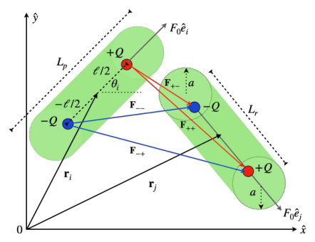
<figcaption class="paper-figure-caption"><b>Fig 1.</b> FIG. 1: Two interacting self-propelled spherocylinders (i, j) carrying magnetic dipole moments modeled as two opposite monopoles ±Q (positive in red, negative in blue) separated by a distance ℓalong the particle director.</figcaption>
</figure>
<figure class="paper-figure-card">
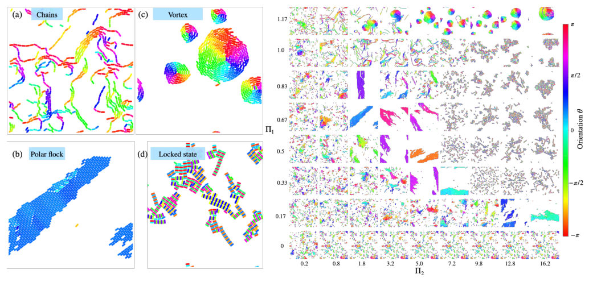
<figcaption class="paper-figure-caption"><b>Fig 2.</b> FIG. 2: Steady-state configurations at Π3 = 150; particles are colored by orientation angle θ ∈(−π, π] using a cyclic HSV colormap (shared colorbar). A nearly uniform hue signals polar alignment, swirling opposing hues within a cluster signal vortex rotation, and random hues indicate disorder. Left: Representative snapshots of the four collective states. Chain (Π2 ≈0.8, Π1 ≈1.17): elongated quasi-linear aggregates driven by head-to-tail attraction, without vortex rotation or global polar alignment. Coherent vortex-alignment (Π2 ≈5.0, Π1 ≈1.17): intra-cluster vortex rotation. Polar flocking (Π2 ≈1.8, Π1 ≈0.67): global director alignment. Locked (Π2 ≈12.8, Π1 ≈0.83): dense compact aggregates...</figcaption>
</figure>
<figure class="paper-figure-card">
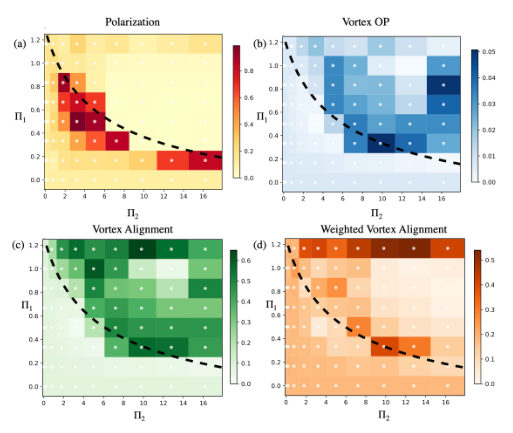
<figcaption class="paper-figure-caption"><b>Fig 3.</b> FIG. 4: Phase diagram in the Π2 × Π1 plane for Π3 = 150. The four panels show the scalar order parameters: (a) polarization P; (b) vortex order parameter ΦV ; (c) vortex alignment ΦA; (d) weighted vortex alignment Φw A. White dots mark the 80 validated state points (Π2 ∈{0, 0.2, . . . , 16.2}, Π1 ∈{0, 0.17, . . . , 1.17}; state points with Π1 ≥1.33 are excluded; see the validity analysis in the Supplemental Material [42]). The black dashed line marks the contour |¯εchain| = 1 (see Fig. 3).</figcaption>
</figure>
<figure class="paper-figure-card">
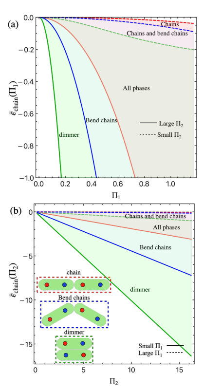
<figcaption class="paper-figure-caption"><b>Fig 4.</b> FIG. 3: Dimensionless two-particle contact energies ¯εchain (red), ¯εbend (blue), and ¯εblocked (green), normalized by F0Lr (Eqs. (7)–(8)), as a function of (a) Π1 and (b) Π2. In each panel, solid and dashed lines correspond to the limiting large and small values of the other parameter, respectively. Shaded regions in (a) indicate where each configuration is energetically accessible: chain only (pink), bent chain only (light blue), and dimer or blocked pair (light green). Insets in (b) illustrate the three contact geometries; red and blue circles denote positive and negative magnetic charges.</figcaption>
</figure>
<figure class="paper-figure-card">
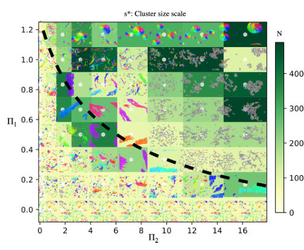
<figcaption class="paper-figure-caption"><b>Fig 5.</b> FIG. 5: Cluster size scale s∗in the Π2 × Π1 plane for Π3 = 150, with simulation snapshots superimposed at each of the 80 state points. s∗is the mean size of the largest cluster normalized by N = 500, ranging from disordered (light, s∗≈0) to fully aggregated (dark, s∗≈N). Labels indicate the observed collective regimes. The black dashed line marks the contour |¯εchain| = 1 (see Fig. 3); large-aggregate states (s∗≫1) lie predominantly above it, with gas and gas-and-cluster phases below.</figcaption>
</figure>

**Summary.** This work investigates how magnetic interactions and particle shape dictate the collective organization of self-propelled microswimmers. By modeling the particles with a dumbbell charge structure, the authors map out five distinct phases—including flocking and vortex alignment—by tuning parameters related to magnetization and geometry.

**Why it may be interesting.** While focused on classical active matter, the concept of controlling emergent collective states via tunable interaction potentials (magnetic/steric) is analogous to designing synthetic quantum Hamiltonians or engineered many-body systems in AMO physics.

Detailed structure

**Main problem.** The study focuses on characterizing the collective dynamics and phase transitions of self-propelled spherocylinders carrying magnetic dipole moments in two dimensions.

**Main result.** The system exhibits a rich landscape of five distinct collective states—gas, polar flock, chain, vortex-alignment, and locked dimer—controlled by particle elongation and distributed magnetic charge.

**Method.** The dynamics are modeled using overdamped equations of motion for position and orientation, solved via numerical simulations across parameter space.

**Model / system.** The system consists of self-propelled spherocylinders interacting magnetically (modeled as $\pm Q$ monopoles separated by $\ell$) and sterically in 2D. The dynamics are governed by competition between propulsion, repulsion, and magnetic torques.

**Key observables.** Collective phases (gas, polar flock, chain, vortex-alignment, locked state), pair contact energies ($ar{\epsilon}_{	ext{chain}}$, $ar{\epsilon}_{	ext{blocked}}$), polarization ($P$), and vortex order parameters ($\Phi_V, \Phi_A$).

**Important parameters / regimes.** Three dimensionless groups control behavior: $\Pi_1$ (charge separation ratio), $\Pi_2$ (magnetic vs. propulsion angular velocity comparison), and $\Pi_3$ (steric force vs. self-propulsion).

**Assumptions / limitations.** The dumbbell model is used to regularize the magnetic torque, avoiding divergences associated with point-dipole approximations at short range.

**Figures summary.** Figures map collective behavior across $(\Pi_1, \Pi_2)$ space, illustrating phase boundaries and showing how order parameters change between the five identified states.

**Paper structure.** The paper establishes the governing equations of motion, introduces dimensionless control parameters ($\Pi_1, \Pi_2$), analyzes pair contact energies to define state transitions, and maps out the resulting phase diagram across varying parameter regimes.

Abstract

We study the collective dynamics of self-propelled spherocylinders carrying magnetic dipole moments in two dimensions. Magnetic interactions are modeled as two opposite monopoles $\pm Q$ separated by a distance $\ell$ along the particle director, a dumbbell model that remains well-defined at short range and introduces an explicit geometric lever arm for the magnetic torque. This approach, combined with the elongated particle geometry, produces a torque that competes with steric alignment in a manner inaccessible to point-dipole or disk models. By independently varying monopole separation and dipole strength (parameters that map directly onto the geometry and magnetization of cylindrical magnets) we show that the system navigates a rich landscape of collective states: gas, polar flock, chain, vortex-alignment, and locked-dimer phases. Our results establish that particle elongation and distributed magnetic charge together provide a minimal, experimentally accessible set of tuning knobs for controlling coherent states in magnetic active matter, with direct implications for the design of self-organized magnetic microswimmers and active colloidal assemblies.

[↑ back to top](#top)

### [Creating and Driving a Twist Soliton on a Magnetic Skyrmion Tube](http://arxiv.org/abs/2606.19900v1)

**Authors:** Shoya Kasai, Kotaro Shimizu, Shun Okumura, Yukitoshi Motome  
**Type:** theory · **Category:** strongly correlated electrons · **PDF:** <https://arxiv.org/pdf/2606.19900v1>  
**Analysis basis:** full PDF text, analyzed in chunks
**Topic relevance:** `driven-dissipative phase transition` **3/5** · `exotic spin models in light-matter` **3/5** · `non-equilibrium dynamics` **3/5** · `methods for driven-dissipative` **2/5** · `non-equilibrium universality` **2/5** · `spintronics-quantum-optics interface` **2/5** · `Frenkel-Kontorova` **1/5** · `Keldysh / 2PI / non-Gaussian methods` **1/5** · `analog quantum simulation` **1/5** · `correlated / nonlocal dissipation` **1/5**

↔ Scroll figures horizontally

<figure class="paper-figure-card">
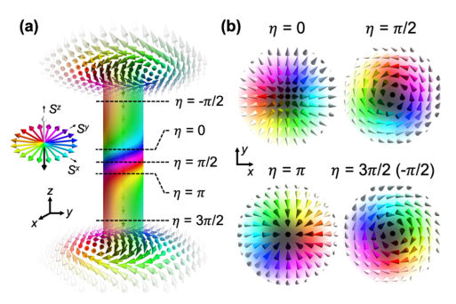
<figcaption class="paper-figure-caption"><b>Fig 1.</b> FIG. 1. (a) Schematic illustration of a locally twisted mag- netic skyrmion tube with twist chirality χ = −1. Cross sec- tions parallel to the xy plane host a magnetic skyrmion with z-dependent helicity η, which varies continuously by 2πχ from bottom to top. The color code shown in the left inset is used throughout this paper to represent spin configurations. (b) Skyrmions at the cross sections represented by the dashed lines in (a) with helicities η = 0, π/2, π, and 3π/2 (−π/2).</figcaption>
</figure>
<figure class="paper-figure-card">
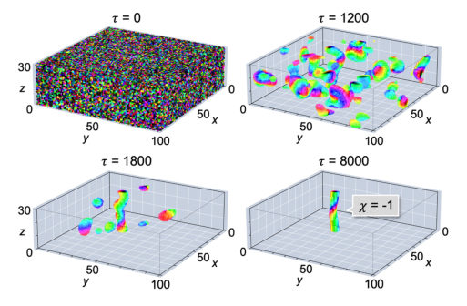
<figcaption class="paper-figure-caption"><b>Fig 2.</b> FIG. 2. Formation process of a twisted skyrmion tube with chirality χ = −1 for (Bz, K) = (0.01, 0.01). Only spins sat- isfying Sz ≲0 are shown. The system size is N = 1012 × 31 under periodic boundary conditions. Each panel presents the time evolution of the spin configuration obtained from a zero-temperature LLG simulation starting from a random spin state.</figcaption>
</figure>
<figure class="paper-figure-card">
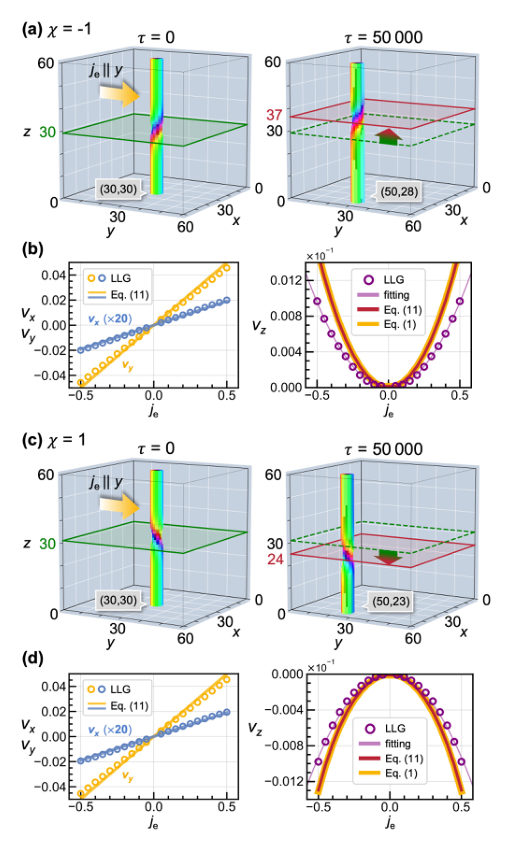
<figcaption class="paper-figure-caption"><b>Fig 3.</b> FIG. 3. In-plane current-induced dynamics of twisted skyrmion tubes and its dependence on je for (a,b) χ = −1 and (c,d) χ = 1. The left and right panels of (a,c) show the initial and final states with (Bz, je) = (0.02, 0.2), respectively. The green and red planes mark the twist positions in the ini- tial and final states, respectively. The left panels of (b,d) show the twisted tube velocity vx and vy as functions of je. The values of vx are multiplied by 20 for visibility. The circles denote simulation results, and the solid lines are predictions from Eq. (11). The right panels of (b,d) show the twist soliton velocity vz. The purple solid lines are quadratic fits ∝j2 e to the numerical...</figcaption>
</figure>
<figure class="paper-figure-card">
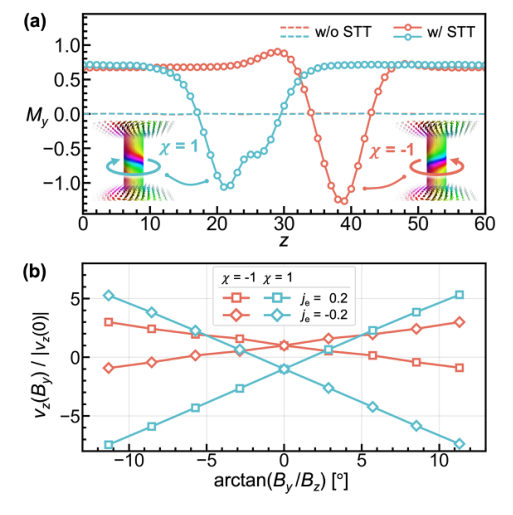
<figcaption class="paper-figure-caption"><b>Fig 4.</b> FIG. 4. (a) Chirality dependence of the STT-induced mag- netization My at each z under je = 0.2. The red and blue data correspond to χ = −1 and χ = 1, respectively. The dashed and solid lines correspond to the cases without and with STT, respectively; the latter is taken at τ = 50 000. (b) Twist soliton velocity normalized by its value at By = 0 as a function of the tilt angle of the external magnetic field. We use Bz = 0.02 in both (a) and (b).</figcaption>
</figure>
<figure class="paper-figure-card">
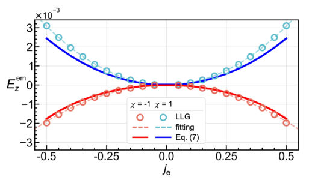
<figcaption class="paper-figure-caption"><b>Fig 5.</b> FIG. 5. χ and je dependence of the nonadiabatic contribu- tion to the EEF with β = 0.02 and Bz = 0.02. The circles represent the values obtained by directly evaluating the sec- ond term in Eq. (6) from snapshots of the LLG dynamics, while the dashed lines show fits ∝j2 e . The solid lines are the Thiele-based predictions obtained from Eq. (7).</figcaption>
</figure>

**Summary.** This work explores the physics of twist solitons on magnetic skyrmion tubes, treating the twist as a crucial degree of freedom beyond simple stacking. By combining numerical simulations with analytical theory, the authors demonstrate that the soliton's motion is nonlinearly driven by current and depends critically on its chirality. This paves the way for designing advanced spintronic devices based on 3D spin textures.

**Why it may be interesting.** The study deals with topological defects (solitons) in magnetic materials, which are analogous to excitations studied in quantum field theory or condensed matter systems exhibiting strong correlations. The coupling between topology, current drive, and emergent fields is highly relevant to spintronics.

Detailed structure

**Main problem.** The study investigates how introducing a 'twist' along the axis of a magnetic skyrmion tube affects its complex dynamics and emergent physical responses.

**Main result.** The twist degree of freedom is shown to be essential, enabling current-driven nonlinear motion where the out-of-plane velocity scales quadratically with the driving current and depends on the soliton's chirality.

**Method.** The research combines large-scale numerical simulations solving the LLG equation with analytical calculations using a collective coordinate approach (Thiele equation).

**Model / system.** The system is a magnetic skyrmion tube, modeled as a 3D topological soliton in a chiral magnet incorporating exchange interactions, DMI, and Zeeman coupling. Dynamics are driven by spin-transfer torque.

**Key observables.** Twist soliton velocity components ($v_x, v_y, v_z$), the associated emergent electric field (EEF), and the sign of the chirality ($\chi$).

**Important parameters / regimes.** Current density ($j_e$), magnetic field component perpendicular to the tube, and the twist chirality ($\chi$).

**Assumptions / limitations.** The Thiele analysis relies on a rigid-body approximation for steady-state dynamics, which is noted to cause discrepancies with direct LLG simulations.

**Figures summary.** Figures illustrate the formation of twisted tubes via quench dynamics, show snapshots of motion under current drive (lateral and out-of-plane), and plot velocity dependence on current density and magnetic field tilt angle.

**Paper structure.** The paper progresses from establishing the physical system (skyrmion tubes) to introducing the twist degree of freedom. It then analyzes the dynamics using both numerical simulations (LLG) and analytical models (Thiele equation), culminating in demonstrating control via external fields and detection via emergent electric fields.

Abstract

A magnetic skyrmion tube is a three-dimensional topological soliton formed by stacking two-dimensional skyrmions along the out-of-plane direction. Recent real-space observations of skyrmion tubes have stimulated growing interest in their dynamics and emergent properties. Here, we go beyond simple skyrmion stacking and investigate how a ``twist" introduced along the tube direction affects the dynamics and emergent responses of skyrmion tubes. We find that such a twist can be created as a localized texture, termed a twist soliton, through thermal quench dynamics. By complementarily combining large-scale numerical simulations with analytical calculations based on collective coordinates, we clarify its current-driven nonlinear motions that depend on its twist chirality. Remarkably, its velocity can be substantially enhanced by a magnetic-field component perpendicular to the tube. Furthermore, the associated emergent electric field enables identification of the twist soliton, including the sign of its chirality, through Hall measurements. Our results reveal the twist degree of freedom as an essential ingredient of skyrmion-tube physics and pave the way for the development of spintronic devices exploiting the three-dimensional nature of spin textures.

[↑ back to top](#top)

### [Exact operator dynamics in Lindbladian Wess-Zumino-Witten conformal field theories](http://arxiv.org/abs/2606.19465v1)

**Authors:** Qicheng Tang, Ruhanshi Barad, Xueda Wen  
**Type:** theory · **Category:** statistical mechanics · **PDF:** <https://arxiv.org/pdf/2606.19465v1>  
**Analysis basis:** full PDF text, analyzed in chunks
**Topic relevance:** `correlated / nonlocal dissipation` **3/5** · `driven-dissipative phase transition` **3/5** · `methods for driven-dissipative` **3/5** · `non-equilibrium dynamics` **3/5** · `Keldysh / 2PI / non-Gaussian methods` **2/5** · `non-equilibrium universality` **2/5** · `entanglement & information structure` **1/5** · `scars & prethermalization` **1/5**

↔ Scroll figures horizontally

<figure class="paper-figure-card">
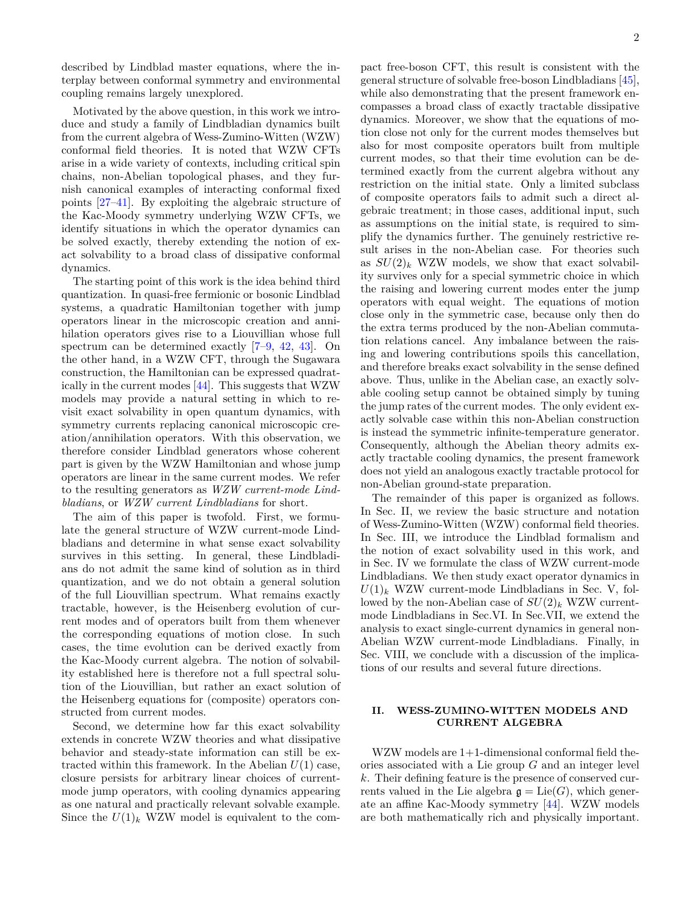
<figcaption class="paper-figure-caption"><b>Fig 1.</b> Low-resolution page preview, page 2</figcaption>
</figure>
<figure class="paper-figure-card">
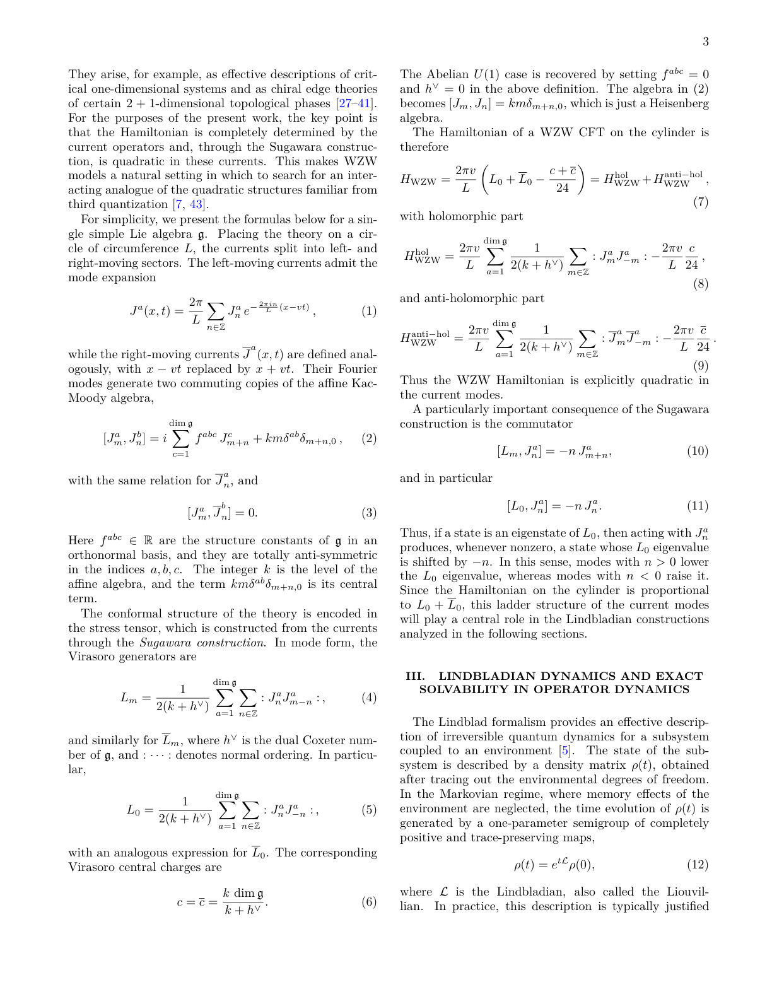
<figcaption class="paper-figure-caption"><b>Fig 2.</b> Low-resolution page preview, page 3</figcaption>
</figure>
<figure class="paper-figure-card">
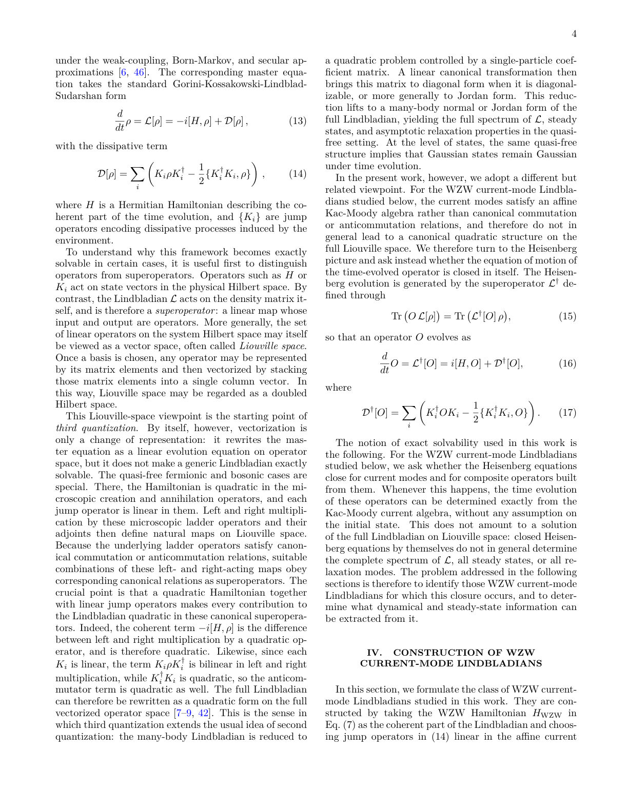
<figcaption class="paper-figure-caption"><b>Fig 3.</b> Low-resolution page preview, page 4</figcaption>
</figure>
<figure class="paper-figure-card">
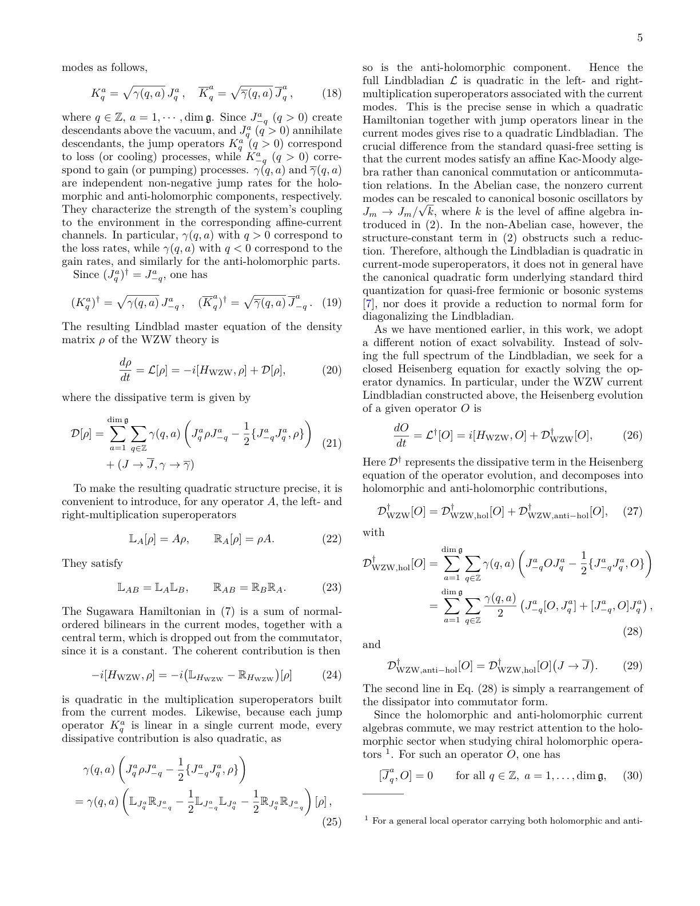
<figcaption class="paper-figure-caption"><b>Fig 4.</b> Low-resolution page preview, page 5</figcaption>
</figure>
<figure class="paper-figure-card">
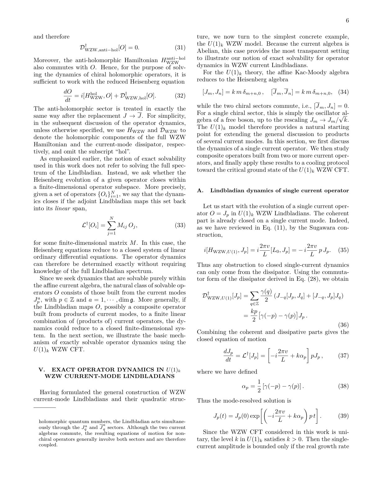
<figcaption class="paper-figure-caption"><b>Fig 5.</b> Low-resolution page preview, page 6</figcaption>
</figure>

**Summary.** The paper investigates the time evolution of observables in WZW CFTs subjected to environmental coupling via a Lindbladian. It finds that while Abelian models allow for broad classes of exactly solvable dissipative dynamics, non-Abelian structures severely restrict solvability, requiring high degrees of symmetry in dissipation rates to maintain algebraic closure.

**Why it may be interesting.** This work provides deep insights into how algebraic structures (like current algebras) constrain the dynamics of open quantum systems, offering powerful theoretical tools applicable to understanding dissipation and thermalization in complex field theories.

Detailed structure

**Main problem.** The central problem is determining the exact time evolution of physical observables in open quantum many-body systems coupled to environments, specifically within Wess-Zumino-Witten (WZW) conformal field theories.

**Main result.** Exact solvability for operator dynamics is highly restricted: it holds generally in the Abelian $U(1)_k$ case but requires specific symmetries (like symmetric dissipation rates) in the non-Abelian setting, leading to a loss of general algebraic closure.

**Method.** The authors analyze the Lindbladian master equation by checking for the closure of the Heisenberg equations of motion for current operators and their products, rather than solving the full Liouvillian spectrum.

**Model / system.** The system is modeled using WZW CFTs whose dynamics are governed by a Lindblad master equation. The Hamiltonian is derived from the Sugawara construction, involving affine Kac-Moody currents ($J^b_p$).

**Key observables.** Operator dynamics (e.g., $\langle J^p J^r 
angle(t)$), closure of Heisenberg equations for current modes, and mixing time ($	au_{mix}$).

**Important parameters / regimes.** The level $k$ of the WZW theory, the structure constants of the underlying Lie algebra ($g$), and the specific rates/symmetries of the Lindblad jump operators ($\gamma$).

**Assumptions / limitations.** The analysis often focuses on chiral holomorphic sectors or assumes initial states are Gaussian to simplify expectation value calculations. The closure of the Heisenberg equation is a necessary but not sufficient condition for full solvability.

**Figures summary.** Not specified in the notes, but the structure implies comparisons between Abelian and non-Abelian dynamics under dissipation.

**Paper structure.** The paper systematically analyzes the problem by first establishing the general framework (WZW models and Lindbladians), then contrasting the solvable Abelian case ($U(1)_k$) with the constrained non-Abelian case ($SU(2)_k$), culminating in a discussion of necessary symmetry conditions for exact solvability.

Abstract

Understanding the time evolution of physical observables in open quantum many-body systems coupled to external environments is a natural and difficult problem, and exact results are still rare. In this work, we study this problem for Wess-Zumino-Witten (WZW) conformal field theories with Lindblad jump operators linear in Kac-Moody current modes. We investigate the exact operator dynamics generated by these Lindbladians, identifying classes of current operators whose Heisenberg equations close and can therefore be solved analytically using the underlying current algebra. In Abelian $U(1)_k$ WZW theories, this closure of operator dynamics holds for arbitrary settings of jump rates and includes exactly tractable cooling dynamics. In contrast, for non-Abelian WZW theories, exact closure occurs only for symmetric current-mode dissipation, where upward and downward current-mode transitions occur with equal rates, and even then it leads to a simple closed evolution only for a single current operator. Generic imbalances, including those needed for cooling, produce additional non-Abelian terms and prevent closure of the opeartor dynamics. Consequently, the current algebra gives rise to a broad family of exactly solvable dissipative dynamics in the Abelian setting, whereas in the non-Abelian case it singles out only a special exactly solvable dynamics corresponding to an infinite-temperature bath.

[↑ back to top](#top)

### [Purity and bound energy in ancilla-assisted work extraction](http://arxiv.org/abs/2606.19945v1)

**Authors:** B. Vigneshwar, Farhaan Khan, R. Sankaranarayanan  
**Type:** theory · **Category:** statistical mechanics · **PDF:** <https://arxiv.org/pdf/2606.19945v1>  
**Analysis basis:** full PDF text, analyzed in chunks
**Topic relevance:** `driven-dissipative phase transition` **3/5** · `entanglement & information structure` **3/5** · `methods for driven-dissipative` **3/5** · `non-equilibrium dynamics` **3/5** · `correlated / nonlocal dissipation` **2/5** · `non-equilibrium universality` **2/5** · `Keldysh / 2PI / non-Gaussian methods` **1/5** · `quantum measurements` **1/5**

↔ Scroll figures horizontally

<figure class="paper-figure-card">
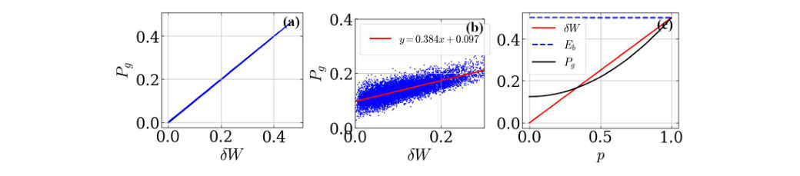
<figcaption class="paper-figure-caption"><b>Fig 1.</b> FIG. 1. Scatter plot of Pg and δW for 104 randomly generated (a) pure states and (b) mixed states. (c) Pg, Eb and δW as a function of parameter p for Werner states.</figcaption>
</figure>
<figure class="paper-figure-card">
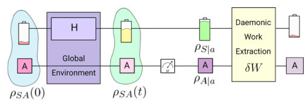
<figcaption class="paper-figure-caption"><b>Fig 2.</b> FIG. 2. Schematic diagram of the protocol. The system and ancilla are initially correlated with the system occupy- ing lower energies followed by charging under global environ- ment. The ancilla is then measured to implement daemonic work extraction.</figcaption>
</figure>
<figure class="paper-figure-card">
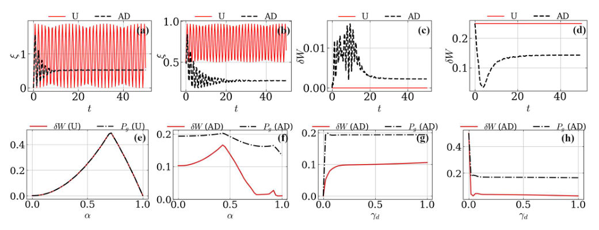
<figcaption class="paper-figure-caption"><b>Fig 3.</b> FIG. 3. Ergotropy of the two-qubit battery under unitary evolution and collective amplitude damping for (a) α = 1 and (b) α = 0.5. The corresponding daemonic gain is shown for (c) α = 1 and (d) α = 0.5. Comparison between the daemonic gain δW and the purity-based gain Pg at t = 100 as a function of the initial-state parameter α for (e) unitary evolution and (f) amplitude damping for γd = 0.3. Gain as a function the dissipation strength γd for (g) α = 0 and (h) α = 1/ √</figcaption>
</figure>
<figure class="paper-figure-card">
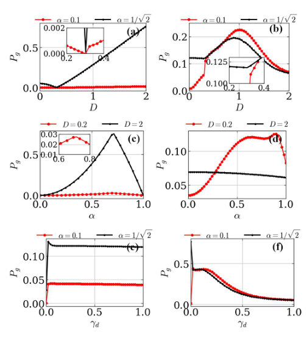
<figcaption class="paper-figure-caption"><b>Fig 4.</b> FIG. 4. Purity-based gain Pg for the interacting XY Z battery model. Pg as a function of DMI strength D under (a) unitary evolution and (b) collective amplitude damping (γd = 0.8), respectively, for α = 0.1 and α = 1/ √</figcaption>
</figure>

**Summary.** This paper develops a theoretical framework to understand the maximum extractable work (daemonic gain) from quantum batteries using ancilla assistance. It establishes that this gain is bounded by the system's bound energy and proposes a computationally simpler metric based on global purity ($P_g$). The research further shows how environmental dissipation and intrinsic interactions critically modulate this thermodynamic advantage.

**Why it may be interesting.** This work directly addresses non-equilibrium thermodynamics in quantum systems, providing tools to quantify energy harvesting efficiency beyond simple correlation measures by incorporating information theoretic concepts like purity.

Detailed structure

**Main problem.** The study investigates ancilla-assisted work extraction from quantum batteries by characterizing how bound energy and purity govern the achievable daemonic gain.

**Main result.** Daemonic gain is governed not only by correlations but also critically by the spectral structure of the Hamiltonian, with a purity-based gain ($P_g$) serving as an effective predictor for this advantage.

**Method.** The authors derive theoretical bounds relating daemonic gain ($\delta W$) to bound energy ($E_b$), and introduce $P_g$ to bypass computationally intensive measurement optimization protocols.

**Model / system.** The model involves quantum batteries, treated as bipartite system-ancilla states ($
ho_{SA}$), whose dynamics are analyzed under unitary evolution or Lindblad master equations incorporating dissipation.

**Key observables.** Daemonic Gain ($\delta W$), Bound Energy ($E_b$), Purity-based Gain ($P_g$), Ergotropy ($\xi$).

**Important parameters / regimes.** Dissipation strength ($\gamma_d$), DMI coupling strength ($D$), initial correlation parameters ($\alpha, eta$).

**Assumptions / limitations.** The analysis often assumes the validity of $P_g$ as a proxy for $\delta W$, and later sections analyze specific regimes like weak-DMI or strong-DMI interactions.

**Figures summary.** Figures illustrate comparisons between $P_g$ and $\delta W$ across pure, mixed, and Werner states; another figure shows the effect of dissipation on gain, and a final set maps $P_g$ dependence on DMI strength ($D$).

**Paper structure.** The paper progresses from establishing the upper bound ($\delta W \le E_b$) to introducing the predictive quantity ($P_g$), then analyzing open system dynamics (dissipation), and finally examining how intrinsic interactions modify this gain via spectral restructuring.

Abstract

We investigate ancilla-assisted work extraction in quantum batteries from the perspective of bound energy and purity. We show that the bound energy of the reduced system provides a tight upper bound to the daemonic gain and that this bound is saturated for globally pure system--ancilla states. Motivated by this relation, we introduce a purity-based gain that qualitatively predicts the daemonic gain without requiring explicit optimization over measurements. We further introduce a protocol to analyze the role of dissipation and intrinsic interactions on daemonic gain. Under a collective environment, dissipation can dynamically generate and stabilize finite daemonic gain through environment-induced correlations. In interacting systems, level crossings and spectral restructuring strongly modify the attainable gain through their influence on the accessible bound energy. Our results demonstrate that daemonic gain is governed not only by correlations, but also by the spectral structure of the underlying Hamiltonian and information loss captured by bound energy and purity.

[↑ back to top](#top)

### [Thermodynamic Measure of Intelligence](http://arxiv.org/abs/2606.20231v1)

**Authors:** Ishanu Chattopadhyay  
**Type:** theory · **Category:** statistical mechanics · **PDF:** <https://arxiv.org/pdf/2606.20231v1>  
**Analysis basis:** full PDF text, analyzed in chunks
**Topic relevance:** `non-equilibrium universality` **3/5** · `Keldysh / 2PI / non-Gaussian methods` **2/5** · `driven-dissipative phase transition` **2/5** · `entanglement & information structure` **2/5** · `non-equilibrium dynamics` **2/5** · `analog quantum simulation` **1/5** · `correlated / nonlocal dissipation` **1/5** · `measurement-induced transitions` **1/5** · `methods for driven-dissipative` **1/5** · `quantum measurements` **1/5** · `scars & prethermalization` **1/5**

↔ Scroll figures horizontally

<figure class="paper-figure-card">
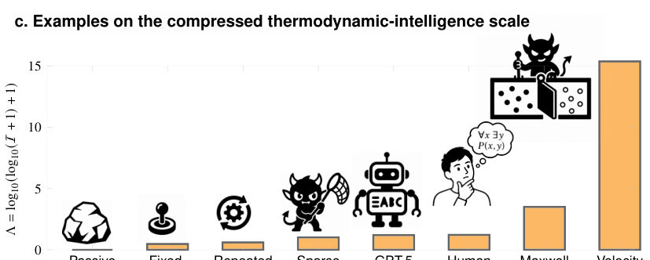
<figcaption class="paper-figure-caption"><b>Fig 1.</b> FIG. 1. Conceptual summary. (a) Recursive self-simulation: a system represents the world at one level together with models of its own future states and actions at higher simulated levels. The rare-valid fidelity (bΦ) measures how accurately the simulation identifies targetable rare-valid futures. (b) Thermodynamic intelligence: relative to a passive trajectory law (P0), an induced law (P) shifts probability mass toward rare-valid trajectories (Vδ), producing rare-valid lift (Iδ = δ−1 R</figcaption>
</figure>

**Summary.** This work proposes a universal thermodynamic measure of intelligence based on how an agent amplifies the probability of rare but physically valid futures. It mathematically links this amplification ('rare-valid lift') directly to the necessity of recursive self-simulation within the agent's internal model. The framework provides quantitative metrics applicable across diverse systems, from classical controllers to advanced AI models.

**Why it may be interesting.** While not directly about quantum systems, the use of fluctuation theorems and information geometry provides powerful mathematical tools for analyzing non-equilibrium processes, which are central to open quantum system dynamics and measurement theory.

Detailed structure

**Main problem.** To define and measure intelligence as a physical, thermodynamic quantity by quantifying its ability to amplify rare but valid futures.

**Main result.** Recursive self-simulation is necessary and nearly sufficient for high thermodynamic intelligence, which is quantified by the 'rare-valid lift' relative to passive dynamics.

**Method.** The framework uses non-equilibrium fluctuation theorems and information theory to compare induced path laws ($P$) against a passive baseline law ($P_0$).

**Model / system.** The model involves abstract systems ranging from passive matter and feedback controllers to LLMs, analyzed via their ability to generate or select rare trajectories in the space of possible futures.

**Key observables.** Rare-valid lift ($\mathcal{I}_\delta$), Path-deviation divergence ($	ext{DKL}$), and the stabilized double-log scale ($\Lambda$).

**Important parameters / regimes.** The measure is highly dependent on specified parameters: baseline law, validity criterion, level of description, and trajectory resolution.

**Assumptions / limitations.** Assumes applicability of fluctuation theorems; requires explicit definition of baselines and validity sets for measurement to be meaningful.

**Figures summary.** Figures conceptually illustrate recursive self-simulation across modeling levels and define the thermodynamic intelligence measure ($\mathcal{I}_\delta$) as a lift relative to passive dynamics.

**Paper structure.** The paper builds from defining intelligence via rare-valid amplification, establishing mathematical links between this concept and simulation fidelity (Theorems 1 & 2), deriving bounds using path deviation measures (Theorem 3), and finally applying the framework to symbolic generation and physical engines.

Abstract

Can intelligence be measured? We propose that intelligence can be defined as the lawful amplification of rare but valid futures: a system increases the probability of outcomes that would be unlikely under passive dynamics but remain admissible under the constraints of the domain. We start with the premise that an intelligent system must model the world and its own place within it. Because the system is part of the world it models, this leads naturally to recursive self-simulation: the system represents futures in which its own actions are part of the trajectory. Our central results give a necessity statement and a conditional near-sufficiency statement connecting this architecture to a precise thermodynamic measure of lawful amplification of rare-valid futures: high rare-valid lift is impossible unless the internal simulation identifies rare-valid futures with high fidelity; conversely, when rare-valid fidelity is high and the simulation contains an effective policy, the achievable lift approaches the actuation-limited optimum. Thus recursive self-simulation is not merely a plausible feature of intelligence but, under the stated assumptions, is necessary and nearly sufficient for high thermodynamic intelligence. The resulting framework makes intelligence measurable on a universal scale, from passive matter and feedback controllers, large language models, and humans as text generators to Maxwell-demon-like information engines.

[↑ back to top](#top)

### [Computing noise-canceling observables via Pauli propagation](http://arxiv.org/abs/2606.20441v1)

**Authors:** Andrew Eddins, Caleb Johnson, Alberto Baiardi, Francesco Tacchino, Ewout van den Berg, Roy Elkabetz, Vinay Tripathi, Swarnadeep Majumder, Max Rossmannek, Liran Shirizly, Abhinav Kandala  
**Type:** both · **Category:** quantum information and computing · **PDF:** <https://arxiv.org/pdf/2606.20441v1>  
**Analysis basis:** full PDF text, analyzed in chunks
**Topic relevance:** `methods for driven-dissipative` **3/5** · `quantum measurements` **3/5** · `QC/QI experiment` **2/5** · `measurement-induced transitions` **2/5** · `Keldysh / 2PI / non-Gaussian methods` **1/5** · `analog quantum simulation` **1/5** · `correlated / nonlocal dissipation` **1/5** · `driven-dissipative phase transition` **1/5** · `non-equilibrium dynamics` **1/5**

↔ Scroll figures horizontally

<figure class="paper-figure-card">
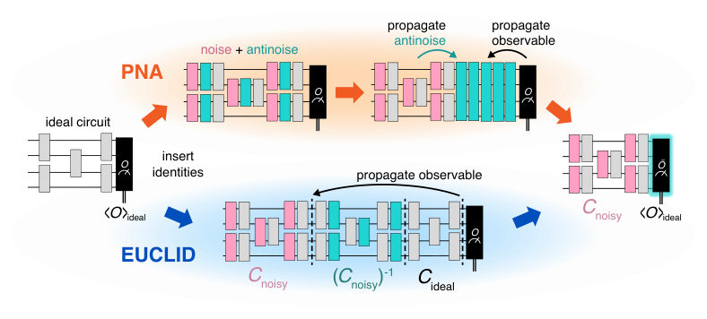
<figcaption class="paper-figure-caption"><b>Fig 1.</b> FIG. 1. Classically propagated noise cancellation schemes. a) Propagated noise absorption (PNA) transforms the ideal circuit into an equivalent pairing of the noisy hardware gate layers combined with a modified, noise-canceling observable. The noisy gate layers are produced by classically propagating equal and opposite antinoise to the end of the circuit. Propagating the observable backwards through this evolved antinoise embeds noise cancellation into the resulting observable ˜O, such that estimating ⟨˜O⟩on the noisy hardware produces the ideal expectation value. b) Euclid constructs ˜O by backpropagating O through a noise deconvolution map consisting of the inverse noisy circuit followed...</figcaption>
</figure>
<figure class="paper-figure-card">
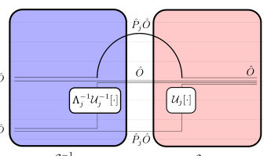
<figcaption class="paper-figure-caption"><b>Fig 2.</b> FIG. 2. Euclid diagrams. The inverse noisy circuit C−1 noisy is represented as a blue box, while the ideal circuit Cideal is represented as a red box. The line diagram indicates the cosine branch is taken for all gates, yielding a backpropagated Pauli equal to the original Pauli observable, O. The bubble diagram indicates the sine branch is taken for the jth gate in both C−1 noisy and Cideal, again yielding Pauli PjPjO = O, but with a different coefficient. In the step diagram, the sine branch is taken either in C−1 noisy or in Cideal. The final operator is PjO, and the operator after the application of Cideal is O (PjO) if the sine branch is taken in C−1 noisy (Cideal).</figcaption>
</figure>
<figure class="paper-figure-card">
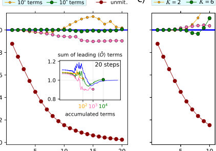
<figcaption class="paper-figure-caption"><b>Fig 3.</b> FIG. 3. 9-qubit numerics. a) A 3-by-3 square lattice of qubits is evolved first forwards, then backwards in time under the second-order Trotterization of the transverse-field Ising Hamiltonian. A parameter θ sets the RX (orange) and RZZ (blue) gate angles. CNOT gates are transpiled to H- conjugated CZ primitive gates (not shown). Each two-qubit gate layer is followed by the action of one of four unique Pauli- Lindblad noise models (red). b,c) Expectation values ⟨Z⊗9⟩ versus number of Trotter steps in U (first half of circuit) with θ = 0.05, for (b) PNA and (c) Euclid. All truncation set- tings greatly reduce bias compared to unmitigated results, with the highest settings retaining accuracy...</figcaption>
</figure>
<figure class="paper-figure-card">
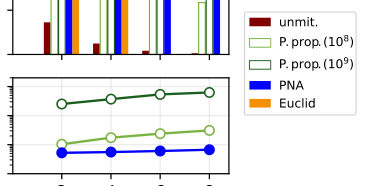
<figcaption class="paper-figure-caption"><b>Fig 4.</b> FIG. 4. 20-qubit numerics. Numerically-simulated results for a circuit similar to that in Fig. 3a on a 4-by-5 qubit grid. PNA (max terms=104) or Euclid (K = 6) largely eliminate the bias present in the unmitigated result. The PNA compu- tation, including 106 simulated QPU shots at 2 kHz sampling frequency, was both faster and more accurate than a direct computation of the noiseless circuit via Pauli propagation.</figcaption>
</figure>
<figure class="paper-figure-card">
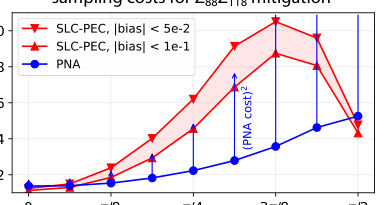
<figcaption class="paper-figure-caption"><b>Fig 5.</b> FIG. 5. Mitigation of 56-qubit experiments. Raw and mitigated expectation values of a) site-averaged magnetiza- tion PN q Zq/N and b) Z88Z118, measured as a function of gate angle θ (see Sec. III text). Right inset shows qubit connectiv- ity, highlighting the nominal four-step lightcones of the Z88 (blue) and Z118 (purple) measurements. The ideal expecta- tion values of these mirror circuits are all +1 (black horizontal line). Mitigation reduces error at all points. Including more terms when computing ˜O reduces truncation bias. Compari- son with 108-term Pauli-propagation simulations of the noisy circuit (squares) supports attributing residual error in the PNA-mitigated experiments to...</figcaption>
</figure>

**Summary.** The paper introduces a hybrid method combining Pauli propagation with noise-canceling inverse channels to estimate ideal quantum observables from noisy hardware measurements. By constructing a modified observable ($	ilde{O}$), the authors mitigate errors and reduce sampling overhead compared to standard error correction techniques. This framework offers a pathway toward realizing quantum advantage by efficiently extracting accurate physical information from imperfect quantum processors.

**Why it may be interesting.** This work provides advanced theoretical tools for error mitigation that directly address the resource scaling issues inherent in simulating complex quantum dynamics, which is highly relevant to understanding noise effects in open quantum systems.

Detailed structure

**Main problem.** The primary challenge is mitigating accuracy limitations in quantum simulation arising from hardware noise (error rates/sampling overheads) and the exponential complexity of classical methods like Pauli propagation.

**Main result.** A hybrid framework embedding Pauli propagation within a noise-canceling inverse channel successfully estimates ideal observables by measuring a modified observable ($	ilde{O}$) on noisy hardware, outperforming traditional methods.

**Method.** The authors propose two specific techniques—Propagated Noise Absorption (PNA) and Euclid—to construct $	ilde{O}$ by classically backpropagating the target observable through noise-canceling inverse channels derived from Pauli evolution rules.

**Model / system.** The work is benchmarked on canonical quantum models, specifically using superconducting qubits (up to 56 qubits) whose dynamics are modeled via Trotterized Hamiltonian evolution under a sparse Pauli-Lindblad noise model.

**Key observables.** Noise-canceling observables ($	ilde{O}$), the expectation value $\langle 	ilde{O} 
angle$, and diagnostic quantities like truncation bias relative to the ideal noiseless value of $+1$.

**Important parameters / regimes.** Error Per Layered Gate (EPLG) target values ($\approx 2 	imes 10^{-3}$); Pauli order ($k$) and Dyson order ($p$); approximation thresholds ($\epsilon$).

**Assumptions / limitations.** The core approximations involve truncating the exponentially complex Pauli expansions based on coefficient magnitude or limiting the number of terms/steps, and assuming validity in the weak noise regime for certain derivations.

**Figures summary.** Figures illustrate the comparison between PNA, Euclid, and naive lightcone reductions; they show diagrammatic representations (Steps and Bubbles) used in the perturbative expansion of $	ilde{O}$ coefficients.

**Paper structure.** The paper develops the theory by first introducing the limitations, then detailing the mathematical framework for constructing $	ilde{O}$ via Pauli propagation rules (diagrammatically), followed by numerical benchmarking on canonical models, and concluding with experimental validation on a superconducting quantum processor.

Abstract

The pursuit of quantum advantage is driving the co-evolution of quantum processors and classical simulation methods. Despite advances in scale and quality, the accuracy of quantum simulation is ultimately limited by error rates and sampling overheads. Similarly, while classical simulation methods such as Pauli propagation have made remarkable progress, their accuracy is ultimately limited by the exponential growth of operator paths and the truncations needed to control memory and runtime. Here we show that these complementary limitations can be mitigated by embedding Pauli propagation within a hybrid error-mitigation framework that reduces quantum sampling overhead while achieving lower truncation errors with fewer classical resources than traditional Pauli propagation alone. In this framework, a target observable is classically propagated through noise-canceling inverse channels, producing a modified observable that is measured directly on a quantum processor. We prototype two implementations and benchmark their performance numerically on canonical models that challenge traditional Pauli propagation. We also perform experiments on a quantum processor using 56 superconducting qubits, revealing the tradeoffs of their respective truncation strategies. These results illustrate how classical and quantum resources can be orchestrated to extend observable estimation beyond the limits of either approach alone, providing a foundation for quantum-centric supercomputing and future demonstrations of quantum advantage.

[↑ back to top](#top)

### [Quantum Batteries as Work Sources for Phase-Locked Parametric Amplification](http://arxiv.org/abs/2606.20306v1)

**Authors:** Borhan Ahmadi  
**Type:** theory · **Category:** other · **PDF:** <https://arxiv.org/pdf/2606.20306v1>  
**Analysis basis:** full PDF text, analyzed in chunks
**Topic relevance:** `driven-dissipative phase transition` **3/5** · `interference shaping light` **3/5** · `methods for driven-dissipative` **2/5** · `non-equilibrium dynamics` **2/5** · `Keldysh / 2PI / non-Gaussian methods` **1/5** · `correlated / nonlocal dissipation` **1/5** · `correlated cavity matter` **1/5** · `entanglement & information structure` **1/5** · `non-equilibrium universality` **1/5**

↔ Scroll figures horizontally

<figure class="paper-figure-card">
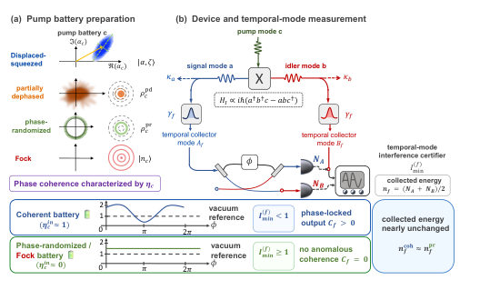
<figcaption class="paper-figure-caption"><b>Fig 1.</b> FIG. 1: Phase-coherent quantum battery powering a parametric amplifier. (a) A finite bosonic QB (mode c) is prepared with fixed mean energy ¯nc and fixed nominal squeezing rate g√¯nc = λ, while its phase coherence is varied across coherent, displaced-squeezed, partially de- phased, phase-randomized, and number-state-like prepa- rations. The coherent fraction ηin c = |⟨c⟩|2/⟨c†c⟩quanti- fies the battery phase reference. (b) The pump battery drives a nondegenerate three-wave-mixing amplifier. Sig- nal and idler photons emitted through ports κa and κb are collected into temporal modes Af and Bf, which are then interfered to measure the phase-sensitive certifier I(f) min and the collected...</figcaption>
</figure>
<figure class="paper-figure-card">
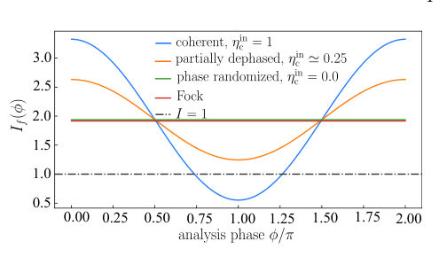
<figcaption class="paper-figure-caption"><b>Fig 2.</b> FIG. 3: Collected temporal-mode interference fringe at the optimal readout time. The interference observable If(ϕ) is evaluated from the collector modes A and B at τ⋆= 1.37. The coherent pump gives a high-contrast fringe whose minimum is below the vacuum reference I = 1, with I(f) min = 0.553. The phase-randomized co- herent pump has nearly the same collected energy but produces a flat trace above the vacuum reference because MAB = 0. The Fock pump also lacks a phase reference and therefore does not generate a phase-locked amplifier field.</figcaption>
</figure>
<figure class="paper-figure-card">
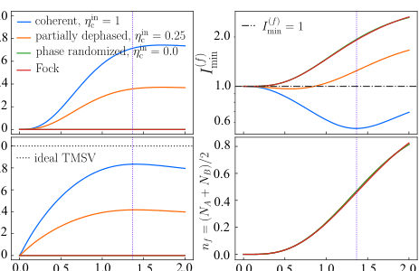
<figcaption class="paper-figure-caption"><b>Fig 3.</b> FIG. 2: Collector-mode certification of finite-battery parametric amplification. The leaking signal and idler fields are collected into auxiliary temporal modes A and B with matched bandwidth γf/λ = 2. The panels show the collected phase-locking visibility Vf, the interference certifier I(f) min, the normalized collected pair coherence Cf, and the collected pair number nf = (NA + NB)/2. A coherent pump battery produces finite temporal-mode phase locking, Cf &gt; 0, and a sub-vacuum interference dip I(f) min &lt; 1. Phase-randomized coherent and Fock pumps collect comparable energy but have no anomalous temporal-mode coherence and remain above the interfer- ence threshold. The dotted vertical...</figcaption>
</figure>
<figure class="paper-figure-card">
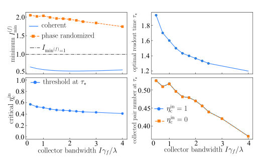
<figcaption class="paper-figure-caption"><b>Fig 4.</b> FIG. 4: Collector-bandwidth dependence of the temporal-mode certifier. The matched collector band- width γf = γA = γB is varied at fixed ¯nc = 5, ξ = 2λ/√κaκb = 0.8, and λTmax = 2. The upper-left panel shows the minimum temporal-mode interference dip ob- tained by optimizing over the readout time. The coher- ent pump remains below the vacuum reference I(f) min = 1, whereas the phase-randomized pump remains above it. The coherent-pump dip improves as the bandwidth is in- creased up to γf/λ ≃2–2.25, and then becomes weaker for broader collectors. The upper-right panel shows the corresponding optimal readout time τ⋆, which decreases with increasing bandwidth. The lower-left panel gives the...</figcaption>
</figure>

**Summary.** This work investigates if quantum batteries can power parametric amplifiers by replacing continuous microwave drives. The authors show that while different pump states can deliver similar amounts of energy, only a truly phase-coherent pump state generates the necessary sub-vacuum interference signature. This establishes phase coherence as the essential resource for efficient, battery-powered quantum amplification.

**Why it may be interesting.** It provides a clear quantum resource theory for superconducting circuit components, demonstrating that mere energy storage is insufficient; phase information must be preserved for optimal operation.

Detailed structure

**Main problem.** The central question is whether a quantum battery can replace or strongly duty-cycle the continuous microwave pump tone required for phase-locked parametric amplification.

**Main result.** Phase coherence, not just stored energy, is the critical resource; only a coherent pump state generates the necessary anomalous two-mode coherence and sub-vacuum interference dip ($I_{\min} < 1$).

**Method.** The analysis uses quantum optical diagnostics (interference visibility $I(\phi)$) applied to open-system dynamics modeled by master equations, comparing different initial pump states.

**Model / system.** The system is a nondegenerate parametric amplifier driven by a finite bosonic quantum battery acting as the pump. The process is analyzed in both closed and cascaded open-system models.

**Key observables.** Phase-sensitive interference minimum ($I_{\min}$), anomalous two-mode coherence ($\langle \hat{a}\hat{b} 
angle$), and collected energy ($n_f$).

**Important parameters / regimes.** Pump state type (coherent vs. phase-randomized), squeezing parameter ($r$), and detection bandwidth/time ($	au$ or $\gamma_f$).

**Assumptions / limitations.** The analysis often relies on the assumption of a Markovian evolution for leakage, and some parts use approximations like the stiff-pump limit.

**Figures summary.** Figures compare $I_{\min}$ across pump types (coherent vs. phase-randomized), showing that only the coherent pump achieves sub-vacuum interference ($I_{\min} < 1$) while depositing similar energy to the randomized pumps.

**Paper structure.** The paper progresses from establishing the fundamental resource distinction using simple models, extending this to open systems with leakage, and finally exploring how nonclassical states like squeezing can optimize the required phase coherence.

Abstract

Quantum batteries have been proposed as locally precharged work sources for superconducting quantum technologies, suggesting a route to reduce continuously supplied microwave drives. Here we ask whether the pump tone of a quantum-limited parametric amplifier can be replaced, or strongly duty-cycled, by a finite bosonic quantum battery. Quantizing the pump of a nondegenerate parametric amplifier exposes a resource distinction hidden in the classical description: stored pump energy can generate signal-idler photons, but pump phase coherence is required to generate a phase-locked amplifier field. In a closed trilinear model, coherent and phase-randomized coherent pumps with the same photon-number distribution produce comparable pair numbers, yet only the coherent pump produces anomalous two-mode coherence and an EPR-squeezed interference dip. Including leakage, we collect the emitted fields into cascaded temporal modes. At matched collector bandwidth, the coherent pump gives \(I_{\min}^{(f)}=0.553\), whereas the phase-randomized pump gives \(I_{\min}^{(f)}=1.94\) at nearly identical collected energy. Weak amplitude squeezing slightly improves the dip by reducing finite-pump number fluctuations while preserving the coherent displacement. Thus battery-powered parametric amplification requires phase-coherent stored energy, possibly assisted by number-noise reduction, rather than stored energy alone.

[↑ back to top](#top)

### [Observation of alignment tensor effects in metastability-exchange collisions with highly polarized 3He ensembles](http://arxiv.org/abs/2606.20330v1)

**Authors:** Yida Sha, Kaiwen Yi, Xingqing Jin, Matteo Fadel, Xiang Peng  
**Type:** both · **Category:** other · **PDF:** <https://arxiv.org/pdf/2606.20330v1>  
**Analysis basis:** full PDF text, analyzed in chunks
**Topic relevance:** `exotic spin models in light-matter` **3/5** · `spintronics-quantum-optics interface` **3/5** · `methods for driven-dissipative` **2/5** · `non-equilibrium dynamics` **2/5** · `Keldysh / 2PI / non-Gaussian methods` **1/5** · `correlated / nonlocal dissipation` **1/5** · `driven-dissipative phase transition` **1/5** · `quantum measurements` **1/5**

↔ Scroll figures horizontally

<figure class="paper-figure-card">
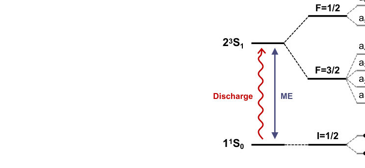
<figcaption class="paper-figure-caption"><b>Fig 1.</b> Figure 1. 3He atomic energy-level diagram (not to scale). 11S0 and 23S1 represent the ground and metastable states, respectively. The metastable state consists of two hyperfine manifolds with total angular momenta F = 1/2 and F = 3/2, the corresponding Zeeman sublevel populations being denoted by ai. The RF discharge (red arrow) drives roughly 10−6 of the total ground-state atoms into the metastable, whereas ME collisions are represented by the blue double arrow.</figcaption>
</figure>
<figure class="paper-figure-card">
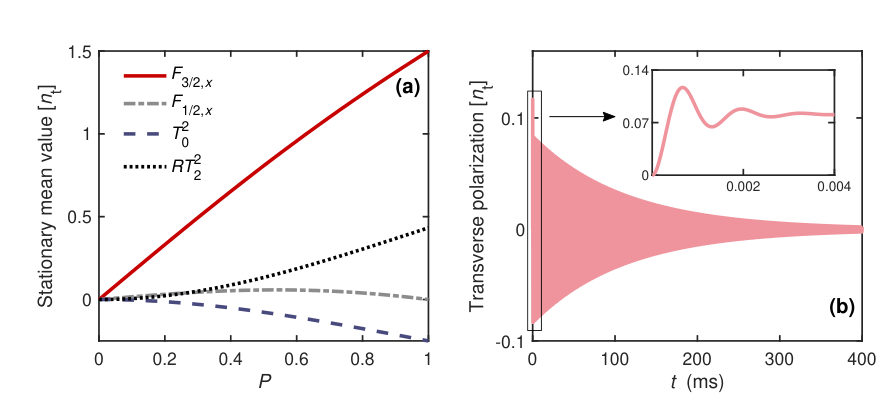
<figcaption class="paper-figure-caption"><b>Fig 2.</b> Figure 2. (a) Dependence of stationary mean values on nuclear polarization P. (b) Time dependence of transverse polarization δF3/2,z obtained from the full model. The inset depicts the initial dynamical evolution over the time interval 0 to 0.004 ms. All vertical axes show values normalized to metastable atom number nt. Simulation parameters in panel (b) are chosen as B0 = 40 µT, τe/Te = 3 × 10−6, T = 300 K, P = 0.6 with the collective nuclear spin tilted by 7◦.</figcaption>
</figure>
<figure class="paper-figure-card">
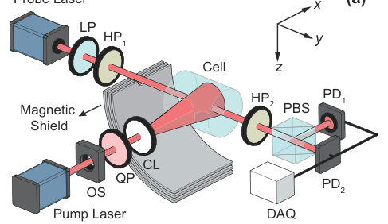
<figcaption class="paper-figure-caption"><b>Fig 3.</b> Figure 3. (a) Sketch of the experiment apparatus. LP, linear polarizer; HP, half-wave plate; QP, quarter-wave plate; CL, concave lens; PBS, polarizing beam splitter; PD, photoelectric detector; DAQ, data acquisition; OS, optical shutter. (b) Timing diagram for static magnetic field B0, pump laser, RF pulse BRF and probe laser. High (low) level corresponds to the ON (OFF) state.</figcaption>
</figure>
<figure class="paper-figure-card">
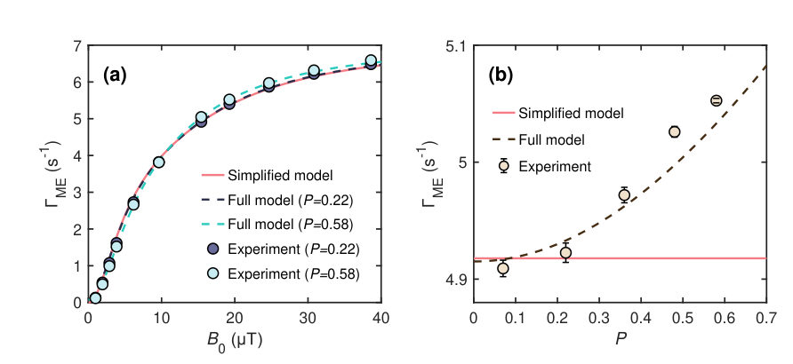
<figcaption class="paper-figure-caption"><b>Fig 4.</b> Figure 4. (a) Magnetic field dependence and (b) nuclear polarization dependence of ME-induced relaxation. Simulation parameters 1/Te = 7.01 s−1 and 1/τe = 3.15 × 106 s−1 are used throughout. In panel (b), the magnetic field is fixed at B0 = 15 µT.</figcaption>
</figure>
<figure class="paper-figure-card">
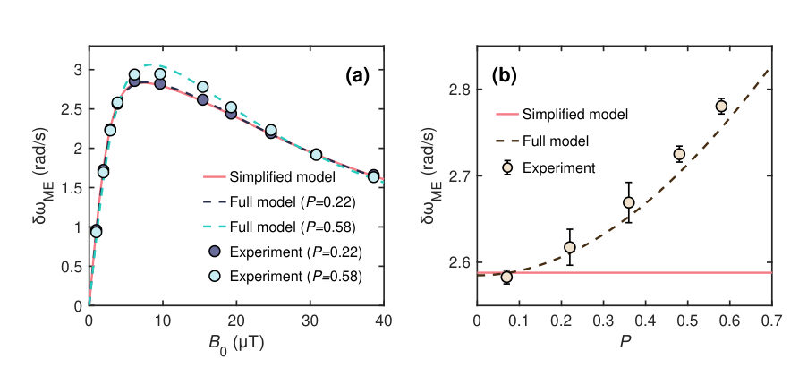
<figcaption class="paper-figure-caption"><b>Fig 5.</b> Figure 5. (a) Magnetic field dependence and (b) nuclear polarization dependence of ME-induced frequency shift. Simulation parameters are the same as those of Fig. 4.</figcaption>
</figure>

**Summary.** This research advances the understanding of nuclear spin dynamics in highly polarized Helium-3 gas by incorporating the metastable alignment tensor into the theoretical description of metastability-exchange collisions. By developing a full model and comparing it to FID measurements, the authors demonstrate that these tensorial effects cause measurable deviations in relaxation rates and frequency shifts at high polarizations. This has direct applications for improving systematic error correction in high-accuracy magnetometry.

**Why it may be interesting.** This work is highly relevant as it pushes the boundaries of precision measurement in atomic physics by quantifying systematic errors (tensor effects) that limit magnetometry accuracy in polarized noble gases.

Detailed structure

**Main problem.** The study investigates how the metastable alignment tensor, previously ignored, significantly affects the dynamics of highly polarized Helium-3 ensembles during metastability-exchange collisions.

**Main result.** The full theoretical model incorporating these tensorial effects accurately predicts polarization-dependent changes in both the relaxation rate and the frequency shift observed experimentally at high polarizations.

**Method.** The authors developed a linearized, mean-field model to describe the evolution of collective angular momentum variables, which was then compared against Free-Induction-Decay (FID) measurements.

**Model / system.** The physical system is highly polarized Helium-3 gas undergoing Metastability-Exchange Optical Pumping (MEOP). The theoretical framework models the coupled dynamics between ground and metastable Zeeman sublevel populations, including rank-2 tensorial contributions.

**Key observables.** ME-induced relaxation rate ($\Gamma_{	ext{ME}}$) and frequency shift ($\delta\omega_{	ext{ME}}$) measured via FID signals.

**Important parameters / regimes.** High nuclear polarization ($P > 0.5$), external magnetic field strength ($B_0$), and the comparison between simplified (orientation-only) and full (tensor-inclusive) models.

**Assumptions / limitations.** The analysis uses a linearized model under mean-field approximation, and comparisons are made across different polarization regimes where the simple model breaks down.

**Figures summary.** Figures show the dependence of relaxation rates and frequency shifts on both external magnetic field strength and nuclear polarization, comparing simplified vs. full model predictions.

**Paper structure.** The paper develops a theoretical framework by extending previous models to include alignment tensors, derives linearized evolution equations for tensorial components, and validates these predictions by analyzing experimental FID measurements of relaxation rates and frequency shifts across varying polarizations.

Abstract

Highly polarized 3He ensembles prepared by metastability-exchange optical pumping (MEOP) have been widely used in precision measurements and fundamental physics. Metastability-exchange (ME) collisions, serving as the basis of MEOP, are traditionally described in terms of atomic orientation, while the significant contributions of metastable alignment tensor at high polarization remain unexplored. In this work, we develop a linearized model under mean-field approximation to investigate alignment tensor effects in highly polarized 3He , which originate from the metastable F = 3/2 manifold and are revealed through ME-induced relaxation and frequency shift. By means of free-induction-decay (FID) measurements, a pronounced dependence on nuclear polarization is experimentally observed in the response of the ground-state-metastable hybrid 3He ensembles to the external magnetic field. Furthermore, after obtaining the characteristics of tensor-induced phenomena, we demonstrate good agreement between the experiment and the theory. This work advances the understanding of nuclear spin dynamics in highly polarized 3He using MEOP. It further provides applications in systematic error correction of high-accuracy magnetometry, as well as in optimal protocol for the generation of nuclear spin-squeezed states.

[↑ back to top](#top)

### [Effects of interaction range on the mean-field dynamics of Bose polarons](http://arxiv.org/abs/2606.20020v1)

**Authors:** Piotr Wysocki, Ubaldo Cavazos Olivas, Marek Tylutki, Krzysztof Jachymski  
**Type:** theory · **Category:** quantum gases · **PDF:** <https://arxiv.org/pdf/2606.20020v1>  
**Analysis basis:** full PDF text, analyzed in chunks
**Topic relevance:** `Kondo & dissipative impurity` **3/5** · `non-equilibrium dynamics` **3/5** · `non-equilibrium universality` **2/5** · `Keldysh / 2PI / non-Gaussian methods` **1/5** · `analog quantum simulation` **1/5** · `correlated / nonlocal dissipation` **1/5** · `driven-dissipative phase transition` **1/5** · `methods for driven-dissipative` **1/5**

↔ Scroll figures horizontally

<figure class="paper-figure-card">
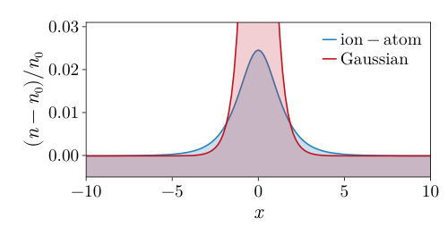
<figcaption class="paper-figure-caption"><b>Fig 1.</b> FIG. 1. Ground state density profile for a BEC interacting with a charged impurity vs a gaussian one for similar impurity-boson scat- tering length.</figcaption>
</figure>
<figure class="paper-figure-card">
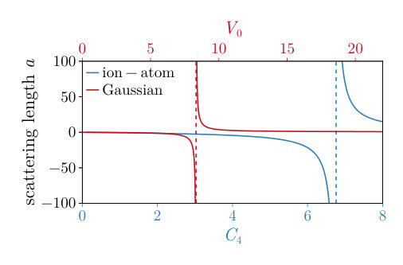
<figcaption class="paper-figure-caption"><b>Fig 2.</b> FIG. 2. Scattering length aIB as a function of the interaction strength for the ion-atom and gaussian potentials with b = 1.5 and σ = 0.4, respectively (cf. eq. (2)-(3)).</figcaption>
</figure>
<figure class="paper-figure-card">
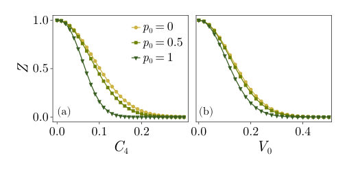
<figcaption class="paper-figure-caption"><b>Fig 3.</b> FIG. 3. Polaron residue as a function of the interaction strength C4 or V0 for zero- as well as finite momentum ground states.</figcaption>
</figure>
<figure class="paper-figure-card">
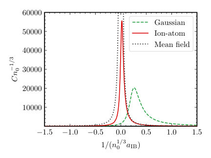
<figcaption class="paper-figure-caption"><b>Fig 4.</b> FIG. 4. Tan contact as a function of the inverse scattering length for a weakly interacting impurity (gray dotted line), ion-atom (solid red line) and Gaussian (green-dashed curve) potentials.</figcaption>
</figure>
<figure class="paper-figure-card">
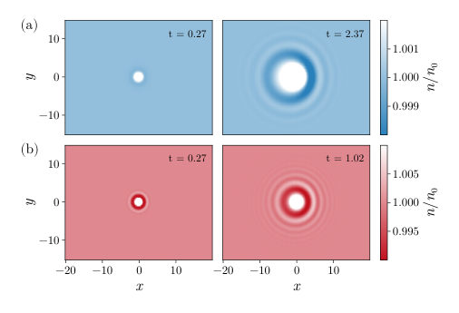
<figcaption class="paper-figure-caption"><b>Fig 5.</b> FIG. 6. Snapshots of the planar cut through the condensate density at two different times for the ion-atom (upper) and gaussian (lower) potentials for interaction strengths C4 = 0.28, V0 = 1.08</figcaption>
</figure>

**Summary.** This theoretical paper analyzes the dynamics of a Bose polaron—an impurity moving through a Bose gas condensate—by examining the role of interaction range. Using mean-field theory, the authors find that long-range forces lead to significantly different relaxation dynamics and slower equilibration compared to short-range interactions. The findings are crucial for understanding momentum transfer in strongly coupled quantum systems.

**Why it may be interesting.** This work provides detailed insights into non-equilibrium transport phenomena in quantum gases, particularly highlighting how the spatial nature of interactions dictates relaxation timescales and effective mass renormalization.

Detailed structure

**Main problem.** The study investigates how the interaction range between an impurity particle and a host Bose gas affects the mean-field dynamics of the resulting Bose polaron.

**Main result.** Relaxation dynamics exhibit damped oscillations, and the equilibration process is highly sensitive to whether the interaction is long-range (like ion-atom forces) or short-range (local potentials).

**Method.** The analysis employs mean-field theory in the impurity's reference frame, utilizing hydrodynamic equations derived from the Gross-Pitaevskii equation.

**Model / system.** The system is a 3D Bose polaron model involving an impurity interacting with a degenerate Bose gas. The Hamiltonian includes terms for kinetic energy and various interaction potentials (e.g., power-law or Gaussian).

**Key observables.** Impurity velocity oscillations, effective mass ($m^*$), Polaron Residue ($Z$), and Tan contact ($C$).

**Important parameters / regimes.** Interaction strength, interaction range (long vs. short), and the coupling regime (strong coupling).

**Assumptions / limitations.** The Lee-Low-Pines transformation is used, assuming Galilean invariance, and a mean-field decoupling for bosons is applied.

**Figures summary.** Figures compare ground state density profiles, show scattering length dependence on interaction type, plot polaron residue vs. strength, and illustrate impurity momentum decay over time for different potentials.

**Paper structure.** The paper develops the dynamics using hydrodynamic equations, linearizes them to study perturbations ($\delta n, \delta S$), derives a Langevin equation for impurity momentum, and compares results obtained from long-range versus short-range interaction models.

Abstract

We consider the three-dimensional Bose polaron problem in the regime of finite range interactions and competing length scales. Working in the reference frame of the impurity, we study both static and out of equilibrium properties of the system, in particular the transfer of momentum between the impurity and the host gas. We find that relaxation dynamics can occur via damped oscillations of the impurity velocity with simple dependence on the interaction strength. Furthermore, the equilibration process is sensitive to the type of the impurity-bath interaction. Specifically, interatomic forces describing ion-atom systems lead to much longer timescales and more pronounced oscillations in the strong coupling regime with respect to local interaction potentials. We also find that the effective masses can differ by a large amount between the two scenarios, even if the number of atoms in the polaron cloud remains similar for both cases.

[↑ back to top](#top)

### [Operational Tube-Sector Theory of Quantum State Distinguishability Under Generalized Symmetries](http://arxiv.org/abs/2606.19678v1)

**Authors:** Song He  
**Type:** theory · **Category:** other · **PDF:** <https://arxiv.org/pdf/2606.19678v1>  
**Analysis basis:** full PDF text, analyzed in chunks
**Topic relevance:** `entanglement & information structure` **3/5** · `quantum measurements` **3/5** · `measurement-induced transitions` **2/5** · `Keldysh / 2PI / non-Gaussian methods` **1/5** · `analog quantum simulation` **1/5** · `correlated / nonlocal dissipation` **1/5** · `driven-dissipative phase transition` **1/5** · `methods for driven-dissipative` **1/5**

↔ Scroll figures horizontally

<figure class="paper-figure-card">
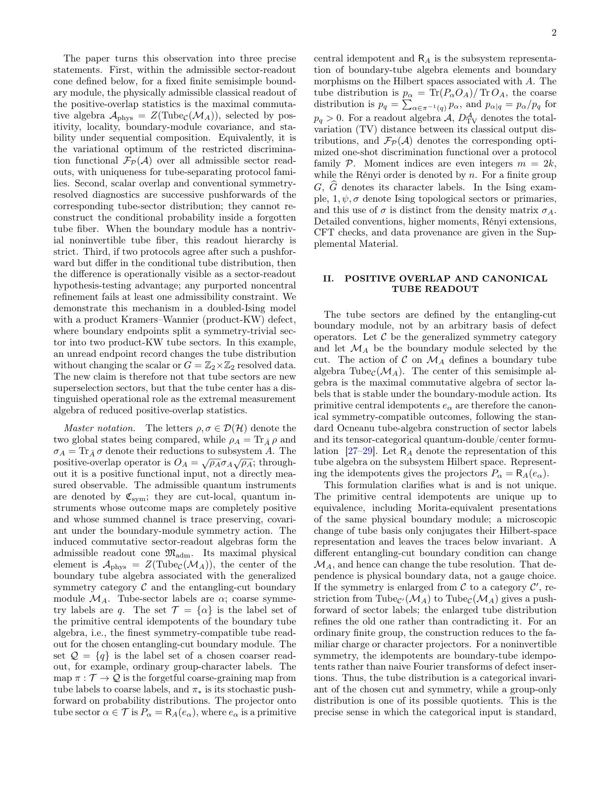
<figcaption class="paper-figure-caption"><b>Fig 1.</b> Low-resolution page preview, page 2</figcaption>
</figure>
<figure class="paper-figure-card">
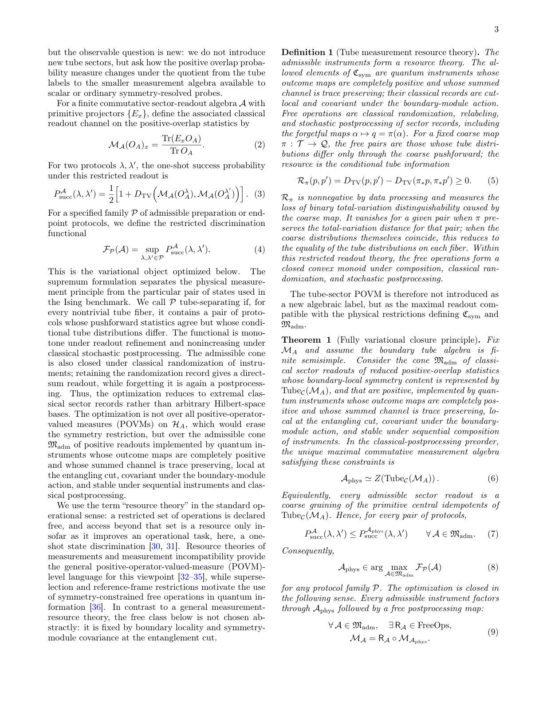
<figcaption class="paper-figure-caption"><b>Fig 2.</b> Low-resolution page preview, page 3</figcaption>
</figure>
<figure class="paper-figure-card">
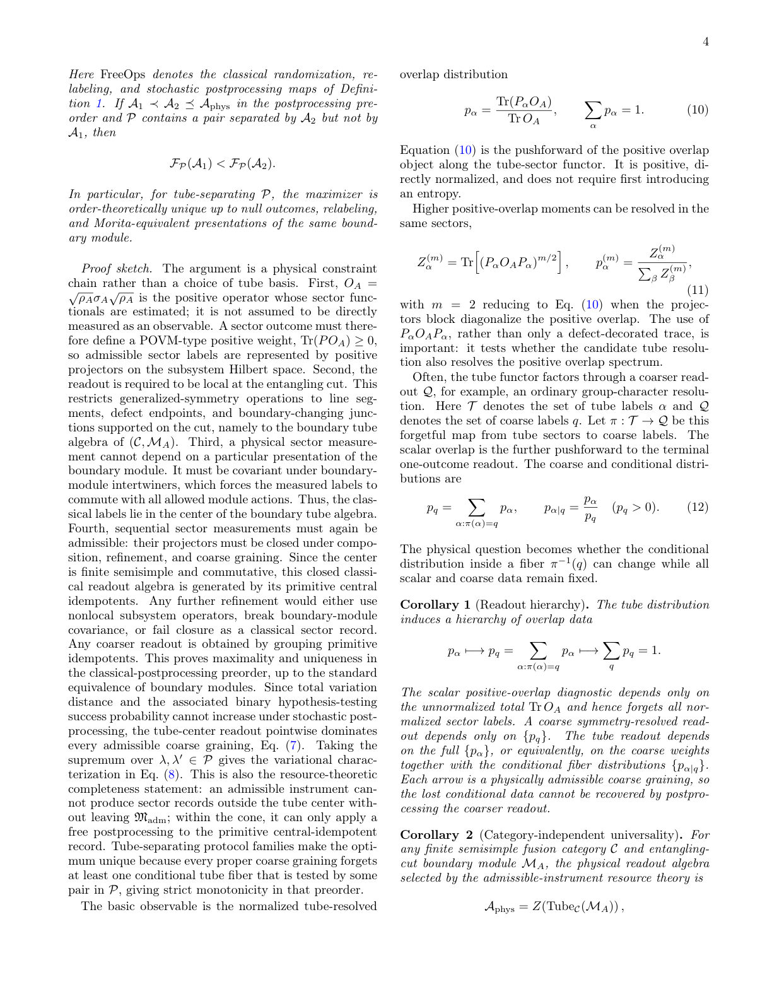
<figcaption class="paper-figure-caption"><b>Fig 3.</b> Low-resolution page preview, page 4</figcaption>
</figure>
<figure class="paper-figure-card">
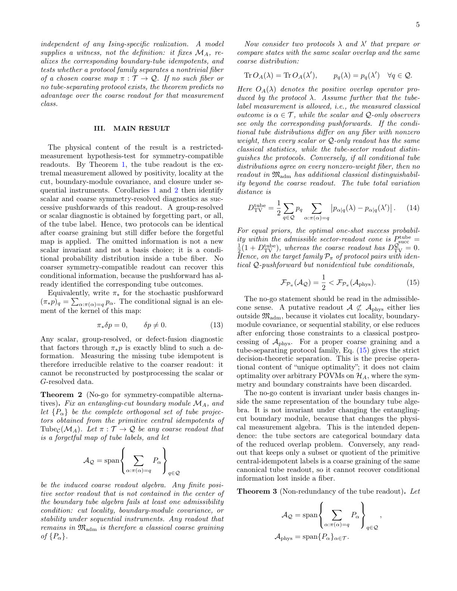
<figcaption class="paper-figure-caption"><b>Fig 4.</b> Low-resolution page preview, page 5</figcaption>
</figure>
<figure class="paper-figure-card">
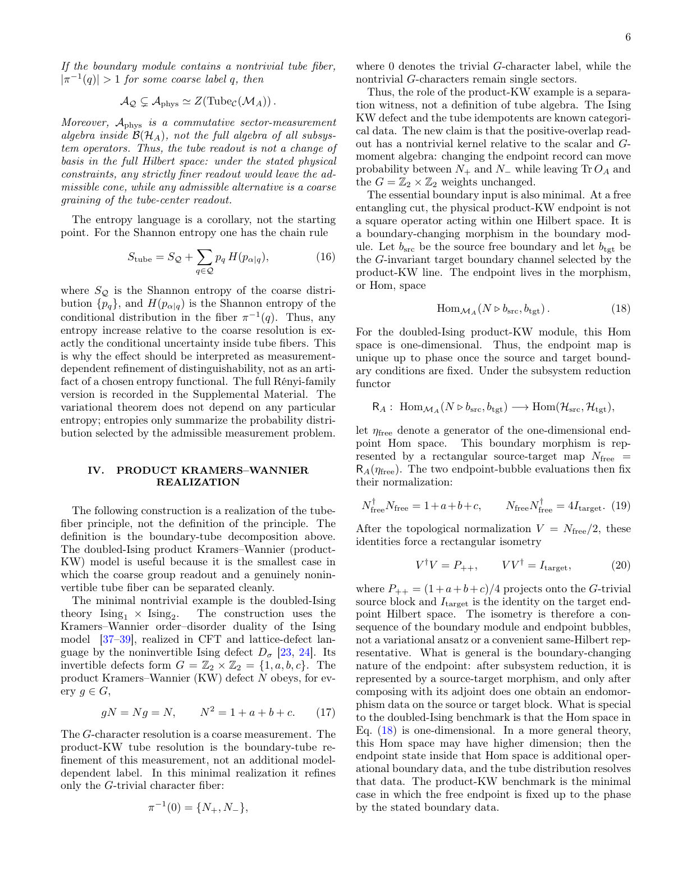
<figcaption class="paper-figure-caption"><b>Fig 5.</b> Low-resolution page preview, page 6</figcaption>
</figure>

**Summary.** The paper introduces an advanced 'Operational Tube-Sector Theory' to measure quantum state distinguishability beyond standard methods. It shows that the true physical measurement capability is governed by a boundary tube algebra, which captures conditional information invisible to coarse symmetry measurements. This provides a powerful tool for understanding how entanglement and generalized symmetries constrain what can be experimentally measured.

**Why it may be interesting.** This work provides a rigorous mathematical framework for quantifying the operational advantage gained by measuring fine-grained quantum correlations (like those encoded in tube sectors) that are otherwise lost or averaged out when only symmetry-protected observables are measured.

Detailed structure

**Main problem.** The paper establishes a refined operational theory for quantum-state distinguishability that surpasses standard fidelity or symmetry-resolved diagnostics, especially in systems with generalized symmetries.

**Main result.** The optimal measurement structure is uniquely determined by the center of the boundary tube algebra, $A_{	ext{phys}} = Z(	ext{Tube}C(M_A))$, which quantifies information lost during coarse-graining operations.

**Method.** It develops an 'Operational Tube-Sector Theory' using variational principles and resource theory concepts to characterize physically admissible quantum instruments under symmetry constraints.

**Model / system.** The framework applies to general many-body systems characterized by generalized symmetries, including noninvertible cases described by fusion categories. Specific benchmarks include the doubled-Ising product Kramers–Wannier model.

**Key observables.** Tube-sector probabilities ($p_\alpha$), restricted discrimination functional ($F_P(A)$), and the tube total variation distance ($	ext{D}_{	ext{tube}}	ext{TV}$).

**Important parameters / regimes.** Generalized symmetries, entanglement cuts, fusion categories, and boundary module structure.

**Assumptions / limitations.** The theory assumes admissibility constraints (complete positivity, locality at the cut) define the physical measurement cone, and that standard diagnostics are coarse-grained limits of the full tube distribution.

**Figures summary.** Figures illustrate the hierarchy of measurement algebras, showing how the tube readout provides a strictly higher success probability ($\Delta P > 0$) compared to scalar or symmetry-resolved readouts when conditional information is present but ignored by coarser measurements.

**Paper structure.** The paper builds from defining the operational structure via admissible instruments (Chunk 1), deriving the optimal measurement algebra $A_{	ext{phys}}$ (Chunk 2), proving that tube sectors capture non-redundant information invisible to coarse readouts (Chunks 3 & 4), and finally formalizing this as a resource theory of measurement (Chunks 5, 6, & 7).

Abstract

A variational principle for quantum-state distinguishability is established in many-body systems with generalized symmetries, including noninvertible cases described by fusion categories. Standard fidelity and symmetry-resolved diagnostics emerge as coarse-grained limits of a more refined operational structure. When symmetry actions terminate at entanglement cuts, distinguishability is governed by boundary tube algebras within a symmetry-constrained measurement resource theory. The physically admissible instruments are characterized by complete positivity, entanglement-cut locality, boundary-module covariance, and sequential stability. The resulting optimal measurement structure is uniquely fixed by the center of the boundary tube algebra, $\mathcal{A}_{\mathrm{phys}} = Z\!\left(\mathrm{Tube}_{\mathcal{C}}(\mathcal{M}_A)\right)$, whose primitive idempotents define tube-sector probabilities that refine fidelity-based and symmetry-resolved descriptions. The associated tube positive-operator-valued measures (POVM) are extremal and yield optimal one-shot hypothesis-testing distinguishability under symmetry constraints. The construction is universal across fusion categories and independent of microscopic realization.

[↑ back to top](#top)

### [Exact Markovian Dissipation Requires Singular Energy Resources](http://arxiv.org/abs/2606.19510v1)

**Authors:** Hiroki Nakabayashi  
**Type:** theory · **Category:** other · **PDF:** <https://arxiv.org/pdf/2606.19510v1>  
**Analysis basis:** full PDF text, analyzed in chunks
**Topic relevance:** `correlated / nonlocal dissipation` **3/5** · `methods for driven-dissipative` **3/5** · `driven-dissipative phase transition` **2/5** · `non-equilibrium dynamics` **2/5** · `Keldysh / 2PI / non-Gaussian methods` **1/5** · `non-equilibrium universality` **1/5**

↔ Scroll figures horizontally

<figure class="paper-figure-card">
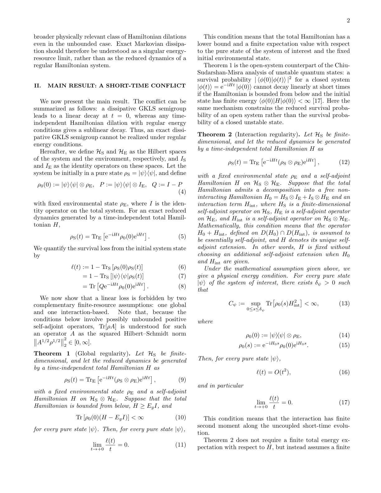
<figcaption class="paper-figure-caption"><b>Fig 1.</b> Low-resolution page preview, page 2</figcaption>
</figure>
<figure class="paper-figure-card">
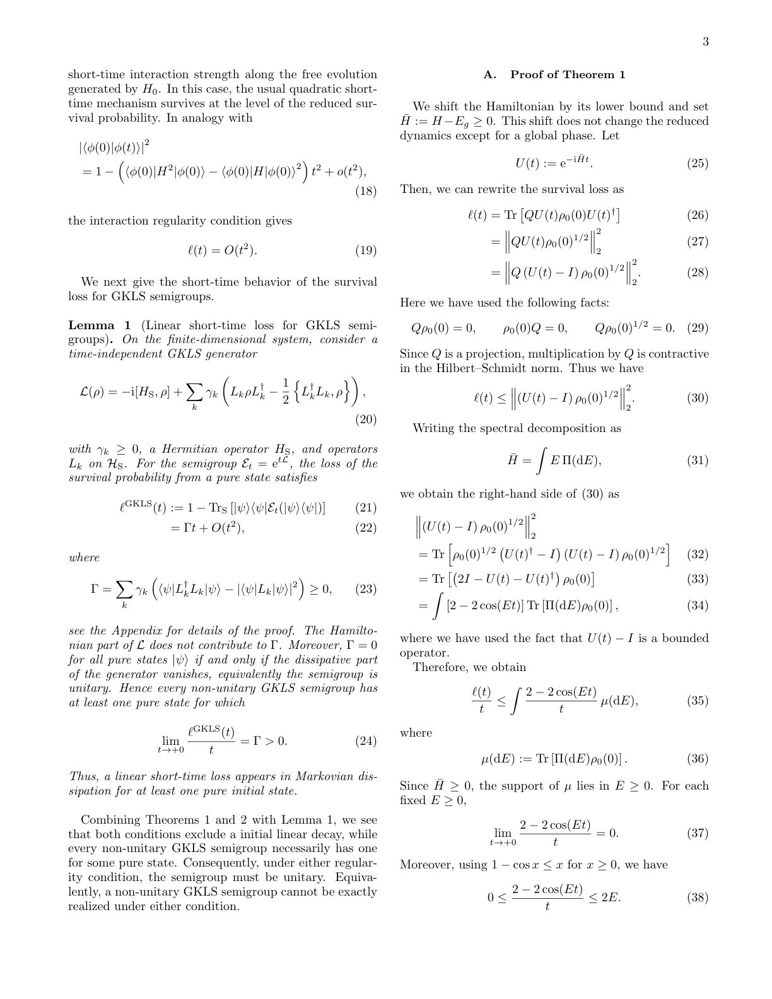
<figcaption class="paper-figure-caption"><b>Fig 2.</b> Low-resolution page preview, page 3</figcaption>
</figure>
<figure class="paper-figure-card">
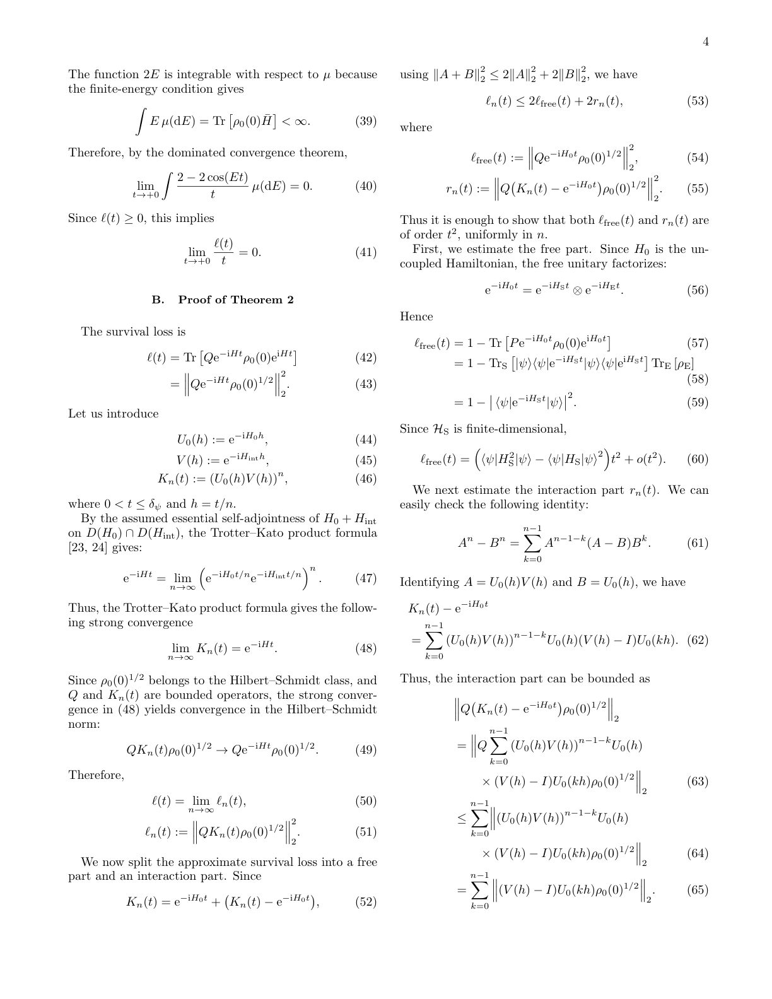
<figcaption class="paper-figure-caption"><b>Fig 3.</b> Low-resolution page preview, page 4</figcaption>
</figure>
<figure class="paper-figure-card">
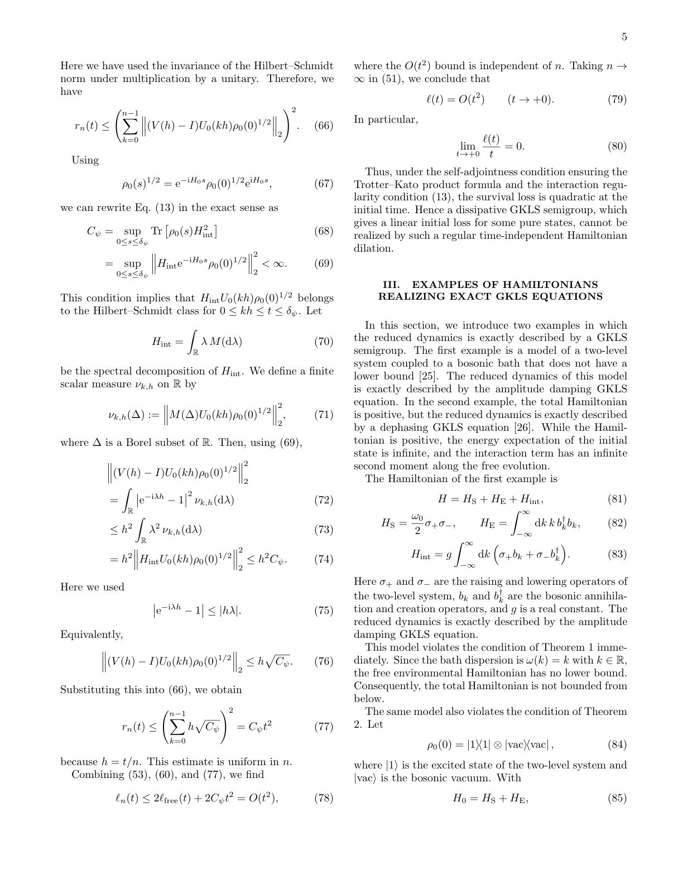
<figcaption class="paper-figure-caption"><b>Fig 4.</b> Low-resolution page preview, page 5</figcaption>
</figure>
<figure class="paper-figure-card">
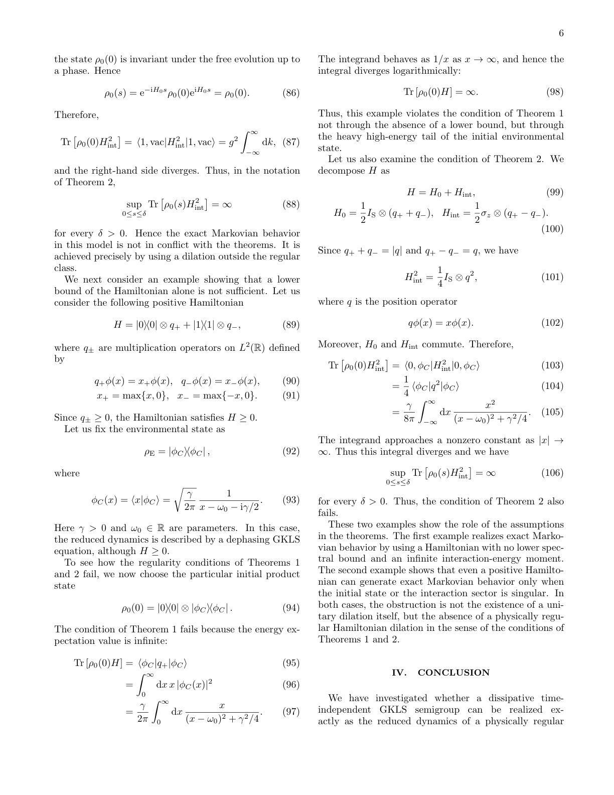
<figcaption class="paper-figure-caption"><b>Fig 5.</b> Low-resolution page preview, page 6</figcaption>
</figure>

**Summary.** The paper proves that standard, physically regular Hamiltonian descriptions cannot exactly reproduce the linear short-time decay characteristic of Markovian dissipation described by the GKLS equation. This forces the conclusion that such dissipative processes must be understood as effective approximations rather than exact reduced dynamics.

**Why it may be interesting.** This work provides a fundamental constraint linking the mathematical structure of open quantum evolution (GKLS) to the physical constraints imposed by energy conservation and boundedness on the underlying microscopic dynamics.

Detailed structure

**Main problem.** The paper investigates whether irreversible quantum dissipation, described by the GKLS equation, can be exactly modeled as the reduced dynamics of a physically regular Hamiltonian dilation.

**Main result.** Exact Markovian dissipation requires singular energy resources (e.g., unbounded Hamiltonians), implying that such dissipative processes must be treated as effective descriptions rather than exact reductions from standard physical Hamiltonians.

**Method.** The authors compare the short-time decay of the survival probability ($\ell(t)$) predicted by physically regular Hamiltonian evolutions ($o(t)$ or $O(t^2)$) against the linear initial decay ($\Gamma t$) characteristic of non-unitary GKLS semigroups.

**Model / system.** The system involves open quantum dynamics governed by the Gorini–Kossakowski–Lindblad–Sudarshan (GKLS) equation. The analysis contrasts this with unitary evolution generated by a total Hamiltonian $H = H_S + H_E + H_{int}$ acting on an environment.

**Key observables.** Survival probability loss ($\ell(t)$), and the linear decay coefficient $\Gamma$ derived from the GKLS generator.

**Important parameters / regimes.** The regularity conditions, specifically requiring the total Hamiltonian to be bounded below or having finite short-time interaction energy moments.

**Assumptions / limitations.** The analysis assumes 'physically regular energy conditions' (e.g., lower bound on $H$ or finite second moment of $H_{int}$).

**Figures summary.** Not specified in the notes, but the core comparison is between $\ell(t) \sim t^k$ for $k\ge 2$ (regular case) and $\ell_{	ext{GKLS}}(t) \sim t$ (dissipative case).

**Paper structure.** The paper establishes necessary conditions on the short-time behavior of survival loss ($\ell(t)$) under various regularity assumptions derived from Hamiltonian dilation theory, contrasting these bounds with the known linear decay rate of GKLS generators.

Abstract

The Gorini--Kossakowski--Lindblad--Sudarshan (GKLS) equation describes irreversible quantum dynamical semigroups. We show that this description cannot be exact under physically regular energy conditions. We prove that the open-system survival probability under physically regular energy conditions has sublinear decay, whereas any dissipative GKLS semigroup has a linear short-time decay. Hence exact Markovian dissipation requires singular energy resources: an unbounded-below total Hamiltonian or infinite initial energy, and a divergent interaction-energy moment. Therefore, a dissipative time-independent GKLS equation should be regarded as an effective description rather than the exact reduced dynamics of a Hamiltonian dilation satisfying physically regular energy conditions.

[↑ back to top](#top)

### [Truncated Wigner dynamics of biclique quantum spin glasses](http://arxiv.org/abs/2606.20187v1)

**Authors:** Dries Sels  
**Type:** theory · **Category:** disordered systems and neural networks · **PDF:** <https://arxiv.org/pdf/2606.20187v1>  
**Analysis basis:** full PDF text, analyzed in chunks
**Topic relevance:** `Keldysh / 2PI / non-Gaussian methods` **3/5** · `methods for driven-dissipative` **3/5** · `non-equilibrium dynamics` **2/5** · `analog quantum simulation` **1/5** · `driven-dissipative phase transition` **1/5** · `exotic spin models in light-matter` **1/5** · `non-equilibrium universality` **1/5**

↔ Scroll figures horizontally

<figure class="paper-figure-card">
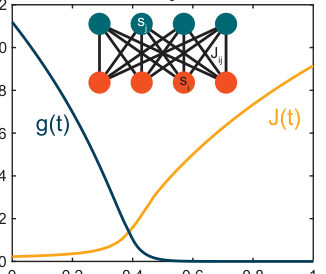
<figcaption class="paper-figure-caption"><b>Fig 1.</b> FIG. 1. Quantum annealing schedule, with transverse field g(t/ta) and overall Ising coupling J(t/ta), for an annealing time of ta = 1ns. The schedule is used in D-wave’s quantum annealing experiment [3]. The inset shows a K4,4 biclique graph.</figcaption>
</figure>
<figure class="paper-figure-card">
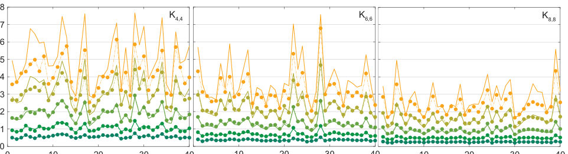
<figcaption class="paper-figure-caption"><b>Fig 2.</b> FIG. 2. Spin glass order parameter for (from left to right) biclique graphs K4,4, K6,6 and K8,8. The solid lines show the exact result obtained using full state vector simulations with the same Trotterization, while the dots denote the truncated Wigner results. Different colors indicate different annealing times ta going from ta = 4ns (dark green) to ta = 25ns (yellow).</figcaption>
</figure>
<figure class="paper-figure-card">
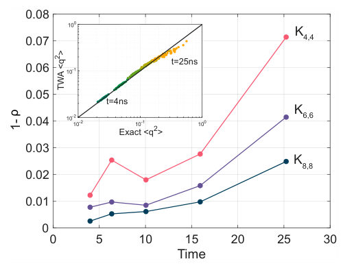
<figcaption class="paper-figure-caption"><b>Fig 3.</b> FIG. 3. The Pearson correlation coefficient ρ between the TWA and exact ⟨ q2⟩ is extracted from a population of Ns = 100 different biclique graphs. As measure of infidelity, the main figure shows 1−ρ, as a function of annealing time ta, for different system sizes K4,4, K6,6 and K8,8. This inset shows a scatter plot for K8,8, and is simply a different representation of the data in Fig. 2; it can be directly compared to Ref. [3].</figcaption>
</figure>
<figure class="paper-figure-card">
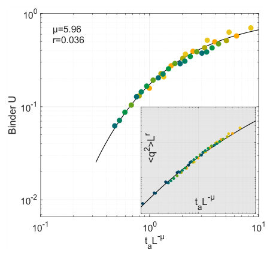
<figcaption class="paper-figure-caption"><b>Fig 4.</b> FIG. 4. The main figure shows the Binder cumulant U ex- tracted as a function of rescaled time, for systems ranging from K8,8 (yellow) to K32,32 (blue) (increasing each subset by 4 qubits) and times ranging from ta = 7ns to ta = 40ns. The inset shows the rescaled order parameter, adding addi- tional K64,64 and K128,128 graphs.</figcaption>
</figure>

**Summary.** This paper analyzes the non-equilibrium dynamics of biclique quantum spin glasses using the Truncated Wigner Approximation (TWA). The authors demonstrate that TWA accurately captures crucial physical signatures, such as sample fluctuations and critical exponents, across large system sizes. This validates TWA as a powerful, scalable tool for studying quantum phase transitions in disordered magnetic systems.

**Why it may be interesting.** It provides a computationally inexpensive yet accurate semiclassical tool (TWA) to study complex many-body dynamics in disordered systems, which is relevant for understanding quantum criticality beyond mean-field treatments.

Detailed structure

**Main problem.** The study investigates how accurately the Truncated Wigner Approximation (TWA) captures the near adiabatic dynamics of biclique quantum spin glasses, particularly concerning sample-to-sample fluctuations.

**Main result.** TWA successfully recovers sample-to-sample fluctuations of the Edwards-Anderson order parameter and extracts critical exponents consistent with theoretical expectations across increasing system sizes.

**Method.** The authors use the Truncated Wigner Approximation (TWA), a semiclassical method, to simulate the time evolution of the quantum spin glass Hamiltonian using Trotterization.

**Model / system.** The physical system is a biclique quantum spin glass modeled by a time-dependent Ising Hamiltonian: H(t) = J(t/ta)H_0 + g(t/ta)H_x, involving $\sigma^z$ and $\sigma^x$ terms.

**Key observables.** Edwards-Anderson order parameter ($\langle q^2 
angle$), Binder cumulant ($U$), and critical exponents ($\mu$, $r$).

**Important parameters / regimes.** Annealing time range, system size (up to tens of thousands of qubits), and the fidelity/correlation coefficient ($
ho$) between TWA and exact results.

**Assumptions / limitations.** The primary assumption is that the TWA remains accurate in the large-N limit; discrepancies are noted at late times or for small systems with large order parameters.

**Figures summary.** Figures compare TWA to exact simulations, showing good agreement ($
ho > 99\%$) and demonstrating data collapse of the Binder cumulant consistent with theoretical predictions across varying system sizes.

**Paper structure.** The paper establishes the problem by introducing the model and method (TWA). It then presents results showing that TWA captures key non-equilibrium features, such as sample fluctuations and critical exponents, validating its use for studying quantum phase transitions in spin glasses.

Abstract

Quantum spin glasses are often considered testbeds for studying quantum optimization algorithms and as such have been the subject of various quantum advantage claims. Here we investigate the near adiabatic dynamics of biclique quantum spin glasses within the (discrete) truncated Wigner approximation (TWA). Benchmarks on small systems show that TWA recovers sample-to-sample fluctuations of the Edwards-Anderson order parameter, over a wide range of annealing times, with increasing fidelity when the system size increases. We extract critical exponents from the Binder cumulant in line with theoretical expectations, reproducing recent quantum experiments. The computational cost of the method is minimal and it can easily be applied to tens of thousands of qubits.

[↑ back to top](#top)

### [Polaronic hybridization of atoms, dimers and trimers in a Bose-Einstein condensate](http://arxiv.org/abs/2606.20440v1)

**Authors:** Carsten Robens, Arthur Christianen, Alexander Y. Chuang, Huan Q. Bui, Yiming Zhang, Richard Schmidt, Martin Zwierlein  
**Type:** both · **Category:** other · **PDF:** <https://arxiv.org/pdf/2606.20440v1>  
**Analysis basis:** full PDF text, analyzed in chunks
**Topic relevance:** `Kondo & dissipative impurity` **3/5** · `analog quantum simulation` **3/5** · `Keldysh / 2PI / non-Gaussian methods` **1/5** · `Tavis-Cummings & cavity-many-emitter` **1/5** · `correlated cavity matter` **1/5** · `driven-dissipative phase transition` **1/5** · `methods for driven-dissipative` **1/5**

↔ Scroll figures horizontally

<figure class="paper-figure-card">
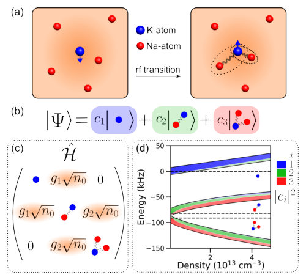
<figcaption class="paper-figure-caption"><b>Fig 1.</b> FIG. 1. Emergence of atom-dimer-trimer superpositions. (a) The rf-association process from the initial-state K-atom im- mersed in a BEC of Na to the dimer-trimer hybridized state. (b) Illustration of the wave function: a superposition of a free K-atom, a dimer, and a trimer. (c) The effective Hamiltonian in the basis of these three states. (d) The three eigenvalues of this Hamiltonian as a function of the BEC density n0. The widths and opacities of the colored sub-lines represent the co- efficients |c1|2 (blue), |c2|2 (green) and |c3|2 (red) for each of the eigenstates. The horizontal dashed lines indicate the en- ergies of the three bare basis states.</figcaption>
</figure>
<figure class="paper-figure-card">
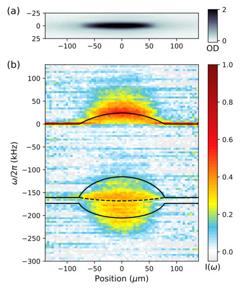
<figcaption class="paper-figure-caption"><b>Fig 2.</b> FIG. 2. Radiofrequency spectra of 40K impurities strongly depend on their position in the 23Na BEC. (a) Density profile of the BEC, where the grayscale indicates the optical density (OD). (b) Spatially resolved spectra at B = 102.5G of initial state |↓⟩depletion when driving at given detuning from the |↓⟩-|↑⟩bare hyperfine transition. The solid lines indicate the theory predictions from the three-level model, whereas the dashed line shows the theory result without three-body cor- relations.</figcaption>
</figure>
<figure class="paper-figure-card">
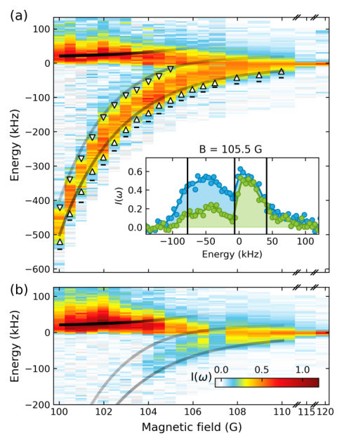
<figcaption class="paper-figure-caption"><b>Fig 3.</b> FIG. 3. Rf impurity spectra in the center of the BEC as a function of magnetic field near the |↑⟩impurity-boson Fesh- bach resonance. (a) depletion of state |↓⟩and (b) arrival of state |↑⟩. Rf pulse time is chosen at each field for ∼50% de- pletion on the attractive branch, and spectra are normalized for equal transfer at the bare dimer energy. Inset: rf signal at 105.5 G (blue: depletion, green: arrival). In (a) the full width at half maximum of the signal is indicated by the triangles. The theory results from the three-level model are indicated via the solid lines, of which the opacity is set by the overlap of the states with the initial polaron state. The horizontal black markers in (a)...</figcaption>
</figure>
<figure class="paper-figure-card">
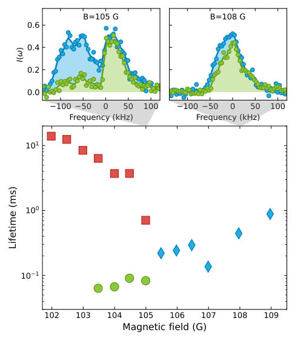
<figcaption class="paper-figure-caption"><b>Fig 4.</b> FIG. 4. Lifetimes of the states created by rf injection. These lifetimes are inferred from the ratio of population de- pleted from |↓⟩to population observed in |↑⟩(upper panels and Fig. 3). For data taken at B ≤105 G, we resolve the attractive and repulsive branches of the spectrum, whereas for larger magnetic fields the two features merge (see upper panels). The lifetime of the attractive polaron states (green circles) decreases at deeper binding energy, whereas the life- time of the repulsive polaron branch (red squares) increases. Blue diamonds: lifetime of the merged feature above 105 G. At sufficiently deep binding energies, we do not observe any population in |↓⟩.</figcaption>
</figure>
<figure class="paper-figure-card">
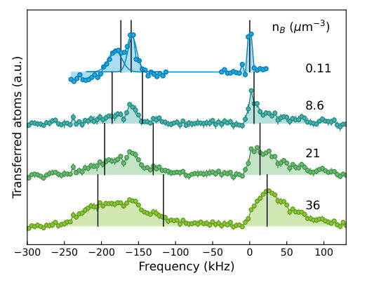
<figcaption class="paper-figure-caption"><b>Fig 5.</b> FIG. 5. The population transfer from impurity spin state |↓⟩ at B = 102.5 G measuring the remaining population in |↓⟩as a function of frequency for several densities of the bosonic bath. Note the double peak structure corresponding to the dimer and trimer feature for the lowest density spectrum, taken with a thermal, uncondensed bosonic cloud. The solid lines corre- spond to the theory results from the three-level model.</figcaption>
</figure>

**Summary.** The research reports on observing three-body correlations in Bose polarons by studying an impurity atom within a BEC. By performing rf spectroscopy and developing a three-level theoretical model, the authors demonstrate that the condensate environment coherently hybridizes molecular bound states (dimer/trimer). This work provides strong evidence for complex many-body interactions in ultracold atomic systems.

**Why it may be interesting.** This work provides an excellent example of how complex many-body physics (three-body correlations) can be mapped onto a simple, experimentally verifiable effective Hamiltonian (three-level model), drawing parallels to fundamental concepts in particle physics like CKM mixing.

Detailed structure

**Main problem.** The study investigates strong correlations, specifically three-body interactions, within Bose polarons formed by an impurity immersed in a Bose-Einstein condensate (BEC). The goal is to understand how the BEC environment coherently hybridizes different molecular bound states.

**Main result.** Clear signatures of three-body correlations are observed spectroscopically, confirming that the ground state eigenstate is a superposition of dimer and trimer components driven by strong BEC coupling. The simple three-level model successfully captures these hybridization effects without requiring free parameters.

**Method.** The work combines theoretical modeling using a three-level Hamiltonian with experimental radiofrequency (rf) spectroscopy on trapped atoms. Variational calculations are used to derive the matrix elements for this effective Hamiltonian.

**Model / system.** The system involves an impurity atom interacting with a BEC of bosons, leading to polaronic hybridization between bare atomic states, $	ext{NaK}$ dimers, and $	ext{Na}_2	ext{K}$ trimers. The physics is modeled using a three-level Hamiltonian derived from microscopic interactions.

**Key observables.** Spectroscopic features (energy shifts and broadening), state composition of the ground state eigenstate, and impurity lifetimes ($	ext{1/}\Gamma$).

**Important parameters / regimes.** The system operates in a strong-coupling regime where BEC coupling exceeds intrinsic molecular splittings; key parameters include BEC density and magnetic field tuning near Feshbach resonances.

**Assumptions / limitations.** The analysis relies on the assumption that the BEC coupling is strong enough to induce hybridization comparable to or exceeding intrinsic molecular splittings. Theoretical models use approximations like the Born approximation for interboson repulsion.

**Figures summary.** Figures show spatially resolved spectra confirming signal dependence on density, energy eigenvalue plots illustrating state superposition vs. density, and lifetime measurements distinguishing between attractive and repulsive polaron branches.

**Paper structure.** The paper progresses from establishing the physical problem (three-body correlations in polarons) to developing a simple three-level model Hamiltonian. It details experimental spectroscopy using rf pulses and compares theoretical predictions of hybridization energies and state weights against measured spectral features across varying BEC densities.

Abstract

The Bose polaron problem of an impurity immersed in a Bose-Einstein condensate (BEC) has been predicted to feature strong correlations arising from bound states of multiple bosons with the impurity. While direct experimental evidence has so far remained elusive, here we observe clear signatures of three-body correlations in Bose polarons. We perform radiofrequency spectroscopy on $^{40}$K impurities in a BEC of $^{23}$Na and identify polaronic hybrid states that can be understood as superpositions of the bare atom, a NaK dimer and a Na$_2$K trimer, coupled through coherent particle exchange with the condensate. We show that the main spectroscopic features are captured by a simple three-level model without free parameters. Our work shows how a condensate environment can coherently hybridize bound states of different composition and mass, reminiscent of quark-flavor mixing described by the Cabibbo-Kobayashi-Maskawa (CKM) matrix in particle physics.

[↑ back to top](#top)

### [Odd fluids from chiral cellular automata](http://arxiv.org/abs/2606.19431v1)

**Authors:** Andrew A. Allocca, Shiva Heidari, Thomas Iadecola, Armin Rahmani, Pouyan Ghaemi, Sriram Ganeshan  
**Type:** theory · **Category:** statistical mechanics · **PDF:** <https://arxiv.org/pdf/2606.19431v1>  
**Analysis basis:** full PDF text, analyzed in chunks
**Topic relevance:** `non-equilibrium dynamics` **3/5** · `non-equilibrium universality` **2/5** · `Keldysh / 2PI / non-Gaussian methods` **1/5** · `analog quantum simulation` **1/5** · `correlated / nonlocal dissipation` **1/5** · `driven-dissipative phase transition` **1/5** · `methods for driven-dissipative` **1/5**

↔ Scroll figures horizontally

<figure class="paper-figure-card">
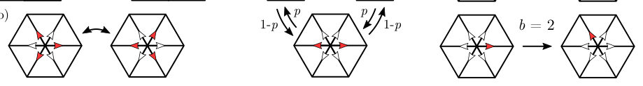
<figcaption class="paper-figure-caption"><b>Fig 1.</b> FIG. 1. A graphical representation of the rules governing the time evolution of the chiral automaton. Particles are indicated by red arrows pointing from their associated lattice site x along the direction of their velocity ℓ. (a) The streaming step, moving a particle to the next lattice site in the direction of its velocity. (b) Three-body collisions between configurations C3,i. (c) Chiral two-body collisions between configurations C2,i; the probability for clockwise and counter-clockwise scattering are allowed to differ. (d) The magnetic effect demonstrated for a single particle, shifting the link index by b after streaming and rotating the velocity. All configurations are rotated in this...</figcaption>
</figure>
<figure class="paper-figure-card">
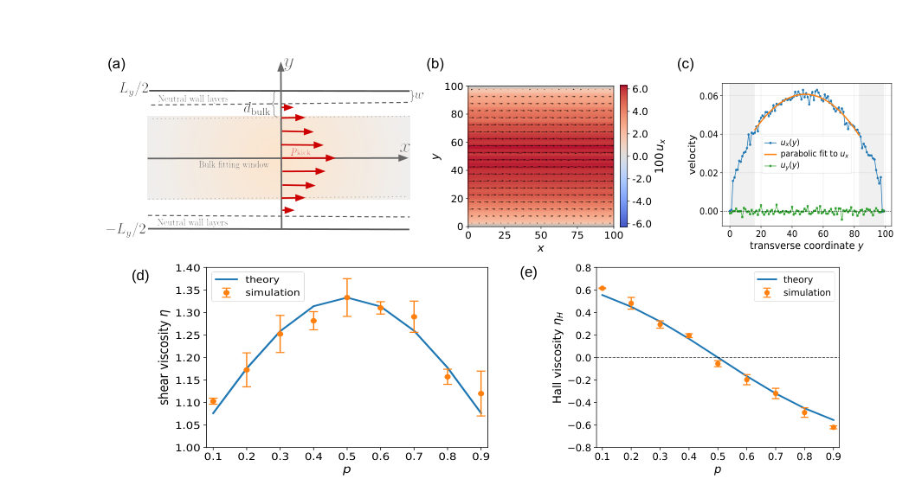
<figcaption class="paper-figure-caption"><b>Fig 2.</b> FIG. 2. Automaton simulation of chiral hydrodynamic transport. (a) Schematic of the Poiseuille geometry used in the simulations. The system is periodic along the longitudinal x direction, with neutral wall layers of thickness w imposed near the upper and lower boundaries. A weak stochastic drive pkick injects longitudinal momentum in the bulk, while viscosity extraction is performed in the central fitting window after excluding boundary-adjacent regions of thickness dbulk. (b) Time-averaged flow at p = 0.7, with color indicating 100ux and arrows showing the coarse-grained velocity field. (c) Velocity profiles ux(y) and uy(y); the solid curve shows the quadratic bulk fit to ux(y). (d,e)...</figcaption>
</figure>

**Summary.** This work develops a chiral generalization of the FHP lattice gas automaton to model fluids exhibiting odd viscosity. By introducing asymmetric scattering rules, the authors show that microscopic parity violation leads directly to macroscopic Hall viscosity ($\eta_H$). The methodology successfully bridges discrete particle dynamics with continuum hydrodynamics via rigorous theoretical expansion and simulation.

**Why it may be interesting.** While focused on classical fluid dynamics, the methodology—deriving macroscopic symmetries (or lack thereof) from explicit micro-rules involving broken parity—is highly relevant to understanding symmetry breaking in quantum many-body systems or non-equilibrium quantum field theories.

Detailed structure

**Main problem.** The study aims to understand how microscopic chiral properties, encoded in local particle interactions within a lattice gas automaton, manifest as macroscopic odd-fluid behavior.

**Main result.** The authors successfully constructed a parity-breaking cellular automaton that yields continuum hydrodynamic equations exhibiting non-zero Hall viscosity ($\eta_H$), linking discrete chirality rules to measurable transport coefficients.

**Method.** The derivation involves constructing a chiral generalization of the FHP lattice gas model and employing a Chapman-Enskog expansion on the associated Boltzmann equation to extract macroscopic transport coefficients.

**Model / system.** The system is a 2D triangular lattice modeled by a cellular automaton, which undergoes discrete time evolution via collision (including asymmetric two-body chiral scattering) and streaming steps, with an optional rotation mimicking a magnetic field.

**Key observables.** Odd viscosity ($\eta_H$), shear viscosity ($\eta$), and the full stress tensor components ($\sigma_{ij}$), measured through Poiseuille flow simulations.

**Important parameters / regimes.** Chirality parameter ($p$) governing collision asymmetry, external magnetic field strength ($B$), and the small expansion parameter ($\epsilon$).

**Assumptions / limitations.** The derivation relies on a Chapman-Enskog expansion in multiple scales ($\epsilon$) and assumes that the system can be coarse-grained into continuum hydrodynamics.

**Figures summary.** Figures illustrate the time evolution rules (streaming, 3-body, chiral 2-body collisions) and compare simulated vs. analytically predicted values for shear and Hall viscosities as a function of the chirality parameter $p$.

**Paper structure.** The paper progresses from defining the microscopic chiral automaton dynamics to deriving the continuum hydrodynamic equations via Chapman-Enskog expansion, culminating in analytical predictions and numerical verification of both standard and odd transport coefficients.

Abstract

Cellular automata are discrete dynamical systems defined on a lattice, in which each site carries a finite set of states that evolve in time according to local deterministic rules. An important application of cellular automata is in lattice gas models of fluids, where the cellular automaton framework provides a particle-based microscopic description of hydrodynamic behavior. The macroscopic fluid equations emerge after coarse-graining over many lattice sites and time steps, offering a bottom-up route to hydrodynamics. A celebrated example is the Frisch-Hasslacher-Pomeau (FHP) model, an automaton defined on a two-dimensional triangular lattice that yields the two-dimensional Navier-Stokes equations upon coarse-graining. In this work, we construct a parity-breaking generalization of the FHP model through two modifications: introducing chiral two-body collision rules and systematically rotating particle velocities to mimic the effect of a background magnetic field. We show that this automaton yields a hydrodynamic model with odd viscosity, a transverse transport coefficient that is a hallmark of odd fluids. We verify the analytical transport coefficients using Poiseuille-flow simulations of the chiral FHP automaton. Our results demonstrate that the chiral automaton introduced here provides a bridge between microscopic parity-breaking scattering processes and macroscopic odd-fluid hydrodynamics.

[↑ back to top](#top)

### [On chip, multifunctional quantum sensing using single spins in a van der Waals crystal](http://arxiv.org/abs/2606.19978v1)

**Authors:** James Liddle-Wesolowski, Konosuke Shimazaki, Jiyun Kim, Benjamin Whitefield, Kenji Watanabe, Takashi Taniguchi, Mehran Kianinia, Igor Aharonovich  
**Type:** experiment · **Category:** other · **PDF:** <https://arxiv.org/pdf/2606.19978v1>  
**Analysis basis:** full PDF text, analyzed in chunks
**Topic relevance:** `spintronics-quantum-optics interface` **3/5** · `quantum measurements` **2/5** · `quantum optics experiment` **2/5** · `QC/QI experiment` **1/5** · `driven-dissipative phase transition` **1/5** · `exotic spin models in light-matter` **1/5**

↔ Scroll figures horizontally

<figure class="paper-figure-card">
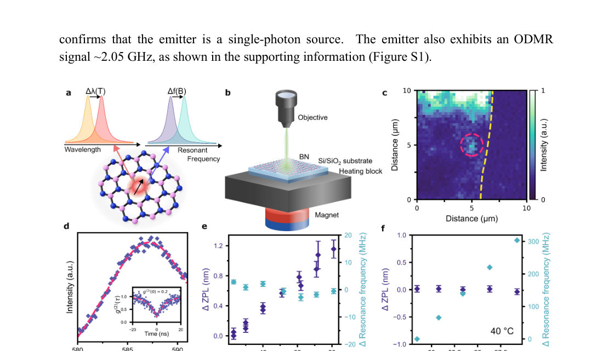
<figcaption class="paper-figure-caption"><b>Fig 1.</b> Figure 1. Concept demonstration of simultaneous sensing of temperature and magnetic field using a quantum emitter in hBN. (a) A graphic depiction of a temperature-dependent PL spectra and a magnetic field-dependent ODMR resonant frequency. (b) Sample stage schematic with labeled components. (c) Normalized PL map showing the hBN flake edge marked with yellow, and an emitter marked by red. (d) The PL spectra of the emitter marked in (c), the emission has a wavelength of 587 nm and a ~15 nm FWHM. Inset: Autocorrelation of PL emission, with a g2(0) = 0.2. (e) Change in ZPL position (purple) and resonant frequency (cyan) as a function of temperature on the heating block. (f) Change in ZPL...</figcaption>
</figure>
<figure class="paper-figure-card">
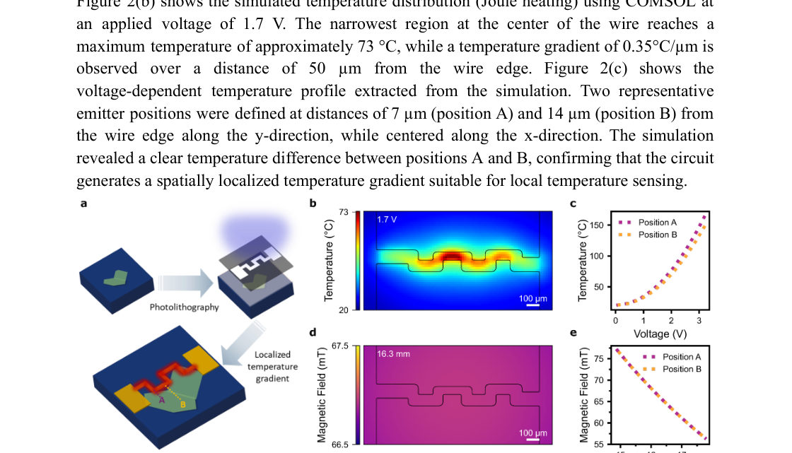
<figcaption class="paper-figure-caption"><b>Fig 2.</b> Figure 2. Microscale heating circuit and resulting Joule-effect simulation. (a) Illustration of microscale heating circuit fabrication. Consisting of the flake selection followed by the photolithography step. Photoresist has been spun over the substrate and is exposed to patterned UV light. A voltage is applied to the circuit and a localized temperature gradient is created. The red line indicates the heating circuit. Position A (orange) and B (magenta) indicate emitter positions closer and farther from the heating region, respectively. (b) Simulated temperature distribution of the circuit heating at 1.7 volts. (c) Simulated temperature recorded from position A (orange) and position B...</figcaption>
</figure>
<figure class="paper-figure-card">
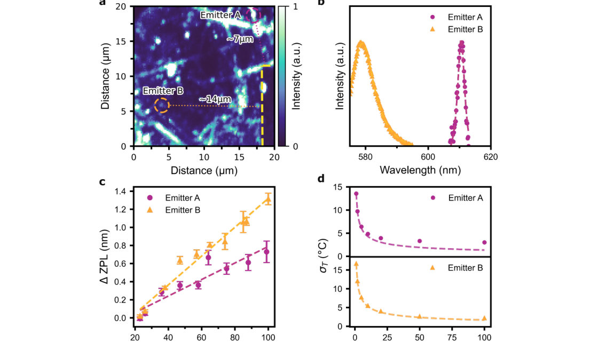
<figcaption class="paper-figure-caption"><b>Fig 3.</b> Figure 3. Characterization of emitters used for simultaneous sensing. (a) Normalized PL map with hBN flake edge marked in yellow, Emitters A (magenta circle) and B (orange triangle) are marked with a circle. The area enclosed by the yellow lines is the location of the circuit. The distances from the wire to Emitter A and B are printed on the map and are ~7 and ~14 µm, respectively. (b) PL emission spectra for Emitters A (B) located at wavelengths 610 nm (579 nm), with a FWHM of ~2.8nm (~9.6 nm). (c) The change in ZPL position as a function of temperature on the heating block for Emitters A and B, with linear fits of 0.0092 nm/°C and 0.016 nm/°C, respectively. (d) Temperature uncertainty of...</figcaption>
</figure>
<figure class="paper-figure-card">
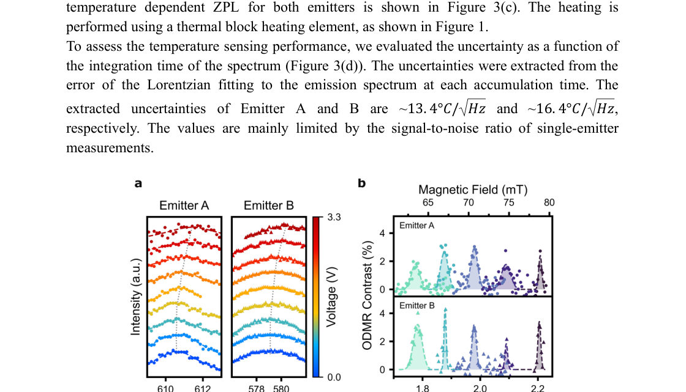
<figcaption class="paper-figure-caption"><b>Fig 4.</b> Figure 4. Dual sensing characteristics of Emitters A and B. (a) Emission spectra for Emitters A and B over the applied voltage range of 0 to 3.3 V. The grey line marks the location of the fitted ZPL peak positions. (b) ODMR spectra for Emitters A and B recorded at different magnetic field strengths. The combined, simultaneous temperature and magnetic field sensing for Emitters A and B is shown in Figure 4. Both emitters&#x27; thermal response is depicted in Figure 4a. Over the applied voltage range of 0 V to 3.3 V, Emitters A (B) experienced ZPL redshifts of ~0.82 nm (~1.2 nm), corresponding to a local temperature of ~112°C (~101°C), respectively (Figure S4). The ODMR signal was independent from...</figcaption>
</figure>

**Summary.** The research presents a robust platform for multifunctional quantum sensing using single spins in hexagonal boron nitride (hBN). By independently monitoring the shift of the Zero-Phonon Line (ZPL) with temperature and the Optically Detected Magnetic Resonance (ODMR) frequency with magnetic field, the authors achieve simultaneous, cross-talk-free measurement of both parameters on a chip. This establishes hBN as a promising material for next-generation quantum sensing devices.

**Why it may be interesting.** This work directly addresses the development of solid-state quantum sensors by engineering an environment (hBN/microcircuit) that allows for orthogonal readout channels, which is crucial for building complex quantum measurement devices.

Detailed structure

**Main problem.** The challenge of simultaneously measuring multiple physical parameters, such as temperature and magnetic field, using a single quantum spin sensor due to cross-sensitivity.

**Main result.** The authors successfully demonstrated independent dual sensing by showing that the Zero-Phonon Line (ZPL) position shifts with temperature while the Optically Detected Magnetic Resonance (ODMR) frequency changes predictably only with the applied magnetic field.

**Method.** They utilized single quantum emitters hosted in hexagonal boron nitride (hBN) placed on a chip equipped with an integrated microheating circuit to create controlled thermal gradients, while simultaneously measuring both ZPL and ODMR spectra.

**Model / system.** The system involves optically addressable spin defects in hBN. The sensing relies on two distinct physical responses: the temperature dependence of the ZPL position ($\lambda$ vs $T$) and the magnetic field dependence of the ODMR frequency ($
u_{	ext{ODMR}}$ vs $\mathbf{B}$).

**Key observables.** ZPL redshift ($\lambda$ vs $T$), ODMR resonance frequency ($
u_{	ext{ODMR}}$ vs $\mathbf{B}$), single-photon emission ($g^{(2)}(	au)$).

**Important parameters / regimes.** Temperature uncertainty limits ($\sim 13.4^\circ	ext{C}/\sqrt{	ext{Hz}}$); Magnetic field sensitivity ($\sim 3.0 \mu	ext{T}/\sqrt{	ext{Hz}}$).

**Assumptions / limitations.** The magnetic field is assumed uniform across the measured area, although localized temperature gradients can be generated via Joule heating.

**Figures summary.** Figure 1 illustrates the concept of dual sensing using ZPL and ODMR shifts. Figure 2 details the microscale heating circuit fabrication and simulated temperature/magnetic field distributions. Figure 3 characterizes the emitters and shows ZPL vs T fits, while Figure 4 presents the independent thermal (ZPL) and magnetic (ODMR) responses.

**Paper structure.** The paper establishes the need for multifunctional quantum sensors; it details the experimental setup using hBN on a microheater; it presents measurements showing the distinct temperature dependence of ZPL and the field dependence of ODMR; finally, it demonstrates simultaneous local sensing capability.

Abstract

Nanoscale thermometry and magnetometry are in high demand across a wide range of scientific and technological applications. In this context, optically addressable spins in solids have emerged at the forefront of on-chip quantum sensing. However, simultaneous quantum sensing of multiple parameters (e.g., temperature and magnetic field) using the same spin sensor remains challenging due to cross-sensitivity to multiple physical quantities. Here, we demonstrate independent dual sensing of temperature and magnetic field using single quantum emitters in hexagonal boron nitride (hBN). We experimentally verify the independent response of the zero-phonon line (ZPL) position to temperature and of optically detected magnetic resonance (ODMR) to magnetic fields. Furthermore, we demonstrate local temperature sensing of a microcircuit while simultaneously measuring an external magnetic field. Our results establish quantum emitters in hBN as a robust platform for multifunctional quantum sensing under realistic operating conditions.

[↑ back to top](#top)

### [Fractional excitations in Kitaev quasi-one-dimensional chain](http://arxiv.org/abs/2606.20309v1)

**Authors:** Ritwika Majumder  
**Type:** theory · **Category:** strongly correlated electrons · **PDF:** <https://arxiv.org/pdf/2606.20309v1>  
**Analysis basis:** full PDF text, analyzed in chunks
**Topic relevance:** `analog quantum simulation` **3/5** · `exotic spin models in light-matter` **3/5** · `Frenkel-Kontorova` **1/5** · `entanglement & information structure` **1/5** · `methods for driven-dissipative` **1/5**

↔ Scroll figures horizontally

<figure class="paper-figure-card">
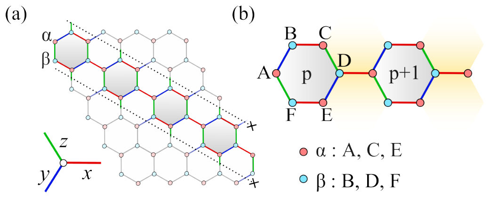
<figcaption class="paper-figure-caption"><b>Fig 1.</b> FIG. 1. (a) Schematic representation of the quasi–one–dimensional hexagonal chain layer embedded within the honeycomb geometry. Each hexagonal plaquette (grey) consists of 3 pairs of two sub-lattice classes connected by three different near- est–neighbor bonds. Red, blue, and green bonds denote anisotropic spin couplings SxSx, SySy, and SzSz, respectively. (b) Isolated chain segment comprising plaquettes p and p+1, where each plaquette (unit cell) contains six sub-lattice sites grouped into two distinct classes as indicated.</figcaption>
</figure>
<figure class="paper-figure-card">
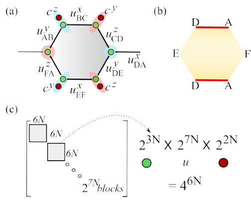
<figcaption class="paper-figure-caption"><b>Fig 2.</b> FIG. 2. (a) Elementary hexagon with bond variables uαβ in- dicated on each link. The itinerant Majorana fermions are shown as green circles, while the non–dynamic Majoranas are represented by brown circles. On each bond, a gauge variable uαβ is defined. (b) Illustration of incomplete plaquettes in- verted relative to the hexagon, where the DA bond appears twice within the plaquette structure. (c) For a chain of N unit cells, the Hamiltonian dimension is 6N ×6N for a fixed config- uration of uαβ. Each unit cell contains seven bonds, leading to 27N distinct Hamiltonian blocks. In addition, the 22N de- generacy arising from the non–dynamic Majoranas (colored brown) further fragments the...</figcaption>
</figure>
<figure class="paper-figure-card">
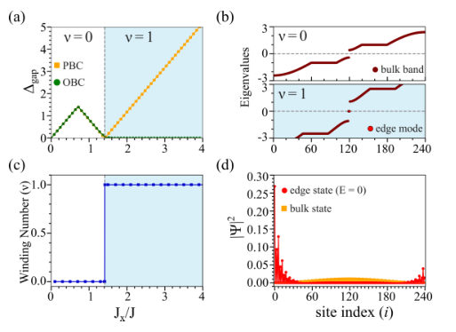
<figcaption class="paper-figure-caption"><b>Fig 3.</b> FIG. 4. Topological characterization of the quasi–one–dimensional chain. (a) Band gaps at the chemical potential are shown for periodic boundary conditions (yel- low) and open boundary conditions (green). (b) Eigenvalue spectra under OBC: the upper panel corresponds to the topologically trivial regime, while the lower panel illustrates the chiral topological phase with edge states pinned at the chemical potential. (c) Winding number (ν) plotted as a function of Jx, serving as the topological invariant and con- firming the phase transition. (d) Probability distribution of the eigenstates closest to the chemical potential for the same parameter choice as in (b), highlighting edge...</figcaption>
</figure>
<figure class="paper-figure-card">
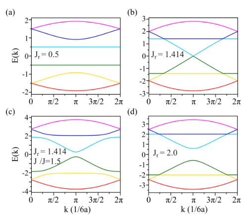
<figcaption class="paper-figure-caption"><b>Fig 4.</b> FIG. 3. Majorana band structure for four representative val- ues of Jx with Jy = Jz = J. (a) Jr = Jx/J = 0.5: the flat bands are separated and lie closest to the chemical potential. (b) Jr = √</figcaption>
</figure>
<figure class="paper-figure-card">
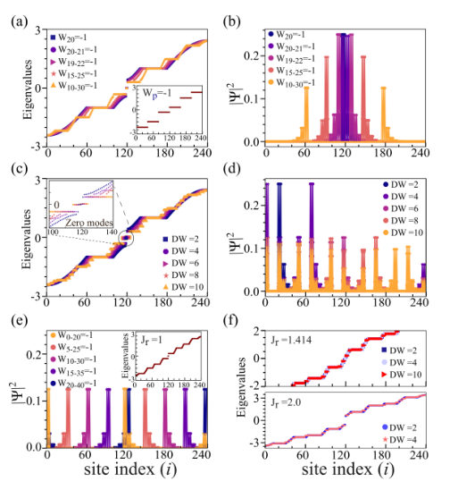
<figcaption class="paper-figure-caption"><b>Fig 5.</b> FIG. 5. Wp1−p2 = −1 represents a negative plaquette do- main from p1-th to p2-th plaquette on a positive plaquette background. (a) The evolution of the spectrum with 2 zero- energy states as we increase the number of negative plaquettes in a single domain. (b) The corresponding probability of the zero modes. (c) and (d) describe the evolution of the spec- trum and the probability of zero modes. respectively, as we increase the number of domains of negative plaquettes in a lattice. The corresponding eigenvalues in (a) and (c) show isolated modes for Jr = 1. (e) The probability distribution of zero modes (shown in the inset) with the translation of plaquette modes with p1 and p2. (f) The...</figcaption>
</figure>

**Summary.** This work analyzes a quasi-1D chain derived from the Kitaev honeycomb model to study its topological phases. The authors find a transition controlled by anisotropy, leading to symmetry-protected zero-energy edge modes in the topological phase. Key diagnostics include measuring the winding number and observing characteristic broad continua in the spin correlation function.

**Why it may be interesting.** It provides a concrete, reduced-dimensional model exhibiting chiral topological order and fractionalization, offering clear spectroscopic fingerprints that can be compared against experimental measurements on quantum materials or engineered spin systems.

Detailed structure

**Main problem.** The study investigates fractional excitations and topological properties within a quasi-one-dimensional spin chain derived from truncating the 2D Kitaev honeycomb model.

**Main result.** The system exhibits a chiral topological phase transition characterized by the emergence of zero-energy edge modes in the topological regime, alongside broad continua indicative of fractionalized excitations.

**Method.** The analysis employs Majorana fermion mapping to solve the Hamiltonian and uses DMRG simulations to compute the dynamical spin correlation function for spectral diagnostics.

**Model / system.** The model is a quasi-1D Kitaev-like spin chain built from coupled hexagonal plaquettes, retaining essential features of the 2D Kitaev liquid. It is analyzed using an anisotropic nearest-neighbor coupling Hamiltonian.

**Key observables.** Zero-energy edge modes (protected by chiral symmetry), quantized winding number ($
u$), and broad continua in the dynamical spin correlation function $S_{+}(k, \omega)$.

**Important parameters / regimes.** The anisotropy parameter ($J_r$) controls the topological phase transition at a critical value of $\sqrt{2}$.

**Assumptions / limitations.** The analysis assumes that truncating the honeycomb lattice yields an integrable model solvable via Majorana fermion representation and that fixing gauge configurations allows diagonalization.

**Figures summary.** Figures illustrate the schematic chain structure, the band dispersion showing gap closing at $J_r = \sqrt{2}$, and the emergence of zero-energy edge states in the topological regime under open boundary conditions.

**Paper structure.** The paper progresses from defining the quasi-1D Hamiltonian and its conserved quantities to mapping it onto Majorana fermions. It then uses topological invariants (winding number) and numerical simulations (DMRG) to characterize the phase transition, culminating in spectral analysis of fractionalized excitations.

Abstract

The Kitaev honeycomb model has attracted significant interest due to its quantum spin liquid ground state, fractionalized Majorana excitations, and topological properties. Motivated by these features, we introduce a quasi-one-dimensional Kitaev-like spin chain derived from a truncated honeycomb geometry. The resulting Majorana band structure contains both dispersive and flat bands, with a gap closing at a critical anisotropy that separates trivial and chiral topological phases. Under open boundary conditions, the topological regime hosts zero-energy edge modes protected by chiral symmetry, placing the system in the BDI symmetry class with a quantized winding number. In the excited spectrum, localized plaquette modes emerge near zero energy and can be tuned by introducing domains of negative plaquettes. The dynamical spin correlation function reveals broad continua associated with fractionalized excitations, together with characteristic low-energy spectral weight from edge Majorana modes. These features distinguish the present system from conventional Heisenberg spin chains and provide experimentally relevant fingerprints of chiral topological order. Our model thus establishes a conceptual bridge between the two-dimensional Kitaev spin liquid and Kitaev's one-dimensional quantum wire.

[↑ back to top](#top)

### [Fidelity bounds for adiabatic gates and other quantum operations with time-dependent dissipation](http://arxiv.org/abs/2606.20501v1)

**Authors:** Simon Pettersson Fors, Aniket Patel, Anton Frisk Kockum, Tahereh Abad  
**Type:** theory · **Category:** quantum information and computing · **PDF:** <https://arxiv.org/pdf/2606.20501v1>  
**Analysis basis:** full PDF text, analyzed in chunks
**Topic relevance:** `methods for driven-dissipative` **3/5** · `Keldysh / 2PI / non-Gaussian methods` **2/5** · `correlated / nonlocal dissipation` **1/5** · `driven-dissipative phase transition` **1/5** · `non-equilibrium dynamics` **1/5**

↔ Scroll figures horizontally

<figure class="paper-figure-card">
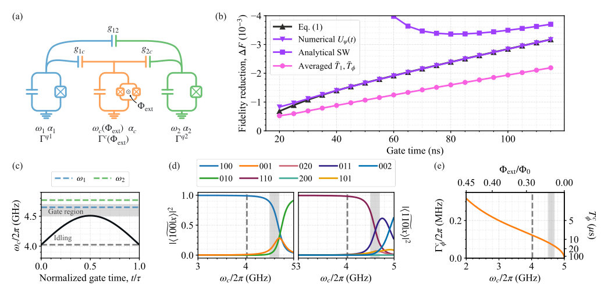
<figcaption class="paper-figure-caption"><b>Fig 1.</b> Figure 1. Fidelity reduction for an adiabatic CZ gate in a two-qubit-coupler system. (a) Circuit schematic showing two fixed- frequency qubits (blue, green) coupled via a tunable coupler (orange). (b) Fidelity reduction ∆F = ¯F −1 as a function of gate time, evaluated numerically using Eq. (1) (black) and Uψ(t) (purple triangles), analytically using Eq. (16) from SW perturbation (purple squares), and with time-averaged decay rates (pink). (c) Time dependence of the coupler frequency during a sinusoidal flux pulse. (d) Hybridization of eigenstates, shown as the overlap between dressed and bare states as a function of coupler frequency. (e) Flux-noise sensitivity of the coupler, expressed as...</figcaption>
</figure>

**Summary.** This paper develops generalized analytical methods to calculate the fidelity loss of quantum gates when dissipation rates vary with time. By applying these techniques to superconducting qubits, they provide a quantitative measure showing that dynamic flux-dependent noise significantly limits gate performance in tunable architectures.

**Why it may be interesting.** This work provides essential theoretical tools for quantifying error budgets in modern tunable quantum hardware by rigorously accounting for how noise sources change over time during computation.

Detailed structure

**Main problem.** The core problem is deriving rigorous fidelity bounds for quantum operations, particularly adiabatic gates, when the system undergoes time-dependent dissipation.

**Main result.** The authors generalize previous analytical formulae to incorporate time-varying dissipation rates, demonstrating that flux-dependent noise significantly degrades the fidelity of superconducting CZ gates.

**Method.** They employ perturbative expansions (like Dyson series) on the Lindblad master equation formalism and utilize frame transformations to simplify the calculation of the average gate fidelity ($ar{F}$).

**Model / system.** The work models quantum computing platforms, specifically using a three-mode superconducting circuit with tunable couplers. The evolution is governed by a time-dependent Hamiltonian and a Lindblad master equation incorporating time-dependent dissipation rates $\Gamma_k(t)$.

**Key observables.** Average Gate Fidelity ($ar{F}$), fidelity reduction rate ($	ext{d}ar{F}/	ext{dt}$), leakage metrics ($\Lambda_{	ext{total}}$).

**Important parameters / regimes.** Time-dependent dissipation rates $\Gamma_k(t)$, coupling strengths ($g_{ij}$), detunings ($\Delta_{ic}$), and the adiabatic evolution time scale ($	au$).

**Assumptions / limitations.** The analysis relies on weak dissipation approximations (perturbative expansion) and, in some sections, assumes that the computational basis aligns with the instantaneous eigenstates of the Hamiltonian.

**Figures summary.** Figures illustrate the setup, comparing fidelity decay using different methods, showing coupler frequency modulation effects, eigenstate hybridization patterns, and quantifying flux-noise sensitivity.

**Paper structure.** The paper builds from generalizing the master equation to include time-dependent rates, deriving the general first-order fidelity formula, applying this to adiabatic evolution via frame transformations, and finally demonstrating the results on a superconducting CZ gate model.

Abstract

As quantum-computing platforms are susceptible to noise, the fidelity of quantum operations is limited by decoherence. Understanding this limitation is crucial for building utility-scale quantum processors. In previous works [Phys. Rev. Lett. 129, 150504 (2022); Quantum 9, 1684 (2025)], we presented analytical formulae for the average gate fidelity of multi-qubit operations under static Markovian noise processes, including operations that temporarily leave the computational subspace. However, some quantum-computing architectures dynamically modulate qubit or coupler frequencies to implement two-qubit gates, e.g., baseband flux gates; such modulation can lead to dissipation rates varying in time. In this Letter, we therefore generalize the fidelity-reduction formulae to encompass time-dependent dissipation. Applying our generalized formula, we obtain a fidelity bound for adiabatic operations and demonstrate that flux-dependent noise sensitivity, combined with qubit-coupler hybridization, significantly reduces the fidelity of adiabatic controlled-Z (CZ) gates in superconducting quantum computers. Our work thus provides essential theoretical tools for evaluating error budgets and optimizing the design of quantum operations in tunable quantum-computing architectures, and may also find applications in quantum-sensing and quantum-communication protocols that are affected by time-dependent dissipation.

[↑ back to top](#top)

### [Quantum Dynamics from Lax Pair Theory: A Reconstruction from Spectrum Preservation](http://arxiv.org/abs/2606.19664v1)

**Authors:** Péter Szabó  
**Type:** theory · **Category:** other · **PDF:** <https://arxiv.org/pdf/2606.19664v1>  
**Analysis basis:** full PDF text, analyzed in chunks
**Topic relevance:** `quantum measurements` **3/5** · `measurement-induced transitions` **2/5** · `driven-dissipative phase transition` **1/5** · `entanglement & information structure` **1/5**

↔ Scroll figures horizontally

<figure class="paper-figure-card">
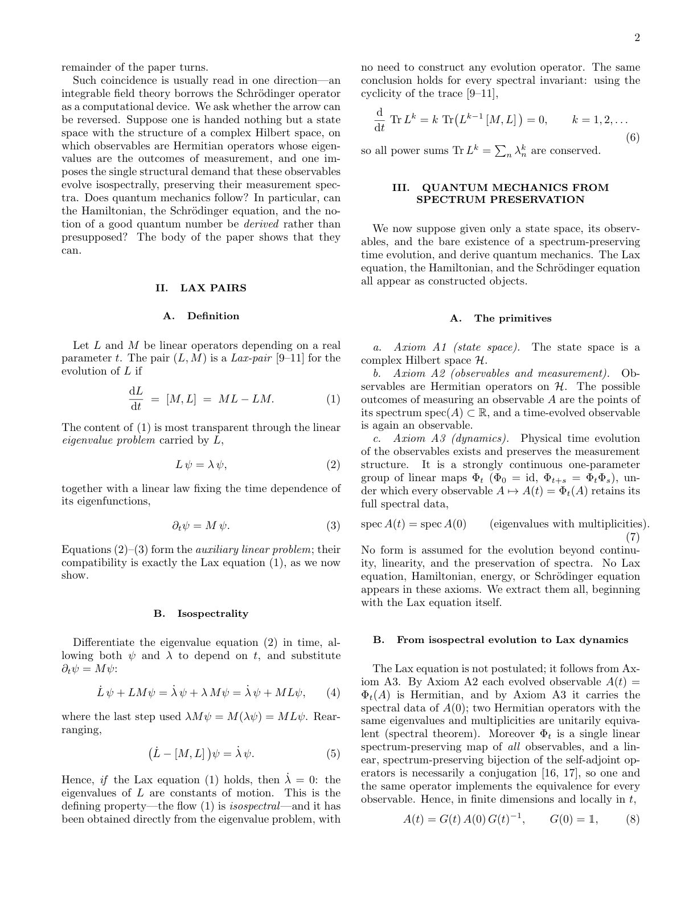
<figcaption class="paper-figure-caption"><b>Fig 1.</b> Low-resolution page preview, page 2</figcaption>
</figure>
<figure class="paper-figure-card">
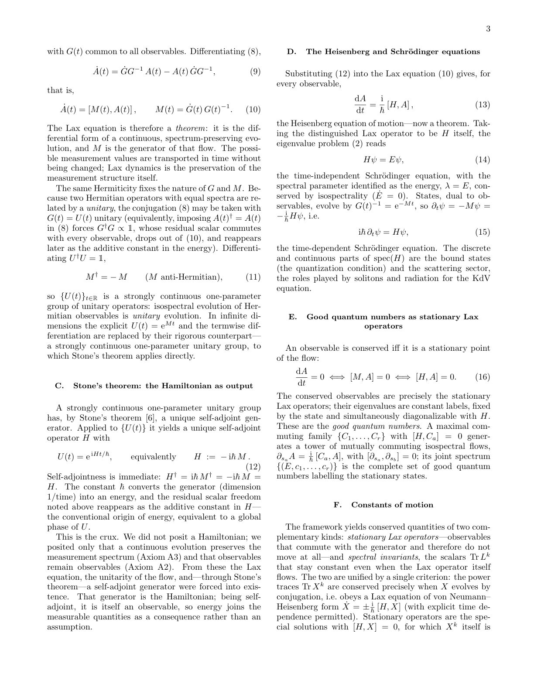
<figcaption class="paper-figure-caption"><b>Fig 2.</b> Low-resolution page preview, page 3</figcaption>
</figure>
<figure class="paper-figure-card">
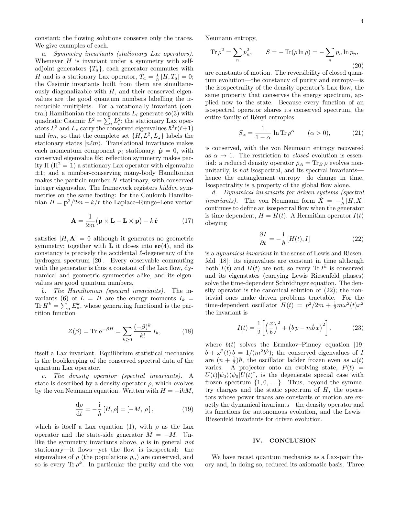
<figcaption class="paper-figure-caption"><b>Fig 3.</b> Low-resolution page preview, page 4</figcaption>
</figure>
<figure class="paper-figure-card">
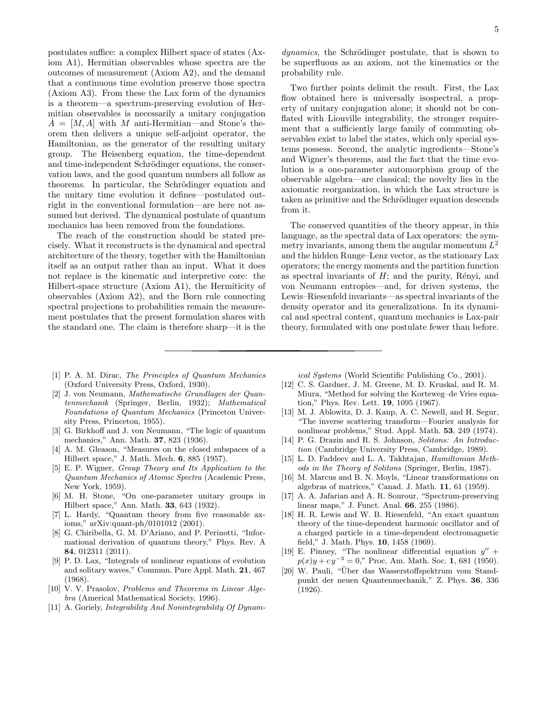
<figcaption class="paper-figure-caption"><b>Fig 4.</b> Low-resolution page preview, page 5</figcaption>
</figure>

**Summary.** This paper reconstructs quantum dynamics by starting only with the axioms of Hilbert spaces and the principle that time evolution must preserve the possible outcomes (spectra) of measurements. By applying Lax pair theory, the authors prove that this single assumption is enough to necessitate the existence of a Hamiltonian and derive the standard Schrödinger and Heisenberg equations as necessary consequences.

**Why it may be interesting.** This work provides a highly abstract, foundational re-derivation of quantum mechanics that bypasses the need to postulate the Schrödinger equation directly, focusing instead on symmetries implied by measurement consistency.

Detailed structure

**Main problem.** The paper aims to reconstruct the axioms of unitary quantum dynamics from a minimal set of principles, specifically relying on the preservation of measurement outcomes (spectra) during time evolution.

**Main result.** It proves that assuming isospectral evolution is sufficient to force the dynamics into the Lax pair form and derive fundamental equations like the Heisenberg equation and Schrödinger equation as theorems rather than postulates.

**Method.** The derivation uses axiomatic quantum mechanics combined with the mathematical machinery of Lax pair theory, showing how spectral preservation constrains the time evolution operator to be unitary.

**Model / system.** The model is general quantum systems described by a complex Hilbert space ($\mathcal{H}$) and governed by self-adjoint observables. The dynamics are analyzed through the lens of isospectral flow rather than assuming a Hamiltonian from the start.

**Key observables.** Observables ($A$), energy eigenvalues ($E$), good quantum numbers, purity ($	ext{Tr}
ho^2$), and von Neumann entropy ($S$).

**Important parameters / regimes.** Planck's constant ($\hbar$) and time ($t$).

**Assumptions / limitations.** The core assumption is Axiom A3: physical time evolution must preserve the spectrum of every observable, $	ext{spec} \, A(t) = 	ext{spec} \, A(0)$.

**Paper structure.** The paper builds logically by establishing axioms (Hilbert space, Hermitian observables, isospectral evolution), deriving the Heisenberg equation via spectral theory, and finally using Stone's theorem to identify the Hamiltonian as the generator of the unitary flow.

Abstract

We reconstruct unitary quantum dynamics from a minimal axiomatic foundation built on Hilbert-space observables and isospectral evolution. The only dynamical assumption is that physical time evolution is a continuous one-parameter flow of Hermitian observables that preserves their spectra, i.e. the possible outcomes of measurement. We show that this assumption is already sufficient to force the Lax form of quantum dynamics. The Heisenberg equation, the time-dependent and time-independent Schrödinger equations, conservation laws, and good quantum numbers then follow as theorems rather than postulates. In this formulation, Lax pair theory supplies the missing dynamical bridge between the measurement structure of a Hilbert space and standard quantum evolution: the Hamiltonian is not assumed, but emerges as the generator required for an isospectral observable flow.

[↑ back to top](#top)

### [All-In-All-Out Pyrochlore Iridates as Noncollinear Spin-Orbit Coupled Counterparts of Altermagnets](http://arxiv.org/abs/2606.20296v1)

**Authors:** Yang Yang, Turan Birol, Rafael M. Fernandes, Natalia B. Perkins  
**Type:** theory · **Category:** strongly correlated electrons · **PDF:** <https://arxiv.org/pdf/2606.20296v1>  
**Analysis basis:** full PDF text, analyzed in chunks
**Topic relevance:** `exotic spin models in light-matter` **3/5** · `Keldysh / 2PI / non-Gaussian methods` **1/5** · `analog quantum simulation` **1/5** · `spintronics-quantum-optics interface` **1/5**

↔ Scroll figures horizontally

<figure class="paper-figure-card">
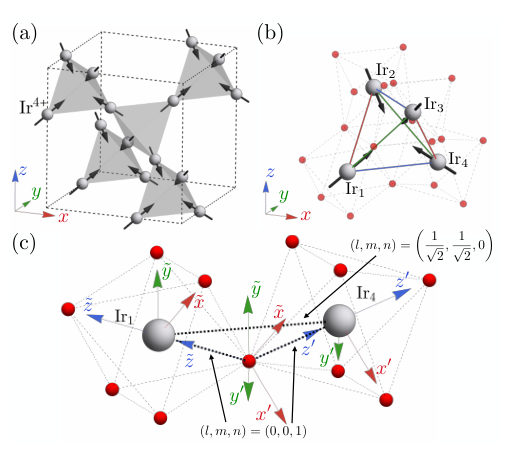
<figcaption class="paper-figure-caption"><b>Fig 1.</b> FIG. 1. (a) Ir4+ ions on the pyrochlore lattice with the all- in-all-out (AIAO) magnetic configuration. (b) The tetrahe- dron unit cell of the pyrochlore lattice consists of four Ir4+</figcaption>
</figure>
<figure class="paper-figure-card">
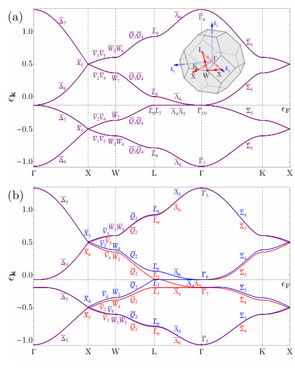
<figcaption class="paper-figure-caption"><b>Fig 2.</b> FIG. 2. Pseudospin-splitting of the band structure of py- rochlore iridates in the presence of AIAO order. (a) Band structure along high-symmetry lines (inset shows the path taken in momentum space) without magnetic ordering com- puted with U = 0. The bands are labeled by irreducible co-representations (co-irreps) of the magnetic space group Fd¯3m1′ (No. 227.129), see Table II. The spectrum is at least two-fold degenerate everywhere, and thus colored purple. (b) Corresponding band structure with AIAO order, obtained from the mean-field self-consistent calculation with U = 0.56 in units of pdπ2/∆pd. The two pseudospin-split bands are colored blue and red and labeled according to the induced...</figcaption>
</figure>
<figure class="paper-figure-card">
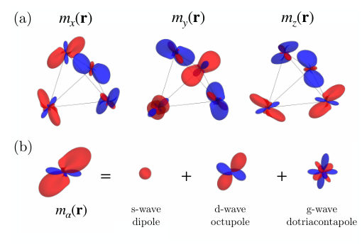
<figcaption class="paper-figure-caption"><b>Fig 3.</b> FIG. 3. (a) Isosurfaces of local magnetization density mα(r) (α = x, y, z) on a tetrahedral unit cell calculated from our mi- croscopic model. (b) Multipole decomposition of mα(r) into s-, d-, and g-wave components (l = 0, 2, 4), corresponding to dipole, octupole, and dotriacontapole moments, respectively.</figcaption>
</figure>
<figure class="paper-figure-card">
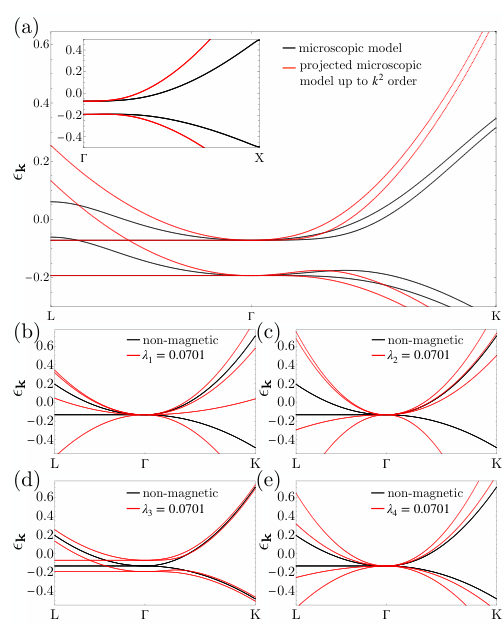
<figcaption class="paper-figure-caption"><b>Fig 4.</b> FIG. 4. (a) Electronic dispersion of the Γ10 subspace along L- Γ-K (Γ-X in the inset), comparing the full microscopic model (black) with its k2-order low-energy projection (red). The projected model accurately captures both the momentum- dependent band splitting induced by the AIAO order near the Γ point and the band splitting at Γ. (b)-(e) Electronic dispersion obtained from the general low-energy Hamiltonian (12), with one coupling λα (α = 1, 2, 3, 4) set to a finite value while all others are set to zero, compared to the non-magnetic case (black). While all four terms lift the Kramers degener- acy and produce momentum-dependent splittings similar to a collinear d-wave altermagnetic...</figcaption>
</figure>

**Summary.** The paper theoretically investigates how the All-In-All-Out (AIAO) magnetic order in pyrochlore iridates realizes a noncollinear analogue of altermagnetism. Using microscopic models and group theory, it demonstrates that this specific octupolar ordering enforces unique symmetry constraints on the electronic band structure. This results in characteristic spin-polarized band splittings at both finite momentum and zero momentum ($\Gamma$ point).

**Why it may be interesting.** This work provides a detailed theoretical framework linking complex noncollinear magnetism (octupolar moments) to observable electronic signatures like momentum-dependent band splittings, which is crucial for understanding correlated topological materials.

Detailed structure

**Main problem.** To determine if noncollinear magnetic orders can realize the momentum-dependent spin splitting characteristic of altermagnets in strongly SOC materials.

**Main result.** The All-In-All-Out (AIAO) state in pyrochlore iridates acts as a noncollinear counterpart to $d$-wave altermagnets, exhibiting both momentum-dependent and zero-momentum band splitting due to symmetry constraints.

**Method.** The study employs microscopic tight-binding models combined with rigorous group-theory analysis and mean-field calculations to analyze the electronic structure under specific magnetic symmetries.

**Model / system.** The system is pyrochlore iridates ($	ext{A}_2	ext{Ir}_2	ext{O}_7$) featuring $	ext{Ir}^{4+}$ ions with strong SOC, modeled using a $j_{	ext{eff}} = 1/2$ tight-binding Hamiltonian on the pyrochlore lattice.

**Key observables.** Spin-splitting patterns in electronic bands (pseudospin splitting), local magnetization density ($\mathbf{m}(\mathbf{r})$) decomposed into multipole moments, and symmetry constraints derived from magnetic space groups.

**Important parameters / regimes.** Strong Spin-Orbit Coupling (SOC), the AIAO order parameter transforming as an $	ext{A}_{	ext{g}}^{-2	ext{g}}$ octupolar moment, and hopping parameters ($t, t'$).

**Assumptions / limitations.** The analysis assumes strong SOC leading to $j_{	ext{eff}} = 1/2$ physics, and utilizes mean-field approximations for the electronic structure calculations.

**Figures summary.** Figures illustrate the AIAO magnetic configuration on a tetrahedron, compare band structures (non-magnetic vs. ordered), show local magnetization density isosurfaces with multipole decomposition, and present low-energy effective Hamiltonians derived from symmetry constraints.

**Paper structure.** The paper progresses by first establishing the physical model and the AIAO state's symmetry properties; it then uses group theory to derive the symmetry-allowed low-energy Hamiltonian in the $\Gamma_{10}$ subspace; finally, it calculates the resulting electronic band structure splitting and the real-space multipolar character of the magnetic order.

Abstract

Altermagnets are collinear magnetically ordered states that exhibit momentum-dependent spin splitting in the absence of net magnetization and spin-orbit coupling (SOC). Related spin-splitting patterns, however, can also emerge in noncollinear magnetic systems with large SOC. Here we show, via a microscopic model, that the all-in-all-out (AIAO) state in pyrochlore iridates constitutes a noncollinear counterpart of a $d$-wave altermagnet stabilized by strong SOC. Starting from a microscopic $j_{\mathrm{eff}} = 1/2$ tight-binding model on the pyrochlore lattice, we demonstrate that electronic interactions favor the AIAO phase and analyze its symmetry properties. We show that the AIAO order parameter transforms as an $A_{2g}^{-}$ octupolar magnetic moment, breaking time-reversal symmetry while preserving inversion and zero net magnetization. Using group-theory analysis and mean-field calculations, we demonstrate that this symmetry enforces both a spin-polarized momentum-dependent lifting of band degeneracies that is similar to that of a collinear $d$-wave cubic altermagnet, but also a band splitting at zero-momentum. We show that the latter feature is captured by a low-energy model similar to the   Luttinger-Kohn model for cubic semiconductors. Our results identify pyrochlore iridates as a platform for noncollinear counterparts of altermagnetism and provide a general symmetry framework for spin-split phenomena in spin-orbit coupled materials.

[↑ back to top](#top)

### [Charge imprinting biases topology of correlated insulator in hBN-aligned rhombohedral multilayer graphene](http://arxiv.org/abs/2606.20377v1)

**Authors:** Lei Qiao, Xin Lu, Fu-Chun Zhang, Jianpeng Liu  
**Type:** theory · **Category:** strongly correlated electrons · **PDF:** <https://arxiv.org/pdf/2606.20377v1>  
**Analysis basis:** full PDF text, analyzed in chunks
**Topic relevance:** `analog quantum simulation` **3/5** · `Keldysh / 2PI / non-Gaussian methods` **1/5**

↔ Scroll figures horizontally

<figure class="paper-figure-card">
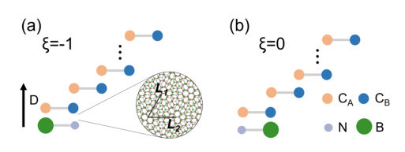
<figcaption class="paper-figure-caption"><b>Fig 1.</b> FIG. 1. Schematic configurations of RMG twisted relative to a single hBN layer, giving rise to a moir´e periodicity. Here, CA and CB denote the A and B sublattices of graphene. In (a), the boron atom of hBN aligns with the A sublattice (CA), labeled as ξ = −1; in (b), the boron atom aligns with the B sublattice (CB), labeled as ξ = 0. Moir´e interface is zoomed in, shown with moir´e superlattice vectors, whose lengths range from approximately 10 to 14 nm depending on the twist an- gle. A positive displacement field is defined as pointing from the moir´e side toward the non-moir´e side; that is, conduction band electrons are pushed away from the moir´e side (“moir´e distant”).</figcaption>
</figure>
<figure class="paper-figure-card">
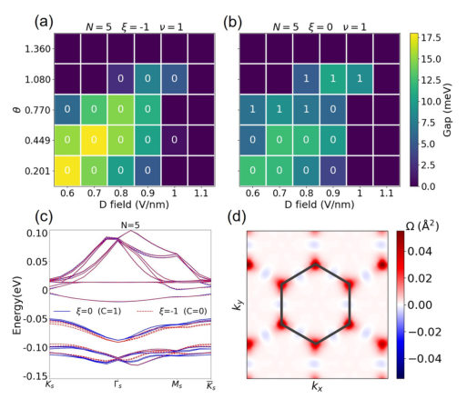
<figcaption class="paper-figure-caption"><b>Fig 2.</b> FIG. 3. Phase diagrams in the θ–D plane for N = 5 moir´e systems at ν = 1 with configurations (a) ξ = −1 and (b) ξ = 0. The color scale represents the global band gap of the HF band structures with dark purple indicating metallic states. Chern number of the first conduction band is indicated if gapped. (c) HF band structures calculated for N = 5 under D = 0.6 V/nm, θ = 0.77◦at ν = 1, including cases with ξ = −1 and ξ = 0. (d) Berry curvature distributions of the occupied bands for N = 5 and ξ = 0. The black hexagonal lines delineate the moir´e Brillouin zone.</figcaption>
</figure>
<figure class="paper-figure-card">
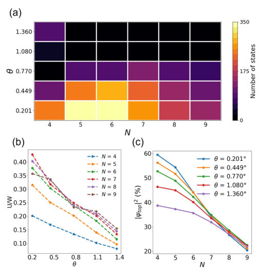
<figcaption class="paper-figure-caption"><b>Fig 3.</b> FIG. 2. (a) Statistical survey of the number of insulating states across the parameter space spanned by D, ν, and ξ. (b) Evolution of the interaction strength, defined as the ratio between the typical Coulomb energy U and the bandwidth W as a function of twist angle for different layer number. Here, U ∼e2/(4πϵ0ϵrLs) and W is the total bandwidth of the three conduction bands in the low energy window for HF calcula- tions. (c) Evolution of the contribution from the top-layer graphene (|ψtop|2) to the active frontier conduction bands as a function of layer number for different twist angles. Both (b) and (c) correspond to the case of (D &gt; 0, ν &gt; 0) averaged over D = 0.6-1.1 V/nm.</figcaption>
</figure>
<figure class="paper-figure-card">
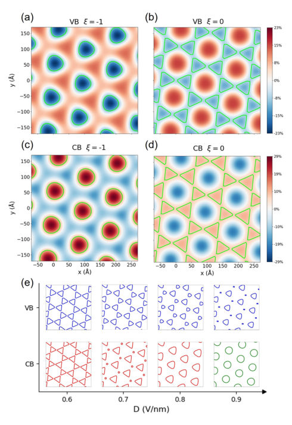
<figcaption class="paper-figure-caption"><b>Fig 4.</b> FIG. 4. Real-space charge density profile of (a, b) the valence bands and (c, d) the first conduction band for N = 5, ν = 1, θ = 0.77◦. Panels (a, c) and (b, d) represent the charge density with ξ = −1 (C = 0) and ξ = 0 (C = 1), respectively, where D = 0.6 V/nm. The results for D = 0.7-0.9 V/nm are provided in the Supplemental Material [33]. The color code represents charge density fluctuation defined as δρ = (ρ − ¯ρ)/¯ρ0 × 100%, where ρ is the electron density normalized to the number of occupied bands, and ¯ρ0 is the average density of a single electron per moir´e unit-cell. For illustrative purpose, the lines indicate contours at 44% (34%) of the maximum of |δρ|, marking the low-density...</figcaption>
</figure>

**Summary.** The paper investigates the topological phase transitions in multilayer graphene moiré superlattices formed with hBN substrates. Using Hartree-Fock calculations, the authors demonstrate that the alignment of the hBN substrate acts as a remote electrostatic template. This template dictates whether the system stabilizes a topologically non-trivial Chern insulator or a trivial state by shaping the valence band charge texture.

**Why it may be interesting.** This research provides a concrete example of how substrate engineering (hBN alignment) can exert long-range control over emergent quantum topological properties (Chern insulators) in 2D materials, relevant to designing novel correlated electronic devices.

Detailed structure

**Main problem.** To understand how charge imprinting biases the topology of correlated insulators in rhombohedral multilayer graphene (RMG) when aligned with hexagonal boron nitride (hBN), particularly when active carriers are displaced from the moiré interface.

**Main result.** The hBN alignment dictates the topological state: specific alignments favor a honeycomb-like charge network associated with Chern insulators, while others favor triangular patterns linked to trivial insulators. This establishes valence-band charge textures as a remote control mechanism for correlated topology.

**Method.** Systematic Hartree-Fock (HF) calculations are performed across various parameters (layer number, twist angle, alignment type) to map out the correlated phase diagram and analyze real-space charge densities.

**Model / system.** The system is RMG aligned with hBN, modeled using a continuum Hamiltonian incorporating moiré potentials ($V_{	ext{hBN}}$). The electronic structure is analyzed via HF calculations that treat electron-electron interactions self-consistently.

**Key observables.** Topological state (Chern number $C=0$ vs $C=1$), real-space charge density patterns (honeycomb vs. triangular), and the energy difference ($\Delta E$) between competing topological phases.

**Important parameters / regimes.** Layer number ($N \simeq 6$), small twist angles ($	heta$), filling factor ($
u=1$), and the hBN alignment parameter ($\xi$).

**Assumptions / limitations.** The analysis relies on HF approximations, treating long-range Coulomb interactions via a remote electrostatic template mechanism. The study assumes specific alignments dictate charge texture.

**Figures summary.** Figures show phase diagrams mapping topological states across $	heta$ and $D$, alongside real-space charge density profiles comparing the honeycomb pattern ($\xi=0$) to the triangular pattern ($\xi=-1$).

**Paper structure.** The work progresses by first defining the Hamiltonian incorporating moiré potentials, then systematically varying parameters ($N, 	heta, D, \xi$) using HF calculations. The core argument builds from observing that charge imprinting dictates topology in the $	ext{moiré}$-distant regime.

Abstract

Rhombohedral multilayer graphene aligned with hexagonal boron nitride (RMG-hBN) hosts correlated Chern phases, but the microscopic role of hBN stacking remains unclear, especially when the active carriers are displaced away from the moiré interface. Using Hartree-Fock calculations over layer numbers, twist angles, displacement fields, fillings, and hBN alignments, we show that correlated insulators are most robust at small twist angles and intermediate layer number ($N\simeq 6$), where bandwidth suppression is balanced by layer delocalization of the wavefunctions of the active carriers. Under moiré-distant conditions at filling $ν=1$, the topology of the insulating state is strongly biased by charge imprinting: the hBN alignment shapes the occupied valence-band charge texture near the interface via moiré potential, which acts through long-range Coulomb interactions as a remote electrostatic template for doped conduction electrons. Depending on the alignment, this template favors either triangular charge localization associated with trivial insulators or honeycomb-like charge networks compatible with Chern insulators. Our results identify valence-band charge textures as a microscopic route by which a remote moiré interface controls correlated topology in multilayer graphene.

[↑ back to top](#top)

### [Topological Quantum Interferometry](http://arxiv.org/abs/2606.19730v1)

**Authors:** Tianyou Ying, Yufeng Zhou, Chengwei Pan, Ryan Hogan, Ruoyang Zhang, Hui Liu, Shining Zhu, Xiaoqin Gao  
**Type:** theory · **Category:** quantum information and computing · **PDF:** <https://arxiv.org/pdf/2606.19730v1>  
**Analysis basis:** full PDF text, analyzed in chunks
**Topic relevance:** `interference shaping light` **3/5** · `entanglement & information structure` **1/5**

↔ Scroll figures horizontally

<figure class="paper-figure-card">
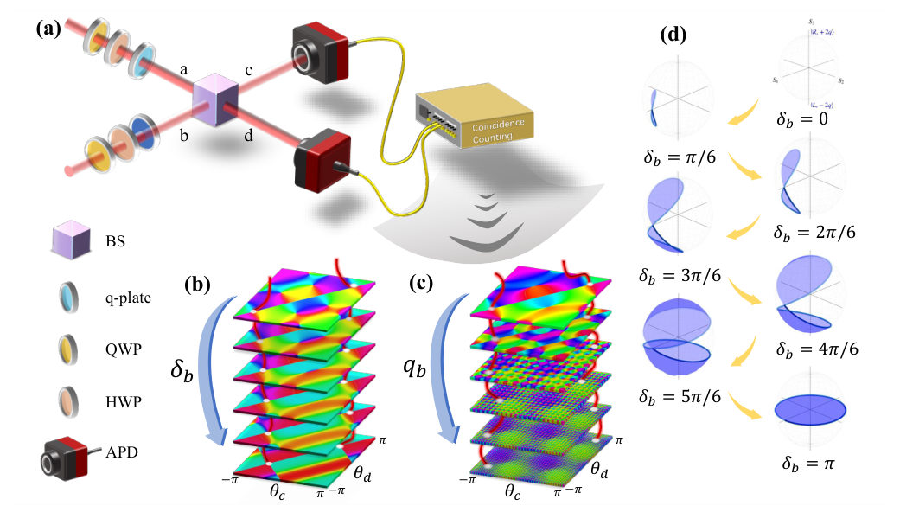
<figcaption class="paper-figure-caption"><b>Fig 1.</b> FIG. 1. Conceptual framework of topological quantum interferometry. (a) Two structured photons, prepared using quarter-wave plates (QWPs), half-wave plates (HWPs), and independent q-plates (qa, δa and qb, δb) in input paths a and b, respectively, interact at a 50:50 beamsplitter (BS) and undergo Hong-Ou-Mandel (HOM) interference. The spatial dependence of the resulting Bell-state probabilities and interference visibility is monitored in coincidence between avalanche photodiodes (APDs) in the output paths c and d. The overall pattern is dictated by the exchange Berry phase (BPX), which represents an interaction geometric phase arising from the constituent photons’ topologies. (b) Schematic...</figcaption>
</figure>
<figure class="paper-figure-card">
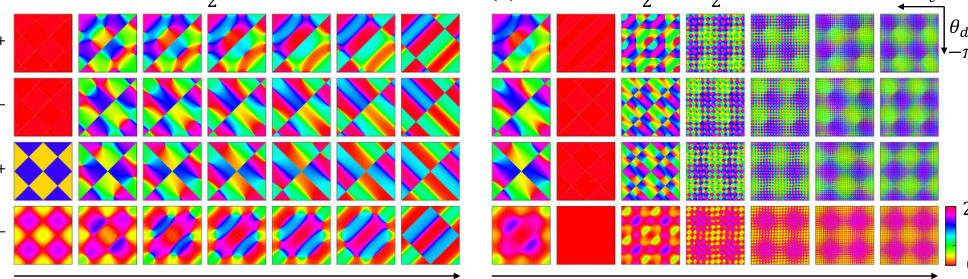
<figcaption class="paper-figure-caption"><b>Fig 2.</b> FIG. 2. Evolution of the phase of the Bell states representing the BPX across the Bell basis. (a) Variation of the detuning parameter δ over the range [0, π] demonstrates that topological structure remains invariant regardless of the amount of the converted spin-to-OAM. Here, the detuning modulates the amplitude of the spatial modes, where the observed transition directly governs the interference visibility. This transition is a quantitative equivalent of the state evolution depicted on the Poincar´e sphere in Fig. 1d, however, states are now represented in the Bell basis {|ψ±⟩, |ϕ±⟩}. (b) Variation of the topological charge qb for qb = [0.5, 2, 5, 10, 15, 20] demonstrates scaling of the...</figcaption>
</figure>
<figure class="paper-figure-card">
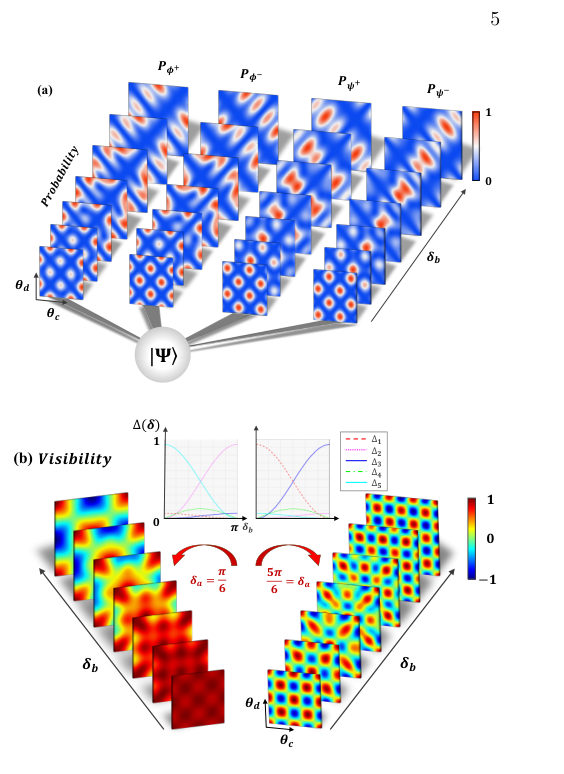
<figcaption class="paper-figure-caption"><b>Fig 3.</b> FIG. 3. Deterministic control of spatial patterns under various detuning. (a) Normalized spatial probability dis- tributions of the four Bell states as a function of the detuning δb with δa = π/2, qa = 1, and qb = −0.5 and identical polar- ization inputs (HH/VV). The evolution from δb = 0 to π il- lustrates the transition from single-beam dominated patterns to hybrid topological structures. (b) Visibility distributions (ν) for two distinct regimes: δa = π/6 (left) and δa = 5π/6 (right). The vertical progression shows the shift from broad interference fringes to high-frequency or homogeneous distri- butions. Note that qa = 1 and qb = −0.5. The terminal line charts quantify the weights of the...</figcaption>
</figure>
<figure class="paper-figure-card">
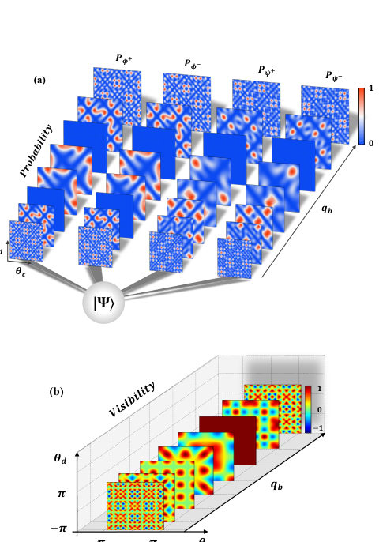
<figcaption class="paper-figure-caption"><b>Fig 4.</b> FIG. 4. Topological scaling and symmetry of spatial correlations. (a) Normalized spatial probability distribu- tions of the four Bell states as a function of path-b q-plate topological charge, qb. The evolution from qb = −5 to qb = 5 illustrates the multiplicative effect of the charge on the spa- tial frequency of interference fringes. The overall impinging pattern is a direct consequence of the patterning dictated by BPX. (b) Interference visibility spatial distributions across varying topological charges. The vertical progression illus- trates the transition from high-frequency, complex lattice-like interference fringes for large negative qb to broad spatial fea- tures at small |qb|, then...</figcaption>
</figure>
<figure class="paper-figure-card">
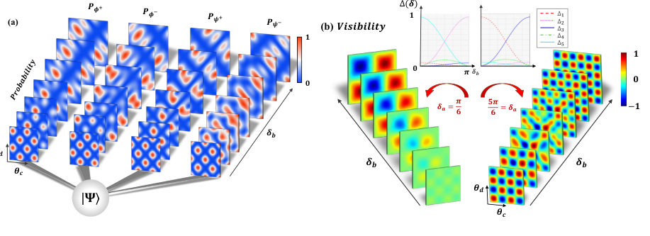
<figcaption class="paper-figure-caption"><b>Fig 5.</b> FIG. 5. Spatial correlations for various topological charges for orthogonal input polarizations. (a) Subplots detailing the spatial probability distributions of the Bell states. The four columns represent the respective distributions for each of the four Bell states. The results have been normalized. (b) Subplots illustrating the visibility distributions. The data in both panels is generated using HV/VH input light and plotted over the (θc, θd) ∈[−π, π] space, keeping qa = 1 and δa = δb = π/2 constant. The vertical progression highlights the effect of varying qb, evaluated at qb ∈{−5, −2, −1, −0.5, 0.5, 1, 2, 5}.</figcaption>
</figure>

**Summary.** The paper introduces topological quantum interferometry using the exchange Berry phase (BPX) to characterize high-dimensional quantum states generated by structured light. It shows that the resulting spatial interference patterns contain topological invariants that can non-tomographically estimate the state's dimensionality. This offers a scalable and robust method for quantum metrology and network applications.

**Why it may be interesting.** This work provides a powerful, device-independent tool for characterizing complex quantum states (high-dimensional entanglement) using purely geometric principles derived from interference patterns, which is highly relevant for scalable quantum network characterization.

Detailed structure

**Main problem.** The core problem is developing methods to characterize high-dimensional quantum states using topological principles, overcoming limitations of traditional characterization techniques that assume ideal experimental conditions.

**Main result.** The exchange Berry phase (BPX) acts as a deterministic control parameter whose associated phase singularities serve as a non-tomographic witness for estimating the state's dimensionality.

**Method.** The authors establish a formalism based on topological quantum interferometry, generalizing $q$-plate state generation and characterization to arbitrary detuning conditions. They calculate Bell state probabilities and visibility using geometric phases derived from the BPX.

**Model / system.** The system involves structured light interacting via two-photon interference at a beamsplitter, utilizing q-plates whose action is described by unitary transformations involving topological charges ($q$) and detunings ($\delta$).

**Key observables.** Bell state probabilities ($\mathcal{P}_{\Phi^\pm}, \mathcal{P}_{\Psi^\pm}$), interference visibility ($
u$), and the net topological winding number ($W$).

**Important parameters / regimes.** Topological charges ($q_a, q_b$), detunings ($\delta_a, \delta_b$), and spatial coordinates ($	heta_c, 	heta_d$).

**Assumptions / limitations.** The analysis relies on decomposing the state into fundamental modes governed by geometry, and some calculations simplify the radial dependence of the field components.

**Figures summary.** Figures illustrate the conceptual framework of interference patterns dictated by BPX, show phase evolution across Bell basis states under varying detuning/charge, and map out spatial probability distributions for different input polarizations.

**Paper structure.** The paper builds from establishing the physical model (q-plates and structured light) to deriving the mathematical formalism using geometric phases ($	ext{BPX}$). It then applies this framework to calculate observable quantities like Bell state probabilities and visibility, culminating in demonstrating how topological invariants provide a dimensionality witness.

Abstract

Structured light provides high-dimensional Hilbert spaces holding tremendous potential for fundamental quantum optics and quantum technologies. However, existing characterization methods, like Hong-Ou-Mandel (HOM) interference, typically assume perfectly tuned conditions, overlooking the geometric physics governing spatial mode evolution. Here, we establish topological quantum interferometry driven by an interaction-based geometric phase, the exchange Berry phase (BPX). Our formalism generalizes $q$-plate state generation and characterization to arbitrary topological charges and (de)tuning conditions, demonstrating that BPX acts as a geometric marker governing spatial interference. We show BPX serves as a deterministic control parameter, decomposing two-photon spatial patterns into geometry-dictated fundamental modes. This mapping reveals topological invariants and phase singularities that function as a non-tomographic witness for state dimensionality estimation, circumventing full-state reconstruction. Being device-independent and highly scalable, this approach enables scalable high-dimensional characterization and topologically protected state selection, with direct applicability to quantum metrology and high-capacity quantum networks.

[↑ back to top](#top)

### [Effects of nonlocal interactions on s- and d-wave superconducting correlations in the extended Hubbard model](http://arxiv.org/abs/2606.20260v1)

**Authors:** Pavol Farkasovsky  
**Type:** theory · **Category:** strongly correlated electrons · **PDF:** <https://arxiv.org/pdf/2606.20260v1>  
**Analysis basis:** full PDF text, analyzed in chunks
**Topic relevance:** `analog quantum simulation` **3/5**

↔ Scroll figures horizontally

<figure class="paper-figure-card">
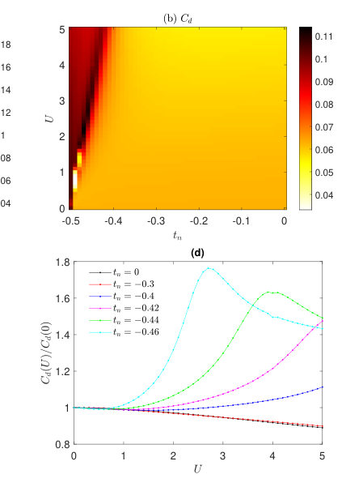
<figcaption class="paper-figure-caption"><b>Fig 1.</b> Figure 1: Correlation functions Cs (a) and Cd (b) with s- and d-wave symmetry as functions of U and tn calculated for the L = 4×4 cluster and N↑= N↓= 5. The ratio Cs(U)/Cs(U = 0) (c) and Cd(U)/Cd(U = 0) (d) as a function of U calculated for different values of tn.</figcaption>
</figure>
<figure class="paper-figure-card">
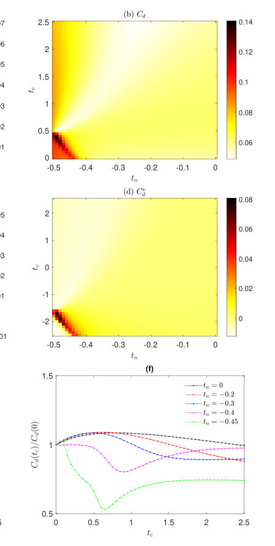
<figcaption class="paper-figure-caption"><b>Fig 2.</b> Figure 2: Correlation functions Cs (a) and Cd (b) with s- and d-wave symmetry as functions of tc and tn calculated for U = 4, N↑= N↓= 5 on the L = 4 × 4 cluster. The vertex correlation functions Cv s (c) and Cv d (d) as functions of tc and tn. The ratio Cs(tc)/Cs(tc = 0) (e) and Cd(tc)/Cd(tc = 0) (f) as a function of tc calculated for different values of tn.</figcaption>
</figure>
<figure class="paper-figure-card">
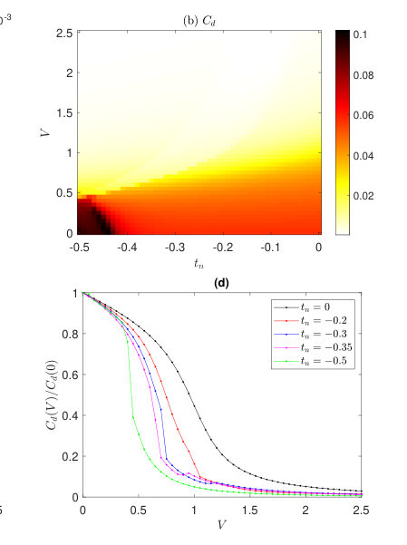
<figcaption class="paper-figure-caption"><b>Fig 3.</b> Figure 3: Correlation functions Cs (a) and Cd (b) with s- and d-wave symmetry as functions of V and tn calculated for U = 4, N↑= N↓= 5 on the L = 4 × 4 cluster. The ratio Cs(V )/Cs(V = 0) (c) and Cd(V )/Cd(V = 0) (d) as a function of V calculated for different values of tn.</figcaption>
</figure>
<figure class="paper-figure-card">
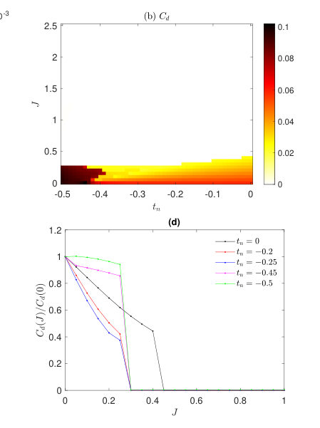
<figcaption class="paper-figure-caption"><b>Fig 4.</b> Figure 4: Correlation functions Cs (a) and Cd (b) with s- and d-wave symmetry as functions of J and tn calculated for U = 4, N↑= N↓= 5 on the L = 4 × 4 cluster. The ratio Cs(J)/Cs(J = 0) (c) and Cd(J)/Cd(J = 0) (d) as a function of J calculated for different values of tn.</figcaption>
</figure>
<figure class="paper-figure-card">
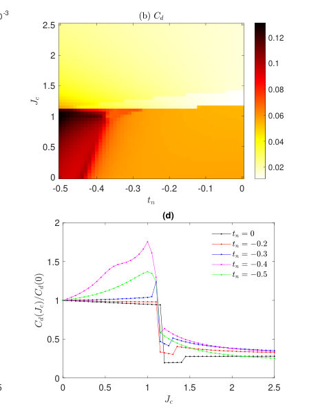
<figcaption class="paper-figure-caption"><b>Fig 5.</b> Figure 5: Correlation functions Cs (a) and Cd (b) with s- and d-wave symmetry as functions of Jc and tn calculated for U = 4, N↑= N↓= 5 on the L = 4 × 4 cluster. The ratio Cs(Jc)/Cs(Jc = 0) (c) and Cd(Jc)/Cd(Jc = 0) (d) as a function of Jc calculated for different values of tn.</figcaption>
</figure>

**Summary.** This paper theoretically explores unconventional superconductivity in the extended Hubbard model by incorporating multiple nonlocal interactions. Using exact diagonalization and PQMC, the authors demonstrate that these interactions dictate a complex interplay between s-wave and d-wave pairing symmetries. The findings emphasize that realistic descriptions of strongly correlated materials require going significantly beyond the minimal Hubbard Hamiltonian.

**Why it may be interesting.** This work provides detailed theoretical insight into how extending the Hubbard model with realistic nonlocal terms can fundamentally alter the predicted superconducting pairing symmetry and strength, which is crucial for understanding high-Tc superconductors.

Detailed structure

**Main problem.** The study investigates how various nonlocal interactions influence superconducting correlations (s-wave and d-wave) within the extended Hubbard model.

**Main result.** Nonlocal interactions have a highly nontrivial, symmetry-dependent effect: $t_n$ enhances d-wave pairing with on-site repulsion, while correlated hopping ($t_c$) strongly promotes s-wave correlations.

**Method.** The research employs Lanczos exact diagonalization on small clusters and supplements results using Projector Quantum Monte Carlo simulations to analyze pair correlation functions.

**Model / system.** The system is modeled by the extended Hubbard model, incorporating terms for nearest/next-nearest neighbor hopping ($t, t_n$), on-site repulsion ($U$), and several nonlocal interactions like nearest-neighbor Coulomb interaction ($V$), correlated hopping ($t_c$), exchange ($J$), and pair hopping ($J_c$).

**Key observables.** Equal-time pair–pair correlation functions for s-wave ($C_s$) and d-wave ($C_d$) symmetries, as well as vertex correlation functions.

**Important parameters / regimes.** Interaction strengths $U, V, t_c, J, J_c$, hopping amplitudes $t, t_n$. The analysis explores regimes where these terms are varied relative to each other.

**Assumptions / limitations.** The primary limitations include the small system size accessible via exact diagonalization ($4	imes 4$ cluster), though PQMC helps extend the regime of study. It assumes that a comprehensive treatment beyond the minimal Hubbard model is necessary for realism.

**Figures summary.** Figures illustrate the dependence of $C_s$ and $C_d$ on various parameters (e.g., $U, t_n, J_c$), showing non-monotonic behavior, enhancement, or suppression based on the specific interaction term being varied.

**Paper structure.** The paper systematically analyzes the effect of each nonlocal interaction term ($V, t_c, J, J_c$) individually on pairing correlations. It culminates by examining the combined effects of all interactions to map out a complex phase diagram showing competition between symmetries.

Abstract

We investigate the influence of nonlocal interactions on superconducting correlations within the extended Hubbard model. In addition to the on-site Coulomb interaction and nearest-neighbor hopping, we include next-nearest-neighbor hopping together with several physically relevant nonlocal terms, namely nearest-neighbor Coulomb interaction, correlated hopping, exchange interaction, and pair hopping. Using Lanczos exact diagonalization on a $4\times4$ cluster, supported by projector quantum Monte Carlo simulations for selected parameter regimes, we analyze pairing correlations in both the s- and d-wave channels. We demonstrate that nonlocal interactions exert a highly nontrivial and symmetry-dependent influence on superconducting correlations. While the on-site repulsion in cooperation with next-nearest-neighbor hopping enhances d-wave pairing tendencies, correlated hopping and nearest-neighbor Coulomb interaction strongly promote s-wave correlations, whereas exchange and pair-hopping interactions can efficiently suppress superconductivity beyond relatively small critical strengths. When all nonlocal interactions are considered simultaneously, the resulting phase diagrams reveal a complex interplay and competition between different pairing symmetries. Our results highlight the crucial role of extended interactions in shaping the pairing landscape of strongly correlated systems and demonstrate that a comprehensive treatment beyond the minimal Hubbard model is essential for a realistic description of unconventional superconductivity.

[↑ back to top](#top)

### [Local controllability of heralded quantum linear optics](http://arxiv.org/abs/2606.19470v1)

**Authors:** Tommaso Francalanci, Nicolò Spagnolo, Mario Sigalotti, Eliott Z. Mamon, Ulysse Chabaud, Fabio Sciarrino  
**Type:** theory · **Category:** quantum information and computing · **PDF:** <https://arxiv.org/pdf/2606.19470v1>  
**Analysis basis:** full PDF text, analyzed in chunks
**Topic relevance:** `measurement-induced transitions` **2/5** · `quantum measurements` **2/5** · `Keldysh / 2PI / non-Gaussian methods` **1/5** · `analog quantum simulation` **1/5** · `entanglement & information structure` **1/5** · `interference shaping light` **1/5** · `methods for driven-dissipative` **1/5** · `non-equilibrium dynamics` **1/5**

↔ Scroll figures horizontally

<figure class="paper-figure-card">
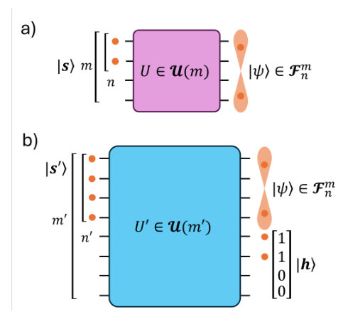
<figcaption class="paper-figure-caption"><b>Fig 1.</b> Figure 1. Schematics of different settings: (a) Passive linear optics, with n photons in m modes evolving through a circuit described by U ∈U(m) (b) Heralded linear optics, where an enlarged input state comprising n′ photons in m′ modes is considered, evolving through a circuit described by U ′ ∈U(m′), followed by projection onto a fixed heralding state |h⟩for heralding.</figcaption>
</figure>
<figure class="paper-figure-card">
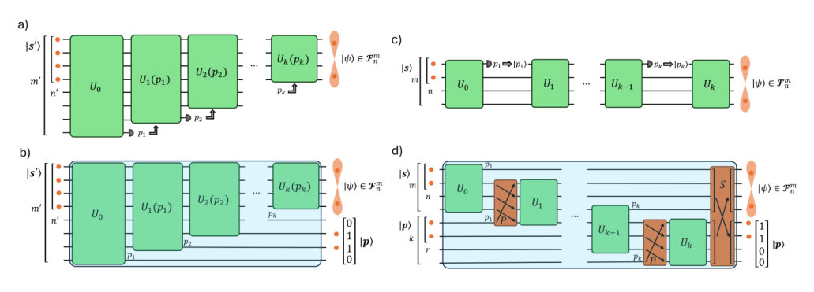
<figcaption class="paper-figure-caption"><b>Fig 2.</b> Figure 2. Schematics of different settings: (a) Adaptive linear optics (ALO), where the evolution consists of a sequence of unitary layers U1(p1), U2(p2), . . . , Uk(pk) conditioned on intermediate measurement outcomes. (b) Equivalent heralded linear optics (HLO) description of a single adaptive branch, obtained by combining all conditional unitaries into a single global unitary U ′ ∈U(m′) followed by projection onto a fixed heralding outcome. (c) Single-mode State Injection (SI) protocol, where photon-counting measurements are interleaved with unitaries and followed by reinjection of the measured photons. (d) Equivalent HLO representation of the single-branch SI scheme, obtained by...</figcaption>
</figure>
<figure class="paper-figure-card">
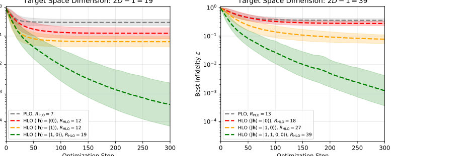
<figcaption class="paper-figure-caption"><b>Fig 3.</b> Figure 3. Evolution of the best infidelity L as a function of the optimization steps for output space with either n = 3 photons in m = 3 modes (target space dimension 2D −1 = 19) or n = 3 photons in m = 4 modes (target space dimension 2D −1 = 39). The curves represent the geometric mean over M = 200 Haar-random target states, with shaded areas indicating the geometric standard deviation. The gray dashed line corresponds to standard Passive Linear Optics (PLO), which quickly plateaus due to insufficient degrees of freedom. HLO configurations with suboptimal ancillary resources show improved performance but still exhibit a saturation of the loss. In contrast, the HLO configuration with...</figcaption>
</figure>
<figure class="paper-figure-card">
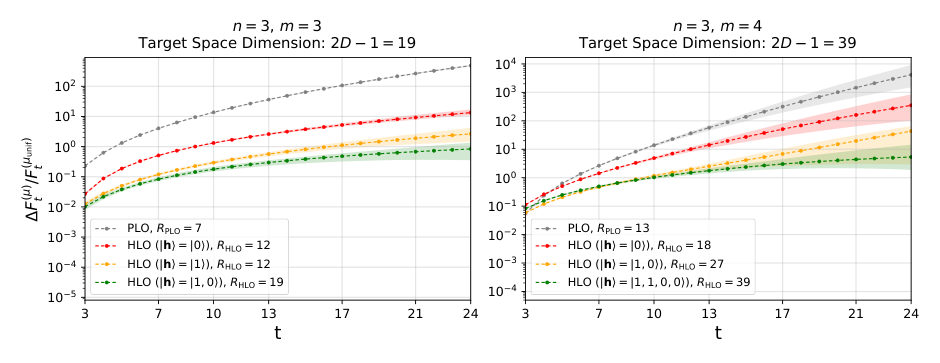
<figcaption class="paper-figure-caption"><b>Fig 4.</b> Figure 4. Relative difference between the frame potentials of output states |ψ(U ′, s′, h)⟩of PLO/HLO circuits, and the ones of the uniform measure on all pure states. The configurations considered are exactly the same as those in Figure 3. For each configuration, Nsamples = 3000 Haar random matrices U ′ ∈U(m′) were drawn, and the normalized output states |ψ⟩= |ψ(U ′, s′, h)⟩computed. Estimates of the t-th frame potential F (µ) t (solid circles) are then calculated as the empirical average of |⟨ψ1|ψ2⟩|2t over all distinct pairs (|ψ1⟩, |ψ2⟩) of states obtained. The relative differences with the uniform measure’s frame potential are then computed using Eq. (G2). Lastly, this whole process is...</figcaption>
</figure>

**Summary.** The paper develops a rigorous theoretical framework to measure how well heralded quantum linear optical circuits can generate target quantum states. By analyzing the Jacobian rank and ensemble properties (frame potentials), it quantifies the added expressivity gained by incorporating conditional measurements over simple passive optics. This provides crucial, systematic criteria for designing high-dimensional photonic quantum state engineering protocols.

**Why it may be interesting.** This work provides powerful mathematical tools—Jacobian rank and frame potentials—to quantitatively assess the fundamental limits of quantum state preparation using linear optics, which is a cornerstone platform in photonic quantum computing.

Detailed structure

**Main problem.** The work investigates the local controllability of photonic states generated by linear optical networks, specifically comparing passive vs. heralded schemes.

**Main result.** The authors establish systematic criteria using Jacobian rank analysis to quantify how ancillary resources in heralded optics enlarge the accessible state space beyond what is possible with passive optics.

**Method.** The primary method involves analyzing the rank of the Jacobian matrix of the output state with respect to the underlying unitary circuit, which measures the dimension of the accessible tangent space.

**Model / system.** The system under study is photonic linear optical networks, encompassing both purely passive evolution and heralded schemes involving conditional measurements on auxiliary modes. The analysis uses concepts from Lie algebra and geometric measure theory applied to quantum state manifolds.

**Key observables.** Jacobian rank ($R_{HLO}$), Frame Potentials ($F(\mu)_t$), Infidelity ($L(U')$).

**Important parameters / regimes.** Number of modes ($m, m'$), number of photons ($n, n'$), and the nature/availability of ancillary resources (heralding patterns $|h
angle$).

**Assumptions / limitations.** The analysis often assumes generic conditions for unitary matrices or relies on topological arguments that suggest global reachability if local rank is maximal.

**Figures summary.** Figures illustrate schematics comparing passive and heralded linear optics setups, and numerical results show the relative difference in frame potentials between PLO and HLO settings.

**Paper structure.** The paper progresses from defining the limitations of passive optics to developing a rigorous Jacobian rank analysis for heralded schemes. It establishes upper bounds via symmetry arguments, derives lower bounds through specific configurations, and finally uses ensemble methods (frame potentials) to test global expressivity.

Abstract

Photonic linear optical networks provide a versatile platform for quantum information processing and quantum state engineering. However, the set of states that can be generated using passive linear optics alone is fundamentally constrained by bosonic symmetries. Heralding, based on conditional measurements on auxiliary modes, is a widely used technique to overcome these limitations and effectively enlarge the set of accessible states. Despite the widespread use of heralding, it is often unclear how specific ancillary resources impact the overall reachability of the target space. In this work, we investigate the local controllability of photonic states in linear optical networks by analyzing the rank of the Jacobian of the output state with respect to the underlying unitary circuit, which provides a quantitative measure of the dimension of the accessible tangent space at a given configuration. Our analysis ranges from passive linear optics to heralded linear optics, where auxiliary resources and conditional measurements are included. Within this framework, we quantify how different resources enlarge the locally accessible state space beyond that of passive linear optics and determine the resources required for the Jacobian rank to reach its maximal value, thereby achieving full local controllability. As maximal local rank is a necessary condition for global reachability, our framework offers a systematic tool to assess and compare the accessible state space of measurement-based photonic architectures, and to establish practical criteria for the resources needed in high-dimensional quantum state engineering.

[↑ back to top](#top)

### [Direct Observation of Channelised Supercurrents in a Kagome Superconductor](http://arxiv.org/abs/2606.20157v1)

**Authors:** Matthijs Rog, Tycho J. Blom, Reinier Q. Regter, Andrea Capa Salinas, Dalal Benali, Jinwon Lee, Daan B. Boltje, Mark H. Fischer, Titus Neupert, Stephen D. Wilson, Milan P. Allan, Kaveh Lahabi  
**Type:** experiment · **Category:** strongly correlated electrons · **PDF:** <https://arxiv.org/pdf/2606.20157v1>  
**Analysis basis:** full PDF text, analyzed in chunks
**Topic relevance:** `driven-dissipative phase transition` **2/5** · `non-equilibrium dynamics` **2/5** · `Frenkel-Kontorova` **1/5** · `analog quantum simulation` **1/5** · `correlated / nonlocal dissipation` **1/5** · `interference shaping light` **1/5** · `non-equilibrium universality` **1/5**

↔ Scroll figures horizontally

<figure class="paper-figure-card">
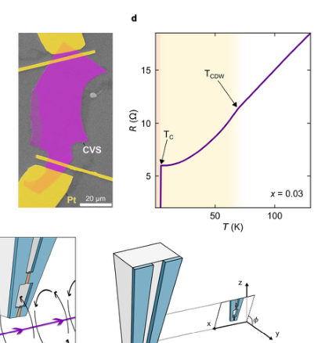
<figcaption class="paper-figure-caption"><b>Fig 1.</b> Fig. 1 | Flakes of CsV3Sb5-xSnx. a, Crystal structure of CsV3Sb5-xSnx. b, Atomic-resolution STM topograph on the Sb-termination of the x = 0.03 parent crystal, showing the distribution of Sn dopants. The right images show the underlying Sb lattice and the 1x4 CDW structure inside the magenta rectangle, obtained through Fourier-space filtering. c, False coloured scanning electron image of the device D1 (x = 0.03), contacted with Pt leads. d, Resistance-temperature measurement on device D1, emphasizing the transition to a CDW and then a superconducting state. e,f, Supercurrent interference patterns on device D1, showing that there are intrinsic oscillations over a wide range of periods. The...</figcaption>
</figure>
<figure class="paper-figure-card">
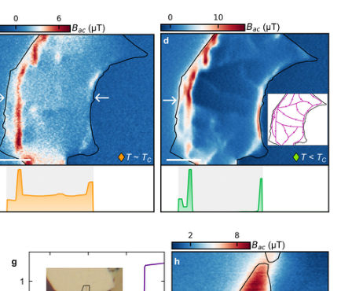
<figcaption class="paper-figure-caption"><b>Fig 2.</b> Fig. 2 | Channelised supercurrents in CsV3Sb5-xSnx. a, Resistance-temperature characteristic of device D1 through its superconducting transition. Before it hits the zero resistance state, it discontinuously passes through various features. b-d, TM-SOT images of the magnetic field Bac generated by an AC current Iac = 85 μA applied to the flake, for the three temperatures marked in a. Channelised supercurrent paths emerge on the transition and, at the lowest temperature, span the entire flake. Below the images, current patterns along a line cut, marked by the arrows, are shown. The current patterns are normalized to their peak value. The inset of d shows the current paths identified from the...</figcaption>
</figure>
<figure class="paper-figure-card">
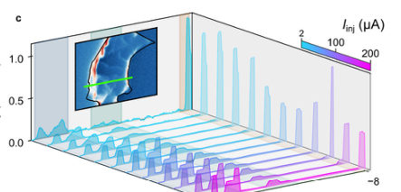
<figcaption class="paper-figure-caption"><b>Fig 3.</b> Fig. 3 | Evolution of the channelised current distribution in device D1. a, Current distribution at different temperatures through the transition along the line marked in green. All curves are normalized to their area. The channels appear immediately at the transition, are stable in temperature, and have a width smaller than the Pearl length Λ. b, Transport characteristics of device D1 at 1.7 K. The flake hosts a cascade of critical currents, marked by the black arrows. c, Evolution of the current distribution along the line marked in green, as the injected current is increased from 2 μA (I &lt; Ic1) to 200 μA (I &gt; Ic9). While currents redistribute and a small interior current appears, the...</figcaption>
</figure>

**Summary.** This work uses SQUID microscopy and STM on Kagome superconductors ($	ext{CsV}_3	ext{Sb}_{5-x}	ext{Sn}_x$) to map supercurrent flow. The key finding is that supercurrents are confined to narrow, stable channels, suggesting the superconducting state is governed by an intrinsic Josephson junction network competing with charge density wave order. This provides new local insight into strongly correlated electron behavior.

**Why it may be interesting.** The strong spatial localization of supercurrents and the evidence for competing orders (CDW) provide a concrete experimental platform for studying complex many-body interactions beyond simple BCS theory, which is highly relevant to correlated electron physics.

Detailed structure

**Main problem.** The study aims to understand the anomalous transport properties of Kagome superconductors, particularly how supercurrents are spatially distributed and influenced by competing orders like Charge Density Waves (CDW).

**Main result.** Supercurrent flow is found to be highly confined to narrow, stable channels that emerge below the critical temperature, suggesting an intrinsic Josephson junction network rather than simple edge effects.

**Method.** The research employs advanced nanoscale characterization techniques including Superconducting Quantum Interference Device (SQUID) microscopy and Scanning Tunneling Microscopy (STM).

**Model / system.** The physical system is the $	ext{AV}_3	ext{Sb}_5$ ($	ext{A} = 	ext{Cs}, 	ext{K}, 	ext{Rb}$) family of Kagome superconductors, specifically doped flakes like $	ext{CsV}_3	ext{Sb}_{5-x}	ext{Sn}_x$. The analysis compares observed transport to models involving Josephson junctions and competing CDW order.

**Key observables.** Supercurrent interference patterns, spatially confined current channels, superconducting energy gap ($\Delta^*$), and non-linear current-voltage characteristics.

**Important parameters / regimes.** Doping strength ($x$), temperature (especially near $T_c$), and applied bias/injected current ($I_{	ext{inj}}$).

**Assumptions / limitations.** The observed supercurrent anomalies are attributed to Josephson coupling within a network of narrow filaments, ruling out simple depairing mechanisms.

**Figures summary.** Figures illustrate the confinement of supercurrents and Meissner screening to narrow channels using SQUID microscopy across temperature changes, alongside STM spectra confirming the superconducting gap structure.

**Paper structure.** The paper progresses by first identifying anomalous transport features in Kagome superconductors, then using SQUID/STM imaging to map current flow spatially, arguing that this confinement points toward an intrinsic Josephson junction network linked to charge order physics.

Abstract

Superconductors are many-body quantum states in which current flows without dissipation. Theory predicts that supercurrents follow a relatively simple spatial pattern in both conventional and unconventional superconductors. Recent studies into the AV3Sb5 (A = Cs, K, Rb) family of Kagome superconductors indicate that CsV3Sb5 has unconventional transport properties that cannot be accounted for with these simple theories, including reports of intrinsic Josephson junctions, higher order Cooper pairing and the zero field diode effect. Attempts to interpret these findings have focused on the interplay of superconductivity with the unconventional charge density wave (CDW) order in these materials, with which superconductivity competes. A current roadblock to understanding how these kagome superconductors give rise to their intriguing properties is the lack of spatially resolved information about transport. Here we show, using a recently developed superconducting quantum interference device (SQUID) microscope, that flakes of CsV3Sb5-xSnx host a network of narrow supercurrent channels. These supercurrent channels emerge at the critical temperature and remain stable for all temperatures and currents. Their non-linear behaviour is consistent with a network of Josephson junctions linked by narrow supercurrent filaments, which naturally leads to the observed transport anomalies. Intriguingly, these observations are much weaker in undoped samples, which suggests links to the physics of charge density waves, disorder, and electronic correlations, all of which are greatly influenced by the doping strength. These results establish new frontiers for the local investigation of charge transport and competing orders in strongly correlated electron systems, and shine a new light on the anomalous transport properties of the AV3Sb5 kagome superconductors.

[↑ back to top](#top)

### [Quantum models with the Yang-Lee phase transition](http://arxiv.org/abs/2606.19732v1)

**Authors:** Erick Arguello Cruz, Grigory Tarnopolsky  
**Type:** theory · **Category:** statistical mechanics · **PDF:** <https://arxiv.org/pdf/2606.19732v1>  
**Analysis basis:** full PDF text, analyzed in chunks
**Topic relevance:** `driven-dissipative phase transition` **2/5** · `non-equilibrium universality` **2/5** · `Frenkel-Kontorova` **1/5** · `Keldysh / 2PI / non-Gaussian methods` **1/5** · `analog quantum simulation` **1/5** · `non-equilibrium dynamics` **1/5**

↔ Scroll figures horizontally

<figure class="paper-figure-card">
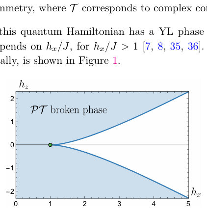
<figcaption class="paper-figure-caption"><b>Fig 1.</b> Figure 1: Phase diagram of the Yang-Lee quantum model in (3.4). The green dot marks the Ising critical point at hx,c = 1. The blue lines correspond to the YL critical points, and the shaded region is the PT broken phase, for different values of hx and hz, with J = 1.</figcaption>
</figure>
<figure class="paper-figure-card">
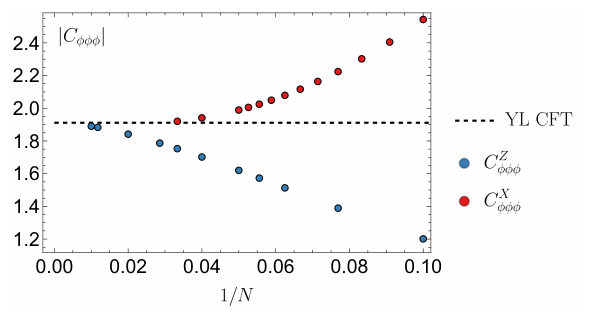
<figcaption class="paper-figure-caption"><b>Fig 2.</b> Figure 2: Structure constant as a function of system size obtained from (4.6), evaluated at J = 1, hx = 1.25 and hz = hz,c. The dashed line represents the theoretical value (4.2).</figcaption>
</figure>
<figure class="paper-figure-card">
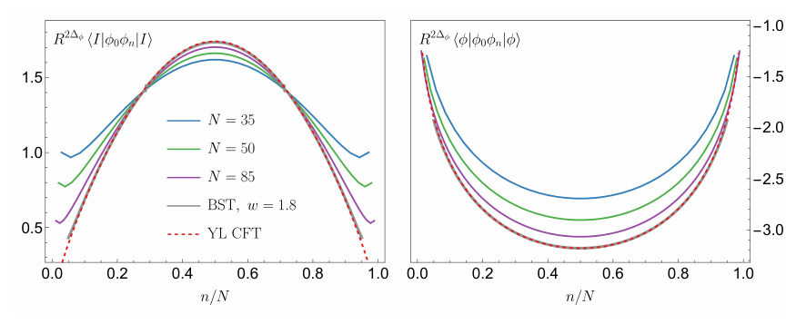
<figcaption class="paper-figure-caption"><b>Fig 3.</b> Figure 3: Two-point functions of ϕ in the identity state |I⟩and the ground state |ϕ⟩as functions of n/N for J = 1, hx = 1.25, and hz = hz,c. In gray, we show the thermodynamic extrapolation obtained using the BST algorithm with w = 1.8 and with dashed red lines, we plot the CFT expressions (4.7) and (4.8), respectively.</figcaption>
</figure>
<figure class="paper-figure-card">
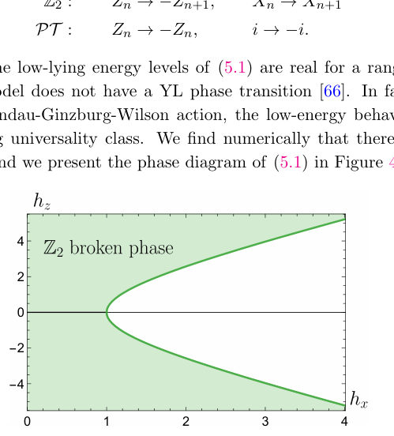
<figcaption class="paper-figure-caption"><b>Fig 4.</b> Figure 4: Phase diagram of the Hamiltonian (5.1) for J = 1. The green line represents the Ising critical points, and the shaded region represents the Z2 broken phase.</figcaption>
</figure>
<figure class="paper-figure-card">
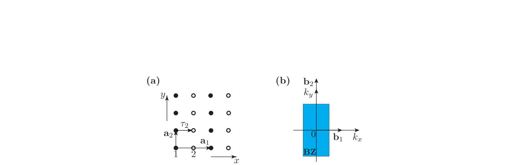
<figcaption class="paper-figure-caption"><b>Fig 5.</b> Figure 5: (a) Layered square lattice with the primitive lattice vectors a1 = 2aˆx and a2 = aˆy and two sites per unit cell, with basis position vectors τ1 = 0 and τ2 = aˆx. Sublattice 1 is depicted by black circles and sublattice 2 is depicted by white circles. (b) The lattice Brillouin zone (BZ). The reciprocal lattice vectors are b1 = π</figcaption>
</figure>

**Summary.** This paper analyzes four distinct 1+1D quantum models—including Ising, Schwinger, Blume-Capel, and clock models—to study the Yang-Lee phase transition. Using advanced field-theoretic methods, the authors demonstrate that these diverse physical systems all map onto a universal critical theory described by an i\phi^3 massless bosonic field. This confirms deep connections between symmetry protection, quantum criticality, and conformal field theory.

**Why it may be interesting.** The rigorous connection drawn between diverse physical lattice models (Ising, clock) and a single universal critical theory ($i\phi^3$ CFT) provides powerful insights into how symmetry constraints dictate quantum criticality in condensed matter systems.

Detailed structure

**Main problem.** The research investigates quantum models that exhibit the Yang-Lee (YL) phase transition under deformations that preserve PT symmetry.

**Main result.** In all four studied quantum models, the YL criticality is consistently described by a massless Euclidean i\phi^3 field theory in the continuum limit.

**Method.** The authors employ advanced theoretical techniques including state-operator correspondence, bosonization, and the Polyakov-Hubbard transformation to map microscopic Hamiltonians onto effective bosonic field theories.

**Model / system.** Four specific 1+1D quantum models are analyzed: the antiferromagnetic Ising spin chain (with transverse/longitudinal fields), the massive Schwinger model, the Blume-Capel model, and the three-state quantum clock model. These systems are deformed to induce YL criticality.

**Key observables.** Scaling dimensions ($\Delta$), effective central charge ($c_{	ext{eff}}$), two-point correlation functions $\langle \phi(0)\phi(n) 
angle$, and pseudo-critical points ($h^*$).

**Important parameters / regimes.** The dimensionality $1+1$D, the imaginary coupling constant (related to the YL singularity), and system size $N$.

**Assumptions / limitations.** Approximations include using the state-operator correspondence and assuming that low-energy physics is governed by an effective continuum field theory description.

**Figures summary.** Figures illustrate phase diagrams, spectral flow showing crossings between different critical points (Ising vs. YL), and numerical results for correlation functions comparing theoretical power laws to exponential decays.

**Paper structure.** The paper systematically analyzes multiple models, deriving effective LGW actions via transformations, calculating scaling dimensions using finite-size scaling on the low-energy spectrum, and confirming the underlying CFT description of the critical point.

Abstract

In this article, we present four different $1+1$D quantum models that realize the Yang-Lee (YL) phase transition under a deformation that preserves $PT$ symmetry. These are the antiferromagnetic Ising spin chain in transverse and longitudinal magnetic fields, the massive Schwinger model, the Blume-Capel model, and the three-state quantum clock model. Using the state-operator correspondence, we identify the YL critical point, compute the scaling dimensions of the lowest operators in each model, and find perfect agreement with the exact results for the YL criticality in two dimensions. Using bosonization for the Schwinger model and the Polyakov-Hubbard transformation for the other models, we show that in all of these quantum models the YL critical point is described, as expected, by a massless bosonic field with an $i φ^3$ interaction. In the quantum clock model, this critical field interacts with a massive bosonic field, and we identify the massless and massive states in the Hamiltonian spectrum. In addition, we numerically compute the two-point function of $φ$ at the Yang-Lee critical point and show that it grows with distance, in agreement with theoretical expectations.

[↑ back to top](#top)

### [Quantum deformations of $\mathcal{U}(\mathfrak{sl}(2, \mathbb{R}))$. Part I: Fidelity and experimental benchmarking](http://arxiv.org/abs/2606.19462v1)

**Authors:** V. Mariscal, J. J. Relancio, L. Santamaría-Sanz  
**Type:** both · **Category:** quantum information and computing · **PDF:** <https://arxiv.org/pdf/2606.19462v1>  
**Analysis basis:** full PDF text, analyzed in chunks
**Topic relevance:** `QC/QI experiment` **2/5** · `entanglement & information structure` **2/5** · `analog quantum simulation` **1/5** · `methods for driven-dissipative` **1/5** · `non-equilibrium dynamics` **1/5**

↔ Scroll figures horizontally

<figure class="paper-figure-card">
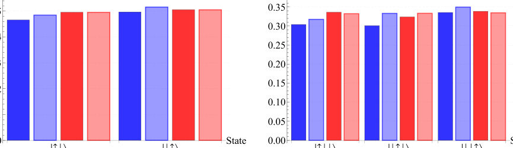
<figcaption class="paper-figure-caption"><b>Fig 1.</b> Figure 1: Comparison of experimental data [39] and theoretical predictions for |D0 2⟩q (left) and</figcaption>
</figure>
<figure class="paper-figure-card">
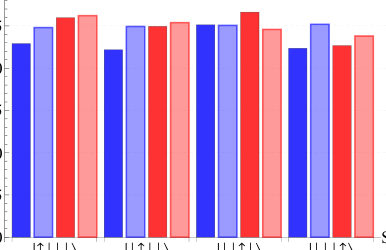
<figcaption class="paper-figure-caption"><b>Fig 2.</b> Figure 2: Comparison of experimental data [39] and theoretical predictions for |D−1 4 ⟩q (left) and |D0 4⟩q (right). Dark blue (dark red) indicates the raw device (error-mitigated) experimental probabilities, while light blue (light red) shows the corresponding theoretical values from the q-deformation.</figcaption>
</figure>
<figure class="paper-figure-card">
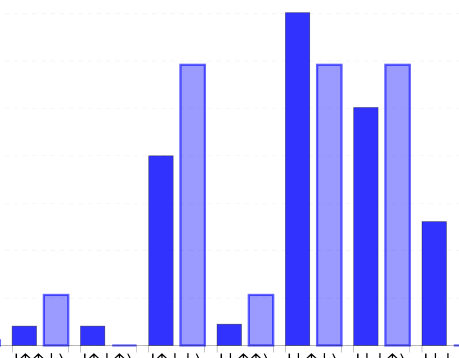
<figcaption class="paper-figure-caption"><b>Fig 3.</b> Figure 3: Comparison of experimental data [57] and theoretical predictions for |D−1 3 ⟩h. Dark blue indicates the raw device experimental probabilities while light blue shows the corresponding theoretical values from the h-deformation.</figcaption>
</figure>
<figure class="paper-figure-card">
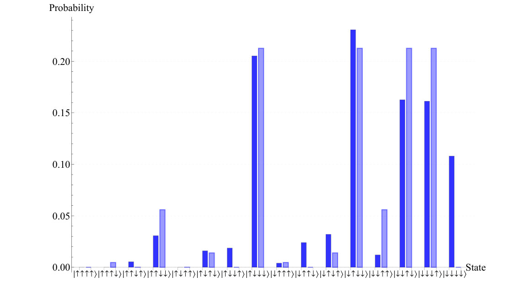
<figcaption class="paper-figure-caption"><b>Fig 4.</b> Figure 4: Comparison of experimental data [57] and theoretical predictions for |D−2 4 ⟩h. Dark blue indicates the raw device experimental probabilities while light blue shows the corresponding theoretical values from the h-deformation.</figcaption>
</figure>
<figure class="paper-figure-card">
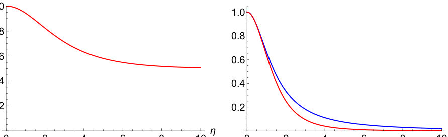
<figcaption class="paper-figure-caption"><b>Fig 5.</b> Figure 5: Left: Fidelity between the q-deformed state |D0 2⟩q (red) (the same for |M 0 2 ⟩q) and its corresponding undeformed state as a function of the deformation parameter. Right: Fidelity between the h-deformed states |M 0 2 ⟩h (blue) and |D−2 2 ⟩h(red) and their corresponding undeformed states as a function of the deformation parameter.</figcaption>
</figure>

**Summary.** This paper investigates how two types of quantum algebraic deformations ($q$ and $h$) modify the states of multi-qubit systems governed by the Kittel–Shore model. By calculating quantum fidelity, the authors show that while $q$-deformation causes a smooth decay in overlap, $h$-deformation leads to rapid state orthogonality. This comparison offers crucial theoretical guidance for interpreting experimental results on highly entangled quantum resources.

**Why it may be interesting.** This work provides a rigorous mathematical bridge between abstract quantum group theory ($\mathcal{U}(\mathfrak{sl}(2, \mathbb{R}))$ deformations) and concrete, measurable quantities (quantum state fidelities) relevant for benchmarking current multi-qubit quantum hardware.

Detailed structure

**Main problem.** The work explores how standard ($q$-deformation) and non-standard ($h$-deformation) quantum deformations of the $\mathcal{U}(\mathfrak{sl}(2, \mathbb{R}))$ Hopf algebra affect multi-qubit systems.

**Main result.** The $q$-deformation smoothly modifies quantum states while maintaining residual overlap with undeformed configurations, whereas the $h$-deformation rapidly drives these states toward orthogonality. Both require specific parameter rescalings to maintain fidelity in the macroscopic limit.

**Method.** The authors construct multi-qubit states using Clebsch-Gordan coefficients associated with the deformed algebras and quantify state deviation by computing quantum fidelity ($F$).

**Model / system.** The study focuses on multi-qubit systems, analyzing states related to the Kittel–Shore (KS) model Hamiltonian. The algebraic framework involves Hopf algebra deformations of $\mathcal{U}(\mathfrak{sl}(2, \mathbb{R}))$ using parameters $q$ and $h$.

**Key observables.** Quantum fidelity ($F$), Dicke states $|D(k)_N
angle$, component probabilities in the computational basis.

**Important parameters / regimes.** Deformation parameters $q$ (standard) and $h$ (Jordanian); system size $N$; thermodynamic limit ($N 	o \infty$).

**Assumptions / limitations.** The analysis assumes that comparing fidelities provides a valid benchmark for operational errors, and specific scaling limits ($\eta = 	ilde{\eta}/N$) are required to obtain finite results in the thermodynamic limit.

**Figures summary.** Figures compare raw experimental data against theoretical predictions for both $q$- and $h$-deformations across 2-qubit and 3-qubit systems, illustrating fidelity decay versus deformation parameters.

**Paper structure.** The paper progresses from establishing the algebraic framework (Hopf algebra deformations) to deriving deformed Hamiltonians and states. It then compares theoretical predictions for few-body and macroscopic limits using fidelity calculations, culminating in a discussion of which deformation best models observed quantum correlations.

Abstract

This work explores the effects of both the standard quantum $q$-deformation and the non-standard $h$-deformation of the Hopf algebra $\mathcal{U}(\mathfrak{sl}(2, \mathbb{R}))$ on multi-qubit systems. By constructing the states of a Hilbert space of $N$ qubits through the Clebsch-Gordan coefficients associated with the deformed algebras, we show that these states naturally coincide with the eigenstates of the Hamiltonian of the $q$- and $h$-deformed Kittel-Shore models. We compare the resulting deformed states with those typically targeted in quantum information experiments, providing a bridge between algebraic constructions and experimentally relevant quantum resources. Fidelities with respect to the undeformed states are computed to establish how the quantum correlations are affected, both for few-qubit systems (including Dicke and non-Dicke states), and in the macroscopic limit ($N \to \infty$) through closed-form formulas derived for arbitrary Dicke states. The results reveal different behaviors between the two deformations. The $q$-deformation smoothly modifies the states and maintains a residual overlap with the original configurations, while the $h$-deformation rapidly makes the states orthogonal to their undeformed counterparts. Both models demand a standard $N^{-1}$ rescaling to preserve fidelity stability in the macroscopic limit.

[↑ back to top](#top)

### [Scaling, fractal dynamics, and critical exponents in the equilibrium phase transition](http://arxiv.org/abs/2606.20460v1)

**Authors:** Adauto F. Souza, Henrique A Lima, Anderson L. R. Barbosa, Fernando A. Oliveira  
**Type:** theory · **Category:** statistical mechanics · **PDF:** <https://arxiv.org/pdf/2606.20460v1>  
**Analysis basis:** full PDF text, analyzed in chunks
**Topic relevance:** `non-equilibrium universality` **2/5** · `Keldysh / 2PI / non-Gaussian methods` **1/5** · `analog quantum simulation` **1/5** · `correlated / nonlocal dissipation` **1/5** · `driven-dissipative phase transition` **1/5** · `non-equilibrium dynamics` **1/5**

↔ Scroll figures horizontally

<figure class="paper-figure-card">
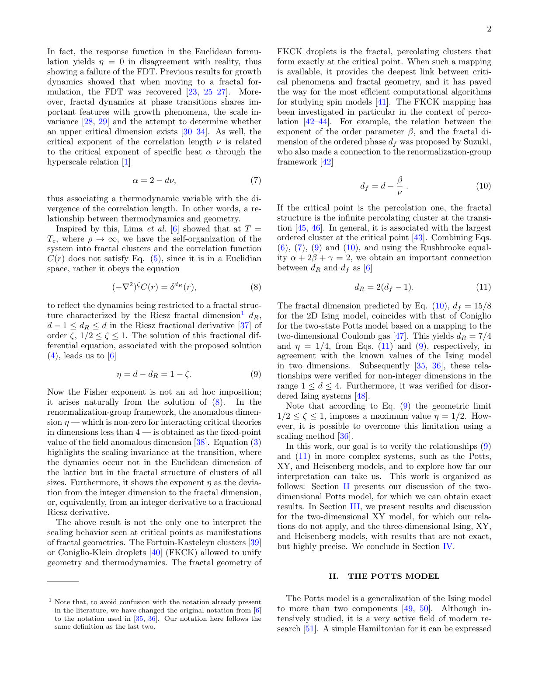
<figcaption class="paper-figure-caption"><b>Fig 1.</b> Low-resolution page preview, page 2</figcaption>
</figure>
<figure class="paper-figure-card">
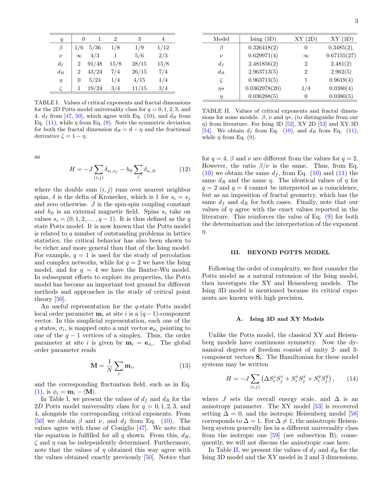
<figcaption class="paper-figure-caption"><b>Fig 2.</b> Low-resolution page preview, page 3</figcaption>
</figure>
<figure class="paper-figure-card">
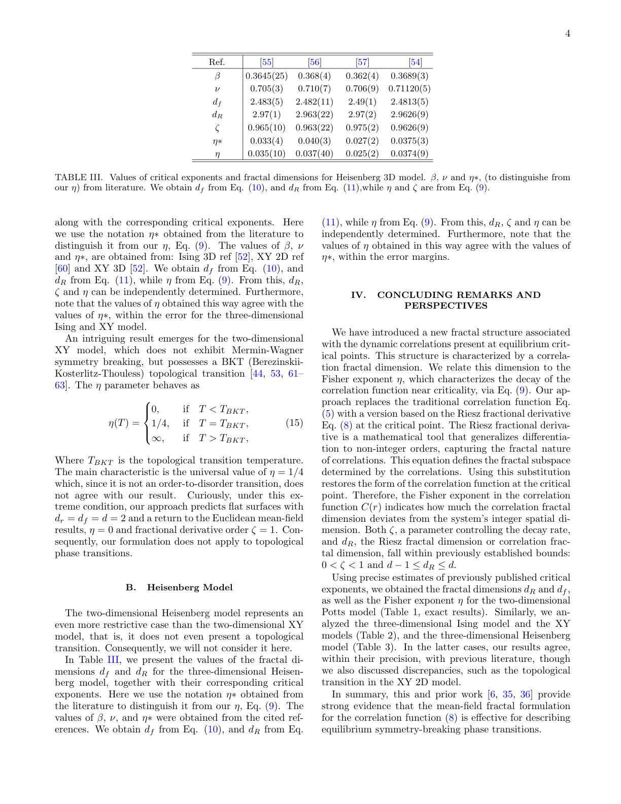
<figcaption class="paper-figure-caption"><b>Fig 3.</b> Low-resolution page preview, page 4</figcaption>
</figure>
<figure class="paper-figure-card">
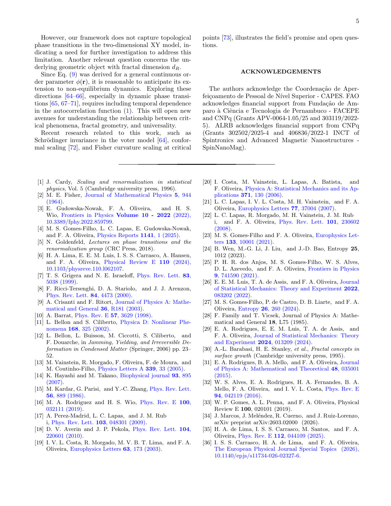
<figcaption class="paper-figure-caption"><b>Fig 4.</b> Low-resolution page preview, page 5</figcaption>
</figure>
<figure class="paper-figure-card">
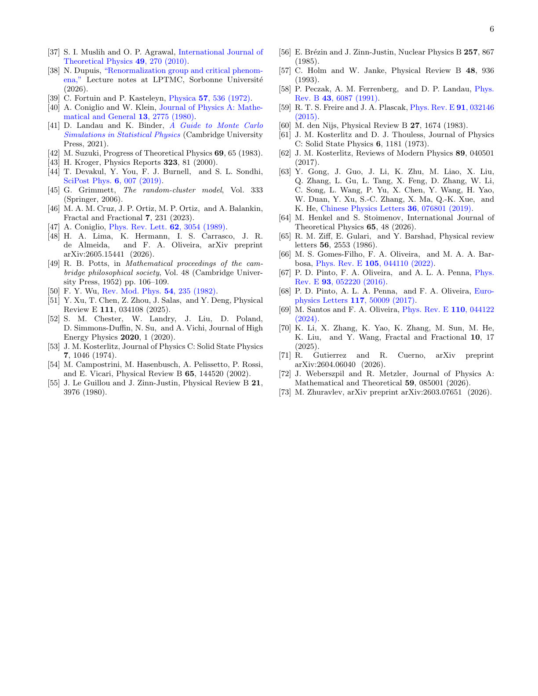
<figcaption class="paper-figure-caption"><b>Fig 5.</b> Low-resolution page preview, page 6</figcaption>
</figure>

**Summary.** This paper investigates the deep geometric connections between scaling behavior, critical exponents, and fractal dimensions at equilibrium phase transitions. Using fractional calculus applied to correlation functions, the authors establish quantitative relationships between these quantities for models like the Ising and Potts systems. It provides a powerful theoretical framework that unifies several key concepts in critical phenomena theory.

**Why it may be interesting.** While focused on classical statistical mechanics, the use of fractal geometry and generalized differential operators provides advanced mathematical tools for characterizing critical phenomena that can inspire analogous treatments in quantum many-body systems near continuous phase transitions.

Detailed structure

**Main problem.** To establish a unified geometric interpretation connecting scaling behavior, critical exponents, and fractal geometry in equilibrium phase transitions.

**Main result.** The study derives relationships between critical exponents ($\eta$, $
u$) and fractal dimensions ($d_R$, $d_f$), successfully reproducing known results for several lattice models like the 2D Ising system.

**Method.** The authors employ fractional differential analysis, extending Fisher's correlation function approach to incorporate Riesz fractional derivatives, linking it to renormalization group concepts.

**Model / system.** The research analyzes thermodynamic systems undergoing second-order phase transitions, testing its framework on the q-state Potts model (generalizing Ising), XY, and Heisenberg spin systems.

**Key observables.** Autocorrelation function $C(r)$, critical exponents ($\eta$, $
u$, $\alpha$, $eta$, $\gamma$), and fractal dimensions ($d_R$, $d_f$).

**Important parameters / regimes.** The dimensionality of the space ($d$), the number of states in the Potts model ($q$), and the fractional derivative order ($\zeta$).

**Assumptions / limitations.** The approach is limited to systems with local order parameters, failing for topological phase transitions like the 2D XY model. It also relies on specific scaling relations connecting various exponents.

**Figures summary.** Table I presents calculated values for critical exponents and fractal dimensions for the 2D Potts model across different $q$. Table II and III provide similar data for other models, comparing results with literature values.

**Paper structure.** The paper builds upon Fisher's correlation function analysis by introducing fractional calculus. It derives key scaling relations linking $\eta$ to geometric parameters ($d_R$) and then verifies these relationships across multiple lattice models (Ising, Potts, XY, Heisenberg).

Abstract

Statistical methods are essential for understanding thermodynamic systems with many degrees of freedom. For systems in equilibrium, a very useful method is that of correlation functions, which establish a correlation between a field phi(x), which depends on the spatial position x, and the same field evaluated at another position, phi(x0). Fisher [Journal of Mathematical Physics 5, 944322 (1964)] introduced the autocorrelation function for fluctuations of the order parameter, which has been an important mathematical tool for understanding second-order phase transitions in equilibrium. However, his analysis is restricted to a Euclidean space of dimension d, and an exponent eta is introduced to correct the spatial behavior of the correlation function at T = Tc. In a recent work, Lima et al. [Phys. Rev. E 110, L062107 (2024)] demonstrated that a modern fractional differential analysis is necessary for a complete description of the correlation function at Tc. In this study, we highlight the deep connection among scaling behavior, critical exponents, and fractal geometry. Our results provide a unified geometric interpretation of critical exponents and fractal dimensions, broadly applicable to thermodynamic phase transitions. However, the approach does not apply to topological phase transitions, which lack local order parameters and the associated scale-invariant fractal geometry. We verify its predictions for several cornerstone thermodynamic models: the Ising, Potts, XY, and Heisenberg systems.

[↑ back to top](#top)

### [Indefinite Quantum Causality](http://arxiv.org/abs/2606.19438v1)

**Authors:** Fabio Costa, Giulia Rubino, Cyril Branciard, Časlav Brukner, Marco Túlio Quintino  
**Type:** theory · **Category:** quantum information and computing · **PDF:** <https://arxiv.org/pdf/2606.19438v1>  
**Analysis basis:** full PDF text, analyzed in chunks
**Topic relevance:** `entanglement & information structure` **2/5** · `correlated / nonlocal dissipation` **1/5** · `driven-dissipative phase transition` **1/5** · `methods for driven-dissipative` **1/5** · `non-equilibrium dynamics` **1/5**

↔ Scroll figures horizontally

<figure class="paper-figure-card">
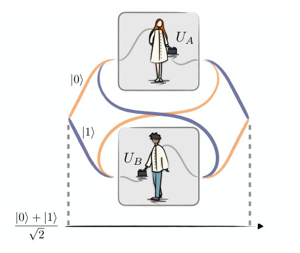
<figcaption class="paper-figure-caption"><b>Fig 1.</b> Figure 1. Scheme of a bipartite quantum switch. Two parties, Al- ice and Bob, perform two operations UA and UB, respectively, on a target system |ψ⟩. A second quantum system controls the order in which the two parties perform their unitary operations. For ex- ample, when the “control system” is in a state |0⟩, the target sys- tem could be sent first to Alice and then to Bob, and vice versa when the control system is in a state |1⟩. Placing the control sys- tem in a quantum superposition state,  |0⟩+ |1⟩  / √</figcaption>
</figure>
<figure class="paper-figure-card">
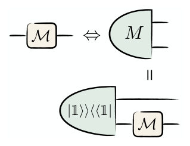
<figcaption class="paper-figure-caption"><b>Fig 2.</b> Figure 2. Pictorial representation of the operation-state duality: A CP map M (upper left) is isomorphic to the bipartite state (upper right) M obtained by applying the map M to a maximally entangled state [represented as in Eq. (5)] (lower right).</figcaption>
</figure>
<figure class="paper-figure-card">
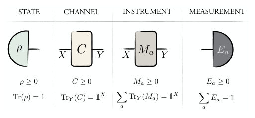
<figcaption class="paper-figure-caption"><b>Fig 3.</b> Figure 3. Quantum circuit and Choi representation of quantum states, channels, instruments and measurements. For instruments and POVM measurements, only one element is depicted, rather than the full sets {Ma}a, {Ea}a. According to our definitions, the Choi rep- resentation of a POVM element Ea is its transpose ET a .</figcaption>
</figure>
<figure class="paper-figure-card">
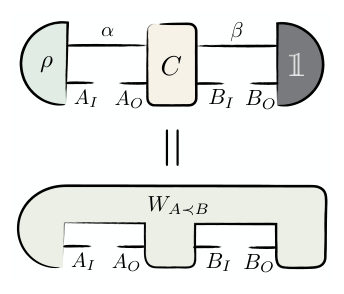
<figcaption class="paper-figure-caption"><b>Fig 4.</b> Figure 4. Circuit illustration of a bipartite ordered quantum process, which also represents a channel with memory, as in Eq. (18).</figcaption>
</figure>
<figure class="paper-figure-card">
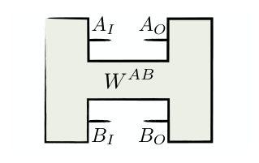
<figcaption class="paper-figure-caption"><b>Fig 5.</b> Figure 5. Pictorial representation of a bipartite process matrix, where AI and AO label Alice’s input and output spaces and BI and BO la- bel Bob’s input and output spaces, respectively. Alice and Bob’s op- erations are then to be “plugged” into the corresponding open slots.</figcaption>
</figure>

**Summary.** This review surveys the field of indefinite quantum causality, proposing that physical processes can operate when the order of operations is in superposition. It introduces the process matrix formalism to mathematically describe these non-standard causal relationships. The work establishes that this indeterminacy is a quantifiable resource with potential applications in quantum computation and information theory.

**Why it may be interesting.** It provides a powerful theoretical toolset for analyzing quantum processes where temporal or causal assumptions break down, which is relevant for understanding open systems dynamics in curved spacetime or complex quantum networks.

Detailed structure

**Main problem.** The paper addresses quantum processes where the causal order of operations is not fixed, moving beyond standard sequential circuit models.

**Main result.** Indefinite causal order has been established as a feasible and potentially advantageous resource for quantum information processing tasks.

**Method.** It develops formalisms like the process matrix formalism to describe joint probabilities when the causal sequence of events is itself in superposition.

**Model / system.** The focus is on abstract quantum processes, modeled using Hilbert spaces, density operators, and generalized quantum channels/instruments. Key models include the 'quantum switch' mechanism.

**Key observables.** Joint probabilities $P(a, b)$, process matrices ($W$), and causal witnesses used to detect indefinite order.

**Important parameters / regimes.** The relative strengths of different causal structures (e.g., sequential vs. superposed).

**Assumptions / limitations.** The framework assumes that the physical description can be generalized by treating causality itself as a quantum resource, rather than a fixed background structure.

**Figures summary.** Figures illustrate the bipartite quantum switch mechanism and the mathematical relationship between different formalisms (state-channel duality).

**Paper structure.** The review progresses from foundational concepts of indefinite causality to developing generalized probability rules, detailing the process matrix formalism, and discussing experimental certification methods.

Abstract

In recent years, operational approaches to quantum foundations have been developed as a means of understanding the core principles and distinctive features of quantum theory. Such approaches typically view physical processes as sequences of operations, with earlier operations serving as causes of later effects. However, a growing literature is emerging on the possibility of relaxing this assumption and allowing for quantum indefiniteness in the causal order. This development stems from a variety of motivations, both fundamental and applied, including exploring the role of causality in quantum theory, the interplay between quantum theory and general relativity, and higher-order quantum computing. A prominent offshoot of this development is the emergence of indefinite causal order as a feasible resource for quantum information processing. This review provides an overview of the current state of the art in the field, covering the methodology underlying indefinite quantum causality within the so-called "process matrix formalism", outlining key results and experimental implementations, and discussing recent advances.

[↑ back to top](#top)

### [The Heat Kernel Expansion: Curvature for Shock Detection in Higher-Order Financial Networks](http://arxiv.org/abs/2606.19860v1)

**Authors:** Mohammad Elsayed, Sara Najem  
**Type:** theory · **Category:** statistical mechanics · **PDF:** <https://arxiv.org/pdf/2606.19860v1>  
**Analysis basis:** full PDF text, analyzed in chunks
**Topic relevance:** `non-equilibrium dynamics` **2/5** · `analog quantum simulation` **1/5** · `driven-dissipative phase transition` **1/5** · `methods for driven-dissipative` **1/5** · `non-equilibrium universality` **1/5**

↔ Scroll figures horizontally

<figure class="paper-figure-card">
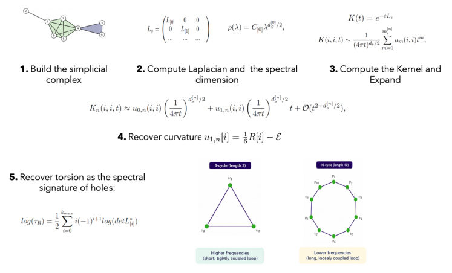
<figcaption class="paper-figure-caption"><b>Fig 1.</b> Figure 1: Work Flow Adopted in the Topological and Geometric Characterization of our Simplicial Complex</figcaption>
</figure>
<figure class="paper-figure-card">
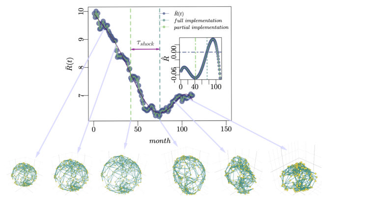
<figcaption class="paper-figure-caption"><b>Fig 2.</b> Figure 3: The average node curvature ¯R(t) is shown, fitted to a fifth-order polynomial ˙¯R. ¯R = 9.968 −5.290 × 10−2t + 1.538 × 10−3t2 −7.047 × 10−5t3 + 9.894 × 10−7t4 −4.154 × 10−9t5, with R-squared is 0.98. The dashed lines correspond to the introduction of the legislation in January 2006, and its full implementation in January 2008, which coincide with the curve’s inflection point and minimum. The inset shown follows the rate of change in curvature.</figcaption>
</figure>
<figure class="paper-figure-card">
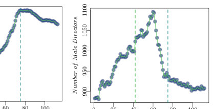
<figcaption class="paper-figure-caption"><b>Fig 3.</b> Figure 4: The figures follow the evolution of the total number of directors as well as evolution per gender.</figcaption>
</figure>
<figure class="paper-figure-card">
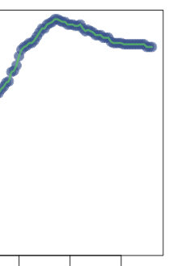
<figcaption class="paper-figure-caption"><b>Fig 4.</b> Figure 5: The figure shows the temporal evolution of the number of boards.</figcaption>
</figure>
<figure class="paper-figure-card">
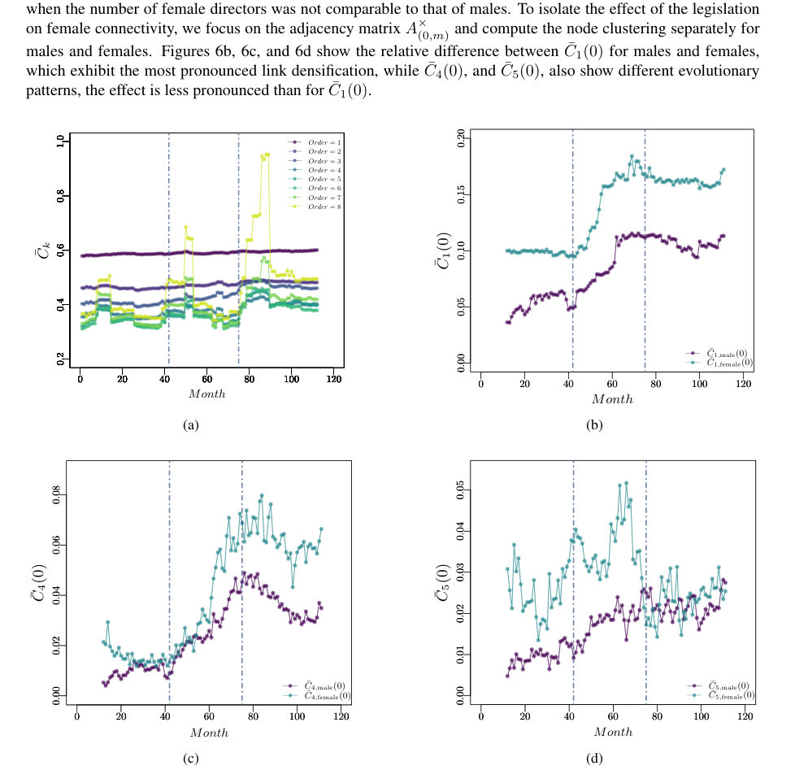
<figcaption class="paper-figure-caption"><b>Fig 5.</b> Figure 6: The dynamics of the higher order clustering ¯Ck(t) is shown in (a), while the evolution of female and male clustering are followed using A0,m for m = 1, 4 and 5 shown respectively in (b), (c), and (d).</figcaption>
</figure>

**Summary.** This work applies advanced algebraic topology and geometric analysis to model financial networks as simplicial complexes. The core contribution is using curvature, derived from the heat kernel expansion, as a superior diagnostic tool for detecting structural shocks caused by external laws compared to traditional measures like Euler characteristic or torsion. It demonstrates that this geometric approach accurately pinpoints the timing of regulatory impacts on network structure.

**Why it may be interesting.** While applied to finance, the methodology—using spectral geometry (heat kernel) on high-order complexes to detect non-equilibrium structural changes—is conceptually transferable to analyzing phase transitions or sudden regime shifts in complex quantum many-body systems.

Detailed structure

**Main problem.** To develop a robust geometric measure, derived from the heat kernel expansion, capable of detecting structural shocks in high-order financial networks, surpassing the limitations of traditional topological invariants.

**Main result.** Curvature dynamics provide a sensitive indicator for external forcing or legislative changes (shocks), showing distinct features like inflection points and minima that raw network counts fail to capture.

**Method.** The authors employ algebraic topology on simplicial complexes, calculating curvature via the heat kernel expansion of higher-order Laplacians. This geometric measure is compared against standard topological tools like Betti numbers and torsion.

**Model / system.** The system modeled is a financial network in Norway over nine years, represented as a simplicial complex where directors are nodes and company affiliations form faces (simplices).

**Key observables.** Curvature ($ar{R}(t)$), Euler characteristic ($\chi$), Reidemeister torsion ($	au_R$), and higher-order clustering coefficients ($ar{C}_k(t)$).

**Important parameters / regimes.** Time ($t$) evolution, network order (dimension of the complex), and specific external forcing events (e.g., legislation dates).

**Assumptions / limitations.** The primary assumption is that geometric curvature derived from the heat kernel expansion retains local information about structural changes better than integrated topological measures.

**Figures summary.** Figures illustrate the temporal evolution of curvature ($ar{R}(t)$) showing shock markers coinciding with legislation dates, alongside comparisons of $\chi$, torsion, and higher-order clustering coefficients for male/female groups.

**Paper structure.** The paper progresses by first establishing the limitations of standard topological measures (Euler characteristic loses local info; torsion is insensitive). It then introduces curvature from the heat kernel expansion as a superior geometric invariant. Finally, it applies this method to analyze real-world financial data, demonstrating its predictive power regarding external shocks.

Abstract

This work follows the evolution of financial networks in Norway over a period of nine years at a monthly rate. The data consist of board directors and their affiliations to companies, which we model as simplicial complexes. In this framework, directors are represented as nodes and companies as faces of the complex. To characterize the latter, we focus on three topological measures: the Euler characteristic, computed through the Betti numbers, torsion computed through the reduced determinant of the higher-order Laplacians, and higher-order clustering coefficients. The first two fail to capture the effect of imposed law on representation, unlike our notion of curvature which is a geometrical measure computed from the coefficients of the series expansion of the heat kernel in powers of time, which is our major contribution in this work. In particular, the Euler characteristic integrates curvature, and thus local information is lost. Subsequently, not every topological measure can reliably capture shocks in networks. Further, the number of spanning trees may undergo significant changes at the lowest order, yet these changes need not be reflected in the torsion. Conversely, the change in the curvature revealed variation in the board interlock due to legislation, and serves as a sensitive measure for detecting shocks in networks. Inflection points in curvature are associated with external forcing, and minima with shock arrival times. Sharp transitions are also observed in the components of torsion, while smooth changes are observed in higher-order clustering.

[↑ back to top](#top)

### [Nearest-neighbour gates are all you need: High-rate quantum low-density parity-check codes on a planar grid](http://arxiv.org/abs/2606.19482v1)

**Authors:** Boren Gu, Tamas Noszko, Vincent Steffan, Jens Niklas Eberhardt, Joschka Roffe, Jens Eisert, Stergios Koutsioumpas  
**Type:** theory · **Category:** quantum information and computing · **PDF:** <https://arxiv.org/pdf/2606.19482v1>  
**Analysis basis:** full PDF text, analyzed in chunks
**Topic relevance:** `QC/QI experiment` **2/5** · `quantum measurements` **2/5** · `measurement-induced transitions` **1/5**

↔ Scroll figures horizontally

<figure class="paper-figure-card">
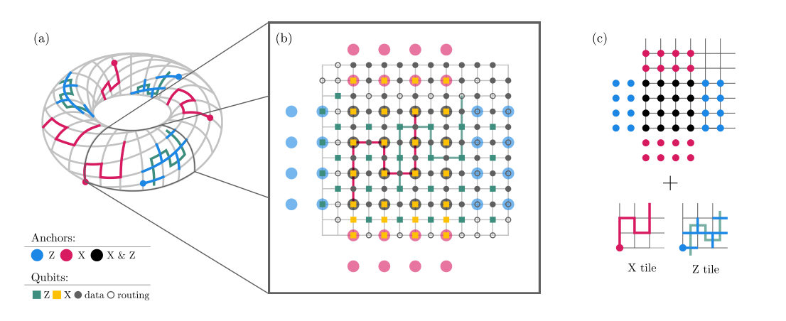
<figcaption class="paper-figure-caption"><b>Fig 1.</b> FIG. 1. Planar directional tile codes. A directional tile code can be viewed either as an open-boundary patch cut from a toric directional code [30], or as a planar tessellation by connected-string tiles in the spirit of tile codes [31]. (a) Toric directional code. A toric directional code on a twisted torus, with data qubits on edges and 𝑋- and 𝑍-type checks on vertices and plaquettes. Each stabiliser follows the directional word 𝔇= N2ESEN2. (b) Planar directional tile code (this work). The corresponding open- boundary N2ESEN2 directional tile code with parameters [[60, 4, 5]], embedded in a hardware-like square-grid layout. Dark gray dots are data qubits, coloured squares are check...</figcaption>
</figure>
<figure class="paper-figure-card">
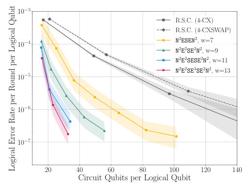
<figcaption class="paper-figure-caption"><b>Fig 2.</b> FIG. 2. Implemented footprint advantage over rotated surface-code memories. Circuit-level logical error rate per syndrome-extraction round per logical qubit at physical error rate 𝑝= 0.001, obtained from simulations of 4 consecutive syndrome-extraction rounds for memories storing 140 logical qubits in total. The choice 140 is the least common multiple of the logical dimensions of the codes considered, enabling a direct comparison at fixed encoded memory size. This corre- sponds to 140 rotated surface-code patches, or to 35, 14, 10, and 7 directional tile-code patches for the 𝑤= 7, 9, 11, and 13 families, respectively. For each of the 𝑑= 3, 5, 7 rotated sur- face codes, we show two circuit...</figcaption>
</figure>
<figure class="paper-figure-card">
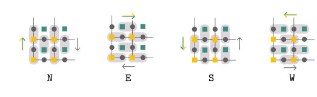
<figcaption class="paper-figure-caption"><b>Fig 3.</b> FIG. 3. Nearest-neighbour directional layers [30]. Local physical action associated with the four elementary directions {N, E, S, W} in a directional word. Coloured check qubits move along the indicated direction by nearest-neighbour exchange operations, while interacting with data qubits via CX gates whenever the walk encounters a data qubit. Specifically, we ap- ply CXSWAP(𝑋-check, data) and CXSWAP(data, 𝑍-check) respectively for different type of check-data pairs.</figcaption>
</figure>
<figure class="paper-figure-card">
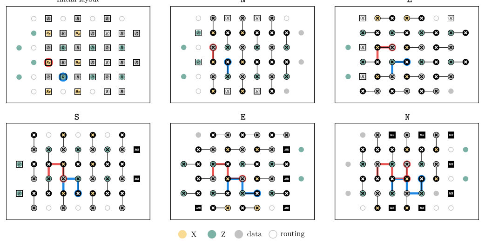
<figcaption class="paper-figure-caption"><b>Fig 4.</b> FIG. 4. Example of one round of nearest-neighbour syndrome extraction. Spacetime trajectory of the nearest-neighbour CXSWAP syndrome-extraction circuit for a [[18, 2, 𝑑𝑥= 3, 𝑑𝑧= 2]] directional tile code with directional word 𝔇= NESEN. The top-left panel shows the initial layout, while the following panels show the five directional layers N, E, S, E, and N. In each layer, check qubits are moved along the prescribed direction by parallel nearest-neighbour CXSWAP operations, as described in Algorithm 1. The red and blue paths highlight representative 𝑋- and 𝑍-type check trajectories during the same extraction round. The circuit shown includes boundary scheduling optimisations: qubits whose...</figcaption>
</figure>
<figure class="paper-figure-card">
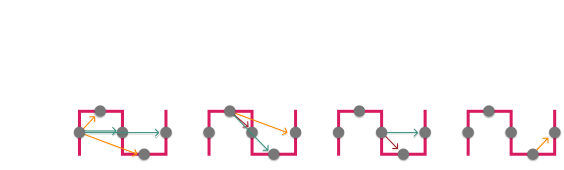
<figcaption class="paper-figure-caption"><b>Fig 5.</b> FIG. 5. Examples of displacement vectors. The connected string of the 𝑋-tile of the directional word 𝔇= NESEN, with data qubits highlighted by grey dots. Displacement vectors are illustrated for each starting point. Green vectors have even vertical displacement, while the different shades of yellow indicate pairs of vectors with odd vertical displacement.</figcaption>
</figure>

**Summary.** The paper presents directional tile codes as an advanced alternative to surface codes for fault-tolerant quantum computation on planar grids. By dynamically generating required long-range connections using only nearest-neighbour iSWAP gates, these codes maintain the high efficiency of qLDPC while respecting hardware locality. This breakthrough brings low-overhead quantum memory closer to realization in near-term superconducting devices.

**Why it may be interesting.** This work provides a concrete, hardware-aware pathway to realizing high-rate quantum memory by engineering code structures that respect strict 2D planar connectivity constraints inherent in superconducting architectures.

Detailed structure

**Main problem.** To develop high-performance quantum low-density parity-check (qLDPC) codes for fault tolerance that overcome the connectivity limitations of surface codes while remaining implementable using only nearest-neighbour gates on planar hardware.

**Main result.** The proposed directional tile codes successfully translate the efficiency advantages of qLDPC codes into strictly planar, nearest-neighbour circuits, achieving logical error rate reductions up to three orders of magnitude compared to rotated surface codes at comparable overheads.

**Method.** The authors introduce 'directional tile codes' implemented on a square grid. Syndrome extraction is achieved dynamically using only nearest-neighbour iSWAP gates via controlled walks that define both the stabilizer supports and perform the measurement.

**Model / system.** The system is modeled as superconducting qubits arranged on a planar square grid, utilizing directional tile codes defined by specific parity conditions (CSS code structure). The implementation relies entirely on local nearest-neighbour interactions (iSWAP gates) for syndrome extraction circuits.

**Key observables.** Code efficiency ratio ($\eta_{circ}$), per-logical per-round logical error rate ($p_L$), and circuit qubits required per logical qubit ($n_{circ}$).

**Important parameters / regimes.** Physical error rate ($p=0.001$); code size parameters like [[323, 14, 15]]; linear scaling of routing overhead $O(d)$.

**Assumptions / limitations.** The method assumes that iSWAP interactions can serve as a 'spacetime routing primitive' to define measurements locally; comparisons are made using a uniform circuit-level noise model.

**Figures summary.** Figures illustrate the structure of directional tile codes, compare logical error rates vs. physical overheads against surface codes (Figure 2), and detail the optimization process for routing qubits (Figure 7).

**Paper structure.** The paper systematically introduces the concept of directional tile codes to address the locality/efficiency trade-off. It details the nearest-neighbour syndrome extraction circuit, analyzes the scaling of physical overheads (routing) through optimization techniques, and finally demonstrates performance gains via error rate comparisons and logical operation implementation.

Abstract

High-performance quantum low-density parity-check codes promise substantial reductions in the overhead of fault-tolerant quantum computation, but most constructions require long-range connectivity or qubit shuttling, both of which are difficult to realise in superconducting architectures. Here we introduce a family of quantum low-density parity-check codes that, for the first time, combines planar open-boundary layouts, finite-size advantages over surface codes, and syndrome extraction using only nearest-neighbour gates on a square grid of qubits. The key idea is to generate check-data connectivity dynamically: nearest-neighbour iSWAP walks both define the stabiliser supports and implement their measurement, avoiding the need for a long-range hardware graph. The resulting circuits achieve optimal constant-depth stabiliser measurement, independent of code size, and naturally remove leakage from the system by exchanging the role of check and data qubits at each syndrome extraction round. We find finite-size instances such as a [[323,14,15]] code, whose code-efficiency ratio is nearly an order of magnitude larger than that of rotated surface-code patches. At around 30 circuit qubits per logical qubit, the best directional tile-code layouts reduce the per-logical per-round logical error rate by up to a factor of 1000 relative to rotated surface-code memories. These results show that the advantages of quantum low-density parity-check codes can survive compilation into strictly planar nearest-neighbour circuits, bringing low-overhead fault-tolerant memories closer to near-term hardware.

[↑ back to top](#top)

### [Sparse positive maps on qutrits with exact nondecomposability thresholds and PPT-entanglement transitions](http://arxiv.org/abs/2606.19765v1)

**Authors:** Davide Poderini, Angela Rosy Morgillo, Fabio Benatti, Fabio Anselmi, Chiara Macchiavello, Massimiliano F. Sacchi  
**Type:** theory · **Category:** quantum information and computing · **PDF:** <https://arxiv.org/pdf/2606.19765v1>  
**Analysis basis:** full PDF text, analyzed in chunks
**Topic relevance:** `entanglement & information structure` **2/5** · `correlated / nonlocal dissipation` **1/5** · `driven-dissipative phase transition` **1/5** · `methods for driven-dissipative` **1/5**

↔ Scroll figures horizontally

<figure class="paper-figure-card">
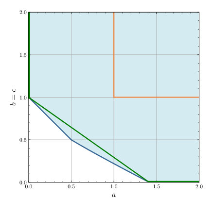
<figcaption class="paper-figure-caption"><b>Fig 1.</b> FIG. 1. Boundaries for different properties of the map in Eq. (6), for the case b = c ≥0 and w = z = 1. The blue-shaded region above the blue boundary corresponds to positivity [see Eq. (30)]; the orange boundary delimits complete positivity; the area above the green segment corresponds to decomposability.</figcaption>
</figure>
<figure class="paper-figure-card">
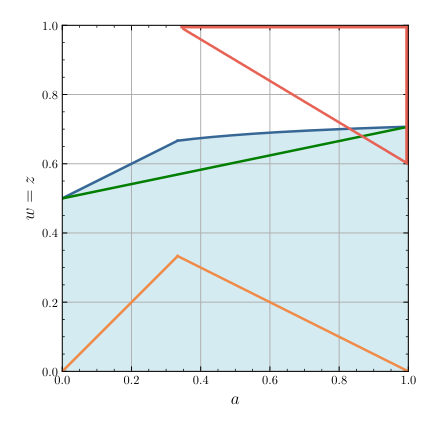
<figcaption class="paper-figure-caption"><b>Fig 2.</b> FIG. 2. Boundaries for different properties of the map in Eq. (6), for the case b = c = (1 −a)/2 and w = z ≥0. The blue-shaded region below the blue roof indicates positivity [see Eq. (44)]; the orange boundary delimits complete positivity; the area below the green segment corresponds to decomposability; the region inside the red triangle shows where the bound in Eq. (72) is violated.</figcaption>
</figure>
<figure class="paper-figure-card">
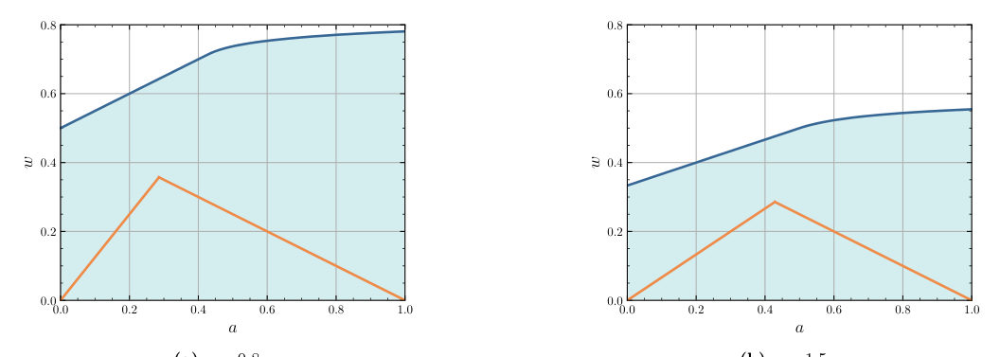
<figcaption class="paper-figure-caption"><b>Fig 3.</b> FIG. 3. Positivity region for the map Φ in Eq. (6), with b = c = (1 −a)/2, w, z ≥0, for two different ratios p = z/w. The blue roof represents the upper boundary of the positivity region, while the orange triangle marks complete positivity.</figcaption>
</figure>
<figure class="paper-figure-card">
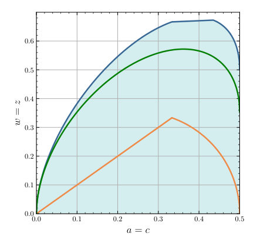
<figcaption class="paper-figure-caption"><b>Fig 4.</b> FIG. 4. Boundaries for different properties of the map in Eq. (6), for the case 0 ≤a = c ≤1/2, b = 1 −2a, and w = z ≥0. The blue-shaded region below the blue curve indicates positivity [see Eq. (54)]; the orange curve delimits the complete-positivity region [see Eq. (55)]; the area below the green ellipse corresponds to decomposability [see Eq. (73)].</figcaption>
</figure>
<figure class="paper-figure-card">
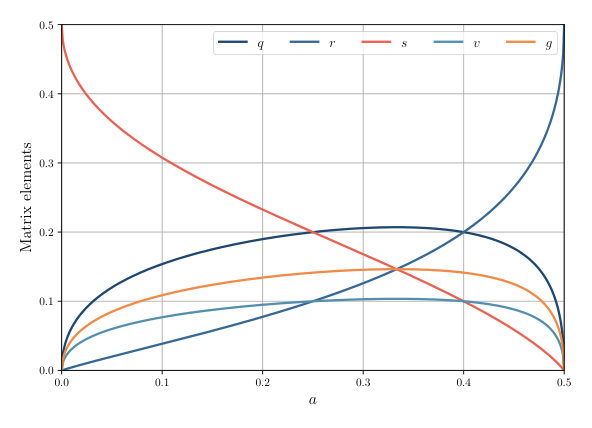
<figcaption class="paper-figure-caption"><b>Fig 5.</b> FIG. 5. Values of the matrix elements of the rank-four bound-entangled state in Eq. (78) as functions of the parameter a.</figcaption>
</figure>

**Summary.** The paper rigorously analyzes the properties of sparse positive maps on qutrits by examining their associated Choi matrices. It determines exact mathematical thresholds that delineate regimes such as positivity, complete positivity, and entanglement types like PPT-entanglement. This provides a highly controlled theoretical framework for understanding quantum resource boundaries.

**Why it may be interesting.** This work provides rigorous mathematical tools to map out complex quantum resource boundaries (like separability vs. bound entanglement) in a controlled, low-dimensional system (qutrits), which is fundamental knowledge for understanding quantum communication protocols.

Detailed structure

**Main problem.** The study aims to explicitly characterize positivity, decomposability, and associated PPT entanglement transitions for a specific family of sparse positive maps acting on qutrits.

**Main result.** The paper derives exact mathematical thresholds defining the boundaries between different physical regimes (e.g., separability vs. bound entanglement) based on the map's parameters.

**Method.** The analysis heavily relies on analyzing the Choi matrix of the quantum map, reducing positivity conditions to solving constraints involving Hermitian biquadratic forms over a simplex.

**Model / system.** The system is defined by a family of linear maps $\Phi: 	ext{B}(\mathbb{C}^3) 	o 	ext{B}(\mathbb{C}^3)$ acting on qutrits. The mathematical structure is parameterized by non-negative real numbers ($a, b, c$) and complex variables ($w, z$).

**Key observables.** Positivity, complete positivity (CP), decomposability thresholds, and the detection of PPT entanglement.

**Important parameters / regimes.** The parameters $a, b, c$ (non-negative real) and $w, z$ (complex) govern the map's properties; specific regimes are analyzed for these variables.

**Assumptions / limitations.** The analysis proceeds by specializing to three distinct parametric families (Case 1, Case 2, and Case 3) to derive explicit boundary functions. It also compares results against spectral bounds for higher-order positivity.

**Figures summary.** Figures illustrate the boundaries in parameter space showing regions corresponding to positivity, complete positivity, and decomposability for different parametric cases (e.g., Fig. 1, Fig. 2).

**Paper structure.** The paper first reviews definitions of positive maps, introduces the qutrit map family $\Phi$ and its Choi matrix $C\Phi$, derives general conditions for CP based on the spectrum, and then analyzes specific parametric cases (Case 1, 2, 3) to determine explicit thresholds for decomposability and entanglement.

Abstract

We study a family of sparse positive maps on qutrits for which positivity, decomposability, and PPT entanglement can all be analysed explicitly. The block structure of the associated Choi matrices reduces positivity to a Hermitian biquadratic form and leads to exact positivity boundaries for three representative parametric families. For the same families we determine the exact transition between decomposable and non-decomposable maps and construct associated PPT states of two classes. The first consists of witness-adapted deformations naturally tied to the non-decomposability analysis. The second consists of analytically tractable families whose full PPT-entangled branch is detected by fixed positive maps, yielding exact thresholds between separability and bound entanglement. For the trace-preserving subclass, we further compare positivity with a recent eigenvalue bound for 2-positive maps, thereby making the gap between positivity and higher-order positivity fully explicit within this family.

[↑ back to top](#top)

### [A Finite-Volume Scheme for the Continuum Extrapolation of Lattice Step-Scaling in (2+1)D Hamiltonian U(1) Gauge Theory](http://arxiv.org/abs/2606.20029v1)

**Authors:** Alessio Negro, Emil Otis Rosanowski, Lena Funcke, Timo Jakobs, Karl Jansen, Paul Ludwig, Carsten Urbach  
**Type:** theory · **Category:** numerical methods · **PDF:** <https://arxiv.org/pdf/2606.20029v1>  
**Analysis basis:** full PDF text, analyzed in chunks
**Topic relevance:** `analog quantum simulation` **2/5** · `methods for driven-dissipative` **1/5**

↔ Scroll figures horizontally

<figure class="paper-figure-card">
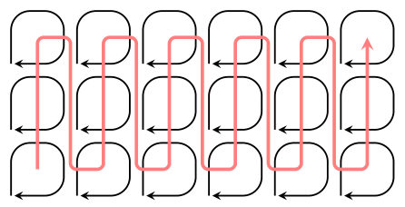
<figcaption class="paper-figure-caption"><b>Fig 1.</b> FIG. 3: Snake ordering of the lattice used in the MPS representation. The two-dimensional plaquette degrees of freedom are mapped to a one-dimensional MPS chain following a snake-like path.</figcaption>
</figure>
<figure class="paper-figure-card">
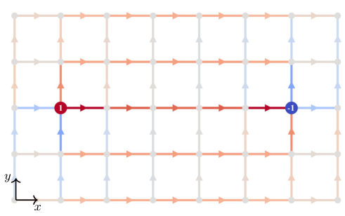
<figcaption class="paper-figure-caption"><b>Fig 2.</b> FIG. 4: Formation of a charged flux tube between two static external sources of opposite sign (red: +1, blue: -1). The electric-energy density localizes along the string connecting the charges.</figcaption>
</figure>
<figure class="paper-figure-card">
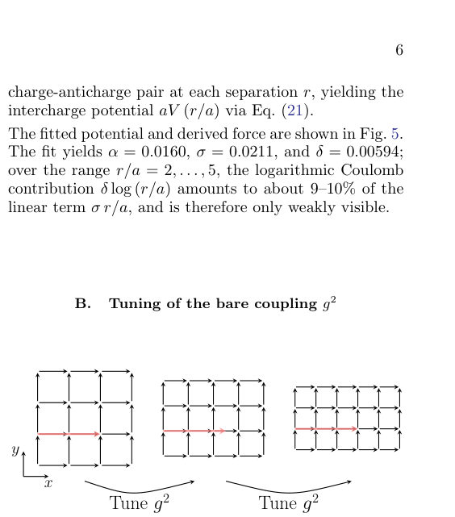
<figcaption class="paper-figure-caption"><b>Fig 3.</b> FIG. 6: Schematic of the finite-volume continuum sequence. The fixed ratio, chosen here for illustration, is r(i) 1 /N (i) x = 1/2, with the physical reference distance kept fixed while Nx is increased at fixed Ny = 3; the values r(i) 1 quoted below are in lattice units and grow as a shrinks. The three lattices shown realize this ratio as r(1) 1 /N (1) x = 2/4 (left), r(2) 1 /N (2) x = (2 × 5/4)/5 (center), and r(3) 1 /N (3) x = (2 × 6/4)/6 (right), illustrating how the continuum limit is approached at fixed physical transverse extent.</figcaption>
</figure>
<figure class="paper-figure-card">
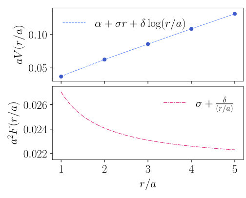
<figcaption class="paper-figure-caption"><b>Fig 4.</b> FIG. 5: Potential (top) and force (bottom) between two static charges as a function of the separation r/a on an 8 × 5 lattice at g2 = 0.5.</figcaption>
</figure>
<figure class="paper-figure-card">
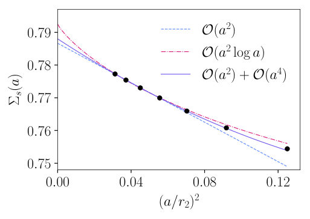
<figcaption class="paper-figure-caption"><b>Fig 5.</b> FIG. 9: Continuum limit extrapolation of the lattice step-scaling function Σs, performed at a truncation level Λ = 1.</figcaption>
</figure>

**Summary.** This work introduces a robust finite-volume scheme for extracting the continuum limit of the step-scaling function in a Hamiltonian U(1) gauge theory. By carefully controlling the ratio between physical scales during extrapolation, the authors demonstrate stable results free from uncontrolled lattice artifacts. This provides a powerful numerical methodology for studying running couplings in quantum field theories.

**Why it may be interesting.** While focused on lattice gauge theory, the rigorous application of MPS and the detailed analysis of controlling systematic errors (finite size/truncation) provide advanced numerical techniques applicable to other strongly correlated quantum systems where continuum limits are required.

Detailed structure

**Main problem.** The primary goal is to develop and apply a finite-volume scheme to perform controlled continuum extrapolations of the lattice step-scaling function for a Hamiltonian U(1) gauge theory.

**Main result.** The proposed fixed-ratio finite-volume scheme successfully yields a stable continuum limit for the step-scaling function, demonstrating control over systematic errors from both finite volume and local basis truncation.

**Method.** The study employs Matrix Product States (MPS) to simulate the lattice Hamiltonian and uses controlled extrapolation procedures by fixing the ratio between physical reference scales along the continuum sequence ($a 	o 0$).

**Model / system.** The system is a pure U(1) gauge theory in (2+1) dimensions, formulated using a dual Hamiltonian approach derived from Kogut-Susskind lattice gauge theory. The simulation utilizes an operator basis represented by MPS.

**Key observables.** Step-scaling function ($\Sigma_s$), static potential ($V(r)$), force-based renormalized coupling ($g_2$).

**Important parameters / regimes.** Lattice spacing ($a$), bare coupling constant ($g_2$), local basis dimension ($\Lambda$), and the fixed ratio of physical scales used for extrapolation.

**Assumptions / limitations.** The method assumes that fixing the ratio between reference distance and lattice extent controls finite-volume effects, and convergence is achieved by analyzing systematic errors from both truncation and volume size.

**Figures summary.** Figures illustrate dualization processes (link to plaquette variables), the necessity of fixing physical ratios for continuum extrapolation, and plots showing potential fits and convergence checks against basis size ($\Lambda$).

**Paper structure.** The paper progresses by first establishing the Hamiltonian formulation via duality, then detailing the step-scaling procedure, and finally implementing the finite-volume scheme to extrapolate results in a controlled manner while analyzing systematic errors from truncation and volume.

Abstract

We propose a finite-volume scheme to perform controlled continuum extrapolations of the lattice step-scaling function, a key ingredient for determining the running coupling in a Hamiltonian lattice gauge theory in small volumes. As a testbed, we employ a dual Hamiltonian formulation of pure U(1) gauge theory in (2+1) dimensions and an operator basis that remains efficient toward weak coupling. We describe the implementation of static external charges on the spatial lattice and study, using matrix product states, the resulting confining string, from which we extract the static potential and a force-based renormalized coupling. Using the proposed finite-volume scheme, we demonstrate a stable continuum limit of the step-scaling function on the lattice sizes accessible to present Hamiltonian simulations. The method is readily extendable to other gauge groups and dimensions, providing a pathway toward Hamiltonian step-scaling studies in other theories.

[↑ back to top](#top)

### [Quantum ring all-reduce: communication and privacy advantages for distributed learning](http://arxiv.org/abs/2606.20344v1)

**Authors:** María Gragera Garcés, Lirandë Pira  
**Type:** theory · **Category:** quantum information and computing · **PDF:** <https://arxiv.org/pdf/2606.20344v1>  
**Analysis basis:** full PDF text, analyzed in chunks
**Topic relevance:** `entanglement & information structure` **2/5**

↔ Scroll figures horizontally

<figure class="paper-figure-card">
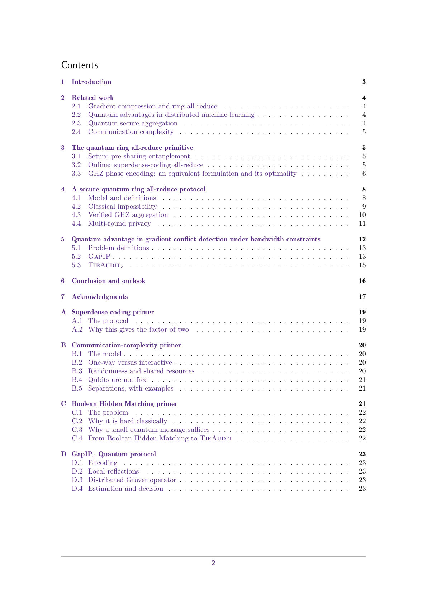
<figcaption class="paper-figure-caption"><b>Fig 1.</b> Low-resolution page preview, page 2</figcaption>
</figure>
<figure class="paper-figure-card">
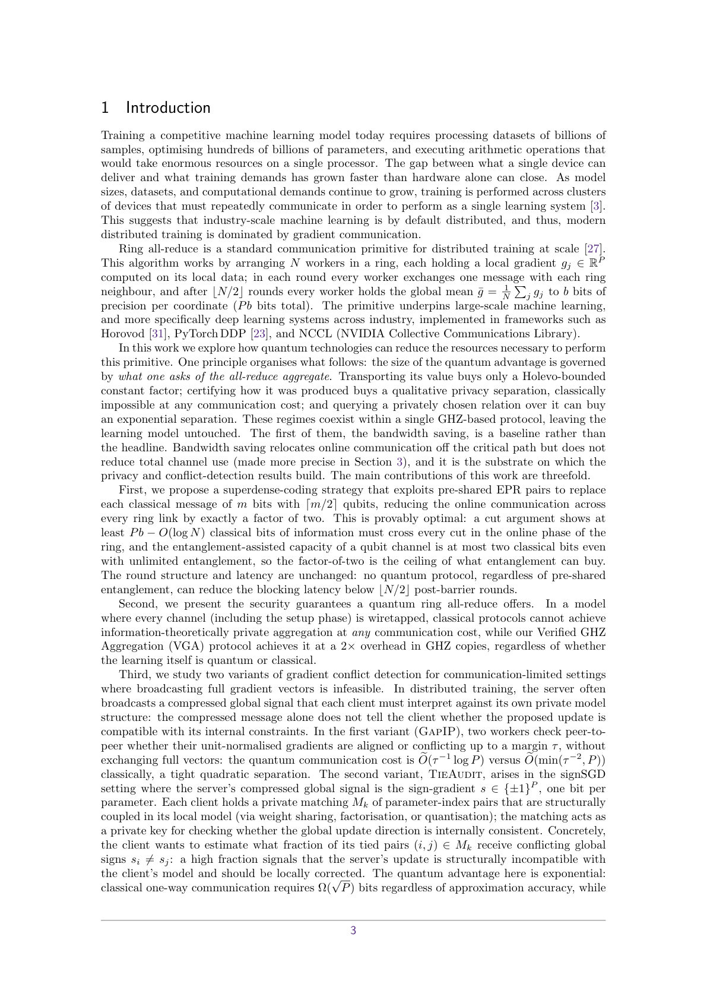
<figcaption class="paper-figure-caption"><b>Fig 2.</b> Low-resolution page preview, page 3</figcaption>
</figure>
<figure class="paper-figure-card">
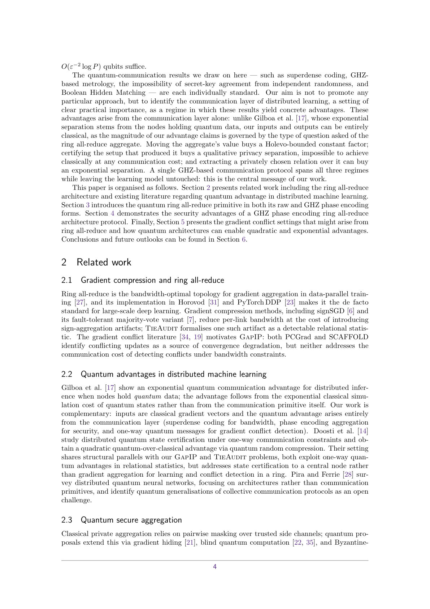
<figcaption class="paper-figure-caption"><b>Fig 3.</b> Low-resolution page preview, page 4</figcaption>
</figure>
<figure class="paper-figure-card">
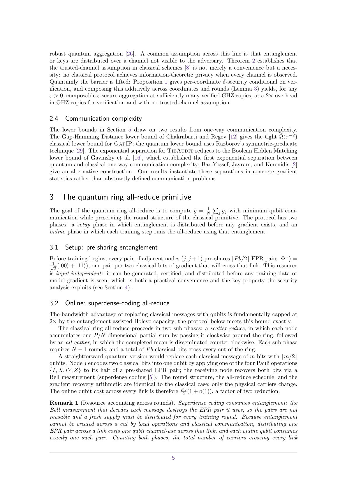
<figcaption class="paper-figure-caption"><b>Fig 4.</b> Low-resolution page preview, page 5</figcaption>
</figure>
<figure class="paper-figure-card">
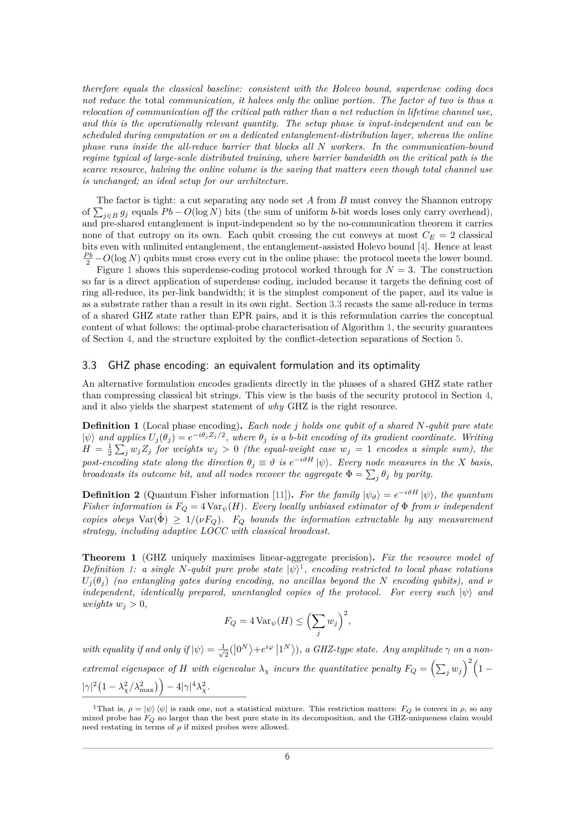
<figcaption class="paper-figure-caption"><b>Fig 5.</b> Low-resolution page preview, page 6</figcaption>
</figure>

**Summary.** This work develops a quantum enhancement for the ring all-reduce primitive used in distributed machine learning. It demonstrates that quantum resources provide provable advantages by halving online communication costs and enabling information-theoretic privacy guarantees unattainable classically. Furthermore, it establishes exponential quantum separations when detecting gradient conflicts.

**Why it may be interesting.** The paper provides a rigorous framework showing how fundamental quantum communication primitives (like entanglement assistance) can solve resource limitations in large-scale computation, which is highly relevant for understanding the limits of distributed quantum algorithms.

Detailed structure

**Main problem.** To enhance distributed machine learning training by making the foundational communication primitive, ring all-reduce, both more communication-efficient and information-theoretically private using quantum communications.

**Main result.** The authors present a quantum ring all-reduce protocol that achieves a provably optimal factor of two reduction in online communication via superdense coding and enables privacy guarantees impossible classically through Verified GHZ Aggregation (VGA).

**Method.** The work combines techniques like pre-shared entanglement, superdense coding for bandwidth savings, and encoding gradients into the phases of shared GHZ states to achieve security proofs.

**Model / system.** The core model is the quantum ring all-reduce primitive applied to $N$ workers holding local gradients. The analysis uses concepts from communication complexity, including comparing classical bit requirements against qubit resources derived from entanglement and GHZ states.

**Key observables.** Communication cost (qubits vs. bits), information leakage ($I(g_j; V_E)$), Quantum Fisher Information ($F_Q$), and the separation factors for conflict detection tasks ($	ext{GapIP}_	au$ and $	ext{TieAudit}_\epsilon$).

**Important parameters / regimes.** The number of workers $N$, the gradient dimension $P$, the privacy error $\epsilon$, and the margin threshold $	au$.

**Assumptions / limitations.** The analysis assumes the availability of pre-shared entanglement (EPR pairs) and relies on asymptotic bounds for security proofs, requiring finite-key corrections for practical deployment.

**Figures summary.** Figure 1 illustrates the superdense-coding protocol for $N=3$ workers, detailing both classical bit costs and quantum qubit costs across different rounds of the all-reduce process.

**Paper structure.** The paper progresses by first establishing bandwidth savings via superdense coding in the ring all-reduce. It then introduces VGA for information-theoretic privacy guarantees. Finally, it analyzes two specific conflict detection tasks ($	ext{GapIP}_	au$ and $	ext{TieAudit}_\epsilon$) to demonstrate exponential quantum advantages.

Abstract

Machine learning models have scaled to unprecedented sizes, making training across distributed devices the de facto standard in the field. In this work, we explore how quantum communications can make distributed training both more communication-efficient and information-theoretically private, for both classical and quantum learning models. Ring all-reduce is the foundational communication primitive for large-scale distributed training. We present a quantum version that reduces per-link online communication by a provably optimal factor of two using pre-shared entanglement and superdense coding, without requiring the learning model or gradient computation to change. Beyond bandwidth, the primitive enables privacy guarantees that are information-theoretically impossible for any classical protocol, achieving composable ε-secure aggregation, via verified entanglement, at a 2x overhead in GHZ copies. Our hybrid quantum-classical communication architecture yields simultaneous communication and security advantages for large scale distributed training, regardless of whether the learning itself is quantum or classical. Finally, we characterise quantum advantages in gradient conflict detection for server-to-client communication under bandwidth constraints, a setting that arises after ring all-reduce is completed, when full gradient broadcast to external clients is infeasible. Two variants of the problem admit different separations. For margin-based alignment testing (\textsc{GapIP}_τ), the quantum advantage is quadratic in the margin parameter: \widetilde{O}(τ^{-1}\log P) qubits versus \widetilde{O}(\min(\τ^{-2},P)) bits. For sign-consistency auditing against a private parameter matching (\textsc{TieAudit}_ε), the advantage represents an exponential separation in communication complexity: Ω(\sqrt{P}) bits whereas O(ε^{-2}\log P) qubits suffice.

[↑ back to top](#top)

### [Vine Codes: Low-Overhead Quantum LDPC Codes on a Planar Square Grid](http://arxiv.org/abs/2606.20263v1)

**Authors:** Georgia M. Nixon, Campbell K. McLauchlan, Charles C. L. van Rest  
**Type:** theory · **Category:** quantum information and computing · **PDF:** <https://arxiv.org/pdf/2606.20263v1>  
**Analysis basis:** full PDF text, analyzed in chunks
**Topic relevance:** `QC/QI experiment` **2/5**

↔ Scroll figures horizontally

<figure class="paper-figure-card">
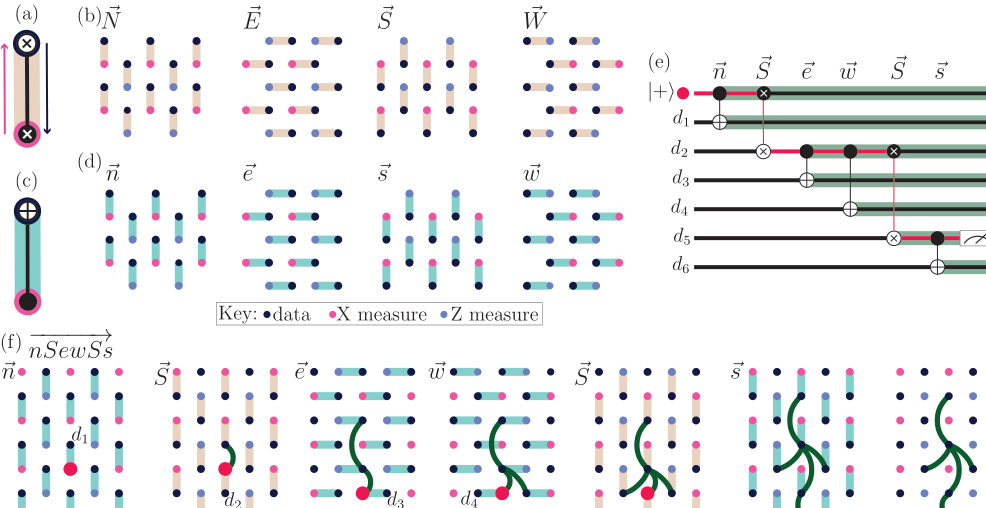
<figcaption class="paper-figure-caption"><b>Fig 1.</b> FIG. 1. Vine codes are defined with qubits on a square lattice where each measure qubit has four nearest neighbour data qubits. (a)-(b) The uppercase steps ⃗N, ⃗E, ⃗S, ⃗W entangle pairs of data and measure qubits via a CXSWAP gate (see (a)) following the data-measure qubit pairings shown in (b). The labels ⃗N, ⃗E, ⃗S and ⃗W refer to cardinal directions that mirror the vector from the measure to the data qubit in each case. A pink X-type measure qubit will control the CXSWAP as in (a), while a blue Z-type measure qubit will be the target of the CXSWAP. (c)-(d) The lowercase steps ⃗n, ⃗e, ⃗s, ⃗w entangle pairs of data and measure qubits via a CX gate (see (c)), where now no qubits move. The...</figcaption>
</figure>
<figure class="paper-figure-card">
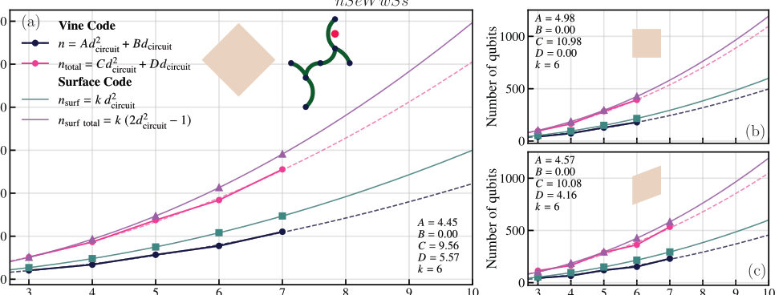
<figcaption class="paper-figure-caption"><b>Fig 2.</b> FIG. 2. The qubit overhead scaling of the −−−−−−−→ nSeWwSs vine code for three different open boundary geometries, each encoding k = 6 logical qubits. The stabiliser support is indicated schematically by the green vine and red measure qubit in (a). The brown shape at the top of each subfigure indicates the open boundary geometry. For each boundary geometry (see Fig. 5), we plot the total number of qubits ntotal (including data, measure and routing qubits) and number of data qubits n needed to create a patch of circuit distance dcircuit, comparing these to the total number of qubits and data qubits, respectively, needed for k surface codes with the same distance. We fit the vine code ntotal...</figcaption>
</figure>
<figure class="paper-figure-card">
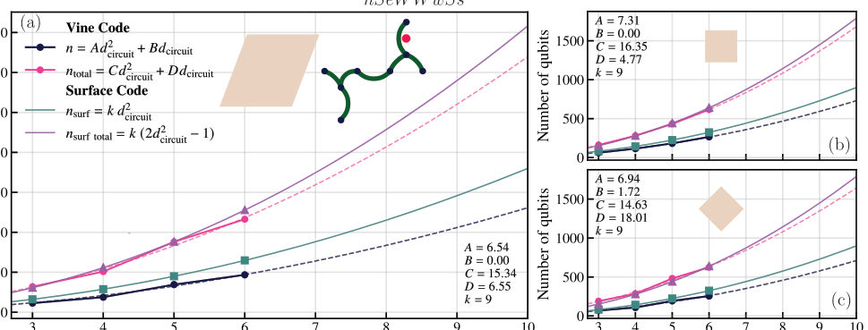
<figcaption class="paper-figure-caption"><b>Fig 3.</b> FIG. 3. The qubit overhead scaling for three different open boundary patches of the −−−−−−−−−→ nSeWWwSs vine code, each encoding k = 9 logical qubits. (a) Horizontal parallelogram. (b) Square. (c) Rotated.</figcaption>
</figure>
<figure class="paper-figure-card">
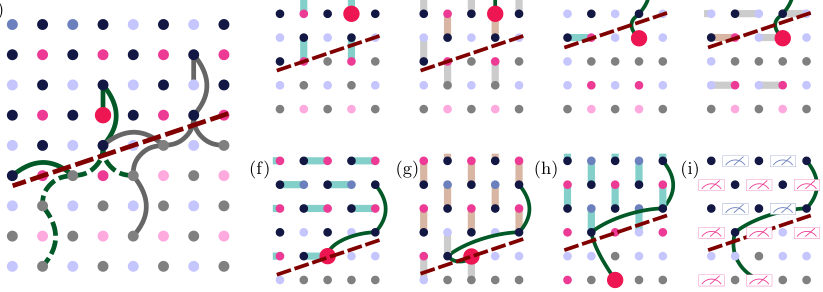
<figcaption class="paper-figure-caption"><b>Fig 4.</b> FIG. 4. An example of an X-type boundary for the −−−−−−−→ nSeWwSs code (red dashed line). Black dots indicate data qubits, solid blue/pink dots indicate Z/X measure qubits that are used for stabiliser measurements and remaining light grey/blue/pink dots indicate routing qubits that originated as data/Z/X qubits before introducing the boundary. (a) An X-type stabiliser that intersects the boundary is truncated to its support on data qubits above the boundary (green vine, dashed below the boundary). A Z-type stabiliser that intersects the boundary is removed from the stabiliser group (grey vine). (b)-(i) The syndrome measurement circuit close to the boundary is shown. The green truncated...</figcaption>
</figure>
<figure class="paper-figure-card">
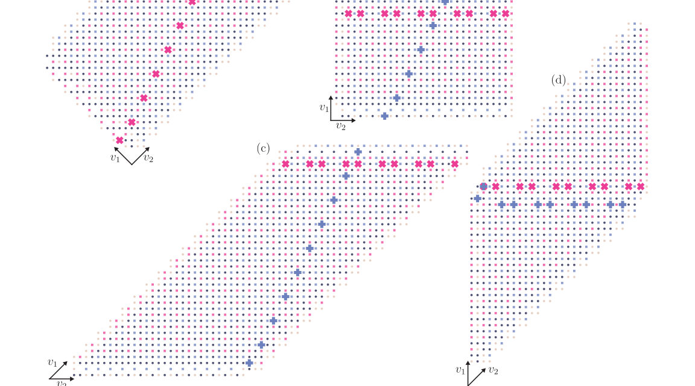
<figcaption class="paper-figure-caption"><b>Fig 5.</b> FIG. 5. The −−−−−−−→ nSeWwSs code with d = 10 for four boundary geometries: rotated, square, horizontal parallelogram and vertical parallelogram. Each example has the same boundary types, i.e. an X-type (Z-type) along the boundaries parallel to v1 (v2). The boundary geometry given by the unit vectors of v1 and v2 in each case has a significant effect on the number of qubits required to achieve d = 10 (see Table II). We show an X- (Z)-logical representative for each patch with pink crosses (blue crosses). Lower-distance patches showed no hook errors for the same four geometries (d = dcircuit; see Table I). Therefore, we would expect the logical supports presented here to also represent the...</figcaption>
</figure>

**Summary.** This paper introduces 'Vine Codes,' a novel class of low-overhead Quantum LDPC codes designed specifically for implementation on planar superconducting qubit grids. By utilizing nearest-neighbor gates and incorporating routing qubits, these codes significantly reduce the physical qubit overhead compared to established methods like the surface code while maintaining high error correction performance under realistic noise conditions.

**Why it may be interesting.** This work directly addresses hardware constraints in quantum computing by proposing a resource-efficient alternative to the standard surface code architecture for fault tolerance.

Detailed structure

**Main problem.** The primary challenge is developing quantum error-correcting codes (QEC) that significantly reduce qubit overhead compared to the surface code while remaining physically implementable on superconducting hardware.

**Main result.** Vine Codes are introduced as a novel class of qLDPC codes that achieve up to ~28% reduction in data/measure qubits and fewer total qubits than the surface code at comparable circuit distances, even including routing overheads.

**Method.** The authors use extensive numeric searches and systematic construction techniques to define these planar codes, generalizing previous work by incorporating open boundary conditions via 'routing qubits'.

**Model / system.** The system is modeled using superconducting qubits on a planar square grid, restricted to nearest-neighbor two-qubit gates (iSWAP and CZ). The code structure involves defining data and measure qubits supporting X and Z stabilizers.

**Key observables.** Qubit overhead reduction percentage, circuit distance ($d_{	ext{circuit}}$), total number of required qubits, and performance under realistic noise models.

**Important parameters / regimes.** Near-term noise rate ($10^{-3}$), circuit distance (e.g., 7 or 10), and the code structure parameters (e.g., [[121,4,6]]).

**Assumptions / limitations.** The analysis assumes a superconducting platform favoring nearest-neighbor gates; specific assumptions are made regarding the non-existence of certain error vectors to ensure code validity.

**Figures summary.** Figures illustrate vine codes on a square lattice, show qubit overhead scaling comparisons against surface codes for various boundary geometries (parallelograms), and detail circuit construction steps using SWAP/CXSWAP gates.

**Paper structure.** The paper progresses from introducing the need for low-overhead planar QEC codes to defining Vine Codes, detailing their structure via step sequences, analyzing boundary conditions (Pauli boundaries), optimizing circuits by removing redundant gates, and finally simulating performance under noise.

Abstract

The surface code is a promising route towards large-scale quantum computing, requiring only nearest-neighbour gates amenable to superconducting hardware. However, surface codes incur large qubit overheads. Novel quantum low-density parity check (qLDPC) codes promise to reduce overheads but require long-range connections that are difficult to achieve on superconducting platforms. Here, we introduce "Vine Codes" - qLDPC codes that are implementable on a planar square grid through nearest-neighbour, two-qubit gates native to superconducting platforms (iSWAP and CZ). Our approach generalises "Directional Codes" recently introduced by Gehér et. al. (2025) which are constrained to a torus. In contrast, vine codes have open boundary conditions constructed with the aid of routing qubits. We perform extensive numeric searches and find promising candidate vine codes, e.g. [[121,4,6]], [[221,6,7]], and [[234,9,6]] codes. We verify the circuit distances and show that data and measure qubits required can be reduced by up to ~28% relative to the surface code at a circuit distance of 7. Even including routing qubits, vine codes require fewer total qubits than the surface code (e.g. ~18% reduction at circuit distance 10) and benefits are expected to increase at higher distances. We perform circuit-level noise simulations to demonstrate that under a realistic noise model and at a near-term noise rate of $10^{-3}$, vine codes can perform better than the surface code while using fewer qubits. We give an exhaustive list of all unique vine codes up to stabiliser-weight 9. We additionally introduce "Flip-Vine Codes" which possess single-qubit transversal Clifford gates useful for fault-tolerant logic and magic state cultivation. We furthermore construct examples of generalised open boundaries for vine codes that go beyond the familiar X/Z boundaries of the surface and tile codes.

[↑ back to top](#top)

### [Anomalous Transverse Response in Nodal line Semimetal Mn$_{3}$SnC](http://arxiv.org/abs/2606.20182v1)

**Authors:** Sunil Gangwar, C. S. Yadav  
**Type:** both · **Category:** strongly correlated electrons · **PDF:** <https://arxiv.org/pdf/2606.20182v1>  
**Analysis basis:** full PDF text, analyzed in chunks
**Topic relevance:** `Keldysh / 2PI / non-Gaussian methods` **1/5** · `analog quantum simulation` **1/5** · `non-equilibrium dynamics` **1/5** · `spintronics-quantum-optics interface` **1/5**

↔ Scroll figures horizontally

<figure class="paper-figure-card">
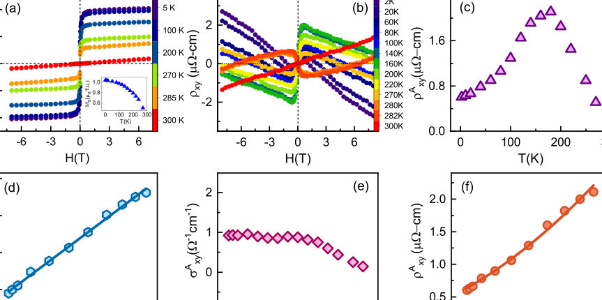
<figcaption class="paper-figure-caption"><b>Fig 1.</b> Figure 1. (a) Magnetic field dependent magnetization M at different temperatures. (b) Magnetic field dependent Hall resistivity ρxy at different temperatures. (c) Temperature dependent anomalous Hall resistivity ρA xy. (d) The plot of log ρA xy and log ρxx data, solid black line indicating the fit using the relation ρA xy ∝ργ xx. (e) Temperature dependent anomalous Hall conductivity σA xy. (f) The plot between ρA xy and ρxx, solid line representing the fit using Eq.(3).</figcaption>
</figure>
<figure class="paper-figure-card">
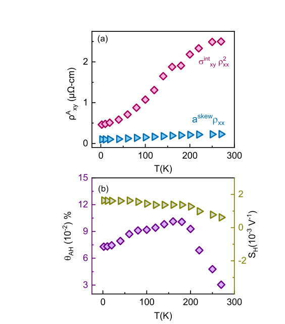
<figcaption class="paper-figure-caption"><b>Fig 2.</b> Figure 2. (a) Extrinsic (askewρxx) and intrinsic (σint xy ρ2 xx) con- tribution in ρA xy as a function of temperature. (b) Temper- ature dependent anomalous Hall angle θAH and anomalous scaling coefficient SH.</figcaption>
</figure>
<figure class="paper-figure-card">
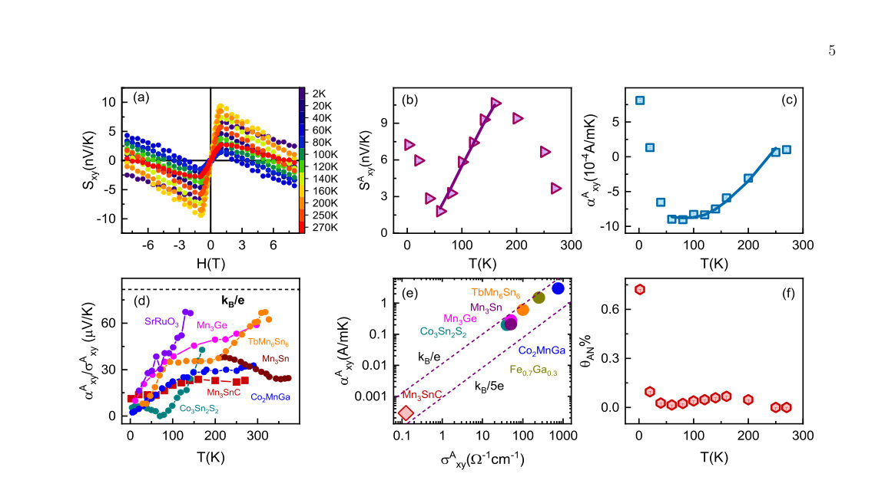
<figcaption class="paper-figure-caption"><b>Fig 3.</b> Figure 3. (a) Magnetic field dependent Nernst signal Sxy at different temperatures. (b) Temperature dependent anomalous Nernst signal SA xy, solid line representing the fit using Eq. (6). (c) Temperature dependent anomalous Nernst conductivity αA xy, solid line representing the fit using Eq. (7). (d) The ratio |αA xy/σA xy| as a function of temperature in different magnets including Mn3Sn [30], Mn3Ge [31], SrRuO3 [32], Co2MnGa [33], Co3Sn2S2 [34], TbMn6S6 [35] and Mn3SnC. (e) Plot between αA xy and σA xy for Mn3SnC and other reported materials at room temperature (Mn3SnC and Co3Sn2S2 are taken at 270 K and 170 K, respectively because of the magnetic order. (f) Anomalous Nernst angle θAN as a...</figcaption>
</figure>

**Summary.** This work reports on anomalous transport in the magnetic nodal-line semimetal $	ext{Mn}_3	ext{SnC}$. By analyzing both AHE and ANE, the authors demonstrate that these effects originate primarily from the intrinsic Berry curvature mechanism. This finding is significant because it provides strong evidence for topological contributions to electronic transport in magnetically ordered materials.

**Why it may be interesting.** While focused on condensed matter magnetism and topology, the rigorous separation of transport mechanisms (intrinsic vs. extrinsic) using scaling arguments is a powerful diagnostic tool applicable across many-body physics systems where subtle quantum corrections are expected.

Detailed structure

**Main problem.** The study investigates anomalous transport behaviors, specifically the Anomalous Hall Effect (AHE) and Anomalous Nernst Effect (ANE), in a magnetic nodal-line semimetal.

**Main result.** Both AHE and ANE are found to be predominantly governed by intrinsic Berry-curvature effects. The ratio of ANE/AHE conductivity is a sizable fraction of k_B/e, confirming this topological origin.

**Method.** The authors combine magnetotransport measurements with theoretical analysis, using scaling relations ($
ho_{A,xy} \propto 
ho^{\gamma}_{xx}$) to separate intrinsic (Berry curvature) and extrinsic scattering contributions.

**Model / system.** The physical system is the antiperovskite $	ext{Mn}_3	ext{SnC}$, which functions as a nodal-line semimetal exhibiting coexisting antiferromagnetic (AFM) and ferromagnetic (FM) magnetic ordering.

**Key observables.** Anomalous Hall resistivity ($
ho_{A,xy}$), Anomalous Nernst conductivity ($\alpha_{A}^{xy}$), the ratio $|\alpha_{A}^{xy}/\sigma_{A}^{xy}|$, and temperature/field dependence of these quantities.

**Important parameters / regimes.** Temperature range ($2 - 300 	ext{ K}$), magnetic field up to $8 	ext{ T}$, and the characteristic energy scale set by $k_B/e$.

**Assumptions / limitations.** The analysis assumes that anomalous transport can be decomposed into intrinsic (Berry curvature) and extrinsic scattering contributions, and utilizes Mott's relation to link AHE and ANE.

**Figures summary.** Figures illustrate the temperature dependence of magnetizations, $
ho_{Axy}$ vs $
ho_{xx}$ plots separating skew and intrinsic contributions, and Nernst signal dependencies on magnetic field and temperature.

**Paper structure.** The paper systematically analyzes transport measurements to separate AHE origins (skew vs. intrinsic) using scaling laws, then extends this analysis to the ANE by relating it to AHE via Mott's relation, concluding that Berry curvature dominates both effects.

Abstract

The interplay of topological surface states and magnetism gives rise to unconventional transport behaviors such as the anomalous Hall effect (AHE) and anomalous Nernst effect (ANE). Antiperovskites such as Mn$3$SnC, which are nodal-line semimetals and exhibit concurrent antiferromagnetic (AFM) and ferromagnetic (FM) ordering, provide a fertile ground for anomalous transport phenomena. Here, we report that the anomalous transport (AHE and ANE) in this compound is predominantly governed by the intrinsic Berry-curvature effect. We establish a unified relationship between the AHE and ANE using Mott's relation. Electron scattering by both AFM and FM magnons is manifested in the anomalous Nernst signal. The ratio of the anomalous Nernst conductivity to the anomalous Hall conductivity, $|α^A{xy}|/σ^A_{xy}$, constitutes a sizable fraction of $k_B/e$, indicating a strong Berry-curvature contribution to the ANE.

[↑ back to top](#top)

### [Critical Percolation as a Synthetic Data Model for Interpretability](http://arxiv.org/abs/2606.20347v1)

**Authors:** Aryeh Brill, Tom Ingebretsen Carlson  
**Type:** both · **Category:** disordered systems and neural networks · **PDF:** <https://arxiv.org/pdf/2606.20347v1>  
**Analysis basis:** full PDF text, analyzed in chunks
**Topic relevance:** `driven-dissipative phase transition` **1/5** · `methods for driven-dissipative` **1/5** · `non-equilibrium dynamics` **1/5** · `non-equilibrium universality` **1/5**

↔ Scroll figures horizontally

<figure class="paper-figure-card">
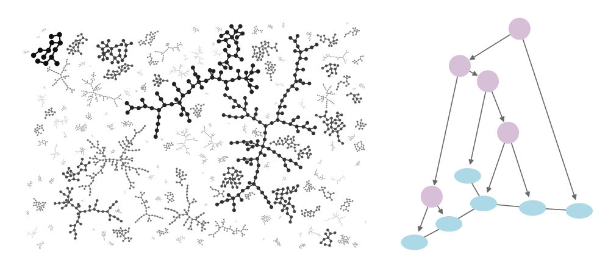
<figcaption class="paper-figure-caption"><b>Fig 1.</b> Figure 1. The percolation data model. (a) Inputs are distributed as self-similar fractal clusters with power-law sizes. (b) Targets are generated by hierarchical latent variables decomposing each cluster.</figcaption>
</figure>
<figure class="paper-figure-card">
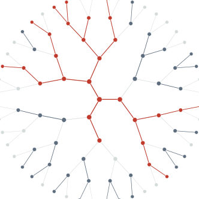
<figcaption class="paper-figure-caption"><b>Fig 2.</b> Figure 2. Bethe lattice percolation. Red: infinite cluster. Blue: finite clusters.</figcaption>
</figure>
<figure class="paper-figure-card">
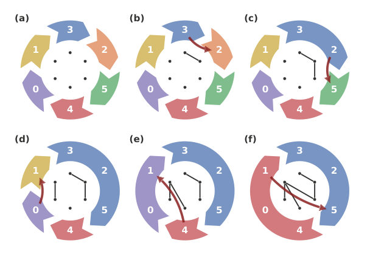
<figcaption class="paper-figure-caption"><b>Fig 3.</b> Figure 3. Example run of the cyclic coalescent. (a) Initialize nodes in a random cycle. (b–f) At each step, connect a random node to a random node in its block’s successor, merging those blocks.</figcaption>
</figure>
<figure class="paper-figure-card">
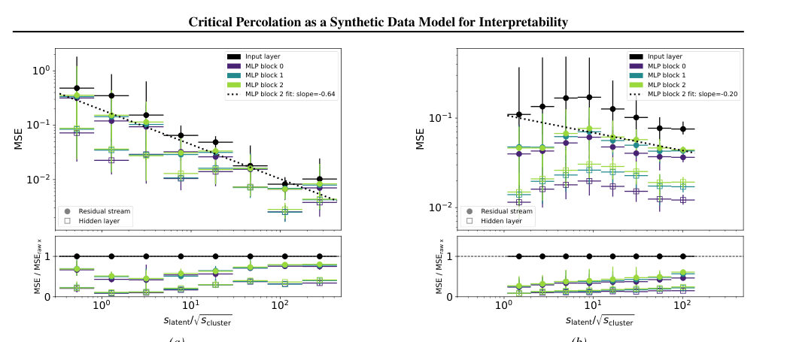
<figcaption class="paper-figure-caption"><b>Fig 4.</b> Figure 4. Per-latent linear probe performance for individual latent values zi, showing (a) the one-cluster dataset and (b) the multi-cluster dataset. Dots (squares) mark the median MSE for the residual stream (hidden activations). Error bars show 25th and 75th percentiles. The ratio panels show each layer’s per-latent MSE normalized by the MSE of probes trained on the raw input.</figcaption>
</figure>
<figure class="paper-figure-card">
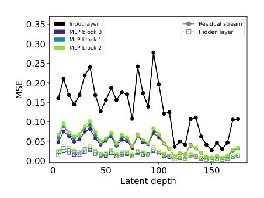
<figcaption class="paper-figure-caption"><b>Fig 5.</b> Figure 5. Linear probe recovery of latent values zi for the one- cluster dataset, stratified by latent depth.</figcaption>
</figure>

**Summary.** This paper introduces critical percolation as a principled synthetic data model to test the limits of neural network interpretability. By generating data from sparse, self-similar fractal clusters whose structure is governed by random trees, the authors demonstrate that ground-truth hierarchical latent variables can be successfully decoded using linear probes on trained MLPs.

**Why it may be interesting.** The rigorous connection between statistical physics concepts (critical phenomena, fractal geometry) and machine learning diagnostics provides a powerful, physically motivated benchmark for understanding feature representations in deep networks.

Detailed structure

**Main problem.** Existing synthetic datasets for interpretability lack the complex, multi-scale structure found in natural data. The goal is to create a principled testbed that incorporates realistic structural features.

**Main result.** Critical percolation provides such a testbed because its inherent properties—sparsity, self-similarity, and power-law statistics—allow ground-truth latent variables to be linearly decoded from neural network activations.

**Method.** The authors generate data by embedding nodes on critical mean-field percolation clusters, whose structure is mathematically mapped to random trees using an efficient cyclic coalescent algorithm. They then train MLPs and test linear decoding of the underlying hierarchical latent variables.

**Model / system.** The model uses site percolation on a lattice approximated by the Bethe lattice in the critical regime ($p=p_c$). Data points are derived from sparse, low-dimensional fractal clusters whose target values are generated by a hierarchical latent variable decomposition based on the cluster's underlying random tree structure.

**Key observables.** Linear decoding performance ($	ext{R}^2$, MSE) of ground-truth latent variables; Cluster size distribution (power law $\propto s^{-5/2}$); Fractal dimension ($D < d$).

**Important parameters / regimes.** Critical probability $p_c$; Embedding dimension $d$; Latent variable depth; Figure of Merit ($	ext{FOM} \equiv s_{	ext{latent}} / \sqrt{s_{	ext{cluster}}}$).

**Assumptions / limitations.** The model relies on the mean-field approximation ($d \gg u$) and assumes that targets follow a simple hierarchical construction. It also notes limitations regarding modeling compositional relationships.

**Figures summary.** Figures illustrate the percolation data generation (fractal clusters, latent decomposition), validation of the cyclic coalescent process using Prüfer sequences and degree distributions, and probe performance comparing one-cluster vs. multi-cluster datasets.

**Paper structure.** The paper first establishes the need for structured synthetic data. It then details the mathematical construction based on critical mean-field percolation clusters and their equivalence to random trees via coalescent processes. Finally, it applies this model by generating datasets (one/multi-cluster) and testing interpretability methods using linear probing of trained MLPs.

Abstract

Neural networks learn features that reflect the hierarchical, multi-scale structure of natural data. Synthetic datasets used to evaluate interpretability methods typically lack this structure, limiting their value as realistic toy models. To close this gap, we introduce a family of synthetic datasets consisting of hierarchical functions defined on critical mean-field percolation clusters embedded in a high-dimensional data space. The percolation data consists of sparse, low-dimensional fractal clusters with a power-law size distribution. Latent variables modeling a taxonomic hierarchy generate each data point's target value. The data model is analytically tractable with known critical exponents that fix its properties without requiring hyperparameter tuning. We leverage a mapping between percolation clusters, random trees, and additive coalescence to propose an almost linear-time algorithm to jointly sample a random tree and its hierarchical latent decomposition, enabling data generation at arbitrary scale. Using probing experiments, we find that the model's ground-truth latent variables can be linearly decoded from neural network activations. Together, sparsity, self-similarity, power-law statistics, and analytical tractability make critical percolation a principled testbed for interpretability research.

[↑ back to top](#top)

### [Distinguishing quantum processes with bounded coherent memory](http://arxiv.org/abs/2606.19511v1)

**Authors:** Magdalini Zonnios, Felix C. Binder  
**Type:** theory · **Category:** quantum information and computing · **PDF:** <https://arxiv.org/pdf/2606.19511v1>  
**Analysis basis:** full PDF text, analyzed in chunks
**Topic relevance:** `correlated / nonlocal dissipation` **1/5** · `driven-dissipative phase transition` **1/5** · `entanglement & information structure` **1/5** · `methods for driven-dissipative` **1/5**

↔ Scroll figures horizontally

<figure class="paper-figure-card">
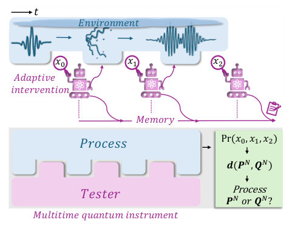
<figcaption class="paper-figure-caption"><b>Fig 1.</b> Figure 1. Multi-time process discrimination as an oper- ational task. An experimenter probes a process at several times, stores information in memory, and obtains an outcome record (x0, x1, x2). Equivalently, a tester, i.e. a multi-time quantum instrument, is inserted into the slots of a process comb to produce statistics used to decide whether the pro- cess was PN or QN.</figcaption>
</figure>
<figure class="paper-figure-card">
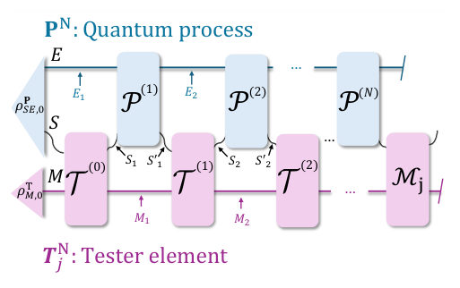
<figcaption class="paper-figure-caption"><b>Fig 2.</b> Figure 2. A quantum process over N time steps can be rep- resented as a quantum comb PN (blue), with open “slots” on the system where interventions may be performed. A multi- time tester {TN j }j (pink) is a correlated sequence of opera- tions (potentially with memory) inserted into these slots to produce an outcome j. Without loss of generality, any tester can be written as a sequence of CPTP maps followed by a final quantum instrument {Mj}j, so that all intermediate measurements can be deferred to a single measurement at the end. The number of possible outcomes grows as the product of the number of outcomes at each time step, and is therefore generally exponential in N. Contracting a...</figcaption>
</figure>
<figure class="paper-figure-card">
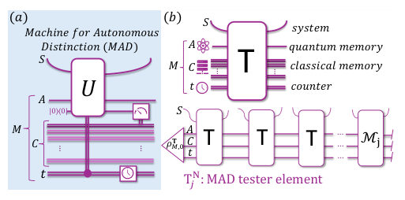
<figcaption class="paper-figure-caption"><b>Fig 3.</b> Figure 3. (a) A machine for autonomous distinction (MAD) is a probing device modelled as a quantum instrument act- ing on the system and a coherent ancillary memory. Each use of the instrument can be realized by a unitary interaction with an auxiliary probe followed by a projective measurement on the probe, its nonselective action being CPTP. In the au- tonomous implementation shown here, the unitary acts on the system and quantum memory, while a classical counter spec- ifies which output register stores the outcome and, if desired, allows explicit time dependence to be encoded internally. (b) A MAD tester is obtained by repeatedly applying the same MAD to the process slots as a special...</figcaption>
</figure>
<figure class="paper-figure-card">
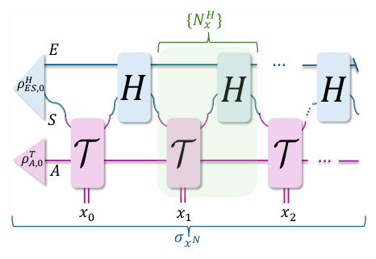
<figcaption class="paper-figure-caption"><b>Fig 4.</b> Figure 4. A recurrent process hypothesis probed by a MAD tester. The recurrent process HH (blue) is obtained by re- peatedly applying H which interacts with a persistent envi- ronment E, while a fixed quantum instrument {T (x)}x (pur- ple) acts jointly on the system and quantum memory A at each time step. The instrument produces a classical outcome xk that is stored, generating a trajectory x0:N, while the sys- tem and memory evolve coherently. The induced single-step maps {N T,H x }x (highlighted in green) also correspond to a quantum instrument and describe the joint action of the pro- cess and tester at each step, and generate the branchwise states ˆσT,H x0:N .</figcaption>
</figure>
<figure class="paper-figure-card">
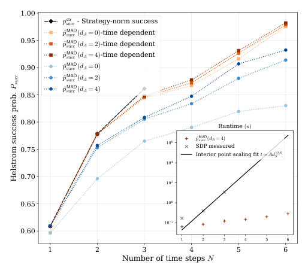
<figcaption class="paper-figure-caption"><b>Fig 5.</b> Figure 5. Helstrom success probability pMAD succ for numer- ically optimized MAD testers distinguishing the repeated- interaction processes generated by the unitaries in Eq. (40), with θP = 0.2 and θQ = 0.5, compared with the strategy- norm success benchmark. Increasing the coherent ancilla di- mension dA ∈{0, 2, 4}, for a time-dependent strategy (orange lines), or time-independent strategy (blue lines), systemati- cally improves performance, illustrating the coherent-memory MAD hierarchy and its convergence toward the strategy-norm benchmark. For fixed coherent ancilla dimension dA = 0 (no coherent memory), allowing explicit time dependence through a classical counter substantially...</figcaption>
</figure>

**Summary.** The paper addresses the difficulty of distinguishing complex, multi-time quantum processes due to exponentially scaling computational requirements. It introduces 'Machines for Autonomous Distinction' (MADs), which restrict testing strategies based on a bounded coherent memory dimension ($d_A$). This results in a scalable distinguishability measure that provides an operational lower bound on the true optimal discrimination capability.

**Why it may be interesting.** This work provides a crucial bridge between theoretically optimal but computationally intractable measures (like the strategy norm) and practically measurable quantities by quantifying the role of finite quantum memory in process characterization.

Detailed structure

**Main problem.** The core problem is developing a computationally tractable measure for distinguishing between two multi-time quantum processes ($P_N$ vs $Q_N$) when the optimal strategy requires an exponentially large coherent memory.

**Main result.** The introduction of Machines for Autonomous Distinction (MADs) provides a scalable, memory-constrained distinguishability measure that is proven to saturate the full strategy-norm benchmark as the available coherent memory dimension increases.

**Method.** The authors restrict the set of admissible probing strategies to those compatible with bounded coherent memory ($d_A$), leading to a memory-parametrized distinguishability measure $d^{(N)}_{\mathsf{MAD}}$.

**Model / system.** The study analyzes multi-time quantum processes, modeled using process tensors or quantum combs ($	ext{P}_N$), which represent the input-output behavior over sequential time steps via CPTP maps.

**Key observables.** Memory-parametrized distinguishability measure ($d^{(N)}_{\mathsf{MAD}}$), strategy-norm distance ($d_{	ext{str}}$), and the success probability of discrimination ($p^*_{	ext{succ}}$).

**Important parameters / regimes.** Coherent memory dimension ($d_A$), number of time steps ($N$), and the process tensors ($\mathbf{P}^N, \mathbf{Q}^N$).

**Assumptions / limitations.** The primary assumption is that restricting the tester to bounded coherent memory ($d_A$) provides a useful operational lower bound on the true distinguishability, which can be shown to converge to the full benchmark for finite $N$.

**Figures summary.** Figures illustrate multi-time process discrimination as an operational task involving sequential probing and memory storage; one figure shows the interaction between a quantum comb ($	ext{PN}$) and a multi-time tester ($\{	ext{T}^j_N\}_j$).

**Paper structure.** The paper first establishes the limitations of the full strategy-norm distance, then introduces MADs as a memory-constrained alternative. It develops theoretical results showing monotonicity and completeness, derives single-step descriptions for recurrent processes, and concludes with numerical evidence demonstrating scalability.

Abstract

Distinguishing multi-time quantum processes is a fundamental task underlying the diagnosis, benchmarking, and learning of temporally correlated quantum dynamics. The standard benchmark for distinguishing two processes is the strategy-norm distance, which optimizes over arbitrary adaptive probing strategies but can require large coherent memory and time-dependent control. We introduce machines for autonomous distinction~($\mathsf{MAD}$s): probing strategies that apply the same quantum instrument at each time step, retain the full classical outcome record, and carry a coherent memory of dimension $d_A$. Optimizing over these strategies defines a memory-parametrized distinguishability measure, $d^{(N)}_{\mathsf{MAD}}(\mathbf{P}^N,\mathbf{Q}^N;d_A)$. We show that the resulting hierarchy is monotone in coherent memory and complete at finite times. Specifically, any admissible $N$-step probing strategy can be compiled into a single $\mathsf{MAD}$ with an internal counter and sufficiently large coherent memory, so the hierarchy saturates the strategy-norm benchmark. For recurrent processes generated by repeated system--environment interactions, we derive a single-step description that separates the generation of new distinguishing information from the propagation and decay of information generated at earlier times. Numerical results in a repeated-interaction model show that increasing coherent memory systematically improves the $\mathsf{MAD}$ success probability and closes the gap to the strategy-norm distance while remaining substantially more tractable to evaluate. $\mathsf{MAD}$ distinguishability therefore provides an operational and scalable framework for quantifying what can be learned about genuinely multi-time quantum processes with bounded coherent memory.

[↑ back to top](#top)

### [GPU-accelerated semidefinite programming for causal games](http://arxiv.org/abs/2606.20519v1)

**Authors:** Emanuel-Cristian Boghiu, Kyrylo Simonov  
**Type:** theory · **Category:** quantum information and computing · **PDF:** <https://arxiv.org/pdf/2606.20519v1>  
**Analysis basis:** full PDF text, analyzed in chunks
**Topic relevance:** `driven-dissipative phase transition` **1/5** · `entanglement & information structure` **1/5** · `methods for driven-dissipative` **1/5**

↔ Scroll figures horizontally

<figure class="paper-figure-card">
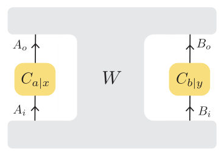
<figcaption class="paper-figure-caption"><b>Fig 1.</b> FIG. 1. Schematic representation of the bipartite scenario within the process matrix formalism. Given local instruments Ca|x and Cb|y, the process matrix W assigns joint probabilities p(ab|xy) = tr[W(Ca|x⊗Cb|y)] for all settings x, y and outcomes a, b.</figcaption>
</figure>
<figure class="paper-figure-card">
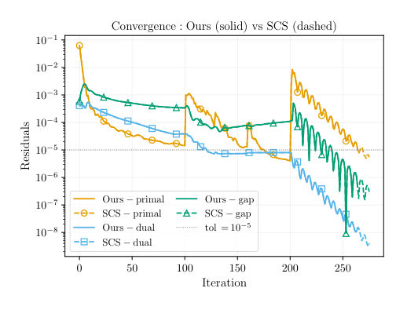
<figcaption class="paper-figure-caption"><b>Fig 2.</b> FIG. 2. Residual evolution for a representative process-matrix SDP with local dimension d = 4. The reference implemen- tation is SCS 3.2.11 with all default settings, except that data normalization is disabled in both solvers. The residual histories agree almost exactly on an iteration-by-iteration ba- sis, confirming that the implementations produce the same ADMM iterates. The discrepancy in the final iteration number is due solely to the termination-check frequency: SCS eval- uates convergence every 25 iterations and therefore reports residuals up to iteration 275, whereas our implementation checks convergence every iteration and terminates at iteration 264.</figcaption>
</figure>

**Summary.** This work uses GPU-accelerated Semidefinite Programming to study quantum correlations violating definite causal order via the GYNI game. The authors test if increasing local dimension improves the achievable bound but find diminishing returns. This suggests that improving the theoretical upper bound or finding fundamentally different strategies is necessary.

**Why it may be interesting.** It provides advanced computational techniques (GPU-accelerated SDP solving) to probe fundamental questions about causality in quantum mechanics, which is highly relevant for understanding resource theories beyond standard entanglement.

Detailed structure

**Main problem.** The research investigates whether increasing the local dimension ($d$) can narrow the gap between the best known process-matrix strategy value ($\approx 0.6218$) and the strongest upper bound for correlations violating definite causal order in the Guess-Your-Neighbour's-Input (GYNI) game.

**Main result.** The study found no significant improvement in the winning probability when increasing the local dimension up to $d=8$, suggesting that either qualitatively different strategies are needed or the known upper bound is not tight.

**Method.** Optimization relies on formulating the problem as a sequence of Semidefinite Programs (SDPs) solved using a see-saw optimization scheme, significantly accelerated by offloading the projection onto the positive-semidefinite cone to a GPU.

**Model / system.** The study analyzes quantum correlations described by the process matrix formalism, which models scenarios lacking a fixed causal order between local laboratories. The paradigmatic example is the bipartite GYNI game used to test for violations of definite causal orders.

**Key observables.** Winning probability ($\omega_{GYNI}$) in the GYNI game; violation of causal inequalities.

**Important parameters / regimes.** Local dimension ($d$); best known strategy value ($\approx 0.6218$); upper bound ($\approx 0.7592$).

**Assumptions / limitations.** The analysis assumes that the optimal correlations can be captured within the process matrix formalism and that SDP solvers provide sufficient accuracy.

**Figures summary.** Table I summarizes $\omega_{GYNI}$ as a function of $d$, showing slow growth; Table IV compares computational time for solving representative SDPs across increasing dimensions, highlighting GPU speedups.

**Paper structure.** The paper develops the theoretical framework using process matrices and causal games, details the optimization via see-saw SDPs, implements this efficiently on GPUs, and concludes by analyzing the scaling of the achievable bound with local dimension $d$.

Abstract

The process matrix formalism describes quantum correlations in scenarios without a fixed causal order between local laboratories. Operational signatures of such correlations can be investigated through causal games. A paradigmatic example is the Guess-Your-Neighbour's-Input game, in which two parties attempt to guess each other's inputs. Correlations compatible with any definite, or probabilistically mixed, causal order cannot achieve a winning probability exceeding $1/2$. The best process-matrix strategy currently known attains a value of approximately $0.6218$ using local dimension $d=5$, while the strongest known dimension-independent upper bound is $0.7592$. In this work, we investigate whether increasing the local dimension beyond $d = 5$ can narrow this gap. To this end, we employ a see-saw optimization scheme in which each step is formulated as a semidefinite program. For scalability, we develop a custom implementation of the SCS solver in which the dominant computational cost, the projection onto the positive-semidefinite cone, is offloaded to a GPU, yielding a six-fold speedup. Using this implementation, we explore local dimensions up to $d = 8$, and we do not find significant improvements over the value at $d=5$. Our results suggest that either qualitatively different strategies are required to approach the known upper bound, or that the bound itself is not tight.

[↑ back to top](#top)

### [Random Local Stabilizer Codes in Three Dimensions without String or Self-Similar Fractal Logical Operators](http://arxiv.org/abs/2606.19873v1)

**Authors:** Han Yan  
**Type:** theory · **Category:** quantum information and computing · **PDF:** <https://arxiv.org/pdf/2606.19873v1>  
**Analysis basis:** full PDF text, analyzed in chunks
**Topic relevance:** `correlated cavity matter` **1/5** · `driven-dissipative phase transition` **1/5** · `entanglement & information structure` **1/5**

↔ Scroll figures horizontally

<figure class="paper-figure-card">
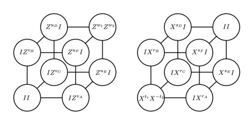
<figcaption class="paper-figure-caption"><b>Fig 1.</b> FIG. 1. Local cube-check structure for Qutrit Random Cubic Codes (QtHC). The left panel shows the Z-check Ar and the right panel shows the reflected X-check Br. Each cube corner carries two qutrits, and the corresponding operators are displayed. With the corner convention of Eq. (4), the Z-check has no support at O and two-qutrit support at G, while the X-check has two-qutrit support at O and no support at G. The remaining six corners are one-operator corners.</figcaption>
</figure>
<figure class="paper-figure-card">
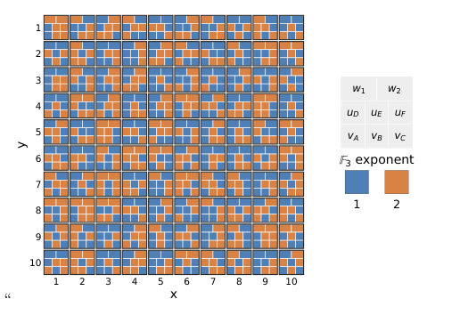
<figcaption class="paper-figure-caption"><b>Fig 2.</b> FIG. 2. Example of an admissible Z-check coefficient field. The figure shows the z = 0 slice of the curated L = 10 exam- ple L10_model_01 [60]. Each square is one cube anchor and contains a compact glyph for the eight nonzero coefficients (w1, w2, uD, uE, uF , vA, vB, vC) of the local Z-check. Blue de- notes the finite-field value 1 ∈F3, and orange denotes 2 ∈F3. With translation invariance along the [111] direction, this plot defines the stabilizer code unambiguously.</figcaption>
</figure>
<figure class="paper-figure-card">
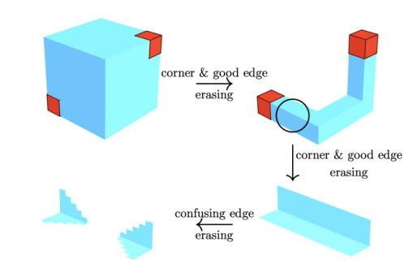
<figcaption class="paper-figure-caption"><b>Fig 3.</b> FIG. 3. Schematic of the no-string proof strategy. A large connected support has stabilizer-violation regions shown as red cubes. Corner and good-edge erasing deform the rep- resentative to an axis-aligned corridor connecting the same endpoint charges. Further erasing gives the two flat rectangles. The confusing constraint then removes rows from the exposed edges: the white erased interval is longest on the outer row and shortens row by row as the induction moves inward, even- tually cutting the flat segment open if it is sufficiently long. The disconnected representative contradicts nontriviality of a sufficiently long fixed-width logical string segment.</figcaption>
</figure>
<figure class="paper-figure-card">
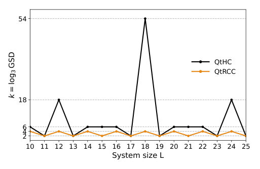
<figcaption class="paper-figure-caption"><b>Fig 4.</b> FIG. 4. Ground-state degeneracy k = log3 GSD comparison for 10 ≤L ≤25. The translation-invariant QtHC reference model exhibits arithmetic finite-size fluctuations, including the large spike k = 54 at L = 18. The retained minimal- degeneracy QtRCC collection follows the parity pattern of Eq. (22), with k = 2 for odd L and k = 4 for even L.</figcaption>
</figure>
<figure class="paper-figure-card">
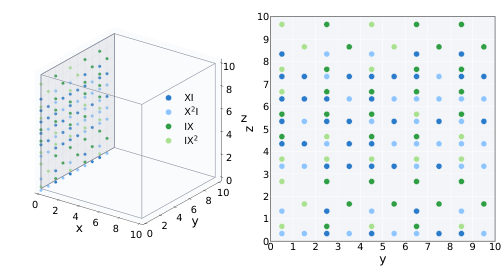
<figcaption class="paper-figure-caption"><b>Fig 5.</b> FIG. 5. Example plane-supported X logical representative for the curated QtRCC example L10_model_01 [60]. The left panel gives a three-dimensional view of the operator support on the plane x = 0, and the right panel shows the same support projected to the transverse y-z plane. Blue markers denote first-qutrit factors XI, green markers denote second-qutrit factors IX, and the two shades distinguish exponents 1 and 2 in F3. This selected quotient-basis representative has weight 120: it occupies 90 of the 102 lattice sites in the plane, with 30 sites carrying both qutrit factors.</figcaption>
</figure>

**Summary.** This paper introduces qutrit random cubic codes ($	ext{QtRCC}$) as an alternative to traditional topological QECs. By adapting complex geometric proofs from Haah's work to the qutrit setting, the authors prove that $	ext{QtRCC}$ remains free of string logical operators while simultaneously eliminating the self-similar fractal operators found in uniform models. This demonstrates that constrained randomness can yield novel and potentially superior quantum error-correcting phases.

**Why it may be interesting.** The work provides a concrete example of how introducing controlled randomness into highly structured quantum codes can fundamentally alter their underlying physical properties, moving beyond purely translation-invariant models.

Detailed structure

**Main problem.** The primary goal is to develop robust Quantum Error-Correcting Codes (QECs) that are passive self-correcting, specifically by proving the absence of string logical operators in three dimensions.

**Main result.** The proposed qutrit random cubic codes ($	ext{QtRCC}$) retain the no-string property and exhibit distinct properties from translation-invariant fracton codes, suggesting improved self-correction capabilities via constrained randomness.

**Method.** The authors employ rigorous algebraic proofs by adapting geometric techniques (like corner/edge erasing) used in Haah's original work to the qutrit ($\mathbb{F}_3$) setting. They also use numerical diagnostics like charge-push protocols and GSD calculations.

**Model / system.** The system is a family of local qutrit Calderbank-Shor-Steane stabilizer Hamiltonians defined on a cubic lattice, generalizing Haah's Code 1 structure but incorporating spatially varying stabilizers (QtRCC).

**Key observables.** Ground-state degeneracy exponent ($k$), minimum weight of plane-supported logical operators ($	ext{w}_{\min}$), and the absence of fractal recurrence in charge-push diagnostics.

**Important parameters / regimes.** The lattice size $L$, the qutrit nature ($\mathbb{Z}_3$ coefficients), and the parity dependence of the GSD exponent ($k=2$ for odd $L$, $k=4$ for even $L$).

**Assumptions / limitations.** The analysis assumes that the random models are sampled only from the 'admissible set' defined by global stabilizer relations and local commutation constraints, and that all relevant coefficients are nonzero.

**Figures summary.** Figures compare the ground-state degeneracy exponent ($k$) between uniform (QtHC) and random (QtRCC) codes, showing a stable parity pattern for QtRCC. They also visually demonstrate the absence of power-of-three fractal recurrence in charge-push diagnostics for QtRCC compared to QtHC.

**Paper structure.** The paper builds logically by first establishing the necessary algebraic framework for qutrit checks, then proving the no-string theorem via geometric reduction (corner/edge erasing), and finally using numerical diagnostics (plane scans, charge-push) to confirm the absence of fractal operators and characterize the resulting topological order.

Abstract

Quantum error-correcting codes (QECs) are essential components quantum computation and have deep connections to quantum phases of matter. A key obstruction to passive self-correcting QECs is the presence of string logical operators, which can generate logical errors through constant-energy-barrier processes. Haah's Codes (fracton codes) showed that three-dimensional stabilizer codes can forbid such string logical operators, but their translation-invariant structure supports self-similar fractal logical operators with a logarithmic energy barrier. We introduce the qutrit random cubic codes, a family of local qutrit Calderbank-Shor-Steane stabilizer Hamiltonians with similar cube-check structure as Haah's Code 1 but built from spatially varying stabilizers. We prove that these models retain the no-string property and numerically observe that they have properties distinct from translation-invariant fracton codes: the smallest ground-state degeneracy exponent is $k=2$ for odd $L$ and $k=4$ for even $L$; noncontractible plane-logical operators span the entire logical space; and charge-push diagnostics show that the self-similar fractal operators are absent. These results demonstrate that constrained randomness can fundamentally change the nature of stabilizer codes and improve their self-correction properties. They further point to broader families of quantum error-correcting codes and quantum phases beyond canonical topological and fracton orders.

[↑ back to top](#top)

### [Strain- and Electric-Field-Tunable Valley Polarization in Mo0.75V0.25Te2(Mo3VTe8) for Valleytronic Application](http://arxiv.org/abs/2606.19954v1)

**Authors:** Md. Mostaqul Islam, Vivek Chowdhury, Md. Nure-Alam-Dipu, Ahmed Zubair  
**Type:** theory · **Category:** other · **PDF:** <https://arxiv.org/pdf/2606.19954v1>  
**Analysis basis:** full PDF text, analyzed in chunks
**Topic relevance:** `analog quantum simulation` **1/5** · `exotic spin models in light-matter` **1/5** · `spintronics-quantum-optics interface` **1/5**

↔ Scroll figures horizontally

<figure class="paper-figure-card">
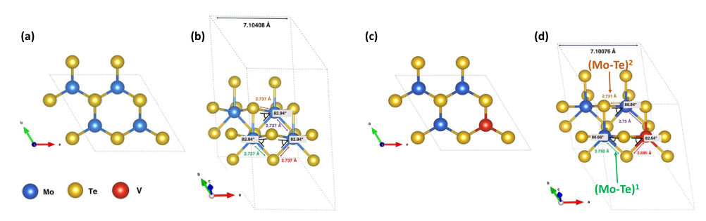
<figcaption class="paper-figure-caption"><b>Fig 1.</b> Fig. 1: Structural details of (a) MoTe2 top view, (b) MoTe2 side view with lattice parameters, bond lengths, bond angles, (c) Mo0.75V0.25Te2 top view, (d) Mo0.75V0.25Te2 side view with lattice parameters, bond lengths, bond angles. Here, (Mo-Te)1 denotes a type-I bond between Mo and Te. Whereas (Mo-Te)2 denotes a type-II bond between Mo and Te.</figcaption>
</figure>
<figure class="paper-figure-card">
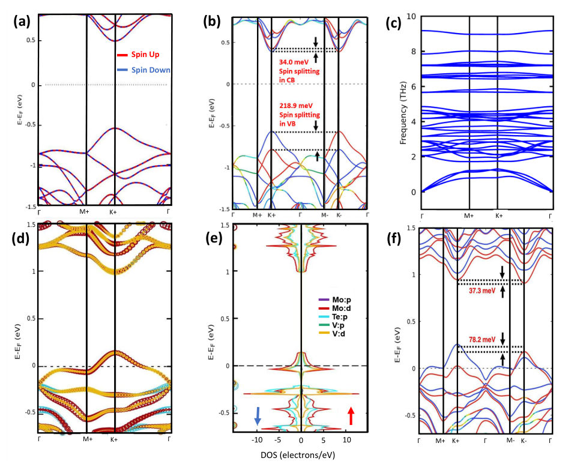
<figcaption class="paper-figure-caption"><b>Fig 2.</b> Fig. 2: Spin polarized band structure of pristine MoTe2 (a) without SOC, (b) with SOC. Red color indicates spin-up and blue color indicates spin-down band. CB means conduction band, and VB means valence band, (c) phonon band dispersion curve of Mo0.75V0.25Te2, (d) projected band structure of Mo0.75V0.25Te2, (e) projected density of states of Mo0.75V0.25Te2, and (f) spin polarized band structure of Mo0.75V0.25Te2 with SOC.</figcaption>
</figure>
<figure class="paper-figure-card">
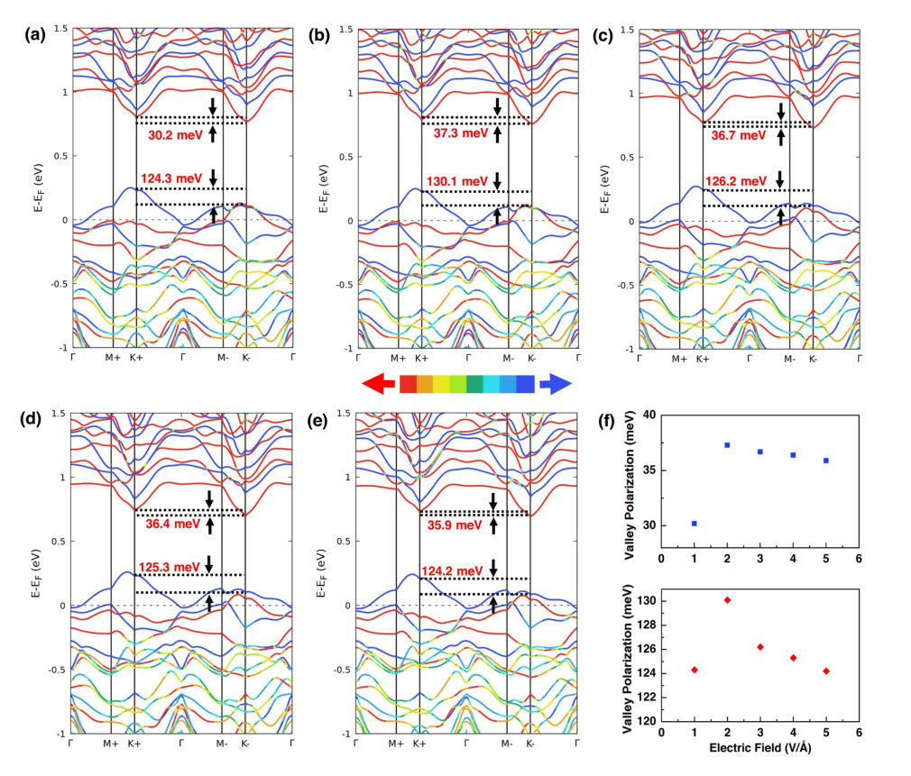
<figcaption class="paper-figure-caption"><b>Fig 3.</b> Fig. 3: Electric field applied along the crystal a axis on Mo0.75V0.25Te2. The band structures with SOC for (a) 0.1 V∕̊A, (b) 0.2 V∕̊A, (c) 0.3 V∕̊A, (d) 0.4 V∕̊A, (e) 0.5 V∕̊A, (f) Plot of valley splitting vs applied electric field. The top blue curve denotes the conduction band valley splitting, and the bottom red curve denotes the valence band valley splitting.</figcaption>
</figure>
<figure class="paper-figure-card">
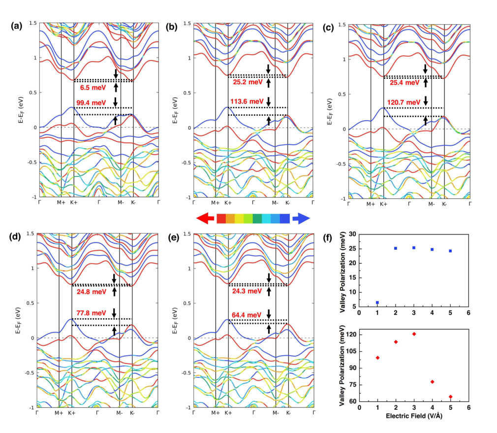
<figcaption class="paper-figure-caption"><b>Fig 4.</b> Fig. 4: Electric field applied along the crystal b axis on Mo0.75V0.25Te2. The band structures with SOC for (a) 0.1 V∕̊A, (b) 0.2 V∕̊A, (c) 0.3 V∕̊A, (d) 0.4 V∕̊A, (e) 0.5 V∕̊A, (f) Plot of valley splitting vs applied electric field. The top blue curve denotes the conduction band valley splitting, and the bottom red curve denotes the valence band valley splitting.</figcaption>
</figure>
<figure class="paper-figure-card">
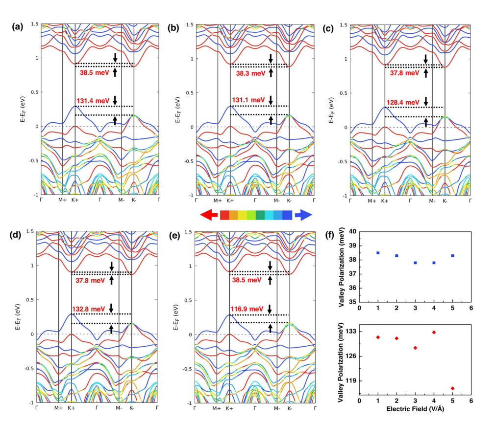
<figcaption class="paper-figure-caption"><b>Fig 5.</b> Fig. 5: Electric field applied along the crystal c axis on Mo0.75V0.25Te2. The band structures with SOC for (a) 0.1 V∕̊A, (b) 0.2 V∕̊A, (c) 0.3 V∕̊A, (d) 0.4 V∕̊A, (e) 0.5 V∕̊A, (f) Plot of valley splitting vs applied electric field. The top blue curve denotes the conduction band valley splitting, and the bottom red curve denotes the valence band valley splitting.</figcaption>
</figure>

**Summary.** This theoretical study investigates $	ext{Mo}_{0.75}	ext{V}_{0.25}	ext{Te}_2$ as a promising 2D platform for valleytronics by using DFT calculations. The authors show that alloying breaks the symmetry of pristine $	ext{MoTe}_2$, inducing valley polarization, which can then be significantly enhanced and tuned using external biaxial strain or electric fields. This work establishes a robust method for engineering materials with controllable valley degrees of freedom.

**Why it may be interesting.** While focused on condensed matter physics rather than quantum information protocols, the concept of controlling valley pseudospin via external fields or mechanical strain is a key area in topological/spintronics materials research that interfaces with quantum control concepts.

Detailed structure

**Main problem.** The primary goal is to overcome the valley degeneracy inherent in pristine TMDs, which limits their use in valleytronic devices, by engineering materials that exhibit large and tunable valley polarization.

**Main result.** V-alloying $	ext{MoTe}_2$ to form $	ext{Mo}_{0.75}	ext{V}_{0.25}	ext{Te}_2$, combined with external electric fields or biaxial strain, successfully induces and enhances valley polarization up to $160.8 	ext{ meV}$.

**Method.** The study relies entirely on first-principles Density Functional Theory (DFT) calculations, including non-collinear treatments for Spin-Orbit Coupling (SOC), phonon dispersion analysis, and modeling the effects of strain and electric fields.

**Model / system.** The physical system is the $	ext{Mo}_{0.75}	ext{V}_{0.25}	ext{Te}_2$ monolayer, a transition metal dichalcogenide alloy derived from $	ext{MoTe}_2$. The theoretical framework models electronic structure changes due to alloying (introducing magnetic exchange interaction) and external perturbations like strain ($\epsilon$) and electric fields ($\mathbf{E}$).

**Key observables.** Valley polarization ($\Delta E = |E_{K^+} - E_{K^-}|$), spin splitting, formation energy ($E_{	ext{formation}}$), phonon frequencies.

**Important parameters / regimes.** Strain levels (e.g., $4\%$ tensile strain), electric field strengths (e.g., $0.4 	ext{ V}/\AA$), and alloying concentrations ($	ext{Mo}_{0.75}	ext{V}_{0.25}	ext{Te}_2$).

**Assumptions / limitations.** The calculations assume the validity of DFT approximations, including PBE functional and PAW pseudopotentials, to model complex electronic interactions.

**Figures summary.** Figures illustrate band structures under varying strain/fields, showing polarization enhancement; phonon dispersion confirms dynamic stability for both pristine $	ext{MoTe}_2$ and the alloy; schematic diagrams propose device concepts utilizing this tunability.

**Paper structure.** The paper systematically progresses from establishing the limitations of pristine TMDs to demonstrating the structural and electronic stability of the V-alloyed material, followed by quantitative analysis of how alloying breaks symmetry, and finally detailing the enhancement mechanisms using external fields and strain for practical device realization.

Abstract

Valley polarization in 2D TMDs is promising for low-power valleytronic and spin-valley information processing, but time-reversal symmetry in pristine nonmagnetic TMDs keeps the K+ and K- valleys degenerate, limiting device applications. In this work, we investigated the structural stability, electronic properties, and tunable valley polarization of V-alloyed MoTe2 monolayer, Mo0.75V0.25Te2, using first-principles density functional theory (DFT) calculations. Substitutional alloying of MoTe2 with V introduced magnetic exchange interaction, which, together with spin-orbit coupling (SOC), lifted the valley degeneracy at the unequal valleys. The alloyed structure was found to be energetically and dynamically stable due to the absence of imaginary phonon modes. In pristine MoTe2, SOC produced spin splittings of 34.0 meV and 218.9 meV in the conduction bands and valence bands, respectively, but no valley polarization was observed. In contrast, Mo0.75V0.25Te2 exhibited spontaneous valley polarization of 37.3 meV in the conduction band and 78.2 meV in the valence band. The valley polarization was further enhanced by external electric fields and biaxial strain. A transverse electric field along the crystal c axis produced the maximum valley splitting of 132.8 meV in the valence band, whereas biaxial tensile strain increased the valence band valley splitting up to 160.8 meV. The maximum conduction band valley splitting reached 54.4 meV under 2% biaxial compressive strain. These results demonstrated that V alloying, combined with electric-field and strain engineering, provides an effective strategy for achieving large and tunable valley polarization in MoTe2. Thus, Mo0.75V0.25Te2 can be considered a promising 2D platform for tunable valleytronic device applications, such as transistors and sensors.

[↑ back to top](#top)

### [Effective discrete-modulated continuous variable QKD under general attacks](http://arxiv.org/abs/2606.20346v1)

**Authors:** Mariana Navarro, Antonio Acín, Carlos Pascual-García  
**Type:** theory · **Category:** quantum information and computing · **PDF:** <https://arxiv.org/pdf/2606.20346v1>  
**Analysis basis:** full PDF text, analyzed in chunks
**Topic relevance:** `entanglement & information structure` **1/5** · `quantum measurements` **1/5**

↔ Scroll figures horizontally

<figure class="paper-figure-card">
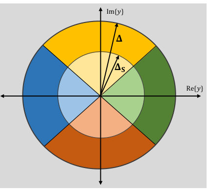
<figcaption class="paper-figure-caption"><b>Fig 1.</b> Figure 1: Phase space representation of the modulations used by Bob for (a) key distillation and (b) parameter estimation, according to the modulation parameters ∆s and ∆.</figcaption>
</figure>
<figure class="paper-figure-card">
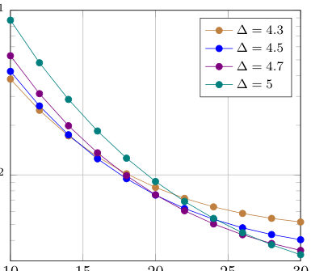
<figcaption class="paper-figure-caption"><b>Fig 2.</b> Figure 2: Dimension reduction penalty ζα with respect to the cutoff size Nc of Bob’s projection and diverse values of the parameter ∆for (a) n = 1010 with transmittance χ = 8 dB, and for (b) n = 108 with transmittance χ = 4 dB. The parameters α, γ, pK and ∆s were optimized for each data point.</figcaption>
</figure>
<figure class="paper-figure-card">
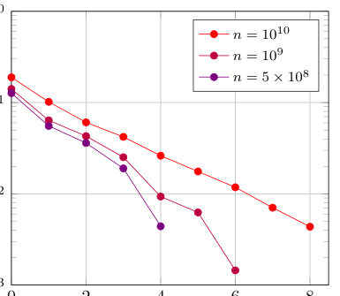
<figcaption class="paper-figure-caption"><b>Fig 3.</b> Figure 3: (a) Dimension reduction penalty ζα with respect to the channel transmittance for diverse values of the block size n. These values lead to the (b) finite-size key rates against the total transmittance χ for different block sizes. We use a dimension reduction with Nc = 20, a modulation of ∆= 4.7, and reconciliation efficiency β = 95%. The parameters α, γ, pK and ∆s were optimized for each data point.</figcaption>
</figure>

**Summary.** The paper presents a robust finite-size security analysis for discrete-modulated CVQKD protocols. It overcomes limitations of previous proofs by integrating dimension reduction and using the MEAT framework. The results confirm positive key rates for realistic block sizes, advancing the field toward practical quantum communication.

**Why it may be interesting.** This work provides advanced theoretical tools for quantifying security in practical quantum communication systems, which is crucial for realizing scalable quantum networks.

Detailed structure

**Main problem.** The work develops a finite-size security analysis for discrete-modulated continuous variable Quantum Key Distribution (CVQKD) protocols under general attacks.

**Main result.** Positive key rates are reported in the finite-size regime for relevant block sizes on the order of $10^8$, successfully bridging the gap between theoretical proofs and practical implementations.

**Method.** The security analysis combines dimension reduction, a proof based on the Marginal-Constrained Entropy Accumulation Theorem (MEAT), and modeling receiver imperfections using a trusted detector model.

**Model / system.** The system is CVQKD utilizing discrete modulations of coherent states, modeled by discretizing phase space measurements into finite registers ($Z_j$). The analysis framework extends established quantum information security metrics ($\epsilon$-security).

**Key observables.** Secret key rate (bits/pulse), dimension reduction penalty ($\zeta_\alpha$), and the final achievable key length $\ell$.

**Important parameters / regimes.** Block sizes ($n \sim 10^8$ to $10^{10}$), modulation parameters ($\Delta, \Delta_s$), detection efficiency ($\eta_d$), and reconciliation efficiency ($eta$).

**Assumptions / limitations.** The analysis relies on continuity bounds to justify dimension reduction from infinite-dimensional states to finite subspaces, and uses the MEAT framework.

**Figures summary.** Figures illustrate the phase space representation of modulations (Figure 1) and show the dependence of the dimension reduction penalty ($\zeta_\alpha$) and the final finite-size secret key rates on channel transmittance ($\chi$) for various block sizes.

**Paper structure.** The paper progresses by first defining the discrete protocol, formalizing security using $\epsilon$-security metrics, developing mathematical tools like concentration inequalities, and finally applying MEAT combined with dimension reduction to derive a rigorous lower bound on the secret key rate.

Abstract

Continuous variable quantum key distribution via discrete modulations ensures information-theoretic security using standard telecom technologies, providing affordable and scalable quantum communications with simplified classical postprocessing. However, existing security proofs against general attacks often rely on restrictive assumptions, such as a bounded dimension for coherent states, or require impractically large block sizes. In this work, we develop a finite-size security analysis that removes these limitations while incorporating realistic experimental features. Our approach combines the dimension reduction technique, a security proof based on the marginal-constrained entropy accumulation, and a trusted detector model accounting for the receiver imperfections. We report positive key rates in the finite-size regime for relevant block sizes of the order of $10^8$. These results contribute to narrowing the gap between theoretical security proofs and practical implementations of discrete-modulated continuous variable quantum key distribution protocols.

[↑ back to top](#top)

### [Passive-User Bell-State Loop-Back Key Establishment without Quantum Detectors at the User Nodes](http://arxiv.org/abs/2606.19551v1)

**Authors:** Luis Adrián Lizama-Pérez  
**Type:** theory · **Category:** quantum information and computing · **PDF:** <https://arxiv.org/pdf/2606.19551v1>  
**Analysis basis:** full PDF text, analyzed in chunks
**Topic relevance:** `entanglement & information structure` **1/5** · `quantum measurements` **1/5**

↔ Scroll figures horizontally

<figure class="paper-figure-card">
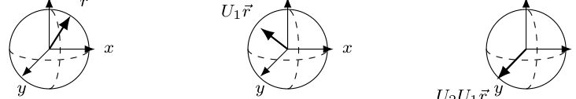
<figcaption class="paper-figure-caption"><b>Fig 1.</b> Figure 1: Conceptual representation of the passive-user Bell-state Loop-Back architecture. The traveling subsystem passes sequentially through B1 and B2, which apply local Pauli operations U1 and U2. The lower panels provide an operator-level visualization of these Pauli operations acting on a test Bloch vector ⃗r. In the actual Bell-state protocol, the traveling subsystem is locally maximally mixed, ρB = I/2, so the physical information is not carried by a local Bloch vector but by the Bell correlations recovered at Alice’s station. The figure illustrates the effective composition Ueff = U2U1, which is the only transformation inferred by Alice from the final Bell-state measurement.</figcaption>
</figure>
<figure class="paper-figure-card">
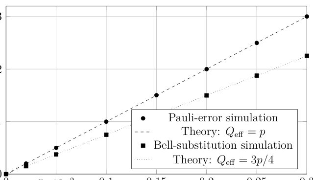
<figcaption class="paper-figure-caption"><b>Fig 2.</b> Figure 2: Effective error rate Qeff as a function of the perturbation probability p under two perturbation models, obtained from Qiskit simulations with the AerSimulator. Markers denote the simulated values for the Pauli-error and Bell-substitution models, respectively. The dashed and dotted lines represent the theoretical behaviors Qeff = p and Qeff = 3p/4. The close overlap between the simulated points and the theoretical curves confirms the consistency of the inference rule under both perturbation models.</figcaption>
</figure>

**Summary.** The paper proposes a Bell-state extension of the Loop-Back QKD protocol to enable secret key establishment between two passive users. By using entangled states and having an active station measure the resulting global Pauli operation ($U_{	ext{eff}}$), the system allows users to derive their private raw keys from the decomposition of $U_{	ext{eff}}$. This advances quantum cryptography by removing the need for complex quantum hardware at the end-user nodes.

**Why it may be interesting.** This work is highly relevant as it explores novel quantum communication protocols that circumvent hardware limitations (no detectors/transmitters at user nodes) by leveraging entanglement structure, which has implications for future quantum network architectures.

Detailed structure

**Main problem.** The goal is to establish a secret key between two passive users ($B_1$ and $B_2$) without requiring them to possess quantum transmitters or detectors.

**Main result.** The protocol successfully transfers the distributed-transformation mechanism of Loop-Back QKD from single qubits to entangled Bell states, allowing for key generation based on the private decomposition of a global Pauli operation.

**Method.** It analyzes the effective Pauli operation ($U_{	ext{eff}} = U_2 U_1$) observed by an active station (Alice) after two passive users apply local Pauli operations to a traveling entangled subsystem.

**Model / system.** The system uses a Bell-state extension of the Loop-Back QKD architecture. Alice prepares and measures Bell pairs, while $B_1$ and $B_2$ act as passive modulators applying local Pauli gates ($U_1, U_2$).

**Key observables.** The effective Pauli operation ($U_{	ext{eff}}$) measured by Alice; the private local operations ($U_1, U_2$) known only to $B_1$ and $B_2$.

**Important parameters / regimes.** The success probability of the Bell-state measurement ($p_{	ext{BSM}}$); the effective error rate ($Q_{	ext{eff}}$) under various attack models.

**Assumptions / limitations.** The protocol assumes that individual local operations remain algebraically hidden from Alice, and security relies on non-colluding users and physical characterization of components (not device-independent).

**Figures summary.** Figures conceptually illustrate the path $A 	o B_1 	o B_2 	o A$ showing how local operations compose to form $U_{	ext{eff}} = U_2 U_1$. Tables summarize ideal rounds and quantify error rates under different noise models.

**Paper structure.** The paper introduces the Bell-state extension, analyzes the algebraic structure of the effective operation ($U_{	ext{eff}}$), derives key inference rules for users based on $U_{	ext{eff}}$, discusses security against attacks (like separable substitutions), and concludes with generalizations to multi-user settings.

Abstract

We propose and analyze a Bell-state extension of the Loop-Back quantum key distribution architecture for secret-key establishment between two passive users that do not require quantum transmitters or quantum detectors. In the proposed setting, a single active station, Alice, provides the entangled-state infrastructure, retains one qubit of an initially prepared Bell pair, and sends the traveling subsystem through two passive users, denoted by $B_1$ and $B_2$. Each passive user applies a local Pauli operation to the same traveling subsystem, so that the operation observed by Alice is only the effective composition $U_{\mathrm{eff}}=U_2U_1$. After the subsystem returns, Alice performs a Bell-state measurement and, using her private knowledge of the initial Bell state, deterministically identifies the effective Pauli operation. However, the individual factors $U_1$ and $U_2$ remain algebraically hidden from Alice whenever the local choices are uniformly and independently selected. The public effective operation acts as a parity-like constraint: each passive user can infer the operation applied by the other from its own private choice, while the active station learns only the global composition. This construction transfers the essential distributed-transformation mechanism of passive-user Loop-Back QKD to the entangled-state regime. Unlike single-qubit passive-user schemes, whose useful events are intrinsically post-selected, the Bell-state version is limited primarily by the success probability of the Bell-state measurement. We discuss the algebraic structure of the protocol, its interpretation as an infrastructure-assisted mediated key-establishment mechanism, and the physical assumptions required to protect passive Pauli modulators against active injection or Trojan-horse-type attacks.

[↑ back to top](#top)

### [Quantum Kernels are Spectral Tensor Networks](http://arxiv.org/abs/2606.20402v1)

**Authors:** Erik M. Åsgrim, Stefano Markidis  
**Type:** theory · **Category:** numerical methods · **PDF:** <https://arxiv.org/pdf/2606.20402v1>  
**Analysis basis:** full PDF text, analyzed in chunks
**Topic relevance:** `entanglement & information structure` **1/5** · `methods for driven-dissipative` **1/5**

↔ Scroll figures horizontally

<figure class="paper-figure-card">
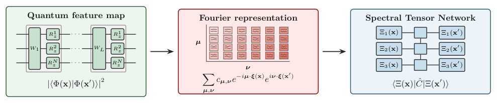
<figcaption class="paper-figure-caption"><b>Fig 1.</b> Figure 1. From quantum feature maps to spectral tensor networks. A quantum feature map induces a kernel with Fourier coefficients cµ,ν that encode its spectral structure. Representing this Fourier coefficient object as a matrix product operator yields the spectral tensor network contraction ⟨Ξ(x)| ˆC|Ξ(x′)⟩.</figcaption>
</figure>
<figure class="paper-figure-card">
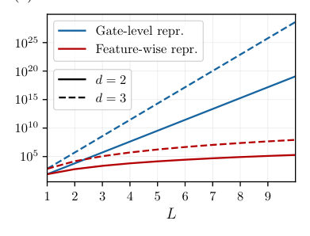
<figcaption class="paper-figure-caption"><b>Fig 2.</b> Figure 2. Reduction from gate-level to feature-wise frequen- cies. (a) Gate-level spectral tensor network with ˆCµ,ν = cµ,ν. (b) Grouping degenerate gate-level configurations yields the feature-wise coefficients ˜cω,ω′, with ˆCω,ω′ = ˜cω,ω′. (c) Num- ber of Fourier coefficients in the gate-level and feature-wise representations, scaling as 32dL and (2L + 1)2d, respectively, for layered feature maps with one upload per feature in each of the L layers.</figcaption>
</figure>
<figure class="paper-figure-card">
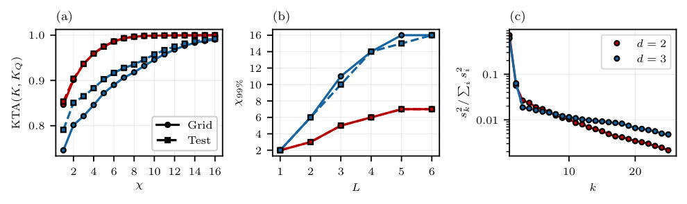
<figcaption class="paper-figure-caption"><b>Fig 3.</b> Figure 3. Spectral compressibility of quantum kernels. (a) Kernel target alignment between the quantum kernel and its spectral tensor network representation as a function of MPO bond dimension χ for L = 6, showing rapid convergence toward unity on both the frequency-resolving grid and independently sampled test points. (b) Minimum bond dimension χ99% required to reach average alignment above 0.99 as a function of depth L. (c) Operator Schmidt spectrum of the Fourier coefficient tensor across the first bond for the L = 6, χ = 16 case. The rapid decay of the normalized weights s2 k/ P</figcaption>
</figure>

**Summary.** This paper proves that quantum kernels can be mathematically recast as spectral tensor networks by analyzing their Fourier representations. It introduces Kernel Target Alignment (KTA) and measures the resulting 'spectral compressibility' using bond dimensions. This provides a diagnostic tool to determine if evaluating a quantum kernel is likely to remain classically tractable.

**Why it may be interesting.** It provides a powerful mathematical tool (tensor networks) to analyze quantum information processing tasks (kernel methods), offering a concrete measure of when quantum computation might be classically simulable.

Detailed structure

**Main problem.** The core problem is identifying quantum kernels, derived from feature maps, as spectral tensor networks to understand their computational complexity.

**Main result.** Quantum kernels can be exactly represented by spectral tensor networks, and the compressibility of their Fourier coefficient tensors serves as a diagnostic for classical tractability.

**Method.** The authors use Fourier analysis to decompose quantum kernels into coefficients ($	ilde{c}_{\omega,\omega'}$), which are then mapped onto Matrix Product Operator (MPO) factorizations characteristic of spectral tensor networks.

**Model / system.** The model involves quantum feature states $|\Phi(x)
angle$ generated by layered data-encoding quantum circuits. The kernel is $\kappa(x, x') = |\langle\Phi(x)|\Phi(x')
angle|^2$.

**Key observables.** Spectral compressibility (rank structure of Fourier coefficients), Bond Dimension ($\chi$), and Kernel Target Alignment (KTA).

**Important parameters / regimes.** Bond dimension ($\chi$), circuit depth ($L$), and the frequency-resolving grid ($\mathcal{G}\Omega$).

**Assumptions / limitations.** The analysis relies on assuming a specific structure for data-encoding gates and utilizing the approximation that KTA simplifies to the Frobenius cosine similarity on a frequency-resolving grid.

**Figures summary.** Figures illustrate the transition from quantum feature maps to spectral tensor networks using $\hat{C}$, compare gate-level vs. feature-wise scaling, and show KTA converging to unity as bond dimension increases.

**Paper structure.** The paper proceeds by establishing identities linking Fourier expansions to ETK contractions, deriving a compact grouped Fourier form, defining KTA as the bridge metric, and finally using numerical experiments to demonstrate spectral compressibility diagnostics.

Abstract

Quantum kernels admit Fourier representations whose frequencies are determined by the data-encoding gates of the underlying feature map. We show that entangling tensor kernels are matrix product operator factorizations of the corresponding Fourier coefficient tensors, thereby identifying quantum kernels as spectral tensor networks. By grouping gate-level frequency configurations that yield the same feature-wise frequency, we obtain a grouped Fourier form that induces a more compact spectral tensor network representation of the kernel. We further show that kernel target alignment serves as a bridge between the Fourier and tensor network views. On a grid that resolves the accessible Fourier modes, it becomes the Frobenius cosine similarity between Fourier coefficient tensors. Our numerical experiments show that layered quantum kernels admit accurate representations with small bond dimension, revealing a compressibility governed by correlations between Fourier modes. This compressibility provides a diagnostic of classical representability and of whether kernel evaluation is likely to remain classically tractable.

[↑ back to top](#top)

### [Subsystem Quantum Error Correction for Noisy Quantum Metrology](http://arxiv.org/abs/2606.19628v1)

**Authors:** Qiushi Liu, Sisi Zhou  
**Type:** theory · **Category:** quantum information and computing · **PDF:** <https://arxiv.org/pdf/2606.19628v1>  
**Analysis basis:** full PDF text, analyzed in chunks
**Topic relevance:** `entanglement & information structure` **1/5** · `quantum measurements` **1/5**

↔ Scroll figures horizontally

<figure class="paper-figure-card">
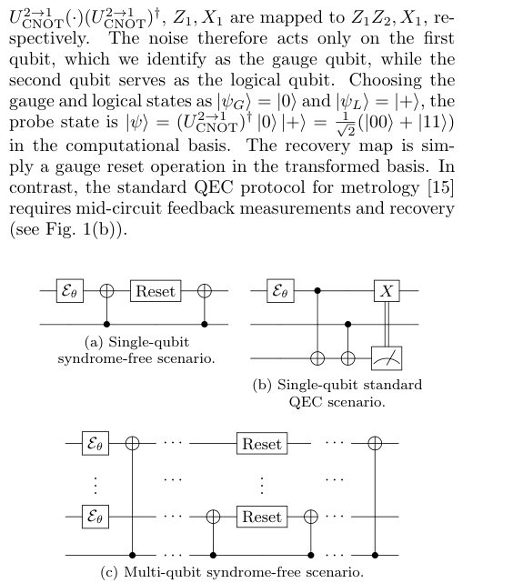
<figcaption class="paper-figure-caption"><b>Fig 1.</b> FIG. 1. Circuit diagram for one step of QEC in phase estima- tion under bit flip noise. In (a) and (c), the reset operation converts the state back to |0⟩. The qubit on the last line represents the noiseless ancillary qubit, serving as the logical qubit. The qubits above it are gauge qubits. In (b), the state of the first two qubits is (|00⟩+ |11⟩)/ √</figcaption>
</figure>
<figure class="paper-figure-card">
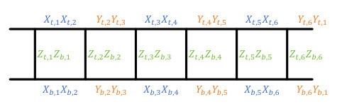
<figcaption class="paper-figure-caption"><b>Fig 2.</b> FIG. 2. Ladder code architecture (for np = 6). Qubits lie on the vertices and check operators on two neighboring qubits are measured.</figcaption>
</figure>

**Summary.** This work develops theoretical frameworks to achieve Heisenberg Limit scaling in quantum metrology by employing subsystem Quantum Error Correction (QEC). It demonstrates that these codes simplify protocols significantly compared to standard QEC by allowing noise absorption into gauge degrees of freedom. The key achievement is showing how this approach can maintain coherent logical evolution even for time-dependent signals using syndrome-free methods.

**Why it may be interesting.** The focus on resource-efficient QEC for metrology is highly relevant. By showing how gauge degrees of freedom can absorb noise while preserving the logical signal coherence, it suggests practical pathways for implementing high-precision quantum sensors using current hardware capabilities.

Detailed structure

**Main problem.** To enhance quantum metrology precision beyond classical limits by suppressing noise using Quantum Error Correction (QEC) techniques.

**Main result.** Subsystem error correction provides a resource-efficient method to achieve the Heisenberg Limit, even for time-dependent signals, by protecting only the coherent logical evolution rather than the entire state.

**Method.** The authors derive effective Hamiltonian dynamics ($	ext{Heff}$) governing the logical evolution within the code space, utilizing subsystem stabilizer codes and syndrome-free protocols.

**Model / system.** The system involves estimating an unknown parameter $	heta$ via noisy quantum channels. The theoretical framework uses subsystem stabilizer codes (e.g., ladder codes) to encode information into a logical subspace protected from noise absorbed by gauge degrees of freedom.

**Key observables.** Quantum Fisher Information ($	ext{QFI}$), which must scale as $N^2$ for the Heisenberg Limit; the effective Hamiltonian ($H_{	ext{eff}}$).

**Important parameters / regimes.** The number of queries ($N$), the error rate ($p$), and the structure of the noise operators $\{E_i\}$ relative to the signal Hamiltonian $H$.

**Assumptions / limitations.** The analysis assumes low error rates for successful decoding, and that the logical evolution can be approximated by an effective unitary dynamics within the code space.

**Figures summary.** Figures illustrate QEC circuits for phase estimation, showing syndrome-free vs. standard methods; Figure 2 shows the ladder code architecture; Algorithm 1 details the Floquet code metrology protocol steps.

**Paper structure.** The paper progresses from establishing the need for subsystem codes over full QEC (Chunk 1), detailing protocols for time-dependent signals using the ladder code (Chunk 2), deriving effective dynamics for both standard and subsystem codes (Chunk 4), generalizing the formalism to arbitrary Pauli generators via symplectic methods (Chunk 5), and finally proving HL achievability with syndrome-free, ancilla-less techniques (Chunk 6).

Abstract

Quantum error correction has been successfully applied to enhance the precision of parameter estimation in the presence of noise. Nonetheless, existing methods require a number of noiseless, controllable ancillae and lack efficient encoding and decoding procedures. In this Letter, we demonstrate that subsystem error correction provides a new direction that can substantially simplify the metrological protocol. We derive general conditions under which subsystem stabilizer codes achieve the Heisenberg limit and show that, for broad classes of noise, this can be realized by syndrome-free protocols using at most a single ancilla qubit. Furthermore, we extend this framework to dynamical error correction and show that Floquet codes can protect time-dependent metrological signals in reaching the Heisenberg limit.

[↑ back to top](#top)

### [Transfer-matrix functions for algebraically decaying interactions in variational infinite matrix product states](http://arxiv.org/abs/2606.20522v1)

**Authors:** Qi Yang  
**Type:** theory · **Category:** strongly correlated electrons · **PDF:** <https://arxiv.org/pdf/2606.20522v1>  
**Analysis basis:** full PDF text, analyzed in chunks
**Topic relevance:** `analog quantum simulation` **1/5** · `methods for driven-dissipative` **1/5**

↔ Scroll figures horizontally

<figure class="paper-figure-card">
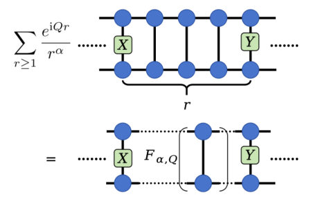
<figcaption class="paper-figure-caption"><b>Fig 1.</b> FIG. 1. Tail summation with transfer matrix function. The connected algebraic tail is evaluated by applying Fα,Q [Eq. (1)] directly to the connected transfer matrix eTA, rather than by first fitting the tail with a finite-pole MPO representation.</figcaption>
</figure>
<figure class="paper-figure-card">
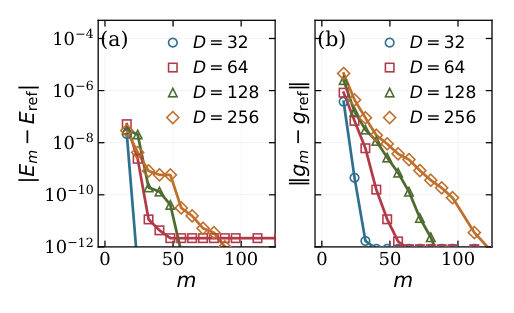
<figcaption class="paper-figure-caption"><b>Fig 2.</b> FIG. 2. Accuracy versus Krylov dimension m for converged finite-D iMPS of the nonoscillatory infinite Haldane–Shastry model, with D = 32, 64, 128, 256. Reference values Eref and gref are fixed-MPS large-m references from the converged mref = 512 calculation; Eref is independently certified by direct real-space summation (Sec. II). (a) Energy error. (b) Projected-gradient error norm.</figcaption>
</figure>
<figure class="paper-figure-card">
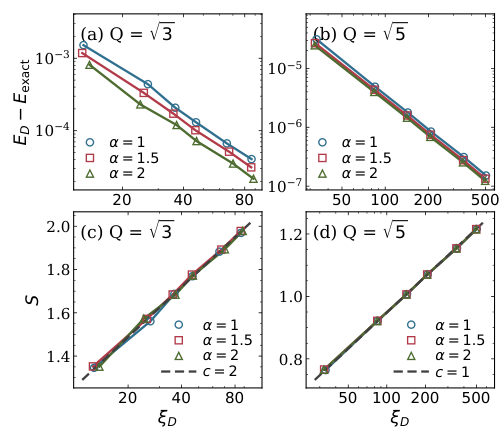
<figcaption class="paper-figure-caption"><b>Fig 3.</b> FIG. 3. Long-range free-fermion string-channel benchmark. All panels use a logarithmic horizontal axis for ξ with D ranging from 16 to 128. (a,b) E(Dξ) −Eexact relative to the exact thermodynamic reference. (c,d) Entropy scaling for Q = √</figcaption>
</figure>
<figure class="paper-figure-card">
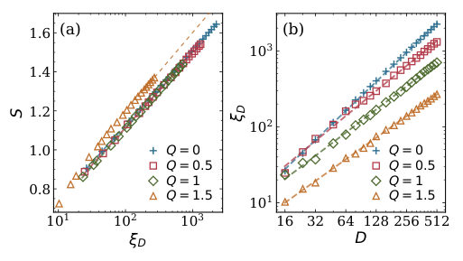
<figcaption class="paper-figure-caption"><b>Fig 4.</b> FIG. 5. Finite-entanglement scaling for Eq. (15) at α = 2. (a) Entanglement entropy S versus ξD for Q = 0, 0.5, 1, 1.5, with log-linear fits capped at D ≤512. (b) Correlation length ξD versus bond dimension D on logarithmic axes, using the same D ≤512 window.</figcaption>
</figure>
<figure class="paper-figure-card">
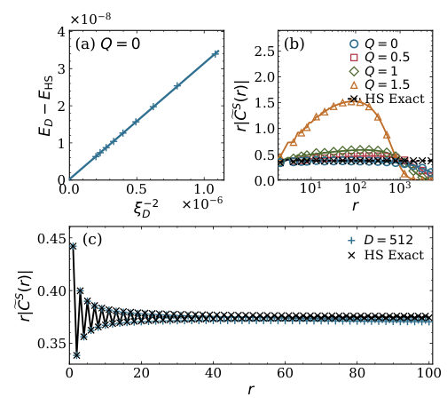
<figcaption class="paper-figure-caption"><b>Fig 5.</b> FIG. 4. Inverse-square Heisenberg energy and correlator bench- marks. (a) Q = 0 Haldane–Shastry energy residual versus ξ−2 D ; the fit uses D = 256–512. (b) Normalized connected spin-vector correlators eCS Q(r) = ⟨⃗S0 · ⃗Sr⟩c at D = 512 for Q = 0, 0.5, 1, 1.5; the dashed guide is the HS exact reference. (c) Direct Q = 0 pointwise comparison of r| eCS(r)| against the exact spin-vector HS result | eCS HS(r)| = 3 Si(πr)/(4πr).</figcaption>
</figure>

**Summary.** The paper introduces a robust method to calculate variational energies for infinite Matrix Product States when the underlying Hamiltonian has algebraically decaying interactions. By reformulating the tail summation as a matrix function evaluated via Krylov methods, it bypasses the need for artificial finite-pole approximations common in existing techniques. This advancement allows for accurate study of critical phenomena and long-range physics in 1D quantum materials.

**Why it may be interesting.** This work provides a rigorous, systematic way to handle long-range physics in 1D quantum systems using tensor networks, which is crucial for modeling materials where interactions decay slowly (e.g., dipolar systems or RKKY coupling).

Detailed structure

**Main problem.** The primary challenge is developing variational energy calculations for infinite Matrix Product States (iMPS) when the target Hamiltonian features algebraically decaying interactions, while avoiding artificial approximations.

**Main result.** A novel transfer-matrix-function formulation allows direct summation of algebraic tails, preserving correct critical signatures that are lost when using standard finite-pole exponential surrogates.

**Method.** The method involves calculating the variational energy by representing the algebraic tail via a matrix function $F_{\alpha,Q}(\widetilde{T}_A)$ and evaluating this action using a Krylov subspace projection combined with Fréchet adjoint differentiation for stable gradients.

**Model / system.** The work applies to one-dimensional quantum systems with long-range interactions, such as inverse-square spin chains (Haldane–Shastry model) and general algebraic tails $J(r) \propto 1/r^\alpha$.

**Key observables.** Variational energy, correlation length ($\xi_D$), connected correlators $\langle\vec{S}_0 \cdot \vec{S}_r
angle_c$, and critical diagnostics.

**Important parameters / regimes.** Bond dimension ($D$) of the MPS, Krylov subspace dimension ($m$), algebraic decay exponent ($\alpha$), and interaction coupling constants ($Q$).

**Assumptions / limitations.** The method assumes a unique dominant fixed point for defining the connected transfer matrix $e^{TA}$, and the accuracy is controlled by the choice of Krylov dimension $m$.

**Figures summary.** Figures demonstrate that moderate Krylov dimensions stabilize energy calculations for the Haldane–Shastry model, show convergence to exact thermodynamic limits for free fermions, and critically illustrate that the matrix-function approach maintains correct critical behavior where finite-pole approximations fail.

**Paper structure.** The paper first introduces the problem of algebraic tails in iMPS. It then details the transfer-matrix-function formulation using Krylov methods and gradient techniques. Benchmarks are presented across several models (free fermions, Heisenberg chain, Ising chain) to validate the method's stability and accuracy against known limits.

Abstract

Variational infinite matrix product state (iMPS) calculations usually make Hamiltonians with algebraically decaying interactions compatible with standard MPO algorithms by first replacing the target Hamiltonian with a finite-pole sum-of-exponentials surrogate, thereby introducing a Hamiltonian-representation residual. We formulate the fixed-$D$ variational energy without introducing such a surrogate. For a fixed finite-$D$ MPS, the algebraic tail can be summed directly through the connected transfer matrix: the tail $e^{\mathrm{i} Qr}/r^α$ is represented by the matrix function $F_{α,Q}(\widetilde{T}_A)$, with $F_{α,Q}(z)=\operatorname{Li}_α(e^{\mathrm{i} Q}\,z)/z$. We evaluate the resulting matrix-function action using a Krylov method and obtain stable gradients by combining a Fréchet adjoint with implicit fixed-point differentiation. Benchmarks on long-range free fermions and the inverse-square Heisenberg family, including the Haldane--Shastry point, validate the transfer-matrix-function formulation. A long-range Ising-chain calculation illustrates a practical consequence of avoiding a finite-pole Hamiltonian representation. At a fixed, independently known critical field, finite-pole surrogate Hamiltonians can bias a critical diagnostic away from criticality, whereas the matrix-function calculation retains the expected critical signatures of the target algebraic Hamiltonian.

[↑ back to top](#top)

### [All-valid-state HOBO encoding for constrained combinatorial optimization on NISQ devices](http://arxiv.org/abs/2606.20017v1)

**Authors:** Juncheng Wang, Takumi Kanezashi, Daisuke Tsukayama, Koki Awaya, Reo Saito, Jun-ichi Shirakashi, Tetsuo Shibuya, Hiroshi Imai  
**Type:** both · **Category:** quantum information and computing · **PDF:** <https://arxiv.org/pdf/2606.20017v1>  
**Analysis basis:** full PDF text, analyzed in chunks
**Topic relevance:** `QC/QI experiment` **1/5**

↔ Scroll figures horizontally

<figure class="paper-figure-card">
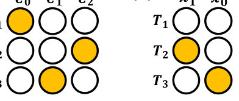
<figcaption class="paper-figure-caption"><b>Fig 1.</b> FIG. 1. Hamiltonian construction method. (a) One possible route for a 3-city TSP. (b) Mapping rule from the TSP to qubits. (c) QUBO encoding and (d) HOBO encoding for the tour in (a). In the QUBO encoding, each qubit corresponds to a city index, whereas in the HOBO encoding, the binary string formed by all qubits at each time step represents a city index. Filled and open circles denote 1 and 0, respectively.</figcaption>
</figure>
<figure class="paper-figure-card">
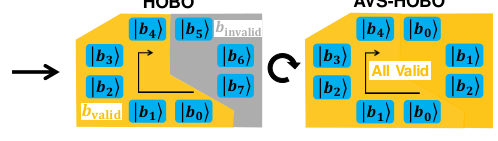
<figcaption class="paper-figure-caption"><b>Fig 2.</b> FIG. 2. Cyclic mapping used in AVS-HOBO to replace the constraint term HHOBO valid . Here, n is the number of qubits; n = 3 can generate 8 distinct states. bi denotes the city index. In this figure, we illustrate the case of 5 cities. bvalid denotes valid states, whereas binvalid denotes unusable states.</figcaption>
</figure>
<figure class="paper-figure-card">
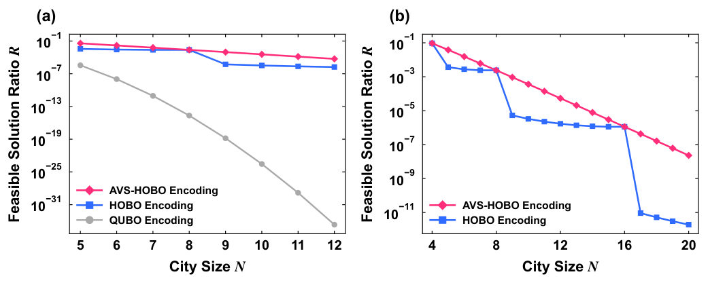
<figcaption class="paper-figure-caption"><b>Fig 3.</b> FIG. 3. Ratio of feasible states in the Hilbert space for different encoding methods, where feasible states are those that satisfy both TSP constraints. (a) Comparison among AVS-HOBO, HOBO, and QUBO encodings for TSP sizes up to 12 cities. The number of feasible states in QUBO differs significantly from that in HOBO, and for 12 cities, the ratio is already close to zero. (b) As the number of cities is further increased, the advantage of AVS-HOBO over HOBO becomes more evident.</figcaption>
</figure>
<figure class="paper-figure-card">
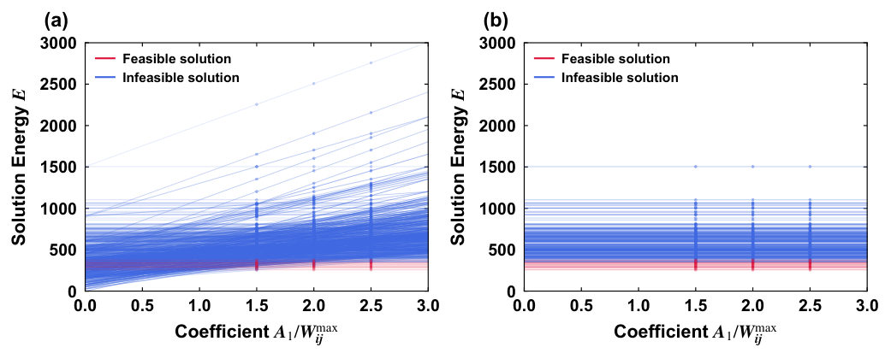
<figcaption class="paper-figure-caption"><b>Fig 4.</b> FIG. 4. Solution energy landscape. (a) Results obtained using the original HOBO method. The horizontal axis shows the coefficient A1/W max ij , which represents the strength of the constraint penalty. Although the original problem formulation contains two constraint terms, here we focus on the optimized term A1. As can be seen in the figure, as the constraint penalty becomes stronger, the energies of feasible solutions remain unchanged because they incur no penalty, whereas the energies of infeasible solutions increase accordingly. This enlarges the energy gaps and can make the energy exploration process more difficult and slower. (b) Results obtained using the AVS-HOBO method. Because this...</figcaption>
</figure>
<figure class="paper-figure-card">
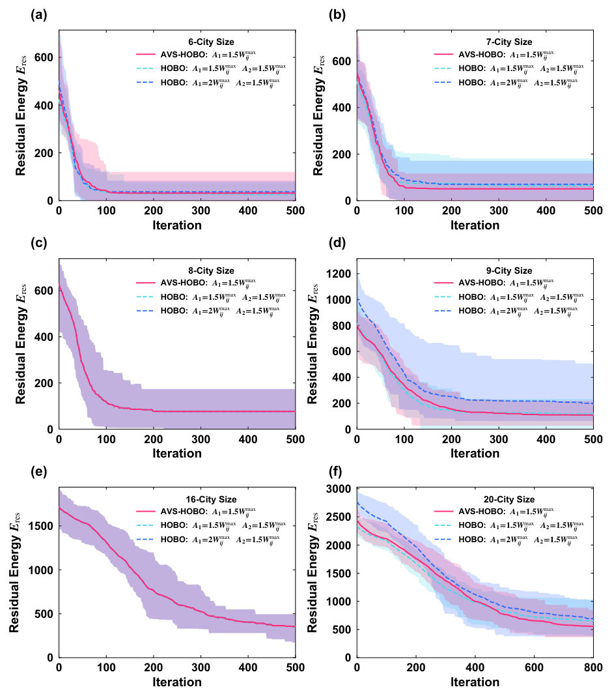
<figcaption class="paper-figure-caption"><b>Fig 5.</b> FIG. 5. Relationship between the residual energy and the iteration number for the TSP. The figure shows the residual energies of 20 different instances under three different conditions for each problem size: (a) 6-city size; (b) 7-city size; (c) 8-city size; (d) 9-city size; (e) 16-city size; and (f) 20-city size. In the figure, both the solid and dashed lines represent the average values over 20 different instances for the corresponding methods, while the shaded area represents the min-max range determined by the maximum and minimum values among the different instances.</figcaption>
</figure>

**Summary.** This paper improves the formulation of constrained combinatorial optimization problems like TSP for NISQ devices by introducing the AVS-HOBO encoding. It uses VQE on simulated and real quantum hardware to demonstrate that AVS-HOBO significantly enhances solution feasibility and stability compared to existing methods. This work advances the practical viability of quantum computing for complex, real-world optimization tasks.

**Why it may be interesting.** It provides a concrete, near-term application of quantum algorithms to NP-hard optimization problems, directly comparing encoding efficiency and robustness against realistic noise models relevant for current quantum hardware development.

Detailed structure

**Main problem.** The study addresses constrained combinatorial optimization problems, specifically formulating and solving the Traveling Salesperson Problem (TSP) using quantum computation.

**Main result.** The proposed All-valid-state HOBO (AVS-HOBO) encoding significantly enhances the practical reliability and scalability of VQE for TSP on NISQ devices compared to standard HOBO or QUBO encodings.

**Method.** The core method is using the Variational Quantum Eigensolver (VQE) algorithm, which minimizes the expectation value of a problem Hamiltonian constructed via specialized binary encoding schemes.

**Model / system.** The model involves mapping the TSP to an Ising/Hamiltonian form. The system utilizes VQE on simulated and real NISQ quantum hardware, comparing QUBO, HOBO, and AVS-HOBO encodings.

**Key observables.** Energy convergence behavior, Approximation Ratio (AR), Length Ratio (LR), Feasibility Ratio (FR), and Residual Energy ($	ext{Eres}$).

**Important parameters / regimes.** TSP instances up to 20 cities; penalty coefficients ($A$); error mitigation techniques like Matrix-free measurement mitigation ($	ext{Mthree}$) and Dynamical Decoupling ($	ext{DD}$).

**Assumptions / limitations.** The analysis assumes the applicability of VQE on NISQ devices, acknowledging that hardware noise degrades performance but AVS-HOBO mitigates this better.

**Figures summary.** Figures compare convergence (Eres) and solution quality metrics (AR, LR, FR) across different encoding schemes (HOBO vs. AVS-HOBO) for increasing TSP sizes, showing AVS-HOBO's superior stability.

**Paper structure.** The paper introduces the problem (TSP), compares QUBO/HOBO encodings, details the novel AVS-HOBO scheme using cyclic mapping, and validates its performance through extensive simulations and tests on real quantum hardware while analyzing error mitigation effects.

Abstract

Continued advancements in quantum computing have stimulated growing interest in translating quantum technologies into real-world applications. Consequently, the investigation of practically motivated NP-hard problems is of significant value. This study investigates the performance of a variational quantum eigensolver (VQE) in addressing the traveling salesperson problem (TSP) through noiseless simulations representative of noisy intermediate-scale quantum (NISQ) devices using higher-order binary optimization (HOBO) encodings. We construct a HOBO Hamiltonian with an efficient binary representation and propose an all-valid-state HOBO (AVS-HOBO) scheme based on cyclic mapping that eliminates one penalty term and reuses states that would otherwise be invalid. Using TSP instances of up to 20 cities, we compare the original HOBO and AVS-HOBO encodings from multiple perspectives, including the energy convergence behavior and the approximation, tour-length, and feasibility ratios. In addition to simulations, we perform computations on real quantum hardware with different device architectures, where we not only compare the performances of different chips but also investigate the effects of different error-mitigation methods on actual quantum machines. The results indicate that AVS-HOBO encoding enhances the practical reliability of VQE on NISQ devices and improves scalability for larger TSP instances, with broader applicability to constrained quantum optimization problems.

[↑ back to top](#top)

### [Approximating optimal decoding of quantum LDPC codes with narrow frontiers](http://arxiv.org/abs/2606.20513v1)

**Authors:** Anthony Leverrier, Rüdiger Urbanke  
**Type:** theory · **Category:** quantum information and computing · **PDF:** <https://arxiv.org/pdf/2606.20513v1>  
**Analysis basis:** full PDF text, analyzed in chunks
**Topic relevance:** `methods for driven-dissipative` **1/5**

↔ Scroll figures horizontally

<figure class="paper-figure-card">
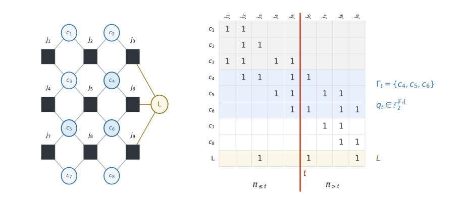
<figcaption class="paper-figure-caption"><b>Fig 1.</b> Figure 1: Standard surface-code factor model and its ordered-matrix representation. Left: one CSS side of a small planar surface-code patch, with local factors xji, bulk checks of degree four, boundary checks of degree two, and one logical-label row L. Right: the same incidence pattern written as the ordered matrix H, with columns in the order π = (j1, . . . , jn). After step t, the processed columns are π≤t, the unprocessed columns are π&gt;t, and the active check set Γt is exactly the set of blue rows, namely the rows touching both sides of the cut. The active residual qt = sΓt ⊕HΓt,π≤tx≤t ∈F|Γt| 2 is therefore a vector with one residual syndrome bit for each blue row; the decoder stores qt...</figcaption>
</figure>
<figure class="paper-figure-card">
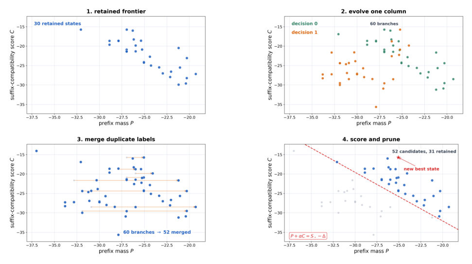
<figcaption class="paper-figure-caption"><b>Fig 2.</b> Figure 2: One transition of the pruned ordered-frontier recursion on a BB code [[72, 12, 6]] under circuit-level noise. Retained states branch on the next binary detector variable, duplicate active-boundary labels are merged by summing their masses, and the merged candidates are scored by S = P + αC before score-gap pruning. In this boundary, the state count changes 30 →60 →52 →31.</figcaption>
</figure>
<figure class="paper-figure-card">
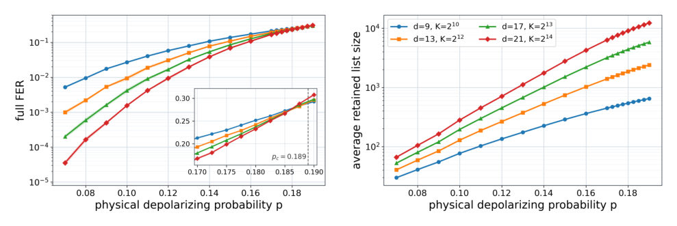
<figcaption class="paper-figure-caption"><b>Fig 3.</b> Figure 3: Rotated-surface code-capacity depolarizing-noise behavior for correlated Pauli Frontier decoding. Left: full FER versus physical depolarizing probability p. The dashed line marks pc = 0.189, the optimal threshold obtained by computing the critical probability of a statistical-mechanics model [39]. Right: average retained list size 1</figcaption>
</figure>
<figure class="paper-figure-card">
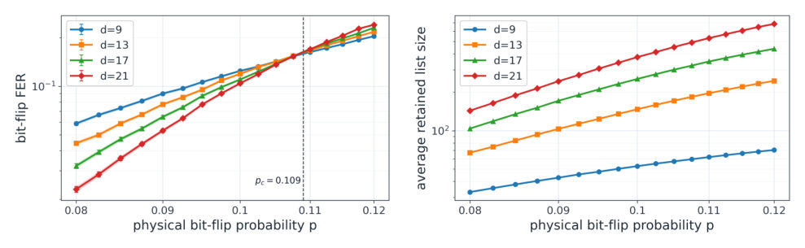
<figcaption class="paper-figure-caption"><b>Fig 4.</b> Figure 4: Hexagonal color-code code-capacity bit-flip benchmark for Frontier decoding. Left: FER versus physical bit-flip probability p. Right: average retained list size, 1</figcaption>
</figure>
<figure class="paper-figure-card">
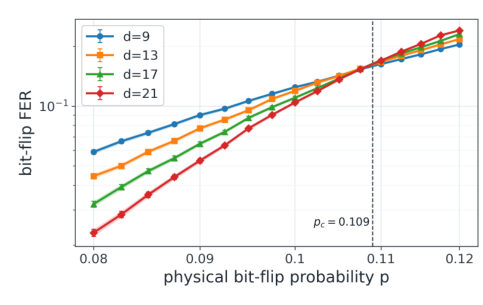
<figcaption class="paper-figure-caption"><b>Fig 5.</b> Figure 5 compares Frontier decoding against correlated minimum-weight perfect matching [6, 7, 41] for the rotated surface code under depolar- izing circuit-level noise at p = 0.002. The plot displays the results for a memory-Z experiment rather than considering both X and Z decod- ing. Each experiment considers d noisy syndrome extraction rounds and reports the corresponding FER per round. It is interesting to fit the per-round logical error rate PL(d) ∝Λ−⌊(d+1)/2⌋ (24)</figcaption>
</figure>

**Summary.** The paper introduces the Frontier decoder, an efficient approximation algorithm designed to solve the computationally hard problem of optimal quantum LDPC decoding. By pruning the state space during a dynamic programming traversal, it achieves near-optimal performance for various quantum error-correcting codes while keeping the computational complexity manageable and low-latency.

**Why it may be interesting.** This work provides a highly scalable algorithmic tool for decoding complex quantum error-correcting codes. For AMO physicists working on quantum computation, it offers concrete benchmarks and insights into the feasibility of fault-tolerant quantum memory and processing using structured codes.

Detailed structure

**Main problem.** The primary goal is to develop an efficient method for approximating the optimal decoding of quantum Low-Density Parity Check (LDPC) codes.

**Main result.** The proposed Frontier decoder achieves state-of-the-art performance, reaching thresholds close to optimal for surface and color codes under various noise models while maintaining a very small average computational overhead.

**Method.** It employs a pruned dynamic-programming approach that processes error variables in an ordered sequence, merging states with identical residual syndromes and logical labels while retaining only the most promising 'frontier' of possibilities based on a heuristic score.

**Model / system.** The work focuses on quantum error correction using LDPC codes (e.g., surface code, color code). The decoding process is modeled as finding the most probable recovery operation given an observed noisy syndrome record, which involves tracking syndromes and logical labels across variable processing steps.

**Key observables.** Full Logical Frame Error Rate (FER), average/peak retained list size ($|F_t|$), and the final maximum log-mass for each possible logical class ($\log bZ(F)_\lambda(s)$).

**Important parameters / regimes.** The noise level ($p$), the score gap ($\Delta$), and the hard memory cap ($K$) are crucial parameters controlling the approximation quality versus computational cost.

**Assumptions / limitations.** The method approximates exact inference by pruning states based on a heuristic score, which assumes that the best path remains within a narrow frontier. The suffix-compatibility score relies on approximations of row marginals.

**Figures summary.** Figures illustrate the decoding process steps (e.g., transition diagrams for BB codes), compare FER vs. noise level ($p$) against other decoders, and analyze computational efficiency metrics like average versus peak retained list sizes and latency tail distributions.

**Paper structure.** The paper introduces the Frontier decoder mechanism by detailing its ordered recursion structure, establishing its exactness when unpruned, and then presenting results comparing its performance (thresholds, FER) against established methods for various quantum codes under realistic noise models.

Abstract

We introduce the Frontier decoder, a pruned dynamic-programming decoder for sparse quantum decoding problems. Frontier processes error variables in a chosen order, merges prefixes with the same residual syndrome and logical label, and approximates logical-coset posterior masses by retaining only a narrow scored frontier. Without pruning, the recursion is exact ordered inference with exponential complexity.   In the code-capacity setting, the decoder reaches thresholds close to optimal for the surface code and the color code. In the circuit-level noise model, it achieves state-of-the-art performance with a very small average retained list size: less than 100 for the gross code $[[144,12,12]]$ at a physical error rate of $0.001$. When the list size is constant, the decoder has linear complexity, suggesting the possibility of low-latency implementations.

[↑ back to top](#top)

### [Efficient classical representation and quantum state preparation of complete active space wavefunctions](http://arxiv.org/abs/2606.19457v1)

**Authors:** Hamza Jnane  
**Type:** theory · **Category:** strongly correlated electrons · **PDF:** <https://arxiv.org/pdf/2606.19457v1>  
**Analysis basis:** full PDF text, analyzed in chunks
**Topic relevance:** `methods for driven-dissipative` **1/5**

↔ Scroll figures horizontally

<figure class="paper-figure-card">
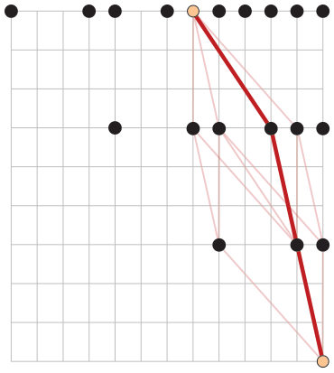
<figcaption class="paper-figure-caption"><b>Fig 1.</b> FIG. 1. A particular walk on a Shavitt graph (red) among all the potential configurations for d = 3 (faded red). Each black node corresponds to a different triplet (a, b, c) and each edge represents a different transition as presented in Table I. For clarity, each δi is associated with an edge with a different angle. For a fixed N and S, all walks start from the root (0, 0, 0) and end at the same node (yellow nodes). For in- stance, for N = 3 and S = 1/2 the final node is (1, 1, 1). The highlighted path (0, 0, 0) →(0, 1, 0) →(0, 2, 0) →(1, 1, 1) corresponds to adding a spin-up electron in the first orbital, followed by a second spin-up electron in the second orbital, and a spin-down...</figcaption>
</figure>
<figure class="paper-figure-card">
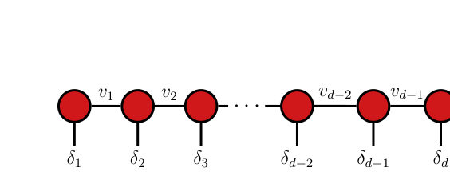
<figcaption class="paper-figure-caption"><b>Fig 2.</b> FIG. 2. MPS representation of the expansion coefficient of a state in the UGA basis. Each tensor Aδi i is depicted as a red circle. The physical index δi labels the transition at orbital i, and each virtual index vi encodes the intermediate configuration (ai, bi, ci) of the first i orbitals.</figcaption>
</figure>
<figure class="paper-figure-card">
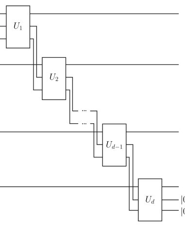
<figcaption class="paper-figure-caption"><b>Fig 3.</b> FIG. 3. Sequential quantum circuit for preparing an MPS in the UGA basis. At each step, a new 2-qubit physical register is introduced, while the bond and temporary registers are propagated as input from the previous unitary. After the last unitary, the bond and temporary registers are uncomputed and back to the all-zero state.</figcaption>
</figure>
<figure class="paper-figure-card">
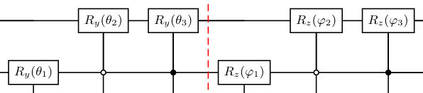
<figcaption class="paper-figure-caption"><b>Fig 4.</b> FIG. 4. State preparation of the physical register. Each rotation is controlled on the temporary register in order to apply the correct angle. While they are schematically represented as controlled on the temporary register, each rotation will be controlled by b different qubits: the ones representing the angle we wish to apply (and by b + 1 qubits for those acting on pi,1 as it is additionally controlled on pi,2). The red dashed line separates the part of the circuit preparing the modulus and phases.</figcaption>
</figure>
<figure class="paper-figure-card">
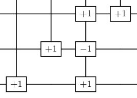
<figcaption class="paper-figure-caption"><b>Fig 5.</b> FIG. 5. Illustration of the circuit performing the last step of our state preparation protocol, where the bond index registers are updated depending on the state of the physical register. Each box represents an addition on O(log χ) qubits. The con- trol pattern and corresponding action reflect the information presented in Table I. The standard control notation is used here, i.e. a black (white) dot requires the state of the qubit to be |1⟩(|0⟩).</figcaption>
</figure>

**Summary.** This paper introduces a novel and efficient method for preparing initial states corresponding to Complete Active Space (CAS) wavefunctions on quantum computers. By transforming the problem into a symmetry-adapted basis, they show that CAS states can be represented as Matrix Product States with polynomial bond dimension scaling. This leads to an overall state preparation complexity of $O(d^3)$, representing an exponential improvement over prior art for simulating strongly correlated electronic systems.

**Why it may be interesting.** The polynomial scaling achieved ($O(d^3)$) represents a major algorithmic breakthrough compared to exponential state preparation methods, making complex molecular simulations feasible on near-term quantum hardware.

Detailed structure

**Main problem.** The core challenge is developing quantum algorithms capable of efficiently preparing initial states with high overlap to the target eigenvector for simulating strongly correlated molecules.

**Main result.** The authors show that by utilizing the Quantum Paldus Transform (QPT) into a symmetry-adapted basis, CAS states can be represented as Matrix Product States (MPS) with polynomial bond dimension scaling ($O(d^2)$).

**Method.** They propose a three-step protocol: 1) Representing the CAS state as an MPS in the Unitary Group Algebra (UGA) basis. 2) Loading this MPS onto a quantum computer. 3) Applying the inverse QPT to transform the state into the Fock basis.

**Model / system.** The system is the electronic structure problem of molecules, specifically requiring the accurate description of strong electron correlation using Complete Active Space (CAS) wavefunctions.

**Key observables.** Gate complexity/Circuit depth, which scales polynomially as $O(d^3)$ for state preparation in the Fock basis.

**Important parameters / regimes.** The active space size ($d$) is the key parameter; the exponential scaling of traditional methods is overcome by polynomial scaling.

**Assumptions / limitations.** The efficiency relies on mapping the CAS state to a structured, symmetry-adapted basis (UGA) where an MPS representation with $O(d^2)$ bond dimension is possible.

**Figures summary.** Figures illustrate the structure of the MPS representation and the sequential quantum circuit required for preparing the MPS state, involving bond and temporary registers.

**Paper structure.** The paper builds from identifying the intractability of CAS states in the Fock basis to introducing the QPT into a symmetry-adapted (UGA) basis. It then proves the efficient MPS representation ($\chi=O(d^2)$), details the quantum circuit for preparing this MPS, and finally combines these steps with the inverse QPT to achieve an overall $O(d^3)$ complexity.

Abstract

Quantum computers promise to solve the electronic structure problem for a large class of molecules. However, the performance of relevant quantum algorithms hinges on preparing initial states with substantial overlap with the target eigenvector. For classically challenging molecules with strong electron correlation, starting from multi-reference states, such as complete active space (CAS) wavefunctions is necessary. Unfortunately, the most advanced state preparation protocols applied to such states result in a gate complexity that scales exponentially with the active space size $d$. In fact, even encoding a CAS state classically is traditionally believed to be intractable for chemically relevant systems. Here, we draw insights from the recently introduced Quantum Paldus Transform (QPT) to show that there exists an efficient classical representation of CAS states and to design a new state preparation routine outperforming previous ones. The QPT represents a transformation from the Fock basis to a friendlier symmetry-adapted basis. Our main contribution consists in showing that CAS states expanded in this basis can efficiently be represented as a matrix product state (MPS) with a bond dimension scaling as $O(d^2)$. One can then efficiently load the MPS on a quantum computer and use the inverse QPT to transform the state to the Fock basis. Moreover, our method can easily be extended to the efficient preparation of CAS states in first quantisation with similar complexity. Crucially, we demonstrate that the complexity of both state preparation protocols only grows polynomially as $O(d^3)$ , which constitutes to the best of our knowledge an exponential improvement over the state of the art.

[↑ back to top](#top)

### [Eigenvector Varieties](http://arxiv.org/abs/2606.20432v1)

**Authors:** Sandra Di Rocco, Bernd Sturmfels, Svala Sverrisdóttir  
**Type:** theory · **Category:** other · **PDF:** <https://arxiv.org/pdf/2606.20432v1>  
**Analysis basis:** full PDF text, analyzed in chunks
**Topic relevance:** `analog quantum simulation` **1/5**

↔ Scroll figures horizontally

<figure class="paper-figure-card">
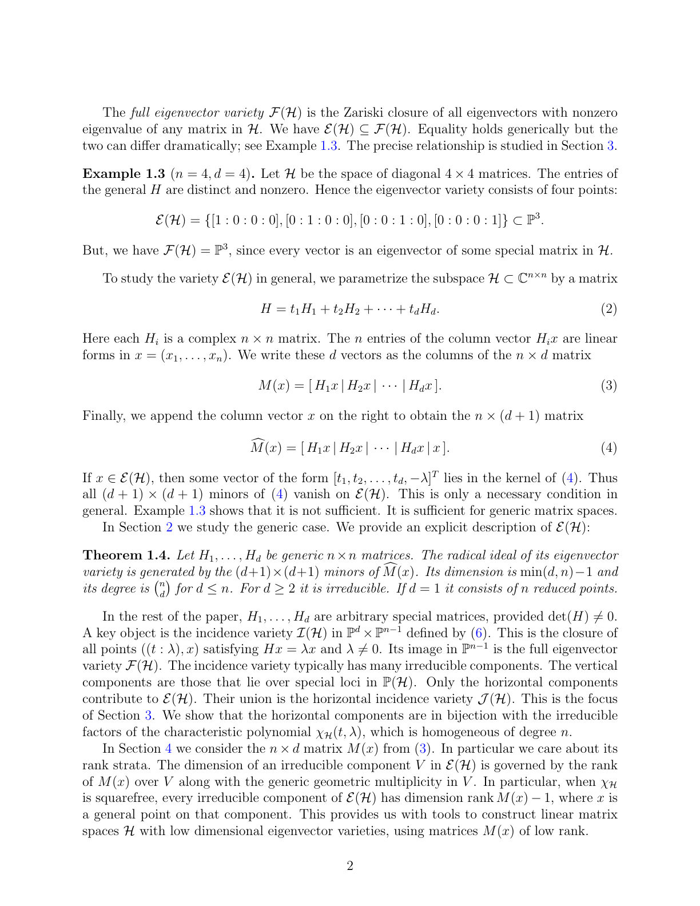
<figcaption class="paper-figure-caption"><b>Fig 1.</b> Low-resolution page preview, page 2</figcaption>
</figure>
<figure class="paper-figure-card">
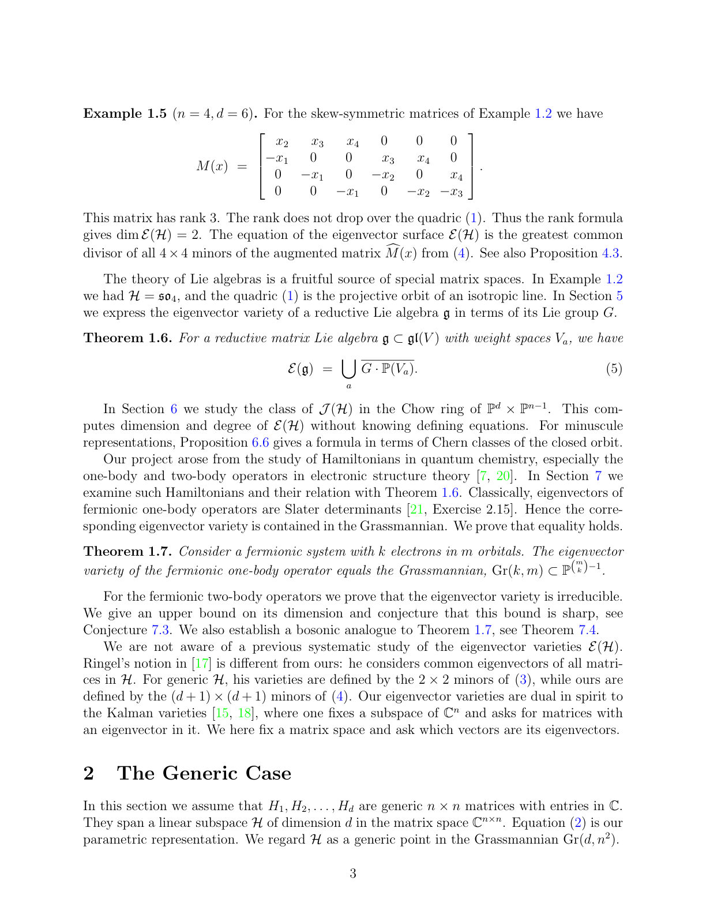
<figcaption class="paper-figure-caption"><b>Fig 2.</b> Low-resolution page preview, page 3</figcaption>
</figure>
<figure class="paper-figure-card">
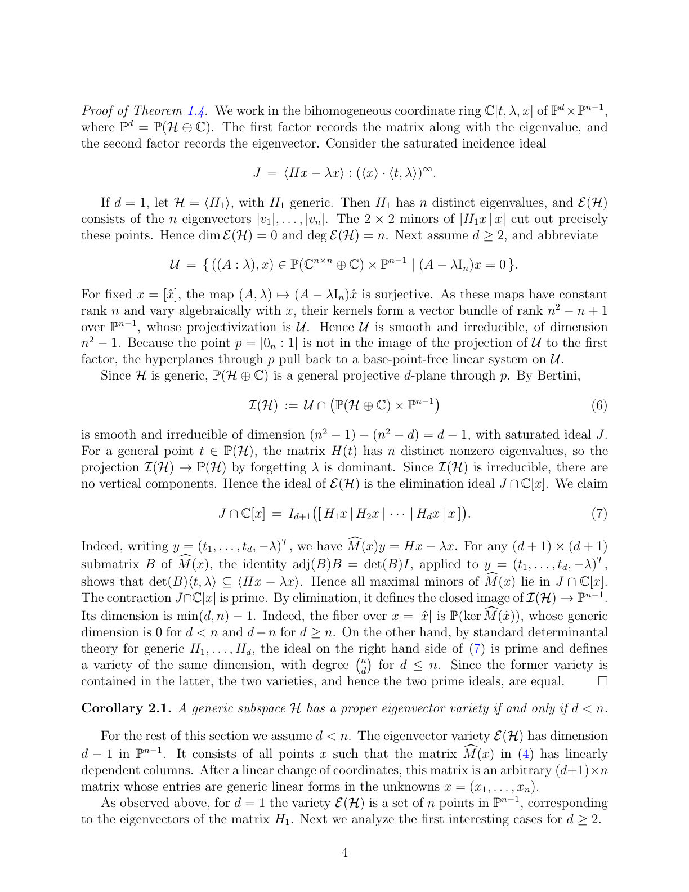
<figcaption class="paper-figure-caption"><b>Fig 3.</b> Low-resolution page preview, page 4</figcaption>
</figure>
<figure class="paper-figure-card">
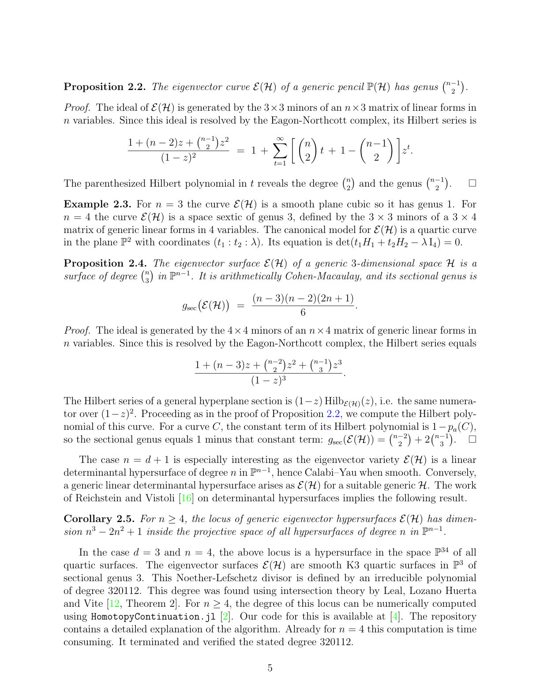
<figcaption class="paper-figure-caption"><b>Fig 4.</b> Low-resolution page preview, page 5</figcaption>
</figure>
<figure class="paper-figure-card">
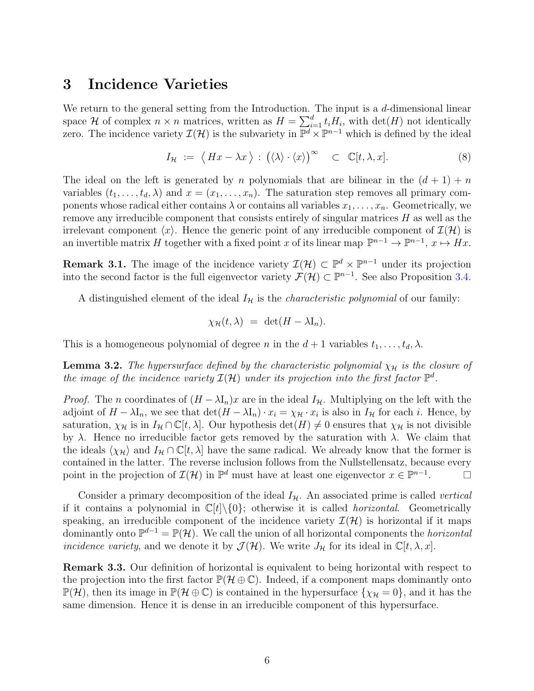
<figcaption class="paper-figure-caption"><b>Fig 5.</b> Low-resolution page preview, page 6</figcaption>
</figure>

**Summary.** This paper develops a rigorous mathematical framework to study eigenvector varieties associated with linear families of quantum Hamiltonians. By employing advanced tools from algebraic geometry, it determines the precise geometric structure (dimension and degree) of these varieties for various physical models, such as fermionic and bosonic systems.

**Why it may be interesting.** This work provides deep geometric insights into the spectral properties of Hamiltonians. Understanding $E(H)$ helps characterize the set of possible ground states or low-energy excitations in complex quantum systems, linking spectral theory directly to algebraic geometry.

Detailed structure

**Main problem.** The paper systematically studies the geometry of 'eigenvector varieties,' $E(H)$, which are subvarieties in projective space whose points correspond to eigenvectors for matrices drawn from a linear space $H$ of quantum system Hamiltonians.

**Main result.** Key results characterize these varieties using tools from algebraic geometry, showing that for fermionic systems, the variety is related to Grassmannians, and for bosonic systems, it relates to Veronese or Chow varieties.

**Method.** The analysis heavily employs advanced algebraic geometry techniques, including determinantal theory (minors of matrices), incidence varieties, elimination ideals, and intersection theory using Chow classes.

**Model / system.** The focus is on quantum mechanical systems modeled by Hamiltonians $H$ that are linear combinations of basis operators ($H = \sum t_i H_i$). Specific models include fermionic one-body operators (leading to Grassmannians) and bosonic one-body operators (leading to Veronese varieties).

**Key observables.** The dimension, degree, and irreducible components of the eigenvector variety $E(H)$ are key observables.

**Important parameters / regimes.** The dimensionality ($n$) of the Hilbert space, the number of parameters ($d$), and the structure of the underlying Lie algebra ($\mathfrak{g}$) govern the geometry.

**Assumptions / limitations.** The analysis often assumes generic conditions on the basis matrices $H_i$ or that certain associated varieties are irreducible to derive clean dimension formulas.

**Figures summary.** No specific figure descriptions were extracted, but the notes reference tables providing numerical verification of dimensional conjectures for fermionic operators.

**Paper structure.** The paper progresses from general algebraic characterizations (defining $E(H)$ via minors) to specialized physical applications. It systematically analyzes cases like generic pencils ($d=2$), 3D spaces ($d=3$), and finally tackles specific quantum models: fermionic one-body operators ($	ext{Gr}(k, m)$), bosonic one-body operators (Veronese varieties), and general Lie algebra representations.

Abstract

Any linear space of square matrices has an associated eigenvector variety. Its points are eigenvectors of matrices from that linear space. We present a systematic study of eigenvector varieties, with focus on Lie algebras and Hamiltonians of quantum systems.

[↑ back to top](#top)

### [Electrostatic effects in nano-reactor-confined charge regulated macroions](http://arxiv.org/abs/2606.20040v1)

**Authors:** Manit Klawtanong, Petch Khunpetch, Huaqiong Li, Shigeyuki Komura  
**Type:** theory · **Category:** statistical mechanics · **PDF:** <https://arxiv.org/pdf/2606.20040v1>  
**Analysis basis:** full PDF text, analyzed in chunks
**Topic relevance:** `Keldysh / 2PI / non-Gaussian methods` **1/5**

↔ Scroll figures horizontally

<figure class="paper-figure-card">
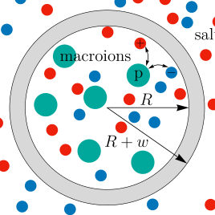
<figcaption class="paper-figure-caption"><b>Fig 1.</b> FIG. 1. Schematic rendition of the molecular model. Elec- trolyte ions are exchangeable between the inside and the out- side of the spherical enclosure (nano-reactor) and are thus in grand canonical equilibrium, characterized by a fixed chemical potential. The macroion cargo, on the other hand, is en- trapped inside the enclosure and is thus not in grand canonical equilibrium with the bulk but can be seen as corresponding to a canonical subsystem with a fixed number of macroions, set by the experimental (preparation) procedure. Charge reg- ulation of the macroions is indicated by the arrows indicating the adsorption/desorption charge regulation equilibrium. The inner and outer surfaces of...</figcaption>
</figure>
<figure class="paper-figure-card">
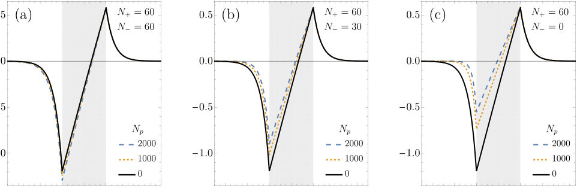
<figcaption class="paper-figure-caption"><b>Fig 2.</b> FIG. 2. βeψ (r) for different numbers of macroions, Np. The plots are evaluated for the completely symmetric case (N+ = 60 and N−= 60) (a), the partially asymmetric case (N+ = 60 and N−= 30) (b), and the completely asymmetric case (N+ = 60 and N−= 0) (c). The nano-reactor shell is indicated by the gray region. The results correspond to n0 = 200 mM, σR = −0.2 e/nm2, σR+w = 0.1 e/nm2, R = 100 nm, and w = 4 nm.</figcaption>
</figure>
<figure class="paper-figure-card">
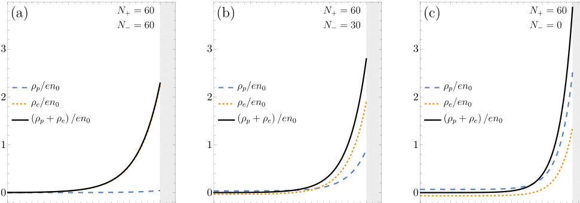
<figcaption class="paper-figure-caption"><b>Fig 3.</b> FIG. 3. The spatial distributions of the charge density rescaled by en0 for the completely symmetric (a), the partially asymmetric (b), and the completely asymmetric (c) cases. ρp and ρe are the charge densities of the macroions and electrolyte ions, respectively. The total number of the macroions is Np = 1000. σR = −0.2 e/nm2 and n0 = 200 mM.</figcaption>
</figure>
<figure class="paper-figure-card">
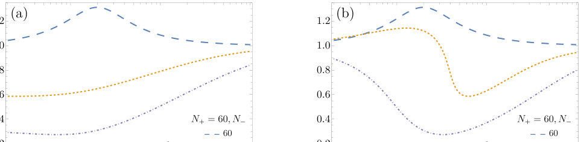
<figcaption class="paper-figure-caption"><b>Fig 4.</b> FIG. 4. The rescaled effective screening length λeff/λ0, where λeff = κ−1 eff and λ0 = κ−1 0 , as a function of bulk salt concentration n0, in the case of (a) σR = −0.2 e/nm2, σR+w = 0.1 e/nm2 and (b) σR = 0.2 e/nm2, σR+w = −0.1 e/nm2. Np is set as 1000 and R = 100 nm. In each plot, the completely symmetric case (N+ = N−= 60), the partially asymmetric case (N+ = 60 and N−= 30), and the completely asymmetric case (N+ = 60 and N−= 0) are shown.</figcaption>
</figure>
<figure class="paper-figure-card">
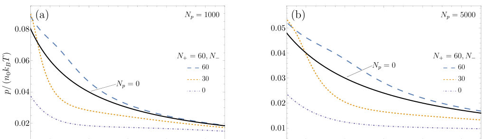
<figcaption class="paper-figure-caption"><b>Fig 5.</b> FIG. 5. The scaled pressure, p/(n0kBT), as a function of the nano-reactor radius, R, for Np = 1000 (a) and Np = 5000 (b). The solid line represents the pressure in the absence of macroions, Np = 0. The results correspond to n0 = 200 mM, σR = −0.2 e/nm2, and σR+w = 0.1 e/nm2.</figcaption>
</figure>

**Summary.** This paper develops a thermodynamic model describing macroions confined in a nano-reactor immersed in an electrolyte solution. By coupling Poisson-Boltzmann theory with charge regulation formalism, the authors analyze how surface charge asymmetry affects the potential profile and effective screening length. Key findings show that pressure decreases monotonically with increasing reactor size or salt concentration, providing insights into nanoscale electrostatics.

**Why it may be interesting.** This work provides a detailed theoretical framework for understanding confined electrochemistry where surface chemistry (charge regulation) dictates macroscopic properties like osmotic pressure and electrostatic screening, relevant to biomolecular confinement.

Detailed structure

**Main problem.** The study formulates a thermodynamic model for macroions confined within a nano-reactor, focusing on how charge regulation equilibria influence the electrostatic potential and pressure.

**Main result.** Surface charge asymmetry strongly dictates the spatial profile of the electrostatic potential, and the effective screening length exhibits non-monotonic behavior due to complex interplay between external solution and macroion charges.

**Method.** The analysis uses a thermodynamic framework minimizing a free energy functional, solved via linearized Debye-Hückel type approximations applied to Poisson-Boltzmann Charge Regulation (PB-CR) equations.

**Model / system.** The system is an electrolyte-permeable nano-reactor containing charge-regulated macroions. The model combines grand canonical ensembles for mobile ions with a fixed number of confined macroions, incorporating Langmuir isotherm descriptions for surface adsorption/desorption equilibria.

**Key observables.** Electrostatic potential profile ($\psi(r)$), ionic density distributions ($n_\pm$), total pressure at the enclosure boundary, and effective screening length ($\lambda_{eff}$).

**Important parameters / regimes.** Enclosure radius ($R$), bulk salt concentration ($n_0$), surface charge densities ($\sigma_R$, $\sigma_{R+w}$), and the number of confined macroions ($N_p$).

**Assumptions / limitations.** The analysis relies on linearizing the full non-linear PB-CR equations (Debye-Hückel approximation) and assumes that the macroion cargo is fixed in number rather than being in bulk equilibrium.

**Figures summary.** Figures illustrate scaled electrostatic potential profiles ($eta_e\psi(r)$) for varying numbers of macroions, spatial charge density distributions showing asymmetry effects, and plots demonstrating monotonic pressure decrease with increasing radius or salt concentration.

**Paper structure.** The paper develops the free energy functional incorporating charge regulation, linearizes the resulting coupled differential equations (PB-CR), solves for radial profiles in different regions (inside/wall/outside), and analyzes key observables like potential, screening length, and pressure dependence on system parameters.

Abstract

We formulate a thermodynamic model of a nano-reactor containing charge-regulated macroions within an electrolyte-permeable enclosure. The model is then formalized within the Poisson-Boltzmann electrostatics augmented by the consistent inclusion of the charge dissociation of molecular groups residing on the surface of the entrapped macroions via charge regulation formalism. By solving the basic equilibrium equations in the linearized Debye-Hückel type approximation, we analyze the salient features of the inhomogeneous electrolyte distribution and macroion charge. We found that the surface charge asymmetry/symmetry of the macroions strongly affects the spatial profile of electrostatic potential. The effective screening length shows the non-monotonic behavior, arising from the complex interplay between the bathing external solution and macroion effective charges, which govern charge regulation equilibria. The total pressure at the nano-reactor enclosure boundary decreases monotonically as the enclosure radius and the ionic bulk salt concentration increase. Also, the resulting pressure is strongly influenced by the surface charge densities of the nano-reactor and the number of confined macroions.

[↑ back to top](#top)

### [Magnetic configurations and excitations in high-$T_{c}$ multilayer nickelates](http://arxiv.org/abs/2606.20533v1)

**Authors:** Jun Zhan, Xianxin Wu, Jiangping Hu  
**Type:** theory · **Category:** strongly correlated electrons · **PDF:** <https://arxiv.org/pdf/2606.20533v1>  
**Analysis basis:** full PDF text, analyzed in chunks
**Topic relevance:** `Keldysh / 2PI / non-Gaussian methods` **1/5**

↔ Scroll figures horizontally

<figure class="paper-figure-card">
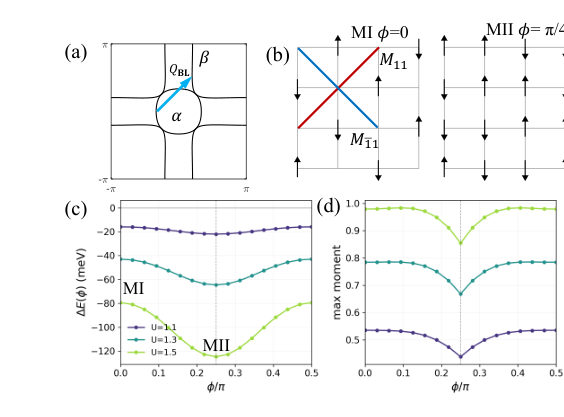
<figcaption class="paper-figure-caption"><b>Fig 1.</b> FIG. 1. Fermi surfaces, magnetic configurations, and energetics of bilayer nickelates. (a) Fermi surfaces. (b) Real-space patterns of the single-stripe (ϕ = 0) and double-stripe (ϕ = π/4) magnetic orders, where sites without arrows are spinless. (c) The energy per site with respect to the normal state and (d) maximum real-space magnetic moment as functions of the phase parameter ϕ.</figcaption>
</figure>
<figure class="paper-figure-card">
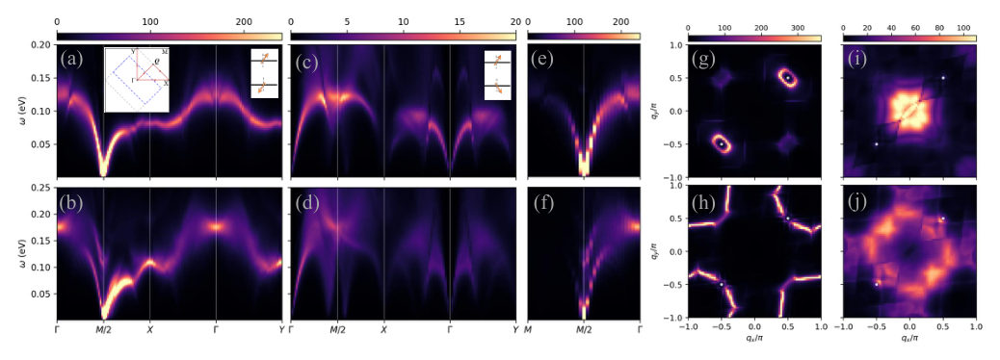
<figcaption class="paper-figure-caption"><b>Fig 2.</b> FIG. 2. Transverse spin excitations of the U = 1.3 eV Hartree–Fock states. The inset in (a) shows the unfolded Brillouin zone, the magnetic Brillouin zone associated with the period-four ordering vector Q = (π/2, π/2), and the momentum paths used for the spectra. (a,b) Mirror- odd spectra of the single-stripe and double-stripe states, respectively. (c,d) Corresponding mirror-even spectra. The small insets in (a) and (c) illustrate the bilayer mirror-odd and mirror-even modes. (e,f) Mirror-odd spectra along the M →Γ path for the single-stripe and double-stripe states. (g,h) Fixed-energy mirror-odd momentum maps at ω = 0.05 eV for the single-stripe and double-stripe states. (i,j)...</figcaption>
</figure>
<figure class="paper-figure-card">
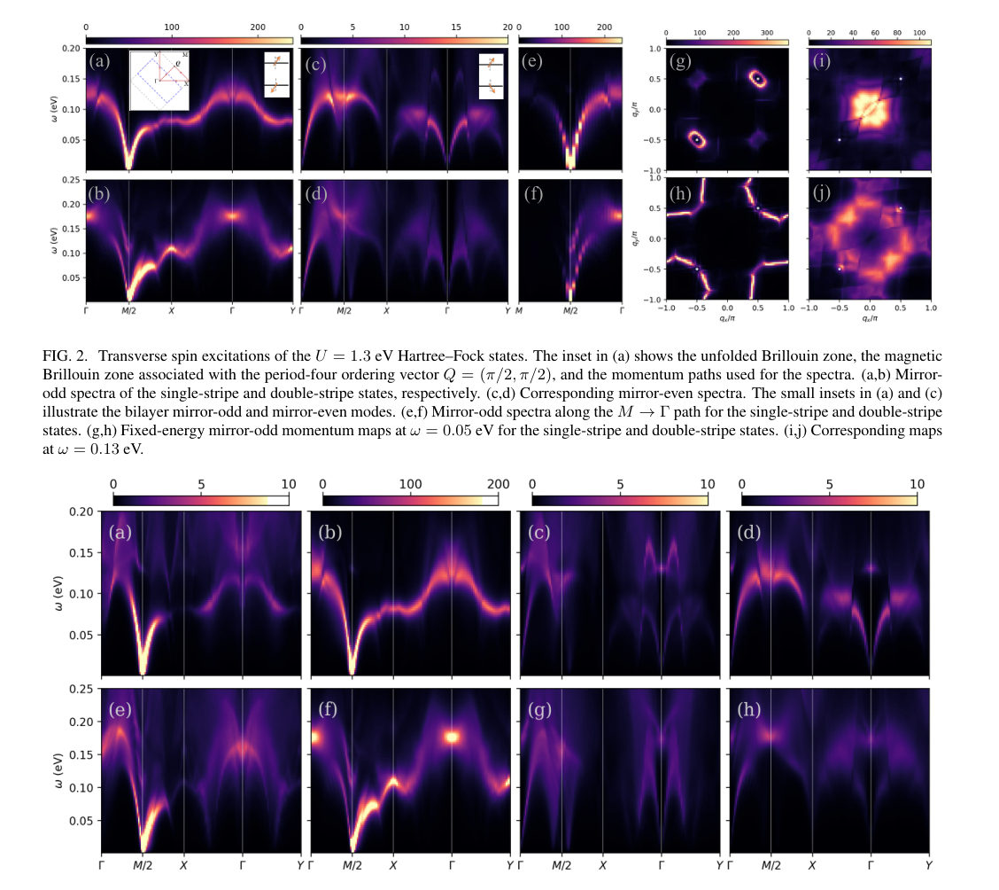
<figcaption class="paper-figure-caption"><b>Fig 3.</b> FIG. 3. Orbital-resolved transverse spin excitation spectra for the U = 1.3 eV Hartree–Fock states along the high-symmetry momentum path. The upper row shows the single-stripe state, while the lower row shows the double-stripe state. Panels (a,e) show the dx2−y2-orbital- resolved mirror-odd channel, panels (b,f) the dz2-orbital-resolved mirror-odd channel, panels (c,g) the x-orbital-resolved mirror-even channel, and panels (d,h) the z-orbital-resolved mirror-even channel. Here M/2 = Q = (π/2, π/2) is the period-four ordering wave vector.</figcaption>
</figure>
<figure class="paper-figure-card">
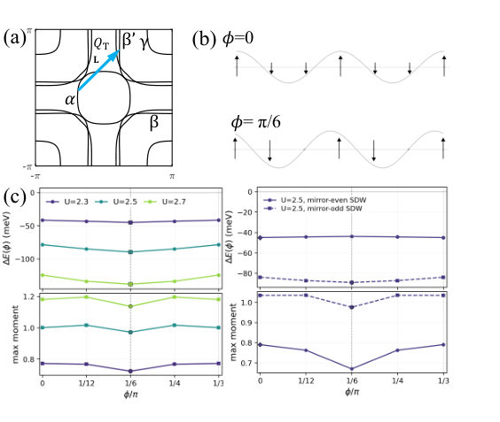
<figcaption class="paper-figure-caption"><b>Fig 4.</b> FIG. 4. (a) Fermi surface for the opposite mirror-parity nesting case, where the mirror-even α pocket and mirror-odd β′ pocket are connected by the nesting vector QTL. (b) Schematic real-space spin modulations for two representative SDW phases, ϕ = 0 and ϕ = π/6. (c) The energy per site with respect to the normal state, ∆E(ϕ), and the maximum real-space magnetic moment for the mirror-odd SDW driven by opposite mirror-parity nesting. The minimum occurs at ϕ = π/6 for U = 2.3, 2.5, and 2.7 eV. (d) Corresponding phase dependence for the same mirror-parity nesting case at U = 2.5 eV, comparing mirror-even and mirror-odd SDW solutions. The mirror- even solution is favored at ϕ = 0 modulo the...</figcaption>
</figure>
<figure class="paper-figure-card">
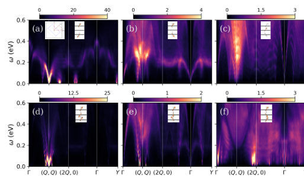
<figcaption class="paper-figure-caption"><b>Fig 5.</b> FIG. 5. Layer-resolved transverse spin spectra of the trilayer nick- elate model. The spectra are evaluated along the high-symmetry path Γ →(Q, Q) →(2Q, 0) →Γ →Y , with Q = 2π/3. Panels (a)–(c) show the mirror-odd SDW state driven by opposite- mirror-parity nesting between the mirror-even α pocket and the mirror-odd β′ pocket at U = 2.3 eV, projected onto the mirror-odd (1, 0, −1)/ √</figcaption>
</figure>

**Summary.** This theoretical study uses an itinerant multi-orbital framework to map out the magnetic ground states in multilayer nickelates. By calculating spin excitation spectra for various SDW symmetries, the authors argue that these excitations serve as a sensitive probe distinguishing between competing magnetic orders. The results strongly support the mirror-odd SDW state and confirm the itinerant nature of magnetism in these high-$T_c$ materials.

**Why it may be interesting.** While focused on magnetism, the itinerant nature of the model and the use of orbital degrees of freedom place it within the broader context of strongly correlated electron physics relevant to unconventional superconductivity mechanisms.

Detailed structure

**Main problem.** The study investigates the magnetic ground states and transverse spin excitations in high-temperature superconducting multilayer nickelates to understand the microscopic origin of magnetism.

**Main result.** The calculations favor the mirror-odd Spin Density Wave (SDW) state in trilayer systems, while for bilayers, the single-stripe state's excitation spectrum shows good qualitative agreement with experimental RIXS and neutron scattering data.

**Method.** Theoretical analysis using a multi-orbital itinerant framework Hamiltonian solved via Hartree-Fock mean-field theory, followed by Random Phase Approximation (RPA) calculations for spin susceptibility.

**Model / system.** The system models bilayer and trilayer nickelates in the Ruddlesden–Popper phase, described by an itinerant model incorporating onsite Hubbard interactions and Hund's coupling on Ni $e_g$ orbitals. The analysis compares different SDW symmetries (mirror-odd vs. mirror-even).

**Key observables.** Transverse spin excitation spectra ($	ext{Im}[\chi^{+-}]$), magnetic order types (single/double stripe, mirror-odd/even SDW), and optical interlayer modes.

**Important parameters / regimes.** Interaction strengths ($U, J$), layer number (bilayer vs. trilayer), and momentum transfer points like $Q_{	ext{BL}}$ and $	ilde{\mathbf{Q}}_{	ext{TL}}$.

**Assumptions / limitations.** The analysis relies on mean-field decoupling (Hartree-Fock) and the Random Phase Approximation (RPA) for excitations, which may neglect certain correlation effects.

**Figures summary.** Figures illustrate Fermi surfaces, real-space magnetic patterns for different SDW states, and momentum/energy spectra ($	ext{Im}[\chi^{+-}]$) comparing various magnetic orders.

**Paper structure.** The paper systematically analyzes the bilayer case (single vs. double stripe), then moves to the trilayer case by comparing mirror-odd and mirror-even SDW candidates, culminating in a comparison of excitation signatures against experimental data.

Abstract

We investigate the magnetic ground states and transverse spin excitations of bilayer and trilayer nickelates within a multi-orbital itinerant framework. For the bilayer system, although Hartree-Fock calculations slightly favor a double-stripe order, the calculated excitation spectrum of the single-stripe state, characterized by an anisotropic low-energy cone at $Q_{\text{BL}}$ and isotropic high-energy excitations near $Γ$, exhibits good qualitative agreement with recent RIXS and neutron scattering experiments. We further identify mirror-even optical interlayer modes at $Q_{\text{BL}}$ whose energies match the mirror-odd modes at $Γ$. For the trilayer system, both mirror-odd and mirror-even spin-density-wave states can be stabilized near $Q_{\text{TL}}$, with the mirror-odd state lower in energy in the parameter regime studied. The mirror-odd state hosts an additional nearly gapless mode dominated by the middle layer, while the mirror-even state contains only one acoustic branch together with two gapped optical modes. Comparison with available RIXS data favors the mirror-odd spin-density-wave scenario. Our results show that magnetic excitations provide a sensitive probe of the magnetic order and support a common itinerant origin of magnetism in multilayer nickelates.

[↑ back to top](#top)

### [Optimizing resource allocation for accuracy in noisy variational quantum algorithms](http://arxiv.org/abs/2606.20153v1)

**Authors:** Harshit Verma, Thomas Ayral, Alexia Auffèves, Robert Whitney  
**Type:** theory · **Category:** quantum information and computing · **PDF:** <https://arxiv.org/pdf/2606.20153v1>  
**Analysis basis:** full PDF text, analyzed in chunks
**Topic relevance:** `methods for driven-dissipative` **1/5**

↔ Scroll figures horizontally

<figure class="paper-figure-card">
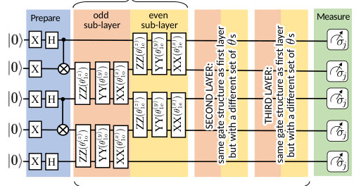
<figcaption class="paper-figure-caption"><b>Fig 1.</b> FIG. 2. Abstract representation of the quantum circuit imple- menting a VQE algorithm for the Heisenberg model in Eq. (3), using a slight variant of the Hamiltonian Variational Ansatz (HVA) in Fig. 2 of Ref. [37]. The circuit shown here has three layers, Nlayers = 3, but we will consider circuits with arbitrary Nlayers. The qth layer has the following 6 classical variational parameters: θ(z) qo , θ(z) qe , θ(y) qo , θ(y) qe , θ(x) qo and θ(x) qe . The two qubit gates here are XX(θ) = e−iσx⊗σxθ, YY(θ) = e−iσy⊗σyθ and ZZ(θ) = e−iσz⊗σzθ. Some of the variational angles are shared between multiple gates as per the ansatz prescription. Infor- mation about the state is obtained through the qubit...</figcaption>
</figure>
<figure class="paper-figure-card">
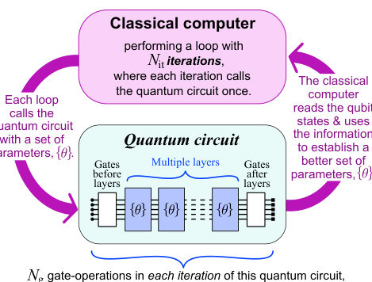
<figcaption class="paper-figure-caption"><b>Fig 2.</b> FIG. 1. A typical Noisy Intermediate-Scale Quantum (NISQ) algorithm, in this case a Variational Quantum Eigensolver (VQE) for approximating the ground-state energy (Egs) of a given Hamiltonian. A classical optimizer begins with a ran- domly chosen initial set of variational parameters {θ}. A parameterized quantum circuit (ansatz) is then prepared and executed with these parameters, and the expectation value of the Hamiltonian’s energy is estimated from measurements of the resulting state. The classical optimizer uses this energy estimate to update {θ} according to a chosen optimization strategy. This loop repeats for Nit iterations, ideally converg- ing to a set of parameters {θ∗} that...</figcaption>
</figure>
<figure class="paper-figure-card">
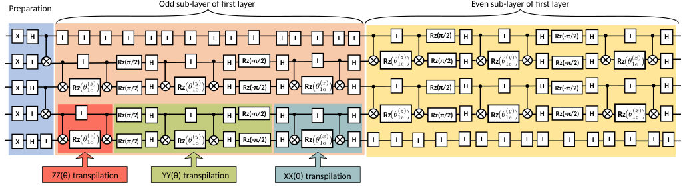
<figcaption class="paper-figure-caption"><b>Fig 3.</b> FIG. 3. The transpiled quantum circuit that we considered (showing only the first layer of that circuit). This transpiled circuit is given by taking the quantum circuit in Fig. 2, while assuming that ZZ(θ), YY(θ) and XX(θ)) are not native gates of the hardware, and so they must be have transpiled into native gates. Here we assume those native gates are Ry, Rz(θ) and CNOT gates. Individual colored boxes show how ZZ(θ), YY(θ) and XX(θ) are transpiled into such native gates. Each identity gates is indicated by “ I ”. We observe that there are 150 gates per layer (including 42 identity gates), when we count gates in the manner explained above Eq. (5).</figcaption>
</figure>
<figure class="paper-figure-card">
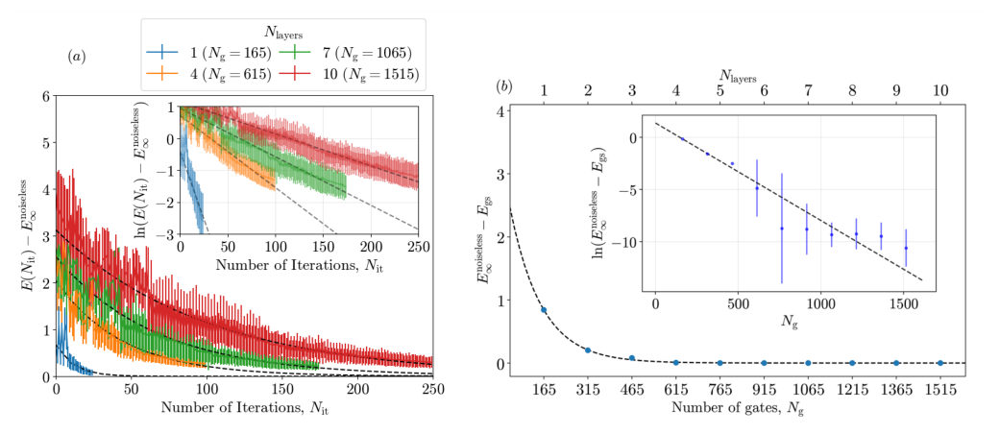
<figcaption class="paper-figure-caption"><b>Fig 4.</b> FIG. 4. (a) Convergence of the VQE energy as a function of number of iterations Nit, with a varied number of layers (Nlayers) corresponding to different Ng. This convergence can be fit to Eq. (6), and the convergence factor µ can be extracted using the fit shown as black dashed lines. The same fit is shown in the inset on a log-linear scale. (b) Here we take the plots in (a), along with other similar plots, and extract the converged result of the (noiseless) VQE algorithm (Nit →∞). We then plot this as a function of the size of the quantum circuit, which is determined by the number of layers in the quantum circuit and quantified by the number of gates in the quantum circuit, Ng. The same is...</figcaption>
</figure>
<figure class="paper-figure-card">
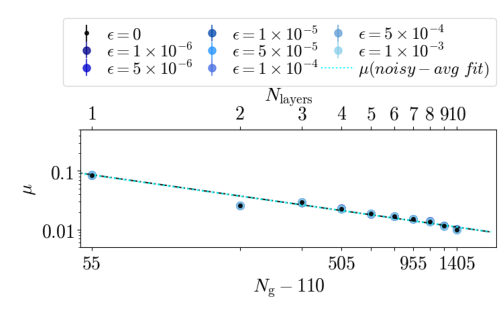
<figcaption class="paper-figure-caption"><b>Fig 5.</b> FIG. 5. The rate at which the VQE energy converges with increasing number of iterations, µ, plotted versus the number of gates in the circuit, Ng. Larger Ng has smaller µ, because larger Ng means more variational parameters to change, and so requires more iterations to converge. Here the µ is defined in Eq. (6) for the noiseless case (black), and in Eq. (14) in the noisy case (various blues). The data for the noiseless VQE algorithm (black dots) in this plot are obtained by extracting µ from a fitting of simulations of the VQE algorithm (shown in Fig. 4) to Eq. (6) and extracting µ from data with Nit up to about 25Nlayers. The data for the noisy VQE algorithm (blue dots) is extracted in the...</figcaption>
</figure>

**Summary.** This paper introduces a comprehensive methodology to optimize Variational Quantum Algorithms (VQAs) like VQE by balancing accuracy against computational resources in noisy environments. It develops scaling relations that pinpoint an optimal balance between quantum circuit size and the number of required iterations. This provides essential, practical guidelines for deploying these algorithms on real-world, imperfect quantum hardware.

**Why it may be interesting.** This work provides a crucial resource management framework for near-term quantum computation, directly addressing the practical limitations of NISQ devices by quantifying the necessary trade-off between circuit depth and iterative optimization steps.

Detailed structure

**Main problem.** The core problem is developing methodologies to optimize Variational Quantum Algorithms (VQAs) to achieve a target output accuracy while minimizing the total algorithmic resource cost.

**Main result.** The authors establish scaling relations that allow identifying an optimal balance between quantum circuit size ($N_g$) and number of iterations ($N_{it}$) to minimize resources for a desired accuracy, even on noisy hardware.

**Method.** They develop a Metric–Noise–Resource (MNR) framework, deriving phenomenological scaling relations by analyzing the convergence behavior of VQE under global depolarizing noise models.

**Model / system.** The primary model is the Variational Quantum Eigensolver (VQE), exemplified using the 5-spin Heisenberg chain Hamiltonian. The analysis treats the algorithm's performance as a function of circuit depth and iteration count.

**Key observables.** Algorithmic accuracy ($\approx 1 - \delta_E$), Algorithmic Resource Cost ($\Delta = N_g N_{it}$), and Efficiency ($\eta = M/\Delta$).

**Important parameters / regimes.** Noise strength ($\epsilon$), optimal gate count ($N_{	ext{opt},g}$), convergence rate parameters ($\mu, \kappa$), and the total resource budget ($\Delta$).

**Assumptions / limitations.** The analysis often assumes a global depolarizing noise model for tractability, although it is shown to provide practical guidelines for hardware with error mitigation.

**Figures summary.** Figures illustrate VQE energy convergence vs. iterations/circuit size (Fig. 4), the optimal gate count dependence on noise (Fig. 6), and heatmaps showing resource cost and efficiency contours across $N_{it}$ and $N_g$ (Fig. 7).

**Paper structure.** The paper progresses from defining the optimization goal using VQE, deriving scaling relations for noiseless convergence, incorporating noise effects to find optimal trade-offs ($N_{	ext{opt},g}$), and finally validating these theoretical guidelines on simulated noisy hardware.

Abstract

For quantum algorithms to achieve their full potential, we need methodologies to optimize them, such as reaching a given output accuracy with minimal resource costs. Here, we develop such a methodology for a class of Noisy Intermediate-Scale Quantum (NISQ) algorithms. We leverage simulations of a Variational Quantum Eigensolver (VQE) to propose a phenomenological model of such algorithms that captures the complex relationship between algorithmic accuracy, algorithmic resource costs, and the noise that exists in realistic quantum hardware. For this, we take the algorithmic resource cost to be the total number of quantum gate-operations in the algorithm; minimizing this cost typically makes the algorithm faster and more energy-efficient. We consider the subtle trade-off between quantum circuit size (small circuits are too imprecise, but large ones are too noisy), and the number of iterations of that quantum circuit for the full algorithm to sufficiently converge. Using a noise-metric-resource methodology, we identify the sweet spot (of circuit size versus iterations) that minimizes the algorithmic resource costs for a desired algorithm accuracy. It also gives the circuit size that maximizes algorithm accuracy for a fixed resource cost. Our methodology provides a practical guideline for near-term deployment of variational algorithms on realistic noisy hardware, including hardware that uses error mitigation.

[↑ back to top](#top)

### [Random Projections for Multi-Copy Quantum Algorithms](http://arxiv.org/abs/2606.20238v1)

**Authors:** Xiaoyu Liu, Jordi Tura, Johannes Knörzer  
**Type:** theory · **Category:** quantum information and computing · **PDF:** <https://arxiv.org/pdf/2606.20238v1>  
**Analysis basis:** full PDF text, analyzed in chunks
**Topic relevance:** `quantum measurements` **1/5**

↔ Scroll figures horizontally

<figure class="paper-figure-card">
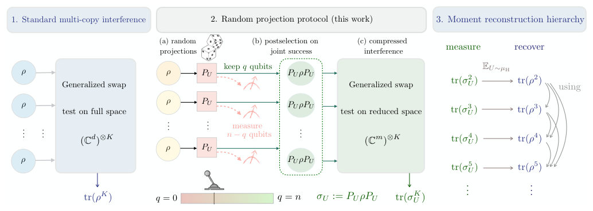
<figcaption class="paper-figure-caption"><b>Fig 1.</b> FIG. 1. Comparison between standard multi-copy protocols and the random projection framework introduced in this work. Left: Conventional estimation of nonlinear observables such as tr(ρK) using generalized swap test acting on the full Hilbert space (Cd)⊗K. Center: Random projection protocol. (a) Each copy of the quantum state ρ is projected onto the same Haar-random m-dimensional subspace (m &lt; d) using the projector PU = UPU †, where m = 2q for q qubits. (b) Runs are postselected on joint projection success, yielding projected states PUρPU. (c) The generalized swap test is subsequently performed only on the reduced Hilbert space (Cm)⊗K. Right: Schematic hierarchy of moment reconstruction...</figcaption>
</figure>
<figure class="paper-figure-card">
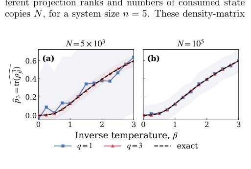
<figcaption class="paper-figure-caption"><b>Fig 2.</b> FIG. 2. Estimated third moment ˆp3 as a function of inverse temperature β for thermal states of the five-qubit transverse- field Ising model from Eq. (10) with J = h = 1. Results are shown for two total numbers of copies consumed by the pro- tocol: (a) N = 5 × 103 and (b) N = 105. The dashed black curve shows the exact value p3 = tr(ρ3 β). Colored markers denote reconstructed estimates obtained using random pro- jections that retain q = 1 (blue squares) and q = 3 (red trian- gles) qubits prior to collective measurement. Shaded regions indicate interquartile ranges obtained from 500 independent realizations of the complete estimation protocol.</figcaption>
</figure>
<figure class="paper-figure-card">
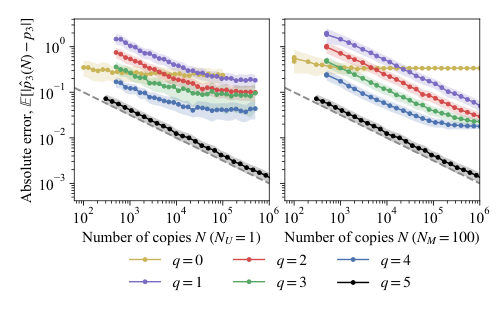
<figcaption class="paper-figure-caption"><b>Fig 3.</b> FIG. 3. Mean absolute estimation error E[|ˆpK(N) −pK|] for the reconstructed third moment p3 = tr(ρ3) as a func- tion of the number of consumed state copies N, for different numbers q of kept qubits. The left panel fixes the number of randomized unitaries to NU = 1 and varies the number of measurement shots NM, while the right panel fixes NM = 100 and varies NU. The target state is a noisy 5-qubit GHZ state with 30% depolarizing noise. Solid curves show averages over 500 independent realizations, while shaded regions indicate ±1/3 standard deviation. The dashed guide indicates the expected Monte Carlo scaling ∝N −1/2. The fully coherent case, q = 5, corresponds to the generalized swap test,...</figcaption>
</figure>
<figure class="paper-figure-card">
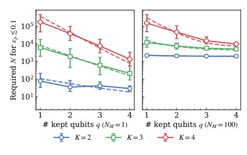
<figcaption class="paper-figure-caption"><b>Fig 4.</b> FIG. 4. Average required number of copies N to obtain ϵp ≲0.1 for 5-qubit GHZ state with 30% depolarizing noise over 300 independent trials. The error bars indicate the mid- dle 68% range of the results. The brickwork circuit depth is fixed to be 5. We fix NM = 1 (left panel) and NM = 100 (right panel) respectively. Higher-order moments are estimated hi- erarchically by first estimating the lower-order moments, and the required number of copies is counted in total. The results are fitted to O  poly(K) NM +2(n−q)(K−1)</figcaption>
</figure>
<figure class="paper-figure-card">
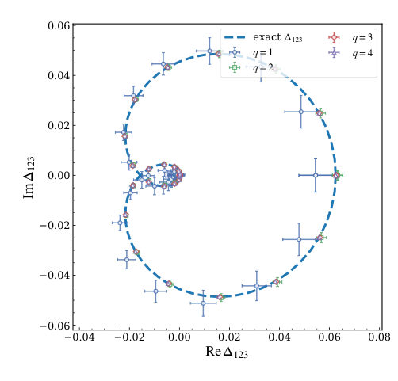
<figcaption class="paper-figure-caption"><b>Fig 5.</b> FIG. 5. Reconstruction of ∆123 in the complex plane. The dashed curve shows the exact values, while symbols denote es- timates obtained from random projections for different num- bers q of remaining qubits. Error bars indicate one standard error of the mean obtained from 50 independent batches. In- creasing q improves the accuracy and reduces statistical fluc- tuations, with the estimates approaching the exact trajectory.</figcaption>
</figure>

**Summary.** The paper addresses the experimental difficulty of measuring high-order quantum moments using multiple state copies. It proposes replacing full coherent measurements with random projections onto smaller subspaces, which allows researchers to tune the protocol's resource cost. This framework provides a scalable method to estimate complex quantum properties on near-term hardware.

**Why it may be interesting.** This work provides a concrete, resource-aware roadmap for implementing complex quantum tomography protocols on NISQ devices by systematically trading off full coherence requirements for increased statistical sampling overhead.

Detailed structure

**Main problem.** The core challenge is estimating nonlinear properties of quantum states, such as multivariate traces $	ext{tr}(
ho_1 \cdots 
ho_K)$, when standard multi-copy measurement protocols require unfeasible coherent operations on large Hilbert spaces.

**Main result.** The authors introduce a framework using random projections onto lower-dimensional subspaces to achieve a tunable tradeoff between required coherent resources and statistical sampling overhead, enabling optimization for near-term hardware.

**Method.** They derive explicit formulas relating Haar-averaged projected moments ($\overline{\sigma}_K$) to the target traces, utilizing tools from character theory and Weingarten calculus to reconstruct high-order spectral moments recursively.

**Model / system.** The study focuses on quantum states $
ho$ (density matrices) acting on $n$-qubit systems. The methodology is general but tested using concepts applicable to thermal states of models like the transverse-field Ising model.

**Key observables.** Multivariate traces ($	ext{tr}(
ho^K)$), Haar-averaged projected moments ($\overline{\sigma}_K^{(d,m)}$), and estimation error $\epsilon_p$.

**Important parameters / regimes.** System size ($n$), projection rank ($q$ or $m$), number of copies ($K$), and the ratio of coherent to sampled resources.

**Assumptions / limitations.** The analysis relies on approximating Haar-random unitaries using shallow random circuits (brickwork approximation) and assumes that the error sources (unitary sampling vs. shot noise) can be independently analyzed and combined.

**Figures summary.** Figures compare estimation errors across different protocols (fully local vs. projected), showing how increasing projection rank ($q$) reduces required sample complexity, and illustrate the scaling of standard deviation with the number of measurements $N$.

**Paper structure.** The paper builds from defining the problem limitation (full coherence needed) to proposing random projections as a solution. It then develops theoretical tools using character theory to calculate projected moments, establishes a moment reconstruction hierarchy, and finally analyzes the scaling of estimation error based on resource allocation ($N$ vs $q$).

Abstract

Estimating nonlinear properties of quantum states is a central task in quantum information science. Multivariate traces, $\mathrm{tr}(ρ_1 \cdots ρ_K)$, and nonlinear observables such as $\mathrm{tr}(ρ^K)$, for integer $K$, can be accessed through collective measurements on multiple state copies, but standard protocols based on swap tests require coherent operations on the full Hilbert space and become experimentally unfeasible for large systems. In this work, we introduce a framework for multi-copy measurements based on random projections onto lower-dimensional subspaces prior to the collective measurement, which is then performed only on the reduced Hilbert space. This procedure yields a tunable tradeoff between coherent quantum resources and statistical sampling overhead, allowing the amount of coherent processing to be matched to the capabilities of the underlying hardware. We derive explicit formulas relating the Haar-averaged projected moments to multivariate traces of the original states and analyze the sampling overhead induced by the projection procedure. Specifically, after compressing an $n$-qubit state to a reduced $q$-qubit subspace, estimating $\mathrm{tr}(ρ^K)$ requires approximately $O(2^{(n-q)(K-1)})$ copies of $ρ$, with each qubit projected out increasing the sampling cost by a factor of $2^{K-1}$. Our results establish how coherent multi-copy operations can be traded for additional state copies, enabling multi-copy quantum protocols to be optimized for the available hardware resources.

[↑ back to top](#top)

### [Ricci flow for the Bures--Helstrom qubit metric](http://arxiv.org/abs/2606.19493v1)

**Authors:** Andrew Lesniewski  
**Type:** theory · **Category:** quantum information and computing · **PDF:** <https://arxiv.org/pdf/2606.19493v1>  
**Analysis basis:** full PDF text, analyzed in chunks
**Topic relevance:** `entanglement & information structure` **1/5**

↔ Scroll figures horizontally

<figure class="paper-figure-card">
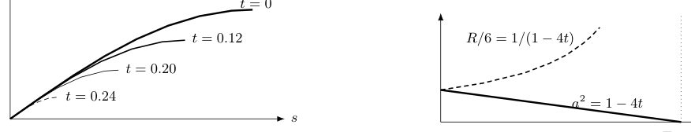
<figcaption class="paper-figure-caption"><b>Fig 1.</b> Figure 1: Ricci flow of the Bures–Helstrom metric. The warping profile contracts homothetically, while the scalar curvature diverges at the extinction time T = 1/4.</figcaption>
</figure>

**Summary.** This paper applies Ricci flow theory to analyze the geometry of the qubit state space, specifically using the Bures--Helstrom metric. It shows that while the unnormalized flow collapses in finite time, the volume-normalized flow stabilizes at the Bures--Helstrom metric, confirming its role as a geometrically stable fixed point within the cone of monotone metrics.

**Why it may be interesting.** The application of geometric evolution equations like Ricci flow to quantum state spaces provides deep insights into how physical constraints (like monotonicity) dictate the long-term dynamics of quantum information measures. The explicit solvability of this specific metric is a major theoretical achievement.

Detailed structure

**Main problem.** The paper describes the intrinsic Ricci flow of the Bures--Helstrom metric on the state space of a qubit.

**Main result.** The unnormalized flow exhibits finite-time collapse as a homothetic shrinker, while the volume-normalized flow fixes this scale and shows the Bures--Helstrom metric is an asymptotically stable fixed point.

**Method.** The analysis employs Ricci flow techniques, utilizing gauge fixing (Hamilton--DeTurck) to reduce the evolution equations for the warping factor ($\Phi$) to a linear forced heat equation in specific coordinates.

**Model / system.** The system is the state space of a single qubit, whose geometry is endowed with the Bures--Helstrom metric. This metric is characterized as the minimal monotone Riemannian metric on this space.

**Key observables.** Warping function ($\Phi$) and its square ($\Psi$), scalar curvature ($R$), and the flow's evolution relative to the homothetic shrinker $g(t)=(1-4t)g_{\mathrm{BH}}$.

**Important parameters / regimes.** The extinction time for the unnormalized flow is $T=1/4$. The spectral gap of the linearized normalized flow is 5.

**Assumptions / limitations.** The analysis assumes rotational symmetry for the metric and relies on choosing specific gauges, such as the Hamilton--DeTurck gauge, to simplify the differential equations.

**Figures summary.** Figure 1 illustrates the contraction of the warping profile ($\Phi$) and the divergence of scalar curvature ($R/6 \propto 1/(1-4t)$) at $T=1/4$.

**Paper structure.** The paper first establishes the Bures--Helstrom metric as an Einstein manifold. It then derives the coupled Ricci flow equations for general rotationally symmetric metrics, fixes the gauge to obtain a single scalar equation for $\Psi$, and finally analyzes both the unnormalized (collapsing) and volume-normalized (stable fixed point) flows.

Abstract

The Bures--Helstrom metric is the minimal monotone Riemannian metric on the state space of a qubit. With the quantum Fisher normalization used here, it identifies the Bloch ball with a geodesic hemisphere of the unit round three--sphere. We describe its Ricci flow explicitly. In a general rotationally symmetric gauge the flow is a coupled system for the radial lapse and warping factor; a single scalar equation appears only after a Hamilton--DeTurck gauge choice. In the corresponding moving DeTurck frame the squared warping function $Ψ=Φ^2$ satisfies the linear forced heat equation \begin{equation*} D_tΨ=Ψ_{ss}-2, \end{equation*} while the fixed-lapse coordinate form contains the associated transport term. Since the Bures--Helstrom metric is Einstein, the geometric flow itself is the homothetic shrinker \begin{equation*} g(t)=(1-4t)g_{\mathrm{BH}}, \end{equation*} with scalar curvature $6/(1-4t)$ and extinction time $T=1/4$. Thus the metric remains inside the monotone cone for all $t<T$ and leaves the cone of nondegenerate Riemannian metrics only through the collapsed limit. We also record the volume--normalized flow, for which the Bures--Helstrom metric is a fixed point. Its linearization is the shifted round--sphere Laplacian $Δ_{\mathbb S^3}+3$, with spectrum \begin{equation*} σ_\ell=-(\ell-1)(\ell+3), \end{equation*} and spectral gap $5$ after removal of the scaling mode.

[↑ back to top](#top)

## Other papers (9)

*Papers from primary archives without highlighted authors or any topic match. Click to expand.*

Show other papers

### [$K$-Theoretic Obstructions to Linearizing QCA Representations](http://arxiv.org/abs/2606.19657v1)

**Authors:** Mattie Ji, Bowen Yang  
**Type:** theory · **Category:** other · **PDF:** <https://arxiv.org/pdf/2606.19657v1>  
**Analysis basis:** full PDF text, analyzed in chunks

↔ Scroll figures horizontally

<figure class="paper-figure-card">
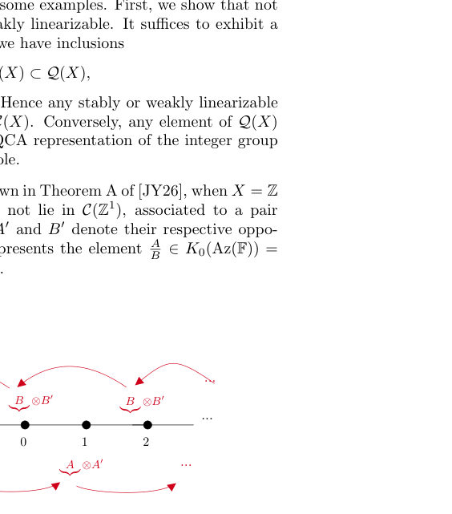
<figcaption class="paper-figure-caption"><b>Fig 1.</b> Figure 1. A QCA α for a pair (A, B) of central simple algebras. Here we place an alternating sequence of A ⊗A′ ∼= Mn(F) and B ⊗B′ ∼= Mm(F) on the metric space Z, and α simultaneously transports the tensor factor B to the left and the tensor factor A to the right.</figcaption>
</figure>

**Summary.** This paper develops an advanced obstruction theory using K-theory to determine when Quantum Cellular Automata (QCA) representations can be linearized into standard linear group actions. By analyzing universal obstruction classes derived from the homotopy type of QCA spaces, it establishes precise mathematical criteria for physical systems modeled by QCA to possess simple, linear dynamics.

**Why it may be interesting.** This work provides a deep mathematical framework connecting quantum computation models (QCA) to fundamental algebraic topology invariants. The explicit calculation of obstruction classes over number fields suggests powerful, non-trivial constraints on physically realizable quantum dynamics.

Detailed structure

**Main problem.** The central problem is developing an obstruction theory to determine when a Quantum Cellular Automata (QCA) representation, which models quantum spin systems with locality constraints, can be linearized into a standard linear group representation.

**Main result.** The authors establish that the linearizability of QCA representations is governed by the vanishing of specific universal obstruction classes derived from algebraic K-theory spectra. They provide explicit conditions for this vanishing in various settings (e.g., finite groups, rational coefficients).

**Method.** The methodology heavily employs advanced algebraic topology, specifically utilizing stable homotopy theory, K-theory spectra, and cohomology theories to construct and analyze obstruction cocycles.

**Model / system.** The model is the QCA representation $\varphi: G 	o Q(X, q)$, where $G$ is a group acting on quantum spin systems defined over a metric space $X$. The locality constraints are encoded in the structure of the algebra of local observables $A(X, q)$.

**Key observables.** Universal obstruction classes ($u_i(\varphi)$), stabilization maps ($\varphi_{st}$), and specific cohomology/homotopy groups (e.g., $	ext{H}^k(X; \mathbb{F}_p)$, $\pi_i(	ext{K}(C(X)))$).

**Important parameters / regimes.** The field of coefficients ($\mathbb{F}$, $\mathbb{Q}$), the structure of the metric space $X$ (e.g., point, line, plane, lattice $\mathbb{Z}^d$), and the group $G$.

**Assumptions / limitations.** The theory relies on establishing equivalences between different notions of linearizability (linearizable vs. stably linearizable) and assuming certain algebraic properties for the underlying spaces $X$ and groups $G$ (e.g., $G$ being rationally acyclic).

**Figures summary.** Figures illustrate specific examples of QCA ($\alpha$) associated with central simple algebras or annular shifts on $\mathbb{Z}^2$, used to demonstrate non-circuit, non-linearizable cases.

**Paper structure.** The paper builds from the single-particle case (Theorem 1.1) to generalizing the obstruction theory for QCA representations over arbitrary fields. It systematically defines various notions of linearizability and derives necessary and sufficient conditions using K-theoretic obstructions across different coefficient rings ($\mathbb{C}$, $\mathbb{R}$, finite fields).

Abstract

Projective representations arise naturally in physics and representation theory, and determining whether they can be linearized has been a fundamental problem. In this work, we study the analogous problem for quantum cellular automata (QCA) representations, which incorporate locality constraints imposed by a metric space $X$. Over an arbitrary field $\mathbb{F}$, we develop an obstruction theory for the linearization of QCA representations, using the algebraic $K$-theory spectrum of QCA constructed in previous work of the authors. The resulting obstructions are governed by the homotopy type of the QCA spaces, from which we extract universal obstruction classes to linearization. In the complex algebraic and unitary case, we also fully compute the homotopy types of the QCA spaces over a point, a line, and a plane.

[↑ back to top](#top)

### [Applications of quantum annealing to magnetic dipole hyperfine structure constants: First results beyond energies for atoms](http://arxiv.org/abs/2606.20166v1)

**Authors:** Boni Paul, Subimal Deb, Per Jönsson, Jörgen Ekman, Bhanu Pratap Das  
**Type:** theory · **Category:** quantum information and computing · **PDF:** <https://arxiv.org/pdf/2606.20166v1>  
**Analysis basis:** full PDF text, analyzed in chunks

↔ Scroll figures horizontally

<figure class="paper-figure-card">
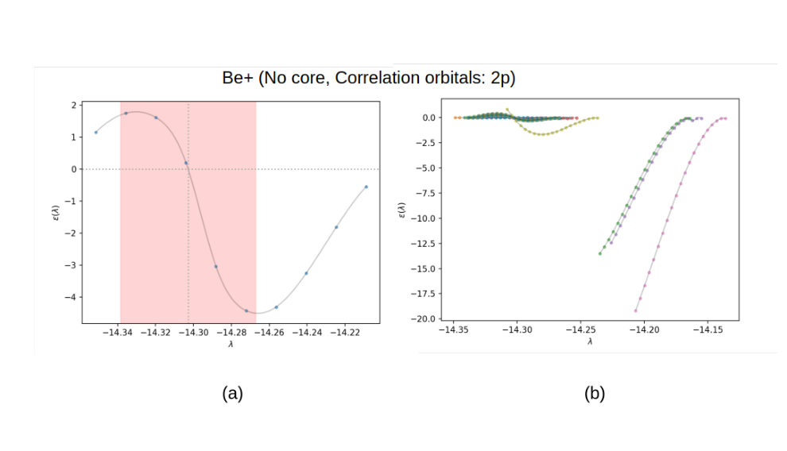
<figcaption class="paper-figure-caption"><b>Fig 1.</b> FIG. 1. (a) The initial guess for λ is obtained by a coarse scan of ϵ(λ) around H11 yielding the gray curve. The shaded pink region serves as the next narrowed down window, centered at the interpolated root of the functional, for the next iteration. (b) The subsequent scans over the narrower windows of λ yield improved guesses for the Lagrange parameter.</figcaption>
</figure>
<figure class="paper-figure-card">
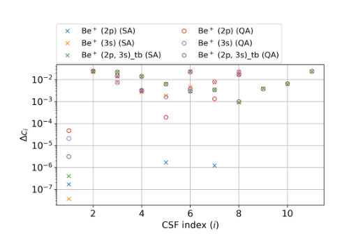
<figcaption class="paper-figure-caption"><b>Fig 2.</b> FIG. 2. The absolute error in coefficients computed by SA and QA with respect to GRASP for Be+ for the cases listed in Table II. The list of active orbitals are in the parenthesis following the element name. tb in the legends refer to a trun- cated basis.</figcaption>
</figure>
<figure class="paper-figure-card">
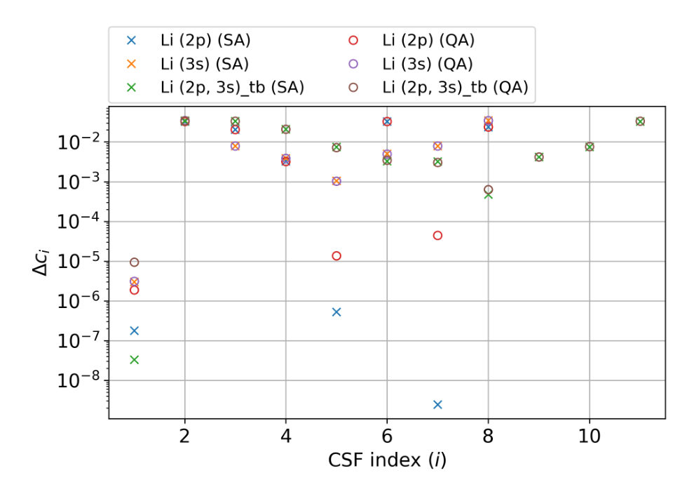
<figcaption class="paper-figure-caption"><b>Fig 3.</b> FIG. 1: The absolute error in coefficients computed by SA and QA with respect to GRASP for Li for the cases listed in Table I in the main manuscript. The list of active orbitals are in the parenthesis following the element name. tb in the legends refer to a truncated basis.</figcaption>
</figure>
<figure class="paper-figure-card">
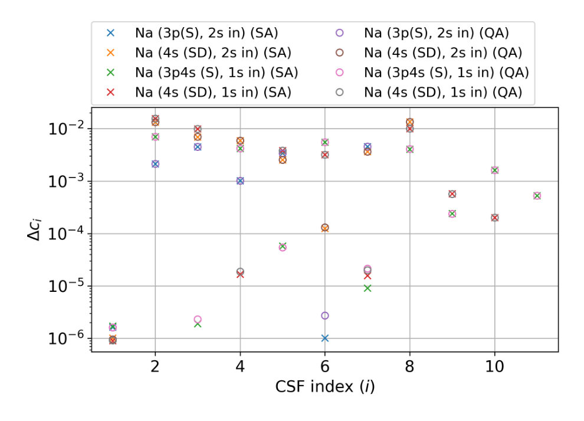
<figcaption class="paper-figure-caption"><b>Fig 4.</b> FIG. 2: The absolute error in coefficients computed by SA and QA with respect to GRASP for Na for the cases listed in Table III in the main manuscript. S and SD refer to single and double excitations. in in the legend refers to inactive orbitals. The other legends are identical to Fig. 1.</figcaption>
</figure>
<figure class="paper-figure-card">
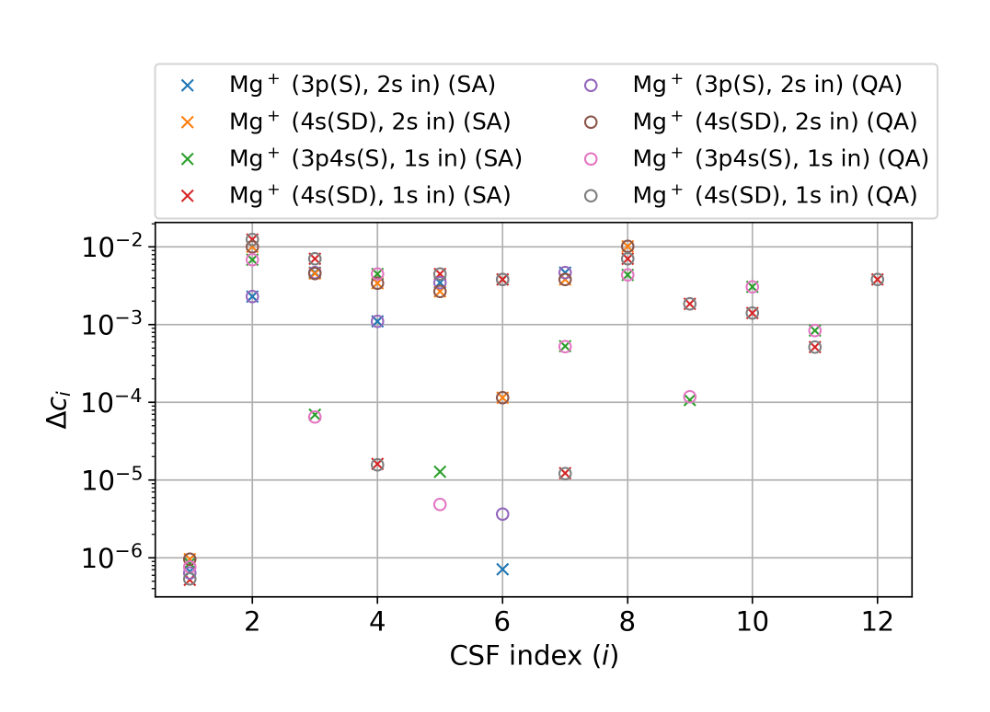
<figcaption class="paper-figure-caption"><b>Fig 5.</b> FIG. 3: The absolute error in coefficients computed by SA and QA with respect to GRASP for Mg+ for the cases listed in Table IV in the main manuscript. The legends are identical to Fig. 1.</figcaption>
</figure>

**Summary.** The authors successfully applied a modified Quantum Annealer Eigensolver (QAE) algorithm on D-Wave hardware to calculate magnetic dipole hyperfine structure constants for several light atoms. By benchmarking these results against high-level classical calculations (GRASP), they demonstrated that quantum annealing can accurately determine complex atomic properties, marking an extension of the technique beyond ground-state energy determination.

**Why it may be interesting.** This work directly tests the capability of quantum annealers to solve complex, physically relevant many-body problems beyond simple energy minimization, providing a crucial benchmark for quantum simulation in atomic physics.

Detailed structure

**Main problem.** The primary goal is to calculate magnetic dipole hyperfine structure (HFS) constants for several light atoms using quantum annealing techniques, extending the application of these methods beyond simple ground-state energy calculations.

**Main result.** Quantum hardware demonstrations yielded HFS constant results completely consistent with established classical relativistic atomic structure calculations (GRASP) at the specified precision.

**Method.** The problem is mapped onto a QUBO formulation suitable for quantum annealing, utilizing a modified Quantum Annealer Eigensolver (QAE) approach combined with a zooming-and-sigma-annealing technique.

**Model / system.** The calculations focus on neutral and alkali-like atoms ($	ext{Li}, 	ext{Be}, 	ext{Na}, 	ext{Mg}$) using the relativistic Dirac-Coulomb Hamiltonian. The methodology involves constructing matrix elements from Configuration State Functions (CSFs).

**Key observables.** Magnetic dipole HFS constants ($A$) and ground-state eigenvalues/eigenvectors of the $	ext{HDC}$ matrix.

**Important parameters / regimes.** The QAE precision is limited to three decimal places, corresponding to up to 10 qubits; hardware constraints limit the number of CSFs used (e.g., $B=11$).

**Assumptions / limitations.** A CSF truncation scheme is employed for larger basis sets, estimating contributions based on approximations derived from the independent electron pair model.

**Figures summary.** Figures illustrate the iterative 'zooming' process used to improve eigenvalue precision during quantum annealing simulations.

**Paper structure.** The paper systematically presents comparisons of calculated CSF coefficients and HFS constants across multiple atomic species ($	ext{Li}, 	ext{Be}^+, 	ext{Na}, 	ext{Mg}^+$) using three methods: GRASP (reference), Simulated Annealing (SA), and Quantum Annealing (QA).

Abstract

We report the first results of the magnetic dipole hyperfine structure (HFS) constants of neutral $\mathrm{Li}$, Li-like $\mathrm{Be}$, neutral $\mathrm{Na}$, and Na-like $\mathrm{Mg}$ using a modified version of the Quantum Annealer Eigensolver (QAE) algorithm on D-Wave's quantum hardware. The results are benchmarked against relativistic configuration interaction with multiconfiguration Dirac Hartree-Fock (MCDHF) calculations using the General-purpose Relativistic Atomic Structure Package (GRASP), and simulated annealing. In our modified QAE, a zooming-and-sigma-annealing approach with a floating-point encoding scheme is adopted to estimate the ground-state eigenvalue and eigenvector of the relativistic Dirac-Coulomb Hamiltonian matrices ($H_{\mathrm{DC}}$) constructed from 11 or fewer configuration state functions (CSFs). For calculations with extended correlation orbital sets, we applied a CSF truncation scheme, retaining only CSFs (up to 12) that make significant contributions to the ground-state wavefunction. Our modified QAE precision is kept limited to three decimal places (up to 10 qubits). Hardware demonstrations on the D-Wave quantum processing unit (QPU) yielded results that were completely consistent with GRASP (at the chosen precision) in determining the magnetic dipole HFS constants, with accuracy varying across systems and $H_{\mathrm{DC}}$ matrix dimensions.

[↑ back to top](#top)

### [Exploiting More Than Symmetry in Variational Quantum Machine Learning](http://arxiv.org/abs/2606.20316v1)

**Authors:** Markus Baumann, Claudia Linnhoff-Popien  
**Type:** theory · **Category:** quantum information and computing · **PDF:** <https://arxiv.org/pdf/2606.20316v1>  
**Analysis basis:** full PDF text, analyzed in chunks

↔ Scroll figures horizontally

<figure class="paper-figure-card">
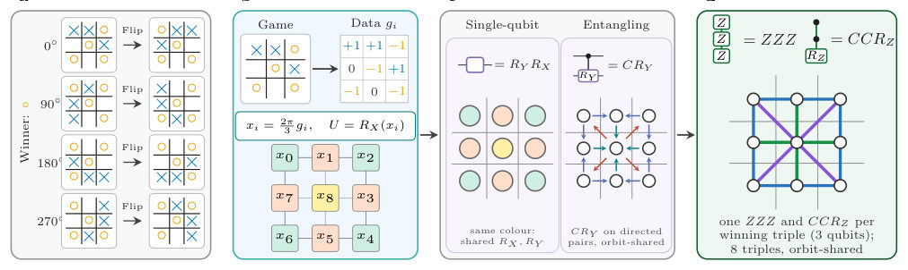
<figcaption class="paper-figure-caption"><b>Fig 1.</b> Fig. 1. From task symmetry to a task-aligned equivariant circuit. (a) Tic-Tac-Toe labels are invariant under the D4 rotations and reflections of the board. (b) Board entries gi ∈{−1, 0, +1} are encoded as RX(xi) rotations with xi = 2π</figcaption>
</figure>
<figure class="paper-figure-card">
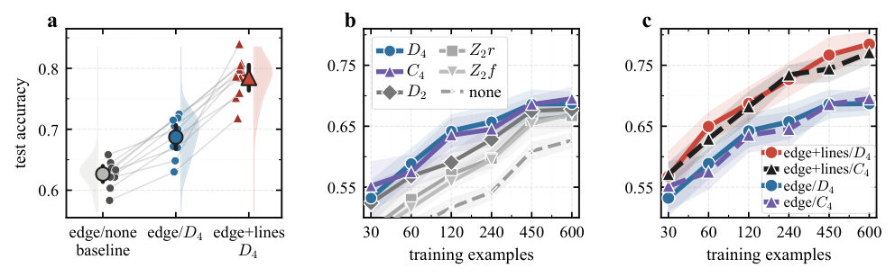
<figcaption class="paper-figure-caption"><b>Fig 2.</b> Fig. 2. Main empirical evidence. (a) Full D4 equivariance improves the original edge ansatz over no sharing. (b) The subgroup sweep across training sizes shows that C4 tracks D4 closely. (c) Adding winning-line interactions to the equivariant edge ansatz improves test accuracy while preserving the imposed symmetry.</figcaption>
</figure>
<figure class="paper-figure-card">
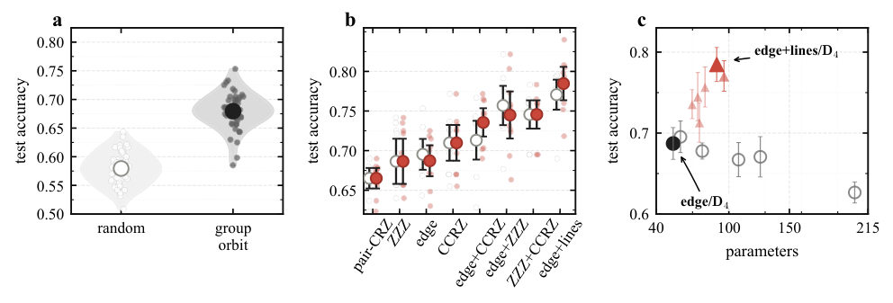
<figcaption class="paper-figure-caption"><b>Fig 3.</b> Fig. 3. Controls and ablations. (a) Parameter-matched random sharing underperforms group-orbit sharing. (b) Ablations are anchored by the labelled edge/D4 ansatz; the strongest model combines edge interactions with both line channels. (c) Accuracy is not explained by parameter count alone.</figcaption>
</figure>

**Summary.** The paper investigates how to optimally constrain Variational Quantum Circuits by leveraging problem symmetries in VQML. By testing on Tic-Tac-Toe, the authors find that while symmetry defines a necessary admissible space, achieving peak performance requires supplementing this constraint with trainable interactions directly targeting known, critical features of the task.

**Why it may be interesting.** This work provides a concrete framework for incorporating domain knowledge (symmetry) into quantum circuit design, which is crucial for building practical, resource-efficient quantum algorithms beyond simple pattern matching.

Detailed structure

**Main problem.** The core challenge is designing Variational Quantum Machine Learning (VQML) models that are not just expressive, but optimally constrained by the underlying symmetries of the problem to improve generalization.

**Main result.** While enforcing symmetry provides a significant benefit over unconstrained models, the largest performance gains come from adding trainable interactions specifically tailored to known, decisive task motifs, suggesting task knowledge guides effective ansatz design within the admissible symmetric space.

**Method.** The authors compare different parameter sharing strategies (varying subgroup constraints) and test the impact of adding specific, symmetry-respecting gates (winning-line gates) on a fully enumerable quantum game model.

**Model / system.** The study uses Variational Quantum Circuits (VQC) applied to the game Tic-Tac-Toe. The input data is encoded using $RX$ rotations, and symmetries are enforced by restricting trainable parameters via parameter sharing based on subgroups of the dihedral group $D_4$.

**Key observables.** Test accuracy (the primary metric), generalization gap (difference between training and test error), and the number of trainable parameters.

**Important parameters / regimes.** The imposed symmetry subgroup ($H \subseteq D_4$), the specific interactions added (e.g., ZZZ or CCRZ gates on winning triples), and optimization hyperparameters like learning rate and epochs.

**Assumptions / limitations.** The study relies on Tic-Tac-Toe being a fully enumerable and structurally transparent test case, allowing for precise identification of task-relevant motifs.

**Figures summary.** Figure 2 demonstrates that enforcing $D_4$ symmetry improves accuracy over no constraint, and further shows that adding trainable gates corresponding to winning lines provides the largest boost in performance. Figure 3 compares random vs. orbit-based sharing and confirms that parameter count alone does not explain all gains.

**Paper structure.** The paper establishes the need for structure-aware VQML models by first showing how symmetry constrains the design space. It then systematically investigates two axes of freedom: varying the strength of symmetry enforcement, and adding task-specific interactions on top of the base symmetric ansatz.

Abstract

The success of variational quantum learning models crucially depends on choosing parametrizations that reflect the structure of the problem at hand. Symmetries provide one of the clearest such structures: whenever transformations of the input leave the desired outcome unchanged, this invariance should be built into the model rather than discovered during training. However, imposing a symmetry does not by itself determine a useful ansatz. Even within the symmetry-preserving space, one must decide where the trainable degrees of freedom should be placed. In this work, we study this remaining design freedom in equivariant variational quantum circuits. Building on symmetry-based parameter sharing, we disentangle two architectural choices: how much symmetry should be enforced, and which symmetry-respecting interactions should be trainable. Using Tic-Tac-Toe as a fully enumerable and structurally transparent test case, we find that suitable subgroups preserve most of the generalization benefit. By contrast, the dominant gains arise from gates acting directly on decisive task motifs. Thus, symmetry defines the admissible design space, while effective ansatze require an additional task-informed choice of trainable interactions.

[↑ back to top](#top)

### [Impossibility of superluminal signalling rules out causal loops in conical spacetimes](http://arxiv.org/abs/2606.20476v1)

**Authors:** Maarten Grothus, V. Vilasini  
**Type:** theory · **Category:** other · **PDF:** <https://arxiv.org/pdf/2606.20476v1>  
**Analysis basis:** full PDF text, analyzed in chunks

↔ Scroll figures horizontally

<figure class="paper-figure-card">
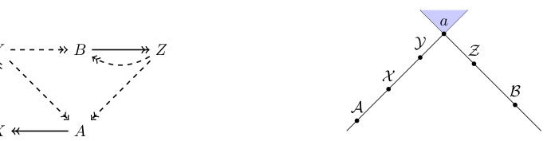
<figcaption class="paper-figure-caption"><b>Fig 1.</b> Figure 1: Let X, Y, Z, A, B ∈S. Consider X ⊨Y, Y ⊨AB, A ⊨X, Z ⊨AB, B ⊨Z. (a) No matter the underlying causal model, the affects relations allow to infer that a causal loop will always be present. Here, ↠denotes causal relations between two RVs, while its dashed version stands for alternative causal relations, e.g. Y ↠AB being equivalent to (Y ↠A or Y ↠B), so at least one of the dashed arrows from Y must be present as a causal relation. (b) A compatible, non-degenerate embedding of these affects relations into (1 + 1)-Minkowski spacetime, where all ORVs need be located on certain light-like surfaces.</figcaption>
</figure>
<figure class="paper-figure-card">
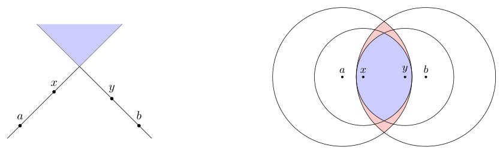
<figcaption class="paper-figure-caption"><b>Fig 2.</b> Figure 2: Representation of light cones in Minkowski spacetime for d spatial dimensions. (a) For d = 1 Minkowski spacetime does not show conicality. This is because L1 := {a, b} and L2 := {x, y} are distinct, yet share the same joint future. (b) For d = 2, Minkowski spacetime is conical. As can be seen from the figure which shows one particular time slice, the joint futures are distinct between L1 and L2 (and the red region is thus not covered by the blue one).</figcaption>
</figure>

**Summary.** This theoretical paper investigates the relationship between superluminal signaling constraints (NSS) and causal loops in spacetime. By introducing the concept of 'conicality,' the authors prove that this geometric property forces any compatible causal structure to be non-looping, thereby establishing a deep link between local causality principles and global spacetime geometry.

**Why it may be interesting.** While not directly related to quantum many-body physics, the rigorous mathematical framework for causality and information flow across curved spacetimes is foundational for theories involving quantum gravity or relativistic quantum field theory.

Detailed structure

**Main problem.** The central problem is determining whether the principle of No Superluminal Signalling (NSS) inherently rules out all operationally detectable causal loops in spacetimes that possess a 'conical' geometric structure.

**Main result.** The authors prove a general no-go result: in any conical spacetime, NSS rules out all operationally verifiable causal loops, establishing that this relationship depends fundamentally on the geometry of spacetime.

**Method.** The analysis uses an advanced framework combining causal inference (affects relations) with geometric constraints derived from poset theory, specifically leveraging the concept of 'conicality' in the spacetime embedding.

**Model / system.** The model involves describing causality using directed graphs and affects relations, which are then embedded into a partially ordered set (poset) representing the spacetime light cone structure. The focus is on 'conical' spacetimes, including $d>1$ Minkowski space.

**Key observables.** Operationally detectable causal loops (ACLs), compatibility conditions derived from affects relations ($	ext{X} \models 	ext{Y} | 	ext{do}(	ext{Z})$), and the geometric property of conicality.

**Important parameters / regimes.** The spatial dimension $d$ (comparing $d=1$ vs. $d>1$), and the irreducibility conditions ($	ext{Irred1}, 	ext{Irred3}$) applied to affects relations.

**Assumptions / limitations.** The entire proof structure relies heavily on assuming a conical embedding of the causal model into spacetime, as this geometric property is key to deriving contradictions that rule out loops.

**Figures summary.** Figure 1 illustrates complex examples of ACLs in $(1+1)$-Minkowski space. Figure 2 compares light cone representations for $d=1$ (non-conical) versus $d>1$ (conical), showing how joint futures differ.

**Paper structure.** The paper develops the framework by first defining affects relations and conical embeddings, then proving necessary lemmas that simplify higher-order conditional affects relations ($	ext{Lemma A.7}$). Finally, it applies these results to prove that any compatible embedding of ACLs in a conical spacetime must be degenerate (Theorem A.9).

Abstract

In PRL 129, 110401 it was shown that it is theoretically possible to have operationally detectable causal loops without violating the principle of no superluminal signalling (NSS) in (1+1)-Minkowski spacetime. Whether or not such causal loops are also possible in $d > 1$ spatial dimensions, has remained a key open question. We resolve this question by showing that in a wide class of "conical" spacetimes, including Minkowski with d > 1, NSS does rule out all operationally detectable causal loops, in classical, quantum and post-quantum theories. This establishes that the relationship between the relativistic principles of NSS and no causal loops depends inherently on the geometry of spacetime.

[↑ back to top](#top)

### [Norms, overlaps and Yangian descendants for the Haldane--Shastry spin chain](http://arxiv.org/abs/2606.20168v1)

**Authors:** Yunfeng Jiang, Jules Lamers, Yuan Miao  
**Type:** theory · **Category:** statistical mechanics · **PDF:** <https://arxiv.org/pdf/2606.20168v1>  
**Analysis basis:** full PDF text, analyzed in chunks

↔ Scroll figures horizontally

<figure class="paper-figure-card">
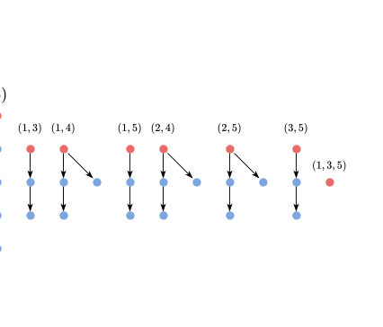
<figcaption class="paper-figure-caption"><b>Fig 1.</b> Figure 1: Schematic picture of the structure of the Hilbert space of the HS chain with N = 6, with Yangian multiplets labelled by their motif (top) and total momentum (bottom), cf. [31, Fig. 1]. The red dots denote the yhw states, labelled by motifs, while the blue dots represent the descendant states. The vertically aligned states belong to the same sl2 multiplets. The transfer matrix only preserves this structure in the periodic case (twist κ = 1).</figcaption>
</figure>
<figure class="paper-figure-card">
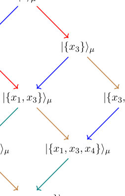
<figcaption class="paper-figure-caption"><b>Fig 2.</b> Figure 2: Hasse diagram showing the descendant structure for the Yangian mul- tiplet for the motif µ = (3) at N = 6 in the Gelfand–Tsetlin limit κ →∞. Different colours represent the action of B-operators with different arguments, with x1 = −7</figcaption>
</figure>

**Summary.** The paper tackles the complex problem of characterizing all eigenstates, not just the highest-weight states, within the Yangian symmetry framework of the Haldane–Shastry spin chain. By developing systematic methods using algebraic Bethe ansatz and determinant formulas, it provides explicit formulae for the norms and overlaps of these descendant states. This advances the theoretical understanding of integrable quantum many-body systems with long-range interactions.

**Why it may be interesting.** This work provides deep spectral information about an integrable quantum many-body system whose structure is governed by infinite symmetries (Yangian), which is crucial for understanding non-equilibrium dynamics in 1D quantum systems.

Detailed structure

**Main problem.** The primary goal is to systematically construct an orthogonal eigenbasis for the Yangian descendant states of the Haldane–Shastry (HS) spin chain and compute their norms and overlaps.

**Main result.** Product and determinant formulae are derived for the norms and overlaps of these descendant states, establishing a complete understanding of the spectral structure beyond the highest-weight states.

**Method.** The analysis employs advanced techniques from the Algebraic Bethe Ansatz (ABA), leveraging connections to spin-Calogero–Sutherland systems and utilizing Jack polynomials and determinant formulas (Gaudin/Slavnov).

**Model / system.** The system is the Haldane–Shastry (HS) spin chain, an integrable model with long-range interactions, which serves as a discrete analogue of a conformal field theory. Its integrability is governed by full Yangian symmetry.

**Key observables.** Norms and overlaps of descendant states ($\langle u|u
angle$, $\langle v|u
angle$), energy spectrum $E(\mu)$, and the structure of Yangian multiplets labeled by motifs $\mu$.

**Important parameters / regimes.** The twist parameter $\kappa$ (analyzed in limits like $\kappa=1$ for $\mathfrak{sl}_2$ symmetry, and $\kappa 	o \infty$ for the Gelfand–Tsetlin basis).

**Assumptions / limitations.** The derivation relies on the completeness of the ABA framework and specific mathematical identities related to Jack polynomials.

**Figures summary.** Figures illustrate the structure of Yangian multiplets, showing descendant towers in both the extreme twist (GT) limit and the periodic ($\kappa=1$) limit, analogous to known spin chain structures.

**Paper structure.** The paper reviews existing knowledge on HS symmetry, details the connection to spin-CS systems via freezing limits, constructs the descendant states using ABA techniques, and concludes by deriving explicit formulas for norms and overlaps.

Abstract

The Haldane-Shastry spin chain is a prototypical integrable model with long-range interactions, notable for hosting quasiparticles with fractional statistics and serving as a discrete analogue of a conformal field theory. Its remarkable simplicity is closely tied to a full Yangian spin symmetry. While the highest-weight states for this symmetry are known explicitly, a systematic treatment of the descendant states, needed for the computation of various physical quantities, has remained incomplete. In this work, we provide a detailed construction of these descendants in terms of the algebraic Bethe ansatz following recent work of Ferrando et al. In the limit of extreme twist, it includes the Gelfand-Tsetlin basis. As an application, we derive product and determinant formulae for norms and overlaps of these states.

[↑ back to top](#top)

### [Operator Learning for efficient Quantum Computation](http://arxiv.org/abs/2606.20184v1)

**Authors:** Paul Over, Sergio Bengoechea, Leonardo Borello Busilacchi, Martin Kiffner, Thomas Rung, Alexios A. Michailidis  
**Type:** theory · **Category:** quantum information and computing · **PDF:** <https://arxiv.org/pdf/2606.20184v1>  
**Analysis basis:** full PDF text, analyzed in chunks

↔ Scroll figures horizontally

<figure class="paper-figure-card">
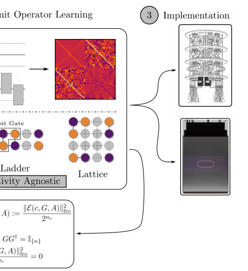
<figcaption class="paper-figure-caption"><b>Fig 1.</b> FIG. 1: Illustration of the entire quantum operator learning approach.</figcaption>
</figure>
<figure class="paper-figure-card">
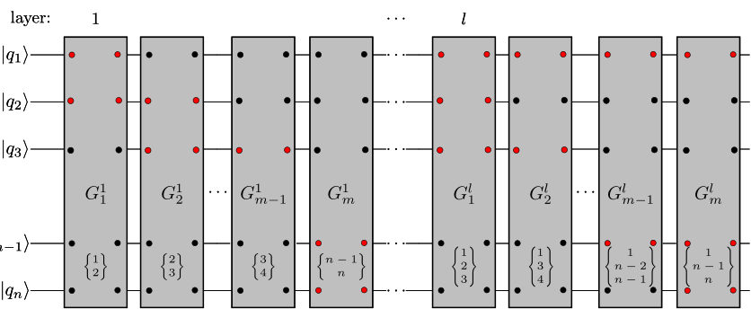
<figcaption class="paper-figure-caption"><b>Fig 2.</b> FIG. 2: Illustration of an l-layer trainable quantum circuit ansatz G. For each gate, the subset of qubits on which it acts non-trivially, denoted by Gj i , is indicated by the red vertices, or equivalently by its connectivity list. A one-dimensional hardware architecture is assumed for illustration purposes. The first layer is composed of n −1 nearest-neighbor two-qubit gates, whereas the l-th layer is composed of n −2 long-range three-qubit gates.</figcaption>
</figure>
<figure class="paper-figure-card">
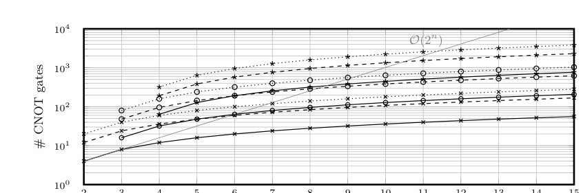
<figcaption class="paper-figure-caption"><b>Fig 3.</b> FIG. 3: Gate complexity over number of qubits for layers l = {1 (solid) , 3 (dashed) , 5 (dotted)} (line-type) and gate sizes r = {2 (×), 3 (◦), 4 (⋆)} (symbol).</figcaption>
</figure>
<figure class="paper-figure-card">
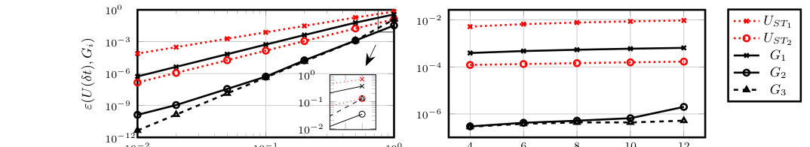
<figcaption class="paper-figure-caption"><b>Fig 4.</b> FIG. 4: Application of the learning algorithm to multiple quantum many-body scenarios and comparison against commonly used Trotter decompositions in terms of timestep δt with constant system size n = 8 (a), system size n with constant timestep δt = 0.1 (b), and relative error ε. Same symbols denote identical quantum resources.</figcaption>
</figure>
<figure class="paper-figure-card">
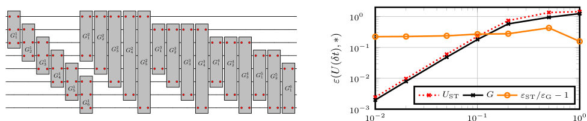
<figcaption class="paper-figure-caption"><b>Fig 5.</b> FIG. 5: (a) Quantum circuit implementation of the butadiene PPP Hamiltonian, consisting of 21 nearest-neighbor and long-range interaction gates. (b) Time-step-induced errors as a function of the time-step size for the ST and learned-circuit propagators.</figcaption>
</figure>

**Summary.** This work proposes a comprehensive variational framework to compile arbitrary classical operators—from those governing quantum dynamics to those from fluid mechanics—into compact quantum circuits. By using backpropagation and block encoding, it overcomes the limitations of standard Trotterization and tensor network methods. This universal approach establishes a powerful programming layer for realizing complex physical simulations on near-term quantum hardware.

**Why it may be interesting.** It provides a universal, hardware-agnostic compilation layer that bridges continuous mathematical models (PDEs, flow) directly into discrete quantum gate sequences, which is crucial for near-term quantum advantage demonstrations.

Detailed structure

**Main problem.** Efficient quantum algorithm implementation is limited by the lack of efficient primitives for arbitrary operators and state preparation.

**Main result.** The framework successfully learns compact quantum circuits to approximate complex, general-purpose operators with improved resource scaling over standard Trotter expansions.

**Method.** A full-stack variational approach uses backpropagation and a cost function to transform arbitrary operators (unitary or non-unitary) into trainable quantum circuits via block encoding.

**Model / system.** The framework is tested across diverse domains: simulating time evolution in quantum chemistry, solving PDEs using the Laplace operator, and modeling potential flow around an airfoil.

**Key observables.** Relative error ($\epsilon$), success probability ($p$), objective function value ($J$), and resource scaling (circuit depth/qubits).

**Important parameters / regimes.** Time step ($\delta t$), system size ($n$ or $n_s$), regularization strength ($
ho$), and ancilla qubit count ($n_a$).

**Assumptions / limitations.** The method assumes the target operator can be approximated by a quantum circuit ansatz, and it utilizes techniques like SVD projection to enforce constraints.

**Figures summary.** Figures illustrate the overall pipeline (discretization $
ightarrow$ encoding $
ightarrow$ hardware), compare error scaling against ST methods for time evolution, and show optimization strategy comparisons for PDEs and fluid dynamics.

**Paper structure.** The paper introduces the problem, details the block-encoding methodology for non-unitary operators, presents the hierarchical optimization protocol using automatic differentiation and SVD projection, and validates this approach across quantum simulation, PDE solving, and classical fluid mechanics problems.

Abstract

An efficient implementation of quantum algorithms is often hindered by the lack of efficient primitives for operators and state preparation. This limits both the ability of near-term quantum hardware to simulate complex problems and the potential of fault-tolerant algorithms to achieve practical quantum advantage. To address this, we propose a full-stack variational framework that transforms arbitrary operators to compact quantum circuits. The resulting variational circuits can be tailored to the connectivity and long-range interaction of the target hardware. The learning process employs backpropagation together with a cost function that efficiently optimizes unitary operators and non-unitary -- dense or sparse -- operators using only a single ancilla qubit for block encoding. Additionally, we introduce a regularization term that reduces the approximation error. The approach is validated for both quantum mechanical and engineering applications. In the former case, we learn propagators that arise in native quantum problems -- such as quantum simulation and quantum chemistry -- and achieve improved resource scaling in comparison to standard Suzuki-Trotter expansions. In the latter case, we demonstrate the approach's ability to implement the second-order central finite difference approximation of the Laplace operator -- relevant for solving partial differential equations -- while improving upon current error metrics. The final example deals with learning a dense, non-unitary operator that arises in the analysis of inviscid potential flow around an airfoil. This universality of the framework opens the door for solving general problems beyond prototypical engineering and quantum applications.

[↑ back to top](#top)

### [Quantum-Accelerated Self-Consistent Field: A Hybrid Algorithm](http://arxiv.org/abs/2606.20176v1)

**Authors:** Alexis Ralli, Tim Weaving, Thomas M. Bickley, Peter V. Coveney, Peter J. Love  
**Type:** theory · **Category:** quantum information and computing · **PDF:** <https://arxiv.org/pdf/2606.20176v1>  
**Analysis basis:** full PDF text, analyzed in chunks

↔ Scroll figures horizontally

<figure class="paper-figure-card">
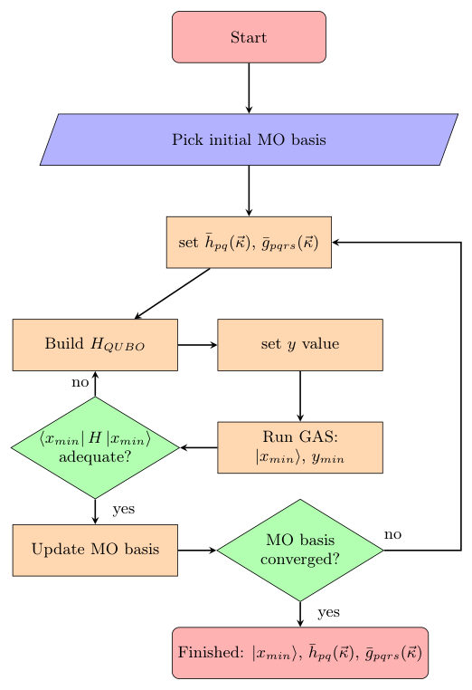
<figcaption class="paper-figure-caption"><b>Fig 1.</b> FIG. 1: Full outline of GAS-SCF algorithm (equation 3). Refer to Algorithms 1 and 2 in [20] for the procedure to update the MO basis. The initial MO basis may be set to any standard choice, such as Löwdin or canonical or similar. Here, “adequate&quot; refers to an energy that has converged, outperforms classical SCF solutions, or satisfies a predefined (possibly spectral-based) threshold for advancing the algorithm to the MO basis optimization stage.</figcaption>
</figure>
<figure class="paper-figure-card">
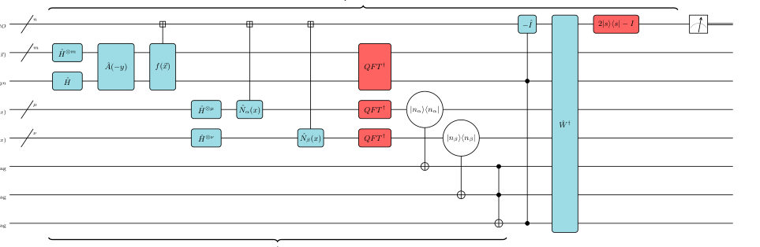
<figcaption class="paper-figure-caption"><b>Fig 2.</b> FIG. 2: Outline of the full quantum circuit to implement the Grover Adaptive Search Self-Consistent Field (GAS-SCF) algorithm. Here the search space is over the uniform superposition of computational states: |s⟩= H⊗n |0⟩⊗n. Figure 3 provides an alternate construction, where the state on the first n-qubit register is different. The ˆA and f(⃗x) gates are defined in Figure S.1 and Figure S.5 in the supporting information. The former encodes the negative reference value (−y) setting a threshold, while the latter encodes the cost function for different binary states in the QUBO register state, as observed by the controls. The gates defined with clear circular controls, with projectors inside...</figcaption>
</figure>
<figure class="paper-figure-card">
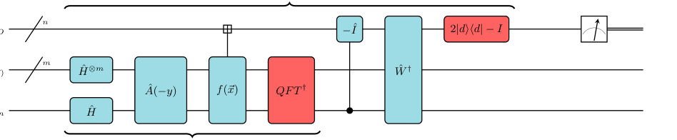
<figcaption class="paper-figure-caption"><b>Fig 3.</b> FIG. 3: Outline of the full quantum circuit to implement Grover Adaptive Search Self-Consistent Field (GAS-SCF) algorithm searching over Dicke states. Here, a Dicke state |d⟩is prepared on the n-qubit register. This restricts the search space to bitstrings with the correct number of alpha and beta electrons and therefore the symmetry flagging step in Figure 2 is no longer needed. The ˆA and f(⃗x) gates are defined in Figure S.1 and Figure S.5 in the supporting information. An alternative compilation is provided in the Supplemental Information S.V, which gives the corresponding T-gate cost. In this realization no QFT † is required.</figcaption>
</figure>
<figure class="paper-figure-card">
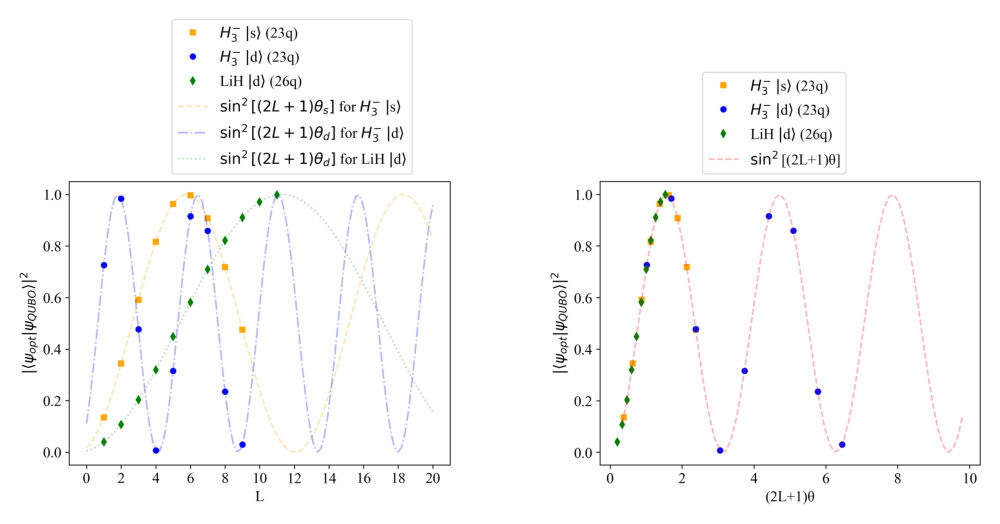
<figcaption class="paper-figure-caption"><b>Fig 4.</b> FIG. 4: GAS-SCF results for increasing number of iterations L (left) and (2L + 1)θ (right) where initial y was selected so that GAS-SCF would only amplify the ground state. The overlap between the true ground state |ψopt⟩ and the circuit statevector |ψQUBO⟩is plotted for H3 – ■(uniform input |s⟩), H3 – • (Dicke input |d⟩) and LiH ♦ (Dicke input |d⟩). Qubit counts in the legend parenthesis provide the total number of qubits including all ancilla registers. Note θ for each system is arcsin(1/ √</figcaption>
</figure>
<figure class="paper-figure-card">
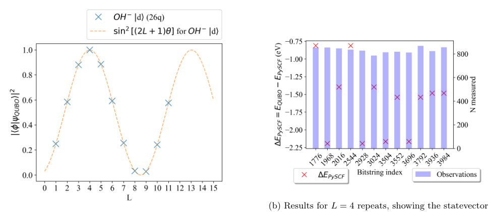
<figcaption class="paper-figure-caption"><b>Fig 5.</b> FIG. 5: GAS-SCF Dicke simulation result for OH–. The y = −780 (classical PySCF value) was used to seed the GAS-SCF routine. (a) Illustrates the overlap of the QUBO statevector with |ϕ⟩that is an equal superposition of the 12 Fock states with lower energy than the PySCF solution. (b) Results of the L = 4 statevector sampling simulation with 10, 000 shots. The x-axis gives the index of the sampled bitstring in base-10 (converting to binary gives the Fock state). The left y-axis gives the error between the GAS-SCF and PySCF RHF solution (scatter), where a negative value indicates GAS-SCF finding a better result. We see that in all cases a better bitstring over PySCF is obtained. The right...</figcaption>
</figure>

**Summary.** The paper proposes the Grover Adaptive Search Self-Consistent Field (GAS-SCF) algorithm to solve electronic structure problems by treating the SCF minimization as a QUBO optimization problem. It leverages quantum arithmetic and amplitude amplification to achieve a theoretical quadratic speedup over classical search methods. While demonstrating potential on small systems, its full utility is contingent upon fault-tolerant, large-scale quantum hardware.

**Why it may be interesting.** This work directly tackles a fundamental problem in quantum chemistry—the SCF calculation—by mapping its optimization structure onto a known quantum speedup primitive (Grover's search), providing a concrete roadmap for near-term quantum simulation algorithms.

Detailed structure

**Main problem.** The paper develops a quantum algorithm, GAS-SCF, to accelerate the Self-Consistent Field (SCF) calculation, which is an optimization problem in quantum chemistry.

**Main result.** GAS-SCF theoretically offers a quadratic speedup for the SCF optimization by using Grover's search mechanism within a hybrid classical/quantum framework. The authors demonstrate its potential on small molecular systems, finding energy improvements over classical benchmarks.

**Method.** The method combines quantum arithmetic (using QFT) to construct an oracle that marks target Fock states satisfying energy criteria, followed by amplitude amplification via Grover's algorithm. This is wrapped in a classical outer loop that iteratively updates the Molecular Orbital basis set.

**Model / system.** The model is electronic structure calculation using the Hartree-Fock approximation, formulated as minimizing an expectation value over a Quadratic Unconstrained Binary Optimization (QUBO) problem defined by molecular orbital occupancies. Systems tested include H3-, LiH, and O2/O3.

**Key observables.** Minimum energy expectation value ($\langle\vec{x}| H_{	ext{QUBO}} |\vec{x}
angle$), overlap between true wavefunctions and reference determinants, and the probability of measuring the optimal bitstring as a function of search repetitions ($L$).

**Important parameters / regimes.** The required number of qubits scales with the size of the system (up to 330 qubits mentioned), and the complexity depends on the structure of the QUBO coefficients.

**Assumptions / limitations.** Achieving chemically relevant results requires large-scale, fault-tolerant quantum hardware. The analysis relies on classical simulation of the quantum steps and assumes specific circuit constructions for arithmetic operations (e.g., QFT-based addition).

**Figures summary.** Figures detail the full GAS-SCF algorithm flow, the quantum circuits for implementing necessary components like quantum addition in the Fourier basis, state marking based on energy thresholds, and reflection operators.

**Paper structure.** The paper first introduces the SCF problem mapped to QUBO. It then details the GAS-SCF hybrid algorithm, showing circuit implementations for arithmetic (QFT/Fourier Basis) and constraint enforcement (particle number). Finally, it presents results comparing GAS-SCF performance against classical benchmarks on various molecules.

Abstract

We present the Grover adaptive search self-consistent field (GAS-SCF) algorithm. GAS-SCF leverages quantum arithmetic to construct an efficient oracle that marks target states (Fock states) which improve upon some initial classical energy estimate. Amplitude amplification then increases the probability of measuring these states. This approach offers a theoretical quadratic speed-up for the optimization problem encountered in SCF quantum chemistry and establishes a baseline against which structured optimization algorithms, such as QAOA and DQI may be compared. In this work, we classically simulate three examples as proofs of concept of the algorithm, the largest consisting of 26 qubits. We then extend our analysis to two larger systems, with O3 representing the largest case at 330 qubits. These examples are chosen to probe classically challenging SCF regimes. Achieving chemically relevant applications of GAS-SCF will require large-scale, fault-tolerant quantum hardware.

[↑ back to top](#top)

### [Sparse Configuration Interaction for the Electronic Schrödinger Equation Revisited: Complete Basis Set Limit Complexity and Quantum-Encoding Impact](http://arxiv.org/abs/2606.20385v1)

**Authors:** Michael Griebel, Jan Hamaekers  
**Type:** theory · **Category:** strongly correlated electrons · **PDF:** <https://arxiv.org/pdf/2606.20385v1>  
**Analysis basis:** full PDF text, analyzed in chunks

↔ Scroll figures horizontally

<figure class="paper-figure-card">
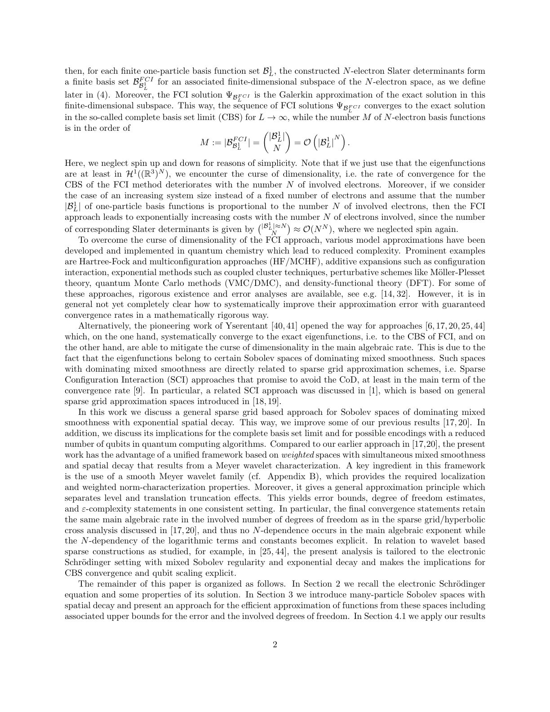
<figcaption class="paper-figure-caption"><b>Fig 1.</b> Low-resolution page preview, page 2</figcaption>
</figure>
<figure class="paper-figure-card">
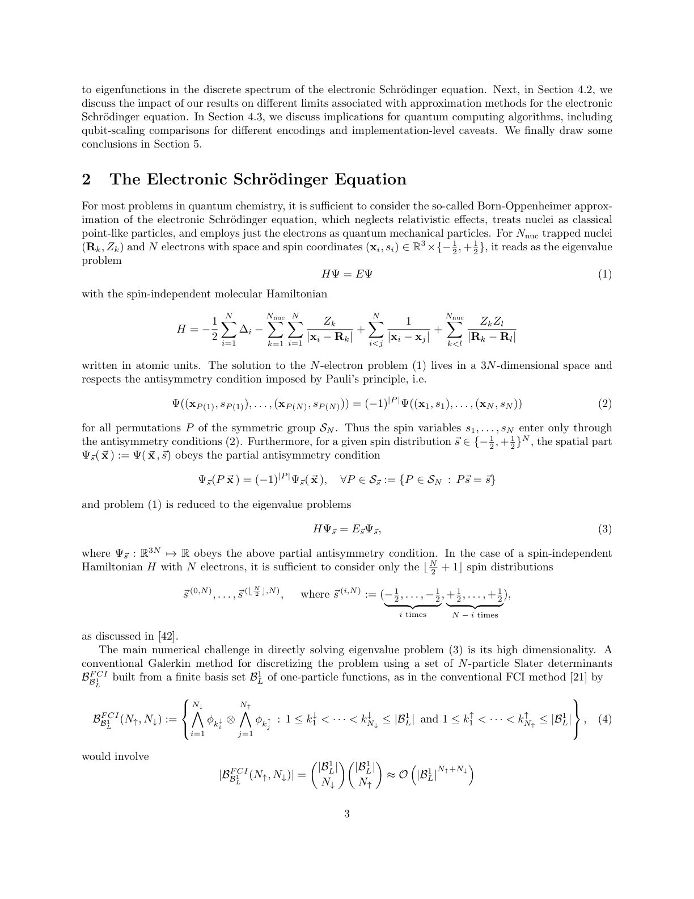
<figcaption class="paper-figure-caption"><b>Fig 2.</b> Low-resolution page preview, page 3</figcaption>
</figure>
<figure class="paper-figure-card">
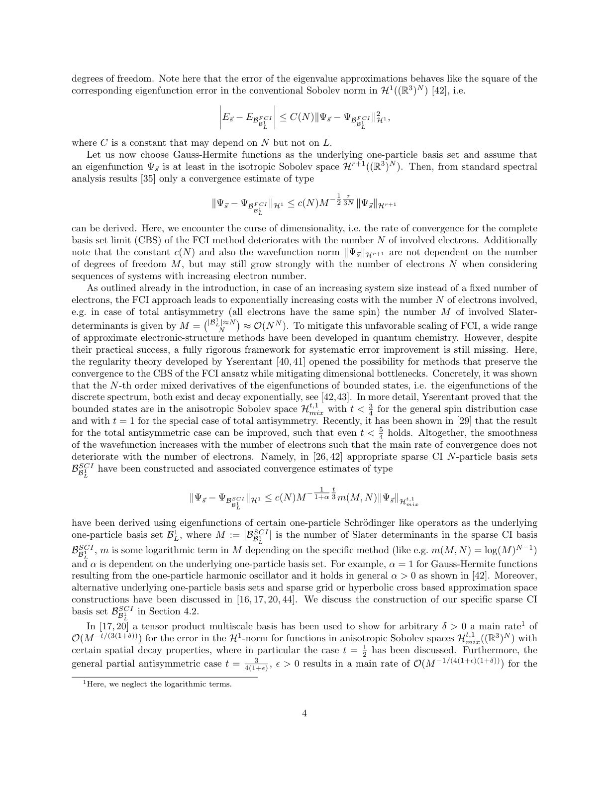
<figcaption class="paper-figure-caption"><b>Fig 3.</b> Low-resolution page preview, page 4</figcaption>
</figure>
<figure class="paper-figure-card">
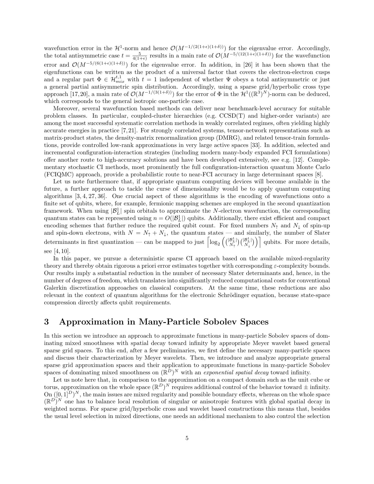
<figcaption class="paper-figure-caption"><b>Fig 4.</b> Low-resolution page preview, page 5</figcaption>
</figure>
<figure class="paper-figure-card">
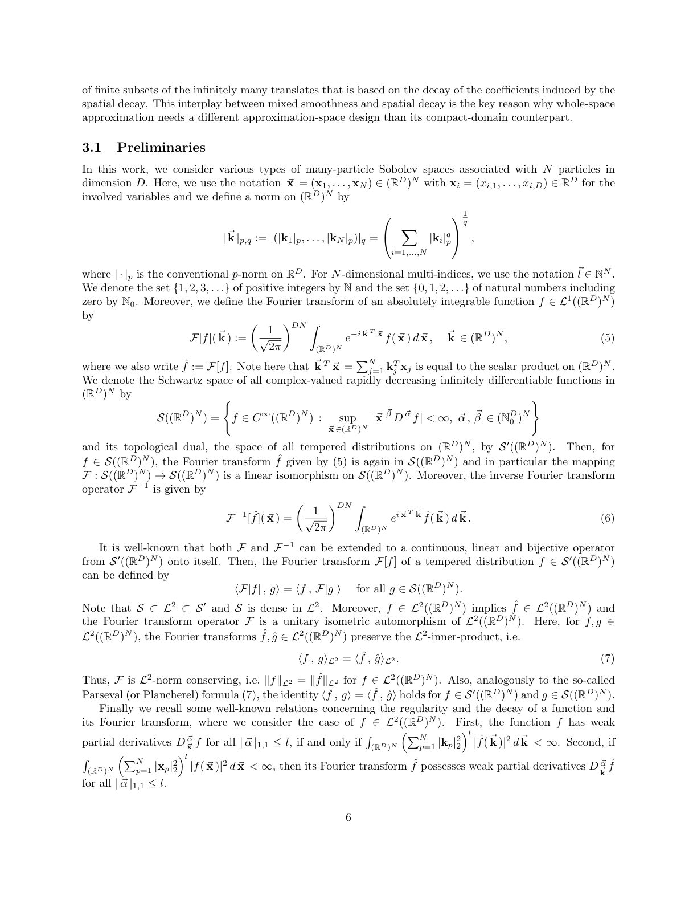
<figcaption class="paper-figure-caption"><b>Fig 5.</b> Low-resolution page preview, page 6</figcaption>
</figure>

**Summary.** The paper develops Sparse Configuration Interaction (SCI) methods to solve the electronic Schrödinger equation by rigorously analyzing function spaces using Meyer wavelets. It proves that SCI mitigates the curse of dimensionality in basis set expansions, leading to convergence rates independent of electron number $N$. This breakthrough offers a path toward simulating strongly correlated systems with drastically reduced computational scaling for both classical and quantum computing platforms.

**Why it may be interesting.** This work provides a rigorous theoretical framework showing how advanced functional analysis techniques can overcome fundamental exponential scaling barriers in many-body physics simulations, directly impacting the feasibility of simulating complex chemical systems on both classical and quantum hardware.

Detailed structure

**Main problem.** To develop rigorous, scalable approximation methods for solving the electronic Schrödinger equation by mitigating the curse of dimensionality inherent in full configuration interaction (FCI) expansions.

**Main result.** The proposed Sparse Configuration Interaction (SCI) method achieves convergence rates to the complete basis set limit that are independent of the number of electrons ($N$), significantly reducing computational scaling compared to conventional methods.

**Method.** The work combines advanced mathematical tools, including Meyer wavelet analysis on weighted Sobolev spaces defined over the $N$-particle domain, with quantum chemistry techniques like SCI and sparse grid approximations.

**Model / system.** The system is governed by the electronic Schrödinger equation for interacting electrons in a molecular or atomic environment. The Hamiltonian involves electron-electron repulsion, electron-nucleus attraction, and nuclear repulsion terms.

**Key observables.** Convergence rate to the Complete Basis Set (CBS) limit; approximation error ($\|\Psi_{	ext{s}} - \Psi_{	ext{BFCI}}\|_{H^1}$); required number of qubits for quantum encoding ($n_{SCI}^q$).

**Important parameters / regimes.** Number of electrons ($N$); size of the one-particle basis set ($K$ or $L$); smoothness indices ($t, r$); and the degree of approximation (related to grid level $L$).

**Assumptions / limitations.** The analysis relies on establishing norm equivalences using Meyer wavelets in mixed-regularity weighted Sobolev spaces; it assumes that the underlying eigenfunctions possess sufficient regularity properties.

**Figures summary.** Notes reference comparisons showing SCI dramatically reduces determinant space dimensions and required qubits compared to FCI across various molecules (e.g., H2, FeMoco).

**Paper structure.** The paper builds mathematically by first characterizing function spaces using Meyer wavelets on the $N$-particle domain (Chunks 3 & 4), then applies these tools to derive error bounds for sparse grid approximations (Chunk 7), and finally translates these mathematical findings into computational scaling improvements for both classical solvers and quantum algorithms via SCI (Chunks 1, 2, 5, 6).

Abstract

In this article we revisit regularity results for eigenfunctions in the discrete spectrum of the electronic Schrödinger equation and study their consequences for approximation complexity. In particular, for the convergence to the complete basis set limit, it can be shown that the curse of dimensionality in the leading algebraic exponent can be mitigated. That is, for general sparse grid constructions, the main term of the convergence rate with respect to the number of degrees of freedom is independent of the number of electrons. These insights indicate potential benefits for classical numerical solvers of the electronic Schrödinger equation and also for quantum-computing approaches through new qubit-efficient wavefunction encodings.

[↑ back to top](#top)

### [Stalls and Spequlation: Pipelined Execution for Fault Tolerant Quantum Computation](http://arxiv.org/abs/2606.19593v1)

**Authors:** Aditi Awasthi, Gokul Subramanian Ravi, Jonathan Mark Baker  
**Type:** theory · **Category:** quantum information and computing · **PDF:** <https://arxiv.org/pdf/2606.19593v1>  
**Analysis basis:** full PDF text, analyzed in chunks

↔ Scroll figures horizontally

<figure class="paper-figure-card">
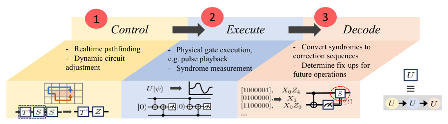
<figcaption class="paper-figure-caption"><b>Fig 1.</b> Fig. 2: Three-stage execution pipeline for a logical operation. The Control stage handles classical pre-processing, the Execute stage performs physical gate application and syndrome measurement, and the Decode stage runs classical error decoding</figcaption>
</figure>
<figure class="paper-figure-card">
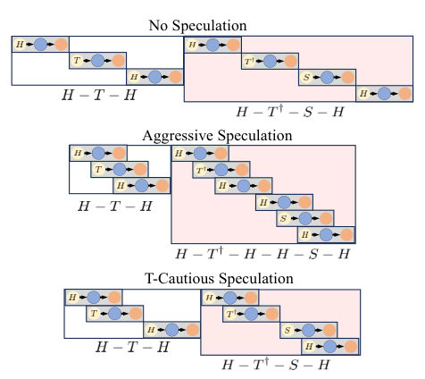
<figcaption class="paper-figure-caption"><b>Fig 2.</b> Fig. 3: Gate progression through Control (yellow), Execute (blue), and Decode (orange) stages. Left column: no injection error occurs. Right column: injection failure occurs, requiring correction. Each row shows a different scheduling strategy.</figcaption>
</figure>
<figure class="paper-figure-card">
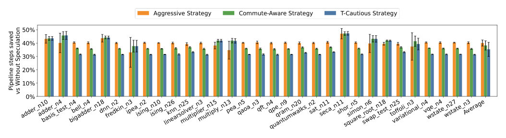
<figcaption class="paper-figure-caption"><b>Fig 3.</b> Fig. 4: Percentage savings in pipeline steps of each speculation strategy relative to the no-speculation baseline. Aggressive speculation achieves the largest savings on most benchmarks</figcaption>
</figure>
<figure class="paper-figure-card">
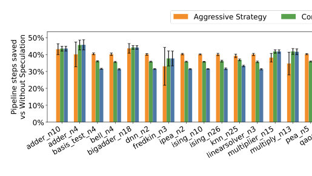
<figcaption class="paper-figure-caption"><b>Fig 4.</b> Figure 4 shows the percentage cycle savings of each strategy relative to the no-speculation baseline. Speculation consistently reduces cycle time. Every strat- egy achieves positive savings on all benchmarks; there is no circuit where speculation hurts, confirming that the pipelining benefit is robust. Aggressive speculation achieves the largest savings on almost all benchmarks. On circuits with deep T-gate depen- dency chains (ising_n26, knn_n25), it achieves ∼40% reduction in pipeline steps. One might expect the aggressive strategy to suffer due to the 50% injection failure rate. We mea- sured pnon-commute i.e. the fraction of T gate successors that do not commute with the S/S† correction...</figcaption>
</figure>
<figure class="paper-figure-card">
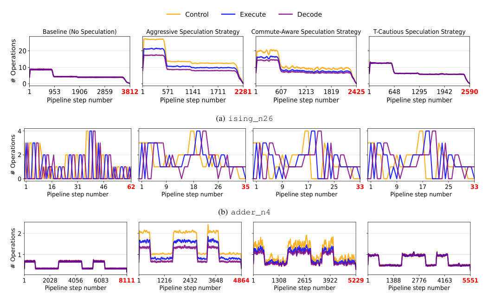
<figcaption class="paper-figure-caption"><b>Fig 5.</b> Fig. 5: Pipeline stage utilization (smoothed) for representative benchmarks under four scheduling strategies. Without speculation, utilization is bursty. With speculation, all three subsystems sustain overlapping activity</figcaption>
</figure>

**Summary.** This paper proposes a pipelined execution framework for fault-tolerant quantum computation by decomposing operations into Control, Execute, and Decode stages. By introducing speculative scheduling strategies, the authors demonstrate that overlapping these sequential steps significantly reduces overall computational time compared to treating operations as atomic units. This work provides crucial architectural insights for building practical, high-throughput quantum processors.

**Why it may be interesting.** While focused on quantum computation architecture rather than AMO physics directly, the underlying concept of managing sequential dependencies across heterogeneous subsystems—especially when dealing with error correction overheads—is highly relevant to designing complex quantum control systems built from physical platforms like trapped ions or superconducting circuits.

Detailed structure

**Main problem.** Current scheduling models for fault-tolerant quantum computation treat logical operations as atomic, failing to account for the sequential idle time across classical control, quantum hardware, and error decoding subsystems.

**Main result.** Implementing a pipelined execution framework with speculation reduces total pipeline steps by 20-40% compared to non-speculative baselines, significantly improving throughput.

**Method.** The authors decompose logical operations into sequential stages (Control $
ightarrow$ Execute $
ightarrow$ Decode) and apply speculative scheduling techniques analogous to classical pipelining.

**Model / system.** The model simulates fault-tolerant quantum computation using surface codes/lattice surgery, treating the process as a three-stage pipeline. The system is analyzed by comparing different speculation strategies (Aggressive, Commute-Aware, T-Cautious).

**Key observables.** Reduction in total pipeline steps (20-40% saving), stage utilization smoothing, and the performance hierarchy among scheduling strategies.

**Important parameters / regimes.** The ratio of stage durations (assumed 1:1:1 for simplicity) and the frequency/cost associated with speculative rollbacks are key parameters.

**Assumptions / limitations.** Key assumptions include exploiting algebraic properties (Clifford group commutation) to enable speculation, and initially assuming balanced hardware timing across stages.

**Figures summary.** Figures illustrate the three-stage pipeline structure; Figure 4 quantifies percentage savings for different strategies; Figure 5 shows how speculation smooths out bursty utilization across subsystems.

**Paper structure.** The paper introduces the problem of atomic operation modeling, proposes the pipelined framework (Control/Execute/Decode), details speculative scheduling mechanisms, evaluates performance against baselines using various benchmarks, and concludes by discussing load balancing benefits.

Abstract

Fault-tolerant quantum computation requires the coordinated action of three distinct systems: classical control logic, quantum hardware, and classical error decoders. Current scheduling models treat logical operations as atomic, hiding the fact that these subsystems operate sequentially and spend significant time idle. We present a pipelined execution framework that decomposes each logical operation into its component stages i.e. Control, Execute, and Decode. Building on this, we discuss some speculation strategies that allow successor operations to begin processing before their predecessors have completed decoding. We evaluate our framework on several common benchmarks and show that pipelining with speculation reduces total pipeline steps by 20-40% compared to a no-speculation baseline. The most aggressive strategy consistently outperforms conservative alternatives, even though partial rollback is needed at times, because the per-rollback penalty is small relative to the parallelism gained. We further show that speculation facilitates load balancing by distributing work more evenly across the heterogeneous subsystems of a fault-tolerant quantum computer, converting idle time into useful computation while also saving on execution time.

[↑ back to top](#top)

## Secondary cond-mat archives

*Papers from cond-mat.mtrl-sci, mes-hall, other, soft, supr-con. These archives are de-prioritized — they appear at the end regardless of relevance score.*

### Relevant in secondary archives (16)

### [Boltzmann-constrained extraction of spin splitting and momentum relaxation in d-wave altermagnets](http://arxiv.org/abs/2606.19785v1)

**Authors:** Y. X. Gao, Z. W. Fan, Q. S. Yao, Y. D. Ji, H. Geng  
**Type:** theory · **Category:** numerical methods · **PDF:** <https://arxiv.org/pdf/2606.19785v1>  
**Analysis basis:** full PDF text, analyzed in chunks
**Topic relevance:** 🔥 `methods for driven-dissipative` **4/5** · `driven-dissipative phase transition` **3/5** · `non-equilibrium dynamics` **3/5** · `Keldysh / 2PI / non-Gaussian methods` **2/5** · `analog quantum simulation` **2/5** · `non-equilibrium universality` **2/5** · `spintronics-quantum-optics interface` **2/5** · `Kondo & dissipative impurity` **1/5** · `correlated / nonlocal dissipation` **1/5** · `exotic spin models in light-matter` **1/5**

↔ Scroll figures horizontally

<figure class="paper-figure-card">
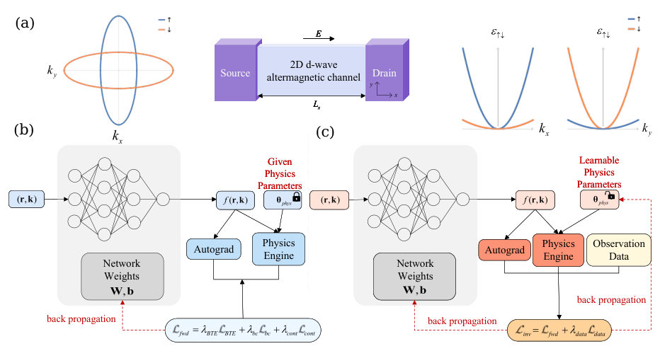
<figcaption class="paper-figure-caption"><b>Fig 1.</b> Figure 1. Boltzmann-constrained route from microscopic parameters to transport observables. (a) A two-dimensional altermag- netic channel is driven by a small source-drain bias. The spin-resolved Fermi contours and schematic spin-split band dispersions along kx and ky illustrate the minimal dispersion ε↑↓(k) = ℏ2(k2 x + k2 y)/(2m) ± α(k2 x −k2 y), with the Fermi contours shown for α = 0.4. The measured longitudinal conductance depends on both the altermagnetic coupling (α) and momentum relaxation time (τ0). (b) Forward mode: for fixed microscopic parameters, a differentiable representation of gσ(x, θ) is optimized subject to the Boltzmann equation, directional contact injection, and current...</figcaption>
</figure>
<figure class="paper-figure-card">
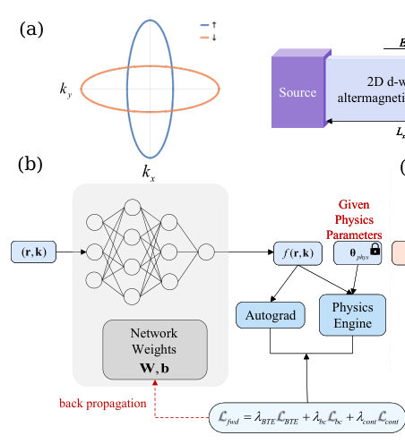
<figcaption class="paper-figure-caption"><b>Fig 2.</b> Figure 1 summarizes the route from the minimal d-wave altermagnetic channel to the differentiable forward and inverse transport problems: panel (a) connects the spin- resolved Fermi contours and spin-split band dispersions to the source–drain geometry, while panels (b) and (c) distinguish the fixed-parameter forward mode from the parameter-learning inverse mode. The integral formulation above can be solved by spa- tial and angular discretization, but the inverse problem requires the forward map {α, τ0} 7→G(EF ) to be evalu- ated and differentiated repeatedly. We therefore employ</figcaption>
</figure>
<figure class="paper-figure-card">
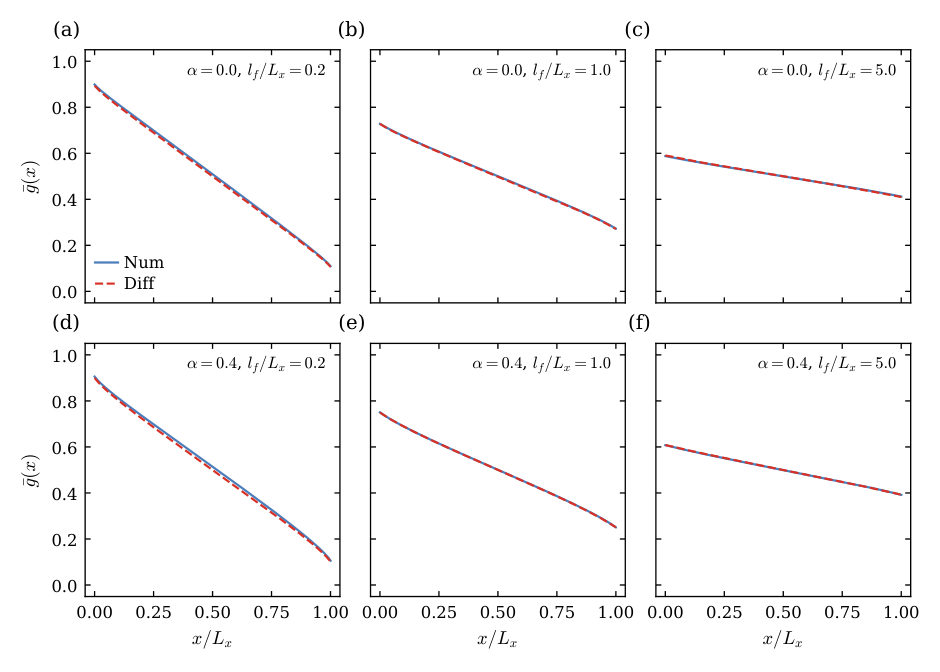
<figcaption class="paper-figure-caption"><b>Fig 3.</b> Figure 2. Local electrochemical-potential profile ¯g(x) across diffusive, crossover, and ballistic regimes. Blue solid curves are dense-discretization Boltzmann solutions and red dashed curves are differentiable-solver results. (a)–(c) Normal metal, α = 0. (d)–(f) d-wave altermagnet, α = 0.4. From left to right, lf/Lx = 0.2, 1.0, and 5.0, with EF = 1.0.</figcaption>
</figure>
<figure class="paper-figure-card">
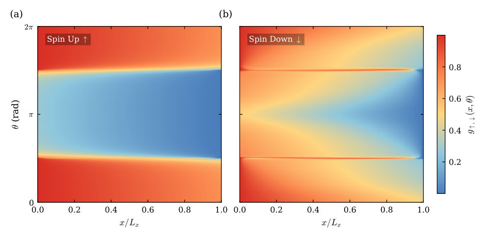
<figcaption class="paper-figure-caption"><b>Fig 4.</b> Figure 3. Spin-resolved nonequilibrium distributions in a d-wave altermagnetic channel. The heat maps show (a) g↑(x, θ) and (b) g↓(x, θ) for α = 0.4, EF = 1.0, and lf/Lx = 1.0. The contrasting textures reflect the spin-dependent longitudinal velocities produced by the altermagnetic Fermi-surface anisotropy.</figcaption>
</figure>
<figure class="paper-figure-card">
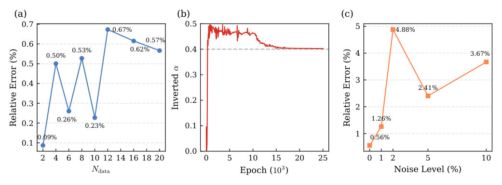
<figcaption class="paper-figure-caption"><b>Fig 5.</b> Figure 4. Single-parameter inversion of the altermagnetic coupling α with fixed τ0. (a) Relative error versus the number of conductance data points Ndata. (b) Representative optimization trajectory for Ndata = 8 and target α = 0.4. (c) Relative error under Gaussian noise in the conductance data; points are averaged over three independent runs.</figcaption>
</figure>

**Summary.** This work addresses the difficulty of separating intrinsic spin splitting from scattering effects in altermagnets by formulating an inverse transport problem. The authors developed a Physics-Informed Neural Network (PINN) acting as a differentiable Boltzmann solver to enforce strict physical constraints. This novel methodology allows for the robust, simultaneous extraction of both key material parameters ($\alpha$ and $	au_0$) from measured conductance data.

**Why it may be interesting.** While focused on condensed matter transport, the core methodology—using PINNs to enforce complex physical conservation laws (like particle/current continuity) within a non-linear PDE framework for parameter identification—is highly relevant to solving open quantum system dynamics or many-body problems where exact analytical solutions are intractable.

Detailed structure

**Main problem.** The primary challenge is resolving the parameter degeneracy when separating intrinsic spin splitting ($\alpha$) from extrinsic scattering ($	au_0$) in transport measurements of d-wave altermagnets.

**Main result.** By employing a Physics-Informed Neural Network (PINN) constrained by local and global conservation laws, the authors successfully lift this degeneracy to accurately extract both $\alpha$ and $	au_0$.

**Method.** The study uses a differentiable Boltzmann solver implemented via PINNs to solve the semiclassical transport equation in an inverse mode optimization framework.

**Model / system.** The system is a two-dimensional d-wave altermagnet described by a Hamiltonian leading to spin-dependent dispersions. Transport is modeled using the semiclassical Boltzmann equation, bridging ballistic and diffusive regimes.

**Key observables.** Longitudinal conductance ($G$), local electrochemical potential profile ($ar{g}(x)$), and spin-resolved non-equilibrium distributions ($g_{\uparrow/\downarrow}$).

**Important parameters / regimes.** Altermagnetic coupling ($\alpha$) and momentum relaxation time ($	au_0$). The analysis spans diffusive, crossover, and ballistic transport regimes.

**Assumptions / limitations.** The model assumes a semiclassical regime, linear response expansion, and that the local electrochemical potential is shared across spin channels due to non-magnetic contacts. It neglects SOC, magnetic domains, and coherent interference.

**Figures summary.** Figures illustrate the successful reproduction of Boltzmann solutions across regimes (forward mode) and show how the PINN approach allows joint inversion by constraining the fit trajectory away from the compensation valley towards the true physical solution.

**Paper structure.** The paper establishes the theoretical framework using the semiclassical Boltzmann equation, develops a differentiable solver via PINNs to handle forward calculations, and then applies this solver in an inverse mode optimization loop constrained by current continuity to simultaneously solve for $\alpha$ and $	au_0$.

Abstract

Altermagnets exhibit spin-split electronic structure without requiring spin-orbit coupling, but transport measurements generally mix intrinsic spin splitting with extrinsic scattering. We examine this identifiability problem for a two-dimensional d-wave altermagnet within a unified semiclassical framework spanning ballistic to diffusive transport. The spin-dependent Fermi-surface anisotropy produces a pronounced size effect, where vastly different longitudinal velocities cause the two spin channels to exhibit markedly different effective relaxation lengths within the same device geometry. However, the altermagnetic coupling $α$ and the momentum relaxation time $τ_0$ strongly compensate each other in longitudinal conductance, creating a severe parameter degeneracy. To lift this degeneracy, we formulate a physics-informed neural network (PINN) to act as a differentiable Boltzmann solver that strictly enforces contact injection, local particle conservation, and global current continuity. Driven by sparse conductance spectra, this neural solver leverages the Fermi-level dependence of transport to unlock the coupled parameters simultaneously, achieving sub-percent accuracy even under moderate measurement noise. These results show that combining the Fermi-level dependence of transport with strict physical constraints provides a robust route to separating spin splitting from scattering in altermagnetic conductors.

[↑ back to top](#top)

### [Temporal dissipative solitons and optical frequency combs in coherently driven Kerr resonators](http://arxiv.org/abs/2606.20026v1)

**Authors:** Stuart G. Murdoch, François Leo, Xiaoxiao Xue, Stéphane Coen, Miro Erkintalo  
**Type:** both · **Category:** other · **PDF:** <https://arxiv.org/pdf/2606.20026v1>  
**Analysis basis:** full PDF text, analyzed in chunks
**Topic relevance:** 🔥 `methods for driven-dissipative` **4/5** · `correlated cavity matter` **3/5** · `driven-dissipative phase transition` **3/5** · `correlated / nonlocal dissipation` **2/5** · `non-equilibrium dynamics` **2/5** · `non-equilibrium universality` **2/5** · `Keldysh / 2PI / non-Gaussian methods` **1/5** · `analog quantum simulation` **1/5** · `interference shaping light` **1/5** · `superradiant laser` **1/5**

↔ Scroll figures horizontally

<figure class="paper-figure-card">
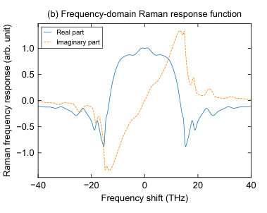
<figcaption class="paper-figure-caption"><b>Fig 1.</b> Fig. 2. (a) Temporal- and (b) frequency-domain representation of the Raman response function of fused silica (multi-vibrational mode model [109]).</figcaption>
</figure>
<figure class="paper-figure-card">
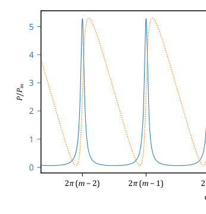
<figcaption class="paper-figure-caption"><b>Fig 2.</b> Fig. 3. Steady-state intracavity power with respect to driving power, 𝑃/𝑃in (blue, left axis), and phase response (dotted orange, right axis) of a passive resonator in the linear regime versus linear round-trip phase shift, 𝜙0. The power curve corresponds to the well known Airy distribution of linear Fabry-Perot resonators, Eq. (9), and illustrates the characteristic equidistant resonance peaks and the cavity power enhancement. The phase is that of the intracavity field 𝐸with respect to the driving field 𝐸in, as obtained from Eq. (8). Finesse set at 15, and assuming critical coupling</figcaption>
</figure>
<figure class="paper-figure-card">
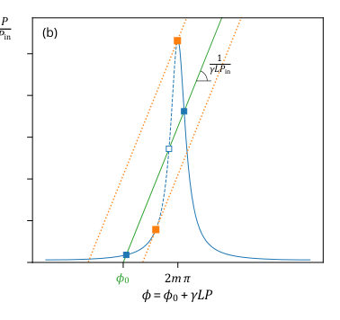
<figcaption class="paper-figure-caption"><b>Fig 3.</b> Fig. 4. In blue, steady-state response of a Kerr resonator around a resonance in the nonlinear regime versus (a) the linear round-trip phase shift 𝜙0 and (b) the total accumulated phase 𝜙= 𝜙0 + 𝛾𝐿𝑃for a driving power 𝑃in high enough to give rise to optical bistability. The green line is plotted for a particular value of 𝜙0 in the bistability region and in (b) corresponds to Eq. (18). The orange dotted lines, with the same slope as the green lines, are tangent to the blue curves at the orange points and delineate the bistability region. The blue markers show intersections between the blue resonance curves and the green lines. The dashed part of the blue curves and the open blue markers...</figcaption>
</figure>
<figure class="paper-figure-card">
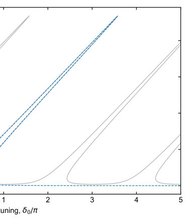
<figcaption class="paper-figure-caption"><b>Fig 4.</b> Fig. 5. Intracavity power as a function of linear cavity detuning as predicted by the Ikeda map (solid gray curve) and the mean field model (dashed blue curve). Both calculations use 𝜃= 0.1, 𝑃in = 25 W, 𝛾= 1.2 W−1 km−1, and 𝐿= 100 m. The Ikeda map calculation uses 𝛼= 0.150 whilst the mean field calculation uses 𝛼= 0.163. These different 𝛼values were chosen so as to match the peak intracavity powers across the models, which would otherwise not agree due to the comparatively low finesse (F ≈20) of the resonator considered here.</figcaption>
</figure>
<figure class="paper-figure-card">
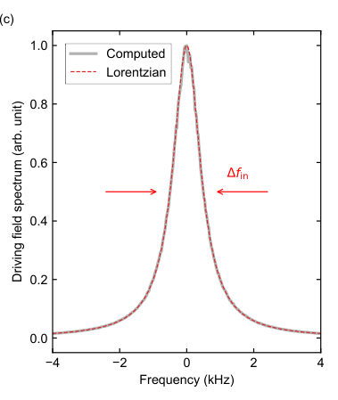
<figcaption class="paper-figure-caption"><b>Fig 5.</b> Fig. 6. Illustrative modeling of driving laser phase noise. (a) One realization of the slow time dependent phase fluctuation (Brownian motion) arising from frequency noise with constant frequency noise PSD. (b) Blue curve depicts the ensemble average of 5000 frequency noise PSD realizations, showing white noise with constant 𝑆𝑓( 𝑓) = 𝑆0 = Δ 𝑓in/(2𝜋) as highlighted by the red dashed line. (c) Gray curve shows the ensemble averaged optical spectrum arising from 5000 phase fluctuation realizations similar to that shown in panel (a). The red dashed curve shows a Lorentzian profile with FWHM Δ 𝑓in.</figcaption>
</figure>

**Summary.** This comprehensive review details the physics behind generating optical frequency combs using Kerr resonators. It explains that these combs arise from localized nonlinear dissipative structures like temporal solitons, which stabilize the system's output despite losses. The paper integrates advanced theoretical modeling with practical experimental techniques used in modern integrated photonics.

**Why it may be interesting.** This work bridges nonlinear wave physics with applied quantum optics by studying dissipative, non-Hamiltonian systems. The concepts of stable attractors (solitons) in driven, lossy environments are highly relevant to open quantum system dynamics and cavity QED modeling.

Detailed structure

**Main problem.** The article reviews the fundamental physics governing Kerr frequency combs generated by localized nonlinear dissipative structures within coherently driven optical resonators.

**Main result.** It details how bright temporal cavity solitons (in anomalous dispersion) and nonlinear switching waves (in normal dispersion) act as canonical stable states enabling robust, coherent comb generation in microresonators.

**Method.** The review synthesizes theoretical modeling using the Generalized Nonlinear Schrödinger Equation (GNLSE), coupled with discrete map approaches (Ikeda map), alongside comprehensive discussions of experimental characterization techniques.

**Model / system.** The primary system is a Kerr nonlinear optical resonator, modeled by equations describing intracavity field evolution over multiple passes. Platforms range from long optical fibers to integrated monolithic microresonators (e.g., MgF2).

**Key observables.** Temporal and spectral intensity profiles of the intracavity field; cavity power enhancement factor; frequency spacing (FSR); stability metrics like timing jitter.

**Important parameters / regimes.** Dispersion regime (anomalous vs. normal GVD), Kerr nonlinearity ($\gamma$), resonator loss ($\alpha$), and coupling strength ($	heta$).

**Assumptions / limitations.** The analysis often relies on the mean-field approximation for high-finesse cavities, assuming point coupling losses and single-mode operation.

**Figures summary.** Figures illustrate linear resonance behavior (Fabry-Perot), nonlinear resonance shifts due to Kerr effects, and comparisons between predictions from the Ikeda map versus simplified mean-field models.

**Paper structure.** The article is structured as a comprehensive review/tutorial, covering modeling dispersive resonators, dedicated sections for temporal cavity solitons (anomalous regime), localized structures in normal dispersion (switching waves), and experimental realization techniques.

Abstract

Kerr frequency combs have recently emerged as an exciting new photonic technology, with applications across science and engineering. Their formation within driven optical resonators that possess a Kerr nonlinearity is enabled through the rich landscape of localized nonlinear dissipative structures intrinsic to these systems. This article offers a comprehensive review of the physics that underpins these nonlinear comb-generating structures. Particular attention is placed on bright temporal cavity solitons and nonlinear switching waves -- the canonical stable comb-generating states in the anomalous and normal dispersion regimes, respectively. Written as both a review and tutorial, the article also includes an in-depth treatment of the numerical methods required to simulate driven Kerr resonators, alongside a comprehensive discussion of the laboratory techniques used to experimentally realize and characterize Kerr combs.

[↑ back to top](#top)

### [Designing all possible logic gates in phononic lattices: A theoretical study](http://arxiv.org/abs/2606.19973v1)

**Authors:** Swaraj Biswas, Santanu K. Maiti  
**Type:** theory · **Category:** statistical mechanics · **PDF:** <https://arxiv.org/pdf/2606.19973v1>  
**Analysis basis:** full PDF text, analyzed in chunks
**Topic relevance:** 🔥 `methods for driven-dissipative` **4/5** · 🔥 `non-equilibrium dynamics` **4/5** · `Keldysh / 2PI / non-Gaussian methods` **3/5** · `driven-dissipative phase transition` **3/5** · `non-equilibrium universality` **2/5** · `Frenkel-Kontorova` **1/5** · `analog quantum simulation` **1/5** · `correlated / nonlocal dissipation` **1/5**

↔ Scroll figures horizontally

<figure class="paper-figure-card">
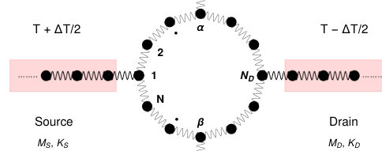
<figcaption class="paper-figure-caption"><b>Fig 1.</b> FIG. 1: (Color online). Logic gate setup, where a phononic ring is coupled to source and drain heat baths. Two masses, labeled as A and B, are placed in close proximity to the ring that act as logical inputs.</figcaption>
</figure>
<figure class="paper-figure-card">
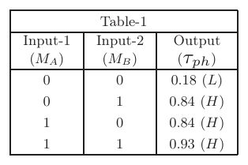
<figcaption class="paper-figure-caption"><b>Fig 2.</b> FIG. 2: (Color online). OR gate operation. (a) Junction setup, where a phononic ring is coupled to two heat baths, source and drain, respectively. Two input sites, labeled as A and B, are placed symmetrically to the ring. (b) Phonon transmission probability as a function of phonon frequency under four different input conditions, where the blue line de- notes when both inputs are OFF, the green line denotes when only one input is ON, and the orange line shows the case where both inputs are ON. Both for the (1, 0) and (0, 1) input con- ditions, identical transmission probabilities are obtained, and thus, we use one curve for them. Table-1 shows the truth table for the OR gate response at ω =...</figcaption>
</figure>
<figure class="paper-figure-card">
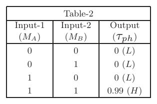
<figcaption class="paper-figure-caption"><b>Fig 3.</b> FIG. 3: (Color online). AND gate operation. (a) Junction setup, where an 8 -site ring is connected to the heat baths, source and drain, respectively. Two additional sites, A and B, are attached to the lower arm of the ring. (b) Phonon trans- mission spectrum, where different colors correspond to the same meaning as depicted in Fig. 2(b). We use single curve for (1, 0) and (0, 1) input conditions, as for both these cases, iden- tical transmission probabilities are obtained. Table-2 shows the truth table for the AND gate response at ω = 8.2 Trad/s.</figcaption>
</figure>
<figure class="paper-figure-card">
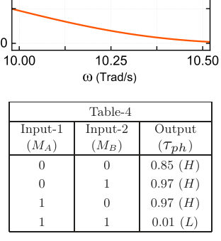
<figcaption class="paper-figure-caption"><b>Fig 4.</b> FIG. 5: (Color online). NAND gate operation. Junction setup is the same as described in Fig. 2(a). (a) Phonon transmission probability as a function of phonon frequency, where different colored curves represents the same meaning as described in Fig. 2(b). Both for the (1, 0) and (0, 1) input conditions, identical transmission probabilities are obtained, and thus, we use one curve for them. Table-4 shows the truth table for the NAND gate response at ω = 10.5 Trad/s.</figcaption>
</figure>
<figure class="paper-figure-card">
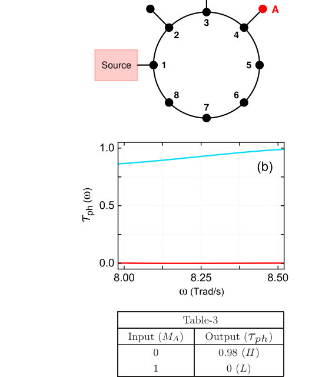
<figcaption class="paper-figure-caption"><b>Fig 5.</b> FIG. 4: (Color online). NOT gate operation. (a) Junction setup, where a ring, with two additional sites, connected with two heat baths, source and drain, respectively. Among these two additional sites, the site labeled ‘A’ serves as the input, while the other is part of the parent lattice. (b) Phonon trans- mission probability as a function of phonon frequency, where the cyan line denotes when the input is OFF, and the red line indicates the ON state of the input. The truth table for the NOT gate response at ω = 8.5 Trad/s is shown in Table-3.</figcaption>
</figure>

**Summary.** The paper theoretically designs a method to build universal logic gates using only heat flow through a nanophonic ring structure. By calculating the phonon transmission probability via NEGF, the authors demonstrate that all seven standard logic operations can be realized by controlling local atomic couplings at the input sites. This suggests a viable pathway for thermal computing devices.

**Why it may be interesting.** This work bridges concepts from open quantum systems (heat baths, non-equilibrium dynamics) with information theory, proposing a solid-state platform where thermal transport dictates computation. The use of phonon modes makes it relevant to studies in nanoscale energy transfer and phononics.

Detailed structure

**Main problem.** The research aims to realize all seven standard logic gates (OR, AND, NOT, etc.) using thermal energy flow rather than electrical current in nanoscale phononic lattices.

**Main result.** All seven fundamental and combinatorial logic gates are successfully demonstrated theoretically by tuning the junction configuration of a phononic ring system. The proposed operations show robustness across a broad range of phonon frequencies.

**Method.** The analysis employs the non-equilibrium Green's function (NEGF) formalism to calculate the phonon transmission probability ($\tau_{ph}$) through the coupled nanoring structure.

**Model / system.** The physical system is a phononic ring lattice connected to two heat baths (source and drain), with two or one additional atomic site acting as controllable inputs. The junction dynamics are modeled using a mass-spring framework.

**Key observables.** Phonon transmission probability ($\tau_{ph}$), where high $\tau_{ph}$ corresponds to the logical '1' state, and low $\tau_{ph}$ corresponds to the '0' state.

**Important parameters / regimes.** Source/Drain temperatures ($T \pm \Delta T/2$), atomic masses ($M_A, M_B$), spring constants ($K$), and phonon frequency ($\omega$).

**Assumptions / limitations.** The logic output is solely determined by the interference effects governing $\tau_{ph}$ within the NEGF framework. The '0' state input corresponds to the physical absence of an atomic site.

**Figures summary.** Figures illustrate the junction setups for various gates (e.g., OR gate) and plot the calculated phonon transmission probability ($\tau_{ph}$) as a function of phonon frequency ($\omega$) under different input conditions.

**Paper structure.** The paper systematically analyzes each logic gate (OR, AND, NOT, etc.) by defining the required junction configuration and calculating the corresponding $\tau_{ph}$ spectrum using NEGF theory to generate truth tables for all inputs.

Abstract

We propose a scheme for realizing thermal logic gates at the nanoscale using a phononic ring system. Two atomic sites, placed in close proximity to the ring, serve as the inputs for two-input logic operations, while a single proximity site is employed for single-input logic functionality. The logic output is encoded in the phonon transmission probability, which is calculated within the framework of non-equilibrium Green's function formalism. By appropriately tuning the ring-electrode junction configuration, all seven standard logic gates, comprising three fundamental and four combinatorial operations, are successfully realized in different phonon frequency regimes. Our results suggest that the proposed logic operations remain valid over a broad range of phonon frequencies, highlighting the generality and reliability of the proposed approach.

[↑ back to top](#top)

### [Mixed Floquet Lattice model for gapless topology](http://arxiv.org/abs/2606.20378v1)

**Authors:** Goutham Vinjamuri, Ashutosh Dubey, Ankur Das  
**Type:** theory · **Category:** other · **PDF:** <https://arxiv.org/pdf/2606.20378v1>  
**Analysis basis:** full PDF text, analyzed in chunks
**Topic relevance:** 🔥 `non-equilibrium dynamics` **4/5** · `analog quantum simulation` **3/5** · `driven-dissipative phase transition` **3/5** · `methods for driven-dissipative` **3/5** · `non-equilibrium universality` **2/5** · `Frenkel-Kontorova` **1/5** · `Keldysh / 2PI / non-Gaussian methods` **1/5**

↔ Scroll figures horizontally

<figure class="paper-figure-card">
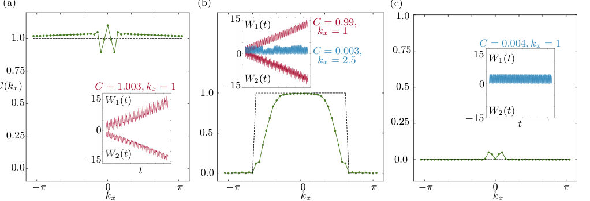
<figcaption class="paper-figure-caption"><b>Fig 1.</b> FIG. 2. Chern number C(kx) extracted from the rate of energy pumping (green line and circles), plotted together with the Chern number calculated for H(kx, θ1, θ2) over the periodic (θ1, θ2) torus using the Fukui–Hatsugai–Suzuki method [31] (black dotted line). We use the following parameters: (a) m = 0.8, tx = 0.6, and η = 5 (LCI phase), with the inset showing the work done by both drives as a function of time at kx = 1; (b) m = 1.8, tx = 0.6, and η = 1 (W2 phase), with the inset showing the work done by both drives at kx = 1 (red) and kx = 2.5 (blue); (c) m = 3, tx = 0.6, and η = 1 (trivial phase), with the inset showing the work done by both drives at kx = 1.</figcaption>
</figure>
<figure class="paper-figure-card">
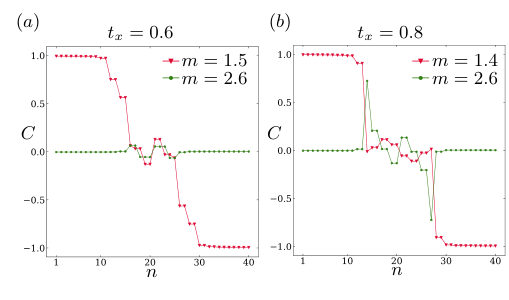
<figcaption class="paper-figure-caption"><b>Fig 2.</b> FIG. 1. Chern number C of each band plotted against the band index n, calculated by computing the slope of the net energy pumped from one drive to the other. We show four cases: (a) m = 1.5, tx = 0.6 (topological) and m = 2.6, tx = 0.6 (trivial); (b) m = 1.4, tx = 0.8 (topological) and m = 2.6, tx = 0.8 (trivial), all computed at size N = 20. In both examples, several bands below half-filling in the topological sector (m &lt; 2) exhibit quantized energy transfer with C = 1, whereas in the trivial sector (m &gt; 2), none of the bands show fully quantized energy pumping.</figcaption>
</figure>

**Summary.** The paper explores realizing a Weyl semimetal topology using a mixed Floquet lattice driven by two incommensurate fields. It finds that while the momentum-resolved energy pumping correctly detects the characteristic Chern number associated with Weyl nodes, the total real-space response follows a different dynamical pattern. This reveals a fundamental topological obstruction: continuous features like node separation are lost when reduced to simple integer invariants.

**Why it may be interesting.** This work is highly relevant as it addresses the non-equilibrium dynamics of topological matter, showing that simple quantization rules derived from gapped systems fail for gapless semimetals in driven settings.

Detailed structure

**Main problem.** The study investigates whether the topological information of a gapless Weyl semimetal phase, realized in a mixed Floquet synthetic dimension, is fully captured by global integer invariants derived from energy pumping.

**Main result.** The continuous momentum-space information defining the Weyl node separation ($k_0$) survives only in the momentum-resolved response ($C(k_x)$), while the total real-space power transfer follows a distinct effective Rice-Mele pumping structure, proving that gapless semimetallic topology does not straightforwardly translate to all Floquet dimensions.

**Method.** The analysis uses topological invariants like Chern numbers calculated via energy pumping (quantized energy transfer) and compares these quantized results against the continuous parameters defining the static Weyl phase diagram.

**Model / system.** The system is a 1D lattice model driven by two incommensurate time-dependent fields, creating a mixed (1 real + 2 synthetic)-dimensional Floquet lattice designed to host a time-reversal-broken Weyl semimetal.

**Key observables.** Momentum-resolved power transfer ($C(k_x)$), total real-space power transfer ($\Phi$), and the Chern number calculated via energy pumping.

**Important parameters / regimes.** Incommensurate drive frequencies ($\omega_1, \omega_2$), lattice parameters ($m, t_x, t_z, t_y$), and momentum $k_x$.

**Assumptions / limitations.** The analysis distinguishes between the adiabatic regime (Landau-Zener transitions) and the total response structure; it assumes that continuous topological features are lost when reduced to a single integer invariant.

**Figures summary.** Figures illustrate the system setup coupling a Rice-Mele model to two oscillating fields, showing both the resulting Floquet lattice structure and plots comparing calculated Chern numbers from energy pumping versus established methods.

**Paper structure.** The paper establishes the mixed Floquet Hamiltonian, analyzes the momentum-resolved energy transfer which yields quantized Chern numbers confirming Weyl topology slices, and then contrasts this with the total real-space pump response to demonstrate the topological obstruction.

Abstract

We investigate the realization of a time-reversal-broken Weyl semimetal in Floquet synthetic dimensions generated by two incommensurate drives, in the spirit of topological frequency conversion in driven synthetic lattices PRX 7, 041008 (2017). The system is described by a one-dimensional lattice model in a mixed $(1~\mathrm{real}+2~\mathrm{synthetic})$-dimensional setting, where the driving phases act as synthetic momenta and generate Weyl points in the mixed Floquet band structure. Using the topology associated with these band degeneracies, we analyze the energy transfer between the two drives. We find that the mixed Floquet lattice captures the Weyl-semimetal topology only in a momentum-resolved sense: for fixed real momentum $k_x$, the power transfer measures the $k_x$-resolved Chern number and detects the separation of the Weyl nodes. However, the full real-space response is qualitatively different. The total power transfer does not reproduce the static Weyl-semimetal phase diagram, but instead follows an effective Rice-Mele-type pumping structure. Thus, in contrast to fully gapped topological insulators, gapless semimetallic phases do not straightforwardly translate to Floquet synthetic dimensions. Our results reveal a distinct dynamical phase structure of driven Weyl systems and establish mixed Floquet lattices as a platform for exploring non-equilibrium gapless topology.

[↑ back to top](#top)

### [Spin transport in a normal meta-altermagnetic superconducting nanowire junction](http://arxiv.org/abs/2606.20279v1)

**Authors:** Xing-Jian Yi, Yi-Xin Dai, Yue Mao, Qing-Feng Sun  
**Type:** theory · **Category:** other · **PDF:** <https://arxiv.org/pdf/2606.20279v1>  
**Analysis basis:** full PDF text, analyzed in chunks
**Topic relevance:** 🔥 `Keldysh / 2PI / non-Gaussian methods` **4/5** · `methods for driven-dissipative` **3/5** · `non-equilibrium dynamics` **3/5** · `driven-dissipative phase transition` **2/5** · `non-equilibrium universality` **2/5** · `Kondo & dissipative impurity` **1/5** · `exotic spin models in light-matter` **1/5**

↔ Scroll figures horizontally

<figure class="paper-figure-card">
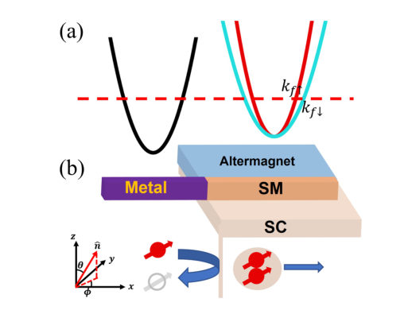
<figcaption class="paper-figure-caption"><b>Fig 1.</b> FIG. 1. Schematic for normal metal-altermagnetic supercon- ducting nanowire junction. (a) The left is the schematic en- ergy band of normal metal. The right is the schematic energy band of altermagnet accompanied by spin splitting. The red dashed line is Fermi level. kf↑and kf↓are Fermi wave vectors for spin-up (red) and spin-down (cyan) bands, respectively. (b) The upper part is the schematic of the device, where a metal connects with a nanowire on the surface of an s-wave SC and in proximity to altermagnet. The lower part is the spin transport process. When a spin-ˆn electron is incident, it is reflected as an equal-spin hole, injecting a spin-triplet Cooper pair into the superconducting...</figcaption>
</figure>
<figure class="paper-figure-card">
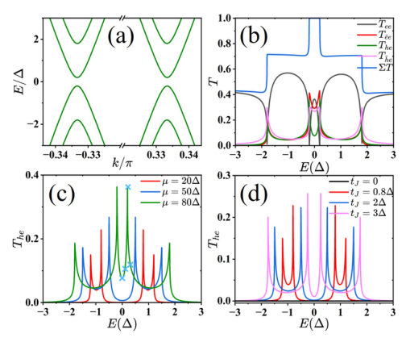
<figcaption class="paper-figure-caption"><b>Fig 2.</b> FIG. 2. (a) The energy band of 1D superconducting nanowire. (b) Four reflection coefficients and total reflection coefficient versus incident electron energy E. (c, d) Equal-spin Andreev reflection coefficient The versus incident electron energy E for (c) different chemical potentials µ and (d) different altermag- net strengths tJ. Parameters: α = 0, θ = π/2, and ϕ = 0 in (a-d), tJ = 0.8∆in (a-c), µ = 80∆in (a-b), µ = 20∆in (d).</figcaption>
</figure>
<figure class="paper-figure-card">
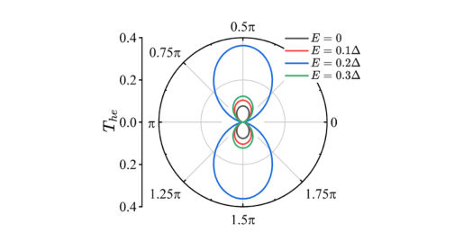
<figcaption class="paper-figure-caption"><b>Fig 3.</b> FIG. 3. Equal-spin Andreev reflection coefficient The versus polar angle θ for different incident electron energies E. The four data points at θ = π/2 on four curves correspond to the four blue cross points in Fig. 2(c). Parameters: α = 0, tJ = 0.8∆, µ = 80∆, ϕ = 0.</figcaption>
</figure>
<figure class="paper-figure-card">
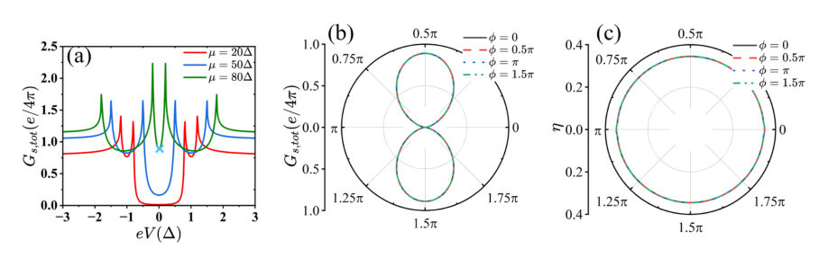
<figcaption class="paper-figure-caption"><b>Fig 4.</b> FIG. 4. (a) Spin conductance Gs,tot versus spin bias V for different chemical potentials µ. (b) Spin conductance Gs,tot versus polar angle θ for different azimuthal angles ϕ. Point at θ = π/2 on ϕ = 0 curve corresponds to blue cross point in (a). (c) Spin injection efficiency η versus polar angle θ for different azimuthal angles ϕ. Parameters: α = 0 and tJ = 0.8∆in (a-c), µ = 80∆ and V = 0 in (b-c), θ = π/2 and ϕ = 0 in (a).</figcaption>
</figure>
<figure class="paper-figure-card">
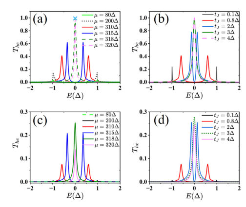
<figcaption class="paper-figure-caption"><b>Fig 5.</b> FIG. 5. Equal-spin Andreev reflection coefficient The versus incident electron energy E for (a,c) different chemical poten- tials µ and (b,d) different altermagnet strengths tJ. The inci- dent electron spin is along z axis in (a-b) and x axis in (c-d). Parameters: α = 11.2∆and ϕ = 0 in (a-d), tJ = 0.8∆in (a,c), µ = 310∆in (b,d), θ = π/2 in (c-d) and θ = 0 in (a-b).</figcaption>
</figure>

**Summary.** This paper theoretically investigates generating and controlling spin-triplet superconductivity in nanowire junctions coupled to altermagnets. By calculating Andreev reflection coefficients and spin conductance using Green's functions, the authors confirm that these systems can support robust, dissipationless spin supercurrents. The findings highlight the tunability of this transport via magnetic orientation and topological phase transitions.

**Why it may be interesting.** This work connects advanced concepts in magnetism (altermagnetism) with superconductivity and spintronics, providing a theoretical blueprint for realizing exotic quantum transport phenomena like dissipationless spin currents.

Detailed structure

**Main problem.** The research aims to demonstrate a pathway for achieving dissipationless spin transport by engineering spin-triplet superconductivity in hybrid nanowire junctions.

**Main result.** The authors confirm the injection of spin triplet Cooper pairs via non-zero equal-spin Andreev reflection and show that spin conductance can be tuned, even exhibiting quantization in topological regimes.

**Method.** The study employs the nonequilibrium Green's function method to calculate transport properties like spin current and spin conductance under applied bias.

**Model / system.** The system modeled is a normal metal connected to an altermagnetic superconducting nanowire junction. The physics relies on proximity-induced spin-triplet superconductivity mediated by the altermagnet's magnetic order.

**Key observables.** Equal-spin Andreev reflection coefficient (T_{eh,sigma}), total spin conductance (G_{s,tot}), and spin injection efficiency ($\eta$).

**Important parameters / regimes.** Chemical potential ($\mu$), spin bias orientation, altermagnet strength ($T_j$), and the presence/absence of Spin-Orbit Coupling (SOC).

**Assumptions / limitations.** The analysis assumes that the superconducting pairing mechanism is dominated by proximity effects from the altermagnetic material.

**Figures summary.** Figures illustrate energy band structures, reflection coefficients vs. energy, angle dependence of conductance, and topological invariants ($\mathbb{Z}_2$) versus chemical potential to show phase transitions.

**Paper structure.** The paper progresses by first establishing the theoretical framework using BdG equations, calculating key transport observables (Andreev reflection, spin current), analyzing the role of SOC and magnetic orientation, and finally demonstrating topological superconducting phases leading to quantized conductance.

Abstract

Spin triplet superconductors are considered a promising platform for dissipationless spin transport, where spin currents are carried by spin triplet Cooper pairs. In this paper, we propose that the spin triplet superconductivity and spin supercurrent can be engineered in an altermagnetic superconducting nanowire, where a one-dimensional nanowire is placed on the surface of an s-wave superconductor and in proximity to the altermagnet. Using the nonequilibrium Green's function method, we demonstrate a nonzero equal spin Andreev reflection coefficient at the normal metal-altermagnetic superconducting nanowire interface, thereby verifying the injection of spin triplet Cooper pairs. Furthermore, we systematically investigate the spin transport properties in this hybrid system under a spin bias. Our results demonstrate that these properties can be effectively tuned by the chemical potential and spin bias orientation. Our proposal provides a pathway toward realizing dissipationless spin transport.

[↑ back to top](#top)

### [Electric-field-driven magnetic switching and tightly bound interlayer excitons in bilayer CrSBr](http://arxiv.org/abs/2606.20159v1)

**Authors:** Xiubin Li, Yu Sun, Xuanji Wang, Chunyan Wang, Kenji Watanabe, Takashi Taniguchi, Sheng Liu, Ting Yu, Liang Li, Tao Zhang, Jing Li  
**Type:** experiment · **Category:** other · **PDF:** <https://arxiv.org/pdf/2606.20159v1>  
**Analysis basis:** full PDF text, analyzed in chunks
**Topic relevance:** 🔥 `spintronics-quantum-optics interface` **4/5** · `exotic spin models in light-matter` **3/5** · `analog quantum simulation` **2/5** · `driven-dissipative phase transition` **2/5** · `correlated cavity matter` **1/5** · `non-equilibrium dynamics` **1/5** · `non-equilibrium universality` **1/5** · `quantum optics experiment` **1/5**

↔ Scroll figures horizontally

<figure class="paper-figure-card">
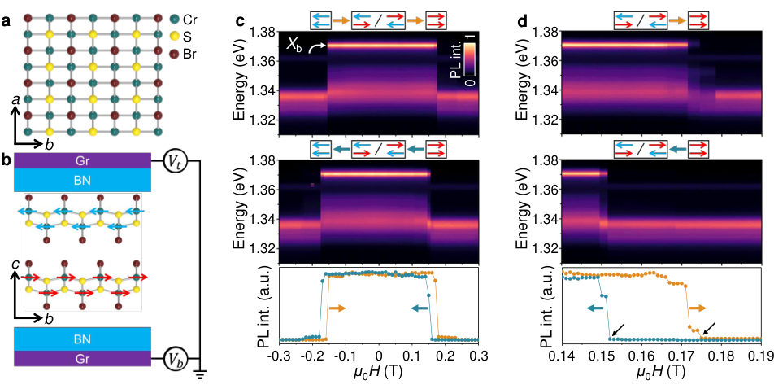
<figcaption class="paper-figure-caption"><b>Fig 1.</b> Fig. 1. Crystal structure and magneto-PL spectra of bilayer CrSBr. a Top view of the crystal structure of bilayer CrSBr, with arrows indicating the crystallographic axes. b Schematic illustration of the dual-gated device structure, and the side view of CrSBr crystal structure. Bilayer CrSBr is encapsulated by two hBN flakes, while few-layer graphite serves as the top and bottom gates. Vt and Vb denote the top- and bottom-gate voltages, respectively. Blue and red arrows represent opposite magnetic-moment orientations. c Upper two panels: magneto-PL spectra measured under opposite magnetic-field sweeping directions along the b axis. The schematics above the panels illustrate the evolution of...</figcaption>
</figure>
<figure class="paper-figure-card">
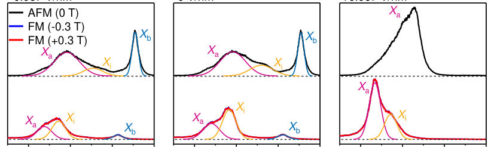
<figcaption class="paper-figure-caption"><b>Fig 2.</b> Fig. 2. Electric-field-tunable and magnetic-order-dependent excitonic states in bilayer CrSBr. a-c Electric-field- dependent PL spectra measured at −0.3, 0, and +0.3 T, respectively. To clearly visualize Xb in the FM state (±0.3 T), the PL intensity in the high-energy region of a and c is magnified by a factor of 10. d-f PL spectra measured under different magnetic states at −0.067, 0, and +0.067 V/nm, respectively. Magenta, yellow, and royal-blue curves represent Gaussian fitting components corresponding to Xa, Xi, and Xb, respectively. In panel f, the complicated spectral profile of Xa prevents reliable Gaussian fitting.</figcaption>
</figure>
<figure class="paper-figure-card">
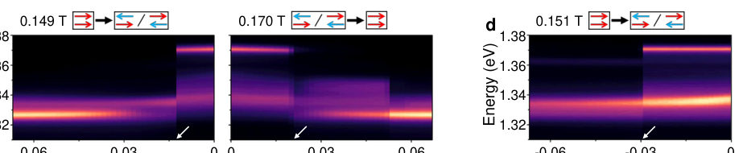
<figcaption class="paper-figure-caption"><b>Fig 3.</b> Fig. 3. Electric-field-driven magnetic switching in bilayer CrSBr. a-d PL spectra as a function of electric field E measured under constant magnetic fields. The E-sweeping direction is defined by the left-to-right orientation along the horizontal axis. The schematics above the PL maps illustrate the corresponding magnetic-field configurations and the electric- field-driven magnetic phase-transition processes. The PL spectra shown in the left and right panels of a and b were measured sequentially, separated by a magnetic-field adjustment process performed at fixed E. White arrows indicate the critical magnetic fields associated with magnetic phase transitions.</figcaption>
</figure>
<figure class="paper-figure-card">
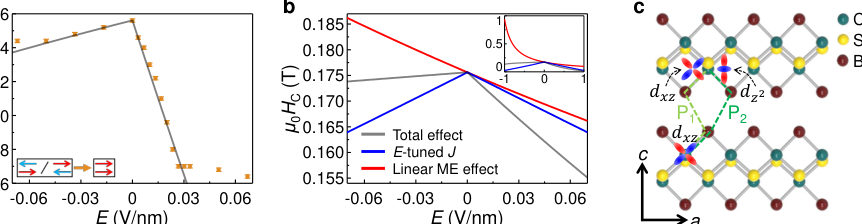
<figcaption class="paper-figure-caption"><b>Fig 4.</b> Fig. 4. The mechanism of electric-field-driven magnetic switching in bilayer CrSBr. a Electric-field-dependent µ0HC for the AFM–FM transitions in Device 1. The gray curve plots the fitting results, which combines a linear ME effect and E-tuned interlayer magnetic coupling mechanism. b Comparison of contributions to µ0HC-modulation from the linear ME effect and E-tuned interlayer magnetic coupling. The gray line is the fitting curve extracted from panel a. The contributions from linear ME effect and E-tuned interlayer magnetic coupling are represented by the red and blue curves, respectively. Inset shows the fitting results in an expanded electirc field range. c Side view of the crystal...</figcaption>
</figure>

**Summary.** This work demonstrates electric field control over the magnetic switching between AFM and FM states in bilayer CrSBr. Using magneto-PL measurements, the authors characterize both the underlying excitonic physics and the magnetoelectric coupling mechanisms. The findings establish bilayer CrSBr as a highly promising platform for electrically controlled spin-optoelectronic functionalities.

**Why it may be interesting.** The direct electrical control over magnetic order via excitonic signatures provides an experimental realization of multiferroic-like behavior in 2D materials, which is highly relevant for developing next-generation spintronic devices that couple charge/field to spin.

Detailed structure

**Main problem.** The central goal is achieving deterministic electric field control of magnetic order and understanding the interplay between excitonic states and magnetism in 2D van der Waals magnets for low-power spin-based technologies.

**Main result.** The study demonstrates reversible, electric-field-driven switching between antiferromagnetic (AFM) and ferromagnetic (FM) states in bilayer CrSBr. Furthermore, it resolves a tightly bound interlayer exciton whose behavior is coupled to the magnetic phase transition.

**Method.** Magneto-Photoluminescence (PL) measurements are performed on dual-gated bilayer CrSBr samples while applying out-of-plane electric fields and sweeping magnetic fields.

**Model / system.** The physical system is bilayer CrSBr encapsulated by hBN, studied in a dual-gated device structure. The analysis models the free energy difference between AFM and FM states as being governed by linear magnetoelectric effects and field-dependent interlayer exchange coupling.

**Key observables.** Magnetic phase transitions (AFM $\leftrightarrow$ FM), excitonic features ($X_a$, $X_b$, $X_i$), critical magnetic fields ($\mu_0 H_C$), and the dependence of these on applied electric field ($E$).

**Important parameters / regimes.** Temperature (3.7 K), Electric Field ($E \sim 0.03$ V/nm), Magnetic Field ($\mu_0 H \sim 0.3$ T).

**Assumptions / limitations.** The asymmetry in switching behavior suggests involvement of localized states near the bottom layer under positive bias, and the magnetic transition is modeled by combining linear ME effects and $E$-tuned exchange coupling.

**Figures summary.** Figures illustrate abrupt spectral changes during field sweeps corresponding to phase transitions; PL spectra show electric-field-induced redistribution between excitonic species ($X_a$, $X_b$); and plots quantify the sign-dependent modulation of the critical magnetic field ($\mu_0 H_C$) by the applied electric field.

**Paper structure.** The paper systematically presents evidence for (1) reversible, electric-field-driven magnetic switching; (2) characterization of interlayer excitons coupled to magnetism; and finally, (3) a quantitative model explaining the observed asymmetry in the critical magnetic field dependence on $E$ by combining linear magnetoelectric terms and exchange coupling modulation.

Abstract

Electric field control of magnetic order in two-dimensional (2D) van der Waals magnets is a central goal for low-power spin-based technologies. In the ambient-stable antiferromagnet CrSBr, strong magnetic anisotropy and robust exciton-spin coupling provide a favorable platform, yet deterministic electric field control of its magnetic phases has not been achieved. Here we demonstrate electric-field-driven reversible switching between antiferromagnetic and ferromagnetic states in dual-gated bilayer CrSBr without intentional carrier doping. In parallel, photoluminescence measurements resolve a tightly bound interlayer exciton with an intrinsic dipole moment of only ~1 e angstrom. The electric field dependence of the magnetic phase transition reveals two coexisting mechanisms: a linear magnetoelectric effect in the antiferromagnetic state and an electric-field-modulated interlayer exchange coupling. Their interplay accounts for the asymmetric evolution of the critical magnetic field. Our results establish bilayer CrSBr as a promising 2D material for electrically controlled spin-optoelectronic functionalities.

[↑ back to top](#top)

### [Majorana modes in helical altermagnet without net magnetism and spin-orbit coupling](http://arxiv.org/abs/2606.20259v1)

**Authors:** Xing-Jian Yi, Yue Mao, Cheng-Ming Miao, Qing-Feng Sun  
**Type:** theory · **Category:** other · **PDF:** <https://arxiv.org/pdf/2606.20259v1>  
**Analysis basis:** full PDF text, analyzed in chunks
**Topic relevance:** `Keldysh / 2PI / non-Gaussian methods` **3/5** · `analog quantum simulation` **3/5** · `spintronics-quantum-optics interface` **3/5** · `driven-dissipative phase transition` **2/5** · `methods for driven-dissipative` **2/5** · `Kondo & dissipative impurity` **1/5** · `exotic spin models in light-matter` **1/5** · `non-equilibrium dynamics` **1/5**

↔ Scroll figures horizontally

<figure class="paper-figure-card">
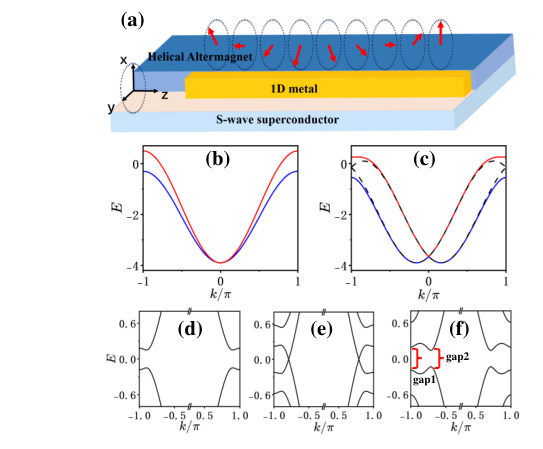
<figcaption class="paper-figure-caption"><b>Fig 1.</b> FIG. 1. (a) Schematic for altermagnet-metal-superconductor nanowire system to realize TSC, N´eel vector of 2D altermag- net rotates in xy plane versus z coordinate. (b) Altermagnetic nanowire energy band without helical structure with parame- ters µ = 1.9, θ = 0, tJ = 0.1. (c) The black dashed line is free electron energy band within rotating frame without altermag- netism. Parameters: µ = 1.9, θ = 1, tJ = 0. The blue and red lines are energy bands of helical altermagnet nanowire with tJ changed to 0.1. (d), (e), and (f) are the energy bands of the nanowire in proximity to s-wave superconductor without altermagnet and helical order (θ = 0, tJ = 0), with altermag- netism but without helical...</figcaption>
</figure>
<figure class="paper-figure-card">
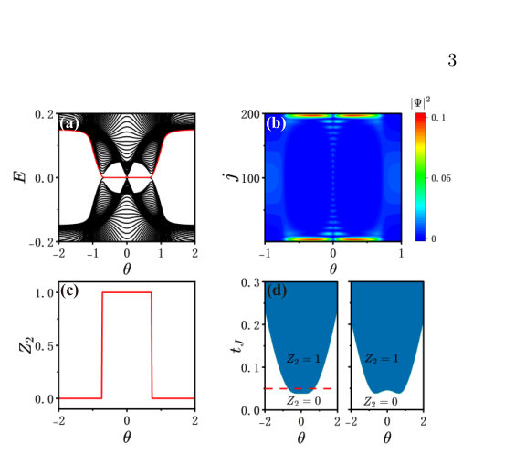
<figcaption class="paper-figure-caption"><b>Fig 2.</b> FIG. 2. (a) Finite-size energy spectrum of SC-proximitized helical altermagnet nanowire versus θ. (b) Wave functions of the red lines in (a). (c) Z2 number of the bulk Hamiltonian. (d) Topological phase diagram in the tJ-θ plane, µ = 2 and 1.9 in the left and right panels. Parameters: ∆= 0.15 in (a-d), µ = 2, tJ = 0.05 in (a-c), and the nanowire length N = 200 in (a-b).</figcaption>
</figure>
<figure class="paper-figure-card">
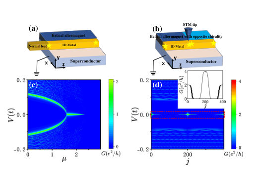
<figcaption class="paper-figure-caption"><b>Fig 3.</b> FIG. 3. (a) Two MBSs (yellow stars) are localized at both ends of nanowire with a metal lead connected to one end. (b) Helical altermagnet nanowire with opposite chirality. Two MBSs are localized at ends and the other two are localized at domain wall. The STM can scan the whole nanowire. (c) Calculated conductance for the device in (a) versus bias V and µ with N = 200, θ = 0.4, tJ = 0.1. (d) Calculated STM conductance for the device in (b) versus bias V and site j with tJ = 0.1, µ = 2. In the inset, conductance at zero bias is plotted. The parameters N = 200, θ = 0.4 for the left nanowire and N = 200, θ = −0.4 for the right nanowire.</figcaption>
</figure>

**Summary.** The paper presents a theoretical scheme to create Majorana bound states in a nanowire placed on a helical altermagnet, circumventing the need for strong spin-orbit coupling. By tuning parameters like chemical potential and magnetic order, they predict robust signatures of topological superconductivity, including quantized conductance peaks at both ends and domain walls.

**Why it may be interesting.** This work provides a concrete, material-science-inspired pathway (helical altermagnets) to engineer exotic topological states like MBSs, which are crucial for fault-tolerant quantum computation architectures.

Detailed structure

**Main problem.** The research proposes a novel platform to realize topological superconductors (TSC) and Majorana bound states (MBSs) without relying on conventional spin-orbit coupling or net magnetism.

**Main result.** They demonstrate that helical altermagnetism naturally induces necessary spin-momentum locking, leading to quantized conductance signatures ($2e^2/h$ at ends and $4e^2/h$ at domain walls).

**Method.** The analysis uses a tight-binding lattice Hamiltonian approach, employing gauge transformations and Green's function formalism in the Nambu basis for transport calculations.

**Model / system.** The system is modeled as a one-dimensional metal nanowire placed on the surface of a two-dimensional helical altermagnet, coupled proximally to an s-wave superconductor. The Hamiltonian incorporates terms related to helical order ($	heta$) and altermagnetism ($t_J$).

**Key observables.** Quantized conductance peaks (Zero-Bias Conductance Peak) at $2e^2/h$ (ends) and $4e^2/h$ (domain walls); topological invariants ($Z_2$, $Z$).

**Important parameters / regimes.** Chemical potential ($\mu$), altermagnet strength ($t_J$), helical frequency ($	heta$), superconducting gap ($\Delta$), and disorder strengths ($W_	heta, W_A$).

**Assumptions / limitations.** The analysis relies on low-energy expansions near the $\Gamma$ point and uses advanced Green's function techniques for current calculation.

**Figures summary.** Figures illustrate band inversion processes, finite-size energy spectra showing gap reopening/closing based on parameters ($	heta, t_J$), topological phase diagrams ($Z_2$ vs. $t_J-\mu$), and calculated conductance curves demonstrating robust quantized peaks against disorder.

**Paper structure.** The paper progresses from deriving the effective Hamiltonian in the Nambu basis to analyzing band structures and topological invariants ($Z_2$). It then moves to quantitative transport calculations using Green's functions, culminating in showing the robustness of MBS signatures against various forms of disorder.

Abstract

We propose a scheme to realize topological superconductor and Majorana bound states (MBSs) in a one-dimensional metal nanowire on the surface of a helical altermagnet and in proximity to an s-wave superconductor, removing the requirement of conventional spin-orbit coupling and net magnetism. Through gauge transformation, we demonstrate that the helical frame naturally induces spin-momentum locking while the altermagnetism breaks time-reversal symmetry. The topological superconducting phase is well tuned by chemical potential, altermagnet strength, and helical frequency. Besides, our transport calculation results reveal quantized conductance signatures: a 2e2/h zero-bias peak at nanowire ends and a 4e2/h tunneling conductance at the domain wall of nanowires with opposite chirality, detected via metal lead and scanning tunneling microscopy, respectively. Our research offers new perspectives on finding MBSs.

[↑ back to top](#top)

### [Controllable Quantum Spin Hall Phases in Bi$_2$Te$_3$-Family van der Waals Heterobilayers](http://arxiv.org/abs/2606.20541v1)

**Authors:** Emmanuel V. C. Lopes, Pedro H. Sophia, Felipe Crasto de Lima, Adalberto Fazzio  
**Type:** theory · **Category:** other · **PDF:** <https://arxiv.org/pdf/2606.20541v1>  
**Analysis basis:** full PDF text, analyzed in chunks
**Topic relevance:** `analog quantum simulation` **3/5** · `exotic spin models in light-matter` **3/5** · `spintronics-quantum-optics interface` **3/5** · `driven-dissipative phase transition` **2/5** · `Keldysh / 2PI / non-Gaussian methods` **1/5** · `methods for driven-dissipative` **1/5** · `non-equilibrium dynamics` **1/5**

↔ Scroll figures horizontally

<figure class="paper-figure-card">
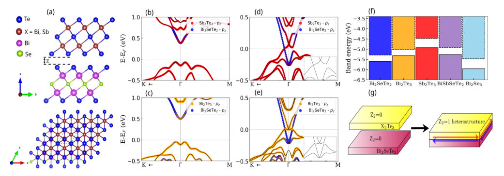
<figcaption class="paper-figure-caption"><b>Fig 1.</b> FIG. 1. Heterostructure at the top and side views in (a), where the brown spheres represent either Bi or Sb atoms from X2Te3 QL. The contribution of pz orbitals in the band structure without and with SOC effects is shown in (b) and (d) [(c) and (e)], respectively, for the Sb2Te3/Bi2SeTe2 [Bi2Te3/Bi2SeTe2] heterostructure. The inset in (d) and (e) highlights the small band gap in X2Te3 composition. Panel (f) shows the schematic band offset relative to the vacuum level for different stoichiometric compositions of the Bi2Te3 QL family. The band offset indicates interlayer charge transfer, which enhances spin–orbit coupling and drives a transition from the trivial phase of the isolated QLs to a...</figcaption>
</figure>
<figure class="paper-figure-card">
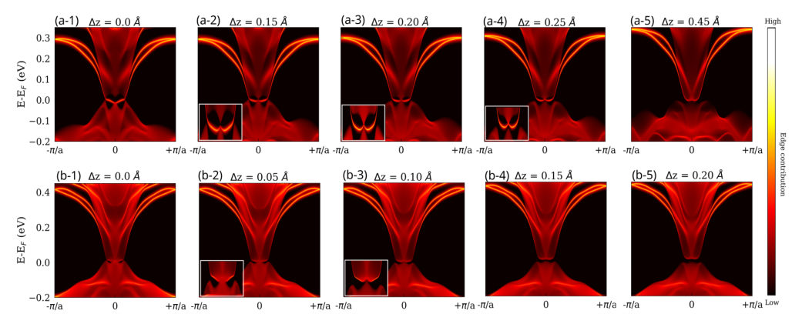
<figcaption class="paper-figure-caption"><b>Fig 2.</b> FIG. 2. Evolution of topological edge states from Sb2Te3/Bi2SeTe2 (a) and Bi2Te3/Bi2SeTe2 (b) heterostructures under different interlayer separation distances starting from the equilibrium (∆z = 0.0 ˚A). The insets in (a-2)-(a-4) and (b-2)-(b-3) highlights the region of edge states emergence, indicating either a topological [(a-2) and (b-2)] or trivial [(a-3), (a-4) and (b-3)] behavior.</figcaption>
</figure>
<figure class="paper-figure-card">
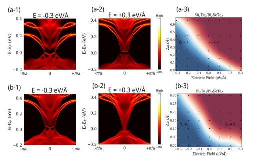
<figcaption class="paper-figure-caption"><b>Fig 3.</b> FIG. 3. Switchable quantum spin Hall edge states under an influence external electric field applied along directions that enhance [(a-1) and (b-1)] and suppress [(a-2) and (b- 2)] the topological properties of Sb2Te3/Bi2SeTe2 (a) and Bi2Te3/Bi2SeTe2 (b) in vertical equilibrium distance. The figures (a-3) and (b-3) displays the topological phase diagram which takes into account the electric field, displacement and topology. The red map indicates the trivial regime, whereas the blue indicate the nontrivial.</figcaption>
</figure>
<figure class="paper-figure-card">
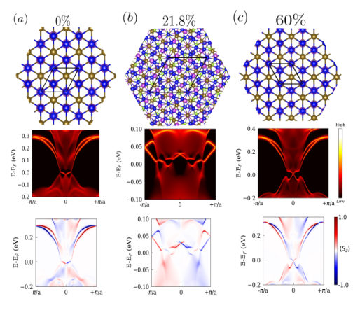
<figcaption class="paper-figure-caption"><b>Fig 4.</b> FIG. 4. Sb2Te3/Bi2SeTe2 structure (upper figures) and their corresponding edge states band structure (middle figures) and spin projection (lower figures) under different rotation angles, (a) for 0◦, (b) for 21.8◦, and (c) for 60◦.</figcaption>
</figure>

**Summary.** This theoretical study investigates how van der Waals heterostructures made from Bi2Te3 family materials can host controllable Quantum Spin Hall edge states. By combining DFT with tight-binding methods, the authors show that stacking two trivial layers can induce a topological phase due to interfacial charge transfer. Crucially, they demonstrate that this topological state can be switched on or off using external electric fields, suggesting applications in spintronics.

**Why it may be interesting.** While focused on condensed matter topology, the concept of externally controlling quantum states (switching QSH phases on/off) through electric fields is highly relevant to open quantum systems and device physics.

Detailed structure

**Main problem.** The research aims to develop a controllable method for creating and manipulating two-dimensional topological phases, specifically Quantum Spin Hall (QSH) phases, using van der Waals heterostructures.

**Main result.** The study demonstrates that stacking two topologically trivial quintuple layers from the Bi2Te3 family can generate a QSH phase, which is further shown to be tunable by external electric fields and interlayer strain.

**Method.** The work combines first-principles calculations (DFT) with Wannier-based tight-binding methods to calculate topological invariants like the Z2 invariant.

**Model / system.** The physical system consists of van der Waals heterobilayers formed by stacking two quintuple layers (QLs) from the Bi2Te3 family, such as X2Te3/Bi2SeTe2. The behavior is governed by relativistic effects and interfacial hybridization.

**Key observables.** Topological character confirmed by calculating the Z2 invariant; tunable edge states observed under strain or electric field; band structure inversion.

**Important parameters / regimes.** Interlayer separation (Delta z), external electric field strength (E), and interlayer twist angle (e.g., 21.8 degrees).

**Assumptions / limitations.** The analysis relies on an atomistic description, and the mechanism is confirmed to be independent of specific Wannier construction details.

**Figures summary.** Figures illustrate the structure, band offsets showing charge transfer driving the transition from trivial to nontrivial phase, and edge state evolution under varying layer separation or electric field.

**Paper structure.** The paper systematically analyzes the electronic properties by first establishing the structural basis (Table I), then demonstrating the emergence of topology via hybridization (Fig. 1), followed by mapping out the tunability landscape using external fields and strain (Fig. 2, Fig. 3).

Abstract

The tunability and control of topological edge/surface states are crucial for the development of new device applications. In this work, by combining first-principles calculations and Wannier-based tight-binding methods, we show the emergence of quantum spin Hall phases in van der Waals heterostructures formed by stacking two trivial quintuple layers from the Bi$_2$Te$_3$ family. We demonstrate the tunability of the edge states under interlayer strain and external electric field effects, suggesting the possibility of switching topological edge states on/off by external control. Additionally, the quantum spin Hall edge channels remain robust against interlayer twist, highlighting their stability against external perturbations. Our results provide a new way to create and manipulate two-dimensional topological phases in systems based on Bi$_2$Te$_3$ family, which can be valuable for practical applications, such as topological field effect transistors and spintronic devices.

[↑ back to top](#top)

### [Tunneling-induced translation of intact $π$-radical clusters on Au(111)](http://arxiv.org/abs/2606.20038v1)

**Authors:** Jacob D. Teeter, Kateryna Averchenko, Maximilian Eliasch, Stefan Müllegger  
**Type:** experiment · **Category:** other · **PDF:** <https://arxiv.org/pdf/2606.20038v1>  
**Analysis basis:** full PDF text, analyzed in chunks
**Topic relevance:** `non-equilibrium dynamics` **3/5** · `driven-dissipative phase transition` **2/5** · `non-equilibrium universality` **2/5** · `Frenkel-Kontorova` **1/5** · `methods for driven-dissipative` **1/5** · `quantum measurements` **1/5**

↔ Scroll figures horizontally

<figure class="paper-figure-card">
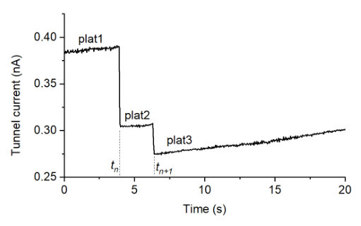
<figcaption class="paper-figure-caption"><b>Fig 1.</b> Figure 2: Time dependence of tunnel current, I(t), after deactivating the feedback and apply- ing a tunnel voltage pulse of +2 V (see text) with the STM tip positioned over the center of a ternary cluster of BDPA on Au(111). Discrete jumps in I(t) occur at specific times labeled.</figcaption>
</figure>
<figure class="paper-figure-card">
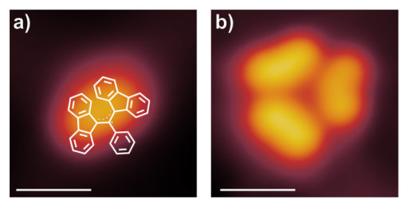
<figcaption class="paper-figure-caption"><b>Fig 2.</b> Figure 1: (a) Single BDPA molecule adsorbed on Au(111) as seen in STM in constant-current mode (−1 V, 150 pA) with molecular structure superimposed to scale. (b) Ternary cluster of BDPA molecules on Au(111) as seen in STM in constant-current mode (−0.01 V, 500 pA). z- ranges are 0 −200 pm and scale bars are 1 nm. Acquisition temperature 6.2 K.</figcaption>
</figure>
<figure class="paper-figure-card">
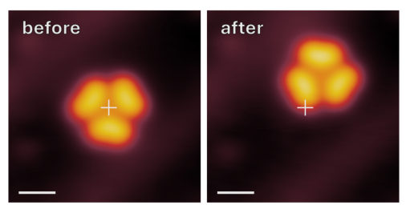
<figcaption class="paper-figure-caption"><b>Fig 3.</b> Figure 3: Ternary cluster of BDPA on Au(111) as seen by STM at 6.2 K (−0.8 V, 150 pA, z- scale 0−200 pm and scale bars are 1 nm) before (left) and after (right) undergoing lateral trans- lation and rotation relative to the Au(111) sur- face induced by a voltage pulse of +2 V for 20 s with deactivated feedback (see methods) caus- ing the discrete jumps in the I(t) curve shown in Fig. 2. The + marks the tip position during voltage pulse.</figcaption>
</figure>
<figure class="paper-figure-card">
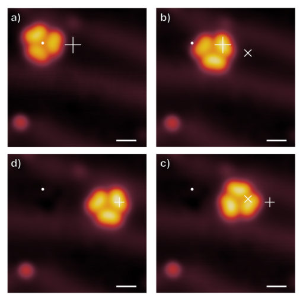
<figcaption class="paper-figure-caption"><b>Fig 4.</b> Figure 4: STM images of sequential roto- translation of a ternary cluster, wherein the cluster is displaced in the direction toward the STM tip position. The small white dot marks the center of the ternary cluster in its starting position. The white + in (a) marks the tip loca- tion during a voltage pulse performed adjacent to the ternary cluster, and the mark is included again in (b) as a guide to the eye. The white × in (b) marks the location of a second voltage pulse, and it is included again in (c) as a guide to the eye. A final pulse was performed at the location marked in (c) with a small white +, and it is included again in (d) for reference. All pulses were at +2 V for 2 s,...</figcaption>
</figure>
<figure class="paper-figure-card">
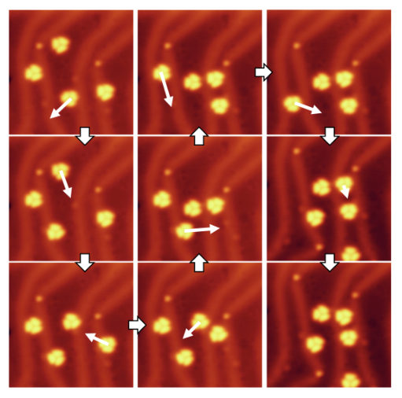
<figcaption class="paper-figure-caption"><b>Fig 5.</b> Figure 5: Sequence of STM images showing the controlled sustained and repeated dragging of ternary clusters of BDPA on Au(111) at 6.2 K (see text).</figcaption>
</figure>

**Summary.** Using low-temperature STM, the researchers demonstrated the ability to precisely manipulate intact clusters of $\pi$-radical molecules adsorbed on Au(111). By applying voltage pulses, they induced sustained translation and rotation, proving that the entire cluster moves coherently. This work opens new avenues for building artificial quantum assemblies using molecular radicals.

**Why it may be interesting.** This work provides an experimental platform for studying controlled quantum dynamics and interactions of molecular assemblies on surfaces, relevant to understanding engineered quantum materials or artificial lattices.

Detailed structure

**Main problem.** The research aims to demonstrate controlled, whole-cluster manipulation of intact $\pi$-radical clusters adsorbed on a metal surface.

**Main result.** The authors successfully achieved sustained and repeated dragging of ternary radical clusters, enabling the construction of artificial assemblies of these molecular units.

**Method.** Manipulation was performed using low-temperature Scanning Tunneling Microscopy (STM) by applying controlled voltage pulses to induce translational motion.

**Model / system.** The system involves ternary clusters formed from $\alpha,\gamma$-bisdiphenylene-$eta$-phenylallyl (BDPA) molecules adsorbed on the Au(111) surface. The experiment is conducted at 6.2 K using STM.

**Key observables.** Discrete jumps in tunnel current $I(t)$ corresponding to cluster translation or rotation, and the ability to construct artificial assemblies.

**Important parameters / regimes.** Low temperature (6.2 K); voltage pulses ($\ge |V| \ge 2 	ext{ V}$); sustained dragging speeds ($\le 1.5 	ext{ nm/s}$).

**Assumptions / limitations.** The attractive force driving translation is attributed to an electric dipole moment induced by the strong, inhomogeneous electric field near the STM tip.

**Figures summary.** Figures show time-dependent current jumps during manipulation (Fig. 2), cluster rotation/translation (Fig. 3), and sequences demonstrating controlled dragging across the surface (Fig. 5).

**Paper structure.** The paper details using low-temperature STM to observe that entire radical clusters move as single units when subjected to voltage pulses, providing evidence for controllable assembly building.

Abstract

The scanning tunneling microscope (STM) is a powerful tool for investigating and manipulating molecules on surfaces. We demonstrate with a low-temperature STM operated at 6.2 K the controlled manipulation of ternary clusters of persistent molecular $π$ radicals as a whole. The ternary clusters $-$ each self-assembled from three $α,γ$-bisdiphenylene-$β$-phenylallyl (BDPA) molecules on Au(111) $-$ maintain their natural cluster structure throughout tip-induced translation and rotation relative to the surface. Sustained and repeated dragging of radical clusters is shown to facilitate the construction of artificial assemblies of several clusters. Our results provide new opportunities for the creation and investigation of radical-based spin assemblies on surfaces.

[↑ back to top](#top)

### [Optical spin injection in graphane and fluorographene](http://arxiv.org/abs/2606.19571v1)

**Authors:** Angélica Marina López-Martínez, César Castillo-Quevedo, Cesar Camas-Flores, Analila Luna-Valenzuela, Jose Luis Cabellos  
**Type:** theory · **Category:** other · **PDF:** <https://arxiv.org/pdf/2606.19571v1>  
**Analysis basis:** full PDF text, analyzed in chunks
**Topic relevance:** `spintronics-quantum-optics interface` **3/5** · `Keldysh / 2PI / non-Gaussian methods` **1/5**

↔ Scroll figures horizontally

<figure class="paper-figure-card">
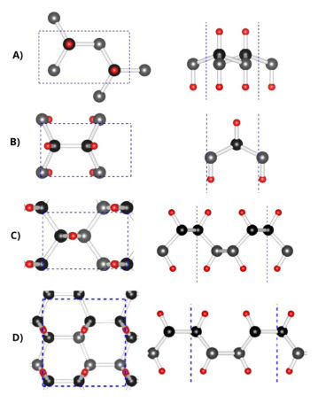
<figcaption class="paper-figure-caption"><b>Fig 1.</b> FIG. 1. (Color online) The different configurations used in the calculations are displayed in two orientations (front and side views) of hydrogen/fluorine-graphene: A) chair, B) boat, C) zigzag, and D) armchair configurations. The blue-dashed lines indicate the supercells used in the calculations. Note that all unit cells are rectangular. The black spheres represent carbon atoms, while the red spheres represent hydrogen or fluorine atoms.</figcaption>
</figure>
<figure class="paper-figure-card">
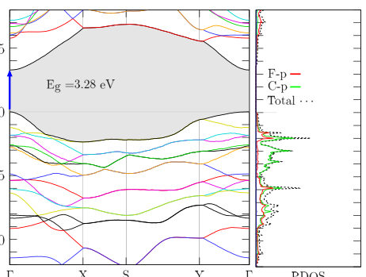
<figcaption class="paper-figure-caption"><b>Fig 2.</b> FIG. 2. (Color online) The left panel shows the calculated electronic band structure, while the right panel displays the partial density of states for the fluorographene configuration (C). We set the Fermi level to 0 eV to align the bands. The shaded region corresponds to the forbidden band, and the blue arrow indicates the band gap at the Γ point of the Bril- louin zone. The band structure is plotted without a scissors correction.</figcaption>
</figure>
<figure class="paper-figure-card">
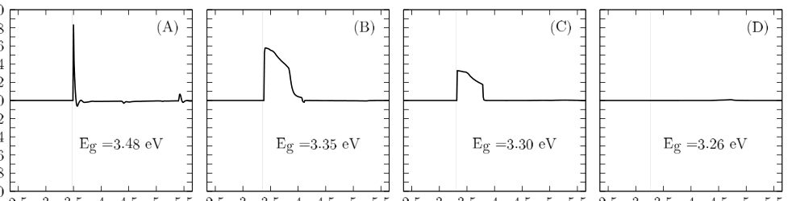
<figcaption class="paper-figure-caption"><b>Fig 3.</b> FIG. 3. (Color online) The degree of spin polarization of electrons, DSPz, which is optically injected by one-photon absorption, is presented as a function of the photon energy in graphane under different configurations: A) chair, B) boat, C) zigzag, and D) armchair configurations. The light injects electrons that exhibit spin polarization in the z direction. The band-edge values of the DSPz of injected electrons are 83%, 58%, 33%, and 0% for chair, boat, zigzag, and armchair configurations, respectively. Eg is the Kohn-Sham band gap without scissor correction.</figcaption>
</figure>
<figure class="paper-figure-card">
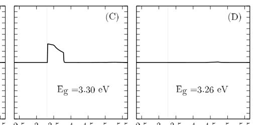
<figcaption class="paper-figure-caption"><b>Fig 4.</b> Figure 3(B) shows the DSPz spectrum for the graphane configuration (B). In Figure 1(B), we show the graphane configuration (B). At the onset of the DSPz, which occurs at 3.35 eV, injected electrons are 58% spin- polarized. As the photon energy is increased above 3.35</figcaption>
</figure>
<figure class="paper-figure-card">
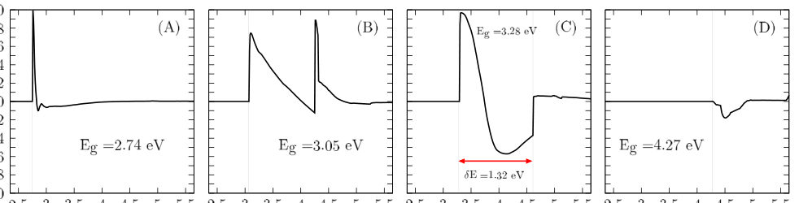
<figcaption class="paper-figure-caption"><b>Fig 5.</b> FIG. 4. (Color online) The DSPz, which is optically injected by one-photon absorption, is presented as a function of the photon energy in fluorographene under different configurations: A) chair, B) boat, C) zigzag, and D) armchair configurations. The light injects electrons that exhibit spin polarization in the z direction. The band-edge values of the DSPz of injected electrons are 100%, 74%, 98%, and -17% for chair, boat, zigzag, and armchair configurations, respectively. Eg is the Kohn–Sham band gap without scissors correction. Figure 4(C), δE=1.32 eV, is the photo-excitation energy where DSPz differs from zero marked with the red arrow.</figcaption>
</figure>

**Summary.** The research uses DFT calculations to model optical spin injection efficiency in graphane and fluorographene structures. It determines that the fluorographene zigzag configuration offers superior spin polarization ($	ext{DSP}_z$) over a broad energy range compared to other tested geometries. This highlights how controlled functionalization of 2D carbon materials can be engineered for advanced spintronic applications.

**Why it may be interesting.** This work is relevant because it models spin injection in 2D materials using first-principles methods, providing insights into how chemical functionalization ($	ext{H}$ vs $	ext{F}$) can tune electronic properties for spintronic devices, which relates to open quantum systems dynamics.

Detailed structure

**Main problem.** The study theoretically investigates the optical spin-injection response in various stoichiometric configurations of graphane and fluorographene to determine which structure yields the strongest degree of spin polarization for spintronic applications.

**Main result.** The fluorographene zigzag configuration was found to yield the best spin polarization ($	ext{DSP}_z$), achieving 98% polarization over a wide range of excitation energies, while other configurations showed limitations in energy bandwidth or lower polarization.

**Method.** Density Functional Theory (DFT) calculations were employed using the ABINIT package to compute the optical spin-injection spectrum ($	ext{DSP}_z$) based on one-photon transition amplitudes derived from linear optical response tensors.

**Model / system.** The physical systems are graphene derivatives: graphane (hydrogenated) and fluorographene (fluorinated), examined across four geometric configurations (chair, boat, zigzag, armchair). The analysis focuses on the electronic structure modifications due to $	ext{H}$ or $	ext{F}$ functionalization.

**Key observables.** Degree of Spin Polarization ($	ext{DSP}_z$), spin-polarized electron density at the band edge, and the energy range over which this polarization is maintained.

**Important parameters / regimes.** Spin-Orbit Coupling (SOC) strength, excitation photon energy ($\hbar\omega$), and structural distortion relative to pristine graphene.

**Assumptions / limitations.** The theory relies on a one-photon transition amplitude approximation; calculations use the PBE functional within GGA and neglect non-linear core corrections or excitonic effects.

**Figures summary.** Figures illustrate the geometric configurations (chair, boat, zigzag, armchair) and display the calculated $	ext{DSP}_z$ spectra as a function of photon energy for both graphane and fluorographene.

**Paper structure.** The paper systematically analyzes the electronic structure and spin-polarization response ($	ext{DSP}_z$) across all four geometric motifs for both hydrogenated (graphane) and fluorinated (fluorographene) graphene, comparing results based on SOC strength and structural distortion.

Abstract

We theoretically investigate the optical spin-injection response in different stoichiometric configurations of graphane and fluorographene using density functional theory. Our goal is to determine which configuration yields the strongest degree of spin polarization. The results show that the fluorographene zigzag configuration yields the best degree of spin polarization response (${\cal DSP}^{\mathrm{z}}$), with 98\% spin polarized electrons at the band edge and over a wide range of excitation photon energies. In contrast, other graphane and fluorographene configurations achieve a ${\cal DSP}^{\mathrm{z}}$ of roughly 83--100\%, but only within a limited photon-excitation energy range. In structures with low spin-orbit coupling, the degree of spin polarization is close to 100\% over a wide range of photon energies. For higher spin-orbit coupling, this strong response appears, but only in a narrow photon energy region. Additionally, under the band-resolved decomposition scheme, the contributions of different band-to-band transitions to the ${\cal DSP}^{\mathrm{z}}$ spectrum are identified by summing only the selected valence and conduction bands. Our findings show that almost the entire ${\cal DSP}^{\mathrm{z}}$ spectrum of the fluorographene zigzag configuration comes from transitions that involve only the top valence band, which is a mixture of C--p and F--p states.

[↑ back to top](#top)

### [Determination of the intrinsic mechanical quality factor in high-stress silicon nitride resonators](http://arxiv.org/abs/2606.20354v1)

**Authors:** Geena Benga, Vincent Dumont, Wei Wang, Nicola Cavalleri, Ariane Giesriegl, Silvan Schmid, Christian L. Degen, Antonius Armanious, Alexander Eichler  
**Type:** experiment · **Category:** other · **PDF:** <https://arxiv.org/pdf/2606.20354v1>  
**Analysis basis:** full PDF text, analyzed in chunks
**Topic relevance:** `correlated / nonlocal dissipation` **2/5** · `driven-dissipative phase transition` **2/5** · `methods for driven-dissipative` **2/5** · `Keldysh / 2PI / non-Gaussian methods` **1/5** · `Kondo & dissipative impurity` **1/5** · `analog quantum simulation` **1/5** · `entanglement & information structure` **1/5** · `non-equilibrium dynamics` **1/5** · `non-equilibrium universality` **1/5**

↔ Scroll figures horizontally

<figure class="paper-figure-card">
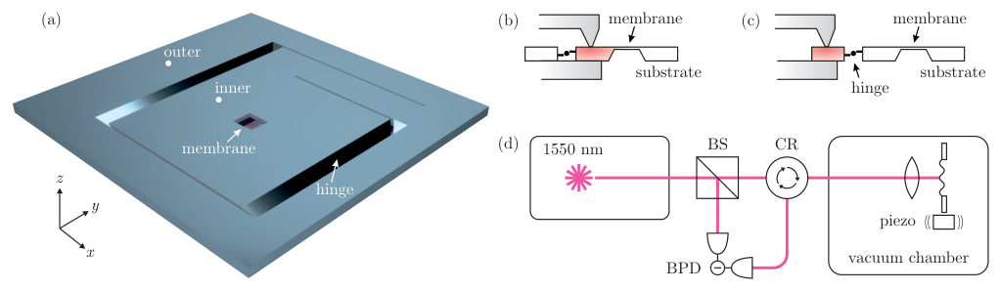
<figcaption class="paper-figure-caption"><b>Fig 1.</b> Figure 1. (a) To-scale illustration of a SiNx membrane device on the hinged silicon frame. The inner and outer clamping points are highlighted. (b) Simplified sketch of the optical Michelson interferometer used for measuring out-of-plane displacement. BS = beam splitter, CR = circulator, BPD = balanced photo diode. (c) Schematic illustration of a device clamped at the inner clamping point. Red shading indicates the assumed model of how stress is induced by the clamping point. (d) Schematic illustration of a device clamped at the outer clamping point. The hinge protects the membrane from induced stress.</figcaption>
</figure>
<figure class="paper-figure-card">
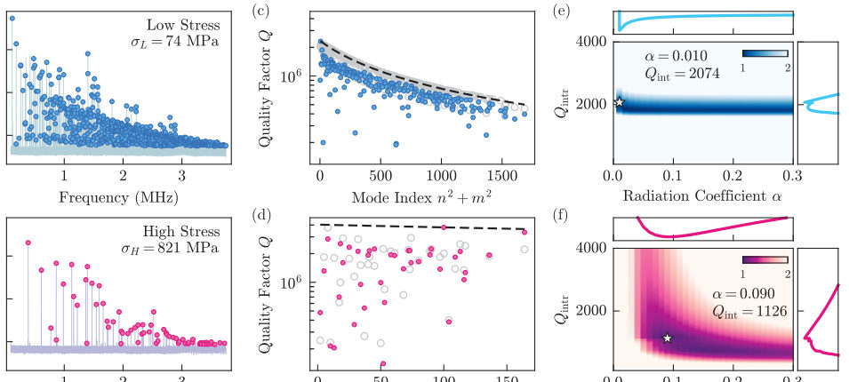
<figcaption class="paper-figure-caption"><b>Fig 2.</b> Figure 2. Two representative examples of modal analysis and parameter extraction. Upper row: low-stress membrane with h = 24 nm and σL = 74 MPa. Lower row: high-stress membrane with h = 23 nm and σH = 821 MPa. (a) and (b): thermomechanical displacement Power Spectral Density (PSD) as a function of frequency. Candidate peaks detected by the peak-finding algorithm and successfully matched to a theoretical mode are indicated by circles. (c) and (d): measured quality factors (Qi) plotted against the mode index (n2 + m2): the experimental results are shown as filled color circles, the theoretical model as empty gray circles, and the diluted intrinsic limit as a dashed line extracted from (e) and...</figcaption>
</figure>
<figure class="paper-figure-card">
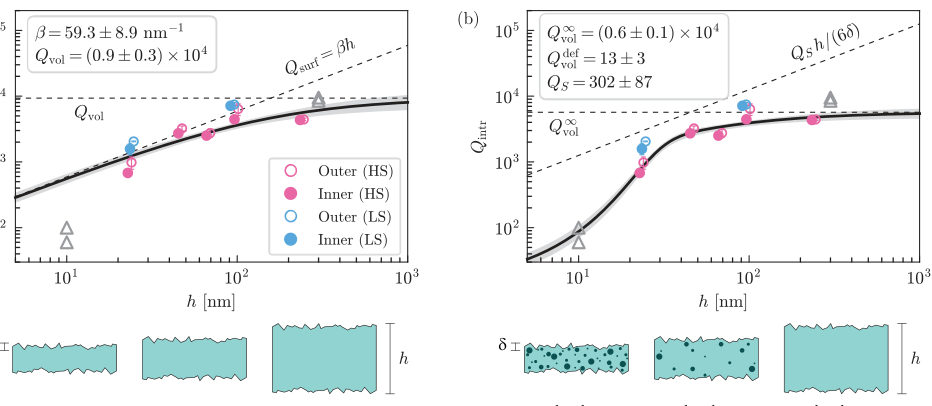
<figcaption class="paper-figure-caption"><b>Fig 3.</b> Figure 3. Thickness dependence of the intrinsic quality factor Qintr. Pink and blue data markers correspond to high and low stress devices, respectively, and are shown with a small offset in h for better visibility. Each marker is the mean of three independent measurement under identical conditions, with error bars representing the standard deviation. Inner and outer clamping points are slightly offset in h for clarity. See legend in (a) for symbol meaning. Solid curves represent model fits to the high-stress data using (a) Eq. (4) and (b) Eq. (5), with their associated ±1σ uncertainty bands shaded in gray. Dashed lines are asymptotic limits. Gray triangles are data points from a different...</figcaption>
</figure>

**Summary.** This work presents a robust experimental methodology to measure the intrinsic mechanical quality factor ($Q_{intr}$) in silicon nitride resonators by analyzing multiple vibrational modes simultaneously. By developing and applying advanced phenomenological models, the authors successfully characterized how $Q_{intr}$ varies with film thickness, revealing previously unaccounted-for loss mechanisms crucial for designing next-generation high-performance nanodevices.

**Why it may be interesting.** While focused on mechanical resonators, the rigorous separation of fundamental material loss mechanisms ($Q_{intr}$) using multi-parameter fitting techniques is analogous to characterizing dissipation channels in open quantum systems or superconducting circuits where coupling losses must be precisely quantified.

Detailed structure

**Main problem.** The primary goal is to accurately determine the intrinsic mechanical quality factor ($Q_{intr}$) of silicon nitride ($	ext{SiN}_x$) resonators, separating it from extrinsic losses like acoustic radiation and clamping effects.

**Main result.** A systematic dependence of $Q_{intr}$ on membrane thickness was found, requiring an advanced phenomenological model incorporating a thickness-dependent loss channel to accurately describe ultra-thin films.

**Method.** The methodology combines automated mode identification from thermal noise PSD measurements with systematic ringdown analysis across multiple mechanical modes.

**Model / system.** The system is high-stress, ultra-thin $	ext{SiN}_x$ membranes. The loss is modeled by separating the total inverse quality factor ($Q_i^{-1}$) into components related to radiation losses ($\alpha Q_{rad,i}$) and intrinsic material dissipation ($1/Q_{intr}$).

**Key observables.** Measured quality factor ($Q_i$), intrinsic quality factor ($Q_{intr}$), resonance frequencies ($\omega_i$), and the thickness dependence of $Q_{intr}$.

**Important parameters / regimes.** Membrane thickness ($h$) ranging from 20 nm to 240 nm; stress levels (low vs. high); surface roughness scale ($\delta$).

**Assumptions / limitations.** The analysis assumes that the intrinsic quality factor is approximately constant over the measured frequency range, and it uses multi-mode fitting techniques to decouple loss mechanisms.

**Figures summary.** Figures illustrate device setups, measurement procedures involving PSD detection and ringdown decay fitting, and plots showing how different theoretical models (e.g., simple surface vs. exponential defect layer) fit the thickness dependence of $Q_{intr}$.

**Paper structure.** The paper establishes the challenge of isolating $Q_{intr}$ by detailing a multi-mode measurement technique that separates radiative losses from intrinsic ones. It then develops and applies increasingly complex phenomenological models to account for observed deviations in ultra-thin films, culminating in a comprehensive composite model.

Abstract

Recent advances in silicon nitride nanomechanical resonators have pushed mechanical quality factors to ultra-high values by combining stress-induced dissipation dilution with mode-shape engineering. Neither mechanism alters the intrinsic quality factor $Q_{\mathrm{intr}}$. Targeting the intrinsic loss itself therefore remains an untapped route to even higher $Q$. Doing so first requires reliable quantification of $Q_{\mathrm{intr}}$, which has proven challenging. Here we present a robust methodology that quantifies $Q_{\mathrm{intr}}$ by combining automated mode identification with systematic ringdown measurements over a large number of mechanical modes. Applied to high-stress silicon nitride membranes, it reveals a systematic dependence of $Q_{\mathrm{intr}}$ on thickness that cannot be described using established models, particularly in the ultra-thin limit. We account for this trend with a phenomenological model that incorporates a thickness-dependent loss channel. Together, our method and model open a route toward a microscopic understanding of intrinsic dissipation and toward directly mitigating its loss channels.

[↑ back to top](#top)

### [High-Power Laser Drives Motion in Ultra-thin Photonic Crystal Lightsails via Radiation Pressure](http://arxiv.org/abs/2606.20149v1)

**Authors:** Lucas Norder, Ata Keşkekler, Richard A. Norte  
**Type:** both · **Category:** other · **PDF:** <https://arxiv.org/pdf/2606.20149v1>  
**Analysis basis:** full PDF text, analyzed in chunks
**Topic relevance:** `non-equilibrium dynamics` **2/5** · `driven-dissipative phase transition` **1/5** · `interference shaping light` **1/5** · `methods for driven-dissipative` **1/5** · `non-equilibrium universality` **1/5** · `quantum optics experiment` **1/5**

↔ Scroll figures horizontally

<figure class="paper-figure-card">
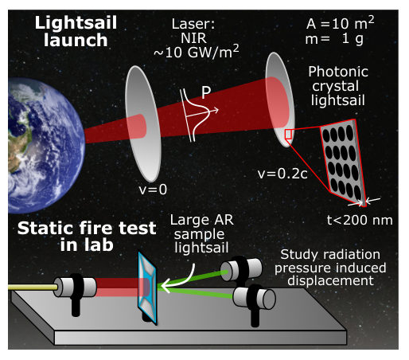
<figcaption class="paper-figure-caption"><b>Fig 1.</b> Fig. 1. Static fire test of lightsail launch in lab setting. A, area; m, mass; AR, aspect ratio; PhC, photonic crystal; I, intensity of the laser; NIR, near-infrared. In a lightsail mission, a lightsail will be launched from space by being illu- minated with a high-power NIR laser. To study the optical behaviour of a lightsail, initial tests must be conducted in the lab. Therefore, large AR lightsail samples are required for uniform illumination, eliminating the need for laser focusing.</figcaption>
</figure>
<figure class="paper-figure-card">
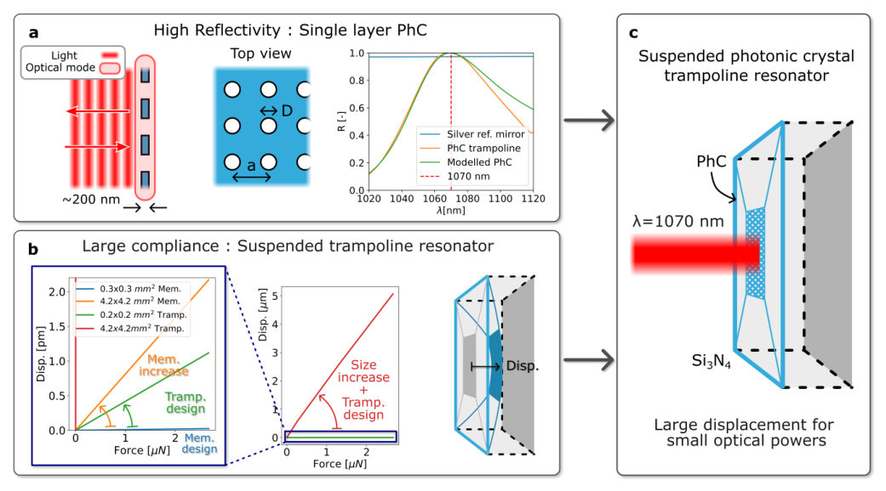
<figcaption class="paper-figure-caption"><b>Fig 2.</b> Fig. 2. Working principle of the photonic crystal trampoline. a, period; D, diameter; d, displacement; λ, wavelength of light; Mem, membrane; Tramp, trampoline. a, The reflectivity of a 200 nm single-layer PhC membrane optimized for 1070 nm light with a period of 862 nm and circular holes measuring 657 nm in diameter. b, Additionally, the membrane is suspended on thin tethers, resulting in a highly compliant device. The graphs show how device compliance increases as the device is scaled and the design is changed from a membrane to a trampoline. c, Combining the compliant suspended trampoline with a PhC results in a mechanical system sensitive to small optical forces.</figcaption>
</figure>
<figure class="paper-figure-card">
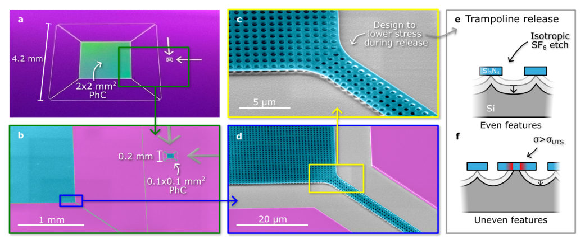
<figcaption class="paper-figure-caption"><b>Fig 3.</b> Fig. 3. Fabricated large-scale PhC trampoline. a, photograph of PhC trampoline with reference trampoline. b, Coloured SEM image: purple is Si3N4 on top of Si, blue is suspended Si3N4, grey is Si. c and d are close-ups of the corner of the PhC patch. e, Schematic of the SF6 isotropic etch, releasing the LPCVD high-stress Si3N4 device. Similarly sized features of Si3N4 result in equal release rate of the structures with an isotropic SF6 etch. f, Si3N4 device with different size features can result in the stress reaching the ultimate tensile strength (UTS) and destroying the sample during the release process.</figcaption>
</figure>
<figure class="paper-figure-card">
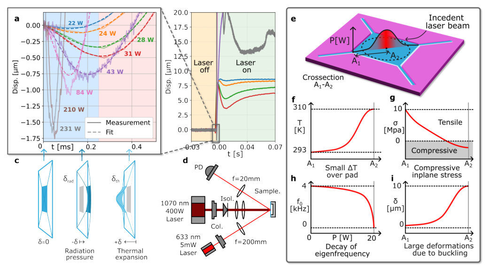
<figcaption class="paper-figure-caption"><b>Fig 4.</b> Fig. 4. Radiation-pressure and thermal response of the PhC trampoline under high-power illumination. δ, displacement; PD, photodiode; Col., collimator; Isol., isolator; f, focal point. a, Zoom-in of the initial response to laser excitation. Negative displacement corresponds to the trampoline moving toward the laser. b, Trampoline displacement over the full duration of the measurement. c, Schematic of the trampoline state at different times during the experiment. d, Experimental setup. e, Buckling of the PhC trampoline induced by non-uniform heating from the incedent Gaussian laser beam, with the cross-section taken along A1–A2. f, Calculated temperature profile due to optothermal heating....</figcaption>
</figure>
<figure class="paper-figure-card">
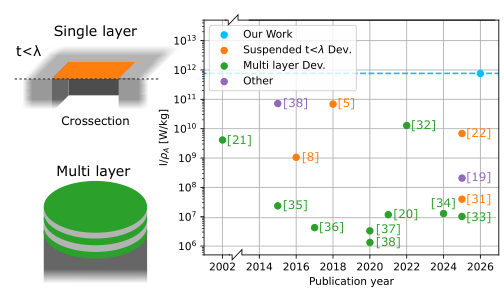
<figcaption class="paper-figure-caption"><b>Fig 5.</b> Fig. 5. Power density over areal density. I, power den- sity; ρA, areal density. The state of the art for reflective de- vices under direct illumination of a high-power-density laser beam.</figcaption>
</figure>

**Summary.** This research demonstrates the feasibility of using ultra-thin photonic crystal membranes as lightsails by measuring their deflection under high-power laser radiation. The work is significant because it moves beyond simple reflection measurements to quantify complex thermomechanical failure modes, such as buckling, which govern the practical limits of light-driven propulsion.

**Why it may be interesting.** While not directly quantum mechanical, this work involves extreme light-matter interaction and nanophotonics under intense fields. The coupling between optical loading (radiation pressure) and material response (thermal stress/buckling) presents a rich problem in non-equilibrium physics relevant to advanced energy systems.

Detailed structure

**Main problem.** The research aims to demonstrate measurable radiation-pressure displacement on ultra-thin photonic crystal (PhC) lightsails, advancing the concept of laser-driven propulsion for ultralight spacecraft.

**Main result.** The authors successfully measured a large prompt displacement ($\sim 1.75 \mu	ext{m}$) due to radiation pressure and identified that high power introduces significant thermomechanical effects, including buckling, which must be accounted for in design.

**Method.** The study combines experimental measurements of deflection under high-power laser illumination with detailed finite element modeling (COMSOL) to analyze both mechanical and thermal responses.

**Model / system.** The physical system is a suspended, large-area silicon nitride ($	ext{Si}_3	ext{N}_4$) photonic crystal membrane patterned with billions of holes. The model treats the structure as a compliant trampoline subjected to external forces (radiation pressure) and internal stresses (thermal expansion/buckling).

**Key observables.** Radiation-pressure displacement ($\mu	ext{m}$ scale), reflectivity, fundamental mode frequency, and localized compressive stress profiles.

**Important parameters / regimes.** High optical power densities ($0.3 	ext{ GW}/	ext{m}^2$), subwavelength thickness, and the ratio of incident intensity to areal density ($	ext{I}/
ho_A$).

**Assumptions / limitations.** The analysis assumes that thermal effects (like buckling) are significant and must be modeled alongside the prompt radiation-pressure force; some analyses assume specular reflection for optical readout.

**Figures summary.** Figures illustrate the PhC trampoline setup, measurement of displacement vs. power across different regimes, and computational results detailing the onset and mechanism of thermal buckling driven by non-uniform heating.

**Paper structure.** The paper progresses from establishing the physical challenge (creating large, reflective, compliant structures) to presenting experimental measurements showing prompt actuation, followed by detailed modeling that incorporates complex nonlinear thermomechanical effects like buckling at high power.

Abstract

Laser-driven lightsails have emerged as a promising route for accelerating ultralight spacecraft to high speeds using beamed optical energy. Realizing this concept pushes the limits of light-matter interaction, materials science, structural engineering, and nanomechanical design. A central challenge is to create nanophotonic reflectors that combine ultralow mass, large illuminated area, and survival under high optical power densities. No previous experiment has combined these constraints in a single structure sufficient to produce measurable radiation-pressure displacement. Here, we report the largest subwavelength tethered lightsails to date: nanoscale-thickness, millimeter-wide silicon nitride membranes patterned with billions of holes. Despite their subwavelength thickness, they achieve 99% reflection through resonant photonic modes, combining ultralow areal density with high reflectivity. Their compliance enables radiation-pressure displacements of up to 1.75 micrometer, a 50,000-fold increase over previous lightsail optomechanical responses. These thin mirrors are shown to withstand and maintain high reflectivity under directed laser intensities comparable to optical intensities at the surface of the Sun. Together, these results establish a testbed for high-power nanophotonics, directed-energy systems, and light-driven propulsion, defining the practical limits of ultrathin photonic materials under intense optical loading.

[↑ back to top](#top)

### [Electrical magnetochiral anisotropy in Rashba superconductors](http://arxiv.org/abs/2606.19421v1)

**Authors:** Joaquim Telles de Miranda, Maxim Khodas, Alex Levchenko  
**Type:** theory · **Category:** other · **PDF:** <https://arxiv.org/pdf/2606.19421v1>  
**Analysis basis:** full PDF text, analyzed in chunks
**Topic relevance:** `Keldysh / 2PI / non-Gaussian methods` **1/5** · `driven-dissipative phase transition` **1/5** · `methods for driven-dissipative` **1/5** · `non-equilibrium dynamics` **1/5** · `spintronics-quantum-optics interface` **1/5**

↔ Scroll figures horizontally

<figure class="paper-figure-card">
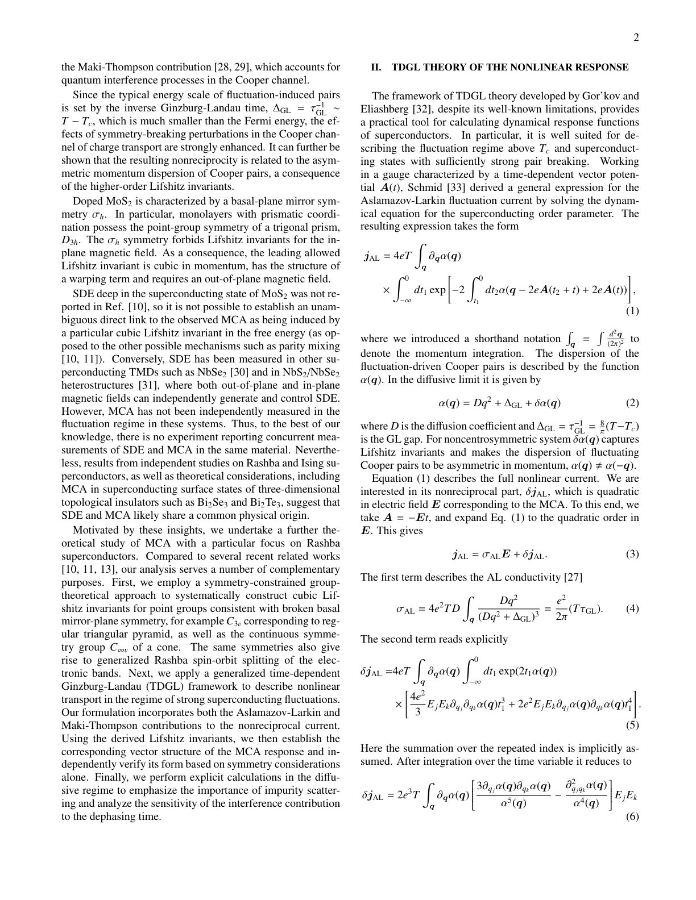
<figcaption class="paper-figure-caption"><b>Fig 1.</b> Low-resolution page preview, page 2</figcaption>
</figure>
<figure class="paper-figure-card">
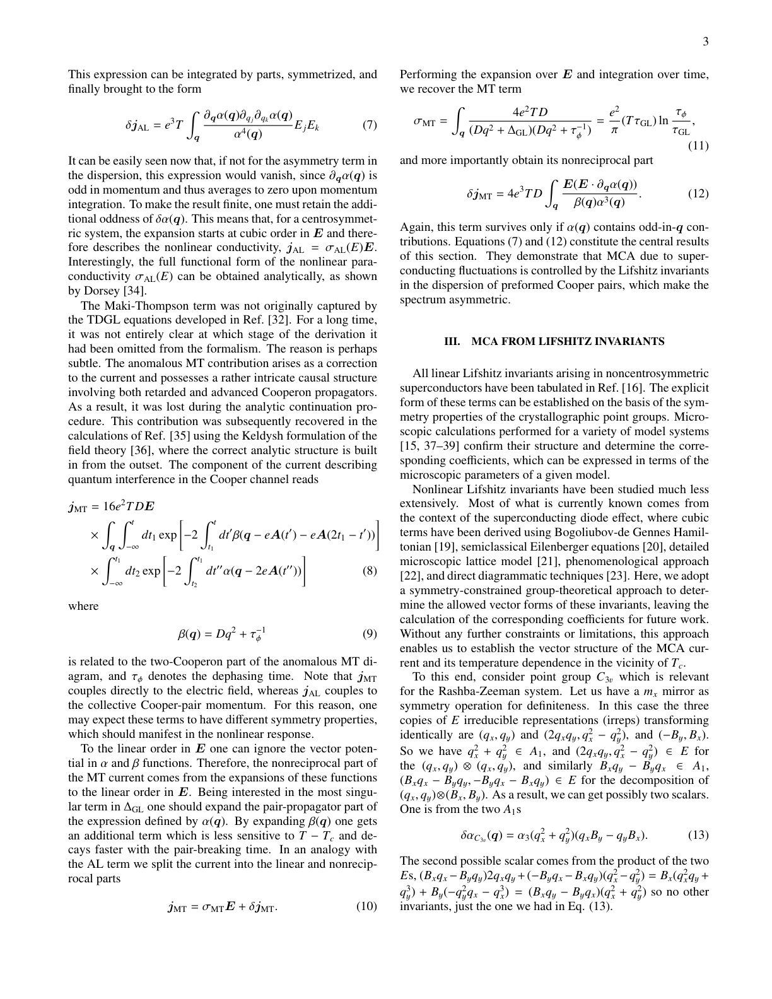
<figcaption class="paper-figure-caption"><b>Fig 2.</b> Low-resolution page preview, page 3</figcaption>
</figure>
<figure class="paper-figure-card">
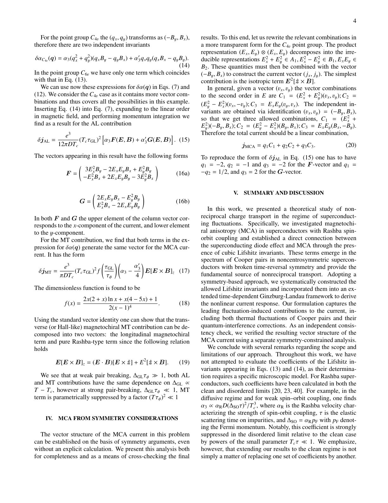
<figcaption class="paper-figure-caption"><b>Fig 3.</b> Low-resolution page preview, page 4</figcaption>
</figure>
<figure class="paper-figure-card">
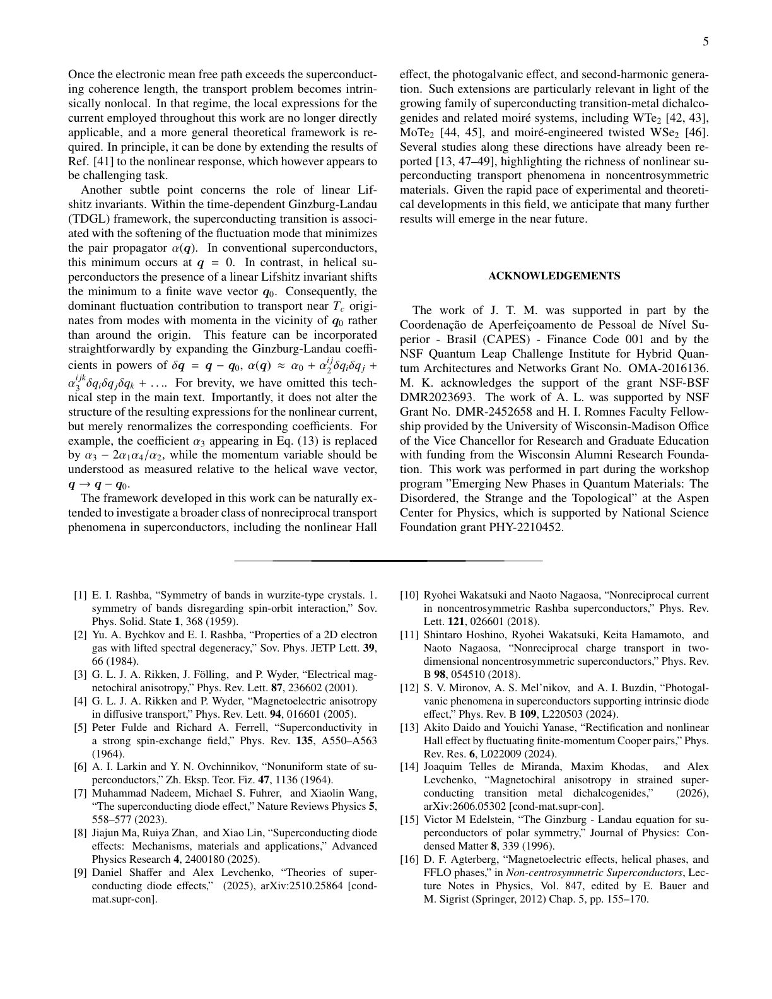
<figcaption class="paper-figure-caption"><b>Fig 4.</b> Low-resolution page preview, page 5</figcaption>
</figure>
<figure class="paper-figure-card">
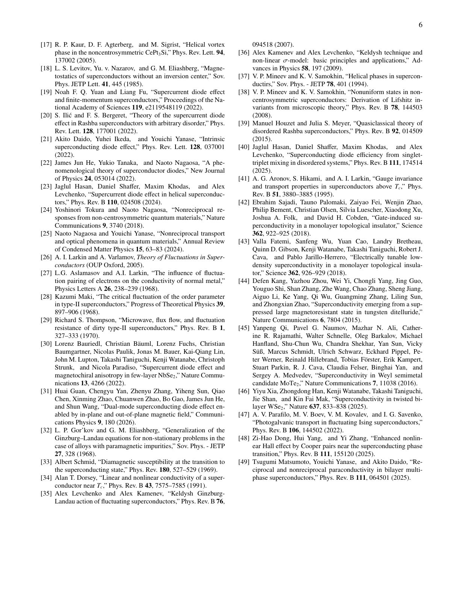
<figcaption class="paper-figure-caption"><b>Fig 5.</b> Low-resolution page preview, page 6</figcaption>
</figure>

**Summary.** This theoretical paper investigates how broken inversion symmetry, specifically via Rashba SOC, induces nonreciprocal charge transport known as Magnetochiral Anisotropy in superconductors. Using group theory and Ginzburg-Landau theory, the authors derive explicit formulas for these anomalous currents arising from higher-order terms (Lifshitz invariants). The work is significant for understanding superconducting diode effects in low-dimensional, noncentrosymmetric materials.

**Why it may be interesting.** This work connects fundamental concepts from symmetry theory (group theory) with advanced condensed matter phenomena like superconductivity and magnetotransport, which is highly relevant for understanding exotic quantum states in novel materials.

Detailed structure

**Main problem.** The study investigates electrical magnetochiral anisotropy (MCA) and nonreciprocal charge transport in two-dimensional superconducting materials.

**Main result.** The theory derives explicit, symmetry-constrained expressions for the nonreciprocal components of the current ($\delta \mathbf{j}_{AL}$ and $\delta \mathbf{j}_{MT}$) arising from higher-order Lifshitz invariants. These currents are non-zero only when the superconducting dispersion relation exhibits asymmetry.

**Method.** The analysis employs symmetry-constrained group-theoretical methods to construct allowed Lifshitz invariants, combined with a generalized time-dependent Ginzburg-Landau theory (TDGL) for nonlinear transport in the fluctuation regime.

**Model / system.** The system modeled is a two-dimensional noncentrosymmetric superconductor characterized by Rashba spin-orbit coupling. The theoretical framework extends to analyze fluctuations near the superconducting transition temperature ($T_c$).

**Key observables.** Magnetochiral anisotropy (MCA), nonreciprocal current components ($\delta \mathbf{j}_{AL}$, $\delta \mathbf{j}_{MT}$), and critical-current nonreciprocity.

**Important parameters / regimes.** Temperature relative to $T_c$ (fluctuation regime), disorder scattering time ($	au$), Rashba SOC strength ($\alpha_R$), and electric/magnetic fields ($\mathbf{E}, \mathbf{B}$).

**Assumptions / limitations.** The analysis assumes the diffusive limit for transport calculations and relies on symmetry constraints derived from point groups like $C_{3v}$ or $C_{4v}$. Nonlocal effects are noted as a limitation.

**Figures summary.** Not specified, but the notes detail derivations of current equations (Eq. 7, Eq. 12, Eq. 15, Eq. 17) and symmetry decompositions (Eq. 20).

**Paper structure.** The paper systematically builds the theoretical framework by first identifying the role of Lifshitz invariants via group theory, then applying TDGL to calculate nonreciprocal currents in both the AL and MT contributions, and finally discussing extensions to helical/nonlocal regimes.

Abstract

We theoretically investigate the role of higher-order Lifshitz invariants in nonreciprocal charge transport in two-dimensional noncentrosymmetric superconductors with Rashba spin-orbit coupling. In the superconducting state, these symmetry-allowed terms give rise to critical-current nonreciprocity, while in the normal state near the superconducting transition they generate a pronounced magnetochiral anisotropy. Using symmetry-constrained group-theoretical methods, we systematically construct the allowed Lifshitz invariants and derive the corresponding vector structure of the nonreciprocal current. To describe nonlinear transport in the fluctuation regime, we apply a generalized time-dependent Ginzburg-Landau theory that incorporates both the Aslamazov-Larkin contribution from fluctuation-induced Cooper pairs and the Maki-Thompson contribution associated with quantum interference in the Cooper channel. We further analyze the effects of disorder scattering and dephasing on the resulting nonreciprocal response.

[↑ back to top](#top)

### [Symmetry enforced quantum spin Hall effect in Altermagnets](http://arxiv.org/abs/2606.19903v1)

**Authors:** Fanzheng Chen, Lixin Zhang, Shuaishuai Niu, Junfeng Ren, Weijiang Gong, Xiangru Kong  
**Type:** theory · **Category:** other · **PDF:** <https://arxiv.org/pdf/2606.19903v1>  
**Analysis basis:** full PDF text, analyzed in chunks
**Topic relevance:** `analog quantum simulation` **1/5** · `exotic spin models in light-matter` **1/5** · `spintronics-quantum-optics interface` **1/5**

↔ Scroll figures horizontally

<figure class="paper-figure-card">
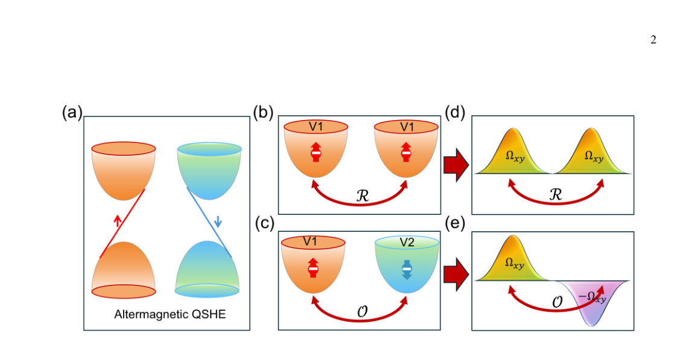
<figcaption class="paper-figure-caption"><b>Fig 1.</b> Fig. 1. Schematic of QSHE with SVL. (a) Helical edge states of altermagnetic QSHE. (b) Altermagnets with two valleys V1 and V2 protected by (magnetic) crystalline symmetry R. (c) The two valleys V1 and V2 are linked by (magnetic) crystalline symmetry O. (d) Symmetry R guarantees nonvanishing Berry curvatures for V1 and V2. (e) Symmetry O enforces the total Berry curvature to vanish strictly.</figcaption>
</figure>
<figure class="paper-figure-card">
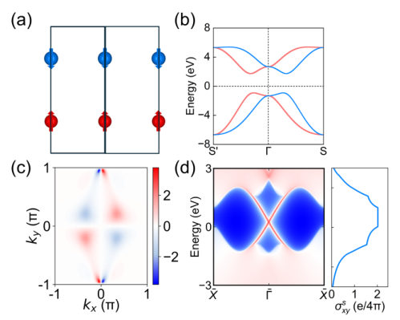
<figcaption class="paper-figure-caption"><b>Fig 2.</b> Fig. 2. (a) Side view of the altermagnetic QSHE lattice model. (b) Band structure of the model, showing altermagnetic spin splitting. The Brillouin zone is presented in Supplemental Material. (c) Berry curvature of the model. (d) Edge states and SHC of the model. Here, we set t1=0.265, t2=0.165, t3=-0.2, t4=-0.145, r1=-0.29, r2=0.42, r3=-0.27, and e1=−e2= 0.5 in (b).</figcaption>
</figure>
<figure class="paper-figure-card">
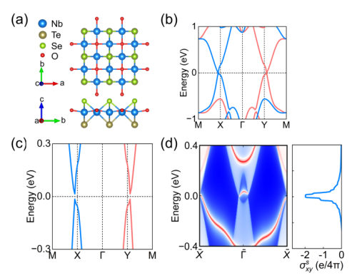
<figcaption class="paper-figure-caption"><b>Fig 3.</b> Fig. 3. (a) Top view and side view of monolayer Nb2SeTeO. (b) The band structure without SOC. (c) The band structure with SOC. (d) The edge states and SHC of monolayer Nb2SeTeO along the [100] direction.</figcaption>
</figure>
<figure class="paper-figure-card">
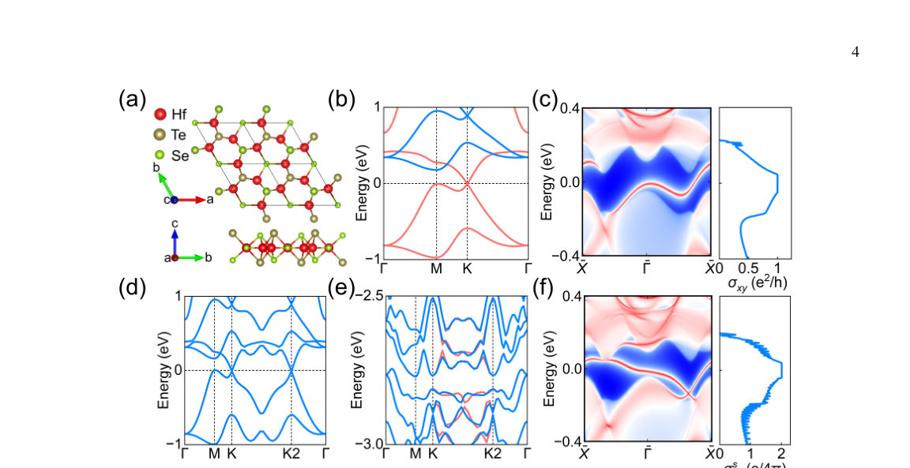
<figcaption class="paper-figure-caption"><b>Fig 4.</b> Fig. 4. (a) Top view and side view of monolayer Hf3Se3Te2. (b) Band structure without SOC of monolayer Hf3Se3Te2. (c) Edge states and anomalous Hall conductivity (AHC) of monolayer Hf3Se3Te2. (d) Band structure without SOC of bilayer Hf3Se3Te2. (e) Zoom-in band structure without SOC of bilayer Hf3Se3Te2. (f) The edge states and SHC of bilayer Hf3Se3Te2 along the [100] direction.</figcaption>
</figure>

**Summary.** This paper theoretically investigates the Quantum Spin Hall Effect in altermagnets, extending previous research limited to non-magnetic systems. By performing detailed symmetry analysis on Magnetic Point Groups, the authors identified necessary conditions—such as spin-valley locking—for this topological phase to exist. They successfully demonstrated this effect using first-principles calculations on specific material candidates.

**Why it may be interesting.** This work provides a deep connection between crystal symmetries (group theory) and emergent quantum phenomena (topological phases), which is highly relevant for designing novel spintronic materials.

Detailed structure

**Main problem.** The research aims to extend the study of the Quantum Spin Hall Effect (QSHE) from non-magnetic materials to altermagnets, which are a novel magnetic state.

**Main result.** The authors established that the QSHE in altermagnets is intrinsically linked to symmetry constraints, demonstrating this effect in $	ext{monolayer } 	ext{Nb}_2	ext{SeTeO}$ (via spin-valley locking) and $	ext{bilayer } 	ext{Hf}_3	ext{Se}_3	ext{Te}_2$ (via spin-valley-layer locking).

**Method.** The study combines rigorous symmetry analysis using group theory to classify Magnetic Point Groups (MPGs) with first-principles calculations and theoretical modeling of tight-binding Hamiltonians.

**Model / system.** The focus is on altermagnetic materials, analyzed by establishing relevant symmetry constraints within the framework of 2D magnetic systems. A lattice Hamiltonian was constructed for simulation using Pauli matrices ($	au$ for site, $\sigma$ for spin).

**Key observables.** Quantized Spin Hall Conductance ($C_s$), helical edge states, and topological invariants derived from Berry curvature analysis.

**Important parameters / regimes.** The classification of MPGs into Type I and Type III groups is crucial; the specific lattice Hamiltonian parameters ($t_i, r_i$) govern the electronic structure.

**Assumptions / limitations.** The primary assumption is that the QSHE in altermagnets is dictated by symmetry protection mechanisms involving spin-valley locking or layer locking.

**Figures summary.** Figures illustrate the schematic of QSHE with SVL, list capable MPGs (Table I), and show band structures/edge states derived from lattice models for candidate materials.

**Paper structure.** The paper proceeds by first establishing the theoretical framework via symmetry analysis to constrain possible magnetic point groups. It then applies this framework using tight-binding Hamiltonians to model specific altermagnetic candidates, culminating in the demonstration of quantized topological edge states.

Abstract

The quantum spin Hall effect (QSHE) has attracted widespread attention due to its dissipationless transport, which is protected by non-trivial topological invariants and helical edge states. Because even weak magnetic disorder can destroy the stability of topological quantum states, current research on the QSHE has primarily focused on non-magnetic materials. In this work, we extend the research scope of the QSHE to altermagnets. We establish the relevant symmetry constraints and identify all magnetic point groups that can realize the altermagnetic QSHE. Symmetry analysis reveals that pronounced spin-valley locking or spin-valley-layer locking universally exists in these systems. The concerted interaction between band inversion and spin-valley locking collectively gives rise to the helical edge states. Using first-principles calculations and theoretical models, we demonstrate that monolayer Nb2SeTeO exhibits an altermagnetic QSHE characterized by spin-valley locking, while bilayer Hf3Se3Te2 manifests an altermagnetic QSHE featuring spin-valley-layer locking. This work clarifies the intrinsic symmetry correlation between altermagnetism and quantum spin Hall topological phases, providing a brand-new theoretical perspective and research platform for exploring magnetic topological systems and developing next-generation spintronic devices

[↑ back to top](#top)

### [Diagnosing the origin of quantum oscillation beating in graphene](http://arxiv.org/abs/2606.20339v1)

**Authors:** Akash Adhikary, Sunit Das, Divya Sahani, Aveek Bid, Amit Agarwal  
**Type:** theory · **Category:** other · **PDF:** <https://arxiv.org/pdf/2606.20339v1>  
**Analysis basis:** full PDF text, analyzed in chunks
**Topic relevance:** `Keldysh / 2PI / non-Gaussian methods` **1/5**

↔ Scroll figures horizontally

<figure class="paper-figure-card">
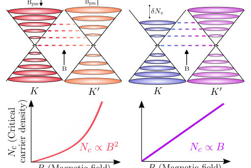
<figcaption class="paper-figure-caption"><b>Fig 1.</b> FIG. 1. Schematic diagnostic of beating-node trajectories in the carrier density and magnetic field plane. The node posi- tions are determined by the source of the frequency mismatch between the two oscillatory channels. A density imbalance proportional to carrier density, such as a constant valley polar- ization or a Y-type Kekul´e velocity imbalance, gives a linear-B trajectory, Nc,j ∝(2j + 1)Bc,j. A strain-induced pseudomag- netic field gives a quadratic dependence, Nc,j ∝(2j + 1)B2 c,j. A constant valley- or spin-dependent splitting of the Dirac bands also gives a quadratic-B dependence, but with a differ- ent node sequence, Nc,j ∝(2j + 1)2B2 c,j. The combination of magnetic field and...</figcaption>
</figure>
<figure class="paper-figure-card">
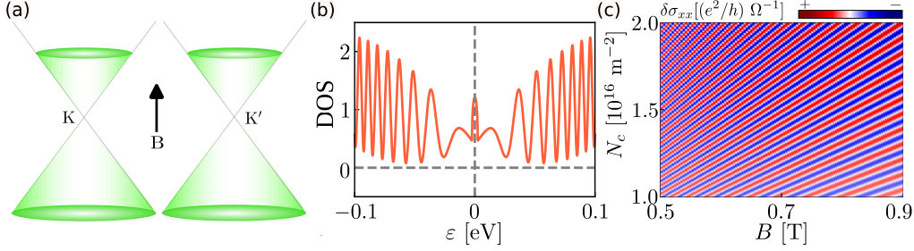
<figcaption class="paper-figure-caption"><b>Fig 2.</b> FIG. 2. Single-frequency quantum oscillations in pristine single-layer graphene. (a) The two valleys have identical Fermi- surface areas and experience the same applied field. (b) The density of states shows the usual SdH oscillations as a function of energy. We use B = 1 T, vF = 106 m/s, and ∆= 0. (c) The oscillatory longitudinal magnetoconductivity δσxx in the N-B plane contains no beating nodes because the two valley contributions have the same frequency. We use nim = 1013 m−2 and ks = 108 m−1.</figcaption>
</figure>
<figure class="paper-figure-card">
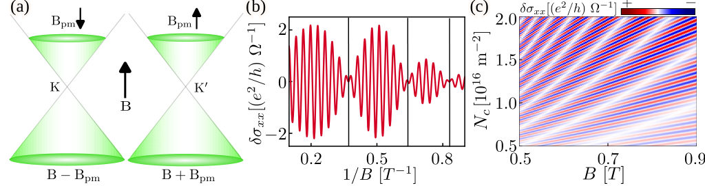
<figcaption class="paper-figure-caption"><b>Fig 3.</b> FIG. 3. Field-like beating from a valley-contrasting pseudomagnetic field. (a) The two valleys have equal carrier density but experience Bξ = B −ξBpm. (b) The oscillatory response as a function of 1/B shows SdH oscillations modulated by a PMF envelope. (c) In the N-B plane, beating nodes follow N PMF c,j ∝(2j + 1)B2 c,j. We use Bpm = 60 mT.</figcaption>
</figure>
<figure class="paper-figure-card">
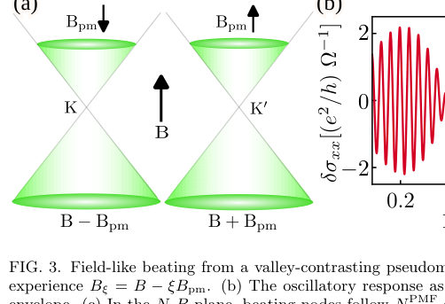
<figcaption class="paper-figure-caption"><b>Fig 4.</b> Figure 2(c) shows the oscillatory part of the longitudinal magnetoconductivity, δσxx = σxx −2σ0(N/2, B) in the B-N plane. The alternating red and blue stripes denote successive SdH oscillations. Since the two valley chan- nels have the same oscillation frequency in this reference case, no beating nodes appear. This provides the baseline against which the beating patterns generated by field-like or Fermi-surface asymmetries are compared below.</figcaption>
</figure>
<figure class="paper-figure-card">
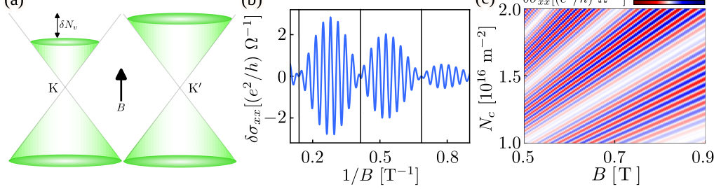
<figcaption class="paper-figure-caption"><b>Fig 5.</b> FIG. 4. Fermi-surface beating from a constant fractional valley imbalance. (a) The two valleys have different carrier densities and therefore different Fermi-surface areas, while both experience the same magnetic field. (b) The oscillatory longitudinal magnetoconductivity shows a beating envelope periodic in 1/B. (c) The node trajectory follows N VP c,j ∝(2j + 1)Bc,j. We use pv = 0.06.</figcaption>
</figure>

**Summary.** The paper presents a comprehensive theoretical framework to diagnose the microscopic origin of beating patterns observed in quantum oscillations in graphene. By deriving and comparing characteristic scaling relations for the node positions in the carrier density-magnetic field plane, it distinguishes between effects like strain-induced pseudomagnetic fields and intrinsic valley imbalances. This provides quantitative constraints for understanding band structure physics in 2D materials.

**Why it may be interesting.** This work provides a powerful theoretical tool for interpreting complex quantum transport measurements in 2D materials. The diagnostic approach—mapping physical mechanisms onto distinct mathematical scaling laws—is highly valuable for condensed matter theorists studying emergent phenomena.

Detailed structure

**Main problem.** The primary goal is to develop a quantitative diagnostic framework to distinguish between various microscopic origins (e.g., strain, valley imbalance, spin-orbit coupling) responsible for beating patterns observed in quantum oscillations within graphene.

**Main result.** By analyzing the scaling relations of the critical carrier density ($N_{c,j}$) and magnetic field ($B_{c,j}$) at the beating nodes, the authors provide distinct signatures: PMF leads to $N_{c,j} \propto (2j+1) B_{c,j}^2$, while linear imbalance yields $N_{c,j} \propto (2j+1) B_{c,j}$.

**Method.** The analysis starts from Onsager's quantization relation and models the total response as an interference pattern between two nearby oscillatory contributions. This leads to deriving scaling laws for the node positions based on different physical assumptions.

**Model / system.** The system is graphene-based hexagonal lattices exhibiting magnetic quantum oscillations (SdH/dHvA effects). The theoretical framework involves analyzing the magnetoconductivity ($\sigma_{xx}$) and relating beating nodes to specific forms of energy splitting or density imbalance in the carrier population.

**Key observables.** Beating node positions ($N_{c,j}$ vs $B_{c,j}$), the ratio $
u_{c,j} / N_{	ext{osc},j}$, and the power-law dependence of these nodes on $B$ (e.g., $B^2$ vs $B$).

**Important parameters / regimes.** Carrier density ($N$), magnetic field ($B$), pseudomagnetic field magnitude ($|B_{pm}|$), and the index $j$ labeling the beating node.

**Assumptions / limitations.** The analysis assumes that the beating is governed by two dominant, comparable oscillatory channels, allowing for the application of interference formulas derived from Onsager's quantization relation. Approximations are made regarding weak field limits ($B_{pm}/B \ll 1$).

**Figures summary.** Figures illustrate the diagnostic plane in the N-B space showing distinct trajectories for PMF beating (quadratic $B$ dependence) versus density imbalance (linear $B$ dependence). Table I summarizes these scaling rules.

**Paper structure.** The paper builds a unified framework by deriving node conditions from different physical sources (PMF, linear/square-root density imbalance), establishing universal consistency checks (like the ratio $
u_{c,j}/N_{	ext{osc},j}$), and summarizing these diagnostics in tables to guide experimental interpretation.

Abstract

Magnetic quantum oscillations are usually periodic in inverse magnetic field, and their amplitude can show beating when two nearby frequencies interfere. In graphene-based hexagonal systems, such beating can arise from strain-induced pseudomagnetic fields, unequal valley populations, valley-dependent energy shifts, spin-orbit coupling-induced band splitting, or Kekulé distortions. Here, we show that the carrier density and magnetic field dependence of the beating nodes can distinguish these mechanisms. Starting from Onsager's quantization relation, we derive scaling relations for the critical carrier density $N_c$ for the beating nodes as a function of critical magnetic field $B_c$. A pseudomagnetic field gives $N_c\propto B_c^2$, whereas a density-independent valley imbalance gives $N_c\propto B_c$. A constant Dirac-band energy splitting by Zeeman-like spin-orbit coupling also gives quadratic field scaling, but with a different node sequence: $N_{c,j}\propto(2j+1)B_{c,j}^2$ for a pseudomagnetic field and $N_{c,j}\propto(2j+1)^2B_{c,j}^2$ for energy splitting, where $j$ labels the beating node indices. These results provide quantitative constraints on different microscopic origins of valley- and spin-dependent band splittings in graphene-based systems.

[↑ back to top](#top)

### [Thermal reconstruction as a method of substrate preparation for highly crystalline superconducting TiN resonators](http://arxiv.org/abs/2606.20317v1)

**Authors:** Thomas J. Smart, Marc Neis, Janine Lorenz, Marcello P. Guardascione, Roudy Hanna, Michael Schleenvoigt, Yuan Gao, Joscha Domnick, Benjamin Bennemann, Abdur Rehman Jalil, Jin Hee Bae, Harsh Bhardwaj, F. Stefan Tautz, Felix Lüpke, Detlev Grützmacher, Rami Barends, Pavel A. Bushev, Peter Schüffelgen  
**Type:** experiment · **Category:** other · **PDF:** <https://arxiv.org/pdf/2606.20317v1>  
**Analysis basis:** full PDF text, analyzed in chunks
**Topic relevance:** `QC/QI experiment` **1/5**

↔ Scroll figures horizontally

<figure class="paper-figure-card">
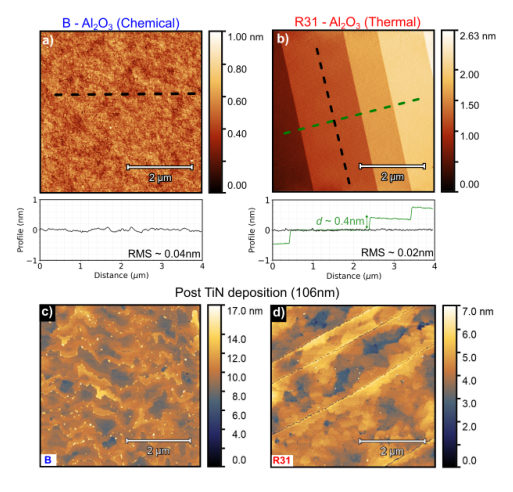
<figcaption class="paper-figure-caption"><b>Fig 1.</b> FIG. 1. a),b) AFM topographs of c-plane sapphire sub- strates, after chemical cleaning with Piranha solution and 1% HF (B-Al2O3) and after thermal annealing to form the ( √</figcaption>
</figure>
<figure class="paper-figure-card">
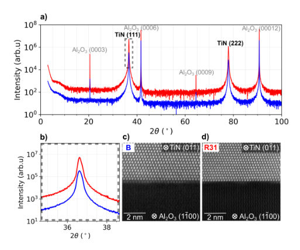
<figcaption class="paper-figure-caption"><b>Fig 2.</b> FIG. 2. a) Comparison of XRD spectra for TiN films grown on reconstructed (R31-Al2O3 - Red) and bare sapphire (B-Al2O3 - Blue), where the relevant features have been indicated. The R31-Al2O3 curve has been vertically displaced by a factor of 10 for clarity. b) Zoom-in on the TiN (111) peak from the XRD spectra. c),d) Transmission Electron Microscopy (TEM) images of the TiN/Al2O3 interface for B-Al2O3 and R31-Al2O3 respectively. The interface appears sharper for R31-Al2O3 compared to B-Al2O3.</figcaption>
</figure>
<figure class="paper-figure-card">
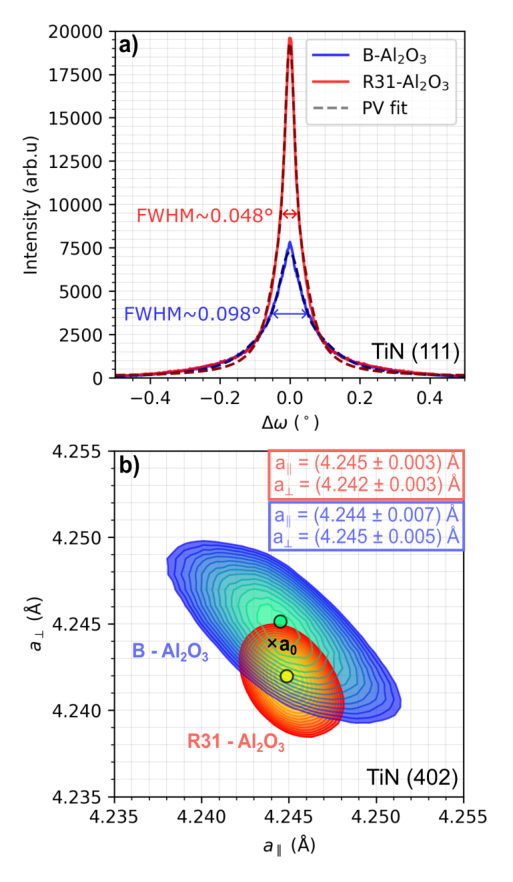
<figcaption class="paper-figure-caption"><b>Fig 3.</b> FIG. 3. a) TiN (111) rocking curves for films grown on R31- Al2O3 and B-Al2O3. Both curves have been fit to a Pseudo- Voigt (PV) distribution (shown as dotted lines) to extract the FWHM values of 0.047◦and 0.098◦respectively. b) RSM plots of the off-axis TiN (402) peak showing the distribution of in- plane (a∥) and out-of-plane (a⊥) lattice constants for each film. Only intensity values greater than 50% of the maximum value have been plotted for clarity. The literature value of the TiN lattice constants, (a0) is indicated by a black cross whilst the peak intensity for each distribution is indicated by a colored dot. The average value for a∥and a⊥for each film is also indicated.</figcaption>
</figure>
<figure class="paper-figure-card">
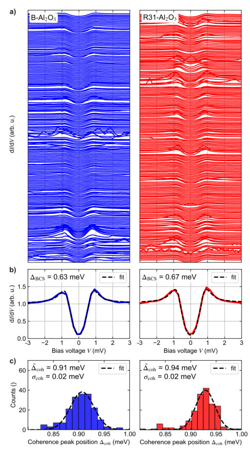
<figcaption class="paper-figure-caption"><b>Fig 4.</b> FIG. 4. a) Waterfall plot of 200 differential tunneling conduc- tance spectra recorded along a 424 nm line across a represen- tative area of the surface of sample B-Al2O3 and R31-Al2O3 (successive spectra are taken every 2.1 nm, and are offset ver- tically). b) Average of the 200 spectra shown in a) including BCS fits which yield order parameters of ∆BCS = 0.63 and 0.67 meV as well as effective temperatures of Ttip = 1.90 and 1.91 K for the samples B-Al2O3 and R31-Al2O3 respectively. c) Distribution of the energy at which the coherence peak maxima occur ∆coh in the spectra shown in panel a). The mean values and standard deviations of the distributions are determined from the shown Gaussian...</figcaption>
</figure>
<figure class="paper-figure-card">
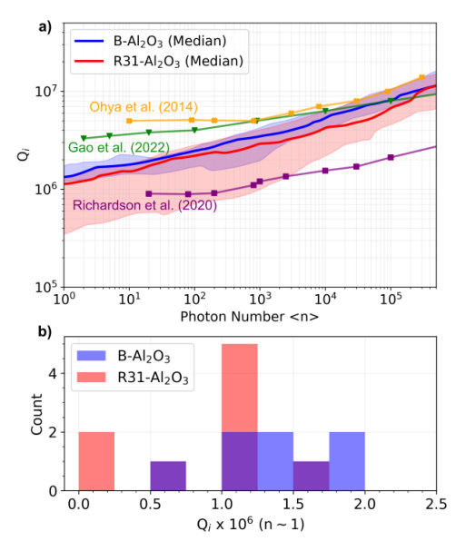
<figcaption class="paper-figure-caption"><b>Fig 5.</b> FIG. 5. a) Median internal quality factor (Qi) of all TiN CPW resonators fabricated from 106 nm TiN films grown on R31-Al2O3 and B-Al2O3 respectively. A confidence interval of one standard deviation for Qi values across all resonators on each chip is also indicated by the corresponding colored envelope. Selected Qi values from literature are also shown, with the values obtained here being similar to those achieved previously [3, 5, 30]. b) Histogram of single photon Qi values for all resonators on each chip.</figcaption>
</figure>

**Summary.** This paper demonstrates that thermal reconstruction of sapphire using a $	ext{CO}_2$ laser is an effective alternative to harsh chemical cleaning for preparing substrates. By growing superconducting TiN films on these reconstructed surfaces and fabricating microwave resonators, the authors show comparable, state-of-the-art performance ($Q_i > 10^6$) compared to chemically treated controls.

**Why it may be interesting.** The work directly addresses materials science challenges in quantum hardware fabrication by proposing a scalable, non-destructive substrate preparation technique that maintains high-performance superconducting properties.

Detailed structure

**Main problem.** To find an alternative, non-chemical method for preparing sapphire substrates that maintains or improves the superconducting performance of epitaxial TiN films used in high-quality microwave resonators.

**Main result.** Thermal reconstruction of the sapphire substrate ($	ext{R}31-	ext{Al}_2	ext{O}_3$) yields $	ext{TiN}$ films and fabricated resonators with superconducting properties ($Q_i > 10^6$) comparable to those grown on chemically cleaned substrates.

**Method.** The study compares two substrate preparations—chemical cleaning versus laser-induced thermal reconstruction—followed by epitaxial growth of TiN via MBE, and subsequent characterization using cryogenic microwave measurements (VNA) and advanced structural techniques (XRD, AFM).

**Model / system.** The physical system involves superconducting Titanium Nitride ($	ext{TiN}$) thin films grown epitaxially on $	ext{Al}_2	ext{O}_3$ sapphire substrates. The performance is assessed using coplanar waveguide (CPW) resonators operating at microwave frequencies.

**Key observables.** Internal quality factor ($Q_i$), superconducting pairing gap ($\Delta_{	ext{BCS}}$), film crystallinity (measured via XRD rocking curves and RSMs), and surface roughness (AFM).

**Important parameters / regimes.** Operating temperature ($\sim 20 	ext{ mK}$ to $1.2 	ext{ K}$), substrate reconstruction type ($	ext{R}31$ vs. bare), film thickness ($106 	ext{ nm}$).

**Assumptions / limitations.** The primary assumption is that the structural quality of the interface dictates device performance, and that thermal reconstruction provides a stable alternative to aggressive chemical etching.

**Figures summary.** Figures compare AFM topographs, show $	ext{S}_{21}$ data curves for resonators on both substrate types, and present histograms/median values for the internal quality factor ($Q_i$) at single photon levels.

**Paper structure.** The paper follows a comparative experimental structure: first establishing the need for better substrates; then detailing the preparation of two distinct sapphire surfaces ($	ext{B-Al}_2	ext{O}_3$ vs. $	ext{R}31-	ext{Al}_2	ext{O}_3$); followed by epitaxial growth and characterization (structural, superconducting gap via STM/STS); concluding with microwave resonator performance measurements ($Q_i$).

Abstract

High quality crystalline growth of a thin film on sapphire requires sufficient substrate preparation, often achieved via the use of aggressive chemical cleaning. Direct thermal reconstruction of the sapphire substrate via a CO$_2$ laser beam may allow for an alternative way to prepare the substrate for epitaxy without the use of any chemical processing. Within this work, we demonstrate that thermal annealing of sapphire into its ($\sqrt{31}$$\times$$\sqrt{31}$)$R$$\pm$9° reconstruction is a valid alternative preparation technique for sapphire substrates. TiN films grown via plasma-assisted molecular beam epitaxy upon these substrates exhibit greater crystallinity than those grown on chemically cleaned sapphire substrates. Superconducting resonators fabricated from these films exhibit similar performance, with many possessing internal quality factors at single photon levels greater than 10$^6$ for both substrate preparation methods.

[↑ back to top](#top)
