
# arxiv digest (quant-ph + cond-mat) — 2026-06-23

*181 papers · 53 relevant · 0 highlighted*

## 🔥 Most relevant (53)

*Every paper with at least one nonzero topic score, sorted by best-matching score. 🔥 marks scores ≥4/5. Click the title to jump to the full entry below; click [arXiv] to open the paper page. `(secondary)` marks papers from de-prioritized cond-mat archives.*

Show 53 relevant papers

- [Synchronization in coherently and dissipatively coupled spinor polariton time crystals](#paper-2606.23311) [[arXiv]](http://arxiv.org/abs/2606.23311v1) `(secondary)` — 🔥 `driven-dissipative phase transition` **5/5** · 🔥 `analog quantum simulation` **4/5** · 🔥 `correlated / nonlocal dissipation` **4/5** · 🔥 `exotic spin models in light-matter` **4/5** · `Tavis-Cummings & cavity-many-emitter` **3/5** · `correlated cavity matter` **3/5** · `methods for driven-dissipative` **3/5** · `non-equilibrium dynamics` **3/5** · `spintronics-quantum-optics interface` **3/5** · `Keldysh / 2PI / non-Gaussian methods` **2/5** · `non-equilibrium universality` **2/5** · `quantum optics experiment` **2/5** · `Dicke superradiance` **1/5** · `entanglement & information structure` **1/5** · `quantum measurements` **1/5**
- [Transient Information Partition in Coherent Exciton-Phonon-Photon Dynamics](#paper-2606.22099) [[arXiv]](http://arxiv.org/abs/2606.22099v1) — 🔥 `entanglement & information structure` **5/5** · 🔥 `analog quantum simulation` **4/5** · `Tavis-Cummings & cavity-many-emitter` **3/5** · `correlated cavity matter` **3/5** · `driven-dissipative phase transition` **3/5** · `methods for driven-dissipative` **3/5** · `non-equilibrium dynamics` **3/5** · `correlated / nonlocal dissipation` **2/5** · `non-equilibrium universality` **2/5** · `Keldysh / 2PI / non-Gaussian methods` **1/5** · `exotic spin models in light-matter` **1/5**
- [Integrated Whispering-Gallery Microlaser-Waveguide Platform for On-Chip Electrical Excitation of InGaAs Quantum Dots](#paper-2606.22626) [[arXiv]](http://arxiv.org/abs/2606.22626v1) `(secondary)` — 🔥 `quantum optics experiment` **5/5** · 🔥 `QC/QI experiment` **4/5** · `correlated cavity matter` **3/5** · `analog quantum simulation` **2/5** · `driven-dissipative phase transition` **2/5** · `Tavis-Cummings & cavity-many-emitter` **1/5** · `interference shaping light` **1/5** · `quantum measurements` **1/5** · `spintronics-quantum-optics interface` **1/5**
- [Prethermal cooling with many-body quantum quenches](#paper-2606.21813) [[arXiv]](http://arxiv.org/abs/2606.21813v1) — 🔥 `scars & prethermalization` **5/5** · 🔥 `analog quantum simulation` **4/5** · 🔥 `non-equilibrium dynamics` **4/5** · `non-equilibrium universality` **3/5** · `Keldysh / 2PI / non-Gaussian methods` **1/5** · `driven-dissipative phase transition` **1/5** · `entanglement & information structure` **1/5** · `methods for driven-dissipative` **1/5**
- [Prethermal rotating-frame solid echo in a dipolar nuclear-spin network](#paper-2606.23467) [[arXiv]](http://arxiv.org/abs/2606.23467v1) — 🔥 `scars & prethermalization` **5/5** · `driven-dissipative phase transition` **3/5** · `non-equilibrium dynamics` **3/5** · `QC/QI experiment` **2/5** · `spintronics-quantum-optics interface` **2/5** · `analog quantum simulation` **1/5** · `correlated / nonlocal dissipation` **1/5** · `exotic spin models in light-matter` **1/5** · `methods for driven-dissipative` **1/5** · `non-equilibrium universality` **1/5**
- [Thermodynamic inference from noisy single-molecule time series](#paper-2606.23619) [[arXiv]](http://arxiv.org/abs/2606.23619v1) — 🔥 `quantum measurements` **5/5** · 🔥 `measurement-induced transitions` **4/5** · `methods for driven-dissipative` **3/5** · `non-equilibrium dynamics` **3/5** · `non-equilibrium universality` **2/5** · `Keldysh / 2PI / non-Gaussian methods` **1/5** · `correlated / nonlocal dissipation` **1/5** · `driven-dissipative phase transition` **1/5**
- [An interpretable closed form for entanglement entropy from bitstrings, guided by a graph neural network](#paper-2606.22713) [[arXiv]](http://arxiv.org/abs/2606.22713v1) — 🔥 `entanglement & information structure` **5/5** · 🔥 `Rydberg arrays` **4/5** · 🔥 `analog quantum simulation` **4/5** · `methods for driven-dissipative` **1/5** · `non-equilibrium dynamics` **1/5**
- [Satellite Mission Planning with Rydberg Atoms](#paper-2606.23045) [[arXiv]](http://arxiv.org/abs/2606.23045v1) — 🔥 `Rydberg arrays` **5/5** · 🔥 `analog quantum simulation` **4/5** · `QC/QI experiment` **2/5** · `methods for driven-dissipative` **1/5**
- [Feedback-Controlled Magnon-Atom Entanglement and Photon Statistics](#paper-2606.21758) [[arXiv]](http://arxiv.org/abs/2606.21758v1) — 🔥 `analog quantum simulation` **4/5** · 🔥 `methods for driven-dissipative` **4/5** · 🔥 `quantum measurements` **4/5** · 🔥 `spintronics-quantum-optics interface` **4/5** · `Keldysh / 2PI / non-Gaussian methods` **3/5** · `correlated / nonlocal dissipation` **3/5** · `correlated cavity matter` **3/5** · `driven-dissipative phase transition` **3/5** · `entanglement & information structure` **3/5** · `exotic spin models in light-matter` **3/5** · `Tavis-Cummings & cavity-many-emitter` **2/5** · `non-equilibrium dynamics` **2/5** · `non-equilibrium universality` **2/5** · `interference shaping light` **1/5** · `measurement-induced transitions` **1/5** · `quantum optics experiment` **1/5**
- [Dissipative preparation of Laughlin-like states](#paper-2606.23451) [[arXiv]](http://arxiv.org/abs/2606.23451v1) — 🔥 `analog quantum simulation` **4/5** · 🔥 `methods for driven-dissipative` **4/5** · `correlated / nonlocal dissipation` **3/5** · `driven-dissipative phase transition` **3/5** · `exotic spin models in light-matter` **3/5** · `non-equilibrium dynamics` **3/5** · `Keldysh / 2PI / non-Gaussian methods` **2/5** · `Rydberg arrays` **2/5** · `non-equilibrium universality` **2/5** · `Kondo & dissipative impurity` **1/5** · `correlated cavity matter` **1/5** · `entanglement & information structure` **1/5** · `measurement-induced transitions` **1/5** · `quantum measurements` **1/5**
- [Keldysh field theory of spin- and valley-distinguished polariton nonlinearities in transition-metal dichalcogenide monolayers](#paper-2606.22242) [[arXiv]](http://arxiv.org/abs/2606.22242v1) `(secondary)` — 🔥 `Keldysh / 2PI / non-Gaussian methods` **4/5** · `correlated cavity matter` **3/5** · `exotic spin models in light-matter` **3/5** · `methods for driven-dissipative` **3/5** · `spintronics-quantum-optics interface` **3/5** · `analog quantum simulation` **2/5** · `correlated / nonlocal dissipation` **2/5** · `driven-dissipative phase transition` **2/5** · `non-equilibrium dynamics` **2/5** · `Tavis-Cummings & cavity-many-emitter` **1/5** · `interference shaping light` **1/5** · `non-equilibrium universality` **1/5**
- [Wigner-Negative Magnon Steady States from Incoherent Qubit Pumping](#paper-2606.22753) [[arXiv]](http://arxiv.org/abs/2606.22753v1) — 🔥 `methods for driven-dissipative` **4/5** · 🔥 `spintronics-quantum-optics interface` **4/5** · `correlated / nonlocal dissipation` **3/5** · `driven-dissipative phase transition` **3/5** · `exotic spin models in light-matter` **3/5** · `Tavis-Cummings & cavity-many-emitter` **2/5** · `non-equilibrium dynamics` **2/5** · `Keldysh / 2PI / non-Gaussian methods` **1/5** · `QC/QI experiment` **1/5** · `analog quantum simulation` **1/5** · `correlated cavity matter` **1/5** · `non-equilibrium universality` **1/5**
- [Instabilities of the continuous superradiant laser](#paper-2606.21675) [[arXiv]](http://arxiv.org/abs/2606.21675v1) — 🔥 `superradiant laser` **4/5** · `Tavis-Cummings & cavity-many-emitter` **3/5** · `driven-dissipative phase transition` **3/5** · `methods for driven-dissipative` **3/5** · `Dicke superradiance` **2/5** · `correlated cavity matter` **2/5** · `non-equilibrium universality` **2/5** · `Keldysh / 2PI / non-Gaussian methods` **1/5** · `analog quantum simulation` **1/5** · `correlated / nonlocal dissipation` **1/5** · `non-equilibrium dynamics` **1/5**
- [Pairing-induced Bloch oscillations in an interacting Kitaev chain](#paper-2606.22284) [[arXiv]](http://arxiv.org/abs/2606.22284v1) — 🔥 `analog quantum simulation` **4/5** · 🔥 `non-equilibrium dynamics` **4/5** · `non-equilibrium universality` **3/5** · `driven-dissipative phase transition` **2/5** · `entanglement & information structure` **2/5** · `methods for driven-dissipative` **2/5** · `Frenkel-Kontorova` **1/5** · `Keldysh / 2PI / non-Gaussian methods` **1/5** · `correlated / nonlocal dissipation` **1/5** · `exotic spin models in light-matter` **1/5** · `scars & prethermalization` **1/5**
- [Acceleration of Free Electrons by Photonic Time-Crystals](#paper-2606.21953) [[arXiv]](http://arxiv.org/abs/2606.21953v1) — 🔥 `analog quantum simulation` **4/5** · 🔥 `non-equilibrium dynamics` **4/5** · `driven-dissipative phase transition` **3/5** · `interference shaping light` **3/5** · `methods for driven-dissipative` **2/5** · `non-equilibrium universality` **2/5** · `Keldysh / 2PI / non-Gaussian methods` **1/5** · `Tavis-Cummings & cavity-many-emitter` **1/5** · `correlated cavity matter` **1/5**
- [Deterministic control of the probabilistic phase dynamics in injection-locked spin-torque nano-oscillators](#paper-2606.22208) [[arXiv]](http://arxiv.org/abs/2606.22208v1) `(secondary)` — 🔥 `driven-dissipative phase transition` **4/5** · `exotic spin models in light-matter` **3/5** · `non-equilibrium dynamics` **3/5** · `spintronics-quantum-optics interface` **3/5** · `non-equilibrium universality` **2/5** · `quantum measurements` **2/5** · `correlated / nonlocal dissipation` **1/5** · `measurement-induced transitions` **1/5** · `methods for driven-dissipative` **1/5** · `scars & prethermalization` **1/5**
- [Degeneracy-reshaped spin squeezing in high-spin Fermi-Hubbard systems weakly coupled to light](#paper-2606.23330) [[arXiv]](http://arxiv.org/abs/2606.23330v1) — 🔥 `analog quantum simulation` **4/5** · `exotic spin models in light-matter` **3/5** · `spintronics-quantum-optics interface` **3/5** · `Tavis-Cummings & cavity-many-emitter` **2/5** · `non-equilibrium dynamics` **2/5** · `Keldysh / 2PI / non-Gaussian methods` **1/5** · `correlated / nonlocal dissipation` **1/5** · `correlated cavity matter` **1/5** · `driven-dissipative phase transition` **1/5** · `entanglement & information structure` **1/5** · `methods for driven-dissipative` **1/5**
- [Helical Domain-Wall-Ring Networks Reshape Superconducting Correlations](#paper-2606.23599) [[arXiv]](http://arxiv.org/abs/2606.23599v1) — 🔥 `analog quantum simulation` **4/5** · `Keldysh / 2PI / non-Gaussian methods` **3/5** · `methods for driven-dissipative` **3/5** · `driven-dissipative phase transition` **2/5** · `non-equilibrium dynamics` **2/5** · `non-equilibrium universality` **2/5** · `Frenkel-Kontorova` **1/5** · `correlated / nonlocal dissipation` **1/5** · `correlated cavity matter` **1/5** · `entanglement & information structure` **1/5**
- [Open-quantum-system theory of non-Markovian electron-phonon dynamics](#paper-2606.22233) [[arXiv]](http://arxiv.org/abs/2606.22233v1) — 🔥 `methods for driven-dissipative` **4/5** · 🔥 `non-equilibrium dynamics` **4/5** · `Keldysh / 2PI / non-Gaussian methods` **3/5** · `correlated / nonlocal dissipation` **3/5** · `driven-dissipative phase transition` **3/5** · `Kondo & dissipative impurity` **2/5** · `non-equilibrium universality` **1/5**
- [Exact Accumulated-Field Determined Steady States with Boundary-Controlled Relaxation in Dissipative Quantum Link Chains](#paper-2606.22065) [[arXiv]](http://arxiv.org/abs/2606.22065v1) — 🔥 `methods for driven-dissipative` **4/5** · `correlated / nonlocal dissipation` **3/5** · `driven-dissipative phase transition` **3/5** · `non-equilibrium dynamics` **3/5** · `non-equilibrium universality` **2/5** · `Frenkel-Kontorova` **1/5** · `Keldysh / 2PI / non-Gaussian methods` **1/5** · `Kondo & dissipative impurity` **1/5** · `analog quantum simulation` **1/5**
- [Internal-state criticality in Bayesian-inverse-Bayesian inference](#paper-2606.22109) [[arXiv]](http://arxiv.org/abs/2606.22109v1) — 🔥 `non-equilibrium universality` **4/5** · `driven-dissipative phase transition` **3/5** · `entanglement & information structure` **2/5** · `measurement-induced transitions` **2/5** · `non-equilibrium dynamics` **2/5** · `quantum measurements` **2/5** · `analog quantum simulation` **1/5** · `correlated / nonlocal dissipation` **1/5** · `methods for driven-dissipative` **1/5** · `scars & prethermalization` **1/5**
- [Fast quantum-state transfer in Su-Schrieffer-Heeger chains beyond the noninteracting regime](#paper-2606.23324) [[arXiv]](http://arxiv.org/abs/2606.23324v1) — 🔥 `analog quantum simulation` **4/5** · `methods for driven-dissipative` **3/5** · `non-equilibrium dynamics` **3/5** · `driven-dissipative phase transition` **2/5** · `non-equilibrium universality` **2/5** · `Frenkel-Kontorova` **1/5** · `Keldysh / 2PI / non-Gaussian methods` **1/5** · `entanglement & information structure` **1/5** · `quantum measurements` **1/5**
- [Improved State Readout in NV Centers using Regression Models and Rabi Driving](#paper-2606.23454) [[arXiv]](http://arxiv.org/abs/2606.23454v1) — 🔥 `QC/QI experiment` **4/5** · `methods for driven-dissipative` **3/5** · `quantum measurements` **3/5** · `spintronics-quantum-optics interface` **3/5** · `measurement-induced transitions` **2/5** · `Keldysh / 2PI / non-Gaussian methods` **1/5** · `driven-dissipative phase transition` **1/5** · `quantum optics experiment` **1/5**
- [Iterative quantum phase estimation with cQED encoding](#paper-2606.22071) [[arXiv]](http://arxiv.org/abs/2606.22071v1) — 🔥 `quantum optics experiment` **4/5** · `analog quantum simulation` **3/5** · `quantum measurements` **3/5** · `QC/QI experiment` **2/5** · `measurement-induced transitions` **2/5** · `Tavis-Cummings & cavity-many-emitter` **1/5** · `correlated cavity matter` **1/5** · `driven-dissipative phase transition` **1/5** · `methods for driven-dissipative` **1/5**
- [Protecting Qubits from Purcell Decay via Permanent Dipoles](#paper-2606.22732) [[arXiv]](http://arxiv.org/abs/2606.22732v1) — 🔥 `methods for driven-dissipative` **4/5** · `correlated / nonlocal dissipation` **3/5** · `correlated cavity matter` **3/5** · `Tavis-Cummings & cavity-many-emitter` **2/5** · `driven-dissipative phase transition` **2/5** · `Keldysh / 2PI / non-Gaussian methods` **1/5** · `analog quantum simulation` **1/5** · `non-equilibrium dynamics` **1/5** · `non-equilibrium universality` **1/5**
- [Deviance from a pink noise regime in the temporal organization of semantic relations in psychosis](#paper-2606.23043) [[arXiv]](http://arxiv.org/abs/2606.23043v1) — 🔥 `non-equilibrium universality` **4/5** · `driven-dissipative phase transition` **3/5** · `methods for driven-dissipative` **3/5** · `non-equilibrium dynamics` **3/5** · `Frenkel-Kontorova` **1/5** · `Keldysh / 2PI / non-Gaussian methods` **1/5** · `analog quantum simulation` **1/5** · `correlated / nonlocal dissipation` **1/5**
- [Dynamical Tipping in a Quantum Limit Cycle](#paper-2606.21849) [[arXiv]](http://arxiv.org/abs/2606.21849v1) — 🔥 `driven-dissipative phase transition` **4/5** · `methods for driven-dissipative` **3/5** · `non-equilibrium dynamics` **3/5** · `non-equilibrium universality` **3/5** · `Keldysh / 2PI / non-Gaussian methods` **1/5** · `analog quantum simulation` **1/5** · `correlated / nonlocal dissipation` **1/5**
- [Emergent Andreev Reflection from a Lattice Duality Defect](#paper-2606.23684) [[arXiv]](http://arxiv.org/abs/2606.23684v1) — 🔥 `Kondo & dissipative impurity` **4/5** · `Keldysh / 2PI / non-Gaussian methods` **2/5** · `analog quantum simulation` **2/5** · `driven-dissipative phase transition` **2/5** · `Frenkel-Kontorova` **1/5** · `correlated / nonlocal dissipation` **1/5** · `entanglement & information structure` **1/5** · `methods for driven-dissipative` **1/5** · `non-equilibrium dynamics` **1/5** · `non-equilibrium universality` **1/5**
- [Giant Fluctuations in Self-Propelled Particles with Age-Dependent Switching](#paper-2606.22209) [[arXiv]](http://arxiv.org/abs/2606.22209v1) — 🔥 `non-equilibrium universality` **4/5** · `driven-dissipative phase transition` **3/5** · `methods for driven-dissipative` **3/5** · `non-equilibrium dynamics` **3/5** · `Frenkel-Kontorova` **1/5** · `Keldysh / 2PI / non-Gaussian methods` **1/5** · `correlated / nonlocal dissipation` **1/5**
- [Robust Structure Learning of $k$-local Lindbladians](#paper-2606.23652) [[arXiv]](http://arxiv.org/abs/2606.23652v1) — 🔥 `methods for driven-dissipative` **4/5** · `correlated / nonlocal dissipation` **3/5** · `driven-dissipative phase transition` **2/5** · `non-equilibrium dynamics` **2/5** · `quantum measurements` **2/5** · `Keldysh / 2PI / non-Gaussian methods` **1/5** · `non-equilibrium universality` **1/5**
- [A dipolar Bose-Bose mixture of Dysprosium isotopes with controllable interspecies interactions](#paper-2606.23528) [[arXiv]](http://arxiv.org/abs/2606.23528v1) — 🔥 `analog quantum simulation` **4/5** · `non-equilibrium dynamics` **3/5** · `scars & prethermalization` **2/5** · `correlated / nonlocal dissipation` **1/5** · `driven-dissipative phase transition` **1/5** · `entanglement & information structure` **1/5** · `methods for driven-dissipative` **1/5** · `non-equilibrium universality` **1/5**
- [Entanglement, Discord, and Residual Coherence in Scalar-Induced Gravitational Waves](#paper-2606.21901) [[arXiv]](http://arxiv.org/abs/2606.21901v1) — 🔥 `entanglement & information structure` **4/5** · `Keldysh / 2PI / non-Gaussian methods` **3/5** · `correlated / nonlocal dissipation` **2/5** · `non-equilibrium dynamics` **2/5** · `driven-dissipative phase transition` **1/5** · `methods for driven-dissipative` **1/5** · `non-equilibrium universality` **1/5**
- [Emergence of Gaussian entanglement and non-Gaussianity in high-harmonic generation driven by bright squeezed light](#paper-2606.22714) [[arXiv]](http://arxiv.org/abs/2606.22714v1) — 🔥 `entanglement & information structure` **4/5** · `interference shaping light` **3/5** · `Keldysh / 2PI / non-Gaussian methods` **2/5** · `correlated / nonlocal dissipation` **1/5** · `driven-dissipative phase transition` **1/5** · `methods for driven-dissipative` **1/5** · `non-equilibrium dynamics` **1/5**
- [Liouvillian Geometry of Multidimensional Spectra: Pathway Transport and Observational Holonomy in Open Quantum Systems](#paper-2606.22530) [[arXiv]](http://arxiv.org/abs/2606.22530v1) — 🔥 `methods for driven-dissipative` **4/5** · `Keldysh / 2PI / non-Gaussian methods` **3/5** · `non-equilibrium dynamics` **2/5** · `correlated / nonlocal dissipation` **1/5** · `driven-dissipative phase transition` **1/5** · `non-equilibrium universality` **1/5** · `quantum measurements` **1/5**
- [Isometrization of Tensor Network States via Gauge Propagation](#paper-2606.22816) [[arXiv]](http://arxiv.org/abs/2606.22816v1) — 🔥 `methods for driven-dissipative` **4/5** · `analog quantum simulation` **3/5** · `exotic spin models in light-matter` **3/5** · `entanglement & information structure` **1/5** · `non-equilibrium dynamics` **1/5**
- [Optimizing Pump Conditions of Parametric Amplifiers for Fast Multiplexed Readout of Superconducting Qubits](#paper-2606.22080) [[arXiv]](http://arxiv.org/abs/2606.22080v1) — 🔥 `QC/QI experiment` **4/5** · `quantum measurements` **2/5** · `quantum optics experiment` **2/5** · `correlated / nonlocal dissipation` **1/5** · `driven-dissipative phase transition` **1/5** · `methods for driven-dissipative` **1/5**
- [Second-order dc conductivity in the velocity-gauge Keldysh formalism: gauge-invariant decomposition into nonlinear Drude, Berry-curvature-dipole, and quantum-metric responses](#paper-2606.22359) [[arXiv]](http://arxiv.org/abs/2606.22359v1) `(secondary)` — 🔥 `Keldysh / 2PI / non-Gaussian methods` **4/5** · `non-equilibrium dynamics` **2/5** · `analog quantum simulation` **1/5** · `correlated / nonlocal dissipation` **1/5** · `driven-dissipative phase transition` **1/5** · `methods for driven-dissipative` **1/5** · `non-equilibrium universality` **1/5**
- [A Measurement-Like Test of Continuous Spontaneous Localization with a Reversible Nanoparticle Pointer](#paper-2606.22707) [[arXiv]](http://arxiv.org/abs/2606.22707v1) — 🔥 `quantum measurements` **4/5** · `measurement-induced transitions` **3/5** · `correlated / nonlocal dissipation` **1/5** · `driven-dissipative phase transition` **1/5** · `interference shaping light` **1/5**
- [Angular-time evolution and edge-spin dynamics in the Haldane phase of the S=1 bilinear-biquadratic chain](#paper-2606.23117) [[arXiv]](http://arxiv.org/abs/2606.23117v1) — 🔥 `entanglement & information structure` **4/5** · `non-equilibrium dynamics` **2/5** · `analog quantum simulation` **1/5** · `exotic spin models in light-matter` **1/5** · `methods for driven-dissipative` **1/5** · `non-equilibrium universality` **1/5**
- [Demonstration of a Monolithic and Fully Telecom-Fiber-Compatible Tunable Source of Polarization Entangled Photon Pairs Based on a van der Waals Material](#paper-2606.21874) [[arXiv]](http://arxiv.org/abs/2606.21874v1) — 🔥 `quantum optics experiment` **4/5** · `interference shaping light` **3/5** · `QC/QI experiment` **1/5** · `entanglement & information structure` **1/5** · `quantum measurements` **1/5**
- [Formation and dynamics of self-bound droplets in dipolar molecular condensate](#paper-2606.22503) [[arXiv]](http://arxiv.org/abs/2606.22503v1) — 🔥 `analog quantum simulation` **4/5** · `non-equilibrium dynamics` **2/5** · `Keldysh / 2PI / non-Gaussian methods` **1/5** · `correlated / nonlocal dissipation` **1/5** · `driven-dissipative phase transition` **1/5** · `methods for driven-dissipative` **1/5**
- [Resolving support-mismatch by local basis rotation in variational Monte Carlo](#paper-2606.23657) [[arXiv]](http://arxiv.org/abs/2606.23657v1) — 🔥 `non-equilibrium dynamics` **4/5** · `methods for driven-dissipative` **3/5** · `Keldysh / 2PI / non-Gaussian methods` **1/5** · `analog quantum simulation` **1/5** · `non-equilibrium universality` **1/5**
- [Efficient Energy-Constrained Semi-Device-Independent QRNG with an Integrated Heterodyne Receiver](#paper-2606.23231) [[arXiv]](http://arxiv.org/abs/2606.23231v1) — 🔥 `quantum optics experiment` **4/5** · `entanglement & information structure` **2/5** · `QC/QI experiment` **1/5** · `interference shaping light` **1/5** · `quantum measurements` **1/5**
- [Population-based eigenstates of the SU(d) spin-exchange model for high-spin fermions in optical lattices](#paper-2606.23374) [[arXiv]](http://arxiv.org/abs/2606.23374v1) — 🔥 `analog quantum simulation` **4/5** · `exotic spin models in light-matter` **3/5** · `entanglement & information structure` **1/5** · `non-equilibrium dynamics` **1/5**
- [Quantifying and Probing Multipartite Entanglement via Minimum Entanglement Drop](#paper-2606.21950) [[arXiv]](http://arxiv.org/abs/2606.21950v1) — 🔥 `entanglement & information structure` **4/5** · `analog quantum simulation` **1/5** · `correlated / nonlocal dissipation` **1/5** · `driven-dissipative phase transition` **1/5** · `methods for driven-dissipative` **1/5** · `non-equilibrium dynamics` **1/5**
- [Quantum Memory in Scalar-Induced Gravitational Waves](#paper-2606.21835) [[arXiv]](http://arxiv.org/abs/2606.21835v1) — 🔥 `entanglement & information structure` **4/5** · `Keldysh / 2PI / non-Gaussian methods` **2/5** · `correlated / nonlocal dissipation` **1/5** · `methods for driven-dissipative` **1/5** · `non-equilibrium dynamics` **1/5**
- [Dynamical Decoupling using Universal Optimal Tracking](#paper-2606.21762) [[arXiv]](http://arxiv.org/abs/2606.21762v1) — 🔥 `QC/QI experiment` **4/5** · `correlated / nonlocal dissipation` **1/5** · `methods for driven-dissipative` **1/5** · `non-equilibrium dynamics` **1/5**
- [Symmetry-Enforced Pair-Density Wave and Chiral Interband Superconductivity in Strongly Correlated Kagome Systems](#paper-2606.21711) [[arXiv]](http://arxiv.org/abs/2606.21711v1) `(secondary)` — 🔥 `analog quantum simulation` **4/5** · `Keldysh / 2PI / non-Gaussian methods` **1/5** · `driven-dissipative phase transition` **1/5** · `entanglement & information structure` **1/5**
- [Vibe Calibration: Autonomous Bring-up of a 112-Qubit Superconducting Quantum Processor by a Skill-Orchestrating Language Agent](#paper-2606.22376) [[arXiv]](http://arxiv.org/abs/2606.22376v1) — 🔥 `QC/QI experiment` **4/5** · `quantum measurements` **2/5** · `methods for driven-dissipative` **1/5**
- [An Efficient and Perfect Secret Sharing Scheme on a Class of Non-Maximal Quantum Access Structure](#paper-2606.23082) [[arXiv]](http://arxiv.org/abs/2606.23082v1) — 🔥 `entanglement & information structure` **4/5** · `methods for driven-dissipative` **1/5** · `quantum measurements` **1/5**
- [Configurable Algorithms for Histopathologic Cancer Detection on Quantum Hardware](#paper-2606.21752) [[arXiv]](http://arxiv.org/abs/2606.21752v1) — 🔥 `QC/QI experiment` **4/5** · `methods for driven-dissipative` **1/5**
- [Nonlinear Geometrizability of State-Dependent Proto-Area in Approximate Holographic Codes](#paper-2606.22598) [[arXiv]](http://arxiv.org/abs/2606.22598v1) — 🔥 `entanglement & information structure` **4/5** · `Keldysh / 2PI / non-Gaussian methods` **1/5**
- [Structure and information measures of few-electron systems under a spherically symmetric Gaussian potential within a density functional approach](#paper-2606.23538) [[arXiv]](http://arxiv.org/abs/2606.23538v1) — 🔥 `entanglement & information structure` **4/5**

## All papers (137, sorted by relevance)

*Papers from quant-ph and your primary cond-mat archives (quant-gas, stat-mech, str-el, dis-nn). Highlighted papers (⭐) come first, then everything else sorted by topic-relevance score, highest first.*

### [Transient Information Partition in Coherent Exciton-Phonon-Photon Dynamics](http://arxiv.org/abs/2606.22099v1)

**Authors:** Kunio Ishida  
**Type:** theory · **Category:** other · **PDF:** <https://arxiv.org/pdf/2606.22099v1>  
**Analysis basis:** full PDF text, analyzed in chunks
**Topic relevance:** 🔥 `entanglement & information structure` **5/5** · 🔥 `analog quantum simulation` **4/5** · `Tavis-Cummings & cavity-many-emitter` **3/5** · `correlated cavity matter` **3/5** · `driven-dissipative phase transition` **3/5** · `methods for driven-dissipative` **3/5** · `non-equilibrium dynamics` **3/5** · `correlated / nonlocal dissipation` **2/5** · `non-equilibrium universality` **2/5** · `Keldysh / 2PI / non-Gaussian methods` **1/5** · `exotic spin models in light-matter` **1/5**

↔ Scroll figures horizontally

<figure class="paper-figure-card">
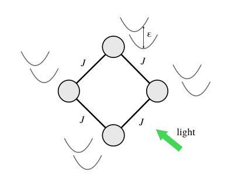
<figcaption class="paper-figure-caption"><b>Fig 1.</b> FIG. 1. A schematic view of the model.</figcaption>
</figure>
<figure class="paper-figure-card">
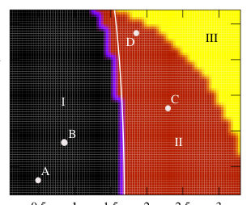
<figcaption class="paper-figure-caption"><b>Fig 2.</b> FIG. 2. Ground-state classification map. The regions I, II, and III correspond predominantly to N = 0, 1, and 2, respec- tively. The symbols A-D in the map indicate the four param- eter points used for the time traces in Fig. 5. The white line is calculated by the minimal variational polaron ansatz.</figcaption>
</figure>
<figure class="paper-figure-card">
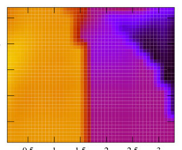
<figcaption class="paper-figure-caption"><b>Fig 3.</b> FIG. 3. Time-averaged QMI and absorbed-photon maps in the J-ν plane. (a) Ie,pn, (b) Ie,pt, and (c) Ipn,pt. (d) Time- averaged absorbed photon number N abs.</figcaption>
</figure>
<figure class="paper-figure-card">
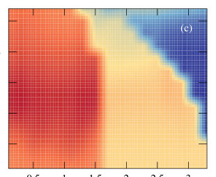
<figcaption class="paper-figure-caption"><b>Fig 4.</b> FIG. 4. Time-averaged subsystem entropies in the J-ν plane. (a) Se, (b) Spn, and (c) Spt.</figcaption>
</figure>
<figure class="paper-figure-card">

<figcaption class="paper-figure-caption"><b>Fig 5.</b> Figure 5 shows representative time traces of ηpn|e(t) and ηpt|e(t) at four parameter points marked in Fig. 2. At (J, ν) = (0.5, 0.3), the information partition changes rapidly during the early stage of the photon-induced dy- namics, and ηpt|e(t) remains dominant afterwards. This point therefore represents a photon-dominated response in region I, where the excitonic information is mainly shared with the photon subsystem during the coher-</figcaption>
</figure>

**Summary.** The research uses Quantum Mutual Information (QMI) to analyze how information is shared among excitons, phonons, and photons in a coherent light-matter system. It demonstrates that the transient state's correlation structure cannot be determined by measuring only optical absorption or static ground states. The key finding is a 'redistribution ridge' visible only through phonon-centered QMI, indicating a hidden quantum correlation pathway.

**Why it may be interesting.** This work provides a sophisticated, correlation-based diagnostic tool (QMI) to distinguish subtle quantum correlations generated during light excitation from simple population transfer or static ground-state characterizations, which is crucial for understanding complex quantum materials.

Detailed structure

**Main problem.** The study aims to characterize transient quantum states in light-matter systems by analyzing how correlations are dynamically partitioned among excitonic, phononic, and photonic degrees of freedom.

**Main result.** Quantum Mutual Information (QMI) reveals a hidden 'redistribution ridge' structure in the phonon-centered information partition that is absent from both static ground-state maps and conventional optical absorption measurements.

**Method.** The analysis employs subsystem-resolved Quantum Mutual Information (QMI) to quantify correlation partitioning during time evolution governed by the full Hamiltonian.

**Model / system.** The model describes a coherent exciton–phonon–photon system on a lattice, incorporating excitonic hopping ($J$), exciton-phonon coupling ($
u$), and light-matter coupling ($\mu$).

**Key observables.** Subsystem-resolved Quantum Mutual Information (QMI), subsystem entropies ($S_a$), and the redistribution ratio ($R_{pn}$).

**Important parameters / regimes.** The dynamics are mapped in the $J-
u$ plane, varying excitonic delocalization ($J$) and exciton-phonon coupling ($
u$).

**Assumptions / limitations.** Phonon and photon modes are treated as fully quantum mechanical, coherent subsystems participating in unitary dynamics (not environmental dissipation). The analysis is limited to a four-site model.

**Figures summary.** Figures compare time-averaged QMI maps ($I_{e,pn}, I_{e,pt}, I_{pn,pt}$) with absorbed photon number maps; the key feature shown is the sharp ridge in $R_{pn}$ that distinguishes transient correlation from static properties.

**Paper structure.** The paper progresses by first establishing the full quantum Hamiltonian and simulation framework. It then compares information partitioning derived from exciton-centered vs. phonon-centered QMI, culminating in the identification of the unique 'redistribution ridge' structure.

Abstract

We study transient information partition in a coherent exciton-phonon-photon system using subsystem-resolved quantum mutual information (QMI). By employing a model with excitonic, phononic, and photonic degrees of freedom, we analyze the dynamics in the $J$-$ν$ plane, where $J$ characterizes excitonic delocalization and $ν$ denotes the exciton-phonon coupling strength. By comparing time-averaged QMI maps with the absorbed photon number, we show that optical activity alone does not determine the character of the light-induced transient state. The exciton-centered information partition identifies a broad crossover between polariton-like and polaron-like transient responses, depending on whether excitonic information is mainly shared with the photon or phonon subsystem. In contrast, the phonon-centered partition reveals a sharper boundary-adjacent redistribution ridge near the boundary between the zero- and one-exciton ground-state sectors. This ridge is absent from both the ground-state sector map and the photon-absorption map, indicating that it is neither a static sector boundary nor an enhancement of optical absorption. A variational strength-function analysis connects the ridge to a region-II-like finite-energy polaronic excitation whose dominant spectral weight lies near the one-phonon energy, and thus the ridge represents a hidden transient correlation structure in which a limited amount of phonon-related information is preferentially shared with the photon subsystem before being predominantly allocated to exciton-phonon dressing. These results show that QMI-based information partition provides a correlation-based framework for characterizing coherent light-induced transient states in which optical and material degrees of freedom jointly participate quantum mechanically.

[↑ back to top](#top)

### [Prethermal cooling with many-body quantum quenches](http://arxiv.org/abs/2606.21813v1)

**Authors:** Jacob F. Steiner, Mohammad Hafezi, Stefan Kehrein, Gil Refael  
**Type:** theory · **Category:** strongly correlated electrons · **PDF:** <https://arxiv.org/pdf/2606.21813v1>  
**Analysis basis:** full PDF text, analyzed in chunks
**Topic relevance:** 🔥 `scars & prethermalization` **5/5** · 🔥 `analog quantum simulation` **4/5** · 🔥 `non-equilibrium dynamics` **4/5** · `non-equilibrium universality` **3/5** · `Keldysh / 2PI / non-Gaussian methods` **1/5** · `driven-dissipative phase transition` **1/5** · `entanglement & information structure` **1/5** · `methods for driven-dissipative` **1/5**

↔ Scroll figures horizontally

<figure class="paper-figure-card">
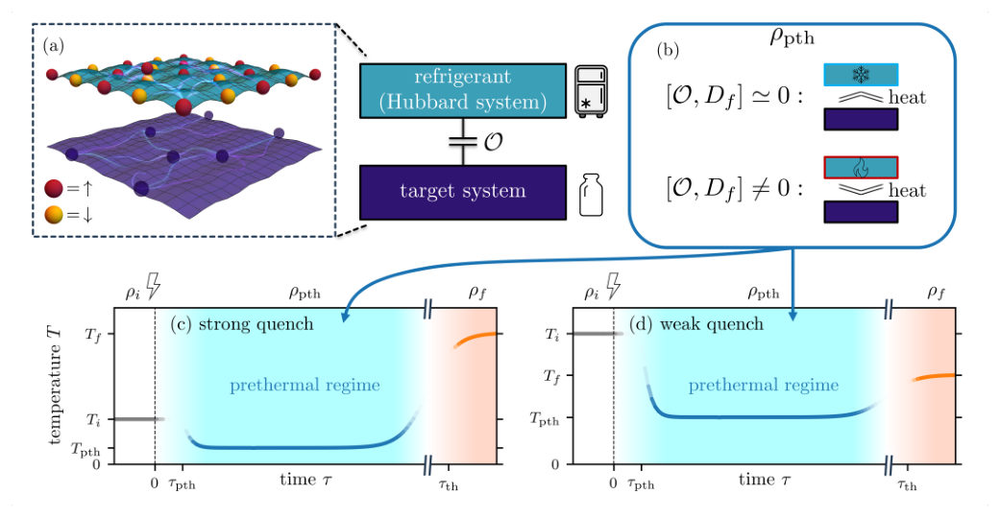
<figcaption class="paper-figure-caption"><b>Fig 1.</b> Figure 1. Prethermal cooling with quantum quenches. (a) Sketch of the setup. A Hubbard system, initialized in a thermal state ρi at temperature Ti, is subjected to a hopping quench t →gft = tf &lt; t and coupled to a target system through operators O. (b) For prethermal times τpth ≪τ ≪τth, the doublon number is effectively conserved. If the coupling operator also conserves doublon number, [O, Df] = 0, the target perceives the Hubbard system at the reduced temperature Tpth = g2 fTi. Local density and spin operators are examples of such couplings. If [O, Df] ̸= 0, as for a local hopping operator, the target does not generally perceive a well-defined reduced temperature and may instead be heated....</figcaption>
</figure>
<figure class="paper-figure-card">
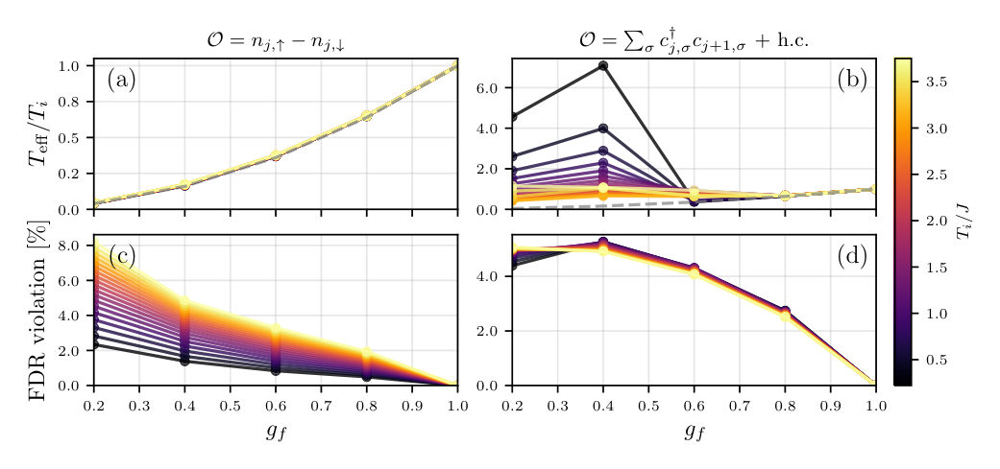
<figcaption class="paper-figure-caption"><b>Fig 2.</b> Figure 2. Numerical extraction of effective temperature from fluctuation-dissipation relation (FDR) for a one-dimensional Hubbard chain of length N, using the doublon number conserving coupling operator O = nj,↑−nj,↓[panels (a,c)] as well as the doublon number nonconserving operator O = P</figcaption>
</figure>
<figure class="paper-figure-card">
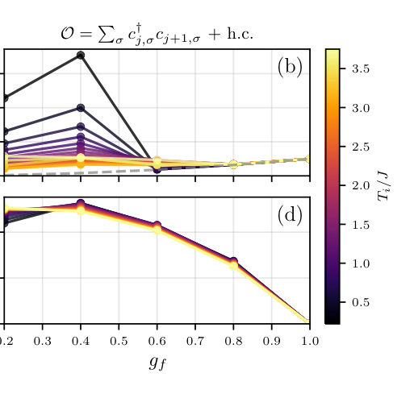
<figcaption class="paper-figure-caption"><b>Fig 3.</b> Fig. 2 shows the resulting extracted temperatures (first row) and FDR violations (second row) for a Hubbard chain of length N = 10 with periodic boundary con- ditions. We consider correlations of the approximately doublon-number conserving O = nj,↑−nj,↓(first col- umn) as well as of the doublon-number nonconserving O = P</figcaption>
</figure>
<figure class="paper-figure-card">
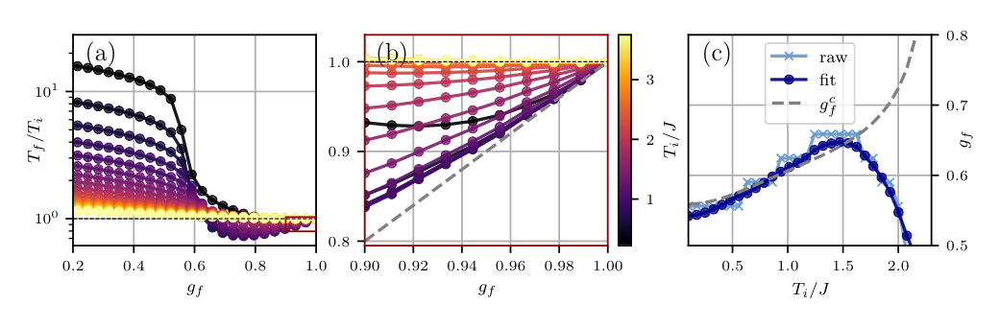
<figcaption class="paper-figure-caption"><b>Fig 4.</b> Figure 3. Asymptotic temperature after a quantum quench in the one-dimensional Hubbard model, obtained from the exact thermodynamic solution [59]. Panel (a) shows a wide range of gf values, while panel (b) shows a zoom-in on the weak-quench regime near gf = 1.0 together with the theoretical estimate from Eq. (43) (dashed gray line). The range shown in (b) is indicated by the red box in (a). The color scale in (a) and (b) denotes initial temperature, and is identical to that in Fig. 2. (c) Crossover point between the strong- and weak-quench regimes, determined from the maximum of |dTf/dgf|. The light-blue data points are obtained from the raw numerical derivative of the data shown in (a),...</figcaption>
</figure>
<figure class="paper-figure-card">
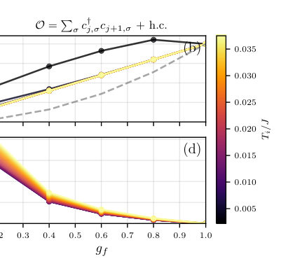
<figcaption class="paper-figure-caption"><b>Fig 5.</b> Figure 4. Parameters: U/t = 0.1, N = 10.</figcaption>
</figure>

**Summary.** The paper shows that performing specific quantum quenches on the fermionic Hubbard model can induce effective cooling rather than heating. This occurs because the quench energy is stored in long-lived high-energy excitations (doublons), leading to a measurable prethermal temperature reduction ($T_{pth} \propto g^2 T_i$). The protocol serves as a generalized quantum adiabatic demagnetization technique.

**Why it may be interesting.** This work provides a concrete, controllable mechanism for achieving low entropy states in quantum simulators (like those based on Hubbard models) via non-equilibrium protocols, which is highly relevant to realizing quantum computation or simulating exotic phases of matter.

Detailed structure

**Main problem.** The work investigates how quantum quenches can lead to effective cooling of low-energy degrees of freedom in strongly interacting many-body systems, counteracting the typical expectation of heating.

**Main result.** It demonstrates that if the quench deposits energy into long-lived high-energy excitations (like doublons), an effective prethermal temperature ($T_{pth} \propto g^2 T_i$) can be established, acting as a quantum analogue to adiabatic demagnetization.

**Method.** The analysis uses techniques like the Schrieffer-Wolff transformation and analyzes the system's evolution within a prethermal ensemble defined by conserving high-energy excitation numbers.

**Model / system.** The primary model is the fermionic Hubbard model at half filling, analyzed in the strong coupling limit ($U \gg t$). The dynamics are studied via quenches of the hopping term $t$, leading to an effective Hamiltonian that conserves doublon number.

**Key observables.** Effective prethermal temperature ($T_{pth}$), fluctuation-dissipation relation (FDR) adherence, and final thermalization temperature ($T_f$).

**Important parameters / regimes.** Quench parameter $g$ (final hopping amplitude relative to initial), interaction strength $U$, and hopping term $t$. The prethermal timescale $	au_{pth}$ is exponentially long.

**Assumptions / limitations.** The cooling mechanism relies on the existence of very long-lived excitations defining a prethermal timescale, and that the coupling operator conserves doublon number for the effective temperature to be well-defined.

**Figures summary.** Figures illustrate the setup, showing how $T_{pth} = g^2 f T_i$ when doublon number is conserved. They also plot time dependence of effective temperature and compare results for conserving versus non-conserving coupling operators.

**Paper structure.** The paper progresses from establishing the physical problem (cooling vs. heating) to deriving an effective Hamiltonian via Schrieffer-Wolff, calculating the prethermal state parameters using energy/number conservation, and finally verifying the cooling effect by analyzing the Two-Level System response and comparing theoretical limits.

Abstract

Many-body quantum quenches are typically associated with heating. In this work, we show that quantum quenches that perform positive work on the system can still lead to effective cooling of low-energy degrees of freedom if the quench energy is deposited in long-lived high-energy excitations. We discuss this explicitly for a quench of the hopping term t in the strong-coupling (U >> t) fermionic Hubbard model at half filling, where the quench induces a very long-lived non-equilibrium doublon density. The associated prethermal state persists for a time exponentially large in (U/t)^2. During this time window, we find an effective prethermal temperature that is reduced by the square of the ratio of final to initial hopping amplitude with respect to the initial temperature. This manifests as an effective fluctuation-dissipation relation that holds for doublon-number conserving operators. In a practical implementation the Hubbard system acts as a refrigerant to cool a target system provided the coupling conserves doublon number. Our protocol can be thought of as a quantum quench many-body generalization of adiabatic demagnetization.

[↑ back to top](#top)

### [Prethermal rotating-frame solid echo in a dipolar nuclear-spin network](http://arxiv.org/abs/2606.23467v1)

**Authors:** Quentin Reynard-Feytis, William Beatrez, Leo Joon Il Moon, Emanuel Druga, Ashok Ajoy  
**Type:** both · **Category:** other · **PDF:** <https://arxiv.org/pdf/2606.23467v1>  
**Analysis basis:** full PDF text, analyzed in chunks
**Topic relevance:** 🔥 `scars & prethermalization` **5/5** · `driven-dissipative phase transition` **3/5** · `non-equilibrium dynamics` **3/5** · `QC/QI experiment` **2/5** · `spintronics-quantum-optics interface` **2/5** · `analog quantum simulation` **1/5** · `correlated / nonlocal dissipation` **1/5** · `exotic spin models in light-matter` **1/5** · `methods for driven-dissipative` **1/5** · `non-equilibrium universality` **1/5**

↔ Scroll figures horizontally

<figure class="paper-figure-card">
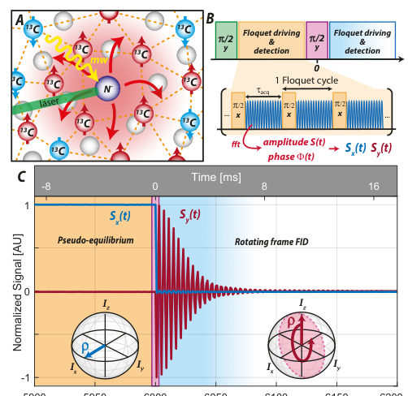
<figcaption class="paper-figure-caption"><b>Fig 1.</b> Fig. 1. Rotating-frame FID under Floquet prether- malization. (A) Platform. Hyperpolarized 13C nuclei in di- amond form a dilute 3D dipolar network (dashed couplings) via optically pumped NV centers (yellow). (B) Floquet drive and readout. A (π/2)x pulse prepares transverse magnetiza- tion, followed by a pulsed spin-locking train that both drives the system and enables cycle-resolved sampling of the Larmor precession between pulses; a subsequent (π/2)y pulse tips the prethermal magnetization to initiate the rotating-frame FID. (C) Dynamics. Sx(t) exhibits a long-lived prethermal plateau (yellow), while Sy(t) shows a rapidly dephasing oscillatory re- sponse after the tip pulse at t=0. Upper...</figcaption>
</figure>
<figure class="paper-figure-card">
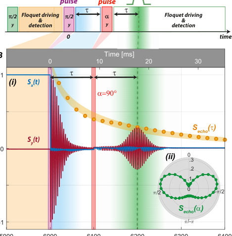
<figcaption class="paper-figure-caption"><b>Fig 2.</b> Fig. 2. Rotating-frame solid echo. (A) Protocol. Af- ter the tip pulse, the rotating-frame FID dephases for a de- lay τ; a single echo pulse (α)y then produces a revival at 2τ during continued Floquet driving and quasi-continuous detec- tion. (B) Echo formation and decay. Single-shot traces Sx(t) (blue) and Sy(t) (red) for α = 90◦applied at τ = 8.85 ms (100 Floquet cycles, shaded pink). The peak echo amplitude Secho (yellow points) decays with τ as a stretched exponential, yielding T ′ 2 = 13.4 ± 1.3 ms (shaded region: 95% confidence interval). Inset: Secho(α) is maximal near α ≃π/2, analogous to the conventional solid echo.</figcaption>
</figure>
<figure class="paper-figure-card">
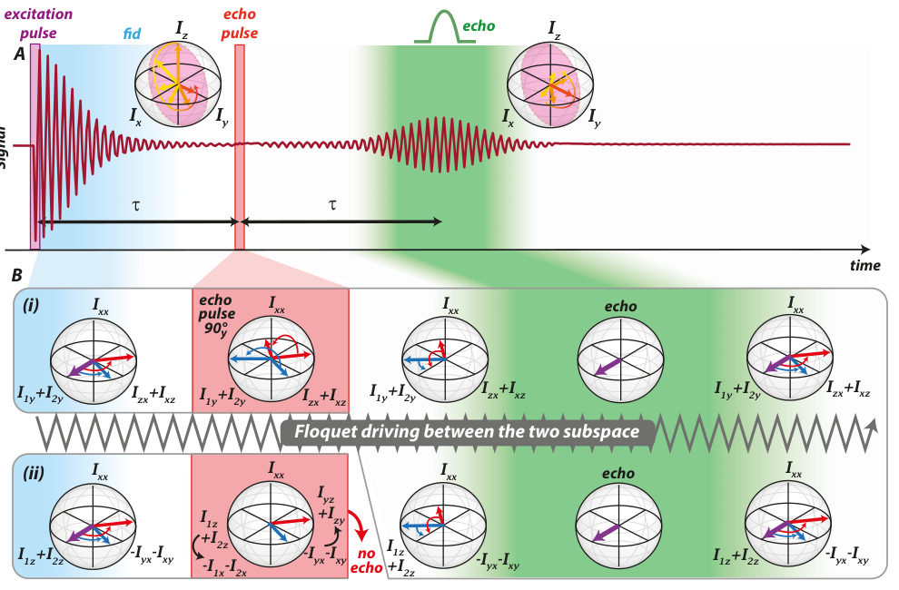
<figcaption class="paper-figure-caption"><b>Fig 3.</b> Fig. 3. Micromotion-assisted refocusing mechanism. (A) Pulse sequence (shaded) overlaid with the experimental Sy(t) trace from Fig. 2B, highlighting dephasing during the rotating-frame FID (blue) and revival at 2τ (green). (B) Minimal two-spin picture. Under the zeroth-order average Hamiltonian ∝Ixx, evolution alternates between two operator subspaces (i) and (ii) that are coupled by Floquet micromotion (grey). The (π/2)y pulse inverts only the Iy-coupled subspace, refocusing a subset of coherences into an echo while the complementary subspace does not refocus.</figcaption>
</figure>
<figure class="paper-figure-card">
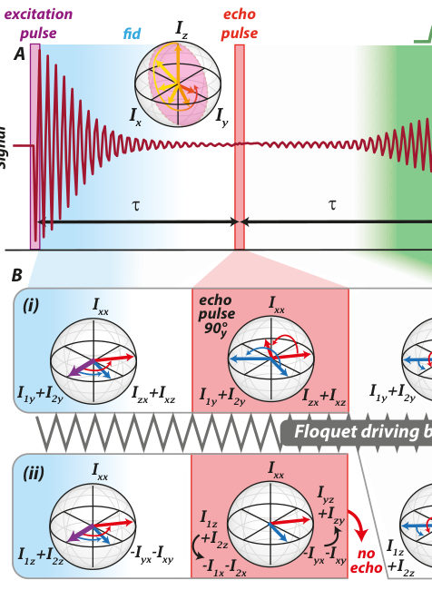
<figcaption class="paper-figure-caption"><b>Fig 4.</b> Fig. 4B tracks representative density-matrix components of a single spin pair over successive Floquet cycles. Even and odd cycles correspond to evolution in different subspaces (white/grey shading), producing periods of dephasing interleaved with intervals of approximate conservation. The echo pulse reverses the dephasing dynamics for the invertible components, resulting in an echo symmetric about the pulse time. Outlook—This experiment demonstrates the feasibility of designing NMR experiments in the rotating frame that closely mimic familiar lab-frame spin dynamics, while benefiting from quasi-continuous, cycle-resolved readout. Translating dynamics from the lab frame to the prether- mal...</figcaption>
</figure>
<figure class="paper-figure-card">
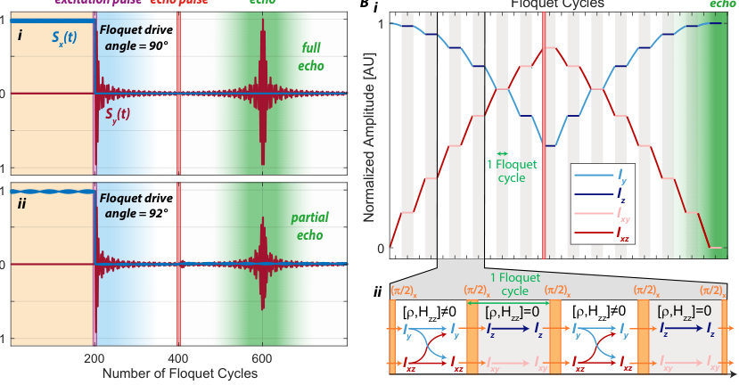
<figcaption class="paper-figure-caption"><b>Fig 5.</b> Fig. 4. Toy-model simulations reproduce the rotating-frame solid echo. (A) Simulated quadratures Sx(t) (blue) and Sy(t) (red) for an ensemble of 60 dipolar-coupled 13C spin pairs with uniformly distributed couplings (±5 kHz), using the experimental cycle timing and an α = 90◦echo pulse. Ideal 90◦drive pulses yield a strong symmetric revival at 2τ (i), whereas a small drive-angle error (92◦) mixes operator subspaces and reduces the refocused fraction (ii). (B) Representative density-matrix components for a single pair: alternating Floquet cycles correspond to commuting/noncommuting evolution (white/grey), and the echo pulse reverses the dephasing for the invertible components (zoom in, ii).</figcaption>
</figure>

**Summary.** The authors demonstrate a 'rotating-frame solid echo' using dipolar nuclear spins in diamond under pulsed driving. This effect translates classic refocusing physics into the prethermal regime by exploiting Floquet micromotion to selectively invert certain quantum coherences. The result establishes this system as a versatile platform for advanced quantum sensing and Hamiltonian control.

**Why it may be interesting.** This work bridges classic solid-state NMR echo physics with modern concepts of non-equilibrium quantum dynamics (prethermalization) in driven many-body systems, suggesting a new platform for high-throughput spectroscopy and Hamiltonian engineering.

Detailed structure

**Main problem.** The study aims to observe and analyze a solid echo phenomenon within the context of prethermalization in an interacting quantum spin system, translating classic echo physics into the rotating frame.

**Main result.** A robust 'rotating-frame solid echo' was observed, characterized by signal revival at $2	au$ following a delay $	au$, with the decay envelope fitting a stretched exponential ($T'_2 \approx 13.4 	ext{ ms}$).

**Method.** The experiment uses pulsed spin-locking on a dipolar nuclear-spin network to create a prethermal plateau, followed by applying an $(\alpha)_y$ pulse and measuring signal revival.

**Model / system.** The system is a hyperpolarized network of dipolar-coupled $^{13}	ext{C}$ nuclear spins in diamond. The dynamics are governed by the secular dipolar Hamiltonian under pulsed spin-locking, leading to an effective, approximately conserved prethermal Hamiltonian $ar{H}_F$.

**Key observables.** Rotating-frame transverse magnetization ($S_x(t), S_y(t)$); echo amplitude decay envelope $S_{	ext{echo}}(	au)$; revival signal at time $2	au$.

**Important parameters / regimes.** Echo decay time $T'_2 \approx 13.4 	ext{ ms}$; optimal pulse angle $\alpha \simeq \pi/2$; Floquet cycle period $	au_{FC} = 109 \mu	ext{s}$.

**Assumptions / limitations.** The revival is attributed to Floquet micromotion transferring coherences between operator subspaces, allowing refocusing only for components coupled to $I_y$. Limitations arise from leakage into non-refocusable components due to pulse imperfections.

**Figures summary.** Figures illustrate the rotating-frame FID under prethermalization (plateau), the solid echo protocol showing decay and revival, and theoretical/simulated diagrams explaining the refocusing mechanism across two coupled operator subspaces.

**Paper structure.** The paper establishes the physical platform (dipolar spins in diamond) and the driving mechanism (pulsed spin-locking) to achieve a prethermal plateau. It then details the echo measurement protocol, presents experimental results showing revival, and finally provides analytical/simulation arguments explaining the refocusing via Floquet micromotion.

Abstract

Floquet prethermalization can endow interacting quantum solids with long-lived, approximately conserved quantities, enabling Hamiltonian engineering and new dynamical probes. Using a hyperpolarized network of dipolar-coupled $^{13}$C nuclear spins in diamond driven by pulsed spin-locking, we access a rotating-frame prethermal plateau with quasi-conserved transverse magnetization and cycle-resolved inductive readout. Within this prethermal manifold we observe a robust \emph{rotating-frame solid echo}: after an apparent decay of the rotating-frame free-induction signal over a delay $τ$, the magnetization revives at time $2τ$ following a single $(α)_y$ pulse, with maximum amplitude near $α\simeqπ/2$. The echo envelope decays as a stretched exponential with characteristic time $T_2'\approx 13\,$ms. Analytical arguments and toy-model simulations attribute the revival to Floquet micromotion that transfers coherences between operator subspaces, so that only a subset of the many-body dephasing dynamics is inverted by the $y$ pulse. These results translate classic echo physics into the prethermal rotating frame and point to continuously interrogated prethermal spin ensembles as a versatile platform for high-throughput spectroscopy, Hamiltonian engineering, and long-duration quantum sensing.

[↑ back to top](#top)

### [Thermodynamic inference from noisy single-molecule time series](http://arxiv.org/abs/2606.23619v1)

**Authors:** Todd R. Gingrich, Oleg A. Igoshin, Anatoly B. Kolomeisky, Dmitrii E. Makarov  
**Type:** theory · **Category:** statistical mechanics · **PDF:** <https://arxiv.org/pdf/2606.23619v1>  
**Analysis basis:** full PDF text, analyzed in chunks
**Topic relevance:** 🔥 `quantum measurements` **5/5** · 🔥 `measurement-induced transitions` **4/5** · `methods for driven-dissipative` **3/5** · `non-equilibrium dynamics` **3/5** · `non-equilibrium universality` **2/5** · `Keldysh / 2PI / non-Gaussian methods` **1/5** · `correlated / nonlocal dissipation` **1/5** · `driven-dissipative phase transition` **1/5**

↔ Scroll figures horizontally

<figure class="paper-figure-card">
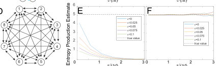
<figcaption class="paper-figure-caption"><b>Fig 1.</b> FIG. 1. Entropy production estimates calculations. (A-C) 20-node ring with 4 distinct rates (shown as arrows of differ- ent colors); (B) Direct first-order Markov estimation of en- tropy production from the noisy trajectories. (C) Entropy production calculated using the recovered transition-rate ma- trix computed with Eq. (18) (D-F) 8-node fully connected network. (E) Direct first-order Markov estimation of en- tropy production from the noisy trajectories. (F) Entropy production calculated using the recovered transition-rate ma- trix computed with Eq. (18). Different colors show different noise levels as indicated in the legends.</figcaption>
</figure>
<figure class="paper-figure-card">
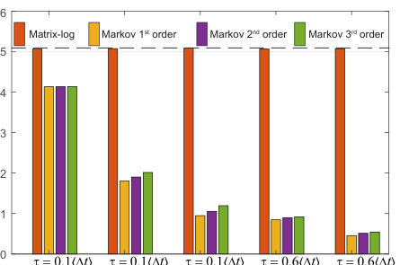
<figcaption class="paper-figure-caption"><b>Fig 2.</b> FIG. 2. Non-Markov entropy production estimates, Eq. (19), applied to the 8-state system and compared to the exact en- tropy production as well as to the corrected entropy produc- tion estimates.</figcaption>
</figure>
<figure class="paper-figure-card">
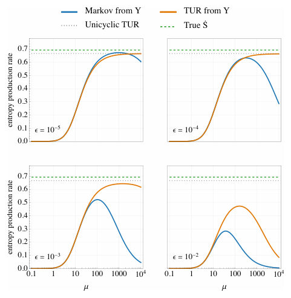
<figcaption class="paper-figure-caption"><b>Fig 3.</b> FIG. 4. Entropy production estimated from the photon color sequence as a function of the total photon arrival rate µ, for u = 2, w = 1, using the Markov estimator (Eq. (43)) and the TUR estimator (Eq. (46)). Panels correspond to in- creasing values of the per-emission error probability ϵ. The dashed green line is the true entropy production ⟨˙S⟩= ln 2 ≈ 0.693, and the dotted gray line is the unicyclic TUR bound 2(u−w)2/(u+w) ≈0.667 of Eq. (48)—the TUR estimate that a perfect observation of the motor’s own current would yield. The gap between this bound and ⟨˙S⟩is the intrinsic loose- ness of the TUR and is independent of the measurement; the gap between the TUR estimate and this bound is...</figcaption>
</figure>

**Summary.** This paper develops theoretical methods to estimate entropy production in molecular motors using noisy, time-resolved single-molecule tracking data. It rigorously compares multiple estimation strategies—including direct Markov estimators and bounds derived from fluctuation theorems—showing that noise fundamentally limits accuracy. The key takeaway is the necessity of advanced techniques, like non-Markovian inference or TUR analysis, to recover true thermodynamic quantities despite experimental limitations.

**Why it may be interesting.** This work provides a rigorous framework for analyzing experimental data from non-equilibrium systems where measurements are inherently noisy. The focus on the interplay between measurement resolution and thermodynamic inference is crucial for interpreting single-molecule biophysics experiments.

Detailed structure

**Main problem.** The core problem is systematically quantifying how measurement noise (finite spatial/temporal resolution) degrades the ability to estimate fundamental thermodynamic quantities, specifically entropy production ($\dot{S}$), from noisy single-molecule trajectories.

**Main result.** Both standard inference strategies result in lower bounds on the true entropy production; furthermore, non-Markovian estimators are advantageous because noise can induce apparent non-Markovian dynamics even if the underlying process is Markovian.

**Method.** The authors compare two main estimation strategies: (1) inferring the underlying kinetic matrix from noisy data, and (2) applying thermodynamic inference directly to the observed variable using high-order Markov estimators or fluctuation theorems (like TUR).

**Model / system.** The analysis uses general stochastic processes modeled as continuous-time Markov chains ($X(t)$), applied specifically to molecular motors (e.g., F1FO ATPase) and diffusion processes, where the measurement yields a noisy observable $Y(t)$.

**Key observables.** Entropy production rate ($\dot{S}$), effective current ($\langle j_Y 
angle$), and variance ($\langle \delta j_Y^2 
angle$).

**Important parameters / regimes.** Measurement time interval ($	au$), noise magnitude ($\epsilon$), and the underlying transition rates of the system.

**Assumptions / limitations.** The methods often assume knowledge or invertibility of the measurement error matrix $R$, which is a major limitation; alternatively, they rely on rigorous bounds like the Thermodynamic Uncertainty Relation (TUR).

**Figures summary.** Figures compare various estimators ($\langle\dot{S}
angle_{Markov}$ vs. corrected/true values) across different noise levels and time resolutions for specific models (e.g., 8-state systems, random walks), showing performance degradation or recovery.

**Paper structure.** The paper develops the problem by first establishing general theoretical bounds (KL divergence, TUR) and then applying these concepts to concrete physical examples like molecular motors and diffusion processes, comparing multiple estimation techniques systematically.

Abstract

Single-molecule or single-particle tracking measurements inherently yield noisy microscopic trajectories, often significantly constrained by the diffraction limit and by the finite rate at which photons are emitted and counted. Here we study systematically the resulting effects of finite spatial and temporal resolution on one's ability to discern and quantify the arrow of time in microscopic trajectories. Given an experimental time series Y(t) degraded by noise, we consider the problem of estimating the entropy production associated with the corresponding microscopic variable X(t) using two strategies. The first attempts to infer the statistical properties of X(t) from those of Y(t) before estimating the entropy production. The second uses the experimental observable as a proxy for the true microscopic observable, with the entropy production estimator applied directly to Y(t). We prove that both strategies result in lower bounds on the true entropy production. Importantly, noise-degraded observables Y(t) undergo non-Markovian dynamics even when X(t) are Markovian, and non-Markovian entropy production estimators are advantageous. We further note nontrivial interplay between spatial and temporal resolution: in the presence of detection noise, improving the temporal resolution alone may lead to poorer rather than better entropy production estimates.

[↑ back to top](#top)

### [An interpretable closed form for entanglement entropy from bitstrings, guided by a graph neural network](http://arxiv.org/abs/2606.22713v1)

**Authors:** Anas Saleh  
**Type:** both · **Category:** other · **PDF:** <https://arxiv.org/pdf/2606.22713v1>  
**Analysis basis:** full PDF text, analyzed in chunks
**Topic relevance:** 🔥 `entanglement & information structure` **5/5** · 🔥 `Rydberg arrays` **4/5** · 🔥 `analog quantum simulation` **4/5** · `methods for driven-dissipative` **1/5** · `non-equilibrium dynamics` **1/5**

↔ Scroll figures horizontally

<figure class="paper-figure-card">
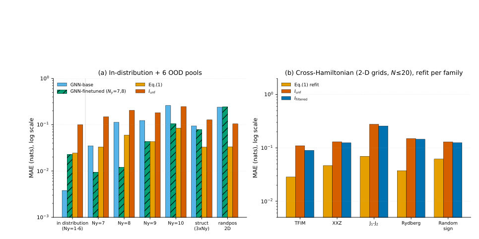
<figcaption class="paper-figure-caption"><b>Fig 1.</b> Figure 1: Headline summary. (a) MAE on the in-distribution eval pool and the six OOD pools for the base GNN ([5], sky blue), the fine-tuned GNN (bluish-green, hatched), the six-feature closed form Eq. 1 (orange), and the classical mutual information I (vermilion), log scale. The fine-tuned column is the published checkpoint fine-tuned in [5] for the Ny = 7, 8 ladder and applied unchanged; it is hatched because its strong results there reflect training targeted at that size regime, not the fit-once generalization of Eq. 1 and the base GNN—the like-for-like comparison is Eq. 1 versus the base GNN. Pools right of the separator are OOD relative to the GNN’s training distribution. Eq. 1 has...</figcaption>
</figure>
<figure class="paper-figure-card">
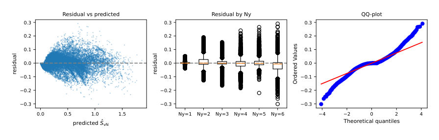
<figcaption class="paper-figure-caption"><b>Fig 2.</b> Figure 2: Eq. 1 residuals on the evaluation set. Left: residual versus predicted ˆ SvN—the spread widens with the prediction. Middle: residual by system size Ny—the interquartile range and tails grow with Ny. Right: quantile–quantile plot, confirming heavy tails. The dispersion concentrates at higher entropy, consistent with corr(|r|, S)=0.47.</figcaption>
</figure>
<figure class="paper-figure-card">
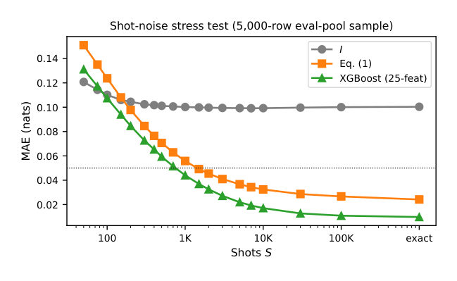
<figcaption class="paper-figure-caption"><b>Fig 3.</b> Figure 3: Shot-noise stress test on a random 5,000-row sample of the evaluation pool: MAE versus the number of measurement shots S for Eq. 1, XGBoost, and the mutual-information baseline I.</figcaption>
</figure>
<figure class="paper-figure-card">
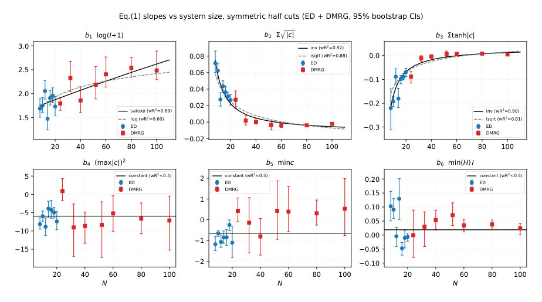
<figcaption class="paper-figure-caption"><b>Fig 4.</b> Figure 4: Eq. 1 slopes refit per size on the balanced half cut, ED (N =8–20, circles) and DMRG (N =24– 100, squares), with 95% bootstrap intervals; solid/dashed curves are the best and runner-up parametric laws by AICc (weighted R2 in the legends). The anchor slope b1 grows and curves downward; the two correlator-kernel slopes b2, b3 decay as 1/N (an inverse square root fits comparably); b4, b5 show no resolv- able trend; b6 vanishes beyond N ≈15.</figcaption>
</figure>
<figure class="paper-figure-card">
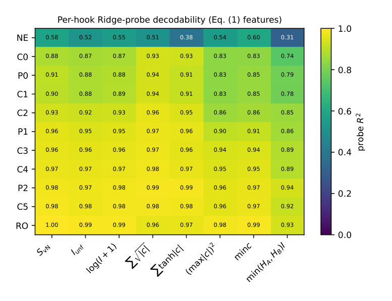
<figcaption class="paper-figure-caption"><b>Fig 5.</b> Figure 5: Held-out per-hook Ridge-probe R2 for SvN, I, and the six features. Peaks at the readout (R2 ≥0.996 for SvN, ≥0.92 for every feature).</figcaption>
</figure>

**Summary.** The paper introduces a novel, human-readable closed-form equation to estimate entanglement entropy from measurable bitstring data in quantum simulators. This form is derived by using advanced machine learning techniques (GNNs) only to guide feature selection, resulting in an estimator that balances the high accuracy of black-box models with the interpretability required for physical insight.

**Why it may be interesting.** This work directly addresses the practical gap between highly accurate but opaque ML predictors (like GNNs) and simple analytic bounds. By creating an interpretable surrogate model, it provides a powerful tool for experimental quantum simulation groups working with Rydberg arrays.

Detailed structure

**Main problem.** The core challenge is accurately estimating bipartite von Neumann entanglement entropy ($S_{vN}$) for quantum many-body systems, as direct measurement is prohibitively difficult.

**Main result.** The authors propose a six-term linear closed form derived from bitstring-derivable physics scalars that achieves accuracy comparable to complex machine learning models while remaining human-interpretable and portable across different physical regimes.

**Method.** The approach combines insights from Graph Neural Networks (GNNs) to guide feature selection, followed by an exhaustive symbolic search restricted to boundary correlators to derive a simple, linear equation.

**Model / system.** The work is primarily demonstrated on quantum simulation platforms using Rydberg-atom arrays and analyzed for various 1D/2D lattice Hamiltonians (e.g., TFIM, XXZ).

**Key observables.** Bipartite von Neumann entanglement entropy ($S_{vN}$), empirical bitstring distribution, classical mutual information ($I$), and two-point boundary correlators.

**Important parameters / regimes.** System size ($N$ up to 100 atoms via DMRG), Mean Absolute Error (MAE) in nats, and the structure of the bipartition cut ($E_b$).

**Assumptions / limitations.** The most informative features for $S_{vN}$ are localized to the two-point correlators on the bipartition boundary; furthermore, the closed form requires refitting its coefficients when extrapolating across different system sizes.

**Figures summary.** Figures compare MAE across various models (GNN vs. Closed Form) on in-distribution and out-of-distribution pools, showing the closed form's robustness. Other figures detail scaling laws for the six feature coefficients derived from DMRG simulations.

**Paper structure.** The paper progresses by first identifying the measurement bottleneck ($S_{vN}$), then using GNN analysis to pinpoint crucial boundary features, and finally deriving a simple linear combination of these features that maintains high accuracy across different physical models and system sizes.

Abstract

The empirical bitstring distribution is the most accessible observable on Rydberg-atom arrays, but the bipartite von~Neumann entropy it constrains is far costlier to obtain. We present a six-term linear closed form for the entropy, built on bitstring-derivable physics scalars, and characterize its accuracy, portability, scaling behaviour, and calibration cost. The feature set is selected with guidance from a trained graph neural network: probing the network localizes its entropy prediction to the two-point correlators on the bipartition boundary, and an exhaustive ground-truth search restricted to those boundary correlators isolates the form. It reaches $0.024$~nats mean absolute error in distribution: $6.4$ times the network's error, but in a form a human can read and apply without retraining. Fit once and applied unchanged, it has lower error than the base network on five of six out-of-distribution pools and ties the sixth. An independent density-matrix renormalization-group study to one hundred atoms -- five times the reach of exact diagonalization -- settles the size-extrapolation question: coefficients frozen at small size fail at scale, but the failure is structured. Refit per size the form holds to $25$--$50$~mnat (cross-validated); two of its six slopes follow clean inverse-size laws, one a downward curving growth, and the others are trendless; the fitted laws deploy the form label-free at roughly $40$--$80$~mnat. The result fixes a label-budget rule: at large sizes, a few dozen labels recalibrate the closed form to match a fine-tuned in-distribution ensemble on the same features, while nonlinear ML models pull ahead only given large labelled datasets.

[↑ back to top](#top)

### [Satellite Mission Planning with Rydberg Atoms](http://arxiv.org/abs/2606.23045v1)

**Authors:** Michel Nowak, Benjamin Marchand, Yassine Naghmouchi, Serge Rainjonneau, Wesley Coelho, Louis Vignoli, Louis-Paul Henry  
**Type:** both · **Category:** other · **PDF:** <https://arxiv.org/pdf/2606.23045v1>  
**Analysis basis:** full PDF text, analyzed in chunks
**Topic relevance:** 🔥 `Rydberg arrays` **5/5** · 🔥 `analog quantum simulation` **4/5** · `QC/QI experiment` **2/5** · `methods for driven-dissipative` **1/5**

↔ Scroll figures horizontally

<figure class="paper-figure-card">
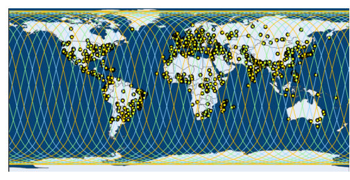
<figcaption class="paper-figure-caption"><b>Fig 1.</b> FIG. 1. Visualization of requests of cities’ observations and satel- lites’ trajectories on earth. Yellow dots represent random cities on Earth. The trajectories are Low Earth Orbit satellites. The goal of the scheduling task is to assign a request to each satellites.</figcaption>
</figure>
<figure class="paper-figure-card">
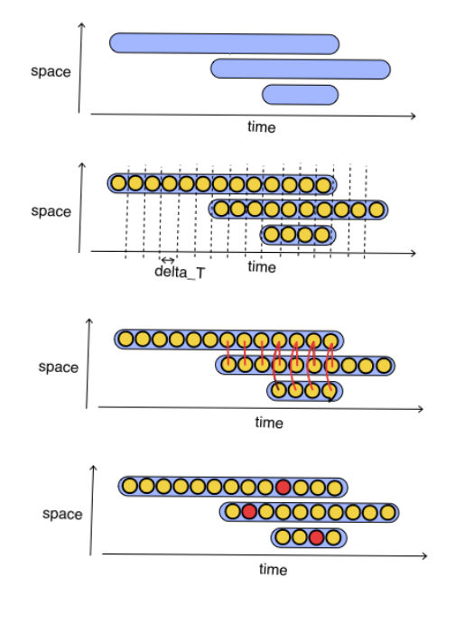
<figcaption class="paper-figure-caption"><b>Fig 2.</b> FIG. 2. Formulation of the Maximum Independent Set problem with the EDGES method starting from data take opportunities. (a) One blue satellite can take multiple requests in space during the some random time windows (for illustration). (b) We split time during one day from 0 seconds to 24 × 24 × 60 seconds. Each yellow dot repre- sent an opportunity time slot in which the observation can be made. It is mapped to an undirected graph (c) We add edges to this graph depending on the constraints. (d) we solve the Maximum Indepen- dent Set, thus retrieving independent and scheduoled opportunities for as many requests as possible.</figcaption>
</figure>
<figure class="paper-figure-card">

<figcaption class="paper-figure-caption"><b>Fig 3.</b> FIG. 3. DTO generation with agility constraint</figcaption>
</figure>
<figure class="paper-figure-card">
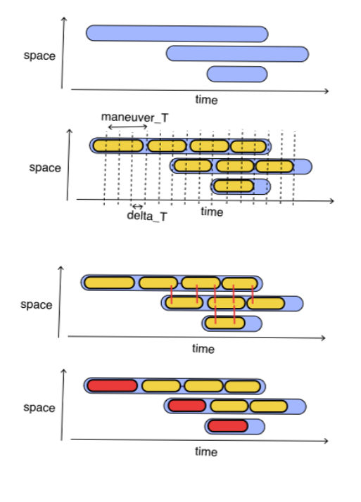
<figcaption class="paper-figure-caption"><b>Fig 4.</b> FIG. 4. Formulation of the Maximum Independent Set problem start- ing with the AGILE method from data take opportunities. (a) One blue satellite can take multiple requests in space during the some random time windows (for illustration). (b) We split time during one day from 0 seconds to 24 × 24 × 60 seconds. Each yellow dot rep- resent an opportunity time slot in which the observation can be made It is wider that with the edges method because we take into account the agility of the satellite. It is mapped to an undirected graph (c) We add edges to this graph depending on the constraints. (d) we solve the Maximum Independent Set, thus retrieving independent and sched- uled opportunities for...</figcaption>
</figure>
<figure class="paper-figure-card">
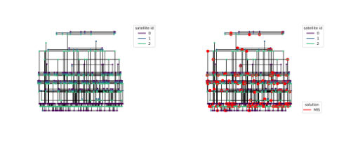
<figcaption class="paper-figure-caption"><b>Fig 5.</b> FIG. 5. Left: solving graph whose MIS needs to be extracted to retrieve a relevant plan respecting the planning constraints. Right: with Maximum Independent Set solution.</figcaption>
</figure>

**Summary.** The paper tackles the complex scheduling challenge of Earth Observation satellites by reformulating it as a Maximum Independent Set problem. This problem is then mapped onto a Quantum Processing Unit built with Rydberg atoms, utilizing the QUBO framework for solution. The research validates the potential utility of this quantum approach for solving practical optimization tasks in space mission planning.

**Why it may be interesting.** This work is highly relevant because it applies advanced quantum simulation techniques (Ising/QUBO models) from AMO physics—specifically using Rydberg atom platforms—to solve a large-scale combinatorial optimization problem derived from real-world engineering challenges.

Detailed structure

**Main problem.** The paper addresses Satellite Mission Planning, which is formulated as a complex scheduling optimization problem requiring maximizing completed observation requests under various physical constraints.

**Main result.** The authors demonstrate that the problem can be mapped to a Maximum Independent Set (MIS) solvable on a QPU based on Rydberg atoms using the QUBO framework. While current time-to-solution is slower than classical methods, the approach shows potential for future speedup.

**Method.** The core method involves formulating the scheduling constraints into an MIS problem and then mapping this graph problem onto the hardware constraints of a Rydberg atom QPU via the Quadratic Unconstrained Binary Optimization (QUBO) framework.

**Model / system.** The physical platform is a Quantum Processing Unit (QPU) utilizing neutral Rydberg atoms, whose dynamics are modeled by an Ising Hamiltonian. The optimization is solved by minimizing the energy corresponding to the QUBO formulation of the MIS problem.

**Key observables.** Total number of completed observation requests (Global Satisfaction Rate), Time to Solution, and adherence to physical constraints like energy consumption and slew time.

**Important parameters / regimes.** The QPU size limit ($\sim 100$ nodes for subgraphs) dictates the need for decomposition routines; the comparison is made against classical solvers using various time discretization steps ($\Delta T$).

**Assumptions / limitations.** Key assumptions include simplifying power consumption models and assuming that future hardware enhancements will overcome current time-to-solution overheads compared to classical methods.

**Figures summary.** Figures illustrate the problem setup (satellite trajectories), the MIS formulation using different methods (EDGES/AGILE), the QUBO solving process, and benchmark plots comparing completion rates and solution times between quantum and classical solvers as the number of requests increases.

**Paper structure.** The paper progresses from defining the complex Satellite Mission Planning problem to formulating it mathematically as an MIS. It then details mapping this to a QUBO solvable on Rydberg atoms, presenting comparative benchmarks against state-of-the-art classical algorithms, and concluding with feasibility analysis for operational use.

Abstract

Quantum computers relying on cold atoms are being built and promise a high flexibility in the way information in encoded into the physical system. In particular, the analog mode is spiking interest in the field of optimization as a classically intractable number of configurations can be tackled. In this work, we investigate a problem that requires every-day scheduling of critical tasks involving a large number of actors. Namely, fixing the planning for a Earth Observation satellite fleet composed of several of units exposed to a high density of targets to be scanned. We explore numerical schemes that convert the formulated problem into a cold-atoms friendly setup. We begin by a naive formulation of the Satellite Mission Planning problem without taking account for the agility of the satellites. We then extend the problem to take it into account based on the literature. By formulating the planning problem as a Maximum Independent Set problem, we are able to solve the problem with a QPU based on Rydberg atoms. We explore two ways of solving the MIS problem on the QPU, one relying on the graphs and on the Quadratic Unconstrained Binary Optimization Framework (QUBO). We show that the QUBO methodology is the most relevant and explore it more deeply with numerical experiments. We conclude on the potential utility of using a QPU to solve the Satellite Mission Planning problem in an operational context.

[↑ back to top](#top)

### [Feedback-Controlled Magnon-Atom Entanglement and Photon Statistics](http://arxiv.org/abs/2606.21758v1)

**Authors:** Yiping Lu, Yulong Hu, Zhuzheng Han, Shirong Lin  
**Type:** theory · **Category:** other · **PDF:** <https://arxiv.org/pdf/2606.21758v1>  
**Analysis basis:** full PDF text, analyzed in chunks
**Topic relevance:** 🔥 `analog quantum simulation` **4/5** · 🔥 `methods for driven-dissipative` **4/5** · 🔥 `quantum measurements` **4/5** · 🔥 `spintronics-quantum-optics interface` **4/5** · `Keldysh / 2PI / non-Gaussian methods` **3/5** · `correlated / nonlocal dissipation` **3/5** · `correlated cavity matter` **3/5** · `driven-dissipative phase transition` **3/5** · `entanglement & information structure` **3/5** · `exotic spin models in light-matter` **3/5** · `Tavis-Cummings & cavity-many-emitter` **2/5** · `non-equilibrium dynamics` **2/5** · `non-equilibrium universality` **2/5** · `interference shaping light` **1/5** · `measurement-induced transitions` **1/5** · `quantum optics experiment` **1/5**

↔ Scroll figures horizontally

<figure class="paper-figure-card">
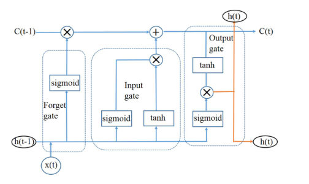
<figcaption class="paper-figure-caption"><b>Fig 1.</b> Figure 1. Structure of an LSTM unit. Here, C(t) is the cell state vector at time step t, C(t −1) is the cell state from the previous time step, h(t) is the hidden state vector at time step t, h(t −1) is the hidden state from the previous time step, and x(t) is the input vector at the current time step t. The sigmoid activation function outputs values between 0 and 1, determining how much information to pass through. The tanh activation function outputs values between −1 and 1, regularizing candidate values. × denotes point-wise multiplication (Hadamard product), and + denotes point-wise addition.</figcaption>
</figure>
<figure class="paper-figure-card">
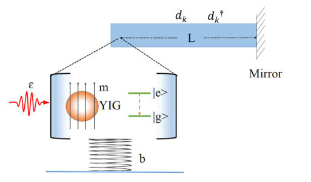
<figcaption class="paper-figure-caption"><b>Fig 2.</b> Figure 2. Realization of quantum feedback via a photonic waveg- uide. A magnon and a two-level emitter trapped in a small cavity in- teract with the photons inside the cavity. The driving field is weakly coupled to the cavity mode with frequency ωl. Part of the cavity loss is fed back into the cavity from the waveguide at a distance L from the cavity. Other losses are fed back into the cavity via the phonon, denoted by b and b†.</figcaption>
</figure>
<figure class="paper-figure-card">
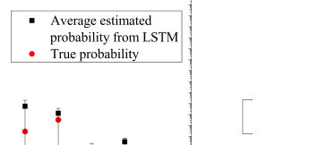
<figcaption class="paper-figure-caption"><b>Fig 3.</b> Figure 3. Probabilities predicted by the LSTM. The average value is calculated from ten predictions; the mean square error is denoted by the error bar. The true value is denoted by the red point.</figcaption>
</figure>
<figure class="paper-figure-card">
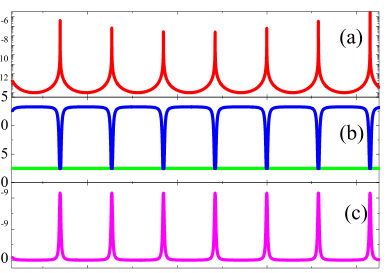
<figcaption class="paper-figure-caption"><b>Fig 4.</b> Figure 4. (a) Impact of feedback on the photon number. The photon number fluctuates periodically with increasing distance be- tween the cavity and mirror. (b) Impact of feedback on g(2)(0). The g(2)(0) function fluctuates periodically with increasing distance L. The case with feedback is denoted by the blue curve; the case without feedback is represented by the green curve. (c) Impact of feedback on the concurrence. The concurrence fluctuates period- ically with increasing L. The parameters are chosen as follows: κ = 5 × 10−6 × 0.4π THz = 2π × 1MHz, η = 5κ = 10π × 1MHz, ηa = 6 √</figcaption>
</figure>
<figure class="paper-figure-card">
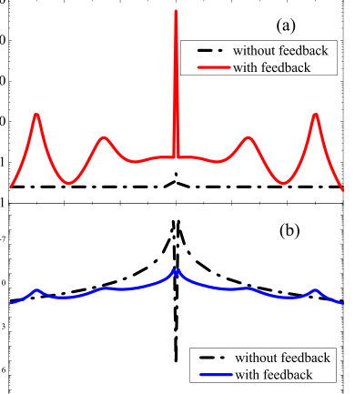
<figcaption class="paper-figure-caption"><b>Fig 5.</b> Figure 5. (a) Dependence of g(2)(0) on ∆at a fixed distance L be- tween the cavity and mirror (τ = 2π/ω0 = 0.009ns, L = τc/2 = 1.3627mm). (b) Behavior of the concurrence with a fixed distance for increasing ∆(τ = 2π/ω0 = 0.009ns, L = τc/2 = 1.3627mm). As a reference, the case without feedback is shown as a black dash- dotted line (τ = 0, L = 0). The parameters are chosen as follows: κ = 5 × 10−6 × 0.4π THz = 2π × 1MHz, η = 5κ = 10π × 1MHz, ηa = 6 √</figcaption>
</figure>

**Summary.** The paper introduces a theoretical framework for controlling complex hybrid magnonic systems using coherent feedback coupled with machine learning simulations. By analyzing observables like photon correlation and entanglement, the authors demonstrate that external feedback provides a powerful tool to actively switch between classical (bunched) and quantum (antibunched) light states while simultaneously manipulating internal quantum correlations.

**Why it may be interesting.** This work is highly relevant as it merges advanced concepts from cavity QED (magnons, atoms), open quantum systems (feedback control), and modern computation (AI simulation) to achieve unprecedented levels of quantum control in solid-state platforms.

Detailed structure

**Main problem.** The primary challenge is achieving precise quantum control in complex hybrid systems where solving the full dynamics governed by the Schrödinger equation is intractable.

**Main result.** Coherent feedback allows for active, tunable engineering of quantum light statistics (bunching/antibunching) and magnon-atom entanglement simultaneously. The system exhibits periodic oscillations in these observables controlled by external parameters like cavity distance or detuning.

**Method.** The authors employ a Long Short-Term Memory (LSTM) neural network to numerically propagate the probability amplitudes, enabling simulation of non-Markovian dynamics induced by feedback control.

**Model / system.** The system is a hybrid magnonic platform involving coupled excitations: magnons, photons in an optical cavity, phonons, and an atom. The model incorporates time-delayed coherent feedback from an external waveguide mirror.

**Key observables.** Photon-photon correlation function ($g^{(2)}(0)$), Concurrence (magnon-atom entanglement), Mean intracavity photon number ($\langle a^\dagger a 
angle$), Antibunching/Bunching characteristics.

**Important parameters / regimes.** Cavity-mirror distance ($L$), Detuning ($\Delta$), Feedback strength ($G_0$), External drive field ($\Omega_e$).

**Assumptions / limitations.** The analysis relies on truncating the state to a few-excitation subspace and using LSTM for simulation due to non-Markovian dynamics.

**Figures summary.** Figures illustrate the structure of an LSTM unit, the physical setup involving magnon/atom/mechanical coupling with feedback, and show periodic oscillations of $g^{(2)}(0)$, $\langle a^\dagger a 
angle$, and concurrence as functions of distance or detuning.

**Paper structure.** The paper first establishes the complexity necessitating ML simulation (LSTM). It then details the Hamiltonian for the coupled magnonic/atomic system with feedback. The core analysis focuses on calculating key observables ($g^{(2)}$, Concurrence) by varying external control parameters to demonstrate active quantum state engineering.

Abstract

Quantum systems face inherent challenges in achieving precise control, and solving the Schrödinger equation is often intractable for complex hybrid platforms. Here, for the first time, we introduce a magnon into a feedback-controlled quantum system. To solve the dynamics numerically and efficiently, we employ a Long Short-Term Memory network, a machine learning approach, to propagate the probability amplitudes to the steady state. By applying coherent feedback, we effectively stabilize the intracavity state. Our results reveal that the photon-photon correlation function and the concurrence, a measure of magnon-atom entanglement, exhibit periodic oscillations with the cavity-mirror distance, and that feedback significantly enhances both antibunching and bunching when the detuning is varied. These findings not only demonstrate the power of artificial intelligence in quantum dynamics simulation, but also open a promising route for on-demand quantum state engineering in hybrid magnonic systems, with potential applications in quantum networks and quantum information processing.

[↑ back to top](#top)

### [Dissipative preparation of Laughlin-like states](http://arxiv.org/abs/2606.23451v1)

**Authors:** Tong Liu  
**Type:** theory · **Category:** other · **PDF:** <https://arxiv.org/pdf/2606.23451v1>  
**Analysis basis:** full PDF text, analyzed in chunks
**Topic relevance:** 🔥 `analog quantum simulation` **4/5** · 🔥 `methods for driven-dissipative` **4/5** · `correlated / nonlocal dissipation` **3/5** · `driven-dissipative phase transition` **3/5** · `exotic spin models in light-matter` **3/5** · `non-equilibrium dynamics` **3/5** · `Keldysh / 2PI / non-Gaussian methods` **2/5** · `Rydberg arrays` **2/5** · `non-equilibrium universality` **2/5** · `Kondo & dissipative impurity` **1/5** · `correlated cavity matter` **1/5** · `entanglement & information structure` **1/5** · `measurement-induced transitions` **1/5** · `quantum measurements` **1/5**

↔ Scroll figures horizontally

<figure class="paper-figure-card">
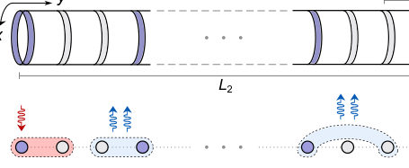
<figcaption class="paper-figure-caption"><b>Fig 1.</b> FIG. 1. A schematic of dissipative preparation of Laughlin- like states on a cylinder. After projection onto the lowest Landau levels, these states can be prepared by local loss and pump channels.</figcaption>
</figure>
<figure class="paper-figure-card">
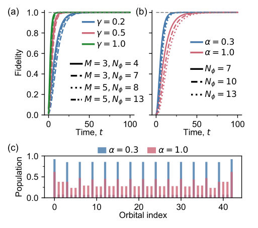
<figcaption class="paper-figure-caption"><b>Fig 2.</b> FIG. 2. Preparation of Laughlin-like states. (a) Prepa- ration of the TT state from the maximally mixed state for γ = 0.2 and 0.5. (b) Preparation of the Laughlin-like state Eq. (5) from the maximally mixed state for γ = 0.5 and M = 3. (c) Particle-population distribution of the Laughlin- like state for α = 0.3 and 1 at M = 3 and Nϕ = 43.</figcaption>
</figure>
<figure class="paper-figure-card">
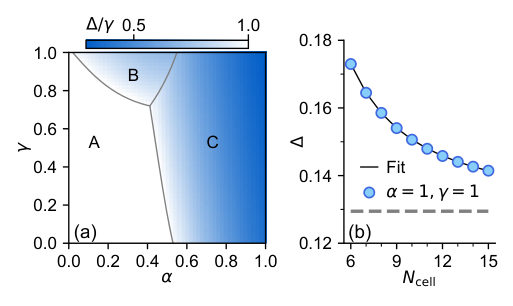
<figcaption class="paper-figure-caption"><b>Fig 3.</b> FIG. 3. Lindbladian gap ∆. (a) Gaps as a function of α and γ over 0 ≤α ≤1 and 0.02 &lt; γ ≤1, for M = 3 and Ncell = 12. (b) Gap versus Ncell with the fixed filling fraction 1/3 for α = 1 and γ = 1 (blue circles). The solid black line is a fit to ∆∞+ a/N b cell, with ∆∞= 0.129, a = 0.546, and b = 1.411. The dashed line indicates the asymptotic value ∆∞.</figcaption>
</figure>
<figure class="paper-figure-card">
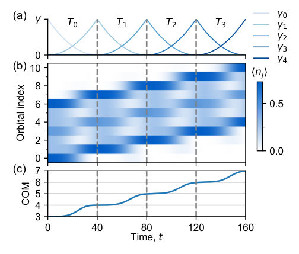
<figcaption class="paper-figure-caption"><b>Fig 4.</b> FIG. 4. Adiabatic pumping of a seven-orbital state. (a) Strengths of five pump tones as functions of time. (b) Adi- abatic pumping dynamics of the particle population for a seven-orbital Laughlin-like state at α = 0.8. (c) Evolution of the center-of-mass (COM) of the state.</figcaption>
</figure>

**Summary.** The paper proposes a novel dissipative protocol to prepare Laughlin-like states, which model Fractional Quantum Hall physics. By engineering local loss and pumping channels within the Lindbladian framework, the target state is shown to become the unique steady state attractor. This offers a feasible route for realizing and manipulating exotic quantum phases on near-term quantum simulators.

**Why it may be interesting.** This work directly bridges concepts from strongly correlated electron systems (FQH states) with modern open quantum system techniques, providing a concrete, experimentally relevant pathway for simulating topological matter using controllable dissipation mechanisms common in AMO platforms like Rydberg arrays.

Detailed structure

**Main problem.** The primary goal is developing a purely dissipative protocol to prepare Laughlin-like states, which are crucial for understanding Fractional Quantum Hall (FQH) physics and topological quantum computation.

**Main result.** The authors show that the target Laughlin-like state can be established as the unique steady state of the Lindbladian evolution, with preparation time governed by a gap $\Delta$ that remains nonvanishing even in large systems.

**Method.** The work employs open quantum system formalism using Lindblad master equations ($\mathcal{L}(
ho)$) incorporating local loss and pump channels to drive the system towards the desired steady state attractor.

**Model / system.** The model concerns spin-polarized fermionic particles confined to the lowest Landau levels on a cylinder geometry. The dynamics are governed by a Lindbladian including pair-loss operators ($V_{m,j}, W_{m,j}$) and conditional pumping operators ($Q_j$).

**Key observables.** Fidelity $F$, the Lindbladian gap $\Delta$, particle distribution uniformity, and total correlation function $h(d)$.

**Important parameters / regimes.** Filling fraction ($
u=1/3$), loss rate ($\gamma$), pumping modulation parameter ($\alpha$), and system size ($N_{\phi}, L_1$).

**Assumptions / limitations.** The protocol assumes the existence of local loss and pump channels that drive the system to a unique steady state, and approximations are made in eliminating fast reservoir dynamics.

**Figures summary.** Figures illustrate schematic protocols on cylinders, fidelity evolution over time, particle distribution changes with parameters ($\alpha$), and detailed plots showing the dependence of the Lindbladian gap ($\Delta$) on various control parameters.

**Paper structure.** The paper systematically develops the dissipative protocol by defining the Lindbladian, analyzing the spectral gap in different subspaces (diagonal/off-diagonal), demonstrating adiabatic pumping, and finally characterizing the resulting steady state using correlation functions.

Abstract

Fractional quantum Hall (FQH) states are a central paradigm of strongly correlated quantum matter and a key platform for topological quantum computation. Here, we propose a purely dissipative protocol based on local loss and pump channels for preparing Laughlin-like states at filling $1/3$, with a possible extension to other $1/M$ filling states. We show that Laughlin-like states are the exact steady states of the Lindbladian and can be reached from arbitrary initial states. We find that the Lindbladian gap bounded from below with increasing system size. We further demonstrate adiabatic pumping of a Laughlin-like state through slow modulation of the pump channels during the evolution. Our work opens a feasible route to preparing and manipulating FQH states on near-term quantum simulators.

[↑ back to top](#top)

### [Wigner-Negative Magnon Steady States from Incoherent Qubit Pumping](http://arxiv.org/abs/2606.22753v1)

**Authors:** Yan Liu, Jiahua Li  
**Type:** theory · **Category:** other · **PDF:** <https://arxiv.org/pdf/2606.22753v1>  
**Analysis basis:** full PDF text, analyzed in chunks
**Topic relevance:** 🔥 `methods for driven-dissipative` **4/5** · 🔥 `spintronics-quantum-optics interface` **4/5** · `correlated / nonlocal dissipation` **3/5** · `driven-dissipative phase transition` **3/5** · `exotic spin models in light-matter` **3/5** · `Tavis-Cummings & cavity-many-emitter` **2/5** · `non-equilibrium dynamics` **2/5** · `Keldysh / 2PI / non-Gaussian methods` **1/5** · `QC/QI experiment` **1/5** · `analog quantum simulation` **1/5** · `correlated cavity matter` **1/5** · `non-equilibrium universality` **1/5**

↔ Scroll figures horizontally

<figure class="paper-figure-card">
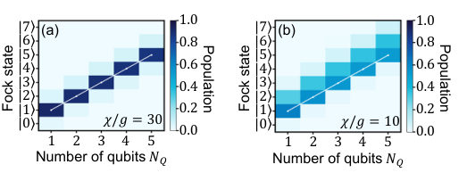
<figcaption class="paper-figure-caption"><b>Fig 1.</b> FIG. 2. Cascaded stabilization near selected magnon Fock states with multiple incoherently pumped qubits. The color maps show the numerical steady-state populations Pn versus the number of qubits NQ and the magnon number n. For each NQ, the qubits are tuned by ∆j = (NQ −2j −2)χ with j = 0, . . . , NQ −1, corresponding to ¯zk = +1. The white line marks the target relation n = NQ. Common parameters are ℘/g = 2, κ/g = 0.01, and γ/g = 0.05. (a) χ/g = 30. (b) χ/g = 10.</figcaption>
</figure>
<figure class="paper-figure-card">
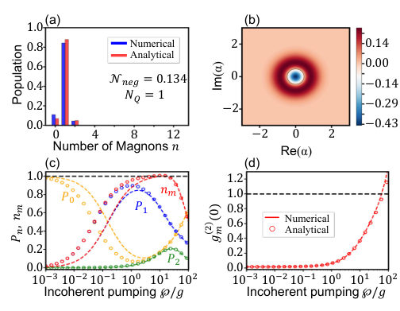
<figcaption class="paper-figure-caption"><b>Fig 2.</b> FIG. 1. Single-magnon steady state for one incoherently pumped qubit (NQ = 1). Common parameters are χ/g = 10, κ/g = 0.1, γ/g = 0.05, and ∆0/g = −10, such that |0, e⟩↔ |1, g⟩is resonant. (a, b) Results at ℘/g = 2: (a) magnon pop- ulations Pn, with blue and red bars denoting numerical and analytical results, respectively; (b) numerical Wigner func- tion W(α), with Nneg = 0.134. (c) P0, P1, P2, and nm versus ℘/g. (d) g(2) m (0) versus ℘/g. In (c, d), dashed curves and open circles denote numerical and analytical results, respec- tively. The black dashed lines in (c) and (d) mark nm = 1 and g(2) m (0) = 1, respectively.</figcaption>
</figure>
<figure class="paper-figure-card">
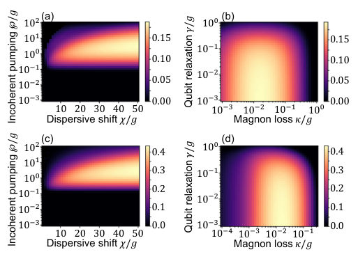
<figcaption class="paper-figure-caption"><b>Fig 3.</b> FIG. 4. Wigner negativity of the reduced magnon steady state. Color maps show the numerical integrated negativity Nneg for (a, b) NQ = 1, targeting |1⟩, and (c, d) NQ = 3, targeting |3⟩. Qubit detunings are set by ∆j = (NQ−2j−2)χ for j = 0, . . . , NQ −1. (a, c) Dependence on χ/g and ℘/g, with κ/g = 0.01 and γ/g = 0.05. (b, d) Dependence on κ/g and γ/g, with χ/g = 30 and ℘/g = 2.</figcaption>
</figure>
<figure class="paper-figure-card">
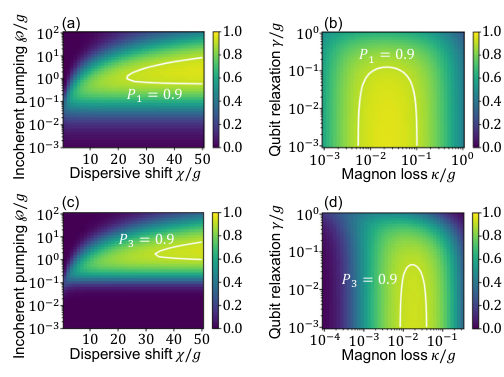
<figcaption class="paper-figure-caption"><b>Fig 4.</b> FIG. 3. Parameter dependence of the target Fock-state pop- ulation. The color maps show numerical steady-state popu- lations of the selected magnon Fock state. (a, b) Single-qubit case with target state |1⟩, showing P1. (c, d) Three-qubit case with target state |3⟩, showing P3. White contours mark P1 = 0.9 in (a, b) and P3 = 0.9 in (c, d). In the multi- qubit case, the qubits are tuned by ∆j = (NQ −2j −2)χ for j = 0, . . . , NQ −1. (a, c) Dependence on χ/g and ℘/g, with κ/g = 0.01 and γ/g = 0.05. (b, d) Dependence on κ/g and γ/g, with χ/g = 30 and ℘/g = 2.</figcaption>
</figure>
<figure class="paper-figure-card">
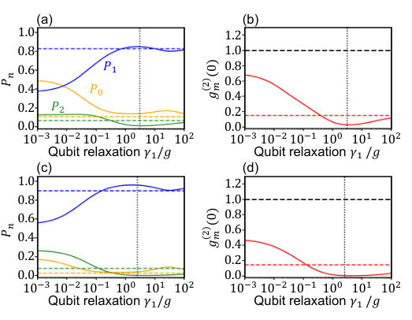
<figcaption class="paper-figure-caption"><b>Fig 5.</b> FIG. 5. Auxiliary-qubit-enhanced magnon blockade. Steady- state magnon populations Pn [(a), (c)] and equal-time correla- tion g(2) m (0) [(b), (d)] versus the auxiliary-qubit relaxation rate γ1/g. Solid curves show the two-qubit results, while colored dashed horizontal lines show the single-qubit case without qubit 1. In (a) and (c), blue, orange, and green curves denote P1, P0, and P2, respectively. The qubit detunings are chosen as ∆0 = −χ0 −χ1 and ∆1 = χ0 −3χ1. For the two-qubit re- sults, ℘1 = 0 and g0 = g1 = g. The parameters are χ0/g = 10, χ1/g = 7, ℘0/g = 3, κ/g = 0.1, and γ0/g = 0.05 in (a) and (b), and χ0/g = 30, χ1/g = 7, ℘0/g = 3, κ/g = 0.01, and γ0/g = 0.05 in (c) and (d). For...</figcaption>
</figure>

**Summary.** The paper demonstrates that incoherently pumping multiple coupled qubits can stabilize Wigner-negative magnon steady states. This is achieved through a cascaded dissipative mechanism that selectively populates high-number Fock components of the magnon mode. It establishes this process as a controllable resource for generating nonclassical quantum light in hybrid superconducting circuits.

**Why it may be interesting.** This work provides a concrete, controllable dissipative engineering scheme for generating highly nonclassical quantum states (Wigner negativity) in solid-state platforms by leveraging engineered coupling mechanisms between qubits and magnons.

Detailed structure

**Main problem.** The goal is to find an autonomous, number-selective method to generate Wigner-negative magnon steady states in hybrid quantum systems.

**Main result.** Incoherent qubit pumping successfully stabilizes these nonclassical magnon states by creating a cascaded dissipative mechanism that directs the population toward specific high-Fock components.

**Method.** The analysis uses master equations, rate-equation modeling (birth-death approach), and Wigner function diagnostics to track state evolution under dissipation.

**Model / system.** The system couples multiple superconducting qubits ($N_Q$) incoherently pumped to a single magnon mode ($\hat{a}$). The dynamics are governed by an effective Hamiltonian derived via Schrieffer-Wolff transformations, leading to number-dependent dispersive shifts and activated sideband couplings.

**Key observables.** Wigner negativity ($N_{	ext{neg}}$), magnon Fock state populations ($P_n$), antibunching signature ($g^{(2)}_m(0) < 1$).

**Important parameters / regimes.** The mechanism requires dispersive selectivity ($\chi$) and intermediate pumping rates ($\mathcal{P}/g$); pure dephasing ($\gamma_\phi, \kappa_\phi$) degrades the state.

**Assumptions / limitations.** The analysis relies on perturbative transformations (Schrieffer-Wolff) to derive effective Hamiltonians and uses rate equations as an idealized benchmark for population dynamics.

**Figures summary.** Figures illustrate single-magnon steady states showing antibunching/negativity, multi-qubit cascades mapping $P_n$ vs. $N_Q$, and parameter space plots correlating $N_{	ext{neg}}$ with target population stabilization.

**Paper structure.** The paper builds from establishing the full master equation model to deriving an effective Hamiltonian via perturbative methods, then analyzing the steady-state populations using rate equations, and finally confirming nonclassicality through Wigner function diagnostics across varying loss/dephasing regimes.

Abstract

We show that incoherently pumped qubits can realize a cascaded dissipative mechanism for stabilizing Wigner-negative magnon steady states. The mechanism combines qubit pumping with dispersive magnon-number selectivity to direct the steady-state population toward selected magnon Fock states. In the single-qubit case, the single-magnon population can approach unity, accompanied by strong antibunching and pronounced Wigner negativity. Extending the same principle to multiple qubits yields Wigner-negative steady states dominated by higher magnon Fock components. We further derive an analytical birth--death model that captures the mechanism and agrees with numerical results. These results establish incoherent qubit pumping as a controllable dissipative resource for generating nonclassical magnon states in hybrid quantum systems.

[↑ back to top](#top)

### [Instabilities of the continuous superradiant laser](http://arxiv.org/abs/2606.21675v1)

**Authors:** Bruno Laburthe-Tolra, Martin Robert-de-Saint-Vincent, Benjamin Pasquiou  
**Type:** theory · **Category:** other · **PDF:** <https://arxiv.org/pdf/2606.21675v1>  
**Analysis basis:** full PDF text, analyzed in chunks
**Topic relevance:** 🔥 `superradiant laser` **4/5** · `Tavis-Cummings & cavity-many-emitter` **3/5** · `driven-dissipative phase transition` **3/5** · `methods for driven-dissipative` **3/5** · `Dicke superradiance` **2/5** · `correlated cavity matter` **2/5** · `non-equilibrium universality` **2/5** · `Keldysh / 2PI / non-Gaussian methods` **1/5** · `analog quantum simulation` **1/5** · `correlated / nonlocal dissipation` **1/5** · `non-equilibrium dynamics` **1/5**

↔ Scroll figures horizontally

<figure class="paper-figure-card">
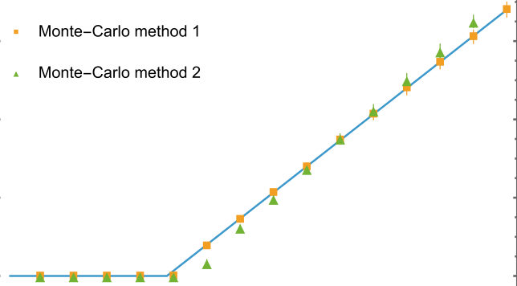
<figcaption class="paper-figure-caption"><b>Fig 1.</b> Figure 1: Steady-state superradiant laser power as a function of atom number N inside the cavity mode. Yellow squares are the results of Monte-Carlo simulations using the random choice method 1, see main text, while green triangles are the results using method 2. The blue line is the analytical formula from Ref. [9] (eq. 29-30). The parameters for all these results are g/2π = 1/2, κ/2π = 6, and ΓR/2π = 4. The cavity photon number is calculated by averaging the last 20 percent of the simulated dynamics, running for a total time 60/ΓR. For each point, the error bars show the standard deviation obtained from 140 Monte-Carlo realizations.</figcaption>
</figure>
<figure class="paper-figure-card">
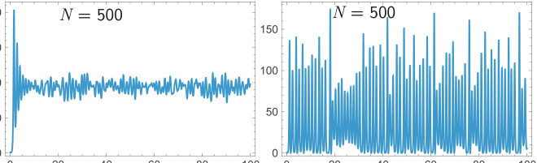
<figcaption class="paper-figure-caption"><b>Fig 2.</b> Figure 2: Examples of superradiant laser dynamics. Left column: g/2π = 1, κ/2π = 10, ΓR/2π = 3.9; right column: g/2π = 0.65, κ/2π = 10, ΓR/2π = 1.65. Both cases have the same critical atom number for lasing (Nc = ΓRκ/2g2 ≈20). The left column correspond to the stable case (κ &lt; 4ΓR) and the right column to the unstable case (κ &gt; 4ΓR). In the latter case,</figcaption>
</figure>
<figure class="paper-figure-card">
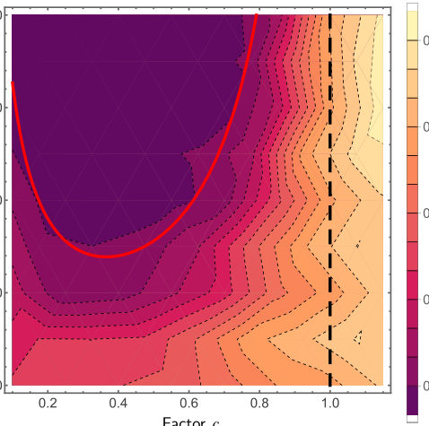
<figcaption class="paper-figure-caption"><b>Fig 3.</b> Figure 3: We plot the instability witness (see main text), as a function of the atom number and the instability parametrization factor c, with g/2π = √c/2, κ/2π = 4, ΓR/2π = c. The parametrization is chosen so that the atom number threshold for lasing (Nc = ΓRκ/2g2 ≈6) is independent of c. The black dashed line shows the limit 4ΓR = κ above which the laser is always stable, irrespective of atom number (right side). The red line depicts the critical atom number N ∗ c for the instability to develop as a</figcaption>
</figure>
<figure class="paper-figure-card">
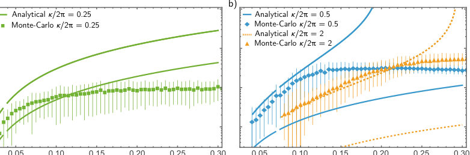
<figcaption class="paper-figure-caption"><b>Fig 4.</b> Figure 4: Superradiant laser intensity fluctuations in the stable regime. We plot the relative intensity noise Var(b)/⟨b⟩2 as a function of g for three values of κ and for ΓR/2π = 0.1, N = 20. a) In the regime with ΓR &lt; κ &lt; 4ΓR, shown for κ/2π = 0.25, the laser is stable and the intensity fluctuations observed in the Monte-Carlo simulations (green squares) roughly follow the ones arising from one of the eigenvalues γi (green straight lines) given by our simplified model (see Eq. 18). b) In the regime with κ &gt; 4ΓR, we plot the Monte-Carlo simulation results for the cases κ/2π = 0.5 (blue diamonds) and κ/2π = 2 (orange triangles) along with their analytical counterparts (straight blue lines...</figcaption>
</figure>
<figure class="paper-figure-card">
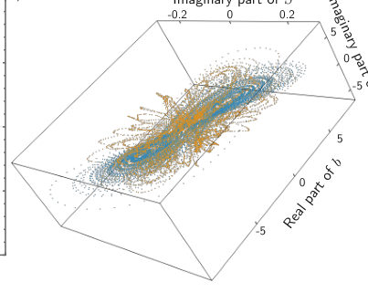
<figcaption class="paper-figure-caption"><b>Fig 5.</b> Figure 5: Trajectories during the superradiant laser dynamics, in the unstable regime. a, b) We represent the real part of the photon field b versus the imaginary part of atomic coherences S−. The laser parameters are N = 400, g/2π = √c/2, κ/2π = 3, ΓR/2π = c, with c = 0.22. The panel a) gives the mean-field approximation version and panel b) the version where we take into account atomic variable fluctuations using the TWA approximation (see main text). Insets show the same trajectories for the real and imaginary part of b, highlighting the effect of fluctuations on its phase. Panel c) shows the same two trajectories with the imaginary part of b as a third axis.</figcaption>
</figure>

**Summary.** The paper rigorously investigates the stability boundaries of a superradiant laser operating in an atomic cavity. It demonstrates that while the system can enter chaotic regimes analogous to fluid turbulence, these instabilities severely degrade its performance as a frequency reference due to phase drift. However, the authors also map out conditions for stable, regular self-pulsing oscillations, offering pathways to control this complex quantum optical system.

**Why it may be interesting.** This work is highly relevant as it bridges quantum optics (superradiance/lasing) with nonlinear dynamics (chaos theory). The detailed analysis of phase drift versus amplitude fluctuations provides crucial guidelines for engineering robust quantum sensors and clocks based on cavity QED systems.

Detailed structure

**Main problem.** The study investigates the intensity stability of a superradiant laser, determining the conditions under which it remains stable for use as an active optical clock versus when it develops chaotic behavior.

**Main result.** The superradiant laser can become unstable and exhibit chaotic dynamics when the photon lifetime is significantly shorter than the atomic lifetime ($\kappa > 4\Gamma_R$ and $N > N^*_c$). However, a regular self-pulsing regime exists at very large atom numbers.

**Method.** The authors employed mean-field approximations, linear stability analysis (eigenvalue calculation), Monte Carlo simulations, and mapping the dynamics to known chaotic systems like the Lorenz model.

**Model / system.** The system models a continuous beam of atoms in an electronically excited state interacting with a high-finesse Fabry-Perot cavity. The dynamics are governed by coupled rate equations for the cavity field and atomic coherences, incorporating photon loss ($\kappa$) and atomic decay rates ($\Gamma_R$).

**Key observables.** Intensity fluctuations, laser linewidth ($\Delta
u$), photon number ($n$), and coherence expectation values ($\langle b 
angle$, $\langle S_{\pm} 
angle$).

**Important parameters / regimes.** The ratio of cavity loss rate to atomic decay rate ($\kappa$ vs $4\Gamma_R$), the critical atom numbers ($N_c, N^*_c$), and the relative timescales between photon and atomic lifetimes.

**Assumptions / limitations.** The analysis heavily relies on mean-field approximations. Furthermore, advanced fluctuation analyses required assuming Gaussian white noise or using specific time-coarse-graining techniques that break down in certain regimes.

**Figures summary.** Figures illustrate the transition from stable (low $\kappa$) to unstable/chaotic dynamics (high $\kappa$), showing intensity oscillations and phase drift. Later figures compare analytical models of self-pulsing against numerical simulations, confirming regular periodic behavior under specific conditions.

**Paper structure.** The paper progresses by first establishing the mean-field model and identifying instability criteria ($\kappa > 4\Gamma_R$). It then analyzes the resulting chaotic dynamics, comparing them to turbulence theory. Finally, it refines the analysis by calculating linewidths using fluctuation theories (TWA) and identifying a separate, stable self-pulsing regime at large atom numbers.

Abstract

We investigate the intensity stability of the superradiant laser. Our study focuses on the architecture where a continuous beam of atoms in an electronically excited state crosses the mode of a high-finesse Fabry-Perot cavity, which has been proposed as a new architecture of an active optical clock. We show that such superradiant laser can become unstable and develop chaotic behavior. We derive an analytical criterion for this instability and find that it may only occur when the lifetime of photons in the cavity is significantly shorter than the lifetime of atoms. This criterion allows for refining the necessary parameters to run a superradiant laser as a frequency reference in the optical domain. In particular, we point-out the consequences of the instability on intensity fluctuations and laser linewidth. On the other hand, we also point out that the superradiant laser, when in the unstable regime, can become an interesting playground for studying chaos. At the mean-field level, there is a direct mapping to the Bénard instability associated with fluid turbulence; however quantum fluctuations associated with photon out-coupling and atom re-filling substantially modify the expected behaviors. Finally, we point-out the existence of a regular self-pulsing regime at large atom numbers.

[↑ back to top](#top)

### [Pairing-induced Bloch oscillations in an interacting Kitaev chain](http://arxiv.org/abs/2606.22284v1)

**Authors:** E. S. Ma, Z. Song  
**Type:** theory · **Category:** strongly correlated electrons · **PDF:** <https://arxiv.org/pdf/2606.22284v1>  
**Analysis basis:** full PDF text, analyzed in chunks
**Topic relevance:** 🔥 `analog quantum simulation` **4/5** · 🔥 `non-equilibrium dynamics` **4/5** · `non-equilibrium universality` **3/5** · `driven-dissipative phase transition` **2/5** · `entanglement & information structure` **2/5** · `methods for driven-dissipative` **2/5** · `Frenkel-Kontorova` **1/5** · `Keldysh / 2PI / non-Gaussian methods` **1/5** · `correlated / nonlocal dissipation` **1/5** · `exotic spin models in light-matter` **1/5** · `scars & prethermalization` **1/5**

↔ Scroll figures horizontally

<figure class="paper-figure-card">
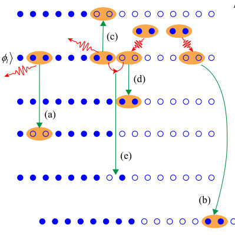
<figcaption class="paper-figure-caption"><b>Fig 1.</b> FIG. 1. The illustration of the effectiveness of Heff in the subspace {|ϕl⟩}. For a given basis |ϕl⟩, where l sites on the left of the chain are occupied by fermions (solid blue cir- cles) and the rest of the sites are empty (hollow blue circles), there are five cases when the Hamiltonian HT in Eq. (2) acts on it. The right energy axis marks the corresponding energy change. (a) and (b) denote the pairing-elimination and pairing-creation processes that transform this state into another subspace, with the corresponding energy change un- der HV being −4U ± 2µ; (c) and (d) represent the pairing- elimination and pairing-creation that preserve the subspace and shift the energy by ±2µ; (e) shows...</figcaption>
</figure>
<figure class="paper-figure-card">
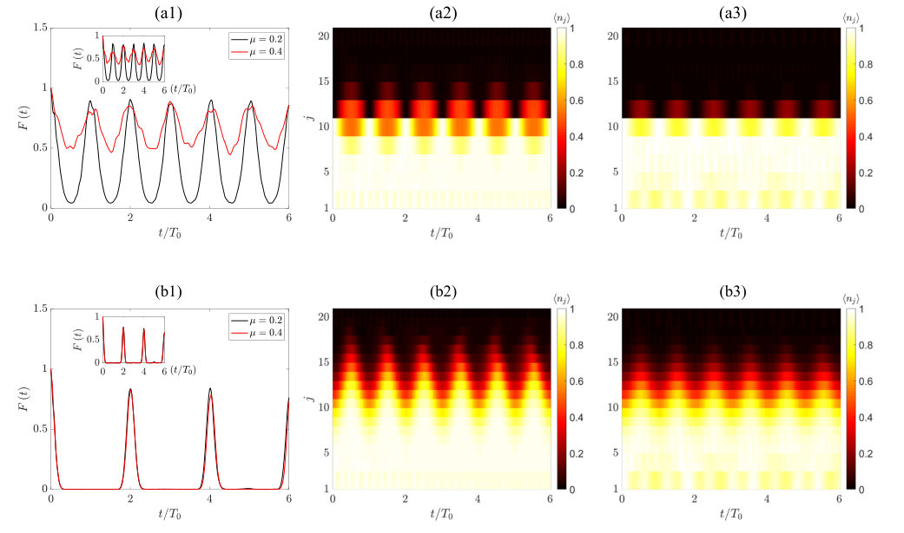
<figcaption class="paper-figure-caption"><b>Fig 2.</b> FIG. 2. Plots of the fidelity defined in Eq. (22) and the average value of the particle number operator given in Eq. (23) for two kinds of initial states. Panels (a1) and (b1) display the fidelity for the Kronecker-delta initial state and Gaussian-type initial state with different on-site potentials, respectively, where the other parameters for the Hamiltonian are U = 1, τ = 0.2, ∆= 0.2, and N = 20. For the Kronecker-delta initial state, l0 = N/2, and for the Gaussian-type initial state, α = 5. The insets in (a1) and (b1) show the cases for U = 1, τ = 0.8, and ∆= 0.2. Here, T0 = π/µ is the theoretical period of the Bloch Oscillation, and it is distinct for different parameter settings of µ....</figcaption>
</figure>
<figure class="paper-figure-card">
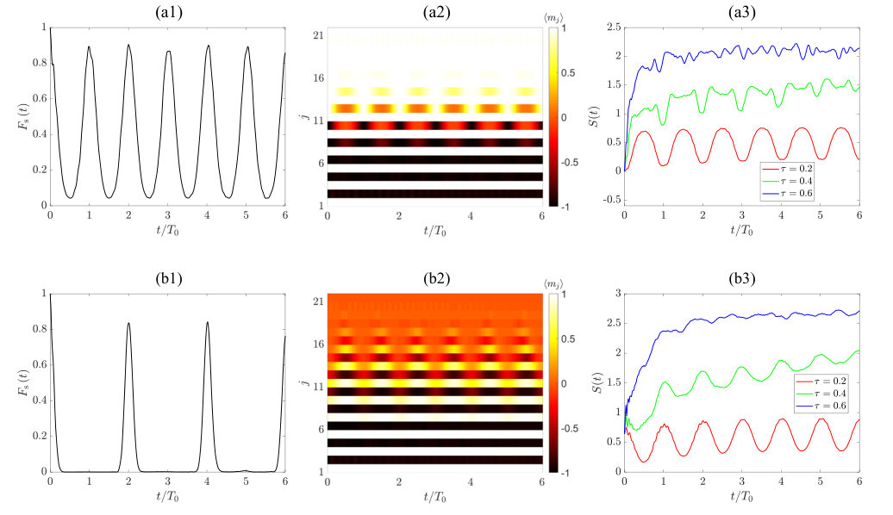
<figcaption class="paper-figure-caption"><b>Fig 3.</b> FIG. 3. Plots of fidelity defined in Eq. (24), local magnetization given by Eq. (26), and entanglement entropy given by Eq. (27) in the corresponding spin model given by Eq. (10) of the Kitaev model with ∆= τ. Panels (a1), (a2), and (a3) correspond to the Kronecker-delta initial state, and panels (b1), (b2), and (b3) correspond to the Gaussian-type initial state. Other parameters are U = 1, τ = 0.2, µ = 0.2 and N = 21. These results indicate that the entanglement entropy oscillates around a small value with period T0 = π/µ for small τ. However, it increases for large τ and remains at an approximately fixed value due to the finite-N effect.</figcaption>
</figure>

**Summary.** This work investigates the complex dynamics of an interacting Kitaev chain subjected to nearest-neighbor interactions. The key finding is that these interactions induce Bloch oscillations via the formation of a Wannier-Stark ladder state, even without an external longitudinal field. This provides a concrete example of emergent many-body localization driven purely by internal quantum correlations.

**Why it may be interesting.** The demonstration of intrinsic Bloch oscillations driven by pairing processes, rather than external fields or disorder, provides a clean theoretical platform for understanding non-equilibrium dynamics in strongly correlated quantum materials relevant to AMO physics.

Detailed structure

**Main problem.** The study investigates the peculiar dynamics of the Kitaev chain when subjected to nearest-neighbor (NN) interactions, specifically focusing on the emergence of Bloch oscillations without an external longitudinal field.

**Main result.** Strong NN interaction enhances pairing and leads to a Wannier-Stark ladder state exhibiting Bloch oscillation intrinsically. This demonstrates emergent Stark many-body localization driven by internal interactions rather than disorder or applied fields.

**Method.** The authors used diagonalization in the particle-number basis, derived an effective Hamiltonian ($H_{eff}$), and mapped the system to a transverse field Ising model on a zigzag lattice for analysis.

**Model / system.** The primary system is the interacting spinless fermion Kitaev chain. It is mathematically related via spin-fermion correspondence to a transverse field Ising model defined on a zigzag lattice, which models domain wall dynamics between ferromagnetic and antiferromagnetic phases.

**Key observables.** Wannier-Stark ladder (WSL) formation, Bloch oscillation periodicity ($T_0 = \pi/\mu$), fidelity $F(t)$, average particle number $\langle n_j 
angle$, magnetization $m_j$, and bipartite Von Neumann entropy $S(t)$.

**Important parameters / regimes.** The nearest-neighbor interaction strength ($U$) relative to hopping ($	au$), pairing ($\Delta$), and chemical potential ($\mu$); the regime $|U| \gg |\mu|, |\Delta|, |	au|$ is crucial for deriving the effective Hamiltonian.

**Assumptions / limitations.** The derivation of the effective Hamiltonian relies on the strong interaction limit ($|U| \gg |\mu|, |\Delta|, |	au|$). The mapping from spin operators to fermions is noted as not being a standard Jordan-Wigner transformation.

**Figures summary.** Figures illustrate energy level structures showing WSL formation, and show periodic revival of fidelity and domain wall oscillations in both the fermionic and spin representations, confirming periodicity $T_0 = \pi/\mu$.

**Paper structure.** The paper first analyzes the Kitaev chain dynamics under NN interaction to establish the WSL state. It then maps this system to a transverse field Ising model on a zigzag lattice using spin-fermion correspondence. Finally, it uses numerical simulations to confirm Bloch oscillations and emergent many-body localization in both representations.

Abstract

We study the peculiar dynamics of the Kitaev chain induced by nearest-neighbor (NN) interaction. We show that a strong NN interaction suppresses single-particle hopping but enhances pairing, resulting in a Wannier-Stark ladder. Based on the spin-fermion correspondence at the symmetry point, the model maps to a transverse field Ising model on a zigzag lattice, providing a clear physical picture and guiding experimental verification. The Wannier-Stark state corresponds to a localized domain wall between ferromagnetic and antiferromagnetic phases. It exhibits Bloch oscillation even in the absence of a longitudinal field, in contrast to previous works. Numerical simulations of time-dependent observables verify these conclusions. Our findings provide an example demonstrating emergent Stark many-body localization.

[↑ back to top](#top)

### [Acceleration of Free Electrons by Photonic Time-Crystals](http://arxiv.org/abs/2606.21953v1)

**Authors:** Lior Bar-Hillel, Alexey Gorlach, Ido Kaminer, Mordechai Segev  
**Type:** theory · **Category:** other · **PDF:** <https://arxiv.org/pdf/2606.21953v1>  
**Analysis basis:** full PDF text, analyzed in chunks
**Topic relevance:** 🔥 `analog quantum simulation` **4/5** · 🔥 `non-equilibrium dynamics` **4/5** · `driven-dissipative phase transition` **3/5** · `interference shaping light` **3/5** · `methods for driven-dissipative` **2/5** · `non-equilibrium universality` **2/5** · `Keldysh / 2PI / non-Gaussian methods` **1/5** · `Tavis-Cummings & cavity-many-emitter` **1/5** · `correlated cavity matter` **1/5**

↔ Scroll figures horizontally

<figure class="paper-figure-card">
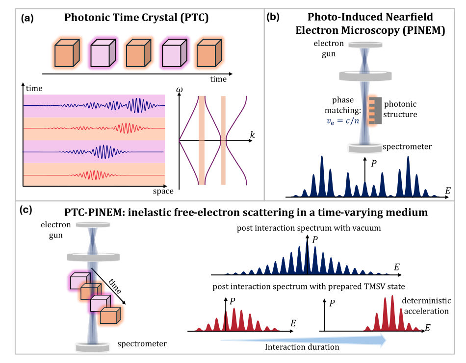
<figcaption class="paper-figure-caption"><b>Fig 1.</b> Fig. 1: Inelastic free-electron scattering in a photonic time-crystal. (a) Photonic time-crystal (PTC) formed by refractive index that is periodically modulated in time. The resulting Floquet states form a band structure with</figcaption>
</figure>
<figure class="paper-figure-card">
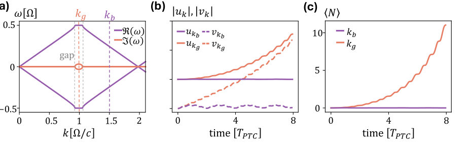
<figcaption class="paper-figure-caption"><b>Fig 2.</b> Fig. 2: Bogoliubov dynamics and exponential amplification in a PTC. (a) Bandstructure of PTC. Two modes are marked: 𝑘𝑔 inside the gap (orange) and 𝑘𝑏 outside the gap (violet). (b) Time evolution of Bogoliubov coefficients 𝑢𝑘(𝑡) and 𝑣𝑘(𝑡) for the band mode 𝑘𝑏 and the gap mode 𝑘𝑔. (c) Expectation value of the photon number, ⟨𝑁⟩= 2|𝑣𝑘(𝑡)|2, for the same two representative modes. While the band mode remains weakly populated, the gap mode experiences strong amplification even when the initial state of the field is vacuum. Effective PINEM scattering operator in a PTC. Using Eq. (4), we derive the scattering operator</figcaption>
</figure>
<figure class="paper-figure-card">
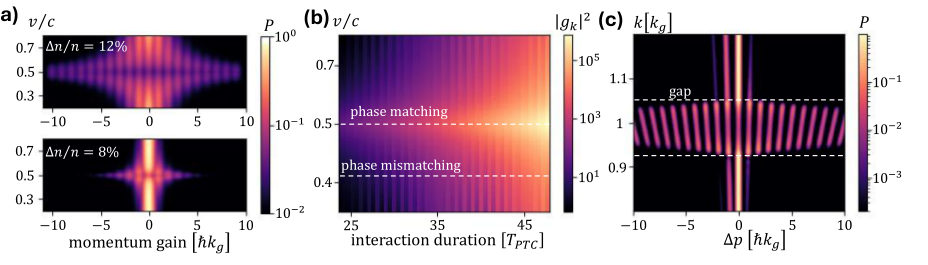
<figcaption class="paper-figure-caption"><b>Fig 3.</b> Fig. 3: Electron spectra as probes of PTC. (a) Post-interaction electron spectrum 𝑃(Δ𝑝) vs electron velocity 𝑣/𝑐, for modulation depths Δ𝑛/𝑛= 10% and 6%. Increasing the modulation depth strongly enhances the inelastic interaction, broadens the sidebands, and extends the scattering well beyond phase-matching conditions. (b) Effective coupling strength |𝑔𝑘𝑔| for a representative gap mode 𝑘𝑔, vs interaction duration and electron velocity 𝑣𝑒. The coupling is maximal near mean phase matching, 𝑣𝑒≃𝑐/⟨𝑛(𝑡)⟩, but grows strongly with interaction time even away from it due to the exponential amplification of the gap mode. (c) Electron spectrum versus photonic wavenumber 𝑘. Dashed vertical lines mark...</figcaption>
</figure>
<figure class="paper-figure-card">
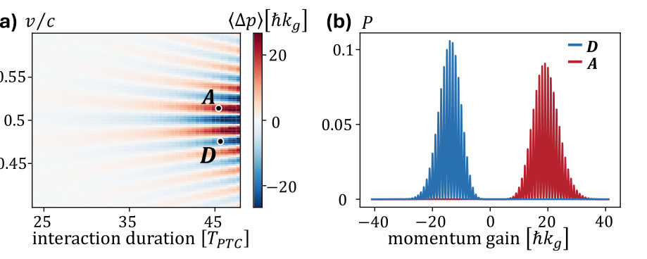
<figcaption class="paper-figure-caption"><b>Fig 4.</b> Fig. 4: Wavefunction shaping through control of the mean recoil and its fluctuations. (a) Mean momentum transfer ⟨Δ𝑝⟩, vs electron velocity 𝑣/𝑐 and interaction duration. Positive and negative regions correspond to net acceleration and deceleration, respectively. The marked points 𝐴 and 𝐷 indicate representative working points used in panel (b). (b) Post-interaction electron spectra for the two points marked in (a), obtained for a suitably prepared TMSV optical state. The red curve ( 𝐴) corresponds to a directionally accelerated electron distribution, while the blue curve (𝐷) corresponds to deceleration.</figcaption>
</figure>

**Summary.** The paper demonstrates that Photonic Time-Crystals (PTCs) can dramatically enhance the coupling between free electrons and photons by exploiting exponentially growing field modes within photonic band gaps. This enhancement allows researchers to deterministically control the momentum kick imparted to electrons, opening a new quantum platform for shaping electron wavefunctions.

**Why it may be interesting.** This work bridges concepts from Floquet engineering/PTCs with fundamental quantum optics problems like light-matter interaction, providing a novel platform for coherent energy/momentum transfer in condensed matter physics that has implications for ultrafast science.

Detailed structure

**Main problem.** The study investigates how quantum interactions between free electrons and photons are modified when the photonic environment is periodically modulated using Photonic Time-Crystals (PTCs). The goal is to use this modulation to control electron momentum transfer.

**Main result.** PTCs enable exponentially enhanced, controllable coupling for electron-light scattering, allowing for arbitrarily large and deterministically controlled momentum kicks to free electrons. Furthermore, nonclassical light states allow the momentum uncertainty to grow slower than the mean recoil, enabling directional wavefunction shaping.

**Method.** The analysis uses a time-dependent Hamiltonian approach, employing Bogoliubov transformations to track photon field evolution in the presence of PTCs and deriving an effective scattering operator for electron interaction.

**Model / system.** The system models free electrons propagating along $z$ interacting with photons confined by a periodically modulated refractive index (PTC). The dynamics are governed by a Hamiltonian involving free electron, time-dependent photonic, and interaction terms.

**Key observables.** Photon number ($\langle N(t) 
angle$), effective coupling strengths ($g_{\pm k}$), mean momentum transfer ($\langle \Delta p 
angle$), and the post-interaction electron spectrum $P(\Delta p)$.

**Important parameters / regimes.** PTC modulation period ($T_{PTC}$), interaction time, and the initial state of light (e.g., Two-Mode Squeezed Vacuum).

**Assumptions / limitations.** The analysis assumes the system can be described by an effective scattering operator derived from the full Hamiltonian, and that the Bogoliubov coefficients govern the field dynamics.

**Figures summary.** Figures illustrate PTC bandstructures showing momentum gaps where exponential growth of photon number occurs. They also show electron spectra exhibiting pronounced sideband ladders inside these gaps, demonstrating controlled wavefunction shaping via mean recoil vs. uncertainty plots.

**Paper structure.** The paper first establishes the physical model using PTCs and the Hamiltonian. It then analyzes the Bogoliubov dynamics to show exponential field enhancement in momentum gaps. Finally, it applies this framework to derive an effective scattering operator for electron-light interaction (PINEM), demonstrating control over mean recoil and quantum state shaping.

Abstract

We study the quantum interaction between free electrons and photons in a time-varying media, and find that periodic modulation exponentially amplifies electron-photon coupling within momentum gaps, enabling arbitrarily large momentum transfer. By preparing the light in a two-mode squeezed vacuum state, the electron momentum grows faster than its spectral spreading, establishing time-modulated photonic media as a platform for accelerating free-electrons and shaping their quantum state.

[↑ back to top](#top)

### [Degeneracy-reshaped spin squeezing in high-spin Fermi-Hubbard systems weakly coupled to light](http://arxiv.org/abs/2606.23330v1)

**Authors:** Hubert Dunikowski, Emilia Witkowska  
**Type:** theory · **Category:** quantum gases · **PDF:** <https://arxiv.org/pdf/2606.23330v1>  
**Analysis basis:** full PDF text, analyzed in chunks
**Topic relevance:** 🔥 `analog quantum simulation` **4/5** · `exotic spin models in light-matter` **3/5** · `spintronics-quantum-optics interface` **3/5** · `Tavis-Cummings & cavity-many-emitter` **2/5** · `non-equilibrium dynamics` **2/5** · `Keldysh / 2PI / non-Gaussian methods` **1/5** · `correlated / nonlocal dissipation` **1/5** · `correlated cavity matter` **1/5** · `driven-dissipative phase transition` **1/5** · `entanglement & information structure` **1/5** · `methods for driven-dissipative` **1/5**

↔ Scroll figures horizontally

<figure class="paper-figure-card">
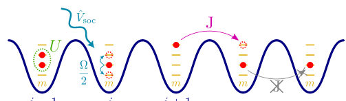
<figcaption class="paper-figure-caption"><b>Fig 1.</b> FIG. 1. Schematic of the processes considered with FH Hamil- tonian, highlighting on-site interactions U, tunnelling J be- tween neighboring atoms and coupling ˆVsoc with light. Mul- tiple atoms may occupy a lattice site j only at different mag- netic levels m, as required by Pauli exclusion.</figcaption>
</figure>
<figure class="paper-figure-card">
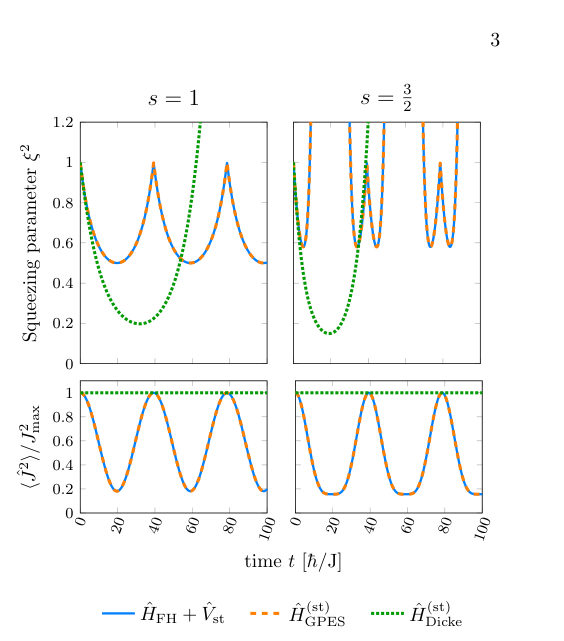
<figcaption class="paper-figure-caption"><b>Fig 2.</b> FIG. 3. Spin squeezing ξ2 and total spin ⟨ˆJ2⟩dynamics of the system with scalar-tensor light coupling ( ˆVst) for Ωst = 0.08J and other parameters as in Fig. 2. The solid blue and dashed orange lines overlap.</figcaption>
</figure>
<figure class="paper-figure-card">
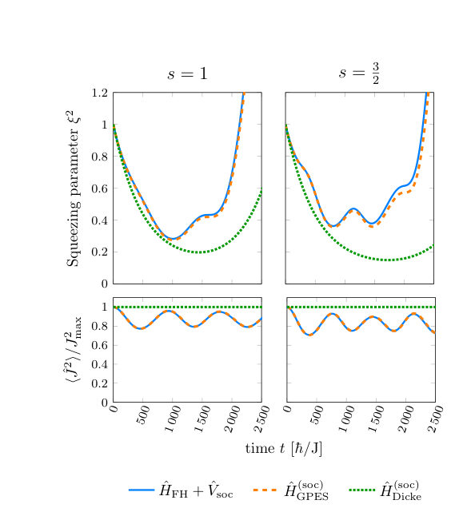
<figcaption class="paper-figure-caption"><b>Fig 3.</b> FIG. 2. Spin squeezing ξ2 (top panels) and total spin ⟨ˆJ2⟩ (bottom panels) dynamics of the system with weak spin-orbit coupling ( ˆVsoc) for spin s = 1 (left panels) and s = 3/2 (right panels), and N = 10, U = 4J, Ωsoc = 0.08J, ϕ = 4 · 2π</figcaption>
</figure>
<figure class="paper-figure-card">
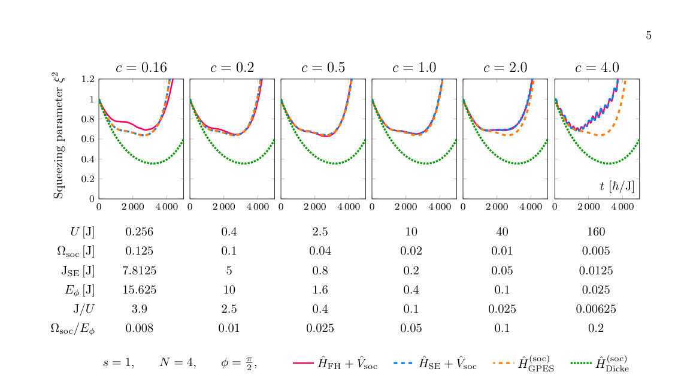
<figcaption class="paper-figure-caption"><b>Fig 4.</b> FIG. 4. Examples of the four dynamical descriptions considered in this work, ˆHFH+ ˆVsoc, ˆHSE+ ˆVsoc, ˆH(soc) GPES, and ˆH(soc) Dicke, shown on a common timescale determined by χ = 1/12 000, for different values of (U, Ωsoc). The dynamics generated by ˆHFH + ˆVsoc (solid red line) serve as the most accurate reference. The spin-exchange description ˆHSE + ˆVsoc remains quantitatively accurate for J/U ≲2.0, while the effective GPES Hamiltonian ˆH(soc) GPES reproduces ˆHSE + ˆVsoc dynamics for Ωsoc/Eq ≲0.05. Within the range of system sizes and atomic spins investigated, the bounds J/U ≲2.0 and Ωsoc/Eq ≲0.05 appear to be universal.</figcaption>
</figure>

**Summary.** The paper analyzes spin squeezing in high-spin Fermi-Hubbard systems coupled to light, finding that simple models fail due to internal degeneracies. The authors develop an effective framework using Population Eigenstates (PES) to accurately capture the modified collective spin dynamics caused by these uncaptured degenerate states.

**Why it may be interesting.** This work is highly relevant as it addresses the limitations of standard collective spin approximations in complex, high-spin quantum systems, providing a necessary theoretical refinement for modeling light-matter interactions in ultracold atomic gases.

Detailed structure

**Main problem.** The study investigates how spin squeezing dynamics are modified by internal degeneracies when analyzing high-spin Fermi-Hubbard systems weakly coupled to light.

**Main result.** Degeneracy associated with the internal spin structure causes conventional maximal-spin descriptions (like those based on Dicke states) to break down, necessitating an effective framework built upon Population Eigenstates (PES).

**Method.** The authors employ perturbative techniques, including Schrieffer-Wolff transformations, to derive effective Hamiltonians by projecting the full Hamiltonian onto various degenerate manifolds.

**Model / system.** The system is a Fermi-Hubbard model realized with high-spin fermionic atoms in an optical lattice. The dynamics are governed by tunneling ($J$), on-site repulsion ($U$), and weak coupling to light ($\hat{V}_{soc}$).

**Key observables.** Spin squeezing parameter ($\xi^2$) and total spin dynamics ($\langle\hat{\mathbf{J}}^2
angle$).

**Important parameters / regimes.** High nuclear spin $s \ge 1$, strongly repulsive regime ($U \gg J$), and weak light coupling ($\Omega_{soc}$).

**Assumptions / limitations.** The analysis relies on perturbative expansions (e.g., Schrieffer-Wolff up to second order) and the identification of different energy manifolds (Dicke, GPES, $q$-PES).

**Figures summary.** Figures compare spin squeezing ($\xi^2$) and total spin dynamics for various approximations (full model vs. Dicke projection vs. GPES projection) across different high-spin regimes ($s=1, s=3/2$).

**Paper structure.** The paper systematically compares the predictions of simple models (like OAT or Dicke projections) against the full dynamics derived from incorporating higher-order degenerate states captured by the Population Eigenstates basis.

Abstract

We study spin squeezing in strongly interacting high-spin Fermi-Hubbard systems weakly coupled to light. We show that spin squeezing dynamics is qualitatively modified by the degeneracies associated with the internal spin structure. We identify these degeneracies as the microscopic origin of the breakdown of conventional maximal-spin description and develop an effective framework based on population eigenstates that quantitatively reproduces spin squeezing evolution. Our results uncover a generic mechanism by which degeneracy reshapes collective spin dynamics.

[↑ back to top](#top)

### [Helical Domain-Wall-Ring Networks Reshape Superconducting Correlations](http://arxiv.org/abs/2606.23599v1)

**Authors:** Yi-Chun Hung, Arun Bansil  
**Type:** theory · **Category:** strongly correlated electrons · **PDF:** <https://arxiv.org/pdf/2606.23599v1>  
**Analysis basis:** full PDF text, analyzed in chunks
**Topic relevance:** 🔥 `analog quantum simulation` **4/5** · `Keldysh / 2PI / non-Gaussian methods` **3/5** · `methods for driven-dissipative` **3/5** · `driven-dissipative phase transition` **2/5** · `non-equilibrium dynamics` **2/5** · `non-equilibrium universality` **2/5** · `Frenkel-Kontorova` **1/5** · `correlated / nonlocal dissipation` **1/5** · `correlated cavity matter` **1/5** · `entanglement & information structure` **1/5**

↔ Scroll figures horizontally

<figure class="paper-figure-card">
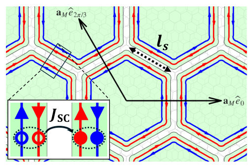
<figcaption class="paper-figure-caption"><b>Fig 1.</b> FIG. 1. A schematic of the helical domain-wall-ring network arising from closed topological domains (green regions) within the moir´e pattern, embedded in a trivial background (white regions). Red (blue) arrows denote counterclockwise (clock- wise) helical domain-wall states. Black arrows indicate the moir´e lattice vectors of length aM, while the dashed line marks the hexagon side length ls. ˆeθ ≡cos(θ)ˆex + sin(θ)ˆey. Inset: SC-pair tunneling with strength JSC between neighboring do- main walls; empty (filled) circles represent holes (particles).</figcaption>
</figure>
<figure class="paper-figure-card">
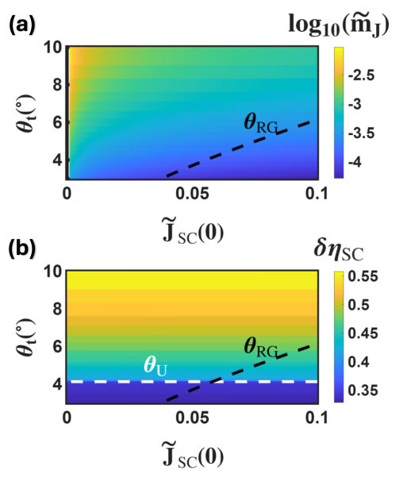
<figcaption class="paper-figure-caption"><b>Fig 2.</b> FIG. 2. Self-consistently determined (a) tunneling-induced mass ˜mJ = mJ/m(pin) J and (b) relative deviation of the SC scaling dimension from the pinned-limit value, δηSC =  ηSC −η(pin) SC  /  η(0) SC −η(pin) SC  , as functions of the bare pair-</figcaption>
</figure>

**Summary.** The paper theoretically analyzes superconducting correlations in helical domain-wall-ring networks found in moiré materials. It contrasts predictions from idealized infinite systems with results obtained using a self-consistent variational method for finite rings. The key finding is that the ring geometry leads to qualitatively different collective behavior, suggesting confinement effects are crucial and cannot be ignored.

**Why it may be interesting.** This work provides a detailed theoretical framework for understanding how geometric confinement fundamentally alters many-body quantum phenomena, which is crucial knowledge when designing artificial superconducting circuits or moiré heterostructures.

Detailed structure

**Main problem.** The study investigates how superconducting (SC) correlations are reshaped by confinement effects within helical domain-wall-ring networks compared to predictions from infinite-size models.

**Main result.** Finite-size ring networks exhibit qualitatively distinct collective behavior, as the SC scaling dimension evolution does not simply follow the strong-coupling predictions derived for infinite systems.

**Method.** The analysis combines Renormalization Group (RG) theory for initial insights with a self-consistent variational approach to handle finite-size effects in the bosonic field description of the system.

**Model / system.** The physical platform is superconducting correlations within helical domain-wall-ring networks arising from moiré patterns in twisted bilayer honeycomb lattices. The model uses Luttinger Liquid theory for intra-ring physics and includes inter-ring tunneling terms.

**Key observables.** SC scaling dimension ($\eta_{	ext{SC}}$), tunneling-induced mass parameter ($m_J$), and the SC correlation function decay $\langle O_{	ext{SC}}^\dagger(r) O_{	ext{SC}}(0) 
angle \sim r^{-2\eta_{	ext{SC}}}$

**Important parameters / regimes.** Twist angle ($	heta_t$), inter-ring pair-tunneling strength ($	ilde{J}_{	ext{SC}}$), and characteristic RG/critical angles ($	heta_{	ext{RG}}$)

**Assumptions / limitations.** The analysis relies on bosonization techniques, variational approximations (Gaussian trial action), and comparing results across infinite-size limits versus finite ring geometries.

**Figures summary.** Figures illustrate the self-consistently determined tunneling-induced mass ($	ilde{m}_J$) and the relative deviation of $\eta_{	ext{SC}}$ from the pinned limit as functions of bare tunneling strength and twist angle.

**Paper structure.** The paper progresses through establishing bosonic field representations, deriving effective low-energy actions via perturbation theory (second order in tunneling), applying a variational minimization procedure to find self-consistent parameters ($m_J$), and finally calculating the SC correlation function ($\eta_{	ext{SC}}$).

Abstract

Extended domain-wall networks emerging in moiré materials provide a distinct platform for quasi-one-dimensional electronic states. However, the interaction-driven orders in confined networks remain largely unexplored. Here, we discuss superconducting (SC) correlations in interacting helical domain-wall-ring networks that emerge in the closed topological domains formed within the moiré patterns of an underlying twisted bilayer honeycomb lattice. We first analyze the system within the framework of an infinite-size theory and show that inter-ring SC-pair tunneling is renormalization-group relevant and thus enhances SC correlations through inter-ring phase locking. To address finite-size effects resulting from the ring-network geometry, we present a self-consistent variational approach. Our analysis shows that even in the regime where the infinite-size theory predicts strongly-coupled pair tunneling, the induced phase-locking scale remains strongly suppressed. In contrast, the SC scaling dimension continues to decrease with decreasing twist angle and remains insensitive to the pair-tunneling strength, revealing a qualitative mismatch from the infinite-size expectation. This discrepancy demonstrates that ring networks do not simply approach their infinite-size counterparts but can exhibit qualitatively distinct collective behavior. Our study highlights how the interplay of confinement effects and ring-network geometry can reshape SC correlations.

[↑ back to top](#top)

### [Open-quantum-system theory of non-Markovian electron-phonon dynamics](http://arxiv.org/abs/2606.22233v1)

**Authors:** Gabriele Riva, Jacopo Simoni, Yuan Ping  
**Type:** theory · **Category:** other · **PDF:** <https://arxiv.org/pdf/2606.22233v1>  
**Analysis basis:** full PDF text, analyzed in chunks
**Topic relevance:** 🔥 `methods for driven-dissipative` **4/5** · 🔥 `non-equilibrium dynamics` **4/5** · `Keldysh / 2PI / non-Gaussian methods` **3/5** · `correlated / nonlocal dissipation` **3/5** · `driven-dissipative phase transition` **3/5** · `Kondo & dissipative impurity` **2/5** · `non-equilibrium universality` **1/5**

↔ Scroll figures horizontally

<figure class="paper-figure-card">
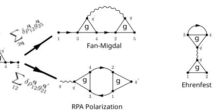
<figcaption class="paper-figure-caption"><b>Fig 1.</b> FIG. 1. Diagrammatic representation of the electron-phonon correlation function. On the left, the self-energy derived from the coupling of Eq. (14d) with Eqs. (14a) and (14b), showing the link between our theory and the electronic and bosonic collision integrals. On the right, the Ehrenfest self-energy obtained from Eqs. (14e) and (15).</figcaption>
</figure>
<figure class="paper-figure-card">
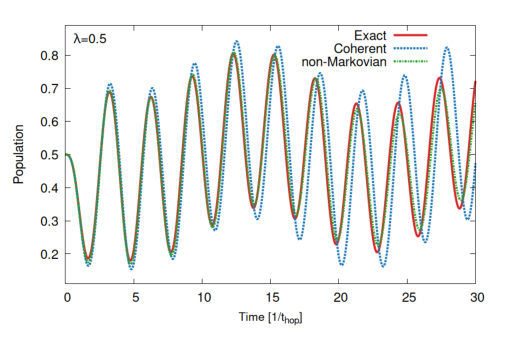
<figcaption class="paper-figure-caption"><b>Fig 2.</b> FIG. 2. Dynamics of the occupation of the first site for dif- ferent level of theories. Exact dynamics (solid red curve), coherent phonons dynamics (dotted blue curve), and non- Markovian dynamics (dot-dashed green curve). The dynamics is obtained with λ = 0.5 and γ = 0.5</figcaption>
</figure>
<figure class="paper-figure-card">
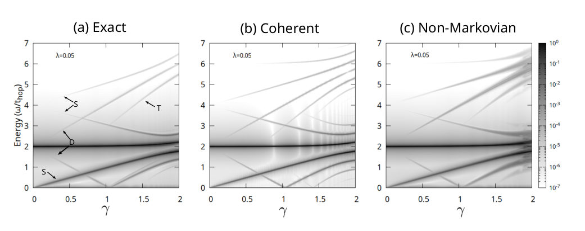
<figcaption class="paper-figure-caption"><b>Fig 3.</b> FIG. 3. Spectra as a function of γ for small e-ph interaction λ = 0.05. (a) Exact result. (b) Coupled Eqs. (14a) and (14e). (c) Solution of the full set of non-Markovian equations (14a)-(14e). We observe single phonon absorption and emission (S) with slope ±γ starting from E = 4, and two-phonon absorption and emission (D) with slope ±2γ starting from E = 2, and a single phonon absorption starting (S) and a three-phonon absorption (T) from E = 0. This last contribution is visible only for γ &gt;∼1.</figcaption>
</figure>
<figure class="paper-figure-card">
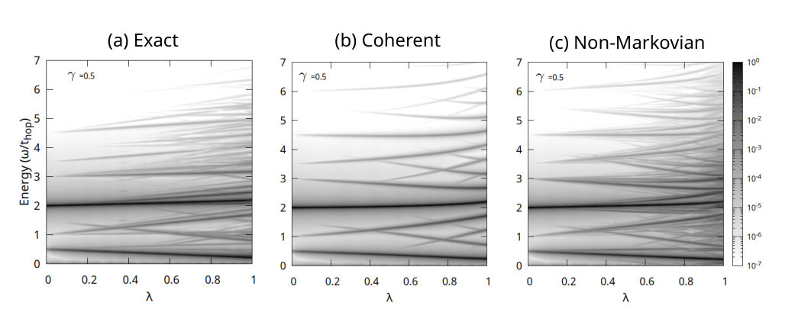
<figcaption class="paper-figure-caption"><b>Fig 4.</b> FIG. 4. Spectra as a function of the dimensionless coupling constant λ. (a) Exact result. (b) Coupled Eqs. (14a) and (14e). (c) Solution of the full set of non-Markovian equations (14a)-(14e). The Non-Markovian result shows a broadening of the peaks similarly to the exact result, the coherent phonon-electron dynamics do not capture this feature.</figcaption>
</figure>
<figure class="paper-figure-card">
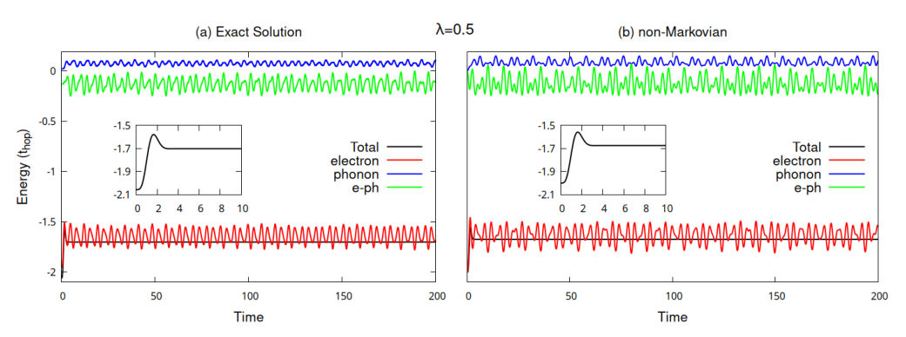
<figcaption class="paper-figure-caption"><b>Fig 5.</b> FIG. 5. Comparison between different energy contributions in Eq. (22). Black curve, total energy. Red, blue and green line, energy contributions of the electron, phonon and electron-phonon correlation, respectively. Left panel, exact result. Right panel, non-Markovian dynamics. Insets, zoom on the variation of the total energy due to the external pump. This plot is obtained for λ = 0.5 and γ = 0.5.</figcaption>
</figure>

**Summary.** The paper introduces an advanced, non-Markovian open quantum system theory to study electron-phonon interactions beyond simple approximations. By deriving a closed set of four coupled equations of motion, the authors successfully model complex memory effects and energy exchange in systems like polarons. This framework is validated by reproducing known theoretical limits and matching benchmark results from exact solutions.

**Why it may be interesting.** This work provides a powerful, systematic theoretical framework for open quantum systems in condensed matter that naturally incorporates memory effects and treats coherence alongside dissipation, which is crucial for understanding polaron physics and ultrafast dynamics.

Detailed structure

**Main problem.** Developing a fully quantum, non-perturbative treatment of nonequilibrium electron–phonon coupling that captures quantum coherence, memory effects, and dissipative dynamics.

**Main result.** The proposed formalism successfully captures spectral broadening and energy conservation in comparison to simpler approximations, correctly modeling complex many-body correlations inherent in the system.

**Method.** It employs an open quantum system theory approach using a closed set of four coupled equations of motion for reduced density matrices, avoiding the storage of two-time correlators.

**Model / system.** The study models electron-phonon coupled systems, governed by a Hamiltonian including electronic, phonon, and coupling terms. It is benchmarked against the exact solution of the Holstein dimer under external driving fields.

**Key observables.** Spectral functions (via Fourier transform of polarization P(t)), total energy conservation, and various self-energies (Fan-Migdal, RPA Polarization, Ehrenfest).

**Important parameters / regimes.** Dimensionless coupling constants $\gamma = \omega_{	ext{ph}}/t_{	ext{hop}}$ and $\lambda = 2g^2/(t_{	ext{hop}}\omega_{	ext{ph}})$; the comparison between coherent vs. non-Markovian dynamics.

**Assumptions / limitations.** The formalism involves truncating the hierarchy of equations at second order in the electron-phonon matrix element, while treating coherent and dissipative dynamics on an equal footing.

**Figures summary.** Figure 1 diagrammatically shows how various self-energies arise from coupling different equations. Subsequent figures compare spectra obtained from exact solutions against those derived from the full non-Markovian set versus a simplified coherent approximation.

**Paper structure.** The paper introduces the Hamiltonian and the need for a non-Markovian formalism, derives the closed set of four coupled equations of motion (EOMs), discusses how these EOMs recover known limits (Lindblad, Boltzmann, etc.), and finally applies the theory to benchmark against exact solutions using time evolution simulations.

Abstract

We present a non-Markovian open quantum dynamics formalism for the study of nonequilibrium electron-phonon interactions, based on a closed set of four coupled equations of motion for the electronic one-body reduced density matrix, the phonon density matrix, the coherent phonon, and the electron-phonon correlations. Memory effects in the electronic dynamics emerge naturally from the coupling between the electronic density matrix and the electron-phonon correlation equations, beyond the Markovian approximation. The formalism treats coherent-phonon dynamics and dissipative broadening on an equal footing, making it particularly suited to polaron formation and the finite lifetimes of driven electronic excitations. In appropriate limits it recovers the Fan-Migdal, polarization in random-phase-approximation, and Ehrenfest self-energies of nonequilibrium Green's function theory, as well as the Lindblad and Boltzmann equations, while avoiding the storage of two-time correlators. To drive the system out of equilibrium, we study its interaction with an external time-dependent field. As an illustrative application, we benchmark our theory against the exact solution of the Holstein dimer under a strong external perturbation, where the non-Markovian dynamics correctly captures dissipative spectral broadening and energy conservation.

[↑ back to top](#top)

### [Exact Accumulated-Field Determined Steady States with Boundary-Controlled Relaxation in Dissipative Quantum Link Chains](http://arxiv.org/abs/2606.22065v1)

**Authors:** Yazhuang Miao, Weizh Ma, Yong Wang, Xiaolong Zhao, Xuexi Yi  
**Type:** theory · **Category:** disordered systems and neural networks · **PDF:** <https://arxiv.org/pdf/2606.22065v1>  
**Analysis basis:** full PDF text, analyzed in chunks
**Topic relevance:** 🔥 `methods for driven-dissipative` **4/5** · `correlated / nonlocal dissipation` **3/5** · `driven-dissipative phase transition` **3/5** · `non-equilibrium dynamics` **3/5** · `non-equilibrium universality` **2/5** · `Frenkel-Kontorova` **1/5** · `Keldysh / 2PI / non-Gaussian methods` **1/5** · `Kondo & dissipative impurity` **1/5** · `analog quantum simulation` **1/5**

↔ Scroll figures horizontally

<figure class="paper-figure-card">
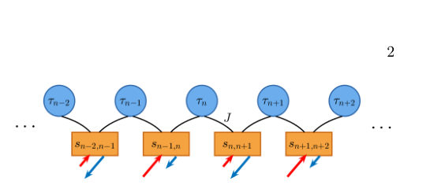
<figcaption class="paper-figure-caption"><b>Fig 1.</b> FIG. 1. Dissipative U(1) quantum link chain. Blue cir- cles denote matter spins τn, orange rectangles denote link spins sn,n+1, black curves denote the coherent coupling J, and red/blue arrows denote link pumping and loss.</figcaption>
</figure>
<figure class="paper-figure-card">
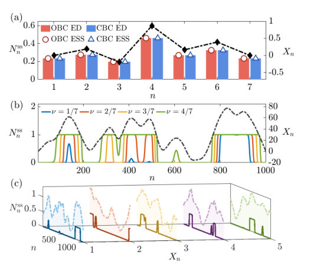
<figcaption class="paper-figure-caption"><b>Fig 2.</b> FIG. 2. Accumulated-field control of N ss n . In all panels, N ss n is plotted against the left axis and the accumulated field Xn against the right axis. (a) L = 7, N = 2: bars show OBC and CBC values of N ss n from exact diagonalization, markers show the corresponding values from exact symmetry-resolved steady states, and the dash-dotted curve shows Xn. (b) OBC N ss n from the exact reduced matter distribution for a sepa- rate L = 1001 realization at ν ≡N/L = 1/7, 2/7, 3/7, 4/7; the dash-dotted curve shows Xn for the same realization. (c) OBC N ss n from the exact reduced matter distribution for five realizations with L = 1001, N = 143; dash-dotted curves show the corresponding Xn....</figcaption>
</figure>
<figure class="paper-figure-card">
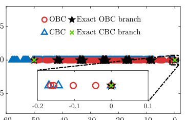
<figcaption class="paper-figure-caption"><b>Fig 3.</b> FIG. 3. Liouvillian spectra in the zero weak-gauge block at fixed matter number. Red: OBC. Blue: CBC. Black stars: exact OBC branch eigenvalues from Eq. (14). Green crosses: CBC branch eigenvalues obtained from the cycle-consistent branch assignments satisfying Eq. (15). The inset enlarges the zero-mode region. Parameters are the same as in Fig. 2(a).</figcaption>
</figure>
<figure class="paper-figure-card">
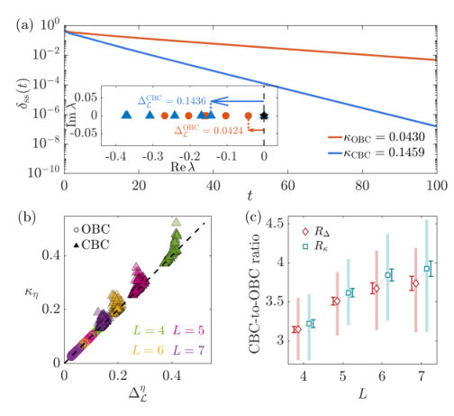
<figcaption class="paper-figure-caption"><b>Fig 4.</b> FIG. 4. Matter-occupation relaxation rates and Liouvillian gaps under OBC and reciprocal CBC. (a) Matter-occupation deviation δη ss(t) for one L = 7 realization. The inset shows Li- ouvillian eigenvalues near λ = 0, with arrows marking ∆OBC L and ∆CBC L . (b) Late-time relaxation rates κη versus gaps ∆η L. Open circles denote OBC, filled triangles denote CBC, colors distinguish L = 4, 5, 6, 7, and the dashed line marks κη = ∆η L. (c) CBC-to-OBC ratios R∆= ∆CBC L /∆OBC L and Rκ = κCBC/κOBC. Markers, thick bars, and thin error bars denote means, interquartile ranges, and standard errors, re- spectively. All fitted dynamics start from the two leftmost matter sites occupied, all other matter...</figcaption>
</figure>

**Summary.** The paper analyzes dissipative quantum link chains to decouple the steady-state properties from their relaxation dynamics. It shows that while boundary conditions can be modified (e.g., from open to cyclic) to maintain the same reduced matter occupation profile, they fundamentally change the system's Liouvillian spectrum and thus its approach rate to equilibrium. This separation is controlled by an accumulated field derived from local dissipation asymmetries.

**Why it may be interesting.** This work provides a rigorous theoretical framework for separating the determination of equilibrium states from the rates at which those states are approached in open quantum systems, highly relevant for understanding engineered dissipation.

Detailed structure

**Main problem.** The study investigates whether changes in boundary conditions (open vs. cyclic) affect both the steady state and the non-zero Liouvillian spectrum independently in dissipative quantum link chains.

**Main result.** The accumulated field, derived from local dissipation asymmetries, determines the exact reduced matter steady state, while a reciprocal cyclic closure can preserve this steady occupation but significantly alter the relaxation rates (Liouvillian gap).

**Method.** The authors use gauge-generated transformations to find symmetry-resolved steady states and compare Liouvillian spectra by analyzing the time evolution of deviations from equilibrium.

**Model / system.** The system is a one-dimensional U(1) quantum link chain subjected to dissipation, modeled via a Lindbladian superoperator. The dynamics are analyzed in the fixed-matter number sector.

**Key observables.** Reduced matter steady occupation ($\langle n 
angle_{ss}$), Liouvillian spectrum eigenvalues ($\lambda$), and relaxation rates ($\kappa_\eta$).

**Important parameters / regimes.** Link-resolved dissipative asymmetries ($h_n$), the accumulated field ($X_n$), and the strong-dissipation limit.

**Assumptions / limitations.** The analysis often projects onto a fixed eigenvalue $N$ of the total matter number operator $\hat{N}$.

**Figures summary.** Figures compare steady occupations ($\langle n 
angle_{ss}$) for OBC vs. CBC, showing agreement in occupation but divergence in Liouvillian spectra and relaxation rates; Fig 4 compares fitted decay rates to spectral gaps.

**Paper structure.** The paper establishes that the accumulated field dictates the steady state via a gauge transformation. It then constructs a cyclic boundary condition that preserves this steady state profile while modifying the non-zero Liouvillian spectrum, demonstrating a separation between steady-state control and relaxation dynamics.

Abstract

In open quantum lattice systems, changing the boundary condition would appear to alter both the steady state and the nonzero Liouvillian spectrum. Here we show that these two boundary-induced changes do not necessarily occur together in a globally reciprocal dissipative quantum link chain. The steady state is determined by an accumulated field defined by link-resolved dissipative asymmetries, and a gauge-generated transformation built from this field gives exact symmetry-resolved steady states with nonuniform, accumulated-field-dependent reduced matter occupations. We then construct a reciprocal cyclic boundary condition that preserves these matter occupations while changing the nonzero Liouvillian spectrum. Consequently, open and cyclic chains relax to the same reduced matter steady-occupation profile with different Liouvillian gaps, with the cyclic closure accelerating relaxation. In the strong-dissipation limit, this relaxation difference can be reduced to a spectral comparison of effective exclusion processes with open and cyclic boundaries.

[↑ back to top](#top)

### [Internal-state criticality in Bayesian-inverse-Bayesian inference](http://arxiv.org/abs/2606.22109v1)

**Authors:** Kazuto Sasai, Yukio-Pegio Gunji  
**Type:** theory · **Category:** statistical mechanics · **PDF:** <https://arxiv.org/pdf/2606.22109v1>  
**Analysis basis:** full PDF text, analyzed in chunks
**Topic relevance:** 🔥 `non-equilibrium universality` **4/5** · `driven-dissipative phase transition` **3/5** · `entanglement & information structure` **2/5** · `measurement-induced transitions` **2/5** · `non-equilibrium dynamics` **2/5** · `quantum measurements` **2/5** · `analog quantum simulation` **1/5** · `correlated / nonlocal dissipation` **1/5** · `methods for driven-dissipative` **1/5** · `scars & prethermalization` **1/5**

↔ Scroll figures horizontally

<figure class="paper-figure-card">
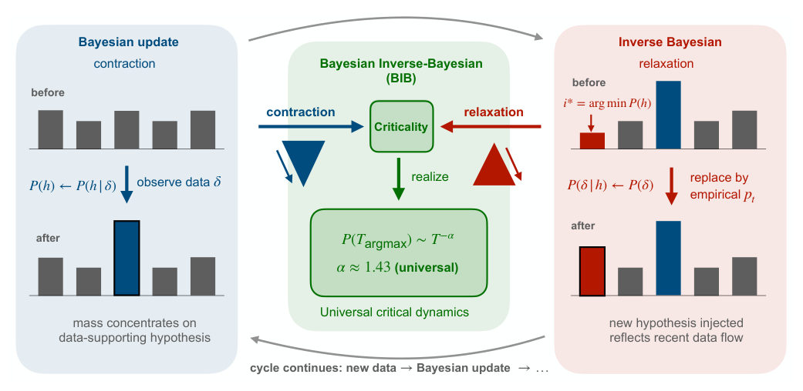
<figcaption class="paper-figure-caption"><b>Fig 1.</b> FIG. 1. Schematic of the Bayesian and inverse-Bayesian steps and the resulting internal-state critical dynamics. The Bayesian update (left) contracts the posterior, concentrating mass on data-supporting hypotheses. The inverse-Bayesian replacement (right) renews the hypothesis set, injecting a new hypothesis that reflects the recent empirical pattern. Together, the Bayesian concentration and the inverse-Bayesian renewal give rise to a critical state characterized by a power-law persistence-time distribution P(Targmax) ∼T −α, where Targmax is the number of consecutive steps the posterior’s most-probable hypothesis remains unchanged.</figcaption>
</figure>
<figure class="paper-figure-card">
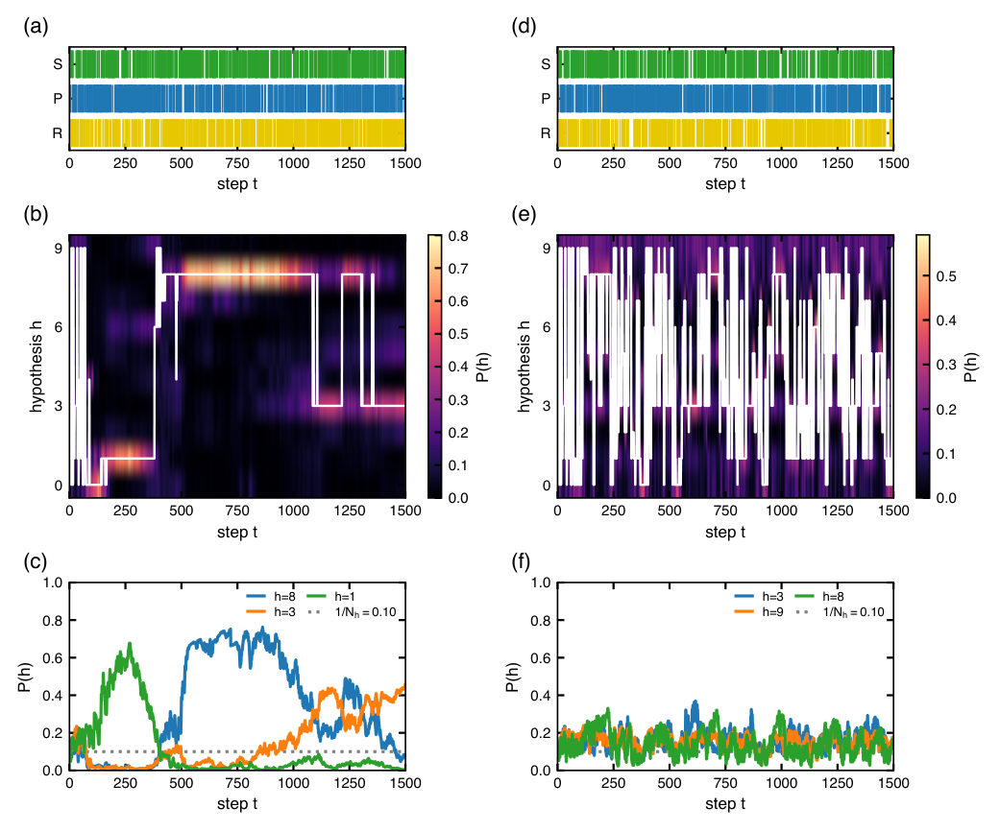
<figcaption class="paper-figure-caption"><b>Fig 2.</b> FIG. 2. Hypothesis-space dynamics, BIB-BIB (left column) versus BO-BO (right column). Same random seed, rs design (random init, sample), Nh = 10, m = 50, T = 1500. (a, d) Hand sequence of agent A (R yellow, P blue, S green). (b, e) Posterior P(h) heatmap with the argmax trajectory overlaid (white line). (c, f) Top-3 P(h) trajectories with the uniform reference 1/Nh shown as a dotted line.</figcaption>
</figure>
<figure class="paper-figure-card">
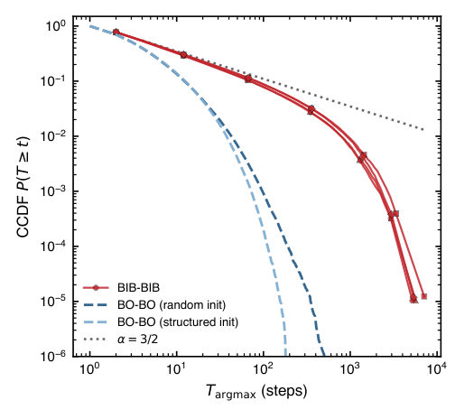
<figcaption class="paper-figure-caption"><b>Fig 3.</b> FIG. 3. Design-independent collapse of the BIB argmax- persistence exponent and its absence under Bayes-only updat- ing. Argmax-persistence CCDFs, the four BIB-BIB designs (red) collapse onto a single heavy tail (α ≈1.43), whereas BO-BO (blue, random- versus structured-initialization fam- ilies) departs from a power law at the shortest persistence times. T = 2 × 105 × 20 runs, Nh = 10, m = 50.</figcaption>
</figure>
<figure class="paper-figure-card">
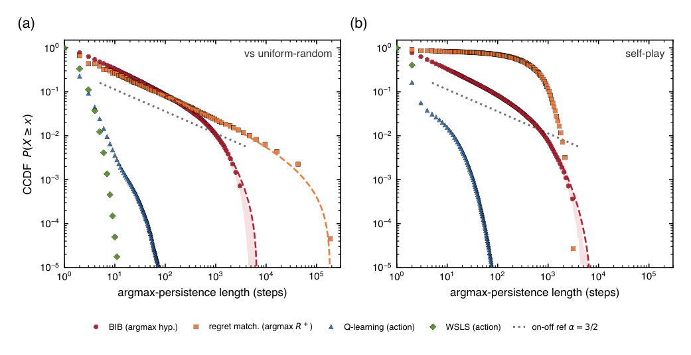
<figcaption class="paper-figure-caption"><b>Fig 4.</b> FIG. 4. Specificity of the critical class to the inverse-Bayesian rule among adaptive learners. Internal argmax-persistence CCDFs of BIB (red circles, shaded band over the four designs rs/ra/ss/sa) versus standard learners at Nh = 10, m = 50, T = 2 × 105 (40 seeds), showing the played-action run length for the reactive baselines Q-learning (blue triangles) and WSLS (green diamonds) and the argmax cumulative regret for regret matching (orange squares). (a) Against a uniform-random opponent. (b) In self-play. Dashed curves are truncated-power-law fits. The dotted guide is the on-off α = 3/2 slope.</figcaption>
</figure>
<figure class="paper-figure-card">
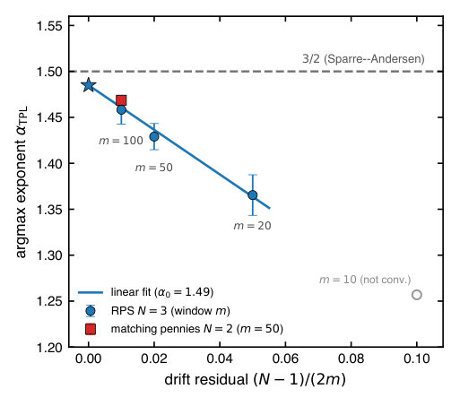
<figcaption class="paper-figure-caption"><b>Fig 5.</b> FIG. 5. Extrapolation of the argmax exponent to 3/2 as the finite-sample drift residual vanishes. Measured BIB-BIB argmax-persistence exponent αTPL (truncated-power-law fit over the [5, 104] power-law region, both agents pooled) versus the renewal residual (N −1)/(2m). Blue circles, rock–paper– scissors (N = 3) at observation windows m ∈{20, 50, 100} (error bars, SD over the four designs). Red square, match- ing pennies (N = 2, m = 50), which halves the residual at fixed m. The two routes coincide at equal residual, and the line is a least-squares fit through the converged points, ex- trapolating to α0 ≈1.49 at zero residual (star), close to the Sparre–Andersen 3/2 (dashed). The m = 10...</figcaption>
</figure>

**Summary.** This paper proposes Bayesian-inverse-Bayesian (BIB) inference as a generative model that naturally generates critical dynamics. By adding an inverse step to standard Bayesian updating, the system achieves a robust internal critical state characterized by heavy-tailed persistence statistics. This mechanism is argued to be fundamentally different from simple adaptive learning or external tuning parameters.

**Why it may be interesting.** While not directly about quantum systems, the concept of 'internal-state criticality' arising from an information processing rule provides a powerful analogy for understanding non-equilibrium dynamics in complex quantum many-body systems or open quantum systems where measurement/feedback drives emergent order.

Detailed structure

**Main problem.** To find a minimal generative model where criticality emerges intrinsically from the inference process itself, bridging game theory optimization with observed heavy-tailed decision statistics.

**Main result.** Bayesian-inverse-Bayesian (BIB) inference maintains an internal critical state characterized by power-law persistence distributions ($\alpha \approx 1.43$) due to a boundary-reconstructing renewal mechanism.

**Method.** The authors simulate the BIB update rule on repeated N-hand cyclic-dominance Rock-Paper-Scissors, comparing it against standard Bayes-only inference (BO).

**Model / system.** The model is an adaptive learning process applied to a discrete game (N-hand RPS), where the core mechanism involves augmenting Bayesian updates with an inverse step that replaces low-support hypotheses with empirical observation histograms.

**Key observables.** $	ext{argmax}$-persistence distribution exponent ($\alpha$), laminar phase length distribution, and posterior spread scaling ($\sigma \propto N^{-eta_h}$).

**Important parameters / regimes.** Window size ($m$), number of hands ($N$), hypothesis count ($N_h$), and the residual drift term $(N-1)/(2m)$.

**Assumptions / limitations.** The critical state is robustly characterized by the on-off intermittency class, suggesting a zero-drift internal mechanism rather than external tuning.

**Figures summary.** Figures compare CCDFs of persistence times for BIB vs. BO, showing distinct heavy-tailed behavior; other figures illustrate parameter sweeps confirming robustness and convergence to theoretical exponents like $3/2$.

**Paper structure.** The paper develops the argument by first defining the BIB mechanism, then analyzing its resulting power-law statistics across multiple axes (N, m, Nh), contrasting it with BO inference, and finally assigning the observed critical behavior to a specific internal renewal process.

Abstract

We propose Bayesian-inverse-Bayesian (BIB) inference in repeated games as a minimal generative model linking Bayesian inference, statistical mechanics, and heavy-tailed statistics. As a concrete instantiation we simulate repeated $N$-hand cyclic-dominance rock-paper-scissors, a discrete setting in which Nash-targeting algorithms collapse to uniform random play, so that any non-trivial dynamics must originate internally. Across a multi-axis sweep of design, window, and opponent conditions, the BIB dynamics remain in the same internal critical state, the argmax-persistence distribution staying a heavy-tailed power law with exponent $α\approx 1.43$ at the canonical window. Along the window and alphabet axes the exponent is not constant but drifts toward the universal $3/2$ as the finite-sample residual $(N-1)/(2m)$ vanishes. Bayes-only inference, which lacks the inverse step, shows no analogous universality and no power law. Because the argmax and laminar observables are first-passage reads of one driftless log-posterior walk, what is robust across conditions is the critical, zero-drift state itself, evidenced by the cross-design data collapse rather than by any particular exponent value. The state is also invariant across the hypothesis count $N_h$, with the cutoff time and posterior spread obeying finite-size scaling. Adding an inverse-Bayesian relaxation step (hypothesis renewal) to ordinary Bayesian inference is by itself enough to render the dynamics critical, with no external parameter adjustment. Rather than self-organizing toward an absorbing state, BIB reaches criticality by continually reconstructing the hypothesis-space boundary, a mechanism complementary to self-organized criticality that makes the criticality robust across a natural parameter range.

[↑ back to top](#top)

### [Fast quantum-state transfer in Su-Schrieffer-Heeger chains beyond the noninteracting regime](http://arxiv.org/abs/2606.23324v1)

**Authors:** François Impens, David Guéry-Odelin  
**Type:** theory · **Category:** other · **PDF:** <https://arxiv.org/pdf/2606.23324v1>  
**Analysis basis:** full PDF text, analyzed in chunks
**Topic relevance:** 🔥 `analog quantum simulation` **4/5** · `methods for driven-dissipative` **3/5** · `non-equilibrium dynamics` **3/5** · `driven-dissipative phase transition` **2/5** · `non-equilibrium universality` **2/5** · `Frenkel-Kontorova` **1/5** · `Keldysh / 2PI / non-Gaussian methods` **1/5** · `entanglement & information structure` **1/5** · `quantum measurements` **1/5**

↔ Scroll figures horizontally

<figure class="paper-figure-card">
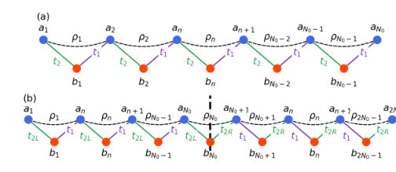
<figcaption class="paper-figure-caption"><b>Fig 1.</b> FIG. 1. (a) Simple SSH chain with N = 2N0 −1 sites with t1 (purple) and t2 (green) NN hoppings. (b) SSH chain with a topological interface at the central BN0 site, with N = 4N0 −1 sites. In both SSH geometries, Nρ tunable NNN couplings ρn(t) connect adjacent sites of the A-sublattice, with Nρ = N0 −1 in the simple SSH chain and Nρ = 2N0 −1 in the topological-interface geometry. We first consider single- particle SSH chains with real-valued NNN couplings, and then extend the discussion to the many-particle case with phase- tunable complex-valued NNN couplings ρn(t).</figcaption>
</figure>
<figure class="paper-figure-card">
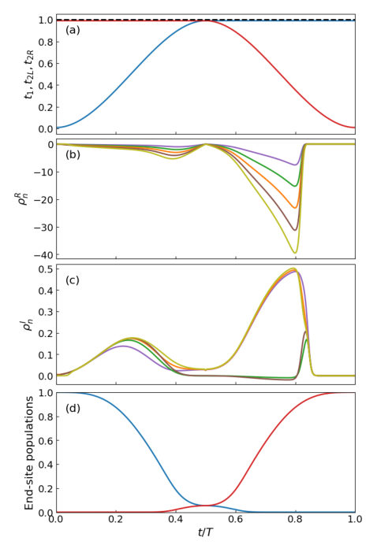
<figcaption class="paper-figure-caption"><b>Fig 2.</b> FIG. 3. Nonlinear NNN-assisted shortcut for state trans- fer through a topological SSH interface. (a) Prescribed NN couplings t1(t) (dashed black), t2L(t) (blue), and t2R(t) (red), defining the adiabatic passage across the interface. (b) Real quadratures ρR n (t) of the NNN couplings, which coincide with the linear inverse-engineered shortcut. (c) Imaginary quadra- tures ρI n(t) for the considered mean-field regime. (d) Popu- lations on the two end sites, showing near-perfect transfer across the interface. The blue and red curves correspond to the left and right end sites, respectively. The NN cou- plings are prescribed as t1(t) = t0, t2L(t) = t0Pδ(2t/T), and t2R(t) = t0Pδ(1) for 0 ≤t ≤T/2,...</figcaption>
</figure>
<figure class="paper-figure-card">
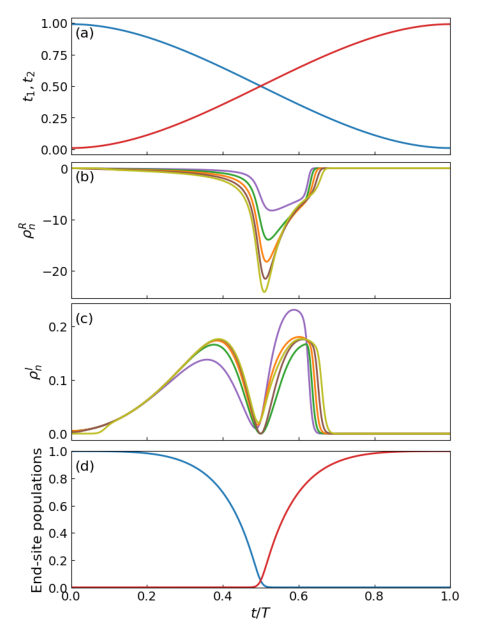
<figcaption class="paper-figure-caption"><b>Fig 3.</b> FIG. 2. Nonlinear NNN-assisted shortcut for state trans- fer in a simple SSH chain with N = 39 sites. (a) Pre- scribed nearest-neighbor couplings t1(t) (blue) and t2(t) (red) as a function of time, defining the adiabatic passage between the two end sites. (b) Real quadratures ρR n (t) of the NNN couplings, which coincide with the linear inverse-engineered shortcut. (c) Imaginary quadratures ρI n(t) for the considered mean-field regime. Panels (b,c) show the first five NNN hop- pings, ρ1 (purple), ρ2 (green), ρ3 (orange), ρ4 (brown), and ρ5 (olive) and use the same color code. (d) Populations on the left (blue) and right (red) end sites as a function of time, showing near-perfect transfer....</figcaption>
</figure>
<figure class="paper-figure-card">
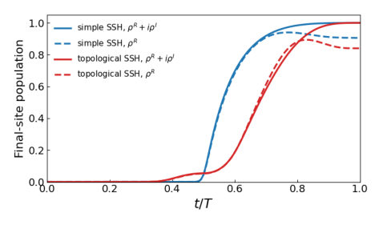
<figcaption class="paper-figure-caption"><b>Fig 4.</b> FIG. 4. Full nonlinear vs real-valued shortcut in the non- linear mean-field dynamics: right-end population of the sim- ple (blue) and topological-interface (red) SSH chain as a func- tion of the rescaled time. Solid lines correspond to the full complex NNN couplings ρn(t) = ρR n (t) + iρI n(t), while dashed lines correspond to the real-valued shortcut ρn(t) = ρR n (t). In both geometries, adding the imaginary component restores near-perfect final-site population. Parameters identical to Figs. 2,3.</figcaption>
</figure>
<figure class="paper-figure-card">
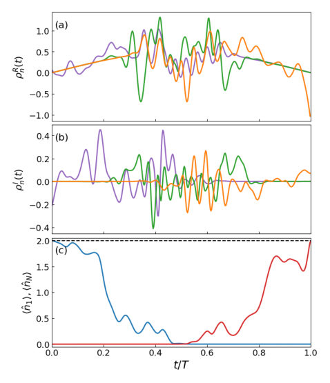
<figcaption class="paper-figure-caption"><b>Fig 5.</b> FIG. 5. Many-body PMP protocol with complex site- dependent NNN controls in an SSH chain with a topologi- cal interface. The optimization is performed directly in the fixed-M Bose-Hubbard Fock sector for M = 2 bosons. (a) Real quadratures ρR n (t) of selected NNN couplings: ρR 1 (pur- ple), ρR 5 (green), and ρR 9 (orange). (b) Corresponding imag- inary quadratures ρI 1, ρI 5, and ρI 9, with the same color con- vention. (c) Time-dependent occupations of the initial and target edge sites, ⟨ˆn1⟩(blue) and ⟨ˆnN⟩(red). The dashed horizontal line indicates the total particle number M = 2. Topological-interface SSH chain with N = 19 sites (N0 = 5) and interaction strength g = 0.5 t0. The time...</figcaption>
</figure>

**Summary.** This paper develops advanced optimal control protocols to achieve fast and high-fidelity quantum state transfer in interacting SSH chains. By introducing complex, phase-tunable next-nearest-neighbor hoppings, the authors overcome nonlinear self-phase modulation effects that limit simpler mean-field shortcuts. The results confirm that precise control over hopping phases is crucial for realizing robust transport in strongly correlated topological matter.

**Why it may be interesting.** This work provides a concrete demonstration of how engineering complex control fields (phase-tunable couplings) can overcome fundamental limitations imposed by interactions in topological quantum systems, which is highly relevant for designing robust quantum devices.

Detailed structure

**Main problem.** The primary goal is accelerating quantum-state transfer (QST) in topological systems while maintaining high fidelity, especially when moving beyond the noninteracting regime.

**Main result.** Complex, phase-tunable next-nearest-neighbor hoppings are identified as a key control resource that allows for near-perfect state transfer even in strongly interacting many-body regimes.

**Method.** The study employs advanced optimal control theory, specifically Pontryagin Maximum Principle (PMP) optimization, applied to the Bose-Hubbard model dynamics.

**Model / system.** The system is modeled using Su-Schrieffer-Heeger (SSH) chains, extended to include interactions via a time-dependent Bose-Hubbard Hamiltonian. The analysis progresses from single-particle approximations to full many-body Fock space optimization.

**Key observables.** Transfer Fidelity ($F$), end-site populations ($\langle\hat{n}
angle$), and the required complex NNN coupling strengths ($
ho_{R,n}(t), 
ho_{I,n}(t)$).

**Important parameters / regimes.** Interaction strength ($g$), particle number ($M$), and the ratio of hopping parameters ($\epsilon = |t_2/t_1|$).

**Assumptions / limitations.** The analysis moves through approximations: single-particle $
ightarrow$ mean-field product state $
ightarrow$ full many-body Fock space optimization. The complex control approach is key to overcoming limitations in the mean-field picture.

**Figures summary.** Figures illustrate the geometry of SSH chains with topological interfaces, showing prescribed NN hoppings and the engineered time-dependent real ($
ho_R$) and imaginary ($
ho_I$) components of the NNN couplings used for control.

**Paper structure.** The paper builds logically by first establishing shortcuts in the noninteracting regime, then extending this to an exact nonlinear shortcut within the mean-field approximation using complex hoppings. Finally, it validates these findings by performing full many-body optimization using PMP in the Fock space.

Abstract

Shortcuts to adiabaticity have made topological edge-state transfer fast in the single-particle regime, but their extension to interacting systems is obstructed by nonlinear phase accumulation. We show that this obstruction can be removed in Su-Schrieffer-Heeger chains by making the next-nearest-neighbor shortcut hopping phase tunable. In the mean-field regime, this yields an exact nonlinear shortcut: one hopping quadrature keeps the state on the instantaneous dark-state trajectory, while the orthogonal quadrature cancels the interaction-induced self-phase modulation. The resulting protocol is nonperturbative in the mean-field interaction strength. When applied to the full Bose-Hubbard dynamics, the mean-field shortcut remains beneficial but saturates below unit fidelity, exposing genuinely many-body corrections beyond the product-state picture. We then optimize the transfer directly in the many-body Hilbert space and find that complex, phase-tunable next-nearest-neighbor hoppings recover near-perfect fidelity. Our results show that hopping phases are not merely a technical refinement, but a key control resource for fast and high-fidelity transport in interacting topological systems.

[↑ back to top](#top)

### [Improved State Readout in NV Centers using Regression Models and Rabi Driving](http://arxiv.org/abs/2606.23454v1)

**Authors:** Fritz Haltenberger, Manpreet Singh Jattana  
**Type:** experiment · **Category:** quantum information and computing · **PDF:** <https://arxiv.org/pdf/2606.23454v1>  
**Analysis basis:** full PDF text, analyzed in chunks
**Topic relevance:** 🔥 `QC/QI experiment` **4/5** · `methods for driven-dissipative` **3/5** · `quantum measurements` **3/5** · `spintronics-quantum-optics interface` **3/5** · `measurement-induced transitions` **2/5** · `Keldysh / 2PI / non-Gaussian methods` **1/5** · `driven-dissipative phase transition` **1/5** · `quantum optics experiment` **1/5**

↔ Scroll figures horizontally

<figure class="paper-figure-card">
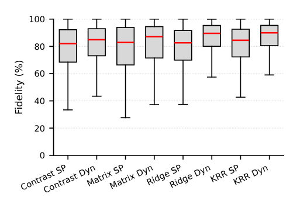
<figcaption class="paper-figure-caption"><b>Fig 1.</b> FIG. 1. Prediction fidelities for eight models: Contrast method, Matrix method, Ridge regression, and Kernel Ridge regression (KRR), each evaluated using single-point (SP) and dynamical (Dyn) intensities. Boxplots show the distribution of fidelities across samples, with medians indicated by the red line, interquartile ranges by the boxes, and whiskers extend- ing to 1.5× the interquartile range.</figcaption>
</figure>
<figure class="paper-figure-card">

<figcaption class="paper-figure-caption"><b>Fig 2.</b> Figure 1 compares the distributions of the prediction fi- delities for all methods, with single-point intensities and dynamical intensities. For the dynamical measurement signals, we use NRabi = 10, and therefore d = 56. For Ridge regression, α = 0.03 was selected via hyperparam- eter optimization. Kernel Ridge regression uses α = 0.01 and γ = 1. For both regression methods, performance was evaluated using 10-fold cross-validation. The Ridge regression model with dynamical intensi- ties achieves a mean fidelity of 86% ± 13% (SD, N=491), significantly outperforming both the contrast and matrix methods, particularly when using dynamical intensities. The non-linear Kernel Ridge regression has...</figcaption>
</figure>
<figure class="paper-figure-card">

<figcaption class="paper-figure-caption"><b>Fig 3.</b> Figure 1 and table I both show that for all four meth- ods, using the dynamical intensities improves the aver- age fidelity, mean-squared error and the total variation distance. The improvement in prediction fidelity is rel- atively and absolutely larger for the regression methods than for the contrast and matrix methods. Figure 2 compares the fidelities achieved by all mod- els for various numbers of Rabi points used. Using one</figcaption>
</figure>
<figure class="paper-figure-card">
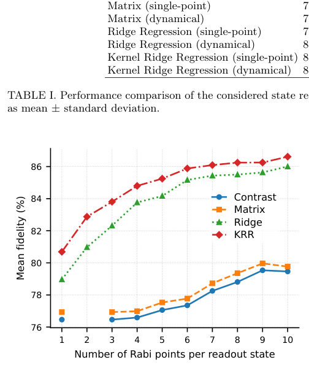
<figcaption class="paper-figure-caption"><b>Fig 4.</b> FIG. 2. Prediction fidelity as a function of the number of Rabi points used as input. For the contrast and matrix methods, a sine fit was performed on the first n points of the Rabi signal, with the fitted intercept taken as the intensity. For the regression models, the first n points were provided as input features to the model for training and inference. The fidelities were obtained through 10-fold cross-validation.</figcaption>
</figure>
<figure class="paper-figure-card">
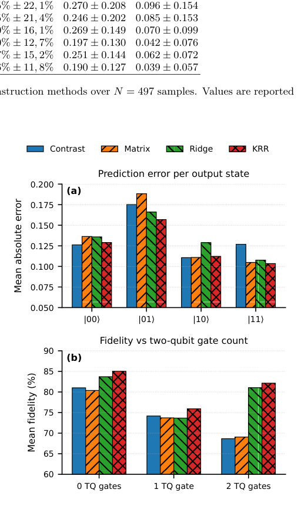
<figcaption class="paper-figure-caption"><b>Fig 5.</b> FIG. 3. a): comparison of mean absolute error in prediction of each states’ population for each method. b): fidelity of predictions of each method considering only circuits with no two-qubit gates (left), one two-qubit gate (middle) and two- qubit gates (right). Both methods are based on the same cross-validation fidelities as before.</figcaption>
</figure>

**Summary.** This paper presents an improved method for reading out the state populations of NV center qubits at room temperature by employing data-driven regression models trained on experimental fluorescence signals. By incorporating measurements during induced Rabi oscillations, the authors show that these machine learning approaches achieve significantly higher readout fidelities compared to standard contrast calibration techniques. This paves the way for more reliable solid-state quantum memory and processing.

**Why it may be interesting.** This work directly addresses a critical bottleneck in solid-state quantum computing: high-fidelity readout. For theorists working on open quantum systems, it provides empirical validation for using advanced ML techniques to model complex measurement backactions and decoherence effects.

Detailed structure

**Main problem.** The primary challenge is achieving high-fidelity state readout of quantum populations in Nitrogen-Vacancy (NV) centers at room temperature.

**Main result.** Data-driven regression models, especially those incorporating dynamical Rabi oscillation measurements, significantly outperform conventional contrast calibration methods for state readout fidelity.

**Method.** The authors employ machine learning techniques, specifically Ridge and Kernel Ridge Regression, to map raw fluorescence signals onto ideal simulated quantum populations.

**Model / system.** The system utilizes NV centers in diamond as a solid-state two-qubit quantum register. Readout relies on measuring spin-dependent photoluminescence at room temperature, which is complicated by phonon broadening.

**Key observables.** Prediction fidelity $F(p^*, \hat{p})$, Mean Squared Error (MSE), and Total Variation Distance (TV distance) comparing predicted populations ($\hat{p}$) to ideal theoretical populations ($p^*$).

**Important parameters / regimes.** Room temperature operation; external magnetic field ($B \approx 500	ext{ G}$); inclusion of Rabi oscillation measurements.

**Assumptions / limitations.** Conventional methods assume simple linear relationships, while the ML approach assumes that a mapping function (approximated by regression) can accurately relate measured signals to true populations.

**Figures summary.** Figures compare prediction fidelities across various readout models (Contrast vs. Regression) using single-point versus dynamical Rabi measurements; fidelity is shown to improve with more input features and training data size.

**Paper structure.** The paper systematically compares multiple state reconstruction methods—including contrast, matrix inversion, Ridge, and KRR—evaluating their performance by incorporating enhanced measurement protocols derived from Rabi oscillations. The results demonstrate the superior robustness of the data-driven regression approaches.

Abstract

Readout of state populations in nitrogen-vacancy centers from fluorescence measurements at room-temperature is routinely achieved via contrast-based calibration. The fidelities achieved by this conventional approach are limited by reducing the dynamical fluorescence behaviour of the NV center to a scalar value, and calculating the population of each possible state independently. To address these limitations, we use regression models trained on experimental data to map the fluorescence signals onto ideal simulated populations. Additionally, we enhance the informational content of the fluorescence signals by performing measurements during induced Rabi oscillations. Our results demonstrate that including these dynamical signals significantly reduces state readout errors across multiple tested models. Notably, linear ridge regression performs nearly on par with a non-linear kernel-based model, showing that simple models already capture the relevant mapping between the enhanced fluorescence signals and the underlying state populations. This data-driven approach provides a robust alternative that achieves higher fidelities than conventional calibration in our setting, paving the way for high-fidelity state readout in solid-state quantum registers.

[↑ back to top](#top)

### [Iterative quantum phase estimation with cQED encoding](http://arxiv.org/abs/2606.22071v1)

**Authors:** Changchun Zhong  
**Type:** theory · **Category:** other · **PDF:** <https://arxiv.org/pdf/2606.22071v1>  
**Analysis basis:** full PDF text, analyzed in chunks
**Topic relevance:** 🔥 `quantum optics experiment` **4/5** · `analog quantum simulation` **3/5** · `quantum measurements` **3/5** · `QC/QI experiment` **2/5** · `measurement-induced transitions` **2/5** · `Tavis-Cummings & cavity-many-emitter` **1/5** · `correlated cavity matter` **1/5** · `driven-dissipative phase transition` **1/5** · `methods for driven-dissipative` **1/5**

↔ Scroll figures horizontally

<figure class="paper-figure-card">
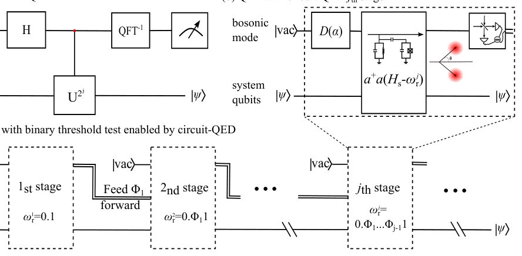
<figcaption class="paper-figure-caption"><b>Fig 1.</b> FIG. 1. (a) Quantum circuit for standard QPE. (b) The jth stage of the binary-threshold-test-enabled-QPE. A bosonic mode is used to replace the ancilla qubits and the inverse QFT in standard QPE. The protocol is assisted by well-developed toolbox from c-QED. (c) Schematics for the iterative QPE with binary threshold test. The test result is sequentially feed forward to extract the phase information bit by bit, which is encoded in the mode frequency as ωj r = 0.ϕ1ϕ2...ϕj... (in binary fraction).</figcaption>
</figure>
<figure class="paper-figure-card">
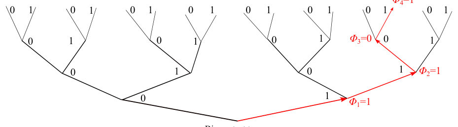
<figcaption class="paper-figure-caption"><b>Fig 2.</b> FIG. 2. The numerical example for the protocol to estimate an eigenvalue. The true eigenvalue is chosen as λ = 0.11011011101. (a) The binary test tree, with the most probable path depicted in red. The path traces the best estimate of the eigenvalue. (b) The probability for all possible branches, up to the fourth fraction digits. It is shown that the branch 0.ϕ1ϕ2ϕ3ϕ4 = 0.1101, closely matching the true eigenvalue, is the most probable. In this example, the initial coherent state |α0 = 0.8⟩is used. The legend plot (1) inside shows the probability for the most probable branches as a function of the initial α0. It shows that the probability approaches one when the mode occupation number gets...</figcaption>
</figure>

**Summary.** The paper presents an alternative Quantum Phase Estimation algorithm for cQED that bypasses the need for deep circuits and inverse Quantum Fourier Transforms. It achieves optimal Heisenberg scaling by encoding phase information into a bosonic mode and reading it out through sequential binary threshold measurements. This offers a significantly more practical route toward high-precision quantum computation on superconducting circuit platforms.

**Why it may be interesting.** This work directly addresses hardware overhead in quantum algorithms by mapping a complex algorithmic requirement (QFT) onto a physical measurement process inherent to cavity QED systems, making high-precision computation more feasible on current platforms.

Detailed structure

**Main problem.** Conventional Quantum Phase Estimation (QPE) suffers from high circuit depth due to deep controlled-unitary operations and the inverse QFT.

**Main result.** The authors propose a novel protocol achieving Heisenberg scaling in precision by replacing ancilla qubits and the inverse QFT with iterative binary threshold tests on a bosonic mode.

**Method.** Phase extraction is performed sequentially through repeated homodyne measurements of a bosonic mode, determining one bit of the phase at each stage via adaptive frequency setting.

**Model / system.** The protocol is implemented on a Circuit Quantum Electrodynamics (cQED) platform. The system dynamics are governed by a dispersive coupling Hamiltonian involving a bosonic mode acting as quantum memory.

**Key observables.** The sign of the phase-space rotation ($	ext{sign}(\Delta_j)$) determined via homodyne detection provides the binary digit $\phi_j$.

**Important parameters / regimes.** Heisenberg scaling in precision ($O(2^{-n})$), exponentially suppressed failure probability ($\delta$), and total evolution time $T \sim O(1/\epsilon)$.

**Assumptions / limitations.** The analysis assumes high-fidelity dispersive readout techniques are available, and it neglects decoherence and bosonic-mode loss.

**Figures summary.** Figure 1 compares standard QPE circuits to the proposed cQED binary threshold test. Figure 2 illustrates the iterative protocol using a binary test tree, showing probability distributions related to the phase estimation path.

**Paper structure.** The paper introduces the limitations of conventional QPE, details the novel bosonic-based protocol involving sequential binary tests and homodyne measurements, analyzes the scaling laws for precision and failure probability, and concludes with numerical examples demonstrating optimal time complexity.

Abstract

Quantum phase estimation is a cornerstone algorithm for determining eigenvalues of unitary operators or Hamiltonians with Heisenberg-limited precision. Conventional implementations rely on deep controlled-unitary operations together with an inverse quantum Fourier transform, resulting in substantial circuit depth and hardware overhead. Here, we propose a conceptually simple and experimentally feasible alternative that exploits the toolbox of circuit quantum electrodynamics. The protocol extracts the phase through a sequence of binary threshold tests, eliminating the need for an inverse quantum Fourier transform. A bosonic mode serves as an efficient quantum memory in which the binary digits of the phase are encoded into the direction of phase-space rotations. These digits are then read out sequentially via high-fidelity homodyne measurements. We show that the protocol achieves Heisenberg scaling in estimation precision while simultaneously providing exponentially suppressed failure probability. By replacing the ancillary circuit with a bosonic degree of freedom, the scheme significantly reduces hardware complexity and offers a practical route toward implementing high-precision quantum phase estimation on circuit quantum electrodynamics platforms.

[↑ back to top](#top)

### [Protecting Qubits from Purcell Decay via Permanent Dipoles](http://arxiv.org/abs/2606.22732v1)

**Authors:** Alex Krasnok  
**Type:** theory · **Category:** other · **PDF:** <https://arxiv.org/pdf/2606.22732v1>  
**Analysis basis:** full PDF text, analyzed in chunks
**Topic relevance:** 🔥 `methods for driven-dissipative` **4/5** · `correlated / nonlocal dissipation` **3/5** · `correlated cavity matter` **3/5** · `Tavis-Cummings & cavity-many-emitter` **2/5** · `driven-dissipative phase transition` **2/5** · `Keldysh / 2PI / non-Gaussian methods` **1/5** · `analog quantum simulation` **1/5** · `non-equilibrium dynamics` **1/5** · `non-equilibrium universality` **1/5**

↔ Scroll figures horizontally

<figure class="paper-figure-card">
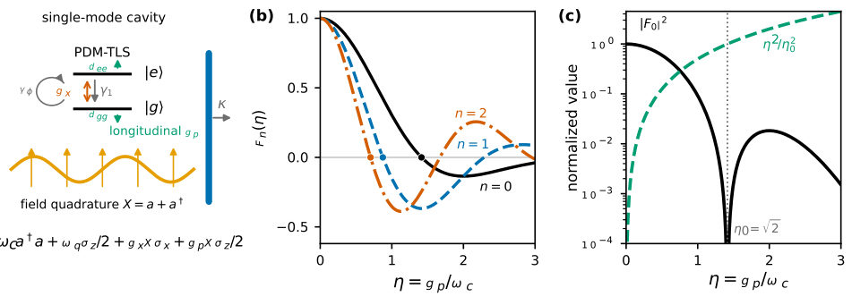
<figcaption class="paper-figure-caption"><b>Fig 1.</b> FIG. 1. Permanent-dipole exchange suppression. (a) The model contains a transverse exchange coupling gx and a longitudinal permanent-dipole coupling gp. (b) Franck–Condon factors Fn(η) set the exchange strength in the first three excitation manifolds; markers denote the first zeros. (c) In the lowest manifold, the displaced-RWA transverse-exchange proxy collapses near η0 = √</figcaption>
</figure>
<figure class="paper-figure-card">
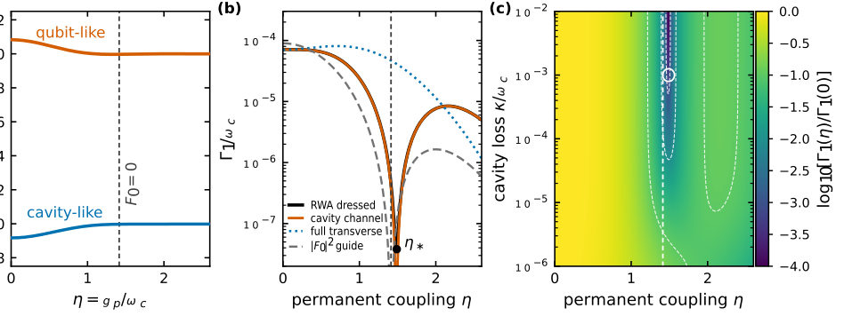
<figcaption class="paper-figure-caption"><b>Fig 2.</b> FIG. 2. Dressed open-system rates. (a) Qubit-like and cavity-like transition frequencies in the displaced rotating-wave model versus longitudinal coupling η. (b) Dressed qubit-like decay compared to the full-transverse calculation and the analytical |F0(η)|2 guide. (c) Rate reduction versus η and normalized cavity decay κ/ωc. Panel (a) plots Hamiltonian diagonalization; panels (b) and (c) plot numerical dressed-state evaluations of the zero-temperature secular Lindblad rates from Eq. (8).</figcaption>
</figure>
<figure class="paper-figure-card">
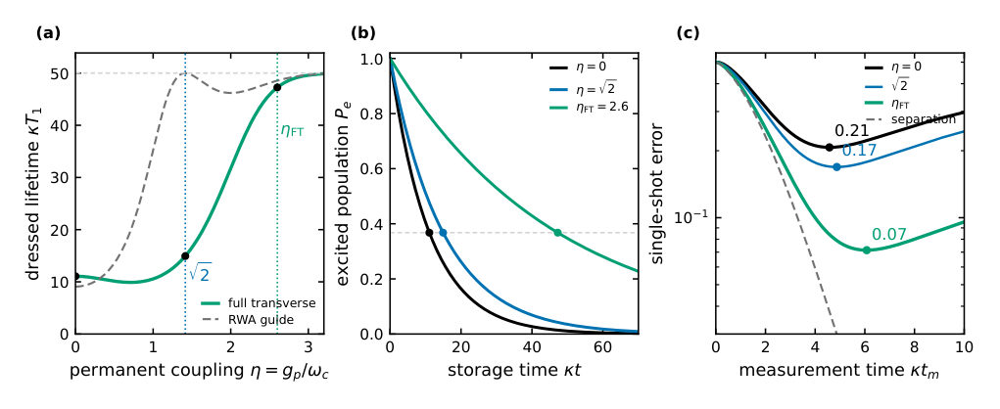
<figcaption class="paper-figure-caption"><b>Fig 3.</b> FIG. 3. Storage and longitudinal-readout benchmark using full-transverse dressed rates. (a) Normalized dressed lifetime κT1 versus permanent-dipole displacement. The dashed curve is the displaced-RWA analytical guide, while the solid curve uses the full-transverse dressed cavity-loss rate in Eq. (10). Vertical dotted lines mark η0 = √</figcaption>
</figure>

**Summary.** The paper proposes using permanent electric dipoles within a qubit coupled to a cavity to suppress Purcell decay. By exploiting the dipole's ability to create channel-selective field displacements, it achieves significant protection against radiative loss while maintaining necessary readout signals. This offers a pathway for building high-fidelity quantum devices by engineering dissipation itself.

**Why it may be interesting.** This work provides an advanced theoretical tool for engineering dissipation channels in superconducting or solid-state qubits, moving beyond simple filtering to utilize intrinsic material properties (dipoles) for quantum control.

Detailed structure

**Main problem.** The primary challenge addressed is Purcell decay, a loss mechanism in cavity Quantum Electrodynamics (QED) that limits fast qubit readout.

**Main result.** Permanent electric dipoles can provide an internal, channel-selective form of Purcell protection, significantly increasing the qubit lifetime and reducing readout error rates.

**Method.** The analysis uses open-system quantum dynamics by calculating dressed decay rates derived from a Lindblad master equation in the system's eigenbasis.

**Model / system.** The model involves a qubit coupled to a cavity resonator, incorporating an additional interaction term mediated by a permanent electric dipole moment. The Hamiltonian includes transverse ($g_x$) and longitudinal ($g_p$) coupling terms.

**Key observables.** Normalized lifetime ($\kappa T_1$), single-shot readout error ($\epsilon_{tot}$), and the decay rates ($\Gamma_i$) for different coupling regimes.

**Important parameters / regimes.** The dimensionless longitudinal coupling $\eta = g_p / \omega_c$, which controls the degree of dipole-induced field displacement.

**Assumptions / limitations.** The analysis compares results from a simplified displaced Rotating-Wave Approximation (RWA) against a more rigorous full-transverse model, noting that the RWA zero is not physically exact.

**Figures summary.** Figures illustrate the competition between transverse and longitudinal couplings, showing how the decay rate suppression shifts from an analytical RWA zero ($\eta=\sqrt{2}$) to a larger operating point ($\eta_{FT}=2.60$) in the full model.

**Paper structure.** The paper introduces the problem of Purcell decay, develops a Hamiltonian incorporating dipole coupling, calculates open-system decay rates using dressed states, and benchmarks performance improvements by comparing RWA predictions against full-transverse calculations.

Abstract

Reading out a qubit often requires coupling it to a resonator, but that same resonator can also give the qubit an extra path to decay. Here, we study a way to reduce this loss using a built-in permanent electric dipole. The dipole shifts the cavity field in different directions for the qubit ground and excited states. This shift makes the relevant wave functions overlap less, which weakens the transverse qubit--cavity exchange that causes Purcell decay. In a simplified displaced rotating-wave model, this exchange vanishes at $η=\sqrt{2}$. In the full transverse model, this exact zero is lifted, but strong suppression remains at a larger dipole-induced displacement. Using dressed open-system decay rates, we find an operating point where the cavity-mediated decay is strongly reduced while the longitudinal readout signal remains finite. For the benchmark studied here, at fixed pointer separation, the normalized lifetime increases from $κT_1=11.1$ to $47.3$, and the estimated single-shot readout error drops from $0.21$ to $0.07$. These results show that permanent electric dipoles can provide an internal, channel-selective form of Purcell protection.

[↑ back to top](#top)

### [Deviance from a pink noise regime in the temporal organization of semantic relations in psychosis](http://arxiv.org/abs/2606.23043v1)

**Authors:** Paola Moreno Ancalmo, Emre Bora, Rieke Roxanne Mülfarth, Svenja Seuffert, Tilo Kircher, Frederike Stein, Philipp Homan, Wolfram Hinzen  
**Type:** both · **Category:** statistical mechanics · **PDF:** <https://arxiv.org/pdf/2606.23043v1>  
**Analysis basis:** full PDF text, analyzed in chunks
**Topic relevance:** 🔥 `non-equilibrium universality` **4/5** · `driven-dissipative phase transition` **3/5** · `methods for driven-dissipative` **3/5** · `non-equilibrium dynamics` **3/5** · `Frenkel-Kontorova` **1/5** · `Keldysh / 2PI / non-Gaussian methods` **1/5** · `analog quantum simulation` **1/5** · `correlated / nonlocal dissipation` **1/5**

↔ Scroll figures horizontally

<figure class="paper-figure-card">
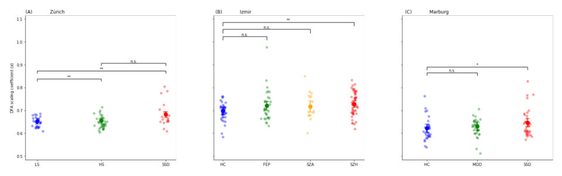
<figcaption class="paper-figure-caption"><b>Fig 1.</b> Figure 1. DFA scaling exponents (α) across diagnostic groups in the Zürich (A), Izmir (B), and</figcaption>
</figure>
<figure class="paper-figure-card">
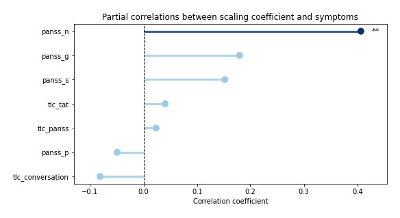
<figcaption class="paper-figure-caption"><b>Fig 2.</b> Figure 2: Partial Spearman correlations between DFA scaling exponents (α) and symptom scores in the Zürich dataset, controlling for diagnosis. Each point represents the correlation coefficient for a given symptom subscale, sorted by effect size. Dark blue indicates significance after FDR correction (q &lt; .05), medium blue indicates uncorrected significance (p &lt; .05), and light blue indicates non-significant associations. Dashed vertical line is at zero. *p &lt; .05 (uncorrected); **q &lt; .05 (FDR-corrected). Marburg dataset Symptom correlations are displayed in Figure 3.</figcaption>
</figure>
<figure class="paper-figure-card">
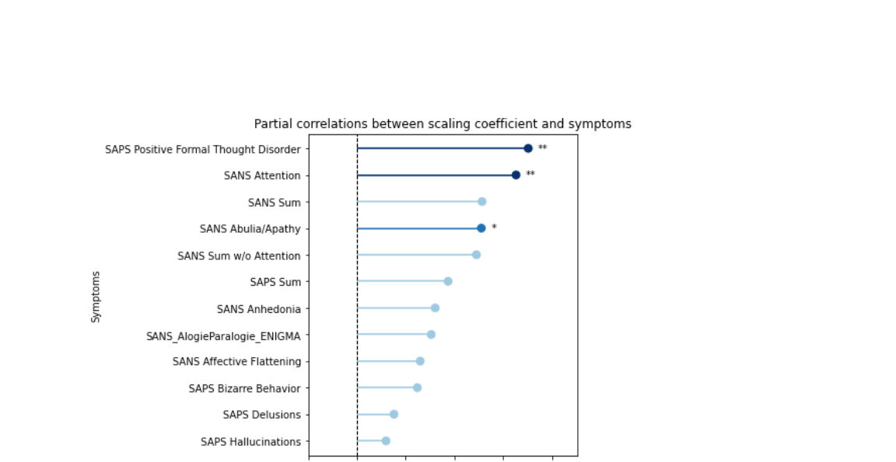
<figcaption class="paper-figure-caption"><b>Fig 3.</b> Figure 3: Partial Spearman correlations between DFA scaling exponents (α) and symptom scores in the Marburg dataset, controlling for diagnosis. Each point represents the correlation coefficient for a given symptom subscale, sorted by effect size. Dark blue indicates significance after FDR correction (q &lt; .05), medium blue indicates uncorrected significance (p &lt; .05), and light blue indicates non-significant associations. Dashed vertical line is at zero. *p &lt; .05 (uncorrected); **q &lt; .05 (FDR-corrected). Turkish dataset</figcaption>
</figure>
<figure class="paper-figure-card">
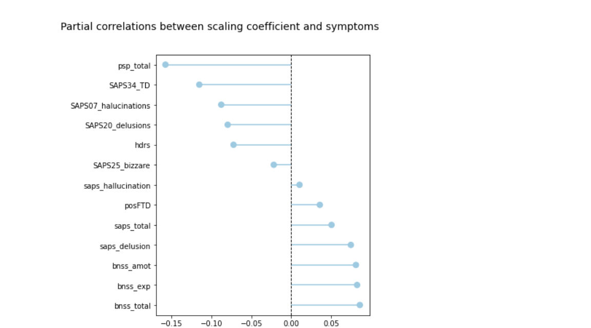
<figcaption class="paper-figure-caption"><b>Fig 4.</b> Figure 4: Partial Spearman correlations between DFA scaling exponents (α) and symptom scores in the Turkish dataset, controlling for diagnosis. Each point represents the correlation coefficient for a given symptom subscale, sorted by effect size. Dark blue indicates significance after FDR correction (q &lt; .05**), medium blue indicates uncorrected significance (p &lt; .05*), and light blue indicates non-significant associations. Dashed vertical line is at zero. *p &lt; .05 (uncorrected); **q &lt; .05 (FDR-corrected).</figcaption>
</figure>

**Summary.** This paper analyzes speech from psychosis patients by quantifying the temporal organization of semantic meaning using Detrended Fluctuation Analysis (DFA) on word embedding similarities. The authors found that patients exhibit abnormally high scaling exponents, suggesting excessive persistence and a departure from optimal 'critical' dynamics. This links linguistic pathology to known deviations from criticality observed in other complex physical systems.

**Why it may be interesting.** Although applied to linguistics, the methodology—using DFA to test for deviations from critical scaling ($\alpha$) in a complex temporal process—is directly relevant to characterizing non-equilibrium dynamics in open quantum systems or biological processes modeled by statistical physics.

Detailed structure

**Main problem.** The study investigates whether deviations from a scale-invariant 'pink noise' regime characterize the temporal organization of semantic relations in psychosis, drawing parallels with pathology seen in other complex systems.

**Main result.** Patients exhibited significantly elevated DFA scaling exponents ($\alpha$) compared to controls, indicating abnormally strong and excessive long-range temporal correlations in their semantic fluctuations.

**Method.** Detrended Fluctuation Analysis (DFA) was applied to continuous cosine-similarity time series derived from BERT embeddings of clinical speech transcripts.

**Model / system.** The system analyzed is the temporal evolution of semantic relationships within human language production, modeled as trajectories through a high-dimensional semantic space using word embeddings.

**Key observables.** DFA scaling exponent ($\alpha$), which quantifies long-range temporal correlations; cosine similarity time series.

**Important parameters / regimes.** The critical regime (associated with pink noise/scale-invariance); the threshold for excessive persistence ($\alpha > 0.5$); minimum continuous stretch length (>100 words).

**Assumptions / limitations.** That deviations from criticality in language dynamics mirror pathological departures observed in physiological or neural systems; that DFA is an appropriate tool to characterize multi-timescale organization of meaning.

**Figures summary.** Figure 1 shows DFA scaling exponents ($\alpha$) across diagnostic groups (Zürich, Izmir, Marburg datasets); subsequent figures show partial Spearman correlations between $\alpha$ and symptom scores for different cohorts.

**Paper structure.** The paper establishes the theoretical framework by comparing noise regimes in pathology. It then details the application of DFA to semantic similarity time series from multiple clinical datasets (Zürich, Izmir, Marburg), presenting group comparisons and correlation analyses with symptom severity.

Abstract

The notion of pink noise refers to 'scale-invariant' temporal dynamics, where fluctuations exhibit similar statistical structure across time scales. Departures from a regime associated with such scale-free organization toward uncorrelated 'white' noise or overly persistent 'brown' noise have been widely identified as markers of pathology across physiological and cognitive domains. Whether comparable alterations characterize the temporal organization of language remains largely unexplored. We address this question in the domain of psychosis, where language anomalies are pervasively documented. Specifically, we apply detrended fluctuation analysis (DFA) to quantify temporal scaling in BERT-derived continuous cosine-similarity time series capturing trajectories through semantic space, using clinical transcripts from patients and controls across three independent datasets. DFA scaling exponents were extracted to characterize the strength of long-range temporal correlations. Across all datasets, patients exhibited significantly elevated scaling exponents relative to controls, indicating abnormally strong long-range correlations with excessive persistence in semantic fluctuations. This temporal analysis opens a window into the multi-timescale organization of meaning as it unfolds in discourse. The results reveal a signature of altered temporal scaling in speech, consistent with deviations from criticality in physiological domains, paralleling known departures from criticality in brain function in psychosis and suggesting possible links between these two domains.

[↑ back to top](#top)

### [Dynamical Tipping in a Quantum Limit Cycle](http://arxiv.org/abs/2606.21849v1)

**Authors:** Ya-Xin Xiang, Zhengyang Bai, Yu-Qiang Ma  
**Type:** theory · **Category:** statistical mechanics · **PDF:** <https://arxiv.org/pdf/2606.21849v1>  
**Analysis basis:** full PDF text, analyzed in chunks
**Topic relevance:** 🔥 `driven-dissipative phase transition` **4/5** · `methods for driven-dissipative` **3/5** · `non-equilibrium dynamics` **3/5** · `non-equilibrium universality` **3/5** · `Keldysh / 2PI / non-Gaussian methods` **1/5** · `analog quantum simulation` **1/5** · `correlated / nonlocal dissipation` **1/5**

↔ Scroll figures horizontally

<figure class="paper-figure-card">
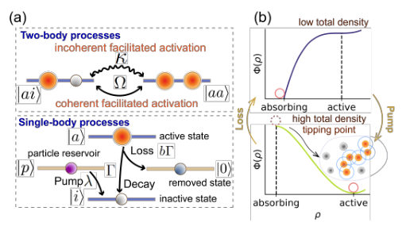
<figcaption class="paper-figure-caption"><b>Fig 1.</b> FIG. 1. (a) Effective four-level scheme with timescale separa- tion (Γ, κ, Ω≫bΓ, λ). An inactive quantum emitter (state |i⟩, gray sphere) can be activated via coherent (Ω) and incoher- ent (κ) facilitated activation by a nearby emitter in the active state |a⟩(red sphere). Active emitters spontaneously decay either back to |i⟩or into a removed state |0⟩(blue sphere), causing emitter loss. Emitters in the pump state |p⟩(purple sphere) are incoherently transferred to the inactive state to compensate for losses. The system exhibits a first-order APT from a zero-excitation absorbing state to a finite-excitation active state as the total density increases. This is captured by (b) the effective...</figcaption>
</figure>
<figure class="paper-figure-card">
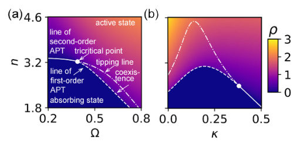
<figcaption class="paper-figure-caption"><b>Fig 2.</b> FIG. 2. Mean-field (MF) phase diagrams for (a) κ = 0.3 and (b) Ω= 0.5 at fixed total density n. Color indicates the ac- tive density ρ. In the classical (quantum) regime, the system exhibits a second-order (first-order) APT from the absorbing with ρ = 0 to an active state with finite ρ, marked by solid (dashed) lines. The two transitions meet at a tricritical point (dot). Within the first-order APT regime, the tipping point (dash-dotted lines) marks where the absorbing state becomes linearly unstable (u2 = 0). The region between the tipping line and the first-order APT line is a coexistence regime where the absorbing and active states are both stable.</figcaption>
</figure>
<figure class="paper-figure-card">
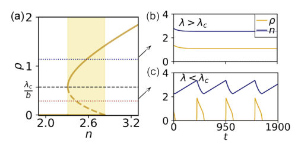
<figcaption class="paper-figure-caption"><b>Fig 3.</b> FIG. 3. MF picture of limit cycle state induced by self- organized bistability. (a) For a given loading rate λ, the stationary solution to the coupled equations (7a) and (7b) corresponds to the intersection between the yellow curve (fixed points of the active-density equation (7b) at fixed to- tal density; solid/dashed segments indicate stable/unstable branches) and the horizontal dashed line (fixed point of total- density equation (7b)). The coexistence regime is shaded yel- low. A critical loading rate λc separate two regimes: (b) limit- cycle state for λ &lt; λc and (c) stationary state for λ &gt; λc.</figcaption>
</figure>
<figure class="paper-figure-card">
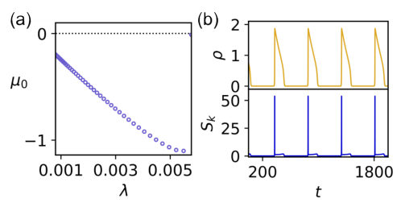
<figcaption class="paper-figure-caption"><b>Fig 4.</b> FIG. 4. (a) Floquet multiplier that corresponds to fluctua- tions of active density fields with respect to MF trajectory as a function of λ for k = 0. (b) The dynamical behav- ior of the active density (upper) and correlation function (lower) Sk = ⟨δρk,tδρ−k,t⟩within Gaussian approximation for k = 0.1π. In line with a negative Floquet multiplier in (a), the correlation function Sk is periodic and finite with peaks corresponding to the tipping point where the system is about to jump from the absorbing state towards the absorbing state and is therefore susceptible to fluctuations.</figcaption>
</figure>
<figure class="paper-figure-card">
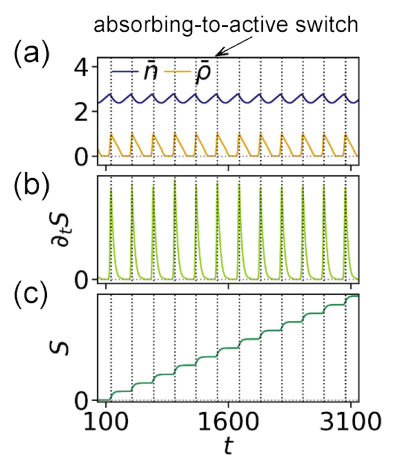
<figcaption class="paper-figure-caption"><b>Fig 5.</b> FIG. 5. Time series of (a) the spatially averaged total ¯n and active ¯ρ densities, (b) instantaneous entropy production rate ∂tS, and (c) total entropy production S. Gray dashed lines mark transitions from the absorbing to the active state. The instantaneous entropy production rate peaks at the tipping point where the system switches from the absorbing to active states. Parameters for (a)-(c) are L = 64, λ = 3.2 × 10−3.</figcaption>
</figure>

**Summary.** The paper develops a theoretical model for open quantum systems exhibiting bistability driven by first-order phase transitions. It shows that these systems can sustain stable Limit Cycles characterized by periodic fluctuations. These LCs are robustly linked to the system's tipping points, which manifest as sharp spikes in dynamical susceptibility and energy dissipation.

**Why it may be interesting.** This work provides a rigorous quantum mechanical framework for understanding how far-from-equilibrium processes—like those seen in climate or ecology—can generate sustained, coherent oscillations (LCs) using fundamental concepts of critical slowing down and dissipation.

Detailed structure

**Main problem.** The study investigates how non-equilibrium fluctuations and long-range correlations can be sustained by engineering a quantum limit cycle in systems undergoing first-order absorbing-state phase transitions.

**Main result.** The authors demonstrate that stable Limit Cycles (LCs) emerge from the interplay between bistability, multiplicative quantum noise, and periodic passage through tipping points, which are marked by sharp spikes in dynamical susceptibility and entropy production.

**Method.** The analysis employs a combination of Lindblad master equations, semiclassical continuum approximations leading to coupled Langevin equations, Floquet analysis for stability, and path integral methods for calculating entropy production.

**Model / system.** The model is a generic quantum contact system involving active and inactive emitters, exhibiting bistability. Dynamics are governed by coupled stochastic differential equations derived from the master equation, describing the evolution of active ($
ho$) and total ($n$) densities.

**Key observables.** Dynamical susceptibility (showing transient spikes), energy dissipation rate/dynamical entropy production (showing stepwise accumulation), and spatial correlation functions $S_{k,t}$.

**Important parameters / regimes.** System rates ($\Gamma, \kappa, \lambda, b$), noise characteristics, and the control parameter $\lambda$ which dictates the transition between stationary states and LC regimes.

**Assumptions / limitations.** The analysis relies on semiclassical continuum limits, Markovian noise assumptions, and linearization techniques (e.g., around mean-field trajectories) to analyze fluctuations.

**Figures summary.** Figures illustrate Mean-Field phase diagrams showing APTs; time series show periodic oscillations of correlations ($S_{k,t}$) peaking near the tipping point; and entropy production ($\partial t S$) shows a sharp peak coinciding with the transition.

**Paper structure.** The paper progresses from defining the physical system via master equations to deriving effective classical/stochastic dynamics. It then analyzes phase transitions (APT) using mean-field theory, followed by linearizing fluctuations around the trajectory and applying Floquet analysis to confirm LC stability and characterize correlation peaks linked to thermodynamic signatures like entropy production.

Abstract

Nonequilibrium systems maintain spatiotemporal order through energy dissipation and entropy production. Here, we demonstrate this principle by engineering a quantum limit cycle that emerges from the interplay between a first-order absorbing-state phase transition and feedback mechanism coupling order and control parameters. The quantum limit cycle manifests dynamical correlations driven by multiplicative quantum noise and periodic traverses through tipping points, which act as a robust early-warning signal for state transitions. This periodic crossing results in the enhanced dynamical susceptibility and transient rise of long-range correlations near each tipping event and their subsequent disappearance away from it. These critical transitions are accompanied by a sharp increase in the energy dissipation rate, leading to a stepwise accumulation of dynamical entropy production over time. Our results provide a way for realizing dynamical fluctuations and long-range correlations in strongly interacting driven-dissipative open quantum systems.

[↑ back to top](#top)

### [Emergent Andreev Reflection from a Lattice Duality Defect](http://arxiv.org/abs/2606.23684v1)

**Authors:** Atsushi Ueda, Tokiro Numasawa, Boris De Vos, Masataka Watanabe  
**Type:** theory · **Category:** other · **PDF:** <https://arxiv.org/pdf/2606.23684v1>  
**Analysis basis:** full PDF text, analyzed in chunks
**Topic relevance:** 🔥 `Kondo & dissipative impurity` **4/5** · `Keldysh / 2PI / non-Gaussian methods` **2/5** · `analog quantum simulation` **2/5** · `driven-dissipative phase transition` **2/5** · `Frenkel-Kontorova` **1/5** · `correlated / nonlocal dissipation` **1/5** · `entanglement & information structure` **1/5** · `methods for driven-dissipative` **1/5** · `non-equilibrium dynamics` **1/5** · `non-equilibrium universality` **1/5**

↔ Scroll figures horizontally

<figure class="paper-figure-card">
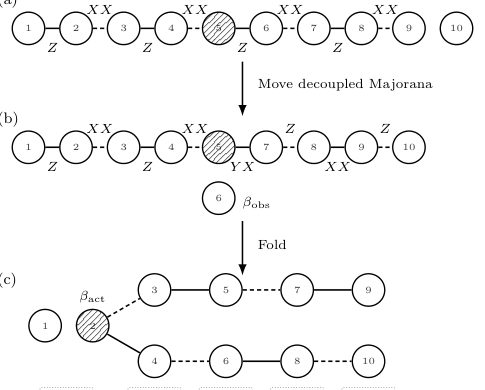
<figcaption class="paper-figure-caption"><b>Fig 1.</b> FIG. 1. Three representations of the same physical theory. A pair of adjacent Majorana fermions defines a local Hilbert space. (a) The original transverse-field Ising chain. Solid and dashed lines denote couplings of alternating strength. (b) The same model after sliding the decoupled Majorana fermion βobs. βobs forms a pair with the fifth Majorana (which we call the active Majorana, shaded in grey) for spanning the Hilbert space. (c) The folded representation of the impurity Ising chain.</figcaption>
</figure>
<figure class="paper-figure-card">
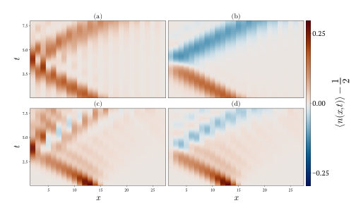
<figcaption class="paper-figure-caption"><b>Fig 2.</b> FIG. 2. Scattering dynamics for the free boundary condition in (a,c) and the Emery–Kivelson (EK) boundary condition in (b,d), at g = 1 in (a,b) and g = 3 in (c,d). The wave packet is created by applying a fermion creation operator to the ground state which propagates toward the boundary at x = 1, where it is reflected. For the free boundary condition in (a,c), the charge of the excitation is preserved upon reflection. For the EK boundary condition in (b,d), the charge is flipped.</figcaption>
</figure>
<figure class="paper-figure-card">
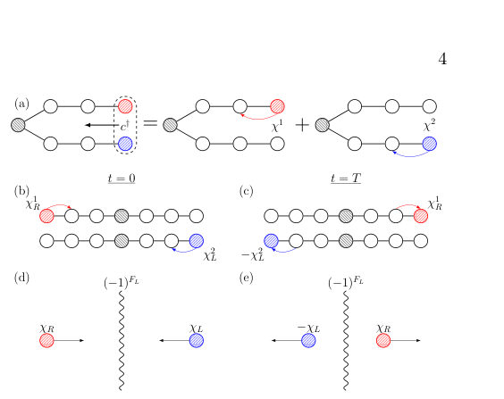
<figcaption class="paper-figure-caption"><b>Fig 3.</b> FIG. 3. Andreev reflection in the lattice EK model. (a) Before unfolding, a wavepacket of the complex fermion approach- ing the boundary decomposes into a pair of chiral Majorana fermions hopping in the same direction. (b) After unfolding, the pair of chiral Majorana fermions move in opposite direc- tions towards the impurity. (c) The boundary Majorana im- purity implements a one-site translation, producing a minus sign only for the left-moving mode. (d,e) Continuum coun- terpart of the same process. The Majorana impurity acts as a chiral fermion-parity defect.</figcaption>
</figure>
<figure class="paper-figure-card">
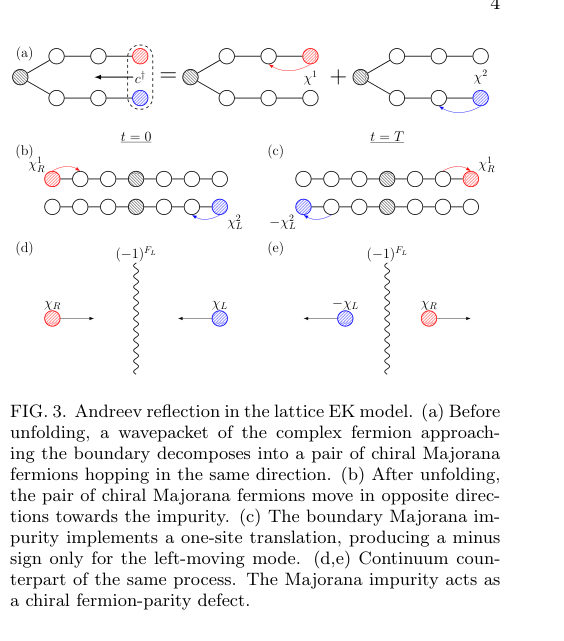
<figcaption class="paper-figure-caption"><b>Fig 4.</b> Fig. 3 (d,e). Combining these two facts, the lattice re- alization of the Emery–Kivelson boundary condition is naturally identified with the one-site translation defect in the staggered Majorana fermion model. This identifi- cation is not an exact microscopic equality on the lattice; it is an emergent low-energy statement. This is why we call the phenomenon emergent Andreev reflection. Relation to interfaces between CFTs and SPT phases. Let us finally make explicit the relation between the lat- tice Emery–Kivelson model and an interface between a gapless chain and an SPT phase. Strictly speaking, on the lattice we consider an interface between a gapped SPT segment and a gapless Majorana...</figcaption>
</figure>
<figure class="paper-figure-card">
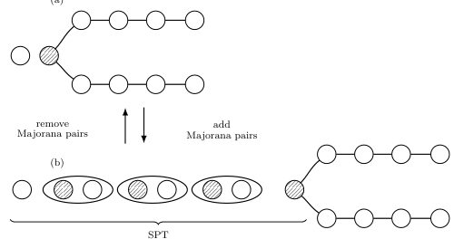
<figcaption class="paper-figure-caption"><b>Fig 5.</b> FIG. 4. Relation between the Emery–Kivelson boundary and an interface between a Kitaev-chain SPT segment and gapless Majorana chains. (a) The lattice Emery–Kivelson boundary described by Eq. (6). (b) An interface between a Kitaev- chain SPT segment and gapless Majorana chains described by Eq. (11). The lattice Emery–Kivelson boundary can be viewed as the minimal boundary limit of this SPT-gapless interface, in which only the interface Majorana mode remains coupled to the gapless chains.</figcaption>
</figure>

**Summary.** The paper reveals that Andreev reflection, typically associated with superconducting interfaces, can emerge microscopically in a purely lattice system by introducing a duality defect into the transverse-field Ising chain. This mechanism is mathematically equivalent to a specific one-site translation of Majorana fermions, providing a unified theoretical framework for understanding boundary physics across different quantum impurity models.

**Why it may be interesting.** This work provides a deep microscopic understanding of topological boundary phenomena, linking concepts from condensed matter (Kitaev chains, SPT phases) to fundamental quantum impurity physics (Kondo effect) via lattice symmetries and defects.

Detailed structure

**Main problem.** The study aims to determine the universal mechanism behind Andreev reflection (a charge-conjugating boundary condition) when it appears in seemingly unrelated quantum impurity problems, such as those related to the two-channel Kondo effect.

**Main result.** Andreev reflection is shown to emerge naturally from a purely lattice duality defect—specifically, it corresponds to a one-site translation of Majorana operators within the folded transverse-field Ising chain model.

**Method.** The authors use theoretical mapping techniques, transforming the Ising Hamiltonian into a Majorana representation and analyzing scattering dynamics by 'folding' the system at an impurity site.

**Model / system.** The primary model is based on the transverse-field Ising chain, which is analyzed via its Majorana fermion formulation. The defect introduces an effective boundary condition analogous to those found in the Emery–Kivelson (EK) model or at interfaces between Kitaev-chain SPT phases and gapless chains.

**Key observables.** Scattering dynamics of wavepackets, charge fluctuation ($\delta n(x)$), comparison between free vs. EK boundary conditions, and conservation laws for axial $U(1)_A$ symmetry.

**Important parameters / regimes.** The system is analyzed in the continuum limit and at the interface between a Kitaev-chain SPT phase and gapless chains; the two-channel Kondo problem serves as a key physical realization.

**Assumptions / limitations.** The identification of Andreev reflection with a one-site translation defect is termed 'emergent' because it is not an exact microscopic equality on the lattice, but rather a low-energy statement.

**Figures summary.** Figures illustrate the mapping from the Ising chain to the folded geometry, comparing scattering results for free vs. EK boundaries, and showing the physical realization of Andreev reflection via Majorana impurity defects acting as chiral fermion-parity defects.

**Paper structure.** The paper proceeds by establishing the lattice model (Ising $	o$ Majorana), analyzing the boundary defect structure through folding, deriving the continuum limit connection to Dirac fermions, and finally connecting this mechanism to known physical boundaries like those in the two-channel Kondo problem.

Abstract

Andreev reflection converts an incoming fermion into an outgoing hole and is usually tied to a superconducting interface. We show that an analogous charge-conjugating boundary condition emerges from a purely lattice duality defect. Starting from a Majorana representation of the transverse-field Ising chain, we construct a folded lattice model in which a boundary Majorana impurity implements a one-site translation of a staggered Majorana chain. In the continuum, this translation becomes a chiral fermion-parity defect: it flips the sign of the only left-moving Majorana mode while leaving the right-moving mode unchanged. When the two Majorana modes are recombined into a complex fermion in the folded geometry, this sign flip becomes the Andreev-like boundary condition. Our lattice formulation gives a microscopic interpretation of the Emery--Kivelson boundary of the two-channel Kondo problem and of Maldacena--Ludwig monopole scattering, while identifying the boundary as the interface between a Kitaev-chain SPT phase and a gapless chain. The same Majorana translation defect also provides a lattice realization of an axial $U(1)_A$-symmetric charge-flip boundary.

[↑ back to top](#top)

### [Giant Fluctuations in Self-Propelled Particles with Age-Dependent Switching](http://arxiv.org/abs/2606.22209v1)

**Authors:** Shabnam Sohrabi, Farhad H. Jafarpour  
**Type:** theory · **Category:** statistical mechanics · **PDF:** <https://arxiv.org/pdf/2606.22209v1>  
**Analysis basis:** full PDF text, analyzed in chunks
**Topic relevance:** 🔥 `non-equilibrium universality` **4/5** · `driven-dissipative phase transition` **3/5** · `methods for driven-dissipative` **3/5** · `non-equilibrium dynamics` **3/5** · `Frenkel-Kontorova` **1/5** · `Keldysh / 2PI / non-Gaussian methods` **1/5** · `correlated / nonlocal dissipation` **1/5**

↔ Scroll figures horizontally

<figure class="paper-figure-card">
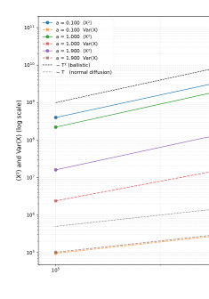
<figcaption class="paper-figure-caption"><b>Fig 1.</b> Figure 1: Scaling of the second moment ⟨x2 T ⟩(solid symbols) and variance Var(xT ) (open symbols) for a broad range of the exponent a. In the sub- critical (a = 0.100) and supercritical (a = 1.900) regimes, the variance follows the ordinary diffusive scaling ∼T (dotted line). At the critical point a = 1.000, the variance exhibits a marked departure from normal diffusion, growing nearly ballistically.</figcaption>
</figure>
<figure class="paper-figure-card">
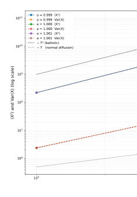
<figcaption class="paper-figure-caption"><b>Fig 2.</b> Figure 2: Detailed view of the scaling behavior in the vicinity of the critical point a = 1. The variance for a = 1.000 (red squares) clearly deviates from the diffusive ∼T scaling and exhibits a near-ballistic growth that is systematically weaker than ∼T 2, in agreement with the marginal prediction derived in Section 6. For small deviations from criticality (a = 0.999 and a = 1.001), the variance remains practically indistinguishable from the a = 1 curve over the entire simulated time window, reflecting the extremely slow crossover away from the marginal scaling.</figcaption>
</figure>

**Summary.** This theoretical paper analyzes the random walk behavior of self-propelled particles undergoing age-dependent phase switching. By using advanced generating function techniques, the authors characterize how fluctuations deviate from normal diffusion across different parameter regimes. The key finding is the emergence of giant, anomalous fluctuations at a critical point, demonstrating non-trivial memory effects in biased active matter systems.

**Why it may be interesting.** The concept of anomalous diffusion arising from memory effects (age-dependent switching) is highly relevant to non-equilibrium dynamics, which shares mathematical structures with open quantum systems where dissipation or environmental coupling introduces complex time correlations.

Detailed structure

**Main problem.** The study investigates the transport and fluctuation properties of self-propelled particles whose motion is governed by a complex, age-dependent phase-switching mechanism.

**Main result.** The system exhibits giant fluctuations at the critical point ($a=1$), where the variance scales anomalously as $	ext{Var}(x_T) \propto T^2 / \log T$, indicating a marginal breakdown of the Central Limit Theorem.

**Method.** The analysis employs generating-function methods and discrete-time moment recurrences, utilizing spatial Fourier and temporal z-transforms to derive exact expressions for the propagator and its asymptotic moments.

**Model / system.** The model describes a particle switching between two phases: a memoryless downstream phase ($\sigma_t = +1$) and an upstream phase ($\sigma_t = -1$) whose switching probability depends on the age $c$ via a hazard function $a/(b+c)$.

**Key observables.** Mean displacement $\langle x_T 
angle$, variance $	ext{Var}(x_T)$, and the total propagator $	ilde{P}(k, z)$.

**Important parameters / regimes.** The critical exponent $a$ (governing age-dependence), and system parameters $r, a, b, p$. Regimes include subcritical ($a<1$), critical ($a=1$), and supercritical ($a>1$).

**Assumptions / limitations.** The analysis relies on deriving exact expressions for propagators and moments using generating functions, assuming power-law decay of survival probabilities $S(c) \sim c^{-a}$ for large $c$.

**Figures summary.** Figures illustrate the scaling of $\langle x^2_T 
angle$ and $	ext{Var}(x_T)$ across different regimes of $a$, confirming ballistic growth in $\langle x^2_T 
angle$ and showing the anomalous $	ext{Var}(x_T) \sim T^{2/\log T}$ scaling at $a=1$.

**Paper structure.** The paper establishes the master equations for the two-phase motion, applies generating function techniques to find the propagator in $(k, z)$ space, and then analyzes the asymptotic behavior of the moments ($\langle x_T 
angle$ and $	ext{Var}(x_T)$) based on the critical exponent $a$.

Abstract

We investigate the transport and fluctuation properties of self-propelled particles whose motion is governed by an age-dependent phase-switching mechanism. The dynamics alternate between a Markovian downstream phase with a constant switching probability $r$ and a semi-Markovian upstream phase in which the age-dependent hazard probability $a/(b+c)$ decays with the internal clock $c$, representing persistent orientation. The time-averaged velocity, as an order parameter, shows a continuous transition at $a=1$ which separates an upstream-dominated ballistic regime ($a<1$) from an ergodic diffusive regime ($a>1$). Through generating-function methods and discrete-time moment recurrences, we derive exact expressions for the propagator and determine the long-time asymptotics of the mean displacement and variance. At the critical point $a=1$, the system exhibits giant fluctuations, with the variance scaling ballistically up to a logarithmic correction, $\mathrm{Var}(x_T) \propto T^2 / \log T$. These results demonstrate how slowly decaying reorientation probabilities lead to a marginal breakdown of the Central Limit Theorem, enabling unusually high-variance exploratory dynamics in biased environments.

[↑ back to top](#top)

### [Robust Structure Learning of $k$-local Lindbladians](http://arxiv.org/abs/2606.23652v1)

**Authors:** Tim Möbus, Thiago Bergamaschi, Daniel Stilck França, Cambyse Rouzé  
**Type:** theory · **Category:** quantum information and computing · **PDF:** <https://arxiv.org/pdf/2606.23652v1>  
**Analysis basis:** full PDF text, analyzed in chunks
**Topic relevance:** 🔥 `methods for driven-dissipative` **4/5** · `correlated / nonlocal dissipation` **3/5** · `driven-dissipative phase transition` **2/5** · `non-equilibrium dynamics` **2/5** · `quantum measurements` **2/5** · `Keldysh / 2PI / non-Gaussian methods` **1/5** · `non-equilibrium universality` **1/5**

↔ Scroll figures horizontally

<figure class="paper-figure-card">
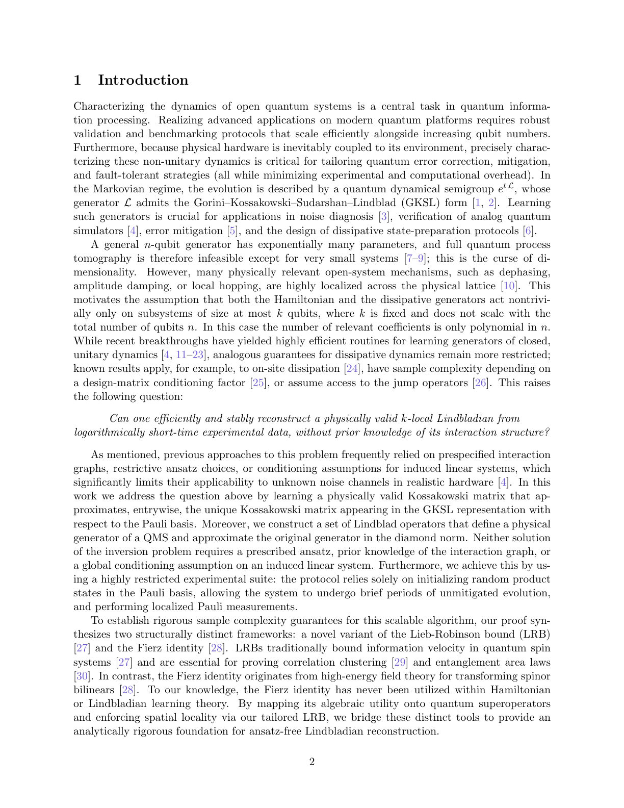
<figcaption class="paper-figure-caption"><b>Fig 1.</b> Low-resolution page preview, page 2</figcaption>
</figure>
<figure class="paper-figure-card">
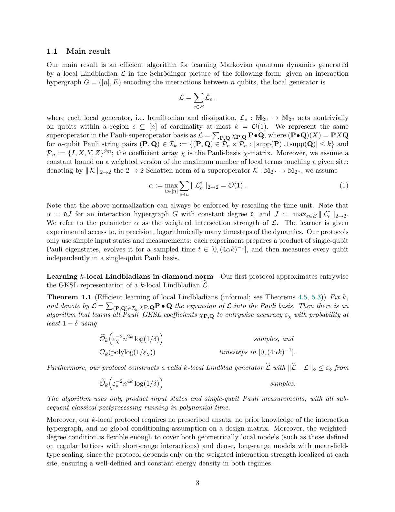
<figcaption class="paper-figure-caption"><b>Fig 2.</b> Low-resolution page preview, page 3</figcaption>
</figure>
<figure class="paper-figure-card">
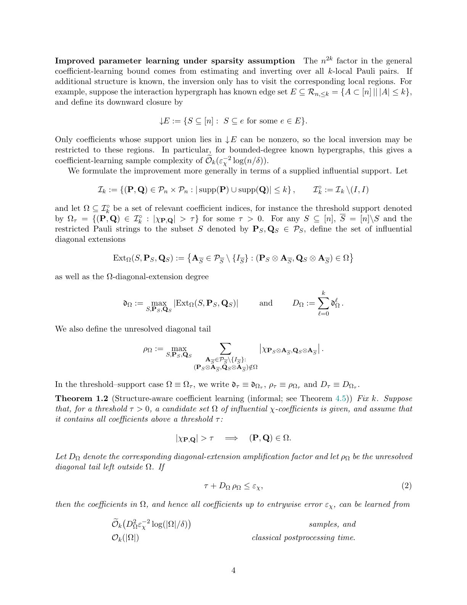
<figcaption class="paper-figure-caption"><b>Fig 3.</b> Low-resolution page preview, page 4</figcaption>
</figure>
<figure class="paper-figure-card">
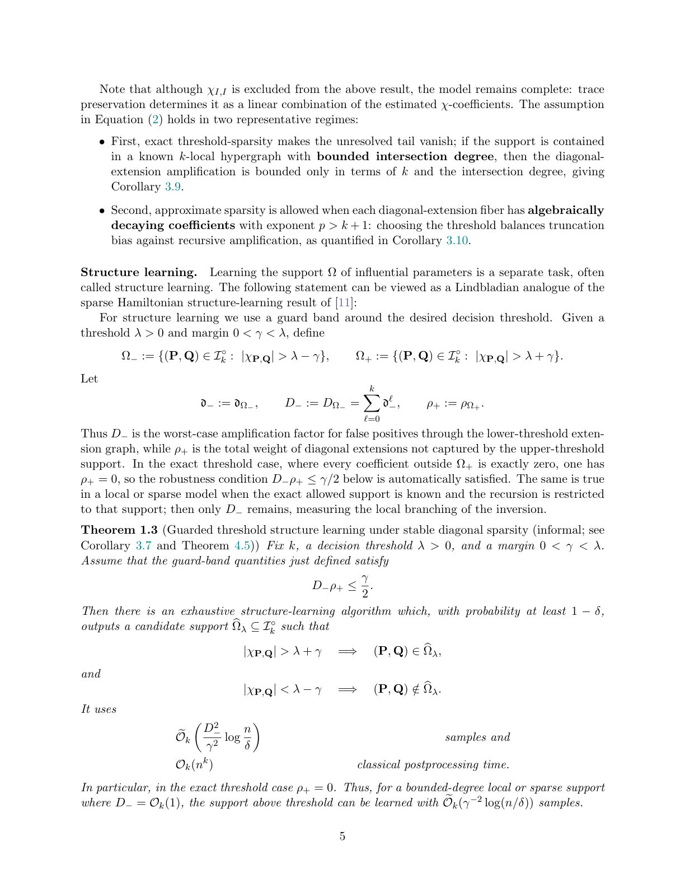
<figcaption class="paper-figure-caption"><b>Fig 4.</b> Low-resolution page preview, page 5</figcaption>
</figure>
<figure class="paper-figure-card">
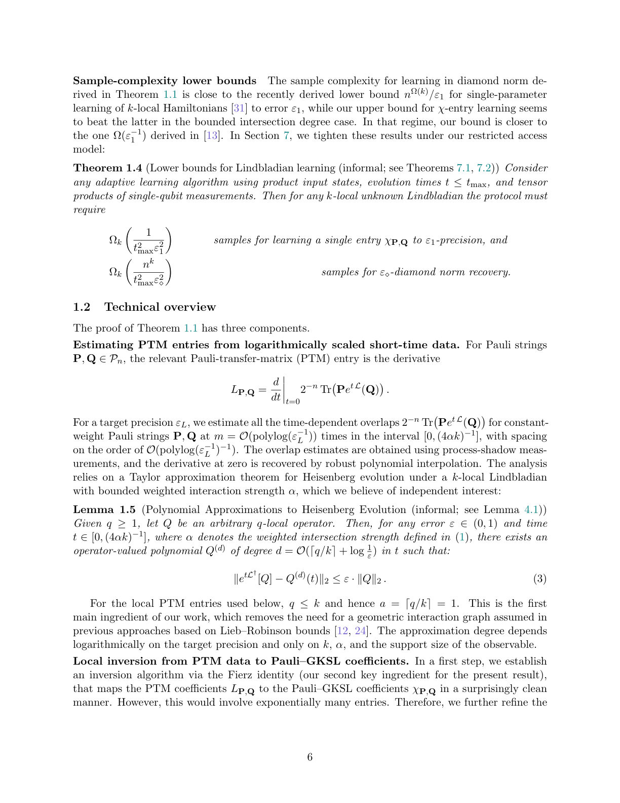
<figcaption class="paper-figure-caption"><b>Fig 5.</b> Low-resolution page preview, page 6</figcaption>
</figure>

**Summary.** This paper presents novel, efficient protocols for learning the generator of open quantum system dynamics (Lindbladians) using only limited measurements like product-state preparations. By combining advanced techniques such as Semidefinite Programming with structural assumptions on interactions, it achieves rigorous sample complexity guarantees that scale favorably with system size $n$ when the underlying physics is sparse or local.

**Why it may be interesting.** This work is highly relevant as it provides the theoretical tools necessary to characterize complex quantum dynamics in realistic settings where full tomography is impossible. The focus on $k$-locality and sparsity directly addresses resource limitations inherent in experimental quantum physics.

Detailed structure

**Main problem.** The core problem is developing efficient, data-driven protocols to reconstruct an unknown $k$-local Lindbladian generator ($\mathcal{L}$) governing open quantum system dynamics.

**Main result.** The authors provide sample complexity bounds for learning the coefficients of $\mathcal{L}$ using limited measurements, achieving significant improvements when exploiting sparsity assumptions. They also establish lower bounds proving the necessity of these sample complexities.

**Method.** The methodology combines techniques from quantum process tomography (using product-state preparations and short-time evolution) with advanced mathematical tools like Semidefinite Programming (SDP) to project noisy estimates onto the space of physically valid Lindblad generators.

**Model / system.** The system is an open quantum system of $n$ qubits evolving under a Markovian master equation, $rac{d}{dt}
ho(t) = \mathcal{L}(
ho(t))$. The generator $\mathcal{L}$ is assumed to be $k$-local, meaning interactions are confined to small subsets of qubits.

**Key observables.** The primary observables are the Pauli-GKSL coefficients ($\chi_{P,Q}$) defining the Lindbladian structure, and the measured quantities are related to the Pauli Transfer Matrix (PTM) elements derived from short-time evolution.

**Important parameters / regimes.** Key parameters include the accuracy $\epsilon$, failure probability $\delta$, locality $k$, system size $n$, and the weighted intersection strength $\alpha$ which bounds local interactions.

**Assumptions / limitations.** The protocol assumes a constant bound on the interaction strength ($\alpha=O(1)$) for general learning, and relies heavily on exploiting sparsity structures (e.g., via supplied influential coefficients $\Omega$) to improve scaling from polynomial to logarithmic in $n$.

**Paper structure.** The paper develops a multi-stage pipeline: first, estimating raw coefficients from measurements; second, using SDPs to project these estimates onto the space of valid Lindbladians; and finally, deriving rigorous sample complexity bounds (both upper bounds for the protocol and lower bounds proving their necessity) based on locality assumptions.

Abstract

We present an efficient protocol for learning an unknown $k$-local Lindblad generator on $n$ qubits using only product-state preparations, short-time evolution, and single-qubit Pauli measurements, without prior knowledge of the interaction structure. For fixed $k$ and bounded weighted interaction strength, the protocol estimates all Hamiltonian and dissipative Pauli--GKSL coefficients to entrywise accuracy $\varepsilon$ with probability at least $1-δ$ using $\widetilde{\mathcal O}_k(\varepsilon^{-2}n^{2k}\log(1/δ))$ samples and polylogarithmically many evolution times. A semidefinite projection converts these estimates into a valid $k$-local Lindblad generator with diamond-norm error at most $\varepsilon$ using $\widetilde{\mathcal O}_k(\varepsilon^{-2}n^{4k}\log(1/δ))$ samples and polynomial-time classical postprocessing. If a suitable set of influential coefficients is supplied and satisfies a stable sparsity condition, the dependence on $n$ can improve from polynomial to logarithmic; in particular, exact supports of bounded intersection degree require only $\widetilde{\mathcal O}_k(\varepsilon^{-2}\log(n/δ))$ samples, with analogous reductions in system-size dependence for sufficiently decaying long-range interactions. We also provide a robust structure-learning procedure, extend the guarantees to model misspecification, and prove complementary sample-complexity lower bounds. To our knowledge, these are the first efficient learning guarantees for general $k$-local dissipative quantum dynamics under such limited experimental control.

[↑ back to top](#top)

### [A dipolar Bose-Bose mixture of Dysprosium isotopes with controllable interspecies interactions](http://arxiv.org/abs/2606.23528v1)

**Authors:** M. Duerbeck, L. Reihs, J. P. Marulanda-Serna, B. Choudhari, J. Seifert, N. Werum, G. Meijer, G. Valtolina  
**Type:** experiment · **Category:** quantum gases · **PDF:** <https://arxiv.org/pdf/2606.23528v1>  
**Analysis basis:** full PDF text, analyzed in chunks
**Topic relevance:** 🔥 `analog quantum simulation` **4/5** · `non-equilibrium dynamics` **3/5** · `scars & prethermalization` **2/5** · `correlated / nonlocal dissipation` **1/5** · `driven-dissipative phase transition` **1/5** · `entanglement & information structure` **1/5** · `methods for driven-dissipative` **1/5** · `non-equilibrium universality` **1/5**

↔ Scroll figures horizontally

<figure class="paper-figure-card">
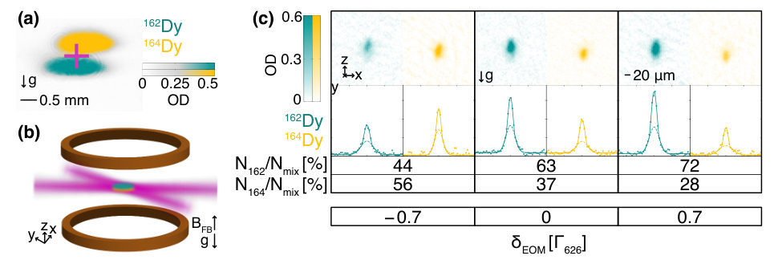
<figcaption class="paper-figure-caption"><b>Fig 1.</b> FIG. 1. (a) Absorption images of 162Dy and 164Dy in the DI-MOT at δEOM = −3.0 Γ626, with Γ626 being the natural linewidth of the 626-nm transition. The vertical displacement allows us to control the population imbalance in the crossed ODT, whose position is marked by a purple cross. (b) Sketch of the experimental apparatus showing the atoms being loaded from the DI-MOT into the crossed ODT. (c) Left: At negative detuning δEOM = −0.7 Γ626, the loading of 164Dy into the ODT is favored over 162Dy. Here, we realize a Bose-Einstein condensate (BEC) of 162Dy and 164Dy consisting of N162 = 1.4 · 104 and N164 = 1.8 · 104, with a condensed fraction of around 25% and 40% respectively. N162 and N164...</figcaption>
</figure>
<figure class="paper-figure-card">
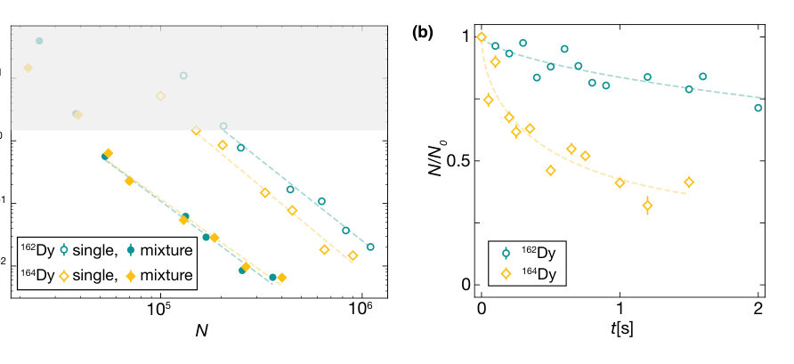
<figcaption class="paper-figure-caption"><b>Fig 2.</b> FIG. 2. Evaporative cooling trajectories for single-species and dual-species operation at a magnetic field of 9.7 G. (a) Peak PSD ρ0 as a function of atom number N during forced evaporation of 162Dy (green) and 164Dy (orange) in single-species (hollow) and mixture (solid) experiments. We extract γ as the slope of the respective linear fits (dashed lines). The gray band marks the threshold PSD for the onset of condensation (PSD ∼1). The near-identical slopes in the single-isotope and mixture configurations indicate that the interspecies interactions do not greatly affect the evaporation efficiency at a magnetic field of 9.7 G. b) Lifetime measurements of 162Dy BEC (τ162Dy = 14(1)s) and 164Dy...</figcaption>
</figure>
<figure class="paper-figure-card">
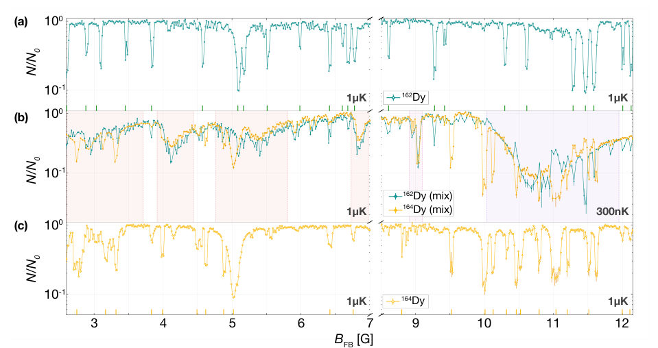
<figcaption class="paper-figure-caption"><b>Fig 3.</b> FIG. 3. Interspecies Feshbach resonances between 162Dy and 164Dy. (a) &amp; (c) show the single- isotope atom-loss spectra over 2.6-7 G and 8.5-12.1 G for 162Dy (green) and 164Dy (orange), recorded at 1 µK with a 1 s hold time. (b) shows the atom-loss spectra of the 162Dy-164Dy mixture over the same field range, recorded at 300 nK with a 500 ms hold time. Shaded regions highlight interspecies resonances. A broad resonance, extending from approximately 10.1 to 11.95 G, is centered at B0 = 10.8(3) G, offering the opportunity to easily control the interspecies scattering length a12 in the Bose-Bose mixture.</figcaption>
</figure>
<figure class="paper-figure-card">
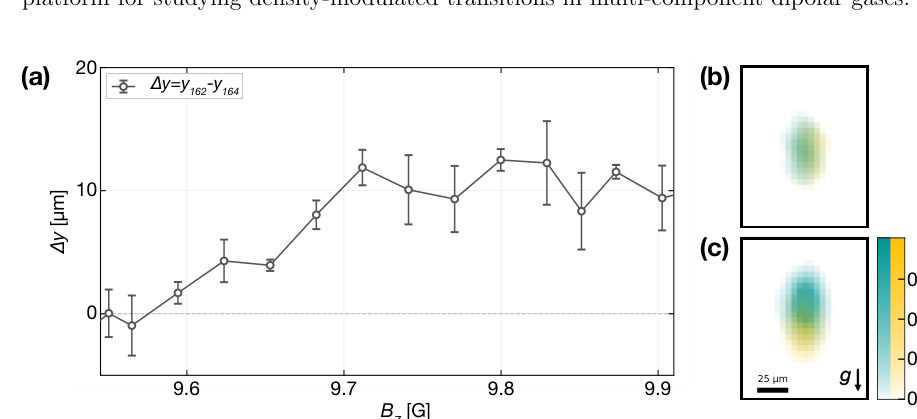
<figcaption class="paper-figure-caption"><b>Fig 4.</b> FIG. 4. Evidence of miscible-immiscible transition in a Dy miture. (a) Relative vertical displace- ment ∆y defined as ∆y = y162 −y164, where y162 and y164 are the centers of mass of the 162Dy and 164Dy BECs, respectively, after 20 ms time-of-flight expansion for different magnetic fields regions. (b) At a magnetic field of 9.58 G, the two clouds are overlapped, consistent with the miscible phase. (c)At a magnetic field of 9.675 G we move close to the resonance at 10.8(3) G, a12 increases and the two clouds repel each other, consistent with an immiscible phase, where 162Dy (green) sits on top of 164Dy (orange). Our analysis suggests that at BBEC the mixture is produced in the immiscible...</figcaption>
</figure>

**Summary.** The paper reports on creating and characterizing a quantum-degenerate Bose-Bose mixture of Dysprosium isotopes, which serves as a highly controllable platform for studying dipolar physics. By tuning interspecies interactions via Feshbach resonances, the researchers observed evidence of a transition between miscible and immiscible phases in the condensate cloud. This work advances the understanding of complex many-body dynamics in dipolar quantum gases.

**Why it may be interesting.** This research directly addresses advanced many-body physics in ultracold atomic systems by incorporating long-range dipolar interactions and exploring complex phase transitions like supersolidity and immiscibility.

Detailed structure

**Main problem.** The study investigates dipolar effects and the miscibility transition within a quantum-degenerate Bose-Bose mixture of Dysprosium isotopes.

**Main result.** The authors demonstrated efficient thermalization in the mixture and provided evidence for an interaction-driven spatial reorganization, consistent with tuning across a miscible-immiscible crossover.

**Method.** Experiments involved evaporative cooling followed by atom-loss spectroscopy as a function of magnetic field to probe interspecies interactions and center-of-mass separation measurements.

**Model / system.** The platform is a quantum-degenerate Bose-Bose mixture of $^{162}	ext{Dy}$ and $^{164}	ext{Dy}$, which possesses large magnetic dipole moments, making it ideal for studying dipolar interactions in ultracold gases.

**Key observables.** Center-of-mass separation ($\Delta y$), atom loss spectra, and the efficiency of evaporative cooling ($\gamma$).

**Important parameters / regimes.** The interspecies scattering length ($a_{12}$), controlled via broad Feshbach resonances; magnetic field strength (e.g., near 9.7 G).

**Assumptions / limitations.** Efficient thermalization is assumed, although isotope-specific three-body losses were noted as a potential limitation.

**Figures summary.** Figures illustrate population control via detuning ($\delta EOM$), compare mixture vs. single-species atom-loss spectra to find resonances, and plot relative vertical displacement ($\Delta y$) versus magnetic field to show phase separation behavior.

**Paper structure.** The work progresses from establishing the stable cooling and thermalization of the dual-isotope mixture, to mapping out interspecies Feshbach resonances using loss spectroscopy, culminating in measurements that probe spatial reorganization indicative of a miscibility crossover.

Abstract

We report on the realization of a quantum-degenerate Bose-Bose mixture of 162Dy and 164Dy. Owing to the near-identical mass and polarizability of the two isotopes, the mixture thermalizes efficiently, with evaporation trajectories closely following those of the single-isotope case. Using a broad interspecies Feshbach resonance, we explore a miscible-immiscible transition between the two Bose-Einstein condensates. The tunability of the interspecies interaction, combined with the large magnetic dipole moment of Dy, makes this platform well suited for exploring dipolar effects in ultracold mixtures, including multi-component supersolidity.

[↑ back to top](#top)

### [Entanglement, Discord, and Residual Coherence in Scalar-Induced Gravitational Waves](http://arxiv.org/abs/2606.21901v1)

**Authors:** Waqas Ahmed  
**Type:** theory · **Category:** other · **PDF:** <https://arxiv.org/pdf/2606.21901v1>  
**Analysis basis:** full PDF text, analyzed in chunks
**Topic relevance:** 🔥 `entanglement & information structure` **4/5** · `Keldysh / 2PI / non-Gaussian methods` **3/5** · `correlated / nonlocal dissipation` **2/5** · `non-equilibrium dynamics` **2/5** · `driven-dissipative phase transition` **1/5** · `methods for driven-dissipative` **1/5** · `non-equilibrium universality` **1/5**

↔ Scroll figures horizontally

<figure class="paper-figure-card">
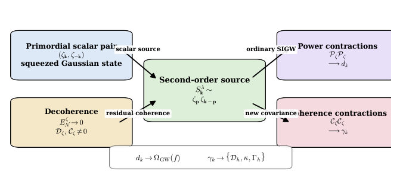
<figcaption class="paper-figure-caption"><b>Fig 1.</b> FIGURE 1: Schematic illustration of the correlation-transfer mechanism. Primordial cur- vature perturbations are produced as squeezed Gaussian opposite-momentum pairs and may retain residual discord and anomalous coherence after decoherence. Through the second-order source term ζpζk−p, scalar power contractions generate the ordinary induced tensor power, while anomalous scalar coherence contractions can generate opposite-mode tensor coherence in the induced gravitational-wave sector. The explicit transfer relations are derived in Sec. 5.</figcaption>
</figure>
<figure class="paper-figure-card">
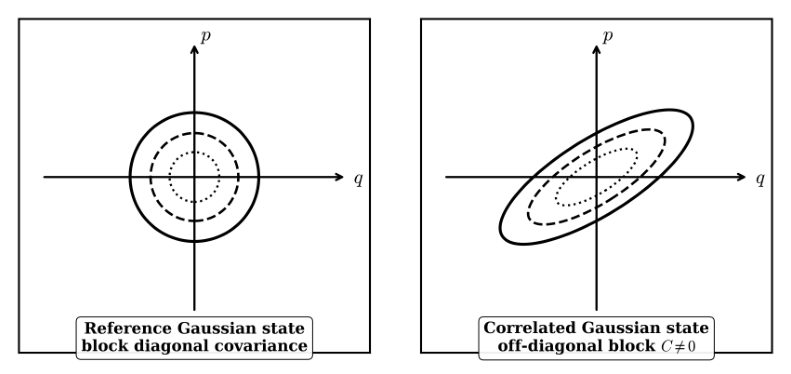
<figcaption class="paper-figure-caption"><b>Fig 2.</b> FIGURE 2: Phase-space representation of Gaussian covariance structure for a two-mode system (k, −k). Left: an uncorrelated Gaussian reference state with a block-diagonal covariance matrix and vanishing inter-mode correlations. Right: a correlated Gaussian state in which the off-diagonal covariance block correlates the two modes. The deformation and orientation of the Wigner-function contours encode the strength and phase of the correlations, while the area of each contour is related to the mixedness of the state.</figcaption>
</figure>
<figure class="paper-figure-card">
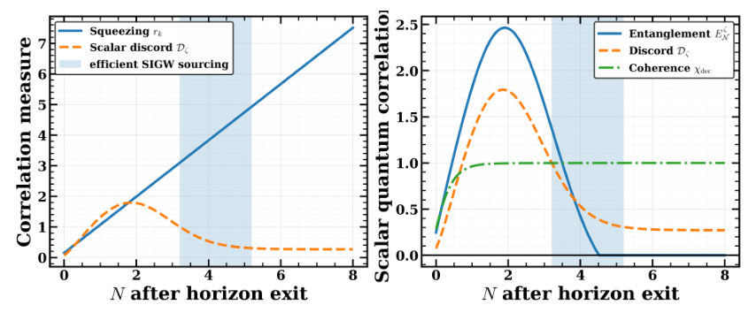
<figcaption class="paper-figure-caption"><b>Fig 3.</b> FIGURE 3: Illustrative evolution of scalar squeezing and quantum correlations in the deco- hered squeezed-state model. The squeezing parameter grows outside the horizon, while decoher- ence suppresses scalar entanglement. Gaussian discord and the anomalous coherence fraction can remain nonzero after the logarithmic negativity has vanished. The shaded region indicates the epoch in which scalar perturbations can efficiently source induced tensor modes.</figcaption>
</figure>
<figure class="paper-figure-card">
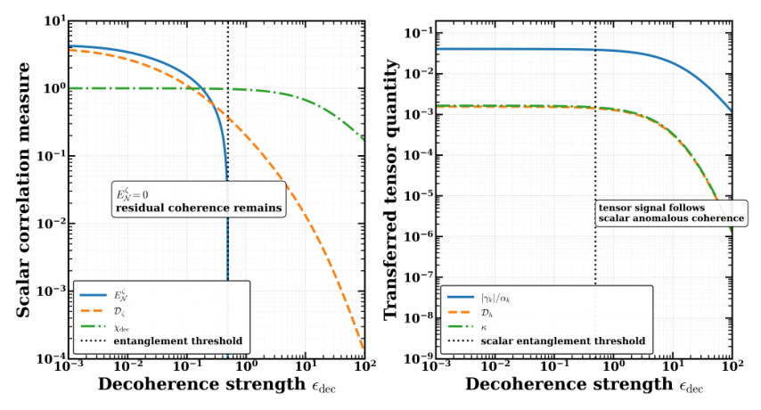
<figcaption class="paper-figure-caption"><b>Fig 4.</b> FIGURE 4: Benchmark illustration of scalar-to-tensor coherence transfer as a function of the decoherence strength ϵdec. The left panel shows the decay of scalar entanglement, the persistence of scalar discord, and the anomalous coherence fraction χdec. The right panel shows the corresponding transferred tensor quantities controlled by the opposite-mode coherence γk. The vertical line marks the scalar entanglement threshold. The plot is illustrative and uses a fixed kernel normalization.</figcaption>
</figure>
<figure class="paper-figure-card">
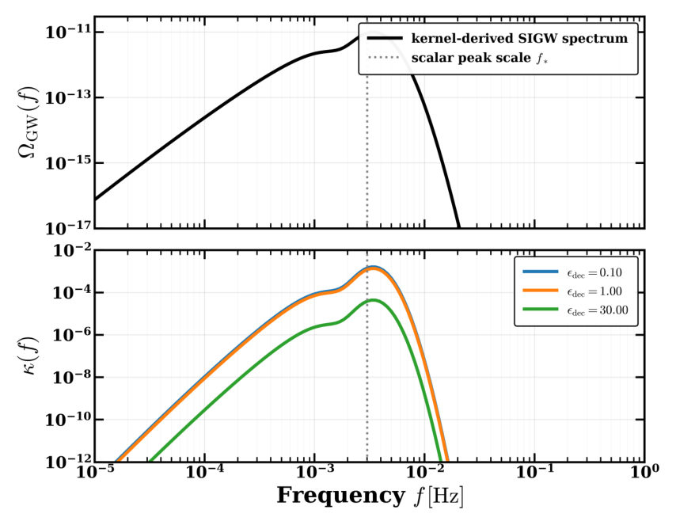
<figcaption class="paper-figure-caption"><b>Fig 5.</b> FIGURE 5: Kernel-derived benchmark signatures from a localized scalar source. The upper panel shows the scalar-induced gravitational-wave spectrum obtained from the radiation-era transfer kernel for a log-normal scalar power spectrum. The lower panel shows the connected covariance statistic κ(f) generated by transferred opposite-mode tensor coherence for represen- tative decoherence strengths. The figure is a benchmark calculation tied to the same scalar spectrum and transfer kernel, not a full detector-level forecast.</figcaption>
</figure>

**Summary.** This work explores how residual quantum information, specifically anomalous scalar coherence that persists after entanglement vanishes due to decoherence, can leave detectable imprints on the background of induced gravitational waves. Instead of predicting a simple spectral shift, the authors predict a unique correlated tensor background characterized by non-trivial covariance and phase structure. This offers a novel probe for primordial quantum correlations beyond standard entanglement measurements.

**Why it may be interesting.** The focus on discord and coherence as robust quantum measures surviving decoherence provides a theoretical framework applicable to any system where initial quantum correlations are expected but might be masked by environmental coupling or classical averaging.

Detailed structure

**Main problem.** The study investigates whether residual quantum-information properties, beyond simple entanglement, survive decoherence in the scalar sector and leave measurable imprints on induced gravitational waves.

**Main result.** The primary signature is not a universal shift in the spectrum, but rather a correlated tensor background characterized by nontrivial covariance and phase structure, sourced by anomalous scalar coherence contractions.

**Method.** The analysis employs the covariance-matrix formalism and uses continuous-variable Gaussian quantum state descriptions to derive transfer relations between scalar and induced tensor correlations.

**Model / system.** The system models gravitational waves induced at second order from primordial curvature perturbations ($\zeta$), treating $\zeta$ as a decohered two-mode squeezed Gaussian state. The analysis tracks the evolution of quantum correlations (discord, coherence) through this process.

**Key observables.** Connected power covariance $\kappa(k)$, opposite-mode tensor coherence $\gamma_k$, and phase-sensitive strain correlators $\Gamma_h(k)$.

**Important parameters / regimes.** Decoherence parameter ($\epsilon_{	ext{dec}}$), squeezing parameters ($r_k$), and the effective residual-coherence amplitude ($\alpha_{	ext{coh}}$).

**Assumptions / limitations.** The analysis relies on leading order (Wick contractions) approximations for calculating four-point functions, assuming Gaussian dynamics.

**Figures summary.** Figures schematically illustrate the decay of entanglement versus the survival of discord and anomalous coherence, showing how this residual coherence sources off-diagonal tensor correlations.

**Paper structure.** The paper progresses by first establishing the quantum measures (discord vs. entanglement) in the scalar sector; then deriving the transfer relations connecting these residual coherences to the induced tensor covariance matrix components ($\gamma_k$); finally, identifying measurable observables like $\kappa(k)$ and $\Gamma_h(k)$ for future detection.

Abstract

Scalar-induced gravitational waves are usually modeled as a classical stochastic background sourced by primordial curvature perturbations. We investigate whether residual quantum-information properties of the scalar sector can survive decoherence and leave imprints in the induced tensor background. Using the covariance-matrix formalism, we describe primordial curvature perturbations as decohered two-mode squeezed Gaussian states and identify the anomalous scalar coherence that may remain after scalar entanglement has vanished. We then derive the leading scalar-to-tensor transfer relations for opposite-momentum induced tensor modes. The ordinary tensor power is sourced by scalar power contractions, whereas the opposite-mode tensor coherence is sourced by anomalous scalar-coherence contractions. This tensor coherence controls the induced Gaussian discord and generates connected and phase-sensitive observables, including a connected power covariance $κ(k)\propto |γ_k|^2/α_k^2$. Thus the robust signature is not a universal shift of the gravitational-wave spectrum, but a correlated tensor background with nontrivial covariance and phase structure. We discuss phenomenological templates and provide an illustrative Fisher estimate for future gravitational-wave observations. Our results suggest that scalar-induced gravitational waves may offer a new probe of primordial quantum correlations beyond entanglement.

[↑ back to top](#top)

### [Emergence of Gaussian entanglement and non-Gaussianity in high-harmonic generation driven by bright squeezed light](http://arxiv.org/abs/2606.22714v1)

**Authors:** J. Rivera-Dean, M. Even-Tzur, M. F. Ciappina, C. Granados, O. Cohen, P. Stammer  
**Type:** theory · **Category:** quantum information and computing · **PDF:** <https://arxiv.org/pdf/2606.22714v1>  
**Analysis basis:** full PDF text, analyzed in chunks
**Topic relevance:** 🔥 `entanglement & information structure` **4/5** · `interference shaping light` **3/5** · `Keldysh / 2PI / non-Gaussian methods` **2/5** · `correlated / nonlocal dissipation` **1/5** · `driven-dissipative phase transition` **1/5** · `methods for driven-dissipative` **1/5** · `non-equilibrium dynamics` **1/5**

↔ Scroll figures horizontally

<figure class="paper-figure-card">
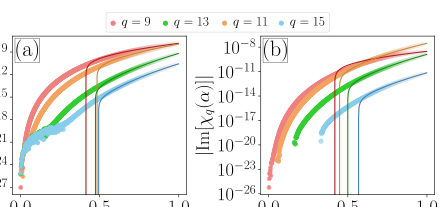
<figcaption class="paper-figure-caption"><b>Fig 1.</b> FIG. 1. Dependence of the (a) real and (b) imaginary parts of the HHG spectral amplitudes for a BSV driver as a function of the electric field strength εx = 2καx. The transparency of each point highlights the probability of finding such field component within the BSV field distribution. The continu- ous curves show fits of the form χq(α) = Aqα pq,x x + iBqα pq,x y for each harmonic mode. Calculations have been carried per- formed for hydrogen (Ip ≃0.5 a.u.), using a driving field of frequency ω = 0.057 a.u., and a squeezing intensity Isqu = κ2 sinh2(r) = 2.5 × 10−6 a.u. Here, q represents harmonic or- ders of the 2ω drive.</figcaption>
</figure>
<figure class="paper-figure-card">
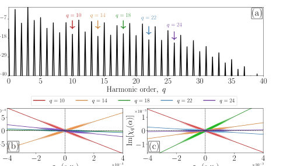
<figcaption class="paper-figure-caption"><b>Fig 2.</b> FIG. 2. (a) HHG spectrum and (b,c) dependence of the real and imaginary parts, respectively, of the HHG spectral ampli- tudes for a bichromatic configuration, consisting of a strong coherent field at frequency ω and a perturbative BSV com- ponent at frequency 2ω. The transparency of each point in panels (b) and (c) highlights the probability of finding such field component within the BSV field distribution. The con- tinuous curves in panels (b) and (c) display the linear fits of the form χq(α) = (Aq +iBq)αx for each harmonic mode. Cal- culations have been performed for xenon (Ip ≃0.446 a.u.), using a driving field frequency ω = 0.057 a.u., a coherent field strength εω = 0.053 a.u., and a...</figcaption>
</figure>
<figure class="paper-figure-card">
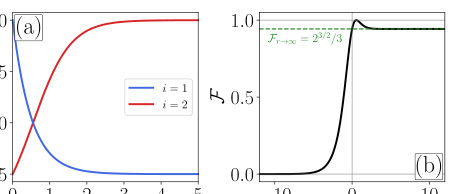
<figcaption class="paper-figure-caption"><b>Fig 3.</b> FIG. 3. (a) Comparison between the variances along the anti- squeezed (blue curve) and squeezed (red curve) field quadra- tures for our one-quadrature model of the BSV driver and the exact squeezed-vacuum state. (b) Fidelity between both states as a function of r, with the green dashed line displaying the asymptotic fidelity in the limit r →∞.</figcaption>
</figure>
<figure class="paper-figure-card">
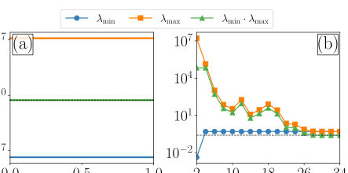
<figcaption class="paper-figure-caption"><b>Fig 4.</b> FIG. 4. Eigenvalues of the covariance matrix for (a) the collective mode defined in Eq. (24), and (b) individual har- monic modes obtained after tracing out all other modes, for ϱ = 10−3. The black dashed line indicates the Heisenberg un- decrtainty limit λmin · λmax = 1/4. Calculations have been done for xenon atoms (Ip ≃0.446 a.u.), using a driving field frequency ω = 0.057 a.u., a coherent field strength εω = 0.053 a.u., and a squeezing parameter r = 9 corresponding to a squeezing intensity Isqu ∼10−7 a.u. for κ = 5 × 10−8 a.u.</figcaption>
</figure>
<figure class="paper-figure-card">
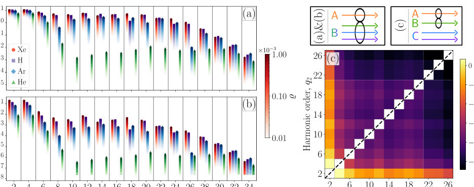
<figcaption class="paper-figure-caption"><b>Fig 5.</b> FIG. 5. Entanglement characterization of the resulting quantum optical state, with bipartitions chosen as shown in the inset at the top right corner of the figure. (a),(b) Entanglement between one harmonic mode and all other modes, as a function of the harmonic mode index, characterized through the logarithmic negativity and the Duan-Simon criterion, respectively. (c) Pairwise entanglement evaluated using the logarithmic negativity for ϱ = 10−3. The same parameters as in Fig. 4 have been used for the field, while different atomic systems have are considered, with ionization potentials I(Xe) p ≃0.446 a.u. &lt; I(H) p ≃ 0.5 a.u. &lt; I(Ar) p ≃0.579 a.u. &lt; I(He) p ≃0.903 a.u.</figcaption>
</figure>

**Summary.** This paper theoretically analyzes High-Harmonic Generation driven by bright squeezed vacuum light to study entanglement generation. Using tools like covariance matrices and logarithmic negativity, the authors show that while the system often remains Gaussian, strong squeezing can induce non-classical correlations. This positions HHG as a promising platform for engineering quantum states of light.

**Why it may be interesting.** This work bridges nonlinear optics (HHG) with advanced quantum information concepts (entanglement, squeezing). It shows how a fundamental physical process can serve as an engineered platform for generating complex entangled states of light in the extreme UV regime.

Detailed structure

**Main problem.** The study investigates how High-Harmonic Generation (HHG) driven by Bright Squeezed Vacuum (BSV) light modifies the quantum statistical properties of the emitted harmonics, specifically looking for entanglement generation.

**Main result.** Bichromatic driving with BSV light can generate non-classical multimode Gaussian entanglement in the even harmonic field. The analysis systematically characterizes the transition regimes where this description holds or breaks down into genuinely non-Gaussian states.

**Method.** The authors employ quantum characteristic functions, covariance matrix analysis, and entanglement measures like logarithmic negativity to characterize the generated quantum state.

**Model / system.** The physical system is HHG in atomic systems driven by a combination of a strong coherent field ($\omega$) and a perturbative BSV field ($2\omega$). The theoretical framework models the evolution using approximations derived from the time-dependent dipole moment.

**Key observables.** Gaussian entanglement structure, covariance matrix elements, quantum teleportation fidelity, logarithmic negativity, and Wigner functions.

**Important parameters / regimes.** Squeezing parameter (r), effective coupling parameter ($\varrho$), harmonic order ($2\omega, 3\omega, \dots$), and the ratio of driving field strengths.

**Assumptions / limitations.** The analysis relies on low-depletion approximations for the propagator element and often utilizes simplified one-quadrature models for the BSV driver state.

**Figures summary.** Figures illustrate quadrature variances comparing different models, show entanglement quantification via logarithmic negativity across harmonic orders, and display Wigner functions demonstrating the transition from Gaussian to non-Gaussian states as squeezing increases.

**Paper structure.** The paper progresses by first establishing the theoretical framework using characteristic functions for HHG. It then analyzes specific driving configurations (bichromatic) to derive the state's properties, quantifying entanglement via covariance matrices and fidelity benchmarks before mapping out the transition regimes where Gaussianity breaks down.

Abstract

High harmonic generation (HHG) is a highly nonlinear optical process in which radiation from a strong driving field is up-converted into its high-order harmonics. In atomic systems, this nonlinearity manifests itself through the intensity scaling of the emitted harmonics with the driving field strength. Despite the highly nonlinear nature of HHG, when the driving field is prepared in a classical Gaussian state and atomic depletion remains negligible, the quantum statistical properties of the generated harmonics retains classical Gaussian quantum statistics. Driving HHG with bright squeezed vacuum (BSV) light challenges this paradigm, as its enhanced field fluctuations can modify the statistical properties of the generated harmonics. In this work, we investigate the conditions under which BSV-driven HHG gives rise to non-classical Gaussian states, and identify the regimes where this Gaussian description breaks down. For bichromatic driving by a strong coherent field at frequency $ω$ and a perturbative BSV field at $2ω$, the even-harmonic response is approximately linear in the BSV quadrature, leading to non-classical multimode Gaussian entanglement in the harmonic field. We show that this state can be described as a distributed collective squeezed mode over the even-harmonic manifold, and characterize its covariance matrix, entanglement structure, and quantum teleportation fidelity as an operational benchmark. Our results highlight the potential of non-classically driven HHG as a platform for engineering Gaussian and non-Gaussian states of light in the extreme ultraviolet regime.

[↑ back to top](#top)

### [Liouvillian Geometry of Multidimensional Spectra: Pathway Transport and Observational Holonomy in Open Quantum Systems](http://arxiv.org/abs/2606.22530v1)

**Authors:** Eric R. Bittner, Carlos Silva-Acuña, Hao Li  
**Type:** theory · **Category:** other · **PDF:** <https://arxiv.org/pdf/2606.22530v1>  
**Analysis basis:** full PDF text, analyzed in chunks
**Topic relevance:** 🔥 `methods for driven-dissipative` **4/5** · `Keldysh / 2PI / non-Gaussian methods` **3/5** · `non-equilibrium dynamics` **2/5** · `correlated / nonlocal dissipation` **1/5** · `driven-dissipative phase transition` **1/5** · `non-equilibrium universality` **1/5** · `quantum measurements` **1/5**

↔ Scroll figures horizontally

<figure class="paper-figure-card">
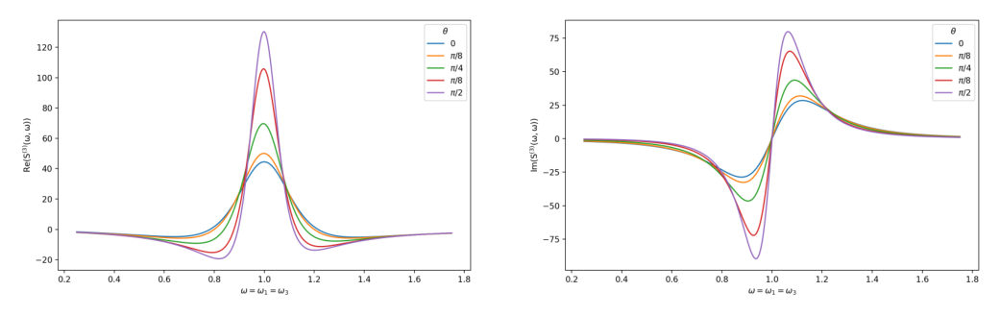
<figcaption class="paper-figure-caption"><b>Fig 1.</b> FIG. 1: Real (left) and imaginary (right) components of the diagonal spectral response for increasing pointer-basis misalignment θ. At θ = 0, only dephasing contributions are present. For θ ̸= 0, basis misalignment mixes response pathways, producing continuous and structured deformations of the complex spectrum. These serve as benchmarks for the Duhamel reconstructions shown in Fig. 2.</figcaption>
</figure>
<figure class="paper-figure-card">
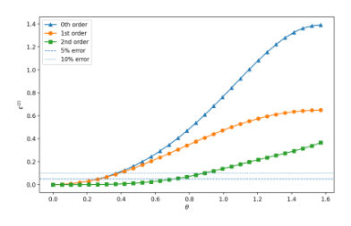
<figcaption class="paper-figure-caption"><b>Fig 2.</b> FIG. 2: Global reconstruction error ϵ(n) for the first- and second-order Duhamel transport expansions as a function of pointer-basis misalignment θ. The zeroth-order curve compares the θ = 0 signal to the exact result at θ ̸= 0. The second-order approximation remains accurate throughout the full range of misalignment, including at θ = π/2 where the observational and pointer bases are maximally misaligned.</figcaption>
</figure>
<figure class="paper-figure-card">
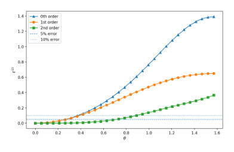
<figcaption class="paper-figure-caption"><b>Fig 3.</b> Figure 2 shows that the transport expansion remains accurate throughout the full range of basis misalignment. The first-order approximation captures the leading ef- fects of pathway transport; the second-order terms sub- stantially improve the reconstruction and remain accu- rate even at θ = π/2, where the observational and pointer bases are maximally misaligned. This robustness is the key quantitative result of this section. Although the Duhamel expansion is derived from local Liouvillian deformations about θ = 0, it re- mains accurate well beyond the regime where a weak-</figcaption>
</figure>
<figure class="paper-figure-card">
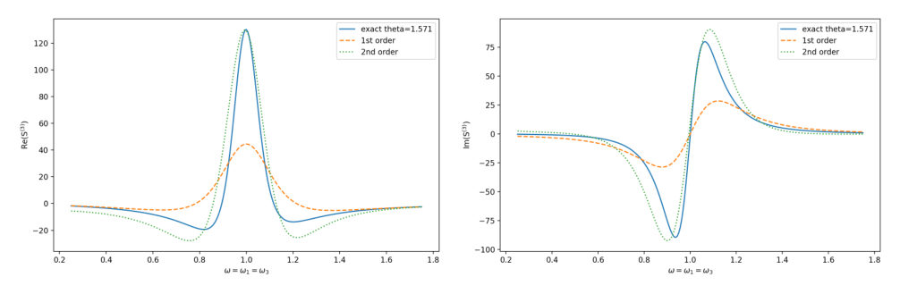
<figcaption class="paper-figure-caption"><b>Fig 4.</b> FIG. 3: Comparison between exact and reconstructed signals at maximal misalignment θ = π/2. The second-order Duhamel reconstruction reproduces the exact response with high fidelity even in this strongly deformed regime.</figcaption>
</figure>

**Summary.** The paper introduces a novel geometric framework to interpret multidimensional spectroscopy in open quantum systems. It argues that environmental coupling causes continuous 'transport' of amplitude among spectroscopically defined pathways within Liouville space. By quantifying this transport using concepts like Liouvillian curvature and holonomy, the authors show how spectral distortions can be mapped back to the underlying structural misalignment between different physical bases.

**Why it may be interesting.** This work provides a powerful geometric lens to analyze complex quantum dynamics in the presence of dissipation, connecting fundamental concepts like Berry phase/holonomy directly to measurable spectroscopic signatures in open systems.

Detailed structure

**Main problem.** Standard interpretations of multidimensional spectroscopy fail in open quantum systems because environmental interactions cause continuous amplitude redistribution among Liouville pathways, which is not accounted for by treating pathways as fixed objects.

**Main result.** The paper develops a geometric framework showing that pathway transport is governed by a Liouvillian connection and curvature, reinterpreting spectral distortions as measurable signatures of this curved geometry rather than mere broadening corrections.

**Method.** It employs the language of differential geometry (connections, curvature, holonomy) applied to the Liouville space propagator, utilizing Duhamel expansions to derive reconstruction procedures for transport operators.

**Model / system.** The system is an open quantum system undergoing spectroscopic measurements, modeled by a Liouvillian $\mathcal{L}(t)$ that includes Hamiltonian evolution ($\mathcal{L}_H$), external field interactions ($V(t)$), and environmental dissipation ($\mathcal{D}_{	ext{bath}}$).

**Key observables.** Spectral distortions, peak shifts, and the observational holonomy derived from nonlinear spectroscopic response.

**Important parameters / regimes.** Basis misalignment angle ($\theta$) between the Hamiltonian eigenbasis and the environment-selected pointer basis.

**Assumptions / limitations.** The framework assumes that environmental interactions induce a measurable transport structure in Liouville space due to basis incompatibility, allowing for geometric reconstruction from observables.

**Figures summary.** Figures illustrate how spectral responses (real/imaginary components) are structured by the misalignment angle $\theta$, and demonstrate the high accuracy of second-order Duhamel expansions in reconstructing these signals up to maximal misalignment ($\theta = \pi/2$).

**Paper structure.** The paper progresses from identifying the failure of fixed pathway assumptions in open systems, developing a geometric framework using Liouvillian connections and curvature, deriving reconstruction procedures via Duhamel expansion, and finally demonstrating that spectral features are determined by amplitude transport rather than just existing pathways.

Abstract

Liouville pathways provide the conceptual foundation for interpreting multidimensional spectroscopies, yet are typically treated as fixed objects that evolve independently between optical interactions. In open quantum systems, this picture is incomplete. Environmental interactions continuously redistribute amplitude among pathways during every free-evolution interval, generating transport that leaves measurable signatures in the nonlinear spectroscopic response. We develop a geometric framework in which pathway transport is governed by a Liouvillian connection, its associated curvature, and the resulting observational holonomy. The framework applies to open quantum systems in which the environment selects a pointer basis distinct from the observational basis used to construct the spectroscopic response. This basis incompatibility induces transport among Liouville pathways, generating characteristic spectral distortions and a nontrivial Liouvillian curvature. Using a Duhamel expansion of the Liouvillian propagator, we derive a reconstruction procedure that identifies the transport operators responsible for the observed redistribution of pathway weight, accurate throughout the full range of basis misalignment. This perspective reframes spectral features as determined not only by which pathways exist but by how amplitude is transported among them. Spectral distortions, peak shifts, and otherwise-forbidden pathway contributions become geometric signatures of a curved Liouville-space manifold rather than phenomenological broadening corrections, identifying pathway geometry as a complementary layer of organization in nonlinear spectroscopy.

[↑ back to top](#top)

### [Isometrization of Tensor Network States via Gauge Propagation](http://arxiv.org/abs/2606.22816v1)

**Authors:** Zhiyu Jiang, Hiroshi Ueda  
**Type:** theory · **Category:** numerical methods · **PDF:** <https://arxiv.org/pdf/2606.22816v1>  
**Analysis basis:** full PDF text, analyzed in chunks
**Topic relevance:** 🔥 `methods for driven-dissipative` **4/5** · `analog quantum simulation` **3/5** · `exotic spin models in light-matter` **3/5** · `entanglement & information structure` **1/5** · `non-equilibrium dynamics` **1/5**

↔ Scroll figures horizontally

<figure class="paper-figure-card">
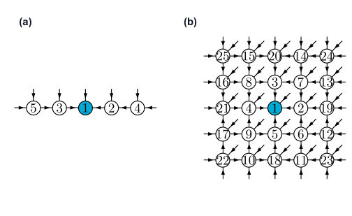
<figcaption class="paper-figure-caption"><b>Fig 1.</b> FIG. 1. Schematic illustration of the gauge-propagation or- dering. The highlighted tensor labeled 1 is the orthogonality center, and arrows indicate gauge-propagation directions. (a) One-dimensional chain with inward propagation from both sides. (b) Two-dimensional lattice. Away from the central row and column, a local step can have multiple outgoing prop- agation directions.</figcaption>
</figure>
<figure class="paper-figure-card">
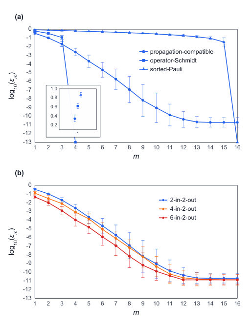
<figcaption class="paper-figure-caption"><b>Fig 2.</b> FIG. 2. Local decomposition benchmarks for random ten- sors with leg dimension χ = 2. (a) Comparison between the propagation-compatible decomposition, the operator-Schmidt decomposition, and the sorted Pauli expansion for random 2-in-2-out tensors. (b) Cluster-size comparison using 2-in-2- out, 4-in-2-out, and 6-in-2-out local clusters. Here m is the number of retained terms and εm is the Frobenius residual after retaining m terms. Curves show ⟨log10 εm⟩over 20 sam- ples, and error bars indicate one sample standard deviation of log10 εm.</figcaption>
</figure>
<figure class="paper-figure-card">
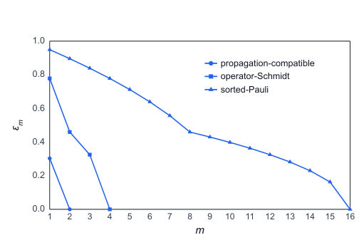
<figcaption class="paper-figure-caption"><b>Fig 3.</b> FIG. 3. Local decomposition benchmark for the minimal 2- in-2-out LG tensor bT (2→2) LG . The propagation-compatible de- composition is compared with the operator-Schmidt decom- position and the sorted Pauli expansion. Here m denotes the number of retained terms, and εm denotes the Frobenius residual error after retaining m terms.</figcaption>
</figure>
<figure class="paper-figure-card">
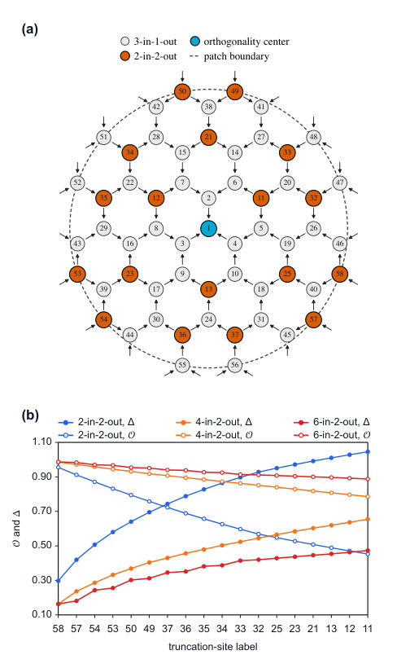
<figcaption class="paper-figure-caption"><b>Fig 4.</b> FIG. 4. Gauge propagation on a finite honeycomb LG ten- sor network containing 58 physical sites and 24 open auxiliary boundary indices, with physical indices omitted. The omit- ted physical indices are included in the incoming index groups under the convention of Sec. II A. (a) Propagation geome- try toward the orthogonality center. Sites are labeled by the inward propagation order; 2-in-2-out sites mark the trunca- tion events, while 3-in-1-out sites are treated by exact single- output SVD steps. (b) Accumulated normalized state error ∆ℓand normalized overlap Oℓduring inward propagation. The horizontal-axis labels in (b) correspond to the 2-in-2-out truncation sites in (a). For the curve...</figcaption>
</figure>

**Summary.** This work introduces a novel gauge-propagation approach to approximate the conversion of general tensor networks into isometric forms. By developing a structured local decomposition, it provides a systematic way to manage non-isometric residuals in higher dimensions. The method is shown to effectively reduce errors when applied to models like the Kitaev spin liquid, offering a powerful tool for variational optimization.

**Why it may be interesting.** The development of robust, systematic methods for enforcing physical constraints (like isometry) within tensor network representations is crucial for accurately simulating strongly correlated quantum materials where standard contractions fail due to gauge redundancy.

Detailed structure

**Main problem.** The paper addresses the challenge of converting generic tensor-network states into an isometric form (isoTNS) by developing a gauge-propagation approach.

**Main result.** A structured local decomposition method is proposed that allows for controlled approximation of non-isometric tensors, showing significant error reduction when applied to models like the Kitaev spin liquid.

**Method.** The core technique involves defining a propagation-compatible local decomposition where complex residuals are approximated as sums of structured terms, enabling iterative refinement via truncation.

**Model / system.** The method is tested on random tensors and specifically on the loop-gas tensor representation used for describing the Kitaev spin liquid (KSL) on honeycomb lattices. It applies to general tensor network states (e.g., MPS/PEPS).

**Key observables.** Local residuals, accumulated propagation errors ($\Delta_\ell$), normalized overlap ($O_\ell$), and truncation error bounds ($\epsilon_m$).

**Important parameters / regimes.** The local cluster size (e.g., 2-in-2-out up to 6-in-2-out) and the number of retained structured terms ($m$) are key parameters controlling approximation quality.

**Assumptions / limitations.** The primary assumption is that the residual factor can be approximated by a sum of absorbable, structured local tensors; in higher dimensions, this requires an approximation due to structural obstructions.

**Figures summary.** Figures illustrate gauge propagation geometry on 1D and 2D lattices. Benchmarks compare decomposition methods for random and LG tensors, showing error reduction upon increasing the number of retained terms or enlarging the local cluster size.

**Paper structure.** The paper first introduces the goal (isoTNS via gauge propagation), contrasts exact 1D propagation with obstructed higher-dimensional cases, develops the structured local decomposition approximation, analyzes its convergence using multi-term truncation bounds, and finally validates it by simulating error accumulation on a finite honeycomb lattice.

Abstract

We introduce a gauge-propagation approach for approximately converting generic tensor-network states into an isometric tensor-network state form with a prescribed orthogonality center. In one dimension, this propagation is exact because the non-isometric factor produced by a QR or singular-value decomposition is supported on a single virtual bond. In higher-dimensional networks, however, a local step can have several outgoing directions, and the residual factor is generally not separable into independent single-bond contributions. We address this local obstruction by approximating a local tensor, or a contracted local cluster, by structured terms consisting of an isometric factor multiplied by a tensor product of output-leg factors. The isometric factor is retained at the current site or cluster, while the output-leg factors are absorbed into neighboring tensors along the propagation directions. This construction provides a local truncation criterion for gauge propagation and a practical route to refinement by increasing the number of retained terms or enlarging the local cluster. Benchmarks on random tensors and on the loop-gas tensor representation of the Kitaev spin liquid show that this refinement reduces both local residuals and accumulated propagation errors. For the loop-gas tensor, two structured terms reduce the local residual to numerical precision, and enlarging the local object from 2-in-2-out to 4-in-2-out and 6-in-2-out clusters lowers both local truncation errors and accumulated errors in finite honeycomb gauge propagation. These results identify propagation-compatible local decomposition as a useful building block for approximate isometrization and as a potential initializer or preconditioner for variational isoTNS algorithms.

[↑ back to top](#top)

### [Optimizing Pump Conditions of Parametric Amplifiers for Fast Multiplexed Readout of Superconducting Qubits](http://arxiv.org/abs/2606.22080v1)

**Authors:** Jeongwon Kim, Wei Dai, Omrie Ovdat, Akiva Feintuch, Nir Alfasi, Yonuk Chong  
**Type:** experiment · **Category:** quantum information and computing · **PDF:** <https://arxiv.org/pdf/2606.22080v1>  
**Analysis basis:** full PDF text, analyzed in chunks
**Topic relevance:** 🔥 `QC/QI experiment` **4/5** · `quantum measurements` **2/5** · `quantum optics experiment` **2/5** · `correlated / nonlocal dissipation` **1/5** · `driven-dissipative phase transition` **1/5** · `methods for driven-dissipative` **1/5**

↔ Scroll figures horizontally

<figure class="paper-figure-card">
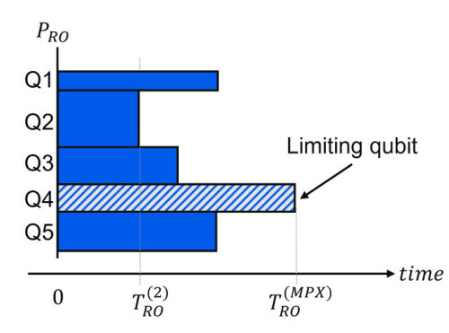
<figcaption class="paper-figure-caption"><b>Fig 1.</b> FIG. 1. Schematic of multiplexed readout pulses for five qubits. All readout tones are applied simultaneously at time 0 on a shared feed- line, but the readout amplitude PRO (pulse height) and the readout time T (i) RO required for each qubit to reach a target SNR can differ. In this example, Q4 requires the longest readout time, making Q4 the limiting qubit for the multiplexed readout. The total multiplexed readout time T (MPX) RO is set by that of the limiting qubit.</figcaption>
</figure>
<figure class="paper-figure-card">
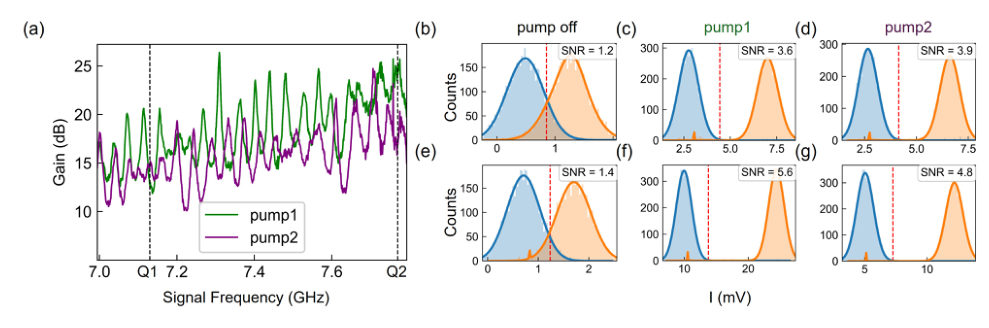
<figcaption class="paper-figure-caption"><b>Fig 2.</b> FIG. 2. Effect of TWPA pump conditions on readout performance. (a) TWPA gain profiles under two different pump conditions: pump 1 ( fp = 8.428GHz, Pp = −85.9dBm shown in green) and pump 2 ( fp = 8.382GHz, Pp = −85.7dBm shown in purple) respectively. The two black dashed lines mark the readout frequencies of two qubits: Q1 (7.12 GHz) and Q2 (7.77 GHz). (b–d) Gaussian fits to single-shot readout histograms of Q1 with the TWPA pump off, under pump1, and under pump2, respectively, using the same 1µs readout pulse. The corresponding SNR (Eq. 1) is annotated in the upper-right corner of each panel; blue (orange) corresponds to the ground (excited) state, and the red dashed line indicates the...</figcaption>
</figure>
<figure class="paper-figure-card">
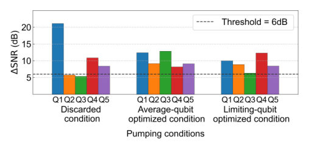
<figcaption class="paper-figure-caption"><b>Fig 3.</b> FIG. 3. ∆SNR for each qubit under three representative pump con- ditions. The black dashed line indicates the minimum acceptable ∆SNR threshold (6 dB in this experiment). The discarded condi- tion (8.244 GHz, −87.4 dBm) maximizes the average ∆SNR across all pump conditions, but it is rejected because Q2 and Q3 fall be- low the 6 dB threshold. The discarded condition yields an av- erage ∆SNR of 14.93 dB. The average-qubit-optimized condition (8.311 GHz, −86.9 dBm) is the feasible pump condition (all qubits above threshold) that maximizes the average ∆SNR, giving 10.77 dB. The limiting-qubit-optimized condition (8.328 GHz, −87.5 dBm) is the feasible setting that maximizes ∆SNR for the...</figcaption>
</figure>
<figure class="paper-figure-card">

<figcaption class="paper-figure-caption"><b>Fig 4.</b> Figure 3 shows how the TWPA pump condition reshapes the per-qubit performance profile and the selected pump points for the following experiment. We first exclude pump conditions that violate a minimum per-qubit requirement, ∆SNR ≥6dB. This removes “ripply” operating points that maximize the average ∆SNR but leave one or more channels below threshold, as illustrated by the discarded condition in Fig. 3. Among the remaining feasible conditions, we select</figcaption>
</figure>
<figure class="paper-figure-card">
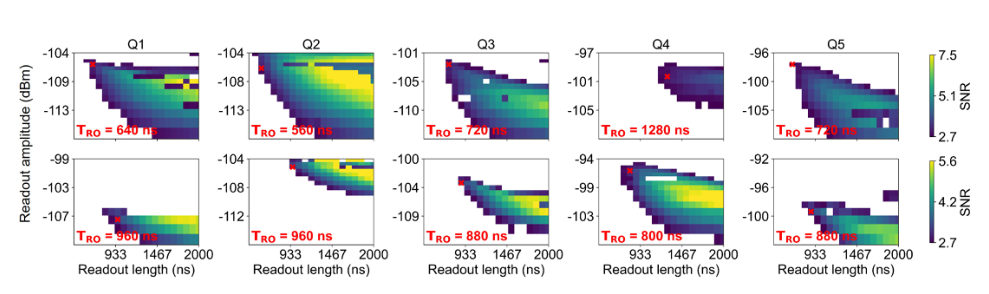
<figcaption class="paper-figure-caption"><b>Fig 5.</b> FIG. 4. Readout time required to reach SNR = 3 for each qubit under two TWPA pump conditions. Each panel shows the measured SNR as a function of readout amplitude and readout time, and the red cross marker indicates the shortest pulse that achieves SNR = 3 as described in Sec. II A. White regions correspond to SNR &lt; 2.7. Top row: average-qubit-optimized pump ( fp = 8.311GHz, Pp = −86.9dBm). Q4 requires</figcaption>
</figure>

**Summary.** The research addresses how to optimize parametric amplifiers for fast, multi-qubit readout of superconducting qubits. The authors propose a novel strategy that prioritizes improving the performance of the single slowest qubit channel (the bottleneck). This approach experimentally demonstrated a significant reduction in overall readout time compared to optimizing for average performance across all qubits.

**Why it may be interesting.** This work is highly relevant to quantum optics and open quantum systems because it tackles practical engineering constraints (readout speed) in superconducting circuits by optimizing the coupling element (parametric amplifier) based on system bottlenecks rather than simple averages.

Detailed structure

**Main problem.** The primary goal is to develop a pump optimization strategy for parametric amplifiers used in superconducting qubit readout chains to minimize the total multiplexed readout time.

**Main result.** By optimizing the amplifier pump condition based on the limiting (slowest) qubit channel rather than the average SNR, the authors achieved a significant reduction in the overall multiplexed readout time (e.g., 25% reduction).

**Method.** The study experimentally calibrates the parametric amplifier by sweeping its frequency and power while comparing two optimization metrics: maximizing average $\Delta	ext{SNR}$ versus maximizing $\Delta	ext{SNR}$ for the bottleneck qubit.

**Model / system.** The system involves superconducting qubits (e.g., five tunable transmon qubits) whose readout signals are amplified by a Traveling-Wave Parametric Amplifier (TWPA). The performance is governed by the interplay between amplifier gain, noise, and qubit relaxation times ($T_1$).

**Key observables.** Multiplexed Readout Time ($T_{	ext{MPX}}^{	ext{RO}}$), Signal-to-Noise Ratio ($	ext{SNR}$), $\Delta	ext{SNR}$, and required readout time ($	ext{TRO}$) for individual qubits.

**Important parameters / regimes.** Target SNR of 3 is chosen as the optimal point where further SNR improvement yields diminishing returns due to $T_1$ relaxation; the limiting qubit dictates $T_{	ext{MPX}}^{	ext{RO}}$.

**Assumptions / limitations.** The analysis assumes that setting a fixed target $	ext{SNR}$ (e.g., 3) is optimal because increasing it further does not improve fidelity due to relaxation effects, and that readout time is limited by the slowest channel.

**Figures summary.** Figures illustrate how different pump conditions affect gain profiles across multiple qubits; one figure compares the required readout times ($	ext{TRO}$) for both optimization strategies, showing a clear reduction in $T_{	ext{MPX}}^{	ext{RO}}$ when targeting the limiting qubit.

**Paper structure.** The paper first establishes the problem of minimizing multiplexed readout time set by the slowest channel. It then compares conventional average-optimization against the proposed limiting-channel optimization strategy, demonstrating quantitative improvements using experimental measurements on a multi-qubit array.

Abstract

Low-noise parametric amplifiers are widely used as the first-stage amplifier in qubit readout chains. The performance of parametric amplifiers depends sensitively on the choice of the pump condition. We propose a strategy for determining the pump condition that is tailored for fast multiplexed readout. Choosing the amplifier pump to maximize the signal-to-noise ratio (SNR) improvement at the readout frequency of the limiting qubit--the qubit that requires the longest readout time to reach a target SNR--minimizes the total multiplexed readout time. We demonstrate our pump calibration strategy experimentally on a five-qubit multiplexed readout chain with a traveling-wave parametric amplifier. Using our strategy, we reduce the multiplexed readout time by 320 ns compared to optimizing the average SNR improvement on all qubits, without degrading the target SNR for any qubit.

[↑ back to top](#top)

### [A Measurement-Like Test of Continuous Spontaneous Localization with a Reversible Nanoparticle Pointer](http://arxiv.org/abs/2606.22707v1)

**Authors:** Peter Renkel  
**Type:** both · **Category:** other · **PDF:** <https://arxiv.org/pdf/2606.22707v1>  
**Analysis basis:** full PDF text, analyzed in chunks
**Topic relevance:** 🔥 `quantum measurements` **4/5** · `measurement-induced transitions` **3/5** · `correlated / nonlocal dissipation` **1/5** · `driven-dissipative phase transition` **1/5** · `interference shaping light` **1/5**

↔ Scroll figures horizontally

<figure class="paper-figure-card">
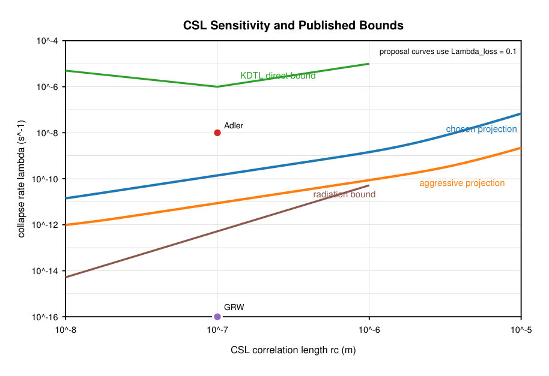
<figcaption class="paper-figure-caption"><b>Fig 1.</b> Figure 1: CSL comparison plot with the aggressive operating point set to ω = 1000 s−1. The blue and orange curves show the projected sensitivities of the chosen and aggressive operating points, evaluated with the same finite-size CSL integral used in the manuscript. The green curve is an approximate hand digitization of the direct KDTL matter-wave bound from Fig. 2 of Ref. [9]. The brown curve shows the radiation bound of Ref. [10], using the quoted λ/r2 c scaling and the bound λ &lt; 5.2 × 10−13 s−1 at rc = 10−7 m. The red and purple markers indicate the representative Adler- enhanced scale [6] and the original GRW value [1]. Stronger non-interferometric force-noise bounds are discussed in...</figcaption>
</figure>

**Summary.** The authors propose an advanced interferometric test to search for evidence of Continuous Spontaneous Localization (CSL) by monitoring the loss of coherence in a nanoparticle pointer. By utilizing the pointer reversibly, they aim to achieve sensitivities that surpass current direct matter-wave bounds. The work is significant because it outlines a pathway to probe fundamental physics theories using state-of-the-art trapped-matter quantum optics techniques.

**Why it may be interesting.** This work provides a concrete, high-precision proposal for testing fundamental physics theories like objective collapse models using mesoscopic quantum systems, which is highly relevant to AMO research in quantum measurement and decoherence.

Detailed structure

**Main problem.** The paper proposes an interferometric test to search for deviations from standard quantum mechanics predicted by Continuous Spontaneous Localization (CSL) theory.

**Main result.** The proposed measurement-like protocol yields sensitivity estimates ($\lambda_{\min}$) that significantly improve upon existing direct matter-wave CSL bounds, although they do not surpass the strongest non-interferometric limits.

**Method.** The test uses a trapped nanoparticle as a reversible mesoscopic pointer to temporarily store which-branch information from a microscopic superposition. Coherence loss is measured by comparing the visibility after recombination against predictions from standard QM versus CSL.

**Model / system.** The system involves a two-branch quantum state interacting with a harmonic oscillator (the nanoparticle) via opposite weak forces, leading to conditional displacements. The dynamics are governed by modified Hamiltonians incorporating the CSL collapse rate ($\lambda$) and correlation length ($r_c$).

**Key observables.** Visibility loss of microscopic coherence read out interferometrically after recombination; the minimum detectable CSL rate ($\lambda_{\min}$).

**Important parameters / regimes.** Nanoparticle mass ($m \approx 10^{-18} 	ext{ kg}$), differential force ($F \approx 10^{-21} 	ext{ N}$), correlation length ($r_c$), and the ordinary loss budget ($\Lambda_{	ext{loss}} \lesssim 0.1$).

**Assumptions / limitations.** The analysis relies on approximations valid in the small-separation regime ($D(t) \ll r_c$) and assumes that technical noise sources (like residual gas or timing mismatch) can be controlled below a specified threshold.

**Figures summary.** Figure 1 compares projected sensitivities ($\lambda_{	ext{chosen}}$ vs $\lambda_{	ext{aggressive}}$) against various theoretical bounds, demonstrating the improvement over direct interferometric tests.

**Paper structure.** The paper first introduces CSL and the experimental setup using a nanoparticle pointer. It derives the expected coherence loss from CSL theory, calculates the required sensitivity based on noise budgets (including systematic errors), and finally compares the achievable limits to existing theoretical bounds.

Abstract

We propose a measurement-like interferometric test of Continuous Spontaneous Localization (CSL), in which a trapped nanoparticle acts as a reversible mesoscopic pointer rather than as the initially prepared microscopic superposition. A microscopic two-branch system applies opposite weak forces to the nanoparticle, temporarily amplifying which-branch information into branch-conditioned pointer displacements. After one weak-trap period the pointer positions and momenta recombine, so ordinary quantum mechanics predicts recovery of the microscopic coherence, whereas CSL predicts an irreversible visibility loss accumulated while the pointer mass distributions were separated.   For a $10^{-18},{\rm kg}$ nanoparticle driven by a $10^{-21},{\rm N}$ differential force at $T=0.4,{\rm K}$, including thermal breathing and an ordinary loss budget $Λ_{\rm loss}\lesssim 0.1$, we find $λ_{\min}\simeq 1.4\times 10^{-10},{\rm s}^{-1}$ at $r_c=100,{\rm nm}$ with $10^5$ shots. A more aggressive lower-frequency point reaches $λ_{\min}\simeq 8.7\times 10^{-12},{\rm s}^{-1}$.   These sensitivities would improve over digitized direct matter-wave CSL bounds by about $7\times 10^3$ and $10^5$, respectively, while remaining above the strongest non-interferometric bounds. The proposal is therefore aimed at a substantially stronger direct visibility-loss test of CSL, and at a reversible measurement-like realization of collapse sensitivity, rather than at the strongest overall exclusion curve.

[↑ back to top](#top)

### [Angular-time evolution and edge-spin dynamics in the Haldane phase of the S=1 bilinear-biquadratic chain](http://arxiv.org/abs/2606.23117v1)

**Authors:** Takuma Kaise, Kouichi Okunishi  
**Type:** theory · **Category:** strongly correlated electrons · **PDF:** <https://arxiv.org/pdf/2606.23117v1>  
**Analysis basis:** full PDF text, analyzed in chunks
**Topic relevance:** 🔥 `entanglement & information structure` **4/5** · `non-equilibrium dynamics` **2/5** · `analog quantum simulation` **1/5** · `exotic spin models in light-matter` **1/5** · `methods for driven-dissipative` **1/5** · `non-equilibrium universality` **1/5**

↔ Scroll figures horizontally

<figure class="paper-figure-card">
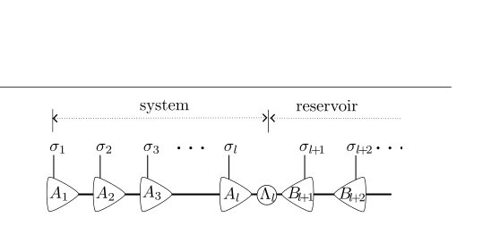
<figcaption class="paper-figure-caption"><b>Fig 1.</b> Fig. 1. Setup of the system and reservoir parts in the ground- state wavefunction, represented as an MPS in the mixed canonical form. The system part consists of spins i = 1 · · · l from the left edge, while the spins i &gt; l belong to the reservoir part. A and B respectively denote the MPS tensors obtained by DMRG in the mixed canonical form, and Λ represents the singular values at the bond between sites l and l + 1.</figcaption>
</figure>
<figure class="paper-figure-card">
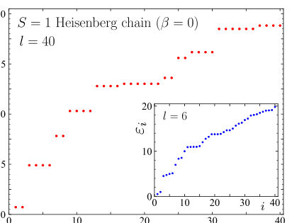
<figcaption class="paper-figure-caption"><b>Fig 2.</b> Fig. 2. Entanglement spectrum of the bipartitioned ground- state wavefunction of the S = 1 Heisenberg chain with N = 200. The system-part length is l = 40, which is sufficiently larger than the correlation length. Accordingly, the spectrum exhibits the char- acteristic two-fold degeneracy reflecting the bulk behavior. Inset: Entanglement spectrum for l = 6, where the splitting of the two- fold degeneracy emerges due to boundary effects</figcaption>
</figure>
<figure class="paper-figure-card">
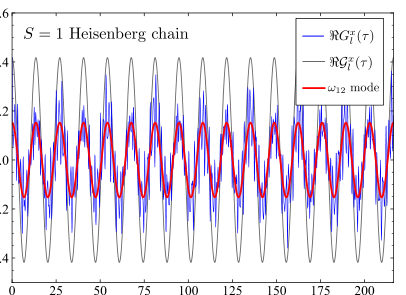
<figcaption class="paper-figure-caption"><b>Fig 3.</b> Fig. 3. Angular-time correlation function Gx l (τ) and the auto- correlation function of the system-part magnetization Gx l (τ) in the effective magnetic field for the S = 1 Heisenberg chain with l = 6 and N = 200. The highly oscillatory blue curve and the gray curve represent the real parts of Gx l (τ) and Gx l (τ), respectively. The red curve shows the ω12 mode extracted from Gx l (τ) via Fourier anal- ysis.</figcaption>
</figure>
<figure class="paper-figure-card">
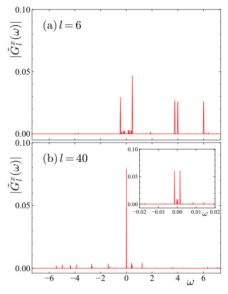
<figcaption class="paper-figure-caption"><b>Fig 4.</b> Fig. 4. Fourier spectra of Gx l (τ) for the Heisenberg chain with N = 200, which are obtained by the Fourier transformation with the Hann window. The length of the system part is (a) l = 6 and (b) l = 40. Inset in (b) is the magnification around ω = 0, where the most dominant peaks are observed at ±ω12. Note that in the main panel of (b), these most dominant peaks ω ≃0 merge into a single peak due to limited frequency resolution.</figcaption>
</figure>
<figure class="paper-figure-card">
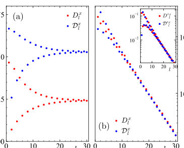
<figcaption class="paper-figure-caption"><b>Fig 5.</b> Fig. 5. l-dependence of the amplitudes: (a) Dx l for the ω12 mode (red) and Dx l for the autocorrelation function Gx l (blue), and (b) semilog plot of |Dx l −Dx ∞| (red) and |Dx l −Dx ∞| (blue). Inset in (b): semilog plot of the amplitudes of the imaginary parts, D′x l and D′x l .</figcaption>
</figure>

**Summary.** This paper investigates the Haldane phase of the S=1 BLBQ chain by comparing two methods to study edge spin dynamics: angular-time evolution derived from the entanglement Hamiltonian, and direct simulation using an effective magnetic field. The authors successfully demonstrate that both approaches yield consistent results regarding the dominant oscillation mode, confirming a deep link between the system's entanglement structure and its boundary physics.

**Why it may be interesting.** The work provides a powerful theoretical tool—the angular-time evolution—to probe boundary physics in gapped quantum magnets, offering an alternative to standard real-time dynamics calculations. This connection between entanglement structure and physical observables is highly relevant for understanding topological phases.

Detailed structure

**Main problem.** The study investigates the relationship between angular-time evolution, derived from entanglement Hamiltonians, and real-time edge-spin dynamics in the Haldane phase of the S=1 bilinear-biquadratic chain.

**Main result.** The analysis confirms that the dominant oscillation mode extracted from both correlation functions (angular-time) and effective edge-spin protocols matches, demonstrating a robust connection between entanglement structure and boundary physics away from specific points like the AKLT limit.

**Method.** The authors employ Matrix Product States (MPS) to calculate ground state properties, defining an angular-time evolution operator $U_l(	au) = e^{-i	au K_l}$ using the entanglement Hamiltonian $K_l$. They compare this theoretical evolution with dynamics derived from applying a uniform magnetic field to the edge spin.

**Model / system.** The system is the S=1 bilinear-biquadratic (BLBQ) quantum spin chain, characterized by the Hamiltonian $H_{eta} = \sum_{i=1}^{N-1} (S_i \cdot S_{i+1} + eta(S_i \cdot S_{i+1})^2)$. The analysis focuses on the Haldane phase under open boundary conditions.

**Key observables.** Angular-time spin correlation functions $\langle S_{\alpha}^n(	au)S_{\alpha}^{n'}(0)
angle$, entanglement spectrum eigenvalues ($\epsilon_i$), and effective edge-spin autocorrelation functions $G_{\alpha}^l(	au)$.

**Important parameters / regimes.** The coupling parameter $eta$ (ranging from 0 to approaching 1/3), the subsystem length $l$, and the correlation length $\xi$.

**Assumptions / limitations.** The analysis relies on approximating the angular-time evolution by projecting onto the ground state sector using an approximate identity operator ($I_\chi$), which is assumed accurate away from the AKLT point.

**Figures summary.** Figures illustrate the entanglement spectrum showing bulk degeneracy and boundary splitting, compare correlation functions for different subsystem sizes ($l=6$ vs $l=40$), and show semilog plots demonstrating that amplitude decay rates are consistent between the two dynamic measurements.

**Paper structure.** The paper proceeds by establishing the theoretical framework using MPS to define angular-time evolution via entanglement Hamiltonians. It then calculates correlation functions, compares these results against a known edge-spin protocol (magnetic field), and finally analyzes the scaling of amplitudes with subsystem size ($l$) across different coupling regimes ($eta$).

Abstract

We investigate the angular-time evolution -- a parameter-time evolution generated by the entanglement Hamiltonian -- for the bipartitioned ground state of the S=1 bilinear-biquadratic chain under the open boundary condition with the up edge spin. Using a matrix-product-state representation of the ground-state wavefunction, we calculate the angular-time spin correlation functions $\langle S_n^{α}(τ)S_{n'}^{α}(0)\rangle$ in the Haldane phase, and extract its dominant oscillation mode attributed to the nearly two-fold-degenerate entanglement spectrum associated with the $\mathbb{Z}_2 \times \mathbb{Z}_2$ symmetry. We also compute the effective edge-spin dynamics under a uniform magnetic field applied to the system part and numerically verify its correspondence to the dominant angular-time mode by precisely comparing the subsystem-size dependence of their amplitudes.

[↑ back to top](#top)

### [Demonstration of a Monolithic and Fully Telecom-Fiber-Compatible Tunable Source of Polarization Entangled Photon Pairs Based on a van der Waals Material](http://arxiv.org/abs/2606.21874v1)

**Authors:** Benjamin Laudert, Fatemeh Abtahi, Duk Choi, Dragomir Neshev, Falk Eilenberger  
**Type:** experiment · **Category:** quantum information and computing · **PDF:** <https://arxiv.org/pdf/2606.21874v1>  
**Analysis basis:** full PDF text, analyzed in chunks
**Topic relevance:** 🔥 `quantum optics experiment` **4/5** · `interference shaping light` **3/5** · `QC/QI experiment` **1/5** · `entanglement & information structure` **1/5** · `quantum measurements` **1/5**

↔ Scroll figures horizontally

<figure class="paper-figure-card">
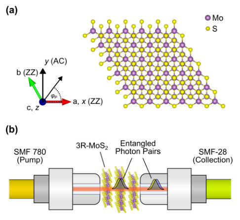
<figcaption class="paper-figure-caption"><b>Fig 1.</b> Figure 1: In-line polarization-tunable entangled photon pair generation in 3R-MoS2. (a) 3R-MoS2 crystal structure as viewed along the c-axis (stacking direction) and coordinate system of the 𝜒(2) tensor ele- ments, where 𝑥and 𝑦correspond to one of the zig-zag (ZZ) and armchair (AC) directions of the crystal, re- spectively. The pump polarization angle 𝜑P is defined relative to 𝑥. (b) Sketch of the entangled photon pair generation in the in-line geometry. The pump light is incident along the c-axis, allowing for tuning of the gen- erated polarization state via the pump.</figcaption>
</figure>
<figure class="paper-figure-card">
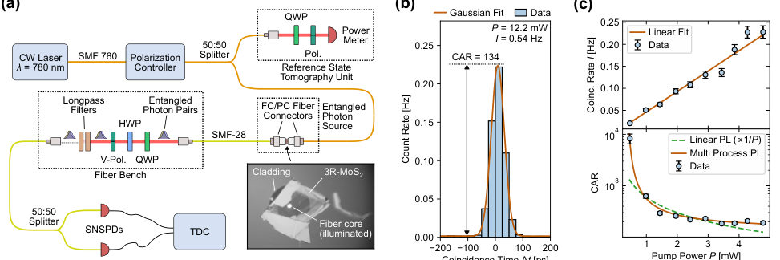
<figcaption class="paper-figure-caption"><b>Fig 2.</b> Figure 2: Experimental Setup and SPDC Properties. (a) Setup for the fully in-line generation and analysis of entangled photon pairs. The light of a 780 nm continuous wave (CW) laser is guided through a polarization controller and subsequently split towards a reference output and a 3R-MoS2 crystal located between two fiber connectors. The generated photon pairs exit the SMF-28 single-mode fiber and are analyzed based on co-polarized state projections. The detection of entangled photon pairs is performed with superconducting nanowire single-photon detectors (SNSPDs), connected to an electronic time-to-digital con- verted (TDC). (b) Histogram of measured coincidence time differences for a high...</figcaption>
</figure>
<figure class="paper-figure-card">
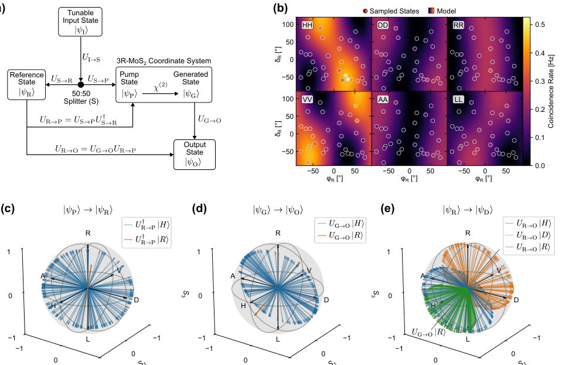
<figcaption class="paper-figure-caption"><b>Fig 3.</b> Figure 3: Device Calibration and Polarization State Mapping. (a) System of unitary transformations formed by the entangled photon generation setup. (b) Measured coincidence rates for each state projection of the sampled calibration states as a function of the corresponding reference state polarization angle 𝜑R and retardance 𝛿R. Based on these samples, 𝑈R→P and 𝑈G→O are obtained via least-squares optimization. 𝑈R→P and 𝑈G→O are then used for calculating the output state. The color maps show the expected coincidence rates of the modeled output state as a function of 𝜑R and 𝛿R. (c)-(e) State mappings highlighting the partial uniqueness of the obtained optima for 𝑈R→P and 𝑈G→O. All optimized...</figcaption>
</figure>
<figure class="paper-figure-card">
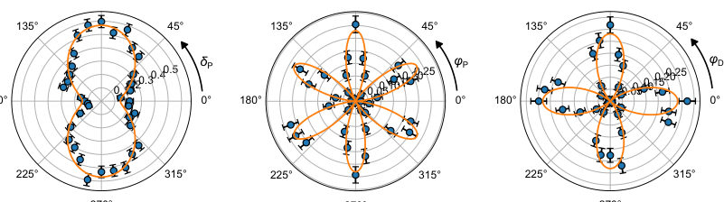
<figcaption class="paper-figure-caption"><b>Fig 4.</b> Figure 4: Tuning of the Generated Two-Photon Polarization State. (a), (b) Measured and theoreti- cally expected coincidence rates when varying the retardance 𝛿P from 0° to 360° while 𝜑P = 45∘, for parallel and orthogonal detection, respectively. The theoretical curves have been scaled to both measured datasets in a joint least-squares optimization with a single parameter. (c), (d) Likewise, coincidence rates for the case of varying the polarization angle 𝜑P from 0° to 360° while 𝛿P = 0∘. (e), (f) Coincidence rates for fixed pump states |𝐻⟩(𝜑P = 0∘) and |𝑉⟩(𝜑P = 90∘), respectively, varying the polarization angle 𝜑D of the detected state, while 𝛿D = 0.</figcaption>
</figure>
<figure class="paper-figure-card">
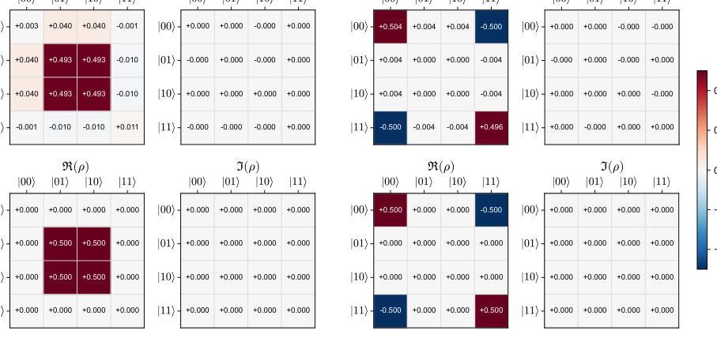
<figcaption class="paper-figure-caption"><b>Fig 5.</b> Figure 5: Density Matrix Estimation. (a) Estimated density matrix 𝜌of the output state, obtained via least-squares optimization based on the co-polarized projection measurement results for horizontal pump (𝛿P = 0, 𝜑P = 0) and density matrix of the target Bell state |𝜓+⟩. (b) Likewise, 𝜌for vertical pump polarization (𝛿P = 0, 𝜑P = 90∘) and target Bell state |𝜙−⟩.</figcaption>
</figure>

**Summary.** The research presents an innovative method to generate polarization-entangled photon pairs using $	ext{3R-MoS}_2$ integrated directly within standard optical fibers. By exploiting the material's nonlinear properties and coupling it with precise polarization control, the authors achieve deterministic tuning of the entanglement state in the telecom band. This development is crucial for realizing practical, long-distance quantum key distribution systems.

**Why it may be interesting.** This work represents a significant engineering advance in quantum optics, moving entanglement sources from complex free-space setups into robust, chip-scale, fiber-integrated components suitable for real-world quantum communication networks.

Detailed structure

**Main problem.** The goal is to develop a highly tunable, compact, and fully integrated source of polarization-entangled photon pairs compatible with standard near-infrared telecommunication optical fiber infrastructure.

**Main result.** The authors successfully demonstrated deterministic control over the generated two-photon polarization state by manipulating the incident pump polarization within an in-line $	ext{3R-MoS}_2$ thin film, achieving high entanglement fidelity and a record Coincidences-to-Accidentals ratio.

**Method.** Polarization-resolved coincidence measurements are used to map the generated two-photon state $|\psi_G
angle$ as a function of pump polarization angle ($\varphi_P$) and retardance ($\delta_P$).

**Model / system.** The system utilizes Spontaneous Parametric Down-Conversion (SPDC) in a submicron $	ext{3R-MoS}_2$ thin film placed directly between standard fiber connectors. The physics relies on the second-order nonlinear susceptibility tensor ($\chi^{(2)}$) of this van der Waals material.

**Key observables.** Coincidence rates ($I_{HH}, I_{DD}, I_{RR}$), entanglement fidelity ($\mathcal{F}$), concurrence ($C$), and the Coincidences-to-Accidentals ratio (CAR).

**Important parameters / regimes.** Near-infrared telecom band operation ($\sim 1560 	ext{ nm}$), pump wavelength ($\lambda=780 	ext{ nm}$), and polarization control parameters ($\varphi_P, \delta_P$).

**Assumptions / limitations.** The analysis relies on modeling the state evolution using unitary transformations derived from fiber birefringence measurements, assuming a self-consistent description of the entire optical network.

**Figures summary.** Figures illustrate the experimental setup for polarization tuning (using controllers and splitters), show coincidence rate mappings confirming state tunability based on pump parameters, and display density matrix estimations comparing measured states to target Bell states.

**Paper structure.** The paper progresses from establishing the physical platform ($	ext{3R-MoS}_2$ in fiber) to detailing the measurement techniques (polarization tomography via coincidence rates), deriving the relationship between these rates and fundamental source parameters ($\varphi_P, \delta_P$), and finally demonstrating state control by mapping measured results onto theoretical entangled states like Bell pairs.

Abstract

We present a tunable, single-mode-optical-fiber-based source of polarization entangled photon pairs for the near-infrared telecommunication band that is deployable in standard infrastructure. The photon pairs are generated via spontaneous parametric down-conversion (SPDC) in a submicron-scale thin film of the inversion-broken rhombohedral polytype of the transition metal dichalcogenide molybdenum disulfide (3R-MoS$_2$), located between two fiber connectors. By exploiting the intrinsic symmetries of the second-order nonlinear susceptibility tensor of 3R-MoS$_2$, this hybrid approach offers control over the generated two-photon polarization state through the incident pump polarization. Most notably, two of the four maximally entangled Bell states, as well as fully co-polarized pairs can be produced. This represents a substantial improvement in terms of tunability and simplicity over established fiber-integrated sources, which require additional optical elements, precise alignment, or careful engineering of design parameters. Additionally, a nonlinear drop in the background photoluminescence signal of 3R-MoS$_2$ is observed at low pump powers, allowing us to reach a coincidences-to-accidentals ratio (CAR) of $(8.3\pm1.8)\times10^{3}$, the highest value recorded for SPDC in van der Waals materials to date.

[↑ back to top](#top)

### [Formation and dynamics of self-bound droplets in dipolar molecular condensate](http://arxiv.org/abs/2606.22503v1)

**Authors:** Xinyi Tang, Tianmiao Zhang, Zibin Zhao, Guilong Li, Zhaopin Chen, Bin Liu, Boris A. Malomed, Yongyao Li  
**Type:** theory · **Category:** quantum gases · **PDF:** <https://arxiv.org/pdf/2606.22503v1>  
**Analysis basis:** full PDF text, analyzed in chunks
**Topic relevance:** 🔥 `analog quantum simulation` **4/5** · `non-equilibrium dynamics` **2/5** · `Keldysh / 2PI / non-Gaussian methods` **1/5** · `correlated / nonlocal dissipation` **1/5** · `driven-dissipative phase transition` **1/5** · `methods for driven-dissipative` **1/5**

↔ Scroll figures horizontally

<figure class="paper-figure-card">
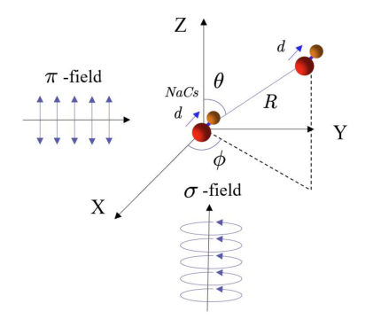
<figcaption class="paper-figure-caption"><b>Fig 1.</b> FIG. 1: Schematic illustration of the control microwave fields and dipolar interaction geometry.</figcaption>
</figure>
<figure class="paper-figure-card">
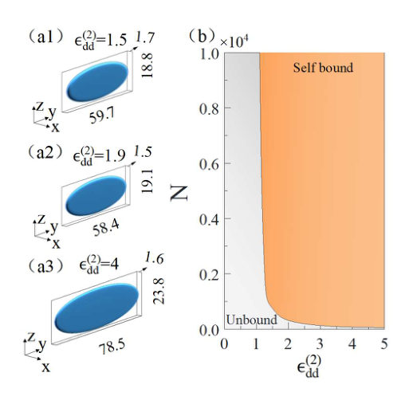
<figcaption class="paper-figure-caption"><b>Fig 2.</b> FIG. 2: (a1)–(a3) Isodensity profiles of self-bound QDs for N = 10000 with ǫ(2) dd = 1.5, 1.9, and 4, respectively. (b) Existence region of ground-state self-bound QDs for ǫ(0) dd = 0 and as = 2100 a0. The boundary (black line) separates unbound (grey) and self-bound (orange) regions.</figcaption>
</figure>
<figure class="paper-figure-card">
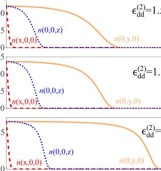
<figcaption class="paper-figure-caption"><b>Fig 3.</b> FIG. 3: Density profiles along the x (red), y (yellow), and z (blue) directions for the self-bound QDs shown in Fig. 2(a). Panels (a)–(c) correspond to ǫ(2) dd = 1.5, 1.9, and 4, respec- tively, with N = 10000.</figcaption>
</figure>
<figure class="paper-figure-card">
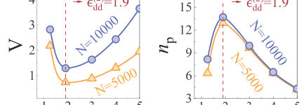
<figcaption class="paper-figure-caption"><b>Fig 4.</b> FIG. 4: QD properties as functions of non-axisymmetric relative dipolar strength ǫ(2) dd for N = 5000 (yellow) and N = 10000 (purple), respectively. (a) Chemical potential µ. (b) Total energy E. (c) Effective volume V . (d) Peak density np.</figcaption>
</figure>
<figure class="paper-figure-card">
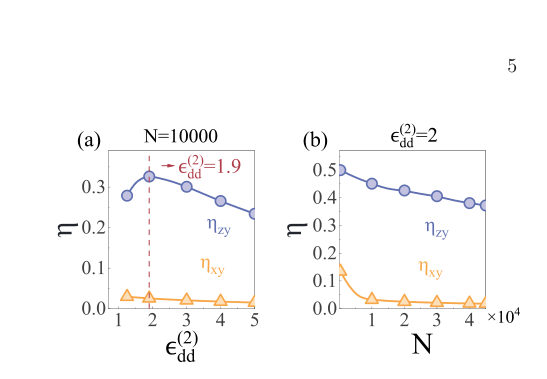
<figcaption class="paper-figure-caption"><b>Fig 5.</b> FIG. 6: (a) Anisotropy ratios ηzy (purple) and ηxy (yellow) as a function of ǫ(2) dd with N = 10000. (b) Anisotropy ratios ηzy (purple) and ηxy (yellow) as a function of N with ǫ(2) dd = 2.</figcaption>
</figure>

**Summary.** This paper investigates self-bound quantum droplets formed in dipolar molecular condensates by incorporating non-axisymmetric dipole-dipole interactions into the Gross-Pitaevskii equation. The authors characterize how these engineered interactions dictate the droplet's stability, shape anisotropy, and dynamic behavior during collisions. It demonstrates that controlling these long-range forces allows for rich control over quantum matter wave properties.

**Why it may be interesting.** This work provides detailed theoretical insights into controlling quantum matter waves using engineered long-range interactions (DDIs) via microwave dressing, which is crucial for realizing novel quantum states like supersolids in ultracold atomic systems.

Detailed structure

**Main problem.** The study systematically explores how dual microwave fields affect the formation and dynamics of self-bound quantum droplets (QDs) in dipolar molecular condensates, focusing on non-axisymmetric dipole-dipole interactions.

**Main result.** The research reveals that QD properties exhibit pronounced non-monotonic dependencies on non-axisymmetric DDI strength, and collisions between QDs show strong directional dependence ranging from rebound to fragmentation.

**Method.** The dynamics are modeled using the extended Gross-Pitaevskii equation incorporating Lee-Huang-Yang corrections. Stability and structure are analyzed via imaginary-time methods and direct simulations of perturbed evolution.

**Model / system.** The system is an ultracold Bose-Einstein condensate (BEC) of polar molecules whose interactions are dominated by tunable, non-axisymmetric dipole-dipole interactions (DDIs). The governing equation is the extended Gross-Pitaevskii equation with LHY corrections.

**Key observables.** Chemical potential ($\mu$), total energy ($E$), effective volume ($V$), peak density, and geometric anisotropy ratios ($\eta_{zy}, \eta_{xy}$)

**Important parameters / regimes.** Non-axisymmetric DDI strength ($\epsilon^{(2)}_{	ext{dd}}$), s-wave scattering length ($a_s$), and particle number ($N$).

**Assumptions / limitations.** The analysis assumes a regime dominated by non-axisymmetric DDIs, and the study uses mean-field approximations.

**Figures summary.** Figures illustrate isodensity profiles of QDs under varying $\epsilon^{(2)}_{	ext{dd}}$, map out the existence region in the $(N, \epsilon^{(2)}_{	ext{dd}})$ plane, and show density cross sections for collisions along different axes ($x, y, z$).

**Paper structure.** The paper first establishes the theoretical framework using the eGPE with non-axisymmetric DDIs. It then characterizes the existence region and structural properties of stable QDs by analyzing how $\mu$ and $E$ depend on interaction parameters. Finally, it investigates the complex dynamics of QD collisions along different spatial directions.

Abstract

Recent advances in the work with ultracold condensates of polar molecules have enabled the realization of highly tunable self-bound quantum droplets (QDs), with the help of dual microwave fields dressig the dipole-dipole interactions (DDIs) It has been reported that symmetry properties and the equilibrium phase diagram of such QDs can be controlled by parameters of the two microwave fields. However, the effect of these fields on the formation and dynamics of the QD has not yet been systematically explored. Here we address self-bound QDs in a regime dominated by non-axisymmetric DDIs and governed by the extended Gross-Pitaevskii equation with the Lee-Huang-Yang corrections. Within this framework, we identify the existence region of the self-bound QDs and characterize their chemical potential, total energy, effective volume, peak density, and geometric anisotropy. The results reveal a pronounced nonmonotonous dependence on the non-axisymmetric DDI strength, whereas the increase of the number of particles in the condensate leads to tighter bound and more anisotropic QDs. Furthermore, reducing the s-wave scattering length drives a transition from stable self-bound states to the collapse. Collisions between QDs moving along different directions reveal a strong directional dependence, with outcomes ranging from quasi-elastic rebound and merger to fragmentation.

[↑ back to top](#top)

### [Resolving support-mismatch by local basis rotation in variational Monte Carlo](http://arxiv.org/abs/2606.23657v1)

**Authors:** Jia-Lin Chen, Zhen Fan, Canhui Yan, Yantao Wu, Tao Xiang  
**Type:** theory · **Category:** strongly correlated electrons · **PDF:** <https://arxiv.org/pdf/2606.23657v1>  
**Analysis basis:** full PDF text, analyzed in chunks
**Topic relevance:** 🔥 `non-equilibrium dynamics` **4/5** · `methods for driven-dissipative` **3/5** · `Keldysh / 2PI / non-Gaussian methods` **1/5** · `analog quantum simulation` **1/5** · `non-equilibrium universality` **1/5**

↔ Scroll figures horizontally

<figure class="paper-figure-card">
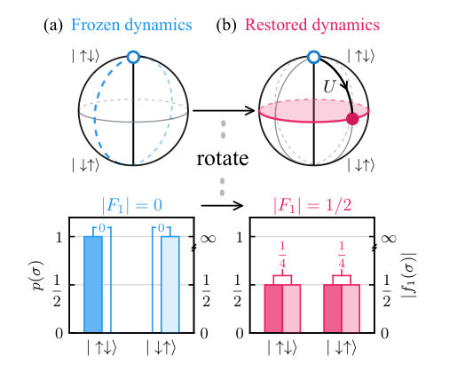
<figcaption class="paper-figure-caption"><b>Fig 1.</b> FIG. 1. Schematic illustration of dynamical freezing and its resolution via rotation sampling. (a) Bloch-sphere represen- tation of the dynamics within the Sz tot = 0 subspace for a two-site XY model initialized in the state |↑↓⟩. The bar chart displays the sampling probabilities p(σ) and the correspond- ing force magnitudes |f1(σ)|. (b) Same as (a) but after ap- plying a basis rotation U.</figcaption>
</figure>
<figure class="paper-figure-card">
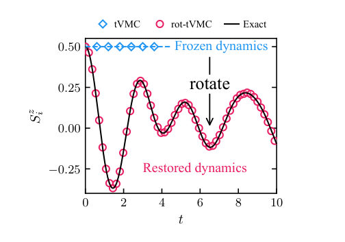
<figcaption class="paper-figure-caption"><b>Fig 2.</b> FIG. 2. Time evolution of the quench-site magnetization Sz i (t) for a 4 × 4 periodic square-lattice XY model. Standard tVMC remains frozen at the initial value, whereas rot-tVMC follows the exact reference. Both simulations use an α = 4 RBM ansatz.</figcaption>
</figure>
<figure class="paper-figure-card">
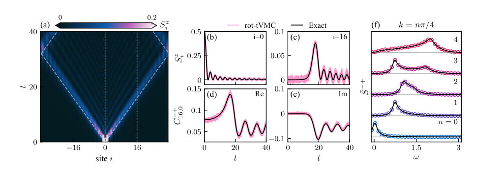
<figcaption class="paper-figure-caption"><b>Fig 3.</b> FIG. 3. Local-operator-quench dynamics and dynamical structure factor of the N = 64 periodic XY chain. (a) Space–time heatmap of Sz i (t) following a local quench |ψ0⟩= S+ 0 |ψgs⟩. Dashed lines indicate the ballistic light-cone velocity v = J = 1. The wrap-around features at t &gt; N/2 reflect the periodic boundary conditions. (b,c) Local magnetization Sz i (t) at the quench site (b) i = 0 and the quarter-chain site (c) i = 16. (d,e) Real (d) and imaginary (e) parts of the unequal-time spin correlator C−+ 16,0(t). (f) Normalized dynamical structure factor ˜S−+(k, ω) = S−+(k, ω)/ maxω S−+(k, ω) at k = nπ/4 (n = 0, 1, 2, 3, 4). Curves are vertically offset for clarity. All rot-tVMC results are...</figcaption>
</figure>
<figure class="paper-figure-card">
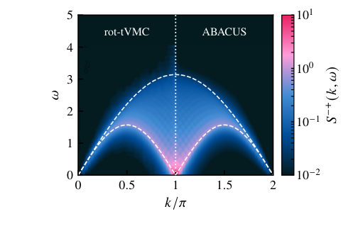
<figcaption class="paper-figure-caption"><b>Fig 4.</b> FIG. 4. Dynamical structure factor S−+(k, ω) of the N = 64 periodic Heisenberg chain. The vertical dotted line at k = π separates the two halves. The left half k ∈[0, π] shows re- sults from rot-tVMC, while the right half k ∈[π, 2π] shows the ABACUS result as a reference. The rot-tVMC result is obtained by Fourier transforming real-time correlators, com- puted with a D = 16 periodic MPS ansatz, up to tmax = 40. Dashed lines mark the lower and upper boundaries of the two- spinon continuum.</figcaption>
</figure>
<figure class="paper-figure-card">
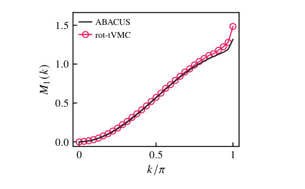
<figcaption class="paper-figure-caption"><b>Fig 5.</b> FIG. 5. First spectral moment M1(k) [Eq. (10)] of the N = 64 periodic Heisenberg chain, comparing rot-tVMC with the ABACUS reference.</figcaption>
</figure>

**Summary.** The paper introduces a technique called local basis rotation sampling to overcome the 'support mismatch' problem encountered in Variational Monte Carlo simulations. This bias arises when local quenches force certain quantum configurations to have zero amplitude, causing numerical instability. By rotating the sampling basis locally, the authors restore these missing contributions, allowing for accurate simulation of long-time dynamics and spectral properties in various spin models.

**Why it may be interesting.** This work provides a crucial, general numerical tool for simulating non-equilibrium quantum dynamics in strongly correlated systems where standard VMC estimators fail due to nodal structure or local quenching operators.

Detailed structure

**Main problem.** The primary challenge is resolving 'support mismatch' bias in Variational Monte Carlo (VMC) simulations when calculating real-time dynamics after a local quench by a charged operator.

**Main result.** A novel local basis rotation sampling scheme successfully resolves this support-mismatch problem, enabling accurate variational calculations of long-time quantum dynamics and dynamical structure factors.

**Method.** The authors propose augmenting the variational state with a helper state and applying a one-site unitary rotation to the sampling basis. This restores contributions from zero-amplitude configurations without altering the underlying physics.

**Model / system.** The method is tested on various models, including the XY model (1D and 2D) and the Heisenberg chain, simulating local-operator quenches in these quantum spin systems.

**Key observables.** Dynamical structure factors (DSF), quench-site magnetization $\langle S_{z}^i(t) 
angle$, and energy drift ($\Delta E/|E|$).

**Important parameters / regimes.** The dynamics are studied over long time scales ($t_{	ext{max}}=40$) and in various dimensions (1D, 2D).

**Assumptions / limitations.** The support mismatch is an artifact of the chosen sampling basis, which can be corrected by a local rotation.

**Figures summary.** Figures compare standard tVMC/p-tVMC simulations that freeze at $t=0$ due to bias against those using rotation sampling (rot-tVMC/rot-p-tVMC), showing the latter accurately tracking exact or reference results for magnetization and spectra.

**Paper structure.** The paper first establishes the support mismatch problem in tVMC, then introduces the local basis rotation as a solution. It validates this approach by benchmarking against known solvable models (XY chain) and comparing spectral functions with established methods (ABACUS). The technique is shown to be applicable both for real-time dynamics and ground-state optimization.

Abstract

Real-time dynamics after a local quench by a charged operator encodes the response functions measured in spectroscopic experiments, yet they have long posed a challenge for variational Monte Carlo calculations. The obstacle is a support mismatch: the projective action by a charged local operator forces an exponentially large number of configurations to vanish, but these configurations may still contribute to the dynamics, biasing the estimators and freezing the evolution at the very first step. This difficulty is an artifact of the chosen sampling basis, and the support mismatch generated by a charged local operator is itself local. We demonstrate that the missing support can be restored by a local rotation of the sampling basis, without changing the underlying variational dynamics. We propose a local basis-rotation sampling scheme that resolves the support-mismatch problem and can be readily incorporated into existing variational Monte Carlo algorithms. Benchmarks show that rotation sampling accurately captures long-time quantum dynamics, enabling variational Monte Carlo calculations of dynamical structure factors in one dimension and unbiased local-operator quench dynamics in two dimensions. We also show that this resolution of the support-mismatch problem extends beyond real-time dynamics, and may also be helpful for ground state variational Monte Carlo calculations.

[↑ back to top](#top)

### [Efficient Energy-Constrained Semi-Device-Independent QRNG with an Integrated Heterodyne Receiver](http://arxiv.org/abs/2606.23231v1)

**Authors:** Mattia Sabatini, Carles Roch i Carceller, Tommaso Bertapelle, Andrea Peri, Giulio Gualandi, Matías Rubén Bolaños, Yoann Piétri, Giacomo Corrielli, Paolo Villoresi, Giuseppe Vallone, Roberto Osellame, Armin Tavakoli, Marco Avesani  
**Type:** both · **Category:** quantum information and computing · **PDF:** <https://arxiv.org/pdf/2606.23231v1>  
**Analysis basis:** full PDF text, analyzed in chunks
**Topic relevance:** 🔥 `quantum optics experiment` **4/5** · `entanglement & information structure` **2/5** · `QC/QI experiment` **1/5** · `interference shaping light` **1/5** · `quantum measurements` **1/5**

↔ Scroll figures horizontally

<figure class="paper-figure-card">
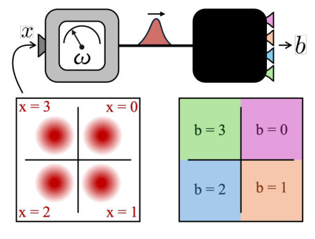
<figcaption class="paper-figure-caption"><b>Fig 1.</b> FIG. 1. Prepare-and-measure protocol. A device pre- pares a coherent state according to the input x ∈{0, 1, 2, 3}. This state is sent to a second device that performs a hetero- dyne measurement with outcome b ∈{0, 1, 2, 3} correspond- ing to the four quadrants in phase-space.</figcaption>
</figure>
<figure class="paper-figure-card">
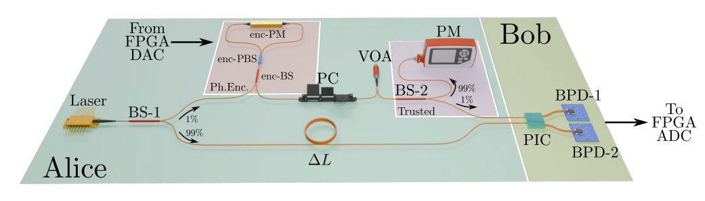
<figcaption class="paper-figure-caption"><b>Fig 2.</b> FIG. 2. Experimental QRNG scheme. The figure details the schematic of the device. The source’s light is split by a 99:1 BS generating both the LO and the QPSK quantum signal |α⟩after passing through a phase encoder. These are then coupled at the inputs of an optical heterodyne receiver and converted into electrical signals by a pair BPDs measuring both orthogonal quadratures of the quantum signal. PC: polarization controller, PBS: polarizing beam splitter, BS: beam splitter, PM: power meter, FPGA: field-programmable gate array, VOA: variable optical attenuator, BPD: balanced photodetector, ∆L: optical delay line, PIC: photonic integrated circuit.</figcaption>
</figure>
<figure class="paper-figure-card">
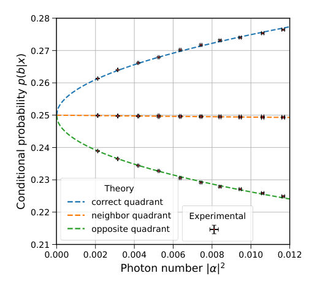
<figcaption class="paper-figure-caption"><b>Fig 3.</b> FIG. 3. Conditional probabilities estimation. Esti- mated conditional probabilities p(b|x) as a function of the mean photon number |α|2 of the QPSK-modulated coherent states. For each value of |α|2, the probabilities are obtained by averaging over the four QPSK input symbols and group- ing the outcomes according to whether Bob’s detected quad- rant is the correct quadrant (same quadrant as the prepared symbol), the opposite quadrant, or one of the two neighbor- ing quadrants. The values are averaged over 50 independent acquisitions, each containing approximately one million sym- bols. Error bars account for statistical and optical-power un- certainties. The dashed curves show the...</figcaption>
</figure>
<figure class="paper-figure-card">
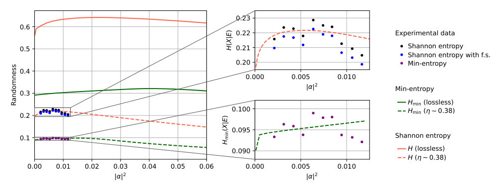
<figcaption class="paper-figure-caption"><b>Fig 4.</b> FIG. 4. Certifiable randomness. The figure details the amount of randomness that can be experimentally certified per measurement: the Shannon entropy values are shown in blue, their finite-size correction obtained via the EAT framework in purple, and the min-entropy in black. The figure also includes the theoretical performance of the QRNG, with solid curves indicating the ideal case (no losses) and dashed curves representing the predictions when losses are considered.</figcaption>
</figure>

**Summary.** The paper presents an experimental Quantum Random Number Generator (QRNG) utilizing continuous variables and QPSK modulation. It achieves state-of-the-art randomness certification by employing advanced mathematical tools like Semidefinite Programming to bound the conditional Shannon entropy in a semi-device-independent setting. This work is significant for realizing high-speed, provably secure quantum random number sources.

**Why it may be interesting.** This work bridges advanced quantum information theory (SDP bounds on entropy) with cutting-edge photonic hardware implementation, providing a tangible, high-performance realization of fundamental security principles.

Detailed structure

**Main problem.** Developing a Quantum Random Number Generator (QRNG) framework that provides strong security guarantees while maintaining high randomness generation rates using practical physical assumptions.

**Main result.** The authors demonstrated a QRNG achieving 0.223 bits per measurement, setting a record for continuous-variable semi-device-independent QRNGs, and reaching a rate of 55.6 Mbit/s.

**Method.** Randomness certification is achieved by bounding the conditional Shannon entropy using Semidefinite Programming (SDP) relaxations, which are extended to handle non-i.i.d. finite-size regimes via Entropy Accumulation Theorems.

**Model / system.** The protocol uses a prepare-and-measure scheme with four-state coherent-state constellations (QPSK modulation), measured by a low-loss integrated photonic heterodyne receiver.

**Key observables.** Certified Shannon entropy per measurement, observable witness value $W$, and the vacuum component bound $\omega$.

**Important parameters / regimes.** The achieved rate is 55.6 Mbit/s at 250 Mbaud; the efficiency ($\eta$) is estimated around 0.38.

**Assumptions / limitations.** The security relies on a Semi-Device-Independent (SDI) framework, assuming bounds on the average vacuum component and observable correlations ($W$ and $\omega$).

**Figures summary.** Figures illustrate state distributions in phase space, schematics of the experimental setup, and comparisons of certifiable randomness bounds versus mean photon number $|\alpha|^2$.

**Paper structure.** The paper progresses from establishing the need for robust SDI frameworks to detailing the mathematical machinery (SDP relaxations) used for entropy bounding, culminating in an experimental demonstration using integrated photonics.

Abstract

Semi-device-independent QRNG frameworks represent a particularly attractive approach, combining strong security guarantees with high randomness generation rates while relying only on reduced and practical physical assumptions. A recently proposed approach based on photon-number constraints is particularly suited to photonic implementations, where these assumptions can be easily assessed experimentally. Here, we experimentally demonstrate a quantum random number generator within this framework, enabling the direct computation of lower bounds on the certifiable Shannon entropy via semidefinite relaxation techniques. When combined with entropy accumulation methods, this approach enables finite-size randomness certification without assuming independent and identically distributed rounds. We realize the protocol using a four-state coherent-state constellation symmetrically distributed in phase space and measured by heterodyne detection, certifying 0.223 bit per measurement, which is the highest value reported to date for a continuous-variable semi-device-independent QRNG. The implementation combines a low-loss integrated photonic heterodyne receiver with a simple transmitter assembled from commercial components, providing a practical and high-speed architecture for semi-device-independent randomness generation.

[↑ back to top](#top)

### [Population-based eigenstates of the SU(d) spin-exchange model for high-spin fermions in optical lattices](http://arxiv.org/abs/2606.23374v1)

**Authors:** Hubert Dunikowski, Emilia Witkowska  
**Type:** theory · **Category:** quantum gases · **PDF:** <https://arxiv.org/pdf/2606.23374v1>  
**Analysis basis:** full PDF text, analyzed in chunks
**Topic relevance:** 🔥 `analog quantum simulation` **4/5** · `exotic spin models in light-matter` **3/5** · `entanglement & information structure` **1/5** · `non-equilibrium dynamics` **1/5**

↔ Scroll figures horizontally

<figure class="paper-figure-card">
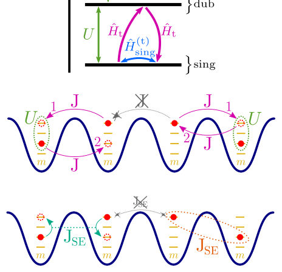
<figcaption class="paper-figure-caption"><b>Fig 1.</b> FIG. 1. Schematic representation of the second-order per- turbative process used to derive the effective Spin-Exchange Hamiltonian ˆHSE from the Fermi-Hubbard model in the strongly interacting regime (U ≫J) using (4). Picture (a) presents the underlying virtual process of double ˆHt with the effective model ˆH(t) sing on the on the energy diagram. Picture (b) presents on the lattice the virtual processes involved in perturbation and picture (c) shows the emergent effective pro- cesses in the perturbative effective Hamiltonian ˆH(t) sing = ˆHSE.</figcaption>
</figure>
<figure class="paper-figure-card">
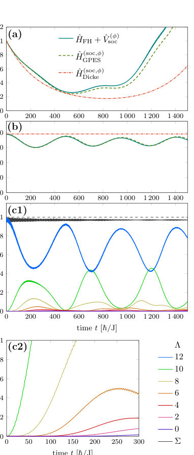
<figcaption class="paper-figure-caption"><b>Fig 2.</b> FIG. 2. Spin dynamics and spin squeezing for s = 1 fermions (N = 12 sites) in the strongly interacting regime (U = 5J) with laser coupling (Ω= 0.1J) at a phase ϕ = 5 · 2π/N. The initial coherent state is |ϑ= π</figcaption>
</figure>
<figure class="paper-figure-card">
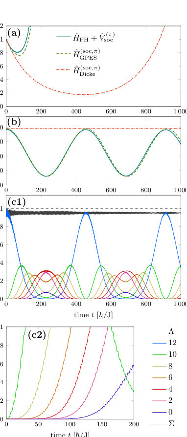
<figcaption class="paper-figure-caption"><b>Fig 3.</b> FIG. 3. Spin dynamics and squeezing for s = 1 fermions (N = 12 sites) in the strongly interacting regime (U = 5J) with laser coupling (Ω= 0.1J) at a specific phase ϕ = 6 · 2π</figcaption>
</figure>

**Summary.** The paper develops a sophisticated theoretical framework using Population Eigenstates (PESs) to describe high-spin fermionic atoms in optical lattices governed by an SU(d) spin-exchange model. By projecting the dynamics onto this PES basis, the authors derive effective Hamiltonians that accurately capture complex collective spin behavior and quantum correlations when coupling to external fields like light.

**Why it may be interesting.** This work extends quantum many-body physics beyond the standard spin-1/2 limit by utilizing SU(d) symmetry, providing a powerful theoretical tool for understanding complex collective spin behavior in ultracold atomic systems.

Detailed structure

**Main problem.** The central goal is systematically constructing eigenstates for the SU(d) spin-exchange model governing high-spin fermions in optical lattices.

**Main result.** The Population Eigenstate (PES) framework provides a natural basis that allows for describing collective spin dynamics and accurately modeling coupling to light, even when the total collective spin length is not conserved.

**Method.** The authors employ systematic construction of eigenstates using PESs, deriving effective Hamiltonians via second-order Schrieffer–Wolff transformations projected onto these population manifolds.

**Model / system.** The system involves ultra-cold fermionic atoms with high spin ($s \ge 1$) in a 1D optical lattice, modeled by the SU(d) spin exchange (SE) Hamiltonian derived from the Fermi-Hubbard model in the strongly interacting limit.

**Key observables.** Spin squeezing parameter ($\xi^2$), collective spin length ($\langle\hat{J}^2
angle$), and population distribution among different spin sectors ($\langle\hat{P}_{E=0}(\Lambda)
angle$).

**Important parameters / regimes.** High spin $s \ge 1$, strong interaction limit ($U \gg J$), quasi-momentum $q$, and coupling phase $\phi$.

**Assumptions / limitations.** The analysis relies on the strongly interacting regime for deriving the SE Hamiltonian, and effective Hamiltonians are derived using second-order perturbation theory.

**Figures summary.** Figures compare spin dynamics ($\xi^2$, $\langle\hat{J}^2
angle$) between the full model, the PES-derived effective Hamiltonian, and a restricted Dicke manifold approximation for various coupling phases.

**Paper structure.** The paper progresses from defining the SE model and introducing the PES basis (commuting with population operators) to deriving effective Hamiltonians via Schrieffer–Wolff transformations. It then analyzes the structure of spin eigenstates ($\Lambda$) within this basis, culminating in applying these tools to study dynamics under light coupling.

Abstract

We investigate the $\mathrm{SU}(d)$ spin exchange model describing ultra-cold fermionic atoms with spin $s\ge 1$ in a one-dimensional optical lattice. The model emerges from the Fermi-Hubbard model in the strongly interacting regime with one atom in each lattice site. The central result of this work is the systematic construction of SE eigenstates in terms of magnetic sub-level populations. This representation provides a natural description of high-spin fermionic systems, where the underlying $\mathrm{SU}(d)$ symmetry gives rise to extensive degeneracies. We illustrate the usefulness of this framework for deriving effective Hamiltonians for a system weakly coupled to light through spin-orbit interactions, using a second-order Schrieffer--Wolff transformation projected onto the introduced population eigenbasis. These effective models provide a controlled description of the collective spin dynamics and capture the role of population redistribution among different collective spin length sectors induced by interactions. The agreement with the exact Fermi--Hubbard with light coupling dynamics confirms the consistency of the population eigenstates framework as a basis for describing high-spin quantum many-body systems.

[↑ back to top](#top)

### [Quantifying and Probing Multipartite Entanglement via Minimum Entanglement Drop](http://arxiv.org/abs/2606.21950v1)

**Authors:** Dong-Dong Dong, Xue-Ke Song, Liu Ye, Dong Wang  
**Type:** theory · **Category:** quantum information and computing · **PDF:** <https://arxiv.org/pdf/2606.21950v1>  
**Analysis basis:** full PDF text, analyzed in chunks
**Topic relevance:** 🔥 `entanglement & information structure` **4/5** · `analog quantum simulation` **1/5** · `correlated / nonlocal dissipation` **1/5** · `driven-dissipative phase transition` **1/5** · `methods for driven-dissipative` **1/5** · `non-equilibrium dynamics` **1/5**

↔ Scroll figures horizontally

<figure class="paper-figure-card">
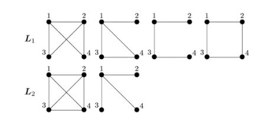
<figcaption class="paper-figure-caption"><b>Fig 1.</b> FIG. 1. The two LC orbits for 4-qubit connected graph states, with nodes explicitly labeled 1 to 4. The top row represents the orbit L1, and the bottom row represents the orbit L2. States within the same orbit exhibit different local entanglement sensitivities, yielding dis- tinct cluster fingerprints under our structural probe.</figcaption>
</figure>
<figure class="paper-figure-card">
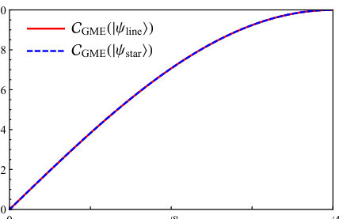
<figcaption class="paper-figure-caption"><b>Fig 2.</b> FIG. 2. The dynamical evolution of the GMC for the 4-qubit Line graph state (CGME(|ψline⟩), red solid curve) and the Star graph state (CGME(|ψstar⟩), blue dashed curve) under Ising interactions. The global measures for both distinct topologies are virtually indistin- guishable, monotonically increasing to their maximum values.</figcaption>
</figure>
<figure class="paper-figure-card">
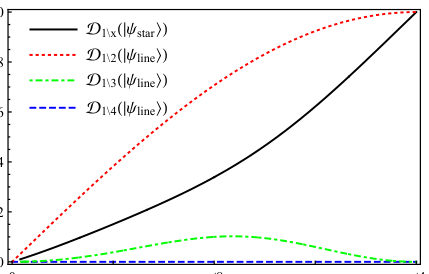
<figcaption class="paper-figure-caption"><b>Fig 3.</b> FIG. 3. The dynamic structural fingerprint revealed by the individ- ual negativity drops D1\x(t) with respect to focus qubit 1. The black solid curve represents the uniform drop D1\x(|ψstar⟩) for all periph- eral nodes (x ∈{2, 3, 4}) in the Star state. For the Line state, the spe- cific drops D1\2(|ψline⟩) (red dotted), D1\3(|ψline⟩) (green dashed), and D1\4(|ψline⟩) (blue dashed) map the nearest, next-nearest, and distant node dependencies, explicitly capturing the spatiotemporal spread of correlations.</figcaption>
</figure>
<figure class="paper-figure-card">
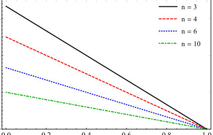
<figcaption class="paper-figure-caption"><b>Fig 4.</b> FIG. 4. The variation of the minimum tangle drop Dmin for the n-qubit noisy W state as a function of the particle number n and the noise parameter γ.</figcaption>
</figure>

**Summary.** The paper introduces the 'minimum entanglement drop' as a novel and powerful monotone to quantify genuine multipartite entanglement, moving beyond limitations of traditional measures. It functions as a structural probe that can map out the underlying connectivity graph of entangled qubits by measuring sensitivity to particle loss. While highly effective for distinguishing topologies, its diagnostic power is limited by certain highly robust quantum states.

**Why it may be interesting.** This work provides advanced diagnostic tools for characterizing complex quantum correlations beyond simple scalar measures. The focus on topological fingerprinting makes it highly relevant for understanding entanglement in physical architectures or noisy quantum channels.

Detailed structure

**Main problem.** The primary challenge is developing a robust, computationally tractable measure for quantifying genuine multipartite entanglement (GME) that satisfies all necessary theoretical postulates.

**Main result.** The minimum entanglement drop, defined using negativity or tangle, serves as a powerful structural probe capable of differentiating graph topologies and tracking network evolution. However, it fails to detect entanglement in highly robust states like the 5-qubit error-correcting code.

**Method.** The authors propose defining an entanglement monotone based on the minimum reduction (drop) in global one-to-group entanglement when tracing out a single particle. This is formalized using concepts derived from generalized monogamy inequalities and negativity/tangle measures.

**Model / system.** The work analyzes general $n$-qubit quantum states, focusing on characterizing their internal connectivity structure (e.g., comparing Line vs. Star graph topologies) and analyzing the evolution of entanglement under environmental noise.

**Key observables.** Minimum entanglement drop ($D_{\min}$), minimum negativity drop ($	ext{D}_{S_{q_1}}$), Tangle ($	au$), Negativity ($\mathcal{N}$), and Concurrence ($C$).

**Important parameters / regimes.** Number of qubits ($n$), noise parameter ($\gamma$), and the specific graph topology (Line vs. Star).

**Assumptions / limitations.** The method is primarily a heuristic structural probe, and its diagnostic sensitivity vanishes for certain highly robust, symmetrically correlated states.

**Figures summary.** Figures illustrate how the minimum drop uniquely reveals underlying graph topologies (e.g., distinguishing Line from Star graphs) and show the analytical scaling of $D_{\min}$ for noisy W states versus particle number or noise strength.

**Paper structure.** The paper progresses by first identifying the limitations of existing measures, proposing the minimum entanglement drop as a novel monotone, rigorously proving its properties (especially in the tripartite case), demonstrating its utility as a structural probe to map connectivity fingerprints, and finally analyzing its performance on specific state classes like W states under noise.

Abstract

Quantifying genuine multipartite entanglement remains a significant challenge. We propose a multipartite entanglement monotone defined by the minimum entanglement drop -- the reduction in global one-to-group entanglement upon tracing out a single particle. We formulate a computationally efficient variant using tangle and negativity to ensure non-vanishing values for W-class states, and rigorously prove it is a valid monotone under local operations and classical communication. In the tripartite regime, the minimum tangle drop is physically equivalent to the minimum pairwise concurrence. We establish an operational framework where the entanglement drop acts as a structural probe: by assessing sensitivity to qubit loss, it identifies inseparable clusters, extracting connectivity fingerprints that uniquely differentiate graph topologies within the same local Clifford equivalence class. Integrating this mapping with classical shadows enables efficient experimental estimation and dynamic tracking of entanglement network evolution. We derive exact analytical solutions for n-qubit W states under environmental noise, revealing robust scaling behaviors. Finally, we acknowledge limitations, noting that diagnostic sensitivity strictly vanishes for highly robust states such as the 5-qubit error-correcting code.

[↑ back to top](#top)

### [Quantum Memory in Scalar-Induced Gravitational Waves](http://arxiv.org/abs/2606.21835v1)

**Authors:** Waqas Ahmed  
**Type:** theory · **Category:** other · **PDF:** <https://arxiv.org/pdf/2606.21835v1>  
**Analysis basis:** full PDF text, analyzed in chunks
**Topic relevance:** 🔥 `entanglement & information structure` **4/5** · `Keldysh / 2PI / non-Gaussian methods` **2/5** · `correlated / nonlocal dissipation` **1/5** · `methods for driven-dissipative` **1/5** · `non-equilibrium dynamics` **1/5**

↔ Scroll figures horizontally

<figure class="paper-figure-card">
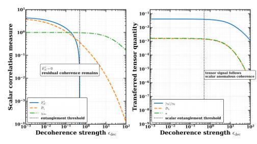
<figcaption class="paper-figure-caption"><b>Fig 1.</b> FIG. 1. Minimal scalar-to-tensor transfer benchmark. Panel (left) shows the scalar logarithmic negativity, Gaussian dis- cord, and anomalous coherence fraction as functions of the decoherence strength. The vertical line marks the point where scalar entanglement vanishes. Panel (right) shows the induced tensor coherence, tensor discord, and connected covariance generated by the same residual scalar anomalous coherence. The tensor quantities remain nonzero inside the scalar separa- ble regime because they are sourced by coherence contractions rather than by scalar entanglement itself.</figcaption>
</figure>
<figure class="paper-figure-card">
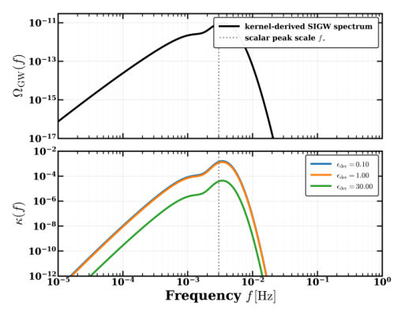
<figcaption class="paper-figure-caption"><b>Fig 2.</b> FIG. 2. Kernel-derived benchmark signals from a lo- calized scalar source. Panel (a) shows the scalar-induced gravitational-wave spectrum obtained from the radiation-era transfer kernel for a log-normal scalar power spectrum. The vertical line denotes the scalar peak scale f∗. Panel (b) shows the connected covariance statistic κ(f) generated by the transferred tensor coherence for representative decoher- ence strengths. Both panels are computed from the same scalar spectrum and transfer kernel; the overall normalization is chosen for a representative detectable SIGW amplitude.</figcaption>
</figure>

**Summary.** This paper investigates the fate of primordial quantum information encoded in scalar perturbations as they generate gravitational waves. By analyzing decohered Gaussian states, the authors show that residual scalar coherence survives and manifests as measurable non-classical correlations—like tensor discord and connected covariance—in the induced gravitational wave background. These unique phase-sensitive signatures offer new targets for future space-based GW observatories.

**Why it may be interesting.** It provides a concrete theoretical framework for how non-local quantum correlations (coherence) can be imprinted onto classical background signals (GWs), offering new diagnostic tools beyond simple power spectrum measurements.

Detailed structure

**Main problem.** To determine if residual quantum information from primordial scalar perturbations can survive decoherence and manifest as detectable signatures in secondary gravitational-wave backgrounds.

**Main result.** Residual scalar anomalous coherence can generate nonzero tensor discord, connected covariance, and phase-sensitive strain correlations even after the initial scalar entanglement has vanished.

**Method.** The authors derive explicit transfer relations linking the scalar anomalous coherence to the induced tensor covariance matrix using a Gaussian state description.

**Model / system.** The study models Scalar-Induced Gravitational Waves (SIGWs) generated at second order from decohered two-mode Gaussian scalar states, analyzing how quantum correlations propagate through nonlinear gravitational interactions.

**Key observables.** Gaussian tensor discord ($D_h(k)$), connected covariance ($\kappa(k)$), and phase-sensitive strain correlators ($\Gamma(k, q)$).

**Important parameters / regimes.** Decoherence strength ($\epsilon_{	ext{dec}}$) and the frequency/wavenumber spectrum of the source.

**Assumptions / limitations.** The analysis works to leading non-trivial order in scalar perturbations and provides an order-of-magnitude scaling estimate for detectability, not a full sensitivity curve.

**Figures summary.** Figure 1 compares various coherence measures (negativity, discord) showing persistence in the separable regime. Figure 2 illustrates the derived SIGW spectrum ($d_k$) and the connected covariance statistic ($\kappa(f)$).

**Paper structure.** The paper establishes the problem of quantum information loss during decoherence, derives transfer relations between scalar coherence and tensor observables, calculates specific diagnostics like discord and connected covariance, and discusses their potential detection using future interferometers.

Abstract

Scalar-induced gravitational waves are usually treated as a classical stochastic background sourced by phase-random curvature perturbations. We show that this description can miss residual quantum information. Starting from a decohered two-mode Gaussian scalar state, we derive explicit transfer relations between the scalar anomalous coherence and the covariance matrix of induced tensor modes. For a localized scalar power spectrum, the ordinary tensor power is sourced by scalar power contractions, whereas the opposite-mode tensor coherence is sourced by scalar anomalous-coherence contractions. This coherence can generate nonzero tensor discord and a connected tensor-power covariance even after scalar entanglement has vanished. We identify the connected covariance and phase-sensitive strain correlations as probes of primordial quantum coherence in secondary gravitational-wave backgrounds, and discuss their possible relevance for future space-based interferometers and pulsar timing arrays.

[↑ back to top](#top)

### [Dynamical Decoupling using Universal Optimal Tracking](http://arxiv.org/abs/2606.21762v1)

**Authors:** Amit Devra, Emanuel Malvetti, Niklas J. Glaser, Abhishek Agarwal, Ivan Rungger, Santana Lujan, Max Werninghaus, Stefan Filipp, Leo Van Damme, Steffen J. Glaser  
**Type:** both · **Category:** quantum information and computing · **PDF:** <https://arxiv.org/pdf/2606.21762v1>  
**Analysis basis:** full PDF text, analyzed in chunks
**Topic relevance:** 🔥 `QC/QI experiment` **4/5** · `correlated / nonlocal dissipation` **1/5** · `methods for driven-dissipative` **1/5** · `non-equilibrium dynamics` **1/5**

↔ Scroll figures horizontally

<figure class="paper-figure-card">
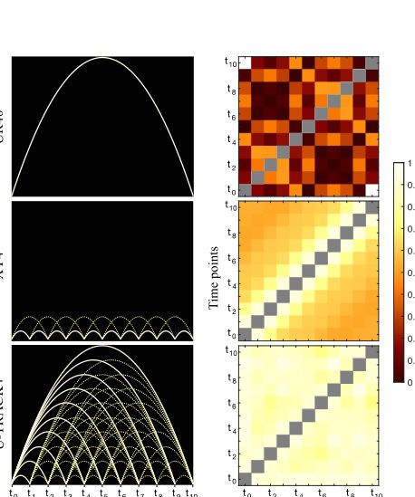
<figcaption class="paper-figure-caption"><b>Fig 1.</b> FIG. 1. Comparison of the design principles of two conven- tional DD sequences (UR40, top row, and XY4, middle row) with the novel tracking-based approach introduced in this pa- per (U-TRACK4, bottom row). On the left, the white arcs represent propagators U(tm, tn) designed to approximate the identity operator I from time point tm to time point tn for 0 ≤m &lt; n ≤10. Yellow dashed lines indicate propagators that, by direct transitivity, also approximate the identity op- erator. On the right, fidelities measuring the proximity of U(tm, tn) to I, averaged over a range of frequency detunings and pulse-amplitude deviations, are shown. Trivial diagonal entries with U(tn, tn) = I are grayed out....</figcaption>
</figure>
<figure class="paper-figure-card">
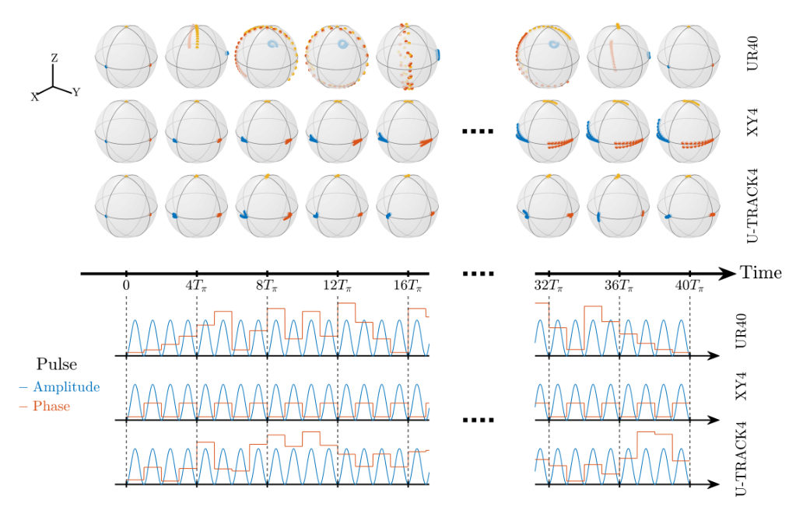
<figcaption class="paper-figure-caption"><b>Fig 2.</b> FIG. 2. Effect of three dynamical decoupling sequences on qubit dynamics, shown on the Bloch sphere (top) and as pulse waveforms (bottom). Each row corresponds to one sequence (UR40, XY4, U-TRACK4); each sphere is a snapshot in time, progressing from t = 0 to t = 40 Tπ, where Tπ is the duration of one π-pulse. Points mark qubit states initialized on X (blue), Y (red), and Z (yellow). Each evolves under a different detuning strength; a tight cluster therefore indicates resilience to detuning errors, while a spread or displaced set of points indicates sensitivity. Ideally, every point returns to its starting position by T = 40 Tπ. UR40 achieves a very robust state recovery at T but not at...</figcaption>
</figure>
<figure class="paper-figure-card">
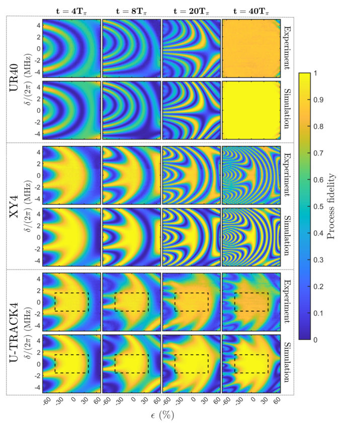
<figcaption class="paper-figure-caption"><b>Fig 3.</b> FIG. 3. Process fidelities of different dynamical decoupling sequences as functions of pulse-amplitude error ϵ and frequency detuning δ, which are intentionally engineered in the quantum device. For each sequence, the top row shows experimental measurements, while the bottom row shows the corresponding simulation results. Each column corresponds to the fidelity obtained after 4, 8, 20, and 40 π-pulses, respectively, with each π-pulse having a duration of Tπ = 128 ns. The dotted rectangle shows the parameter ranges over which the U-TRACK4 sequence was optimized with assigned weights in the central region, as described in Appendix A. Technical details of the experimental implementation and...</figcaption>
</figure>
<figure class="paper-figure-card">
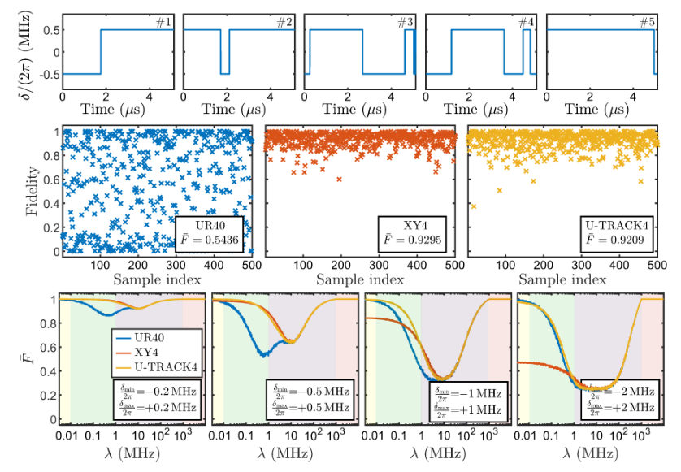
<figcaption class="paper-figure-caption"><b>Fig 4.</b> FIG. 4. First row: Five representative samples of detuning versus time under random telegraph noise (RTN) generated with a switching rate λ = 0.5 MHz, and detuning levels of ±0.5 MHz, illustrating the stochastic variability of noise. Second row: Simulated sequence fidelity at the idle time (T = 5.12 µs, corresponding to 40 π-pulses) computed for 500 samples (λ = 0.5 MHz, δ(t)/(2π) = ±0.5 MHz). Results are shown for the three dynamical decoupling sequences indicated in the legend. ¯F denotes the average fidelity over the 500 samples. Third row: Average fidelity over 2,000 samples as a function of λ, shown for different detuning levels as indicated in the legend. The different-colored strips...</figcaption>
</figure>
<figure class="paper-figure-card">
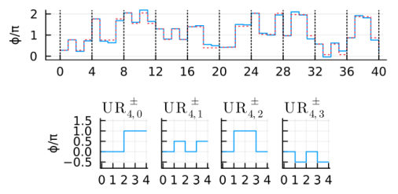
<figcaption class="paper-figure-caption"><b>Fig 5.</b> FIG. 6. Top: Optimized U-TRACK4 pulse phases for 10 blocks (solid blue). For comparison, the closest approxi- mating XUR4 sequence (defined in the main text) is shown in red dotted. Bottom: The four distinct UR± 4,k pulses (k = 0, 1, 2, 3). UR± 4,1 is equivalent to XY4 and UR± 4,0 equals the MLEV4 sequence [38, 52, 57]. The remaining two cases are obtained by applying a cyclic phase shift and possibly adding a global phase offset. Details about the pulse opti- mization are provided in Appendix A.</figcaption>
</figure>

**Summary.** This work introduces Universal Optimal Tracking (U-TRACK), a sophisticated method for designing Dynamical Decoupling sequences that actively correct residual errors block-by-block. By optimizing these novel XUR pulse structures, the authors demonstrate superior noise suppression compared to traditional methods like XY4 or UR40 on superconducting qubits. This establishes U-TRACK as a practical and highly robust tool for extending quantum coherence times in noisy hardware.

**Why it may be interesting.** For a theoretical physicist in this area, the development of an algorithm that moves beyond simple periodic repetition to dynamically compensate for accumulated errors represents a significant conceptual leap in quantum control theory. The combination of optimization techniques (GA + GRAPE) applied to physical constraints is highly relevant.

Detailed structure

**Main problem.** The primary goal is designing robust Dynamical Decoupling (DD) sequences to suppress environmental noise and prevent error accumulation during long idle periods in quantum computation.

**Main result.** A novel Universal Optimal Tracking (U-TRACK) approach yields XUR pulse sequences that dynamically compensate for residual errors at every block, significantly outperforming conventional periodic schemes like XY4 or UR40, especially under low-frequency noise.

**Method.** The authors use a combination of gradient optimization (GRAPE) and global search techniques (Genetic Algorithm) to optimize the phases of multiple pulse blocks simultaneously, ensuring high fidelity across intermediate checkpoints.

**Model / system.** The work is demonstrated on superconducting-qubit platforms (e.g., transmon processors). The underlying physics involves controlling qubit evolution under noise sources like frequency detuning and amplitude errors ($\epsilon, \delta$).

**Key observables.** Process fidelity ($F$) measured over long idle times; average fidelity ($ar{F}$) calculated across parameter error grids $(\epsilon, \delta)$; robustness profiles against Random Telegraph Noise (RTN).

**Important parameters / regimes.** Noise regimes defined by the switching rate $\lambda$ of RTN (e.g., low-frequency vs. high-frequency); pulse parameters include amplitude errors ($\epsilon$) and detuning ($\delta$).

**Assumptions / limitations.** The U-TRACK method assumes that error compensation can be achieved block-by-block, leading to non-periodic optimal sequences; simulations often rely on specific pulse shapes like DRAG pulses.

**Figures summary.** Figures compare the fidelity decay of UR40, XY4, and U-TRACK4 across various noise regimes (static, low-frequency RTN), demonstrating U-TRACK's superior sustained performance. Later figures detail process fidelity vs. error parameters ($\epsilon, \delta$) for multiple blocks.

**Paper structure.** The paper introduces the limitations of standard DD methods, proposes and optimizes the U-TRACK framework using global optimization algorithms, validates its performance against various noise models (static, time-dependent RTN), and finally compares it experimentally/numerically against established sequences like XY4 on superconducting hardware.

Abstract

Dynamical decoupling (DD) is a widely used and resource-efficient technique for error suppression, but conventional DD relies on periodically repeating a short pulse block to refocus the qubit state during idle periods. Imperfections in this block cause residual errors to accumulate, ultimately degrading state recovery over long idle times. Here, we introduce a universal optimal tracking approach that extends the original tracking concept to a fully state-independent setting for designing DD sequences. By monitoring the qubit's evolution at predefined waypoints during optimization, the method dynamically compensates residual errors while preserving regular refocusing. Experimental demonstrations on a superconducting-qubit platform confirm the suppression of error accumulation under static control imperfections, in agreement with numerical predictions. Complementary simulations further show that optimal-tracking-based sequences maintain strong performance under time-dependent noise. These results establish optimal tracking as a practical and hardware-agnostic approach to designing short, robust DD sequences suitable for noisy quantum devices.

[↑ back to top](#top)

### [Vibe Calibration: Autonomous Bring-up of a 112-Qubit Superconducting Quantum Processor by a Skill-Orchestrating Language Agent](http://arxiv.org/abs/2606.22376v1)

**Authors:** Huikai Xu, Jiaxiu Han, Shigang Ou, Cheng Ye, Zisong Shen, Jing Gao, Yijia Wang, Tianrui Che, Yu Song, Weiyang Liu, Lei Wang, Lin-Feng Zhang, Pan Zhang, Hai-Feng Yu  
**Type:** experiment · **Category:** quantum information and computing · **PDF:** <https://arxiv.org/pdf/2606.22376v1>  
**Analysis basis:** full PDF text, analyzed in chunks
**Topic relevance:** 🔥 `QC/QI experiment` **4/5** · `quantum measurements` **2/5** · `methods for driven-dissipative` **1/5**

↔ Scroll figures horizontally

<figure class="paper-figure-card">
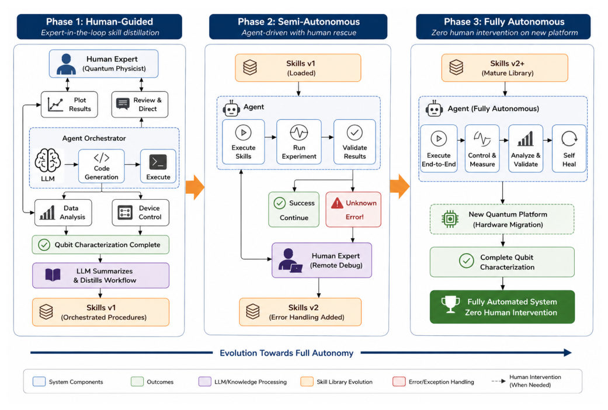
<figcaption class="paper-figure-caption"><b>Fig 1.</b> FIG. 1. Three-phase evolution from human-guided to fully autonomous operation of Vibe Calibration. Phase 1 (Human-Guided): a human expert supervises every iteration, reviewing plotted results and directing the orchestrator that drives an LLM to generate device-control code, run measurements, and analyze data; trajectories that the expert validates are summarized by the LLM into a first-generation skill library (Skills v1). Phase 2 (Semi-Autonomous): the agent operates the skill library on its own, calling on a remote expert only when an unknown error is encountered; each debugging episode is distilled back into the library, augmenting Skills v2 with explicit error-handling logic. Phase 3...</figcaption>
</figure>
<figure class="paper-figure-card">
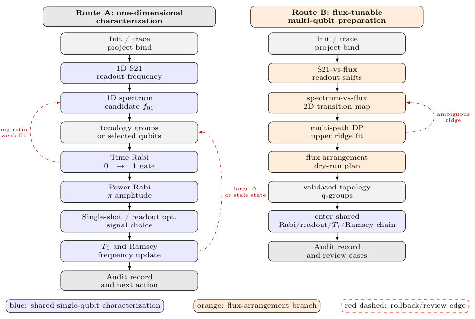
<figcaption class="paper-figure-caption"><b>Fig 2.</b> FIG. 2. Distilled qubit-characterization Skill as a unified decision tree. The workflow exposes two top-level routes that converge on a shared single-qubit characterization chain. Route A (left, blue) handles fixed-frequency or pre-fluxed devices: 1D S21 fixes the readout frequency, 1D spectroscopy proposes a candidate f01, topology groups are formed, and the shared chain (including Time Rabi, Power Rabi, single-shot / readout optimization, T1, and Ramsey) runs to completion. Route B (right, orange) adds the flux-arrangement branch required for tunable multi-qubit devices: S21-vs-flux, spectrum-vs-flux, a multi-path dynamic-programming ridge fit, and a flux-arrangement dry-run plan precede...</figcaption>
</figure>
<figure class="paper-figure-card">
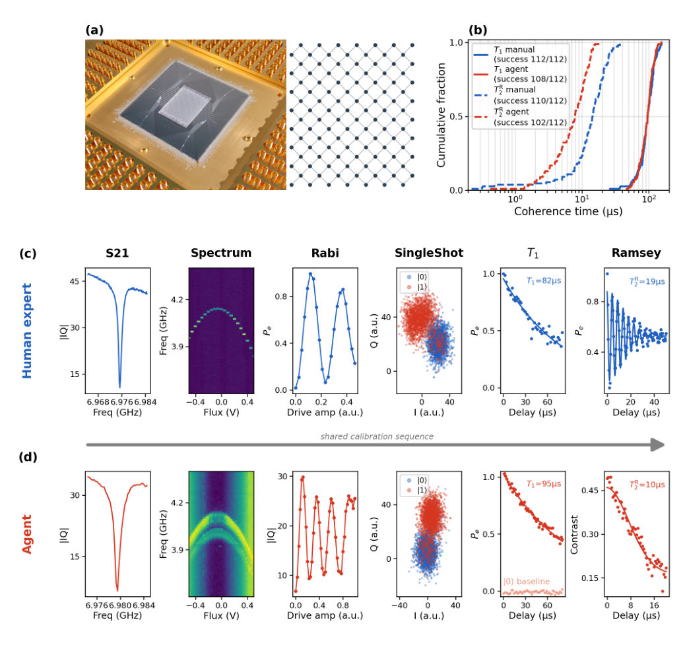
<figcaption class="paper-figure-caption"><b>Fig 3.</b> FIG. 3. Side-by-side comparison of autonomous-agent and manual qubit characterization on a 112-qubit tunable transmon device. (a) Optical image of the 112-qubit frequency-tunable transmon processor (left) and a schematic of its qubit connectivity (right): dots denote qubits and links denote tunable couplers, forming a tilted square lattice of 7 qubits per row over 16 rows in which each interior qubit is coupled to its four diagonal neighbours. (b) Cumulative distributions of the energy-relaxation time T1 and the Ramsey dephasing time T R 2 over all characterized qubits, for the manual (blue) and agent (red) campaigns (T1 solid, T R 2 dashed; logarithmic time axis). Legend counts report the...</figcaption>
</figure>
<figure class="paper-figure-card">
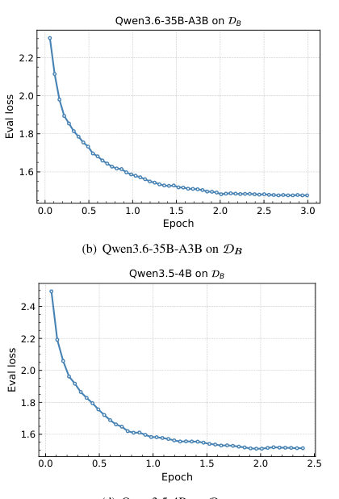
<figcaption class="paper-figure-caption"><b>Fig 4.</b> Figure 1. Validation loss curves over training for all four fine-tuning runs.</figcaption>
</figure>
<figure class="paper-figure-card">
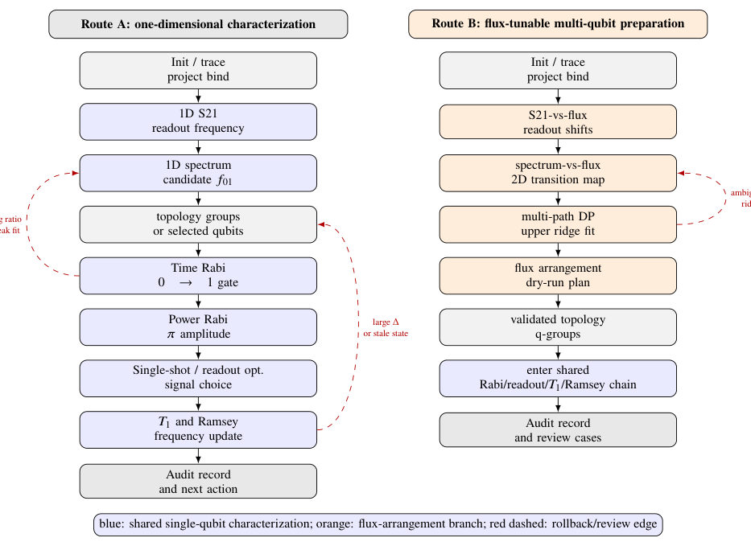
<figcaption class="paper-figure-caption"><b>Fig 5.</b> Figure 2. Unified Skill workflow redrawn as two main columns. The left column shows the one-dimensional characterization route. The right column shows the flux-tunable multi-qubit route, which performs flux arrangement before entering the shared characterization chain.</figcaption>
</figure>

**Summary.** The paper introduces Vibe Calibration, an autonomous system using LLM agents to automate the complex and expert-dependent process of calibrating large superconducting quantum processors. By formalizing expert knowledge into structured 'Skills,' the system achieves significant speedups and robustness compared to manual operation. This work establishes a reusable, auditable infrastructure for scaling quantum hardware operations.

**Why it may be interesting.** This work is highly relevant as it tackles the operational bottleneck of quantum hardware by treating calibration not as a set of fixed scripts but as an abstract, reusable, agentic workflow that can be generalized across different physical architectures.

Detailed structure

**Main problem.** The calibration complexity of superconducting quantum processors is a major bottleneck for scaling toward fault-tolerant quantum computing, as conventional scripts are brittle and expert judgment is limited.

**Main result.** The system autonomously completed calibration on a 112-qubit processor in 4.7 hours, achieving a $4–5	imes$ speedup over manual methods while demonstrating transferable core decision logic across devices.

**Method.** An autonomous calibration system, Vibe Calibration, orchestrates complex workflows by distilling expert tacit knowledge into reusable, auditable 'Skills' structured as decision trees.

**Model / system.** The physical platform is a superconducting quantum processor featuring 112 frequency-tunable transmon qubits. The methodology involves using Large Language Model agents to execute these Skills via parameterized measurement commands and quantitative acceptance criteria.

**Key observables.** $T_1$ relaxation time, Ramsey dephasing time ($T_{R2}$), Rabi frequencies, S21 readout response, and visibility.

**Important parameters / regimes.** 112 qubits; 4.7 hours (autonomous runtime); $4–5	imes$ speedup over manual calibration.

**Assumptions / limitations.** The core assumption is that expert knowledge can be formalized into reusable Skills, allowing the system to pursue the *purpose* of a measurement rather than just mimicking specific human actions.

**Figures summary.** Figures illustrate the three-phase evolution from human supervision to full autonomy (Fig. 1), detail the decision tree structure of a qubit-characterization Skill (Fig. 2, Fig. 4), and compare autonomous vs. manual characterization results for $T_1$ and $T_{R2}$ on the 112-qubit device (Fig. 3).

**Paper structure.** The paper details a phased development: initial single-qubit calibration, scaling to 16 qubits, and culminating in the full 112-qubit system. The structure emphasizes distilling expertise into Skills, executing multi-step pipelines (Spectrum $
ightarrow$ Power Rabi $
ightarrow$ SingleShot $
ightarrow$ T1 $
ightarrow$ Ramsey), and demonstrating generalization.

Abstract

Superconducting quantum computing is one of the most mature solid-state platforms for quantum computation, with processors exceeding one hundred qubits. Yet further scaling toward fault-tolerant quantum computing is increasingly constrained by calibration complexity. Conventional scripts are brittle to anomalous signals, and expert judgment is bounded by cognitive bandwidth and serial operation time, failing to keep pace with system scale. Here we report Vibe Calibration, an autonomous calibration system orchestrated by large language model agents, which distills expert tacit knowledge into reusable Skills. Each Skill is organized as a decision tree that packages parameterized measurement commands, quantitative acceptance criteria, and audit records, enabling autonomous execution and self-healing. We capture this knowledge through a three-phase human-in-the-loop distillation process and fine-tune a large language model on validated trajectories. On a 112-qubit processor with frequency-tunable transmons, the system autonomously completes calibration of 108 out of 112 qubits in 4.7 hours, achieving a 4--5$\times$ speedup over manual calibration of the full 112 qubits. A cross-validated comparison with expert manual calibration on a 16-qubit subset shows agreement on 14 out of 16 qubits. More importantly, the model demonstrates transferable calibration workflows across devices. While low-level control scripts require minor interface adaptation for different hardware platforms, the core decision logic and task orchestration generalize to new processors, demonstrating a reusable laboratory interface rather than a memorized script.This work demonstrates, for the first time, fully autonomous calibration of a hundred-qubit superconducting processor through reusable and auditable Skills, removing a critical barrier to scalable quantum hardware operation.

[↑ back to top](#top)

### [An Efficient and Perfect Secret Sharing Scheme on a Class of Non-Maximal Quantum Access Structure](http://arxiv.org/abs/2606.23082v1)

**Authors:** Lei Li, Zhi Li  
**Type:** theory · **Category:** quantum information and computing · **PDF:** <https://arxiv.org/pdf/2606.23082v1>  
**Analysis basis:** full PDF text, analyzed in chunks
**Topic relevance:** 🔥 `entanglement & information structure` **4/5** · `methods for driven-dissipative` **1/5** · `quantum measurements` **1/5**

↔ Scroll figures horizontally

<figure class="paper-figure-card">
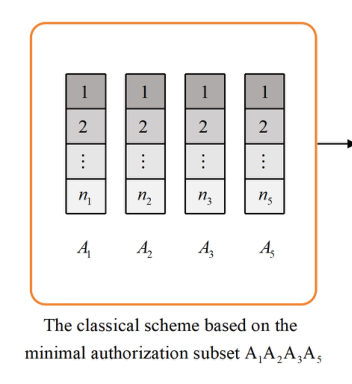
<figcaption class="paper-figure-caption"><b>Fig 1.</b> Figure 1: Flowchart of the proposed scheme</figcaption>
</figure>

**Summary.** This paper develops a novel approach for Quantum Secret Sharing tailored for non-maximal access structures. It characterizes these complex QAS using information theory tools and proposes a hybrid scheme that combines quantum entanglement distribution with classical sharing. The result is a provably perfect and efficient secret sharing protocol applicable to specific hyperstar network topologies.

**Why it may be interesting.** While focused on quantum information theory rather than condensed matter physics, the rigorous mathematical framework used to analyze resource constraints (efficiency) and perfect security in quantum protocols is highly relevant to understanding error correction and state preparation in complex quantum systems.

Detailed structure

**Main problem.** The paper addresses the challenge of constructing efficient and perfect quantum secret sharing (QSS) schemes for non-maximal Quantum Access Structures (QAS). It aims to overcome resource consumption issues inherent in current QSS protocols.

**Main result.** A universal, efficient, and perfect quantum secret sharing scheme is proposed for a specific class of non-maximal QAS (the hyperstar with three hyperedges) by combining quantum entanglement distribution with classical secret sharing techniques.

**Method.** The methodology involves characterizing forbidden and intermediate sets within the non-maximal QAS using concepts like quantum mutual information. The construction utilizes entangled states and Pauli operators to encode and reconstruct the secret state.

**Model / system.** The model is Quantum Secret Sharing, where a quantum state $|	ext{K}
angle$ is shared among participants according to an access structure $\Gamma$. The specific structures analyzed are derived from hyperstars with three hyperedges.

**Key observables.** Quantum Mutual Information $I(A:K)$, Von Neumann Entropy $S(K)$, and the ability of authorized vs. unauthorized subsets to recover the secret state $|	ext{K}
angle$.

**Important parameters / regimes.** The structure type (hyperstar with three hyperedges), the threshold parameters $(k, n)$, and the entanglement properties derived from Schmidt decomposition.

**Assumptions / limitations.** The analysis often assumes pure-state encoding for the QAS realization. The final PQSS scheme relies on combining quantum sharing over a representative element QAS ($R_i$) with a perfect classical secret sharing component.

**Figures summary.** Figure 1 illustrates the flowchart of the proposed PQSS scheme for a minimal authorized subset based on $\Gamma_3$.

**Paper structure.** The paper progresses by first characterizing non-maximal QAS (defining forbidden/intermediate sets), then establishing theoretical links between these sets and information leakage via mutual information. Finally, it constructs and proves the security of the hybrid PQSS scheme for specific hyperstar substructures.

Abstract

Quantum secret sharing is one of the core security technologies in the field of quantum communication. Aiming at the problems of high quantum resource consumption and the difficulty in balancing security and efficiency existing in current quantum secret sharing schemes under non-maximal quantum access structure(QAS), this paper focuses on the judgment criteria of non-maximal QAS and the construction methods of efficient and perfect quantum secret sharing schemes on a kind of non-maximal QAS, i.e. hyperstar with three hyperedges. Firstly, we characterizes the forbidden sets and intermediate sets within this non-maximal QAS, and provides a characterization for non-maximal QAS realizable by pure-state encoding. Secondly, the representative element QAS of hyperstar with three hyperedges is defined, which serves as a substructure of this hyperstar QAS, and belongs to non-maximal QAS. Furthermore, we propose a universal, efficient, and perfect quantum secret sharing scheme based on this hyperstar QAS using corresponding classical secret sharing scheme as an auxiliary. By deploying lightweight quantum resources to representative element access structures, the proposed scheme reduces the difficulty in quantum state preparation and distribution, and enhances its security and resource utilization efficiency.

[↑ back to top](#top)

### [Configurable Algorithms for Histopathologic Cancer Detection on Quantum Hardware](http://arxiv.org/abs/2606.21752v1)

**Authors:** Nandika Goyal, Glen Uehara, Andreas Spanias  
**Type:** both · **Category:** quantum information and computing · **PDF:** <https://arxiv.org/pdf/2606.21752v1>  
**Analysis basis:** full PDF text, analyzed in chunks
**Topic relevance:** 🔥 `QC/QI experiment` **4/5** · `methods for driven-dissipative` **1/5**

↔ Scroll figures horizontally

<figure class="paper-figure-card">
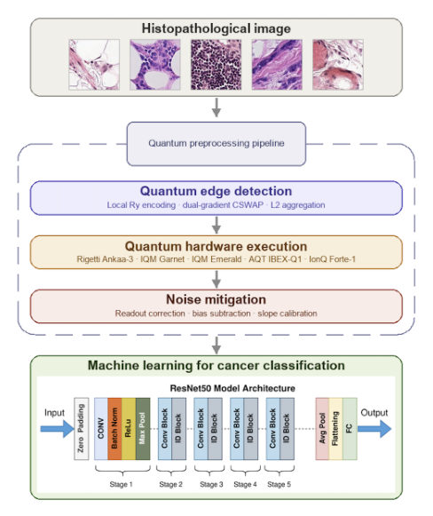
<figcaption class="paper-figure-caption"><b>Fig 1.</b> Figure 1: Overview of the proposed quantum edge detection pipeline for histopathologic cancer classification on real quantum hardware.</figcaption>
</figure>
<figure class="paper-figure-card">
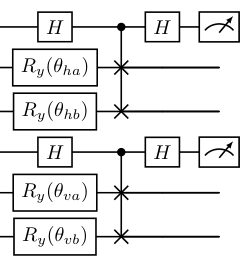
<figcaption class="paper-figure-caption"><b>Fig 2.</b> Figure 2: The 6-qubit DG-CSWAP circuit computes H and V edge responses in parallel. Each ancilla (q4, q5) runs an independent swap test over its data pair. Only the ancilla measurement outcomes are used for edge estimation.</figcaption>
</figure>
<figure class="paper-figure-card">
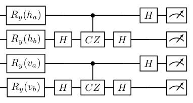
<figcaption class="paper-figure-caption"><b>Fig 3.</b> Figure 3: The 4-qubit DG-DST circuit. On SC20/SC54 hardware, the CNOT is implemented as H · CZ · H using the CZ gate native to SC20/SC54, and Ry and H gates are compiled to PRx rotations. Bell-basis measurement directly estimates p(Ψ−) with no ancilla. Other platforms compile the same logical circuit to their native gate sets (iSWAP, GPI/GPI2/ZZ, RXX) via AWS Braket.</figcaption>
</figure>
<figure class="paper-figure-card">
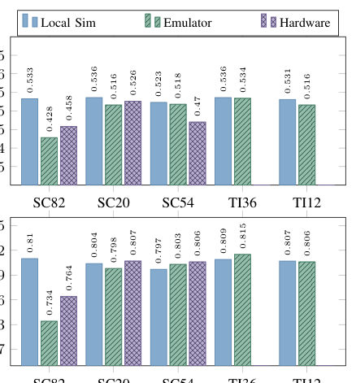
<figcaption class="paper-figure-caption"><b>Fig 4.</b> Figure 4: Preliminary cross-platform quality vs. Sobel (single run per platform). All local sims: r ≈0.52–0.54; SC20 hardware: r = 0.526, r(hw,local) = 0.931; SC54 hardware: r = 0.470, r(hw,local) = 0.895; SC82 hardware: r = 0.458. SC82 emulator lower (r = 0.428) due to noise model distortion. Hardware runs not performed for TI36 or TI12.</figcaption>
</figure>
<figure class="paper-figure-card">
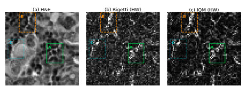
<figcaption class="paper-figure-caption"><b>Fig 5.</b> Figure 5: Hardware quantum edge maps on the same 64×64 H&amp;E patch. (a) Original. (b) SC82 (Rrep=20, P=6, two-stage correction). (c) SC20 (Rrep=4, P=3, three-stage correction). ROIs A–C: A (dense nuclear cluster), B (inter-cellular boundary region), C (gland-lumen interface). Both platforms detect the same boundaries using different native gate sets (iSWAP vs. CZ), confirming hardware-agnostic edge detection (rL,H=0.822 SC82, rL,H=0.931 SC20).</figcaption>
</figure>

**Summary.** This paper presents a novel, hardware-aware quantum approach to enhance histopathologic cancer detection by extracting robust edge features from medical images using superconducting and trapped-ion quantum processors. By developing configurable circuits and implementing a multi-stage noise mitigation pipeline, the authors demonstrate high inter-platform consistency and achieve strong classification accuracy on real NISQ hardware.

**Why it may be interesting.** The rigorous testing of quantum algorithms on multiple physical hardware backends (superconducting vs. trapped ion) while implementing advanced noise mitigation techniques is highly relevant for understanding the feasibility of near-term quantum machine learning applications.

Detailed structure

**Main problem.** The challenge of performing reliable histopathologic cancer detection from complex tissue images using near-term quantum hardware.

**Main result.** The proposed quantum edge detection method achieves high inter-platform consistency ($r \approx 0.93–0.94$) and reaches 79.80% classification accuracy on real hardware, outperforming prior QFT baselines.

**Method.** It employs configurable quantum circuits (DG-CSWAP/DG-DST) to estimate multi-directional edge responses via overlap measurements, coupled with a three-stage NISQ error mitigation pipeline.

**Model / system.** The work is tested on five diverse quantum processors via Amazon Braket (superconducting and trapped-ion), operating under Noisy Intermediate-Scale Quantum (NISQ) constraints.

**Key observables.** Inter-platform Pearson correlation ($r \approx 0.93–0.94$), classification accuracy (79.80%), and the corrected edge estimate $e_{	ext{corr}}^c$.

**Important parameters / regimes.** The use of angle encoding $|\psi(p)
angle = R_y(	heta) |0
angle$ for pixel values, and the specific parameters for noise mitigation stages.

**Assumptions / limitations.** The primary assumption is that the quantum edge map derived from shot-based measurements can serve as a robust feature input to classical deep learning models (ResNet-50).

**Figures summary.** Figures illustrate the end-to-end pipeline, the 6-qubit DG-CSWAP circuit structure, and comparative results showing classification performance improvements over baselines on real hardware.

**Paper structure.** The paper introduces the problem, details two quantum circuits (DG-CSWAP/DG-DST) for edge estimation, rigorously applies a three-stage NISQ mitigation pipeline, validates consistency across five different QPU platforms, and finally demonstrates classification performance using a ResNet-50.

Abstract

Histopathologic cancer detection is challenging due to tissue variability, staining differences, and subtle visual distinctions between disease classes. We propose two quantum algorithms for this task: a configurable dual-gradient CSWAP circuit (DG-CSWAP) that computes multi-directional edge responses in a single execution via per-pixel local Ry encoding, and a hardware-efficient destructive swap circuit (DG-DST) natively matched to quantum processing unit (QPU) gate sets at substantially lower circuit complexity. We prove algebraic equivalence between DG-CSWAP and DG-DST, enabling a two-circuit QPU validation strategy. A three-stage NISQ mitigation pipeline, including readout error correction, bias subtraction, and slope regression, reduces single-pixel hardware MSE by ~8x. Validated on five quantum processors via Amazon Braket, the method achieves inter-platform Pearson r ~ 0.93-0.94 across all local-simulator pairs. Compared to a prior Quantum Fourier Transform (QFT) based amplitude-encoding baseline requiring 12-qubit global state preparation and a three-model ensemble (85.55% on PatchCamelyon), the proposed method uses shot-based measurements, executes on real quantum hardware, and achieves 79.80% accuracy with a single ResNet-50. A Lite configuration delivers a 17x preprocessing speedup at a 2.59% accuracy cost. To the best of our knowledge, this is the first quantum hardware implementation study with noise mitigation for histopathologic image classification.

[↑ back to top](#top)

### [Nonlinear Geometrizability of State-Dependent Proto-Area in Approximate Holographic Codes](http://arxiv.org/abs/2606.22598v1)

**Authors:** Ruiliang Li  
**Type:** theory · **Category:** quantum information and computing · **PDF:** <https://arxiv.org/pdf/2606.22598v1>  
**Analysis basis:** full PDF text, analyzed in chunks
**Topic relevance:** 🔥 `entanglement & information structure` **4/5** · `Keldysh / 2PI / non-Gaussian methods` **1/5**

↔ Scroll figures horizontally

<figure class="paper-figure-card">
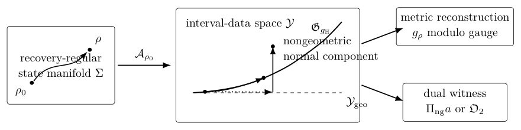
<figcaption class="paper-figure-caption"><b>Fig 1.</b> Figure 1. Geometrizability as a common-source condition. A fixed code and recovery prescription produce a proto-area map from logical states to interval data. Local metrics generate only the nonlinear locus GgH = Im B. Data on this locus reconstruct a metric modulo boundary-fixing diffeomorphisms. Tangential or normal components incompatible with the locus yield boundary- accessible nongeometric witnesses.</figcaption>
</figure>
<figure class="paper-figure-card">
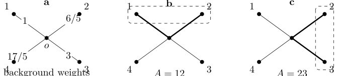
<figcaption class="paper-figure-caption"><b>Fig 2.</b> Figure 2. Fixed four-terminal geometry and local consistency relations. (a) Background weights from Equation (3.64). (b,c) The heavy edges are the selected cuts for regions 12 and 23, which imply q12 = q1 + q2 and q23 = q2 + q3. Violating either identity rules out a local edge-weight realization in this chamber.</figcaption>
</figure>
<figure class="paper-figure-card">
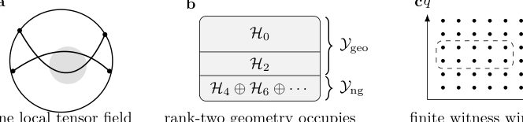
<figcaption class="paper-figure-caption"><b>Fig 3.</b> Figure 3. Linear geometrizability on the hyperbolic disk. (a) Every boundary interval probes the same local metric perturbation along its reference geodesic. (b) The scalar and rank-two transverse-traceless sectors form the closed geometric range in the source-adapted data topology; sectors of order four and above are nongeometric for a metric perturbation. (c) A finite calculation measures a rectangular set of moment witnesses. Enlarging the window converges monotonically to the exact nongeometric defect.</figcaption>
</figure>
<figure class="paper-figure-card">
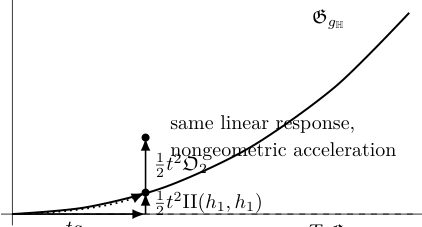
<figcaption class="paper-figure-caption"><b>Fig 4.</b> Figure 4. The nonlinear geometric data locus near the hyperbolic background. Its tangent space is the rank-two X-ray range Ygeo. A genuine metric path has normal acceleration fixed by the second fundamental form IIgH. A proto-area path can share the same first derivative while differing by a quadratic obstruction O2, which no second-order metric coefficient can remove.</figcaption>
</figure>
<figure class="paper-figure-card">
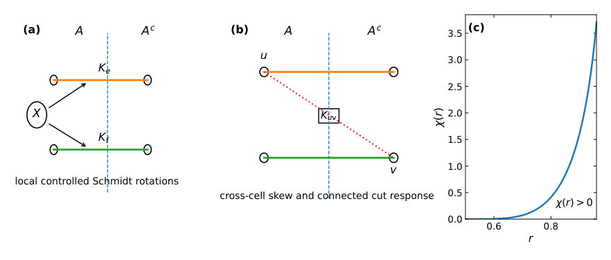
<figcaption class="paper-figure-caption"><b>Fig 5.</b> Figure 5. Controlled bond skews. Local Schmidt rotations alter the entropy of each crossed bond independently and produce data in Im MC. A cross-cell gate between separated bond modes produces a connected cut response b×. The susceptibility χ(r) in (6.27) is strictly positive away from the maximally entangled point.</figcaption>
</figure>

**Summary.** This work rigorously investigates when state-dependent entropy measurements, arising in the context of holographic quantum error correction, correspond to actual local bulk geometries. It establishes a hierarchy of necessary and sufficient conditions—requiring matching first and second-order differential constraints—to prove this geometric compatibility. This bridges advanced topics in quantum information theory with differential geometry.

**Why it may be interesting.** It provides a rigorous mathematical framework connecting quantum information measures (entropy/area) derived from holographic codes directly to fundamental geometric properties of spacetime metrics in AdS space.

Detailed structure

**Main problem.** The central problem is determining the nonlinear geometrizability of state-dependent proto-area data derived from approximate holographic recovery processes.

**Main result.** Geometrizability requires satisfying both first-order (linear) and second-order (quadratic) consistency conditions, which are necessary and sufficient for local metric reconstruction under regularity assumptions.

**Method.** The analysis employs tools from differential geometry, including the geodesic X-ray transform, Jacobi equations, and jet calculus to establish rigorous mathematical criteria for geometric realization.

**Model / system.** The framework is set in the context of AdS/CFT holography applied to quantum error correction codes. The input data is the state-dependent proto-area ($	ext{SPA}$), which measures entropy differences related to boundary regions.

**Key observables.** Proto-Area Map ($	ext{SPA}$), first and second order obstructions ($\Pi_{\mathfrak{g}a_1}$, $\mathcal{O}_2$), and the reconstructed metric two-jet $(h_1, h_2)$.

**Important parameters / regimes.** The analysis depends on the regularity of the logical state family ($\Sigma$) and the approximation level (finite network vs. continuum).

**Assumptions / limitations.** Assumptions include 'recovery-regularity' for the state manifold and the applicability of split-regularity hypotheses to ensure smooth local geometric structures.

**Figures summary.** Figures summarize geometrizability criteria across different levels (network, first jet, two-jet) and compare various bounds on reconstruction errors.

**Paper structure.** The paper develops from finite network realization problems using linear algebra constraints to the continuum limit, establishing necessary conditions via Jacobi equations for the second jet, and concluding with explicit reconstruction formulas modulo boundary diffeomorphisms.

Abstract

State-dependent proto-area data produced by approximate recovery need not be compatible with a single local bulk metric. Using recovery maps calibrated on the code channel and held fixed along a logical-state family, we derive exact finite-resolution criteria and, near the hyperbolic disk, necessary and sufficient conditions for a regular proto-area two-jet to arise from a metric two-jet on a time-reflection-symmetric asymptotically AdS$_3$ slice. Finite networks give a polyhedral realization problem with primal and dual certificates, stable reconstruction, and explicit witnesses of nongeometry. In the continuum, the geometric tangent space is the range of the rank-two geodesic X-ray transform. A metric-forced Jacobi equation determines the normal Hessian of the renormalized boundary-length image and yields a gauge-invariant quadratic obstruction. Under a split-regularity hypothesis, nearby geometric data form a local graph; the two-jet criterion itself is unconditional for regular data. Hamiltonian-skewed codes realize both first-order nongeometry and a response whose first obstruction appears only at quadratic order. The compatible metric perturbation is reconstructed modulo boundary-fixing diffeomorphisms.

[↑ back to top](#top)

### [Structure and information measures of few-electron systems under a spherically symmetric Gaussian potential within a density functional approach](http://arxiv.org/abs/2606.23538v1)

**Authors:** Raveena Arya, Santanu Mondal, Amlan K. Roy  
**Type:** theory · **Category:** other · **PDF:** <https://arxiv.org/pdf/2606.23538v1>  
**Analysis basis:** full PDF text, analyzed in chunks
**Topic relevance:** 🔥 `entanglement & information structure` **4/5**

↔ Scroll figures horizontally

<figure class="paper-figure-card">
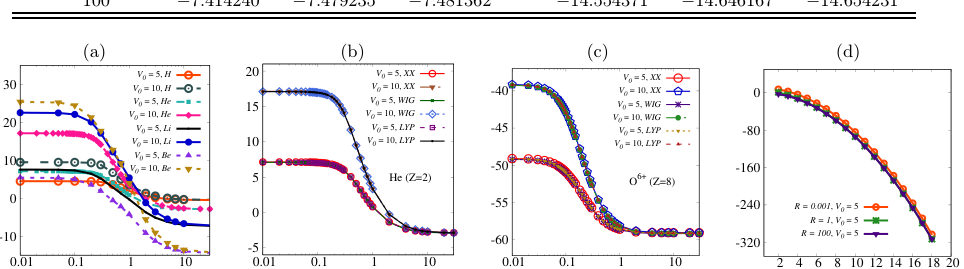
<figcaption class="paper-figure-caption"><b>Fig 1.</b> FIG. 1. E vs. R, for V0 = 5, 10 for ground states of H, He, Li and Be, with XX, is shown in panel (a); for ground states of He and O6+ with XX, XC-WIG, XC-LYP in (b) and (c). Panel (d) gives energy plot for He-like ions, with XX, for V0 = 5.</figcaption>
</figure>
<figure class="paper-figure-card">
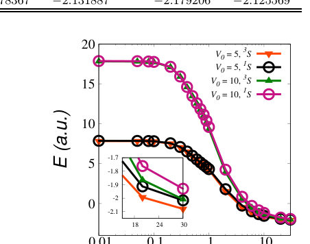
<figcaption class="paper-figure-caption"><b>Fig 2.</b> FIG. 2. He 1s2s (1S, 3S) energies vs. R for V0 = 5 and 10, in GP, at the XX level of theory. See text for details.</figcaption>
</figure>
<figure class="paper-figure-card">
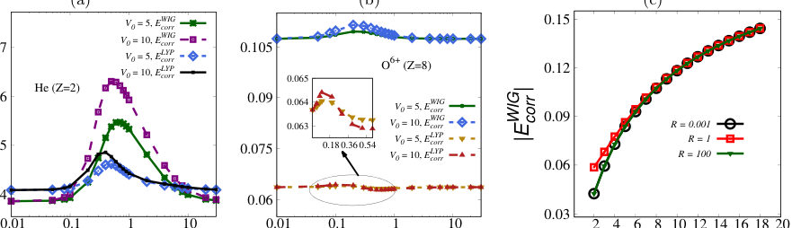
<figcaption class="paper-figure-caption"><b>Fig 3.</b> FIG. 3. The behavior of |EW IG/LY P corr | w.r.t. R, for V0 = 5 and 10. Panels (a), (b) offer these for He and O6+. Panel (c) shows |EW IG corr | w.r.t. Z with V0 = 5 in the He-iso-electronic series. See text for details.</figcaption>
</figure>
<figure class="paper-figure-card">
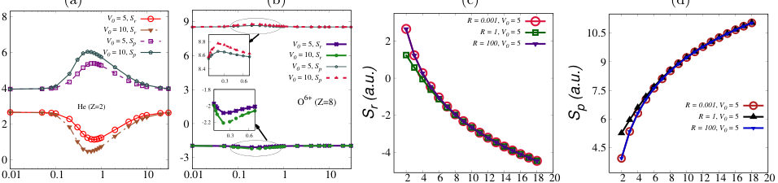
<figcaption class="paper-figure-caption"><b>Fig 4.</b> FIG. 4. Variation of Sr/p w.r.t. R with XC-WIG, for V0 = 5 and 10. Panels (a) and (b) refer to He and O6+. Panel (c) and (d) show Sr w.r.t. Z, and Sp w.r.t. Z, for XC-WIG. In both cases V0 = 5. See text for details.</figcaption>
</figure>
<figure class="paper-figure-card">
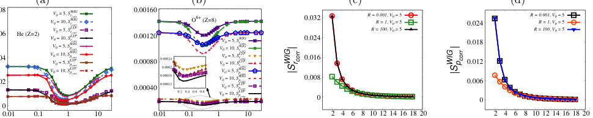
<figcaption class="paper-figure-caption"><b>Fig 5.</b> FIG. 5. Variation of |SW IG/LY P r/pcorr | w.r.t. R, for V0 = 5 and 10, is shown in panels (a) and (b) for He and O6+. Panels (c) and (d) show |SW IG rcorr | w.r.t. Z and |SW IG pcorr | w.r.t. Z, in He-iso-electronic series. In both cases, V0 = 5. See text for details.</figcaption>
</figure>

**Summary.** This work applies Density Functional Theory to study few-electron atoms confined by a Gaussian potential, calculating not only energies but also various information-theoretic measures like Shannon entropy. The results reveal that confinement parameters strongly dictate the system's structure, showing characteristic minima/maxima in localization indicators and mapping these trends onto the Fisher-Shannon plane.

**Why it may be interesting.** The integration of quantum information theory (entropy measures) directly into electronic structure calculations for confined systems provides novel diagnostics to quantify electron-electron interaction strength and spatial localization beyond standard energy calculations.

Detailed structure

**Main problem.** The study investigates the electronic structure and associated information measures of few-electron atoms confined by a spherically symmetric Gaussian potential using Density Functional Theory (DFT). The goal is to understand how confinement parameters affect energy, localization, and correlation effects.

**Main result.** Changes in potential width ($R$) cause specific trends in observables: $S_r$ exhibits minima while $S_p$ and $I_r$ attain maxima. Furthermore, the Fisher-Shannon plane reveals progressive electronic density compression, indicating weakening relative electron-correlation effects.

**Method.** The research employs DFT formalism, solving the Kohn-Sham equation using a generalized pseudo-spectral (GPS) method. Correlation is treated via Wigner or LYP functionals, and information measures like Shannon entropy ($S_r, S_p$) and Fisher information ($I_r$) are calculated.

**Model / system.** The system models few-electron atoms/ions ($	ext{H}, 	ext{He-like } Z=2-18, 	ext{Li}, 	ext{Be}$) confined by a Gaussian Potential $V_{	ext{conf}}(r)$. The effective potential incorporates the external confinement alongside standard Coulomb and exchange-correlation terms.

**Key observables.** Ground/excited state energies ($E$), Shannon entropy in position ($S_r$) and momentum ($S_p$) spaces, Fisher information ($I_r$), and various correlation measures ($	ext{Srcorr}, 	ext{Spcorr}, 	ext{Stcorr}$).

**Important parameters / regimes.** Gaussian potential parameters ($V_0$, $R$), atomic number ($Z$), and the functional choice (Wigner vs. LYP). Analysis focuses on intermediate regimes of $R$ where confinement effects are strongest.

**Assumptions / limitations.** The calculations rely on DFT approximations, specifically using work function-based exchange potentials and parameterized correlation functionals (Wigner/LYP). The GPS method is used for solving the KS equation.

**Figures summary.** Figures illustrate energy dependence on $R$ vs. $V_0$, excitation energies ($1s2s$), and how various information measures ($	ext{Ir}_{	ext{corr}}$, etc.) vary non-monotonically with $R$ and $Z$. The Fisher-Shannon plane is used to map localization trends.

**Paper structure.** The paper systematically analyzes energy calculations across different atomic species under Gaussian confinement, followed by a detailed investigation of information measures ($S_r, S_p, I_r$) and correlation terms. Key findings are presented through comparative analysis across varying potential parameters ($R, V_0$) and atomic numbers ($Z$).

Abstract

Energies of H, He-like ($Z=2-18$) ions, Li, and Be are investigated under a spherically symmetric Gaussian potential through a density functional formalism. The radial Kohn-Sham equation has been solved by invoking a work function-based exchange potential. The effect of electron correlation is analyzed by incorporating two functionals: a local parameterized Wigner functional and a non-linear gradient- and Laplacian-dependent Lee-Yang-Parr (LYP) functional. The generalized pseudospectral method is employed to provide accurate numerical eigenfunctions and eigenvalues. This allows nonuniform, optimal spatial discretization fulfilling the Dirichlet boundary conditions. This work demonstrates a possible manipulation of energy by controlling dot parameters. Apart from ground states, exploratory results are also reported for low-lying excited state $1s2s$ ($^{1,3}S$) of He atom. Companion calculations are also performed for various information-theoretic measures, such as Shannon entropy in position ($S_{r}$), momentum ($S_{p}$) spaces, and Fisher information in position space ($I_{r}$). The behavior of correlation functionals in presence of Gaussian potential is examined critically. We find that energy increases, $S_{r}$ exhibits minima, while $S_{p}$, $I_{r}$ attain maxima for a decrease in the width of potential, whereas an increase in potential depth further amplifies these effects across all properties. The Fisher-Shannon plane reveals a progressive localization as well as the compression of electronic density, and thereby indicates a weakening of relative electron-correlation effects. In the Collin's conjecture, it gives rise to a non-linear loop-like feature. Much of the results are presented here for the first time.

[↑ back to top](#top)

### [Geometry-Controlled Exceptional Points in Helicoidal Orbital-Angular-Momentum Photonics](http://arxiv.org/abs/2606.22240v1)

**Authors:** Edilberto O. Silva  
**Type:** both · **Category:** other · **PDF:** <https://arxiv.org/pdf/2606.22240v1>  
**Analysis basis:** full PDF text, analyzed in chunks
**Topic relevance:** `analog quantum simulation` **3/5** · `driven-dissipative phase transition` **3/5** · `interference shaping light` **3/5** · `methods for driven-dissipative` **2/5** · `non-equilibrium dynamics` **2/5** · `quantum optics experiment` **2/5** · `Keldysh / 2PI / non-Gaussian methods` **1/5** · `correlated / nonlocal dissipation` **1/5** · `correlated cavity matter` **1/5** · `entanglement & information structure` **1/5** · `non-equilibrium universality` **1/5**

↔ Scroll figures horizontally

<figure class="paper-figure-card">
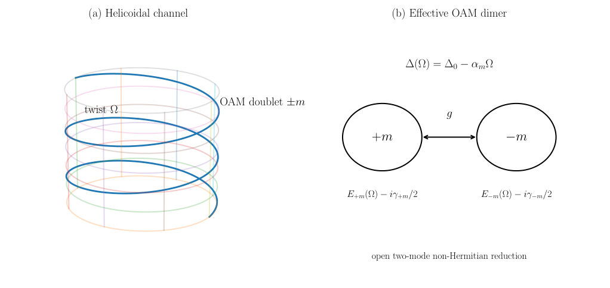
<figcaption class="paper-figure-caption"><b>Fig 1.</b> FIG. 1. Conceptual structure of a geometry-controlled exceptional point. (a) A helicoidal channel or effective helicoidal medium couples axial and azimuthal motion through the twist parameter Ω. (b) Projection onto two opposite-OAM modes gives a non- Hermitian two-mode problem with coupling g, linewidths γ+m and γ−m, and real detuning ∆(Ω) = ∆0 −αmΩ.</figcaption>
</figure>
<figure class="paper-figure-card">
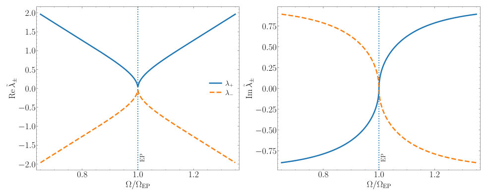
<figcaption class="paper-figure-caption"><b>Fig 2.</b> FIG. 2. Dimensionless eigenvalue branches near a geometry-controlled exceptional point. The plotted quantity is ˜λ± = (λ± −E0 + i¯γ/2)/g for g = 0.10 meV, ∆γ = 4g, and ∆(Ω) = ∆0(1 −Ω/ΩEP). The two eigenvalues and eigenvectors coalesce at Ω= ΩEP.</figcaption>
</figure>
<figure class="paper-figure-card">
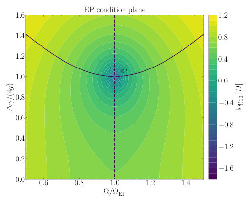
<figcaption class="paper-figure-caption"><b>Fig 3.</b> FIG. 3. Exceptional-point condition in the reciprocal model. The discriminant D = (∆−i∆γ/2)2 + 4g2 vanishes only when the real geometric detuning is compensated, ∆= 0, and the linewidth contrast satisfies |∆γ| = 4|g|. The solid line is Re D = 0, the dashed line is Im D = 0, and the marked intersection gives the exceptional point.</figcaption>
</figure>
<figure class="paper-figure-card">
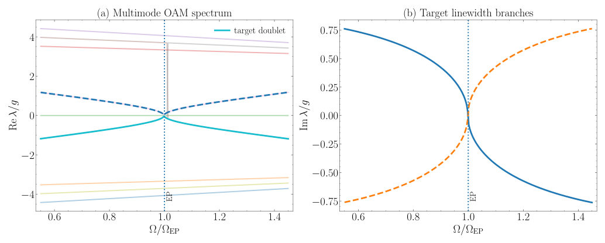
<figcaption class="paper-figure-caption"><b>Fig 4.</b> FIG. 4. Multimode OAM-space test of the geometry-controlled EP. (a) Real parts of the eigenvalues of a finite OAM manifold with modes ℓ= −4, . . . , 4. The thick branches are the target ℓ= ±1 doublet, while the thin branches are spectator OAM modes. The target branches coalesce at the calibrated twist even when weak residual couplings to spectator modes are present. (b) Imaginary parts of the two target branches, showing the associated linewidth coalescence.</figcaption>
</figure>
<figure class="paper-figure-card">
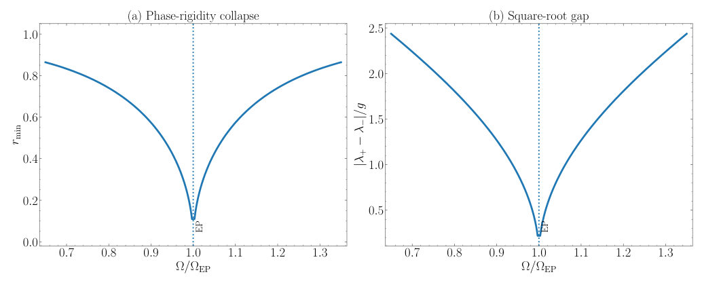
<figcaption class="paper-figure-caption"><b>Fig 5.</b> FIG. 5. Eigenvector-sensitive verification of the geometry-controlled EP. (a) Minimum phase rigidity of the reciprocal complex- symmetric two-mode model as a function of normalized twist. The collapse near Ω= ΩEP indicates eigenvector coalescence rather than a conventional crossing. (b) Corresponding eigenvalue gap, displaying the square root closing at the same twist.</figcaption>
</figure>

**Summary.** The paper presents a comprehensive theoretical and simulation study on controlling Exceptional Points (EPs) in OAM photonics using the geometry of a helicoidal waveguide. By tuning the twist rate ($\Omega$), researchers can force the system into an EP, which is confirmed by observing characteristic signatures like eigenvalue coalescence and phase rigidity collapse. This provides a robust blueprint for designing next-generation photonic devices based on non-Hermitian physics.

**Why it may be interesting.** This work bridges geometric control (topology/geometry) with non-Hermitian physics in photonics, offering a highly controllable platform for realizing exotic quantum phenomena that are relevant to integrated quantum optics.

Detailed structure

**Main problem.** The paper proposes a novel method to control Exceptional Points (EPs) in Orbital-Angular-Momentum (OAM) photonics using geometric parameters derived from the helicoidal background.

**Main result.** They demonstrate that the EP location can be precisely tuned by controlling the geometry (twist rate $\Omega$), providing measurable, falsifiable signatures like linear tracking of the EP with residual detuning.

**Method.** The analysis involves reducing the wave dynamics to an effective two-mode non-Hermitian Hamiltonian and applying input-output formalism to map theoretical predictions onto observable spectral maps.

**Model / system.** The system is modeled using OAM modes propagating in a helicoidal background, governed by an effective Schrödinger equation derived from the Laplace-Beltrami operator. The dynamics are captured by an effective two-mode Hamiltonian describing coupling between opposite-OAM modes ($\pm m$).

**Key observables.** Eigenvalue coalescence, phase-rigidity collapse ($r_j 	o 0$), linear tracking of $	ext{EP}$ vs. residual detuning ($\Delta_0$), and branch exchange upon parameter looping.

**Important parameters / regimes.** The helicoidal twist rate ($\Omega$ or $	au$) acts as the primary control parameter, compensating for a residual detuning ($\Delta_0$). The EP condition requires balancing geometric detuning with non-Hermitian losses/gains ($|\Delta\gamma| \sim 4|g|$).

**Assumptions / limitations.** The analysis relies on reducing the system to an isolated two-mode doublet, assuming spectator modes remain spectrally separated. It primarily uses semiclassical or coupled-mode approximations.

**Figures summary.** Figures illustrate the coalescence of eigenvalue branches (Fig. 2), the collapse of phase rigidity at the EP (Fig. 5), and the linear relationship between $	ext{EP}$ location and external detuning ($\Delta_0$) (Fig. 6, Fig. 10c).

**Paper structure.** The paper progresses from deriving the effective Hamiltonian in a helicoidal background to establishing the EP condition via two-mode reduction. It then validates this using multimode spectral tests, introduces advanced diagnostics like phase rigidity and topological looping, and concludes with device simulations on both reciprocal and asymmetric coupling platforms.

Abstract

Exceptional points (EPs) are non-Hermitian spectral singularities where eigenvalues and eigenvectors coalesce. We propose a geometry-controlled route to EPs in orbital-angular-momentum (OAM) photonics. In an effective torsion-free helicoidal background, the twist supplies a signed, real chiral splitting between opposite-OAM modes, while openness, gain, loss, leakage, or channel coupling, supplies the non-Hermiticity. The EP is reached when the geometric detuning compensates for a residual mode splitting and the linewidth contrast meets the non-Hermitian balance condition; the twist rate is thus the control parameter, not the source of non-Hermiticity. We obtain the OAM slope both for a confined quantum problem and, in the paraxial regime, for a helically twisted guide, and embed the OAM doublet in a multimode mode-space model to show that the EP survives spectator modes. Eigenvalue coalescence, phase-rigidity collapse, linear EP tracking with residual detuning, and branch exchange under geometric encircling provide falsifiable signatures. An OAM-resolved input-output response maps these onto spectroscopy-level observables, including spectral maps and three-dimensional Riemann-surface visualizations. A device-level paraxial simulation of two distinct photonic platforms, one reciprocal and one asymmetric-coupling Wiersig-type platform, reproduces the predicted exceptional point and its linear geometric tracking.

[↑ back to top](#top)

### [Chaos Generation and Control with Molecular Optomechanical System](http://arxiv.org/abs/2606.22920v1)

**Authors:** Hui-Hui Xu, Jian-zhuang Wu, Lei-Bo Deng, E Wu, Yong-Hong Ma  
**Type:** theory · **Category:** other · **PDF:** <https://arxiv.org/pdf/2606.22920v1>  
**Analysis basis:** full PDF text, analyzed in chunks
**Topic relevance:** `Keldysh / 2PI / non-Gaussian methods` **3/5** · `driven-dissipative phase transition` **3/5** · `methods for driven-dissipative` **3/5** · `Tavis-Cummings & cavity-many-emitter` **2/5** · `correlated cavity matter` **2/5** · `non-equilibrium dynamics` **2/5** · `analog quantum simulation` **1/5** · `correlated / nonlocal dissipation` **1/5** · `interference shaping light` **1/5** · `non-equilibrium universality` **1/5**

↔ Scroll figures horizontally

<figure class="paper-figure-card">
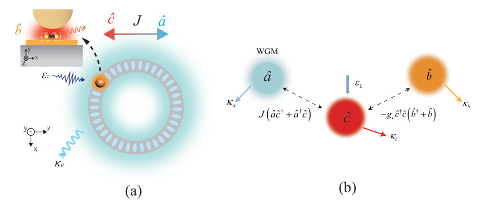
<figcaption class="paper-figure-caption"><b>Fig 1.</b> FIG. 1: Schematic of the hybrid molecular cavity optomechanical system. (a) The hybrid platform consists of a WGM resonator and a nanoparticle-on-mirror (NPoM) plasmonic nanocavity containing a single molecule. (b) Equivalent schematic of the three-mode interaction. The WGM mode ˆa (frequency ωa, decay rate κa) is coupled to the plasmonic mode ˆc (ωc, κc) via an evanescent wave with coupling strength J. The plasmonic mode interacts with the molecular vibrational mode ˆb (ωb, κb) through radiation pressure, with coupling strength gc.</figcaption>
</figure>
<figure class="paper-figure-card">

<figcaption class="paper-figure-caption"><b>Fig 2.</b> FIG. 2: Phase diagrams of the largest Lyapunov exponent λmax in the plane of the WGM detuning ∆a and the plasmon-vibration coupling strength gc. (a) Plasmon–WGM coupling strength J/2π = 0.38 THz; (b) J/2π = 0.70 THz. The color bar represents the value of λmax: warm colors (λmax &gt; 0) correspond to chaotic motion, and cold colors correspond to regular steady-state or periodic motion.</figcaption>
</figure>
<figure class="paper-figure-card">
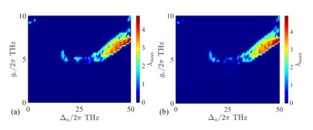
<figcaption class="paper-figure-caption"><b>Fig 3.</b> Figure 2 shows the distribution of λmax in the param- eter space spanned by the WGM detuning ∆a and the plasmon-vibration coupling strength gc. Over a wide de- tuning range, particularly for positive detuning ∆a &gt; 0, increasing gc drives the system into chaos, and the chaotic region as well as the magnitude of λmax expand monotonically with gc. Physically, positive detuning red- shifts the effective frequency of the plasmonic mode, bringing it closer to resonance with the molecular vibra- tional mode and significantly enhancing the energy ex- change efficiency; negative detuning suppresses the non- linear coupling. Hence chaos preferentially emerges for ∆a &gt; 0. The coupling gc directly...</figcaption>
</figure>
<figure class="paper-figure-card">
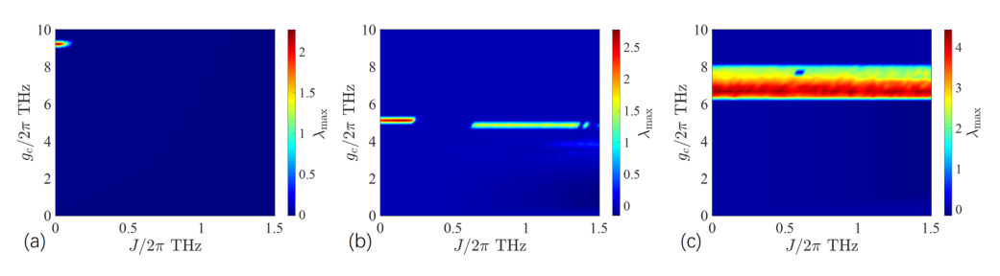
<figcaption class="paper-figure-caption"><b>Fig 4.</b> FIG. 3: Phase diagrams of the largest Lyapunov exponent λmax in the plane of the plasmon–WGM coupling strength J and the plasmon-vibration coupling strength gc under different WGM detunings. (a) ∆a/2π = 0 THz; (b) ∆a/2π = 21 THz; (c) ∆a/2π = 45 THz.</figcaption>
</figure>
<figure class="paper-figure-card">
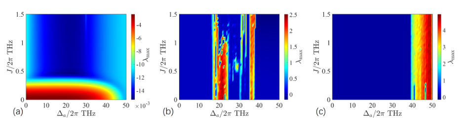
<figcaption class="paper-figure-caption"><b>Fig 5.</b> FIG. 4: Phase diagrams of the largest Lyapunov exponent λmax as a function of the WGM detuning ∆a and the plasmon–WGM coupling strength J under different plasmon–vibration coupling strengths. (a) gc/2π = 0.1 THz; (b) gc/2π = 5 THz; (c) gc/2π = 7 THz.</figcaption>
</figure>

**Summary.** The authors theoretically investigate a hybrid optomechanical system combining plasmonic and WGM cavities coupled to a molecule. They demonstrate that tuning the inter-cavity coupling and detuning allows for the controlled generation of deterministic chaos via molecular vibrations. This establishes the system as a promising, room-temperature platform for on-chip chaotic light sources.

**Why it may be interesting.** This work directly bridges cavity QED/optics with molecular physics by demonstrating how engineered coupling mechanisms can induce complex, non-linear dynamics (chaos) in a solid-state platform at ambient temperatures.

Detailed structure

**Main problem.** The goal is to achieve deterministic chaotic dynamics for on-chip light generation and random signal applications at room temperature, overcoming limitations of conventional cavity optomechanics.

**Main result.** The hybrid molecular optomechanical system was shown to exhibit a controllable period-doubling route to chaos, identifying it as a viable platform for room-temperature chaotic light sources.

**Method.** The study uses semiclassical equations of motion and characterizes the dynamics by computing the largest Lyapunov exponent ($\lambda_{\max}$) via the Benettin algorithm.

**Model / system.** The system is a hybrid setup coupling a plasmonic nanocavity, a WGM microcavity, and a molecular vibrational mode. The dynamics are modeled using an effective Hamiltonian involving three coupled modes.

**Key observables.** Largest Lyapunov exponent ($\lambda_{\max}$), phase-space trajectories (strange attractors), spectral content of light/vibrations.

**Important parameters / regimes.** WGM detuning ($\Delta_a$), plasmon--WGM coupling ($J$), and plasmon--vibration coupling ($g_c$).

**Assumptions / limitations.** The analysis is performed in the semiclassical limit, treating the molecular vibrations classically while retaining quantum descriptions for cavity fields.

**Figures summary.** Figures illustrate the system schematic, phase diagrams mapping chaotic regimes based on control parameters ($\Delta a$ vs $g_c$, etc.), and time/phase-space evolution showing transitions to chaos.

**Paper structure.** The paper introduces the physical setup and Hamiltonian, derives the coupled nonlinear equations of motion, analyzes stability using Lyapunov exponents across parameter spaces, and concludes by mapping out controllable chaotic regimes.

Abstract

Chaos is central to secure communication and physical random-number generation. Conventional cavity-optomechanical implementations, however, usually rely on weak single-photon optomechanical coupling and low-frequency mechanical modes, so access to deterministic chaotic dynamics often requires large driving power and careful suppression of thermal noise. Here we theoretically study a hybrid molecular optomechanical system formed by coupling a plasmonic nanocavity to a whispering-gallery-mode (WGM) microcavity. The plasmonic nanocavity provides terahertz-scale single-photon optomechanical coupling to a molecular vibration, while the WGM resonator offers a low-loss photonic channel that mitigates the short plasmon lifetime. By integrating the semiclassical equations of motion and evaluating the largest Lyapunov exponent, we map the nonlinear dynamical regimes in the parameter spaces of WGM detuning, plasmon--WGM coupling, and plasmon--vibration optomechanical coupling. We show that increasing the plasmon--vibration coupling drives the system from self-sustained oscillations to chaos through a period-doubling cascade. At moderate coupling strengths, isolated chaos windows can be opened or closed by tuning the WGM detuning and the inter-cavity coupling. These results identify molecular optomechanics as a controllable room-temperature platform for on-chip chaotic light generation and random-signal applications.

[↑ back to top](#top)

### [Exceptional Points revealed by the integrated imaginary scattering eigenphase](http://arxiv.org/abs/2606.21684v1)

**Authors:** J. Colín-Gálvez, V. Domínguez-Rocha  
**Type:** theory · **Category:** other · **PDF:** <https://arxiv.org/pdf/2606.21684v1>  
**Analysis basis:** full PDF text, analyzed in chunks
**Topic relevance:** `driven-dissipative phase transition` **3/5** · `methods for driven-dissipative` **3/5** · `analog quantum simulation` **2/5** · `correlated / nonlocal dissipation` **2/5** · `non-equilibrium dynamics` **2/5** · `non-equilibrium universality` **2/5** · `Keldysh / 2PI / non-Gaussian methods` **1/5** · `Kondo & dissipative impurity` **1/5** · `Tavis-Cummings & cavity-many-emitter` **1/5** · `correlated cavity matter` **1/5** · `interference shaping light` **1/5**

↔ Scroll figures horizontally

<figure class="paper-figure-card">
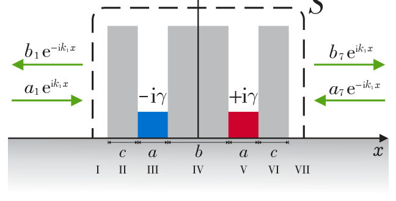
<figcaption class="paper-figure-caption"><b>Fig 1.</b> FIG. 1: (Color online) Diagram of the studied dimer composed of two scattering units, each composed of three potential barriers. The potential of the outer barriers of each scattering unit is real, while the potential described by the central barrier is complex. The sign of the imaginary part of the central barrier gives rise to loss (blue region) or gain (red region). This system is invariant under the combined action of parity and time reversal, and is therefore PT-symmetric.</figcaption>
</figure>
<figure class="paper-figure-card">
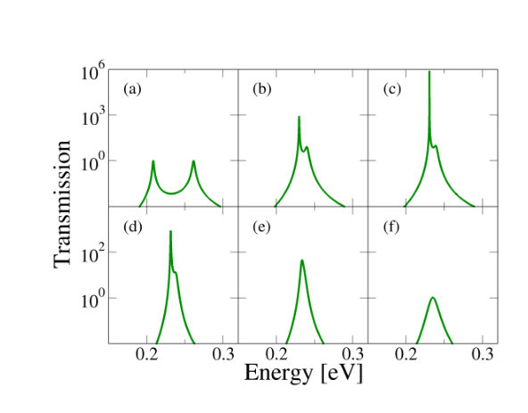
<figcaption class="paper-figure-caption"><b>Fig 2.</b> FIG. 2: (Color online) Log-scale transmission spectrum as a function of energy in which only the first doublet of the dimer is plotted. Dimer parameters, for this and subsequent figures, are a = 1.15 nm, b = 2c = 0.02 nm, Vb = 50 eV, and V ′ = 0 eV. (a) For the Hermitian case (γ = 0) the maximum values of the resonances are found at E1,1 = 0.2086 eV (the first subscript refers to the associated doublet while the second one refers to the associated resonance), and E1,2 = 0.2615 eV. For γ = 0 the resonances have a unit amplitude and a maximum separation. As we increase the value of γ the separation between the resonances decreases and their amplitudes increases before the EP as it is observed...</figcaption>
</figure>
<figure class="paper-figure-card">
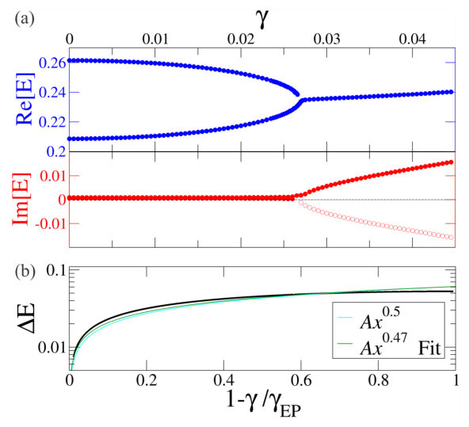
<figcaption class="paper-figure-caption"><b>Fig 3.</b> FIG. 3: (Color online) (a) Evolution of the scattering resonances of the PT-symmetric dimer as a function of γ. The real part (upper panel) tracks the resonance positions: for γ = 0 the doublet is maximally separated due to level repulsion, and the separation decreases monotonically until both resonances coalesce at the exceptional point. Just below γEP only the lower- energy resonance is numerically resolvable, which accounts for the gap in the higher-energy trajectory. Beyond the EP a single merged resonance persists. The imaginary part (lower panel) tracks the resonance widths via the Q factor: as γ increases the resonances broaden and eventually coalesce into a single significantly...</figcaption>
</figure>
<figure class="paper-figure-card">
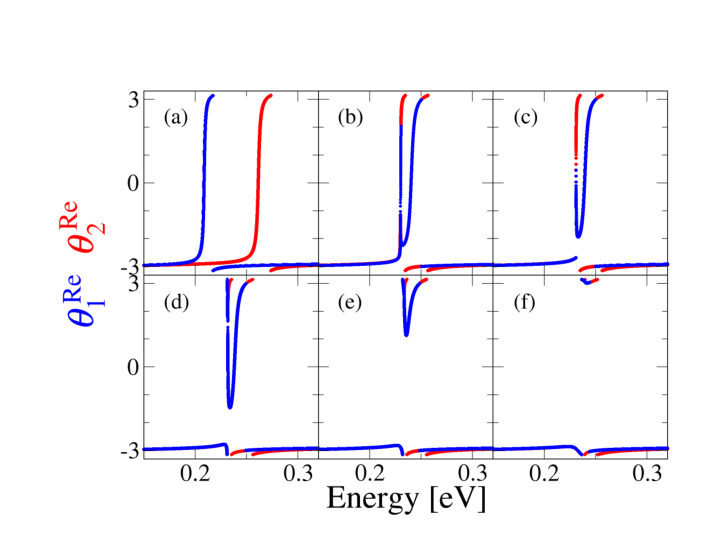
<figcaption class="paper-figure-caption"><b>Fig 4.</b> FIG. 4: (Color online) Real parts θRe 1 (blue) and θRe 2 (red) of the scattering eigenphases as functions of energy for increasing non-Hermitian parameter γ. Dimer parameters are the same as in Fig. 2. (a) For γ = 0 the system is Hermitian and the two eigenphases are well separated, each producing a characteristic π phase advance associated with a distinct resonance of the doublet. (b) The two phase features approach each other in energy as the resonances begin to overlap. (c) The phase features are nearly degenerate, reflecting the proximity to the exceptional point; the higher-energy phase shift begins to lose resolution. (d) The two eigenphases are on the verge of coalescence, just below...</figcaption>
</figure>
<figure class="paper-figure-card">
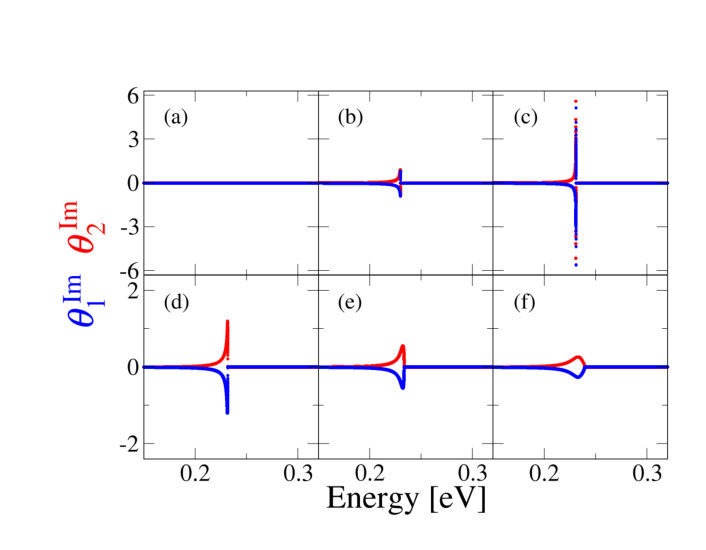
<figcaption class="paper-figure-caption"><b>Fig 5.</b> FIG. 5: (Color online) Imaginary parts θIm 1 (blue) and θIm 2 (red) of the scattering eigenphases as functions of energy for the same values of γ as in Fig. 4. (a) Both imaginary parts vanish identically, consistent with the Hermitian limit. (b) Finite imaginary parts emerge near the resonance energies with opposite signs, indicating that one eigenmode acquires global gain while the other undergoes global loss. (c) The imaginary parts reach their maximum amplitude, with sharp, large-amplitude structures of opposite sign reflecting the peak gain/loss asymmetry of the scattering eigenmodes. Notably, this maximum occurs before the exceptional point, consistent with the inflection of G(γ) shown...</figcaption>
</figure>

**Summary.** The paper introduces the integrated imaginary scattering eigenphase $G(\gamma)$ as a novel, global diagnostic tool to detect Exceptional Points (EPs) in open PT-symmetric systems. By analyzing the S-matrix eigenphases, it shows that $G(\gamma)$ exhibits a unique inflection point preceding the EP, confirming that peak gain/loss asymmetry and state coalescence are governed by distinct physical conditions in open environments.

**Why it may be interesting.** This work provides a powerful, model-independent spectroscopic technique for characterizing non-Hermitian degeneracies (EPs) in open quantum systems using only phase measurements, which is highly relevant to modern photonics and metamaterials research.

Detailed structure

**Main problem.** To find a direct, phase-sensitive signature of Exceptional Points (EPs) in open PT-symmetric systems that does not rely on identifying individual resonant states.

**Main result.** The integrated imaginary scattering eigenphase G(gamma) provides a robust global diagnostic for EPs; its inflection point precedes the EP and coincides with maximum gain/loss asymmetry, demonstrating independent physical mechanisms.

**Method.** Analysis is performed entirely at the level of the Scattering Matrix (S-matrix), tracking the evolution of complex scattering eigenphases ($	heta_n$) across the PT-symmetry-breaking transition.

**Model / system.** The model is a one-dimensional PT-symmetric quantum dimer with balanced gain and loss, coupled to continuum leads. The analysis is formulated generally for any wave system describable by an S-matrix (photonic, acoustic, microwave).

**Key observables.** Scattering Matrix elements ($r, t, r', t'$), complex scattering eigenphases ($	heta_n$), and the integrated imaginary scattering eigenphase $G(\gamma)$.

**Important parameters / regimes.** The non-Hermitian strength parameter $\gamma$, which controls the transition from PT-exact to PT-broken symmetry.

**Assumptions / limitations.** The analysis is formulated entirely at the level of the S-matrix, making the results universally applicable across different wave systems.

**Figures summary.** Figures illustrate the evolution of transmission resonances (Fig. 2) and track resonance positions/widths vs. $\gamma$ (Fig. 3). Crucially, they show the imaginary parts of eigenphases ($	heta_{Im, n}$) developing localized structures of opposite sign near EP (Fig. 5), and plot $G(\gamma)$ showing its characteristic inflection point before saturation (Fig. 6).

**Paper structure.** The paper introduces the S-matrix formalism for open PT systems, analyzes the complex eigenphases ($	heta_n$) as a diagnostic tool, develops the global scalar observable $G(\gamma)$, and finally demonstrates that $G(\gamma)$ robustly pinpoints the EP by tracking its unique inflection point.

Abstract

We propose and analytically demonstrate that the eigenphases of the scattering matrix provide direct, phase-sensitive signatures of exceptional points in open PT-symmetric systems. Using a one-dimensional PT-symmetric quantum dimer with balanced gain and loss, coupled to continuum leads, we track the evolution of the scattering eigenphases across the PT-exact to PT-broken transition. The imaginary parts of the eigenphases develop localized structures of opposite sign as the exceptional point is approached, reflecting the emergence of gain/loss asymmetry in the scattering eigenmodes. We introduce the integrated imaginary scattering eigenphase G(gamma), which condenses this information into a single experimentally accessible scalar. G(gamma) is negligibly small in the PT-exact phase and undergoes a sharp transition -- a pronounced inflection followed by saturation into a plateau -- near the exceptional point. The inflection point of G(gamma) precedes gamma_{EP} and coincides with the maximum amplitude of the transmission resonances, revealing that peak gain/loss asymmetry and eigenstate coalescence are governed by independent conditions in open systems -- a direct fingerprint of their finite coupling to the continuum. Because the analysis is formulated entirely at the level of the S-matrix -- without reference to any specific physical realization -- the results are universally applicable across wave systems, including photonic, acoustic, and microwave platforms where phase-resolved measurements are available.

[↑ back to top](#top)

### [Geometric Response in Open Quantum Systems: Coherence, Curvature, and Susceptibility](http://arxiv.org/abs/2606.22517v1)

**Authors:** Eric R. Bittner, Carlos Silva-Acuña  
**Type:** theory · **Category:** statistical mechanics · **PDF:** <https://arxiv.org/pdf/2606.22517v1>  
**Analysis basis:** full PDF text, analyzed in chunks
**Topic relevance:** `driven-dissipative phase transition` **3/5** · `methods for driven-dissipative` **3/5** · `non-equilibrium dynamics` **3/5** · `correlated / nonlocal dissipation` **2/5** · `non-equilibrium universality` **2/5** · `Keldysh / 2PI / non-Gaussian methods` **1/5** · `Kondo & dissipative impurity` **1/5** · `analog quantum simulation` **1/5** · `entanglement & information structure` **1/5**

↔ Scroll figures horizontally

<figure class="paper-figure-card">
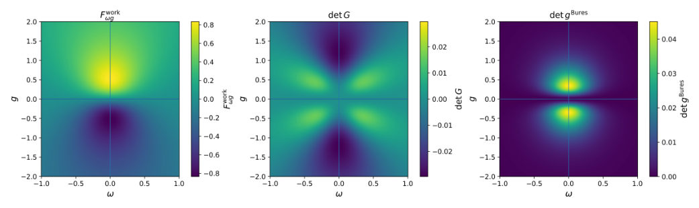
<figcaption class="paper-figure-caption"><b>Fig 1.</b> FIG. 1. Response geometry of the driven dissipative qubit in the control-parameter plane (ω, g) for fixed dissipation rate γ = 1 and stationary polarization parameter s = 0.75. Left: antisymmetric response tensor (work curvature) Fωg = χgω −χωg. The curvature changes sign across the symmetry line g = 0 and vanishes when the stationary state becomes aligned with the Hamiltonian eigenbasis. Center: determinant of the symmetric response tensor Gµν = 1</figcaption>
</figure>

**Summary.** The paper introduces a response-geometric framework for open quantum systems by decomposing the system's response tensor into symmetric and antisymmetric parts. This allows researchers to geometrically distinguish between local susceptibility (metric sector) and nonreciprocal effects like geometric work (curvature sector). The key finding is that this curvature arises naturally from the misalignment between the system's intrinsic Hamiltonian basis and the environment-induced pointer basis.

**Why it may be interesting.** This work provides a powerful geometric tool to quantify non-reciprocal effects (like directed energy flow or geometric work) in open quantum systems, moving beyond standard equilibrium fluctuation theorems.

Detailed structure

**Main problem.** Developing a response-geometric framework for open quantum systems by decomposing the stationary-state response tensor into symmetric and antisymmetric sectors.

**Main result.** The theory establishes that geometric work emerges as a measurable signature of nonreciprocal response, extending fluctuation-response relations from equilibrium thermodynamics to non-equilibrium steady states.

**Method.** Linear response theory is used to decompose the stationary-state response tensor into metric (symmetric) and curvature (antisymmetric) components.

**Model / system.** The analysis uses open quantum systems, exemplified by a driven dissipative qubit under pure dephasing. The framework applies generally to systems whose dynamics are governed by competition between Hamiltonian evolution and environmental dissipation.

**Key observables.** Local susceptibility (governed by the symmetric sector), geometric work curvature (from the antisymmetric sector), and state distinguishability (quantified by the Bures metric).

**Important parameters / regimes.** Basis misalignment ($	heta$ or $g$), which quantifies the incompatibility between the Hamiltonian eigenbasis and the environment-selected pointer basis.

**Assumptions / limitations.** The framework assumes that the stationary state can be parameterized by external control variables, allowing for a geometric description of response. It notes that full integrability (Kähler geometry) remains an open question.

**Figures summary.** Figures illustrate the spatial organization and distinct nature of the determinants associated with the work curvature ($F$), susceptibility ($\det G$), and Bures metric ($\det g_{Bures}$) in parameter space.

**Paper structure.** The paper develops the framework by decomposing the response tensor, showing how equilibrium recovers purely metric geometry (vanishing antisymmetric sector), and then applying this to non-equilibrium systems where both metric and symplectic structures coexist due to basis incompatibility.

Abstract

We develop a response-geometric framework for open quantum systems by decomposing the stationary-state response tensor into symmetric and antisymmetric sectors. The symmetric sector defines a metric-like response tensor governing local susceptibility, while the antisymmetric sector defines a curvature two-form associated with nonreciprocal response and geometric work. We show that the work curvature is precisely the antisymmetric component of the response tensor, establishing a fluctuation--response relation that extends the geometric structure of equilibrium thermodynamics to nonequilibrium steady states, and reveals a response geometry with both metric and symplectic sectors. In equilibrium, the antisymmetric sector vanishes by reciprocity, recovering the familiar metric geometry of thermodynamic response. Open quantum systems admit a broader structure in which reciprocal and nonreciprocal responses coexist on the same control manifold. We illustrate this with a driven dissipative qubit under pure dephasing, where finite curvature emerges from the misalignment between the Hamiltonian eigenbasis and the pointer basis selected by the environment, without requiring strong driving or engineered reservoirs. Comparison with the Bures metric shows that response geometry and information geometry characterize distinct properties of the stationary-state manifold: the former governs susceptibility and geometric work, the latter quantifies state distinguishability. Geometric work thus emerges as a measurable signature of nonreciprocal response in open quantum systems.

[↑ back to top](#top)

### [Quantum Otto engine with decoupled idle levels in a non-Hermitian XY model](http://arxiv.org/abs/2606.22405v1)

**Authors:** Maimaitiyiming Tusun, Fang Zhao  
**Type:** theory · **Category:** statistical mechanics · **PDF:** <https://arxiv.org/pdf/2606.22405v1>  
**Analysis basis:** full PDF text, analyzed in chunks
**Topic relevance:** `driven-dissipative phase transition` **3/5** · `exotic spin models in light-matter` **3/5** · `methods for driven-dissipative` **3/5** · `non-equilibrium dynamics` **2/5** · `non-equilibrium universality` **2/5** · `Keldysh / 2PI / non-Gaussian methods` **1/5** · `Kondo & dissipative impurity` **1/5** · `analog quantum simulation` **1/5** · `correlated / nonlocal dissipation` **1/5**

↔ Scroll figures horizontally

<figure class="paper-figure-card">
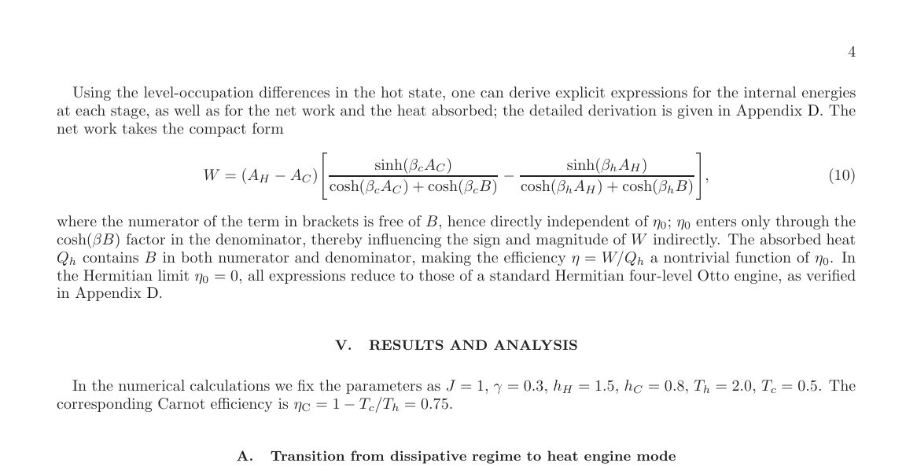
<figcaption class="paper-figure-caption"><b>Fig 1.</b> Figure 1 shows the net work W as a function of the non-Hermitian parameter η0. For small values of η0, W &lt; 0, and numerical verification yields Qh &gt; 0, Qc &gt; 0, confirming that the system operates in the dissipative regime. At a critical value ηc the net work vanishes, marking the transition point. For η0 above this critical value, W &gt; 0 and the system enters the heat engine regime. This bidirectional behavior is a direct consequence of the idle-level mechanism [32]: changing η0 tunes the idle-level gap B = 2J p</figcaption>
</figure>
<figure class="paper-figure-card">
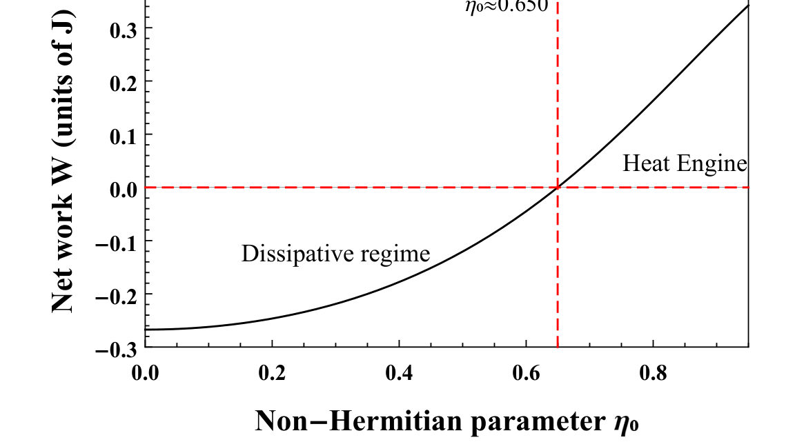
<figcaption class="paper-figure-caption"><b>Fig 2.</b> FIG. 1. Net work W (in units of J) versus the non-Hermitian parameter η0. The horizontal dashed line marks W = 0; the vertical dashed line indicates the critical value ηc ≈0.6496, with the dissipative regime on the left and the heat engine mode on the right. The inset shows the entropy production per cycle ∆Stot in the dissipative regime, which remains positive for all η0 &lt; ηc. Parameters: J = 1, γ = 0.3, hH = 1.5, hC = 0.8, Th = 2.0, Tc = 0.5.</figcaption>
</figure>
<figure class="paper-figure-card">
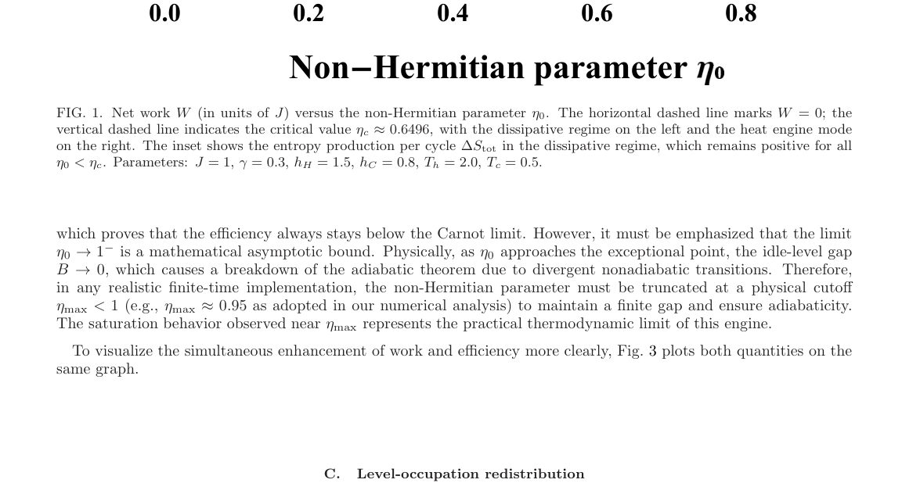
<figcaption class="paper-figure-caption"><b>Fig 3.</b> Figure 4 displays the idle-level occupation difference p3 −p4 in the hot and cold equilibrium states as a function of η0, clearly revealing the microscopic origin of the efficiency enhancement. As η0 grows, the occupation difference on the cold side drops much faster than that on the hot side. This asymmetric change widens the occupation-difference gap that drives Qh. Therefore, the redistribution of level occupations is the physical root of the efficiency boost and highlights the central role of idle levels in the non-Hermitian quantum heat engine.</figcaption>
</figure>
<figure class="paper-figure-card">
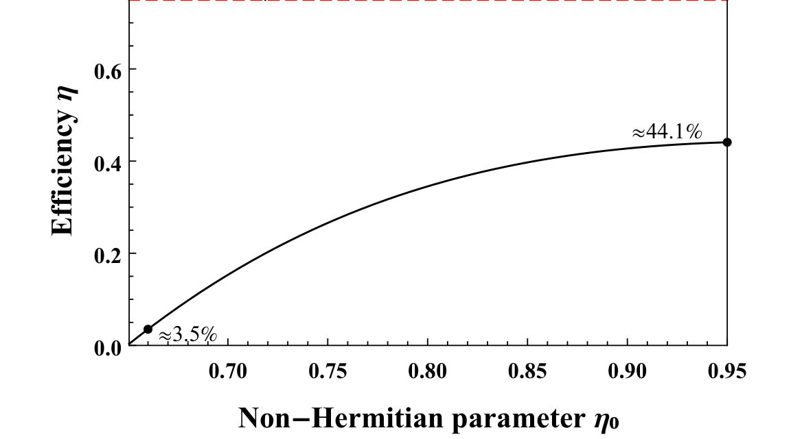
<figcaption class="paper-figure-caption"><b>Fig 4.</b> FIG. 2. Engine efficiency η versus η0. Black solid line: heat engine efficiency; red dashed line: Carnot limit ηC = 0.75. The efficiency rises from about 3.5% at η0 = 0.66 to 42.7% at η0 = 0.9, and approaches 44.15% as η0 →1−. Parameters are the same as in Fig. 1.</figcaption>
</figure>
<figure class="paper-figure-card">
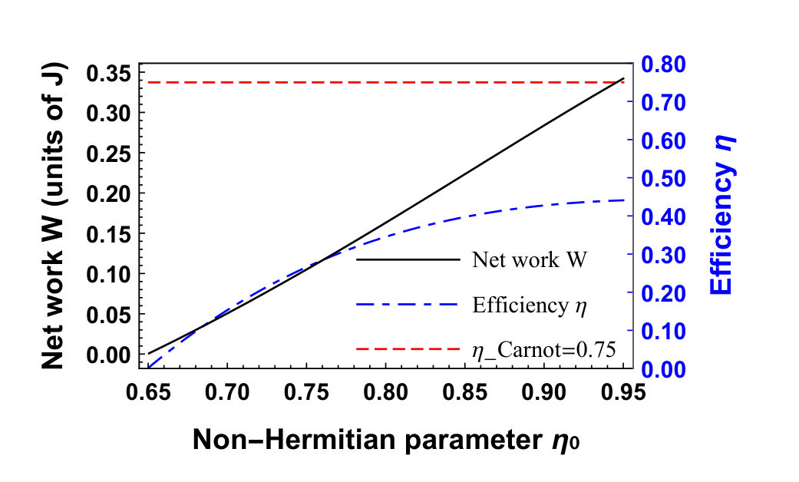
<figcaption class="paper-figure-caption"><b>Fig 5.</b> FIG. 3. Net work W (left axis, black solid line) and engine efficiency η (right axis, blue dashed line) as functions of η0. The red dashed line marks the Carnot efficiency ηC = 0.75. Inside the engine regime (η0 &gt; ηc), both quantities increase with η0. Parameters are the same as in Fig. 1.</figcaption>
</figure>

**Summary.** The authors analyze a quantum Otto cycle in a two-qubit non-Hermitian XY model, demonstrating that the system naturally possesses decoupled 'idle levels.' By tuning the non-Hermitian parameter ($\eta_0$), they show this idle-level mechanism allows for independent control over efficiency, driving the engine into an efficient heat engine regime and confirming non-Hermiticity as a powerful tool in quantum thermodynamics.

**Why it may be interesting.** This work provides a concrete realization of an advanced quantum thermodynamics concept—the idle-level engine—using non-Hermiticity as a tunable resource to surpass standard thermodynamic limitations in spin models.

Detailed structure

**Main problem.** The study investigates a quantum Otto cycle using an idle-level heat engine architecture realized within a physical spin model to demonstrate non-Hermiticity's role in controlling thermal machine performance.

**Main result.** Tuning the non-Hermitian parameter ($\eta_0$) drives the system from a dissipative regime ($W<0$) into a genuine heat engine mode ($W>0$), simultaneously enhancing both output work and efficiency towards the Carnot limit.

**Method.** The analysis employs the non-Hermitian canonical thermodynamic framework, calculating equilibrium properties using the biorthogonal eigenbasis for the four strokes of the Otto cycle.

**Model / system.** The system is a two-qubit non-Hermitian XY model featuring a staggered imaginary magnetic field. The Hamiltonian naturally decouples into working levels (dependent on external fields) and idle levels (independent of external fields).

**Key observables.** Net work ($W$), engine efficiency ($\eta = W/Q_h$), heat absorbed ($Q_h$), and the energy spectrum.

**Important parameters / regimes.** The non-Hermitian parameter $\eta_0$ is the primary control knob, which must be kept within the PT-unbroken phase ($|\eta_0| < 1$).

**Assumptions / limitations.** The work-efficiency synergy is demonstrated for the quasistatic Otto cycle; finite-time cycles are assumed to degrade performance. The adiabatic process requires $\eta_0$ to remain away from the exceptional point ($\eta_0 = 1$).

**Figures summary.** Figures illustrate the transition of net work ($W$) from negative (dissipative) to positive (engine) as $\eta_0$ increases, and show that efficiency ($\eta$) enhances monotonically with $\eta_0$. Figure 4 details how idle-level occupation differences modulate absorbed heat ($Q_h$).

**Paper structure.** The paper first introduces the non-Hermitian Hamiltonian and its energy level decoupling. It then applies the non-Hermitian canonical framework to calculate thermodynamic quantities for the four strokes of the Otto cycle, culminating in demonstrating the idle-level control mechanism that enhances work and efficiency.

Abstract

We study a quantum Otto cycle in a two-qubit non-Hermitian XY model with a staggered imaginary magnetic field. The energy spectrum of this system naturally decouples into a pair of working levels that depend on the external field and a pair of idle levels that are completely independent of it, thereby providing the first concrete microscopic realization of the idle-level quantum heat engine architecture proposed by de~Oliveira and Jonathan [Phys. Rev. E 104, 044133 (2021)] in a physical spin model. Tuning the non-Hermitian parameter eta_0 drives a continuous transition from a dissipative regime with negative net work and net heat absorption from the hot reservoir into a genuine heat engine mode, while simultaneously enhancing both output work and efficiency. As eta_0 increases within the stable PT-unbroken phase, the engine efficiency rises significantly, reaching a substantial fraction of the Carnot limit. This effect originates from the compression of the idle-level gap, which redistributes the level occupation weights in the hot and cold equilibrium states and thereby modulates the absorbed heat. The numerator of the net work expression is independent of eta_0, but the denominator depends on eta_0 indirectly through hyperbolic cosine functions -- this is the mathematical root of the idle-level control mechanism. We provide a detailed analysis of the robustness of these findings against parameter variations, a critical comparison of the non-Hermitian control with the Hermitian limit, and a concrete experimental proposal for trapped-ion quantum simulators. Our results demonstrate that non-Hermiticity serves as an indispensable tool for steering both the operation mode and the performance of a quantum engine.

[↑ back to top](#top)

### [Collective Mpemba-Type Relaxation in Degenerate Bosonic Modes Coupled to a Common Thermal Reservoir](http://arxiv.org/abs/2606.22273v1)

**Authors:** I. M. de Araújo, H. Sanchez, L. F. Alves da Silva, L. F. Alves da Silva, Norton G. de Almeida, M. H. Y. Moussa  
**Type:** theory · **Category:** statistical mechanics · **PDF:** <https://arxiv.org/pdf/2606.22273v1>  
**Analysis basis:** full PDF text, analyzed in chunks
**Topic relevance:** `correlated / nonlocal dissipation` **3/5** · `methods for driven-dissipative` **3/5** · `non-equilibrium dynamics` **3/5** · `Keldysh / 2PI / non-Gaussian methods` **2/5** · `driven-dissipative phase transition` **2/5** · `analog quantum simulation` **1/5** · `entanglement & information structure` **1/5** · `non-equilibrium universality` **1/5**

↔ Scroll figures horizontally

<figure class="paper-figure-card">
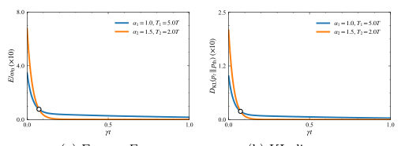
<figcaption class="paper-figure-caption"><b>Fig 1.</b> Figure 1. Weak-coupling Markovian Mpemba scenario with a single clean crossing. Parameters: ω0 = 10, γ = 1, (α1, T1) = (1.0, 5.0T), and (α2, T2) = (1.5, 2.0T). The stronger initial displacement of state 2 accelerates the short-time collective relaxation and produces the same crossing in both diagnostics.</figcaption>
</figure>
<figure class="paper-figure-card">
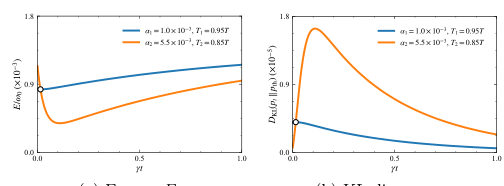
<figcaption class="paper-figure-caption"><b>Fig 2.</b> Figure 2. Weak-coupling Markovian anti-Mpemba-like in- version for ω0 = 10, γ = 1, (α1, T1) = (10−3, 0.95T), and (α2, T2) = (5.5 × 10−3, 0.85T). Although both preparations are initially colder than the bath, the larger coherent compo- nent of state 2 produces an early-time reordering in both the energy and the KL divergence.</figcaption>
</figure>
<figure class="paper-figure-card">
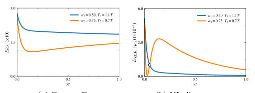
<figcaption class="paper-figure-caption"><b>Fig 3.</b> Figure 3. Weak-coupling Markovian criterion dependence. Parameters: ω0 = 1, γ = 0.1, (α1, T1) = (0.50, 1.1T), and (α2, T2) = (0.75, 0.7T). The energy ordering never inverts, whereas the KL divergence shows an early crossing, demon- strating that the identification of the “faster” preparation de- pends on the chosen diagnostic.</figcaption>
</figure>
<figure class="paper-figure-card">
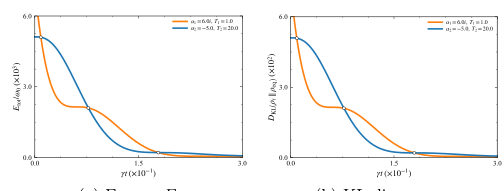
<figcaption class="paper-figure-caption"><b>Fig 4.</b> Figure 4. Underdamped collective Caldeira–Leggett dynam- ics for M = 10, ω0 = 20, γ = 1, T = 1.0, (α1, T1) = (6i, 1.0), and (α2, T2) = (−5.0, 20.0T). Because γM &lt; ω0, the damped rotation in the quadrature plane produces three crossings in both the energy E and the KL divergence. The white markers identify the crossing times.</figcaption>
</figure>
<figure class="paper-figure-card">
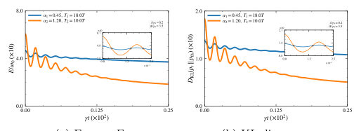
<figcaption class="paper-figure-caption"><b>Fig 5.</b> Figure 5. Lorentzian non-Markovian collective relaxation for M = 30, ω0 = 10, γ0 = 1, T = 1.0, λ/γ0 = 0.2, ∆/γ0 = 3.5, (α1, T1) = (0.45, 18.0T), and (α2, T2) = (1.20, 10.0T). The main panels show the overall delayed transfer of hierarchy, while the inset resolves three crossings inside a narrow early- time window generated by reservoir memory.</figcaption>
</figure>

**Summary.** This paper analyzes collective Mpemba-type relaxation in degenerate bosonic modes coupled to a thermal bath. By examining weak-coupling Markovian, strong-coupling Caldeira-Leggett, and non-Markovian limits, the authors show that the coupling structure dictates distinct decay channels. The results highlight how reservoir memory and internal dynamics can lead to complex, multiple transient reorderings of relaxation timescales.

**Why it may be interesting.** This work provides a detailed theoretical framework for understanding how collective dissipation in many-body bosonic systems can lead to non-trivial, history-dependent relaxation phenomena like the Mpemba effect, which is crucial for quantum thermodynamics.

Detailed structure

**Main problem.** The study investigates collective Mpemba-type relaxation, which involves the crossing of energy decay timescales, in a system of degenerate bosonic modes coupled to a common thermal reservoir.

**Main result.** The coupling structure leads to distinct relaxation channels (incoherent vs. coherent), and the specific physical regime (Markovian vs. non-Markovian) dictates whether crossings are simple exponentials or exhibit complex transient reorderings.

**Method.** The analysis employs mean-field reduction techniques to derive effective master equations for different coupling regimes, comparing energy decay ($\Delta E(t)$) with full state diagnostics like the Kullback-Leibler divergence.

**Model / system.** The system consists of $M$ degenerate bosonic modes coupled via an interaction Hamiltonian to a common thermal reservoir. The dynamics are analyzed across weak-coupling Markovian, strong-coupling Caldeira-Leggett, and non-Markovian limits.

**Key observables.** Energy difference $\Delta E(t)$, Kullback-Leibler (KL) divergence ($	ext{DKL}$), relaxation rates ($\gamma$ vs. $M\gamma$), and the Mpemba crossing time ($t_	imes$).

**Important parameters / regimes.** Number of modes ($M$), coupling strengths, reservoir memory effects (Lorentzian spectrum), and initial state preparation parameters ($\Delta n_0$, $\Delta \alpha$).

**Assumptions / limitations.** The analysis relies heavily on mean-field approximations derived by tracing out $M-1$ modes from the full system Hamiltonian.

**Figures summary.** Figures illustrate clean Mpemba crossings, anti-Mpemba inversions, and complex transient reorderings showing multiple crossings in both energy and KL divergence diagnostics across different coupling regimes.

**Paper structure.** The paper systematically progresses by first establishing the weak-coupling Markovian result (two distinct decay channels), then extending to the Caldeira-Leggett regime (introducing quadrature dynamics), and finally incorporating reservoir memory effects via non-Markovian kernels.

Abstract

We investigate collective Mpemba-type relaxation in a degenerate family of bosonic modes coupled to a common thermal reservoir. Starting from a fully symmetric M-mode description and employing a representative mean-field reduction, we derive effective master equations for weak-coupling Markovian, strong-coupling Caldeira-Leggett, and weak-coupling non-Markovian regimes. In the weak-coupling Markovian limit, relaxation separates into an incoherent thermal channel decaying at rate gamma and a collective coherent channel decaying at rate M gamma, yielding an explicit Mpemba crossing time determined by the initial-state preparation. In the strong-coupling Caldeira-Leggett regime, transient quadrature dynamics enriches the relaxation pattern, delaying crossings in the overdamped sector and generating multiple crossings in the underdamped sector. In the non-Markovian regime, reservoir memory reshapes the same channel-competition mechanism through time-dependent decay rates and a Lamb shift, producing delayed and clustered crossing windows. Numerical results based on the energy and the Kullback-Leibler divergence reveal Mpemba and anti-Mpemba behavior, criterion dependence, and multiple transient reorderings induced by collective coherence, quadrature dynamics, and reservoir memory.

[↑ back to top](#top)

### [Effect of rewiring for a sandpile model on a directed network](http://arxiv.org/abs/2606.22092v1)

**Authors:** Alejandro Zamorano, Víctor Muñoz  
**Type:** theory · **Category:** statistical mechanics · **PDF:** <https://arxiv.org/pdf/2606.22092v1>  
**Analysis basis:** full PDF text, analyzed in chunks
**Topic relevance:** `driven-dissipative phase transition` **3/5** · `non-equilibrium universality` **3/5** · `analog quantum simulation` **2/5** · `methods for driven-dissipative` **2/5** · `non-equilibrium dynamics` **2/5** · `Frenkel-Kontorova` **1/5** · `Keldysh / 2PI / non-Gaussian methods` **1/5** · `correlated / nonlocal dissipation` **1/5** · `entanglement & information structure` **1/5**

↔ Scroll figures horizontally

<figure class="paper-figure-card">
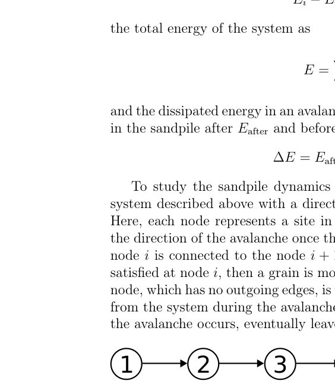
<figcaption class="paper-figure-caption"><b>Fig 1.</b> Figure 1: Network representation of the BTW model, where each node i delivers energy to node i + 1, and node n = 6 releases energy from the system.</figcaption>
</figure>
<figure class="paper-figure-card">
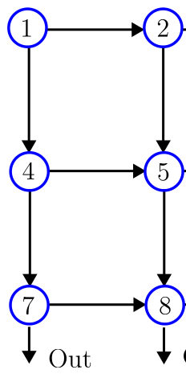
<figcaption class="paper-figure-caption"><b>Fig 2.</b> Figure 3: Graphical representation of the initial adjacency matrix (6).</figcaption>
</figure>
<figure class="paper-figure-card">
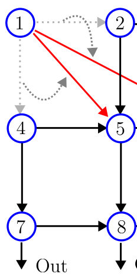
<figcaption class="paper-figure-caption"><b>Fig 3.</b> Figure 4: Rewired network configuration according to the M2 matrix in Eq. (7), after two rewirings.</figcaption>
</figure>
<figure class="paper-figure-card">
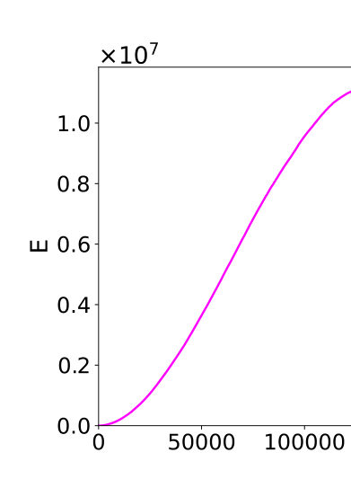
<figcaption class="paper-figure-caption"><b>Fig 4.</b> Figure 5: Energy of the system for the non-rewired 1D case (linear chain) as a function of iteration time t, showing the transition from the transient to the stationary state.</figcaption>
</figure>
<figure class="paper-figure-card">
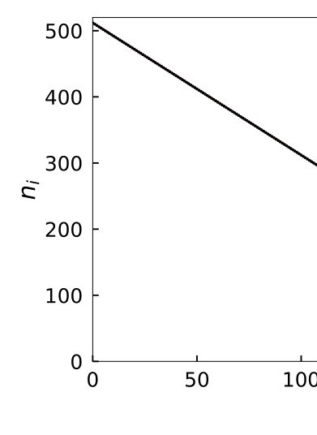
<figcaption class="paper-figure-caption"><b>Fig 5.</b> Figure 6: Number of grains at the i-th state at the stationary state for the linear chain, with no rewiring.</figcaption>
</figure>

**Summary.** This work analyzes how modifying the underlying connectivity of a sandpile model—by rewiring its directed network—alters its statistical behavior. The authors find that 1D structures exhibit sharp, critical transitions in load distribution, whereas 2D structures show smoother changes. This highlights the sensitivity of transport properties to network topology and suggests the Gini coefficient as a powerful diagnostic tool for such transitions.

**Why it may be interesting.** While focused on classical SOC dynamics, the study's use of network topology modification and critical transitions based on global measures like the Gini coefficient provides transferable concepts for understanding non-equilibrium phase transitions in complex quantum systems or engineered quantum networks.

Detailed structure

**Main problem.** The study investigates how systematically rewiring a directed network affects the avalanche statistics and structural properties of the sandpile model.

**Main result.** In 1D, rewirings cause a sharp transition in load inequality (Gini coefficient) at $\sim 85\%$ rewiring. In contrast, 2D systems show a smoother change, maintaining power-law energy release even when fully rewired.

**Method.** The authors simulate the Bak-Tang-Wiesenfeld sandpile model on networks that are systematically modified by controlled rewiring algorithms to ensure continuous energy dissipation.

**Model / system.** The system is the BTW sandpile model applied to directed graphs, initially starting as a 1D linear chain and extended to 2D lattices. The process involves iteratively replacing network links while maintaining an acyclic structure (DAG).

**Key observables.** Gini coefficient of load distribution, avalanche energy PDF ($\Delta E$), betweenness centrality, average shortest path length $\langle L 
angle$, and the critical rewiring proportion ($f_c^r$).

**Important parameters / regimes.** The fraction of rewired links ($f_r$) is the primary control parameter, analyzed in both 1D and 2D geometries.

**Assumptions / limitations.** Rewiring rules are strictly enforced to guarantee that energy can always leave the system, preventing trapped energy or network breakage.

**Figures summary.** Figures illustrate the evolution of total energy, stationary grain distributions, and the PDF of energy release events as a function of rewiring steps ($n_R$ or $f_r$). The Gini coefficient vs. $f_r$ plots highlight sharp (1D) versus smooth (2D) transitions.

**Paper structure.** The paper systematically analyzes the sandpile dynamics by first establishing the controlled rewiring process, then comparing 1D and 2D results across various metrics (Gini, $\langle L 
angle$, centrality), culminating in a discussion of size effects and the utility of the Gini coefficient as a diagnostic tool.

Abstract

Several studies have considered sandpile dynamics not over regular grids, but over networks. In this case, avalanches redistribute grains not between neighboring sites in a geometrical sense, but between connected sites, in a topological sense. However, depending on how nodes are connected, grains may never leave the system, preventing energy release. In this work, we study the simplest case, the BTW model in one and two dimensions, rewiring the nodes so that at every rewiring step, the energy release is always possible, and study avalanche statistics as a function of rewiring. In the 1D case, a transition is observed in the Gini coefficient of the load distribution per node at about 85% the number of possible rewirings, a transition which is not evident with other measures, such as the size distribution of avalanches or the mean distance between nodes in the network. In the 2D case, energy release follows a power law even when the grid is fully rewired, while the Gini coefficient, unlike the 1D case, decreases at a steady rate, with a smoother transition. The effect of network size N is studied, finding that there is a transition for the Gini coefficient at the thermodynamic limit N \to \infty for both the 1D and 2D cases, transition which is also observed in the betweenness centrality, but not in other topological measures. Finally, the dependence of the results with the load per rewiring iteration, and the avalanche threshold is studied.

[↑ back to top](#top)

### [Harnessing Josephson-Shapiro physics to verify interlayer exciton superfluidity](http://arxiv.org/abs/2606.23303v1)

**Authors:** Filippo Pascucci, Alexander R. Hamilton, Milorad V. Milosevic, David Neilson  
**Type:** both · **Category:** other · **PDF:** <https://arxiv.org/pdf/2606.23303v1>  
**Analysis basis:** full PDF text, analyzed in chunks
**Topic relevance:** `analog quantum simulation` **3/5** · `driven-dissipative phase transition` **3/5** · `methods for driven-dissipative` **3/5** · `non-equilibrium dynamics` **2/5** · `Keldysh / 2PI / non-Gaussian methods` **1/5** · `correlated / nonlocal dissipation` **1/5** · `correlated cavity matter` **1/5** · `non-equilibrium universality` **1/5**

↔ Scroll figures horizontally

<figure class="paper-figure-card">
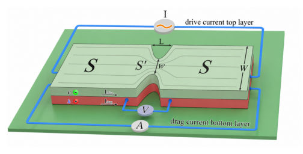
<figcaption class="paper-figure-caption"><b>Fig 1.</b> Figure 1. Our proposed S-S′-S device and measurement setup. Top (green) layer is n-doped, and bottom (red) layer is p-doped. Bulk layer width is W, Dayem bridge has width w and length L. AC current source I, voltage drop across the bridge V , ammeter A. Drive current Idrive in the top layer induces a drag current Idrag in the bottom layer.</figcaption>
</figure>
<figure class="paper-figure-card">
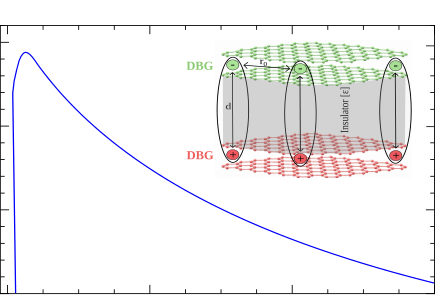
<figcaption class="paper-figure-caption"><b>Fig 2.</b> Figure 2. Critical Josephson current eIJJ c as a function of the interparticle spacing r0 for DBG. The double bilayer graphene is separated by an insulator of dielectric constant ε and thick- ness d.</figcaption>
</figure>
<figure class="paper-figure-card">
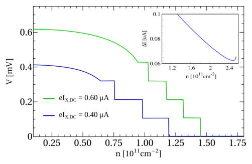
<figcaption class="paper-figure-caption"><b>Fig 3.</b> Figure 4. Voltage-density characteristics for AC current (eIX,AC = 0.2 µA, ωAC = 50 GHz), for DC currents: eIX,DC = 0.4 µA (blue line) and eIX,DC = 0.6 µA (green line). Inset: current width of the first step ∆I as a function of density for eIX,DC = 0.4 µA.</figcaption>
</figure>
<figure class="paper-figure-card">
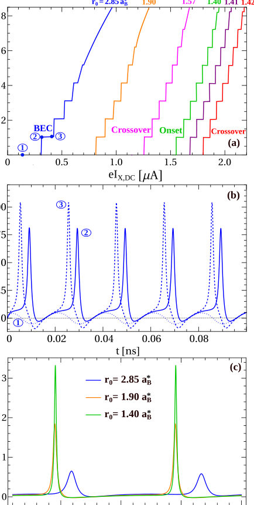
<figcaption class="paper-figure-caption"><b>Fig 4.</b> Figure 3. Shapiro steps in the Dayem bridge. For all curves eIX,AC = 0.2 µA and ωAC = 50 GHz. (a) I-V characteristics for different r0, as labeled. V is the time voltage average and IX,DC is the injected exciton direct current component. (b) V (t) at values of eIX,DC indicated by the circled numbers for r0 = 2.85a∗ B. (c) V (t) at the start of the first step for the values of r0, as labeled.</figcaption>
</figure>
<figure class="paper-figure-card">
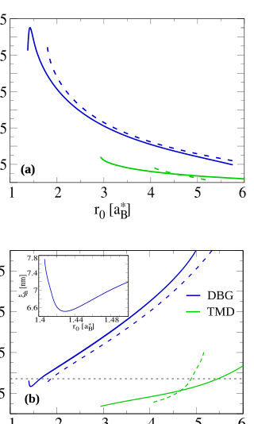
<figcaption class="paper-figure-caption"><b>Fig 5.</b> Figure 5. (a) Critical velocity vc and (b) healing length ξh at zero temperature as functions of the average interparticle distance r0. Blue lines: DBG, green lines: TMDs. Solid lines: interlayer distance d = 1 nm, dashed lines: d = 2 nm. In panel (b), the black dashed line indicates the limiting condition for S-S′-S at zero temperature: [L = 30 nm]/3.5. Inset: zoom of minimum in healing length near the onset density in DBG for d = 1 nm.</figcaption>
</figure>

**Summary.** This paper proposes using Shapiro steps in an excitonic Josephson junction as a direct method to verify superfluidity in electron-hole bilayers. By analyzing double-bilayer graphene and TMDs, the authors predict clear voltage plateaus that signal macroscopic phase coherence. This approach allows for mapping out the BCS-BEC crossover physics in these neutral quantum systems.

**Why it may be interesting.** The work bridges concepts from superconductivity (Josephson junctions) into the realm of excitonic quantum materials, providing a concrete, measurable diagnostic tool for exotic many-body phases like exciton superfluids.

Detailed structure

**Main problem.** The primary challenge is obtaining direct, unambiguous evidence for zero-magnetic-field exciton superfluidity in electrically neutral electron-hole bilayers.

**Main result.** The authors propose using Shapiro steps in a Josephson junction formed by an excitonic Dayem bridge to directly probe phase coherence. They show this signature can be observed across the full BCS-BEC crossover regime in double-bilayer graphene (DBG).

**Method.** The theoretical framework models the system as a modified Josephson junction, deriving current-phase relations and predicting observable Shapiro plateaus from combined DC+AC driving currents.

**Model / system.** The study focuses on exciton bilayers, specifically double-bilayer graphene (DBG) and transition-metal dichalcogenides (TMDs). The physics is analyzed using Josephson junction dynamics adapted for neutral excitons in a Dayem bridge geometry.

**Key observables.** Resolvable Shapiro plateaus in the I-V characteristics; nonmonotonic evolution of the first step width as density is tuned across the BCS-BEC crossover.

**Important parameters / regimes.** Particle density ($n$), interlayer distance ($d$), interparticle spacing ($r_0$), and the ratio governing the single-valued current-phase relation ($\xi_h \gtrsim L/3.5$).

**Assumptions / limitations.** The junction is modeled in the overdamped limit, neglecting capacitance; geometric amplification ($\alpha = W/w \gg 1$) is assumed.

**Figures summary.** Figure 2 shows the critical Josephson current ($I_{JJ}^c$) dependence on interparticle spacing for DBG. Figure 3 illustrates $I$-$V$ characteristics showing Shapiro steps, and Figure 4 demonstrates step visibility via density tuning.

**Paper structure.** The paper first establishes the physical problem (probing neutral superfluidity) and proposes the Josephson junction diagnostic. It then develops the theoretical model using coupled equations for current balance and voltage dynamics. Finally, it presents results comparing DBG and TMDs, highlighting how Shapiro steps confirm superfluidity signatures across density regimes.

Abstract

Obtaining definitive evidence for zero-magnetic-field exciton superfluidity in electron-hole bilayers remains a longstanding challenge because the condensate is electrically neutral and its phase coherence is difficult to probe directly. We propose a direct test based on Shapiro steps in a Dayem-bridge excitonic Josephson junction. We predict clearly resolvable Shapiro plateaus in experimentally accessible current and voltage regimes for double-bilayer graphene and, in the low-density regime, double-layer transition-metal dichalcogenides. Moreover, by tuning the density across the BCS-BEC crossover we show that the Shapiro response acquires a distinct nonmonotonic evolution. This is determined by the nonmonotonic behavior of the healing length in the crossover from bosonic to fermionic excitations. Observation of these signatures would provide direct evidence of exciton superfluidity and establish exciton bilayers as a platform for neutral Josephson devices.

[↑ back to top](#top)

### [Quantum Geometry Driven Finite-Momentum Exciton Fluctuations in Flat-Band Systems](http://arxiv.org/abs/2606.23598v1)

**Authors:** Yi-Chun Hung, Xiaoting Zhou, Arun Bansil  
**Type:** theory · **Category:** statistical mechanics · **PDF:** <https://arxiv.org/pdf/2606.23598v1>  
**Analysis basis:** full PDF text, analyzed in chunks
**Topic relevance:** `Keldysh / 2PI / non-Gaussian methods` **3/5** · `analog quantum simulation` **3/5** · `driven-dissipative phase transition` **2/5** · `methods for driven-dissipative` **2/5** · `Frenkel-Kontorova` **1/5** · `correlated / nonlocal dissipation` **1/5** · `correlated cavity matter` **1/5** · `non-equilibrium dynamics` **1/5** · `non-equilibrium universality` **1/5**

↔ Scroll figures horizontally

<figure class="paper-figure-card">
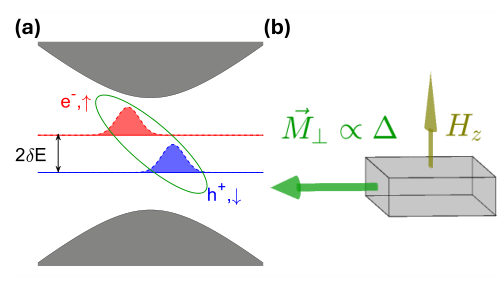
<figcaption class="paper-figure-caption"><b>Fig 1.</b> FIG. 1. Schematic diagrams for (a) the electronic structure of the flat band in our setup and (b) the exciton-induced magnetic response. Hz is the out-of-plane Zeeman field with the corresponding energy splitting 2δE. ⃗ M⊥is the in-plane magnetization, which is proportional to the order parameter of the EI phase, ∆.</figcaption>
</figure>
<figure class="paper-figure-card">
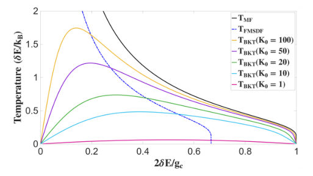
<figcaption class="paper-figure-caption"><b>Fig 2.</b> FIG. 2. Mean-field critical temperature TMF (black solid line), and the critical temperature for finite-momentum su- perfluid density fluctuation TFMSDF (black dashed line), and the BKT transition temperatures TBKT for different values of K0 (colored lines) in the unit of δE/kB as a function of the dimensionless interaction strength 2δE/gc.</figcaption>
</figure>
<figure class="paper-figure-card">
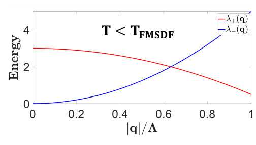
<figcaption class="paper-figure-caption"><b>Fig 3.</b> FIG. 3. A schematic diagram showing the energies of amplitude  λ+(q)  and phase  λ−(q)  fluctuations in the finite-momentum superfluid density fluctuation state, where T &lt; TFMSDF. Here, Λ is the momentum cutoff. The negative kinetic coefficient favors amplitude fluctuations with a finite momentum. However, the ground state remains as λ+(q) &gt; 0 within the cutoff.</figcaption>
</figure>

**Summary.** This work theoretically establishes that the intrinsic quantum geometry of flat-band lattices can drive an excitonic insulator phase. By analyzing fluctuations using a Ginzburg-Landau framework, the authors predict a novel Finite-Momentum Superfluid Density Fluctuation (FMSDF) state under strong interactions. This suggests that geometric constraints dictate dynamic collective electronic behavior in materials like COFs.

**Why it may be interesting.** It provides a concrete theoretical link between geometric properties (quantum metric) of electronic bands and emergent macroscopic quantum phases (excitonic insulators/superfluids), which is highly relevant for understanding correlated materials.

Detailed structure

**Main problem.** The study aims to theoretically demonstrate a purely quantum-geometry-driven excitonic insulator (EI) phase and analyze its associated superfluid fluctuations in flat-band systems.

**Main result.** Strong interactions induce a negative effective kinetic coefficient for the amplitude mode, causing softest fluctuations to shift to finite momentum, leading to a Finite-Momentum Superfluid Density Fluctuation (FMSDF) state.

**Method.** The analysis employs mean-field theory on an effective Ginzburg-Landau free energy derived from path integrals and Hubbard-Stratonovich transformations.

**Model / system.** The system models excitons confined to lattice-geometry-induced flat bands (e.g., kagome, Lieb lattices) in a tight-binding model subjected to an out-of-plane Zeeman field.

**Key observables.** Coherence length ($\xi_c$), critical temperatures ($T_{	ext{MF}}$, $T_{	ext{BKT}}$), and the periodic modulation of in-plane magnetization fluctuations (FMSDF).

**Important parameters / regimes.** Dimensionless interaction strength ($2\delta E/gc$), quantum metric components, and Zeeman splitting ($\delta E$).

**Assumptions / limitations.** The system is assumed to be in the low-energy flat-band subspace, and SOC is negligible compared to the Zeeman field.

**Figures summary.** Figures illustrate electronic structure with Zeeman splitting and exciton-induced magnetic response; Figure 2 compares $T_{	ext{MF}}$, $T_{	ext{FMSDF}}$, and $T_{	ext{BKT}}$ versus interaction strength.

**Paper structure.** The paper systematically derives the effective action for the order parameter using auxiliary fields, analyzes fluctuations by diagonalizing the resulting quadratic action into amplitude and phase modes, and finally connects these fluctuations to observable magnetic responses.

Abstract

Quantum geometry is instrumental in stabilizing exotic phenomena in systems ranging from topological insulators to superconductors. In dispersionless flat bands, where the kinetic energy is quenched, the quantum metric emerges as the fundamental driver of macroscopic collective phenomena. Here, we theoretically demonstrate that lattice-geometry-induced flat bands, such as those in kagome and Lieb lattices, provide a fertile platform for realizing a purely quantum-geometry-driven excitonic insulator (EI) phase. By applying an out-of-plane Zeeman field to lift spin degeneracy without spin-orbit coupling, we establish a Ginzburg-Landau framework in which the electron-hole wavefunction-overlap directly maps the flat-band quantum metric onto the macroscopic free energy. This mapping plays a key role in both the EI and the associated superfluid phases, with the coherence length and phase stiffness emerging directly from the quantum metric. Our analysis reveals that under strong interactions, the quantum metric induces a negative effective kinetic coefficient for the amplitude mode. Rather than destabilizing the uniform condensate, this softens the amplitude fluctuations at a finite momentum, giving rise to a finite-momentum superfluid density fluctuation (FMSDF) state. This state is observable as a periodically modulated magnitude of in-plane magnetization fluctuations. Our findings establish a rigorous link between flat-band quantum geometry and dynamic collective excitonic states, with promising pathways for realization in covalent-organic frameworks (COFs).

[↑ back to top](#top)

### [A single-electron double quantum dot with Rashba spin-orbit interaction as a working substance for heat machines](http://arxiv.org/abs/2606.22733v1)

**Authors:** Ivan Romualdo de Oliveira, Vinícius N. A. Lula-Rocha, Moises Rojas  
**Type:** theory · **Category:** statistical mechanics · **PDF:** <https://arxiv.org/pdf/2606.22733v1>  
**Analysis basis:** full PDF text, analyzed in chunks
**Topic relevance:** `spintronics-quantum-optics interface` **3/5** · `Kondo & dissipative impurity` **2/5** · `non-equilibrium dynamics` **2/5** · `Keldysh / 2PI / non-Gaussian methods` **1/5** · `analog quantum simulation` **1/5** · `correlated / nonlocal dissipation` **1/5** · `driven-dissipative phase transition` **1/5** · `exotic spin models in light-matter` **1/5** · `methods for driven-dissipative` **1/5** · `non-equilibrium universality` **1/5**

↔ Scroll figures horizontally

<figure class="paper-figure-card">
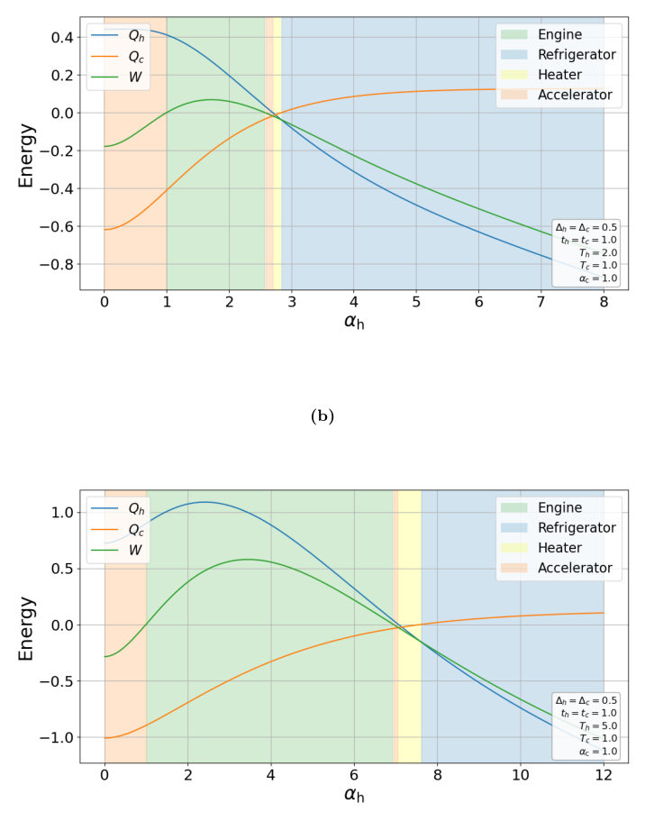
<figcaption class="paper-figure-caption"><b>Fig 1.</b> Figure 1. Heat exchanges Qh and Qc, and total work W, as functions of the Rashba coupling αh. The fixed parameters are ∆h = ∆c = 0.5, th = tc = 1.0, and αc = 1.0. Panel (a) corresponds to Th = 2.0 and Tc = 1.0, while panel (b) corresponds to Th = 5.0 and Tc = 1.0. The colored regions indicate the thermodynamic regimes defined in Table I.</figcaption>
</figure>
<figure class="paper-figure-card">
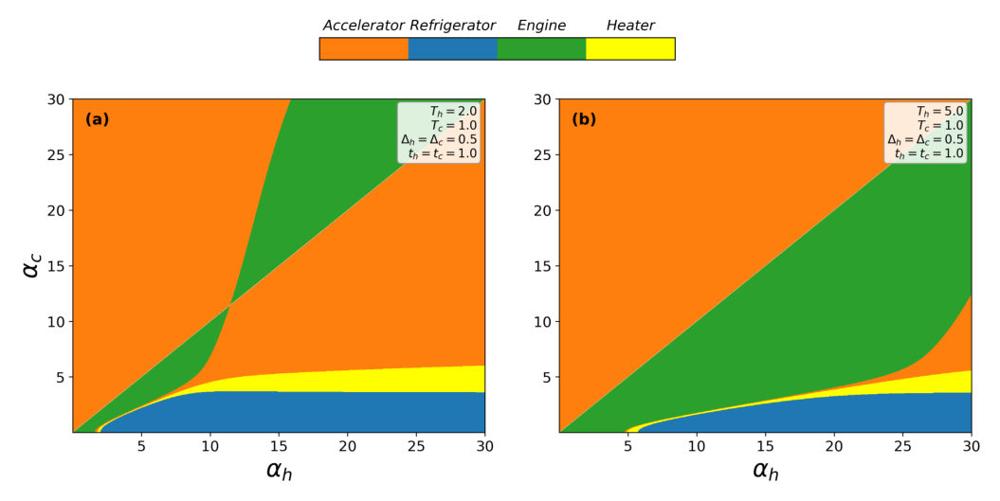
<figcaption class="paper-figure-caption"><b>Fig 2.</b> Figure 2. Thermodynamic-regime maps in the (αh, αc) plane for fixed ∆h = ∆c = 0.5 and th = tc = 1.0. Panel (a) corresponds to Th = 2.0 and Tc = 1.0, while panel (b) corresponds to Th = 5.0 and Tc = 1.0. The colors indicate accelerator, refrigerator, heat-engine, and heater regimes. The scans in Fig. 1 are horizontal cuts of these diagrams at αc = 1.0.</figcaption>
</figure>
<figure class="paper-figure-card">
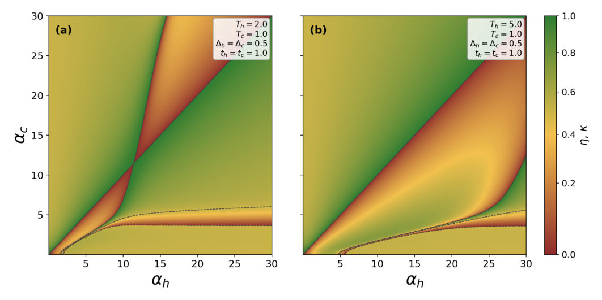
<figcaption class="paper-figure-caption"><b>Fig 3.</b> Figure 3. Efficiency η and bounded regime-dependent performance coefficient κ in the (αh, αc) plane for fixed ∆h = ∆c = 0.5 and th = tc = 1.0. Panel (a) corresponds to Th = 2.0 and Tc = 1.0, while panel (b) corresponds to Th = 5.0 and Tc = 1.0. In the heat-engine region the color represents η, whereas in the refrigerator, heater, and accelerator regions it represents κ = ˜κ/(1+˜κ), with ˜κ defined according to Eq. (29). The color scale therefore measures the performance of the active thermodynamic regime, with darker red tones corresponding to low performance and green tones corresponding to values close to unity.</figcaption>
</figure>
<figure class="paper-figure-card">
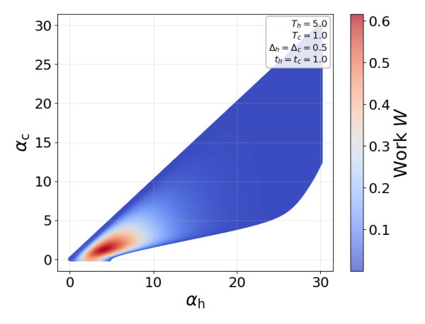
<figcaption class="paper-figure-caption"><b>Fig 4.</b> Figure 4. Work output W in the heat-engine regime in the (αh, αc) plane for Th = 5.0, Tc = 1.0, ∆h = ∆c = 0.5, and th = tc = 1.0. The color scale represents the extracted work. The maximum-work region is localized close to the lower boundary of the diagram, where αc is very small.</figcaption>
</figure>
<figure class="paper-figure-card">
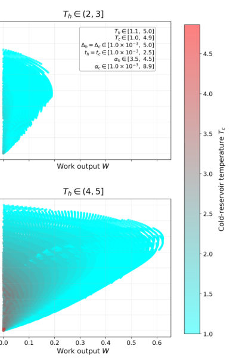
<figcaption class="paper-figure-caption"><b>Fig 5.</b> Figure 5. Heat-engine points in the (W, η) plane grouped by hot-reservoir temperature intervals. Each panel corresponds to a range of Th, while the color scale represents Tc. The plot shows how the accessible efficiency-work domain expands as the temperature gradient imposed by the two reservoirs is increased.</figcaption>
</figure>

**Summary.** This paper analyzes the efficiency and work output of a quantum heat engine built using an electron in a double quantum dot. By controlling parameters like Rashba interaction and magnetic fields, researchers map out different thermodynamic operating regimes. The findings highlight a fundamental trade-off between maximizing efficiency versus maximizing usable work output.

**Why it may be interesting.** This work provides a concrete platform (DQD) to study fundamental concepts of quantum thermodynamics, showing how engineered spin-orbit coupling acts as a control knob over energy conversion processes.

Detailed structure

**Main problem.** The study investigates the thermodynamic performance of a quantum Otto machine using a single electron confined in a double quantum dot as the working substance.

**Main result.** A clear trade-off exists between achieving maximum efficiency (approaching Carnot limits) and maximizing extracted work, with optimal operation depending on balancing these two metrics.

**Method.** The analysis employs the quasistatic Otto cycle framework to calculate heat exchange and work output by analyzing the system's evolution under varying Hamiltonian parameters.

**Model / system.** The working substance is a single electron in a double quantum dot (DQD) subjected to an external magnetic field and Rashba spin-orbit interaction. The dynamics are governed by a controllable Hamiltonian involving Zeeman splitting, interdot tunneling, and the Rashba coupling constant.

**Key observables.** Heat exchanged ($Q$), extracted work ($W$), and thermodynamic efficiency ($\eta = W/Q_h$).

**Important parameters / regimes.** Rashba coupling ($\alpha$), Zeeman splitting ($\Delta$), interdot tunneling amplitude ($t$), and the reservoir temperatures ($T_c, T_h$).

**Assumptions / limitations.** The system is analyzed within a quasistatic Otto cycle framework, assuming thermal equilibrium at the endpoints of the isochoric strokes.

**Figures summary.** Figures map the operational regimes (heat-engine, refrigerator, etc.) in parameter planes like $(\alpha_h, \alpha_c)$ and illustrate how the accessible $(W, \eta)$ domain expands with increasing temperature gradient.

**Paper structure.** The paper progresses from defining the quantum Otto cycle model to deriving heat/work equations, analyzing regime switching based on Hamiltonian parameters, and finally conducting global numerical searches for optimal performance points.

Abstract

We investigate the thermodynamic performance of a quantum Otto machine whose working substance is a single electron confined in a double quantum dot under an external magnetic field and Rashba spin-orbit interaction. The Hamiltonian is controlled by the Zeeman splitting, the interdot tunneling amplitude, and the Rashba coupling, which induces spin-flip tunneling between localized orbital states. Within a quasistatic Otto cycle, we analyze the heat exchanged with the reservoirs, the extracted work, and the efficiency as functions of the Hamiltonian parameters and reservoir temperatures. We show that the Rashba interaction acts as an effective control parameter for switching among heat-engine, refrigerator, heater, and accelerator regimes. A global numerical analysis over the Hamiltonian parameters and reservoir temperatures identifies the optimal operating points for efficiency and work output in the heat-engine regime. The highest efficiencies occur near the maximum temperature gradient explored and approach the Carnot bound, whereas the largest work output appears in a different region of parameter space. The results reveal a clear trade-off between maximum efficiency and maximum extracted work, governed by the spectral deformation induced by the Zeeman splitting, tunneling amplitude, and Rashba coupling.

[↑ back to top](#top)

### [Trial wavefunction for fractional quantum spin Hall insulators](http://arxiv.org/abs/2606.21652v1)

**Authors:** Omri Lesser, Chao-Ming Jian  
**Type:** theory · **Category:** strongly correlated electrons · **PDF:** <https://arxiv.org/pdf/2606.21652v1>  
**Analysis basis:** full PDF text, analyzed in chunks
**Topic relevance:** `Keldysh / 2PI / non-Gaussian methods` **3/5** · `analog quantum simulation` **3/5** · `exotic spin models in light-matter` **3/5** · `methods for driven-dissipative` **2/5** · `correlated cavity matter` **1/5** · `entanglement & information structure` **1/5** · `non-equilibrium dynamics` **1/5**

↔ Scroll figures horizontally

<figure class="paper-figure-card">
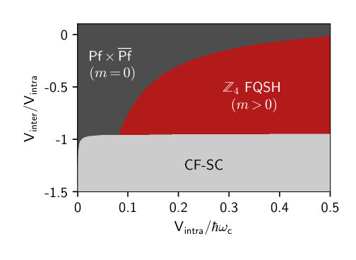
<figcaption class="paper-figure-caption"><b>Fig 1.</b> FIG. 1. Phase diagram obtained by variational Monte Carlo for the different candidate states in two conjugate half-filled Landau levels. By tuning the interaction-to-kinetic-energy scale Vintra/ℏωc and the ratio of inter- to intra-spin-species interaction strength Vinter/Vintra, we find that all three phases are present: the decoupled Pfaffian×Pfaffian state (m = 0) at weak inter-spin-species interaction or large kinetic energy; the new Z4 fractional quantum spin Hall state (m &gt; 0) at stronger inter-spin-species attraction and weaker kinetic energy; and the CF-SC state (pure s-wave inter-species BCS state of composite fermions) at strong enough inter-spin-species attraction.</figcaption>
</figure>

**Summary.** This work proposes a concrete microscopic trial wavefunction for a Z_4 Fractional Quantum Spin Hall state in coupled Landau levels. By using variational Monte Carlo simulations, the authors map out a phase diagram showing that this exotic topological phase is stable when inter-species interactions are attractive enough to overcome kinetic energy penalties. This provides a rigorous energetic realization of a key theoretical model for 2D topological insulators.

**Why it may be interesting.** While focused on topological matter, the use of advanced many-body techniques like variational wavefunctions and CFT coupling makes it relevant for understanding strongly interacting quantum systems beyond simple mean-field treatments.

Detailed structure

**Main problem.** The authors aim to construct and energetically evaluate a variational wavefunction for a fractional quantum spin Hall (FQSH) state exhibiting Z_4 topological order.

**Main result.** They demonstrate that the proposed Z_4 trial wavefunction is energetically favorable in a sizable region of parameter space, provided there is a sufficiently strong attractive inter-spin-species interaction.

**Method.** The study employs a variational Monte Carlo approach on a spherical geometry to calculate the total energy, comparing the Z_4 state against decoupled Pfaffian and s-wave superconductor candidates.

**Model / system.** The model considers fermions occupying half-filled conjugate Landau levels in systems like twisted TMD heterobilayers. The physics involves coupling chiral Ising CFTs via an anyonic exciton condensation mechanism.

**Key observables.** Fractional spin Hall conductance (1/2), total energy $\langle\hat{H}
angle$, and the stability region in the phase diagram.

**Important parameters / regimes.** Interaction-to-kinetic-energy scale ($V_{	ext{intra}}/\hbar\omega_c$) and relative inter-spin-species interaction strength ($V_{	ext{inter}}/V_{	ext{intra}}$).

**Assumptions / limitations.** The analysis relies on the variational approximation using a specific trial wavefunction ($\Psi_{Z4}$) derived from anyon condensation, which is compared against other known topological states.

**Figures summary.** Figure 1 maps out a phase diagram showing three competing regimes: $m=0$ (Pfaffian $	imes$ Pfaffian), the proposed $\Psi_{Z4}$ state ($m>0$), and the Composite-Fermion s-wave superconductor, depending on interaction strengths.

**Paper structure.** The paper develops the theoretical framework by constructing the Z_4 wavefunction based on anyon condensation from decoupled Moore-Read Pfaffian states. It then uses variational Monte Carlo sampling to map out a phase diagram comparing the energy of this state against competing correlated electron phases.

Abstract

Fermions with opposite spins occupying half-filled conjugate Chern bands exhibit interaction physics distinct from their multi-component Landau-level counterparts with the same chirality. This is largely due to unavoidable inter-species collisions that preclude the Halperin-type wavefunctions available in multi-component Landau levels. In this work, we propose and evaluate a variational wavefunction for a fractional quantum spin Hall state with Z_4 topological order in a pair of conjugate Landau levels. This Z_4 topological order has previously been shown to be the minimal topological order compatible with charge conservation, $S_z$ conservation, time-reversal symmetry, and the fractional spin Hall conductance 1/2 suggested by previous twisted MoTe$_2$ experiments. Our construction is based on the condensation of an anyonic exciton formed by the neutral fermionic excitations in a decoupled pair of Moore-Read Pfaffian state and its conjugate. By coupling the chiral and anti-chiral Ising conformal field theories associated with the two spin species, we introduce a variational mass parameter in the Z_4 trial wavefunction that captures the inter-spin-species s-wave pairing of composite fermions alongside the intra-spin-species p-wave pairing. We assess the energetics of this trial state using Monte Carlo sampling on a spherical geometry. Because the coupled state intrinsically involves Landau-level mixing, we explicitly evaluate the resulting kinetic energy penalty. Our phase diagram reveals that the proposed Z_4 state becomes energetically favorable in a sizable region of parameter space, over both the decoupled pair of conjugate Pfaffian states and an alternative exciton condensate state. These results provide a concrete microscopic wavefunction realization of this Z_4 fractional quantum spin Hall phase, and propose a route to constructing additional families of such states.

[↑ back to top](#top)

### [Approximating velocity fields with planted attractors via Neural-ODEs for classification purposes](http://arxiv.org/abs/2606.23550v1)

**Authors:** Feliciano Giuseppe Pacifico, Duccio Fanelli, Lorenzo Buffoni, Lorenzo Chicchi, Diego Febbe, Raffaele Marino  
**Type:** both · **Category:** disordered systems and neural networks · **PDF:** <https://arxiv.org/pdf/2606.23550v1>  
**Analysis basis:** full PDF text, analyzed in chunks
**Topic relevance:** `methods for driven-dissipative` **3/5** · `non-equilibrium dynamics` **3/5** · `driven-dissipative phase transition` **2/5** · `non-equilibrium universality` **2/5** · `Frenkel-Kontorova` **1/5** · `Keldysh / 2PI / non-Gaussian methods` **1/5** · `analog quantum simulation` **1/5**

↔ Scroll figures horizontally

<figure class="paper-figure-card">
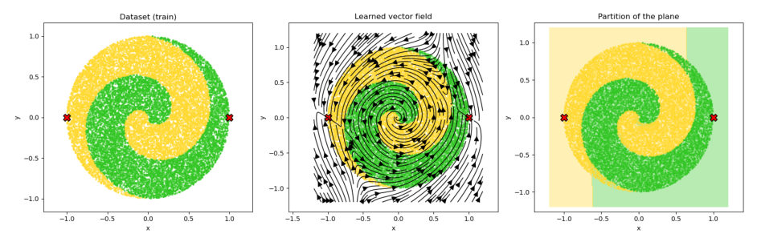
<figcaption class="paper-figure-caption"><b>Fig 1.</b> FIG. 1: Two-spirals dynamical classification with planted equilibria (ConsNODEs). (Left) Training set (two interleaving spirals) with planted equilibria marked by red crosses. (Center) Learned vector field visualized via streamlines, showing how trajectories are routed toward the corresponding class equilibrium. (Right) Induced partition of the plane obtained by integrating each initial condition to time T and applying the nearest-equilibrium decoder (21).</figcaption>
</figure>
<figure class="paper-figure-card">
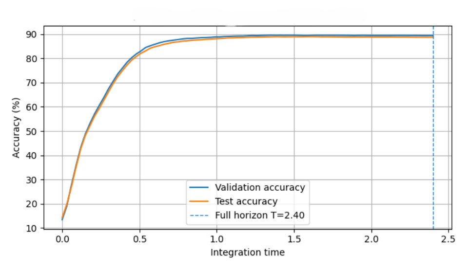
<figcaption class="paper-figure-caption"><b>Fig 2.</b> FIG. 2: Accuracy of ConsNODEs on Fashion-MNIST as a function of the integration time. The validation and test accuracy rapidly approach a plateau before the full training horizon T, showing that in practice the classifier can be evaluated with a shorter inference horizon tbest, while essentially preserving the same accuracy.</figcaption>
</figure>
<figure class="paper-figure-card">
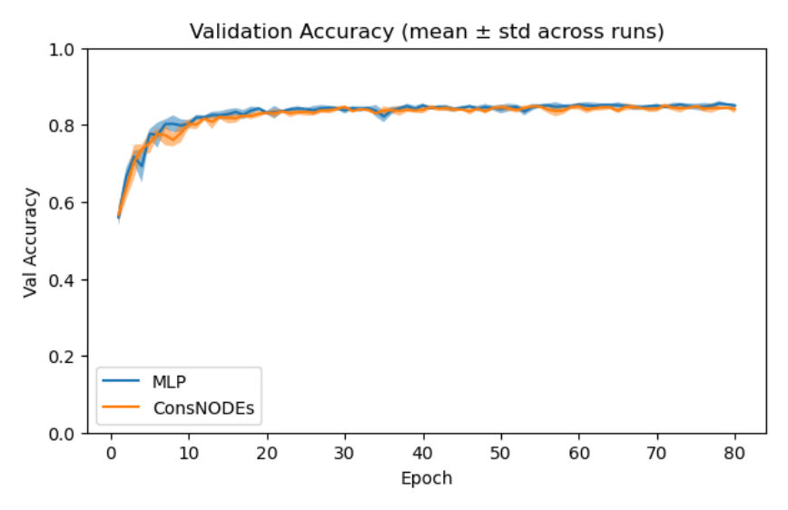
<figcaption class="paper-figure-caption"><b>Fig 3.</b> FIG. 3: CIFAR-10 accuracy learning curves (mean ± standard deviation over 5 runs) comparing the parameter-matched MLP head and the QR-planted dynamical head (ConsNODEs).</figcaption>
</figure>
<figure class="paper-figure-card">
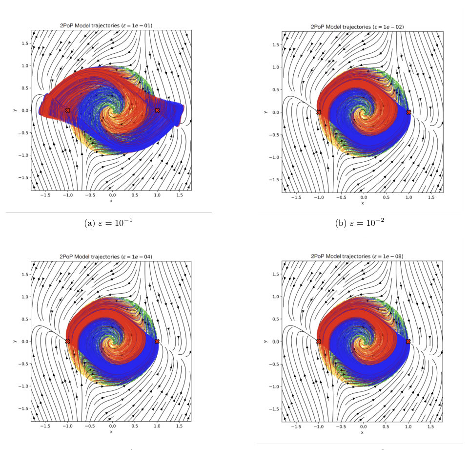
<figcaption class="paper-figure-caption"><b>Fig 4.</b> FIG. 4: Projected trajectories of the coupled model (22) in the x-space for four values of ε (same trained matrices (A1, A2, b1, b2) as ConsNODEs). As ε decreases, the trajectories rapidly align with those induced by the reduced dynamics (24), reflecting attraction to the slow manifold M in (25).</figcaption>
</figure>
<figure class="paper-figure-card">
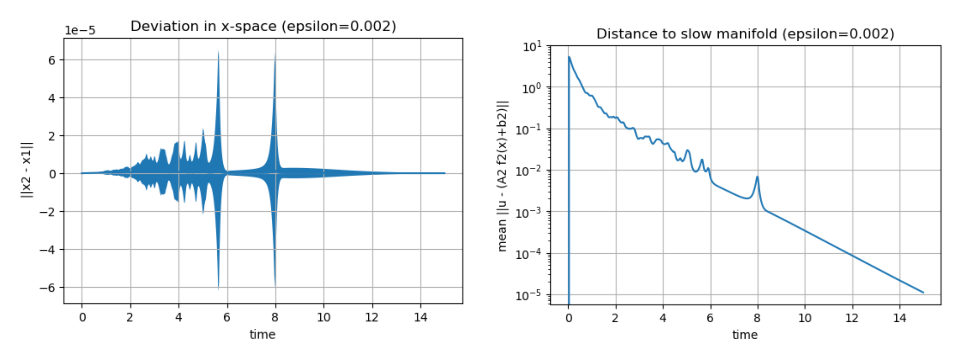
<figcaption class="paper-figure-caption"><b>Fig 5.</b> FIG. 5: Diagnostics for the coupled system (22) at small ε. (Left) Mean deviation between the projected coupled trajectory xε(t) and the reduced trajectory x(t) of (24). (Right) Mean distance to the slow manifold M defined by u = A2x + b2. Both plots support the interpretation of model (24) as the ε →0 reduction of the two populations model.</figcaption>
</figure>

**Summary.** This paper proposes ConsNODEs, a novel classification method that embeds target classes as stable attractors within a Neural ODE framework. By constraining the network's velocity field to guide inputs toward these fixed points, it creates an interpretable dynamical classifier. The work validates this approach on standard datasets and theoretically shows its consistency by deriving it from a coupled system in the limit of weak coupling.

**Why it may be interesting.** The explicit connection between dynamical systems theory (slow manifold reduction) and machine learning architectures provides a physically motivated interpretation of deep learning models, which is highly relevant for modeling open quantum systems dynamics.

Detailed structure

**Main problem.** The work develops a novel classification framework by integrating planted attractors into Neural Ordinary Differential Equations (Neural-ODEs) to create an interpretable dynamical system for pattern recognition.

**Main result.** The proposed ConsNODEs successfully route initial conditions toward distinct, stable planted equilibria corresponding to target classes, showing competitive performance against static MLPs on benchmarks like Fashion-MNIST.

**Method.** Classification is achieved by training the ODE parameters such that the learned velocity field forces trajectories towards predefined fixed points (attractors) representing class prototypes. The method uses terminal-time regression loss and QR decomposition for parameter enforcement.

**Model / system.** The core model is a Neural ODE, $\dot{x}(t) = F_	heta(x(t))$, whose parameters are constrained to ensure the existence of fixed points at specified attractors $\{ar{x}^{(\ell)}\}$. The framework also analyzes this structure by deriving it from an augmented coupled system in the singular limit ($\varepsilon 	o 0$).

**Key observables.** Test Accuracy, FLOPs, Inference Time, and the distance/deviation metrics ($e_x(t), e_M(t)$) used to confirm convergence to the slow manifold.

**Important parameters / regimes.** The small coupling parameter $\varepsilon$, the number of classes $C$, and the integration time horizon $T$.

**Assumptions / limitations.** The planted features defining the attractors are assumed to be linearly independent ($	ext{rank}(S) = C$ with $m > C$). The method assumes that the constrained network class retains universal approximation capabilities.

**Figures summary.** Figures illustrate trajectory routing in toy examples, show convergence diagnostics ($e_x(t), e_M(t)$) approaching zero as $\varepsilon 	o 0$, and compare accuracy vs. integration time to find an optimal inference horizon $t_{	ext{best}}$.

**Paper structure.** The paper first introduces the constrained Neural-ODE framework using planted attractors for classification, demonstrating its structure via linear algebra constraints. It then validates this approach on benchmarks (Fashion-MNIST, CIFAR-10) by comparing it to static MLPs. Finally, it theoretically grounds the model by showing that a complex coupled system reduces to this modified Neural-ODE in the singular limit $\varepsilon 	o 0$.

Abstract

In this work, Neural ODEs equipped with a curated collection of equilibrium points have been successfully employed for classification tasks.The planted attractors serve as indicators for the target classes, while the velocity field leveraging the universal approximation capabilities of the architecture shapes the dynamical landscape.This process defines the basins of attraction of the trained model, effectively directing each input provided as an initial condition toward its corresponding destination target.

[↑ back to top](#top)

### [Quasi-two-dimensional dispersions of Brownian particles with competitive interactions: Dynamical clustering, non-Gaussianity and hydrodynamic correlations](http://arxiv.org/abs/2606.22250v1)

**Authors:** Zihan Tan, Vania Calandrini, Jan K. G. Dhont, Gerhard Nägele  
**Type:** theory · **Category:** statistical mechanics · **PDF:** <https://arxiv.org/pdf/2606.22250v1>  
**Analysis basis:** full PDF text, analyzed in chunks
**Topic relevance:** `non-equilibrium dynamics` **3/5** · `driven-dissipative phase transition` **2/5** · `methods for driven-dissipative` **2/5** · `non-equilibrium universality` **2/5** · `Frenkel-Kontorova` **1/5** · `Keldysh / 2PI / non-Gaussian methods` **1/5** · `analog quantum simulation` **1/5** · `correlated / nonlocal dissipation` **1/5**

↔ Scroll figures horizontally

<figure class="paper-figure-card">
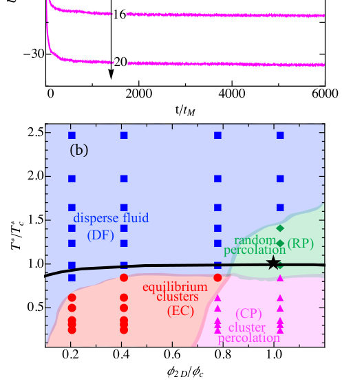
<figcaption class="paper-figure-caption"><b>Fig 1.</b> Fig. 1 (a) Excess internal energy, Uex per particle and kBT for Q2D-SALR cluster percolation phase at area frac- tion φ2D = 0.5 for various attraction strength values ε, as function of LD simulation time t, expressed in units of tM ≈0.0125σ p</figcaption>
</figure>
<figure class="paper-figure-card">
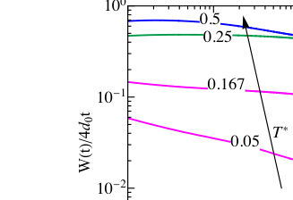
<figcaption class="paper-figure-caption"><b>Fig 2.</b> Fig. 2 Self-diffusive properties of Q2D-SALR par- ticles for different temperature and area fractions. Shown are rescaled mean-squared displacement, ⟨|R(t)− R(0)|2⟩/4td0, of a Q2D-SALR system for different (φ2D,T ∗) values. (a) T ∗= 0.167 and (b) φ2D = 0.5 for varying T ∗= 1/ε. The color of the curves encodes their respective gen- eralized phases that are used in Fig. 1(b).</figcaption>
</figure>
<figure class="paper-figure-card">
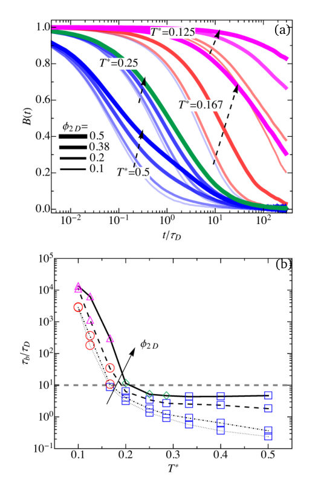
<figcaption class="paper-figure-caption"><b>Fig 3.</b> Fig. 3 (a) Time-evolution of bond correlation function B(t) represented as lines for various temperatures and densi- ties. The line thickness implies its φ2D values (marked by the dashed arrows in ascending order) as displayed in the legend. Each dashed arrow on top of the curves groups the system belonging to the same T ∗as indicated. The color coding is as in Fig. 1(b) (b) Cluster lifetime τb nor- malized by diffusion timescale τD = R2/d0 as a function of effective temperature. The color and the shape of the open symbols encode their respective generalized phases that used in Fig. 1(b) with βb ∈(0.3,0.75). The horizontal transparent dash line indicates the critical τb value sepa- rating...</figcaption>
</figure>
<figure class="paper-figure-card">
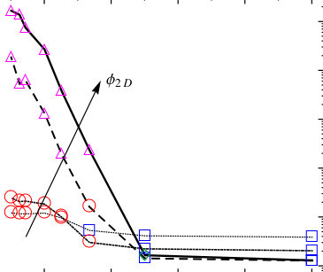
<figcaption class="paper-figure-caption"><b>Fig 4.</b> Fig. 5 Hexagonal order relaxation time, τ6, obtained from a stretched exponential fit of Eq. (4) with exponent β6 ≈ 0.4 ∼0.8, normalized by diffusion time scale τD as function of T ∗. The arrows indicate φ2D and T ∗in ascending order. Color coding of considered phases as in Fig. 1(b).</figcaption>
</figure>
<figure class="paper-figure-card">
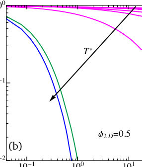
<figcaption class="paper-figure-caption"><b>Fig 5.</b> Fig. 4 Langevin dynamics simulation results for the nor- malized hexagonal order parameter correlation function (a) at fixed reduced temperature T ∗= 0.167 and area con- centrations φ2D as displayed, and (b) for fixed area fraction φ2D = 0.5 but varying T ∗, respectively. Color coding of con- sidered phases as in Fig. 1(b).</figcaption>
</figure>

**Summary.** This work provides a comprehensive dynamical analysis of colloidal particles with competing attractions in 2D, revealing how attractive interactions drive clustering and subdiffusion. By combining advanced simulations (MPC) with diagnostics like non-Gaussian parameters and hydrodynamic functions, the authors map out phase transitions governed by cluster lifetimes and show that collective hydrodynamics are significantly modified by these transient clusters.

**Why it may be interesting.** While focused on classical colloidal systems, the detailed mathematical framework for analyzing dynamic heterogeneity using generalized non-Gaussian parameters ($\gamma^{(d=2)}$) and the coupling of structural arrest to long-range hydrodynamic correlations are highly relevant methodologies applicable to understanding complex many-body quantum dynamics in confined geometries.

Detailed structure

**Main problem.** The study investigates how competing short-range attractive (SA) and long-range repulsive (LR) interactions affect the collective dynamics, clustering behavior, and hydrodynamic correlations of Brownian particles confined to a quasi-two-dimensional plane.

**Main result.** Clustering significantly suppresses self-diffusion and leads to pronounced subdiffusive behavior; furthermore, the analysis reveals that hydrodynamic interactions become relevant on inertial timescales due to the presence of attractive interactions.

**Method.** The research employs advanced simulation techniques, including Langevin Dynamics (LD) and Multiparticle Collision Dynamics (MPC), alongside theoretical diagnostics like non-Gaussian parameters and time-dependent correlation functions.

**Model / system.** The system is a Q2D dispersion of identical spherical Brownian particles interacting via a pair potential combining SA and LR components. The analysis spans various dynamic phases, including Dispersed Fluid, Equilibrium Clusters, Random Percolation, and Cluster Percolation.

**Key observables.** Self-diffusion coefficient, non-Gaussian parameters ($\alpha_n$, $\gamma^{(d=2)}$), cluster lifetime ($	au_b$), relaxation time of local hexagonal order ($	au_6$), and the hydrodynamic function $H(q)$.

**Important parameters / regimes.** Area fraction ($\phi_{2D}$), effective temperature ($T^*$), attraction strength, and wavevector ($q$).

**Assumptions / limitations.** The use of MPC to resolve fluctuating hydrodynamics is key; approximations are made regarding collision time steps in the simulation setup.

**Figures summary.** Figures summarize phase diagrams ($\phi_{2D} - T^*/T_c$), MSD vs. time showing subdiffusion, and time-evolution plots of correlation functions ($B(t)$, $g_6(t)$) to distinguish fluid from clustered states.

**Paper structure.** The paper systematically analyzes the system by first characterizing local structure (bond correlations, hexagonal order), then quantifying particle dynamics via non-Gaussianity, and finally examining collective transport through hydrodynamic function analysis in different phase regimes.

Abstract

We conduct a comprehensive dynamical analysis of quasi-two-dimensional (Q2D) dispersions of Brownian particles with competing short-range attractive (SA) and long-range repulsive (LR) interactions using Langevin dynamics (LD) and multiparticle collision dynamics (MPC). As the attractive interaction is strengthened, self-diffusion is significantly suppressed, and clustering gives rise to pronounced subdiffusive behavior. We find that cluster lifetimes are influenced more strongly by attraction strength than by particle concentration. Two dynamical criteria for the transition from non-clustered to clustered phases are identified in terms of the mean cluster lifetime and the relaxation time of local hexagonal order, respectively. Moreover, clustered Q2D-SALR systems exhibit pronounced non-Gaussian dynamics. In particular, the self-van Hove function in the equilibrium-cluster phase displays an approximately exponential form, consistent with an underlying diffusing-diffusivity mechanism. Importantly, MPC simulations reveal the critical role of hydrodynamic interactions (HIs) in collective dynamics. We observe that the anomalously enhanced large-scale collective diffusion characteristic of hydrodynamically interacting Q2D systems is qualitatively preserved in Q2D-SALR dispersions. However, this enhancement suppresses the intermediate-range-order peak in the hydrodynamic function compared to its three-dimensional counterpart. Furthermore, by analyzing the time-dependent evolution of hydrodynamic function and the sound mode in hydrodynamic correlations, we find that clustering in Q2D-SALR systems leads to an earlier onset of HIs than in Q2D hard-sphere reference systems, implying HIs become relevant already on inertial timescales.

[↑ back to top](#top)

### [Distance from home matters: Investigation of a basic movement strategy](http://arxiv.org/abs/2606.22025v1)

**Authors:** Mohsen Ghasemi Nezhadhaghighi, Yahya Khalili, Behafarid Hemmatpour, Abolfazl Ramezanpour  
**Type:** theory · **Category:** disordered systems and neural networks · **PDF:** <https://arxiv.org/pdf/2606.22025v1>  
**Analysis basis:** full PDF text, analyzed in chunks
**Topic relevance:** `non-equilibrium dynamics` **3/5** · `non-equilibrium universality` **3/5** · `driven-dissipative phase transition` **2/5** · `methods for driven-dissipative` **2/5** · `Frenkel-Kontorova` **1/5** · `Keldysh / 2PI / non-Gaussian methods` **1/5**

↔ Scroll figures horizontally

<figure class="paper-figure-card">
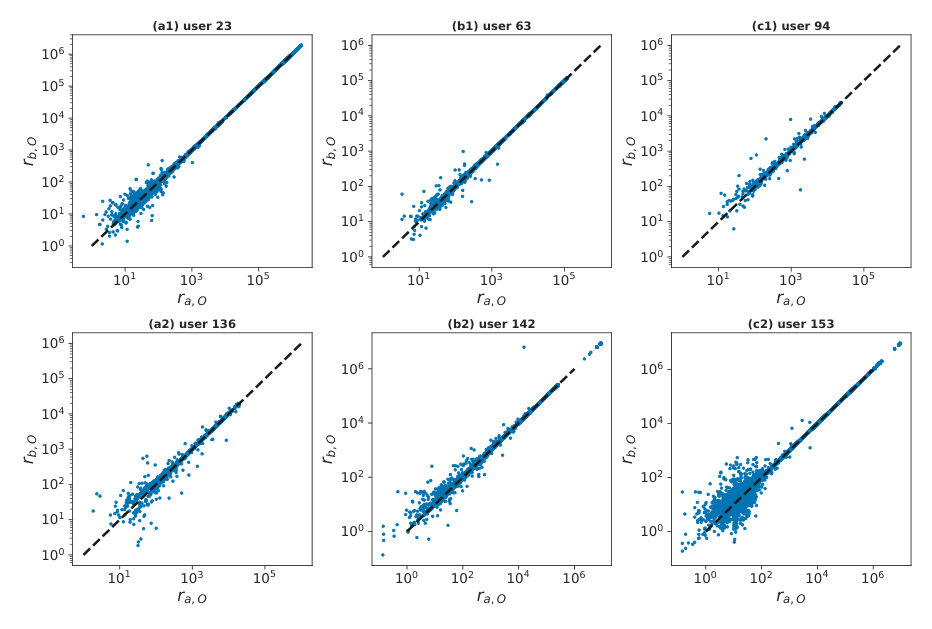
<figcaption class="paper-figure-caption"><b>Fig 1.</b> FIG. 1. Empirical data for (Euclidean) distances rb,O, ra,O (in meters) from origin O in a single</figcaption>
</figure>
<figure class="paper-figure-card">
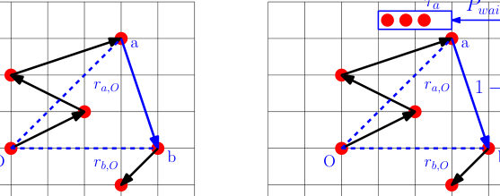
<figcaption class="paper-figure-caption"><b>Fig 2.</b> FIG. 2. Illustration of the movement strategy. The probability of going from a to b in a trip</figcaption>
</figure>
<figure class="paper-figure-card">
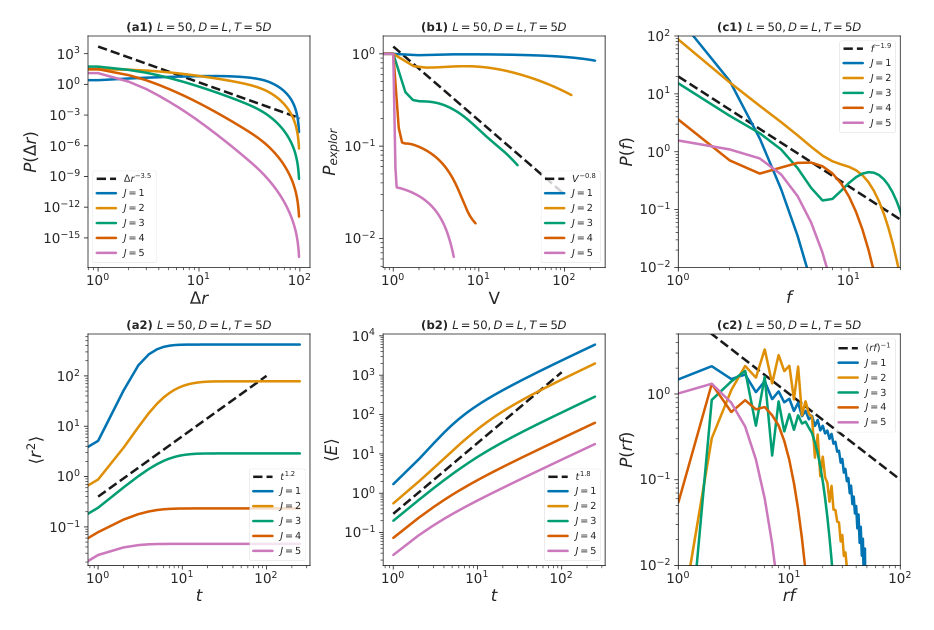
<figcaption class="paper-figure-caption"><b>Fig 3.</b> FIG. 3. Main quantities of the effective model for T = 5L time steps with L = 50, D = L. Panel</figcaption>
</figure>
<figure class="paper-figure-card">
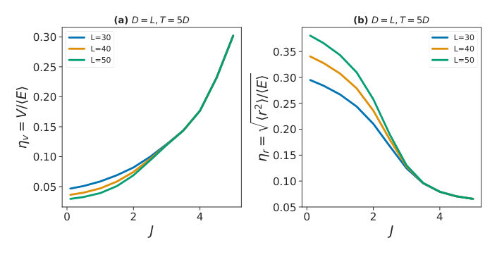
<figcaption class="paper-figure-caption"><b>Fig 4.</b> FIG. 4. Efficiencies of the effective model for T = 5L time steps with L = 30, 40, 50, D = L.</figcaption>
</figure>
<figure class="paper-figure-card">
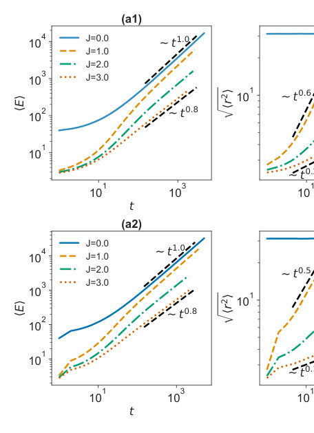
<figcaption class="paper-figure-caption"><b>Fig 5.</b> FIG. 5. The mean consumed energy ⟨E⟩, the mean-squared displacement p</figcaption>
</figure>

**Summary.** This work models human mobility on a 2D lattice by assuming that trip destinations are biased based on the ratio of their distance from home relative to the starting point's distance. By simulating this process, the authors demonstrate that even simple rules can reproduce complex statistical features like power-law decay in movement distributions. This provides a theoretical framework for understanding energy-efficient or habit-driven spatial exploration.

**Why it may be interesting.** Although applied to social physics, the underlying dynamics involve non-equilibrium processes, anomalous diffusion ($\langle r^2 
angle \sim t^
u$), and scaling laws derived from optimizing movement costs—concepts relevant to energy minimization in complex quantum systems or understanding transport in disordered media.

Detailed structure

**Main problem.** The study investigates the fundamental dynamical rules governing human mobility patterns by exploiting empirical correlations between trip endpoints and the starting point (home). The goal is to model how movement decisions are influenced by spatial constraints relative to a fixed origin.

**Main result.** A simple movement dynamic, where transition probabilities depend on the ratio of endpoint distances to the home, can qualitatively reproduce key empirical statistics of human mobility, such as power-law distributions for traveled distances and visitation frequencies. The model also incorporates temporal effects like queue waiting times.

**Method.** The authors develop and simulate a discrete-time movement process on a 2D lattice using master equations to track site occupancy probabilities over time steps.

**Model / system.** The system is an agent moving on a square lattice, where the transition probability $W_t(a 	o b)$ is governed by an exponential function of the ratio of distances from the origin: $\exp\left\{-J (r_{b,O}/r_{a,O})
ight\}$. The model can be extended to include waiting times in queues.

**Key observables.** Power-law distributions for traveled distance $P(\Delta r)$, mean-square displacement $\langle r^2 
angle$, exploration probability ($P_{	ext{explor}}$), and efficiency metrics ($\eta_r, \eta_v$).

**Important parameters / regimes.** The control parameter $J$ dictates the strength of the 'distance from home' bias; waiting time parameters like $\gamma$ modulate temporal effects.

**Assumptions / limitations.** The core assumption is that movement probability depends on the ratio of endpoint distances to the origin. The model assumes users perform sequential trips satisfying demands in a structured manner.

**Figures summary.** Figures illustrate how efficiency metrics ($\eta_r, \eta_v$) and exploration probabilities vary with $J$, showing optimal regimes; other figures compare Cumulative Distribution Functions (CDFs) for travel distance, waiting time, and visits under different queueing assumptions.

**Paper structure.** The paper establishes the motivation from empirical observations regarding endpoint correlations. It then develops a mathematical model based on these ratios, derives the master equations for site occupancy and distance distribution, and finally analyzes the results by varying parameters like $J$ (and $\gamma$) to match known statistical behaviors.

Abstract

Discovering the fundamental dynamical rules that generate the main statistical features of human mobility is essential for understanding the mechanisms underlying such processes. A prominent example is the exploration and preferential return model and its generalizations, which successfully reproduce several empirical findings. Here, we exploit another observation: the endpoint distances of a trip from the trajectory's starting point are strongly correlated. We consider a movement process in which each user performs a sequence of trips to satisfy a set of demands, given a spatial distribution of suppliers on a two-dimensional lattice. In each trip, destinations are chosen with a probability that depends on the ratio of the initial and final distances from the user's origin (home). We show that even a single agent with uniformly distributed demands and suppliers qualitatively reproduces key empirical statistics, such as the power-law distribution of traveled distances. The results are also robust to introducing interactions between agents via queues and incorporating more realistic demand and supplier distributions.

[↑ back to top](#top)

### [Irreversibility Enhances Quantum-Enhanced Markov-Chain Monte Carlo](http://arxiv.org/abs/2606.23350v1)

**Authors:** Kefan Cao, Zidong Cui, Lei Wang, Ying Tang  
**Type:** theory · **Category:** statistical mechanics · **PDF:** <https://arxiv.org/pdf/2606.23350v1>  
**Analysis basis:** full PDF text, analyzed in chunks
**Topic relevance:** `methods for driven-dissipative` **3/5** · `non-equilibrium dynamics` **3/5** · `non-equilibrium universality` **2/5** · `Keldysh / 2PI / non-Gaussian methods` **1/5** · `analog quantum simulation` **1/5** · `correlated / nonlocal dissipation` **1/5** · `driven-dissipative phase transition` **1/5**

↔ Scroll figures horizontally

<figure class="paper-figure-card">
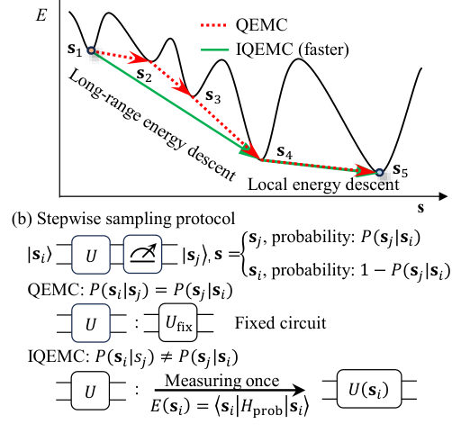
<figcaption class="paper-figure-caption"><b>Fig 1.</b> Figure 1. Schematic of the irreversible quantum-enhanced Monte Carlo (IQEMC). (a) Convergence behavior of quantum-enhanced MCMC (QEMC) and IQEMC. IQEMC achieves fast energy descent at high energies and stable tran- sitions at low energies. (b) IQEMC constructs a quantum circuit that violates detailed balance, based on the initial en- ergy E(si) computed once for each input configuration |si⟩.</figcaption>
</figure>
<figure class="paper-figure-card">
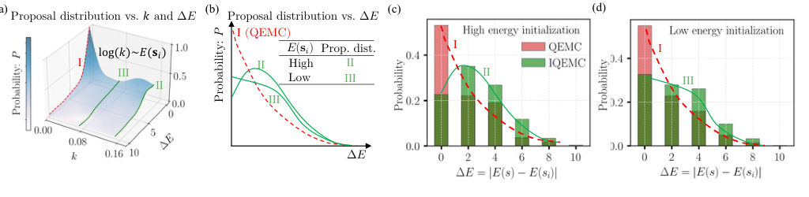
<figcaption class="paper-figure-caption"><b>Fig 2.</b> Figure 2. Energy-adaptive proposals via Landau–Zener transitions enhance sampling efficiency. (a) Landau–Zener modulation of the proposal distribution with various sweep rates k. (b) For high-energy and low-energy initial states in the 1D Ising chain (n = 6, T = 0.1, C = 0.15), IQEMC employs an adaptive proposal distribution (green), whereas QEMC uses a fixed proposal distribution (red). (c) The proposal distribution for high-energy states in IQEMC (green) enables large-∆E transitions. (d) For low-energy states, IQEMC favors small-∆E transitions. QEMC (red) yields local moves across all energies.</figcaption>
</figure>
<figure class="paper-figure-card">
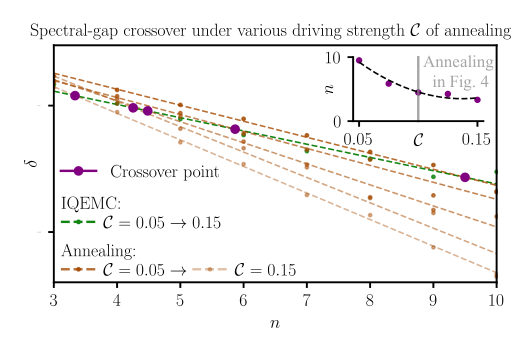
<figcaption class="paper-figure-caption"><b>Fig 3.</b> Figure 3. The critical system size, above which IQEMC converges faster than annealing, becomes smaller under in- creasing driving strength C (T = 0.1). With different C, the IQEMC (green) surpasses annealing (orange with grad- ual transparency) at the system sizes marked by the purple dots. Inset: the crossover system size decreases with C.</figcaption>
</figure>
<figure class="paper-figure-card">
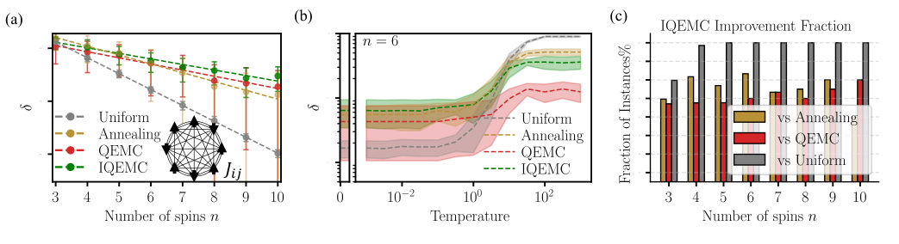
<figcaption class="paper-figure-caption"><b>Fig 4.</b> Figure 4. Convergence benchmark for fully connected random Ising models at T = 0.1 and C = 0.15. (a) Spectral gap versus spin number n. IQEMC (green) outperforms the three baselines (gray: uniform, orange: annealing, red: QEMC) across 150 instances. (b) Spectral gap versus temperature for n = 6. IQEMC exhibits advantages at low temperatures. (c) Fraction of spectral-gap improvement by IQEMC over the three baselines. As the system size n increases, IQEMC’s acceleration becomes more dominant.</figcaption>
</figure>
<figure class="paper-figure-card">
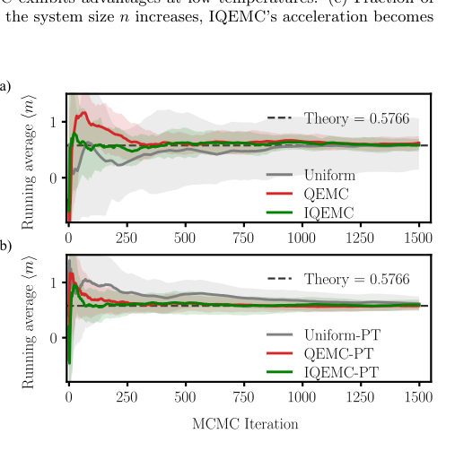
<figcaption class="paper-figure-caption"><b>Fig 5.</b> Figure 5. Convergence of the average magnetization over 10 independent realizations for a single instance at T = 0.1. (a) Magnetization versus MCMC steps for uniform sampling (gray), QEMC (red), and IQEMC (green) on a fully con- nected random Ising model (n = 6). (b) Results for the three methods combined with the strategy of parallel tempering. IQEMC has the fastest convergence in both cases.</figcaption>
</figure>

**Summary.** This paper introduces an Irreversible Quantum-Enhanced Markov-Chain Monte Carlo (IQEMC) algorithm to improve sampling efficiency for physical models like the Ising spin glass. By intentionally breaking detailed balance using energy-dependent proposals, IQEMC achieves faster convergence than standard QEMC methods. This work establishes irreversibility as a powerful and physically justifiable tool for accelerating quantum simulations.

**Why it may be interesting.** It provides a concrete, physically grounded mechanism—breaking detailed balance via energy dependence—to enhance sampling efficiency in complex systems, which is relevant for simulating non-equilibrium dynamics or highly frustrated quantum states.

Detailed structure

**Main problem.** The research investigates whether introducing irreversibility into Quantum-Enhanced Markov-Chain Monte Carlo (QEMC) sampling can accelerate convergence rates compared to standard methods.

**Main result.** An irreversible quantum-enhanced MCMC (IQEMC) method was developed that successfully accelerates sampling by exploiting energy dependence in the proposal mechanism, establishing irreversibility as a physical enhancement route for QEMC.

**Method.** The authors modify the transition kernel by introducing state-dependent proposals guided by Landau-Zener transitions, ensuring global balance while violating detailed balance to accelerate mixing.

**Model / system.** The study uses the Ising model (e.g., fully connected random Ising model) whose equilibrium distribution is governed by a classical Hamiltonian $H$. The sampling process involves quantum evolution approximated via Trotterization.

**Key observables.** Spectral gap ($\delta$), Autocorrelation Function (ACF), Integrated Autocorrelation Time ($	au_{	ext{int}}$), and average magnetization $\langle m 
angle$.

**Important parameters / regimes.** System size ($n$), temperature ($T$), driving strength ($C$), and the state-dependent sweep rate $k(s_i)$.

**Assumptions / limitations.** The method assumes that the global balance condition can be maintained while violating detailed balance, and convergence is characterized by the spectral gap derived from the Markov generator.

**Figures summary.** Figures compare IQEMC's superior performance over QEMC and annealing baselines on spin-glass benchmarks; one figure illustrates the energy-adaptive nature of the proposal distribution modulation.

**Paper structure.** The paper progresses by establishing the theoretical motivation (classical irreversibility), developing the IQEMC Hamiltonian, analyzing its convergence using spectral gap/autocorrelation time diagnostics, and benchmarking it against existing QEMC and classical annealing methods on spin-glass models.

Abstract

Detailed balance underlies conventional Markov-chain Monte Carlo (MCMC) algorithms. Yet in classical systems, breaking detailed balance generates irreversible probability currents and can accelerate sampling. Whether irreversibility can similarly enhance quantum MCMC remains an intriguing question. Here we show that irreversibility provides a new route to improving the recent quantum-enhanced MCMC (QEMC), which combines quantum proposals with classical acceptance. By introducing state-dependent proposals that break detailed balance while preserving the target stationary distribution, we develop an irreversible quantum-enhanced Monte Carlo (IQEMC). Guided by Landau-Zener transitions, IQEMC promotes large energy descents from high-energy states while maintaining stable transitions near low-energy states. On spin-glass benchmarks, IQEMC outperforms QEMC without increasing computational complexity and, unlike the annealing baseline, exhibits a spectral gap that increases with system size and annealing speed. These results establish irreversibility as a physically grounded mechanism for enhancing quantum MCMC.

[↑ back to top](#top)

### [Nonlocal fractional Kardar-Parisi-Zhang dynamics of grain boundaries](http://arxiv.org/abs/2606.21903v1)

**Authors:** Kai Zhao  
**Type:** both · **Category:** statistical mechanics · **PDF:** <https://arxiv.org/pdf/2606.21903v1>  
**Analysis basis:** full PDF text, analyzed in chunks
**Topic relevance:** `non-equilibrium dynamics` **3/5** · `non-equilibrium universality` **3/5** · `driven-dissipative phase transition` **2/5** · `Frenkel-Kontorova` **1/5** · `Keldysh / 2PI / non-Gaussian methods` **1/5** · `correlated / nonlocal dissipation` **1/5** · `methods for driven-dissipative` **1/5**

↔ Scroll figures horizontally

<figure class="paper-figure-card">
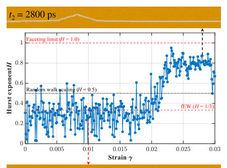
<figcaption class="paper-figure-caption"><b>Fig 1.</b> FIG. 1. Evolution of the Hurst exponent for the GB morphology at T = 300 K. MD snapshots of the atomic configuration at two different moments, t1 = 1000 ps and t2 = 2800 ps, which typically represent the pre- yield and post-yield status, respectively, are also presented. It is observed that in the pre-yield regime, the quasi-1D GB morphology is approximately a straight line with slight fluctuations, while a faceted protrusion is nucleated in the post-yield regime. Pre-yield regime. At small strains, 𝐻 stabilizes at 𝐻≅ 0.33. This value lies below the uncorrelated random- walk limit ( 𝐻= 0.5 ), demonstrating that 1/𝑟 elasticity suppresses stochastic fluctuations. The interface is in a...</figcaption>
</figure>
<figure class="paper-figure-card">
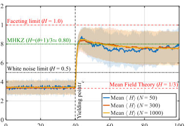
<figcaption class="paper-figure-caption"><b>Fig 2.</b> FIG. 2. Morphological transition and the anomalous Hurst exponent 𝐻 across the yield point 𝑡𝑐. Ensemble averages of 50, 300, and 1000 trajectories are obtained by solving Eq.(2) with the correlation exponent of the spatially-correlated noise 𝜖= 1.4. The jump of the Hurst exponent from 𝐻≅1/3 (pre-yield) to the anomalous 𝐻≅0.8 (post-yield) is triggered by the cooperative evolution of three underlying operators in the fKPZ equation. For 𝑡&lt; 𝑡𝑐, the boundary is pinned, manifesting as a damper ( 𝑀𝜋𝑉̃0 ℎ0 ⁄ ≫0 ) that suppresses long-wavelength fluctuations, while the KPZ nonlinearity is frozen (𝜆≅0). At the yield point 𝑡= 𝑡𝑐, the onset of the sliding velocity 𝑣0 induces the temporal homogenization...</figcaption>
</figure>
<figure class="paper-figure-card">
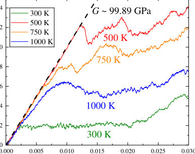
<figcaption class="paper-figure-caption"><b>Fig 3.</b> FIG. 3. Temperature-dependent stress-strain responses. The dashed black line represents the linear fit within the elastic regime, yielding an effective shear modulus of G ~ 99.89 GPa, which is in excellent agreement with the prediction of anisotropic elasticity. Remarkably, the extracted driving stresses exhibit a non-Arrhenius dependence of temperature [13,53,54], with the flow stress peaking at intermediate temperatures ( 𝜏500 𝐾&gt; 𝜏750 𝐾&gt; 𝜏1000 𝐾&gt; 𝜏300 𝐾). This anomalous behavior provides strong evidence for the interplay between disconnection avalanches and thermal fluctuations. At low temperatures (300 K), the structurally ordered interface facilitates facile, low- barrier glide of...</figcaption>
</figure>

**Summary.** This work models the kinetic roughening of grain boundaries under strain, showing that long-range elastic interactions fundamentally alter surface growth universality. The system transitions sharply from an Edwards-Wilkinson state to a super-rough fKPZ regime ($H \approx 0.8$) upon yielding. This anomalous scaling links GB dynamics directly to the physics observed in dynamic fracture fronts.

**Why it may be interesting.** The connection between non-local elastic interactions in solid mechanics (GB motion/fracture) and universal growth equations like KPZ provides a rich platform for studying non-equilibrium dynamics far from equilibrium, relevant to understanding complex interfaces in condensed matter.

Detailed structure

**Main problem.** The study investigates the kinetic roughening of driven grain boundaries (GBs), which are governed by long-range $1/r$ elastic interactions from disconnections, distinguishing it from conventional surface growth models.

**Main result.** The system exhibits a sharp transition in morphology upon yielding, moving from a sub-diffusive Edwards-Wilkinson class ($H \approx 0.33$) to an anomalous fractional Kardar-Parisi-Zhang (fKPZ) regime ($H \approx 0.8$).

**Method.** The research combines large-scale Molecular Dynamics simulations with theoretical derivation of the governing Stochastic Partial Differential Equation (SPDE), mapping $1/r$ elasticity onto a fractional Laplacian.

**Model / system.** The physical system is grain boundaries in polycrystalline materials subjected to constant strain-rate shear loading. The dynamics are modeled by an overdamped Langevin equation for discrete disconnections, which is coarse-grained into the fKPZ equation.

**Key observables.** Hurst exponent ($H$), universality classes (EW, KPZ), and the evolution of roughness with applied strain/time.

**Important parameters / regimes.** Strain rate ($\dot{\gamma}$), Temperature ($T$), Nonlocal elastic interaction strength ($1/r$ kernel).

**Assumptions / limitations.** The theory assumes that $1/r$ elasticity can be mapped onto a fractional Laplacian operator, and the analysis relies on mapping GB dynamics to known universality classes like dynamic fracture.

**Figures summary.** Figure 1 illustrates the evolution of the Hurst exponent ($H$) across pre-yield ($H \approx 0.33$) and post-yield ($H \approx 0.8$) regimes. Figure 3 shows temperature-dependent stress-strain responses, confirming non-Arrhenius behavior.

**Paper structure.** The paper develops by first establishing the physical model (MD simulations of GBs), deriving the continuum equation (fKPZ) from discrete dynamics, analyzing the pre-yield and post-yield regimes separately using spectral analysis, and finally comparing the resulting anomalous scaling to dynamic fracture universality classes.

Abstract

The kinetic roughening of driven grain boundaries (GBs) is fundamentally mediated by the collective behavior of disconnections, whose long-range $1/r$ elastic interactions distinguish them from conventional growing surfaces. Through large-scale molecular dynamics simulations and a nonlocal fractional Kardar-Parisi-Zhang (fKPZ) theory, we demonstrate that driven GBs undergo a sharp transition of morphology at the yield point, from the quenched Edwards-Wilkinson universality class ($H \approx 0.33$) to an anomalous fKPZ regime ($H \approx 0.8$), while the 1/r nonlocal elasticity manifests as the fractional relaxation of GB morphology. The results show that the avalanche noise arrests the gradient catastrophe induced by the KPZ nonlinearity. Governed by the nonlocal elastic kernels, the resulting morphology breaks the Gaussian self-affinity and parallels the universality class of dynamic fracture.

[↑ back to top](#top)

### [Probabilistic Storage and Retrieval of Quantum Superchannels for "Retrospective'' Intervention](http://arxiv.org/abs/2606.22343v1)

**Authors:** Wataru Yokojima, Jisho Miyazaki, Mio Murao  
**Type:** theory · **Category:** quantum information and computing · **PDF:** <https://arxiv.org/pdf/2606.22343v1>  
**Analysis basis:** full PDF text, analyzed in chunks
**Topic relevance:** `methods for driven-dissipative` **3/5** · `quantum measurements` **3/5** · `measurement-induced transitions` **2/5** · `Keldysh / 2PI / non-Gaussian methods` **1/5** · `correlated / nonlocal dissipation` **1/5** · `driven-dissipative phase transition` **1/5** · `entanglement & information structure` **1/5**

↔ Scroll figures horizontally

<figure class="paper-figure-card">
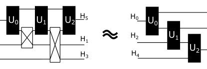
<figcaption class="paper-figure-caption"><b>Fig 1.</b> Figure 2: Introducing ancillary systems and intervening with swap operations to obtain a staircase from the (2-slot) superchannel.</figcaption>
</figure>
<figure class="paper-figure-card">
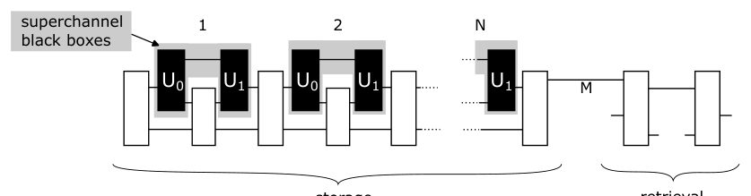
<figcaption class="paper-figure-caption"><b>Fig 2.</b> Figure 3: The storage and retrieval superchannels for pSAR of 1-slot unitary superchannels.</figcaption>
</figure>
<figure class="paper-figure-card">
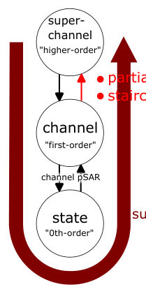
<figcaption class="paper-figure-caption"><b>Fig 3.</b> Figure 4: Hierarchy in higher-order computation and how the pSAR protocols climb it up and down.</figcaption>
</figure>
<figure class="paper-figure-card">
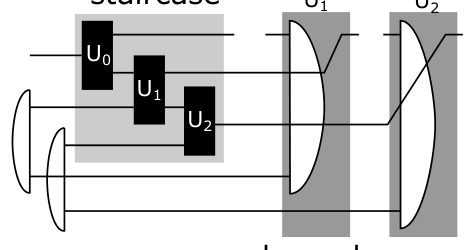
<figcaption class="paper-figure-caption"><b>Fig 4.</b> Figure 5: The channel-to-superchannel conversion protocol based on partial teleportation. The prepared states are all maximally entangled states |Ψ⟩:= Pd i=1 |ii⟩/ √</figcaption>
</figure>
<figure class="paper-figure-card">
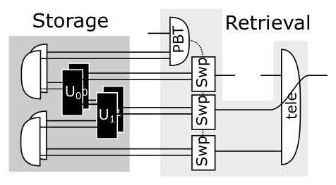
<figcaption class="paper-figure-caption"><b>Fig 5.</b> Figure 6: The pSAR protocol of unitary superchannels based on the partial teleportation and the port-based teleportation (PBT). We depict the simplest but nontrivial case N = 2 and K = 1. The storage circuit prepares maximally entangled states. The retrieval phase executes the measurement of PBT at the first tooth of the superchannel, and that of usual teleportation at the second tooth.</figcaption>
</figure>

**Summary.** This paper develops advanced theoretical protocols to probabilistically store and retrieve unknown unitary superchannels, which model complex quantum processes with intervention slots. By comparing partial teleportation against a novel 'staircase backstitch' method, the authors demonstrate that the latter achieves asymptotically perfect retrieval probability for retrospective interventions. This advances our understanding of fundamental limits in quantum memory beyond simple channel storage.

**Why it may be interesting.** This work pushes the boundaries of quantum memory by tackling higher-order temporal structures (superchannels) and introducing 'retrospective' control. The comparison between asymptotic protocols is highly relevant for understanding fundamental limits on quantum information storage.

Detailed structure

**Main problem.** The research addresses the challenging task of Probabilistic Storage-and-Retrieval (pSAR) for unknown quantum superchannels, extending previous work to higher-order structures involving 'definite-causal unitary superchannels' that require 'retrospective' intervention.

**Main result.** Two protocols are proposed: partial teleportation and staircase backstitch. The staircase backstitch protocol is shown to achieve unit success probability asymptotically as the number of storage queries increases, surpassing earlier methods in the large N limit.

**Method.** The authors employ advanced quantum information theory tools, including formalizing pSAR using Choi operators, solving constraints via Semidefinite Programming (SDP), and comparing different circuit constructions like partial teleportation versus deterministic backstitching.

**Model / system.** The core model is the quantum superchannel ($	ext{eC}$), which represents a sequence of unitary channels with open slots allowing arbitrary interventions. The focus is on unitary superchannels ($	ext{eU}$) and their probabilistic storage/retrieval capability.

**Key observables.** Maximum success probability ($p_{\max}$), the ability to achieve 'retrospective' intervention, and the comparison between different pSAR protocols (e.g., $p_{	ext{tele}}^N$ vs. asymptotic limit).

**Important parameters / regimes.** Number of storage queries ($N$), number of slots ($K$), and the dimensions of associated Hilbert spaces $(d_0, \dots, d_{2K+1})$.

**Assumptions / limitations.** The analysis focuses on definite causal structures (not indefinite ones), and some results rely on SDP formulations which provide upper bounds for multi-slot cases.

**Figures summary.** Figures illustrate the structure of $K$-slot quantum superchannels, the process of obtaining a staircase from a superchannel, and detailed circuit diagrams for both partial teleportation and staircase backstitch protocols.

**Paper structure.** The paper progresses by first formalizing pSAR for unitary superchannels (Section 2), proposing and comparing two distinct protocols in Section 3, deriving structural properties using mathematical tools like the comb formalism, and finally analyzing optimal probabilities via SDPs and symmetry arguments in later sections.

Abstract

Storing an unknown quantum computation in a quantum state and retrieving it at a desired later time is a challenging task, hindered by the no-programming theorem of quantum computations. In the previous studies on the task of probabilistic storage-and-retrieval (pSAR) of quantum channels, the maximum probability of exactly retrieving a single unknown unitary channel from a quantum state in which the unknown unitary has been encoded via multiple calls to the unknown unitary channel is derived. In this work, we consider a higher-order version of pSAR, the probabilistic storage-and-retrieval of definite-causal unitary superchannels, which are physically modeled by sequences of unitary channels with open slots where arbitrary channels can be inserted between the unitary channels for intervention. This task requires activating the ``retrospective'' intervention functionality on the superchannel, beyond its normal intervention functionality. We propose two protocols: partial teleportation, which is optimal for a small number of storage queries, and staircase backstitch, which achieves unit success probability asymptotically as the number of queries increases. We also derive a universal inversion protocol for unitary superchannels.

[↑ back to top](#top)

### [Emergence of Boolean Facts from Markovian Coarse-Graining in Relational Quantum Causal Processes](http://arxiv.org/abs/2606.22127v1)

**Authors:** Yipeng Xu  
**Type:** theory · **Category:** other · **PDF:** <https://arxiv.org/pdf/2606.22127v1>  
**Analysis basis:** full PDF text, analyzed in chunks
**Topic relevance:** `methods for driven-dissipative` **3/5** · `measurement-induced transitions` **2/5** · `quantum measurements` **2/5** · `Keldysh / 2PI / non-Gaussian methods` **1/5** · `correlated / nonlocal dissipation` **1/5** · `driven-dissipative phase transition` **1/5** · `entanglement & information structure` **1/5**

↔ Scroll figures horizontally

<figure class="paper-figure-card">
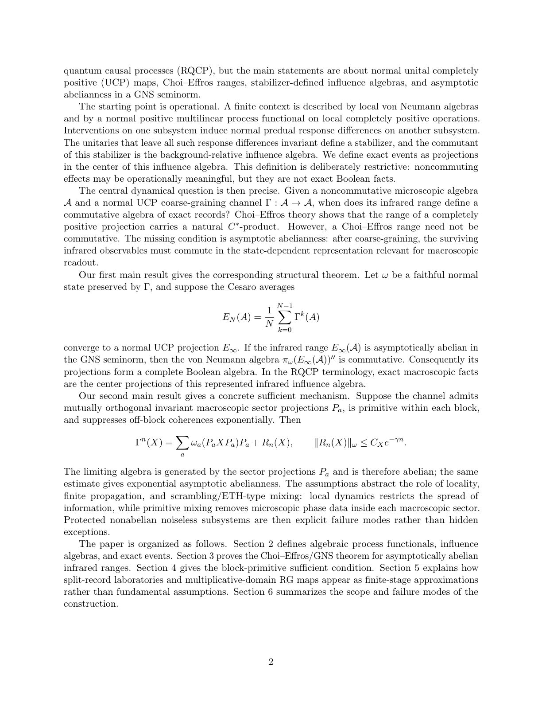
<figcaption class="paper-figure-caption"><b>Fig 1.</b> Low-resolution page preview, page 2</figcaption>
</figure>
<figure class="paper-figure-card">
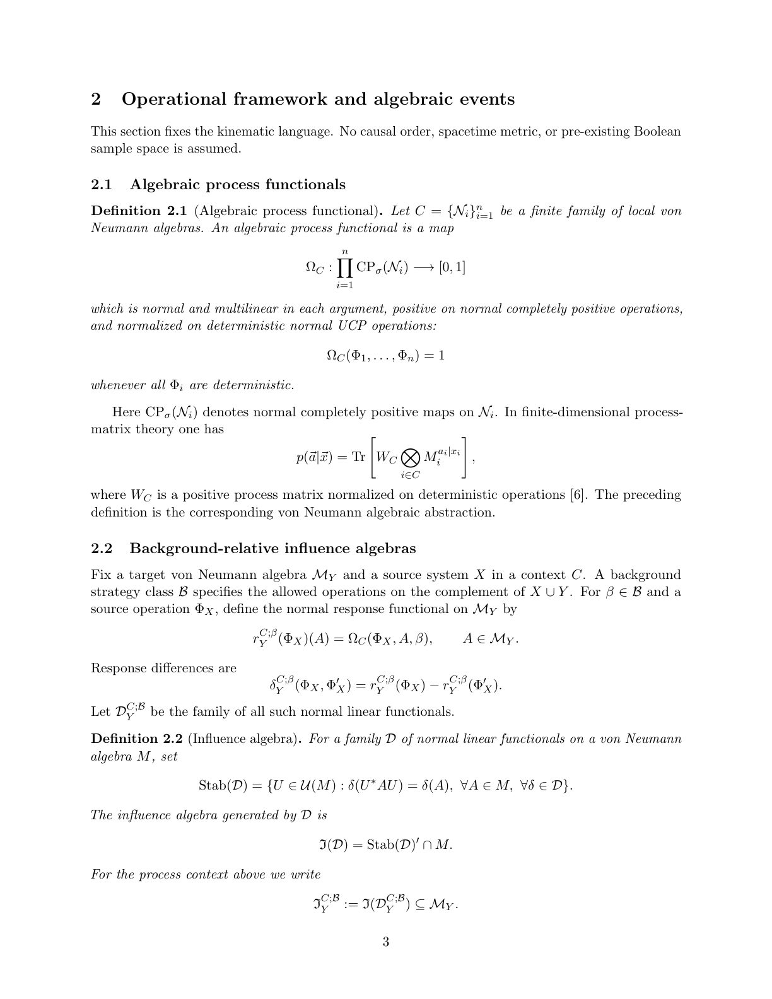
<figcaption class="paper-figure-caption"><b>Fig 2.</b> Low-resolution page preview, page 3</figcaption>
</figure>
<figure class="paper-figure-card">
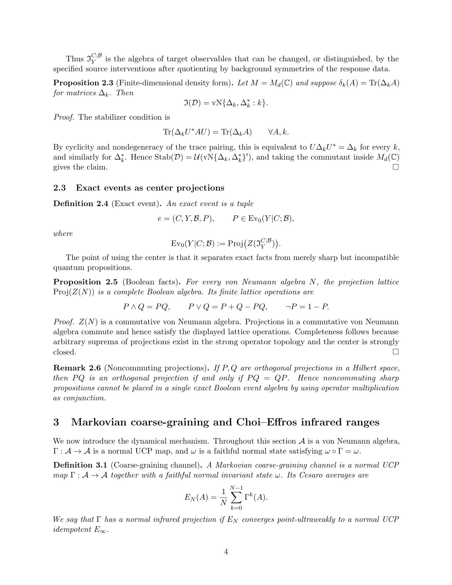
<figcaption class="paper-figure-caption"><b>Fig 3.</b> Low-resolution page preview, page 4</figcaption>
</figure>
<figure class="paper-figure-card">
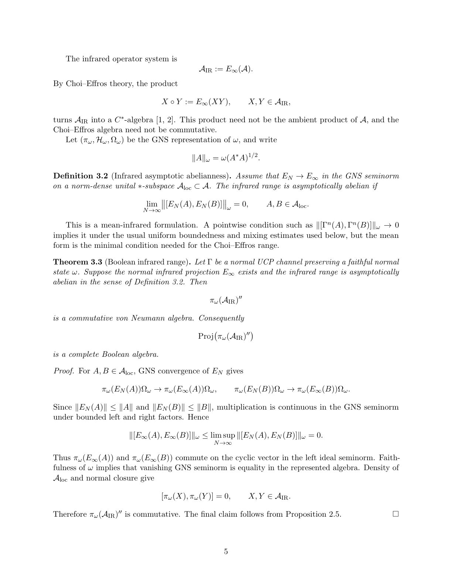
<figcaption class="paper-figure-caption"><b>Fig 4.</b> Low-resolution page preview, page 5</figcaption>
</figure>
<figure class="paper-figure-card">
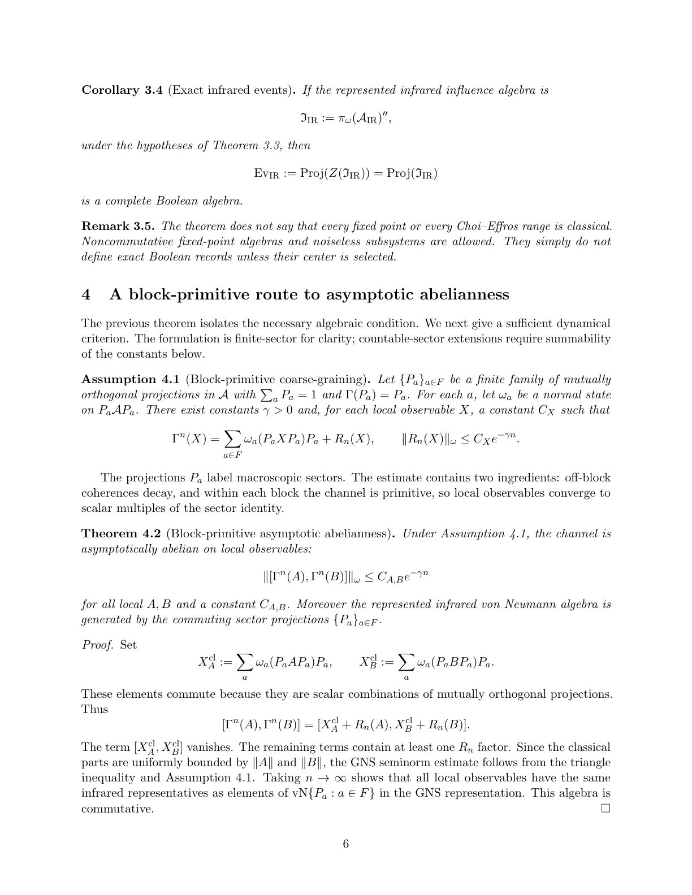
<figcaption class="paper-figure-caption"><b>Fig 5.</b> Low-resolution page preview, page 6</figcaption>
</figure>

**Summary.** This theoretical paper investigates the emergence of classical Boolean facts from complex quantum dynamics using algebraic methods. It shows that if a system undergoes repeated, state-preserving coarse-graining, the resulting macroscopic structure will possess classical (Boolean) properties only if the limiting algebra is asymptotically abelian. This provides a mathematical constraint on how 'classicality' can arise naturally in fundamental quantum theories.

**Why it may be interesting.** This work provides a rigorous mathematical criterion—asymptotic commutativity under coarse-graining—for when quantum correlations naturally collapse into classical probabilistic structures, which is highly relevant for understanding decoherence and measurement in open quantum systems.

Detailed structure

**Main problem.** The central question is whether classical Boolean facts can emerge naturally from local, completely positive quantum operations (coarse-graining) without being imposed as fundamental axioms.

**Main result.** If the coarse-graining process leads to an infrared range that is asymptotically abelian, then the resulting algebra of 'exact' macroscopic events forms a complete Boolean algebra.

**Method.** The analysis uses operator algebras, defining an 'influence algebra' based on quantum causal processes and examining the limit (Cesaro mean) of repeated coarse-graining channels.

**Model / system.** The framework is built upon Relational Quantum Causal Processes (RQCP), involving local von Neumann algebras subjected to state-preserving normal unital completely positive coarse-graining channels ($\Gamma$).

**Key observables.** Exact events are identified as projections within the center of the influence algebra, $	ext{Proj}(\mathcal{Z}(I_{C;B}^Y))$, and the key diagnostic is the asymptotic abelianness of the infrared range.

**Important parameters / regimes.** The convergence rate ($\gamma$) in exponential suppression estimates, and the limit $N 	o \infty$ for the Cesaro averages.

**Assumptions / limitations.** The result relies on assuming state-preserving normal unital completely positive coarse-graining channels and requires the infrared range to be asymptotically abelian.

**Paper structure.** The paper first defines the algebraic machinery for identifying events via influence algebras. It then analyzes the dynamics using Markovian coarse-graining, culminating in theorems that link asymptotic abelianness of the resulting algebra to the structure being a complete Boolean algebra.

Abstract

We formulate an operator-algebraic mechanism by which exact Boolean records can arise from local completely positive quantum operations without being imposed as microscopic structure. The kinematic input is an algebraic process functional assigning probabilities to local normal completely positive operations in a finite operational context. From the predual response of a target algebra to source interventions, relative to a background strategy class, we define an influence algebra; exact events are then, by definition, the projections in its center. The dynamical question is whether nontrivial centers can be generated by coarse-graining rather than inserted through split-record laboratories. We address this question using state-preserving normal unital completely positive coarse-graining channels. If the Cesaro means of such a channel converge to a Choi-Effros infrared range and the range is asymptotically abelian in the GNS seminorm, then the represented infrared algebra is a commutative von Neumann algebra. Its projection lattice is therefore a complete Boolean algebra. We also give a finite-sector block-primitive criterion, motivated by locality and scrambling, which implies this asymptotic abelianness with exponential suppression of off-sector coherences and intra-sector fluctuations. The result is a conservative mathematical statement: classical facts are not identified with arbitrary projections of a Type-III local algebra, but with central projections selected by an asymptotically abelian completely positive infrared limit.

[↑ back to top](#top)

### [High-quality single crystals of the kagome metals Ni$_3$In and Ni$_3$Sn grown from Pb flux](http://arxiv.org/abs/2606.23493v1)

**Authors:** Fabian Garmroudi, Jennifer Coulter, Caitlin S. T. Kengle, Joe D. Thompson, Eric D. Bauer, Sean M. Thomas, Priscila F. S. Rosa  
**Type:** both · **Category:** strongly correlated electrons · **PDF:** <https://arxiv.org/pdf/2606.23493v1>  
**Analysis basis:** full PDF text, analyzed in chunks
**Topic relevance:** `analog quantum simulation` **3/5** · `Kondo & dissipative impurity` **2/5** · `non-equilibrium dynamics` **2/5** · `Keldysh / 2PI / non-Gaussian methods` **1/5** · `entanglement & information structure` **1/5** · `exotic spin models in light-matter` **1/5** · `spintronics-quantum-optics interface` **1/5**

↔ Scroll figures horizontally

<figure class="paper-figure-card">
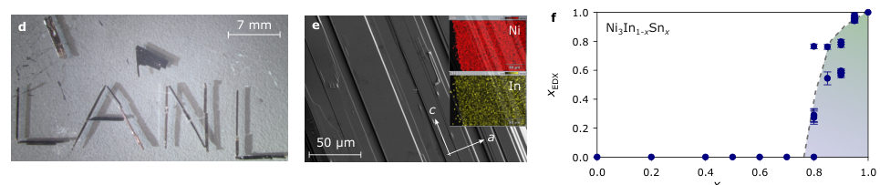
<figcaption class="paper-figure-caption"><b>Fig 1.</b> FIG. 1. a Hexagonal (P63/mmc) crystal structure of Ni3In and Ni3Sn, where Ni atoms form AB stacked kagome bilayers and In/Sn atoms occupy the center of the hexagons. b Densities of states of Ni3In and Ni3Sn from density functional theory. While the former has a flat band (vertical arrow) exactly at EF, the Fermi level is above the FB for the latter, allowing continous tuning of the FB edge with respect to EF in Ni3In1–xSnx. c Known phases in the ternary Ni–In–Sn system. Ni3In and Ni3Sn form a full solid solution Ni3In1–xSnx, various compositions of which were investigated in this work. d Large Ni3In single crystals (up to 7–8 mm long and up to 1–2 mm wide) obtained from a starting...</figcaption>
</figure>
<figure class="paper-figure-card">
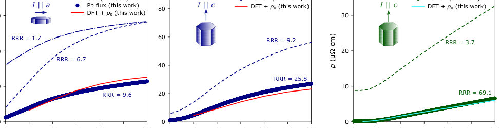
<figcaption class="paper-figure-caption"><b>Fig 2.</b> FIG. 2. a Temperature-dependent electrical resistivity of Ni3In with current applied along the crystallographic a-axis (within the kagome planes) and b along the c-axis (perpendicular to the kagome planes). c Same as in b, but for Ni3Sn. Single crystals grown from Pb flux (this work) exhibit significantly improved sample quality, as evidenced by much lower residual resistivities ρ0 and higher residual resistivity ratios (RRR), compared to crystals grown by iodine-assisted chemical vapor transport (CVT) [17] or molecular beam epitaxy (MBE) [30]. Solid lines represent first-principles DFT-based electron–phonon transport calculations performed within the Wigner transport formalism, including...</figcaption>
</figure>
<figure class="paper-figure-card">
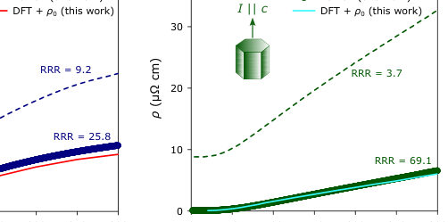
<figcaption class="paper-figure-caption"><b>Fig 3.</b> Figure 4 summarizes the results on the magnetic sus- ceptibility χ(T) and specific heat (C/T) of our Ni3In single crystals, in comparison to CVT-grown samples re- ported previously in Ref. [17]. It is evident that both the magnetic susceptibility (Fig. 4a) and the specific heat (Fig. 4c) of the Pb flux-grown crystals is substantially smaller than for the CVT-grown ones. A modified Curie–Weiss (CW) fit,</figcaption>
</figure>
<figure class="paper-figure-card">
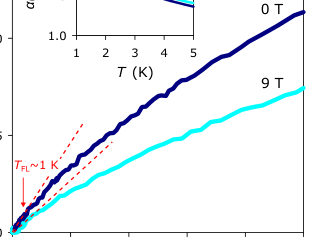
<figcaption class="paper-figure-caption"><b>Fig 4.</b> FIG. 3. a Low-temperature resistivity of Ni3In, measured with current along the a-axis. A comparison of ρ(T) at zero field and in an applied field µ0H = 9 T along b reveals a sizeable positive magnetoresistance and a non-Fermi-liquid temperature dependence down to very low temperatures in both cases (cf. panel b). Inset shows the field-dependent magnetoresistance MR = [ρ(H) −ρ(0)]/ρ(0) at 2 K. Crystals grown by iodine-assisted recrystallization [17] display vanish- ingly small MR, whereas crystals grown from Pb flux (this work) display a sizeable nonsaturating MR reaching ≈30 % at 10 T. b Both a plot of ρ −ρ0 versus T 2 and the local resis- tivity exponent, α(T) = d ln [ρ(T) −ρ0] /d ln T...</figcaption>
</figure>
<figure class="paper-figure-card">
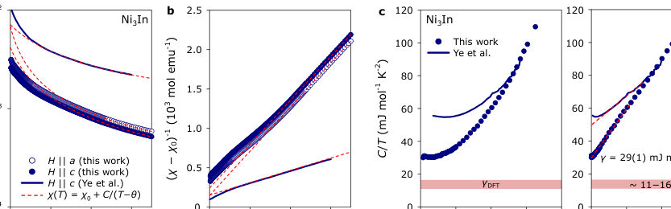
<figcaption class="paper-figure-caption"><b>Fig 5.</b> FIG. 4. a Temperature-dependent magnetic susceptibility of Ni3In single crystals, measured with an applied field µ0H = 0.1 T along the a- and c-axes. Red dashed lines represent least-squares fits to a modified Curie–Weiss law. For Pb-grown crystals, the data are well described in the temperature range 200 – 350 K. In contrast, crystals grown by iodine-assisted vapor transport [17] exhibit significantly larger χ(T) over the entire measured range and can be fitted down to 86 K. From our fits, we obtain an effective moment of µeff = 0.69 µB per Ni for both H ∥a and H ∥c, nearly a factor of two smaller than the value µeff = 1.3 µB reported for CVT-grown crystals [17] as well as Curie–Weiss...</figcaption>
</figure>

**Summary.** This work successfully develops a reliable Pb-flux method for growing large single crystals of kagome metals Ni3In and Ni3Sn. By characterizing these new samples, the authors find improved electronic quality compared to prior reports, revealing signatures of correlated electron behavior through measurements like specific heat and magnetoresistance.

**Why it may be interesting.** While focused on solid-state materials, the investigation into flat bands and anomalous transport coefficients ($\gamma$ vs. DFT) touches upon strongly correlated electron physics, which shares conceptual links with many-body dynamics studied in AMO physics.

Detailed structure

**Main problem.** The intrinsic electronic and magnetic properties of kagome metals like Ni3In are difficult to study due to the lack of large, high-quality single crystals.

**Main result.** Growing these materials using a Pb-flux technique yields significantly higher quality crystals compared to previous methods, leading to measurements that suggest correlated electron behavior deviating from simple band theory predictions.

**Method.** The authors report crystal growth via the Pb-flux method and characterize the resulting samples using transport (resistivity, magnetoresistance) and thermodynamic (specific heat, susceptibility) measurements, comparing them against DFT calculations.

**Model / system.** The study focuses on bilayer kagome metals Ni3In and Ni3Sn, which are characterized by flat bands near the Fermi level. The electronic structure is modeled using Density Functional Theory (DFT), and transport properties are calculated using Boltzmann theory approximations.

**Key observables.** Electrical resistivity ($
ho$), magnetoresistance (MR), Sommerfeld coefficient ($\gamma$), magnetic susceptibility ($\chi(T)$), and Kadowaki-Woods ratio ($A/\gamma^2$).

**Important parameters / regimes.** Low temperatures ($<1.5 	ext{ K}$), Fermi level position relative to flat bands, and the flux growth temperature/composition.

**Assumptions / limitations.** The comparison between measured $\gamma$ and DFT predictions suggests correlated electron behavior, but a simple rigid-band shift of $E_F$ cannot account for the discrepancy.

**Figures summary.** Figures compare crystal structures (hexagonal), Density of States showing flat bands, and temperature dependencies of magnetic susceptibility ($\chi(T)$) and specific heat ($C/T$) between flux-grown and previously synthesized samples.

**Paper structure.** The paper establishes the necessity of high-quality crystals via Pb-flux growth. It then compares physical measurements (resistivity, MR, $\gamma$, $\chi$) from these new crystals against prior work and theoretical calculations to deduce intrinsic electronic properties.

Abstract

The bilayer kagome metal Ni$_3$In has recently attracted attention due to the presence of a flat band located near the Fermi level, which has been associated with unconventional thermodynamic and electronic transport properties [Ye et al., Nat. Phys. 20, 610-614 (2024)]. However, further investigation of the intrinsic properties of this system has been hindered by the lack of large, high-quality single crystals. Here, we report the successful growth of Ni$_3$(In, Sn) single crystals using a Pb-flux technique. By optimizing the growth conditions, competing binary phases can be effectively suppressed, enabling the synthesis of single crystals with dimensions reaching several millimeters. We compare the physical properties of our Pb-flux-grown crystals to previously reported samples prepared by iodine-assisted chemical vapor transport and molecular beam epitaxy as well as to first-principles resistivity calculations. We find a significantly lower electrical resistivity in our crystals, in excellent agreement with calculations of resistivity from electron-phonon scattering, a sizeable non-saturating magnetoresistance, and a reduced Sommerfeld coefficient and magnetic susceptibility compared to previous experimental findings, which are likely related to differences in the Fermi level position. Our results establish Pb-flux growth as a reliable route for obtaining large single crystals of the bilayer kagome metals Ni$_3$(In, Sn) that are suitable for further thermodynamic and spectroscopic investigations of their intrinsic electronic and magnetic properties.

[↑ back to top](#top)

### [Kinetics of multistate DNA polymerases](http://arxiv.org/abs/2606.22452v1)

**Authors:** Pierre Gaspard  
**Type:** theory · **Category:** statistical mechanics · **PDF:** <https://arxiv.org/pdf/2606.22452v1>  
**Analysis basis:** full PDF text, analyzed in chunks
**Topic relevance:** `methods for driven-dissipative` **3/5** · `non-equilibrium dynamics` **2/5** · `non-equilibrium universality` **2/5** · `Keldysh / 2PI / non-Gaussian methods` **1/5** · `analog quantum simulation` **1/5** · `correlated / nonlocal dissipation` **1/5** · `driven-dissipative phase transition` **1/5**

↔ Scroll figures horizontally

<figure class="paper-figure-card">
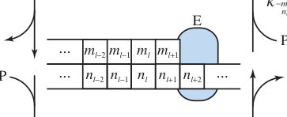
<figcaption class="paper-figure-caption"><b>Fig 1.</b> FIG. 1: Representation of the kinetic scheme for the model of two-state DNA polymerases. E denotes the open state of the polymerase, F its closed state, {mj} the nucleotide units composing the copy, {nj} those of the template, {mjP} the molecules of deoxyribonucleoside triphosphate, and P the molecules of inorganic pyrophosphate. The rates of the reactions are explained in the text.</figcaption>
</figure>
<figure class="paper-figure-card">
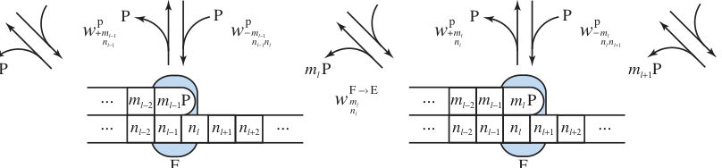
<figcaption class="paper-figure-caption"><b>Fig 2.</b> FIG. 2: Representation of the kinetic scheme of Fig. 1 after its reduction using the assumptions (2) of a Michaelis-Menten enzyme kinetics for the DNA polymerase. This reduced scheme corresponds to the kinetic equations (3) and (4), which are deduced in Appendix A. The notations are the same as in Fig. 1. The transition rates are given by Eqs. (6)-(9).</figcaption>
</figure>
<figure class="paper-figure-card">

<figcaption class="paper-figure-caption"><b>Fig 3.</b> FIG. 3: The mean growth velocity v and the error probability η versus the fraction ν(A) of units A in the Bernoulli chain forming the template sequence of length L = 105 for the nucleotide concentrations [dATP] = [dTTP] = 10−3 M. The dots are the results of Gillespie’s numerical algorithm using a statistics over Nstat = 105 copies. The lines are those of theory using the formulas (41) for the velocity and (44) for the error probability with Nloop = 10.</figcaption>
</figure>
<figure class="paper-figure-card">
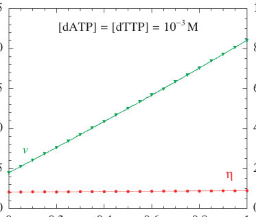
<figcaption class="paper-figure-caption"><b>Fig 4.</b> Figure 3 shows the mean growth velocity and the error probability of the replication process as a function of the fraction ν(A) = 1 −ν(T) of bases A in the random template sequence for fixed and equal nucleotide concentrations. In this case, the dependence of both quantities can be fitted to the following linear functions:</figcaption>
</figure>
<figure class="paper-figure-card">
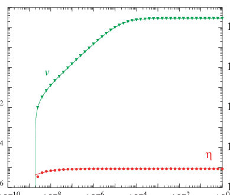
<figcaption class="paper-figure-caption"><b>Fig 5.</b> FIG. 4: The mean growth velocity v and the error probability η versus equal values for the nucleotide concentrations [dATP] = [dTTP]. Here, the template sequence is a Bernoulli chain with probabilities ν(A) = ν(T) = 0.5 and length L = 105. The dots are the results of Gillespie’s numerical algorithm using a statistics over Nstat = 105 copies. The lines are those of theory using the formulas (41) for the velocity and (44) for the error probability with Nloop = 10.</figcaption>
</figure>

**Summary.** This work develops advanced mathematical methods to calculate the kinetics of DNA replication by polymerases with multiple structural states. By applying iterative techniques to master equations, the authors derive exact formulas for key metrics like growth speed and error rate. This provides a powerful theoretical tool for analyzing complex biochemical processes far exceeding standard numerical simulation capabilities.

**Why it may be interesting.** While focused on biochemistry, the rigorous application of master equation reduction techniques, steady-state analysis (e.g., IFS), and comparison between analytical/numerical approaches mirrors methodologies used in analyzing open quantum systems or reaction-diffusion processes where complex state spaces must be simplified.

Detailed structure

**Main problem.** The paper investigates the kinetics of DNA replication catalyzed by polymerases that exhibit multiple structural states.

**Main result.** Exact analytical solutions for growth velocity and error probability are derived using iterative mathematical methods, which prove significantly faster than direct numerical simulations.

**Method.** The core method involves applying an iterative mathematical technique to solve the coupled master equations governing the system's time evolution in the long-time limit.

**Model / system.** The model uses a two-state kinetic framework (E and F) for T7 DNA polymerase acting on a template sequence, governed by rate constants derived from a reversible reaction network.

**Key observables.** Mean velocity of copy growth ($v$), error probability ($\eta$), local probabilities of base-pair formation ($\mu(m; l)$), and mean local dwell time ($	au_l$).

**Important parameters / regimes.** Nucleotide concentrations (e.g., $10^{-3}$ M), rate constants ($k$), and the structural states (E, F).

**Assumptions / limitations.** Key approximations include assuming quasi-equilibrium for nucleotide binding/unbinding (Michaelis-Menten kinetics) and using homogenization to simplify template heterogeneities.

**Figures summary.** Figures illustrate how local probabilities and dwell times vary with template sequence composition under different nucleotide concentration regimes, confirming expected pairing dominance.

**Paper structure.** The paper progresses from establishing the full kinetic master equations to simplifying them via quasi-equilibrium assumptions. It then develops iterative matrix methods to find exact asymptotic solutions for observables like velocity and error rate, comparing these results against numerical simulations.

Abstract

In the present paper, we apply the iterative mathematical method previously developed for the kinetics of template-directed multistate copolymerization to the kinetics of DNA replication by polymerases having multiple structural states. In particular, we study a two-state kinetic model for the T7 DNA polymerase. We obtain the mean velocity for the growth of the copy along the template, the error probability of DNA replication by the polymerase, and the local probabilities of base-pair formation along the template sequence. Furthermore, we show that the iterative method is more than a million times faster than usual numerical simulation methods. Results are also obtained in the approximation of homogenization of template heterogeneities.

[↑ back to top](#top)

### [Semi-Analytical Pricing for General Default Intensity Models](http://arxiv.org/abs/2606.21800v1)

**Authors:** Ryan Parker, Mark Stedman, Luca Capriotti  
**Type:** theory · **Category:** numerical methods · **PDF:** <https://arxiv.org/pdf/2606.21800v1>  
**Analysis basis:** full PDF text, analyzed in chunks
**Topic relevance:** `Keldysh / 2PI / non-Gaussian methods` **3/5** · `non-equilibrium dynamics` **2/5** · `analog quantum simulation` **1/5** · `correlated / nonlocal dissipation` **1/5** · `driven-dissipative phase transition` **1/5** · `entanglement & information structure` **1/5** · `methods for driven-dissipative` **1/5** · `non-equilibrium universality` **1/5**

↔ Scroll figures horizontally

<figure class="paper-figure-card">
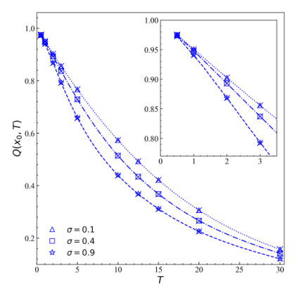
<figcaption class="paper-figure-caption"><b>Fig 1.</b> FIG. 1 Comparison of GTFK and PDE survival probabilities as a function of time to maturity for the Black-Karasinski model, with mean reversion speed k = 0.1, initial rate h0 = 0.05, different values of the volatility, and piecewise constant mean reversion levels of the form explained in the text, with θmin = log(0.05) and θmax = log(0.10) and Nl = 10. Crosses indicate the PDE results. The inset is an enlargement for short times to maturity.</figcaption>
</figure>

**Summary.** This paper introduces a semi-analytical approximation method based on the path-integral formalism for pricing derivatives under stochastic default intensity models. By generalizing the GTFK technique, the authors achieve high accuracy comparable to full numerical solutions while maintaining superior computational efficiency. This makes the method highly practical for applications like XVA calculation in credit risk management.

**Why it may be interesting.** While applied to finance, the core mathematical machinery—path integrals, reduced density matrices, and approximating complex dynamics with quadratic forms—shares conceptual parallels with techniques used in quantum field theory or open quantum systems modeling.

Detailed structure

**Main problem.** The primary goal is developing an accurate, computationally efficient semi-analytical approximation for pricing derivatives under general default intensity models.

**Main result.** The proposed GTFK approximation provides remarkably accurate results for complex models like Black-Karasinski, offering a viable alternative to fully numerical PDE or Monte Carlo schemes.

**Method.** The method utilizes the path-integral formalism, employing a specialized approximation (generalizing GTFK) that reduces the action integral by approximating it with a quadratic form around an optimized trial reduced density matrix.

**Model / system.** The models are general default intensity processes where the intensity $h_t$ depends on a non-linear diffusion process $X_t$, exemplified by the Black-Karasinski and Hull-White models. These are applied to credit derivatives like Credit Default Swaps (CDS).

**Key observables.** Generalized Arrow-Debreu densities ($\psi_\lambda$), European option prices, and CDS spreads (in bps).

**Important parameters / regimes.** Volatility ($\sigma$), mean-reversion speed ($k$), time horizons ($T$), and market stress parameters.

**Assumptions / limitations.** The approximation assumes the action can be accurately approximated by a quadratic form around an average path $\bar{x}$.

**Figures summary.** Table I compares credit spreads using GTFK vs. PDE/EE/KL for BK model; Table III shows spread comparison in Normal vs. Stressed markets; Table IV compares quanto CDS basis using GTFK vs. PDE.

**Paper structure.** The paper introduces the problem, develops the path-integral formalism and the GTFK approximation, validates its accuracy by comparing results against known numerical solutions (PDEs) for various models (BK), and applies it to practical pricing problems like quanto CDS.

Abstract

Using the path-integral formalism, we develop an accurate and easy-to-compute semi-analytical approximation for a general class of {default intensity} models. We illustrate the accuracy of the method by presenting results for the Black-Karasinski model for which the proposed approximation provides remarkably accurate results, even in regimes of high volatility and multi-year time horizons. The accuracy and the computational efficiency of the proposed approximation makes it a viable alternative to fully numerical schemes for a variety of applications in econometrics and derivatives pricing, including the computation of XVA for credit products. As a practical example, we consider the pricing of a quanto Credit Default Swap (CDS) under stochastic intensity of default and an FX devaluation model.

[↑ back to top](#top)

### [The adaptive nature of confirmation bias](http://arxiv.org/abs/2606.23325v1)

**Authors:** Dorje C. Brody, Karl J. Friston, Bernhard K. Meister, Emmanuel M. Pothos  
**Type:** theory · **Category:** other · **PDF:** <https://arxiv.org/pdf/2606.23325v1>  
**Analysis basis:** full PDF text, analyzed in chunks
**Topic relevance:** `quantum measurements` **3/5** · `entanglement & information structure` **2/5** · `measurement-induced transitions` **2/5** · `Keldysh / 2PI / non-Gaussian methods` **1/5** · `correlated / nonlocal dissipation` **1/5** · `driven-dissipative phase transition` **1/5** · `methods for driven-dissipative` **1/5**

↔ Scroll figures horizontally

<figure class="paper-figure-card">
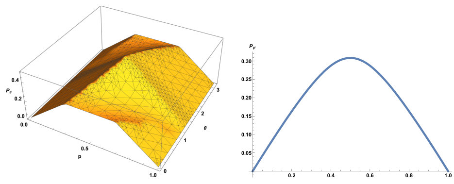
<figcaption class="paper-figure-caption"><b>Fig 1.</b> FIG. 1: Error probability. The error probability Pθ(p) is plotted here on the left panel as a function of the prior p ∈[0, 1] and the evidence choice θ ∈[0, π). The parameters are set at θ1 = 5π/8 and θ2 = 3π/8. For each prior p there is a value θ∗such that the error probability is minimised. For each p, the resulting error probability Pθ∗for the optimal strategy is shown in the right panel.</figcaption>
</figure>
<figure class="paper-figure-card">
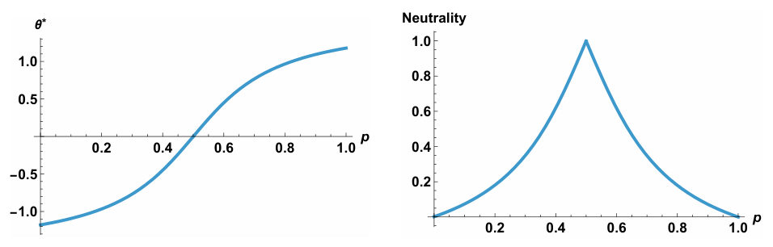
<figcaption class="paper-figure-caption"><b>Fig 2.</b> FIG. 2: Optimal inference and confirmation bias. The optimal inference choice θ∗(p) is plotted in the left panel as a function of the prior p, for the parameters θ1 = 5π/8 and θ2 = 3π/8. Note that θ∗and θ∗± nπ for n = 0, 1, 2, . . . represent identical pieces of evidence, so to avoid a discontinuity in θ∗(p), we have plotted θ∗(p) −π when p &lt; 1/2 and θ∗(p) when p ≥1/2. On the right panel the corresponding degree of neutrality N(p) in evidence seeking is plotted as a function of the prior p. The neutrality is unit normalised such that the value N(p) = 1 represents unbiased query, whereas N(p) = 0 represents a 100% biased search.</figcaption>
</figure>
<figure class="paper-figure-card">
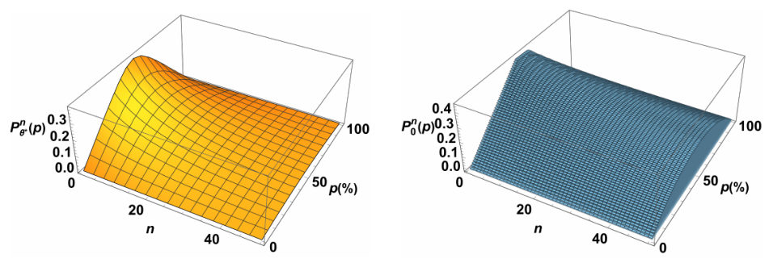
<figcaption class="paper-figure-caption"><b>Fig 3.</b> FIG. 3: Error probabilities with and without confirmation bias. The error probability P (n) θ∗(p) is plotted here in the left panel as a function of the prior p and the sample size n. For each fixed p the error probability decreases exponentially in n. The result is compared in the right panel to the (suboptimal) case where there is no freedom in choosing the evidence, that is, each evidence is modelled by ˆξ(0). The result shows that the error probability decreases very slowly. The parameters are chosen here such that b1(0) = 0.47 and b2(0) = 0.58.</figcaption>
</figure>
<figure class="paper-figure-card">
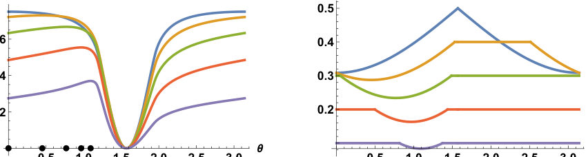
<figcaption class="paper-figure-caption"><b>Fig 4.</b> FIG. 4: Mutual information and error probability. The mutual information associated with the evidence ˆξ(θ) is plotted here on the left panel as a function of θ ∈[0, π) for the priors p = 0.5, 0.6, 0.7, 0.8, 0.9 (from blue to purple). The corresponding values of θ∗(p) are shown by the dots on the horizontal axis. It is evident, for each p, that the mutual information is maximised at the value θ = θ∗(p). The parameters are set at θ2 = 3π/8 and θ1 = 5π/8. The corresponding error probabilities Pθ(p), the minimum of which for each p determines the value of θ∗(p), for the same p-values, are shown on the right panel for comparison.</figcaption>
</figure>
<figure class="paper-figure-card">
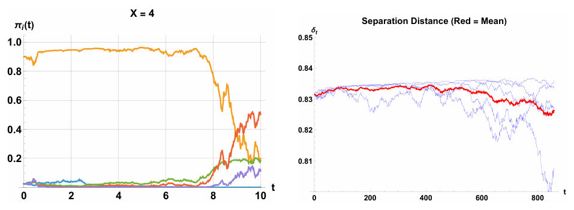
<figcaption class="paper-figure-caption"><b>Fig 5.</b> FIG. 5: A tenacious Bayesian and separation distance. Suppose that there are five alternatives labelled by X = x1, . . . , x5. A Bayesian thinker has the prior view that P(X = x2) = 90%, and that all other alternatives are equally likely with the a prior of 2.5%. Suppose further that a noisy information time series ξt = σXt+ϵt reveals that X = x4 is in fact the correct alternative. Under a Bayesian updating, the view of this decision maker will hardly change for a long time, as illustrated in the left panel (the parameters are set at xk = k and σ = 0.4 — the posterior probability for the event X = x4 is shown in orange, while that for the “correct” event X = x2 is shown in red). Now suppose...</figcaption>
</figure>

**Summary.** This theoretical paper reinterprets confirmation bias not as an irrational flaw but as a rational outcome arising from optimal decision-making under quantum probabilistic constraints. By mapping belief updating onto the geometry of Hilbert space and comparing error minimization with information maximization, it shows that the tendency to favor confirming evidence is mathematically consistent with principles of active inference.

**Why it may be interesting.** It bridges fundamental concepts from quantum information theory (non-commuting observables, Hilbert spaces) with cognitive science, suggesting that inherent limitations in measurement or knowledge acquisition can manifest as predictable biases like confirmation bias.

Detailed structure

**Main problem.** The paper investigates confirmation bias by formulating belief updating within quantum probability theory, aiming to provide a rational explanation for this cognitive tendency.

**Main result.** Optimal evidence selection that minimizes expected error probability naturally leads to an active form of confirmation bias, which is shown to be mathematically equivalent to maximizing information gain (active inference).

**Method.** The authors model beliefs using square-root probabilities on a Hilbert space and derive optimal strategies by minimizing spherical distance or expected error probability in binary hypothesis testing.

**Model / system.** The framework uses quantum probability rules, modeling evidence selection via matrices ($\hat{\xi}(	heta)$) acting on belief states represented as vectors/density matrices in a Hilbert space. The analysis compares criteria like minimum error vs. maximum mutual information.

**Key observables.** Expected error probability ($P_	heta(p)$), Mutual Information ($J$), and the optimal evidence choice ($	heta^*(p)$).

**Important parameters / regimes.** Prior probabilities ($p$), bias parameter ($	heta$), sample size ($n$).

**Assumptions / limitations.** The analysis assumes that minimizing expected error probability is equivalent to maximizing information gain, and it extends concepts from quantum hypothesis testing to cognitive modeling.

**Figures summary.** Figures illustrate the monotonic movement of optimal evidence choice $	heta^*(p)$ with prior belief $p$, showing how minimum error probability decays exponentially with sample size when bias is present.

**Paper structure.** The paper progresses by first defining confirmation bias in quantum terms, then deriving the optimal strategy from minimizing error probability, demonstrating its equivalence to active inference, and finally analyzing the benefits of this bias in sequential sampling.

Abstract

In this paper, the phenomenon generally classified as confirmation bias is formulated on the space of square-root probabilities (or equivalently, using the structures of quantum probability). In this framework, observations are modelled by matrices, rather than random variables on a probability space. In the problem of binary hypothesis testing, an optimal evidence choice minimises the expected error probability. We show that the resulting optimal choice of evidence leads to a confirmation bias, thus revealing a surprising aspect of rationality that encompasses confirmation bias. Specifically, in sequential evidence sampling, the implicit optimality leads to two remarkable evolutionary advantages, namely, (a) the decision maker requires only the smallest memory capacity, and (b) the error probability can be reduced exponentially in sample size. A complementary approach based on the framework of active inference -- where the decision maker seeks evidence that provides maximum information -- is then considered. The resulting optimal evidence is shown to agree with the one obtained by minimising error probability. Our framework provides an easy-to-implement protocol for an active quantum inference, whereby the optimal evidence choice for making an inference is sought over the space of matrices.

[↑ back to top](#top)

### [Bounding Classical and Quantum Correlations in Bayesian Networks with Quasiprobabilities](http://arxiv.org/abs/2606.23372v1)

**Authors:** Paul Becsi, Matty J. Hoban  
**Type:** theory · **Category:** other · **PDF:** <https://arxiv.org/pdf/2606.23372v1>  
**Analysis basis:** full PDF text, analyzed in chunks
**Topic relevance:** `entanglement & information structure` **3/5** · `Keldysh / 2PI / non-Gaussian methods` **1/5** · `analog quantum simulation` **1/5** · `correlated / nonlocal dissipation` **1/5** · `driven-dissipative phase transition` **1/5** · `methods for driven-dissipative` **1/5** · `non-equilibrium dynamics` **1/5** · `non-equilibrium universality` **1/5**

↔ Scroll figures horizontally

<figure class="paper-figure-card">
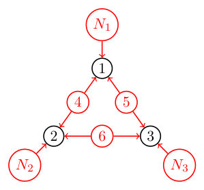
<figcaption class="paper-figure-caption"><b>Fig 1.</b> Figure 2: Introducing noise variables, illustrated on the Triangle Scenario.</figcaption>
</figure>
<figure class="paper-figure-card">
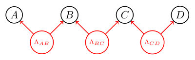
<figcaption class="paper-figure-caption"><b>Fig 2.</b> Figure 3: The correspondence between the 4-on-line Scenario and its underlying undirected graph. Edges become latent variables with the same domain size as the corresponding index.</figcaption>
</figure>

**Summary.** This paper develops a sophisticated mathematical framework to characterize correlation sets in Bayesian Networks by introducing 'quasiprobabilities.' It aims to prove that these quasi-sets collapse onto the Nested Markov Model for many graph structures. This work provides deep insights into the boundary between classical, quantum, and generalized causal correlations.

**Why it may be interesting.** While not directly about AMO Hamiltonians, the rigorous mathematical framework developed for bounding correlations in graphical models has deep connections to quantum information theory and causality, which are foundational concepts when analyzing open quantum systems or entanglement structure.

Detailed structure

**Main problem.** The core problem is understanding the mathematical bounds on correlations (classical vs. quantum) within Bayesian Networks, especially when unobserved or latent variables are present.

**Main result.** The authors conjecture and show evidence that the 'quasi set' of correlations derived by allowing quasiprobabilities recovers the Nested Markov Model for tree-structured scenarios.

**Method.** The work employs abstract mathematical tools like tensor network decompositions, algebraic constraints (Verma constraints), and generalizing concepts from Bell non-locality to graph structures.

**Model / system.** The model is a Directed Acyclic Graph (DAG) representing causal dependencies between observed variables ($V$) and unobserved latent variables ($L$). The analysis uses 'quasiprobabilities' to relax standard probability constraints.

**Key observables.** Correlations over observed nodes, factorization properties of distributions, and the relationship between different sets: Classical $C(G)$, Quantum $Q(G)$, Quasi Set $\mathcal{W}(G)$, Nested Markov Model $N(G)$.

**Important parameters / regimes.** The structure of the graph $G$, the number of variables $|V|$, and the rank/bond dimensions associated with tensor decompositions.

**Assumptions / limitations.** The analysis assumes working with finite discrete variables, and key results often rely on proving equivalence between different formal definitions (e.g., quasilatents vs. quasiresponses).

**Figures summary.** Figures illustrate specific correlation scenarios like the bipartite Bell Scenario ($B_2$), the Triangle Scenario, and the Common Ancestor Scenario, showing how correlations are structured or violated.

**Paper structure.** The paper progresses by defining quasiprobabilistic models, establishing equivalences between different mathematical descriptions of these sets ($\mathcal{W}_l = \mathcal{W}_r = \mathcal{W}_n$), proving inclusions ($C(G) \subseteq Q(G) \subseteq \dots \subseteq N(G)$), and finally using tensor network techniques to prove the equivalence $\mathcal{W}(G) = M(G) = N(G)$ for specific graph classes.

Abstract

Bell's theorem reveals that quantum theory is in tension with classical causal reasoning and, in particular, the notion of local causality. This is now understood as a particular example of non-classicality in the study of correlations in (Bayesian) networks with both unobserved and observed nodes: the correlations are probability distributions over the observed nodes. There is a great deal of work aiming to understand the bounds on quantum and classical correlations in such networks and one approach is to consider outer approximations to the former. Along these lines, we consider quasiprobabilistic models for Bayesian networks, which can be seen as classical models but the probability distributions involving unobserved nodes are "replaced" with quasiprobabilities that respect normalisation but not positivity. We denote the set of correlations resulting from these models as the quasi set. Such models have a history in the study of Bell-type non-classicality where it has been shown that they can produce all non-signalling correlations. We show a generalisation of this result for a broad class of networks, which motivates a conjecture that the quasi set recovers the so called nested Markov model. Our work utilises a connection to tensor network decompositions, which may be of independent interest.

[↑ back to top](#top)

### [Continuous-variable model for arbitrary image propagation via Dirac-comb expansion in Four-Wave Mixing](http://arxiv.org/abs/2606.21692v1)

**Authors:** Fabián Ramírez-Pacheco, Andrea Basilio-Zárate, Hans Marin Florez, Pablo Solano, Carla Hermann-Avigliano  
**Type:** theory · **Category:** other · **PDF:** <https://arxiv.org/pdf/2606.21692v1>  
**Analysis basis:** full PDF text, analyzed in chunks
**Topic relevance:** `interference shaping light` **3/5** · `Keldysh / 2PI / non-Gaussian methods` **2/5** · `correlated / nonlocal dissipation` **1/5** · `driven-dissipative phase transition` **1/5** · `entanglement & information structure` **1/5** · `methods for driven-dissipative` **1/5** · `non-equilibrium dynamics` **1/5**

↔ Scroll figures horizontally

<figure class="paper-figure-card">
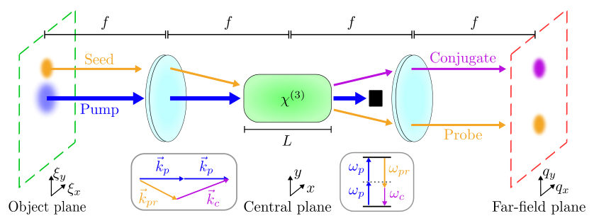
<figcaption class="paper-figure-caption"><b>Fig 1.</b> FIG. 1. Setup for the propagation of arbitrary images in 4WM. An input image is imprinted on the pump and/or seed beams in the object plane defined by the axes (ξx, ξy). A Fourier-imaging lens maps the image to the center of the χ(3) medium, where the 4WM interaction takes place. The second lens propagates the generated probe and conjugate beams to a far-field detection plane defined by the axes (qx, qy), where their intensities and cross-covariances are measured. The boxed insets illustrate energy conservation and the phase-matching condition.</figcaption>
</figure>
<figure class="paper-figure-card">
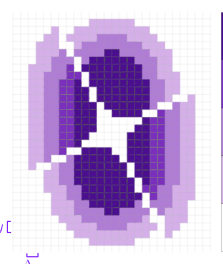
<figcaption class="paper-figure-caption"><b>Fig 2.</b> FIG. 2. Illustration of the field’s Dirac-comb expansion at the center of the medium, using the Amazing Quantum logo as an example.</figcaption>
</figure>
<figure class="paper-figure-card">
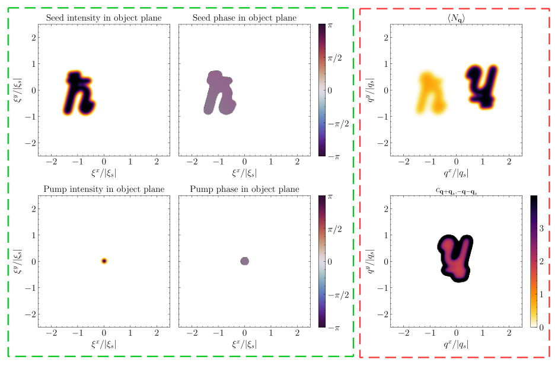
<figcaption class="paper-figure-caption"><b>Fig 3.</b> FIG. 3. Intensity and phase profiles of the seed and pump fields in the (ξx, ξy) object plane. The right column shows the intensity and normalized correlations in the (qx, qy) far-field plane. The ℏsymbol is imprinted in the object plane of the seed and mapped to its Fourier components at the center of the medium. The pump profile was Gaussian and spatially larger than the seed at the same plane, with a seed-to-pump width ratio δ = 0.38. The ℏpattern appears in the far-field intensities ⟨ˆ Nq⟩ of both the probe (right) and conjugate (left). The normalized correlation is evaluated at diametrically opposed momenta qpr = q + qs = −qc and also exhibits the ℏshape; all of its values exceed...</figcaption>
</figure>
<figure class="paper-figure-card">
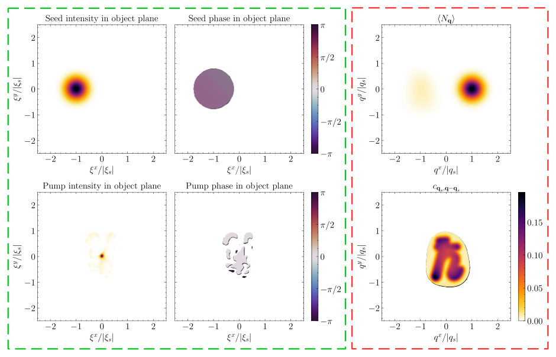
<figcaption class="paper-figure-caption"><b>Fig 4.</b> FIG. 4. Covariance imaging. In the object plane, the seed is spatially Gaussian, and the pump has the shape required to reproduce the ℏsymbol in the cross-correlation in the low-gain regime, with seed-to-pump width ratio δ = 0.21. The probe and conjugate intensities (right and left Gaussian profiles, respectively) preserve the Gaussian structure of the seed. The normalized correlation, evaluated at qpr = qs and qc = q−qs, reproduces the imprinted ℏpattern. All values of the normalized correlation remain below unity, so the Cauchy–Schwarz inequality is not violated by this configuration; this does not by itself establish classicality, which would require additional witnesses.</figcaption>
</figure>
<figure class="paper-figure-card">
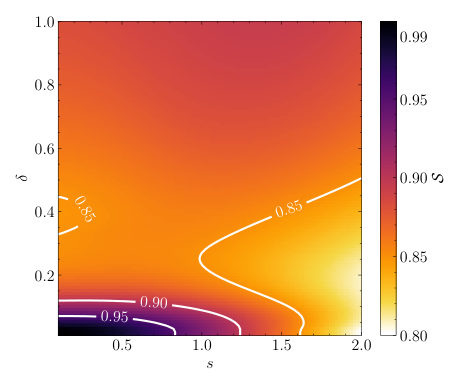
<figcaption class="paper-figure-caption"><b>Fig 5.</b> FIG. 5. Image similarity S between the computed cross- correlation and the target ℏpattern, as a function of the seed- to-pump width ratio δ and the interaction strength s.</figcaption>
</figure>

**Summary.** This paper presents a comprehensive continuous-variable model for Four-Wave Mixing that calculates quantum correlations (variance and covariance) across arbitrary transverse beam profiles using a Dirac-comb expansion. The theory successfully unifies descriptions of image transfer, showing how information can be encoded in either the measured intensities or non-locally in the spatial cross-correlations. It is significant for its all-order treatment of structured light fields in nonlinear quantum optics.

**Why it may be interesting.** This work is highly relevant for quantum optics and open quantum systems because it provides an all-order, spatially resolved theoretical framework to analyze complex nonlinear processes like 4WM. It moves beyond simple plane-wave assumptions to model structured light fields.

Detailed structure

**Main problem.** The paper develops a unified theoretical model for characterizing the transverse spatial statistics of quantum-correlated bright twin beams generated via Four-Wave Mixing (4WM). It aims to provide closed-form expressions for mean intensity, variance, and covariance valid for arbitrary pump/seed profiles.

**Main result.** The formalism successfully extends known results from plane-wave approximations to include complex spatial structuring, demonstrating how information can be encoded in either the bright intensities or non-locally in the spatial cross-correlations via the covariance measurement.

**Method.** The core method involves using a Dirac-comb expansion of the pump field within a continuous-variable framework. This allows for calculating quantum correlation functions (variance and covariance) to all orders in the nonlinear interaction strength.

**Model / system.** The physical system is stimulated Four-Wave Mixing (4WM) occurring in an alkali-atom vapor ($\chi^{(3)}$ nonlinearity). The model uses bosonic operators and treats the pump field via a Dirac-comb expansion, enabling pixel-by-pixel computation of quantum statistics.

**Key observables.** Mean intensity, variance ($\langle\Delta^2 \hat{N}
angle$), cross-covariance ($	ext{Cov}(\dots)$), and Intensity-Difference Squeezing (IDS).

**Important parameters / regimes.** Seed-to-pump waist ratio ($\delta$) and interaction strength ($s$). The regime of high fidelity is characterized by $\delta \ll 1$ and $s \lesssim 1$.

**Assumptions / limitations.** The analysis relies on approximations when summing infinite series (e.g., using $\cosh/\sinh$ forms) and assumes the validity of certain limits, such as small coupling parameters or small waist ratios ($\delta \ll 1$).

**Figures summary.** Figures illustrate the setup for image propagation via Fourier imaging detection, the Dirac-comb expansion structure, and plots showing the achievable Image Similarity Score ($S$) versus $(\delta, s)$ space.

**Paper structure.** The paper builds from deriving the general continuous-variable model using the Dirac-comb expansion to calculate observables like variance and covariance. It validates this by recovering known plane-wave results before demonstrating image transfer capabilities in both intensity (seed imaging) and cross-correlation (covariance imaging).

Abstract

We develop a macroscopic continuous-variable model of stimulated four-wave mixing (4WM) yielding closed-form expressions for the mean intensity, variance, and covariance of bright probe and conjugate beams, valid for arbitrary transverse profiles of the pump and seed to all orders in the nonlinear interaction strength. The model uses a Dirac-comb expansion of the pump field, making the photon statistics computable pixel-by-pixel from one set of expressions. In the plane-wave limit, we recover the phase-insensitive amplifier results. Beyond this limit, the formalism explicitly demonstrates the spatial routing of information observed in earlier experiments: the seed angular spectrum is transferred to the twin-beam intensities, whereas the angular spectrum of the squared pump field is transferred to the spatial cross-correlation between the probe and conjugate. We characterize the parameter window of high-fidelity image transfer in the covariance, which is controlled by the seed-to-pump waist ratio and the interaction strength. Our model provides, in one analytical framework, a theoretical account of experiments encoding information in the bright intensities or non-locally in the spatial cross-correlations.

[↑ back to top](#top)

### [Generalization of catability for parity-less cat states](http://arxiv.org/abs/2606.22641v1)

**Authors:** Michal Matulík, Jan Provazník, Petr Marek, Šimon Bräuer  
**Type:** theory · **Category:** quantum information and computing · **PDF:** <https://arxiv.org/pdf/2606.22641v1>  
**Analysis basis:** full PDF text, analyzed in chunks
**Topic relevance:** `interference shaping light` **3/5** · `quantum measurements` **2/5** · `analog quantum simulation` **1/5** · `correlated / nonlocal dissipation` **1/5** · `correlated cavity matter` **1/5** · `driven-dissipative phase transition` **1/5** · `entanglement & information structure` **1/5**

↔ Scroll figures horizontally

<figure class="paper-figure-card">
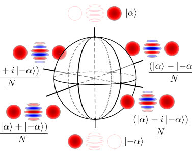
<figcaption class="paper-figure-caption"><b>Fig 1.</b> FIG. 1. Illustration of a Bloch sphere with logical qubits formed by superpositions of coherent states. Its poles correspond to the individual coherent components |𝛼⟩and |−𝛼⟩, while the equal-weight coherent-state superpositions lie on the equator. In the notation of (1), the conventional even and odd parity cats occupy opposite equatorial points, while the Kerr cat states occupy the orthogonal equatorial points. The Wigner functions surrounding the sphere illustrate the corresponding base states.</figcaption>
</figure>
<figure class="paper-figure-card">
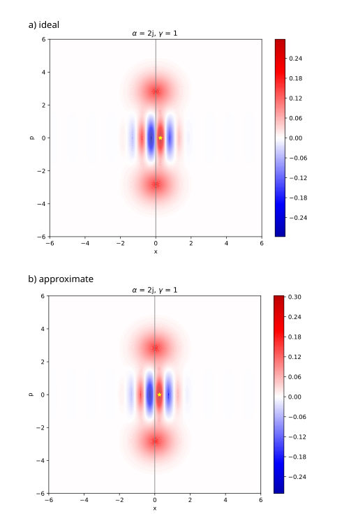
<figcaption class="paper-figure-caption"><b>Fig 2.</b> FIG. 2. Comparison of the ideal Kerr cat state (a) and its approxi- mation (b) obtained as the ground state (20) for 𝛼= 2𝑖, 𝛽≈±0.185 and 𝛾= 1, 𝑠= 1. The yellow star denotes the value of 𝛽 √</figcaption>
</figure>
<figure class="paper-figure-card">
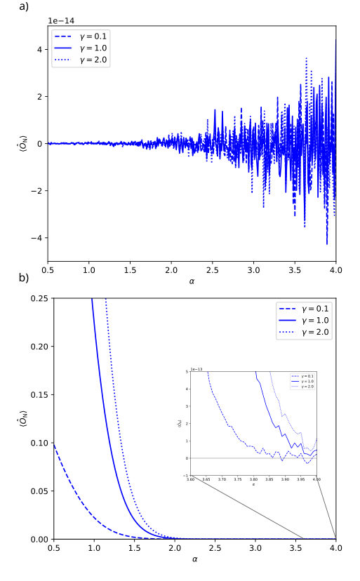
<figcaption class="paper-figure-caption"><b>Fig 3.</b> FIG. 4. The expectation value (31) of the improved nullifier (30) obtained for ideal Kerr cat states with varying amplitude 𝛼and with their (a) positive and (b) negative fringes displaced. The dotted, solid, and dashed curves represent distinct 𝛾∈{0.1, 1.0, 2.0} choices.</figcaption>
</figure>
<figure class="paper-figure-card">
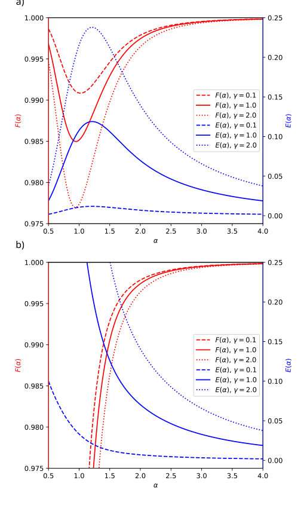
<figcaption class="paper-figure-caption"><b>Fig 4.</b> FIG. 3. The plots show the quantifiers (24) and (25) as functions of the amplitude 𝛼for displaced positive (a) and negative (b) fringes, as described in (21) and (22). Fidelity, with vertical axis on the left, is shown in red, whereas blue portrays the expectation value of the nullifier with axis on the right. Dotted, solid, and dashed curves correspond to individual choices of 𝛾∈{0.1, 1.0, 2.0}.</figcaption>
</figure>
<figure class="paper-figure-card">
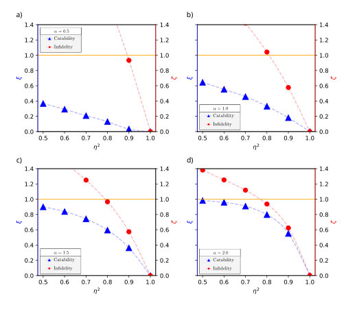
<figcaption class="paper-figure-caption"><b>Fig 5.</b> FIG. 5. Resilience global generalized catability 𝜉(blue) and fidelity 𝜁 (red) against loss, expressed in terms of intensity transmittance 𝜂2. Each panel depicts a different amplitude 𝛼∈{0.5, 1.0, 1.5, 2.0}. The presented results were obtained numerically on a truncated Fock basis with dimension 𝑁= 70.</figcaption>
</figure>

**Summary.** The paper generalizes the concept of 'catability' to characterize Kerr cat states, which lack simple parity symmetries. By replacing the standard parity check with a measurable displaced-parity operator within an extended nullifier framework, the authors provide a robust and experimentally practical method for verifying these complex quantum superpositions using only photon-number measurements.

**Why it may be interesting.** This work provides a powerful, experimentally viable diagnostic tool (catability) that extends beyond simple symmetry checks (like parity), making it highly relevant for characterizing complex quantum states generated in photonic systems or cavity QED setups.

Detailed structure

**Main problem.** The research aims to extend the concept of 'catability'—a quantifier for characterizing quantum cat states based on their interference structure—from standard parity-defined coherent cat states to more complex, parity-less Kerr cat states.

**Main result.** A generalized and experimentally practical framework is established using a displaced-parity operator that allows catability to be evaluated solely from photon-number measurements, proving robust against optical loss compared to fidelity methods.

**Method.** The core method involves modifying the original nullifier by replacing the parity component with a measurable displaced-parity operator, allowing for the characterization of Kerr cat states via expectation values derived from this generalized nullifier.

**Model / system.** The study focuses on coherent and Kerr cat states, which are superpositions of coherent states $|\alpha
angle$ and $|-\alpha
angle$. The analysis uses annihilation ($\hat{a}$) and creation ($\hat{a}^\dagger$) operators within the framework of quantum optics.

**Key observables.** Catability ($\xi$), Wigner function ($W(x)$), Fidelity ($F(\alpha)$), Expectation Value $E(\alpha)$, and expectation values involving the displaced-parity operator $\langle \hat{\Pi}(eta) 
angle$.

**Important parameters / regimes.** The amplitude $\alpha$, displacement parameter $eta$, and a structural parameter $\gamma$ are key. The analysis also considers loss parameters ($\eta^2$).

**Assumptions / limitations.** The generalized nullifier operator is generally approximate, meaning the minimal eigenvalue may not be exactly zero; however, it provides an experimentally measurable proxy for ideal state characterization.

**Figures summary.** Figures compare Wigner functions of ideal vs. approximate Kerr cat states and plot various metrics (Fidelity, Expectation Value) against amplitude $\alpha$, demonstrating the method's quantitative accuracy.

**Paper structure.** The paper builds by first identifying the limitation of parity for Kerr cats, then generalizing the nullifier using a displaced-parity operator, followed by numerical benchmarking comparing catability against fidelity and assessing resilience to optical loss.

Abstract

We extend the nullifier-based certification framework of catability from parity-defined coherent cat states to parity-less Kerr cat states. Since Kerr cats cannot be distinguished by parity alone, we replace the parity component of the original nullifier with a displaced-parity operator that captures their characteristic interference structure. The resulting generalized catability remains directly observable and can be evaluated from a finite number of photon-number measurements without full state tomography. Numerical benchmarks show that the method faithfully certifies Kerr-cat features, produces accurate approximations of ideal Kerr cat states, and is more resilient to optical loss than fidelity-based certification. We also identify an exact anti-linear nullifier based on complex conjugation, providing an ideal algebraic description of Kerr cat states. Our results broaden the scope of catability and provide an experimentally practical approach to the characterization of Kerr cat states.

[↑ back to top](#top)

### [Kinetics of template-directed multistate copolymerization](http://arxiv.org/abs/2606.22448v1)

**Authors:** Pierre Gaspard  
**Type:** theory · **Category:** statistical mechanics · **PDF:** <https://arxiv.org/pdf/2606.22448v1>  
**Analysis basis:** full PDF text, analyzed in chunks
**Topic relevance:** `methods for driven-dissipative` **3/5** · `non-equilibrium dynamics` **2/5** · `non-equilibrium universality` **2/5** · `Keldysh / 2PI / non-Gaussian methods` **1/5** · `correlated / nonlocal dissipation` **1/5** · `driven-dissipative phase transition` **1/5**

↔ Scroll figures horizontally

<figure class="paper-figure-card">
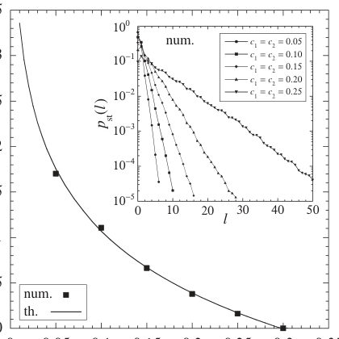
<figcaption class="paper-figure-caption"><b>Fig 1.</b> FIG. 1: Exponent α of the exponential decrease of the stationary length distribution pst(l) versus equal monomer concentrations c1 = c2. The dots depict the numerical results of Gillespie’s algorithm and the solid line the theoretical predictions from Eq. (48) and tr Ψl = ψ1 l + ψ2 l ∼exp(−αl). The dots are obtained from the length distributions pst(l) shown in the inset. These distributions are computed in the stationary regime by simulating a long random trajectory l(t) with Nstep = 107 steps of Gillespie’s algorithm and counting how often the length is found at some value l during the simulation of the trajectory. The template is a Bernoulli sequence of probabilities ν(1) = ν(2) = 0.5.</figcaption>
</figure>
<figure class="paper-figure-card">
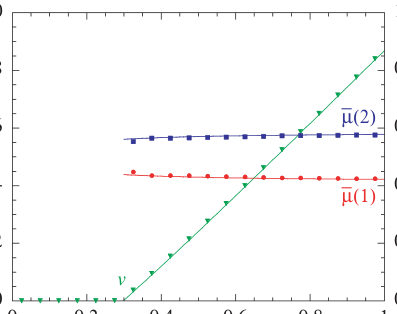
<figcaption class="paper-figure-caption"><b>Fig 2.</b> FIG. 2: The mean growth velocity and the mean fractions ¯µ(1) and ¯µ(2) of monomeric units in the grown copy versus equal monomer concentrations c1 = c2, showing how these quantities behave in the transition between the stationary and growth regimes. The template is a Bernoulli sequence of probabilities ν(1) = ν(2) = 0.5 and length L = 104. The symbols are the numerical results of Gillespie’s algorithm with Nstat = 104 and the solid lines the theoretical predictions of the iterative method with Nloop = 102.</figcaption>
</figure>
<figure class="paper-figure-card">

<figcaption class="paper-figure-caption"><b>Fig 3.</b> FIG. 3: The mean growth velocity and the mean fractions ¯µ(1) and ¯µ(2) of monomeric units in the grown copy versus the monomer concentration c1 for the fixed value c2 = 5 of the other monomer concentration. The template is a Bernoulli sequence of probabilities ν(1) = ν(2) = 0.5 and length L = 103. The symbols are the numerical results of Gillespie’s algorithm with Nstat = 104 and the solid lines the theoretical predictions of the iterative method with Nloop = 102.</figcaption>
</figure>
<figure class="paper-figure-card">
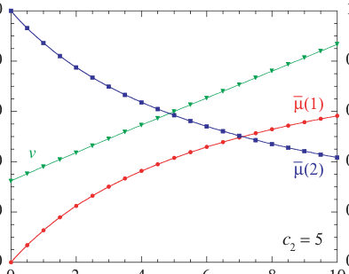
<figcaption class="paper-figure-caption"><b>Fig 4.</b> Figure 3 presents the same quantities as in Fig. 2, but now as a function of the concentration c1 of monomers of type m = 1 for a fixed value of the other concentration c2 = 5. As the concentration c1 decreases to zero, the fraction ¯µ(1) of the corresponding monomeric unit m = 1 in the copy also becomes equal to zero, while ¯µ(2) = 1 −¯µ(1) reaches the unit value. In the limit c1 = 0, the copy sequence is thus exclusively composed of units m = 2, as expected. Again, we observe the good agreement between the numerical results of Gillespie’s algorithm (depicted with dots) and the theoretical predictions of the iterative method (the solid lines).</figcaption>
</figure>
<figure class="paper-figure-card">
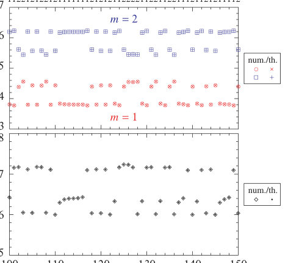
<figcaption class="paper-figure-caption"><b>Fig 5.</b> FIG. 4: The local probabilities µ(m; l) of monomeric units m = 1 and m = 2 (upper panel) and the mean local dwell times τl (lower panel) versus the location l along the template sequence shown above the panels, for the monomer concentrations c1 = c2 = 5. The template is a Bernoulli sequence of probabilities ν(1) = ν(2) = 0.5 and length L = 103. The numerical results of Gillespie’s algorithm with Nstat = 109 are depicted as open symbols (open circles and open squares for the local monomeric probabilities, open diamonds for the mean local dwell times) and the theoretical predictions of the iterative method with Nloop = 102 as crosses and pluses for the local monomeric probabilities and filled...</figcaption>
</figure>

**Summary.** This work develops a rigorous kinetic theory for template-directed copolymerization by molecular machines. It solves the underlying master equations exactly in the long-time limit using an efficient Iterated Matrix Function System (IMFS). The methodology allows precise calculation of growth velocity and sequence statistics across various physical regimes, providing a powerful tool for analyzing constrained stochastic processes.

**Why it may be interesting.** While focused on biochemistry kinetics, the mathematical machinery—solving complex linear systems using iterative matrix methods in the long-time limit—is highly relevant to non-equilibrium statistical mechanics problems involving constrained dynamics or reaction fronts.

Detailed structure

**Main problem.** The study focuses on deriving the exact kinetics for template-directed multistate copolymerization processes, such as those occurring in polymerases or ribosomes.

**Main result.** The authors developed an efficient Iterated Matrix Function System (IMFS) approach that provides the exact asymptotic solution for mean growth velocity and sequence probabilities, significantly faster than direct numerical simulation.

**Method.** The core method involves solving coupled linear Master Equations by transforming them into a matrix form, utilizing a matrix factorization ansatz to derive nested equations solvable via backward and forward matrix iterations.

**Model / system.** The system models monomer incorporation into a growing chain directed by a template, where the molecular machine can occupy multiple conformational or activation states. The dynamics are governed by Markov jump processes involving attachment, detachment, and internal state transitions.

**Key observables.** Mean growth velocity ($v$), sequence probabilities ($\mu(	ext{sequence}; l)$), local monomeric unit probabilities ($\mu(m; l)$), and mean local dwell times ($	au_l$).

**Important parameters / regimes.** Monomer concentrations ($c_1, c_2$), template length ($L$), and the ratio of attachment to detachment rates which define different growth regimes (stationary vs. steady).

**Assumptions / limitations.** The process is modeled as a Markov jump process; rate constants are assumed independent of previously incorporated units; asymptotic analysis relies on solving the system in the long-time limit ($t 	o \infty$).

**Figures summary.** Figures illustrate the transition between stationary (exponential decay) and steady growth regimes, showing how mean growth velocity and monomer fractions depend critically on monomer concentrations.

**Paper structure.** The paper builds from defining the master equations for the multistate process to deriving a matrix formulation. It then introduces the factorization property leading to nested equations solved via backward/forward iterations (IMFS). Finally, it calculates key observables like $v$ and analyzes different growth regimes.

Abstract

We consider processes of template-directed multistate copolymerization by molecular machines such as polymerases or ribosomes, having multiple states of conformation or activation. We show that the kinetic equations of these processes can be exactly solved for the mean growth velocity, the sequence probabilities of the grown copy, and the local probabilities and fractions of monomeric units in the copy. Asymptotically, in the long-time limit, the kinetic equations are solved with a matrix factorization ansatz in terms of a backward iteration, forming an iterated matrix function system, and a complementary forward iteration, both running along the template sequence. The iterative method is very significantly faster than usual computational methods, as demonstrated with a numerical example.

[↑ back to top](#top)

### [Quantum Error Suppression via Symmetry-Averaged Virtual Distillation](http://arxiv.org/abs/2606.21962v1)

**Authors:** Canyu He, Chunhua Zeng, Ruyu Yang, Yongdan Yang  
**Type:** theory · **Category:** quantum information and computing · **PDF:** <https://arxiv.org/pdf/2606.21962v1>  
**Analysis basis:** full PDF text, analyzed in chunks
**Topic relevance:** `methods for driven-dissipative` **3/5** · `analog quantum simulation` **2/5** · `Keldysh / 2PI / non-Gaussian methods` **1/5** · `correlated / nonlocal dissipation` **1/5** · `driven-dissipative phase transition` **1/5** · `entanglement & information structure` **1/5** · `non-equilibrium dynamics` **1/5**

↔ Scroll figures horizontally

<figure class="paper-figure-card">
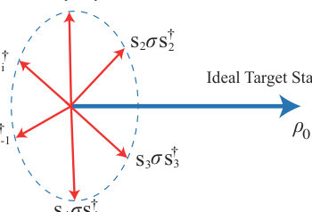
<figcaption class="paper-figure-caption"><b>Fig 1.</b> FIG. 1. Conceptual workflow of SAVD. The imperfect output ρA of a quantum task can be decomposed into a ideal target state ρ0 and an residual state σ induced by errors. The target- error coupling term C can be cancelled by group orthogonality mentioned in Appendix A. Based on the symmetry of the quantum system, we construct a set of symmetry operators {si} satisfying siρ0s† i = ρ0. By applying these operators to the state ρA, we obtain the symmetry-averaged state ¯ρA. The desirable component can then be effectively distilled from it.</figcaption>
</figure>
<figure class="paper-figure-card">
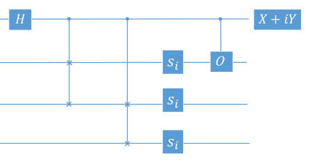
<figcaption class="paper-figure-caption"><b>Fig 2.</b> FIG. 2. Multi-copy measurement circuit for SAVD, illus- trated for M = 3. Each copy is drawn independently from the symmetry-averaged ensemble. A cyclic-permutation mea- surement, or an equivalent Hadamard-test implementation, gives access to Tr(O¯ρM A ), while setting O = I gives Tr(¯ρM A ). Their ratio yields the SAVD estimator.</figcaption>
</figure>
<figure class="paper-figure-card">

<figcaption class="paper-figure-caption"><b>Fig 3.</b> FIG. 4. Real-time dynamics of the four-qubit spin-isotropic Heisenberg chain. The observable is O = Y1Y4, and the Trotter step size is τ = 0.025. The noisy Trotter data use two-qubit depolarizing noise with error probability 5 × 10−4. Green line: exact dynamics; red circles: raw noiseless Trot- ter dynamics; red squares: raw noisy Trotter dynamics; blue triangles: SAVD with M = 3 and Nsym = 1000 sampled sym- metry branches.</figcaption>
</figure>
<figure class="paper-figure-card">
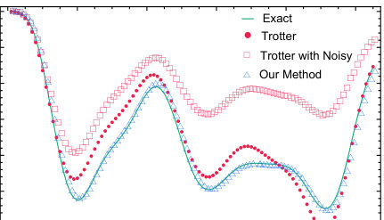
<figcaption class="paper-figure-caption"><b>Fig 4.</b> Figure 4 compares the exact dynamics, raw Trotter- ized dynamics, noisy Trotterized dynamics, and SAVD- mitigated dynamics. The noiseless Trotter curve devi- ates from the exact reference as the evolution time in- creases, reflecting the accumulation of coherent product- formula error. The inclusion of two-qubit depolarizing noise further distorts the observable dynamics, showing the coexistence of algorithmic and hardware-induced er- rors in the simulated output state. After applying SAVD, the observable follows the exact curve more closely over the simulated time window. This demonstrates that the same symmetry-preconditioned VD mechanism used in the VQE example can also suppress...</figcaption>
</figure>

**Summary.** This paper introduces Symmetry-Averaged Virtual Distillation (SAVD), an advanced error suppression technique designed to handle both algorithmic and hardware noise in quantum simulations. By first averaging the state over symmetry operations, SAVD preconditions the input for standard Virtual Distillation. This approach has been shown to improve accuracy significantly when simulating models like the Heisenberg chain.

**Why it may be interesting.** The methodology provides a general, symmetry-based architecture for enhancing quantum simulation fidelity by treating multiple error sources within a single density matrix framework.

Detailed structure

**Main problem.** Reliable quantum simulation is hampered by the simultaneous presence of algorithmic approximations and hardware noise, which existing error suppression methods fail to address cohesively.

**Main result.** The proposed Symmetry-Averaged Virtual Distillation (SAVD) protocol successfully suppresses errors arising from both coherent algorithmic imperfections and stochastic hardware noise simultaneously.

**Method.** It combines symmetry averaging—which constructs a symmetry-invariant ensemble by averaging over symmetry operations—as a preconditioning step before applying standard Virtual Distillation to amplify the desired spectral component.

**Model / system.** The methods are analyzed using general quantum tasks, specifically applied to Variational Ground-State Estimation (VQE) and Trotterized Real-Time Dynamics simulations on an isotropic Heisenberg chain model.

**Key observables.** Ground-state energy $E(	heta)$ for VQE; Expectation value of observables $\langle O(t) 
angle$ for dynamics.

**Important parameters / regimes.** The resource cost depends on the number of symmetry samples ($N_{	ext{sym}}$) and the Virtual Distillation copy number ($M$).

**Assumptions / limitations.** The protocol relies on approximating the full group average with a finite sample average, and its effectiveness hinges on the target state remaining spectrally dominant after averaging.

**Figures summary.** Figure 1 illustrates the conceptual workflow of decomposing an imperfect state into a target and residual component for symmetry averaging. Figure 2 shows the multi-copy measurement circuit required for the SAVD estimator.

**Paper structure.** The paper first introduces the limitations of current error suppression, then details the SAVD protocol by combining symmetry averaging ($ar{
ho}_A$) with Virtual Distillation (VD). It applies this framework to VQE and dynamics simulations on a Heisenberg chain, concluding with an analysis of the resource trade-off between $N_{	ext{sym}}$ and $M$.

Abstract

Reliable quantum simulation is limited by both algorithmic approximations and hardware noise, which usually coexist in the output of near-term and early fault-tolerant quantum devices. Existing error-suppression strategies often target these error sources separately. Here, we introduce symmetry-averaged virtual distillation (SAVD), an error-suppression protocol that applies symmetry averaging before virtual distillation and treats both imperfections at the density-matrix level. The protocol constructs a symmetry-averaged output ensemble from symmetry-labeled implementations, leaving the symmetry-invariant target contribution unchanged while averaging residual components over symmetry-related branches. Virtual distillation (VD) is then applied to this averaged ensemble, rather than to the raw output state, to amplify its dominant eigencomponent. We analyze the resulting spectral suppression mechanism and identify the role of symmetry averaging as a state-preconditioning layer for VD. Numerical demonstrations on an isotropic Heisenberg chain show improved accuracy in the presence of both coherent algorithmic errors and hardware noise. Our results provide a general symmetry-based architecture for enhancing quantum simulations.

[↑ back to top](#top)

### [Fundamental Limits of Stability Inference in High-Dimensional Complex Systems](http://arxiv.org/abs/2606.23644v1)

**Authors:** Michela Costa, Kentaro Hoshisashi, Flaviano Morone, Tim Rogers, Paolo Barucca  
**Type:** both · **Category:** disordered systems and neural networks · **PDF:** <https://arxiv.org/pdf/2606.23644v1>  
**Analysis basis:** full PDF text, analyzed in chunks
**Topic relevance:** `non-equilibrium universality` **3/5** · `non-equilibrium dynamics` **2/5** · `Keldysh / 2PI / non-Gaussian methods` **1/5** · `correlated / nonlocal dissipation` **1/5** · `driven-dissipative phase transition` **1/5** · `methods for driven-dissipative` **1/5**

↔ Scroll figures horizontally

<figure class="paper-figure-card">
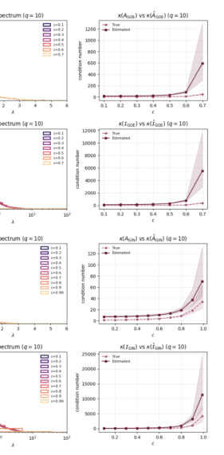
<figcaption class="paper-figure-caption"><b>Fig 1.</b> Fig. 1 Eigenvalue spectra and condition numbers for the GOE (rows 1–2) and Ginibre (rows 3–4) ensembles, each with N = 100, q = 10, ∆t = 1, nA = 30 independent realisations, and nsim = 30 trajectories per realisation. For each ensemble, the left column shows the true spectrum, the center column the estimated spectrum, and the right column the condition number as a function of c. Row 1 (GOE, drift matrix): true spectrum of A, plug-in estimator ˆA, and condition numbers κ(A) and κ( ˆA). Row 2 (GOE, Fisher information): true Fisher matrix I, plug-in estimator ˆI, and their condition numbers. Rows 3–4 repeat the same comparisons for the Ginibre ensemble; spectra show the real part of the...</figcaption>
</figure>
<figure class="paper-figure-card">
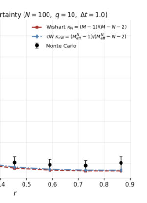
<figcaption class="paper-figure-caption"><b>Fig 2.</b> Fig. 2 Relative uncertainty of the soft mode as a function of the distance to instability r = λmin(A). The relaxation rate is estimated by projecting the inferred propagator ˆQ onto the true soft eigenvector u∗. Black circles show Monte Carlo results; the red dashed curve corresponds to the Wishart prediction κW and the blue dash-dotted curve to the compound-Wishart approximation κcW. The compound- Wishart correction provides a better approximation to the empirical uncertainty than the naive Wishart bound, consistently capturing the growth of σr/r as criticality is approached. The projection isolates the soft mode and removes the order-statistic fluctuations associated with λmin( ˆ A).</figcaption>
</figure>
<figure class="paper-figure-card">
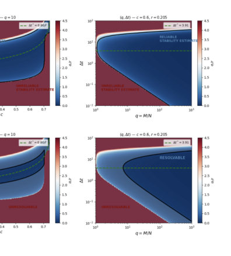
<figcaption class="paper-figure-caption"><b>Fig 3.</b> Fig. 3 Stability inference and resolution phase diagrams for the GOE ensemble (N = 100, κcW inflation factor, Tracy–Widom finite-size correction). Each panel shows the relative uncertainty σr/r as a function of two system or experimental parameters, with the remaining parameter fixed. Top row (stability diagnosis boundary, σr/r = 1): regions above the boundary (red overlay) correspond to a false-instability probability Pfalse ≥Φ(−1) ≈16%, i.e. the data are insufficient to reliably determine the sign of r. Bottom row (resolution boundary, σr/r = 0.1): regions above the boundary indicate that r cannot be estimated with better than 10% relative precision; below it, the distance to instability...</figcaption>
</figure>
<figure class="paper-figure-card">
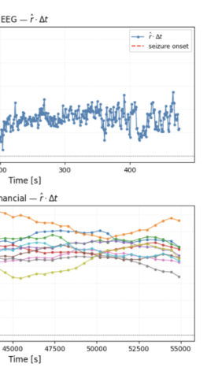
<figcaption class="paper-figure-caption"><b>Fig 4.</b> Fig. 4 Estimated distance to instability ˆr · ∆t across sliding windows for the EEG and financial datasets. Top: EEG recording from a representative patient. Each point corresponds to a sliding window estimate; the red dashed line marks seizure onset. In the pre-ictal phase ˆr · ∆t exhibits large fluctuations, suggesting that the system repeatedly approaches and retreats from the stability boundary before eventually crossing it. At seizure onset the inferred distance drops sharply and remains suppressed throughout the post-ictal phase, consistent with a transient approach to instability during the ictal event. Bottom: Financial volatility panel (N = 47 equities, ∆t = 1 s) across the ten...</figcaption>
</figure>
<figure class="paper-figure-card">
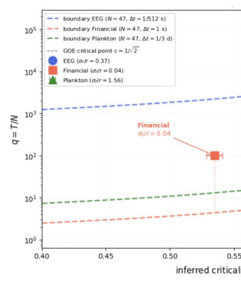
<figcaption class="paper-figure-caption"><b>Fig 5.</b> Fig. 5 Resolvability phase diagram for three empirical datasets, overlaid on the GOE boundary. Each dashed curve is the dataset-specific resolvability boundary q∗(c) defined by σr/r = 1, computed using the system-specific parameters (N, ∆t); points above the curve are resolvable. The financial volatility series (red, N = 47, ∆t = 1 s) lies well above its boundary with σr/r = 0.04, indicating precise resolution of the distance to instability. The intracranial EEG (blue, N = 47, ∆t = 1/512 s) sits close to its boundary with σr/r = 0.37: the stability can be diagnosed but the precise value of r is poorly resolved. The plankton series (green, N = 47, ∆t = 1/3 d) falls below its boundary with...</figcaption>
</figure>

**Summary.** This paper establishes fundamental theoretical limits on how precisely we can measure a system's proximity to an instability threshold using limited data. It shows that this precision degrades severely as criticality is approached due to increased temporal correlations, leading to potential inference failure even with abundant raw data. The methodology applies these rigorous statistical bounds to diverse systems like neural circuits and financial markets.

**Why it may be interesting.** The work provides rigorous quantitative bounds on the information content extractable from noisy time series near phase transitions, which is highly relevant for understanding critical dynamics in complex physical systems beyond standard equilibrium statistical mechanics.

Detailed structure

**Main problem.** The core problem is determining the fundamental, achievable precision for estimating how close a complex system is to an instability threshold using finite, noisy time-series data.

**Main result.** The uncertainty in estimating this distance diverges as the system approaches criticality ($r 	o 0$), and inference can fail entirely if temporal correlations reduce the effective number of independent observations below the system dimension.

**Method.** The analysis uses statistical inference techniques (MLE, Bayesian) applied to models based on the multivariate Ornstein-Uhlenbeck process. Key diagnostics involve calculating the Fisher information matrix and accounting for sample correlation via an 'effective sample size'.

**Model / system.** The system is modeled using a linear, stationary framework, specifically the multivariate Ornstein-Uhlenbeck (OU) process, which describes relaxation near a fixed point. Applications include analyzing financial volatility, plankton abundance, and intracranial EEG recordings.

**Key observables.** Relative uncertainty on the estimated distance to criticality ($\sigma_r/r$), effective sample size ($M_{	ext{eff}}$), and the dimensionless product $r\Delta t = \lambda_{\min}(\hat{\mathbf{A}}) \Delta t$.

**Important parameters / regimes.** Distance to criticality ($r$), system dimension ($N$), number of samples ($M$), and sampling interval ($\Delta t$). The critical threshold is defined by $\sigma_r/r=0.1$ for high resolution.

**Assumptions / limitations.** The analysis often relies on the linear, stationary OU description, which breaks down near true criticality where relaxation times diverge; approximations like Gaussianity are also used.

**Figures summary.** Figures illustrate eigenvalue spectra and condition numbers ($\kappa$) as coupling strength increases toward critical points. Phase diagrams map out boundaries for stable diagnosis versus quantitative resolution based on sample size and sampling rate.

**Paper structure.** The paper develops the theoretical framework by analyzing the estimation precision using Fisher information, derives necessary corrections (like $M_{	ext{eff}}$), establishes multiple diagnostic thresholds ($\sigma_r/r=1$ vs $\sigma_r/r=0.1$), and validates these limits across diverse empirical datasets.

Abstract

Many complex systems, including ecosystems, neural circuits, and financial markets, are inferred to operate close to a threshold of instability, at which a small perturbation can propagate across the entire system. This proximity is often interpreted as functionally advantageous, yet it poses a question common to all these fields: from a finite, noisy recording, how precisely can the distance of a system from that threshold be estimated? Using the multivariate Ornstein-Uhlenbeck process as the canonical linear model of relaxation near a stable fixed point, we show that the attainable precision is governed by three factors: an effective measurement budget, set by the number of samples relative to the system dimension and the sampling interval; the signal-to-noise ratio, given by the magnitude of deterministic interactions relative to stochastic forcing; and the distance to criticality, which simultaneously sets the system's correlation times and degrades both of the preceding factors. As the slowest dynamical mode softens near the threshold, the curvature of the log-likelihood flattens along the direction that determines stability, so that the relative uncertainty on the estimated distance diverges as that distance vanishes. Critically, temporal correlations near instability reduce the effective number of independent observations far below the nominal sample count, and inference breaks down when this effective count falls below the system dimension, even when the raw data volume appears sufficient.   A direct consequence is the existence of an optimal sampling interval that diverges as the system approaches criticality, with practical implications for experimental design.

[↑ back to top](#top)

### [On a Central Limit Theorem and Sanov's principle for quantum neural networks](http://arxiv.org/abs/2606.21721v1)

**Authors:** Anderson Melchor Hernandez  
**Type:** theory · **Category:** disordered systems and neural networks · **PDF:** <https://arxiv.org/pdf/2606.21721v1>  
**Analysis basis:** full PDF text, analyzed in chunks
**Topic relevance:** `methods for driven-dissipative` **3/5** · `non-equilibrium dynamics` **2/5** · `non-equilibrium universality` **2/5** · `Keldysh / 2PI / non-Gaussian methods` **1/5** · `driven-dissipative phase transition` **1/5**

↔ Scroll figures horizontally

<figure class="paper-figure-card">
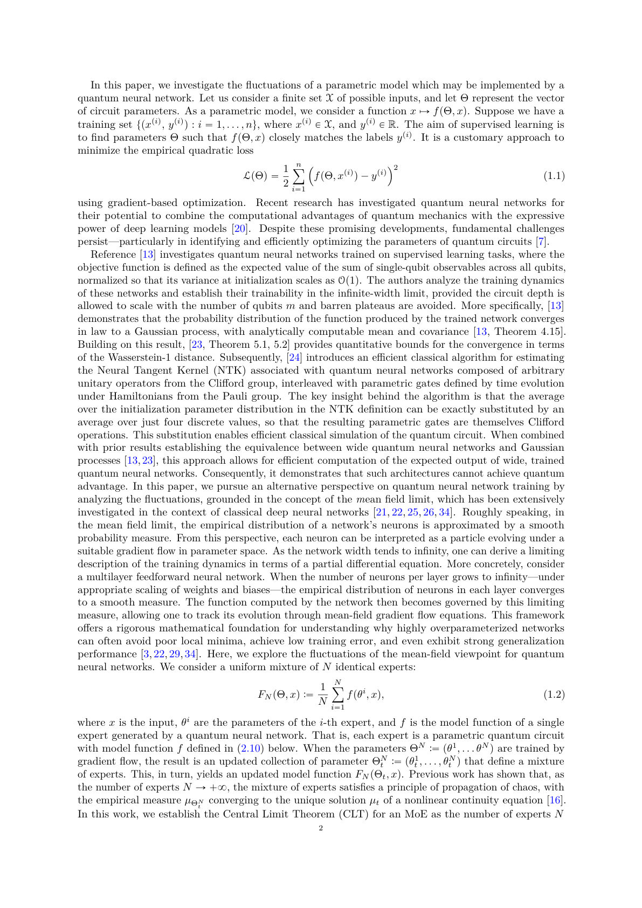
<figcaption class="paper-figure-caption"><b>Fig 1.</b> Low-resolution page preview, page 2</figcaption>
</figure>
<figure class="paper-figure-card">
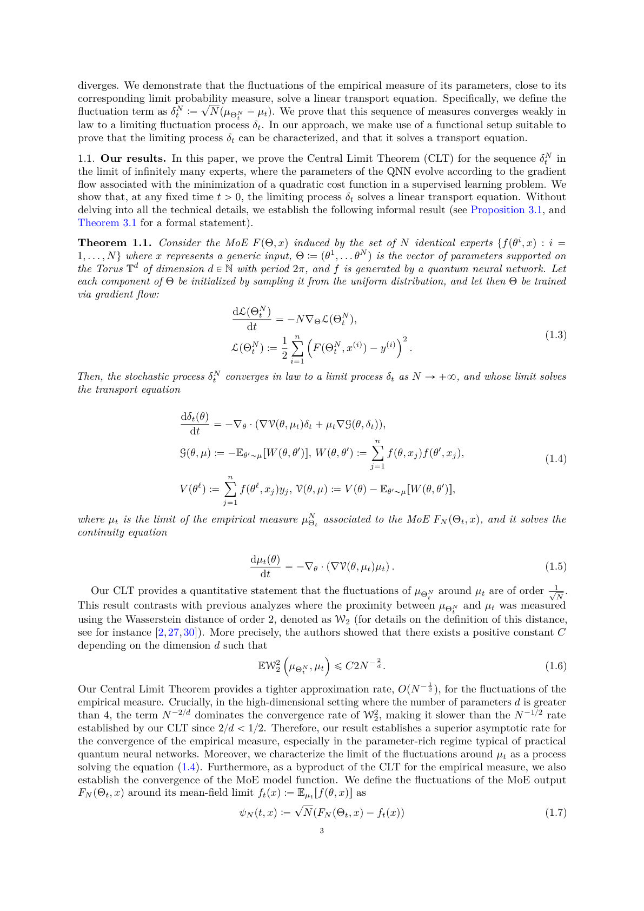
<figcaption class="paper-figure-caption"><b>Fig 2.</b> Low-resolution page preview, page 3</figcaption>
</figure>
<figure class="paper-figure-card">
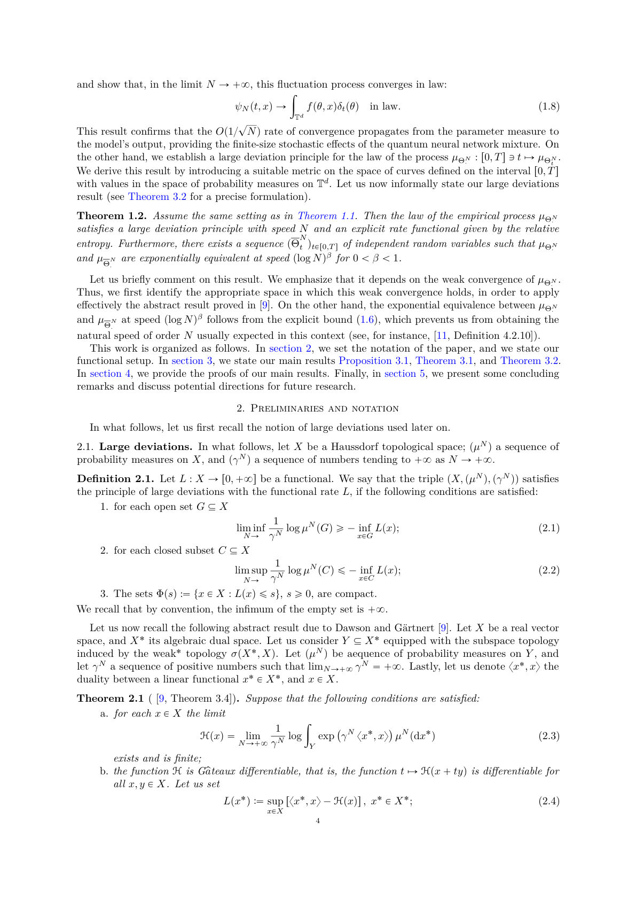
<figcaption class="paper-figure-caption"><b>Fig 3.</b> Low-resolution page preview, page 4</figcaption>
</figure>
<figure class="paper-figure-card">
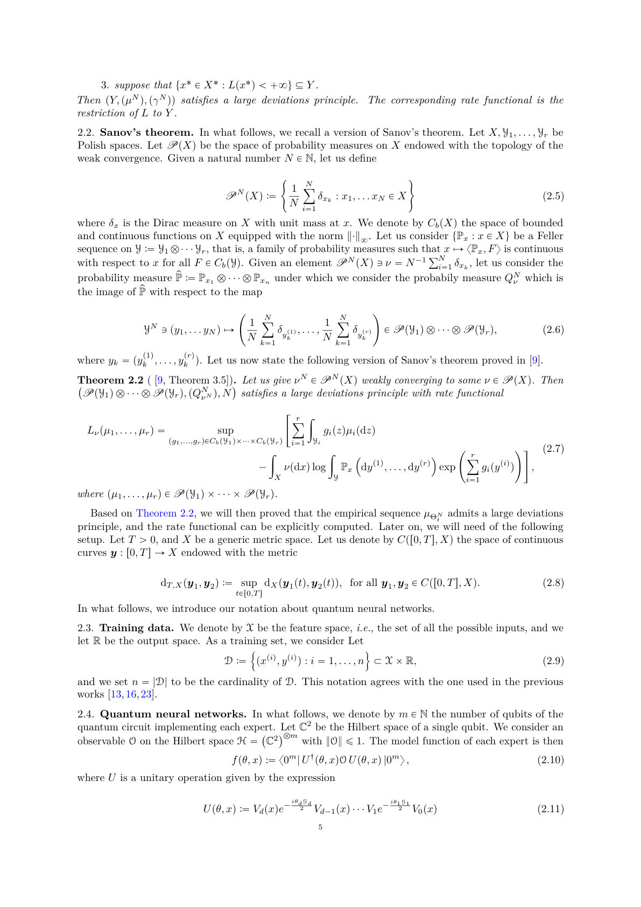
<figcaption class="paper-figure-caption"><b>Fig 4.</b> Low-resolution page preview, page 5</figcaption>
</figure>
<figure class="paper-figure-card">
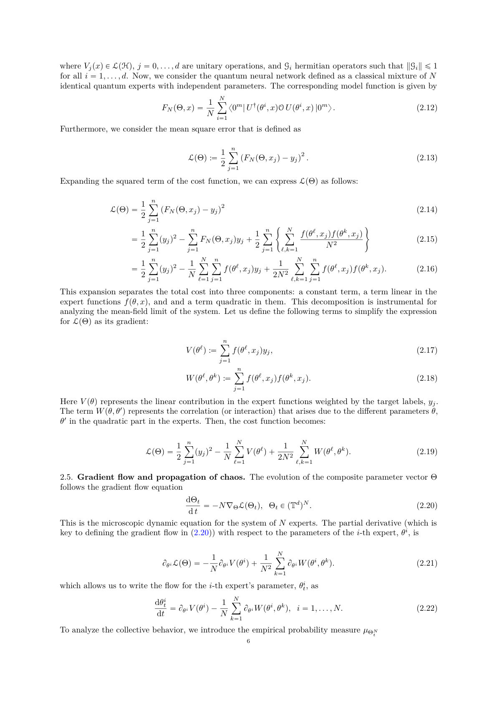
<figcaption class="paper-figure-caption"><b>Fig 5.</b> Low-resolution page preview, page 6</figcaption>
</figure>

**Summary.** This paper provides a deep theoretical analysis of the statistical mechanics governing Quantum Neural Networks trained via gradient flow. It proves that the system's fluctuations obey a Central Limit Theorem, allowing for the precise characterization of how the ensemble average converges to a deterministic limit function. This work establishes rigorous mathematical foundations for using mean-field approximations in quantum machine learning models.

**Why it may be interesting.** The rigorous mathematical tools developed—CLT and LDP for complex, high-dimensional stochastic systems like QNNs—provide powerful techniques applicable to analyzing non-equilibrium dynamics in quantum many-body systems or open quantum systems where mean-field approximations are used.

Detailed structure

**Main problem.** The work studies the asymptotic fluctuations of a Mixture of Experts (MoE) generated by a quantum neural network (QNN) trained via gradient flow.

**Main result.** It establishes both a Central Limit Theorem (CLT) and Sanov's principle for the MoE, showing that the fluctuation process converges to a solution of a linear transport equation.

**Method.** The analysis employs mean-field limits, large deviation theory, and functional analysis on Sobolev spaces to characterize the convergence rates of empirical measures.

**Model / system.** The system is a Quantum Neural Network (QNN) modeled as an MoE of $N$ experts trained using gradient flow minimizing a quadratic loss function. The dynamics are governed by continuity equations for the empirical measure $\mu_{\Theta_N}^t$.

**Key observables.** Fluctuation processes ($\delta_N^t$, $\psi_{Npt, x_q}$), the empirical measure $\mu_{\Theta_N}^t$, and the limit function $f_t$ solving a kernel-based evolution equation.

**Important parameters / regimes.** The number of experts ($N 	o \infty$), time ($t$), and the dimension of the parameter space ($d$).

**Assumptions / limitations.** The analysis assumes training via gradient flow minimizing a quadratic cost function, and relies on establishing weak compactness in appropriate Sobolev spaces.

**Paper structure.** The paper progresses by first defining the mean-field limit ($\mu_t$) and then rigorously analyzing the fluctuations around this limit. Key steps involve applying CLT to show $\delta_N^t$ converges to a deterministic process, followed by establishing large deviation principles for the empirical measures.

Abstract

In this work, we study the fluctuations of a Mixture of Experts (MoE) generated by a quantum neural network trained via gradient flow on supervised learning problems. Our main results establish the Central Limit Theorem (CLT), and Sanov's principle for an MoE as the number of experts diverges. We demonstrate that the fluctuations of the empirical measure of its parameters close to its corresponding limit probability measure solve a linear transport equation. As a byproduct, we show that the MoE converges to a limit function which solves an evolution equation governed by the neural tangent kernel associated with the quantum neural network.

[↑ back to top](#top)

### [StableShots: Online Shot Stopping for Quantum Circuit Execution](http://arxiv.org/abs/2606.22170v1)

**Authors:** Giuseppe Bisicchia, Alessandro Bocci, Ernesto Pimentel, Antonio Brogi  
**Type:** experiment · **Category:** quantum information and computing · **PDF:** <https://arxiv.org/pdf/2606.22170v1>  
**Analysis basis:** full PDF text, analyzed in chunks
**Topic relevance:** `quantum measurements` **3/5** · `QC/QI experiment` **2/5** · `measurement-induced transitions` **2/5** · `driven-dissipative phase transition` **1/5** · `methods for driven-dissipative` **1/5**

↔ Scroll figures horizontally

<figure class="paper-figure-card">
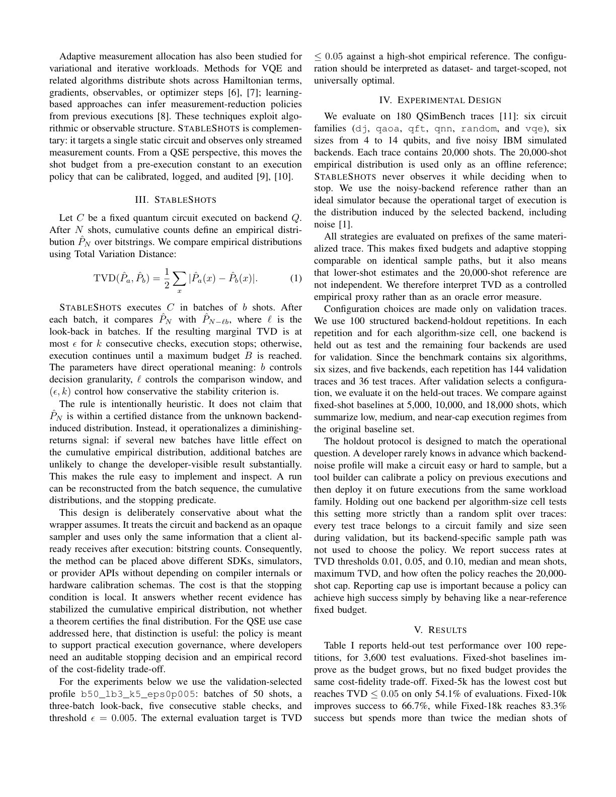
<figcaption class="paper-figure-caption"><b>Fig 1.</b> Low-resolution page preview, page 2</figcaption>
</figure>
<figure class="paper-figure-card">
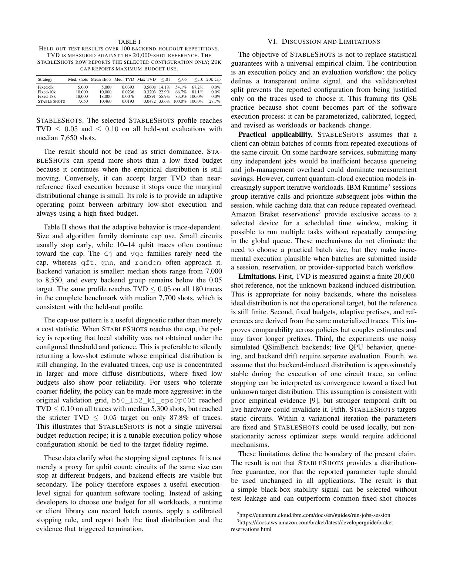
<figcaption class="paper-figure-caption"><b>Fig 2.</b> Low-resolution page preview, page 3</figcaption>
</figure>
<figure class="paper-figure-card">
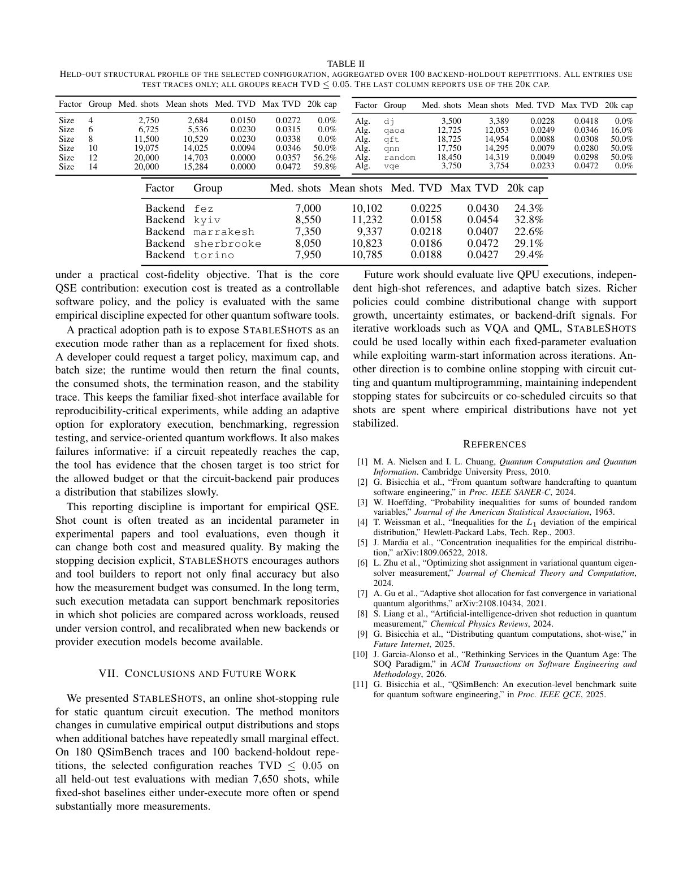
<figcaption class="paper-figure-caption"><b>Fig 3.</b> Low-resolution page preview, page 4</figcaption>
</figure>

**Summary.** This paper introduces StableShots, an adaptive online stopping rule designed to optimize shot usage during quantum circuit execution. By monitoring the Total Variation Distance between empirical measurements, it determines when enough shots have been collected to achieve a desired fidelity threshold without wasting resources. This method significantly improves the cost-fidelity trade-off compared to using fixed measurement budgets.

**Why it may be interesting.** While focused on resource optimization rather than fundamental physics, the concept of using statistical convergence criteria (like TVD) to dynamically manage computational resources is relevant for developing robust algorithms in open quantum systems where measurement noise dictates feasibility.

Detailed structure

**Main problem.** Traditional quantum circuit execution relies on fixed shot budgets, which is inefficient as low budgets under-sample results while high budgets waste resources.

**Main result.** The proposed online stopping rule, StableShots, achieves the target fidelity ($	ext{TVD} \le 0.05$) with a median shot count (7,650) that significantly outperforms fixed-shot baselines on held-out test evaluations.

**Method.** StableShots is a black-box online stopping rule that executes circuits in small batches and monitors the Total Variation Distance ($	ext{TVD}$) between cumulative empirical distributions to determine when local stability is reached.

**Model / system.** The method is tested on quantum circuits executed on noisy IBM simulated backends, evaluated across 180 QSimBench traces spanning various qubit counts (4 to 14).

**Key observables.** Total Variation Distance ($	ext{TVD}$), median/mean shot count required for stability.

**Important parameters / regimes.** The stopping criterion involves monitoring $	ext{TVD} \le \epsilon$ over $k$ consecutive checks, using small batch sizes ($b$).

**Assumptions / limitations.** STABLESHOTS provides a local signal of diminishing returns rather than a formal guarantee of final fidelity; the comparison uses finite-shot reference distributions.

**Figures summary.** Table I compares STABLESHOTS performance against fixed-shot baselines across various metrics (shots, TVD thresholds), showing superior cost-fidelity trade-offs.

**Paper structure.** The paper introduces the problem of static shot budgeting, details the StableShots online stopping rule based on monitoring $	ext{TVD}$, and validates its efficacy through extensive testing against fixed budgets on simulated noisy quantum hardware.

Abstract

Quantum circuit execution estimates output distributions by repeated measurements, yet developers commonly choose a fixed shot budget before execution. This static choice is brittle: low budgets can under-sample the distribution, while high budgets waste measurements. In this paper, we present StableShots, a black-box online stopping rule for static quantum circuits. The method executes a fixed circuit in small batches, monitors the total-variation distance between cumulative empirical distributions, and stops after repeated evidence of local stability. We evaluate StableShots on 180 QSimBench traces spanning six circuit families, six sizes from 4 to 14 qubits, and five noisy IBM simulated backends. With validation-only calibration and 100 repeated backend-holdout splits, the selected configuration reaches TVD <= 0.05 on all held-out test evaluations with median 7,650 shots, whereas fixed-shot baselines either fail more often or spend substantially more shots.

[↑ back to top](#top)

### [Detector-Grade Germanium as a Low-Disorder Host for Indium-Acceptor Spin Qubits: A Five-Qubit Materials-to-Architecture Design Study](http://arxiv.org/abs/2606.22067v1)

**Authors:** D. -M. Mei, K. -M. Dong, S. A. Panamaldeniya, N. Budhathoki, S. Chhetri, A. Prem, S. Bhattarai  
**Type:** theory · **Category:** quantum information and computing · **PDF:** <https://arxiv.org/pdf/2606.22067v1>  
**Analysis basis:** full PDF text, analyzed in chunks
**Topic relevance:** `spintronics-quantum-optics interface` **3/5** · `QC/QI experiment` **2/5** · `Kondo & dissipative impurity` **1/5** · `analog quantum simulation` **1/5** · `exotic spin models in light-matter` **1/5**

↔ Scroll figures horizontally

<figure class="paper-figure-card">
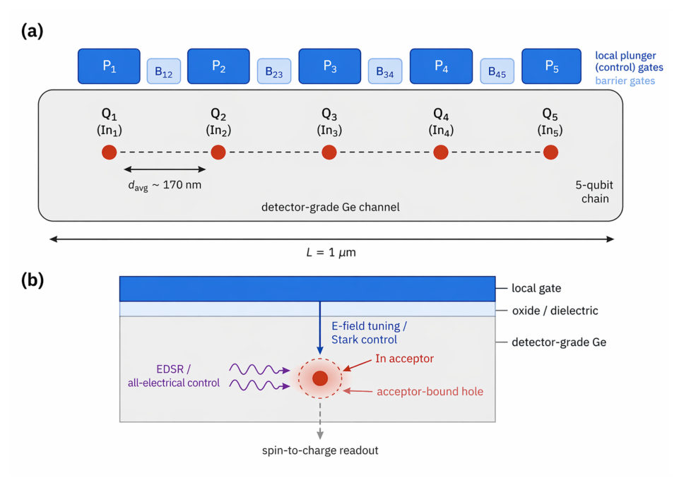
<figcaption class="paper-figure-caption"><b>Fig 1.</b> Figure 1: Conceptual design of a five-qubit indium-acceptor platform in detector-grade Ge. (a) Top- view architecture of a one-dimensional qubit chain formed by five mapped In acceptor sites, labeled Q1–Q5, embedded in a detector-grade Ge channel. The labels Q1–Q5 represent one successfully mapped post-fabrication realization of the statistical acceptor distribution, not predetermined implantation sites. A shallow surface gate stack provides local plunger/control gates (P1–P5) and barrier gates (B12, B23, B34, B45) that are biased after mapping to tune the local electrostatic environment and inter-qubit coupling. In a practical device, additional outer barrier or reservoir- coupling gates...</figcaption>
</figure>
<figure class="paper-figure-card">
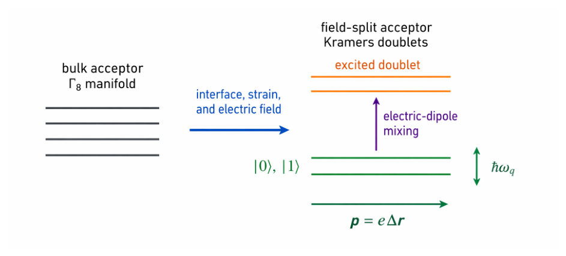
<figcaption class="paper-figure-caption"><b>Fig 2.</b> Figure 2: Schematic physics of an In acceptor qubit in Ge. In bulk, the acceptor-bound hole inherits the fourfold Γ8 valence-band manifold. Near an interface or under an applied electric field, this manifold splits into two Kramers doublets. The lowest doublet forms the qubit basis, while the excited doublet enables electric-dipole-mediated control through spin–orbit-induced mixing.</figcaption>
</figure>
<figure class="paper-figure-card">
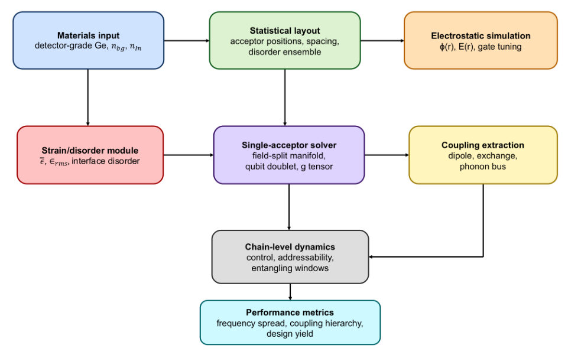
<figcaption class="paper-figure-caption"><b>Fig 3.</b> Figure 3: Multiscale modeling workflow for the proposed five-qubit In-acceptor platform in detector- grade Ge. The figure plots the logical data flow used in the design study: detector-grade materials in- puts and a statistically generated In-acceptor layout feed electrostatic gate modeling, strain/disorder analysis, and single-acceptor Hamiltonian extraction; these outputs are then used to compute Stark tunability, qubit-frequency spread, pairwise dipolar/exchange-assisted coupling, and chain-level dynamical behavior. The optional phononic-crystal cavity branch plots how an engineered acoustic bandgap or defect mode modifies the local phonon density of states, the phonon-limited relaxation...</figcaption>
</figure>
<figure class="paper-figure-card">
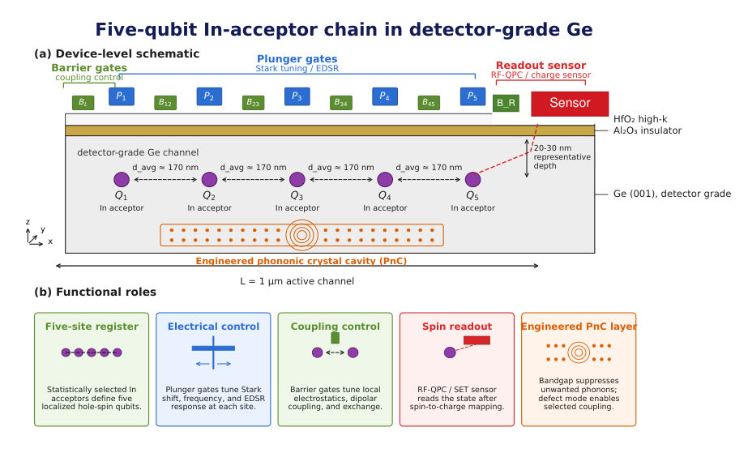
<figcaption class="paper-figure-caption"><b>Fig 4.</b> Figure 4: Conceptual summary of the proposed five-qubit In-acceptor platform in detector-grade Ge. (a) A 1 µm-scale detector-grade Ge channel contains a statistically selected In-acceptor register, Q1–Q5, controlled by local plunger and barrier gates and read out through a nearby RF charge sensor. The labels denote one mapped post-fabrication realization, not predetermined implantation sites. (b) Functional modules of the architecture: statistical register selection, electrical control, coupling control, spin-to-charge readout, and optional PnC-enabled phonon filtering or selected cavity-mediated coupling.</figcaption>
</figure>

**Summary.** The paper proposes using Indium acceptors in ultra-pure Germanium to create an array of hole-spin qubits. It details how detector-grade material suppresses environmental noise while the engineered acceptor spacing allows for electrical control and coupling mechanisms. This establishes a robust, intermediate architecture for scaling quantum processors.

**Why it may be interesting.** This work is highly relevant as it tackles the material science interface of solid-state quantum computing, proposing a specific, chemically defined impurity platform that bridges established donor/electron systems with fully lithographically defined gate structures.

Detailed structure

**Main problem.** Developing a scalable, manufacturable hardware architecture for semiconductor quantum information processing using acceptor-bound hole spins in Germanium (Ge).

**Main result.** Detector-grade Ge with controlled Indium doping provides a credible intermediate platform for hole-spin qubits, offering all-electrical control and manageable disorder.

**Method.** The study uses a theory-guided design approach combining materials science predictions (impurity levels) with device architecture engineering (Phononic Crystal integration).

**Model / system.** The system is an array of acceptor-bound hole spins in Ge, where the qubit basis derives from the spin-orbit active valence band manifold. The Hamiltonian incorporates terms for electric field control and inter-acceptor coupling.

**Key observables.** Spin coherence time ($T_2$), electrical tunability (via EDSR), nearest-neighbor coupling strength ($J_{i,i+1}$), and the ratio $\Lambda_{1D} = J_{i,i+1} / \delta\omega_{idle}$.

**Important parameters / regimes.** Target In density ($\sim 2 	imes 10^{14} 	ext{ cm}^{-3}$), characteristic acceptor spacing ($\sim 170 	ext{ nm}$), and background impurity level ($\sim 10^{10} 	ext{ cm}^{-3}$).

**Assumptions / limitations.** The primary assumptions involve the ability to suppress bulk electrostatic/strain disorder using detector-grade material, and that PnC engineering can successfully manage unwanted acoustic phonon modes.

**Figures summary.** Conceptual layouts illustrate a one-dimensional five-qubit chain embedded in Ge, showing local gate structures for electrical control and cross-sections detailing the integration of Phononic Crystal cavities for environmental management.

**Paper structure.** The paper progresses from identifying the physical limitations (disorder) to proposing a materials solution ($	ext{In}$ doping in detector-grade $	ext{Ge}$), establishing the fundamental physics (Hamiltonian, coupling mechanisms), and finally detailing a staged, multi-component architecture including Phononic Crystal enhancement for scalability.

Abstract

Acceptor-bound hole spins in germanium (Ge) offer a promising but underexplored route to semiconductor quantum information processing. We present a theory-guided design study of a detector-grade Ge acceptor-spin platform based on intentionally incorporated indium (In) acceptors in ultra-high-purity Ge. The proposed materials strategy combines a residual impurity background near $10^{10} \mathrm{cm^{-3}}$ with a target In density of approximately $2\times10^{14} \mathrm{cm^{-3}}$, corresponding to an acceptor spacing of about 170 nanometer. A 1 $μ$m-long active channel with a suitable transverse mode volume can contain about five acceptors on average, enabling a statistically selected post-fabrication register rather than a deterministically placed chain. We analyze the physical basis, device architecture, strain and disorder limits, coupling hierarchy, modeling workflow, fabrication pathway, and scaling prospects. Our results indicate that detector-grade Ge can suppress uncontrolled bulk electrostatic and strain disorder to levels compatible with acceptor-hole qubits, while the spin--orbit-active valence-band manifold supports all-electrical control and dipolar or phonon-mediated coupling. Direct exchange is treated as a close-pair or gate-enhanced interaction rather than the generic mean-spacing coupling. Phononic crystal engineering is identified as a second-stage enhancement for suppressing unwanted acoustic modes and enabling selected cavity-mediated interactions after baseline control, readout, and nearest-neighbor coupling are validated. Remaining challenges include statistical acceptor placement, interface disorder, charge noise, readout integration, and experimental validation. This work identifies detector-grade Ge In-acceptor qubits as a credible intermediate architecture between donor-based impurity qubits and fully gate-defined Ge hole-spin hardware.

[↑ back to top](#top)

### [Genuine certification of incompatible quantum instruments through sequential communication tasks](http://arxiv.org/abs/2606.23647v1)

**Authors:** Arindam Mitra, Satyaki Manna, Debashis Saha  
**Type:** theory · **Category:** quantum information and computing · **PDF:** <https://arxiv.org/pdf/2606.23647v1>  
**Analysis basis:** full PDF text, analyzed in chunks
**Topic relevance:** `quantum measurements` **3/5** · `entanglement & information structure` **2/5** · `measurement-induced transitions` **2/5** · `Keldysh / 2PI / non-Gaussian methods` **1/5**

↔ Scroll figures horizontally

<figure class="paper-figure-card">
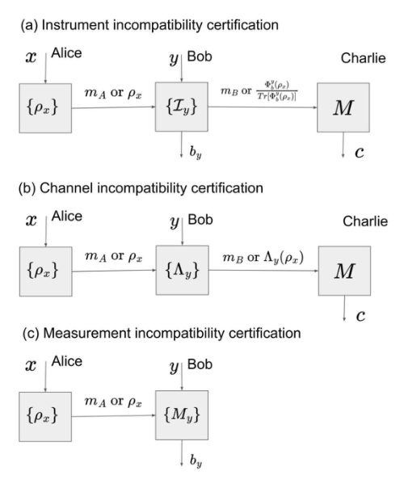
<figcaption class="paper-figure-caption"><b>Fig 1.</b> FIG. 1. Fig. (a) depicts the scenario of instrument incompatibility certification that we explore in this work. The scenarios depicted Fig. (b) and Fig. (c) are the scenarios of measurement and channel incompatibility certification scenarios respectively and are the special cases of the scenario depicted in Fig. (a) which is unified.</figcaption>
</figure>
<figure class="paper-figure-card">
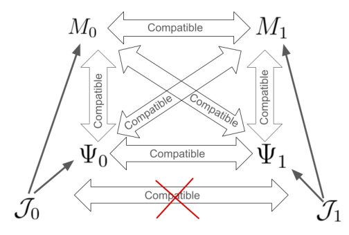
<figcaption class="paper-figure-caption"><b>Fig 2.</b> FIG. 2. The instrument J0 induces a channel Ψ0 and a measurement M0. Similarly, the instrument J1 induces channel Ψ1 and measurement M1. All induced measurements and channels are pairwise compatible. But Jo and J1 are incompatible. Therefore, any certification protocol that is able to certify the incompatibility of J0 and J1, does not depend on the incompatibility of induced measurements and channels and therefore, it is genuine.</figcaption>
</figure>

**Summary.** The paper introduces a novel method to certify that two quantum instruments are incompatible by designing a specific three-party sequential communication task. By showing that the maximum achievable performance in this task exceeds the classical limit, they prove the nonclassical nature (incompatibility) of the instruments. This establishes instrument incompatibility as an operational resource for quantum advantage.

**Why it may be interesting.** This work provides a powerful, general framework to detect fundamental nonclassical features (like instrument incompatibility) using communication protocols, which is highly relevant for understanding the limits of quantum information processing.

Detailed structure

**Main problem.** To establish an operational method for certifying the incompatibility of quantum instruments, which is a fundamental manifestation of nonclassicality in quantum theory.

**Main result.** The authors developed a genuine certification protocol using sequential communication tasks where violating a classical bound proves that the implemented quantum instruments are incompatible. This demonstrates instrument incompatibility as a source of quantum advantage in communication.

**Method.** They analyze a three-party sequential communication task, comparing the achievable 'figure of merit' for quantum vs. classically constrained strategies to derive necessary bounds for compatibility.

**Model / system.** The model involves three parties (sender, relayer, receiver) and focuses on quantum instruments, which generalize measurements and channels. The core diagnostic tool is a figure of merit derived from conditional probabilities in the communication task.

**Key observables.** Figure of merit ($S$), comparing $S_{Q}^{	ext{op}}$ (quantum optimum), $S_{QC}^{	ext{op}}$ (compatible quantum optimum), and $S_{C}^{	ext{op}}$ (classical optimum).

**Important parameters / regimes.** The task is generalized using $(m_A, d)$-sequential XOR tasks; specific results are derived for the $(2, 2)$ case.

**Assumptions / limitations.** The protocol's genuineness relies on it not depending on the pairwise compatibility of induced measurements and channels, even when instruments themselves might be intrinsically incompatible.

**Figures summary.** Figure 1 illustrates the general setup for instrument incompatibility certification using sequential communication tasks, showing special cases for measurement and channel incompatibility.

**Paper structure.** The paper first defines the problem using a three-party task. It then establishes bounds by comparing quantum vs. classical performance (Propositions 1 & 2). The core results are presented via analyzing specific XOR tasks ($(m_A, d)$-tasks), proving quantum advantage ($	ext{SQ} > 	ext{SC}$) for incompatible instruments.

Abstract

Quantum instruments constitute the general description of quantum dynamics, encompassing both quantum measurements and quantum channels as special cases. Consequently, the incompatibility of quantum instruments represents a fundamental manifestation of nonclassicality in quantum theory. Here, we establish the operational significance of this notion by demonstrating communication tasks with classical inputs and outputs that enable the semi-device-independent certification of incompatible quantum instruments. We introduce a class of three-party communication tasks involving a sender, a relayer, and a receiver, and derive the tight upper bound of the figure of merits of these tasks achievable by all compatible instruments implemented by the relayer and this bound coincides with the optimal performance attainable in a classical communication subject to the same dimensional constraints. Violation of this bound certifies the incompatibility of the pair of quantum instruments implemented by the relayer. This identifies certification of incompatible instruments as a manifestation of quantum advantage in communication. This certification protocol is genuine as it is able to certify the incompatibility of a pair of instruments where the measurements and channels induced by the instruments are pairwise compatible and, therefore it does not depend on the incompability of measurements and channels induced by the instruments. Finally, we identify the simplest instances of our communication scenario that enable the certification of incompatible quantum instruments.

[↑ back to top](#top)

### [Structural and physical properties of gyromorphs and disordered stealthy hyperuniform media](http://arxiv.org/abs/2606.22300v1)

**Authors:** Murray Skolnick, Riccardo Franchi, Luca Dal Negro, Paul J. Steinhardt, Salvatore Torquato  
**Type:** theory · **Category:** disordered systems and neural networks · **PDF:** <https://arxiv.org/pdf/2606.22300v1>  
**Analysis basis:** full PDF text, analyzed in chunks
**Topic relevance:** `interference shaping light` **3/5** · `Keldysh / 2PI / non-Gaussian methods` **1/5** · `analog quantum simulation` **1/5** · `correlated cavity matter` **1/5** · `driven-dissipative phase transition` **1/5** · `methods for driven-dissipative` **1/5**

↔ Scroll figures horizontally

<figure class="paper-figure-card">
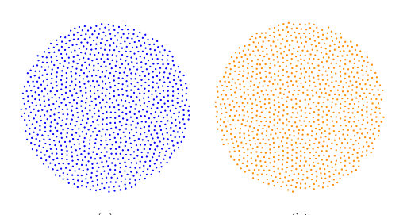
<figcaption class="paper-figure-caption"><b>Fig 1.</b> FIG. 1. Representative images of (a) a stealthy hyperuniform point pattern with χ ≈0.49 and (b) a G = 60 gyromorph with Fourier ring radius KL/(2π). The structures in (a) and (b) each contain N = 1000 points and were prepared by taking circular cutouts of larger systems with N ∼104. As discussed below, the sample sizes used to ascertain their optical prop- erties are an order of magnitude larger.</figcaption>
</figure>
<figure class="paper-figure-card">
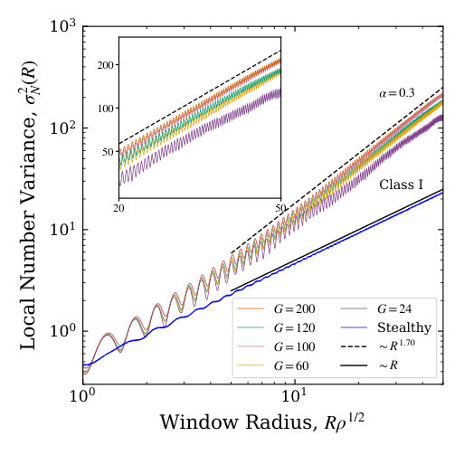
<figcaption class="paper-figure-caption"><b>Fig 2.</b> FIG. 2. Log-log plots of the local number variance σ2 N(R) for χ = 0.49 stealthy and 24 ≤G ≤200 gyromorphs with Fourier ring radius KL/(2π) = 300. The inset highlights the large-R Class III hyperuniform scaling of the gyromorphs observed for 5 ≤Rρ1/2 ≤50. Note that only σ2 N(R) of higher G gyromorphs, which are effectively isotropic, are plotted here in order to keep them on equal footing with the truly isotropic stealthy hyperuniform systems.</figcaption>
</figure>
<figure class="paper-figure-card">
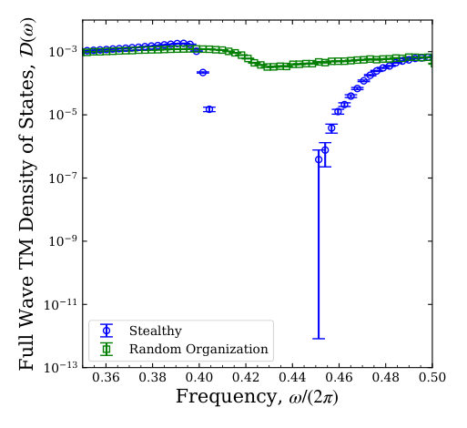
<figcaption class="paper-figure-caption"><b>Fig 3.</b> FIG. 4. Area-normalized full-wave TM density of states D(ω) at the Γ point for periodic arrays of identical high-dielectric disks in air generated from stealthy hyperuniform systems with χ ≃0.49 and Class III random organization disk pat- terns with scaling exponent α = 0.42. The dielectric contrast is ϵ2/ϵ1 = 9 and the disk packing fraction is ϕ2 = 0.05. The stealthy hyperuniform system exhibits a TM band gap, with D(ω) = 0 over the indicated frequency interval at the reso- lution considered, whereas the random organization system exhibits only a shallow pseudogap with finite D(ω).</figcaption>
</figure>
<figure class="paper-figure-card">
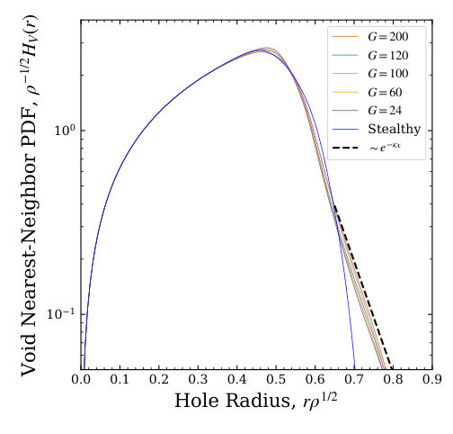
<figcaption class="paper-figure-caption"><b>Fig 4.</b> FIG. 3. Semilog plots of the void nearest-neighbor probability density HV (r) for stealthy hyperuniform systems with χ = 0.49, 24 ≤G ≤200 gyromorphs with Fourier ring radius KL/(2π) = 300. The plotted quantity is ρ−1/2HV (r). The dashed black lines highlight the exponential-like large-R tails of the G = 24, 60, 120 gyromorphs. Note that only HV (r) of higher G gyromorphs, which are effectively isotropic, are plotted here in order to keep them on equal footing with the truly isotropic stealthy hyperuniform systems.</figcaption>
</figure>
<figure class="paper-figure-card">
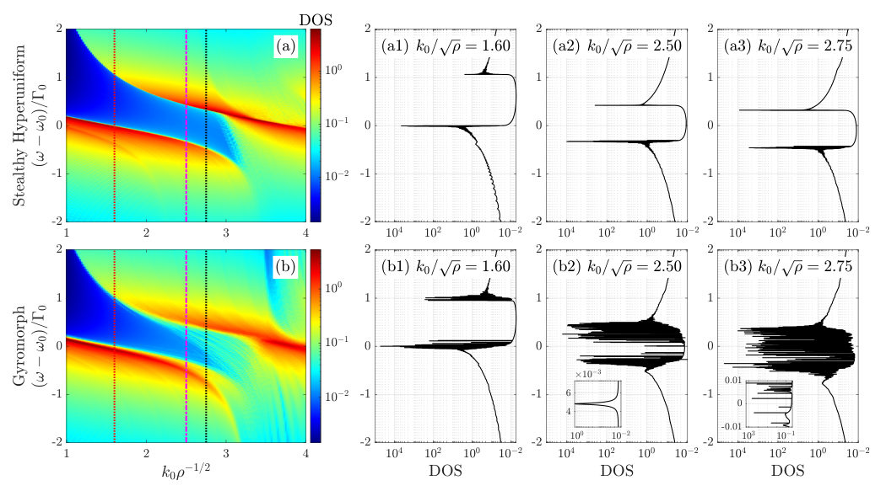
<figcaption class="paper-figure-caption"><b>Fig 5.</b> FIG. 5. TM DOS maps for: (a) stealthy hyperuniform, and (b) gyromorph. The maps are plotted as a function of the normalized wavenumber k0ρ−1/2 and the normalized angular frequency (ω −ω0)/Γ0. Panels (a1)–(a3) and (b1)–(b3) display corresponding line cuts extracted from the DOS maps at k0ρ−1/2 = 1.60 (red dotted line), 2.50 (magenta dashed-dotted line), and 2.75 (black dotted line). Calculations are performed for arrays of N = 6500 dipoles, with a normalized angular frequency resolution of 8 × 10−3 in the DOS maps and 10−7 in the line cuts.</figcaption>
</figure>

**Summary.** The paper rigorously compares the structural and optical properties of gyromorphs against ideal stealthy hyperuniform materials. It concludes that while gyromorphs possess specific symmetries, their underlying structure places them in a lower hyperuniformity class (Class III). Consequently, they exhibit inferior physical performance compared to stealthy media, showing only localized pseudogaps instead of true photonic band gaps.

**Why it may be interesting.** This work provides a rigorous link between abstract mathematical concepts in disordered media (hyperuniformity class $\alpha$) and measurable physical phenomena like photonic band gaps and light localization, which is highly relevant to designing metamaterials for quantum applications.

Detailed structure

**Main problem.** The paper resolves the structural consistency of 'gyromorphs'—disordered point patterns with specific Bragg-like peaks—within the established hierarchy of disordered media compared to 'stealthy hyperuniform media.' It aims to compare their resulting physical properties, especially optical band gaps.

**Main result.** Gyromorphs are shown to belong to Class III hyperuniformity (the weakest form), predicting degraded physical properties relative to Class I stealthy hyperuniform media. Optically, gyromorphs exhibit only shallow pseudogaps filled with localized states, unlike the robust band gaps found in stealthy systems.

**Method.** The analysis employs rigorous spectral Green's matrix methods for finite, nonperiodic arrays and full-wave density-of-states calculations using the MIT Photonic Bands code. Structural classification relies on analyzing scaling exponents of the local number variance ($\sigma^2_N(R)$).

**Model / system.** The study compares three types of 2D disordered media: (1) Disordered Stealthy Hyperuniform Media (Class I), characterized by statistical isotropy and suppressed density fluctuations; (2) Gyromorphs, defined by Bragg-like peaks with discrete G-fold symmetry; and (3) benchmark structures like triangular lattices. The analysis is performed on finite arrays of resonant electric dipoles.

**Key observables.** Hyperuniformity exponent ($\alpha$), Density of States (DOS), Purcell factors, spectral gaps vs. pseudogaps, and time-dependent spreadability decay rates ($S(t)$).

**Important parameters / regimes.** The hyperuniformity class (I, II, III); the rotational symmetry order $G$; and the packing fraction ($\phi_2$) of the scatterers.

**Assumptions / limitations.** The analysis assumes that structural classification via $\alpha$ dictates physical performance; it also notes that the Green's matrix method is necessary to handle nonperiodic media accurately.

**Figures summary.** Figures compare DOS maps and line cuts for various geometries (Triangular, SHU, Gyromorph), showing robust gaps in ordered/SHU systems versus pseudogaps filled with localized states in gyromorphs. Structural analysis plots confirm Class I vs. Class III scaling.

**Paper structure.** The paper first establishes the structural definitions and theoretical framework of hyperuniformity classes. It then applies spectral Green's matrix methods to calculate optical properties (DOS, Purcell factors) for both stealthy and gyromorph structures. The core argument resolves the physical implications of the differing structural classes.

Abstract

Disordered stealthy hyperuniform materials combine liquid-like statistical isotropy with crystal-like homogeneity, suppressed density fluctuations at large length scales, bounded holes, and an isotropic structure factor that vanishes for a finite range of wavevectors. This combination yields unusual physical properties, including optical transparency, effective delocalization, ultrafast spreadability, optimal conductivity, and complete isotropic photonic bandgaps. Gyromorphs, point patterns whose structure factor includes rings of Bragg-like peaks arranged with discrete $G$-fold rotational symmetry, were recently introduced as counterexamples: disordered media that can somehow achieve the same physical properties, in some cases with higher performance, without stealthiness or hyperuniformity. In this paper, we resolve the puzzle of how gyromorphs fit consistently with the stealthy hyperuniform studies. We first show that gyromorphs are actually hyperuniform and, in the large-$G$ limit where they become nearly isotropic, belong to the weakest form of hyperuniformity, known as Class III. Thus, gyromorphs should have comparatively degraded physical properties compared to stealthy hyperuniform media, which belong to the strongest form of hyperuniformity, known as Class I. We verify this expectation using the rigorous spectral Green's matrix method for the calculation of the density of states (DOS) and Purcell factors in large arrays of electric dipoles. We find that gyromorphs display size-dependent pseudogaps richly populated by localized states rather than smooth band gaps like those found for highly stealthy hyperuniform materials or in deterministic structures such as Vogel spiral and triangular lattices. Furthermore, we predict similar disorder-induced degradation relative to stealthy hyperuniformity with regard to transparency, spreadability and diffusion properties.

[↑ back to top](#top)

### [Field-tunable quadruple-$Q$ states driven by momentum-space frustration](http://arxiv.org/abs/2606.22133v1)

**Authors:** S. Hayami  
**Type:** theory · **Category:** strongly correlated electrons · **PDF:** <https://arxiv.org/pdf/2606.22133v1>  
**Analysis basis:** full PDF text, analyzed in chunks
**Topic relevance:** `analog quantum simulation` **3/5** · `driven-dissipative phase transition` **1/5** · `entanglement & information structure` **1/5** · `exotic spin models in light-matter` **1/5** · `non-equilibrium dynamics` **1/5**

↔ Scroll figures horizontally

<figure class="paper-figure-card">
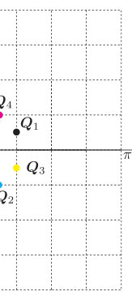
<figcaption class="paper-figure-caption"><b>Fig 1.</b> Figure 1. (Colour online) The four ordering wave vectors 𝑸1–𝑸4 are illustrated in the Brillouin zone. They are generated by applying successive fourfold rotational and/or mirror operations to a representative wave vector.</figcaption>
</figure>
<figure class="paper-figure-card">
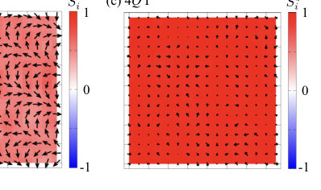
<figcaption class="paper-figure-caption"><b>Fig 2.</b> Figure 3. (Colour online) Representative real-space spin textures obtained by simulated annealing at 𝐾= 0.12 are displayed. Panel (a) shows the double-𝑄I (2𝑄I) state at 𝐻= 0.1, panel (b) corresponds to the single-𝑄(1𝑄) state at 𝐻= 1, and panel (c) represents the quadruple-𝑄I (4𝑄I) state at 𝐻= 1.9. Spin orientations are indicated by arrows, and the color scale represents the out-of-plane component 𝑆𝑧 𝑖.</figcaption>
</figure>
<figure class="paper-figure-card">
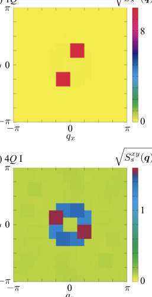
<figcaption class="paper-figure-caption"><b>Fig 3.</b> Figure 5. (Colour online) Momentum-space profiles of the spin structure factor are summarized by plotting √</figcaption>
</figure>
<figure class="paper-figure-card">
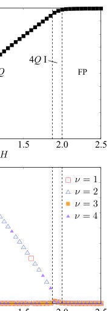
<figcaption class="paper-figure-caption"><b>Fig 4.</b> Figure 6. (Colour online) Magnetic-field evolution of (a) the magnetization and (b) the squared magnetic moments (𝑚𝑸𝜈)2 at 𝐾= 0.12. Vertical dashed lines indicate the phase transition points separating different magnetic states.</figcaption>
</figure>
<figure class="paper-figure-card">
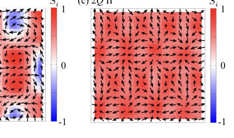
<figcaption class="paper-figure-caption"><b>Fig 5.</b> Figure 7. (Colour online) Representative real-space spin textures obtained by simulated annealing at 𝐾= 0.4 are displayed. Panel (a) shows the quadruple-𝑄II (4𝑄II) state at 𝐻= 0.1, panel (b) corresponds to the quadruple-𝑄III (4𝑄III) state at 𝐻= 0.6, and panel (c) represents the double-𝑄II (2𝑄II) state at 𝐻= 1. Spin orientations are indicated by arrows, and the color scale represents the out-of-plane component 𝑆𝑧 𝑖.</figcaption>
</figure>

**Summary.** This work theoretically explores how itinerant electron magnets can form highly complex quadruple-$Q$ spin crystal states due to momentum-space frustration. By incorporating biquadratic coupling, the authors map out field-dependent phase diagrams showing a rich sequence of transitions between different $Q$-multiplicity phases. The findings establish that higher-order interactions stabilize diverse noncoplanar magnetic textures in centrosymmetric materials.

**Why it may be interesting.** While focused on condensed matter magnetism, the study of complex, high-order collective excitations and phase transitions driven by competing interactions provides a rich theoretical framework applicable to understanding many-body dynamics in quantum systems.

Detailed structure

**Main problem.** The study investigates the stabilization of complex, higher-order spin crystal phases, specifically quadruple-$Q$ states, in itinerant electron magnets within centrosymmetric settings.

**Main result.** Momentum-space frustration combined with biquadratic coupling provides an efficient mechanism to stabilize a rich family of distinct and inequivalent quadruple-$Q$ spin crystals.

**Method.** The research employs simulated annealing simulations using the single-spin-flip Metropolis algorithm to map out field-dependent phase diagrams.

**Model / system.** The model is an itinerant electron magnet on a square lattice, governed by an effective Hamiltonian incorporating bilinear (RKKY type) and biquadratic spin interactions under an external magnetic field.

**Key observables.** Phase diagram ($K-H$ plane), real-space spin textures, scalar spin chirality ($\chi_{sc}$), and momentum-resolved magnetic moment components ($m_{\mathbf{q}}$).

**Important parameters / regimes.** Biquadratic coupling strength ($K$), external magnetic field ($H$), and the competition among four symmetry-related ordering wave vectors (momentum-space frustration).

**Assumptions / limitations.** The model neglects certain anisotropic interactions, and the study relies on mapping out phase transitions in the weak to strong biquadratic coupling regimes.

**Figures summary.** Figures illustrate the four key ordering wave vectors in the Brillouin zone; they show real-space spin textures and scalar spin chirality patterns for various $Q$-states ($4Q_{IV}, 4Q_V$); and they map out phase diagrams showing transitions between $1Q, 2Q,$ and $4Q$ states.

**Paper structure.** The paper systematically analyzes the magnetic phase diagram by varying coupling constants ($K$) and external fields ($H$), characterizing the resulting spin crystal phases based on their internal structure (phase locking, amplitude distribution) and transition mechanisms (continuous vs. abrupt).

Abstract

Multiple-$Q$ magnetism in itinerant electron systems enables complex spin crystals and noncoplanar textures even in centrosymmetric settings. We study a minimal momentum-space spin model on a square lattice with four symmetry-related ordering wave vectors, including bilinear and biquadratic interactions under an out-of-plane magnetic field. Using simulated annealing, we obtain the field-dependent phase diagram and identify successive transitions among single-$Q$, double-$Q$, and multiple inequivalent quadruple-$Q$ states. The quadruple-$Q$ manifold exhibits rich internal structures: the states sharing the same wave vectors differ in phase locking, amplitude distribution, and noncoplanarity, leading to distinct real-space textures and scalar spin chirality patterns. Our results demonstrate that momentum-space frustration and biquadratic coupling provide an efficient route to stabilizing diverse quadruple-$Q$ spin crystals, offering a general framework for higher-order spin textures in centrosymmetric itinerant magnets.

[↑ back to top](#top)

### [Magneto-ionic control of topological transport in SrRuO3 via band topology engineering](http://arxiv.org/abs/2606.21999v1)

**Authors:** Xuanchi Zhou, Xiaohui Yao, Xiaomei Qiao, Guowei Zhou, Wenjing Huo, Shuang Li, Huihui Ji, Xiaohong Xu  
**Type:** experiment · **Category:** strongly correlated electrons · **PDF:** <https://arxiv.org/pdf/2606.21999v1>  
**Analysis basis:** full PDF text, analyzed in chunks
**Topic relevance:** `spintronics-quantum-optics interface` **3/5** · `Kondo & dissipative impurity` **1/5** · `analog quantum simulation` **1/5** · `exotic spin models in light-matter` **1/5** · `non-equilibrium dynamics` **1/5**

↔ Scroll figures horizontally

<figure class="paper-figure-card">
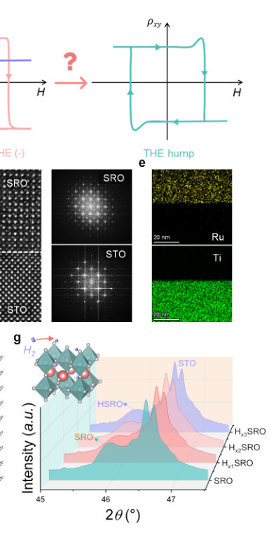
<figcaption class="paper-figure-caption"><b>Fig 1.</b> Figure 1. Hydrogen-driven structural evolution in SrRuO3 system. a, Schematic of the topological band structure of SrRuO3 (SRO) with nodal points. b, Schematic illustration of the controversy over the physical picture of hump-like Hall anomalies in SRO. c, Schematic illustration of the lattice framework of the SRO/SrTiO3 (STO) (001) bilayer. d, Zoom-in images for cross-sectional high-resolution transmission electron microscopy (HRTEM) and respective Fast Fourier Transform (FFT) images for SRO/STO bilayer. e. Ruthenium and titanium elementary distributions for as-grown SRO/STO heterostructure characterized by using energy dispersion spectrum (EDS). f, Reciprocal space mapping (RSM) of SRO...</figcaption>
</figure>
<figure class="paper-figure-card">
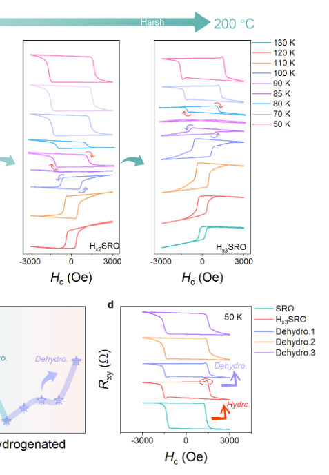
<figcaption class="paper-figure-caption"><b>Fig 2.</b> Figure 2. Manipulating topological transport behaviors through hydrogenation. a, Hydrogenation-mediated regulation on the anomalous Hall effect (AHE) in SRO films. b, Temperature dependence of the anomalous Hall resistivity during the (de)hydrogenated process. c, The reversal temperature (Trev.) of SRO through (de)hydrogenation. d, Emergent hump-like Hall anomalies in the Hall resistance curves of SRO films upon (de)hydrogenation.</figcaption>
</figure>
<figure class="paper-figure-card">
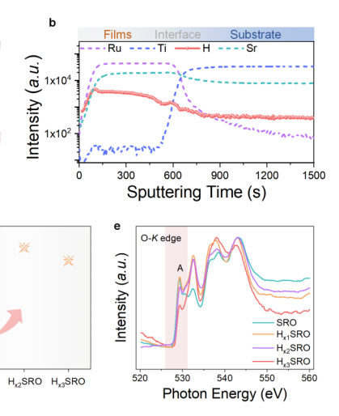
<figcaption class="paper-figure-caption"><b>Fig 3.</b> Figure 3. Berry-curvature-driven topological transports in SRO. a, Schematic of the principle in time-of-flight secondary ion mass spectrometry (ToF-SIMS) and three- dimensional ToF-SIMS element maps for SRO/STO (001) bilayer. b, Depth-profile of the elementary distribution in SRO/STO (001) bilayer. c, RSM spectra for hydrogenated SRO/STO heterostructure (Hx1SRO). d, Evolution of the Berry curvature contribution (B value) in hydrogenated SRO thin films via fitting the AHE scaling relation. e, Soft X-ray absorption spectroscopy (sXAS) for the O K-edge compared for SRO films through hydrogenation.</figcaption>
</figure>
<figure class="paper-figure-card">
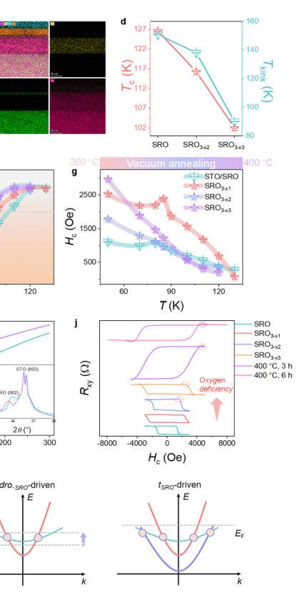
<figcaption class="paper-figure-caption"><b>Fig 4.</b> Figure 4. Defect-engineered magneto-ionic control of topological transport phenomena. a, Schematic illustration of oxygen ionic transport as driven by vacuum annealing and oxygen chemical potential. b, HETEM images of STO/SRO/STO (001) trilayer. c, Ruthenium, titanium and oxygen elementary distributions for as-grown STO/SRO/STO (001) trilayer characterized by using EDS. d, Evolution of the Curie temperature (Tc) and kink temperature (Tkink) of SRO through oxygen deficiency. e, Temperature-dependent AHE in oxygen-deficient SRO (SRO3-x2) films. f-g, Temperature-dependence of f, anomalous Hall resistivity and g, magnetic coercive Field (Hc) for oxygen-deficient SRO films. h,...</figcaption>
</figure>

**Summary.** This work demonstrates that ionic doping provides a powerful, reversible method—magneto-ionic control—to engineer topological transport in $	ext{SrRuO}_3$. By tuning the Fermi level via protonation or oxygen vacancies, researchers can modulate the Anomalous Hall Effect polarity and definitively identify a Topological Hall Effect signature. This establishes a general platform for designing low-power, reconfigurable spintronic devices.

**Why it may be interesting.** While focused on condensed matter magnetism/electronics, the concept of using external stimuli (ionic defects) to tune fundamental electronic band structures and resulting quantized responses (like Berry curvature effects) has parallels in controlling quantum states in engineered solid-state systems relevant to AMO physics.

Detailed structure

**Main problem.** The central goal is achieving active, reversible control over topological transport phenomena (AHE and THE) in ferromagnets by engineering the band topology.

**Main result.** Magneto-ionic control via protonation or oxygen vacancy incorporation allows for tunable reversal of AHE polarity and reveals a switchable hump-like anomaly strongly indicative of a Topological Hall Effect (THE).

**Method.** The study uses ionic doping (protonation/oxygen vacancies) to tune the Fermi level relative to avoided band crossings, thereby controlling topological transport signatures.

**Model / system.** The system is $	ext{SrRuO}_3$, a perovskite material exhibiting sizable Spin-Orbit Coupling (SOC) and itinerant ferromagnetism. The control mechanism relies on manipulating the electronic structure via ionic defects.

**Key observables.** Hall resistance ($	ext{R}_{xy}$ vs. H), resistivity ($
ho$ vs. T), AHE polarity sign reversal temperature ($T_{	ext{rev}}$), and reversible hump-like Hall anomalies.

**Important parameters / regimes.** Temperature (e.g., $110 	ext{ K}$ to $83 	ext{ K}$), Hydrogen concentration, Oxygen vacancy concentration, Fermi level shift ($	ext{E}_	ext{F}$).

**Assumptions / limitations.** The ionic doping acts as a controllable electron dopant, shifting $	ext{E}_	ext{F}$ and enabling band-filling control over topological responses.

**Figures summary.** Figures show temperature-driven sign reversal of AHE polarity ($	ext{R}_{xy}-	ext{H}$, $
ho_{xy}-	ext{T}$) and the emergence/disappearance of hump-like anomalies upon ionic doping, alongside structural characterization data (XRD, HRTEM).

**Paper structure.** The paper establishes the problem by reviewing AHE/THE in ferromagnets; it then details the magneto-ionic control mechanism using $	ext{SrRuO}_3$ and its defects ($	ext{H}$ or vacancies); key results demonstrate tunable AHE reversal and THE evidence via doping; finally, the work concludes by establishing ionic evolution as a versatile tuning knob for topological transport.

Abstract

The interplay between spin-orbit coupling (SOC) and nontrivial band topology in ferromagnets gives rise to a rich landscape of topological transport phenomena such as anomalous Hall effect (AHE) and topological Hall effect (THE). One central goal in modern spintronics lies in the realization of the active control over topological transport phenomena in a reversible fashion, while unambiguously disentangling respective contributions of THE and AHE to the net Hall effect remains a formidable challenge. Here we establish magneto ionic control as a powerful paradigm for dynamically engineering topological transports in a 4d-orbital SrRuO3 system with sizable SOC and itinerant ferromagnetism. Harnessing controllable protonation or oxygen vacancy incorporation, the Fermi-level upshift relative to avoided band crossings are realized through band filling control, giving rise to tunable reversal temperature of AHE polarity. Of particular note is the emergence of hump like Hall anomalies through extensive ionic doping that can be reversibly switched, irrespective of AHE polarity, providing evidence for a THE signal driven by broken inversion symmetry rather than a two channel AHE. Our findings provide a viable tuning knob for Berry curvature engineering, enabling on demand control of topological transports in strong SOC ferromagnets for low power, reconfigurable all oxide spintronic devices.

[↑ back to top](#top)

### [Non-BCS Pairing by a Singular Dynamical Interaction](http://arxiv.org/abs/2606.21731v1)

**Authors:** Artem G. Abanov, Andrey V. Chubukov  
**Type:** theory · **Category:** strongly correlated electrons · **PDF:** <https://arxiv.org/pdf/2606.21731v1>  
**Analysis basis:** full PDF text, analyzed in chunks
**Topic relevance:** `Keldysh / 2PI / non-Gaussian methods` **3/5** · `Kondo & dissipative impurity` **1/5** · `analog quantum simulation` **1/5** · `correlated cavity matter` **1/5** · `methods for driven-dissipative` **1/5**

↔ Scroll figures horizontally

<figure class="paper-figure-card">
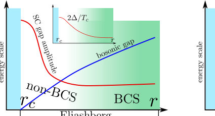
<figcaption class="paper-figure-caption"><b>Fig 1.</b> Figure 1</figcaption>
</figure>
<figure class="paper-figure-card">
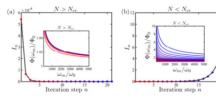
<figcaption class="paper-figure-caption"><b>Fig 2.</b> Figure 2</figcaption>
</figure>
<figure class="paper-figure-card">
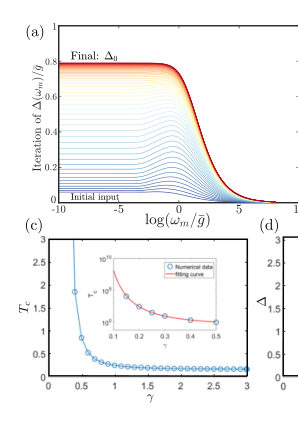
<figcaption class="paper-figure-caption"><b>Fig 3.</b> Figure 3</figcaption>
</figure>
<figure class="paper-figure-card">
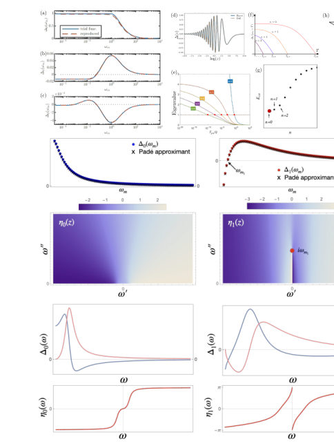
<figcaption class="paper-figure-caption"><b>Fig 4.</b> Figure 4</figcaption>
</figure>

**Summary.** This review analyzes superconductivity in strongly correlated systems where electron interactions are singular, invalidating the assumptions of conventional BCS theory. It demonstrates that such systems support an infinite tower of topologically distinct superconducting solutions to the gap equation. The work provides a powerful theoretical framework for understanding pairing mechanisms near quantum critical points.

**Why it may be interesting.** The breakdown of standard mean-field theories due to strong correlations or quantum criticality is a major theme in modern condensed matter theory, directly impacting how pairing mechanisms are understood beyond simple BCS descriptions.

Detailed structure

**Main problem.** The review examines superconductivity theory when electron-electron interactions are singular (non-BCS), contrasting this with conventional BCS pairing mechanisms.

**Main result.** Singular interactions destroy the Cooper logarithm, leading to a fundamentally different superconducting state characterized by an infinite set of topologically distinct solutions to the gap equation.

**Method.** The analysis uses extensions of Eliashberg theory applied to singular power-law interacting models ($\Gamma(\Omega) \propto 1/|\Omega|^\gamma$), employing Renormalization Group (RG) techniques and solving non-linear gap equations.

**Model / system.** The focus is on metals near Quantum Critical Points (QCPs), quantum dots, or systems undergoing Mott transitions, modeled using the $\gamma$-model or Yukawa-SYK type interactions.

**Key observables.** Superconducting critical temperature ($T_{c,n}$), superconducting gap function ($\Delta(\omega)$), and the topological invariant associated with the gap solutions.

**Important parameters / regimes.** The exponent $\gamma$ characterizing interaction singularity, the coupling strength parameter $N$, and the energy scale $\Lambda 	o 0$.

**Assumptions / limitations.** The analysis relies on treating interactions as singular power laws in the limit of vanishing characteristic energy scales ($\Lambda 	o 0$), extending beyond standard Eliashberg approximations.

**Figures summary.** Figures illustrate the evolution of superconductivity behavior across regimes (FL to non-FL), showing the existence and properties of multiple, topologically distinct gap solutions ($\Delta_n(\omega)$) for different interaction strengths ($N$).

**Paper structure.** The paper progresses by first establishing the failure of BCS theory in singular limits, then developing the $\gamma$-model framework, analyzing the resulting non-linear gap equation, and finally characterizing the infinite tower of solutions based on topological invariants.

Abstract

This review examines the theory of superconductivity in systems with {\em singular dynamical} electron-electron interaction and contrasts it with a conventional BCS superconductivity. Examples include metals near a Quantum Critical Point, quantum dots and system near a localization (Mott) transition. We show, that the singular interaction destroys the traditional separation of energy scales, invalidating the significance of Cooper logarithm, and, as the consequence, the whole BCS framework. We explore the universal model with dynamical interaction $Γ(Ω) \propto 1/|Ω|^γ$ (the $γ$-model) and analyze the competition/interplay between the tendency towards pairing and towards non-Fermi liquid behavior. We show that superconductivity still develops once the pairing interaction exceeds a certain threshold, but the origin of the pairing is qualitatively different from that in BCS theory. We show that the gap equation at $T=0$ has an infinite set of topologically distinct solutions. These solution disappear one by one once the pairing interaction becomes non-singular (massive). We review the physics underlying these phenomena and outline future directions.

[↑ back to top](#top)

### [Evolution of anisotropic magnetostriction in LaMn1-xCoxO3 (x= 0.1-0.9)](http://arxiv.org/abs/2606.22268v1)

**Authors:** M. Manikandan, R. Mahendiran  
**Type:** experiment · **Category:** strongly correlated electrons · **PDF:** <https://arxiv.org/pdf/2606.22268v1>  
**Analysis basis:** full PDF text, analyzed in chunks
**Topic relevance:** `exotic spin models in light-matter` **3/5** · `spintronics-quantum-optics interface` **3/5**

↔ Scroll figures horizontally

<figure class="paper-figure-card">
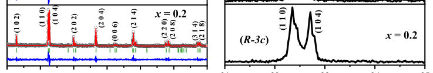
<figcaption class="paper-figure-caption"><b>Fig 1.</b> Fig. 1. (a) Room-temperature powder X-ray diffraction patterns and corresponding Rietveld</figcaption>
</figure>
<figure class="paper-figure-card">

<figcaption class="paper-figure-caption"><b>Fig 2.</b> Fig. 2. (a) Temperature dependence of magnetization (M) under a magnetic field of H = 1 kOe</figcaption>
</figure>
<figure class="paper-figure-card">
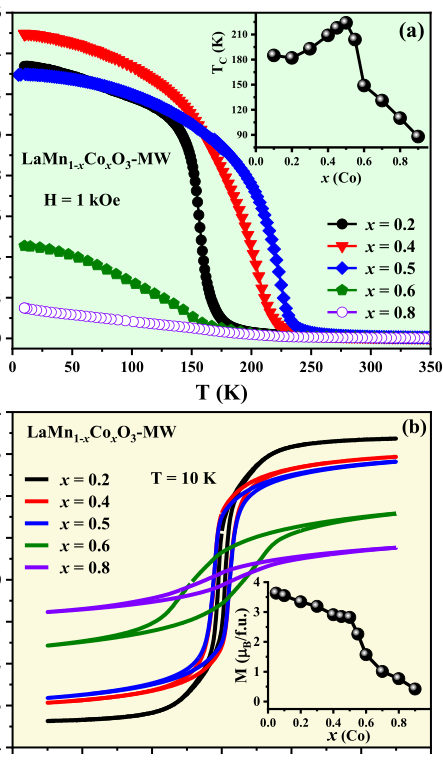
<figcaption class="paper-figure-caption"><b>Fig 3.</b> Figure 2(a) shows the temperature dependence of magnetization (M) of LaMn1-xCoxO3</figcaption>
</figure>

**Summary.** This work experimentally maps the evolution of anisotropic magnetostriction in $	ext{LaMn}_{1-x}	ext{Co}_x	ext{O}_3$ as a function of Co doping. The maximum magnetostriction at $x=0.5$ is linked to favorable magnetic coupling involving $	ext{Co}^{2+}$ ions, while the subsequent decrease highlights how valence state changes and competing magnetic interactions govern the material's magnetoelastic response.

**Why it may be interesting.** The strong magnetoelastic coupling observed here provides a direct experimental probe into orbital moment physics and charge ordering phenomena within strongly correlated manganites, which is relevant to understanding emergent quantum ground states in doped oxides.

Detailed structure

**Main problem.** The study investigates how the anisotropic magnetostriction evolves across a compositional range in $	ext{LaMn}_{1-x}	ext{Co}_x	ext{O}_3$ perovskites.

**Main result.** Anisotropic magnetostriction ($\lambda_t$) peaks at $x=0.5$, attributed to the coupling involving high-spin $	ext{Co}^{2+}$ ions, and then decreases as Co doping increases due to changes in valence states and magnetic interactions.

**Method.** The research combines synthesis via microwave irradiation with comprehensive characterization using XRD for structure and magnetometry/dilatometry for magnetic and magnetostrictive properties.

**Model / system.** The physical system is the $	ext{LaMn}_{1-x}	ext{Co}_x	ext{O}_3$ perovskite manganite, where magnetism and lattice distortion are intrinsically linked through charge transfer and orbital moment coupling between Mn and Co ions.

**Key observables.** Anisotropic magnetostriction ($\lambda_t$), volume magnetostriction ($\lambda_\omega$), saturation magnetization ($M_s$), and structural phases (e.g., rhombohedral, monoclinic).

**Important parameters / regimes.** Co doping concentration ($x=0.1-0.9$), temperature ($T=10 	ext{ K}$), and applied magnetic field ($H=50 	ext{ kOe}$).

**Assumptions / limitations.** The large magnetostriction is dominated by anisotropic lattice distortion ($\lambda_t \gg \lambda_\omega$), which is linked to the orbital moment of $	ext{Co}^{2+}$ ions.

**Figures summary.** Figures show XRD patterns detailing structural evolution across $x$, and magnetization/magnetostriction measurements illustrating how these properties change with applied field and composition, peaking at $x=0.5$.

**Paper structure.** The paper systematically measures magnetostriction ($\lambda_{par}, \lambda_{per}$) for various compositions ($x$), correlates the results with structural phase transitions (XRD), and interprets the trends based on changes in valence states ($	ext{Co}^{2+}$ vs $	ext{Co}^{3+}$) and magnetic coupling mechanisms.

Abstract

Polycrystalline samples of LaMn1-xCoxO3 series over a wide compositional range (x = 0.1 - 0.9) were synthesized by microwave irradiation of oxide precursors and their magnetic and magnetostrictive properties were investigated. Magnetostrictions parallel (l_par) and perpendicular (l_per) to the applied magnetic field were measured to estimate anisotropic(l_anis) and volume magnetostrictions(l_vol). In all the compositions, l-par (l_per) is negative (positive) and (l_anis) >> (l_vol), suggesting dominance of anisotropic lattice distortion under a magnetic field. The value of l_anis at 10 K for H = 50 kOe initially increases with x from 178 ppm for x = 0.1 to a maximum of 1221 ppm at x = 0.5 before decreasing for higher x. The composition dependence of magnetostriction is asymmetric about x = 0.5, the decrease for x > 0.5 is more steeper than for x < 0.5 whereas saturation magnetization decreases monotonically with increasing x except for an abrupt change at x = 0.6. The largest anisotropic magnetostriction observed for x = 0.5 is attributed to the presence of high-spin Co2+ ions with a non-zero orbital moment in the maximum fraction whereas Mn3+/4+ or Co3+ ions play minor roles. The composition dependence of magnetostriction is suggested to arise from changes in the structure, valence states of Mn and Co ions and magnetic interactions among them.

[↑ back to top](#top)

### [Influence of Harris disorder on quantum-critical superconductivity](http://arxiv.org/abs/2606.23582v1)

**Authors:** Serhii Kryhin, Peter Lunts, Aavishkar A. Patel, Subir Sachdev, Pavel A. Nosov  
**Type:** theory · **Category:** strongly correlated electrons · **PDF:** <https://arxiv.org/pdf/2606.23582v1>  
**Analysis basis:** full PDF text, analyzed in chunks
**Topic relevance:** `Keldysh / 2PI / non-Gaussian methods` **3/5** · `correlated / nonlocal dissipation` **1/5** · `driven-dissipative phase transition` **1/5** · `methods for driven-dissipative` **1/5**

↔ Scroll figures horizontally

<figure class="paper-figure-card">
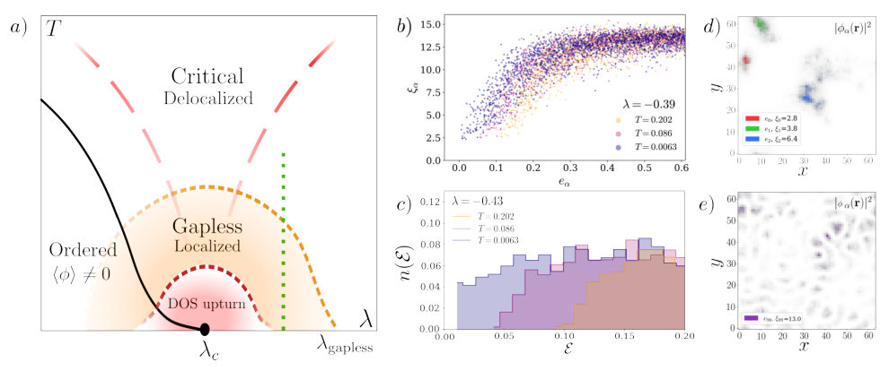
<figcaption class="paper-figure-caption"><b>Fig 1.</b> FIG. 1: The properties of the effective bosonic theory of the normal state are displayed. (a) A schematic phase space diagram of the quantum phase transition with Harris disorder is inferred from our numerical results and Ref. [55]. The vicinity of the quantum critical point is characterized through the behavior of the boson eigenmode DOS n(E), defined in Eq. (2.6). At small temperatures and large λ the system is in a disordered paramagnetic state, and the bosonic states are generally gapped, i.e. n(E ≈0) ≈0. As λ is lowered, the system approaches a QCP at λc. Before the critical point is reached, the bosons become gapless at λgapless &gt; λc in the sense of n(E ≈0) = n &gt; 0. In the immediate...</figcaption>
</figure>
<figure class="paper-figure-card">
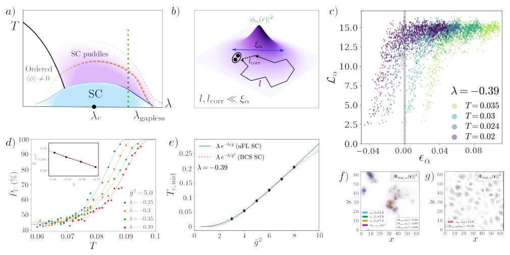
<figcaption class="paper-figure-caption"><b>Fig 2.</b> FIG. 2: Properties of the superconducting state induced by the overdamped localized bosonic modes described in Sec. II are displayed. (a) The inferred phase diagram of the superconducting state. Above the dome associated with an extended macroscopic pairing instability, the system contains a region dominated by localized superconducting puddles. The width of the superconducting dome and the puddle regime is expected to be of the same order as the width of n(E) ≈n &gt; 0 region shown in Fig. 1. (b) Cartoon of a localized bosonic mode and a diffusive Cooperon loop, illustrating the hierarchy of length scales used to obtain the modified Usadel description. Here l is the electronic mean free path,...</figcaption>
</figure>
<figure class="paper-figure-card">
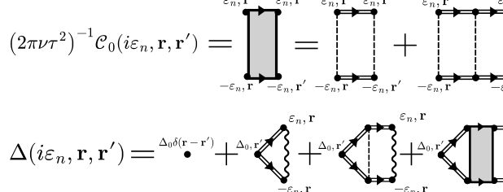
<figcaption class="paper-figure-caption"><b>Fig 3.</b> FIG. 3: The first line is a definition for C0 – a “bare” Cooperon – as diagrammatic series. The dashed line represents a conventional impurity scattering induced by a random chemical potential v(r). The second line is a diagrammatic series definition for pairing vertex ∆. The wavy line denotes the position-dependent bosonic propagator ¯D(iωm, r).</figcaption>
</figure>
<figure class="paper-figure-card">
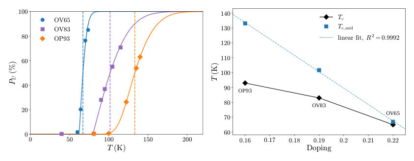
<figcaption class="paper-figure-caption"><b>Fig 4.</b> FIG. 4: Analysis of STM data on Bi2Sr2CaCu2O8+δ from Ref. [84] from the Yazdani group. (a) Data points from Figure 3e of Ref. [84] (reproduced with the corresponding author’s permission). The points measure the percentage of the area (measured with STM) that is ungapped, i.e. in the normal state, versus temperature. The three colors correspond to three different samples at different doping concentrations. The curves are fits to a skew-normal function. (b) Tc,mid (with a linear fit) and Tc extracted from plot (a) versus doping.</figcaption>
</figure>
<figure class="paper-figure-card">
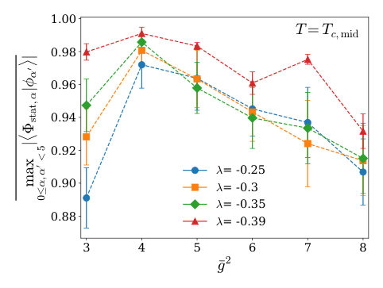
<figcaption class="paper-figure-caption"><b>Fig 5.</b> FIG. 5: Overlap of the most localized superconducting puddles Φstat,α(r) and localized bosons ϕα′(r). This plot demonstrates that for each disorder configuration, among the most localized puddles and most localized bosons there are pairs which essentially sit on top of each other (cf. Fig. 1(d) and Fig. 2(f)). These pairs need not have the same eigenvalue index.</figcaption>
</figure>

**Summary.** This paper develops a theory for superconductivity in quantum-critical metals affected by random disorder (Harris disorder). It shows that the pairing is mediated by localized bosonic fluctuations, leading to superconducting puddles characterized by a power-law distribution of local gap scales. This provides a novel theoretical framework explaining observed gap inhomogeneity in unconventional superconductors.

**Why it may be interesting.** The mechanism of gap inhomogeneity arising from localized bosonic modes provides a concrete theoretical interpretation for experimental observations in high-Tc cuprates, linking quantum criticality to unconventional superconductivity.

Detailed structure

**Main problem.** The study investigates superconductivity (pairing instability) mediated by bosonic fluctuations in a quantum-critical metal subjected to random mass disorder, known as Harris disorder.

**Main result.** The theory predicts that the resulting distribution of local pairing scales follows a power-law tail, suggesting broad gap inhomogeneity and superconducting puddles, which contrasts with standard BCS predictions.

**Method.** The analysis employs advanced theoretical techniques including solving linearized Usadel equations, self-consistent Born approximation (SCBA), and analyzing random Schrödinger problems for bosonic modes.

**Model / system.** The model describes a quantum-critical metal where fermionic excitations couple to fluctuations of a Landau-damped bosonic field ($\phi$). The system is perturbed by both a random chemical potential and the 'Harris disorder' (random mass $\lambda'(r)$).

**Key observables.** Superconducting transition temperature ($T_c$), local pairing scales, gap inhomogeneity structure factors ($\langle\delta\Phi_{stat}\delta\Phi_{stat}
angle(q)$), and bosonic eigenmode Density of States $n(E)$.

**Important parameters / regimes.** Disorder strength ($\lambda$, $ar{g}^2$), characteristic length scales ($\xi$, $l_{	ext{corr}}$), and temperature regimes (high vs. low T).

**Assumptions / limitations.** The analysis assumes an overdamped but non-conserved order parameter, and relies on approximations like the self-consistent Born approximation for extended solutions.

**Figures summary.** Figures illustrate the Boson eigenmode DOS dependence on disorder strength and temperature, and plot $T_c$ vs. coupling/disorder parameters to distinguish between localized puddle regimes and delocalized states.

**Paper structure.** The paper builds by first establishing the effective bosonic theory incorporating Harris disorder, then solving the resulting nonlinear random Schrödinger problem for the pairing instability, and finally analyzing different spatial regimes (puddles vs. extended) using SCBA techniques.

Abstract

In the Hertz theory, a quantum critical metal is described by the coupling of a Fermi surface to fluctuations of a Landau-damped bosonic field $φ$, which may represent either an order parameter or a Higgs field for a transition without symmetry breaking. Scattering from $φ$ produces non-Fermi-liquid behavior in the normal state, while the same fluctuations mediate enhanced Cooper pairing. By the Harris criterion, symmetry-preserving disorder couples most strongly to the coefficient of the $φ^2$ term, locally tuning the system toward or away from criticality. This random mass (``Harris disorder'') leads to a finite density of localized low-energy $φ$ modes even when the fermionic states remain extended and continue to provide Landau damping. We study the onset of pairing mediated by these localized overdamped bosonic modes. Starting from a real-space linearized Usadel equation for the two-particle propagator, we show that the localized bosonic wave functions generate both a spatially random pairing vertex and an effective random potential for Cooper pairs. Numerical solution, a self-consistent Born approximation, and Lifshitz-tail analysis reveal two regimes of the pairing instability. At high temperatures, pairing nucleates compact superconducting puddles on the most localized bosonic modes. At lower temperatures, an extended pairing eigenstate appears, but its transition scale and spatial structure remain strongly affected by mesoscopic correlation effects and enhanced probability of returns to favorable regions of the localized bosonic glue. The resulting distribution of local pairing scales has a power-law tail, in contrast to the stretched-exponential tails of disordered BCS superconductors. This mechanism provides a route to broad gap inhomogeneity and superconducting puddles in quantum-critical metals, and offers an interpretation of STM measurements of the cuprates.

[↑ back to top](#top)

### [Magnetovolume effect in SrRu1-xCoxO3 (x = 0.0, 0.05)](http://arxiv.org/abs/2606.22257v1)

**Authors:** M. Manikandan, R. Mahendiran  
**Type:** experiment · **Category:** strongly correlated electrons · **PDF:** <https://arxiv.org/pdf/2606.22257v1>  
**Analysis basis:** full PDF text, analyzed in chunks
**Topic relevance:** `exotic spin models in light-matter` **3/5** · `spintronics-quantum-optics interface` **3/5**

↔ Scroll figures horizontally

<figure class="paper-figure-card">
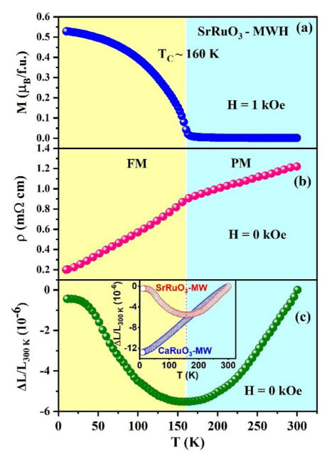
<figcaption class="paper-figure-caption"><b>Fig 1.</b> Fig. 2. Temperature dependence of (a) magnetization (M) under a magnetic field of H = 1 kOe</figcaption>
</figure>
<figure class="paper-figure-card">
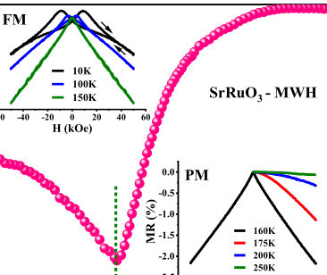
<figcaption class="paper-figure-caption"><b>Fig 2.</b> Fig. 3. Temperature dependence of magnetoresistance of MW-SrRuO3 for H = 50 kOe obtained</figcaption>
</figure>
<figure class="paper-figure-card">
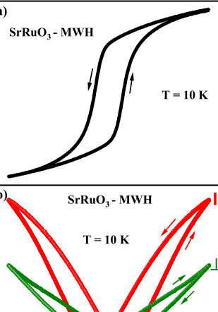
<figcaption class="paper-figure-caption"><b>Fig 3.</b> Fig. 4. Field dependence of (a) magnetization and (b) parallel (λ𝑝𝑎𝑟) and perpendicular (λ𝑝𝑒𝑟)</figcaption>
</figure>
<figure class="paper-figure-card">
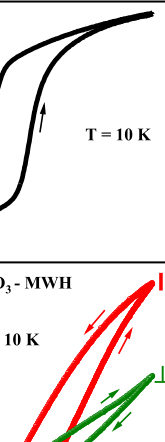
<figcaption class="paper-figure-caption"><b>Fig 4.</b> Fig. 4(b) illustrates the field dependence of parallel (par) and perpendicular (per)</figcaption>
</figure>
<figure class="paper-figure-card">
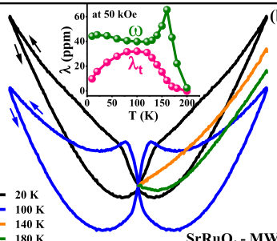
<figcaption class="paper-figure-caption"><b>Fig 5.</b> Fig. 5. Field dependence of (a) parallel (λ𝑝𝑎𝑟) and (b) perpendicular (λ𝑝𝑒𝑟) magnetostrictions</figcaption>
</figure>

**Summary.** The researchers investigated the magnetovolume effect in $	ext{SrRu}_{1-x}	ext{Co}_x	ext{O}_3$ perovskites using microwave synthesis. They found that the volume changes are governed by a competition between structural distortions (octahedral tilts) and spin-orbit coupling from Co doping. This work provides detailed experimental insights into magnetoelastic coupling in correlated oxides.

**Why it may be interesting.** This work provides experimental evidence linking lattice dynamics (octahedral rotations) directly to magnetic ordering in strongly correlated transition metal oxides, which is a key area for understanding emergent quantum phenomena in condensed matter.

Detailed structure

**Main problem.** The study investigates the magnetoelastic properties, specifically the magnetovolume effect and magnetostriction, in $	ext{SrRu}_{1-x}	ext{Co}_x	ext{O}_3$ perovskites.

**Main result.** The magnetovolume effect is attributed to a competition between octahedral tilting/rotation dynamics and the spin-orbit interaction of the doped $	ext{Co}^{2+}$ ions, which influences magnetic coupling near the Curie temperature ($T_C$).

**Method.** Measurements include synthesizing polycrystalline samples via microwave irradiation and characterizing them using magnetometry, resistivity measurements, thermal expansion, and magnetostriction under applied magnetic fields.

**Model / system.** The system is the perovskite ruthenate $	ext{SrRu}_{1-x}	ext{Co}_x	ext{O}_3$ ($x=0.0, 0.05$), where structural and electronic properties are modulated by Co doping and synthesis method.

**Key observables.** Magnetization (M), resistivity ($
ho$), linear thermal expansion ($\Delta l/l_0$), volume magnetostriction ($\omega$), and anisotropy magnetostriction ($\lambda_t$).

**Important parameters / regimes.** Curie Temperature ($T_C \approx 160 	ext{ K}$ for $x=0.0$); Magnetostriction values up to $\sim 80 	ext{ ppm}$; Magnetic field strength (e.g., $50 	ext{ kOe}$).

**Assumptions / limitations.** The observed magnetovolume effect is linked to structural changes involving the tilting/rotation of $	ext{RuO}_6$ octahedra.

**Figures summary.** Figures illustrate XRD patterns confirming orthorhombic structure, and temperature dependence plots showing anomalies in magnetization, resistivity, and thermal expansion near $T_C$.

**Paper structure.** The paper first details the synthesis and basic magnetic/resistivity properties of $	ext{SrRuO}_3$ using microwave methods. It then systematically measures magnetostriction ($\lambda_{	ext{par}}, \lambda_{	ext{per}}$) and volume expansion, comparing undoped and Co-doped samples to elucidate the role of doping on magnetoelastic coupling.

Abstract

Polycrystalline SrRu1-xCoxO3 (x = 0.0, 0.05) and CaRuO3 were rapidly synthesized (< 1 hour) by microwave irradiation of oxide powders, and their magnetic, magnetoresistance, thermal expansion, and magnetostriction properties were investigated. The microwave-synthesised SrRuO3 exhibits a ferromagnetic transition at TC = 160 K, metallic-type resistivity, and negative magnetoresistance, with magnitudes comparable to those of a sample synthesized by conventional heating over 24 hours. Upon lowering the temperature from 300 K, the linear thermal expansion shows a transition from the usual contraction in the paramagnetic state to spontaneous expansion in the ferromagnetic state (invar-like effect). The application of an external magnetic field at a fixed temperature results in isotropic expansion of the length, implying a positive magnetovolume effect. The volume magnetostriction is 40 ppm at 10 K in a magnetic field of 50 kOe, and it reaches a maximum value of 60 ppm close to TC. The spontaneous thermal expansion is diminished in SrRu0.95Co0.05O3. While the magnetostriction is anisotropic at 10 K, the isotropic behaviour is recovered above 80 K, and the maximum value of the positive magnetovolume is comparable to that of the parent compound. Our results suggest that the magnetovolume effect in SrRu1-xCoxO3 is related to competition between robust tilting/rotation of RuO6 octahedra and spin-orbit interaction of the doped Co2+ ions

[↑ back to top](#top)

### [No Reference-Free Generalization in Quantum Machine Learning](http://arxiv.org/abs/2606.22331v1)

**Authors:** Jeongho Bang  
**Type:** theory · **Category:** quantum information and computing · **PDF:** <https://arxiv.org/pdf/2606.22331v1>  
**Analysis basis:** full PDF text, analyzed in chunks
**Topic relevance:** `quantum measurements` **3/5** · `measurement-induced transitions` **2/5** · `Keldysh / 2PI / non-Gaussian methods` **1/5**

↔ Scroll figures horizontally

<figure class="paper-figure-card">
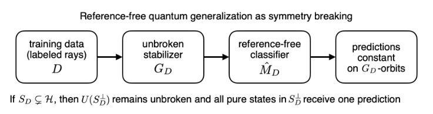
<figcaption class="paper-figure-caption"><b>Fig 1.</b> FIG. 1. Reference-free quantum generalization as symmetry breaking. The training data D orient only the subspace and directions they physically contain. Any unitary symmetry GD left unbroken by the training data must also be left unbroken by a reference-free classifier. If the training span SD is a proper subspace of H, the full unitary group on S⊥ D remains unbroken, forcing all pure off-span test states to receive the same prediction.</figcaption>
</figure>
<figure class="paper-figure-card">
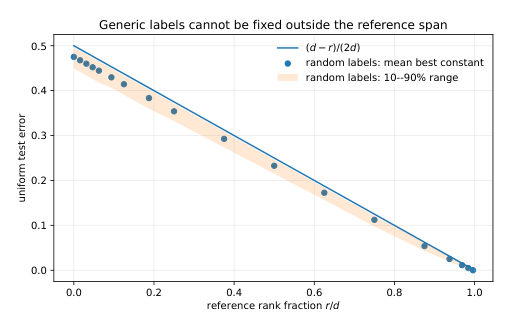
<figcaption class="paper-figure-caption"><b>Fig 2.</b> FIG. 2. Reference-rank barrier for generic labels. For d = 256, a reference-free learner that has oriented only rank r cannot assign independent labels in the remaining d −r dimensional sector. The balanced-label lower bound scales as (d −r)/(2d). Random-label points show the mean best-constant error on the unseen sector, and the shaded region gives the 10–90 percentile range.</figcaption>
</figure>
<figure class="paper-figure-card">
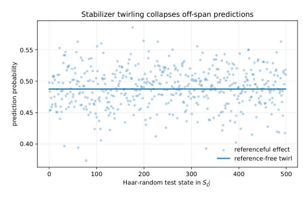
<figcaption class="paper-figure-caption"><b>Fig 3.</b> FIG. 3. Off-span prediction collapse. A referenceful effect can vary over pure states in S⊥ D, but the stabilizer-twirled reference-free effect is scalar on S⊥ D. Thus all pure off-span test states receive exactly the same prediction. The plotted example uses d = 32, r = 8, and 500 Haar-random pure states in the complement.</figcaption>
</figure>
<figure class="paper-figure-card">
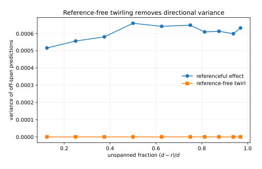
<figcaption class="paper-figure-caption"><b>Fig 4.</b> FIG. 5. Reference-free twirling removes directional variance. For each rank r in a d = 64 dimensional Hilbert space, a random ref- erenceful effect has nonzero prediction variance over states in S⊥ D. Stabilizer twirling removes this variance, because the twirled effect is scalar on the complement.</figcaption>
</figure>
<figure class="paper-figure-card">
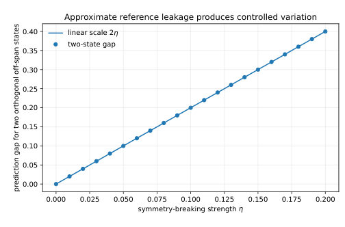
<figcaption class="paper-figure-caption"><b>Fig 5.</b> FIG. 4. Approximate symmetry breaking. A perturbation of strength η inside S⊥ D creates a nonzero prediction gap between two orthogo- nal off-span states, but the gap remains controlled by the symmetry- breaking scale, consistent with Theorem 3.</figcaption>
</figure>

**Summary.** This work establishes a fundamental 'no-go' theorem showing that Quantum Machine Learning cannot generalize to unseen directions in the Hilbert space unless those directions are constrained by an external, specified physical reference structure. The limitation stems from symmetry: if the training data only spans a subspace, all orthogonal states must yield the same prediction.

**Why it may be interesting.** It provides a rigorous theoretical limit on what QML can achieve without incorporating explicit physical knowledge (like known Hamiltonians or measurement bases), which is crucial for designing physically meaningful quantum algorithms.

Detailed structure

**Main problem.** The paper addresses the fundamental generalization problem in Quantum Machine Learning (QML) when the training data fails to provide an external reference frame or preferred basis.

**Main result.** A reference-free learner cannot distinguish between states orthogonal to the span of the training data, forcing all such unseen states to receive the same prediction regardless of their true physical difference.

**Method.** The analysis uses symmetry constraints derived from the unitary group acting on the Hilbert space and introduces concepts like the stabilizer group and 'stabilizer twirling' to mathematically prove this collapse.

**Model / system.** The model involves quantum systems in a high-dimensional Hilbert space, where learning is framed as finding an optimal Positive Operator-Valued Measure (POVM) classifier based only on labeled training projectors.

**Key observables.** Prediction probability $p_D(1|\hat{
ho})$, Directional Variance, and the constant prediction value $\lambda_D$ for off-span states.

**Important parameters / regimes.** The rank ($r$) of the spanned subspace relative to the total Hilbert space dimension ($d$), and the degree of symmetry breaking ($\delta_D$).

**Assumptions / limitations.** The analysis assumes training data are treated as exact projectors, and it establishes a structural lower bound by ignoring computational limits or specific ansatz choices.

**Figures summary.** Figures illustrate the collapse of prediction variance when directional information is removed (stabilizer twirling) compared to referenceful effects, showing constant predictions on the unspanned complement.

**Paper structure.** The paper builds a no-go theorem by first defining the reference-free learning constraint (covariance invariance), then proving that this forces the classifier to be invariant under the stabilizer group of the data. Finally, it quantifies the resulting 'off-span blindness' and identifies physical structures as necessary resources for generalization.

Abstract

Quantum machine learning is often motivated by the exponentially large state space of quantum systems, but this promise leaves a basic generalization problem unresolved: how can a learner assign different meanings to unseen quantum directions when the training data provide no preferred basis, measurement frame, or other orienting structure? We address this identifiability problem by formulating supervised learning without an external quantum reference frame, so that predictions cannot depend on an arbitrary choice of Hilbert-space coordinates. This requirement forces the learned classifier to preserve every unitary symmetry left unbroken by the training data. We prove that whenever the training states fail to span the full Hilbert space, all pure states orthogonal to their span must receive the same prediction -- even when those states are mutually orthogonal and perfectly distinguishable once an appropriate measurement is supplied. The limitation is therefore not caused by state discrimination, optimization, or computational power, but by missing reference information. We further establish a robust version under weak symmetry breaking and show that learning generic unstructured concepts on multiqubit systems requires exponentially many independently oriented training directions. Numerical illustrations visualize the resulting prediction collapse and its controlled relaxation. Our results identify feature maps, measurement bases, Hamiltonians, locality, symmetry priors, architectures, and sufficiently diverse training states as operational resources for generalization. The central implication is that Hilbert-space dimension alone is not a learnable feature space: successful QML must specify the physical structure that gives unseen quantum directions semantic meaning.

[↑ back to top](#top)

### [Spiral spin liquid resilient to quantization in the frustrated honeycomb antiferromagnet GdZnPO](http://arxiv.org/abs/2606.23007v1)

**Authors:** Xun Chen, Rui Bian, Yuqian Zhao, Haijun Liao, Weiqiang Yu, Yi Cui, Yuesheng Li  
**Type:** both · **Category:** strongly correlated electrons · **PDF:** <https://arxiv.org/pdf/2606.23007v1>  
**Analysis basis:** full PDF text, analyzed in chunks
**Topic relevance:** `analog quantum simulation` **3/5** · `exotic spin models in light-matter` **3/5**

↔ Scroll figures horizontally

<figure class="paper-figure-card">
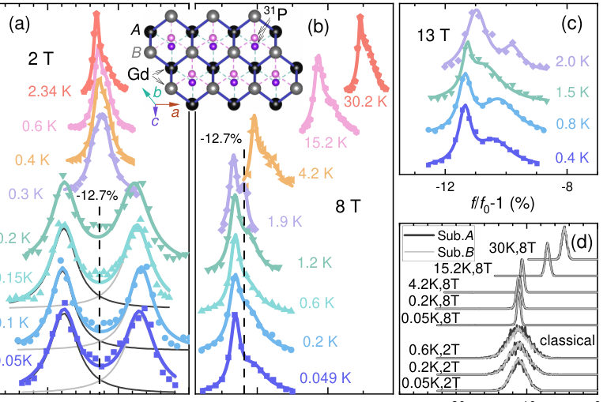
<figcaption class="paper-figure-caption"><b>Fig 1.</b> FIG. 1. NMR spectra of GdZnPO. (a)-(c) Frequency-swept 31P NMR spectra measured at selected temperatures under 2, 8, and 13 T, respectively. The inset between (a) and (b) shows the GdZnPO crystal structure (Zn and O omitted for clarity). Each 31P nucleus probes its three nearest-neighbor Gd3+ spins on either triangular sublattice A or B. In (a), black and gray lines denote the two Lorentzian components fitted below ∼0.25 K. (d) Simulated 31P NMR spectra from sublattices A and B at the classical level. Data are offset vertically for clarity, and the magnetic field is applied along the c axis.</figcaption>
</figure>
<figure class="paper-figure-card">
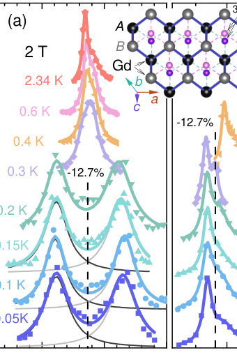
<figcaption class="paper-figure-caption"><b>Fig 2.</b> Figure 1 shows the NMR spectra of the GdZnPO single crystal (sample #1) with the magnetic field applied perpen- dicular to the honeycomb plane, i.e., along the c axis. Despite the high crystalline quality (see Appendix A), the NMR line shape is characteristic and nearly independent of temperature (T) and magnetic field (H) for T ≥0.3 K or µ0H ≥4 T [Figs. 1(a)-1(c)], where the system symmetry remains intact. At 30.2 K (∼2.5|Θcw|), the system lies deep in the param- agnetic regime and retains full lattice symmetry [Fig. 1(b)]. Even in the polarized ferromagnetic phase at 13 T (&gt;µ0H∗), the overall line profile changes little [Fig. 1(c)]. This ro- bustness indicates that the observed...</figcaption>
</figure>
<figure class="paper-figure-card">
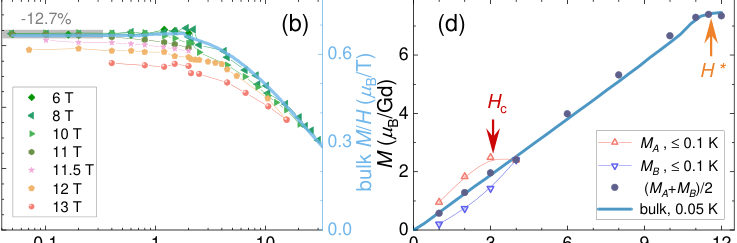
<figcaption class="paper-figure-caption"><b>Fig 3.</b> FIG. 2. NMR shift and magnetization of GdZnPO. (a), (b) Temperature dependence of the NMR shift K(T) measured under selected magnetic fields H. In (a), the crossover temperature Tc ∼0.25 K is indicated for µ0H ≤3 T. In (b), bulk susceptibility M/H is shown for µ0H = 8 T. (c) Correlation between NMR shift K(T,H) and bulk susceptibility M/H(T,H) across the measurement range (0.049-30.2 K, 3-13 T), excluding the region T &lt; Tc and H &lt; Hc where K splits [see (a)]. The black line represents a linear fit K = K0+AhfM/H, yielding K0 = 0.004(2) and Ahf = −0.198(4) T/µB. (d) Field dependence of the NMR shift magnetization (K−K0)H/Ahf, averaged over T ≤0.1 K, compared with the bulk magnetization at...</figcaption>
</figure>
<figure class="paper-figure-card">
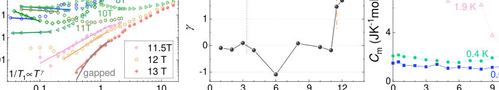
<figcaption class="paper-figure-caption"><b>Fig 4.</b> FIG. 3. Nuclear spin-lattice relaxation rate of GdZnPO. (a), (b) Temperature dependence of the 31P nuclear spin-lattice relaxation rate 1/T1 measured under selected magnetic fields H. In (a), crossover temperatures Tc ∼0.25 K and T ∗∼2 K are indicated for µ0H ≤2 T. In (b), colored lines represent power-law fits 1/T1 ∝T γ, with the fitted exponent γ shown in (d). The gray line corresponds to a fit to the 13 T data using 1/T1 ∝exp(−∆/T), yielding a gap ∆= 2.24(7) K. (c), (d) Field dependence of 1/(T1T) at selected temperatures and the exponent γ. Crossover fields µ0Hc ∼3 T and µ0H∗∼12 T are indicated. (e), (f) Field dependence of bulk susceptibility (dM/dH) and magnetic specific heat (Cm) at...</figcaption>
</figure>
<figure class="paper-figure-card">
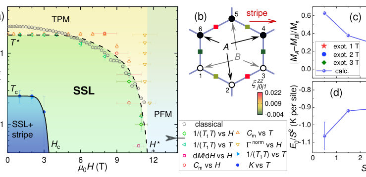
<figcaption class="paper-figure-caption"><b>Fig 5.</b> FIG. 4. Phase diagram of GdZnPO. (a) Magnetic field-temperature (H-T) phase diagram extracted from NMR shift (K), spin-lattice relaxation rate (1/T1), bulk susceptibility (dM/dH), magnetic specific heat (Cm) [8], and normalized Gr¨uneisen ratio Γnorm = (H/T)(dT/dH) [9]. The thermal paramagnetic (TPM) phase occurs where thermal energy (kBT) dominates spin-spin exchange interactions, whereas the polarized ferromagnetic (PFM) phase is the low-temperature state where an external magnetic field overcomes these interactions to align the spins uniformly. (b) Ground-state (|GS⟩) correlations of the central hexagon, ξzz j0j1 = ⟨GS|Sz j0Sz j1|GS⟩/S2, computed for an S = 7/2 72-site cluster (Appendix...</figcaption>
</figure>

**Summary.** This work characterizes the magnetic ground state of GdZnPO, a frustrated honeycomb antiferromagnet, by combining NMR measurements with DMRG simulations. The primary finding is that the material robustly exhibits spin-liquid characteristics even when considering the effects of high-spin quantization. This establishes GdZnPO as an important platform for studying quantum magnetism in complex, highly correlated systems.

**Why it may be interesting.** The resilience of the spin liquid state against quantization effects ($S=7/2$) is a key topic for understanding how crystal field effects and high spins modify quantum magnetic behavior in real materials, which has implications for designing quantum materials.

Detailed structure

**Main problem.** The study investigates the nature of exotic quantum magnetic phases, specifically spin liquids (SSLs), in frustrated antiferromagnets against the influence of high-spin quantization effects.

**Main result.** The material GdZnPO exhibits robust evidence for a spin-liquid state down to very low temperatures, suggesting that the finite spin quantum number only weakly modifies the underlying spiral degeneracy rather than destroying the SSL phenomenology.

**Method.** The research combines experimental measurements using Nuclear Magnetic Resonance (NMR) spectroscopy with advanced theoretical calculations like Density Matrix Renormalization Group (DMRG).

**Model / system.** The physical system is the honeycomb antiferromagnet GdZnPO, modeled by a frustrated Hamiltonian involving exchange interactions ($J_1, J_2$) and single-ion anisotropy. The high spin quantum number is $S=7/2$.

**Key observables.** NMR relaxation rate (1/T1), magnetization, specific heat, and correlation parameters ($\xi_{xy}, \xi_{zz}$).

**Important parameters / regimes.** Intermediate field regime ($\sim 3$ T to $\sim 12$ T) vs. low fields ($< 3$ T); ultra-low temperatures down to $33$ mK.

**Assumptions / limitations.** The analysis assumes that the observed spin dynamics and scaling relations provide intrinsic information about the magnetic ground state, despite potential extrinsic broadening from sample disorder.

**Figures summary.** Figures illustrate NMR spectra across various fields/temperatures, phase diagrams mapping different magnetic regimes (SSL vs. Stripe), and plots showing temperature dependence of relaxation rates ($1/T_1$) used to determine critical exponents ($\gamma$).

**Paper structure.** The paper progresses by first establishing the general model and experimental setup using NMR on GdZnPO; it then analyzes data across different field regimes, distinguishing between weak stripe order at low fields and robust SSL behavior in intermediate fields; finally, theoretical calculations (DMRG) are used to complement these findings by simulating ground-state correlations.

Abstract

Frustrated magnets host strong quantum fluctuations that can suppress conventional magnetic order and give rise to exotic quantum phases such as spin liquids. In some cases, however, quantum fluctuations lift classical degeneracies and stabilize ordered states via an order-by-quantum-disorder mechanism. The spin-7/2 honeycomb antiferromagnet GdZnPO has recently been proposed as a spiral spin-liquid candidate arising from cooperative fluctuations among a subextensively degenerate manifold of spiral states. Here, we investigate the local magnetization and spin dynamics in GdZnPO using nuclear magnetic resonance. In an intermediate field regime between $\sim$3 T and the saturation field ($\sim$12 T), we observe a spatially uniform magnetization and persistent low-energy spin dynamics down to 0.033 K, with no detectable symmetry breaking, providing spectroscopic evidence for a spin-liquid state. At lower fields below $\sim$3 T, a weak stripe order emerges below $\sim$0.25 K; however, strong fluctuations persist, as indicated by a nearly temperature-independent and unusually large spin-lattice relaxation rate in the low-temperature limit. Our results demonstrate that spin-7/2 quantization weakly lifts the spiral degeneracy, stabilizing subtle magnetic order while preserving robust dynamics and spin-liquid phenomenology. These findings establish GdZnPO as a promising platform for exploring spin liquids in high-spin frustrated magnets down to the lowest accessible temperatures.

[↑ back to top](#top)

### [Structure-Aware Variance Reduction for Unbiased Randomized Hamiltonian Simulation](http://arxiv.org/abs/2606.23544v1)

**Authors:** Joshua W. Dai, Fredrik Hasselgren, Chusei Kiumi  
**Type:** theory · **Category:** numerical methods · **PDF:** <https://arxiv.org/pdf/2606.23544v1>  
**Analysis basis:** full PDF text, analyzed in chunks
**Topic relevance:** `methods for driven-dissipative` **3/5** · `analog quantum simulation` **2/5** · `non-equilibrium dynamics` **1/5**

↔ Scroll figures horizontally

<figure class="paper-figure-card">
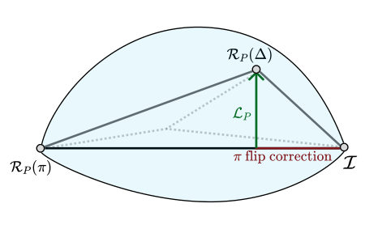
<figcaption class="paper-figure-caption"><b>Fig 1.</b> FIG. 1. Geometric intuition for the local TE-PAI decomposi- tion. For a fixed Pauli string P, the finite channels I, RP (∆), and RP (π) give a linear representation of the infinitesimal direction LP . The ∆-rotation contains both the desired Li- ouvillian component and an unwanted component along the I–RP (π) direction. TE-PAI subtracts this unwanted compo- nent, representing the Liouvillian insertion as a signed com- bination of physical finite-angle channels.</figcaption>
</figure>
<figure class="paper-figure-card">
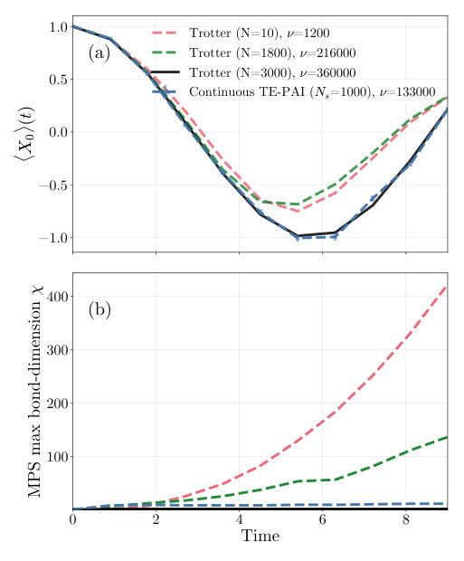
<figcaption class="paper-figure-caption"><b>Fig 2.</b> FIG. 2. Continuous TE-PAI with Ns = 1000 circuits and ∆= π/210 simulates an n = 30 qubit spin-chain Hamil- tonian with high-frequency time-dependent nearest-neighbor coupling, compared against first-order Trotterization with N = {10, 1800, 3000} on MPS. (a): The expectation value ⟨X0⟩over time for the deepest canon Trotterization in black approximated by continuous TE-PAI in blue, N = 1800 Trot- ter in green, and N = 10 Trotter in red. (b): The maximum bond-dimension used by the simulations as a function of sim- ulation duration. For the continuous TE-PAI circuits, this was the max between all circuits for any given time-step.</figcaption>
</figure>
<figure class="paper-figure-card">
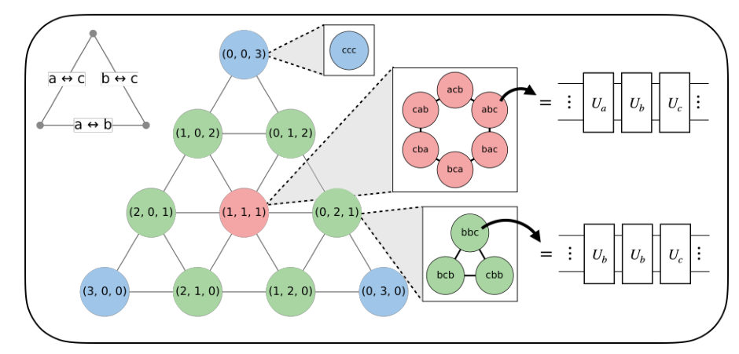
<figcaption class="paper-figure-caption"><b>Fig 3.</b> FIG. 3. Partitioning of the sample space for words of length 3 made from an alphabet A = {a, b, c}. The 33 = 27 words are first grouped by the counts vector into 5 2  = 10 multisets, represented as points on an integer simplex. Edges between simplex points correspond to single-letter substitutions. Each multiset has an internal graph whose nodes are the distinct permutations of that multiset and whose edges are adjacent transpositions. Counts-vector stratification removes variance associated with the outer substitution graph; the residual variance is due to random sampling of orderings on the internal permutation graphs.</figcaption>
</figure>
<figure class="paper-figure-card">
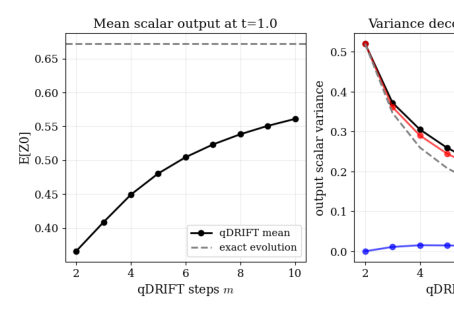
<figcaption class="paper-figure-caption"><b>Fig 4.</b> FIG. 4. A small qDRIFT example on the 2-qubit Hamiltonian H = 1</figcaption>
</figure>
<figure class="paper-figure-card">
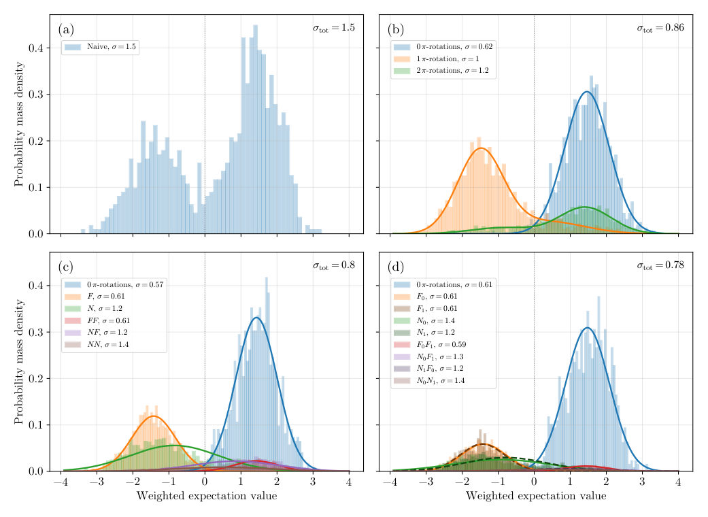
<figcaption class="paper-figure-caption"><b>Fig 5.</b> FIG. 5. Per-circuit distributions of the (weighted) observable estimator w(C) ⟨O⟩C for ⟨X0⟩on a 12-qubit time-dependent spin chain (J = 1, T = 2, ∆= π/128, Ns = 103 samples per stratum), compared across four sampling strategies. Bars show the empirical histogram of each (sub)stratum, scaled by its analytic stratum probability ps, so the panel-wide pointwise sum approximates the mixture density targeted by the corresponding estimator. Solid (and dashed, panel (d)) curves are parametric fits described below. The bold quantity in the top-right of each panel is the resulting per-circuit estimator standard deviation under proportional allocation, σtot = pP</figcaption>
</figure>

**Summary.** The paper introduces structure-aware methods to drastically reduce the sampling overhead in randomized quantum Hamiltonian simulations. It achieves this by developing continuous time-evolution estimators that eliminate systematic Trotterization errors and then applying advanced statistical techniques to decompose and minimize the remaining Monte Carlo variance. This makes simulating complex, large-scale quantum systems significantly more efficient.

**Why it may be interesting.** This work provides advanced mathematical tools for simulating complex quantum dynamics by rigorously controlling statistical errors. The development of observable-adapted variance reduction is crucial for making large-scale Hamiltonian simulations feasible beyond current computational limits.

Detailed structure

**Main problem.** The paper addresses the fundamental trade-off between systematic bias and sampling overhead when simulating quantum dynamics using randomized Hamiltonian simulation techniques.

**Main result.** By developing structure-aware variance reduction techniques, they achieve significant reductions in Monte Carlo sampling cost (up to 96%) while maintaining unbiased estimation of quantum channels.

**Method.** The core method involves decomposing the simulation error into classical counting and quantum ordering components, allowing for targeted variance reduction via stratification based on trajectory statistics.

**Model / system.** The study focuses on simulating time evolution under a general time-dependent Pauli Hamiltonian, applicable to systems like spin chains. The methods are applied to estimate quantum channels $\mathcal{U}_T$ and expectation values of observables $O$.

**Key observables.** Error reduction percentages (e.g., 70%-80%), residual risk ($	ext{R}(S)$), bond dimension growth, and the counts vector/local count statistics.

**Important parameters / regimes.** Simulation time $T$, desired accuracy $\epsilon$, Pauli coupling strengths $\|\mathbf{c}\|_1 T$, and local locality radius $\ell$.

**Assumptions / limitations.** The analysis often assumes that observable-adapted stratification (conditioning on local counts) can effectively control the residual variance, although global count statistics are noted as being computationally intractable.

**Figures summary.** Figures compare expectation values and maximum bond dimensions between continuous TE-PAI circuits and Trotterization for spin chains, showing superior scaling for TE-PAI. Other figures illustrate the partitioning of the sample space based on counts vectors.

**Paper structure.** The paper builds from establishing unbiased estimators (Continuous TE-PAI) that eliminate systematic Trotter error, to decomposing the variance into classical and quantum components, and finally developing structure-aware stratification techniques using local count statistics for practical error reduction bounds.

Abstract

Randomized Hamiltonian simulation methods are often governed by a trade-off between systematic bias and sampling overhead. We study how classical variance-reduction techniques can be applied to such methods without changing their mean channel, and therefore without introducing additional bias. As a motivating unbiased estimator, we formulate continuous time-evolution probabilistic angle interpolation (continuous TE-PAI), a quasiprobabilistic random-circuit protocol whose remaining Monte Carlo error is purely statistical. Continuous TE-PAI removes Trotter discretization error with finite-depth random circuits, whereas deterministic Trotterization does so only in the infinite-depth limit. Further, in tensor-network simulations, we demonstrate that discretization error can cause an unphysical exponential growth in the bond dimension required for Trotterized simulations, whereas comparable-depth continuous TE-PAI circuits avoid this growth. We then show that the variance of randomized product-formula-based estimators admits a canonical decomposition into a classical counting component and a quantum ordering component such that the dominant simulation overhead results from the non-commutative parts of the Hamiltonian dynamics. Motivated by this decomposition, we achieve an $\approx70\%$ error-reduction using the counting-component for small systems whereas our tensor-network simulations of $n=30$ spin-chain dynamics use coarser statistics tailored to the observable and estimator attaining a negligible bias and a reduction of $\approx 80\%$ leading to $\approx91\%$ and $\approx96\%$ sampling-cost reductions, respectively.

[↑ back to top](#top)

### [Wess-Zumino terms in 0+1 SU(N) superspin systems](http://arxiv.org/abs/2606.23234v1)

**Authors:** J. S. Morales, M. N. Kiselev  
**Type:** theory · **Category:** strongly correlated electrons · **PDF:** <https://arxiv.org/pdf/2606.23234v1>  
**Analysis basis:** full PDF text, analyzed in chunks
**Topic relevance:** `exotic spin models in light-matter` **3/5** · `Keldysh / 2PI / non-Gaussian methods` **1/5** · `analog quantum simulation` **1/5** · `spintronics-quantum-optics interface` **1/5**

↔ Scroll figures horizontally

<figure class="paper-figure-card">
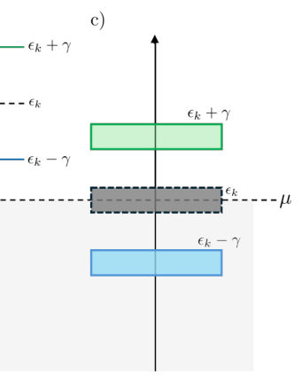
<figcaption class="paper-figure-caption"><b>Fig 1.</b> Figure 1: Possible energy configurations (assuming γ &gt; 0): a) Both spin levels occupied. b) Both unoccupied. c) Upper level unoccupied but lower occupied.</figcaption>
</figure>
<figure class="paper-figure-card">
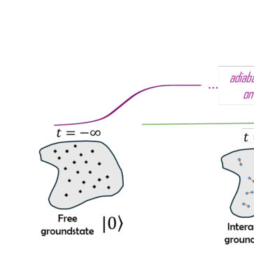
<figcaption class="paper-figure-caption"><b>Fig 2.</b> Figure 2: Adiabatic evolution of instantaneous groundstate.</figcaption>
</figure>
<figure class="paper-figure-card">
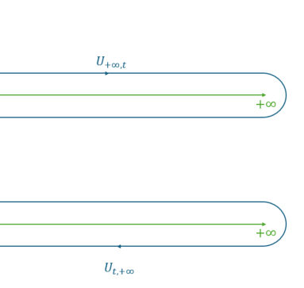
<figcaption class="paper-figure-caption"><b>Fig 3.</b> Figure 3: Forward and backward insertions of the an observable operator ˆO on the closed real-time contour.</figcaption>
</figure>
<figure class="paper-figure-card">
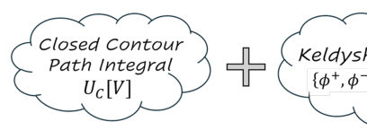
<figcaption class="paper-figure-caption"><b>Fig 4.</b> Figure 4: Schematic structure of the Keldysh technique</figcaption>
</figure>
<figure class="paper-figure-card">
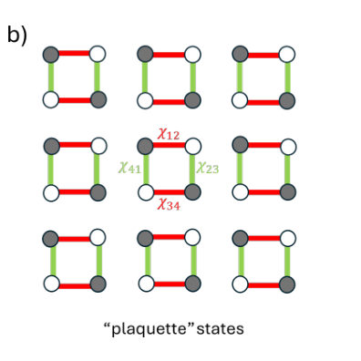
<figcaption class="paper-figure-caption"><b>Fig 5.</b> Figure 5: Groundstate configurations of a N/2 −N/2 SU(N) single color (nc = 1) Heisenberg model. (a) Peierls phase/ Bond states, where χ1 ̸= 0, χ2,3,4 = 0, and Flux phase, where χ1 = χ2,3,4. (b) Alternative degenerate groundstate configurations giving rise to disconnected dimerized plaquettes.</figcaption>
</figure>

**Summary.** This work develops a comprehensive theoretical framework for describing the quantum dynamics of high-symmetry spin systems using Wess-Zumino terms. By generalizing from simple SU(2) spins to complex SU(N) models, it reveals that geometric topology dictates fundamental aspects of the system's effective action in condensed matter contexts.

**Why it may be interesting.** The deep connection between topology (Chern classes) and quantum dynamics in spin systems provides a powerful, general framework applicable to understanding exotic magnetic phases and topological order in condensed matter materials.

Detailed structure

**Main problem.** To introduce Wess-Zumino (WZ) terms in quantum systems with SU(N) symmetry, focusing on the interplay between geometry, topology, and condensed-matter applications.

**Main result.** The geometric reformulation of spin dynamics introduces a non-trivial topological term (the WZ term), generalizing from SU(2) to higher symmetries where the phase space is $\mathbb{CP}^{N-1}$. Explicit local forms are derived for SU(3) and SU(4).

**Method.** The analysis uses coherent state path integrals over Lie groups, deriving effective actions by identifying topological terms related to Berry curvature and Chern classes.

**Model / system.** The study focuses on $0+1$ dimensional $\text{SU}(N)$ superspin systems. It models spin dynamics using generalized coherent states whose phase space is identified with the complex projective space $\mathbb{CP}^{N-1}$.

**Key observables.** WZ term (topological action), Berry curvature, and the resulting effective Lagrangian governing quantum evolution.

**Important parameters / regimes.** The symmetry group $SU(N)$ (specifically $N=3, 4$), the dimension of the system ($0+1$ D), and the magnetic field strength $B$.

**Assumptions / limitations.** The derivation relies on generalizing concepts from $\text{SU}(2)$ spin coherent states to higher symmetries and assumes the applicability of geometric quantization techniques.

**Figures summary.** Not specified (Notes focus on mathematical derivations, equations, and conceptual flow rather than figure descriptions).

**Paper structure.** The paper progresses by first establishing the $\text{SU}(2)$ case via the Bloch sphere path integral, then generalizing the geometric origin of topological terms to higher $SU(N)$ symmetries. It concludes with explicit derivations for $\text{SU}(3)$ and $\text{SU}(4)$ superspin systems.

Abstract

These notes present a self-contained introduction to Wess-Zumino (WZ) terms in quantum systems with $SU(N)$ symmetry, emphasizing the interplay between geometry, topology, and condensed-matter applications. We begin with the $SU(2)$ spin coherent-state path integral, where the Berry phase appears as a WZ term encoding the symplectic structure of the Bloch sphere. This example is then used to introduce the geometric origin of topological terms, their relation to integral cohomology classes, and the role of Berry curvature as the first Chern class of the canonical $U(1)$ bundle. We next discuss physical realizations in which such geometric terms affect dynamics, including adiabatic Berry phases and geometric quantum noise in magnetic quantum dots. A substantial part of the notes is devoted to the condensed-matter motivation for higher $SU(N)$ symmetries, covering $SU(N)$ Heisenberg models, $SU(4)$ spin-orbital and spin-pseudospin systems, multipolar exchange interactions, and higher-spin multipolar orders. Finally, we develop the 0+1-dimensional $SU(N)$ superspin coherent-state construction, identify the phase space with $CP^{N-1}$, and derive explicit local WZ terms for $SU(3)$ and $SU(4)$. The appendices provide algebraic dictionaries connecting the abstract superspin language with concrete physical embeddings, including multipolar generator bases and several useful $SU(4)$ parametrizations.

[↑ back to top](#top)

### [Adversarial Reinforcement Learning for Adaptive Eavesdropping in BB84 Quantum Key Distribution](http://arxiv.org/abs/2606.22962v1)

**Authors:** Ramon Jose C. Bagunu  
**Type:** theory · **Category:** quantum information and computing · **PDF:** <https://arxiv.org/pdf/2606.22962v1>  
**Analysis basis:** full PDF text, analyzed in chunks
**Topic relevance:** `quantum measurements` **3/5** · `measurement-induced transitions` **1/5** · `methods for driven-dissipative` **1/5**

↔ Scroll figures horizontally

<figure class="paper-figure-card">
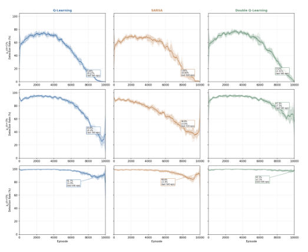
<figcaption class="paper-figure-caption"><b>Fig 1.</b> Fig. 1. Learning curves with shaded ±std bands across 5 seeds. Rows: µch = 1%, 3%, 5%. Columns: Q-Learning, SARSA, Double Q-Learning. Annotations report mean ± std from the final 500 episodes.</figcaption>
</figure>
<figure class="paper-figure-card">
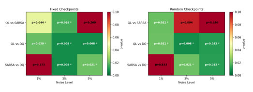
<figcaption class="paper-figure-caption"><b>Fig 2.</b> Fig. 4. Mann-Whitney U test p-values for pairwise agent comparisons (green = significant at α = 0.05). Left: fixed checkpoints. Right: random checkpoints. The pattern of significant and non-significant results is mostly consistent across both conditions, which suggests that the agent ranking is not an artifact of protocol structure.</figcaption>
</figure>
<figure class="paper-figure-card">
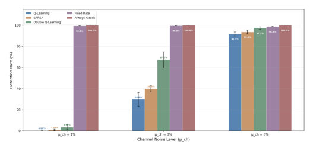
<figcaption class="paper-figure-caption"><b>Fig 3.</b> Fig. 2. Detection rates for all agents and baselines across three noise levels (5-seed mean ± std, error bars on the RL agents, and baselines are deterministic in this metric and shown without error bars). RL agents (left three bars per group) achieve near-zero detection at µch = 1%, while both baselines (right two bars) remain near 100% across all conditions.</figcaption>
</figure>
<figure class="paper-figure-card">
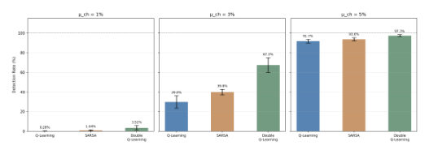
<figcaption class="paper-figure-caption"><b>Fig 4.</b> Fig. 3. Detection rate mean ± std across 5 seeds. The tight variance at µch = 1% confirms that Q-Learning’s near-zero detection is robust across seeds rather than a single-run artifact.</figcaption>
</figure>
<figure class="paper-figure-card">
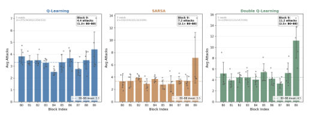
<figcaption class="paper-figure-caption"><b>Fig 5.</b> Fig. 6. Mean attacks per block at µch = 3% (last 500 undetected episodes, full episodes only). Bars show the 5-seed mean with ±std error bars, and the dark scatter points overlay each seed’s mean. The dashed line marks the B0–B8 mean for each agent. Every agent’s block-9 mean exceeds its B0–B8 mean (1.3× for Q-Learning, 2.1× for SARSA, 2.5× for Double Q-Learning), with the surge most consistent across seeds for SARSA and Double Q-Learning.</figcaption>
</figure>

**Summary.** The paper analyzes the security of BB84 QKD against an eavesdropper modeled as a Reinforcement Learning agent capable of adapting its attack strategy based on observed Quantum Bit Error Rate (QBER). The results show that adaptive attackers can achieve near-perfect stealth, drastically lowering detection rates compared to fixed-rate attacks. This mandates that future quantum cryptographic security evaluations must adopt adaptive adversary baselines.

**Why it may be interesting.** This work directly impacts quantum cryptography by quantifying how adaptive adversaries can undermine security proofs that rely on static threat models. It suggests that future QKD security evaluations must incorporate feedback mechanisms into adversary modeling.

Detailed structure

**Main problem.** To investigate if an adaptive eavesdropper (Eve) can exploit the inherent security margin of BB84 Quantum Key Distribution (QKD) better than fixed attack strategies by observing Quantum Bit Error Rate (QBER) feedback.

**Main result.** Adaptive RL agents significantly reduce detection rates compared to non-adaptive baselines, achieving a 355-fold reduction at low noise levels. The study also reveals an 'end-game burst' exploit when checkpoints are fixed.

**Method.** The eavesdropping problem is modeled as a Markov Decision Process (MDP), solved using classical Reinforcement Learning algorithms (Q-Learning, SARSA, Double Q-Learning).

**Model / system.** The physical system is the BB84 QKD protocol. The model uses an RL agent whose state space incorporates observed QBER feedback and attack count, allowing it to make qubit-by-qubit decisions (intercept or pass).

**Key observables.** Detection Rate ($\%$), Quantum Bit Error Rate (QBER), Mean Episode Reward, Information Gain (correct bits per episode).

**Important parameters / regimes.** Channel Noise Levels ($\mu_{ch}$): 1%, 3%, and 5%. The RL algorithms used are Q-Learning, SARSA, and Double Q-Learning.

**Assumptions / limitations.** The work is a proof of concept using simple classical RL agents in an idealized simulation environment; it ignores realistic hardware imperfections like photon loss or dark counts.

**Figures summary.** Figures illustrate learning curves showing detection rate descent over episodes for various agents and noise levels. Other figures detail the emergence and vanishing of the 'end-game burst' attack pattern based on checkpoint randomization.

**Paper structure.** The paper establishes the security premise of BB84, models Eve as an RL agent within an MDP framework, compares Q-Learning/SARSA/Double Q-Learning against fixed baselines across varying noise levels, and analyzes temporal vulnerabilities like the end-game burst based on checkpoint structure.

Abstract

BB84 quantum key distribution derives its security from a physical guarantee that any eavesdropper disturbs the channel in a statistically detectable way. Prior work evaluates this by assuming Eve attacks at a fixed, analytically optimized rate. We examine what happens when Eve is modeled instead as a learning agent. Classical reinforcement learning is used, specifically tabular Q-Learning, SARSA, and Double Q-Learning, to adaptive BB84 eavesdropping. This formulates the attacker's decision as a Markov Decision Process where the agent observes Quantum Bit Error Rate (QBER) feedback and decides, qubit by qubit, whether to intercept or pass. Experiments span three channel noise levels ($μ_{ch}\in\{1\%,3\%,5\%\}$) and are validated across five independent random seeds (45 training runs per condition, 10,000 episodes each). Against the best non-adaptive analytical baseline, Q-Learning reduces detection from $99.4\%$ to $0.28\%\pm0.27\%$ at $μ_{ch}=1\%$ while extracting approximately 10.5 correct bits per episode. This is a 355-fold reduction that is statistically significant ($p=0.020$, Mann-Whitney $U$ test). We also report the spontaneous emergence of an end-game burst, where agents independently learn to surge their attack rate at the final block. This exploit vanishes under randomized checkpoint intervals while stealth performance remains statistically indistinguishable. These results motivate the inclusion of adaptive adversary baselines in quantum cryptographic security evaluations.

[↑ back to top](#top)

### [All-optical Implementation of Generalized Quantum Teleportation](http://arxiv.org/abs/2606.22736v1)

**Authors:** Takaya Hoshi, Akito Kawasaki, Xiruo Yan, Atsushi Sakaguchi, Takumi Suzuki, Tatsuki Sonoyama, Hironari Nagayoshi, Kosuke Fukui, Kan Takase, Warit Asavanant  
**Type:** theory · **Category:** quantum information and computing · **PDF:** <https://arxiv.org/pdf/2606.22736v1>  
**Analysis basis:** full PDF text, analyzed in chunks
**Topic relevance:** `quantum measurements` **3/5** · `measurement-induced transitions` **1/5** · `methods for driven-dissipative` **1/5**

↔ Scroll figures horizontally

<figure class="paper-figure-card">
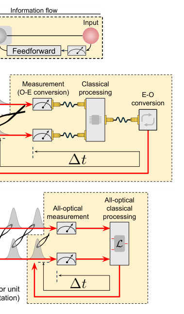
<figcaption class="paper-figure-caption"><b>Fig 1.</b> Fig. 1. Conceptual framework of single-mode measurement-based quantum computing (MBQC) and comparison of feedforward schemes. (a) Conceptual diagram of single- mode MBQC, where the operational clock cycle is determined by measurement and feedforward. (b) Conventional scheme executing feedforward in the electronic domain, requiring a slow optical-to-electronic-to-optical (O-E-O) conversion. (c) Proposed O-E-O-free architecture featuring all-optical feedforward to achieve high throughput and low latency.</figcaption>
</figure>
<figure class="paper-figure-card">
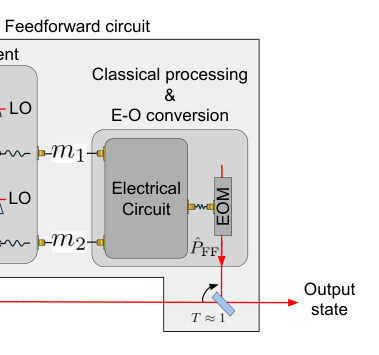
<figcaption class="paper-figure-caption"><b>Fig 2.</b> Fig. 2. Circuit diagram of generalized quantum teleportation with conventional electronic feedforward. The generalized Bell measurement is implemented using a balanced beam splitter followed by homodyne detections, where &quot;Bell 1&quot; and &quot;Bell 2&quot; denote the quantum states after the beam splitter. The measurement outcomes are processed electronically and used to drive electro-optic modulators (EOMs), which realize displacement operations through highly transmissive beam splitters (𝑇≈1). EPR, Einstein-Podolsky-Rosen; LO, local oscillator.</figcaption>
</figure>
<figure class="paper-figure-card">
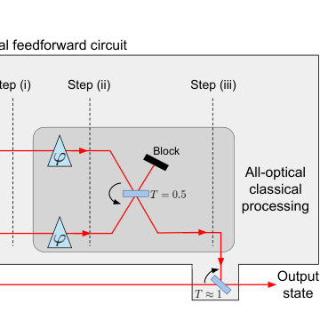
<figcaption class="paper-figure-caption"><b>Fig 3.</b> Fig. 3. Overall circuit for all-optical generalized quantum teleportation, highlighting the core all-optical feedforward (AOFF) circuit that integrates all-optical measurement and optical-domain classical signal processing using phase-sensitive amplifiers (PSAs).</figcaption>
</figure>
<figure class="paper-figure-card">
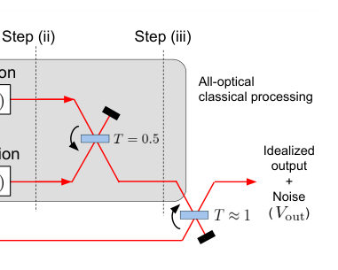
<figcaption class="paper-figure-caption"><b>Fig 4.</b> Fig. 4. Mathematical modeling of the single-stage building block (Fig. 3) incorporating experimental imperfections. The setup parameterizes the non-ideal PSA (gain 𝐺1, internal efficiency 𝜂1, phase 𝜃𝑘), external propagation loss 𝐿1, and feedforward phase rotation 𝜑. It further includes a 50:50 BS and a high-transmittance BS (𝑇∼1) for displacement coupling with mode ˆ𝑎𝐵, yielding the final output noise covariance matrix 𝑉out [Eq. (15)].</figcaption>
</figure>
<figure class="paper-figure-card">
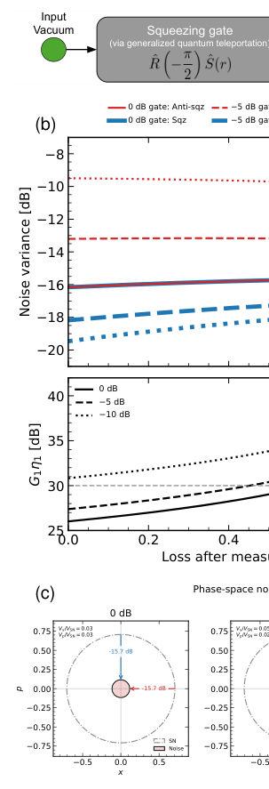
<figcaption class="paper-figure-caption"><b>Fig 5.</b> Fig. 5. Numerical analysis of the additional noise covariance 𝑉out [Eq. (15)] for 𝜂1 = 0.93 and 𝑇= 0.99. (a) Conceptual output decomposition into the target state and accumulated noise. (b) Additional noise power (top; noise variances evaluated independently of gain saturation) and required internal gain 𝐺1𝜂1 = 𝐺/(1−𝐿1) derived from Eq. (11) (bottom) versus external loss 𝐿1 for 0 (solid), −5 (dashed), and −10 dB (dotted) squeezing gates, where red and blue curves indicate noise in the anti-squeezing and squeezing axes, respectively. Vertical lines mark the 30 dB threshold, above which the target operation is physically difficult due to gain deficiency. (c) Phase-space noise ellipses at 𝐿1 =...</figcaption>
</figure>

**Summary.** The paper introduces an All-Optical Feedforward (AOFF) architecture to overcome speed limitations in continuous-variable quantum computing. By replacing slow electronic components with purely optical signal routing using parametric amplifiers, it achieves high-throughput teleportation. This demonstrates a noise-resilient platform crucial for scaling towards fault-tolerant quantum computation.

**Why it may be interesting.** This work provides a concrete, hardware-agnostic blueprint for scaling quantum computation by solving the critical interface problem between optical quantum processing and classical electronics, which is central to photonic QI research.

Detailed structure

**Main problem.** The primary challenge is overcoming throughput bottlenecks in measurement-based continuous-variable optical quantum computing (MBQC) caused by slow classical electronic feedforward circuits.

**Main result.** The proposed All-Optical Feedforward (AOFF) architecture successfully executes generalized quantum teleportation entirely optically, enabling high-throughput operations compatible with fault-tolerant quantum computing requirements.

**Method.** The authors developed a theoretical framework to replace O-E-O conversions with purely optical routing using Phase-Sensitive Amplifiers (PSAs) and beam splitters to implement the necessary feedforward displacements.

**Model / system.** The system models continuous-variable quantum information processing using Time-Domain Multiplexing (TDM) within a generalized quantum teleportation scheme. The core components involve PSAs, lossy waveguides, and balanced beam splitters operating in the optical domain.

**Key observables.** Noise covariance matrix ($\mathbf{V}_{	ext{out}}$), Equivalent Input Noise ($	ext{EIN}$), and operational fidelity relative to theoretical noise floors.

**Important parameters / regimes.** PSA gain ($G$), internal efficiency ($\eta$), external loss ($L$), and the required squeezing level for fault-tolerant operations (e.g., $\ge 9.1 	ext{ dB}$).

**Assumptions / limitations.** The analysis often relies on the high-gain approximation ($G \gg 1$) for PSA noise suppression, and in some stages, assumes vanishing intrinsic noise from the initial EPR resource state to isolate hardware effects.

**Figures summary.** Figures compare conceptual frameworks (conventional vs. AOFF), detail circuit diagrams, and show numerical analyses of output noise power versus external loss ($L_1$), demonstrating noise resilience across different component parameters.

**Paper structure.** The paper progresses from identifying the classical bottleneck in MBQC to proposing the AOFF architecture. It then details the mathematical derivation of all-optical feedforward using PSAs, followed by rigorous multi-stage noise analysis (single-stage $	o$ dual-PSA $	o$ PSA-PIA) to prove fault tolerance.

Abstract

Measurement-based continuous-variable optical quantum computing inherently offers high-speed, large-scale operations, yet its practical performance remains constrained by the processing latencies and throughput bottlenecks imposed by classical electronic feedforward circuits. To overcome these limitations, we propose a loss-tolerant, all-optical feedforward (AOFF) architecture for generalized quantum teleportation capable of executing arbitrary linear operations. Quantitative noise analysis under realistic device parameters demonstrates that the architecture successfully suppresses hardware-induced noise floor, confirming its compatibility with fault-tolerant quantum computing requirements. By eliminating optoelectronic conversions, this scheme enables continuous high-throughput operations that drastically reduce circuit runtime. Ultimately, this approach delivers a noise-resilient platform that reconciles operational versatility with the intrinsic speed and bandwidth of optical quantum information processing.

[↑ back to top](#top)

### [Entropic Uncertainty Relations for Mutually Unbiased Operator Frames](http://arxiv.org/abs/2606.23185v1)

**Authors:** Jesni Shamsul Shaari, Stefano Mancini  
**Type:** theory · **Category:** other · **PDF:** <https://arxiv.org/pdf/2606.23185v1>  
**Analysis basis:** full PDF text, analyzed in chunks
**Topic relevance:** `entanglement & information structure` **3/5** · `Keldysh / 2PI / non-Gaussian methods` **1/5** · `quantum measurements` **1/5**

↔ Scroll figures horizontally

<figure class="paper-figure-card">
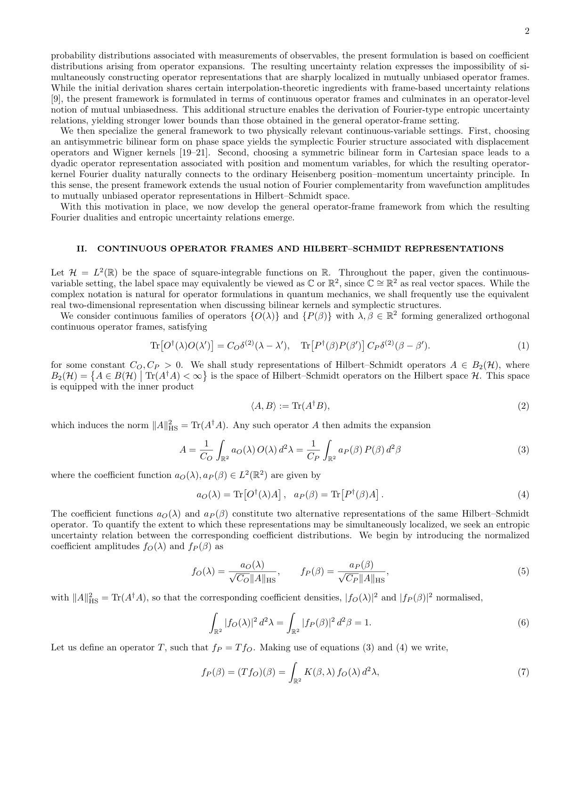
<figcaption class="paper-figure-caption"><b>Fig 1.</b> Low-resolution page preview, page 2</figcaption>
</figure>
<figure class="paper-figure-card">
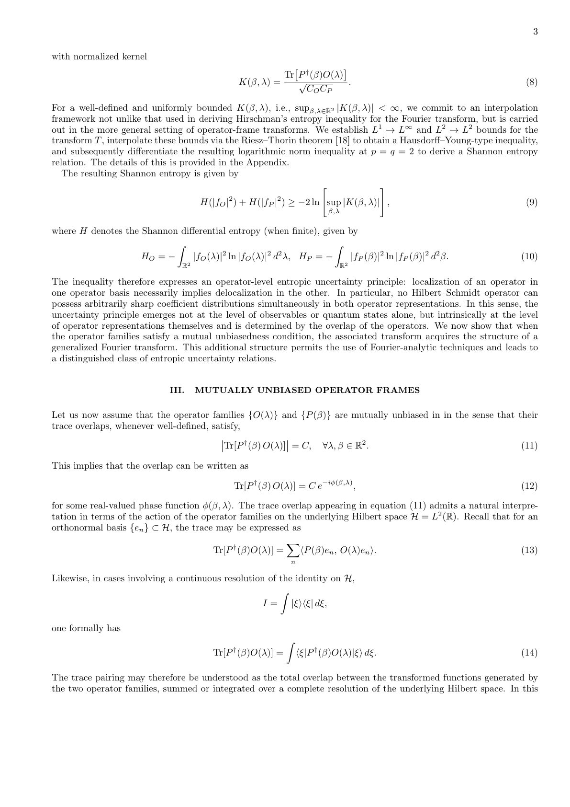
<figcaption class="paper-figure-caption"><b>Fig 2.</b> Low-resolution page preview, page 3</figcaption>
</figure>
<figure class="paper-figure-card">
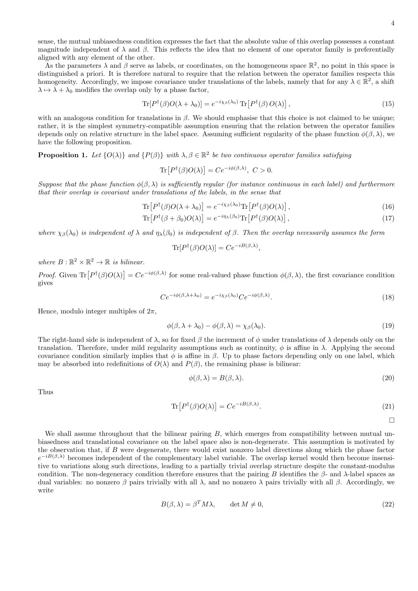
<figcaption class="paper-figure-caption"><b>Fig 3.</b> Low-resolution page preview, page 4</figcaption>
</figure>
<figure class="paper-figure-card">
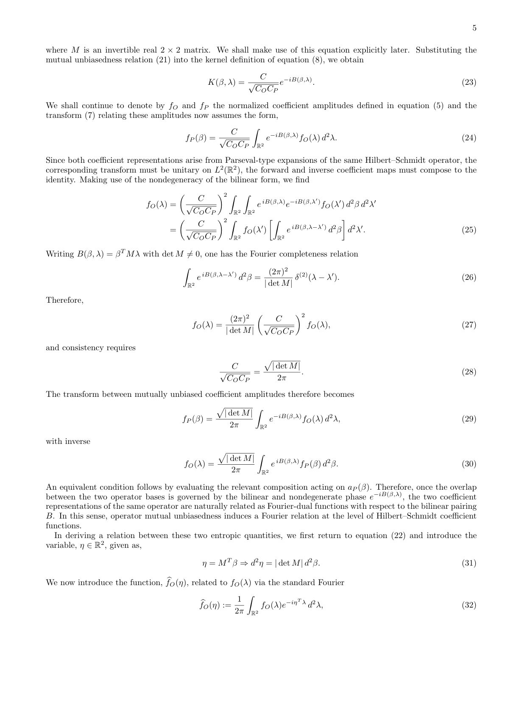
<figcaption class="paper-figure-caption"><b>Fig 4.</b> Low-resolution page preview, page 5</figcaption>
</figure>
<figure class="paper-figure-card">
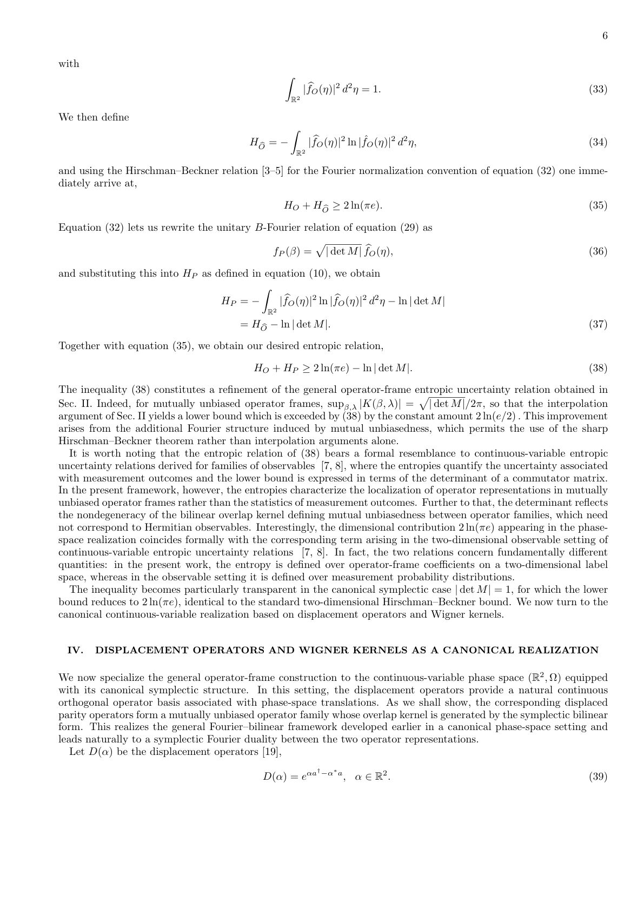
<figcaption class="paper-figure-caption"><b>Fig 5.</b> Low-resolution page preview, page 6</figcaption>
</figure>

**Summary.** This paper generalizes entropic uncertainty relations by formulating them within an operator-frame framework in Hilbert-Schmidt space. It derives strong bounds using advanced tools like Riesz-Thorin interpolation, showing that mutual unbiasedness imposes a Fourier structure on the operators. This extends fundamental quantum limits to constrain the coherence properties of quantum observables themselves.

**Why it may be interesting.** This work provides a powerful mathematical generalization of uncertainty principles beyond simple probability distributions, applying it directly to the representation theory of quantum observables (operators). This has implications for understanding fundamental limits in continuous-variable quantum information processing.

Detailed structure

**Main problem.** The paper develops a general operator-frame formulation for entropic uncertainty relations, extending these bounds from standard measurement outcomes to the structure of operators themselves.

**Main result.** It derives stronger Hirschman-Beckner-type entropic uncertainty relations when the underlying operator frames are mutually unbiased, and recovers known results like the Heisenberg uncertainty principle in specific canonical realizations.

**Method.** The derivation heavily utilizes functional analysis tools, specifically combining endpoint norm estimates with the Riesz-Thorin interpolation theorem to establish general entropy bounds for coefficient distributions.

**Model / system.** The system is modeled using continuous-variable quantum theory on $L^2(\mathbb{R})$, involving operator families like Weyl displacement operators and position/momentum eigenstates, analyzed within the Hilbert-Schmidt space of operators.

**Key observables.** Shannon differential entropy ($H$), coefficient distributions $|f|^2$, and the trace overlap kernel $	ext{Tr}[P^\dagger(eta) O(\lambda)]$.

**Important parameters / regimes.** The structure is governed by the bilinear form $B(eta, \lambda)$ associated with mutual unbiasedness, which dictates the Fourier transform relationship between coefficient amplitudes.

**Assumptions / limitations.** Key assumptions include assuming the overlap kernel is uniformly bounded for interpolation and that the underlying coefficient function space admits a dense regular subspace in $L^1 \cap L^2$.

**Paper structure.** The paper progresses from establishing general entropic uncertainty relations using Riesz-Thorin interpolation to identifying the special case of mutually unbiased operator frames, which forces a Fourier structure leading to stronger bounds. It then validates this framework by examining canonical examples like displacement operators and position/momentum eigenstates.

Abstract

We develop an operator-frame formulation of entropic uncertainty relations in the Hilbert-Schmidt space of operators. For general continuous indexed operator frames, we derive an entropic uncertainty relation for the associated coefficient distributions by combining endpoint norm estimates with Riesz-Thorin interpolation. We then identify a distinguished class of mutually unbiased operator frames, defined through constant-modulus trace overlaps. Under suitable structural conditions, the corresponding coefficient amplitudes are related by a bilinear Fourier transform, leading to a stronger Hirschman-Beckner-type entropic uncertainty relation. As canonical realizations, we consider Weyl displacement operators and Wigner kernels, as well as Cartesian dyadic frames generated by position and momentum eigenstates. These examples recover familiar continuous-variable Fourier dualities while extending entropic uncertainty relations beyond measurement outcomes to operator representations themselves.

[↑ back to top](#top)

### [Full-Field Mode Sorter for Optical Knots](http://arxiv.org/abs/2606.23438v1)

**Authors:** Tareq Jaouni, Roohollah Ghobadi, Ebrahim Karimi  
**Type:** both · **Category:** other · **PDF:** <https://arxiv.org/pdf/2606.23438v1>  
**Analysis basis:** full PDF text, analyzed in chunks
**Topic relevance:** `interference shaping light` **3/5** · `methods for driven-dissipative` **1/5** · `quantum optics experiment` **1/5**

↔ Scroll figures horizontally

<figure class="paper-figure-card">
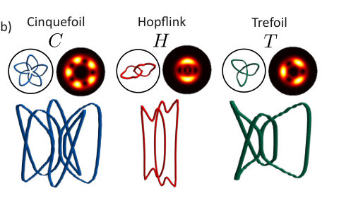
<figcaption class="paper-figure-caption"><b>Fig 1.</b> FIG. 1. Experimental concept. (a) We first generate the desired knotted field by encoding the required phase pattern onto an SLM and selecting for the first diffraction order using a 4f imaging system. We then apply the optimized phase masks onto the field at the waist transverse plane. (b) The knot alphabet is used to verify the sorting performance. We show the knotted fields’ intensity profile at its waist plane – |ψ(ρ, ϕ, z = 0)|2 – as well as each knot’s corresponding singular skeleton. All optical knots have the same Gaussian waist envelop parameter of s = 1.0. The shape parameters for each optical knot are (a, b) = (2.0, 2.0) for cinquefoil, (0.9, 0.9) for trefoil, and (0.6, 0.6) for...</figcaption>
</figure>
<figure class="paper-figure-card">
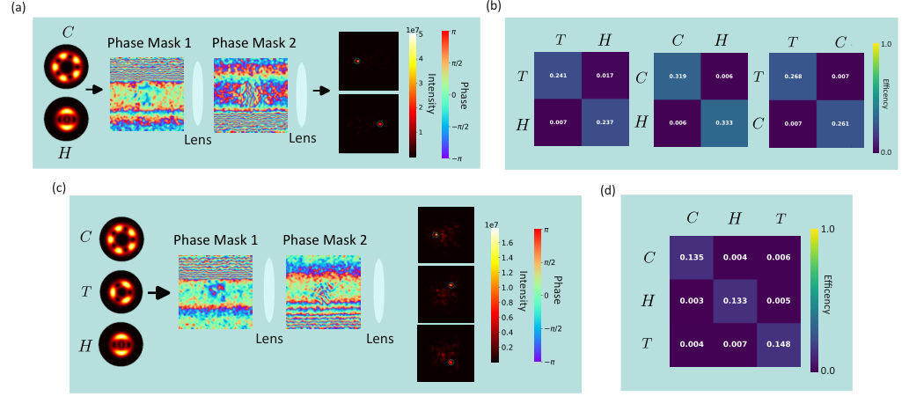
<figcaption class="paper-figure-caption"><b>Fig 2.</b> FIG. 2. Results for sorting knots using two optimized phase elements. In (a)-(b), we demonstrate our sorter’s ability to sort d = 2 knotted optical modes. (a) Optimized phase elements and output field for sorting cinquefoil (C) and Hopf link (H) optical knots. (b) Crosstalk matrices for all possible two-knot combinations in our alphabet. In (c)-(d), we apply our sorting routine on d=3 knots, utilizing our entire knot alphabet. (c) optimized phase elements and output field for sorting the knots (d) crosstalk matrix associated with our sorter.</figcaption>
</figure>
<figure class="paper-figure-card">
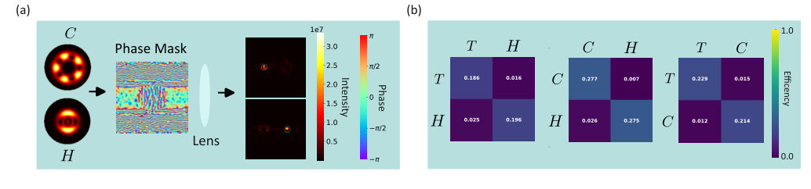
<figcaption class="paper-figure-caption"><b>Fig 3.</b> FIG. 3. Results for sorting knots using one optimized phase plane. We demonstrate the sorting performance on two-knot combinations. (a) Optimized phase elements and output field for sorting cinquefoil (C) and Hopf link (H) optical knots. (b) Crosstalk matrices for all possible two-knot combinations in our alphabet.</figcaption>
</figure>
<figure class="paper-figure-card">
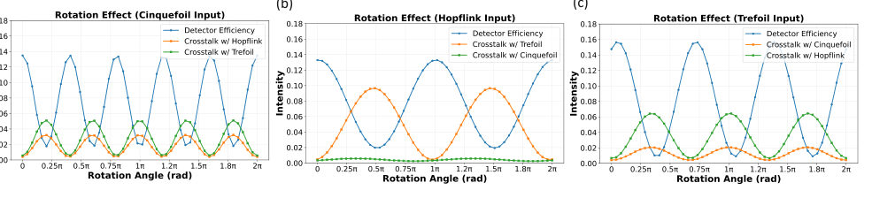
<figcaption class="paper-figure-caption"><b>Fig 4.</b> FIG. 4. Impact of rotating the input field. We plot the detection efficiency and modal crosstalk as a function of the rotation angle θ. We consider 50 points over the range θ ∈[0, 2π]. We report how these quantities change when sending (a) cinquefoil (b) Hopf link and (c) trefoil inputs.</figcaption>
</figure>
<figure class="paper-figure-card">
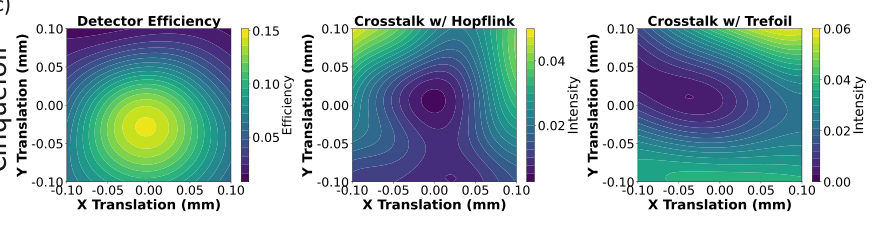
<figcaption class="paper-figure-caption"><b>Fig 5.</b> FIG. 5. Impact of translating the input field on sorting performance. In (a)-(c), we show heatmaps of the detection efficiency and modal crosstalk as a function of (xtrans, ytrans). We report how these change when sending (a) trefoil, (b) Hopf link, and (c) cinquefoil as inputs to the mode sorter.</figcaption>
</figure>

**Summary.** This paper presents a proof-of-principle method for reading out optical knots—topologically complex light fields used as high-dimensional information carriers. By optimizing phase masks using a genetic algorithm, the authors developed a full-field sorter capable of distinguishing multiple knot types with low crosstalk. This work establishes a crucial readout mechanism necessary for implementing secure, high-capacity communication systems based on structured light.

**Why it may be interesting.** This work bridges topological physics (knot theory) with applied quantum optics/information. The development of a robust, full-field sorting mechanism for structured light is highly relevant to realizing high-dimensional quantum communication protocols beyond simple polarization encoding.

Detailed structure

**Main problem.** The core problem is developing a practical, full-field method to read out (sort) high-dimensional optical information encoded in topologically structured light fields called 'optical knots.' The goal is to achieve low crosstalk when distinguishing between different knot types.

**Main result.** The authors demonstrated that using two optimized phase planes significantly improves sorting performance for a three-knot alphabet compared to using only one plane. This provides a viable readout route for knot-based high-dimensional optical communication.

**Method.** They employ an optimization strategy, utilizing a Genetic Algorithm (GA) guided by a composite fitness function. This function balances assignment contrast, error penalties related to distinguishability, and the determinant of the output pattern matrix.

**Model / system.** The system involves generating optical knots—light fields with linked or knotted phase/polarization singularities—and passing them through optimized phase-only elements (phase masks). The mathematical model describes the transformation using Fourier propagation ($U$) acting on input knot states ($\psi_n$).

**Key observables.** Sorting efficiency, crosstalk between different knots (e.g., Hopf link vs. Trefoil), and the overall distinguishability factor derived from the output intensity distributions.

**Important parameters / regimes.** The alphabet size ($d$), optimization weights ($\alpha$ for worst-case contrast, $\gamma$ for determinant penalty), and physical perturbations like rotation or aberration strength.

**Assumptions / limitations.** The method assumes that the sorting can be achieved by optimizing phase masks based on input field measurements at a specific plane. Performance degrades when inputs deviate significantly from ideal conditions (e.g., due to aberrations).

**Figures summary.** Figures illustrate the experimental concept using optimized phase masks for knot sorting, show performance degradation under rotation and translation, and benchmark results against real-world channel imperfections.

**Paper structure.** The paper introduces the physical problem of knot readout, details the mathematical model involving Fourier propagation through phase masks, outlines the complex optimization procedure (GA with composite fitness), presents results showing improved performance with multiple planes, and concludes with benchmarking against experimental noise.

Abstract

Optical knots are topologically structured light fields whose phase or polarization singularities trace linked or knotted trajectories during propagation, making them promising candidates for high-dimensional optical information carriers. Their use in communication or quantum-information protocols, however, requires a practical readout method that can distinguish a chosen knot alphabet with low crosstalk. Here, we demonstrate a proof-of-principle full-field sorter for optical knots using one or two optimized phase-only elements. The sorter maps each input knot to a predefined output region and is optimized directly from the output intensity distributions to enhance correct assignment, suppress crosstalk, and avoid degenerate mappings between distinct knots. We apply the method to an alphabet composed of the Hopf link, trefoil, and cinquefoil optical knots. Two optimized phase planes improve the sorting performance relative to a single plane and enable high distinguishability for the three-knot alphabet. We further benchmark the sorter under common experimental imperfections. These results extend full-field optical mode sorting to topologically structured light and provide a readout route for knot-based high-dimensional optical communication.

[↑ back to top](#top)

### [How Stark units enter SIC overlaps](http://arxiv.org/abs/2606.23535v1)

**Authors:** Ingemar Bengtsson, Gary McConnell  
**Type:** theory · **Category:** quantum information and computing · **PDF:** <https://arxiv.org/pdf/2606.23535v1>  
**Analysis basis:** full PDF text, analyzed in chunks
**Topic relevance:** `quantum measurements` **3/5** · `entanglement & information structure` **1/5** · `measurement-induced transitions` **1/5**

↔ Scroll figures horizontally

<figure class="paper-figure-card">
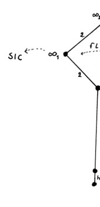
<figcaption class="paper-figure-caption"><b>Fig 1.</b> Figure 1: A field inclusion diagram including the real quadratic field K, the Hilbert class field H, and the four ray class fields Kd, Kd∞1, Kd∞2, and Kd∞1∞2. The degree hK of the extension from K to H determines the number of unitarily non-equivalent minimal SICs. To go from the real field Kd∞2 to the complex field Kd∞1, as required by the procedures that have been proposed for constructing SICs, we have to flip the sign of √</figcaption>
</figure>

**Summary.** This theoretical paper connects the geometry of quantum measurements (SIC-POVM overlaps) to advanced number theory via Stark units. It argues that these overlap phases must be expressible as specific products of square roots of Stark units derived from ray class fields. This establishes a deep, unexpected link between quantum information and algebraic number theory.

**Why it may be interesting.** This work provides a profound mathematical underpinning for quantum information concepts, suggesting that fundamental physical constraints (like those imposed by SICs) are dictated by deep arithmetic laws governing algebraic units.

Detailed structure

**Main problem.** The paper investigates the deep mathematical relationship between the overlap units of Symmetric Informationally Complete (SIC) measurements in quantum systems and algebraic units derived from number theory, specifically Stark units.

**Main result.** It conjectures that these overlap units are always products of integral powers of square roots of Stark units originating from specific ray class fields attached to the base field's maximal ring of integers.

**Method.** The analysis combines advanced algebraic number theory (ray class fields, Stark units) with quantum information theory concepts (SIC-POVMs and the Weyl–Heisenberg group structure).

**Model / system.** The physical system is defined by SIC-POVMs in a Hilbert space $\mathbb{C}^d$, whose overlaps are analyzed using tools from algebraic number theory, including ray class fields $K_{d;f}\mathbb{L}$.

**Key observables.** Overlap units ($\theta_{j,k}$), Stark units (algebraic units derived from zeta functions), and the dimension $d$ of the Hilbert space.

**Important parameters / regimes.** The dimension $d$, which is related to fundamental discriminants $\Delta_0$; various moduli defining ray class fields ($f|f_0$).

**Assumptions / limitations.** The work relies heavily on conjectures regarding Stark units and the structure of Galois groups relating these number-theoretic objects to quantum overlaps.

**Figures summary.** Figures illustrate field inclusion diagrams, lattice structures for divisors related to moduli $d$, and geometric representations (like 'flower' structures) of subgroups within the Weyl–Heisenberg group.

**Paper structure.** The paper progresses by first establishing the connection between SICs and algebraic units. It then uses Galois theory and class field theory to constrain the possible structure of these overlaps, culminating in detailed number-theoretic proofs that link the overlap values precisely to Stark unit structures.

Abstract

It has been observed that the mutual scalar products of the vectors in a SIC-POVM are given by algebraic units, and at least in some cases by square roots of Stark units. The full picture is somewhat more complicated, especially if non-minimal SIC-POVMs are considered. We present a mixture of exact and numerical evidence suggesting that the overlap units are always products of integral powers of square roots of Stark units from ray class fields all of which are attached to the maximal ring of integers in the base field. In the non-minimal case a lattice of such ray class fields is involved. In every second dimension (counted in a certain way) some of the overlap units equal $\pm 1$, and we show that this follows from a special property of the ray class fields. Our observations are complementary to but consistent with the claim that the overlap units can be calculated directly from the Shintani--Faddeev modular cocycle.

[↑ back to top](#top)

### [Probing Single-Particle Spatial Extent With Helical Neutron Wavefronts](http://arxiv.org/abs/2606.22292v1)

**Authors:** D. Sarenac, O. Lailey, C. W. Clark, D. G. Cory, H. Ekinci, D. V. Garrad, M. G. Huber, L. Matthews, N. Shentevski, P. R. Vadnere, D. A. Pushin  
**Type:** experiment · **Category:** other · **PDF:** <https://arxiv.org/pdf/2606.22292v1>  
**Analysis basis:** full PDF text, analyzed in chunks
**Topic relevance:** `interference shaping light` **3/5** · `quantum measurements` **1/5** · `quantum optics experiment` **1/5**

↔ Scroll figures horizontally

<figure class="paper-figure-card">
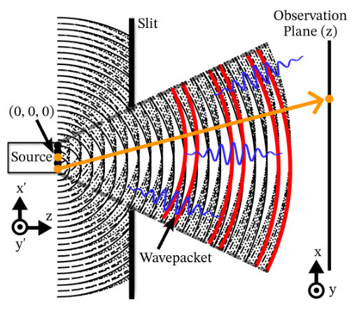
<figcaption class="paper-figure-caption"><b>Fig 1.</b> FIG. 1. Illustration of two interpretations of transverse co- herence in neutron beams. In the small-wavepacket picture, the coherence length is identified with the spatial extent of an individual neutron wavefunction. In the Van Cittert-Zernike description, coherence arises from the angular distribution of extended wavepackets emitted from different regions of an incoherent source, producing spatial correlations in the ob- servation plane.</figcaption>
</figure>
<figure class="paper-figure-card">
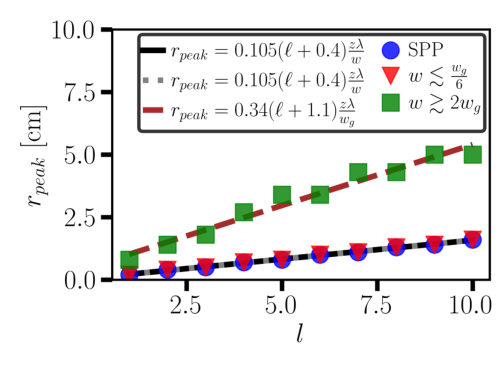
<figcaption class="paper-figure-caption"><b>Fig 2.</b> FIG. 2. Relationship between helical mode ℓand the radius of the intensity maximum rpeak at propagation distance z, for a simulated Gaussian wavepacket, with transverse extent w, through 1. on-axis spiral phase plate (SPP), 2. fork dislo- cation phase grating with w ≲wg/6, where wg is the grat- ing width, 3. fork dislocation phase grating array, where the transverse extent follows w ≳2wg. The demonstrated sim- ulation in 3. is for z = 12 m, λ = 12 ˚A , w = 3 µm, and wg = 1 µm. The corresponding errors in the fitted parame- ters are: 0.105 ± 0.002, 0.4 ± 0.1, 0.34 ± 0.02, and 1.1 ± 0.4.</figcaption>
</figure>
<figure class="paper-figure-card">
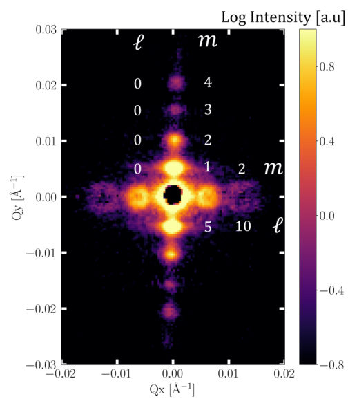
<figcaption class="paper-figure-caption"><b>Fig 3.</b> FIG. 3. Experimental diffraction pattern showing ℓ= 0 neutron states along the vertical axis and ℓ= 5 ∗m neu- tron states in the m diffraction orders along the horizontal axis. The intensity is plotted on a logarithmic scale, reveal- ing higher diffraction orders. The plotted wavelength range is 1.75 −12.5 ˚A. Analogous measurements were taken for the ℓ= 3 and ℓ= 7 states shown in Fig. 4.</figcaption>
</figure>
<figure class="paper-figure-card">
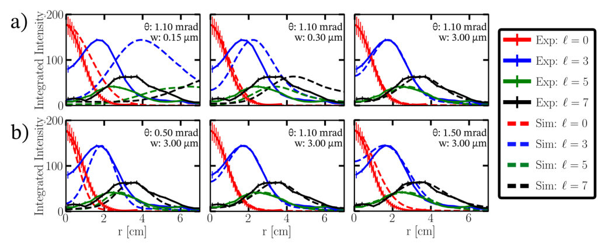
<figcaption class="paper-figure-caption"><b>Fig 4.</b> FIG. 4. Experimental and simulated azimuthally integrated intensity profiles for the ℓ= 0, 3, 5, 7 diffraction orders, for 11.5 ˚A - 12.5 ˚A neutrons. (a) The divergence angle is fixed at θ = 1.1 mrad, while the input Gaussian width is varied for w = 0.15 µm, w = 0.3 µm, and w = 3.00 µm. The best agreement with experiment is obtained for w ≳2 µm, as summarized in Fig. 5. (b) The input Gaussian width is fixed at w = 3.00 µm, while the divergence is varied for θ = 0.50 mrad, θ = 1.1 mrad, and θ = 1.50 mrad. The optimal agreement is achieved for θ = 1.10 mrad, as summarized in Fig. 5. Experimental profiles are spatially binned to an effective pixel size of ≤4 mm to improve the robustness of...</figcaption>
</figure>
<figure class="paper-figure-card">
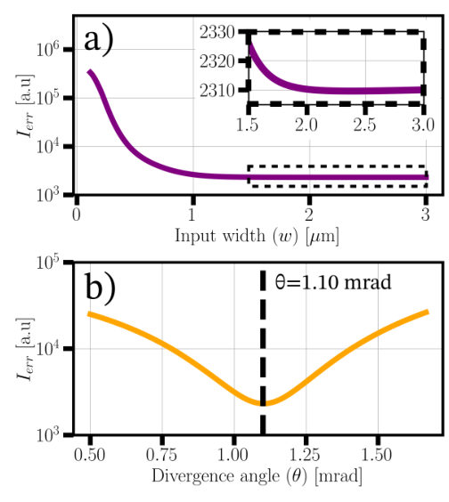
<figcaption class="paper-figure-caption"><b>Fig 5.</b> FIG. 5. (a) Error between simulation and experiment for the azimuthally integrated OAM intensity profiles (see Fig. 4) for ℓ= 0, 3, 5, 7 as a function of the simulated input Gaussian width, with the divergence angle fixed at θ = 1.1 mrad. For input widths ≳2 µm, the simulation shows good agreement with experiment, as demonstrated in the inset. (b) Error between simulation and experiment for the azimuthally inte- grated OAM intensity profiles (see Fig. 4) for ℓ= 0, 3, 5, 7 as a function of the divergence angle θ, with the input Gaus- sian width fixed at w = 3 µm. The optimal divergence is θ = 1.1 mrad.</figcaption>
</figure>

**Summary.** The paper introduces a novel technique using helical neutron wavefronts to resolve a long-standing ambiguity in neutron scattering: distinguishing the single-particle spatial extent from the transverse coherence length. By analyzing annular intensity profiles, the authors experimentally proved that these two quantities are distinct, measuring a wavepacket size an order of magnitude larger than the beam's coherence length.

**Why it may be interesting.** This work provides a powerful new diagnostic tool in neutron scattering, allowing researchers to disentangle fundamental quantum mechanical properties (single-particle wave function) from statistical ensemble properties (coherence), which is crucial for interpreting complex measurements in condensed matter and quantum physics.

Detailed structure

**Main problem.** The core challenge is experimentally separating the transverse coherence length (related to ensemble correlations) from the intrinsic spatial extent of a single neutron wavepacket, as both cause apparent intensity broadening.

**Main result.** The authors successfully demonstrated this separation using helical neutron wavefronts, finding that the single-particle wavepacket extent ($\ge 2 \mu	ext{m}$) is significantly larger than the measured transverse coherence length ($\approx 180 	ext{ nm}$).

**Method.** They utilized the unique intensity profiles generated by helical states (carrying Orbital Angular Momentum) to isolate measurements sensitive only to single-particle properties versus those sensitive to ensemble averaging.

**Model / system.** The experiment uses neutron beams, specifically generating and analyzing helical wavefronts. The theoretical framework involves modeling the beam as an incoherent ensemble of neutrons, each described by a single wavepacket $\psi_0(\vec{r})$.

**Key observables.** Peak radius ($r_{	ext{peak}}$) of annular intensity profiles from helical beams; measured beam divergence ($	heta$); and the resulting coherence length ($\zeta$).

**Important parameters / regimes.** Transverse Coherence Length ($\zeta \approx 180 	ext{ nm}$); Single-Particle Wavepacket Extent ($w \ge 2 \mu	ext{m}$); Beam Divergence ($	heta \approx 1.1 	ext{ mrad}$).

**Assumptions / limitations.** The analysis relies on the ability to model and measure intensity profiles using helical states, which allows for a distinct mathematical separation of coherence effects from wavepacket size.

**Figures summary.** Figures illustrate diffraction patterns for different OAM modes ($\ell$), showing how $r_{	ext{peak}}$ relates to both varying wavepacket extent ($w$) and varying beam divergence ($	heta$).

**Paper structure.** The paper first establishes the theoretical ambiguity between coherence length and wavepacket size. It then details the methodology using helical wavefronts, presenting calculations for intensity and coherence functions. Finally, it presents experimental results confirming the separation of these two distinct physical quantities.

Abstract

Distinguishing transverse coherence length from single-particle wavepacket extent is fundamentally challenging, as both manifest through spatial broadening of observed intensity profiles in conventional experiments. Here we introduce a method based on helical neutron wavefronts that enables this separation. Helical neutron states produce annular intensity profiles whose peak radius depends on the transverse wavepacket extent, while coherence length only contributes to profile broadening. In our experimental geometry we measure a beam divergence of ~1.1 mrad, corresponding to a transverse coherence length of ~180 nm. In contrast, the same measurement places a lower bound of >= 2 um on the spatial extent of the individual neutron wavepackets, more than an order of magnitude larger than the coherence length. These results provide direct experimental evidence that transverse coherence length and single-particle wavepacket extent are distinct physical quantities, resolving a longstanding source of confusion in the neutron literature.

[↑ back to top](#top)

### [Scalable Physics-Inspired Transformers for Spin Glasses](http://arxiv.org/abs/2606.22984v1)

**Authors:** Lu Zhong, Wenli Duan, Jing Liu, Pan Zhang, Ying Tang  
**Type:** both · **Category:** disordered systems and neural networks · **PDF:** <https://arxiv.org/pdf/2606.22984v1>  
**Analysis basis:** full PDF text, analyzed in chunks
**Topic relevance:** `exotic spin models in light-matter` **3/5** · `analog quantum simulation` **1/5** · `methods for driven-dissipative` **1/5**

↔ Scroll figures horizontally

<figure class="paper-figure-card">
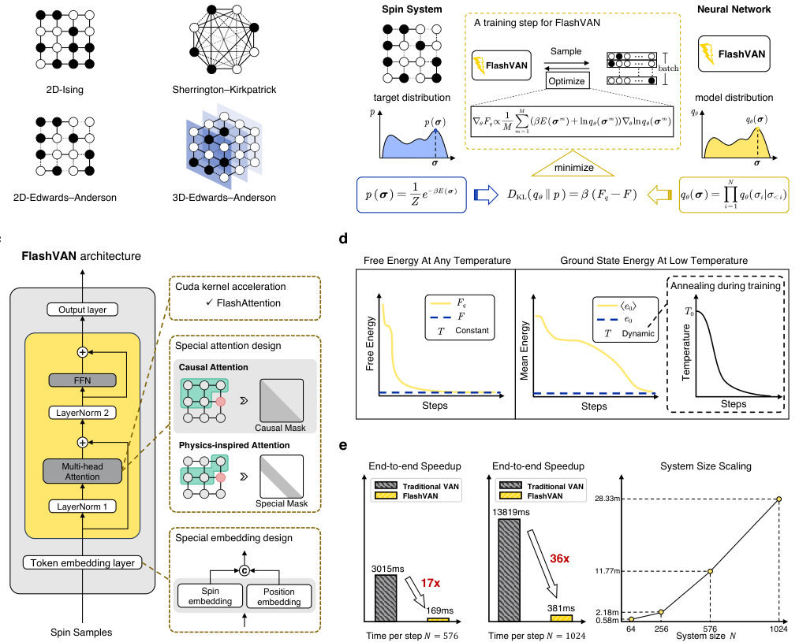
<figcaption class="paper-figure-caption"><b>Fig 1.</b> FIG. 1. The present framework facilitates solving spin-glass problems. (a) Schematic illustration of representative spin-glass systems. (b) Optimization workflow: a parameterized joint distribution, termed FlashVAN, is trained to approximate the Boltzmann distribution of a given Hamiltonian by minimizing the KL-divergence, with free-energy gradients taken with respect to the model parameters. (c) Architecture: featuring CUDA kernel acceleration modules, a physics-inspired attention mechanism, and a tailored positional embedding design, which together enhance expressivity and accuracy. (d) Training results show the convergence of the free energy and ground-state energy under the...</figcaption>
</figure>
<figure class="paper-figure-card">
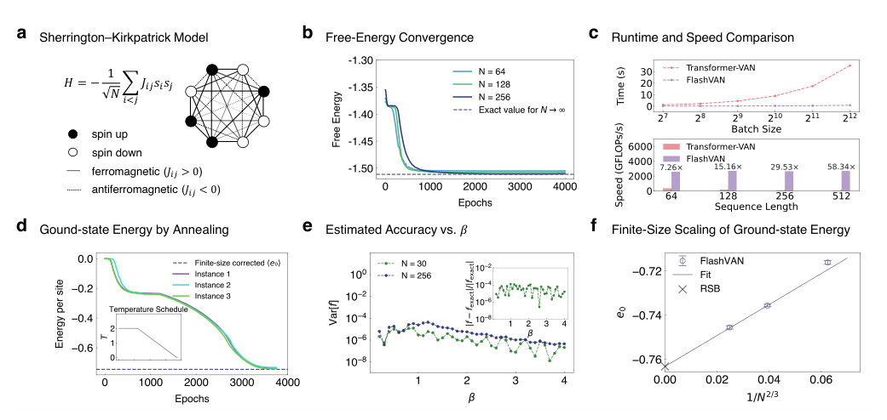
<figcaption class="paper-figure-caption"><b>Fig 2.</b> FIG. 2. FlashVAN efficiently gives accurate free energy and ground-state energy for the SK model. (a) Illustrated SK model with random interactions Jij. (b) Free-energy convergence for various system sizes N at β = 0.5 relative to the thermodynamic limit (dashed). (c) Efficiency comparison between traditional transformer-VAN and FlashVAN: runtime vs. batch size (top) and training throughput (bottom). (d) Ground-state energy trajectories during annealing (N = 256) for three disorder instances (solid) against the finite-size corrections (FSC)-derived exact value (dashed). The inset shows the temperature annealing schedule. (e) Accuracy versus inverse temperature β, shown by the variance of...</figcaption>
</figure>
<figure class="paper-figure-card">
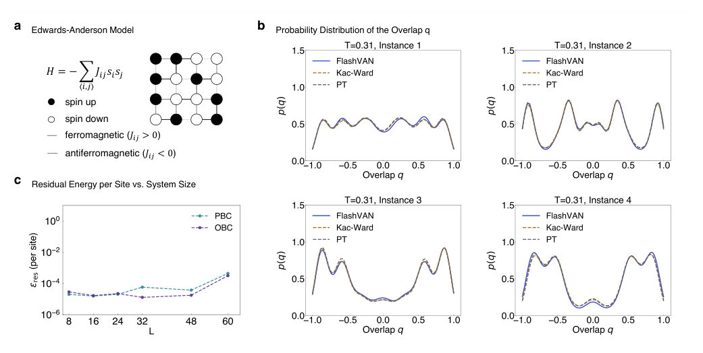
<figcaption class="paper-figure-caption"><b>Fig 3.</b> FIG. 3. FlashVAN generates accurate ground-state energy and overlap distribution for the 2D EA model. (a) Illustrated 2D EA model, where spins are arranged on a square lattice and coupled via nearest-neighbor interactions. The coupling Jij can be ferromagnetic or antiferromagnetic. (b) Probability distributions of the overlap q (defined in Eq. (9)). The solid lines from FlashVAN match the dashed lines from PT and Kac-Ward formula [50]. (c) Residual energy per site versus system size L for open and periodic boundary conditions. Data are averaged over 20 disorder instances.</figcaption>
</figure>
<figure class="paper-figure-card">
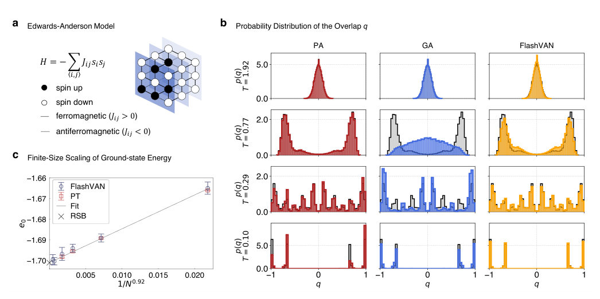
<figcaption class="paper-figure-caption"><b>Fig 4.</b> FIG. 4. Accurate ground state and overlap distribution across temperatures for the 3D EA model by FlashVAN. (a) Illustrated 3D EA model, where spins are coupled by random nearest-neighbor interactions Jij. (b) The overlap distributions P(q) at four representative temperatures for system size L = 10. PA, GA, and FlashVAN are in different columns, where FlashVAN achieves consistently high accuracy across temperatures. Black curves with shade are from PT [37] as baseline. (c) Finite-size scaling of the ensemble-averaged ground-state energy, for assessing the scalability of optimization heuristics [27]. Open circles denote results by FlashVAN for N = 43, 63, 83, 103, 143 and 163, averaged over...</figcaption>
</figure>

**Summary.** This paper introduces FlashVAN, a novel, physics-inspired transformer designed for efficiently simulating frustrated spin glass systems. It addresses the computational bottlenecks of traditional methods by integrating sparse attention and hardware acceleration (FlashAttention). The resulting framework accurately calculates thermodynamic properties like free energy and overlap distributions across various temperatures for models like SK and EA.

**Why it may be interesting.** While focused on classical statistical mechanics, the development of highly efficient, structure-aware neural network samplers (FlashVAN) represents a significant methodological advance in applying deep learning tools to complex many-body physics problems that often require sampling or expectation value calculations.

Detailed structure

**Main problem.** The core challenge is developing scalable, efficient methods to sample the Boltzmann distribution for frustrated spin glasses, overcoming limitations in previous machine learning approaches.

**Main result.** The proposed FlashVAN framework achieves up to two orders of magnitude speedup over vanilla variational autoregressive networks, enabling simulations on unprecedentedly large systems while accurately resolving key thermodynamic properties.

**Method.** It employs a physics-inspired transformer architecture featuring sparse attention and tailored positional embeddings, optimized with FlashAttention kernels for hardware efficiency during autoregressive sampling.

**Model / system.** The system studied is the spin glass, modeled by Hamiltonians such as the Sherrington-Kirkpatrick (SK) model and the Edwards-Anderson (EA) model on 2D or 3D lattices. The state space involves binary spins $\sigma \in \{\pm 1\}^N$.

**Key observables.** Free energy ($F$), ground-state energy ($\langle e_0 
angle$), overlap statistics ($p(q)$), and the Boltzmann distribution $p(\sigma)$.

**Important parameters / regimes.** Temperature ($T$) or inverse temperature ($eta$), system size ($N$ or lattice dimensions $L$), and sparsity window size ($W$).

**Assumptions / limitations.** The framework assumes that the physics-inspired attention mechanism can effectively encode the local interaction topology of the spin system, and it relies on variational inference to approximate the true distribution.

**Figures summary.** Figures illustrate the architecture, optimization workflow (minimizing KL-divergence), convergence of free energy/ground-state energy under temperature annealing, and computational speedup comparisons against prior art.

**Paper structure.** The paper introduces FlashVAN by addressing scaling issues in variational methods. It details the physics-inspired attention and positional embeddings, presents results on SK and EA models showing superior performance across various temperatures and system sizes, and concludes with complexity analysis comparing it to naive transformer approaches.

Abstract

Efficient sampling of the Boltzmann distribution in frustrated spin glasses is central to statistical mechanics and combinatorial optimization. Despite advances in machine-learning-based approaches, two issues persist: limited understanding of why variational models fail to benefit from increased scale, unlike the monotonic scaling law of large language models; and high computational cost on large systems that negates advantages over classical sampling methods. Here, we develop a physics-inspired transformer with interpretable sparse attention and spin-tailored positional embeddings to address these challenges. By further leveraging FlashAttention for parallel ancestral sampling, it achieves up to two orders of magnitude speedup over vanilla variational autoregressive networks, enabling neural-network simulations of spin-glass systems to unprecedented sizes on a single GPU. It can resolve full probability distributions, free energies, and overlap statistics across temperatures, for Sherrington-Kirkpatrick and 2D or 3D Edwards-Anderson models, where existing machine-learning methods encounter limitations at certain temperatures. This framework thus establishes a scalable paradigm for frustrated spin-glass systems.

[↑ back to top](#top)

### [Linear optical Bell state measurement for rotation-symmetric cat codes](http://arxiv.org/abs/2606.22832v1)

**Authors:** Issa Oe, Suguru Endo, Rui Asaoka  
**Type:** theory · **Category:** quantum information and computing · **PDF:** <https://arxiv.org/pdf/2606.22832v1>  
**Analysis basis:** full PDF text, analyzed in chunks
**Topic relevance:** `quantum measurements` **3/5** · `interference shaping light` **1/5**

↔ Scroll figures horizontally

<figure class="paper-figure-card">
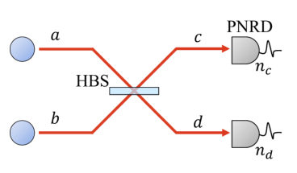
<figcaption class="paper-figure-caption"><b>Fig 1.</b> FIG. 1. Schematic of the BSM setup consisting of a HBS and two PNRDs.</figcaption>
</figure>
<figure class="paper-figure-card">
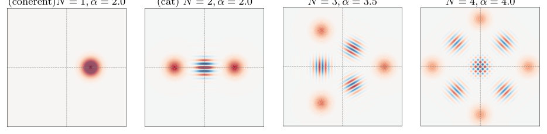
<figcaption class="paper-figure-caption"><b>Fig 2.</b> FIG. 2. Wigner functions of RS-cat codes. The panels show the cases N = 1, 2, 3, and 4, with the corresponding values of α indicated above each plot.</figcaption>
</figure>
<figure class="paper-figure-card">
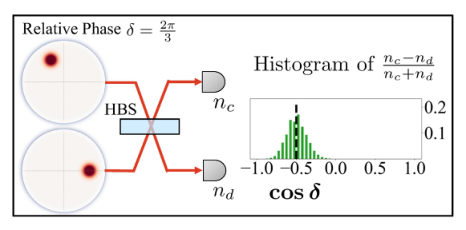
<figcaption class="paper-figure-caption"><b>Fig 3.</b> FIG. 3. Histogram of X for coherent states |α⟩|e2πi/3α⟩with relative phase δ = 2π</figcaption>
</figure>
<figure class="paper-figure-card">
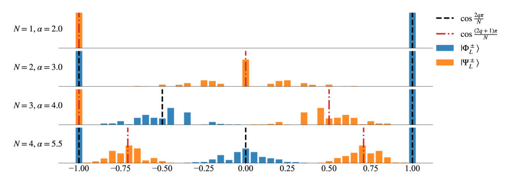
<figcaption class="paper-figure-caption"><b>Fig 4.</b> FIG. 4. Histograms of X for the Bell basis states of the RS-cat code. The blue and orange bars correspond to |Φ± L⟩and |Ψ± L⟩, respectively. The histograms are concentrated around the values indicated by the vertical dashed lines, with the black lines denoting {cos 2qπ</figcaption>
</figure>
<figure class="paper-figure-card">
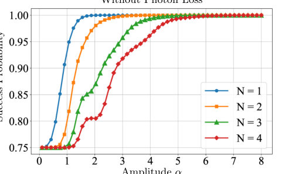
<figcaption class="paper-figure-caption"><b>Fig 5.</b> FIG. 5. Success probability of the BSM method for RS-cat codes under lossless conditions. For each symmetry order N, the BSM becomes near-deterministic as the amplitude α increases.</figcaption>
</figure>

**Summary.** The paper presents an efficient Bell State Measurement protocol tailored for Rotation-symmetric cat (RS-cat) bosonic codes. By using only simple linear optics and photon number detectors, the method extracts both phase and photon-number modulo information. The results demonstrate that this measurement is highly robust, achieving near-deterministic success even when accounting for realistic photon loss mechanisms.

**Why it may be interesting.** This work directly addresses a key primitive (BSM) for advanced quantum computation architectures (bosonic codes), providing concrete, resource-efficient measurement protocols applicable to continuous-variable quantum information processing.

Detailed structure

**Main problem.** The primary goal is developing an efficient Bell state measurement (BSM) protocol for Rotation-symmetric cat (RS-cat) codes, which is crucial for long-distance quantum communication and Fusion-based Quantum Computation (FBQC).

**Main result.** Under ideal conditions, the proposed BSM protocol becomes deterministic for arbitrary symmetry order N with sufficiently large amplitudes. Furthermore, post-selection can enhance the success probability even in the presence of photon loss.

**Method.** The protocol utilizes only a Half Beam Splitter (HBS) and Photon-Number-Resolving Detectors (PNRDs), exploiting the characteristic photon-number structure induced by the code's rotational symmetry to extract both modulo and phase information for discrimination.

**Model / system.** The system involves RS-cat codes, which are bosonic quantum error-correcting codes characterized by a discrete rotational symmetry of order N. These codes are built from finite-energy superpositions of coherent states in phase space.

**Key observables.** Detected photon-number patterns $(n_c, n_d)$, the normalized difference $X = (n_c - n_d) / (n_c + n_d)$, and the success probability under loss.

**Important parameters / regimes.** Symmetry order N, amplitude $\alpha$, photon loss rate $\eta$, and post-selection threshold $\tau$.

**Assumptions / limitations.** The analysis assumes ideal loss-free conditions for determinism proofs, but also numerically evaluates performance under finite photon loss ($\eta=10^{-3}, 10^{-2}$).

**Figures summary.** Figures illustrate the success probability vs. $\alpha$ (lossless case), failure rate vs. $\eta$ showing improvement with $N$, and histograms of the discriminant $X$ demonstrating distinguishability and regions rejected by post-selection.

**Paper structure.** The paper introduces RS-cat codes, details the HBS/PNRD BSM protocol using symmetry properties to extract phase information via $X$, proves determinism in the loss-free limit, and concludes with numerical evaluations showing robustness against photon loss and benefits from post-selection.

Abstract

Rotation-symmetric cat (RS-cat) codes are a bosonic-code platform for quantum information processing, combining finite-energy realizability with robustness against photon loss through their discrete rotational symmetry. For applications in long-distance quantum communication and fusion-based quantum computation (FBQC), efficient Bell state measurement (BSM) is a key primitive. In this work, we consider a BSM protocol for RS-cat codes using only a half beam splitter (HBS) and photon-number-resolving detectors (PNRDs). By exploiting the characteristic photon-number structure induced by the discrete rotational symmetry of RS-cat codes, our protocol extracts both photon-number modulo and phase information for Bell-state discrimination. We show that, under ideal loss-free conditions, the proposed BSM protocol becomes deterministic for arbitrary symmetry order $N$ for sufficiently large amplitudes $α$. We further numerically evaluate the success probability under photon loss and identify the loss regime in which higher-order RS-cat codes provide an advantage. Finally, we show that post-selection can enhance the success probability.

[↑ back to top](#top)

### [Signatures of unconventional magnetism in the layered metallic ferromagnet LaCrSb$_3$ from ferromagnetic resonance spectroscopy](http://arxiv.org/abs/2606.23413v1)

**Authors:** J. J. Abraham, S. Samanta, R. Kolay, V. Singh, R. Nath, B. Büchner, V. Kataev, A. Alfonsov  
**Type:** both · **Category:** strongly correlated electrons · **PDF:** <https://arxiv.org/pdf/2606.23413v1>  
**Analysis basis:** full PDF text, analyzed in chunks
**Topic relevance:** `spintronics-quantum-optics interface` **3/5** · `exotic spin models in light-matter` **1/5**

↔ Scroll figures horizontally

<figure class="paper-figure-card">
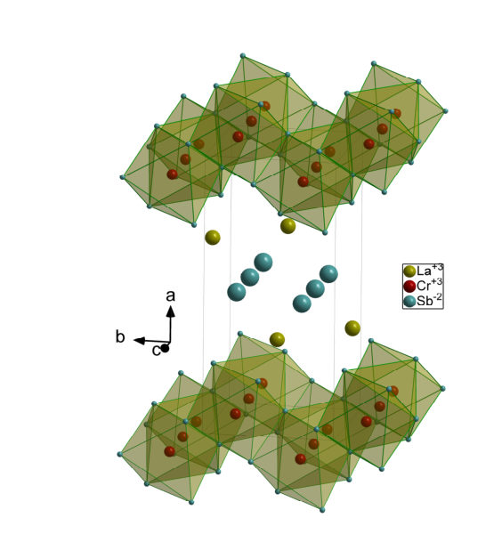
<figcaption class="paper-figure-caption"><b>Fig 1.</b> FIG. 1. Orthorhombic crystal structure of LaCrSb3, space group Pbcm (No. 57). Cr cations are octahedrally coordinated by Sb ligands. Octahedra share edges along the b-axis and faces along the c-axis forming a 2D network in the bc-plane. The Cr-Sb layers are well separated along the a-axis by Sb and La sheets.</figcaption>
</figure>
<figure class="paper-figure-card">
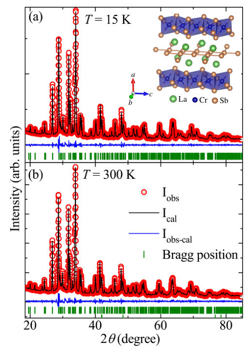
<figcaption class="paper-figure-caption"><b>Fig 2.</b> FIG. 2. Powder XRD patterns (open red circles) at (a) T = 15 K and (b) T = 300 K. The solid black line indi- cates the Rietveld fit. The Bragg peak positions are shown by green vertical bars, and the bottom blue solid line repre- sents the difference between the experimental and calculated intensities. Inset of (a) projects the crystal structure, high- lighting the stacking sequence of the CrSb2 layers (bc-plane) along the a-direction, which are well separated by La and Sb atoms.</figcaption>
</figure>
<figure class="paper-figure-card">
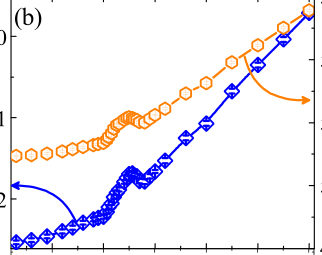
<figcaption class="paper-figure-caption"><b>Fig 3.</b> FIG. 3. Temperature variation of lattice parameters (a) a and b and (b) c and unit cell volume (Vcell). (c) Thermal expansion coefficients (α) as a function of temperature.</figcaption>
</figure>
<figure class="paper-figure-card">
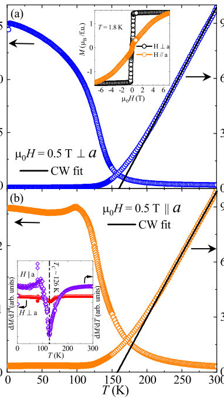
<figcaption class="paper-figure-caption"><b>Fig 4.</b> FIG. 4. (a) Left y-axis: Temperature dependent dc magne- tization M measured in a magnetic field of µ0H = 0.5 T, applied perpendicular to a-axis. Right y-axis: χ−1 vs T and the red solid line is the CW fit. Inset: Magnetic isotherm (M vs H) measured at T = 1.8 K along two diffident orientations. (b) Left y-axis: M(T) measured at µ0H = 0.5 T, parallel to the a-axis. Right y-axis: χ−1 vs T along with the CW fit. Inset: dM/dT vs T for H ⊥a (left y-axis) and H ∥a (right y-axis), respectively.</figcaption>
</figure>
<figure class="paper-figure-card">
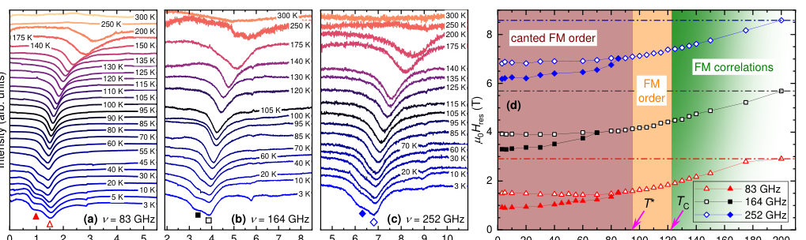
<figcaption class="paper-figure-caption"><b>Fig 5.</b> FIG. 5. Temperature evolution of the HF-ESR powder spectrum of LaCrSb3 at a fixed microwave frequency of (a) 83 GHz, (b) 164 GHz, and (c) 252 GHz. The spectral shape was corrected to obtain the pure absorption component of the detected signal as explained in Appendix VII A. The spectra are also normalized and shifted vertically for clarity. Symbols (same as in panel (d)) mark the position of the peak and of the shoulder of the spectra. (d) Temperature dependence of the resonance position Hres of the peak (open symbols) and the shoulder (closed symbols) of the powder spectrum at 83, 164 and 252 GHz. Lines connecting data points are guides for the eye. The horizontal dashed line of the...</figcaption>
</figure>

**Summary.** This study uses combined structural and spectroscopic techniques on LaCrSb3 to investigate its unconventional magnetism. The key finding is that the FMR spectrum requires a model incorporating two interacting magnetic sublattices (FM and AFM). This strongly supports a complex spin structure in this layered ferromagnet, moving beyond simple single-sublattice descriptions.

**Why it may be interesting.** The work provides a concrete example of how advanced spectroscopy (FMR) can reveal underlying complex magnetic order (coexisting FM/AFM sublattices) in correlated materials, linking macroscopic measurements to microscopic Hamiltonian parameters.

Detailed structure

**Main problem.** The study investigates the unconventional magnetism and magnetic excitations within the layered metallic ferromagnet LaCrSb3, aiming to understand its complex spin structure beyond simple ferromagnetic models.

**Main result.** FMR spectroscopy strongly suggests the presence of at least two interacting magnetic sublattices (one FM and one AFM) below a characteristic temperature T*, which is quantitatively explained by a phenomenological model.

**Method.** The research combines multiple experimental techniques, including X-ray diffraction, static magnetization measurements, and high-frequency/electron spin resonance (FMR/ESR) spectroscopy. Theoretical analysis involves fitting the data to a phenomenological Hamiltonian using Linear Spin Wave Theory (LSWT).

**Model / system.** The system is LaCrSb3, a layered metallic ferromagnet exhibiting strong magneto-elastic coupling and complex magnetic transitions ($T_C \simeq 126$ K, $T^* \sim 95$ K). The theoretical model treats the magnetism as arising from interacting orthogonal ferromagnetic and antiferromagnetic sublattices.

**Key observables.** Temperature dependence of lattice parameters ($\alpha_V$), magnetization M(T), and the observation of two distinct, non-degenerate FMR resonance branches below T*.

**Important parameters / regimes.** Ferromagnetic transition temperature $T_C \simeq 126$ K; Spin reorientation temperature $T^*$; Exchange coupling parameters ($J_{1b}, J_{2c}$, etc.) fitted to the model.

**Assumptions / limitations.** The primary assumption is that the observed two-branch FMR spectrum necessitates a minimum of two interacting magnetic sublattices (FM and AFM). The model itself is phenomenological.

**Figures summary.** Figures show XRD patterns confirming structural stability but magnetoelastic coupling; temperature dependence plots illustrate anomalies near $T_C$; and critical figures display the field/frequency evolution of FMR spectra, revealing multiple resonance branches at low temperatures.

**Paper structure.** The paper systematically presents evidence from structure (XRD) and bulk magnetism ($M(T)$), followed by detailed spectroscopic analysis (ESR/FMR). The core argument builds towards proposing and validating a two-sublattice model using LSWT to explain the observed multi-branch excitation spectrum.

Abstract

LaCrSb$_{3}$ is a metallic ferromagnet with a layered crystal structure demonstrating intriguing electronic and magnetic properties, such as large anomalous Hall effect, strong canting of the spin lattice, and a peculiar spin-reorientation transition. Here, we report the results of the temperature-dependent x-ray diffraction, static magnetization, and in particular electron spin resonance (ESR) and ferromagnetic resonance (FMR) experiments carried out over a wide range of frequencies, magnetic fields, and temperatures. Though x-ray data reveals no structural transition down to 15 K, a strong magneto-elastic coupling is detected across the ferromagnetic transition at $T_{\rm C} \simeq 126$ K. ESR results indicate a presence of the quasi-static short-range correlations extending far above $T_{\rm C}$, which is a typical fingerprint of the low-dimensional magnetism. The frequency-field diagram of the FMR modes mapped below $T_{\rm C}$ strongly suggests presence of two magnetic sublattices in LaCrSb$_{3}$. A quantitative understanding of the FMR excitations was achieved within a phenomenological model of interacting orthogonal ferro- and antiferromagnetic sublattices which was earlier proposed to explain unusually strong spin canting observed by neutron diffraction [E.~Granado et al., Phys. Rev. Lett. 89, 107204 (2002)]. The FMR results corroborate this scenario and call for the development of the underlying microscopic model of unconventional magnetism in LaCrSb$_{3}$.

[↑ back to top](#top)

### [Spin-orbit-enabled Fermi-surface splitting in noncollinear antiferromagnetic SmBi](http://arxiv.org/abs/2606.22049v1)

**Authors:** Long Zhang, Ming Cheng, Jingyu Li, Honghao Wan, Xiaoyuan Zhou, Mingquan He, Aifeng Wang, Yuping Sun, Dong-Hui Xu, Huixia Fu, Youguo Shi, Xuan Luo, Yisheng Chai  
**Type:** both · **Category:** other · **PDF:** <https://arxiv.org/pdf/2606.22049v1>  
**Analysis basis:** full PDF text, analyzed in chunks
**Topic relevance:** `spintronics-quantum-optics interface` **3/5** · `exotic spin models in light-matter` **1/5**

↔ Scroll figures horizontally

<figure class="paper-figure-card">
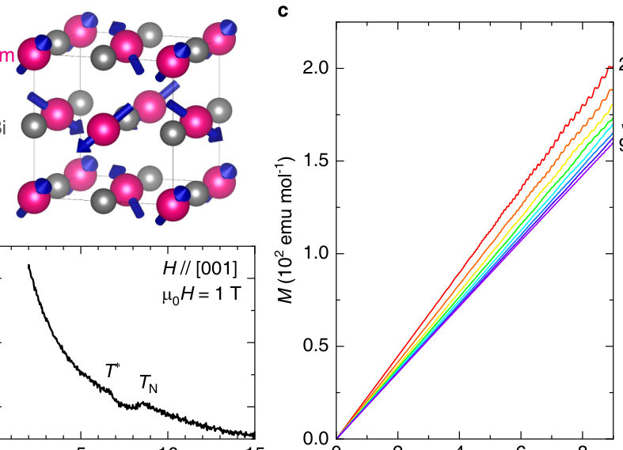
<figcaption class="paper-figure-caption"><b>Fig 1.</b> Fig. 1 | Crystal and magnetic structures and basic magnetic properties of SmBi. a, NaCl-type</figcaption>
</figure>
<figure class="paper-figure-card">
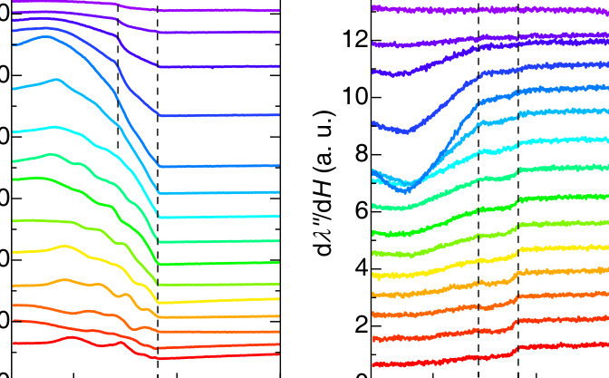
<figcaption class="paper-figure-caption"><b>Fig 2.</b> Fig. 2 | Temperature dependence of the ac magnetostrictive coefficient. a, Schematic of the</figcaption>
</figure>
<figure class="paper-figure-card">
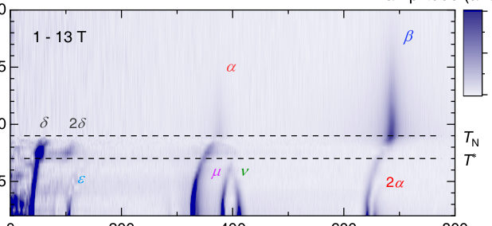
<figcaption class="paper-figure-caption"><b>Fig 3.</b> Fig. 3 | Temperature evolution of the bulk Fermi surface from quantum oscillations. a, Field-</figcaption>
</figure>
<figure class="paper-figure-card">
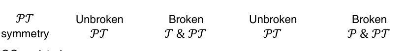
<figcaption class="paper-figure-caption"><b>Fig 4.</b> Fig. 4 | Candidate magnetic structures and symmetry analysis of SmBi. Collinear, Type-I,</figcaption>
</figure>
<figure class="paper-figure-card">
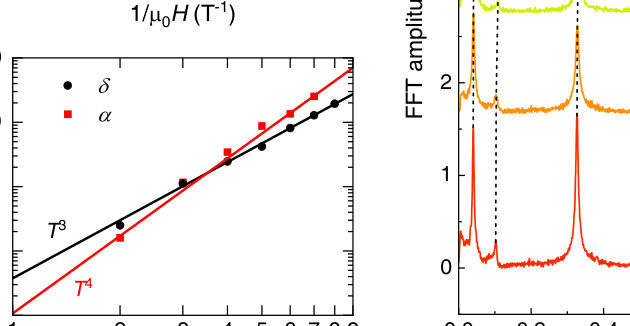
<figcaption class="paper-figure-caption"><b>Fig 5.</b> Fig. 1c. a, Oscillatory magnetization plotted against inverse field. b, FFT spectra showing four</figcaption>
</figure>

**Summary.** The study uses quantum oscillation measurements on SmBi to map its Fermi surface evolution across two antiferromagnetic transitions. By combining these experiments with DFT calculations, the authors demonstrate that spin-split bands only appear when both noncollinear magnetic order and strong Spin-Orbit Coupling coexist. This establishes a fundamental mechanism for generating unconventional magnetism in itinerant electron systems.

**Why it may be interesting.** This work provides a detailed interplay between crystal symmetry, magnetic ordering, relativistic effects (SOC), and electronic band structure, which are core concepts in modern condensed matter theory relevant to topological materials and magnetism.

Detailed structure

**Main problem.** The study investigates whether Spin-Orbit Coupling (SOC) is the essential symmetry-breaking mechanism required to induce spin-split Fermi surfaces in compensated antiferromagnets, moving beyond systems where splitting occurs nonrelativistically.

**Main result.** SmBi realizes a cooperative, relativistic route to spin-split Fermi surfaces, requiring both noncollinear magnetic order and SOC; this reconstruction is observed across two successive AFM transitions but not in the control material SmSb.

**Method.** The research combines ultrahigh-sensitivity ac magnetostriction measurements (detecting quantum oscillations), detailed magnetic symmetry analysis, and first-principles DFT calculations including SOC.

**Model / system.** The physical system is Samarium Bismuth (SmBi), which undergoes two sequential antiferromagnetic transitions ($	ext{PM} 	o 	ext{AFM-I} 	o 	ext{AFM-II}$). Theoretical analysis maps candidate noncollinear magnetic structures to specific symmetry groups.

**Key observables.** Quantum oscillation frequencies ($\alpha, eta, \delta, \epsilon$, etc.), temperature dependence of magnetostriction coefficients ($\lambda'/	ext{dH}$), and the emergence/splitting of Fermi surface branches.

**Important parameters / regimes.** Temperatures near $T_N \approx 9	ext{ K}$ and $T^* \approx 7	ext{ K}$; magnetic fields up to $\sim 100	ext{ T}$.

**Assumptions / limitations.** The analysis assumes that the observed QO features are bulk electronic properties, not surface states; DFT calculations require careful alignment of the Fermi level due to $4f$ electron treatment.

**Figures summary.** Figures illustrate crystal structures and proposed magnetic orders (Type-I/III); $\lambda'/	ext{dH}$ vs. T show distinct changes across transitions; FFT contour plots map the temperature evolution and splitting of QO branches ($\alpha'$ into $\mu$ and $
u$).

**Paper structure.** The paper systematically analyzes experimental quantum oscillation data across two magnetic transitions, correlates these findings with theoretical predictions based on symmetry analysis (MSG/MPG), and uses DFT calculations to confirm that SOC is necessary for the observed spin splitting in noncollinear phases.

Abstract

Spin-split electronic structures in compensated antiferromagnets are commonly sought in the nonrelativistic limit, where magnetic order lifts spin degeneracy without spin-orbit coupling (SOC). Whether SOC can instead be the indispensable symmetry-breaking ingredient remains largely unexplored. Here we combine quantum oscillations detected by ultrahigh-sensitivity ac magnetostriction, magnetic-symmetry analysis and first-principles calculations to resolve the bulk Fermi-surface evolution of SmBi across two successive antiferromagnetic (AFM) transitions. New oscillation branches emerge below TN and undergo a further reconstruction below T*, whereas isostructural SmSb shows no comparable change. For the candidate noncollinear orders of SmBi, breaking global parity-time symmetry is insufficient in the nonrelativistic limit because residual spin-space symmetries protect twofold band degeneracy; conversely, SOC alone cannot lift the degeneracy of the centrosymmetric paramagnetic (PM) phase. Only the coexistence of noncollinear order and SOC locks spin to the lattice and removes the residual protection. SmBi therefore realizes a cooperative, relativistic route to spin-split Fermi surfaces, broadening unconventional magnetism beyond systems whose splitting is already present in the nonrelativistic limit.

[↑ back to top](#top)

### [Common causes for quantum identical particles](http://arxiv.org/abs/2606.21768v1)

**Authors:** A. Hovhannisyan, S. Weigert, A. E. Allahverdyan  
**Type:** theory · **Category:** other · **PDF:** <https://arxiv.org/pdf/2606.21768v1>  
**Analysis basis:** full PDF text, analyzed in chunks
**Topic relevance:** `quantum measurements` **3/5**

↔ Scroll figures horizontally

<figure class="paper-figure-card">
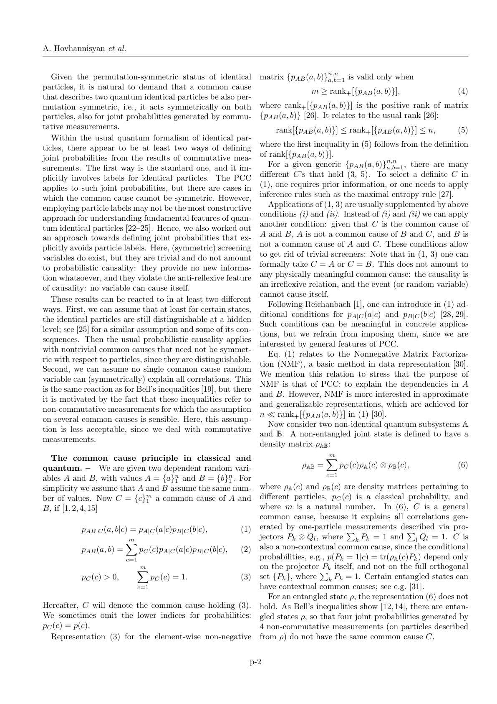
<figcaption class="paper-figure-caption"><b>Fig 1.</b> Low-resolution page preview, page 2</figcaption>
</figure>
<figure class="paper-figure-card">
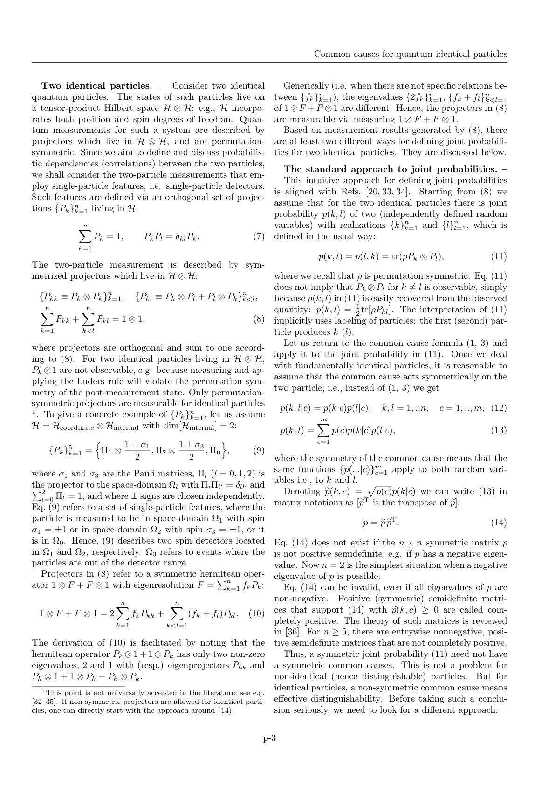
<figcaption class="paper-figure-caption"><b>Fig 2.</b> Low-resolution page preview, page 3</figcaption>
</figure>
<figure class="paper-figure-card">
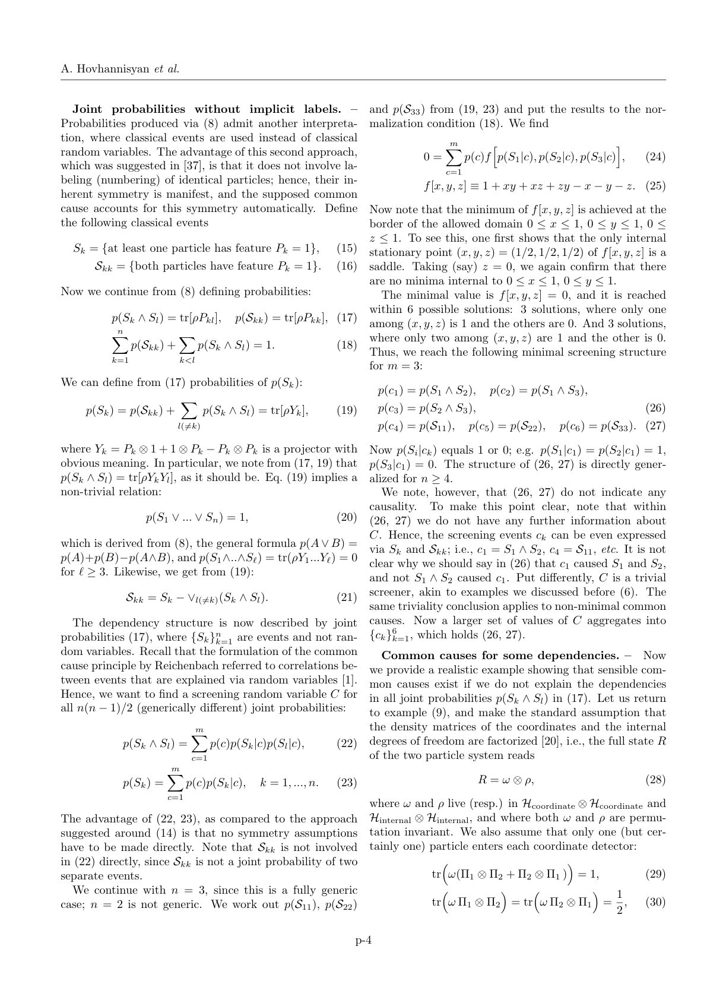
<figcaption class="paper-figure-caption"><b>Fig 3.</b> Low-resolution page preview, page 4</figcaption>
</figure>
<figure class="paper-figure-card">
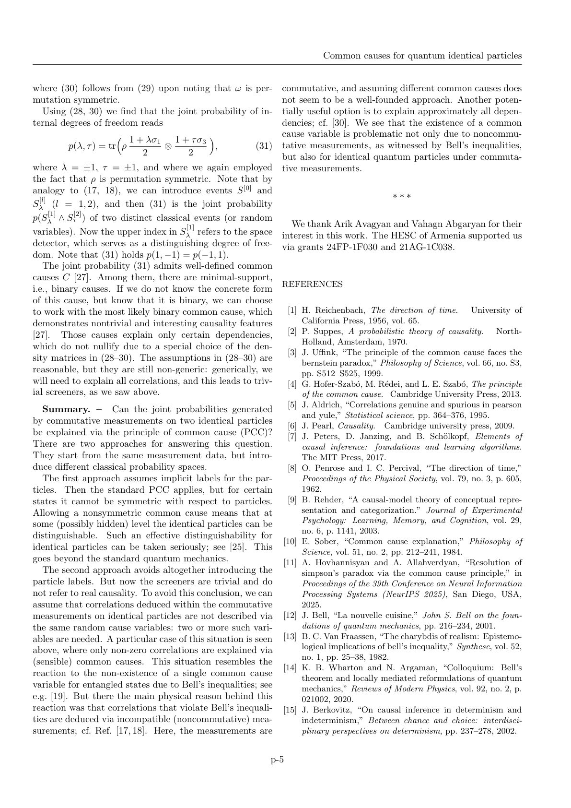
<figcaption class="paper-figure-caption"><b>Fig 4.</b> Low-resolution page preview, page 5</figcaption>
</figure>
<figure class="paper-figure-card">
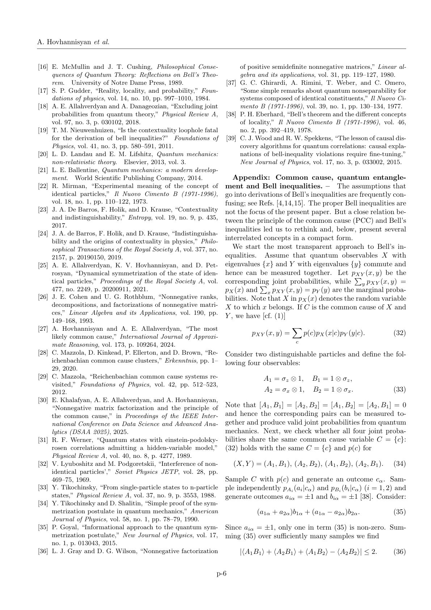
<figcaption class="paper-figure-caption"><b>Fig 5.</b> Low-resolution page preview, page 6</figcaption>
</figure>

**Summary.** This theoretical paper examines the Principle of Common Cause (PCC) applied to joint probabilities measured on two identical quantum particles. It finds that due to the required permutation symmetry of observables, a single common cause variable is either non-existent or trivial. This suggests that explaining all observed correlations requires assuming effective distinguishability between the particles.

**Why it may be interesting.** This work directly tackles fundamental issues at the intersection of quantum foundations and causality (PCC), which is crucial for understanding how local hidden variables might manifest in multi-particle quantum systems, even when measurements are commutative.

Detailed structure

**Main problem.** The paper investigates whether joint probabilities measured on two identical quantum particles can be explained by a single common cause, contrasting this with non-identical particles and addressing the constraints imposed by quantum mechanics.

**Main result.** The analysis concludes that either symmetric common causes do not necessarily exist (suggesting hidden distinguishability), or any existing symmetric screening variables are trivial, meaning no single common cause can explain all measured correlations.

**Method.** It applies the Probabilistic Common Cause (PCC) framework to joint probabilities derived from measurements on identical particles, comparing results obtained by assuming particle labels versus using label-free event descriptions.

**Model / system.** The system involves two identical quantum particles whose observables must be permutation-symmetric. The analysis uses projectors related to spatial and internal spin degrees of freedom within a tensor-product Hilbert space.

**Key observables.** Joint probabilities $p(A, B)$ derived from measurements; screening variables $C$ used in the common cause factorization.

**Important parameters / regimes.** The requirement for permutation symmetry on observables and the structure of the joint probability distributions.

**Assumptions / limitations.** The core assumption is testing the applicability of the PCC framework to quantum correlations, particularly when restricted by particle indistinguishability (permutation symmetry).

**Figures summary.** Not specified in the provided notes.

**Paper structure.** The paper moves from discussing non-identical particles and Bell violations to focusing on identical particles. It compares labeled vs. event-based common cause approaches, ultimately concluding that the constraints imposed by quantum indistinguishability severely limit or eliminate the possibility of a single common cause variable.

Abstract

Violations of Bell's inequalities imply that joint probabilities generated by non-commutative measurements on two (non-identical) quantum particles do not have a single common cause. But joint probabilities generated for such non-identical particles via commutative measurements do have non-trivial common cause variables. We focus on commutative measurements and consider two identical quantum particles, whose density matrices and observables (hermitian operators) are necessarily permutation-symmetric. It is natural to demand that the common cause describing joint probabilities is also permutation symmetric, i.e., it acts symmetrically on both particles. Looking at various ways of defining joint probabilities from the same measurement data, we conclude that either symmetric common causes need not exist (i.e., that the particles can be hiddenly distinguishable), or that symmetric screening variables exist, but they are trivial, i.e., no single common cause can explain all single-measurement correlations.

[↑ back to top](#top)

### [Quantum Metric Bound State of Light Confinement](http://arxiv.org/abs/2606.22479v1)

**Authors:** Jinchao Zhao, Rongning Liu, Xue-Yang Song, K. T. Law  
**Type:** theory · **Category:** disordered systems and neural networks · **PDF:** <https://arxiv.org/pdf/2606.22479v1>  
**Analysis basis:** full PDF text, analyzed in chunks
**Topic relevance:** `Kondo & dissipative impurity` **2/5** · `analog quantum simulation` **2/5** · `Keldysh / 2PI / non-Gaussian methods` **1/5** · `correlated / nonlocal dissipation` **1/5** · `correlated cavity matter` **1/5** · `driven-dissipative phase transition` **1/5** · `interference shaping light` **1/5** · `methods for driven-dissipative` **1/5**

↔ Scroll figures horizontally

<figure class="paper-figure-card">
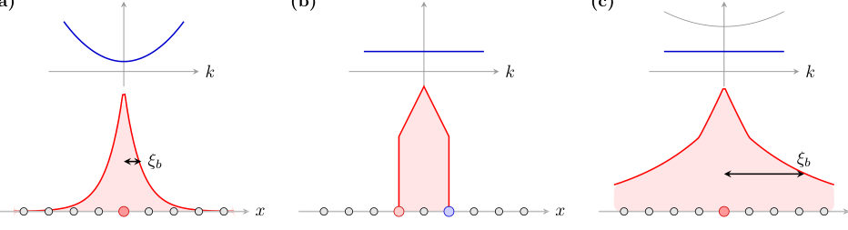
<figcaption class="paper-figure-caption"><b>Fig 1.</b> FIG. 1: (a) In traditional dispersive bands, the spatial extent (ξb) of a defect-induced bound state is governed by the effective mass m∗and the bound state energy Eb. (b) In an exact flat-band, the Compact Localized States are achieved given that the defect profiles are fine-tuned. (c) A generic local impurity breaks the phase-matching conditions for a CLS, and the bound state develops an extensive evanescent tail, bounded from below by the quantum metric length ℓQM of the unperturbed flat band. Here N = (n −1)m, where n is the number of bands, and m is the largest hopping range of electrons.</figcaption>
</figure>
<figure class="paper-figure-card">
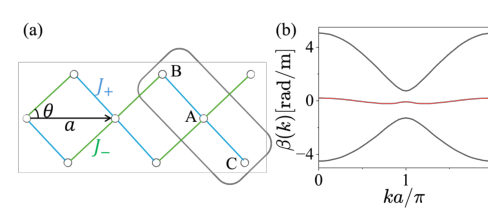
<figcaption class="paper-figure-caption"><b>Fig 2.</b> FIG. 2: (a) Schematic of the one-dimensional photonic Lieb lattice. Each unit cell (gray box) consists of three waveg- uides, labeled A, B, and C. The lattice constant is a = 84µm, and the waveguide diameter is d = 7.4µm. The substrate refraction index is n0 = 1.5, and the refraction index of waveguides is n = 1.5005. The angle ∠Bx+1AxCx is fixed at 90◦. The asymmetry between the coupling strengths J+ and J−is controlled by the angle θ. (b) The band structure of the one-dimensional photonic Lieb lattice, calculated by COMSOL. We normalize the propagation constant β(k) by subtracting the average value of the center band.</figcaption>
</figure>
<figure class="paper-figure-card">
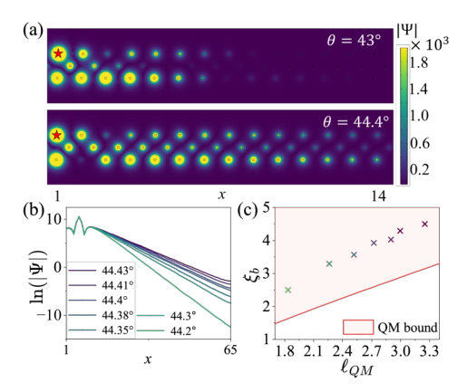
<figcaption class="paper-figure-caption"><b>Fig 3.</b> FIG. 3: (a) Electric field intensity showing the gradual de- cay along the unit cells. The red star marks the waveguide with the altered refractive index. (b) The bound state con- figurations at the centers of the B sites of different values of θ. The short-range oscillations arise from the polynomial prefactor as shown in Eq. 4. (c) Comparison between ξb and ℓQM for different θ using the same legend color in panel b. The shaded area is defined by Eq. 7 with N = 2. All the simulations are performed under the weak impurity limit by setting ∆nb/∆n = 0.05%,</figcaption>
</figure>

**Summary.** The paper introduces the concept of the 'quantum metric bound state,' establishing that when perfect localization fails due to disorder, the spatial decay rate of confined waves is universally limited by the bulk quantum metric. By deriving this rigorous lower bound using advanced spectral methods, it provides a powerful, predictive design principle for engineering wave confinement in synthetic platforms.

**Why it may be interesting.** This work connects fundamental concepts from algebraic geometry (quantum metrics) directly to measurable physical properties like mode decay length in engineered photonic or electronic systems, providing a powerful new diagnostic tool for wave engineering.

Detailed structure

**Main problem.** To establish a universal, model-independent geometric lower bound for the spatial decay length of defect-induced bound states in flat-band lattices when perfect localization conditions are broken by generic impurities.

**Main result.** The exponential decay length ($\xi_b$) is rigorously proven to be lower-bounded by the bulk quantum metric ($\ell_{QM}$), establishing $\xi_b \gtrsim C \cdot \ell_{QM}$.

**Method.** The analysis uses Green's function formalism, complex momentum continuation (pole structure analysis), and Bernstein-type inequalities applied to band projection operators.

**Model / system.** The study models light confinement in photonic lattices, using the Lieb lattice as a primary example. The physics is governed by a tight-binding Hamiltonian analyzed via Schrödinger-like equations with local impurities breaking perfect symmetry.

**Key observables.** Confinement Length Scales ($\xi_b$), Quantum Metric Length ($\ell_{QM}$), and the decay rate derived from pole singularities in the complex momentum plane.

**Important parameters / regimes.** The bound depends on the algebraic degree $N$ of the projection operator, leading to a scaling $\xi_b \gtrsim 4/N^2 \cdot \ell_{QM}$.

**Assumptions / limitations.** Assumes weak-guidance conditions and that the flat band projection operator belongs to a rational trigonometric space for the rigorous bounding techniques.

**Figures summary.** Figures compare decay lengths in three regimes (dispersive, CLS, Quantum Metric Bound State) and show simulations confirming the geometric floor set by $\ell_{QM}$.

**Paper structure.** The paper progresses from identifying the problem of confinement breakdown to deriving a mathematical lower bound using advanced spectral theory (Bernstein-type inequalities), culminating in demonstrating that this metric provides a universal, predictive design principle.

Abstract

The spatial confinement of defect-induced bound states is conventionally governed by the effective mass in dispersive bands. More recently, Compact Localized States (CLSs) arising from exact destructive interference have been utilized to achieve confinement in flat bands. However, CLSs rely on pristine lattice symmetries and fine-tuned defect profiles. The introduction of a generic local impurity inevitably breaks these strict phase-matching conditions, resulting in extensive bound states whose fundamental length scale has remained an open question. Here, we establish a third regime of confinement: the quantum metric bound state. We provide a rigorous mathematical proof demonstrating that in the absence of kinetic energy and CLS protection, the exponential decay length of these states is lower-bounded by the quantum metric of the unperturbed flat band. We demonstrate the tightness of this geometric limit by constructing a family of highly tunable flat-band generators, and we verify its universality across diverse realistic architectures. Ultimately, this classification establishes the independently measurable quantum metric as a predictive design principle for engineering confined modes in synthetic wave platforms.

[↑ back to top](#top)

### [Heavy-Tailed Dispersal Kernels from Stopped Subdiffusive Fractional Brownian Motion](http://arxiv.org/abs/2606.21681v1)

**Authors:** Luis F. Gordillo, Priscilla E. Greenwood  
**Type:** theory · **Category:** statistical mechanics · **PDF:** <https://arxiv.org/pdf/2606.21681v1>  
**Analysis basis:** full PDF text, analyzed in chunks
**Topic relevance:** `non-equilibrium dynamics` **2/5** · `non-equilibrium universality` **2/5** · `Keldysh / 2PI / non-Gaussian methods` **1/5** · `correlated / nonlocal dissipation` **1/5** · `driven-dissipative phase transition` **1/5** · `methods for driven-dissipative` **1/5**

↔ Scroll figures horizontally

<figure class="paper-figure-card">
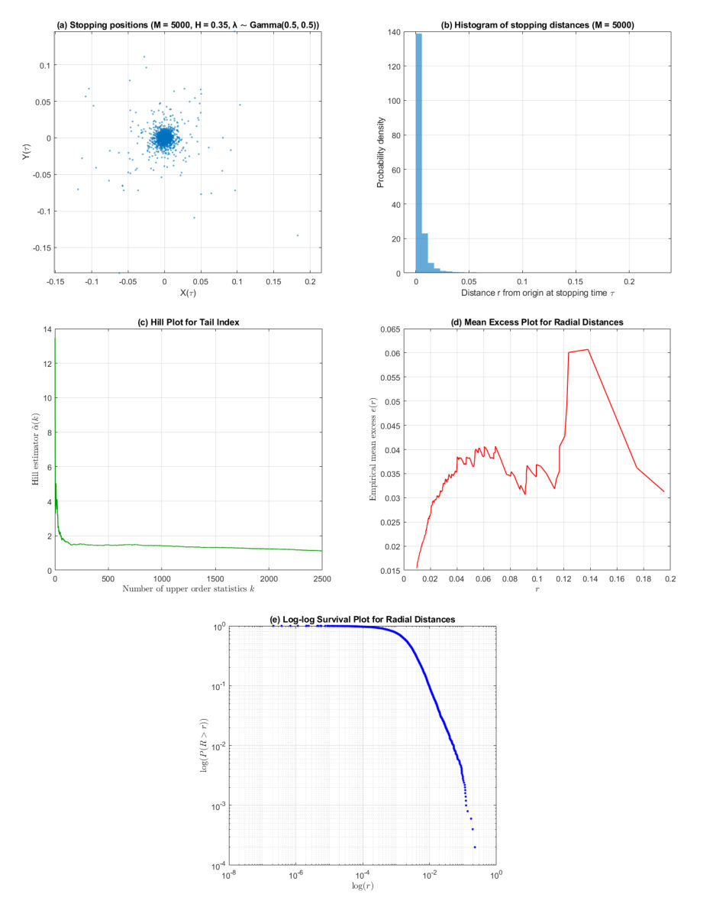
<figcaption class="paper-figure-caption"><b>Fig 1.</b> Figure 1: Radial distribution of stopped paths of a subdiffusive fBm with randomized stopping rate λ ∼ Gamma(a, b). (a) Stopped positions, (b) Histogram of stopping distances. The diagnostic plots: Hill (c), Mean-excess (d) and Log-log survival (e), consistently support the presence of a heavy tail in the distribution of radial distances, see text.</figcaption>
</figure>
<figure class="paper-figure-card">
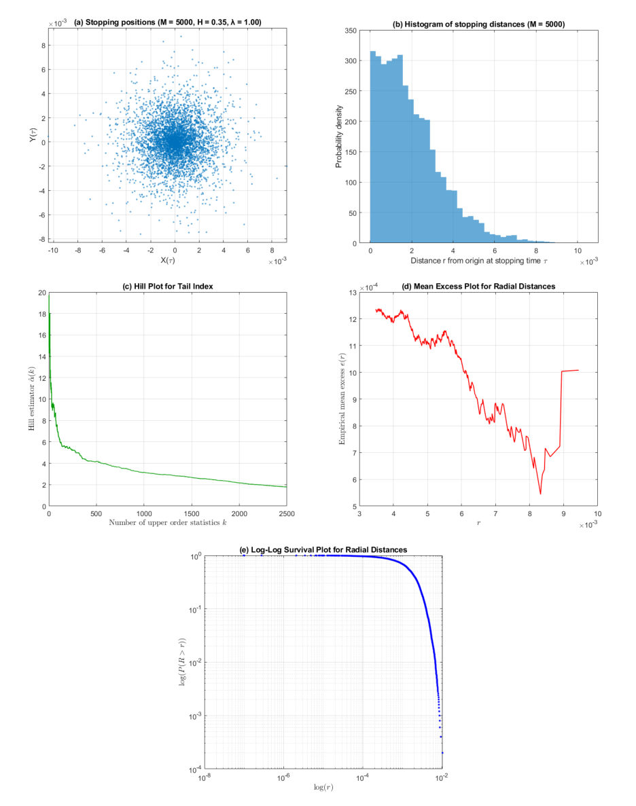
<figcaption class="paper-figure-caption"><b>Fig 2.</b> Figure 2: Same plot as Figure (1) but with constant stopping rate λ = 1. Notice the difference in scale from Figure (1), see also Figure (3). The diagnostic plots (c), (d) and (e) support the absence of a heavy tail.</figcaption>
</figure>
<figure class="paper-figure-card">
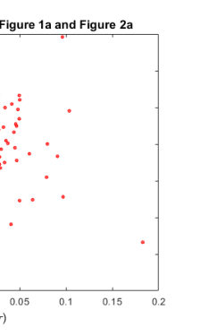
<figcaption class="paper-figure-caption"><b>Fig 3.</b> Figure 3: Scatter plots in Figure (1)a (red) and Figure (2)a (blue) superposed for comparison.</figcaption>
</figure>
<figure class="paper-figure-card">
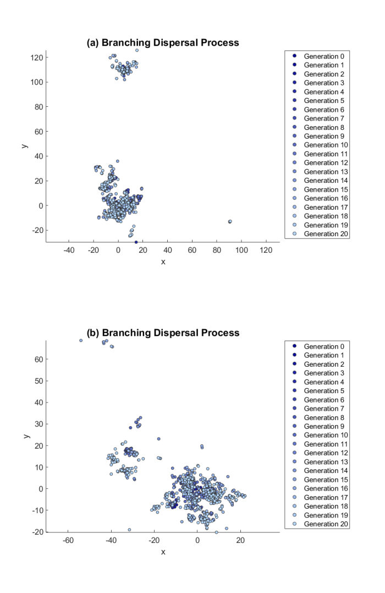
<figcaption class="paper-figure-caption"><b>Fig 4.</b> Figure 4: Two simulations of a spatial population process showing clumping and long-distance dispersal. The population is initialized at the origin with five individuals. Offspring numbers follow a Poisson distribution with mean 1.2, and offspring are dispersed radially according to g(r) defined by (7), with H = 0.35, a = b = 0.5, and direction uniformly distributed on [0, 2π]. Each simulation is run for 20 generations beyond the initial population.</figcaption>
</figure>

**Summary.** This paper proposes a refined model for particle dispersal by combining subdiffusive fractional Brownian motion with stopping times whose rates are drawn from a Gamma distribution. This heterogeneity successfully generates the heavy-tailed power-law decay necessary to describe rare, long-distance events while retaining the localized clumping characteristic of the underlying subdiffusion process.

**Why it may be interesting.** While focused on physical dispersal, the mathematical techniques used—analyzing heavy tails arising from multiplicative noise or randomized rates in anomalous diffusion processes—are highly relevant to non-equilibrium statistical mechanics problems involving complex particle interactions or energy dissipation.

Detailed structure

**Main problem.** To develop a model for dispersal kernels that accurately describe both localized clumping and rare, long-distance dispersal events by generating heavy tails.

**Main result.** By introducing heterogeneity in the stopping rate (making it Gamma-distributed), the resulting radial density function exhibits a power-law decay $g(r) \sim r^{-1 - a/H}$, confirming a heavy-tailed distribution.

**Method.** The analysis involves deriving and performing asymptotic analysis on the radial probability density function by combining subdiffusive fractional Brownian motion (fBm) with randomized exponential stopping times.

**Model / system.** The system models particle dispersal using subdiffusive fBm ($H < 1/2$) where the stopping time rate ($\lambda$) is drawn from a Gamma distribution. This combination generates the required heavy-tailed statistics for realistic environmental modeling.

**Key observables.** Radial probability density function $g(r)$ and its tail behavior, specifically the power-law decay $r^{-1 - a/H}$ as $r 	o \infty$.

**Important parameters / regimes.** Hurst exponent ($H$), Gamma distribution parameters ($a, b$), and the diffusion parameter ($\sigma$). The regime of interest is subdiffusion ($0 < H < 1/2$).

**Assumptions / limitations.** The analysis relies on approximations valid in the large-$r$ limit (e.g., $t \gg b$) and assumes that the underlying movement follows fBm.

**Figures summary.** Figures compare simulation results for randomized vs. constant stopping rates, showing clear heavy tails only when rate randomization is included. Hill plots and Mean-excess plots are used to diagnose this tail behavior.

**Paper structure.** The paper establishes the failure of simple models (exponential decay) for long-distance dispersal, proposes randomizing the stopping rate parameter ($\lambda \sim 	ext{Gamma}$), derives the asymptotic power-law tail $g(r) \sim r^{-1 - a/H}$, and validates this result through both analytical methods and numerical simulations.

Abstract

Subdiffusive fractional Brownian motions produce localized aggregation when particles are stopped at exponentially distributed times. In applications where clumping and long-distance dispersal events are observed simultaneously, such as in some instances of seed dispersal, this model fails to describe the tails of the data. The resulting redistribution kernel has only an exponentially decaying tail, whereas a heavier tail is needed for modeling the long-distance dispersal observed. Here we propose a model in which subdiffusive particles stop at exponentially distributed times, but with a rate parameter that is Gamma distributed. This heterogeneity in stopping rates causes the density of final radial positions to have a heavy-tailed distribution. Our model retains the strong localized clumping characteristic of subdiffusive fractional Brownian motion while simultaneously generating the heavy tails required for realistic long-distance dispersal.

[↑ back to top](#top)

### [Effective hyperuniformity in time-integrated stochastic Turing patterns](http://arxiv.org/abs/2606.23677v1)

**Authors:** Anirban Mukherjee, Hong-Yan Shih  
**Type:** theory · **Category:** statistical mechanics · **PDF:** <https://arxiv.org/pdf/2606.23677v1>  
**Analysis basis:** full PDF text, analyzed in chunks
**Topic relevance:** `non-equilibrium dynamics` **2/5** · `Keldysh / 2PI / non-Gaussian methods` **1/5** · `correlated / nonlocal dissipation` **1/5** · `driven-dissipative phase transition` **1/5** · `methods for driven-dissipative` **1/5** · `non-equilibrium universality` **1/5**

↔ Scroll figures horizontally

<figure class="paper-figure-card">
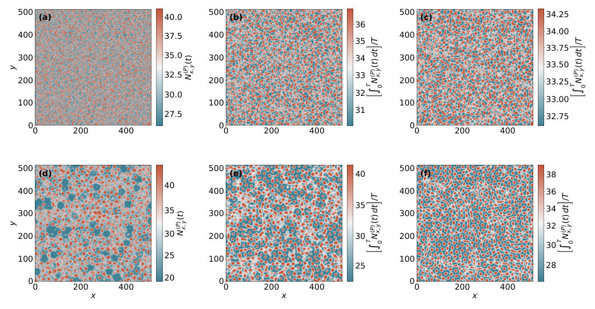
<figcaption class="paper-figure-caption"><b>Fig 1.</b> Figure 1: Spatial patterns of prey in the 2D Levin-Segel model on a 512 × 512 grid (b = e = d = 0.5, p = 1, µ = 1, V = 100). (a–c) ν/µ = 20; (d–f) ν/µ = 26. Left panels (a,d): instantaneous steady-state configurations; middle and right panels (b,e) and (c,f): time-averaged over T = 32 and T = 1024 respectively, revealing how the spatially organized population structure gradually emerges as the integration time increases, absent in any single snapshot. The 2D simulation is shown for visual purposes only; all quantitative analyses are performed on the 1D model.</figcaption>
</figure>
<figure class="paper-figure-card">
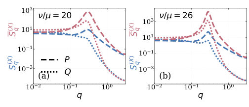
<figcaption class="paper-figure-caption"><b>Fig 2.</b> Figure 2: Instantaneous S(X) q and time-integrated S (X) q structure factors for prey and predator at ν/µ = 20 (a) and 26 (b). A peak signals the appearance of a spatial pattern: at ν/µ = 20, the predator shows no discernible peak instantaneously, and it only emerges after time in- tegration, while the prey already shows a peak in both, but with a stronger one after time integration.</figcaption>
</figure>
<figure class="paper-figure-card">
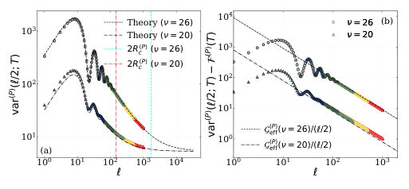
<figcaption class="paper-figure-caption"><b>Fig 3.</b> Figure 4: Subsystem variance of time-integrated prey density (X = P) at T = 4096, for ν/µ = 20 (R(P ) c ≈ 75) and ν/µ = 26 (R(P ) c ≈850). Symbols: simula- tion data for L = 128–2048 (color codes as in Fig. 3); dashed lines: LNA predictions with no fitting parame- ters. (a) var(P )(ℓ/2; T) converged to var(P )(ℓ/2); verti- cal lines mark ℓ= 2R(P ) c . (b) Subleading 1/ℓdecay after subtracting F(P ), quantitatively captured by the LNA with no intrinsic cutoff.</figcaption>
</figure>
<figure class="paper-figure-card">
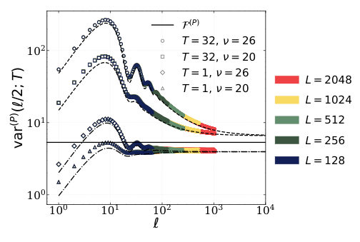
<figcaption class="paper-figure-caption"><b>Fig 4.</b> Figure 3: Prey subsystem variance var(P )(ℓ/2; T) versus subsystem size ℓ, at ν/µ = 20 (away from the Turing instability) and ν/µ = 26 (near it), for integration times T = 1 and T = 32. Symbols: simulation data; dashed lines: LNA predictions. At T = 32, fluctuations are en- hanced near the Turing scale ℓ∗and suppressed beyond it — the signature of large-scale spatial organization absent at T = 1. The long-time saturation var(P )(ℓ/2) →F(P )</figcaption>
</figure>
<figure class="paper-figure-card">
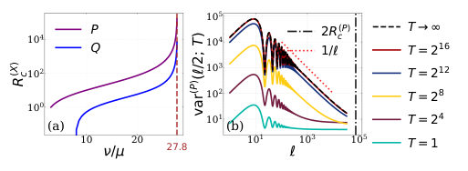
<figcaption class="paper-figure-caption"><b>Fig 5.</b> Figure 5: (a) Crossover radius R(X) c versus ν/µ, com- puted from the LNA, diverges as the deterministic Tur- ing instability (ν/µ = 27.8, dashed vertical line) is approached, with the prey (activator) diverging more strongly than the predator (inhibitor). (b) Analytically obtained, the intensive variance of prey at ν/µ = 27.7, as a function of subsystem size ℓ, for integration times T = 1, 16, 256, 4096, 65536 and T →∞(dashed black); the vertical dot-dashed line marks the cutoff length 2R(P ) c . The diverging R(P ) c sets an increasingly wide hyperuniform-scaling regime ℓ≪2R(P ) c as T →∞ (see [54] for the predator).</figcaption>
</figure>

**Summary.** This work analyzes stochastic Turing patterns in reaction-diffusion systems, showing that integrating fluctuations over time reveals a hidden large-scale order. This emergent structure exhibits effective hyperuniformity, meaning long-wavelength density variations are suppressed by a finite kinetic floor. The methodology uses advanced statistical tools like the structure factor analysis within the Linear Noise Approximation.

**Why it may be interesting.** While focused on classical statistical mechanics, the concept of emergent organization via filtering (time integration) is analogous to how quantum correlations or entanglement can be revealed by time evolution measurements in open quantum systems.

Detailed structure

**Main problem.** The study investigates how robust, large-scale spatial organization emerges from stochastic Turing patterns when considering time integration of fluctuating local populations.

**Main result.** Time integration acts as a dynamical filter that reveals an emergent effective hyperuniformity in the density fluctuations, characterized by a $1/R$ decay in variance over intermediate scales.

**Method.** The analysis uses the Linear Noise Approximation (LNA) applied to stochastic reaction-diffusion equations and analyzes the time-integrated structure factor in Fourier space.

**Model / system.** The model is a generic two-species stochastic reaction-diffusion process, exemplified by the Levin-Segel predator-prey system, evolving on a lattice with periodic boundary conditions.

**Key observables.** Time-integrated demographic fluctuations ($\Xi(X)_r(T)$), structure factor $S(X)_q(T)$, and intensive variance $	ext{var}(X)(R; T)$.

**Important parameters / regimes.** The ratio of diffusion rates ($
u/\mu$) relative to the deterministic instability point, and the integration time $T$.

**Assumptions / limitations.** The analysis relies on the Linear Noise Approximation (LNA) and assumes that the system reaches a steady state for the structure factor in the long-time limit ($T 	o \infty$).

**Figures summary.** Figures illustrate the emergence of patterns in time-integrated vs. instantaneous snapshots, showing variance decay as $1/\ell$ over increasingly broad regions near instability.

**Paper structure.** The paper establishes the mathematical framework using LNA for stochastic fluctuations, derives the structure factor for time-integrated configurations, and then applies this to the Levin-Segel model to demonstrate the transition from instantaneous noise to long-range hyperuniform order.

Abstract

Demographic noise generates stochastic Turing patterns even when reaction-diffusion systems are deterministically stable. We show analytically and verify numerically in the Levin-Segel model that temporal integration of configurations reveals emergent large-scale organization. The intensive number variance in a window of size $R \gg 1$ approaches a finite reaction-kinetic floor as $1/R$, over a spatial range growing by orders of magnitude near the Turing instability. This yields an effectively hyperuniform, fine-tuning-free regime previously unidentified in non-conserved multispecies stochastic systems.

[↑ back to top](#top)

### [Skewness tunes the small-drift record rate of random walks and Lévy flights](http://arxiv.org/abs/2606.23553v1)

**Authors:** José Ricardo G. Mendonça  
**Type:** theory · **Category:** statistical mechanics · **PDF:** <https://arxiv.org/pdf/2606.23553v1>  
**Analysis basis:** full PDF text, analyzed in chunks
**Topic relevance:** `non-equilibrium universality` **2/5** · `Keldysh / 2PI / non-Gaussian methods` **1/5** · `analog quantum simulation` **1/5** · `driven-dissipative phase transition` **1/5** · `non-equilibrium dynamics` **1/5**

↔ Scroll figures horizontally

<figure class="paper-figure-card">
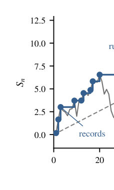
<figcaption class="paper-figure-caption"><b>Fig 1.</b> Figure 1: A biased random walk Sn (grey) with small positive drift µ, its running maximum</figcaption>
</figure>
<figure class="paper-figure-card">
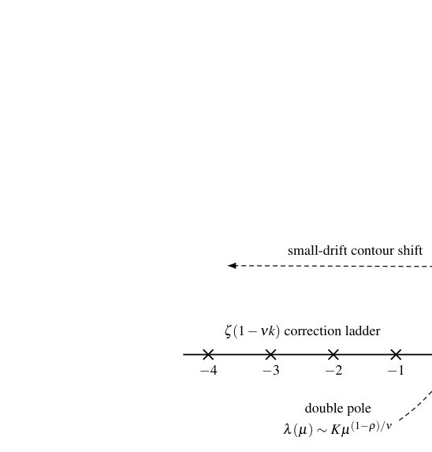
<figcaption class="paper-figure-caption"><b>Fig 2.</b> Figure 2: Poles of G(s) = csh∗(s)ζ(1+νs) in the complex s-plane: a double pole at s = 0 (leading law) and simple poles at the negative integers (correction ladder). Sweeping the</figcaption>
</figure>
<figure class="paper-figure-card">
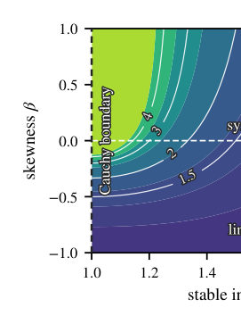
<figcaption class="paper-figure-caption"><b>Fig 3.</b> Figure 3: Phase portrait of the small-drift record rate. The leading exponent (1 −ρ)/ν of λ(µ) ∼Kµ(1−ρ)/ν over the stable index 1 &lt; α ⩽2 and skewness −1 ⩽β ⩽1, from Eqs. (12)–(13). It equals 1 along the entire diffusive edge α = 2 and the descending-skew edge β = −1, rises to 1/(α −1) on the ascending-skew edge β = +1, and diverges as the</figcaption>
</figure>
<figure class="paper-figure-card">
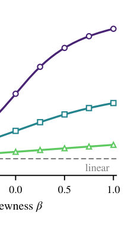
<figcaption class="paper-figure-caption"><b>Fig 4.</b> Figure 4: Skew-tuned exponent. The leading record-rate exponent (1−ρ)/ν as a function of skewness, sweeping [1, 1/(α −1)] as β runs from −1 to +1 for fixed α. Curves are Eq. (13); open symbols mark parameter values used in numerical checks of the Spitzer– Baxter sum (4). The dashed line marks the linear small-drift exponent, (1 −ρ)/ν = 1;</figcaption>
</figure>

**Summary.** This theoretical paper determines the precise small-drift scaling law for the rate at which random walks set new records. By utilizing Mellin transforms on a harmonic sum identity, the authors show that this record rate's exponent is continuously controlled by the skewness of the step distribution via the positivity parameter $
ho$. This unifies results across Gaussian, heavy-tailed, and skewed random walk regimes.

**Why it may be interesting.** While not directly quantum mechanical, the rigorous mathematical framework connecting asymptotic scaling laws (like record rates) to underlying distributional symmetries ($\alpha, eta$) is highly relevant for understanding critical phenomena or non-equilibrium dynamics in complex quantum systems.

Detailed structure

**Main problem.** The paper investigates how the rate at which a random walk or Lévy flight sets new records (the record rate, $\lambda(\mu)$) depends on small positive drift ($\mu$). It specifically analyzes this dependence as the drift approaches zero.

**Main result.** The record rate exhibits an asymptotic power-law scaling $\lambda(\mu) \sim K\mu^{(1-
ho)/
u}$, where the exponent is continuously tuned by the skewness of the underlying step distribution through the positivity parameter $
ho$.

**Method.** The analysis heavily relies on using Mellin transforms applied to the harmonic sum derived from the Spitzer–Baxter identity, allowing for a unified treatment across different types of random walks.

**Model / system.** The model is a general random walk $S_n$ with i.i.d. steps $\xi_i$, which can be characterized by their limiting stable law index ($\alpha$) and skewness ($eta$). The analysis covers both diffusive (Gaussian) and heavy-tailed Lévy flight regimes.

**Key observables.** The record rate $\lambda(\mu)$, the expected maximum $E(M_N)$, and the exponent governing the small-$\mu$ decay of these quantities.

**Important parameters / regimes.** Drift ($\mu$), stable law index ($\alpha \in (1, 2]$), positivity parameter ($
ho = P(Y>0)$), and skewness ($eta$).

**Assumptions / limitations.** The results are exact for Gaussian and strictly stable steps but extend to the domains of attraction at the leading power level. The analysis assumes the applicability of Mellin transform techniques to factorize the relevant harmonic sums.

**Figures summary.** Figure 1 illustrates record setting in a biased random walk as $\mu 	o 0$. Figure 2 shows the poles of the Mellin transform, distinguishing the leading law from correction terms. Figure 3 and 4 map the exponent's dependence on skewness ($eta$) across different stable indices ($\alpha$).

**Paper structure.** The paper establishes the connection between the record rate and a harmonic sum via the Spitzer–Baxter identity. It then employs Mellin transforms to analyze this sum in the small-drift limit, deriving the leading power law dependence on $\mu$ and showing how skewness controls the exponent through $
ho$.

Abstract

A random walk with small positive drift $μ$ sets new records at a rate $λ(μ)$ that vanishes as $μ\to 0$. For centered steps attracted to a stable law $Y$ with index $1 < α\leq 2$ and positivity parameter $ρ= P(Y>0)$, we find $λ(μ) \sim Kμ^{(1-ρ)/ν}$, $ν=1-1/α$, as $μ\to 0$. The result is exact for Gaussian and strictly stable steps, and extends at the leading-power level to their domains of attraction. The exponent is set by the asymmetry only through $ρ$, sweeping the interval $[1,\,1/(α-1)]$ as the skewness varies. It recovers the Gaussian linear law with slope $\sqrt{2}$ and, for symmetric heavy tails, the power $μ^{α/2(α-1)}$; beyond the stable tail ratio, distributional details enter through the prefactor $K$, which is explicit for strictly stable steps. The result follows directly from one Mellin transform of the harmonic sum in the Spitzer-Baxter identity, which factorizes into a kernel transform and a Riemann $ζ$ factor whose poles deliver at once the leading law, its prefactor, and a correction ladder, unifying diffusive, heavy-tailed, and skewed walks. The same transform also yields the expected maximum, recovering Kingman's heavy-traffic law for queues and Siegmund's corrected-diffusion constant as adjacent poles.

[↑ back to top](#top)

### [Evaluation of Variational Quantum Classifiers (VQC) for Cyberattack Detection in the NISQ Era](http://arxiv.org/abs/2606.21715v1)

**Authors:** Angelos Thomos, Theodore Andronikos  
**Type:** experiment · **Category:** quantum information and computing · **PDF:** <https://arxiv.org/pdf/2606.21715v1>  
**Analysis basis:** full PDF text, analyzed in chunks
**Topic relevance:** `QC/QI experiment` **2/5** · `entanglement & information structure` **1/5** · `methods for driven-dissipative` **1/5** · `quantum measurements` **1/5**

↔ Scroll figures horizontally

<figure class="paper-figure-card">
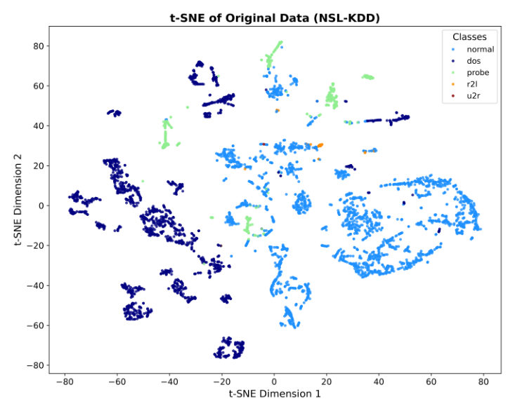
<figcaption class="paper-figure-caption"><b>Fig 1.</b> Figure 1: Visualizing the complex dataset distribution using a t-SNE projection on the official 20% NSL- KDD research subset.</figcaption>
</figure>
<figure class="paper-figure-card">
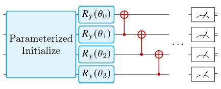
<figcaption class="paper-figure-caption"><b>Fig 2.</b> Figure 2: VQC architecture showcasing the state preparation block followed by a RealAmplitudes-style ansatz.</figcaption>
</figure>
<figure class="paper-figure-card">
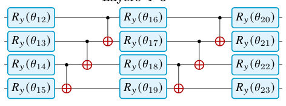
<figcaption class="paper-figure-caption"><b>Fig 3.</b> Figure 3: Detailed architecture of the RealAmplitudes ansatz (reps=5), highlighting the parameterized 𝑅𝑦rotation layers and the linear entanglement topology.</figcaption>
</figure>
<figure class="paper-figure-card">
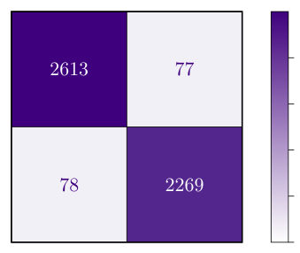
<figcaption class="paper-figure-caption"><b>Fig 4.</b> Figure 4: Performance evaluation of the classical baseline: Confusion Matrix of the 4-Node Tiny MLP, simulating the extreme dimensional constraint of the quantum architecture.</figcaption>
</figure>
<figure class="paper-figure-card">
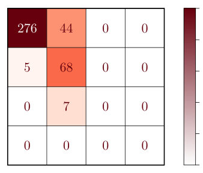
<figcaption class="paper-figure-caption"><b>Fig 5.</b> Figure 5: Confusion matrix for the imbalanced four-class VQC experiment, visually demonstrating the model’s complete failure to predict minority classes (R2L and U2R).</figcaption>
</figure>

**Summary.** This work evaluates Variational Quantum Classifiers (VQC) for cyberattack detection using limited qubits. The study demonstrates that forcing high-dimensional network data into a small quantum state via amplitude encoding severely limits the model's representational capacity compared to classical neural networks. The authors conclude that future quantum advantage requires abandoning aggressive feature compression in favor of broader Hilbert space representations.

**Why it may be interesting.** While focused on cybersecurity, the core technical challenge—quantifying the expressibility gap between quantum circuits and classical models when data is compressed—is highly relevant to understanding resource limitations in variational quantum algorithms for complex physical simulations.

Detailed structure

**Main problem.** The paper investigates the structural limits of Variational Quantum Classifiers (VQC) for detecting network anomalies in the Noisy Intermediate-Scale Quantum (NISQ) era.

**Main result.** Aggressive data compression via Amplitude Encoding into a small number of qubits severely restricts the VQC's expressiveness, leading to performance ceilings significantly below classical benchmarks.

**Method.** The authors developed and tested a 4-qubit VQC using amplitude encoding on the NSL-KDD dataset, comparing its performance against classical MLPs and analyzing optimization convergence.

**Model / system.** The model is a hybrid quantum-classical circuit consisting of state preparation (Amplitude Encoding), a trainable parameterized ansatz (RealAmplitudes), and Z-basis measurement. It operates on NISQ devices simulated via statevector simulators.

**Key observables.** Binary classification accuracy (88% achieved vs 97% classical MLP); in-sample diagnostic accuracy (9%); mode collapse behavior.

**Important parameters / regimes.** 4 qubits, 24 trainable parameters, 16 principal components (from PCA), COBYLA/SPSA optimizers.

**Assumptions / limitations.** The primary limitation is the aggressive dimensionality reduction imposed by amplitude encoding; furthermore, the results do not isolate the encoding from ansatz depth or optimizer budget.

**Figures summary.** Figures illustrate t-SNE projections of class overlaps and confusion matrices comparing VQC performance against classical baselines (Tiny MLP).

**Paper structure.** The paper systematically details data preprocessing (PCA, Target Encoding), constructs the 4-qubit VQC pipeline, evaluates it using multiple optimizers, compares results to classical MLPs, and concludes by proposing a shift towards uncompressed angle encoding.

Abstract

This paper investigates the effectiveness and structural limits of Variational Quantum Classifiers (VQC) for detecting network anomalies in the era of Noisy Intermediate-Scale Quantum (NISQ) systems. Using the official 20\% research subset of the NSL-KDD dataset, a 4-qubit classifier featuring a 24-parameter trainable ansatz was developed, utilizing amplitude encoding to embed 16 principal components. On a held-out partition of this subset, the model achieved a consistent binary-classification accuracy of 88\%. A comparative evaluation with two fundamentally different optimizers, COBYLA and SPSA, found that the observed performance plateau is not attributable to convergence to local minima, a result we interpret as consistent with an encoding-related expressibility limit rather than an optimization artifact. An architectural parity comparison with a classical neural network (a Tiny MLP with four nodes, achieving 97\% accuracy) highlighted the expressiveness gap associated with data overcompression into restricted quantum states. The model was trained on a class-balanced set spanning the 22 raw NSL-KDD attack categories and evaluated in-sample as a probe of representational capacity: under this configuration the VQC reached only 9\% accuracy and exhibited a degenerate mode collapse onto a small subset of classes. We interpret this behavior as consistent with the loss of linear separability induced by excessive compression in the quantum probability space, while explicitly noting that our experiments do not isolate the encoding from the ansatz depth, optimizer budget, and measurement-decoding scheme (see Limitations). Motivated by these observations and by Cover's theorem, we outline an alternative paradigm: a 16-qubit VQC with angle encoding that expands the Hilbert-space representation rather than relying on aggressive classical dimensionality reduction.

[↑ back to top](#top)

### [Quantum Advantage in Tolerant Junta Testing](http://arxiv.org/abs/2606.23194v1)

**Authors:** Avishay Tal, Weiqiang Yuan  
**Type:** theory · **Category:** quantum information and computing · **PDF:** <https://arxiv.org/pdf/2606.23194v1>  
**Analysis basis:** full PDF text, analyzed in chunks
**Topic relevance:** `entanglement & information structure` **2/5** · `quantum measurements` **2/5** · `Keldysh / 2PI / non-Gaussian methods` **1/5**

↔ Scroll figures horizontally

<figure class="paper-figure-card">
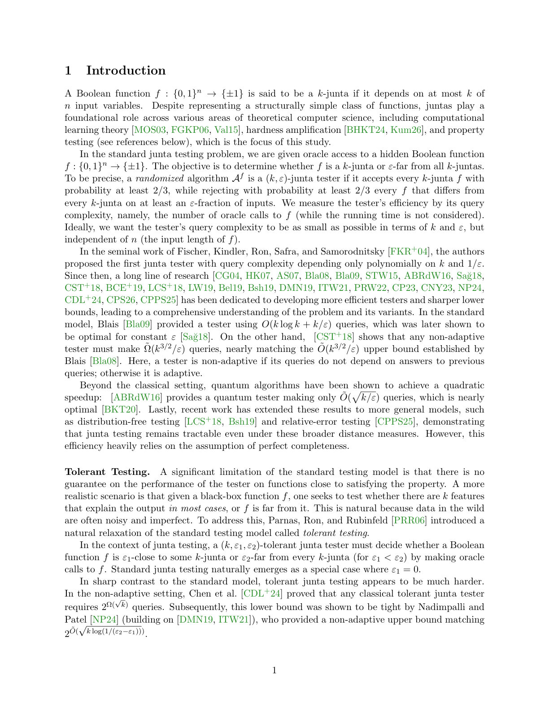
<figcaption class="paper-figure-caption"><b>Fig 1.</b> Low-resolution page preview, page 2</figcaption>
</figure>
<figure class="paper-figure-card">
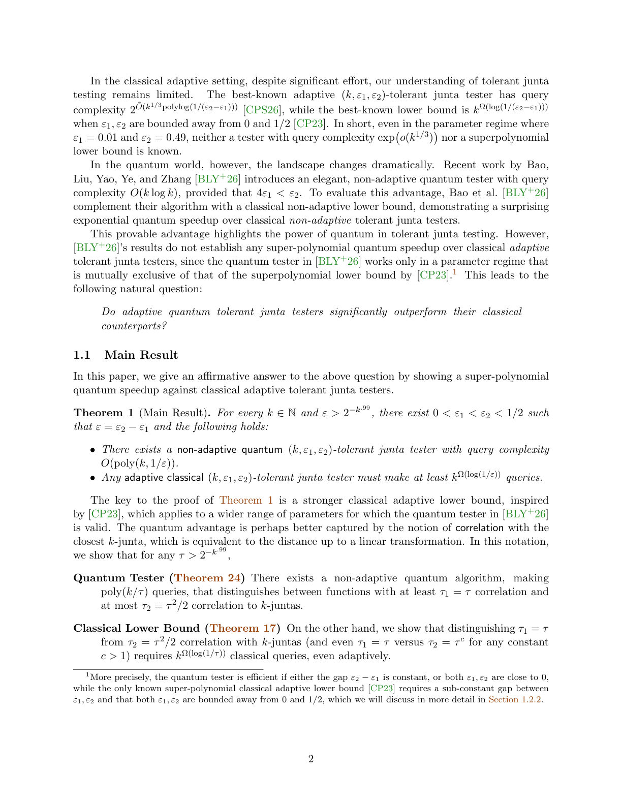
<figcaption class="paper-figure-caption"><b>Fig 2.</b> Low-resolution page preview, page 3</figcaption>
</figure>
<figure class="paper-figure-card">
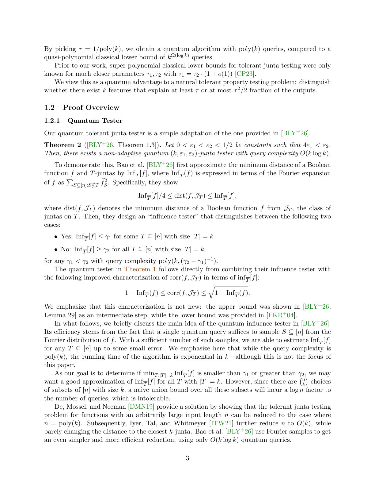
<figcaption class="paper-figure-caption"><b>Fig 3.</b> Low-resolution page preview, page 4</figcaption>
</figure>
<figure class="paper-figure-card">
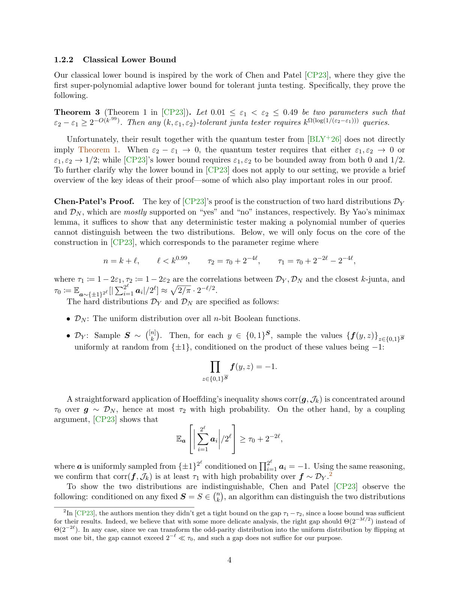
<figcaption class="paper-figure-caption"><b>Fig 4.</b> Low-resolution page preview, page 5</figcaption>
</figure>
<figure class="paper-figure-card">
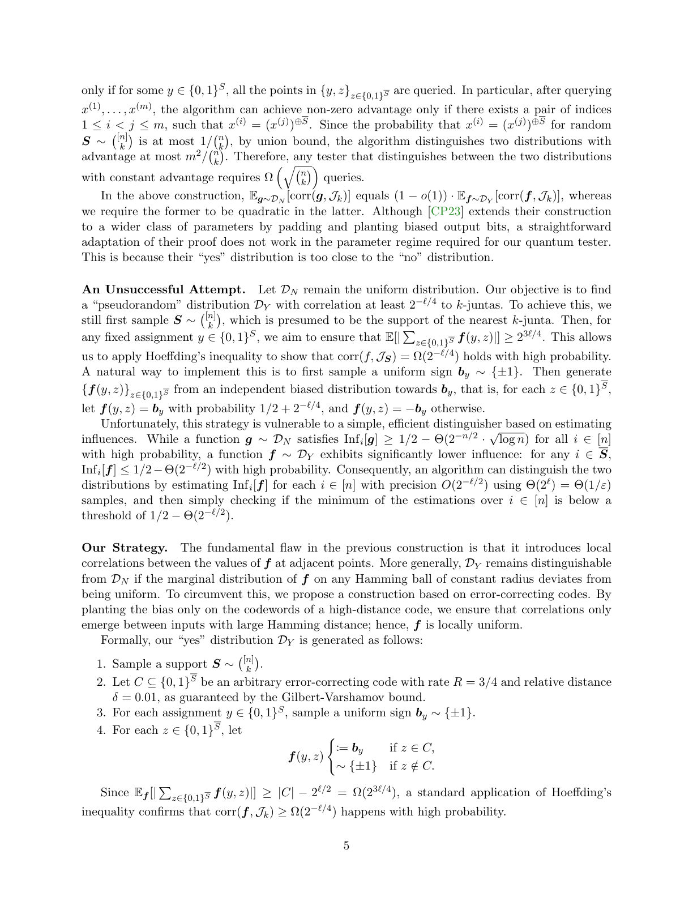
<figcaption class="paper-figure-caption"><b>Fig 5.</b> Low-resolution page preview, page 6</figcaption>
</figure>

**Summary.** This paper proves a super-polynomial quantum advantage for testing whether a Boolean function is close to being defined by only $k$ variables (a $k$-junta). It achieves this using an efficient quantum tester and establishes the lower bound classically by constructing hard distributions based on error-correcting codes. This work significantly advances the understanding of computational limits in property testing.

**Why it may be interesting.** Although focused on computational complexity theory, the techniques used—especially constructing hard distributions and proving query complexity gaps—are foundational to understanding the limits of information extraction from complex physical measurements or noisy data sets in quantum physics.

Detailed structure

**Main problem.** The paper establishes a super-polynomial quantum advantage for solving the tolerant $k$-junta testing problem in an adaptive setting.

**Main result.** It shows that the problem can be solved with $	ext{poly}(k)$ quantum queries, while any classical algorithm requires at least $k^{\Omega(\log k)}$ queries under specific parameter regimes.

**Method.** The quantum advantage is demonstrated using a specialized non-adaptive quantum tester adapted from prior work. The corresponding classical lower bound relies on constructing hard distributions for 'yes' instances based on error-correcting codes and applying Yao's minimax lemma.

**Model / system.** The model involves black-box access to a Boolean function $f: \{0, 1\}^n 	o \{\pm 1\}$, which is tested for its proximity (tolerance) to being defined by only $k$ variables (a $k$-junta).

**Key observables.** Query complexity (number of oracle calls), correlation $	ext{corr}(f, J_T)$, and the parameters defining closeness ($\varepsilon_1$) and distance ($\varepsilon_2$).

**Important parameters / regimes.** The regime requires $0 \le \varepsilon_1 < \varepsilon_2 \le 1/2$, particularly focusing on small gaps $\varepsilon = \varepsilon_2 - \varepsilon_1$.

**Assumptions / limitations.** The quantum tester used is non-adaptive, and the super-polynomial classical lower bound requires a sub-constant gap between $\varepsilon_1$ and $\varepsilon_2$.

**Paper structure.** The paper reviews standard junta testing, introduces tolerant testing for noisy data, presents Theorem 1 establishing the quantum advantage via both an efficient quantum tester and a novel classical lower bound based on hard distributions.

Abstract

We establish the first super-polynomial quantum advantage for the tolerant junta testing problem in the adaptive setting. Specifically, we show that within a certain parameter regime, tolerant $k$-junta testing with high precision can be solved using $\mathrm{poly}(k)$ quantum queries, whereas any classical algorithm requires at least $k^{Ω(\log k)}$ queries.   The problem of tolerant $k$-junta testing is as follows: given parameters $(k, ε_1, ε_2)$, with $0\le ε_1<ε_2 \le 1/2$, and black-box access to a Boolean function $f$ (defined on $n$ variables), distinguish whether $f$ is $ε_1$-close to some $k$-junta or $ε_2$-far from every $k$-junta.   We show the quantum advantage for a range of parameters close to $1/2$, for example, $ε_1 = 1/2-1/k$ and $ε_2 = 1/2-1/(2k^2)$. The (non-adaptive) quantum tester we use was given by a recent work of Bao, Liu, Yao, Ye, and Zhang (SOSA 2026). We slightly adapt their analysis to show that it holds in the above parameter regime. On the other hand, our classical lower bound requires substantial new ideas. Inspired by the lower bound techniques of Chen and Patel (FOCS 2023), we introduce a new hard distribution of ``yes'' instances (i.e., instances with distance at most $ε_1$ to $k$-juntas) that is based on planting an ``approximate-junta'' as follows: we randomly pick $k$ out of $n$ coordinates, and for each fixing of the $k$ coordinates, the $2^{n-k}$ values in the restricted subcube are drawn randomly except for the set of points in an error-correcting code on which we place the same random bit. We show that this distribution is much closer to $k$-juntas than the uniform distribution, but on the other hand, they are indistinguishable with respect to any classical algorithm making $k^{o(\log k)}$ queries.

[↑ back to top](#top)

### [Quantum Key Distribution Without Shared Reference Frame Under Unital Noise](http://arxiv.org/abs/2606.23239v1)

**Authors:** Junaid ur Rehman, Shehbaz Tariq, Symeon Chatzinotas  
**Type:** theory · **Category:** quantum information and computing · **PDF:** <https://arxiv.org/pdf/2606.23239v1>  
**Analysis basis:** full PDF text, analyzed in chunks
**Topic relevance:** `quantum measurements` **2/5** · `correlated / nonlocal dissipation` **1/5** · `driven-dissipative phase transition` **1/5** · `methods for driven-dissipative` **1/5**

↔ Scroll figures horizontally

<figure class="paper-figure-card">
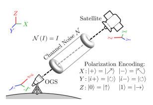
<figcaption class="paper-figure-caption"><b>Fig 1.</b> Fig. 1. The system model. The transmitter and receiver lack a shared reference frame, which is exemplified as a satellite-to-ground quantum communication link where the local frames of reference do not coincide with the global reference. Polarization encoding of photons in global reference frame does not translate to the same in either of the local references.</figcaption>
</figure>
<figure class="paper-figure-card">
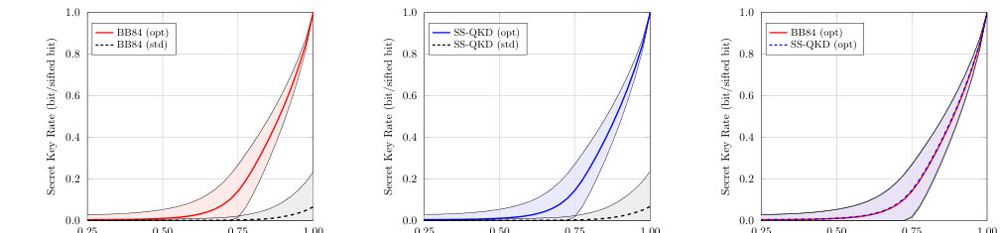
<figcaption class="paper-figure-caption"><b>Fig 2.</b> Fig. 2. Secret key rate (bits per sifted detected signal) as a function of channel parameter ϵ. The optimized signaling, as proposed in the main text, compensates well for the absence of shared reference frame, as evidenced by the ideal secret key rate for the unitary/noiseless channel up to an unknown rotation, i.e., ϵ = 1.</figcaption>
</figure>
<figure class="paper-figure-card">
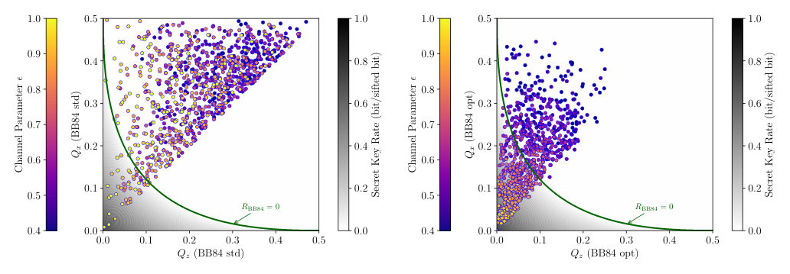
<figcaption class="paper-figure-caption"><b>Fig 3.</b> Fig. 3. Secret key rate (bits per sifted detected signal) as a function of QBERs in Z and X basis. The scatter points show the QBERs of numerical simulations with (a) standard, i.e., without basis optimization, and (b) optimized basis BB84 in random unitary channels.</figcaption>
</figure>
<figure class="paper-figure-card">
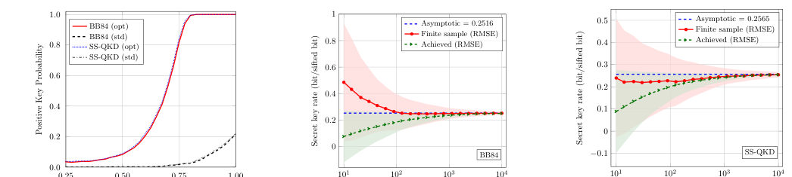
<figcaption class="paper-figure-caption"><b>Fig 4.</b> Fig. 4. Robustness checks for the optimized signaling. (a) Positive-key probability, Pr{R &gt; 0}, over the random unitary channel ensemble as a function of the channel parameter ϵ. (b) Finite-sample PTM-based basis estimation for BB84 at ϵ = 0.8, shown as a function of the number of shots per PTM entry, Ns. (c) Corresponding finite-sample PTM-based basis estimation for six-state QKD at ϵ = 0.8. In (b) and (c), the dashed line denotes the exact-PTM asymptotic rate, the finite-sample curve denotes the rate computed from the noisy estimated PTM, and the achieved-rate curve denotes the rate obtained when the finite-sample optimized bases are applied to the underlying simulated channel. Shaded...</figcaption>
</figure>

**Summary.** This paper tackles the practical challenge of Quantum Key Distribution when communicating parties lack a shared reference frame over noisy channels. The authors introduce two robust methods—PTM analysis and Sequential Basis Matching—to determine optimal local measurement bases. They prove these methods yield equivalent, enhanced key rates compared to standard protocols, significantly improving theoretical performance estimates for real-world quantum links.

**Why it may be interesting.** This work is highly relevant to quantum optics and open quantum systems because it provides a rigorous framework for optimizing communication protocols under realistic, non-ideal environmental constraints (like relative motion in satellite links) that violate idealized assumptions of perfect alignment.

Detailed structure

**Main problem.** The core problem is establishing secret keys via Quantum Key Distribution (QKD) when communication occurs over an unknown, stationary, unital qubit channel without the communicating parties sharing a global reference frame.

**Main result.** Both proposed methods—Pauli Transfer Matrix (PTM) analysis and Sequential Basis Matching (SBM)—yield equivalent results, demonstrating that optimized local signaling can recover positive key rates even when standard assumptions about basis alignment fail.

**Method.** The authors propose two complementary theoretical approaches: one using the PTM derived from channel characterization via SVD, and another operational approach called SBM that iteratively optimizes measurement bases based on observed error probabilities.

**Model / system.** The system models QKD over a qubit channel characterized by unknown unitaries ($U_A, U_B$) and unital noise ($\mathcal{N}$). The analysis relies heavily on the Pauli basis representation of quantum states and channels.

**Key observables.** Secret key rates (for BB84 and six-state protocols), Quantum Bit Error Rates (QBERs) in X, Y, and Z bases, and the effective channel's PTM parameters.

**Important parameters / regimes.** The channel noise strength ($\epsilon$), which quantifies the deviation from ideal transmission; the number of measurement shots ($N_s$) for finite-sample analysis.

**Assumptions / limitations.** The quantum channel is assumed to be stationary and unital. The primary challenge addressed is the violation of the shared reference frame assumption, rather than modeling specific physical noise sources like loss or dark counts.

**Figures summary.** Figures compare secret key rates vs. channel parameter $\epsilon$ for standard versus optimized signaling; they also show QBER sets and finite-sample estimations demonstrating convergence to the theoretical PTM rate.

**Paper structure.** The paper first establishes the physical challenge (QKD without shared reference frame). It then details two mathematical approaches: 1) Constructing the effective channel via PTM/SVD, and 2) Implementing SBM for sequential basis optimization. Finally, it compares the results and analyzes performance robustness.

Abstract

We consider a general and practical scenario of quantum key distribution (QKD) over an unknown, stationary, unital qubit channel. Furthermore, due to practical limitations, e.g., relative movement and rotation of communicating parties, a global shared reference frame cannot be established. This scenario can routinely appear in satellite QKD. We propose two methods to overcome the physical qubit noise and the lack of shared reference frame. The first proposed approach involves constructing the Pauli transfer matrix (PTM) description of the channel, which we achieve without requiring a shared reference frame, by absorbing the lack of shared reference frame in the channel definition. This is followed by the identification of singular vectors of PTM as the Bloch vectors for optimal signal states. In the optimized local bases, the resulting correlations are equivalent, up to outcome relabeling, to those of a Pauli channel, allowing us to show the optimality of the BB84 and six-state QKD protocols under these conditions. The second approach, called the sequential basis matching (SBM) involves sequentially identifying the channel-optimized local bases that enable QKD. We show that both of these approaches result in the same effective key exchange rate for QKD.

[↑ back to top](#top)

### [The Market Crystal: A Spin-Lattice Model for Collective Cryptocurrency States](http://arxiv.org/abs/2606.22017v1)

**Authors:** Hamidreza Oliaei-Moghadam  
**Type:** theory · **Category:** statistical mechanics · **PDF:** <https://arxiv.org/pdf/2606.22017v1>  
**Analysis basis:** full PDF text, analyzed in chunks
**Topic relevance:** `non-equilibrium dynamics` **2/5** · `driven-dissipative phase transition` **1/5** · `exotic spin models in light-matter` **1/5** · `non-equilibrium universality` **1/5**

↔ Scroll figures horizontally

<figure class="paper-figure-card">
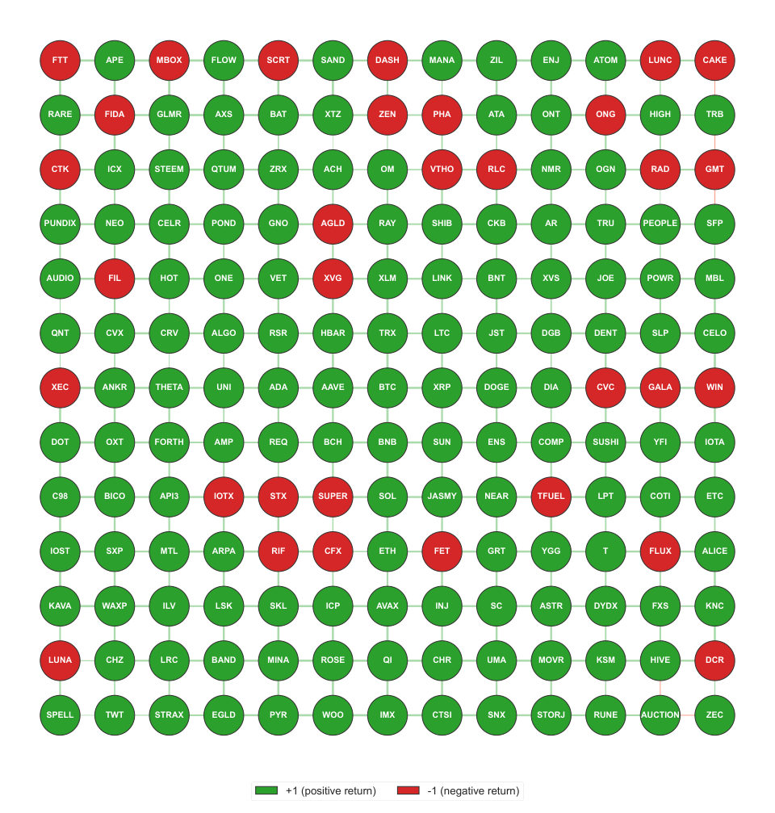
<figcaption class="paper-figure-caption"><b>Fig 1.</b> Figure 1: Two-dimensional snapshot of the Market Crystal configuration σ(t) on May 5, 2023. The N = 169 assets are arranged on a 13 × 13 lattice obtained through the correlation-based breadth-first search (CBFS) procedure, with Bitcoin (BTC) serving as the central seed node. Node colors represent the instantaneous spin state σi(t), where green indicates a positive daily return (σi = +1) and red indicates a negative return (σi = −1). Edges connect nearest-neighbor lattice sites and represent interaction couplings Jij = ρij derived from the empirical Pearson correlation matrix. The configuration shown illustrates a period of strong positive alignment across the market.</figcaption>
</figure>
<figure class="paper-figure-card">
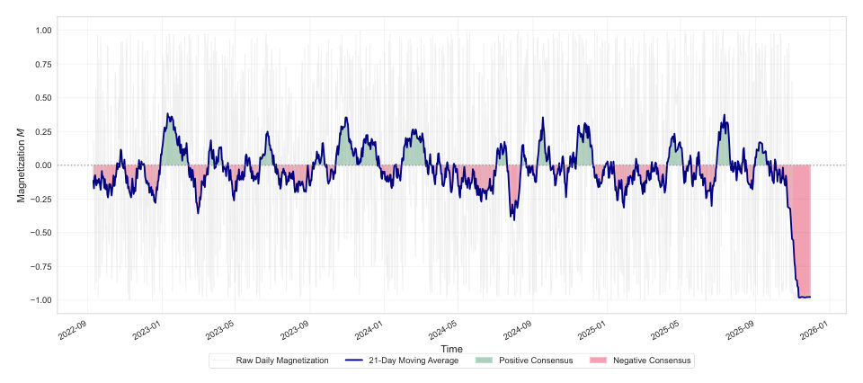
<figcaption class="paper-figure-caption"><b>Fig 2.</b> Figure 2: Temporal evolution of the market magnetization M(t). The faint gray curve shows the raw daily series, while the solid black curve denotes the 21-day moving average. Green and red shaded regions mark positive and negative ordered regimes, respectively, in which the market exhibits strong collective alignment. Periods where the smoothed magnetization remains near zero correspond to comparatively disordered market states.</figcaption>
</figure>
<figure class="paper-figure-card">
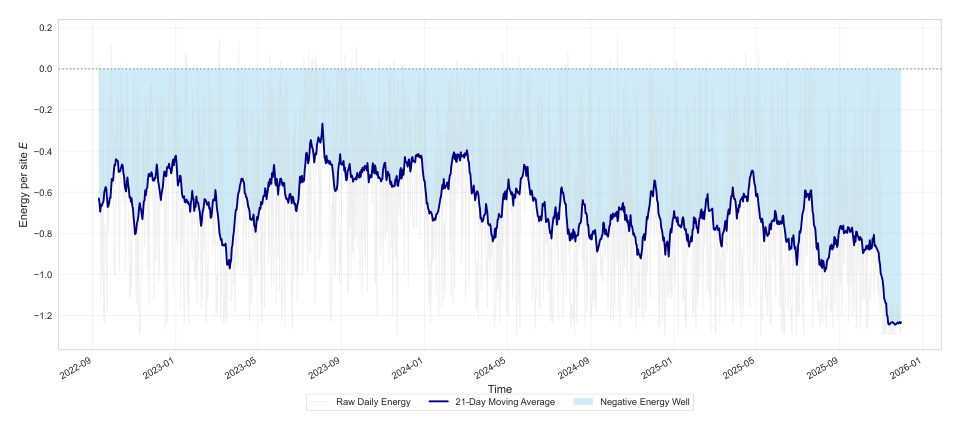
<figcaption class="paper-figure-caption"><b>Fig 3.</b> Figure 3: Energy dynamics of the Market Crystal. The time series shows the evolution of the system’s energy per site E(t) computed from the empirical interaction matrix Jij = ρij. Light gray lines represent the raw daily energy values, capturing high-frequency fluctuations of the microscopic configuration. The black curve denotes the 21-day moving average, revealing the slower structural evolution of the market state. The shaded gray region highlights the negative energy well, indicating periods in which asset states align with the empirical correlation structure and the system occupies a coherent configuration. A dashed horizontal line marks the neutral reference level E = 0. Deeper...</figcaption>
</figure>
<figure class="paper-figure-card">
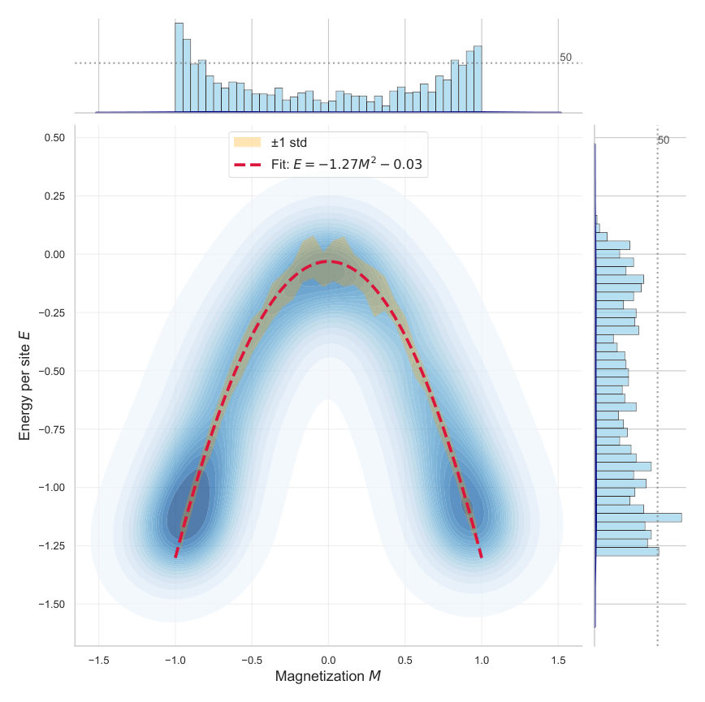
<figcaption class="paper-figure-caption"><b>Fig 4.</b> Figure 4: Energy–magnetization phase space of the Market Crystal. The blue density map shows the empirical distribution of market states in the (M, E) plane. The marginal histograms display the separate distributions of magnetization and energy; notably, the magnetization histogram exhibits a pronounced bimodal structure. The dashed red curve is a quadratic fit, approximately given by E = −1.27M 2 −0.03, and the orange band indicates the spread of energy values at different magnetization levels. The distribution follows a clear parabolic structure, with lower energies observed at larger |M| and a broader energy range near M ≈0.</figcaption>
</figure>

**Summary.** This paper models cryptocurrency market collective behavior using the framework of statistical mechanics, constructing an 'Market Crystal' based on asset correlations. By defining magnetization and energy observables derived from an Ising Hamiltonian, the authors characterize market states as oscillating between highly ordered (ferromagnetic-like) and disordered regimes.

**Why it may be interesting.** It provides a concrete example of applying established concepts from condensed matter physics (Ising models, order parameters) to model non-equilibrium complex systems like financial markets, which is a key area in econophysics.

Detailed structure

**Main problem.** The study aims to characterize the collective dynamics and emergent states within complex financial systems, specifically cryptocurrency markets.

**Main result.** The market's phase space is organized around a quadratic relationship between energy and magnetization ($E \simeq -1.27M^2 - 0.03$), indicating that strong alignment (high $|M|$) corresponds to low structural energy.

**Method.** The authors employ analogies from statistical mechanics, mapping asset returns onto binary spins ($\sigma_i$) and constructing an Ising-like Hamiltonian ($H = -\sum J_{ij}\sigma_i\sigma_j$).

**Model / system.** The system is the 'Market Crystal,' a spin lattice embedding of 169 cryptocurrencies. Interactions ($J_{ij}$) are determined by historical Pearson correlation coefficients ($
ho_{ij}$), forming an Ising Hamiltonian.

**Key observables.** Magnetization ($M(t)$) measures net directional alignment, and Energy ($E(t)$) quantifies structural coherence relative to the correlation matrix.

**Important parameters / regimes.** The lattice size is $13 	imes 13$, and the coupling strengths are derived from empirical correlations over the observation period.

**Assumptions / limitations.** The primary assumptions include treating historical correlations as fixed interaction strengths for the Hamiltonian, and using a heuristic CBFS procedure to embed assets onto a physical lattice structure.

**Figures summary.** Figures illustrate the spin configuration on the lattice (Fig 1), the time evolution of magnetization ($M(t)$) and energy ($E(t)$) (Figs 2 & 3), and the resulting phase space plot showing the quadratic relationship between $E$ and $M$, along with marginal histograms confirming bimodality.

**Paper structure.** The paper establishes the analogy between market dynamics and spin systems, details the construction of the Market Crystal using correlation embedding, defines key observables ($M$ and $E$), analyzes their temporal evolution, and concludes by mapping the phase space structure to reveal underlying ordered regimes.

Abstract

Collective dynamics in financial markets can emerge through synchronized movements of large groups of assets. Motivated by analogies with interacting many-body systems, we introduce a spin-lattice representation for analyzing collective states in cryptocurrency markets. In this framework, assets are encoded as binary spin variables according to the sign of their returns, while correlations between assets determine effective interaction strengths. A correlation-based breadth-first search (CBFS) procedure embeds 169 cryptocurrencies into a $13 \times 13$ lattice, enabling the construction of an Ising-like Hamiltonian describing the market configuration, which we call the \emph{Market Crystal}. Macroscopic observables such as magnetization and energy provide a statistical-mechanical characterization of collective market states. The resulting phase-space structure highlights regimes of strong alignment and fragmentation among assets, with an energy--magnetization pattern suggestive of predominantly ferromagnetic interactions. This framework offers a statistical-mechanical viewpoint for studying collective behavior in financial systems.

[↑ back to top](#top)

### [Finite-shot operating windows for probabilistic error cancellation and Clifford data regression](http://arxiv.org/abs/2606.21686v1)

**Authors:** Vicenzo Scavino  
**Type:** theory · **Category:** quantum information and computing · **PDF:** <https://arxiv.org/pdf/2606.21686v1>  
**Analysis basis:** full PDF text, analyzed in chunks
**Topic relevance:** `quantum measurements` **2/5** · `Keldysh / 2PI / non-Gaussian methods` **1/5**

↔ Scroll figures horizontally

<figure class="paper-figure-card">
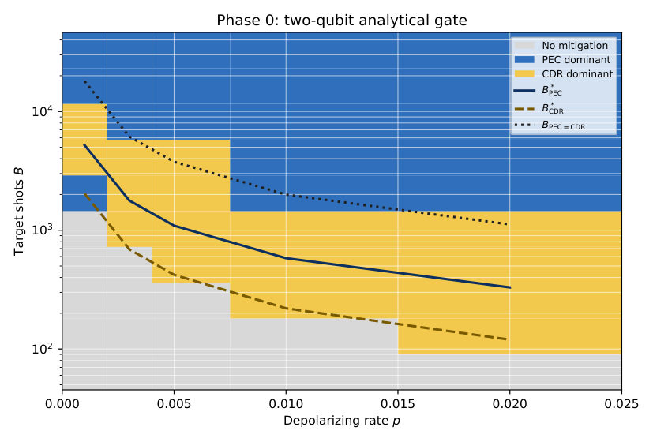
<figcaption class="paper-figure-caption"><b>Fig 1.</b> FIG. 1. Closed-form operating regions for the two-qubit example. The gray region is no mitigation,</figcaption>
</figure>
<figure class="paper-figure-card">
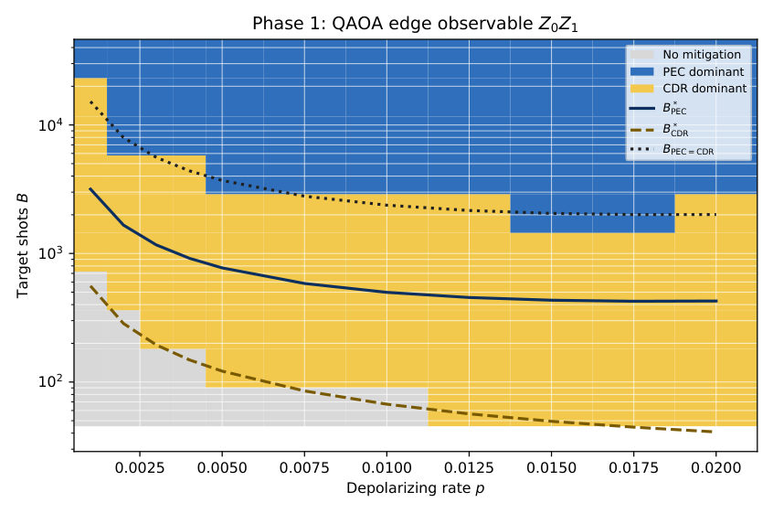
<figcaption class="paper-figure-caption"><b>Fig 2.</b> FIG. 2. Finite-shot QAOA comparison for the edge observable Z0Z1. The background color is</figcaption>
</figure>
<figure class="paper-figure-card">
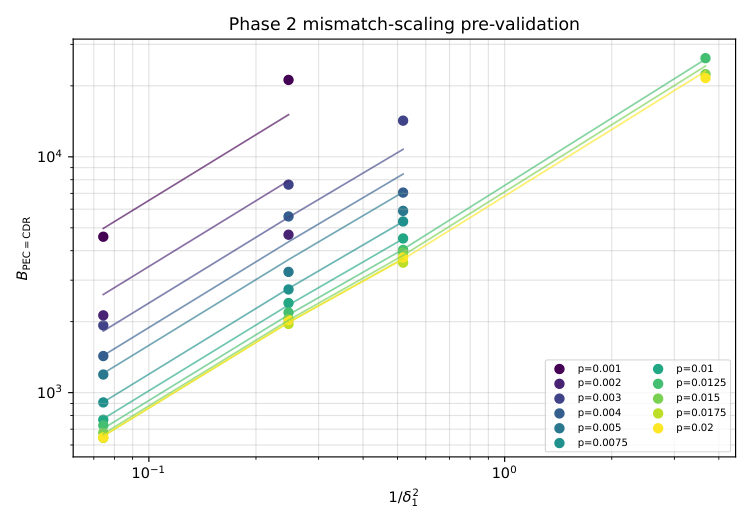
<figcaption class="paper-figure-caption"><b>Fig 3.</b> FIG. 3. Mismatch-scaling validation. The observed crossover scale follows the leading-order trend</figcaption>
</figure>
<figure class="paper-figure-card">
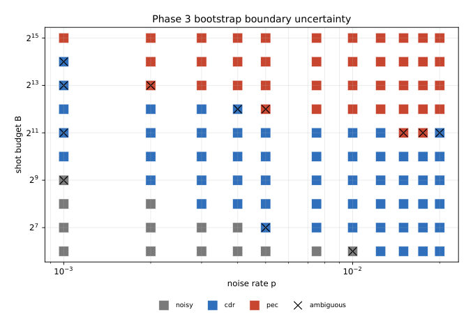
<figcaption class="paper-figure-caption"><b>Fig 4.</b> FIG. 4. Bootstrap boundary test. Ambiguity is concentrated near the predicted phase boundaries</figcaption>
</figure>
<figure class="paper-figure-card">
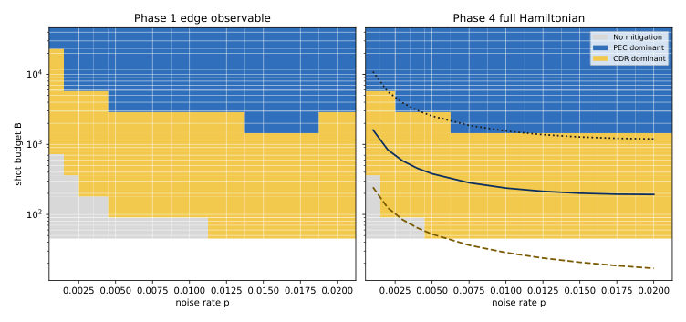
<figcaption class="paper-figure-caption"><b>Fig 5.</b> FIG. 5. Comparison between the baseline edge observable and the full commuting MaxCut Hamil-</figcaption>
</figure>

**Summary.** This paper rigorously compares Probabilistic Error Cancellation (PEC) and Clifford Data Regression (CDR) for mitigating noise in quantum measurements under limited experimental shots. It derives theoretical operating windows showing that the optimal technique switches based on the available shot budget and calibration quality. The findings provide crucial guidelines for designing practical, resource-aware quantum algorithms.

**Why it may be interesting.** This work provides rigorous theoretical tools for resource optimization in near-term quantum computation by quantifying the precise finite-shot limits where different error mitigation strategies succeed or fail.

Detailed structure

**Main problem.** The paper compares Probabilistic Error Cancellation (PEC) and Clifford Data Regression (CDR) for quantum error mitigation in the finite-shot regime to determine which technique minimizes Mean Square Error (MSE). It establishes operating windows where one method outperforms another based on shot budget.

**Main result.** A finite crossover budget exists, $B_{	ext{PEC=CDR}}(p)$, beyond which PEC dominates CDR's performance. The analysis shows that the optimal strategy depends critically on the available measurement resources (shot budget) and calibration mismatch.

**Method.** The authors derive mean-square-error boundaries for different estimators using small-$p$ expansions, comparing bias terms against variance overheads derived from Pauli observable measurements.

**Model / system.** The analysis is applied to estimating expectation values of Pauli observables (e.g., MaxCut Hamiltonian) in quantum circuits subjected to local depolarizing noise models. The comparison framework involves PEC using quasi-probability inverses and CDR trained on classical data regression.

**Key observables.** Mean Square Error (MSE), finite-shot gain ($\Delta$), bias terms ($b_M(p)$), variance overheads ($\sigma_M^2(p)$), and the crossover budget $B_{	ext{PEC=CDR}}(p)$.

**Important parameters / regimes.** First-order CDR calibration mismatch ($\delta_1$), shot budget ($B$), noise strength ($p$), and second-order coefficients ($\delta_2$).

**Assumptions / limitations.** The analysis assumes local noise models, linearity for the CDR approximation, and relies on small-$p$ expansions to derive asymptotic scaling laws.

**Figures summary.** Figures illustrate the predicted operating regions (PEC dominant vs. CDR dominant) across varying shot budgets and noise levels for specific observables like the MaxCut Hamiltonian.

**Paper structure.** The paper builds from general MSE formulations comparing mitigation techniques, derives theorems governing crossover points based on bias/variance trade-offs, provides detailed analysis of calibration mismatch requirements, and concludes with extensive numerical validation across various graph instances and Pauli channels.

Abstract

Quantum error mitigation on noisy devices is limited not only by residual bias but also by the shot noise and calibration errors introduced by the mitigation procedure itself. We derive finite-shot mean-square-error boundaries for probabilistic error cancellation (PEC), Clifford data regression (CDR), and no mitigation for noisy Pauli-observable estimates. Exact PEC removes the target bias under an exact noise inverse at the price of a quasi-probability variance overhead, whereas population linear CDR can have smaller target-shot variance but retains a calibration floor when the training and target noise responses do not match. This competition yields a finite CDR-dominant operating window whose upper endpoint scales as $B_{\mathrm{PEC}=\mathrm{CDR}}(p)\propto 1/(δ_1^2p)$, where $δ_1$ is the first-order CDR calibration mismatch. We further prove a target-response projection theorem showing that response-blind affine CDR removes the first-order bias only when the target noise response is affine in the ideal target value; otherwise a nonzero projection error gives an irreducible local calibration floor. The same mean-square-error formulation extends to second-order calibration, commuting Pauli Hamiltonians, finite CDR training shots, and residual PEC model bias. A closed-form two-qubit calculation and QAOA simulations support the predicted no-mitigation, CDR-dominant, and PEC-dominant regimes.

[↑ back to top](#top)

### [Genuine Global Kochen-Specker Contextuality as Classical Coordination Cost](http://arxiv.org/abs/2606.23577v1)

**Authors:** Ming Yang  
**Type:** theory · **Category:** quantum information and computing · **PDF:** <https://arxiv.org/pdf/2606.23577v1>  
**Analysis basis:** full PDF text, analyzed in chunks
**Topic relevance:** `entanglement & information structure` **2/5** · `Keldysh / 2PI / non-Gaussian methods` **1/5**

↔ Scroll figures horizontally

<figure class="paper-figure-card">
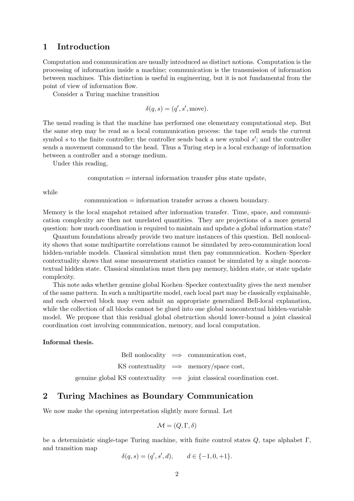
<figcaption class="paper-figure-caption"><b>Fig 1.</b> Low-resolution page preview, page 2</figcaption>
</figure>
<figure class="paper-figure-card">
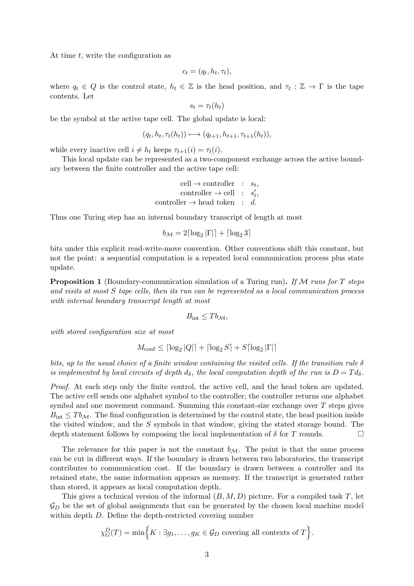
<figcaption class="paper-figure-caption"><b>Fig 2.</b> Low-resolution page preview, page 3</figcaption>
</figure>
<figure class="paper-figure-card">
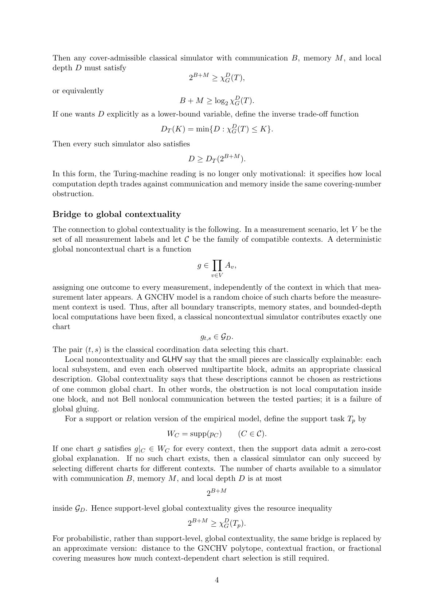
<figcaption class="paper-figure-caption"><b>Fig 3.</b> Low-resolution page preview, page 4</figcaption>
</figure>
<figure class="paper-figure-card">
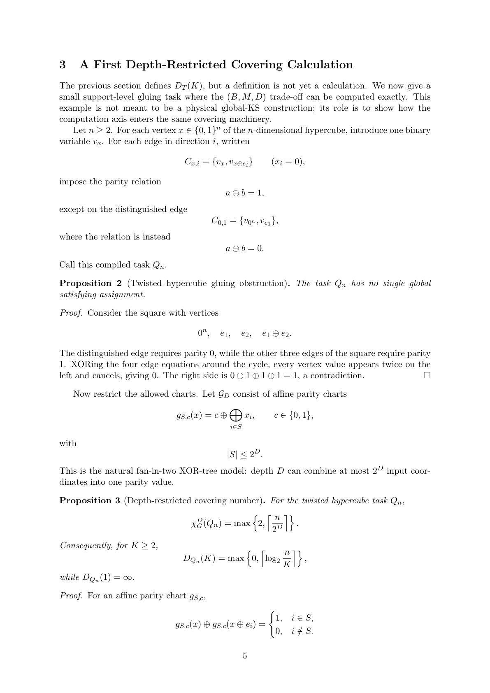
<figcaption class="paper-figure-caption"><b>Fig 4.</b> Low-resolution page preview, page 5</figcaption>
</figure>
<figure class="paper-figure-card">
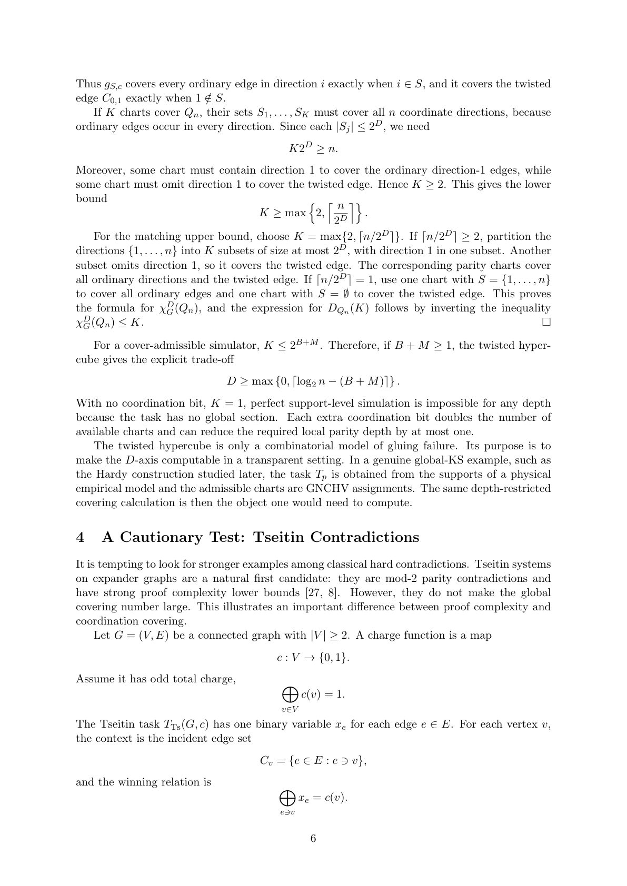
<figcaption class="paper-figure-caption"><b>Fig 5.</b> Low-resolution page preview, page 6</figcaption>
</figure>

**Summary.** This work develops a comprehensive framework to measure genuine global contextuality using 'coordination costs,' quantifying the minimum required classical communication and memory. By relating this cost to combinatorial covering numbers ($\chi_G$), it establishes that strong quantum contextuality imposes unavoidable lower bounds on any classical simulation protocol. This advances the understanding of resource separation between quantum and classical physics.

**Why it may be interesting.** It provides a rigorous theoretical tool—the coordination cost—to quantify the computational resources needed by classical simulators to mimic quantum correlations, which is fundamental for understanding resource limitations in quantum computation and communication protocols.

Detailed structure

**Main problem.** To establish a quantitative link between genuine global Kochen-Specker (KS) contextuality and the minimum classical coordination cost required to simulate quantum correlations.

**Main result.** The paper proves that genuine global KS contextuality lower-bounds a joint classical coordination cost involving communication, memory, and local computation depth ($B+M \ge \log_2 \chi_G(T)$).

**Method.** It develops an abstract framework using compiled task models and resource inequalities derived from covering numbers ($\chi_D^G$) to quantify the required classical resources.

**Model / system.** The analysis uses abstract information-theoretic models, generalizing Bell nonlocality (communication cost) and KS contextuality into a joint coordination cost for arbitrary constraint satisfaction tasks.

**Key observables.** Global contextual covering number ($\chi_G(T)$), depth-restricted covering number ($\chi_D^G(T)$), and the classical resource tuple $(B, M, D)$.

**Important parameters / regimes.** Coordination bits (the common unit of cost), repetition factor ($m$), and flag probabilities ($p_{F,n}$).

**Assumptions / limitations.** The analysis relies on defining a 'cover-admissible' classical simulator model and assumes the existence of an abstract lifting theorem to transfer bounds from simple KS seeds to global models.

**Figures summary.** Not specified (Notes describe mathematical theorems and derived inequalities rather than figure content).

**Paper structure.** The paper builds logically by first defining the resource cost framework, then introducing specific combinatorial tasks (like twisted hypercubes or Hardy games) to derive concrete lower bounds on $\chi_G(T)$, culminating in an abstract theorem that transfers these bounds from simple contextuality seeds to genuinely global models.

Abstract

Classical simulations of quantum correlations can fail because no low-communication local hidden-variable model exists, or because no single noncontextual hidden state can explain all compatible measurement contexts. This manuscript studies a third regime: genuine global Kochen-Specker contextuality, where local subsystems are noncontextual and the tested multipartite blocks are generalized-Bell-local, but the whole empirical model admits no global noncontextual hidden-variable explanation. We propose a coordination-cost framework in which communication, memory, and local computation are treated as different ways for a classical simulator to maintain a global classical explanation from locally available information. We introduce coordination bits, global contextual covering numbers, scaling laws for task families, and an abstract lifting theorem showing how classical simulation lower bounds for KS-contextual seed families can be transferred to genuinely global-KS models. As worked examples, we analyze a polarization-path Hardy obstruction and postselected KCBS-type tasks.

[↑ back to top](#top)

### [Machine Learning Optimal Quantum Error Correction Thresholds](http://arxiv.org/abs/2606.22194v1)

**Authors:** Dominik Seip, Luis Colmenarez, Markus Schmitt, Markus Müller  
**Type:** theory · **Category:** quantum information and computing · **PDF:** <https://arxiv.org/pdf/2606.22194v1>  
**Analysis basis:** full PDF text, analyzed in chunks
**Topic relevance:** `entanglement & information structure` **2/5** · `methods for driven-dissipative` **1/5**

↔ Scroll figures horizontally

<figure class="paper-figure-card">
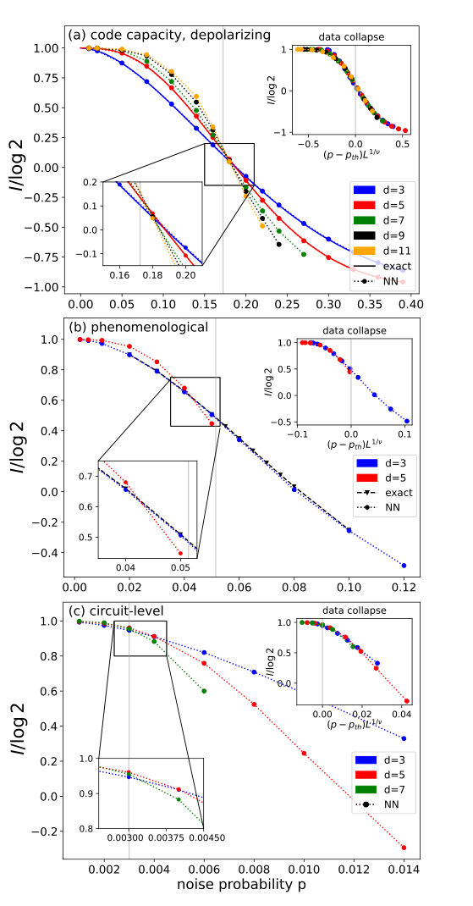
<figcaption class="paper-figure-caption"><b>Fig 1.</b> FIG. 1: Estimates of the CI obtained using our transformer- based model. We show (a) depolarizing noise in the code capacity setting, (b) phenomenological noise, and (c) circuit- level noise. Each dot corresponds to a single network trained at the particular noise probability. The threshold is marked by a grey vertical line and is either obtained by a finite-size scaling analysis or by the crossing of the CI. (a) The solid lines show the analytically obtained CI by computing p(λ|s) and p(s) exactly across a densely sampled range of noise values, whereas the markers only indicate selected individual noise values, while (b) the black dots show the numerical value of the CI, obtained following...</figcaption>
</figure>
<figure class="paper-figure-card">
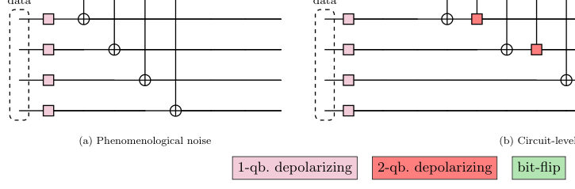
<figcaption class="paper-figure-caption"><b>Fig 2.</b> FIG. 2: Noisy X-type stabilizer readout circuits with error locations marked by colored boxes. (a) Phenomenological noise: a depolarizing channel (pink) is applied to all data qubits before readout; measurement errors are modeled via a bit-flip channel (green). All gates are assumed noiseless. (b) Circuit-level noise: idling data qubits decohere during ancilla initialization and measurement (pink); single- and two-qubit gates are followed by depolarizing channels (red). Measurement errors are again modeled via bit-flip channels. Idling errors during the execution of Hadamard- and CNOT-gate are not included. A specific gate ordering must be chosen based on the code layout to ensure fault...</figcaption>
</figure>
<figure class="paper-figure-card">
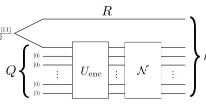
<figcaption class="paper-figure-caption"><b>Fig 3.</b> FIG. 3: Setup for the CI in the context of QEC. A noiseless reference qubit (R) is entangled with another qubit, which is then encoded by Uenc into a logical qubit (Q). This creates an equal superposition (|0R0L⟩+ |1R1L⟩)/ √</figcaption>
</figure>
<figure class="paper-figure-card">
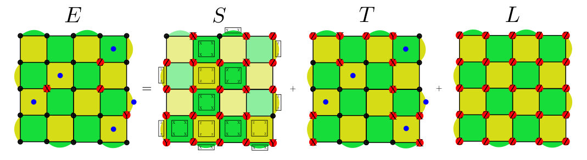
<figcaption class="paper-figure-caption"><b>Fig 4.</b> FIG. 4: STL-decomposition of an error chain E (left) into stabilizer S (middle left), pure error T (middle right), and logical operator L (right) on the surface code. Erroneous data qubits are marked by red dots. The excited stabilizers are marked by blue dots. Non-transparent plaquettes represent the stabilizer components of S. The pure error T excites the syndrome but commutes with all stabilizers and logicals. The logical operator L is chosen as the logical operator of maximal support, applying a Pauli operator to each data qubit. Adapted from Ref. [78].</figcaption>
</figure>
<figure class="paper-figure-card">
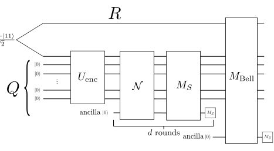
<figcaption class="paper-figure-caption"><b>Fig 5.</b> FIG. 5: Circuit for estimating conditional logical probabilities p(λ|s). A noiseless reference qubit R is prepared in a Bell pair with a physical qubit, which is subsequently encoded into a logical qubit, forming the entangled state 1 √</figcaption>
</figure>

**Summary.** The paper introduces using transformer neural networks to estimate the Coherent Information (CI), which serves as a theoretical upper bound on reliable quantum information transfer. By linking CI maximization to minimizing BCE loss, they create a powerful ML tool for estimating QEC thresholds. This approach significantly improves upon classical decoders and rigorously proves the optimality of advanced soft post-selection techniques.

**Why it may be interesting.** This work provides a powerful ML framework to tackle fundamental limits in quantum computation, offering quantitative tools (CI) that bridge information theory with practical decoder design for noisy qubits.

Detailed structure

**Main problem.** Determining optimal quantum error correction (QEC) thresholds is computationally hard due to noise susceptibility, requiring methods to quantify the maximum reliable information transfer rate.

**Main result.** The authors show that transformer-based neural networks can accurately estimate the Coherent Information (CI), providing superior threshold estimates and outperforming traditional decoders like MWPM.

**Method.** They develop a transformer model trained using Binary Cross-Entropy loss, establishing a direct link between this loss and the CI. They also introduce novel optimal soft post-selection schemes based on MLD cosets.

**Model / system.** The study focuses on QEC codes, particularly the surface code, analyzing performance under various noise models (depolarizing, phenomenological, circuit-level). The core mathematical tool is the Coherent Information (CI), which quantifies recoverable information.

**Key observables.** Coherent Information (CI), Logical Error Rate ($p_L$), Abort Probability ($p_{	ext{abort}}$), and Noise Thresholds.

**Important parameters / regimes.** Code distance ($d$), noise strength ($p$), and the post-selection parameter ($c$).

**Assumptions / limitations.** The analysis relies on establishing that minimizing BCE loss approximates maximizing CI, and that optimal post-selection is governed by MLD cosets.

**Figures summary.** Figures illustrate CI estimates showing threshold crossings across different noise types; other figures detail the QEC circuit setups (e.g., X/Z readout) and compare error rate scaling between various decoding strategies.

**Paper structure.** The paper progresses by first establishing the theoretical link between CI and BCE loss, then developing the transformer architecture for estimation, followed by proving the optimality of MLD-based soft post-selection schemes, and finally benchmarking performance across multiple noise models.

Abstract

As quantum computers remain susceptible to noise, QEC is essential for preserving logical information during computations. However, the performance of QEC codes breaks down beyond certain noise thresholds, revealing fundamental limits on their ability to protect quantum information. These limits can be characterized using information-theoretic measures such as the coherent information, which quantifies the maximum rate at which logical information can be reliably transmitted through a noisy quantum channel. In this work, we establish a direct connection between the CI and the binary cross-entropy loss used when training neural network decoders. Specifically, we show that the CI constitutes a sharp lower bound on the achievable loss for decoders that track logical operators across noisy channels. To this end, we develop a transformer-based neural network model based on maximum likelihood decoding. We train this network to estimate the CI and evaluate its performance on the surface code under three noise models: code capacity, phenomenological, and circuit-level noise. Our results demonstrate that the network accurately predicts CI and yields threshold estimates that closely match known theoretical limits. When used as a decoder, the network significantly outperforms the minimum weight perfect matching decoder in terms of logical error rate. We also introduce a novel soft post-selection scheme that independently treats uncertainty in both logical operators and relies on confidence-based filtering of the network's output. We prove that such post-selection strategies, based on the MLD cosets, are optimal, and demonstrate their scalability in terms of both logical error rate and abort probability. These findings establish transformer-based architectures as powerful tools for QEC and provide the first numerical evidence supporting the optimality and scalability of MLD-based post-selection.

[↑ back to top](#top)

### [Making Quantum Networks Work: Routing, Calibration, and Programmable Quantum Repeaters](http://arxiv.org/abs/2606.22316v1)

**Authors:** Vinay Kumar  
**Type:** theory · **Category:** quantum information and computing · **PDF:** <https://arxiv.org/pdf/2606.22316v1>  
**Analysis basis:** full PDF text, analyzed in chunks
**Topic relevance:** `QC/QI experiment` **2/5** · `quantum measurements` **1/5**

↔ Scroll figures horizontally

<figure class="paper-figure-card">
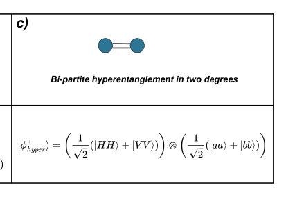
<figcaption class="paper-figure-caption"><b>Fig 1.</b> Figure 2.1: Examples of different types of entanglement. a) a bipartite entangled state depicted by the Bell state; b) two forms of tripartite entanglement, one following the GHZ state and the other the W state; c) a bipartite hyperentanglement in two degrees of freedom, combining polarisation and spatial modes (taken from [3])</figcaption>
</figure>
<figure class="paper-figure-card">
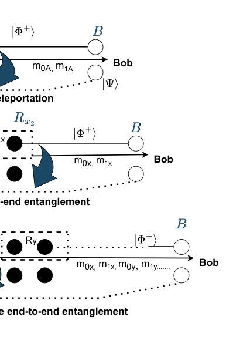
<figcaption class="paper-figure-caption"><b>Fig 2.</b> Figure 2.2: a) Teleportation: Teleportation of Alice’s qubit 𝐴1 from state |Ψ⟩0 to Bob’s qubit 𝐵(yielding state |Ψ⟩with fidelity |⟨Ψ0|Ψ⟩|2) is achieved via a Bell state measurement on qubits 𝐴1 and 𝐴2. Alice then communicates the resulting classical bits (𝑚0𝐴and 𝑚1𝐴) to Bob, who applies the appropriate quantum operations on 𝐵based on these outcomes. b) Entanglement Swapping: Entanglement swapping between Alice and Bob is achieved by converting two bipartite entangled pairs—one between Alice and repeater 𝑅𝑥(qubits 𝐴and 𝑅𝑥1) and one between repeater 𝑅𝑥and Bob (qubits 𝑅𝑥2 and 𝐵)—into a direct (end-to-end) entanglement between Alice and Bob (qubits 𝐴and 𝐵). This process is executed by...</figcaption>
</figure>
<figure class="paper-figure-card">
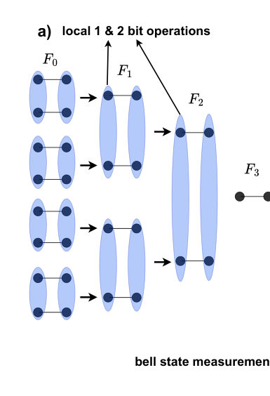
<figcaption class="paper-figure-caption"><b>Fig 3.</b> Figure 2.3: Using extra qubit resources to boost error resilience. a) Entanglement purification: Each EPR pair is paired with an additional, sacrificial EPR pair to enhance its fidelity (modified from [5]); b) Quantum error correction: Each EPR pair is supported by extra qubits arranged as encoded EPR pairs to reduce the error rate (modified from [44])</figcaption>
</figure>
<figure class="paper-figure-card">
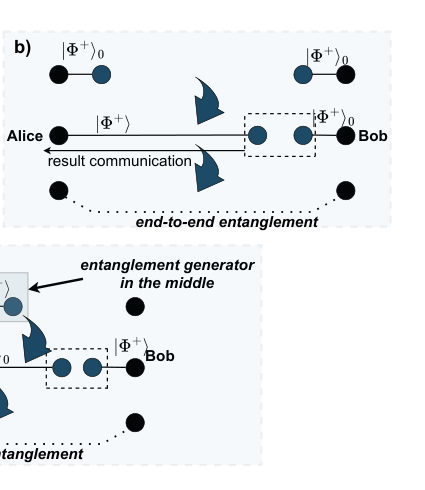
<figcaption class="paper-figure-caption"><b>Fig 4.</b> Figure 2.4: Entanglement generation schemes. a) MeetInTheMiddle: Each of two distant stations holds one half of an EPR pair. The entangled qubits are sent to an intermediate station, where entanglement swapping establishes a direct end-to-end entanglement between the remote stations; b) SenderRecever: An entangled qubit generated at the source station is transmitted to the destination station. Here, entanglement swapping between this qubit and one from the destination’s EPR pair creates a direct entanglement link between the stations; c) MidPointSource: An intermediate station produces an EPR pair and sends one qubit to the source station and the other to the destination station. At each...</figcaption>
</figure>
<figure class="paper-figure-card">
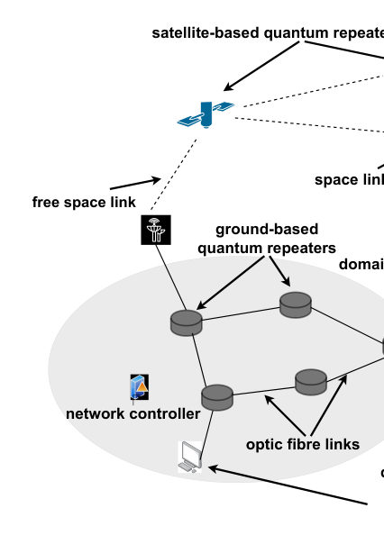
<figcaption class="paper-figure-caption"><b>Fig 5.</b> Figure 2.5: A schematic of the global quantum internet.</figcaption>
</figure>

**Summary.** This thesis addresses the complexity of building scalable quantum networks by integrating three previously separate domains: routing, link calibration, and hardware programmability. It develops a cross-layer framework that allows protocols to function reliably even with partial knowledge of imperfect physical links. The result is a comprehensive model for programmable quantum repeaters necessary for long-distance quantum communication.

**Why it may be interesting.** It provides a comprehensive blueprint for realizing quantum internet infrastructure by explicitly linking high-level network protocols (routing) to low-level physical control mechanisms (ISA/calibration), which is crucial for experimental realization using solid-state qubits.

Detailed structure

**Main problem.** The core challenge is designing scalable quantum networks by developing integrated protocols for routing, managing link imperfections via calibration, and implementing programmable hardware at the repeater nodes.

**Main result.** The thesis proposes a cross-layer framework where grey-box routing achieves robustness using partial knowledge, while explicit calibration schedules and an Instruction Set Architecture (ISA) enable reliable operation despite hardware drift.

**Method.** The work combines theoretical protocol development with architectural modeling, deriving optimal scheduling algorithms for link calibration and proposing a concrete ISA interface for physical quantum repeaters.

**Model / system.** The system is a quantum network designed for long-distance entanglement distribution. It models components like qubits (e.g., NV centers), entanglement swapping operations, and the interaction between network protocols and underlying hardware control layers.

**Key observables.** End to end fidelity ($\mathcal{F}_{	ext{ete}}$), Blocking Probability (BP), Throughput ($T$), and operational efficiency metrics.

**Important parameters / regimes.** Link fidelity decay rate ($\Gamma_e$), calibration overhead time, network topology parameters, and the size/capability of the programmable node register.

**Assumptions / limitations.** The research moves beyond assuming full or static knowledge of link properties, instead modeling partial knowledge and dynamic hardware limitations as fundamental constraints.

**Figures summary.** Figures illustrate entanglement generation schemes (MeetInTheMiddle, Sender-Receiver), network topologies (Grid/Cylindrical), and performance comparisons showing how BP and Fidelity vary with node quality ($\xi$) under different routing algorithms.

**Paper structure.** The paper progresses by first establishing the need for a cross-layer view; it then details routing strategies using grey-box approaches, followed by developing calibration-aware models for link operation, culminating in the proposal of an ISA for programmable repeater nodes.

Abstract

The quantum internet enables distribution of quantum states across distant nodes, supporting secure communication, distributed computing, and quantum sensing. Unlike classical networks, it is constrained by the no cloning theorem, probabilistic entanglement generation, decoherence, and hardware drift, making classical abstractions inadequate. Scalable quantum networking therefore requires new architectures, protocols, and optimisation methods that explicitly account for these limitations.   This thesis studies the architecture, routing, and operation of quantum networks under realistic constraints, focusing on bipartite entanglement distribution over quantum repeater networks. Key metrics include end to end fidelity, throughput, scalability, and fairness. At the network layer, routing strategies are developed beyond assumptions of homogeneous nodes and full network knowledge. Routing under heterogeneous repeater efficiencies shows how partial knowledge of node quality improves fidelity and reduces path blocking. A grey box routing approach is then introduced, where path selection relies only on topology and end to end estimates, achieving robustness and fairness without detailed link information.   At the link layer, calibration and hardware drift are addressed through a calibration aware model separating activation and calibration phases. For linear repeater chains, an optimal calibration schedule is derived to balance operation time and calibration overhead. This is extended to general topologies with shared links, where a greedy orchestration heuristic is proposed.   Finally, the thesis connects network protocols with hardware via an instruction set architecture for programmable quantum repeater nodes based on NV centers, enabling coherent programmability and linking physical operations to higher layer protocols.

[↑ back to top](#top)

### [Random dimension reduction and learning symmetric properties of quantum states](http://arxiv.org/abs/2606.23592v1)

**Authors:** Angus Lowe, Xinyu Tan  
**Type:** theory · **Category:** quantum information and computing · **PDF:** <https://arxiv.org/pdf/2606.23592v1>  
**Analysis basis:** full PDF text, analyzed in chunks
**Topic relevance:** `entanglement & information structure` **2/5** · `methods for driven-dissipative` **1/5**

↔ Scroll figures horizontally

<figure class="paper-figure-card">
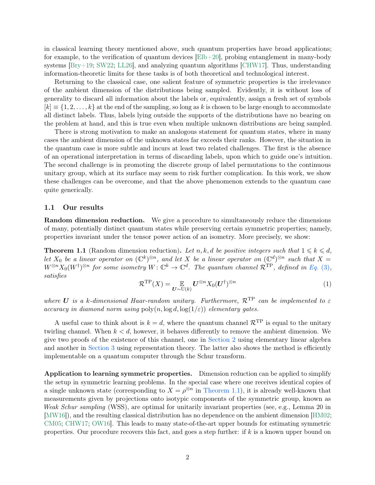
<figcaption class="paper-figure-caption"><b>Fig 1.</b> Low-resolution page preview, page 2</figcaption>
</figure>
<figure class="paper-figure-card">
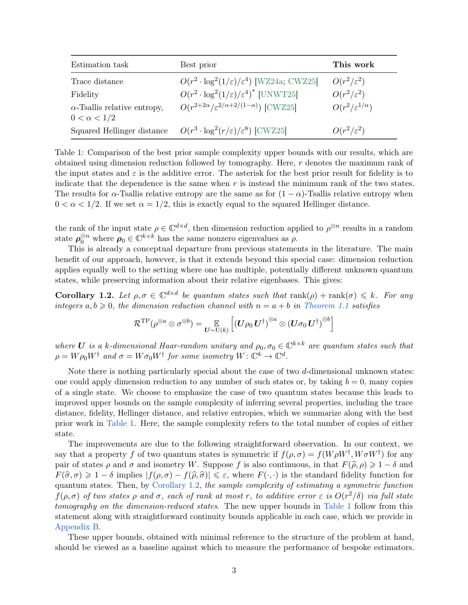
<figcaption class="paper-figure-caption"><b>Fig 2.</b> Low-resolution page preview, page 3</figcaption>
</figure>
<figure class="paper-figure-card">
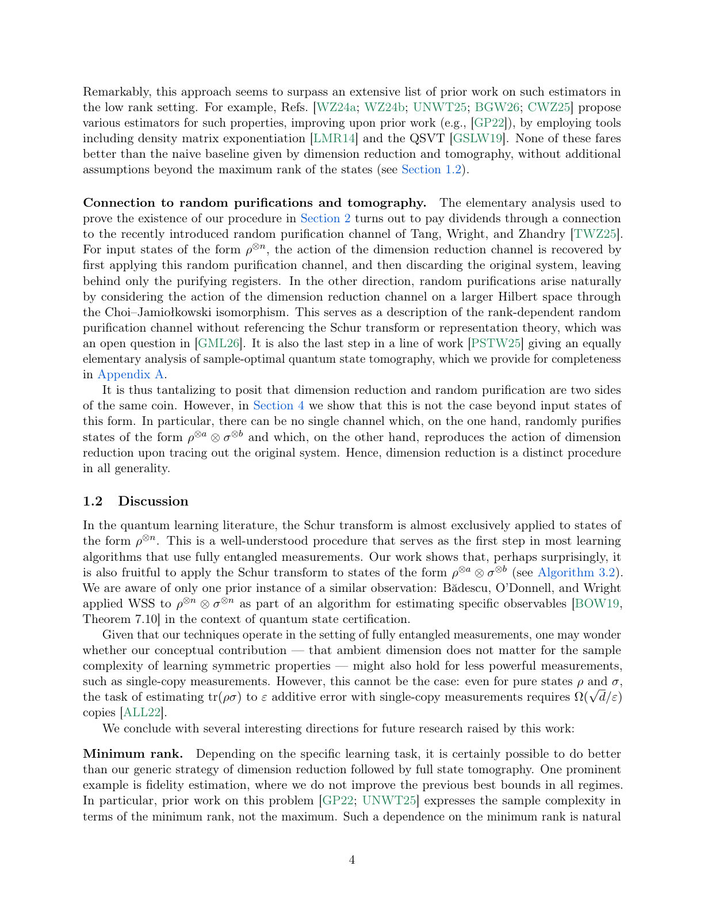
<figcaption class="paper-figure-caption"><b>Fig 3.</b> Low-resolution page preview, page 4</figcaption>
</figure>
<figure class="paper-figure-card">
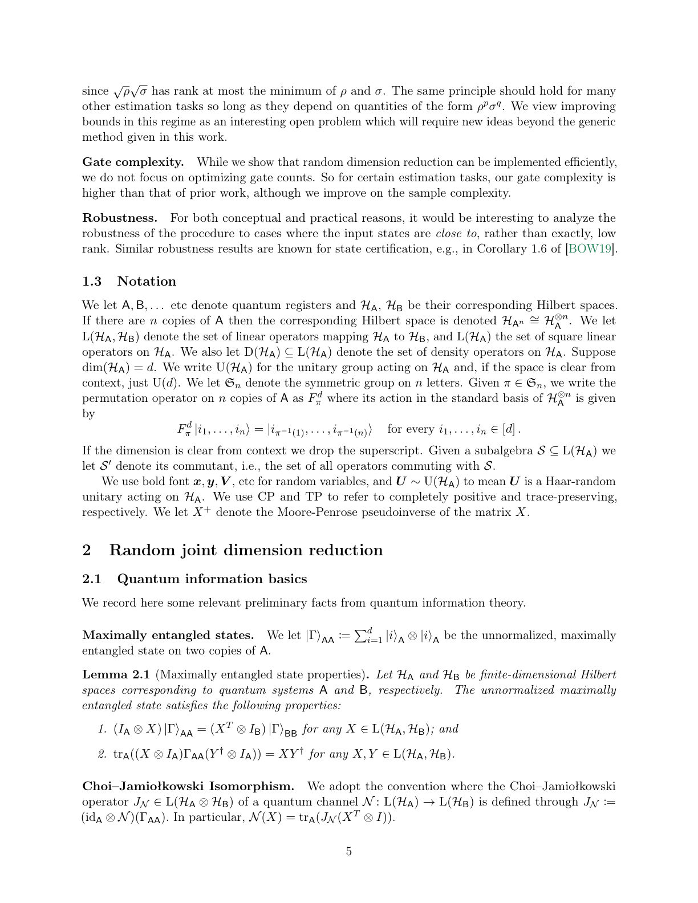
<figcaption class="paper-figure-caption"><b>Fig 4.</b> Low-resolution page preview, page 5</figcaption>
</figure>
<figure class="paper-figure-card">
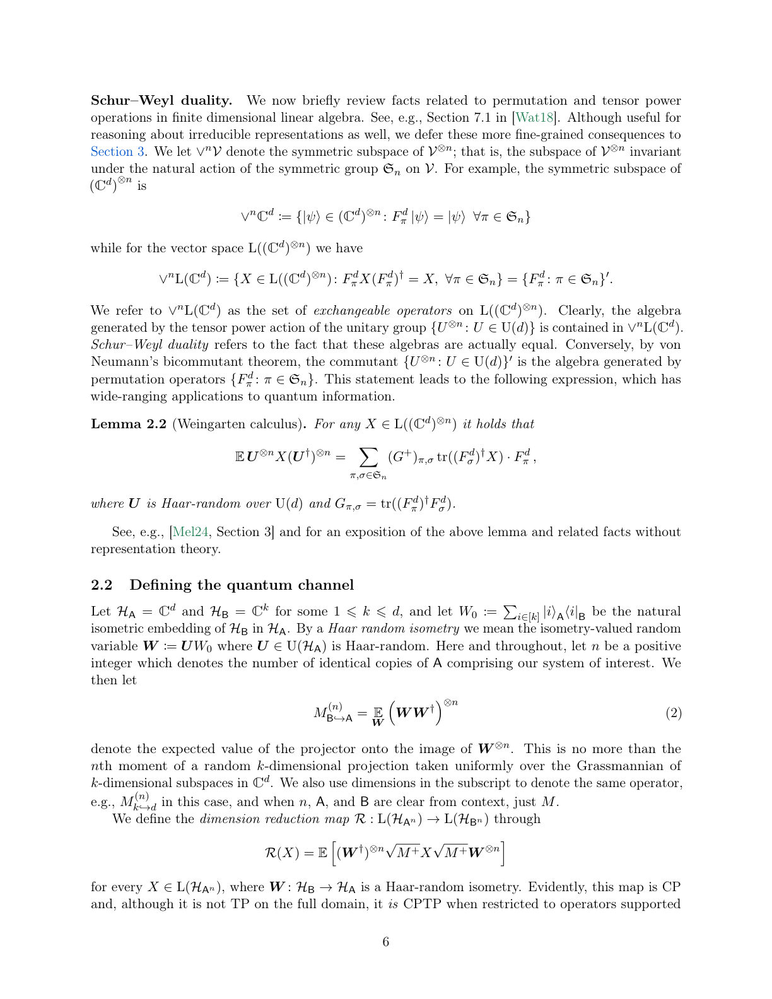
<figcaption class="paper-figure-caption"><b>Fig 5.</b> Low-resolution page preview, page 6</figcaption>
</figure>

**Summary.** This paper introduces random dimension reduction, a technique that efficiently reduces the effective dimensionality of multiple quantum states while preserving key symmetric properties. It demonstrates this method improves the sample complexity bounds for estimating various quantum distances and fidelities between states. The work also rigorously distinguishes this procedure from related concepts like random purification channels.

**Why it may be interesting.** It provides a powerful, dimension-independent tool (random dimension reduction) to analyze resource estimation tasks in quantum information theory, which is crucial for designing practical quantum protocols.

Detailed structure

**Main problem.** The paper develops a method called random dimension reduction to simultaneously reduce the dimensions of multiple quantum states while preserving properties invariant under the tensor power action of an isometry.

**Main result.** This procedure provides a black-box way to improve sample complexity for learning symmetric properties of quantum states, yielding improved upper bounds compared to prior methods.

**Method.** The core method involves defining and implementing the Random Dimension Reduction (RTP) channel using Haar-random unitaries and relating it mathematically to random purification channels via the Choi–Jamiołkowski isomorphism.

**Model / system.** The study concerns quantum states ($
ho, \sigma$) in potentially high ambient dimensions ($d$), which are analyzed by reducing them to lower effective dimensions ($k$). The analysis uses tensor products of these states and relies heavily on tools from representation theory like the Schur transform.

**Key observables.** Symmetric properties between pairs of quantum states, including trace distance, fidelity, relative entropies (e.g., $\alpha$-Tsallis), and Hellinger distance.

**Important parameters / regimes.** The maximum rank ($r$) of the input states, the ambient dimension ($d$), the number of copies ($n$), and the desired accuracy ($\epsilon$ or $\delta$).

**Assumptions / limitations.** The analysis assumes continuity for the properties being estimated and establishes that random dimension reduction is related to but distinct from random purification channels.

**Figures summary.** Table 1 compares sample complexity upper bounds for various symmetric properties, showing improvements achieved by using dimension reduction combined with full state tomography.

**Paper structure.** The paper progresses by first establishing the existence and implementability of the RTP channel (Theorem 1.1), applying it to improve sample complexity bounds for estimating quantum distances, then detailing its connection to random purification channels via the Choi-Jamiołkowski isomorphism, and finally proving that these two processes are distinct in general.

Abstract

We introduce a procedure called random dimension reduction that simultaneously reduces the dimensions of many, potentially distinct quantum states while preserving properties invariant under the tensor power action of an isometry. This provides a black-box method to replace the dimension with the maximum rank in the sample complexity of learning symmetric properties, even those depending on multiple input states. We show that dimension reduction followed by full state tomography yields improved upper bounds for estimating distances, fidelities, and relative entropies between pairs of states. We also give an efficient quantum circuit implementation of the procedure using the Schur transform.   Expressing the action of our procedure through the Choi-Jamiolkowski isomorphism reveals an intimate connection with the recently introduced random purification channel by Tang, Wright, and Zhandry. This perspective also completes an end-to-end analysis of sample-optimal tomography without requiring a reference to the Schur transform or Schur polynomials. Finally, we prove that there does not exist a random purification channel that simultaneously purifies copies of multiple, potentially different input states. Hence, random dimension reduction is related to, but distinct from, random purification.

[↑ back to top](#top)

### [Ultra-Peripheral Collisions as a Nuclear-Structure Interferometer with Interpretable Multitask Deep Learning](http://arxiv.org/abs/2606.23353v1)

**Authors:** Jing-Zong Zhang, Wang-Mei Zha, Lingxiao Wang, Guo-Liang Ma  
**Type:** theory · **Category:** disordered systems and neural networks · **PDF:** <https://arxiv.org/pdf/2606.23353v1>  
**Analysis basis:** full PDF text, analyzed in chunks
**Topic relevance:** `methods for driven-dissipative` **2/5** · `interference shaping light` **1/5**

↔ Scroll figures horizontally

<figure class="paper-figure-card">
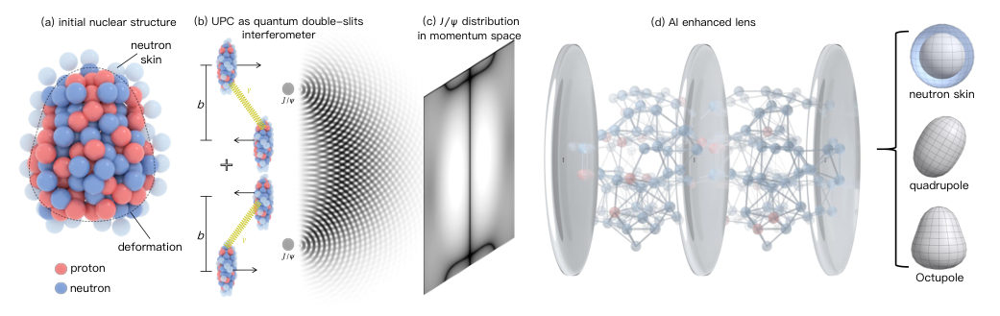
<figcaption class="paper-figure-caption"><b>Fig 1.</b> FIG. 1: (Color online) Nuclear interference tomography in ultra-peripheral collisions (UPCs). (a) Initial nuclear configurations with neutron skin and shape deformations. (b) The UPC system acting as a femtoscopic quantum interferometer with impact parameter b. (c) The resulting two-dimensional transverse momentum (p⊥) distribution of coherent J/ψ. (d) The deep-learning framework “AI- enhanced lens”) employed to reconstruct the initial nuclear-structure parameters from the final-state momentum image (e.g., neutron skin, quadrupole, and octupole).</figcaption>
</figure>
<figure class="paper-figure-card">

<figcaption class="paper-figure-caption"><b>Fig 2.</b> FIG. 2: (Color online) Transverse momentum distribution patterns of J/ψ photoproduction in Zr+Zr collisions at mid-rapidity (y = 0) with an impact parameter of b = 12 fm. Panel (a) shows the coherent contribution, characterized by dark interference fringes and bright diffraction spots, while panel (b) includes both coherent and incoherent processes.</figcaption>
</figure>
<figure class="paper-figure-card">
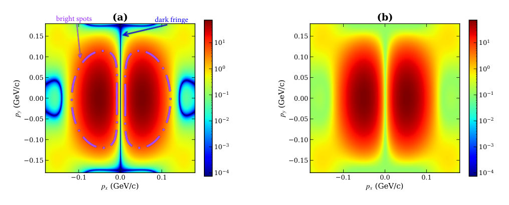
<figcaption class="paper-figure-caption"><b>Fig 3.</b> Figure 2 displays the simulated J/ψ photoproduction probability in the transverse momentum plane at mid-rapidity (y = 0) with b = 12 fm. Focusing on the coherent process in Fig. 2(a), within the transverse momentum range px, py ∈[−0.17, 0.17] GeV/c, the distribution exhibits a clear interference pattern characterized by a central dark fringe situated between a pair of bright spots. Experimental measurements are inherently contaminated by incoherent photoproduction, in which the photon inter- acts with an individual nucleon and breaks the coherence of the nucleus, often leading to nuclear dissociation. Unlike the coherent process, which acts as a slit-like interferometer, the incoherent...</figcaption>
</figure>
<figure class="paper-figure-card">
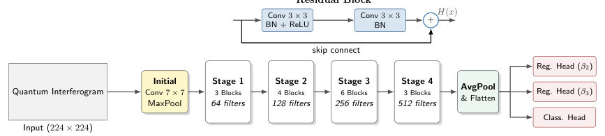
<figcaption class="paper-figure-caption"><b>Fig 4.</b> FIG. 3: Schematic of the Multitask deep-learning architecture. The pipeline accepts the two-dimensional transverse momentum distribution (Left) and processes it through a ResNet-34 backbone to extract geometric features. The Top row details the internal structure of a single Residual Block with a skip connection. The Bottom row shows the hierarchical feature extraction stages with increasing filter depths, leading to three task-specific heads (Right) for parameter regression and classification. Conv: Convolutional layer for local feature extraction. BN: Batch Normalization. ReLU: Non-linear activation function. MaxPool: Max pooling. Filters: Number of feature channels in each stage. H(x):...</figcaption>
</figure>
<figure class="paper-figure-card">
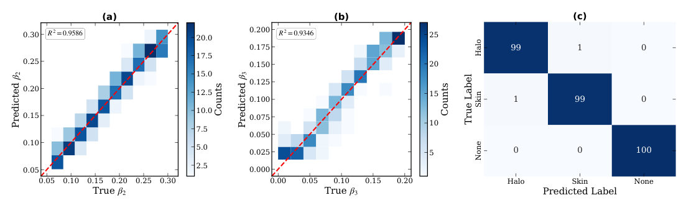
<figcaption class="paper-figure-caption"><b>Fig 5.</b> FIG. 4: (Color online) Two-dimensional histograms comparing model predictions with ground-truth values using coherent + incoherent input. The plots show the regression results for β2 (a) and β3 (b), and the confusion matrix for neutron-skin type classification (c).</figcaption>
</figure>

**Summary.** This work treats ultra-peripheral collisions as a quantum interferometer to probe subtle details of nuclear structure. It introduces an interpretable multitask deep learning model that analyzes the resulting transverse momentum distributions. This framework successfully disentangles overlapping signatures, allowing researchers to simultaneously constrain both nuclear shape deformation and neutron skin thickness.

**Why it may be interesting.** The application of advanced ML techniques (multitask learning) to interpret complex quantum interference patterns in high-energy nuclear physics is a novel intersection between AI and fundamental structure determination, providing new tools for analyzing data from facilities like the LHC or EIC.

Detailed structure

**Main problem.** Precisely determining nuclear structure parameters like shape deformation ($eta_2$) and neutron skin thickness is difficult because these signatures are entangled in classical scattering observables.

**Main result.** The proposed interpretable Multitask deep-learning framework successfully disentangles the signals, allowing for simultaneous extraction of both quadrupole deformation and neutron-skin thickness from transverse momentum distributions.

**Method.** A multitask deep learning model is trained on simulated 2D transverse momentum spectra to map complex interference patterns directly to multiple physical structure indicators.

**Model / system.** The system uses Ultra-Peripheral Collisions (UPCs) as a femtoscopic interferometer, analyzing coherent vector-meson photoproduction ($J/\psi$) in heavy nuclei like $^{96}	ext{Zr}$. The physics is modeled using deformed Woods–Saxon profiles for the nuclear density.

**Key observables.** Transverse momentum distributions ($rac{d^2P}{dp_x dp_y}$), which are analyzed to separate interference-dominated (deformation) and diffraction-dominated (neutron skin) information.

**Important parameters / regimes.** Quadrupole deformation ($eta_2$), Octupole deformation ($eta_3$), Neutron Skin Type, Transverse Momentum ($p_\perp$).

**Assumptions / limitations.** The method assumes that the deep learning framework can learn a nonlinear inverse mapping robust enough to overcome holographic degeneracy and detector smearing.

**Figures summary.** Figures illustrate the process from nuclear structure input to UPC interference patterns in $p_\perp$ space, showing how dark fringes relate to deformation ($eta$) and bright spots relate to neutron skin. The model's attention maps (PDA) are used to localize these distinct physical signals.

**Paper structure.** The paper establishes the physical problem using UPCs as interferometers; it details the theoretical framework linking nuclear structure to $p_\perp$ spectra; it introduces the multitask deep learning architecture; and finally, it demonstrates parameter extraction robustness against background noise by mapping results back to measurable flow coefficients ($v_n$) and yield ratios.

Abstract

Precise knowledge of nuclear structure is essential across fundamental physics, yet probing these structures is notoriously difficult. To address this challenge, ultra-peripheral collisions (UPCs) provide a femtoscopic tomography for imaging the atomic nucleus. UPCs offer a pristine electromagnetic pathway: coherent vector-meson photoproduction generates patterns of diffraction and two-source interference that directly encode the nuclear spatial density. Turning these patterns into quantitative constraints is, however, a challenging inverse problem, complicated by correlated sensitivities to deformation and neutron skin, phase smearing, and experimental backgrounds. Here we introduce an interpretable Multitask deep-learning framework that maps transverse momentum distributions to multiple nuclear-structure indicators simultaneously and identifies the kinematic regions driving each inference. We demonstrate the approach with coherent $J/ψ$ photoproduction in $^{96}_{40}\text{Zr} + ^{96}_{40}\text{Zr}$ collisions, showing that the learned features separate diffraction-dominated and interference-dominated information and provide analysis-ready observables for future high-luminosity data.

[↑ back to top](#top)

### [Bunny Codes: Broadening Superconducting Quantum Error Correction Capability through Advanced Control Engineering](http://arxiv.org/abs/2606.22853v1)

**Authors:** Runshi Zhou, Xingye Yuan, Linghang Kong, Fang Zhang, Kai Zhang, Zhaohui Yang, Jianxin Chen  
**Type:** theory · **Category:** quantum information and computing · **PDF:** <https://arxiv.org/pdf/2606.22853v1>  
**Analysis basis:** full PDF text, analyzed in chunks
**Topic relevance:** `QC/QI experiment` **2/5**

↔ Scroll figures horizontally

<figure class="paper-figure-card">
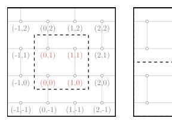
<figcaption class="paper-figure-caption"><b>Fig 1.</b> Figure 2: (a) An example of basic units on a hardware with hexagonal connectiv- ity in the dashed box, where circles indicate qubits and solid lines between circles are couplers connecting the two qubits. The qubits are labeled by their posi- tions in the Cartesian coordinate. (b) The hardware connectivity constructed from basic hexagonal units. Each dashed box is a basic unit that repeats on the rectangle with l = 4 and m = 2.</figcaption>
</figure>
<figure class="paper-figure-card">
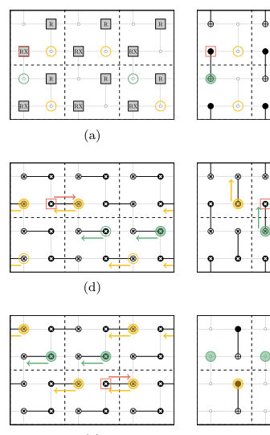
<figcaption class="paper-figure-caption"><b>Fig 2.</b> Figure 5: The parallelized syndrome extraction circuit constructed from the sequence of actions in Table 1, shown on a torus of size l = 3, m = 2 with hexagonal connectivity. We focus specifically on the Pauli operator measured by the X-ancilla qubit highlighted in the red box. The left (right) data qubits included in that stabilizer are highlighted in green (orange) circles, and their displacements, together with those of the corresponding sub-lattice, are tracked over the circuit.</figcaption>
</figure>
<figure class="paper-figure-card">
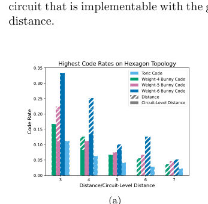
<figcaption class="paper-figure-caption"><b>Fig 3.</b> Figure 8: Highest code rates achieved for quantum error correction codes found with different connectivities topologies under periodic boundary conditions. The hatched region correspond to the code distance, while the solid part correspond to the circuit-level distance. Circuit-level distances are only calculated for codes with code distances up to 5. (a) Hexagons. (b) Squares.</figcaption>
</figure>
<figure class="paper-figure-card">
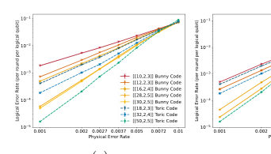
<figcaption class="paper-figure-caption"><b>Fig 4.</b> Figure 10: The logical error rate per round per logical qubit for some representa- tive Bunny codes under periodic boundary conditions. (a) Weight-4 stabilizers. (b) Weight-5 stabilizers. (c) Weight-6 stabilizers.</figcaption>
</figure>
<figure class="paper-figure-card">
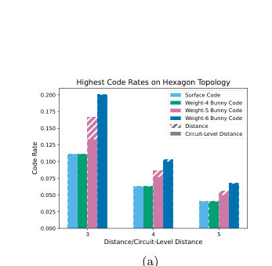
<figcaption class="paper-figure-caption"><b>Fig 5.</b> Figure 11: Highest code rates achieved for quantum error correction codes with different connectivities under open boundary conditions. (a) Hexagons. (b) Squares.</figcaption>
</figure>

**Summary.** The paper proposes 'Bunny codes' to advance superconducting Quantum Error Correction by leveraging an expanded native two-qubit gate set (CNOT and CXSWAP). Through systematic circuit construction and simulation, they demonstrate that these codes achieve superior code rates and lower logical error rates compared to established codes like the Toric code. This work proves that high performance can be achieved through smarter control engineering rather than requiring complex physical hardware modifications.

**Why it may be interesting.** This work is highly relevant as it directly addresses hardware constraints in quantum computing. By showing that gate set expansion can bypass complex physical wiring (long-range couplers), it offers a more scalable path toward fault-tolerant computation, which is crucial for realizing large-scale quantum processors.

Detailed structure

**Main problem.** The primary challenge is achieving high-performance Quantum Error Correction (QEC) on superconducting qubits while overcoming limitations imposed by restricted physical qubit connectivity and the need to avoid complex, long-range couplers.

**Main result.** The authors introduce 'Bunny codes,' which utilize an expanded native gate set (CNOT and CXSWAP) to achieve significantly higher code rates ($\sim 3	imes$ Toric code rate in periodic boundaries) and lower logical error rates compared to standard surface codes, all while maintaining local connectivity.

**Method.** The approach involves a bottom-up search strategy on 2D lattices, exhaustively constructing syndrome extraction circuits by tracking qubit displacements caused by sequential application of CNOT/CXSWAP gates. These verified circuits are then used to calculate code parameters and simulate logical error rates.

**Model / system.** The system is superconducting qubits arranged on a 2D planar grid (e.g., square or hexagonal lattice). The model relies on the assumption that the hardware natively supports an enlarged two-qubit gate set, specifically CNOT and CXSWAP gates.

**Key observables.** Code rate, logical error rates ($\epsilon$), code distance ($d$), and required qubit connectivity/stabilizer weights.

**Important parameters / regimes.** Stabilizer weights (e.g., weight-6), lattice size ($l 	imes m$), physical error rate ($\epsilon$), and the ratio of achievable code rate to that of the Toric or Surface codes.

**Assumptions / limitations.** The hardware supports CNOT and CXSWAP gates with equivalent gate duration, allowing for syndrome extraction without long-range couplers. Translational symmetry is assumed during the construction phase.

**Figures summary.** Figures illustrate lattice setups (surface/hexagonal), basic unit structures showing qubit labeling and couplers, examples of syndrome extraction circuits tracking sub-lattice displacements, and final comparisons of code rates and logical error rates for various codes under periodic and open boundary conditions.

**Paper structure.** The paper systematically develops a method to map physical gate actions (CNOT/CXSWAP) onto mathematical qubit displacement vectors. It then uses this framework to search for high-rate qLDPC codes, rigorously verifies the syndrome extraction circuits via commutation checks, and finally evaluates performance metrics like code rate and logical error rates on various lattice geometries.

Abstract

Drawing on advances in superconducting qubit control schemes that unlock enriched native gate sets at the hardware level, we systematically examine how harnessing this enlarged physical two-qubit gate pool -- specifically CNOT and CXSWAP -- streamlines syndrome extraction for certain qLDPC codes with nonlocal stabilizers. Through an exhaustive search, we discover a set of qLDPC codes with various stabilizer weights and distances that can be implemented on the two-dimensional nearest-neighbor qubit connectivity native to superconducting hardware while achieving performance equivalent to that of the direct CNOT implementation requiring long-range interactions. We refer to those codes as Bunny codes. Across all code distances we examine, the best Bunny codes with weight-6 stabilizers in periodic boundary conditions have a code rate approximately $3\times$ that of the toric code; when converted to open boundary conditions, they retain an approximately $2\times$ code rate advantage over the rotated surface code. In circuit-level simulation, we find that some Bunny codes exhibit logical error rates an order of magnitude lower than toric codes with comparable code rates. Our results demonstrate that high-performance quantum error correction can be achieved using an expanded gate set rather than long-range couplers, thereby significantly reducing hardware complexity.

[↑ back to top](#top)

### [Shuttling in Bidimensional Segmented Ion-Trap Quantum Processors with T-Junctions](http://arxiv.org/abs/2606.21899v1)

**Authors:** J. Durandau, C. A. Brunet, F. Schmidt-Kaler, U. Poschinger, F. Mailhot, Y. Bérubé-Lauzière  
**Type:** theory · **Category:** other · **PDF:** <https://arxiv.org/pdf/2606.21899v1>  
**Analysis basis:** full PDF text, analyzed in chunks
**Topic relevance:** `QC/QI experiment` **2/5**

↔ Scroll figures horizontally

<figure class="paper-figure-card">
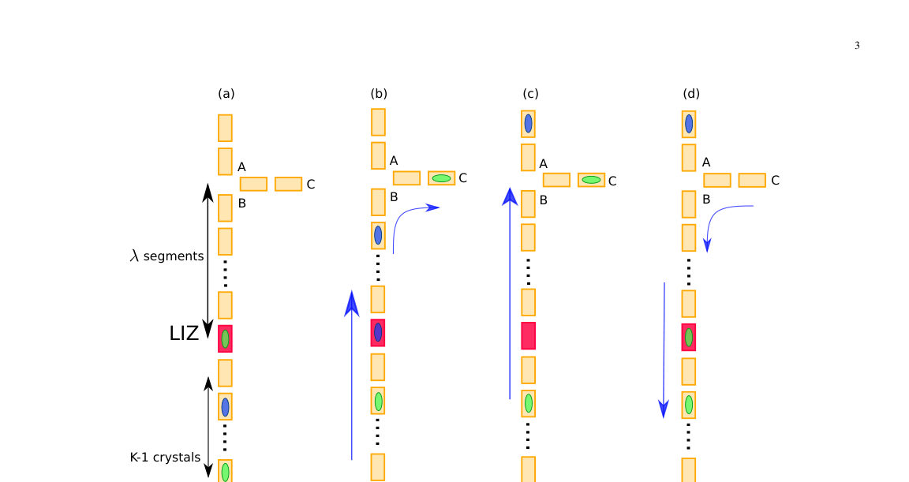
<figcaption class="paper-figure-caption"><b>Fig 1.</b> Fig. 1: Illustration of the exchange of ions in a reservoir architecture between the two green crystals with K −1 crystals overall present in the trap. (a) Initial position of crystals. (b) The top green crystal is sent to branch C of the reservoir; the rest of the crystal chain moves up to just below the reservoir in branch B. (c) The K −2 blue crystals are sent to branch A and the bottom green crystal is sent to the LIZ. (d) The top green crystal is sent to branch B and then to the LIZ for ion swap. Both crystals are now adjacent, the junction cost is (K −2)CAB + 2CBC.</figcaption>
</figure>
<figure class="paper-figure-card">
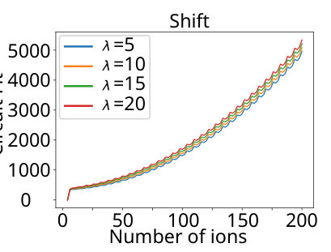
<figcaption class="paper-figure-caption"><b>Fig 2.</b> Fig. 2: Circuit fit for a Shift circuit as a function of the number of ions for different values of λ (distance between LIZ and junction).</figcaption>
</figure>
<figure class="paper-figure-card">
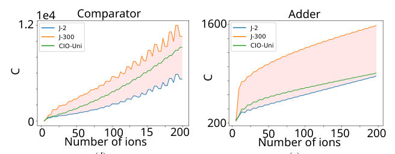
<figcaption class="paper-figure-caption"><b>Fig 3.</b> Fig. 3: Simulation results for the circuit fit in a reservoir architecture with λ = 15 for (a) the QFT, (b) Carry, (c) Shift, (d) Adder, and (e) Comparator circuits. The green curve CIO-Uni is the circuit fit for a linear uni-LIZ architecture, serving as reference. J-2 and J-300 are bounding curves respectively corresponding to a junction cost of 2 and 300.</figcaption>
</figure>
<figure class="paper-figure-card">
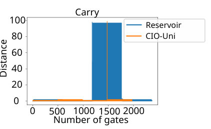
<figcaption class="paper-figure-caption"><b>Fig 4.</b> Fig. 4: Comparison of the evolution of the circuit disor- ganization as shuttling proceeds in CIO-Uni and Reservoir architectures for the Carry circuit.</figcaption>
</figure>
<figure class="paper-figure-card">
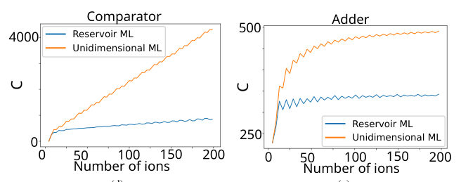
<figcaption class="paper-figure-caption"><b>Fig 5.</b> Fig. 6: Circuit fit for a multi-LIZ reservoir architecture with λ = 5, and k = 12 compared with a linear multi-LIZ architecture (without reservoir) with k = 3. Note that for a linear multi-LIZ architecture, the smaller k is, the more efficient is the architecture, hence the choice for k = 3.</figcaption>
</figure>

**Summary.** This paper rigorously compares the efficiency of shuttling ions in 1D versus 2D segmented ion-trap quantum processors. By developing cost functions for various circuit building blocks, the authors prove that 2D architectures utilizing junctions significantly improve scalability over linear traps. The work culminates in proposing cell-based tiling strategies to guide the co-design of future large-scale quantum hardware.

**Why it may be interesting.** This work directly addresses hardware constraints in trapped-ion quantum computing by providing quantitative metrics for architectural optimization based on physical movement costs, which is crucial for scaling up any ion trap system.

Detailed structure

**Main problem.** The primary goal is optimizing quantum processor architectures by comparing the shuttling costs associated with implementing quantum circuits in linear versus two-dimensional segmented ion-trap systems.

**Main result.** The study demonstrates that 2D architectures, especially those incorporating T-junctions and cell tiling, significantly outperform 1D linear traps for scaling up qubit counts at equivalent transport cost.

**Method.** The authors introduce individual cost functions to quantify the total cost of implementing standard quantum building blocks (like QFT or Adders) in both 1D and 2D trap geometries.

**Model / system.** The physical system is a shuttling-based trapped-ion quantum processor using segmented Paul traps. Architectures analyzed include linear chains, reservoir designs with T-junctions, Star, Tree, and planar Cell arrangements.

**Key observables.** Circuit fit cost (Total cost / Number of gates), Circuit disorganization during shuttling, and the scaling ratio improvement between 1D and 2D architectures.

**Important parameters / regimes.** Junction cost ($	ext{CAB}$), displacement costs, number of ions ($N$), depth ($d$) in Star/Tree geometries, and junction topology (T-, X-, Y-junctions).

**Assumptions / limitations.** Assumptions include the symmetry of junction costs ($	ext{A-B} = 	ext{B-A}$) and that the benefit of 2D structures is realized when junction costs are low relative to linear displacement costs.

**Figures summary.** Figures compare circuit fit for various circuits across different architectures (e.g., QFT, Shift) and show how cost scales with depth ($d$) in Star geometries or how disorganization evolves between Reservoir and Linear designs.

**Paper structure.** The paper progresses from establishing the limitations of 1D traps to introducing and analyzing 2D structures like reservoirs, then comparing advanced topologies (Star, Tree), and finally proposing cell-based tiling methods to achieve planar scalability.

Abstract

Shuttle-based trapped ion quantum processors typically employ a one-dimensional (1D) linear architecture to transport ion-qubits between one ore more laser interaction zones where the quantum gates are implemented, along with several qubit register storage segments. The two-dimensional (2D) quantum CCD architecture employs also T- or X-junctions for an improved scaling and efficiency. Here, we explore the shuttling layer in the compilation of quantum algorithm typical building blocks in such architecture. To weight the effort of linear shuttle and junction shuttle, we introduce individual cost functions for each operation. This allows comparing the total cost for quantum circuit building blocks such as the QFT, Carry, Adder, Shift, and Comparator circuits. We study their scaling properties with increased qubit numbers. At equivalent transport cost for junction and linear shuttling, we show that 2D architectures outperform the 1D linear trap with the ratio improving as the number of ions increases. Finally, we discuss the use of cells, such that the entire processor is constructed from a 2D array of such interconnected cells. The work aims to optimize quantum processor architectures, implementing a co-design that fits to the specific task and scaling up in a shuttle-efficient way.

[↑ back to top](#top)

### [Neural Polaron: Learning Quasiparticle Operators in Quantum Many-Body Systems](http://arxiv.org/abs/2606.22644v1)

**Authors:** Shang-Shun Zhang  
**Type:** theory · **Category:** disordered systems and neural networks · **PDF:** <https://arxiv.org/pdf/2606.22644v1>  
**Analysis basis:** full PDF text, analyzed in chunks
**Topic relevance:** `Keldysh / 2PI / non-Gaussian methods` **1/5** · `analog quantum simulation` **1/5** · `exotic spin models in light-matter` **1/5** · `methods for driven-dissipative` **1/5** · `spintronics-quantum-optics interface` **1/5**

↔ Scroll figures horizontally

<figure class="paper-figure-card">
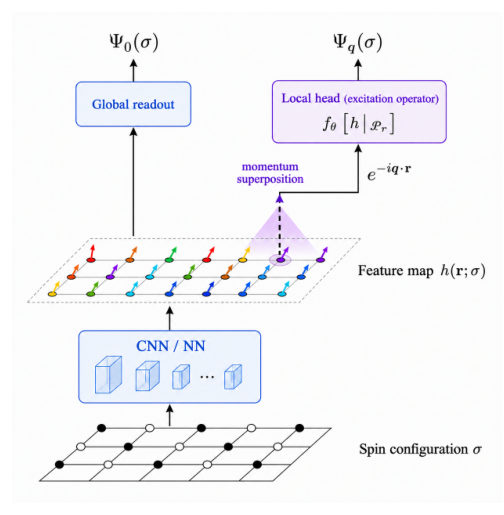
<figcaption class="paper-figure-caption"><b>Fig 1.</b> FIG. 1. Schematic of the neural polaron ansatz. A ground- state neural network maps a spin configuration σ to a spa- tial feature map h(r; σ) that encodes many-body correlations. The same feature map is used to construct both the ground- state amplitude Ψ0(σ) via a global readout and quasiparticle excitations via a local neural head function fθ. The head acts on a finite spatial neighborhood of each site, defining a local excitation operator Or ≡fθ h h Pr</figcaption>
</figure>
<figure class="paper-figure-card">
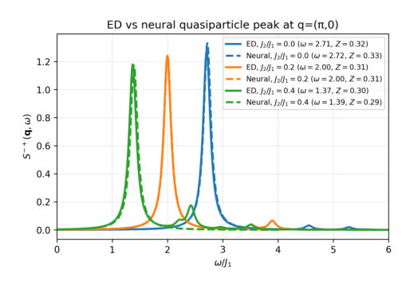
<figcaption class="paper-figure-caption"><b>Fig 2.</b> FIG. 2. Exact diagonalization benchmark on a 4 × 4 lattice. Shown is the dynamical structure factor S+−(q, ω) at fixed momentum q = (π, 0) for J2/J1 = 0, 0.2, and 0.4. The neu- ral polaron results (dashed lines) are compared with exact diagonalization (solid lines). Both the excitation energy and the spectral weight of the quasiparticle peak are accurately reproduced across the interaction range, demonstrating that the ansatz captures the position and residue of the magnon pole.</figcaption>
</figure>
<figure class="paper-figure-card">
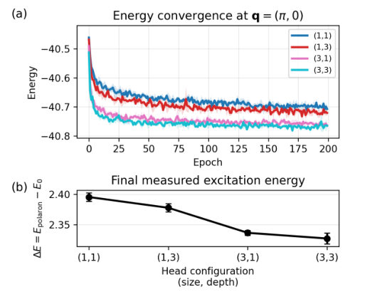
<figcaption class="paper-figure-caption"><b>Fig 3.</b> FIG. 3. Expressibility of the neural polaron head function on an 8 × 8 lattice at q = (π, 0) and J2/J1 = 0. (a) Energy versus training epoch for different head architectures charac- terized by kernel size and depth. Curves show seed-averaged results, with shaded regions indicating seed-to-seed variation. Increasing the spatial extent of the head systematically lowers the variational energy, indicating that a finite spatial dress- ing cloud is required for an accurate description of the (π, 0) quasiparticle. (b) Estimated energy Eest as a function of head architecture (size, depth).</figcaption>
</figure>
<figure class="paper-figure-card">
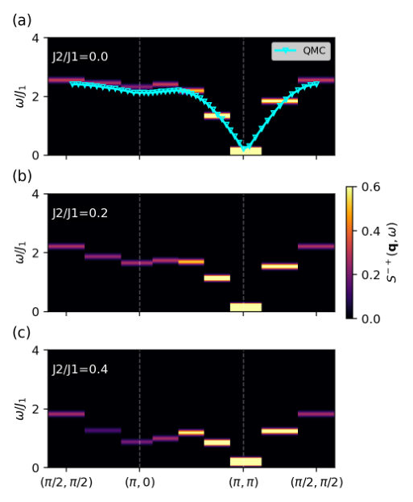
<figcaption class="paper-figure-caption"><b>Fig 4.</b> FIG. 4. Momentum-resolved dynamical structure factor S+−(q, ω) on an 8 × 8 lattice along the high-symmetry path (π/2, π/2) →(π, 0) →(π, π) →(π/2, π/2) for representa- tive values of J2/J1. Color maps show the neural polaron results. For (a) J2/J1 = 0, quantum Monte Carlo (QMC) data [41] is overlaid for comparison. The ansatz accurately reproduces the magnon dispersion and spectral weight, in- cluding the roton-like minimum near q = (π, 0). As J2/J1 increases (see panel (b), (c)), the evolution of dispersion and intensity reflects the enhanced frustration and modification of quasiparticle dressing.</figcaption>
</figure>

**Summary.** The paper introduces the 'neural polaron' ansatz to calculate quantum excitations by modeling quasiparticle operators as local dressings on top of a learned ground state. By applying this method to the $J_1$-$J_2$ Heisenberg model, the authors successfully reproduce complex dynamical features like magnon dispersions and roton minima. This establishes neural networks as a powerful tool for extending quantum state descriptions from static properties to full dynamic response.

**Why it may be interesting.** This work provides a physically transparent and computationally scalable framework for calculating dynamic response functions in strongly correlated systems, bridging the gap between static ground-state neural representations and time/momentum-dependent physics.

Detailed structure

**Main problem.** The central challenge is understanding the dynamical properties (excitation spectra) of quantum many-body systems, which require information beyond a simple ground-state wave function.

**Main result.** The proposed neural polaron ansatz accurately reproduces magnon dispersions and spectral weights for the $J_1$-$J_2$ Heisenberg model, capturing subtle features like the $(\pi,0)$ anomaly.

**Method.** The method parameterizes quasiparticle excitations using a local dressing operator (the 'polaron head') acting on the feature map of a pre-trained ground-state neural network, separating ground-state correlations from excitation dynamics.

**Model / system.** The study focuses on the square-lattice $J_1$-$J_2$ Heisenberg model, analyzed in its Néel phase regime ($0 < J_2/J_1 < 0.4$). The Hamiltonian involves nearest-neighbor ($J_1$) and next-nearest-neighbor ($J_2$) couplings.

**Key observables.** Dynamical structure factor $S_{+-}(q, \omega)$, magnon dispersions, spectral weights, and the quasiparticle residue $	ilde{Z}_q$.

**Important parameters / regimes.** $J_1$, $J_2$, and the ratio $J_2/J_1$; momentum vectors like $q = (\pi, 0)$ and $q = (\pi/2, \pi/2)$.

**Assumptions / limitations.** The excitation operator is assumed to be local or quasi-local; the ground state is parameterized by a CNN structure, and the ansatz relies on an inductive bias separating dressing from correlations.

**Figures summary.** Figures compare $S_{+-}(q, \omega)$ across varying frustration ($J_2/J_1$), showing agreement with benchmarks. Other figures illustrate energy convergence based on the spatial extent of the neural head architecture.

**Paper structure.** The paper introduces the ansatz by separating ground-state encoding from excitation dressing. It then validates this structure by testing its ability to reproduce known physical results (magnon dispersions) across varying lattice parameters, concluding with an analysis of the required complexity of the local operator.

Abstract

Understanding dynamical properties of quantum many-body systems remains a central challenge because excitations generally require information beyond a ground-state wave function. Here we introduce a neural polaron ansatz that represents quasiparticle excitations by neural many-body operators acting on a correlated ground state. Instead of learning an independent excited-state wave function, the method parameterizes a local dressing operator through a compact neural head defined on the feature map of a pretrained ground-state network. This operator-based construction builds in translation symmetry, momentum resolution, and quasiparticle locality, while separating ground-state correlations from excitation-specific dressing. We benchmark the method on the square-lattice $J_1$-$J_2$ Heisenberg model, where it accurately reproduces magnon dispersions and spectral weights over a broad range of frustration. In particular, it captures nontrivial many-body features including the $(π,0)$ anomaly and its progressive softening with increasing $J_2/J_1$. These results establish neural operators as a physically transparent route for extending neural quantum states from ground-state properties to dynamical response.

[↑ back to top](#top)

### [The Physics Behind Symmetrization](http://arxiv.org/abs/2606.22298v1)

**Authors:** R. E. Kastner  
**Type:** theory · **Category:** other · **PDF:** <https://arxiv.org/pdf/2606.22298v1>  
**Analysis basis:** full PDF text, analyzed in chunks
**Topic relevance:** `Keldysh / 2PI / non-Gaussian methods` **1/5** · `correlated / nonlocal dissipation` **1/5** · `entanglement & information structure` **1/5** · `interference shaping light` **1/5** · `non-equilibrium dynamics` **1/5**

↔ Scroll figures horizontally

<figure class="paper-figure-card">
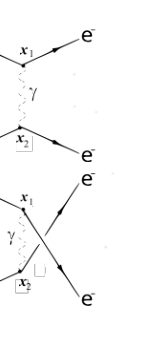
<figcaption class="paper-figure-caption"><b>Fig 1.</b> Figure 1. Feynman diagrams for Møller scattering t- and u-channels, top and bottom respectively</figcaption>
</figure>
<figure class="paper-figure-card">
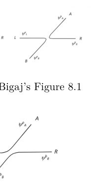
<figcaption class="paper-figure-caption"><b>Fig 2.</b> Figure 3. Bigaj’s Figure 8.1, first image.</figcaption>
</figure>
<figure class="paper-figure-card">
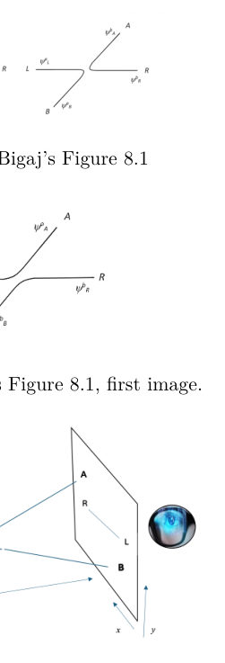
<figcaption class="paper-figure-caption"><b>Fig 3.</b> Figure 4. Bigaj’s depiction from a different viewpoint.</figcaption>
</figure>
<figure class="paper-figure-card">
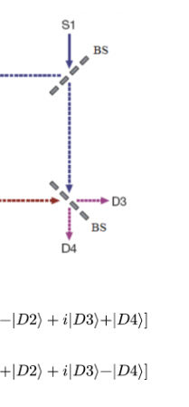
<figcaption class="paper-figure-caption"><b>Fig 4.</b> Figure 5. Interference of two electrons and evolution of each source state</figcaption>
</figure>
<figure class="paper-figure-card">
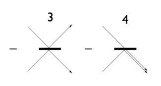
<figcaption class="paper-figure-caption"><b>Fig 5.</b> Figure 7. Different possible processes underlying the Hong-Ou-Mandel effect. The third process is reflection from both surfaces, in contrast to the second which is transmission through both surfaces.</figcaption>
</figure>

**Summary.** The paper challenges the universal postulate of state symmetrization, arguing that this rule often stems from an oversimplification of label redundancy. By analyzing scattering processes like Møller scattering, the author demonstrates that physical antisymmetry arises specifically from the structure of interacting field operators, not merely from abstract symmetry requirements.

**Why it may be interesting.** This is highly relevant as it questions foundational assumptions in quantum field theory and many-body physics regarding how indistinguishability manifests—whether through abstract state constraints or concrete interaction dynamics.

Detailed structure

**Main problem.** The paper critically examines whether the requirement for state symmetrization in quantum mechanics is a fundamental postulate based on label redundancy or if it must arise specifically from physical interaction processes.

**Main result.** Symmetrization is argued not to be a universal postulate but rather a procedure demanded by specific physics, such as the commutation relations of field operators during scattering events like Møller scattering.

**Method.** The analysis uses comparison between formal state symmetrization assumptions and results derived from calculating scattering amplitudes using Feynman diagrams and second quantization formalism.

**Model / system.** The primary model is multi-particle quantum systems, specifically focusing on electron-electron (Møller) scattering. The discussion also references bosonic effects like photon bunching (HBT/HOM).

**Key observables.** Scattering amplitudes for $t$- and $u$-channels; interference patterns; anti-bunching effects.

**Important parameters / regimes.** The relative sign difference between the $t$ and $u$ scattering channels is crucial, as is the distinction between non-interacting vs. interacting Hamiltonians.

**Assumptions / limitations.** The paper challenges the assumption that physical relevance must strictly map onto observable outcomes (critique of uncritical empiricism) and distinguishes between formal state symmetry and process-dependent correlation.

**Figures summary.** Figures illustrate Feynman diagrams for Møller scattering ($t$- and $u$-channels), wavefunction propagation showing 'crossing' nature, and setups for Hong-Ou-Mandel interference.

**Paper structure.** The paper proceeds by establishing the conventional view of symmetrization based on label redundancy, then systematically dismantling this premise using counterexamples from electron scattering (Møller) and photon correlation effects (HOM), concluding that physical interactions dictate the required symmetry structure.

Abstract

It is often asserted that quantum states for same-type particles must be symmetrized due to ``label redundancy,'' i.e. the assumption that the permutations of labels in direct-product states do not reflect any real physical distinction and thus their permutations constitute an ``exchange degeneracy''. This assumption is directly challenged by the case of scattering of same-type particles such as electrons, which involves two physically distinct scattering channels effectively corresponding to permutation of the labels. I discuss this counterexample with critical attention to an extant portrayal in the literature that omits pertinent physical content. I further note ways in which the assumption that symmetrization must be universally imposed is not supported by actual calculations of particle interactions, nor by seemingly viable particle states based on preparations and outcomes.

[↑ back to top](#top)

### [Multi-scale reconstruction of single-ion damage tracks in diamond via nitrogen-vacancy centers](http://arxiv.org/abs/2606.23621v1)

**Authors:** Daniel G. Ang, Jiashen Tang, Maximilian Shen, Michael Titze, Gavishta Liyanage, Jordan Chapman, Chinmay Bharathulwar, Andrew T. Gilpin, Tanguy Terlier, Edward S. Bielejec, Vsevolod Ivanov, Ronald L. Walsworth  
**Type:** both · **Category:** disordered systems and neural networks · **PDF:** <https://arxiv.org/pdf/2606.23621v1>  
**Analysis basis:** full PDF text, analyzed in chunks
**Topic relevance:** `QC/QI experiment` **1/5** · `methods for driven-dissipative` **1/5** · `quantum measurements` **1/5** · `spintronics-quantum-optics interface` **1/5**

↔ Scroll figures horizontally

<figure class="paper-figure-card">
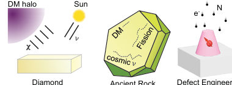
<figcaption class="paper-figure-caption"><b>Fig 1.</b> Fig. 1 Concept of NV-based directional rare-event detection in diamond. a) Schematic of dam- age track formation and multi-scale readout in nitrogen-rich HPHT diamond. An incoming particle induces a carbon nuclear recoil, generating a cascade of vacancies and interstitials. The recoil also pro- duces phonons that enable identification of candidate interaction events at the millimeter scale (single diamond chip). During annealing, vacancies diffuse and either recombine with interstitials, form vacancy clusters, or combine with substitutional nitrogen to create optically-active NV centers near the original track. The resulting NV photoluminescence (PL) enables localization at the micrometer...</figcaption>
</figure>
<figure class="paper-figure-card">
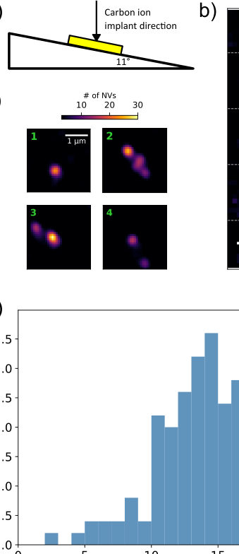
<figcaption class="paper-figure-caption"><b>Fig 2.</b> Fig. 2 Ion implantation and optical characterization of NV formation. a) Schematic of ion implan- tation geometry. The diamond surface is tilted by ∼11° relative to the incident carbon ion beam to suppress channeling effects. b) Wide-field confocal NV PL map acquired at coarse spatial resolution (∼500 nm). Bright PL spots correspond to NV ensembles formed at individual implantation sites, arranged in a regular grid consistent with the implantation pitch. Candidate sites selected for fur- ther high-resolution 3D confocal scans are marked with green crosses. The NV number is estimated from the PL intensity relative to calibrated single NV. Background NV counts in the HPHT sample are ≲2. c)...</figcaption>
</figure>
<figure class="paper-figure-card">
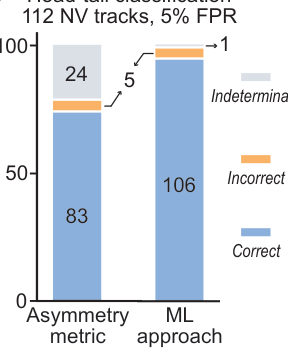
<figcaption class="paper-figure-caption"><b>Fig 3.</b> Fig. 3 Modeling NV formation and head-tail directional information from simulated damage tracks. a) Example damage track before and after annealing. Prior to annealing, vacancies (V) generated by an 800 keV carbon ion implantation are shown. During annealing, vacancies are consumed through recombination with interstitials, aggregation into vacancy clusters, or capture by substitutional nitro- gen (not shown) to form NV centers. The resulting NV distribution after annealing is shown. b) Histogram of the number of NV centers per simulated implantation event. A mean NV number of 23.9 ± 1.1 (standard error of mean; standard deviation: 11.5) is obtained from 112 KMC-annealed tracks. A correction...</figcaption>
</figure>
<figure class="paper-figure-card">
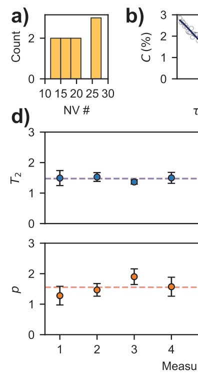
<figcaption class="paper-figure-caption"><b>Fig 4.</b> Fig. 4 Spin coherence of ion-implanted NV centers. a) Distribution of NV numbers in the implan- tation sites selected for coherence measurements. b) Representative Hahn echo measurement (site 4). The signal is fitted to C0 exp[−(τ/T2)p] to extract the coherence time T2 and decay exponent p. c) Hahn echo pulse sequence used for the measurements. The phase of the final microwave π/2 pulse is alternated between signal and reference shots to obtain the NV PL contrast C. d) Extracted coherence time T2 (top) and decay exponent p (bottom) for nine single ion implantation sites. Error bars represent the standard deviation from fitting. The measured average values (T avg 2 ≈1.47 µs, pavg ≈1.55) are...</figcaption>
</figure>

**Summary.** This work develops a multi-scale framework to reconstruct directional information from single-ion damage tracks within diamond using Nitrogen-Vacancy centers. By coupling ion implantation simulations with defect diffusion modeling and applying Machine Learning classification, the authors demonstrate a robust method for detecting rare events crucial for dark matter searches.

**Why it may be interesting.** It bridges solid-state physics defects with advanced data science techniques (ML) to solve a complex physical measurement problem, which is highly relevant for understanding disorder effects in quantum materials.

Detailed structure

**Main problem.** The study aims to reconstruct single-ion damage tracks formed by particle recoils in diamond, which is crucial for developing next-generation rare-event detectors.

**Main result.** A combined framework using advanced simulation (KMC) and Machine Learning significantly improves the classification of track directionality after annealing, achieving high efficiency comparable to pre-annealing conditions.

**Method.** The research combines experimental characterization using NV photoluminescence mapping with computational modeling involving Kinetic Monte Carlo simulations for defect diffusion and Machine Learning inference for pattern recognition.

**Model / system.** The physical system is diamond crystal lattice containing Nitrogen-Vacancy (NV) color centers. The model involves simulating the creation of vacancies/interstitials from ion implantation, followed by annealing dynamics governed by defect diffusion kinetics.

**Key observables.** NV yield per implanted ion ($	ext{NNV}$), track asymmetry metric ($A$), and ML posterior probability ($P$) used for directional classification.

**Important parameters / regimes.** Sub-MeV carbon ion energy, annealing temperature ($800^\circ	ext{C}$), false positive rate ($	ext{FPR} \lesssim 5\%$), and spatial scales from $\mu	ext{m}$ to $	ext{nm}$.

**Assumptions / limitations.** The KMC simulations assume specific reaction pathways (e.g., first-nearest neighbor interactions) which are refined by DFT calculations; the ML approach assumes sufficient feature space coverage for accurate inference.

**Figures summary.** Figures illustrate PL maps showing localized NV ensembles, histograms comparing simulated vs. measured $	ext{NNV}$ yields, and cumulative plots comparing classification performance between traditional metrics and Machine Learning approaches.

**Paper structure.** The paper progresses from establishing the physical necessity of multi-scale readout to detailing simulation pipelines (SIIMPL/KMC), quantifying defect evolution, developing ML classifiers for directionality, and finally confirming quantum sensing compatibility via spin coherence measurements.

Abstract

Understanding particle-induced damage tracks in solid-state materials underpins emerging applications in rare-event detection and quantum defect engineering. Resolving these tracks requires multi-scale readout, from event localization at the millimeter scale to track-morphology reconstruction at the nanoscale. Nitrogen-vacancy (NV) centers in diamond provide such a platform, combining optical localization with quantum sensing of track morphology. Here, we implant sub-MeV carbon ions into nitrogen-rich diamond and detect individual recoil events via spatially localized NV formation. We develop a simulation framework that explains the observed NV yield and predicts that directional information is retained in the NV distribution after annealing. Machine learning further recovers much of the information lost to defect diffusion and limited NV yield, improving head-tail classification to a level comparable to pre-annealed vacancy tracks. Measurements of NV spin coherence indicate compatibility with nanoscale track reconstruction via NV strain mapping and magnetic gradient-based techniques. These results identify promising pathways toward NV-diamond directional detectors for rare events, while the track-modeling framework has broader implications for paleodetection and quantum material synthesis.

[↑ back to top](#top)

### [Percolation of Zero-Weight Paths and the Shape of the Phase Boundary in the Two-Dimensional Random-Bond Ising Model](http://arxiv.org/abs/2606.22398v1)

**Authors:** Amirhossein Manouchehri, Kirill Shtengel  
**Type:** theory · **Category:** disordered systems and neural networks · **PDF:** <https://arxiv.org/pdf/2606.22398v1>  
**Analysis basis:** full PDF text, analyzed in chunks
**Topic relevance:** `analog quantum simulation` **1/5** · `driven-dissipative phase transition` **1/5** · `exotic spin models in light-matter` **1/5** · `non-equilibrium universality` **1/5**

↔ Scroll figures horizontally

<figure class="paper-figure-card">
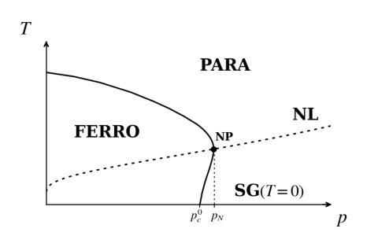
<figcaption class="paper-figure-caption"><b>Fig 1.</b> FIG. 1. Schematic phase diagram of the two-dimensional random-bond Ising model with the Nishimori line (NL) dashed. The relation p0 c ≤pN has been rigorously established but whether p0 c &lt; pN remains an open question.</figcaption>
</figure>
<figure class="paper-figure-card">
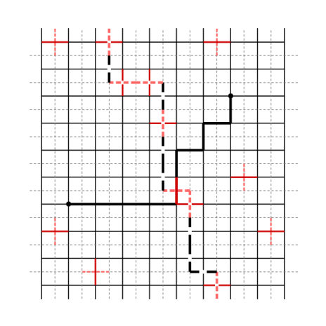
<figcaption class="paper-figure-caption"><b>Fig 2.</b> FIG. 2. Schematic illustration of the geometrical argument described in the text. Solid lines represent bonds on the origi- nal lattice, while dashed lines correspond to the dual lattice. Black and red bonds denote ferromagnetic and antiferromag- netic couplings, respectively. The highlighted thick dashed path indicates a system-spanning zero-weight path on the dual lattice, whereas the highlighted thick solid path represents a connection between two distant spins on the original lattice. Intersections between these paths change the parity of antifer- romagnetic bonds along the spin-connecting path.</figcaption>
</figure>
<figure class="paper-figure-card">
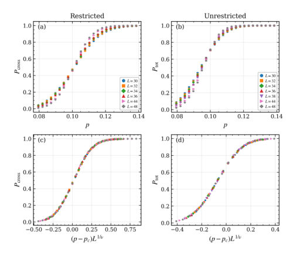
<figcaption class="paper-figure-caption"><b>Fig 3.</b> FIG. 3. Comparison of the percolation probability for the restricted (cross-window; left panels) and unrestricted (right panels) spanning criteria. The upper panels show the raw data Pcross(L, p) for system sizes L ∈{30, 32, 34, 36, 44, 48}, while the lower panels show the corresponding finite-size-scaling collapses. Restricted data were obtained using open boundary conditions in both directions, whereas unrestricted data were obtained using periodic boundary conditions horizontally and open boundary conditions vertically. The unrestricted criterion yields behavior qualitatively similar to that obtained using the cross-window definition, with only a small shift in the estimated critical...</figcaption>
</figure>
<figure class="paper-figure-card">
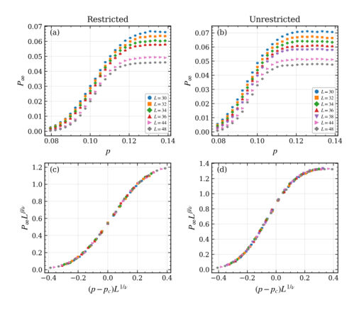
<figcaption class="paper-figure-caption"><b>Fig 4.</b> FIG. 4. Comparison of the normalized path-length observable P∞(L, p) = ⟨l⟩/L2 for the restricted (cross-window; left panels) and unrestricted (right panels) spanning criteria. The upper panels display the raw data, whereas the lower panels show the finite-size-scaling collapses used to extract the exponent ratio β/ν. The close agreement between the two definitions indicates that the cross-window constraint has only a minor effect on the order-parameter-like behavior of the spanning paths.</figcaption>
</figure>
<figure class="paper-figure-card">
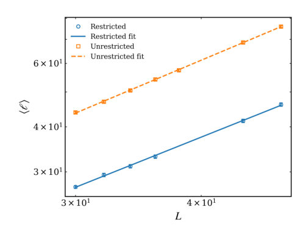
<figcaption class="paper-figure-caption"><b>Fig 5.</b> FIG. 5. Log-log plot of the mean spanning-path length ⟨l⟩= P∞L2 evaluated near criticality as a function of system size L for the restricted (cross-window) and unrestricted spanning criteria. The solid and dashed lines represent linear fits used to determine the corresponding fractal dimensions. While the unrestricted criterion produces systematically larger mean path lengths, the similar slopes indicate comparable geometric scaling behavior.</figcaption>
</figure>

**Summary.** This work analyzes the 2D random-bond Ising model by linking its ferromagnetic phase boundary to a purely geometrical phenomenon: zero-weight path percolation. Using advanced computational techniques like finite-size scaling, the authors determine the critical disorder strength for this percolation and propose that this geometric constraint dictates the stability of ferromagnetism in the disordered system.

**Why it may be interesting.** While focused on classical statistical mechanics, the rigorous mathematical techniques used for analyzing critical phenomena in disordered systems (like FSS) are foundational tools applicable across many-body physics, including quantum spin glasses or frustrated quantum magnets.

Detailed structure

**Main problem.** The paper investigates the connection between zero-weight path percolation and the low-temperature ferromagnetic phase boundary in the 2D random-bond Ising model.

**Main result.** They calculate a critical disorder strength for zero-weight percolation ($p_c = 0.1000(2)$) and argue that this purely geometrical transition suggests the ferromagnetic phase boundary is vertical below the Nishimori point.

**Method.** The study employs dynamic-programming algorithms combined with finite-size scaling analysis to locate critical points and extract universal critical exponents.

**Model / system.** The system is a two-dimensional $\pm J$ random-bond Ising model on a square lattice, where bonds are ferromagnetic ($+J$) or antiferromagnetic ($-J$) based on the disorder probability $p$.

**Key observables.** Zero-weight percolation threshold ($p_c$), critical exponents ($
u, eta/
u, \gamma/
u$), and fractal dimension ($d_f$).

**Important parameters / regimes.** Disorder parameter $p$, system size $L$, temperature $T$ (analyzed relative to the Nishimori point).

**Assumptions / limitations.** The onset of zero-weight percolation is assumed to be incompatible with ferromagnetic ordering, and that this geometrical criterion dictates the phase boundary shape.

**Figures summary.** Figures illustrate schematic phase diagrams, finite-size scaling collapses for percolation probability, and log-log plots used to determine the fractal dimension of spanning paths.

**Paper structure.** The paper systematically defines zero-weight paths on the dual lattice, relates their percolation to spin correlations via symmetry arguments, applies dynamic programming/FSS to find $p_c$, and compares this geometric transition to known magnetic phase boundaries.

Abstract

We explore the connection between the low-temperature boundary of the ferromagnetic phase in the two-dimensional $\pm J$ random-bond Ising model, where antiferromagnetic bonds occur with probability $p$ and a geometric transition dubbed ``zero-weight percolation''. We argue that the onset of this percolation characterized by the emergence of a percolating path containing an equal number of $+J$ and $-J$ bonds is incompatible with ferromagnetic ordering. Due to its purely geometrical nature, this percolation criterion is a property of a disorder realization and is independent of the temperature, which in turn suggests that the ferromagnetic phase boundary is vertical below the Nishimori point in the $(p,T)$ plane. Using a dynamic-programming algorithm combined with finite-size scaling, we identify the critical disorder at which zero-weight paths first percolate as $p_c = 0.1000(2)$, and we extract the associated critical exponents $ν= 1.26(1)$, $β/ν= 0.85(1)$, $γ/ν= 0.264(5)$, and fractal dimension $d_f \approx 1.11$. The value of $p_c$ is below the previously reported values of the critical disorder strength corresponding to the loss of the ferromagnetic order, both at zero temperature and the Nishimori point. Nevertheless, we argue that the percolation transition studied in this paper is behind the loss of ferromagnetism and thus provides a new, purely geometrical perspective on the stability of ferromagnetic order in disordered spin systems.

[↑ back to top](#top)

### [Perturbative Renormalization and Universality Diagram for Long-Range Quantum Criticality](http://arxiv.org/abs/2606.22407v1)

**Authors:** Zhiyi Li, Zhijie Fan, Kun Chen, Youjin Deng  
**Type:** theory · **Category:** statistical mechanics · **PDF:** <https://arxiv.org/pdf/2606.22407v1>  
**Analysis basis:** full PDF text, analyzed in chunks
**Topic relevance:** `Keldysh / 2PI / non-Gaussian methods` **1/5** · `analog quantum simulation` **1/5** · `driven-dissipative phase transition` **1/5** · `non-equilibrium universality` **1/5**

↔ Scroll figures horizontally

<figure class="paper-figure-card">
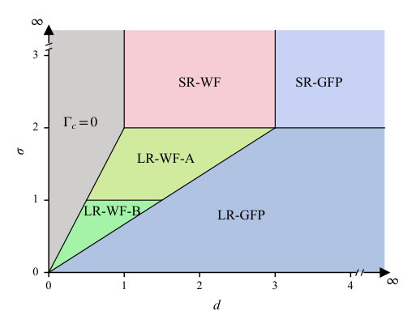
<figcaption class="paper-figure-caption"><b>Fig 1.</b> FIG. 1. Proposed universality diagram for quantum long- range O(n) spin models in the (d, σ) plane. The colored regions denote distinct zero-temperature quantum critical regimes: the region with no finite-field quantum criticality (Γc = 0), the LR Gaussian regime (LR-GFP), the interacting LR Wilson-Fisher sectors (LR-WF-A and LR-WF-B), the SR Wilson-Fisher regime (SR-WF), and the SR Gaussian regime (SR-GFP). Solid lines indicate the main boundaries of the di- agram. The lower and upper critical boundaries are scaling boundaries, with the SR lower and upper critical dimensions included on the short-range side; the σ = 2 line is the RG- supported LR–SR boundary; and the line at σ = 1 marks...</figcaption>
</figure>
<figure class="paper-figure-card">
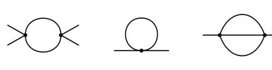
<figcaption class="paper-figure-caption"><b>Fig 2.</b> FIG. 2. The one-loop bubble (left) determines the beta func- tion and the WF fixed point. The one-loop tadpole (mid- dle) renormalizes the mass and gives the leading correction to yr = 1/ν. The two-loop sunset (right) produces the leading kinetic counterterms; the frequency and momentum projec- tions of this graph carry distinct pole structures. All notation is explained in the text and the Supplemental Material.</figcaption>
</figure>
<figure class="paper-figure-card">
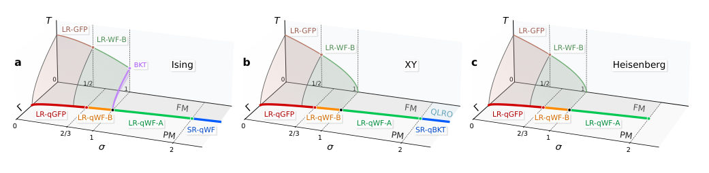
<figcaption class="paper-figure-caption"><b>Fig 3.</b> FIG. 3. Schematic temperature–quantum-coupling phase diagrams of one-dimensional long-range quantum spin chains: (a) transverse-field Ising, (b) quantum XY/rotor, and (c) quantum Heisenberg. The axes are temperature T, quantum coupling Γ, and decay exponent σ. Colored lines in the T = 0 plane denote quantum critical regimes: LR-qGFP for 0 &lt; σ &lt; 2/3, LR-qWF-B for 2/3 &lt; σ &lt; 1, LR-qWF-A for 1 &lt; σ &lt; 2, and the appropriate short-range quantum regime for σ &gt; 2. The prefix “q” distinguishes zero-temperature quantum fixed points from finite-temperature classical long-range regimes. For σ &lt; 1, the finite-temperature critical surfaces are inherited from the corresponding classical one-dimensional...</figcaption>
</figure>

**Summary.** This paper develops a perturbative Renormalization Group framework to analyze quantum criticality in models with long-range interactions. By calculating critical exponents up to two loops, the authors construct a comprehensive $(d, \sigma)$ universality diagram. This work provides a powerful theoretical tool for classifying and understanding exotic quantum phases beyond simple short-range approximations.

**Why it may be interesting.** This work provides rigorous theoretical tools (RG flow equations) to classify quantum phase transitions governed by long-range forces, which is highly relevant for understanding exotic phases realized in modern quantum simulators.

Detailed structure

**Main problem.** The paper develops a systematic theory for quantum criticality in models featuring long-range (LR) interactions, aiming to construct a comprehensive $(d, \sigma)$ universality diagram.

**Main result.** Explicit two-loop calculations yield critical exponents ($
u$, $\eta_\omega$, $\eta_k$) that successfully connect the LR Gaussian regime, the interacting Wilson-Fisher sector, and the short-range (SR) limit at the boundary $\sigma^*=2$.

**Method.** The primary method is perturbative Renormalization Group (RG) expansion, utilizing dimensional regularization ($d=3-\epsilon$, $\sigma=2-\delta$) to control divergences in the continuum field theory.

**Model / system.** It studies ferromagnetic long-range quantum $O(n)$ spin models whose interactions decay as $1/r^{d+\sigma}$. The system is mapped onto a Euclidean continuum field theory with an action involving kinetic terms proportional to $(-\Delta)^{\sigma/2}$.

**Key observables.** Correlation-length exponent ($
u$), frequency anomalous dimension ($\eta_\omega$), momentum anomalous dimension ($\eta_k$), and the dynamical exponent ($z$).

**Important parameters / regimes.** The critical exponents depend on dimensionality $d$ and interaction decay exponent $\sigma$. Key regimes include the LR Gaussian boundary ($\sigma = 2d/3$) and the SR limit ($\sigma 	o 2$).

**Assumptions / limitations.** The analysis relies on perturbative RG expansions, specifically performed up to two-loop order, and employs minimal subtraction for renormalization.

**Figures summary.** Figure 1 proposes a $(d, \sigma)$ universality diagram mapping out various critical regimes (LR-GFP, LR-WF, SR-WF). Figure 2 illustrates the structure of RG calculations involving one-loop bubble integrals.

**Paper structure.** The paper proceeds by defining the continuum field theory and parameterizing the problem using $\epsilon$ and $\delta$. It then performs multi-loop RG calculations to determine anomalous dimensions and critical exponents, culminating in the proposal and justification of a comprehensive $(d, \sigma)$ universality diagram.

Abstract

Experimental progress in quantum simulators highlights the role of long-range (LR) interactions in reshaping quantum criticality and stabilizing exotic phases beyond the short-range (SR) paradigm. We study ferromagnetic long-range quantum $O(n)$ models with interactions decaying as $1/r^{d+σ}$ and develop a perturbative renormalization-group expansion around the LR--SR boundary by setting $d=3-ε$ and $σ=2-δ$. In this parametrization, the full interacting LR window $2d/3<σ<2$ becomes $0<δ<2ε/3$, and is therefore perturbatively controlled. A two-loop calculation yields explicit expressions, in terms of $ε$, $δ$, and $n$, for the correlation-length exponent $ν$ and for the frequency and momentum anomalous dimensions $η_ω$ and $η_k$. The resulting exponents reduce to long-range Gaussian scaling at $σ=2d/3$ and to SR quantum Wilson-Fisher scaling in the $σ\to 2$ limit, thereby identifying $σ_*=2$ as the LR--SR boundary within the controlled $3-ε$ expansion. Combining the RG results with scaling boundaries and classical LR analogies, we propose a $(d,σ)$ universality diagram for ferromagnetic long-range quantum $O(n)$ criticality and use it as an organizing framework for the phase diagram of long-range quantum spin chains.

[↑ back to top](#top)

### [Jacobi exceptional orthogonal polynomials for extended Scarf I potentials with position-dependent mass](http://arxiv.org/abs/2606.23264v1)

**Authors:** Christiane Quesne  
**Type:** theory · **Category:** other · **PDF:** <https://arxiv.org/pdf/2606.23264v1>  
**Analysis basis:** full PDF text, analyzed in chunks
**Topic relevance:** `Keldysh / 2PI / non-Gaussian methods` **1/5** · `driven-dissipative phase transition` **1/5** · `methods for driven-dissipative` **1/5**

↔ Scroll figures horizontally

<figure class="paper-figure-card">
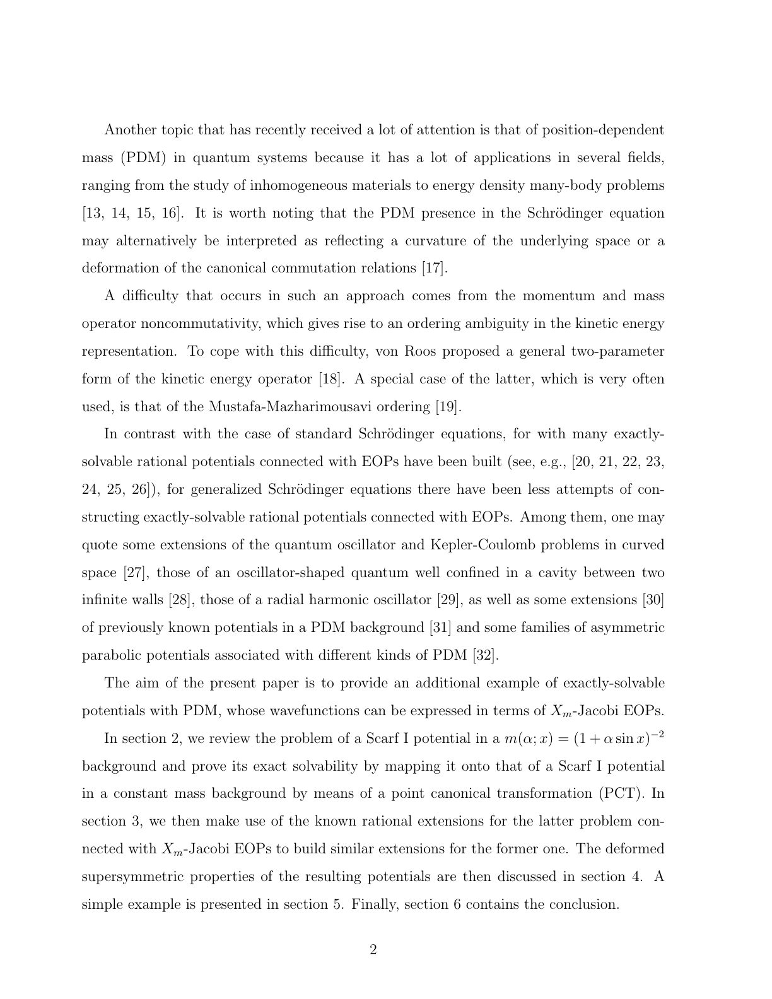
<figcaption class="paper-figure-caption"><b>Fig 1.</b> Low-resolution page preview, page 2</figcaption>
</figure>
<figure class="paper-figure-card">
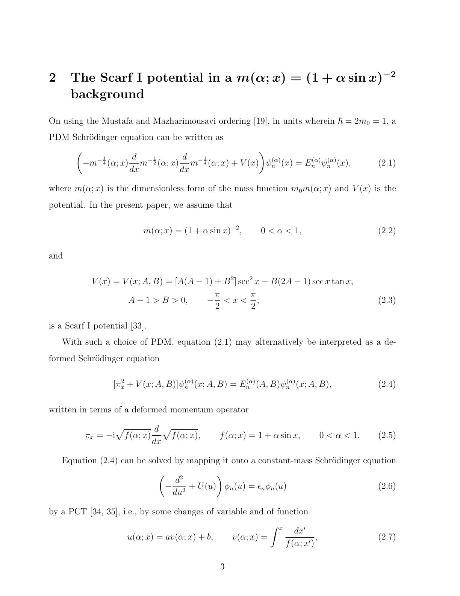
<figcaption class="paper-figure-caption"><b>Fig 2.</b> Low-resolution page preview, page 3</figcaption>
</figure>
<figure class="paper-figure-card">
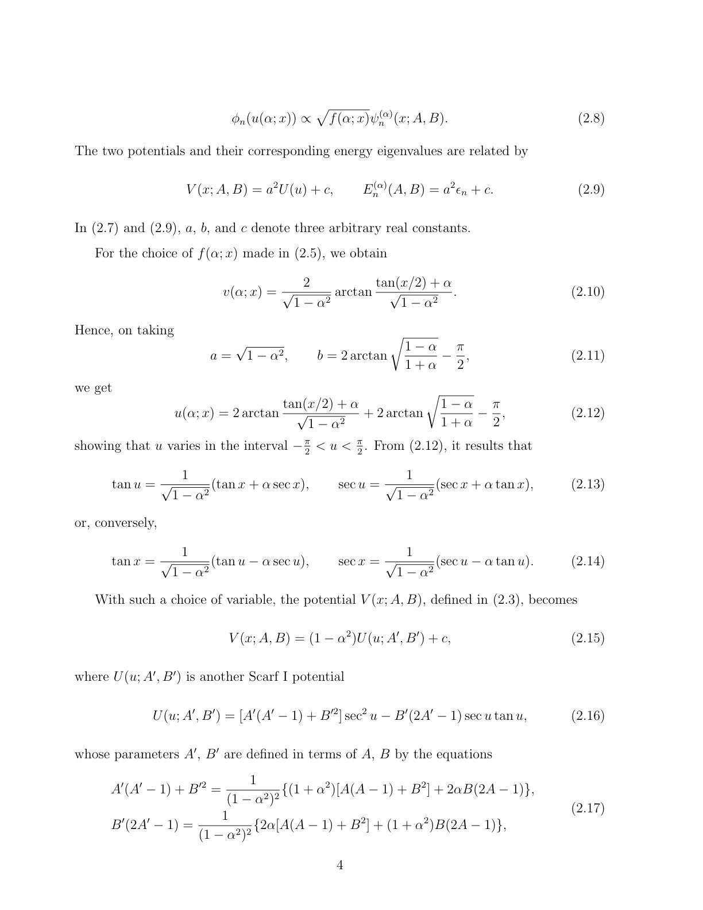
<figcaption class="paper-figure-caption"><b>Fig 3.</b> Low-resolution page preview, page 4</figcaption>
</figure>
<figure class="paper-figure-card">
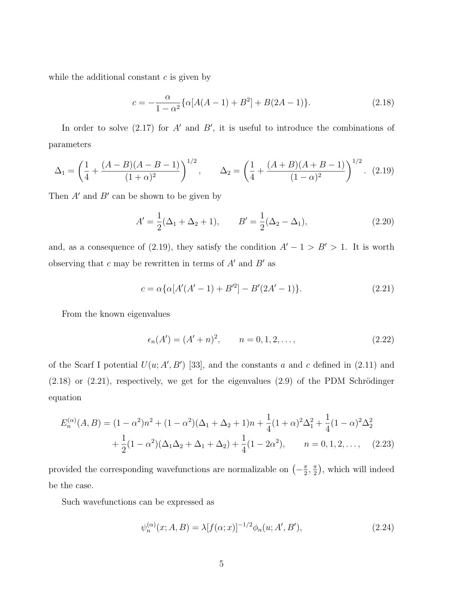
<figcaption class="paper-figure-caption"><b>Fig 4.</b> Low-resolution page preview, page 5</figcaption>
</figure>
<figure class="paper-figure-card">
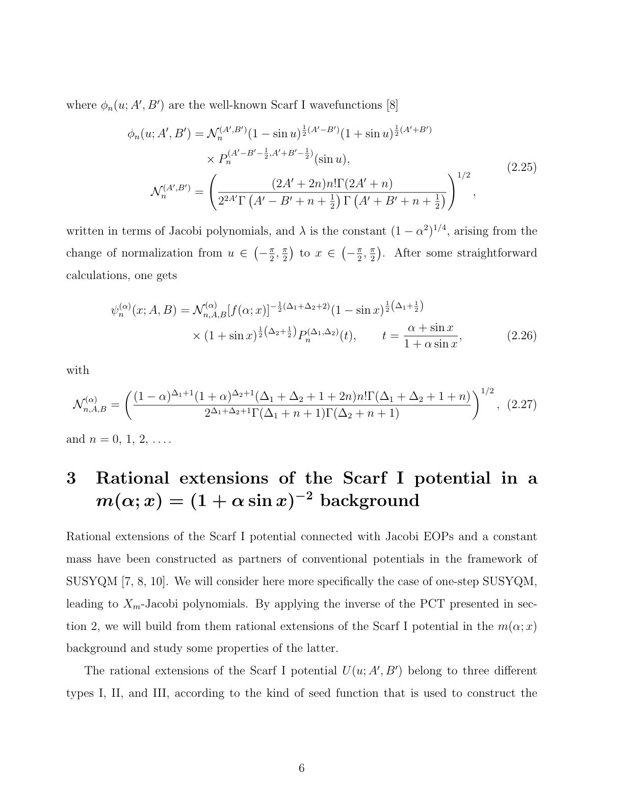
<figcaption class="paper-figure-caption"><b>Fig 5.</b> Low-resolution page preview, page 6</figcaption>
</figure>

**Summary.** This paper tackles the complex problem of finding exact solutions for a Schrödinger equation featuring both a Scarf I potential and a position-dependent mass. It achieves this by employing Point Canonical Transformations to simplify the Hamiltonian, revealing that the system possesses deformed shape invariance. The results characterize the energy spectrum using specialized mathematical tools like $X_m$-Jacobi exceptional orthogonal polynomials.

**Why it may be interesting.** This work provides advanced techniques (PDM, EOPs, Deformed SUSY) to solve exactly solvable quantum problems, which is highly relevant for theoretical physicists studying non-standard Hamiltonians or effective models in AMO physics.

Detailed structure

**Main problem.** The research aims to find exactly-solvable rational extensions of the Scarf I potential that incorporate a position-dependent mass (PDM) background.

**Main result.** The PDM Scarf I potential exhibits deformed shape invariance, and its solutions are characterized by $X_m$-Jacobi exceptional orthogonal polynomials (EOPs).

**Method.** The core methodology involves using Point Canonical Transformations (PCT) to map the complex PDM Schrödinger equation onto a simpler constant-mass system, followed by analyzing the resulting structure using deformed supersymmetric quantum mechanics.

**Model / system.** The model is a one-dimensional time-independent Schrödinger equation featuring a Scarf I potential within a position-dependent mass background defined by $m(\alpha; x) = (1 + \alpha \sin x)^{-2}$.

**Key observables.** Energy eigenvalues ($E(\alpha)_n$ and $\epsilon_{	ext{ext}}^n$) and the corresponding wavefunctions ($\psi_n$).

**Important parameters / regimes.** The coupling constant $\alpha$, potential parameters $(A, B)$, and indices $m$.

**Assumptions / limitations.** The analysis assumes the applicability of PCT mappings and the validity of deformed shape invariance properties within a supersymmetric framework.

**Figures summary.** Not specified (Analysis relies on equations detailing transformations, potentials, and energy spectra).

**Paper structure.** The paper proceeds by defining the PDM Hamiltonian, applying the Point Canonical Transformation to relate it to known constant-mass solvable models, deriving explicit forms for partner potentials and superpotentials using deformed SUSYQM, and finally presenting the resulting spectral properties.

Abstract

We show that the Scarf I potential problem in a position-dependent mass background of the type $m(α;x) = (1 + α\sin x)^{-2}$, $0<α<1$, can be solved by using a point canonical transformation mapping the corresponding Schr\" odinger equation onto that of the Scarf I potential with constant mass. The inverse point canonical transformation then provides some exactly-solvable rational extensions of the Scarf I potential with positive-dependent mass associated with $X_m$-Jacobi exceptional orthogonal polynomials of type I, II, or III. The Scarf I potential problem with position-dependent mass is shown to exhibit a deformed shape invariance property in a deformed supersymmetric framework. Such a property is also valid for extended potentials of type I and II. The results are illustrated with a simple example.

[↑ back to top](#top)

### [Spectral and thermodynamic properties of supersymmetric quantum systems with self-adjoint deformed momentum](http://arxiv.org/abs/2606.22107v1)

**Authors:** J. A. Oke, F. A. Dossa  
**Type:** theory · **Category:** statistical mechanics · **PDF:** <https://arxiv.org/pdf/2606.22107v1>  
**Analysis basis:** full PDF text, analyzed in chunks
**Topic relevance:** `Keldysh / 2PI / non-Gaussian methods` **1/5** · `analog quantum simulation` **1/5** · `driven-dissipative phase transition` **1/5**

↔ Scroll figures horizontally

<figure class="paper-figure-card">
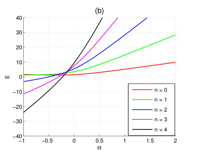
<figcaption class="paper-figure-caption"><b>Fig 1.</b> Figure 1. (Colour online) Evolution of energy levels as a function of the deformation parameter 𝛼: (a) linear deformation; (b) quadratic deformation.</figcaption>
</figure>
<figure class="paper-figure-card">
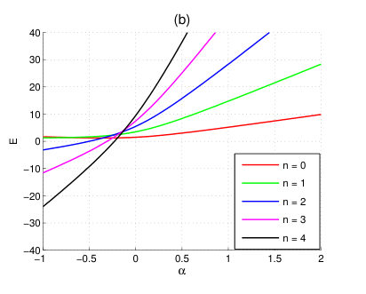
<figcaption class="paper-figure-caption"><b>Fig 2.</b> Figure 2 illustrates the thermodynamic properties of the system subjected to linear deformation. The internal energy (𝑈) exhibits a monotonous growth with temperature. This increase becomes more pronounced as the deformation parameter 𝛼increases, reflecting an increase in the number of accessible energy states at high temperatures. Simultaneously, the free energy (𝐹) decreases with increasing temper- ature, which is characteristic of a thermally excited system. The effect of the deformation is manifested by a change in the slope of this decrease, highlighting the influence of 𝛼on the thermodynamic potential of the system. The modification of the density of states 𝜌(𝐸) = |d𝑛/d𝐸| induced by...</figcaption>
</figure>
<figure class="paper-figure-card">
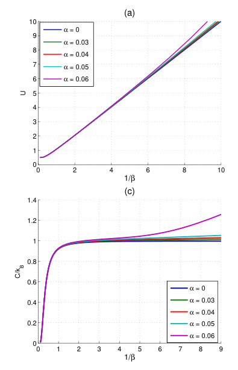
<figcaption class="paper-figure-caption"><b>Fig 3.</b> Figure 2. (Colour online) Thermodynamic properties as a function of temperature for different values of 𝛼(case of linear deformation).</figcaption>
</figure>
<figure class="paper-figure-card">
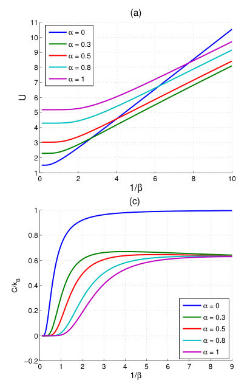
<figcaption class="paper-figure-caption"><b>Fig 4.</b> Figure 3. (Colour online) Thermodynamic properties as a function of temperature for different values of 𝛼(case of quadratic deformation).</figcaption>
</figure>

**Summary.** The paper develops a rigorous method using the Generalized Extended Momentum Operator (GEMO) formalism to study quantum systems under geometric deformations. It analytically solves the energy spectrum and provides the first complete thermodynamic characterization by calculating the partition function. The key finding is that the type of deformation dictates unique thermal responses, allowing for the engineering of quantum heat capacity in nanostructures.

**Why it may be interesting.** This work provides a powerful theoretical tool linking geometric structure (via momentum deformation) directly to measurable macroscopic quantum thermodynamic properties, which is highly relevant for designing novel quantum materials.

Detailed structure

**Main problem.** To establish a rigorous framework for quantum systems with geometric deformations by constructing a strictly self-adjoint deformed momentum operator.

**Main result.** The study predicts distinct thermal signatures: linear deformation causes a divergent heat capacity peak, while quadratic deformation leads to a saturation of $C/k_B 	o 0.6$ below the Dulong–Petit limit.

**Method.** The authors use the Generalized Extended Momentum Operator (GEMO) formalism combined with an extended Supersymmetric Quantum Mechanics (SUSYQM) factorization scheme for spectral analysis, and employ the Euler–Maclaurin approximation for thermodynamic characterization.

**Model / system.** The system is a one-dimensional quantum oscillator subjected to geometric deformations modeled by $\mu(x)$, analyzed in linear ($\mu(x)=\alpha x$) and quadratic ($\mu(x)=\alpha x^2$) cases. The Hamiltonian is derived from substituting the GEMO operator into the standard form.

**Key observables.** Energy spectra ($E_n$), Density of states ($
ho(E)$), Internal energy ($U$), Entropy ($S$), and Heat Capacity ($C$).

**Important parameters / regimes.** Deformation parameter $\alpha$, Temperature ($eta$ or $1/T$), and the effective curvature induced by $\mu(x)$.

**Assumptions / limitations.** The method assumes geometric deformation can be modeled by $\mu(x)$ (linear or quadratic), and it relies on the Euler–Maclaurin approximation for calculating the partition function.

**Figures summary.** Figures illustrate the evolution of energy levels ($E_n$) versus the deformation parameter $\alpha$ for both linear and quadratic cases, alongside plots showing thermodynamic quantities like heat capacity vs. inverse temperature ($eta$).

**Paper structure.** The paper first develops the self-adjoint framework using GEMO/SUSYQM to find exact spectra for deformed Hamiltonians. It then calculates the partition function $Z(eta)$ and derives all key thermodynamic observables, comparing the distinct thermal responses of linear versus quadratic deformations.

Abstract

We establish a rigorous framework for quantum systems with geometric deformations by constructing a strictly self-adjoint deformed momentum operator through the generalized extended momentum operator (GEMO) formalism. Unlike previous approaches relying on boundary-condition hermiticity, our method ensures intrinsic self-adjointness for both linear ($μ(x)=αx$) and quadratic ($μ(x)=αx^{2}$) deformations within a unified non-Hermitian supersymmetric factorization scheme. This yields exact analytical spectra while revealing hidden $\mathfrak{su}(1,1)$ symmetry structures. Crucially, we provide the first complete thermodynamic characterization of such systems by analytically evaluating the partition function via the Euler--Maclaurin approximation. Geometric deformation fundamentally reshapes the density of states $ρ(E)$, producing distinct thermal signatures: a divergent heat capacity peak for linear deformation due to state accumulation near a maximal energy, and a saturation $C/k_{\mathrm{B}}\to 0.6$ (below the Dulong--Petit limit) for quadratic deformation. These results establish geometric deformation as a tunable parameter for engineering quantum thermodynamic responses in curved nanostructures.

[↑ back to top](#top)

### [First-Quantized Relativistic Quantum Simulation with Periodic and Dirichlet Boundary Conditions](http://arxiv.org/abs/2606.21794v1)

**Authors:** Jeongho Bang, Timothy P. Spiller, Kyunghyun Baek, Kyoungho Cho, Jaewoo Joo  
**Type:** theory · **Category:** quantum information and computing · **PDF:** <https://arxiv.org/pdf/2606.21794v1>  
**Analysis basis:** full PDF text, analyzed in chunks
**Topic relevance:** `Frenkel-Kontorova` **1/5** · `analog quantum simulation` **1/5**

↔ Scroll figures horizontally

<figure class="paper-figure-card">
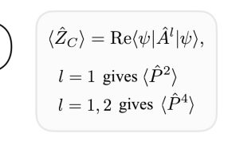
<figcaption class="paper-figure-caption"><b>Fig 1.</b> Figure 1. Quantum circuit of the translation-moment estimator. A Hadamard-test-type circuit estimates the real part of a translation moment, ml = Re⟨ˆAl⟩. The moment l = 1 is sufficient for the non-relativistic kinetic term, while the leading relativistic correction requires l = 1, 2.</figcaption>
</figure>
<figure class="paper-figure-card">
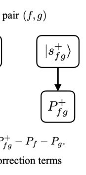
<figcaption class="paper-figure-caption"><b>Fig 2.</b> Figure 2. Schematic for the boundary-overlap estimator. DBC introduces boundary-local coherences. For a boundary pair (f, g), the probabilities associated with |f⟩, |g⟩, and the normalised superposition |s+ fg⟩= (|f⟩+ |g⟩)/ √</figcaption>
</figure>
<figure class="paper-figure-card">
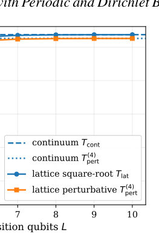
<figcaption class="paper-figure-caption"><b>Fig 3.</b> Figure 3. PBC free-particle benchmark. The continuum relativistic energy Tcont is compared with the exact square-root lattice energy Tlat and the perturbative lattice energy T (4) pert for the Fourier mode n = 1. Here, R = 10 and c = 2. The convergence of Tlat isolates the finite- grid discretization error, while the residual separation between T (4) pert and Tcont reflects the relativistic truncation error.</figcaption>
</figure>
<figure class="paper-figure-card">
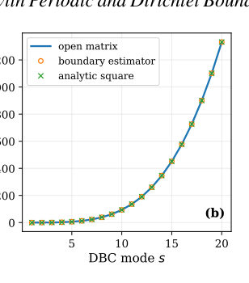
<figcaption class="paper-figure-caption"><b>Fig 4.</b> Figure 4. DBC infinite-square-well benchmark. Here, we choose N = 64 interior grid points and R = 10. (a) We compare ⟨ˆP 2 D⟩obtained from the open-chain matrix evaluation, the boundary-corrected cyclic estimator, and the analytic sine spectrum. (b) We make the same comparison for ⟨ˆP 4 D⟩= ⟨( ˆP 2 D)2⟩. The overlapping curves verify that the boundary-correction terms reconstruct the DBC finite-difference operator at the estimator level.</figcaption>
</figure>
<figure class="paper-figure-card">
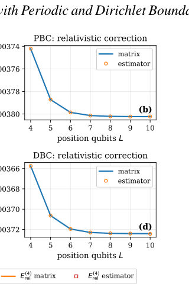
<figcaption class="paper-figure-caption"><b>Fig 5.</b> Figure 5. Smooth-potential benchmark. The graphs (a) and (b) show the PBC results for the periodic potential in Eq. (68). The graphs (c) and (d) show the DBC results for the confining potential in Eq. (69). The total non-relativistic energy Enr, the perturbatively corrected energy E(4) rel , and the relativistic correction ∆Erel are plotted as functions of the number of position qubits L. The solid lines denote direct matrix evaluation, while the open markers denote the translation-plus-boundary estimator reconstruction.</figcaption>
</figure>

**Summary.** The paper presents a comprehensive methodology for simulating first-quantized relativistic quantum mechanics on 1D lattices using quantum circuits. It successfully derives measurement estimators for kinetic energy under both Periodic and Dirichlet boundary conditions, validating its accuracy against exact diagonalization across multiple physical benchmarks.

**Why it may be interesting.** This work provides a rigorous quantum algorithm framework to simulate relativistic effects in condensed matter models (like lattice fermions) by accurately handling the complex boundary physics inherent in both periodic and open systems on quantum hardware.

Detailed structure

**Main problem.** The work develops a methodology for simulating first-quantized relativistic quantum mechanics on finite 1D lattices under both Periodic (PBC) and Dirichlet (DBC) boundary conditions.

**Main result.** The framework successfully constructs boundary-consistent lattice Hamiltonians incorporating leading relativistic corrections ($\propto \hat{P}^4$) and validates the energy estimation workflow against direct matrix diagonalization for various benchmarks.

**Method.** Energy expectation values are estimated using quantum circuit measurements of momentum moments (e.g., translation moments $\langle\hat{A}^\ell
angle$ for PBC, or boundary-local terms for DBC) combined with position-basis sampling for potentials.

**Model / system.** The system is a single positive-energy particle confined to a 1D finite domain simulated via lattice Hamiltonians. The Hamiltonian includes kinetic energy derived from the relativistic operator expanded to second order in momentum ($\hat{T} \propto \hat{P}^2 - \hat{P}^4/c^2$) and an arbitrary potential $\hat{V}$.

**Key observables.** Energy expectation values $\langle\hat{H}
angle$, momentum moments $\langle\hat{P}^2
angle$ and $\langle\hat{P}^4
angle$, and the relative discrepancy between estimator reconstruction and direct matrix evaluation.

**Important parameters / regimes.** Weakly relativistic regime ($\eta_	au = \langle\hat{P}^2_	au
angle / m^2c^2$ must be small); lattice size $L$; finite shot count $M$.

**Assumptions / limitations.** The simulation relies on a weak-relativistic perturbative expansion of the kinetic operator, and measurement errors are assumed to scale as $O(M^{-1/2})$ for kinetic terms.

**Figures summary.** Figures compare energy estimates from direct matrix evaluation versus estimator reconstruction for both PBC and DBC benchmarks; another figure shows the Root Mean Square Error (RMSE) scaling confirming the expected $M^{-1/2}$ shot-noise behavior.

**Paper structure.** The paper details the derivation of boundary-consistent lattice Hamiltonians ($\hat{H}_{	ext{tot},	au}$) for both PBC and DBC, outlines specialized measurement estimators using translation moments and boundary corrections, and validates this workflow across free particle, infinite square well, and smooth potential benchmarks.

Abstract

In this work, we present a methodology for first-quantized relativistic quantum simulation on one-dimensional finite domains under the two boundary conditions most commonly used in lattice models: periodic boundary conditions (PBC) and Dirichlet boundary conditions (DBC). Starting from the positive-energy relativistic kinetic operator, we construct weakly relativistic lattice Hamiltonians whose leading correction requires the boundary-consistent discretized momentum moments $\langle \hat{P}^{2}\rangle$ and $\langle \hat{P}^{4}\rangle$. These moments are reconstructed in the PBC Hamiltonian from moments of a unitary cyclic translation while the DBC Hamiltonian uses the open-chain finite-difference. In a qubit-register implementation, it can be evaluated as the corresponding cyclic translation estimator plus boundary-local terms that remove the unphysical wrap-around link. The resulting energy-estimation workflow uses translation measurements for the kinetic terms, a small number of endpoints and near-endpoints overlap probabilities for DBC, and position-basis sampling for diagonal potentials. We valdate the framework of the relativistic quantum simulation in various benchmark potentials such as no potential and a cosine potential for PBC as well as an infinite square well and a harmonic potential for DBC, with finite-shot sampling tests. These benchmarks show good agreement between the estimator reconstruction and direct matrix evaluation while separating the finite-grid discretization, weak-relativistic truncation, and measurement errors.

[↑ back to top](#top)

### [No-signaling values of quantum games--an operator algebra perspective](http://arxiv.org/abs/2606.21664v1)

**Authors:** Roy Araiza, Marius Junge, Carlos Palazuelos  
**Type:** theory · **Category:** other · **PDF:** <https://arxiv.org/pdf/2606.21664v1>  
**Analysis basis:** full PDF text, analyzed in chunks
**Topic relevance:** `Keldysh / 2PI / non-Gaussian methods` **1/5** · `entanglement & information structure` **1/5**

↔ Scroll figures horizontally

<figure class="paper-figure-card">
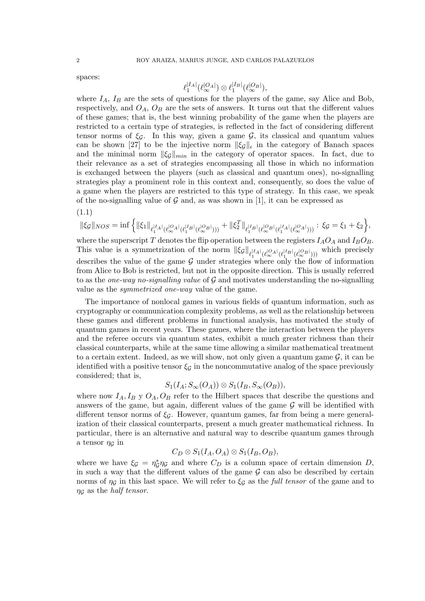
<figcaption class="paper-figure-caption"><b>Fig 1.</b> Low-resolution page preview, page 2</figcaption>
</figure>
<figure class="paper-figure-card">
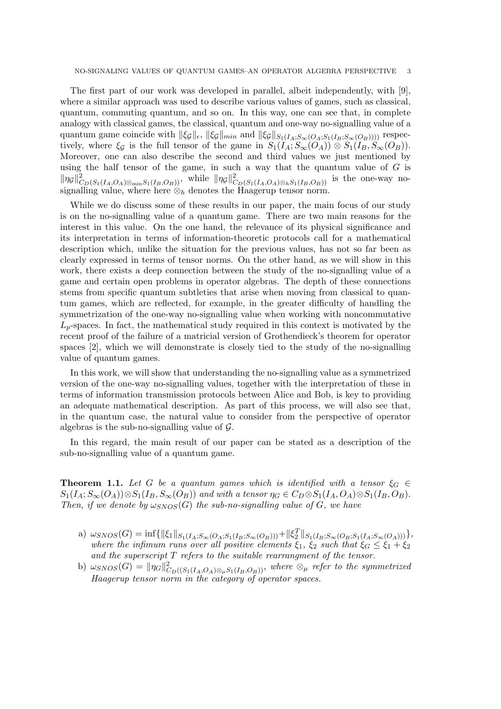
<figcaption class="paper-figure-caption"><b>Fig 2.</b> Low-resolution page preview, page 3</figcaption>
</figure>
<figure class="paper-figure-card">
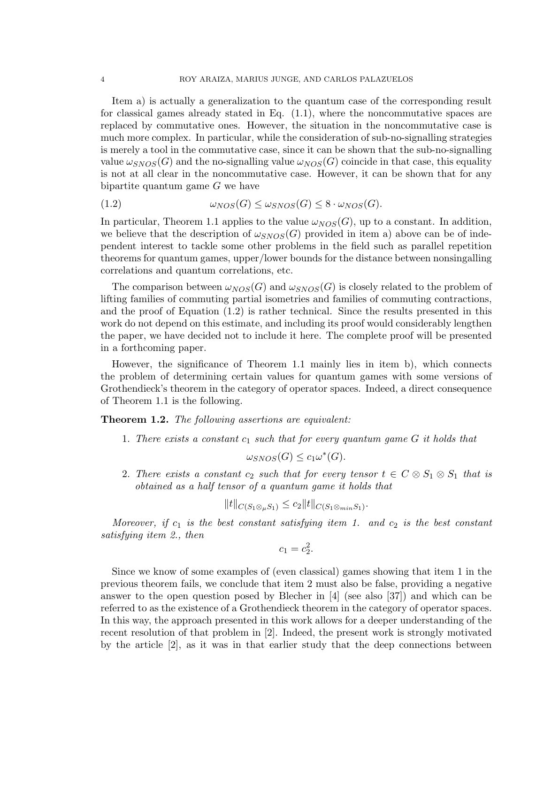
<figcaption class="paper-figure-caption"><b>Fig 3.</b> Low-resolution page preview, page 4</figcaption>
</figure>
<figure class="paper-figure-card">
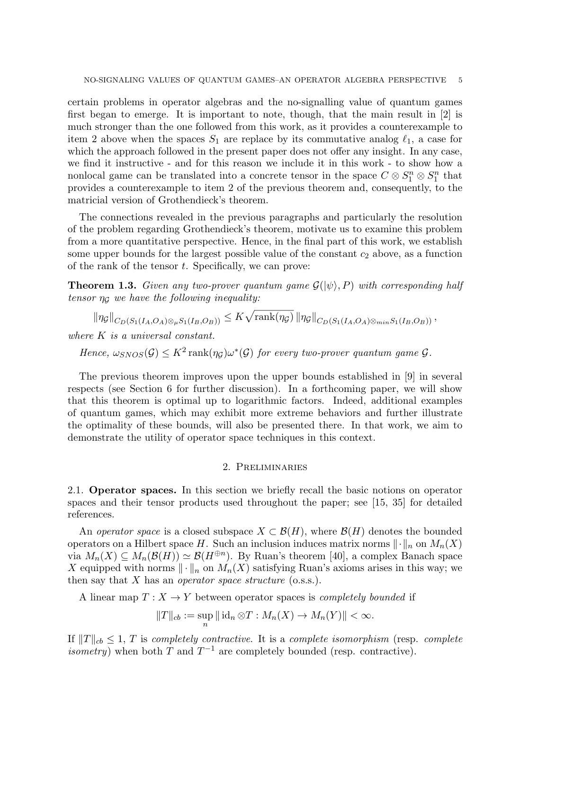
<figcaption class="paper-figure-caption"><b>Fig 4.</b> Low-resolution page preview, page 5</figcaption>
</figure>
<figure class="paper-figure-card">
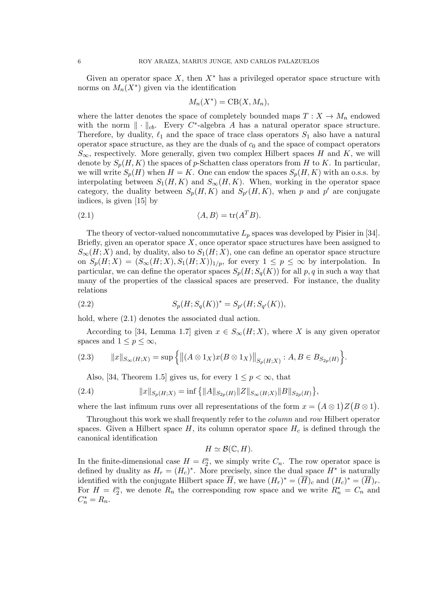
<figcaption class="paper-figure-caption"><b>Fig 5.</b> Low-resolution page preview, page 6</figcaption>
</figure>

**Summary.** This paper provides a deep operator algebraic characterization of 'no-signalling' constraints in two-prover quantum games. It defines and relates several quantitative measures ($\omega_{NOS}$ and $\omega_{SNOS}$) using sophisticated tensor norms from functional analysis. The results connect quantum information theory directly to unsolved problems in the structure theory of operator algebras.

**Why it may be interesting.** This work is highly theoretical but relevant to open questions in quantum information theory, particularly concerning the fundamental limitations imposed by causality (no-signaling) when quantifying correlations in multipartite quantum systems.

Detailed structure

**Main problem.** The work aims to rigorously characterize the 'no-signalling value' ($\omega_{NOS}(G)$) of two-prover quantum games by reformulating these concepts using advanced tools from operator space theory and tensor norms.

**Main result.** The authors establish deep connections between $\omega_{NOS}(G)$ and a related sub-no-signalling value ($\omega_{SNOS}(G)$), proving bounds like $\omega_{NOS}(G) \le \omega_{SNOS}(G) \le 8 \cdot \omega_{NOS}(G)$, while also connecting these values to open problems in operator algebras.

**Method.** The methodology heavily relies on functional analysis, specifically utilizing various tensor norms (e.g., $\min$, $\mu$) within the framework of operator spaces and analyzing completely positive trace-preserving maps via their Choi matrices.

**Model / system.** The model is abstract: two-prover quantum games ($G$), which are mathematically analyzed using tensors defined over state spaces ($\mathcal{S}_1(\cdot)$) associated with input and output systems for the players (Alice and Bob).

**Key observables.** No-signalling value ($\omega_{NOS}(G)$), sub-no-signalling value ($\omega_{SNOS}(G)$), and various tensor norms quantifying game values.

**Important parameters / regimes.** The analysis involves comparing constants derived from different norm estimates, such as $c_1$ and $c_2$, and the rank of associated tensors ($	ext{rank}(\eta_G)$).

**Assumptions / limitations.** The derivation relies on advanced theorems regarding operator spaces (e.g., Pisier's results) and specific structural assumptions about how quantum strategies map between input/output systems.

**Paper structure.** The paper progresses by first defining game values using tensor norms, then establishing equivalences between different types of quantum strategies (e.g., one-way vs. no-signalling), and finally deriving quantitative bounds relating the various defined 'no-signalling' measures.

Abstract

The aim of this work is to study two-prover quantum games (i.e., games with quantum inputs and outputs) from an operator-algebraic and operator-space point of view. We characterize several notions of the value of such games by formulating them in terms of tensor norms in the category of operator spaces. The main results of the paper concern the description of the so-called no-signalling value of these games, for which we not only provide a precise operator-space formulation, but also establish close connections between this study and some problems in operator algebras. In particular, we show how the recent counterexample to Grothendieck's theorem for operator spaces given in \cite{Ara} can be understood as a direct consequence of results in quantum information theory. We also obtain new upper bounds on the gap between the no-signalling value and the quantum value of two-prover quantum games, improving the best previously known estimates.

[↑ back to top](#top)

### [Probing the Weak-Driving Quantum Speed Limit via Drift-Aware Shooting Methods](http://arxiv.org/abs/2606.22212v1)

**Authors:** Denis Janković, Saba Taherpour, Paul-Louis Etienney, Paul-Antoine Hervieux, Christoph Wolf  
**Type:** theory · **Category:** quantum information and computing · **PDF:** <https://arxiv.org/pdf/2606.22212v1>  
**Analysis basis:** full PDF text, analyzed in chunks
**Topic relevance:** `exotic spin models in light-matter` **1/5** · `spintronics-quantum-optics interface` **1/5**

↔ Scroll figures horizontally

<figure class="paper-figure-card">
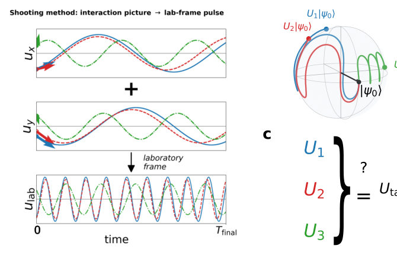
<figcaption class="paper-figure-caption"><b>Fig 1.</b> FIG. 1. The shooting (MAGICARP) construction illustrated for a single qubit. (a) A</figcaption>
</figure>
<figure class="paper-figure-card">
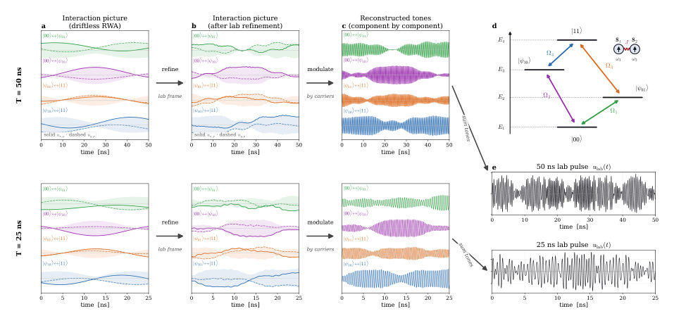
<figcaption class="paper-figure-caption"><b>Fig 2.</b> FIG. 2. Drift-aware dressed-transition shooting workflow, shown for the dressed two-qubit</figcaption>
</figure>
<figure class="paper-figure-card">
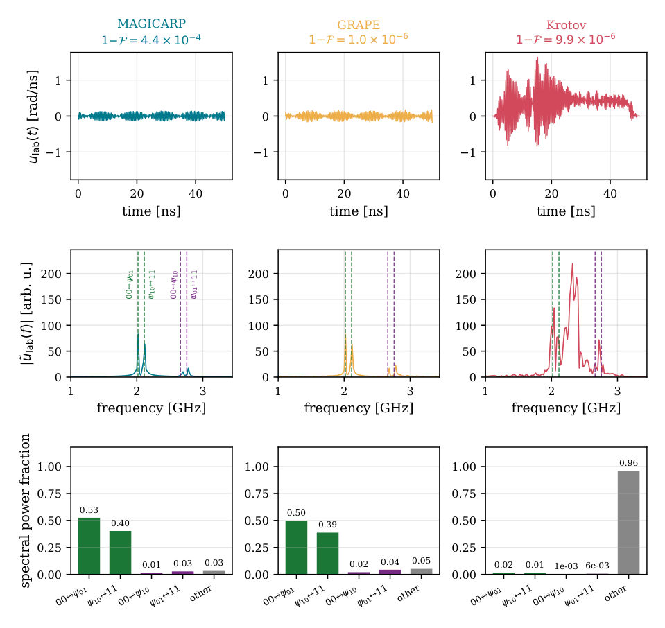
<figcaption class="paper-figure-caption"><b>Fig 3.</b> FIG. 3. Anatomy of the NOT2 pulses at moderate exchange, T = 50 ns, fair 10−5 halt. Columns:</figcaption>
</figure>
<figure class="paper-figure-card">
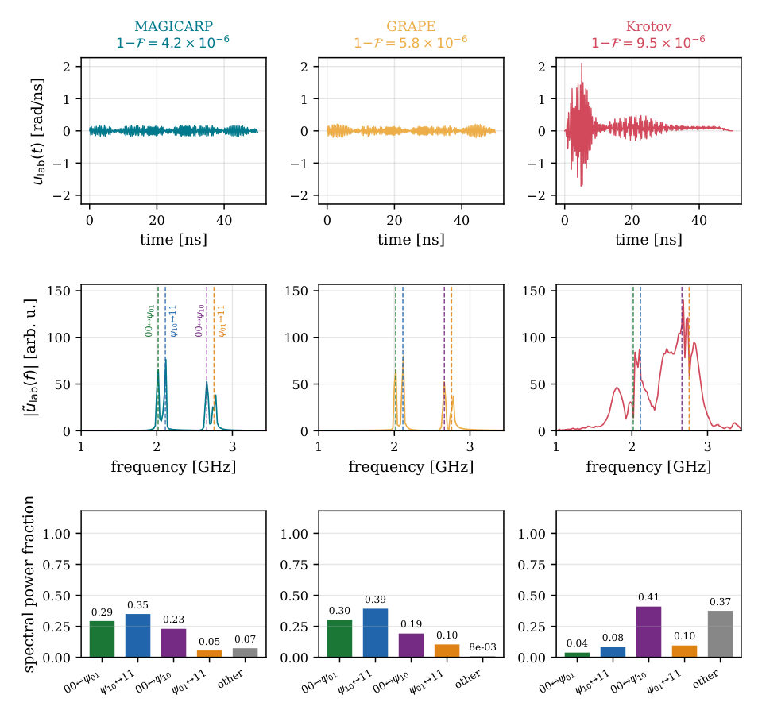
<figcaption class="paper-figure-caption"><b>Fig 4.</b> FIG. 4. Same anatomy for the dressed QFT at T = 50 ns, fair 10−5 halt. Because the QFT is</figcaption>
</figure>
<figure class="paper-figure-card">
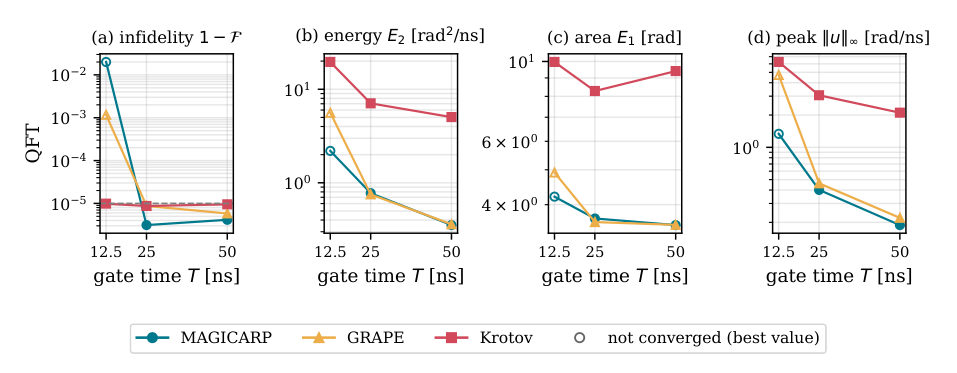
<figcaption class="paper-figure-caption"><b>Fig 5.</b> FIG. 5. Fair-halting comparison at the verified 10−5 halt for the dressed QFT: (a) verified infidelity</figcaption>
</figure>

**Summary.** The paper introduces MAGICARP, an advanced shooting method for quantum optimal control that efficiently generates smooth, low-energy pulses by accounting for a background drift Hamiltonian. By benchmarking against established methods like GRAPE and Krotov, the authors demonstrate superior energy efficiency and spectral selectivity. Crucially, they use this framework to map out the weak-driving Quantum Speed Limit for two-qubit gates.

**Why it may be interesting.** This work provides a significant methodological advancement in optimal control by explicitly incorporating structural constraints (the drift Hamiltonian) and physical realizability metrics (spectral purity, low energy). The rigorous mapping of the QSL is highly relevant for designing next-generation quantum hardware protocols.

Detailed structure

**Main problem.** The core challenge is achieving high-fidelity, low-energy quantum control pulses for implementing target unitary gates in the presence of a constant background Hamiltonian (drift).

**Main result.** The proposed MAGICARP method consistently achieves lower energy and spectral purity compared to Krotov's or GRAPE methods at matched gate infidelity. Furthermore, the work successfully maps out the weak-driving quantum speed limit for two-qubit gates.

**Method.** The authors employ a drift-aware shooting method (MAGICARP) inspired by Pontryagin's maximum principle, utilizing a two-stage optimization workflow: initial RWA optimization in a dressed basis followed by exact laboratory-frame refinement.

**Model / system.** The system is modeled as a closed quantum system governed by $H(t) = H_0 + \sum u_k(t)H_k$, specifically applied to two exchange-coupled electron spins (qubits). The target operation requires accounting for the drift Hamiltonian $H_0$ via an effective target unitary $U_{	ext{target}} = U_{	ext{gate}} e^{-iH_0T}$.

**Key observables.** Gate infidelity ($1-F$), integrated pulse energy ($E_2$), conserved pulse area ($E_1$), spectral weight distribution (gate-essential vs. spectator transitions), and the minimum control energy $E_{	ext{law}}^2(T)$.

**Important parameters / regimes.** The analysis focuses on the weak-driving regime, characterized by a critical gate time threshold $T^*$ where low-amplitude solutions cease to exist.

**Assumptions / limitations.** The comparison relies on a 'fair-halting benchmark' protocol to ensure that different optimization algorithms are compared at equivalent levels of achieved fidelity and effort.

**Figures summary.** Figures compare the spectral anatomy of optimized pulses (MAGICARP, GRAPE, Krotov) for NOT2 and QFT gates, showing MAGICARP/GRAPE achieving spectrally clean, minimal-energy solutions while Krotov is broadband. Plots also illustrate the energy scaling near the quantum speed limit.

**Paper structure.** The paper first establishes the drift-aware control framework using a two-stage shooting method (MAGICARP). It then benchmarks this against GRAPE and Krotov methods across multiple gates (NOT2, QFT) at matched infidelity. Finally, it performs extensive statistical sweeps to map out the weak-driving quantum speed limit, deriving an area-pole law for minimum energy.

Abstract

A central goal of quantum optimal control is to achieve high-fidelity and low-energy control pulses. When quantum optimal control methods optimize every point of a pulse discretized over small time steps independently this can yield high fidelity control but also results in broadband and energy-hungry waveforms. We extend MAGICARP -- a shooting method inspired by Pontryagin's maximum principle on energy that generates an entire pulse from a small set of parameters, making it smooth and energy-efficient by construction -- from driftless systems to closed systems with the constant drift Hamiltonian of two exchange-coupled spins in an external magnetic field. The optimization proceeds in stages: the dressed states of the drift Hamiltonian structure the target, an initial shooting optimization is performed in the rotating-wave frame, and an exact laboratory-frame refinement follows. Benchmarked against Krotov and GRAPE at matched gate infidelity, MAGICARP consistently achieves the lowest energy and a conserved pulse area, concentrates its spectral weight on the gate-relevant transitions, and is the most robust to fluctuations in the exchange coupling; GRAPE independently converges to essentially the same pulse, while Krotov's method pays an order-of-magnitude energy premium. Moreover, a large statistical survey of unselected optimization runs resolves a weak-driving quantum speed limit for two exchange-coupled electron spins: low-amplitude realizations of the two-qubit quantum Fourier transform cease to exist below a critical gate time $T^*$ set by the drift's interaction rate, and the minimum control energy diverges on approach to this limit. The divergence obeys a simple two-parameter area-pole law, $E_2^{\mathrm{law}}(T)=A/T+B/(T-T^*)$, whose first term is the time-optimal area cost and whose second term is a pole at the speed limit.

[↑ back to top](#top)

### [Quantum oscillations and Dirac dispersion in tunable kagome lattice Lu$_{1-y}$Y$_y$(Nb$_{1-x}$Ta$_x$)$_6$Sn$_6$](http://arxiv.org/abs/2606.21694v1)

**Authors:** Keenan Avers, Phineas Sobel, Lochlan Joyce, Jared Dans, Prathum Saraf, Ram Kumar, Shanta Saha, Peter Zavalij, Johnpierre Paglione  
**Type:** experiment · **Category:** strongly correlated electrons · **PDF:** <https://arxiv.org/pdf/2606.21694v1>  
**Analysis basis:** full PDF text, analyzed in chunks
**Topic relevance:** `Kondo & dissipative impurity` **1/5** · `analog quantum simulation` **1/5**

↔ Scroll figures horizontally

<figure class="paper-figure-card">
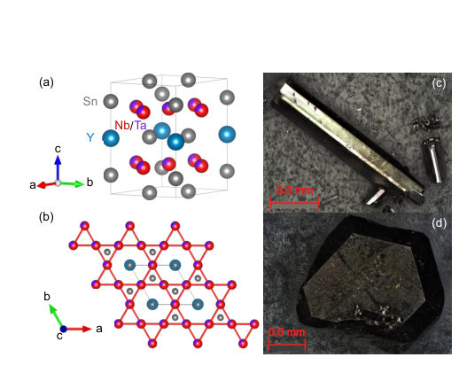
<figcaption class="paper-figure-caption"><b>Fig 1.</b> FIG. 1. (a) The unit cell of Y(Nb1−xTax)6Sn6 that shows the triangular Y layers sandwiched between kagome Nb/Ta held together by a Sn framework. (b) Down c-axis view of extended crystal structure emphasizing the corner sharing motif of the kagome Nb/Ta sites. (c) Single crystal hexagonal needle of the 30 % Ta batch. (d) Single crystal hexagonal plate of the 1 % Ta batch that demonstrates Ta alloying affects growth morphology.</figcaption>
</figure>
<figure class="paper-figure-card">
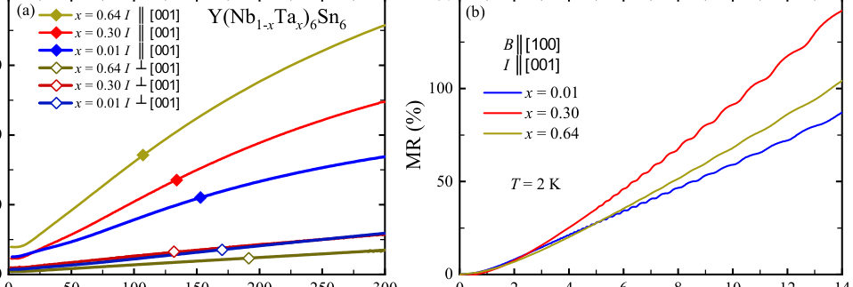
<figcaption class="paper-figure-caption"><b>Fig 2.</b> FIG. 2. (a) Electrical resistivity (ρ) of Y(Nb1−xTax)6Sn6 crystals for current (I) along the c-axis (I ∥[001]) and perpendicular to the c-axis (I ⊥[001]) for the x = 0.01, x = 0.30, and x = 0.64 batches. The observation that Y(Nb1−xTax)6Sn6 has smaller ρ for I ⊥[001] compared to I ∥[001] points to a reasonably large anisotropy. (b) The transverse magnetoresistance (MR) vs. magnetic field (B) for B ∥[100] and I ∥[001] at T = 2 K showing large MR response and low frequency Shubnikov-de Haas (SdH) quantum oscillations demonstrate high sample quality. The relatively moderate effect of Ta substitution on transport demonstrates minimal signatures of alloy disorder in both (a) and (b).</figcaption>
</figure>
<figure class="paper-figure-card">
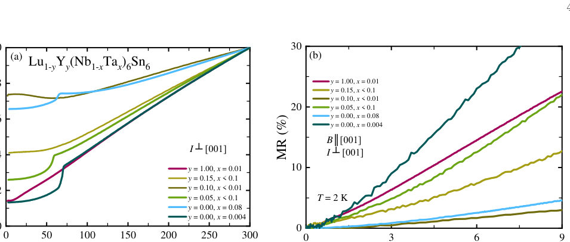
<figcaption class="paper-figure-caption"><b>Fig 3.</b> FIG. 3. (a) Normalized resistivity of Lu1−yYy(Nb1−xTax)6Sn6 for I ⊥[001]. The Y-rich end at y = 1.00 exhibits good sample quality with minimal leveling off below ∼10 K, while samples with higher Lu concentration (e.g. y ≤0.15) show a consistent trend towards larger overall resistance ratio. Signatures of a charge density wave (CDW) emerge at y = 0.10 and evolve from a local minimum towards a kink feature by y = 0.00. (b) Magnetoresistance (MR) at T = 2 K demonstrates a degree of consistency with Kohler’s rule with the Y-rich samples having overall greater MR percentages, which suggests the increase in ρ is due to disorder, although we emphasize that the y = 0.00, x = 0.004 batch...</figcaption>
</figure>
<figure class="paper-figure-card">
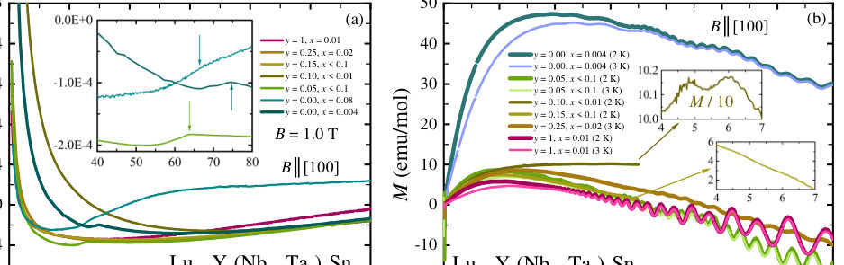
<figcaption class="paper-figure-caption"><b>Fig 4.</b> FIG. 4. (a) Magnetic susceptibility (M/H) of various y and x batches of Lu1−yYy(Nb1−xTax)6Sn6 single crystals measured in an applied field of 1.0 T applied along the [100] direction. The inset emphasizes the onset of the CDW inflection points in the Lu-rich batches. With the exception of the lower quality y = 0.00, x = 0.08 sample, all the materials are diamagnetic at 300 K, but become paramagnetic at low temperatures and fields. (b) Field dependence of magnetization (M) further demonstrates a mixture of paramagnetic and diamagnetic responses. The observation of de Hass-Van Alphen oscillations are consistent with quantum oscillations observed in resistivity (see text). The insets emphasize...</figcaption>
</figure>
<figure class="paper-figure-card">
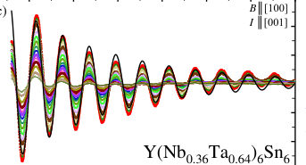
<figcaption class="paper-figure-caption"><b>Fig 5.</b> FIG. 5. Shubnikov-de Haas (SdH) oscillations of three sam- ples of Y(Nb1−xTax)6Sn6, extracted by plotting background- subtracted magnetoresistance ∆R (see text for details) vs in- verse magnetic field, for (a) x = 0.01, (b) x = 0.30, and (c) x = 0.64. Data fits to the Lifshitz–Kosevich formalism (see text and Table II) are shown for 2 K data (black curves). Two different frequencies, α and β, are resolvable for the x = 0.01 sample, but only the α orbit is observable for the x = 0.30 and x = 0.64 samples. A non-zero Berry phase (ϕB) manifests for all the orbits, which is consistent with a Fermi surface derived from topologically non-trivial linearly dispersing Dirac bands.</figcaption>
</figure>

**Summary.** This work reports on the synthesis and characterization of tunable kagome lattice compounds ($	ext{Lu}_{1-y}	ext{Y}_y(	ext{Nb}_{1-x}	ext{Ta}_x)_6	ext{Sn}_6$). By measuring quantum oscillations, the researchers map out how alloying tunes the Fermi surface topology and tracks its evolution relative to a competing Charge Density Wave (CDW) order. This demonstrates fine control over novel electronic states in correlated materials.

**Why it may be interesting.** While focused on solid-state physics, the ability to tune electronic band structure (Dirac points) via chemical substitution provides a model for engineering topological states, which is relevant to understanding emergent quantum phenomena in strongly correlated systems.

Detailed structure

**Main problem.** The study investigates quantum oscillations and Dirac dispersion in a tunable kagome lattice system to understand its rich electronic properties.

**Main result.** The research reveals that the Fermi surface size and effective mass evolve systematically across the alloy series, suggesting a transition towards or proximity to Dirac-like band dispersion. The interplay between this electronic structure and Charge Density Wave (CDW) order is mapped out.

**Method.** The authors employed single crystal growth of double-alloyed compounds and characterized them using electrical transport measurements (magnetoresistance) and magnetization measurements, analyzing quantum oscillations via the Lifshitz–Kosevich theory.

**Model / system.** The physical system is the $	ext{Lu}_{1-y}	ext{Y}_y(	ext{Nb}_{1-x}	ext{Ta}_x)_6	ext{Sn}_6$ double-alloy, which possesses a kagome lattice structure known for hosting flat bands and Dirac/Weyl points.

**Key observables.** Quantum oscillation frequencies ($\alpha, eta, \gamma$), effective masses ($m_i$), Fermi surface size changes, Charge Density Wave (CDW) transition temperature evolution, and magnetoresistance anisotropy.

**Important parameters / regimes.** Compositional tuning via Y substitution ($y$) and Ta alloying ($x$); low temperatures ($T \approx 2	ext{ K}$); magnetic field dependence ($B$).

**Assumptions / limitations.** The analysis relies on fitting quantum oscillation data to the Lifshitz–Kosevich equation, and it assumes that changes in Fermi surface size are due to competing interactions rather than simple doping.

**Figures summary.** Figures show resistivity vs. magnetic field confirming large magnetoresistance and SdH oscillations; plots track CDW signatures ($
ho$ minima/kinks) as a function of Y concentration; FFT spectra map the evolution of multiple oscillation frequencies with composition.

**Paper structure.** The paper systematically presents structural characterization, followed by transport measurements to observe CDW transitions. The core analysis uses quantum oscillations in both MR and M vs B data, analyzing frequency shifts and effective mass changes across the compositional phase diagram.

Abstract

Kagome lattice crystal systems present interesting symmetry-protected band structure features such as flat bands, van Hove singularities, and linearly dispersing Dirac/Weyl points that provide a rich playground for strongly correlated electron physics. Motivated by the rich properties and charge density wave evolution through the 1-6-6 series of compounds, we present our results in single crystal growth and characterization of the of Lu$_{1-y}$Y$_y$(Nb$_{1-x}$Ta$_x$)$_6$Sn$_6$ double-alloy system, including evolution of the charge density wave transition, electrical transport behavior and resultant phase diagrams. Using a novel growth technique, the synthesis of high quality crystals with extended length along the crystallographic $c$-axis allows us to follow the gradual suppression of charge density wave (CDW) order with Y substitution, and observe quantum oscillations in both magnetoresistance and magnetization throughout the series. We review the evolution of Fermi surfaces, effective masses and quasiparticle dispersion through the alloy series, revealing a decrease in size of Fermi surfaces that trends with both substitutions, and a scaling between effective mass and Fermi wavevector that suggests a regime with Dirac-like dispersion. The ability to fine-tune crystallographic, ground state and electronic dispersion properties of the \lit\ system with minimal impact of disorder opens a path torward further understanding the nature of the kagome lattice and its novel states and interactions.

[↑ back to top](#top)

### [Tuning Quantum MPS](http://arxiv.org/abs/2606.23262v1)

**Authors:** Anna Leonteva, Maxime Outteryck, Guido Masella  
**Type:** theory · **Category:** numerical methods · **PDF:** <https://arxiv.org/pdf/2606.23262v1>  
**Analysis basis:** full PDF text, analyzed in chunks
**Topic relevance:** `methods for driven-dissipative` **1/5** · `non-equilibrium dynamics` **1/5**

↔ Scroll figures horizontally

<figure class="paper-figure-card">

<figcaption class="paper-figure-caption"><b>Fig 1.</b> Fig. 1. Speedup (ratio of default params. run time / optimized param. run time) by circuit family for Qiskit (blue) and MIMIQ (orange). Each box plot represents the distribution of speedup values across circuit instances with varying qubit counts. The median is shown by the central line, and the dashed horizontal line at 1 indicates no improvement. The vertical axis is shown on a logarithmic scale.</figcaption>
</figure>
<figure class="paper-figure-card">
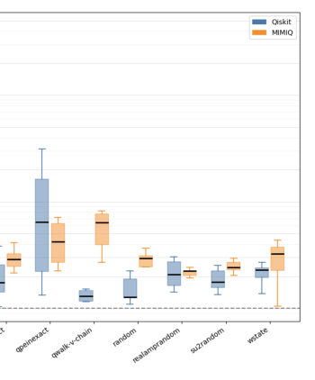
<figcaption class="paper-figure-caption"><b>Fig 2.</b> Figure 1 compares the distribution of offline optimization speedup across circuit families for Qiskit and MIMIQ. Speedup is defined as the ratio of default to optimized run time, so values above one indicate improvement. For each circuit family, the box plot aggregates the speedup values obtained for the available circuit instances at different qubit counts. The central line indicates the median, the box spans the interquartile range, and the whiskers show the spread of the observed values. Compact distributions indicate more consistent gains across instances, whereas wider ones indicate larger variability with circuit size. The two backends exhibit clearly different behavior. For Qiskit,...</figcaption>
</figure>
<figure class="paper-figure-card">
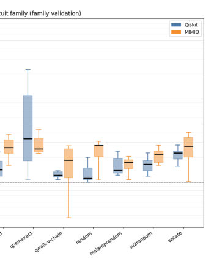
<figcaption class="paper-figure-caption"><b>Fig 3.</b> Fig. 2. Prediction speedup (ratio of default to predicted run time) by circuit family for Qiskit (blue) and MIMIQ (orange) under one-family-out validation. The black line shows the median, boxes the interquartile range, and whiskers the variability across instances. The dashed line at 1 indicates no improvement. The vertical axis is logarithmic.</figcaption>
</figure>
<figure class="paper-figure-card">
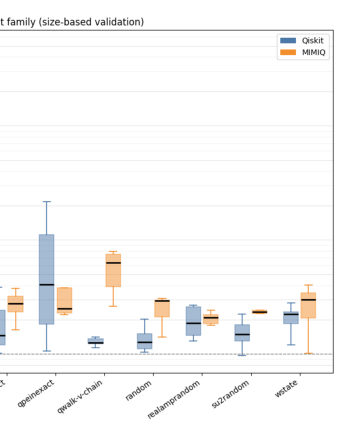
<figcaption class="paper-figure-caption"><b>Fig 4.</b> Fig. 3. Prediction speedup (ratio of default to predicted run time) by circuit family for Qiskit (blue) and MIMIQ (orange) under size-based validation. The black line shows the median, boxes the interquartile range, and whiskers the variability across instances. The dashed line at 1 indicates no improvement. The vertical axis is shown on a logarithmic scale.</figcaption>
</figure>

**Summary.** The paper introduces a novel two-stage framework to automate hyperparameter tuning for MPS simulations of quantum circuits. It first optimizes settings offline using CMA-ES and then trains a hybrid ranking model on circuit features to predict optimal configurations for new circuits. This allows researchers to efficiently manage the complex, high-dimensional search space inherent in state-of-the-art quantum simulation techniques.

**Why it may be interesting.** This work directly addresses the practical limitations of simulating complex quantum dynamics by providing a machine learning tool to optimize simulation parameters, which is crucial for scaling tensor network methods.

Detailed structure

**Main problem.** The core problem is developing an automated, data-driven method to select optimal hyperparameters for Matrix Product State (MPS) simulation of quantum circuits.

**Main result.** A two-stage framework combining offline CMA-ES optimization with a circuit-aware hybrid ranking model can predict good configurations, recovering a meaningful fraction of the performance gain over default settings.

**Method.** The approach uses an initial offline optimization phase to build a database, followed by training a complex ensemble ranking model on static circuit features to predict optimal parameters for unseen circuits.

**Model / system.** The system under study is the simulation of quantum circuits using the Matrix Product State (MPS) method across various quantum backends (Qiskit and MIMIQ).

**Key observables.** Run time ($T$), Fidelity ($F$), run time ratio ($r$), and fidelity gap ($\Delta F$).

**Important parameters / regimes.** Hyperparameters $	heta$ (five backend parameters), fidelity constraint ($	au=99\%$), and various mixing coefficients for the ranking model.

**Assumptions / limitations.** The prediction model's performance is compared against an ideal offline optimum, and size-based validation was found to be more reliable than family-based transfer.

**Figures summary.** Figures compare speedup distributions from offline optimization across circuit families for Qiskit and MIMIQ, and show the predictive model's speedup under one-family-out vs. size-based validation.

**Paper structure.** The paper details a two-stage process: first, building an optimization database via CMA-ES; second, training a hybrid ranking model using circuit features to predict optimal configurations for generalization.

Abstract

Matrix Product State (MPS) methods are among the most effective approaches for the classical simulation of quantum circuits, but their practical performance depends strongly on simulator hyperparameters, and default settings are often suboptimal. In this work, we propose a two-stage framework for automatic hyperparameter selection for quantum MPS simulation. In the first stage, we perform offline single-objective CMA-ES optimization under a fidelity constraint and construct a database of circuit--configuration--performance evaluations. In the second stage, we define a set of static circuit features designed to capture MPS-relevant structural properties and train a circuit-aware hybrid ranking model to recommend configurations for different quantum circuits. We evaluate the approach on multiple scalable circuit families using leave-one-family-out and size-based validation. The results show that offline optimization often improves over default settings, although the magnitude of the gain depends strongly on the backend, circuit family, and circuit scale. The learned predictor recovers a meaningful fraction of this gain, with better performance under size-based validation than under family-based transfer, but generally remains below the offline optimum.

[↑ back to top](#top)

### [Understanding Squeezed States of Light Through Wigner's Phase-Space](http://arxiv.org/abs/2606.23102v1)

**Authors:** Sibel Baskal, Marilyn E. Noz  
**Type:** theory · **Category:** other · **PDF:** <https://arxiv.org/pdf/2606.23102v1>  
**Analysis basis:** full PDF text, analyzed in chunks
**Topic relevance:** `Keldysh / 2PI / non-Gaussian methods` **1/5** · `entanglement & information structure` **1/5**

↔ Scroll figures horizontally

<figure class="paper-figure-card">
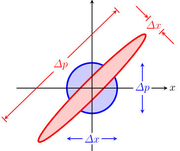
<figcaption class="paper-figure-caption"><b>Fig 1.</b> Figure 1: Illustrated as a blue circle, it corresponds to the initial vacuum state in phase space, whose area is proportional to and is a representative of minimum uncertainty ∆x∆p = 1/4. When the circle is squeezed, it is transformed into an ellipse, shown in red. This has the same area as the circle and thus is also a representative of minimum uncertainty.</figcaption>
</figure>
<figure class="paper-figure-card">
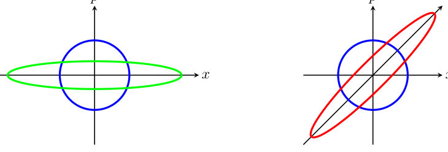
<figcaption class="paper-figure-caption"><b>Fig 2.</b> Figure 2: The transformations of Sp(2) produce rotations and squeezes. The circle in this figure corresponds to a Gaussian distribution. As shown on the left, the Lorentz boost of SO(2 , 1) along the z-direction corresponds to the squeeze of Sp(2) along the x-axis of the phase space. On the right is the action of the rotated squeeze of Sp(2), which transforms the circle into a tilted ellipse whose major axis is aligned along the p = x line. This transformation corresponds to the boost along the x-direction of SO(2 , 1).</figcaption>
</figure>
<figure class="paper-figure-card">
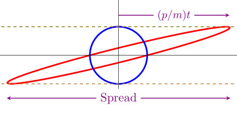
<figcaption class="paper-figure-caption"><b>Fig 3.</b> Figure 3: The spread of the Gaussian wave packet. The circle represents the Gaussian distribution, while the tilted ellipse represents the time development [68].</figcaption>
</figure>
<figure class="paper-figure-card">
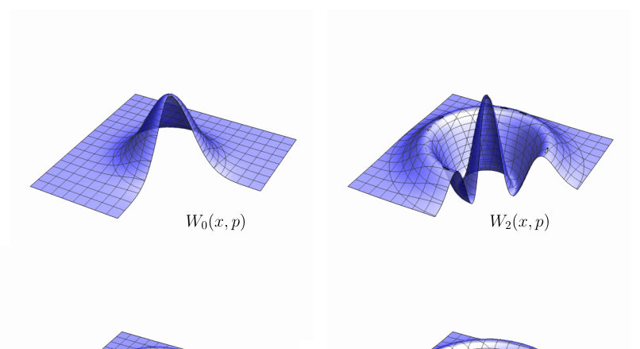
<figcaption class="paper-figure-caption"><b>Fig 4.</b> Figure 4: Wigner functions (with right-angle cross sections) of the harmonic oscillator for the ground state and for the first three excited states. The symmetry of the Wigner function with respect to x and p is apparent. It can also be observed that higher the excited state the function has more ripples around the origin.</figcaption>
</figure>
<figure class="paper-figure-card">
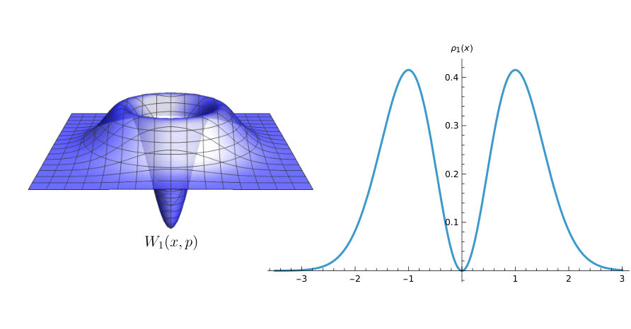
<figcaption class="paper-figure-caption"><b>Fig 5.</b> Figure 5: The Wigner function for the harmonic oscillator in the first excited state. It is negative at the origin, becomes positive as (x2 + p2) increases, and becomes vanishingly small as (x2 + p2) becomes very large. If this Wigner function is integrated over p, then it becomes the quantum probability distribution in x, which is ρ1(x) = 2x2e−x2/√π, and is positive for all values of x.</figcaption>
</figure>

**Summary.** This paper develops an advanced theoretical framework using the Wigner phase-space distribution function to analyze squeezed states of light. It unifies concepts from classical mechanics, quantum optics, and group theory by showing that state transformations are governed by specific symmetry groups like the symplectic or Lorentz groups. This provides a powerful mathematical tool for understanding entanglement and decoherence in quantum optical systems.

**Why it may be interesting.** This work is highly relevant as it provides a deep mathematical underpinning for quantum optics by unifying state descriptions (Wigner function) with fundamental symmetry principles (Lie groups), which is crucial for understanding complex light-matter interactions.

Detailed structure

**Main problem.** The paper aims to elucidate squeezed states of light using a unified framework based on quantum phase space, canonical transformations, and group theory.

**Main result.** Phase space provides a powerful, symmetry-preserving language for quantum optics, showing that coherent and squeezed states can be generated from the vacuum via canonical transformations corresponding to specific Lie groups (like $	ext{Sp}(2)$ or Lorentz/symplectic groups).

**Method.** The analysis heavily relies on defining and manipulating the Wigner phase-space distribution function, connecting it to density matrices, and employing group theoretical methods involving symplectic and Lorentz symmetries.

**Model / system.** The primary system is light fields modeled by quantized harmonic oscillators. The mathematical framework extends from 2D (single mode) to 4D (two modes), incorporating concepts like the Poincaré sphere for polarization description.

**Key observables.** Wigner function $W(x, p)$, squeezing parameters ($\lambda$), entanglement measures, and expectation values derived from phase-space integrals.

**Important parameters / regimes.** The analysis uses natural units ($\hbar=c=1$) and focuses on the structure imposed by various symmetry groups (Lorentz, symplectic $	ext{Sp}(2n)$).

**Assumptions / limitations.** The focus is primarily on the simplest form of the Wigner function; mathematical derivations often rely on established group theory results.

**Figures summary.** Figures illustrate squeezing via transformation from a circle to an ellipse while preserving area, show time evolution of Gaussian wave packets (shear), and compare Wigner functions for different excitation levels ($n=0, 1, 2, 3$), highlighting negativity in excited states.

**Paper structure.** The paper progresses by establishing the phase-space formalism ($	ext{Wigner} 	o 	ext{Density Matrix}$), detailing canonical transformations and associated symmetry groups (Euclidean/Symplectic), applying this to simple systems (harmonic oscillator, free particles), extending to multi-mode systems (two-mode squeezing), and finally relating symmetries to polarization optics via the Poincaré sphere.

Abstract

This paper starts with the transition from classical physics to quantum mechanics which was greatly aided by the concept of phase space. The role of canonical transformations in quantum mechanics is addressed. The Wigner phase-space distribution function is then defined which arises from the formulation of the density matrix, followed by the harmonic oscillator in phase space. Coherent and one- and two-mode squeezed states of light as well as the squeezed vacuum are discussed in the phase-space picture. Attention is also drawn to the fact that squeezed states naturally generate entanglement between the two-modes. Coupled harmonic oscillators are also elucidated in connection with the Wigner phase space. It will be noted that the phase-space picture of quantum mechanics has become an important scientific language for the rapidly expanding field of quantum optics. Here, we mainly focus on the simplest form of the Wigner function, which finds application in many branches of quantum mechanics. We make use of several symmetry groups such as Lorentz groups, the symplectic group in two and four dimensions, and the Euclidean group. The decoherence problem of an optical field is examined through a reformulation of the Poincaré sphere as a further illustration of the density matrix.

[↑ back to top](#top)

### [When the Learning With Errors Problem Meets the Coherent Ising Machine: A Penalty-Free Algorithm-Hardware Co-Design](http://arxiv.org/abs/2606.22843v1)

**Authors:** Shuxian Jiang  
**Type:** both · **Category:** quantum information and computing · **PDF:** <https://arxiv.org/pdf/2606.22843v1>  
**Analysis basis:** full PDF text, analyzed in chunks
**Topic relevance:** `QC/QI experiment` **1/5** · `methods for driven-dissipative` **1/5**

↔ Scroll figures horizontally

<figure class="paper-figure-card">
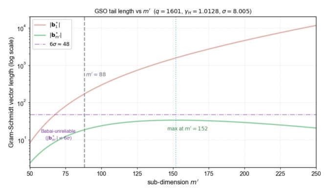
<figcaption class="paper-figure-caption"><b>Fig 1.</b> Figure 1: Trend of the theoretical ∥b∗ 1∥and ∥b∗ m′∥as functions of sub-dimension m′ for the n = 40 instance (q = 1601, γH = 1.0128 (BKZ-20), σ = 8.005). The dash-dotted purple line at 6σ ≈48 is the Babai hard-decision failure region threshold, the grey vertical line at m′ = 88 marks the point used in the experiments, the analytic maximum of ∥b∗ m′∥occurs at m′ = 152.</figcaption>
</figure>
<figure class="paper-figure-card">
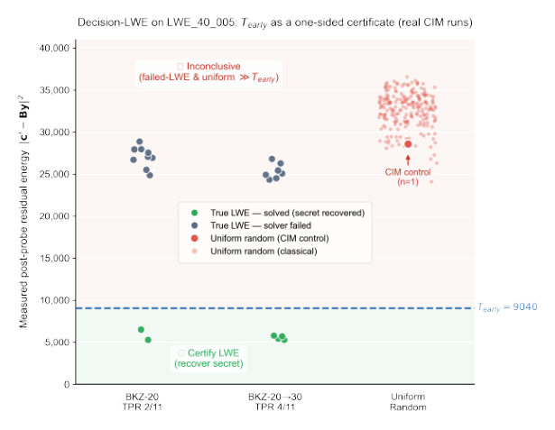
<figcaption class="paper-figure-caption"><b>Fig 2.</b> Figure 2: Decision-LWE on LWE_40_005: measured post-corrector residual energies (Tearly = 9040). Green = true-LWE seeds the pipeline solves (residual crosses below Tearly, secret recov- ered), gray = true-LWE seeds the solver fails, red = uniform-random control, light-red histogram = n=220 uniform targets evaluated by classical minimization on the same reduced bases. Pro- gressive BKZ-20 →30 raises the solved fraction from 2/11 to 4/11. The threshold separates solved from unsolved: only solved seeds cross it, while failed-LWE and uniform targets are both ≫Tearly. Energy magnitude above the threshold is not discriminative, the operative signal is the binary crossing event.</figcaption>
</figure>

**Summary.** The paper introduces CIM-BDD, a novel hybrid algorithm designed to break LWE-based cryptography on Coherent Ising Machines. It maps the problem to a penalty-free QUBO formulation suitable for NISQ hardware via advanced encoding techniques. The framework demonstrates end-to-end cryptanalysis by using an early-stopping threshold to distinguish successful lattice solves from random noise.

**Why it may be interesting.** This work provides a concrete, multi-layered blueprint for attacking lattice-based cryptography using near-term quantum hardware (NISQ devices) by carefully managing the mapping from continuous mathematics to discrete Ising Hamiltonians.

Detailed structure

**Main problem.** The core problem is cryptanalysis of the Learning With Errors (LWE) problem, which underpins modern Post-Quantum Cryptography. The goal is to solve this hard mathematical problem using a hybrid quantum-classical approach.

**Main result.** The authors propose CIM-BDD, a penalty-free algorithm-hardware co-design that successfully demonstrates end-to-end cryptanalysis of 40-dimensional LWE instances on the Coherent Ising Machine (CIM).

**Method.** LWE is reduced to a Closest Vector Problem (CVP) via algebraic elimination and then mapped to a QUBO problem. This QUBO is solved using an adaptive mixed-radix encoder driven by Continuous Relaxed Babai's Nearest Plane projection on the CIM.

**Model / system.** The physical platform is the Coherent Ising Machine (CIM), which implements energy minimization via QUBO Hamiltonians. The mathematical model involves reducing LWE to a lattice problem, followed by continuous relaxation and adaptive encoding to fit NISQ hardware constraints.

**Key observables.** Residual energy ($E$), distinguishing advantage ($	ext{Adv}_{	ext{DLWE}}$), and the early-stopping threshold ($T_{	ext{early}}$).

**Important parameters / regimes.** $40$-dimensional LWE instances, $q$-ary lattice structure, and hardware constraints (e.g., 550-spin capacity).

**Assumptions / limitations.** The method relies on the statistical validity of the early-stopping threshold ($T_{	ext{early}}$) to distinguish true solutions from random noise, and assumes that classical post-processing steps (like Babai's Plane) can correct hardware discretization errors.

**Figures summary.** Figures illustrate energy trends showing solved LWE seeds crossing below a specific threshold relative to uniform targets, confirming the distinguishing advantage.

**Paper structure.** The paper follows an algorithmic flow: 1. Algebraic isomorphism of LWE to a lattice problem. 2. Lattice reduction (BKZ). 3. Continuous relaxation via CR-BNP projection onto the exploration subspace. 4. Adaptive QUBO encoding for hardware submission. 5. Multi-stage post-processing involving Babai's Plane and a bounded corrector to recover the final secret.

Abstract

The Learning With Errors (LWE) problem constitutes the mathematical foundation of modern Post-Quantum Cryptography (PQC). Cryptanalysis of LWE ranges from classical lattice reduction to machine learning and quantum-classical hybrids. We propose CIM-BDD, a hybrid Bounded-Distance-Decoding solver that reduces LWE to a Quadratic Unconstrained Binary Optimization (QUBO) problem through a strictly \emph{penalty-free} mapping. An algebraic elimination of the secret embeds LWE into a $q$-ary lattice, absorbing the modular arithmetic and recasting the problem as a Closest Vector Problem (CVP). The squared error norm is then used \emph{directly} as the QUBO energy, so the cryptographic noise is the objective to be minimized rather than a penalized constraint. To realize this general model on current Noisy Intermediate-Scale Quantum (NISQ) devices, we design a special encoding method: a Continuous Relaxed Babai's Nearest Plane (CR-BNP) projection drives an adaptive mixed-radix encoder that greatly reduces both the qubit count and the QUBO coefficient range, so that a single batched hardware submission suffices. We further derive a statistically bounded early-stopping threshold ($T_{\text{early}}$) that acts as a one-sided certificate and doubles as a Decision-LWE distinguisher. We validate the framework on the TU Darmstadt LWE Challenge, giving an end-to-end demonstration for both Search- and Decision-LWE of a $40$-dimensional instance on the Coherent Ising Machine CPQC-550. This work establishes a new algorithm-hardware co-design paradigm for quantum-classical hybrid cryptanalysis.

[↑ back to top](#top)

### [A quantum algorithm for one-shot signatures](http://arxiv.org/abs/2606.23612v1)

**Authors:** Gopikrishnan Muraleedharan, Minh Thuy Truc Pham, Vir Pathak, Thomas Gardner, Chuanqi Zhang, QPerfect, Gavin K. Brennen  
**Type:** theory · **Category:** quantum information and computing · **PDF:** <https://arxiv.org/pdf/2606.23612v1>  
**Analysis basis:** full PDF text, analyzed in chunks
**Topic relevance:** `entanglement & information structure` **1/5**

↔ Scroll figures horizontally

<figure class="paper-figure-card">
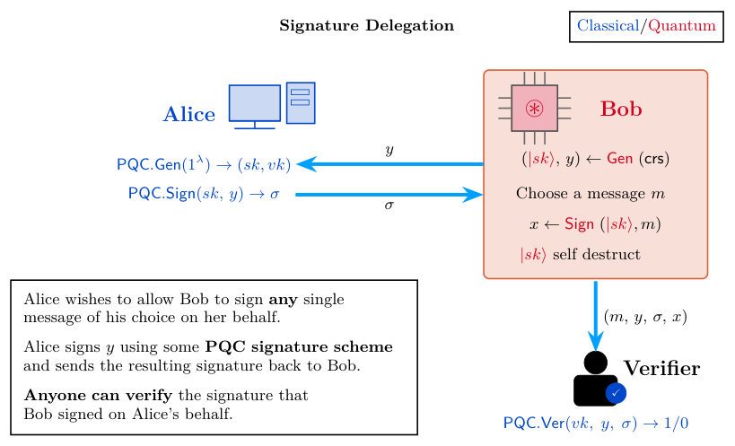
<figcaption class="paper-figure-caption"><b>Fig 1.</b> Figure 1: Signature delegation protocol. To mitigate risks from Bob’s quantum capabilities, Alice uses a post-quantum signature scheme, generating a signing key (PQC.sk) and verification key (PQC.vk). The blue arrows indicate classical communication that are public.</figcaption>
</figure>
<figure class="paper-figure-card">
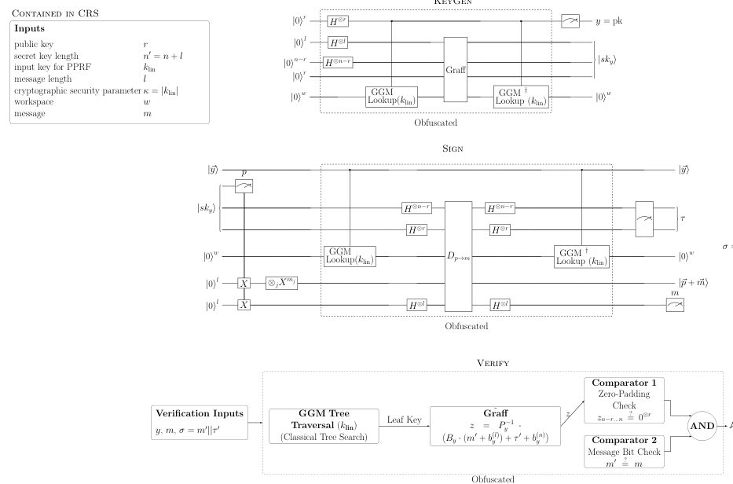
<figcaption class="paper-figure-caption"><b>Fig 2.</b> Figure 3: Workflow diagram of the multi-bit OSS protocol. The dashed boxes represent the part of the circuits that need to be obfuscated and are distributed as classical instructions contained in CRS. Note that in Sign even though the control register |⃗y⟩representing the public key is classical, it should be treated as a quantum register since those gates it controls are to be obfuscated. The bottom section outlines the corresponding classical verification protocol, which efficiently evaluates signature validity using the provided CRS parameters. The binary matrix inversion inside ˜ Graff operation can be easily done by reversing the classical sequence of gates used to perform binary...</figcaption>
</figure>
<figure class="paper-figure-card">
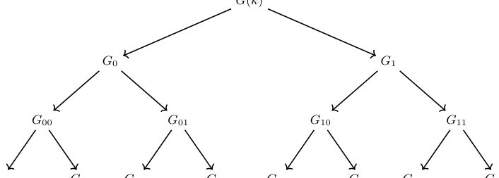
<figcaption class="paper-figure-caption"><b>Fig 3.</b> Figure 4: Sample GGM tree with r = 3. The output of the PRG is G(k) = G0∥G1. Evaluating the GGM PPRF on input 011 results in F(k, 011) = G011 = G1(G01) = G1(G1(G0(k)))</figcaption>
</figure>
<figure class="paper-figure-card">
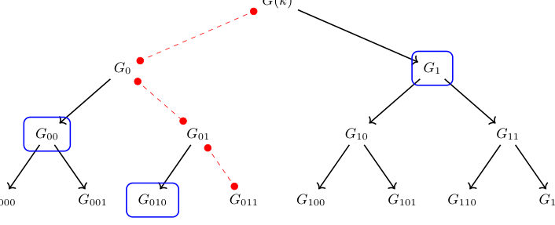
<figcaption class="paper-figure-caption"><b>Fig 4.</b> Figure 5: Puncturing the GGM tree at 011. The puncturing key is k011 = {G1, G00, G010}. The punctured path is marked with a red dashed line, and the puncturing key’s nodes are in blue boxes.</figcaption>
</figure>

**Summary.** This paper presents an advanced, circuit-level quantum algorithm for One-Shot Signatures (OSS), which enforces that a quantum key can only be used once. While providing detailed resource estimates and showing how OSS enables secure delegation chains, the authors identify that the practical realization is currently bottlenecked by the lack of efficient Quantum Indistinguishability Obfuscators.

**Why it may be interesting.** For a theoretical physicist interested in quantum information, this work provides a concrete, highly technical example of how fundamental quantum principles (like no-cloning) are mapped onto complex cryptographic protocols, pushing the boundaries of what is computationally feasible in quantum computation.

Detailed structure

**Main problem.** The paper focuses on developing an explicit, circuit-level quantum algorithm for One-Shot Signatures (OSS) to create fundamentally secure, single-use cryptographic primitives.

**Main result.** They provide resource estimates showing the logical qubit and gate complexity scaling for Key Generation and Signing, while identifying that the primary remaining bottleneck is the development of efficient Quantum Indistinguishability Obfuscators (qIO).

**Method.** The method involves adapting existing cryptographic constructions (like those based on PPRF/GGM) into quantum circuits, analyzing resource costs, and leveraging advanced concepts like classical Information Obfuscation (iO) to secure the underlying components.

**Model / system.** The model is purely theoretical, dealing with abstract quantum circuits operating on qubits. It utilizes cryptographic primitives such as Puncturable Pseudorandom Functions (PPRF), Goldreich-Goldwasser-Micali (GGM) constructions, and concepts from quantum information theory like the no-cloning theorem.

**Key observables.** Logical qubit number ($\Theta(\kappa \log(r) + n + l)$) and Gate complexity ($\Theta(n^3 + nl)$).

**Important parameters / regimes.** Cryptographic security parameter $\lambda$, public key size $r$, signature size $n+l$, message size $l$, and the security parameter $\kappa$.

**Assumptions / limitations.** The security relies on computational hardness assumptions (e.g., distinguishing PPRF from random) and assumes the availability of fully succinct classical iO, while acknowledging that practical qIO remains a major open problem.

**Figures summary.** Figures illustrate the workflow diagram for the multi-bit OSS protocol, detailing the sequence of KeyGen, Sign, and Verify steps, as well as sample structures for GGM tree evaluation paths.

**Paper structure.** The paper progresses by first establishing the necessity of OSS for quantum security primitives. It then details the construction using PPRF/GGM, analyzes resource requirements via circuit complexity scaling, discusses extensions like Signature Delegation Chains, and concludes by pinpointing the need for practical quantum obfuscation tools to complete the plain-model implementation.

Abstract

We provide a pre-obfuscation circuit-level implementation of an efficient one shot signature scheme, which has known applications to delegated signatures, secured token transfer, and publicly verifiable randomness. The algorithm consists of two stages: a key generation stage where a classical public key/quantum secret key pair is produced, and a signing stage where the quantum secret key is processed with a message string to produce a classical signature. There is no algorithmic error in the construction and the signed message can be efficiently checked by a classical verifier. Our scheme works by preparing a superposition over elements of a random affine coset determined by the output of a puncturable pseudorandom function, together with a circuit that tests coset membership. The logical qubit number scales like $Θ( κ\log(r) + n + l)$ and the gate complexity scales like $Θ(n^3 + nl)$, where $r$ is the public key size, $n+l$ is the signature size, $l$ is the message size, and $κ= Ω(n)$ is the cryptographic security parameter. We provide explicit qubit and gate counts for varying $n$ and identify the circuit components where obfuscation would be required for security against classical and quantum polynomial time attacks.

[↑ back to top](#top)

### [A Three-Layer Architecture for Fault-Tolerant Quantum Computing](http://arxiv.org/abs/2606.22418v1)

**Authors:** Zhirao Wang, Zhou You, Yiming Huang, Tianyi Li, Ying Li, Xiao Yuan, Yuan Yao  
**Type:** theory · **Category:** quantum information and computing · **PDF:** <https://arxiv.org/pdf/2606.22418v1>  
**Analysis basis:** full PDF text, analyzed in chunks
**Topic relevance:** `quantum measurements` **1/5**

↔ Scroll figures horizontally

<figure class="paper-figure-card">
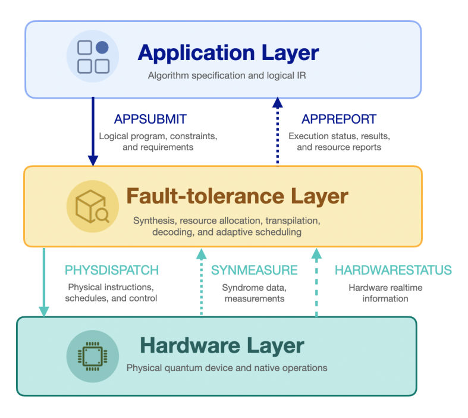
<figcaption class="paper-figure-caption"><b>Fig 1.</b> FIG. 1. Overall three-layer architecture. The Application Layer is responsible for algorithm specification and logical intermediate represen- tation (IR) generation. The Fault-Tolerance Layer is the architectural center of the stack and coordinates synthesis, fault-tolerant resources allocation, transpilation, decoding, and adaptive scheduling. The Hardware Layer abstracts the physical quantum device and native opera- tions. The downward interfaces are AppSubmit, which carries logical program descriptions and constraints from the Application Layer to the Fault-Tolerance Layer, and PhysDispatch, which carries backend-executable physical instructions from the Fault-Tolerance Layer to the...</figcaption>
</figure>
<figure class="paper-figure-card">
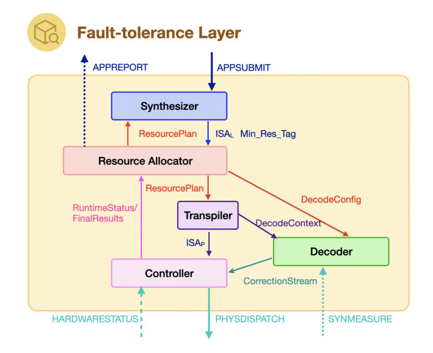
<figcaption class="paper-figure-caption"><b>Fig 2.</b> FIG. 2. Internal module of the Fault-Tolerance Layer. The layer is decomposed into five functional modules: Synthesizer, Resource Allocator, Transpiler, Decoder, and Controller. The arrows indicate the principal internal data flows among these modules. In particular, the Synthesizer emits the logical instruction stream ISA𝐿to the Resource Allocator and receives Budget hints in return; the Resource Allocator emits a fault-tolerant ResourcePlan to the Transpiler and a DecodeConfig object to the Decoder; the Transpiler emits backend-executable instructions ISA𝑃to the Controller and a DecodeContext object to the Decoder; the Decoder emits a CorrectionStream to the Controller; and the Controller...</figcaption>
</figure>
<figure class="paper-figure-card">
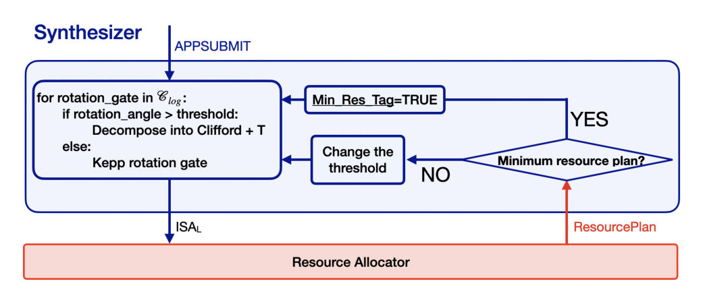
<figcaption class="paper-figure-caption"><b>Fig 3.</b> FIG. 3. Internal logic of the Synthesizer. The module receives the logical circuit through AppSubmit and applies a threshold-based synthesis rule to each rotation gate. For a given threshold 𝜃th, a rotation is either kept as a direct logical rotation primitive or decomposed into a Clifford+𝑇 representation. The resulting candidate logical instruction stream ISA𝐿is then checked against the current resource budget by the Resource Allocator. If the candidate is feasible, the current threshold is accepted and the resulting ISA𝐿is finalized; otherwise, the threshold is adjusted and synthesis is repeated.</figcaption>
</figure>
<figure class="paper-figure-card">
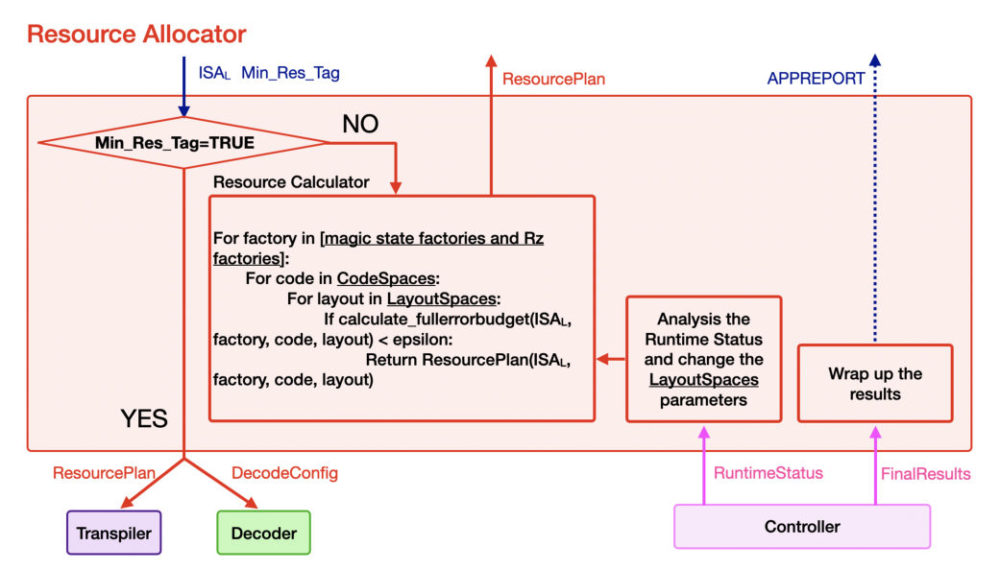
<figcaption class="paper-figure-caption"><b>Fig 4.</b> FIG. 4. Internal logic of the Resource Allocator. The allocator receives a candidate logical instruction stream ISA𝐿from the Synthesizer and explores a joint design space over factory configurations, code realizations, and layout candidates. For each candidate, it selects code parameters from the target reliability budget, evaluates factory throughput and layout constraints, and estimates the resulting spacetime cost. Feasible realizations are retained as valid ResourcePlan candidates, and the minimum-cost plan is selected. The resulting ResourcePlan is sent to the Transpiler, while the corresponding DecodeConfig is sent to the Decoder.</figcaption>
</figure>
<figure class="paper-figure-card">
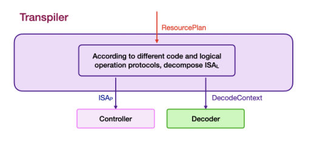
<figcaption class="paper-figure-caption"><b>Fig 5.</b> FIG. 5. Internal logic of the Transpiler. The module receives a ResourcePlan from the Resource Allocator. This plan determines the active code realization, fault-tolerant resources organization, and scheduled logical operations to be executed. The Transpiler then lowers the corresponding logical instruction stream according to the selected code family and logical-operation protocol, producing two outputs: a backend-executable physical instruction stream ISA𝑃for the Controller and a DecodeContext object for the Decoder.</figcaption>
</figure>

**Summary.** This paper proposes a universal, three-layer architectural framework to solve the integration challenge in fault-tolerant quantum computing. It introduces an explicit Fault-Tolerance Layer that acts as a standardized intermediary between high-level algorithms and specific physical hardware backends. This modular design aims to create a unified standard for organizing future heterogeneous quantum systems.

**Why it may be interesting.** It provides a high-level systems view necessary for theorists designing complex quantum algorithms, as it formalizes how algorithmic requirements must map onto physical constraints across different hardware modalities.

Detailed structure

**Main problem.** Developing a comprehensive, hardware-agnostic architectural framework for fault-tolerant quantum computation that unifies the gap between high-level algorithmic intent and low-level physical execution.

**Main result.** The authors propose a standardized three-layer architecture featuring an explicit Fault-Tolerance Layer to mediate communication and resource management across application, logical compilation, and hardware domains.

**Method.** The framework is defined by abstracting the quantum stack into three layers (Application, FT, Hardware) and specifying five critical cross-layer interfaces ($	ext{AppSubmit}$, $	ext{SynMeasure}$, etc.) to manage data flow and control signals systematically.

**Model / system.** The model is a conceptual architectural framework rather than a specific physical implementation. It abstracts over various platforms (superconducting, trapped ions, neutral atoms) and error correction codes (Surface Code, qLDPC).

**Key observables.** Syndrome measurement streams, execution status reports ($	ext{AppReport}$), hardware diagnostics (e.g., fidelity degradation), and logical/physical instruction streams.

**Important parameters / regimes.** Logical vs. physical qubit overhead, gate fidelities ($\ge 99.999\%$), coherence times, and the required resource management across layers.

**Assumptions / limitations.** The primary assumption is that a standardized intermediate architectural layer can successfully decouple algorithmic intent from platform-specific implementation details to manage complexity.

**Figures summary.** Figure 1 illustrates the overall three-layer architecture with its five cross-layer interfaces. Figure 2 (mentioned) details the internal components and data exchange within the Fault-Tolerance Layer.

**Paper structure.** The paper systematically introduces the necessity of fault tolerance, reviews existing architectural limitations across programming/compilation/hardware layers, proposes the three-layer model, details the five modular subsystems within the FT layer, and concludes with an end-to-end example pipeline.

Abstract

Fault tolerance is an indispensable prerequisite for constructing large-scale universal quantum computers. Drawing philosophies from classical computer architecture, this paper presents a hardware-agnostic three-layer high-level architectural framework for generic fault-tolerant quantum computation. Guided by the real execution workflows of fault-tolerant quantum algorithms, the proposed model is decoupled from specific physical qubit hardware platforms and quantum error correction codes, serving as a universal abstract standard rather than a platform-specific implementation scheme. Special attention is devoted to the intermediate Fault-Tolerance Layer, which serves as the architectural bridge between application-level logical programs and hardware-level execution. We systematically characterize its five internal components, the interfaces and data exchanged among them, and the execution, correction, and adaptation paths that together enable logical synthesis, fault-tolerant resources management, decoding, and runtime fault-tolerant control. An end-to-end example is further provided to illustrate the full-stack operating pipeline of fault-tolerant quantum algorithms under this framework. Given the increasing emphasis on modular, heterogeneous, and cross-layer fault-tolerant quantum systems, our architecture provides a unified foundational model for organizing such designs.

[↑ back to top](#top)

### [Lattice-quantile estimation of π and convex-region integrals from coined two-dimensional quantum walks](http://arxiv.org/abs/2606.22334v1)

**Authors:** Jen-Yu Chang, En-Jui Kuo, Chih-Yu Chen, Tsung-Wei Huang  
**Type:** theory · **Category:** numerical methods · **PDF:** <https://arxiv.org/pdf/2606.22334v1>  
**Analysis basis:** full PDF text, analyzed in chunks
**Topic relevance:** `methods for driven-dissipative` **1/5**

↔ Scroll figures horizontally

<figure class="paper-figure-card">
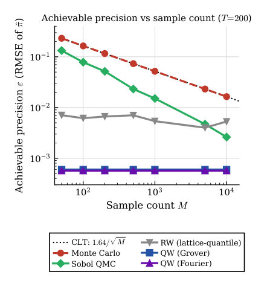
<figcaption class="paper-figure-caption"><b>Fig 1.</b> FIG. 1. Achievable precision ε (RMSE of ˆπ) versus sample count M at fixed walk depth T = 200. The two sample- mean baselines improve with M: uniform MC follows the CLT line 1.64/ √</figcaption>
</figure>
<figure class="paper-figure-card">
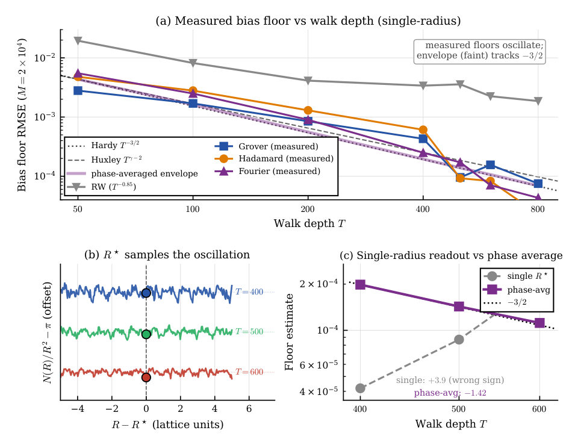
<figcaption class="paper-figure-caption"><b>Fig 2.</b> FIG. 2. Bias-floor scaling and its number-theoretic mechanism. (a) The bias floor actually delivered by the estimator at M = 2×104 for the three coin operators and the classical random walk (grey, T −0.85), out to T = 800; markers are the value at the single quantile radius ˆR that one measured walk provides (each averaged over 30 trials). The measured floors oscillate rather than following a clean power law—e.g. the Grover floor dips at T = 500, rises at T = 600, falls at T = 800—the deterministic consequence of reading the sign-oscillating residual at a single radius (panels (b)–(c)). The faint line is the phase-averaged floor of Eq. (9) (RMS of the residual over one lattice period around...</figcaption>
</figure>
<figure class="paper-figure-card">
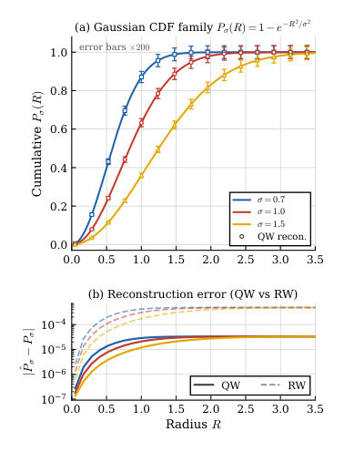
<figcaption class="paper-figure-caption"><b>Fig 3.</b> FIG. 3. (a) A one-parameter family of 2D Gaussian cumula- tive distributions Pσ(R) = 1 −e−R2/σ2 for σ = 0.7, 1.0, 1.5, each obtained as ˆPσ(R) = ˆπ Qσ(R) from the same single quantum-walk run (T = 200, M = 500, 50 trials; solid lines exact, open markers QW reconstruction with error bars mag- nified ×200 for visibility). The curve shapes are the classi- cally known Qσ(R); the measurement fixes the single scalar ˆπ shared across the whole family. (b) The propagated error | ˆPσ −Pσ| = Qσ(R) |ˆπ −π| for each σ (solid: QW; dashed: RW). The QW error budget stays below 3.3 × 10−5 across all radii and widths, ∼15× below the RW, inheriting the lower ballistic bias floor. All errors vanish as R →0...</figcaption>
</figure>
<figure class="paper-figure-card">
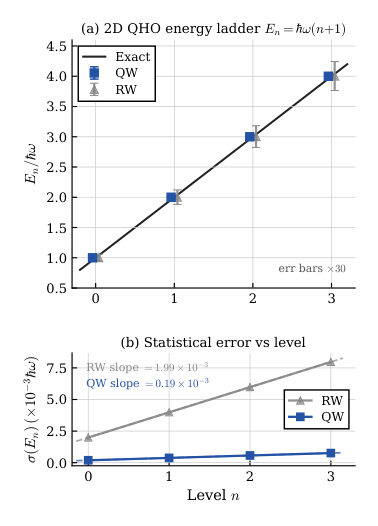
<figcaption class="paper-figure-caption"><b>Fig 4.</b> FIG. 4. (a) Energy ladder En = ℏω(n+1) of the 2D isotropic harmonic oscillator reconstructed via ˆEn = ˆπ Qn (Cavalieri, annular super-level sets), T = 200, M = 500, 50 trials; er- ror bars magnified ×30. The QW (blue) error bars are ∼10× tighter than the RW (grey); both fits recover ℏω = 1. (b) Sta- tistical error σ( ˆEn) grows linearly with level index for both walkers, as predicted by σ( ˆEn) = Qn RMSE(ˆπ) ∝(n+1); the fitted slopes (annotated) are 1.90×10−4 ℏω/level for the QW and 1.99 × 10−3 ℏω/level for the RW, a factor of 10.5 apart.</figcaption>
</figure>
<figure class="paper-figure-card">
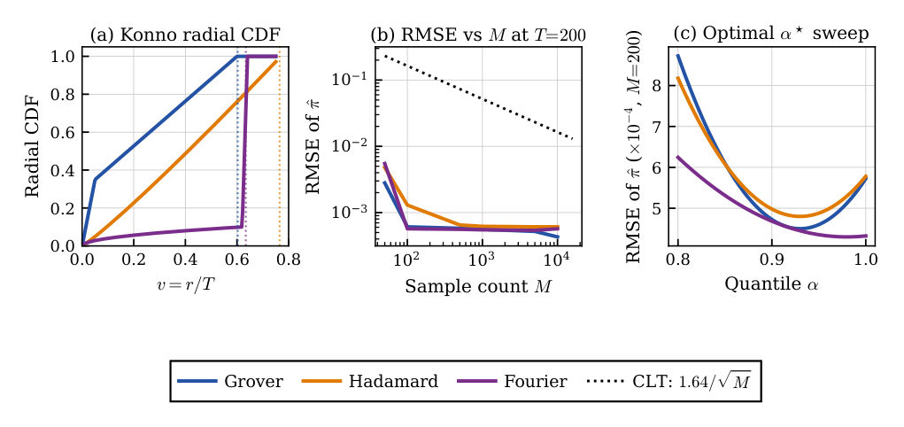
<figcaption class="paper-figure-caption"><b>Fig 5.</b> FIG. 5. Comprehensive coin comparison for the disk estimator. (a) Radial cumulative distribution function (CDF) of the Konno limit measure at T = 200, showing the strong probability concentration near the velocity-disk boundary |v| ≈ p</figcaption>
</figure>

**Summary.** This work introduces a novel lattice-quantile estimator for integrals by leveraging the ballistic spread of 2D coined quantum walks. By replacing statistical averaging with ratios derived from lattice point counts, it bypasses the Cramér-Rao bound limitations faced by standard Monte Carlo methods. The technique allows for highly precise estimation of geometric constants and physical quantities like energy spectra using significantly fewer measurements than classical counterparts.

**Why it may be interesting.** It provides a concrete demonstration of how quantum dynamics (ballistic spreading) can be harnessed in a non-algorithmic way—as a superior sampling resource—to solve fundamental problems in computational mathematics and physics, surpassing classical limits.

Detailed structure

**Main problem.** To develop a numerical integration technique for estimating geometric quantities like $\pi$ and convex-region integrals that bypasses the fundamental statistical error scaling ($\mathcal{M}^{-1/2}$) of standard Monte Carlo methods.

**Main result.** The method achieves an error floor dominated by deterministic number-theoretic residuals controlled by walk depth $T$, leading to a superior convergence rate compared to classical random walks and uniform MC.

**Method.** It replaces the empirical sample mean with a ratio estimator, $rac{N(\hat{R})}{\hat{R}^2}$, derived from coupling the ballistic spreading of 2D quantum walks (DTQWs) to lattice point counting asymptotics (Hardy-Huxley).

**Model / system.** The physical system is a coined discrete-time quantum walk on a 2D square lattice, analyzed using various coin operators (Grover, Hadamard, Fourier). The method applies to integrals whose super-level sets are convex or annular.

**Key observables.** Estimates for $\pi$, areas of convex regions, and energy level spacings ($\hbar\omega$) of the 2D harmonic oscillator.

**Important parameters / regimes.** Walk depth $T$ (controls ballistic spreading), sample count $M$, lattice counting exponent $\gamma$, and quantile parameter $\alpha$.

**Assumptions / limitations.** The method is limited to integrals reducible to convex-region lattice counts; the analysis relies on asymptotic theorems like Hardy-Huxley and Krätzel's lattice asymptotics.

**Figures summary.** Figures compare the Root Mean Square Error (RMSE) scaling of QW vs. RW/MC, showing the flat, lower bias floor for QW measurements; other figures illustrate the mechanism of oscillation in single-radius readouts versus phase-averaged results.

**Paper structure.** The paper develops the estimator by first establishing the lattice-quantile framework for $\pi$ (disk), then generalizing it to convex regions via Cavalieri's principle, and finally applying this structure to reconstruct entire families of integrals (e.g., harmonic oscillator energy levels) using a single measurement.

Abstract

Monte Carlo integration is fundamentally limited by the M^(-1/2) rate that the Cramer-Rao bound imposes on any sample-mean estimator of an expectation value, regardless of how the samples are drawn. Coined discrete-time quantum walks (DTQWs) are known to spread ballistically - their position variance scales as T^2 against the diffusive T of classical random walks - yet this faster spreading has not been exploited for numerical integration. We show that coupling the ballistic scaling of a 2D DTQW to the Hardy-Huxley asymptotic for Gauss circle lattice counts produces estimators whose dominant error is a deterministic number-theoretic residual controlled by walk depth T, not a statistical fluctuation controlled by sample count M. The construction replaces the empirical mean of a sample-mean estimator with the ratio N(R-hat)/R-hat^2 of a lattice count to the square of a radial position quantile, a structural change that sidesteps the Cramer-Rao barrier. A single batch of measurements then propagates through classically precomputed multipliers to cover an entire family of integrals simultaneously. We develop the framework for convex smooth domains via Kraetzel's lattice asymptotic and for smooth integrals with convex or annular super-level sets via Cavalieri's principle, and provide a parameter-free identity for the bias floor (validated to within 1.5x across all tested depths). Every experiment is benchmarked against the classical random walk with the identical estimator to isolate the quantum contribution; the framework is oracle-free in the QAE sense (no controlled unitary encoding the integrand is required) and structurally distinct from quantum amplitude estimation and Szegedy-walk approaches. These ratios compare measurement counts at fixed precision and do not include quantum circuit execution cost.

[↑ back to top](#top)

### [On the cryptographic potential of single-qubit rotations](http://arxiv.org/abs/2606.23392v1)

**Authors:** Alex B. Grilo, Lucas Hanouz, Anne Marin  
**Type:** theory · **Category:** quantum information and computing · **PDF:** <https://arxiv.org/pdf/2606.23392v1>  
**Analysis basis:** full PDF text, analyzed in chunks
**Topic relevance:** `quantum measurements` **1/5**

↔ Scroll figures horizontally

<figure class="paper-figure-card">
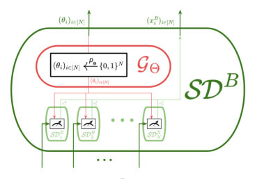
<figcaption class="paper-figure-caption"><b>Fig 1.</b> Figure 1: The state distribution systems of Charlie (left) and Bob (right)</figcaption>
</figure>
<figure class="paper-figure-card">
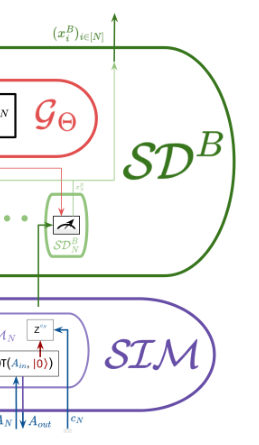
<figcaption class="paper-figure-caption"><b>Fig 2.</b> Figure 2: The system SIM plugged on SDB.</figcaption>
</figure>
<figure class="paper-figure-card">
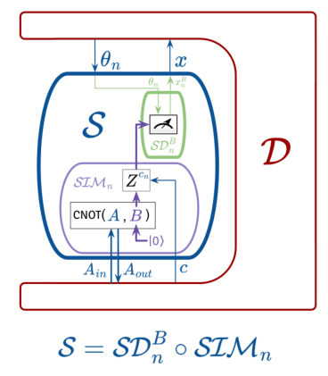
<figcaption class="paper-figure-caption"><b>Fig 3.</b> Figure 3: The distinguisher D and the system S, either equal to SDC n or SDB n ◦SIMn.</figcaption>
</figure>
<figure class="paper-figure-card">
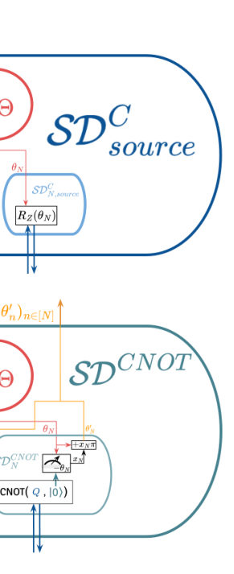
<figcaption class="paper-figure-caption"><b>Fig 4.</b> Figure 4: Charlie’s state distribution SDC source and its variant SDCNOT .</figcaption>
</figure>

**Summary.** The paper demonstrates that many quantum cryptographic protocols do not require direct access to trusted qubit sources or detectors. Instead, they can be securely re-engineered to function using only a device capable of performing arbitrary single-qubit rotations on the Qline architecture. This significantly simplifies hardware requirements and validates the versatility of rotation-based quantum communication channels.

**Why it may be interesting.** This work provides a powerful resource-reduction technique, showing that complex quantum protocols can be simplified by standardizing the required hardware trust model around basic single-qubit operations, which is highly relevant for building scalable quantum networks.

Detailed structure

**Main problem.** To show that most quantum cryptographic protocols requiring trusted qubit preparation or measurement can be re-engineered to rely only on a trusted single-qubit rotation device.

**Main result.** The work establishes composably secure constructions demonstrating that the Qline architecture, relying solely on single-qubit rotations, is sufficient to support a wide range of quantum cryptographic tasks.

**Method.** Security proofs are established by showing the indistinguishability ($\approx_0$) between protocols using ideal trusted components and those implemented using only single-qubit rotation devices coupled with untrusted sources/detectors.

**Model / system.** The primary model is the Qline architecture, which constrains operations to single-qubit rotations. The analysis covers cryptographic primitives like state distribution for measurement and preparation.

**Key observables.** Composably secure implementation of quantum tasks; indistinguishability ($\approx_0$) between simulated and actual protocols.

**Important parameters / regimes.** The security advantage $\epsilon$; the underlying protocol structure (e.g., QKD, QOT).

**Assumptions / limitations.** The constructions assume a trusted single-qubit rotation device; specific assumptions are made about the decomposability of the original protocols.

**Figures summary.** Figures schematically illustrate the setup for state distribution systems ($S_{DC}$ vs $S_{DB}$) and the structure of the simulator used in security proofs.

**Paper structure.** The paper progresses by first proving secure replacement for single-qubit measurement (Theorem 1), then tackling qubit preparation using CNOT gates (Theorem 2), and finally generalizing to entanglement-based scenarios (Theorem 3) for broader applicability.

Abstract

In the domain of quantum communication, cryptographic protocols often require users to have access to trusted qubit sources or detectors. Recently, it was shown that on an architecture called the Qline, several protocols can equivalently be performed by parties capable only of single-qubit rotations. In this work, we introduce two composably secure constructions that together show how in most quantum cryptographic protocols, parties traditionally required to perform trusted qubit preparation or measurement can delegate these tasks to an untrusted provider and instead rely on a trusted single-qubit rotation device. Our first construction implements single-qubit measurement and is universally applicable across any context. In contrast, our second construction, which addresses qubit preparation, relies on specific assumptions regarding the underlying protocol. We show, however, that these assumptions are inherently satisfied by the vast majority of common quantum cryptographic protocols. A notable consequence of our results is the formal validation of the Qline as a versatile architecture capable of supporting a wide range of single-qubit protocols.

[↑ back to top](#top)

### [Quantum Convolutional Neural Networks for Groundwater Heat Plume Prediction: A Surrogate Modeling Approach](http://arxiv.org/abs/2606.23411v1)

**Authors:** Danyal Maheshwari, Julia Pelzer, Miriam Schulte  
**Type:** both · **Category:** disordered systems and neural networks · **PDF:** <https://arxiv.org/pdf/2606.23411v1>  
**Analysis basis:** full PDF text, analyzed in chunks
**Topic relevance:** `methods for driven-dissipative` **1/5**

↔ Scroll figures horizontally

<figure class="paper-figure-card">
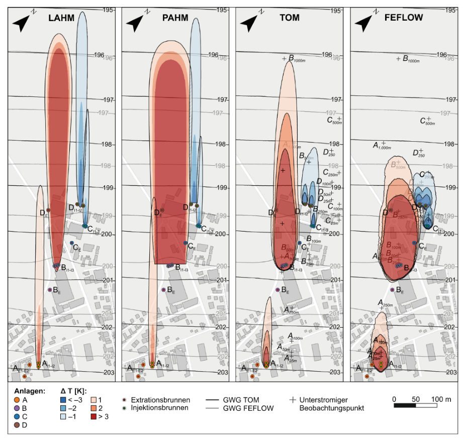
<figcaption class="paper-figure-caption"><b>Fig 1.</b> Figure 1: Qualitative, exemplary comparison between LAHM, PAHM, TOM, and FEFLOW from left to right on systems of varying size. Source [18].</figcaption>
</figure>
<figure class="paper-figure-card">
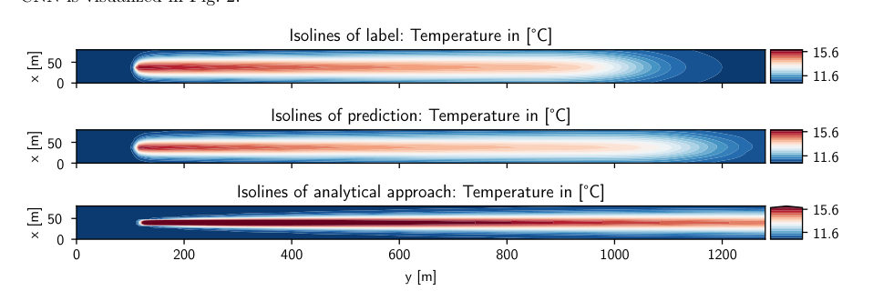
<figcaption class="paper-figure-caption"><b>Fig 2.</b> Figure 2: Comparison of 1HP-NN to analytical and simulation approaches: Isolines of the temperature field in steady-state of an exemplary data point with the simulated result on top, then the prediction from the CNN and on the bottom the calculated result from the analytical approach LAHM. Example with v ¡ 1m/day for which LAHM is not intended. Source [8].</figcaption>
</figure>
<figure class="paper-figure-card">
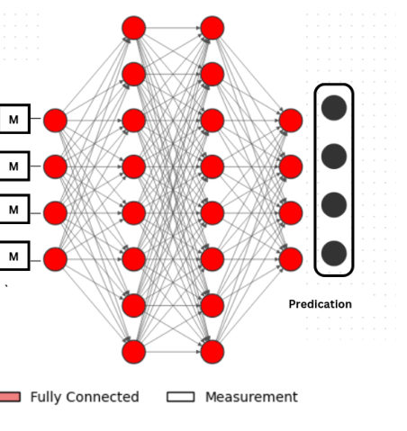
<figcaption class="paper-figure-caption"><b>Fig 3.</b> Figure 3: Schematic diagram of QCNN</figcaption>
</figure>
<figure class="paper-figure-card">
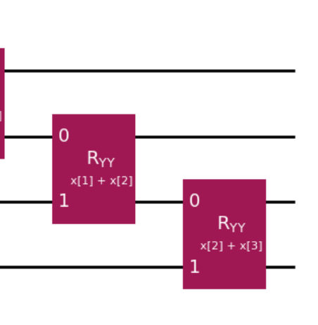
<figcaption class="paper-figure-caption"><b>Fig 4.</b> Figure 4: IQP encoding</figcaption>
</figure>
<figure class="paper-figure-card">
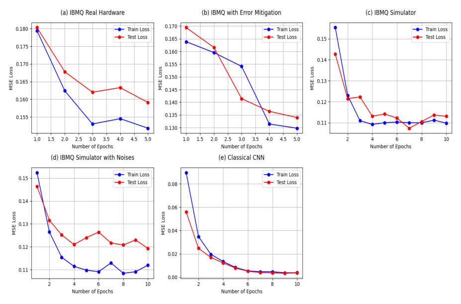
<figcaption class="paper-figure-caption"><b>Fig 5.</b> Figure 5: summarizes the training and testing mean squared error (MSE) across five settings: (a) QCNN on the IBMQ Kyiv real hardware, (b) QCNN on Kyiv with advanced error mitigation, (c) QCNN on an ideal statevector simulator, (d) QCNN on a simulator with a realistic noise model, and (e) a classical CNN baseline.</figcaption>
</figure>

**Summary.** This work proposes using Quantum Convolutional Neural Networks (QCNNs) as a fast surrogate model for predicting groundwater heat plumes. The authors test the QCNN's performance across various quantum hardware settings, comparing it against classical CNNs. While showing promise under ideal or error-mitigated conditions, the results indicate that current classical methods remain superior for this specific geophysical prediction task.

**Why it may be interesting.** It applies advanced machine learning techniques (QCNNs) to a geophysical modeling problem, providing insights into when quantum computation might offer an advantage over mature classical ML methods in complex physical simulations.

Detailed structure

**Main problem.** The paper addresses the challenge of predicting complex groundwater heat plume temperature variations caused by geothermal heat pumps in a computationally efficient manner.

**Main result.** While Quantum Convolutional Neural Networks (QCNNs) show promise and competitive performance on simulators, classical CNN baselines still achieve the highest predictive accuracy under current hardware limitations.

**Method.** The authors developed and tested a QCNN architecture as a surrogate model to replace expensive numerical simulations for heat plume prediction.

**Model / system.** The system modeled is groundwater heat transport influenced by geothermal heat pumps. The approach uses a QCNN, which incorporates quantum convolutional layers, pooling layers, and readout stages parameterized by rotational gates on quantum circuits.

**Key observables.** Mean Squared Error (MSE) used for benchmarking; predicted temperature field isolines (e.g., 1-K isotherm).

**Important parameters / regimes.** The study evaluates performance across five regimes: ideal simulator, noisy simulator, real hardware (unmitigated), real hardware (error-mitigated), and classical CNN baseline.

**Assumptions / limitations.** The input data is reduced from full field simulations to a compact set of representative parameters (e.g., permeability and pressure gradient).

**Figures summary.** Figure 6 compares predicted heat plumes across five settings: real hardware, error-mitigated hardware, ideal simulator, noisy simulator, and classical CNN baseline.

**Paper structure.** The paper introduces the problem of groundwater heat plume prediction, details the QCNN architecture (including Hamiltonian encoding), evaluates performance using MSE across multiple quantum computing backends, and compares results against established analytical and classical deep learning models.

Abstract

Quantum machine learning methods are increasingly explored for modeling complex environmental systems, including groundwater heat plume dynamics. In this work, we explore a Quantum Convolutional Neural Network (QCNN) as a surrogate model for predicting temperature variations in groundwater induced by geothermal heat pumps in the city of Munich. To comply with the scalability constraints of current quantum hardware, the original high-dimensional simulation output is reduced to a compact set of representative parameters that serve as training targets for the surrogate. The proposed QCNN architecture consists of a quantum convolutional layer, a quantum pooling layer, and a fully connected quantum readout stage. Convolution and pooling operations are realized via parameterized quantum circuits based on rotational gates and measurement-driven decoding, while a Hamiltonian-inspired feature-encoding scheme is used to prepare informative input states on the quantum device. We evaluate the QCNN across multiple execution backends, including an ideal statevector simulator, a noisy simulator, IBM's 127-qubit Kyiv quantum processor, and the same hardware augmented with advanced error-mitigation techniques. Realistic noise models are employed to approximate device behavior and to assess the impact of mitigation strategies. Model performance is benchmarked using mean squared error (MSE) on both training and testing sets. The results show that, although classical neural networks still achieve the highest predictive accuracy, the QCNN attains competitive and consistent performance on simulators and exhibits noticeable improvement under error-mitigated hardware conditions. These findings indicate that quantum-enhanced surrogate modeling is a promising direction for future groundwater temperature prediction as quantum hardware and error-mitigation techniques continue to mature.

[↑ back to top](#top)

### [Two-dimensional stealthy hyperuniform polycrystalline disk packings](http://arxiv.org/abs/2606.23628v1)

**Authors:** Carlo Vanoni, Paul J. Steinhardt, Salvatore Torquato  
**Type:** theory · **Category:** disordered systems and neural networks · **PDF:** <https://arxiv.org/pdf/2606.23628v1>  
**Analysis basis:** full PDF text, analyzed in chunks
**Topic relevance:** `interference shaping light` **1/5**

↔ Scroll figures horizontally

<figure class="paper-figure-card">
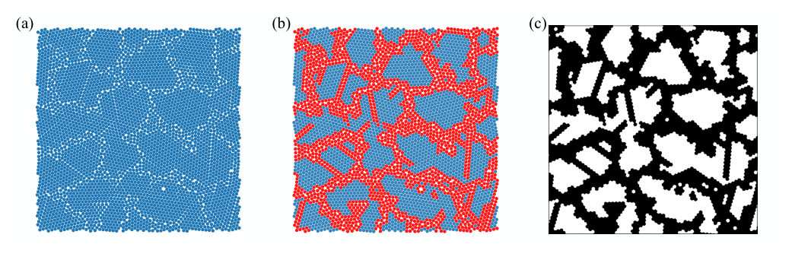
<figcaption class="paper-figure-caption"><b>Fig 1.</b> FIG. 1. (a) Configuration of N = 4000 disks obtained with the collective coordinate optimization procedure for χ = 0.0025 and ϕ = 0.86. This configuration can be interpreted as a two-phase medium, with disks constituting one phase, and the space between them forming the second phase. (b) Each disk is assigned to a grain (blue) or grain boundary (red) depending on whether or not they have or not 6 neighbors within a distance d &lt; 2a(1+τ), where a = p</figcaption>
</figure>
<figure class="paper-figure-card">
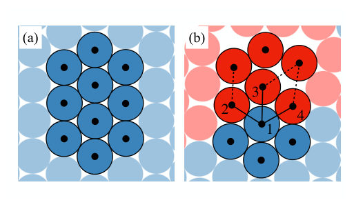
<figcaption class="paper-figure-caption"><b>Fig 2.</b> FIG. 2. (a) If all disks have six neighbors at distance d &lt; dτ, with dτ defined in Eq. (21), they are assigned to a grain (blue). (b) Near a grain boundary, some disks satisfy this condition (disk 1, solid lines), while others do not and are assigned to the boundary (disks 2, 3, and 4, dashed lines).</figcaption>
</figure>
<figure class="paper-figure-card">
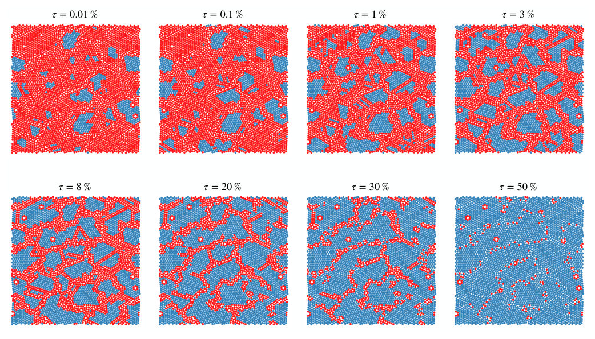
<figcaption class="paper-figure-caption"><b>Fig 3.</b> FIG. 3. Grains (blue) and grain boundaries (red) for the same packing at different threshold values τ [Eq. (21)]. For small τ (upper left), no grains are identified. As τ increases, more disks are assigned to grains. For large τ, almost all disks are assigned to grains. We use τ = 0.08, where the grain–boundary interface is maximal.</figcaption>
</figure>
<figure class="paper-figure-card">
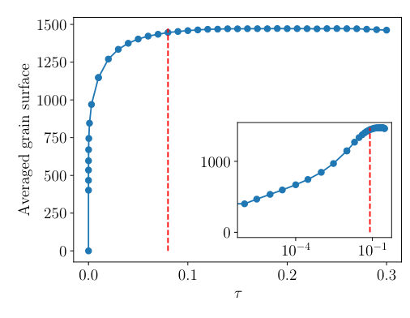
<figcaption class="paper-figure-caption"><b>Fig 4.</b> FIG. 4. Grain–boundary interface length, averaged over 100 SHU configurations at ϕ = 0.86, as a function of the tolerance τ. At small τ, the average interface is near zero, consistent with the upper-left panel of Fig. 3. As τ increases, the inter- face increases and reaches a broad maximum plateau before returning toward zero at large τ. We choose the optimal tol- erance at the onset of this plateau (vertical red dashed line), namely τ = 0.08. The inset shows the same data on a log- linear scale.</figcaption>
</figure>
<figure class="paper-figure-card">
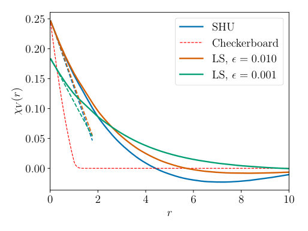
<figcaption class="paper-figure-caption"><b>Fig 5.</b> FIG. 7. Autocorrelation function for the two-phase medium composed of grains and grain boundaries derived from disk packings. Dashed colored lines show the small-distance ap- proximation in Eq. (22). The red dashed line corresponds to the random-checkerboard two-phase medium (analytic ex- pression in Ref. [71]).</figcaption>
</figure>

**Summary.** This work develops and analyzes two-dimensional Stealthy Hyperuniform (SHU) polycrystals using computational optimization. The SHU structures are shown to possess superior physical properties—including perfect low-frequency optical transparency and enhanced long-time diffusion—compared to conventionally formed disordered packings. This demonstrates a pathway to engineer functional materials by controlling density fluctuations in polycrystalline media.

**Why it may be interesting.** The ability to engineer macroscopic transport and optical properties (like low-$k$ transparency) by controlling the long-range density fluctuations in a disordered, polycrystalline structure is highly relevant for designing metamaterials and understanding complex condensed matter interfaces.

Detailed structure

**Main problem.** To generate and characterize two-dimensional polycrystalline packings that are ultradense, stealthy, and hyperuniform (SHU), contrasting them with standard models of polycrystals.

**Main result.** Polycrystalline SHU packings exhibit unique long-range correlations leading to perfect transparency at low wave vectors and enhanced diffusion spreadability compared to nonhyperuniform LS packings.

**Method.** The study uses a collective-coordinate optimization procedure (CCO) to enforce stealthy hyperuniformity ($S(k)=0$ for $0 < k \le K$) in 2D disk packings, followed by comparisons of structural and transport properties.

**Model / system.** The system consists of identical hard disks forming polycrystalline structures. The analysis compares SHU-generated packings against those from the standard Lubachevsky–Stillinger (LS) rapid compression algorithm, treating them as two-phase media (grains vs. boundaries).

**Key observables.** Structure factor $S(k)$, grain size distribution, diffusion spreadability $S(t)$, and the imaginary part of the effective dynamic dielectric constant $	ext{Im}(\epsilon_{	ext{eff}})$ for optical response.

**Important parameters / regimes.** Stealthiness parameter ($\chi$), wave vector ($k$), packing fraction ($\phi$), and characteristic length scales related to grain size.

**Assumptions / limitations.** The SHU structures are idealized models not expected to form spontaneously in nature; the analysis relies on nonlocal strong-contrast expansions for optical response.

**Figures summary.** Figures compare spectral densities $	ilde{\chi}_V(k)$ showing zero weight at low $k$ for SHU vs. finite weight for LS, and plot grain size distributions highlighting a characteristic peak in SHU.

**Paper structure.** The paper introduces the concept of SHU packings via CCO optimization, compares their structural diagnostics (e.g., $	ilde{\chi}_V(k)$) against standard models (LS), and then analyzes functional properties like diffusion decay rates and optical transparency using established two-phase medium formalisms.

Abstract

Polycrystals consist of grains of local crystalline order separated by grain boundaries. Their structure is not hyperuniform, even though perfect crystals are, because polycrystals consist of randomly sized and oriented grains that generate appreciable long-wavelength density fluctuations. In this paper, we use a collective-coordinate optimization procedure to generate two-dimensional polycrystalline packings composed of identical disks arranged in a pattern that is ultradense, stealthy, and hyperuniform (hereafter named SHU). We compare them with polycrystalline disk packings obtained via a modified Lubachevsky--Stillinger rapid compression algorithm (hereafter named LS), a molecular dynamics protocol that serves as a standard reference model describing realistic, nonhyperuniform polycrystalline microstructures. We carry out an extensive comparison of polycrystalline SHU and LS packings that includes differences in two-point statistics, grain size, specific surface area, diffusion spreadability, and optical response as quantified by the imaginary part of the effective dynamic dielectric constant. We find that the polycrystalline SHU packings exhibit a distinctive grain-size distribution, a consequence of long-range correlations between different grains that is absent in the nonhyperuniform case. Within the nonlocal strong-contrast expansion, we confirm that polycrystalline SHU packings made of dielectric material are perfectly transparent to electromagnetic waves at small wave vectors, in contrast to LS packings. Moreover, polycrystalline SHU packings offer enhanced diffusion spreadability. Although polycrystalline SHU packings are not expected to form spontaneously in nature, they may be created for applications as metamaterials via nanolithography or 3D printing that take advantage of their distinctive optical and transport properties.

[↑ back to top](#top)

## Other papers (7)

*Papers from primary archives without highlighted authors or any topic match. Click to expand.*

Show other papers

### [Fine-Tuning Large Language Models for Quantum Reasoning](http://arxiv.org/abs/2606.21974v1)

**Authors:** Katherine Ip, Casey R. Myers, Udaya Parampalli, James Quach, Peiyong Wang  
**Type:** theory · **Category:** quantum information and computing · **PDF:** <https://arxiv.org/pdf/2606.21974v1>  
**Analysis basis:** full PDF text, analyzed in chunks

↔ Scroll figures horizontally

<figure class="paper-figure-card">
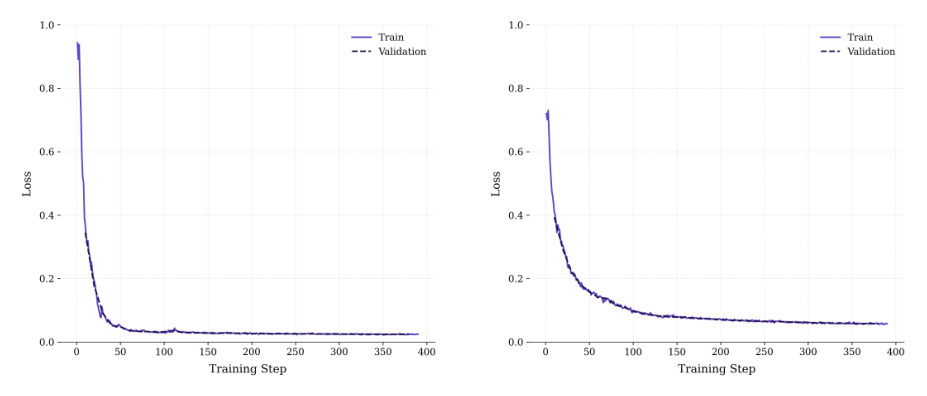
<figcaption class="paper-figure-caption"><b>Fig 1.</b> Figure 3: Train and validation loss of SFT training for the Non-parameterised (left) and Pa- rameterised (right) circuit sets. Both sets converge within one epoch (390 steps).</figcaption>
</figure>
<figure class="paper-figure-card">
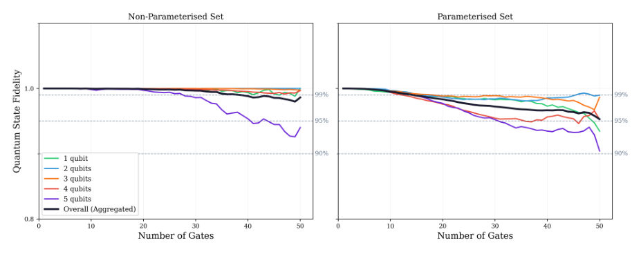
<figcaption class="paper-figure-caption"><b>Fig 2.</b> Figure 4: Step-by-step quantum state fidelity of the SFT model during inference, evaluated on the Non-parameterised (left) and Parameterised (right) circuit sets. Fidelity remains above 99% throughout for the Non-parameterised set, while the Parameterised set exhibits a steeper decline with gate depth yet stays above 95% in aggregate, demonstrating that the model maintains a coherent intermediate quantum state representation across both settings. Notably, 5-qubit circuits show the most pronounced fidelity decline in both sets, reflecting the increased difficulty of tracking quantum state evolution over circuits with greater system size.</figcaption>
</figure>
<figure class="paper-figure-card">
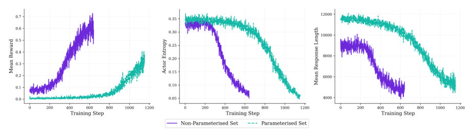
<figcaption class="paper-figure-caption"><b>Fig 3.</b> Figure 5: Training dynamics of the GRPO stage for the Non-parameterised and Parameterised circuit sets. Mean reward (left), actor entropy (centre), and mean response length (right) are plotted against training step. Both sets show a pattern of rising reward that is accompanied by declining entropy and shorter responses, indicating that the model converges toward more accurate and concise reasoning strategies. The Non-parameterised set converges faster than Parameterised set, reflecting the greater task complexity of parameterised circuits. Despite the difference in reward levels, entropy and response length converge to similar values across both sets by the end of training.</figcaption>
</figure>
<figure class="paper-figure-card">
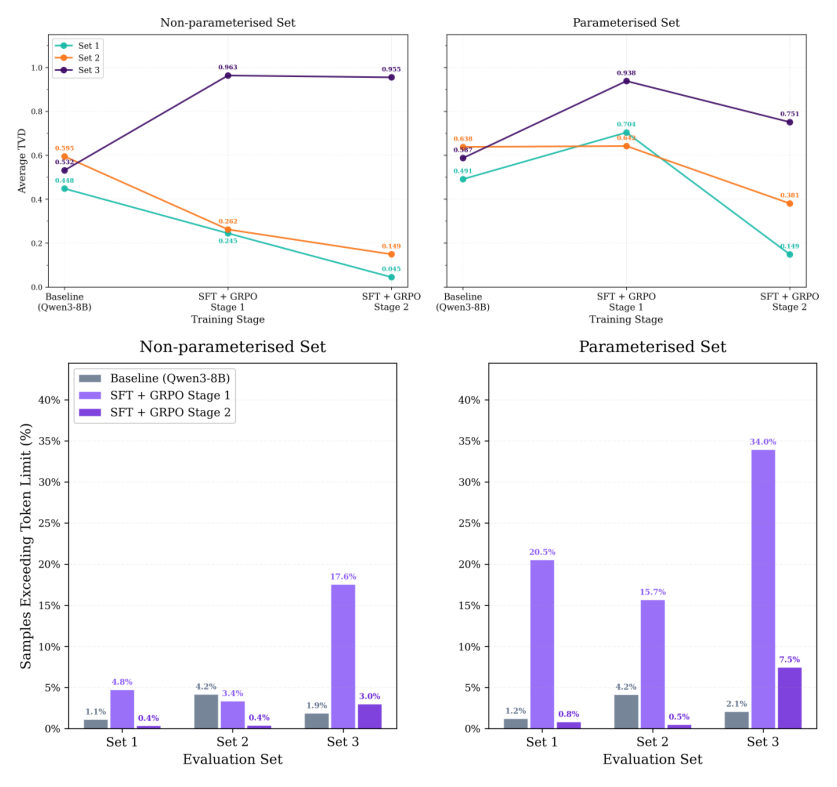
<figcaption class="paper-figure-caption"><b>Fig 4.</b> Figure 6: Three-stage TVD progression and token-limit violation counts. (top) Mean TVD across the base model, Stage 1 SFT, and SFT+GRPO for the Non-parameterised and Parame- terised sets on the three evaluation sets. (bottom) Number of samples whose generation exceeds the 32,768-token limit at each stage. The sharp rise in token-limit violations at Stage 1 SFT for the Parameterised set explains the elevated TVD at that stage. Stage 2 GRPO suppresses this by learning more concise reasoning strategies.</figcaption>
</figure>
<figure class="paper-figure-card">
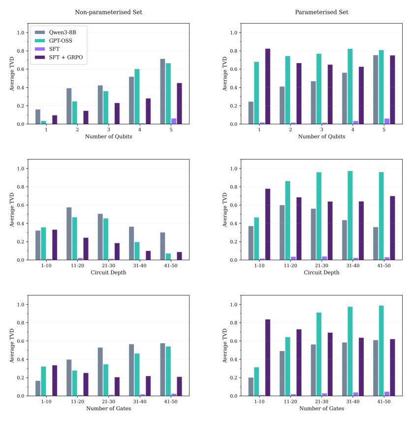
<figcaption class="paper-figure-caption"><b>Fig 5.</b> Figure 7: Mean TVD as a function of circuit complexity for the Non-Parameterised Set (left column) and Parameterised Set (right column), broken down by number of qubits (top), circuit depth (middle), and number of gates (bottom). The number of qubits shows the strongest correlation with TVD degradation, followed by the number of gates, while circuit depth has the least influence.</figcaption>
</figure>

**Summary.** The paper investigates methods to teach Large Language Models (LLMs) genuine quantum reasoning by training them on explicit quantum circuit simulation traces. By comparing Supervised Fine-Tuning (SFT) against a more advanced SFT+GRPO pipeline, the authors demonstrate that multi-stage RL fine-tuning significantly improves the model's ability to extrapolate its reasoning to larger and more complex quantum systems.

**Why it may be interesting.** This work directly addresses how advanced AI models can be engineered to handle complex physical simulations required in quantum information science, potentially creating powerful tools for algorithm design or circuit verification.

Detailed structure

**Main problem.** The core challenge is developing fine-tuning pipelines for Large Language Models (LLMs) that instill genuine quantum reasoning capabilities, moving beyond mere task-specific pattern matching.

**Main result.** Targeted multi-stage fine-tuning, particularly combining Supervised Fine-Tuning (SFT) with Group Relative Policy Optimisation (GRPO), significantly advances LLM performance on quantum circuit simulation compared to baselines.

**Method.** The study uses quantum circuit simulation as a training objective, comparing SFT on explicit state-vector traces against an advanced two-stage SFT+GRPO approach guided by verifiable rewards.

**Model / system.** The system involves simulating quantum circuits (sequences of gates) to predict the final measurement probability distribution. The LLM architecture is a transformer decoder stack, trained to generate step-by-step reasoning traces that mimic state evolution.

**Key observables.** Measurement probability distribution, step-by-step state fidelity, In-distribution accuracy, Gate-count extrapolation accuracy, and Total Variation Distance (TVD).

**Important parameters / regimes.** Qubit count (system size), number of gates (circuit depth/length), and the fine-tuning hyperparameters for SFT and GRPO.

**Assumptions / limitations.** The primary assumption tested is whether observed high performance reflects genuine understanding or merely memorization of structured training examples. The analysis often relies on approximations like rounding amplitudes to two decimal places.

**Figures summary.** Figures illustrate state fidelity degradation with complexity, the convergence of training loss for SFT, and how GRPO helps mitigate token-limit violations during extrapolation tasks.

**Paper structure.** The paper introduces the problem (quantum reasoning gap), details the methods (SFT vs. SFT+GRPO), presents results across multiple evaluation sets (in-distribution, gate/system size extrapolation), and concludes by analyzing generalization failures.

Abstract

Large language models (LLMs) exhibit abilities beyond natural language modelling and text generation. Recent advances in their reasoning capabilities have spurred interest in applying LLMs to complex scientific tasks requiring deep domain expertise and sophisticated reasoning. Quantum computing, as a highly specialised field with significant knowledge barriers and hardware constraints, could greatly benefit from such advancements. However, a key open question that first must be answered is: How can we develop fine-tuning pipelines that instil genuine quantum reasoning in LLMs, rather than task-specific pattern matching? We study this question through quantum circuit simulation as a training objective, where the model must predict the measurement probability distribution resulting from a sequence of quantum gate operations. We propose and compare two fine-tuning pipelines: (1) Supervised Fine-Tuning (SFT) on explicit gate-by-gate state-vector simulation traces, and (2) a two-stage SFT+Group Relative Policy Optimisation (GRPO) approach that sequentially applies SFT followed by GRPO with verifiable rewards. Our findings show that SFT achieves near-perfect in-distribution and gate-count extrapolation accuracy, significantly outperforming both the base model and the GPT-OSS-120B baseline. SFT+GRPO trades some in-distribution precision for better generalisation to larger qubit systems that SFT alone cannot handle. Both pipelines significantly outperform the baselines, demonstrating that targeted fine-tuning on explicit reasoning traces is an effective strategy for advancing quantum reasoning in LLMs.

[↑ back to top](#top)

### [Hierarchical Logical Processor on the Rotated Surface Code with Shuttle Buses](http://arxiv.org/abs/2606.22594v1)

**Authors:** Zi-Han Chen, Ming-Cheng Chen, Chao-Yang Lu, Jian-Wei Pan  
**Type:** theory · **Category:** quantum information and computing · **PDF:** <https://arxiv.org/pdf/2606.22594v1>  
**Analysis basis:** full PDF text, analyzed in chunks

↔ Scroll figures horizontally

<figure class="paper-figure-card">
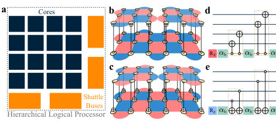
<figcaption class="paper-figure-caption"><b>Fig 1.</b> FIG. 1. Architecture of a hierarchical logical processor. (a) Basic working units—cores and shuttle buses—for a hierarchi- cal logical processor. (b) A bus-core CNOT gate between an X bus and two cores with d0 = 3 and d1 = 2. (c) A core-bus CNOT gate between two cores and a Z bus. (d–e) Level-1 circuits representing an X-basis and a Z-basis readout gadget, respectively. Logical qubits on cores and on shuttle buses are shown as dark and orange lines, respectively. Level-1 CNOT gates in every dashed box are implemented by a bus-core or core-bus CNOT gate. Each teal block labeled by αb repre- sents at least αb level-0 SE rounds.</figcaption>
</figure>
<figure class="paper-figure-card">
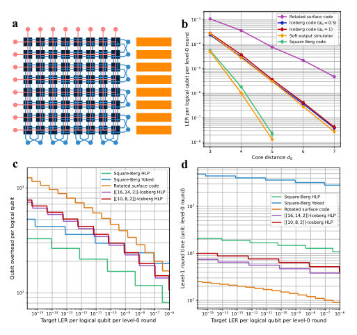
<figcaption class="paper-figure-caption"><b>Fig 2.</b> FIG. 2. Benchmarking the memory performance of various hierarchical logical processors (HLP). (a) Level-1 layout of an HLP based on the [[64, 34, 4]] Square Berg code [1]. Cores (level-1 data qubits) and shuttle buses (level-1 ancilla qubits) are represented by dark squares and orange rectangles, re- spectively. Each Level-1 X (or Z) stabilizer is shown as a red (or blue) circle and is connected to all level-1 data qubits on its support by red (or blue) lines. (b) Circuit-level simu- lations of two HLPs based on the [[4, 2, 2]] Iceberg code and the [[64, 34, 4]] Square Berg code, respectively. We fix αc = 1. The first HLP is operated under either αb = 0.5 or αb = 1. The second HLP is...</figcaption>
</figure>
<figure class="paper-figure-card">
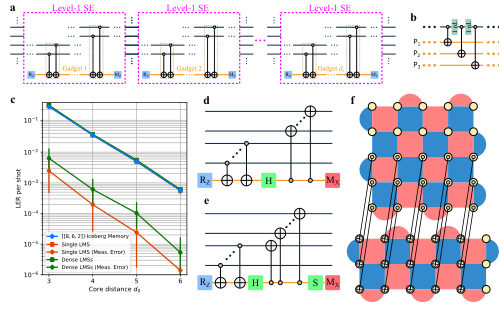
<figcaption class="paper-figure-caption"><b>Fig 3.</b> FIG. 3. Logical Pauli measurements on a hierarchical logical processor (HLP). (a) A Z-basis logical measurement sequence of d1 logical readout gadgets, in d1 consecutive level-1 syn- drome extraction (SE) rounds; each logical readout gadget is embedded in a distinct level-1 SE round. (b) Dense packing of logical readout gadgets from different logical measurement sequences targeting logical Pauli Z operators P1, P2, and P3, respectively. Each teal strip on the core represents a single level-0 SE round. (c) Performance of logical Z measurements on an HLP whose level-1 code is the [[8, 6, 2]] Iceberg code. The memory baseline is composed of five level-1 SE rounds with perfect time boundaries....</figcaption>
</figure>
<figure class="paper-figure-card">
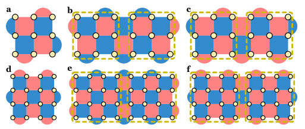
<figcaption class="paper-figure-caption"><b>Fig 4.</b> FIG. 4. Cores and shuttle buses. (a–c) A core, an X bus, and a Z bus, respectively, with d0 = 3 and d1 = 2. (d–f) A core, an X bus, and a Z bus, respectively, with d0 = 4 and d1 = 2. Every dashed yellow region supports a bus-core (or core-bus) CNOT gate between an X (or Z) bus and a core.</figcaption>
</figure>
<figure class="paper-figure-card">
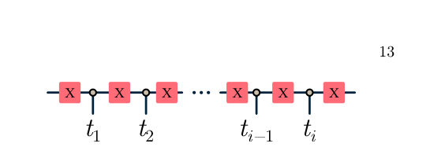
<figcaption class="paper-figure-caption"><b>Fig 5.</b> FIG. 5. Level-1 X error locations on a core. Only the con- trol side of core-bus CNOT gates in M acting on the core is illustrated.</figcaption>
</figure>

**Summary.** The paper introduces the Hierarchical Logical Processor (HLP) to enhance fault tolerance in quantum computing by combining high-rate codes with the Rotated Surface Code. By using 'shuttle buses' and specific gate scheduling, it drastically reduces the frequency of complex long-range couplings required for error correction. This results in substantial improvements in qubit efficiency and operational speed compared to existing surface code implementations.

**Why it may be interesting.** This work directly addresses resource overheads in large-scale quantum computation by proposing a hierarchical structure that mitigates the need for frequent long-range interactions, which is critical for physical realization on current hardware platforms.

Detailed structure

**Main problem.** The primary challenge is achieving fault-tolerant quantum computation (FTQC) with high encoding efficiency while minimizing the frequency and complexity of non-local couplings required for syndrome extraction.

**Main result.** The proposed Hierarchical Logical Processor (HLP) significantly improves qubit efficiency (3-4 times higher than RSC) and reduces space overhead/cycle time compared to standard surface code implementations.

**Method.** The authors propose concatenating a high-rate quantum CSS code with the Rotated Surface Code, utilizing 'shuttle buses' for parallel syndrome extraction via transversal hybrid-unit CNOT gates.

**Model / system.** The model is an HLP architecture built on the Rotated Surface Code (RSC), involving core patches and shuttle buses. It analyzes error suppression through specific compilation parameters ($\alpha_b = d_1, \alpha_c = 1$) during level-1 syndrome extraction.

**Key observables.** Logical qubit efficiency, space overhead reduction (100-200 physical qubits), logical error rate (LER) decay rates, and cycle time reduction factors (20-30).

**Important parameters / regimes.** Physical error rate ($10^{-3}$), base-code distance ($d_0$), level-1 code distance ($d_1$), and compilation parameters ($\alpha_b, \alpha_c$).

**Assumptions / limitations.** The analysis relies on a phenomenological depolarizing noise model and assumes that setting specific compilation parameters effectively suppresses level-1 error correlations.

**Figures summary.** Figures illustrate the HLP architecture (cores/shuttle buses), benchmarking memory performance using Iceberg/Square Berg codes, detailing logical Pauli measurement gadgets (H-transformed, HS-transformed), and showing soft-output simulation results for LER extrapolation.

**Paper structure.** The paper progresses from introducing the HLP concept to proving error suppression via specific gate parameter choices. It then benchmarks memory performance, demonstrates parallel logical measurements using specialized gadgets, and concludes with detailed theoretical bounds on measurement error probabilities.

Abstract

Quantum platforms with beyond-planar connectivity provide new opportunities for fault-tolerant quantum computation (FTQC). While quantum low-density parity-check (qLDPC) codes offer high encoding efficiency, their direct implementation requires non-local couplings in every round of syndrome extraction, incurring additional physical error and implementation complexity. To reduce the frequency of such couplings, we propose the Hierarchical Logical Processor (HLP), which concatenates a high-rate quantum CSS code with the rotated surface code (RSC). HLPs can achieve beyond-RSC encoding efficiency while requiring long-range connectivity only once every $Θ(d_0)$ rounds of level-0 error correction, where $d_0$ denotes the base-code distance, substantially reducing the frequency of non-local couplings relative to direct implementations of qLDPC codes. HLPs introduce elongated RSC patches called shuttle buses. Using transversal hybrid-unit CNOT gates, a single shuttle bus can simultaneously couple to multiple standard RSC patches. This capability enables efficient level-1 syndrome extraction with suppressed level-1 error correlations and supports highly parallel logical Pauli measurements. We perform circuit-level simulations of several concrete HLP constructions and benchmark both logical memory and logical Pauli measurement performance. At a physical error rate of $10^{-3}$, an HLP based on the [[256,194,4]] code achieves 3-4 times higher qubit efficiency than the standard RSC. Compared with the yoked surface code on the same level-1 code, this HLP reduces the space overhead per logical qubit by 100-200 physical qubits and shortens the logical error-correction cycle time by a factor of 20-30.

[↑ back to top](#top)

### [Log-concavity and tunneling: adiabatic quantum optimization for convex functions (with a spike)](http://arxiv.org/abs/2606.23614v1)

**Authors:** Arthur Braida, Elie Bermot, Simon Apers  
**Type:** theory · **Category:** quantum information and computing · **PDF:** <https://arxiv.org/pdf/2606.23614v1>  
**Analysis basis:** full PDF text, analyzed in chunks

↔ Scroll figures horizontally

<figure class="paper-figure-card">
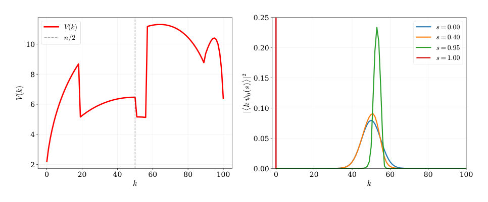
<figcaption class="paper-figure-caption"><b>Fig 1.</b> Figure 1: Example of a non-monotone potential satisfying the RM condition for n = 100 with ak = p</figcaption>
</figure>
<figure class="paper-figure-card">
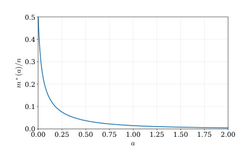
<figcaption class="paper-figure-caption"><b>Fig 2.</b> Figure 2: Plot of the function m∗(a)/n obtained for n = 40 and k0 = −3. m∗(a) is obtained by solving the equation a = n−2m∗ √</figcaption>
</figure>
<figure class="paper-figure-card">
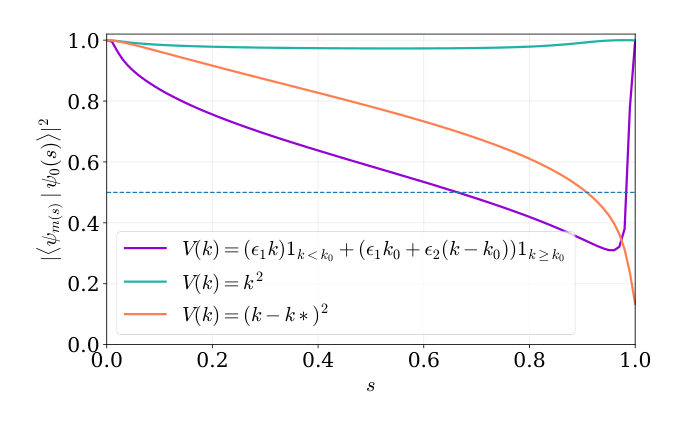
<figcaption class="paper-figure-caption"><b>Fig 3.</b> Figure 3: Overlap between the optimal binomial ansatz state |φm⟩and the ground state |ψ0(s)⟩of H(s) = −(1 −s)A + sV for n = 40 and different potentials: the quadratic potential V (k) = k2 (used in Section 6), a shifted quadratic potential V (k) = (k −k∗)2 with minimizer at k∗= n/3, and a piecewise-linear potential V (k) = ϵ1k 1k&lt;k0 + (ϵ1k0 + ϵ2(k −k0)) 1k≥k0, with n = 40, ϵ1 = 1/n, ϵ2 = 2n, and k0 = n/4.</figcaption>
</figure>

**Summary.** The paper develops a framework using log-concavity properties to analyze quantum tunneling effects in Adiabatic Quantum Optimization. It extends these techniques from simple potentials to general convex functions, culminating in an efficient time complexity bound for solving the quadratic Hamming weight problem via quantum annealing.

**Why it may be interesting.** This research provides rigorous mathematical tools (log-concavity bounds) to analyze quantum speedups in optimization problems, directly impacting the theoretical understanding of adiabatic quantum computation efficiency.

Detailed structure

**Main problem.** The work analyzes how quantum tunneling provides a computational speedup for Adiabatic Quantum Optimization (AQO) when minimizing complex cost functions, extending analysis beyond simple cases like the Hamming weight.

**Main result.** By establishing log-concavity of the ground state wavefunction, the authors derive new spectral gap bounds and show that the quadratic HWS problem can be solved in $O(n^4)$ time via AQO under specific spike conditions.

**Method.** The methodology combines structural analysis (proving discrete log-concavity for Schrödinger operators) with perturbation theory applied to the spectral gap, linking these properties directly to computational complexity bounds.

**Model / system.** The system is modeled by a 1D quantum Hamiltonian $H(s)$ interpolating between an initial state and a target potential $V$, often involving quadratic potentials ($V_q$) and localized spike perturbations ($h$).

**Key observables.** Spectral Gap ($\Delta$), Log-concavity/Ultra-log-concavity of the ground state wavefunction, Overlap $\left| \langle\psi_0|\varphi_m
angle
ight|^2$.

**Important parameters / regimes.** The spike height ($ar{h}$), the support boundaries ($\ell, u$), and the system size ($n$).

**Assumptions / limitations.** The analysis heavily relies on establishing log-concavity of the ground state as a key structural property, which allows for bounding the spectral gap even in the presence of spikes.

**Figures summary.** Figures illustrate potential energy landscapes (e.g., quadratic potentials) and show the overlap between the true ground state wavefunction and an optimal binomial ansatz state $|\varphi_m
angle$.

**Paper structure.** The paper progresses by first establishing log-concavity for a general family of Hamiltonians, then using this structural property to extend perturbative spike analysis (Reichardt's work) to quadratic potentials, culminating in the time complexity bound for the quadratic HWS problem.

Abstract

Quantum tunneling is expected to provide a computational speedup in quantum computing, a phenomenon that Adiabatic Quantum Optimization (AQO) aims to leverage. While some academic proofs of concept have been studied, such as the "Hamming weight with a spike" (HWS) problem, the algorithmic gains of this effect remain underexplored. In this work we extend the analysis underlying HWS to more general potentials.   In the first half of the work, we establish (discrete) log-concavity of the ground state as a key structural property in this context. We devise a framework for establishing log-concavity of the ground state for a large family of discrete, 1-dimensional Schrödinger operators. The family includes convex potentials, but also certain potentials with local minima. In the convex case, this provides a discrete version of a continuous result by Brascamp and Lieb ('76). We demonstrate the utility of our result by establishing new spectral gap bounds, going beyond related results by Jarret and Jordan ('14) for convex potentials.   In the second half of the work, we use our results on log-concavity to extend the perturbative analysis of HWS by Reichardt ('04) to the larger family of potentials with log-concave ground state. As a concrete instantiation, we use our result to extend the HWS analysis from a linear potential (which is exactly solvable) to a quadratic potential (which is no longer solvable). Our result strongly suggests the broader applicability of tunneling to convex potentials with spikes

[↑ back to top](#top)

### [Multifractality at the Integer Quantum Hall Transition: Acquittal of the Parabolic Law](http://arxiv.org/abs/2606.21679v1)

**Authors:** Sen Mu, Abbas Ali Saberi, Martin R. Zirnbauer  
**Type:** theory · **Category:** disordered systems and neural networks · **PDF:** <https://arxiv.org/pdf/2606.21679v1>  
**Analysis basis:** full PDF text, analyzed in chunks

↔ Scroll figures horizontally

<figure class="paper-figure-card">
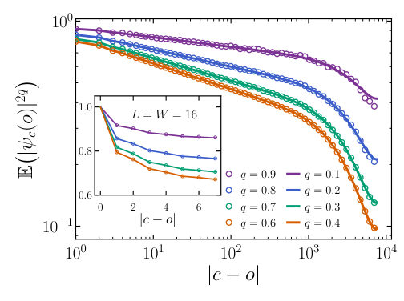
<figcaption class="paper-figure-caption"><b>Fig 1.</b> FIG. 1. Weyl-symmetry check for the wave-intensity moments E  |ψc(o)|2q . The disorder average is taken over Ndis = 106</figcaption>
</figure>
<figure class="paper-figure-card">
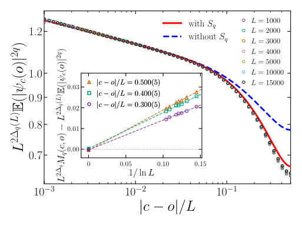
<figcaption class="paper-figure-caption"><b>Fig 2.</b> FIG. 2. Comparison between the scaled numerical data fq,L(|c −o|/L) ≡L2∆q(L)E(|ψc(o)|2q) and the predicted scal- ing function Fq for L/W = 10 and q = 0.1. The analyt- ical prediction is evaluated with the CFT exponent ∆q = q(1 −q)/4 and a fixed UV scale a = 0.17. The red solid curve shows Fq computed from the full expression (7), whereas the blue dashed curve omits Sq. The running exponent ∆q(L) is determined from the short-distance regime for each sys- tem size. The inset shows the residual Fq(x) −fq,L(x) near x = |c −o|/L = 0.3, 0.4, 0.5, extrapolated linearly in 1/ ln L.</figcaption>
</figure>

**Summary.** This paper tackles the multifractality spectrum at the IQH transition, resolving a conflict between theory and simulation. The authors show that standard CFT assumptions are incomplete because they neglect non-Abelian effects, which manifest as a 'dressing factor' in the correlation functions. By incorporating this factor, they reconcile theoretical predictions with numerical results from lattice models.

**Why it may be interesting.** The work provides deep insights into how non-Abelian symmetries modify critical exponents in disordered systems, offering a theoretical framework applicable to other strongly correlated or topological quantum materials where simple CFT predictions fail.

Detailed structure

**Main problem.** The paper resolves a conflict between Conformal Field Theory (CFT) predictions of a parabolic multifractality law and numerical simulations concerning the wave function scaling at the Integer Quantum Hall (IQH) transition.

**Main result.** The discrepancy arises because earlier analyses incorrectly assumed Abelian fusion; the true physics requires incorporating a non-Abelian 'dressing factor' into the correlators, leading to agreement with predictions from a level-4 current algebra.

**Method.** Analytical derivation of scaling limits for $q$-moments using Green's functions on a torus geometry, complemented by numerical simulations on the Chalker–Coddington network model.

**Model / system.** The Integer Quantum Hall (IQH) transition in 2D disordered topological matter. The primary computational tool is the Chalker–Coddington (CC) network model simulated on a rectangular torus.

**Key observables.** The $q$-moments of point-contact generated eigenstates, $\langle |\psi_c(\mathbf{o})|^{2q} 
angle$, and the scaling function $M_q(\mathbf{c}, \mathbf{o})$.

**Important parameters / regimes.** The exponent $q$ (related to moment order), system size ($L$), and the geometry of the torus ($\Sigma = S^1 	imes S^1$).

**Assumptions / limitations.** The analysis modifies the Gaussian Free Field Hypothesis by introducing a dressing factor $S_q(\mathbf{c}, \mathbf{o})$ due to non-Abelian effects, challenging the initial assumption that simple scaling laws suffice.

**Figures summary.** Figure 1 shows Weyl symmetry checks for wave-intensity moments on a torus. Figure 2 compares numerically scaled data against theoretical predictions, highlighting the necessity of the dressing factor $S_q$.

**Paper structure.** The paper progresses from identifying the conflict (CFT vs. simulation) to deriving an exact analytical expression incorporating a dressing factor ($M_q \propto e^{G\Delta_q} S_q$). It then performs numerical tests on the CC model, showing that fitting without $S_q$ leads to incorrect scaling dimensions.

Abstract

Stationary wave functions at the integer quantum Hall transition are known to be multifractal, but the exact form of the multifractality spectrum has remained a subject of debate. While conformal field theory arguments predict a parabolic law, numerical simulations show deviations from parabolicity. We resolve this discrepancy by pointing out that powers of the local wave intensity fail to obey the Gaussian Free Field and Abelian Fusion Hypothesis assumed in earlier analysis. Rather, due to the non-Abelian nature of the underlying effective field theory, wave intensity correlators are dressed by insertions of background charge distributed uniformly in space. An exact expression for the $q$-moments of point-contact generated eigenstates is presented. Numerical tests are performed for the critical Chalker-Coddington network model on a rectangular torus. Our results are in precise agreement with the predictions of conformal symmetry realized as a level-4 current algebra.

[↑ back to top](#top)

### [Spectroscopic fingerprints of a ferroaxial charge density wave](http://arxiv.org/abs/2606.21872v1)

**Authors:** Jiangchang Zheng, Zhongyi Zhang, Fazhi Yang, Josh Leeman, Luanjing Li, Zihan Lin, Zijian Fei, Tianhao Guo, Siyu Heng, Xin Liang, Leslie M. Schoop, Junzhang Ma, Hoi Chun Po, Berthold Jäck  
**Type:** both · **Category:** strongly correlated electrons · **PDF:** <https://arxiv.org/pdf/2606.21872v1>  
**Analysis basis:** full PDF text, analyzed in chunks

↔ Scroll figures horizontally

<figure class="paper-figure-card">
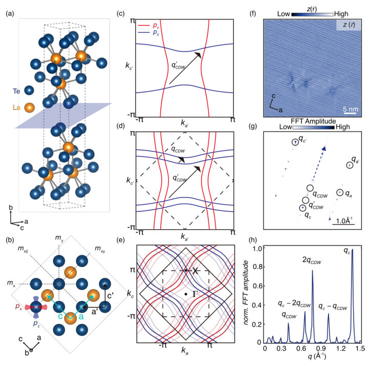
<figcaption class="paper-figure-caption"><b>Fig 1.</b> FIG. 1. Charge density wave order in LaTe3. (a) Crystal structure of LaTe3, with the blue plane indi-</figcaption>
</figure>
<figure class="paper-figure-card">
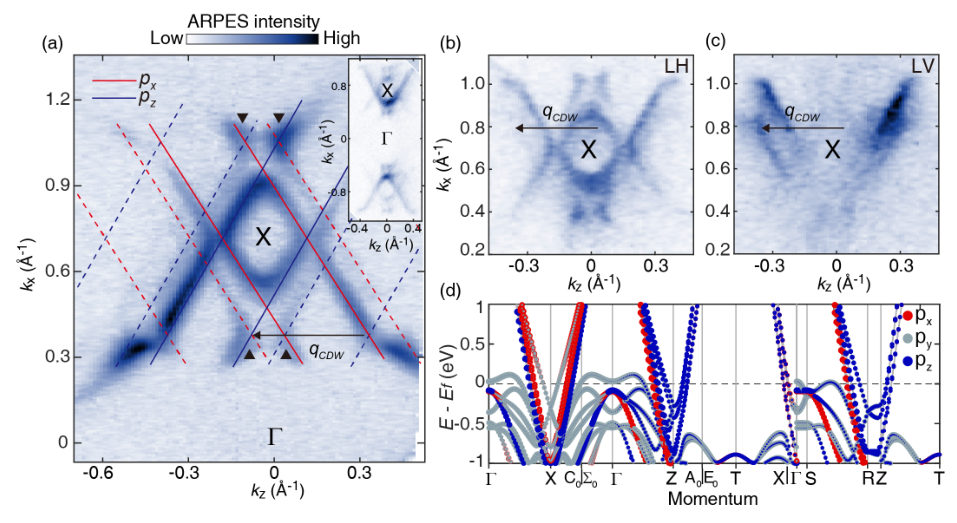
<figcaption class="paper-figure-caption"><b>Fig 2.</b> FIG. 2. Electronic structure and orbital character of LaTe3 revealed by ARPES and DFT.</figcaption>
</figure>
<figure class="paper-figure-card">
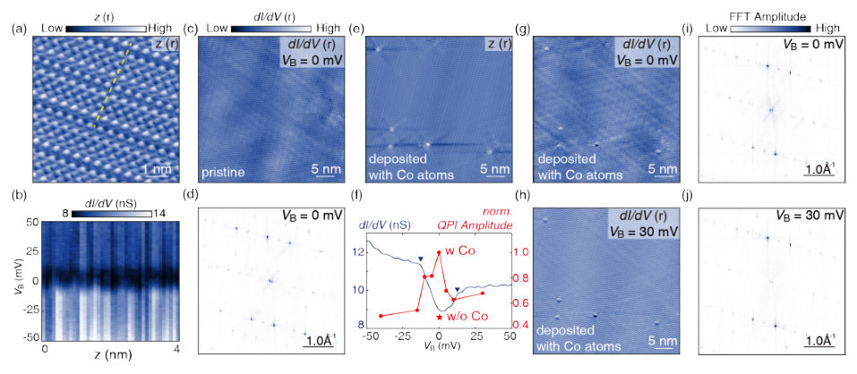
<figcaption class="paper-figure-caption"><b>Fig 3.</b> FIG. 3. Enhanced QPI pattern via depositing Co atoms. (a) STM topography of the Te-terminated</figcaption>
</figure>
<figure class="paper-figure-card">

<figcaption class="paper-figure-caption"><b>Fig 4.</b> FIG. 4. Evidence of an inter-orbital CDW in LaTe3 from quasiparticle interference. (a) Shown</figcaption>
</figure>
<figure class="paper-figure-card">
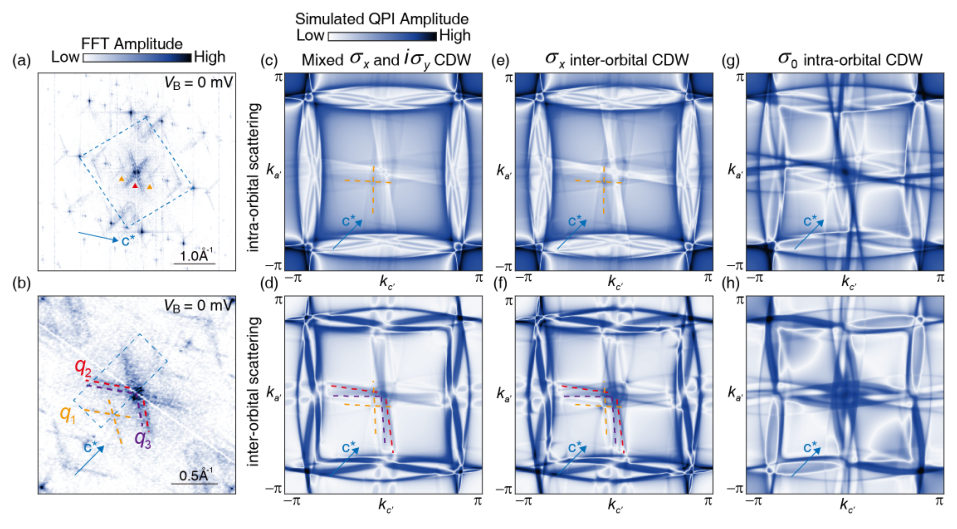
<figcaption class="paper-figure-caption"><b>Fig 5.</b> Fig. 3(g), here, plotted on a square-root color scale. (b) Zoomed-in view of the blue dashed box in panel a,</figcaption>
</figure>

**Summary.** The authors investigate the complex Charge Density Wave state in $	ext{LaTe}_3$ using both ARPES and advanced STM/QPI mapping. By analyzing how scattering patterns depend on orbital character, they determine that the CDW order parameter must possess a mixed, ferroaxial symmetry component. This establishes a robust spectroscopic pathway for characterizing exotic electronic orders in quantum materials.

**Why it may be interesting.** This work provides a powerful, multi-pronged spectroscopic methodology (combining ARPES and STM/QPI) to resolve ambiguities in the symmetry of hidden electronic orders like CDWs, which is highly relevant for understanding correlated electron physics beyond simple mean-field treatments.

Detailed structure

**Main problem.** The primary goal is to spectroscopically characterize the symmetry and electronic structure of unconventional Charge Density Waves (CDWs), specifically focusing on the ferroaxial component in $	ext{LaTe}_3$. This requires distinguishing between intra-orbital and inter-orbital CDW order parameters.

**Main result.** The combination of ARPES and STM/QPI measurements strongly suggests a mixed, inter-orbital CDW phase characterized by a substantial ferroaxial component that breaks all vertical mirror symmetries. The QPI analysis successfully rules out purely conventional or intra-orbital models.

**Method.** The study employs both experimental techniques (ARPES for band structure, STM/QPI mapping) and theoretical modeling using tight-binding Hamiltonians extended to include CDW order parameters ($\Delta_{	ext{CDW}}$).

**Model / system.** The system is $	ext{LaTe}_3$, a rare-earth tritelluride exhibiting a complex CDW. The electronic structure is modeled in the $(p_x, p_z)$ orbital subspace using a $2 	imes 2$ matrix Hamiltonian to capture inter-orbital coupling.

**Key observables.** Spectral gaps across the Fermi surface (ARPES); Quasiparticle Interference (QPI) patterns and scattering vectors ($\mathbf{q}_1, \mathbf{q}_2, \mathbf{q}_3$) derived from 2D-FFT of STM $dI/dV$ maps.

**Important parameters / regimes.** The CDW order parameter $\Delta_{	ext{CDW}}$ is analyzed in terms of Pauli matrices ($\sigma_x, i\sigma_y$), distinguishing between intra-orbital and inter-orbital coupling strengths.

**Assumptions / limitations.** The analysis approximates the incommensurate CDW using a nearby commensurate wave vector; the QPI signal calculation relies on the T-matrix formalism applied to the extended Hamiltonian.

**Figures summary.** Figures illustrate crystal structure, ARPES band folding due to CDW formation, and critically, STM/QPI maps showing characteristic cross-like features whose symmetry is mapped onto theoretical predictions for different CDW order parameter symmetries.

**Paper structure.** The paper progresses by first establishing the experimental evidence (ARPES gaps, QPI modulation) of a complex CDW. It then uses detailed QPI analysis and theoretical modeling to constrain the possible symmetry components ($\sigma_x$ vs. $i\sigma_y$), ultimately concluding that only a mixed ferroaxial phase matches all observed spectroscopic fingerprints.

Abstract

Unconventional charge density waves (CDWs) with complex order parameters can host exotic collective modes and non-trivial topologies. They have emerged as a new frontier in the study of quantum matter. Recent experiments on rare-earth tritellurides have reported evidence for a ferroaxial CDW through the detection of characteristic Raman modes. This phase, often regarded as a hidden order, has been recognized to arise from the coupling between charge and orbital degrees of freedom in these materials. Yet, spectroscopic insight into its underlying electronic structure and the explicit form of its order parameter symmetry has remained elusive. Here, we present results from linearly polarized angle-resolved photoemission spectroscopy (ARPES) and scanning tunneling microscopy (STM) measurements of the CDW phase in LaTe$_3$. Our ARPES measurements reveal a complex landscape of spectral gaps across the reconstructed Fermi surface, while our STM-based quasiparticle interference (QPI) mapping, enhanced through the selective deposition of atomic scattering centers, directly reveals an inter-orbital CDW with mixed $p_x$-$p_z$ orbital character. The detailed analysis of the QPI characteristics in terms of the order parameter symmetry within the orbital subspace of the Fermi surface suggests a mixed CDW phase with substantial ferroaxial component, which breaks all vertical mirror symmetries. More broadly, our work establishes a powerful spectroscopic pathway, based on scattering off individual atoms, for identifying and characterizing hidden, multi-component electronic orders in quantum materials using STM and ARPES measurements.

[↑ back to top](#top)

### [Strain-tuned orbital-dependent electronic correlations in FeTe thin films](http://arxiv.org/abs/2606.22799v1)

**Authors:** Hyunjee Song, Sangjae Lee, Keun-Yeol Park, Jaehyun Park, Suyoung Lee, Yeonjae Lee, Jinyoung Kim, Jaeung Lee, Celesta S. Chang, Younsik Kim, Changyoung Kim  
**Type:** experiment · **Category:** strongly correlated electrons · **PDF:** <https://arxiv.org/pdf/2606.22799v1>  
**Analysis basis:** full PDF text, analyzed in chunks

↔ Scroll figures horizontally

<figure class="paper-figure-card">
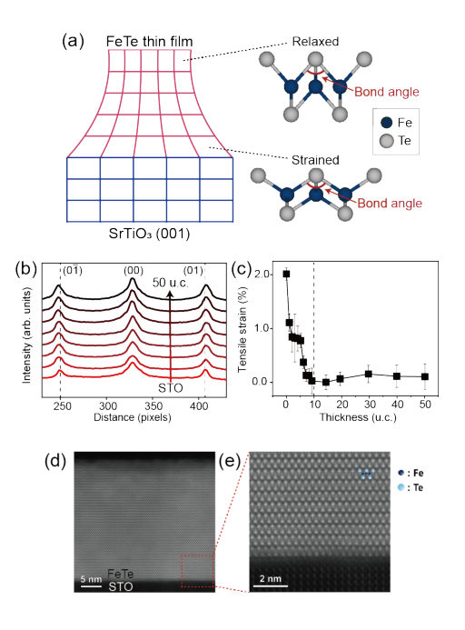
<figcaption class="paper-figure-caption"><b>Fig 1.</b> FIG. 1. FeTe thin films under tensile strain. (a) Schematic of strained FeTe thin films on SrTiO3 substrate with local crystal struc- tures. (b) Thickness dependent RHEED pattern profiles measured at 543 K. (c) Magnitude of tensile strain versus film thickness. High- angle annular dark-field (HAADF) STEM image of (d) the overall film and (e) the region near the interface.</figcaption>
</figure>
<figure class="paper-figure-card">
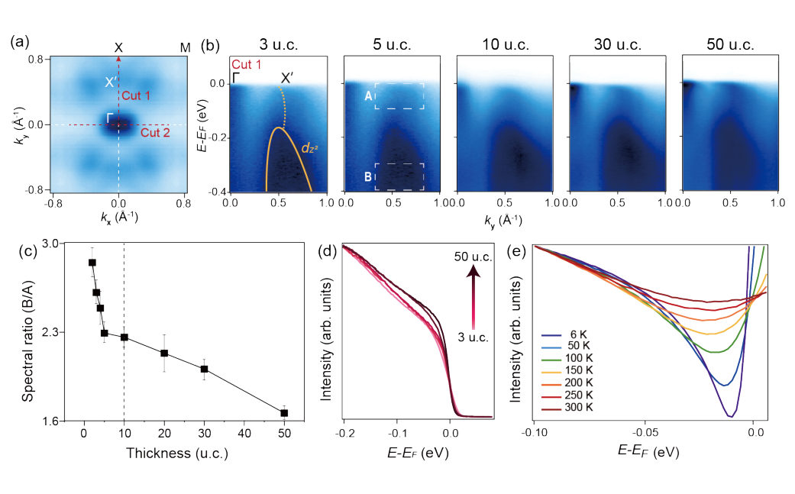
<figcaption class="paper-figure-caption"><b>Fig 2.</b> FIG. 2. Thickness dependent dz2 evolution in FeTe at the X′ point. (a) Fermi surface map of 50-unit-cell FeTe film measured at 6 K. (b) Γ-X high-symmetry cuts along kx = 0 (Cut 1 in (a)) for various thicknesses. (c) Spectral weight ratio between regions A and B as a function of the film thickness. (d) Energy distribution curves (EDCs) obtained by momentum integration in the range of 0.4 ˚ A−1 &lt; ky &lt; 0.8 ˚ A−1. They are normalized to the value at -0.2 eV . (e) Temperature dependent EDCs of 3-unit-cell FeTe film at X′ divided by the Fermi-Dirac function, normalized to the value at -0.1 eV .</figcaption>
</figure>
<figure class="paper-figure-card">
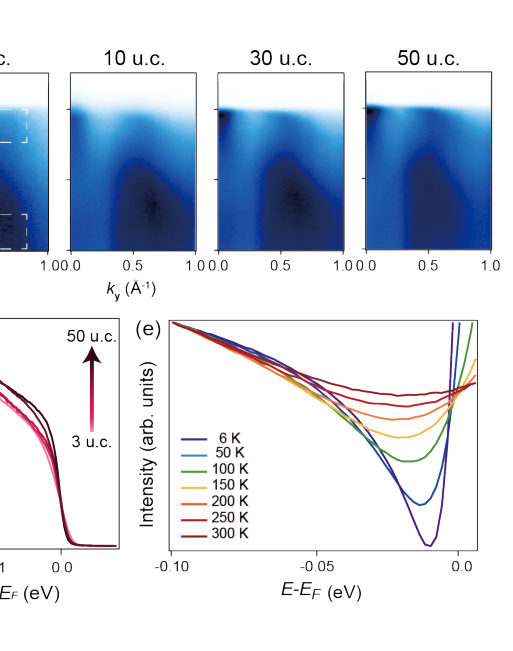
<figcaption class="paper-figure-caption"><b>Fig 3.</b> Figure 1(b) depicts the extracted profiles of RHEED patterns for varying thicknesses. The distance between the two Bragg peaks (0¯1) and (01) increases with the thickness, indicating the decreasing in-plane lattice constant due to the relaxation of the tensile strain. For quantitative analysis of the strain relaxation, we plot the degree of tensile strain computed from the diffraction peak spacing as a function of thickness in Fig. 1(c). We observe a rapid strain relaxation - few initial layers are subject to sig- nificant tensile strain up to 2 %, but the strain fully relaxes beyond 10 layers. Cross-sectional scanning transmission elec- tron microscopy (STEM) measurements in Fig. 1(d) and...</figcaption>
</figure>
<figure class="paper-figure-card">
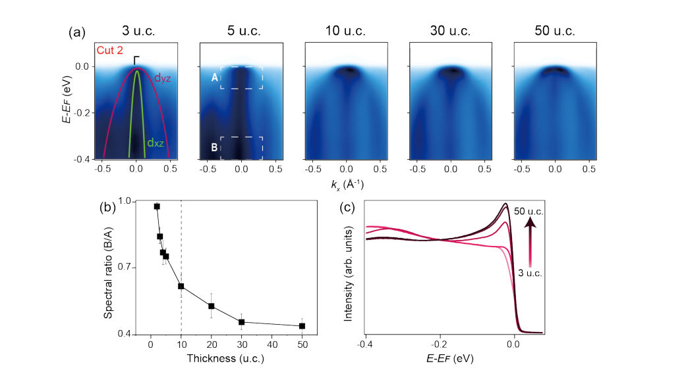
<figcaption class="paper-figure-caption"><b>Fig 4.</b> FIG. 3. Thickness dependent dxz band at the Γ point. (a) Γ-X high-symmetry cuts along ky = 0 (Cut 2 in Fig. 2(a)). (b) Spectral weight ratio between from A and B regions as a function of the film thickness. (c) EDCs obtained by momentum integration in the range of -0.2 ˚ A−1 &lt; kx &lt;0.2 ˚ A−1, normalized to the value at -0.2 eV .</figcaption>
</figure>
<figure class="paper-figure-card">
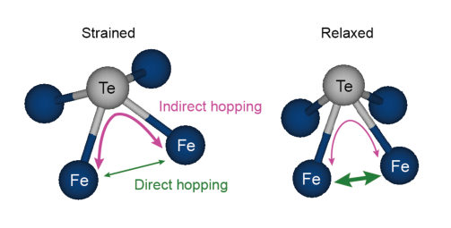
<figcaption class="paper-figure-caption"><b>Fig 5.</b> FIG. 4. Hopping mechanisms upon tensile strain. (Left) Schematic of tensile-strained FeTe thin films with suppressed direct hopping. (Right) Schematic of relaxed FeTe thin films with enhanced direct hopping. Indirect hopping remains nearly unchanged.</figcaption>
</figure>

**Summary.** This paper uses ARPES on strained FeTe thin films to study orbital-dependent electronic correlations. By applying tensile strain, the researchers observe evidence of an Orbital-Selective Mott Phase breakdown and map out how lattice deformation specifically controls the coherence of different orbitals like $d_{xz}$. The findings establish a direct link between epitaxial strain and the fundamental electronic structure governing these correlated materials.

**Why it may be interesting.** The work provides an experimental demonstration of how structural parameters (lattice constant) can act as a clean tuning knob to manipulate strong electronic correlations in correlated materials, offering insights applicable to designing quantum materials.

Detailed structure

**Main problem.** The study investigates how orbital-dependent electronic correlations in FeTe thin films are tuned by applying epitaxial tensile strain, aiming to separate structural effects from those caused by chemical doping.

**Main result.** Tensile strain induces an Orbital-Selective Mott Phase (OSMP) breakdown and causes a measurable spectral weight transfer between $d_{xy}$ and $d_{z^2}$ orbitals. Furthermore, the analysis reveals that lattice deformation specifically controls the coherence of the $d_{xz}$ orbital via changes in $	ext{Fe–Fe}$ hopping.

**Method.** The primary technique used is Angle-Resolved Photoemission Spectroscopy (ARPES), complemented by structural characterization using RHEED and STEM to monitor strain relaxation as a function of film thickness.

**Model / system.** The system under study is FeTe thin films grown epitaxially on substrates, which allows for systematic tuning of lattice parameters via tensile strain. The physics revolves around orbital-dependent electronic interactions characteristic of iron chalcogenides.

**Key observables.** Spectral weight transfer between $d_{xy}$ and $d_{z^2}$ orbitals; evolution of the $d_{z^2}$ band near the Fermi level; spectral weight ratio changes in the $d_{xz}$ orbital; effective mass evolution for specific orbitals.

**Important parameters / regimes.** Tensile strain magnitude, film thickness (which correlates with strain relaxation), and temperature are the key tuning parameters.

**Assumptions / limitations.** The study assumes that ARPES can accurately probe subtle changes in electronic structure related to correlation physics, and that the structural control offered by epitaxial strain allows for a clean decoupling of lattice effects from chemical doping.

**Figures summary.** Figures illustrate thickness-dependent band dispersions ($\Gamma-	ext{X}$ cuts) showing orbital evolution; spectral weight ratios tracking strain relaxation; and schematic diagrams detailing how hopping mechanisms are suppressed or enhanced under tensile versus relaxed strain conditions.

**Paper structure.** The paper systematically presents evidence across multiple measurements: first, demonstrating OSMP breakdown via $d_{xy}/d_{z^2}$ transfer due to strain; second, analyzing the thickness dependence of $d_{xz}$ orbital coherence and spectral weight; and finally, proposing a mechanism where lattice deformation directly modulates hopping pathways for specific orbitals.

Abstract

Iron chalcogenides exhibit rich phenomena which are governed by orbital-dependent electronic interactions and strong electronic correlation. In particular, many studies have explored orbital selectivity in FeTe through Se doping. Here, applying tensile strain to thin films allows us to precisely control the system without other impurities that may arise from chemical doping to investigate the emergent behaviors in FeTe. Using angle-resolved photoemission spectroscopy, we observe a spectral weight transfer between $d_{\rm xy}$ and $d_{\rm z^{2}}$ orbitals, evidence of an orbital-selective Mott phase (OSMP). Beyond OSMP, we reveal hitherto unobserved strain-induced effects, distinct from chemical doping. The evolution of $d_{\rm xz}$ orbital demonstrates how electron hopping mechanism plays an important role in defining the electronic properties of the system. Our findings highlight a direct correlation between epitaxial strain and the evolution of electronic structures in FeTe.

[↑ back to top](#top)

### [The Quantum Hamming Bound in Arbitrary Local Dimension](http://arxiv.org/abs/2606.22538v1)

**Authors:** Yu-Xuan Zhang, Jing-Ling Chen  
**Type:** theory · **Category:** quantum information and computing · **PDF:** <https://arxiv.org/pdf/2606.22538v1>  
**Analysis basis:** full PDF text, analyzed in chunks

↔ Scroll figures horizontally

<figure class="paper-figure-card">
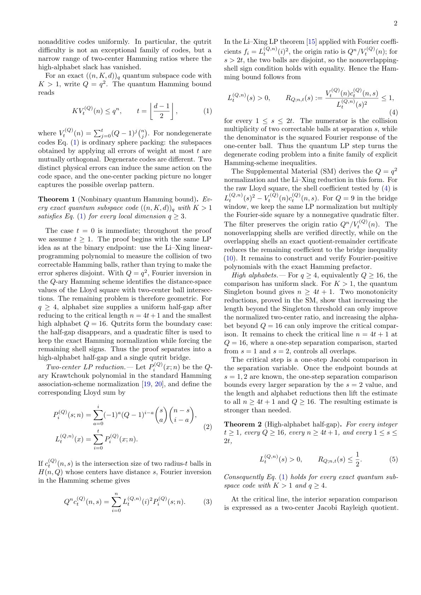
<figcaption class="paper-figure-caption"><b>Fig 1.</b> Low-resolution page preview, page 2</figcaption>
</figure>
<figure class="paper-figure-card">
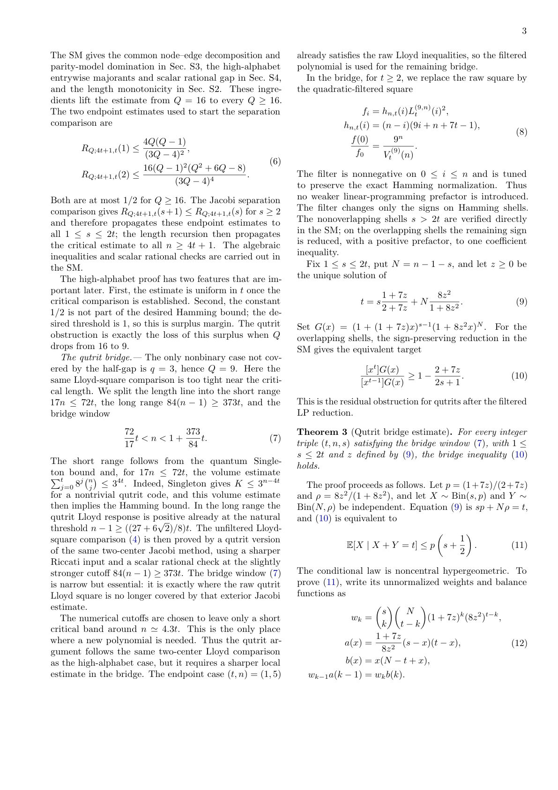
<figcaption class="paper-figure-caption"><b>Fig 2.</b> Low-resolution page preview, page 3</figcaption>
</figure>
<figure class="paper-figure-card">
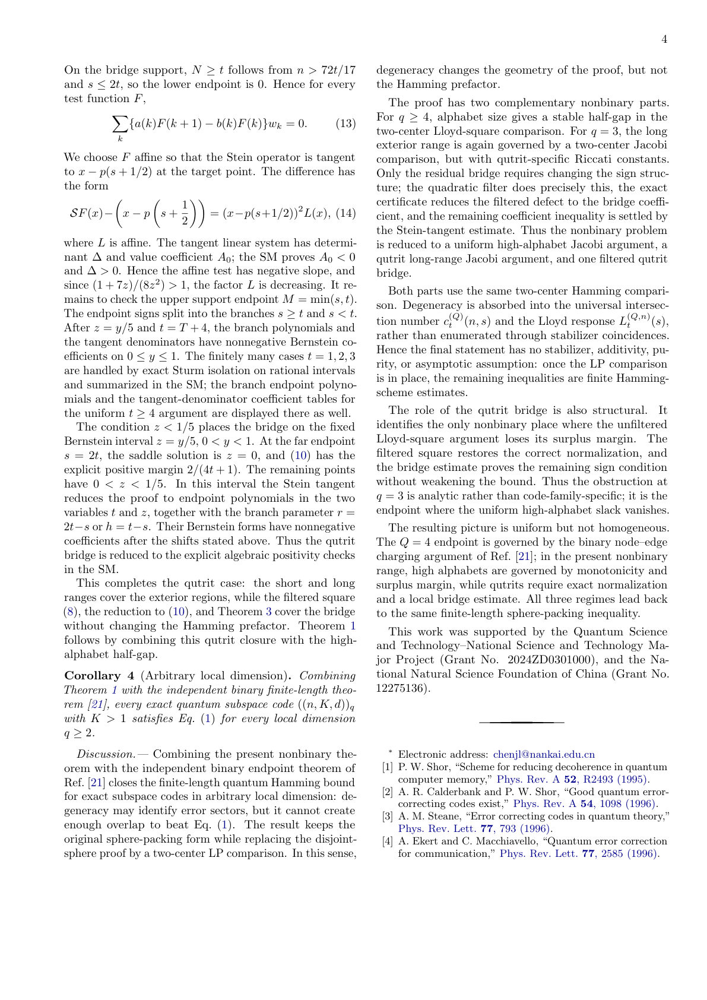
<figcaption class="paper-figure-caption"><b>Fig 3.</b> Low-resolution page preview, page 4</figcaption>
</figure>
<figure class="paper-figure-card">
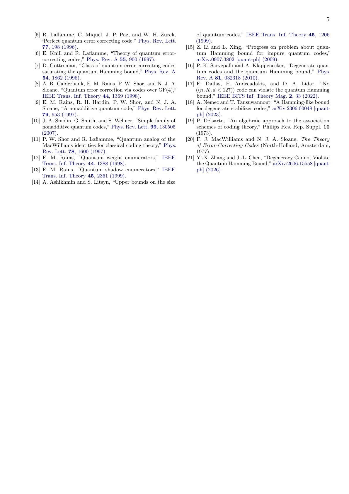
<figcaption class="paper-figure-caption"><b>Fig 4.</b> Low-resolution page preview, page 5</figcaption>
</figure>
<figure class="paper-figure-card">
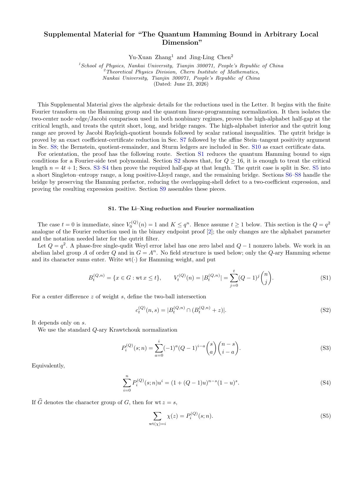
<figcaption class="paper-figure-caption"><b>Fig 5.</b> Low-resolution page preview, page 6</figcaption>
</figure>

**Summary.** This theoretical paper rigorously proves the finite-length quantum Hamming bound for error-correcting codes in arbitrary local dimensions. It achieves this by overcoming the complication of code degeneracy using sophisticated mathematical tools, including linear programming and advanced polynomial analysis. The result establishes a fundamental limit on how many distinct errors can be corrected within a given Hilbert space dimension.

**Why it may be interesting.** The rigorous mathematical machinery developed—combining algebraic geometry (Sturm sequences), spectral theory (Jacobi matrices), and coding bounds—provides deep insights into the fundamental limits of quantum information processing.

Detailed structure

**Main problem.** The paper aims to prove the finite-length quantum Hamming bound for exact subspace codes in arbitrary local dimension ($q \ge 3$).

**Main result.** It proves that degeneracy, while potentially merging error sectors, is insufficient to violate the established quantum Hamming count, thereby establishing the nonbinary part of the finite-length quantum Hamming bound.

**Method.** The proof employs advanced techniques including linear programming (LP) bounds, analyzing two-center Hamming-ball intersection inequalities normalized by the Lloyd response, and utilizing specialized algebraic tools like quadratic filtering and Stein's method for specific regimes.

**Model / system.** The model is quantum error correction applied to exact subspace codes defined over an alphabet of size $Q=q^2$. The problem is framed as a sphere-packing count within the ambient Hilbert space.

**Key observables.** Quantum Hamming Bound inequality, $	ext{V}_t^{(Q)}(n)$, two-center intersection ratio $	ext{R}_{Q;n,t}(s)$, and various polynomial signs ($	ext{PII} \ge 0$).

**Important parameters / regimes.** Local dimension $q$ (specifically $q \ge 3$), error weight limit $t$, code length $n$, and the overlap parameter $s$.

**Assumptions / limitations.** The analysis relies on reducing the problem to explicit Hamming-scheme inequalities, treating the $q=3$ case separately due to loss of margin, and assuming the validity of complex algebraic positivity checks.

**Figures summary.** Not specified; the notes refer extensively to equations (e.g., Eq. 1, Eq. 4) and sections detailing algebraic data tables for coefficient verification.

**Paper structure.** The paper systematically tackles the bound by first establishing general LP reductions, then proving the nonbinary case ($q \ge 3$) via analysis of high-alphabet regimes and a specialized 'bridge window' for qutrits, culminating in the full result by combining with independent binary results.

Abstract

The quantum Hamming bound is the finite-length sphere-packing count for exact quantum error correction: the code dimension times the number of correctable local error patterns must fit inside the ambient Hilbert space. For nondegenerate codes this follows from disjoint error spheres. Degeneracy is the only obstruction, because distinct physical errors can coincide on the code subspace and turn sphere packing into an overcount. The central finite-length question has been whether this overcount can ever invalidate the Hamming inequality. Earlier linear-programming, asymptotic, and structural results left a pointwise finite-length problem for arbitrary exact subspace codes. Writing $Q=q^2$ for the Hamming-scheme alphabet, the nonbinary range begins at $Q=9$; here we prove the bound for every $q\ge3$, while the binary endpoint is governed by a distinct $Q=4$ charging geometry. For every nontrivial exact subspace code in this range, any possible violation reduces to a two-center Hamming-ball intersection inequality normalized by the Lloyd response. For $q\ge4$, the Lloyd-square linear program has a uniform half-gap after reduction to alphabet $Q\ge16$ and critical length $n=4t+1$. Qutrits form the boundary: the half-gap disappears, but the bridge is handled by a quadratic-filtered Lloyd square, an exact coefficient-certificate reduction, and a Stein-tangent positivity argument. Thus degeneracy may merge error sectors, but not enough to beat the Hamming count. This proves the nonbinary part of the finite-length quantum Hamming bound; together with the independent binary endpoint theorem, it gives the result in arbitrary local dimension.

[↑ back to top](#top)

## Secondary cond-mat archives

*Papers from cond-mat.mtrl-sci, mes-hall, other, soft, supr-con. These archives are de-prioritized — they appear at the end regardless of relevance score.*

### Relevant in secondary archives (37)

### [Synchronization in coherently and dissipatively coupled spinor polariton time crystals](http://arxiv.org/abs/2606.23311v1)

**Authors:** I. Carraro-Haddad, A. Ramos-Pérez, G. Usaj, A. Bruchhausen, K. Biermann, P. V. Santos, A. S. Kuznetsov, A. A. Reynoso, A. Fainstein  
**Type:** both · **Category:** other · **PDF:** <https://arxiv.org/pdf/2606.23311v1>  
**Analysis basis:** full PDF text, analyzed in chunks
**Topic relevance:** 🔥 `driven-dissipative phase transition` **5/5** · 🔥 `analog quantum simulation` **4/5** · 🔥 `correlated / nonlocal dissipation` **4/5** · 🔥 `exotic spin models in light-matter` **4/5** · `Tavis-Cummings & cavity-many-emitter` **3/5** · `correlated cavity matter` **3/5** · `methods for driven-dissipative` **3/5** · `non-equilibrium dynamics` **3/5** · `spintronics-quantum-optics interface` **3/5** · `Keldysh / 2PI / non-Gaussian methods` **2/5** · `non-equilibrium universality` **2/5** · `quantum optics experiment` **2/5** · `Dicke superradiance` **1/5** · `entanglement & information structure` **1/5** · `quantum measurements` **1/5**

↔ Scroll figures horizontally

<figure class="paper-figure-card">
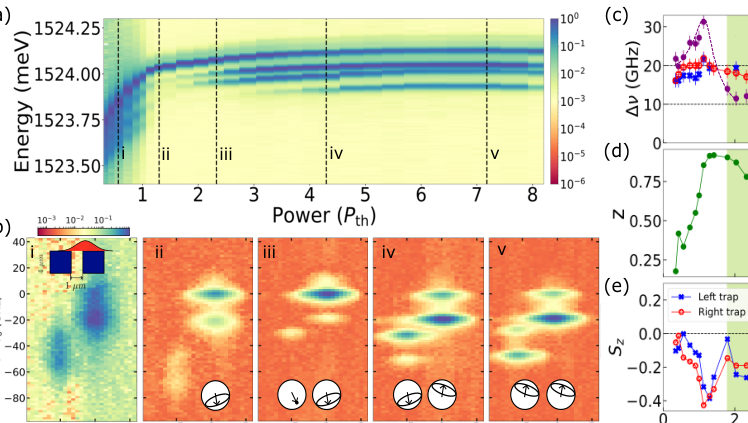
<figcaption class="paper-figure-caption"><b>Fig 1.</b> Figure 1. Spinor coupled time crystals with an internal clock. Experiments on two 4 × 4 µm2 square polariton traps, separated by a small 1 µm barriers. A continuous wave linearly polarized pump laser non-resonantly injects free carriers with Pcw. These relax, forming an exciton reservoir mostly feeding one of the polariton traps. (a) Photoluminescence spectra integrated from the two traps for increasing non-resonant cw laser power (magnitude given in terms of the condensation threshold power Pth. (b) Spectrally-resolved photoluminescence images for the five powers indicated with vertical dashed lines in in (a). A scheme of the two traps and and of the optical excitation configuration is...</figcaption>
</figure>
<figure class="paper-figure-card">
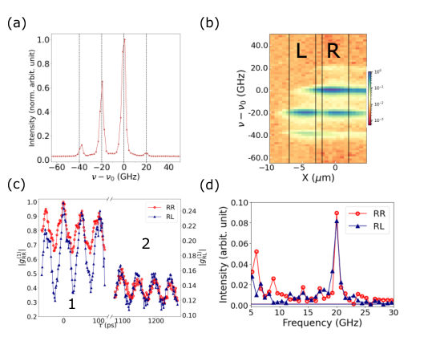
<figcaption class="paper-figure-caption"><b>Fig 2.</b> Figure 2. Time dependence of the polaromechanical CTC molecule determined through g(1)(r, τ). (a) Spectrum integrated from the whole structure, corresponding to two coupled 2 × 2µm2</figcaption>
</figure>
<figure class="paper-figure-card">
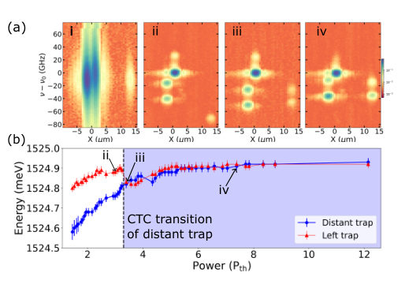
<figcaption class="paper-figure-caption"><b>Fig 3.</b> Figure 3. Dissipative coupling of a TC to a distant condensate. (a) Spectrally resolved spatial images for varying incidence power for a structure consisting of two 2 × 2µm2 square traps separated by 2µm barriers (as the example in Fig. 3), but with in addition a dis- tant identical trap separated 13µm from the center of the right (R) trap. (b)Energy position as a function of incidence power (referred to PRM) for the high energy components of the left (L) and the dis- tant (D) trap. The blue shade indicates the region in which the L and D traps fully synchronize, and coincidentally the TC behavior is in- duced in D.</figcaption>
</figure>
<figure class="paper-figure-card">
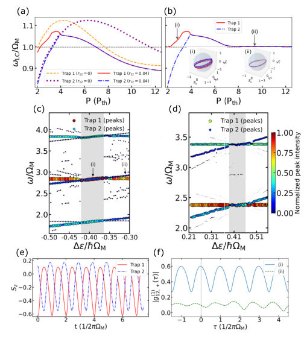
<figcaption class="paper-figure-caption"><b>Fig 4.</b> Figure 4. Coherent and dissipative synchronization of two po- lariton time crystals. (a,b) Precession frequency of the pseudospin limit cycle in each trap, ωLC, normalized to the mechanical fre- quency ΩM, as a function of the average pump power P, for the pumping conditions and trap parameters given in the main text and Methods. The two curves correspond to the two spatially separated condensates (trap 1 and trap 2). In panel (a), phonons are absent (g1 = g2 = 0). In the uncoupled case (r12 = r21 = 0), the two traps oscillate at different frequencies, whereas introducing weak crossed- reservoir scattering (r12 = r21 = 0.02) causes the two frequencies to progressively converge and merge...</figcaption>
</figure>

**Summary.** This paper explores the synchronization phenomena in coupled spinor polariton condensates exhibiting Continuous Time Crystal behavior. By combining experiments on patterned microcavities with detailed theoretical modeling, the authors show that mutual induction and frequency locking can be achieved through various coupling channels, including dissipation and optomechanics. This extends the understanding of time-broken symmetry to complex, open quantum systems.

**Why it may be interesting.** This work is highly relevant as it tackles non-Hermitian dynamics and time-symmetry breaking in a controllable solid-state platform (polaritons), providing concrete examples of how collective order emerges from complex coupling mechanisms.

Detailed structure

**Main problem.** The study investigates how Continuous Time Crystals (CTCs) synchronize when multiple, coherently or dissipatively coupled spinor polariton condensates interact.

**Main result.** Synchronization of the pseudospin temporal dynamics is experimentally and theoretically demonstrated, showing that coupling mechanisms—including coherent tunneling, dissipation, and optomechanics—can induce collective time-periodic order.

**Method.** The research combines experimental measurements using spectrally resolved photoluminescence (PL) imaging and time-resolved coherence function analysis with theoretical modeling based on generalized spinor Gross-Pitaevskii equations.

**Model / system.** The system involves spinor exciton-polaritons confined in engineered microcavity traps. The dynamics are modeled by coupling the polariton condensate evolution, an exciton reservoir rate equation, and optionally, a mechanical oscillator mode.

**Key observables.** Pseudospin precession frequency ($\Delta s$), relative integrated intensity ratio, first-order coherence function $g^{(1)}(\mathbf{r}, 	au)$, and spectral line splitting.

**Important parameters / regimes.** Optical excitation power ($P_{cw}$), inter-trap detuning ($\Delta\epsilon$), coupling strengths (coherent $J_{12}$ vs. dissipative $J_{12,d}$), and the mechanical frequency ($
u_M$).

**Assumptions / limitations.** The analysis assumes that the system can be described by coupled non-Hermitian dynamics incorporating reservoir effects and optomechanical back-action.

**Figures summary.** Figures illustrate spectral evolution (line splitting) vs. power, time-resolved coherence functions showing frequency locking to mechanical modes, and theoretical comparisons between synchronization induced by coherent versus dissipative coupling mechanisms.

**Paper structure.** The paper progresses from observing basic CTC behavior in single/coupled traps to systematically analyzing the role of different coupling terms—dissipative, coherent, and optomechanical—in achieving robust synchronization across multiple coupled quantum systems.

Abstract

The spinor degree of freedom associated to exciton-polariton condensates can spontaneously self-oscillate breaking time translation symmetry, thus showing a continuous time-crystal (CTC) behavior. An open question in such driven-dissipative and non-linear quantum open systems is what happens when CTCs are brought together to interact. Here we experimentally study polariton condensates in coupled traps, evidencing mutual induction and synchronization of the pseudospin temporal GHz dynamics in the CTC phase. The individual and relative orientation of the (limit cycle) precessing pseudospins can be tuned by the optical excitation power, displaying both ferro and anti-ferro dynamical configurations. We theoretically show that the exciton reservoir, and both the coherent and long-range dissipative inter-trap coupling, play important roles in the CTC dynamics. The investigation of time-broken symmetry is thus extended here to more complex non-hermitian systems opening the path to study self-sustained collective dynamics in lattices of non-linear quantum condensates.

[↑ back to top](#top)

### [Integrated Whispering-Gallery Microlaser-Waveguide Platform for On-Chip Electrical Excitation of InGaAs Quantum Dots](http://arxiv.org/abs/2606.22626v1)

**Authors:** Léo J. Roche, Peter Gschwandtner, Chirag C. Palekar, Setthanat Wijitpatima, Yuhui Yang, Monika Emmerling, Sven Höfling, Tobias Huber-Loyola, Stephan Reitzenstein  
**Type:** experiment · **Category:** quantum information and computing · **PDF:** <https://arxiv.org/pdf/2606.22626v1>  
**Analysis basis:** full PDF text, analyzed in chunks
**Topic relevance:** 🔥 `quantum optics experiment` **5/5** · 🔥 `QC/QI experiment` **4/5** · `correlated cavity matter` **3/5** · `analog quantum simulation` **2/5** · `driven-dissipative phase transition` **2/5** · `Tavis-Cummings & cavity-many-emitter` **1/5** · `interference shaping light` **1/5** · `quantum measurements` **1/5** · `spintronics-quantum-optics interface` **1/5**

↔ Scroll figures horizontally

<figure class="paper-figure-card">
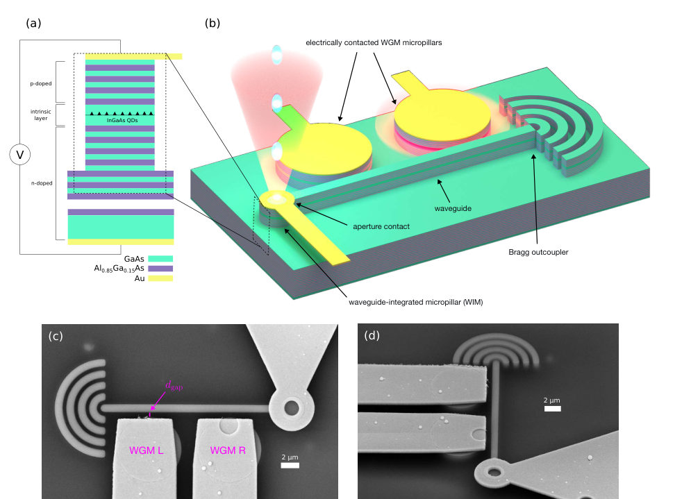
<figcaption class="paper-figure-caption"><b>Fig 1.</b> Figure 1: Device architecture and implementation of the monolithic WGM–waveguide–micropillar platform, showing epitaxial p–i–n cavity design, on-chip evanescent coupling scheme for coherent excitation and single-photon emission, and SEM images of the fabricated structure. (a) Epitaxial layer structure of the device. (b) Schematic of the monolithic device comprising two electrically contacted WGM micropillars integrated next to a ridge waveguide. One end of the waveguide features a Bragg outcoupler, while the opposite end incorporates an integrated micropillar with an aperture contact for vertical collection of the emitted signal and spectral tuning of the QDs via the QCSE. The red halo...</figcaption>
</figure>
<figure class="paper-figure-card">
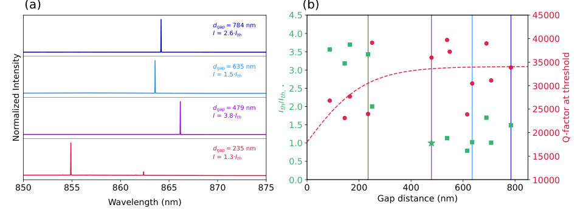
<figcaption class="paper-figure-caption"><b>Fig 2.</b> Figure 2: Gap-distance-dependent lasing characteristics of 7.2 µm WGM microlaser pillars. (a) EL spectra of four WGM microlasers measured above their lasing threshold for various gap distances dgap. (b) Relative lasing threshold currents I/Ith (green) and Q-factors at threshold (red) of the same 7.2 µm-diameter WGM micropillars as a function of dgap. Vertical lines indicate the structures whose spectra are shown in (a) with the corresponding colors.</figcaption>
</figure>
<figure class="paper-figure-card">
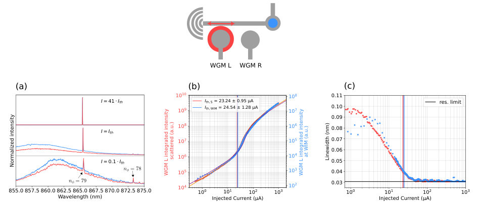
<figcaption class="paper-figure-caption"><b>Fig 3.</b> Figure 3: Spatially resolved EL characterization of WGM L. (a) Overlay of EL spectra for three injection currents, (b) input–output characteristics, and (c) corresponding linewidth evolution of WGM L collected at two different detection positions: The red curves correspond to scattered stray light measured directly above WGM L without spatial filtering. The blue curves correspond to emission from WGM L evanescently coupled into the waveguide and collected above the WIM using a 3-µm-diameter spatial filter.</figcaption>
</figure>
<figure class="paper-figure-card">
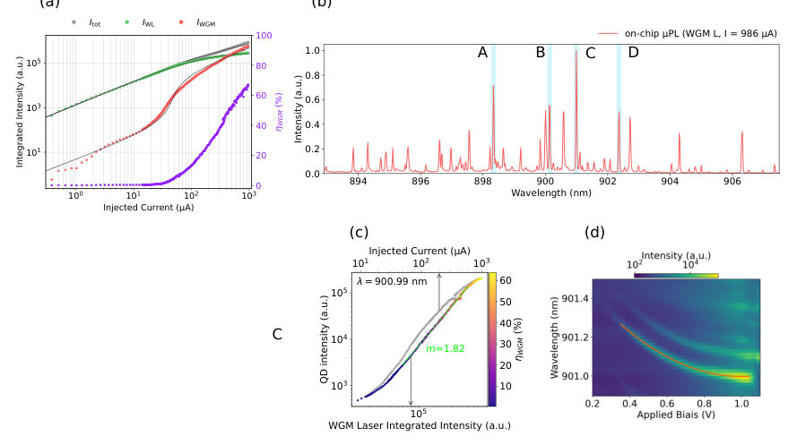
<figcaption class="paper-figure-caption"><b>Fig 4.</b> Figure 4: Current-dependent emission of the electrically driven WGM L microlaser and excitation and Stark tuning of QDs in the WIM. (a) Wetting-layer (IWL), WGM (IWGM), and total (Itot) integrated intensity of the electrically driven WGM L microlaser emission as a function of the injection current. The ratio of intensity from the WGM over the total emitted power is given by ηWGM. (b) µPL of QDs in the WIM excited by evanescently coupled emission from WGM L operated at I = 986 µA. The measurement was performed with a bias voltage of V = 1 V applied to the WIM. Focus on the selected QD emission line C : (a) emission intensity in terms of the injected current in the microlaser and in terms of...</figcaption>
</figure>
<figure class="paper-figure-card">
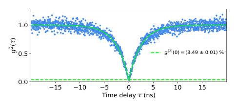
<figcaption class="paper-figure-caption"><b>Fig 5.</b> Figure 5: Second-order photon correlation measurement of the emission line C (λ = 901.95 nm) of the WIM under continuous-wave above-band excitation via the WGM L microlaser which demonstrates clean single-photon emission.</figcaption>
</figure>

**Summary.** The research reports on an integrated platform combining a Whispering-Gallery Microlaser with a waveguide to electrically excite InGaAs Quantum Dots. By systematically characterizing the laser coupling and performing Hanbury Brown and Twiss measurements, the authors demonstrate high-purity single-photon emission necessary for scalable quantum photonic circuits.

**Why it may be interesting.** This work directly addresses the integration challenge in quantum photonics by merging high-quality cavity sources (WGM lasers) with solid-state emitters (QDs) onto a chip, which is crucial for building scalable quantum networks and computing modules.

Detailed structure

**Main problem.** The goal is to develop a low-footprint, deterministic, and scalable integrated quantum photonic circuit capable of generating single photons on demand.

**Main result.** The authors successfully demonstrated high-purity single-photon emission ($g^{(2)}(0) = 3.49 \pm 0.01\%$) by coupling light from an electrically driven Whispering-Gallery Microlaser into a waveguide to excite embedded InGaAs Quantum Dots.

**Method.** The study combines electrical characterization of the microlaser (IV curves, threshold analysis) with optical measurements, including Hanbury Brown and Twiss (HBT) correlation measurements on the QD emission.

**Model / system.** The physical system is an integrated quantum photonic circuit featuring a WGM micropillaser coupled evanescently to a ridge waveguide, which in turn excites InGaAs Quantum Dots embedded in a Waveguide Interconnect Module (WIM). The QDs are electrically tunable via the quantum-confined Stark effect.

**Key observables.** Second-order correlation function $g^{(2)}(0)$, single-photon emission rate, lasing threshold current ($I_{th}$), and spectral tuning range ($\le 0.35 	ext{ nm}$).

**Important parameters / regimes.** Gap distance ($d_{gap}$), injection current (up to 1 mA), and the ratio $\eta_{WGM} = I_{WGM}/I_{tot}$.

**Assumptions / limitations.** The analysis assumes that the measured $g^{(2)}(0)$ value confirms single-photon purity, and power dependence fitting suggests the presence of exciton (X) or biexciton (XX) states.

**Figures summary.** Figures illustrate device architecture, $d_{gap}$-dependent lasing characteristics (thresholds/Q-factors), spectral comparisons between on-chip vs. off-chip excitation, and current dependence analysis for QD emission lines.

**Paper structure.** The paper systematically characterizes the WGM microlaser performance as a function of coupling gap distance ($d_{gap}$), establishes the mechanism of light transfer from the laser to the waveguide, and finally demonstrates single-photon generation via HBT measurements on the excited QDs.

Abstract

We report the fabrication and characterization of an integrated quantum photonic device consisting of an electrically driven whispering-gallery-mode micropillar laser evanescently coupled to a ridge waveguide, both incorporating InGaAs quantum dots (QDs). The lasing characteristics of microlasers are systematically investigated as a function of the pillar-waveguide gap distance. Coherent emission from the whispering-gallery-mode microlaser coupled into the waveguide enables on-chip optical excitation of QDs embedded in an electrically contacted micropillar at the end of the waveguide. Under continuous-wave on-chip excitation, we observe single-photon emission with $g^{(2)}(0) = (3.49 \pm 0.01) \%$ for a QD integrated in the outcoupling micropillar which can be spectrally tuned-by the quantum confined Stark effect. These results constitute an important step toward low-footprint, deterministic, and scalable single-photon sources for QD-based integrated quantum photonic circuits.

[↑ back to top](#top)

### [Keldysh field theory of spin- and valley-distinguished polariton nonlinearities in transition-metal dichalcogenide monolayers](http://arxiv.org/abs/2606.22242v1)

**Authors:** Anna M. Grudinina, Nina S. Voronova  
**Type:** theory · **Category:** other · **PDF:** <https://arxiv.org/pdf/2606.22242v1>  
**Analysis basis:** full PDF text, analyzed in chunks
**Topic relevance:** 🔥 `Keldysh / 2PI / non-Gaussian methods` **4/5** · `correlated cavity matter` **3/5** · `exotic spin models in light-matter` **3/5** · `methods for driven-dissipative` **3/5** · `spintronics-quantum-optics interface` **3/5** · `analog quantum simulation` **2/5** · `correlated / nonlocal dissipation` **2/5** · `driven-dissipative phase transition` **2/5** · `non-equilibrium dynamics` **2/5** · `Tavis-Cummings & cavity-many-emitter` **1/5** · `interference shaping light` **1/5** · `non-equilibrium universality` **1/5**

↔ Scroll figures horizontally

<figure class="paper-figure-card">
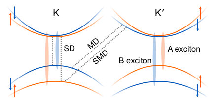
<figcaption class="paper-figure-caption"><b>Fig 1.</b> FIG. 1. Schematic illustration of the electronic band structure near the K and K\prime points in tungsten-based TMDs. The blue and orange colors correspond to spin-down and spin-up states, respectively. The ellipses of respective colors illustrate optical transitions for bright excitons in K and K\prime valleys, the dashed gray lines correspond to dark fields which are: intravalley spin-dark (SD), intervalley momentum-dark (MD), and spin- and momentum-dark (SMD).</figcaption>
</figure>
<figure class="paper-figure-card">
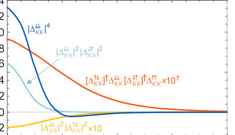
<figcaption class="paper-figure-caption"><b>Fig 2.</b> FIG. 2. Matrix elements of exciton interaction, calculated for (i) intravalley interaction with specific case of interac- tion | \Delta \downarrow \downarrow KK| 4 (the dark blue line), (ii) intervalley interaction and | \Delta \downarrow \downarrow K\prime K| 2| \Delta \uparrow \downarrow K\prime K| 2 (the light blue line), (iii) interaction between intra- and intervalley excitons for | \Delta \downarrow \downarrow KK| 2| \Delta \uparrow \downarrow K\prime K| 2</figcaption>
</figure>
<figure class="paper-figure-card">
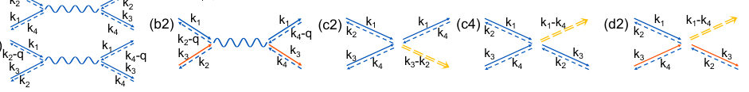
<figcaption class="paper-figure-caption"><b>Fig 3.</b> FIG. 3. Schematic illustration for the exciton interaction | \Delta \downarrow \downarrow KK| 4 (a1) and the screening contribution due to electron (a2) and hole (a3) exchange. Since | \Delta \downarrow \downarrow KK| 2| \Delta \uparrow \downarrow KK| 2 (b1) contains two electrons in the conduction band with opposite spins, this type of interaction can be screened due to hole exchange (b2) only. Panels (c1–c4) and (d1–d2) show the saturation processes corresponding to nonlinearities on the panels (a) and (b), respectively. Solid and dashed lines indicate electrons in the conduction and valence bands, respectively. Blue (orange) lines correspond to electron spin-down \downarrow (spin-up...</figcaption>
</figure>

**Summary.** The paper develops an advanced Keldysh field theory approach to model polariton nonlinearities in TMD monolayers, explicitly accounting for spin and valley degrees of freedom. It calculates numerous interaction terms, revealing that previously overlooked dark exciton contributions can dominate optical shifts. This work is vital for predicting the behavior of quantum light sources in 2D materials.

**Why it may be interesting.** This work provides a highly detailed theoretical framework for understanding complex many-body interactions in solid-state quantum emitters, which is crucial for designing next-generation photonic devices based on strong light-matter coupling.

Detailed structure

**Main problem.** To derive a comprehensive, non-equilibrium field-theory description of all polariton nonlinearities in transition-metal dichalcogenide (TMD) monolayers by fully incorporating the valley and spin degrees of freedom.

**Main result.** The full consideration reveals sixteen distinct nonlinear contributions; notably, the blueshift contribution from spin-dark excitons can exceed that from bright intravalley excitons.

**Method.** The authors employ Keldysh field theory in the path integral formalism to derive interaction and saturation terms ($\Delta \mathcal{S}$) for the exciton-photon system.

**Model / system.** The physical system is TMD monolayers (like $	ext{WS}_2$) exhibiting strong light-matter coupling, leading to exciton-polaritons. The model incorporates valley ($	ext{K}, 	ext{K}'$) and spin ($\uparrow, \downarrow$) degrees of freedom.

**Key observables.** Polariton nonlinearities ($g_{	ext{ex}}, g_{	ext{sat}}$), blueshift contributions, and interaction matrix elements for various exciton species (bright/dark).

**Important parameters / regimes.** Low temperature ($T=0$), strong coupling regime, valley indices ($\lambda$), spin projections ($\sigma$).

**Assumptions / limitations.** The analysis assumes the low-density limit in some derivations and neglects electron-hole exchange interactions between different valleys.

**Figures summary.** Figure 1 schematically shows the band structure near K/K' points. Figure 2 plots calculated matrix elements for four types of exciton interactions (intravalley, intervalley, etc.).

**Paper structure.** The paper builds from deriving the general non-equilibrium action using path integrals, systematically derives nonlinear interaction terms by considering all spin/valley combinations, and finally analyzes specific contributions like screening corrections and saturation effects.

Abstract

Electrons in transition-metal dichalcogenides (TMDs) possess valley and spin degrees of freedom, which leads to rich exciton and exciton-polariton physics with nontrivial scattering dynamics and enhanced nonlinearities, presenting a key mechanism for photonic devices. Yet, existing descriptions of bosonization and polariton interactions in TMD-based systems overlook the valley degree of freedom as well as the various particles' spins combinations. In this work, we derive a nonequilibrium field-theory approach in the path integral formalism that allows to track all the polariton nonlinearities in the strong coupling regime. We demonstrate that, when all the bright and dark exciton species are considered, the TMD monolayer-based polariton systems feature sixteen different nonlinear contributions due to interactions and even more saturation-related terms. Strikingly, while the interactions of excitons within one valley are overall dominant, we show that the contribution to the blueshift from spin-dark excitons is much higher than that from bright intravalley excitons.

[↑ back to top](#top)

### [Deterministic control of the probabilistic phase dynamics in injection-locked spin-torque nano-oscillators](http://arxiv.org/abs/2606.22208v1)

**Authors:** Abderrazak Hakam, Chloé Chopin, Nhat-Tan Phan, Nicolas Mollard, Franck Badets, Louis Hutin, Luana Benetti, Alex S. Jenkins, Ricardo Ferreira, Ursula Ebels, Philippe Talatchian  
**Type:** experiment · **Category:** statistical mechanics · **PDF:** <https://arxiv.org/pdf/2606.22208v1>  
**Analysis basis:** full PDF text, analyzed in chunks
**Topic relevance:** 🔥 `driven-dissipative phase transition` **4/5** · `exotic spin models in light-matter` **3/5** · `non-equilibrium dynamics` **3/5** · `spintronics-quantum-optics interface` **3/5** · `non-equilibrium universality` **2/5** · `quantum measurements` **2/5** · `correlated / nonlocal dissipation` **1/5** · `measurement-induced transitions` **1/5** · `methods for driven-dissipative` **1/5** · `scars & prethermalization` **1/5**

↔ Scroll figures horizontally

<figure class="paper-figure-card">
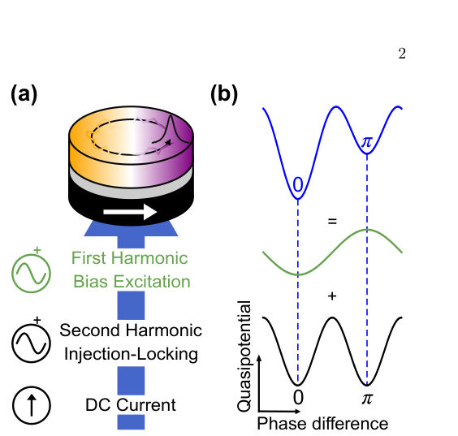
<figcaption class="paper-figure-caption"><b>Fig 1.</b> FIG. 1. (a) Schematic of the experimental implementation. A vortex-based STNO is driven into auto-oscillation at fre- quency f0 by a DC current IDC and a static mostly out-of- plane magnetic field HDC. An RF drive at fIL ≈2f0 is used for second-harmonic injection-locking, and a weaker RF bias excitation at fbias ≈f0 is applied.(b) Qualitative quasipoten- tial for the phase difference ∆ϕ. Under the SHIL drive alone, the quasipotential is symmetric, with two equivalent minima at 0 and π (black). The RF bias adds a phase-dependent con- tribution (green), yielding a tilted quasipotential (blue) with unequal transition barriers.</figcaption>
</figure>
<figure class="paper-figure-card">
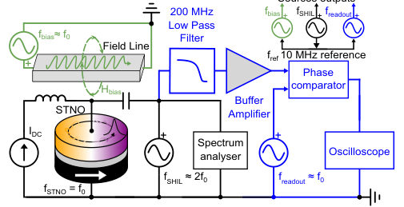
<figcaption class="paper-figure-caption"><b>Fig 2.</b> FIG. 2. Experimental circuit schematic. A DC current source injects a constant current into the STNO, induc- ing vortex-core auto-oscillations at frequency f0. Second- harmonic injection-locking is achieved by applying an RF voltage at fIL ≈2f0 through a bias tee. An RF bias exci- tation at fbias ≈f0 is applied to a field-line fabricated above the device, generating a local in-plane RF magnetic field that influences the vortex-core dynamics. The emitted RF signal is analyzed either in the frequency domain with a spectrum analyzer or in the time domain with an analog phase-readout circuit comprising a 200 MHz low-pass filter, a 12 dB buffer amplifier, a phase comparator referenced to an...</figcaption>
</figure>
<figure class="paper-figure-card">
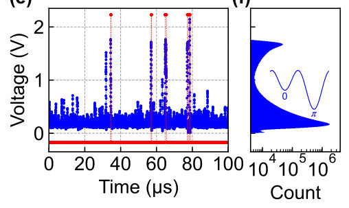
<figcaption class="paper-figure-caption"><b>Fig 3.</b> FIG. 3. Typical voltage-time traces and corresponding count histograms measured at the output of the phase-readout cir- cuit. (a) Voltage-time trace acquired in the absence of RF bias excitation, for a SHIL drive applied at fIL = 488 MHz with power PIL = −9 dBm. The blue curve shows the mea- sured trace, while the red points show the corresponding bi- narized signal after excluding incomplete transitions and lo- cal noise around the stable states. (b) Corresponding count histogram obtained from the full 500 ms-long voltage-time trace, containing approximately 2.4 × 105 transitions. The horizontal axis is logarithmic. The small peak near 1.7 V is a parasitic artifact arising from the phase...</figcaption>
</figure>
<figure class="paper-figure-card">
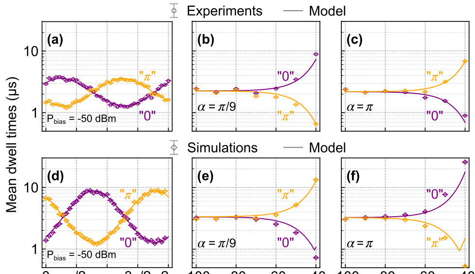
<figcaption class="paper-figure-caption"><b>Fig 4.</b> FIG. 4. Mean dwell times of the 0 and π-phase states in the SHIL regime under RF bias excitation. (a) Mean dwell times as a function of the bias phase α, varied from 0 to 2π rad at fixed bias power Pbias = −50 dBm. (b) and (c) Mean dwell times as a function of the bias power Pbias, swept from −100 dBm to −40 dBm, for fixed bias phases α = π/9 rad and α = π rad, respectively. Circular markers correspond to experimental values extracted using the method described in Appendix C, while the solid lines are analytical fits based on Eq. (4), with details given in Appendix G. (d)–(f) show the corresponding numerical simulation results obtained from the finite-temperature Thiele equation approach...</figcaption>
</figure>
<figure class="paper-figure-card">
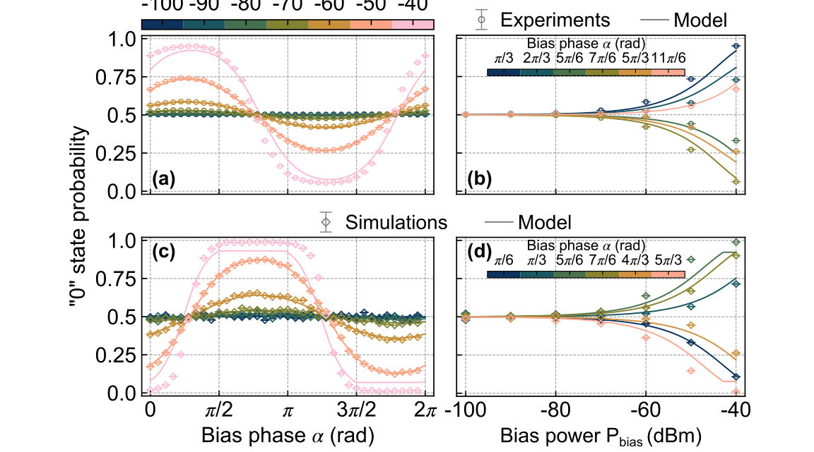
<figcaption class="paper-figure-caption"><b>Fig 5.</b> FIG. 5. Occupation probabilities of the 0-phase state in the SHIL regime under RF bias excitation. (a) 0-phase state occupation probabilities as a function of the bias phase α, varied from 0 to 2π rad. (b) 0-phase state occupation probabilities as a function of the bias power Pbias, swept from −100 dBm to −40 dBm, for multiple α values listed in the colorbar. Circular markers correspond to experimental values computed from the mean dwell times using the formula P0 = τ0/(τ0 + τπ). The solid lines are constructed from the analytical fits of the mean dwell times based on Eq. (4) (see Appendix G for details), using the same probability formula. (c) and (d) show the corresponding numerical...</figcaption>
</figure>

**Summary.** The research demonstrates that intrinsic thermal noise in spin-torque nano-oscillators can be deterministically controlled by applying an external radio-frequency bias. By tuning the phase and amplitude of this bias, researchers can program the probability of the oscillator settling into one of two metastable phase states. This establishes STNOs as tunable stochastic elements suitable for next-generation probabilistic computing architectures.

**Why it may be interesting.** This work provides a solid physical realization of programmable stochastic elements, linking fundamental concepts from non-equilibrium statistical mechanics (metastable states, barrier crossing rates) to tangible hardware primitives for computation.

Detailed structure

**Main problem.** The goal is to deterministically control the probability of occupying different phase states in Spin-Torque Nano-Oscillators (STNOs) despite their inherent thermal stochasticity.

**Main result.** By applying a weak RF bias perturbation, the symmetry of the system's quasipotential can be broken, allowing for continuous programming of the occupation probability between two metastable phase states from unbiased to near 0 or 1.

**Method.** The study uses experimental measurements of voltage-time traces and analyzes the resulting stochastic jumps using Markov process theory applied to a reduced phase description.

**Model / system.** The physical system is a vortex-based STNO operating under second-harmonic injection-locking (SHIL). The dynamics are modeled by an effective quasipotential $V(\Delta\phi)$ derived from the underlying spin dynamics, which governs thermally activated jumps between $\Delta\phi=0$ and $\Delta\phi=\pi$.

**Key observables.** Occupation probabilities ($P_0, P_\pi$), mean dwell times ($\tau_0, \tau_\pi$), and the phase difference $\Delta\phi$.

**Important parameters / regimes.** Bias phase ($\alpha$) and bias amplitude/power ($P_{\text{bias}}$) are the primary control knobs; temperature ($T$) governs thermal fluctuations.

**Assumptions / limitations.** The dynamics can be accurately described by a two-state Markov process governed by an effective quasipotential, and that first-order perturbation theory is sufficient for modeling the bias effects.

**Figures summary.** Figures illustrate schematic setups (Fig. 1), qualitative changes in the quasipotential from symmetric to tilted potentials (Fig. 1b), and time traces/histograms demonstrating how varying the bias phase ($\alpha$) or power ($P_{\text{bias}}$) controls state occupation probabilities (e.g., Fig. 3, Fig. 5).

**Paper structure.** The paper progresses from establishing the inherent stochasticity of STNOs to introducing an RF bias control mechanism. It details the theoretical modeling using quasipotentials and then presents experimental measurements showing how tuning the bias parameters allows for deterministic programming of the system's probabilistic state.

Abstract

Spin-torque nano-oscillators (STNOs) inherently exhibit thermally driven phase fluctuations that render their dynamics truly stochastic. Here, we demonstrate that, despite this intrinsic randomness, the probability of occupying each phase state can be deterministically and continuously programmed. We experimentally investigate a vortex-based STNO operating under second-harmonic injection-locking, where the oscillator phase settles into two degenerate attractors separated by $π$ and undergoes thermally activated phase jumps. By applying a weak radio-frequency perturbation at the free-running frequency, we tune the phase-jump rates between the two attractors without suppressing the fluctuations, achieving continuous probability control from the unbiased limit to values approaching 0 or 1. The bias phase selects which attractor is favored while the bias amplitude sets the strength of the imbalance, providing two complementary control knobs within a single nanoscale device. A phase-reduced description based on an effective quasipotential quantitatively accounts for the observations. These results establish injection-locked STNOs as programmable stochastic elements and provide a hardware primitive for probabilistic computing, Ising machines, and brain-inspired computing architectures.

[↑ back to top](#top)

### [Second-order dc conductivity in the velocity-gauge Keldysh formalism: gauge-invariant decomposition into nonlinear Drude, Berry-curvature-dipole, and quantum-metric responses](http://arxiv.org/abs/2606.22359v1)

**Authors:** Junya Shibata  
**Type:** theory · **Category:** other · **PDF:** <https://arxiv.org/pdf/2606.22359v1>  
**Analysis basis:** full PDF text, analyzed in chunks
**Topic relevance:** 🔥 `Keldysh / 2PI / non-Gaussian methods` **4/5** · `non-equilibrium dynamics` **2/5** · `analog quantum simulation` **1/5** · `correlated / nonlocal dissipation` **1/5** · `driven-dissipative phase transition` **1/5** · `methods for driven-dissipative` **1/5** · `non-equilibrium universality` **1/5**

↔ Scroll figures horizontally

<figure class="paper-figure-card">
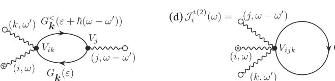
<figcaption class="paper-figure-caption"><b>Fig 1.</b> FIG. 1. Diagrammatic representation of the four second-order current contributions in the Peierls velocity gauge: (a) J p(2a) i (ω), (b) J p(2b) i (ω), (c) J d(2) i (ω), and (d) J t(2) i (ω). Solid lines with arrows denote equilibrium Green’s functions, wavy lines ending with open circles denote incoming external fields, and wavy lines ending with ⊗denote the outgoing current leg (i, ω). Black dots denote current or contact vertices.</figcaption>
</figure>
<figure class="paper-figure-card">
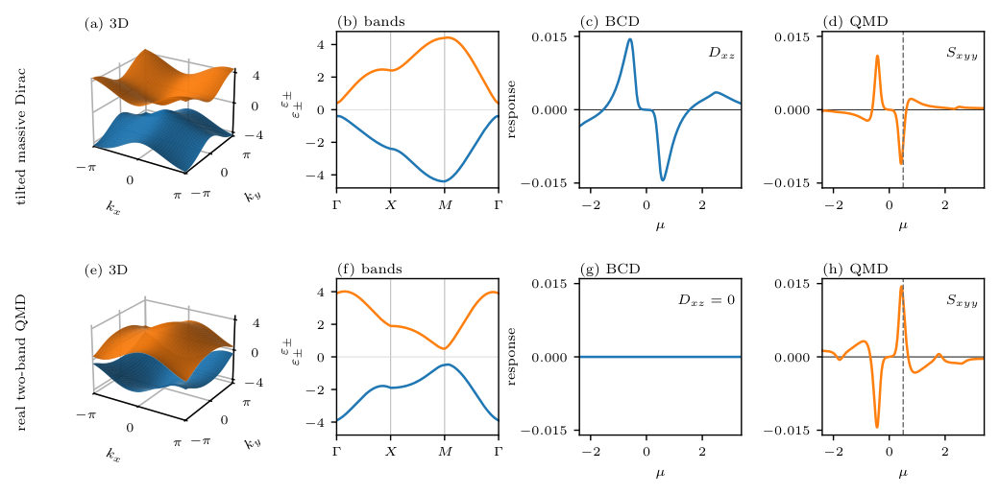
<figcaption class="paper-figure-caption"><b>Fig 2.</b> FIG. 2. Two-model summary of the band structures and nonlinear geometric diagnostics. The first row shows the tilted massive Dirac lattice model Eq. (87), and the second row shows the real two-band QMD model Eq. (102). Panels (a,e) show the three- dimensional dispersions ε±(k); panels (b,f) show the dispersions along Γ–X–M–Γ; panels (c,g) show the dimensionless BCD diagnostic Dxz; and panels (d,h) show the intraband-QMD diagnostic Sxyy ≡1</figcaption>
</figure>
<figure class="paper-figure-card">
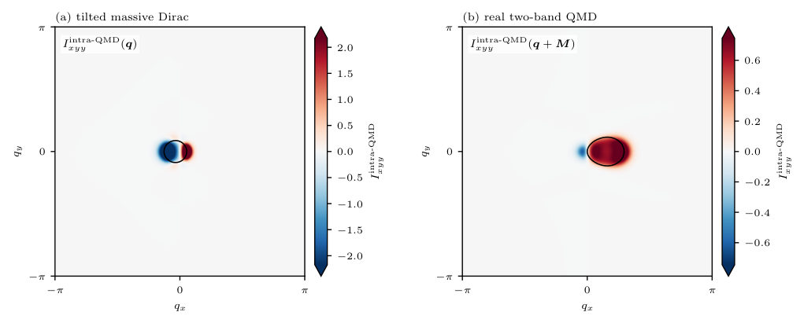
<figcaption class="paper-figure-caption"><b>Fig 3.</b> FIG. 3. Momentum-resolved intraband-QMD integrand Iintra-QMD xyy defined in Eq. (116), evaluated at µ = 0.5 and T = 0.05. (a) Tilted massive Dirac lattice model Eq. (87), displayed in coordinates q = k centered at Γ. (b) Real two-band QMD model Eq. (102), displayed in shifted coordinates q = k −M with M = (π, π). Solid and dashed black contours denote upper- and lower-band Fermi contours, respectively; only contours present at the selected chemical potential are shown. Each panel uses an independent color range centered at zero. To reveal the localized sign structure, the extreme 0.5% of |Iintra-QMD xyy | values are saturated, as indicated by the colorbar extensions. The Brillouin-zone...</figcaption>
</figure>

**Summary.** This theoretical work calculates the nonlinear dc conductivity in electronic materials by decomposing it into four distinct, gauge-invariant components. Using the Keldysh Green's function formalism, the authors show that the response is governed not only by standard Drude terms but also by geometric quantities derived from the band structure, such as Berry curvature and quantum metrics. This provides a deep understanding of how geometry dictates transport in condensed matter systems.

**Why it may be interesting.** While focused on solid-state transport, the rigorous derivation of geometric responses ($\sigma_{BCD}, \sigma_{	ext{QMD}}$) using advanced quantum field techniques (Keldysh formalism) provides a powerful template for analyzing non-equilibrium response in complex many-body systems relevant to AMO physics.

Detailed structure

**Main problem.** The paper derives a gauge-invariant decomposition of the second-order dc nonlinear conductivity ($\sigma_{DC}$) in multiband tight-binding systems.

**Main result.** The total conductivity separates into four distinct, gauge-invariant contributions: Nonlinear Drude ($\propto 	au^2$), Berry-curvature-dipole ($\propto 	au$), and two quantum-metric dipole terms ($\propto 	au^0$).

**Method.** It employs the velocity-gauge Keldysh Green's function formalism, performing a perturbative expansion in the vector potential $\mathbf{A}(t)$ and taking the dc limit.

**Model / system.** The system is modeled using a multiband tight-binding Hamiltonian subjected to an electromagnetic field via the Peierls substitution. The analysis focuses on clean-limit transport properties.

**Key observables.** Second-order dc nonlinear conductivity tensor ($\sigma_{DC}^{ijk}$), decomposed into $\sigma_{ND}, \sigma_{BCD}, \sigma_{	ext{intra-QMD}}, \sigma_{	ext{inter-QMD}}$.

**Important parameters / regimes.** Relaxation time ($	au$), clean limit condition ($|\epsilon_{nm}|	au/\hbar \gg 1$), and the external field coupling strength.

**Assumptions / limitations.** The derivation assumes a constant phenomenological relaxation time ($	au$) and operates in the clean limit, neglecting vertex corrections and disorder effects beyond $	au$.

**Figures summary.** Figures illustrate diagrammatic contributions to the conductivity tensor at finite frequency, showing the separation into different physical processes.

**Paper structure.** The paper systematically calculates the current expectation value using Keldysh Green's functions, derives the full frequency-dependent response, and then takes the dc limit by decomposing the resulting terms based on their scaling with $	au$ to achieve gauge invariance.

Abstract

We derive a gauge-invariant clean-limit decomposition of the second-order dc nonlinear conductivity in multiband tight-binding systems within the velocity-gauge Keldysh Green's function formalism. In the constant-relaxation-time approximation, the dc response separates into four contributions with distinct lifetime $τ$ scalings and physical origins: the nonlinear Drude term $σ^{\mathrm{ND}}_{ijk}\proptoτ^{2}$, the Berry-curvature-dipole term $σ^{\mathrm{BCD}}_{ijk}\proptoτ$, the intraband quantum-metric-dipole term $σ^{\mathrm{intra\text{-}QMD}}_{ijk}\proptoτ^{0}$, and the interband quantum-metric-dipole term $σ^{\mathrm{inter\text{-}QMD}}_{ijk}\proptoτ^{0}$. The intraband term is a Fermi-surface dipole of the ordinary band quantum metric, while the interband term is written, in the present representation, as a Fermi-sea-type response involving a band-normalized quantum metric. Working entirely within the velocity-gauge Keldysh--Kubo framework, we show that all connection-dependent commutator terms generated in the band-basis expansion cancel exactly between the covariant-quantum-connection sector $σ^{\mathcal{C}}_{ijk}$ and the three-Berry-connection sector $σ^{\mathcal{T}}_{ijk}$, making the role of the Peierls contact velocity vertices $V_{ij}$ and $V_{ijk}$ explicit; a complementary projector-based derivation appears in Ulrich et al., Phys. Rev. B 113, L201107 (2026), and our Fermi-surface dc-limit expression agrees with that reference after accounting for index and convention differences. As a diagnostic illustration, we introduce a real two-band model in which the Berry curvature and hence the BCD response vanish identically while the intraband quantum-metric dipole remains finite, establishing a practical route to quantum-metric dc responses not reducible to the Berry-curvature-dipole mechanism.

[↑ back to top](#top)

### [Symmetry-Enforced Pair-Density Wave and Chiral Interband Superconductivity in Strongly Correlated Kagome Systems](http://arxiv.org/abs/2606.21711v1)

**Authors:** Alex Friedlan, Hae-Young Kee  
**Type:** theory · **Category:** strongly correlated electrons · **PDF:** <https://arxiv.org/pdf/2606.21711v1>  
**Analysis basis:** full PDF text, analyzed in chunks
**Topic relevance:** 🔥 `analog quantum simulation` **4/5** · `Keldysh / 2PI / non-Gaussian methods` **1/5** · `driven-dissipative phase transition` **1/5** · `entanglement & information structure` **1/5**

↔ Scroll figures horizontally

<figure class="paper-figure-card">
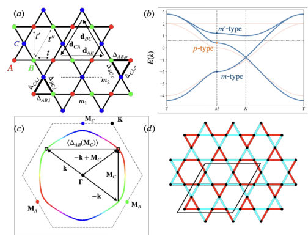
<figcaption class="paper-figure-caption"><b>Fig 1.</b> FIG. 1. (a) Kagome lattice with NN, second-NN, and third-NN hop- pings t, t′, and t′′, respectively, and two mirror operators ˆm1 and ˆm2. (b) Single-particle dispersion for t = −1, t′ = −t′′ = −0.2. Ideal Kagome bands (orange) with t′ = t′′ = 0 are also shown for compar- ison. (c) Sublattice-resolved Fermi surface near the p-type vHS for µ = 0.6 (n ≈0.45). Pairing ⟨∆AB⟩with COM momentum q = MC connects portions of the FS with A and B sublattice character. (d) The 2a × 2a PDW (q = M) in real space. Red/blue bonds denote positive/negative pairing amplitudes.</figcaption>
</figure>
<figure class="paper-figure-card">
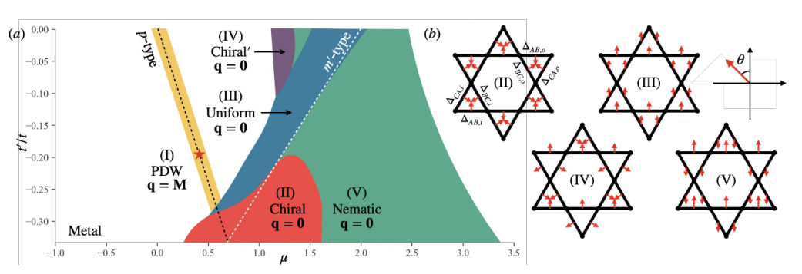
<figcaption class="paper-figure-caption"><b>Fig 2.</b> FIG. 2. (a) Phase diagram in the µ-t′ plane (t′′ = −t′) at U = 2|t| and zero temperature. The black and white dashed lines indicate the locations of the p- and m′-type van Hove singularities at the M point, respectively. The red star corresponds to the point examined in Fig. 1. (b) Real- space representations of the phases. The amplitude and phase θ (defined in the upper-right corner) of the pairing on each bond are represented by arrows. The order parameter is characterized by the tuple (∆AB,i, ∆BC,i, ∆CA,i, ∆AB,o, ∆BC,o, ∆CA,o): (I) PDW, see Fig. 1(d); (II) Chiral order (E1): (1, ω, ω2, −1, −ω, −ω2), where ω = ei2π/3; (III) Chiral’ order (E2): (1, ω, ω2, 1, ω, ω2); (IV) Uniform order...</figcaption>
</figure>

**Summary.** This theoretical work explores unconventional superconductivity in Kagome lattices using the $t$-$J$ model. It demonstrates that specific electronic structures, particularly at certain Van Hove Singularities, force the emergence of a Pair-Density Wave (PDW) state. Furthermore, tuning parameters can stabilize a novel chiral interband superconducting phase through complex symmetry constraints.

**Why it may be interesting.** While focused on condensed matter, the concept of symmetry-enforced topological phases and competing orders in strongly correlated systems shares conceptual links with understanding complex many-body ground states relevant to quantum simulation platforms.

Detailed structure

**Main problem.** Investigating unconventional superconducting phases, specifically Pair-Density Wave (PDW) and chiral interband superconductivity, in strongly correlated Kagome systems.

**Main result.** The study shows that a PDW state emerges inevitably at the sublattice-pure vHS, and proximity to an $m'$-type vHS stabilizes a distinct chiral interband superconducting state due to phase frustration.

**Method.** Self-consistent mean-field theory is employed alongside Ginzburg-Landau analysis to map out the competition between various pairing symmetries (PDW, Nematic, Chiral).

**Model / system.** The research uses the extended $t$-$J$ model derived from the Hubbard model on the Kagome lattice. The analysis focuses on superconductivity near specific Van Hove Singularities ($p$-type and $m'$-type) at high-symmetry points.

**Key observables.** Superconducting order parameters ($\Delta$), PDW formation, chiral interband pairing strength, and phase diagram regions in the $\mu$-$t'$ plane.

**Important parameters / regimes.** Chemical potential ($\mu$) tuned to specific vHSs; further-neighbor hopping ($t'$); strong correlation limit (large-$U$).

**Assumptions / limitations.** The analysis is performed within the mean-field approximation and neglects most higher-order hopping terms beyond $t'$.

**Figures summary.** Figures illustrate phase diagrams showing PDW regions near the $p$-type vHS, and real-space representations of competing phases like PDW and Chiral order E1.

**Paper structure.** The paper systematically analyzes the emergence of PDW at one type of vHS, then explores competition between various pairing states (Uniform, Nematic, Chiral) when a second distinct vHS ($m'$-type) is introduced via tuning hopping parameters.

Abstract

The pair-density wave (PDW) state, characterized by Cooper pairing at finite momentum, is a long-sought superconducting phase whose possible realization in Kagome metals is particularly intriguing in the strongly correlated regime. We investigate superconductivity in the extended $t$-$J$ model on the Kagome lattice and show that the symmetry-enforced sublattice structure of the Bloch wavefunctions gives rise to a rich landscape of unconventional pairing states. When the chemical potential is tuned to a sublattice-pure ($p$-type) van Hove singularity (vHS), a PDW state inevitably emerges. Near the $m'$-type vHS, which features opposite mirror eigenvalues to the conventional $m$-type vHS, intraband chiral, uniform, and nematic pairing states compete. When further-neighbor hoppings drive the $p$- and $m'$-type vHSs towards near degeneracy, phase frustration in the interband pairing channel stabilizes a chiral interband state. Our results reveal the previously overlooked $m'$-type vHS as a distinct route to unconventional superconductivity rooted in electronic correlations and mirror-symmetry-constrained Bloch wavefunctions.

[↑ back to top](#top)

### [Superconducting cavity probes sliding ferroelectricity in small-angle twisted WSe$_2$](http://arxiv.org/abs/2606.22140v1)

**Authors:** Krishnendu Maji, Supriya Mandal, Sriram H., Rishiraj Rajkhowa, Malhar Date, Sayani Pal, Meghan P. Patankar, Kenji Watanabe, Takashi Taniguchi, Vibhor Singh, Mandar M. Deshmukh  
**Type:** experiment · **Category:** other · **PDF:** <https://arxiv.org/pdf/2606.22140v1>  
**Analysis basis:** full PDF text, analyzed in chunks
**Topic relevance:** `correlated cavity matter` **3/5** · `driven-dissipative phase transition` **3/5** · `quantum optics experiment` **3/5** · `QC/QI experiment` **2/5** · `Tavis-Cummings & cavity-many-emitter` **2/5** · `methods for driven-dissipative` **2/5** · `non-equilibrium dynamics` **2/5** · `spintronics-quantum-optics interface` **2/5** · `Frenkel-Kontorova` **1/5** · `analog quantum simulation` **1/5** · `correlated / nonlocal dissipation` **1/5** · `exotic spin models in light-matter` **1/5** · `non-equilibrium universality` **1/5** · `quantum measurements` **1/5**

↔ Scroll figures horizontally

<figure class="paper-figure-card">
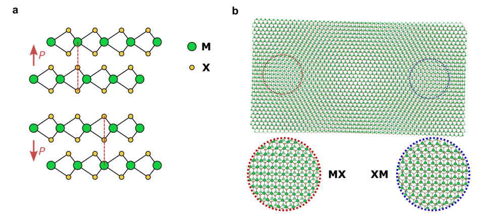
<figcaption class="paper-figure-caption"><b>Fig 1.</b> FIG. 1. Ferroelectricity in small-angle twisted TMDC. a, Two different stacking orders</figcaption>
</figure>
<figure class="paper-figure-card">

<figcaption class="paper-figure-caption"><b>Fig 2.</b> Fig. 2a shows a representative schematic of the device. The device is fabricated using a</figcaption>
</figure>
<figure class="paper-figure-card">
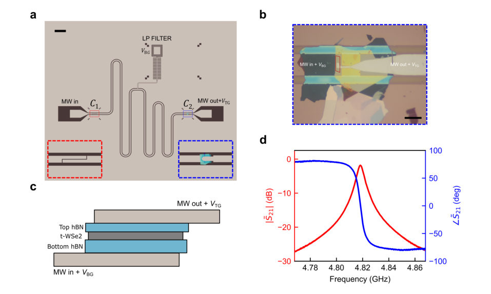
<figcaption class="paper-figure-caption"><b>Fig 3.</b> FIG. 2. Integrating the hBN-(t-WSe2)-hBN heterostructure to a half-wave</figcaption>
</figure>
<figure class="paper-figure-card">
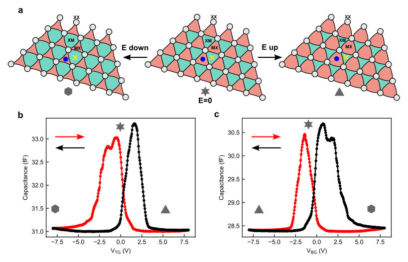
<figcaption class="paper-figure-caption"><b>Fig 4.</b> FIG. 3. Hysteresis in capacitance with the gate voltages. a, Middle panel illustrates the</figcaption>
</figure>
<figure class="paper-figure-card">
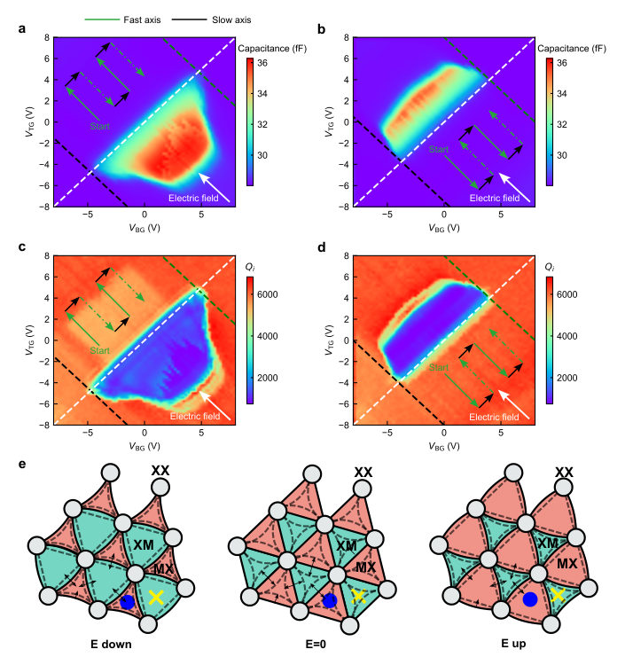
<figcaption class="paper-figure-caption"><b>Fig 5.</b> FIG. 4. Hysteresis with the electric field. (a and b) Color plot of capacitance. The solid green</figcaption>
</figure>

**Summary.** Researchers used a superconducting microwave cavity setup to measure the electrical response of small-angle twisted WSe2. They confirmed the presence of ferroelectricity by observing characteristic hysteresis loops in capacitance and quality factor. This technique provides a high-frequency tool for studying domain-wall dynamics in 2D ferroelectric materials.

**Why it may be interesting.** While focused on condensed matter ferroelectrics, the use of high-frequency cavity measurements to probe domain dynamics is analogous to characterizing dissipation mechanisms in open quantum systems or superconducting qubits coupled to lossy environments.

Detailed structure

**Main problem.** The study aims to probe the signature of sliding ferroelectricity within small-angle twisted WSe2 heterostructures.

**Main result.** Hysteretic responses in both capacitance and cavity quality factor were observed, confirming ferroelectric switching dynamics associated with domain-wall motion at high frequencies.

**Method.** The polarization is probed by embedding the material into a superconducting coplanar waveguide (CPW) cavity and measuring its high-frequency AC response using microwave transmission spectroscopy.

**Model / system.** The physical system is a small-angle parallel stacked WSe2 heterostructure, which exhibits ferroelectricity due to stacking-induced symmetry breaking. This structure acts as the coupling capacitor within an superconducting CPW cavity.

**Key observables.** Hysteretic response in capacitance and internal quality factor ($Q_i$); changes in resonant frequency ($	ilde{S}_{21}$ magnitude/phase).

**Important parameters / regimes.** Coercive field ($\sim 0.14 	ext{ V/nm}$ for $0.1^\circ$ twist); operating temperature (e.g., $1.5 	ext{ K}$).

**Assumptions / limitations.** The measurement technique is sensitive to domain-wall dynamics at high frequencies, and the observed hysteresis originates specifically from the t-WSe2 layer, not the hBN layers.

**Figures summary.** Figures illustrate schematic device setups (heterostructure coupled to cavity), measured $	ilde{S}_{21}$ data showing resonant features, and plots demonstrating capacitance and $Q_i$ hysteresis versus applied gate voltage.

**Paper structure.** The paper details the physical setup using superconducting cavities, measures the complex dielectric susceptibility via microwave spectroscopy, analyzes the resulting hysteresis in C and Q, and uses control experiments to confirm the ferroelectric origin of the signal.

Abstract

Ferroelectricity is a property of materials that exhibit spontaneous charge polarization. Ferroelectricity in 2D materials is interesting because of their applications in memory devices and field-effect transistors. Recently, a new type of ferroelectricity, known as sliding ferroelectricity, has been discovered, in which parallel-stacked bilayers of hexagonal boron nitride (hBN) or transition metal dichalcogenides (TMDCs) develop an out-of-plane electric polarization. In this work, we probe the polarization of small-angle parallel stacked WSe$_2$ by measuring its high-frequency AC response, achieved by embedding it into a half-wave superconducting coplanar waveguide cavity. We observe a hysteretic response in the capacitance of the stack and quality factor of the cavity, confirming ferroelectric switching in the system. Our results further reveal relaxation effects associated with ferroelectric domain-wall motion. This cavity-based technique has potential applications in probing domain-wall dynamics in a ferroelectric system at high frequencies.

[↑ back to top](#top)

### [Modulating radiative heat and momentum transfer via the thermal Purcell effect](http://arxiv.org/abs/2606.22746v1)

**Authors:** Liyao Jiao, Yaohua Liu, Gaomin Tang  
**Type:** theory · **Category:** other · **PDF:** <https://arxiv.org/pdf/2606.22746v1>  
**Analysis basis:** full PDF text, analyzed in chunks
**Topic relevance:** `Keldysh / 2PI / non-Gaussian methods` **3/5** · `correlated / nonlocal dissipation` **3/5** · `methods for driven-dissipative` **3/5** · `correlated cavity matter` **2/5** · `spintronics-quantum-optics interface` **2/5** · `Tavis-Cummings & cavity-many-emitter` **1/5** · `driven-dissipative phase transition` **1/5** · `exotic spin models in light-matter` **1/5** · `interference shaping light` **1/5** · `non-equilibrium dynamics` **1/5**

↔ Scroll figures horizontally

<figure class="paper-figure-card">
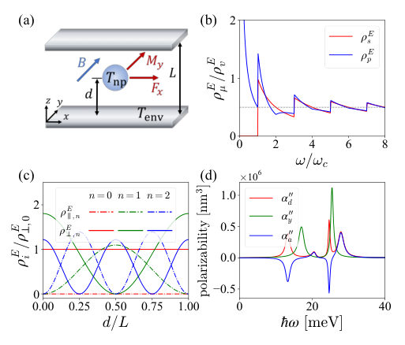
<figcaption class="paper-figure-caption"><b>Fig 1.</b> FIG. 1. (a) Schematic of a magneto-optic nanoparticle located at a distance d above the lower mirror of a Fabry-P´erot cavity with length L. A temperature difference between the nanoparticle and the cavity environment drives radiative heat transfer, as well as a lateral force and a torque. With an external magnetic field B applied along the y direction, the resulting lateral force and torque are along the x and y axes, respectively. (b) Normalized LDOS at the cavity center for s- and p-polarized modes as a function of the normalized frequency ω/ωc with L = 60 µm. The normalizations are with respect to the vacuum electric density of states ρE v . The cavity fundamental reso- nant frequency...</figcaption>
</figure>
<figure class="paper-figure-card">
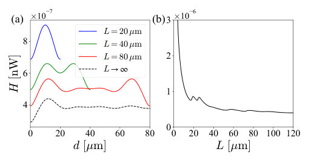
<figcaption class="paper-figure-caption"><b>Fig 2.</b> FIG. 2. (a) Exchanged power as a function of the particle-to-mirror distance d for various cavity lengths L. (b) Exchanged power at the cavity center as a function of L.</figcaption>
</figure>
<figure class="paper-figure-card">
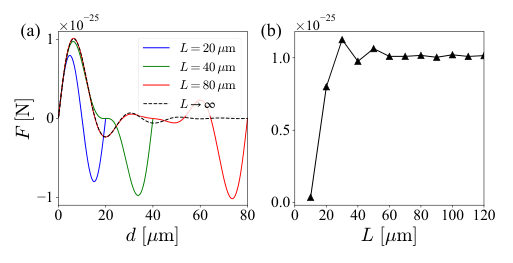
<figcaption class="paper-figure-caption"><b>Fig 3.</b> FIG. 3. (a) Lateral force acting on the nanoparticle as a function of the particle-to-mirror distance d for various cavity lengths L. (b) Maximum lateral force obtained by sweeping d, shown as a function of L with a discrete step size of 10µm.</figcaption>
</figure>
<figure class="paper-figure-card">
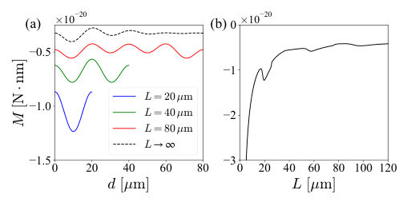
<figcaption class="paper-figure-caption"><b>Fig 4.</b> FIG. 4. (a) Torque acting on the nanoparticle as a function of the distance d for various lengths L. (b) Torque at the cavity center as a function of L.</figcaption>
</figure>

**Summary.** This paper theoretically analyzes how the thermal Purcell effect modifies heat, linear momentum, and angular momentum exchange between a nanoparticle and an optical cavity. Using fluctuational electrodynamics, the authors show that cavity geometry allows for selective control: heat and torque are enhanced while lateral force is suppressed or vanishes under specific symmetry conditions. This demonstrates precise engineering capability over nanoscale energy transport.

**Why it may be interesting.** This work provides a detailed theoretical framework for engineering nanoscale energy and momentum transfer using structured electromagnetic environments, which is highly relevant to quantum optics and open quantum systems where boundary conditions dictate coupling strengths.

Detailed structure

**Main problem.** The study investigates how placing a magneto-optic nanoparticle within a Fabry-Pérot cavity modifies the exchange of radiative heat, linear momentum, and angular momentum via the thermal Purcell effect.

**Main result.** Geometric confinement selectively controls energy and momentum transfer: sub-wavelength confinement enhances heat and torque but suppresses lateral force. Furthermore, symmetry dictates that at the cavity center, the lateral force vanishes while heat and torque remain finite.

**Method.** The analysis employs fluctuational electrodynamics, deriving spectral densities for power, force, and torque by calculating cross-correlations involving the cavity-modified dyadic Green's functions.

**Model / system.** The system consists of a magneto-optic nanoparticle (InSb) placed inside an optical Fabry-Pérot cavity formed by two perfectly conducting mirrors. The interaction is governed by fluctuating electromagnetic fields and depends on the particle's polarizability tensor components.

**Key observables.** Radiative heat transfer ($h(\omega)$), linear momentum/lateral force ($f_x(\omega)$), and angular-momentum/torque ($	au_y(\omega)$) spectral densities.

**Important parameters / regimes.** Cavity length ($L$), particle-to-mirror separation ($d$), external magnetic field ($B$), and the thermal wavelength ($\lambda_{th}$).

**Assumptions / limitations.** The analysis relies on the electric-dipole approximation, assuming perfectly metallic plates (perfectly conducting boundaries), and ignoring near-field evanescent modes for simplification.

**Figures summary.** Figures illustrate the spatial distribution of LDOS components, showing enhancement/oscillation patterns. They also plot exchanged power vs. particle position ($d$) and cavity length ($L$), demonstrating characteristic dependencies like $1/L$ in the small-$L$ limit.

**Paper structure.** The paper builds from defining the physical setup and observables using fluctuational electrodynamics, deriving general spectral density expressions for heat, force, and torque. It then analyzes specific geometric limits (e.g., sub-wavelength confinement, cavity center) by exploiting symmetry properties like parity decomposition to derive distinct physical behaviors.

Abstract

The thermal Purcell effect describes the modification of the local density of states of the fluctuating electromagnetic field induced by a Fabry-Pérot cavity, leading to the enhancement or suppression of radiative transport quantities. Using fluctuational electrodynamics, we investigate nonequilibrium radiative heat, linear-momentum, and angular-momentum exchange between a magneto-optic nanoparticle and a Fabry-Pérot cavity. Analytical expressions for the spectral densities reveal that geometric confinement modifies the electromagnetic local density of states, producing distinct behaviors for different transport quantities. Specifically, sub-wavelength confinement enhances radiative heat and angular-momentum transfer, but suppresses the lateral force. Additionally, interference between cavity modes causes all transfer quantities to oscillate spatially with particle position. At the cavity center, mirror symmetry enforces a parity decomposition of electromagnetic fluctuations resulting in a vanishing lateral force, whereas heat transfer and torque remain finite through combined even and odd modal contributions. These results demonstrate that cavity engineering provides selective control over nanoscale energy and momentum transfer via structured electromagnetic fluctuations.

[↑ back to top](#top)

### [Hysteresis-Driven Radiative Mpemba Effect in Phase-Change Nanostructures](http://arxiv.org/abs/2606.22552v1)

**Authors:** Florian Herz  
**Type:** theory · **Category:** statistical mechanics · **PDF:** <https://arxiv.org/pdf/2606.22552v1>  
**Analysis basis:** full PDF text, analyzed in chunks
**Topic relevance:** `driven-dissipative phase transition` **3/5** · `methods for driven-dissipative` **3/5** · `analog quantum simulation` **2/5** · `correlated / nonlocal dissipation` **2/5** · `non-equilibrium dynamics` **2/5** · `non-equilibrium universality` **2/5** · `Frenkel-Kontorova` **1/5** · `Keldysh / 2PI / non-Gaussian methods` **1/5**

↔ Scroll figures horizontally

<figure class="paper-figure-card">
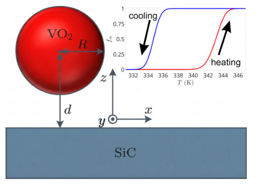
<figcaption class="paper-figure-caption"><b>Fig 1.</b> FIG. 1. Sketch of the considered system. A VO2 nanoparticle of radius R is placed at center-tosurface distance d above a SiC substrate. The inset shows the hysteresis of the metallic volume fraction fm in the transition regime 332 K &lt; T &lt; 346 K.</figcaption>
</figure>
<figure class="paper-figure-card">
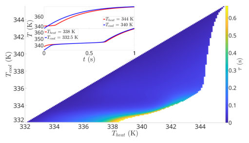
<figcaption class="paper-figure-caption"><b>Fig 2.</b> FIG. 3. Heatmap identical to Fig. 2 but with the substrate temperature Tsub = 378 K causing an inverse Mpemba effect. Inset: Two exemplary temperature combinations for which the inverse Mpemba effect occurs.</figcaption>
</figure>
<figure class="paper-figure-card">

<figcaption class="paper-figure-caption"><b>Fig 3.</b> FIG. 2. Heatmap of the time τ at which two temperature curves intersect which were initially prepared on the heating branch Theat and the cooling branch Tcool of the hysteresis. The VO2-particle’s radius is R = 100 nm, the distance to the substrate d = 500 nm, and the substrate’s temperature Tsub = 300 K. Inset: Two exemplary temperature combinations for which the Mpemba effect occurs and the distance dependence of τ for Theat = 336 K and Tcool = 334 K.</figcaption>
</figure>
<figure class="paper-figure-card">
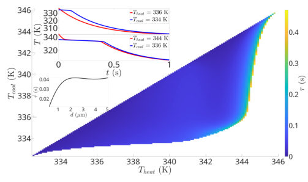
<figcaption class="paper-figure-caption"><b>Fig 4.</b> Fig. 3 illustrates the conditions for the inverse Mpemba effect, obtained by setting the substrate temperature to Tsub = 378 K to induce heating. While the overall topology of the heatmap resembles that of the ordinary Mpemba effect, the maximum intersection times τ shift toward lower initial temperatures. This shift reflects the fundamental inversion of the hysteresis pathways. During heating, the structural evolution along the primary heating branch remains unaltered, acting as a fixed reference where latent heat absorption occurs at higher temperatures. In contrast, a particle prepared on the cooling branch at Tcool is now forced onto an ascending T-FORC pathway upon reversal. Because...</figcaption>
</figure>
<figure class="paper-figure-card">
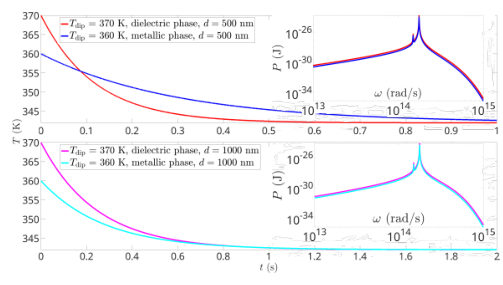
<figcaption class="paper-figure-caption"><b>Fig 5.</b> FIG. 4. Passive Mpemba effect. Temperature evolution of a R = 100 nm SiC particle at d = 500 nm (red and blue) and d = 1 µm (magenta and cyan) above a VO2 substrate of thickness t = 100 nm. The initial temperature of the particle above the substrate prepared in the dielectric phase is Tdip = 370 K (red and magenta), whereas Tdip = 360 K (blue and cyan) corresponds to the case where the substrate is prepared in the metallic phase.</figcaption>
</figure>

**Summary.** This work explores the radiative Mpemba effect in a $	ext{VO}_2$ nanoparticle over an $	ext{SiC}$ substrate, leveraging the material's phase-change hysteresis. The authors demonstrate that latent heat acts as a crucial thermal buffer enabling this cooling anomaly. The findings highlight the strong dependence of this effect on near-field radiative coupling.

**Why it may be interesting.** While focused on classical thermal physics, the analysis of non-equilibrium energy transfer driven by material state changes (phase transitions) shares mathematical parallels with open quantum systems where environment coupling dictates relaxation dynamics.

Detailed structure

**Main problem.** The study investigates the radiative analogue of the Mpemba effect—where hotter systems cool faster than colder ones—in a system exhibiting phase-change hysteresis.

**Main result.** The Mpemba effect is shown to be governed by the latent heat contribution acting as a thermal buffer, and its existence depends critically on near-field coupling effects within the phase-change material.

**Method.** The analysis involves analytically deriving onset conditions and mapping the system's phase space using numerical simulations based on coupled heat balance equations.

**Model / system.** The physical platform is a VO2 nanoparticle placed above an SiC substrate, utilizing the temperature-dependent hysteresis of the $	ext{VO}_2$ material. The energy exchange is modeled via radiative coupling between the particle and the substrate.

**Key observables.** Intersection time ($	au$) between cooling and heating trajectories; spectral power exchanged ($P_{	ext{sub}\leftrightarrow	ext{dip}}$).

**Important parameters / regimes.** Nanoparticle radius ($R$), separation distance ($d$), and the temperature dependence of specific heat capacity ($C_p$) due to phase transition.

**Assumptions / limitations.** The characteristic time scale for temperature homogenization is assumed much faster than the thermal relaxation time due to radiation; simplified analytical models are used for hysteresis modeling.

**Figures summary.** Figures illustrate the system setup, heatmaps showing $	au$ for ordinary and inverse Mpemba effects across varying parameters, and comparisons of temperature evolution in different phases (dielectric vs. metallic).

**Paper structure.** The paper establishes the governing heat balance equation, derives the necessary conditions for the Mpemba effect using rate equations, analyzes the role of latent heat via the caloric channel, and then maps out the phase space to demonstrate ordinary, inverse, and passive manifestations.

Abstract

The Mpemba effect states that initially hotter systems cool faster than colder ones. While known in convective, conductive, and quantum systems, its radiative analogue is unexplored. Here, this anomaly is realized via phase-change hysteresis of a VO$_2$ nanoparticle near a SiC substrate. After analytically deriving an onset condition, the phase space is mapped. Crucially, latent heat acts as a thermal buffer enabling both ordinary and inverse effects. Near-field coupling governs the relaxation time and enables a passive effect where memory is stored externally via substrate reflection.

[↑ back to top](#top)

### [Unified theory of oscillons and modes](http://arxiv.org/abs/2606.22680v1)

**Authors:** F. Blaschke, T. Romanczukiewicz, K. Slawinska, A. Wereszczynski  
**Type:** theory · **Category:** other · **PDF:** <https://arxiv.org/pdf/2606.22680v1>  
**Analysis basis:** full PDF text, analyzed in chunks
**Topic relevance:** `methods for driven-dissipative` **3/5** · `non-equilibrium dynamics` **3/5** · `driven-dissipative phase transition` **2/5** · `non-equilibrium universality` **2/5** · `Frenkel-Kontorova` **1/5** · `Keldysh / 2PI / non-Gaussian methods` **1/5** · `Kondo & dissipative impurity` **1/5** · `analog quantum simulation` **1/5** · `correlated / nonlocal dissipation` **1/5**

↔ Scroll figures horizontally

<figure class="paper-figure-card">
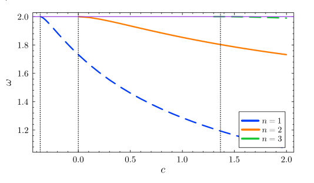
<figcaption class="paper-figure-caption"><b>Fig 1.</b> Figure 1: Spectral structure of the CL theory. For all c, there is also a zero mode.</figcaption>
</figure>
<figure class="paper-figure-card">
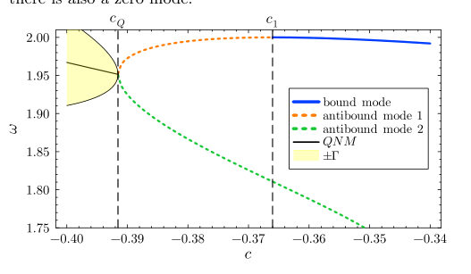
<figcaption class="paper-figure-caption"><b>Fig 2.</b> Figure 2: Spectral structure of the CL theory near c = c1.</figcaption>
</figure>
<figure class="paper-figure-card">
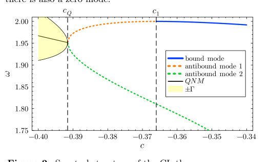
<figcaption class="paper-figure-caption"><b>Fig 3.</b> Fig. 2 where we show the spectrum close c = c1. In contrast, it transmutes to an anti-bound mode as c de- creases - the orange dashed curve in Fig. 2. This is a non-normalizable discrete mode that explodes asymptot- ically as ek|x|. However, locally, in the vicinity of the kink location, it looks as a well-behaved normal mode.</figcaption>
</figure>
<figure class="paper-figure-card">
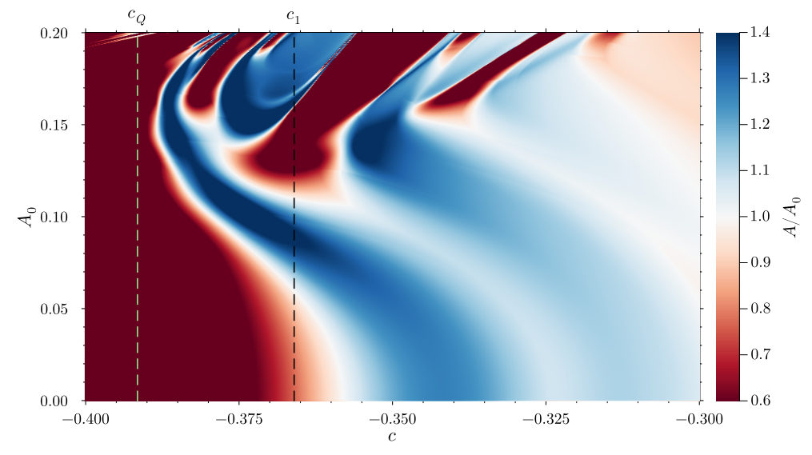
<figcaption class="paper-figure-caption"><b>Fig 4.</b> Figure 3: Relative amplitude A/A0 after T = 300 for initial pulse with β = 0.1 as a function of the model parameter c and initial amplitude A0. There are no oscillon in the dark red region.</figcaption>
</figure>
<figure class="paper-figure-card">
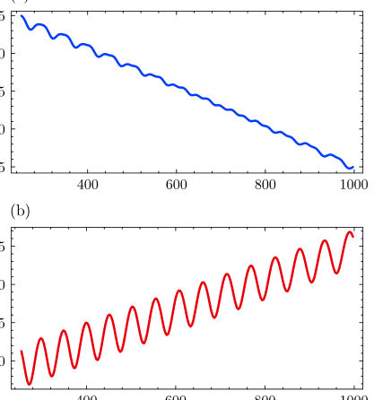
<figcaption class="paper-figure-caption"><b>Fig 5.</b> Figure 4: An odd oscillon in CL model with c = c1.(a): amplitude measured at x = 2. (b): evolution of the frequency. A0 = 0.375, β = 0.5.</figcaption>
</figure>

**Summary.** This work unifies the understanding of oscillons by proving they are nonlinear bound states arising from spectral resonances, such as threshold or anti-bound modes. Using perturbative methods on nonlinear field theories in 1+1 dimensions, the authors demonstrate how these localized excitations govern soliton dynamics, particularly when solitons interact with a 'spectral wall'. The findings provide a robust theoretical framework for understanding stable, long-lived non-linear structures.

**Why it may be interesting.** The concept of nonlinear resonance leading to localized excitations is highly relevant in open quantum systems and AMO physics when considering dissipation or coupling to continuum modes (e.g., cavity decay). The mathematical framework for handling non-normalizable resonances is transferable.

Detailed structure

**Main problem.** To establish a unified understanding of oscillons, showing they arise as nonlinear bound states bifurcating from spectral resonances like threshold or anti-bound modes.

**Main result.** Oscillons are interpreted as nonlinear bound states originating from the localized interaction with non-normalizable resonance modes (threshold/anti-bound). This mechanism explains soliton stopping and stationary state formation after passing a spectral wall.

**Method.** The analysis uses perturbative expansions of the field equations, deriving effective envelope equations for the oscillon profile. Solvability conditions are adapted to handle non-normalizable modes.

**Model / system.** The study analyzes nonlinear field theories, primarily involving generalizations of the Klein-Gordon equation in (1+1) dimensions ($\phi_{tt} - \phi_{xx} + dU/d\phi = 0$). Specific models include $\phi^4$ theory and the Sine-Gordon model.

**Key observables.** Nonlinear frequency shift ($	ilde{\omega}^2$), oscillon amplitude, stationary state formation location relative to the spectral wall ($x_{sw}$), and mode transition characteristics.

**Important parameters / regimes.** The nonlinearity strength (controlled by $\epsilon$ or coupling constants $c$) and initial excitation amplitudes ($A$).

**Assumptions / limitations.** Standard solvability conditions fail due to non-normalizability, requiring the assumption of a localized envelope function. The analysis is primarily restricted to (1+1) dimensions.

**Figures summary.** Figures illustrate spectral structures near resonance points, mapping out regimes where oscillons form based on model parameters ($c$), and show numerical evolution of antikinks demonstrating stationary state formation after passing the spectral wall.

**Paper structure.** The paper progresses by first defining oscillons via threshold modes in vacuum. It then generalizes this to kink backgrounds (wobbleron) using perturbative expansions, deriving an effective envelope equation. Finally, it applies this framework to soliton dynamics near a spectral wall, showing mode transitions from anti-bound states into stable oscillon structures.

Abstract

We show that an oscillon can be understood as a localized discrete resonant (non-normalizable) mode. Specifically, oscillon in the vacuum arises from the threshold mode, which because of nonlinearity gets localized. Following this idea, we find {\it wobblerons} - nonlinear excitations of kinks, that is, oscillons-kink bound state. Now, the oscillon can also originate in an antibound mode, i.e., a discrete, positive energy but non-normalizable mode.

[↑ back to top](#top)

### [Rotating Zeeman field as a tool for Majorana zero mode detection in topological superconducting wire](http://arxiv.org/abs/2606.23183v1)

**Authors:** Piotr Stefański  
**Type:** theory · **Category:** other · **PDF:** <https://arxiv.org/pdf/2606.23183v1>  
**Analysis basis:** full PDF text, analyzed in chunks
**Topic relevance:** `analog quantum simulation` **3/5** · `exotic spin models in light-matter` **3/5** · `spintronics-quantum-optics interface` **3/5** · `Kondo & dissipative impurity` **2/5** · `Keldysh / 2PI / non-Gaussian methods` **1/5** · `driven-dissipative phase transition` **1/5** · `methods for driven-dissipative` **1/5**

↔ Scroll figures horizontally

<figure class="paper-figure-card">
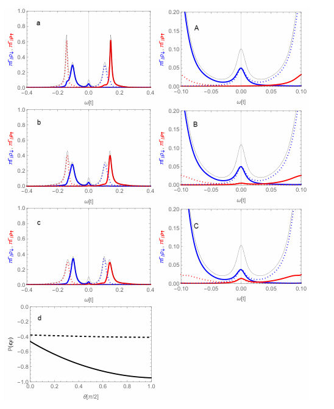
<figcaption class="paper-figure-caption"><b>Fig 1.</b> Figure 1: Spectral densities of the dot and its spin polarization at Fermi energy for weak QD-wire coupling, Γs = 0.03 (tw = 0.20). Solid (dashed) line - particle (hole) parts, thin solid line - total spectral densities. Blue color is for spin down and red for spin up sector. Panels a-c (from top to bottom) are for Θ = π/2, π/4 and 0. In the right column (panels A-C) are zoomed curves corresponding to the left panels. Panel (d) displays QD spin polarization vs. Θ angle. Solid curve is for wire in topological state, V = 1.2Vcr, and dashed curve is for the trivial state V = 0.5Vcr. The remaining input parameters are: t = 1, µ = 0, ∆= 0.2, tso = 2∆, ϵd = 0.05, VQD z = 0.12, Γl = 0.005.</figcaption>
</figure>
<figure class="paper-figure-card">
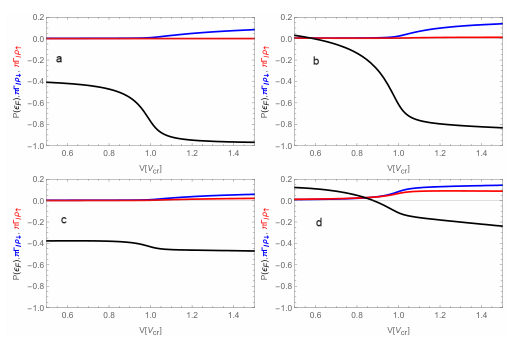
<figcaption class="paper-figure-caption"><b>Fig 2.</b> Figure 3: Spectral densities of the dot at Fermi energy and spin polarization vs. Zeeman field in the wire. The red (blue) curves are for spin up (spin down), and black is for magnetization The upper row (panels a and b) is for Θ = π/2 and the lower (panels c and d)- for Θ = 0. The left column (panels a and c) is for Γs = 0.03 (ϵd = 0.05) and the right column (panels b and d) is for Γs = 0.15 (ϵd = 0.12). The remaining input parameters are: t = 1, µ = 0, ∆= 0.2, tso = 2∆, VQD z = 0.12, Γl = 0.005.</figcaption>
</figure>
<figure class="paper-figure-card">
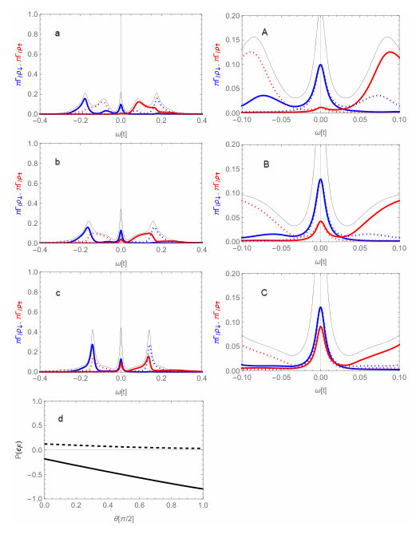
<figcaption class="paper-figure-caption"><b>Fig 3.</b> Figure 2: Spectral densities of the dot and its spin polarization at Fermi energy for strong QD-wire coupling, Γs = 0.15 (tw = 0.44) . Solid (dashed) line - par- ticle (hole) parts, thin solid line - total spectral densities. Blue color is for spin down and red for spin up sector. Panels a-c (from top to bottom) correspond to Θw = π/2, π/4 and 0. In the right column (Panels A-C) are zoomed curves corresponding to the left figures. Panel (d) displays QD spin polarization vs. Θ angle. Solid curve is for wire in topological state, V = 1.2Vcr, and dashed curve is for trivial state V = 0.5Vcr. The remaining input parameters are: t = 1, µ = 0, ∆= 0.2, tso = 2∆, ϵd = 0.12, VQD z = 0.12, Γl = 0.005.</figcaption>
</figure>
<figure class="paper-figure-card">
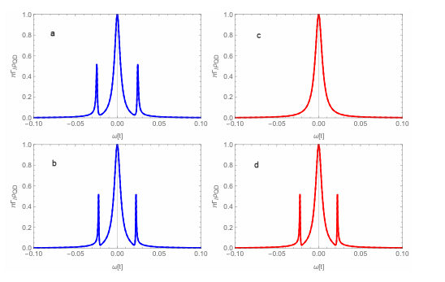
<figcaption class="paper-figure-caption"><b>Fig 4.</b> Figure 5: Spectral densities of the dot vs. energy for ϵM = 0.02. The left column (panels (a) and (b)) is for ϵ↓= ϵF and the right column (panels (c) and (d)) is for ϵ↑= ϵF. The upper row (panels (a) and (c)) is for Θ = π/2 the lower (panels (b) and (d)) is for Θ = 0. Input parameters are: ϵd = 0, tm = 0.01, VQD z = 0.12, Γl = 0.005.</figcaption>
</figure>
<figure class="paper-figure-card">
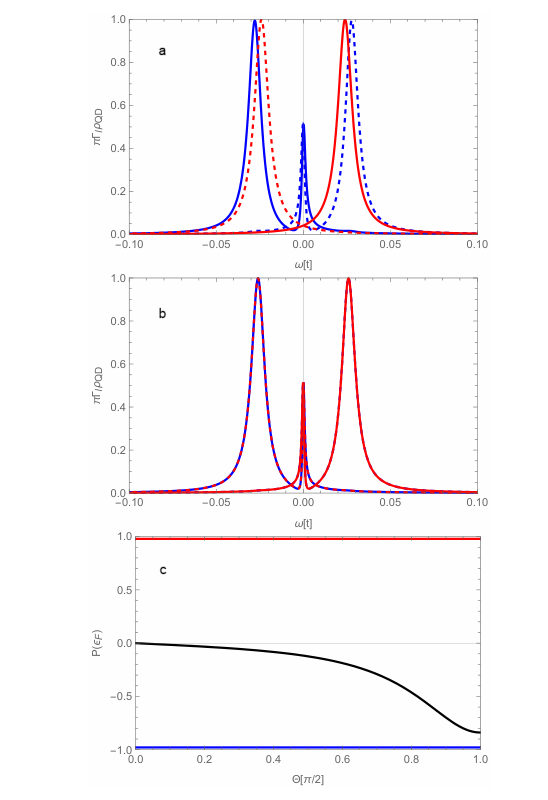
<figcaption class="paper-figure-caption"><b>Fig 5.</b> Figure 4: Spectral densities of the dot vs. energy and its spin polarization vs. Zeeman field angle. Panel (a) is for Θ = π/2, (b)- for Θ = 0. Solid lines- particle, dashed lines-hole components. Blue lines-spin down sector, red lines- spin up sector. The panel (c) shows spin polarization (black curve); red and blue lines are polarizations for ϵ↓= ϵF and ϵ↑= ϵF, respectively. Input parameters are for (a) and (b) are: ϵM = 0, ϵd = 0, tm = 0.01, VQD z = 0.12, Γl = 0.005.</figcaption>
</figure>

**Summary.** The paper proposes using the spin polarization of an attached quantum dot as a diagnostic tool to detect Majorana zero modes (MZMs) within a superconducting wire. By rotating the external Zeeman field direction, the authors show that topological states induce a distinct, measurable change in this spin polarization compared to non-topological regimes. This method offers a powerful spectroscopic signature for characterizing topological superconductivity.

**Why it may be interesting.** This work provides a highly sensitive spectroscopic tool—analyzing spin polarization changes—to probe topological quantum states in solid-state systems, which is crucial for realizing fault-tolerant quantum computation architectures.

Detailed structure

**Main problem.** The primary goal is to develop a robust method using spin polarization analysis of an attached quantum dot (QD) to definitively detect Majorana zero modes (MZMs) in topological superconducting wires, overcoming ambiguities from trivial resonances.

**Main result.** The detection relies on observing a significant and characteristic change in the QD's effective spin polarization when the Zeeman field direction in the wire is rotated, which contrasts sharply with the constant polarization seen in trivial states.

**Method.** The analysis employs Green's function formalism to calculate the QD spectral density and its spin polarization at the Fermi energy ($\omega=0$) as a function of the external magnetic field rotation angle ($\Theta$).

**Model / system.** The system consists of a quantum dot coupled to a topological superconducting wire, modeled by Hamiltonians incorporating tight-binding terms, Rashba spin-orbit coupling, and tunable Zeeman fields. The analysis uses both full numerical simulations and simplified 'Toy Models' based on chiral operators.

**Key observables.** QD spectral density ($
ho_{QD}$), effective spin polarization ($P(\epsilon_F)$) as a function of the Zeeman field angle $\Theta$, and non-linear dependence of $P$ vs. magnetic field magnitude.

**Important parameters / regimes.** Zeeman field rotation angle ($\Theta$), coupling strength between QD and wire, superconducting gap ($\Delta$), and critical topological parameters ($V_{	ext{cr}}$).

**Assumptions / limitations.** The analysis often focuses on the spin evolution under Rashba and Zeeman fields, sometimes simplifying or disregarding the full superconducting pairing term for specific diagnostic measurements.

**Figures summary.** Figures illustrate spectral densities and spin polarization plots showing distinct behavior (large change vs. near-constant) when comparing topological versus trivial wire states as a function of $\Theta$.

**Paper structure.** The paper builds from defining the physical system and Hamiltonian, to deriving the necessary Green's function formalism for the coupled QD-wire structure, and finally applying this framework to calculate and interpret the spin polarization diagnostics under varying magnetic field orientations.

Abstract

We demonstrate that analysis of the spin polarization of a quantum dot (QD) attached to the topological wire can provide valuable insights into Majorana zero mode (MZM) formation and topological phase transition. Detection is realized by rotation of the Zeeman field in the wire, while retaining the Zeeman field direction in the dot intact. In the presence of Majorana mode, the effective QD spin polarization at Fermi energy changes significantly when the direction of the Zeeman field in the wire changes from parallel to perpendicular to the wire axis. It can be opposed to the wire in its trivial state, when spin polarization remains practically constant while the magnetic field is rotated. Similar unaltered spin polarization is observed when QD spin sub-level at Fermi energy mimics MZM. Moreover, the characteristic non-linear dependence of the spin polarization on the magnetic field magnitude at its critical value identifies a topological phase transition in the wire. This feature is observed independently on the coupling strength of the wire to the dot and the angle of the Zeeman field.

[↑ back to top](#top)

### [Kohn-Luttinger like superconductivity in twisted bilayer graphene at large twist angles](http://arxiv.org/abs/2606.23308v1)

**Authors:** A. O. Sboychakov  
**Type:** theory · **Category:** strongly correlated electrons · **PDF:** <https://arxiv.org/pdf/2606.23308v1>  
**Analysis basis:** full PDF text, analyzed in chunks
**Topic relevance:** `Keldysh / 2PI / non-Gaussian methods` **3/5** · `analog quantum simulation` **2/5** · `driven-dissipative phase transition` **2/5** · `Kondo & dissipative impurity` **1/5** · `entanglement & information structure` **1/5** · `methods for driven-dissipative` **1/5** · `non-equilibrium dynamics` **1/5**

↔ Scroll figures horizontally

<figure class="paper-figure-card">
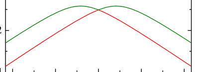
<figcaption class="paper-figure-caption"><b>Fig 1.</b> FIG. 1. The electron spectrum of LAtBLG with twist an- gle θ ∼= 21.79◦(superstructure m0 = 1, r = 1, Nsc = 7) in one valley. Biased voltage is V/t = 0.04. Other Hamil- tonian parameters are: t = 2.7 eV, m = 86 meV, and φ = −2.89 radians.</figcaption>
</figure>
<figure class="paper-figure-card">
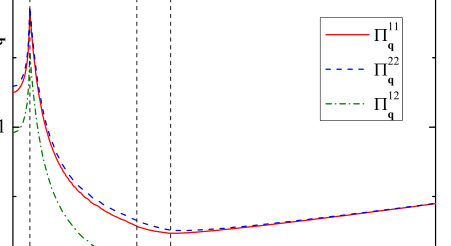
<figcaption class="paper-figure-caption"><b>Fig 2.</b> FIG. 2. Momentum dependence of the polarization opera- tor calculated at doping level x = 8.06 × 10−5 (n = 0.15 × 10−12 cm−2). Other model parameters are the same as in Fig. 1.</figcaption>
</figure>
<figure class="paper-figure-card">
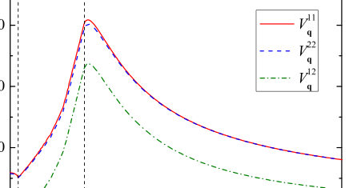
<figcaption class="paper-figure-caption"><b>Fig 3.</b> FIG. 3. Momentum dependence of the screened Coulomb interaction calculated at ǫ = 2. Other model parameters are the same as in Fig. 2.</figcaption>
</figure>
<figure class="paper-figure-card">
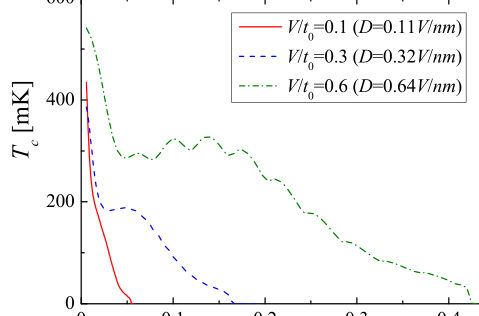
<figcaption class="paper-figure-caption"><b>Fig 4.</b> FIG. 4. The dependence of Tc vs doping concentration n calculated at ǫ = 1 and three different bias voltages. Other model parameters are the same as in Fig. 1.</figcaption>
</figure>
<figure class="paper-figure-card">
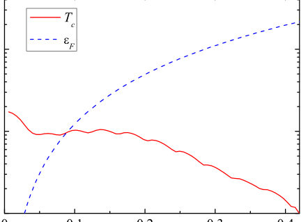
<figcaption class="paper-figure-caption"><b>Fig 5.</b> FIG. 5. The dependence of Tc and εF on doping concentra- tion n calculated at ǫ = 1 and V/t = 0.08. Other model parameters are the same as in Fig. 1.</figcaption>
</figure>

**Summary.** This work theoretically predicts that twisted bilayer graphene with large twist angles can become a superconductor due to strong electron correlations. By calculating the screened Coulomb interaction, the authors establish that a d-wave pairing state is stabilized, potentially leading to high critical temperatures under bias voltage.

**Why it may be interesting.** While focused on graphene, the theoretical framework of solving for correlated ground states via Green's functions and analyzing symmetry-protected instabilities is highly relevant to strongly correlated systems studied in AMO physics or condensed matter theory.

Detailed structure

**Main problem.** The study predicts superconductivity in twisted bilayer graphene (tBLG) at large twist angles, driven by electron-electron interactions.

**Main result.** Superconductivity is stabilized by the screened Coulomb interaction, exhibiting a d-wave order parameter symmetry. The transition temperature ($T_c$) can reach several hundred millikelvin under applied bias voltage.

**Method.** The analysis employs Green's functions and utilizes the Random Phase Approximation (RPA) to screen the bare Coulomb interaction, solving self-consistency equations for the superconducting order parameter.

**Model / system.** The system is twisted bilayer graphene modeled using a continuum approach near Dirac points. The Hamiltonian incorporates interlayer hopping terms, and superconductivity arises from pairing interactions mediated by the screened Coulomb repulsion.

**Key observables.** Superconducting gap ($\Delta$), superconducting transition temperature ($T_c$), and the symmetry of the order parameter (d-wave).

**Important parameters / regimes.** Large twist angle ($	heta$), doping level, applied bias voltage ($V/e$), and interlayer hopping parameters.

**Assumptions / limitations.** The analysis relies on RPA for screening interactions and assumes specific structural conditions regarding the superlattice cell size.

**Figures summary.** Figure 1 illustrates the electron spectrum showing a gap in LAtBLG. Other figures likely show $T_c$ dependence on doping or bias voltage, confirming d-wave stability.

**Paper structure.** The paper progresses from establishing the single-particle band structure and gap formation to deriving the interaction Hamiltonian using RPA screening. It then solves the self-consistency equations for both inter-valley (d-wave) and intra-valley pairing channels to determine the most stable superconducting state.

Abstract

We predict that twisted bilayer graphene with large twist angle and small superlattice cell can be superconducting. Such a bilayer graphene can have a gap in the spectrum. This gap appears due to the hybridization of electrons moving in different layers with Fermi momenta close to the Dirac points which are equivalent to each other in the superlattice Brillouin zone. Small doping of the bilayer introduces charge carries having large density of states. We show that the screened Coulomb interaction is enough to stabilize superconducting state in the material. The symmetry of the order parameter is of the $d$-wave type. Application of the bias voltage increases the superconducting transition temperature. For realistic values of the model parameters the transition temperature can be as large as several hundreds of milikelvin.

[↑ back to top](#top)

### [High-Resolution Probing of Molecular Junctions: Vibrational Fingerprinting and Parameter Extraction via Current Noise Spectroscopy](http://arxiv.org/abs/2606.22663v1)

**Authors:** Rani Arielly  
**Type:** both · **Category:** other · **PDF:** <https://arxiv.org/pdf/2606.22663v1>  
**Analysis basis:** full PDF text, analyzed in chunks
**Topic relevance:** `methods for driven-dissipative` **3/5** · `Kondo & dissipative impurity` **2/5** · `non-equilibrium dynamics` **2/5** · `Keldysh / 2PI / non-Gaussian methods` **1/5** · `correlated / nonlocal dissipation` **1/5** · `driven-dissipative phase transition` **1/5**

↔ Scroll figures horizontally

<figure class="paper-figure-card">
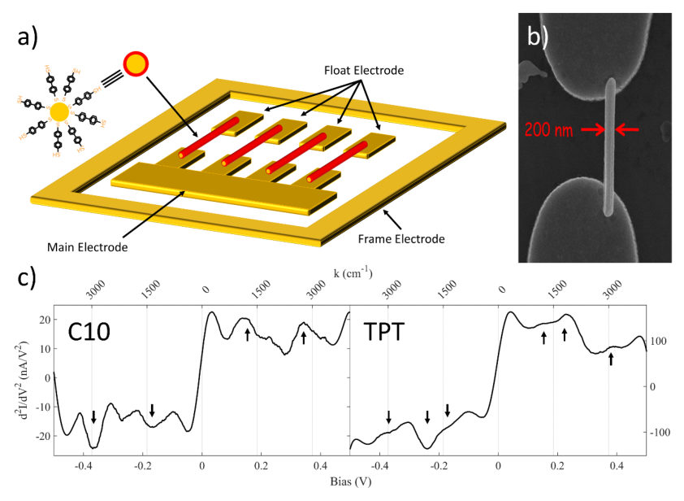
<figcaption class="paper-figure-caption"><b>Fig 1.</b> Figure 1. (a) Illustration of the SAM capped gold wire and the Au pads evaporated on the Si/SiO2 substrate forming gaps which are bridged by the capped Au wires. (b) A close-up SEM image of the Au wire bridge area. The wires have a typical thickness of 200 nm and length of ~3 µm (Arielly et al., 2011). (c) IETS of junctions with C10 and TPT measured at TLN using an AC amplitude of 15 mV. Peaks of different characteristic vibrational modes are marked with arrows.</figcaption>
</figure>
<figure class="paper-figure-card">
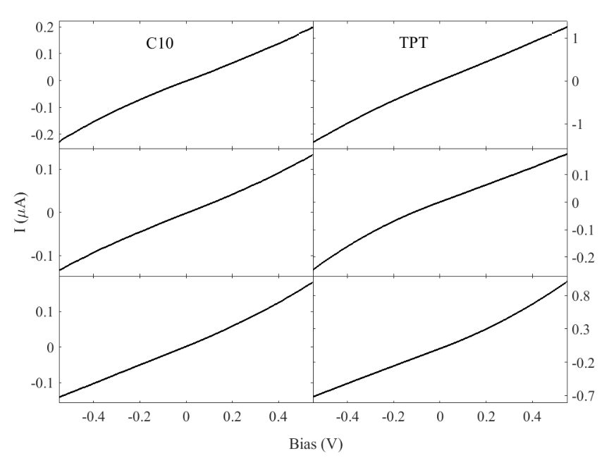
<figcaption class="paper-figure-caption"><b>Fig 2.</b> Figure 2. Typical 𝐼(𝑉) examples for both types of junctions. The left and right panels are for C10 and TPT junctions respectively.</figcaption>
</figure>
<figure class="paper-figure-card">
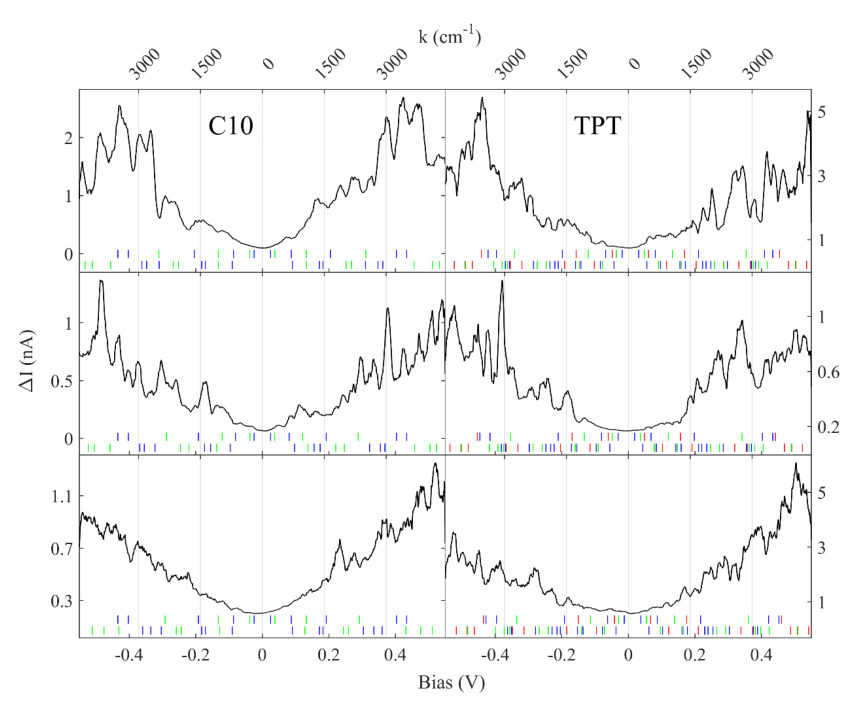
<figcaption class="paper-figure-caption"><b>Fig 3.</b> Figure 3. Typical Δ𝐼(𝑉) examples for both types of junctions. Peak onset is noted by the markers at the bottom of each graph which are separated vertically for different molecules (lower ones for C10/TPT and the upper ones for H2O), and by color for base/overtones frequencies (blue is for the base frequency, green is for the first overtones, and red is for the second). The assignments are symmetrical in both bias polarities and give good coverage of the peak features. The left and right panels are for C10 and TPT junctions respectively.</figcaption>
</figure>
<figure class="paper-figure-card">
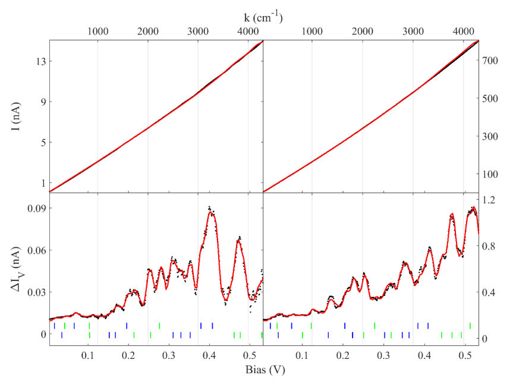
<figcaption class="paper-figure-caption"><b>Fig 4.</b> Figure 4. Fits of the model to 𝐼(𝑉) and Δ𝐼𝑉(𝑉) for 2 types of devices: C10 (left panes) and TPT (right panes). Black dots correspond to the harmonically averaged measured values, and red lines to the best fitted curves. Vibrational energies are noted by the markers at the bottom of each graph which are separated vertically for different molecules (lower ones for C10/TPT and the upper ones for H2O), and by color for base/overtones frequencies (blue is for the base frequency and green is for the first overtones).</figcaption>
</figure>
<figure class="paper-figure-card">
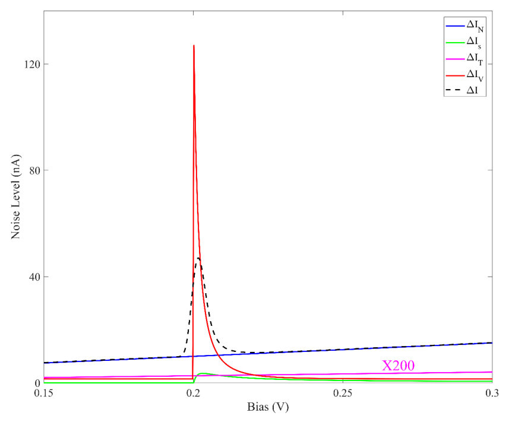
<figcaption class="paper-figure-caption"><b>Fig 5.</b> Figure 5. (a) Simulated noise components and total noise of a single molecular layer having only one vibration mode. The dominant terms are Δ𝐼𝑁 and Δ𝐼𝑉 when using parameters values as realistic as possible (see text). A peak feature is evident which originates from the Δ𝐼𝑉 component.</figcaption>
</figure>

**Summary.** This paper introduces current noise spectroscopy as a superior technique to probe molecular junctions, bypassing thermal broadening limitations inherent in standard IETS. By analyzing voltage-dependent current noise ($\Delta I$), the authors model charge transport through vibrational manifolds to extract detailed molecular parameters like anharmonicities and reorganization energies. This establishes noise signatures as a highly sensitive 'molecular fingerprint' for quantum device characterization.

**Why it may be interesting.** This work provides a powerful experimental realization of probing molecule-electrode coupling dynamics by analyzing noise spectra, which is highly relevant for understanding open quantum systems where environmental coupling (vibrations) dictates electronic transport rates.

Detailed structure

**Main problem.** The study aims to overcome the limitations of traditional spectroscopy (IETS) by using current noise measurements ($\Delta I$) to achieve high-resolution vibrational fingerprinting in molecular electronic junctions.

**Main result.** The technique successfully maps complex vibrational manifolds and allows for the direct extraction of crucial nanoscale parameters like anharmonicities, dissociation energies, and reorganization energies.

**Method.** The authors employ a fast-convolution-based Landauer-Büttiker transport model fitted to voltage-dependent current noise ($\Delta I(V)$) measurements taken on suspended-wire molecular junctions.

**Model / system.** The physical system is a molecular junction (e.g., $	ext{C}_{10}$ or TPT SAMs) bridging electrodes, whose electronic transport is modeled by incorporating the coupling between electronic tunneling and quantized vibrational energy levels.

**Key observables.** Voltage-dependent current noise ($\Delta I(V)$), which exhibits distinct peak features corresponding to molecular vibrational modes and their overtones.

**Important parameters / regimes.** Mode energies, anharmonicities ($\chi_e$), dissociation energies ($D_e$), and local environment reorganization energies ($E_r$).

**Assumptions / limitations.** The analysis relies on modeling the current using rate equations for excited/ground states and assumes that noise measurements are sensitive to transition rates rather than just conductance additions.

**Figures summary.** Figures illustrate typical $I(V)$ and $\Delta I(V)$ curves for C10 and TPT junctions, showing model fits. The paper details how the decay parameter ($s$) controls the line shape of noise peaks, and tables summarize extracted parameters like wavenumbers and reorganization energies.

**Paper structure.** The structure moves from establishing the physical problem (limitations of IETS) to presenting the advanced methodology ($\Delta I$ spectroscopy), developing the underlying quantum transport model (Landauer-Büttiker/rate equations), applying it to extract multiple molecular parameters, and finally interpreting these results as unique chemical fingerprints.

Abstract

The precise realization of molecular electronic devices requires a comprehensive understanding of charge transport mechanisms and the specific interplay between electronic and nuclear degrees of freedom. While average current measurements (I-V characteristics) and conventional Inelastic Electron Tunneling Spectroscopy (IETS) offer valuable insights, they are fundamentally limited by temperature-dependent line-width broadening. This study presents a high-resolution spectroscopic methodology utilizing suspended-wire molecular junctions (SWMJs) based on self-assembled monolayers (SAMs) of 1-decanethiol (C10) and 1,1',4',1''-terphenyl-4-thiol (TPT). By systematically probing the voltage-dependent current noise ($ΔI$), we demonstrate that electronic noise spectroscopy circumvents thermal degradation by probing transition rates between vibrational manifolds rather than simple additions of conductance channels, which enables sub-thermal feature mapping. Leveraging a fast-convolution-based Landauer-Büttiker transport model fitted to experimental data, we map complex vibrational manifolds, including high-energy overtones. This allows for the direct extraction of crucial nanoscale molecular parameters, including mode energies, anharmonicities ($x_e$), dissociation energies ($D_e$), and local environment reorganization energies ($E_r$). These parameter-dense noise signatures act as a unique molecular fingerprint, establishing noise spectroscopy as a highly sensitive platform for chemical sensing and discrimination in advanced quantum devices.

[↑ back to top](#top)

### [Non-equilibrium angular momentum selectivity and filtering in chiral carbon nanotubes](http://arxiv.org/abs/2606.22235v1)

**Authors:** Sergio Shmayev, D. R. da Costa, D. A. Bahamon  
**Type:** theory · **Category:** other · **PDF:** <https://arxiv.org/pdf/2606.22235v1>  
**Analysis basis:** full PDF text, analyzed in chunks
**Topic relevance:** `methods for driven-dissipative` **3/5** · `non-equilibrium dynamics` **3/5** · `non-equilibrium universality` **2/5** · `Keldysh / 2PI / non-Gaussian methods` **1/5** · `driven-dissipative phase transition` **1/5**

↔ Scroll figures horizontally

<figure class="paper-figure-card">
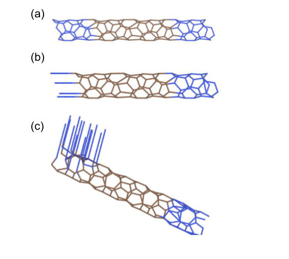
<figcaption class="paper-figure-caption"><b>Fig 1.</b> FIG. 1. Schematic representation of the CNT trans- port devices illustrating the three different contact geometries considered in this work. (a) Ideal semi- infinite CNT leads: both left and right electrodes are pristine extensions of the same nanotube, preserving the full helical symmetry and injecting all angular-momentum channels uni- formly. (b) End-contact geometry: the left electrode is re- placed by a wide-band metallic lead coupled to all atoms at the leftmost cross-section of the nanotube via the self-energy ΣL = −i|t|. (c) Side-contact geometry: the metallic lead cou- ples only to the atoms satisfying y ≥0 within the first unit cell, thereby breaking the discrete rotational...</figcaption>
</figure>
<figure class="paper-figure-card">
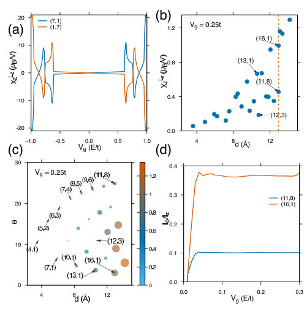
<figcaption class="paper-figure-caption"><b>Fig 2.</b> FIG. 2. Orbital Edelstein susceptibility of metallic chi- ral CNTs. All values of χLz z are normalized by the respective unit-cell length |T| (see text for details). (a) χLz z as a func- tion of gate voltage for the enantiomeric pair (7, 1) and (1, 7), its mirror image, illustrating the sign reversal expected for a chirality-odd observable. (b) Normalized orbital Edelstein susceptibility evaluated at Vg = 0.25 t as a function of nan- otube diameter for all 25 metallic CNTs studied; the data do not collapse onto a single curve, revealing the absence of a universal diameter scaling. (c) Bubble-chart represen- tation of χLz z in the diameter–chiral-angle parameter space; the bubble area is...</figcaption>
</figure>
<figure class="paper-figure-card">
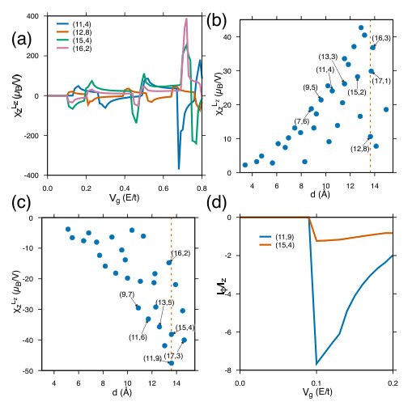
<figcaption class="paper-figure-caption"><b>Fig 3.</b> FIG. 3. Orbital Edelstein susceptibility of semicon- ducting chiral CNTs. All values of χLz z are normalized by the respective unit-cell length |T|. (a) Orbital Edelstein susceptibility, χLz z , as a function of gate voltage for represen- tative semiconducting CNTs, illustrating the ∼ √</figcaption>
</figure>
<figure class="paper-figure-card">
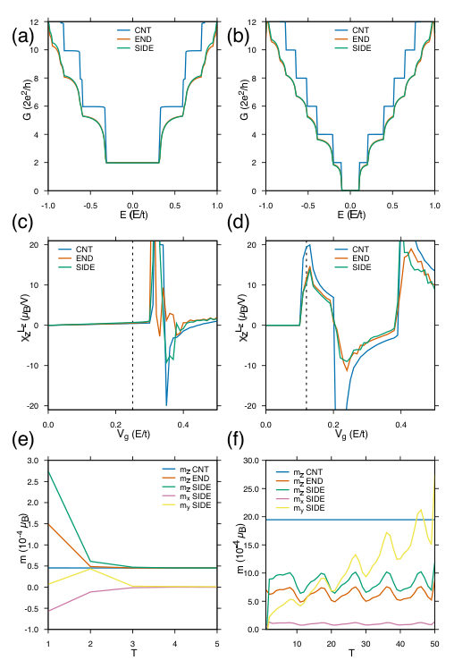
<figcaption class="paper-figure-caption"><b>Fig 4.</b> FIG. 4. Influence of the contact geometry on charge transport and orbital magnetization. (a, b) Two- terminal conductance of the metallic (11, 8) and semiconduct- ing (12, 8) CNTs, respectively, computed with three different contact configurations: ideal semi-infinite CNT leads (CNT), wide-band end-contact geometry (END), and wide-band side- contact geometry (SIDE). The near-identical traces for END and SIDE confirm that total charge transmission is insensi- tive to the contact geometry within the wide-band approxima- tion. (c, d) Orbital Edelstein susceptibility χLz z (normalized by the unit-cell length |T|) as a function of gate voltage for the same (11, 8) and (12, 8) CNTs and same...</figcaption>
</figure>
<figure class="paper-figure-card">
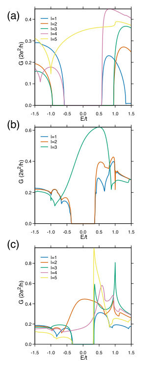
<figcaption class="paper-figure-caption"><b>Fig 5.</b> FIG. 5. Angular-momentum filtering in metallic car- bon nanotubes. Two-terminal conductance as a function of energy for electrons injected with different orbital angular momenta l [Eq. (7)] into (a) the achiral armchair (5, 5) CNT (n = 5, armchair class, low-energy bands with m = 0), (b) the chiral armchair-class (12, 3) CNT (n = 3, m = 0), and (c) the chiral zigzag-class (12, 6) CNT (n = 6, low-energy bands with ma = 4 and mb = 2). Angular-momentum gaps—energy windows of vanishing transmission—appear whenever the in- jected l does not satisfy the selection rule l ≡m (mod n). In (a) and (b), only l ≡0 (mod n) transmits near E = 0; in (c), both l = 2 and l = 4 are transmitted, each coupling...</figcaption>
</figure>

**Summary.** This work systematically investigates how the inherent chirality of carbon nanotubes dictates their non-equilibrium orbital response, quantified by the Edelstein susceptibility. By employing advanced Green's function techniques and modeling controlled current injection, the authors demonstrate that these CNTs act as highly selective filters, transmitting only electronic states whose angular momentum matches specific crystal quantization rules.

**Why it may be interesting.** The explicit connection between structural chirality and quantized orbital angular momentum filtering provides a concrete, tunable mechanism for controlling electronic transport properties in nanoscale conductors. This bridges concepts from topological physics (chirality) with quantum transport measurements.

Detailed structure

**Main problem.** The study investigates non-equilibrium orbital response, selectivity, and filtering capabilities governed by structural chirality in carbon nanotubes (CNTs). It aims to show that these effects are dictated by the specific chiral wrapping vector rather than simple geometric parameters.

**Main result.** Chiral CNTs can function as efficient orbital-angular-momentum filters, selectively transmitting electronic states based on their crystal angular momentum. The orbital Edelstein susceptibility ($\chi_{Lz}^z$) depends strongly on chirality and diameter, revealing distinct families of behavior.

**Method.** The research employs the Landauer–Büttiker formalism combined with Non-Equilibrium Green's Function (NEGF) techniques to calculate current-driven orbital magnetic moments and susceptibilities.

**Model / system.** The physical system is chiral Carbon Nanotubes modeled using a nearest-neighbor tight-binding framework retaining a single $p_z$ orbital per carbon atom. The analysis systematically compares metallic and semiconducting CNTs under different contact geometries (end vs. side).

**Key observables.** Orbital Edelstein susceptibility ($\chi_{Lz}^z$), local orbital magnetic moment ($\mathbf{m}$), and the ratio of azimuthal to axial current ($\langle I_\phi 
angle / \langle I_z 
angle$).

**Important parameters / regimes.** Chiral indices $(n, m)$, nanotube diameter ($d_t$), applied voltage ($V_{SD}$), and contact geometry.

**Assumptions / limitations.** The analysis often uses the wide-band approximation for contacts and models idealized coupling conditions to isolate intrinsic electronic responses. The filtering mechanism is linked to the discrete rotational symmetry $C_n$.

**Figures summary.** Figures illustrate $\chi_{Lz}^z$ dependence on gate voltage, diameter vs. chiral angle space, and conductance as a function of injected angular momentum ($l$) relative to the crystal angular momentum ($m$).

**Paper structure.** The paper develops from calculating the orbital Edelstein susceptibility ($\chi_{Lz}^z$) in general (Chunk 2), establishing its dependence on chirality over simple scaling laws. It then refines this by analyzing current components and effective winding angles (Chunk 3). The focus shifts to comparing metallic vs. semiconducting behavior, showing enhanced response near band edges (Chunk 4). Finally, the most advanced concept is demonstrated: using controlled angular momentum injection via projected contacts to enforce strict orbital-angular-momentum filtering rules ($l \equiv m \pmod{n}$) (Chunks 6 & 7).

Abstract

Carbon nanotubes (CNTs) constitute a highly tunable platform for probing the interplay between structural chirality and quantum transport in quasi-one-dimensional systems. Here, we perform a systematic study of the non-equilibrium orbital response across a broad set of metallic and semiconducting chiral CNTs. We find that the orbital Edelstein susceptibility depends strongly on both chirality and nanotube diameter, revealing that the orbital response cannot be captured by a universal scaling law. Instead, distinct families of CNTs emerge, forming characteristic orbital-response branches uniquely determined by the chiral wrapping vector. We further investigate the role of metallic contacts on orbital-current generation and orbital selectivity. While metallic CNTs rapidly recover their intrinsic orbital response away from the contact region, semiconducting CNTs display pronounced oscillatory behavior arising from interference between transport channels carrying different angular momenta injected by wide-band metallic contacts. Finally, by incorporating angular correlations into the contact self-energy, we demonstrate that chiral CNTs can operate as efficient orbital-angular-momentum filters, selectively transmitting orbitally textured electronic states in accordance with the crystal angular momentum of the propagating bands.

[↑ back to top](#top)

### [Sliding ferroelectricity tunable conventional and anomalous spin Hall effects in bilayer 1T'-WTe2](http://arxiv.org/abs/2606.22015v1)

**Authors:** Chao Wu, Pengqiang Dong, Kai Wei, Hanbo Sun, Ping Li  
**Type:** theory · **Category:** other · **PDF:** <https://arxiv.org/pdf/2606.22015v1>  
**Analysis basis:** full PDF text, analyzed in chunks
**Topic relevance:** `spintronics-quantum-optics interface` **3/5** · `non-equilibrium dynamics` **1/5**

↔ Scroll figures horizontally

<figure class="paper-figure-card">
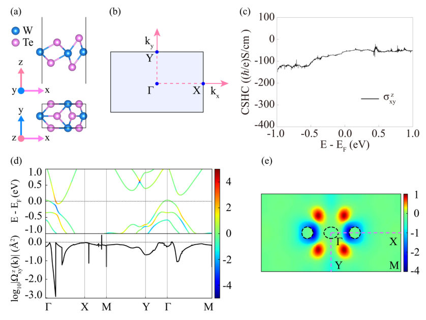
<figcaption class="paper-figure-caption"><b>Fig 1.</b> FIG. 1. (a) The atomic structure of monolayer 1T’-WTe2. (b) Schematic diagram of the 2D BZ of 1T’-WTe2, the high-symmetry points are indicated by blue dots. (c) The CSHC σzxy of monolayer 1T’-WTe2 as a function of energy. (d) The upper panel shows the band structure projected by the SBC on a log scale, and the lower panel shows the k-resolved SBC at E-EF = 0 eV. (e) The k-resolved SBC on a log scale in 2D BZ slice of kz = 0 for monolayer 1T’-WTe2 at E-EF = 0 eV. The high-symmetry points are Γ(0, 0, 0), X(0.5, 0, 0), Y(0, 0.5, 0), and M(0.5, 0.5, 0). The black dashed lines are the intersections of the Fermi surface with a slice of the BZ.</figcaption>
</figure>
<figure class="paper-figure-card">
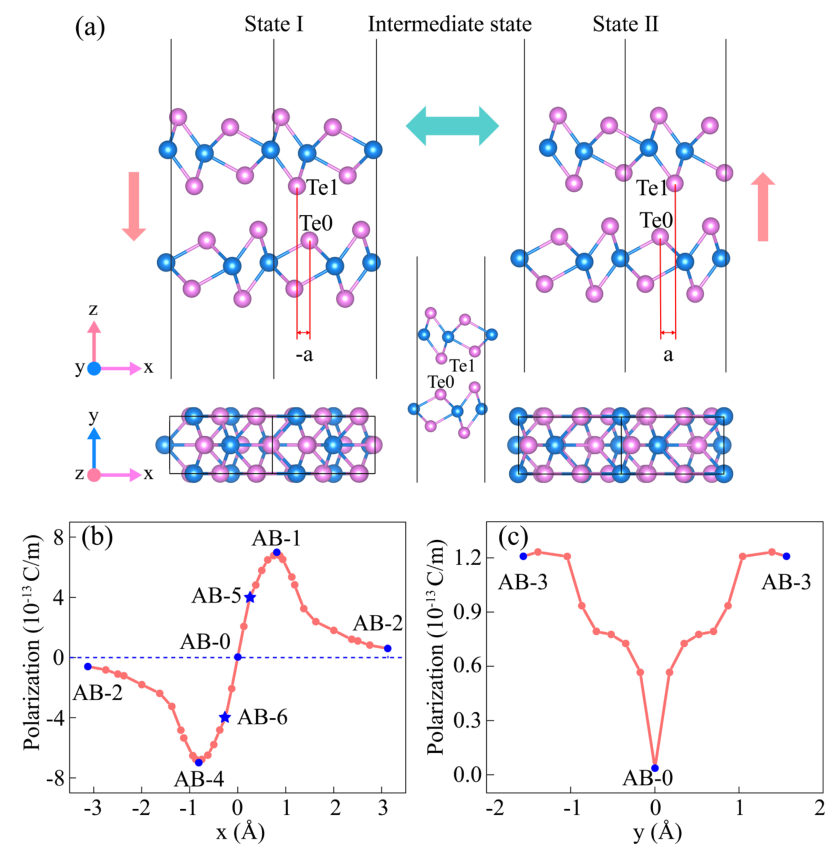
<figcaption class="paper-figure-caption"><b>Fig 2.</b> FIG. 2. (a) The top and side views of the crystal structure for state I bilayer 1T’-WTe2. The state II is the reflecting state I by the central horizontal plane. They are the AB-5 and AB-6 stackings. (b) Ferroelectric switching pathway along the x-axis with respect to the slip x distance at y = 0 Å. (c) Ferroelectric switching pathway along the y-axis with respect to the slip y distance at x = 0 Å. The orange colour arrows represent the direction of ferroelectric polarization.</figcaption>
</figure>
<figure class="paper-figure-card">
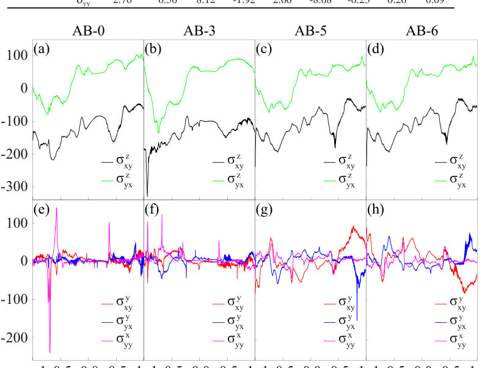
<figcaption class="paper-figure-caption"><b>Fig 3.</b> FIG. 3. The (a-d) CSHC and (e-h) ASHC tensor components as a function of energy for the four AB stacking configurations.</figcaption>
</figure>
<figure class="paper-figure-card">
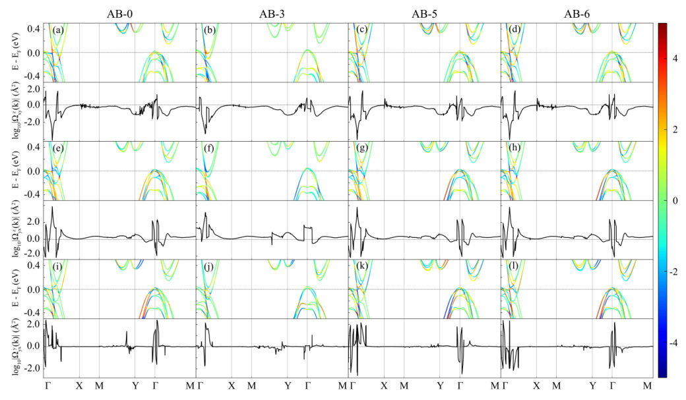
<figcaption class="paper-figure-caption"><b>Fig 4.</b> FIG. 4. The band structures and SBCs for different AB stacking structures. The AB-0, AB-3, AB-5, and AB-6 stacking configurations correspond to (a, e, i), (b, f, j), (c, g, k), and (d, h, l), respectively. The upper panel shows the band structure projected by the SBC on a log scale, and the lower panel shows the k-resolved SBC at E-EF = 0 eV for (a-d)σzxy, (e-h)σzyx, (i-l)σy yx, respectively.</figcaption>
</figure>
<figure class="paper-figure-card">
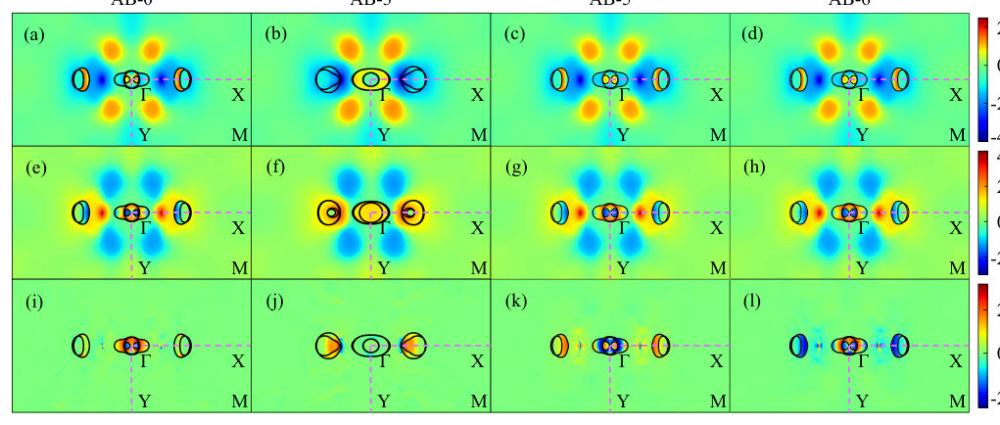
<figcaption class="paper-figure-caption"><b>Fig 5.</b> FIG. 5. The k-resolved SBC on a log scale in 2D BZ slice of kz = 0 for bilayer 1T’-WTe2. The AB-0, AB-3, AB-5, and AB-6 stacking configurations correspond to (a, e, i), (b, f, j), (c, g, k), and (d, h, l), respectively. (a-d), (e-h), and (i-l) are σzxy, σzyx and σy yx, respectively.</figcaption>
</figure>

**Summary.** This theoretical study investigates how intrinsic sliding ferroelectricity in bilayer 1T'-WTe2 can be used to electrically tune both conventional and anomalous spin Hall effects. By calculating the spin conductivities using DFT, the authors demonstrate that switching the ferroelectric polarization reversibly changes the sign and magnitude of these transport coefficients. This work proposes a pathway for nonvolatile electrical control in next-generation spintronic memory devices.

**Why it may be interesting.** While focused on condensed matter spintronics rather than fundamental quantum information protocols, the concept of using electric fields (via ferroelectricity) to control quantized transport properties (spin currents) is highly relevant to controlling quantum states and energy dissipation in nanoscale devices.

Detailed structure

**Main problem.** The primary challenge addressed is achieving field-free magnetization switching in spintronic devices by tuning both conventional and anomalous spin Hall effects (CSHE/ASHE). The research proposes utilizing intrinsic sliding ferroelectricity to achieve this tunability.

**Main result.** Sliding ferroelectricity enables the reversible switching of signs and magnitudes for both CSHCs and ASHCs in bilayer 1T'-WTe2. This establishes a strong coupling between ferroelectric polarization and spin transport, enabling nonvolatile electrical control of spintronic devices.

**Method.** The study employs Density Functional Theory (DFT) calculations, including van der Waals corrections, to compute the Spin Hall Conductivities using the Kubo formula based on band structure analysis and k-resolved Spin Berry Curvature contributions.

**Model / system.** The physical system is bilayer 1T'-WTe2, a transition metal dichalcogenide (TMD) exhibiting intrinsic sliding ferroelectricity. The calculations analyze various stacking configurations (AA vs AB stackings) to map out the dependence of spin transport properties on polarization state.

**Key observables.** Spin Hall Conductivities ($\sigma_{yxy}, \sigma_{y	ext{yx}}$), Conventional Spin Hall Conductivity, Anomalous Spin Hall Conductivity, and the magnitude/sign of ferroelectric polarization ($P$).

**Important parameters / regimes.** The enhancement factor achieved by bilayer stacking (up to $\sim 2	imes$) and the specific values calculated for conductivity ($\sigma_{yxy} = -96.77 (\hbar/e)	ext{S/cm}$ in bilayer).

**Assumptions / limitations.** The analysis relies on DFT calculations, assuming that the observed spin transport phenomena are governed by band structure topology changes induced by ferroelectric polarization switching.

**Figures summary.** Figures illustrate the atomic structures and BZ schematics for different stacking modes. Key figures show k-resolved Spin Berry Curvature contributions ($\sigma_{zxy}, \sigma_{zyx}, 	ext{and } \sigma_{yyx}$) across various stackings, demonstrating how polarization switching alters these contributions.

**Paper structure.** The paper first establishes the physical context (SHE/ASHE challenge) and then details the theoretical framework using DFT. It systematically analyzes the effect of stacking patterns and ferroelectric sliding on the spin Hall conductivities, culminating in a discussion of the mechanism linking polarization reversal to sign switching in ASHCs.

Abstract

The spin Hall effect, recognized for its high-speed, low-power, and highly controllable characteristics, is a key enabler for next-generation memory and logic devices. However, a primary challenge lies in achieving 180$^{\circ}$ magnetization switching without an external magnetic field in spin-orbit torque devices. Here, we propose a method to tune the conventional and anomalous spin Hall effects by the intrinsic sliding ferroelectricity. Importantly, the anomalous spin Hall effect can enable the field-free switching of perpendicular magnetization. We find a substantial anomalous spin Hall conductivity of $σ_{xy}^{y}$ = 45.62 ($\hbar$/e)S/cm and $σ_{yx}^{y}$ = 56.84 ($\hbar$/e)S/cm in monolayer 1T'-WTe$_2$. These values are significantly enhanced to $σ_{xy}^{y}$ = -96.77 ($\hbar$/e)S/cm and $σ_{yx}^{y}$ = 104.03 ($\hbar$/e)S/cm in the bilayer 1T'-WTe$_2$. More interestingly, the sliding ferroelectricity enables reversible switching of the signs and magnitudes for both the conventional and anomalous spin Hall conductivities. This originates from the fact that the sliding ferroelectric markedly shifts the relative spin Berry curvature contributions from the valence and conduction bands around the $Γ$-X path. Our findings not only reveal a strong coupling between sliding ferroelectricity and spin transport, but also propose a strategy for the nonvolatile electrical control of spintronic devices.

[↑ back to top](#top)

### [Strongly anisotropic Rytova-Keldysh interaction and the ground state of 2D excitons](http://arxiv.org/abs/2606.23033v1)

**Authors:** Andrei Galiautdinov  
**Type:** theory · **Category:** other · **PDF:** <https://arxiv.org/pdf/2606.23033v1>  
**Analysis basis:** full PDF text, analyzed in chunks
**Topic relevance:** `Keldysh / 2PI / non-Gaussian methods` **3/5** · `methods for driven-dissipative` **1/5**

↔ Scroll figures horizontally

<figure class="paper-figure-card">
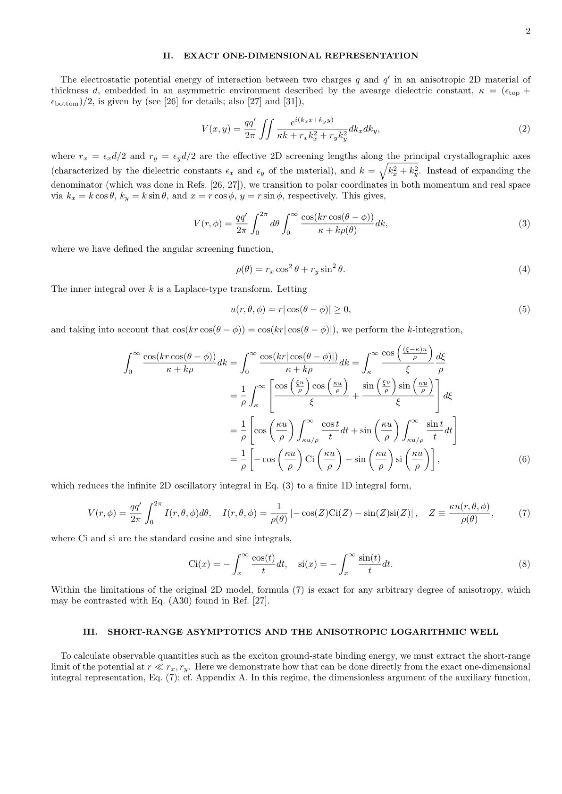
<figcaption class="paper-figure-caption"><b>Fig 1.</b> Low-resolution page preview, page 2</figcaption>
</figure>
<figure class="paper-figure-card">
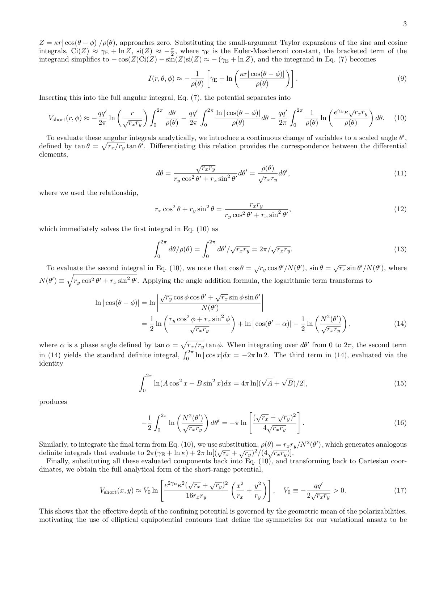
<figcaption class="paper-figure-caption"><b>Fig 2.</b> Low-resolution page preview, page 3</figcaption>
</figure>
<figure class="paper-figure-card">
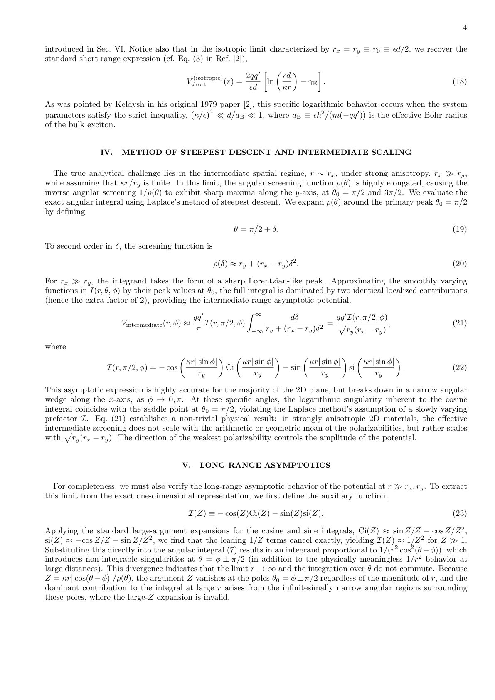
<figcaption class="paper-figure-caption"><b>Fig 3.</b> Low-resolution page preview, page 4</figcaption>
</figure>
<figure class="paper-figure-card">
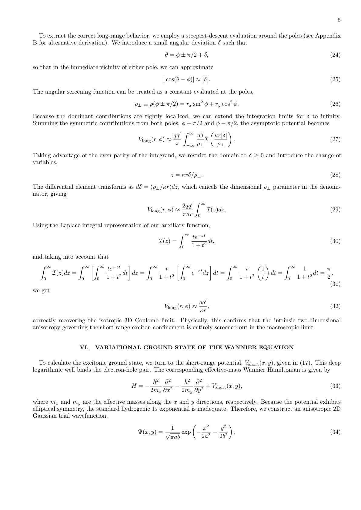
<figcaption class="paper-figure-caption"><b>Fig 4.</b> Low-resolution page preview, page 5</figcaption>
</figure>
<figure class="paper-figure-card">
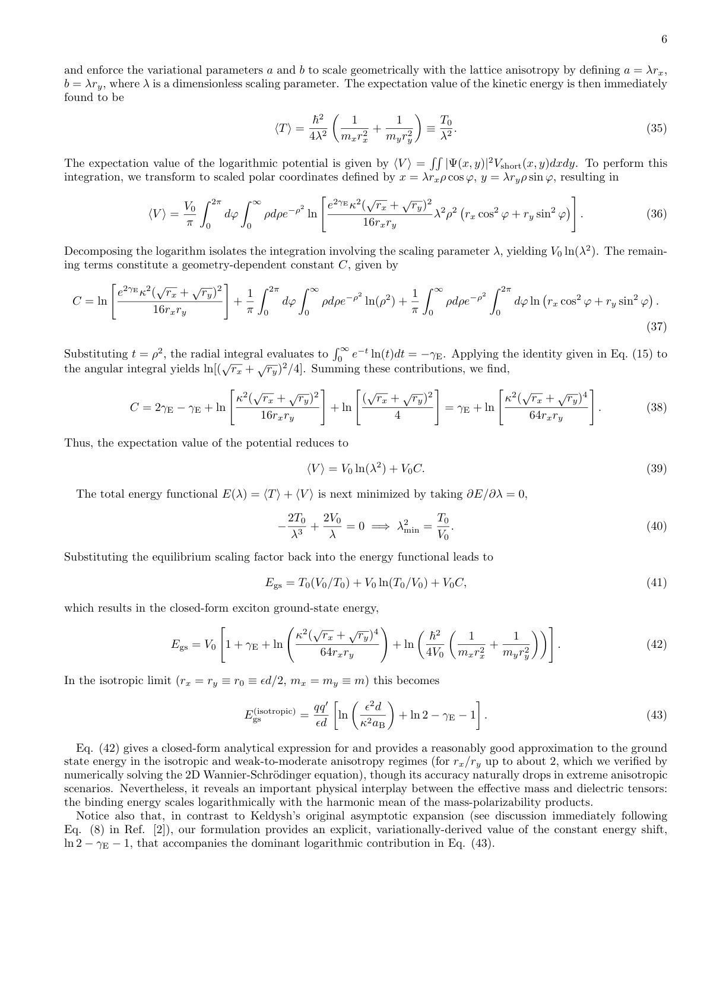
<figcaption class="paper-figure-caption"><b>Fig 5.</b> Low-resolution page preview, page 6</figcaption>
</figure>

**Summary.** This theoretical paper rigorously analyzes the anisotropic Rytova-Keldysh interaction potential governing excitons in 2D materials. By applying advanced mathematical techniques like steepest descent and specialized asymptotic expansions, it derives closed-form expressions for the screening potential across all length scales. The key outcome is a quantitative prediction of the exciton ground-state binding energy that explicitly accounts for material anisotropy.

**Why it may be interesting.** This work provides rigorous analytical tools to calculate fundamental properties (like binding energy) in low-dimensional quantum systems where anisotropy is crucial, bridging complex integral physics with solvable variational models.

Detailed structure

**Main problem.** To provide an analytical foundation for the strongly anisotropic Rytova-Keldysh interaction potential governing excitons in 2D materials, and subsequently derive a closed-form expression for the exciton ground-state binding energy.

**Main result.** The paper derives distinct asymptotic forms for the screening potential: a geometric mean dependence at short ranges and a standard $1/r$ Coulomb decay at long ranges. It provides an analytical formula for the ground state energy capturing the competition between effective mass and dielectric tensors.

**Method.** The analysis employs advanced mathematical techniques including mapping to 1D integrals, applying the method of steepest descent (Laplace's method) for intermediate regimes, and using variational calculations with anisotropic Gaussian wavefunctions.

**Model / system.** The system is excitons confined in ultrathin two-dimensional (2D) semiconductors exhibiting significant in-plane dielectric anisotropy. The interaction potential is modeled by the generalized Rytova-Keldysh screening potential.

**Key observables.** Exciton ground-state binding energy ($E_{	ext{gs}}$), and the anisotropic screened potential $V(r, \phi)$.

**Important parameters / regimes.** Screening lengths ($r_x, r_y$), effective masses ($m_x, m_y$), and dielectric tensors ($\epsilon_x, \epsilon_y$). Regimes include short-range, intermediate-range (strong anisotropy), and long-range.

**Assumptions / limitations.** The analysis relies on approximations like small-argument Taylor expansions for special functions and assumes the applicability of Laplace's method in certain spatial regimes.

**Figures summary.** Not specified by notes; however, the text describes analyzing potential contours (elliptical at short range, circular at long range) and deriving energy equations.

**Paper structure.** The paper systematically analyzes the screened potential across different length scales: first establishing the exact 1D integral form, then deriving closed-form asymptotic expressions for the short-range limit using special functions, followed by analyzing the intermediate regime via steepest descent, and finally confirming the long-range behavior matches standard 3D unscreened Coulomb interaction.

Abstract

The classic Rytova-Keldysh potential describes the non-local dielectric screening of Coulomb interactions in ultrathin two-dimensional (2D) materials. Recently, the corresponding potential for arbitrary in-plane anisotropy was derived in integral form, with numerical studies suggesting that an effective isotropic approximation remains robust for highly directional systems. In this paper we provide the analytical foundation for these observations by mapping the complete spatial landscape of the strongly anisotropic Rytova-Keldysh interaction. By applying the method of steepest descent and momentum-space coordinate scaling to the exact one-dimensional integral representation, we derive closed-form asymptotic expressions for the potential across all spatial regimes. We find that the intermediate-range screening exhibits a non-trivial amplitude scaling driven by the direction of weakest polarizability, while the short-range limit produces an anisotropic logarithmic well governed by the geometric mean of the principal polarizabilities. Finally, utilizing this short-range confinement, we implement an anisotropic Gaussian variational ansatz to solve the Wannier equation, providing a closed-form analytical expression for the exciton ground-state binding energy that explicitly captures the competition between the effective mass and dielectric tensors.

[↑ back to top](#top)

### [Magnetic-Free Quantum Interference and Universal Josephson Diode Effect Driven by a Supercurrent Gauge Field](http://arxiv.org/abs/2606.23479v1)

**Authors:** Haowei Ye, Wenxue He, Kaixuan Fan, Yingpeng Zhang, Shijin Li, Yu Pan, Dechao Geng, Fan Yang, Kenji Watanabe, Takashi Taniguchi, Hechen Ren  
**Type:** both · **Category:** other · **PDF:** <https://arxiv.org/pdf/2606.23479v1>  
**Analysis basis:** full PDF text, analyzed in chunks
**Topic relevance:** `QC/QI experiment` **2/5** · `driven-dissipative phase transition` **2/5** · `Keldysh / 2PI / non-Gaussian methods` **1/5** · `analog quantum simulation` **1/5** · `interference shaping light` **1/5** · `methods for driven-dissipative` **1/5** · `non-equilibrium dynamics` **1/5** · `non-equilibrium universality` **1/5** · `spintronics-quantum-optics interface` **1/5**

↔ Scroll figures horizontally

<figure class="paper-figure-card">
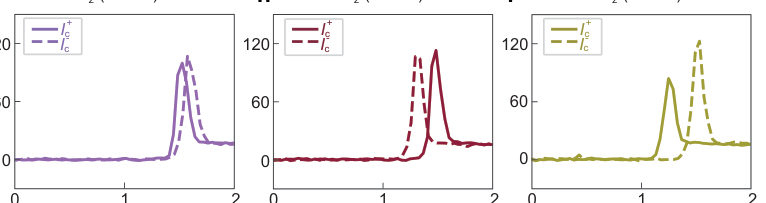
<figcaption class="paper-figure-caption"><b>Fig 1.</b> FIG. 1. Universal Josephson diode effect in a Bi2O2Se Josephson junction (JJ1). a–c, False-colour</figcaption>
</figure>
<figure class="paper-figure-card">
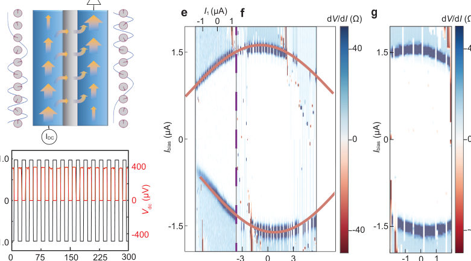
<figcaption class="paper-figure-caption"><b>Fig 2.</b> FIG. 2. Illustration of supercurrent gauge fields (SGF) and magnetic-free quantum interference.</figcaption>
</figure>
<figure class="paper-figure-card">
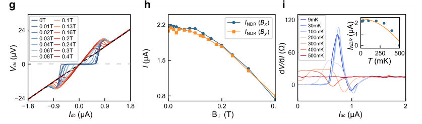
<figcaption class="paper-figure-caption"><b>Fig 3.</b> FIG. 3. Josephson diode effect in a Bernal bilayer graphene (BBG) Josephson junction. a,</figcaption>
</figure>
<figure class="paper-figure-card">
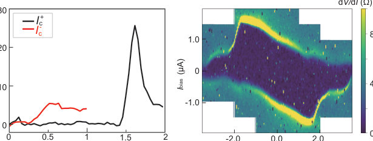
<figcaption class="paper-figure-caption"><b>Fig 4.</b> FIG. 4. Amplified SGF with meandering lead geometry. a, Optical micrograph of JJ2 with mean-</figcaption>
</figure>
<figure class="paper-figure-card">
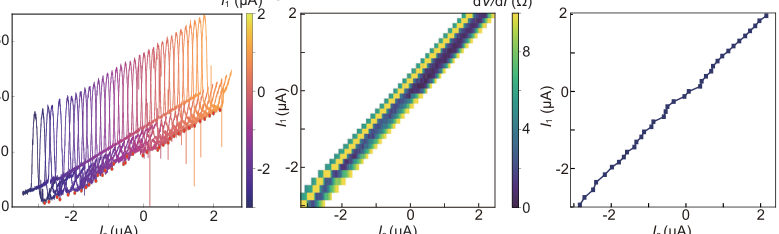
<figcaption class="paper-figure-caption"><b>Fig 5.</b> FIG. 5. Phase-sensitive generation and detection of finite-momentum superconductivity. a–c,</figcaption>
</figure>

**Summary.** This paper introduces the concept of a Supercurrent Gauge Field (SGF) that allows for the generation of magnetic-field-like effects in Josephson junctions using only electric currents. By demonstrating this, the authors show that both quantum interference and the Josephson Diode Effect can be controlled entirely electrically, opening pathways for compact superconducting quantum devices.

**Why it may be interesting.** The work provides a powerful analogy between magnetic flux quantization and supercurrent phase winding, offering an all-electric means to probe fundamental superconducting phenomena like momentum transfer and diode behavior without external magnets. This is highly relevant for developing compact quantum devices.

Detailed structure

**Main problem.** The research aims to eliminate the historical dependence of Josephson quantum interference and the Josephson Diode Effect (JDE) on external magnetic fields.

**Main result.** They demonstrate that a supercurrent gauge field (SGF), generated purely by electric currents, can induce both macroscopic quantum interference patterns and the JDE, establishing an all-electric control mechanism.

**Method.** The study combines theoretical modeling based on Ginzburg-Landau theory with detailed transport measurements in planar Josephson junctions using varying current configurations.

**Model / system.** The physical platform consists of planar Josephson junctions made from materials like Bi2O2Se and bilayer graphene. The physics is modeled by treating the supercurrent gauge field (SGF) as an effective replacement for the magnetic vector potential A in the superconducting order parameter phase gradient.

**Key observables.** Supercurrent Interference Patterns (SIPs), Josephson Diode Effect (JDE) asymmetry ($I_{	ext{C}}^+$ vs $I_{	ext{C}}^-$), and Negative Differential Resistance (NDR).

**Important parameters / regimes.** Bias current, control currents ($I_1, I_2$), external magnetic fields ($B_x, B_y$), and temperature.

**Assumptions / limitations.** The analysis assumes the physical equivalence between the SGF generated by supercurrents and an externally applied magnetic field. It also models the system using Ginzburg-Landau theory approximations for current density.

**Figures summary.** Figures illustrate the emergence of JDE in asymmetric current configurations (field-free), show how control currents can modulate interference patterns mimicking flux sweeping, and detail the dependence of JDE on external fields and temperature.

**Paper structure.** The paper progresses by first establishing the problem (B-field reliance), then introducing the SGF concept via theoretical modeling (Ginzburg-Landau/gauge invariance), demonstrating its realization through current injection in asymmetric junctions to show field-free interference, and finally confirming the universal nature of JDE using this electric control.

Abstract

The Josephson effect, a hallmark of superconducting phase coherence, drives modern quantum technologies. However, Josephson-based quantum interference has hitherto been tethered to magnetic fields, despite phase coherence being a quintessential, intrinsic trait of superconductivity. Moreover, the Josephson diode effect (JDE) is typically viewed as an anomalous phenomenon indicative of broken symmetries in exotic phases of matter. Here, in planar Josephson junctions made with $\mathrm{Bi}_2\mathrm{O}_2\mathrm{Se}$ and bilayer graphene, we demonstrate that the JDE is a missing universal property of the Josephson effect. Simultaneously, we present an all-electric technology that replaces magnetic flux for controlling and measuring supercurrent interference. Central to our approach is a supercurrent gauge field (SGF), generated and amplified through high-kinetic-inductance superconductors and novel device architectures. By establishing the physical equivalence between the SGF and a magnetic field, we eliminate the reliance on external fields in quantum interference and reveal a universal, field-free JDE mechanism with broad implications for detecting broken-symmetry states. Finally, we show that the SGF offers capabilities beyond those of a conventional magnetic field by experimentally demonstrating a magnetic-free, phase-sensitive technique to construct and characterize finite-momentum superconductivity, opening new frontiers for exploring novel phases of matter and superconducting quantum architectures.

[↑ back to top](#top)

### [Solid-state transcapacitor, a new gain element for logic, memory and interconnects](http://arxiv.org/abs/2606.21772v1)

**Authors:** Amrita Mathuriya, Roza Kotlyar, Neal Reynolds, Rafael Rios, Alan Kalitsov, Peter B. Meisenheimer, James Clarkson, Noriyuki Sato, Tanay Gosavi, Ramamoorthy Ramesh, Dmitri E. Nikonov, Sasikanth Manipatruni  
**Type:** theory · **Category:** other · **PDF:** <https://arxiv.org/pdf/2606.21772v1>  
**Analysis basis:** full PDF text, analyzed in chunks
**Topic relevance:** `driven-dissipative phase transition` **2/5** · `spintronics-quantum-optics interface` **2/5** · `Frenkel-Kontorova` **1/5** · `analog quantum simulation` **1/5** · `correlated / nonlocal dissipation` **1/5** · `correlated cavity matter` **1/5** · `methods for driven-dissipative` **1/5** · `non-equilibrium dynamics` **1/5** · `non-equilibrium universality` **1/5**

↔ Scroll figures horizontally

<figure class="paper-figure-card">
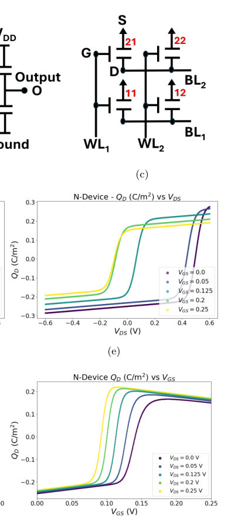
<figcaption class="paper-figure-caption"><b>Fig 1.</b> Fig. 1: (a) Circuit symbols for transcapacitors, (b) An Unloaded inverter with TCAPs, (c) 2x2 memory array circuit with TCAPs, (d-e) QD vs. VDS for P and N devices respectively, (f-g) QD vs VGS transfer plots for P and N devices respectively.</figcaption>
</figure>
<figure class="paper-figure-card">
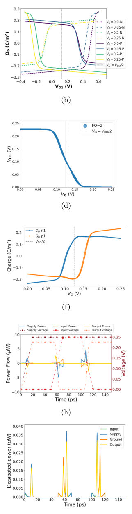
<figcaption class="paper-figure-caption"><b>Fig 2.</b> Fig. 2: Comparison of the operation characteristics of a transistor-based (left column) and transcapacitor-based (right column) inverters. a, b, Load line analysis of the current and charge, respectively, in the pull-up and pull-down devices. c, d, Transfer characteristic, i.e., output vs. input voltage. e, f, Resulting currents or charges/ vs. input voltage. g, h, Power flows vs. time as well as voltages vs. time. i, j, Dissipated power via Joule heating in wires vs. time.</figcaption>
</figure>
<figure class="paper-figure-card">
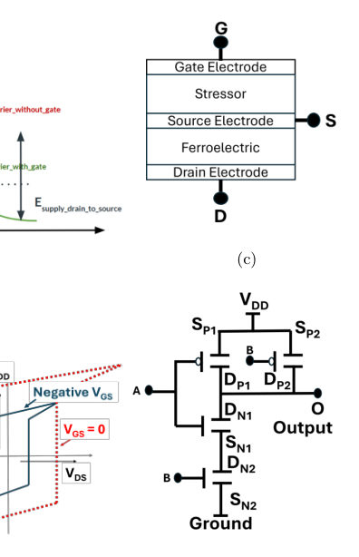
<figcaption class="paper-figure-caption"><b>Fig 3.</b> Fig. 3: Transcapacitor basics. a) symbolic TCAP device with FE material, b) Concept of lowering the energy barrier of an FE with the gate, c) piezo-transcapacitor concept. d-e) hysteresis shrink model as an effect of the gate for N and P device respectively, f) NAND2 gate circuit with TCAP.</figcaption>
</figure>
<figure class="paper-figure-card">
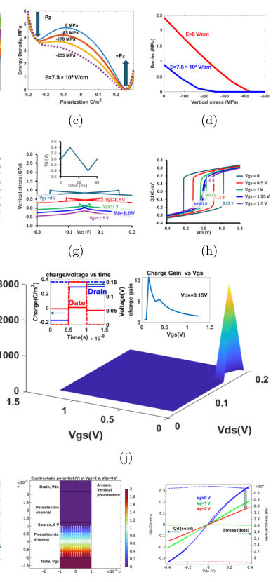
<figcaption class="paper-figure-caption"><b>Fig 4.</b> Fig. 4: Switching mechanism and device operation. a - d: lowering of energy barrier for polarization switching due to electric field and stress two-assist mechanism in ferroelectric channel. a, energy landscapes in unstressed BTO and under compres- sive vertical (along z-direction) elastic stress of -425 MPa. b – c, Energy profiles vs stress under 0 and 7.5×104 V/cm field along z-direction. d, Corresponding energy barrier lowering for switching. e - j: device operation in ferroelectric channel. e – f, Polarization and electrostatic potential vs VGS. g – i, Channel vertical stress, drain charge hysteresis, coercive voltage are modulated by VGS (VDS signal is plotted in inset in g). Charge...</figcaption>
</figure>
<figure class="paper-figure-card">
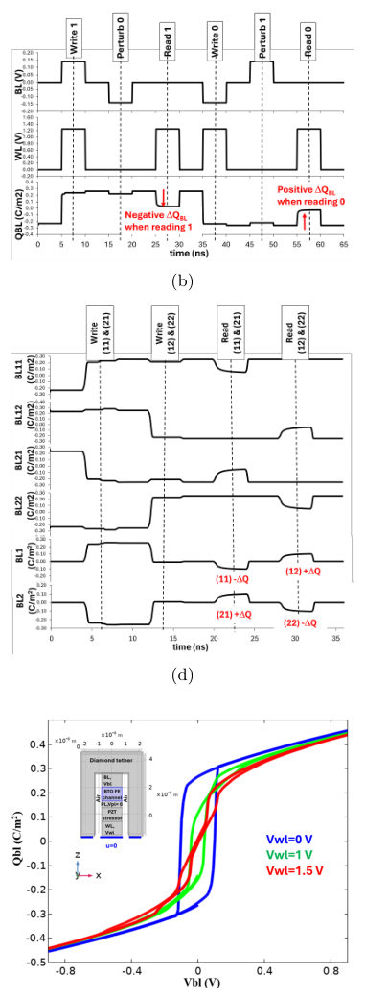
<figcaption class="paper-figure-caption"><b>Fig 5.</b> Fig. 5: Circuit operations results for memory. a-b Read destructive and non- read destructive memory operations for a single bit. c Voltage signals applied to the 2x2 array. d Charge response of the 2x2 array. e Vertical stress distribution at WL = 1.5V and f) a hysteresis vs voltage at BL (Vbl) at various WL voltages (Vwl), for a memory bit 15x15 nm2 area nanopillar design with a tether and side airgaps.</figcaption>
</figure>

**Summary.** This paper proposes using a solid-state transcapacitor (TCAP) as a next-generation logic element to overcome the energy limits of CMOS transistors. By exploiting electro-mechanical coupling in ferroelectric materials, TCAPs can achieve significant reductions in switching energy and delay through capacitive power recycling. The work provides extensive theoretical and simulation evidence supporting this pathway for ultra-low-power computing.

**Why it may be interesting.** While focused on classical electronics, the underlying physics—coupling between polarization switching, mechanical stress, and charge modulation—touches upon complex many-body interactions in condensed matter systems that are relevant to understanding emergent quantum phenomena or highly non-linear material responses.

Detailed structure

**Main problem.** The primary challenge is overcoming the energy scaling limitations of conventional CMOS transistors for advanced logic, memory, and interconnects in AI systems.

**Main result.** A novel solid-state transcapacitor (TCAP) utilizing ferroelectric or piezoelectric materials can achieve significantly lower energy consumption (potentially 100x reduction) by enabling capacitive power recovery rather than relying on dissipative transport current.

**Method.** The authors employ a combination of analytical modeling, multi-physics simulations (COMSOL), and circuit simulation (SPICE) to characterize TCAP operation across various coupling mechanisms.

**Model / system.** The core system is the TCAP, realized by modulating polarization/capacitance in ferroelectric or piezoelectric channels using an external gate stressor. The physics involves coupling between electric fields, mechanical strain, and polarization dynamics, governed by Landau-Khalatnikov type equations.

**Key observables.** Energy consumption ($E_{tr}/E_{tc}$), delay ($	au_{tr}/	au_{tc}$), Charge Gain (CG), Voltage Margin Gain (VMG), and the ON/OFF Ratio for memory applications.

**Important parameters / regimes.** Operating voltage scales, polarization density ($P_s$), coercive voltage ($V_c$), and coupling coefficients (e.g., electrostrictive tensors).

**Assumptions / limitations.** The models often rely on simplifying assumptions, such as approximating the charge-voltage dependence with a $	anh$ function for simulation convergence.

**Figures summary.** Figures compare CMOS vs. TCAP inverter characteristics, show hysteresis shrinkage due to gate voltage, and illustrate multi-physics simulations of stress/polarization evolution in ferroelectric materials.

**Paper structure.** The paper systematically introduces the energy crisis in computing, proposes the TCAP concept based on solid-state physics (ferroelectrics/piezoelectrics), derives key performance metrics like Charge Gain and Transcapacitance, and validates these concepts through detailed simulation comparisons against CMOS.

Abstract

Today's transistors dictate the voltage and charge scales for both logic and memory. While AI systems are recognized to be limited by memory energy, the dominant share of the energy is expended in the intrachip interconnects whose voltage and charge scales are set by transistors. The energy scaling challenges of transistors can be attributed to simultaneously meeting high current density, high current/impedance modulation, and the inability to lower voltages. Hence, a new logic element that lowers the voltage and charge needs is a priority, not only for lowering logic power but also memory access power. Here, we propose a novel 3-terminal logic element for low energy computing, a solid-state transcapacitor (TCAP). A TCAP is a solid state displacement current modulator realized by a gate which controls the charge-voltage relationship of the channel. Unlike transistors, TCAPs eliminate the dissipative transport current, are not bound by the Boltzmann current modulation limit, and operate with displacement currents limited only by the polarization response and contact resistance. Hence, TCAP circuits may simultaneously overcome the voltage, current density, and current modulation limits of CMOS. We describe a solid state TCAP using a piezoelectric transcapacitor in which a gate-controlled stressor modulates the capacitance of a polar channel via electromechanical coupling. This device achieves inversion and gain, essential for logic, and is functionally equivalent to a 1T-1C memory cell, enabling dense memory. Using voltage scaling, capacitive energy recovery, and high polarization densities of polar materials, the logic based on TCAP offers a pathway to 100 fold lower energy consumption with a delay comparable to ultimately scaled CMOS devices. This approach provides a new potential pathway for low-energy computing beyond the limits of transistors using electro-mechanics and multiferroics.

[↑ back to top](#top)

### [Financial Frequency Combs](http://arxiv.org/abs/2606.23142v1)

**Authors:** Madhurendra Mishra, Armaan Aryan, Arsh Gogia, Adarsh Ganesan  
**Type:** theory · **Category:** other · **PDF:** <https://arxiv.org/pdf/2606.23142v1>  
**Analysis basis:** full PDF text, analyzed in chunks
**Topic relevance:** `driven-dissipative phase transition` **2/5** · `non-equilibrium dynamics` **2/5** · `Frenkel-Kontorova` **1/5** · `Keldysh / 2PI / non-Gaussian methods` **1/5** · `analog quantum simulation` **1/5** · `correlated / nonlocal dissipation` **1/5** · `methods for driven-dissipative` **1/5** · `non-equilibrium universality` **1/5**

↔ Scroll figures horizontally

<figure class="paper-figure-card">
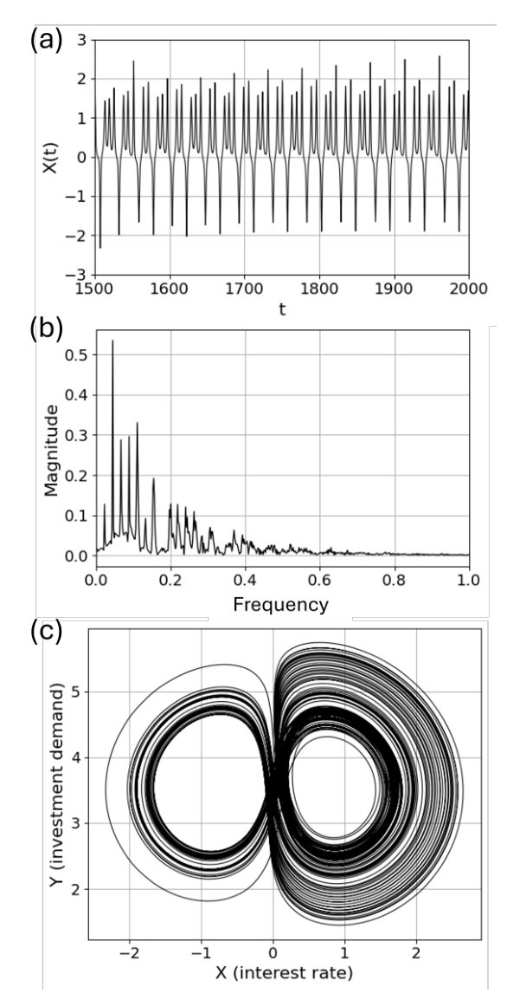
<figcaption class="paper-figure-caption"><b>Fig 1.</b> Figure 1: Baseline dynamics at (q1, q2, q3) = (1.0, 1.0, 0.35), (a, b, c) = (3.0, 0.1, 1.0), (x0, y0, z0) = (2.0, 3.0, 2.0). (a) Steady-state time series of X(t). (b) Normalised FFT magnitude spectrum of X(t). (c) X-Y phase portrait.</figcaption>
</figure>
<figure class="paper-figure-card">
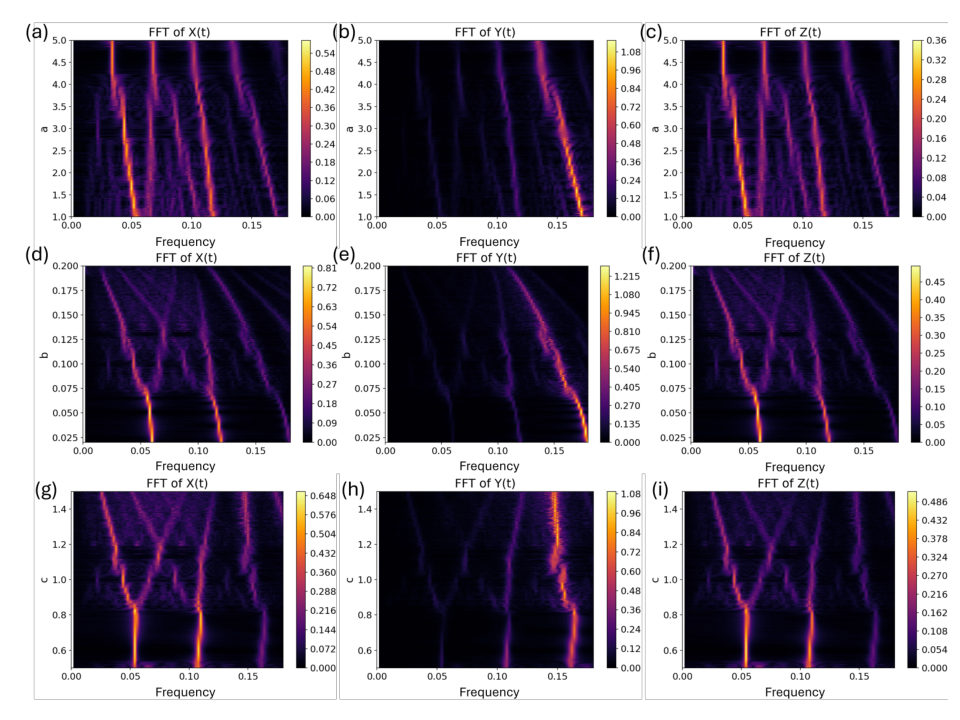
<figcaption class="paper-figure-caption"><b>Fig 2.</b> Figure 2: FFT-magnitude spectrograms of X(t) (left column), Y (t) (centre column), and Z(t) (right column), with (q1, q2, q3) = (1.0, 1.0, 0.35) held fixed. Top row (a)-(c): saving amount a ∈[1.0, 5.0]. Middle row (d)-(f): investment cost b ∈[0.02, 0.20]. Bottom row (g)-(i): demand elasticity c ∈[0.5, 1.5].</figcaption>
</figure>
<figure class="paper-figure-card">
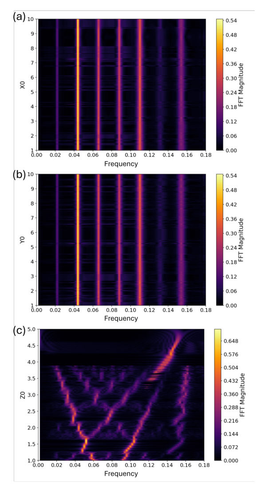
<figcaption class="paper-figure-caption"><b>Fig 3.</b> Figure 3: FFT-magnitude spectrograms of X(t) across initial conditions, with a = 3.0, b = 0.1, c = 1.0, and q1 = q2 = 1.0, q3 = 0.35 held fixed. Panel (a): x0 ∈[1, 10], with y0 = 3.0 and z0 = 2.0 fixed. Panel (b): y0 ∈[1, 10], with x0 = 2.0 and z0 = 2.0 fixed. Panel (c): z0 ∈[1, 5], with x0 = 2.0 and y0 = 3.0 fixed.</figcaption>
</figure>
<figure class="paper-figure-card">
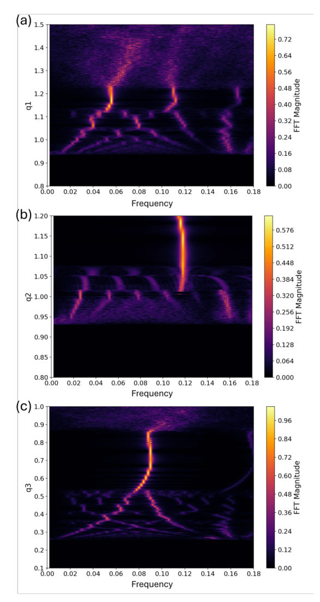
<figcaption class="paper-figure-caption"><b>Fig 4.</b> Figure 4: FFT-magnitude spectrograms of X(t) across fractional orders, with a = 3.0, b = 0.1, and c = 1.0 held fixed throughout. Panel (a): q1 ∈[0.5, 1.5] (displayed from 0.8 to 1.5), with q2 = 1.0 and q3 = 0.3 fixed. Panel (b): q2 ∈[0.5, 1.5] (displayed from 0.80 to 1.20), with q1 = 1.0 and q3 = 0.3 fixed. Panel (c): q3 ∈[0.1, 1.0], with q1 = q2 = 1.0 fixed.</figcaption>
</figure>

**Summary.** This work applies nonlinear dynamics and fractional calculus to a financial model to test if long-memory economic fluctuations exhibit a predictable, discrete spectral fingerprint called a frequency comb. The results show that such a deterministic structure emerges only when specific parameters and fractional exponents fall within narrow, stable regimes. This suggests a profound link between memory effects in finance and underlying harmonic organization.

**Why it may be interesting.** While not directly quantum, the mathematical framework of using fractional calculus and spectral analysis to characterize deterministic structure in complex systems mirrors techniques used in open quantum systems modeling or characterizing non-Markovian dynamics where long-term memory effects are crucial.

Detailed structure

**Main problem.** The study investigates whether long-range memory financial systems can exhibit a deterministic, discrete spectral fingerprint analogous to a frequency comb.

**Main result.** Under specific parameter and fractional-order conditions, the system's steady-state power spectrum organizes into a clear, equidistant frequency comb structure. This suggests that complex economic cycles might possess an underlying deterministic periodicity rather than being purely stochastic.

**Method.** The authors employed numerical integration of a nonlinear, fractional-order financial model followed by Fast Fourier Transform (FFT) spectral analysis to diagnose the presence and stability of the comb.

**Model / system.** The system is based on a three-dimensional nonlinear financial model involving interest rate ($x$), investment demand ($y$), and price index ($z$). This model is generalized using Caputo fractional derivatives ($	ext{D}^{q_i}$) to incorporate long-range memory effects into the dynamics.

**Key observables.** The primary observable is the power spectrum, specifically looking for discrete, equally spaced spectral lines (the frequency comb). Other observables include Lyapunov exponents and phase portrait geometry.

**Important parameters / regimes.** Structural parameters include saving amount ($a$), investment cost ($b$), and demand elasticity ($c$). Crucially, the fractional orders ($q_1, q_2, q_3$) dictate whether the comb appears or if the system transitions to chaos.

**Assumptions / limitations.** The analysis assumes that the observed spectral structure is governed by a single bounded, two-lobed motion in the phase space. The use of the Caputo fractional derivative formulation is central to the model.

**Figures summary.** Figures illustrate time series, FFT spectra showing the comb under varying parameters ($a, b, c$), and how the comb's existence depends on the specific ranges of the fractional orders ($q_1, q_2, q_3$).

**Paper structure.** The paper proceeds by defining the nonlinear financial model, generalizing it to fractional order dynamics, performing extensive parameter sweeps across structural constants ($a, b, c$) and memory exponents ($q_i$), and analyzing the resulting spectral signatures.

Abstract

Frequency combs are discrete, equally spaced, phase-coherent spectral lines that emerge from nonlinear mode coupling in physical systems. We show that the incommensurate fractional-order financial model of Huang, Li, Ma, and Chen, whose Caputo derivatives encode macroeconomic long-range memory, generates an analogous structure in its steady-state spectrum. The comb appears only over specific values and ranges of the saving amount $a$, the investment cost $b$, and the demand elasticity $c$, outside which the spectral lines lose their equal spacing. It persists across extended parameter regimes and stays invariant to perturbations in the initial interest rate $x_0$ and investment demand $y_0$, while distinct spectral regimes appear at different initial price levels $z_0$. The comb is generated only when the fractional-order exponents $q_1$, $q_2$, and $q_3$ associated with interest rate, investment demand, and price index are above the critical threshold values. At even higher values of these exponents, the frequency comb transitions into chaos. These findings show that the long-run cyclic structure of a memory-bearing financial economy organises into a discrete, deterministic spectral fingerprint rather than a stochastic continuum.

[↑ back to top](#top)

### [Fingerprints of an Imbert-Fedorov-like effect in the tunneling transmission of Rarita-Schwinger semi-metals](http://arxiv.org/abs/2606.23095v1)

**Authors:** Otman Bouladiane, Ahmed Jellal, Hocine Bahlouli, A. Al Luhaibi, Michael Vogl  
**Type:** theory · **Category:** other · **PDF:** <https://arxiv.org/pdf/2606.23095v1>  
**Analysis basis:** full PDF text, analyzed in chunks
**Topic relevance:** `non-equilibrium dynamics` **2/5** · `spintronics-quantum-optics interface` **2/5** · `Keldysh / 2PI / non-Gaussian methods` **1/5** · `Kondo & dissipative impurity` **1/5** · `correlated / nonlocal dissipation` **1/5** · `driven-dissipative phase transition` **1/5** · `methods for driven-dissipative` **1/5** · `non-equilibrium universality` **1/5**

↔ Scroll figures horizontally

<figure class="paper-figure-card">
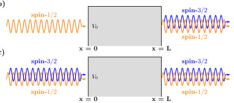
<figcaption class="paper-figure-caption"><b>Fig 1.</b> FIG. 2. Tunneling setup for three choices of incoming states: (a) a single incoming channel with spin projection 3 2, (b) a single incoming channel with spin projection 1 2, and (c) a coherent mixture of both channels. The Rarita-Schwinger fermion is incident on a square barrier of height V0 and width L.</figcaption>
</figure>
<figure class="paper-figure-card">
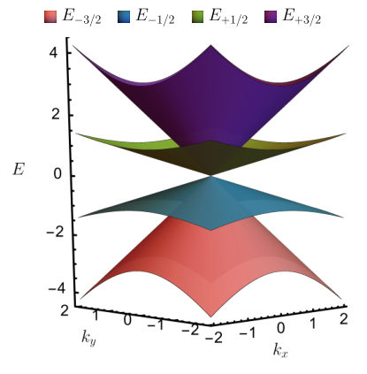
<figcaption class="paper-figure-caption"><b>Fig 2.</b> FIG. 1. Energy dispersion of the spin-3/2 Rarita–Schwinger semi-metals as a function of momentum (kx, ky). The four bands E±3/2 and E±1/2 form Dirac-like cones centered at k = 0, with distinct slopes reflecting their different group velocities.</figcaption>
</figure>
<figure class="paper-figure-card">
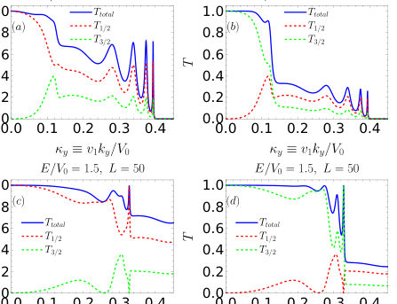
<figcaption class="paper-figure-caption"><b>Fig 3.</b> FIG. 3. Transmission probabilities of spin 1/2, 3/2 and the to- tal for independent incoming channels. The upper (a,b) pan- els show the tunneling regime E/V0 = 0.8, while the lower (c,d) panels show the over-the-barrier regime E/V0 = 1.5. The left panels (a,c) correspond to incoming spin projection m = 1/2 with δ1/2 = 1 and δ3/2 = 0, while the right (b,d) panels correspond to incoming spin projection m = 3/2 with δ3/2 = 1 and δ1/2 = 0. The horizontal axis is the dimen- sionless conserved transverse momentum κy = v1ky/V0. We included only positive κy because negative κy corresponds to a mirror image.</figcaption>
</figure>
<figure class="paper-figure-card">
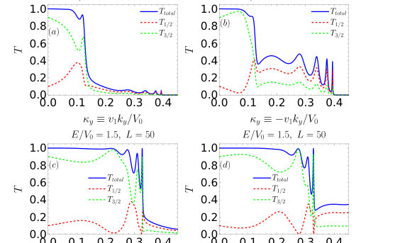
<figcaption class="paper-figure-caption"><b>Fig 4.</b> FIG. 4. Transmission for a coherent equal-amplitude super- position with δ1/2 = δ3/2 = 1. The top row corresponds to the tunneling regime E/V0 = 0.8, and the bottom row corre- sponds to the over-barrier regime E/V0 = 1.5. The left and right columns in the figure correspond to T(κy) and T(−κy), respectively.</figcaption>
</figure>
<figure class="paper-figure-card">
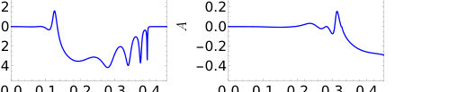
<figcaption class="paper-figure-caption"><b>Fig 5.</b> FIG. 5. The asymmetry function as represented in Eq. (27) for a coherent equal-amplitude superposition with δ1/2 = δ3/2 = 1. The left column corresponds to the tunneling regime E/V0 = 0.8, and the right column to the over-barrier regime E/V0 = 1.5</figcaption>
</figure>

**Summary.** The paper investigates tunneling through a barrier in a Rarita-Schwinger semi-metal, which possesses multiple spin sectors. By comparing single-sector transmission to coherent mixtures, the authors demonstrate that directional asymmetry can emerge even if the underlying band structure is isotropic. This effect is attributed entirely to phase differences between internal wave components, establishing an analogy to the Imbert-Fedorov effect in quantum transport.

**Why it may be interesting.** This work provides a concrete theoretical mechanism showing how phase accumulation in internal degrees of freedom (spin components) can induce measurable transport asymmetries, which is relevant for understanding quantum interfaces and non-Hermitian effects in condensed matter systems.

Detailed structure

**Main problem.** The study aims to identify fingerprints of an Imbert-Fedorov-like effect in the quantum tunneling transmission through a barrier within a Rarita-Schwinger semi-metal.

**Main result.** Directional asymmetry in tunneling ($T(k_y) 
eq T(-k_y)$) can occur even in idealized, isotropic multiband systems, arising purely from phase differences between internal wave components rather than explicit band anisotropy.

**Method.** The authors analytically derived transmission amplitudes by solving the scattering problem for a multi-component spinor wavefunction across a square barrier using mode-matching techniques.

**Model / system.** The system is a Rarita-Schwinger semi-metal, which supports two distinct propagating spin sectors ($m=1/2$ and $m=3/2$) forming Dirac-like cones. Tunneling occurs through an idealized square potential barrier.

**Key observables.** Tunneling transmission probability $T(k_y)$ and the asymmetry function $A(k_y) = T(k_y) - T(-k_y)$.

**Important parameters / regimes.** The spin projections ($m=1/2, m=3/2$), the barrier height ($V_0$), and the incident transverse momentum ($\kappa_y$).

**Assumptions / limitations.** The analysis is restricted to a rotationally symmetric case for analytical tractability; the effect is shown to persist even when the underlying Hamiltonian is mirror symmetric.

**Figures summary.** Figures illustrate energy dispersion cones, compare transmission for single-sector vs. coherent mixtures, and plot the asymmetry function $A(\kappa_y)$ showing non-zero values away from normal incidence.

**Paper structure.** The paper establishes the multichannel nature of the system, calculates transmission amplitudes for both single-channel and coherent mixed-incidence cases, and then rigorously demonstrates that the directional asymmetry arises solely from interference terms involving different scattering/propagation phases between the spin sectors.

Abstract

We study tunneling through a square barrier in a rotationally symmetric Rarita-Schwinger semi-metal and identify fingerprints of an Imbert-Fedorov-like effect in the tunneling transmission. The problem is intrinsically multichannel at all energies because there exist two propagating sectors with spin projections $m=1/2$ and $m=3/2$. We derive the transmission amplitudes analytically and compare the single-channel and coherent mixed-incidence cases in the two channels. Interestingly, we observe that tunneling at high energy shows a bias towards scattering into spin projection $3/2$ contributions. For single-channel injection, we find that the transmission remains symmetric under a mirror transformation of the incident angle. In contrast, for the coherent superposition, we find a directional asymmetry in the transmission probability $T(k_y)\neq T(-k_y)$. Importantly, this effect does not originate from an anisotropy of the dispersion. Instead, it arises from the phase structure of the multicomponent scattering states. The two spin projection sectors exhibit different scattering and barrier-propagation phases, which enter as interference terms when both channels appear as a coherent superposition. This interference term is identified as the cause of the broken mirror symmetry. We therefore discover an analog of the Imbert-Fedorov effect, at the level of interface-induced phase differences between internal wave components. Our result demonstrates that asymmetric tunneling can already occur in transport experiments, even in an idealized, isotropic multiband system, and should therefore not be automatically attributed solely to explicit band anisotropy.

[↑ back to top](#top)

### [Selectivity in tip-induced skeletal editing via heteroatom substitution](http://arxiv.org/abs/2606.22677v1)

**Authors:** Shantanu Mishra, Rasmus Svensson, Valentina Malave, Florian Albrecht, Manuel Vilas-Varela, Henrik Grönbeck, Leo Gross, Diego Peña  
**Type:** both · **Category:** other · **PDF:** <https://arxiv.org/pdf/2606.22677v1>  
**Analysis basis:** full PDF text, analyzed in chunks
**Topic relevance:** `measurement-induced transitions` **2/5** · `non-equilibrium dynamics` **2/5** · `quantum measurements` **2/5** · `driven-dissipative phase transition` **1/5** · `methods for driven-dissipative` **1/5** · `non-equilibrium universality` **1/5**

↔ Scroll figures horizontally

<figure class="paper-figure-card">
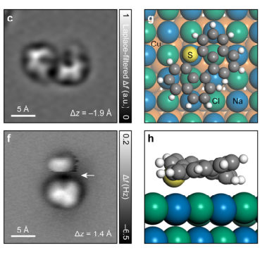
<figcaption class="paper-figure-caption"><b>Fig 1.</b> Figure 1. STM and AFM imaging of DNT. (a) STM image of a DNT molecule adsorbed on Cu(111). (b, c) AFM image (b) and the corresponding Laplace-filtered image (c) of the DNT molecule in (a). Δz denotes the tip-height offset, with positive (negative) values indicating tip retraction (approach) from the set-point, Δf denotes frequency shift, and a.u. denotes arbitrary units. (d) STM image of a DNT molecule adsorbed on bilayer NaCl. (e, f) AFM images of the DNT molecule in (d) taken at two different tip heights. The circle in (e) highlights streaks likely resulting from conformational switching of the molecule. The arrows in (b, f) indicate the locations of the sulfur atom. (g, h) Top and side...</figcaption>
</figure>
<figure class="paper-figure-card">
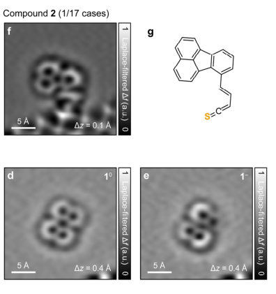
<figcaption class="paper-figure-caption"><b>Fig 2.</b> Figure 2. Structural and electronic characterization of reaction products on NaCl. (a) Laplace-filtered AFM image of a perylene molecule adsorbed at the step edge of a third-layer NaCl island. The bright and dark features in the third-layer NaCl island correspond to Cl− and Na+ ions, respectively. (b) STM image of the perylene molecule in (a) showing its LUMO density (V = 2.0 V, I = 0.3 pA). (c) Constant-height I(V) spectra acquired on 1 (right), revealing charge-state bistability. Open feedback parameters: V = –1.2 V, I = 0.3 pA; forward (backward) sweeps: –1.2 V to 1.2 V (1.2 V to –1.2 V). The molecule is in the neutral (anionic) state for V &lt; –0.65 V (V &gt; 0.68 V). The hysteretic behavior...</figcaption>
</figure>
<figure class="paper-figure-card">
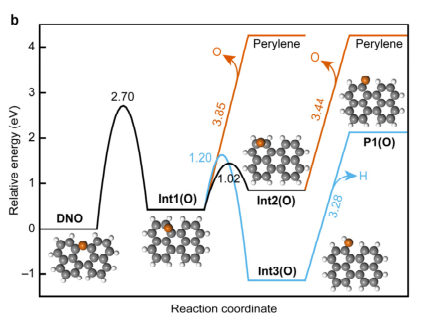
<figcaption class="paper-figure-caption"><b>Fig 3.</b> Figure 3. Gas-phase potential energy landscapes of skeletal editing of DNT (a) and DNO (b) obtained by DFT calculations. The numbers denote absolute gas-phase activation energies (in eV) of each reaction. For Int1 and Int2 → perylene and Int3 → P1, energy differences coincide with activation energies. Also shown are the optimized gas-phase molecular geometries of precursors, intermediates, and products. Sulfur and oxygen atoms are colored yellow and orange, respectively. The calculations were performed assuming a neutral charge state of the reactant, intermediates, and products.</figcaption>
</figure>

**Summary.** This work demonstrates that by replacing an oxygen heteroatom with sulfur in a heterocyclic molecule, the type of skeletal editing induced by tip-voltage pulses can be selectively controlled. Using STM/AFM and DFT, the authors show that sulfur promotes clean sulfur deletion to form perylene, offering a powerful design principle for molecular synthesis.

**Why it may be interesting.** While focused on molecular materials science, the use of controlled voltage pulses to induce specific bond cleavages and structural transformations at the single-molecule level mirrors concepts in controlling quantum states or chemical reactions using external fields.

Detailed structure

**Main problem.** The study investigates whether selective skeletal editing of heterocyclic cores can be achieved by judiciously choosing the heteroatom, comparing oxygen-containing versus sulfur-containing rings.

**Main result.** Tip-induced reactions on sulfur-containing analogues ($	ext{DNT}$) predominantly result in facile sulfur deletion to form perylene, contrasting with oxygen analogues ($	ext{DNO}$), which show mixed rearrangement and deletion products.

**Method.** The research combines single-molecule scanning probe microscopy (STM/AFM) experiments with detailed Density Functional Theory (DFT) calculations of potential energy landscapes.

**Model / system.** The system involves dinaphtho[1,8-bc:1',8'-ef]oxepine ($	ext{DNO}$) and its sulfur analogue ($	ext{DNT}$), adsorbed on surfaces like $	ext{Cu}(111)$ or $	ext{NaCl}$. The process is driven by applying voltage pulses from the microscope tip.

**Key observables.** Reaction products (e.g., perylene), reaction selectivity (heteroatom deletion vs. ring-contraction rearrangement), and calculated activation energies ($\Delta E^\ddagger$).

**Important parameters / regimes.** Applied voltages ($4.7–5.0 	ext{ V}$), substrate types ($	ext{Cu}(111)$, $	ext{NaCl}$), and the heteroatom identity (O vs. S).

**Assumptions / limitations.** DFT calculations often assume specific charge states for reactants, intermediates, and products; experimental observations are limited by tip-induced conditions.

**Figures summary.** Figures show STM/AFM images of adsorbed molecules ($	ext{DNT}$), evidence of product formation (perylene), and DFT potential energy diagrams comparing reaction barriers for $	ext{O}$ vs. $	ext{S}$ elimination.

**Paper structure.** The paper progresses from demonstrating initial tip-induced chemistry on oxygen analogues to systematically testing the role of heteroatom substitution by analyzing sulfur analogues, supported by comparative computational modeling.

Abstract

Skeletal editing enables precise structural modifications of molecules at late stages of a synthetic sequence, with applications in drug discovery and materials science. We recently demonstrated skeletal editing on the single-molecule scale. Voltage pulses applied by the tip of a scanning probe microscope to an oxygen-containing seven-membered heterocycle led to both oxygen deletion and ring-contraction rearrangement reactions. An open question is whether selective skeletal editing of a heterocyclic core can be achieved by an appropriate choice of the heteroatom. Here, we show that tip-induced reactions of an analogous sulfur-containing seven-membered ring results in sulfur deletion in virtually all cases. Our results demonstrate that the combination of tip-induced chemistry and heteroatom selection in the molecular design is a powerful strategy for single-molecule skeletal editing, with the potential to enable diverse structural transformations of heterocyclic frameworks.

[↑ back to top](#top)

### [Thermodynamic stability and structural transitions in virus-host networks](http://arxiv.org/abs/2606.22132v1)

**Authors:** A. Rovenchak, M. Husiev  
**Type:** theory · **Category:** statistical mechanics · **PDF:** <https://arxiv.org/pdf/2606.22132v1>  
**Analysis basis:** full PDF text, analyzed in chunks
**Topic relevance:** `driven-dissipative phase transition` **2/5** · `Keldysh / 2PI / non-Gaussian methods` **1/5** · `analog quantum simulation` **1/5** · `correlated / nonlocal dissipation` **1/5** · `entanglement & information structure` **1/5** · `methods for driven-dissipative` **1/5** · `non-equilibrium dynamics` **1/5** · `non-equilibrium universality` **1/5**

↔ Scroll figures horizontally

<figure class="paper-figure-card">
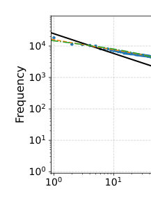
<figcaption class="paper-figure-caption"><b>Fig 1.</b> Figure 1. (Colour online) Rank–frequency distribution for all interactions (all scores).</figcaption>
</figure>
<figure class="paper-figure-card">
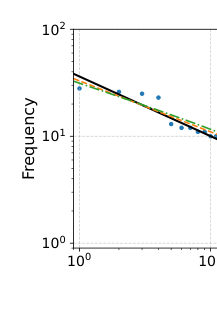
<figcaption class="paper-figure-caption"><b>Fig 2.</b> Figure 2. (Colour online) Rank–frequency distribution for high-confidence human biomolecule interac- tions (Score ⩾0.95).</figcaption>
</figure>
<figure class="paper-figure-card">
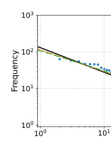
<figcaption class="paper-figure-caption"><b>Fig 3.</b> Figure 3. (Colour online) Rank–frequency distribution for high-confidence human biomolecule interac- tions (Score ⩾0.70).</figcaption>
</figure>
<figure class="paper-figure-card">
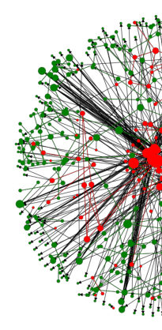
<figcaption class="paper-figure-caption"><b>Fig 4.</b> Figure 4. (Colour online) Virus–host network for Homo sapiens.</figcaption>
</figure>
<figure class="paper-figure-card">
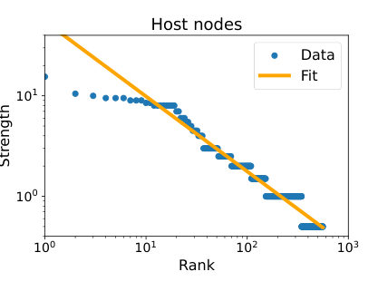
<figcaption class="paper-figure-caption"><b>Fig 5.</b> Figure 5. (Colour online) Node strength distribution for the virus–host network of Homo sapiens. The plot demonstrates a power-law behavior (2.5). The distribution is shown separately for virus-associated nodes and host-associated nodes. The power-law exponent 𝛾is estimated after discarding the lowest 20% of values.</figcaption>
</figure>

**Summary.** This paper applies advanced statistical mechanics tools to model virus-host interaction networks. By analyzing how network properties change upon node removal, the authors identify 'transition-like' behavior using thermodynamic quantities like heat capacity. This demonstrates that a rigorous thermodynamic framework can be successfully applied to predict structural stability and dynamic changes in complex biological systems.

**Why it may be interesting.** While applied to biology, the methodology—using concepts like heat capacity and susceptibility derived from graph spectra to locate phase transitions or structural reorganization points—is directly analogous to techniques used in studying quantum many-body systems and complex energy landscapes.

Detailed structure

**Main problem.** The study aims to understand how virus-host interactions affect network stability by analyzing structural transitions using thermodynamic concepts.

**Main result.** The analysis reveals transition-like behavior in spectral thermodynamic functions (like heat capacity and susceptibility) when nodes are removed, suggesting a thermodynamic framework is useful for studying these complex biological networks.

**Method.** The authors employ statistical physics tools, calculating network parameters like Graph Temperature, Magnetization, Susceptibility, and Heat Capacity derived from the adjacency spectrum.

**Model / system.** The system modeled is a virus-host interaction network (for species like *H. sapiens*), represented as a weighted, directed graph with connections between host biomolecules and viruses.

**Key observables.** Network Density (D), Assortativity Coefficient, Graph Temperature (T), Magnetization (M), Susceptibility ($\chi$), and Heat Capacity ($C$).

**Important parameters / regimes.** Node removal strategy (targeted vs. random); confidence scores for interactions; spectral eigenvalues ($\lambda_i$).

**Assumptions / limitations.** The analysis assumes that structural changes in the network can be mapped onto thermodynamic concepts, such as using fixed spin assignments ($s_j$) for magnetization calculations.

**Figures summary.** Figures illustrate the evolution of metrics like density and susceptibility under targeted vs. random node removal; heat capacity curves show multiple peaks indicating different spectral scales within the network structure.

**Paper structure.** The paper progresses from characterizing rank-frequency distributions (Zipf's law fitting) to analyzing structural robustness via node removal, culminating in a full thermodynamic analysis using spectral properties to pinpoint critical transition points.

Abstract

Understanding virus-host interactions is crucial for predicting the stability of networks under various perturbations. In this study, we present an analysis of virus-related networks for several organisms (Homo sapiens, Mus musculus, Gallus gallus), encompassing directed and weighted connections. We compute a range of network parameters, including topological characteristics and thermodynamic quantities derived from adjacency spectra, to gain insights into the structural robustness and dynamic behavior of the networks. To assess stability, we model two distinct node removal scenarios: targeted elimination of the most influential nodes and random removal. Our findings reveal transition-like behavior in spectral thermodynamic functions and characteristic changes in structural measures, contributing to evaluating the potential of a thermodynamic framework for studying virus-host networks and advancing a deeper understanding of their dynamics.

[↑ back to top](#top)

### [Antiferromagnetic pseudospintronics without spin splitting](http://arxiv.org/abs/2606.21860v1)

**Authors:** Shu-Hui Zhang, Shu-Qi Liu, Dan-Yang Han, Zhan Kong, Ding-Fu Shao, Wen Yang, Kai Chang  
**Type:** theory · **Category:** other · **PDF:** <https://arxiv.org/pdf/2606.21860v1>  
**Analysis basis:** full PDF text, analyzed in chunks
**Topic relevance:** `analog quantum simulation` **2/5** · `driven-dissipative phase transition` **2/5** · `Keldysh / 2PI / non-Gaussian methods` **1/5** · `methods for driven-dissipative` **1/5** · `non-equilibrium dynamics` **1/5** · `spintronics-quantum-optics interface` **1/5**

↔ Scroll figures horizontally

<figure class="paper-figure-card">
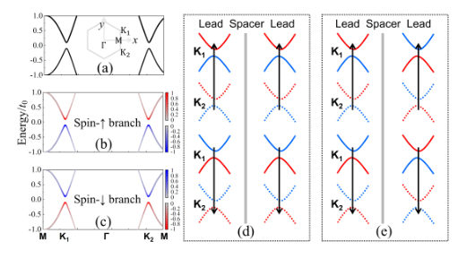
<figcaption class="paper-figure-caption"><b>Fig 1.</b> FIG. 1. (a) The spin-degenerate band structure of electrons in the honeycomb AFM. The inset shows the high-symmetry points in the Brillouin zone. (b, c) Two spin branches are associated with the pseu- dospin polarization ¯σz λs (color scale), which are opposite. (d, e) The band matching of AFM-based tunneling junctions with the junction interfaces along the zigzag directions. The N´eel vectors in the two leads are identical/opposite in (d)/(e).</figcaption>
</figure>
<figure class="paper-figure-card">
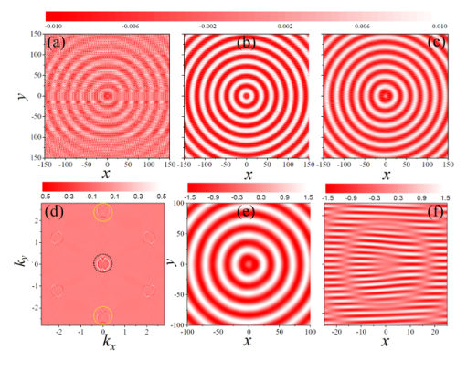
<figcaption class="paper-figure-caption"><b>Fig 2.</b> FIG. 2. (a) FOs induced by the impurity at the sublattice A with r = 0. (b) and (c) for the sublattice-resolved FOs at A and B, respec- tively. (d) Fourier transform of the sublattice-resolved FOs at B. (e) FOs contributed by the intravalley scattering rδρintra B ×102 through the inverse Fourier transform by considering the momentum region lim- ited by the black circle in (d). (f) FOs contributed by the intervalley scattering rδρinter B ×103 through the inverse Fourier transform by con- sidering the momentum region limited by yellow circles in (d). Here, ε = 0.2t0, ∆0 = 0.03t0, and the impurity strength Vimp = t0.</figcaption>
</figure>
<figure class="paper-figure-card">
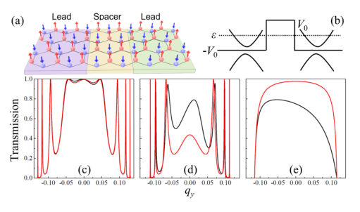
<figcaption class="paper-figure-caption"><b>Fig 3.</b> FIG. 4. An all-in-one junction based on the honeycomb AFM (a) and the corresponding potential distribution (b). (c, d, e) The change of transmission induced by the inversion of the Neel vector. (c) Λ3 = ±0.05V0 for the red solid line and the black dotted line, respectively, and w = 100a0. (d) Λ3 = ±0.5V0 for the red solid line and the black dotted line, respectively, and w = 100a0. (e) Λ3 = ±0.5V0 for the red solid line and the black dotted line, respectively, and w = a0. Here, the spin-up branch of K1 valley is considered, ε = 0, V0 = 0.2t0, and Λ1 = Λ2 = 0.5V0.</figcaption>
</figure>
<figure class="paper-figure-card">
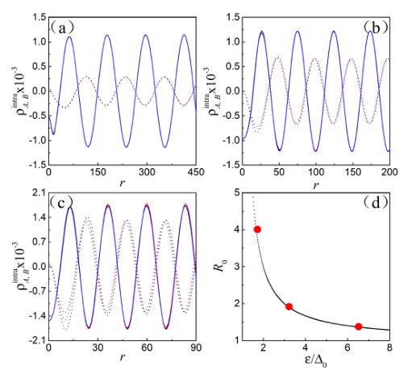
<figcaption class="paper-figure-caption"><b>Fig 4.</b> FIG. 3. δρintra A,B and the amplitude ratio R = δρintra A /δρintra B from the inverse Fourier transform. (a) ε = 0.05t0. (b) ε = 0.1t0. (c) ε = 0.2t0. (d) R as the function of ε/∆0. In (a, b, c), three directions θr = 0 (black), π/6 (red), π/3 (blue) are considered, and the solid (dotted) lines are for δρintra A (δρintra B ). Here, ∆0 = 0.03t0.</figcaption>
</figure>
<figure class="paper-figure-card">
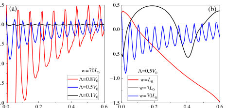
<figcaption class="paper-figure-caption"><b>Fig 5.</b> FIG. 5. The pseudomagnetoresistance ratio as a function of junction potential V0. Different gap values Λ and junction widths w are con- sidered. Here, L0 = 1.5a0.</figcaption>
</figure>

**Summary.** This work pioneers AFM pseudospintronics by utilizing the sublattice degree of freedom in antiferromagnets that lack conventional spin splitting. The key mechanism identified is a partial pseudospin–spin coupling, which allows for switching polarization by reversing the Néel vector. This leads to measurable effects like NV-controlled tunneling and large nonvolatile magnetoresistance.

**Why it may be interesting.** While focused on condensed matter magnetism, the use of symmetry breaking (NV reversal) to control electronic transport properties via internal degrees of freedom (sublattice pseudospin) is relevant to open quantum systems where multiple coupled order parameters govern dynamics.

Detailed structure

**Main problem.** To develop a new paradigm for spintronics, termed AFM pseudospintronics, that operates in antiferromagnets (AFMs) without relying on the conventional requirement of spin splitting.

**Main result.** The study demonstrates that sublattice degrees of freedom can be exploited via partial pseudospin–spin coupling to achieve Néel-vector-controlled transmission and a large nonvolatile pseudomagnetoresistance effect.

**Method.** Theoretical analysis involving tight-binding models, Fourier transforms applied to Friedel oscillations (FOs), and calculation of tunneling magnetoresistance ratios.

**Model / system.** The system is a honeycomb AFM modeled by a tight-binding Hamiltonian incorporating sublattice pseudospin ($\hat{	au}$) and real spin ($\hat{\sigma}$). The physics hinges on the coupling between these degrees of freedom in zero spin-splitting collinear AFMs.

**Key observables.** Sublattice-resolved Friedel oscillation amplitude ratio ($R_s$), Néel vector (NV)-controlled transmission, and nonvolatile pseudomagnetoresistance (PMR).

**Important parameters / regimes.** Pseudospin polarization ($ar{\sigma}_z^s = \Lambda_s/\epsilon$), doping level ($\epsilon$), and junction potential ($V_0$).

**Assumptions / limitations.** The analysis assumes interfaces are along zigzag directions to simplify scattering processes, allowing the conservation of spin and valley in tunneling calculations.

**Figures summary.** Figures illustrate the spin-degenerate band structure and pseudospin polarization; they show sublattice-resolved FOs (intravalley/intervalley) used to extract the ratio $R$; and finally, they depict the NV control over junction transmission and PMR magnitude.

**Paper structure.** The paper establishes the theoretical framework by introducing the Hamiltonian and the concept of partial pseudospin–spin coupling. It then derives measurable quantities like the amplitude ratio from FOs, demonstrating local probing of the NV state. Finally, it applies this understanding to predict large nonvolatile PMR effects in junctions.

Abstract

Antiferromagnets (AFMs) are promising for high-density spintronics due to their zero net magnetization, yet conventional AFM spintronics relies on spin splitting-a requirement that excludes many collinear AFMs with compensated spin sublattices. Here we exploit the sublattice degree of freedom in a honeycomb AFM with zero spin splitting. We uncover a coupling between spin and sublattice: the out-of-plane pseudospin polarization is spin-dependent, a mechanism we term partial pseudospin-spin coupling. This allows switching of the pseudospin polarization by reversing the Néel vector. Introducing an impurity into a specific sublattice induces Friedel oscillations with a sublattice-resolved amplitude ratio dictated solely by the pseudospin polarization, which is directly measurable by spin-polarized scanning tunneling microscopy. Furthermore, we demonstrate Néel-vector-controlled transmission and a large nonvolatile tunneling magnetoresistance in an all-in-one AFM junction, with pronounced resonant enhancement in gate-tunable two-dimensional devices. Our work establishes a new paradigm-AFM pseudospintronics-that utilizes the sublattice pseudospin in zero-spin-splitting AFMs, extending spintronics beyond the conventional spin-splitting paradigm.

[↑ back to top](#top)

### [Multi-Level Resistive Synapses for On-Chip Neural Networks: A Physics-Based Design of a Memristive Crossbar Fabric with Quasi-Continuous Conductance States](http://arxiv.org/abs/2606.22621v1)

**Authors:** David Alejandro Trejo Pizzo  
**Type:** theory · **Category:** disordered systems and neural networks · **PDF:** <https://arxiv.org/pdf/2606.22621v1>  
**Analysis basis:** full PDF text, analyzed in chunks
**Topic relevance:** `non-equilibrium dynamics` **2/5** · `Keldysh / 2PI / non-Gaussian methods` **1/5** · `correlated / nonlocal dissipation` **1/5** · `driven-dissipative phase transition` **1/5** · `methods for driven-dissipative` **1/5** · `non-equilibrium universality` **1/5**

↔ Scroll figures horizontally

<figure class="paper-figure-card">
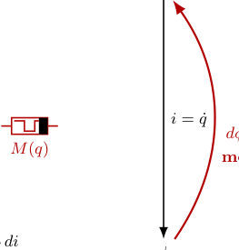
<figcaption class="paper-figure-caption"><b>Fig 1.</b> Figure 1. The four fundamental two-terminal elements as relations among the pairs (v, i, q, ϕ).</figcaption>
</figure>
<figure class="paper-figure-card">
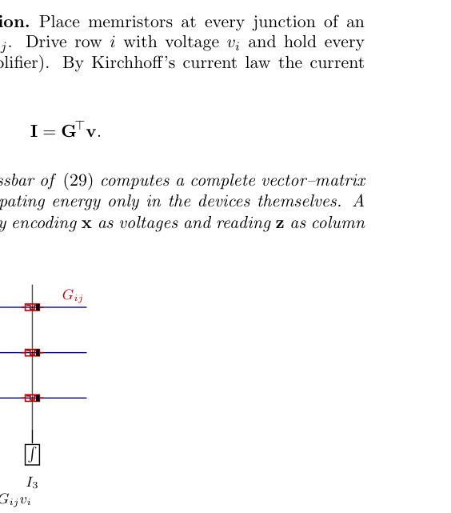
<figcaption class="paper-figure-caption"><b>Fig 2.</b> Figure 5. Analog vector–matrix multiplication in a memristive crossbar. Input voltages vi drive the rows; each junction memristor Gij injects a current Gijvi onto its column; Kirchhoff’s law sums them, and a transimpedance integrator reads Ij = P i Gijvi. The whole product I = G⊤v is computed in one step (Theorem 5.1).</figcaption>
</figure>
<figure class="paper-figure-card">
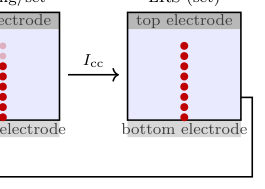
<figcaption class="paper-figure-caption"><b>Fig 3.</b> Figure 7. Microscopic mechanism of bipolar resistive switching. Under +Vset mo- bile species (oxygen vacancies or metal cations, red) drift from the active electrode and nucleate a conductive filament across the oxide; the compliance current Icc caps its cross-section—and hence Gmax (18). A reverse −Vreset ruptures the filament, returning the cell toward the HRS. Partial set/reset stops the front at intermediate heights, realizing the analog sub-levels of Section 3; each such event is an act of resistive communication.</figcaption>
</figure>
<figure class="paper-figure-card">
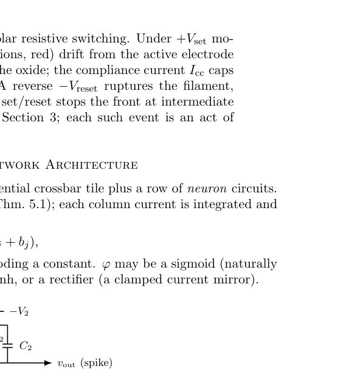
<figcaption class="paper-figure-caption"><b>Fig 4.</b> Figure 8. Neuristor built from two Mott memristors M1, M2, each shunted by a capacitance Ck and biased with opposite polarity. Crossing the insulator–metal transition voltage triggers an all-or-nothing relaxation spike at vout: the electronic action potential used as the spiking neuron at each tile output.</figcaption>
</figure>
<figure class="paper-figure-card">
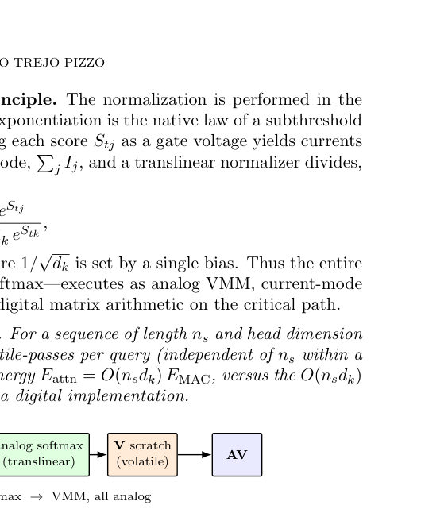
<figcaption class="paper-figure-caption"><b>Fig 5.</b> Figure 10. In-memory self-attention. Queries drive a volatile scratch crossbar holding K⊤to produce scores S (one VMM); a current-mode translinear stage com- putes the softmax; a second VMM against a volatile V crossbar yields the context AV. Diffusive (self-erasing) memristors serve as the KV scratch, avoiding non- volatile rewrite wear.</figcaption>
</figure>

**Summary.** This work presents a comprehensive, physics-based blueprint for an in-memory neuromorphic processor using multi-level memristive synapses. By performing analog matrix multiplication directly where weights are stored, it bypasses the energy limitations of data movement inherent in conventional digital computing architectures. The resulting architecture is highly scalable and extremely energy efficient for modern AI workloads like LLMs.

**Why it may be interesting.** While focused on AI hardware, the underlying physical modeling of state evolution ($\dot{x} = f(x, v)$) derived from charge/ion dynamics shares mathematical parallels with non-equilibrium statistical mechanics used to model complex material states.

Detailed structure

**Main problem.** Overcoming the von Neumann bottleneck in data-intensive AI workloads by integrating memory and computation onto a single chip.

**Main result.** The proposed memristive crossbar fabric achieves energy efficiency orders of magnitude better than digital accelerators for LLM inference by performing MAC operations in the analog domain.

**Method.** Developing physics-based models derived from ionic transport (Nernst–Planck) to characterize multi-level conductance states, and then applying these devices in a full neuromorphic architecture.

**Model / system.** The system is a memristive crossbar fabric built using $	ext{HfO}_2$-based resistive synapses, capable of storing quasi-continuous analog weights. It implements computation via Kirchhoff's laws ($\mathbf{I} = \mathbf{G}^	op\mathbf{v}$) in the physical domain.

**Key observables.** Energy per token ($E_{	ext{tok}}$), Throughput ($	ext{tok}/	ext{s}$), Number of distinguishable conductance levels ($L_{th}$), and Output Current ($\mathbf{I}$).

**Important parameters / regimes.** Device parameters include the dynamic range ($
ho = G_{max}/G_{min}$) and the read-noise floor ($\sigma G_{th}$); architectural scaling involves 3D stacking depth ($T$) and cell area ($a_{	ext{cell}}$).

**Assumptions / limitations.** The model assumes that weight movement energy dominates digital costs, justifying the in-memory approach; performance figures are projections based on ideal device behavior.

**Figures summary.** Figures illustrate the physical cross-section of 3D BEOL integration, the overall memristive-FPGA system architecture, and comparative roofline analyses showing superior scaling over digital methods.

**Paper structure.** The paper progresses from fundamental physics modeling (ionic transport) to device characterization (level count, noise), then details the analog computation primitives (VMM, self-attention), and concludes with architectural blueprints for full LLM inference engines.

Abstract

Building on resistive communication, this paper presents a physics-based design of an on-chip neural network with multi-level memristive synapses supporting a dense spectrum of conductance states. Derived from ionic transport physics, we develop a state-variable model and quantify storable sub-levels under thermal noise, drift, and quantized conductance. We assemble these devices into a 1T1R crossbar fabric, derive the linear algebra of analog vector-matrix multiplication (VMM) under wire resistance, and design a differential synapse for signed weights. A multilayer pipeline executes inference, backpropagation, and weight updates physically in the analog domain. We derive the in-situ outer-product learning rule, its discretization onto the conductance lattice, and the resulting quantization noise. We provide energy, area, capacity, and inter-tile models, showing this substrate is ideally suited for large language models (LLMs). Our design eliminates weight movement, surpassing binary ReRAM and traditional CMOS. We detail the material stack (HfO_2-based), the FEOL/BEOL CMOS foundry-integration flow, a self-contained SPICE model, the complete memristive-FPGA neuromorphic system, and an in-memory self-attention engine with current-mode translinear softmax. Finally, a ternary BitNet datapath shows projected per-token efficiency orders of magnitude better than advanced CPUs or GPUs. The result is a self-contained hardware-native blueprint for a high-density, analog, in-memory neural processor.

[↑ back to top](#top)

### [Anomalous charge density wave in a two-dimensional superatomic superconductor](http://arxiv.org/abs/2606.23490v1)

**Authors:** Boqin Song, Shuaishuai Sun, Zhongxu Wei, Xinbo Wang, Xiaoping Ma, Kaifa Luo, Lei Wang, Jun Deng, Xu Chen, Tian Qian, Shuya Xing, Zhihai Cheng, Jiangang Guo, Tianping Ying, Xiaolong Chen  
**Type:** experiment · **Category:** strongly correlated electrons · **PDF:** <https://arxiv.org/pdf/2606.23490v1>  
**Analysis basis:** full PDF text, analyzed in chunks
**Topic relevance:** `Frenkel-Kontorova` **2/5** · `Kondo & dissipative impurity` **1/5** · `analog quantum simulation` **1/5** · `driven-dissipative phase transition` **1/5** · `non-equilibrium dynamics` **1/5**

↔ Scroll figures horizontally

<figure class="paper-figure-card">
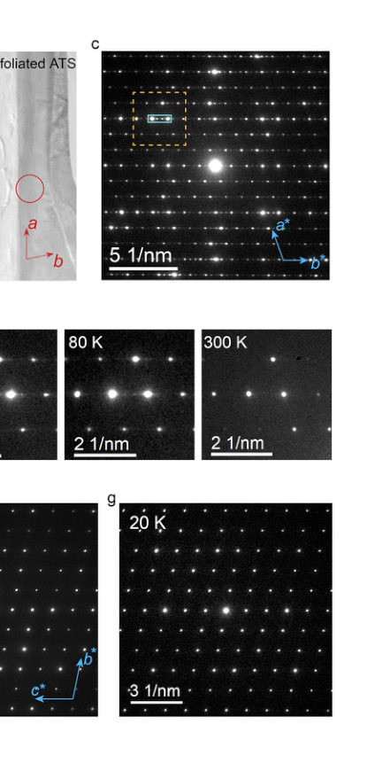
<figcaption class="paper-figure-caption"><b>Fig 1.</b> Fig. 1 | Superatomic lattice reconstruction. a Schematic of the Au6Te12Se8 superatom connected through inter-cluster quasi-bonds. Bond lengths along three axes are labeled using the color same to the axes. Each unit cell contains one superatom. b Real-space image of an exfoliated thin flake. Selected-area electron diffraction (SAED) is performed in the red-circled region, with the electron-beam oriented perpendicular to the ab-plane. Inset illustrates the experimental geometry. c SAED pattern at 20 K revealing additional diffraction spots at 1/3 b*. d Temperature evolution of CDW peaks acquired from the orange dashed square shown in (c). Superlattice spots broaden at 80 K and disappear by...</figcaption>
</figure>

**Summary.** This work reports anomalous Charge Density Wave behavior in the superatomic superconductor Au6Te12Se8, demonstrating a dramatic enhancement of $T_{	ext{CDW}}$ when approaching the 2D limit. Using advanced microscopy and spectroscopy, the authors show the CDW is governed by transverse phonons with large lattice displacements, highlighting a novel interplay between dimensionality, electron-phonon coupling, and superconductivity.

**Why it may be interesting.** The study bridges concepts from strongly correlated electron physics (CDW/SC competition) with mesoscale quantum phenomena in engineered 2D materials. The large lattice displacements suggest strong coupling mechanisms that could be relevant to understanding exotic superconducting pairing symmetries or charge ordering instabilities in other correlated systems.

Detailed structure

**Main problem.** The study investigates anomalous Charge Density Wave (CDW) behaviors in a two-dimensional superatomic superconductor, contrasting them with conventional CDWs and exploring the competition between CDW and superconductivity.

**Main result.** The CDW exhibits an unprecedented dimensional enhancement, increasing its transition temperature ($T_{	ext{CDW}}$) from $<2$ K in bulk to 110 K near the superatomic limit. This suggests a novel mechanism governed by transverse phonons and collective superatom vibrations.

**Method.** A combination of advanced techniques was used, including liquid helium-temperature transmission electron microscopy (He-TEM), Scanning Tunneling Microscopy (STM) for real-space imaging, ultrafast pump-probe spectroscopy, and transport measurements on exfoliated flakes.

**Model / system.** The physical system is the 2D superatomic superconductor Au6Te12Se8. The research focuses on how its unique quasi-bonding structure leads to CDW formation that is highly sensitive to dimensionality (superatomic limit).

**Key observables.** CDW signature in SAED spots, real-space lattice displacements ($\sim 4$ Å via STM), temperature dependence of $T_{	ext{CDW}}$, and gap opening observed in pump-probe spectroscopy.

**Important parameters / regimes.** Dimensionality (bulk vs. superatomic limit), Temperature ($T_{	ext{CDW}}$ enhancement from $<2$ K to 110 K), Lattice displacement amplitude ($\sim 4$ Å).

**Assumptions / limitations.** The CDW mechanism is suggested to be mediated by Electron-Phonon Coupling (EPC) rather than simple Fermi surface nesting, and the observed phenomena are strongly dependent on the material's superatomic structure.

**Figures summary.** Figures show SAED patterns confirming thickness dependence of CDW spots; STM maps visualize transverse Peierls transition via charge redistribution ($	ext{d}I/	ext{d}V$); and pump-probe data reveal gap opening correlated with CDW formation in thin flakes.

**Paper structure.** The paper systematically presents evidence across multiple techniques: SAED confirms dimensionality dependence, STM visualizes the anomalous transverse lattice distortion, transport measurements quantify $T_{	ext{CDW}}$ enhancement with thickness, and ultrafast spectroscopy probes the associated electronic gap opening.

Abstract

The spatial modulation of electron density into a wave-like pattern, known as charge density wave (CDW), represents a fundamental quantum state that often coexists with superconductivity, quantum Hall states, axion insulating phases and etc. Conventional CDWs are mediated by longitudinal acoustic phonons, exhibit picometer-scale lattice distortions ($10^{-12}$--$10^{-11}$ m), and typically vanish approaching the atomic limit. Here, we report a series of anomalous CDW behaviors in the 2D superatomic superconductor Au$_6$Te$_{12}$Se$_8$. Remarkably, its CDW is governed by transverse phonons, accompanied by an extraordinarily high real-space displacement of $\sim 4$ Ångström. Furthermore, we observe an exotic dimensional response persisting up to micrometer-scale thickness, a regime where other materials are already considered as bulk. Through liquid helium-temperature transmission electron microscopy, ultrafast pump-probe spectroscopy and transport measurements, we demonstrate a dramatic enhancement of the CDW transition temperature ($T_{\text{CDW}}$) from $<2$ K in the bulk to 110 K in approaching the ``superatomic limit''. Our findings not only reveal novel facets of both CDW and superatomic materials, but the competition between this anomalous CDW and superconductivity opens avenues for exploring unconventional electron-phonon interactions.

[↑ back to top](#top)

### [Effect of weak positional disorder on the miniband structure of spherical quantum dot chains](http://arxiv.org/abs/2606.22128v1)

**Authors:** R. Ya. Leshko  
**Type:** theory · **Category:** disordered systems and neural networks · **PDF:** <https://arxiv.org/pdf/2606.22128v1>  
**Analysis basis:** full PDF text, analyzed in chunks
**Topic relevance:** `Frenkel-Kontorova` **2/5** · `Keldysh / 2PI / non-Gaussian methods` **1/5** · `Kondo & dissipative impurity` **1/5** · `analog quantum simulation` **1/5** · `non-equilibrium dynamics` **1/5**

↔ Scroll figures horizontally

<figure class="paper-figure-card">
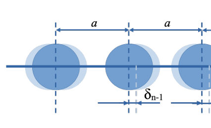
<figcaption class="paper-figure-caption"><b>Fig 1.</b> Figure 1. (Colour online) One-dimensional chains of spherical QDs.</figcaption>
</figure>
<figure class="paper-figure-card">
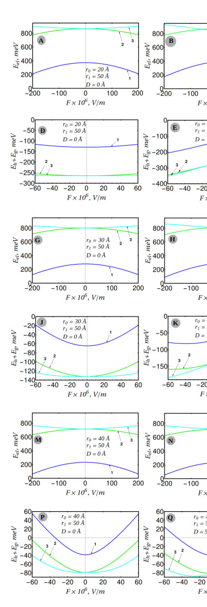
<figcaption class="paper-figure-caption"><b>Fig 2.</b> Figure 2. (Colour online) Electron miniband structure of an ideal (blue curves 1) and a disordered (red curves 2) spherical QD chain.</figcaption>
</figure>
<figure class="paper-figure-card">
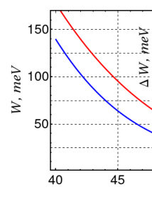
<figcaption class="paper-figure-caption"><b>Fig 3.</b> Figure 3. (Colour online) Electron miniband width calculated with (red curve 1) and without (blue curve 2) disorder. The inset shows the difference in miniband widths between the disordered and ideal cases.</figcaption>
</figure>
<figure class="paper-figure-card">
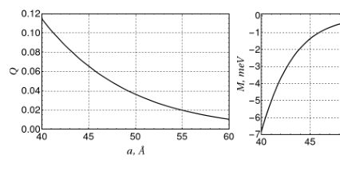
<figcaption class="paper-figure-caption"><b>Fig 4.</b> Figure 4. Dependence of integrals 𝑄, 𝑀, and 𝐵on the period 𝑎.</figcaption>
</figure>

**Summary.** This theoretical paper analyzes the effect of weak positional disorder on the miniband structure of 1D chains of quantum dots using a tight-binding model. By averaging over Gaussian fluctuations, the authors show that disorder broadens the energy bands but does not induce localization in the weak regime. This work is vital for understanding the robustness of electronic transport in imperfect nanoscale materials.

**Why it may be interesting.** This work provides quantitative predictions for how structural imperfections (disorder) modify fundamental electronic band properties in nanoscale quantum structures, which is crucial for designing reliable solid-state quantum devices.

Detailed structure

**Main problem.** The study aims to elucidate how weak positional disorder affects the electronic miniband structure within one-dimensional chains of spherical quantum dots.

**Main result.** Weak positional disorder causes a measurable broadening of the minibands, although the states remain delocalized because the Anderson localization length significantly exceeds the lattice constant in this regime.

**Method.** The authors developed a theoretical framework using the tight-binding approximation combined with an effective-medium approach to average over Gaussian fluctuations in inter-dot spacing.

**Model / system.** The system modeled is a one-dimensional chain of spherical quantum dots (e.g., GaAs QDs) embedded in a matrix, treated as an infinite periodic structure subjected to small random positional deviations ($\sigma$).

**Key observables.** Miniband width ($W$), disorder-renormalized Hamiltonian parameters ($\langle M 
angle, \langle B 
angle, \langle Q 
angle$), and the Anderson localization length ($\xi_{loc}$).

**Important parameters / regimes.** Weak disorder regime ($\sigma \ll a$); low temperatures ($T 	o 0$ K); Gaussian distribution for positional deviations.

**Assumptions / limitations.** The analysis relies on the nearest-neighbor approximation, assuming weak disorder ($\sigma \ll a$), and neglecting finite temperature effects.

**Figures summary.** Figure 2 compares ideal vs. disordered minibands; Figure 3 shows how the miniband width changes with lattice period ($a$) for both cases.

**Paper structure.** The paper develops the theoretical framework, derives averaged effective dispersion relations by incorporating disorder corrections ($\sigma^2$), and then analyzes the resulting broadening effects on key observables like the miniband width.

Abstract

A theoretical framework is developed for the electron miniband structure in one-dimensional chains of spherical quantum dots subjected to weak positional disorder. Within the tight-binding approximation combined with the effective-medium approach, the stochastic fluctuations of the inter-dot spacing are mapped onto the renormalization of the key Hamiltonian parameters: the hopping integral $ B $, the overlap integral $ Q $, and the on-site energy shift $ M $. Analytical expressions for these disorder-renormalized parameters are derived by performing an ensemble average over a narrow Gaussian distribution of positional deviations ($ σ\ll a $). The resulting generalized dispersion relation shows that weak positional disorder causes a broadening of the minibands. Specifically, for typical fabrication fluctuations $σ= 0.1\,a $, the miniband width increases by 8-12\% (depending on the mean inter-dot distance $a$). At the same time, the sensitivity of the miniband width to disorder decreases rapidly with increasing lattice period due to the exponential decay of the electron wave functions. In the considered weak-disorder regime, the Anderson localization length significantly exceeds the lattice constant, so the miniband states remain delocalized.

[↑ back to top](#top)

### [Dimensional reduction for optical beams with thermal nonlocal nonlinearity](http://arxiv.org/abs/2606.22553v1)

**Authors:** Francesco Lorenzi, Luca Salasnich  
**Type:** theory · **Category:** other · **PDF:** <https://arxiv.org/pdf/2606.22553v1>  
**Analysis basis:** full PDF text, analyzed in chunks
**Topic relevance:** `Keldysh / 2PI / non-Gaussian methods` **1/5** · `correlated / nonlocal dissipation` **1/5** · `methods for driven-dissipative` **1/5** · `non-equilibrium dynamics` **1/5**

↔ Scroll figures horizontally

<figure class="paper-figure-card">
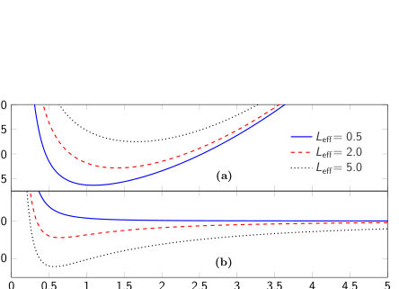
<figcaption class="paper-figure-caption"><b>Fig 1.</b> Figure 1 Effective potential Veff(σ) of the variational width dynamics for different nonlocality lengths Leff. Panel (a) shows the defocusing regime γ = 0.5 in the absence of a confining potential (Ω= 0), and panel (b) shows the focusing regime γ = −0.5 in the presence of a confining potential Ω= 1. The index S is chosen to S = 2.</figcaption>
</figure>
<figure class="paper-figure-card">
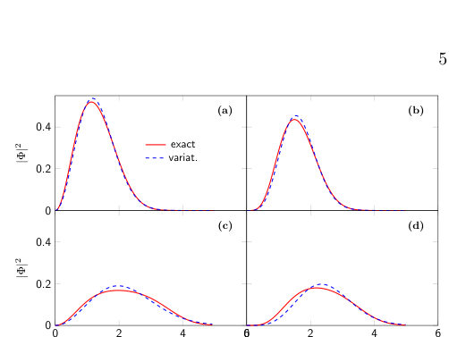
<figcaption class="paper-figure-caption"><b>Fig 2.</b> Figure 2 Comparison of stationary radial intensity pro- files of the beam |Φ(r)|2 obtained from imaginary time evolution of the paraxial diffraction operator (solid red lines) and the variational ansatz (dashed blue lines). Panels (a) and (b) show the case of Leff = 0.5 for vortex indices S = 1 and S = 2, respectively. Panels (c) and (d) show the regime of Leff = 5.0 for S = 1 and S = 2. In this plot Ω= 1, and γ = 0.5.</figcaption>
</figure>
<figure class="paper-figure-card">
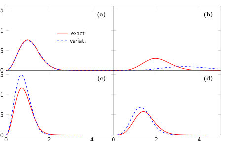
<figcaption class="paper-figure-caption"><b>Fig 3.</b> Figure 3 Comparison of stationary radial intensity pro- files of the beam |Φ(r)|2 obtained from imaginary time evolution of the paraxial diffraction operator (solid red lines) and the variational ansatz (dashed blue lines). Panels (a) and (b) show the case of (Leff = 1.2) for vor- tex indices S = 1 and S = 2, respectively. Panels (c) and (d) show the case of Leff = 5.0, also for S = 1 and S = 2. In this plot Ω= 0 and γ = −0.22.</figcaption>
</figure>
<figure class="paper-figure-card">
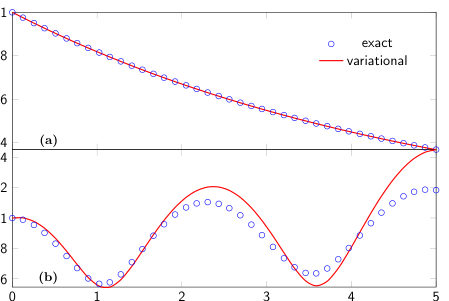
<figcaption class="paper-figure-caption"><b>Fig 4.</b> Figure 4 Comparison of the axial beam dynamics ob- tained from full 2D paraxial propagation (blue markers) and the variational model (solid red lines). Panel (a) shows the evolution of the normalized power |A(z)|2, while panel (b) reports the corresponding transverse width σ(z). The simulations use a vortex beam with p = 0, S = 1 and initial conditions A(0) = 1, σ(0) = 1, and b(0) = 0 (constant radial phase). The nonlinear pa- rameters are γ = −0.15, Leff = 40, α = 0.2, and Ω= 1.</figcaption>
</figure>
<figure class="paper-figure-card">

<figcaption class="paper-figure-caption"><b>Fig 5.</b> Figure 4 shows the dynamical evolution of a vortex beam S = 1 propagating with losses set to α = 0.2 with strong thermal nonlocality Leff = 40. The ax- ial amplitude |A(z)|2 decays monotonically due to linear absorption (panel (a)), while the transverse width σ(z) undergoes damped breathing oscillations constrained by the graded-index potential (panel (b)). The correspon- dence between the reduced one-dimensional variational model (solid red lines) and the full two-dimensional split- step Fourier simulations (blue markers) is substantial. This demonstrates that, despite the moderate discrepan- cies observed in the static mode profiles, the variational method accurately captures the overall...</figcaption>
</figure>

**Summary.** This paper develops a method to simplify the complex dynamics of optical beams in thermally nonlinearly coupled media. By applying dimensional reduction techniques using Laguerre-Gauss mode ansatze, the authors derive an effective 1D model. This provides a computationally tractable framework for understanding how nonlocal thermal effects alter beam propagation compared to simpler local models.

**Why it may be interesting.** This work is highly relevant to quantum optics and open quantum systems because it tackles complex nonlinear wave propagation in structured media, providing analytical tools (variational reduction) where full numerical simulation of nonlocal effects is prohibitive.

Detailed structure

**Main problem.** The work aims to extend dimensional reduction techniques, inspired by the nonpolynomial Schrödinger equation (NPSE), to model optical beams propagating in media exhibiting thermal nonlocal nonlinearity.

**Main result.** Explicit analytic expressions for variational equations are derived, yielding a tractable, reduced 1D description of beam dynamics that captures mode order and nonlocality dependence.

**Method.** The authors employ a variational ansatz based on Laguerre–Gauss modes to reduce the full spatial nonlinear Schrödinger equation coupled to a screened Poisson heat equation into a set of coupled ordinary differential equations.

**Model / system.** The system models optical beam propagation in a graded-index medium where the nonlinearity arises from the thermorefractive effect. The governing physics involves coupling the paraxial wave equation with a screened Poisson equation for temperature, which dictates the nonlocal refractive index change.

**Key observables.** Axial amplitude $|A(z)|^2$, transverse width $\sigma(z)$, and radial intensity profiles $|\Phi(r)|^2$.

**Important parameters / regimes.** Nonlocality length scale ($L_{	ext{eff}}$), linear losses coefficient ($\alpha_0$), GRIN potential strength ($\Omega$), and the nonlinear coupling constant ($\gamma$).

**Assumptions / limitations.** The primary assumptions include using the paraxial approximation, employing a variational ansatz based on annular Laguerre–Gauss modes, and approximating the heat diffusion equation with a screened Poisson-type model.

**Figures summary.** Figures compare radial intensity profiles $|\Phi(r)|^2$ between exact numerical solutions and the variational ansatz for various nonlocality strengths ($L_{	ext{eff}}$) and vortex orders. They also track the evolution of amplitude and width over propagation distance $z$.

**Paper structure.** The paper first establishes the full coupled system (NLSE + screened Poisson). It then details the variational reduction process, deriving effective Lagrangians for different components (local vs. nonlocal). Finally, it analyzes the resulting reduced equations by comparing predictions against known exact solutions and examining parameter dependence.

Abstract

Nonlocal optical nonlinearities arising from the thermorefractive effect provide a long-range material response determined by heat diffusion and absorption. In graded-index media, this nonlocality fundamentally alters modal interactions, yet its accurate modeling remains computationally demanding when starting from the full spatial nonlinear Schrödinger equation. In this work, inspired by the nonpolynomial Schrödinger equation (NPSE) framework, we extend the dimensional reduction techniques to incorporate thermally mediated nonlocal nonlinearities. By coupling the optical field to an equation for the temperature-induced refractive index change, and employing a variational ansatz based on Laguerre--Gauss modes of the annular kind, of arbitrary azimuthal order, we derive explicit analytic expressions for the variational equations. The resulting effective model captures the dependence of the nonlinear interaction on mode order and degree of nonlocality, providing a tractable reduced description of the dynamics in thermal nonlocal media.

[↑ back to top](#top)

### [Geometric Structures of Pseudo-Sonic Curves in Self-Similar Solutions of the Euler Equations for Potential Flow](http://arxiv.org/abs/2606.21793v1)

**Authors:** Gui-Qiang G. Chen, Mikhail Feldman, Xin Gao, Wei Xiang  
**Type:** theory · **Category:** other · **PDF:** <https://arxiv.org/pdf/2606.21793v1>  
**Analysis basis:** full PDF text, analyzed in chunks
**Topic relevance:** `Keldysh / 2PI / non-Gaussian methods` **1/5** · `methods for driven-dissipative` **1/5** · `non-equilibrium dynamics` **1/5**

↔ Scroll figures horizontally

<figure class="paper-figure-card">
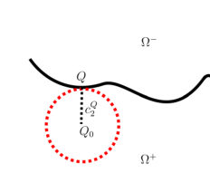
<figcaption class="paper-figure-caption"><b>Fig 1.</b> Figure 2.1. The pseudo-sonic curve in the (ξ, η)–coordinates.</figcaption>
</figure>
<figure class="paper-figure-card">
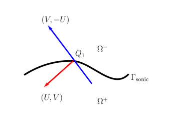
<figcaption class="paper-figure-caption"><b>Fig 2.</b> Figure 4.1.</figcaption>
</figure>
<figure class="paper-figure-card">
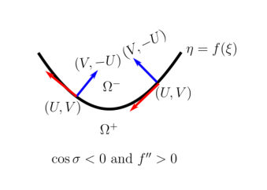
<figcaption class="paper-figure-caption"><b>Fig 3.</b> Figure 4.2. The convexity of the sonic curve.</figcaption>
</figure>
<figure class="paper-figure-card">
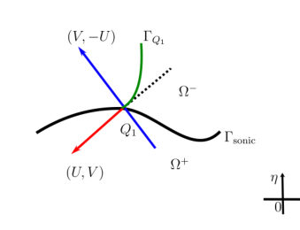
<figcaption class="paper-figure-caption"><b>Fig 4.</b> Figure 5.1. The structure of the streamlines near Γsonic.</figcaption>
</figure>
<figure class="paper-figure-card">
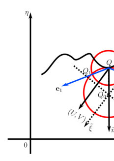
<figcaption class="paper-figure-caption"><b>Fig 5.</b> Figure 7.1. The sonic point Q.</figcaption>
</figure>

**Summary.** This paper rigorously analyzes the geometry of pseudo-sonic curves arising from self-similar solutions of potential flow governed by the Euler equations. Using advanced PDE techniques, it proves that these critical sonic curves must possess specific geometric structures, such as being circular arcs, especially when considering non-uniform incoming flows. This provides a powerful mathematical framework for understanding transonic phenomena in fluid dynamics.

**Why it may be interesting.** While focused on fluid dynamics, the mathematical techniques—dealing with mixed-type degeneracies and establishing geometric constraints via maximum principles—are highly relevant to analyzing nonlinear PDEs found in quantum field theory or plasma physics.

Detailed structure

**Main problem.** The paper analyzes the geometric structures of pseudo-sonic curves ($\Gamma_{	ext{sonic}}$) that arise in two-dimensional self-similar solutions to the Euler equations for potential flow.

**Main result.** Under general conditions, the analysis proves that the pseudo-sonic curve must be an arc, and furthermore, the pseudo-velocity at these points must be normal to the curve. For specific physical problems like shock reflection, this implies a precise geometric characterization of the sonic structure.

**Method.** The authors employ rigorous analytical techniques involving mixed hyperbolic-elliptic PDEs, local coordinate transformations, maximum principles, and comparison with known solutions (like circular arcs) to constrain the geometry of $\Gamma_{	ext{sonic}}$.

**Model / system.** The physical system is 2D potential flow governed by the Euler equations. The mathematical model involves a second-order PDE of mixed type, where degeneracy occurs precisely along the pseudo-sonic curve ($\Gamma_{	ext{sonic}}$).

**Key observables.** Pseudo-sonic curve ($\Gamma_{	ext{sonic}}$), pseudo-velocity $(U, V)$, sonic speed ($c$), and the stream function $\psi$.

**Important parameters / regimes.** The flow regime (supersonic/subsonic) relative to $c$, and the degree of perturbation from uniform incoming flow.

**Assumptions / limitations.** Assumptions include the existence of smooth solutions, local differentiability ($C^{1,1}$ or higher), and specific boundary conditions required for applying maximum principles in various sections.

**Figures summary.** Figures illustrate characteristic directions, streamline structures near $\Gamma_{	ext{sonic}}$ (showing convexity/non-convexity based on flow regime), and the geometry of characteristics in supersonic regions.

**Paper structure.** The paper develops results sequentially: first characterizing simple cases (e.g., circular curves if velocity is normal); then establishing general theorems constraining the curve's shape using differential operators ($\partial_\perp$); followed by applying these tools to specific physical problems like shock reflection, culminating in proofs that $\Gamma_{	ext{sonic}}$ must be an arc.

Abstract

We are concerned with the geometric structures of pseudo-sonic curves in two-dimensional self-similar solutions for the Euler equations for potential flow, allowing for non-uniform supersonic states. Mathematically, the governing second-order potential flow equation is of mixed hyperbolic-elliptic type, with degeneracy occurring along the pseudo-sonic curve. In this paper, we develop rigorous analytical approaches to analyze the geometric structures of pseudo-sonic curves in such self-similar solutions. We first show that the pseudo-sonic curve is necessarily a circle if the pseudo-velocity at each point is a normal to the curve. We then analyze the general case in which the pseudo-velocity on the pseudo-sonic point is not a normal to the curve, and study the geometric properties of streamlines in a neighborhood of the pseudo-sonic curve. Next, we establish two theorems that provide sufficient conditions ensuring that the pseudo-velocity at a pseudo-sonic point is normal to the curve, under natural assumptions on the local behavior of the solution. These results yield a precise characterization of the geometry of pseudo-sonic curves. Finally, we apply the developed theory to the shock reflection-diffraction problem with non-uniform incoming flow. We prove that the pseudo-sonic curve must be an arc if the solution is a $C^2$-small perturbation, either in the pseudo-supersonic or pseudo-subsonic region, of a solution with uniform incoming flow. In particular, the density and velocity must be constant, corresponding to the radius and the center of the pseudo-sonic arc, respectively. Moreover, we prove that the solution is $C^{2,α}$-regular in the pseudo-subsonic region up to the sonic arc (except at point $P_1$). The techniques and ideas developed in this paper are expected to be applicable to other nonlinear problems involving similar mixed-type degeneracies.

[↑ back to top](#top)

### [Reactive Force Field for P/Sn/I System: Atomistic Insight into the Early Stage of Black Phosphorus and Phosphorene Synthesis Process](http://arxiv.org/abs/2606.23328v1)

**Authors:** Djuric Brice Talonpa Tchoffo, Ismail Benabdallah, Petr Neugebauer, Anouar Belhboub, Abdelouahad El Fatimy  
**Type:** theory · **Category:** numerical methods · **PDF:** <https://arxiv.org/pdf/2606.23328v1>  
**Analysis basis:** full PDF text, analyzed in chunks
**Topic relevance:** `Keldysh / 2PI / non-Gaussian methods` **1/5** · `methods for driven-dissipative` **1/5** · `non-equilibrium dynamics` **1/5**

↔ Scroll figures horizontally

<figure class="paper-figure-card">
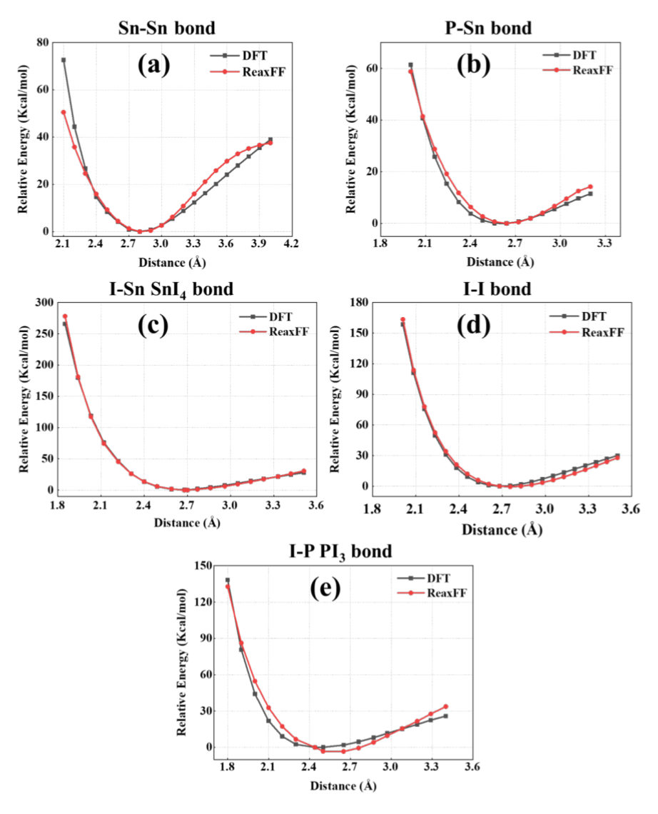
<figcaption class="paper-figure-caption"><b>Fig 1.</b> Fig. 1. Comparison between energy calculated from DFT (gray) and ReaxFF (red) for (a) Sn- Sn, (b) P-Sn, (c) I-Sn in SnI4 molecule, (d) I-I, and (e) I-P pair interaction in PI3.</figcaption>
</figure>
<figure class="paper-figure-card">
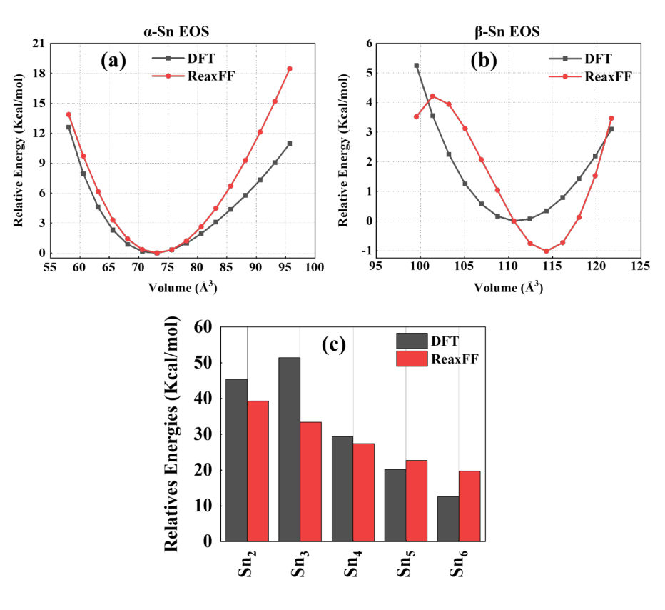
<figcaption class="paper-figure-caption"><b>Fig 2.</b> Fig. 2. Comparison between DFT (gray) and ReaxFF (red) equation of state (EOS) for (a) α- Sn, (b) β-Sn crystals, and (c) formation energies of Snx clusters (x = 2 - 6).</figcaption>
</figure>
<figure class="paper-figure-card">

<figcaption class="paper-figure-caption"><b>Fig 3.</b> Fig. 3. Comparison between reaction energies obtained with DFT (gray) and ReaxFF (red).</figcaption>
</figure>
<figure class="paper-figure-card">
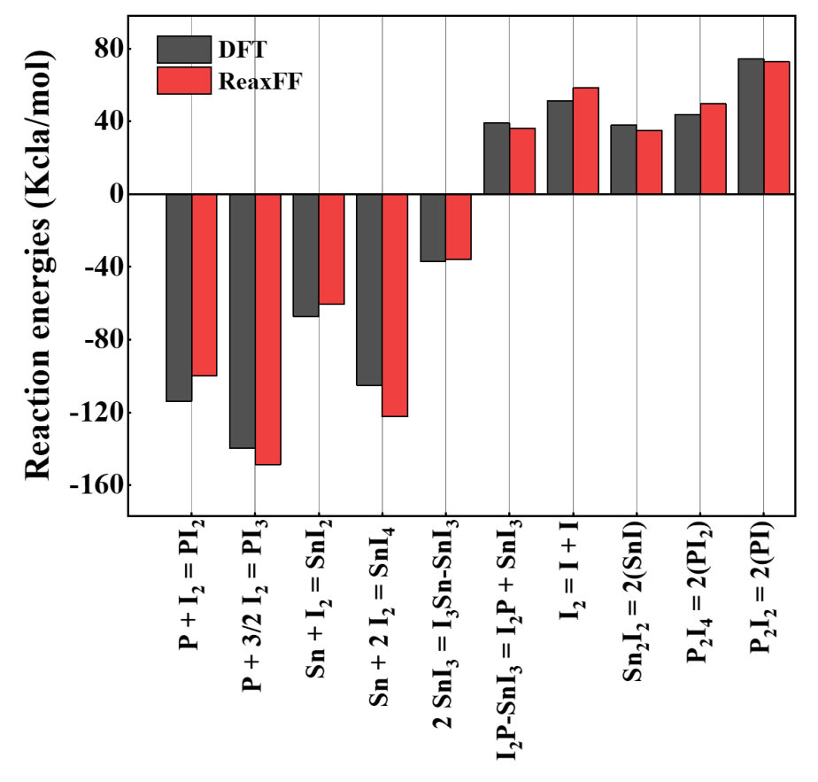
<figcaption class="paper-figure-caption"><b>Fig 4.</b> Figure 1 compares ReaxFF and QM results for each pair interaction. (a) ReaxFF vs DFT for</figcaption>
</figure>
<figure class="paper-figure-card">
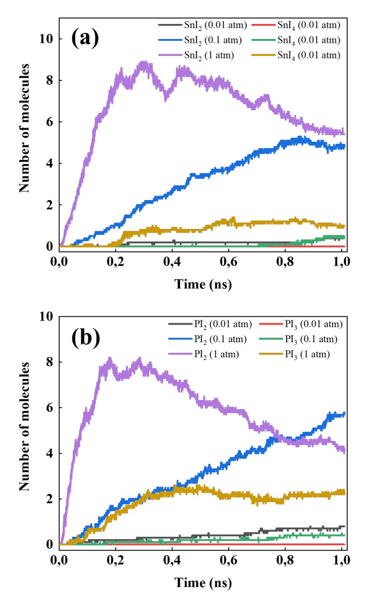
<figcaption class="paper-figure-caption"><b>Fig 5.</b> Fig. 4. (a) Formation of SnI2 and SnI4 molecules in the Sn/I2 system, (b) Formation of PI2 and PI3 in the P/I2 system at different effective pressures.</figcaption>
</figure>

**Summary.** This work uses ReaxFF molecular dynamics to simulate the early stages of Black Phosphorus synthesis in a P/Sn/I vapor system. By varying density and iodine concentration, the researchers map out how chemical species form and react. The findings provide an atomistic pathway suggesting that high pressure promotes the formation of stable, BP-like nucleation seeds.

**Why it may be interesting.** While focused on materials chemistry, the rigorous application of a reactive force field trained against high-level QM data represents an advanced example of classical simulation techniques used to model complex chemical kinetics and phase transitions, which is relevant to many-body dynamics simulations in condensed matter theory.

Detailed structure

**Main problem.** The study aims to understand the atomistic mechanisms governing phosphorus transport and early-stage phase formation during the synthesis of Black Phosphorus (BP) and phosphorene.

**Main result.** The simulations reveal that iodine concentration and system density critically control phosphorus recombination, leading to the formation of $	ext{P}_x	ext{I}_y$ motifs and promoting prenucleation into BP-like hexagonal structures under high-density conditions.

**Method.** A reactive force field (ReaxFF) was developed and applied within molecular dynamics simulations to model the complex chemical interactions in the P/Sn/I system.

**Model / system.** The physical system is the $	ext{P}/	ext{Sn}/	ext{I}$ mixture, simulating vapor-phase synthesis conditions. The methodology relies on developing a highly parameterized ReaxFF potential trained against extensive Quantum Mechanical (QM) data covering bond dissociation, angle/torsion profiles, and equations of state for Sn.

**Key observables.** Species formation dynamics ($	ext{SnI}_2$, $	ext{P}_x	ext{I}_y$), cluster size distribution ($	ext{P}_x$ clusters), potential energy ($E_{	ext{system}}$), and structural motifs (BP-like hexagons).

**Important parameters / regimes.** System density (varying effective pressures from 0.01 atm to 100 atm) and temperature (923 K).

**Assumptions / limitations.** The accuracy of the simulation is contingent upon the comprehensive parameterization of the ReaxFF potential using DFT reference data for various chemical environments.

**Figures summary.** Figures illustrate the agreement between DFT and ReaxFF predictions for bond energies, angle distortions, and equations of state. A key figure tracks phosphorus consumption dynamics under varying pressures, showing density-dependent chemistry.

**Paper structure.** The paper first details the development and validation of the ReaxFF potential against QM data (bond/angle fitting). It then applies this model to simulate P/Sn/I systems under controlled variations in iodine concentration and external pressure to map out the phase space of early-stage synthesis.

Abstract

Black phosphorus and its two dimensional counterpart, phosphorene, are typically synthesized through chemical vapor transport using Sn and I2 additives. Chemical vapor deposition synthesis of phosphorene and allotropes is still yet not well understood. Investigating the atomistic mechanisms underlying phosphorus transport and early stage processes is difficult experimentally. In this study, a reactive force field for the PSnI system was developed and applied using ReaxFF based molecular dynamics to explore the early stage phase of the pre nucleation relevant to BP-phosphorene growth. The force field parameters were trained on a comprehensive quantum mechanical dataset covering bond dissociation, angle and torsion profiles, and tin condensed phase equation of state and cluster formation energies, showing strong agreement in both gas and condensed phases. We demonstrate that iodine and density together control phosphorus recombination. Under low density, atomic phosphorus dominates with minimal clustering. Adding I2 greatly increases P-P recombination, promotes the formation of PxIy motifs, and transient SnxPyIz compounds. Higher density systems favor the formation of larger Px clusters and support the development of ternary SnxPyIz compounds that grow by capturing transported phosphorus. At the highest density, the system produces condensed, Hittorf like phosphorus structures at the edges of SnxPyIz clusters, along with BP-like hexagons stabilized by iodine that may act as nucleation seeds. These results offer an atomistic view of transport and early stage steps in BP synthesis and provide a practical reactive model for studying growth conditions and additive effects in BP phosphorene vapor synthesis.

[↑ back to top](#top)

### [Structural symmetry effects on the competition of density waves and superconductivity in bilayer nickelates](http://arxiv.org/abs/2606.23022v1)

**Authors:** Steffen Bötzel, Aiman Al-Eryani, Jun Zhan, Xianxin Wu, Frank Lechermann, Michael M. Scherer, Ilya M. Eremin  
**Type:** theory · **Category:** strongly correlated electrons · **PDF:** <https://arxiv.org/pdf/2606.23022v1>  
**Analysis basis:** full PDF text, analyzed in chunks
**Topic relevance:** `Keldysh / 2PI / non-Gaussian methods` **1/5** · `analog quantum simulation` **1/5**

↔ Scroll figures horizontally

<figure class="paper-figure-card">
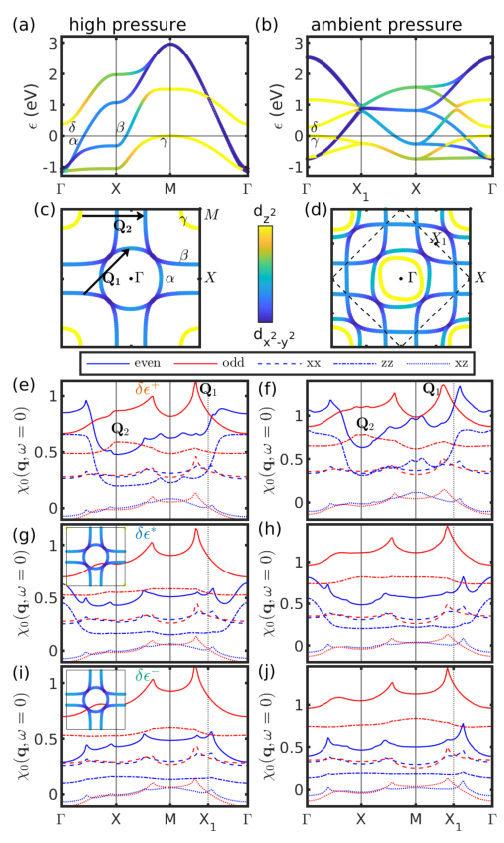
<figcaption class="paper-figure-caption"><b>Fig 1.</b> FIG. 1. Band structure, Fermi surface, and non-interacting susceptibility of La3Ni2O7 at high and at ambient pres- sure. (a) Band structure for the high-pressure model along high symmetry path for δϵ = δϵ∗. (b) Band structure for the ambient-pressure model along the Amam high-symmetry path. Fermi surface for high- and ambient-pressure phases for δϵ = δϵ+ (c,d). Total and orbital-resolved contributions to the non-interacting susceptibilities for the top of the γ band being located 50 meV above (e,f), at (g,h), and 50 meV below (i,j) the Fermi level using the high-symmetry path. (e,g,i) are for the high-pressure symmetry, whereas (f,h,j) are for the ambient-pressure model. Similarities in...</figcaption>
</figure>
<figure class="paper-figure-card">
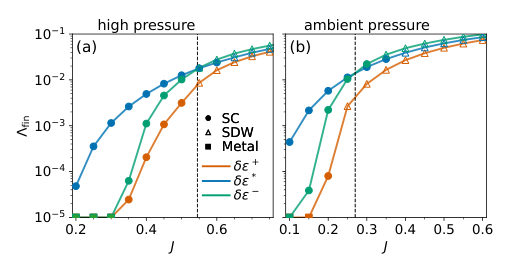
<figcaption class="paper-figure-caption"><b>Fig 2.</b> FIG. 2. Leading instabilities within fRG for high- and ambient-pressure phases. Leading instabilities for the high (a) and ambient (b) pressure model as a function of Hund’s cou- pling J for the γ band being located 50 meV above (δϵ+), at (δϵ∗), and 50 meV below (δϵ−) the Fermi level. Dashed black lines illustrate the transition from low J to high J regimes with the maximum Λfin changes from being at δϵ∗to δϵ−.</figcaption>
</figure>
<figure class="paper-figure-card">
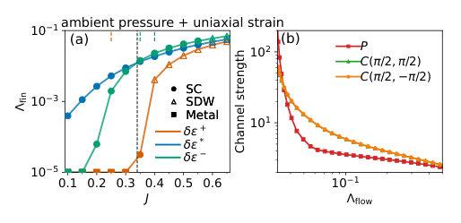
<figcaption class="paper-figure-caption"><b>Fig 3.</b> FIG. 4. (a) Leading fRG instabilities for ambient pressure with modeled uniaxial strain as a function of Hund’s coupling J for the γ band being located 50 meV above (δϵ+), at (δϵ∗), and 50 meV below (δϵ−) the Fermi level. Dashed black lines illustrate the transition from low J to high J regimes. Dashed colored lines have been added near the top of the panel to in- dicate the position of the transition to the SDW instability for ambient pressure in the absence of uniaxial strain. (b) Flow of P and the dominant contributions to C(Q1 ≈(π/2, π/2)) and C(˜Q1 ≈(π/2, −π/2)) for J = 0.5 eV for δϵ∗.</figcaption>
</figure>
<figure class="paper-figure-card">
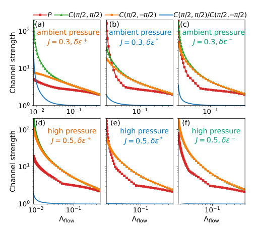
<figcaption class="paper-figure-caption"><b>Fig 4.</b> FIG. 3. Flow of the maximal components of the particle- particle vertex P and the crossed particle-hole vertex, i.e., C(Q1 ≈(π/2, π/2)) and C(˜Q1 ≈(π/2, −π/2)) and their ra- tio. Flows are shown for J = 0.5 eV for ambient pressure for the γ band being located 50 meV above (δϵ+, (a)), at (δϵ∗</figcaption>
</figure>
<figure class="paper-figure-card">
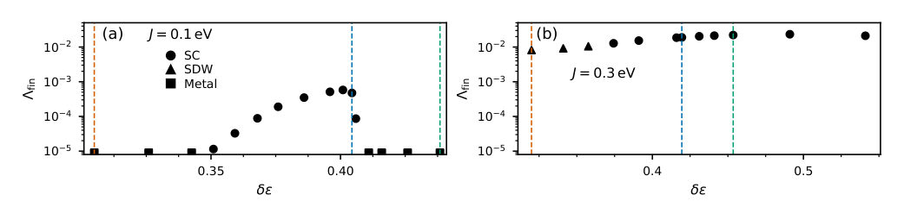
<figcaption class="paper-figure-caption"><b>Fig 5.</b> FIG. 5. Leading instabilities within fRG for ambient pressure phase. Scan of δϵ for the ambient-pressure phase at low J = 0.1 eV (c) and high J = 0.3 eV (d) with dashed lines denoting δϵ+, δϵ∗and δϵ−values.</figcaption>
</figure>

**Summary.** This work uses functional renormalization group theory to study the rivalry between superconductivity and SDW order in bilayer nickelates under varying structural pressures. The key finding is that lattice symmetry, specifically reducing orthorhombicity via strain, is crucial for stabilizing superconductivity by enhancing magnetic fluctuations while frustrating long-range magnetism. This suggests structural tuning can be a primary control knob for high-temperature superconductivity.

**Why it may be interesting.** While focused on strongly correlated materials, the use of advanced many-body techniques like fRG to analyze competing orders (SC vs. magnetism) provides general theoretical frameworks applicable to other quantum systems exhibiting such competition.

Detailed structure

**Main problem.** The study investigates the competition between spin-density-wave (SDW) order and superconductivity in bilayer nickelates, focusing on how structural symmetry influences this interplay.

**Main result.** Structural symmetry, specifically the suppression of orthorhombicity via strain, is identified as a key ingredient that enhances pairing interactions by creating near-degenerate SDW fluctuations, thereby stabilizing superconductivity.

**Method.** The research employs the Functional Renormalization Group (fRG) applied to multi-orbital weak-coupling models derived from DFT calculations.

**Model / system.** The system is bilayer nickelate La3Ni2O7, analyzed in both ambient and high-pressure crystal structures. The model uses an effective two-orbital Hamiltonian for the Ni sites.

**Key observables.** Leading fRG instabilities (divergence of particle-particle or particle-hole vertices), superconducting gap components ($\Delta$), and magnetic susceptibilities ($\chi$).

**Important parameters / regimes.** Hund's coupling ($J$), structural symmetry (orthorhombicity vs. tetragonal limit), and the relative on-site potential difference ($\delta\epsilon$).

**Assumptions / limitations.** The analysis uses the truncated-unity fRG scheme, neglecting frequency dependencies; some notes mention ignoring feedback from Goldstone fluctuations.

**Figures summary.** Figures show band structures, Fermi surfaces, leading instabilities (SC/SDW) vs. Hund's coupling J for different pressures, and flow diagrams illustrating how symmetry affects competing order parameters.

**Paper structure.** The paper systematically compares results between high-pressure ($Fmmm$) and ambient-pressure ($Amam$) phases using fRG to map out the competition between SC and SDW instabilities, culminating in an analysis of strain effects to tune structural symmetry.

Abstract

We investigate the interplay between spin-density-wave (SDW) order and superconductivity in the bilayer nickelate La$_3$Ni$_2$O$_7$ using the functional renormalization group~(fRG) applied to multiorbital weak-coupling models of both the ambient- and high-pressure crystal structures. As Hund's coupling increases, the leading instability evolves from superconductivity to an SDW state with ordering vector $\mathbf{Q}_1 \approx (π/2,π/2)$ (equivalently $\mathbf{Q}_Y \approx (0,π)$ in the orthorhombic $Amam$ unit cell), in agreement with experimental observations. Surprisingly, the ambient- and high-pressure structures exhibit nearly identical non-interacting susceptibilities and leading fRG instabilities, indicating that the emergence of superconductivity under pressure cannot be explained solely by changes in the low-energy electronic structure. Instead, our results identify the suppression of orthorhombicity as a key ingredient for superconductivity. As the system approaches the tetragonal limit, symmetry-related SDW fluctuations become nearly degenerate, frustrating long-range magnetic order while enhancing pairing interactions. These findings highlight lattice symmetry as a central tuning parameter of the competing ordered states in bilayer nickelates and suggest that reducing orthorhombicity through uniaxial strain could stabilize bulk superconductivity already at ambient pressure.

[↑ back to top](#top)

### [Universality of dimensional crossovers in topological insulators](http://arxiv.org/abs/2606.23074v1)

**Authors:** Lumen Eek, Zeb Osseweijer, Cristiane Morais Smith  
**Type:** theory · **Category:** other · **PDF:** <https://arxiv.org/pdf/2606.23074v1>  
**Analysis basis:** full PDF text, analyzed in chunks
**Topic relevance:** `analog quantum simulation` **1/5** · `driven-dissipative phase transition` **1/5**

↔ Scroll figures horizontally

<figure class="paper-figure-card">
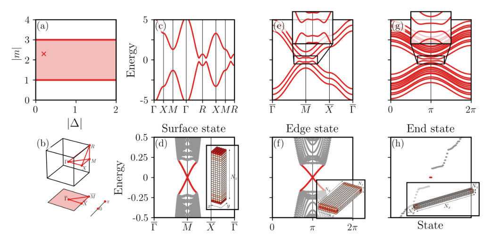
<figcaption class="paper-figure-caption"><b>Fig 1.</b> FIG. 1. (a) Phase diagram of the model as a function of m and ∆, with the cross indicating the parameters used throughout the rest of the figure (t = 1). Red (white) indicates a topological phase with ν0 = 1 (trivial phase with ν0 = 0). (b) High-symmetry path in the bulk Brillouin zone, the (100) surface Brillouin zone, and the corresponding 1D projected Brillouin zone along [10]. (c) Bulk band structure of Eq. (1) in the topological phase, exhibiting a characteristic camelback feature near the R point. (d) Slab spectrum for [100] termination with thickness Nz = 25, showing a surface Dirac cone at M (inset: surface states). (e) Slab spectrum for Nz = 3, where finite-size effects gap out the...</figcaption>
</figure>
<figure class="paper-figure-card">
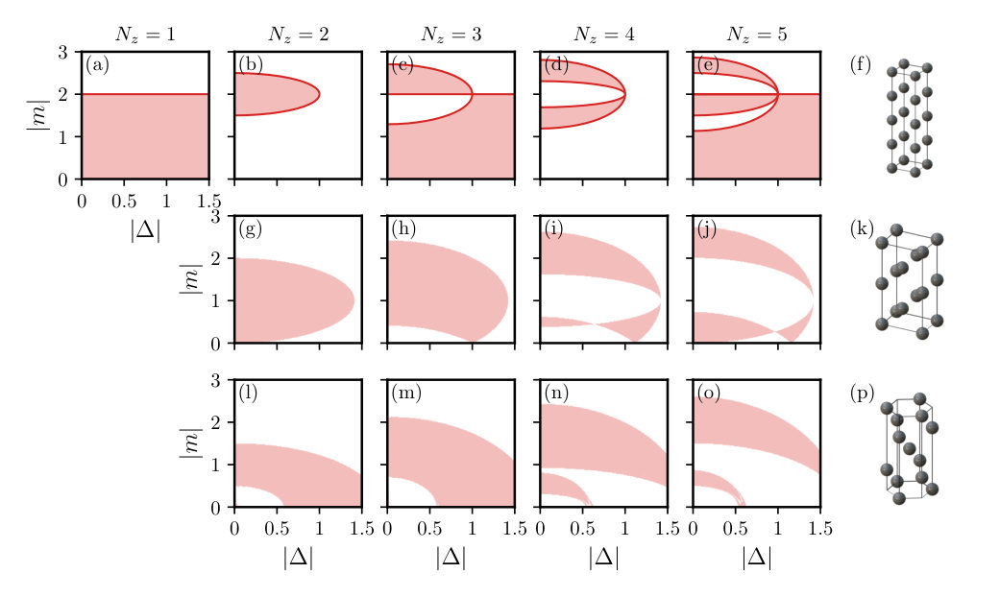
<figcaption class="paper-figure-caption"><b>Fig 2.</b> FIG. 2. QSH phase diagrams νQSH as a function of m and ∆for different surface terminations and slab thicknesses. (a)–(e) [100] termination for Nz = 1–5. (f) Corresponding slab unit cell for Nz = 5. (g)–(j) [110] termination for Nz = 2–5. (k) Corresponding slab unit cell for Nz = 5. (l)–(o) [111] termination for Nz = 2–5. (p) Corresponding slab unit cell for Nz = 5. Red (white) regions indicate the topological (trivial) phase with νQSH = 1 (0). In (a)-(e), analytical phase boundaries are indicated with red lines. The expressions for these boundaries are given in the End Matter.</figcaption>
</figure>
<figure class="paper-figure-card">
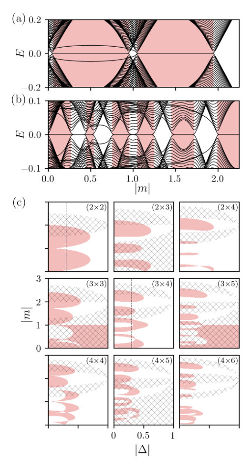
<figcaption class="paper-figure-caption"><b>Fig 3.</b> FIG. 3. (a) OBC spectrum for a Ny × Nz = 2 × 2 rod with Nx = 100 as a function of m at ∆= 0.3. The background color indicates the value of the Z2 invariant ν, with red (white) denoting the topological (trivial) phase. (b) OBC spectrum for a 3 × 4 rod with Nx = 100 as a function of m at ∆= 0.3. (c) Phase diagrams as a function of |m| and |∆| for rods with different Ny × Nz. Red (white) regions indicate ν = 1 (ν = 0). Hatched regions mark parameter regimes where the corresponding slab geometry at fixed Nz is in the QSH phase, νQSH = 1. Vertical lines indicate the parameter cuts used in (a) and (b).</figcaption>
</figure>
<figure class="paper-figure-card">
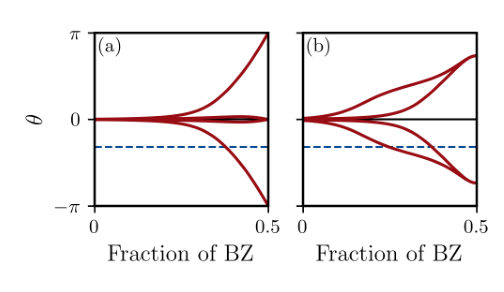
<figcaption class="paper-figure-caption"><b>Fig 4.</b> FIG. 4. Wilson loop spectrum θn(k1) as a function of k1 for the slab Hamiltonian corresponding to Eq. (1) with Nz = 2, with (a) m = 2 and (b) m = 1, both at ∆= 1/2. The blue dashed line denotes the reference θ = const.</figcaption>
</figure>
<figure class="paper-figure-card">
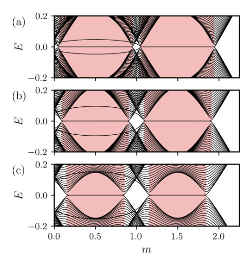
<figcaption class="paper-figure-caption"><b>Fig 5.</b> FIG. 5. Spectrum of a 2 × 2 × 100 rod Hamiltonian as a function of m for (a) ∆= 0.3, (b) ∆= 0.4, (c) ∆= 0.5.</figcaption>
</figure>

**Summary.** This work explores how topological insulators behave under geometric confinement, moving from 3D bulk materials down to 1D edge states. By analyzing lattice models, the authors demonstrate a universal sequence of phase transitions governed by dimensionality reduction. This reveals that topology can be robustly maintained or induced at boundaries even if the original material was not intrinsically topological.

**Why it may be interesting.** The concept of topological protection persisting or emerging in lower dimensions, even when the bulk is trivial, provides a powerful framework for understanding material design and boundary effects relevant to quantum devices.

Detailed structure

**Main problem.** The study investigates dimensional crossovers in topological insulators (TIs) when subjected to geometric confinement, showing that simple surface state hybridization models are incomplete.

**Main result.** A cascade of topological transitions occurs (3DTI $	o$ 2D QSH $	o$ 1D phase), revealing an unexpected universality in the phase diagrams across these dimensional reductions. Furthermore, lower-dimensional phases can emerge even if the parent 3D bulk material is topologically trivial.

**Method.** The authors use lattice models and calculate topological invariants ($\mathbb{Z}_2$) using methods like the Fu-Kane formula and the Wilson-loop method to analyze slab and rod spectra.

**Model / system.** The system is modeled by minimal tight-binding Hamiltonians for 3D TIs on a cubic lattice, analyzed under geometric confinement (thin films/slabs) terminated along [100], [110], or [111] directions.

**Key observables.** Topological phase transitions, $\mathbb{Z}_2$ invariants ($
u_0$, $
u_{	ext{QSH}}$), and the presence of gapless edge/end states.

**Important parameters / regimes.** System thickness ($N_z$), microscopic parameters ($m, \Delta, t$), and boundary termination direction.

**Assumptions / limitations.** The analysis relies on lattice models and specific symmetry considerations (Time-Reversal Symmetry, Inversion Symmetry).

**Figures summary.** Figures illustrate phase diagrams showing the dependence of topological invariants ($
u_0$, $
u_{	ext{QSH}}$) on system parameters for different terminations, alongside spectral plots demonstrating gap closings and edge state formation.

**Paper structure.** The paper systematically analyzes the transition from 3D to 2D QSH phases using Wilson loops, then extends this analysis to 1D end states. It establishes universal patterns governing these dimensional reductions by comparing results across different terminations.

Abstract

We investigate dimensional crossovers in minimal tight-binding models of three-dimensional (3D) topological insulators subject to geometric confinement. While thin films are commonly understood to host a crossover from a 3D strong topological insulator to a two-dimensional (2D) quantum spin Hall phase via hybridization of surface states, we demonstrate that this picture is incomplete once bulk confinement effects and boundary termination are fully taken into account. Using lattice models, we show that reducing the system size induces a strongly non-monotonic dependence of the topology on thickness and microscopic parameters, leading to a sequence of topological phase transitions that is highly sensitive to surface termination. In particular, we find a cascade of dimensional reduction from a 3D topological insulator to a 2D quantum spin Hall phase and ultimately to a one-dimensional phase consisting of end states of Kramers pairs protected by inversion symmetry. Remarkably, we show that both the 2D and 1D topological phases can emerge even when the corresponding 3D bulk phase is topologically trivial. Our results reveal an unexpected universality in the phase diagrams of 3D-to-2D and 2D-to-1D crossovers, pointing toward a unified framework for topology under dimensional reduction.

[↑ back to top](#top)

### [Dissociation of NaCl in supercritical aqueous fluids of moderate and high concentrations: A molecular dynamics study](http://arxiv.org/abs/2606.23349v1)

**Authors:** Mikhail V. Ivanov, Olga V. Alexandrovich  
**Type:** theory · **Category:** statistical mechanics · **PDF:** <https://arxiv.org/pdf/2606.23349v1>  
**Analysis basis:** full PDF text, analyzed in chunks
**Topic relevance:** `Keldysh / 2PI / non-Gaussian methods` **1/5**

↔ Scroll figures horizontally

<figure class="paper-figure-card">
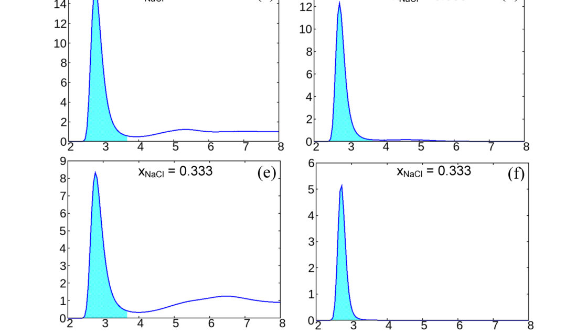
<figcaption class="paper-figure-caption"><b>Fig 1.</b> FIG. 1. Panels (a), (c), and (e) show the radial distribution functions of the distance between Na+</figcaption>
</figure>
<figure class="paper-figure-card">
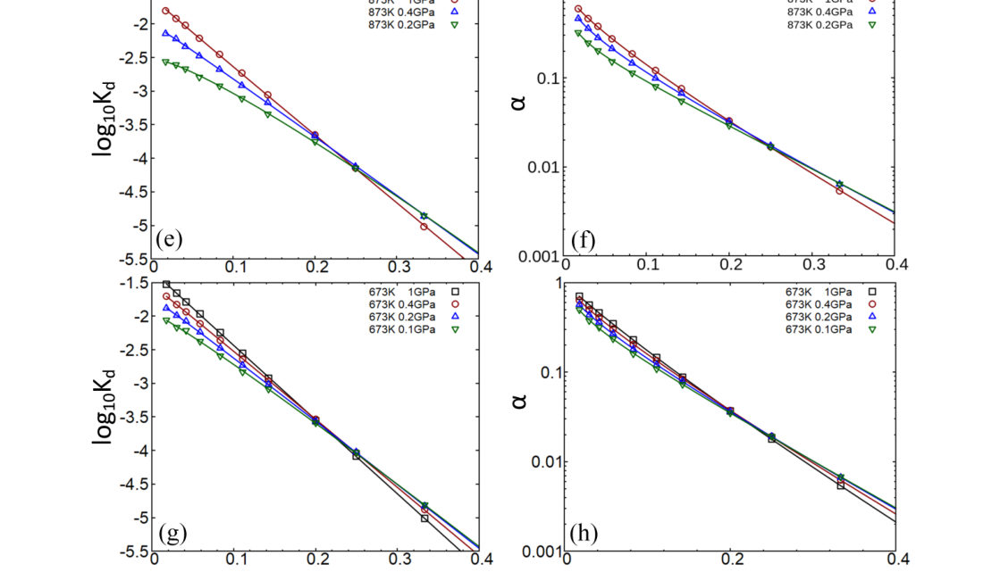
<figcaption class="paper-figure-caption"><b>Fig 2.</b> FIG. 2. Logarithm of the ideal dissociation constant and the degree of dissociation of NaCl as</figcaption>
</figure>
<figure class="paper-figure-card">
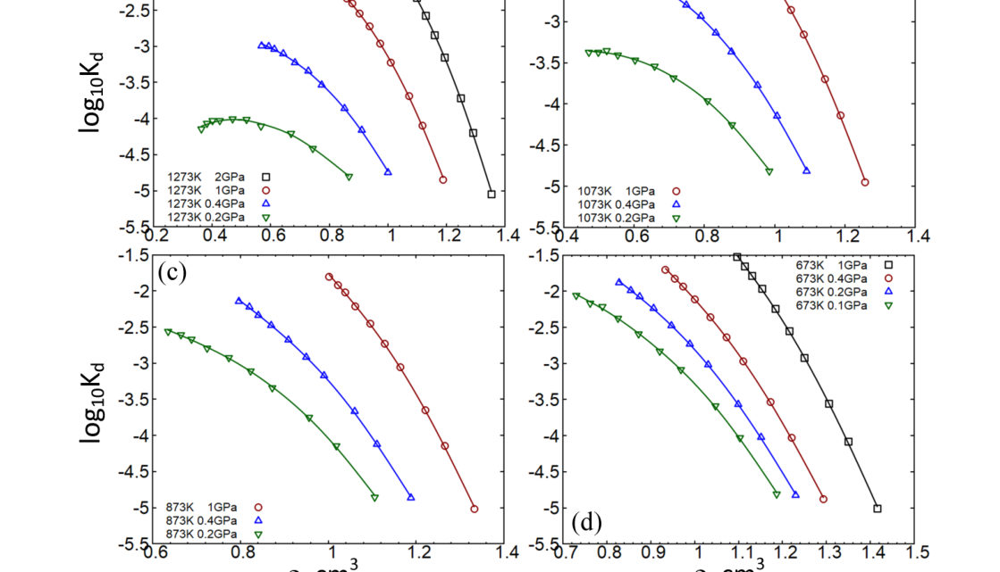
<figcaption class="paper-figure-caption"><b>Fig 3.</b> FIG. 3. Logarithm of the ideal dissociation constant of NaCl as a function of the density of the fluid.</figcaption>
</figure>
<figure class="paper-figure-card">
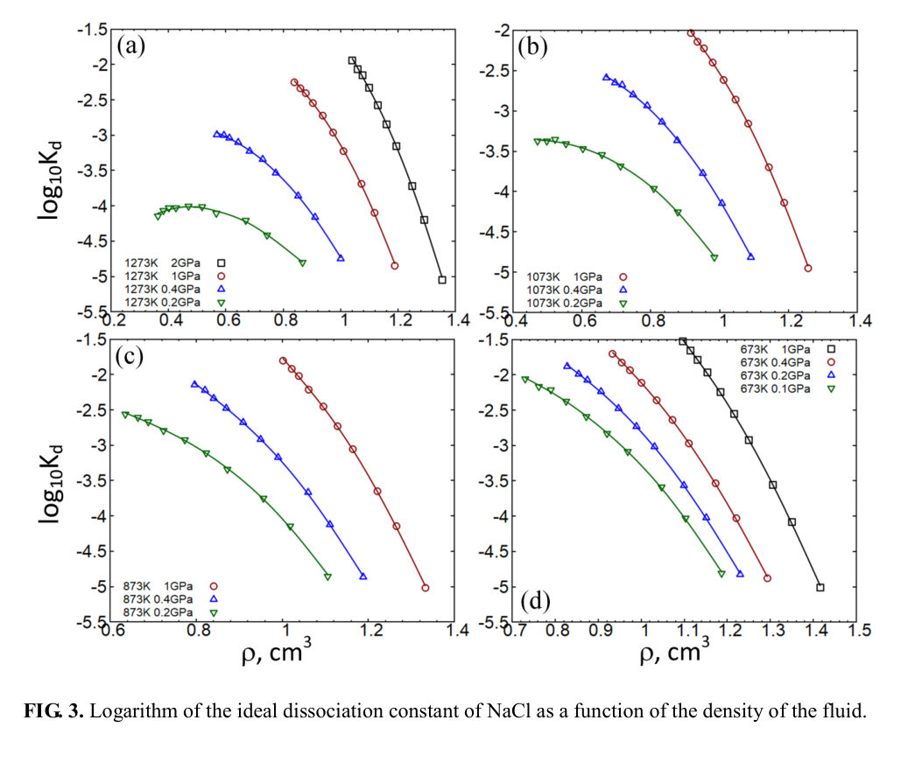
<figcaption class="paper-figure-caption"><b>Fig 4.</b> Fig. 2. The difference in their shape and relative position is due to the fact that the density is highly</figcaption>
</figure>
<figure class="paper-figure-card">
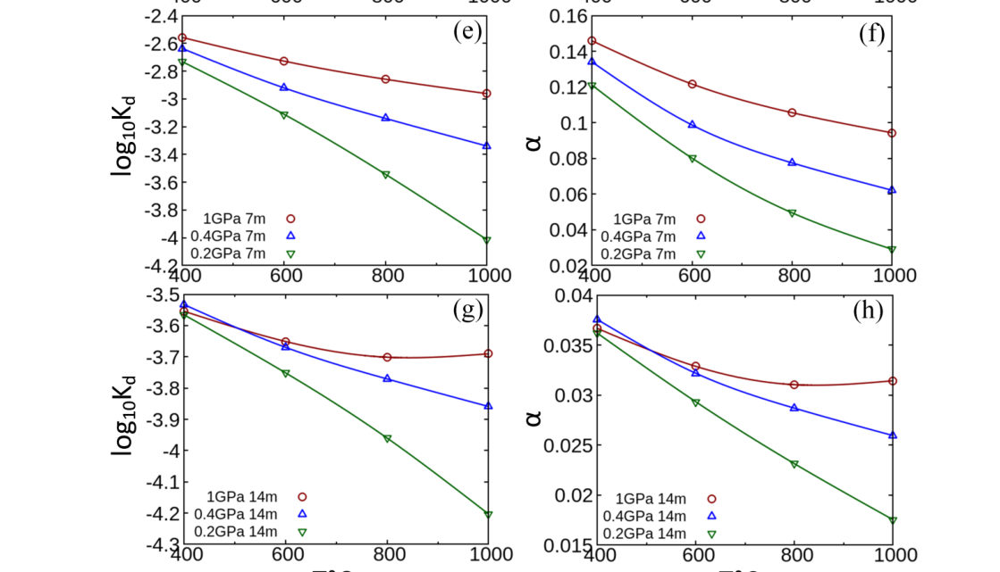
<figcaption class="paper-figure-caption"><b>Fig 5.</b> FIG. 4. Logarithm of the ideal dissociation constant and degree of dissociation of NaCl as a</figcaption>
</figure>

**Summary.** This study uses Molecular Dynamics simulations to map out how salt dissociation occurs in supercritical water under varying temperature, pressure, and salinity. The key finding is that increasing salt concentration does not guarantee higher ion availability because strong ion pairing and clustering dominate at high concentrations. This provides crucial molecular data for developing accurate thermodynamic models of concentrated electrolytes.

**Why it may be interesting.** While not directly quantum mechanical, this work addresses complex many-body interactions and phase behavior in extreme conditions, which informs the development of accurate statistical mechanics models required for understanding highly dense or non-ideal systems.

Detailed structure

**Main problem.** The study investigates how the degree of dissociation ($\alpha$) of NaCl changes as a function of salt concentration in supercritical aqueous fluids, challenging the assumption that higher salinity always means more free ions.

**Main result.** The mole fraction of structurally dissociated $	ext{Na}^+$ and $	ext{Cl}^-$ ions is non-monotonic with increasing salt concentration, peaking at low concentrations ($	ext{x}_{	ext{NaCl}} \approx 0.06–0.10$), indicating that high salinity leads to ion pairing/clustering.

**Method.** Classical Molecular Dynamics (MD) simulations were employed using established force fields and thermostats to model the fluid behavior across wide ranges of temperature, pressure, and composition.

**Model / system.** The system is an $	ext{H}_2	ext{O–NaCl}$ mixture simulated in supercritical conditions. The water is modeled by the flexible SPC/fw potential, and ion interactions use the Smith–Dang force field within a periodic boundary condition framework.

**Key observables.** Degree of dissociation ($\alpha$), ideal dissociation constant ($K_d$), average coordination number ($n_q$), and mole fraction of dissociated ions ($	ext{x}_{	ext{Cl}^-}$).

**Important parameters / regimes.** Temperature range: $673.15$ to $1273.15 	ext{ K}$; Pressure range: $0.1$ to $2 	ext{ GPa}$; Concentration: From moderate ($\approx 1 	ext{ mol/kg}$) to high ($x_{	ext{NaCl}} = 0.333$).

**Assumptions / limitations.** The use of classical MD simulations is necessary due to computational constraints, and the definition of 'dissociated' relies on geometric criteria (e.g., distance $r > q$) rather than solely thermodynamic equilibrium.

**Figures summary.** Figures illustrate the dependence of $\alpha$ and $\log_{10}K_d$ on salt concentration ($x_{	ext{NaCl}}$), showing a rapid decrease at high concentrations, and also show trends related to pressure and density.

**Paper structure.** The paper systematically analyzes the effect of varying $P$, $T$, and $x_{	ext{NaCl}}$ on ion association. It first establishes the simulation methodology, then presents results demonstrating that dissociation is limited by clustering effects at high salt loads, concluding with molecular constraints for thermodynamic models.

Abstract

We report classical molecular dynamics simulations of NaCl association and dissociation in supercritical aqueous fluids over a wide range of salt concentrations, from moderate salinity to highly concentrated H2O-NaCl mixtures attainable at high temperatures. The degree of dissociation a and the corresponding ideal dissociation constant Kd, derived directly from a, were calculated as functions of the stoichiometric NaCl mole fraction at selected pressure-temperature (PT) conditions from 673.15 to 1273.15 K and from 0.1 to 2 GPa. At moderate salinity corresponding to a molality of approximately 1 mol/kg, NaCl remains largely dissociated a = 0.3-0.7 depending on pressure and temperature). In contrast, when the mole fraction of NaCl increases up to xNaCl = 0.333 (27.8 mol/kg), the degree of dissociation tends towards zero, and most ions form Na$^+$Cl$^-$ contact pairs and multi-ion clusters. As a result of these competing trends, the mole fraction of structurally dissociated Na$^+$ and Cl$^-$ ions is a non-monotonic function of the stoichiometric NaCl concentration and typically reaches a maximum at xNaCl = 0.06-0.10. This result shows that increasing salinity does not necessarily increase the abundance of structurally available chloride ions in supercritical aqueous fluids. Additional fixed density simulations at 1 and 7 mol/kg extend the analysis up to 1673.15 K and separate the effects of temperature and density on the associate/dissociate state of the ions. The obtained concentration dependences provide molecular-level constraints for thermodynamic descriptions of concentrated supercritical electrolytes and for evaluating chloride availability in high-temperature aqueous fluids.

[↑ back to top](#top)

### [Enhanced approach to calculation of cluster integrals for lattice models of matter](http://arxiv.org/abs/2606.22123v1)

**Authors:** M. V. Ushcats, S. Yu. Ushcats  
**Type:** theory · **Category:** statistical mechanics · **PDF:** <https://arxiv.org/pdf/2606.22123v1>  
**Analysis basis:** full PDF text, analyzed in chunks
**Topic relevance:** `Keldysh / 2PI / non-Gaussian methods` **1/5**

↔ Scroll figures horizontally

<figure class="paper-figure-card">
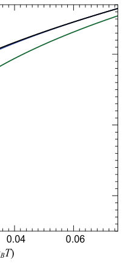
<figcaption class="paper-figure-caption"><b>Fig 1.</b> Figure 3. (Colour online) Magnetization curves of the 2D square Ising model with nearest-neighbor interactions at 𝑇= 0.8𝑇C (𝑇C is the Curie point). The circle corresponds to the exact spontaneous magnetization point of this Lee–Yang model [3, 5] at the same 𝑇. For each curve, Mayer’s expansion includes 10000 reducible cluster integrals calculated by using the scaling technique [29, 31, 32] on the basis of some limited set of irreducible integrals: a — {𝛽1, 𝛽2}; b — {𝛽1, 𝛽2, 𝛽3, 𝛽4, 𝛽5, 𝛽6}; c — {𝛽1, 𝛽2, 𝛽3, 𝛽4, 𝛽5, 𝛽6, 𝛽7, 𝛽8}.</figcaption>
</figure>

**Summary.** This paper presents significant algorithmic improvements for calculating high-order cluster integrals in lattice models using Mayer's expansion. By optimizing both the calculation at each integration point and by drastically reducing the required phase-space volume, the authors obtain new data for 2D and 3D systems. This advances the theoretical understanding of critical phenomena and phase transitions in these classical statistical mechanical models.

**Why it may be interesting.** While focused on classical statistical mechanics, the rigorous development of advanced summation techniques and handling of complex combinatorics is mathematically relevant to developing efficient simulation methods for quantum many-body systems.

Detailed structure

**Main problem.** The study focuses on enhancing computational techniques for calculating Mayer's expansion cluster integrals for lattice models of matter.

**Main result.** The proposed optimizations significantly reduce the required number of integration points and allow for the calculation of high-order cluster integrals (up to $n=9$) for 2D and 3D lattice models.

**Method.** Two main optimizations are introduced: simplifying integrand calculations at each point by exploiting phase-space independence, and drastically reducing the integration volume by accounting for physically identical configurations.

**Model / system.** The research applies to general lattice models of matter (e.g., lattice gases, Ising model) analyzed using Mayer's cluster expansion formalism. The results are presented as exact polynomial forms in terms of the Mayer function $f(T)$.

**Key observables.** Reducible and irreducible cluster integrals ($b_n$ and $eta_k$), which serve as power coefficients in the Mayer expansion of the partition function.

**Important parameters / regimes.** The order of the cluster integral ($n$), temperature dependence via $f(T)$, and lattice dimensionality (2D and 3D).

**Assumptions / limitations.** The method assumes that the Mayer's function can be simplified to take only a few discrete values, allowing the integrals to be expressed as polynomials in $f(T)$.

**Figures summary.** Figures illustrate relationships between connected diagrams and reducible/irreducible integrals. One figure shows magnetization curves approaching spontaneous magnetization as more irreducible integrals are included.

**Paper structure.** The paper develops theoretical optimizations for calculating cluster integrals, presents the enhanced computational framework (including combinatorial weight reductions), derives new data tables for high-order integrals in various lattice models, and discusses implications for phase transition analysis.

Abstract

The study is devoted to enhancing the existing techniques of calculating Mayer's expansion cluster integrals for lattice models of matter. Two important optimizations are proposed: simplifying the calculation of the integrand at each integration point and reducing the number of such integration points due to eliminating physically identical configurations. Based on those optimizations, new data on high-order cluster integrals are obtained for a number of 2D and 3D lattice models.

[↑ back to top](#top)

### [Fine-Tuned Machine-Learned Interatomic Potentials for Structural and Vibrational Properties of Twisted 2D Materials](http://arxiv.org/abs/2606.22234v1)

**Authors:** Viet-Anh Tran, Viet-Hung Nguyen, Wei Chen, Gian-Marco Rignanese, Jean-Christophe Charlier  
**Type:** theory · **Category:** numerical methods · **PDF:** <https://arxiv.org/pdf/2606.22234v1>  
**Analysis basis:** full PDF text, analyzed in chunks
**Topic relevance:** `Frenkel-Kontorova` **1/5**

↔ Scroll figures horizontally

<figure class="paper-figure-card">
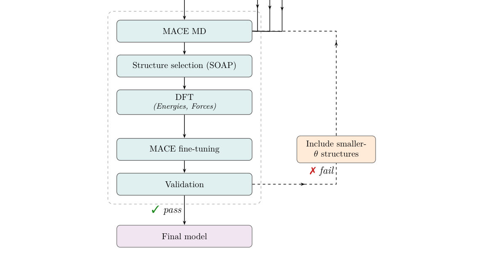
<figcaption class="paper-figure-caption"><b>Fig 1.</b> FIG. 1. Schematic fine-tuning workflow for twisted bilayer systems. Finite-temperature molecular</figcaption>
</figure>
<figure class="paper-figure-card">
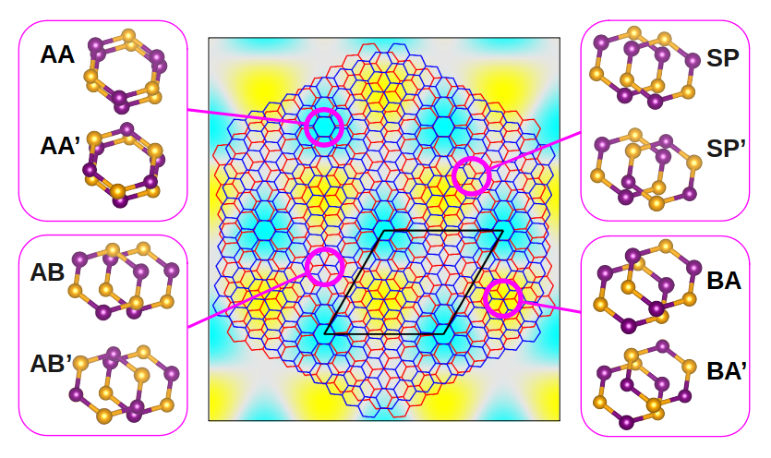
<figcaption class="paper-figure-caption"><b>Fig 2.</b> FIG. 2. High-symmetry stacking configurations for twisted bilayer graphene, h-BN, and MoS2.</figcaption>
</figure>
<figure class="paper-figure-card">
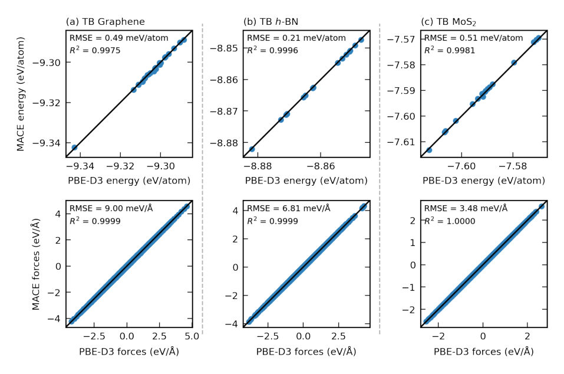
<figcaption class="paper-figure-caption"><b>Fig 3.</b> FIG. 3. Parity plots of fine-tuned MACE vs. PBE-D3 energies (top row) and forces (bottom row)</figcaption>
</figure>
<figure class="paper-figure-card">
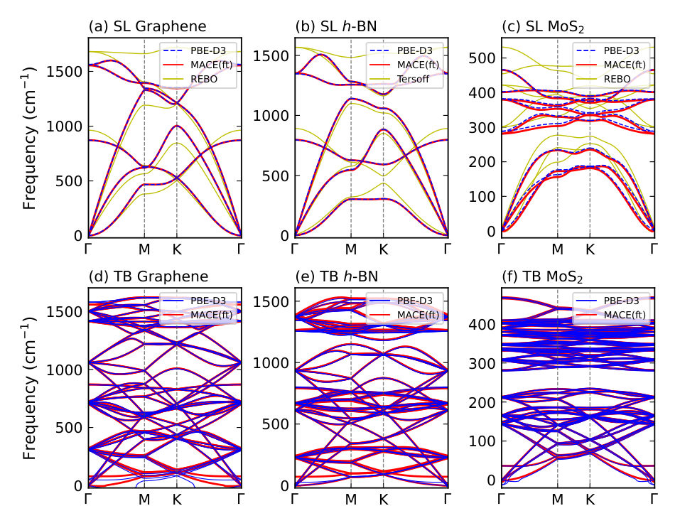
<figcaption class="paper-figure-caption"><b>Fig 4.</b> FIG. 4. Phonon dispersion relations for single-layer (SL) (a–c) and θ ≈21◦twisted bilayer (TB)</figcaption>
</figure>
<figure class="paper-figure-card">
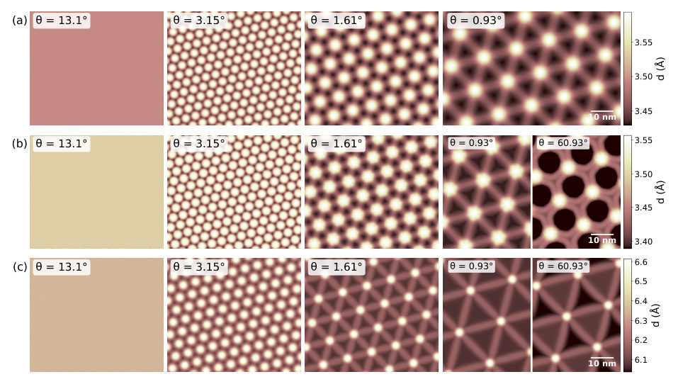
<figcaption class="paper-figure-caption"><b>Fig 5.</b> FIG. 5. Interlayer distance maps across the moir´e unit cell for twisted bilayer (a) graphene,</figcaption>
</figure>

**Summary.** This work develops and validates fine-tuned machine-learned interatomic potentials to accurately model the structure and vibrations of twisted 2D van der Waals materials. By achieving DFT accuracy efficiently, the authors map out strain landscapes and phonon responses in moiré superlattices, demonstrating a scalable method for studying low-angle quantum phenomena.

**Why it may be interesting.** The rigorous comparison between ML potentials and DFT benchmarks, especially in capturing subtle energy differences governing phase transitions or structural changes, provides a powerful new tool for simulating complex quantum materials dynamics.

Detailed structure

**Main problem.** Accurately modeling the structural and vibrational properties of moiré superlattices formed by twisted van der Waals bilayers, as these properties are highly sensitive to local stacking registry and atomic reconstruction.

**Main result.** Fine-tuning machine-learned potentials (MACE) achieves near-DFT accuracy for energetics and dynamics, successfully revealing a consistent reconstruction-induced strain landscape in materials like graphene, h-BN, and MoS2.

**Method.** The study employs fine-tuned Machine-Learned Interatomic Potentials (MLIPs) to overcome the computational cost of DFT for large moiré supercells, allowing detailed analysis of local strains and phonon spectra.

**Model / system.** The physical systems are twisted van der Waals bilayers (e.g., graphene, h-BN, MoS2). The modeling approach involves fine-tuning foundation MLIPs using DFT data derived from various stacking registries to capture subtle interlayer energetics.

**Key observables.** Local strain tensor components ($\epsilon_{ij}$), phonon dispersion spectra (unfolded), interlayer distances, and local twist angle deviations ($\Delta	heta$).

**Important parameters / regimes.** Small twist angles ($\sim 1-3^\circ$), mechanical compliance of the material, and external perturbations like vertical compression.

**Assumptions / limitations.** The core assumption is that fine-tuning a pre-trained foundation model provides an accurate and efficient alternative to full DFT calculations for these complex systems.

**Figures summary.** Figures illustrate workflow diagrams (fine-tuning process), parity plots comparing ML potentials to DFT, spatial maps of interlayer distances and strain components across moiré unit cells, and phonon dispersion curves showing spectral weight evolution under strain/compression.

**Paper structure.** The paper follows a structure of problem definition $
ightarrow$ methodology development (MLIP fine-tuning) $
ightarrow$ application to multiple materials (graphene, h-BN, MoS2) $
ightarrow$ detailed analysis of structural reconstruction and vibrational response under varying conditions (twist angle, compression).

Abstract

Twisted van der Waals bilayers form moiré superlattices whose structural and vibrational properties are highly sensitive to variations in local stacking registry and the degree of atomic reconstruction, yet accurate atomistic modeling of these systems at the DFT level remains computationally prohibitive at small twist angles. We investigate machine-learned interatomic potentials for moiré systems, using twisted bilayer graphene, \textit{h}-BN, and MoS$_2$ as representative materials spanning a broad spectrum of mechanical compliance and atomic reconstruction behavior. We show that fine-tuning universal atomistic foundation models is essential to achieve DFT accuracy for layered materials, as broadly trained foundation models prove insufficient for resolving the subtle interlayer energetics that govern atomic reconstruction. Through local strain tensor analysis and the phonon band unfolding technique, our fine-tuned MACE model reveals a consistent reconstruction-induced strain landscape in all three materials, with extended low-energy stacking domains separated by narrow soliton lines where deformation concentrates. The system progressively optimizes the local stacking registry within each domain, giving rise to a spatially structured deformation field whose amplitude scales with the mechanical compliance of the material and can be further tuned by external perturbation. The obtained results of both atomic reconstructed structures and moiré phonon spectra present a good agreement with the reported experiments, thereby demonstrating the accuracy and efficiency of our methodology in modeling of these large scale nanomaterials.

[↑ back to top](#top)

### [Nonlinear Static Screening of Positive Charges in an Electron Gas: Contact Hartree Energy](http://arxiv.org/abs/2606.23065v1)

**Authors:** M. Sherafati, G. Rodway-Gant, A. X. Chen  
**Type:** theory · **Category:** strongly correlated electrons · **PDF:** <https://arxiv.org/pdf/2606.23065v1>  
**Analysis basis:** full PDF text, analyzed in chunks
**Topic relevance:** `Keldysh / 2PI / non-Gaussian methods` **1/5**

↔ Scroll figures horizontally

<figure class="paper-figure-card">
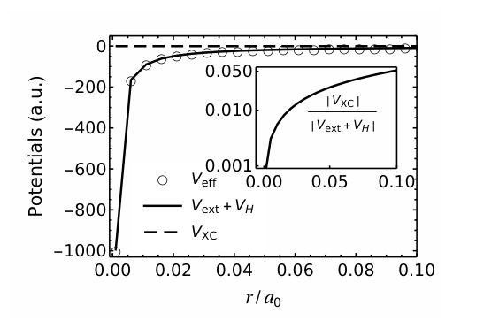
<figcaption class="paper-figure-caption"><b>Fig 1.</b> FIG. 1. Short-range dominance of the electrostatic KS potential near a proton impurity. The Kohn-Sham electro- static component Vext + VH is compared with the exchange- correlation contribution VXC. In the contact region, the ex- ternal Coulomb singularity dominates the effective potential, while VXC remains small on the electrostatic scale, as quan- tified by the inset ratio |VXC|/|Vext + VH|. This supports the use of Coulombic screened model potentials whose near-origin behavior is V (r) ∼−Z/r, with the screening parameter fixed self-consistently by the Friedel sum rule.</figcaption>
</figure>
<figure class="paper-figure-card">
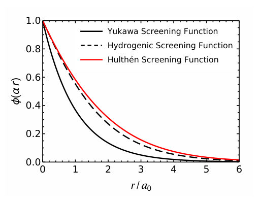
<figcaption class="paper-figure-caption"><b>Fig 2.</b> FIG. 2. Screening functions ϕ(αr) with α = 1 for the Yukawa, hydrogenic, and Hulth´en model potentials as a func- tion of distance r from the charge impurity. All three satisfy ϕ(0) = 1, implying the same Coulombic near-origin behav- ior V (r) ∼−Z/r. The Yukawa form decreases more rapidly at intermediate distances, while all three functions vanish at large r, giving comparable asymptotic screening. This shared short- and long-distance structure allows the same variable- phase treatment particularly similar rmin and rmax construc- tion for the three potentials.</figcaption>
</figure>
<figure class="paper-figure-card">
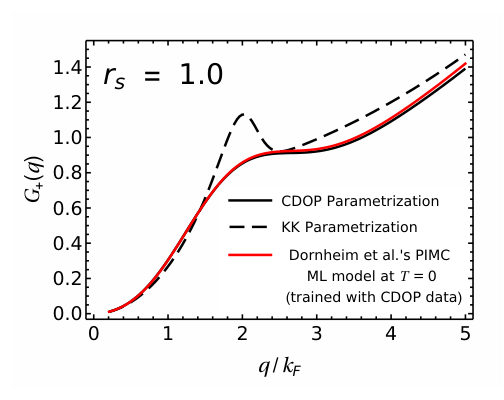
<figcaption class="paper-figure-caption"><b>Fig 3.</b> FIG. 3. Static density local-field factor G+(q) of the unpolar- ized uniform electron gas at rs = 1. The solid black curve shows the Corradini–Del Sole–Onida–Palummo (CDOP) parametrization [Eq. (A1)], the dashed black curve shows the Kaplan–Kukkonen (KK) parametrization [Eq. (A3)], and the red curve shows the machine-learning (ML) representation of Dornheim et al. evaluated at T = 0 [84]. For a direct point- by-point comparison, the KK and CDOP parametrizations were evaluated at the same discrete q values available in the Dornheim et al.’s dataset; consequently, the plotted curves do not extend to q = 0. The two analytic parametrizations share the same exact small-q and large-q constraints,...</figcaption>
</figure>
<figure class="paper-figure-card">

<figcaption class="paper-figure-caption"><b>Fig 4.</b> FIG. 4. Failure of linear response in the contact region of a statically screened proton. The normalized induced den- sity ∆n(r)/n0 at rs = 2.07 is shown for a DFT-based Es- treicher – Meier fit and for linear-response calculations us- ing RPA and RPA+LFC. Both linear-response treatments strongly underestimate the near-proton induced density be- cause the Coulomb perturbation is not weak at short dis- tances. Adding a local-field correction changes the linear- response curve but does not remove this fundamental contact- region deficiency. The inset compares the associated Friedel oscillations in the asymptotic tail.</figcaption>
</figure>
<figure class="paper-figure-card">
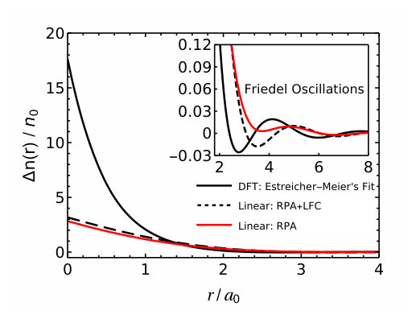
<figcaption class="paper-figure-caption"><b>Fig 5.</b> Fig. 5 shows the comparison between the LRT and the DFT in estimating normalized contact densities as a function of electron gas density parameter rs within the metallic range. Calculations are based on Eqs. (17) considering n(0)/n0 = ∆n(0)/n0 +1 with dielectric func- tions from Eqs. (15) and (18). Following Eq. (12), the discrepancy between the LRT and DFT data becomes much more pronounced as rs increases. Conversely, one would expect that the LRT data converge to those by DFT only at the limit of high-density gas with rs ≪1. Fig. 6 shows the contact Hartree potential energy as a function of the gas density parameter rs within the metal- lic range obtained within the LRT regimes. The data...</figcaption>
</figure>

**Summary.** This paper rigorously investigates how positive charges are screened by an electron gas, focusing specifically on the highly non-linear contact interaction energy. By comparing results from linear response theory (like RPA) against full DFT calculations, it establishes a robust benchmark for understanding strong correlation effects near impurities. This work is vital for accurately modeling charge interactions in condensed matter systems.

**Why it may be interesting.** While focused on jellium screening, the rigorous comparison between linear-response approximations and fully self-consistent nonlinear methods provides a crucial theoretical baseline for understanding charge localization and correlation effects in dense matter relevant to quantum systems.

Detailed structure

**Main problem.** The study focuses on calculating the nonlinear static screening of a positive charge (like a proton) embedded in a homogeneous electron gas.

**Main result.** The work establishes a unified, non-local benchmark for the contact Hartree energy that successfully compares results from various theoretical approximations against full self-consistent DFT calculations.

**Method.** The authors employ advanced many-body techniques including Density Functional Theory (DFT), Linear Response Theory (LRT), and model potential analyses using variable-phase scattering formulations.

**Model / system.** The system is the jellium approximation of an electron gas interacting with a static positive impurity charge. The analysis spans from linear response regimes to strongly nonlinear near-field interactions.

**Key observables.** Contact Hartree energy ($U_{	ext{H}}(0)$), induced electron density ($
ho_{	ext{ind}}$), and various screened Coulomb potentials (Yukawa, hydrogenic).

**Important parameters / regimes.** The screening length parameter ($r_s$), the Fermi wavevector ($k_F$), and the impurity charge ($Z$).

**Assumptions / limitations.** Key approximations include using LDA for DFT benchmarks and comparing results derived from different local-field correction parametrizations.

**Paper structure.** The paper develops theory by deriving expressions for the contact potential in both real and momentum space, compares linear response predictions (RPA, TF) against nonlinear DFT benchmarks, and analyzes model potentials constrained by the Friedel sum rule.

Abstract

Electron screening of positive charges in metals is most strongly nonlinear in the static near-field regime. We revisit screening of a static single protonic charge in a homogeneous electron gas, focusing on the induced density and the contact Hartree energy $U_{\text{H}}(0)$. Although evaluated at the impurity position, $U_{\text{H}}(0)$ is not purely local: our formulation makes it explicit as a nonlocal quantity set by a radial moment of the full induced density, applicable to both linear-response and nonlinear density-functional-theory (DFT) descriptions. We compare Thomas--Fermi, Lindhard/random-phase-approximation, and local-field-corrected dielectric models with nonlinear DFT benchmarks. The Estreicher--Meier local-density-approximation (LDA) parametrization reproduces the contact Hartree energy from our direct LDA calculations and the self-consistent results of Almbladh \emph{et al.} [\href{https://doi.org/10.1103/PhysRevB.14.2250}{Phys. Rev. B \textbf{14}, 2250 (1976)}]. This validates the unified $U_{\text{H}}(0)$ implementation, separates the hydrogenic density profile from non-negligible Friedel oscillations, and provides a compact nonlinear reference for linear-response theory. Testing modern local-field factors, the Corradini--Del Sole--Onida--Palummo and Kaplan--Kukkonen parametrizations yield indistinguishable contact screening despite differing near $q\simeq 2k_F$. We also analyze Yukawa, hydrogenic, and Hulthén screened Coulomb potentials via a variable-phase scattering formulation constrained by the Friedel sum rule; these give a useful phase-shift representation of static screening but cannot alone reproduce the nonlinear DFT contact Hartree energy. The results establish a one-center nonlinear screening benchmark for proton impurities in jellium and clarify the baseline needed before treating two-center screening relevant to low-energy fusion in condensed matter.

[↑ back to top](#top)

### [Reentrant superconductivity enabled by spin-orbit coupling: Application to UTe$_2$](http://arxiv.org/abs/2606.23638v1)

**Authors:** Changhee Lee, Nico A. Hackner, Daniel F. Agterberg, P. M. R. Brydon  
**Type:** theory · **Category:** strongly correlated electrons · **PDF:** <https://arxiv.org/pdf/2606.23638v1>  
**Analysis basis:** full PDF text, analyzed in chunks
**Topic relevance:** `Keldysh / 2PI / non-Gaussian methods` **1/5**

↔ Scroll figures horizontally

<figure class="paper-figure-card">
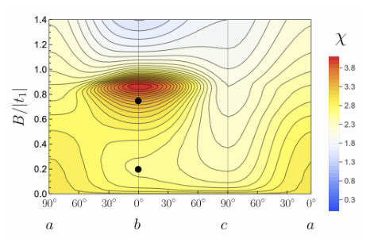
<figcaption class="paper-figure-caption"><b>Fig 1.</b> Figure 1. Magnetic Field-Angle superconducting phase di- agram at a constant temperature T = 0.005|t1| obtained by using the same model as that used for Fig. 2. The color gradi- ent represents the pairing susceptibility χ of an opposite-spin spin-triplet pairing channel represented by τysy. The black dot indicates the magnetic field used to obtain Figure. 3(b)</figcaption>
</figure>
<figure class="paper-figure-card">
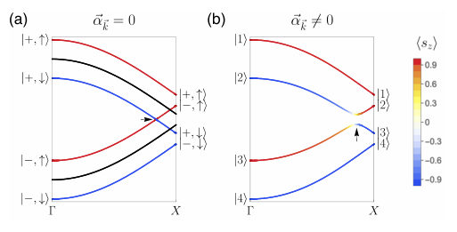
<figcaption class="paper-figure-caption"><b>Fig 2.</b> Figure 3. A schematic of the band structure from the Hamil- tonian h⃗k with the Zeeman coupling along the Γ point and a time-reversal invariant momentum X in the first Brillouin zone. The black lines depicts the two two-fold degenerate bands at zero Zeeman field while the color-coded lines repre- sent the electronic bands at a finite Zeeman field. Red and blue indicate that the average spin polarization of the corre- sponding electronic state is aligned parallel and antiparallel to the Zeeman field, respectively, while the intermediate val- ues are represented by a color gradient. The arrows mark the crossing (anticrossing) of two middle bands originating from |+, ↓⟩and |B, ↑⟩at the Γ point...</figcaption>
</figure>
<figure class="paper-figure-card">
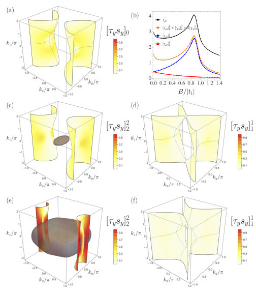
<figcaption class="paper-figure-caption"><b>Fig 3.</b> Figure 2. Hole pockets of UTe2 obtained by using the hopping amplitudes (t1, t2) = (−1, 0.76), (m0, t3, t4) = (−0.87, 0.83, −0.83), and (α1, α2, α3) = (0.448, 0.224, 0.112) at (a) zero field, (b-c) a finite Zeeman field By = 0.2|t1|, and (d-e) By = 0.75|t1|. µ = 1.625 is used for (a) and µ for (b) is determined by the number conservation. The color gradi- ent in (a) depicts the half of the total pairing susceptibility [τysy]0 defined at zero-field. The gray surfaces in (c) and (e) represent the anticrossing surface: pairing is significantly en- hanced when this intersects the Fermi surface, as shown in (e).</figcaption>
</figure>

**Summary.** This theoretical work explains the unusual reentrant superconducting phase in UTe2 by proposing that spin-orbit coupling interacting with sublattice structure is the key driver. The theory predicts that strong magnetic fields enhance opposite-spin Cooper pairing when band hybridization causes an anticrossing, successfully reproducing the material's anisotropic phase diagram.

**Why it may be interesting.** The mechanism relies heavily on how SOC modifies electronic bands under external fields, leading to enhanced pairing channels—a concept relevant to understanding exotic superconductivity in strongly correlated materials where orbital degrees of freedom are crucial.

Detailed structure

**Main problem.** The paper aims to explain the reentrant superconductivity observed in UTe2 under a magnetic field, as standard mechanisms fail to account for its complex phase diagram.

**Main result.** Reentrance is attributed to the interplay between sublattice degrees of freedom and spin-orbit coupling (SOC), which enhances opposite-spin Cooper pairing at high fields via an anticrossing mechanism.

**Method.** The authors developed a generic theory involving analytical treatment of the superconducting pairing susceptibility ($\chi$) derived from a tight-binding Hamiltonian incorporating SOC and Zeeman coupling.

**Model / system.** The system is UTe2, modeled using an effective Hamiltonian that includes hopping terms, staggered spin-orbit coupling, and Zeeman coupling acting on sublattice degrees of freedom. The theory focuses on opposite-spin Cooper pairing channels.

**Key observables.** Pairing susceptibility ($\chi$) as a function of magnetic field strength and angle; the superconducting phase diagram vs. B.

**Important parameters / regimes.** Spin-orbit coupling (SOC) strength, Zeeman field magnitude ($B$), sublattice hopping parameters, and the symmetry of the pairing state ($B_{3u}$).

**Assumptions / limitations.** The theory assumes that the reentrance is driven by SOC interplay rather than magnetism or quantum critical points; it also uses a simplified description of f-electron physics.

**Figures summary.** Figures illustrate the magnetic field-angle superconducting phase diagram showing $\chi$, and band structure evolution demonstrating an anticrossing surface responsible for pairing enhancement at high fields.

**Paper structure.** The paper progresses from identifying the failure of existing models to proposing a generic theory based on SOC interplay. It details the Hamiltonian, analyzes the pairing susceptibility ($\chi$) through field-dependent band structure calculations (anticrossings), and concludes by matching the resulting phase diagram to UTe2's experimental observations.

Abstract

Reentrant superconductivity has been understood primarily in terms of the Jaccarino-Peter field-compensation effect or from a change of the strength in the pairing interaction. However, neither mechanism appears able to entirely explain the remarkable phase diagram of UTe$_2$. Here we propose a generic theory of the field-enhancement of opposite-spin Cooper pairings which does not necessitate the coexistence of magnetism or the vicinity of a magnetic quantum critical point. Our analytical treatment shows that the reentrance has its origin in the interplay of the sublattice degrees of freedom and spin-orbit coupling, which can can strikingly enhance opposite-spin Cooper pairings at strong Zeeman fields. Based on these results, we show that a pairing state with B$_{3u}$ symmetry can reproduce the highly anisotropic phase diagram of the reentrant superconducting state of UTe$_2$.

[↑ back to top](#top)

### [Tomography of Transport Pathways in Selective-Area-Grown Nanowires Using Angle-Resolved Conductance Fluctuations](http://arxiv.org/abs/2606.23053v1)

**Authors:** Christian E. N. Petersen, Damon J. Carrad, Daria Beznasyuk, Thomas S. Jespersen  
**Type:** experiment · **Category:** other · **PDF:** <https://arxiv.org/pdf/2606.23053v1>  
**Analysis basis:** full PDF text, analyzed in chunks
**Topic relevance:** `non-equilibrium dynamics` **1/5**

↔ Scroll figures horizontally

<figure class="paper-figure-card">
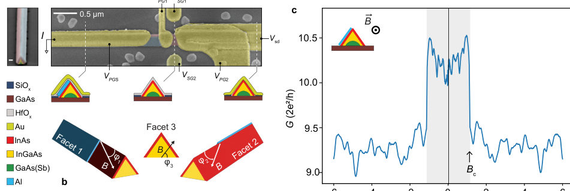
<figcaption class="paper-figure-caption"><b>Fig 1.</b> FIG. 1. a, False-colored scanning electron micrograph of a typical as-grown nanowire (leftmost inset; scale bar is 100 nm) and a hybrid normal-superconductor device with schematic cross-sections shown at three positions (rightmost inset). b, Definition of facet planes and angles φ1, φ2, φ3 of the magnetic field, B, with respect to the nanowire geometry. c, Conductance G as a function of magnetic field applied parallel to the nanowire, B∥. Bc indicates the critical field of the superconducting Al.</figcaption>
</figure>
<figure class="paper-figure-card">
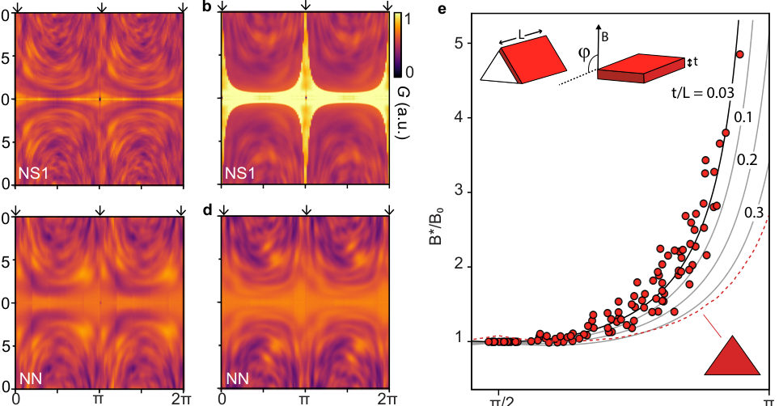
<figcaption class="paper-figure-caption"><b>Fig 2.</b> FIG. 2. Differential conductance for Device NS (a-b) and NN (c-d) as a function of |B| and the field angles, φ1, φ2. The arrows indicate the orientation of the nanowire axis. e, Magnetic-field positions B∗(φ) of interference features extracted from Fig. 2a-d and normalized by their corresponding value B0 at φ = π/2. Dashed red line shows the expected behavior for a solid triangular nanowire, obtained from numerical simulations. Solid lines show the expected behavior for rectangular box with varying surface accumulation layer thickness-to-length ratio, t/L.</figcaption>
</figure>
<figure class="paper-figure-card">
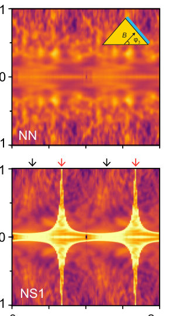
<figcaption class="paper-figure-caption"><b>Fig 3.</b> FIG. 3. Differential conductance for Device NN (a) and NS1 (b) as a function of |B| and the field angle, φ3, within the plane normal to the nanowire axis. Arrow in panel (b) indi- cate the orientatins of the two facet planes forming an angle of ∼70◦</figcaption>
</figure>

**Summary.** The researchers used conductance fluctuation tomography on InAs nanowires to map the spatial paths of charge carriers. By analyzing how electrical conductance fluctuates with applied magnetic fields and field angles, they successfully distinguished between bulk conduction and transport confined to near-surface accumulation layers. This technique proves that universal conductance fluctuations serve as a sensitive probe for phase-coherent electronic pathways in nanoscale devices.

**Why it may be interesting.** This work provides a powerful experimental demonstration of using quantum interference phenomena (UCF) as a non-invasive tomographic tool to map out complex electronic pathways in solid-state nanostructures, relevant for understanding mesoscopic physics.

Detailed structure

**Main problem.** The study aims to determine the spatial distribution of charge carriers within nanoscale semiconductor nanowires by probing phase-coherent transport pathways.

**Main result.** Conductance fluctuation tomography successfully distinguishes between bulk, near-surface, and facet-confined transport regimes, indicating that transport is dominated by a near-surface accumulation layer in InAs nanowires.

**Method.** The researchers employed conductance fluctuation tomography using universal conductance fluctuations (UCF) measured as the magnetic field strength and orientation were varied across planar selective-area-grown nanowires.

**Model / system.** The physical system is a planar array of selectively-area-grown InAs nanowires, tested in both normal-normal (NN) and normal-superconductor (NS) geometries. The analysis compares experimental data against theoretical models describing transport through bulk vs. near-surface facets.

**Key observables.** Two-terminal conductance $G$ as a function of magnetic field ($|B|$) and orientation ($\phi$), the magnitude of universal conductance fluctuations ($\sim e^2/h$), and extracted series resistance ($R_s$).

**Important parameters / regimes.** Low temperatures ($T \sim 20\ 	ext{mK}$), superconducting gap features, and geometric parameters derived from field dependence.

**Assumptions / limitations.** The analysis assumes that conductance fluctuations are governed by interference loops enclosing magnetic flux, allowing for geometry inference; it also models transport based on distinct physical scenarios (bulk vs. surface).

**Figures summary.** Figures show SEM images and device schematics, angle-resolved conductance maps ($G$ vs. $B$ and $\phi$), extracted patterns of fluctuation extrema ($B^*(\phi)$), and Monte Carlo simulations comparing experimental data to projected area models for different transport geometries.

**Paper structure.** The paper proceeds by establishing the physical setup (SAG nanowires, NN/NS devices) and measurement techniques (UCF tomography). It then analyzes the angular dependence of conductance fluctuations, fitting these patterns to theoretical models that distinguish between bulk, near-surface, and facet-confined transport pathways.

Abstract

Understanding the spatial distribution of carriers is important for interpreting transport in nanoscale devices. Here, we apply conductance fluctuation tomography to planar selective-area-grown InAs nanowires in both normal-normal and normal-superconductor device geometries. By tracking the evolution of conductance-interference features as a function of magnetic-field strength and orientation, we extract information about the geometry of phase-coherent transport pathways. Using theory to distinguish between bulk-dominated transport, coherent near-surface transport across facets, and transport confined to individual facets. The measurements are consistent with transport dominated by a near-surface accumulation layer in InAs. Devices with normal contacts show behavior consistent with coherent transport across the nanowire apex, whereas hybrid normal-superconductor devices exhibit signatures of more facet-dependent transport. These results demonstrate how universal conductance fluctuations can be used as a tomographic probe of phase-coherent transport pathways in semiconductor nanostructures.

[↑ back to top](#top)
