
# arxiv digest (quant-ph + cond-mat) — 2026-06-24

*112 papers · 38 relevant · 0 highlighted*

## 🔥 Most relevant (38)

*Every paper with at least one nonzero topic score, sorted by best-matching score. 🔥 marks scores ≥4/5. Click the title to jump to the full entry below; click [arXiv] to open the paper page. `(secondary)` marks papers from de-prioritized cond-mat archives.*

Show 38 relevant papers

- [Introduction to matrix-product states and tensor networks](#paper-2606.24803) [[arXiv]](http://arxiv.org/abs/2606.24803v1) — 🔥 `methods for driven-dissipative` **5/5** · 🔥 `analog quantum simulation` **4/5** · 🔥 `entanglement & information structure` **4/5** · 🔥 `non-equilibrium dynamics` **4/5** · `correlated / nonlocal dissipation` **3/5** · `driven-dissipative phase transition` **3/5** · `Keldysh / 2PI / non-Gaussian methods` **2/5** · `non-equilibrium universality` **2/5** · `Kondo & dissipative impurity` **1/5** · `Tavis-Cummings & cavity-many-emitter` **1/5** · `correlated cavity matter` **1/5** · `exotic spin models in light-matter` **1/5** · `scars & prethermalization` **1/5**
- [Quantum droplets and condensates in an optical lattice coupled to a dissipative cavity: Collective excitations and non-equilibrium dynamics](#paper-2606.24580) [[arXiv]](http://arxiv.org/abs/2606.24580v1) — 🔥 `non-equilibrium dynamics` **5/5** · 🔥 `analog quantum simulation` **4/5** · 🔥 `driven-dissipative phase transition` **4/5** · `Tavis-Cummings & cavity-many-emitter` **3/5** · `correlated cavity matter` **3/5** · `methods for driven-dissipative` **3/5** · `non-equilibrium universality` **3/5** · `correlated / nonlocal dissipation` **2/5** · `Frenkel-Kontorova` **1/5** · `Keldysh / 2PI / non-Gaussian methods` **1/5** · `entanglement & information structure` **1/5**
- [Out-of-equilibrium scaling of the particle density in quantum fermionic wires after a critical quenching of the chemical potential](#paper-2606.24395) [[arXiv]](http://arxiv.org/abs/2606.24395v1) — 🔥 `non-equilibrium universality` **5/5** · 🔥 `non-equilibrium dynamics` **4/5** · `driven-dissipative phase transition` **3/5** · `analog quantum simulation` **2/5** · `Frenkel-Kontorova` **1/5** · `Keldysh / 2PI / non-Gaussian methods` **1/5** · `correlated / nonlocal dissipation` **1/5** · `entanglement & information structure` **1/5** · `methods for driven-dissipative` **1/5**
- [Anomalous weak values in a generalized Mach-Zehnder interferometer extracted directly from intensity measurements](#paper-2606.24798) [[arXiv]](http://arxiv.org/abs/2606.24798v1) — 🔥 `quantum measurements` **5/5** · `interference shaping light` **3/5** · `measurement-induced transitions` **1/5** · `quantum optics experiment` **1/5**
- [Multipartite synchronization residuals in driven-dissipative spin networks](#paper-2606.24360) [[arXiv]](http://arxiv.org/abs/2606.24360v1) — 🔥 `Tavis-Cummings & cavity-many-emitter` **4/5** · 🔥 `methods for driven-dissipative` **4/5** · `analog quantum simulation` **3/5** · `correlated / nonlocal dissipation` **3/5** · `correlated cavity matter` **3/5** · `driven-dissipative phase transition` **3/5** · `entanglement & information structure` **3/5** · `exotic spin models in light-matter` **2/5** · `non-equilibrium dynamics` **2/5** · `non-equilibrium universality` **2/5** · `Keldysh / 2PI / non-Gaussian methods` **1/5** · `Rydberg arrays` **1/5** · `spintronics-quantum-optics interface` **1/5**
- [Suppressing Self-Discharging of Quantum Batteries by Cavity Interactions](#paper-2606.23999) [[arXiv]](http://arxiv.org/abs/2606.23999v1) — 🔥 `correlated / nonlocal dissipation` **4/5** · 🔥 `methods for driven-dissipative` **4/5** · `Tavis-Cummings & cavity-many-emitter` **3/5** · `correlated cavity matter` **3/5** · `driven-dissipative phase transition` **3/5** · `entanglement & information structure` **2/5** · `non-equilibrium dynamics` **2/5** · `non-equilibrium universality` **2/5** · `Dicke superradiance` **1/5** · `Keldysh / 2PI / non-Gaussian methods` **1/5** · `analog quantum simulation` **1/5** · `scars & prethermalization` **1/5**
- [Andreev exceptional points in Josephson junctions formed by minimal Kitaev chains](#paper-2606.23956) [[arXiv]](http://arxiv.org/abs/2606.23956v1) `(secondary)` — 🔥 `driven-dissipative phase transition` **4/5** · 🔥 `methods for driven-dissipative` **4/5** · `Keldysh / 2PI / non-Gaussian methods` **3/5** · `correlated / nonlocal dissipation` **3/5** · `non-equilibrium universality` **3/5** · `Kondo & dissipative impurity` **2/5** · `non-equilibrium dynamics` **2/5** · `Frenkel-Kontorova` **1/5** · `analog quantum simulation` **1/5**
- [Quantum-enabled active matter at the atomic scale](#paper-2606.24615) [[arXiv]](http://arxiv.org/abs/2606.24615v1) — 🔥 `analog quantum simulation` **4/5** · 🔥 `methods for driven-dissipative` **4/5** · `exotic spin models in light-matter` **3/5** · `non-equilibrium dynamics` **3/5** · `spintronics-quantum-optics interface` **3/5** · `driven-dissipative phase transition` **2/5** · `Keldysh / 2PI / non-Gaussian methods` **1/5** · `correlated / nonlocal dissipation` **1/5** · `entanglement & information structure` **1/5** · `non-equilibrium universality` **1/5**
- [Rapid Cavity-Based Mid-Circuit Measurement and Feedforward in a Neutral Atom Array](#paper-2606.24869) [[arXiv]](http://arxiv.org/abs/2606.24869v1) — 🔥 `QC/QI experiment` **4/5** · 🔥 `quantum measurements` **4/5** · `Tavis-Cummings & cavity-many-emitter` **3/5** · `analog quantum simulation` **3/5** · `measurement-induced transitions` **3/5** · `quantum optics experiment` **2/5** · `Rydberg arrays` **1/5** · `correlated cavity matter` **1/5** · `non-equilibrium dynamics` **1/5**
- [Non-adiabatic transitions in the density matrix formalism](#paper-2606.24310) [[arXiv]](http://arxiv.org/abs/2606.24310v1) — 🔥 `methods for driven-dissipative` **4/5** · `Keldysh / 2PI / non-Gaussian methods` **3/5** · `correlated / nonlocal dissipation` **3/5** · `driven-dissipative phase transition` **3/5** · `non-equilibrium dynamics` **2/5** · `non-equilibrium universality` **2/5** · `Kondo & dissipative impurity` **1/5** · `analog quantum simulation` **1/5** · `measurement-induced transitions` **1/5** · `quantum measurements` **1/5**
- [When does dissipation help neural surrogates learn open quantum dynamics?](#paper-2606.23894) [[arXiv]](http://arxiv.org/abs/2606.23894v1) — 🔥 `methods for driven-dissipative` **4/5** · `analog quantum simulation` **3/5** · `driven-dissipative phase transition` **3/5** · `non-equilibrium dynamics` **3/5** · `Keldysh / 2PI / non-Gaussian methods` **2/5** · `non-equilibrium universality` **2/5** · `correlated / nonlocal dissipation` **1/5** · `entanglement & information structure` **1/5** · `exotic spin models in light-matter` **1/5** · `quantum measurements` **1/5**
- [Revealing high-dimensional entanglement through symmetry](#paper-2606.23817) [[arXiv]](http://arxiv.org/abs/2606.23817v1) — 🔥 `entanglement & information structure` **4/5** · `interference shaping light` **3/5** · `quantum measurements` **3/5** · `quantum optics experiment` **3/5** · `QC/QI experiment` **2/5** · `measurement-induced transitions` **2/5** · `analog quantum simulation` **1/5** · `methods for driven-dissipative` **1/5** · `non-equilibrium dynamics` **1/5**
- [Generalized Fourier's law in mesoscopic systems](#paper-2606.23909) [[arXiv]](http://arxiv.org/abs/2606.23909v1) — 🔥 `Keldysh / 2PI / non-Gaussian methods` **4/5** · `correlated / nonlocal dissipation` **3/5** · `methods for driven-dissipative` **3/5** · `non-equilibrium dynamics` **3/5** · `driven-dissipative phase transition` **2/5** · `non-equilibrium universality` **2/5** · `Kondo & dissipative impurity` **1/5** · `analog quantum simulation` **1/5**
- [The Interplay of Thermal Melting and Pump Driven Melting of Charge Order: A Two-Temperature Study of the Holstein Model](#paper-2606.24800) [[arXiv]](http://arxiv.org/abs/2606.24800v1) — 🔥 `non-equilibrium dynamics` **4/5** · `Keldysh / 2PI / non-Gaussian methods` **3/5** · `driven-dissipative phase transition` **3/5** · `methods for driven-dissipative` **3/5** · `non-equilibrium universality` **2/5** · `Frenkel-Kontorova` **1/5** · `analog quantum simulation` **1/5** · `correlated / nonlocal dissipation` **1/5** · `correlated cavity matter` **1/5**
- [Initial-state-dependent dephasing effect in non-Hermitian Su-Schrieffer-Heeger models](#paper-2606.24185) [[arXiv]](http://arxiv.org/abs/2606.24185v1) — 🔥 `methods for driven-dissipative` **4/5** · `correlated / nonlocal dissipation` **3/5** · `driven-dissipative phase transition` **3/5** · `non-equilibrium dynamics` **2/5** · `non-equilibrium universality` **2/5** · `Keldysh / 2PI / non-Gaussian methods` **1/5** · `Kondo & dissipative impurity` **1/5** · `analog quantum simulation` **1/5** · `entanglement & information structure` **1/5**
- [Quantum turbulence in the many-body regime](#paper-2606.23822) [[arXiv]](http://arxiv.org/abs/2606.23822v1) — 🔥 `non-equilibrium dynamics` **4/5** · `analog quantum simulation` **3/5** · `non-equilibrium universality` **3/5** · `driven-dissipative phase transition` **2/5** · `methods for driven-dissipative` **2/5** · `Frenkel-Kontorova` **1/5** · `Keldysh / 2PI / non-Gaussian methods` **1/5** · `correlated / nonlocal dissipation` **1/5** · `entanglement & information structure` **1/5**
- [Monitoring Beam Splitter Entanglement using Quantumness](#paper-2606.24242) [[arXiv]](http://arxiv.org/abs/2606.24242v1) — 🔥 `quantum optics experiment` **4/5** · `entanglement & information structure` **3/5** · `quantum measurements` **3/5** · `correlated / nonlocal dissipation` **2/5** · `measurement-induced transitions` **2/5** · `QC/QI experiment` **1/5** · `driven-dissipative phase transition` **1/5** · `interference shaping light` **1/5**
- [Anyon Exchange Phase from Antidot Interferometry](#paper-2606.24831) [[arXiv]](http://arxiv.org/abs/2606.24831v1) — 🔥 `Keldysh / 2PI / non-Gaussian methods` **4/5** · `methods for driven-dissipative` **3/5** · `non-equilibrium dynamics` **3/5** · `driven-dissipative phase transition` **2/5** · `Kondo & dissipative impurity` **1/5** · `analog quantum simulation` **1/5** · `interference shaping light` **1/5** · `non-equilibrium universality` **1/5**
- [From Spectral Singularities to Multipartite Entanglement Scaling at Higher-Order Exceptional Points](#paper-2606.24205) [[arXiv]](http://arxiv.org/abs/2606.24205v1) — 🔥 `entanglement & information structure` **4/5** · `analog quantum simulation` **3/5** · `driven-dissipative phase transition` **2/5** · `non-equilibrium universality` **2/5** · `Keldysh / 2PI / non-Gaussian methods` **1/5** · `Kondo & dissipative impurity` **1/5** · `correlated / nonlocal dissipation` **1/5** · `methods for driven-dissipative` **1/5** · `non-equilibrium dynamics` **1/5**
- [Infinite-Level Hierarchy of Solvable Quantum Circuits](#paper-2606.23803) [[arXiv]](http://arxiv.org/abs/2606.23803v1) — 🔥 `entanglement & information structure` **4/5** · `methods for driven-dissipative` **3/5** · `non-equilibrium dynamics` **3/5** · `non-equilibrium universality` **2/5** · `Keldysh / 2PI / non-Gaussian methods` **1/5** · `analog quantum simulation` **1/5** · `correlated / nonlocal dissipation` **1/5** · `driven-dissipative phase transition` **1/5**
- [The Quantum Split-Step Fourier Algorithm for Nonlinear Optical Waveguides](#paper-2606.24643) [[arXiv]](http://arxiv.org/abs/2606.24643v1) — 🔥 `entanglement & information structure` **4/5** · `methods for driven-dissipative` **3/5** · `non-equilibrium dynamics` **3/5** · `non-equilibrium universality` **2/5** · `Keldysh / 2PI / non-Gaussian methods` **1/5** · `correlated / nonlocal dissipation` **1/5** · `driven-dissipative phase transition` **1/5** · `interference shaping light` **1/5**
- [Two-Dimensional Phase Transitions in Classical Systems: 60 Years after the Hohenberg-Mermin-Wagner Theorem](#paper-2606.24091) [[arXiv]](http://arxiv.org/abs/2606.24091v1) — 🔥 `non-equilibrium dynamics` **4/5** · 🔥 `non-equilibrium universality` **4/5** · `driven-dissipative phase transition` **3/5** · `Frenkel-Kontorova` **1/5** · `Keldysh / 2PI / non-Gaussian methods` **1/5** · `analog quantum simulation` **1/5** · `correlated / nonlocal dissipation` **1/5** · `methods for driven-dissipative` **1/5**
- [Recursive behavior in a diatomic FPUT lattice](#paper-2606.24280) [[arXiv]](http://arxiv.org/abs/2606.24280v1) — 🔥 `non-equilibrium dynamics` **4/5** · `non-equilibrium universality` **3/5** · `scars & prethermalization` **3/5** · `Frenkel-Kontorova` **2/5** · `Keldysh / 2PI / non-Gaussian methods` **1/5** · `driven-dissipative phase transition` **1/5** · `methods for driven-dissipative` **1/5**
- [Exact log-odds representation and mean-field criticality of a growing social group model](#paper-2606.24818) [[arXiv]](http://arxiv.org/abs/2606.24818v1) — 🔥 `non-equilibrium universality` **4/5** · `driven-dissipative phase transition` **3/5** · `non-equilibrium dynamics` **3/5** · `Keldysh / 2PI / non-Gaussian methods` **1/5** · `correlated / nonlocal dissipation` **1/5** · `entanglement & information structure` **1/5** · `methods for driven-dissipative` **1/5**
- [Picosecond Schrödinger cat states for ultrafast optical quantum processing](#paper-2606.24002) [[arXiv]](http://arxiv.org/abs/2606.24002v1) — 🔥 `QC/QI experiment` **4/5** · `interference shaping light` **3/5** · `quantum optics experiment` **3/5** · `quantum measurements` **2/5**
- [Spectrally engineered collinear type-0 SPDC source with enhanced spectral brightness for entanglement distribution](#paper-2606.24036) [[arXiv]](http://arxiv.org/abs/2606.24036v1) — 🔥 `quantum optics experiment` **4/5** · `QC/QI experiment` **3/5** · `interference shaping light` **3/5** · `entanglement & information structure` **1/5** · `free-space correlated emission` **1/5**
- [Universality beyond the Kibble-Zurek mechanism in the condensation of coherently coupled Bose gases](#paper-2606.24864) [[arXiv]](http://arxiv.org/abs/2606.24864v1) — 🔥 `non-equilibrium universality` **4/5** · `non-equilibrium dynamics` **3/5** · `Keldysh / 2PI / non-Gaussian methods` **1/5** · `analog quantum simulation` **1/5** · `correlated / nonlocal dissipation` **1/5** · `driven-dissipative phase transition` **1/5** · `methods for driven-dissipative` **1/5**
- [Simulating the Haldane model in ultra-clean GaAs heterostructures](#paper-2606.24670) [[arXiv]](http://arxiv.org/abs/2606.24670v1) `(secondary)` — 🔥 `analog quantum simulation` **4/5** · `exotic spin models in light-matter` **3/5** · `non-equilibrium dynamics` **2/5** · `Keldysh / 2PI / non-Gaussian methods` **1/5** · `spintronics-quantum-optics interface` **1/5**
- [A high-fidelity two-qubit gate for multimode superconducting P-mon qubits](#paper-2606.24772) [[arXiv]](http://arxiv.org/abs/2606.24772v1) — 🔥 `QC/QI experiment` **4/5** · `methods for driven-dissipative` **3/5** · `Keldysh / 2PI / non-Gaussian methods` **1/5** · `correlated / nonlocal dissipation` **1/5** · `driven-dissipative phase transition` **1/5**
- [A Universal All-Fiber Quantum Buffer for the Telecom Band](#paper-2606.24681) [[arXiv]](http://arxiv.org/abs/2606.24681v1) — 🔥 `QC/QI experiment` **4/5** · `quantum optics experiment` **3/5** · `analog quantum simulation` **1/5** · `driven-dissipative phase transition` **1/5** · `interference shaping light` **1/5**
- [Universal Extraction of Quantum Critical Exponents and Phase Transitions via Tailored Hilbert Space](#paper-2606.24312) [[arXiv]](http://arxiv.org/abs/2606.24312v1) — 🔥 `analog quantum simulation` **4/5** · `non-equilibrium universality` **2/5** · `driven-dissipative phase transition` **1/5** · `entanglement & information structure` **1/5** · `exotic spin models in light-matter` **1/5** · `non-equilibrium dynamics` **1/5**
- [Dual-isotope narrow-line MOT of dysprosium by phase modulation](#paper-2606.23958) [[arXiv]](http://arxiv.org/abs/2606.23958v1) — 🔥 `analog quantum simulation` **4/5** · `quantum optics experiment` **2/5** · `QC/QI experiment` **1/5** · `driven-dissipative phase transition` **1/5** · `interference shaping light` **1/5**
- [Fine structure of the cyclotron resonance in heterobilayers of proximitized graphene and transition metal dichalcogenides](#paper-2606.23895) [[arXiv]](http://arxiv.org/abs/2606.23895v1) `(secondary)` — 🔥 `spintronics-quantum-optics interface` **4/5** · `exotic spin models in light-matter` **3/5** · `Keldysh / 2PI / non-Gaussian methods` **1/5**
- [Mode-selective nonlinear interference for high-brightness and high-purity fiber-coupled SPDC sources](#paper-2606.23836) [[arXiv]](http://arxiv.org/abs/2606.23836v1) — 🔥 `interference shaping light` **4/5** · 🔥 `quantum optics experiment` **4/5**
- [On Degeneracies of Density, Magnetic, and Pairing Responses: How Competing Orders Echo Underlying Symmetries in the Hubbard Model](#paper-2606.24755) [[arXiv]](http://arxiv.org/abs/2606.24755v1) — 🔥 `analog quantum simulation` **4/5** · `Keldysh / 2PI / non-Gaussian methods` **1/5** · `driven-dissipative phase transition` **1/5** · `entanglement & information structure` **1/5** · `methods for driven-dissipative` **1/5**
- [When to Skip Syndrome Extraction in Surface-GKP Codes](#paper-2606.24469) [[arXiv]](http://arxiv.org/abs/2606.24469v1) — 🔥 `quantum measurements` **4/5** · `measurement-induced transitions` **3/5** · `methods for driven-dissipative` **1/5**
- [Offline Channel-Independent QAOA Angles for RIS Power Aggregation: Unit-Circle Phase Dictionaries and Infinite-Size Spin-Glass Limits](#paper-2606.24540) [[arXiv]](http://arxiv.org/abs/2606.24540v1) — 🔥 `exotic spin models in light-matter` **4/5** · `analog quantum simulation` **1/5** · `methods for driven-dissipative` **1/5** · `spintronics-quantum-optics interface` **1/5**
- [Intrinsic spectral structure of bipartite nonlocal magic resource](#paper-2606.24368) [[arXiv]](http://arxiv.org/abs/2606.24368v1) — 🔥 `entanglement & information structure` **4/5**

## All papers (95, sorted by relevance)

*Papers from quant-ph and your primary cond-mat archives (quant-gas, stat-mech, str-el, dis-nn). Highlighted papers (⭐) come first, then everything else sorted by topic-relevance score, highest first.*

### [Introduction to matrix-product states and tensor networks](http://arxiv.org/abs/2606.24803v1)

**Authors:** Grégoire Misguich  
**Type:** theory · **Category:** numerical methods · **PDF:** <https://arxiv.org/pdf/2606.24803v1>  
**Analysis basis:** full PDF text, analyzed in chunks
**Topic relevance:** 🔥 `methods for driven-dissipative` **5/5** · 🔥 `analog quantum simulation` **4/5** · 🔥 `entanglement & information structure` **4/5** · 🔥 `non-equilibrium dynamics` **4/5** · `correlated / nonlocal dissipation` **3/5** · `driven-dissipative phase transition` **3/5** · `Keldysh / 2PI / non-Gaussian methods` **2/5** · `non-equilibrium universality` **2/5** · `Kondo & dissipative impurity` **1/5** · `Tavis-Cummings & cavity-many-emitter` **1/5** · `correlated cavity matter` **1/5** · `exotic spin models in light-matter` **1/5** · `scars & prethermalization` **1/5**

📷 Fig 1

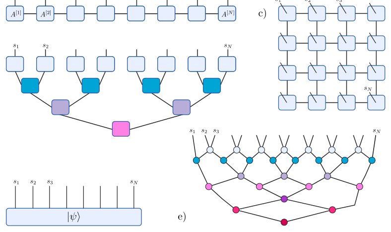 
Figure 1: Examples of TNs: a) MPS for a chain of length 8, b) binary tree TN for a system of 8 sites, c) projected entangled pair state for a system with 4 × 4 sites in a square lattice geometry, d) many- body wave function represented as a single N-leg tensor and e) multi-scale entanglement renormalization ansatz (MERA) TN. Each box (or circle) represents a tensor, and each leg represents an index of the tensor. In this representation the open legs (labeled s1, . . . , sN) that are not connected to any other tensor represent the physical indices. They correspond to the degrees of freedom of the physical system (e.g., spin states, where for a spin-S system such indices can take 2S + 1...

📷 Fig 2

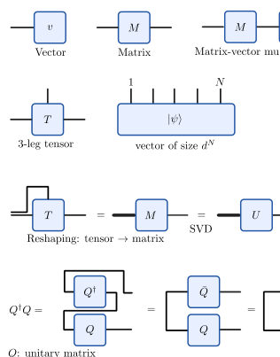 
Figure 3: Graphical representation of a few tensor examples and associated operations.

📷 Fig 3

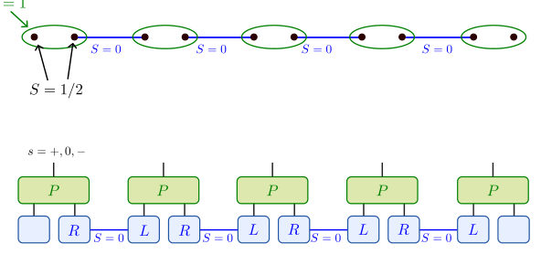 
Figure 4: AKLT state for a spin-1 chain. a) The Hilbert space is enlarged by replacing each spin-1 (green ovals) by two fictitious spin- 1

📷 Fig 4

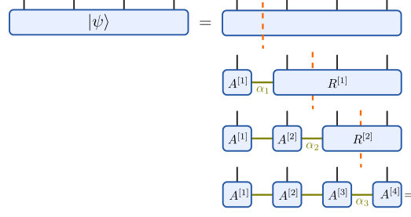 
Figure 5: Construction of an MPS from a vector representation by successive QR decompositions. At each step, the Q matrix gives an MPS tensor A[i], while the R matrix is reshaped and factorized again at the next site. Such a construction leads to an MPS in a left-canonical gauge (see Fig. 8).

📷 Fig 5

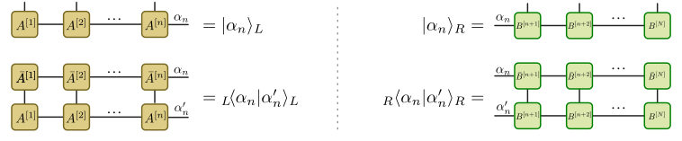 
Figure 6: Partial contractions of a left-canonical MPS and a right-canonical MPS. For each value of the open virtual index αn, the left contraction defines a state |αn⟩L in the Hilbert space of the first n sites, while the right contraction defines a state |αn⟩R in the Hilbert space of sites n + 1, . . . , N. The corresponding canonical conditions imply that these states form orthonormal families. See also Fig. 8.

**Summary.** This comprehensive set of notes introduces tensor networks, focusing heavily on Matrix-Product States (MPS), as a computational tool for quantum many-body physics. It details the mathematical machinery required—including entanglement measures and canonical forms—to simulate ground states, time evolution, and open system dynamics efficiently. The work is essential reading for anyone using numerical methods to study strongly correlated or dissipative quantum matter.

**Why it may be interesting.** This is highly relevant as it provides a complete methodological toolkit for simulating dynamics in complex, interacting quantum systems, directly applicable to modeling decoherence or non-equilibrium steady states in AMO physics.

Detailed structure

**Main problem.** To provide a comprehensive introduction to tensor-network (TN) methods, particularly Matrix-Product States (MPS), for efficiently simulating quantum many-body systems.

**Main result.** TNs offer a powerful framework that encodes the entanglement structure of a state, allowing polynomial scaling simulations for states obeying an area law, which is crucial for 1D and low-dimensional quantum physics.

**Method.** The paper develops the mathematical language of TNs (graphical notation, bond dimensions) and details core algorithms like DMRG, time evolution methods (tDMRG/TEBD), and generalizations to PEPS for higher dimensions.

**Model / system.** The notes cover a wide range of systems, including 1D quantum spin chains, open quantum systems governed by Lindblad dynamics, classical statistical mechanics models, and general quantum circuits.

**Key observables.** Entanglement Entropy ($S_{vN}$), Bond Dimension ($\chi$), Magnetization $\langle\sigma^z_{N/2}
angle$, and the steady state density matrix $
ho_{ss}$.

**Important parameters / regimes.** Bond dimension ($\chi$) controls accuracy vs. cost; the area law dictates efficient representability.

**Assumptions / limitations.** The primary assumption is that the physical state or dynamics can be accurately captured by a low-rank tensor decomposition (i.e., obeying an area law).

**Figures summary.** Figures illustrate MPS structures, PEPS generalizations to 2D lattices, and graphical representations of elementary tensor operations like contractions and SVD.

**Paper structure.** The structure progresses logically from defining the basic TN language and MPS for 1D systems, through core algorithms (DMRG/time evolution), generalizing to higher dimensions (PEPS), and finally applying the formalism to open quantum systems and mixed states.

Abstract

These notes provide an introduction to tensor-network methods in quantum many-body physics, with an emphasis on matrix-product states (MPS). They develop the basic tensor-network language, including graphical notation, virtual indices, bond dimensions, gauge freedom, canonical forms, QR and singular-value decompositions, and the role of entanglement in controlling the efficiency of the representation. The main MPS algorithms are then introduced, including contractions, correlation functions, matrix-product operators, DMRG, and time-evolution methods. The notes also briefly discuss projected entangled-pair states (PEPS) as a higher-dimensional generalization of MPS, together with the basic ideas behind approximate PEPS contraction. Finally, tensor-network representations of mixed states, quantum channels, and Lindblad dynamics are presented, with applications to thermal states and open quantum systems. The presentation is accompanied by short Julia code examples based on ITensor, ITensorMPS, and TensorMixedStates. These notes were written for the 9th Les Houches Summer School on Computational Physics: Open Quantum Systems, held in June 2026.

[↑ back to top](#top)

### [Quantum droplets and condensates in an optical lattice coupled to a dissipative cavity: Collective excitations and non-equilibrium dynamics](http://arxiv.org/abs/2606.24580v1)

**Authors:** G. Vivek, Sudip Sinha, Subhasis Sinha  
**Type:** theory · **Category:** quantum gases · **PDF:** <https://arxiv.org/pdf/2606.24580v1>  
**Analysis basis:** full PDF text, analyzed in chunks
**Topic relevance:** 🔥 `non-equilibrium dynamics` **5/5** · 🔥 `analog quantum simulation` **4/5** · 🔥 `driven-dissipative phase transition` **4/5** · `Tavis-Cummings & cavity-many-emitter` **3/5** · `correlated cavity matter` **3/5** · `methods for driven-dissipative` **3/5** · `non-equilibrium universality` **3/5** · `correlated / nonlocal dissipation` **2/5** · `Frenkel-Kontorova` **1/5** · `Keldysh / 2PI / non-Gaussian methods` **1/5** · `entanglement & information structure` **1/5**

📷 Fig 1

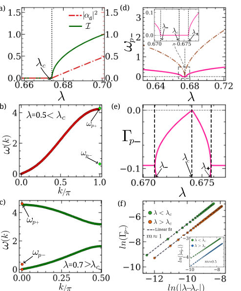 
FIG. 1. Phase transition in the homogeneous system (ζ = 0) and ex- citation spectrum of the corresponding non-equilibrium steady states: (a) Variation of the steady state staggered density imbalance I (green solid line) and the photon number density |αd|2 (red dash-dotted line) across the transition point λc = 0.674. Excitation spectrum of the respective phases (b) before and (c) after the transition, where the collective polariton-like mode in each case is highlighted with a dif- ferent color. (d) Variation of frequency of the lowest collective mode (ωp−) with atom-photon coupling λ across the transition point. This mode vanishes at a point λ−&lt; λc, while it becomes gapped at a coupling...

📷 Fig 2

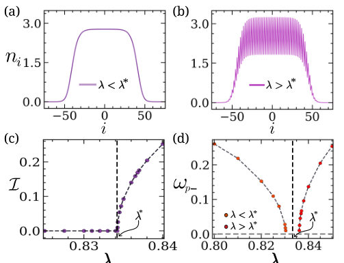 
FIG. 2. Properties of the steady states in the droplet regime (ζ ̸= 0): (a) Flat-top droplet solution for λ = 0.5 &lt; λ∗, characterized by an almost uniform density in the bulk. (b) Staggered (superradiant) droplet solution for λ = 0.85 &gt; λ∗, where a density modulation is induced between the neighboring lattice sites. (c) Variation of the steady state staggered imbalance I across the crossover point. (d) Behavior of the collective polaritonic mode with coupling strength λ, exhibiting a trend that follows that of a dissipative phase transition. The crossover point marked by vertical dashed lines in (c,d) is λ∗≃ 0.834. Parameters chosen: n0 = 1.47, u = 0.04, ζ = 0.1, and κ = 0.1.

📷 Fig 3

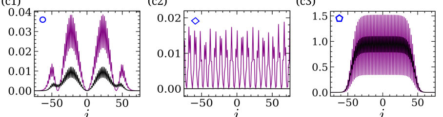 
FIG. 3. Excitation spectrum of the droplet states (ζ ̸= 0): (a) Full excitation spectrum of the droplet phase before (blue) and after (red) the transition. (b) Zoomed view of the low energy excitations of the (a) flat-top droplet case (λ = 0.5 &lt; λ∗) and (b) the staggered droplet phase (λ = 0.85 &gt; λ∗) are shown, where the dashed line (−µ) denotes the threshold for the bound states. The markers in (b,c) correspond to the particle-like (δχi, solid magenta lines) and hole-like (δχ∗ i , solid black lines) fluctuations of (b1,c1) a localized bound state, (b2,c2) an extended scattering state, and the (b3,c3) collective polariton-like mode, for the flat-top and the staggered droplet phases,...

📷 Fig 4

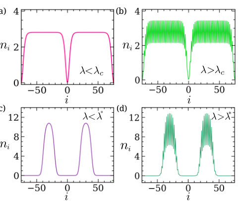 
FIG. 4. Non-equilibrium (metastable) solutions: Density profiles of the kink-like solutions (a)[(c)] below and (b)[(d)] above the transition [crossover] point λc = 0.65 [λ∗≃0.648]. The condensate exhibits localized density dips (kinks) embedded in either a homogeneous or droplet background. Panels (a,b) correspond to the homogeneous case (ζ = 0); (a) for λ = 0.2 &lt; λc, the density vanishes at the center and at the lattice boundaries but remains otherwise uniform, and (b) for λ = 0.66 &gt; λc, the background develops a staggered density modulation while preserving the kink structure. Panels (c,d) show the double-droplet solutions for ζ = 0.2; (c) for λ = 0.2 &lt; λ∗, the kink is embedded in a...

📷 Fig 5

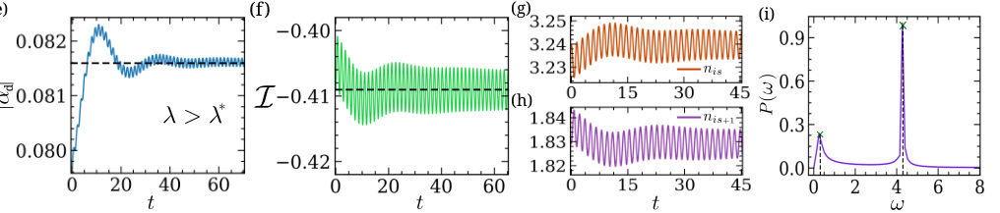 
FIG. 5. Real-time dynamics in the droplet regime: The first row (panels (a)–(d)) corresponds to λ = 0.5 &lt; λ∗, where the system evolves around the flat-top droplet steady state. The second row (panels (e)–(i)) correspond to λ = 0.85 &gt; λ∗, where the evolution occurs around the staggered droplet state with finite photon number density. The crossover point is λ∗≃0.834. Dynamics of the (a,e) photon number density |αd|2 and (b,f) staggered imbalance I. The black dashed lines denote the corresponding steady state values. (c,g,h) Dynamics of the local densities at neighboring sites, nis and nis+1, exhibiting out-of-phase oscillations. (d,i) Fourier spectrum of I from (b,f). The dominant peaks...

**Summary.** This paper theoretically explores the rich non-equilibrium dynamics of Bose condensates and quantum droplets coupled to a dissipative optical cavity. By analyzing collective excitations and stability, the authors characterize a density ordering transition marked by polariton softening. Crucially, they show that the system can exhibit long-lived metastable states, such as double-droplets, even when those states are predicted to be unstable.

**Why it may be interesting.** This work is highly relevant as it merges concepts from cavity QED (dissipation, polaritons) with quantum gas physics (BEC, droplets), providing a theoretical framework to model complex, driven non-equilibrium phenomena accessible in modern experimental setups.

Detailed structure

**Main problem.** The study investigates non-equilibrium dynamics, collective excitations, and phase transitions in a system combining quantum droplets/condensates with a dissipative cavity mode.

**Main result.** The research identifies a polariton-like gapped excitation whose frequency softens near the density ordering transition, and demonstrates that metastable states (like double-droplets) can persist dynamically even when theoretically unstable.

**Method.** A classical-field approach is used to determine stationary states and linearize equations of motion around these states to analyze collective excitations and stability. Time evolution simulations are also employed for quench dynamics.

**Model / system.** The system models a dilute Bose gas (condensate) and self-bound quantum droplets confined in a 1D optical lattice, coupled to a lossy cavity mode via mean-field interactions.

**Key observables.** Collective excitation frequencies ($\omega_{p\pm}$), relaxation time divergence near critical points, staggered density imbalance ($I$), and the persistence of non-equilibrium states (kinks, double-droplets).

**Important parameters / regimes.** The atom-cavity coupling strength ($\lambda$) relative to a critical value ($\lambda_c$ or $\lambda^*$), lattice parameters ($J$, $V$), and interaction strengths ($\zeta$).

**Assumptions / limitations.** The analysis relies on the classical-field approximation and mean-field theory, which is assumed valid in 1D under specific parameter regimes.

**Figures summary.** Figures illustrate the phase transition (staggered imbalance vs. coupling), excitation spectra showing polariton branches ($\omega_\pm(k)$), and real-time dynamics demonstrating density wave oscillations and the persistence of odd-parity metastable states after a quench.

**Paper structure.** The paper progresses by first establishing the mean-field model, then analyzing steady states and collective excitations (Bogoliubov modes vs. polaritons). It details the phase transition driven by coupling strength ($\lambda$), followed by investigating non-equilibrium dynamics through time evolution simulations of metastable configurations like kinks and double-droplets.

Abstract

Motivated by recent experiments on light-matter interacting systems, we investigate a dilute Bose gas and self-bound quantum droplets in a one-dimensional optical lattice coupled to a lossy cavity mode. Using a classical-field approach, we determine the stationary states and collective excitations of this non-equilibrium system. Apart from the usual Bogoliubov modes, we identify a polariton-like gapped excitation, the frequency of which softens as a precursor of the density ordering transition. Moreover, its relaxation time diverges as the critical point is approached, signaling the non-equilibrium nature of this transition. Dynamically, this polariton-like mode can be probed by inducing cavity field fluctuations, which in turn generates spatio-temporal oscillations of both the condensate and droplet states. In the droplet regime, we also analyze the bound modes which bear the characteristics of such non-equilibrium self-bound state. In addition, we uncover solitonic non-equilibrium states, including condensate with kink-like configuration and double-droplet state, and investigate their robustness following a sudden quench. Remarkably, although these states become unstable beyond a critical coupling, they continue to manifest in the dynamics, akin to the scarring phenomena. Our results demonstrate that dissipative cavity coupling provides a versatile route for exploring rich non-equilibrium dynamics of condensates and quantum droplets within experimentally accessible settings.

[↑ back to top](#top)

### [Out-of-equilibrium scaling of the particle density in quantum fermionic wires after a critical quenching of the chemical potential](http://arxiv.org/abs/2606.24395v1)

**Authors:** H. Panagopoulos, E. Vicari  
**Type:** theory · **Category:** statistical mechanics · **PDF:** <https://arxiv.org/pdf/2606.24395v1>  
**Analysis basis:** full PDF text, analyzed in chunks
**Topic relevance:** 🔥 `non-equilibrium universality` **5/5** · 🔥 `non-equilibrium dynamics` **4/5** · `driven-dissipative phase transition` **3/5** · `analog quantum simulation` **2/5** · `Frenkel-Kontorova` **1/5** · `Keldysh / 2PI / non-Gaussian methods` **1/5** · `correlated / nonlocal dissipation` **1/5** · `entanglement & information structure` **1/5** · `methods for driven-dissipative` **1/5**

📷 Fig 1

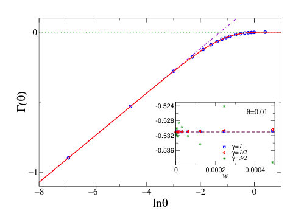 
FIG. 1: We show the scaling function Γ(θ) (full line) ob- tained in Eq. (36), and compare it with the numerical re- sults obtained by taking the out-of-equilibrium scaling limit, i.e., t →∞and w →0 keeping θ fixed, of γD(t, w, γ)/w (whose estimated errors are very small, indeed they are al- most invisible in the figure). The dot-dashed and dotted lines show the asymptotic behaviors for θ →0 and θ →∞, respectively. The inset shows the approach to the asymp- totic value Γ(θ) for θ = 0.01 and various values of γ, i.e., γ = 1, 1/2, 3/2. The dashed line indicates the asymptotic value Γ(0.01) = −0.531027....

📷 Fig 2

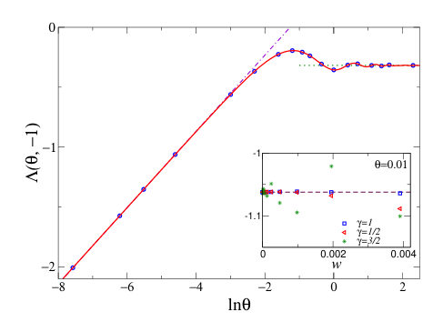 
FIG. 2: We show the exact expression (55) (full line) for the scaling function Λ(θ, u = −1), comparing it with the nu- merical results obtained by taking the scaling limit t →∞ and w →0 keeping θ and u = we/w fixed. The dot- dashed and dotted lines show the asymptotic behaviors for θ →0 and θ →∞, respectively. The inset shows the ap- proach to the asymptotic value Λ(θ, −1) for θ = 0.01 and γ = 1, 1/2, 3/2. The dashed line indicates the asymptotic value Λ(0.01, −1) = −1.0621814....

**Summary.** This work analyzes how the particle density evolves in quantum fermionic wires immediately after a sudden change (quench) of the chemical potential near a quantum critical point. The authors analytically derive that this out-of-equilibrium evolution follows a universal scaling law, providing strong theoretical evidence for dynamic scaling behavior previously suggested by numerical simulations.

**Why it may be interesting.** It provides a rigorous theoretical framework for identifying universal dynamic scaling laws in quantum many-body systems after non-equilibrium perturbations, which is crucial for understanding critical dynamics beyond equilibrium measurements.

Detailed structure

**Main problem.** The study investigates the out-of-equilibrium scaling behavior of particle density in quantum fermionic wires following an instantaneous quench of the chemical potential near a quantum critical point.

**Main result.** The difference between the post-quench particle density and its critical value exhibits universal out-of-equilibrium dynamic scaling, characterized by a specific singular function $\Gamma(	heta)$.

**Method.** Analytical derivations are used to establish the scaling ansatz, comparing results with numerical finite-size scaling analyses.

**Model / system.** The system is modeled using quantum fermionic Kitaev wires (equivalent to XY spin chains) near their quantum critical point. The Hamiltonian involves tunable parameters like chemical potential ($\mu$) and coupling constant ($\gamma$).

**Key observables.** Particle density $\langle \hat{n} 
angle$ and the difference between the post-quench particle density and its critical equilibrium value.

**Important parameters / regimes.** Time ($t$), initial length scale ($\xi$), deviation from criticality ($w$), and dynamic scaling variable $	heta \sim t/\xi^z$.

**Assumptions / limitations.** The analysis assumes starting from the ground state near the QCP and relies on approximations (e.g., $\sin k \approx k$) to find asymptotic limits.

**Figures summary.** Figure 1 compares the derived scaling function $\Gamma(	heta)$ with numerical results obtained by taking the out-of-equilibrium limit; Figure 2 shows a generalized scaling function $\Lambda(	heta, u)$ for different initial conditions.

**Paper structure.** The paper establishes the physical context (Kitaev wires at QCP), derives the general scaling ansatz for the particle density difference, and then calculates the asymptotic form of the universal scaling function $\Gamma(	heta)$ by taking appropriate limits.

Abstract

We study the out-of-equilibrium scaling behavior of the particle density in quantum fermionic Kitaev wires, after instantaneous quantum quenches (QQs) of the chemical potential within their quantum critical region. The critical scaling of the ground-state particle density is known to be subleading at its Ising-like quantum transition, hidden by regular and logarithmic terms arising from peculiar mixings with the identity operator. This situation changes along the out-of-equilibrium dynamics arising from QQs of the chemical potential to the critical point, starting from the ground state for Hamiltonian parameters within the critical region. We analytically show that the difference between the post-QQ particle density and its critical value develops an out-of-equilibrium scaling behavior, in terms of the dynamic scaling variable $θ\sim t/ξ^z$ (where $t>0$ is the post-QQ time, $ξ$ is the length scale of the initial state, and $z$ is the dynamic critical exponent) associated with the post-QQ time evolution. The scaling function turns out to have a peculiar singular behavior in the $θ\to 0$ limit, apparently related to the anomalous equilibrium scaling behavior of the particle density at the starting point of the QQ protocol. This provides analytical evidence of earlier conjectures on the general emergence of post-QQ dynamic scaling behaviors of the subtracted particle density (supported by numerical finite-size scaling analyses), unlike their equilibrium counterpart which turns out to be dominated by nonuniversal contributions.

[↑ back to top](#top)

### [Anomalous weak values in a generalized Mach-Zehnder interferometer extracted directly from intensity measurements](http://arxiv.org/abs/2606.24798v1)

**Authors:** Ismaele V. Masiello, Hartmut Lemmel, Andreas Dvorak, Stephan Sponar, Yuji Hasegawa  
**Type:** experiment · **Category:** other · **PDF:** <https://arxiv.org/pdf/2606.24798v1>  
**Analysis basis:** full PDF text, analyzed in chunks
**Topic relevance:** 🔥 `quantum measurements` **5/5** · `interference shaping light` **3/5** · `measurement-induced transitions` **1/5** · `quantum optics experiment` **1/5**

📷 Fig 1

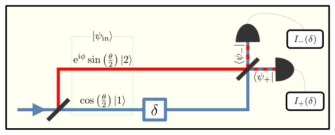 
Figure 1: Generalized Mach–Zehnder interferometer configuration. The first beam splitter generates the superposition of path states |1⟩and |2⟩, with relative phase ϕ and relative path intensities cos2 θ

📷 Fig 2

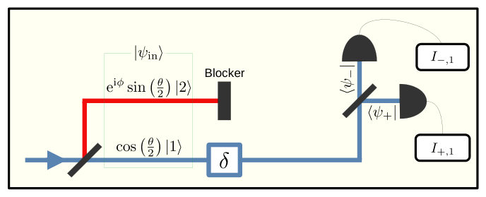 
Figure 2: Configuration for single-beam intensity measurement to be performed blocking each path. A blocker is inserted in one of the paths, path 2 in the example depicted in the figure, in order to measure I±,j.

📷 Fig 3

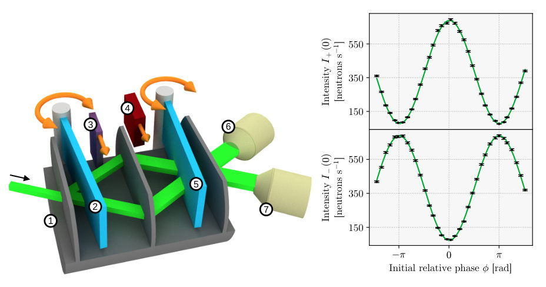 
Figure 3: 3D representation of the neutron interferometer setup and typical sinusoidal intensity modulation depending on the relative phase ϕ of the initial state. (On the left side) The neutron enters the silicon crystal interferometer 1 ○. At the first plate, the neutron is prepared in a 50-50 superposition of the path states. A sapphire phase shifter plate 2 ○placed just after the first plate is used to control the initial phase ϕ. An absorber made of two indium foils 3 ○is inserted to produce the unbalanced configuration (different path intensities) of the interferometer or removed to leave it in the balanced configuration (equal path intensities). A Cadmium beam blocker 4 ○can be...

📷 Fig 4

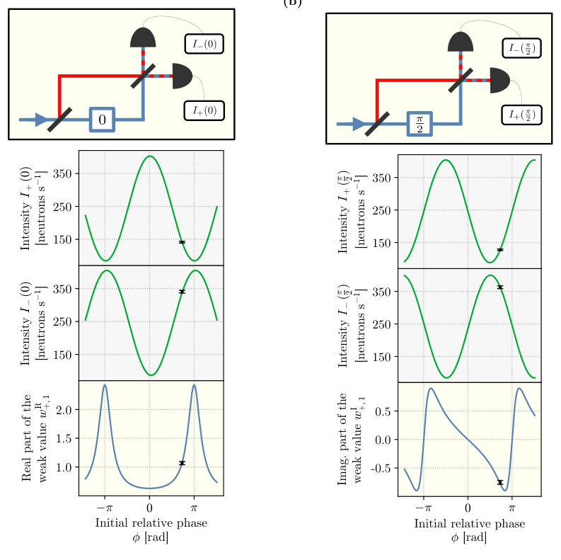 
Figure 4: Typical measurement procedure to extract (a) the real and (b) the imaginary part of the weak value, together with their results. The initial state |ψin⟩is generated with relative phase ϕ ≈3π/4 and path intensities ratio sin2  θ

📷 Fig 5

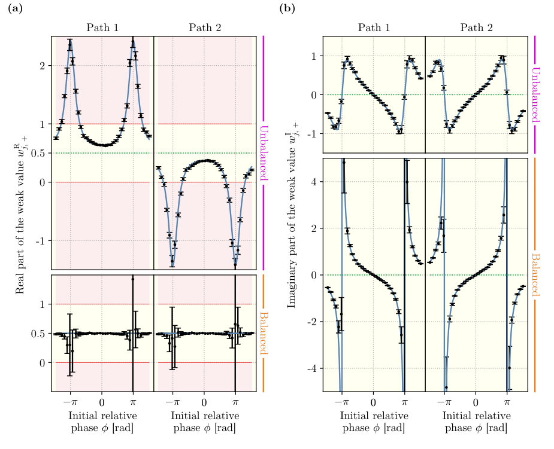 
Figure 5: Resulting weak values (data points) together with the theoretical prediction (continuous line). The results for the weak value are plotted as their (a) real and (b) imaginary part for the different values of the initial relative phase ϕ. The top plots show the result for the unbalanced configuration the bottom plots show the results for the balanced configuration. The results are in good agreement with the theory. The region in which the weak values become anomalous is highlighted in red. The green dotted line represents the symmetry axis of the weak-value components. The real part is symmetric about 0.5, while the imaginary part is symmetric about 0, confirming w+,1 + w+,2 = 1.

**Summary.** The paper presents an innovative method to measure path weak-values in a Mach-Zehnder interferometer using only direct intensity measurements, bypassing the need for complicated meter states or weak interactions. By analyzing these intensities, the researchers successfully identified anomalous weak values, providing experimental evidence of nonclassical quantum behavior and contextuality in matter waves.

**Why it may be interesting.** This work provides a highly practical, simplified measurement protocol for accessing fundamental quantum quantities like weak values in complex interferometers, which is crucial for testing foundational principles of quantum mechanics beyond standard measurements.

Detailed structure

**Main problem.** To characterize path weak-values in a generalized Mach-Zehnder interferometer without relying on complex techniques like meter states or weak interactions.

**Main result.** The authors successfully extracted path weak-values directly from intensity measurements, identifying anomalous values that confirm the nonclassical behavior and contextuality of the quantum system.

**Method.** Weak values are derived by relating measured output intensities $I_{\pm}(\delta)$—obtained solely through controlled relative phase shifts $\delta$ at the interferometer outputs—to the path weak-values using specific equations.

**Model / system.** The experiment uses a matter-wave interferometry setup, specifically a neutron Mach-Zehnder interferometer, modeling the system as a two-level quantum superposition of spatially separated paths.

**Key observables.** Path weak-values ($	ext{w}_{\pm,j}$), outgoing beam intensities $I_{\pm}(\delta)$, and single-beam path intensities ($I_{+,1}, I_{+,2}$).

**Important parameters / regimes.** Controlled relative phase shift ($\delta$), initial relative phase ($\phi$), contrast reduction factor ($C$).

**Assumptions / limitations.** The analysis incorporates corrections for contrast reduction due to experimental imperfections and notes that the extraction method is sensitive to intensity measurements approaching zero.

**Figures summary.** Figures illustrate the MZI setup, show sinusoidal modulation of intensities vs. phase shifts, and present plots comparing extracted weak values ($	ext{w}_R$ and $	ext{w}_I$) for both unbalanced (anomalous) and balanced configurations.

**Paper structure.** The paper establishes the theory of weak values, details the generalized MZI setup, derives the relationship between measurable intensities and weak values, presents methods to handle experimental imperfections (contrast reduction), and finally demonstrates the extraction process using neutron interferometry data.

Abstract

Weak values provide a powerful framework for characterizing quantum systems. Their experimental extraction conventionally relies on weak conditioned von Neumann measurements, involving weak interactions and meter states that increase experimental complexity and often limit measurement efficiency. Here we introduce a method to fully characterize path weak-values in a generalized Mach-Zehnder interferometer employing neither meter states nor weak interactions. We experimentally demonstrate the technique in matter-wave interferometry. We identify anomalous weak values and, equivalently, negative quasiprobability distributions, which reflect the nonclassical behavior of the quantum system. The approach relies uniquely on intensity measurements at the output ports of the interferometer combined with controlled relative phase shifts between the paths. The absence of meter states enables considerable simplification of the setup and shorter measurement times, while preserving full access to weak values with comparable or increased accuracy. The scheme is directly applicable to a broad class of experiments involving two-level quantum systems.

[↑ back to top](#top)

### [Multipartite synchronization residuals in driven-dissipative spin networks](http://arxiv.org/abs/2606.24360v1)

**Authors:** Jatin Ghildiyal, Shubhrangshu Dasgupta, Asoka Biswas  
**Type:** theory · **Category:** other · **PDF:** <https://arxiv.org/pdf/2606.24360v1>  
**Analysis basis:** full PDF text, analyzed in chunks
**Topic relevance:** 🔥 `Tavis-Cummings & cavity-many-emitter` **4/5** · 🔥 `methods for driven-dissipative` **4/5** · `analog quantum simulation` **3/5** · `correlated / nonlocal dissipation` **3/5** · `correlated cavity matter` **3/5** · `driven-dissipative phase transition` **3/5** · `entanglement & information structure` **3/5** · `exotic spin models in light-matter` **2/5** · `non-equilibrium dynamics` **2/5** · `non-equilibrium universality` **2/5** · `Keldysh / 2PI / non-Gaussian methods` **1/5** · `Rydberg arrays` **1/5** · `spintronics-quantum-optics interface` **1/5**

📷 Fig 1

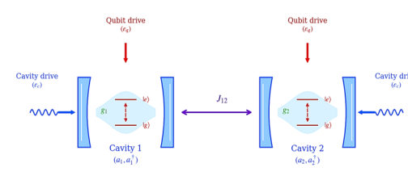 
FIG. 1. Schematic representation of two qubits inside a coupled-cavity system.

📷 Fig 2

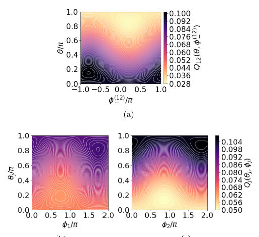 
FIG. 2. Density plots of steady-state Husimi-Q distributions (a) Q12, (b) Q1, and (c) Q2, in their respective parameter space. We have chosen ∆c = 5, ∆1,2 = (1, 2), J12 = 1, g1,2 = 0.2, εq,c = 1.0, the relaxation rate γ1,2 = 0.1, and the dephasing rate γϕ1,2 = 0.5. All parameters are normalized in terms of J12.

📷 Fig 3

 
FIG. 3. Time evolution of (a) the synchronization residual ∆(2) R (t), (b) the entropic residual ∆(2) S (t), for J12 = 1. Panels (c) and (d) show, respectively, the steady-state value of ∆(2) R and the effective energy eigenspectrum as functions of inter- cavity hopping. All other parameters are the same as in Fig. 2.

📷 Fig 4

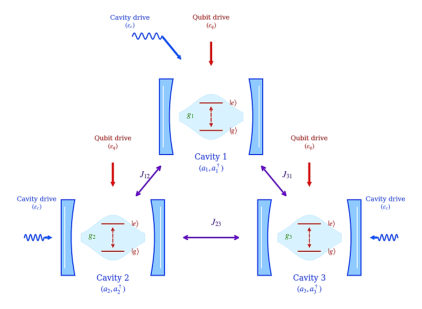 
FIG. 4. Schematic representation of three qubits inside a triangular cavity coupled system.

📷 Fig 5

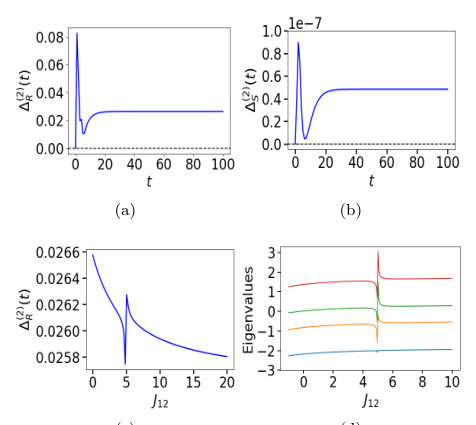 
Figure 3c shows the steady-state synchronization resid- ual ∆(2) R (t) as a function of the intercavity hopping am- plitude J12. In an otherwise monotonically decreasing profile, one sees a sharp feature at J12 ∼∆c = 5. This is an artefact of a singularity at J12 = ∆c of the adiabatic Hamiltonian, that leads to a level crossing as can be seen from the variation of its eigenvalues with J12 (see Fig. 3d). Note that, at this parameter regime, the adiabatic approximations fail, and to investigate the synchroniza- tion, on needs to solve the dynamics with the original Hamiltonian (13). In this paper, we, however, focus on

**Summary.** The paper develops phase-space measures to quantify quantum synchronization in driven-dissipative spin networks. By analyzing the resulting residuals for two and three qubits, the authors demonstrate a key distinction: phase-sensitive measures can reveal collective locking (negative residual) that is not captured by standard entropic correlation measures. This highlights that different mathematical tools probe distinct physical aspects of open system dynamics.

**Why it may be interesting.** This work provides a sophisticated diagnostic tool—the synchronization residual—to distinguish between genuine multipartite quantum correlations (which violate simple additive bounds) and those that can be decomposed into pairwise interactions within open quantum systems dynamics.

Detailed structure

**Main problem.** The central problem is quantifying multipartite quantum synchronization, specifically determining if collective phase coherence can be fully described by summing up pairwise contributions.

**Main result.** For three qubits in a driven-dissipative network, the phase-space derived tripartite residual becomes negative, indicating genuine collective locking beyond pairwise description, while entropy-based residuals remain non-negative.

**Method.** The authors introduce and analyze novel synchronization residuals built from first angular moments of phase distributions obtained via Husimi-Q quasiprobability functions in the phase space.

**Model / system.** The study uses a driven-dissipative quantum Rabi network involving two or three qubits coupled to cavity modes. The analysis is performed in the dispersive adiabatic regime, leading to effective qubit Hamiltonians.

**Key observables.** Phase-space synchronization residuals ($\Delta^{(3)}_R$), bipartite residual ($\Delta^{(2)}_R$), and corresponding entropy-based residuals ($\Delta^{(3)}_S$).

**Important parameters / regimes.** Dispersive adiabatic regime; two-qubit and three-qubit coupling strengths ($J_{ij}$); cavity detunings ($\Delta_c, \Delta_i$); decay rates ($\gamma$).

**Assumptions / limitations.** The analysis relies on using Husimi-Q quasiprobability distributions to approximate the true phase distributions in open quantum systems.

**Figures summary.** Figure 1 schematically illustrates two qubits coupled to a cavity system, while other figures likely compare different residual types or show time evolution of synchronization measures.

**Paper structure.** The paper develops theoretical bounds (analogous to subadditivity/strong subadditivity) for multi-partite coherence measures. It calculates these residuals for 2 and 3 qubits in a specific physical model, comparing the results derived from phase-space moments versus entropy correlations.

Abstract

We introduce a phase-space measure of quantum synchronization that quantifies relative phase localization for two-qubit and three-qubit systems. This measure is built from the first angular moments of phase distributions obtained from Husimi-Q quasiprobability functions. Using this framework, we formulate a new class of synchronization residuals, motivated by subadditivity-type hierarchies of information-theoretic measures. We investigate these residuals in a driven-dissipative quantum Rabi network in the dispersive adiabatic regime. We show that, for two qubits, collective synchronization remains bounded by single-qubit contributions yielding a non-negative bipartite residual. The three-qubit nonequilibrium steady state exhibits a negative tripartite residual, which indicates collective phase synchronization, which cannot be described by pairwise decomposition. The corresponding entropy-based residuals, however, remain non-negative in both cases. Our results therefore, underscore that phase-sensitive synchronization measures and entropic correlation measures probe distinct aspects of open-system dynamics.

[↑ back to top](#top)

### [Suppressing Self-Discharging of Quantum Batteries by Cavity Interactions](http://arxiv.org/abs/2606.23999v1)

**Authors:** Anass Jad, Abderrahim El Allati, Mohammad B. Arjmandi  
**Type:** theory · **Category:** other · **PDF:** <https://arxiv.org/pdf/2606.23999v1>  
**Analysis basis:** full PDF text, analyzed in chunks
**Topic relevance:** 🔥 `correlated / nonlocal dissipation` **4/5** · 🔥 `methods for driven-dissipative` **4/5** · `Tavis-Cummings & cavity-many-emitter` **3/5** · `correlated cavity matter` **3/5** · `driven-dissipative phase transition` **3/5** · `entanglement & information structure` **2/5** · `non-equilibrium dynamics` **2/5** · `non-equilibrium universality` **2/5** · `Dicke superradiance` **1/5** · `Keldysh / 2PI / non-Gaussian methods` **1/5** · `analog quantum simulation` **1/5** · `scars & prethermalization` **1/5**

📷 Fig 1

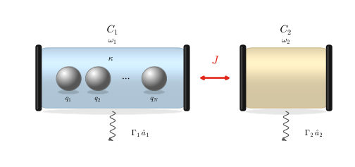 
Figure 1. Sketch of the cavity-based quantum-battery architecture. A collection of N identical qubits {q1, q2, . . . , qN} of transition fre- quency ω0 is embedded in a common lossy cavity C1 (frequency ω1, decay rate Γ1) with which each qubit interacts at the same coupling strength κ. The cavity C1 is coherently coupled to an auxiliary cavity C2 (frequency ω2, decay rate Γ2) through a photon-exchange cou- pling of strength J. Both cavities are initially in the vacuum state and dissipate independently into their own thermal reservoirs at tem- peratures T1 and T2 (wavy arrows), with mean photon occupations ¯n1 and ¯n2. The inter-cavity coupling J and the number of qubits N are the central...

📷 Fig 2

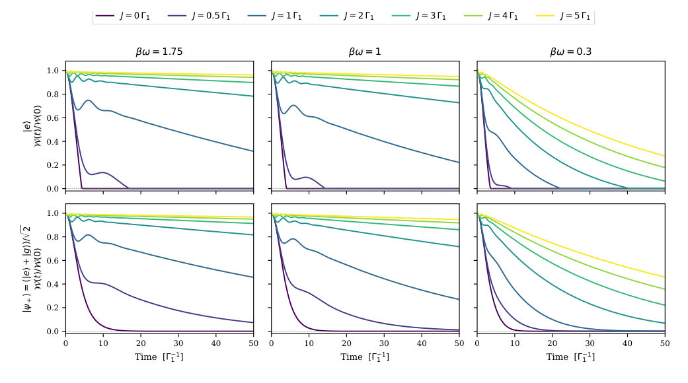 
Figure 2. Normalised ergotropy W(t)/W(0) of the single-qubit battery for the two initial states of Eqs. (7a)–(7b) (rows; top: |e⟩, bottom: |ψ+⟩= (|e⟩+ |g⟩)/ √

📷 Fig 3

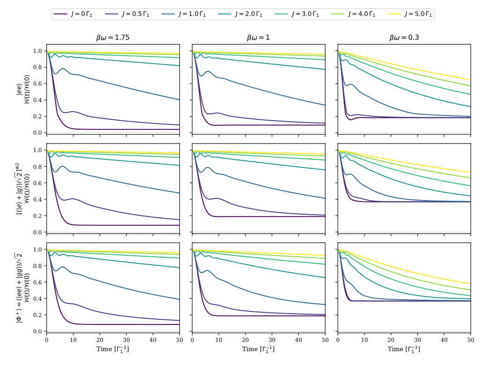 
Figure 3. Normalised ergotropy W(t)/W(0) of a two-qubit battery in cavity C1 coupled to a auxiliary cavity C2, for three initial preparations (rows) and three inverse temperatures (columns). Top row: fully excited state |ee⟩. Middle row: product superposition [(|e⟩+ |g⟩)/ √

📷 Fig 4

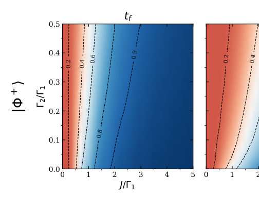 
Figure 4. Robustness of the retained ergotropy W(tf )/W(0) for the Bell state |Φ+⟩= (|ee⟩+ |gg⟩)/ √

📷 Fig 5

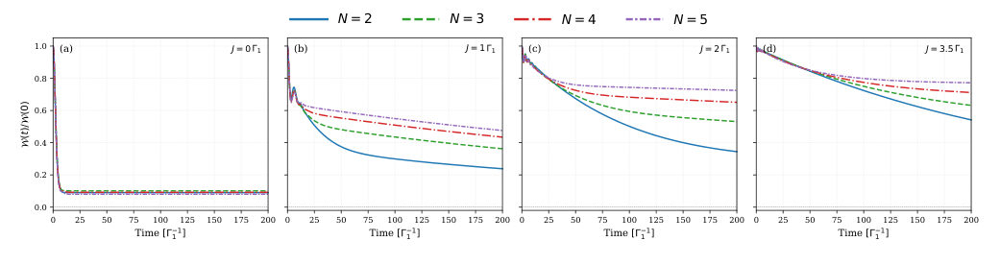 
Figure 5. Normalised ergotropy W(t)/W(0) of the multi-qubit battery prepared in the GHZ state of Eq. (10), in the presence of an all-to-all Heisenberg coupling (Eq. (11), g = 0.5 Γ1), for N = 2 (blue solid), N = 3 (green dashed), N = 4 (red dash-dotted), and N = 5 (purple dash-double-dotted). Panels (a)–(d) correspond to J/Γ1 = 0, 1, 2, 3.5 respectively. Parameters: κ = 0.24 Γ1, Γ2 = 0, resonant configuration ω0 = ω1 = ω2 ≡ω, βω = 1 (¯n ≈0.58).

**Summary.** The paper investigates how coupling a quantum battery's primary cavity to an auxiliary cavity can suppress energy loss mechanisms causing self-discharge. By analyzing ergotropy retention across single, two-, and multi-qubit systems, the authors show that inter-cavity coupling is highly beneficial. This establishes cavity-assisted protection as a robust strategy for building long-lived quantum energy storage devices.

**Why it may be interesting.** This work directly addresses energy storage limitations in quantum devices by engineering structured environments (the auxiliary cavity) to protect stored coherence and extractable work, a key topic in open quantum systems and quantum thermodynamics.

Detailed structure

**Main problem.** The primary goal is suppressing the self-discharging of stored quantum work (ergotropy) in a quantum battery due to energy leakage into the environment.

**Main result.** Inter-cavity coupling significantly enhances the protection against self-discharge, and for multi-qubit systems, the retained ergotropy increases monotonically with the number of qubits due to collective effects.

**Method.** The analysis uses a local Lindblad master equation treatment applied to a two-cavity architecture coupled to $N$ qubits.

**Model / system.** The system consists of $N$ qubits in a lossy cavity ($C1$), which is coherently coupled to an auxiliary cavity ($C2$). The dynamics are governed by the full Hamiltonian and dissipation channels, analyzed under resonant conditions.

**Key observables.** Ergotropy, $W(
ho_B)$, defined as the maximum extractable work unitarily from the reduced battery state $
ho_B$.

**Important parameters / regimes.** Inter-cavity coupling strength ($J$), qubit-cavity coupling ($\kappa$), and mean thermal occupation ($ar{n}$) characterizing finite temperature.

**Assumptions / limitations.** The analysis employs a local Lindblad treatment, assuming the system is in the weak-coupling Markovian regime.

**Figures summary.** Figures illustrate how retained ergotropy ($W(t)/W(0)$) depends on $J/\Gamma_1$ (showing enhancement with coupling), and demonstrate size scaling for GHZ states, showing increasing retention with $N$.

**Paper structure.** The paper systematically analyzes the problem starting from single-qubit systems, progressing to two-qubit entangled states (Bell states), and culminating in multi-qubit GHZ-charged batteries to establish scaling laws.

Abstract

We analyse a two-cavity architecture, in which a lossy cavity hosting $N$ qubits is coherently coupled to an auxiliary cavity, as a resource for the storage phase of an open quantum battery at non-zero temperature. Within a local Lindblad treatment in the resonant configuration, we find that the inter-cavity coupling enhances the suppression of self-discharging across every initial preparation, battery size, and temperature we examine, with the protection degrading smoothly as the mean thermal occupation increases. For a single qubit, the energy-basis coherence of a pure superposition leads to better long-time retention than fully excited state, highlighting the beneficial role of quantum coherence in protecting stored energy against thermal degradation. For two-qubit batteries, Bell-state preparations exhibit enhanced long-time ergotropy retention compared with the fully excited state, while the inclusion of qubit-qubit interactions produces only a weak dependence on the interaction type and strength within the parameter regime considered. Extending the analysis to multi-qubit GHZ-charged batteries with all-to-all Heisenberg interactions, we find that the normalized retained ergotropy increases monotonically with the number of qubits. This behavior is consistent with the collective enhancement of the qubit-cavity coupling in the symmetric Dicke manifold, indicating that larger quantum batteries can benefit from improved protection against self-discharge. These findings establish cavity-assisted protection as a promising strategy for mitigating self-discharging and realizing of long-lived quantum batteries in experimentally accessible platforms.

[↑ back to top](#top)

### [Quantum-enabled active matter at the atomic scale](http://arxiv.org/abs/2606.24615v1)

**Authors:** Sabrina Burgardt, Julian Feß, Alexander Guthmann, Silvia Hiebel, Aritra K. Mukhopadhyay, Sangyun Lee, Michael te Vrugt, Benno Liebchen, Hartmut Löwen, Raphael Wittkowski, Artur Widera  
**Type:** both · **Category:** other · **PDF:** <https://arxiv.org/pdf/2606.24615v1>  
**Analysis basis:** full PDF text, analyzed in chunks
**Topic relevance:** 🔥 `analog quantum simulation` **4/5** · 🔥 `methods for driven-dissipative` **4/5** · `exotic spin models in light-matter` **3/5** · `non-equilibrium dynamics` **3/5** · `spintronics-quantum-optics interface` **3/5** · `driven-dissipative phase transition` **2/5** · `Keldysh / 2PI / non-Gaussian methods` **1/5** · `correlated / nonlocal dissipation` **1/5** · `entanglement & information structure` **1/5** · `non-equilibrium universality` **1/5**

📷 Fig 1

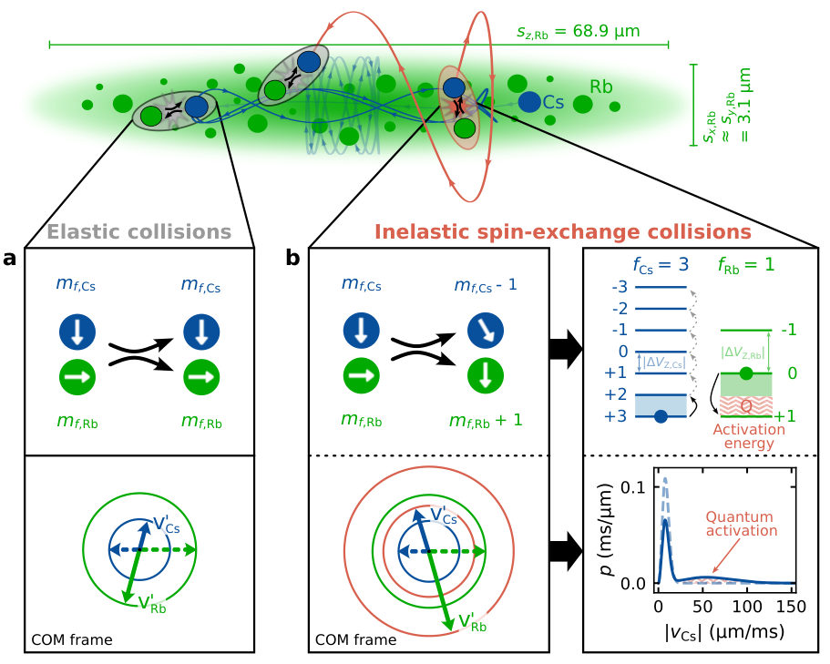 
FIG. 1. Quantum mechanism breaking detailed balance. A 133Cs atom (blue) is immersed into a cigar-shaped, thermal bath of spin-polarized 87Rb atoms (green) with extents sx,Rb ≈sy,Rb and sz,Rb in the x-, y-, and z-direction, respectively. The in-trap motion of the Cs atoms (solid line) is influenced by elastic collisions (gray) and inelastic spin-exchange collisions (red) with the Rb atoms. The spin-exchange collisions cause an activation, i.e., impart kinetic energy to the Cs atoms (red trajectory), enabling them to leave the Rb bath and traverse the optical dipole trap before eventually re-entering the bath and thermalizing due to elastic collisions (blue trajectory). a Frequent elastic...

📷 Fig 2

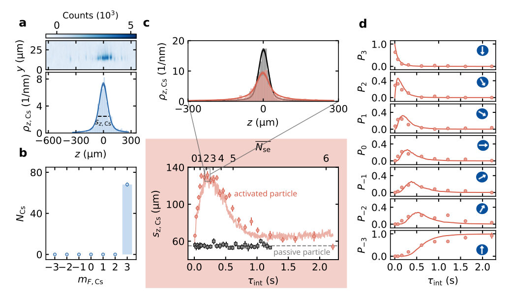 
FIG. 2. Making Cs atoms active by internal state transitions. a Single-shot fluorescence image of Cs atoms after 1 s in the ODT. The histogram results from 30 independent experimental runs, and the solid blue line shows a fit of the density distribution with sz,Cs = 158(2) µm (black dashed line) and TCs = 2.4(1) µK. b Initial Cs spin distribution before the interaction with the Rb bath. c Evolution of the Cs density distribution at B = 2 G. Exothermal spin-exchange with Rb atoms in |1, 0⟩activates the Cs atoms, causing a significant broadening (red dots), which is absent for passive Cs atoms in a Rb bath in |1, 1⟩, where only elastic inter-species collisions are allowed (gray squares). The...

📷 Fig 3

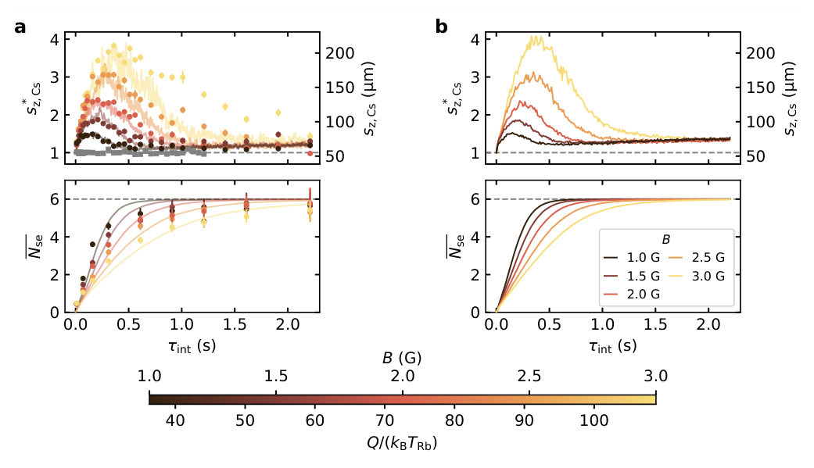 
FIG. 3. Controlling the activation energy. a Evolution of the measured Cs density distribution for active (dots) and passive (gray squares) atoms (top), and the corresponding number-of-collisions evolution derived from the populations of the seven Cs Zeeman states (bottom). Widths s∗ z,Cs are normalized to the case without exothermal spin-exchange collisions (gray dashed line). Data points show averages over ≈90 independent experimental runs; solid lines correspond to event-driven Monte- Carlo collision simulations. Error bars either result from the fitting uncertainty of each density distribution fit or indicate the statistical uncertainties in the atom number. b Predicted Cs density...

📷 Fig 4

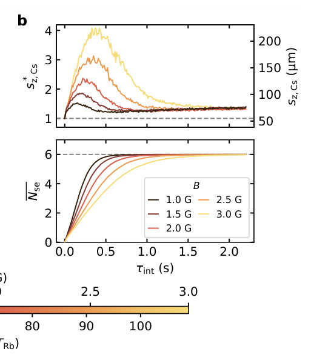 
Figure 3a shows that increasing the magnetic field – and thus the activation energy Q – leads to a progres- sively stronger modification of the Cs density distribu- tion. We find that the width sz,Cs of an active Cs ensem- ble can exceed that of a passive one by nearly a factor of four at the largest magnetic field applied, B = 3 G, cor- responding to an activation energy of Q = kB × 110 TRb. This indicates that active Cs atoms can leave the Rb

📷 Fig 5

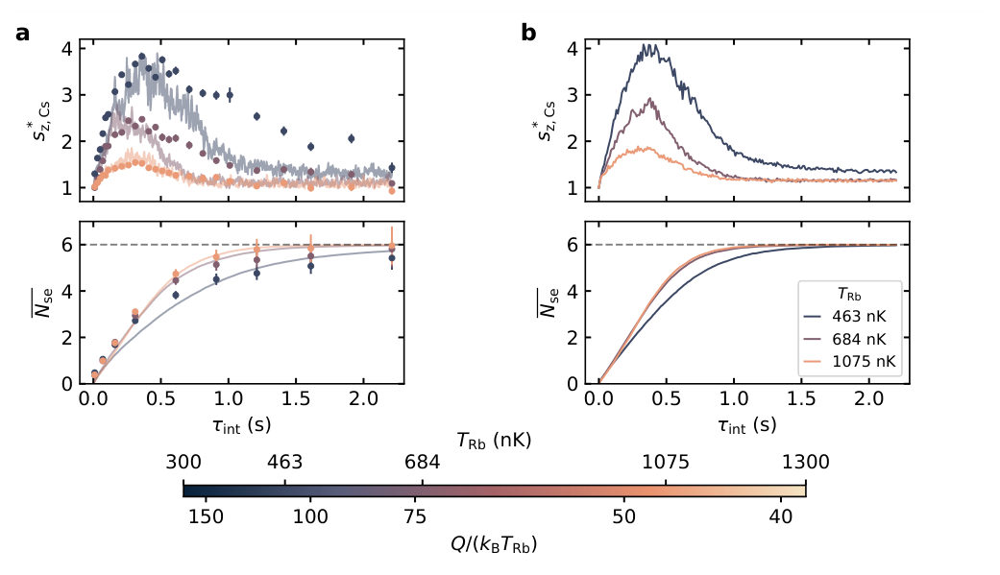 
FIG. 4. Active diffusion in different temperature baths. a Measured evolution of the Cs density distribution (top) and corresponding number-of-collisions evolution (bottom). Widths s∗ z,Cs are normalized to the width of a passive Cs ensemble. Data points average ≈90 independent experimental runs; solid lines show results of event-driven Monte-Carlo simulations. Error bars either result from the fitting uncertainty of each density distribution fit or indicate the statistical uncertainties in the atom number. b Predicted Cs density distribution evolution (top) and corresponding number-of-collisions evolution (bottom) for active Cs atoms from the coarse-grained active Langevin model.

**Summary.** The research experimentally demonstrates how single Cs atoms can become 'active' particles by harvesting energy from their surrounding Rb bath through inelastic quantum spin-exchange collisions. By coupling the discrete quantum spin dynamics to continuous motional motion, they develop and validate an active Langevin model that successfully predicts the transient broadening of the atomic density distribution. This work opens a novel platform for studying non-equilibrium thermodynamics at the fundamental single-atom scale.

**Why it may be interesting.** This work sits at the intersection of AMO physics, non-equilibrium statistical mechanics, and quantum dynamics. The ability to engineer directed motion using internal quantum degrees of freedom in ultracold atoms is a major step toward quantum simulation of active matter.

Detailed structure

**Main problem.** The primary challenge is realizing active matter at the fundamental atomic scale where quantum mechanical effects govern energy transfer, moving beyond classical descriptions.

**Main result.** The authors experimentally demonstrate that individual Cs atoms can achieve directed, active motion by extracting internal spin energy from a surrounding Rb bath via inelastic quantum spin-exchange collisions. This establishes a quantum-enabled route to single-atom active matter.

**Method.** The work combines experimental measurements of atomic density distributions with theoretical modeling using parameter-free active Langevin equations and event-driven Monte Carlo simulations derived from kinetic theory.

**Model / system.** The system consists of individual Cs atoms confined in an optical dipole trap immersed in a thermal bath of Rb atoms. Activity is driven by inelastic s-wave spin-exchange collisions, which convert discrete internal spin energy into measurable kinetic motion.

**Key observables.** Cs density distribution width (s_{z,Cs}), time delay of peak broadening, and the magnitude of the active force/energy injection ($Q$).

**Important parameters / regimes.** Magnetic field strength (B), collision energy relative to activation energy ($E_c$ vs $Q$), and temperature of the bath ($	ext{T}_{	ext{Rb}}$).

**Assumptions / limitations.** The Rb cloud is treated as a Markovian bath, and the activity mechanism relies on breaking detailed balance via non-reciprocal spin exchange rates.

**Figures summary.** Figures illustrate the quantum mechanism (Fig. 1) showing energy transfer from spin to motion; later figures show density broadening measurements ($s_{z,	ext{Cs}}$) as a function of time and magnetic field, comparing theory/simulation to experiment.

**Paper structure.** The paper progresses by establishing the physical system and quantum mechanism (spin-exchange), deriving the necessary theoretical framework (Langevin model from kinetic theory), presenting experimental measurements of activity signatures (density broadening), and finally validating the model against varying external parameters like magnetic field strength.

Abstract

Active matter comprises particles that extract energy from their local environment and convert it into motion. Although active particles have been miniaturized down to the nanoscale, realizing activity at the fundamentally smaller scale of individual atoms remains an open challenge, where quantum effects become increasingly relevant. Here, we experimentally demonstrate that individual Cs-133 atoms confined in an optical dipole trap extract energy from an ultracold bath of Rb-87 atoms via quantum-mechanical spin interactions and convert it into active motion. We quantitatively reproduce the resulting dynamics using a parameter-free active Langevin model derived from kinetic theory and support it with event-driven Monte Carlo collision simulations. The microscopic origin of activity is identified as quantum spin exchange, which transfers discrete internal spin energy into kinetic motion. Our work establishes a quantum-enabled route to active matter at the fundamental size limit of single atoms and opens perspectives for exploring the interplay of activity, quantum physics, and mesoscopic non-equilibrium thermodynamics.

[↑ back to top](#top)

### [Rapid Cavity-Based Mid-Circuit Measurement and Feedforward in a Neutral Atom Array](http://arxiv.org/abs/2606.24869v1)

**Authors:** Tsai-Chen Lee, Jacquelyn Ho, Yue-Hui Lu, Tai Xiang, Nathaniel B. Vilas, Zhenjie Yan, Dan M. Stamper-Kurn  
**Type:** experiment · **Category:** other · **PDF:** <https://arxiv.org/pdf/2606.24869v1>  
**Analysis basis:** full PDF text, analyzed in chunks
**Topic relevance:** 🔥 `QC/QI experiment` **4/5** · 🔥 `quantum measurements` **4/5** · `Tavis-Cummings & cavity-many-emitter` **3/5** · `analog quantum simulation` **3/5** · `measurement-induced transitions` **3/5** · `quantum optics experiment` **2/5** · `Rydberg arrays` **1/5** · `correlated cavity matter` **1/5** · `non-equilibrium dynamics` **1/5**

📷 Fig 1

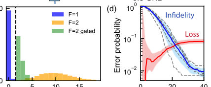 
FIG. 1. Cavity detection of a 5-qubit atom array. (a) Experimental setup. AODs direct probe and shielding light onto each atom and AOMs control the light intensities. A single-photon counting mod- ule (SPCM) detects cavity emission. An FPGA processes the SPCM signal for adaptively gated measurement and feedforward control of a microwave driving field. (b) Probe light is detuned from the F = 2 to F ′ = 3 transition and resonant with the cavity. Shield- ing light shifts the average frequency of the F ′ = 3 levels, de- coupling the unmeasured qubits from near-resonant light. (c) His- tograms of cavity-emission photon counts in 40 µs of cavity detec- tion for atoms prepared in the F = 1...

📷 Fig 2

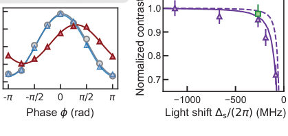 
FIG. 2. Mid-circuit measurement and phase shift feedforward correc- tion. (a) Experimental sequence for the Ramsey measurement with echo. (b) Probability P5(↑) of atom q5 being measured in the |↑⟩ state after mid-circuit measurements of q1-q4 with shielded detun- ings of ∆s = −2π×1130 MHz (blue triangles) and ∆s = −2π×80 MHz (red triangles). Reference data taken without mid-circuit mea- surement are shown as gray circles. Solid curves are sinusoidal fits. (c) Ramsey phase shift (top) and normalized contrast (bottom) vs. ∆s without (purple triangles) and with (green squares) feedforward cor- rection. The gray shaded bar represents the uncertainty in the phase of the reference data. Solid...

📷 Fig 3

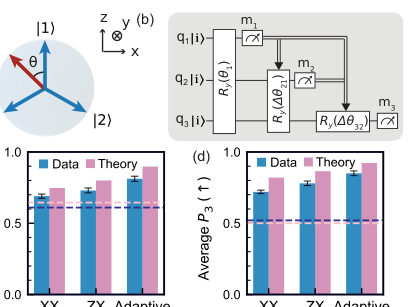 
FIG. 3. Quantum-state discrimination and coherent state preparation using mid-circuit measurement and feedforward control. (a) Three atoms in an array are prepared identically in one of three possible single-particle states, shown on the Bloch sphere (blue arrows). A measurement and feedforward protocol is used to identify the initial state based on measurements on q1 and q2 and to prepare q3 coher- ently in the |↑⟩state, as confirmed by a final measurement on q3. The measurements are along axes defined by polar angles θi (red ar- row) for atoms qi. (b) Circuit diagram of the experimental protocol. Global microwave rotations by angles ∆θij = θi −θj are applied prior to measurements in the z...

**Summary.** The research demonstrates fast mid-circuit measurement and feedforward control in an array of neutral atoms coupled to an optical cavity. By utilizing site-selective light shifts, they reduced the operational cycle time from milliseconds to microseconds while maintaining high fidelity. This breakthrough establishes a powerful tool for implementing complex quantum algorithms on atomic qubits.

**Why it may be interesting.** This work directly addresses a major bottleneck—the measurement latency—in solid-state and neutral atom quantum computing architectures by integrating high-speed optical readout with real-time classical feedback.

Detailed structure

**Main problem.** The core challenge is achieving fast, high-fidelity mid-circuit measurement and real-time feedforward control necessary for advanced quantum information protocols.

**Main result.** The authors demonstrated a significant speedup, reducing the measurement-and-feedforward cycle time to below 100 $\mu$s, establishing optical cavities as a viable route for fast control in neutral atom arrays.

**Method.** They employ site-selective illumination using near-resonant probe beams and coherence-shielding light shifts on neutral atoms trapped in an array coupled to a high-finesse optical cavity.

**Model / system.** The platform is a neutral atom array (using $^{87}	ext{Rb}$) acting as qubits, interrogated via cavity Quantum Electrodynamics (QED) interactions. Control relies on precisely tuned light shifts and real-time classical feedback processing measurement outcomes.

**Key observables.** Detection infidelity ($\le 1\%$), coherence reduction on unmeasured qubits ($\le 2\%$), and the cycle time ($< 100 \mu$s).

**Important parameters / regimes.** Cavity coupling strength, probe/shielding detunings, measurement duration (optimized to $\sim 7-30 \mu$s), and feedback loop latency.

**Assumptions / limitations.** The shielding mechanism is modeled using Hamiltonian diagonalization; the analysis assumes minimal crosstalk between neighboring sites during measurement.

**Figures summary.** Figures illustrate the experimental setup, Ramsey measurements showing fidelity improvement with feedforward correction, and comparisons of state discrimination success probabilities between fixed and adaptive measurement schemes.

**Paper structure.** The paper progresses from establishing the fundamental speedup via cavity coupling to demonstrating its application in complex tasks like Ramsey sequence fidelity enhancement, culminating in benchmarking optimal adaptive control for quantum state discrimination and preparation.

Abstract

Measuring part of a quantum system in the midst of its evolution and acting on the result in real time is essential for numerous quantum information protocols. Neutral-atom arrays are a leading platform for quantum information processing, but their mid-circuit measurement-and-feedforward cycle times have remained slow, typically exceeding 1 ms. Here we demonstrate fast mid-circuit measurement and real-time feedforward in an array of atomic qubits coupled to a high-finesse optical cavity. Local light shifts tune individual data qubits out of resonance with the cavity, shielding their coherence, while a near-resonant probe drives a selected qubit whose emission is collected with Purcell enhancement. Mid-circuit measurements of four qubits with sub percent infidelity reduce the coherence of a fifth unmeasured data qubit by less than 2%. We implement real-time feedforward to correct measurement-induced phase shifts and to realize an adaptive circuit for optimal quantum state discrimination and conditional state preparation. Our approach reduces the measurement-and-feedforward cycle time to below 100 $μ$s and establishes optical cavities as a route to fast control of neutral-atom quantum systems.

[↑ back to top](#top)

### [Non-adiabatic transitions in the density matrix formalism](http://arxiv.org/abs/2606.24310v1)

**Authors:** Pasquale Di Bari, Shreya Pandit, Ye-Ling Zhou  
**Type:** theory · **Category:** other · **PDF:** <https://arxiv.org/pdf/2606.24310v1>  
**Analysis basis:** full PDF text, analyzed in chunks
**Topic relevance:** 🔥 `methods for driven-dissipative` **4/5** · `Keldysh / 2PI / non-Gaussian methods` **3/5** · `correlated / nonlocal dissipation` **3/5** · `driven-dissipative phase transition` **3/5** · `non-equilibrium dynamics` **2/5** · `non-equilibrium universality` **2/5** · `Kondo & dissipative impurity` **1/5** · `analog quantum simulation` **1/5** · `measurement-induced transitions` **1/5** · `quantum measurements` **1/5**

📷 Fig 1

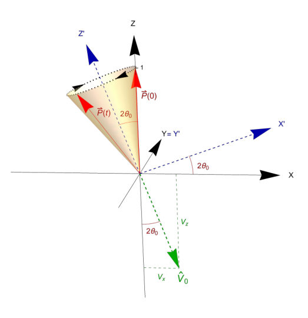 
Figure 1: Graphical representation of the motion of the polarization vector in the case of time-independent Hamiltonian, corresponding to a constant potential vector ˆV0 ≡⃗V0/∆E0 = (sin 2θ0, 0, −cos 2θ0) for some generic θ0.

📷 Fig 2

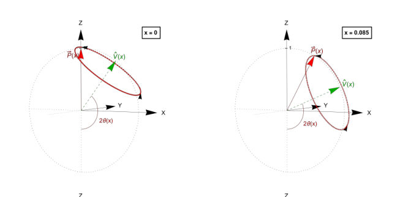 
Figure 2: Representation of the polarisation and normalised potential vector ˆV (t) ≡ ⃗V (t)/∆E(t) in the case of the solar MSW effect with E = 10 MeV for the four indicated values of x ≡r/R⊙. Top left: t = r = 0, in this case one has ∆v(0) ≃1.576 and θ(0) ≃72◦. Top right: x ≃0.085, implying ∆v(x) ≃0.77 and θ(x) ≃56◦; Bottom left: resonance, xres ≃0.169, implying ∆v(xres) = cos 2θ12 ≃0.381 and θ(xres) = 90◦; Bottom right: x ≫xres, vacuum oscillations are recovered. However, notice that for very large x, neutrino oscillations fade away, since neutrino mass eigenstates propagate to a slightly different speed inducing decoherence. For this reason, when reaching the Earth, neutrinos are...

📷 Fig 3

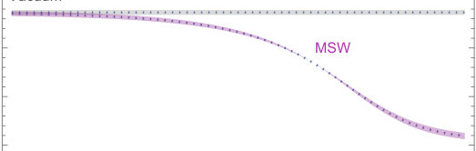 
Figure 3: Survival probability of solar neutrinos as a function of the energy E: vacuum (grey), MSW (purple).

**Summary.** This paper introduces and validates the use of the density matrix formalism to analyze non-adiabatic transitions in two-state quantum systems. It provides a powerful analytical solution that unifies descriptions ranging from the standard Landau-Zener approximation through highly non-adiabatic regimes, while also incorporating decoherence effects. This general framework has broad applications across quantum physics, including neutrino oscillations and cosmology.

**Why it may be interesting.** This work is highly relevant as it provides a unified theoretical tool—the density matrix approach—to study quantum transitions across various physical contexts, including those involving dissipation or environmental coupling, which are central themes in open quantum systems research.

Detailed structure

**Main problem.** The paper addresses the theoretical description of non-adiabatic transitions occurring in two-state quantum systems subjected to time-dependent Hamiltonians.

**Main result.** It develops a general analytical framework using the density matrix formalism that successfully interpolates between known approximations (like LZSM) and regimes including decoherence effects.

**Method.** The core method involves transforming the time evolution equation into a manageable Larmor-like differential equation for the polarization vector, allowing for systematic solution in different physical limits.

**Model / system.** The primary model is a two-state quantum system whose dynamics are governed by the von Neumann equation (or Schrödinger equation). The analysis is benchmarked using neutrino flavor oscillations and can be extended to include decoherence via the Lindblad equation.

**Key observables.** Transition probabilities ($P_{1	o 2}$), survival/appearance probabilities in neutrino physics, and the polarization vector components ($\vec{P}(t)$).

**Important parameters / regimes.** The adiabaticity parameter ($\gamma$), resonance crossing probability ($P_c$), decoherence rate ($\Gamma(t)$), and system parameters like mass squared differences ($\Delta m^2$).

**Assumptions / limitations.** Key approximations include assuming the two-state nature of the system, using specific parameterizations for the Hamiltonian, and analyzing limits such as the adiabatic or highly non-adiabatic regimes.

**Figures summary.** Figures illustrate the evolution of polarization vectors and potential energy landscapes during phenomena like the MSW effect in solar neutrinos, comparing different physical regimes.

**Paper structure.** The paper builds from establishing the density matrix formalism for two-state systems to deriving a general solution. It then applies this framework sequentially to analyze the adiabatic limit, the resonant crossing probability (reproducing LZSM), and finally extending the description to include decoherence effects.

Abstract

We show that a density matrix formalism provides a useful description of non-adiabatic transitions in two-state quantum systems.   Compared to a traditional Hamiltonian formalism, even in the absence of decoherence when there is full equivalence between the two, the density matrix formalism provides a convenient change of variables that yields a powerful general analytical solution. This solution nicely describes a transition regime between the well known Landau-Zener-Stuckelberg-Majorana (LZSM) approximation and the extremely non-adiabatic limit. Our results have very general applications, within a large variety of problems in quantum physics, neutrino physics, cosmology.

[↑ back to top](#top)

### [When does dissipation help neural surrogates learn open quantum dynamics?](http://arxiv.org/abs/2606.23894v1)

**Authors:** Alauddin Ahmed  
**Type:** theory · **Category:** disordered systems and neural networks · **PDF:** <https://arxiv.org/pdf/2606.23894v1>  
**Analysis basis:** full PDF text, analyzed in chunks
**Topic relevance:** 🔥 `methods for driven-dissipative` **4/5** · `analog quantum simulation` **3/5** · `driven-dissipative phase transition` **3/5** · `non-equilibrium dynamics` **3/5** · `Keldysh / 2PI / non-Gaussian methods` **2/5** · `non-equilibrium universality` **2/5** · `correlated / nonlocal dissipation` **1/5** · `entanglement & information structure` **1/5** · `exotic spin models in light-matter` **1/5** · `quantum measurements` **1/5**

📷 Fig 1

 
Figure 1: Trajectory-averaged fidelity ¯Favg versus dimensionless dissipation strength γ/J at D = 2000, one line per system size n (markers show three-seed means; error bars show the seed standard deviation). The n = 2 and n = 3 curves use standard state-MSE training; the n = 4 curve uses the fidelity-aware loss (λTD = 0.1; §3.2) and includes the γ/J = 100 bounding point. n = 2 saturates near unity; n = 3 shows a broad sweet spot at γ/J ∈{0.1, 1} with a slight roll-off at γ/J = 10; n = 4 recovers monotonically and saturates by γ/J = 100, with the favorable regime shifted toward stronger damping relative to n = 3. The closed-system (γ = 0) point is offset to the left of the logarithmic axis...

📷 Fig 2

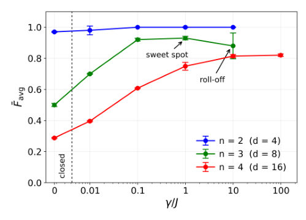 
Figure 1 provides an overview of the central result: trajectory-averaged fidelity ¯Favg as a function of dis- sipation strength γ/J for each system size. The trends summarized there—near-saturation at n = 2, an inte- rior sweet spot at n = 3, and a damping-shifted recovery at n = 4—are developed in detail in this section and §5.

📷 Fig 3

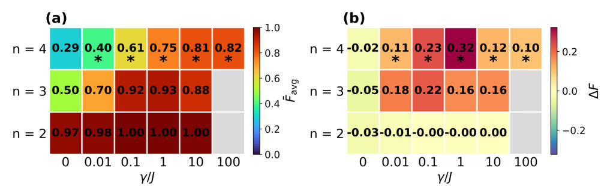 
Figure 2: Neural ODE learnability across the n × γ sweep. (a) Trajectory-averaged fidelity ¯Favg. (b) The late-versus-early fidelity gap ∆F = ¯Flate −¯Fearly; positive values indicate higher accuracy in the late-time window. Cells marked with an asterisk (∗) at n = 4 were trained with the fidelity-aware loss (λTD = 0.1; §3.2); all other cells use standard state-MSE training. The γ/J = 100 column is a separately added bounding experiment for the n = 4 row only (§3.3); it is left blank at n = 2 and n = 3. Blank (grey) cells indicate combinations that were not simulated. See §3.3 for cell counts.

📷 Fig 4

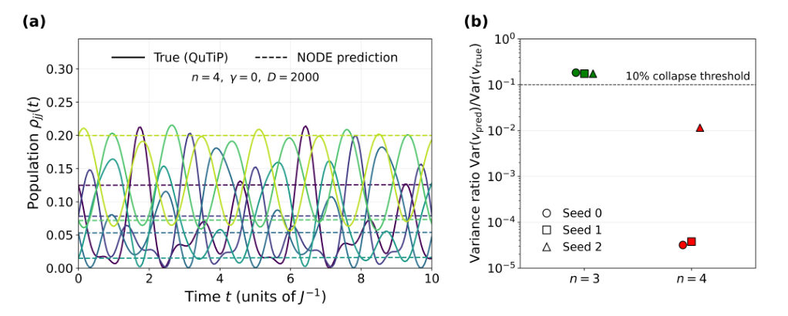 
Figure 3: Closed-system (γ = 0) static-prediction collapse at n = 4. (a) True (solid) versus predicted (dashed) density-matrix populations ρjj(t) for a representative n = 4 test trajectory (the six most dynamically varying populations are shown); the true populations oscillate while the prediction is essentially frozen. (b) Flat-vector temporal-variance ratio Var(vpred)/Var(vtrue) across three seeds for n = 3 (partial learning, ≈18%) and n = 4 (static collapse, 0.003–1.16%); bars show seed means and points show individual seeds. The dashed line marks the 10% collapse threshold of the diagnostic.

📷 Fig 5

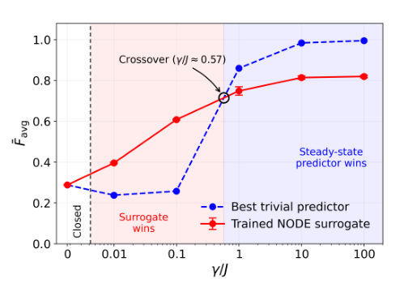 
Figure 4: Trained NODE surrogate ¯Favg (solid, with seed standard deviation) versus the best trivial predictor at each γ (dashed; the higher of the static ρ(0) and steady-state |0 . . . 0⟩⟨0 . . . 0| baselines, per Table 1), for n = 4 at D = 2000. The curves cross near γ/J ≈0.57 (interpolated in log γ be- tween the γ/J = 0.1 and γ/J = 1 points): the surrogate adds value over trivial predictors at weak-to-moderate dissipation (left), and is matched or overtaken by the steady-state predic- tor under strong dissipation (right), where high ¯Favg reflects trajectory simplification rather than richer learned dynamics.

**Summary.** The paper explores whether dissipation aids or hinders the ability of neural networks to learn open quantum dynamics in spin chains. It finds that while closed-system learning fails at larger sizes, moderate dissipation restores high fidelity by suppressing prediction errors. Crucially, it distinguishes between genuine dynamical learning and mere trajectory simplification toward a steady state.

**Why it may be interesting.** This work directly addresses the intersection of quantum many-body physics (open systems) and machine learning methodologies, providing crucial guidelines on how to train neural models for complex physical dynamics while distinguishing true learning from numerical artifacts.

Detailed structure

**Main problem.** The study investigates whether incorporating dissipation into open quantum dynamics helps or hinders the ability of Neural Ordinary Differential Equation (NODE) surrogates to accurately learn the system's time evolution.

**Main result.** Dissipation can enhance learnability, particularly in weak-to-moderate regimes, by suppressing prediction errors; however, high fidelity at strong damping often reflects trivial steady-state contraction rather than genuine dynamical learning.

**Method.** The authors train NODE surrogates using various loss functions—comparing standard state Mean Squared Error (MSE) against physics-informed, fidelity-aware objectives incorporating trace distance constraints.

**Model / system.** The system is an open Heisenberg XYZ spin chain simulated via the GKSL master equation. Dissipation is introduced through local dephasing and amplitude damping channels acting on qubits up to $n=4$.

**Key observables.** Trajectory-averaged Uhlmann fidelity ($ar{F}_{	ext{avg}}$), late-time vs. early-time fidelity gap ($\Delta F$), minimum eigenvalue ($\lambda_{\min}$), and comparison against static/steady-state predictors.

**Important parameters / regimes.** System size ($n=2, 3, 4$ qubits), dimensionless dissipation strength ($\gamma/J \in \{0.01, 0.1, 1, 10, 100\}$), and loss function weighting parameters ($\lambda_{TD}$).

**Assumptions / limitations.** The analysis assumes that the use of fidelity-aware losses is necessary to overcome the static collapse observed when using only state-MSE training for larger systems.

**Figures summary.** Figures illustrate $ar{F}_{	ext{avg}}$ vs. $\gamma/J$ showing optimal regimes, and compare late-time versus early-time fidelity ($\Delta F$) to distinguish genuine dynamics from simple error suppression.

**Paper structure.** The paper systematically compares learning performance across different system sizes ($n=2, 3, 4$) and dissipation strengths ($\gamma/J$), contrasting the failure modes of standard MSE training with the recovery achieved using advanced fidelity-aware loss functions.

Abstract

Dissipation is usually viewed as an obstacle to predicting quantum dynamics, yet it can also contract trajectories toward steady states and thereby suppress accumulated prediction errors, leaving it unclear whether dissipation ultimately helps or hinders the learnability of open quantum dynamics. We investigate this question using Neural Ordinary Differential Equation (NODE) surrogates for open Heisenberg XYZ spin chains. Closed-system learnability deteriorates rapidly with system size, culminating in a static-prediction collapse at four qubits; dissipation reverses this trend, creating a broad high-fidelity regime at intermediate system sizes, while at four qubits a fidelity-aware objective recovers learnable rollout structure that is absent under closed-system training. Comparison against static and steady-state baselines reveals that dissipation improves performance through two fundamentally different mechanisms: at weak-to-moderate dissipation the surrogate captures nontrivial transient dynamics and substantially outperforms trivial predictors, whereas at stronger damping high fidelity increasingly reflects trajectory simplification toward the steady state rather than improved learned dynamics. These results show that dissipation can enhance the learnability of open quantum dynamics, but that fidelity alone is insufficient to distinguish genuine dynamical learning from steady-state trivialization: dissipative contraction and trajectory simplification are distinct effects that peak in different regimes and should be disentangled when evaluating learned quantum-dynamical surrogates.

[↑ back to top](#top)

### [Revealing high-dimensional entanglement through symmetry](http://arxiv.org/abs/2606.23817v1)

**Authors:** Jayden Webster, Florian Kanitschar, Emanuele Polino, Simon J. U. White, Sven Rogge, Farzad Ghafari, Marcus Huber, Nora Tischler  
**Type:** both · **Category:** quantum information and computing · **PDF:** <https://arxiv.org/pdf/2606.23817v1>  
**Analysis basis:** full PDF text, analyzed in chunks
**Topic relevance:** 🔥 `entanglement & information structure` **4/5** · `interference shaping light` **3/5** · `quantum measurements` **3/5** · `quantum optics experiment` **3/5** · `QC/QI experiment` **2/5** · `measurement-induced transitions` **2/5** · `analog quantum simulation` **1/5** · `methods for driven-dissipative` **1/5** · `non-equilibrium dynamics` **1/5**

📷 Fig 1

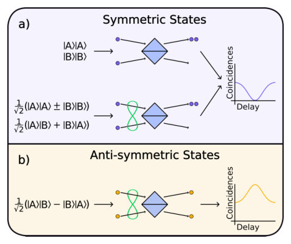 
FIG. 1. Dependence of the HOM effect on particle exchange symmetry. a) If a two-particle state is symmet- ric under an exchange of particles, bunching occurs at the output of the HOM beamsplitter when these two particles are interfered. b) Conversely, if this state is anti-symmetric, anti-bunching occurs at the outputs.

📷 Fig 2

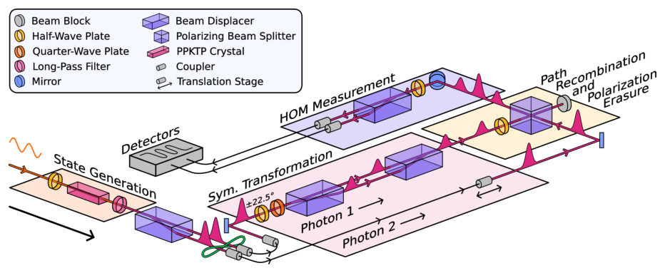 
FIG. 2. Experimental setup. A type-II SPDC process is pumped by a 775 nm CW laser to generate a photon pair in the state described by Eq. (1) (orange panel). This pair is deterministically separated based on polarization and coupled to two separate paths (red panel). One photon in this pair is passed through a polarization-based unbalanced interferometer, where the two different transformations U± in Eq. (3) are selected by rotating a half-wave-plate at the beginning of the polarization Mach-Zehnder interferometer. The single-bin delay of U± on the other photon is implemented by a translation stage. Both photons are then passed through a polarizing beam splitter (yellow panel) to recombine...

📷 Fig 3

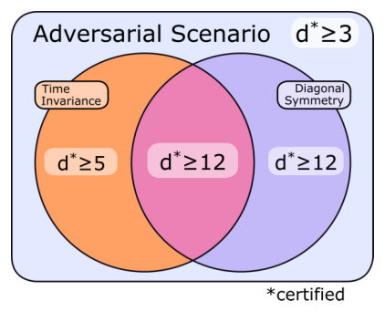 
FIG. 4. Entanglement dimension certification. The minimum number of dimensions certified from the HOM data for different assumptions considered. Each lower bound is calculated from the worst-case scenario compatible with the experimental error.

📷 Fig 4

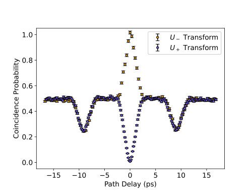 
FIG. 3. HOM scans. Examples of the symmetric and anti- symmetric interference features, associated with the U± trans- forms, that arise as the two photons interfere during a HOM scan of relative path delay between the photons. The photons in this example plot were filtered by a 3 nm bandwidth filter centered at 1550 nm. The error bars here estimate the Poisso- nian fluctuation in the coincidence statistics and are too small to be clearly visible compared to the data points themselves.

📷 Fig 5

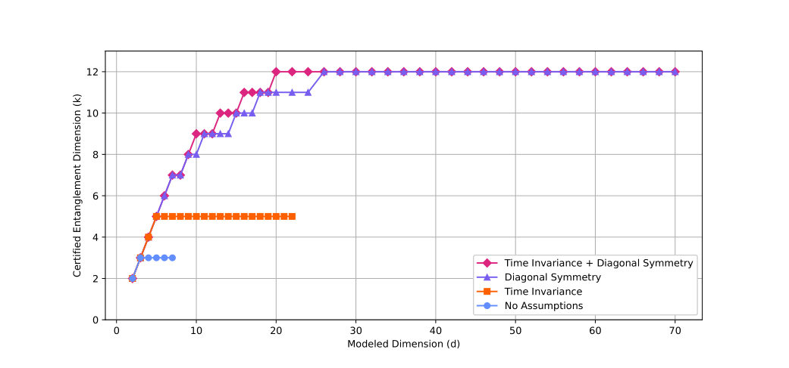 
FIG. 5. Certified entanglement dimension, k, as a function of the modeled dimension, d for varying assumptions on the state

**Summary.** The paper presents a novel linear-optical scheme to certify and lower-bound the dimensionality of entanglement in time-bin encoded photon pairs. By leveraging particle-exchange symmetry and performing measurements via Hong-Ou-Mandel interference, they overcome limitations of traditional characterization methods. This technique provides a scalable tool for verifying high-dimensional quantum resources.

**Why it may be interesting.** This work provides a powerful, experimentally accessible tool for quantifying entanglement in high-dimensional photonic systems without requiring full state tomography, which is crucial for scaling quantum communication protocols.

Detailed structure

**Main problem.** The primary challenge is developing a general method to characterize high-dimensional entanglement, particularly in time-bin encoded photonic states, which traditional methods struggle with due to measurement complexity.

**Main result.** The authors developed a linear-optical scheme using particle-exchange symmetry that certifies high-dimensional entanglement and provides a rigorous lower bound on its dimensionality using only two simple dichotomic measurements.

**Method.** The method combines Hong-Ou-Mandel (HOM) interference with unitary transformations ($U_{\pm}$) and formulates the problem as an optimization program, solved via Semidefinite Programming (SDP) relaxation to find a Schmidt number witness.

**Model / system.** The system uses photons encoded in discrete time bins, generated via SPDC. The analysis focuses on bipartite states ($
ho$) evolving under specific symmetry operations related to particle exchange.

**Key observables.** HOM coincidence probabilities ($C_{\exp, \pm}^{	ext{HOM}}$), visibility ($V$), and the entanglement dimension lower bound derived from SDP solutions.

**Important parameters / regimes.** The certified entanglement dimensionality ($k$) relative to the modeled dimension ($d$); time-bin separation ($\sim 9.1 	ext{ ps}$); and measurement outcomes for symmetry projections.

**Assumptions / limitations.** The approach relies on exploiting particle-exchange symmetry; approximations involve truncating evolved states back onto the initial subspace, which makes the bound conservative but robust.

**Figures summary.** Figures illustrate HOM interference dependence on particle exchange symmetry (bunching/anti-bunching) and show how certified entanglement dimension increases with the inclusion of physical symmetries like time-invariance and diagonal symmetry.

**Paper structure.** The paper develops a theoretical framework using SDP to bound entanglement dimensionality based on measured symmetry projections from HOM interference. It then details an experimental realization using linear optics on time-bin encoded photons, comparing results under various assumed symmetries (e.g., no assumptions vs. full physical constraints).

Abstract

Photons encoded in discrete time bins can be routinely prepared in temporal superposition states, enabling high-dimensional entanglement and enhanced quantum communication rates. However, characterizing this high-dimensional entanglement presents significant challenges, namely due to the involved measurement complexity or reliance on restrictive assumptions that compromise the generality of traditional approaches. Here, we develop and experimentally demonstrate a simple linear-optical scheme based on particle-exchange symmetry that allows us to probe high-dimensional entanglement in time-bin-encoded states. Combining Hong-Ou-Mandel interference with suitable transformations, our method not only certifies entanglement but also lower-bounds its dimensionality using only two dichotomic symmetry-based measurements. This bound is obtained through a new rigorous theoretical analysis and can be further improved by weak, physically motivated assumptions. The scheme remains effective at any timescale, even far below the temporal detector resolution used. Our work provides a powerful state-characterization tool and demonstrates that we can prove high-dimensional temporal entanglement on timescales inaccessible to the setup.

[↑ back to top](#top)

### [Generalized Fourier's law in mesoscopic systems](http://arxiv.org/abs/2606.23909v1)

**Authors:** Luciano C. Lapas  
**Type:** both · **Category:** statistical mechanics · **PDF:** <https://arxiv.org/pdf/2606.23909v1>  
**Analysis basis:** full PDF text, analyzed in chunks
**Topic relevance:** 🔥 `Keldysh / 2PI / non-Gaussian methods` **4/5** · `correlated / nonlocal dissipation` **3/5** · `methods for driven-dissipative` **3/5** · `non-equilibrium dynamics` **3/5** · `driven-dissipative phase transition` **2/5** · `non-equilibrium universality` **2/5** · `Kondo & dissipative impurity` **1/5** · `analog quantum simulation` **1/5**

📷 Fig 1

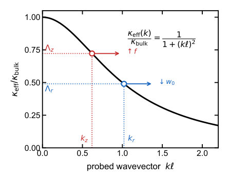 
FIG. 1. Anisotropy from a single nonlocal kernel. The effective conductivity falls with the probed wavevector, κeff(k)/κbulk = [1 + (kℓ)2]−1. A TDTR experiment samples the through-plane direction at kz ∼d−1 p (f) and the in-plane direction at kr ∼w−1 0 , so a nominally isotropic crystal yields Λz ̸= Λr. Increasing the modulation frequency f (decreasing the spot size w0) shifts kz (kr) outward, selectively suppress- ing each channel.

📷 Fig 2

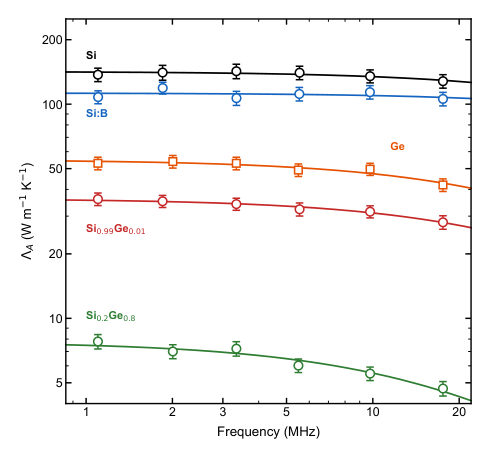 
FIG. 2. Apparent thermal conductivity ΛA versus modula- tion frequency: the spatial-nonlocality model, Eq. (11) (solid lines), against TDTR data of Wilson and Cahill [10] (symbols, with error bars; digitized from their Fig. 3a at w0 = 10 µm). Fourier’s law predicts a constant ΛA; Si and Si:B stay flat while Ge and the SiGe alloys are suppressed at high f, where the shrinking penetration depth dp(f) probes a larger wavevector. Solid lines are two-parameter fits of Eq. (11); the resolved nonlocality lengths are ℓ= 0.41, 0.34 and 0.25 µm for Ge, Si0.99Ge0.01 and Si0.2Ge0.8, respectively.

**Summary.** This work generalizes Fourier's law by deriving a nonlocal conductivity kernel using advanced statistical mechanics techniques. It shows that heat transport in mesoscopic materials exhibits spatial nonlocality, leading to measurable apparent anisotropy even when the material itself is isotropic. The framework successfully models experimental data from TDTR measurements on semiconductors.

**Why it may be interesting.** While focused on thermal transport, the use of projection-operator formalism and memory kernels ($\kappa_{	ext{eff}}(\mathbf{k}, \omega)$) provides a rigorous theoretical framework for non-Markovian dynamics in open quantum systems, which is highly relevant to AMO physics.

Detailed structure

**Main problem.** Fourier's law fails when energy carrier mean free paths are comparable to system length/time scales, necessitating a thermodynamically consistent generalization for heat transport in mesoscopic systems.

**Main result.** The generalized conductivity is derived as a nonlocal memory operator $\kappa_{	ext{eff}}(\mathbf{k}, \omega)$, which predicts apparent anisotropy ($\Lambda_z 
eq \Lambda_r$) even in isotropic materials due to measurement geometry.

**Method.** The authors combine Mesoscopic Nonequilibrium Thermodynamics with the Mori–Kubo–Zwanzig projection-operator formalism to derive the nonlocal constitutive relation.

**Model / system.** The theory applies to heat conduction in mesoscopic systems (like Si/SiGe) involving energy carriers (phonons, electrons), modeling the transport using a generalized Fourier law incorporating memory and spatial nonlocality.

**Key observables.** Apparent conductivities ($\Lambda_z$, $\Lambda_r$) measured via Time-Domain Thermoreflectance (TDTR); the nonlocal conductivity tensor $\kappa_{	ext{eff}}(\mathbf{k}, \omega)$.

**Important parameters / regimes.** Nonlocality length scale ($\ell$), mean free path ($\ell_c$), and frequency/wavevector dependence ($k, \omega$).

**Assumptions / limitations.** The analysis relies on linear response theory, the assumption of small deviations from equilibrium, and approximations like the minimal one-length ansatz for $\kappa_{	ext{eff}}(k)$.

**Figures summary.** Figures illustrate how a single nonlocal kernel leads to apparent anisotropy ($\Lambda_z 
eq \Lambda_r$) and show theoretical fits comparing the predicted frequency roll-off of apparent conductivity against experimental TDTR data.

**Paper structure.** The paper progresses from identifying the failure of Fourier's law, deriving the generalized nonlocal constitutive relation using projection operators, analyzing its consequences (anisotropy), and finally fitting these predictions to experimental measurements on semiconductor alloys.

Abstract

Fourier's law fails when the mean free path of the energy carriers becomes comparable to the length and time scales over which the temperature field varies. We derive a thermodynamically consistent generalization in which the conductivity is promoted to a nonlocal memory operator $\bmκ_{\mathrm{eff}}(\mathbf{k},ω)$, obtained by combining mesoscopic nonequilibrium thermodynamics with the Mori--Kubo--Zwanzig projection-operator formalism. The Onsager kernel decomposes exactly into a tensor sum over vibrational normal modes weighted by their Bose heat capacities and relaxation functions, and satisfies the second law by construction. Two consequences follow. First, because the modal weights carry the directional group velocity, the kernel is anisotropic, so a nominally isotropic crystal exhibits direction-dependent apparent conductivities $Λ_z\neqΛ_r$. Second, in a pump--probe experiment the modulation frequency does not introduce temporal memory but sets the probed wavevector through the thermal penetration depth, so the suppression of the apparent conductivity measured by time-domain thermoreflectance on Si, Ge and Si$_{1-x}$Ge$_x$ is a spatial-nonlocality effect set by a sub-micron carrier mean free path. Fitting the data of Wilson and Cahill yields nonlocality lengths of $0.25$--$0.4~μ$m consistent with the mean-free-path spectra of these crystals. The framework supplies a thermodynamic foundation for the two-channel ballistic/diffusive picture of nondiffusive heat transport.

[↑ back to top](#top)

### [The Interplay of Thermal Melting and Pump Driven Melting of Charge Order: A Two-Temperature Study of the Holstein Model](http://arxiv.org/abs/2606.24800v1)

**Authors:** Debraj Bose, Sankha Subhra Bakshi, Pinaki Majumdar  
**Type:** theory · **Category:** strongly correlated electrons · **PDF:** <https://arxiv.org/pdf/2606.24800v1>  
**Analysis basis:** full PDF text, analyzed in chunks
**Topic relevance:** 🔥 `non-equilibrium dynamics` **4/5** · `Keldysh / 2PI / non-Gaussian methods` **3/5** · `driven-dissipative phase transition` **3/5** · `methods for driven-dissipative` **3/5** · `non-equilibrium universality` **2/5** · `Frenkel-Kontorova` **1/5** · `analog quantum simulation` **1/5** · `correlated / nonlocal dissipation` **1/5** · `correlated cavity matter` **1/5**

📷 Fig 1

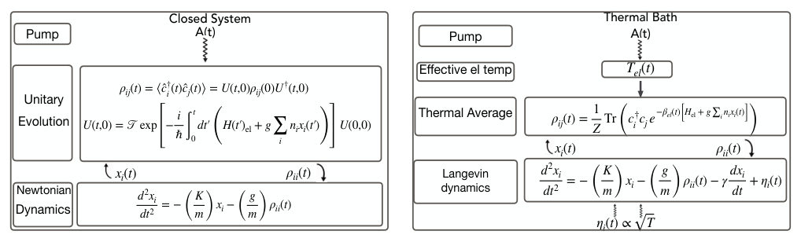 
FIG. 1. Schematic of two methods. Left: the response of a closed system (no thermal bath) to a pump pulse. The electrons ‘see’ the pump pulse and the phonon fluctuations, while the phonons see the fluctuating electron density. The system as a whole is energy conserving once the pump pulse passes. Right: the ‘two temperature’ version of an open system. Here the pump generates an effective electron temperature Tel(t) and electronic properties are computed as a thermal average at this temperature and in the background of instantaneous phonons. The phonons in turn see the instantaneous electron density. This scheme is valid provided Tel and the phonons vary on a timescale much greater than...

📷 Fig 2

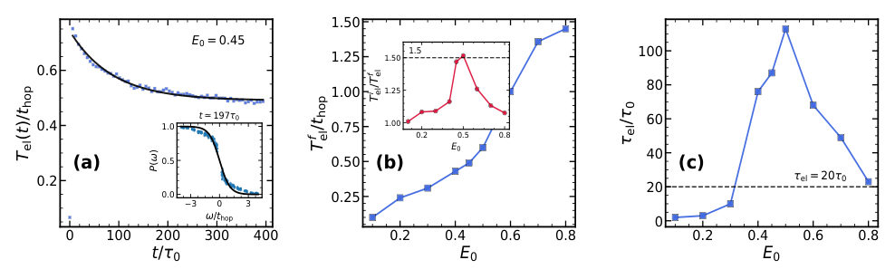 
FIG. 2. Calibration of the electronic-temperature quench from closed-system pump dynamics. (a) Tel(t) extracted from the instantaneous electronic population for E0 = 0.45, with an exponential fit. The inset shows a representative Fermi-function fit to P(ω). (b) T f (and the ratio T i el/T f el in the inset) as a function of the pump strength E0. (c) Extracted relaxation time τel.

📷 Fig 3

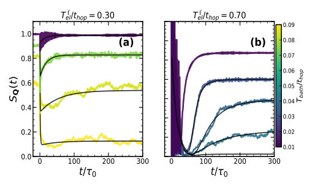 
FIG. 4. Transient loss and recovery of charge order. Weak pumping, T f el/thop = 0.3, suppresses SQ without fully destroy- ing it, while strong pumping, T f el/thop = 0.7, can nearly ex- tinguish the order. Left panels show individual trajectories and right panels show noise-averaged results.

📷 Fig 4

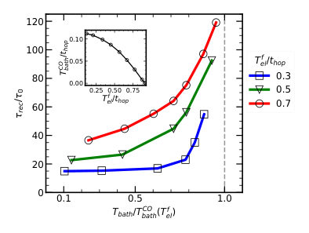 
FIG. 5. Recovery time τrec as a function of the bath tem- perature, normalized by the corresponding charge-ordering transition temperature T CO bath(T f el), for different final electronic temperatures T f el. The inset shows T CO bath as a function of T f el.

📷 Fig 5

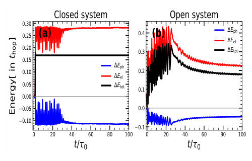 
FIG. 3. Energy dynamics after the pump for closed and open systems at E0 = 0.47. The open system has T f el = 0.5thop and Tbath = 0.05thop, and relaxes to a two-temperature quasi- steady state rather than to equilibrium at Tbath.

**Summary.** The research models charge order melting in electron-phonon systems under strong laser pumping by coupling the system to a thermal bath. Using a two-temperature approximation, it distinguishes between disorder caused by lattice fluctuations (bath temperature) versus electronic excitation energy ($T_{el}$). The findings map out a phase diagram showing that local distortion and long-range coherence melt via distinct mechanisms.

**Why it may be interesting.** This work directly addresses non-equilibrium many-body physics in correlated materials, using techniques relevant to understanding ultrafast photoinduced transitions common in quantum optics and condensed matter theory.

Detailed structure

**Main problem.** The study investigates how charge order, driven by electron-phonon coupling, melts and subsequently recovers following strong photoexcitation in a non-equilibrium setting.

**Main result.** The paper distinguishes between thermal melting (loss of spatial coherence due to bath temperature) and pump-induced melting (direct suppression of local distortion amplitude), establishing a phase diagram controlling the transition regimes.

**Method.** A two-temperature, stochastic mean-field approach is employed, treating electronic excitations via an effective time-dependent temperature ($T_{el}(t)$) while phonons interact with a thermal bath at $T_{bath}$.

**Model / system.** The system is modeled using the spinless Holstein model, incorporating electron hopping, phonon dynamics, and coupling to both a laser pump (driving non-equilibrium electronic states) and an external thermal bath.

**Key observables.** Order parameter ($S_Q$), local lattice displacement distribution ($P(x)$), Electronic Density of States (DOS), and recovery time ($	au_{rec}$).

**Important parameters / regimes.** Bath temperature ($T_{bath}$), effective electronic temperature ($T_{el}(t)$), and the ratio $T_{el}/t_{hop}$.

**Assumptions / limitations.** The primary approximations include modeling pump excitations via an effective $T_{el}(t)$ and assuming that variations in $T_{el}$ and phonons occur slowly compared to electron hopping.

**Figures summary.** Figures illustrate the comparison between energy decay in closed vs. open systems, show time-dependent fitting of $T_{el}(t)$, and present a phase diagram mapping charge order survival against $T_{el}$ and $T_{bath}$.

**Paper structure.** The paper first establishes the full Hamiltonian and then develops the two-temperature Langevin dynamics for the open system. It analyzes energy relaxation, characterizes the melting mechanisms via observables like $S_Q$ and $P(x)$, and concludes by mapping out a phase diagram.

Abstract

Charge order driven by electron-phonon coupling is well understood at equilibrium but pump-probe experiments raise a new question: how does this order melt and recover after strong photoexcitation? A pump pulse promotes carriers across the charge-order gap and creates a nonequilibrium high-energy electronic population. In a closed system the subsequent dynamics is constrained by energy conservation. In an `open system' - where the system is coupled to a thermal bath at some temperature $T_{\rm bath}$ - there are new fluctuation and dissipation processes at play. One can attempt a computational scheme that incorporates coupling of electrons to a laser pump, the coupling of system phonons to a thermal bath, and the Holstein interaction that couples electrons and phonons. We attempt an approximation where the pump induced electronic excitations are modeled by a slowly time varying `electron temperature', $T_{\rm el}(t)$, indicative of a quasi-equilibrium electronic state. We solve the problem for different combinations of $T_{\rm el}$ and $T_{\rm bath}$, probing the order parameter dynamics, the static properties and excitations in the long time `quasi steady state', and establish a `phase diagram' in terms of bath temperature and electron temperature.

[↑ back to top](#top)

### [Initial-state-dependent dephasing effect in non-Hermitian Su-Schrieffer-Heeger models](http://arxiv.org/abs/2606.24185v1)

**Authors:** Tao Min, Junjie Liu  
**Type:** theory · **Category:** statistical mechanics · **PDF:** <https://arxiv.org/pdf/2606.24185v1>  
**Analysis basis:** full PDF text, analyzed in chunks
**Topic relevance:** 🔥 `methods for driven-dissipative` **4/5** · `correlated / nonlocal dissipation` **3/5** · `driven-dissipative phase transition` **3/5** · `non-equilibrium dynamics` **2/5** · `non-equilibrium universality` **2/5** · `Keldysh / 2PI / non-Gaussian methods` **1/5** · `Kondo & dissipative impurity` **1/5** · `analog quantum simulation` **1/5** · `entanglement & information structure` **1/5**

📷 Fig 1

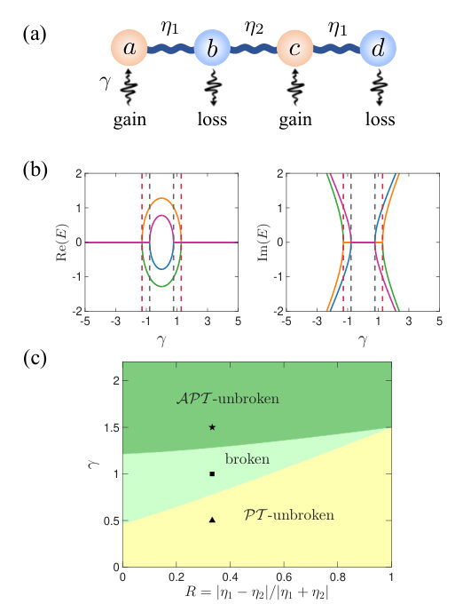 
Figure 1. (a) Sketch of the minimum four-site non-Hermitian SSH model with alternating hopping strengths η1 and η2, and alternat- ing gain and loss processes measured by strength γ. (b) Real (left panel) and imaginary (right panel) parts of the energy eigenvalues as a function of γ with η1 = 1 and η2 = 0.5. The inner grey and outer red vertical dashed lines indicate the locations of the excep- tional points at γ = ±√u−and γ = ±√u+, respectively, where u± = (2η2 1 + η2 2 ± η2 √

📷 Fig 2

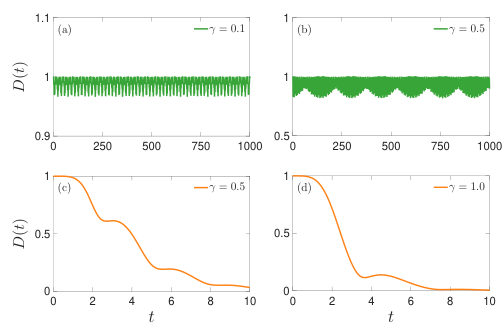 
Figure 2. Dynamical evolution of the trace distance D(t) in the closed non-Hermitian system. Upper panel: PT -unbroken phase. Lower panel: symmetry broken phase. (a) and (c) correspond to η1 = 0.5 and η2 = 1. (b) and (d) correspond to η1 = 1 and η2 = 0.5. The trace distance is computed for two initial conditions ˆρ1(0) = ∣S1⟩⟨S1∣and ˆρ2(0) = ∣S3⟩⟨S3∣.

📷 Fig 3

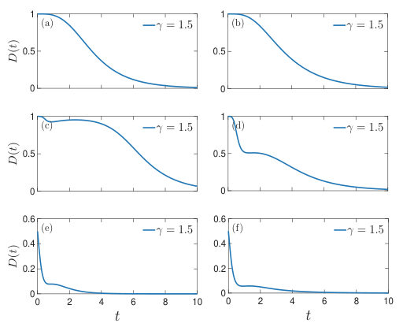 
Figure 3. Time evolution of the trace distance D(t) in the APT - unbroken phase with γ = 1.5 under different initial state pairs. Up- per row [(a), (b)]: Initial states are ˆρ1(0) = ∣S1⟩⟨S1∣and ˆρ2(0) = ∣S3⟩⟨S3∣. Middle row [(c), (d)]: Initial states are ˆρ1(0) = ∣S1⟩⟨S1∣ and ˆρ2(0) = ∣S2⟩⟨S2∣. Lower row [(e), (f)]: Initial states are ˆρ1(0) = ∣S1⟩⟨S1∣and ˆρ2(0) = 0.5∣S1⟩⟨S1∣+0.5∣S2⟩⟨S2∣. Left panel: η1 = 0.5, η2 = 1. Right panel: η1 = 1, η2 = 0.5.

📷 Fig 4

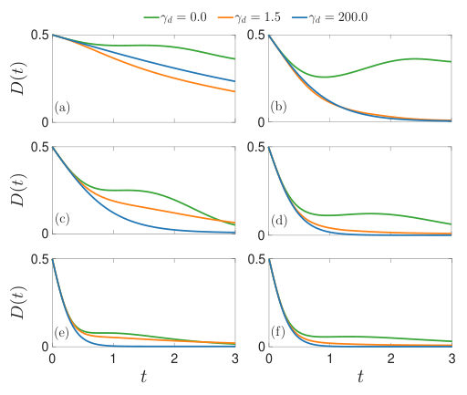 
Figure 4. Dynamics of the trace distance D(t) with varying dephas- ing strength γd obtained by directly evolving Eq. (8). (a) and (b) cor- respond to the PT -unbroken phase for γ = 0.1 and γ = 0.5, respec- tively. (c) and (d) correspond to the symmetry-broken phase for γ = 0.5 and γ = 1.0, respectively. (e) and (f) correspond to the APT - unbroken phase for γ = 1.5. Other parameters are η1 = 0.5, η2 = 1 for the left panel, and η1 = 1, η2 = 0.5 for the right panel. The initial states are ˆρ1(0) = ∣S1⟩⟨S1∣and ˆρ2(0) = 1

📷 Fig 5

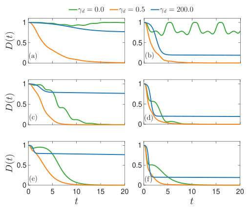 
Figure 5. Dynamics of the trace distance D(t) with varying dephas- ing strength γd obtained by directly evolving Eq. (8). (a) and (b) correspond to the PT -unbroken phase for γ = 0.1 and γ = 0.5, re- spectively. (c) and (d) correspond to the symmetry-broken phase for γ = 0.5 and γ = 1.0, respectively. (e) and (f) correspond to the APT -unbroken phase for γ = 1.5. Other parameters are η1 = 0.5, η2 = 1 for the left panel, and η1 = 1, η2 = 0.5 for the right panel. The initial states are ˆρ1(0) = ∣S1⟩⟨S1∣and ˆρ2(0) = ∣S2⟩⟨S2∣.

**Summary.** The paper analyzes open quantum dynamics in non-Hermitian SSH models subjected to pure dephasing. It reveals that the decay of quantum information (measured by trace distance) is highly dependent on the initial state, leading to phenomena like partial or complete stabilization rather than simple exponential decay. This work highlights a complex interplay between system symmetry and dissipation effects.

**Why it may be interesting.** This work provides a detailed, non-trivial understanding of how dissipation (dephasing) interacts with engineered non-Hermiticity, revealing that information loss is not monotonic but can be stabilized or even suppressed depending on the initial quantum state.

Detailed structure

**Main problem.** The study investigates how pure dephasing affects the dynamical evolution of non-Hermitian quantum systems, particularly focusing on initial-state-dependent effects.

**Main result.** Dephasing can lead to two distinct stabilization mechanisms—partial or complete—and exhibits an unconventional protective effect in certain symmetry phases. The dynamics are strongly dependent on the specific initial state chosen.

**Method.** The analysis uses the quantum Lindblad master equation, solving for the trace distance evolution under pure dephasing and employing strong-dephasing limits to linearize population dynamics.

**Model / system.** The model is a finite-sized non-Hermitian Su-Schrieffer-Heeger (SSH) lattice with alternating gain and loss in real space. The dynamics are governed by the Lindblad master equation, allowing exploration of PT and APT symmetry phases.

**Key observables.** Trace distance ($D(t)$), population elements ($
ho_{nn}$), and the Liouvillian gap ($\Delta E$).

**Important parameters / regimes.** Dephasing strength ($\gamma_d$), non-Hermiticity parameters ($\eta_1, \eta_2$), and system size (up to 40 sites).

**Assumptions / limitations.** The analysis often relies on the strong dephasing limit ($\gamma_d 	o \infty$) or weak-dephasing perturbation theory.

**Figures summary.** Figures illustrate phase diagrams based on symmetry, and show $D(t)$ evolution for different initial states in both small (4-site) and large (40-site) systems, demonstrating stabilization regimes.

**Paper structure.** The paper progresses from establishing the physical model and symmetries to analyzing the general dynamics under dephasing. It then details specific mathematical techniques—like linearization in the strong limit or perturbation theory for gap analysis—to derive quantitative results on state decay and stabilization.

Abstract

Understanding the dynamical evolution of non-Hermitian systems under extra external dissipation is essential. Dephasing, a major realistic dissipation, is conventionally considered detrimental to information processing. However, its impact on non-Hermitian systems remains largely unexplored. Here, we focus on finite-sized non-Hermitian Su-Schrieffer-Heeger (SSH) lattice models with alternating gain and loss in real space and examine the dynamical evolution of the trace distance under pure dephasing. By tuning system parameters, this model supports phases with either parity-time or anti-parity-time symmetries, enabling us to explore the interplay between dephasing and different non-Hermitian symmetries. While the trace distance exhibits distinct dynamical behaviors across the different phases in the absence of dephasing, its response to dephasing is largely symmetry-independent but instead initial-state dependent. By varying initial states, we observe that increasing the dephasing strength can either merely accelerate the decay of the trace distance or stabilize it. Interestingly, we reveal two kinds of dephasing-induced stabilization that differ in the strong dephasing limit: a partial stabilization, where the trace distance approaches a finite value smaller than its initial value in the long-time limit, and a complete stabilization, where the trace distance remains at its initial value throughout the entire evolution. By analyzing the equation of motion, we attribute the initial-state dependent dephasing effect to the alternating gain and loss in the system and confirm its absence in Hermitian counterparts. Furthermore, in the anti-parity-time symmetry unbroken phase, we identify a continuous suppression-upon increasing the dephasing strength-of the otherwise exponential decay of the trace distance seen in the absence of dephasing.

[↑ back to top](#top)

### [Quantum turbulence in the many-body regime](http://arxiv.org/abs/2606.23822v1)

**Authors:** Sayak Bhattacharjee, Mahendra K. Verma, Alexander V. Balatsky, Srinivas Raghu  
**Type:** theory · **Category:** quantum gases · **PDF:** <https://arxiv.org/pdf/2606.23822v1>  
**Analysis basis:** full PDF text, analyzed in chunks
**Topic relevance:** 🔥 `non-equilibrium dynamics` **4/5** · `analog quantum simulation` **3/5** · `non-equilibrium universality` **3/5** · `driven-dissipative phase transition` **2/5** · `methods for driven-dissipative` **2/5** · `Frenkel-Kontorova` **1/5** · `Keldysh / 2PI / non-Gaussian methods` **1/5** · `correlated / nonlocal dissipation` **1/5** · `entanglement & information structure` **1/5**

📷 Fig 1

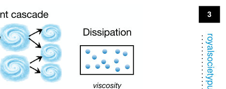 
Figure 1. A cartoon of turbulence in a classical fluid in the fully-developed regime. An external drive (a force f) pumps

📷 Fig 2

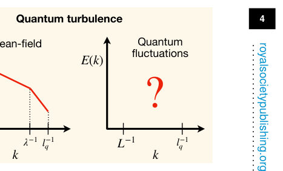 
Figure 2. Sketches of the one-dimensional energy spectrum in classical and quantum fully-developed turbulence, as a

📷 Fig 3

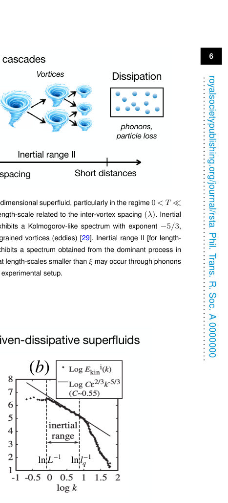 
Figure 4. (a) [Figure reproduced with permission from Ref. [44]] Kolmogorov-like turbulence in a three-dimensional GP

📷 Fig 4

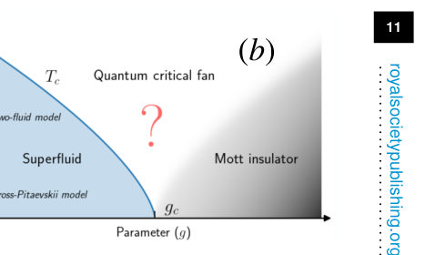 
Figure 5. (a) [Figure reproduced with permission from Ref. [65]]. A cartoon picture of a superfluid and Mott insulator in two

**Summary.** This paper reviews the complex field of quantum turbulence, focusing on where mean-field theories fail due to strong quantum fluctuations. It synthesizes knowledge from superfluids and lattice models to argue that a complete description requires advanced many-body techniques beyond simple Gross-Pitaevskii approximations. The work highlights open questions regarding universal scaling laws in these non-equilibrium quantum regimes.

**Why it may be interesting.** This work is highly relevant as it bridges classical turbulence phenomenology with modern many-body physics, suggesting new theoretical frameworks needed to describe non-equilibrium dynamics in ultracold atomic systems.

Detailed structure

**Main problem.** The paper addresses the theoretical challenge of understanding turbulent hydrodynamics in quantum many-body systems when strong quantum fluctuations are present, moving beyond mean-field descriptions.

**Main result.** It establishes that while mean-field theories (like GP) capture classical inertial ranges, a full description requires accounting for strong quantum fluctuations, especially near critical points or at low dimensions.

**Method.** The analysis synthesizes knowledge from continuum hydrodynamics (Euler/GP equations), lattice models (Bose-Hubbard), and field theory approaches to identify regimes where approximations break down.

**Model / system.** The primary systems are superfluids, modeled using the Gross-Pitaevskii equation for mean-field analysis, but requiring extensions to second quantization or lattice Hamiltonians when fluctuations dominate. Specific examples include bosons in periodic potentials and low-dimensional condensates.

**Key observables.** Energy spectrum scaling ($\sim k^{-5/3}$), quantized circulation, density fluctuation magnitude ($\delta n / \langle n
angle$), and the existence of multiple inertial ranges.

**Important parameters / regimes.** Temperature ($T$), inter-vortex spacing ($\lambda$), healing length ($\xi$), and the ratio of quantum fluctuations to mean density ($\delta n / \langle n
angle$).

**Assumptions / limitations.** The paper contrasts regimes: near equilibrium (classical/mean-field) versus far from equilibrium where strong quantum fluctuations necessitate going beyond standard approximations.

**Figures summary.** Figures illustrate the energy cascade in classical vs. quantum turbulence, showing expected spectral deviations and phase diagrams for Bose-Hubbard models separating superfluid and Mott insulator phases.

**Paper structure.** The discussion progresses from reviewing mean-field descriptions (GP equation) to identifying limitations when fluctuations are strong, then detailing lattice models (Bose-Hubbard), and finally outlining the necessity of quantum kinetic theory for a complete picture.

Abstract

We discuss phenomenology associated with turbulent hydrodynamics in quantum fluids from a condensed-matter perspective. We begin with weakly-interacting superfluids, often modeled by a mean-field theory governed by the Gross-Pitaevskii equation. Considering the effect of quantum fluctuations beyond the mean-field approximation, we propose a study of many-body quantum effects in turbulent hydrodynamics, especially near zero temperature. We motivate examples of quantum many-body systems where such effects may be uncovered. These include bosons confined in a periodic potential in low spatial dimensions (one and two), and the associated quantum critical point of the superfluid-insulator transition, realized in present-day ultracold-atom and quantum computing platforms. We conclude by listing a set of (open) questions that may be answered using modern quantum many-body techniques. This article is part of the theme issue 'Frontiers of turbulence and statistical physics'.

[↑ back to top](#top)

### [Monitoring Beam Splitter Entanglement using Quantumness](http://arxiv.org/abs/2606.24242v1)

**Authors:** Hua-Li Chen, Hsien-Yi Hsieh, Chien-Ming Wu, Ole Steuernagel, Ray-Kuang Lee  
**Type:** experiment · **Category:** quantum information and computing · **PDF:** <https://arxiv.org/pdf/2606.24242v1>  
**Analysis basis:** full PDF text, analyzed in chunks
**Topic relevance:** 🔥 `quantum optics experiment` **4/5** · `entanglement & information structure` **3/5** · `quantum measurements` **3/5** · `correlated / nonlocal dissipation` **2/5** · `measurement-induced transitions` **2/5** · `QC/QI experiment` **1/5** · `driven-dissipative phase transition` **1/5** · `interference shaping light` **1/5**

📷 Fig 1

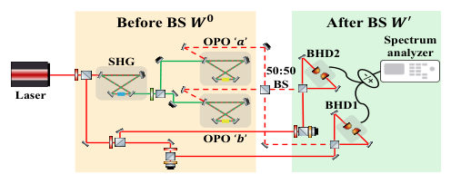 
FIG. 1. In our experiment two degenerate Optical Parametric Oscillators (OPOs), each generate single-mode squeezed va- cuum states with orthogonal squeezing angles, serving as ‘input states’, W 0, for a balanced (50%:50%) beam splitter (BS), yielding entangled output states, W ′, see Fig. 2. These are characterized by balanced homodyne detection (BHD) fed either separately or jointly into a spectrum analyzer.

📷 Fig 2

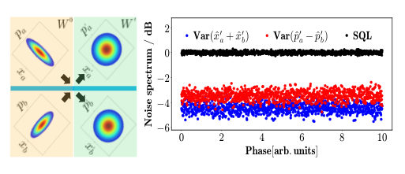 
FIG. 2. The squeezed quadratures of the input states, W 0, have variances below the vacuum’s standard quantum limit (SQL), but they are above the SQL in the reduced output states W ′ I (10). Yet, the below-SQL fluctuations are not lost, the beam splitter has mapped them into reduced cross-mode variances Var(ˆx′ +) and Var(ˆp′ −), see Eqs. (11) and (1).

📷 Fig 3

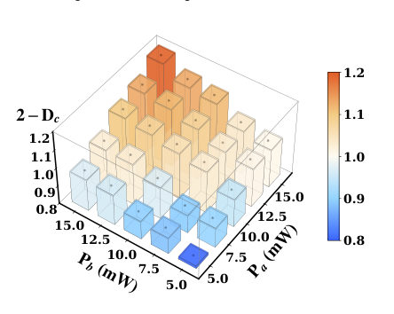 
FIG. 3. Positive values of 2-DC, for Duan’s criterion DC of Eq. (1), certify cross mode entanglement for all OPO-power settings, see Fig. 1, of our experiment. Table SI. 2 contains the experimentally determined values displayed here.

📷 Fig 4

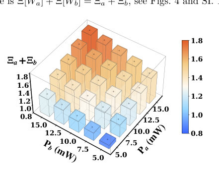 
FIG. 4. Quantumness, Ξa + Ξb, of modes before the beam splitter, rendered on OPO pump power grid, see Fig. 1.

📷 Fig 5

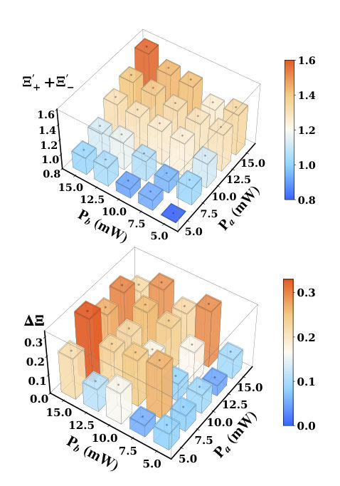 
FIG. 5. Quantumness, Ξ′ + + Ξ′ −, after the beam splitter, and their differences, ∆Ξ = (Ξa + Ξb) −(Ξ′ + + Ξ′ −), rendered on OPO pump power grids, see Fig. 1. This rendering shows us that the experimental imperfections are random rather than due to systematic errors. Related experimental data are given in the Supplementary Information in tables SI. 1- SI. 3.

**Summary.** The paper reports an experiment demonstrating how to monitor the entanglement generated between two squeezed vacuum states mixed at a beam splitter. Instead of relying solely on inseparability criteria, the authors use a novel measure called 'Quantumness' ($\Xi$). This approach allows them to quantitatively track and report on experimental losses by measuring the deviation from $\Xi$'s expected conservation across the optical setup.

**Why it may be interesting.** This work provides a robust, quantitative method ($\Xi$) to benchmark continuous variable entanglement experiments by tracking non-classical features through complex optical components, which is highly relevant for developing scalable quantum light sources.

Detailed structure

**Main problem.** The goal is to monitor entanglement generated by mixing two independent squeezed vacuum states using a beam splitter while accurately quantifying experimental imperfections.

**Main result.** The authors introduce 'Quantumness' ($\Xi$) as a superior diagnostic tool that remains conserved under ideal beam mixing, allowing for precise quantification of losses due to experimental imperfections compared to standard entanglement witnesses.

**Method.** They compare the quantumness ($\Xi$) calculated before and after passing through the beam splitter; deviations from conservation quantify the degradation caused by imperfect components.

**Model / system.** The experiment uses a quantum-optical setup involving two independent squeezed vacuum states generated via Optical Parametric Oscillators (OPOs) and mixed at a balanced beam splitter to create an entangled Two-Mode Squeezed Vacuum state.

**Key observables.** Quantumness ($\Xi$), quadrature variances ($	ext{Var}(x), 	ext{Var}(p)$), and the difference in quantumness ($\Delta\Xi$) before and after mixing.

**Important parameters / regimes.** OPO pump powers ($P_a, P_b$); the degree of squeezing relative to the Standard Quantum Limit (SQL).

**Assumptions / limitations.** The method assumes that for Gaussian states, $\Xi$ faithfully tracks non-classicality, and that deviations from $\Xi$ conservation directly quantify experimental losses.

**Figures summary.** Figures illustrate the setup schematic, show input squeezed quadratures below SQL, plot entanglement confirmation using Duan's criterion, and crucially compare calculated quantumness before and after beam mixing across varying pump powers.

**Paper structure.** The paper first establishes the physical system (OPOs $
ightarrow$ BS), introduces Quantumness ($\Xi$) as a diagnostic tool superior to inseparability criteria, derives the conservation law for ideal mixing, and then presents experimental measurements comparing input vs. output quantumness under varying pump powers.

Abstract

We report on an experiment in which two independent squeezed vacuum states get entangled by mixing them with a balanced beam splitter. We follow standard practice and use an inseparability criterion to quantify their entanglement. However, this only allows us to witness the entanglement, but not to determine the deleterious effects of experimental imperfections due to the beam splitter mixing and the associated mode-mismatch and detection imperfections. We therefore introduce an alternative framework suitable for continuous variable systems using the states' quantumness, $Ξ$. We show that, under ideal circumstances, $Ξ$ is a conserved quantity under beam mixing. This allows us to benchmark the experiment's performance by comparing the states' quantumness $Ξ$ after the beam splitter mixing with $Ξ$ before. Such a comparison is not possible with entanglement witnesses, as the input states are unentangled. This highlights the main strength of our approach: its ability to generally quantify the quantumness of multi-mode continuous variable states and use this to probe different stages in an experiment.

[↑ back to top](#top)

### [Anyon Exchange Phase from Antidot Interferometry](http://arxiv.org/abs/2606.24831v1)

**Authors:** Matthias Thamm, Felix Puster, Bernd Rosenow  
**Type:** theory · **Category:** strongly correlated electrons · **PDF:** <https://arxiv.org/pdf/2606.24831v1>  
**Analysis basis:** full PDF text, analyzed in chunks
**Topic relevance:** 🔥 `Keldysh / 2PI / non-Gaussian methods` **4/5** · `methods for driven-dissipative` **3/5** · `non-equilibrium dynamics` **3/5** · `driven-dissipative phase transition` **2/5** · `Kondo & dissipative impurity` **1/5** · `analog quantum simulation` **1/5** · `interference shaping light` **1/5** · `non-equilibrium universality` **1/5**

📷 Fig 1

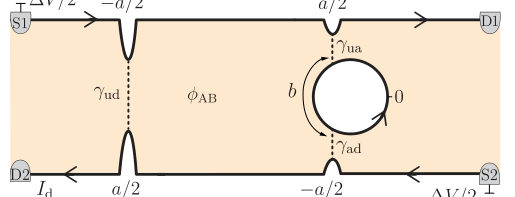 
Figure 1. Fabry-Perot interferometer with a quantum an- tidot (a) of length L embedded in one arm. The upper (u) and lower (d) edges, held at biases +∆V/2 and −∆V/2, are connected by a quantum point contact (QPC) with tunneling amplitude γud, and the antidot couples to both edges through two further QPCs with tunneling amplitudes γua and γad, sep- arated by a distance b on the antidot and by a along each edge. The current Id is measured in drain D2.

📷 Fig 2

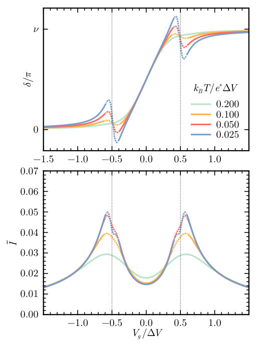 
Figure 2. Transmission phase δ (upper panel) and oscilla- tion amplitude ˜I (lower panel) for tunneling through a single antidot level, versus gate voltage Vg at several temperatures, for ν = 1/3 anyons and a = 0. The Aharonov-Bohm part of the current is Id,AB ∝˜I cos(ϕAB + δ + π) [Eq. (10)], where the phase shift of π amounts to the Breit-Wigner phase below resonance, and ∆V is the bias between edges u and d. Re- gions in which the squared renormalized coupling at infrared scale, r, exceeds 0.5 are shown with dashed lines. In these regions, the lineshape is qualitative rather than quantitative. The interference current is largest near the edge chemical po- tentials Vg = ±∆V/2 (dotted...

📷 Fig 3

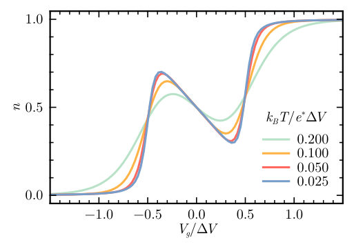 
Figure 3. Non-equilibrium occupation n of the antidot [Eq. (9)] versus gate voltage Vg at several temperatures, for balanced couplings |γua| = |γad| = 0.25 e∗∆V (QPC transmis- sion of about 10–30%). The level fills as Vg increases, from empty at large negative Vg to full at large positive Vg. At Vg = −∆V/2 it aligns with the u-edge chemical potential and couples strongly to that edge, so the occupation rises above 1/2; at Vg = 0 in- and out-tunneling balance, giving n = 1/2; near Vg = +∆V/2 coupling to edge d dominates and n dips below 1/2 before saturating to unity. Temperature and level broadening smooth the curve.

📷 Fig 4

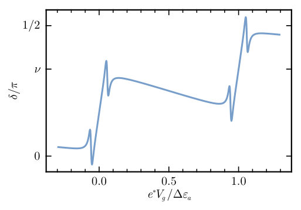 
Figure 4. Transmission phase δ versus gate voltage Vg for tuning across two successive antidot levels, at kBT/e∗∆V = 0.025. The level spacing is ∆εa, so e∗Vg/∆εa = 0 and 1 mark the two level crossings. Each crossing reproduces the non- monotonic behavior of Fig. 2. Between crossings the phase depends on the antidot contact separation b, here decreasing approximately linearly for b = L/4.

**Summary.** The paper theoretically investigates how to measure the intrinsic exchange phase of anyons in fractional quantum Hall systems using an antidot interferometer. By applying a non-equilibrium Keldysh formalism, the authors predict that the transmission phase will show unique non-monotonic behavior near resonance crossings. This signature allows for the direct extraction of the fundamental topological exchange phase $\pi
u$ from measurable interference patterns.

**Why it may be interesting.** This work provides a concrete theoretical pathway to measure fundamental topological properties (anyon statistics) using measurable transport quantities like interference phase shifts, which is highly relevant for understanding strongly correlated electron systems.

Detailed structure

**Main problem.** The primary goal is to directly measure the bare exchange phase ($	heta$) associated with anyons, which has been theoretically inaccessible despite prior measurements of fractional charge and braiding phase ($2	heta$).

**Main result.** The authors predict that the transmission phase will exhibit a non-monotonic evolution when tuning the antidot through a resonance. This allows for the extraction of the bare exchange phase $	heta = \pi
u$ from the difference between interference current plateaus.

**Method.** The study employs a systematic, non-equilibrium Keldysh formalism applied to an electronic T-matrix calculation, incorporating level broadening and antidot occupation effects.

**Model / system.** The physical system is a quantum antidot embedded within a Fabry-Perot interferometer structure, designed to host quasiparticles behaving as anyons in fractional quantum Hall systems. The analysis models tunneling through this resonant structure.

**Key observables.** Transmission phase ($\delta$), interference current ($I_{d,AB}$), and non-equilibrium antidot occupation ($n(V_g)$).

**Important parameters / regimes.** The anyon statistics parameter $
u$ (e.g., 1/3) and the gate voltage $V_g$, which tunes the system through resonance.

**Assumptions / limitations.** The analysis assumes that electrostatic screening by an external gate is necessary to isolate the bare statistical phase, and it uses perturbative expansions in tunneling couplings.

**Figures summary.** Figures illustrate the non-monotonic evolution of the transmission phase ($\delta$) near resonances for anyons compared to monotonic behavior for electrons. Other figures detail antidot occupation dynamics and current calculations.

**Paper structure.** The paper builds from defining the physical setup (antidot interferometer) to developing a rigorous Keldysh formalism that handles non-equilibrium effects, culminating in the prediction of phase signatures ($\delta$) that isolate the exchange phase $	heta$ via plateau analysis.

Abstract

Quasiparticles in fractional quantum Hall systems are anyons, carrying a fraction of the electron charge. Exchanging two of them gives rise to a fractional exchange phase. While the fractional charge and the braiding phase -- twice the exchange phase -- have been measured, the exchange phase itself has remained inaccessible. We study a quantum antidot embedded in a Fabry-Perot interferometer. Within a systematic non-equilibrium Keldysh treatment that consistently includes the occupation and level broadening of the antidot, we find that the transmission phase evolves non-monotonically when a gate voltage tunes the antidot through a resonance, in contrast to the monotonic evolution for electrons. The bare exchange phase can be extracted from the difference between the phase plateaus.

[↑ back to top](#top)

### [From Spectral Singularities to Multipartite Entanglement Scaling at Higher-Order Exceptional Points](http://arxiv.org/abs/2606.24205v1)

**Authors:** Chunlai Yang, Shuheng Liu, Xinyao Huang, Kaiye Shi, Qiongyi He  
**Type:** theory · **Category:** quantum information and computing · **PDF:** <https://arxiv.org/pdf/2606.24205v1>  
**Analysis basis:** full PDF text, analyzed in chunks
**Topic relevance:** 🔥 `entanglement & information structure` **4/5** · `analog quantum simulation` **3/5** · `driven-dissipative phase transition` **2/5** · `non-equilibrium universality` **2/5** · `Keldysh / 2PI / non-Gaussian methods` **1/5** · `Kondo & dissipative impurity` **1/5** · `correlated / nonlocal dissipation` **1/5** · `methods for driven-dissipative` **1/5** · `non-equilibrium dynamics` **1/5**

📷 Fig 1

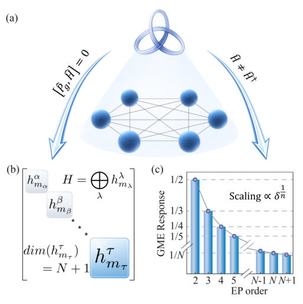 
FIG. 1. (a) Schematic of interacting identical-qubit systems, where inter-qubit interactions give rise to genuine multipartite entanglement. (b) Permutation symmetry gives rise to a uni- versal block structure of the Hamiltonian matrix H, decom- posing the full Hilbert space into independent symmetry sec- tors hλ mλ. The fully symmetric sector hτ mτ corresponds to the largest block with dimension N +1. (c) In the non-Hermitian regime ( ˆH ̸= ˆH†), higher-order EPs can emerge. Near an nth-order EP, multipartite entanglement exhibits a fractional- power response to weak perturbations ∝δ1/n, thereby linking the entanglement scaling directly to the EP order.

📷 Fig 2

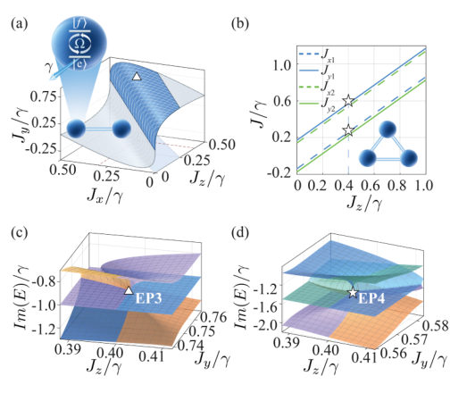 
FIG. 2. (a) Schematic of an interacting two-qubit sys- tem and the corresponding EP conditions projected onto the interaction-parameter subspace (Jx, Jy, Jz), with γ as the en- ergy unit. The colored surface denotes the manifold of EP3s, with the blue region illustrating the real-Ωsolutions selected from Eq. (4). (b) EP conditions for the interacting three-qubit system in the same parameter subspace. Two exceptional lines of EP4s are obtained by expressing (Jx, Jy) as functions of Jz. The white triangle in (a) and the stars in (b) mark the parameters of the EP3 and EP4 used in (c) and (d), respec- tively. (c),(d) Imaginary parts of the n-sheeted Riemann sur- faces of the complex eigenvalues...

📷 Fig 3

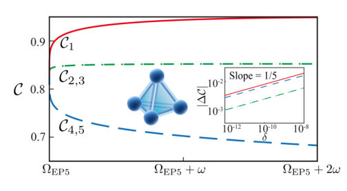 
FIG. 3. Schematic of the interacting four-qubit system with three-body interactions and its genuine multipartite concur- rence response of the five eigenstates, Ci (i = 1, . . . , 5), near an EP5 with ω/γ = 2×10−4. The inset shows the correspond- ing log-log behavior, confirming the fractional-power scaling |∆C| ∝δ1/5 with the perturbation strength δ = (Ω−ΩEP5)/γ.

**Summary.** This theoretical paper connects higher-order Exceptional Points (EPs) in non-Hermitian systems to the behavior of genuine multipartite entanglement (GME). By exploiting permutation symmetry, the authors derive a general framework showing that GME exhibits a characteristic fractional-power scaling directly proportional to the inverse order of the EP. This establishes a fundamental link between spectral degeneracies and quantum correlations.

**Why it may be interesting.** This work bridges spectral theory (non-Hermitian physics) and quantum information theory (entanglement), providing a powerful diagnostic tool: measuring entanglement scaling can reveal the underlying degeneracy order of the system's Hamiltonian.

Detailed structure

**Main problem.** The research aims to develop a general theoretical framework linking higher-order non-Hermitian degeneracies (Exceptional Points, EPs) to the scaling behavior of genuine multipartite entanglement (GME). It seeks to establish a fundamental connection between these concepts in interacting quantum many-body systems.

**Main result.** The study shows that GME inherits the spectral nonanalyticity near an $n$-th order EP, exhibiting a characteristic fractional-power scaling ($\Delta C \propto \delta^{1/n}$). Furthermore, it establishes that realizing higher-order EPs requires specific multi-body interaction channels.

**Method.** The analysis utilizes permutation symmetry to decompose the Hilbert space of identical qubits and then analyzes the spectral response near an EP using perturbation theory, leading to a Puiseux series expansion for both energy eigenvalues and entanglement measures.

**Model / system.** The model consists of interacting identical-qubit systems governed by a non-Hermitian Hamiltonian $\hat{H}$, which includes single-qubit terms and arbitrary $l$-body interaction terms (e.g., XYZ Heisenberg interactions). The system's structure is constrained by permutation symmetry.

**Key observables.** Genuine Multipartite Entanglement (GME), spectral response, fractional-power scaling ($\delta^{1/n}$).

**Important parameters / regimes.** The order of the Exceptional Point ($n$), the number of qubits ($N$), and the strength of weak perturbations ($\delta$).

**Assumptions / limitations.** The Hamiltonian is assumed to preserve permutation symmetry; the analysis focuses on the leading-order scaling behavior near the EP.

**Figures summary.** Figures schematically illustrate the connection between interacting identical-qubit systems, the block-diagonal structure imposed by permutation symmetry, and the resulting fractional-power response of multipartite entanglement near an EP.

**Paper structure.** The paper first introduces EPs in non-Hermitian physics. It then leverages permutation symmetry to constrain the Hilbert space and analyze the system's degeneracy limit ($N+1$). The core is developing the framework linking this degeneracy structure directly to the scaling law of GME under weak perturbations, concluding with explicit examples requiring higher-order interactions.

Abstract

Exceptional points (EPs) are non-Hermitian spectral singularities exhibiting fractional-power responses, yet their implications for multipartite entanglement of interacting quantum many-body systems remain largely unexplored. Here we develop a general framework that links higher-order non-Hermitian degeneracies to the scaling behavior of genuine multipartite entanglement in interacting identical-qubit systems. Permutation symmetry of the identical qubits decomposes the exponentially large Hilbert space into independent irreducible-representation sectors, thereby constraining the maximal EP order of $N$ qubits to $N+1$ rather than $2^N$. Near an $n$th-order EP, genuine multipartite entanglement inherits the spectral response and generically exhibits a fractional-power scaling under weak perturbations. Explicit examples show that conventional two-body interactions support third- and fourth-order EPs with the corresponding entanglement responses, whereas higher-order EPs with genuine multipartite-entangled coalesced states require additional independent interaction channels, such as three-body interactions. Our results establish a fundamental connection among non-Hermitian degeneracies, multipartite entanglement, and symmetry, extending higher-order EP physics from spectral singularities to genuine many-body quantum correlations.

[↑ back to top](#top)

### [Infinite-Level Hierarchy of Solvable Quantum Circuits](http://arxiv.org/abs/2606.23803v1)

**Authors:** Michael A. Rampp, Suhail A. Rather, Pieter W. Claeys  
**Type:** theory · **Category:** statistical mechanics · **PDF:** <https://arxiv.org/pdf/2606.23803v1>  
**Analysis basis:** full PDF text, analyzed in chunks
**Topic relevance:** 🔥 `entanglement & information structure` **4/5** · `methods for driven-dissipative` **3/5** · `non-equilibrium dynamics` **3/5** · `non-equilibrium universality` **2/5** · `Keldysh / 2PI / non-Gaussian methods` **1/5** · `analog quantum simulation` **1/5** · `correlated / nonlocal dissipation` **1/5** · `driven-dissipative phase transition` **1/5**

📷 Fig 1

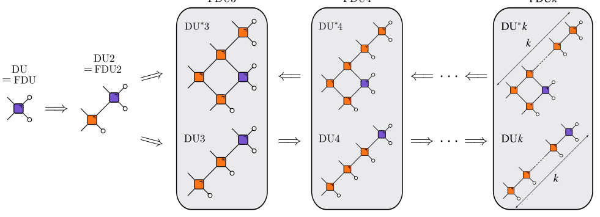 
FIG. 1. Illustration of the full dual-unitary hierarchy and the logical inclusion of the conditions. The solvability conditions are illustrated in the folded picture. Each condition allow for the systematic removal of a single gate, where the gate depicted in dark purple is removed on the right-hand side of the associated solvability condition. Dual unitarity (DU) is the strongest and most constrained condition, followed by DU2. The complementary dual-unitarity conditions (DU∗𝑘≥3) we introduce in this paper are logically independent from the generalized dual-unitarity conditions (DU𝑘≥3). The DU∗𝑘conditions become stronger with increasing 𝑘, while the DU𝑘conditions weaken. The FDU𝑘...

📷 Fig 2

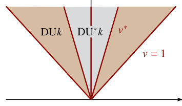 
FIG. 2. Diagram illustrating the domain of solvability and rays of in- formation flow for FDU𝑘gates. The velocity separating the domains where DU𝑘and DU∗𝑘lead to solvability is given by 𝑣∗= (𝑘−2)/𝑘 (𝑘≥3). The correlation functions vanish exactly inside the DU𝑘 domain, and may be non-vanishing inside the DU∗𝑘domain.

📷 Fig 3

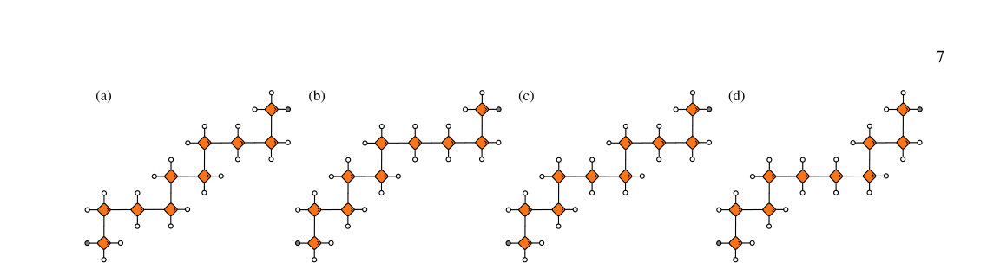 
FIG. 3. Illustration of the possible reduced forms of a diagram in the thin path domain of a FDU4 circuit. The unreduced diagram has side lengths 𝑚= 6 and 𝑛= 5. All possible fully reduced forms are equivalent and of the form (a)-(d), up to rotation by 180 degrees.

📷 Fig 4

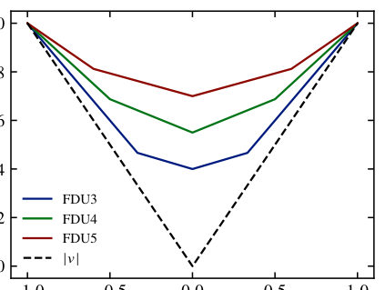 
FIG. 4. Diagram illustrating possible forms of the ELT for FDU𝑘 circuits.

📷 Fig 5

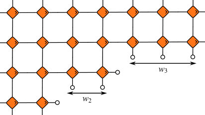 
FIG. 5. Applying the DU∗𝑘condition to a tensor network diagram representing a correlation function leads to the appearance of steps on the boundary of the diagram. These steps have height ℎ= 1 and are characterized by their width 𝑤𝑗. For DU∗𝑘, the steps can have a width of at most 𝑘−1.

**Summary.** This paper introduces a comprehensive framework—the Full Dual-Unitary ($	ext{FDU}_k$) hierarchy—to achieve exact solvability for quantum circuits across the entire spacetime. By combining complementary unitarity conditions, the authors overcome previous limitations that restricted solvable regions to finite domains. This opens new avenues for precisely calculating correlation functions and entanglement dynamics in complex, non-integrable quantum systems.

**Why it may be interesting.** The development of an infinite hierarchy of exactly solvable, non-integrable models provides powerful theoretical tools to study complex quantum many-body dynamics where standard integrability methods fail.

Detailed structure

**Main problem.** The primary goal is to extend the solvability of quantum dynamics beyond the limitations of generalized dual-unitary circuits ($	ext{DU}_k$) to analyze correlation functions and entanglement dynamics across the entire spacetime.

**Main result.** The authors introduce a novel, infinite hierarchy of conditions ($	ext{FDU}_k$) that remedies the finite spacetime restriction, allowing exact analysis of correlations and entanglement in all regions.

**Method.** The work employs tensor network representations, algebraic constraint derivation from diagram consistency, and analyzing asymptotic behavior via quantum channels to characterize solvability domains.

**Model / system.** The system is based on quantum circuits built with dual-unitary gates applied to qubits or qudits in a lattice geometry. The analysis focuses on the structure of these solvable dynamics across spacetime.

**Key observables.** Correlation functions $C(x, t)$, Entanglement Line Tension ($	ext{ELT}$), and the solvability condition itself (FDU$_k$).

**Important parameters / regimes.** The level of unitarity ($k$), the velocity $v$, and the local Hilbert space dimension ($q$).

**Assumptions / limitations.** The analysis relies on constructing complementary dual-unitary conditions ($	ext{DU}^*_k$) to supplement the original hierarchy, and simplifying complex tensor network structures by considering extremal paths.

**Figures summary.** Figures illustrate the logical inclusion of solvability domains ($	ext{FDU}_k = 	ext{DU}^*_k + 	ext{DU}_k$), show the piecewise linear nature of the ELT for $	ext{FDU}_k$ circuits, and depict tensor network diagrams.

**Paper structure.** The paper systematically introduces the limitations of $	ext{DU}_k$, proposes the complementary conditions ($	ext{DU}^*_k$) to form $	ext{FDU}_k$, derives explicit formulas for correlators in different spacetime path domains (thin/thick), and finally analyzes entanglement scaling via the ELT.

Abstract

Dual-unitary circuits have emerged as a paradigm of exactly solvable yet non-integrable quantum dynamics. Recently, a generalization of dual unitarity attempting to extend the phenomenology of exactly solvable circuits has been introduced through a hierarchy of conditions, with dual unitarity as the first level. However, beyond the second level the proposed generalized dual-unitary hierarchy ceases to be solvable in the whole spacetime. We present an infinite hierarchy of solvability conditions remedying this problem. These new conditions can be combined with the generalized dual-unitary hierarchy to obtain circuits for which correlation functions and entanglement dynamics can be analyzed exactly in the whole spacetime. We show that this novel hierarchy possesses non-trivial solutions at every level. Our results demonstrate that dual unitarity can be systematically extended while preserving solvability, opening up investigations of exactly solvable non-integrable systems with more general properties.

[↑ back to top](#top)

### [The Quantum Split-Step Fourier Algorithm for Nonlinear Optical Waveguides](http://arxiv.org/abs/2606.24643v1)

**Authors:** Fabio Biancalana  
**Type:** theory · **Category:** other · **PDF:** <https://arxiv.org/pdf/2606.24643v1>  
**Analysis basis:** full PDF text, analyzed in chunks
**Topic relevance:** 🔥 `entanglement & information structure` **4/5** · `methods for driven-dissipative` **3/5** · `non-equilibrium dynamics` **3/5** · `non-equilibrium universality` **2/5** · `Keldysh / 2PI / non-Gaussian methods` **1/5** · `correlated / nonlocal dissipation` **1/5** · `driven-dissipative phase transition` **1/5** · `interference shaping light` **1/5**

📷 Fig 1

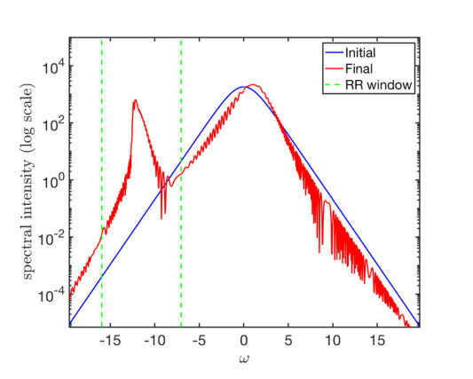 
FIG. 1: Spectral intensity | ˜A(ω, z)|2 (in log scale) for the initial soliton (blue solid line, z = 0) and the final field (red solid line, z = 7). The resonant-radiation band emerges near the phase-matched frequency ωRR ≃= −10.78 and progressively grows in amplitude and undergoes a slight shift towards more negative detunings, consistent with soliton recoil. Vertical green dashed lines indicate the analysis window used for the reduced Gaussian state. The third-order dispersion parameter is β3 = 0.05, and soliton amplitude is A0 = 3.

📷 Fig 2

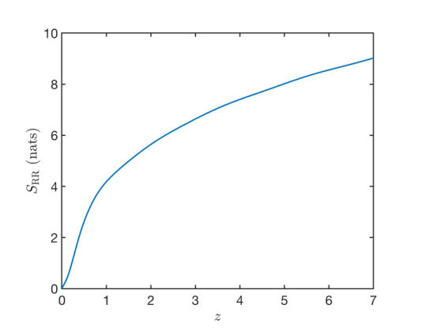 
FIG. 2: Von Neumann entropy (in nats) of the RR subsystem versus propagation distance. Since the global BdG state remains pure, this quantity is also the entanglement entropy between the RR spectral window and its complement. All parameters are as in Fig. 1.

📷 Fig 3

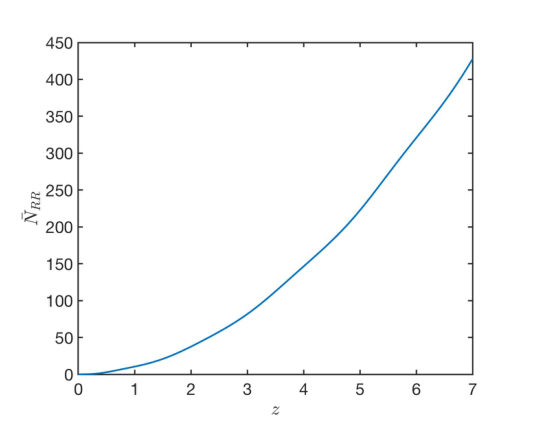 
FIG. 3: Evolution of the total fluctuation population inside the RR spectral window. The continuous increase of ¯ NRR reflects the amplification and generation of quantum fluctuations associated with RR formation. All parameters are as in Fig. 1.

📷 Fig 4

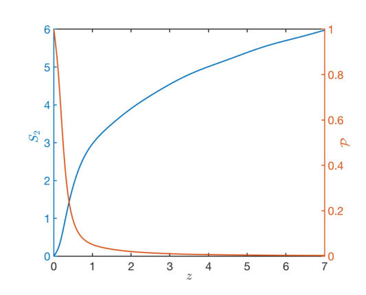 
FIG. 4: R´enyi-2 entropy (blue solid line, axis on the left) and purity (red solid line, axis on the right) of the RR reduced state. The loss of purity is entirely due to entanglement, since the global Gaussian state remains pure within the BdG approximation. All parameters are as in Fig. 1.

📷 Fig 5

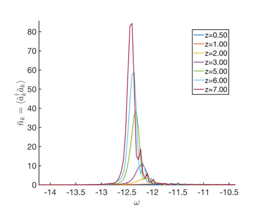 
FIG. 5: Mean occupations of individual FFT bins inside the resonant-radiation window at several propagation distances (different colours for different propagation distances, see the legend). Although many frequency bins become populated, this is a basis-dependent description that does not reveal the intrinsic structure of the Gaussian state. All parameters are as in Fig. 1.

**Summary.** The paper introduces the Quantum Split-Step Fourier Algorithm (QSSF) to simulate nonlinear optical waveguides while explicitly tracking quantum entanglement. By monitoring observables like von Neumann entropy and purity, the authors demonstrate that resonant radiation generates significant, quantifiable entanglement between spectral components. This method proves invaluable for diagnosing quantum correlations in ultrafast light sources.

**Why it may be interesting.** This work provides a powerful, quantitative tool—an information-theoretic diagnostic—to study quantum correlations in complex, non-equilibrium physical processes like supercontinuum generation, which is highly relevant to advanced quantum optics research.

Detailed structure

**Main problem.** The primary goal is to develop a numerical framework to quantify quantum correlations, specifically entanglement, generated between different spectral bands during nonlinear optical wave propagation.

**Main result.** The Quantum Split-Step Fourier Algorithm (QSSF) successfully demonstrates that resonant radiation generation leads to a steadily increasing von Neumann entropy and loss of purity in the selected spectral band. Furthermore, this highly correlated state is found to be effectively dominated by only a few Williamson modes despite occupying many Fourier bins.

**Method.** The method employs the QSSF algorithm, which combines split-step propagation (Strang splitting) for the nonlinear Schrödinger equation with a commutator-preserving Bogoliubov evolution for Gaussian quantum fluctuations. This allows tracking second moments and entanglement measures dynamically.

**Model / system.** The system is modeled as light propagating in nonlinear optical waveguides governed by the Nonlinear Schrödinger Equation (NLSE). The analysis linearizes quantum fluctuations around a strong classical mean field, leading to an effective Bogoliubov-deWitt-Gross evolution equation.

**Key observables.** Von Neumann entropy ($S_{vN}$), purity, covariance matrices, symplectic eigenvalues ($
u_k$), and the effective number of occupied Williamson modes ($K_{	ext{eff}}$).

**Important parameters / regimes.** Nonlinearity coefficient ($\gamma$), dispersion parameters ($eta_3$), propagation distance ($z$), and the spectral window size.

**Assumptions / limitations.** The analysis assumes Gaussian quantum fluctuations, allowing the use of Bogoliubov theory. The method relies on linearizing the full quantum NLSE around a strong classical mean field and maintaining commutator-preserving evolution during splitting steps.

**Figures summary.** Figures illustrate the spectral evolution showing resonant radiation (RR) growth; plots demonstrate the monotonic increase of entanglement entropy ($S_{vN}$) and photon population ($ar{N}_{	ext{RR}}$); and visualizations confirm that the quantum state compresses into a few dominant Williamson modes.

**Paper structure.** The paper introduces the QSSF algorithm by detailing its components: splitting methods, Bogoliubov evolution for linear steps, and handling nonlinear coupling. It then applies this framework to simulate resonant radiation in waveguides, calculating various information-theoretic diagnostics like entropy and purity over propagation distance.

Abstract

We introduce the Quantum Split-Step Fourier (QSSF) algorithm for nonlinear optical waveguides, a numerical framework that combines split-step propagation of the nonlinear Schrödinger equation with a commutator-preserving Bogoliubov evolution of Gaussian quantum fluctuations. The method propagates the classical mean field together with the Bogoliubov matrices $U$ and $V$, from which reduced second moments, covariance matrices, symplectic eigenvalues, and entropic measures are constructed for arbitrary spectral windows. Applied to soliton-driven resonant radiation, QSSF shows that the selected radiation band acquires a steadily increasing von Neumann entropy and a corresponding loss of purity, quantifying its entanglement with the rest of the spectrum in the lossless Gaussian setting. The analysis also reveals a surprisingly pronounced low-dimensional structure: although the radiation occupies many Fourier bins, its reduced Gaussian state is dominated by only a few Williamson modes. QSSF therefore provides a practical information-theoretic diagnostic for quantum correlations in nonlinear frequency conversion, supercontinuum generation, and multimode squeezed-light formation in ultrafast waveguide platforms.

[↑ back to top](#top)

### [Two-Dimensional Phase Transitions in Classical Systems: 60 Years after the Hohenberg-Mermin-Wagner Theorem](http://arxiv.org/abs/2606.24091v1)

**Authors:** Ruijian Zhu, Yanting Wang  
**Type:** theory · **Category:** statistical mechanics · **PDF:** <https://arxiv.org/pdf/2606.24091v1>  
**Analysis basis:** full PDF text, analyzed in chunks
**Topic relevance:** 🔥 `non-equilibrium dynamics` **4/5** · 🔥 `non-equilibrium universality` **4/5** · `driven-dissipative phase transition` **3/5** · `Frenkel-Kontorova` **1/5** · `Keldysh / 2PI / non-Gaussian methods` **1/5** · `analog quantum simulation` **1/5** · `correlated / nonlocal dissipation` **1/5** · `methods for driven-dissipative` **1/5**

📷 Fig 1

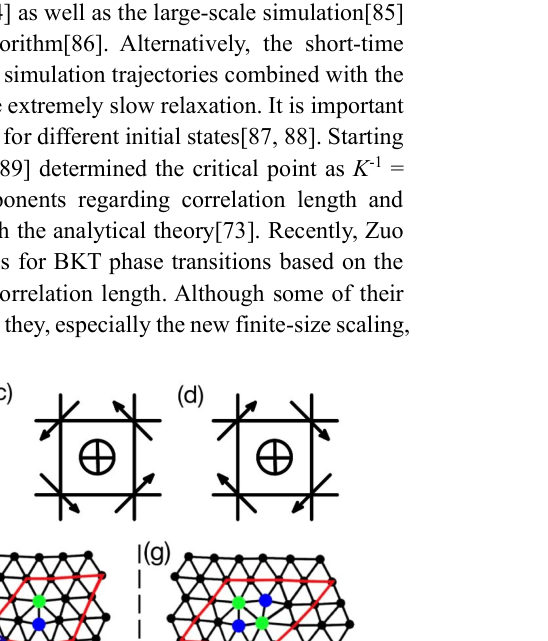 
Fig. 1 Schematics of topological defects in spin systems ((a)-(d)) and 2D crystals ((e)-(g)). (a) A

📷 Fig 2

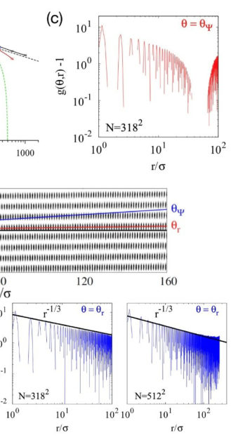 
Fig. 2 Numerical procedure of the calculation of translational correlation function. (a) Translational

📷 Fig 3

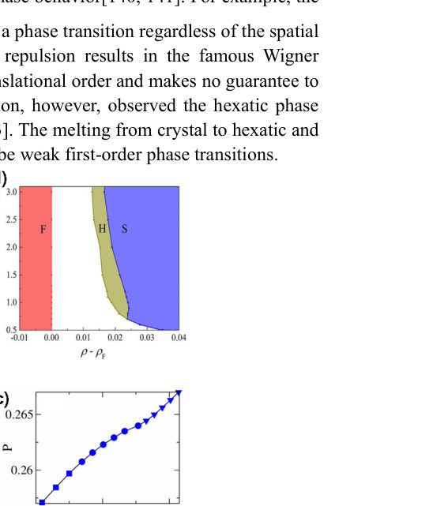 
Fig. 3 Phase behaviors of several interacting point-like particle systems. (a) Phase diagram of the

📷 Fig 4

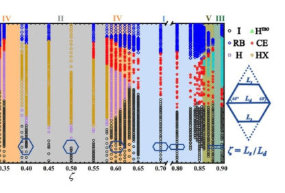 
Fig. 4 Phase behavior of hard polygon systems. (a) Phase diagram of the hard regular polygon

📷 Fig 5

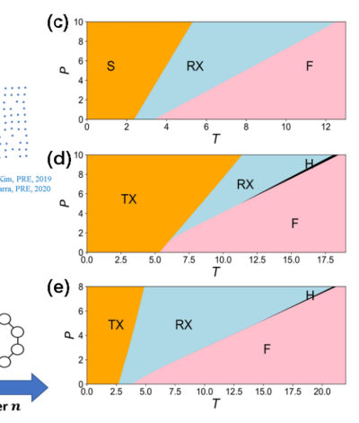 
Fig. 5 Phase behaviors of the ball-stick polygon systems. (a) Ball-stick polygon model captures four

**Summary.** This review surveys the theoretical landscape of 2D phase transitions, detailing established concepts like the Berezinskii-Kosterlitz-Thouless transition. It critically updates this knowledge by incorporating recent findings on how non-equilibrium active matter systems deviate from these classical predictions, pointing toward new avenues for understanding melting.

**Why it may be interesting.** It provides a crucial bridge between classical equilibrium statistical mechanics (like BKT theory) and modern non-equilibrium physics, which is highly relevant for understanding complex many-body dynamics far from equilibrium.

Detailed structure

**Main problem.** The review comprehensively analyzes two-dimensional (2D) phase transitions, focusing on the BKT transition and crystal melting, while extending the discussion to non-equilibrium active matter systems.

**Main result.** The paper contrasts equilibrium predictions (like HMW and BKT theory) with novel phenomena observed in active matter, suggesting that non-equilibrium dynamics fundamentally alter the expected phase transition behavior.

**Method.** It synthesizes results from Renormalization Group (RG) theory, continuum descriptions of topological defects (Coulomb gas), finite-size scaling analysis, and comparisons between different thermodynamic ensembles (NVT vs NPT).

**Model / system.** The primary models include the XY spin model for continuous symmetry breaking, 2D crystalline solids undergoing melting, hard disk systems, and active Brownian particles (ABPs) in non-equilibrium settings.

**Key observables.** Topological defect charge ($q$), stiffness ($
ho_{	ext{eff}}$), helicity modulus ($\gamma$), order parameters (translational $S$ and bond-orientational $\Psi$), and the behavior of P-V curves.

**Important parameters / regimes.** Temperature ($T$), system size ($L$), interaction potential range ($n$ in $r^{-n}$), and activity/self-propulsion speed ($	ext{activity}$).

**Assumptions / limitations.** The review notes that early theories rely on continuum descriptions, and numerical simulations are limited by finite-size effects and critical slowing down.

**Figures summary.** Figures illustrate topological defects in spin systems and 2D crystals; one figure shows the calculation of translational correlation functions via reciprocal vector scanning; another details phase diagrams for hard polygons showing various melting routes (e.g., $	ext{S} 	o 	ext{TX} 	o 	ext{R}_X$).

**Paper structure.** The review progresses logically from foundational theory (HMW/BKT) to detailed analysis of passive systems (melting via KTHNY), then explores the influence of particle shape and interaction potential range, culminating in a discussion of non-equilibrium active matter.

Abstract

In 1966, Hohenberg, Mermin and Wagner proved that long-wavelength fluctuations destabilize the long-range order of continuous symmetry in two-dimensional (2D) systems. Later in the 1970s, Berezinskii, Kosterlitz and Thouless developed the BKT theory describing an unconventional phase transition between quasi-long-range and short-range order in 2D systems driven by the binding-unbinding of topological defects, which has become a fundamental topic in statistical mechanics, condensed matter physics, and soft matter physics. One of the most important applications of the BKT theory is the melting of 2D crystals, whose mechanisms are not yet fully understood. Recently, this topic has been extended to the area of active matter, where the non-equilibrium nature leads to novel phenomena that deviate from the Hohenberg-Mermin-Wagner theorem. In this review, we first focus on the recent theoretical and computational progress in the 2D melting problem in passive systems, and then summarize the inspiring results obtained from non-equilibrium systems. The review closes with comments on several promising directions for predicting 2D melting scenarios and for understanding the non-equilibrium nature in 2D active matter systems.

[↑ back to top](#top)

### [Recursive behavior in a diatomic FPUT lattice](http://arxiv.org/abs/2606.24280v1)

**Authors:** Guo Deng, Andrea Pezzi, Genghong Lin, Miguel Onorato  
**Type:** theory · **Category:** statistical mechanics · **PDF:** <https://arxiv.org/pdf/2606.24280v1>  
**Analysis basis:** full PDF text, analyzed in chunks
**Topic relevance:** 🔥 `non-equilibrium dynamics` **4/5** · `non-equilibrium universality` **3/5** · `scars & prethermalization` **3/5** · `Frenkel-Kontorova` **2/5** · `Keldysh / 2PI / non-Gaussian methods` **1/5** · `driven-dissipative phase transition` **1/5** · `methods for driven-dissipative` **1/5**

📷 Fig 1

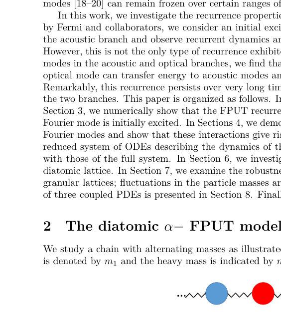 
Figure 1: Lattice with alternating masses. Different colors represent particles with different masses.

📷 Fig 2

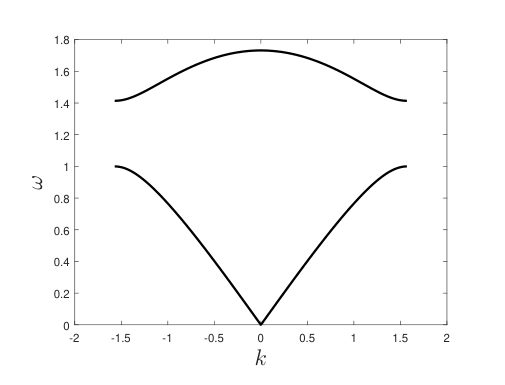 
Figure 2: Dispersion relation in linear diatomic lattice, where the linear coefficient κ = 1, light mass m1 = 1 and heavy mass m2 = 2. The upper branch is the optical branch and the lower branch is the acoustical branch.

📷 Fig 3

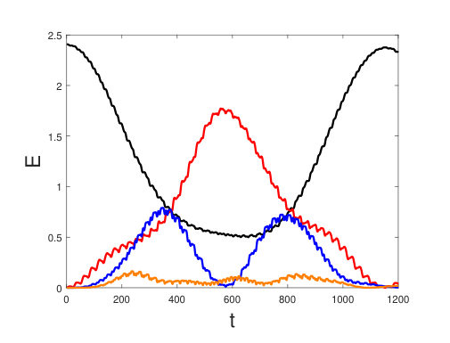 
Figure 3: FPUT recurrence in diatomic lattice. The energy densities for four acoustical Fourier modes with lowest frequencies are represented by black, red, blue and orange curves respectively (frequencies from low to high).

📷 Fig 4

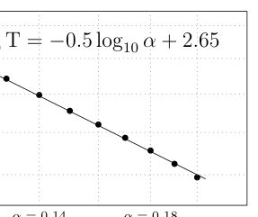 
Figure 4: Log-log plot of recurrence period vs nonlinear strength α.

📷 Fig 5

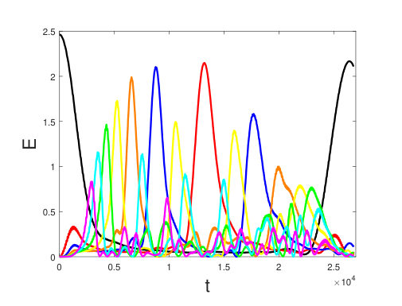 
Figure 5: FPUT recurrence in diatomic lattice. The energy densities for eight acoustical Fourier modes with lowest frequencies are represented by black, red, blue, orange, yellow, green, cyan and magenta curves respectively (frequencies from low to high).

**Summary.** This paper analyzes the recurrence behavior in a diatomic FPUT lattice by distinguishing between classical FPUT energy trapping and a new resonance-driven mechanism. The authors prove that resonant interactions between optical and acoustical modes can induce robust, long-lived energy exchange, which is mathematically modeled using reduced integrable PDEs.

**Why it may be interesting.** The study provides a detailed theoretical framework for energy localization and long-time dynamics in nonlinear lattices, directly addressing concepts of energy transfer and quasi-periodicity relevant to non-equilibrium statistical mechanics.

Detailed structure

**Main problem.** The study investigates the recurrent behavior of solutions within a diatomic Fermi–Pasta–Ulam–Tsingou (FPUT) lattice subjected to cubic anharmonic potentials.

**Main result.** Two distinct recurrence types are found: classic FPUT recurrence and a novel type driven by three-wave resonant interactions between optical and acoustical modes, which is unique to diatomic lattices.

**Method.** The analysis combines linear mode decomposition (finding optical/acoustical branches) with numerical simulations of energy density evolution in Fourier space, culminating in the derivation of reduced integrable PDE models in the continuous limit.

**Model / system.** The system is a diatomic FPUT lattice with alternating masses and cubic anharmonic potential. The dynamics are analyzed using normal modes derived from the Hamiltonian, leading to coupled equations for specific resonant Fourier modes.

**Key observables.** Energy distribution among Fourier modes over time; recurrence period ($T$); ratio $|E_0 - E_{\min}| / E_0$.

**Important parameters / regimes.** Nonlinear strength ($\alpha$); mass ratios ($m_2/m_1$); initial excitation conditions (e.g., exciting specific resonant triads).

**Assumptions / limitations.** The analysis often assumes that energy outside the interacting resonant triad is negligible, and in the continuous limit, it derives integrable PDE systems.

**Figures summary.** Figures illustrate energy density recurrence over time for both resonant and non-resonant conditions; Figure 4 shows the log-log relationship between recurrence period and nonlinear strength $\alpha$.

**Paper structure.** The paper progresses from establishing the diatomic model and linear modes, to identifying two distinct recurrence mechanisms (classic vs. resonance-induced), developing reduced models for the resonant triad, and finally comparing these behaviors across different potentials and mass fluctuations.

Abstract

We study the diatomic FPUT lattice with cubic anharmonic potential, and analyze the recurrent behaviour of its solutions. We find that two distinct types of recurrence occur. One type is the classic FPUT recurrence; for such recurrence, we find that the relation between recurrence period and nonlinear strength is similar to that in the monatomic case. The other type, which cannot exist in the monatomic lattice, is the recurrence due to the interactions between modes in the two branches of the dispersion relation. Indeed, we prove the existence of the optical-acoustical-acoustical resonant interaction between three Fourier modes for which a recurrent behavior in the distribution of the energy is observed. In addition, we develop a reduced Fourier-space dynamical model that reproduces the same recurrent behavior. We assess the robustness of our results through numerical simulations of the diatomic Toda lattice and the diatomic granular chain; in both cases, the same recursive behavior is observed. Finally, in the continuous limit, we derive from the diatomic model a system of three coupled PDEs which are known to be integrable.

[↑ back to top](#top)

### [Exact log-odds representation and mean-field criticality of a growing social group model](http://arxiv.org/abs/2606.24818v1)

**Authors:** Xingfu Ke, Fanyuan Meng  
**Type:** theory · **Category:** statistical mechanics · **PDF:** <https://arxiv.org/pdf/2606.24818v1>  
**Analysis basis:** full PDF text, analyzed in chunks
**Topic relevance:** 🔥 `non-equilibrium universality` **4/5** · `driven-dissipative phase transition` **3/5** · `non-equilibrium dynamics` **3/5** · `Keldysh / 2PI / non-Gaussian methods` **1/5** · `correlated / nonlocal dissipation` **1/5** · `entanglement & information structure` **1/5** · `methods for driven-dissipative` **1/5**

📷 Fig 1

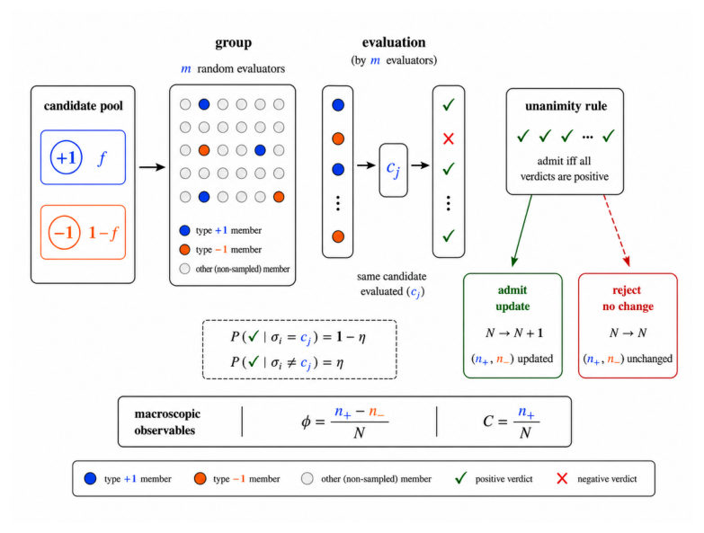 
Figure 1: Schematic of the growing-group model. A candidate drawn from the pool (type +1 with probability

📷 Fig 2

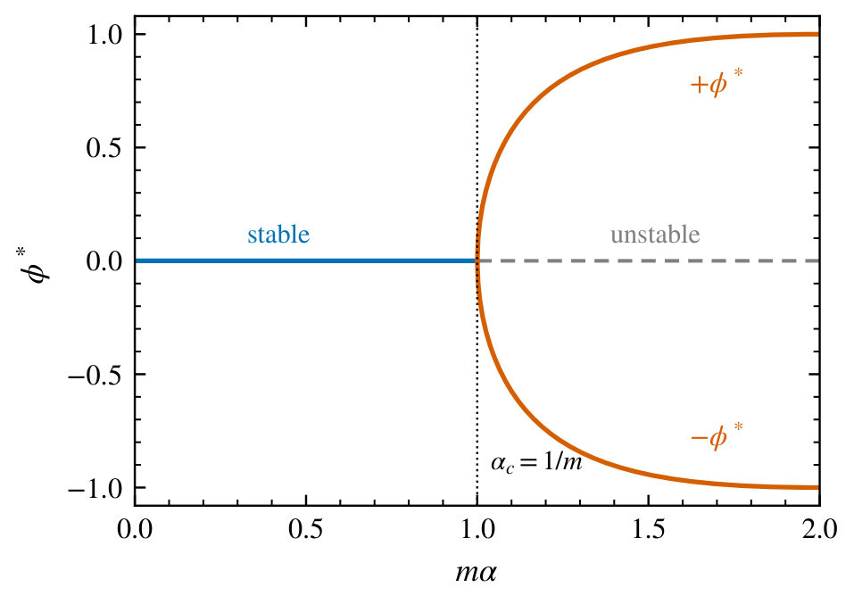 
Figure 2: Supercritical pitchfork bifurcation for f = 1/2, m = 2. Solid: stable fixed points; dashed: unstable.

📷 Fig 3

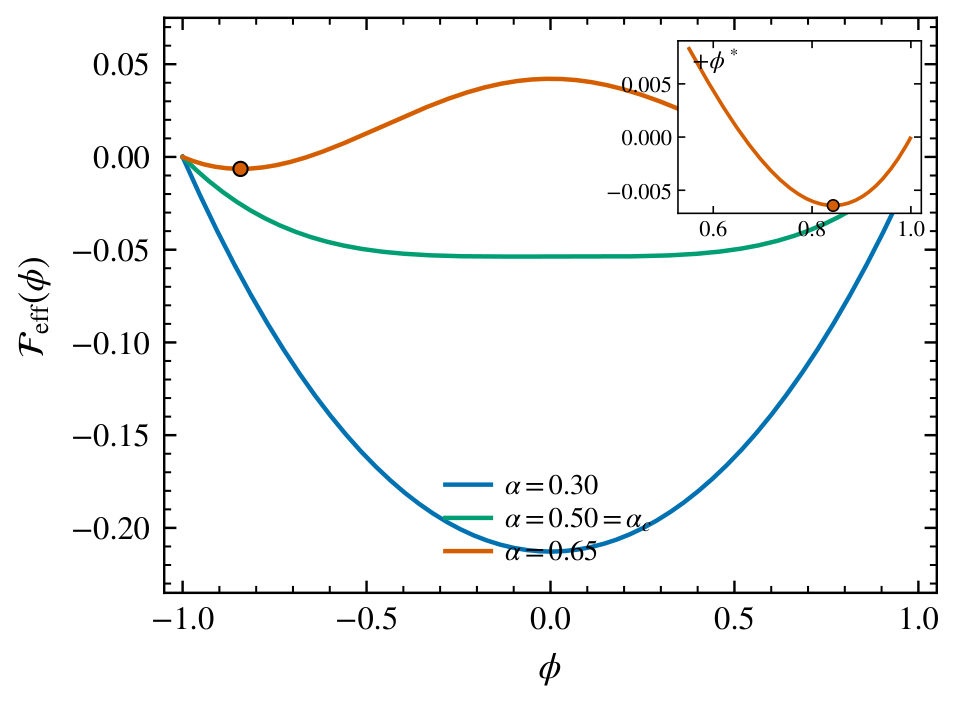 
Figure 3: Landau-like effective potential Feff(ϕ) for m = 2, f = 1/2. α &lt; αc: single well (disordered).

📷 Fig 4

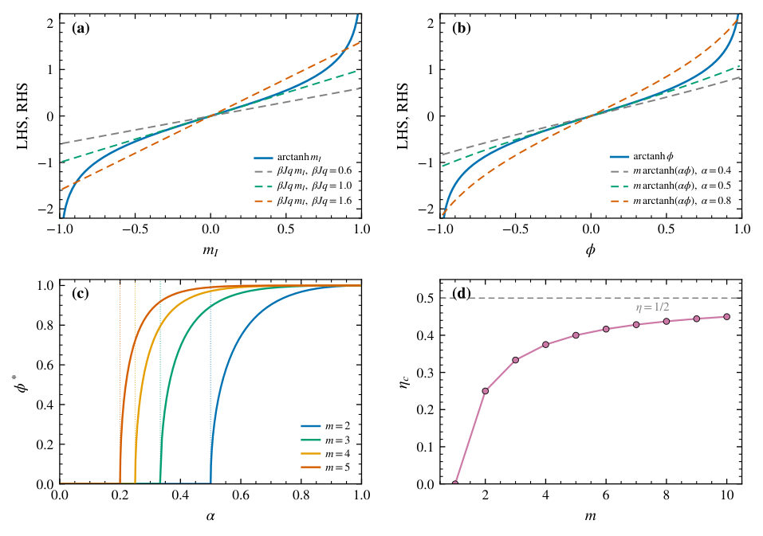 
Figure 4: Structural comparison between the mean-field Ising model and the growing-group model. (a) Ising:

📷 Fig 5

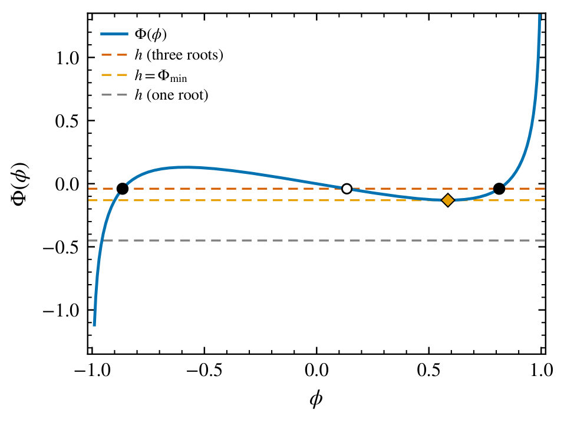 
Figure 5: Saddle-node bifurcation for f &lt; 1/2 (m = 2, α = 0.65). Small |h|: three roots. Critical h = Φmin:

**Summary.** This work develops an exact mean-field theory for a growing social group model whose dynamics are driven by consensus inference rather than thermal equilibrium. By reformulating the process in log-odds space, the authors derive critical exponents and demonstrate that non-equilibrium growth can organize complex phase transitions using tools analogous to those from statistical mechanics.

**Why it may be interesting.** It provides a powerful, non-equilibrium analogue to classical critical phenomena studies, showing how concepts like universality and scaling can emerge from purely growth-driven, information-theoretic processes.

Detailed structure

**Main problem.** The paper analyzes critical phenomena and collective behavior in a growing social group model that is intrinsically non-equilibrium, focusing on how consensus builds over time.

**Main result.** It establishes an exact mean-field theory for this growth process, deriving critical exponents and showing that the system's dynamics can be rigorously analyzed using tools from information geometry and RG theory without assuming a Hamiltonian structure.

**Method.** The analysis reformulates the stochastic process as a gradient flow on logarithmic time ($	au = \ln N$), leading to an effective potential and fixed-point equations solvable via log-odds (arctanh) transformations.

**Model / system.** The model is a growing social group where membership updates are governed by noisy, consensus-driven admissions based on multiple independent evaluations ($m$). The dynamics are Hamiltonian-free, making it a non-equilibrium system.

**Key observables.** Polarization ($\phi$), effective potential ($F_{	ext{eff}}$), critical exponents ($eta=1/2, \gamma=1, \delta=3$), and the rate of entropy production $\langle\dot{s}
angle$.

**Important parameters / regimes.** Evaluation reliability ($\alpha = 1 - 2\eta$), number of evaluators ($m$), and prior bias field ($h$). Criticality occurs when $m\alpha$ overcomes growth dilution.

**Assumptions / limitations.** The analysis relies on the mean-field limit (all-to-all evaluation) and uses mathematical tools like martingale convergence theory to prove convergence to deterministic ODEs in log time.

**Figures summary.** Figures illustrate the effective potential $F_{	ext{eff}}(\phi)$ showing transitions, phase diagrams mapping out different selection rules (DS, PA), and comparison plots contrasting the nested arctanh structure with the standard Ising model.

**Paper structure.** The paper develops a systematic three-layer framework: core theory (Landau potential/Ising comparison), mathematical foundations (Pólya-urn martingale convergence/RG flow), and complementary perspectives (irreversibility via entropy production).

Abstract

We present an exact analytical reformulation of a growing social group model -- a Hamiltonian-free nonequilibrium process in which a group grows by noisy, consensus-driven admission. Cast as a gradient flow on logarithmic time, the fixed-point structure collapses to a single self-consistent equation: $\arctanh(φ^*) = m \cdot \arctanh(αφ^*)$, where $φ$ is the polarization, $α=1-2η$ the evaluation reliability, and $m$ the number of evaluators. The equation has a direct log-odds interpretation: each verdict contributes log-likelihood ratio $2\arctanh(αφ)$; unanimity accumulates $m$ independent evidence pieces. The dynamics thus constitutes an exact mean-field theory of self-consistent inference, ordering when the collective gain $mα$ overcomes the dilution of growth. We develop a systematic three-layer framework: core theory (Landau-like effective potential, comparison with the mean-field Ising model, and features without equilibrium counterpart), mathematical foundations (criticality from correlated verdicts, Pólya-urn martingale convergence, and an RG-like flow with group size as scale), and complementary perspectives on irreversibility and information geometry. A frozen-$N$ Freidlin--Wentzell quasipotential yields Kramers-type escape estimates for metastable states, while Monte Carlo simulations collapse onto a parameter-free deterministic master curve on logarithmic time. Systematic comparison with the mean-field Ising model reveals shared critical exponents but a nested arctanh structure unique to growth. These results provide a detailed analytical characterization of a minimal model of growth-driven collective behavior and map which elements of the equilibrium critical toolbox -- suitably reinterpreted -- survive without a Hamiltonian.

[↑ back to top](#top)

### [Picosecond Schrödinger cat states for ultrafast optical quantum processing](http://arxiv.org/abs/2606.24002v1)

**Authors:** Mamoru Endo, Kan Takase, Takefumi Nomura, Tatsuki Sonoyama, Kazuma Takahashi, Sachiko Takasu, Daiji Fukuda, Takahiro Kashiwazaki, Asuka Inoue, Takeshi Umeki, Peter van Loock, Petr Marek, Radim Filip, Warit Asavanant, Akira Furusawa  
**Type:** experiment · **Category:** quantum information and computing · **PDF:** <https://arxiv.org/pdf/2606.24002v1>  
**Analysis basis:** full PDF text, analyzed in chunks
**Topic relevance:** 🔥 `QC/QI experiment` **4/5** · `interference shaping light` **3/5** · `quantum optics experiment` **3/5** · `quantum measurements` **2/5**

📷 Fig 1

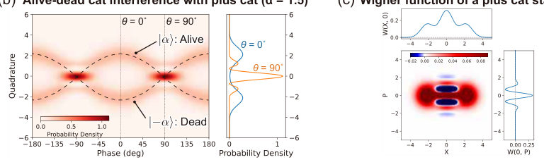 
Figure 1: Generalized photon subtraction in picosecond wave packets for high-rate non- Gaussian-resource generation. (a) Generalized photon subtraction (GPS) is implemented by interfering two squeezed states (Sqz.) on a beam splitter (BS) and heralding on photon-number- resolving detection (PNRD). The resulting non-Gaussian state (a squeezed cat state) can be fur- ther processed by Gaussian operations, including optional adaptive squeezing ( ˆS), and serves as a resource for adaptive breeding toward GKP-state generation and cat-code quantum infor- mation processing. In this work, GPS is extended from conventional nanosecond-scale wave packets to picosecond temporal modes, thereby addressing...

📷 Fig 2

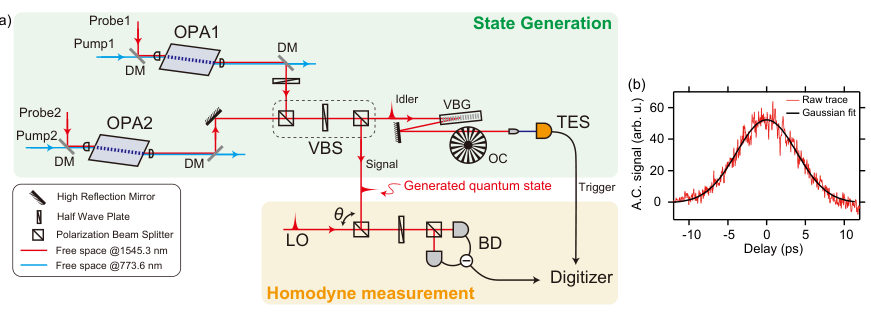 
Figure 2: (a) Experimental apparatus for quantum-state generation and measurement. Two opti- cal parametric amplifiers (OPA1 and OPA2) generate squeezed-vacuum fields that are combined to prepare non-Gaussian quantum states via GPS. One output arm from the variable beam split- ter (VBS) is spectrally filtered by a volume Bragg grating (VBG) and detected with a transition- edge sensor (TES)-based photon-number-resolving detector, providing the heralding trigger. The generated state in the other arm is analyzed by balanced homodyne detection using a bal- anced detector (BD) and a local oscillator (LO) with controllable phase θ, and the quadrature signals are recorded by a high-speed...

📷 Fig 3

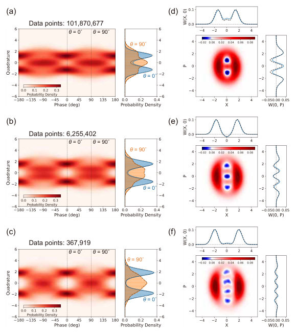 
Figure 3: (a–c) Phase-dependent quadrature marginal distributions of the states conditioned on photon-number detection events with n = 2, 3, and 4. Heat maps show the angle-resolved marginals. The right-hand panels compare cross sections at θ = 0◦and 90◦with the corre- sponding experimental histograms (bars), reconstructed marginals (solid lines), and simulations (dashed and dash-dotted lines). The number of quadrature samples used for the quantum-state tomography is indicated at the top of each heat map. (d–f) Reconstructed Wigner functions for n = 2, 3, and 4, together with cross sections along the X and P axes (solid lines). The dashed lines show the corresponding simulations. (g)...

**Summary.** The research demonstrates a method to generate high-quality, multi-photon Schrödinger cat states using picosecond optical pulses. By overcoming previous rate limitations, they achieve an effective cat-state amplitude close to the theoretical requirement for fault-tolerant quantum error correction codes like GKP states.

**Why it may be interesting.** This work directly addresses the engineering hurdles—specifically the temporal mode bandwidth—that limit the scalability of photonic quantum information processing by demonstrating high-rate generation of complex non-Gaussian resources.

Detailed structure

**Main problem.** The primary challenge is generating non-Gaussian quantum states, such as Schrödinger cat states, at a high repetition rate necessary for fault-tolerant optical quantum computation.

**Main result.** The authors successfully demonstrated multi-photon generalized photon subtraction in picosecond temporal modes, achieving an effective cat-state amplitude ($\alpha_{	ext{eff}} = 1.69$) relevant for cat-code architectures and GKP state breeding.

**Method.** State generation is achieved via interfering two squeezed vacuum states on a beam splitter, heralded by photon-number-resolving detection (TES), and characterized using pulsed homodyne detection matched to ultrashort pulses.

**Model / system.** The experiment uses broadband Type-0 PPLN waveguides to generate squeezed light, which is then processed optically. The system operates in picosecond temporal modes ($\sim 10$ ps) at a high repetition rate (5 MHz pump).

**Key observables.** Effective cat-state amplitude ($\alpha_{	ext{eff}}$), Wigner function negativity (indicating non-Gaussianity), and the number of negative regions observed for multi-photon heralding.

**Important parameters / regimes.** Picosecond temporal mode width, $\alpha_{	ext{eff}} = 1.69$, target GKP amplitude ($\approx 1.77$), and high repetition rate capability (5 MHz).

**Assumptions / limitations.** The reported $\alpha_{	ext{eff}}$ values are extracted without full loss correction; the study also compares experimental results to ideal, lossless simulations.

**Figures summary.** Figures illustrate the apparatus setup, phase-dependent quadrature distributions showing interference fringes, and reconstructed Wigner functions exhibiting negative regions for multi-photon heralding events.

**Paper structure.** The paper progresses from identifying the rate bottleneck in state generation to detailing the experimental setup (squeezed sources, VBS, PNRD), presenting measurements of $\alpha_{	ext{eff}}$ and Wigner function negativity, and finally discussing the implications for GKP lattice breeding.

Abstract

Non-Gaussian states are essential resources for universal, fault-tolerant optical quantum computing, but their generation rate remains limited by low heralding probabilities and operation in nanosecond temporal modes. Here, we demonstrate multi-photon generalized photon subtraction in picosecond optical wave packets, establishing the state-generation capability required for high-rate operation by addressing the temporal-mode bottleneck that has constrained the achievable rate. Two interfering ultrashort squeezed vacua are heralded by photon-number-resolving detection with a high-speed transition-edge sensor and characterized by pulsed homodyne detection matched to 10-ps temporal modes at a 5-MHz pump repetition rate. We reconstruct Wigner functions without loss correction that exhibit up to four distinct negative regions for four-photon heralding, together with an effective cat-state amplitude of $α_{\mathrm{eff}} = 1.69$. This amplitude approaches the range of practical relevance for fault-tolerant cat-code architectures and for adaptive breeding toward logical-qubit generation, while the picosecond temporal mode establishes a platform compatible with high-rate, scalable time-multiplexed photonic architectures.

[↑ back to top](#top)

### [Spectrally engineered collinear type-0 SPDC source with enhanced spectral brightness for entanglement distribution](http://arxiv.org/abs/2606.24036v1)

**Authors:** Dong-Gil Im, Jungmo Lee, Kyungdeuk Park, Dongkyu Kim, Yonggi Jo, Yong Sup Ihn  
**Type:** experiment · **Category:** quantum information and computing · **PDF:** <https://arxiv.org/pdf/2606.24036v1>  
**Analysis basis:** full PDF text, analyzed in chunks
**Topic relevance:** 🔥 `quantum optics experiment` **4/5** · `QC/QI experiment` **3/5** · `interference shaping light` **3/5** · `entanglement & information structure` **1/5** · `free-space correlated emission` **1/5**

📷 Fig 1

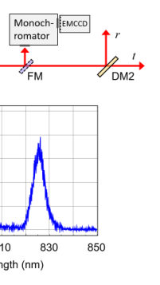 
Fig. 1. (a) Experimental setup for photon source where the ppKTP crystal satisfying the degenerate down-conversion of 405 nm pump photon to 810 nm photon pair is pumped by a ultra-narrowband pump laser operating at 405.143 nm center wavelength. DM, dichroic mirror; FM, flip mirror. (b) Spectrum for signal and idler photons measured by a monochromator and EMCCD. The left spectral peak is centered at 797.3 nm with a full width at half maximum (FWHM) of 5.77 nm, while the right peak is centered at 825.4 nm with a FWHM of 5.97 nm.

📷 Fig 2

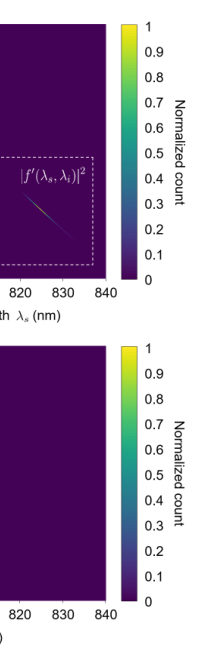 
Fig. 2. (a) JSI before passing through DM2 shown in Fig 1(a). The result clearly shows the spectrally split structure. (b) JSI after passing through DM2. The reflected and transmitted photons show a single continuous joint spectrum.

📷 Fig 3

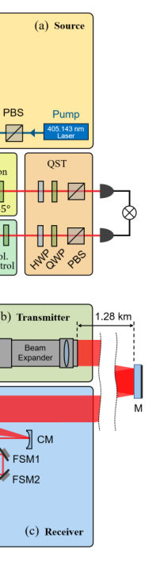 
Fig. 3. Experimental setup for polarization entanglement source and entanglement distribution via 2.56 km free-space. (a) Polarization entanglement source using a Sagnc interferometer with the spectrally engineered collinear type-0 SPDC source. (b) and (c) are the transmitter and receiver system, respectively. M, mirror; HWP, half-wave plate; QWP, quarter-wave plate; DM, dichroic mirror; FM, flip mirror; PBS, polarizing beam splitter; BS, beam splitter; PM, off-axis parabolic mirror; CM, concave mirror; FSM, fast steering mirror; PSD, position-sensitive detector; IF, interference filter

📷 Fig 4

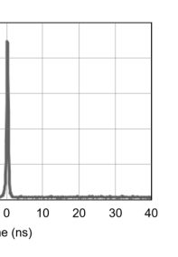 
Fig. 4. Temporal correlation between the locally detected 𝑟photon and the 𝑡photon transmitted through the 2.56 km free-space channel, measured using a TCSPC system. After compensating the propagation delay, a coincidence peak appears at zero relative delay.

📷 Fig 5

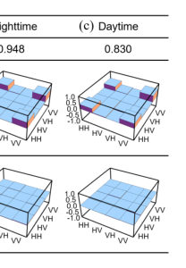 
Fig. 5. Results for polarization entanglement distribution. Density matrices recon- structed via QST and the corresponding entanglement fidelities are shown for (a) the local reference, (b) the nighttime free-space transmission, and (c) the daytime free-space transmission.

**Summary.** The research presents a method to enhance entangled photon source brightness by spectrally engineering the spontaneous parametric down-conversion process using detuned pumping. This technique yields a highly usable, narrow-band source that successfully generates and distributes polarization entanglement over several kilometers of free space. The findings establish spectral control as a practical route for developing robust quantum communication hardware.

**Why it may be interesting.** This work provides an experimental blueprint for creating compact, high-performance quantum light sources whose spectral properties are actively controlled, which is crucial for scaling up quantum communication networks beyond laboratory settings.

Detailed structure

**Main problem.** The primary challenge addressed is developing entangled photon sources with high spectral brightness suitable for practical quantum communication and networking applications.

**Main result.** The authors successfully demonstrated a spectrally engineered SPDC source achieving high spectral brightness ($0.507 	ext{ MHz}\cdot	ext{mW}^{-1}\cdot	ext{nm}^{-1}$) and distributing polarization entanglement over a $2.56 	ext{ km}$ free-space link.

**Method.** The method involves spectrally engineering the SPDC process by using an ultra-narrowband laser detuned from degeneracy, which concentrates photon pair generation into a narrow bandwidth while maintaining collinear operation.

**Model / system.** The physical system is a type-0 spontaneous parametric down-conversion (SPDC) source pumped in a ppKTP crystal. The process generates entangled photon pairs, which are then used to create polarization entanglement via a Sagnac interferometer and tested over a free-space quantum channel.

**Key observables.** Coincidence rate ($44.6 	ext{ kHz}$), detected spectral brightness ($0.507 	ext{ MHz}\cdot	ext{mW}^{-1}\cdot	ext{nm}^{-1}$), entanglement fidelity, and temporal correlation over distance.

**Important parameters / regimes.** Pump power ($15 \mu	ext{W}$), free-space channel length ($2.56 	ext{ km}$), spectral bandwidth ($\Delta\lambda_{bp} = 5.87 	ext{ nm}$).

**Assumptions / limitations.** The calculation of spectral brightness does not account for all optical transmission losses, and the degradation in daytime fidelity is attributed to background noise rather than source performance.

**Figures summary.** Figures illustrate the experimental setup (collinear pumping, Sagnac interferometer), the spectrally split nature of the photon pairs using JSI calculations, temporal correlation confirmation over distance, and quantum state tomography results showing entanglement fidelity.

**Paper structure.** The paper details the spectral engineering technique to enhance brightness, demonstrates the source's ability to generate polarization entanglement via a Sagnac setup, and validates this distribution capability by transmitting the entangled pairs over a long free-space link while measuring temporal correlations and fidelity.

Abstract

Entangled photon sources with high spectral brightness are important resources for photonic quantum information processing, particularly in quantum communication and quantum networking where usable photon flux of entangled photons is often constrained by channel loss and source inefficiency. Here, we demonstrate a spectrally engineered type-0 spontaneous parametric down-conversion (SPDC) source with enhanced spectral brightness for entanglement distribution. By pumping a 30-mm ppKTP crystal with an ultra-narrowband laser slightly detuned from degeneracy, photon-pair generation is concentrated into a narrow spectral bandwidth while retaining the strong nonlinear interaction of type-0 phase matching. The source produces a coincidence rate of 44.6 kHz corresponding to a detected spectral brightness of 0.507 MHz/mW/nm. We further integrate the source into a Sagnac interferometer to generate polarization-entangled photon pairs and demonstrate entanglement distribution through a 2.56 km free-space round-trip channel. Our results show that spectral engineering provides a practical route to compact, spectrally bright entangled-photon sources for quantum communication applications.

[↑ back to top](#top)

### [Universality beyond the Kibble-Zurek mechanism in the condensation of coherently coupled Bose gases](http://arxiv.org/abs/2606.24864v1)

**Authors:** Subhadeep Patra, Paolo Comaron, Arko Roy  
**Type:** theory · **Category:** quantum gases · **PDF:** <https://arxiv.org/pdf/2606.24864v1>  
**Analysis basis:** full PDF text, analyzed in chunks
**Topic relevance:** 🔥 `non-equilibrium universality` **4/5** · `non-equilibrium dynamics` **3/5** · `Keldysh / 2PI / non-Gaussian methods` **1/5** · `analog quantum simulation` **1/5** · `correlated / nonlocal dissipation` **1/5** · `driven-dissipative phase transition` **1/5** · `methods for driven-dissipative` **1/5**

📷 Fig 1

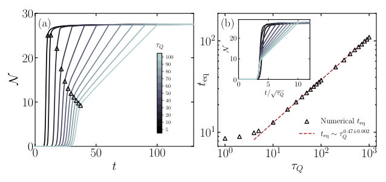 
FIG. 1. Characterization of the equilibration time teq. (a) Scaled condensate norm N(t) as a function of time for different quench times τQ ranging from 5 to 1000. Each curve is averaged over R = 100 stochastic trajectories. Black triangles mark the equilibration time teq. (b) Equilibration time teq as a function of the quench time τQ. Fits in the range τQ = 30–1000 show good agreement with Kibble–Zurek scaling, teq ∼τ 0.47±0.002 Q . Inset: Growth of the condensate norm N versus the scaled time t/√τQ. For t &lt; teq, the curves collapse onto a universal form for all τQ except the fastest quench τQ = 5, consistent with Kibble–Zurek behavior.

📷 Fig 2

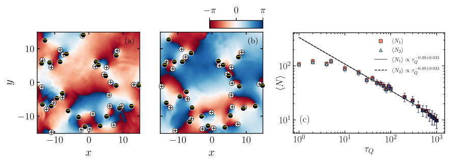 
FIG. 2. Kibble–Zurek scaling of vortex defects without considering their topological charge evaluated at the equilibration time t/teq ∼1 for quench times τQ ranging from 1 to 1000. (a,b) Phase profiles of the two spin components at teq, with vortices and antivortices indicated by positive and negative winding numbers, respectively. (c) Universal power-law scaling of the mean vortex number ⟨N⟩with the quench time τQ. For the two spin components, the scalings are ⟨N1⟩∝τ −0.49±0.033 Q and ⟨N2⟩∝τ −0.49±0.033 Q . Fits are obtained using a weighted least-squares procedure that accounts for the uncertainty of each data point. Error bars denote one standard deviation over R = 100 independent noise...

📷 Fig 3

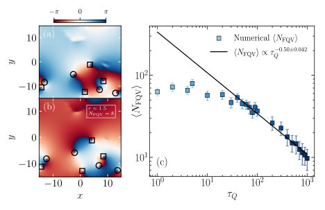 
FIG. 3. (a,b) Phase profiles of the two spin components, ϕ1 and ϕ2, at t/teq = 1.92. For representation purpose, a later time snapshot is chosen to clearly highlight vortex pairing, as the number of vortices is relatively small for τQ = 50. Vortices with winding number w = −1 (squares) and w = +1 (circles) are indicated in both components. Vortices with equal wind- ing in the two components pair to form full quantum vortices (FQVs), subject to the spatial pairing threshold. (c) Mean number of FQVs, ⟨NFQV⟩, as a function of the quench time τQ computed at t/teq ∼1 for the spatial pairing threshold r = 1.5. The blue markers denote numerical data, with darker shades corresponding to slower...

📷 Fig 4

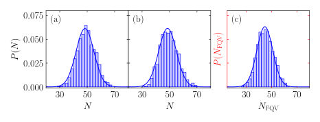 
FIG. 4. Panels (a)-(b) show the probability distribution of the number of point defects (without considering topological charge) at t/teq = 1 for the two spin components, respectively for the quench time τQ = 50. The solid curves represent the theoretical normal distribution given by Eq. (13). Panel (c) displays the corresponding distribution for FQVs, with the solid line again indicating Eq. (13). All histograms are constructed from R = 1000 independent noise realizations.

📷 Fig 5

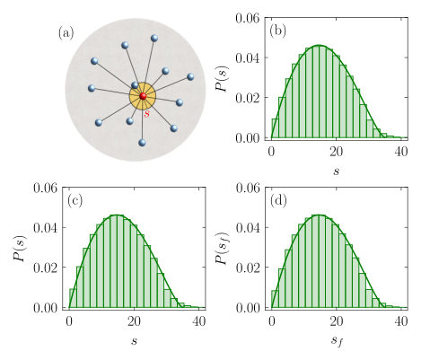 
FIG. 5. Pairwise distance distribution of vortices at t/teq = 1 for the quench time τQ = 50. Panel (a) corresponds to a schematic representation of random points (vortices) with a reference vortex (red) on a circular disk of radius R. The 1st nearest neighbor (NN) of the reference vortex is indicated using a circle with radius s. (b)-(c) Distance distributions of vortices for the two spin components (j = 1, 2), irrespective of their topological charge. (d) Pairwise distance distribu- tion of FQVs. All histograms are constructed from R = 1000 stochastic realizations using 20 bins. The solid curves rep- resent the theoretical disk line-picking distribution given by Eq. (15) for a disk of...

**Summary.** The paper investigates how topological defects form during the non-equilibrium condensation of a coherently coupled Bose gas. By analyzing defect statistics using advanced tools like Poisson Point Processes and Spatial Form Factors, the authors demonstrate that the resulting spatial organization exhibits universal geometry beyond standard Kibble-Zurek scaling. This establishes a fundamental statistical description for defect formation in such quantum systems.

**Why it may be interesting.** This work provides a rigorous quantitative framework for characterizing the emergent geometry of defects in interacting quantum systems, extending fundamental concepts like KZM into regimes involving multiple coupled components. The use of SFF connects condensed matter physics to spectral analysis techniques from quantum chaos.

Detailed structure

**Main problem.** The study investigates the universal spatial statistics of topological defects formed during the non-equilibrium condensation of a coherently coupled Bose gas, aiming to establish physics beyond standard Kibble-Zurek mechanism (KZM) predictions.

**Main result.** The defect positions are found to follow a homogeneous Poisson point process (PPP), revealing a universal stochastic geometry that persists even when considering composite topological defects. This universality is confirmed by analyzing Voronoi tessellation and the Spatial Form Factor (SFF).

**Method.** The analysis employs the stochastic projected Gross-Pitaevskii equation (SPGPE) framework, combining theoretical scaling arguments with advanced tools from stochastic geometry like PPP modeling, Poisson-Voronoi tessellation, and SFF calculations.

**Model / system.** The system is a coherently coupled Bose gas in two hyperfine states undergoing a quench driven by a linear variation of the chemical potential. The dynamics are modeled using the SPGPE for a 2D system.

**Key observables.** Topological defects (elementary and composite Full Quantum Vortices, FQVs); defect density ($
ho$); equilibration time ($t_{eq}$); Poisson point process statistics; Voronoi cell area distribution; Spatial Form Factor (SFF).

**Important parameters / regimes.** Quench rate ($	au_Q$), coupling strength ($\Omega$), and the ratio of components' interactions ($g_{12}/g$).

**Assumptions / limitations.** The dynamics are projected onto low-energy modes via SPGPE, and the underlying spatial statistics are assumed to be well described by a Poisson Point Process (PPP).

**Figures summary.** Figures illustrate condensate norm growth and equilibration time scaling; they also show pair-distance distributions, nearest-neighbor spacing histograms conditioned on topological charge, and SFF plots comparing numerical results against analytical PPP predictions.

**Paper structure.** The paper progresses by first establishing the non-equilibrium dynamics (determining $t_{eq}$), then analyzing defect numbers ($\langle N 
angle$) via KZM scaling, and finally delving into spatial statistics using PPP, Voronoi tessellation, and SFF to prove universal geometric organization.

Abstract

We study the universal spatial statistics of point-like topological defects formed during the nonequilibrium condensation of a coherently coupled Bose gas using the stochastic projected Gross-Pitaevskii equation. The symmetry-breaking transition is driven by a linear quench of the chemical potential, leading to stochastic vortex nucleation in the individual condensate components. When the two components are considered together, these elementary defects may combine across components to emerge as composite topological defects known as full quantum vortices. Beyond the mean defect density predicted by the Kibble-Zurek mechanism (KZM), we investigate the spatial organization of both the elementary and composite defects and show that their positions are well described by a Poisson point process, revealing a universal stochastic geometry. This universality is further described through Voronoi tessellation, whose cell-area statistics follow Poisson-Voronoi predictions. We also introduce the spatial form factor for characterizing the vortex configurations and demonstrate the emergence of a characteristic dip-ramp-plateau structure. Our results establish universal stochastic geometry of topological defects beyond conventional Kibble-Zurek scaling and identify it as a fundamental feature of nonequilibrium condensation in coherently coupled Bose gases.

[↑ back to top](#top)

### [A high-fidelity two-qubit gate for multimode superconducting P-mon qubits](http://arxiv.org/abs/2606.24772v1)

**Authors:** Frederik Pfeiffer, Federico A. Roy, Niklas J. Glaser, Julius Feigl, Leon Koch, Kevin Kiener, Gleb Krylov, Johannes Schirk, Christian M. F. Schneider, Lasse Södergren, Florian Wallner, Max Werninghaus, Carlos A. Riofrío, Stefan Filipp  
**Type:** both · **Category:** quantum information and computing · **PDF:** <https://arxiv.org/pdf/2606.24772v1>  
**Analysis basis:** full PDF text, analyzed in chunks
**Topic relevance:** 🔥 `QC/QI experiment` **4/5** · `methods for driven-dissipative` **3/5** · `Keldysh / 2PI / non-Gaussian methods` **1/5** · `correlated / nonlocal dissipation` **1/5** · `driven-dissipative phase transition` **1/5**

📷 Fig 1

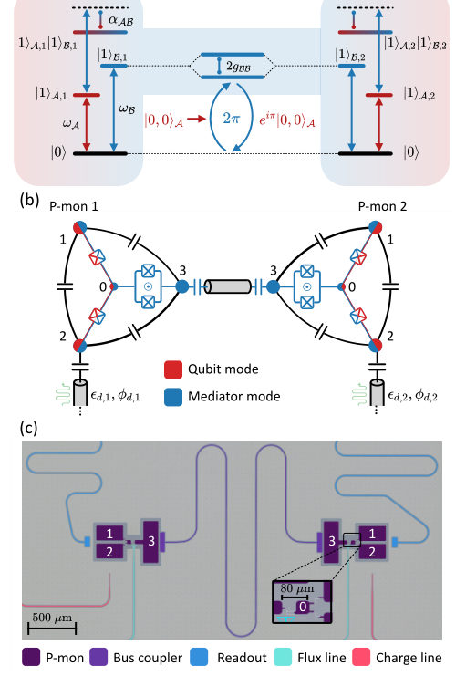 
FIG. 1. (a) Energy level diagram of two P-mon qubits coupled via mediator modes. ωA and ωB are the transition frequen- cies for single excitation states |1⟩A,1 ≡|1, 0⟩A ⊗|0, 0⟩B and |1⟩B,1 ≡|0, 0⟩A ⊗|1, 0⟩B of modes A and B of P-mon 1 (and similarly |1⟩A,2 and |1⟩B,2 denote the excitation states of P- mon 2). The cross-Kerr interaction αAB shifts the energy of the joint excitation state |1⟩A,1|1⟩B,1 ≡|1, 0⟩A ⊗|1, 0⟩B. The spectrum of the coupled mediators (coupling strength gBB) is sketched for the qubit modes ground state |0, 0⟩A; a selective cyclic evolution on this state yields a geometric phase of π. (b) Circuit diagram of two coupled P-mon circuits. Each four- island P-mon is connected...

📷 Fig 2

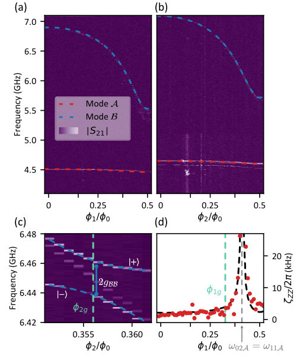 
FIG. 2. Spectrum of P-mon P1 (a) and P2 (b) vs. ap- plied magnetic flux ϕ1/2/ϕ0. (c) Mediator spectrum of P2 vs applied flux ϕ2/ϕ0 with P1 parked at the gate opera- tion point ϕ1g, showing the avoided crossing between the mediator modes of P1 and P2. The blue dashed line indi- cates a fit with the upper and lower branch labeled by the states |+⟩and |−⟩, yielding a mediator-mediator coupling gBB/2π = 11.7(2) MHz. The dashed green line indicates the gate operation point ϕ2g. (d) ZZ interaction ζZZ be- tween the qubit modes of P1 and P2 in dependence of ϕ1/ϕ0 with P2 parked at the gate operation point ϕ2g. Error bars are smaller than the data points. The dashed black line is a fit to Eq. (4),...

📷 Fig 3

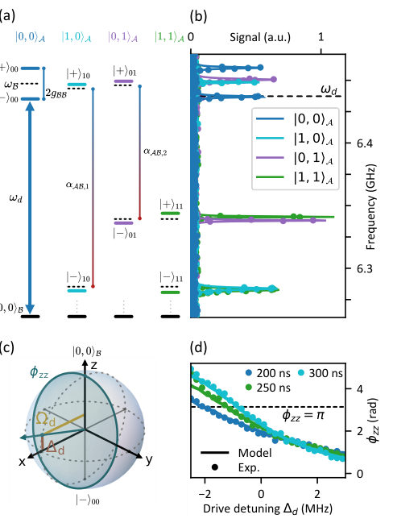 
FIG. 3. (a) Energy levels of coupled mediator modes de- pending on the qubit states |i, j⟩A. Dashed horizontal lines indicate bare mediator energy levels in the absence of cou- pling gBB (blue dot-ended arrow); these are shifted by cross- Kerr interactions αAB,1/2 (blue/red dot-ended arrows). The blue arrow marks the target transition |0, 0⟩B ↔|−⟩00 for the gate. (b) Two-tone spectroscopy of the mediator spectrum for different initial qubit states |i, j⟩A, where the dashed line indicates the drive frequency ωd used for the CPHASE gate. (c) Bloch sphere of the {|00⟩B, |−⟩00} subspace. The green area indicates the cyclic trajectory yielding a geometric phase ϕZZ, determined by the drive...

📷 Fig 4

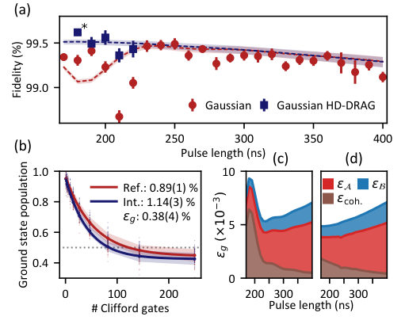 
FIG. 4. (a) Gate fidelity vs. pulse length for Gaussian and HD-DRAG pulses. Dashed lines denote mean simulated fi- delity, shaded regions represent simulated fidelity bounds de- rived from the standard deviation of time-averaged coherence times. (b) Interleaved randomized benchmarking correspond- ing to the data point marked by (*) in (a). The grey dashed line indicates 0.5 ground state population. (c) Simulated error budget for Gaussian pulses vs pulse length. The different col- ors indicate coherent errors ϵcoh. (brown), qubit mode decay and dephasing εA (red) and mediator mode decay εB (blue). (d) Simulated error budget for Gaussian HD-DRAG pulses.

📷 Fig 5

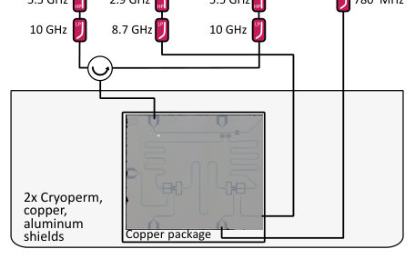 
FIG. 5. Wiring diagram of the experimental setup.

**Summary.** This paper details the implementation of a high-fidelity two-qubit CZ gate using novel P-mon superconducting qubits. By leveraging mediator modes and cross-Kerr interactions, they achieve robust coupling while suppressing unwanted crosstalk. The use of advanced pulse shaping techniques like HD-DRAG is crucial for reaching state-of-the-art gate fidelities necessary for scalable quantum computation.

**Why it may be interesting.** The work provides a detailed blueprint for engineering coherent quantum gates in solid-state superconducting circuits by exploiting engineered multimode physics, which is highly relevant to open quantum systems research.

Detailed structure

**Main problem.** The core challenge is developing scalable superconducting quantum processors by engineering qubit interactions that suppress decoherence channels, particularly unwanted ZZ-type coupling.

**Main result.** The authors successfully implemented a high-fidelity CZ gate (99.62% fidelity) using P-mon qubits coupled via mediator modes, demonstrating a path toward scalable architecture.

**Method.** Gate performance was optimized by comparing pulse shaping techniques (Gaussian vs. HD-DRAG) and analyzing the system dynamics using Lindblad master equations to minimize coherent errors.

**Model / system.** The physical platform is superconducting P-mon qubits, which are multimode circuits featuring protected qubit modes coupled via flux-tunable mediator modes and a bus resonator. The Hamiltonian describes these interactions, allowing for controlled coupling via cross-Kerr effects.

**Key observables.** CZ gate fidelity (99.62%), residual ZZ interaction strength (< 3.6 kHz), single-qubit fidelities ($\approx 99.97\%$), and the accumulated entangling phase $\phi_{ZZ}$.

**Important parameters / regimes.** Gate time (180 ns), drive detuning ($\Delta d$), mediator coupling strengths ($g_{BB}$), and coherence times ($T_1, T_2$).

**Assumptions / limitations.** The analysis assumes the dispersive limit for initial derivations and relies on advanced pulse shaping (HD-DRAG) to mitigate coherent errors arising from spectral overlap.

**Figures summary.** Figures illustrate energy level diagrams showing cross-Kerr shifts, circuit schematics of coupled P-mons, and comparisons of gate fidelity versus pulse length using both Gaussian and HD-DRAG pulses.

**Paper structure.** The paper progresses by first establishing the protected nature of the P-mon qubit, then detailing how mediator modes enable controlled coupling. It moves through Hamiltonian derivation, experimental characterization (measuring couplings), and finally focuses on optimizing gate fidelity using advanced pulse shaping techniques like HD-DRAG.

Abstract

To scale superconducting quantum processors, it is essential to achieve long coherence times while engineering interactions that do not introduce additional decoherence channels. In superconducting qubit systems, this can be realized using multimode circuits that feature a protected qubit mode alongside a distinct mediator mode. Building on this concept, our recently developed P-mon qubit provides intrinsic protection against decoherence from the readout environment. We extend this approach to controlled two-qubit interactions, by exploiting the mediator modes of P-mons for on-demand coupling. Because direct interactions between the qubit modes are strongly suppressed, unwanted $ZZ$-type interactions are significantly reduced to below $3.6(5)~\text{kHz}$ in the idle state. When tuning the coupled mediator modes on resonance, the cross-Kerr interaction between the qubit and the hybridized mediator modes leads to a qubit-state dependent frequency shift. By selectively addressing these transitions, we implement a $180~\text{ns}$ long CZ gate and determine a fidelity of $99.62(4)~\text{%}$. These results represent a significant step toward a scalable superconducting architecture that maintains high performance at scale.

[↑ back to top](#top)

### [A Universal All-Fiber Quantum Buffer for the Telecom Band](http://arxiv.org/abs/2606.24681v1)

**Authors:** Domenico Compagnini, Noemi Tagliavacche, Sara Congia, Andrea Bernardi, Marco Liscidini, Matteo Galli, Daniele Bajoni  
**Type:** experiment · **Category:** quantum information and computing · **PDF:** <https://arxiv.org/pdf/2606.24681v1>  
**Analysis basis:** full PDF text, analyzed in chunks
**Topic relevance:** 🔥 `QC/QI experiment` **4/5** · `quantum optics experiment` **3/5** · `analog quantum simulation` **1/5** · `driven-dissipative phase transition` **1/5** · `interference shaping light` **1/5**

📷 Fig 1

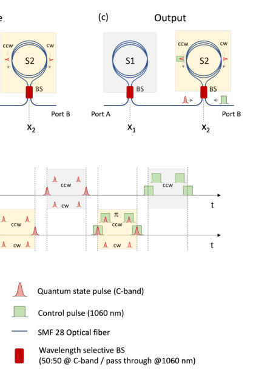 
Figure 1: Architecture and operational principle of the universal all-fiber quantum buffer. (a) Input operation: an incoming quantum signal pulse and a control laser pulse enter the buffer constituted by Sagnac interferometers S1 and S2 through port A and port B, respectively. The beam-splitters (BS) at positions x1 and x2 divide the quantum pulse equally but do not split the control pulse which propagates only in the counterclockwise (CCW) direction. The pulses are precisely timed to overlap at the BS at x1. The CCW component of the quantum pulse co-propagates with the control pulse in S1, acquiring a nonlinear phase shift of 𝜋via cross- phase modulation. The subsequent constructive...

📷 Fig 2

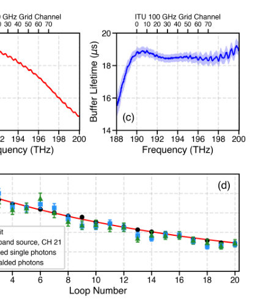 
Figure 2: Linear characterization of the quantum buffer. (a) Measured transmission (color scale) as a function of optical frequency and loop number during extraction, obtained using a broadband light source. (b) Extracted buffer efficiency and (c) buffer lifetime as a function of optical frequency, derived from the dataset in panel (a). (d) Measured transmission for ITU channel 21 as a function of the loop number, comparing data from the broadband source, heralded single photons, and unheralded single photons. The solid line represents an exponential fit to the data.

📷 Fig 3

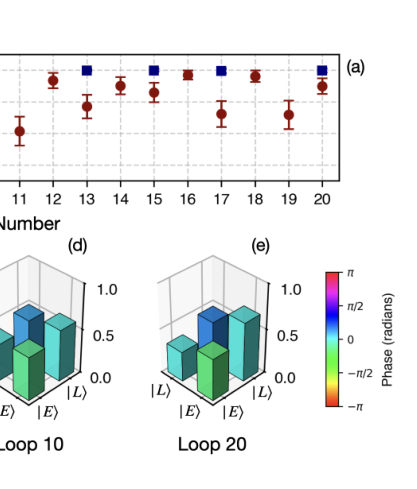 
Figure 3: Preservation of time-bin encoded photons. (a) Measured fidelity to the initial state as a function of storage loop number (from 1 to 20) for an arbitrary time-bin input state (red dots) and a self-referenced |+⟩state (blue dots). (b)-(e) Reconstructed density matrices obtained via quantum state tomography for the initial input state (b), and the retrieved states from the buffer output after 1 (c), 10 (d), and 20 (e) storage loops.

📷 Fig 4

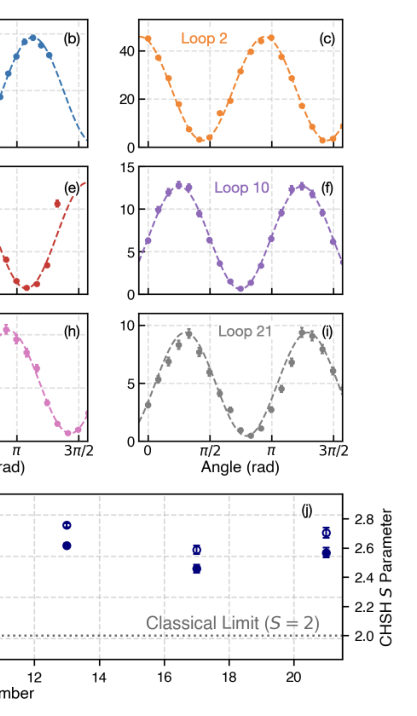 
Figure 4: Time-bin entanglement. Measured quantum interference curves (without accidental subtraction) obtained after sending the signal photon through the fiber bypass (a) and through the quantum buffer for several loops (b) - (i). Dashed lines represent best fits to the experimental data. (j) Visibility and S parameter extracted from the best fits of panels (a) to (i): raw data (solid points) and corrected for the visibility of the analyzing interferometer (open points).

📷 Fig 5

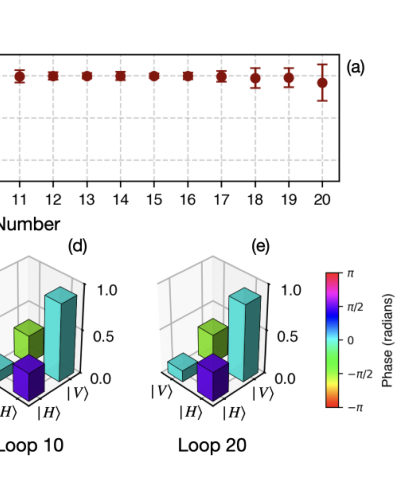 
Figure 5: Preservation of polarization encoded photons. (a) Measured fidelity to the initial state as a function of storage loop number (from 1 to 20) for an arbitrary polarization input state. (b)-(e) Reconstructed density matrices obtained via quantum state tomography for the initial input state (b), and the retrieved states from the buffer output after 1 (c), 10 (d), and 20 (e) storage loops.

**Summary.** The paper presents a novel, fully fiber-integrated quantum buffer capable of storing and retrieving quantum states across the entire telecom C-band. By utilizing Cross-Phase Modulation in a dual-Sagnac cavity, it overcomes major trade-offs associated with existing memory technologies. This robust platform enables high-rate synchronization for global photonic quantum networks.

**Why it may be interesting.** This work provides an all-optical, room-temperature solution for quantum memory that directly addresses the bandwidth/storage trade-off, which is critical for scaling photonic quantum networks beyond current limitations.

Detailed structure

**Main problem.** The realization of a scalable quantum internet requires on-demand, high-fidelity buffering of asynchronous photonic signals across the telecom band.

**Main result.** The authors demonstrated a universal, fully fiber-integrated quantum buffer achieving ultra-low loss (0.46 dB), long storage times ($\sim 18 \mu$s), and broadband operation ($>12.5$ THz).

**Method.** The system uses an actively switched dual-Sagnac cavity driven by Cross-Phase Modulation (XPM) to store quantum states encoded in time-bin, frequency-bin, or polarization degrees of freedom.

**Model / system.** The platform is based on two Sagnac interferometers integrated into optical fiber. Storage relies on the $\chi^{(3)}$ nonlinearity inducing a phase shift via XPM from an intense control pulse onto the quantum signal pulse.

**Key observables.** Input/output loss (0.46 dB), storage time ($\sim 18 \mu$s), operational bandwidth ($>12.5$ THz), and state fidelity ($>95\%$).

**Important parameters / regimes.** Storage lifetime, Time-Bandwidth Product ($2.2 	imes 10^8$), and the ability to address multiple temporal modes (e.g., 200+).

**Assumptions / limitations.** The system relies on the wavelength-dependent behavior of the beamsplitters and assumes that XPM provides sufficient switching contrast.

**Figures summary.** Figures illustrate the working principle using Sagnac interferometers, show time-bin entanglement interference patterns (CHSH violation), and demonstrate selective input/delayed retrieval of multiple temporal modes.

**Paper structure.** The paper progresses from establishing the need for quantum buffering to detailing the XPM mechanism in a dual-Sagnac setup. It then rigorously characterizes performance metrics—loss, storage time, and fidelity—before demonstrating advanced capabilities like multi-DoF preservation and high-density temporal multiplexing.

Abstract

The realization of a scalable quantum internet relies on the ability to temporally align asynchronous photonic signals through on-demand buffering. While matter-based quantum memories achieve long storage times, their extremely narrow bandwidths and cryogenic requirements pose significant barriers to integration with existing telecommunications infrastructure. Conversely, current all-optical memories operate at room temperature but are hampered by high input/output losses and a lack of universality across different photonic degrees of freedom. Here, we demonstrate a universal, fully fiber-integrated quantum buffer operating over the full telecom C-band that overcomes these fundamental trade-offs. By implementing an actively switched dual-Sagnac cavity driven by cross-phase modulation, we achieve an ultra-low input/output loss of 0.46 dB and a storage time exceeding 18 $μ$s. The device exhibits an operational bandwidth exceeding 12.5 THz ($\sim$100 nm), covering the full telecom C-band. We show the simultaneous buffering of over 200 temporal modes with the ability to address them either collectively or one by one. We demonstrate high-fidelity storage for all three degrees of freedom compatible with optical fiber propagation, namely time-bin, frequency-bin, and polarization qubits, along with faithful preservation of entanglement, confirming the platform's true universality. These results provide a robust, room-temperature solution for the high-rate synchronization of multidimensional quantum states, clearing a major hurdle for the deployment of global photonic quantum networks.

[↑ back to top](#top)

### [Universal Extraction of Quantum Critical Exponents and Phase Transitions via Tailored Hilbert Space](http://arxiv.org/abs/2606.24312v1)

**Authors:** Ye Xiong  
**Type:** theory · **Category:** statistical mechanics · **PDF:** <https://arxiv.org/pdf/2606.24312v1>  
**Analysis basis:** full PDF text, analyzed in chunks
**Topic relevance:** 🔥 `analog quantum simulation` **4/5** · `non-equilibrium universality` **2/5** · `driven-dissipative phase transition` **1/5** · `entanglement & information structure` **1/5** · `exotic spin models in light-matter` **1/5** · `non-equilibrium dynamics` **1/5**

📷 Fig 1

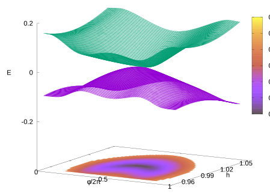 
FIG. 1. Eigenenergies of the tailored Hamiltonian HW as functions of h and φ. The bottom palette illustrates the en- ergy gap between the two states. Calculations are performed at γ = 0.5 and fixed tailoring strength W1 = 105 throughout this work. Only low-energy states near zero energy are dis- played. A characteristic cone-shaped dispersion emerges near the critical point h = 1, clearly signaling the quantum critical behavior.

📷 Fig 2

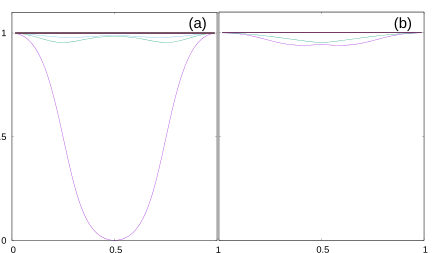 
FIG. 2. Eigenvalues of the projection operator that maps low- energy eigenstates onto the subspace spanned by the φ = 0 lower-band states. Panels (a) and (b) correspond to h = 0.6 and h = 1.4, respectively.

📷 Fig 3

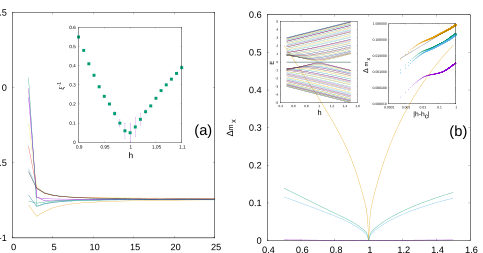 
FIG. 3. (a) Site-resolved mz calculated in the THS for an ensemble of |Ψ1⟩on an N = 50 ring. All curves satu- rate to a constant via exponential decay. The inset displays correlation-length scaling ξ ∝|h −hc|−ν with ν = 1. (b) Left inset: THS energy spectrum hosting a zero-energy in- gap state. Main panel: Curves from bottom to top show the zero-energy contribution ∆mx at N = 100, 200, 400, 1000, whose scaling with system size N verifies the extended nature of this midgap state. Right inset: Double-logarithmic plot of ∆mx against h −hc, demonstrating the power-law behavior ∆mx ∝(h−hc)0.625. The solid line acts as a guide to the eye for the measured exponent.

📷 Fig 4

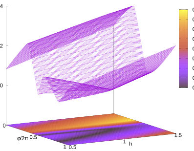 
FIG. 4. The gap between the ground state and first excited state energies in THS.

📷 Fig 5

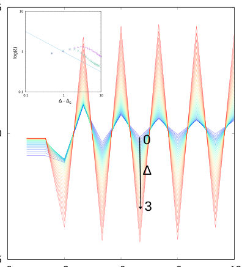 
FIG. 5. Site-resolved mz versus lattice index i for an N = 12 open-boundary chain. ∆is taken from 0 to 3. The tailored state |Ψ1⟩is localized on the leftmost sites i = 1 and i = 2. The inset, arranged from top to bottom, presents the logarith- mic correlation length for system sizes N = 12 and N = 16, respectively. The solid line serves as a guide to the eye for the scaling behavior x−0.5.

**Summary.** This work introduces Tailored Hilbert Space (THS), a novel theoretical framework to study quantum phase transitions by modifying the model's effective Hamiltonian. By tailoring the Hilbert space using specific reference states, the authors can extract precise critical exponents and correlation lengths for models like the XY and XXZ chains using extremely small lattices. This provides an efficient, universal route for characterizing QPTs in many-body systems.

**Why it may be interesting.** For AMO physicists studying quantum phase transitions (e.g., in cold atom arrays or superconducting circuits), this offers a powerful computational tool that bypasses the need for large system sizes or complex finite-size extrapolations when characterizing critical behavior.

Detailed structure

**Main problem.** The primary goal is to develop an efficient method to analyze quantum phase transitions (QPTs) and extract critical exponents, overcoming limitations associated with finite-size scaling.

**Main result.** A novel Tailored Hilbert Space (THS) scheme successfully yields precise critical points and universal exponents for models like the 1D XY and XXZ chains using very small lattices. This method robustly characterizes QPTs across different universality classes.

**Method.** The core technique involves modifying the system Hamiltonian by adding a projection term based on a tailored reference state $|\Psi_1
angle$, allowing probing of criticality without traditional finite-size scaling procedures.

**Model / system.** The method is applied to quantum spin models, specifically the 1D XY model and the XXZ chain. The framework is generalizable to other many-body lattice systems exhibiting QPTs.

**Key observables.** Critical exponents ($
u$, $eta$), critical points ($h_c$, $\Delta_c$), correlation lengths ($\xi$), local order parameters ($\hat{m}_{z,i}$), and topological invariants.

**Important parameters / regimes.** System size (small lattices like N=12 to 50), magnetic field/coupling constants ($h$, $\phi$, $\Delta$).

**Assumptions / limitations.** The method assumes that ground states belonging to distinct quantum phases occupy distinct, measurable regions within the tailored Hilbert space.

**Figures summary.** Figures illustrate energy spectra showing conical band crossings at criticality (XY model), and plot correlation length scaling ($\xi \propto |h - h_c|^{-
u}$) for both XY and BKT transitions in the XXZ model.

**Paper structure.** The paper introduces THS, applies it to the 1D XY model to find critical exponents, generalizes the technique to the Berezinskii-Kosterlitz-Thouless transition in the XXZ chain, and discusses its universal applicability across different QPT types.

Abstract

Finite-size scaling and the renormalization group form the central toolkit   for analyzing quantum phase transitions (QPTs). In this Letter, we introduce   a novel Hilbert-space tailoring scheme to probe quantum critical phenomena.   Applied to the second-order QPT of the one-dimensional (1D) XY model, our method   yields precise critical points and exponents on lattices containing merely 50   unit cells. We further establish the universal applicability of this   framework via investigations of the Berezinskii-Kosterlitz-Thouless   transition in the 1D XXZ chain: critical parameters are recovered   with as few as 12 lattice sites. This technique may open an alternative,   efficient route to universally characterize QPT across many-body lattice systems.

[↑ back to top](#top)

### [Dual-isotope narrow-line MOT of dysprosium by phase modulation](http://arxiv.org/abs/2606.23958v1)

**Authors:** M. Dürbeck, L. Reihs, J. Seifert, B. Choudhari, J. P. Marulanda-Serna, N. Werum, M. De Pas, G. Meijer, G. Valtolina  
**Type:** experiment · **Category:** other · **PDF:** <https://arxiv.org/pdf/2606.23958v1>  
**Analysis basis:** full PDF text, analyzed in chunks
**Topic relevance:** 🔥 `analog quantum simulation` **4/5** · `quantum optics experiment` **2/5** · `QC/QI experiment` **1/5** · `driven-dissipative phase transition` **1/5** · `interference shaping light` **1/5**

📷 Fig 1

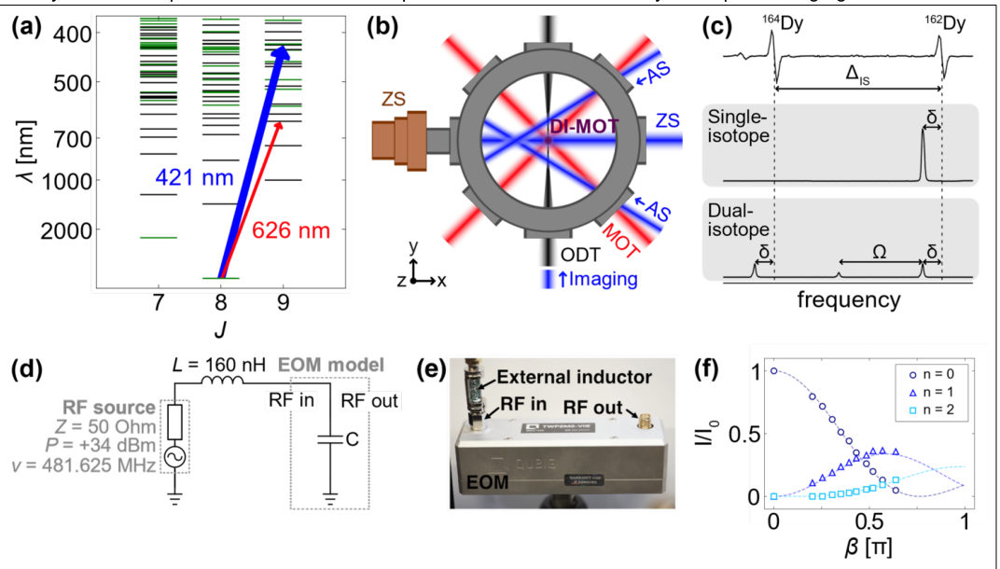 
Figure 1. a) Dy simplified electronic structure and relevant laser cooling transitions at 421 nm (blue arrow) and 626 nm (red arrow). b) Top view of the science chamber with relevant slowing and trapping laser beams. c) Top: Doppler-free spectroscopy of Dy on the 626-nm transition. Centre: Cavity spectrum of the 626-nm laser in single-isotope operation. The laser frequency is chosen to be red-detuned from the resonance by a frequency 𝛿. Bottom: Cavity-spectrum of the 626-nm laser in dual-isotope operation. Phase modulation in an EOM creates frequency sidebands separated by the drive frequency 𝛺. Here, we choose 𝛺=

📷 Fig 2

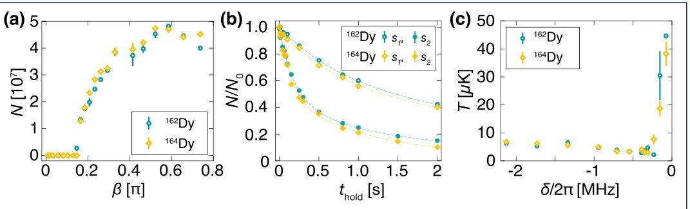 
Figure 2. Properties of the single-isotope sideband-MOT. a) Number of trapped atoms 𝑁 in the sideband MOT as a function of 𝛽 at fixed optical power for 162Dy (green) and 164Dy (yellow). b) Evolution of 𝑁 normalised to initial atom number 𝑁0 = 5 ⋅107 at different hold times 𝑡ℎ𝑜𝑙𝑑 in the compressed sideband-MOT for 162Dy (green) and 164Dy (yellow) at a detuning

📷 Fig 3

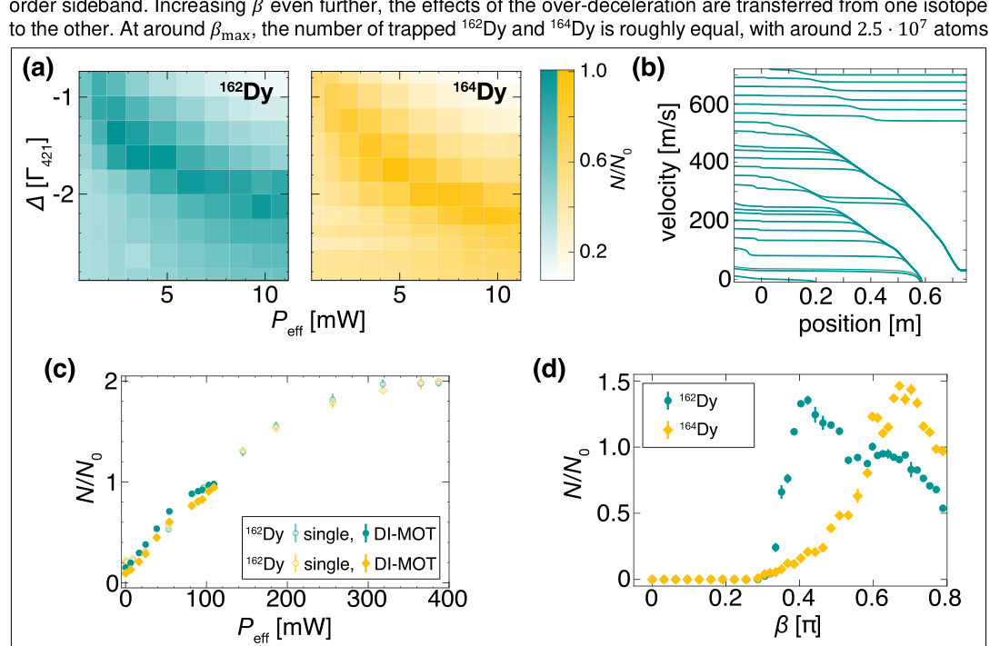 
Figure 3. Characterisation of the DI-MOT. a) Relative atom number 𝑁/𝑁0 in the DI-MOT for both 162Dy (green) and 164Dy (yellow) as a function of AS power and detuning. 𝑁0 = 2.5 ⋅107 for both isotopes. b) Numerical simulation of the ZS dynamics of 164Dy for different velocity classes at 𝛽= 0.5𝜋. c) Atom number 𝑁 as a function of effective TC power for single-isotope (hollow) and dual-isotope (solid), d) 𝑁 as a function of 𝛽 of the 421-nm EOM.

📷 Fig 4

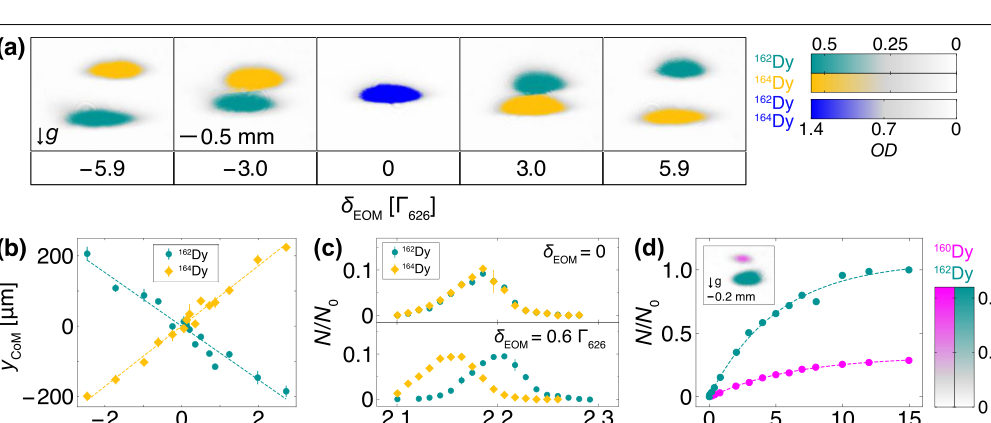 
Figure 4. a) Optical density (OD) images showing equilibrium positions at different EOM detuning 𝛿𝐸𝑂𝑀= 𝛺−

**Summary.** The research reports on a novel dual-isotope MOT technique for dysprosium using phase modulation via Electro-Optic Modulators. By precisely tuning the EOM drive frequency, the authors achieve simultaneous and controllable trapping of different isotopes in a narrow-line regime. This method provides a highly efficient and versatile tool for studying mixtures of atomic species.

**Why it may be interesting.** This work showcases advanced optical techniques (EOM phase modulation) applied to cold atoms for precise isotopic control, which is crucial for quantum simulation platforms requiring multiple atomic species.

Detailed structure

**Main problem.** The primary goal is characterizing a narrow-line Magneto-Optical Trap (MOT) capable of simultaneously loading and trapping two different isotopes of dysprosium using phase modulation.

**Main result.** The authors demonstrated full control over the isotopic mixture in the MOT by tuning the Electro-Optic Modulator (EOM) drive frequency, offering a cost-effective method for controlling mixtures of atomic species.

**Method.** They utilized high-power, free-space EOMs to generate optical sidebands at detunings specific to two different isotopes, enabling simultaneous trapping on narrow transitions.

**Model / system.** The experiment uses Dysprosium (Dy) atoms, specifically targeting bosonic isotope mixtures like ${}^{164}	ext{Dy} - {}^{162}	ext{Dy}$ and ${}^{162}	ext{Dy} - {}^{160}	ext{Dy}$. Trapping occurs on narrow-line transitions at 626 nm, preceded by cooling at 421 nm.

**Key observables.** Trapped atom number ($N$), center-of-mass (CoM) shift, and the relative population imbalance between isotopes.

**Important parameters / regimes.** Isotope shift ($\Delta I_S \approx 962 	ext{ MHz}$), EOM drive frequency ($\Omega = \Delta I_S / 2$), and modulation depth ($eta$).

**Assumptions / limitations.** The technique relies on using non-resonant EOMs with external electronics to overcome bandwidth limitations inherent in built-in LC circuits.

**Figures summary.** Figures illustrate the electronic structure, the setup geometry, and show how the EOM drive frequency controls the isotopic mixture and causes measurable spatial displacements of the two isotope clouds along the gravity axis.

**Paper structure.** The paper details the development of a dual-isotope MOT using sidebands from EOMs. It characterizes performance by measuring atom numbers vs. modulation depth, demonstrating control over the relative population imbalance, and mapping CoM shifts to measure $\Delta I_S$.

Abstract

We report on the characterization of a narrow-line magneto-optical trap (MOT), where two different isotopes of the dysprosium (Dy) atom can be simultaneously loaded and trapped. We rely on phase modulation via high-power, free-space electro-optic modulators (EOMs) to generate optical sidebands at the correct detuning for two different isotopes. This technique is applied on the slowing transition at 421 nm and the MOT transition at 626 nm. Using modular resonant electronic circuits, we match the sideband separation to the isotope shift among the two target isotopes, realizing mixtures of the bosonic isotopes 164Dy -162Dy and 162Dy -160Dy. We exploit the interplay between radiation forces and gravity in the narrow-line MOT to control the spatial position of the two isotopes with the EOM drive frequency. We demonstrate full control of the isotopic mixture with the EOM drive, offering new and cost-effective capabilities for controlling mixtures of atomic species that can be trapped in a narrow-line MOT.

[↑ back to top](#top)

### [Mode-selective nonlinear interference for high-brightness and high-purity fiber-coupled SPDC sources](http://arxiv.org/abs/2606.23836v1)

**Authors:** Carlos Sevilla-Gutiérrez, Purujit Singh Chauhan, Varun Raj Kaipalath, Fabian Steinlechner  
**Type:** both · **Category:** other · **PDF:** <https://arxiv.org/pdf/2606.23836v1>  
**Analysis basis:** full PDF text, analyzed in chunks
**Topic relevance:** 🔥 `interference shaping light` **4/5** · 🔥 `quantum optics experiment` **4/5**

📷 Fig 1

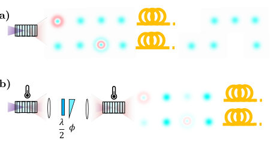 
FIG. 1. (a) Conceptual illustration of the limitation of heralding efficiency in bulk SPDC with single-mode-fiber cou- pling: photon pairs emitted into mismatched spatial modes reduce the coincidence-to-singles ratio. (b) Schematic of the two-crystal configuration with intermediate polarization ro- tation (λ/2) and relative phase control ϕ. The interference enhances generation into the joint Gaussian mode while par- tially suppressing higher-order mode contributions, resulting in increased brightness and heralding efficiency.

📷 Fig 2

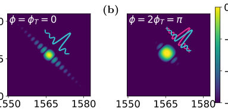 
FIG. 3. (a) Joint spectral intensity (|JSA|2) for the zero- detuning configuration, ϕ = ϕT = 0, and (b) for the detuned configuration, ϕ = 2ϕT = π. The latter exhibits strong side- lobe suppression, increasing the spectral purity from ≈0.81 to ≈0.98.

📷 Fig 3

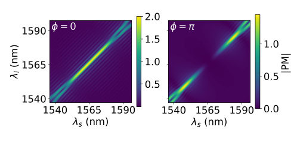 
FIG. 2. Effective phase matching under the plane-wave ap- proximation for constructive interference (ϕ = 0) (left) and destructive interference (ϕ = π) (right). The plots show that the interference range is limited by higher-order dispersion terms.

📷 Fig 4

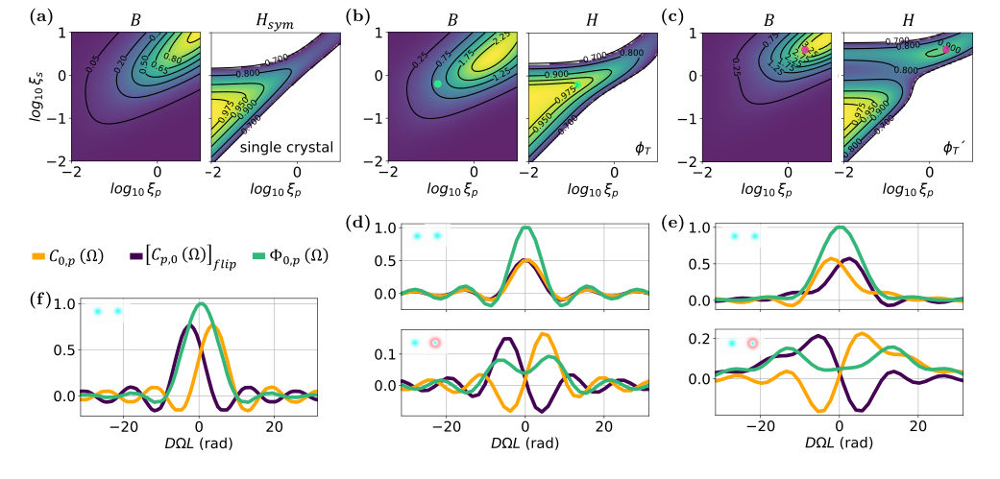 
FIG. 4. Relative brightness (left) and heralding efficiency (right) for the (a) single-crystal configuration and the two-crystal configuration with phase-mismatch settings (b) ϕT and (c) ϕ′ T . (d),(e) Spectral amplitudes for the joint spatial modes ps = pi = 0 (top) and ps = 0, pi = 1 (bottom) at the operating points marked in green and magenta in (b) and (c), respectively. Blue and yellow lines denote the contribution from each crystal, and the green curve the effective spectral amplitude after nonlinear interference. The interference enhances the Gaussian mode while partially suppressing higher-order contributions, improving the brightness–heralding-efficiency trade-off. In (e), sidelobe...

📷 Fig 5

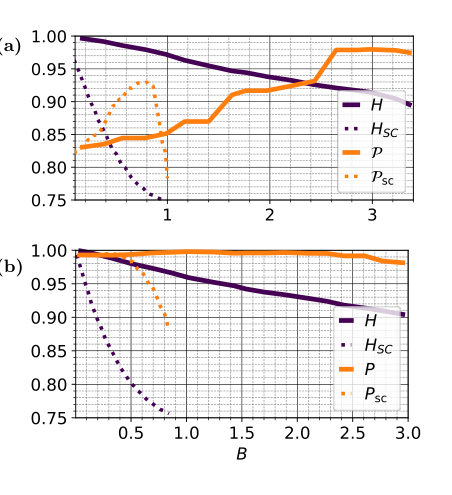 
FIG. 5. (a) Maximum heralding efficiency as a function of rel- ative brightness for the two-crystal (blue solid line) and single- crystal (blue dashed line) configurations, showing an improve- ment of more than one order of magnitude in the brightness– heralding-efficiency trade-off. The orange lines show the spec- tral purity of the corresponding optimized configurations for the two-crystal (solid line) and single-crystal (dashed line) ar- chitectures, indicating that high spectral purity can also be achieved in the tight-focusing regime. (b) Same analysis for the case of aperiodic poling with Gaussian phase matching, showing a similar improvement in the trade-off. In this case, the...

**Summary.** This paper presents a method to drastically improve the performance of fiber-coupled SPDC sources by exploiting mode-selective nonlinear interference in a cascaded two-crystal setup. The technique overcomes inherent trade-offs between brightness and heralding efficiency by more than an order of magnitude. Both theoretical modeling using Laguerre-Gauss modes and experimental validation via SFG confirm that this architecture enables high-purity, high-brightness quantum light sources.

**Why it may be interesting.** This work is highly relevant as it pushes the boundaries of quantum light sources by engineering complex spatio-spectral correlations through nonlinear optics, which has direct implications for quantum communication protocols.

Detailed structure

**Main problem.** The primary challenge is overcoming intrinsic trade-offs (brightness vs. heralding efficiency vs. spectral purity) in single-mode-fiber-coupled Spontaneous Parametric Down-Conversion (SPDC) sources.

**Main result.** By utilizing nonlinear interference in a cascaded two-crystal setup, the authors demonstrate an improvement of over one order of magnitude in the brightness–heralding efficiency trade-off while maintaining near-unity spectral purity.

**Method.** The study combines theoretical modeling using spectrally resolved Laguerre–Gauss modal decomposition with experimental validation via Sum-Frequency Generation (SFG) measurements.

**Model / system.** The system is a cascaded two-crystal type-II SPDC source. The analysis models the process by incorporating nonlinear interference effects across both spectral and spatial degrees of freedom using Laguerre-Gauss modal bases.

**Key observables.** Pair-collection probability (Brightness), Heralding efficiency, Spectral purity ($P$), Joint Spectral Amplitude (JSA).

**Important parameters / regimes.** The improvement factor is $>10$-fold; high heralding efficiency ($H \geq 0.97$) and spectral purity ($P > 0.99$) are key targets.

**Assumptions / limitations.** Initial analysis uses the plane-wave approximation, but results extend to complex spatial modes using LG decomposition; the enhancement relies on dispersion compensation in the cascaded structure.

**Figures summary.** Figures illustrate the comparison between single-crystal and two-crystal PMFs, showing interference effects that suppress sidelobes and enhance performance. Experimental setup diagrams detail the use of tunable lasers and nonlinear crystals for measurement.

**Paper structure.** The paper progresses from identifying the fundamental trade-off in SPDC sources to developing a theoretical model based on nonlinear interference in cascaded systems. It then quantifies the improvement over single-crystal limits, discusses spectral/spatial mode decomposition, and concludes with experimental validation using SFG measurements.

Abstract

Single-mode-fiber-coupled spontaneous parametric down-conversion (SPDC) sources are a key resource for photonic quantum technologies, but in single-crystal geometries brightness, heralding efficiency, and spectral purity remain constrained by intrinsic trade-offs. Here, we show how nonlinear interference in a cascaded two-crystal type-II SPDC source can be used to engineer the modal structure of SPDC emission, improving the brightness--heralding-efficiency trade-off by more than one order of magnitude beyond the single-crystal limit. We further demonstrate two routes to near-unity spectral purity while retaining high brightness and/or heralding efficiency, even with standard periodically poled crystals, and study the additional advantages of aperiodic poling with Gaussian phase matching. Using a spectrally resolved Laguerre--Gauss modal decomposition, we show that these improvements arise from mode-selective interference of spatial-spectral SPDC modes within the nonlinear interferometer. We experimentally validate the model through sum-frequency-generation measurements of the spatial-spectral state.

[↑ back to top](#top)

### [On Degeneracies of Density, Magnetic, and Pairing Responses: How Competing Orders Echo Underlying Symmetries in the Hubbard Model](http://arxiv.org/abs/2606.24755v1)

**Authors:** Michael Meixner, Herbert Eßl, Matthias Reitner, Alessandro Toschi, Thomas Schäfer  
**Type:** theory · **Category:** strongly correlated electrons · **PDF:** <https://arxiv.org/pdf/2606.24755v1>  
**Analysis basis:** full PDF text, analyzed in chunks
**Topic relevance:** 🔥 `analog quantum simulation` **4/5** · `Keldysh / 2PI / non-Gaussian methods` **1/5** · `driven-dissipative phase transition` **1/5** · `entanglement & information structure` **1/5** · `methods for driven-dissipative` **1/5**

📷 Fig 1

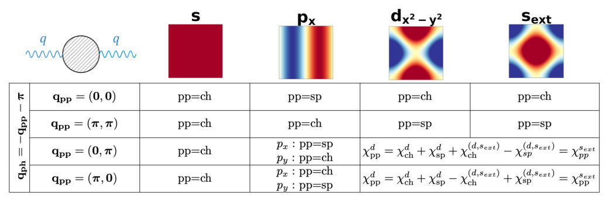 
FIG. 1. Exact symmetry relations between pairing, charge and spin response functions with s, p, d, sext form-factors (columns) and exemplary transfer momenta qpp = −qph −π (rows) for square lattice models with SU(2)P -symmetry. The relations hold not only for the static case (ω = 0) but for all transfer-frequencies, with ωpp = −ωph and non-zero external magnetic field [41].

📷 Fig 2

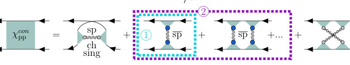 
FIG. 2. a) d-density wave χd−DW and d-wave superconductivity χd−SC susceptibilities over temperature in CDMFT, which show a concomitant divergence at Tc ≈0.0413t for U = 5.6t. b) Projection on the instability eigenvector V∞of the two terms of Eq. (A1): the d−SC generalized susceptibility of the impurity cluster (green circles) and corresponding inverse-bubble contributions −1/t2 eff (black bold line). The thermodynamic instability occurs at their intersection (red dot). c) Diagrams which are subtracted from the impurity response in b), see text: 1 ○the single boson exchange spin-transverse diagram sp of the generalized susceptibility, 2 ○the single-boson sp of the two-particle irreducible...

📷 Fig 3

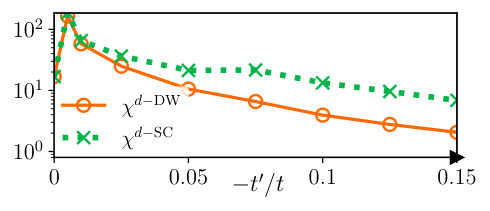 
FIG. 3. d-density wave χd−DW and d-wave superconductivity χd−SC susceptibilities over second-next neighbor hopping t′ at U = 5.6t and T = 0.0417t, slightly above Tc.

**Summary.** This paper rigorously analyzes how charge, spin, and pairing instabilities are related by symmetry in the Hubbard model. It shows that these responses exhibit degeneracies due to pseudospin symmetry, confirming simultaneous CDW/SC instabilities numerically. The framework provides a powerful tool for understanding competing orders in strongly correlated materials.

**Why it may be interesting.** While focused on Hubbard model physics, the rigorous mathematical framework linking multiple response functions through underlying symmetries provides a general tool for understanding correlated quantum matter, which is relevant to many-body dynamics in AMO systems.

Detailed structure

**Main problem.** The study investigates degeneracies between charge, spin, and pairing susceptibilities that arise from underlying symmetries in strongly correlated electron systems.

**Main result.** The analysis analytically derives mutual relations showing that these three response functions are degenerate for the unfrustrated Hubbard model, a degeneracy lifted by geometrical frustration or symmetry breaking ($t'$).

**Method.** The work combines analytical derivations exploiting pseudospin symmetries (SU(2)P) with advanced numerical techniques like Cluster Dynamical Mean-Field Theory (CDMFT) and Bethe-Salpeter Equation (BSE) analysis.

**Model / system.** The primary model is the Hubbard Hamiltonian, studied on a bipartite lattice. The analysis focuses on how competing orders—charge density waves (CDW), spin density waves (SDW), and superconductivity (SC)—interact through their respective susceptibilities.

**Key observables.** Charge susceptibility ($\chi^{ch}$), spin susceptibility ($\chi^{sp}$), and pairing/superconducting susceptibility ($\chi^{pp}$) for various form factors (s, d, sext).

**Important parameters / regimes.** The Hubbard interaction strength ($U$), hopping parameters ($t, t'$), doping levels, and momentum transfer vectors ($q_{ph}$).

**Assumptions / limitations.** Initial analytical results are rigorously derived for the unfrustrated, bipartite Hubbard model; numerical extensions rely on approximations like CDMFT.

**Figures summary.** Figures illustrate symmetry relations between response functions (Fig. 1), show concomitant divergences of d-wave CDW and SC susceptibilities at $T_c$ in CDMFT (Fig. 2a), and map out how introducing $t'$ gradually lifts these degeneracies (Fig. 3).

**Paper structure.** The paper progresses from establishing exact symmetry relations using pseudospin symmetry, to demonstrating the degeneracy numerically via CDMFT simulations, and finally analyzing how breaking symmetries ($t'$) or moving beyond simple lattice limits affects this fundamental relationship.

Abstract

Strongly correlated electron systems often display competing or even intertwined ordering tendencies, hinting to extremely close or degenerate many-electron energies. While degeneracies are directly rooted in the underlying symmetries of the problem under investigation, their multifaceted effects on different response functions and their mutual relations often remain elusive. Here we put this subject on a rigorous basis by investigating the degeneracies of charge, spin, and pairing susceptibilities for the unfrustrated, bipartite Hubbard model. Exploiting its pseudospin symmetry, we analytically derive the mutual relations between these response functions for generic spatial modulations, highly relevant, e.g., for the competition of stripe and superconducting orders. By means of two-particle numerical simulations we demonstrate the occurrence of a simultaneous $d$-wave pairing/$d$-density wave (loop current) instability in the vicinity of the metal-insulator transition, driven by short-ranged spin fluctuations for the two-dimensional case. We show how this degeneracy is gradually lifted by geometrical frustration, which favors superconductivity. Our study provides a general tool for revealing symmetry relations in correlated electron systems and establishes a unifying perspective on the nature of their intermingled charge/loop current, pairing, and spin orders.

[↑ back to top](#top)

### [When to Skip Syndrome Extraction in Surface-GKP Codes](http://arxiv.org/abs/2606.24469v1)

**Authors:** Vaughn Sohn, Changhun Oh  
**Type:** theory · **Category:** quantum information and computing · **PDF:** <https://arxiv.org/pdf/2606.24469v1>  
**Analysis basis:** full PDF text, analyzed in chunks
**Topic relevance:** 🔥 `quantum measurements` **4/5** · `measurement-induced transitions` **3/5** · `methods for driven-dissipative` **1/5**

📷 Fig 1

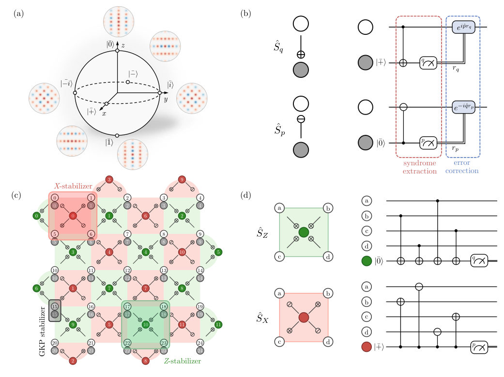 
FIG. 1. Surface-GKP code architecture. (a) Mapping of GKP states onto the Bloch sphere. Each logical state is illustrated as a Wigner function in phase space. (b) Circuit descriptions for GKP stabilizer measurement. The measurement symbols q and p denote homodyne measurement of the position and momentum quadratures, respectively. The symbol ⊕denotes the SUM gate, ⊖denotes the inverse-SUM gate, and the filled circle indicates the control mode. (c) Distance-5 surface-GKP code. White nodes denote data qubits. Grey, red, and green nodes represent ancilla qubits for GKP, X-type, and Z-type stabilizer measurements, respectively. (d) Circuit descriptions for surface-GKP stabilizer measurement.

📷 Fig 2

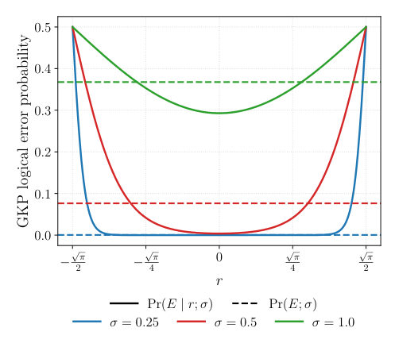 
FIG. 2. Conditional logical Pauli error probability for a GKP qubit given the measurement outcome r for a single quadrature. The solid line represents the conditional error probability Pr(E | r; σ), while the dashed line represents the unconditional error probability Pr(E; σ), which is independent of r.

📷 Fig 3

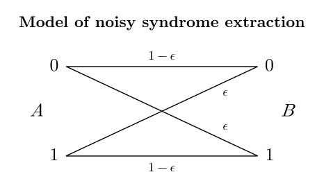 
FIG. 3. Model of noisy syndrome extraction process as a Binary Symmetric Channel (BSC). The target syndrome difference A becomes the observed syndrome difference B with flip probability ϵ.

📷 Fig 4

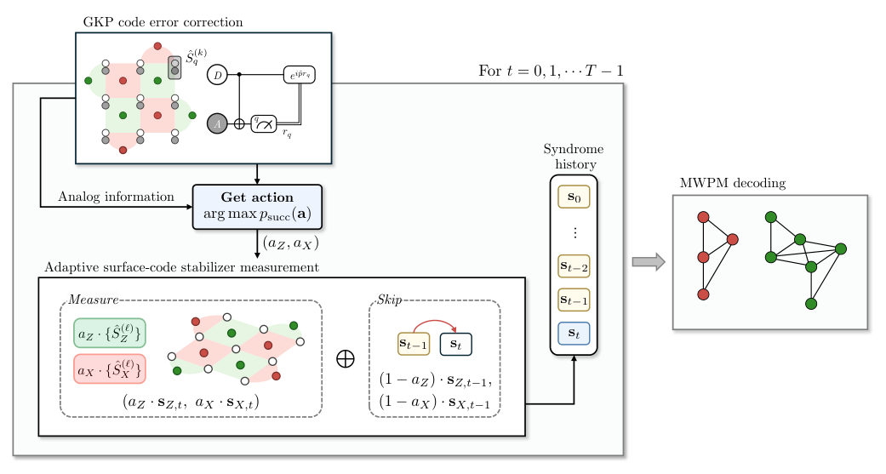 
FIG. 4. Overview of the adaptive measurement strategy. At each round t, GKP stabilizer measurements are always performed to correct small displacement errors and obtain analog information. The protocol then selects an action a = (aZ, aX), where aP determines whether the P-type surface-code stabilizers are measured or skipped. Measured components are obtained from surface-code stabilizer measurements, while skipped components reuse the previous syndrome value. The resulting syndrome history is then used for MWPM decoding after T rounds.

📷 Fig 5

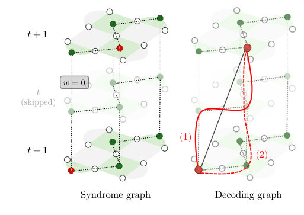 
FIG. 5. Decoding with skipped stabilizer measurements. When a round is skipped, the previous syndrome value is reused and no detection event is generated. The corresponding time-like edge, shown as the gray dashed line, is retained with weight w = 0, so paths such as (1) and (2) can pass through the skipped interval without additional penalty.

**Summary.** This paper introduces an adaptive scheme for Quantum Error Correction on Surface-GKP codes designed to reduce measurement overhead. It determines, at each step, whether the noise from performing a full syndrome measurement outweighs the benefit of fresh information. By intelligently skipping measurements when reliability is high, it maintains low error rates while significantly reducing resource consumption.

**Why it may be interesting.** The ability to use analog information from one part of the quantum process (inner GKP correction) to guide resource management in another (outer surface code syndrome extraction) is a key concept for optimizing physical implementations of fault-tolerant quantum computation.

Detailed structure

**Main problem.** The primary challenge is mitigating the significant overhead and noise introduced by repeated syndrome extraction circuits required for fault-tolerant quantum error correction.

**Main result.** An adaptive skipping scheme was proposed that reduces stabilizer measurements while maintaining logical error rates comparable to or lower than full measurement baselines, especially when active circuit noise dominates idle noise.

**Method.** The authors developed a decision rule comparing the reliability of reusing previous syndrome information (inferred from analog GKP outcomes) against performing a new noisy extraction.

**Model / system.** The work focuses on the Surface-GKP code, which uses GKP states within an outer surface code structure. The analysis models noise using Gaussian displacement channels and Binary Symmetric Channels for syndrome corruption.

**Key observables.** Logical error rates ($\chi_L$), number of surface-code stabilizer measurements, and effective standard deviations ($\sigma_A^Z, \sigma_A^X$) for edge weights in the decoding graph.

**Important parameters / regimes.** Noise parameters include active syndrome-extraction noise ($\sigma$), idle noise ($\sigma_{idle}$), and GKP state preparation noise ($\sigma_{gkp}$). The decision depends on comparing these relative strengths.

**Assumptions / limitations.** The protocol uses an approximation for the global success probability, restricts decisions to four global actions, and assumes that zero-weight assignment correctly models skipping without penalty in the decoding graph.

**Figures summary.** Figures illustrate the code architecture, the noisy syndrome extraction process as a BSC, finite-round performance comparisons between adaptive vs. full measurement baselines across noise regimes, and decoding graphs showing zero-weight time-like edges for skipped rounds.

**Paper structure.** The paper progresses from identifying the overhead problem to modeling the noise (BSC/Gaussian channels), developing the quantitative decision score based on success probabilities ($	ext{p}_{	ext{skip}}^{	ext{succ}}$ vs. $	ext{p}_{	ext{meas}}^{	ext{succ}}$), and finally simulating the adaptive strategy's performance across various noise regimes.

Abstract

Fault-tolerant quantum error correction requires repeated syndrome extraction to address errors induced by the syndrome-extraction circuit itself. However, repeated syndrome extraction incurs significant overhead in terms of gate count and ancilla consumption (e.g., Gottesman-Kitaev-Preskill (GKP) states). Moreover, noisy syndrome extraction can itself inject additional errors into the data qubits. To address these issues, we propose a concrete adaptive skipping scheme for the surface-GKP code, a representative GKP-concatenated architecture, that uses analog information naturally generated during inner GKP correction. At each round, the scheme selects one of four actions: measuring both Z-type and X-type surface-code stabilizers, measuring only one type, or skipping both types and reusing previous syndromes. The decision is based on a reliability comparison between reusing the previous syndrome value and performing a new noisy syndrome extraction. Using circuit-level simulations, we show that the adaptive skipping scheme can reduce the number of surface-code stabilizer measurements while maintaining logical error rates comparable to or lower than those of the full-measurement baseline. The improvement is most pronounced when gate and measurement noise are larger than idle noise, so that avoiding unnecessary syndrome extraction reduces the noise injected into the code. These results indicate that analog information from inner GKP correction can be used not only to improve decoding but also to reduce the measurement overhead of outer-code syndrome extraction.

[↑ back to top](#top)

### [Offline Channel-Independent QAOA Angles for RIS Power Aggregation: Unit-Circle Phase Dictionaries and Infinite-Size Spin-Glass Limits](http://arxiv.org/abs/2606.24540v1)

**Authors:** Burhan Gulbahar  
**Type:** theory · **Category:** disordered systems and neural networks · **PDF:** <https://arxiv.org/pdf/2606.24540v1>  
**Analysis basis:** full PDF text, analyzed in chunks
**Topic relevance:** 🔥 `exotic spin models in light-matter` **4/5** · `analog quantum simulation` **1/5** · `methods for driven-dissipative` **1/5** · `spintronics-quantum-optics interface` **1/5**

📷 Fig 1

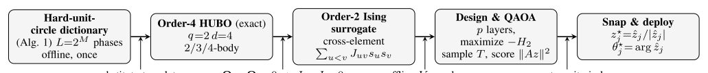 
Fig. 1. End-to-end system design. A single offline hard-unit-circle dictionary (Algorithm 1), L=2M phases, induces the exact order-4 HUBO (8); switching off the quadratic templates (Qc=Qs=0) zeros the cubic and quartic couplings, leaving the order-2 Ising surrogate (9), which a channel-independent Vp-designed QAOA angle pack (Section VI) optimizes; the sampled sign patterns are snapped to the unit circle for deployment.

📷 Fig 2

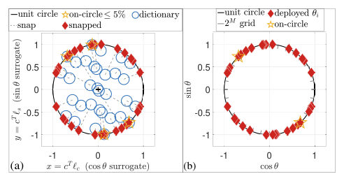 
Fig. 2. Order-2 dictionary, M=5. (a) The 32 linear images (open) lie off the unit circle; the snap deploys θ (filled); stars: on-circle to 5%/1%. (b) Deployed 32-phase alphabet vs. uniform 5-bit grid (ticks).

📷 Fig 3

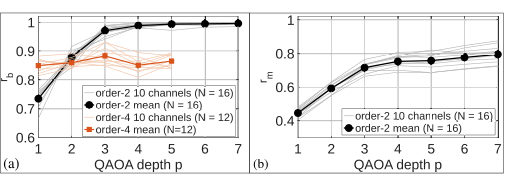 
Fig. 3. Order-2 (N=16) and order-4 (N=12) RIS QAOA vs. depth p for ten channel realizations and their across-channel mean. (a) rb; (b) rm.

📷 Fig 4

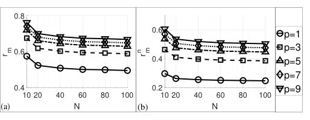 
Fig. 5. Vp-normalized benchmark versus system size N, depths p = 1, 3, 5, 7, 9 overlaid. (a) full-objective rm. (b) offset-subtracted rn m.

📷 Fig 5

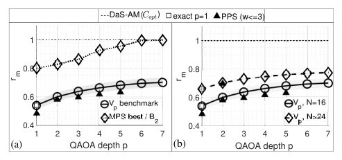 
Fig. 4. Instance-free Vp benchmark for the QAOA mean energy rm against (Copt, dashed); the exact p = 1 (□) and PPS p = 2 (△) points lie on each curve. (a) N =16 (band: instance spread); the dotted line is the best sampled solution from the MPS runs. (b) Vp benchmark at two sizes.

**Summary.** This work proposes an advanced method to solve the NP-hard phase optimization problem in RIS systems by designing QAOA angles offline using theoretical limits from spin-glass models. The approach successfully transfers these pre-calculated, channel-independent angles to simulate performance across various complex wireless fading environments. It suggests a viable path toward near-optimal power aggregation achievable only on future fault-tolerant quantum computers.

**Why it may be interesting.** It bridges quantum optimization theory (spin glasses, QAOA) with a highly relevant applied physics problem (wireless communications/RIS), providing concrete benchmarks for future fault-tolerant quantum hardware applications in electromagnetics.

Detailed structure

**Main problem.** The core problem is optimizing the aggregate received power for Reconfigurable Intelligent Surfaces (RIS) by setting discrete per-element phases, which is an NP-hard combinatorial optimization task.

**Main result.** The authors demonstrate that an offline, channel-independent angle dictionary derived from infinite-size spin-glass limits can achieve near-optimal performance across various realistic fading channels for small system sizes ($N \le 16$).

**Method.** They formulate the problem as a QUBO/HUBO and employ QAOA with angles pre-optimized offline using techniques derived from Basso et al.'s infinite-size Gaussian ensemble benchmark.

**Model / system.** The system is an RIS array whose phase optimization objective ($\max \|A e^{j	heta}\|^2$) is mapped onto a spin Hamiltonian. The theoretical framework relies on relating this to the Sherrington–Kirkpatrick model and its infinite-size limits.

**Key observables.** Performance ratios ($r_b, r_m$), which compare achieved power to the classical optimum; single-shot success probability ($P_{0.9}$).

**Important parameters / regimes.** QAOA depth ($p$), number of elements ($N$), dictionary size ($L=2^M$), and channel type (Rayleigh, Rician/LOS, etc.).

**Assumptions / limitations.** The method is designed for the Fault-Tolerant Quantum (FTQ) regime; it relies on reducing the high-order Hamiltonian to a manageable order-2 Ising surrogate.

**Figures summary.** Figures compare performance ratios ($r_b, r_m$) vs. QAOA depth ($p$) for both order-2 and order-4 models across different channel types (e.g., Fig. 7 compares $N=12$ transfer).

**Paper structure.** The paper introduces the physical problem, derives the necessary Hamiltonian formulation, details the offline angle dictionary construction using infinite-size limits ($V_p$), and validates this approach by testing its robustness across multiple complex channel models via numerical simulations.

Abstract

Reconfigurable intelligent surfaces (RIS) maximize received power by setting per-element phases. Discrete-phase optimization is NP-hard in the worst case, while the quantum approximate optimization algorithm (QAOA) applied to RIS faces limited phase alphabets, either per-problem angle optimization or uncharacterized training cost exposed to barren plateaus, and no scalable performance benchmark. We introduce a $2^{M}$-phase $θ$ dictionary for optimizing power $\|\mathbf{A} \, e^{jθ}\|^{2}$ having $K \times N$ channel matrix $\mathbf{A}$ and QAOA angle offline optimization with instance and size-independent infinite-size limit of the mixed-$q$ Gaussian ensemble of Basso et al. Our design bounds the spin-Hamiltonian interaction order to at most quartic for any $M$, and the deployed order-2 reduction lies below the even-$q\!\ge\!4$ regime in which constant-level QAOA limitations are proved. We perform analytical, state-vector, matrix-product-state and Pauli-path-simulation numerical studies for $N=K \leq 100$ and QAOA depth $p=9$, verifying offline angle transfer to Rayleigh, Rician/line-of-sight, cascaded double-fading and spatially-correlated RIS channels at $N\!\in\!\{5,12\}$. We observe performance reaching a near-optimal multi-start single-flip local-search reference for $N\!\le\!16$ under order-2 modeling with $2^{5}{=}32$-phase dictionary while the order-4 model shows a performance ceiling below the classical reference. The approach suggests a route to near-optimal large-$N$ performance on future fault-tolerant (FTQ) quantum computers, which enable the higher-depth QAOA circuits.

[↑ back to top](#top)

### [Intrinsic spectral structure of bipartite nonlocal magic resource](http://arxiv.org/abs/2606.24368v1)

**Authors:** Xiao Huang, Guanhua Chen, Yao Yao  
**Type:** theory · **Category:** quantum information and computing · **PDF:** <https://arxiv.org/pdf/2606.24368v1>  
**Analysis basis:** full PDF text, analyzed in chunks
**Topic relevance:** 🔥 `entanglement & information structure` **4/5**

📷 Fig 1

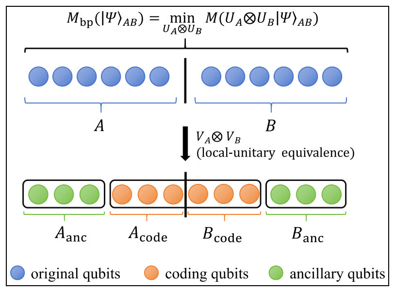 
FIG. 1. Schematic of the local-unitary operation reduction to the canonical encoding. An arbitrary

📷 Fig 2

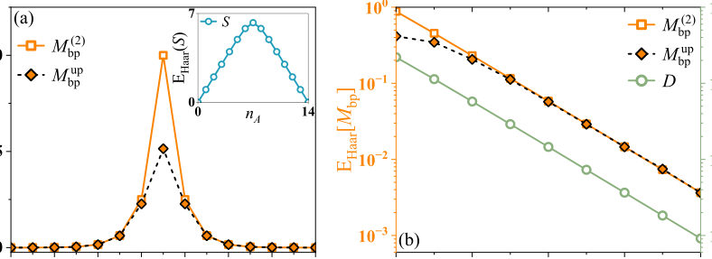 
FIG. 2. BNMR response in the Haar-random states. Orange squares denote the analytical

📷 Fig 3

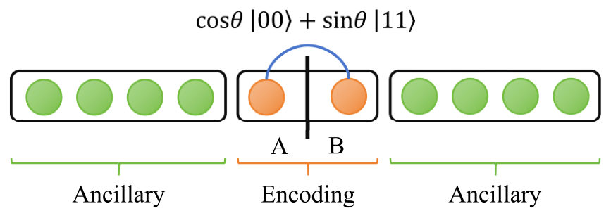 
FIG. 3. Canonical representative of a pure many-qubit state with Schmidt rank 2 across a fixed

📷 Fig 4

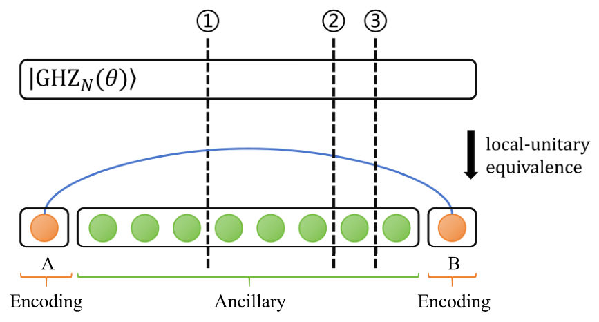 
FIG. 4. End-to-end canonical encoding of the generalized GHZ state. Local SWAP operations

**Summary.** The paper develops a novel, tractable measure called the Bipartite Nonlocal Magic Resource (BNMR) to quantify irreducible nonstabilizerness in bipartite entanglement. By mapping states to a minimal spectral core, the authors prove that BNMR depends only on the Schmidt spectrum, leading to predictions about its distribution for random states and revealing deep structural relationships between global and local quantum resources.

**Why it may be interesting.** This work provides a powerful new diagnostic tool for quantifying nonlocal quantum correlations beyond standard entanglement measures. The spectral link established between BNMR and the Schmidt spectrum offers a highly structured theoretical framework applicable across various quantum many-body systems.

Detailed structure

**Main problem.** The primary challenge is evaluating the Bipartite Nonlocal Magic Resource (BNMR), a measure of irreducible nonstabilizerness in bipartite entanglement, which is computationally intractable due to full Hilbert space optimization.

**Main result.** The BNMR is shown to be an intrinsic function solely of the nonzero Schmidt spectrum, leading to sharp localization at symmetric bipartitions for random states and revealing a hierarchy collapse in GHZ states where global and local resources coincide.

**Method.** The authors introduce a canonical encoding framework that reduces the state's complexity by mapping it to a minimal core defined by its Schmidt spectrum. They then derive the quadratic response of BNMR under spectral perturbations around zero.

**Model / system.** The analysis focuses on arbitrary pure bipartite quantum states $|\Psi
angle_{AB}$ in a many-body system, particularly examining Haar-random states and generalized GHZ states across various bipartitions.

**Key observables.** Bipartite Nonlocal Magic Resource (BNMR), Schmidt spectrum ($\lambda$), Global Nonlocal Magic Resource ($M_{	ext{NL}}$), and the quadratic response of BNMR to spectral perturbations.

**Important parameters / regimes.** Schmidt rank ($r$), system dimensions ($d=2$), bipartition asymmetry ($\gamma = r/R$), and perturbation magnitude ($\|\eta\|^2$).

**Assumptions / limitations.** The method assumes that BNMR is an intrinsic, compact measure invariant under local stabilizer operations, allowing for dimension reduction to a minimal encoding core.

**Figures summary.** Figures illustrate the canonical encoding process, showing how complex states reduce to a minimal core. They also compare the calculated quadratic response of BNMR for Haar-random states against theoretical bounds and show the end-to-end encoding structure for GHZ states.

**Paper structure.** The paper progresses by first identifying the intractability of BNMR, then introducing the canonical encoding to establish its spectral dependence (Proposition 1). It derives the perturbative scaling law (Proposition 2), applies this to random and specific states (Haar-random, rank-2), and concludes by analyzing special cases like GHZ states to show resource collapse.

Abstract

Bipartite nonlocal magic resource (BNMR) quantifies the irreducible nonstabilizerness residing in bipartite entanglement, yet its evaluation is intractable due to the full Hilbert space optimization. Here, we introduce a canonical encoding framework that exactly confines the BNMR of an arbitrary bipartite pure state within a minimal encoding core. This dimension reduction proves that pure-state BNMR is an intrinsic function of the nonzero Schmidt spectrum, extending its invariance from local unitary transformations to local isometries. Leveraging this spectral link, we derive the leading quadratic response of BNMR under spectral perturbations around its zeros. We apply this quadratic response to Haar-random states, deriving and numerically validating the BNMR profile: its distribution is sharply localized at the symmetric bipartition and exponentially suppressed toward asymmetric cuts, in stark contrast to the broadening Page curve of entanglement. Finally, we provide a closed-form expression for the BNMR of Schmidt rank-2 states, uncovering a hierarchy collapse in generalized GHZ states where bipartite and global nonlocal magic resources coincide exactly.

[↑ back to top](#top)

### [Biophysical EPR Using Superconducting Resonators](http://arxiv.org/abs/2606.23952v1)

**Authors:** Austin R. Gamble Jarvi, Hamid R. Mohebbi, Ishit Raval, Omari Culzac, Jack Erickson, Sameh Hegazy, Don Carkner, Andrew Wiles, David G. Cory, Troy W. Borneman  
**Type:** experiment · **Category:** other · **PDF:** <https://arxiv.org/pdf/2606.23952v1>  
**Analysis basis:** full PDF text, analyzed in chunks
**Topic relevance:** `correlated cavity matter` **3/5** · `exotic spin models in light-matter` **3/5** · `spintronics-quantum-optics interface` **3/5** · `QC/QI experiment` **2/5** · `methods for driven-dissipative` **2/5** · `quantum measurements` **2/5** · `quantum optics experiment` **2/5** · `Keldysh / 2PI / non-Gaussian methods` **1/5** · `Tavis-Cummings & cavity-many-emitter` **1/5** · `analog quantum simulation` **1/5** · `driven-dissipative phase transition` **1/5**

📷 Fig 1

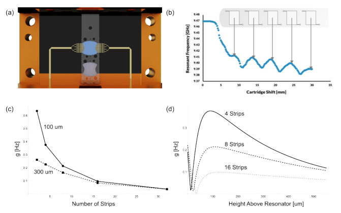 
Figure 1: Overview of superconducting resonator design. (a) Rendering of the 16-strip superconducting YBCO resonator used in this work with mode-matched sample cartridge placed in the homogeneous field region. The small size of the samples (3.5 µL) enables five sample cavities of roughly 3 mm x 2 mm x 400 µm each to be contained in a single cartridge. Adjustment of coupling into and out of the device is achieved through variation of a capacitive gap between the set of phased λ/2 resonators and a branching feedline that matches the impedance of each microstrip. The device provides a uniform microwave mode over a broad, relatively thin sample region. (b) Example resonance shift data from...

📷 Fig 2

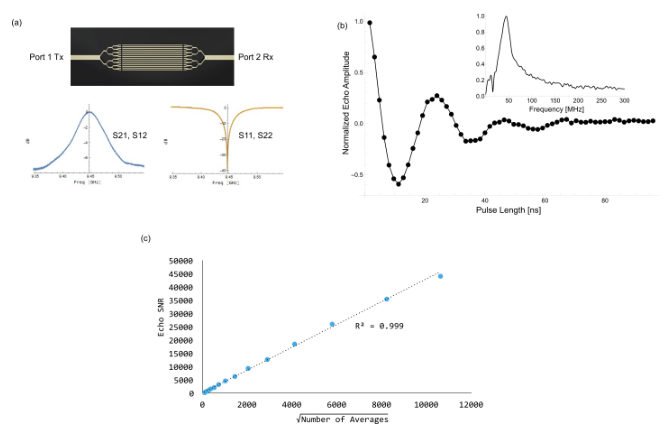 
Figure 2: Overview of system characterization. (a) Microscope photograph of the 2-port 16-strip 300 nm YBCO superconducting microstrip resonator structure used in this study with ports labeled. Each microstrip is 4.532 mm long and 70 µm wide with 70 µm separation between strips. The capacitive coupling gap is 60 µm for both ports. VNA S-parameter measurements show an X-band frequency of 9.447 GHz with an overcoupled Q of roughly 80, corresponding to a bandwidth of roughly 125 MHz. S11 and S22 data indicate the device is 50 Ωmatched at both ports. (b) Nutation data with Fourier transform in the inset. Using approximately 4 W of power at the input to the resonator, 6 ns π/2 Gaussian pulses...

📷 Fig 3

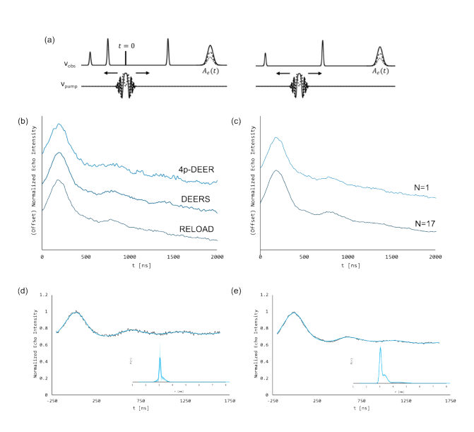 
Figure 3: Shaped pulse RDSE distance measurement data for T4-Lysozyme. (a) Pulse sequence schematics for 4p-DEER and 3p-DEER showing the usage of Gaussian observe pulses and adiabatic pump pulses. The dipolar evolution time is incremented commensurate with 2H-ESEEM (448 ns) according to the RELOAD algorithm. The 3p-DEER and 4p-DEER measurements are stitched according to the DEER-Stitch algorithm. The detected echo is refocused periodically by a CPMG sequence to increase SNR by averaging over a train of echoes in a single acquisition. (b) A comparison of standard shaped pulse 4p-DEER, DEER-Stitch, and DEER-Stitch+RELOAD (RDS) dipolar modulation traces for 90 µM T4L. The RDS methodology...

📷 Fig 4

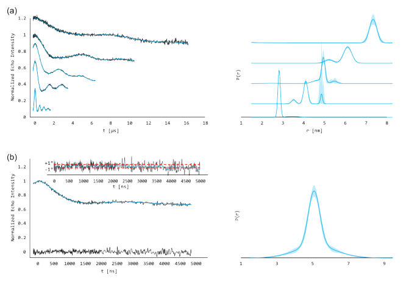 
Figure 4: Demonstrations of system measurement capabilities. (a) Measurement results of automated calibration, data collection, and distance analysis of 5 biradical ruler samples [78] of varying distance in a single cartridge. The data was collected unattended after loading the cartridge and initiating the software. (b) Dipolar modulation data and processed distance distribution of a 25 µM YopO sample similar to that used in a round-robin benchmark study of Q-band EPR systems. Despite operating at X-band and with roughly x10 less sample volume, the SNR achieved by our system is comparable to values reported for Q-band in similar measurement times. The inset shows the phase of the quadrature...

📷 Fig 5

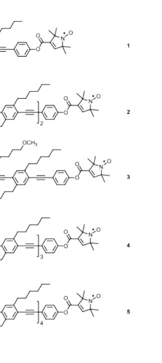 
Figure 5: Structures of dinitroxide rulers [78] with distances listed in Table IV.

**Summary.** The paper details the engineering and experimental implementation of a state-of-the-art pulsed EPR spectrometer utilizing superconducting microstrip resonators. By integrating advanced pulse sequences like RDSE, the system achieves high stability and sensitivity necessary for measuring distances in multiple, small, biologically relevant samples simultaneously.

**Why it may be interesting.** This work directly bridges quantum optics/AMO physics (pulsed spectroscopy, cavity QED concepts applied to resonators) with biophysics. The use of superconducting circuits to enhance sensitivity for molecular measurements is highly relevant to open quantum systems research.

Detailed structure

**Main problem.** The goal is to develop a high-sensitivity, stable, and automated Electron Paramagnetic Resonance (EPR) system capable of measuring distance distributions in biologically relevant samples using superconducting resonators.

**Main result.** The novel superconducting resonator design enables multi-sample measurement cartridges while achieving Signal-to-Noise Ratios (SNR) comparable to higher frequency Q-band systems, pushing biophysical EPR into more practical settings.

**Method.** The authors employed advanced pulsed EPR techniques like Double Electron-Electron Resonance (DEER), utilizing sophisticated pulse sequences such as RDSE and CPMG echo trains for signal enhancement.

**Model / system.** The core platform is a custom X-band pulsed EPR spectrometer built around a patterned thin film planar superconducting microstrip resonator. This system operates in a cryogen-free environment, allowing precise control over microwave fields to probe spin systems.

**Key observables.** Double electron-electron resonance (DEER) distances between paramagnetic centers, Signal-to-Noise Ratio (SNR), and Rabi pulse strengths ($\pi/2$ Gaussian pulses).

**Important parameters / regimes.** Operating Frequency: 9.5 GHz; Sample Volume: $3.5 \mu	ext{L}$; Superconducting material enabling operation at 50 K.

**Assumptions / limitations.** The analysis sometimes neglects complex subspace structure associated with finite temperature spin ensembles (Tavis-Cummings model).

**Figures summary.** Figures illustrate the resonator geometry, system characterization via VNA measurements, and distance measurement results comparing various advanced pulse sequences (RDSE vs. 4p-DEER) for T4-Lysozyme.

**Paper structure.** The paper details the engineering innovations of the superconducting resonator setup, presents methods for automated multi-sample acquisition, validates performance using DEER on protein samples, and discusses achieving high SNR through advanced pulse sequences.

Abstract

We present innovations that enable the use of superconducting resonators for high sensitivity, high bandwidth pulsed electron paramagnetic resonance (EPR) measurements on biologically relevant samples with enhanced stability and throughput. A custom-built X-band pulsed EPR spectrometer with AWG and digital IF capability generated by an FPGA was used to control a novel patterned thin film planar superconducting microstrip resonator capable of generating Rabi fields sufficient to achieve 6 ns pi/2 Gaussian pulses using a 100 W solid-state HPA. The system allows automated sequential calibration, measurement, and analysis of five 3.5 uL samples contained in a sample cartridge. Performance was validated through measurements of double electron-electron resonance (DEER) distances in a variety of spin-labeled protein samples with biologically relevant concentrations, including measurements below 10 uM. The results enable broadening the scope of applications for both superconducting resonators and the use of EPR in biotechnology.

[↑ back to top](#top)

### [Domain-wall drift in a ferrimagnet induced by a linearly oscillating in-plane magnetic field](http://arxiv.org/abs/2606.23831v1)

**Authors:** Murod Mirzhalilov, Jacob Freyermuth  
**Type:** theory · **Category:** strongly correlated electrons · **PDF:** <https://arxiv.org/pdf/2606.23831v1>  
**Analysis basis:** full PDF text, analyzed in chunks
**Topic relevance:** `analog quantum simulation` **3/5** · `exotic spin models in light-matter` **3/5** · `non-equilibrium dynamics` **3/5** · `spintronics-quantum-optics interface` **3/5** · `driven-dissipative phase transition` **2/5** · `methods for driven-dissipative` **2/5** · `non-equilibrium universality` **2/5** · `Frenkel-Kontorova` **1/5** · `Keldysh / 2PI / non-Gaussian methods` **1/5** · `correlated / nonlocal dissipation` **1/5**

📷 Fig 1

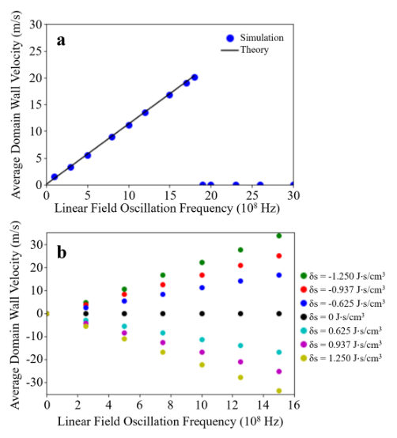 
FIG. 1. (a) Domain wall velocity averaged over an integer number of periods as a function of the oscillation frequency of the in-plane field. The theory line comes from the frequency- dependent part of Eq. (13), after subtracting the static-field contribution proportional to Hz. At large frequencies above the cutoff frequency, the domain wall velocity is strongly sup- pressed. (b) Domain wall velocity averaged over an integer number of periods as a function of both the frequency of the in-plane field and the net spin density of the ferrimagnet. The slope of each set of points is proportional to the net spin den- sity, as predicted by Eq. (13).

📷 Fig 2

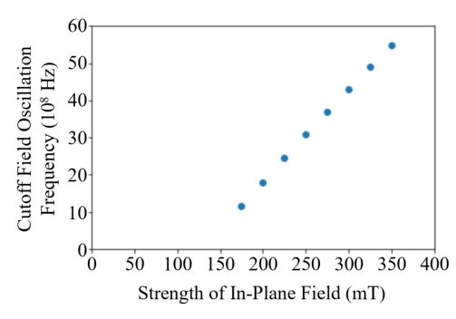 
FIG. 2. Cutoff frequency as a function of the strength of the in-plane oscillating field in simulations.

**Summary.** This work analyzes domain wall motion in ferrimagnets driven by oscillating magnetic fields. By deriving collective-coordinate equations that explicitly include inertial coupling terms, the authors predict a frequency-controlled rectification of the domain-wall drift velocity. This mechanism offers a novel way to control magnetization dynamics using time-varying fields.

**Why it may be interesting.** While focused on magnetism, the derivation of generalized inertial terms (Coriolis/centrifugal) from a Lagrangian formalism is highly relevant to understanding non-linear dynamics in quantum systems, such as those modeled by effective Hamiltonians for trapped ions or superconducting circuits.

Detailed structure

**Main problem.** The study investigates how domain walls move within ferrimagnetic materials when subjected to a linearly oscillating in-plane magnetic field.

**Main result.** The system exhibits a rectified, finite average domain-wall velocity proportional to the drive frequency at low frequencies, which is suppressed above a critical cutoff frequency.

**Method.** The authors derived collective-coordinate equations of motion from an effective Lagrangian, incorporating inertial terms like Coriolis and centrifugal forces, and confirmed results via micromagnetic simulations.

**Model / system.** The model describes ferrimagnetic domain walls in two coupled sublattices ($\mathbf{M}_i$), whose dynamics are governed by LLG-like equations projected onto collective coordinates $\{X(t), \Phi(t)\}$.

**Key observables.** Average domain-wall velocity ($\langle\dot{X}
angle$), wall angle ($\Phi$), and position ($X$).

**Important parameters / regimes.** Oscillation frequency ($\omega$), net spin density ($\delta s$), and the static out-of-plane bias field ($H_z$).

**Assumptions / limitations.** The analysis uses a rigid collective-coordinate ansatz for the domain wall, and approximations are made regarding terms smaller than $M_s H / A_0$ away from compensation.

**Figures summary.** Figures confirm that the DW velocity shows a linear dependence on frequency below a cutoff and is suppressed above it; the drift velocity is shown to be proportional to the net spin density ($\delta s$).

**Paper structure.** The paper derives effective equations of motion by projecting the full LLG dynamics onto collective coordinates, analyzes the resulting inertial couplings (Coriolis, Euler), and then applies this framework to an oscillating field case to derive the frequency-dependent drift velocity.

Abstract

We investigate ferrimagnetic domain-wall dynamics under linearly oscillating in-plane magnetic fields. Starting from a ferrimagnetic Lagrangian that retains the field-dependent contribution to the kinetic energy, we derive collective-coordinate equations for the domain-wall position and azimuthal angle. This formulation makes explicit the field-induced inertial terms, including Coriolis-, Euler-, and centrifugal-like contributions, and clarifies how they couple translational and azimuthal dynamics. For an oscillating in-plane field supplemented by a weak static out-of-plane bias field, we show that periodic switching of the wall angle can be rectified into a finite average domain-wall velocity. At low drive frequencies, where the wall angle follows the oscillating field, the induced drift is proportional to the drive frequency rather than the field amplitude, while above a cutoff frequency the wall angle can no longer follow the drive and the average motion is suppressed. Micromagnetic simulations confirm the analytical predictions and demonstrate that the magnitude and direction of the drift can be tuned by the net spin density. These results identify linearly oscillating fields as a mechanism for frequency-controlled domain-wall motion in ferrimagnets and highlight the role of inertial spin dynamics near magnetic compensation.

[↑ back to top](#top)

### [Symmetric mass generation of interacting chiral fermions on a one-dimensional lattice without fermion doubling](http://arxiv.org/abs/2606.24713v1)

**Authors:** V. A. Zakharov, Atsushi Ueda, Frank Verstraete, C. W. J. Beenakker  
**Type:** theory · **Category:** strongly correlated electrons · **PDF:** <https://arxiv.org/pdf/2606.24713v1>  
**Analysis basis:** full PDF text, analyzed in chunks
**Topic relevance:** `Keldysh / 2PI / non-Gaussian methods` **3/5** · `Kondo & dissipative impurity` **3/5** · `analog quantum simulation` **3/5** · `methods for driven-dissipative` **3/5** · `driven-dissipative phase transition` **2/5** · `non-equilibrium dynamics` **2/5** · `Frenkel-Kontorova` **1/5** · `correlated / nonlocal dissipation` **1/5** · `correlated cavity matter` **1/5** · `entanglement & information structure` **1/5** · `non-equilibrium universality` **1/5**

📷 Fig 1

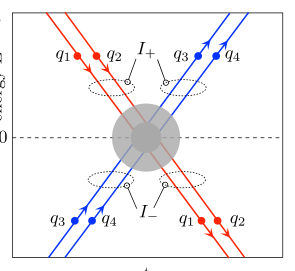 
FIG. 1. Dispersion of 1D chiral fermions, consisting of two branches of left-moving fermions (charges q1 and q2) and two branches of right-moving fermions (charges q3 and q4). Ar- rows indicate the spectral flow induced by an electric field F. If the negative energy branches are decoupled from the positive energy branches by a gap in the shaded energy- momentum region, the net charge current density I−that flows from negative energy into this region should vanish. One has I−= P

📷 Fig 2

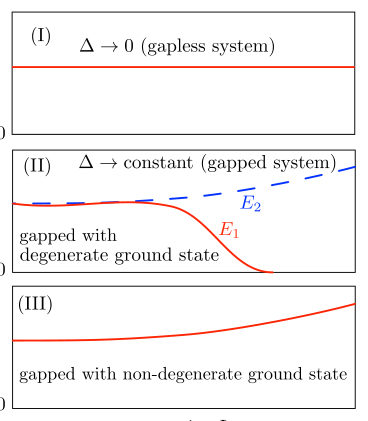 
FIG. 2. Comparison of the expected dependence on the sys- tem size L of the excitation energy ∆(energy of an excited state relative to the ground state). Panel I shows the finite- size gap ∆∝1/L in a system that is gapless in the thermo- dynamic limit (a flat line when ∆× L is plotted versus L). Panels II and III compare a gapped system with (II) or with- out (III) the appearance of a degenerate ground state. In case II, the symmetry is broken when E1 merges with the ground state, leaving a gap to the next level E2. Case III represents symmetric mass generation (SMG).

📷 Fig 3

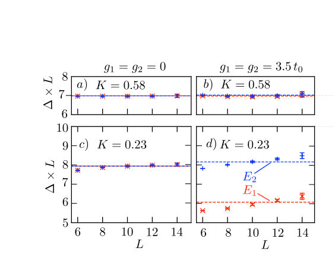 
FIG. 3. DMRG results for the energies of the two lowest excited states E1, E2 (measured relative to the ground state), of tangent fermions in the 3–4–5–0 model on an L-site 1D lattice (anti-periodic boundary conditions, bond dimension χMPS = 16384). Data points with error bars (see App. A 2) are the numerical results, the dashed line is what we would expect for a gapless system (case I in Fig. 2). A gap opening without a degenerate ground state (case III) appears in panel d) in the presence of both the 3–4–5–0 interaction (g1 = g2 = 3.5) and a sufficiently strong Hubbard interaction (K &lt; 2/5).

📷 Fig 4

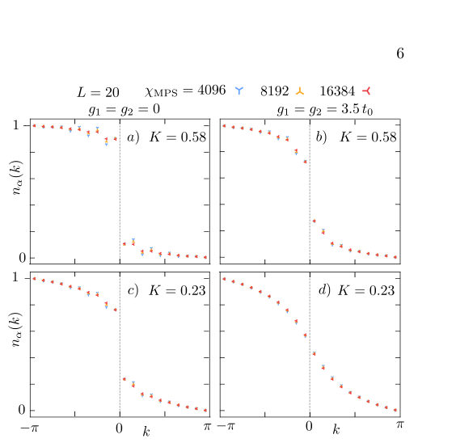 
FIG. 4. DMRG results for the momentum dependent occu- pation factor nα(k) of a right-moving charge (equivalently, α = 3 or 4), computed for L = 20 at three different MPS bond dimensions χMPS. The four panels correspond to the four panels in Fig. 3. The steep rise near k = 0 is smoothed in panel d).

📷 Fig 5

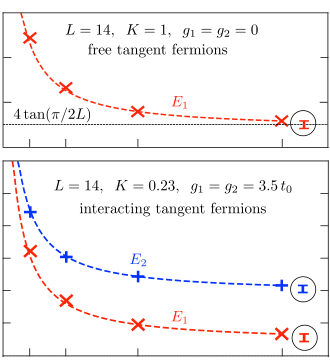 
FIG. 5. Dependence of the excitation energies on the MPS bond dimension χMPS in the DMRG calculation. The encir- cled error bars of the χMPS →∞limit are obtained by the procedure explained in the text. The upper edge of the error bar is aligned with the energy at the largest bond dimension, the lower edge of the error bar is the extrapolation of the fit (A5). The upper panel, for the noninteracting case (when E1 = E2), is a test to show that the error bars bracket the ex- act value 4 tan(π/2L) of the energy of the first excited state.

**Summary.** The paper tackles the challenge of achieving symmetric mass generation for chiral fermions on a lattice by modifying the standard model. It introduces a Hubbard interaction term that renders the gapping mechanism perturbatively relevant. Through theoretical analysis and DMRG simulations, the authors confirm that this setup successfully opens an excitation gap without breaking any underlying symmetries.

**Why it may be interesting.** This work provides a concrete theoretical realization of interacting topological phases in 1D systems, using techniques (bosonization, DMRG) highly relevant to strongly correlated electron physics and quantum impurity models.

Detailed structure

**Main problem.** The research addresses how symmetric mass generation (SMG)—opening a fermion gap without spontaneous symmetry breaking—can be achieved in a minimal 1D lattice model.

**Main result.** By combining a modified chiral fermionic model with a Hubbard-type interaction, the authors demonstrate that SMG occurs when the effective Luttinger parameter $K$ is sufficiently small ($K < 2/5$).

**Method.** The analysis combines bosonization techniques to analyze low-energy continuum limits and Density-Matrix Renormalization Group (DMRG) calculations for numerical verification.

**Model / system.** The system involves interacting chiral fermions described by the anomaly-free 3–4–5–0 model on a tangent-fermion lattice. The Hamiltonian is modified by adding a Hubbard-type density-density interaction to make the gapping term relevant.

**Key observables.** Opening of an excitation gap ($\Delta$) while maintaining a non-degenerate ground state, and the smoothing of power-law singularities in the momentum occupation factor $n_\alpha(k)$.

**Important parameters / regimes.** The Luttinger parameter $K$, which must satisfy $K < 2/5$ for the interaction to become relevant.

**Assumptions / limitations.** The approach assumes that tuning the Hubbard interaction can make the gapping perturbation visible at accessible system sizes, and it utilizes tangent fermions to avoid fermion doubling issues.

**Figures summary.** Figures illustrate the chiral fermion dispersion relation, compare gap opening signatures (SMG vs. SSB), and show DMRG results demonstrating the smoothing of Luttinger-liquid singularities in the gapped regime.

**Paper structure.** The paper first reformulates the model to address lattice artifacts (doubling) and interaction irrelevance; it then uses bosonization to analyze scaling dimensions, showing how the Hubbard term renormalizes the coupling; finally, DMRG calculations confirm the gap opening signature characteristic of SMG.

Abstract

Symmetric mass generation is the interaction-induced opening of a fermion gap without spontaneous symmetry breaking. The anomaly-free 3-4-5-0 model of Wang and Wen provides a minimal one-dimensional setting for this phenomenon, but a direct lattice realization faces two obstacles: fermion doubling for local chiral discretizations and perturbative irrelevance of the six-fermion gapping interaction. We address both obstacles. First, we formulate the model on a strictly one-dimensional tangent-fermion lattice, where a nonlocal hopping produces a single chiral branch without a mirror partner while retaining an efficient tensor-network representation. Second, we add a Hubbard-type density-density interaction (Luttinger parameter $K$) that reduces the scaling dimension of the 3-4-5-0 interaction from $5$ to $5K$, making it relevant for $K<2/5$. Density-matrix renormalization group calculations show the opening of an excitation gap in this regime without the appearance of a degenerate ground state, the hallmark of symmetric mass generation.

[↑ back to top](#top)

### [The impact of population heterogeneity on the redundancy principle](http://arxiv.org/abs/2606.24411v1)

**Authors:** Sergei Fedotov, Daniel Fears, Daniel Han  
**Type:** theory · **Category:** statistical mechanics · **PDF:** <https://arxiv.org/pdf/2606.24411v1>  
**Analysis basis:** full PDF text, analyzed in chunks
**Topic relevance:** `methods for driven-dissipative` **3/5** · `non-equilibrium dynamics` **3/5** · `non-equilibrium universality` **3/5** · `Keldysh / 2PI / non-Gaussian methods` **2/5** · `analog quantum simulation` **2/5** · `driven-dissipative phase transition` **2/5** · `correlated / nonlocal dissipation` **1/5** · `entanglement & information structure` **1/5** · `scars & prethermalization` **1/5**

📷 Fig 1

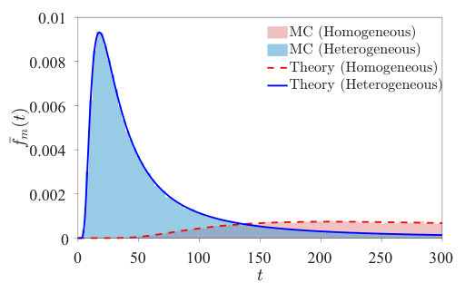 
FIG. 1: FPT density ¯𝑓𝑚(𝑡) for the heterogeneous (solid blue) and homogeneous (dashed red) populations with 𝛼+ = 𝛼−= 2, 𝛽= 1, and 𝑚= 50, computed from (9); for the homogeneous case, ¯𝑓𝑚is replaced by 𝑓𝑚(𝑡| ¯𝑞, ¯𝛾). The lines show the analytical results and the histogram shows Monte Carlo simulations.

📷 Fig 2

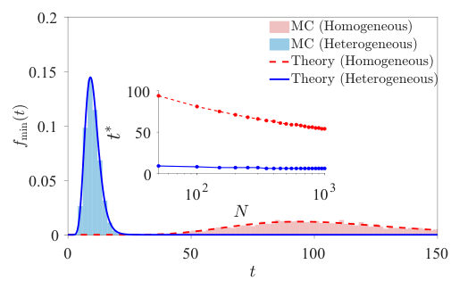 
FIG. 2: Minimum FPT density 𝑓min(𝑡) for the heterogeneous (solid blue) and homogeneous (dashed red) populations of 𝑁= 50 particles with 𝛼+ = 𝛼−= 2, 𝛽= 1 and 𝑚= 50, computed from (12) and (13); for the homogeneous case, ¯𝑓𝑚 is replaced with 𝑓𝑚(𝑡| ¯𝑞, ¯𝛾). The lines show the analytical results and the histogram shows Monte Carlo simulations. Inset: mode shortest arrival time 𝑡∗as a function of population size 𝑁for both populations.

**Summary.** This theoretical paper analyzes how population heterogeneity enhances transport efficiency in processes governed by redundancy principles. By modeling random walkers with rates drawn from statistical distributions, the authors show that this inherent variability leads to 'ensemble self-reinforcement.' This effect drastically shortens the characteristic time scales (FPTs) compared to idealized homogeneous systems.

**Why it may be interesting.** While focused on biology, the mathematical framework—analyzing non-equilibrium dynamics, superdiffusion, and parameter averaging over distributions—is highly relevant to open quantum systems where environmental noise or system parameters are stochastic.

Detailed structure

**Main problem.** The study investigates how population heterogeneity affects the redundancy principle, specifically analyzing first passage times (FPTs) in biological search processes.

**Main result.** Population heterogeneity leads to ensemble self-reinforcement, causing the modal and minimum FPTs to be an order of magnitude smaller compared to homogeneous ensembles with identical mean rates.

**Method.** The analysis uses master equations for random walks, employing subordination techniques and averaging over Gamma distributed random variables representing population parameters.

**Model / system.** A discrete random walk model on a semi-infinite lattice is used to simulate biological search processes (e.g., sperm movement). The system's rates ($\gamma_\pm$) are modeled as independent Gamma distributed random variables, introducing heterogeneity.

**Key observables.** Minimum FPT density ($f_{\min}(t)$), ensemble-averaged FPT density ($ar{f}_m(t)$), and the variance of the mean position $	ext{Var}(ar{X}(t))$ (showing ballistic superdiffusion).

**Important parameters / regimes.** The parameters governing the distributions of jump probabilities ($q$) and rates ($\gamma$), particularly their means, which are compared between heterogeneous and homogeneous limits.

**Assumptions / limitations.** The model assumes walker parameters are drawn from fixed distributions at initialization; it simplifies the process to one spatial dimension on a semi-infinite lattice.

**Figures summary.** Figures compare FPT density ($ar{f}_m(t)$) and minimum FPT density ($f_{\min}(t)$) for heterogeneous versus homogeneous models, visually demonstrating the significant reduction in arrival time modes for the heterogeneous case.

**Paper structure.** The paper develops the master equation for the random walk, calculates ensemble averages using subordination techniques, analyzes spatial self-reinforcement via recurrence relations, and finally compares the resulting FPT distributions between heterogeneous and homogeneous populations.

Abstract

Biological signaling is often governed by extreme value statistics, where a rapid response relies on the fastest few out of a large redundant group of searchers. While extreme first passage time (FPT) theory is well established for homogeneous ensembles, its sensitivity to population heterogeneity remains open. We show that averaging over a heterogeneous population of memoryless random walkers gives rise to ensemble self-reinforcement. This heterogeneity drastically changes both the FPT and minimum FPT densities relative to a homogeneous ensemble with identical mean rates. The modal and minimum FPTs are an order of magnitude smaller for heterogeneous populations relative to homogeneous ones. Our exact analytical predictions establish that population heterogeneity is a parameter that biology can exploit and not merely noise to be averaged away.

[↑ back to top](#top)

### [Cyclic Denoising Reveals Ultrastable Memories in Diffusion Models](http://arxiv.org/abs/2606.24000v1)

**Authors:** Rishabh Sharma, Stefano Martiniani  
**Type:** theory · **Category:** disordered systems and neural networks · **PDF:** <https://arxiv.org/pdf/2606.24000v1>  
**Analysis basis:** full PDF text, analyzed in chunks
**Topic relevance:** `driven-dissipative phase transition` **3/5** · `methods for driven-dissipative` **3/5** · `non-equilibrium dynamics` **2/5** · `non-equilibrium universality` **2/5** · `Frenkel-Kontorova` **1/5** · `Kondo & dissipative impurity` **1/5** · `analog quantum simulation` **1/5** · `correlated / nonlocal dissipation` **1/5** · `entanglement & information structure` **1/5** · `exotic spin models in light-matter` **1/5** · `scars & prethermalization` **1/5**

📷 Fig 1

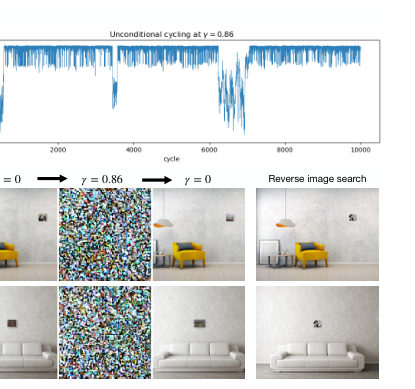 
Figure 1: Unconditional cyclic denoising drives latents toward attractors in the Stable Diffusion v1.4 landscape. (a) Decoded snapshots from a 104-cycle unconditional cycling trajectory at γ = 0.86, starting from a single ImageNet test image; the 15 × 15 grid shows every 44th cycle, in reading order, starting from the top-left. After an initial transient (snapshots change cycle-to-cycle), the dynamics lock into the first attractor — a room with a yellow chair — that persists for over 2000 cycles. A brief transient carries the trajectory into a second attractor (white-couch scene, paintings on a gray wall), which survives for a comparable number of cycles before another, longer transient...

📷 Fig 2

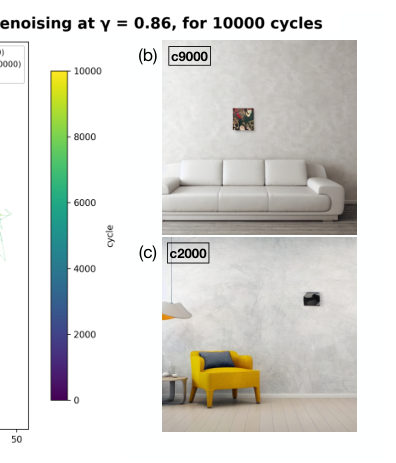 
Figure 2: Basin hopping in latent space under unconditional cyclic denoising in Stable Diffusion v1.4. The same trajectory shown in Fig. 1, here visualized as a two-dimensional PCA projection of its latent trajectory; the top two components are fit on this trajectory alone, and line color encodes cycle number. A single ImageNet test-set image (green circle, cycle 0, inset) is cycled through Stable Diffusion v1.4 at γ = 0.86 for 10,000 cycles (unconditional cycling). After a short transient, the trajectory is captured by a first attractor in which it dwells for many cycles, before escaping and hopping to a second, well-separated attractor; it then briefly leaves this second basin but is...

📷 Fig 3

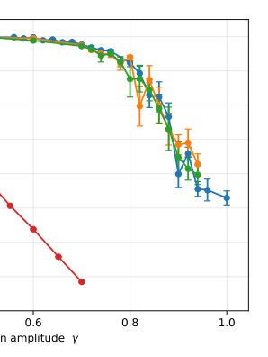 
Figure 3: Yielding diagram for cyclic denoising. Steady-state stroboscopic similarity ⟨cos(zn, zn−1)⟩ss between consecutive cycles versus the perturbation (cycling) amplitude γ. Each trajectory is run for 10,000 cycles; for each seed we average the similarity over the final 1000 cycles, then report the mean across seeds with ±SEM error bars. Stable Diffusion v1.4 is shown for ImageNet, model-generated, and Gaussian initializations (10 seeds per γ each); the CIFAR-10 DDPM is initialized from CIFAR-10 training images (50 seeds per γ). At low γ the dynamics are absorbing — consecutive cycles return to essentially the same state (⟨cos⟩ss ≈1), the signature of the fixed points and limit cycles...

📷 Fig 4

 
Figure 4: Moderate-amplitude cycling recovers memorized logos and web-crawl artifacts. (a) Selected basins recovered by unconditional cyclic denoising in Stable Diffusion v1.4 at moderate noise amplitudes. Each row shows ten equispaced stroboscopic snapshots from a single cycling trajectory during the residence time of one basin, with the corresponding cycle range and cycling amplitude indicated. At very low γ, the dynamics collapse to trivial absorbing states—saturated patterns, monotonic fills, and simple geometric shapes—as the trajectory becomes trapped after iterating on local details, lacking the perturbation amplitude needed to rearrange the latent at larger scales, see Supplementary...

📷 Fig 5

 
Figure 5: High-amplitude cycling isolates deep memorized attractors. (a) Memorized images recovered by unconditional cyclic denoising in Stable Diffusion v1.4 at high noise amplitudes. Each row shows ten equispaced stroboscopic snapshots from a single cycling trajectory during the residence time of one attractor, with the cycle range and γ indicated. As in random organization, cyclic forcing drives the system toward states that resist change under the applied drive. At higher amplitudes, the trajectory escapes shallow basins and explores more of the learned distribution, revealing only deeper attractors as long-lived states. The recovered attractors include richer memorized images than the...

**Summary.** This work proposes cyclic denoising as a novel, physics-inspired attack to audit generative AI models for data memorization. By repeatedly cycling noise addition and removal, the authors reveal that training data is stored in ultrastable attractors within the model's latent space dynamics. This method offers a gradient-free way to probe the underlying structure of learned knowledge.

**Why it may be interesting.** The analogy between model memorization dynamics and the annealing/stability analysis in disordered solids (like spin glasses or structural glasses) provides a powerful physical framework for understanding deep learning artifacts.

Detailed structure

**Main problem.** The core problem is understanding how specific training examples (memorized data) are encoded and recoverable from large generative diffusion models.

**Main result.** Cyclic denoising reveals that memorized content manifests as ultrastable, long-lived attractors in the model's latent space dynamics, which can be extracted without prompts or gradients.

**Method.** The authors use cyclic denoising—repeated forward noising followed by reverse denoising at controlled noise amplitudes ($\gamma$)—to treat sampling as a stroboscopic dynamical system probe.

**Model / system.** The model is an image diffusion model (e.g., Stable Diffusion v1.4, DDPM), whose latent space dynamics are analyzed. The process is mathematically analogous to perturbing and annealing disordered physical systems.

**Key observables.** Stroboscopic cosine similarity ($\cos(z_n, z_{n-1})$) over thousands of cycles; the persistence and stability of attractors after conditioning removal.

**Important parameters / regimes.** The cycling amplitude $\gamma$ acts as a control parameter, tuning the perturbation strength to reveal different regimes (trivial fixed points vs. deep attractors).

**Assumptions / limitations.** The primary assumption is that deeply memorized training data corresponds to dynamically stable, long-lived attractors within the model's generative landscape.

**Figures summary.** Figures illustrate trajectories in latent space showing transitions from trivial absorbing states (low $\gamma$) through semantic basin hopping (intermediate $\gamma$) to deep, persistent attractors corresponding to specific images (high $\gamma$).

**Paper structure.** The paper introduces cyclic denoising as a physics-inspired probe, contrasts it with existing 'generate-and-filter' attacks, demonstrates the amplitude dependence ($\gamma$ yielding transition), and confirms the ultrastability of recovered memories even when conditioning is removed.

Abstract

We introduce cyclic denoising -- repeated forward and reverse diffusion at controlled noise amplitudes -- as an extraction attack for image diffusion models. Inspired by random organization in disordered solids, cyclic denoising exposes regions of the learned distribution that are largely inaccessible to standard sampling. The dynamics drive samples toward attractors with a broad stability spectrum. The deepest attractors are ultrastable: they regenerate after near-total corruption and persist through thousands of noising-denoising cycles. Many of these attractors correspond to memorized training images, including stock photographs, brand watermarks, and web-crawl artifacts. The attack requires only sampler-level control, with no gradients, weight inspection, prompts, captions, or prior knowledge of the training data. Unlike generate-and-filter attacks, which rely on large-scale prompted generation and post-hoc similarity or membership-inference filtering, our main protocol is fully unconditioned. We demonstrate the phenomenon in Stable Diffusion v1.4 and in a pixel-space DDPM, showing consistent behavior across latent- and pixel-space diffusion models. Across noise amplitudes, we observe a yielding-like transition: low-amplitude cycling produces trivial absorbing fixed points or limit cycles, while larger amplitudes induce rearrangements, basin hopping, and long-lived trapping in structured memorized attractor basins. We also observe hierarchical partial absorption, prompt-stabilized basins, and cross-initial-condition universality of the recovered attractor set. Our results therefore show that cyclic denoising is both a physics-inspired probe of generative landscapes and a practical tool for memorization auditing, with implications for privacy, copyright compliance, and model fingerprinting.

[↑ back to top](#top)

### [First-Order Recoverability Collapse in Self-Referential Information Decoders](http://arxiv.org/abs/2606.24861v1)

**Authors:** Pieter van Rooyen  
**Type:** theory · **Category:** statistical mechanics · **PDF:** <https://arxiv.org/pdf/2606.24861v1>  
**Analysis basis:** full PDF text, analyzed in chunks
**Topic relevance:** `driven-dissipative phase transition` **3/5** · `methods for driven-dissipative` **3/5** · `non-equilibrium universality` **3/5** · `entanglement & information structure` **2/5** · `non-equilibrium dynamics` **2/5** · `Frenkel-Kontorova` **1/5** · `Keldysh / 2PI / non-Gaussian methods` **1/5** · `analog quantum simulation` **1/5** · `correlated / nonlocal dissipation` **1/5**

📷 Fig 1

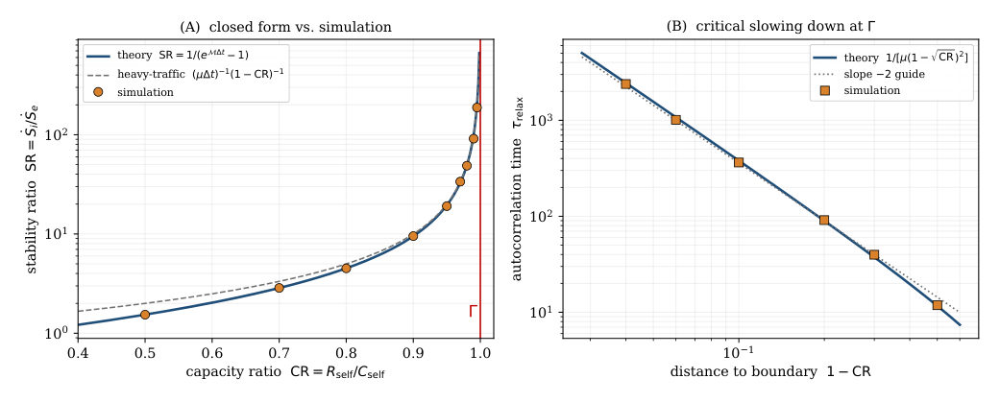 
FIG. 1. Event-driven validation of the closed form and the critical slowing down. (A) The empirical stability ratio (markers) tracks the closed form SR = 1/(eM∆t −1) of Eq. (3) (solid), with heavy-traffic asymptote (µ∆t)−1(1 −CR)−1

📷 Fig 2

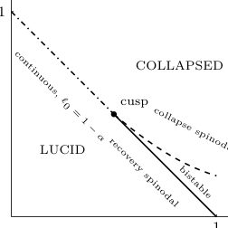 
FIG. 2. Closed-loop phase diagram (drawn for θ = 1; cusp at ( 1

📷 Fig 3

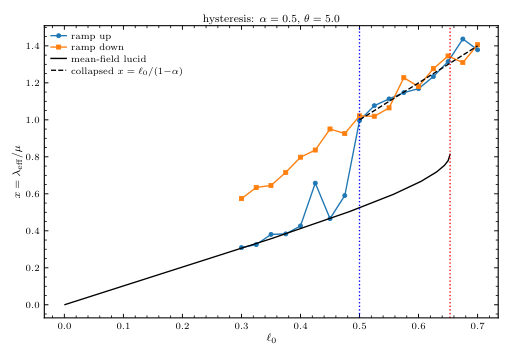 
FIG. 4. Measured hysteresis (θ = 5, α = 0.5; slow ℓ0 ramp, 1500/µ dwell per step). Blue: up-ramp along the mean-field lucid branch (solid), with a metastable flicker at ℓ0 = 0.425 and collapse near 0.50 — below the mean-field spinodal (red dotted), the congestion-correlation enhancement. Orange: down-ramp pinned to the collapsed branch x = ℓ0/(1 −α) (dashed) past the recovery spinodal (blue dotted) by backlog drainage.

📷 Fig 4

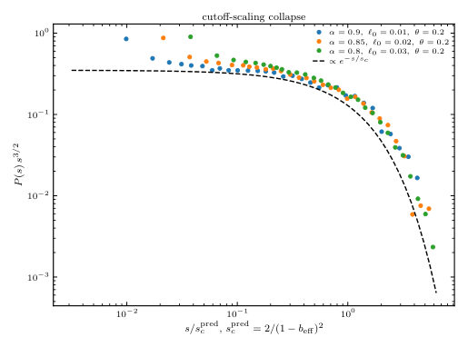 
FIG. 3. Cascade-size statistics: universal exponent, renormalized cutoff. Rescaled distributions P(s) s3/2 vs s/spred c for three parameter points (θ = 0.2; 4–12 × 104 closed cascades each) collapse onto one master curve with the pre- dicted cutoff spred c = 2/(1−beff)2. Maximum-likelihood expo- nents: τ = 1.502(8), 1.492(6), 1.498(7) (1σ).

📷 Fig 5

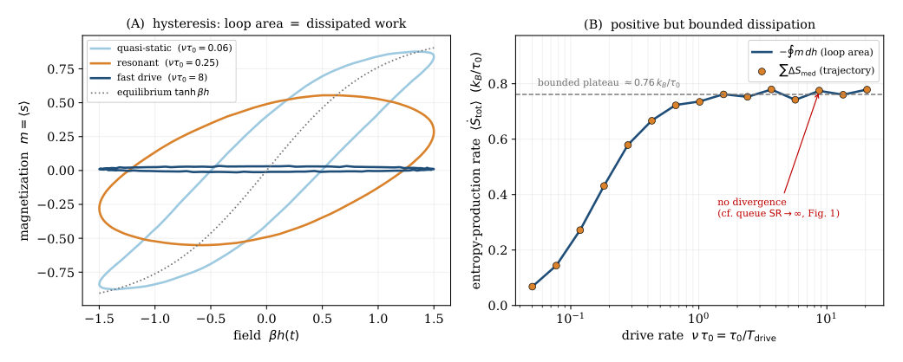 
FIG. 5. Driven two-level system: real but bounded dissipation. (A) Magnetization–field loops at three drive rates; loop area equals the dissipated work per cycle (quasi-static driving hugs the reversible curve; fast driving collapses the response). (B) Period-averaged entropy-production rate versus drive rate, by two independent estimators (loop area; trajectory medium- entropy sum), rising to a bounded plateau — positive everywhere, divergent nowhere, in contrast to the queue (Fig. 1A). β = 1, τ0 = 1, h0 = 1.5 kBT.

**Summary.** This theoretical work develops a statistical mechanical criterion for determining when complex adaptive systems lose their ability to recover from irreversible information processing. It models the system's failure as a structural collapse driven by sustained overload, linking computational capacity limits directly to thermodynamic constraints like entropy production and path dependence.

**Why it may be interesting.** Although focused on information theory, the framework uses concepts of non-equilibrium thermodynamics, entropy production bounds, and phase transitions ($	ext{M/M/1}$ queueing analogies) that are central to understanding open quantum systems dynamics far from equilibrium.

Detailed structure

**Main problem.** The study analyzes adaptive systems that couple inference (information processing) to irreversible action under sustained non-equilibrium driving, aiming to define the structural limits of 'recoverable operation.'

**Main result.** Loss of recoverability is a structural consequence of capacity saturation when informational flux exceeds integrative capacity, leading to first-order, hysteretic collapse.

**Method.** The analysis uses thermodynamic analogies and queueing theory concepts (e.g., feasibility margin, stability ratio) to characterize the system's operational regimes.

**Model / system.** The model treats information processing as a finite-capacity decoder subject to an informational load ($R_{self}$) versus an integrative capacity ($C_{self}$). The dynamics are governed by irreversible commitments that generate synthetic entropy.

**Key observables.** Feasibility Margin ($M(t)$), Stability Ratio ($	ext{SR}(t)$), Synthetic Entropy Production ($\dot{S}_{	ext{syn}}$), and the critical ratio $	ext{CR}=1$.

**Important parameters / regimes.** The offspring rate ($\alpha$), the grounding fraction, and the time scale separation ratio ($\zeta = 	au_{	ext{cert}}/	au_{	ext{upd}}$).

**Assumptions / limitations.** Irreversible commitments eliminate counterfactual options (path dependence), and the analysis is substrate-agnostic, focusing on regime behavior.

**Figures summary.** Figures illustrate how the stability ratio ($	ext{SR}$) diverges approaching a critical boundary ($\Gamma: 	ext{CR}=1$), and show critical slowing down of autocorrelation time near this boundary.

**Paper structure.** The paper builds from defining the thermodynamic load/capacity relationship, establishing diagnostics like $	ext{SR}(t)$, deriving structural collapse conditions (first-order transition), and finally analyzing the consequences in closed feedback loops.

Abstract

We study adaptive systems coupling inference to irreversible action under sustained nonequilibrium driving. Treating information processing as a thermodynamic load, we model them as finite-capacity decoders whose irreversible commitments eliminate counterfactual options, and characterize recoverable operation by a feasibility margin and a stability diagnostic fixing when irreversible action is admissible. Under sustained overload -- induced flux exceeding effective integrative capacity -- loss of recoverability and divergence of the diagnostic arise as structural consequences of capacity saturation, independent of optimization objective, control policy, or substrate. Added capacity alone does not restore recoverability: absent certification or gating, higher throughput accelerates non-recoverable loss, with high-throughput AI a concrete application. Making the feedback explicit -- each uncertified commitment spawning on average alpha new candidates -- turns the continuous transition first-order: lucid and collapsed states coexist in a cusp-organized bistable region with closed-form spinodals, collapse pre-empts the continuous divergence at finite stability ratio, recovery is hysteretic, and for alpha >= 1 load reduction alone cannot restore operation. Cascade sizes are bounded by the grounded fraction of input: a genealogy-times-congestion factorization sets a cutoff that grows as grounding shrinks, with the mean-field exponent tau = 3/2 recovered away from the boundary and each cascade carrying a Landauer-priced burst of synthetic entropy; event-driven simulations confirm the cutoff law and phase structure. This supplies the statistical mechanics of the metastable failures seen in distributed systems. The analysis is constraint-based and substrate-agnostic, establishing recoverable dissipation as a necessary criterion for decoder stability in high-flux regimes.

[↑ back to top](#top)

### [How rare are Markovian quantum dynamics?](http://arxiv.org/abs/2606.24511v1)

**Authors:** Charlotte Bäcker, Nick Maryshchak, Walter T. Strunz  
**Type:** theory · **Category:** other · **PDF:** <https://arxiv.org/pdf/2606.24511v1>  
**Analysis basis:** full PDF text, analyzed in chunks
**Topic relevance:** `correlated / nonlocal dissipation` **3/5** · `methods for driven-dissipative` **3/5** · `non-equilibrium dynamics` **3/5** · `driven-dissipative phase transition` **2/5** · `entanglement & information structure` **2/5** · `Keldysh / 2PI / non-Gaussian methods` **1/5** · `analog quantum simulation` **1/5** · `non-equilibrium universality` **1/5**

📷 Fig 1

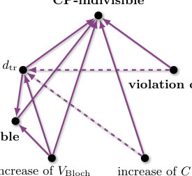 
FIG. 1. Relations between different definitions and witnesses of quantum non-Markovianity. A solid line from node (A) to (B) means that it is proven that non-Markovianity ac- cording to (A) implies non-Markovianity according to (B). A dashed line means that among our results obtained via random sampling of two-step dynamics any dynamics which turned out to be non-Markovian with respect to (A) was also non-Markovian with respect to (B). Nodes in boldface denote definitions of non-Markovianity while other nodes represent witnesses.

📷 Fig 2

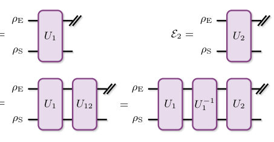 
FIG. 2. Physical motivation of the sampling strategy for a dynamics D = (E1, E2) used in this work. A randomly sam- pled first map E1 can be understood as the application of a random global system-environment unitary operation. While in reality, after having implemented E1 the map E2 is realized in terms of a second random unitary operation U12 on system and environment, it suffices to generate a second map E2 inde- pendently. This can be seen by decomposing U12 = U2 ◦U −1 1 , which implies that a randomly generated map corresponding to the consecutive random unitaries U1 and U21 contains the same information as an independently generated map corre- sponding to the unitary U2. Note that the...

📷 Fig 3

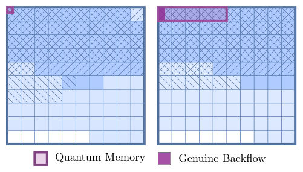 
FIG. 4. Visualization of the fraction of randomly sampled two-step dynamics as in Fig. 3, but for the maximal Kraus ranks kmax = 3 (left) and kmax = 2 (right). The matching between colors, patterns and criteria is the same as in Fig. 3. Here, in addition, lower bounds for the fractions of dynam- ics with quantum memory and genuine backflow according to Sec. III B can be depicted.

📷 Fig 4

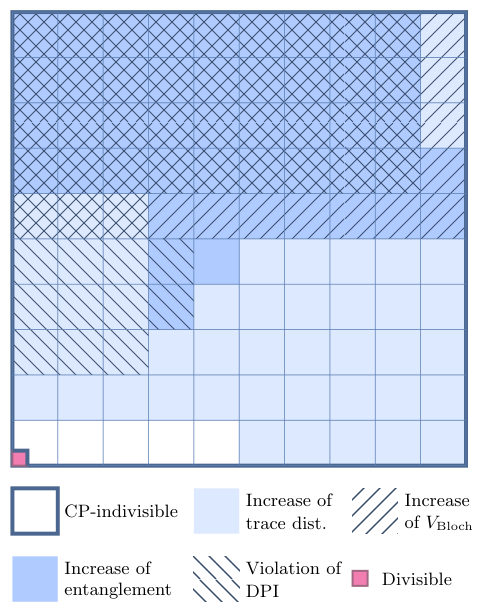 
FIG. 3. Visualization of the fraction of N = 1.000.000 ran- domly sampled two-step dynamics D = (E1, E2) which are non-Markovian according to different definitions and wit- nesses of non-Markovianity. In addition to the fractions for each of the criteria also their overlap with each other is de- picted. See Tab. II for details.

📷 Fig 5

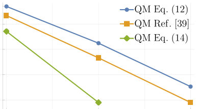 
FIG. 5. Dependence on the maximal Kraus rank kmax of the fraction of dynamics identified as having quantum mem- ory. The original criterion for quantum memory (QM) refers to Eq. (12), the I-Concurrence criterion to the witness es- tablished in Ref. [45] and the entropic witness to Eq. (14). The latter one also serves as a computational tool to identify dynamics requiring genuine backflow in Eq. (13). All these criteria provide lower bounds.

**Summary.** The paper rigorously investigates the prevalence of non-Markovian dynamics by testing numerous mathematical witnesses across randomly generated two-step quantum processes. It concludes that memory effects are the generic feature of open quantum evolution, while also developing tools to distinguish between genuine quantum memory and classical forms of information backflow.

**Why it may be interesting.** This work provides a rigorous quantitative measure for how often the simple Markov approximation fails in realistic physical scenarios, which is crucial for designing accurate open system models in AMO physics.

Detailed structure

**Main problem.** The work investigates how frequently quantum dynamics exhibit memory effects (non-Markovianity) compared to simple, history-independent Markovian evolution.

**Main result.** For randomly generated two-step qubit dynamics, the vast majority of processes are non-Markovian, suggesting that memory effects are the generic case in open quantum systems.

**Method.** The authors analyze the space of two-step quantum maps by testing multiple mathematical criteria (e.g., CP-indivisibility, trace distance increase) to detect deviations from Markovian behavior.

**Model / system.** The study focuses on open quantum dynamics for qubits, modeled as a sequence of two time steps ($D=(E_1, E_2)$). The analysis compares these discrete maps against the continuous-time Lindblad/GKSL master equation framework.

**Key observables.** Non-Markovianity witnesses include CP-indivisibility, violation of Data Processing Inequality (DPI), increase in Bloch volume ($V_{	ext{Bloch}}$), and entanglement measures ($C$).

**Important parameters / regimes.** The maximal Kraus rank ($k_{	ext{max}}$) is a key parameter used to restrict the space of dynamics being analyzed.

**Assumptions / limitations.** The analysis often relies on sampling random two-step dynamics or restricting the channels to specific forms, such as mixed-unitary (MU) maps.

**Figures summary.** Figures illustrate the relationships between various definitions and witnesses for non-Markovianity, and show how the fraction of quantum memory depends on the maximal Kraus rank ($k_{	ext{max}}$).

**Paper structure.** The paper progresses by first establishing the general prevalence of non-Markovianity using random sampling across multiple criteria. It then refines this by examining specific subclasses (like mixed-unitary dynamics) and distinguishing between quantum memory, genuine backflow, and classical memory effects.

Abstract

A profound understanding of decoherence and dissipation in quantum dynamics is crucial for the realistic modeling of the evolution of quantum systems. In open quantum dynamics one distinguishes between a memoryless, so-called Markovian evolution and dynamics incorporating memory effects, termed non-Markovian. In this work we study how prevalent memory effects are in the set of all such dynamics. We thus investigate how often a Markovian description is applicable. This question is approached by investigating randomly generated two-step qubit dynamics with respect to different concepts and witnesses of non-Markovianity. We observe that almost all dynamics are non-Markovian, and only a small (yet finite) fraction is Markovian. Furthermore, we study how this proportion changes when considering certain subclasses such as lower rank or mixed-unitary dynamics. Importantly, our results shed light on the relative ratios of -- and interrelations between -- the sets of dynamics that are non-Markovian with respect to different criteria. Finally, we investigate the fraction of dynamics in which the memory effects are necessarily of quantum nature and establish a connection between two recently developed concepts that characterize the quantumness of memory in non-Markovian dynamics.

[↑ back to top](#top)

### [Interaction-Enhanced Ergotropy in Phase-Driven Andreev Bound State Quantum Batteries](http://arxiv.org/abs/2606.24456v1)

**Authors:** Disha Verma, B. Vigneshwar, R. Sankaranarayanan  
**Type:** theory · **Category:** other · **PDF:** <https://arxiv.org/pdf/2606.24456v1>  
**Analysis basis:** full PDF text, analyzed in chunks
**Topic relevance:** `methods for driven-dissipative` **3/5** · `non-equilibrium dynamics` **3/5** · `driven-dissipative phase transition` **2/5** · `non-equilibrium universality` **2/5** · `Keldysh / 2PI / non-Gaussian methods` **1/5** · `Kondo & dissipative impurity` **1/5** · `analog quantum simulation` **1/5** · `correlated / nonlocal dissipation` **1/5** · `entanglement & information structure` **1/5** · `scars & prethermalization` **1/5**

📷 Fig 1

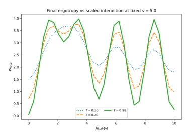 
FIG. 1. Final ergotropy Wfinal as a function of the scaled in- teraction strength J/EA(ϕf) at fixed ramp speed v = 5.0 for representative transparencies T = 0.30 (dotted), 0.70 (dashed), and 0.98 (solid). The interaction initially en- hances the stored extractable work, while larger interaction strengths produce a pronounced oscillatory regime associ- ated with coherent interaction-driven redistribution dynam- ics. The strongest modulation occurs in the nearly ballistic regime T = 0.98.

📷 Fig 2

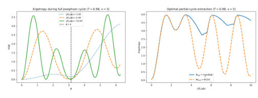 
FIG. 2. (a) Phase-resolved ergotropy W(ϕ) during a full Josephson cycle for different interaction strengths at fixed transparency T = 0.98 and ramp velocity v = 5. The dashed vertical line marks the avoided-crossing point ϕ = π. (b) Comparison between the optimal extractable ergotropy Wopt = maxϕ W(ϕ) and the final-cycle ergotropy Wfinal = W(2π) as a function of interaction strength.

📷 Fig 3

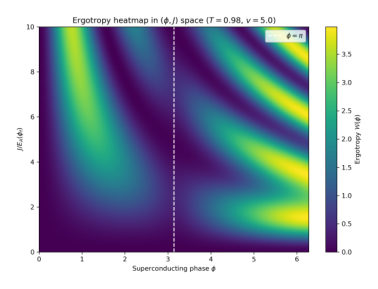 
FIG. 3. Phase-resolved ergotropy landscape W(ϕ) in the combined superconducting phase–interaction parameter space for the high-transparency regime T = 0.98 at fixed ramp speed v = 5.0. The dashed vertical line marks the avoided crossing near ϕ = π.

**Summary.** The paper models an interacting Andreev Bound State system as a quantum battery whose stored energy is quantified by ergotropy. By analyzing the charging process driven by superconducting phase ramps, the authors demonstrate that inter-unit interactions profoundly modify energy storage. Crucially, they show that optimal energy extraction requires stopping the cycle at a specific intermediate phase rather than completing the full Josephson period.

**Why it may be interesting.** This work connects fundamental concepts of superconducting junctions (ABS) with non-equilibrium thermodynamics (ergotropy), providing a concrete theoretical model for controlling quantum energy harvesting using purely electromagnetic/phase control, which is highly relevant to open quantum systems research.

Detailed structure

**Main problem.** The study investigates how superconducting phase dynamics and interaction-induced hybridization can be harnessed to create controllable quantum energy storage in Andreev Bound State (ABS) systems.

**Main result.** Interaction significantly enhances the extractable work (ergotropy), revealing that optimal charging requires interrupting the Josephson cycle at a specific, interaction-dependent phase rather than completing the full cycle.

**Method.** The research uses theoretical modeling to calculate ergotropy, quantifying extractable work by comparing the system's state against the instantaneous eigenbasis of the battery Hamiltonian during time evolution.

**Model / system.** The physical platform is a minimal quantum battery composed of two interacting ABS units realized in superconducting normal-superconductor-normal (SNS) junctions. The dynamics are governed by a time-dependent Hamiltonian incorporating both phase-driven terms and an interaction term ($H(t) = H_{ABS}(t) + H_{int}(J)$).

**Key observables.** Ergotropy ($W$), which measures extractable work; the charging dynamics $W(\phi)$; and the comparison between optimal partial-cycle ergotropy ($W_{opt}$) and final-cycle ergotropy ($W_{final}$).

**Important parameters / regimes.** Superconducting phase ($\phi$); Junction transparency ($T$, especially high-transparency limit $T=0.98$); Interaction strength ($J$); and the ramp speed ($v$).

**Assumptions / limitations.** A two-level truncation is used for dynamics restricted to the subgap sector, and the analysis treats $J$ as an effective phenomenological parameter.

**Figures summary.** Figures illustrate the phase evolution of ergotropy ($W(\phi)$) showing oscillations due to interaction; comparisons between optimal vs. final work show divergence at strong coupling; and heatmaps visualize phase-selective charging windows dependent on interaction strength.

**Paper structure.** The paper systematically analyzes the system by first defining the Hamiltonian and ergotropy measure, then simulating dynamics across varying interaction strengths ($J$), followed by a detailed phase-resolved analysis comparing partial versus full Josephson cycle extraction protocols.

Abstract

We investigate a phase-driven quantum battery composed of two interacting Andreev bound state (ABS) units, providing a minimal superconducting platform for coherent energy storage. By analyzing the ergotropy dynamics under a superconducting phase ramp, we show that the interplay between avoided-crossing excitation and interaction-induced hybridization strongly modifies the charging process. In the high-transparency regime relevant for graphene SNS junctions, the interaction enhances the stored extractable work and generates pronounced oscillatory charging dynamics associated with coherent redistribution between coupled ABS sectors. The phase-resolved evolution further reveals optimal charging windows during the Josephson cycle, indicating the possibility of phase-programmable energy extraction through partial-cycle operation. Overall, our results identify interaction-assisted avoided-crossing dynamics as a microscopic mechanism for controllable energy storage in superconducting quantum batteries.

[↑ back to top](#top)

### [Visualizing Symmetry Broken Chern Insulators and their Quantum Melting](http://arxiv.org/abs/2606.23795v1)

**Authors:** Minhao He, Yen-Chen Tsui, Ran Peng, Kenji Watanabe, Takashi Taniguchi, Oskar Vafek, Ali Yazdani  
**Type:** experiment · **Category:** strongly correlated electrons · **PDF:** <https://arxiv.org/pdf/2606.23795v1>  
**Analysis basis:** full PDF text, analyzed in chunks
**Topic relevance:** `analog quantum simulation` **3/5** · `driven-dissipative phase transition` **3/5** · `methods for driven-dissipative` **3/5** · `non-equilibrium dynamics` **2/5** · `non-equilibrium universality` **2/5** · `Frenkel-Kontorova` **1/5** · `Keldysh / 2PI / non-Gaussian methods` **1/5**

📷 Fig 1

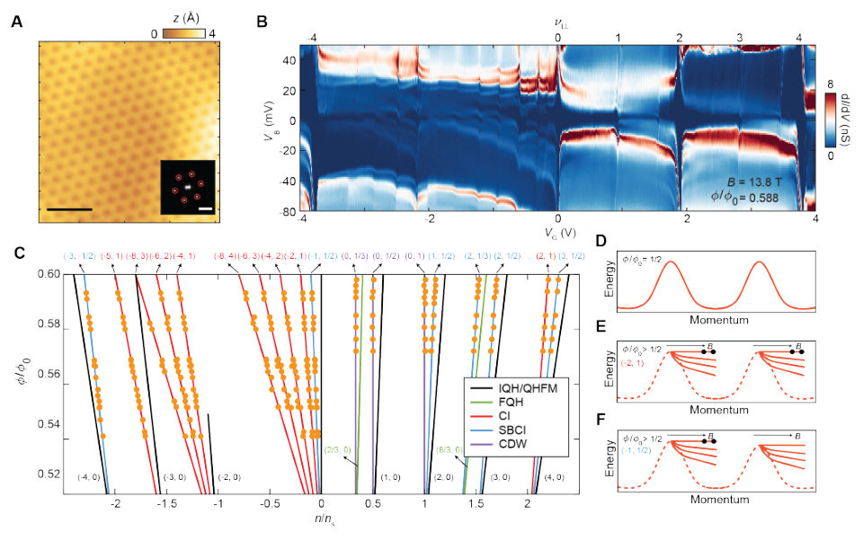 
Fig. 1. Spectroscopic studies of Hofstadter’s spectrum in Bernal-stacked bilayer graphene/hBN heterostructure. (A) A clean topograph of a device with periodic structure of bilayer graphene/hBN moiré. The black scale bar is 50 nm. The inset shows the Fourier transform of the topography map, the Bragg peaks of the moiré are marked by red circles, the corresponding periodicity is 14.28 nm. The white scale bar of the inset is 0.5 nm-1. (B) A density (tuned by gate voltages VG) dependent STS measured at B=13.8 T, 𝜙/𝜙! = 0.588. The vertical axis is the tip bias voltage VB where it probes the electron (hole) excitation at VB &gt;0 (VB &lt;0). On VG &gt;0 (VG &lt;0), the electrons are away from (close to)...

📷 Fig 2

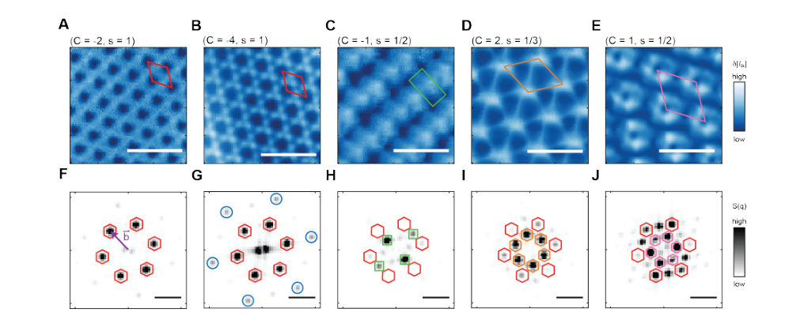 
Fig. 2. Direct imaging of Chern insulators. (A-E) Real space tunneling current 𝛿|Idc| maps measured at (A-C) B=13.2 T, (D, E) B=13.8 T and low bias voltages VB of each (C, s) states. The white scale bar is 40 nm. (F-J) Structure factor 𝑆(𝒒I⃑) of the tunneling current modulation 𝛿|Idc| in panels A-E, respectively. The scale bar is 0.5 nm-1. The bilayer graphene/hBN moiré Bragg peaks are identified by red hexagons. (A, F) (-2, 1) state respects the moiré translational symmetry. The red parallelogram is the moiré unit cell. (B, G) Emergent Kagome lattice for (-4, 1) state respects the moiré translational symmetry. The Kagome structure shows up as higher harmonics (blue circles) in the 𝑆(𝒒I⃑)...

📷 Fig 3

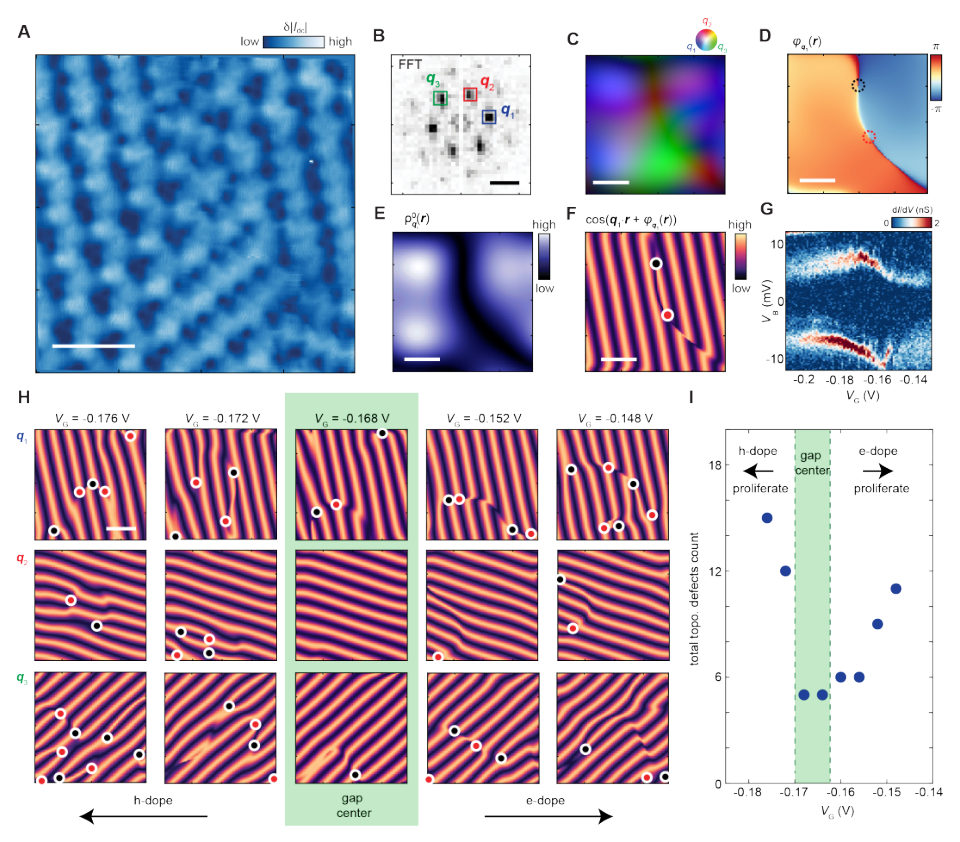 
Fig. 3. Topological melting of a symmetry broken Chern insulator (SBCI) (C=-1, s=1/2). (A) A large real space tunneling current 𝛿|Idc| map measured at B=13.8 T and VB = 6 mV. The stripes with different orientations can be identified. (B) FFT of the 𝛿|Idc| map in (A), the stripes with different orientations are identified by 𝒒)*',",, vectors. The scale bar is 0.25 nm-1. (C) The real space distribution of normalized amplitude of the three 𝒒)*',",, vectors. (D) The extracted relative phase 𝜑𝒒!(𝒓) map. Where the topological defect is identified by dotted black (red) circles, with the clockwise winding of the phase is 2𝜋 (-2𝜋). The black (red) circle is the dislocation (anti-dislocation). (E)...

📷 Fig 4

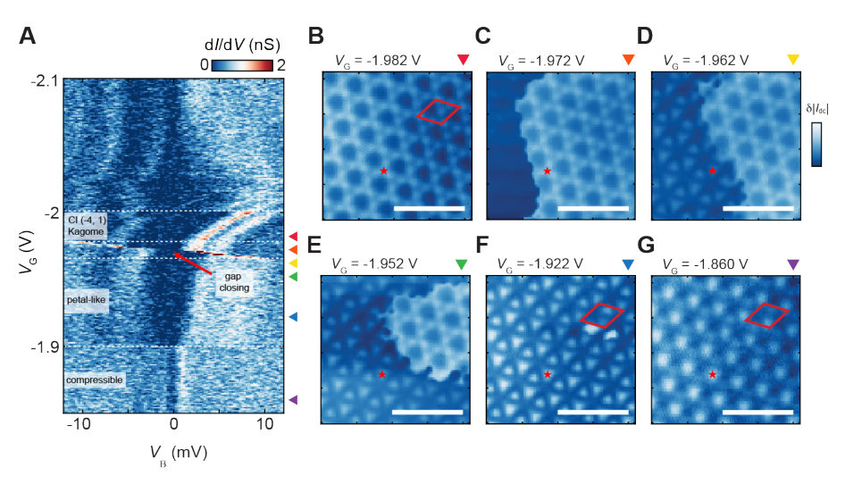 
Fig. 4. Phase separation and quantum melting of a Chern Insulator. (A) STS near a (C, s) = (-4, 1) state at magnetic field B = 13.2 T. The incompressible spectroscopic features of the Kagome CI as well as gap closing (between orange and yellow arrows) are labeled. The gap closing happens when the sharp phase boundary in (C, D) passes underneath the tip, indicating that the phase boundary is compressible. The gate voltages for images in (B-G) are marked with colored arrows on the right side of the spectrum. (B) The tunneling current 𝜹|Idc| map measured at gate voltage VG= -1.982 V (red) and low bias voltages VB = 4.8 mV shows an emergent Kagome lattice. The moiré unit cell is marked with red...

**Summary.** The research uses STM/STS on moiré graphene to study Chern insulators under magnetic fields. The key findings are the direct visualization of symmetry breaking in these states, leading to reconstructed unit cells at fractional fillings. Furthermore, the authors observe quantum melting and phase separation transitions driven by topological defects, providing deep insight into strongly correlated electron behavior.

**Why it may be interesting.** This work provides direct experimental evidence of complex many-body phenomena—such as charge density wave formation, topological defect dynamics, and quantum melting—in a tunable solid-state platform, offering insights into strongly correlated electron physics beyond simple band theory.

Detailed structure

**Main problem.** The study investigates the interplay between band topology (Chern insulators) and strong electron-electron interactions in moiré quantum materials, focusing on visualizing symmetry breaking and quantum melting phenomena.

**Main result.** The authors directly visualize Symmetry Broken Chern Insulators (SBCIs) that reconstruct the moiré unit cell at fractional fillings. They also observe evidence for quantum melting via topological defect proliferation and phase separation transitions.

**Method.** Scanning Tunneling Microscopy (STM) and Spectroscopy (STS) are used to image electronic states, complemented by analyzing the spatial structure factor $S(\mathbf{q}|\mathbf{r})$ of the tunneling current.

**Model / system.** The physical system is bilayer graphene aligned with hexagonal BN ($	ext{h-BN}$), forming a moiré superlattice. The physics is governed by Hofstadter's spectrum, which describes electronic states under combined magnetic fields and lattice periodicity.

**Key observables.** Incompressible gaps in STS spectra; spatial modulation of tunneling current $\delta|I_{dc}|$; emergent lattice structures (Kagome, stripe); density of topological defects (dislocations).

**Important parameters / regimes.** Magnetic field ($B$) and flux ratio ($\phi/\phi_!$), gate voltage ($V_G$), and filling factor $s$. Measurements are performed at low temperatures ($T_{eff} = 210 	ext{ mK}$).

**Assumptions / limitations.** The analysis relies on mapping observed gaps and band structures to topological indices $(C, s)$ derived from the Wannier diagram formula.

**Figures summary.** Figures detail direct imaging of CI states showing emergent lattice reconstructions (e.g., Kagome for $(-4, 1)$), phase maps illustrating defect proliferation during quantum melting for stripe phases, and diagrams showing phase separation boundaries.

**Paper structure.** The paper progresses from establishing the theoretical framework using Wannier diagrams to mapping out various $(C, s)$ topological states. It then moves into detailed real-space imaging to confirm symmetry breaking (reconstruction) and finally analyzes dynamic transitions like quantum melting and phase separation as doping changes.

Abstract

In the presence of a magnetic field, electronic states of moiré quantum materials develop a Hofstadter spectrum that provides a unique setting for studying the interplay between band topology and strong electron-electron interaction. Using scanning tunneling microscopy, we study Hofstadter's states in bilayer graphene aligned with hexagonal BN and directly visualize the formation of interaction-driven symmetry breaking Chern insulators. Our measurements reveal the formation of phases that double, triple or quadruple the moiré unit cell at fractional filling of the Hofstadter bands, as well as states with complex intra-unit-cell wave functions. We visualize two distinct quantum phenomena in different Chern states, including quantum melting driven by the appearance and proliferation of topological defects, and a quantum transition co-occurring with phase competition and separation.

[↑ back to top](#top)

### [Exceptional by Design: Long-Range Hopping as a Knob for Exceptional Point Control](http://arxiv.org/abs/2606.24705v1)

**Authors:** Carolina Martinez-Strasser, Dario Bercioux, Nico Leumer  
**Type:** theory · **Category:** other · **PDF:** <https://arxiv.org/pdf/2606.24705v1>  
**Analysis basis:** full PDF text, analyzed in chunks
**Topic relevance:** `driven-dissipative phase transition` **3/5** · `methods for driven-dissipative` **3/5** · `analog quantum simulation` **2/5** · `non-equilibrium universality` **2/5** · `Keldysh / 2PI / non-Gaussian methods` **1/5** · `Kondo & dissipative impurity` **1/5** · `correlated / nonlocal dissipation` **1/5** · `non-equilibrium dynamics` **1/5**

📷 Fig 1

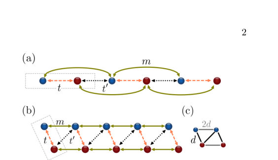 
Figure 1. Sketch of the model in real space. (a) SSH chain with t, t′ for intra- and inter-cell hopping, and m for long-range hopping terms. Sublattice A (B) sites, shown in blue (red), encode gain/loss ±iγ and on-site energies ϵA,B. The gray box indicates the unit cell. (b) The system is rep- resented as a quantum ladder, with sublattices coupled by t and t′. (c) Real space distances of panel (b) in terms of the lattice constant d.

📷 Fig 2

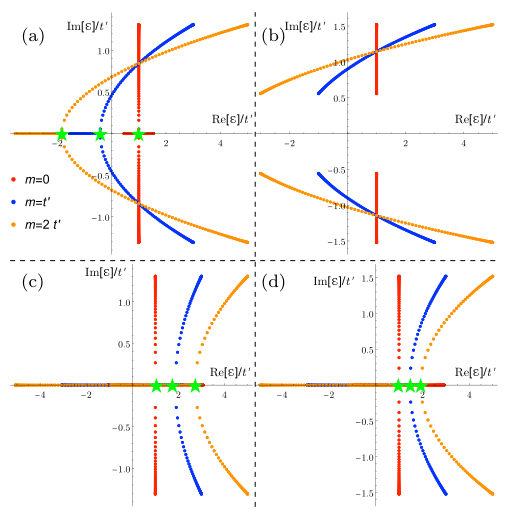 
Figure 2. Bulk complex spectrum and exceptional points. Bulk energy spectrum of H(k) in the complex plane, parametrized by k ∈BZ, for fixed ϵ+ = t′ and ϵ−= 0. Each panel shows three superposed spectra corresponding to m = 0 (red), m = t′ (blue), and m = 2t′ (orange). Parameters: (a) t = t′/2, γ = 1.4 t′; (b) t = t′/2, γ = 1.6 t′; (c) t = 3t′/2, γ = 1.4 t′; (d) t = 3t′/2, γ = 1.6 t′. For m = 0, the spectrum is purely imaginary (up to the constant real shift ϵ+), while for m ̸= 0, the next-nearest-neighbor hopping introduces a k-dependent dispersion of the real part, producing genuinely complex bands. Green stars mark the bulk EPs, which lie on the real axis at Re (EEP) = ϵ+ −2m cos(kEPd)....

📷 Fig 3

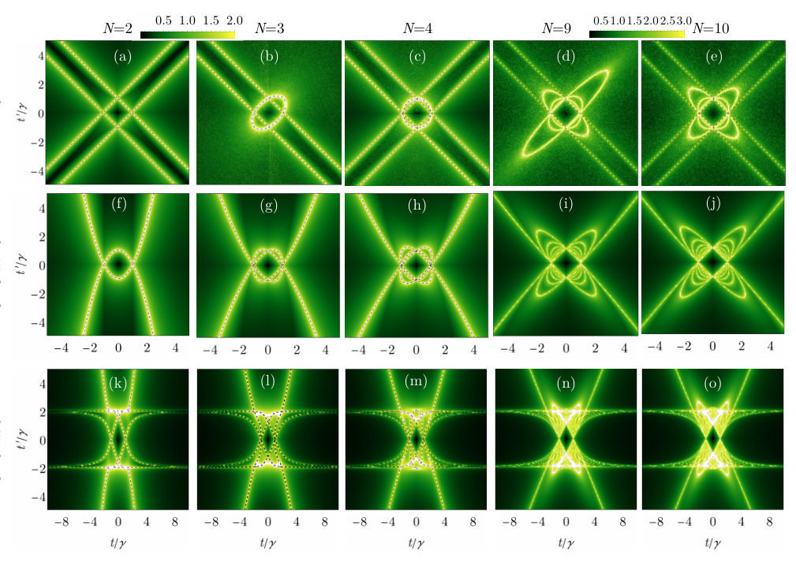 
Figure 3. Finite-size EPs under PBC and OBC. (a) For PBC, the 10-base logarithm of the condition matrix K(U) diverges at EPs. These divergences coincide with the analytic result from Eq. (8) (black dashed lines). For odd N, the lines with positive slopes t ± γ are absent. For N &gt; 2, the EPs form ellipses and rings. (a) N = 2, (b) N = 3, (c) N = 4, (d) N = 9, and (e) N = 10. In all the panels ϵ± = 0 and m = 0. Note that these results are m-independent, since the value of m only changes the degeneracy energy at the EPs. Note as well that for N = 9, 10, we indicate only the analytic lines corresponding to ±t ± γ.

📷 Fig 4

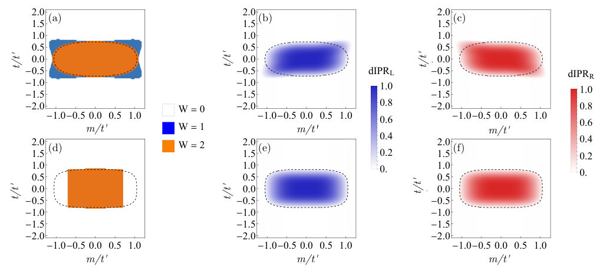 
Figure 4. Phase diagram and wavefunction localization. Winding and directional inverse participation ratio (dIPR) for N = 40, γ = √

📷 Fig 5

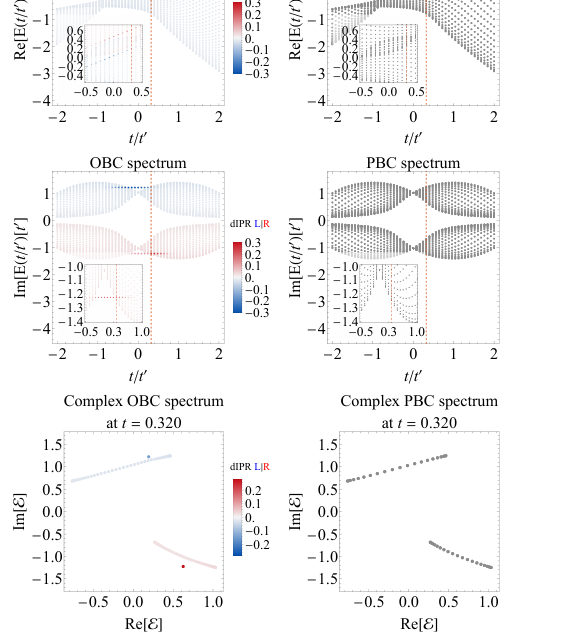 
Figure 5. Topological phase transition spectra and edge state emergence. OBC and PBC phase-transition spectra of the non-Hermitian next-nearest-neighbour Rice– Mele model for N = 40, γ = √

**Summary.** This paper analyzes the topological phase diagram of a non-Hermitian lattice model by studying its exceptional points (EPs) under periodic versus open boundary conditions. It demonstrates that long-range hopping terms significantly alter the EP structure in OBC compared to PBC, while confirming the existence and characterization of topologically protected edge states using winding numbers.

**Why it may be interesting.** This work directly addresses non-Hermitian physics, a field highly relevant to open quantum systems, wave propagation in lossy media, and engineered photonic/electronic structures where gain/loss are inherent.

Detailed structure

**Main problem.** The study investigates the exceptional point (EP) structure and topological properties of non-Hermitian lattice models, specifically focusing on how long-range hopping terms modify these features under different boundary conditions.

**Main result.** The model exhibits second-order EPs whose dependence on next-nearest-neighbor hopping ($m$) differs significantly between periodic and open boundary conditions; furthermore, topological edge states are confirmed via winding number analysis in OBC.

**Method.** Theoretical analysis combining numerical computation (condition number, Jordan decomposition) with analytical tools like the winding number framework and M-Riemann algebra formalism to map out parameter space degeneracies.

**Model / system.** A generalized non-Hermitian Rice-Mele model described by a 1D tight-binding Hamiltonian incorporating intra-cell hopping ($t$), inter-cell hopping ($t'$), next-nearest-neighbor hopping ($m$), and gain/loss terms ($\pm i\gamma$).

**Key observables.** Exceptional Points (EPs), topological invariants (winding number $W_j$), edge state eigenvalues, and the Directional Inverse Participation Ratio (dIPR).

**Important parameters / regimes.** Hopping ratios ($t/t'$, $m/\gamma$), boundary conditions (PBC vs. OBC), and system size ($N$).

**Assumptions / limitations.** The analysis focuses on second-order EPs, and specific symmetries are assumed or broken to simplify the topological classification.

**Figures summary.** Figures illustrate EP structures as lines/ellipses in parameter space for both PBC and OBC; phase diagrams map out edge state regimes using winding numbers and dIPR values.

**Paper structure.** The paper systematically analyzes the Hamiltonian, first establishing bulk properties under PBC (independence of $m$), then contrasting this with OBC where $m$ actively generates new EPs. Finally, it uses topological invariants and localization measures to confirm boundary-induced edge states.

Abstract

Exceptional points are degeneracies unique to non-Hermitian systems, where eigenvalues and eigenvectors coalesce, rendering the Hamiltonian defective. We investigate the exceptional-point structure and topological properties of a generalized non-Hermitian Rice-Mele model with balanced gain and loss, as well as next-nearest-neighbor hopping. The system hosts only second-order exceptional points under both periodic and open boundary conditions. Under periodic boundary conditions, the exceptional points in parameter space lie on lines and ellipses that are independent of the next-nearest-neighbor hopping, since the latter enters the bulk Hamiltonian only as an identity contribution. Under open boundary conditions, this independence is broken: the next-nearest-neighbor hopping not only shifts the energy of existing exceptional points but also generates new ones, with a specific condition signaling a topological gap closing observed only in the open-boundary spectrum. At special parameter points, multiple simultaneous second-order exceptional points yield degenerate configurations whose degeneracy grows with system size. Exceptional point locations are identified numerically via the condition number of the eigenvector matrix and confirmed by Jordan decomposition. The topological phase diagram, computed via a winding number framework for non-Hermitian systems without symmetry protection, reveals sectors with zero, one, and two edge states; the bulk-boundary correspondence is confirmed, and the non-Hermitian skin effect is absent.

[↑ back to top](#top)

### [Investigating causality between principal components in protein dynamics](http://arxiv.org/abs/2606.24283v1)

**Authors:** Debarshi Banerjee, Ali Hassanali, Alessandro Laio  
**Type:** theory · **Category:** statistical mechanics · **PDF:** <https://arxiv.org/pdf/2606.24283v1>  
**Analysis basis:** full PDF text, analyzed in chunks
**Topic relevance:** `entanglement & information structure` **3/5** · `methods for driven-dissipative` **3/5** · `non-equilibrium dynamics` **3/5** · `non-equilibrium universality` **2/5** · `Keldysh / 2PI / non-Gaussian methods` **1/5** · `correlated / nonlocal dissipation` **1/5** · `driven-dissipative phase transition` **1/5**

📷 Fig 1

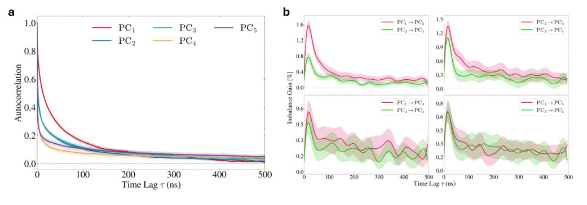 
Figure 1. Ubiquitin: (a) The autocorrelation functions of the top 5 PCs, PCi=1,5, which are colored red, blue, green, orange, and purple respectively, with shaded areas denoting error bars. (b) The pairwise IG curves over time between PC1 ⇔PC2,3,4,5. The IG values are on the Y-axis, and time lag (τ) in nanoseconds is on the X-axis. Pink lines denote the direction PC1 →PC2,3,4,5, whereas green lines denote the reverse direction. Shaded areas denote error bars computed over 20 independent realizations.

📷 Fig 2

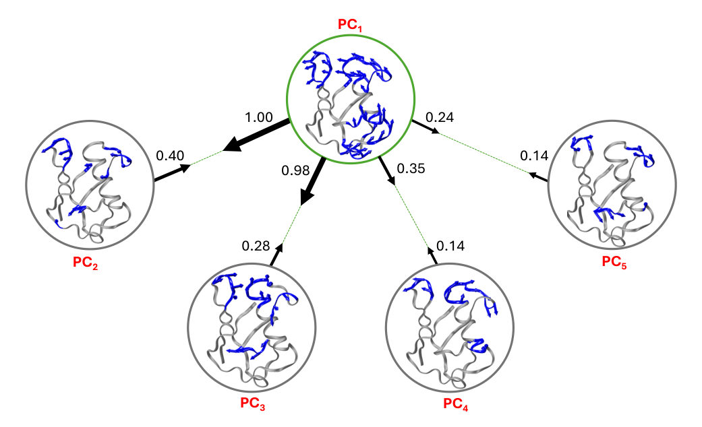 
Figure 2. Ubiquitin: Putative causal links between PC1 and the remaining leading principal components. Nodes represent the first five PCs, and directed edges indicate the normalized integrated Imbalance Gain, IGT, defined in Eq. 3. For each pair, the edge length and width, as well as the numerical label report the relative strength of the directional information transfer, with larger values corresponding to stronger causal links. The strongest links are observed from PC1 toward PC2 and PC3, whereas the links involving PC4 and PC5 are substantially weaker. For each PC, the residues with the largest contributions to the corresponding eigenvector are highlighted in blue on the protein...

📷 Fig 3

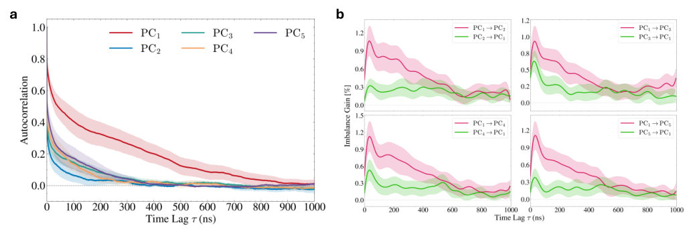 
Figure 3. NTL9: (a) The autocorrelation functions of the top 5 PCs, PCi=1,5, which are colored red, blue, green, orange, and purple respectively, with shaded areas denoting error bars. (b) The pairwise IG curves over time between PC1 ⇔PC2,3,4,5. The IG values are on the Y-axis, and time lag (τ) in nanoseconds is on the X-axis. Pink lines denote the direction PC1 →PC2,3,4,5, whereas green lines denote the reverse direction. Shaded areas denote error bars computed over 20 independent realizations.

📷 Fig 4

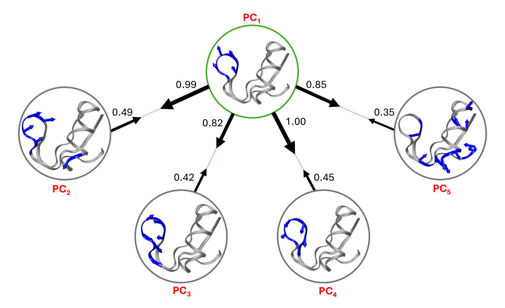 
Figure 4. NTL9: Putative causal links between PC1 and the remaining leading principal components. Nodes represent the first five PCs, and directed edges indicate the normalized integrated Imbalance Gain, IGT, defined in Eq. 3. For each pair, the edge length and width, as well as the numerical label report the relative strength of the directional information transfer, with larger values corresponding to stronger causal links. PC1 displays strong directional influence toward all other leading PCs considered, identifying it as a dominant slow driver within the folded-state dynamics of NTL9. For each PC, the residues with the largest contributions to the corresponding eigenvector are...

**Summary.** This work applies advanced causal inference techniques to molecular dynamics simulations of protein folding. By quantifying directional information flow between Principal Components, the authors demonstrate that collective motions exhibit a directed causal structure, suggesting that slow structural fluctuations dictate subsequent faster movements within the protein's conformational landscape.

**Why it may be interesting.** While focused on biomolecules, the methodology—using information-theoretic measures like IG to infer directed relationships in high-dimensional time series—is a powerful tool applicable to analyzing complex non-equilibrium dynamics in many-body systems beyond proteins.

Detailed structure

**Main problem.** The study investigates whether different Principal Components (PCs) derived from protein dynamics simulations causally influence each other over time, moving beyond simple correlation measures.

**Main result.** The causal inference approach reveals directed information flow ($	ext{PC1} 	o \{	ext{PC2}, 	ext{PC3}\}$) in both ubiquitin and NTL9, suggesting that the slowest collective mode drives subsequent faster fluctuations. This directional structure is not captured by conventional covariance-based analyses.

**Method.** The core method employs a causal-discovery framework based on Information Imbalance (IG), which quantifies predictive asymmetry between time series derived from MD simulations.

**Model / system.** The system studied is the dynamics of proteins, specifically ubiquitin and NTL9, simulated using Molecular Dynamics (MD) trajectories. The analysis reduces the high-dimensional conformational space into a set of collective variables represented by Principal Components (PCs).

**Key observables.** Pairwise Integrated Information Transfer (IGT), Brüschweiler collectivity index ($\kappa_k$), and time-lagged covariance matrices $\Gamma(	au)$.

**Important parameters / regimes.** Time lags ($	au$) up to the microsecond scale, and the magnitude of the Imbalance Gain ($	ext{IG}$).

**Assumptions / limitations.** The inferred causal links are putative; they suggest necessary but not sufficient conditions for true causality due to potential unobserved confounders.

**Figures summary.** Figures illustrate autocorrelation functions showing decorrelation timescales, pairwise IG curves demonstrating directional asymmetry (e.g., $	ext{PC1} 	o 	ext{PC2}$), and resulting causal graphs mapping the strongest information flow paths.

**Paper structure.** The paper introduces PCA/TICA limitations, details the application of the Information Imbalance framework to calculate directed couplings between PCs for two proteins (Ubiquitin and NTL9), presents results showing directional influence from slow modes to fast modes, and concludes by discussing implications for understanding protein dynamics organization.

Abstract

Principal component analysis (PCA) is widely used to characterize collective protein motions from molecular dynamics (MD) simulations. While PCA identifies the dominant modes of structural fluctuation, it does not reveal whether different principal components (PCs) causally influence each other. Here, we investigate this question using a recently introduced causal-discovery framework [Del Tatto et al, PNAS 2024], which allows to infer putative causal asymmetries between high-dimensional time series. We apply this approach to long-timescale MD trajectories of two proteins. By analyzing relationships among PCs, we construct directed networks describing how PCs influence one another across time scales. These directional relationships, whose existence is a necessary condition for the presence of a causal link, are not captured by conventional covariance-based analyses and provide information that is complementary to PCA and Time-lagged Independent Component Analysis (TICA). Our results suggest that our causal inference approach can uncover previously hidden aspects of the dynamical organization of protein motions and offer a new perspective on this very popular class of collective variables.

[↑ back to top](#top)

### [The $ω$-Effect from a Multimode Squeezed Graviton State](http://arxiv.org/abs/2606.24613v1)

**Authors:** Nick E. Mavromatos, Sarben Sarkar  
**Type:** theory · **Category:** other · **PDF:** <https://arxiv.org/pdf/2606.24613v1>  
**Analysis basis:** full PDF text, analyzed in chunks
**Topic relevance:** `Keldysh / 2PI / non-Gaussian methods` **3/5** · `correlated / nonlocal dissipation` **3/5** · `driven-dissipative phase transition` **2/5** · `entanglement & information structure` **2/5** · `methods for driven-dissipative` **1/5** · `non-equilibrium dynamics` **1/5** · `non-equilibrium universality` **1/5** · `quantum optics experiment` **1/5**

📷 Fig 1

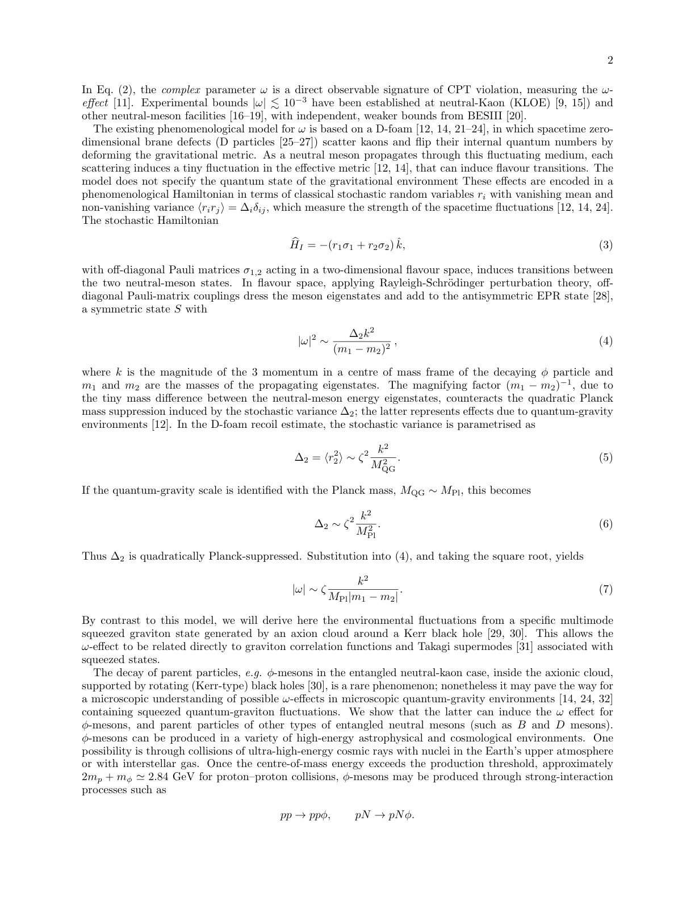 
Low-resolution page preview, page 2

📷 Fig 2

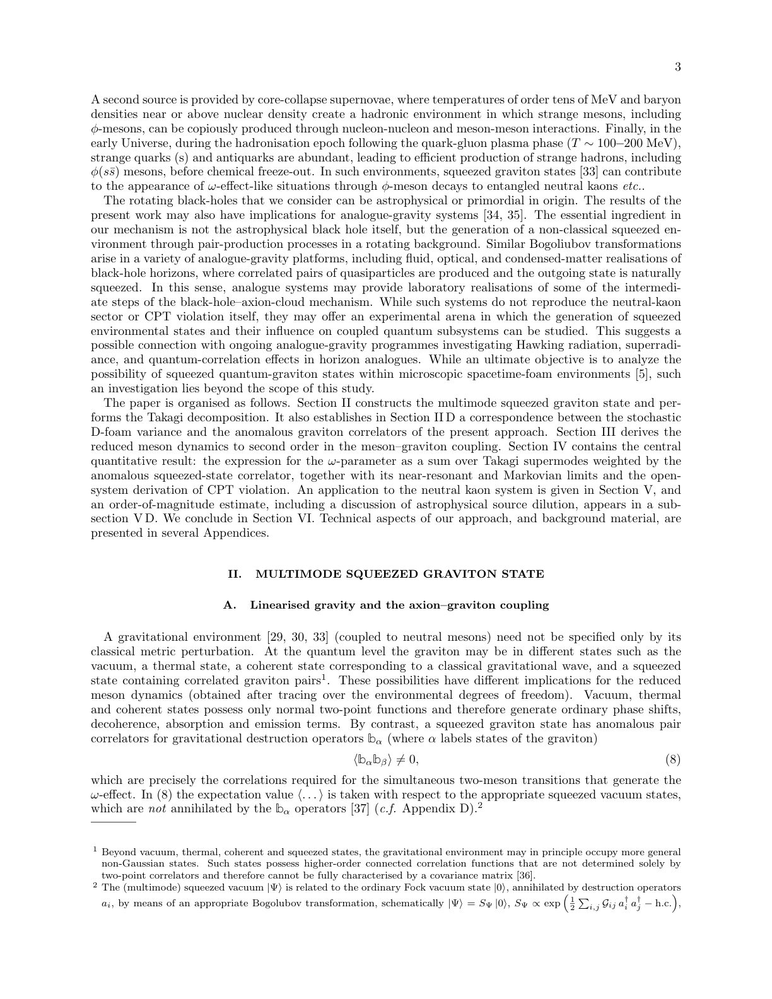 
Low-resolution page preview, page 3

📷 Fig 3

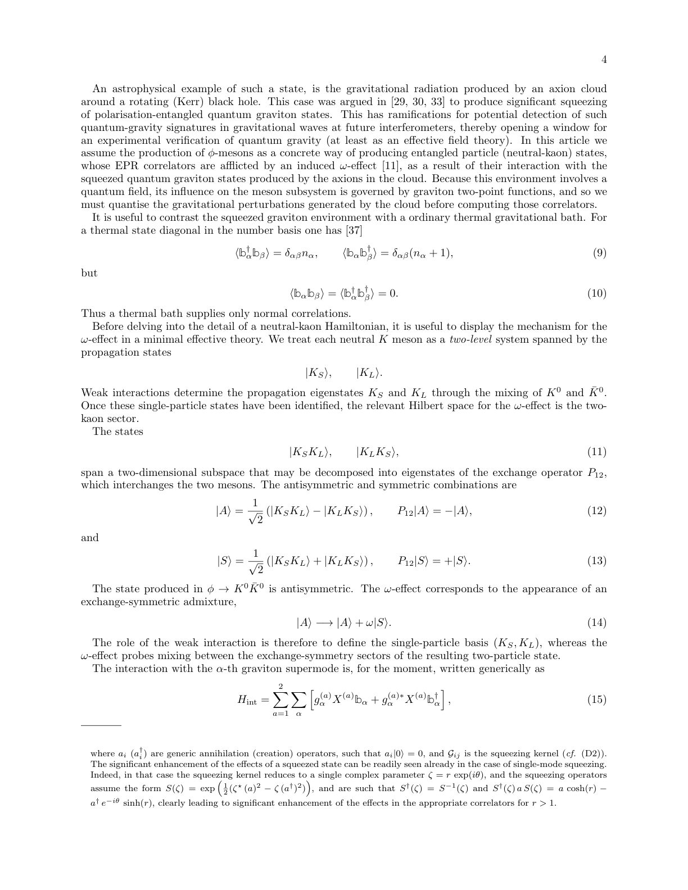 
Low-resolution page preview, page 4

📷 Fig 4

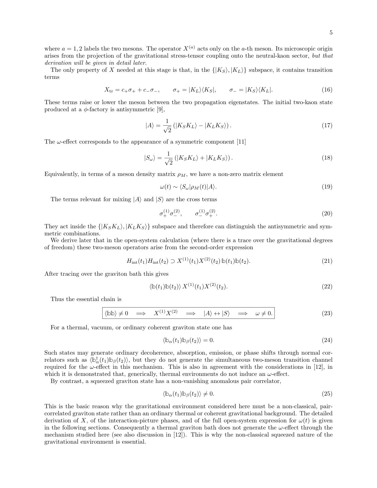 
Low-resolution page preview, page 5

📷 Fig 5

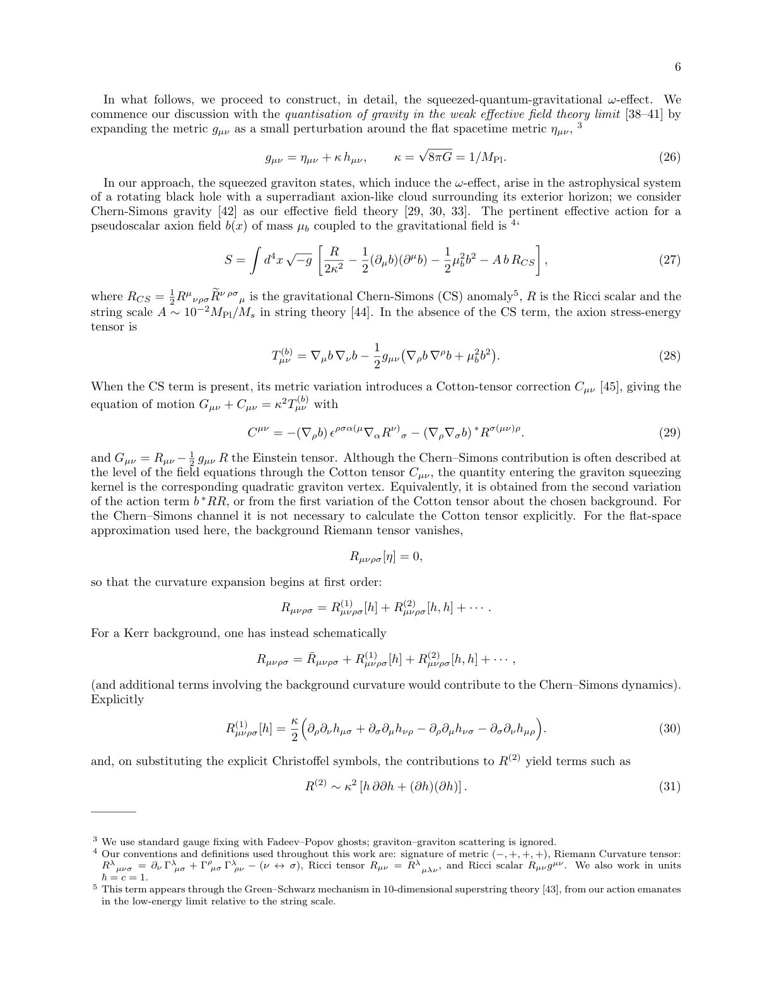 
Low-resolution page preview, page 6

**Summary.** The paper develops a microscopic framework to calculate the $\omega$-effect—a signature of CPT violation in neutral mesons—by modeling the environment as a multimode squeezed graviton bath. It replaces older phenomenological models with calculable anomalous correlators derived from the squeezing kernel. The result shows that this effect is a generic consequence of non-classical gravitational environments interacting coherently with particle decay processes.

**Why it may be interesting.** This work provides a concrete, calculable mechanism for generating decoherence/CPT violation signatures ($\omega$-effect) in particle physics systems by linking it directly to measurable quantum features (squeezing) of gravitational fields, bridging high-energy theory with quantum optics concepts.

Detailed structure

**Main problem.** The paper investigates the $\omega$-effect, a phenomenon that probes CPT violation induced by interactions with inaccessible quantum-gravitational degrees of freedom in entangled neutral-meson systems.

**Main result.** A non-zero $\omega$ parameter is predicted, quantifying an exchange-symmetric admixture in the meson state. This effect requires both flavor-changing weak interactions and the presence of anomalous correlators characteristic of a squeezed gravitational environment.

**Method.** The authors derive this effect by performing an open-system calculation involving tracing over the quantum graviton bath, replacing previous phenomenological stochastic variables with calculable graviton correlation functions derived from the Takagi decomposition of the squeezing kernel.

**Model / system.** The system involves entangled neutral mesons (e.g., kaons) interacting with a multimode squeezed gravitational field generated by an axion cloud around a Kerr black hole, modeled using concepts from Chern-Simons gravity and supermodes.

**Key observables.** The parameter $\omega$, which measures the small exchange-symmetric admixture in the otherwise antisymmetric EPR state of the mesons.

**Important parameters / regimes.** Squeezing amplitudes ($r_\alpha$), squeezing phases ($\phi_\alpha$), weak-interaction flavour-mixing matrix elements, and the energy splitting/decay rates of the kaons ($\Delta\lambda$).

**Assumptions / limitations.** The derivation relies on treating the gravitational bath as a squeezed vacuum state (requiring anomalous correlators $\langle b_\alpha b_eta 
angle 
eq 0$) and utilizes approximations like the Born approximation and RWA.

**Paper structure.** The paper builds from establishing the physical problem ($\omega$-effect) to deriving the necessary quantum gravitational input (squeezed graviton state via Takagi decomposition), and finally calculating the resulting meson evolution using an open-system master equation approach.

Abstract

The $ω$-effect in entangled neutral-meson systems provides a sensitive probe of CPT violation induced by quantum-gravitational environments. In open quantum systems, interactions with inaccessible gravitational degrees of freedom can render the reduced meson dynamics non-unitary, causing the CPT operator to become ill-defined, even when the underlying microscopic Hamiltonian is CPT invariant. We present a microscopic derivation of the $ω$-effect arising from a multimode squeezed gravitational environment generated by an axion cloud around a Kerr black hole. Using the Takagi decomposition of the associated complex symmetric squeezing kernel, the graviton field is expressed in terms of independent squeezed supermodes possessing anomalous correlators. These correlators provide a microscopic quantum counterpart of the stochastic fluctuations that appear in earlier D-particle foam descriptions of the $ω$-effect, replacing phenomenological variances of flavour-changing D-particle recoil by calculable graviton correlation functions. After tracing over the graviton bath, the anomalous correlators and the weak-interactions-induced mixing combine to generate transitions between the antisymmetric and symmetric two-meson sectors. This results in a small exchange-symmetric admixture, parametrised by $ω$, in the otherwise antisymmetric EPR state. We obtain an explicit expression for $ω$ in terms of a sum over Takagi supermodes weighted by their squeezing amplitudes and phases together with the weak-interaction flavour-mixing matrix element. The resulting framework suggests that the $ω$-effect may be a generic signature of non-classical states of gravitational environments, extending beyond the specific axion-cloud scenario considered here. The observability of the $ω$-effect from other astrophysical and microscopic black-hole sources is discussed.

[↑ back to top](#top)

### [Unitary Designs from Doped Matchgate Circuits](http://arxiv.org/abs/2606.23800v1)

**Authors:** Fabian Ballar Trigueros, Zheng-Hang Sun, Xhek Turkeshi, Piotr Sierant, Poetri Sonya Tarabunga  
**Type:** theory · **Category:** quantum information and computing · **PDF:** <https://arxiv.org/pdf/2606.23800v1>  
**Analysis basis:** full PDF text, analyzed in chunks
**Topic relevance:** `methods for driven-dissipative` **3/5** · `analog quantum simulation` **2/5** · `entanglement & information structure` **2/5** · `non-equilibrium dynamics` **2/5** · `Keldysh / 2PI / non-Gaussian methods` **1/5** · `correlated / nonlocal dissipation` **1/5** · `driven-dissipative phase transition` **1/5** · `non-equilibrium universality` **1/5**

📷 Fig 1

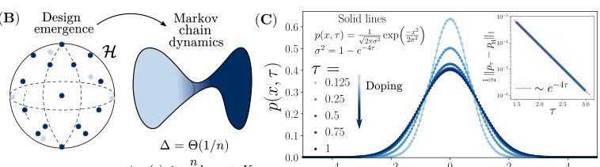 
Figure 1. Doping protocols and emergence of randomness in matchgate circuits. (A) schematic illustration of the global and localized doping constructions, in which non-Gaussian gates A are inserted into otherwise fermionic Gaussian dynamics. (B) Repeated doping drives the circuit ensemble toward unitary design behaviour in Hilbert space, which we analytically map to effective Markov-chain dynamics. The key Markov-chain quantities, such as the spectral gap ∆and the mixing time tmix, govern the design emergence. (C) Relaxation of the distribution pτ (Eq. (31)) toward the stationary Haar distribution pH (Eq. (38)) in doped matchgate circuits initialized in the vacuum state ψ0 = ∣0⟩⟨0∣⊗n,...

📷 Fig 2

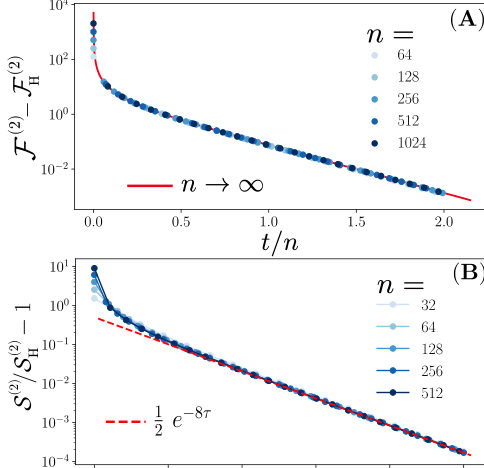 
Figure 2. (A) Deviation of the unitary 2-frame potential from the Z2-symmetric Haar value, as a function of doping depth. The solid red line shows the thermodynamic-limit prediction from the perturbative approach, while markers denote values obtained from the exact doping-matrix method. (B) Relative deviation of the state 2-frame potential, as a function of dop- ing depth.

📷 Fig 3

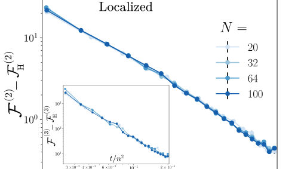 
Figure 4. Deviation of the unitary 2-frame potential from the Z2-symmetric Haar value, as a function of doping depth for the localized doping scheme shown in Fig. 1(A). The inset shows the corresponding value for the unitary 3-frame poten- tial.

📷 Fig 4

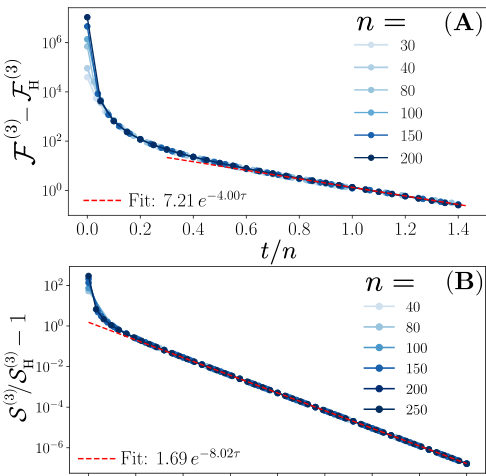 
Figure 3. (A) Deviation of the unitary 3-frame potential from the Z2-symmetric Haar value, as a function of doping depth. (B) Relative deviation of the state 3-frame potential, as a function of doping depth.

📷 Fig 5

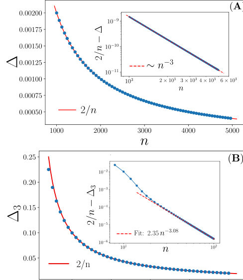 
Figure 5. System-size scaling of the spectral gap ∆[Eq. (40)] of the doping matrix for (A) two and (B) three copies. In both cases the leading behaviour is consistent with the Ornstein– Uhlenbeck value ∆∼2/n, matching the rigorous ∆= Θ(1/n) of Eq. (60) at two copies. Insets: subleading corrections, scal- ing as ∼n−3.

**Summary.** The paper develops a theoretical framework showing how injecting controlled fermionic interactions ('doping') into otherwise simple matchgate circuits can generate high levels of quantum randomness. By mapping the problem to classical Markov chains, they derive rigorous bounds on the depth needed to achieve unitary $k$-designs. This offers a controlled pathway from integrable physics toward complex quantum information processing.

**Why it may be interesting.** This work provides an analytically tractable method to bridge the gap between integrable (free-fermion) quantum systems and highly random, complex dynamics required for universal quantum computation.

Detailed structure

**Main problem.** The research addresses how structured, free-fermion dynamics (like those in matchgate circuits) can be modified by injecting non-Gaussian interactions to generate the necessary randomness for achieving unitary quantum designs.

**Main result.** They establish that doping these circuits allows for controlled formation of approximate unitary 2-designs in polylogarithmic depth, with convergence rates governed by classical Markov chain dynamics and spectral gaps.

**Method.** The analysis uses the matchgate commutant framework to map the quantum design problem onto a solvable classical birth-death Markov chain, allowing for rigorous bounding of mixing times and required gate counts.

**Model / system.** The system is based on 'doped matchgate circuits,' which start with free-fermion dynamics but are perturbed by non-Gaussian gates (fermionic interactions) to induce controlled entanglement growth towards Haar randomness.

**Key observables.** Unitary $k$-design formation, spectral gaps ($\Delta$), mixing times ($t_{	ext{mix}}$), and frame potentials ($F^{(k)}(E)$).

**Important parameters / regimes.** The doping depth (number of non-Gaussian gates) and the spatial structure of the doping (global vs. local/brickwork).

**Assumptions / limitations.** The analysis is most tractable in the globally scrambled regime, and the results rely on projecting dynamics onto the matchgate commutant.

**Figures summary.** Figures illustrate schematic doping protocols comparing global versus localized scrambling; they also show data collapse of frame potentials for $k=2$ and $k=3$, confirming relaxation towards Haar behavior.

**Paper structure.** The paper systematically analyzes the convergence rate to quantum designs by first establishing the mapping to a classical Markov chain, deriving bounds using spectral gap analysis, comparing global vs. local doping protocols, and finally providing explicit scaling laws for different design orders ($k=2, 3, 4$).

Abstract

Matchgate circuits realize free-fermion dynamics: they are efficiently classically simulable, yet cannot on their own generate the generic randomness required for universal computation or unitary design formation. We study a controlled route beyond this integrable limit by doping matchgate circuits with non-Gaussian gates-physically, the injection of fermionic interactions into an otherwise free system. Using the matchgate commutant framework, we obtain analytic control over unitary $2$-design formation. For globally scrambled dynamics, the design problem maps exactly onto a classical birth-death Markov chain with an Ornstein-Uhlenbeck continuum limit, recasting the emergence of quantum randomness in terms of spectral gaps and mixing times and yielding rigorous bounds on the number of non-Gaussian gates needed for approximate $2$-designs. These bounds hold for a broad class of parity-preserving non-Gaussian gates, independently of microscopic details, with numerics indicating that the same mechanism governs higher-order designs. Used as local building blocks in a glued-circuit architecture, they yield approximate parity-preserving $2$-designs in polylogarithmic depth with a sparse non-Gaussian gate count, with implications for Page-like entanglement growth and fermionic classical-shadow protocols. Finally, locality reshapes this picture: in local brickwork dynamics, design formation is diffusion-limited and far slower. Our results establish doped matchgate circuits as a controlled, analytically tractable route from free fermions to interaction-generated quantum designs.

[↑ back to top](#top)

### [Universal Dynamical Response to Slow Driving in Chaotic Systems](http://arxiv.org/abs/2606.23810v1)

**Authors:** Nachiket Karve, Nathan Rose, David Campbell, Anatoli Polkovnikov  
**Type:** theory · **Category:** statistical mechanics · **PDF:** <https://arxiv.org/pdf/2606.23810v1>  
**Analysis basis:** full PDF text, analyzed in chunks
**Topic relevance:** `non-equilibrium dynamics` **3/5** · `entanglement & information structure` **2/5** · `non-equilibrium universality` **2/5** · `Keldysh / 2PI / non-Gaussian methods` **1/5** · `analog quantum simulation` **1/5** · `correlated / nonlocal dissipation` **1/5** · `driven-dissipative phase transition` **1/5** · `methods for driven-dissipative` **1/5** · `scars & prethermalization` **1/5**

📷 Fig 1

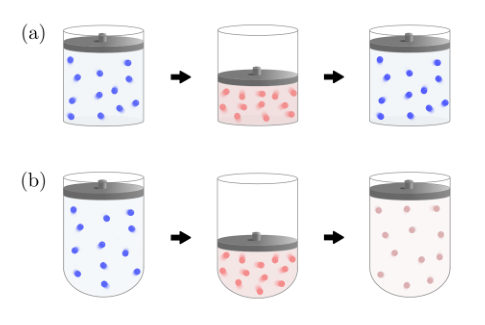 
FIG. 1: (a) Slow, cyclic driving of a regular system. The system returns to its initial state at the end of the drive. (b) On the other hand, a chaotic system fails to follow the drive adiabatically, which may manifest as heating.

📷 Fig 2

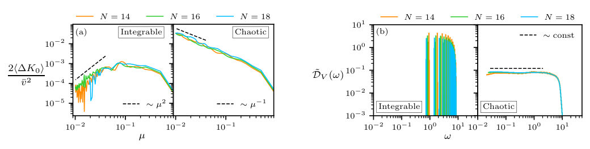 
FIG. 2: (a) The thermodynamic drag, 2⟨∆K0⟩/¯v2, as a function of µ for the Gibbs ensemble, with kBT = 100, of the integrable (left) and chaotic (right) Ising models, with system sizes of N = 14 (orange), 16 (green), and 18 (cyan). (b) The corresponding normalized spectral functions ˜DV (ω). Parameters used – integrable model: J = 1, hx = 1.05, hz = 0, chaotic model: J = 1, hx = 1.05, hz = 0.5.

📷 Fig 3

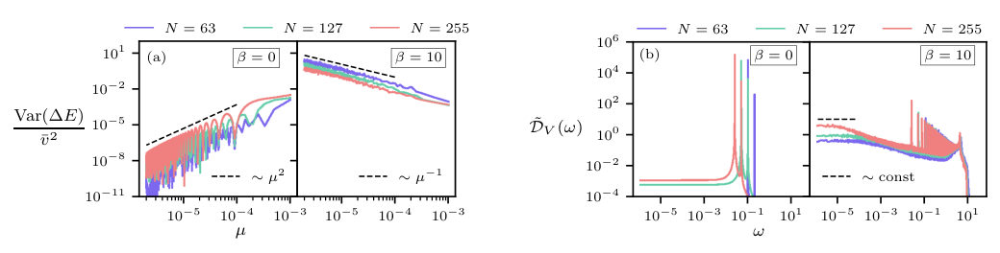 
FIG. 3: (a) Var(∆E)/¯v2 as a function of µ in a classical β-FPUT model with β = 0 (left) and β = 10 (right), initialized in a microcanonical ensemble with E = 1. System sizes of N = 63 (purple), 127 (green), and 255 (pink)

📷 Fig 4

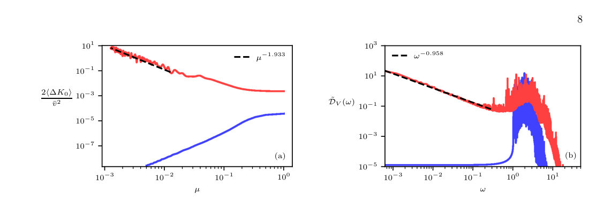 
FIG. 4: (a) The thermodynamic drag, 2⟨∆K0⟩/¯v2, as a function of µ for the Gibbs ensemble, with kBT = 100, of the integrable (blue) and chaotic (red) quantum two-spin models, with S = 10. (b) The corresponding normalized classical spectral functions ˜DV (ω). Parameters used: integrable model – J = (1, 1, 1/2), A = (0, 0, 0), chaotic model – J = (3/2, π, √e), A = (√π, √

📷 Fig 5

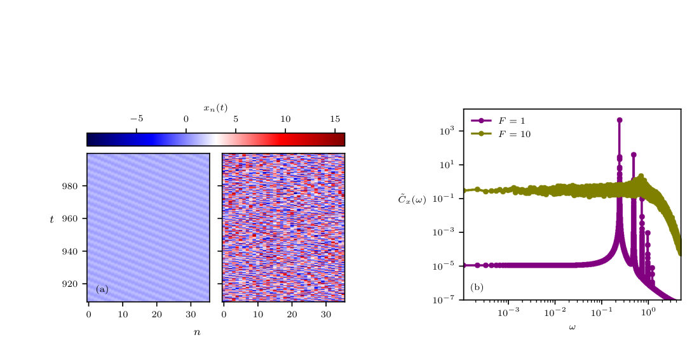 
FIG. 5: (a) Time evolution of a N = 36 site Lorenz-96 system with F = 1 (left) and F = 10 (right). (b) Spectral function of x.

**Summary.** The authors propose using the Speed-Fisher Information as a universal measure to characterize chaos by observing how a system's stationary state responds to slow external driving. They show that chaotic dynamics cause this information to diverge inversely with the driving speed, while regular dynamics result in finite or vanishing responses. This provides a powerful link between spectral properties and fundamental concepts of irreversibility.

**Why it may be interesting.** This work provides a powerful, measurable diagnostic tool—the speed-Fisher information—to distinguish between regular and chaotic dynamics in quantum systems without relying solely on traditional metrics like Lyapunov exponents. This has direct implications for understanding thermalization rates in open or driven quantum systems.

Detailed structure

**Main problem.** To develop a unified diagnostic tool for characterizing chaos in both classical and quantum systems by analyzing their response to slow, non-adiabatic driving.

**Main result.** Chaos manifests as a divergence of the speed-Fisher information ($I_{ar{v}}(\mu)$) as the driving protocol time approaches zero ($\mu 	o 0$), with the degree of divergence controlled by the low-frequency spectral weight of system observables.

**Method.** The analysis centers on calculating the Speed-Fisher Information, derived from the fidelity or relative entropy change during slow cyclic perturbations. This is related to the low-frequency behavior of correlation functions via Fourier transforms.

**Model / system.** The framework applies broadly to classical and quantum Hamiltonian systems (e.g., Ising models) and extends naturally to non-Hamiltonian classical flows. The analysis uses stationary states $
ho_{-\infty}$ subjected to time-dependent perturbations $H(t)$.

**Key observables.** Speed-Fisher Information ($I_{ar{v}}(\mu)$), Relative Entropy ($	ext{D}_{	ext{KL}}$), and the low-frequency spectral weight of correlation functions.

**Important parameters / regimes.** The driving speed $\mu$, which is taken to zero in the quasi-static limit; parameters determining system integrability (e.g., coupling constants $J, A$).

**Assumptions / limitations.** The analysis relies on approximations relating entropy change to variance ($\langle \Delta K_0 
angle \approx rac{1}{2} 	ext{Var}(\Delta K_0)$) and assumptions about the decay rates of spectral weights in different dynamical regimes.

**Figures summary.** Figures illustrate the comparison of thermodynamic drag (or $I_{ar{v}}(\mu)$) vs. $\mu$ for both regular (finite/saturating) and chaotic (diverging) quantum systems, alongside corresponding classical spectral functions.

**Paper structure.** The paper establishes the diagnostic tool ($I_{ar{v}}$), derives its connection to thermodynamics ($	ext{D}_{	ext{KL}}$), applies it across various physical models (quantum/classical/non-Hamiltonian), and systematically analyzes scaling laws based on the low-frequency spectral behavior of observables.

Abstract

We propose a unified perspective on classical and quantum chaos based on the stability of a system's stationary states under slow driving. We probe this sensitivity via the system's susceptibility to the average protocol speed, which we call the ``speed-Fisher information," and relate it to irreversible entropy production in the system. We show that chaotic dynamics manifests as a divergence of the speed-Fisher information with the protocol time, and that this response is controlled by the perturbation's low-frequency spectral weight. This approach to chaos applies to both classical and quantum Hamiltonian systems, and naturally extends to non-Hamiltonian classical flows. We illustrate this framework with simple classical and quantum examples, along with a non-Hamiltonian flow that qualitatively exhibits analogous low-frequency spectral behavior.

[↑ back to top](#top)

### [Typical geometry of self-repelling polymers in a constant force field](http://arxiv.org/abs/2606.24352v1)

**Authors:** Kamil Khettabi, Yvan Velenik  
**Type:** theory · **Category:** statistical mechanics · **PDF:** <https://arxiv.org/pdf/2606.24352v1>  
**Analysis basis:** full PDF text, analyzed in chunks
**Topic relevance:** `Keldysh / 2PI / non-Gaussian methods` **3/5** · `driven-dissipative phase transition` **2/5** · `non-equilibrium dynamics` **2/5** · `non-equilibrium universality` **2/5** · `Frenkel-Kontorova` **1/5** · `analog quantum simulation` **1/5** · `methods for driven-dissipative` **1/5**

📷 Fig 1

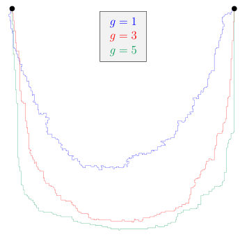 
Figure 2: Simulation of the model with α = 3, a = 0 and N = 200 (left) and N = 1000 (right) for various values of g, in the case of the self-avoiding walk.

📷 Fig 2

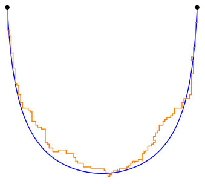 
Figure 3: Simulation of the model with α = 3, a = 0, g = 3 and N = 100 (left) and N = 1000 (right), in the case of the simple random walk. The blue curve is the geodesic of equation (20).

📷 Fig 3

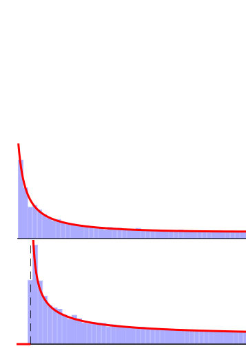 
Figure 4: Histogram of the empirical monomer density associated to one trajectory of the simple random walk model with α = 3, a = 0, g = 3 and N = 10000. Top: horizontal marginal of the empirical monomer measure (blue) and the corresponding marginal of the variational monomer measure (η∗)#Leb[0,α] (red). Bottom: the same for the vertical marginal; the dashed line marks the lower edge of the support of the limiting measure, where the theoretical density has an integrable singularity.

📷 Fig 4

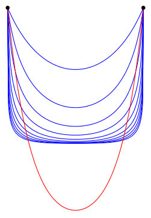 
Figure 5: Left: The geodesics of equation (20) for a = 0, α = 3 and values of g ranging from 1 to 10. The standard catenary for an inextensible string of length 3 is drawn in red for comparison. Right: The geodesics (blue) and the catenaries (red) of same apparent length, for a = 0, α = 3 and increasing values of g: 0.1, 0.5, 1, 2.

📷 Fig 5

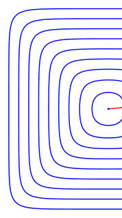 
Figure 6: Some level lines of f and the path λ 7→hλ(v) of Lemma 2.4 in the case of the simple random walk (that is, Φ(γ) ≡0) and v = (cos(π/40), sin(π/40)).

**Summary.** This paper rigorously determines the macroscopic shape adopted by self-repelling polymers under a constant external force field. It achieves this by solving an equivalent variational problem, showing that the optimal geometry is governed by a geodesic defined by a height-dependent Finsler metric. The results provide quantitative predictions for different field strengths, bridging classical physics (catenaries) with lattice constraints.

**Why it may be interesting.** While focused on classical polymer physics, the mathematical machinery—using Finsler metrics derived from statistical mechanics potentials to determine optimal paths—is highly relevant for understanding effective Hamiltonians in complex many-body systems or quantum field theories where path integrals are involved.

Detailed structure

**Main problem.** The study determines the typical macroscopic geometry of self-repelling polymers subjected to a constant external force field.

**Main result.** The limiting free energy is found by solving a variational problem, and the resulting macroscopic shape is characterized as a geodesic of a height-dependent Finsler metric. The analysis reveals universal limits for small (catenary) and large (polygonal) field strengths.

**Method.** The authors employ advanced techniques from the calculus of variations, comparing primal and dual variational formulations to establish the unique global minimizer that governs the system's macroscopic behavior in the thermodynamic limit.

**Model / system.** The model consists of self-repelling polymers on a 2D lattice (Z^2), encompassing models like the simple random walk and SAW. The system is subjected to an external constant force field, leading to path weights governed by interaction potentials and the external potential.

**Key observables.** Limiting free energy density ($\Psi$), rate function ($J(v)$), macroscopic shape (geodesic $\Gamma^*$), and monomer measure concentration ($m^*$).

**Important parameters / regimes.** Force field strength ($g$), fixed length/displacement constraints, and the lattice structure ($\mathbb{Z}^2$).

**Assumptions / limitations.** The analysis relies heavily on establishing analytic properties of the free energy function and using techniques like coarse-graining and passing to limits in both space and time parameters.

**Figures summary.** Figures illustrate simulations comparing computed geodesics to classical catenaries for small fields, and show concentration histograms confirming that empirical measures converge to the deterministic variational measure.

**Paper structure.** The paper progresses by first defining thermodynamic quantities (free energy, rate function) via ensemble averages. It then tackles the core problem using primal/dual variational formulations, proving equivalence between them. Finally, it establishes the limiting free energy by bounding the partition function from above and below using coarse-graining techniques.

Abstract

We study a general class of self-repelling polymers on $\mathbb Z^2$, including the simple random walk, the self-avoiding walk and the repulsive Domb-Joyce model, in the presence of a constant force field acting on each monomer. Conditioning the polymer to have fixed length and fixed endpoints, we identify the limiting free energy and prove that typical trajectories concentrate exponentially near a deterministic macroscopic shape. This shape is characterized as the unique minimizer of a variational problem and can be interpreted as a geodesic of a height-dependent Finsler metric. We also analyze two limiting regimes with universal features: for small field strength, in the symmetric case, the geodesic is close to a classical catenary, while for large field strength it converges to a universal polygonal shape governed by the nearest-neighbor lattice constraint.

[↑ back to top](#top)

### [Electrical-Circuit Simulation of the Uhlmann Phase](http://arxiv.org/abs/2606.24559v1)

**Authors:** Yu-Huan Huang, Yu Wang, Jia-Chen Tang, Xu-Yang Hou, Hao Guo  
**Type:** both · **Category:** other · **PDF:** <https://arxiv.org/pdf/2606.24559v1>  
**Analysis basis:** full PDF text, analyzed in chunks
**Topic relevance:** `analog quantum simulation` **3/5** · `driven-dissipative phase transition` **2/5** · `non-equilibrium dynamics` **2/5** · `correlated / nonlocal dissipation` **1/5** · `entanglement & information structure` **1/5** · `methods for driven-dissipative` **1/5** · `non-equilibrium universality` **1/5**

📷 Fig 1

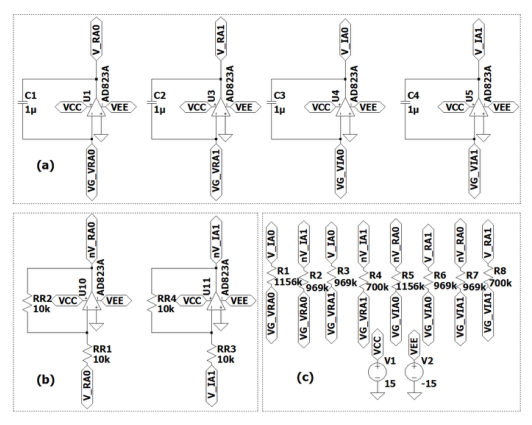 
Figure 1: Circuit implementation of block A for r = 0.9. (a) Four inverting integrators representing the dynamical vari- ables ˜V A0 R , ˜V A0 I , ˜V A1 R , and ˜V A1 I . (b) Unity-gain inverting amplifiers used for positive-coupling branches. (c) Resistive coupling network and ±15 V power supply configuration. The resistor values are taken from Table I for r = 0.9. All oper- ational amplifiers are AD823A devices with a feedback ca- pacitance of 1 µF. Identical labels (e.g., VG VRA0) indicate electrically connected nodes.

📷 Fig 2

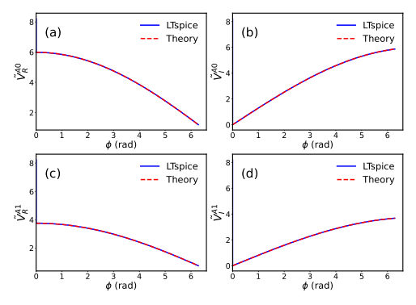 
Figure 2: Comparison between LTspice simulations and the- oretical predictions for the four state variables in block A at r = 0.9. Blue solid lines: circuit simulation; red dashed lines: theory.

📷 Fig 3

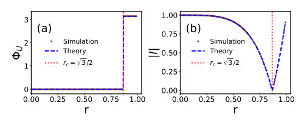 
Figure 3: (a) Uhlmann geometric phase ΦU as a function of r. (b) Normalized overlap magnitude |I| as a function of r. Circles denote LTspice simulation results; dashed lines are the theoretical predictions.

**Summary.** The paper develops a method to simulate the Uhlmann geometric phase—a concept describing geometry in mixed quantum states—using only classical electrical circuits. By mapping the complex quantum evolution onto an admittance matrix, the authors designed and simulated an active RC network that accurately reproduces the phase's topological transition at a critical purity value.

**Why it may be interesting.** This work is highly relevant as it bridges abstract concepts from quantum information theory (geometric phases in mixed states) with tangible, classical experimental hardware (RC circuits), providing a novel platform for testing fundamental physics principles outside traditional quantum optics setups.

Detailed structure

**Main problem.** The goal is to find a simple, accessible physical platform—specifically classical electrical circuits—to simulate the complex dynamics associated with the Uhlmann geometric phase for mixed quantum states.

**Main result.** The authors successfully mapped the abstract Uhlmann evolution onto an active RC circuit network, demonstrating that this classical system faithfully reproduces both the local dynamics and the global topological transition of the mixed-state geometric phase.

**Method.** The theoretical framework involved reformulating the Uhlmann parallel-transport condition into a linear differential equation, which was then transformed into a time-independent, real-valued dynamical matrix suitable for circuit implementation.

**Model / system.** The system models mixed quantum states governed by density matrices ($
ho$) and their evolution under the Uhlmann condition. The physical realization uses an active RC network built from multi-input inverting integrators and resistors to emulate the required linear dynamics.

**Key observables.** The primary observable is the Uhlmann geometric phase ($\Phi_U$), calculated via the argument of the normalized overlap ($I$) between initial and final states. The magnitude $|I|$ also shows a critical dip.

**Important parameters / regimes.** The purity parameter $r$ controls the dynamics, with a critical transition occurring at $r_c = \sqrt{3}/2$.

**Assumptions / limitations.** The derivation assumes that the complex Uhlmann dynamics can be recast into a real-valued system via rotating-frame transformations and subsequent decomposition suitable for analog circuit implementation.

**Figures summary.** Figures compare LTspice simulations (blue solid) against exact theoretical solutions (red dashed), showing how the measured phase $\Phi_U$ jumps from zero to $\pi$ at the critical purity $r_c$.

**Paper structure.** The paper progresses by first reformulating the abstract quantum dynamics into a linear matrix form, then applying transformations (rotating frame, real decomposition) to yield a time-independent generator ($M_8$), and finally detailing the mapping of this matrix onto specific components of an active RC circuit for simulation.

Abstract

The Uhlmann phase extends the concept of geometric phases to mixed quantum states through a parallel-transport condition on purification amplitudes, but its experimental realization has so far required sophisticated quantum platforms with carefully engineered auxiliary degrees of freedom. In this work, we reformulate the Uhlmann parallel-transport condition as a linear matrix differential equation and vectorize it to obtain an effective dynamical generator. This generator can be directly mapped onto the admittance matrix of a classical RC circuit, thereby translating the Uhlmann dynamics into the evolution of circuit node voltages. We illustrate the mapping using the equatorial-loop model and, via a rotating-frame transformation followed by a real decomposition, derive a time-independent, real-valued dynamical system suitable for analog implementation. LTspice simulations of the resulting active RC network faithfully reproduce the Uhlmann geometric phase and its topological transition at the critical purity, demonstrating that classical electrical circuits offer a simple and accessible platform for probing mixed-state geometric phases.

[↑ back to top](#top)

### [Optical mapping of phases and phase boundaries in nanoconfined fluids](http://arxiv.org/abs/2606.24809v1)

**Authors:** Lauriane Pierrot Deseilligny, Susan Perkin  
**Type:** experiment · **Category:** statistical mechanics · **PDF:** <https://arxiv.org/pdf/2606.24809v1>  
**Analysis basis:** full PDF text, analyzed in chunks
**Topic relevance:** `non-equilibrium dynamics` **3/5** · `non-equilibrium universality` **3/5** · `driven-dissipative phase transition` **2/5** · `Frenkel-Kontorova` **1/5** · `interference shaping light` **1/5** · `quantum measurements` **1/5**

📷 Fig 1

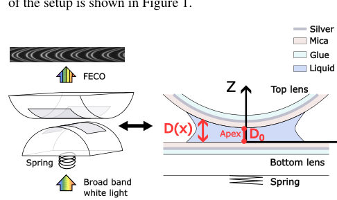 
FIG. 1. Schematic of the SFB. White light passes through the inter- ferometric cavity built from the crossed-cylinders coated with back- silvered mica. The emerging light is composed of the wavelengths that resonate with the different separations imposed by the cavity. After passing through a spectrometer, the constructive interference emerges as fringes of equal chromatic order (FECO). Under the Der- jaguin approximation, the crossed-cylinder geometry is treated as an equivalent sphere-plane geometry. A view from a lateral section is provided on the right, to illustrate the sphere-plane equivalence and to introduce the coordinate system.

📷 Fig 2

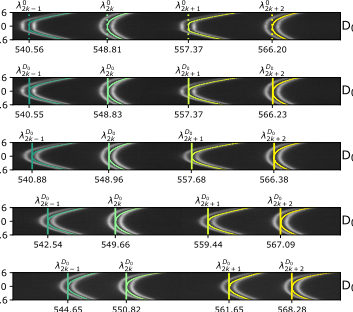 
FIG. 2. Example FECO interferograms corresponding to different values of the apex separation D0 as indicated on the right. Each interferogram spans a wavelength range encompassing four fringes, each of which is composed of a doublet arising from the mica bire- fringence. The measured interference appears white, while the fitted centre of mass of each doublet is shown in colour superimposed on the measured data. We denote the wavelength of fringe with order p as function λ D(x) p . Vertical lines indicate the apex wavelength of each

📷 Fig 3

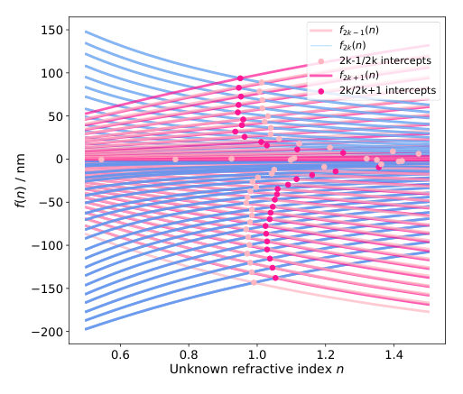 
FIG. 3. Graphical solution to equations 5 and 6 applied to the con- tact interferogram (D0 = 0) from figure 2 in order to estimate the optical path length δ(D) and the mean refractive index µD l for all lateral positions x. Since the interferogram contains four fringes, for each lateral position x, three curves can be calculated: f D 2k−1(n), f D 2k(n), f D 2k+1(n), shown in pink (odd index) and blue (even index). Thus, for this interferogram, there are two intersections defined for each x (shown as dark and light pink points). From the intersections we can compute estimations of the optical path δ(D(x)) and the re- fractive index n(x) at each given lateral position x.

📷 Fig 4

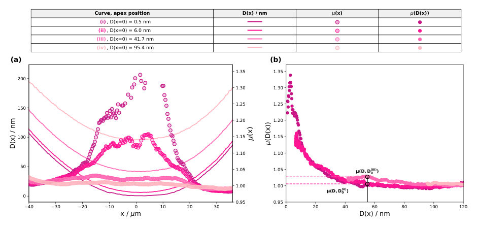 
FIG. 4. (a) Refractive index and separation profiles in air extracted from the intercepts as in figure 3, applied to different apex separations which are indicated by the minima of the D(x,D0) curves (D(i) 0 = 0.5 nm, D(ii) 0 = 6.0 nm, D(iii) 0 = 41.7 nm, D(iv) 0 = 95.4 nm). In (b) the same data is plotted as refractive index vs. separation for each of the four D0 values (four interferograms).

📷 Fig 5

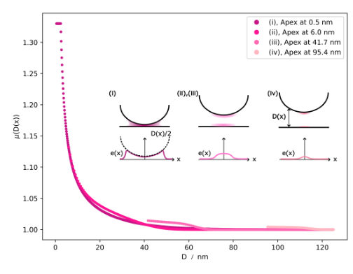 
FIG. 5. Schematic of the model evolution of e(x) and the associ- ated refractive index profile as a function of separation D(x). The curves and the cartoons (i), (ii), (iii), and (iv) are in direct correspon- dence with the four curves from figure 4, corresponding to the apex D(i) 0 ,D(ii) 0 ,D(iii) 0 ,D(iv) 0 . From cartoon (iv) to (iii) and (ii), the water film thickens and spreads, reflected by an increase in parameters E0 and n0 of equation 9. Cartoon (i) illustrates the situation where the films of each surface have bridged. The overall thickness 2e(x) is therefore bound by D(x).

**Summary.** This work introduces a novel optical technique using Surface Force Balance interferometry to map composition and track interfaces within nanoconfined liquids. By analyzing refractive index profiles during controlled evaporation, the authors successfully characterize meniscus geometry changes as the system transitions from surface tension control to strong confinement effects. This method provides a powerful tool for quantifying interfacial thermodynamics at the nanoscale.

**Why it may be interesting.** While primarily experimental, the quantitative analysis of phase transitions and crossover regimes under extreme confinement provides valuable data for developing theoretical models in non-equilibrium statistical mechanics and interface physics.

Detailed structure

**Main problem.** To develop a non-invasive method for nanoscale composition mapping and characterizing phase boundaries in nanoconfined liquids.

**Main result.** The technique successfully tracks the time evolution of meniscus geometry during liquid evaporation, revealing a crossover from surface tension-dominated to confinement-dominated regimes at small separations.

**Method.** It utilizes Surface Force Balance (SFB) combined with multiple beam interferometry analysis to reconstruct spatially resolved refractive index profiles within confined fluids.

**Model / system.** The study focuses on liquid confinement between mica surfaces, analyzing the meniscus geometry during dynamic evaporation of a heptane droplet. The method allows for composition profiling by mapping variations in the effective film thickness and refractive index.

**Key observables.** Refractive index profiles ($\mu(x)$), mean refractive index ($\mu_D$), effective film thickness ($e_{eff}$), meniscus geometry (catenoid vs. quartic fit), and evaporation rate ($	ext{-}dV/dt$).

**Important parameters / regimes.** Nanoscale separations (down to $\approx 10$ nm height), surface tension effects, confinement-induced composition variations.

**Assumptions / limitations.** The analysis relies on fitting interference fringes derived from the crossed-cylinder geometry and assumes local uniformity of properties for certain model simplifications.

**Figures summary.** Figures illustrate SFB setups, interferograms showing fringe patterns, calculated refractive index profiles ($\mu(x)$ vs. $D_0$), and time evolution plots comparing catenoid fits to observed meniscus geometries during evaporation.

**Paper structure.** The paper details the methodology for optical mapping using TLI/SFB, applies it first to air calibration (detecting wetting capillaries), then uses it to track dynamic liquid evaporation, analyzing geometric crossovers and quantifying interfacial thermodynamic effects.

Abstract

In confined space, deviations from bulk structure and properties are expected due to additional thermodynamic variables. In particular, composition variations arising from surface interactions may lead to additional phases and altered phase transitions. Here, we introduce a non-invasive method for nanoscale composition mapping in confined liquids using the surface force balance (SFB). The method extends conventional SFB analysis from apex measurements to spatially resolved reconstruction of refractive index profiles within confined fluids. When multiple phases are present, the refractive index profiles provide direct access to the position and geometry of the nanoconfined fluid interfaces. We describe the interferogram analysis in detail and establish its range of validity through two model scenarios. First, measurements in air demonstrate the precision of the method and allow detection of a nanometric wetting capillary. Second, we analyse dynamic evaporation of a confined heptane droplet down to 0.1 pL volume. The method provides a time-resolved reconstruction of the meniscus geometry throughout the evaporation process. Although evaporation continuously drives the system out of equilibrium, the meniscus remains well described by a catenoidal geometry down to heights of approximately 80 nm. At smaller separations, systematic deviations from the catenoidal profile emerge, indicating a crossover from a surface tension-dominated regime to a confinement-dominated regime. Overall, we demonstrate composition profiling as a framework to analyse confinement-induced composition variations and to quantify interfacial thermodynamic effects at the nanoscale.

[↑ back to top](#top)

### [Rotational Vacuum Friction of Nonabsorbing Particles](http://arxiv.org/abs/2606.24723v1)

**Authors:** F. Javier García de Abajo, Alejandro Manjavacas  
**Type:** theory · **Category:** other · **PDF:** <https://arxiv.org/pdf/2606.24723v1>  
**Analysis basis:** full PDF text, analyzed in chunks
**Topic relevance:** `Keldysh / 2PI / non-Gaussian methods` **3/5** · `driven-dissipative phase transition` **2/5** · `non-equilibrium dynamics` **2/5** · `Frenkel-Kontorova` **1/5** · `correlated / nonlocal dissipation` **1/5** · `methods for driven-dissipative` **1/5** · `non-equilibrium universality` **1/5**

📷 Fig 1

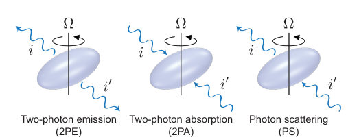 
FIG. 1. A small nonabsorbing asymmetric particle rotates about the z axis with angular velocity Ω. The particle can lose angular momentum through two-photon emission (2PE), two-photon absorption (2PA), and photon scattering (PS), all of which contribute to rotational friction. In particular, 2PE can occur at zero vacuum temperature, whereas 2PA and PS require a finite thermal photon population.

📷 Fig 2

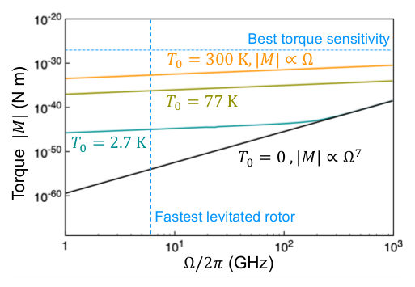 
FIG. 3. Absolute strength of rotational vacuum friction in a nonabsorbing asymmetric particle. We plot the frictional torque as a function of rotation frequency Ωfor a prolate diamond ellipsoid with semi-axes of 100 nm and 76 nm at dif- ferent vacuum temperatures T0 (see labels). The vertical and horizontal dashed lines indicate the fastest mechanical rota- tion reported to date (Ω/2π = 6 GHz [48]) and the measured torque sensitivity in levitated nanorotors (∼1 × 10−27 N m [49]), respectively.

📷 Fig 3

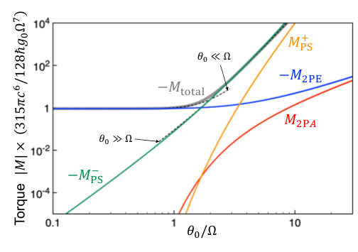 
FIG. 2. Temperature and velocity dependence of rotational friction in nonabsorbing particles. We show different con- tributions to the torque Ms arising from the processes de- picted in Fig. 1 and dependent only on the θ0/Ωratio, where θ0 = 2πkBT0/ℏis the thermal frequency. The s = PS contri- bution is separated into terms associated with ±ℏmomentum transfers. The total torque (gray curve) is compared with the high- and low-temperature limits (broken curves).

**Summary.** This theoretical paper develops a quantum electrodynamics framework to calculate vacuum friction torque on rotating particles. It shows that this torque depends critically on particle symmetry and temperature, yielding distinct power-law scalings ($\Omega^7$ vs linear $\Omega$) depending on the thermal regime. The findings highlight fundamental symmetries protecting certain geometries from vacuum dissipation.

**Why it may be interesting.** This work directly addresses open quantum systems dynamics by quantifying dissipation mechanisms (vacuum friction) that couple mechanical rotation to the zero-point energy of the electromagnetic field, which is a key area in advanced AMO physics and quantum optics.

Detailed structure

**Main problem.** The research develops a quantum theory to calculate the rotational vacuum friction torque exerted on small, nonabsorbing particles rotating in a vacuum.

**Main result.** The calculated torque exhibits strong dependence on particle symmetry and temperature; for anisotropic particles at zero temperature, the torque scales as $\Omega^7$, while axisymmetric particles are protected from this type of photon-assisted friction.

**Method.** The calculation relies on applying Fermi's golden rule to second-order processes (two-photon emission/absorption) derived from an electric-dipole interaction Hamiltonian coupling particle excitations and rotation to the quantized electromagnetic vacuum field.

**Model / system.** The system is a small, nonabsorbing particle with internal bosonic excitations ($\epsilon_j$) undergoing rotation ($\Omega$) in a vacuum at temperature $T_0$. The analysis uses quantum electrodynamics principles applied to rotational dynamics.

**Key observables.** Rotational friction torque ($M$), absorbed power ($P_{abs}$), and the scaling of these quantities with $\Omega$ and $T_0$.

**Important parameters / regimes.** Rotation frequency ($\Omega$), temperature ($T_0$) characterized by $	heta_0$, internal excitation gap ($\epsilon_g$), and particle anisotropy/symmetry.

**Assumptions / limitations.** The particle is nonabsorbing (real polarizability); approximations are made regarding the relative magnitudes of $\Omega, 	heta_0,$ and $\epsilon_g$ to simplify the calculation into distinct temperature regimes.

**Figures summary.** Figures illustrate the contributing physical processes (2PE, 2PA, PS) and plot the calculated absolute strength of rotational vacuum friction versus rotation frequency for various temperatures and particle shapes.

**Paper structure.** The paper builds from defining the interaction Hamiltonian and applying Fermi's golden rule to calculate transition rates. It then derives general expressions for the torque in terms of temperature-dependent sums, simplifying these into distinct asymptotic limits ($\Omega^7$ at low $T$, linear $\Omega$ at high $T$), and finally analyzing symmetry protection.

Abstract

A nonabsorbing particle rotating in vacuum can lose angular momentum only by converting mechanical energy into electromagnetic radiation. Here, we develop a quantum theory of rotational vacuum friction for small lossless particles and show that axial symmetry qualitatively changes the leading dissipation channel. At zero temperature, the frictional torque scales as $M\proptoΩ^7$ with rotation frequency $\ Omega$ in anisotropic particles due to the emission of correlated photon pairs whose frequencies sum to $2Ω$, while a contribution to the torque linear in $\ Omega$ is found at finite temperature. In contrast, axisymmetric particles are protected against photon-assisted friction regardless of temperature.

[↑ back to top](#top)

### [THz-induced phonon mode mixing and collective dynamics in a polar nanolattice](http://arxiv.org/abs/2606.24804v1)

**Authors:** Elizabeth Skoropata, Peter M. Derlet, Hiroki Ueda, Roman Mankowsky, Mathias Sander, Henrik T. Lemke, Rafael T. Winkler, Yunpei Deng, Milan Radovic, Matteo Savoini, Biaolong Liu, Martina Basini, Vladimir Ovuka, Steven L. Johnson, Marta D. Rossell, Urs Staub  
**Type:** both · **Category:** other · **PDF:** <https://arxiv.org/pdf/2606.24804v1>  
**Analysis basis:** full PDF text, analyzed in chunks
**Topic relevance:** `non-equilibrium dynamics` **3/5** · `driven-dissipative phase transition` **2/5** · `non-equilibrium universality` **2/5** · `Frenkel-Kontorova` **1/5** · `Keldysh / 2PI / non-Gaussian methods` **1/5** · `analog quantum simulation` **1/5** · `methods for driven-dissipative` **1/5**

📷 Fig 1

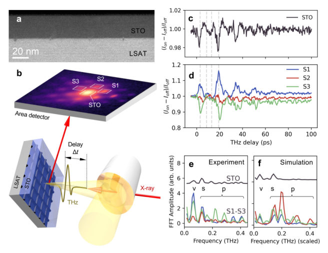 
Fig. 1: Collective modes created in a polar nanostructure: a Cross-sectional scanning trans-

📷 Fig 2

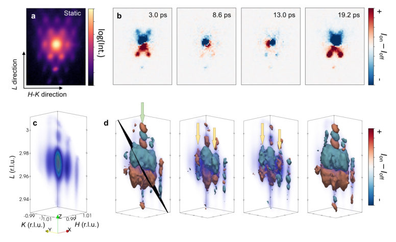 
Fig. 2: Time-dependent changes of structure and polarization in 2- and 3-dimensional

📷 Fig 3

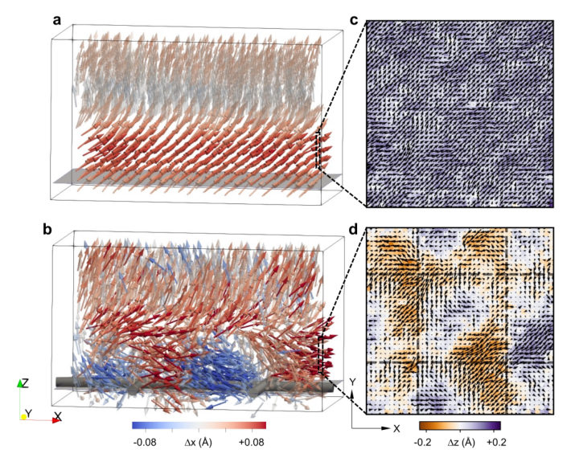 
Fig. 3: Transformation from 2-dimensional waves to 3-dimensional vortex-like displace-

📷 Fig 4

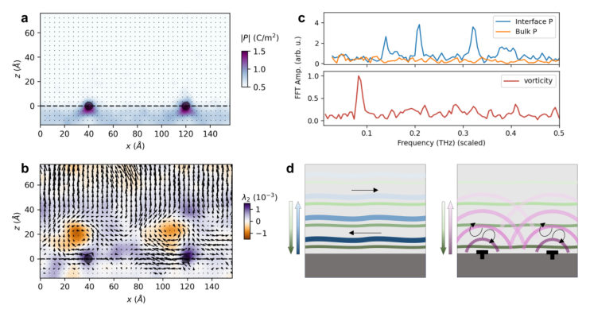 
Fig. 4: Polarization and vorticity of phonon modes in nanolattice SrTiO3: 2-dimensional

📷 Fig 5

 
Fig. 2). The black arrows in (A, B) indicate the O2−displacement. c Fourier transform of the average

**Summary.** This paper explores using nanoscale structural imperfections, specifically dislocation networks in STO thin films, to control phonon behavior. By exciting the material with THz pulses and measuring the resulting X-ray diffraction changes, the authors show that symmetry breaking generates novel collective vibrational modes. This opens a new avenue for designing functional materials by controlling their real-space topology.

**Why it may be interesting.** The work demonstrates how engineered structural defects can act as powerful tuning knobs for lattice dynamics, offering an analogy to controlling quantum states or excitations by manipulating the underlying geometry of a solid-state system.

Detailed structure

**Main problem.** The study investigates how controlling symmetry breaking at nanoscale interfaces, such as dislocation networks, can be used to manipulate phonon mode mixing and generate novel collective dynamics in polar materials.

**Main result.** Symmetry breaking due to dislocations induces a mixture of acoustic and optical modes, leading to measurable dynamic electric polarization and the generation of previously unobserved collective THz-frequency modes.

**Method.** The research combines ultrafast time-resolved X-ray diffraction (tr-XRD) experiments using THz pulses with classical molecular dynamics (MD) simulations.

**Model / system.** The physical system is a Strontium Titanate ($	ext{SrTiO}_3$) thin film grown on a complex substrate, engineered to contain an ordered network of interfacial misfit dislocations. Simulations model the lattice response under strain and electric fields.

**Key observables.** Transient diffraction intensity ($\Delta I/I$), out-of-plane vs. in-plane atomic displacements, dynamic electric polarization ($|P|$), and vorticity measures ($\lambda_2$).

**Important parameters / regimes.** THz frequency regime (e.g., 0.060 to 0.124 THz modes); nanoscale structural features like dislocation spacing; picosecond time scales.

**Assumptions / limitations.** The analysis often relies on drawing analogies from fluid dynamics concepts (helicity, $\lambda_2$) and comparing simulation results with experimental measurements despite differences in system size or boundary conditions.

**Figures summary.** Figures show STEM images of dislocation networks, time-resolved XRD intensity changes at Bragg/satellite reflections, simulated atomic displacement patterns comparing pristine vs. dislocated films, and FFT spectra confirming mode mixing.

**Paper structure.** The paper progresses by first establishing the experimental setup (tr-XRD on STO/dislocations), presenting key findings regarding symmetry breaking effects observed in diffraction data, supporting these results with detailed MD simulations, and concluding with a generalized pathway for controlling dynamical functional properties via real-space topology.

Abstract

Manipulating phonons through symmetry is a fundamental approach to alter the dynamic responses of materials. Most often new phases are sought through control of the unit-cell (e.g. via strain, doping, light, etc.). By comparison, there is vast potential to look beyond the unit-cell into higher-order architectures to control wave scattering and interference effects that remains less explored. We describe the THz-induced dynamics of an SrTiO$_{3}$ thin film with a nanoscale ordered interfacial dislocation network probed with 2- and 3-dimensional time-resolved x-ray diffraction and classical molecular dynamics simulations. We find that symmetry breaking at all scales is an effective approach to create a dynamical electric polarization and to control phonon mixing that generates previously unreported collective modes in the THz regime with circular vortex-like displacements. This work opens a new pathway to explore dynamical functional properties that can be extended to magnetic, electric, and ferroelectric systems by controlling the real-space topology via epitaxy.

[↑ back to top](#top)

### [On the localization transition from MAA to AA models](http://arxiv.org/abs/2606.24720v1)

**Authors:** Hangdong Qiu, Yunhua Wang  
**Type:** theory · **Category:** disordered systems and neural networks · **PDF:** <https://arxiv.org/pdf/2606.24720v1>  
**Analysis basis:** full PDF text, analyzed in chunks
**Topic relevance:** `Frenkel-Kontorova` **3/5** · `analog quantum simulation` **2/5** · `driven-dissipative phase transition` **2/5** · `methods for driven-dissipative` **1/5** · `non-equilibrium dynamics` **1/5** · `non-equilibrium universality` **1/5**

📷 Fig 1

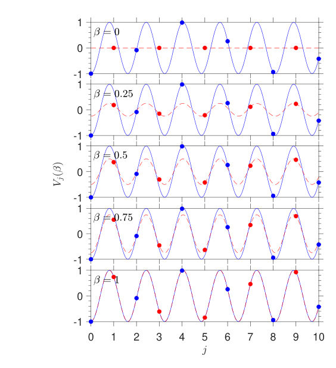 
FIG. 1. Double quasiperiodic potentials Vj(β) in Eq. (2) for β = 0, 0.25, 0.5, 0.75, and 1, respectively. Blue dots represent the potential on even lattice sites, and red dots represent the potential on odd lattice sites.

📷 Fig 2

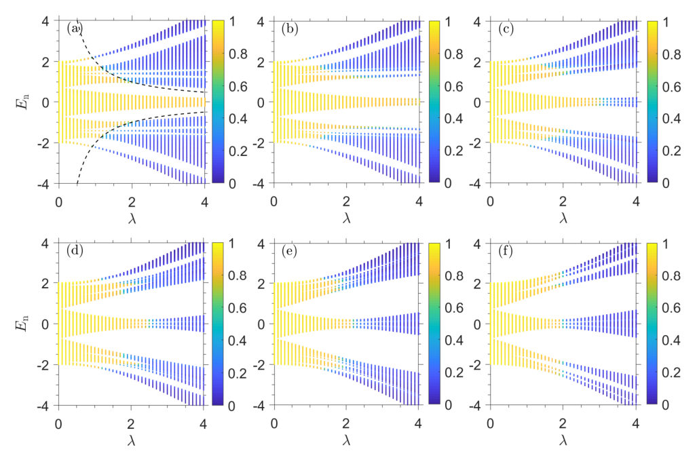 
FIG. 2. (a)-(f) Fractal dimension Q of eigenstates as a function of eigenenergy En and quasiperiodic potential strength λ for β = 0, 0.2, 0.4, 0.6, 0.8, and 1, respectively, with system size L = 1220. The two black dashed lines in panel (a) represent the MEs of MAA model.

📷 Fig 3

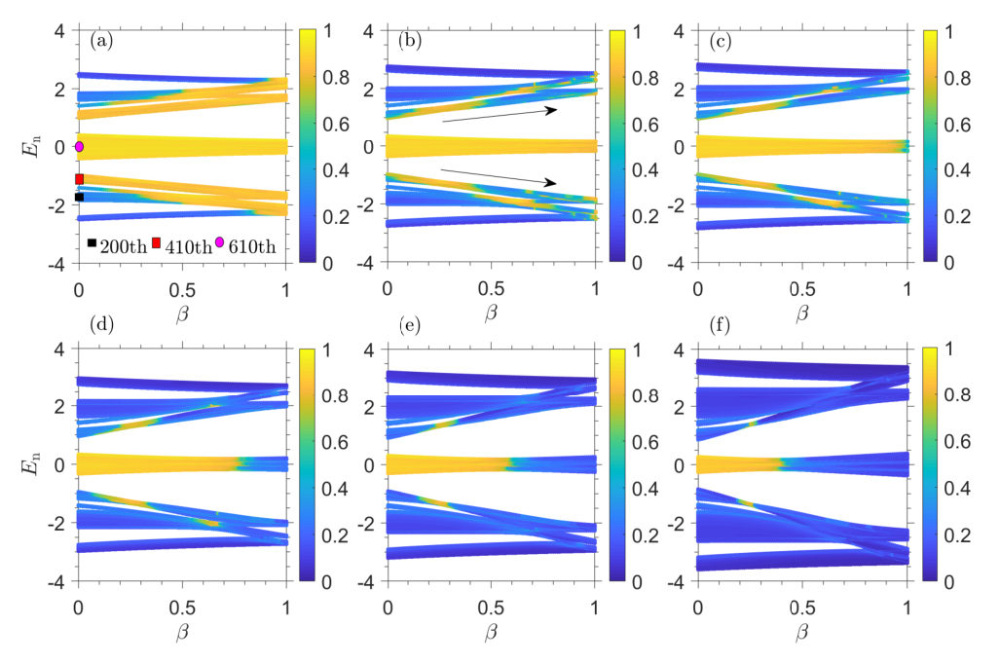 
FIG. 3. (a)-(f) Fractal dimension Q of all eigenstates as a function of En and β for λ = 1.5, 1.9, 2, 2.2, 2.5, and 3, respectively, with system size L = 1220. Along the arrows in (b), these eigenstates undergo multiple localization transitions with increasing β.

📷 Fig 4

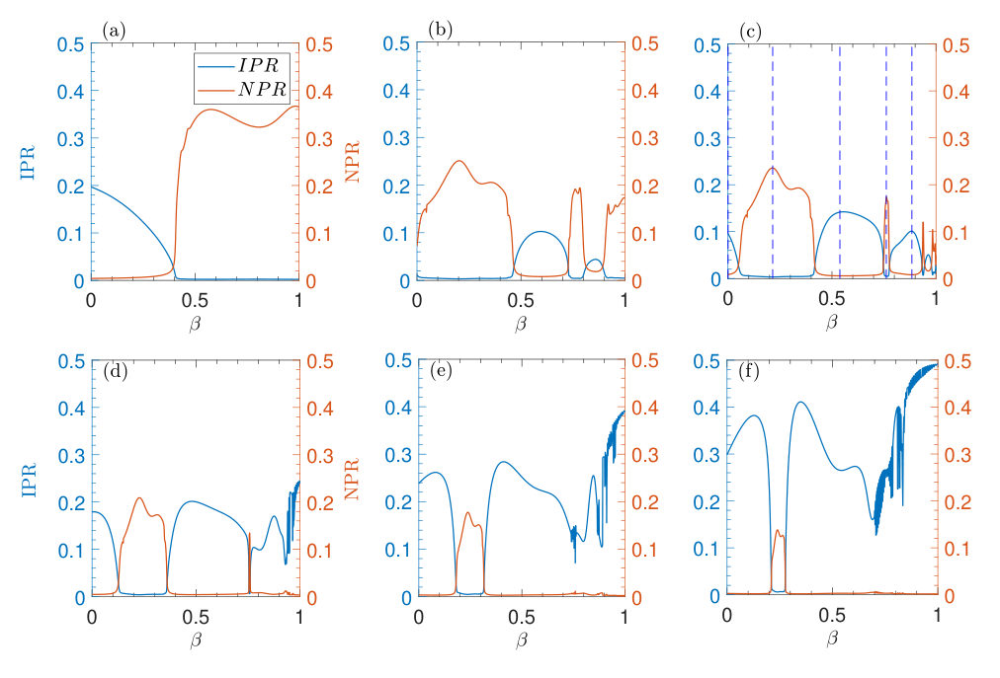 
FIG. 4. The IPR and NPR as functions of β in (a) for the 200th eigenstate in Fig. 3(a) with λ = 1.5, and in (b)-(f) for the 410th eigenstate in Figs. 3(b)- 3(f) with λ = 1.9, 2, 2.2, 2.5, and 3, respectively. These vertical dashed lines in (c) specify β = 0, 0.215, 0.538, 0.761, and 0.884, where the wavefunctions of the 410th eigenstate are correspondingly plotted in Fig. 5.

📷 Fig 5

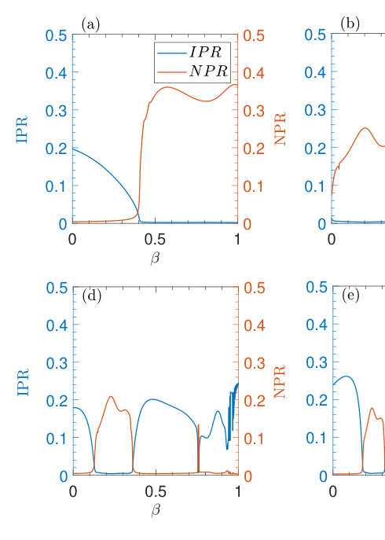 
Fig. 5(g). Next, we summarize our main findings on the local- ization transition features from the MAA to AA mod- els via the phase diagrams characterized by the frac- tal dimension Q with respect to β and λ, as shown in Figs. 6(a) - 6(c). We select the 200th and 410th eigen- states to discuss localization transitions of high-energy eigenstates, and take the 610th eigenstate representing the states near zero energy. The fractal dimension Q of the 200th, 410th and 610th eigenstates as a function of β and λ are shown in Figs. 6(a) - 6(c), respectively. For high-energy eigenstates, a single localization transition can emerge but only at λ &lt; 2 as shown in Fig. 6(a), multiple localization...

**Summary.** This paper introduces the Double Quasiperiodic MAA (DMAA) model to study the transition from MAA to AA type quasiperiodic potentials. By analyzing diagnostic quantities like IPR and fractal dimension, the authors demonstrate that this evolution reveals multiple localization-delocalization transitions not present in simpler models. The findings are validated using both numerical simulations and continuum models relevant for experimental platforms.

**Why it may be interesting.** It provides a detailed theoretical framework for understanding how the nature of localization transitions changes when moving between two closely related quasiperiodic models, which has implications for disordered quantum systems in photonics or cold atoms.

Detailed structure

**Main problem.** The study aims to reveal how localization transitions evolve when moving from Mosaic Aubry-André (MAA) models to standard Aubry-André (AA) models.

**Main result.** The Double Quasiperiodic MAA (DMAA) model exhibits new twice and multiple localization-delocalization transitions, which are absent in the original AA model.

**Method.** Numerical calculations were performed using diagnostic quantities like Inverse Participation Ratio (IPR), Normalized Participation Ratio (NPR), and Fractal Dimension ($Q$) on both tight-binding and continuum models.

**Model / system.** The Double Quasiperiodic MAA (DMAA) model is a one-dimensional chain governed by a Hamiltonian with double quasiperiodic on-site potentials. The transition between MAA ($eta=0$) and AA ($eta=1$) is controlled by the tunable amplitude factor $eta$.

**Key observables.** Inverse Participation Ratio (IPR), Normalized Participation Ratio (NPR), Fractal Dimension ($Q$), and real-space wavefunction distribution.

**Important parameters / regimes.** Potential strength ($\lambda$), tuning parameter ($eta \in [0, 1]$), and energy ($E_n$).

**Assumptions / limitations.** The analysis relies on the DMAA model providing a continuous framework to study the transition between MAA and AA models.

**Figures summary.** Figures show $Q$ vs. energy for varying $eta$, confirming Mobility Edges in MAA but not AA; other figures plot IPR/NPR changes demonstrating multiple transitions at specific parameter regimes.

**Paper structure.** The paper develops the DMAA model, analyzes its behavior across different disorder strengths ($\lambda$) and tuning parameters ($eta$), uses various diagnostic tools (IPR, NPR, Q), and validates findings by comparing tight-binding results with continuum simulations applicable to polariton modes.

Abstract

Despite their potential similarity between the mosaic Aubry-André (MAA) and AA models, the MAA model allows mobility edges (MEs), whereas the AA model does not. Here we develop a new double quasiperiodic MAA (DMAA) model consisting of one primitive MAA with nonzero even-site potentials and the other modified one with both nonzero odd-site potentials and a tunable amplitude factor, to reveal how localization transitions evolve from MAA to AA models. Interplays and competitions among the extended, critical and localized states arising from superpositions of double quasi-periodic MAA potentials enable new twice and multiple localization-delocalization transitions besides the original single localization transition. Our numerical calculations on inverse participation ratio, normalized participation ratio, fractal dimension and real-space wavefunction distribution confirm such localization features. The continuum model simulations on the experimental polariton modes also yield consistent results and hence validate their experimental feasibility. The constructed DMAA model provides a new framework for studying the localization transition processes between two analogous quasiperiodic models and broadens the understanding of Anderson localization.

[↑ back to top](#top)

### [Wigner's Phase Space Current for Variable Beam Splitters -- Phase Space Rotations and Newtonian Trajectories](http://arxiv.org/abs/2606.24334v1)

**Authors:** Ole Steuernagel, Hsien-Yi Hsieh, Hua-Li Chen, Ray-Kuang Lee  
**Type:** theory · **Category:** other · **PDF:** <https://arxiv.org/pdf/2606.24334v1>  
**Analysis basis:** full PDF text, analyzed in chunks
**Topic relevance:** `methods for driven-dissipative` **3/5** · `non-equilibrium dynamics` **2/5** · `Keldysh / 2PI / non-Gaussian methods` **1/5** · `analog quantum simulation` **1/5** · `correlated / nonlocal dissipation` **1/5** · `driven-dissipative phase transition` **1/5** · `quantum measurements` **1/5**

📷 Fig 1

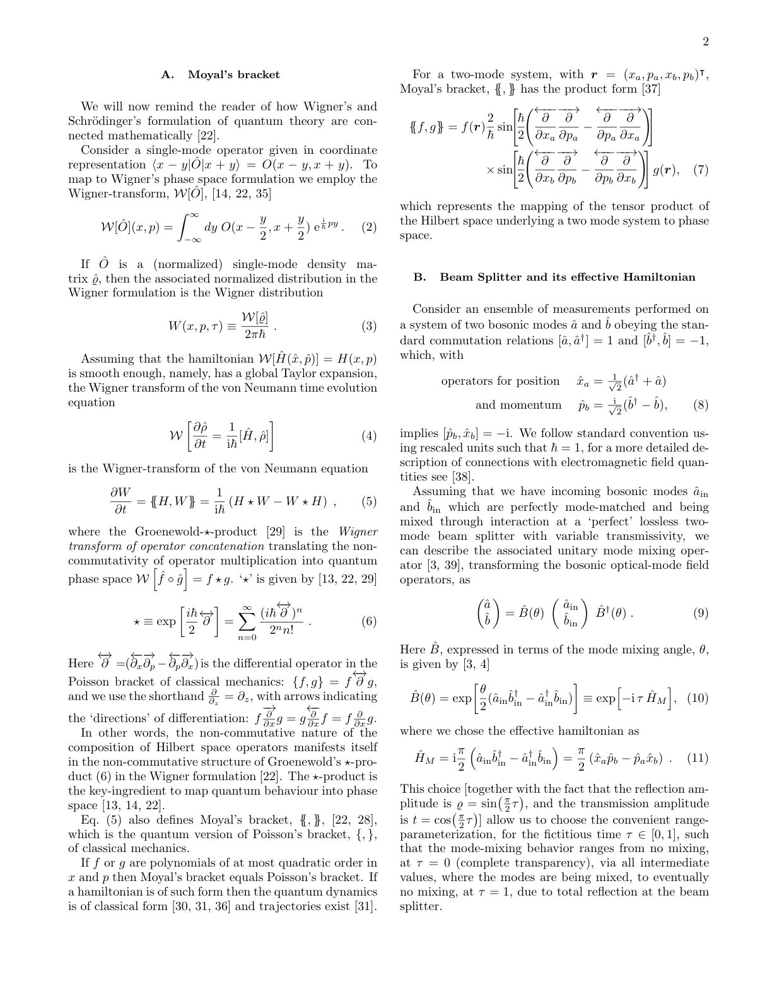 
Low-resolution page preview, page 2

📷 Fig 2

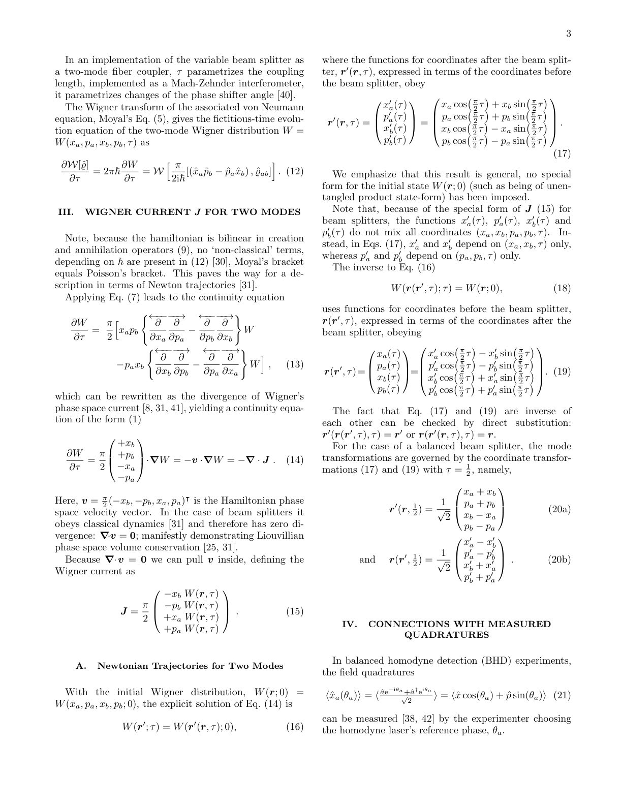 
Low-resolution page preview, page 3

📷 Fig 3

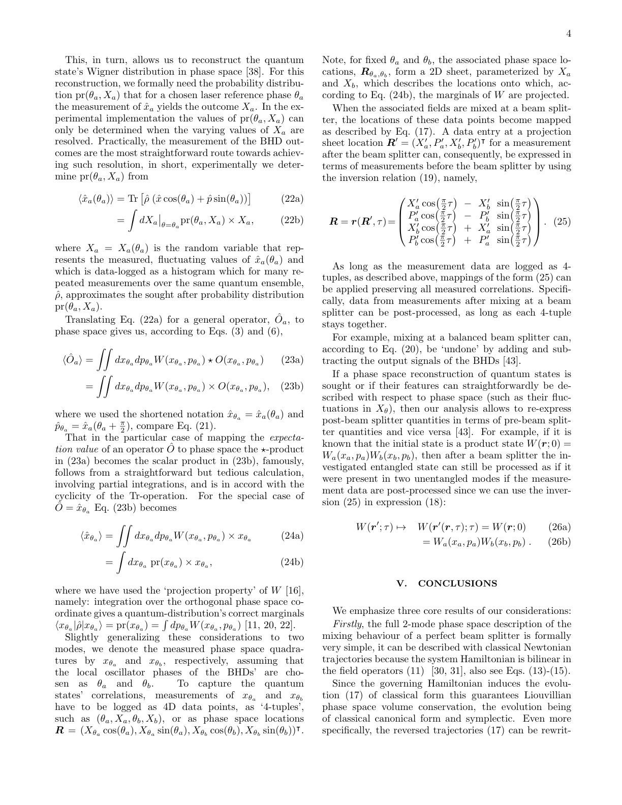 
Low-resolution page preview, page 4

📷 Fig 4

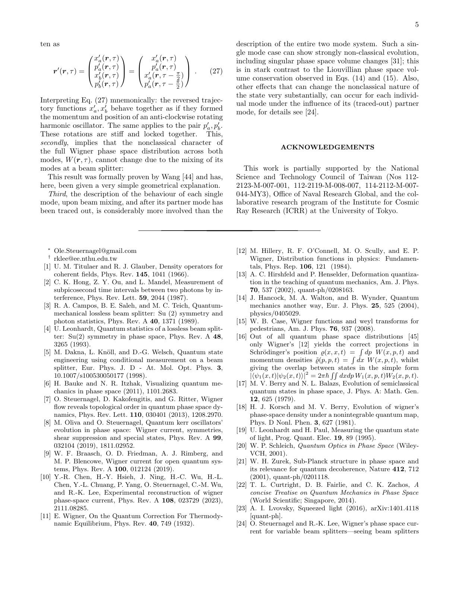 
Low-resolution page preview, page 5

📷 Fig 5

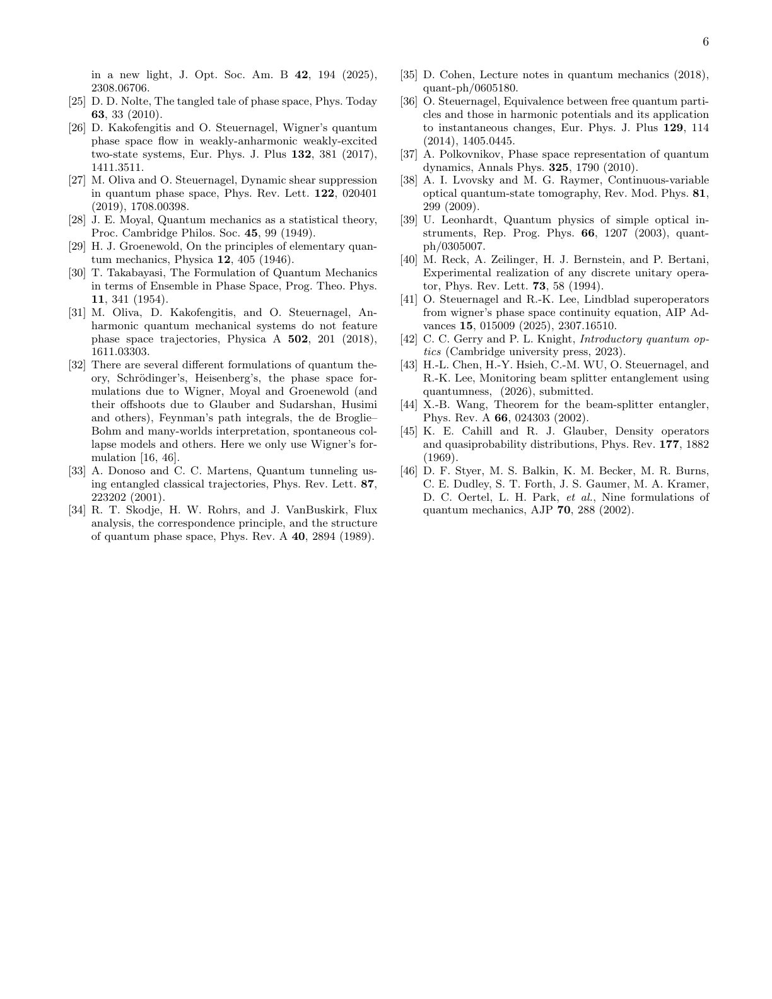 
Low-resolution page preview, page 6

**Summary.** This paper analyzes how two coupled quantum modes interact through a variable beam splitter by mapping the evolution onto Wigner's phase space. By deriving the corresponding current, the authors demonstrate that this complex quantum mixing process simplifies mathematically to independent classical rotations in position and momentum spaces. This provides deep geometrical insights into mode mixing dynamics.

**Why it may be interesting.** This work provides a powerful geometrical interpretation (rotation) for mode mixing in quantum optics using phase-space methods, which is highly relevant for understanding open quantum systems and linear optical elements.

Detailed structure

**Main problem.** The study focuses on analyzing the strongly mode mixing dynamics of variable beam splitters by tracking the evolution of the Wigner distribution in phase space.

**Main result.** The dynamics are shown to be equivalent to classical rotations confined separately within the position and momentum planes, allowing for explicit calculation of rotated Wigner distributions using classical trajectories.

**Method.** The authors use the Wigner-transform formalism, deriving a continuity equation for the distribution whose current allows mapping quantum evolution onto classical trajectory analysis.

**Model / system.** The system involves two continuous single-mode quantum systems (two optical modes) interacting via a variable beam splitter. The dynamics are governed by an effective Hamiltonian derived from the unitary beam splitter operator, analyzed in the four-dimensional phase space.

**Key observables.** Wigner distribution W(r, tau) and the corresponding Wigner current J.

**Important parameters / regimes.** The analysis is sensitive to the reflectivity parameters of the variable beam splitters ($\varrho$).

**Assumptions / limitations.** The derivation assumes sufficiently small variations in reflectivity to utilize a continuous effective Hamiltonian approximation.

**Figures summary.** Not specified, but the notes reference transformation equations (Eq. 17) describing coordinate mapping from initial to final states.

**Paper structure.** The paper establishes the continuity equation for Wigner's distribution under beam splitting, derives the explicit form of the current J, and then uses this structure to show that the dynamics map onto simple classical rotations in phase space coordinates.

Abstract

Beam splitters allow us to superpose two continuous single mode quantum systems. To study the behaviour of beam splitters' strongly mode mixing dynamics we consider variable beam splitters acting on Wigner's phase space distribution, W , the evolution of which is governed by the continuity-equation {\partial τ} W = - {\nabla} J. We derive the form of the corresponding Wigner current, J. J's form allows us to use a classical trajectories-approach to analyze the influence of the two modes on each other. We show that the dynamics for variable beam splitters amounts to a rotation confined within the plane of the two positions together with the same simultaneous rotation confined within the plane of the two momenta. In this way explicit and very transparent expressions for the rotated Wigner distributions and Wigner currents can be given in terms of classical trajectories. This helps us to gain deeper insights and perform geometrical analyses of the mixing of modes at beam splitters.

[↑ back to top](#top)

### [Anderson localization on the Bethe lattice](http://arxiv.org/abs/2606.24671v1)

**Authors:** Dafne Prado Bandeira, Angelica Vecchiarelli, Marco Tarzia  
**Type:** theory · **Category:** disordered systems and neural networks · **PDF:** <https://arxiv.org/pdf/2606.24671v1>  
**Analysis basis:** full PDF text, analyzed in chunks
**Topic relevance:** `Keldysh / 2PI / non-Gaussian methods` **3/5** · `driven-dissipative phase transition` **2/5** · `Kondo & dissipative impurity` **1/5** · `analog quantum simulation` **1/5** · `methods for driven-dissipative` **1/5** · `non-equilibrium dynamics` **1/5**

📷 Fig 1

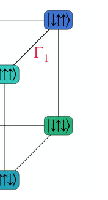 
Figure 1. Schematic representation of the configuration space of the spin chain (Eq. (21)) for L = 3 in the basis of the simultaneous eigenstates of the {σz i } operators. Each vertex corresponds to one of the 23 = 8 spin configurations. To each vertex, a random energy is assigned (indicated by color) containing linear combinations of the random fields hi, weighted by the spin values of that specific configuration. Edges connect configurations that differ by a single spin flip, forming a 3-dimensional hypercube structure.

📷 Fig 2

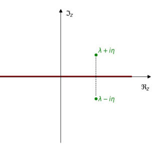 
Figure 2. (Left) For a finite system, G(z) is analytic except at a discrete set of points on the real axis corresponding to the eigenvalues λn, where it exhibits simple poles. (Right) In the thermodynamic limit (N →∞), these discrete poles may merge into a continuous branch cut along the real axis. The physical Green’s functions are recovered by approaching the real axis from the complex plane through the regularization z = λ ± iη (green dots) as η →0+.

📷 Fig 3

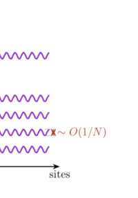 
Figure 3. Energy spectrum of the system in the extended phase. Each horizontal line represents an eigenstate at energy λn, with its oscillatory pattern indicating the spatial structure. The red marker shows that the amplitude of the wavefunction is uniformly of order O(1/N).

📷 Fig 4

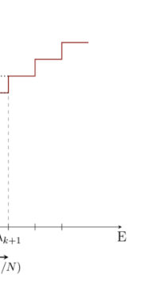 
Figure 4. Integrated local density of states Ri(E) in the extended phase. Both the step height (proportional to |ψn(i)|2) and the level spacing are of order O(1/N). In the thermodynamic limit, these discrete steps merge into a smooth, continuous function.

📷 Fig 5

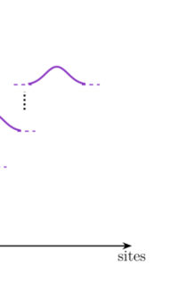 
Figure 5. Energy spectrum in the localized regime. Each eigenstate is confined to a region around its localization center. At site i, the local density of states receives significant contributions only from eigenstates whose centers lie within ∼ξ of i; distant states contribute negligibly.

**Summary.** This work provides a comprehensive, pedagogical review of Anderson localization theory by focusing on the exactly solvable Bethe lattice model. It details how disorder drives a true quantum phase transition, characterizing it using advanced Green's function techniques and self-consistent equations. The paper is crucial for understanding the theoretical limits of wave propagation in disordered media.

**Why it may be interesting.** The rigorous analytical treatment of a quantum phase transition using advanced Green's function techniques is highly relevant for understanding localization phenomena in open or disordered quantum systems studied in AMO physics.

Detailed structure

**Main problem.** The paper investigates Anderson localization, a quantum phase transition where disorder suppresses wave propagation, by analyzing its behavior on the Bethe lattice.

**Main result.** It establishes that the Bethe lattice provides an analytically tractable framework to study this transition, revealing diagnostics like spectral statistics and the divergence of correlation volumes at criticality.

**Method.** The analysis relies heavily on the resolvent (Green's function) formalism and the cavity approach to derive self-consistent equations for the system's properties.

**Model / system.** The primary model is the Anderson Hamiltonian applied to the Bethe lattice, which serves as an infinite-dimensional limit of disordered quantum systems. It also draws analogies to Many-Body Localization (MBL).

**Key observables.** Localization length ($\xi$), full probability distribution of the local density of states, Inverse Participation Ratio (IPR), and the crossing of $\langle \ln Z 
angle$ through zero.

**Important parameters / regimes.** Disorder strength ($W$) relative to hopping amplitude ($t$), connectivity/coordination number, and system dimension (comparing finite $d$ vs. infinite Bethe limit).

**Assumptions / limitations.** The use of the Bethe lattice assumes an infinite-dimensional, tree-like structure, which simplifies calculations but neglects loop correlations present in real lattices.

**Figures summary.** Not specified; the notes refer to general concepts like schematic representations of configuration spaces (e.g., hypercubes).

**Paper structure.** The review progresses from defining Anderson localization and its diagnostics (Green's functions, IPR) to detailing the mathematical machinery (resolvent/cavity approach) used on the Bethe lattice, culminating in discussions about critical behavior and connections to DPRM.

Abstract

Anderson localization is a paradigmatic disorder-driven quantum phase transition in which interference effects can completely suppress wave propagation. Its formulation on the Bethe lattice -- an infinite tree with fixed coordination number -- provides a unique setting in which the transition becomes analytically tractable. Owing to its exponential volume growth, the Bethe lattice realizes the infinite-dimensional limit of the Anderson problem and also serves as a useful mean-field-like description of localization in many-body configuration spaces.   These lecture notes provide a pedagogical review of Anderson localization on the Bethe lattice, focusing on the resolvent (Green's function) formalism and the cavity approach. We discuss the main diagnostics of localization and show how they are encoded in the statistical properties of Green's functions, with the full probability distribution of the local density of states emerging as the natural order parameter of the transition. We derive the cavity self-consistent equations for the diagonal resolvent and review both their numerical solution by population dynamics and their analytical treatment in the large-connectivity limit. This framework gives access to the critical disorder and the critical behavior near the transition, including the localization length in the insulating phase and the correlation volume that controls the delocalized phase. We also discuss the connection with directed polymers in random media and its interpretation in terms of rare resonant paths and freezing phenomena.   These notes originated from a series of lectures delivered by one of the authors at the Oropa Summer School on "Fundamental Problems in Statistical Physics XVI" (July 2025).

[↑ back to top](#top)

### [Broadband molecular dynamics simulation of fluid inertial effects in confined Brownian motion](http://arxiv.org/abs/2606.24291v1)

**Authors:** Quentin Thomas, Clara Mefo Sop, Maxime Lavaud, Yacine Amarouchene, Thomas Salez, Pascal Damman  
**Type:** theory · **Category:** statistical mechanics · **PDF:** <https://arxiv.org/pdf/2606.24291v1>  
**Analysis basis:** full PDF text, analyzed in chunks
**Topic relevance:** `non-equilibrium dynamics` **3/5** · `non-equilibrium universality` **2/5** · `Keldysh / 2PI / non-Gaussian methods` **1/5** · `correlated / nonlocal dissipation` **1/5** · `driven-dissipative phase transition` **1/5** · `methods for driven-dissipative` **1/5**

📷 Fig 1

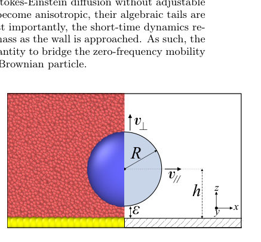 
FIG. 1. Schematic of the system. Left: instantaneous snap- shot of the MD simulation, showing the colloidal particle (blue, radius R) immersed in a dense WCA solvent (red) and confined near a frozen planar wall (yellow). Right: notations are as follows; the surface-to-surface gap ϵ, the center-to-wall distance h = ϵ + R, and the components v⊥and v∥of the colloid velocity, normal and parallel to the wall.

📷 Fig 2

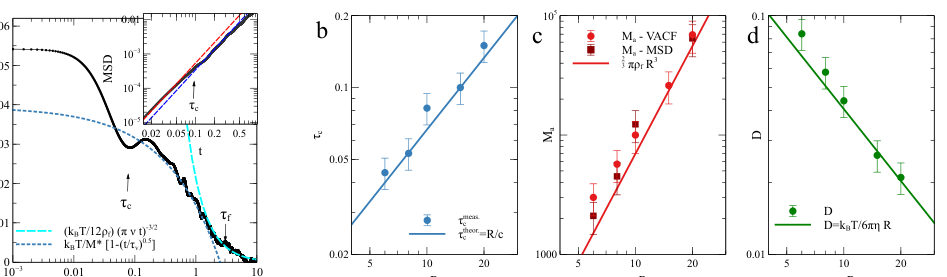 
FIG. 2. Diffusion in the bulk. (a) VACF Cv of a colloidal particle, of radius R = 10, in a WCA fluid, as a function of time t. Inset: MSD as a function of time in the ballistic regime. (b,c,d) Evolution with the colloid radius of the compressibility time τc, the added mass Ma estimated from the VACF, and the diffusion coefficient D. The solid lines correspond to the theoretical predictions as indicated.

📷 Fig 3

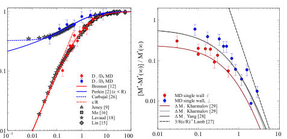 
FIG. 4. (a) Normalized diffusion coefficients D∥/D0 and D⊥/D0 as functions of the normalized distance to the wall ϵ/R. Also shown are theoretical predictions as well as exper- imental results from the literature, as indicated. (b) Relative added-mass deviation, [M ∗(ϵ) −M ∗(∞)]/M ∗(∞), as a func- tion of the normalized distance to the wall ϵ/R. Also shown are theoretical predictions from the literature.

📷 Fig 4

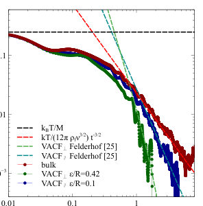 
FIG. 3. VACFs Ci as a function of time t, measured near a rigid wall. Also shown are the bulk long-time tail, t−3/2, and the confined long-time tails C∥∼t−5/2 and C⊥∼t−7/2. Theoretical curves, Eqs. 3 and 4, are added [25].

**Summary.** This work uses molecular dynamics simulations to study Brownian motion near a wall, focusing on the full hydrodynamic response rather than just diffusion. The key finding is that confinement modifies fluid correlations in complex ways, simultaneously suppressing low-frequency mobility while enhancing high-frequency inertial effects. This demonstrates the power of analyzing the velocity autocorrelation function across all relevant time scales.

**Why it may be interesting.** While focused on classical fluid dynamics, the rigorous treatment of time-dependent correlations ($	ext{VACF}$) across multiple dynamic regimes—from ballistic to diffusive—is a sophisticated example of non-equilibrium statistical mechanics applicable to open quantum systems where memory effects are crucial.

Detailed structure

**Main problem.** To investigate how fluid confinement modifies the full hydrodynamic response of Brownian motion, moving beyond established knowledge of simple diffusion corrections.

**Main result.** The study shows that confinement leads to anisotropic velocity correlations and reveals a counterintuitive enhancement of the effective added mass at short times as the particle approaches the wall.

**Method.** Molecular Dynamics (MD) simulations are used to resolve the velocity autocorrelation function across a broad hydrodynamic spectrum, linking zero-frequency mobility to high-frequency inertial behavior.

**Model / system.** The system is a neutrally buoyant colloidal particle immersed in an explicit solvent and confined near a rigid planar wall. The dynamics are governed by fluid-particle interactions simulated via MD.

**Key observables.** Velocity Autocorrelation Function (VACF), diffusion coefficients ($D_\parallel, D_\perp$), effective added mass ($\Delta M^*$), and the hydrodynamic memory kernel.

**Important parameters / regimes.** Confinement distance ($\epsilon/R$), time scales ranging from acoustic to diffusive relaxation, and solvent properties (e.g., compressibility).

**Assumptions / limitations.** The analysis assumes that MD simulations can accurately resolve the entire spectrum of fluid dynamics, validating the use of VACF as a comprehensive diagnostic tool.

**Figures summary.** Figures compare measured confined VACFs to theoretical predictions showing anisotropy; they also plot normalized diffusion coefficients and relative added-mass deviations against confinement ratios ($\epsilon/R$).

**Paper structure.** The paper establishes the physical problem by reviewing hydrodynamic memory, details the MD methodology for resolving the full spectrum (bulk vs. confined), presents results on anisotropic decay rates, and quantifies both mobility suppression and inertia enhancement.

Abstract

Hydrodynamic memory governs Brownian motion over a broad range of timescales, from acoustic wave propagation at short times to diffusive relaxation at long times. While confinement-induced corrections to Brownian diffusion are well established, how confinement modifies the full hydrodynamic response remains less explored. In this Letter, we use molecular-dynamics simulations of a neutrally buoyant colloidal particle in an explicit solvent to resolve the velocity autocorrelation function across a broad hydrodynamic spectrum. In the bulk, the simulations recover compressibility, added mass, the hydrodynamic long-time tail, and Stokes-Einstein diffusion without adjustable parameters. Near a rigid wall, the velocity correlations become anisotropic, their algebraic tails are modified, and the diffusion coefficients are reduced. Most importantly, the short-time dynamics reveals a pronounced enhancement of the effective added mass as the wall is approached. As such, the velocity autocorrelation function appears as a central quantity to bridge the zero-frequency mobility and the high-frequency inertial behaviour of a confined Brownian particle.

[↑ back to top](#top)

### [Pareto-optimal control strategies in intrinsically nonequilibrium systems](http://arxiv.org/abs/2606.23828v1)

**Authors:** Gustavo A. L. Forão, Carlos E. Fiore, Jonas Berx  
**Type:** theory · **Category:** statistical mechanics · **PDF:** <https://arxiv.org/pdf/2606.23828v1>  
**Analysis basis:** full PDF text, analyzed in chunks
**Topic relevance:** `non-equilibrium universality` **3/5** · `non-equilibrium dynamics` **2/5** · `Keldysh / 2PI / non-Gaussian methods` **1/5** · `correlated / nonlocal dissipation` **1/5** · `driven-dissipative phase transition` **1/5** · `methods for driven-dissipative` **1/5**

📷 Fig 1

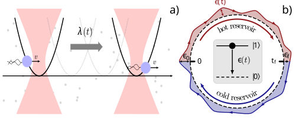 
Figure 1. Controlled nonequilibrium systems. (a) Active par- ticle (blue) dragged through a fluid by a harmonic trap in- duced by optical tweezers (red) according to a protocol λ(t). (b) A two-level quantum dot (gray box) in alternating con- tact with hot (red) and cold (blue) reservoirs; the level spacing ϵ(t) between the ground state (dashed lines) and excited state can be tuned cyclically (clockwise) according to the coloured arrows; the instantaneous spacing ϵ(t) is illustrated by the wavy outer borders.

📷 Fig 2

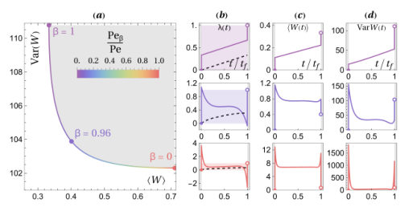 
Figure 2. (a) Work–fluctuation Pareto front coloured accord- ing to the effective P´eclet number Peβ. (b) Pareto-optimal protocols corresponding to three selected points on the front in (a); coloured bands indicate the region [0, λf], highlighting possible protocol overshoot. Dashed lines show the trapped particle’s position ⟨x(t)⟩(c, d) Time-dependent average work and work fluctuations, respectively, corresponding to the op- timal protocols in (b). In panel columns (b-d), filled (open) points indicate the values of the corresponding quantities at t = 0 (t = tf). Parameters are λf = 1, tf = 1, τ = 0.5, and Pe = 200. All quantities are expressed in dimensionless units obtained by rescaling...

📷 Fig 3

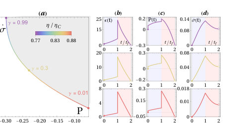 
Figure 3. (a) Power–dissipation Pareto front coloured ac- cording to the efficiency η/ηC. (b) Pareto-optimal protocols corresponding to three selected points on the front in (a); shaded backgrounds indicate contact with the cold (blue) or hot (red) heat baths. (c,d) Time-dependent power and en- tropy production, respectively, corresponding to the protocols in (b). Parameters are Th = 10, Tc = 1, tf = 4.

📷 Fig 4

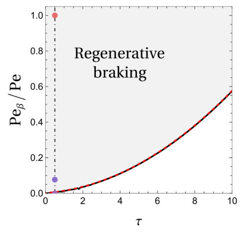 
Figure 1. Emergence of regenerative braking (shaded region) based on the exact threshold (33)

**Summary.** The paper establishes a general theoretical framework for optimizing thermodynamic control in complex, nonequilibrium systems by treating competing costs simultaneously. It demonstrates that the optimal trade-off structure is governed by a single intrinsic scale parameter, which simplifies the analysis and reveals deep structural equivalences between different physical setups like active matter and quantum engines.

**Why it may be interesting.** This work provides a powerful, generalized mathematical tool for analyzing non-equilibrium thermodynamics that moves beyond simple efficiency maximization by mapping out the entire achievable performance landscape using multi-objective optimization techniques.

Detailed structure

**Main problem.** The work is developing a general framework for multi-objective thermodynamic control, addressing that single-objective optimization fails to capture the full performance space defined by competing costs.

**Main result.** The optimal protocols are shown to generically consist of smooth branches connected by boundary jumps, and the entire trade-off structure collapses onto a single intrinsic scale parameterizing equivalence classes of optimal strategies.

**Method.** The authors formulate the problem using multi-objective optimization via scalarization ($\Omega = \sum eta_i C_i$), deriving optimality conditions from variational principles applied to generalized cost functionals.

**Model / system.** Two paradigmatic systems are analyzed: an active particle in a harmonic trap governed by an overdamped Langevin equation, and a cyclic quantum-dot engine operating between two temperature baths. The general framework applies to intrinsically nonequilibrium systems.

**Key observables.** Pareto front, average work ($\langle W 
angle$), work fluctuations ($	ext{Var}(W)$), power ($P$), entropy production rate ($\dot{\sigma}$), and the intrinsic scale parameterization ($	ext{Pe}_eta$ or $\omega_
u(\gamma)$).

**Important parameters / regimes.** Relative weights of objectives ($eta_i$ or $\gamma$), Péclet number ($	ext{Pe}$), and system-specific coupling constants.

**Assumptions / limitations.** The analysis assumes that the relative weights determine the trade-off structure, and in some cases, relies on specific boundary conditions or low-order polynomial representations for simplification.

**Figures summary.** Figures illustrate the Pareto front (showing the full set of optimal trade-offs) and corresponding optimal control protocols ($\lambda^*(t)$ or $\epsilon^*(t)$) for both the active particle and quantum dot engine.

**Paper structure.** The paper introduces the general multi-objective variational framework, applies it first to the active particle model (showing dependence on an effective activity scale), then extends it to the quantum dot engine (analyzing power vs. dissipation trade-offs), culminating in a unified understanding of how system parameters collapse into single governing scales.

Abstract

Thermodynamic control is typically formulated as the optimisation of a single objective, yet competing costs rarely admit a common optimum, so single-objective control captures only one corner of the achievable performance space. We develop a general framework for multi-objective thermodynamic control of intrinsically nonequilibrium systems that maps out the full Pareto front of optimal control strategies. We show that Pareto-optimal protocols generically consist of smooth branches connected by boundary jumps, and that the relative weights of the objectives combine with the physical parameters into a single intrinsic scale that alone governs the trade-off. Remarkably, this scale plays a double role: it parametrizes a single functional form that generates the entire front, and it defines control equivalence classes, in which systems with different parameters but the same scale share identical optimal strategies. We illustrate the framework for two paradigmatic systems that are experimentally accessible: transport of an active particle in a harmonic trap, and a cyclic quantum-dot engine. For both, we obtain the Pareto front and optimal strategies in closed form.

[↑ back to top](#top)

### [Dynamical low-rank methods for the Wigner equation I: separable difference potential](http://arxiv.org/abs/2606.24190v1)

**Authors:** Sihong Shao, Yuehan Shao  
**Type:** theory · **Category:** numerical methods · **PDF:** <https://arxiv.org/pdf/2606.24190v1>  
**Analysis basis:** full PDF text, analyzed in chunks
**Topic relevance:** `methods for driven-dissipative` **3/5** · `non-equilibrium dynamics` **2/5** · `Keldysh / 2PI / non-Gaussian methods` **1/5** · `analog quantum simulation` **1/5** · `driven-dissipative phase transition` **1/5**

📷 Fig 1

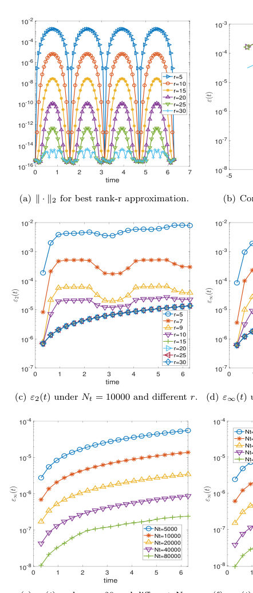 
Fig. 1. 2D quantum harmonic oscillator.

📷 Fig 2

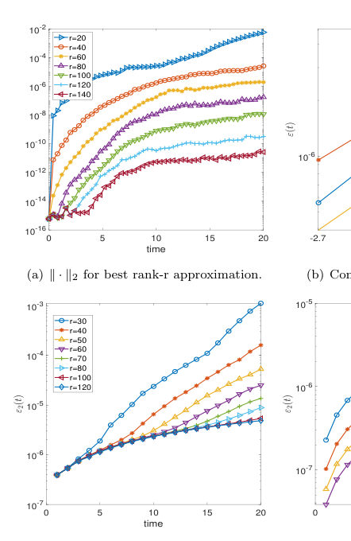 
Fig. 2. 2D Gaussian barrier scattering.

📷 Fig 3

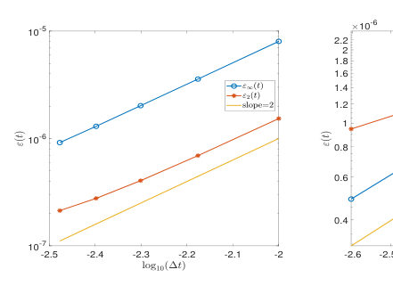 
Fig. 3. 4D Gaussian barrier scattering: The convergence order with respect to the time step ∆t. The left figure shows the convergence order for the case with degeneracy in the x2-k2 direction, while the right figure displays the convergence order for the free advection in the x2-k2 direction. In both cases, second-order numerical accuracy can be observed.

📷 Fig 4

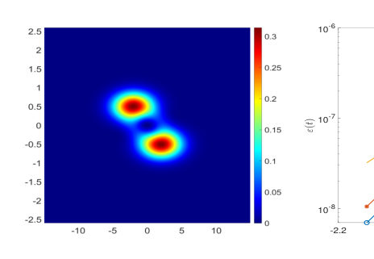 
Fig. 4. The reduced Wigner function W1(x, k, t) + W2(x, k, t) for two fermions and the conver- gence order.

📷 Fig 5

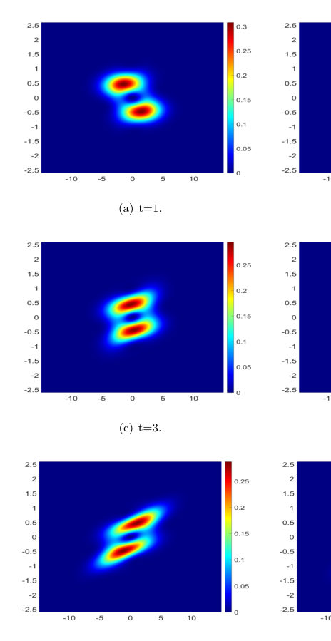 
Fig. 5. Electron-electron scattering: W1(x, k, t) + W2(x, k, t) at different time.

**Summary.** The paper introduces and validates a Dynamical Low-Rank Approximation (DLRA) method to solve the Wigner equation for various quantum systems. By exploiting a separable approximation of the potential, it transforms the computationally prohibitive nonlocal operator into a manageable low-rank form. This results in massive reductions in computational cost while maintaining high accuracy across diverse physical models.

**Why it may be interesting.** This work provides a powerful, scalable numerical framework for simulating quantum dynamics in phase space that bypasses the curse of dimensionality inherent in full-grid methods, which is crucial for studying complex many-body interactions.

Detailed structure

**Main problem.** Developing an efficient Dynamical Low-Rank Approximation (DLRA) algorithm to solve the Wigner equation, which is complicated by its nonlocal pseudo-differential operator ($\Psi$DO).

**Main result.** The proposed DLRA method achieves a significant computational advantage, reducing runtime and memory requirements by one to two orders of magnitude compared to full-grid approaches across various quantum scattering systems.

**Method.** The core technique involves applying the low-rank approximation (DLRA) to the Wigner function evolution, enabled by assuming a separable decomposition for the difference potential within the $\Psi$DO.

**Model / system.** The study focuses on solving the Wigner equation, which describes the phase-space dynamics of quantum systems. Benchmarks include harmonic oscillators, Gaussian barrier scattering, electron-electron scattering (Fermion systems), and Helium-like atoms.

**Key observables.** Reduced Wigner function ($W(x, k, t)$) evolution, $L_2$ error ($\varepsilon_2$), and $\Psi$DO components ($Z_j, S_{ij}, L_i$).

**Important parameters / regimes.** Time step ($\Delta t$) convergence order (observed second-order), approximation rank ($r$), and the separability rank ($R$).

**Assumptions / limitations.** The primary assumption is that the difference potential $D_V(x, y)$ can be approximated by a separable form, allowing the $\Psi$DO to be separated into manageable low-rank components.

**Figures summary.** Figures illustrate convergence analysis (error vs. rank/time step) for harmonic oscillators and Gaussian barriers, and show time evolution snapshots of reduced Wigner functions for electron-electron scattering and Helium-like systems.

**Paper structure.** The paper introduces the problem, proposes the DLRA method utilizing separable decomposition of the potential, details the implementation via a projector-splitting integrator (Z $	o$ S $	o$ L steps), presents convergence analysis across multiple physical tests, and concludes with computational cost comparisons.

Abstract

Recent advances in dynamical low-rank approximation (DLRA) have demonstrated its effectiveness in high-dimensional simulations. However, existing DLRA algorithms still face significant challenges when handling systems that involve complex collision terms, including the pseudo-differential operator (${\rm Ψ}$) in the Wigner equation, a representative operator characterized by nonlocality. It is deserving to carry out a series of works to develop the DLRA algorithms for solving the Wigner equation. As the first step in this series of works, we propose an efficient DLRA algorithm for the Wigner equation, using a separable decomposition of the difference potential. We combine this separable assumption with two often-used truncations of ${\rm Ψ}$, namely $\mathcal{K}$-truncation and $\mathcal{Y}$-truncation, to obtain a kind of separated representation of ${\rm Ψ}$. Complexity analysis and several challenging experiments, including harmonic oscillators, Gaussian barrier scattering, electron-electron scattering, and a Helium-like system, all of which satisfy the separable assumption, confirm that the proposed DLRA algorithm has significant advantages, achieving a reduction in computational effort by one to two orders of magnitude in both runtime and memory requirements compared to the full-grid approach. It is worth noting that, even in the absence of a predetermined low-rank structure for the solution, DLRA can still serve as a numerical scheme that balances efficiency and accuracy.

[↑ back to top](#top)

### [Fermi surface change and $d$-wave superconductivity in the square lattice Kondo-Heisenberg model](http://arxiv.org/abs/2606.23799v1)

**Authors:** Alexander Nikolaenko, Riccardo Rende, Luciano Loris Viteritti, Subir Sachdev, Ya-Hui Zhang  
**Type:** theory · **Category:** strongly correlated electrons · **PDF:** <https://arxiv.org/pdf/2606.23799v1>  
**Analysis basis:** full PDF text, analyzed in chunks
**Topic relevance:** `Kondo & dissipative impurity` **3/5** · `methods for driven-dissipative` **3/5** · `Keldysh / 2PI / non-Gaussian methods` **1/5** · `analog quantum simulation` **1/5**

📷 Fig 1

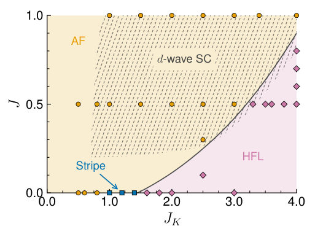 
FIG. 1. Ground-state phase diagram of the two-dimensional Kondo-Heisenberg model [see Eq. (1)] on a square lattice with periodic boundary conditions, shown in the (JK, J) plane (in units of t) at hole doping δ = 1/4. We identify an antiferro- magnetic N´eel phase (AF), a stripe magnetic phase (Stripe), a heavy Fermi liquid (HFL), and a d-wave superconducting phase (d-wave SC) that coexists with the underlying phase. Markers denote the phase assigned to each simulated param- eter point.

📷 Fig 2

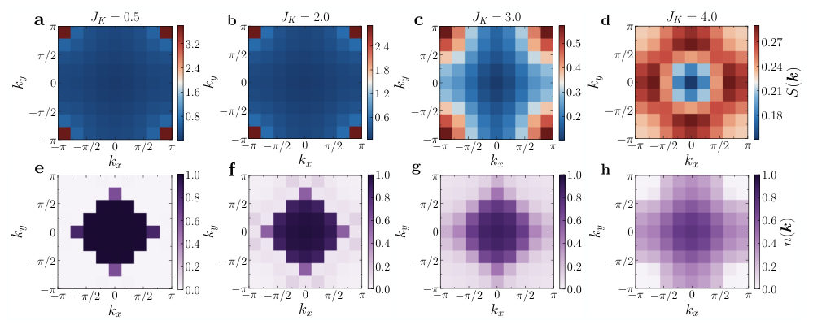 
FIG. 2. Static spin structure factor S(k) (top row, panels a–d) and conduction-electron momentum distribution n(k) (bottom row, panels e–h) in the first Brillouin zone, at fixed J = 0.5 and four representative values of the Kondo coupling: JK = 0.5 (panels a,e), JK = 2.0 (panels b,f), JK = 3.0 (panels c,g), and JK = 4.0 (panels d,h).

📷 Fig 3

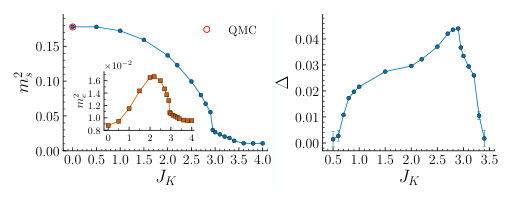 
FIG. 4. Left: squared staggered magnetization m2 s = S(π, π)/N of the local moments as a function of JK at J = 0.5, with QMC data [43] at JK = 0.0 for comparison. The in- set shows the conduction-electron magnetization m2 e. Right: pairing order parameter ∆as a function of JK along the same cut.

📷 Fig 4

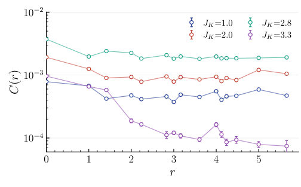 
FIG. 3. Connected dx2−y2 pair–pair correlator C(r) as a func- tion of distance r = |r| at J = 0.5, for JK = 1.0, 2.0, 2.8, and 3.3.

📷 Fig 5

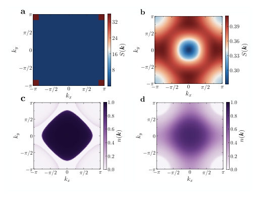 
FIG. 5. Mean field local-moment structure factor S(k) (top row) and conduction-electron momentum distribution n(k) (bottom row) in the first Brillouin zone, at fixed J = 0.5 and three representative values of the Kondo coupling: JK = 2.0 (left, panels a, c) and JK = 4.0 (right, panels b, d).

**Summary.** The paper theoretically investigates the Kondo-Heisenberg model to understand how magnetism and superconductivity compete. Using advanced quantum simulation methods like NQS, it demonstrates that the system undergoes a fundamental change in its electronic Fermi surface structure. This transition region hosts robust $d_{x^2-y^2}$ superconductivity, suggesting pairing is mediated by residual antiferromagnetic correlations.

**Why it may be interesting.** This work directly addresses fundamental questions in strongly correlated electron physics, particularly the mechanism of unconventional superconductivity arising from competing magnetic orders, which is a major focus area for theoretical condensed matter physicists.

Detailed structure

**Main problem.** The study investigates the interplay between Fermi surface changes, antiferromagnetism, and unconventional $d_{x^2-y^2}$ superconductivity in a two-dimensional Kondo-Heisenberg model.

**Main result.** The model exhibits a transition from a small to a large electronic Fermi surface as the Kondo coupling increases, with $d$-wave superconductivity appearing robustly in the crossover region between magnetic and heavy Fermi liquid states.

**Method.** The research employs advanced quantum many-body techniques, primarily Neural Network Quantum States (NQS) variational optimization, supplemented by mean-field calculations for comparison.

**Model / system.** The system is a two-dimensional Kondo-Heisenberg model on a square lattice, describing conduction electrons interacting with localized spin moments via exchange and Kondo couplings. The Hamiltonian includes terms for hopping, Heisenberg exchange ($J$), and Kondo coupling ($JK$).

**Key observables.** Fermi surface enclosed area (small vs. large), $d_{x^2-y^2}$ pairing correlator ($\Delta$), staggered magnetization ($m_s^2$), and conduction electron momentum distribution ($n(\mathbf{k})$).

**Important parameters / regimes.** Kondo coupling ($JK$) and Heisenberg coupling ($J$); the analysis is performed at fixed doping (e.g., $\delta=1/4$).

**Assumptions / limitations.** The use of NQS methods allows for calculations away from half-filling, avoiding the sign problem encountered by auxiliary-field QMC; mean-field approaches are used for comparison but are noted to overestimate magnetic order.

**Figures summary.** Figures illustrate the evolution of order parameters ($m_s^2$ vs. $\Delta$) across different coupling regimes, showing a superconducting dome peaking near the quantum critical point where the Fermi surface changes character.

**Paper structure.** The paper systematically maps the ground-state phase diagram by analyzing how electronic and magnetic order parameters evolve as tuning parameters (Kondo/Heisenberg couplings) are varied. It contrasts results from NQS with mean-field theory to establish physical regimes.

Abstract

We study the two-dimensional Kondo-Heisenberg model on a square lattice, with the conduction electrons away from half-filling, using neural network quantum states. Mapping the ground-state phase diagram as a function of the Kondo and Heisenberg couplings, we identify (i) at weak Kondo coupling, antiferromagnetic Néel order with a Fermi surface whose enclosed area counts only the conduction electrons and is insensitive to the Néel order, and (ii) at strong coupling, a heavy Fermi liquid with a Fermi surface whose enclosed area counts both the conduction electrons and the spins. In the crossover between these regimes, we find $d_{x^2-y^2}$ superconductivity, evidenced by off-diagonal long-range order in the pair-pair correlations and a pairing-amplitude dome that coexists with the underlying magnetic phase. Our results establish Fermi volume change and unconventional superconductivity as intrinsic features of the two-dimensional Kondo-Heisenberg model.

[↑ back to top](#top)

### [Fluctuation exchange study on the electron-hole asymmetry of the superconductivity across 1/3 filling in the trilayer Hubbard model](http://arxiv.org/abs/2606.24126v1)

**Authors:** Yushi Yamada, Masataka Kakoi, Masayuki Ochi, Kazuhiko Kuroki  
**Type:** theory · **Category:** strongly correlated electrons · **PDF:** <https://arxiv.org/pdf/2606.24126v1>  
**Analysis basis:** full PDF text, analyzed in chunks
**Topic relevance:** `Keldysh / 2PI / non-Gaussian methods` **3/5** · `analog quantum simulation` **3/5** · `exotic spin models in light-matter` **1/5** · `methods for driven-dissipative` **1/5**

📷 Fig 1

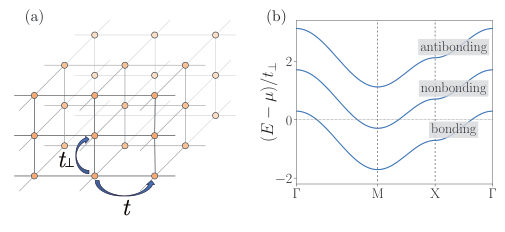 
FIG. 1. (a) Real-space structure of the trilayer square lattice. (b) Tight-binding band structure for t/t⊥= 0.25, with the chemical potential µ set to 1/3-filling.

📷 Fig 2

 
FIG. 2. Band filling n dependence of the eigenvalue λ of the linearized Eliashberg equation (9) for various values of U/t⊥= 2, 4, 6 at t/t⊥= 0.25. Band filling n = 2/3 corre- sponds to 1/3-filling. Circles denote points where the anoma- lous self-energy (gap function) ∆has s-wave symmetry, while open squares denote d-wave symmetry.

📷 Fig 3

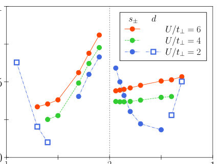 
Figure 2 shows the eigenvalue λ obtained by solving the linearized Eliashberg equation (9) for various U/t⊥ and the band filling n. Here, the band filling is defined as the number of electrons per site, by which n = 2/3 corre- sponds to 1/3-filling. Interestingly, while λ is symmetric about n = 2/3 for U/t⊥= 2, λ in the electron-doped region is strongly suppressed for U/t⊥= 4 and 6. This situation is reminiscent of the electron–hole asymmetry found in the three-leg ladder with strong interchain cou- pling. In the weak coupling limit, the three-leg ladder with strong interchain coupling hosts the C1S0 phase, which is favorable for superconductivity, both in electron- and hole-doped regions...

📷 Fig 4

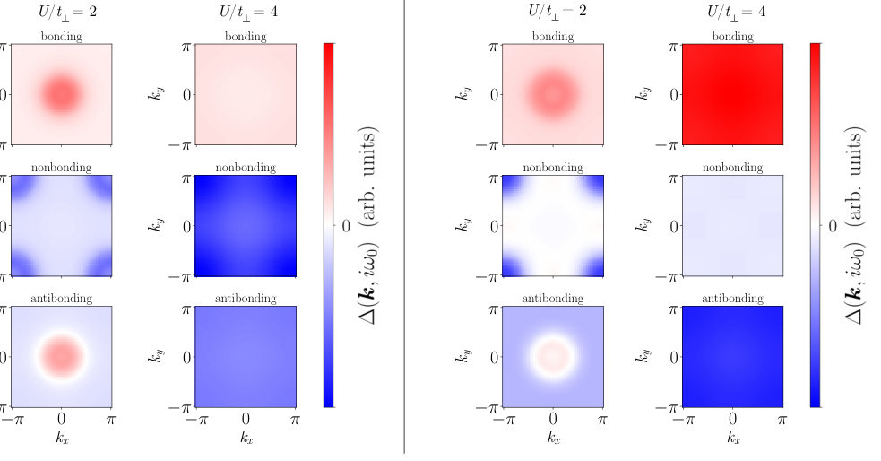 
FIG. 3. Band representations of the gap function ∆(k, iω0) at the lowest Matsubara frequency iω0 = iπkBT, obtained for U/t⊥= 2, 4 at (a) n = 2/3 −δ and (b) n = 2/3 + δ with δ = 0.0333.

📷 Fig 5

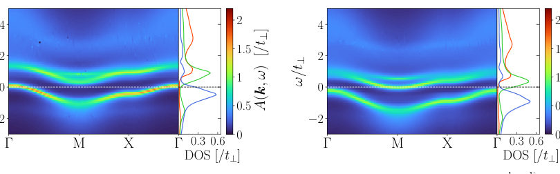 
FIG. 4. Spectral functions and partial density of states (DOS) for (a) n = 2/3 −δ, U/t⊥= 2, (b) n = 2/3 + δ, U/t⊥= 2, (c) n = 2/3 −δ, U/t⊥= 4, and (d) n = 2/3+δ, U/t⊥= 4, with δ = 0.0333. The blue, green, and red lines represent the partial DOS components of the bonding, nonbonding, and antibonding bands, respectively.

**Summary.** This theoretical study analyzes superconductivity in a trilayer Hubbard model near $1/3$ filling using the FLEX approximation. It finds that while weak interactions yield symmetric superconducting behavior, strong correlations induce a significant electron-hole asymmetry favoring hole doping. This suggests that spin fluctuations play a crucial role in determining the pairing symmetry and stability of the superconducting state.

**Why it may be interesting.** While focused on correlated electrons, the detailed analysis of pairing mechanisms ($\Delta$) and susceptibility ($\chi_s$) provides insights into how collective excitations (spin fluctuations) mediate pairing in strongly interacting quantum systems, which has parallels to dynamics studied in AMO physics.

Detailed structure

**Main problem.** The study investigates the electron-hole asymmetry of superconductivity near $1/3$ filling in the trilayer Hubbard model.

**Main result.** Strong correlations (large U) induce a pronounced electron-hole asymmetry, favoring superconductivity when the system is hole-doped relative to $1/3$ filling.

**Method.** The research employs the Fluctuation Exchange Approximation (FLEX) combined with solving the linearized Eliashberg equation to calculate superconducting parameters.

**Model / system.** The model is the trilayer Hubbard model, featuring three coupled layers and an onsite interaction U. The analysis focuses on band fillings near $1/3$ where bonding and nonbonding bands are nearly half-filled.

**Key observables.** Superconducting coupling constant ($\lambda$), gap function ($\Delta$), spectral function ($A(\mathbf{k}, \omega)$), and dynamical spin susceptibility ($	ext{Im } \chi_s$).

**Important parameters / regimes.** Interaction strength ratio ($U/t_{\perp}$), doping level (hole-doped vs. electron-doped relative to $1/3$ filling).

**Assumptions / limitations.** The primary approximation used is the Fluctuation Exchange Approximation (FLEX) theory, and calculations involve solving the linearized Eliashberg equation.

**Figures summary.** Figures illustrate $\lambda$ dependence on doping showing asymmetry for large $U/t_{\perp}$, and gap functions ($\Delta$) confirming $s_{\pm}$-wave structure in the hole-doped case versus local pairing at strong coupling.

**Paper structure.** The paper progresses by first establishing the model and methodology (FLEX, Eliashberg), then comparing weak vs. strong coupling limits to identify the emergence of electron-hole asymmetry, and finally analyzing gap functions and spin susceptibilities across different doping regimes.

Abstract

We study within the fluctuation exchange approximation the trilayer Hubbard model where three layers of the Hubbard model are coupled by large interlayer hoppings so that the overlap of the bonding, nonbonding, and antibonding bands is relatively small. We pay special attention to the band fillings close to 1/3, for which the bonding and nonbonding bands as a whole are close to half filling. For relatively small values of the onsite $U$, superconductivity roughly exhibits electron-hole symmetric behavior, as expected for a nearly half-filled two-band system. By contrast, an asymmetry appears when $U$ becomes large, where superconductivity is more favored in the hole-doped regime, i.e., in the regime where electrons are removed from 1/3 filling. We attribute this asymmetry to the asymmetric renormalization of the bonding, nonbonding, and antibonding bands when $U$ is large.

[↑ back to top](#top)

### [Auxiliary Schmidt Rank as a Resource for Photonic Bell Measurements](http://arxiv.org/abs/2606.24591v1)

**Authors:** Pradip Laha, Peter van Loock  
**Type:** theory · **Category:** quantum information and computing · **PDF:** <https://arxiv.org/pdf/2606.24591v1>  
**Analysis basis:** full PDF text, analyzed in chunks
**Topic relevance:** `entanglement & information structure` **3/5** · `quantum measurements` **3/5** · `measurement-induced transitions` **1/5**

📷 Fig 1

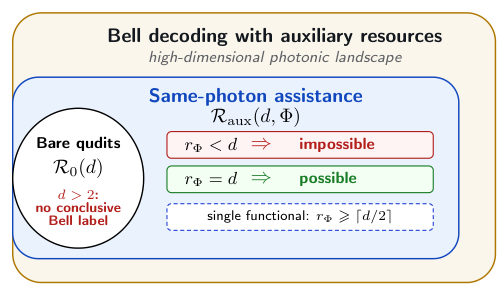 
FIG. 1. Resource hierarchy for deterministic high-dimensional Bell-state decoding. The bare two-photon/vacuum-mode class R0(d) admits no conclusive generalized Bell-label out- come for d &gt; 2 [42]. Same-photon auxiliary entanglement can realize a single Bell-label functional at rΦ ⩾⌈d/2⌉, but de- terministic decoding in the static passive two-photon model requires full auxiliary Schmidt rank.

📷 Fig 2

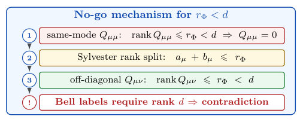 
FIG. 2. Deterministic no-go mechanism for rΦ &lt; d. Same- mode two-photon outcomes are rank deficient and must van- ish in any deterministic analyzer. This enforces the rank split aµ+bµ ⩽rΦ, which makes every off-diagonal contraction rank deficient as well; hence, no fine-grained outcome can carry a Bell-state label.

**Summary.** The paper establishes a rigorous resource threshold theorem showing that achieving deterministic Bell measurements for qudits requires the auxiliary entangled state's Schmidt rank ($r_\Phi$) to match the dimension of the system ($d$). This proves that entanglement is a necessary and quantifiable resource beyond simple passive optical elements.

**Why it may be interesting.** This work provides fundamental resource theorems quantifying how entanglement (via Schmidt rank) must be supplied to overcome inherent limitations of passive linear optics when performing high-dimensional quantum state measurements.

Detailed structure

**Main problem.** The research determines the minimum auxiliary Schmidt rank required for photonic systems to achieve deterministic Bell measurements when passive linear optics are used.

**Main result.** Deterministic discrimination of all $d^2$ Bell-state labels requires the auxiliary Schmidt rank ($r_\Phi$) to be at least equal to the qudit dimension, i.e., $r_\Phi \ge d$.

**Method.** The analysis uses rank constraints derived from analyzing effective system-level detection matrices ($\Gamma_\Phi(P)$) formed by contracting over the auxiliary state.

**Model / system.** The model involves two photons carrying unknown qudits ($S_A, S_B$) interacting with a fixed auxiliary entangled state $|\Phi
angle_R$ via passive linear optics and Photon-Number-Resolving (PNR) detection.

**Key observables.** Bell-state labels $(p, q)$, the success probability of Bell measurement ($p_{	ext{BM}}$), and the rank of the effective detection matrix $\Gamma_\Phi(P)$.

**Important parameters / regimes.** The qudit dimension $d$ and the auxiliary Schmidt rank $r_\Phi$. Thresholds include $r_\Phi \ge \lceil d/2 
ceil$ for single outcomes and $r_\Phi \ge d$ for full determinism.

**Assumptions / limitations.** The analysis assumes ideal PNR detection, a fixed auxiliary state $|\Phi
angle$, and the use of only passive linear optics without active operations.

**Figures summary.** Figures summarize resource hierarchies showing thresholds for bare algebra ($R_0(d)$), single functional ($\lceil d/2 
ceil$), and deterministic decoding ($d$).

**Paper structure.** The paper progresses by first establishing the limitations of passive optics, then deriving rank bounds on detection matrices using auxiliary state entanglement, culminating in the proof that $r_\Phi=d$ is necessary and sufficient for full Bell-label distinguishability.

Abstract

In quantum communication and fusion-based quantum computation, photonic Bell measurements are fundamentally limited when only passive linear optics is employed. While for qubits, some Bell states can be unambiguously identified with static beam splitters and no extra photons or entanglement, additional auxiliary photons or at least additional auxiliary degrees of freedom with a certain level of additional entanglement are needed to approach or attain a complete, deterministic Bell measurement. Here, we prove an exact resource threshold when the same two photons carry system qudits of dimension $d$ and a fixed auxiliary entangled state $Φ$, possibly distributed over several additional degrees of freedom, with total Schmidt rank $r_Φ$. We show that a single conclusive Bell-label functional can occur for $r_Φ\geqslant\lceil d/2\rceil$, but deterministic discrimination of all $d^2$ Bell-state labels requires $r_Φ\geqslant d$. A maximally entangled rank-$d$ auxiliary state achieves the bound by local Bell-basis sorting between each photon's system and auxiliary degrees of freedom. Thus, the auxiliary Schmidt rank is a certified resource for ancilla-photon-free, embedded photonic Bell measurements.

[↑ back to top](#top)

### [Efficient Graph State Purification with Factorized Graph-Preserving Operations across Local Clifford Orbits](http://arxiv.org/abs/2606.23809v1)

**Authors:** Mingyuan Wang, Guus Avis, Kenneth Goodenough, Stefan Krastanov  
**Type:** theory · **Category:** quantum information and computing · **PDF:** <https://arxiv.org/pdf/2606.23809v1>  
**Analysis basis:** full PDF text, analyzed in chunks
**Topic relevance:** `entanglement & information structure` **3/5** · `analog quantum simulation` **1/5** · `correlated / nonlocal dissipation` **1/5** · `correlated cavity matter` **1/5** · `driven-dissipative phase transition` **1/5**

📷 Fig 1

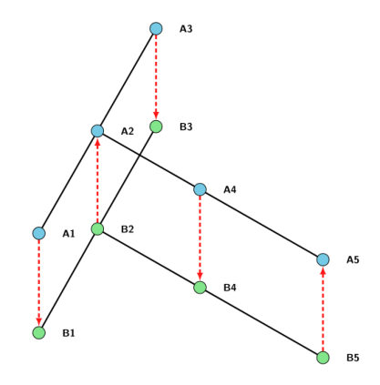 
FIG. 2. Orientation rule for homogeneous (H) op- erations on a bipartite graph. The 5-qubit T-shaped graph is bipartite and can be partitioned into two disjoint vertex sets. To preserve the graph-state basis, homogeneous two-qubit gates must respect this bipartition: nodes in one partition apply the gate in one orientation, while nodes in the opposite partition apply the corresponding gate with reversed control–target direction. The allowed gate pairs implement- ing this rule are listed in Table I.

📷 Fig 2

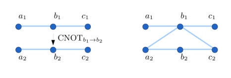 
FIG. 1. Action of a CNOT gate on a graph state. When a CNOT gate is applied with control qubit i and target qubit j, the graph is transformed by toggling edges between the control vertex and each neighbor of the target vertex. Concretely, for every vertex (k ∈N(j)) with (k ̸= i), an edge (i, k) is added if it is absent and removed if it is present. All other edges remain unchanged.

📷 Fig 3

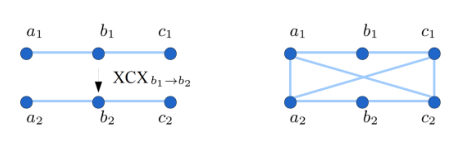 
FIG. 3. Action of the XCX gate on a graph state. When an XCX gate is applied between qubits i and j, it induces a complementation between the neighborhoods of the two vertices. Specifically, for every pair of vertices (k ∈N(i)) and (l ∈N(j)), an edge (k, l) is added if it is absent and removed if it is present. All other edges remain unchanged.

📷 Fig 4

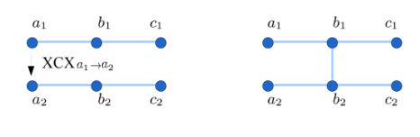 
FIG. 4. Action of the XCX gate on a leaf vertex and its compensation by a CZ gate. Consider an XCX gate applied between qubits i and j, where i is a leaf vertex. Be- cause i has only one neighbor, the XCX operation induces only a single edge toggle between the corresponding neigh- boring vertices. In the configuration shown, this creates the additional edge (b1, b2). The extra edge can be removed by applying a CZ gate between b1 and b2, thereby restoring the original graph structure. Hence, when restricted to a leaf ver- tex, the effect of XCX can be exactly compensated by a CZ operation on the corresponding neighboring qubits, preserv- ing the graph state.

📷 Fig 5

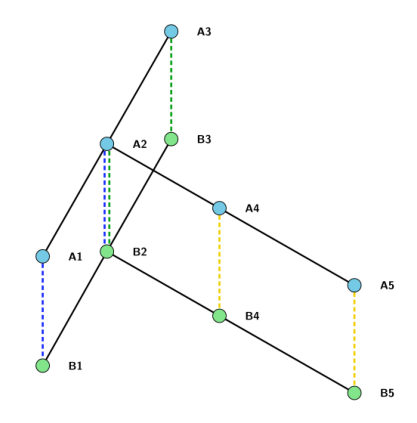 
FIG. 5. Bilocal (B) operations on leaf vertices. The 5- qubit T-shaped graph state contains three leaf vertices. Each leaf together with its unique neighbor forms a pair on which a bilocal gate can act across the two copies of the state. Con- sequently, up to three B-group operations may be applied independently, one at each leaf-neighbor pair. For each such pair, the gate acting on the leaf qubit is chosen from the set listed in Table II, while the corresponding operation applied to the neighbor qubit follows the mapping given in Table III. Be- cause each leaf connects to the rest of the graph through a sin- gle edge, these bilocal operations remain confined to the cor- responding...

**Summary.** This work develops a systematic framework to efficiently design entanglement distillation circuits for graph states by restricting gates to those that preserve the graph structure. By classifying these 'factorized graph-preserving' operations using concepts like Local Complementation orbits and Minimum Edge Representatives, the authors provide a scalable method superior to standard recurrence protocols under realistic noise conditions.

**Why it may be interesting.** While focused on quantum computation, the rigorous topological classification of allowed operations (H/B groups) provides a powerful mathematical tool for understanding constraints in highly entangled many-body systems, which can inform theoretical models in condensed matter physics.

Detailed structure

**Main problem.** Systematic entanglement distillation for arbitrary graph states is challenging due to the rapid growth of the circuit design space.

**Main result.** The authors introduce factorized, graph-preserving Clifford operations and use Minimum Edge Representatives (MERs) over Local Complementation (LC) orbits to design scalable, topology-aware purification circuits that outperform standard protocols under noise.

**Method.** They classify admissible gates into homogeneous (H) and bilocal (B) groups based on the underlying graph structure (bipartiteness or leaf vertices), allowing for a compact, factorized description of the gate set.

**Model / system.** The system involves multipartite entangled graph states $|	ext{G}
angle$, which are fundamental to measurement-based quantum computation and stabilizer codes. The analysis focuses on operations that preserve this graph-state basis across local Clifford transformations.

**Key observables.** Output fidelity ($F_{out}$), success probability, and the minimum number of edges in a Local Complementation (LC) orbit representative.

**Important parameters / regimes.** Graph structure (bipartite vs. non-bipartite), presence of leaf vertices, input entanglement fidelity ($F$), and noise model parameters.

**Assumptions / limitations.** The analysis assumes the ability to use MERs to provide a canonical representation for LC orbits, and that the gate set can be factorized into H and B components.

**Figures summary.** Figures illustrate the action of CNOT gates on graph states (Fig. 1), the structure of homogeneous gates on bipartite graphs (Fig. 2), and how bilocal XCX operations at a leaf vertex can be compensated by a CZ gate to preserve the state basis (Fig. 4).

**Paper structure.** The paper systematically introduces the problem, defines graph-preserving gates via H and B groups based on graph topology, establishes the framework using LC orbits and MERs for canonical representation, and finally applies this structure to optimize noisy distillation circuits.

Abstract

Graph states form a broad class of multipartite entangled states underlying measurement-based quantum computation, quantum networks, and stabilizer codes. However, systematic entanglement distillation for arbitrary graph states remains challenging because the circuit design space grows rapidly with the number of parties. We introduce a group of Clifford operations that we call "factorized graph-preserving". It enables us to efficiently enumerate and optimize graph-state purification circuits at finite size for realistic noisy hardware. These operations map products of graph-basis states to products of graph-basis states, so their action can be represented as permutations of graph-basis labels. Moreover, this useful gate set admits a compact factorized description determined by simple graph-theoretic features. This structure also allows, after some initial cached precomputation, drastically lower computational complexity for simulating a gate. We further organize these operations over local-complementation (LC) orbits using minimum-edge representatives (MERs), which let us design purification circuits that apply to all locally equivalent graph states (up to a basis change). Using this framework, we optimize noisy finite-size multipartite distillation circuits for several graph-state families. Numerical results show that the resulting graph-preserving circuits can outperform standard recurrence-based purification protocols under realistic gate and measurement noise. Our results establish LC-orbit structure and factorized graph-preserving operations as practical tools for scalable, topology-aware and hardware-constrained graph-state distillation protocol design. Our work can also be interpreted as a graph-based heuristic for finding transversal gates.

[↑ back to top](#top)

### [From Continuous-Time Random Walks to Laplace Tails](http://arxiv.org/abs/2606.24451v1)

**Authors:** Omer Hamdi, Stanislav Burov, Eli Barkai  
**Type:** theory · **Category:** statistical mechanics · **PDF:** <https://arxiv.org/pdf/2606.24451v1>  
**Analysis basis:** full PDF text, analyzed in chunks
**Topic relevance:** `Keldysh / 2PI / non-Gaussian methods` **3/5** · `non-equilibrium dynamics` **2/5** · `methods for driven-dissipative` **1/5** · `non-equilibrium universality` **1/5**

📷 Fig 1

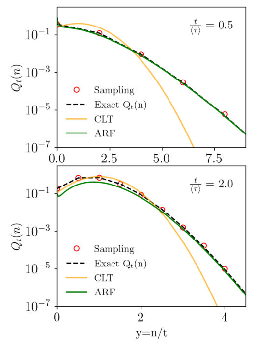 
FIG. 1. Comparative analysis of Qt(n) for numerically sam- pled data using the Erlang distribution (red circles). The exact solution is detailed in the text (black dashed line), CLT predictions (orange line) as provided by Eq. (32), and our ARF approximation, produced by inserting Eq. (29) into Eq. (17) (green line). Plotted are two example cases with Erlang parameters k = 2, λ = 2, and 106 samples on a semi-log scale. Here, t/⟨τ⟩= 0.5 on top, and t/⟨τ⟩= 2 on the bottom. As we increase t, Qt(n) will converge to the normal distribution. However, for small values of t, we see a good agreement with the ARF theory.

📷 Fig 2

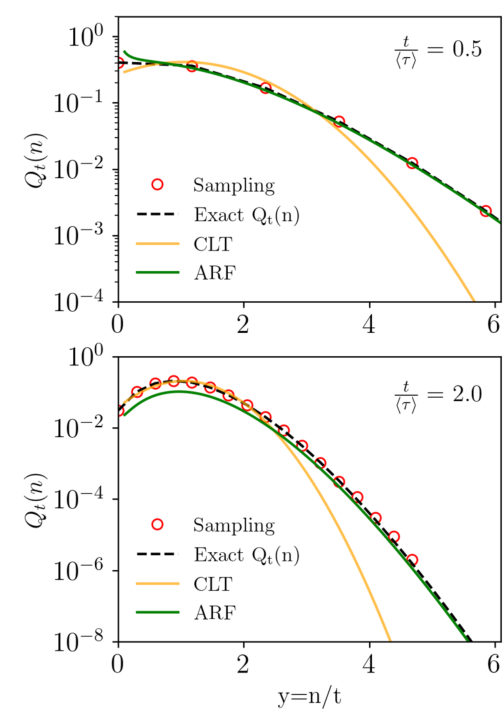 
FIG. 2. Comparative analysis of Qt(n) as obtained for ψ(τ) in Eq. (33). The presented behavior is for numerically sam- pled data (red circles), exact solution from Eq. (B4) (black dashed line), CLT predictions (orange line), and our ARF approximation of Qt(n), produced by inserting Eq. (34) into Eq. (17) (green line). Plotted are two example cases with the parameters d1 = 5, λ1 = 1, λ2 = 3, and 106 samples. Here, t/⟨τ⟩= 0.5 on top, and t/⟨τ⟩= 2 on the bottom. As t increases, the empirical sampling converges to the CLT. For small t, we observe good agreement with the ARF theory.

📷 Fig 3

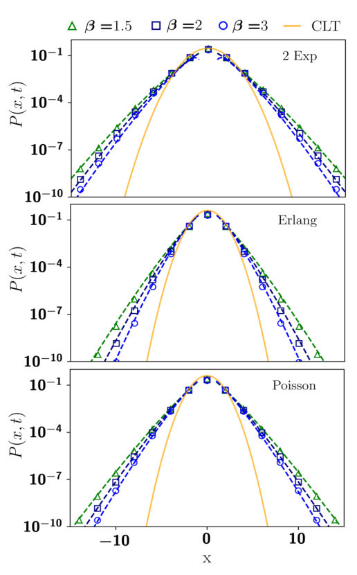 
FIG. 3. Universality of exponential-like tails. Comparison of P(x, t) obtained from CTRW numerical convolution (sym- bols), and theoretical predictions; Eq. (47) in dashed lines, and CLT in orange lines. The waiting time PDFs are: Eq. (33) (double exponential) with parameters λ1 = 1, λ2 = 3, d1 = 5 (top), Eq. (27) (Erlang) with parameters k = 2, λ = 4 (mid- dle), and Eq. (5) (the classic Poisson case) with λ = 1 (bot- tom). For all those cases, we choose t/⟨τ⟩= 1, i.e., we focus on the scale where a particle jumps on average only once. Notice the large deviations from the traditional CLT and the nearly exponential tails accurately describing the system without fitting. Regardless of β, the...

📷 Fig 4

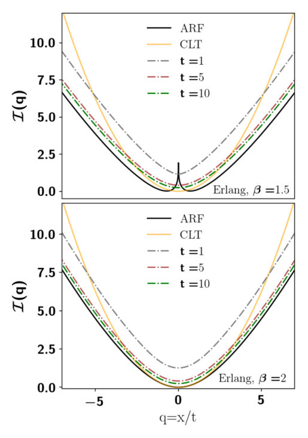 
FIG. 4. Using numerical solution of the CTRW presented in Sec. V A, we plot the rate function for P(x, t). For three finite t we plot −log[P(x, t)]/t versus q = x/t. The numerical results are presented by dashed lines while analytical form of the rate function is provided for the CLT approximation via Eq. (36) (orange line) and for the ARF via Eq. (47) (black line). For the PDF of the waiting times we used Eq. (27) (Erlang) with parameters k = 2, λ = 4, while the jump dis- tribution follows Eq. (44) with β = 1.5, 2. For large enough t, the ARF is the dominating behavior in the tails, while the CLT is dominating in the center.

📷 Fig 5

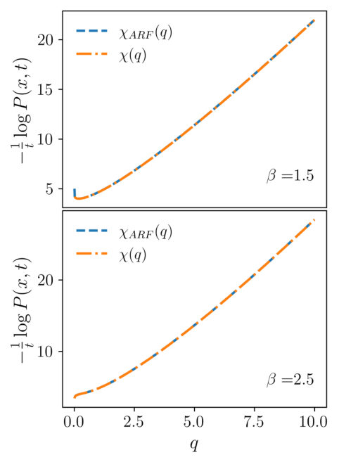 
FIG. 5. Comparison of the rate function of P(x, t) obtained by our method using χARF(q) from Eq. (48) (blue dashed) and by the formalism of Ref. [69], described by Eq. (65) (orange dash-dotted). The parameters are: A = 5, CA = 1, CA+1 = −5, with β = 1.5 (top) and β = 2.5 (bottom). For both values of β, we see a good fit between the two approaches.

**Summary.** This work rigorously analyzes the probability distribution of particle displacements in Continuous-Time Random Walks (CTRWs), showing that while typical fluctuations follow Gaussian statistics, rare events exhibit pronounced Laplace tails. By developing a rate function framework valid at finite times, the authors provide a powerful theoretical tool to characterize anomalous diffusion in complex media.

**Why it may be interesting.** The robust derivation of non-Gaussian tails (Laplace tails) in a fundamental transport model like CTRW provides insights into anomalous diffusion regimes relevant to complex biological or glassy systems, which is crucial for understanding energy/particle transport dynamics beyond simple Brownian motion.

Detailed structure

**Main problem.** The study investigates the deviation of particle displacement distributions from the expected Gaussian behavior (Brownian motion) in complex media, focusing on the emergence of pronounced exponential decay known as Laplace tails.

**Main result.** The probability density function $P(x, t)$ for displacements in Continuous-Time Random Walks exhibits Laplace tails in the large spatial separation limit ($|x| 	o \infty$), which is quantified by a rate function $\chi_{ARF}(q)$.

**Method.** The analysis employs advanced techniques from Large Deviation Theory (LDT), utilizing saddle point approximations and developing rate function-like frameworks for both the positional PDF $P(x, t)$ and the renewal probability $Q_t(n)$.

**Model / system.** The model is the Continuous-Time Random Walk (CTRW), which describes particle diffusion in complex environments like glasses or living cells. The process is governed by random waiting times $\psi(	au)$ and subsequent jumps.

**Key observables.** $P(x, t)$ (positional PDF), $Q_t(n)$ (probability of exactly $n$ renewals), and the associated rate functions ($I(y)$ or $\chi(q)$).

**Important parameters / regimes.** Time $t$, spatial separation $|x|$, ratio $q=x/t$, and parameters defining the waiting time distribution $\psi(	au)$.

**Assumptions / limitations.** The analysis relies on developing rate function frameworks valid for finite times, extending beyond standard asymptotic LDT results. Approximations are made using saddle point methods and Taylor expansions of $\psi(	au)$ near $	au=0$.

**Figures summary.** Figures compare $Q_t(n)$ across different waiting time PDFs (Erlang, sum of two exponentials) against CLT predictions and the derived Asymptotic Rate Function (ARF), demonstrating matching tail behavior. Other figures plot $P(x, t)$ showing convergence to Laplace tails.

**Paper structure.** The paper develops a rate function framework for $Q_t(n)$, analyzes the large deviation regime ($y=n/t$), and then extends this formalism to derive the propagator $P(x, t)$. The core is comparing theoretical predictions (ARF) against known limits (CLT) and numerical simulations across various time scales.

Abstract

During Brownian motion, the displacement is normally distributed, a classical fact aligned with the central limit theorem. However, single particle tracking in complex media such as glasses, living cells, and colloidal suspensions often reveals pronounced exponential decay of the displacement distribution, known as Laplace tails. In a short letter, two of us presented the emergence of Laplace tails in the continuous time random walk (CTRW) framework. Here, a detailed complementary study is presented. By exploring the behavior of $Q_t(n)$, the probability that exactly $n$ renewals occur during time $t$, we develop a rate function-like framework for this quantity, valid for finite $t$. We show that $Q_t(n)$ exhibits exponential tails, which in turn give rise to exponential tails of the positional probability density function $P(x,t)$. Favorable comparison to finite-time numerical simulations and asymptotic large deviation rate functions establishes the validity of our results over a wide temporal range.

[↑ back to top](#top)

### [Connecting Quantum Tomography and Quantum Retrodiction](http://arxiv.org/abs/2606.23777v1)

**Authors:** Sebastian Murk, Ian Tan, Fabian Müller, Dominik Šafránek  
**Type:** theory · **Category:** quantum information and computing · **PDF:** <https://arxiv.org/pdf/2606.23777v1>  
**Analysis basis:** full PDF text, analyzed in chunks
**Topic relevance:** `quantum measurements` **3/5** · `Keldysh / 2PI / non-Gaussian methods` **1/5** · `entanglement & information structure` **1/5** · `measurement-induced transitions` **1/5**

📷 Fig 1

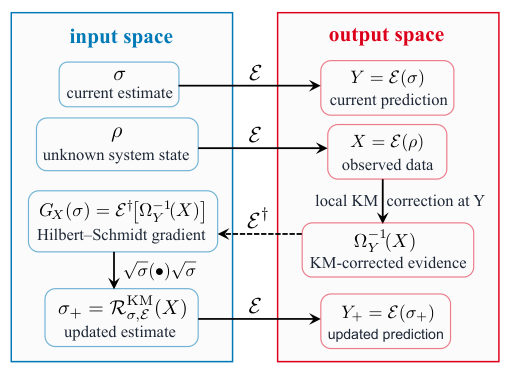 
FIG. 1. Schematic representation of the KM update. The current estimate σ predicts Y = E(σ), while the data define an output-space evidence operator X; ideally, X = E(ρ). The inverse KM action at Y gives the corrected evidence Ω−1 Y (X), which is pulled back through E† to the Hilbert–Schmidt gradient GX(σ). Conjugation by √σ produces the positive state update σ+ = RKM σ,E(X), with updated prediction Y+ = E(σ+).

📷 Fig 2

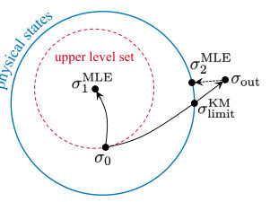 
FIG. 2. The KM iteration converges locally to the maximum- likelihood estimator (MLE), provided the initial prior is sufficiently close. Otherwise, it may instead follow the log-likelihood gradient to a boundary point rather than the MLE, for example, when finite data make the observations incompatible with any physical state.

📷 Fig 3

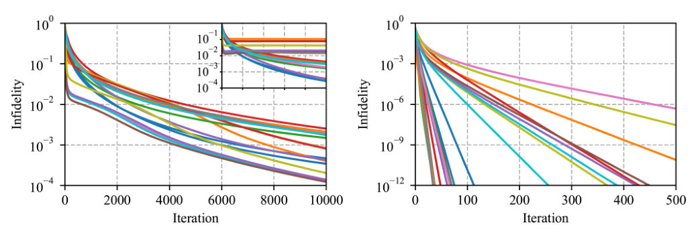 
FIG. 3. Left: Maximum-likelihood quantum tomography based on iterative application of the weighted Petz map over Pauli bases, with the prior initialized as the maximally mixed state. Twenty states of six qubits of varying rank were randomly generated (including 20% pure states), and regularized to make them full-rank, ρ = (1 −ϵ)ρ + ϵI/d, ϵ = 10−2. We show the stabilized iteration (δ = 10−7) and the unstabilized case (δ = 0) in the inset. Right: Tomography of a qubit via iterative unstabilized KM updates in a Stinespring setup with three overcomplete, incompatible channels defined by a random unitary U, using otherwise identical settings. The method converges faster for highly mixed states....

**Summary.** This work unifies quantum tomography and retrodiction by demonstrating that they are governed by the same underlying principle: maximizing the log-likelihood of measurement outcomes. The authors derive a generalized Kubo–Mori update, showing it relates directly to the Petz recovery map, thereby providing a robust, gradient-based framework for state reconstruction in quantum systems.

**Why it may be interesting.** It provides a rigorous mathematical link between fundamental concepts in quantum estimation theory (tomography/retrodiction) using modern tools from information geometry and optimization.

Detailed structure

**Main problem.** The paper unifies quantum tomography (state reconstruction) and quantum retrodiction (inferring past states) by showing they stem from a single underlying principle.

**Main result.** It proves that the Petz recovery map is mathematically equivalent to the gradient update used in maximum-likelihood quantum tomography, establishing a general framework for state estimation.

**Method.** The authors employ techniques from information geometry and optimization theory, deriving iterative updates (KM update) based on maximizing the log-likelihood functional of measurement data.

**Model / system.** The analysis is performed on general quantum channels $E$ acting on density matrices $
ho$, applicable to various measurement scenarios including quantum-to-classical measurements.

**Key observables.** Log-likelihood functional $L_X(\sigma)$, Petz recovery map ($\mathcal{R}_{\sigma, E}(X)$), and the Kubo–Mori (KM) update ($\mathcal{R}_{	ext{KM}}$).

**Important parameters / regimes.** The degree of non-commutativity between measured observables ($[E(\sigma), X]$) dictates the difference between the Petz map and the KM update.

**Assumptions / limitations.** Assumes conditions ensuring positive evidence ($X \ge 0$) and that the output state is invertible or well-behaved for gradient calculations.

**Figures summary.** Figures illustrate the schematic process of the KM update, showing how evidence leads to a corrected estimate, and demonstrate convergence towards the Maximum Likelihood Estimator (MLE) in various setups.

**Paper structure.** The paper builds from defining the MLE problem, deriving the gradient-based KM update, establishing its relationship to the Petz map via non-commutativity terms, and finally proving monotonicity properties for both updates.

Abstract

Quantum tomography and quantum retrodiction are traditionally viewed as separate inference tasks: tomography reconstructs quantum states from measurement data, whereas retrodiction infers past quantum states from observed outcomes. We show that the two are manifestations of the same underlying principle. We prove that the Petz recovery map associated with a measurement channel is precisely the gradient update of the log-likelihood used in maximum-likelihood tomography. Consequently, repeated applications of the Petz map monotonically increase the likelihood. Extending beyond measurement channels, we derive a noncommutative generalization of the Petz map from the gradient of a generalized likelihood for arbitrary quantum channels. The resulting iterative procedure maximizes the likelihood and provides a general framework for quantum tomography, establishing a direct bridge between retrodiction, recovery maps, and statistical inference.

[↑ back to top](#top)

### [Wavelet Matrix Product States for Quantum Fields](http://arxiv.org/abs/2606.23823v1)

**Authors:** Molly Kaplan, Antoine Tilloy  
**Type:** theory · **Category:** numerical methods · **PDF:** <https://arxiv.org/pdf/2606.23823v1>  
**Analysis basis:** full PDF text, analyzed in chunks
**Topic relevance:** `methods for driven-dissipative` **3/5** · `Keldysh / 2PI / non-Gaussian methods` **1/5** · `analog quantum simulation` **1/5**

📷 Fig 1

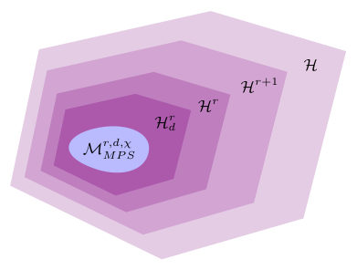 
FIG. 1. The variational manifold. From the full Hilbert space H, we first reduce our consideration to Hr, the Fock space of resolution r scaling modes at each site. We see that this space lies inside Hr+1, and all higher resolution Hilbert spaces. Fur- ther reduction to Hr d truncates each Fock space to d −1 ex- citations. Finally, we further reduce to the MPS submanifold Mr,d,χ MPS.

📷 Fig 2

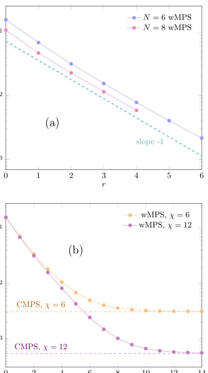 
FIG. 2. Relative error in the wMPS ground state energy density as a function of the resolution r, for the Lieb-Liniger model with µ = 1, c = 8 and an MPS with d = 3 states in the Fock space on each physical leg. (a) We compare N = 6 and N = 8 wavelet MPS with bond dimension χ = 16, which both scale linearly with the lattice spacing. (b) We compare results for wMPS with bond dimension χ = 6, 12, and larger r for N = 6, to witness the saturation as a function of r to the CMPS values. For r ≥5, the optimization is done with the iterative refinement method of sec. IV.

📷 Fig 3

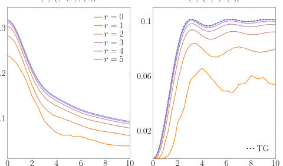 
FIG. 3. Observables in the wMPS ground state with µ = 1, χ = 16, d = 3, at different resolutions, near the Tonks- Girardeau limit at c = 200.

📷 Fig 4

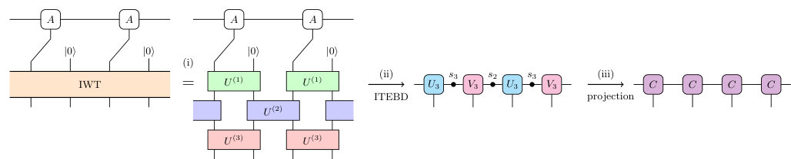 
FIG. 4. Illustration of the three steps of the refinement algorithm: (i) writing the inverse wavelet transform as a brick-wall circuit, (ii) contracting it with ITEBD, (iii) projecting onto translation invariant MPSs.

📷 Fig 5

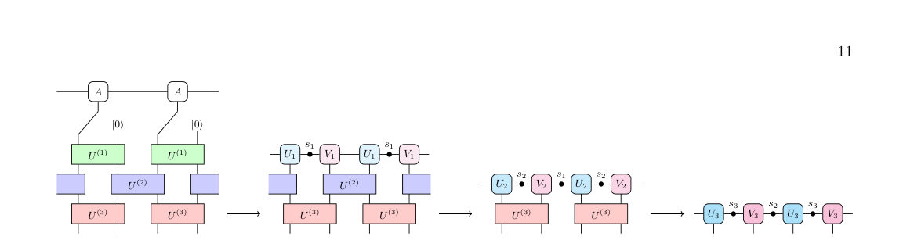 
FIG. 5. Contraction of the original MPS with three layers of the IWT brick-wall circuit into an MPS with a larger unit cell using ITEBD, which corresponds to step (ii) of our refinement algorithm.

**Summary.** The paper introduces Wavelet Matrix Product States (wMPS) as a novel, highly accurate variational method for solving continuous Quantum Field Theories. By leveraging the multi-resolution properties of Daubechies wavelets, it allows systematic refinement of approximations without needing explicit lattice discretization. This technique is shown to accurately compute key observables like energy density and correlation functions for models such as the Lieb-Liniger system.

**Why it may be interesting.** This work provides a powerful, systematic numerical tool for studying continuum quantum systems that avoids the pitfalls of standard lattice discretization, offering variational bounds on ground state energies relevant to many-body physics.

Detailed structure

**Main problem.** The primary goal is developing a variational method to solve continuum quantum field theories (QFT) by mapping them onto discrete tensor network representations.

**Main result.** The authors demonstrate that using Wavelet Matrix Product States (wMPS) with Daubechies wavelets allows for systematic, highly accurate approximation of QFT ground states, showing convergence towards Continuous MPS results.

**Method.** They employ a variational approach utilizing wMPS, which are built on wavelet bases and optimized iteratively through multi-resolution analysis to approximate the continuum Fock space.

**Model / system.** The method is applied to continuum quantum models like the Lieb-Liniger model of non-relativistic bosons. The Hamiltonian involves kinetic and four-point interaction terms derived from the wavelets.

**Key observables.** Energy density, two-point correlation functions, and density-density correlators are computed to track convergence.

**Important parameters / regimes.** The resolution scale ($r$) of the wavelets, the bond dimension ($\chi$), and the Daubechies function order ($N \geq 6$).

**Assumptions / limitations.** The method assumes the Hamiltonian is local and that the state can be accurately approximated by a tensor product structure derived from the wavelet basis; it relies on the inclusion property of the chosen wavelets.

**Figures summary.** Figures illustrate the reduction sequence of the Hilbert space ($\mathcal{H} 	o \mathcal{H}_r 	o 	ext{MPS manifold}$), show energy density convergence vs. resolution $r$, and compare optimization routines with and without iterative refinement.

**Paper structure.** The paper builds mathematically by establishing the necessary properties for a suitable wavelet basis (Daubechies functions) to ensure variationality and inclusion. It then details the construction of the Hamiltonian in terms of local coefficients ($K, \Gamma_4$) and presents an iterative algorithm involving Inverse Wavelet Transforms ($	ext{IWT}$) followed by $	ext{ITEBD}$ contraction and projection.

Abstract

We introduce a variational method to solve continuum quantum models with discrete tensor network techniques. The method leverages wavelet matrix product states (wMPS): matrix product states built on top of sufficiently regular ($N\geq 6$) Daubechies scaling functions. These states live in the continuum field theory Fock space, have finite energy density, and can be optimized with standard algorithms, without restriction to free theories. Further, exploiting the multi-resolution analysis built into wavelets, and its quantum circuit description, we can iteratively refine wMPS to obtain accurate approximations at arbitrarily fine length-scales. We showcase the efficiency of the method on the Lieb-Liniger model, computing energy density and correlation functions.

[↑ back to top](#top)

### [Low Spatial Cost CCZ Magic State Factory](http://arxiv.org/abs/2606.24170v1)

**Authors:** Sungyeon Kook, Yujin Kang, Ilkwon Sohn, Jun Heo  
**Type:** theory · **Category:** quantum information and computing · **PDF:** <https://arxiv.org/pdf/2606.24170v1>  
**Analysis basis:** full PDF text, analyzed in chunks
**Topic relevance:** `quantum measurements` **3/5** · `measurement-induced transitions` **1/5**

📷 Fig 1

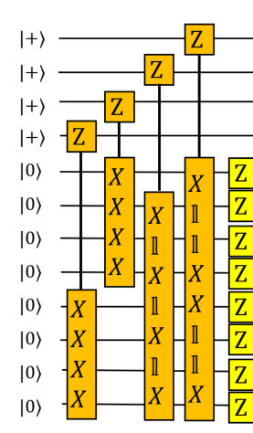 
Fig. 1 Initial [[8, 3, 2]] CCZ magic state distillation circuit before Pauli rotation conversion.

📷 Fig 2

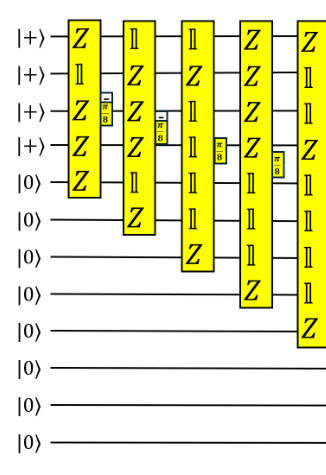 
Fig. 2 [[8, 3, 2]] CCZ distillation circuit after Pauli-rotation conversion. The non-Clifford operations are represented as Z-basis π/8 Pauli-product rotations.

📷 Fig 3

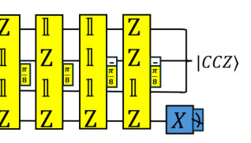 
Fig. 3 Reduced four-qubit [[8, 3, 2]] CCZ distillation circuit obtained after removing the redundant |0⟩auxiliary qubits.

📷 Fig 4

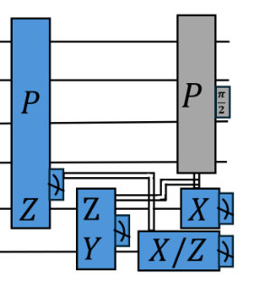 
Fig. 4 π/8 joint measurement consumes an |A⟩ancilla and a |0⟩ancilla, and uses the joint mea- surements PLZA and ZAY0 to implement a Pauli product π/8 rotation up to Pauli frame correction.

📷 Fig 5

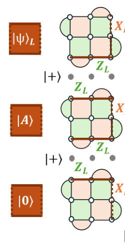 
Fig. 5 Four qubit twisted ZY measurement used to implement the ZAY0 joint measurement. The three patches on the left represent the data patch |ψ⟩L, the magic state ancilla patch |A⟩, and the auxiliary patch |0⟩, respectively. The surface code patches are illustrated for code distance d = 3. Green and peach regions denote Z and X stabilizers, respectively. The solid brown boundaries indicate the rough boundaries associated with logical ZL operators, whereas the dashed brown boundaries indicate the smooth boundaries associated with logical XL operators. White circles represent data qubits, and gray circles indicate qubits used during the joint measurement construction. On the right, the...

**Summary.** The paper presents a novel design framework to drastically reduce the physical space required for generating essential magic states like CCZ and T states in surface code quantum computation. By converting complex gate operations into efficient joint measurements and utilizing specialized four-qubit twisted syndrome measurements, they achieve substantial resource savings while maintaining high error suppression capabilities.

**Why it may be interesting.** This work is highly relevant as it directly addresses hardware constraints (physical qubit count) in scaling quantum computers. The techniques developed—especially the Pauli rotation conversion and compact measurement implementation—provide concrete engineering blueprints for building fault-tolerant modules.

Detailed structure

**Main problem.** The primary goal is to reduce the physical resource cost, specifically the spatial footprint, required for implementing magic state distillation protocols within a surface code architecture.

**Main result.** The authors propose a framework that reduces the spatial cost of generating CCZ and T magic states by converting gate-based circuits into compact joint measurement architectures using four-qubit twisted measurements. This results in significant resource savings compared to previous designs.

**Method.** They convert complex, gate-based distillation protocols (like [[8, 3, 2]] CCZ) into sequences of Pauli rotation joint measurements ($\pi/8$ rotations). Redundant auxiliary qubits are eliminated by exploiting the trivial action of Z-type operators on $|0
angle$ states.

**Model / system.** The work is situated in the context of fault-tolerant quantum computation using the surface code. The system models the distillation process for non-Clifford resource states, specifically focusing on CCZ and T magic states, which are essential for universal quantum computation beyond Clifford gates.

**Key observables.** Spatial cost (reduced from $396d^2$ to $113d^2$), output error rates ($p_{1,	ext{CCZ}} \simeq 96p_L + 28p_T^2$), and the ability to maintain single-fault detection.

**Important parameters / regimes.** Code distance ($d$), input magic state error rate ($p_T$), logical memory error probability ($p_L$), and the specific distillation protocol parameters (e.g., [[8, 3, 2]] for CCZ).

**Assumptions / limitations.** The analysis assumes independent error sources between logical memory errors and input magic state errors. Furthermore, it relies on the ability to implement required measurements using local twist regions, keeping ancilla patches compact.

**Figures summary.** Figures illustrate the transformation from initial gate-based circuits (Fig 1) to measurement-based ones (Fig 2), showing the final reduced four-qubit circuit (Fig 3). Later figures detail the implementation of the key twisted ZY measurement and compare resource costs across different factory designs.

**Paper structure.** The paper first introduces the problem of high spatial cost in magic state factories. It then details the methodology: converting gate circuits to Pauli rotation measurements, followed by implementing these measurements using novel four-qubit twisted syndrome measurements. Finally, it presents quantitative comparisons showing significant resource reduction for both CCZ and T state factories.

Abstract

We propose a design framework for reconstructing gate-based magic state distillation protocols as compact joint-measurement architectures implementable with the surface code. The goal is to reduce the surface-code resource cost of a magic state factory while preserving the logical function and error-detection structure of the distillation protocol. We construct a reduced architecture for implementing an eight-to-three CCZ distillation protocol using smaller surface-code patches. The proposed factory preserves the single-fault-detection property and the leading-order error suppression of the protocol, while producing CCZ magic states with lower spatial cost than the design of Gidney and Fowler. The proposed design perspective can also be applied to T-state factories and other multiqubit non-Clifford resource-state factories. Our approach provides a framework for extending the design space of surface-code magic state factories beyond a single CCZ layout optimization.

[↑ back to top](#top)

### [Probing the pairing symmetry of moiré graphene superconductors](http://arxiv.org/abs/2606.23994v1)

**Authors:** Sayak Biswas, Rajdeep Sensarma, Mohit Randeria  
**Type:** theory · **Category:** strongly correlated electrons · **PDF:** <https://arxiv.org/pdf/2606.23994v1>  
**Analysis basis:** full PDF text, analyzed in chunks
**Topic relevance:** `Keldysh / 2PI / non-Gaussian methods` **2/5** · `analog quantum simulation` **2/5** · `methods for driven-dissipative` **2/5** · `spintronics-quantum-optics interface` **2/5** · `correlated / nonlocal dissipation` **1/5** · `driven-dissipative phase transition` **1/5** · `entanglement & information structure` **1/5** · `exotic spin models in light-matter` **1/5** · `non-equilibrium dynamics` **1/5**

📷 Fig 1

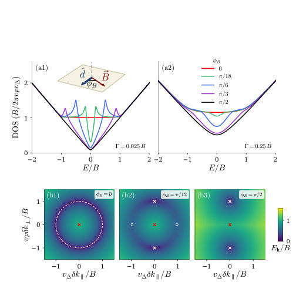 
FIG. 1. Low-energy DOS in a Zeeman field for triplet pairing. (a1) Variation of the DOS N(E) with the angle ϕB between ⃗B and ˆd. N(E) ∼|E| is nodal for ϕB = π/2, whereas it is finite with N(0) ∼B when ϕB = 0. For 0 &lt; ϕB &lt; π/2, the DOS remains nodal and exhibits low-energy van Hove singularities at E = ±B sin ϕB; see text. (a2) These singularities are wiped out by a broadening Γ, but N(0) shows a variation with ϕB. (b1–b3) Evolution of the nodes in the Bogoliubov spectrum (6). The zero-field node is at (0, 0) (red cross). For ϕB = 0, the nodes are a (white dashed) circle of radius B in the (v∆δk∥, vF δk⊥)-plane; see text. For ϕB ̸= 0, there are only two point nodes (white crosses). For 0 &lt;...

📷 Fig 2

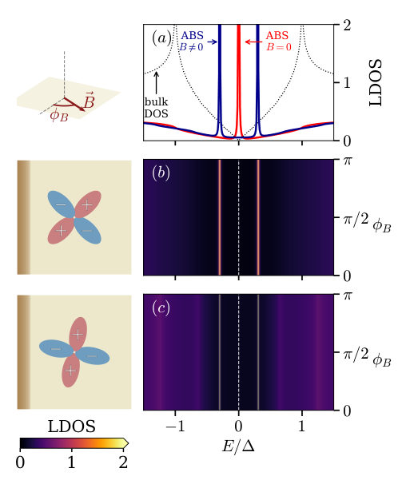 
FIG. 2. Isotropic Zeeman splitting of ABS for singlet pairing. (a) LDOS near the boundary shows a E = 0 peak arising from Andreev bound states (ABS) which splits into two peaks at E = ±B in a field. These LDOS are contrasted with the bulk DOS. (b,c) The ABS splitting is independent of the direction ϕB of the in-plane field ⃗B as seen from the false-color plots of the LDOS as a function of E and ϕB for two orientations of the d-wave order parameter with respect to the interface: (b) ∆cos (2θk −π/2) and (c) ∆cos (2θk −π/8). B = 0.3∆and all LDOS are calculated at a small distance 0.2π/kF from the interface; see text.

📷 Fig 3

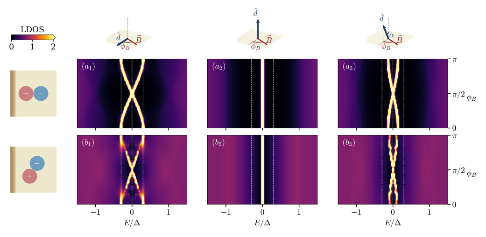 
FIG. 3. Anisotropic Zeeman splitting of ABS for triplet pairing. The LDOS near the boundary plotted as a function of E and the in-plane field ⃗B direction ϕB for three orientations of ˆd. (1) In-plane ˆd, (2) out-of-plane ˆd, and (3) ˆd at an angle α = π/6 with respect to the normal to the plane. Results are shown for two different orientations of the p-wave order parameter: (a) ∆cos (θk) and (b) ∆cos (θk −π/3). In (a1,b1) the ABS splits into two peaks at E = ±B when ⃗B ∥ˆd (ϕB = 0), while there is no splitting when ⃗B ⊥ˆd (ϕB = π/2). In (a2,b2), ˆd is always perpendicular to ⃗B, and hence there is no splitting. In (a3,b3), the magnitude of the splitting lies between those in cases (1) and...

**Summary.** This work theoretically distinguishes between singlet and triplet superconducting pairing symmetries in moiré graphene by predicting distinct signatures. The authors leverage symmetry constraints and model both bulk quasiparticle excitations and interface-bound Andreev states. Observing the Zeeman field response of these two types of probes offers a definitive experimental pathway to characterize the underlying pairing mechanism.

**Why it may be interesting.** While focused on condensed matter superconductivity, the use of topological protection in Andreev bound states and the detailed analysis of spin/momentum dependence under external fields provides rich theoretical tools applicable to understanding exotic quantum phases in engineered systems.

Detailed structure

**Main problem.** The primary goal is to definitively determine the pairing symmetry (singlet vs. triplet) of superconductivity in moiré graphene superconductors, and if triplet, to identify the direction of the d-vector.

**Main result.** Distinct signatures are predicted for singlet versus triplet pairing when probing the superconducting state using Zeeman fields applied either to bulk quasiparticles or at superconductor/insulator interfaces via Andreev bound states (ABS).

**Method.** The analysis combines symmetry constraints ($\mathcal{T}, C_{2z}$) with theoretical modeling of the Bogoliubov-de Gennes Hamiltonian, analyzing both low-energy Density of States (DOS) and phase-sensitive ABS spectroscopy.

**Model / system.** The system is magic-angle moiré graphene superconductors operating on the hole-doped side of $
u = -2$, characterized by a normal state constrained by an Incommensurate Kekulé Spiral (IKS).

**Key observables.** Low-energy Density of States $N(E)$ under Zeeman field, and the splitting/behavior of topologically protected Andreev Bound States (ABS) at interfaces.

**Important parameters / regimes.** Zeeman field orientation ($\vec{B}$ relative to $\hat{d}$), doping level, and proximity to nodal superconductivity.

**Assumptions / limitations.** The analysis assumes robustness in the low-energy limit, relies on symmetry constraints derived from the IKS normal state, and models ABS using a smooth interface approximation.

**Figures summary.** Figures illustrate the Zeeman splitting of zero-field ABS peaks for singlet pairing (splitting to $\pm B$) versus the angle-dependent splitting observed for triplet pairing ($\vec{B} \parallel \hat{d}$ vs. $\vec{B} \perp \hat{d}$).

**Paper structure.** The paper systematically constrains the order parameter using symmetry arguments, develops theoretical predictions for two key experimental probes (bulk DOS and interface ABS), and contrasts the expected signatures for singlet versus triplet pairing.

Abstract

The pairing symmetry of magic-angle moiré graphene is a fundamental question that remains unresolved. Combining experimental and theoretical inputs, we constrain the superconducting order parameters that can emerge from the incommensurate Kekulé spiral (IKS) normal state on the hole-doped side of $ν= -2$. Imposing the additional experimental constraint of nodal superconductivity, we are left with the task of distinguishing between singlet or triplet pairing, and of determining the d-vector in the latter case. We propose definitive tests to identify the pairing symmetry based on two classes of experiments using the response of the superconducting state to Zeeman field orientation. The first set of predictions is for spectroscopic and thermodynamic measurements sensitive to low-energy excitations near the nodes. The second set is for phase-sensitive measurements of topologically protected Andreev bound states near boundaries, whose spectroscopy is shown to provide a smoking gun signature of the pairing symmetry.

[↑ back to top](#top)

### [The Physics of Topological Defects in Glasses](http://arxiv.org/abs/2606.24376v1)

**Authors:** Arabinda Bera, Peter Schall, Timothy W. Sirk, Vijayakumar Chikkadi, Alessio Zaccone  
**Type:** both · **Category:** disordered systems and neural networks · **PDF:** <https://arxiv.org/pdf/2606.24376v1>  
**Analysis basis:** full PDF text, analyzed in chunks
**Topic relevance:** `driven-dissipative phase transition` **2/5** · `non-equilibrium dynamics` **2/5** · `non-equilibrium universality` **2/5** · `Frenkel-Kontorova` **1/5** · `Keldysh / 2PI / non-Gaussian methods` **1/5** · `entanglement & information structure` **1/5** · `methods for driven-dissipative` **1/5**

📷 Fig 1

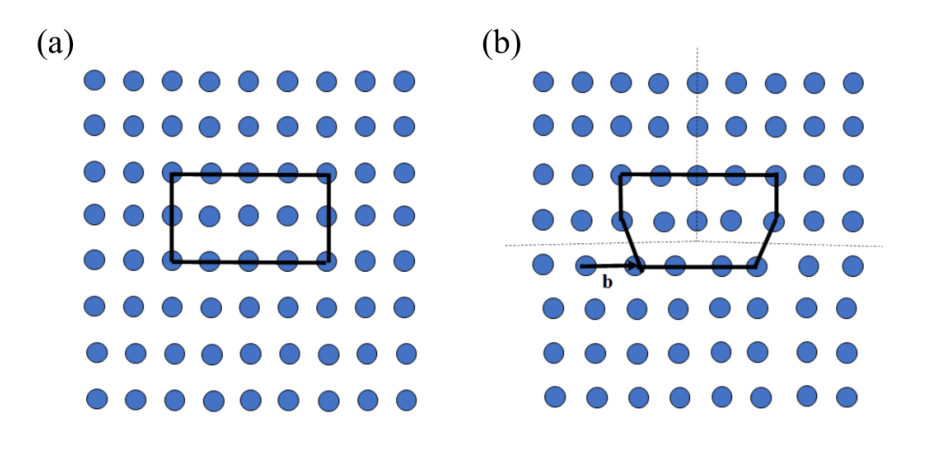 
Figure 1: Dislocation in crystal and Burgers circuit. (a) Perfect crystal lattice containing no dislocations. A Burgers circuit constructed around the lattice closes exactly, yielding a zero Burgers vector. (b) Crystal containing an edge dislocation. The same Burgers circuit exhibits a closure failure due to the lattice distortion, defining the Burgers vector b, which characterizes the magnitude and direction of the defect.

📷 Fig 2

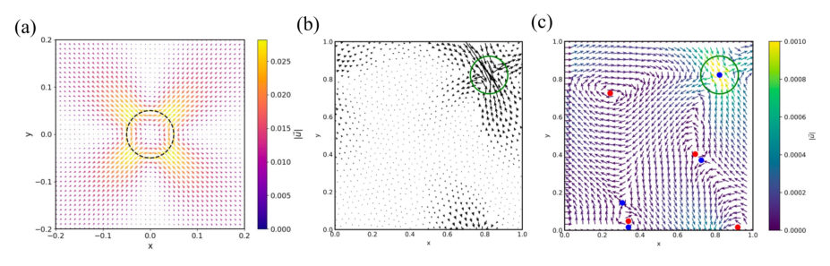 
Figure 2: Topological structure of Eshelby-like plastic rearrangements. (a) Analytical displacement field generated by an isolated Eshelby inclusion centered at the origin. The dashed circle denotes the inclusion boundary, while the color scale represents the displacement magnitude. (b) Displacement field obtained from a representative particle- based simulation. The highlighted region identifies a localized Eshelby-like rearrange- ment embedded within the surrounding elastic medium. (c) Corresponding normalized displacement field on a coarse-grained grid. Positive and negative topological defects, identified through the winding number of the displacement orientation, are shown in red and...

📷 Fig 3

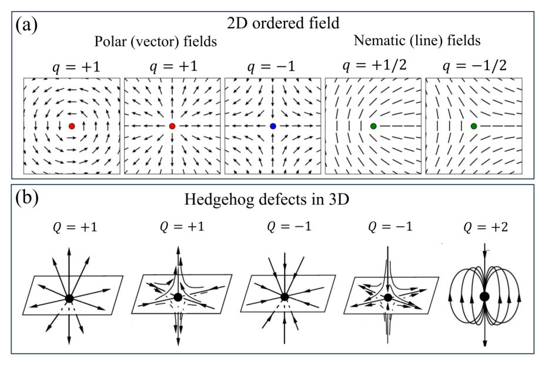 
Figure 3: Representative topological defects in two and three spatial dimensions. (a) Examples of point defects in two-dimensional vector and nematic fields. For polar vector fields, a vortex (q = +1), a source (q = +1), and an anti-vortex (q = −1) are shown, where the red (blue) dot indicates the defect core. For nematic fields, the characteristic comet-shaped +1/2 defect and triangular −1/2 defect are illustrated. These defects are characterized by their winding number q, which measures the total rotation of the local orientation field around the defect core. (b) Schematic examples of three-dimensional point defects (hedgehogs) carrying different topological charges Q. Panel (b) adapted...

📷 Fig 4

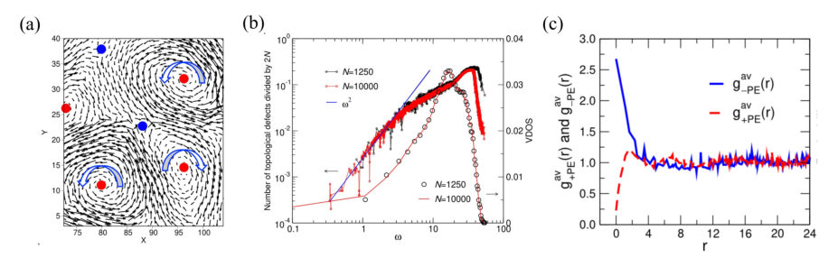 
Figure 4: Topological defects in vibrational eigenmodes of amorphous solids and their con- nection to plastic activity. (a) Representative low-frequency eigenvector field (ω = 1.5) obtained from the Hessian matrix of a two-dimensional glass, illustrating the emergence of vortex- and anti-vortex-like structures in the vibrational mode. (b) Frequency depen- dence of the topological defect density (left axis) together with the vibrational density of states D(ω) (right axis) for two system sizes, highlighting the relation between topologi- cal excitations and low-frequency vibrational modes. (c) Correlation between the spatial locations of topological defects and subsequent plastic...

📷 Fig 5

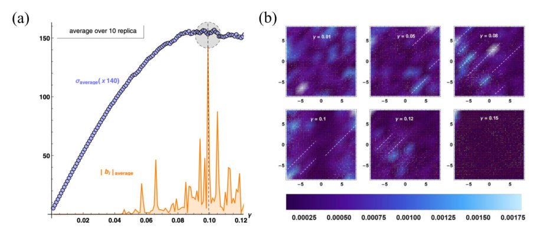 
Figure 5: Evolution of the generalized Burgers vector during deformation and its connec- tion to strain localization. (a) Stress - strain response of a two-dimensional amorphous solid (purple circles) together with the average magnitude of the Burgers vector, |b|. The pronounced increase in |b| near the stress-drop event indicates the accumulation of deformation incompatibility preceding plastic relaxation. (b) Spatial evolution of the dis- placement field under increasing applied strain γ. Arrows represent the local displacement vectors, while the background color denotes the magnitude of the Burgers field. Regions of enhanced Burgers magnitude progressively organize into a localized...

**Summary.** This review synthesizes recent work showing that topological defects govern mechanical failure in amorphous solids. By analyzing fields derived from particle displacements and vibrational modes, the authors demonstrate that singularities like vortices correlate precisely with yielding transitions. This suggests topology offers a powerful, universal descriptor for plasticity beyond traditional structural models.

**Why it may be interesting.** While focused on condensed matter mechanics, the reliance on characterizing system states via global topological invariants (like winding numbers) is mathematically analogous to methods used in quantum field theory or analyzing entanglement structures in many-body systems.

Detailed structure

**Main problem.** The review aims to establish a unified topological description for plasticity and mechanical failure in amorphous solids (glasses), extending concepts from crystalline defects.

**Main result.** Topological defects, such as vortices and hedgehog defects derived from non-affine displacements or vibrational modes, show strong correlations with soft spots, yielding, and shear-band formation in glasses.

**Method.** The study combines theoretical frameworks (e.g., STZ theory, non-affine elasticity) with computational analysis of topological invariants calculated on continuous fields derived from simulations.

**Model / system.** The physical system is amorphous solids, including metallic and colloidal glasses, studied across various states like jammed or yielding regimes. The analysis focuses on the structural disorder inherent to these materials.

**Key observables.** Topological invariants (winding numbers, hedgehog charges), non-affine displacement fields ($D_{2,	ext{min}}$), low-frequency vibrational modes, and defect density ($	ext{NHTD}$).

**Important parameters / regimes.** Shear strain ($\gamma$), critical fraction of non-affine particles ($p_c$), and the frequency spectrum ($\omega$) of vibrations.

**Assumptions / limitations.** The primary assumption is that topological structures provide a robust, universal language to describe mechanical failure in disordered systems, analogous to dislocations in crystals.

**Figures summary.** Figures illustrate defect visualization (vortices/hedgehog defects) in 2D and 3D fields derived from non-affine displacements and vibrational modes. Key figures correlate the density of these topological defects with the onset of yielding or shear localization.

**Paper structure.** The review progresses by contrasting crystalline defect theory with amorphous systems, introducing concepts like non-affine motion and soft spots, and culminating in a systematic analysis showing how topological charges characterize plasticity during mechanical loading.

Abstract

Topological defects play a central role in the mechanical behavior of crystalline materials, yet their relevance to amorphous solids has only recently begun to emerge. Over the last few years, theoretical, computational, and experimental studies have revealed the presence of well-defined topological invariants in vibrational eigenmodes, non-affine displacement fields, and deformation-induced vector fields of glasses. These defects have been shown to correlate strongly with soft spots, localized plastic rearrangements, yielding, and shear-band formation, suggesting a new perspective on the microscopic origins of plasticity in disordered materials. In this review, we provide a comprehensive overview of recent developments in the rapidly growing field of topological defects in glasses. We discuss the underlying theoretical concepts, including Burgers vectors, non-affine plasticity, vibrational modes, and topological invariants, and review recent numerical and experimental advances. Finally, we assess the current achievements, limitations, and open questions, and discuss future directions toward a unified topological description of plasticity and mechanical failure in amorphous solids.

[↑ back to top](#top)

### [Doppler-enhanced superheterodyne Rydberg microwave receiver](http://arxiv.org/abs/2606.24247v1)

**Authors:** Yuwen Yin, Ruimin Chen, Shibing Ji, Jinlian Hu, Shaofeng Wang, Yunhui He, Jingxu Bai, Xiao-Qiang Shao, Yuechun Jiao, Jianming Zhao  
**Type:** experiment · **Category:** other · **PDF:** <https://arxiv.org/pdf/2606.24247v1>  
**Analysis basis:** full PDF text, analyzed in chunks
**Topic relevance:** `quantum measurements` **2/5** · `quantum optics experiment` **2/5** · `Rydberg arrays` **1/5** · `analog quantum simulation` **1/5** · `driven-dissipative phase transition` **1/5** · `interference shaping light` **1/5**

📷 Fig 1

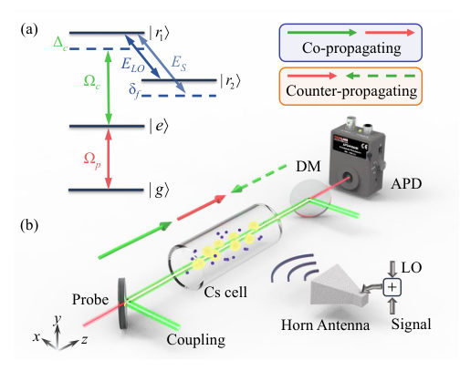 
FIG. 1. (a) Energy-level diagram of Rydberg EIT-AT. (b) Sketch of the experimental setup. An 852 nm probe laser (Rabi frequency Ωp) and a 509 nm coupling laser (Ωc) drive the ground atoms |g⟩ to the Rydberg state |r1⟩via an intermediate state |e⟩. A LO field ELO drives the resonant transition of |r1⟩→|r2⟩, while the signal field ES has a frequency difference δ f with the LO field. The cou- pling laser co-propagates (solid green arrow) or counter-propagates (dashed green arrow) with the probe laser. The transmission of the probe laser is detected by an avalanche photodiode (APD) after a dichroic mirror (DM). The LO field and the signal field are transmit- ted to the vapor cell by a horn...

📷 Fig 2

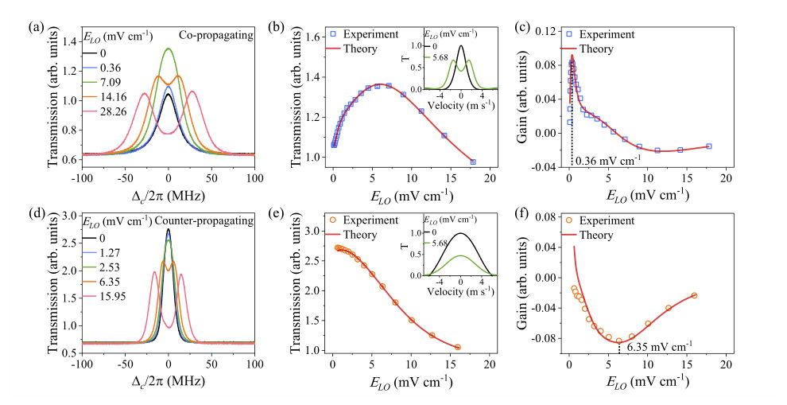 
FIG. 2. (a) Experimental scanned Rydberg EIT spectra at indicated strengths of ELO fields in co-propagation configuration. (b) and (c) The dependence of the EIT amplitude and its derivative on the MW field strength at ∆c = 0. The inset in (b) demonstrates the transmission rate (T) of the different velocity classes of atoms at ELO = 0 and 5.68 mV cm−1. (d-f) Scanned Rydberg EIT spectra, EIT amplitude, and its derivative as a function of the MW field strength, similar to (a-c), except for the counter-propagating configuration. The vertical dashed lines mark the maximum gain point. The solid lines in (b) and (e) show our calculations with parameters Ωp = 2π × 6.62 (9.89) MHz, Ωc = 2π ×5.69...

📷 Fig 3

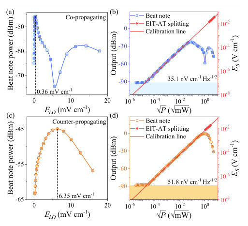 
FIG. 3. (a) and (c) The response of the system to the LO field with fixed signal field using superheterodyne measurement for the co-propagating and counter-propagating configurations, respectively. The vertical dashed lines mark the maximum output point. (b) and (d) Measured sensitivity for the co-propagating (blue squares) and counter-propagating (yellow circles) configurations, respectively. The red diamonds show the EIT-AT splittings in a strong field re- gion, and the red solid line shows the calibrated electric field. The blue and yellow shadow regions represent the noise level of the spec- trum analyzer.

**Summary.** The authors demonstrate a highly sensitive Rydberg microwave receiver by exploiting the Doppler effect using a co-propagating laser configuration. This setup significantly outperforms the standard counter-propagating geometry, achieving better sensitivity and requiring much lower local oscillator power. The work highlights the tunability of quantum sensing platforms through careful control of light propagation geometry.

**Why it may be interesting.** This work provides a concrete, high-sensitivity platform for microwave detection based on quantum interference effects in Rydberg atoms. The comparison between co- and counter-propagating schemes offers valuable insight into how geometric laser alignment can be engineered to optimize fundamental physical measurements.

Detailed structure

**Main problem.** The paper reports on enhancing the sensitivity of a Rydberg microwave (MW) receiver by strategically exploiting the Doppler effect in an atomic vapor cell.

**Main result.** By using a co-propagating laser configuration, they achieved a significantly enhanced sensitivity ($35.1 	ext{ nV cm}^{-1} 	ext{ Hz}^{-1/2}$) compared to counter-propagating setups, while also reducing the required local oscillator field by a factor of 17.6.

**Method.** The enhancement is realized by implementing a two-photon Rydberg ladder scheme and utilizing the superheterodyne technique to measure the system's response to applied MW fields.

**Model / system.** The physical system involves alkali-atom-based Rydberg atoms in a vapor cell, modeled using a four-level ladder system. The analysis compares co-propagating versus counter-propagating laser geometries to exploit Doppler shifts.

**Key observables.** EIT transmission amplitude and the derivative (MW-optical gain) of the transmission spectrum as a function of the local oscillator field strength ($E_{LO}$).

**Important parameters / regimes.** Sensitivity values ($	ext{nV cm}^{-1} 	ext{ Hz}^{-1/2}$), enhancement factors (1.5 times better sensitivity, 17.6 factor reduction in LO field).

**Assumptions / limitations.** The analysis relies on the rotating-wave approximation applied to the four-level ladder system.

**Figures summary.** Figures demonstrate EIT spectra, amplitude dependence on $E_{LO}$, and MW-optical gain for both co- and counter-propagating setups, confirming superior performance in the co-propagating case.

**Paper structure.** The paper first introduces the physical setup and mechanism (Doppler enhancement via co-propagation). It then presents theoretical modeling using master equations and experimental measurements comparing the two propagation geometries to quantify the performance gains.

Abstract

We report the enhanced sensitivity of the Rydberg microwave (MW) receiver by exploiting the Doppler effect in a vapor cell. A two-photon Rydberg ladder scheme is implemented via the co-propagation of probe and coupling lasers, which enhances the Doppler effect. When an MW field is applied, microwave dressing modifies the velocity-dependent resonance condition, enabling stronger contributions from atoms with non-zero velocities and leading to an enhancement of the EIT transmission. Based on this mechanism, we achieve a sensitivity of $35.1\ \mathrm{nV\ cm^{-1}\ Hz^{-1/2}}$ using the heterodyne technique, which is 1.5 times better than that obtained in the counter-propagating configuration. Meanwhile, the required local oscillator (LO) field is reduced by a factor of 17.6 compared with the counter-propagating configuration, which is advantageous for applications requiring minimal radiation and low power consumption. Moreover, the co-propagating configuration is more amenable to integration or portable sensing platforms because multiple laser fields can be delivered through a single optical fiber.

[↑ back to top](#top)

### [Mølmer-Sørensen gates in trapped-ions chains in the presence of correlated noise](http://arxiv.org/abs/2606.23951v1)

**Authors:** D. V. Donchenko, E. A. Anikin, O. Lakhmanskaya, K. Lakhmanskiy  
**Type:** theory · **Category:** other · **PDF:** <https://arxiv.org/pdf/2606.23951v1>  
**Analysis basis:** full PDF text, analyzed in chunks
**Topic relevance:** `QC/QI experiment` **2/5** · `Keldysh / 2PI / non-Gaussian methods` **1/5** · `analog quantum simulation` **1/5** · `correlated / nonlocal dissipation` **1/5** · `methods for driven-dissipative` **1/5** · `non-equilibrium dynamics` **1/5**

📷 Fig 1

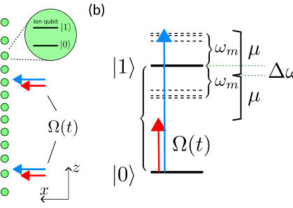 
Figure 1. (a) The ion chain in the Paul trap. The ions 𝑖1, 𝑖2 are illuminated by bichromatic beams per- pendicular to the ion chain. (b) The bichromatic beam detunings ±𝜇are set close to the blue and red motional sidebands ±𝜔𝑚of the chain. The laser frequency fluc- tuation shifts the frequencies of both components by Δ𝜔.

📷 Fig 2

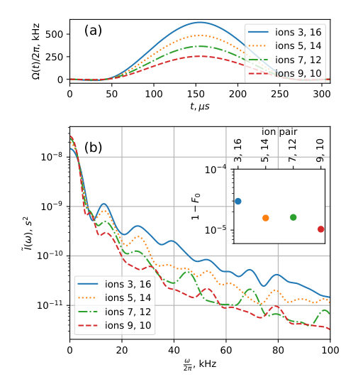 
Figure 2. (a) The pulse shapes Ω(𝑡) for the imple- mentation of the MS gate between different ions in a chain of 20 40Ca+ ions. The trap axial and ra- dial frequencies are set to 𝜔𝑧= (2𝜋) 147.2 kHz and 𝜔𝑥= (2𝜋) 2.7 MHz, and the bichromatic detuning is 𝜇= 𝜔𝑥+ 𝛿, 𝛿= (2𝜋) 8.06 kHz. (b) The MS gate sensi- tivity functions ˜𝐼(𝜔) for the pulse shapes shown in (a). The inset: the contribution of imperfectly closed phase trajectories into error.

📷 Fig 3

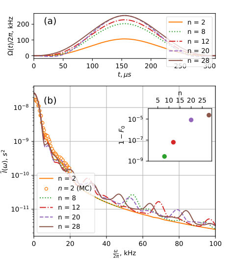 
Figure 3. (a) The pulse shapes Ω(𝑡) implementing MS gate between two central ions in 40Ca+ ion chains of different lengths. The trap radial frequency and the bichromatic detuning are the same as for Fig. 2, and the axial frequency is chosen differently for each 𝑛to keep the smallest radial frequency equal to (2𝜋)2.4MHz. (b) The MS gate sensitivity functions ˜𝐼(𝜔) for the pulse shapes shown in (a). The circles show the results of the Monte-Carlo simulations for two ions. The inset: the contribution of imperfectly closed phase trajecto- ries into error.

📷 Fig 4

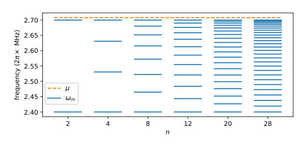 
Figure 4. Blue solid lines show the radial phonon mode frequencies of the 𝑛-ion chain in the harmonic potential with the radial secular frequency 2.7MHz. Orange dashed line shows the value of the bichromatic detuning 𝜇 chosen for MS gate implementation.

**Summary.** The paper theoretically investigates the impact of correlated laser frequency noise on Mølmer-Sørensen gates used in trapped-ion quantum computing. By employing perturbation theory, the authors quantify gate infidelity based on the noise's power spectral density. They reveal that the sensitivity to noise is highly dependent on the physical separation between the qubits, offering critical guidelines for improving hardware robustness.

**Why it may be interesting.** This work provides quantitative predictions on how environmental noise couples to quantum gates in solid-state or trapped-ion architectures, which is crucial for designing fault-tolerant quantum hardware.

Detailed structure

**Main problem.** The study analyzes how correlated laser frequency noise affects the fidelity of Mølmer-Sørensen (MS) gates implemented on trapped-ion chains.

**Main result.** The gate sensitivity to noise depends strongly on ion separation; medium-frequency noise significantly impacts distant ions more than neighboring ones, while low-frequency noise has a position-independent effect.

**Method.** Perturbation theory is employed to calculate the gate infidelity by integrating over the noise power spectral density using a derived sensitivity function $\tilde{I}(\omega)$.

**Model / system.** The system involves qubit registers formed by trapped ions, where gates are executed via bichromatic laser pulses coupling to collective phonon modes. The Hamiltonian includes terms for ideal gate evolution and correlated noise.

**Key observables.** Gate fidelity ($F$), sensitivity function $\tilde{I}(\omega)$, and the resulting gate infidelity $1-F$.

**Important parameters / regimes.** Noise power spectral density $S(\omega)$, ion positions within the chain, and the frequency regime of the noise (low vs. medium).

**Assumptions / limitations.** The analysis uses perturbation theory for the noise term and assumes that certain radial phonon modes can be neglected if their frequencies differ significantly from the primary axial mode.

**Figures summary.** Figures illustrate pulse shapes $\Omega(t)$ and the calculated MS gate sensitivity functions $\tilde{I}(\omega)$ for various ion pairs and chain lengths (e.g., 20-ion chains).

**Paper structure.** The paper builds from defining the physical system and Hamiltonian, deriving the general expression for infidelity using perturbation theory, calculating the necessary phonon mode traces, and finally analyzing $\tilde{I}(\omega)$ for different noise regimes and ion separations.

Abstract

We analyze the impact of correlated laser frequency noise on Mølmer-Sørensen gates in qubit registers based on trapped-ion chains. Using perturbation theory, we calculate gate fidelities in the presence of noise with arbitrary power spectral density for different chain lengths and ion positions in the chain. With our approach, we account for simultaneous excitation of multiple phonon modes during gate operation. We find out that the impact of medium-frequency laser noise depends considerably on the positions of the ions in the chain. In contrast, low-frequency noise has similar effect for different chain lengths and ion positions.

[↑ back to top](#top)

### [Analysis of the frequency shift in coherent population trapping resonance's dynamic continuous-wave spectroscopy at the phase-jump modulation and its comparison with the conventional approach](http://arxiv.org/abs/2606.23908v1)

**Authors:** E. D. Chivilis, E. A. Tsygankov  
**Type:** theory · **Category:** other · **PDF:** <https://arxiv.org/pdf/2606.23908v1>  
**Analysis basis:** full PDF text, analyzed in chunks
**Topic relevance:** `quantum measurements` **2/5** · `Keldysh / 2PI / non-Gaussian methods` **1/5** · `driven-dissipative phase transition` **1/5** · `interference shaping light` **1/5** · `methods for driven-dissipative` **1/5**

📷 Fig 1

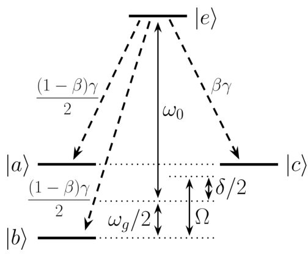 
FIG. 1. System of levels under consideration. Natural width of the excited state is γ. The spontaneous decay populates ground-state levels |a⟩, |b⟩, and |c⟩with rates (1 −β)γ/2, (1 −β)γ/2, and βγ, respectively.

📷 Fig 2

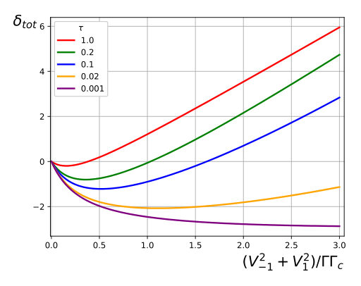 
FIG. 2. Frequency shift of the error-signal zero for different integration times plotted via (10). Units on the horizontal axis are the ratio of the power broadening to the relaxation rate of the ground-state coherence. The vertical axis is given in units  (V 2 −1 −V 2 1 )/Γ  ∆L/Γ. The ratio of the coherence decay rate to that of ground-state populations to their equi- librium values 1/3 is Γc/Γg = 3.

📷 Fig 3

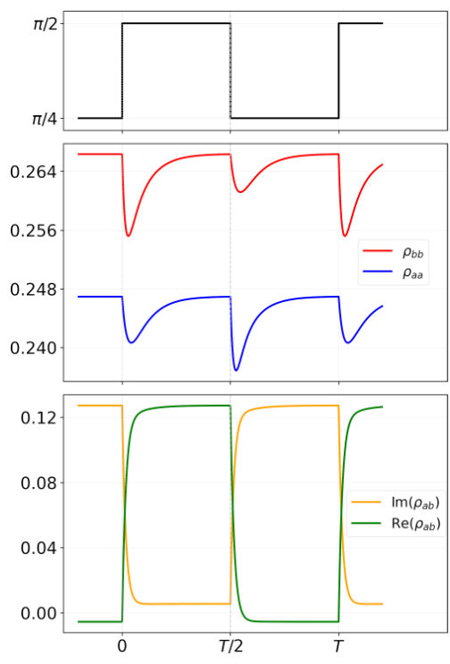 
FIG. 3. Dynamics of the ground-state density-matrix ele- ments after forward and backward phase jumps. The val- ues of parameters are β = 0.2, δ/˜Γc = 0.21, Γc/Γg = 3.0, ∆L/Γ = 0.1, (V 2 −1 + V 2 1 )/(ΓΓc) = 1.0, V 2 1 /V 2 −1 = 0.9. The period of modulation is long enough to ensure the steady- state regime before the following jump.

📷 Fig 4

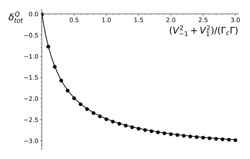 
FIG. 4. The frequency shift of the central dispersive curve’s zero. The solid line is plotted via formula (12), the circles are numerical calculations for β = 0.5. The values of other parameters are the same as in Fig. 3. The shape of the curve coincides with that for the phase-jump technique at integra- tion time of 1/1000˜Γc.

📷 Fig 5

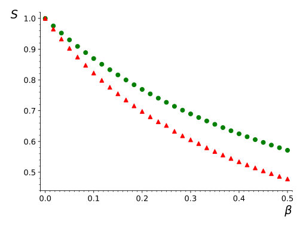 
FIG. 5. Dependence of the normalized slope on β for the phase-jump technique (circles) and the conventional approach (triangles). The values of parameters are ˜V−1 + ˜V1 = Γc, ˜V−1 = ˜V1, ∆L = 0, Γg = Γc/3. The integration time for phase jumps is 1/1000˜Γc. For harmonic modulation, ωm = 100˜Γc, m = 0.54.

**Summary.** This paper theoretically compares the frequency shift measured in CPT resonance using phase-jump modulation versus conventional harmonic modulation. The authors derive and analyze the error signal shift for both methods under a $\Lambda$-system model. They conclude that while mathematically similar at short times, the conventional method is preferred experimentally due to its superior noise performance at higher frequencies.

**Why it may be interesting.** This work provides a rigorous theoretical comparison between two advanced spectroscopic techniques used to measure fundamental properties (like light shifts) in atomic systems, which is highly relevant for experimental quantum optics research.

Detailed structure

**Main problem.** The study compares the frequency shift observed in coherent population trapping (CPT) resonance spectroscopy when using phase-jump modulation versus conventional harmonic sinusoidal modulation.

**Main result.** While both techniques yield similar results at short integration times, the authors conclude that the conventional approach is more suitable for light shift suppression due to its ability to operate at higher frequencies and better noise characteristics.

**Method.** The analysis involves solving the quantum Liouville equation under various approximations (e.g., low saturation) and deriving expressions for the error signal shift ($\delta_{as}$ or $\delta_Q$) for both modulation schemes.

**Model / system.** The system is a three-level Lambda ($\Lambda$) configuration driven by a bichromatic optical field, modeled using a Hamiltonian and governed by the quantum Liouville equation. The analysis focuses on ground-state density matrix elements.

**Key observables.** Frequency shift of the error signal ($\delta_{as}$ or $\delta_Q$), which is derived from the difference in absorption measurements.

**Important parameters / regimes.** Integration time ($	au$), modulation parameters ($m, \omega_m$), and relaxation rates ($\Gamma_c, \Gamma_g$).

**Assumptions / limitations.** The analysis assumes unisotropic relaxation for ground-state elements and neglects Doppler broadening compared to the homogeneous width.

**Figures summary.** Figures compare the frequency shift ($\delta_{tot}(	au)$) vs. integration time $	au$, showing agreement between techniques at short times, and plot the dependence of the normalized slope on the parameter $eta$.

**Paper structure.** The paper develops the theory for both phase-jump spectroscopy and conventional harmonic modulation separately before performing a detailed comparison of the resulting frequency shift formulas and numerical results across varying parameters.

Abstract

We present the research of dynamic continuous-wave spectroscopy of the coherent population trapping resonance at the phase-jump modulation. Λ system of levels supplemented by a nonabsorbing state and bichromatic optical field, whose spectral components have different intensities, are considered. We demonstrate that the asymmetry leads to an additional nonlinear shift of the error-signal frequency under unisotropic relaxation of the ground-state density-matrix elements. We also investigate the conventional approach where the frequency difference of the optical field components is harmonically modulated to obtain the error signal. Comparison demonstrates that in the high-frequency modulation regime the corresponding frequency shift is more linear than at the phase-jump modulation for nonshort integration times.

[↑ back to top](#top)

### [Optical spectroscopy of Bose-Einstein condensates at finite temperature](http://arxiv.org/abs/2606.24568v1)

**Authors:** R. M. F. Andersen, L. N. Stokholm, I. Zebergs, N. R. Neubert, A. S. Chatterley, N. Kjærgaard, J. J. Arlt  
**Type:** experiment · **Category:** quantum gases · **PDF:** <https://arxiv.org/pdf/2606.24568v1>  
**Analysis basis:** full PDF text, analyzed in chunks
**Topic relevance:** `quantum measurements` **2/5** · `quantum optics experiment` **2/5** · `analog quantum simulation` **1/5** · `interference shaping light` **1/5**

📷 Fig 1

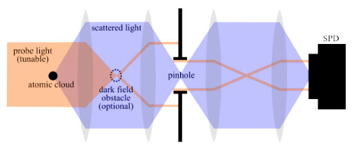 
FIG. 1: Schematic of the detection setup. Collimated probe light (orange) is sent through a cloud of trapped atoms, and some of the light is scattered (blue). At the focus plane of the probe beam, an optional small dark-field obstacle can be placed to block only the unscattered light. Additional filtering is achieved by a pinhole at an intermediate image plane. The image is either relayed onto a camera or focused onto a single-photon detector (SPD).

📷 Fig 2

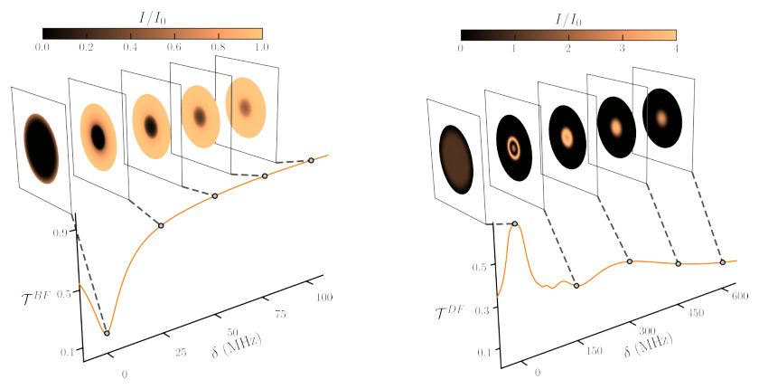 
FIG. 2: Simulated BF (left) and DF (right) spectra of a partially condensed cloud at a temperature of 130 nK containing 1.70 · 105

📷 Fig 3

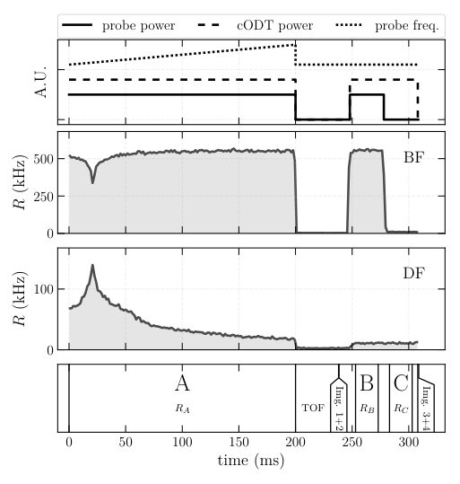 
FIG. 3: Measurement sequence of spectra and the following absorption images after TOF. (a) Illustrative traces of the probe power ( ), cODT power ( ), and probe frequency ( ). (b) Typical count rate observed on the SPD in BF configuration. (c) Count rate on SPD observed in DF configuration. (d) Time intervals in the experimental sequence. The three intervals labelled A, B, and C, are used to calculate T BF/DF (see text).

📷 Fig 4

 
FIG. 4: Calibration of the spectral model. Solid black line: Spectrum of a partially condensed cloud at T = 125 nK, with Nth = 1.3 · 105, and N0 = 4.9 · 105 obtained from absorption imaging. Dashed blue line: Model spectrum assuming infinite aperture radius and α = 1. Solid blue line: Model spectrum with the calibrated values for NA and α.

📷 Fig 5

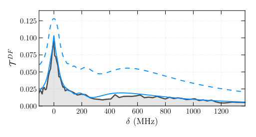 
Figure 5 shows examples of two DF and two BF mea- surements: a cold, bimodal cloud and a warm, purely thermal cloud. The figure shows the normalized trans- mission spectra according to Eq. (10) and Eq. (9) for DF and BF, respectively.

**Summary.** The research reports on using optical spectroscopy to characterize ultracold Bose-Einstein condensates of $^{87}	ext{Rb}$ atoms. By measuring spectral features in both dark-field and bright-field configurations, the authors developed a model to extract temperature and atom numbers directly within the trap. The findings establish that dark-field spectroscopy is a highly sensitive and superior tool for characterizing these quantum gases at very low temperatures.

**Why it may be interesting.** This work provides an advanced, non-destructive, in-situ diagnostic tool for characterizing quantum gas mixtures at extremely low temperatures, offering quantitative metrics (T, $N_{th}$, $N_0$) that complement traditional time-of-flight methods.

Detailed structure

**Main problem.** The study aims to characterize ultracold, partially condensed atomic gases by measuring distinct spectral features arising from both thermal and Bose-Einstein condensed components.

**Main result.** Dark-field optical spectroscopy proves to be a superior technique compared to bright-field measurements for characterizing these systems, showing good agreement with Time-of-Flight imaging for temperature and atom numbers.

**Method.** The experiment uses an in-situ dark-field configuration with single-photon detection and a frequency-agile laser system to measure spectral profiles as a function of probe detuning.

**Model / system.** The physical system is a cloud of $^{87}	ext{Rb}$ atoms trapped in a crossed optical dipole trap. The analysis relies on developing a model for light propagation through this inhomogeneous atomic cloud, incorporating density components ($
ho = 
ho_0 + 
ho_{th}$).

**Key observables.** Spectral features (intensity profiles) measured as a function of probe frequency detuning ($\delta$); extracted parameters include temperature ($T$), thermal atom number ($N_{th}$), and condensed atom number ($N_0$).

**Important parameters / regimes.** Low temperatures (nK range); the ratio between thermal and condensed fractions; spectral detuning ($\delta$).

**Assumptions / limitations.** The analysis assumes a thin-lens approximation for light propagation, which is noted as a potential source of systematic deviation in cold spectra.

**Figures summary.** Figures illustrate the experimental setup (schematics), simulated BF and DF spectra for partially condensed clouds, and comparisons between spectroscopically derived parameters and those from TOF absorption imaging.

**Paper structure.** The paper progresses by first detailing the measurement setup and spectral diagnostics in both dark-field and bright-field configurations. It then develops the theoretical model for light propagation through the inhomogeneous cloud, followed by a detailed comparison of results against conventional Time-of-Flight measurements to validate the spectroscopic technique.

Abstract

We report on optical spectroscopic measurements of ultracold and partially condensed 87Rb gases, which show distinct spectral features due to the thermal and the Bose condensed components in the frequency domain. These features are detected in-situ by using a dark-field configuration with single-photon sensitivity and a frequency-agile laser system. To interpret the observed spectra, we develop a model for light propagation through an inhomogeneous atomic cloud. This model enables the extraction of temperature and atom number, which we benchmark against conventional time-of-flight absorption imaging. The spectroscopically obtained cloud parameters show enhanced sensitivity to small thermal fractions in nearly pure condensates. We further compare the spectroscopy in dark-field and bright-field configurations, demonstrating the superior performance of the former. Our results reveal previously unexplored spectral structure in optically dense ultracold gases and establish spectroscopy as a tool for characterizing ultracold systems at very low temperatures.

[↑ back to top](#top)

### [Gate-Controlled Spin Qubits in Confined Altermagnets](http://arxiv.org/abs/2606.24150v1)

**Authors:** Hamed Vakili  
**Type:** theory · **Category:** quantum information and computing · **PDF:** <https://arxiv.org/pdf/2606.24150v1>  
**Analysis basis:** full PDF text, analyzed in chunks
**Topic relevance:** `analog quantum simulation` **2/5** · `entanglement & information structure` **1/5** · `exotic spin models in light-matter` **1/5** · `spintronics-quantum-optics interface` **1/5**

📷 Fig 1

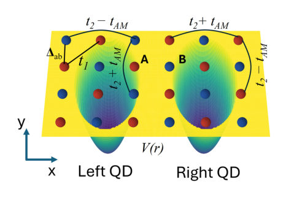 
Figure 1. Schematic device geometry. A two-dimensional d- wave altermagnetic layer is confined by electrostatic gates. For the single-qubit device, differential RF voltages modu- late the quadrupolar confinement anisotropy around a fixed elliptical bias point. For the two-qubit device, two locally anisotropic gates define left and right dots, while a central barrier gate sets the static interdot coupling and supplies res- onant barrier modulation.

📷 Fig 2

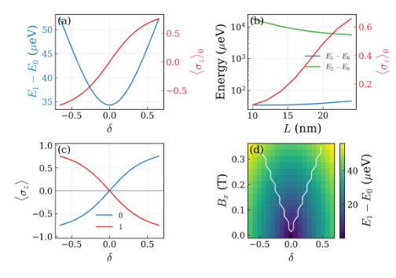 
Figure 2. (a) Qubit splitting E1 −E0 and ground-state po- larization ⟨σz⟩0 versus ellipticity δ at Bx = 0.3 T. (b) Length dependence at δ = 0.3, showing E1 −E0, E2 −E0, and ⟨σz⟩0; the energy axis is logarithmic. (c) Spin polarizations of the two lowest states as a function of δ. (d) Color map of E1 −E0 versus δ and Bx; the white contour indicates the op- erating boundary where the two lowest states have opposite spin polarization and both satisfy min(|⟨σz⟩0|, |⟨σz⟩1|) ≥0.6. Parameters: a = 0.5 nm, L = 20 nm except in panel (b), J = 10 meV, ∆ab = 8 meV, Bx = 0.3 T in panels (a)–(c), no SOC, and Bx ∈[0, 0.35 T] in panel (d). Panels (a), (c), and (d) use fixed root-mean-square confinement...

📷 Fig 3

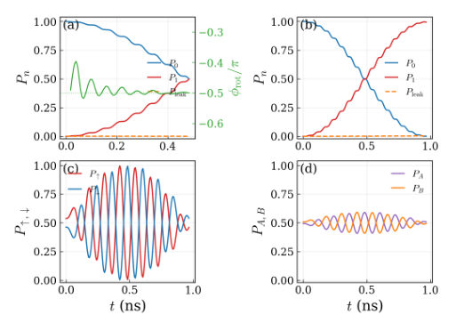 
Figure 3. Single-qubit operation by a phase-controlled res- onant quadrupolar drive. (a) Xπ/2 pulse from |0⟩, showing P0, P1, Pleak, and the rotating-frame relative phase ϕrot = arg(c1/c0) + ωqt; the dotted line marks −π/2. (b) Xπ pulse producing a |0⟩→|1⟩transition. (c) Spin weights P↑and P↓during the Xπ pulse. (d) Sublattice weights PA and PB during the Xπ pulse. Parameters: a = 0.5 nm, L = 20 nm, J = 12 meV, ∆ab = 8 meV, Bx = 0.3 T, no SOC, fixed ℏωx = 2 meV and ℏωy = 5 meV, E1 −E0 = 34 µeV, and fq = 8.3 GHz. Atomistic hoppings are t1 = −600 meV, t2 = 0, tAM = 40 meV, and µ = 0. AQ = 5.8 × 10−5 eV nm−2, giving |⟨1|AQQ|0⟩| ≃2 µeV. The Xπ/2 and Xπ pulses last four and eight carrier cycles,...

📷 Fig 4

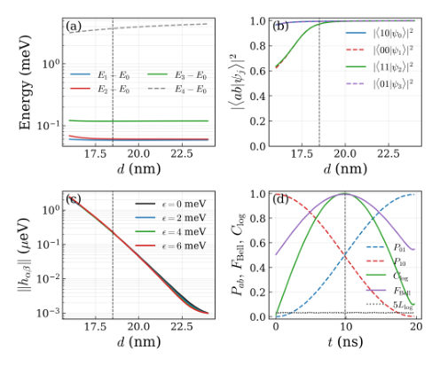 
Figure 4. Two-electron double-dot calculation using the atom- istic Hamiltonian and a truncated CI basis. (a) Four-state CI manifold versus dot separation d, shown as energy gaps relative to E0 together with the first leakage level E4 −E0. (b) Isolated QD product overlaps |⟨ab|ψj⟩|2 for the four low- est dressed CI eigenstates. (c) Frobenius norm ∥hαβ∥of the 3 × 3 nonlocal Pauli block in Eq. (16) for detunings ϵ = 0, 2, 4, 6 meV. (d) Localized-basis populations and en- tanglement diagnostics during small-signal resonant barrier modulation at d = 18.5 nm; 5Llog is plotted, and the dashed vertical line marks the maximum Bell fidelity. Parameters: a = 0.5 nm, L = 60 nm, d ∈[16 nm, 24 nm] in...

**Summary.** The authors propose using spin qubits confined in altermagnetic quantum dots as a novel route to gate control. By exploiting the momentum-dependent spin splitting inherent to altermagnets, they demonstrate high-fidelity single and two-qubit gates purely through electrostatic confinement modulation. This work is significant because it offers a pathway for solid-state quantum computation that circumvents the need for problematic spin-orbit coupling terms.

**Why it may be interesting.** This work provides a concrete, solid-state platform for realizing qubits whose fundamental operations (single and two-qubit gates) are governed purely by magnetic structure engineering rather than relying on SOC or external fields in complex ways.

Detailed structure

**Main problem.** The paper proposes using gate-defined spin qubits within electrostatically confined altermagnetic quantum dots to achieve local, controlled qubit operations without relying on spin-orbit coupling.

**Main result.** They demonstrate that anisotropic altermagnets allow for arbitrary single-qubit rotations and coherent two-qubit entanglement generation by modulating the confinement anisotropy or interdot barrier, respectively.

**Method.** The study employs atomistic real-space tight-binding models combined with time-dependent simulations and truncated Configuration Interaction (CI) methods to calculate quantum dynamics.

**Model / system.** The system is based on electrons confined in altermagnetic quantum dots (single or double). The Hamiltonian incorporates hopping terms derived from the d-wave altermagnetic structure, confinement potentials ($	ext{HV}$), and time-dependent gate drives.

**Key observables.** Single-qubit: Qubit energy gap ($\sim$ microwave range) and spin polarization. Two-qubit: Logical concurrence ($C_{	ext{log}}$) and Bell fidelity ($F_{	ext{Bell}}$).

**Important parameters / regimes.** Ellipticity parameter $\delta$, gate drive amplitude ($A_Q$), detuning ($\epsilon$), and central barrier modulation strength.

**Assumptions / limitations.** The analysis relies on an idealized elliptical confinement model, and the control mechanism is shown to function without requiring spin-orbit coupling (SOC).

**Figures summary.** Figures illustrate schematic setups for single/double dots, show qubit splitting vs. ellipticity ($\delta$), and detail time evolution dynamics showing high fidelity in both single-qubit rotations and two-qubit Bell state preparation.

**Paper structure.** The paper first establishes the physical platform using elliptical confinement to create a spin doublet. It then details single-qubit control via resonant quadrupolar driving, followed by an extension to double quantum dots where central-barrier modulation drives the system into maximally entangled two-qubit states.

Abstract

We propose gate-defined spin qubits in electrostatically confined altermagnetic quantum dots. Elliptical confinement of the $d$-wave altermagnetic structure produces a low-energy doublet with opposite spin polarization. For the range of parameters used here, the qubit states energy gap lies in the microwave range while the leakage gap remains in the meV range. Even without spin-orbit coupling, time-dependent simulations show that a phase-controlled quadrupolar gate drive about a fixed bias point implements $X_{π/2}$ and $X_π$ rotations by resonantly modulating the confinement anisotropy. We extend the study to two-qubits using a double quantum dot. We show that the double quantum dot spectrum can be cleanly projected onto isolated quantum dot product states with a nonzero nonlocal Pauli block in the effective logical two-qubit Hamiltonian. Resonant central-barrier modulation then drives the logical two-qubit component close to a maximally entangled state. These calculations show anisotropic altermagnetic quantum dots as a route to locally gate-controlled spin qubits without requiring spin-orbit coupling.

[↑ back to top](#top)

### [A no-go theorem for privacy in distributed sensing using Gaussian states](http://arxiv.org/abs/2606.23796v1)

**Authors:** Jason L. Pereira, Damian Markham  
**Type:** theory · **Category:** quantum information and computing · **PDF:** <https://arxiv.org/pdf/2606.23796v1>  
**Analysis basis:** full PDF text, analyzed in chunks
**Topic relevance:** `entanglement & information structure` **2/5** · `correlated / nonlocal dissipation` **1/5** · `quantum measurements` **1/5**

📷 Fig 1

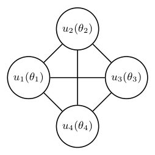 
FIG. 1: The basic setup for a distributed sensing problem. For privacy, we want to choose the parametrised unitaries, ui, so that the encoded state only holds information about a linear function of the parameters, and not their individual values.

📷 Fig 2

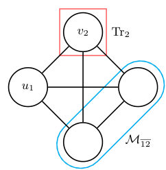 
FIG. 2: An illustration of the necessary condition for privacy stated in Theorem 2. If there exists a pair of unitaries, u and v, that collectively act as the identity, when applied to nodes 1 and 2, then u must act as the identity on all possible conditional states after tracing out node 2 and carrying out a measurement on all nodes except for 1 and 2.

📷 Fig 3

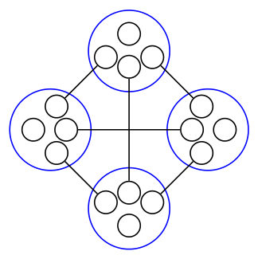 
FIG. 3: Privacy can be restored in a trivial way by allowing each pair of parties to establish pairwise correlations. This can be achieved if each party holds multiple nodes of a graph state, as illustrated here. If each party measures those of their nodes that are correlated with other nodes, they can use the outcomes to encode their remaining node in such a way that their secret parameter remains private.

**Summary.** This paper establishes a no-go theorem proving that perfect privacy cannot be achieved in distributed quantum sensing when Gaussian states are used as resources. The authors develop and analyze a quantitative measure called relative privacy to characterize the maximum achievable information leakage instead of absolute secrecy. This result sets fundamental theoretical bounds for quantum sensing protocols using continuous variables.

**Why it may be interesting.** This work provides fundamental theoretical limits on the security of quantum communication protocols in continuous variable settings, which is highly relevant for quantum sensing applications using optical resources.

Detailed structure

**Main problem.** The authors investigate whether perfect privacy can be achieved when multiple parties use quantum resource states, specifically Gaussian states, to perform distributed sensing.

**Main result.** They prove a no-go theorem showing that perfect privacy is impossible for any distributed sensing protocol utilizing Gaussian states. They instead introduce and analyze a measure of relative privacy.

**Method.** The analysis uses necessary conditions derived from the requirement that the encoded state must only reveal information about the global function, not individual local parameters. This involves analyzing conditional states and Quantum Fisher Information (QFI).

**Model / system.** The system models distributed sensing among N parties sharing a quantum resource state, focusing specifically on continuous variable Gaussian graph states.

**Key observables.** Quantum Fisher Information (QFI) matrix, the relative privacy measure ($R_{xy}$), and the encoded state $|\psi_{	ext{enc}}(\{	heta_i\})
angle$.

**Important parameters / regimes.** The number of parties $N$, the structure of the graph state (e.g., fully-connected), and the transmissivity of loss channels.

**Assumptions / limitations.** The analysis initially focuses on unitary encoding channels, though extensions to general channel encoding are discussed; perfect privacy is assumed impossible for Gaussian states.

**Figures summary.** Figure 1 illustrates the basic distributed sensing setup. Figure 3 shows how pairwise correlations can restore some form of privacy in an example setting.

**Paper structure.** The paper progresses from establishing necessary conditions for private encoding (Theorem 2) to showing these fail for Gaussian states, and finally introduces relative privacy ($R_{xy}$) as a quantifiable measure of achievable information leakage.

Abstract

In the discrete variable setting, entangled resource states allow a set of parties to learn a global function of a set of spatially separated systems, whilst keeping the local parameters of those systems completely private. In the continuous variable setting, distributed sensing has been carried out using Gaussian resource states, but without the same guarantees about privacy. Here, we show that perfect privacy is impossible to achieve for any distributed sensing protocol that uses Gaussian states as a resource. We also introduce a measure of relative privacy, bounding the degree to which any Gaussian distributed sensing protocol can keep local parameters hidden.

[↑ back to top](#top)

### [An Analysis of Speculative Window Decoders for Quantum Error Correction](http://arxiv.org/abs/2606.24048v1)

**Authors:** Jocelyn Li, Margaret Martonosi  
**Type:** theory · **Category:** quantum information and computing · **PDF:** <https://arxiv.org/pdf/2606.24048v1>  
**Analysis basis:** full PDF text, analyzed in chunks
**Topic relevance:** `QC/QI experiment` **2/5** · `methods for driven-dissipative` **1/5** · `quantum measurements` **1/5**

📷 Fig 1

 
Fig. 1. Performance metrics as the number of processors varies for fast and slow gate speeds.

📷 Fig 2

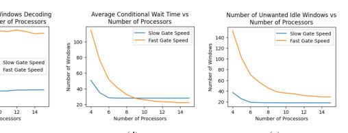 
Figure 1a shows that when processor count is limited, the total decoding time increases more sharply for fast gate speeds than slow gate speeds. This suggests that fast gate speeds are bottlenecked by decoder reaction time, since ready windows wait longer to begin decoding when processors are limited. Figure 1b also shows that limited processor counts cause a larger window backlog under fast gate speeds than slow gate speeds. A large window backlog suggests that windows are being generated but are waiting to be decoded, demonstrating the decoder bottleneck. In contrast, the slow gate speed’s smaller window backlog suggests that the decoder can keep pace relatively well with window...

📷 Fig 3

 
Figure 1a shows that the total decoding time increases more sharply for fast gate speeds than slow gate speeds under a limited processor count. Therefore, we hypothesize that the significant performance degradation is primarily caused by the slow decoder reaction time–which results from a limited processor count–and fast window generation speed. Figures 1b, 1d, and 1e suggest that the average window backlog, average conditional wait time, and UI window count explain this performance decline, as their curves follow similar trends. A slow decoder reaction time causes more windows to accumulate in the backlog because the decoder processes windows more slowly. Subsequently, the conditional wait...

📷 Fig 4

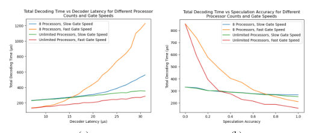 
Fig. 2. Total decoding time under varying decoder latency and speculation accuracy for fast and slow gate speeds with different processor counts.

📷 Fig 5

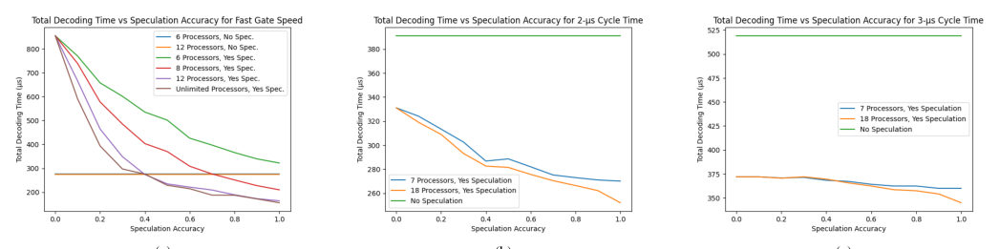 
Fig. 3. Graphs for total decoding time as speculation accuracy varies for different gate speeds. These graphs compare the performance of speculative and non-speculative decoding with different processor counts.

**Summary.** This paper rigorously analyzes Speculative Window Decoding to boost the speed of error correction in fault-tolerant quantum computers. By simulating performance under varying gate speeds and hardware limitations, it establishes critical design rules: speculation benefits are highly dependent on whether the underlying quantum hardware is fast or slow. The findings guide researchers on when speculative techniques are beneficial versus when simpler, non-speculative methods are superior.

**Why it may be interesting.** While focused on QEC hardware optimization, understanding resource bottlenecks (latency vs. processing power) and algorithmic trade-offs (speculation vs. certainty) is crucial for designing efficient quantum control systems applicable across various physical platforms.

Detailed structure

**Main problem.** The paper analyzes Speculative Window Decoding (SWD) techniques to improve the real-time performance of error decoding required for Fault-Tolerant Quantum Computing (FTQC). It aims to determine when speculative methods provide the greatest benefit across varying hardware constraints.

**Main result.** Performance heavily depends on gate speed and processor count: non-speculative decoding outperforms SWD under fast gates with low accuracy, while SWD consistently excels for slow gates. A 'Shallow Speculations First' ordering strategy is proposed for optimization.

**Method.** The authors use a modified simulator (SWIPER-SIM) to model the QEC decoding process, comparing speculative versus non-speculative approaches under varying gate speeds and resource limitations.

**Model / system.** The context is Quantum Error Correction (QEC) using syndrome measurements. The analysis compares performance across superconducting qubits (fast gates) against regimes simulating slower quantum technologies.

**Key observables.** Total decoding time, window backlog, average conditional wait time, and UI window count.

**Important parameters / regimes.** Gate speed (fast vs. slow), processor count, speculation accuracy, decoder latency, and workload parallelism.

**Assumptions / limitations.** Prior work was limited to superconducting qubits; the study extends evaluation to slower gate speeds and varying code/decoder factors.

**Figures summary.** Figures illustrate performance metrics versus processor count for fast/slow gates (Fig 1), total decoding time dependence on latency and accuracy (Fig 2), and comparisons between speculative vs. non-speculative timing under various conditions (Figs 3, 4, 5).

**Paper structure.** The paper systematically evaluates SWD by first establishing the performance landscape across gate speeds and processor counts, then analyzing sensitivity to latency and accuracy, culminating in design principles for optimal speculation strategies.

Abstract

Fault-tolerant quantum computing is essential for realizing the substantial computational speedups that quantum computing can bring, but it requires real-time error decoding with high performance. Speculative window decoding improves performance by reducing the time spent waiting for dependencies from prior decoding windows.   However, speculative decoders have only been evaluated under the regime of superconducting qubits with fast gate speeds, surface codes, and matching decoders. Since different quantum technologies can have slower gate speeds, we evaluate the performance of speculative decoding under slow gate speeds. We also examine its sensitivity to speculation accuracy, decoder latency, processor count, and workload parallelism, which can vary across different quantum error correction codes, decoders, and hardware platforms.   This work presents design principles for identifying when speculative decoding yields the greatest performance improvements. It also reveals the conditions under which non-speculative decoders outperform speculative decoders.

[↑ back to top](#top)

### [Exact log-depth preparation of highly entangled matrix product states](http://arxiv.org/abs/2606.24475v1)

**Authors:** Keisuke Murota, Frédéric Sauvage, Marco Ballarin, Gabriel Matos, Enrico Rinaldi  
**Type:** theory · **Category:** quantum information and computing · **PDF:** <https://arxiv.org/pdf/2606.24475v1>  
**Analysis basis:** full PDF text, analyzed in chunks
**Topic relevance:** `entanglement & information structure` **2/5** · `methods for driven-dissipative` **1/5** · `non-equilibrium dynamics` **1/5**

📷 Fig 1

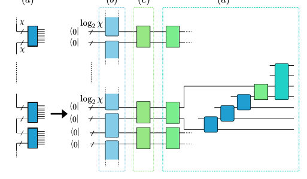 
FIG. 1. Circuit construction for the preparation of a TI MPS with bond dimension χ (a). The representative circuit (b-d) sketched here corresponds to the method SeqAA of Ta- ble I. As detailed in Secs. II and III, the circuit consists of the preparation of an RG fixed point P (∞) (b), a layer of correc- tion maps C(q) (c), and a layer of isometries V (q) (d). Key to our circuit constructions are the correction maps (green rect- angles) implemented through block-encoding. These ensure exactness of the circuit preparations and are used to reduce the circuit depths for the isometries V (q).

📷 Fig 2

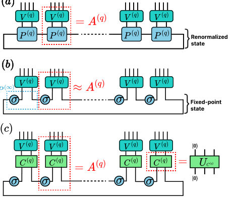 
FIG. 2. (a) The TI MPS to be prepared (2) after the steps of blocking (6) and polar decomposition (7). (b) For normal TI MPS, the tensor P (q) can be approximated through its fixed- point P (∞) (10) that can be prepared in O(χ2) depth (12). Together with the implementation of V (q) (20), this forms the basis of the efficient approximate MPS preparation of Malz et al. [39], with scalings reported in Table I. (c) Introducing a correction map C(q), implemented through block-encoding, one can achieve similar scalings for exact state preparation.

📷 Fig 3

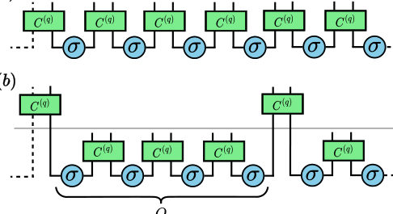 
FIG. 3. Preparation of the renormalised state |P (q)(L′)⟩. a) All-at-once: all the correction maps C(q) are applied in par- allel. b) Split-and-concatenate: the corrections are first per- formed within splits (a subset of Q blocks, depicted here for Q = 4). When all splits have been corrected, a final round of correction maps between splits is performed to concatenate the L′/Q splits. Both prepare the same state. However, upon failure of one correction map, the whole procedure needs to be repeated for a) while only the preparation of the corre- sponding split is required for b).

📷 Fig 4

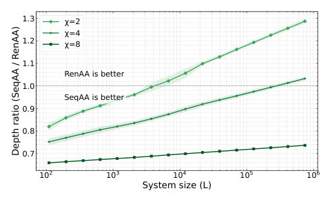 
FIG. 4. Ratio of estimated circuit depths between the SeqAA and RenAA implementations of V (q), shown as a function of the system size L (log scale) for bond dimensions χ ∈{2, 4, 8}. Each data point shows the mean ± one standard deviation over NMPS = 64 Haar-random TI MPS instances with cor- relation length ξ ≈3.3. Extrapolating from the data, the crossover at which RenAA becomes favourable for χ = 8 is estimated to occur at around L ∼1034.

📷 Fig 5

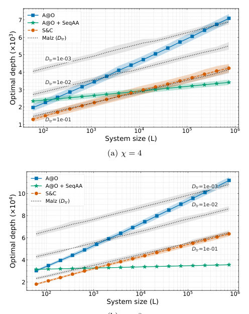 
FIG. 5. Estimated circuit depth as a function of the sys- tem size L (log scale) for the same ensemble of Haar-random TI MPS as in Fig. 4 for bond dimensions χ ∈{4, 8}. Each data point shows the mean ± one standard deviation over NMPS = 64 instances. We compare the approximate RG- based approach of Malz et al. [39] for trace-distance errors ε ∈{10−1, 10−2, 10−3} (grey) with our exact protocols: all- at-once (A@O) correction with sequential implementation of V (q) (blue), all-at-once (A@O) correction with SeqAA imple- mentation of V (q) (green), and split-and-concatenate (S&amp;C) correction with sequential V (q) (orange).

**Summary.** This paper presents advanced theoretical protocols for preparing Matrix Product States (MPS) on a quantum computer. By integrating techniques like oblivious amplitude amplification and quasi-probabilistic decomposition, the authors achieve state-of-the-art scaling in circuit depth while ensuring exact preparation fidelity. This advances the practical feasibility of simulating complex quantum many-body systems.

**Why it may be interesting.** The work provides concrete, resource-aware quantum circuit blueprints for simulating complex many-body physics models that are computationally intractable classically.

Detailed structure

**Main problem.** The central problem is developing quantum circuit protocols that can prepare highly entangled Matrix Product States (MPS) with high fidelity and minimal circuit depth.

**Main result.** The authors achieve state-of-the-art, exact preparation protocols for MPS, significantly improving the scaling of circuit depth dependence on both bond dimension ($\chi$) and system size ($L$).

**Method.** They combine techniques like block-encoded correction maps, generalizations of oblivious amplitude amplification (OAAI), and quasi-probabilistic decomposition (QPD) to deterministically implement required isometries.

**Model / system.** The focus is on preparing MPS states $|	ext{A}(L)
angle$, which are efficient representations of quantum many-body ground states. The analysis involves tensor network manipulations, renormalization group flow concepts, and circuit depth scaling laws.

**Key observables.** Circuit depth (scaling with $\chi$ and $L$), success probability ($p_{	ext{succ}}$), residual norms ($\|R(q)\|$), and the required block size ($q$).

**Important parameters / regimes.** Bond dimension ($\chi$), System size ($L$), Error tolerance ($\epsilon$), Correlation length ($\xi$), and Block size parameters ($q, Q$).

**Assumptions / limitations.** The analysis often relies on asymptotic scaling limits (e.g., large $L$ or small $\delta$) and the assumption that certain error terms decay exponentially with block size.

**Figures summary.** Figures illustrate circuit constructions for TI MPS preparation, comparing different protocols like All-at-Once vs. Split-and-Concatenate methods, and showing optimization landscapes for determining optimal block sizes ($Q \propto \sqrt{L'}$).

**Paper structure.** The paper systematically improves the protocol by first establishing approximate RG methods (Chunk 2), then introducing exact probabilistic corrections (Chunk 3), optimizing the implementation of isometries via amplitude amplification (Chunk 4), and finally refining the depth scaling using quasi-probabilistic techniques (Chunks 5, 6, 7, 8).

Abstract

Preparing matrix product states (MPS) on a quantum device is a key subroutine in many quantum algorithms. The most competitive methods, based on the renormalisation group, prepare translationally invariant MPS of size $L$ and bond dimension $χ$, up to an error $\varepsilon$, in circuit depth $\tilde O(χ^{4}\log(L/\varepsilon))$ or $\tilde O(χ^{6}\log\log(L/\varepsilon))$. We improve multiple aspects of these methods. First, using block-encoded correction maps, whose post-selection succeeds with constant probability, we render the preparation exact without sacrificing the scaling in $L$. Second, through a generalisation of oblivious amplitude amplification to isometries, we reduce the bond-dimension dependence, improving the depth to $\tilde O(χ^{2}\log L + χ^{4})$ or $\tilde O(χ^{2}\log\log L + χ^{4})$, and even to $\tilde O(χ^{3}\log L)$ for incoherent preparations. Finally, we extend the framework to non-translationally invariant MPS and prove logarithmic-depth exact preparation for independent and identically distributed random tensor sequences. Confirmed by numerical studies, these results constitute, to the best of our knowledge, the most efficient exact MPS preparation protocols in the relevant parameter regimes.

[↑ back to top](#top)

### [Two-Electron Effects Extend High-Harmonic Generation into the keV Regime](http://arxiv.org/abs/2606.24765v1)

**Authors:** Isobel McSweeney, Andres Marchisio, Javier Rivera-Dean, Philipp Stammer, Paraskevas Tzallas, Marcelo F. Ciappina, Maciej Lewenstein  
**Type:** theory · **Category:** other · **PDF:** <https://arxiv.org/pdf/2606.24765v1>  
**Analysis basis:** full PDF text, analyzed in chunks
**Topic relevance:** `Keldysh / 2PI / non-Gaussian methods` **2/5** · `interference shaping light` **1/5** · `non-equilibrium dynamics` **1/5**

📷 Fig 1

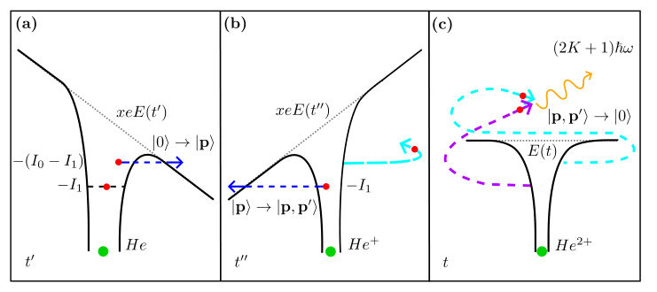 
FIG. 1. Non-sequential double recombination (NSDR) for a helium atom in a strong laser field. (a) The first electron undergoes tunnel ionisation, transitioning from the ground state |0⟩to the single-electron continuum |p⟩at time t′. (b) At time t′′, the second electron tunnels from the more confining effective potential of He+ into the continuum |p, p′⟩at the subsequent field maximum. (c) The two electrons recombine simultaneously with the parent ion at time t, emitting an odd harmonic photon. Note that this is a schematic representation of the electron trajectories.

📷 Fig 2

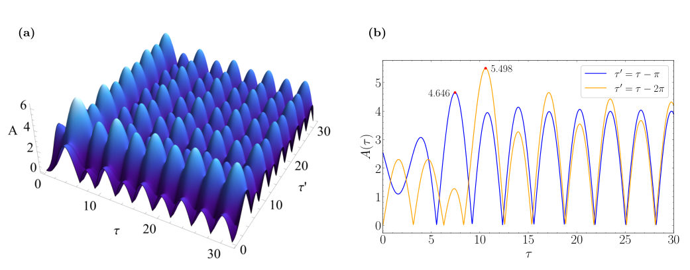 
FIG. 2. (a) Three-dimensional plot of the function A(τ, τ ′) defined in Eq. (44). Maxima correspond to the maximum kinetic energy gain of electrons in the continuum. (b) Two-dimensional representation under the double recombination conditions (τ ′ = τ −π) and (τ ′ = τ −2π). All quantities shown are dimensionless. The corresponding maxima at 4.646Up and 5.498Up are in close agreement with the classical predictions of 4.7Up and 5.5Up [34, 40, 41].

📷 Fig 3

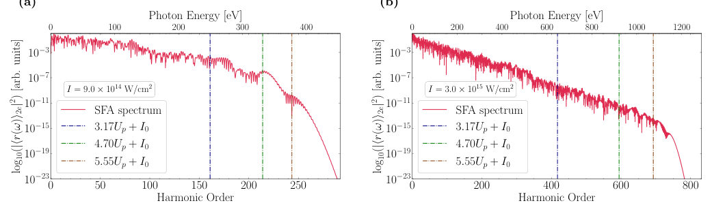 
FIG. 3. HHG spectra calculated using the two-electron SFA for driving laser pulses with peak intensities of (a) 9×1014 W/cm2

📷 Fig 4

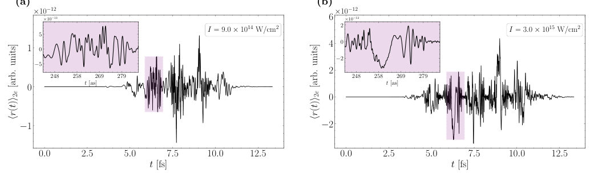 
FIG. 4. Two-electron dipole response within the SFA for driving laser pulses with peak intensities of (a) 9 × 1014 W/cm2 and (b) 3×1015 W/cm2. Both panels include a zoomed-in inset of the shaded region highlighting the strongly oscillatory behaviour.

📷 Fig 5

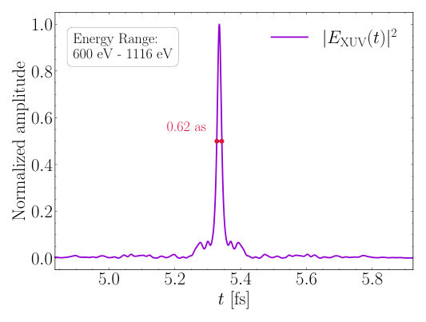 
FIG. 5. Reconstructed attosecond pulse from the two-electron HHG spectrum shown in Fig. 3(b). The reconstruction is performed for a flat-phase model over the energy range from 600 eV to the cutoff energy 5.5Up + I0 ≈1116 eV.

**Summary.** This theoretical study investigates High-Harmonic Generation (HHG) in two-electron systems, extending the process beyond conventional single-electron limits. By generalizing the Strong-Field Approximation to account for simultaneous double recombination, the authors predict an extended harmonic plateau reaching into the soft x-ray keV regime. This capability is crucial for generating sub-attosecond pulses vital for probing ultrafast dynamics across matter.

**Why it may be interesting.** This work is highly relevant as it pushes the boundaries of strong-field physics by modeling multi-electron dynamics in a quantum optical context. The extension into the keV regime opens pathways for soft x-ray spectroscopy using attosecond pulses, which is a major focus area in AMO and quantum optics.

Detailed structure

**Main problem.** The research aims to extend High-Harmonic Generation (HHG) into the keV soft x-ray regime by incorporating two-electron interaction effects.

**Main result.** Two-electron processes allow the harmonic spectrum to significantly exceed the single-electron cutoff, reaching photon energies up to approximately 1.2 keV.

**Method.** The study employs a generalization of the Strong-Field Approximation (SFA) for two active electrons and utilizes the saddle-point method to solve complex momentum integrals derived from the effective action.

**Model / system.** The system modeled is a two-electron atomic structure, specifically Helium, driven by an intense few-cycle infrared laser pulse. The dynamics are governed by a time-dependent Hamiltonian incorporating both atomic binding and laser interaction terms.

**Key observables.** High-harmonic spectrum ($	ilde{r}(\Omega)$), the effective action ($S_{eff}$), and the two-electron dipole moment $\langle r(t) 
angle_{2e}$.

**Important parameters / regimes.** Laser field parameters (e.g., $800 	ext{ nm}$, intense fields); energy scales reaching up to $1.2 	ext{ keV}$; ponderomotive energy ($U_p$).

**Assumptions / limitations.** The analysis relies on the dipole approximation, neglects nuclear motion and relativistic effects, and uses approximations like neglecting rescattering terms in intermediate steps.

**Figures summary.** Figures illustrate the schematic process of Non-sequential double recombination (NSDR), show the extended HHG spectra up to 1.2 keV, and display reconstructed attosecond pulse profiles derived from these high-energy harmonics.

**Paper structure.** The paper builds from establishing the two-electron Hamiltonian and generalizing SFA, through deriving coupled differential equations for single and double electron amplitudes, applying the saddle-point method to solve for the effective action, and finally calculating the Fourier transform of the resulting time-dependent dipole moment to yield the spectrum.

Abstract

Two-electron processes can generate high harmonics beyond the conventional single-active-electron cutoff. Motivated by recent experimental evidence of an extended secondary plateau in the helium high-harmonic spectrum [S. Wang et al, Optica, (2023); S. Wang et al, In Print in Nature Photon., (2026)], we present a two-electron generalisation of the strong-field approximation. We analyse the resulting expressions using the saddle-point method and determine the extended cutoff. We find good agreement with classical predictions of cutoff scalings of $4.7$ and $5.5$ times the ponderomotive energy, which significantly exceed the established single-electron scaling of 3.17. We calculate high-harmonic spectra generated via a two-electron process in helium atoms driven by an intense few-cycle infrared laser pulse. Our results demonstrate that the harmonic spectrum extends far beyond the water window, reaching photon energies up to $\approx 1.2\,\mathrm{keV}$ in the soft x-ray region. The large spectral bandwidth can support the generation of sub-attosecond soft x-ray pulses, which are of particular interest for probing ultrafast dynamics across matter, including applications in core-level spectroscopy and biological imaging.

[↑ back to top](#top)

### [Asymptotic Compression of Interactive Quantum Communication using Type-Constrained de Finetti Reduction](http://arxiv.org/abs/2606.24746v1)

**Authors:** Louis Desruisseaux, Simon Ducharme, Gurleen Padda, Dave Touchette  
**Type:** theory · **Category:** quantum information and computing · **PDF:** <https://arxiv.org/pdf/2606.24746v1>  
**Analysis basis:** full PDF text, analyzed in chunks
**Topic relevance:** `entanglement & information structure` **2/5** · `Keldysh / 2PI / non-Gaussian methods` **1/5**

📷 Fig 1

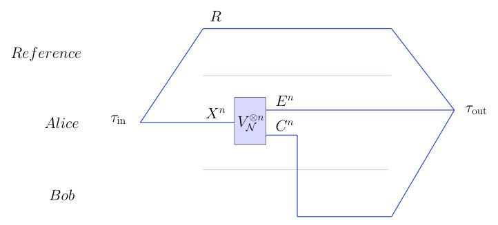 
Figure 1: Visual representation of the QRST task that has to be simulated on a type-constrained de Finetti state. Alice owns a classical system Xn of some input de Finetti state τin, which is purified by some reference system R. She applies the isometric extension V ⊗n N of the classical-quantum channel N ⊗n to obtain the de Finetti state τout, from which she keeps the environment system En and sends the output system Cn to Bob.

📷 Fig 2

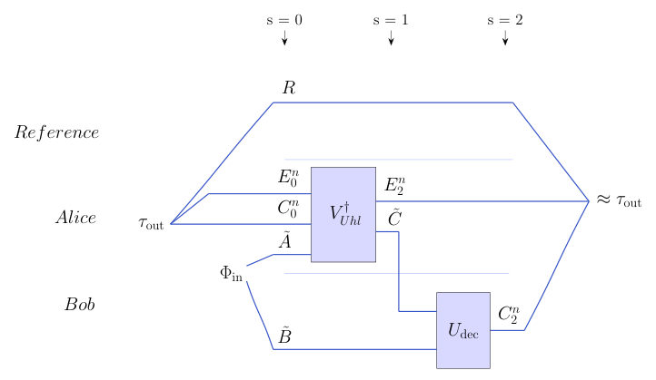 
Figure 2: Visual representation of the state redistribution protocol applied to the output de Finetti state τout obtained after passing the input type-constrained de Finetti state through the isometric extension V ⊗n N of the classical-quantum channel N ⊗n. At time s = 0, Alice and Bob share the entanglement state Φin from which Alice owns the system ˜A and Bob owns the system ˜B. Alice owns the systems En 0 and Cn 0 of the output de Finetti state τout which is purified onto some system R. At time s = 1, Alice applied the Uhlmann isometry V † Uhl to produce the environment system En 2 , which is isomorphic to the system En 0 , and to the produce the system ˜C that she sends to Bob. Finally,...

📷 Fig 3

 
Figure 3: State redistribution of a type-constrained de Finetti state with side information at the receiver. At time s = 0, Alice owns the systems En 0 and Cn 0 while Bob owns the system Y n 0 . They both share some entanglement state Φin, from which Alice owns the system ˜Ain and Bob owns the system ˜Bin. At time s = 1, Alice applied the Uhlmann Isometry V † Uhl to generate En 2 and ˜Aout ˜C, the latter being sent to Bob. At time s = 2, Bob applied the decoupling unitary U † dec to recover the system Cn 2 that he sends to Alice. At time s = 3, Alice applied the decoupling unitary Udec to generate ˜Aout, her part of the shared entanglement at the end of the protocol, and ˜Bin ˜C that she...

📷 Fig 4

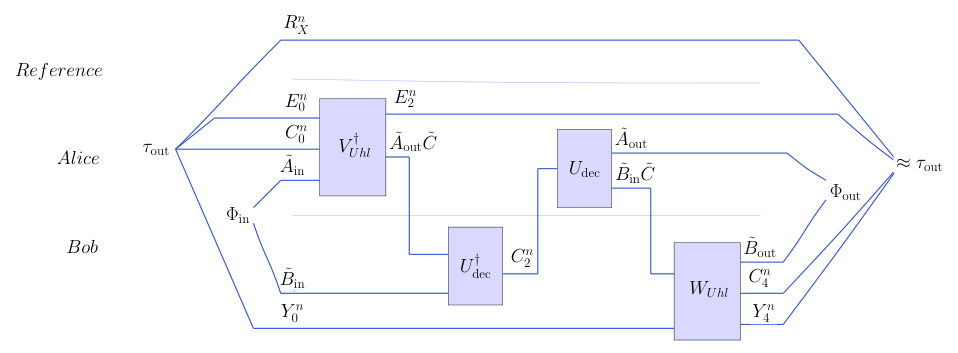 
Figure 3 shows the protocol that does the state redistribution of the type-constrained de Finetti state. Proof of Proposition 2 We use the subscripts s = 0, 1, 2, 3, 4 to keep track of the output de Finetti state at each time of the state redistribution protocol in Figure 3. At time s = 0, we relabel the output type-constrained de Finetti state to be τ ˜t,δ 0 E

📷 Fig 5

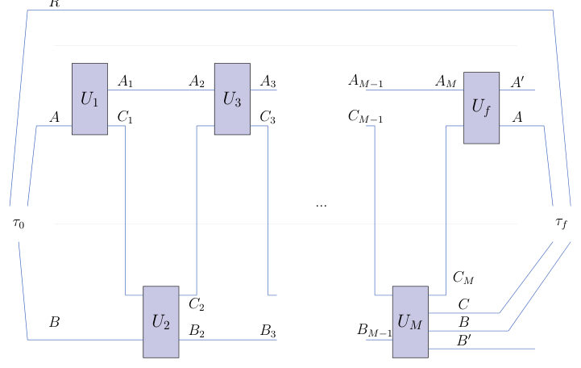 
Figure 4: A general quantum interactive communication protocol Π with classical inputs, consisting of r rounds of communication between Alice and Bob. The protocol starts with Alice and Bob receiving classical inputs x and y, respectively, drawn from an unknown distribution over the input space X × Y. At each round i, one party applies a quantum operation in the form of an isometry Ui on their local quantum system and the quantum system received from the other party in the previous round (if any), and then sends a quantum system to the other party. After r rounds of communication, both parties perform measurements on their local quantum systems to produce their respective outputs. The total...

**Summary.** The paper proves that the fundamental rate of communication capacity in interactive quantum protocols is determined equally by two measures: the Quantum Information Cost and the Amortized Quantum Communication Complexity. This equivalence is achieved using a novel type-constrained de Finetti reduction, which simplifies complex worst-case analysis into manageable i.i.d. bounds.

**Why it may be interesting.** This work provides deep theoretical tools—the type-constrained de Finetti reduction—that bridge classical probability theory with quantum information bounds, offering a powerful new technique for analyzing resource theories.

Detailed structure

**Main problem.** The paper aims to establish an equivalence between two fundamental measures of communication capacity: the prior-free quantum information cost (QIC) and the prior-free amortized quantum communication complexity (AQCC). This addresses a long-standing open question in quantum information theory.

**Main result.** It proves that for interactive quantum communication protocols with classical inputs, the Quantum Information Cost equals the Amortized Quantum Communication Complexity ($	ext{QIC}(\Pi) = 	ext{AQCC}(\Pi)$).

**Method.** The core methodology involves developing and applying a novel type-constrained de Finetti reduction to simplify complex worst-case input analyses into tractable i.i.d. settings.

**Model / system.** The analysis focuses on quantum interactive communication protocols involving multiple rounds of communication, where the inputs are classical sequences drawn from fixed alphabets. The mathematical framework utilizes density operators and tensor products over Hilbert spaces.

**Key observables.** Quantum Information Cost ($	ext{QIC}$), Amortized Quantum Communication Complexity ($	ext{AQCC}$), total quantum communication cost ($QCC$), and various conditional mutual information terms.

**Important parameters / regimes.** The asymptotic limit ($n 	o \infty$) is crucial, as are the approximation parameters $\delta$ (controlling typicality) and the structure of the classical inputs/types.

**Assumptions / limitations.** The analysis assumes that the protocols operate with classical inputs drawn from fixed alphabets and relies heavily on bounding errors using $\delta$-typical sets derived from de Finetti's theorem.

**Figures summary.** Figure 4 illustrates the general structure of an interactive quantum communication protocol involving multiple rounds ($r$) with classical inputs, which is the system under analysis.

**Paper structure.** The paper builds logically by first establishing the type-constrained de Finetti reduction for classical distributions (Chunk 1). It then applies this to bound channel norms and state approximations (Chunks 2 & 7), culminating in simulating the full interactive protocol using these bounds to prove the final equivalence $	ext{QIC}(\Pi) = 	ext{AQCC}(\Pi)$ (Chunks 3, 5, & 6).

Abstract

For many information processing tasks, de Finetti-style theorems can often simplify the analysis in worst-case input scenarios for which the task exhibits some permutation-invariance symmetry, as they can allow for a reduction from an analysis on worst-case inputs to that of i.i.d. inputs. If further information is available on the inputs, it might be advantageous to reflect this information in the de Finetti reduction. In our work, we focus on a form of such constraint, based on the type of the input. This allows us to obtain a conceptually simple proof of a new de Finetti reduction for classical probability distributions, derived from elementary properties from the method of types. We apply our constrained de Finetti reduction to the compression of quantum interactive communication protocols with classical inputs, and prove that the prior-free quantum information cost equals the worst-case input amortized quantum communication cost.

[↑ back to top](#top)

### [Discovery of connectivity-trainability trade-off of IQP Circuits for Hamiltonian Optimization](http://arxiv.org/abs/2606.24264v1)

**Authors:** Quoc Chuong Nguyen  
**Type:** theory · **Category:** quantum information and computing · **PDF:** <https://arxiv.org/pdf/2606.24264v1>  
**Analysis basis:** full PDF text, analyzed in chunks
**Topic relevance:** `entanglement & information structure` **2/5**

📷 Fig 1

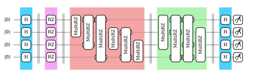 
Fig. 1: Structure of an IQP circuit. The circuit begins with Hadamard gates that prepare a uniform superposition, followed by a diagonal unitary D(θ) = exp  i P j θjZgj  , where Zgj is a tensor product of Pauli-Z operators acting on the qubits indicated by the bitstring gj ∈{0, 1}n. The computation is completed by a second layer of Hadamard gates and measurement in the computational basis.

📷 Fig 2

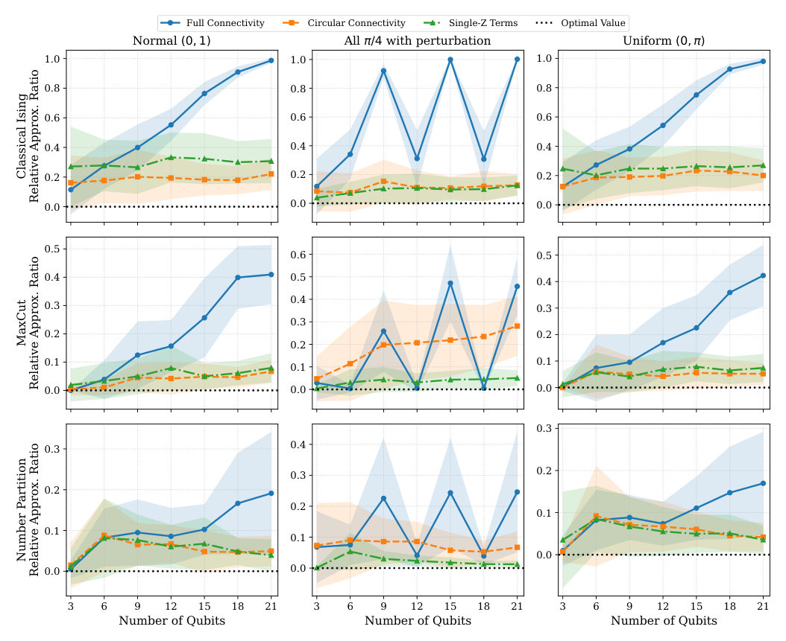 
Fig. 2: Comparison of the optimization error achieved by IQP circuits for different Hamiltonians and parameter initialization strategies. The relative approximation ratio is shown as a function of the number of qubits for the classical Ising Model, MaxCut, and Number Partition Hamiltonians. Results are obtained using 1000 optimization iterations, 50 randomly generated problem instances, and 1000 Monte Carlo samples per configuration. Fully connected IQP circuits generally achieve lower relative approximation ratios than circular and single-Z architectures, while the π/4 initialization provides the oscillated performance across different problem instances.

📷 Fig 3

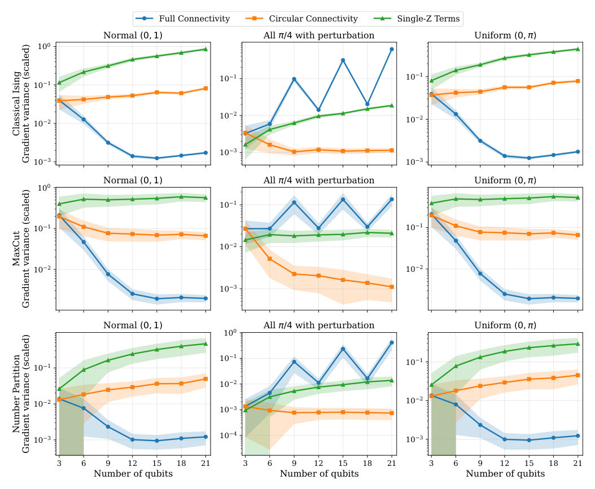 
Fig. 3: Gradient variance as a function of the number of qubits with the same setup as in Fig. 2. When increasing the system size, fully connected circuits exhibit a faster decay of gradient variance than circular and single-Z architectures, indicating a stronger tendency toward barren plateaus. Conversely, sparse circuit structures maintain larger gradients and improved trainability, revealing a trade-off between circuit expressivity and optimization landscape.

📷 Fig 4

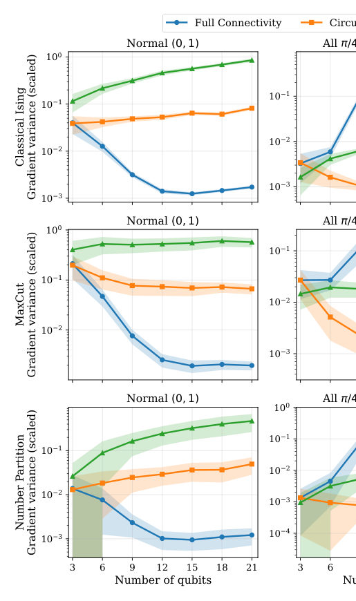 
Fig. 2 compares the optimization performance of IQP cir- cuits with different connectivity structures on the three bench- mark Hamiltonians. Across all initialization strategies and problem classes, fully connected circuits generally achieve the smallest relative approximation ratios, indicating their superior ability to approximate the ground-state energy. Circular archi- tectures provide intermediate performance, whereas single-Z circuits consistently exhibit larger optimization errors. This trend becomes more pronounced for the Number Partition Hamiltonian, whose dense interaction structure requires the circuit to capture long-range correlations among qubits. The results suggest that...

📷 Fig 5

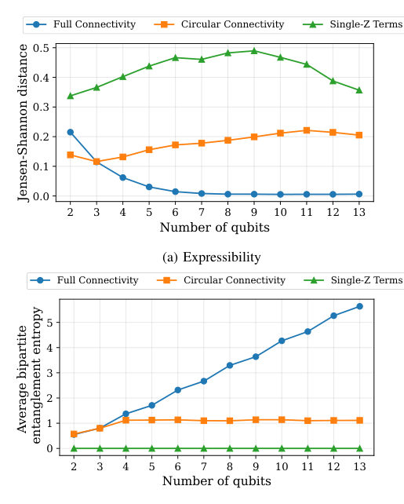 
Fig. 4: Scaling behavior of IQP ans¨atzes with different con- nectivity structures. The plots compare IQP circuits with full connectivity, circular connectivity, and single-Z terms in terms of expressibility (Fig. 4a) and average bipartite entanglement entropy (Fig. 4b) as a function of the number of qubits. Both results show that increasing circuit connectivity generally enhances both state-space expressibility and entanglement generation, while single-Z term circuits remain substantially less expressive and weakly entangling.

**Summary.** This paper analyzes how the connectivity structure of IQP quantum circuits affects their ability to solve complex Hamiltonian optimization problems. It establishes a crucial trade-off: highly expressive, fully connected circuits are prone to vanishing gradients (barren plateaus), while less expressive but stable circuits perform poorly. The authors conclude that an intermediate connectivity, like circular coupling, offers the most robust balance for near-term quantum computation.

**Why it may be interesting.** This work directly addresses a critical bottleneck in variational quantum algorithms—the conflict between achieving high representational power (expressivity) and maintaining gradients that allow for efficient classical optimization (trainability).

Detailed structure

**Main problem.** The study investigates the fundamental trade-off between optimization performance (expressivity) and training stability (trainability) when using Instantaneous Quantum Polynomial-time (IQP) circuits for solving Hamiltonian optimization problems.

**Main result.** A clear trade-off exists: fully connected circuits offer high expressivity but suffer from rapid gradient decay (barren plateaus), while single-Z circuits are stable but under-expressive; circular connectivity provides the best balance.

**Method.** The authors systematically compared three IQP circuit architectures (single-Z, circular, full) by minimizing expectation values of benchmark Hamiltonians and analyzing gradient variance scaling with system size.

**Model / system.** The model uses IQP circuits as variational ansätze to approximate the ground state energy of various combinatorial Hamiltonians, such as Ising or MaxCut models. The analysis focuses on how circuit connectivity dictates the optimization landscape's properties.

**Key observables.** Relative approximation ratio (optimization performance), gradient variance decay rate (trainability/barren plateau susceptibility), expressibility (Jensen-Shannon distance), and bipartite entanglement entropy.

**Important parameters / regimes.** Circuit connectivity structure (Single-Z, Circular, Full); System size (number of qubits $n$); Optimization parameters ($	heta$).

**Assumptions / limitations.** The analysis assumes that the trade-off between expressivity and trainability is a fundamental constraint for near-term quantum advantage in optimization tasks.

**Figures summary.** Figures illustrate how connectivity affects expressibility (approaching Haar-random behavior) and entanglement entropy, while gradient variance plots show full connectivity decaying fastest, indicating barren plateaus.

**Paper structure.** The paper systematically introduces IQP circuits for Hamiltonian optimization, analyzes performance metrics across different connectivities using benchmark Hamiltonians, and concludes by mapping out the necessary balance between expressivity and trainability required for practical quantum algorithms.

Abstract

Instantaneous Quantum Polynomial-time (IQP) circuits are promising candidates for near-term quantum advantage due to the conjectured classical hardness of their sampling task. However, their capabilities for optimization remain largely unexplored. We present a systematic investigation of the performance and trainability of IQP circuits for Hamiltonian optimization. Our results reveal a trade-off between optimization performance and circuit connectivity, demonstrating that the circuit structure plays a key role in determining the ability of IQP circuits to reach low-energy states.

[↑ back to top](#top)

### [On the Limits of Stretching Quantum Pseudorandomness](http://arxiv.org/abs/2606.24736v1)

**Authors:** Boyang Chen, Andrea Coladangelo, Yao-Ting Lin, Nikos Skoumios, Justin Tysdal, Yiming Wang  
**Type:** theory · **Category:** quantum information and computing · **PDF:** <https://arxiv.org/pdf/2606.24736v1>  
**Analysis basis:** full PDF text, analyzed in chunks
**Topic relevance:** `entanglement & information structure` **2/5**

📷 Fig 1

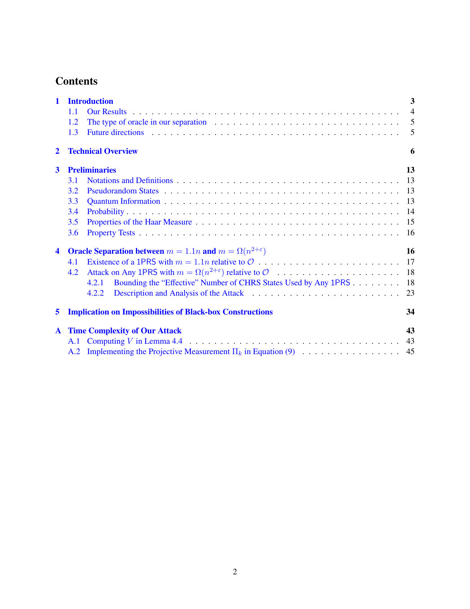 
Low-resolution page preview, page 2

📷 Fig 2

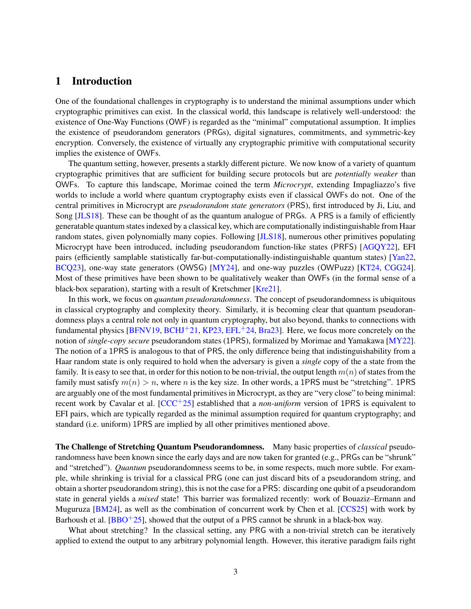 
Low-resolution page preview, page 3

📷 Fig 3

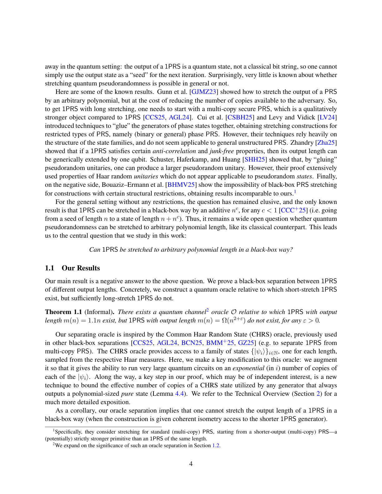 
Low-resolution page preview, page 4

📷 Fig 4

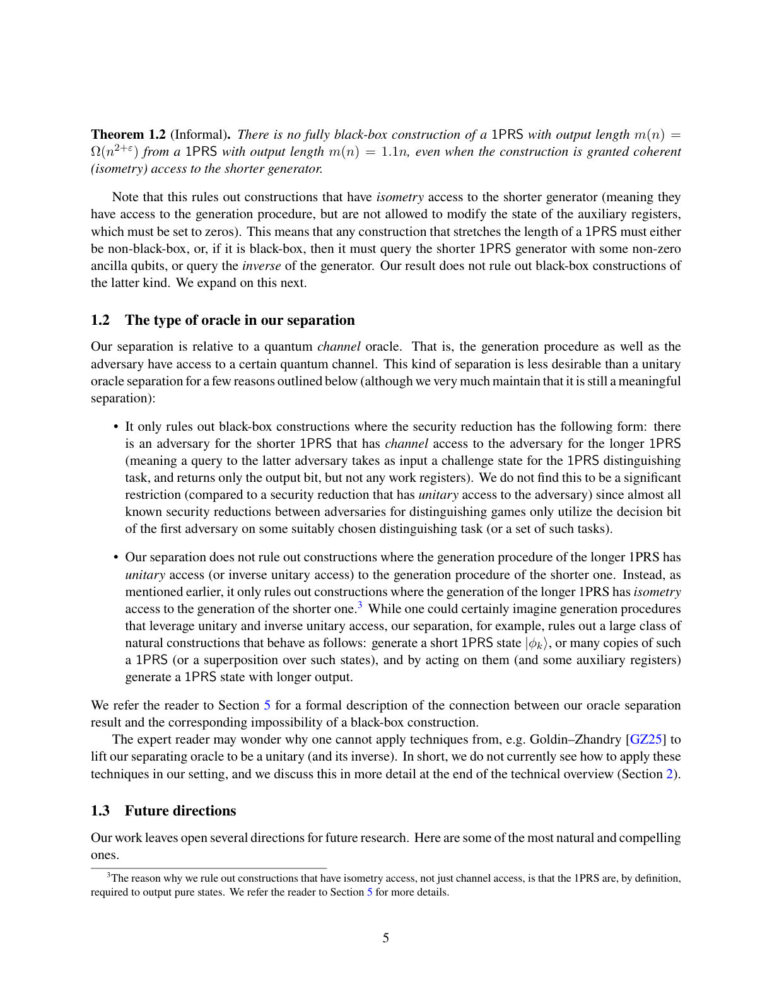 
Low-resolution page preview, page 5

📷 Fig 5

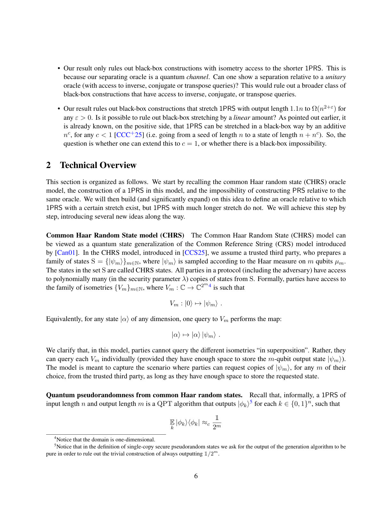 
Low-resolution page preview, page 6

**Summary.** This paper rigorously proves a black-box separation demonstrating that quantum pseudorandom states cannot be stretched to arbitrary polynomial lengths. By constructing an adversary oracle, the authors show that 1PRS outputs are fundamentally limited in how much their output length can increase relative to their input key size. This result places strong theoretical constraints on the efficiency and scalability of quantum randomness sources.

**Why it may be interesting.** While highly abstract, this work establishes fundamental computational limits on quantum randomness generation, which underpins many theoretical models for quantum computation security.

Detailed structure

**Main problem.** The core problem is determining if quantum pseudorandom states (1PRS) can be stretched to arbitrarily large polynomial output lengths in a black-box setting, analogous to classical PRGs.

**Main result.** The authors prove a fundamental black-box separation showing that 1PRS cannot be stretched from a short length ($m(n)=1.1n$) to an arbitrarily long one ($\Omega(n^{2+\epsilon})$).

**Method.** The proof constructs a quantum oracle and utilizes advanced techniques involving the Common Haar Random State (CHRS) model, SWAP tests, and OR testers to distinguish between 1PRS of different output lengths.

**Model / system.** The work operates within the framework of quantum information theory, focusing on Single-Copy Secure Pseudorandom States (1PRS) generated relative to a Common Haar Random State (CHRS).

**Key observables.** Distinguishing advantage between 1PRS outputs and Haar random states; the required output length $m(n)$.

**Important parameters / regimes.** The stretch factor, comparing linear growth ($1.1n$) against super-polynomial growth ($\Omega(n^{2+\epsilon})$); the security parameter $n$.

**Assumptions / limitations.** The separation is established relative to a constructed quantum oracle and holds under specific black-box access models (e.g., isometry access).

**Figures summary.** Figure 1 visually categorizes different theoretical cases (Case A and Case B) based on the lengths of available CHRS states ($i$) and the number of copies ($\ell(i)$) used by the generator.

**Paper structure.** The paper builds its argument through several stages: first, establishing the general black-box separation; second, analyzing specific cases (A and B) based on resource availability; and finally, combining these analyses into a unified adversary that proves the impossibility of stretching.

Abstract

Pseudorandom states, introduced by Ji, Liu, and Song (CRYPTO '18), are quantum analogues of classical pseudorandom generators. A fundamental property of classical pseudorandom generators is that their output can be stretched to arbitrary polynomial length. Whether an analogous stretching property holds for quantum pseudorandom states remains unclear.   In this work, we prove the first black-box separation between single-copy secure pseudorandom states ($\mathsf{1PRS}$) with different output lengths. Specifically, we construct a quantum oracle relative to which $\mathsf{1PRS}$ with output length $m(n)=1.1n$ exist, but $\mathsf{1PRS}$ with output length $m(n)=Ω(n^{2+ε})$ do not, for any $ε>0$. Our proof leverages the Common Haar Random State (CHRS) model introduced by Chen, Coladangelo, and Sattath (EUROCRYPT '25), and introduces a technique to bound the effective number of resource CHRS states utilized by any $\mathsf{1PRS}$ generator in this model.

[↑ back to top](#top)

### [Reachability and optimal-time certificates for quantum control](http://arxiv.org/abs/2606.24645v1)

**Authors:** Younes Naceur, Llorenç Balada Gaggioli  
**Type:** theory · **Category:** quantum information and computing · **PDF:** <https://arxiv.org/pdf/2606.24645v1>  
**Analysis basis:** full PDF text, analyzed in chunks
**Topic relevance:** `analog quantum simulation` **1/5** · `driven-dissipative phase transition` **1/5** · `entanglement & information structure` **1/5** · `methods for driven-dissipative` **1/5** · `non-equilibrium dynamics` **1/5**

📷 Fig 1

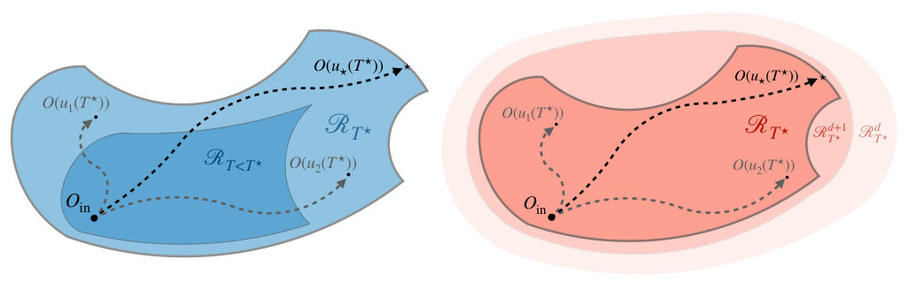 
FIG. 1: Reachability certification and optimal time. (a) Geometry of constrained reachability in finite-time quantum control. Starting from the initial observable Oin, the admissible controls generate a generally nonconvex reachable set RT of terminal observables. The horizon T ⋆denotes the optimal threshold time at which the target observable O⋆first becomes reachable, i.e., O⋆= O(u⋆(T ⋆)) for some optimal admissible control u⋆(T ⋆), whereas O⋆/∈RT for earlier horizons T &lt; T ⋆. (b) The differential moment hierarchy constructs nested convex outer approximations Rd+1 T ⋆ ⊆Rd T ⋆of the true reachable set RT ⋆. If a target observable lies outside one of these outer approximations, it is...

📷 Fig 2

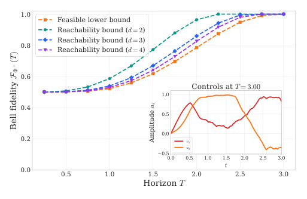 
FIG. 2: Comparison of the feasible lower bound and the reachability upper bounds on the target fidelity FΦ+(T) at time T for hierarchy orders d = 2, 3, 4. Local optimizer pulses at horizon T = 3.00 are displayed in the inset.

📷 Fig 3

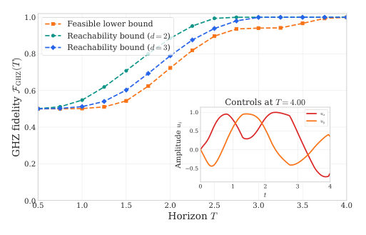 
FIG. 3: Reachability bounds for the three-qubit GHZ generation, comparing feasible lower bound with the hi- erarchy upper bound at orders d = 2 and d = 3 for different control horizons T. The inset shows an illustra- tive control pulse at T = 4.00.

📷 Fig 4

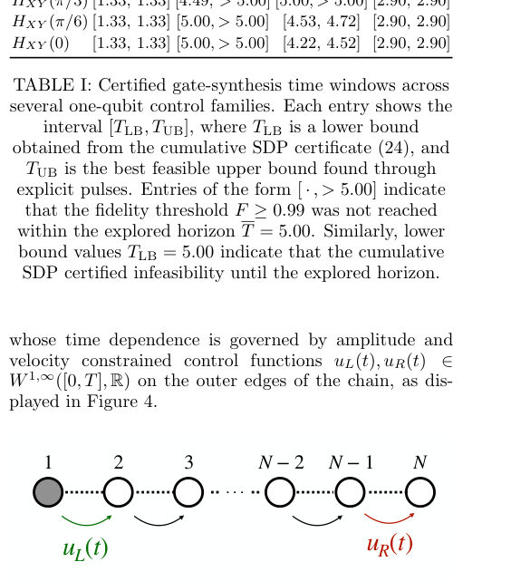 
FIG. 4: Schematic of the reduced single-excitation chain used in the state-transfer benchmark. The two boundary couplings are controlled through the time-dependent amplitudes uL(t) and uR(t). The initial excitation is localized at the left end, |1⟩, and the target state is localized to the right end, |N⟩.

📷 Fig 5

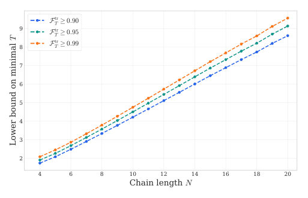 
FIG. 6: Certified lower bounds on the optimal transfer time T for different target fidelities in the XX chain as a function of the chain length N = 4, . . . , 20, obtained from the reduced cumulative hierarchy (24) at relaxation order d = 2. Each line considers a different fidelity threshold.

**Summary.** The paper introduces a novel framework using differential moment relaxations to rigorously certify the limitations of finite-time quantum control. It calculates upper bounds on achievable fidelities and lower bounds on minimum required times for tasks like state preparation and gate synthesis. This provides 'hardware-aware' speed limits, distinguishing true physical constraints from mere optimization shortcomings.

**Why it may be interesting.** This work provides powerful, mathematically rigorous tools for quantum control that move beyond purely numerical optimization by providing certified limits on performance, which is crucial for designing fault-tolerant quantum hardware protocols.

Detailed structure

**Main problem.** The core problem is developing rigorous mathematical certificates for determining the maximum achievable fidelity (reachability) and the minimum time required to reach a target state or gate in constrained quantum control.

**Main result.** The authors establish differential moment hierarchies that provide computable upper bounds on terminal fidelities and corresponding lower bounds on optimal control times, thereby certifying dynamical limitations.

**Method.** The framework employs moment relaxations applied to noncommutative polynomial optimization problems with implicitly time-dependent differential constraints, formulated as Semidefinite Programs (SDPs).

**Model / system.** The work analyzes controlled quantum dynamics governed by Hamiltonians $H(t) = H_0 + \sum u_j(t)H_j$, applied to tasks like state preparation (Bell/GHZ states), gate synthesis ($	ext{SU}(2)$ evolution), and excitation transfer in spin chains.

**Key observables.** Terminal fidelities ($F_{\Phi^+}, F_{	ext{gate}}, F_{	ext{tr}}$) are the primary observables, alongside the optimal control time $T^\star$.

**Important parameters / regimes.** Control constraints ($\sum u_j^2 \le U_{\max}^2$), relaxation order ($d$), and target fidelity threshold ($\eta$).

**Assumptions / limitations.** The method relies on moment relaxation techniques, which provide upper bounds; the quality of these bounds depends on the chosen relaxation order $d$.

**Figures summary.** Figures illustrate the geometry of reachable sets, showing how nested convex outer approximations (from the hierarchy) bound the true set, and compare certified lower/upper bounds for state preparation fidelity vs. time.

**Paper structure.** The paper develops a unified framework by first establishing the mathematical machinery (moment relaxations with differential constraints), then applying it to specific physical tasks: state preparation, gate synthesis, and state transfer, demonstrating how structural symmetries reduce computational complexity.

Abstract

Finite-time control is central to quantum technologies, yet rigorous limits on reachable targets and optimal control times remain largely unknown. We develop a framework for finite-time reachability and optimal-time certificates in constrained quantum control based on moment relaxations with implicitly time-dependent differential constraints. For fixed control horizons and control constraints, the method yields rigorous upper bounds on achievable terminal fidelities, lower bounds on the optimal control times required to reach them, and certificate gaps for benchmarking explicit control pulses. We demonstrate the versatility of our framework in three use cases: entangled-state preparation in two and three qubits, one-qubit gate synthesis across different control geometries, and excitation transfer in an $N$-qubit $XX$ chain. Our work establishes differential moment hierarchies as a practical tool for certifying reachability limits and optimal control times in quantum control, providing hardware-aware quantum speed limits while highlighting structure exploitation as a key ingredient for scalable certification.

[↑ back to top](#top)

### [Large-Language-Model Discovery of Quantum LDPC Codes through Structured Concept Evolution](http://arxiv.org/abs/2606.24808v1)

**Authors:** Zidu Liu, Florian Marquardt  
**Type:** theory · **Category:** quantum information and computing · **PDF:** <https://arxiv.org/pdf/2606.24808v1>  
**Analysis basis:** full PDF text, analyzed in chunks
**Topic relevance:** `analog quantum simulation` **1/5** · `driven-dissipative phase transition` **1/5** · `entanglement & information structure` **1/5** · `methods for driven-dissipative` **1/5**

📷 Fig 1

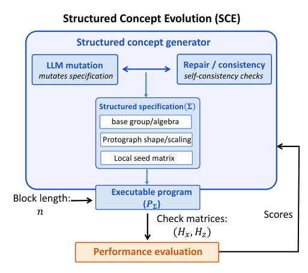 
FIG. 1. The SCE framework used for qLDPC discovery. At each iteration, a parent scheme is sampled from the archive, a mutation level drawn uniformly with probability 1/3, and the LLM prompted to apply the corresponding mutation op- erator. The LLM returns a mutated scheme (structured spec- ification Σ paired with an executable program PΣ) that con- structs the corresponding CSS code at any chosen block length n. The scheme is checked for self-consistency by the repair module. The program is executed to emit the parity-check matrices (HX, HZ), which are evaluated and assigned a fitness score S. Each evaluated scheme, together with its score, is stored in the quality-diversity archive. At the...

📷 Fig 2

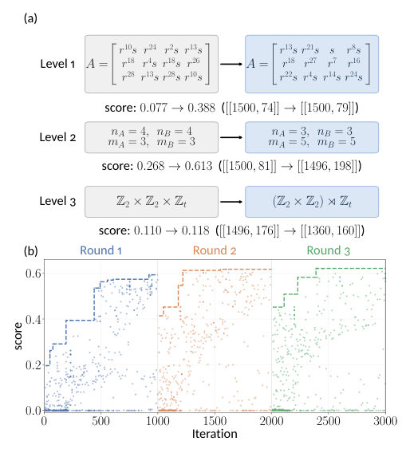 
FIG. 2. Hierarchical mutation and score evolution. (a) The three mutation levels, each shown as a representative par- ent →child step drawn from the search log, with the result- ing change in score and code parameters [[n, k]]. Level 1: the group and protograph shape are fixed and only the local F2[G] entries of the base matrices A and B are rewritten. Here we present the base matrix A. We consider the code based on Dicm, where r is the rotation generator (the order-2m cyclic element) and s is an order-4 element satisfying s2 = rm and srs−1 = r−1. Level 2: the group family is fixed as Dicm and the protograph shape changes, A, B : 3 × 4 →5 × 3. At n ≈1500, the family parameter m shrinks 15...

📷 Fig 3

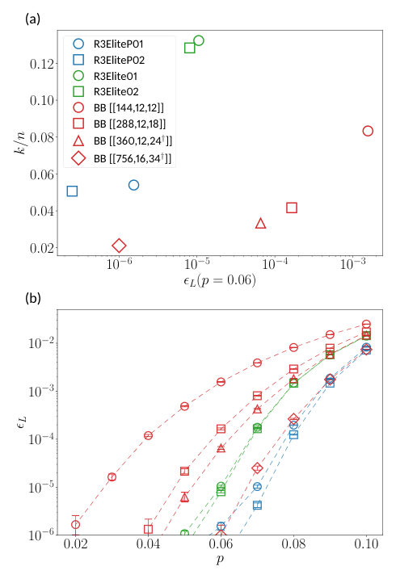 
FIG. 3. Performance of evolved LP codes against BB base- lines under code-capacity depolarizing noise. The logical error rate is reported per logical qubit, ϵL = 1−(1−pL)1/k. (a) En- coding rate k/n versus ϵL at fixed physical error rate p = 0.06 for the top two LP elites of each set (blue: CpL, green: Cscore) and four BB codes (red). † denotes an upper bound on the distance. Points toward the upper-left are preferable (high rate, low logical error). The Cscore set attains the highest rate k/n ≈0.13 among all codes shown. (b) ϵL versus p for the top two LP codes of each set and the four BB codes. Markers match panel (a). Error bars are 95% Clopper–Pearson confi- dence intervals [60].

**Summary.** This paper presents Structured Concept Evolution (SCE), an LLM-guided evolutionary framework designed to overcome the difficulty of constructing good quantum LDPC codes. By allowing the LLM to mutate high-level algebraic concepts rather than raw matrices, the method discovers diverse and competitive code families over both abelian and non-abelian groups. The results demonstrate a powerful AI tool for advancing the theoretical design of fault-tolerant quantum computation.

**Why it may be interesting.** While focused on quantum error correction codes rather than AMO dynamics, the underlying principle of using advanced AI (LLMs) to navigate complex, high-dimensional combinatorial search spaces for physical constraints is highly relevant to designing optimal quantum control or simulation protocols in AMO physics.

Detailed structure

**Main problem.** The primary challenge is discovering high-performing quantum low-density parity-check (qLDPC) codes because the search space for their construction is vast and discrete.

**Main result.** The authors successfully used an LLM-guided evolutionary framework to discover diverse, competitive families of qLDPC codes spanning both abelian and non-abelian group structures.

**Method.** They introduced Structured Concept Evolution (SCE), which pairs a Large Language Model with a structured algebraic mutation grammar to evolve code concepts at three hierarchical levels: local entries, protograph shape, and base group algebra.

**Model / system.** The focus is on constructing CSS quantum LDPC codes using the lifted-product construction based on finite groups G. These codes are evaluated for error correction capability against depolarizing noise.

**Key observables.** Logical error rate ($\epsilon_L$) vs. physical error rate ($p$), encoding rate ($k/n$), and fitness scores derived from decoding performance (BP+OSD).

**Important parameters / regimes.** Physical error rates $p \in \{0.05, 0.06, 0.07\}$; code parameters $[[n, k, d]]$; stabilizer weight threshold $\le 14$.

**Assumptions / limitations.** The search relies on LLMs (GPT-5.4 variants) acting as intelligent mutation operators constrained by a structured algebraic grammar.

**Figures summary.** Figures illustrate the SCE framework flow, showing parent-to-child mutations across three levels (L1, L2, L3), and plot the block-length dependence of logical failure rates for various discovered code families.

**Paper structure.** The paper introduces the problem, details the SCE methodology involving structured concepts and hierarchical mutation grammar, presents results showing diverse code discovery spanning abelian to non-abelian groups, and concludes with performance comparisons across different noise models.

Abstract

Quantum computers could outperform classical machines on important problems, but only if the errors that pervade quantum hardware can be corrected at scale. Quantum low-density parity-check (qLDPC) codes offer a promising route to this goal by combining sparse parity checks with finite encoding rate and growing distance, but their construction remains a challenging discrete design problem. Here we introduce structured concept evolution (SCE), a search framework that pairs a large language model with a structured algebraic mutation grammar to discover lifted-product code families, a class of CSS qLDPC codes. Instead of asking the LLM to design codes from first principles, SCE evolves structured concepts consisting of algebraic specifications paired with executable programs that realize them, using hierarchical mutations that modify the group algebra, protograph geometry, or base space. Running SCE, we discover a diverse set of competitive code families, ranging from abelian constructions to families over non-abelian groups beyond those underlying standard designs such as bivariate-bicycle codes, and characterize them under code-capacity depolarizing noise with BP+OSD decoding. These results are obtained with lightweight models (GPT-5.4-mini and GPT-5.4-nano).

[↑ back to top](#top)

### [Augmenting Imaginary-Time Evolution with Local Geometric Information](http://arxiv.org/abs/2606.23934v1)

**Authors:** Carlos L. Benavides-Riveros, Prachi Sharma, Fedor Šimkovic  
**Type:** theory · **Category:** strongly correlated electrons · **PDF:** <https://arxiv.org/pdf/2606.23934v1>  
**Analysis basis:** full PDF text, analyzed in chunks
**Topic relevance:** `analog quantum simulation` **1/5** · `methods for driven-dissipative` **1/5** · `non-equilibrium dynamics` **1/5**

📷 Fig 1

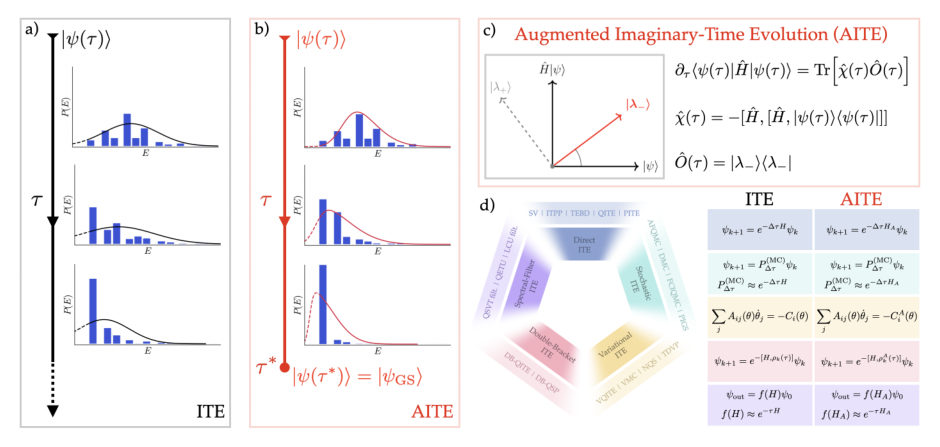 
FIG. 1. Schematic comparison of standard imaginary-time evolution (ITE) and augmented imaginary-time evolution (AITE). a) In standard ITE, the energy distribution P(E) of the evolving state |ψ(τ)⟩shifts monotonically toward lower energies as τ increases, converging to the ground state asymptotically as τ →∞. The convergence rate is governed solely by the energy variance. b) In AITE, the skewness of the instantaneous energy distribution is exploited to identify geometry-informed descent directions, yielding the ground state |ψGS⟩at finite imaginary time τ ∗. c) The key equations of AITE: the rate of energy decrease is given by Tr[ˆχ(τ) ˆO(τ)], where ˆχ(τ) is the double-bracket operator. The...

📷 Fig 2

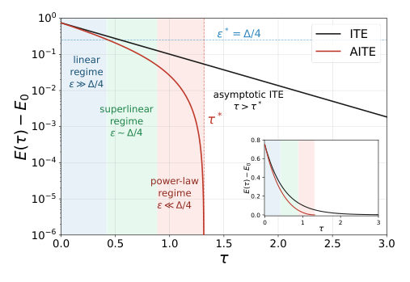 
FIG. 2. Energy error E(τ) −EGS as a function of imaginary time τ for ITE (black) and AITE (red) as predicted in Eq. (12) (with ∆= 1 and ε0 = 0.75). The main panel shows the error evolution on a logarithmic scale, with shaded regions identi- fying four dynamical regimes: the linear regime (ε ≫∆/4, blue), the superlinear regime (ε ∼∆/4, green), the power-law extinction regime (ε ≪∆/4, red), and the asymptotic ITE regime. The dashed vertical line marks the finite extinction time τ ∗of AITE. The inset displays the same dynamics on a linear scale, highlighting the finite-time extinction of AITE in contrast to the asymptotic exponential decay of ITE.

📷 Fig 3

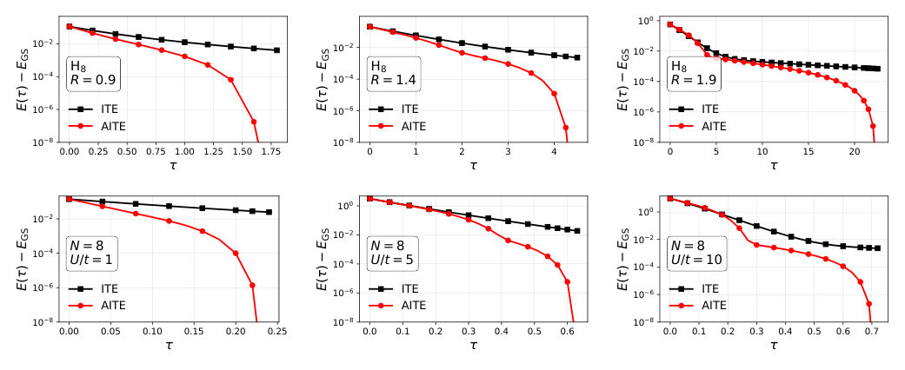 
FIG. 3. Energy error E(τ) −EGS as a function of imaginary time τ for equidistant H8 (upper panels) and the one-dimensional Fermi-Hubbard model at half filling with N = 8 sites and open boundary conditions (lower panels). Within each row, the interatomic spacing R (H8) and interaction strength U/t (Hubbard) increase from left to right. Results are shown for ITE and AITE. In all cases, the initial trial state corresponds to the Hartree–Fock state.

📷 Fig 4

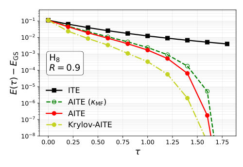 
FIG. 4. Energy error E(τ) −EGS as a function of imaginary time τ for standard ITE (black), AITE (red), AITE using the mean-field skewness approximation κMF (green), and the Krylov-subspace energy estimator for AITE (yellow), applied to the hydrogen chain H8.

**Summary.** The paper introduces Augmented Imaginary-Time Evolution (AITE) to accelerate the notoriously slow convergence of standard imaginary-time evolution algorithms. By incorporating local geometric information derived from energy distribution statistics, AITE achieves superlinear convergence leading to finite-time error extinction. This provides a significant algorithmic improvement for simulating ground states in quantum many-body systems.

**Why it may be interesting.** This work provides a powerful algorithmic acceleration technique for finding ground states in strongly correlated systems, directly impacting computational methods used in condensed matter physics simulations.

Detailed structure

**Main problem.** Standard imaginary-time evolution (ITE) for ground-state preparation converges only asymptotically, leading to slow convergence rates.

**Main result.** The proposed Augmented Imaginary-Time Evolution (AITE) framework achieves superlinear convergence and exhibits finite-time extinction of the energy error, significantly outperforming standard ITE.

**Method.** AITE augments the standard gradient flow by incorporating local geometric information derived from higher-order statistical moments (like skewness) of the instantaneous energy distribution into the descent direction.

**Model / system.** The methods are applied to general quantum many-body systems, with specific numerical tests performed on the H8 chain and the Fermi-Hubbard model. The evolution is governed by imaginary time ($	au$) under a Hamiltonian $\hat{H}$.

**Key observables.** Energy error $E(	au) - E_{	ext{GS}}$, energy variance ($\mu_2$), and skewness coefficient ($\kappa$).

**Important parameters / regimes.** The spectral gap ($\Delta = E_1 - E_{GS}$), the imaginary time $	au$, and the target precision $\epsilon^*$.

**Assumptions / limitations.** Practical implementation restricts the search for optimal descent operators to the second-order Krylov subspace, and mean-field approximations are used for higher moments.

**Figures summary.** Figures compare energy error vs. time ($	au$) curves, showing AITE's power-law extinction against ITE's asymptotic exponential decay across various models (H8 chain, Fermi-Hubbard).

**Paper structure.** The paper introduces the problem with standard ITE, develops the AITE framework by generalizing the flow using geometric information ($\hat{O}(	au)$), analyzes the convergence rate improvement leading to finite-time extinction, and discusses practical approximations like mean-field moment estimation.

Abstract

Imaginary-time evolution (ITE) underpins a broad family of algorithms for ground-state preparation in quantum simulation and quantum many-body physics. In these methods, convergence is governed by the energy variance of the instantaneous state, causing the flow to approach the ground state only asymptotically. We introduce an augmented imaginary-time evolution (AITE) framework that replaces the standard gradient flow on the energy landscape with a geometrically informed descent along locally optimal directions, which are identified by exploiting the higher-order statistical structure of the instantaneous energy distribution. The resulting flow strictly outperforms standard ITE throughout the entire evolution and exhibits two qualitatively distinct regimes: a superlinear convergence regime, followed by an extinction regime in which the energy error vanishes exactly at a finite imaginary time, in sharp contrast to the asymptotic exponential decay of ITE. Standard ITE is recovered in the zero-skewness limit of AITE, implying that the acceleration extends naturally across the broader ITE algorithmic family.

[↑ back to top](#top)

### [Free-Space CV-QKD with Single-Mode Fiber Reception: Effective Coupling Statistics and Protocol-Dependent Reference Noise](http://arxiv.org/abs/2606.24431v1)

**Authors:** Hesham S. Ibrahim, Arnaud Coatanhay  
**Type:** theory · **Category:** quantum information and computing · **PDF:** <https://arxiv.org/pdf/2606.24431v1>  
**Analysis basis:** full PDF text, analyzed in chunks
**Topic relevance:** `interference shaping light` **1/5** · `quantum measurements` **1/5** · `quantum optics experiment` **1/5**

📷 Fig 1

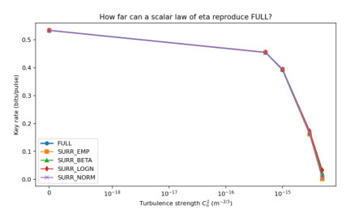 
FIG. 1. Comparison between the full optical model, a mean- loss-only approximation, and several scalar surrogates for the effective SMF coupling law in the GG02 setting. Mean loss alone systematically overestimates the secret key rate, whereas realistic scalar coupling laws reproduce the full model with good accuracy over a broad turbulence range.

📷 Fig 2

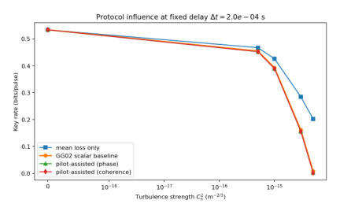 
FIG. 2. Comparison between the scalar GG02 baseline and pilot-assisted effective models at fixed signal-pilot de- lay. The pilot-assisted curves lie below the scalar baseline, with a degradation that becomes increasingly significant in the stronger turbulence regime.

📷 Fig 3

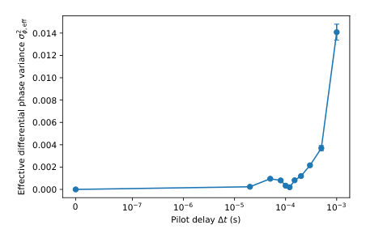 
FIG. 3. Delay scan at C2 n = 3.0 × 10−15 m−2/3. The effective differential phase variance σ2 ϕ,eff is estimated from five inde- pendent seeds, with 300 turbulent realizations per delay and per seed. The frozen-flow shift is implemented by a Fourier sub-pixel translation of the phase screens.

📷 Fig 4

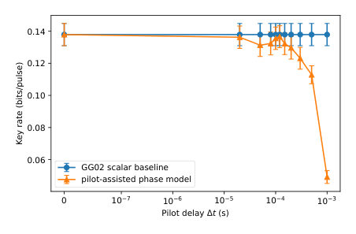 
FIG. 4. Delay dependence of the effective key rate. The scalar GG02 baseline remains essentially independent of the signal- pilot delay, whereas the pilot-assisted phase model degrades once the differential phase variance becomes non-negligible. Error bars show the standard error over five independent seeds.

📷 Fig 5

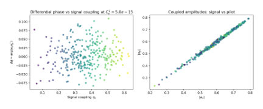 
FIG. 6. Supplementary pilot-assisted diagnostic showing the signal–pilot mismatch at the level of coupled amplitudes and relative phase. This figure supports the interpretation of the pilot-assisted degradation as a consequence of differential signal–pilot decoherence rather than of scalar signal fading alone.

**Summary.** The paper rigorously analyzes the effective channel impairments in free-space CV-QKD when light passes through atmospheric turbulence and is coupled into an SMF. It demonstrates that while the standard protocol (GG02) can be accurately modeled using a scalar coupling law, protocols utilizing a reference signal require tracking differential phase mismatches, which introduces a distinct, measurable noise penalty.

**Why it may be interesting.** This work is highly relevant as it bridges complex wave optics simulations with information-theoretic security bounds, providing concrete physical constraints (the need for differential observables) that must be accounted for in practical quantum communication system design.

Detailed structure

**Main problem.** The core problem is determining the physically relevant effective channel variable for Continuous-Variable Quantum Key Distribution (CV-QKD) when atmospheric turbulence and Single-Mode Fiber (SMF) reception are involved.

**Main result.** For standard GG02, a realistic scalar law for SMF coupling efficiency suffices; however, pilot-assisted protocols require an additional protocol-dependent reference observable due to signal-pilot phase mismatch.

**Method.** The authors employ full wave-optics simulations (split-step propagation) followed by deriving effective Gaussian channel closures based on analyzing the necessary statistical moments of the optical observables.

**Model / system.** The system is a free-space CV-QKD link propagating through atmospheric turbulence, which is modeled via random phase screens and subsequent finite-aperture collection onto an SMF guided mode. The analysis compares simple mean-loss approximations against more rigorous moment closures.

**Key observables.** Effective coupling efficiency ($\eta_{smf}$), relative phase ($\Delta\phi$), complex coherence indicator ($
u$), and the resulting key rate (bits/pulse).

**Important parameters / regimes.** Atmospheric turbulence strength ($C_2^n$), propagation distance ($L=1000$ m), and signal-pilot time delay ($\Delta t$).

**Assumptions / limitations.** The analysis relies on developing effective physical models (closures) for the channel statistics, rather than providing a complete composable security proof. The mean-loss model is used as a deliberately simple control case.

**Figures summary.** Figures compare full optical model results against simplified approximations (mean loss vs. scalar surrogates) for GG02, and show that pilot-assisted key rates degrade significantly with increasing signal-pilot delay ($\Delta t$) due to differential phase variance.

**Paper structure.** The paper progresses by first modeling the full wave optics, then establishing effective closures for the standard GG02 setting using scalar surrogates. It extends this analysis to pilot-assisted architectures, where it introduces and quantifies an additional protocol-dependent reference noise penalty based on differential observables.

Abstract

We study free-space continuous-variable quantum key distribution (CV-QKD) with single-mode fiber (SMF) reception under atmospheric turbulence. The optical channel is modeled by split-step propagation through random phase screens, followed by finite-aperture collection and projection onto the guided receiving mode. We first examine the standard GG02 setting and ask which receiver-side observable is sufficient for effective key-rate prediction. We show that a mean-loss description is generally too optimistic, whereas a scalar effective law for the SMF coupling efficiency provides an accurate downstream Gaussian-channel description within the effective model considered here. We then extend the optical model to a pilot-assisted architecture in which the signal and pilot propagate through correlated but non-identical turbulent realizations generated by a frozen-flow construction. In this case, the signal coupling law alone is no longer sufficient: signal--pilot phase mismatch and loss of post-coupling coherence produce an additional protocol-dependent reference-noise penalty. The results distinguish two regimes: a scalar coupling description is largely adequate for GG02, while transmitted-reference architectures require an additional differential reference observable beyond the signal coupling statistics.

[↑ back to top](#top)

### [Preparing multi-qudit states in a definite-weight subspace](http://arxiv.org/abs/2606.24659v1)

**Authors:** Nabi Zare Harofteh, Rafael I. Nepomechie  
**Type:** theory · **Category:** quantum information and computing · **PDF:** <https://arxiv.org/pdf/2606.24659v1>  
**Analysis basis:** full PDF text, analyzed in chunks
**Topic relevance:** `correlated cavity matter` **1/5** · `entanglement & information structure` **1/5** · `exotic spin models in light-matter` **1/5**

📷 Fig 1

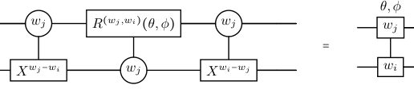 
Figure 1: Circuit diagram for the Gray gate Gwi,wj i,j (θ,ϕ) (3.7). In its symbolic form shown on the right, it is understood that the w-values in the lower and upper boxes correspond to qudits i and j, respectively, as i &gt; j.

📷 Fig 2

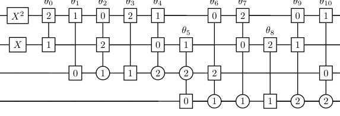 
Figure 2: The quantum circuit (3.17) for preparing a state with ⃗k = (2,1,1), see (2.6) and Table 1. The Gray gates are defined in Fig. 1, and the circles denote controls.

📷 Fig 3

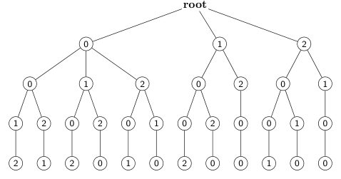 
Figure 3: Tree for lexicographic ordering of multiset permutations for ⃗k = (2,1,1), which does not have the Gray property.

📷 Fig 4

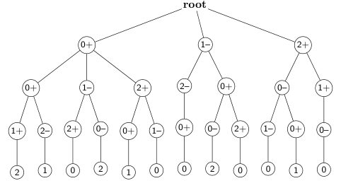 
Figure 4: Tree for multiset permutations with the Gray property for ⃗k = (2,1,1). Note that the signs of the nodes alternate across each level. (Adapted from Fig. 3 in [36].)

📷 Fig 5

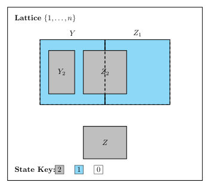 
Figure 5: Venn diagram representing subsets of {1,...,n} entering into the derivation of (B.14). The shadings indicate the states (0, 1 or 2) corresponding to these subsets. Not shown: X2 = Y2 ∪Z ∪Z2 and X = Y ∪Z1 ∪Z.

**Summary.** The paper develops a deterministic quantum algorithm based on Gray codes to prepare complex multi-qudit quantum states within specific weight subspaces. By decomposing the state preparation into sequential controlled rotations, it successfully applies this method to generate exact eigenstates of Hamiltonians relevant to strongly correlated physics, such as Bethe and Dicke states.

**Why it may be interesting.** This work provides a concrete quantum computational blueprint—a universal gate sequence—for preparing highly entangled, symmetry-protected many-body eigenstates (like Bethe or Dicke states) that are central to understanding quantum magnetism and interacting systems.

Detailed structure

**Main problem.** The primary goal is to formulate a deterministic quantum algorithm for preparing arbitrary multi-qudit states within a specific definite-weight subspace.

**Main result.** A concrete, gate-based procedure using Gray codes and controlled rotations (Gray gates) is established to prepare these complex entangled states, including Bethe and Dicke states.

**Method.** The method maps the state preparation problem onto traversing an ordered sequence of basis states defined by a multiset permutation Gray code. Each transition requires applying a specific controlled unitary rotation (the 'Gray gate').

**Model / system.** The system involves $n$-qudit systems using $d$-dimensional qudits, whose states are characterized by weight vectors $\vec{k}$. The target states are eigenstates of various Hamiltonians, such as the SU(3)-invariant Heisenberg Hamiltonian.

**Key observables.** State amplitudes ($a_w$) defining the superposition coefficients, and the eigenvalues of the relevant symmetry-preserving Hamiltonians (e.g., $E = -rac{1}{2}n(n-1)$ for Dicke states).

**Important parameters / regimes.** The weight vector $\vec{k}=(k_0, \dots, k_{d-1})$, the qudit dimension $d$, and the deformation parameter $q$ (for $	ext{SU}_q(d)$ generalizations).

**Assumptions / limitations.** The algorithm assumes that a Gray code ordering exists for the multiset permutations such that adjacent states differ by exactly one controlled swap, allowing the state preparation to be decomposed into sequential two-qudit rotations.

**Figures summary.** Figures illustrate the structure of the required Gray gate circuit (Figure 1) and optimized tree structures ensuring the single-swap property for multiset permutations (Figure 4).

**Paper structure.** The paper first introduces the general framework using Gray codes to reduce state preparation to controlled rotations. It then applies this method specifically to prepare eigenstates of the SU(3)-invariant Heisenberg Hamiltonian (Bethe states) and generalizes it to $	ext{SU}(d)$ Dicke states, detailing both the circuit structure and the underlying algebraic formulas for amplitudes.

Abstract

We formulate a deterministic algorithm for preparing arbitrary multi-qudit states in a definite-weight subspace. By ordering the corresponding computational basis states according to a Gray code for multiset permutations, the state-preparation task is reduced to performing a sequence of controlled 2-qudit Gray rotations. We use this algorithm to prepare exact eigenstates of the SU(3)-invariant Heisenberg Hamiltonian, whose Bethe ansatz is nested. In particular, we describe the preparation of the Bethe states, which are SU(3) highest-weight states, as well as their lower-weight descendants. We also consider the preparation of $SU(d)$ Dicke states and their q-deformations.

[↑ back to top](#top)

### [Uncovering Latent Structures in Robust Pulse Sequences: A Model-Based Reinforcement Learning Approach for Adaptable Quantum Control](http://arxiv.org/abs/2606.24507v1)

**Authors:** Tobias Kiermeyer, Thomas Heydenreich, Léo Van Damme, Sebastian Hohenemser, Florian Marquardt, Steffen J. Glaser  
**Type:** theory · **Category:** other · **PDF:** <https://arxiv.org/pdf/2606.24507v1>  
**Analysis basis:** full PDF text, analyzed in chunks
**Topic relevance:** `QC/QI experiment` **1/5** · `methods for driven-dissipative` **1/5** · `quantum measurements` **1/5**

📷 Fig 1

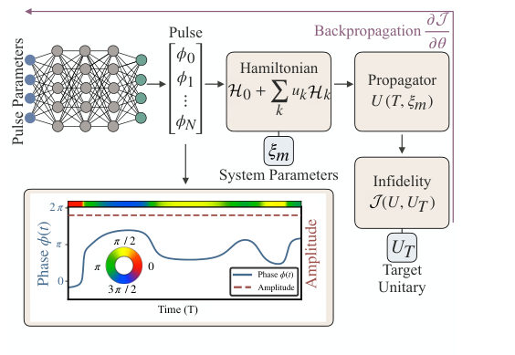 
FIG. 1. Schematic of model-based RL for quantum control. The network generates a control pulse, which is then applied to the system Hamiltonian to compute the resulting propa- gator. The infidelity with respect to the target unitary is evaluated and backpropagated through the entire computa- tional graph using automatic differentiation (AD) to update the network parameters.

📷 Fig 2

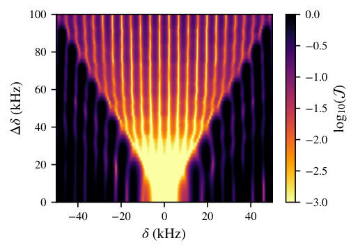 
FIG. 2. Robustness profile of pulses with TP = 450 µs, β = 3π/2 and ∆s = 0 optimized for different offset ranges ∆δ.

📷 Fig 3

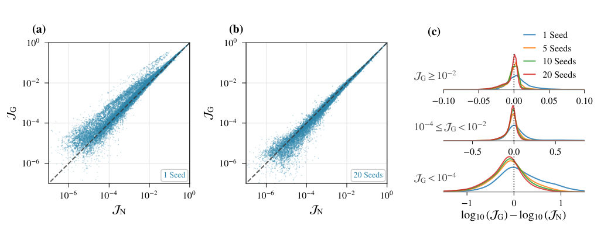 
FIG. 3. Comparison of neural network and GRAPE infidelities across 100,000 gate configurations {Gi}. (a, b) Infidelity of GRAPE (JG) versus the neural network (JN) for 1 and 20 GRAPE seeds, respectively; each point represents one gate configuration within {Gi} and the dashed line indicates equal performance. The network outperforms single-seed GRAPE in a substantial fraction of cases; with 20 seeds the balance shifts in favor of GRAPE, though most configurations remain near the diagonal. (c) Distribution of log10 JG −log10 JN grouped by infidelity regime (rows) and GRAPE seed count (colors). Negative values indicate GRAPE outperforms the network. The distributions broaden and shift toward...

📷 Fig 4

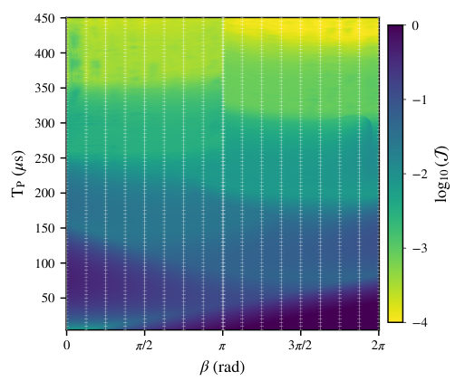 
FIG. 4. Infidelity landscape of pulses generated by the neural network, evaluated across a dense grid of pulse durations TP and rotation angles β for ∆δ = 20 kHz and ∆s = 0. White crosses indicate training points included in the training pa- rameter space.

📷 Fig 5

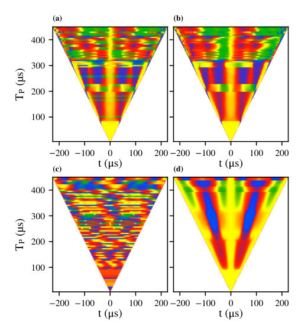 
FIG. 5. Phase profiles of GRAPE-optimized pulses before (left column) and after (right column) phase curation, for rotation angles β = 3π/2 (top row) and β = 2π (bottom row). The curation procedure reveals continuous phase structures while leaving the gate fidelity unchanged.

**Summary.** The paper introduces a novel model-based Reinforcement Learning framework to solve the challenge of generating quantum control pulses that remain high-fidelity despite variations in experimental parameters. By training a single neural network on an entire family of gate configurations, it achieves rapid, adaptable pulse generation superior to traditional methods like GRAPE for exploring parameter space robustness. This significantly accelerates the design cycle for complex quantum operations.

**Why it may be interesting.** This work provides a powerful machine learning tool for quantum control, moving beyond computationally expensive, point-wise optimization methods. The ability to encode system physics directly into the loss function makes it highly relevant for designing robust protocols in experimental AMO platforms like superconducting qubits or trapped ions.

Detailed structure

**Main problem.** The core challenge is achieving real-time, adaptive quantum control by generating robust, high-fidelity control pulses across a continuous range of varying experimental parameters.

**Main result.** A model-based Reinforcement Learning approach using a single neural network can generate highly accurate and adaptable control pulses that maintain fidelity comparable to multiple independent optimization runs (GRAPE).

**Method.** The authors train a neural network to map input gate configurations directly to optimized pulse phase profiles, bypassing the need for iterative optimization for every parameter set.

**Model / system.** The system is modeled as a single-spin (two-level) quantum system driven by an external field, described by a time-dependent Hamiltonian that includes tunable parameters like detuning and inhomogeneity.

**Key observables.** Fidelity ($\mathcal{J}$) and ensemble-averaged infidelity ($ar{\mathcal{J}}$), which quantify how well the generated pulse achieves the target gate operation across parameter variations.

**Important parameters / regimes.** Gate configuration parameters include rotation angle ($eta$), pulse duration ($T_P$), detuning range width ($\Delta\delta$), and amplitude inhomogeneity range width ($\Delta s$).

**Assumptions / limitations.** The primary assumption is that the underlying physical model (Hamiltonian) can be embedded into a differentiable computational graph for training. GRAPE's memoryless nature is contrasted with the network's ability to generalize.

**Figures summary.** Figures compare pulse phase profiles and robustness fingerprints ($\log_{10} J(\delta)$) generated by the NN versus standard GRAPE, demonstrating structural consistency across varying parameters and durations.

**Paper structure.** The paper introduces the problem of adaptive control limitations in traditional methods (GRAPE), proposes the model-based RL framework using a single network to learn the entire parameter manifold, details the training process involving ensemble averaging, and validates performance by comparing generalization capabilities against multi-seed GRAPE runs.

Abstract

Real-time adaptive control of quantum systems requires rapid generation of robust, high-fidelity pulses across a continuous range of operating conditions. Standard optimization algorithms such as gradient-ascent pulse engineering (GRAPE) solve each instance independently, discarding information between runs and requiring costly reinitialization when parameters change. We present an approach to robust optimal quantum control based on model-based reinforcement learning, in which a single neural network -- embedding the Hamiltonian directly into the training pipeline -- generates robust gates across an entire family of gate configurations, without pre-computed training data. Demonstrated on a single-spin (two-level) system, the trained networks produce pulses for arbitrary rotation angles over a range of pulse durations, detunings, and field inhomogeneities in milliseconds, at fidelities comparable to multi-seed GRAPE. The framework is inherently adaptable: any parameter entering the Hamiltonian can serve as a network input, extending the approach to different systems and control settings. Beyond speed, the network reveals structure in the control landscape: it discovers the same structured phase profiles that appear in GRAPE solutions -- made identifiable through fidelity-invariant symmetry transformations -- but more consistently than independent optimization. This consistency enables smooth interpolation across the entire trained parameter space.

[↑ back to top](#top)

### [Density-wave order enhances the phonon thermal Hall effect in a trilayer nickelate](http://arxiv.org/abs/2606.24125v1)

**Authors:** Qiaochao Xiang, Enkang Zhang, Xiaokang Li, Xiaodong Guo, Mengfei Zhu, Jun Zhao, Guang-Ming Zhang, Liang Li, Zengwei Zhu  
**Type:** experiment · **Category:** strongly correlated electrons · **PDF:** <https://arxiv.org/pdf/2606.24125v1>  
**Analysis basis:** full PDF text, analyzed in chunks
**Topic relevance:** `exotic spin models in light-matter` **1/5** · `spintronics-quantum-optics interface` **1/5**

📷 Fig 1

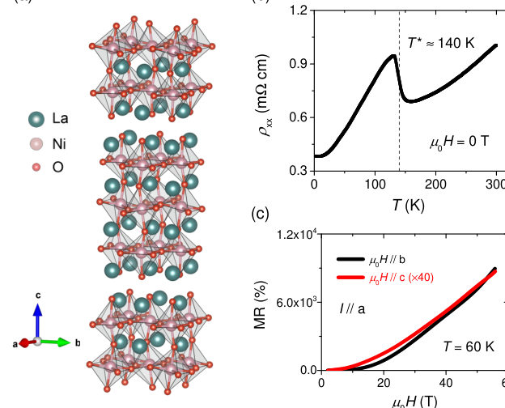 
FIG. 1. Crystal structure and longitudinal transport properties of La4Ni3O10 at ambient pressure. (a) Crystal structure of La4Ni3O10 in the monoclinic P21/a phase. La, Ni, and O atoms are indicated. (b) Temperature dependence of the longitudinal resistivity ρxx at zero field. It exhibits a clear anomaly near T ∗≈140 K, marking the density-wave transition. (c) Magnetoresistance (MR) measured under pulsed magnetic fields up to 55 T, where MR(%) = [ρ(B) −ρ(0)]/ρ(0) × 100%. The MR for µ0H ∥b is much larger than that for µ0H ∥c. (d) Temperature dependence of the longitudinal thermal conductivity κxx at 0 T and 10 T for µ0H ∥c, together with the electronic contribution L0σxxT. The nearly...

📷 Fig 2

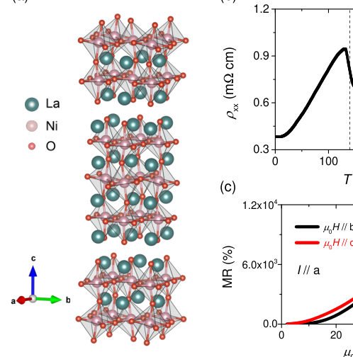 
Fig. 1(a) shows the ambient-pressure crystal structure of La4Ni3O10 in the monoclinic P21/a phase, consist- ing of trilayer NiO2 planes separated by LaO rock-salt layers[8]. Fig. 1(b) presents the zero-field longitudinal resistivity ρxx(T). A pronounced inflection appears near the density-wave transition temperature T ∗≈140 K. Below T ∗, ρxx(T) exhibits a clear upturn, indicative of a partial gap opening[61, 62], before recovering metallic be- havior at lower temperatures. Fig. 1(c) displays the mag- netoresistance measured up to 55 T at 60 K for magnetic

📷 Fig 3

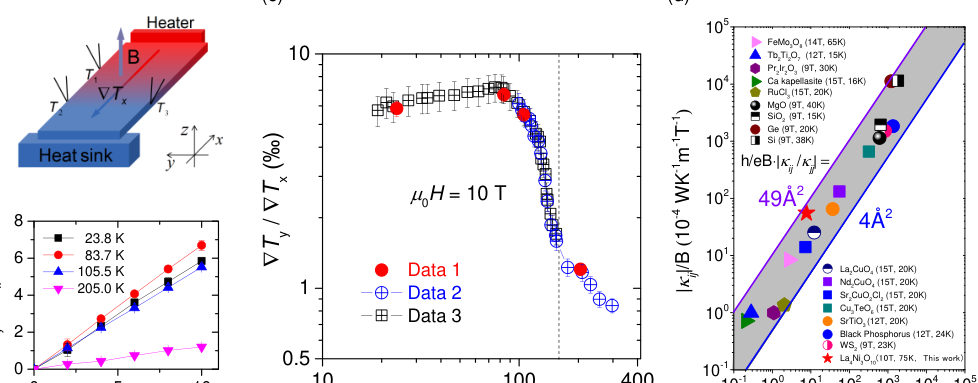 
FIG. 2. Thermal Hall responses and its enhancement by density-wave order. (a) Schematic of the setup for simultaneous longitudinal and transverse thermal conductivity measurements. (b) Thermal Hall angle ∇Ty/∇Tx vs magnetic field at selected temperatures, showing nearly linear dependence. (c) Temperature dependence of ∇Ty/∇Tx at µ0H = 10 T. The thermal Hall angle increases sharply below T ∗≈140 K and peaks around 70 K. Data from three different measurement methods (see Supplementary Materials [30]) show good agreement. (d) Comparison of the field-normalized transverse thermal conductivity, |κij|/B, with the longitudinal thermal conductivity κii in La4Ni3O10 and representative phonon thermal...

📷 Fig 4

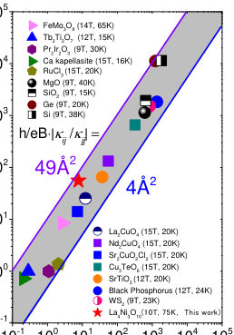 
Fig. 3(b) shows the temperature dependence of the field-normalized thermal Hall resistivity, W⊥/B = κxy/(κ2 xxB) = (∇yT/Jx q )/B, in La4Ni3O10 and in other solids[31]. The transition-induced enhancement is more clearly resolved by the observation of two distinct ther- mal Hall resistivity plateaus in La4Ni3O10. This behav- ior suggests that both below and above T ∗, a transverse

📷 Fig 5

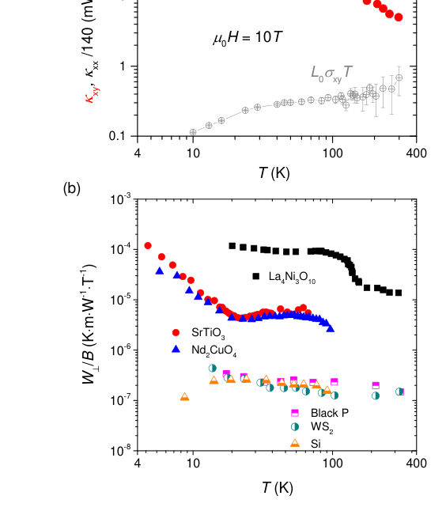 
FIG. 3. Phonon thermal Hall conductivity and two thermal Hall resistivity plateaus. (a) Temperature de- pendence of κxy. The measured κxy exceeds by far the elec- tronic contribution (grey data), ruling out charge-carrier ori- gin. Its peak coincides with that of κxx (black data), a univer- sal feature of the phonon thermal Hall effect. Together with linear field dependence and negligible field-dependent ther- mal conductivity (magnons contribute little), this establishes a phononic origin. (b) Temperature dependence of the field- normalized thermal Hall resistivity, W⊥/B = (∇yT/Jx q )/B, in La4Ni3O10 and comparison with other solids[31]. The value of La4Ni3O10 pronounced change below T ∗,...

**Summary.** The authors report observing a large, enhanced phonon thermal Hall effect in the nickelate $	ext{La}_4	ext{Ni}_3	ext{O}_{10}$ below its density-wave transition temperature. By measuring multiple transport properties and ruling out electronic or simple phonon-drag contributions, they attribute the signal to magnon-phonon hybridization driven by spin-lattice coupling. This reveals a crucial interplay between magnetic order and lattice dynamics in these superconducting materials.

**Why it may be interesting.** This work provides experimental evidence for how electronic order (density waves) can couple strongly to lattice vibrations (phonons), leading to exotic thermal responses. This coupling mechanism is relevant to understanding emergent quantum phenomena in correlated materials.

Detailed structure

**Main problem.** The study investigates the role of lattice degrees of freedom in the normal state of Ruddlesden–Popper nickelates, specifically focusing on the origin and enhancement mechanism of the phonon thermal Hall effect.

**Main result.** The enhanced transverse thermal conductivity ($\kappa_{xy}$) below the density-wave transition is strongly attributed to phonons coupled via magnon-phonon hybridization driven by spin-lattice coupling. This signal significantly exceeds contributions from electronic carriers or simple phonon drag mechanisms.

**Method.** The research employs transport measurements, measuring longitudinal and transverse thermal conductivities ($\kappa_{xx}, \kappa_{xy}$), magnetoresistance, and Seebeck/Nernst coefficients as a function of temperature and magnetic field.

**Model / system.** The physical system is the trilayer nickelate $	ext{La}_4	ext{Ni}_3	ext{O}_{10}$, which exhibits density-wave order. The underlying physics involves charge-lattice coupling, where hybridization between apical oxygen $2p$ and Ni $3d_{z^2}$ orbitals creates local dipoles that interact with magnetic fields.

**Key observables.** Thermal Hall angle ($
abla T_y / 
abla T_x$), transverse thermal conductivity ($\kappa_{xy}$), longitudinal thermal conductivity ($\kappa_{xx}$), Seebeck coefficient ($S$), and Nernst coefficient ($\alpha_{xy}$).

**Important parameters / regimes.** Density-wave transition temperature ($T^* \approx 140$ K); characteristic energy scales ($\sim 3.2 - 4.1$ meV); magnetic field strength (up to 10 T).

**Assumptions / limitations.** The analysis assumes that the electronic contribution can be estimated via the Wiedemann–Franz law, and it estimates an upper bound for phonon-drag using $S_{xx}T\alpha_{xy}$.

**Figures summary.** Figures show $\kappa_{xy}$ enhancement below $T^*$, confirming phononic origin over electronic contributions. They also compare measured $\kappa_{xy}$ against the calculated phonon-drag limit, showing a large discrepancy.

**Paper structure.** The paper systematically measures various transport coefficients ($
ho, \kappa, S, \alpha$) under varying magnetic fields and temperatures to isolate the source of transverse heat transport, culminating in a comparison that rules out simple models like phonon drag.

Abstract

Ruddlesden--Popper nickelates have emerged as a promising platform for high-temperature superconductivity, yet the role of lattice degrees of freedom in their correlated normal state remains largely unexplored. Here, we report the observation of a finite phonon thermal Hall effect in the trilayer nickelate La$_4$Ni$_3$O$_{10}$ at ambient pressure. Remarkably, the thermal Hall response is strongly enhanced below the density-wave transition at $T^*\approx140$ K, exhibiting two distinct plateaus in the thermal Hall resistivity. The characteristic energy scale extracted from the thermal Hall response ($\sim4.1$ meV) closely matches the magnon--phonon crossing span energy ($\sim3.2$ meV), pointing to magnon--phonon hybridization as the primary mechanism enhancing the thermal Hall effect. These results provide new insight into the interplay between lattice and spin excitations in nickelates, with implications for understanding both their superconductivity and the multiple possible origins of insulating thermal Hall signals.

[↑ back to top](#top)

### [No-deleting principle for two unitary copies](http://arxiv.org/abs/2606.24522v1)

**Authors:** Dafa Li  
**Type:** theory · **Category:** quantum information and computing · **PDF:** <https://arxiv.org/pdf/2606.24522v1>  
**Analysis basis:** full PDF text, analyzed in chunks
**Topic relevance:** `entanglement & information structure` **1/5** · `quantum measurements` **1/5**

📷 Fig 1

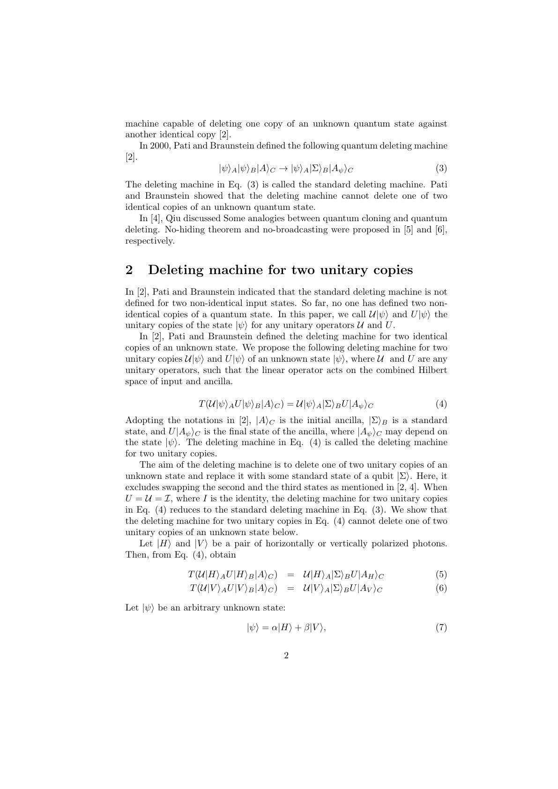 
Low-resolution page preview, page 2

📷 Fig 2

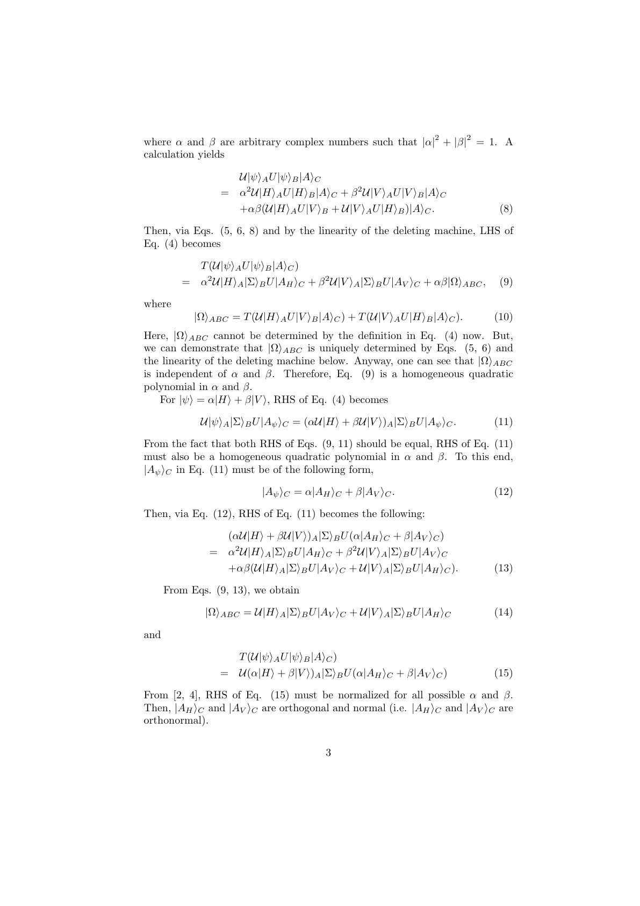 
Low-resolution page preview, page 3

📷 Fig 3

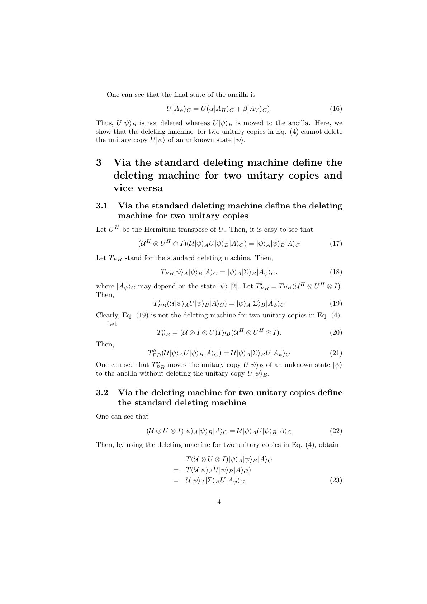 
Low-resolution page preview, page 4

📷 Fig 4

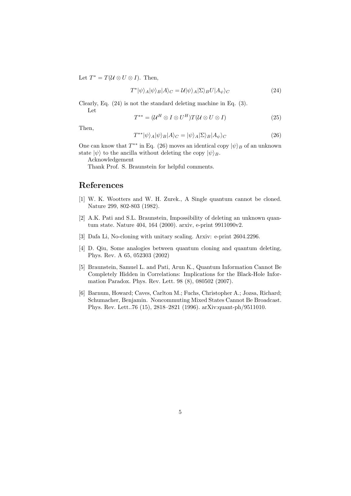 
Low-resolution page preview, page 5

**Summary.** This paper tackles a generalization of the no-cloning theorem by examining the deletion of one copy from two non-identical unitary copies of an unknown quantum state. The authors define these copies using arbitrary unitaries $U$ and $V$ acting on $|\psi
angle$. Through rigorous mathematical analysis, they prove that such a universal deletion operation is impossible.

**Why it may be interesting.** This work extends fundamental no-cloning theorems into the realm of distinguishing between different types of quantum state redundancy (unitary vs. identical copies), which has implications for quantum error correction protocols and information processing limits.

Detailed structure

**Main problem.** The paper investigates the fundamental impossibility of deleting one copy when presented with two non-identical, unknown quantum states.

**Main result.** It is shown that a proposed 'deleting machine' for two unitary copies of an unknown state cannot successfully delete one of them.

**Method.** The authors analyze the action of a defined linear operator (the deleting machine) on arbitrary input states and derive mathematical contradictions based on the assumption that deletion is possible.

**Model / system.** The system models two 'unitary copies' of an unknown state $|\psi
angle$, represented by $U|\psi
angle$ and $V|\psi
angle$, where $U$ and $V$ are arbitrary unitary operators. The process is formalized using a linear operator acting on the joint Hilbert space.

**Key observables.** The success or failure of the deletion operation, analyzed through the structure of the resulting state in an ancilla register.

**Important parameters / regimes.** The unitaries $U$ and $V$, and the unknown quantum state $|\psi
angle$.

**Assumptions / limitations.** The core assumption tested is the equality between the input description (LHS) and the required output structure (RHS) of the proposed deleting machine.

**Paper structure.** The paper builds upon prior work on identical copies, defines the non-identical unitary copies ($U|\psi
angle$ and $V|\psi
angle$), proposes a specific deletion operator, and then rigorously proves its impossibility through algebraic manipulation.

Abstract

Pati and Braunstein defined a deleting machine and showed the impossibility of deleting one of two identical copies of an unknown quantum state. So far, no one has defined two non-identical copies of a quantum state, of course no one has discussed the impossibility of deleting one of two non-identical copies of an unknown quantum state. In this paper, we define $u|ψ>$ and $U|ψ>$, where $u$ and $U$ are any unitary operators, as two unitary copies of a quantum state $|ψ>$, and show that it is impossible to delete one of two unitary copies of an unknown state.

[↑ back to top](#top)

### [Nonlinear refractive index of warm rubidium vapor](http://arxiv.org/abs/2606.24676v1)

**Authors:** L. Kardum, G. Premec, N. Šantić, D. Aumiler  
**Type:** both · **Category:** other · **PDF:** <https://arxiv.org/pdf/2606.24676v1>  
**Analysis basis:** full PDF text, analyzed in chunks
**Topic relevance:** `interference shaping light` **1/5** · `quantum optics experiment` **1/5**

📷 Fig 1

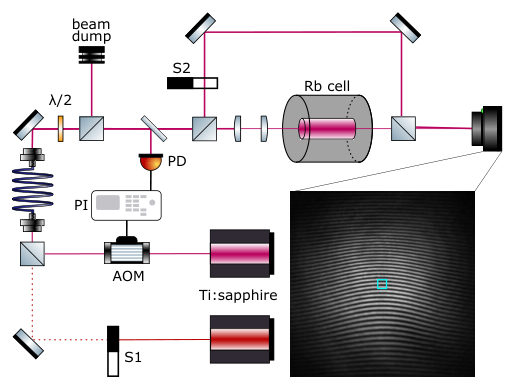 
FIG. 1: Scheme of the experimental setup for the interfero- metric measurement of the refractive index of Rb vapor. The resulting interferogram is shown in the bottom right with the small square indicating the region used for calculating the phase.

📷 Fig 2

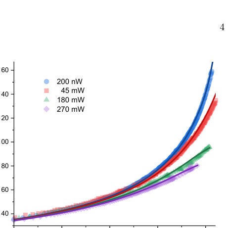 
FIG. 2: Phase as a function of detuning from the 87Rb 5S1/2, F = 2 →5P3/2, F ′ = 2 transition. Measured results (data points) and theoretical simulations (lines) are shown for different laser power. T = 119°C, N = 1.54 × 1013 cm−3.

📷 Fig 3

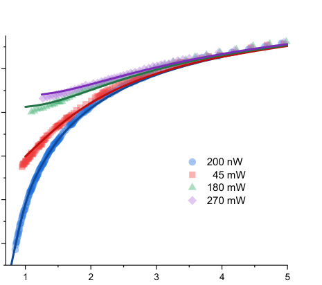 
FIG. 3: Phase as a function of detuning from the 87Rb 5S1/2, F = 1 →5P3/2, F ′ = 2 transition. Measured results (data points) and theoretical simulations (lines) are shown for different laser power. Cell temperature T and atom concen- tration N are the same as in Fig. 2.

📷 Fig 4

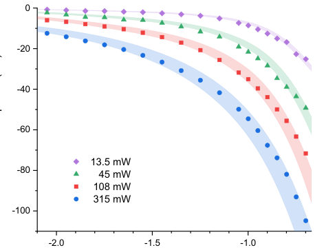 
FIG. 4: Nonlinear phase as a function of detuning from the 87Rb 5S1/2, F = 2 →5P3/2, F ′ = 2 transition. Measured re- sults (data points) and theoretical simulations (shaded areas) are shown for different laser power, where the shaded areas represent the uncertainty of the calculated nonlinear phase resulting from the uncertainty of the concentration of 87Rb atoms.

📷 Fig 5

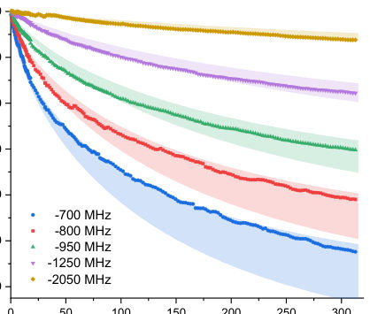 
FIG. 5: Nonlinear phase as a function of laser power. Measured results (data points) and theoretical simulations (shaded areas) are shown for different laser detunings from the 87Rb 5S1/2, F = 2 →5P3/2, F ′ = 2 transition, where the shaded areas represent the uncertainty of the calculated nonlinear phase resulting from the uncertainty of the concen- tration of 87Rb atoms.

**Summary.** This paper presents a comprehensive study determining the nonlinear refractive index of warm rubidium vapor by combining advanced theoretical modeling with precise interferometric measurements. The authors successfully modeled the complex atomic response using density matrix equations, achieving quantitative agreement with experimental data. This work is significant for quantum optics as it provides reliable parameters ($n_2$ and $I_s$) for designing optical devices utilizing alkali vapors.

**Why it may be interesting.** This work provides a highly practical, quantitative tool for characterizing light-matter interaction in warm atomic media, which is crucial for developing quantum sensors and optical components based on alkali vapors.

Detailed structure

**Main problem.** To theoretically calculate and experimentally measure the nonlinear refractive index of warm rubidium vapor.

**Main result.** The study achieved excellent quantitative agreement between theory and experiment, determining a Kerr nonlinear refractive index ($n_2$) up to $10^{-4} 	ext{ cm}^2/	ext{W}$. The results confirm that the nonlinearity is saturable.

**Method.** Theoretical calculations utilize the optical Bloch equations solved via density matrix formalism, which are then compared against measurements taken using a Mach-Zehnder interferometer setup.

**Model / system.** The system involves warm alkali vapors (specifically Rb) modeled by considering 6-level atoms interacting with a probe laser. The model incorporates complex broadening effects like Doppler, transit time, and pressure broadening.

**Key observables.** Nonlinear phase shift ($\delta\phi$), the nonlinear refractive index ($n_{NL}$), saturation intensity ($I_s$), and the Kerr coefficient ($n_2$).

**Important parameters / regimes.** Detuning from atomic resonance, laser power/intensity, and temperature (which dictates atom concentration).

**Assumptions / limitations.** The model uses the rotating wave approximation and includes various collision broadening mechanisms while neglecting certain population transfer effects.

**Figures summary.** Figures compare simulated hyperfine absorption spectra to experimental data across varying temperatures; they also plot nonlinear phase versus detuning and versus laser power, demonstrating saturation behavior.

**Paper structure.** The paper progresses from establishing the theoretical framework using density matrix equations (optical Bloch equations) to applying this theory to simulate linear and nonlinear refractive indices. This is validated by comparing these simulations against detailed measurements obtained via interferometry.

Abstract

The potential to precisely control both the linear and nonlinear index of refraction through optical manipulation of the atomic states has recently pushed warm alkali vapors to the forefront of research in the field of quantum sensors, quantum memories, and quantum fluids of light. Rubidium (Rb) vapor in centimeter-scale glass cells or millimeter-scale MEMS cells has proven to be a very promising platform for these applications, yet only a handful of research works have been dedicated to the investigation of the (non)linear refractive index of Rb vapor. We present results of theoretical calculations of the (non)linear refractive index of warm Rb vapor, based on the optical Bloch equations for 6-level Rb atoms interacting with a probe laser. They are compared to the experimental results obtained using an interferometric technique, showing excellent quantitative agreement. A Kerr nonlinear refractive index $n_2$ of up to $10^{-4}$ cm$^2$/W is obtained. Python scripts for all theoretical calculations presented in this work are provided, including the refractive index calculation, that can readily be used in practical implementations for simulating the (non)linear refractive index of Rb vapor including the effects of Doppler broadening, transit time broadening, pressure broadening, saturation, optical pumping, and spin-exchange collisions.

[↑ back to top](#top)

### [Controlled Chaos in 4D SCFTs](http://arxiv.org/abs/2606.23785v1)

**Authors:** Florent Baume, Atakan Çavuşoğlu, Vivek Chakrabhavi, Jonathan J. Heckman  
**Type:** theory · **Category:** statistical mechanics · **PDF:** <https://arxiv.org/pdf/2606.23785v1>  
**Analysis basis:** full PDF text, analyzed in chunks
**Topic relevance:** `entanglement & information structure` **1/5**

📷 Fig 1

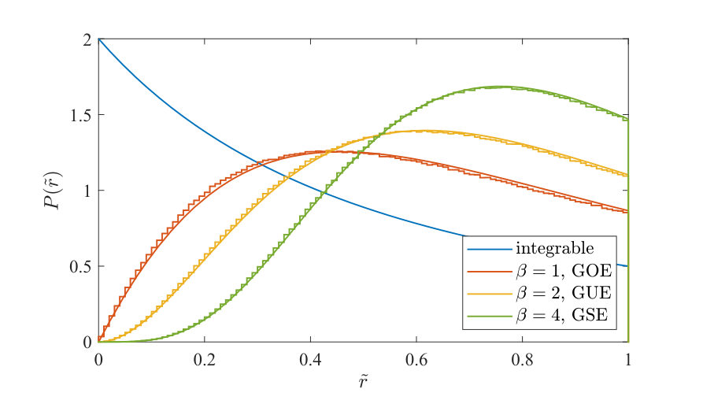 
Figure 1: Distributions of the level spacing ratios ˜r for the integrable case and Gaussian beta ensembles. The solid lines are the approximate formulas given by equations (2.5) and (2.9), and the histograms are the numerical distributions, which were obtained by diagonalizing the random tridiagonal matrix given in equation (2.10), for L = 1000 with 104 runs. As can be seen, the analytical formula (2.9) is a very good approximation for the r-statistics of Gaussian ensembles.

📷 Fig 2

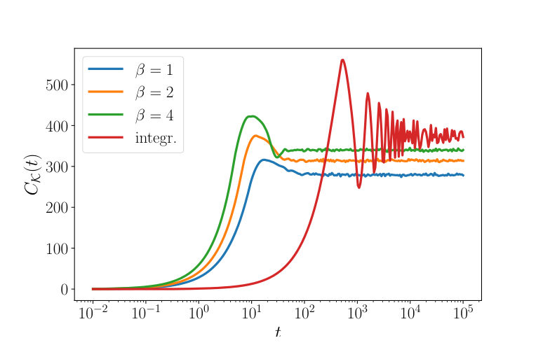 
Figure 2: Evolution of Krylov state complexity in integrable and chaotic cases. In all cases, the Hamiltonian is tridiagonal and of length L = 1000, and the seed state is the one with a single impurity in the middle of the spin chain |ϕ(t = 0)⟩= |500⟩.

📷 Fig 3

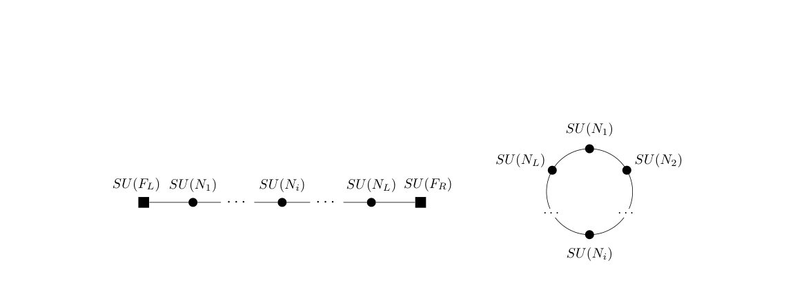 
Figure 3: Linear or closed 4D N = 2 quivers leading to a sector described by a spin chain. Each edge denotes a N = 2 hypermultiplet, with square nodes depicting a flavor symmetry. The value of FL, FR is set by demanding cancellation of β-functions.

📷 Fig 4

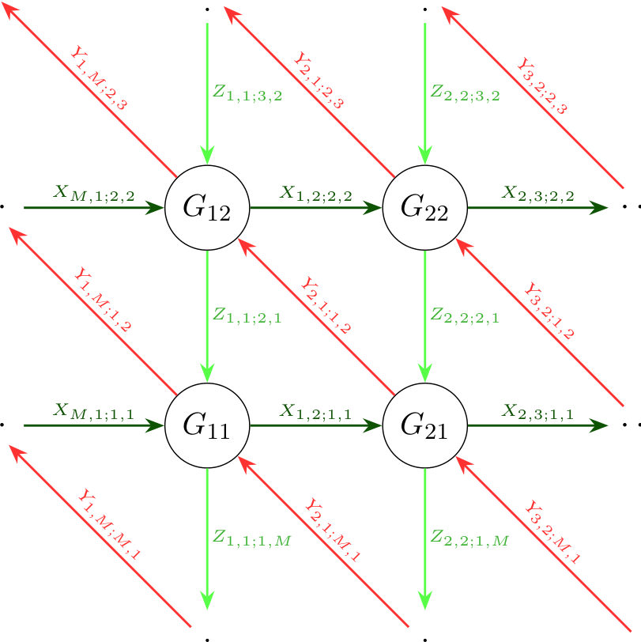 
Figure 4: Quiver for C3/ZM × ZM. Nodes Gij form a periodic square grid, and horizontal, vertical, and diagonal links are the fields Xi,i+1;j,j (dark green), Zi,i;j,j−1 (light green), and Yi+1,i;j+1,j (red) respectively. Each row of horizontal X links closes into a loop through M gauge groups, giving the spin-chain ground states Tr(XM) →P

📷 Fig 5

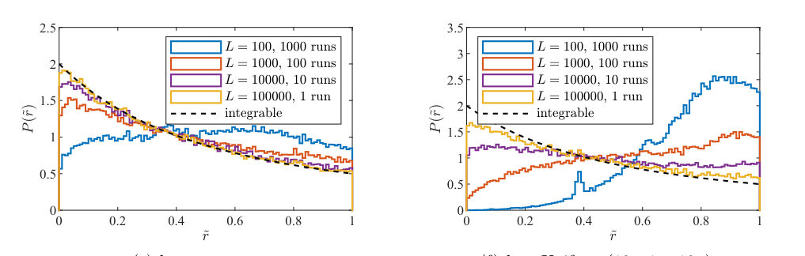 
Figure 5: Distribution of the level spacing ratios ˜r for the tridiagonal Hamiltonian (4.1) when the off-diagonal elements bi are independently and identically drawn from the same distribution, or if the distribution varies slowly in x = i/L. In the large spin chain limit L → ∞, the distribution for r converges to the integrable case (2.5) independent of the probability distribution for the couplings bi, exhibiting Anderson localization, but the convergence rate depends on the chosen distribution.

**Summary.** The paper studies quantum chaos in 4D Superconformal Field Theories by mapping their operator mixing dynamics onto an effective spin chain model. By analyzing the energy spectrum's statistical properties—such as level repulsion and spectral rigidity—the authors demonstrate that tuning the SCFT couplings can drive the system into a chaotic regime, confirming theoretical predictions using random matrix theory diagnostics.

**Why it may be interesting.** This work provides a concrete, calculable link between high-energy theoretical physics (SCFTs/AdS/CFT) and fundamental concepts from quantum chaos theory, using spectral statistics as the primary diagnostic tool.

Detailed structure

**Main problem.** The paper investigates how signatures of quantum chaos manifest within strongly coupled, higher-dimensional Quantum Field Theories (QFTs), specifically Superconformal Field Theories (SCFTs). It aims to diagnose the onset of chaos by analyzing spectral statistics.

**Main result.** The system exhibits chaotic spectral statistics when the coupling parameters ($b_i$) are tuned according to a specific power law distribution, confirming that quantum chaos can be diagnosed via random matrix ensemble signatures in these field theories.

**Method.** Chaos is diagnosed by analyzing the statistical distribution of eigenvalues of the dilatation operator, focusing on metrics like eigenvalue level repulsion, spectral rigidity ($\Delta_3(E)$), and the spectral form factor. The dynamics are modeled using an effective spin chain Hamiltonian.

**Model / system.** The system models a class of 4D SCFTs derived from orbifolds of $\mathcal{N}=4$ Super Yang–Mills theory. The low-energy dynamics are effectively described by a nearest-neighbor interacting spin chain Hamiltonian governing operator mixing in a controlled subsector.

**Key observables.** Eigenvalue level repulsion, spectral rigidity ($\Delta_3(E)$), and the spectral form factor; Krylov complexity ($C_K(t)$).

**Important parameters / regimes.** The marginal couplings of the SCFT determine the hopping parameters $b_i$ in the spin chain. The analysis distinguishes between integrable regimes (e.g., all $b_i=b$), chaotic regimes, and intermediate Anderson localization.

**Assumptions / limitations.** The analysis is primarily confined to one-loop mixing effects within the dilute gas approximation for the SCFT dynamics. Furthermore, the single spin chain approximation is noted to break down at large 't Hooft coupling, requiring multi-trace corrections.

**Figures summary.** Figure 2 compares Krylov state complexity $C_K(t)$ evolution, showing distinct growth patterns for integrable versus chaotic regimes; Figure 1 shows level spacing ratios compared against theoretical predictions for various ensembles.

**Paper structure.** The paper establishes the physical context by mapping SCFT dynamics onto a spin chain Hamiltonian. It then applies advanced diagnostics from quantum chaos theory (RMT statistics, complexity measures) to determine when the system transitions into a chaotic regime based on tuning the underlying couplings.

Abstract

Chaotic dynamics play an important role in a number of physical systems. One of the qualitative hallmarks of this behavior is the appearance of a sufficiently "complex" spectrum of energy levels. This also makes it challenging to directly verify the onset of chaos in interacting quantum field theories. We present a class of 4D superconformal field theories (SCFTs) given by orbifolds of 4D $\mathcal{N} = 4$ Super Yang--Mills theory in which operator mixing in a controlled subsector is described by an effective spin chain in one spatial dimension with nearest neighbor interactions tuned by the marginal couplings of the SCFT. Tuning the marginal couplings results in a chaotic spectrum, while generically the spin chain exhibits Anderson localization. We diagnose the onset of chaos by analyzing the statistical distribution of eigenvalues of the dilatation operator, in particular properties such as eigenvalue level repulsion, spectral rigidity, and the spectral form factor. We also show that other diagnostics such as Krylov complexity sometimes do not faithfully capture this information. This structure defines a chaotic billiard in the target space of the stringy realization. We also comment on the large $N$ holographic dual description, where the controlled single spin chain approximation must be supplemented by multi-trace dynamics, i.e., the splitting and joining of multiple spin chains.

[↑ back to top](#top)

### [Enhancing quantum-classical configuration interaction methods using a neural-network classifier](http://arxiv.org/abs/2606.24332v1)

**Authors:** Severino Zeni, Giovanni Varutti, Jacopo Nespolo, Dimitrios Trypogeorgos  
**Type:** theory · **Category:** numerical methods · **PDF:** <https://arxiv.org/pdf/2606.24332v1>  
**Analysis basis:** full PDF text, analyzed in chunks
**Topic relevance:** `methods for driven-dissipative` **1/5**

📷 Fig 1

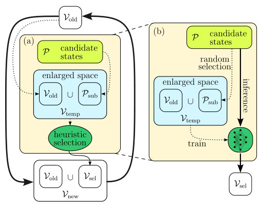 
FIG. 1. Generic iteration of selected CI schemes. (a) Stan- dard algorithms enlarge the current variational space Vold with a subset Psub of the candidate pool P (the construc- tion of both is scheme-dependent). A heuristic then selects from the enlarged space Vtemp the states Vsel that enter the updated space Vnew, which seeds the next iteration. (b) Our framework replaces the selection step: a random subset Psub (Prand in the text) is drawn from P, a single diagonalisation in Vtemp assigns importance labels to its states, and the la- belled data are used to train a neural-network classifier. The trained network then scores the remaining candidates in P, and the highest-ranked states form...

📷 Fig 2

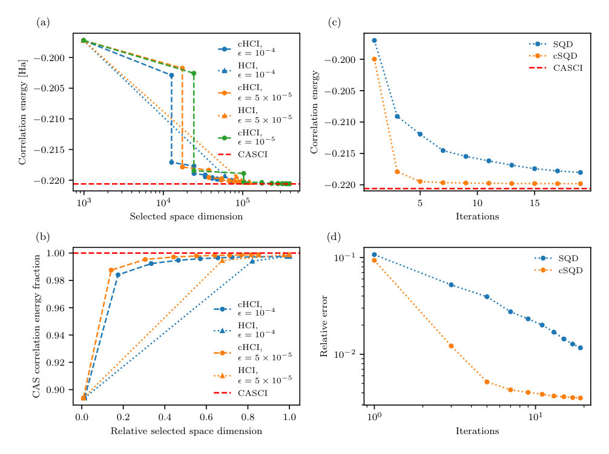 
FIG. 2. (a) N2 ground state correlation energy as a function of the selected space size. The cHCI curves exhibit a stepped behaviour that is due to the successive steps of random sampling of the HCI pool and inferred selection, with the vertical drops representing the gains in correlation energy provided by the NN classifier. (b) N2 ground state correlation energy (as a fraction of the CASCI value) as a function of the space dimension relative to the converged HCI space dimension. The plot highlights that cHCI can recover &gt; 98% of the correlation energy with a space dimension that is under 1/5 of that of the converged HCI calculation. (c) N2 ground state correlation energy as a function of...

📷 Fig 3

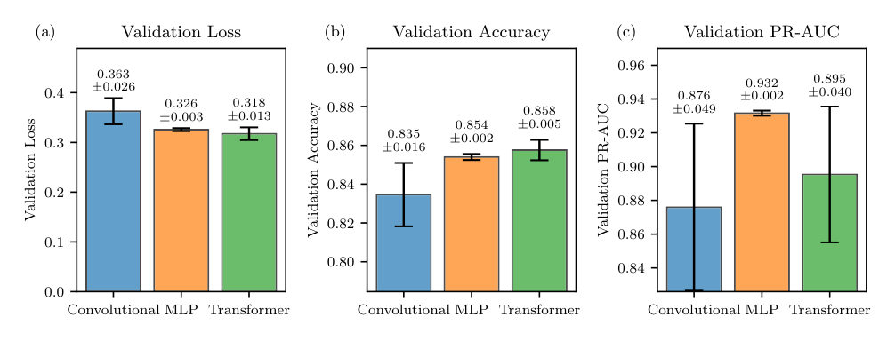 
FIG. 3. Comparison of neural-network architectures for Slater-determinant classification. Three architectures are evaluated: a one-dimensional convolutional network (Convolutional), a two-layer feed-forward network (MLP), and an attention-based model (Transformer). Each architecture was trained 20 times with different random seeds; bars show the mean and error bars indicate one standard deviation. (a) Validation loss. (b) Validation accuracy. (c) Precision–recall area under the curve (PR-AUC), which emphasises recall of important configurations. The MLP achieves the highest PR-AUC (0.932 ± 0.002) and exhibits the lowest variability across all metrics, making it the preferred architecture...

**Summary.** The paper enhances configuration interaction methods by replacing heuristic determinant selection with an active-learning loop guided by a neural network classifier. This framework recasts importance determination as a binary classification task, allowing the method to efficiently compress variational spaces. The results demonstrate significant computational savings while maintaining high accuracy for calculating ground-state energies.

**Why it may be interesting.** This work provides a general, data-driven tool for compressing large Hilbert spaces in quantum chemistry calculations, which is highly relevant for simulating complex many-body systems beyond standard approximations.

Detailed structure

**Main problem.** The efficiency of Selected Configuration Interaction (SCI) methods for electronic structure calculations is limited by heuristics used to select important determinants from exponentially growing variational spaces.

**Main result.** The proposed framework achieves result parity with traditional CI methods at substantially lower computational cost, showing up to a 5x reduction in memory/iteration cost and dramatically faster convergence for quantum-classical variants.

**Method.** A data-driven selection framework is introduced that treats determinant importance as a binary classification task, integrating an active-learning loop powered by a neural network classifier into the iterative CI workflow.

**Model / system.** The method is applied to electronic structure calculations, specifically determining the ground state energy of diatomic molecules (e.g., N2) using classical and quantum configuration interaction methods ($	ext{cHCI}$ and $	ext{cSQD}$).

**Key observables.** Ground-state energy; determinant importance (binary classification output); correlation energy recovered relative to CASCI.

**Important parameters / regimes.** The selection process involves random sampling, temporary diagonalization for labeling, and the use of a trained MLP classifier to guide subsequent selections.

**Assumptions / limitations.** The core assumption is that determinant importance can be successfully modeled as a binary classification problem; the method relies on generating labels from small temporary diagonalizations.

**Figures summary.** Figures illustrate the comparison between standard SCI schemes and the proposed framework, showing energy recovery vs. space size for $	ext{cHCI}$ and accelerated convergence curves for $	ext{cSQD}$.

**Paper structure.** The paper details the theoretical foundation of using ML classifiers to guide variational space expansion in CI methods, presenting specific implementations ($	ext{cHCI}$, $	ext{cSQD}$) and benchmarking results on molecular systems.

Abstract

Selected configuration interaction methods achieve near-exact electronic structure calculations by iteratively constructing compact variational spaces, but their efficiency depends critically on the heuristics used to identify important determinants. Here, we introduce a data-driven selection framework that recasts determinant importance as a binary classification task and integrates a neural-network classifier into the iterative CI workflow through an active-learning loop. At each iteration, a random subset of candidate determinants is labelled via temporary diagonalisation, and the trained classifier guides selection of the remaining configurations. We demonstrate the utility of this framework for both classical and quantum CI methods by calculating the ground-state energy of a diatomic molecule. Our method achieves result parity with traditional configuration interaction methods at substantially lower computational cost: roughly a $\times 5$ reduction in memory and per-iteration cost for the classical cHCI variant, and convergence in markedly fewer iterations for the quantum-classical cSQD variant. These results establish classifier-assisted determinant selection as a lightweight, method-agnostic tool for compressing variational spaces and accelerating both classical and hybrid quantum-classical configuration interaction algorithms.

[↑ back to top](#top)

### [Perfect State Transfer on Quotient Graphs in Shunt Decomposition-Based Quantum Walks](http://arxiv.org/abs/2606.24440v1)

**Authors:** Banita Katuwal, Srinath M S, Y Lakshmi Naidu, Supriyo Dutta  
**Type:** theory · **Category:** quantum information and computing · **PDF:** <https://arxiv.org/pdf/2606.24440v1>  
**Analysis basis:** full PDF text, analyzed in chunks
**Topic relevance:** `non-equilibrium dynamics` **1/5**

📷 Fig 1

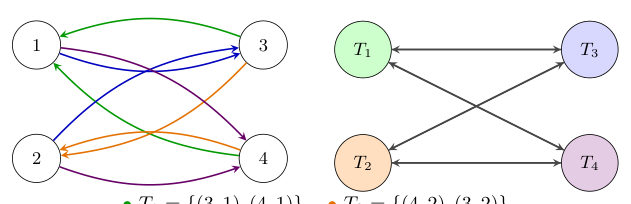 
Figure 1. Left: K2,2 with arcs coloured by cell Tp (terminal vertex p). Right: quotient graph LD(G)/τ; arrow Tp →Tq exists when the head-vertex of arcs in Tp has an out-arc belonging to Tq.

📷 Fig 2

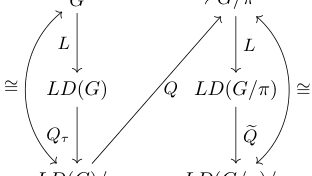 
Figure 3. Commutative diagram illustrating the structural relationships between G, LD(G), and their equitable quotients, as established in Theorem 3.1.12.

📷 Fig 3

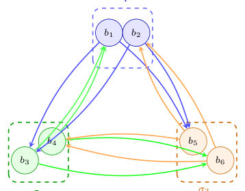 
Figure 5. (a) Original cycle C6. (b) Grouped layout with cells C1, C2, C3 in triangle form; inter-cell edges give the quotient K3. (c) Line digraph LD(K3) with arc-partition cells σ1, σ2, σ3; directed edges follow the adjacency in LD(K3).

📷 Fig 4

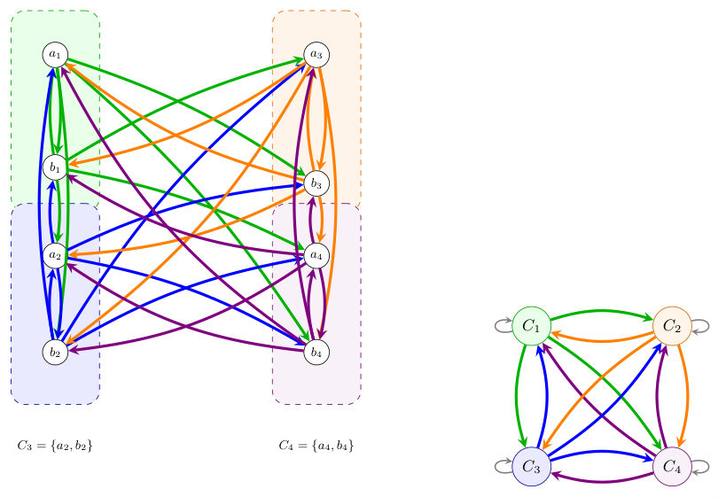 
Figure 6. (a) The vertex-equitable partition π = {C1, C2, C3, C4} of K⇌ 4,4 with colored inter-cell arcs. (b) The corresponding quotient digraph K⇌ 4,4/π ∼= K⟲ 4 , the complete digraph on four vertices with a loop at each cell.

📷 Fig 5

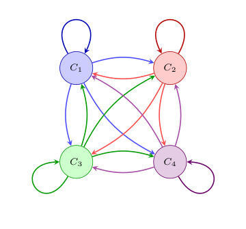 
Figure 7. Three representations of Circ(8, {1, 3, 5, 7}) under the equitable partition π = {C1, C2, C3, C4}, where C1 = {0, 3}, C2 = {1, 6}, C3 = {4, 7}, and C4 = {2, 5}. The corresponding quotient digraph is K⟲ 4 .

**Summary.** This paper develops a theoretical framework to analyze Perfect State Transfer (PST) in discrete-time quantum walks by relating the walk's evolution on a graph $G$ to its quotient graph $G/\pi$. By leveraging shunt decomposition and equitable partitions, the authors prove that PST is equivalent between the two structures. This methodology allows for the rigorous analysis of complex systems like line digraphs associated with bipartite or circulant graphs.

**Why it may be interesting.** This work provides powerful algebraic tools—the quotient graph formalism—to simplify the study of complex quantum dynamics on large graphs by reducing them to smaller, structurally related systems, which is highly relevant for designing efficient quantum circuits or understanding quantum information flow.

Detailed structure

**Main problem.** The paper investigates Perfect State Transfer (PST) in discrete-time quantum walks defined on a graph $G$ by relating the dynamics to those of its quotient graph $G/\pi$. It aims to establish necessary and sufficient conditions for PST based on structural decompositions.

**Main result.** It proves that PST occurs on the parent graph $G$ if and only if it occurs on the quotient graph $G/\pi$, providing explicit criteria using Chebyshev polynomials and applying this to families like cycle graphs and complete bipartite digraphs.

**Method.** The methodology involves utilizing shunt decomposition, defining an equitable partition $\pi$, deriving intertwining relations between the shift operators of $G$ and $G/\pi$, and analyzing the unitary evolution operator via projection techniques.

**Model / system.** The model is a discrete-time quantum walk (DTQW) defined on a graph $G$. The analysis extends to line digraphs $	ext{LD}(G)$ when considering arc partitions, using the quotient structure induced by an equitable partition $\pi$ of the vertices.

**Key observables.** Perfect State Transfer (PST), characterized by $|\langle e_b | U^k | e_a 
angle| = 1$ for some time step $k$.

**Important parameters / regimes.** The structure of the equitable partition $\pi$, the graph type ($C_{2n}$, $K_{n,n}^{
ightleftharpoons}$, $	ext{Circ}(2n, S)$), and the specific time steps $k$ where PST is observed.

**Assumptions / limitations.** The analysis critically relies on the existence of an equitable partition $\pi$ that allows for the derivation of consistent intertwining relations between the transition operators of $G$ and $G/\pi$.

**Figures summary.** Figures illustrate the construction process, showing how vertex partitions ($\pi$) lead to quotient graphs ($G/\pi$), and how these structural relationships are maintained when analyzing the line digraphs $	ext{LD}(G)$ and $	ext{LD}(G/\pi)$.

**Paper structure.** The paper proceeds by establishing foundational relations between shift operators on $G$ and $G/\pi$, deriving PST conditions using Chebyshev polynomials, and then applying this framework systematically to specific graph families (e.g., cycle graphs, complete bipartite digraphs, circulant graphs) to answer open questions regarding PST equivalence.

Abstract

This paper investigates perfect state transfer (PST) in discrete-time quantum walks constructed via the shunt decomposition method. The walks are defined on a graph $G$ and its associated quotient graph $G/π$, induced by an equitable partition $π$. Through the shunt decomposition of $G$, we derive an explicit relation between the shift operator of the parent graph $G$ and that of its quotient graph $G/π$. We construct a reflection operator based on the characteristic matrix, which establishes a connection between the transition operator of the parent graph and that of its lower-dimensional quotient graph. We then prove that PST occurs on $G$ if and only if it occurs on $G/π$. Furthermore, we express the unitary evolution operator of the quotient graph in terms of Chebyshev polynomials of the first kind, from which we derive explicit criteria for PST. As an application, we establish PST on the cycle graph $C_{n}$ at time $k = n/2$, and lift the result to the parent graph $C_{2n}$ via the equitable partition $π$. We further show that if an equitable partition $π$ of $G$ induces a quotient isomorphic to $K_n^{\circlearrowleft}$, the complete digraph on $n$ vertices with a loop at every vertex, then PST occurs at step $k = n$, and the walk is periodic at $k = 2n$. This framework is applied to two families of graphs, which are the complete bipartite digraph $K_{n,n}^{\rightleftharpoons}$ and the circulant graph $\operatorname{Circ}(2n, S)$, where $S$ consists of all odd residues modulo $2n$ and $n = 2^s$ for some $s \geq 1$, establishing PST in their respective line digraphs. Collectively, these results also answer the question posed by Godsil and Zhan concerning which shunt decompositions or embeddings of a graph admit PST.

[↑ back to top](#top)

### [Polynomial-time exact diagonalization via sparse guided eigenwalks](http://arxiv.org/abs/2606.23967v1)

**Authors:** Zachary E. Chin, Mario Motta, Javier Robledo Moreno, Antonio Mezzacapo, Isaac L. Chuang, William Kirby  
**Type:** theory · **Category:** numerical methods · **PDF:** <https://arxiv.org/pdf/2606.23967v1>  
**Analysis basis:** full PDF text, analyzed in chunks
**Topic relevance:** `analog quantum simulation` **1/5**

📷 Fig 1

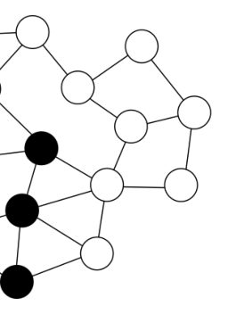 
Figure 1: The eigenwalk problem for a Hermitian matrix H consistent with the above graph: given a target eigenvalue index k, find the vertex support of any eigenvector of H associated with the kth-smallest eigenvalue. The support of one such eigenvector |ψ⟩is the set of shaded vertices, which constitutes a valid solution. If a guiding vertex v belonging to supp(|ψ⟩) is known, the remaining support vertices can be reached by traversing the graph outward from v.

📷 Fig 2

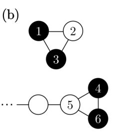 
Figure 2: Three possible graphs, each with a subset S of shaded vertices. In (a), there exists no graph-consistent Hermitian matrix admitting an eigenvector whose support is S, while in (b) and (c), there does exist such a matrix. In (c), the resulting support S can be partitioned into two vertex pairs which are separated by an arbitrarily large distance.

📷 Fig 3

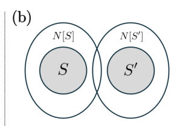 
Figure 3: Two sufficient conditions for eigenvector degeneracy when the support is partitioned into subsets S and S′. (a) In general, if S and S′ have disjoint closed neighborhoods in the graph, the eigenvector must be degenerate. (b) In the extremal case, degeneracy follows if no vertices in S are neighbors of S′, and vice versa.

📷 Fig 4

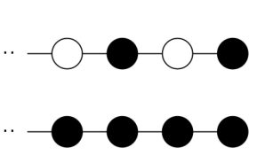 
Figure 4: Example graphs saturating diameter bound for irreducible support components. Let the subset T of shaded vertices be an irreducible support component of some eigenvector |ψ⟩. If |ψ⟩is non-extremal, the alternating path graph in (a) realizes the maximum possible diameter 2|T| −2. If instead |ψ⟩is extremal, the path graph in (b) realizes the maximum possible diameter |T| −1.

📷 Fig 5

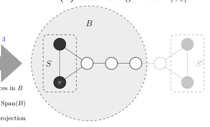 
Figure 5: Illustration of the polynomial-time algorithm for the guided sparse eigenwalk problem (Theorem 5). (a) The s support vertices of a sparse eigenvector |ψ⟩may be split between two subsets S (containing the guiding vertex v) and S′ that are separated by more than τ edges. (b) The same graph, with the ball B of graph radius s −1 (extremal) or 2s −2 (non-extremal) around v shaded; all vertices outside B are grayed. By Theorem 3, an eigenvector |ψv⟩with the same eigenvalue must exist whose support lies entirely inside B. The classical algorithm therefore 1⃝collects the vertices in B, 2⃝projects H onto their span, and 3⃝exactly diagonalizes the projection, yielding a solution in...

**Summary.** This paper presents a theoretical breakthrough showing that if the ground state of a sparse Hamiltonian is exactly sparse, its support must be highly localized within the system's connectivity graph. This localization allows for an exact eigenvector to be computed classically in polynomial time relative to the sparsity, bypassing exponential scaling issues inherent in full diagonalization.

**Why it may be interesting.** This work provides a powerful classical algorithmic tool for quantum many-body physics. By transforming an exponentially hard diagonalization problem into a polynomially solvable graph search problem based on sparsity structure, it offers new computational pathways beyond standard iterative solvers like Lanczos.

Detailed structure

**Main problem.** The core problem is efficiently computing exact eigenvectors (like ground states) for quantum systems described by large, sparse Hamiltonians.

**Main result.** The authors prove that if an eigenvector is sufficiently sparse, its support can be localized to a small region of the graph, allowing for polynomial-time classical computation of the exact eigenvector.

**Method.** They introduce the 'eigenwalk problem' and develop algorithms based on graph localization theorems (Theorem 3) which restrict the search space from the entire system size ($2^n$) to a polynomially sized ball around a known support vertex.

**Model / system.** The model is a quantum system governed by a Hermitian Hamiltonian matrix $H$, whose non-zero entries define an underlying graph structure. The focus is on finding sparse eigenvectors $|\psi
angle$ corresponding to specific eigenvalues $\lambda$.

**Key observables.** Eigenvector support ($	ext{supp}(|\psi
angle)$), eigenvalue ($\lambda$), and the energy variance of projected states.

**Important parameters / regimes.** Sparsity ($s$) of the eigenvector, sparsity of $H$ (poly($n$)), and the distance/diameter of the localized support region.

**Assumptions / limitations.** The algorithm requires that the target eigenvector is exactly sparse, and for non-extremal cases, an additional 'sparsity-separation' promise regarding other eigenvectors is assumed to guarantee uniqueness or tractability.

**Figures summary.** Figures illustrate the eigenwalk problem setup, examples of graph structures dictating support constraints (degeneracy), and visualizations of how the full support can be localized into a smaller search ball around a guiding vertex.

**Paper structure.** The paper progresses by formalizing the eigenwalk problem, proving structural theorems that guarantee the localization of sparse supports, and culminating in a polynomial-time algorithm derived from these localization bounds.

Abstract

Computing quantum ground states is generically difficult, but additional structure can sometimes allow diagonalization to be recast as a more feasible problem. For example, when the desired ground state is sparse in a given basis, diagonalization can be facilitated via graph search. We make this reformulation precise by introducing the eigenwalk problem, which seeks the support of a sparse eigenvector of a Hermitian matrix by exploring the graph induced by its nonzero entries. However, it is not obvious whether the relevant support vertices must always be efficiently reachable by a search on the graph. To resolve this question, we prove that for every sparse eigenvector, there exists a (possibly different) sparse eigenvector with the same eigenvalue whose support is tightly localized in the graph, with diameter scaling only linearly in the sparsity and independently of the total number of vertices. As a consequence, if a $2^n$-dimensional, ${\rm poly}(n)$-sparse Hamiltonian has an $\mathcal{O}(1)$-sparse extremal eigenvector and one support element is known, then an exact eigenvector with the same eigenvalue can be computed classically in ${\rm poly}(n)$ time. The same conclusion follows when the $\mathcal{O}(1)$-sparse eigenvector is non-extremal, provided that it is sparser than every eigenvector with a different eigenvalue. These results hold with no assumptions on the degeneracy, locality, spectral width, or spectral gap of the Hamiltonian, and the underlying support-localization principle also extends to problems beyond exact diagonalization, such as sparse principal component analysis.

[↑ back to top](#top)

## Other papers (5)

*Papers from primary archives without highlighted authors or any topic match. Click to expand.*

Show other papers

### [Evaluating the solution performance of the augmented Lagrangian function on Ising machines](http://arxiv.org/abs/2606.24241v1)

**Authors:** Shunsuke Awai, Takuro Itoh, Keita Takahashi, Kotaro Tanahashi, Shu Tanaka  
**Type:** both · **Category:** statistical mechanics · **PDF:** <https://arxiv.org/pdf/2606.24241v1>  
**Analysis basis:** full PDF text, analyzed in chunks

📷 Fig 1

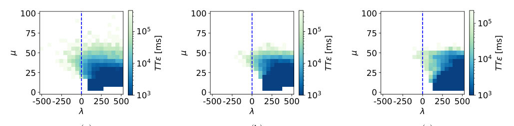 
Fig. 1. Distribution of TTε (ε = 0.05) in the λ −µ space for the problem instances treated in this study. Panels (a), (b), and (c) correspond to the instances ‘r 100 50 5’ (W = 983), ‘r 200 50 9’ (W = 1105), and ‘r 300 50 4’ (W = 1957), respectively. The blue line corresponds to the penalty function formulation (λ = 0). The computation was performed under identical conditions 50 times each, with µ in steps of 5 over the range from 0 to 100 and λ in steps of 50 over the range from −500 to 500. The white region indicates the region where no solution within a relative error of ε from the optimal objective value was obtained.

📷 Fig 2

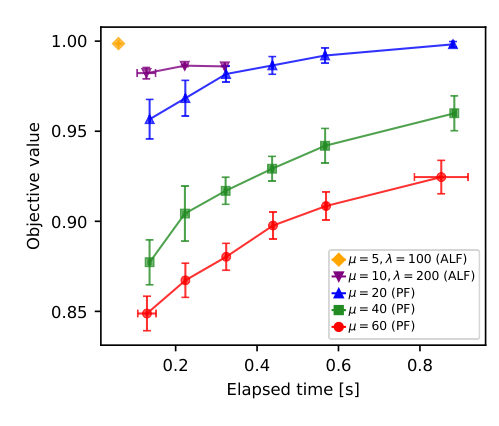 
Fig. 2. Temporal evolution of the incumbent solution within the execution time of 1 s in the Fixstars Amplify AE. ALF denotes the augmented Lagrangian function (ALF), and PF denotes the penalty function (PF). The error bars in the time-axis (horizontal) direction arise from the fact that the timing of data acquisition is not strictly identical across trials.

📷 Fig 3

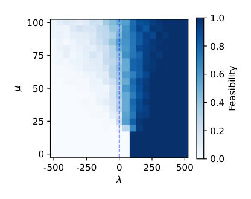 
Fig. 3. Distribution of the feasibility in the λ −µ space for the problem instance ‘r 100 50 5’ treated in this study. The feasibility is the empirical probability that the returned item-selection vari- ables satisfy the original QKP constraint. The weight is W = 983. When the feasibility becomes 1.0 at µ = 0 due to the addition of the Lagrange multiplier term, the obtained solution is the trivial solution in which no item is selected.

📷 Fig 4

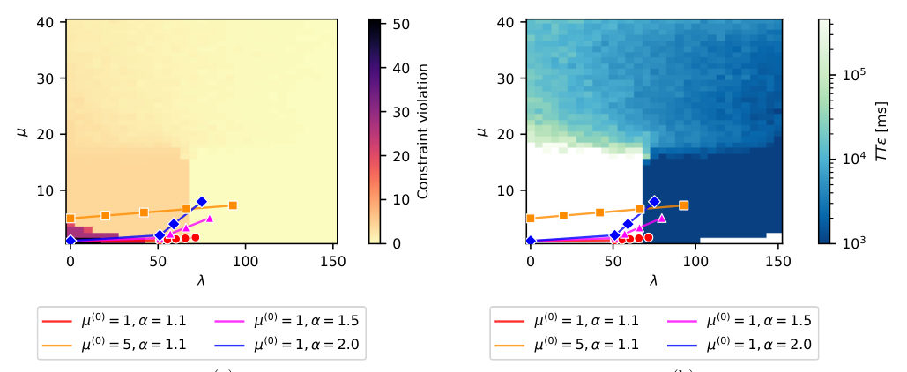 
Fig. 4. Distributions in the λ −µ space for the problem instance ‘r 100 50 5’ (W = 983). Panel (a) shows the constraint violation, and panel (b) shows TTε (ε = 0.05). The computation was performed under identical conditions 50 times each, with µ in steps of 1 over the range from 1 to 40 and λ in steps of 5 over the range from 0 to 150. In panel (a), the constraint violation at each point is the average value of the constraint violation obtained over 50 trials under the same hyperparameter setting. The trajectories in both panels show the parameter transitions when the hyperparameters are updated according to the augmented Lagrangian method, and the starting point of each trajectory...

**Summary.** This paper compares two methods—the Augmented Lagrangian Function (ALF) and the standard penalty function—for encoding constraints into Ising machine Hamiltonians. By benchmarking against the QKP using $	ext{TT}\epsilon$, the authors demonstrate that ALF significantly improves solution performance by allowing for a better balance between satisfying constraints and optimizing the objective function, even with smaller penalty coefficients.

**Why it may be interesting.** The work directly addresses how advanced mathematical techniques from continuous optimization (like ALM) can be adapted to improve heuristic search performance on quantum-inspired hardware for discrete problems, which is highly relevant to understanding the limitations and enhancements of current NISQ devices.

Detailed structure

**Main problem.** The study evaluates the performance of using an augmented Lagrangian function (ALF) formulation versus a standard penalty function for solving constrained combinatorial optimization problems on Ising machines.

**Main result.** The ALF significantly reduces the time-to-epsilon ($	ext{TT}\epsilon$) by approximately an order of magnitude compared to the penalty function, especially when keeping the penalty coefficient $\mu$ small.

**Method.** Performance is evaluated using the time-to-epsilon ($	ext{TT}\epsilon$), which measures the computation time required to find a solution satisfying both feasibility and objective precision. The comparison involves analyzing how different constraint handling Hamiltonians affect this metric.

**Model / system.** The problem is mapped onto an Ising model/QUBO Hamiltonian, representing constrained combinatorial optimization problems like the Quadratic Knapsack Problem (QKP). Two primary formulations are compared: $H_{AL}$ using ALF and $H_P$ using a penalty function.

**Key observables.** Time-to-epsilon ($	ext{TT}\epsilon$), constraint violation, normalized objective value, feasibility probability ($p_{\epsilon}(	au)$).

**Important parameters / regimes.** Hyperparameters $\mu$ (penalty coefficient) and $\lambda$ (Lagrange multiplier); the relative scales of the objective and constraint energy terms.

**Assumptions / limitations.** The comparison is based on solving the QKP instance 'r 100 50 5' using a specific annealing engine, and results are limited to tested parameter grids.

**Figures summary.** Figures show heatmaps of $	ext{TT}\epsilon$ across the $\lambda-\mu$ space for both ALF and PF formulations, demonstrating that positive $\lambda$ allows for lower $	ext{TT}\epsilon$ with smaller $\mu$. Temporal evolution plots compare how quickly the objective value plateaus.

**Paper structure.** The paper introduces the problem formulation (Ising/QUBO) and the two constraint methods ($H_P$ vs $H_{AL}$). It then details the evaluation metric ($	ext{TT}\epsilon$) and presents comparative results across parameter sweeps, culminating in a discussion of why ALF maintains better energy balance.

Abstract

We apply the augmented Lagrangian function (ALF) as a formulation for Ising machines and evaluate its performance by time-to-epsilon (\mathrm{TT\varepsilon}). The ALF has been well studied in continuous optimization for its numerical stability and convergence, and its advantage over the penalty function formulation is demonstrated here through the following results. Using the quadratic knapsack problem as a benchmark, we examine the dependence of \mathrm{TT\varepsilon} on the hyperparameters μand λ. The augmented Lagrangian formulation reduces \mathrm{TT\varepsilon} by roughly an order of magnitude compared with the penalty function formulation, keeping μsmall while obtaining feasible solutions and, for representative parameter settings, reaching high-precision solutions earlier in the search. These findings indicate that the augmented Lagrangian function is a promising formulation for improving the solution performance of Ising machines.

[↑ back to top](#top)

### [Faster algorithm for achieving minimal-size quantum decision diagrams](http://arxiv.org/abs/2606.24789v1)

**Authors:** Juul Sanders, Sebastiaan Brand, Arend-Jan Quist, Tim Coopmans  
**Type:** theory · **Category:** quantum information and computing · **PDF:** <https://arxiv.org/pdf/2606.24789v1>  
**Analysis basis:** full PDF text, analyzed in chunks

📷 Fig 1

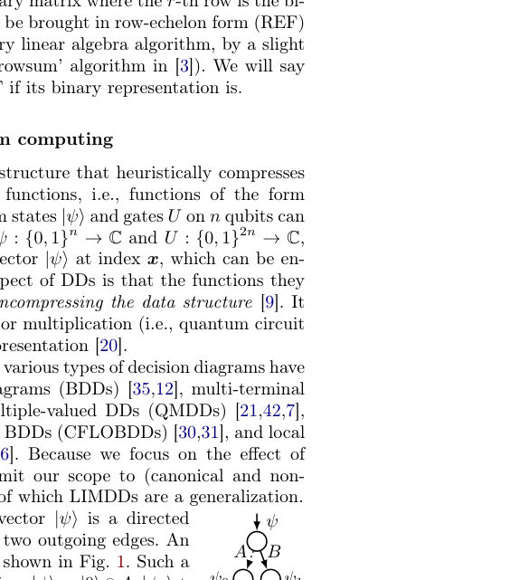 
Fig. 1.

📷 Fig 2

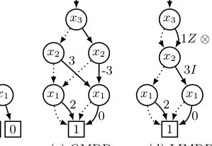 
Fig. 2. In this figure, it is shown how a vector of size 2n is represented as a decision tree of depth n. A QMDD (c) represents this vector more succinctly by factoring out scalars and storing these on edges. The LIMDD representation (d) compresses the data even further by putting Kronecker products of local (2 × 2) matrices on the edges (d).

📷 Fig 3

 
Fig. 3. Normalization rules that bring LIMDD nodes to their reduced form [37], as- suming reduced children u, w. Reproduced and adjusted from [37, Fig.11] (CC-BY 4.0).

📷 Fig 4

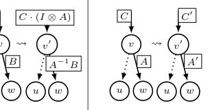 
Fig. 3 for how to update (v, L). For Pauli-LIMDDs, for the final rule (d), high determinism, an O(n3) algorithm exists [37], which we improve upon in Sec. 3.

📷 Fig 5

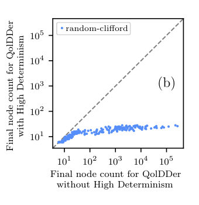 
Fig. 5. Run times and node counts of canonical and semi-canonical versions of our Pauli-LIMDD simulator QolDDer on the RandCliff benchmark set. Note the log-log scales, on which a monomial function (x 7→xk) shows up as a straight line. The dotted grey line visualizes break-even, meaning equal run times or node counts.

**Summary.** The paper presents a novel and significantly faster algorithm to construct minimal-size Pauli-LIMDDs for representing quantum states. By rigorously enforcing canonical forms using advanced group theory techniques, the authors demonstrate that these diagrams can simulate quantum circuits exponentially faster than existing methods. This breakthrough improves the practical realization of theoretical speedups in quantum computation simulation.

**Why it may be interesting.** This work directly impacts the computational feasibility of simulating complex quantum circuits, which is crucial for understanding dynamics in many-body systems or designing quantum algorithms.

Detailed structure

**Main problem.** The primary goal is developing a faster, more efficient algorithm for constructing minimal-size quantum decision diagrams (Pauli-LIMDDs) to simulate quantum circuits.

**Main result.** A novel normal-form algorithm achieves significant speedups in the worst-case complexity of node processing, realizing theoretically proven exponential advantages over existing simulation structures like QMDDs.

**Method.** The authors introduce and implement a refined normal-form procedure for Pauli-LIMDDs, which involves complex group-theoretic calculations (like adapted Zassenhaus procedures) to enforce canonicality rules such as 'high determinism' and 'max precedence'.

**Model / system.** The model is quantum circuit simulation where quantum states $|\psi
angle$ are represented by vectors in $\mathbb{C}^{2^n}$ and encoded using specialized data structures like Local Invertible Map Decision Diagrams (LIMDDs).

**Key observables.** Run time, final node count, and the ability to represent highly entangled states efficiently.

**Important parameters / regimes.** The complexity improvements are quantified by reducing worst-case time from $O(n^3)$ to $O(n^2)$ for certain node types.

**Assumptions / limitations.** The core assumption is that enforcing full canonicity (the max-reduced form) is necessary and sufficient to realize the exponential speedup over less canonical representations.

**Figures summary.** Figures illustrate the structure of DDs, compare vector representations across QMDD and LIMDD formats, detail normalization rules (low/max precedence), and show performance comparisons on benchmark sets like RandCliff and MQT-Bench.

**Paper structure.** The paper builds from defining the need for canonicalization in LIMDDs to presenting the novel $O(n^2)$ algorithm for single-child nodes, followed by rigorous proofs establishing that the resulting max-reduced form is unique for any given quantum state.

Abstract

The decision diagram (DD) data structure enables fast linear-algebra calculations by bringing vectors into a normal form and subsequently merging equivalent ones, yielding a minimally-sized DD modulo the equivalence relation. A fruitful application area is quantum-circuit simulation, where the vectors represent quantum states. The Local Invertible Map Decision Diagram (LIMDD) type, merges LIM-equivalent (typically Pauli-gate equivalent) vectors, can efficiently simulate Clifford circuits as well as some high-T-count circuits, and has theoretically been proven exponentially faster for simulation than other well-developed data structures, including other common DD variants. However, these exponential advantages have not fully materialized yet in existing implementations, for which the normal-form procedure, which is a highly complex algorithm, is either absent or only partially implemented. We here present a novel normal-form algorithm for Pauli-LIMDDs, achieving a worst-case speedup from $O(n^3)$ to $O(n^2)$ for an $n$-qubit DD node with a single child node while keeping the $O(n^3)$ run time in case of two distinct children nodes. We implement the algorithm as part of QolDDer, our Pauli-LIMDD simulator for quantum circuits, written from scratch in C/C++. The implementation realizes the theoretically-proven advantages of Pauli-LIMDDs on Clifford circuits, is significantly faster than the existing LIMDD simulators on such circuits, and on a public quantum-circuit data set often outperforms them by an order of magnitude. In the future, we envision that our work will enable further application and development of LIMDD variants, not only for quantum design tasks, but also for analysis of linear-algebra-based systems in general.

[↑ back to top](#top)

### [Ground-State Energy Solutions of the Lithium Atom: Zeroth-, First-, and Second-Order Perturbation Theory and the Variational Method](http://arxiv.org/abs/2606.24238v1)

**Authors:** Afraa Mahboubi, Büşra Gökçe Zolmaz, Devrim Karayer, Handenur Şay, Oğuzhan Kaya, Abdulkadir Senol  
**Type:** theory · **Category:** other · **PDF:** <https://arxiv.org/pdf/2606.24238v1>  
**Analysis basis:** full PDF text, analyzed in chunks

📷 Fig 1

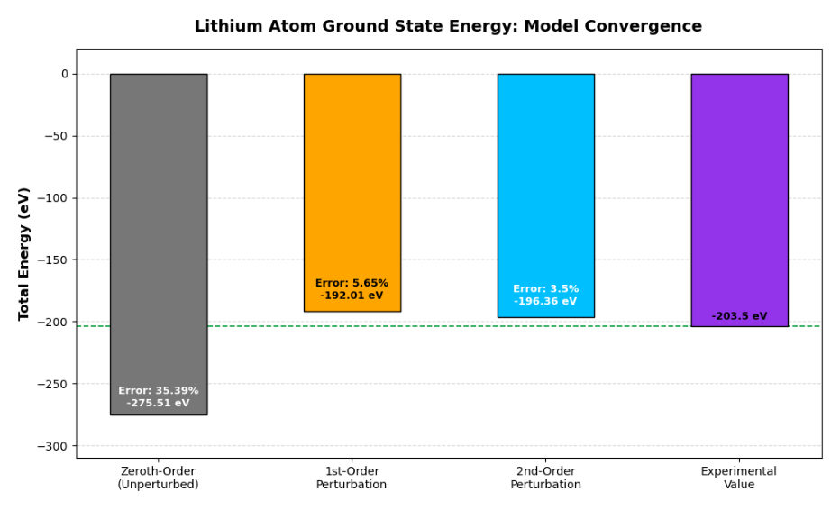 
FIG. 1: Total ground-state energy convergence of the lithium atom across successive perturbation orders compared against the non-relativistic reference baseline. The percentage metrics indicate the relative error calculated with respect to the reference value (−203.5 eV) [9].

📷 Fig 2

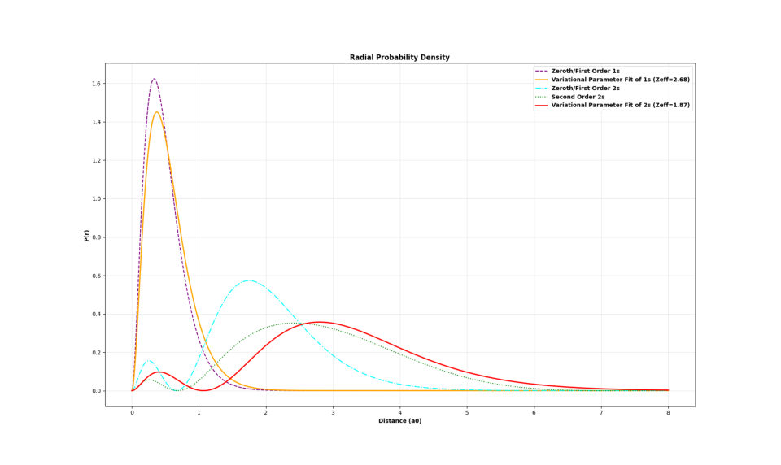 
FIG. 2: Radial probability density functions P(r) for the 1s and 2s shells of the lithium atom, comparing all evaluated frameworks in this study: 0th/1st and 2nd-order perturbation theories against the single- and two-parameter variational methods utilizing optimized effective charges [12].

📷 Fig 3

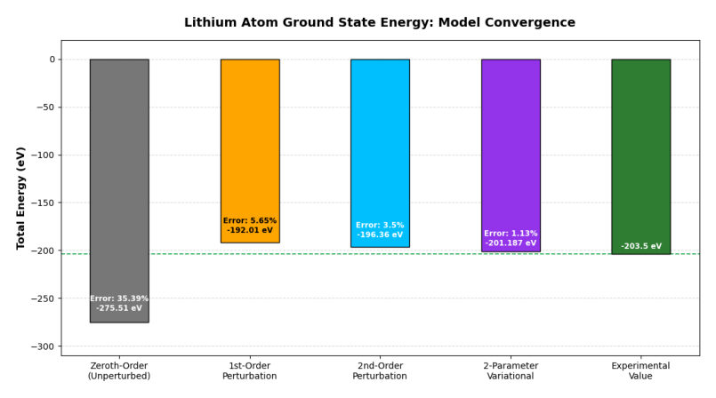 
FIG. 3: Comprehensive comparison of total ground-state energy convergence across sequential perturbation orders and the multi-parameter variational method against the non-relativistic reference baseline (−203.5 eV) [9]. Percentage values indicate the relative error calculated with respect to the reference baseline.

**Summary.** This paper calculates the ground-state energy of the lithium atom using multiple sophisticated quantum mechanical techniques. It rigorously compares results from second-order perturbation theory against a non-orthogonal variational method. The study successfully demonstrates that the variational approach provides a highly accurate upper bound, offering deep insight into electron correlation and screening effects in multi-electron atoms.

**Why it may be interesting.** This work provides a detailed pedagogical comparison between two cornerstone techniques—perturbation theory and variational methods—for calculating correlation energy in light atoms, which is foundational knowledge for advanced AMO/many-body physics simulations.

Detailed structure

**Main problem.** The work systematically investigates the ground-state energy of the lithium atom by comparing results from time-independent perturbation theory and the variational method to understand electron correlation and screening in multi-electron atoms.

**Main result.** The non-orthogonal two-parameter variational approach established a superior upper bound energy of -201.187 eV, demonstrating better convergence than the second-order perturbation expansion.

**Method.** The study employs Rayleigh-Schrödinger time-independent perturbation theory (up to second order) and a non-orthogonal variational method that optimizes effective nuclear charges for core and valence shells.

**Model / system.** The physical system is the Lithium atom ($Z=3$) with three electrons. The Hamiltonian is treated by partitioning it into an unperturbed, independent-particle part ($\hat{H}_0$) and a perturbation term ($\hat{H}^{(1)}$) accounting for inter-electronic repulsion.

**Key observables.** Ground-state energy (in eV), effective nuclear charges ($\alpha$ and $eta$), Coulomb ($J$) and Exchange ($K$) integrals.

**Important parameters / regimes.** The calculation relies on the non-relativistic approximation, using orbital wave functions derived from hydrogenic solutions for initial states.

**Assumptions / limitations.** Key assumptions include enforcing fermionic anti-symmetry via Slater determinants and restricting calculations to s-wave channels due to computational tractability in certain steps.

**Figures summary.** Figures compare the total ground-state energy convergence across successive perturbation orders against a reference baseline, illustrating systematic error reduction.

**Paper structure.** The paper builds logically by establishing a zeroth-order baseline using independent particles, then systematically applying first and second-order corrections from perturbation theory. This is contrasted with the variational method's optimization of effective charges to achieve an upper bound, culminating in a comparison of convergence rates.

Abstract

In this work, the ground-state energy of the lithium atom is systematically investigated using both time-independent perturbation theory and the variational method to provide a comprehensive pedagogical analysis of many-body atomic systems. The unperturbed Hamiltonian is initially constructed by neglecting electron-electron interactions, treating the system as three independent hydrogen-like electrons to yield a zeroth-order energy baseline of -275.51 eV. The antisymmetric fermionic nature of the exact wave function is rigorously enforced through the Slater determinant formalism. First-order perturbation theory is applied to evaluate static inter-electronic repulsion using exact Coulomb and exchange integrals, refining the energy state to -192.01 eV. To account for dynamical electronic correlation, second-order perturbation theory is computed numerically for virtual single-electron s-orbital transitions, leading to a total perturbative energy of -196.36 eV. A brief discussion of two-electron excitations is also included to encapsulate further physical realism within the framework. Furthermore, a non-orthogonal two-parameter variational approach is employed to model the shell-specific shielding effect. By optimizing the effective nuclear charges, the variational method establishes a superior upper bound energy of -201.187 eV. The results of both methods are comprehensively contrasted against each other and the reference baseline to provide critical insights into the nature of electron correlation and screening in multi-electron atoms.

[↑ back to top](#top)

### [On the Berry-Keating Operator](http://arxiv.org/abs/2606.24405v1)

**Authors:** Fabio Bagarello, Sergiusz Kużel  
**Type:** theory · **Category:** other · **PDF:** <https://arxiv.org/pdf/2606.24405v1>  
**Analysis basis:** full PDF text, analyzed in chunks

📷 Fig 1

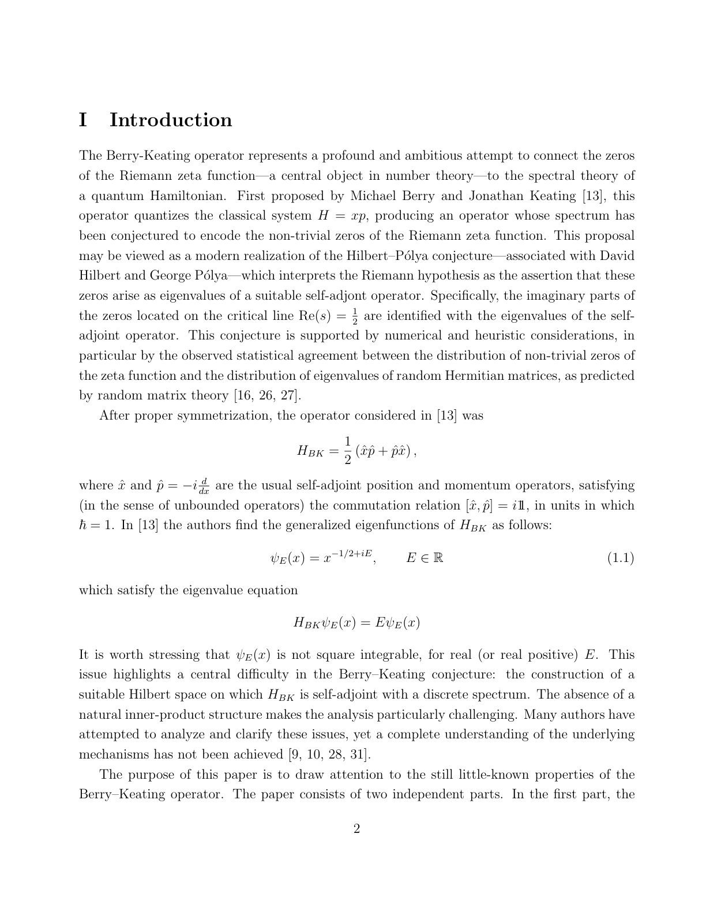 
Low-resolution page preview, page 2

📷 Fig 2

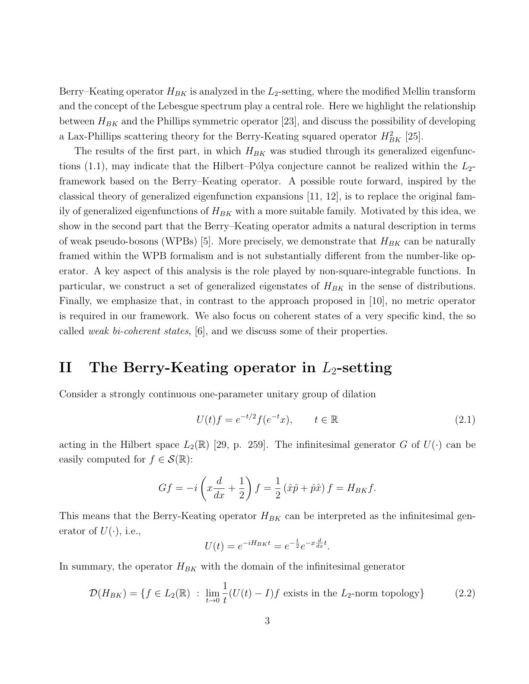 
Low-resolution page preview, page 3

📷 Fig 3

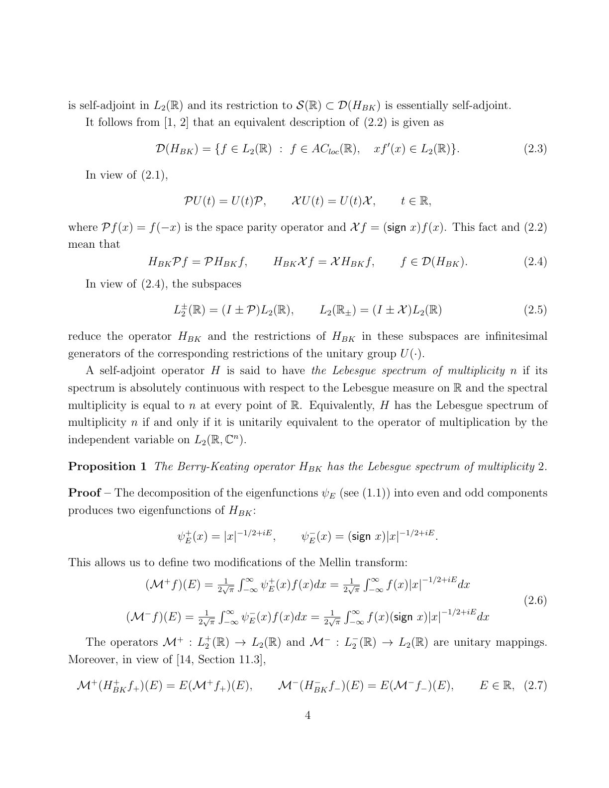 
Low-resolution page preview, page 4

📷 Fig 4

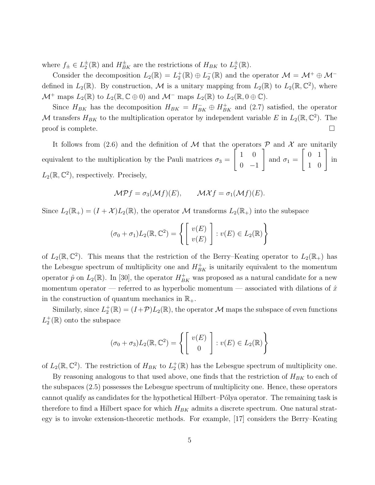 
Low-resolution page preview, page 5

📷 Fig 5

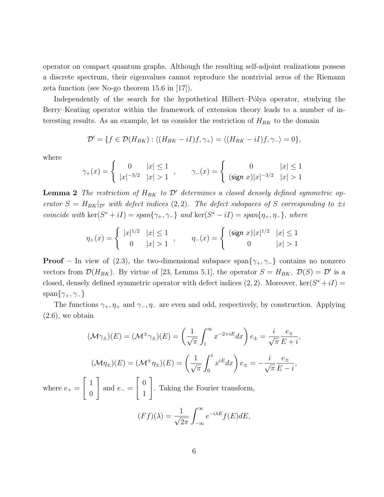 
Low-resolution page preview, page 6

**Summary.** This paper reviews multiple advanced mathematical approaches to understanding the Berry-Keating operator ($H_{BK}$), an operator hypothesized to encode information about the zeros of the Riemann zeta function. Using techniques like Mellin transforms and bi-coherent states, the authors analyze $H_{BK}$'s spectral properties but ultimately conclude that establishing its self-adjoint nature with the correct spectrum remains a major unsolved problem.

**Why it may be interesting.** This work bridges deep areas of mathematical physics—spectral theory, quantum mechanics, and analytic number theory—making it highly relevant for theorists exploring fundamental connections between seemingly disparate fields.

Detailed structure

**Main problem.** The central goal is connecting the zeros of the Riemann zeta function ($\zeta(s)$) to the spectral theory of a quantum Hamiltonian, encapsulated by the Berry-Keating operator ($H_{BK}$). The authors review multiple mathematical approaches to this connection.

**Main result.** The paper establishes that $H_{BK}$ can be unitarily equivalent to the momentum operator in certain representations and analyzes its spectrum using both Hilbertian and distributional methods. However, it concludes that constructing a self-adjoint Hamiltonian with the required discrete spectrum remains an open problem.

**Method.** The analysis employs advanced mathematical techniques including Mellin transforms, dilation operators, pseudo-boson formalisms, and generalized coherent states (bi-coherent states) to analyze the operator's spectral properties.

**Model / system.** The primary model is the Berry-Keating operator, $H_{BK} = rac{1}{2}(\hat{x}\hat{p} + \hat{p}\hat{x})$, which acts on quantum mechanical wave functions. The context is deeply rooted in spectral theory and its hypothesized link to number theory.

**Key observables.** The spectrum of $H_{BK}$ ($\sigma(H)$), the existence of a discrete spectrum matching $\zeta(s)$ zeros, and the properties of generalized eigenstates/coherent states.

**Important parameters / regimes.** The structure depends on the choice of Hilbert space realization (e.g., $L_{\pm}^2(\mathbb{R})$) and the specific mathematical extension theory applied to the operator.

**Assumptions / limitations.** The analysis frequently requires working in distributional settings or assuming certain unitary equivalences, acknowledging that these methods are far from a complete proof of the conjecture.

**Paper structure.** The paper is structured as a review, first presenting a Hilbertian viewpoint using Mellin transforms and dilation operators. It then transitions to a distributional approach involving ladder operators and generalized coherent states, culminating in discussions about spectral extensions and the unresolved connection to the Riemann hypothesis.

Abstract

We review here two different viewpoints on the Berry-Keating operator $H_{BK}$, whose connection to the Riemann hypothesis remains an intriguing and not yet fully understood question, despite considerable attention in the recent literature. In particular, we propose two somehow complementary views to $H_{BK}$: the first is based on a purely Hilbertian point of view, on dilation operators and on the Mellin transform. The second is a distributional approach, with a specific view to ladder operators, generalized eigenstates of $H_{BK}$, and generalized coherent states.

[↑ back to top](#top)

### [The Vector and Canonical Components of the Momentum Operator in 3D Euclidean Space Spanned by General Curvilinear Coordinates](http://arxiv.org/abs/2606.24572v1)

**Authors:** M. S. Shikakhwa  
**Type:** theory · **Category:** other · **PDF:** <https://arxiv.org/pdf/2606.24572v1>  
**Analysis basis:** full PDF text, analyzed in chunks

📷 Fig 1

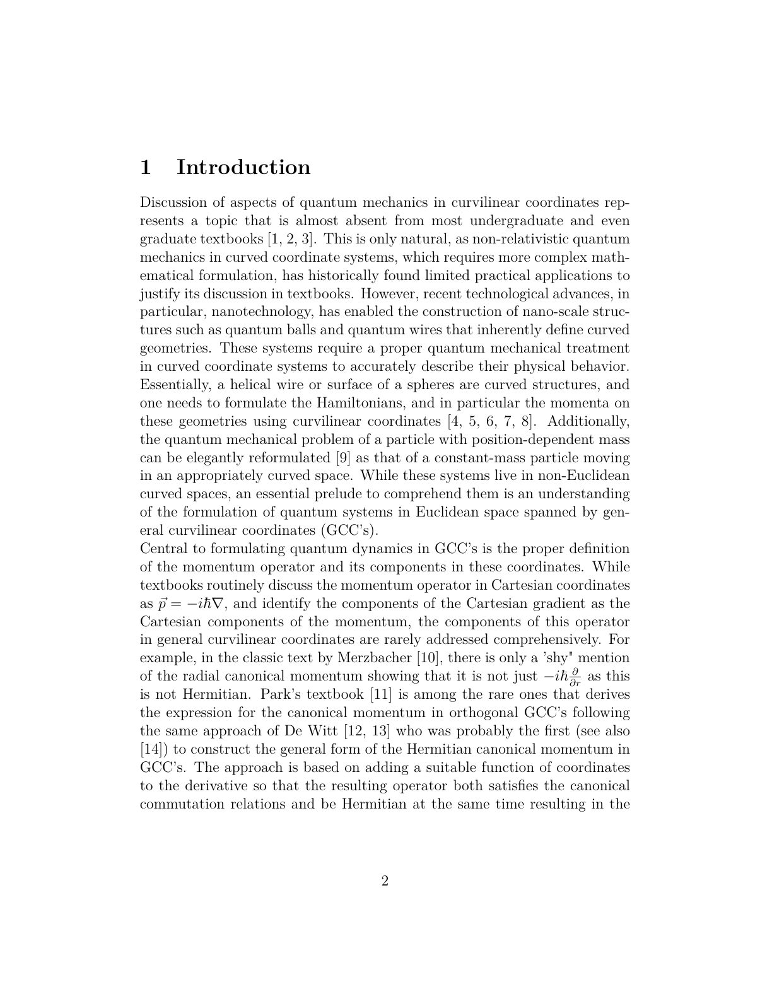 
Low-resolution page preview, page 2

📷 Fig 2

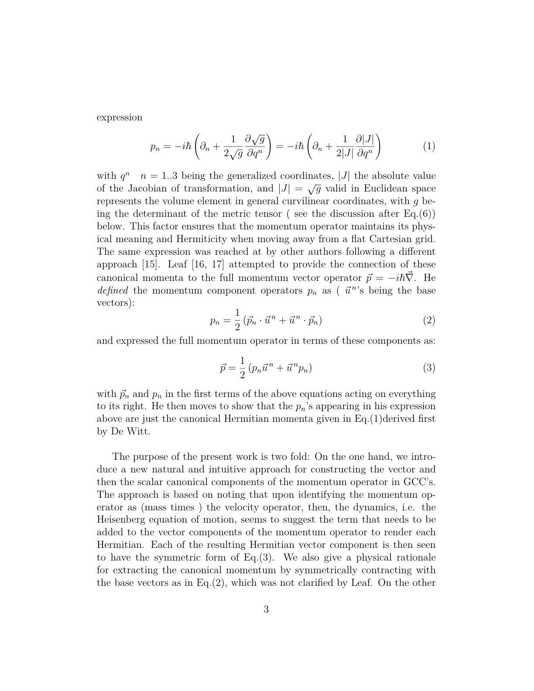 
Low-resolution page preview, page 3

📷 Fig 3

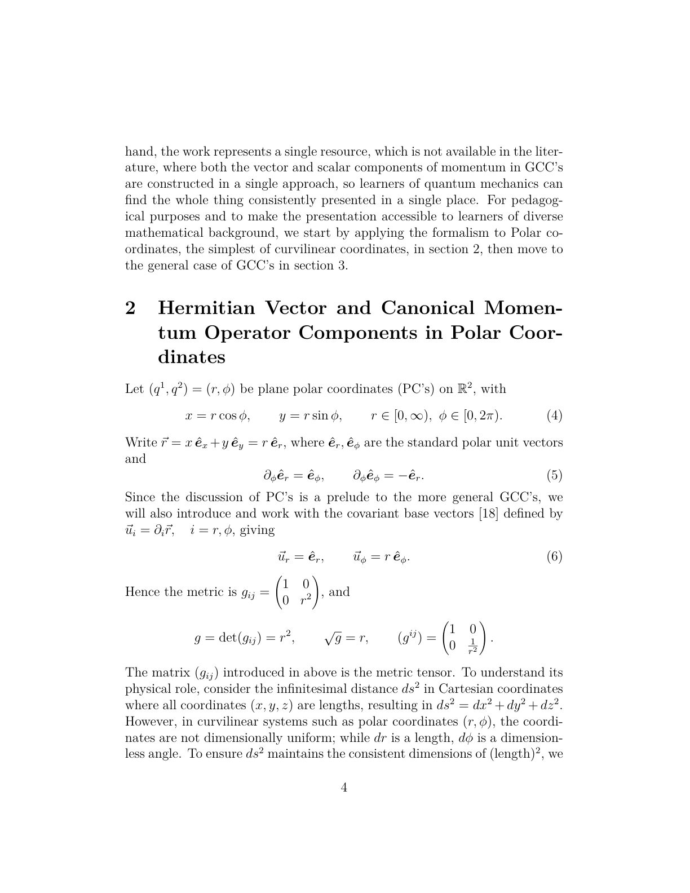 
Low-resolution page preview, page 4

📷 Fig 4

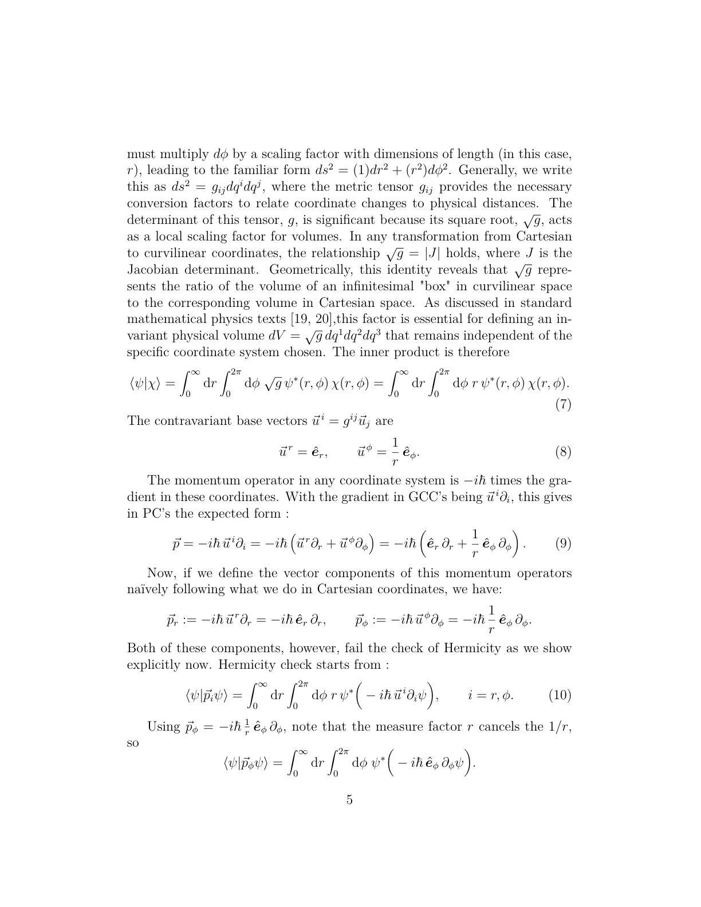 
Low-resolution page preview, page 5

📷 Fig 5

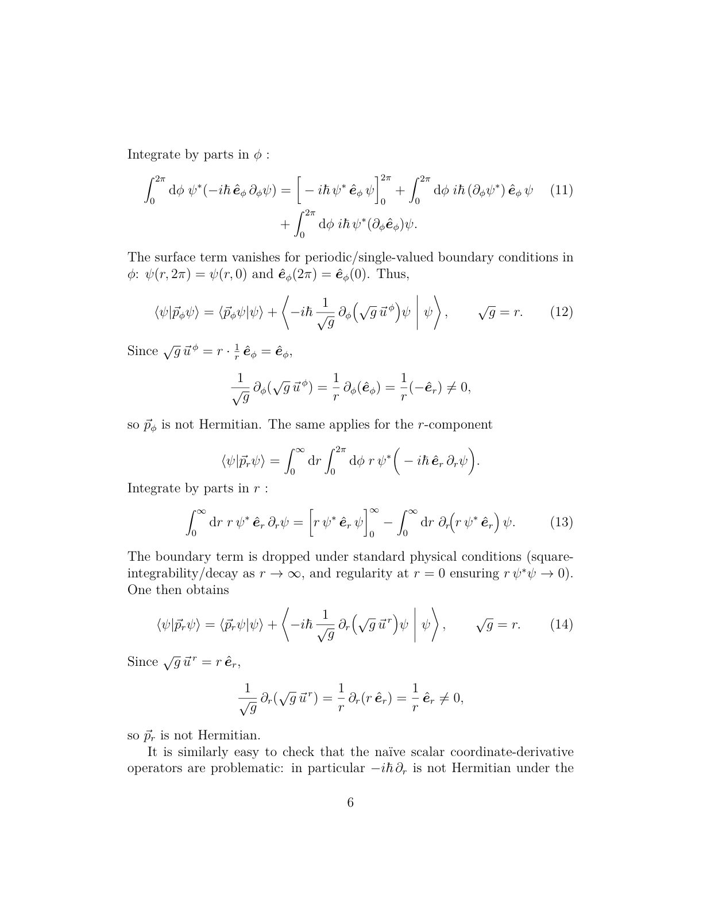 
Low-resolution page preview, page 6

**Summary.** This paper develops a rigorous theoretical framework to define the momentum operator in general curvilinear coordinates. By relating the momentum to the velocity operator via the Heisenberg equation, the authors construct Hermitian vector and canonical components that correctly account for geometric curvature effects. This provides essential mathematical machinery for quantum mechanics on curved spaces.

**Why it may be interesting.** This work provides fundamental mathematical tools necessary for correctly formulating quantum mechanics on curved manifolds, which is crucial when modeling physical systems whose geometry cannot be approximated by flat Euclidean space.

Detailed structure

**Main problem.** The construction of the Hermitian vector and canonical components of the momentum operator ($\vec{p}$) in 3D Euclidean space when expressed using general curvilinear coordinates (GCC's).

**Main result.** A unified, natural approach is developed showing that while individual coordinate derivatives are problematic, the full momentum operator $\vec{p}$ remains Hermitian due to cancellation of boundary terms.

**Method.** The method utilizes the Heisenberg equation of motion applied to the position operator ($\vec{r}$) and identifies $\vec{p} \propto m\dot{\vec{r}}$ to derive corrected, Hermitian vector components ($\vec{p}_H$) before projecting them onto canonical forms ($p_H^a$).

**Model / system.** The study is purely theoretical, focusing on the mathematical structure of quantum mechanics in curved coordinate systems. The underlying physical system involves a particle whose Hamiltonian includes the Laplace-Beltrami operator.

**Key observables.** Hermiticity of $\vec{p}$ and its components; canonical commutation relations $[q^a, p_H^b] = i\hbar \delta^a_b$.

**Important parameters / regimes.** Planck's constant ($\hbar$), mass ($m$), metric tensor ($g_{ij}$).

**Assumptions / limitations.** Standard physical boundary conditions (e.g., square-integrability) are assumed for the necessary integration by parts to prove Hermiticity.

**Figures summary.** Not specified in the notes, but the text develops explicit forms for operators like $\vec{p}_H$ and $p_H^a$ in specific coordinate systems (e.g., polar/spherical).

**Paper structure.** The paper first establishes the problem by noting that naive momentum components fail Hermiticity; it then derives a general procedure using the Heisenberg equation to construct $\vec{p}_H$; this is demonstrated explicitly for simple cases like polar coordinates before generalizing the formalism to arbitrary GCC's.

Abstract

We construct the Hermitian vector and canonical components of the momentum operator in 3D Euclidean space spanned by general curvilinear coordinates (GCC's) using a simple, natural and unified approach based on identifying the momentum operator in any coordinate system as mass times the velocity operator. When this latter is calculated by applying the Heisenberg equation of motion, it returns ($-i\hbar$ times) the gradient operator plus an additional zero-valued sum, which when distributed among the components of the gradient, it makes each the Hermitian vector component of the momentum operator in GCC's. The canonical components follow immediately upon symmetrizing each of these vector components in the corresponding base vector. For accessability by wider audiences, we first develop the formalism for the simple polar coordinates and then we develop the case for GCC's.

[↑ back to top](#top)

## Secondary cond-mat archives

*Papers from  mes-hall, other, soft, supr-con. These archives are de-prioritized — they appear at the end regardless of relevance score.*

### Relevant in secondary archives (12)

### [Andreev exceptional points in Josephson junctions formed by minimal Kitaev chains](http://arxiv.org/abs/2606.23956v1)

**Authors:** Jorge Cayao, Masatoshi Sato  
**Type:** theory · **Category:** other · **PDF:** <https://arxiv.org/pdf/2606.23956v1>  
**Analysis basis:** full PDF text, analyzed in chunks
**Topic relevance:** 🔥 `driven-dissipative phase transition` **4/5** · 🔥 `methods for driven-dissipative` **4/5** · `Keldysh / 2PI / non-Gaussian methods` **3/5** · `correlated / nonlocal dissipation` **3/5** · `non-equilibrium universality` **3/5** · `Kondo & dissipative impurity` **2/5** · `non-equilibrium dynamics` **2/5** · `Frenkel-Kontorova` **1/5** · `analog quantum simulation` **1/5**

📷 Fig 1

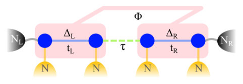 
FIG. 1. A phase-biased Josephson junction formed by two minimal Kitaev chains (red boxes). The quantum dots (blue filled circles) in the left (L) and right (R) minimal Kitaev chain are coupled by electron tunneling tα and p-wave pair potential ∆α characterizing crossed Andreev reflections, here α = L, R. Also, the left and right minimal Kitaev chains are connected by regular electron tunneling τ and the supercon- ducting phase difference between their pair potentials is con- trolled by an external magnetic flux Φ applied through the SQUID loop (red arm). All the quantum dots are coupled to normal reservoirs (N, yellow) which are sources of non- Hermitian effects, while the the first...

📷 Fig 2

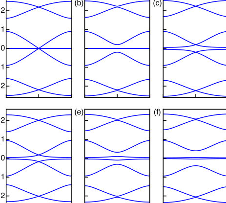 
FIG. 2. Energy spectrum as a function of the superconducting phase difference ϕ in the Hermitian regime, where (a-c) and (d-f) correspond, respectively, to tα = ∆α and tα = 0.8∆α for distinct values of the onsite energies εαj. In the left column (a,d), all onsite energies are equal to zero εαj = 0; in the mid- dle column (b,e), only the onsite energy of the leftmost QD is finite (εL1 ̸= 0); in the right column (c,f), only the energies of the outer QDs are finite (εL1 = εR2 ̸= 0). Parameters: τ = 0.9∆, ∆α ≡∆

📷 Fig 3

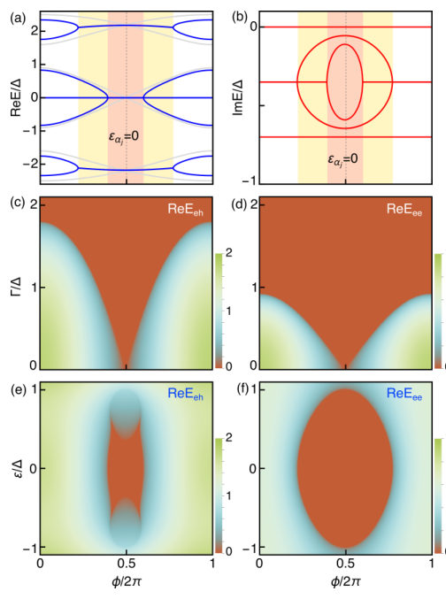 
FIG. 3. (a,b) Energy spectrum versus ϕ in the non-Hermitian regime (ΓLj ̸= 0, ΓRj = 0) at ∆α = tα and εαj = 0, with (a) and (b) showing the real (Re) and imaginary (Im) parts, re- spectively. The ends of the orange and yellow shaded regions mark the position of Andreev EPs emerging at zero and finite Re energies, while the gray curves in (a) correspond to the energies in the Hermitian regime. (c) Real part of the differ- ence between the first positive and first negative excited levels closest to zero Re energy versus ϕ and Γ ≡ΓLj. (d) Same as (a) but for the highest two positive levels. (e,f) Same quantity as in (c,d) as a function of ϕ and onsite energy ε ≡εαj. Pa- rameters: τ = 0.9, ∆α...

📷 Fig 4

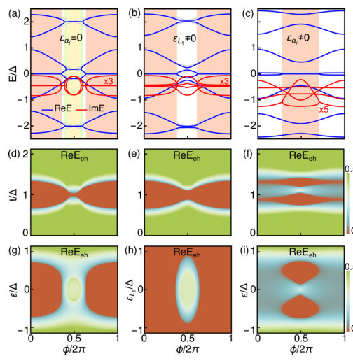 
FIG. 4. (a,b) Real (blue) and imaginary (red) parts of the energy spectrum versus ϕ in the non-Hermitian regime for ∆α ̸= tα at distinct values of the onsite energies and cou- plings: (a,b) for ΓLj ̸= 0, ΓRj = 0, while (c) for ΓL1,R2 ̸= 0, ΓL2,R1 = 0. The ends of the red, yellow, and green shaded re- gions mark the positions of the Andreev EPs emerging due to the coalescence of lowest positive and lowest negative levels, lowest positive (negative) and first excited positive (negative) levels, and highest positive (negative) and highest positive (negative) levels, respectively. (d-f) Real part of the differ- ence between the first positive and first negative excited lev- els closest to zero...

📷 Fig 5

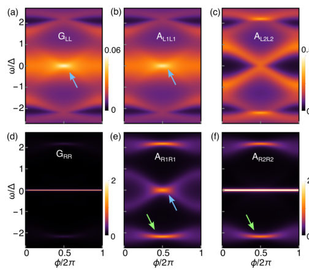 
FIG. 5. Local conductance Gαα and spectral function Aαjαj as a function of frequency ω and ϕ at ∆α = tα and ΓLj ̸= 0, ΓRj = 0. The conductance is given in units of e2/h. In (e,f), the color scale is cut off at 2 for visualization. The light blue (green) arrows indicate the appearance of the zero (finite) Re energy line connecting EPs found at the sweet spot, see Fig. 3. Parameters: τ = 0.9, ∆α ≡∆, εαj = 0, ΓLj = 0.7∆, ΓRj = 0.

**Summary.** This paper explores how coupling minimal Kitaev chain Josephson junctions to normal leads introduces non-Hermiticity, leading to complex Andreev spectra. The key finding is the realization of controllable Andreev Exceptional Points (EPs) whose existence depends critically on the superconducting phase difference ($\phi$). This work demonstrates that non-Hermitian physics offers a robust resource for engineering novel topological phases in superconducting quantum devices.

**Why it may be interesting.** The explicit connection between non-Hermiticity (from open systems) and the emergence of topological features like EPs provides a powerful new tool for engineering quantum states in superconducting circuits, relevant to advanced condensed matter physics.

Detailed structure

**Main problem.** The study investigates how non-Hermiticity, introduced via coupling to normal reservoirs, enables stable topological states in Josephson junctions formed by minimal Kitaev chains.

**Main result.** The system exhibits Andreev Exceptional Points (EPs) whose existence and properties are controlled by the superconducting phase difference ($\phi$), allowing for the engineering of non-Hermitian topological phases.

**Method.** Theoretical analysis involving the retarded Green's function in Nambu space, solving for energy poles, and analyzing symmetries like $	ext{PHS}^\dagger$.

**Model / system.** The physical system is a Josephson junction connecting two minimal Kitaev chains. The model incorporates non-Hermiticity through coupling to normal reservoirs ($\Gamma$), leading to an effective complex Andreev spectrum.

**Key observables.** Andreev Exceptional Points (EPs) and lines, the superconducting phase difference ($\phi$), local and nonlocal conductances ($G_{LL}, G_{-LR}$), and spectral functions.

**Important parameters / regimes.** Superconducting phase difference ($\phi$), non-Hermiticity strength ($\Gamma$), onsite energies ($\epsilon_{\alpha j}$), and coupling ratios ($\Delta_\alpha/t_\alpha$).

**Assumptions / limitations.** The analysis relies on the zero-frequency approximation for self-energy and utilizes symmetry arguments (e.g., $	ext{PHS}^\dagger$) to characterize topological protection.

**Figures summary.** Figures illustrate the energy spectrum vs. $\phi$ showing EP crossings, and conductance measurements ($G_{LL}, G_{LR}$) confirming signatures of EPs at both zero and finite real energies.

**Paper structure.** The paper progresses from establishing the non-Hermitian Hamiltonian and symmetry constraints to analyzing the emergence of Andreev EPs as a function of $\phi$. It then details how these EPs can be robustly protected by symmetries, even away from ideal 'sweet spot' parameters. Finally, it discusses measurable signatures using local and nonlocal conductance.

Abstract

We consider Josephson junctions formed by two minimal Kitaev chains and investigate how the interplay between non-Hermiticity and superconducting phase difference enables the realization of stable topological states that do not exist in the Hermitian realm. In particular, we focus on non-Hermiticity produced by coupling the minimal Kitaev chain Josephson junction to normal reservoirs, which renders the system open and characterized by a complex Andreev spectrum. Interestingly, we find that this complex spectrum hosts second order exceptional points, where a pair of eigenvalues and their respective eigenvectors coalesce, and are fully controlled by the superconducting phase difference. Depending on the spatial unequal distribution of non-Hermiticity, these Andreev exceptional points can appear at zero or finite energies connecting stable energy lines protected by non-Hermitian topology. Moreover, tuning the system parameters, such as onsite energies, non-Hermiticity, or electron cotunneling, the Andreev exceptional points give rise to Andreev exceptional lines enclosing protected two-dimensional zero real energy areas. We also discuss potential detection schemes of Andreev exceptional points by using local and nonlocal conductance signatures. Our results demonstrate the utility of non-Hermiticity from normal reservoirs as a useful resource for engineering non-Hermitian topological phases in minimal Kitaev chain Josephson junctions.

[↑ back to top](#top)

### [Simulating the Haldane model in ultra-clean GaAs heterostructures](http://arxiv.org/abs/2606.24670v1)

**Authors:** Francesco Cioni, Lorenzo Cavicchi, Fabio Taddei, Marco Polini  
**Type:** theory · **Category:** other · **PDF:** <https://arxiv.org/pdf/2606.24670v1>  
**Analysis basis:** full PDF text, analyzed in chunks
**Topic relevance:** 🔥 `analog quantum simulation` **4/5** · `exotic spin models in light-matter` **3/5** · `non-equilibrium dynamics` **2/5** · `Keldysh / 2PI / non-Gaussian methods` **1/5** · `spintronics-quantum-optics interface` **1/5**

📷 Fig 1

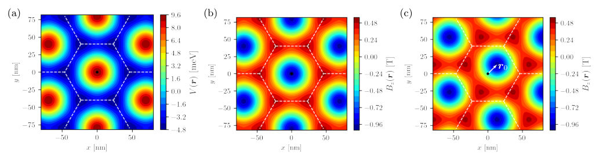 
FIG. 1. Panel (a) Crystal field V (r) as obtained from Eq. (3). Panel (b) PMF Bz(r) as obtained from Eq. (4). Panel (c) PMF shifted by a vector r0 with respect to the crystal field, i.e. Bz(r −r0). Parameters are fixed to be a0 = 80 nm, W = 1.57 meV, and βΦ0/2π = 330 mT. In all panels, the black dot in the center of the figure refers to the origin of the axis and is added as a guide for the eye.

📷 Fig 2

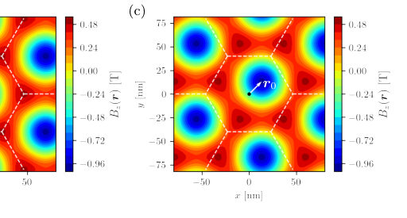 
Fig. 1 displays the spatial profiles of V (r) and Bz(r) in- troduced in Eqs. (3) and (4). Panel (a) of Fig. 1 shows that the crystal field generates an array of attractive wells arranged on a D6h-symmetric honeycomb lattice. The PMF configuration depicted in panel (b) yields a similar

📷 Fig 3

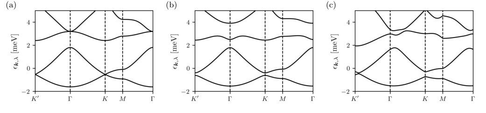 
FIG. 2. Energy bands, along the high-symmetry path K′ −Γ −K −M −Γ in the BZ, for different magnetic-field patterns. (a) βΦ0/2π = 0 and r0 = 0. (b) βΦ0/2π = 330 mT and r0 = 0. (c) βΦ0/2π = 330 mT and r0 = a0(−0.45, −0.43). Other parameters are chosen as a0 = 80 nm, m∗= 0.062 me, and W = 1.57 meV.

📷 Fig 4

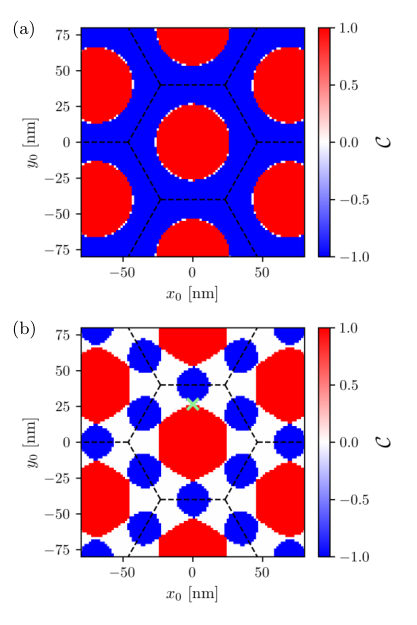 
FIG. 3. Topological phase diagram. The Chern number C of the lowest band ϵk,λ=1 as a function of the shift vector r0 = (x0, y0). (a) βΦ0/(2π) = 33 mT. (b) βΦ0/(2π) = 330 mT. All other parameters are fixed as in Fig. 2. The light-green cross marks the gap-closing point r⋆ 0. The dashed black lines outline the hexagonal UC of the direct lattice.

📷 Fig 5

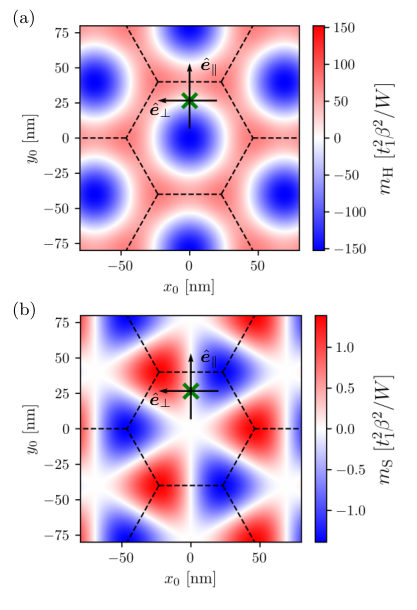 
FIG. 4. (a) Haldane mass mH from Eq. (15a). (b) Semenoff mass mS from Eq. (15b). For comparison, we express both masses in units of the energy t2 1β2/W. The black cross marks the gap-closing point r⋆ 0, and the axes indicate the decoupling directions ˆe∥and ˆe⊥. Here we fixed βΦ0/(2π) = 33 mT. All other parameters are fixed as in Fig. 2.

**Summary.** The paper proposes an experimental route to realize the Haldane model—a key Chern insulator—by combining patterned electrostatic potentials with periodically modulated magnetic fields in GaAs heterostructures. Using advanced theoretical techniques like plane-wave diagonalization, the authors demonstrate that this combination successfully engineers non-trivial band topology, controllable via geometric misalignment parameters.

**Why it may be interesting.** This work provides a concrete, materials-based blueprint for realizing topological quantum matter using external electric and magnetic field engineering, which is highly relevant for solid-state quantum simulation.

Detailed structure

**Main problem.** The work theoretically investigates simulating the Haldane model, a minimal Chern insulator realization, using solid-state systems to engineer topological band structures.

**Main result.** Superimposing engineered electrostatic lattices with spatially periodic magnetic fields can induce non-trivial band topology, successfully mapping the low-energy physics onto the Haldane model Hamiltonian.

**Method.** The study employs plane-wave diagonalization techniques and utilizes advanced mathematical tools like the Fukui-Hatsugai-Suzuki algorithm to calculate topological invariants (Chern number).

**Model / system.** The system is modeled as spinless, non-interacting electrons in a 2D honeycomb lattice realized in ultra-clean GaAs/AlGaAs heterostructures. The Hamiltonian incorporates kinetic energy, crystal potential, and coupling to engineered vector potentials derived from patterned magnetic fields.

**Key observables.** Chern number (C), band dispersion ($\epsilon_k$), effective mass terms ($m_H, m_S$).

**Important parameters / regimes.** Relative shift $\mathbf{r}_0$ between the potential and field patterns; magnetic flux amplitude ($eta\Phi_0/2\pi$); lattice constant $a_0$.

**Assumptions / limitations.** The analysis relies on projecting the full Hamiltonian onto a low-energy three-plane-wave manifold around the K and K' valleys, neglecting higher-shell harmonics.

**Figures summary.** Figures illustrate spatial profiles of potentials/fields for different shifts ($\mathbf{r}_0$), energy band structures along high-symmetry paths showing gap opening, and topological phase diagrams mapping Chern number $C$ vs. control parameters.

**Paper structure.** The paper progresses from defining the general Hamiltonian in a solid-state context to analyzing symmetries (P, T) and then deriving the low-energy effective Dirac Hamiltonian by treating magnetic perturbations perturbatively up to $O(A^2)$.

Abstract

The Haldane model represents the minimal lattice-based realization of a Chern insulator, exhibiting a quantized Hall conductance in the absence of Landau levels. Despite its conceptual elegance, the implementation in crystalline solids of the requisite pattern of Peierls phases breaking time-reversal symmetry remains experimentally demanding. In this work, we theoretically investigate the possibility to simulate the Haldane model in ultra-clean GaAs/AlGaAs heterostructures. Our proposal relies on recent experiments in which a high-mobility two-dimensional electron gas is subject to a gate-defined honeycomb electrostatic potential and a laterally periodic magnetic field generated by patterned ferromagnetic structures. The combined electrostatic and magnetic superlattices furnish a viable route to emulate the topological properties of the Haldane model.

[↑ back to top](#top)

### [Fine structure of the cyclotron resonance in heterobilayers of proximitized graphene and transition metal dichalcogenides](http://arxiv.org/abs/2606.23895v1)

**Authors:** M. A. Rakitskii, K. S. Denisov, N. S. Averkiev  
**Type:** theory · **Category:** other · **PDF:** <https://arxiv.org/pdf/2606.23895v1>  
**Analysis basis:** full PDF text, analyzed in chunks
**Topic relevance:** 🔥 `spintronics-quantum-optics interface` **4/5** · `exotic spin models in light-matter` **3/5** · `Keldysh / 2PI / non-Gaussian methods` **1/5**

📷 Fig 1

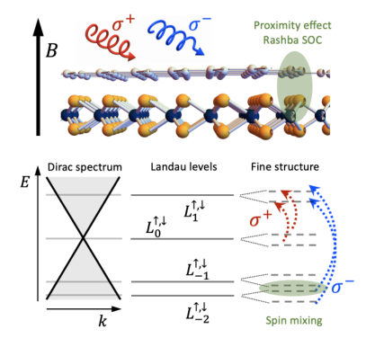 
FIG. 1. Cyclotron resonance in a graphene/TMDs heterobi- layer and associated transitions between Landau levels, Ls n.

📷 Fig 2

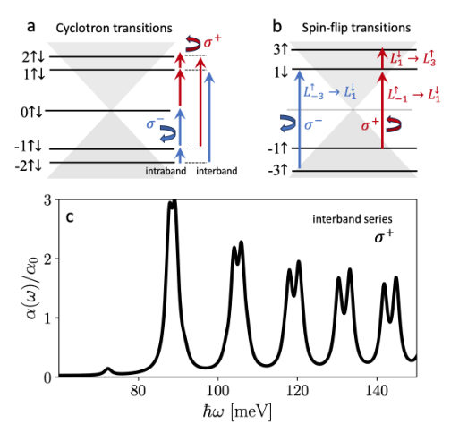 
FIG. 2. (a) Cyclotron resonance intra- and interband transi- tions between LLs in a monolayer graphene are active for σ+

📷 Fig 3

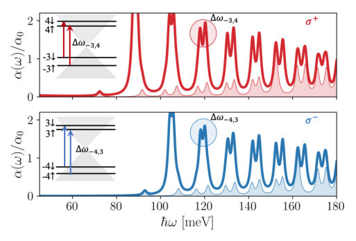 
FIG. 3. Absorption α±(ℏω) for σ+ (a) and σ−(b) polariza- tions; the shaded regions show a partial contribution due to spin-flip transitions allowed in the presence of HR. The in- set in (a) [(b)] shows the frequency difference for Ls −3 →Ls 4 [Ls −4 →Ls 3] responsible for a double peak fine structure around ℏω−3,4 [ℏω−4,3]. The parameters: ν = 12, B = 0.6 T, ℏΩ0 = 5 meV, λR = 1.5 meV, Γ = 1 meV.

📷 Fig 4

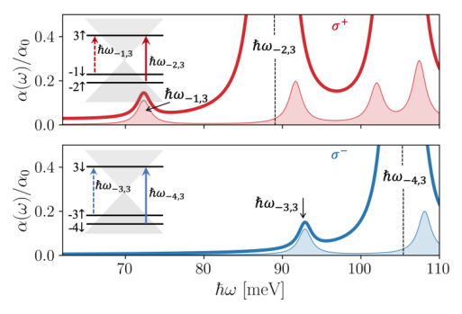 
FIG. 4. Absorption α±(ℏω) for σ+ (a) and σ−(b) polariza- tions. The shaded regions show the CCR contribution due to HR-induced spin-flip absorption. At ν = 12, there is a well- resolved CCR line L↓ −1 →L↑ 3 for (a) and to L↑ −3 →L↓ 3 for (b). The corresponding CCR transitions are shown in insets.

**Summary.** This theoretical study investigates how proximity effects from TMDs induce spin-orbit coupling in graphene, modifying its cyclotron resonance spectrum. The authors predict characteristic fine double-peak structures and new spin-flip absorption lines (CCRs). These modifications lead to a measurable magneto-optical response, providing a powerful spectroscopic tool for characterizing spin interactions in van der Waals heterostructures.

**Why it may be interesting.** This work is highly relevant because it uses optical spectroscopy (CR) to probe subtle quantum phenomena—namely spin-orbit coupling and spin texture—in 2D materials heterostructures, which are key areas for developing spintronic devices.

Detailed structure

**Main problem.** The study analyzes the fine structure of cyclotron resonance (CR) and combined cyclotron resonance (CCR) absorption in heterobilayers formed by proximitizing graphene with transition metal dichalcogenides (TMDs). The focus is on how proximity-induced spin interactions modify these optical responses.

**Main result.** The theory predicts a polarization-dependent fine double-peak structure in the main interband CR transitions and identifies additional spin-flip absorption lines corresponding to CCRs. Furthermore, it shows that these effects lead to a measurable Magneto-Optical Kerr Effect (MOKE) signal.

**Method.** The analysis employs an effective Dirac model augmented by proximity terms ($H_{vz}, H_{st}, H_R$) and calculates the optical absorption spectrum using the Kubo–Greenwood formula in the Landau Level basis. Numerical diagonalization is used to incorporate the Rashba coupling effects.

**Model / system.** The system is a heterobilayer of graphene proximitized by TMDs, modeled with an effective Hamiltonian including valley-Zeeman ($H_{vz}$), staggered potential ($H_{st}$), and crucial spin-orbit coupling via the Rashba term ($H_R$). The analysis operates in the Landau Level basis derived from minimal coupling.

**Key observables.** Cyclotron Resonance (CR) absorption spectrum, Combined Cyclotron Resonance (CCR) lines, Magneto-Optical Kerr Effect (MOKE) signal, and polarization dependence ($\sigma^+$ vs $\sigma^-$).

**Important parameters / regimes.** Moderate magnetic fields ($0.5–2$ T), where cyclotron energies dominate proximity terms; the strength of the Rashba coupling ($\lambda_R$).

**Assumptions / limitations.** The analysis assumes that the LL basis derived from minimal coupling is sufficient, and it treats the Rashba term perturbatively or within a truncated diagonalization scheme.

**Figures summary.** Figures illustrate CR/CCR absorption spectra showing fine double-peak structures (Figure 3) and demonstrate selection rules for these transitions. Figure 4 specifically shows resolved CCR lines below main interband CR lines at specific magnetic fields.

**Paper structure.** The paper establishes the physical system and Hamiltonian, details the theoretical methods using LL basis diagonalization, calculates the key observables (CR/CCR absorption), and concludes by interpreting the results in terms of measurable MOKE signals and experimental verifications.

Abstract

A monolayer graphene and its Dirac electrons can be equipped with an enhanced spin-orbit coupling (SOC) when proximitized by other van der Waals (vdW) materials, such as transition metal dichalcogenides (TMDs). In this work we analyze the cyclotron resonance (CR) absorption of such heterobilayers at quantizing magnetic fields in the presence of proximity-induced spin interactions, including the spin-pseudospin Rashba coupling. We evaluate the spin-textured wave functions of the Landau levels and calculate the absorption spectrum paying special attention to its spin proximity induced modifications. We reveal the formation of a fine double-peak structure of the main interband CR transitions, as well as the presence of additional spin-flip absorption, the combined cyclotron resonance (CCR), centered at different resonant frequencies. The selection rules for CCRs are identified and complemented by the perturbation theory analysis. We also discuss the polarization dependence of the absorption and the proximity-induced emerging magneto-optical responses. Our theory explains the effect of proximity-induced spin interactions for Dirac electrons cyclotron resonance and points out at its experimental verifications.

[↑ back to top](#top)

### [Multiple phases in K2Cr3As3: a playground for manipulating topological superconductivity](http://arxiv.org/abs/2606.24108v1)

**Authors:** Seigo Ogawa, Tomoki Miyoshi, Saki Uchida, Kazuaki Matano, Shinji Kawasaki, Yoshihiko Inada, Guo-qing Zheng  
**Type:** experiment · **Category:** other · **PDF:** <https://arxiv.org/pdf/2606.24108v1>  
**Analysis basis:** full PDF text, analyzed in chunks
**Topic relevance:** `exotic spin models in light-matter` **3/5** · `spintronics-quantum-optics interface` **3/5** · `driven-dissipative phase transition` **2/5** · `Kondo & dissipative impurity` **1/5** · `analog quantum simulation` **1/5** · `methods for driven-dissipative` **1/5** · `non-equilibrium dynamics` **1/5** · `quantum measurements` **1/5**

📷 Fig 1

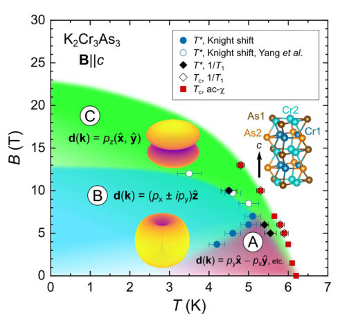 
FIG. 1. Multiple superconducting phases of K2Cr3As3 for B∥c. The Tc values, represented by red squares and open di- amonds, were determined by ac susceptibility and 1/T 1 mea- surements. The characteristic temperatures T ∗, represented by blue circles (open and filled) and black diamonds, were de- termined from the Knight shift and/or 1/T 1 measurements. The errors in T ∗represented by blue circles were estimated by assuming that the uncertainty is equal to the point (temper- ature) interval around the position indicated by the dashed arrow in Fig. 2(a). The errors in T ∗represented by black diamonds were estimated from the 1/T 1 measurement tem- perature interval. The illustrations within...

📷 Fig 2

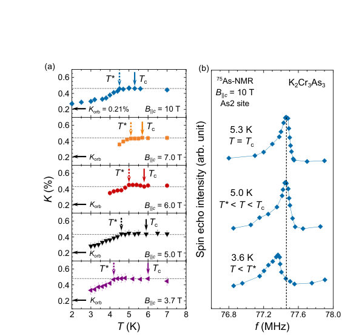 
FIG. 2. Temperature dependence of Knight shift and 75As- NMR spectra. (a) Temperature and field dependences of K for B∥c. The solid arrow indicates Tc. The dashed arrow indi- cates T ∗, the temperature at which K begins to decrease upon further cooling. The error in K was estimated by assuming that the peak uncertainty equaled the frequency resolution of the NMR data. The value of Korb = 0.21% was determined from the linear relationship between K and bulk susceptibil- ity χ [22]. (b) Temperature dependence of 75As-NMR spectra (the center peak; +1/2 ↔−1/2 transition) at B∥c = 10 T for the As2 site. At B∥c = 10 T, Tc is 5.3 K, and T ∗is 4.5 K. The dashed line indicates the peak position of the...

📷 Fig 3

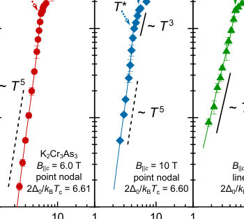 
FIG. 3. Temperature dependence of the 75As-NMR 1/T1 for B∥c. (a)–(c) Temperature dependence of 1/T1 for B∥c = 6.0, 10, and 13 T. Solid and dashed arrows indicate Tc and T ∗, re- spectively. The red, blue, and green lines represent the results of fitting the data to a point-nodal gap with 2∆0/kBTc = 6.61 and 6.60, and a pz-wave line-nodal gap with 2∆0/kBTc = 5.47, respectively. The 1/T1 data were fitted below T ∗at 6.0 and 10 T and Tc at 13 T. The dashed and solid black lines serve as guides for T 5 and T 3, respectively. Error bars represent the standard deviations in theoretical fitting of the nuclear magnetization recovery curves.

📷 Fig 4

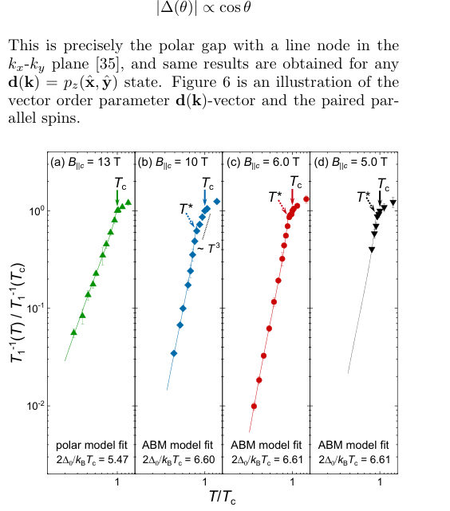 
FIG. 4. Temperature dependence of the normalized 75As- NMR 1/T1 for B∥c. (a)–(d) Temperature dependences of the normalized 1/T1 for B∥c at 13, 10, 6.0, 5.0 T are shown. Solid and dashed arrows indicate Tc and T ∗, respectively. The green, blue, red, and black lines represent the results of fitting the polar model (2∆0/kBTc = 5.47) and the ABM model (2∆0/kBTc = 6.60, 6.61 and 6.61) to the data. The polar model fitting was performed below Tc, and the ABM model fitting was performed below T ∗. Error bars represent the standard deviations of the parameters. The dashed line serves as a guide for the temperature variation of T 3. .

📷 Fig 5

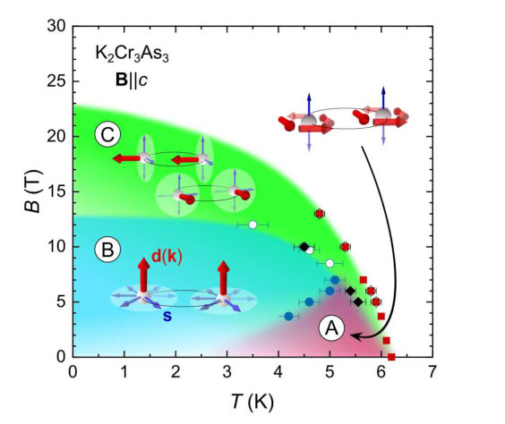 
FIG. 6. Directions of the paired spins and d(k)-vector in each phase. Schematic illustration of the Cooper pairs and d(k)-vector in Phases A, B, and C. The white spheres repre- sent electrons forming Cooper pairs. The Cooper pair spins s and the d(k)-vector are indicated by blue and red arrows, respectively. A representative order parameter for Phase A, d(k) = pyˆx −pxˆy, is shown in the upper-right. This state can be regarded as a quantum superposition of the Sz = 1 and Sz = −1 components. For other two states of Phase A, although the d(k)-vector structures differ, they all realize a superposition of Sz = ±1 states. In Phase B, the d(k)-vector is aligned along the c-axis, leading to an Sz =...

**Summary.** This work establishes K2Cr3As3 as a model spin-triplet superconductor by experimentally revealing three distinct superconducting phases (A, B, C). Using NMR measurements, the authors map out how the pairing symmetry and the direction of the d(k)-vector evolve under applied magnetic fields. These findings highlight the material's potential for manipulating topological quantum states.

**Why it may be interesting.** While focused on superconductivity, the detailed mapping of topological phases and symmetry breaking in response to external fields provides a rich platform for studying emergent quantum order parameters relevant to advanced condensed matter physics.

Detailed structure

**Main problem.** Investigating spin-triplet superconductivity, a state crucial for hosting Majorana bound states in quantum computing.

**Main result.** The authors identified three distinct superconducting phases (A, B, and C) in K2Cr3As3, demonstrating the high tunability of its topological superconducting phases by manipulating magnetic fields.

**Method.** Measurements utilized Nuclear Magnetic Resonance ($	ext{}^{75}	ext{As}$-NMR) to probe the spin susceptibility and gap structure, alongside $ac$ susceptibility measurements.

**Model / system.** The study focuses on the Cr-based compound K2Cr3As3, which is proposed as a non-magnetic alternative to U-based superconductors. The analysis maps out the superconducting phase diagram using magnetic field (B) and temperature (T).

**Key observables.** Knight shift ($K$), spin-lattice relaxation rate ($1/T_1$), and the evolution of the pairing vector $\mathbf{d}(\mathbf{k})$.

**Important parameters / regimes.** Critical temperature ($T_c \ge 6.2 	ext{ K}$), applied magnetic field (up to $13 	ext{ T}$), and temperature dependence exponents ($\propto T^{-3}$ vs. $\propto T^{-5}$).

**Assumptions / limitations.** The analysis relies on interpreting the temperature power laws of $1/T_1$ to distinguish between line-nodal and point-nodal gap structures.

**Figures summary.** Figures illustrate the phase diagram showing multiple superconducting phases (A, B, C) as a function of magnetic field for $B\parallel c$, detailing characteristic temperatures ($T^*$) derived from NMR measurements.

**Paper structure.** The paper systematically analyzes experimental signatures—NMR Knight shift and $1/T_1$ dependence—to map out the phase diagram, identifying distinct superconducting states characterized by different $\mathbf{d}(\mathbf{k})$-vector orientations and gap symmetries.

Abstract

Spin-triplet topological superconductors are rare but of fundamental interest as they can host Majorana bound states that can be used in fault-tolerant quantum computing. Recent efforts have been devoted to searching for spin-triplet states in U-based compounds, but these materials have a low transition temperature (Tc) and coexisting competing orders, which creates significant experimental challenges and often leads to contradictory conclusions. The Cr-based candidate K2Cr3As3 offers a promising alternative: it has a much higher Tc of 6.2 K and no magnetic order. Here we report a hallmark signature of spin-triplet superconductivity arising from the internal spin degrees of freedom via nuclear magnetic resonance measurements, and demonstrate the high tunability of the topological phases. We discovered three distinct superconducting phases and revealed the evolution of the paired-spins direction (d(k)-vector). At low magnetic fields, K2Cr3As3 evolves from a helical (Phase A) to a chiral state (Phase B) with a rotation of the d(k)-vector from in-plane to out-of-plane direction upon cooling, although both phases have point nodes in the gap. A linenodal gap is realized in the high-field Phase C, where the d(k)-vector lies in the basal plane. These findings establish K2Cr3As3 as a model spin-triplet superconductor and a promising platform for manipulating topological phases.

[↑ back to top](#top)

### [Nonrelativistic Spin-Orbit-Coupling Effects in Odd-Parity Coplanar Magnets](http://arxiv.org/abs/2606.23806v1)

**Authors:** Dongling Liu, Zheng-Yang Zhuang, Di Zhu, Zhigang Wu, Zhongbo Yan  
**Type:** theory · **Category:** strongly correlated electrons · **PDF:** <https://arxiv.org/pdf/2606.23806v1>  
**Analysis basis:** full PDF text, analyzed in chunks
**Topic relevance:** `exotic spin models in light-matter` **3/5** · `spintronics-quantum-optics interface` **3/5** · `Keldysh / 2PI / non-Gaussian methods` **1/5** · `analog quantum simulation` **1/5** · `driven-dissipative phase transition` **1/5**

📷 Fig 1

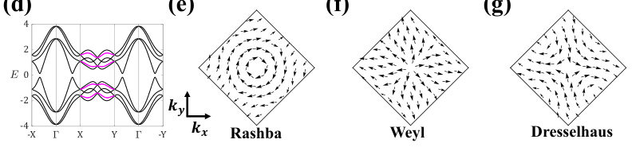 
FIG. 1. (a) and (b) Two spin configurations for the bottom layer, OPAM1 and OPAM2, differing by a 90◦of the N´eeel vector. Red/blue arrows: opposite magnetic moments on sublattices A/B. Solid (dashed) lines: nearest-neighbor (next-nearest-neighbor) hoppings. (c) Symmetry-guided stacking for realizing effective Rashba (left), Weyl (middle), and Dresselhaus (right) SOC. The top layer is obtained from the bottom layer by the symmetry operation indicated in brackets. (d) Energy spectra: black lines (Rashba and Weyl cases, fully overlapped) and magenta lines (Dresselhaus case). The spectra for all three cases are identical along the -X-Γ-X and -Y-Γ-Y directions. (e–g) Spin textures of the...

📷 Fig 2

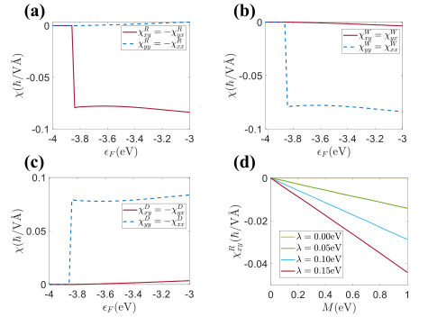 
FIG. 2. Fermi energy-dependence of the SEE susceptibility tensor components for Rashba (a), Weyl (b), and Dresselhaus (c) case. (d) Dependence of χR xy on M for different values of λ. Shared param- eters: t1 = 1.0 eV, t2 = 0.6 eV, η = 0.5 eV, δ = 0.01 eV, lattice constant a = 5 ˚A. λ = 0.25 eV and M = 1.0 eV. Under this set of parameters, χxy can reach the value −0.08 ℏ/V ˚A.

📷 Fig 3

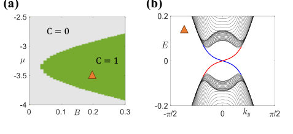 
FIG. 3. (a) Topological phase diagram of HBdG(k). (b) Energy spec- trum of HBdG(k) with open (periodic) boundary conditions along the x (y) direction, corresponding to the orange triangle at (µ, B) = (−3.5, 0.2) in (a). The red (blue) solid line denotes a branch of chiral Majorana edge state on the right (left) boundary. Other parameters are: t1 = 1, t2 = 0.6, λ = 0.25, M = 1, η = 0.5 and ∆= 0.55.

**Summary.** The authors propose that odd-parity coplanar magnets offer a nonrelativistic route to engineering strong Spin-Orbit Coupling (SOC) effects. By constructing a bilayer system and tuning its magnetic order, they demonstrate the realization of distinct Rashba, Weyl, and Dresselhaus spin textures. This work is significant because it shows this engineered SOC can achieve physical equivalence to its relativistic counterparts while offering unprecedented tunability.

**Why it may be interesting.** This work provides a mechanism to engineer complex electronic couplings like SOC using structural/magnetic degrees of freedom rather than relying solely on heavy elements or intrinsic material properties, which is highly relevant for designing novel quantum materials.

Detailed structure

**Main problem.** To find a nonrelativistic pathway to highly tunable Spin-Orbit Coupling (SOC) effects, overcoming the limitation that strong SOC is typically restricted to heavy elements and fixed by material symmetry.

**Main result.** The proposed odd-parity coplanar magnet bilayer realizes Rashba, Weyl, and Dresselhaus spin textures nonrelativistically, achieving physical equivalence to relativistic SOC via superconducting phases.

**Method.** Symmetry analysis combined with k.p expansion and projection onto low-energy continuum Hamiltonians was used to derive effective models for the system's electronic structure.

**Model / system.** The model is an odd-parity coplanar magnet realized as a bilayer stack of two monolayer antiferromagnets, described by a multi-band Hamiltonian incorporating interlayer coupling and magnetic order parameters.

**Key observables.** Rashba, Weyl, and Dresselhaus spin textures ($\langle s_x(\mathbf{k}) 
angle, \langle s_y(\mathbf{k}) 
angle$), Spin Edelstein Effect susceptibility ($\chi_{ij}$), and the existence of fully gapped chiral topological superconducting phases.

**Important parameters / regimes.** Layer Néel vector tuning (used to switch SOC types); magnetic field ($B$) relative to pairing gap ($\Delta$); interlayer coupling ($\eta$).

**Assumptions / limitations.** The analysis relies on symmetry requirements for the nonrelativistic mechanism and approximations like linear response theory for transport calculations.

**Figures summary.** Figures illustrate the bilayer stacking strategy, energy spectra showing distinct SOC types (Rashba/Weyl/Dresselhaus), spin textures in momentum space, and topological phase diagrams mapping out superconducting regimes.

**Paper structure.** The paper progresses by establishing the physical model via symmetry-guided stacking, deriving low-energy Hamiltonians for different SOC types, calculating characteristic spin textures and transport responses (SEE), and finally demonstrating the realization of topological superconductivity.

Abstract

Spin-orbit coupling (SOC) is a relativistic effect that underpins a broad spectrum of phenomena in condensed matter physics, from topological phases of matter to spintronic functionality. Its relativistic origin, however, restricts strong SOC to heavy-element materials and locks spin-momentum texture into a fixed, material-specific pattern. Here we show that odd-parity coplanar magnets offer a nonrelativistic pathway to highly tunable SOC effects. We construct a bilayer coplanar magnet via symmetry-guided stacking of two monolayer odd-parity altermagnets and demonstrate that Rashba, Weyl, and Dresselhaus spin textures can all be realized, and that the spin texture can be switched between these forms simply by tuning the layer Neel vector. Through the spin Edelstein effect and the realization of fully gapped chiral topological superconducting phases, we demonstrate that this nonrelativistic SOC achieves physical equivalence to its relativistic counterpart. Our findings identify a new class of odd-parity coplanar magnets as a versatile platform for engineering SOC effects.

[↑ back to top](#top)

### [Enabling Electrical Readout of Néel vector reversal in a van der Waals Antiferromagnet](http://arxiv.org/abs/2606.24527v1)

**Authors:** Raghvendra Posti, Ravi Kumar Bandepalli, Wenhao Liu, Anshuman Sahoo, Pratyush Saud, Zixin Zhai, Aswin L. N. Kondusamy, Zhenhong Cui, I-Hsuan Kao, Aalok Tiwari, Thomas Poirier, James H. Edgar, Kenji Watanabe, Takashi Taniguchi, Bing Lv, Jyoti Katoch, Simranjeet Singh  
**Type:** experiment · **Category:** other · **PDF:** <https://arxiv.org/pdf/2606.24527v1>  
**Analysis basis:** full PDF text, analyzed in chunks
**Topic relevance:** `spintronics-quantum-optics interface` **3/5** · `Kondo & dissipative impurity` **1/5** · `analog quantum simulation` **1/5** · `exotic spin models in light-matter` **1/5** · `non-equilibrium dynamics` **1/5**

📷 Fig 1

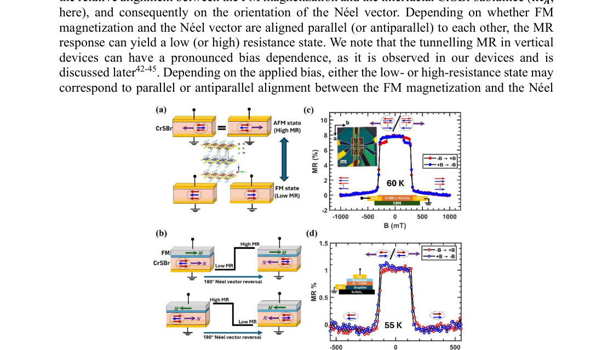 
Fig. 1. Spin-dependent transport in CrSBr. (a) Schematic of the A-type AFM order in CrSBr (center). Each monolayer exhibits intralayer ferromagnetic coupling, while adjacent layers are coupled antiferromagnetically. In the AFM state, the two sublattices with magnetization vectors 𝑚𝐴 and 𝑚𝐵 (shown by red and blue arrows, respectively), are antiferromagnetically aligned, giving rise to a Néel vector, 𝑵̂ =

📷 Fig 2

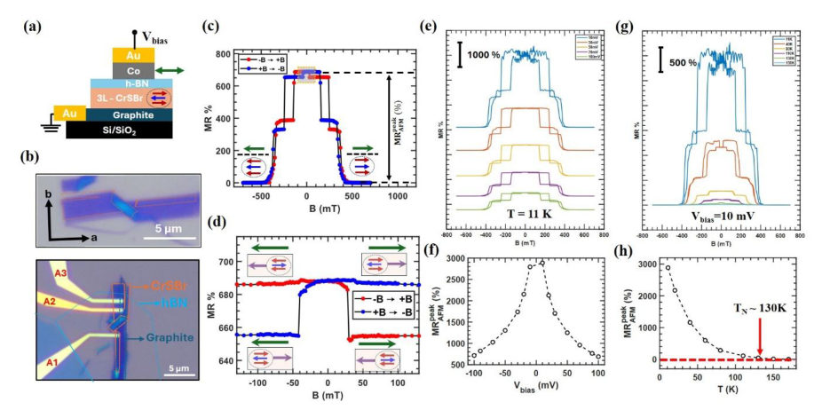 
Fig. 2. Spin-filtering in Co/h-BN/CrSBr heterostructure. (a) Sideview schematic and measurement geometry of the Co/hBN/CrSBr device. The Co magnetization is indicated by a green arrow, while the AFM ordering in CrSBr is represented by anti-parallel sublattice moments shown in red and blue. (b) Top: optical image of the CrSBr flake, with the active region outlined, used in the final device. Bottom: optical image of the fabricated heterostructure device, with individual flakes labeled and outlined. The top contacts A1, A2, and A3 on the hBN barrier consist of 400 nm-wide Co, 450 nm-wide Au, and 450 nm-wide Co electrodes, respectively. (c) Vertical MR as a function of magnetic field along easy...

📷 Fig 3

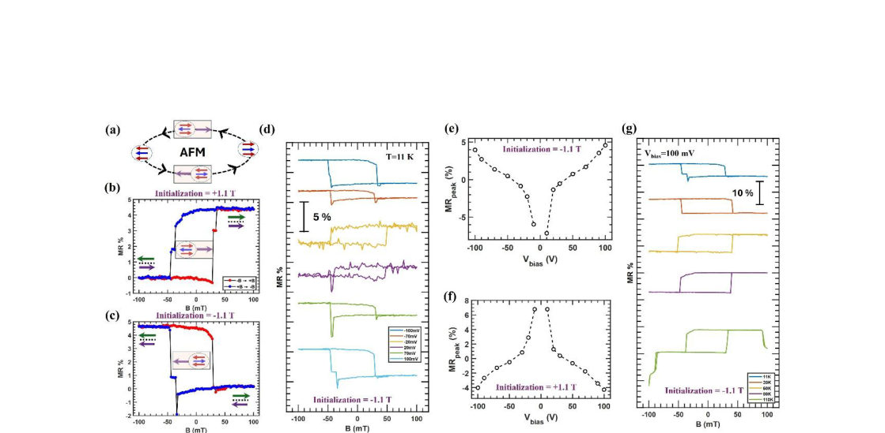 
Fig. 3. Tunnel-transport detection of Néel vector reversal in CrSBr. (a) Schematic showing two antiparallel (180°) Néel vector states stabilized by opposite high-field initialization conditions. (b,c) Field-dependent MR measured below the SF transition following initialization by +1.1 T (b) and −1.1 T (c), at T=11 K and Vbias=100 mV. The opposite hysteresis polarity reflects the reversal of the Néel vector through spin-dependent tunneling between Co and CrSBr. The AFM sublattice moments are shown by red and blue arrows, their corresponding Néel vector by the purple arrow, and the Co magnetization by the green arrow. (d) Bias-dependent MR hysteresis measured below the SF field following −1.1...

📷 Fig 4

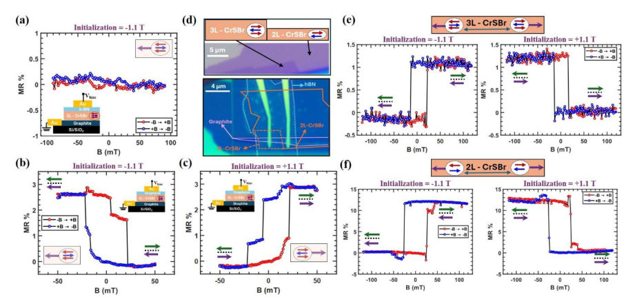 
Fig. 4. Verification of Co-induced spin filtering and layer-resolved response in CrSBr. (a) MR response of an Au/hBN/CrSBr device A2 (sideview schematic shown in inset), between SF fields after initialization of the Néel state by -1.1 T, showing absence of hysteresis. (b, c) MR hysteresis measured between the SF fields in a Co/graphene/CrSBr device (Device B) after stabilization of the Néel state using magnetic fields of (b) −1.1 T and (c) +1.1 T. Inset: side-view schematic of the heterostructure and the corresponding magnetic configurations associated with the MR states. (d) CrSBr flake with even (2L) and odd (3L) layer regions outlined in the top panel, and the corresponding Co/hBN/CrSBr...

**Summary.** This work reports an experimental breakthrough demonstrating electrical readout of Néel vector reversal in vdW antiferromagnets using $	ext{CrSBr}$. By constructing a tunnel junction with a ferromagnetic electrode, the authors achieved a measurable magnetoresistance (MR) signal that flips polarity when the AFM's magnetic order is reversed. This establishes a robust and generalizable strategy for building next-generation spintronic memory devices based on AFMs.

**Why it may be interesting.** While primarily condensed matter/spintronics, the concept of using quantum transport phenomena (spin-dependent tunneling) to read out a fundamental symmetry property ($\mathbf{N}$ reversal) is highly relevant to developing novel quantum memory elements and controlling spin states in solid-state systems.

Detailed structure

**Main problem.** The primary challenge addressed is demonstrating an electrical readout mechanism for the $180^\circ$ reversal of the Néel vector ($\mathbf{N}$) in thin-film van der Waals antiferromagnets (AFMs). This capability is crucial for developing next-generation AFM-based spintronic and magnonic memory devices.

**Main result.** The authors successfully demonstrated this readout by utilizing a spin-dependent tunneling magnetoresistance (MR) measurement in $	ext{Co}/	ext{hBN}/	ext{CrSBr}$ heterostructures. They showed that reversing the Néel vector results in an opposite hysteresis pattern in the MR response, confirming electrical sensitivity to $\mathbf{N}$ orientation.

**Method.** The methodology involves fabricating vertical tunnel junctions using mechanical exfoliation of vdW materials ($	ext{CrSBr}$, $	ext{hBN}$) and measuring the magnetoresistance (MR) as a function of applied magnetic field ($B$) and bias voltage ($V_{	ext{bias}}$).

**Model / system.** The system is based on atomically thin, A-type vdW AFMs like $	ext{CrSBr}$, which possess sublattices ($\mathbf{m}_A$, $\mathbf{m}_B$) defining the Néel vector $\mathbf{\hat{N}}$. The measurement relies on the spin-dependent tunneling magnetoresistance (MR), modeled by the Jullière tunnelling model, between a ferromagnetic (FM) electrode ($	ext{Co}$) and the AFM layer.

**Key observables.** Magnetoresistance (MR) response exhibiting clear two-level (low/high resistance) switching behavior; the reversal of this MR hysteresis pattern when the initial magnetic field polarity is reversed.

**Important parameters / regimes.** The measurements are sensitive to bias voltage ($V_{	ext{bias}}$), temperature ($T$), and applied magnetic fields, with key transitions observed near $T_N \sim 130-140\ 	ext{K}$.

**Assumptions / limitations.** The analysis assumes that the measured MR is dominated by spin-dependent tunneling through the tunnel barrier, making it sensitive to the relative alignment between the FM magnetization and the AFM sublattice magnetization.

**Figures summary.** Figures illustrate schematics of the A-type AFM order and the proposed tunnel junction setup. Key results show field-dependent and bias-dependent MR hysteresis loops that reverse polarity when the initial magnetic field used for initialization is reversed, confirming $\mathbf{N}$ reversal.

**Paper structure.** The paper progresses from identifying the critical gap (electrical readout of Néel vector) to proposing a specific tunnel junction geometry. It then details experimental measurements showing spin-valve behavior and conclusively proves Néel vector reversal by observing opposite MR hysteresis patterns upon reversing the initial high magnetic field polarization.

Abstract

Owing to its robustness against external perturbations and intrinsically ultrafast dynamics, the Néel vector in antiferromagnets (AFMs) can enable the development of next-generation spintronic and magnonic devices for memory and computing applications. To realize AFM-based magnetic memory devices, one of the key requirements is to demonstrate electrical readout of 180-degree reversal of Néel vector in thin film AFMs, which remains critically missing. In this work, we report experimental demonstration of a novel transport methodology to detect Néel vector reversal in atomically thin films of a van der Waals (vdW) based A-type AFM. For this, we utilize spin-dependent electronic band properties of CrSBr by coupling it to a spin-polarized layer, separated by a tunnel barrier. In this configuration, the spin-dependent tunnelling magnetoresistance (MR) becomes sensitive to the relative orientation between the magnetization of the reference electrode and the interfacial sublattice magnetization of the AFM layer, in turn enabling electrical detection of the Néel vector orientation. Importantly, the observed MR can also reveal 180-degree reversal of Néel vector in even-layers of CrSBr, wherein adjacent sublattice magnetic layers are exactly compensated and the net magnetization vanishes and thus establishes a broadly applicable strategy for electrical detection of Néel vector in vdW-based AFMs.

[↑ back to top](#top)

### [AC Conductance in n-InSb Structures with Quantum Well. Acoustic Studies](http://arxiv.org/abs/2606.24663v1)

**Authors:** I. L. Drichko, I. Yu. Smirnov, Yu. M. Galperin, A. V. Suslov  
**Type:** experiment · **Category:** other · **PDF:** <https://arxiv.org/pdf/2606.24663v1>  
**Analysis basis:** full PDF text, analyzed in chunks
**Topic relevance:** `driven-dissipative phase transition` **2/5** · `Keldysh / 2PI / non-Gaussian methods` **1/5** · `Kondo & dissipative impurity` **1/5** · `analog quantum simulation` **1/5** · `correlated / nonlocal dissipation` **1/5** · `methods for driven-dissipative` **1/5** · `non-equilibrium dynamics` **1/5** · `spintronics-quantum-optics interface` **1/5**

📷 Fig 1

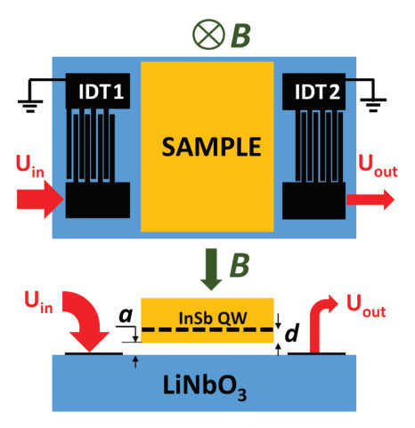 
FIG. 1. Schematics of the experimental acoustic set-up: up- per panel - top view; lower panel - side view.

📷 Fig 2

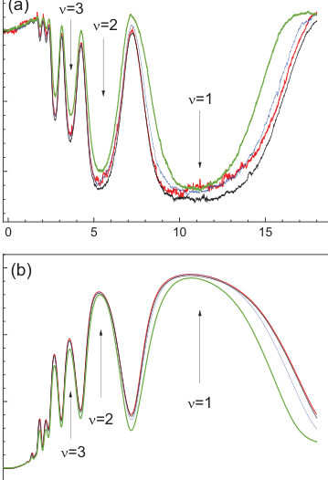 
FIG. 2. Magnetic field dependences of ∆Γ = Γ(B)−Γ(B = 0) (a) and ∆v/v (b) at different temperatures. f=85 MHz, T (mK): 20 (red curve), 40 (black curve), 200 (blue curve), 500 (green curve). Marked by arrows are the filling factors ν.

📷 Fig 3

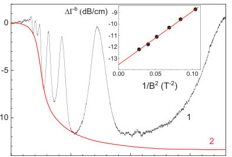 
FIG. 3. 1 - the experimental curve ∆Γ(B); 2 - the envelope curve ∆Γb(B). Inset: ∆Γb as a function of 1/B2 in the region 3÷6 T. T =20 mK. f=85 MHz.

📷 Fig 4

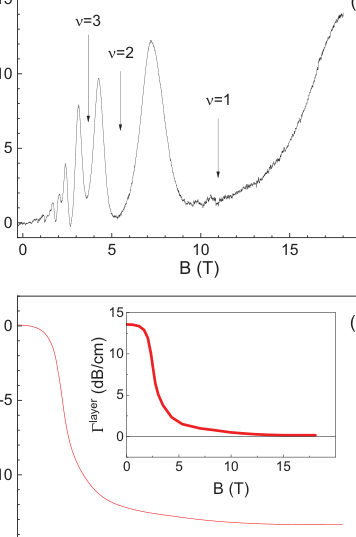 
FIG. 4. a) The results of the subtraction: SAW absorption ΓQW(B) in the quantum well. b) Background SAW absorp- tion ∆Γb(B). Inset: Absolute value of the SAW absorption in the shunting layer. f=85 MHz, T =20 mK.

📷 Fig 5

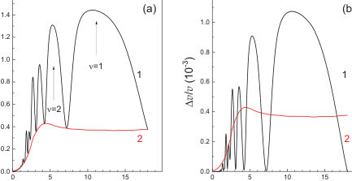 
FIG. 5. Magnetic field dependence of the velocity change: a) 1 - experimental curve, black; 2 - envelope curve, red. b) 1 - After subtraction: ∆v/v contribution from the quantum well, black; 2 - ∆v/v contribution from the shunting layer, red; T =20 mK, f=85 MHz

**Summary.** This experimental work uses Surface Acoustic Waves in a high-field magnet setup to study the AC conductance of an InSb quantum well. The key innovation is successfully separating the electrical response originating from the QW itself versus that from a parallel conducting layer. This allowed for detailed characterization, including determining the electron g-factor and confirming different conduction regimes like hopping transport.

**Why it may be interesting.** While focused on solid-state transport, the use of high magnetic fields and quantum confinement effects touches upon topics relevant to strongly correlated electron systems and mesoscopic physics, which share theoretical overlap with open quantum system dynamics.

Detailed structure

**Main problem.** The study aims to characterize the AC conductance of an n-InSb quantum well structure while simultaneously separating its contribution from a parallel conducting shunting layer.

**Main result.** The authors successfully separated the conduction mechanisms, determined the electron g-factor in the QW using acoustic measurements under tilted magnetic fields, and confirmed hopping transport in both the QW and the shunting layer at high fields.

**Method.** Acoustic methods utilizing Surface Acoustic Waves (SAW) generated on $	ext{LiNbO}_3$ are employed to measure changes in SAW attenuation ($\Delta\Gamma$) and velocity ($\Delta v/v$), which are then used to derive the complex AC conductance components.

**Model / system.** The physical system is an n-InSb quantum well structure grown on GaAs, featuring a 21 nm QW shunted by a parallel conducting layer. Measurements are conducted in high magnetic fields (up to 18 T) and cryogenic temperatures (20–500 mK).

**Key observables.** SAW attenuation change ($\Delta\Gamma$), relative velocity shift ($\Delta v/v$), complex AC conductance components ($\sigma_{ac}$), electron g-factor ($g$).

**Important parameters / regimes.** Magnetic field $B$ (up to 18 T), Temperature $T$ (20–500 mK), Quantum Well width (21 nm).

**Assumptions / limitations.** The ability to model and subtract the background contribution from the parallel conducting layer ($\Delta\Gamma_b(B) \propto 1/B^2$) is crucial for isolating the QW response.

**Figures summary.** Figures show magnetic field dependences of $\Delta\Gamma$ and $\Delta v/v$, illustrating the subtraction process to isolate QW contributions, and presenting results confirming distinct conduction regimes (e.g., hopping vs. delocalized).

**Paper structure.** The paper systematically analyzes SAW measurements to derive AC conductance components ($\sigma_{QW}, \sigma_{layer}$), uses background subtraction techniques to separate the two material contributions, and finally applies a coincidence technique in tilted fields to measure fundamental parameters like the g-factor.

Abstract

We studied the ac conductance of an $n$-InSb quantum well structure using acoustic methods in magnetic fields up to 18 T and at temperatures ranging from 20 to 500 mK. We attribute the unusual magnetic field dependences of surface acoustic wave (SAW) attenuation and velocity observed in the experiment to the presence of a conducting layer parallel to the quantum well in the sample. We successfully separated the contributions from both the quantum well and the shunting layer, enabling the identification of their distinct conduction mechanisms. Furthermore, by employing the coincidence technique, we determined the electron g-factor in the quantum well and investigated its dependence on the degree of spin polarization.

[↑ back to top](#top)

### [Band offsets and stability of WSe$_2$/RuCl$_3$ van der Waals charge-transfer contacts](http://arxiv.org/abs/2606.24199v1)

**Authors:** Thomas S. Nielsen, Edvard Solbrekken, Christian Overby, Christian V-B. Fokdal, Alfred J. H. Jones, Zhihao Jiang, Chakradhar Sahoo, Kenji Watanabe, Takashi Taniguchi, Søren Ulstrup  
**Type:** experiment · **Category:** strongly correlated electrons · **PDF:** <https://arxiv.org/pdf/2606.24199v1>  
**Analysis basis:** full PDF text, analyzed in chunks
**Topic relevance:** `driven-dissipative phase transition` **2/5** · `Keldysh / 2PI / non-Gaussian methods` **1/5** · `Kondo & dissipative impurity` **1/5** · `analog quantum simulation` **1/5** · `methods for driven-dissipative` **1/5** · `non-equilibrium dynamics` **1/5**

📷 Fig 1

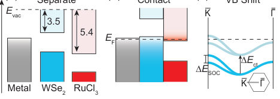 
FIG. 1. Band alignments in a metal/WSe2/RuCl3 junction. (a) Diagram of valence and conduction band alignments in the separate materials referenced to a common vacuum level (Evac). Electron affinities are illustrated by double-headed arrows and given in units of eV [24, 26]. (b) Band alignments after contact formation and equilibration of Fermi level (EF). Grey, blue and red color gradients illustrate carrier filling in the two scenarios in (a)-(b). (c) Schematic of SL WSe2 valence band before (blue) and after (light-blue) contact formation. Charge transfer leads to an energy shift (∆Ect) placing the spin-orbit coupling split (∆ESOC) valence band states around EF. The bands are illustrated...

📷 Fig 2

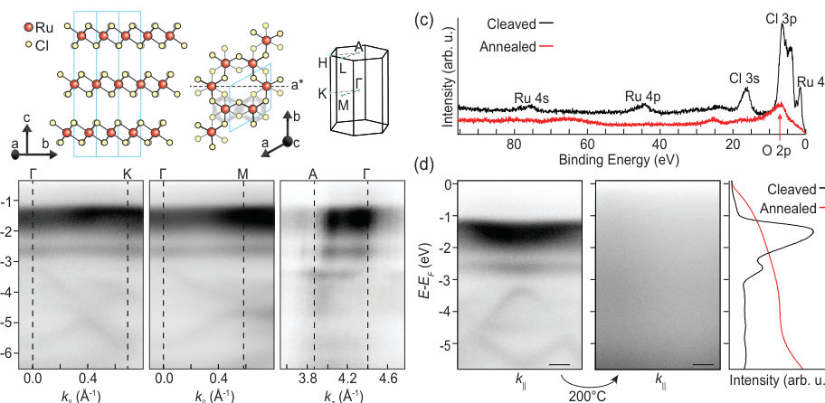 
FIG. 2. Electronic structure of bulk RuCl3 and impact of heating. (a) Crystal structure of RuCl3 in the P3112 space group with black arrows showing the crystallographic axes. Left is a side view along the a* direction of the 3 layers in the unit cell. Middle is a top view with the hexagonal unit cell indicated in blue and the RuCl6 octahedra in gray. Right is the hexagonal bulk BZ. (b) ARPES spectra along Γ-K and Γ-M obtained at hν = 63 eV, corresponding to the Γ-K-M plane, and along A-Γ by varying hν between 35-80 eV. An inner potential of 18 eV is used for the conversion to kz [45]. (c) Core level spectra of bulk RuCl3 before and after heating to 200◦C measured at hν = 145 eV. (d) Valence...

📷 Fig 3

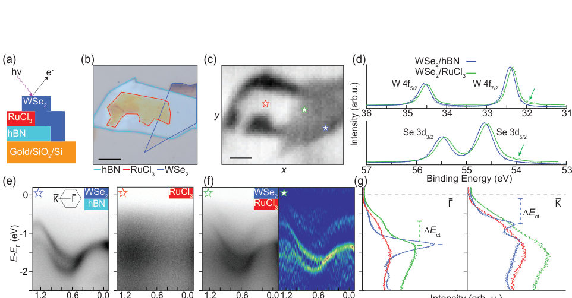 
FIG. 3. Electronic structure of a SL WSe2/RuCl3/hBN heterostructure. (a) Diagram of sample and measurement configuration. (b) Optical image of the sample with hBN, RuCl3 and WSe2 flakes indicated by light blue, red and dark blue outlines, respectively. (c) Map of (x,y)-dependent ARPES intensity integrated over momentum from −0.1 to 0.1 ˚A−1 and energy from −2.5 to −3.5 eV. The scale bar in (b)-(c) is 10 µm. (d) Core level spectra (markers) with Voigt fits (lines) from WSe2/hBN and WSe2/RuCl3 areas demarcated by blue and green stars in (c), respectively. Arrows indicate a shoulder at lower binding energies. The spectra were acquired at hν = 145 eV. (e) Valence band spectra of WSe2/hBN and...

**Summary.** This work uses muARPES to characterize the electrical contact formed between a 2D semiconductor (WSe2) and a layered Mott insulator ($\alpha$-RuCl3). The researchers found that forming this junction causes a measurable valence band shift, suggesting successful charge transfer for ohmic contact. Crucially, they highlight that achieving stable, high-quality contacts is extremely sensitive to the experimental handling procedures.

**Why it may be interesting.** While primarily experimental condensed matter physics, the study deals with Mott insulators ($	ext{RuCl}_3$) and interface electronic structure engineering, which touches upon correlated electron phenomena and emergent quantum states at boundaries.

Detailed structure

**Main problem.** The study aims to determine the electronic structure and robustness of band offsets at the interface between single-layer WSe2 and alpha-RuCl3 van der Waals charge-transfer contacts.

**Main result.** Contact formation induces a significant valence band shift of (0.68 ± 0.05) eV in WSe2, establishing an ohmic contact via hole doping. However, the charge transfer effect is highly sensitive to fabrication conditions and RuCl3 degrades upon heating.

**Method.** Micro-focused angle-resolved photoemission spectroscopy (muARPES) was employed to measure the electronic structure of the heterostructure in ultra-high vacuum.

**Model / system.** The physical system is a van der Waals heterostructure composed of single-layer WSe2 contacted with alpha-RuCl3, which acts as a layered Mott insulator. The analysis focuses on charge transfer effects and band alignment at this interface.

**Key observables.** Valence band maximum (VBM) shift ($\Delta E_{ct}$), core level peak shifts, electronic structure mapping across the Brillouin zone.

**Important parameters / regimes.** Charge transfer magnitude (0.68 eV); Fermi energy relative to VBM; temperature/heating history during sample preparation.

**Assumptions / limitations.** The charge transfer effect is assumed to be measurable via ARPES shifts, but its observation is critically dependent on minimizing environmental contamination and thermal stress.

**Figures summary.** Figures illustrate band alignments showing the energy shift (Fig. 1), ARPES spectra confirming Mott insulating state and degradation upon heating (Fig. 2), and spatial maps/valence band dispersions comparing WSe2/hBN vs WSe2/RuCl3 contacts (Fig. 3).

**Paper structure.** The paper establishes the need to characterize contact interfaces, details the muARPES methodology applied to the WSe2/RuCl3 system, presents quantitative measurements of band shifts and charge transfer, discusses the limitations imposed by sample handling and material stability, and concludes with implications for device design.

Abstract

The layered Mott insulator $α$-RuCl$_3$ induces degenerate hole-doping in two-dimensional semiconductors due to its large electron affinity, making it a promising charge-transfer material for establishing ohmic contacts in electronic devices. In order to assess the applicability and guide the design of devices incorporating RuCl$_3$ it is critical to determine the electronic structure and robustness of the band offsets that underpin the transport properties of semiconductors in contact with RuCl$_3$. Here, we apply micro-focused angle-resolved photoemission spectroscopy to determine the electronic structure of single-layer WSe$_2$ contacted to RuCl$_3$ on hexagonal boron nitride substrates. We find that formation of a functioning WSe$_2$/RuCl$_3$ contact leads to a valence band shift of $(0.68 \pm 0.05)$ eV towards the Fermi energy in WSe$_2$. The charge transfer effect is challenging to observe as it depends sensitively on fabrication conditions such as solvent exposure, quality of interface encapsulation and heating of RuCl$_3$, imposing strict requirements on device design to attain high-quality contacts.

[↑ back to top](#top)

### [Bode-Fano Limits to Broadband Absorption by Small Particles](http://arxiv.org/abs/2606.24658v1)

**Authors:** Emanuele Corsaro, Andrea Alù, Carlo Forestiere  
**Type:** theory · **Category:** other · **PDF:** <https://arxiv.org/pdf/2606.24658v1>  
**Analysis basis:** full PDF text, analyzed in chunks
**Topic relevance:** `Keldysh / 2PI / non-Gaussian methods` **1/5** · `correlated / nonlocal dissipation` **1/5** · `driven-dissipative phase transition` **1/5** · `interference shaping light` **1/5** · `methods for driven-dissipative` **1/5**

📷 Fig 1

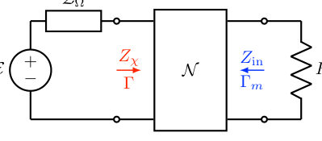 
FIG. 1. (a) A generic temporally dispersive object enclosed within a sphere of radius a illuminated by a time-harmonic electric field Ei. (b) Equivalent circuit model, mapping the response of the polarization current density induced by the external field Ei within the dipolar approximation. (c) Dar- lington representation of Zχ.

📷 Fig 2

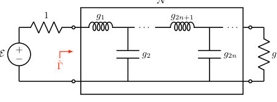 
FIG. 2. Low-pass prototype in the ˆs-domain.

📷 Fig 3

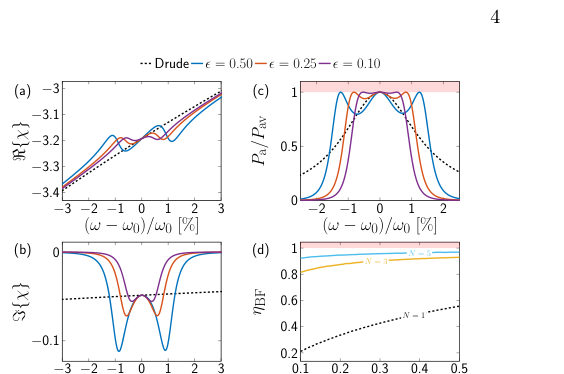 
FIG. 3. Chebyshev synthesis near the Bode–Fano absorption- bandwidth limit. (a,b) Real and imaginary parts of the sus- ceptibility for third-order passive causal realizations with rip- ple parameter ϵ = 0.50, 0.25, 0.10. The dashed black curve is the matched single-pole Drude reference, N = 1. (c) Nor- malized absorbed power Pa/Pav. The shaded region marks Pa &gt; Pav, which is forbidden by passivity. Reducing ϵ im- proves the uniformity of the near-conjugate match inside the band but narrows the achievable bandwidth. (d) Normalized Bode–Fano integral ηBF versus ripple parameter. The shaded region marks ηBF &gt; 1, which is forbidden by the Bode–Fano limit. The higher-order Chebyshev realizations...

**Summary.** This work derives the ultimate theoretical limits governing how much light a small particle can absorb across a given frequency bandwidth. By mapping electromagnetism to an impedance-matching circuit problem, the authors establish Bode–Fano inequalities that quantify this fundamental trade-off. The paper provides a practical synthesis route using filter design theory to engineer materials whose dispersion approaches these physical boundaries.

**Why it may be interesting.** The mathematical rigor connecting classical circuit theory (filter synthesis) to fundamental electromagnetic scattering limits provides powerful analytical tools for designing nanophotonic devices operating near physical constraints, which is relevant for understanding energy transfer in quantum optical systems.

Detailed structure

**Main problem.** The paper derives fundamental, rigorous absorption-bandwidth limits for passive, causal, linear, and temporally dispersive subwavelength objects.

**Main result.** It establishes Bode–Fano-type constraints that quantify the ultimate trade-off between achieving high in-band absorption and maintaining a broad operational bandwidth.

**Method.** The electromagnetic scattering problem is mapped onto an equivalent single-mode impedance-matching circuit model, allowing the application of complex analysis techniques like Darlington's synthesis theorem and contour integration.

**Model / system.** The system analyzed is a subwavelength nanoparticle or object ($\Omega$) characterized by its material susceptibility ($\chi$) and radiation properties ($Z_\Omega$), modeled as an equivalent electrical circuit.

**Key observables.** Absorption power ($P_a$), Scattering power ($P_s$), Extinction cross-section ($\sigma_e$), Reflection coefficient ($\Gamma$).

**Important parameters / regimes.** Bode–Fano integral ($\eta_{BF}$), material dispersion parameters, and the order of the synthesized filter ($N$).

**Assumptions / limitations.** The analysis assumes the object is passive, linear, causal, time-invariant, and that the electric dipole mode dominates due to subwavelength confinement.

**Figures summary.** Figures illustrate the equivalent single-mode circuit model, Darlington representations of impedances, low-pass prototypes in the s-domain, and comparisons of synthesized absorption spectra (e.g., Chebyshev vs. Drude) against the theoretical Bode–Fano limit.

**Paper structure.** The paper progresses from formulating the scattering problem via impedance matching to deriving fundamental sum rules, then refining these into rigorous Bode–Fano inequalities using complex analysis, and finally providing a constructive synthesis framework based on filter design techniques (e.g., Chebyshev realization) to approach these theoretical bounds.

Abstract

Nanostructures can be designed to absorb light efficiently at resonance despite their subwavelength footprint, but causality and passivity fundamentally limit the bandwidth over which strong absorption can be maintained. Here we derive fundamental absorption-bandwidth limits for passive, causal, linear, and temporally dispersive subwavelength objects by rigorously casting electromagnetic scattering as an equivalent impedance-matching problem. This mapping yields ultimate Bode-Fano-type constraints for optical absorption and provides rational synthesis guidelines for the material dispersion of passive nanoparticles that can approach the bounds. Our results clarify the ultimate limits for broadband light harvesting and dissipation, with implications for solar-energy conversion, photothermal hyperthermia, thermal management, and related nanophotonic technologies.

[↑ back to top](#top)

### [A 35B Hybrid-Attention Mixture-of-Experts Model on a 6GB 2011 GPU: Hand-Written 4-bit CUDA Inference for Fermi](http://arxiv.org/abs/2606.24031v1)

**Authors:** A. C. Opus, J. Q. Lu  
**Type:** experiment · **Category:** other · **PDF:** <https://arxiv.org/pdf/2606.24031v1>  
**Analysis basis:** full PDF text, analyzed in chunks
**Topic relevance:** `analog quantum simulation` **1/5** · `driven-dissipative phase transition` **1/5** · `methods for driven-dissipative` **1/5** · `non-equilibrium dynamics` **1/5**

📷 Fig 1

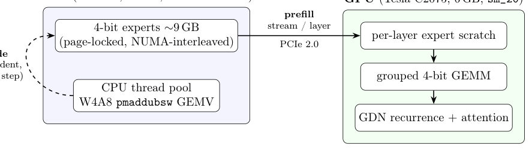 
Figure 1: Hybrid execution. The 4-bit experts reside in page-locked, NUMA-interleaved host memory. Prefill streams each layer’s experts across PCIe 2.0 into a 6 GB-resident scratch buffer and runs the batched GPU kernels; decode keeps the single-token computation on the host CPU (W4A8 integer SIMD), avoiding a per-token PCIe round trip. Pruning and the prefix cache act on the prefill (GPU) path; the integer kernel acts on the decode (CPU) path.

📷 Fig 2

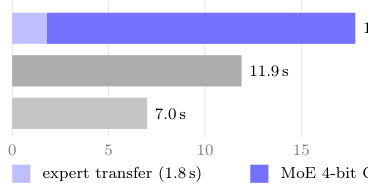 
Figure 2: Where prefill time goes (single-pass, 947-token prompt; all three are GPU kernels). The MoE GEMM dominates and, after single-pass prefill, carries only 1.8 s of expert host→device transfer. The GDN recurrence (a sequential scan) and softmax attention account for the rest; the three components sum to ≈36.7 s of the 37.5 s prefill.

**Summary.** This paper details an intensive hardware benchmarking study showing how to run a massive 35B MoE language model on severely outdated, resource-limited GPU hardware. The authors developed a hybrid inference engine that splits computation between the GPU (for prefill) and the CPU (for decode), achieving significant speedups by hand-optimizing kernels for legacy instruction sets.

**Why it may be interesting.** While focused on LLMs, the core engineering challenge—optimizing computation flow around severe memory bandwidth and compute capability bottlenecks using custom low-level kernels—is highly relevant to simulating complex quantum many-body systems that exceed available classical memory.

Detailed structure

**Main problem.** To determine the practical limits of running a contemporary, large Mixture-of-Experts (MoE) language model on severely constrained, legacy hardware.

**Main result.** The authors achieved significant performance gains by implementing a hybrid execution strategy, reducing prefill latency by $\sim 34\%$ and tripling decode throughput compared to baseline methods.

**Method.** A hybrid inference pipeline was designed: GPU handles batched prompt prefill using streamed expert weights, while the host CPU executes single-token decoding using a hand-written integer-SIMD kernel.

**Model / system.** The system uses a 35B parameter MoE model (Qwen3.6-35B-A3B) running on an outdated NVIDIA Tesla C2075 GPU (Fermi architecture, 6GB VRAM). The process is constrained by the need to fit a $\sim 10.5 	ext{ GB}$ model onto $6 	ext{ GB}$ of memory.

**Key observables.** Prefill latency (e.g., $57.2 	ext{ s} 	o 37.5 	ext{ s}$), decode throughput ($	ext{tok/s}$, e.g., $2.8 	o 8.6$), and prefix reuse time ($78 	ext{ s} 	o 0.5 	ext{ s}$).

**Important parameters / regimes.** Model size (35B total, $\sim 3$B active), GPU compute capability ($	ext{sm\_20}$), memory constraint ($10.5 	ext{ GB} > 6 	ext{ GB}$), and quantization level (4-bit).

**Assumptions / limitations.** The study assumes the hardware limitations define a practical performance floor, as evidenced by negative results showing that standard optimizations failed to improve speed.

**Figures summary.** Figure 1 illustrates the hybrid execution flow: experts are streamed from host RAM for GPU prefill and CPU decode. Figure 2 decomposes prefill time components (MoE GEMM, GDN recurrence, softmax attention).

**Paper structure.** The paper details the problem setup by identifying hardware constraints, proposes a novel hybrid inference strategy combining streaming GPU prefill with CPU-based integer-SIMD decoding, and rigorously measures performance improvements across various stages like prefill, decode, and prefix caching.

Abstract

We report end-to-end inference of \textbf{Qwen3.6-35B-A3B} -- a 35-billion-parameter, $\sim$3B-active Mixture-of-Experts (MoE) model with a hybrid gated-delta-net / full-attention backbone -- on a \textbf{2011 NVIDIA Tesla C2075} (Fermi, compute capability \smtwenty, 6\,GB), a GPU that predates tensor cores, native FP16 arithmetic, the \texttt{DP4A} integer dot-product instruction, and support in every modern CUDA toolchain. Because the 4-bit model ($\approx$10.5\,GB) is roughly twice the device memory, we adopt a \emph{hybrid} execution strategy: the GPU performs batched prompt \emph{prefill} with expert weights streamed layer-by-layer from host RAM, while \emph{decode} runs on the host CPU using a hand-written W4A8 integer GEMV built on the SSSE3 \texttt{pmaddubsw} instruction. The entire engine -- GEMM, hybrid-attention recurrence, MoE routing, and a from-scratch vision tower -- is written by hand for \smtwenty{} and compiled with the legacy CUDA 8.0 toolchain. On a 947-token prompt we reduce prefill latency from 57.2\,s to 37.5\,s ($-34\%$) through expert pinning, single-pass prefill, and NUMA interleaving, and we raise decode throughput from 2.8 to 8.6\,\tps{} ($\approx 3\times$) with the integer-SIMD kernel. A position-indexed snapshot cache for the recurrent (gated-delta-net) state restores prefix reuse on a recurrent architecture, cutting a repeated 78\,s prefill to 0.5\,s. We also report a set of \emph{negative} results -- offloading the language-model head to the idle GPU, hyper-threading, and three GPU-kernel rewrites all fail to help -- % which together pin down the practical floor of this hardware. Our aim is not a speed record but a careful account of what it takes, and where the walls are, to run a contemporary frontier-class MoE on fourteen-year-old silicon.

[↑ back to top](#top)

### [Observation of even-denominator fractional quantum Hall states at $ν= 3/4$ and 5/4 in the lowest Landau level](http://arxiv.org/abs/2606.23990v1)

**Authors:** Siddharth Kumar Singh, Chengyu Wang, Adbhut Gupta, Kirk W. Baldwin, Loren N. Pfeiffer, Mansour Shayegan  
**Type:** both · **Category:** strongly correlated electrons · **PDF:** <https://arxiv.org/pdf/2606.23990v1>  
**Analysis basis:** full PDF text, analyzed in chunks
**Topic relevance:** `analog quantum simulation` **1/5** · `driven-dissipative phase transition` **1/5**

📷 Fig 1

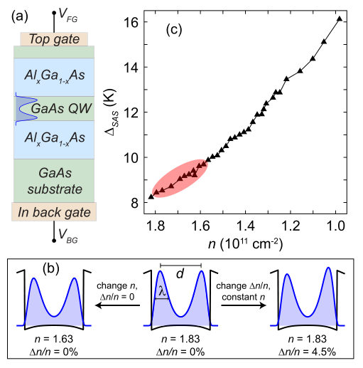 
FIG. 1. (a) Device schematic. (b) Self-consistent Schr¨odinger and Poisson (Hartree) calculations for the charge distribution and potential in a 72.5-nm-wide GaAs QW, showing the effect of changing the density (n) and the charge distribution asym- metry (∆n/n) using the front and back gates. (c) Measured ∆SAS in our sample plotted as a function of n. The shaded, red region marks the range relevant for the data presented in this manuscript.

📷 Fig 2

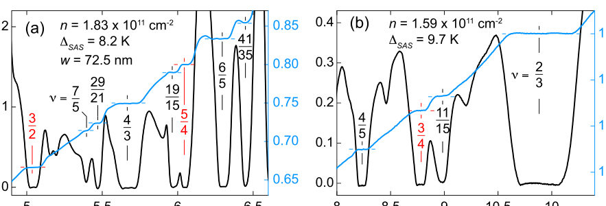 
FIG. 2. (a,b) Rxx (black) and Rxy (blue) traces taken at T ≃33 mK, for a 72.5-nm-wide GaAs sample with n = 1.83 and 1.59, respectively. Strong even-denominator FQHSs are observed at ν = 3/2, 5/4, and 3/4. Spontaneously imbalanced, bilayer FQHSs are observed in close vicinity of the 5/4 and 3/4 FQHSs at ν = 19/15 and 11/15, respectively. Vertical lines mark the expected positions of the odd- and even-denominator FQHSs, and horizontal lines mark the expected positions for the Hall plateaus.

📷 Fig 3

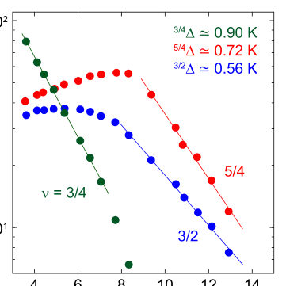 
FIG. 3. Arrhenius plots of the Rxx minima at ν = 3/2 (blue), 5/4 (red) and 3/4 (green) FQHSs at n = 1.83, allowing us to extract their energy gaps as indicated in the upper right corner.

📷 Fig 4

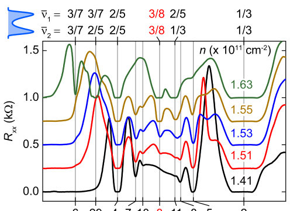 
FIG. 4. Evolution of the ground state at ν = 3/4 from a CF Fermi sea to a FQHS as the density is raised. Rxx traces are shifted vertically for clarity. The 2DES becomes 2C at high density, signaled by the disappearance of the 1C, odd- numerator FQHSs at ν = 5/7 and 7/9, and the emergence of 2C, bilayer FQHSs at ν = 6/7, 29/35, and 11/15. The layer fillings ¯ν1 and ¯ν2 associated with the observed FQHSs are shown above the figure.

📷 Fig 5

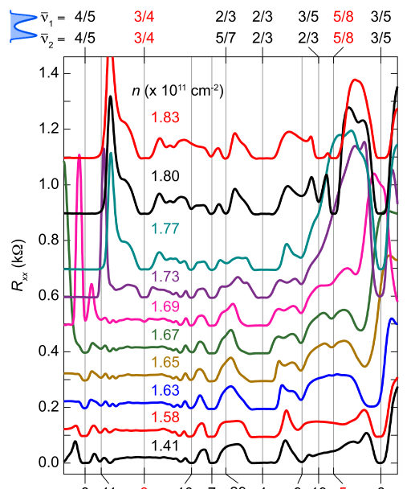 
FIG. 5. Evolution of the 2DES around ν = 3/2 and 5/4 as the density is raised. For clarity, Rxx traces are shifted vertically. With increasing n, the states at ν = 3/2 and 5/4 evolve from compressible Fermi seas to incompressible FQHSs. 1C to 2C transitions can be observed at the even-numerator ν = 4/3 FQHS at n = 1.73, and the ν = 6/5 FQHS at n = 1.69. The odd-numerator FQHSs at ν = 11/7, 7/5 and 9/7 become weak or disappear, while new FQHSs emerge at ν = 19/15 and 29/21 at n = 1.83.

**Summary.** This paper reports the discovery of stable even-denominator Fractional Quantum Hall States at $\nu=3/4$ and $5/4$ in GaAs quantum wells. The findings are explained by a theoretical model involving two-component bilayer composite fermions, highlighting that these states rely critically on maintaining symmetry in the electron charge distribution.

**Why it may be interesting.** This work provides detailed experimental evidence for exotic correlated electron phases (FQHSs) that emerge due to the interplay between orbital quantization (Landau levels), strong Coulomb interactions, and structural degrees of freedom (bilayer coupling).

Detailed structure

**Main problem.** The research focuses on discovering and characterizing novel even-denominator Fractional Quantum Hall States (FQHSs) at filling factors $\nu=3/4$ and $5/4$. These states are studied in the context of wide quantum wells exhibiting bilayer characteristics.

**Main result.** Robust even-denominator FQHSs are observed, which are explained by a two-component, bilayer composite fermion framework. The stability of these states is highly dependent on maintaining charge distribution symmetry.

**Method.** The study combines low-temperature transport measurements ($R_{xx}, R_{xy}$) with theoretical modeling using composite fermion theory and analyzing the system's response to controlled charge asymmetry.

**Model / system.** The physical platform is a two-dimensional electron system (2DES) confined in wide GaAs quantum wells, which naturally supports a bilayer charge distribution. The physics is governed by strong Coulomb interactions and tunable interlayer tunneling.

**Key observables.** Longitudinal resistance minima ($R_{xx}$), energy gaps ($\nu\Delta$), and the critical charge asymmetry $(\Delta n/n)_C$ required to destabilize the FQHSs.

**Important parameters / regimes.** Filling factors $\nu=3/4, 5/4, 3/2$; interlayer tunneling strength ($\alpha$); charge distribution symmetry ($\Delta n/n$).

**Assumptions / limitations.** The analysis assumes that the FQHSs can be described by generalizations of composite fermion wavefunctions (e.g., Scarola-Jain bilayer framework).

**Figures summary.** Figures illustrate $R_{xx}$ and $R_{xy}$ traces confirming FQHS plateaus at $\nu=3/2, 5/4,$ and $3/4$, and show how these states evolve or disappear when the charge distribution symmetry is intentionally broken.

**Paper structure.** The paper progresses by first establishing the experimental observation of even-denominator FQHSs in wide QWs. It then develops a theoretical explanation linking these states to bilayer composite fermion physics, detailing their dependence on interlayer tunneling and charge symmetry.

Abstract

Two-dimensional electron systems (2DESs) confined to wide GaAs quantum wells provide a unique platform to study exotic fractional quantum Hall states (FQHSs) because the 2DES has a bilayer charge distribution with significant interlayer tunneling. Precise control over the 2DES density allows the tuning of the interlayer tunneling over a wide range. Here, we present our discovery of new even-denominator FQHSs in the lowest Landau level (orbital index \textit{N} = 0) at filling factors $ν= 3/4$ and 5/4 in an ultrahigh-quality 2DES confined to a 72.5-nm-wide GaAs quantum well. The ground states at $ν= 3/4$ and 5/4 both evolve from composite fermion Fermi seas to FQHSs as the density is raised so that interlayer tunneling is sufficiently reduced and the 2DES becomes two-component, signaled by the behavior of the FQHSs flanking $ν= 3/4$ and 5/4. The two-component nature of the $ν=3/4$ and 5/4 FQHSs is also evident from their extreme sensitivity to the bilayer charge distribution symmetry: both states disappear quickly when the charge distribution is made asymmetric by only $\simeq 2\%$. We find a natural explanation for the 3/4 and 5/4 FQHSs in terms of two states linked by particle-hole symmetry, and using the Scarola-Jain bilayer composite fermion framework which is a generalization of the well-known, two-component, Halperin state ($Ψ_{331}$ state). Our observations elucidate the crucial role of competing energy and length scales in wide quantum wells in stabilizing new ground states.

[↑ back to top](#top)

### [The effect of pressure on the splitting in $^3$He in nematic aerogel](http://arxiv.org/abs/2606.24308v1)

**Authors:** V. V. Dmitriev, D. V. Petrova, A. A. Soldatov, A. N. Yudin  
**Type:** experiment · **Category:** statistical mechanics · **PDF:** <https://arxiv.org/pdf/2606.24308v1>  
**Analysis basis:** full PDF text, analyzed in chunks
**Topic relevance:** `Keldysh / 2PI / non-Gaussian methods` **1/5** · `driven-dissipative phase transition` **1/5**

📷 Fig 1

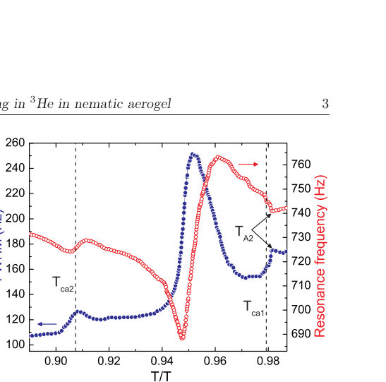 
Fig. 1. (Color online) Temperature dependence of FWHM (filled symbols, left axis) and the resonance frequency (open symbols, right axis) of the main mode of the aerogel VW without 4He layers at pressure of 15.4 bar in magnetic field of 30.7 kOe. Dashed lines indicate the superfluid transition temperatures in aerogel. Arrows indicate A1-A2 transition in bulk 3He (TA2). The x-axis represents the temperature normalized to the superfluid transition temperature in bulk 3He, Tc = 2.083 mK.

📷 Fig 2

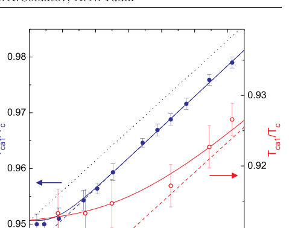 
Fig. 3. (Color online) The upper superfluid transition temperature in nematic aerogel without 4He coverage at pressures of 15.4 bar (left scale, filled symbols, Tca ≈ 0.951Tc) and 7.1 bar (right scale, open symbols, Tca ≈ 0.912Tc). The dotted line represents the bulk upper phase transition for both pressures scaled to their corresponding Tca/Tc (coincide due to the chosen axis scaling) [3]. For both pressures, the solid lines are the best fit of our data with Eq. (4), where η0 1 was set to the value expected for bulk A1 phase [3]. For 7.1 bar α0 ≈0.047 kOe−1 was fixed according to the theory as well, while for 15.4 bar α0 was a fitting parameter resulting in α ≈0.215 kOe−1 which is basically 6...

📷 Fig 3

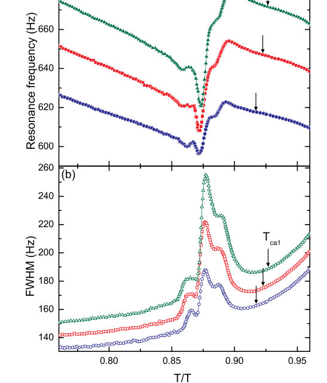 
Fig. 2. (Color online) Temperature dependence of the resonance frequency (a) and FWHM (b) of the main mode of the aerogel VW without 4He layers at pressure of 7.1 bar in magnetic fields of 21.4 kOe (circles), 27.2 kOe (squares), and 30.7 kOe (triangles). For clarity, the squares and triangles in the panel (a) are down- shifted by 60 Hz and 80 Hz respectively. Arrows indicate the upper critical temperature. Tc = 1.643 mK.

📷 Fig 4

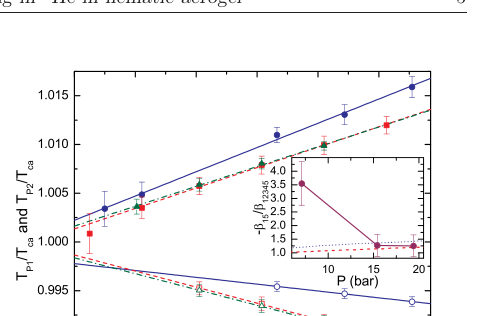 
Fig. 5. (Color online) The upper (filled symbols) and lower (open symbols) transition temperatures in nematic aerogel with 4He coverage at pressures of 7.1 bar (circles, Tca ≈0.963Tc), 15.4 bar (squares, Tca ≈ 0.980Tc), and 19.4 bar (triangles, Tca ≈0.985Tc) with their corresponding linear approximations. Here, Tca ≡ (TP 1 |H=0 + TP 2 |H=0 ) /2. The linear fits do not match at H = 0 presumably due to a systematic error caused by finite temperature width of the superfluid transition. The inset shows the dependence of the ratio of slopes of the fit lines obtained from our experimental data defined as −β15/β12345 (see Eq. (3)), the same ratio calculated using data from [31] obtained in experiments...

📷 Fig 5

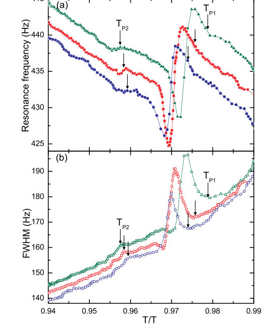 
Fig. 4. (Color online) Temperature dependence of the resonance frequency (a) and FWHM (b) of the main mode of the aerogel VW with 4He coverage at pressure of 7.1 bar in magnetic fields of 6.7 kOe (circles), 8.9 kOe (squares), and 11.1 kOe (triangles). For clarity, the squares and triangles in the panel (a) are down-shifted by 14 Hz and 31 Hz respectively, the triangles in the panel (b) are up-shifted by 5 Hz. Arrows indicate the superfluid transition temperatures in aerogel.

**Summary.** The research investigates how pressure influences the superfluid transition temperature splitting of $^3$He confined in nematic aerogels. By comparing results from samples coated with $	ext{}^4	ext{He}$ versus pure $^3$He, the authors test theoretical models describing boundary effects. The findings suggest that coating the pores leads to a more theoretically consistent description of the phase transitions under pressure.

**Why it may be interesting.** This work bridges condensed matter physics (superfluidity, phase transitions) with materials science (porous media confinement), providing experimental validation for complex boundary condition effects on quantum fluid behavior.

Detailed structure

**Main problem.** The study investigates how external pressure affects the splitting of the superfluid transition temperature ($T_c$) in $^3$He confined within anisotropic nematic aerogels.

**Main result.** The presence of a $	ext{}^4	ext{He}$ coating on the aerogel strands leads to a more symmetric field dependence for the transition splitting, which shows better agreement with theoretical predictions at higher applied pressures compared to pure $^3$He samples.

**Method.** Measurements were performed using a vibrating wire (VW) resonator and quartz tuning fork for thermometry while applying varying magnetic fields and pressures. Transition temperatures were determined by analyzing resonance frequency and Full Width at Half-Maximum (FWHM).

**Model / system.** The system is superfluid $^3$He confined in nematic aerogels, comparing boundary conditions: specular reflection (with $	ext{}^4	ext{He}$ coating) versus diffuse scattering/impurity effects (pure $^3$He). Theoretical models include Ginzburg-Landau coefficients and impurity magnetization descriptions.

**Key observables.** Superfluid transition temperature splitting ($\Delta T$), resonance frequency, Full Width at Half Maximum (FWHM), and the ratio of slopes of the transitions with respect to magnetic field ($H$).

**Important parameters / regimes.** Applied pressure (e.g., 7.1 bar, 15.4 bar, 19.4 bar) and applied magnetic field ($H$ up to $31 	ext{ kOe}$).

**Assumptions / limitations.** The analysis distinguishes between boundary scattering mechanisms ($	ext{}^4	ext{He}$ coating vs. pure $	ext{}^3	ext{He}$) and compares observed nonlinearities against established theoretical models.

**Figures summary.** Figures illustrate the temperature dependence of FWHM and resonance frequency for both coated and uncoated samples at various pressures, highlighting the distinct transition regimes ($T_{ca1}, T_{ca2}$ vs. $T_{P1}, T_{P2}$).

**Paper structure.** The paper systematically compares experimental results under varying pressure and boundary conditions ($	ext{}^4	ext{He}$ coating vs. pure $	ext{}^3	ext{He}$) to resolve discrepancies between previous measurements and theoretical predictions regarding $T_c$ splitting.

Abstract

Here, we present the results of an investigation of how the pressure affects the splitting of the superfluid transition temperature in $^3$He in anisotropic aerogel. It is well known that boundary conditions significantly influence the properties of superfluid phases in aerogel. When aerogel strands are coated with a $^4$He layer in magnetic field, new phases, such as the polar, polar-distorted A (DA), polar-distorted B (DB), and $β$ phases, become energetically favorable. In contrast, without this coating, the system tends to favor phases resembling the bulk A, B, and A$_1$ phases. Our earlier results showed a nonlinear dependence of the superfluid transition temperature splitting in pure $^3$He, but the range of nonlinearity did not match the theoretical predictions based on magnetic scattering effects. To further investigate this discrepancy, we performed measurements of the splitting under varying pressures for both pure $^3$He and with $^4$He coverage of the aerogel strands.

[↑ back to top](#top)
