
# arxiv digest (quant-ph + cond-mat) — 2026-07-02

*120 papers · 46 relevant · 0 highlighted*

## 🔥 Most relevant (46)

*Every paper with at least one nonzero topic score, sorted by best-matching score. 🔥 marks scores ≥4/5. Click the title to jump to the full entry below; click [arXiv] to open the paper page. `(secondary)` marks papers from de-prioritized cond-mat archives.*

Show 46 relevant papers

- [Configuration-based understanding of superradiant phase transitions in Dicke lattices](#paper-2607.00557) [[arXiv]](http://arxiv.org/abs/2607.00557v1) — 🔥 `Dicke superradiance` **5/5** · 🔥 `correlated / nonlocal dissipation` **4/5** · 🔥 `driven-dissipative phase transition` **4/5** · 🔥 `methods for driven-dissipative` **4/5** · `analog quantum simulation` **3/5** · `correlated cavity matter` **3/5** · `non-equilibrium universality` **3/5** · `superradiant laser` **3/5** · `Tavis-Cummings & cavity-many-emitter` **2/5** · `non-equilibrium dynamics` **2/5** · `Keldysh / 2PI / non-Gaussian methods` **1/5** · `entanglement & information structure` **1/5** · `exotic spin models in light-matter` **1/5**
- [Exceptional points in dissipative coupling polaron-polaritons](#paper-2607.00994) [[arXiv]](http://arxiv.org/abs/2607.00994v1) — 🔥 `methods for driven-dissipative` **5/5** · 🔥 `Keldysh / 2PI / non-Gaussian methods` **4/5** · 🔥 `correlated / nonlocal dissipation` **4/5** · 🔥 `driven-dissipative phase transition` **4/5** · `Tavis-Cummings & cavity-many-emitter` **3/5** · `correlated cavity matter` **3/5** · `non-equilibrium universality` **3/5** · `analog quantum simulation` **2/5** · `non-equilibrium dynamics` **2/5** · `Kondo & dissipative impurity` **1/5** · `interference shaping light` **1/5**
- [Work Statistics Under Quantum-Jump and Quench Dynamics in Monitored Ising Chains](#paper-2607.00131) [[arXiv]](http://arxiv.org/abs/2607.00131v1) — 🔥 `measurement-induced transitions` **5/5** · 🔥 `non-equilibrium dynamics` **4/5** · 🔥 `quantum measurements` **4/5** · `methods for driven-dissipative` **3/5** · `non-equilibrium universality` **3/5** · `Keldysh / 2PI / non-Gaussian methods` **1/5** · `correlated / nonlocal dissipation` **1/5** · `driven-dissipative phase transition` **1/5**
- [Weak-coupling tensor cross interpolation impurity solver for nonequilibrium dynamical mean-field theory](#paper-2607.00702) [[arXiv]](http://arxiv.org/abs/2607.00702v1) — 🔥 `Keldysh / 2PI / non-Gaussian methods` **5/5** · 🔥 `non-equilibrium dynamics` **4/5** · `Kondo & dissipative impurity` **3/5** · `methods for driven-dissipative` **3/5** · `non-equilibrium universality` **2/5** · `analog quantum simulation` **1/5** · `correlated / nonlocal dissipation` **1/5** · `driven-dissipative phase transition` **1/5**
- [Continuous Observation of Quantum Systems](#paper-2607.01158) [[arXiv]](http://arxiv.org/abs/2607.01158v1) — 🔥 `quantum measurements` **5/5** · `measurement-induced transitions` **3/5** · `methods for driven-dissipative` **3/5** · `correlated / nonlocal dissipation` **2/5** · `Keldysh / 2PI / non-Gaussian methods` **1/5** · `driven-dissipative phase transition` **1/5** · `non-equilibrium dynamics` **1/5**
- [Wavefunctions localization, and the Wigner's Friend Paradox in a Framework of Discrete-Space Hypothesis](#paper-2607.00198) [[arXiv]](http://arxiv.org/abs/2607.00198v1) — 🔥 `quantum measurements` **5/5** · 🔥 `measurement-induced transitions` **4/5**
- [Coupling effect of nearest-neighbor interacting qubit chains to a single qubit system](#paper-2607.00307) [[arXiv]](http://arxiv.org/abs/2607.00307v1) — 🔥 `entanglement & information structure` **4/5** · `analog quantum simulation` **3/5** · `correlated / nonlocal dissipation` **3/5** · `methods for driven-dissipative` **3/5** · `non-equilibrium dynamics` **3/5** · `Keldysh / 2PI / non-Gaussian methods` **2/5** · `Tavis-Cummings & cavity-many-emitter` **2/5** · `driven-dissipative phase transition` **2/5** · `non-equilibrium universality` **2/5** · `Kondo & dissipative impurity` **1/5** · `Rydberg arrays` **1/5** · `correlated cavity matter` **1/5** · `exotic spin models in light-matter` **1/5** · `measurement-induced transitions` **1/5** · `scars & prethermalization` **1/5**
- [Real-time dynamics of triplet-resonant tunneling driven by nonequilibrium phonons](#paper-2607.00520) [[arXiv]](http://arxiv.org/abs/2607.00520v1) `(secondary)` — 🔥 `driven-dissipative phase transition` **4/5** · 🔥 `non-equilibrium dynamics` **4/5** · `methods for driven-dissipative` **3/5** · `non-equilibrium universality` **3/5** · `spintronics-quantum-optics interface` **3/5** · `Keldysh / 2PI / non-Gaussian methods` **2/5** · `Kondo & dissipative impurity` **2/5** · `measurement-induced transitions` **2/5** · `quantum measurements` **2/5** · `analog quantum simulation` **1/5** · `correlated / nonlocal dissipation` **1/5** · `exotic spin models in light-matter` **1/5** · `scars & prethermalization` **1/5**
- [Universal Scaling of the Spin Hall Effect](#paper-2607.00343) [[arXiv]](http://arxiv.org/abs/2607.00343v1) `(secondary)` — 🔥 `Keldysh / 2PI / non-Gaussian methods` **4/5** · 🔥 `non-equilibrium universality` **4/5** · `Kondo & dissipative impurity` **3/5** · `methods for driven-dissipative` **3/5** · `non-equilibrium dynamics` **3/5** · `spintronics-quantum-optics interface` **3/5** · `correlated / nonlocal dissipation` **2/5** · `driven-dissipative phase transition` **2/5** · `analog quantum simulation` **1/5** · `entanglement & information structure` **1/5** · `exotic spin models in light-matter` **1/5** · `scars & prethermalization` **1/5**
- [Robustness of Quantum Discord in Nonequilibrium Electronic Transport through Tunnel-Coupled Quantum Dots](#paper-2607.00602) [[arXiv]](http://arxiv.org/abs/2607.00602v1) — 🔥 `entanglement & information structure` **4/5** · 🔥 `methods for driven-dissipative` **4/5** · 🔥 `non-equilibrium dynamics` **4/5** · `Keldysh / 2PI / non-Gaussian methods` **3/5** · `driven-dissipative phase transition` **3/5** · `analog quantum simulation` **2/5** · `correlated / nonlocal dissipation` **2/5** · `non-equilibrium universality` **2/5** · `Kondo & dissipative impurity` **1/5** · `scars & prethermalization` **1/5**
- [Simulating generic single-qubit open-dynamics via polarization-frequency coupling in a photonic interferometer](#paper-2607.00835) [[arXiv]](http://arxiv.org/abs/2607.00835v1) — 🔥 `analog quantum simulation` **4/5** · `interference shaping light` **3/5** · `methods for driven-dissipative` **3/5** · `quantum optics experiment` **3/5** · `QC/QI experiment` **2/5** · `driven-dissipative phase transition` **2/5** · `non-equilibrium dynamics` **2/5** · `quantum measurements` **2/5** · `Keldysh / 2PI / non-Gaussian methods` **1/5** · `correlated / nonlocal dissipation` **1/5** · `entanglement & information structure` **1/5** · `measurement-induced transitions` **1/5** · `non-equilibrium universality` **1/5**
- [Subsystem Thermalization and Work Statistical Characterizations of Floquet Dynamics](#paper-2607.00381) [[arXiv]](http://arxiv.org/abs/2607.00381v1) — 🔥 `non-equilibrium dynamics` **4/5** · 🔥 `scars & prethermalization` **4/5** · `driven-dissipative phase transition` **3/5** · `entanglement & information structure` **3/5** · `methods for driven-dissipative` **3/5** · `analog quantum simulation` **2/5** · `correlated / nonlocal dissipation` **2/5** · `non-equilibrium universality` **2/5** · `Keldysh / 2PI / non-Gaussian methods` **1/5** · `Kondo & dissipative impurity` **1/5** · `exotic spin models in light-matter` **1/5**
- [Dissipation splits the Mott transition in one dimension](#paper-2607.00086) [[arXiv]](http://arxiv.org/abs/2607.00086v1) — 🔥 `driven-dissipative phase transition` **4/5** · `Frenkel-Kontorova` **3/5** · `analog quantum simulation` **3/5** · `correlated / nonlocal dissipation` **3/5** · `methods for driven-dissipative` **3/5** · `non-equilibrium universality` **3/5** · `Kondo & dissipative impurity` **2/5** · `non-equilibrium dynamics` **2/5** · `Keldysh / 2PI / non-Gaussian methods` **1/5**
- [Learning Low-Energy Subspace Overlaps in Many-Body Systems with Measurement-Based and Coherent Quantum Strategies](#paper-2607.00235) [[arXiv]](http://arxiv.org/abs/2607.00235v1) — 🔥 `non-equilibrium dynamics` **4/5** · `analog quantum simulation` **3/5** · `methods for driven-dissipative` **3/5** · `non-equilibrium universality` **3/5** · `quantum measurements` **3/5** · `entanglement & information structure` **2/5** · `measurement-induced transitions` **2/5** · `scars & prethermalization` **2/5** · `driven-dissipative phase transition` **1/5** · `exotic spin models in light-matter` **1/5**
- [Strange Luttinger liquids in a cavity-embedded one-dimensional electronic chain](#paper-2607.01146) [[arXiv]](http://arxiv.org/abs/2607.01146v1) — 🔥 `analog quantum simulation` **4/5** · 🔥 `correlated cavity matter` **4/5** · `exotic spin models in light-matter` **3/5** · `Tavis-Cummings & cavity-many-emitter` **2/5** · `driven-dissipative phase transition` **2/5** · `methods for driven-dissipative` **2/5** · `Frenkel-Kontorova` **1/5** · `Keldysh / 2PI / non-Gaussian methods` **1/5** · `Kondo & dissipative impurity` **1/5** · `correlated / nonlocal dissipation` **1/5** · `entanglement & information structure` **1/5** · `non-equilibrium dynamics` **1/5** · `non-equilibrium universality` **1/5**
- [Brownian ratchets and pumps universally simulate many-body active dynamics](#paper-2607.01231) [[arXiv]](http://arxiv.org/abs/2607.01231v1) — 🔥 `non-equilibrium dynamics` **4/5** · `driven-dissipative phase transition` **3/5** · `methods for driven-dissipative` **3/5** · `non-equilibrium universality` **3/5** · `analog quantum simulation` **2/5** · `correlated / nonlocal dissipation` **2/5** · `Frenkel-Kontorova` **1/5** · `Keldysh / 2PI / non-Gaussian methods` **1/5** · `Kondo & dissipative impurity` **1/5** · `entanglement & information structure` **1/5** · `exotic spin models in light-matter` **1/5** · `spintronics-quantum-optics interface` **1/5**
- [Optically Active Single Hole Spin in ZnSe](#paper-2607.00110) [[arXiv]](http://arxiv.org/abs/2607.00110v1) — 🔥 `spintronics-quantum-optics interface` **4/5** · `exotic spin models in light-matter` **3/5** · `quantum optics experiment` **3/5** · `Kondo & dissipative impurity` **2/5** · `QC/QI experiment` **2/5** · `methods for driven-dissipative` **2/5** · `non-equilibrium dynamics` **2/5** · `Keldysh / 2PI / non-Gaussian methods` **1/5** · `analog quantum simulation` **1/5** · `correlated / nonlocal dissipation` **1/5** · `driven-dissipative phase transition` **1/5** · `quantum measurements` **1/5**
- [Conditional Enhancement of Dissipation-Induced Nonreciprocity by Quantum Squeezing](#paper-2607.00718) [[arXiv]](http://arxiv.org/abs/2607.00718v1) — 🔥 `methods for driven-dissipative` **4/5** · `correlated / nonlocal dissipation` **3/5** · `correlated cavity matter` **3/5** · `driven-dissipative phase transition` **3/5** · `Tavis-Cummings & cavity-many-emitter` **2/5** · `non-equilibrium dynamics` **2/5** · `Keldysh / 2PI / non-Gaussian methods` **1/5** · `analog quantum simulation` **1/5** · `non-equilibrium universality` **1/5**
- [Extreme volume monogamy via bound-state engineering](#paper-2607.00346) [[arXiv]](http://arxiv.org/abs/2607.00346v1) — 🔥 `entanglement & information structure` **4/5** · `correlated / nonlocal dissipation` **3/5** · `driven-dissipative phase transition` **3/5** · `methods for driven-dissipative` **3/5** · `Keldysh / 2PI / non-Gaussian methods` **2/5** · `non-equilibrium dynamics` **2/5** · `non-equilibrium universality` **2/5** · `quantum measurements` **1/5**
- [Closed-loop control for two-qubit gates with trapped ions](#paper-2607.00462) [[arXiv]](http://arxiv.org/abs/2607.00462v1) — 🔥 `QC/QI experiment` **4/5** · 🔥 `quantum measurements` **4/5** · `measurement-induced transitions` **3/5** · `methods for driven-dissipative` **3/5** · `non-equilibrium dynamics` **2/5** · `Keldysh / 2PI / non-Gaussian methods` **1/5** · `driven-dissipative phase transition` **1/5** · `quantum optics experiment` **1/5**
- [Far-field spatial coherence driven by lossy objects: first-principles approach unifying scattering of quantum light and thermal emission](#paper-2607.00653) [[arXiv]](http://arxiv.org/abs/2607.00653v1) — 🔥 `interference shaping light` **4/5** · `Keldysh / 2PI / non-Gaussian methods` **3/5** · `correlated / nonlocal dissipation` **3/5** · `methods for driven-dissipative` **3/5** · `driven-dissipative phase transition` **2/5** · `non-equilibrium dynamics` **2/5** · `correlated cavity matter` **1/5** · `non-equilibrium universality` **1/5**
- [Spinterface-like mechanism of the chirality-induced spin selectivity in donor chiral-bridge acceptor complexes](#paper-2607.00668) [[arXiv]](http://arxiv.org/abs/2607.00668v1) — 🔥 `methods for driven-dissipative` **4/5** · `exotic spin models in light-matter` **3/5** · `spintronics-quantum-optics interface` **3/5** · `Kondo & dissipative impurity` **2/5** · `non-equilibrium dynamics` **2/5** · `Keldysh / 2PI / non-Gaussian methods` **1/5** · `correlated / nonlocal dissipation` **1/5** · `driven-dissipative phase transition` **1/5**
- [Open Quantum Systems Driven by Chirped Pulses: Quantized versus Semiclassical Fields and the Validity of the Rotating-Wave Approximation](#paper-2607.00583) [[arXiv]](http://arxiv.org/abs/2607.00583v1) — 🔥 `methods for driven-dissipative` **4/5** · `Keldysh / 2PI / non-Gaussian methods` **3/5** · `analog quantum simulation` **2/5** · `non-equilibrium dynamics` **2/5** · `Tavis-Cummings & cavity-many-emitter` **1/5** · `correlated cavity matter` **1/5** · `driven-dissipative phase transition` **1/5** · `interference shaping light` **1/5**
- [Power-Law Relaxation of Non-Gaussian Parameter and Self-Dynamic Structure Factor in Multidimensional Rugged Energy Landscapes](#paper-2607.00767) [[arXiv]](http://arxiv.org/abs/2607.00767v1) — 🔥 `non-equilibrium dynamics` **4/5** · `Keldysh / 2PI / non-Gaussian methods` **3/5** · `non-equilibrium universality` **3/5** · `driven-dissipative phase transition` **2/5** · `Frenkel-Kontorova` **1/5** · `correlated / nonlocal dissipation` **1/5** · `methods for driven-dissipative` **1/5**
- [Synthesizing Compound Pulse Gadgets for Hamiltonian Simulation on Trapped-Ion Platforms](#paper-2607.00826) [[arXiv]](http://arxiv.org/abs/2607.00826v1) — 🔥 `QC/QI experiment` **4/5** · `analog quantum simulation` **3/5** · `methods for driven-dissipative` **3/5** · `non-equilibrium dynamics` **2/5** · `Keldysh / 2PI / non-Gaussian methods` **1/5** · `correlated / nonlocal dissipation` **1/5** · `driven-dissipative phase transition` **1/5**
- [Universal Short-Imaginary-Time Quantum Critical Dynamics Near Boundaries](#paper-2607.01076) [[arXiv]](http://arxiv.org/abs/2607.01076v1) — 🔥 `non-equilibrium universality` **4/5** · `driven-dissipative phase transition` **3/5** · `non-equilibrium dynamics` **3/5** · `Keldysh / 2PI / non-Gaussian methods` **1/5** · `analog quantum simulation` **1/5** · `correlated / nonlocal dissipation` **1/5** · `methods for driven-dissipative` **1/5**
- [TCL4 Asymptotic Redundancy and Canonically Consistent Master Equations](#paper-2607.00193) [[arXiv]](http://arxiv.org/abs/2607.00193v1) — 🔥 `methods for driven-dissipative` **4/5** · `Keldysh / 2PI / non-Gaussian methods` **3/5** · `non-equilibrium dynamics` **2/5** · `correlated / nonlocal dissipation` **1/5** · `correlated cavity matter` **1/5** · `driven-dissipative phase transition` **1/5** · `non-equilibrium universality` **1/5**
- [Active Learning for Calibrating Entangling Gates via Surrogate-Based Optimization](#paper-2607.00284) [[arXiv]](http://arxiv.org/abs/2607.00284v1) — 🔥 `QC/QI experiment` **4/5** · `quantum measurements` **3/5** · `quantum optics experiment` **2/5** · `analog quantum simulation` **1/5** · `measurement-induced transitions` **1/5** · `methods for driven-dissipative` **1/5**
- [Bandwidth-Limited Critical Currents in Electrically Tunable Moiré Bands](#paper-2607.01056) [[arXiv]](http://arxiv.org/abs/2607.01056v1) — 🔥 `non-equilibrium dynamics` **4/5** · `non-equilibrium universality` **3/5** · `Keldysh / 2PI / non-Gaussian methods` **1/5** · `analog quantum simulation` **1/5** · `correlated / nonlocal dissipation` **1/5** · `driven-dissipative phase transition` **1/5** · `methods for driven-dissipative` **1/5**
- [Holographic Quantum Transformer: A Generalist Neuro-Symbolic Architecture for Solving Frustrated Systems via Generative Attention](#paper-2607.00398) [[arXiv]](http://arxiv.org/abs/2607.00398v1) — 🔥 `analog quantum simulation` **4/5** · `exotic spin models in light-matter` **3/5** · `entanglement & information structure` **2/5** · `methods for driven-dissipative` **1/5** · `non-equilibrium dynamics` **1/5**
- [Production of Magic States via $Z$ Bosons and Dark Photons](#paper-2607.00229) [[arXiv]](http://arxiv.org/abs/2607.00229v1) — 🔥 `entanglement & information structure` **4/5** · `Keldysh / 2PI / non-Gaussian methods` **1/5** · `analog quantum simulation` **1/5** · `correlated / nonlocal dissipation` **1/5** · `driven-dissipative phase transition` **1/5** · `methods for driven-dissipative` **1/5** · `non-equilibrium dynamics` **1/5** · `non-equilibrium universality` **1/5**
- [Experimental Quantification of Layered Error Suppression in Fiber-Interconnected Quantum Data Centers](#paper-2607.00735) [[arXiv]](http://arxiv.org/abs/2607.00735v1) — 🔥 `QC/QI experiment` **4/5** · `quantum measurements` **2/5** · `correlated / nonlocal dissipation` **1/5** · `entanglement & information structure` **1/5** · `methods for driven-dissipative` **1/5** · `non-equilibrium dynamics` **1/5**
- [Hierarchy of hidden nonlocality: A genuine activation of Incompletability](#paper-2607.00797) [[arXiv]](http://arxiv.org/abs/2607.00797v1) — 🔥 `entanglement & information structure` **4/5** · `quantum measurements` **2/5** · `Keldysh / 2PI / non-Gaussian methods` **1/5** · `correlated / nonlocal dissipation` **1/5** · `driven-dissipative phase transition` **1/5** · `methods for driven-dissipative` **1/5**
- [Influence of laser chirp and interferometer delay and imbalance on the performance of a time-bin BB84 quantum key distribution system](#paper-2607.00600) [[arXiv]](http://arxiv.org/abs/2607.00600v1) — 🔥 `quantum optics experiment` **4/5** · `interference shaping light` **3/5** · `QC/QI experiment` **1/5** · `methods for driven-dissipative` **1/5**
- [Polynomial equivalence of the global transverse-field Ising model and the gate model of quantum computation](#paper-2607.01227) [[arXiv]](http://arxiv.org/abs/2607.01227v1) — 🔥 `analog quantum simulation` **4/5** · `non-equilibrium dynamics` **2/5** · `Keldysh / 2PI / non-Gaussian methods` **1/5** · `entanglement & information structure` **1/5**
- [Entanglement-spectrum fingerprint of a non-invertible symmetry: the Kramers--Wannier duality defect on the lattice](#paper-2607.01137) [[arXiv]](http://arxiv.org/abs/2607.01137v1) — 🔥 `entanglement & information structure` **4/5** · `analog quantum simulation` **1/5** · `driven-dissipative phase transition` **1/5** · `methods for driven-dissipative` **1/5**
- [Generative Modeling of Quantum Distribution with Functional Flow Matching](#paper-2607.00301) [[arXiv]](http://arxiv.org/abs/2607.00301v1) — 🔥 `entanglement & information structure` **4/5** · `analog quantum simulation` **1/5** · `methods for driven-dissipative` **1/5** · `non-equilibrium dynamics` **1/5**
- [Entanglement fingerprint of a non-invertible symmetry: exact Fibonacci cut charges on the lattice](#paper-2607.01151) [[arXiv]](http://arxiv.org/abs/2607.01151v1) — 🔥 `entanglement & information structure` **4/5** · `Frenkel-Kontorova` **1/5** · `Keldysh / 2PI / non-Gaussian methods` **1/5**
- [Quantum-Informed Portfolio Selection: An End-to-End Pipeline Validated on Trapped-Ion Hardware with Real Market Data](#paper-2607.01037) [[arXiv]](http://arxiv.org/abs/2607.01037v1) — 🔥 `QC/QI experiment` **4/5** · `quantum measurements` **2/5**
- [Strongly frustrated 2D magnetism in a 3D hexagonal perovskite](#paper-2607.00532) [[arXiv]](http://arxiv.org/abs/2607.00532v1) — 🔥 `analog quantum simulation` **4/5** · `exotic spin models in light-matter` **1/5** · `spintronics-quantum-optics interface` **1/5**
- [Universal logic circuit for gate-controlled superconductor-based switches operating at liquid-helium temperatures](#paper-2607.00769) [[arXiv]](http://arxiv.org/abs/2607.00769v1) `(secondary)` — 🔥 `QC/QI experiment` **4/5** · `driven-dissipative phase transition` **1/5** · `methods for driven-dissipative` **1/5**
- [A Versatile Analytical Model for Fast and Accurate Determination of Feedline-Coupled Resonators for Superconducting Qubit Readout](#paper-2607.00490) [[arXiv]](http://arxiv.org/abs/2607.00490v1) — 🔥 `QC/QI experiment` **4/5** · `methods for driven-dissipative` **1/5**
- [Overcoming the Speed-Fidelity Trade-off in Fast CZ Gates via Cyclic Control](#paper-2607.00660) [[arXiv]](http://arxiv.org/abs/2607.00660v1) — 🔥 `QC/QI experiment` **4/5** · `non-equilibrium dynamics` **1/5**
- [Surface Platinum Alloying for Passivation of Oxide Interfaces on Superconducting Niobium Films](#paper-2607.00429) [[arXiv]](http://arxiv.org/abs/2607.00429v1) `(secondary)` — 🔥 `QC/QI experiment` **4/5** · `Kondo & dissipative impurity` **1/5**
- [Characterization of Hydroxyls in Surface Oxide of Superconducting Tantalum and Their Mitigation in Quantum Circuits](#paper-2607.00903) [[arXiv]](http://arxiv.org/abs/2607.00903v1) `(secondary)` — 🔥 `QC/QI experiment` **4/5**
- [Superconducting Spiral Inductors for RF Reflectometry: Operation at Elevated Temperatures and Magnetic Fields](#paper-2607.00172) [[arXiv]](http://arxiv.org/abs/2607.00172v1) — 🔥 `QC/QI experiment` **4/5**

## All papers (93, sorted by relevance)

*Papers from quant-ph and your primary cond-mat archives (quant-gas, stat-mech, str-el, dis-nn). Highlighted papers (⭐) come first, then everything else sorted by topic-relevance score, highest first.*

### [Configuration-based understanding of superradiant phase transitions in Dicke lattices](http://arxiv.org/abs/2607.00557v1)

**Authors:** Peng-Fei Wei, Zhihai Wang  
**Type:** theory · **Category:** other · **PDF:** <https://arxiv.org/pdf/2607.00557v1>  
**Analysis basis:** full PDF text, analyzed in chunks
**Topic relevance:** 🔥 `Dicke superradiance` **5/5** · 🔥 `correlated / nonlocal dissipation` **4/5** · 🔥 `driven-dissipative phase transition` **4/5** · 🔥 `methods for driven-dissipative` **4/5** · `analog quantum simulation` **3/5** · `correlated cavity matter` **3/5** · `non-equilibrium universality` **3/5** · `superradiant laser` **3/5** · `Tavis-Cummings & cavity-many-emitter` **2/5** · `non-equilibrium dynamics` **2/5** · `Keldysh / 2PI / non-Gaussian methods` **1/5** · `entanglement & information structure` **1/5** · `exotic spin models in light-matter` **1/5**

↔ Scroll figures horizontally

<figure class="paper-figure-card">
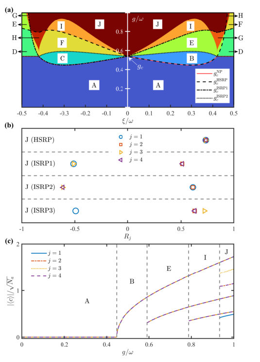
<figcaption class="paper-figure-caption"><b>Fig 1.</b> Figure 1. (a) Phase diagram for the open Dicke lattice model with N = 4. (b) The real part of order parameter Rj about each site with ξ = 0.1ω and g = 0.8ω. (c) Plot of the order parameter |⟨cj⟩|/√Na = p</figcaption>
</figure>
<figure class="paper-figure-card">

<figcaption class="paper-figure-caption"><b>Fig 2.</b> Figure 2. The representative configuration for (a) N = 5 and (b) N = 6. The parameters are set to ωa = ωc = ω, κ = 0.4ω, g = 0.8ω and ξ = 0.1ω.</figcaption>
</figure>
<figure class="paper-figure-card">

<figcaption class="paper-figure-caption"><b>Fig 3.</b> Figure 3. On-site fluctuations ∆j in the vicinity of the critical coupling for (a) Phase A-B (ξ = 0.3ω), (b) Phase A-C (ξ = −0.3ω), and (c) Phase A-D (ξ = 0.48ω). Other parameters are set to ωa = ωc = ω and κ = 0.4ω.</figcaption>
</figure>
<figure class="paper-figure-card">

<figcaption class="paper-figure-caption"><b>Fig 4.</b> Figure 4. (a) Phase diagram for the Dicke lattice model with N = 4. (b) The ground-state energy and its second-order derivative as a function of g/g± c . (c) The ground-state energy and its first-order derivative (red line) as a function of ξ with g = 0.6ω. (d) The lowest excitation energies ε as a function of the coupling strength g/g± c . (e) The on-site fluctuations of the ground state as a function of g/g± c . Other parameters are set to ωa = ωc = ω and ξ = ±0.3ω.</figcaption>
</figure>

**Summary.** The paper introduces a novel configuration-based framework to unify the understanding of superradiant phase transitions in Dicke lattices. By classifying possible stable configurations based on lattice symmetry, it explains the emergence of multistability in dissipative systems. This unified picture successfully bridges the gap between nonequilibrium steady states and equilibrium ground states.

**Why it may be interesting.** This work provides a powerful topological/combinatorial tool—the configuration classification—to organize complex non-equilibrium phase diagrams in quantum optics models like the Dicke lattice, unifying disparate physical regimes.

Detailed structure

**Main problem.** The paper aims to develop a unified, configuration-based understanding of how multistability arises in superradiant phase transitions within Dicke lattices.

**Main result.** It successfully classifies multiple stable superradiant phases based on lattice symmetry and demonstrates that the classification framework applies consistently across both dissipative (nonequilibrium) and closed (equilibrium) regimes.

**Method.** The analysis employs mean-field approximations, deriving semiclassical equations of motion for stability analysis in the dissipative case, and minimizing energy functionals for the equilibrium case.

**Model / system.** The system is the Dicke lattice model, involving coupled atom-resonator units on a 1D lattice. The dynamics are governed by a Lindblad master equation (dissipative) or analyzed via Hamiltonian minimization (closed).

**Key observables.** Order parameters characterizing superradiant phases (e.g., real photonic component $R_j$), ground-state energy ($E_{GS}$), and excitation gaps ($\epsilon$).

**Important parameters / regimes.** Coupling strength ($g$), photon hopping parameter ($\xi$), cavity decay rate ($\kappa$), and lattice size ($N=4$ analyzed in detail).

**Assumptions / limitations.** The analysis relies on the mean-field approximation, factorizing operator correlations $\langle AB 
angle \simeq \langle A 
angle \langle B 
angle$, and using the Discrete Truncated Wigner Approximation (DTWA) for dissipative dynamics.

**Figures summary.** Figures illustrate phase diagrams showing regions of multistability (up to fourfold for $N=4$) in the dissipative case, alongside plots detailing ground-state energy and excitation gaps versus coupling strength.

**Paper structure.** The paper first introduces the model and develops a configuration classification scheme. It then analyzes the dissipative system using steady-state solutions and stability analysis to map out the nonequilibrium phase diagram. Finally, it compares these findings with the equilibrium case (closed lattice) to establish a unified picture.

Abstract

The emergence of multiple superradiant phases in Dicke lattice models has attracted considerable attention in the quantum optics community. However, a unified understanding of the origin of multistability and its relation to different superradiant phases is still lacking. Here, we develop a configuration-based understanding to classify the superradiant phases in Dicke lattices. We show that photon hopping naturally organizes the possible superradiant configurations according to the lattice symmetry, providing a unified interpretation of the nonequilibrium phase diagram and the emergence of multistability. For the dissipative four-site Dicke lattice, we obtain the complete phase diagram and identify the coexistence of up to four stable superradiant phases. The proposed classification is further extended to five- and six-site lattices. Moreover, we demonstrate that the same configuration-based understanding also applies to the closed Dicke lattice, where the ground state uniquely selects one of the allowed configurations. Finally, we show that different configurations may belong to either same or distinct nonequilibrium universality classes in the dissipative Dicke lattice, while they share the same equilibrium universality class in the closed Dicke lattice. Our results provide a unified picture for understanding equilibrium and nonequilibrium superradiant phase transitions in Dicke lattices.

[↑ back to top](#top)

### [Exceptional points in dissipative coupling polaron-polaritons](http://arxiv.org/abs/2607.00994v1)

**Authors:** A. J. Vega-Carmona, D. A. Mendoza, A. Camacho-Guardian, M. A. Bastarrachea-Magnani  
**Type:** theory · **Category:** other · **PDF:** <https://arxiv.org/pdf/2607.00994v1>  
**Analysis basis:** full PDF text, analyzed in chunks
**Topic relevance:** 🔥 `methods for driven-dissipative` **5/5** · 🔥 `Keldysh / 2PI / non-Gaussian methods` **4/5** · 🔥 `correlated / nonlocal dissipation` **4/5** · 🔥 `driven-dissipative phase transition` **4/5** · `Tavis-Cummings & cavity-many-emitter` **3/5** · `correlated cavity matter` **3/5** · `non-equilibrium universality` **3/5** · `analog quantum simulation` **2/5** · `non-equilibrium dynamics` **2/5** · `Kondo & dissipative impurity` **1/5** · `interference shaping light` **1/5**

↔ Scroll figures horizontally

<figure class="paper-figure-card">

<figcaption class="paper-figure-caption"><b>Fig 1.</b> FIG. 1. Dissipative coupling polariton branches. As a function of (a) momentum at zero detuning and (b) zero- momentum light-matter detuning. The upper branch (UB) and lower branch (UB) are indicated by black and red curves, respectively. Here, ΩIm/ΩRe = 0.9. Below, the condition for the emergence of EPs is shown as a function of dissipative coupling and (c) momentum and (d) detuning for several val- ues of ΩIm/ΩRe whose colors are indicated in the figure. The EPs are indicated with pink dots. We employ γc/2ΩRe = 0.1 and γx/2ΩRe = 0.9.</figcaption>
</figure>
<figure class="paper-figure-card">

<figcaption class="paper-figure-caption"><b>Fig 2.</b> FIG. 2. Polaron-polaritons as a function of momentum (left) and detuning (right) for increasing values of the dissipative coupling: (a)-(b) ΩIm/ΩRe = 0.1, (c)-(d) ΩIm/ΩRe = 1.0, and (e)-(f) ΩIm/ΩRe = 1.5. In all cases we consider γc/2ΩRe = 0.1, γx/2ΩRe = 0.2, and a BEC density of 4πn↓/mx = 0.5. The dissipative coupling UB, MB, and LB are indicated by black, blue, and red solid lines, respectively. The dotted curves cor- respond to the results in (a) and (b). A black dashed line depicts the biexciton binding energy.</figcaption>
</figure>
<figure class="paper-figure-card">

<figcaption class="paper-figure-caption"><b>Fig 3.</b> FIG. 3. Onset of EPs in polaron-polaritons as a function of detuning for zero momentum. The values taken for ∆γ are (a) −0.4, (b) −0.2, (c) 0, (d) 0.3, (e) 0.7, and (f) 0.9. We set ΩIm/ΩRe = 1.6. The color coding is the same as in Fig. 2. EPs are emphasized with green circles.</figcaption>
</figure>
<figure class="paper-figure-card">

<figcaption class="paper-figure-caption"><b>Fig 4.</b> FIG. 4. Polaron polaritons as a function of detuning for a BEC density of 4πn↓/mx = 1.0. We employ γc/2ΩRe = 0.1, γx/2ΩRe = 1.7 and ΩIm/ΩRe = 0.1. The color coding is the same as in Fig. 2.</figcaption>
</figure>

**Summary.** This paper theoretically explores polaron-polaritons, quasiparticles formed by strongly correlated excitons coupled to photons. It demonstrates that incorporating dissipative light-matter coupling leads to the emergence of anomalous dispersion and exceptional points (EPs) in the system's spectrum. These EPs provide a tunable platform for studying non-Hermitian many-body physics.

**Why it may be interesting.** This work is highly relevant for AMO physicists working on open quantum systems and quantum optics because it uses engineered dissipation (non-Hermiticity) to control fundamental spectral features like exceptional points in interacting many-body platforms.

Detailed structure

**Main problem.** The study investigates how combining strong electronic correlations with dissipation affects collective quantum excitations, specifically focusing on polaron-polariton quasiparticles.

**Main result.** The interplay between many-body correlations and non-Hermitian coupling generates anomalous dispersion relations and exceptional points (EPs) in the polaron-polariton spectrum. These EPs are tunable by the dissipative coupling strength and relative decay rates.

**Method.** The analysis employs finite-temperature Green's function formalism, solving for the polariton spectrum via the determinant of the inverse Green's function matrix after analytic continuation.

**Model / system.** The system models exciton-polaritons in semiconductors exhibiting strong interactions mediated by a biexciton resonance. The Hamiltonian includes non-interacting terms, light-matter coupling (coherent and dissipative), and two-body interaction terms.

**Key observables.** Exceptional Points (EPs), anomalous dispersion relations, polaron-polariton branches ($E_{UP}/E_{LP}$), and level attraction.

**Important parameters / regimes.** Dissipative coupling ($\Omega_{Im}$), relative decay rates ($\gamma_x, \gamma_c$), biexciton energy ($\epsilon_B$), and system density.

**Assumptions / limitations.** The analysis uses the Rotating-Wave Approximation (RWA) and relies on approximations like the ladder approximation for self-energy calculation in some parts.

**Figures summary.** Figures illustrate polaron branches vs. momentum/detuning, showing how increasing dissipative coupling causes curvature changes, negative mass effects, and the emergence of EPs; other figures map EP onset based on decay rates or BEC density.

**Paper structure.** The paper progresses from defining the physical problem involving correlations and dissipation to deriving the full Hamiltonian and Green's function formalism. It then calculates the self-energy using pair propagators before analyzing the resulting spectrum, identifying EPs as key signatures of non-Hermitian physics.

Abstract

Understanding how strong correlations and dissipation combine to shape collective quantum excitations is a central challenge in many-body physics. We investigate the effect of dissipative light-matter coupling on strongly interacting exciton-polaritons in the presence of a biexciton resonance, which gives rise to polaron-polariton quasiparticles. We show that the interplay between many-body correlations and non-Hermitian coupling generates anomalous dispersion relations and exceptional points in the polaron-polariton spectrum. The location and coexistence of exceptional points are controlled by the dissipative coupling and the relative decay rates of the excitonic and photonic constituents, allowing them to emerge across different polaron-polariton branches. These results identify dissipative polaron-polaritons as a versatile platform for exploring non-Hermitian many-body physics with tunable light-matter quasiparticles.

[↑ back to top](#top)

### [Work Statistics Under Quantum-Jump and Quench Dynamics in Monitored Ising Chains](http://arxiv.org/abs/2607.00131v1)

**Authors:** Manali Malakar, Alessandro Silva  
**Type:** theory · **Category:** statistical mechanics · **PDF:** <https://arxiv.org/pdf/2607.00131v1>  
**Analysis basis:** full PDF text, analyzed in chunks
**Topic relevance:** 🔥 `measurement-induced transitions` **5/5** · 🔥 `non-equilibrium dynamics` **4/5** · 🔥 `quantum measurements` **4/5** · `methods for driven-dissipative` **3/5** · `non-equilibrium universality` **3/5** · `Keldysh / 2PI / non-Gaussian methods` **1/5** · `correlated / nonlocal dissipation` **1/5** · `driven-dissipative phase transition` **1/5**

↔ Scroll figures horizontally

<figure class="paper-figure-card">

<figcaption class="paper-figure-caption"><b>Fig 1.</b> FIG. 1. Work distribution P(W) under stochastic quantum-jump dynamics in a monitored transverse-field Ising chain without quench (Hi = Hf), for system size L = 80, transverse field h = 0.4, averaged over 200 stochastic realizations. Solid red lines show the numerically constructed P(W) and black dashed curves are Gaussian fits with the same mean and variance. (a) No monitoring (γt = 0): the characteristic function reduces to G(u) = 1 and the work distribution collapses to a single delta peak P(W) = δ(W) at W = 0. (b) Weak monitoring (γt = 0.1): rare jumps create a comb of narrow side peaks at W &gt; 0 on top of the dominant W = 0 peak, reflecting discrete excitation pathways and residual...</figcaption>
</figure>
<figure class="paper-figure-card">
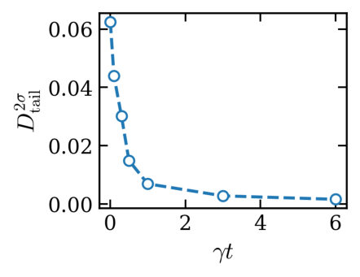
<figcaption class="paper-figure-caption"><b>Fig 2.</b> FIG. 2. Variation of the tail deviation D(2σ) tail with the cumulative monitoring strength γt at transverse field h = 0.6. The decrease of D(2σ) tail indicates that the work distribution P(W) approaches its Gaussian reference PG(W) as monitoring becomes stronger, con- sistent with the behavior shown in Fig. 1. Parameters: L = 60, averaged over 500 stochastic realizations.</figcaption>
</figure>
<figure class="paper-figure-card">

<figcaption class="paper-figure-caption"><b>Fig 3.</b> FIG. 3. Work cumulants under stochastic jump dynamics with no quench, Hi = Hf, for a system size L = 60, averaged over 500 stochastic realizations. (a) Mean work ⟨W⟩as a function of the cumulative monitoring strength γt at fixed transverse field h = 0.15. (b) Corresponding work variance σ2 W . The mean work increases rapidly and then saturates, whereas the variance shows a pronounced maximum before relaxing to a plateau. (c) Mean work as a function of the transverse field h at fixed γt = 4. The mean work varies only weakly at small and intermediate h, and decreases at larger h. (d) Corresponding work variance, showing that increasing h broadens the distribution of final-energy outcomes even...</figcaption>
</figure>
<figure class="paper-figure-card">
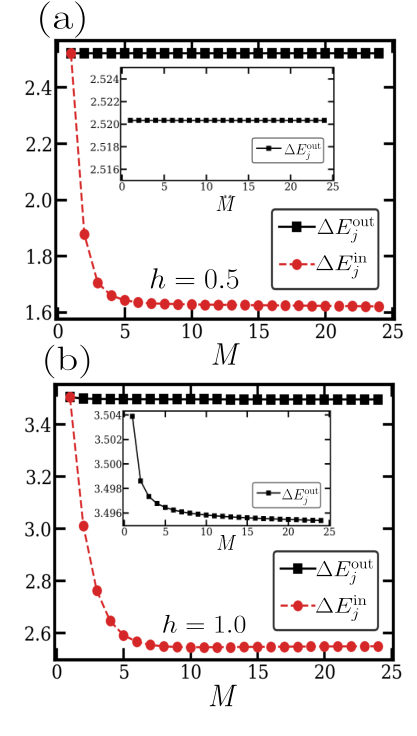
<figcaption class="paper-figure-caption"><b>Fig 4.</b> FIG. 4. Per-jump energy increment ∆Ej as a function of jump in- dex j for system size L = 1024. (a) In the gapped ferromagnetic phase at h = 0.5, ∆Eout j remains strictly constant with respect to j, while ∆Ein j drops at early j and then saturates. Inset: zoomed view of ∆Eout j confirming its j-independence. (b) At the critical point h = 1.0, algebraic correlations render even the outside-cone ∆Eout j weakly j-dependent, as revealed in the inset, whereas the inside-cone ∆Ein j still decays and saturates but more slowly.</figcaption>
</figure>
<figure class="paper-figure-card">

<figcaption class="paper-figure-caption"><b>Fig 5.</b> FIG. 5. Work distribution P(W) in the controlled jump protocol with equally spaced jumps in space and time, illustrating the progression toward Gaussianity with increasing number of jumps M for system size L = 300, h = 0.2, and total time t = 1. (a) For M = 2, P(W) displays a dominant central peak at W = 0 indicative of minimal energy injection, accompanied by multiple discrete peaks at W &gt; 0, reflecting a small set of coherent excitations and preserved coherences. (b) For M = 20, the distribution develops a bell-shaped core but retains residual spikes from incomplete dephasing. (c) For M = 50, P(W) achieves a fully smooth profile that closely overlaps with the Gaussian fit with the same...</figcaption>
</figure>

**Summary.** The paper analyzes how monitoring and quantum jumps affect the statistics of work done on an Ising chain. It shows that frequent measurements drive the work distribution toward a Gaussian shape, regardless of initial quench structure. This provides a powerful tool for understanding energy dissipation and fluctuation theorems in measurement-driven many-body dynamics.

**Why it may be interesting.** This work provides a detailed quantitative framework connecting measurement backaction (monitoring) directly to the statistical properties of energy exchange, offering insights into non-equilibrium thermodynamics in open quantum systems.

Detailed structure

**Main problem.** The study investigates how work statistics evolve in monitored quantum systems subjected to both quantum quenches and stochastic measurement processes.

**Main result.** Work distributions transition from discrete, comb-like structures (under weak monitoring) towards an essentially Gaussian form as the number of measurements or monitoring strength increases, consistent with Central Limit Theorem behavior.

**Method.** The analysis employs a trajectory-resolved generating function derived for generalized measurements and evaluates it using a fermionic Gaussian-state formalism.

**Model / system.** The model is a transverse-field Ising chain ($\hat{H}_{QI}$), whose dynamics are governed by stochastic quantum jumps or continuous monitoring, allowing the study of non-equilibrium work extraction.

**Key observables.** Work distribution $P(W)$, work generating function $G(u)$, mean work $\langle W 
angle$, and variance $\sigma^2_W$.

**Important parameters / regimes.** Monitoring strength ($\gamma_t$), number of jumps ($M$), and the quench field strength ($h_f$).

**Assumptions / limitations.** The analysis relies on the Central Limit Theorem (CLT) mechanism dominating at large measurement rates, causing higher cumulants to be suppressed.

**Figures summary.** Figures illustrate the crossover of $P(W)$ from multi-peaked/comb-like structures towards Gaussianity as monitoring strength or jump number increases; they also contrast work statistics under controlled jumps inside versus outside the light cone.

**Paper structure.** The paper systematically analyzes work statistics by first deriving the generating function for general measurements, then applying it to stochastic jump dynamics (showing crossover), followed by analyzing deterministic controlled jumps (highlighting causality/light-cone effects), and finally examining monitored quenches.

Abstract

We investigate work statistics in monitored transverse-field Ising chains subject to both a quantum quench of the transverse field and either stochastic quantum jumps or controlled measurement sequences. For generalized measurements, we derive a trajectory-resolved generating function for work statistics in the two-point energy measurement scheme. Evaluating it using a fermionic Gaussian-state formalism, we show that, under stochastic jump dynamics, the work distribution crosses over from a comb-like structure to an essentially Gaussian form with shrinking sub-Gaussian tails, as the number of detection events grows. For controlled jump protocols, the energy added by each jump is constant when successive jumps are causally disconnected but decreases and then saturates when they lie within each other's light cone, yielding linear and sublinear growth of the average work, respectively. For monitored quenches, continuous observation washes out the fine structure of the isolated-quench distribution and again drives the statistics toward Gaussian behavior.

[↑ back to top](#top)

### [Weak-coupling tensor cross interpolation impurity solver for nonequilibrium dynamical mean-field theory](http://arxiv.org/abs/2607.00702v1)

**Authors:** Shuta Matsuura, Hiroshi Shinaoka, Philipp Werner, Naoto Tsuji  
**Type:** theory · **Category:** strongly correlated electrons · **PDF:** <https://arxiv.org/pdf/2607.00702v1>  
**Analysis basis:** full PDF text, analyzed in chunks
**Topic relevance:** 🔥 `Keldysh / 2PI / non-Gaussian methods` **5/5** · 🔥 `non-equilibrium dynamics` **4/5** · `Kondo & dissipative impurity` **3/5** · `methods for driven-dissipative` **3/5** · `non-equilibrium universality` **2/5** · `analog quantum simulation` **1/5** · `correlated / nonlocal dissipation` **1/5** · `driven-dissipative phase transition` **1/5**

↔ Scroll figures horizontally

<figure class="paper-figure-card">
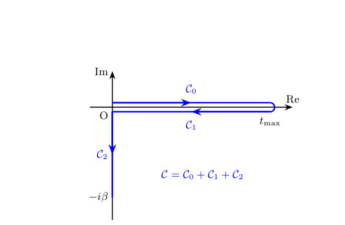
<figcaption class="paper-figure-caption"><b>Fig 1.</b> FIG. 1. L-shaped contour C that consists of three branches: the forward real-time branch C0, the backward real-time branch C1, and the imaginary-time branch C2.</figcaption>
</figure>
<figure class="paper-figure-card">
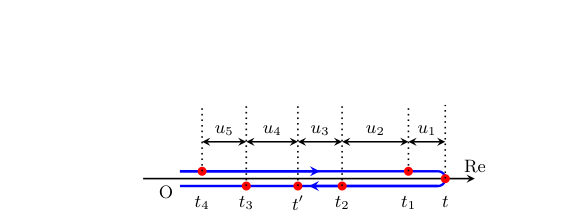
<figcaption class="paper-figure-caption"><b>Fig 2.</b> FIG. 2. The definition of the variables u1, · · · , un+1. In this illustration, we take n = 4 and k = 2 with (s1, s2, s3, s4) = (0, 1, 1, 0).</figcaption>
</figure>
<figure class="paper-figure-card">
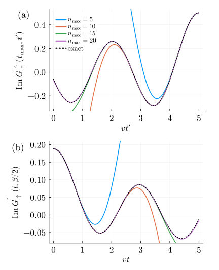
<figcaption class="paper-figure-caption"><b>Fig 3.</b> FIG. 3. Results obtained with the weak-coupling nonequilib- rium TCI impurity solver for the impurity model (7) with ∆↓(z, z′) = 0 and ∆R ↑(t, t′), ∆⌉ ↑(t, τ ′), ∆&lt; ↑(t, t′) given by Eq. (61). We set δµ = 0 (particle-hole symmetric system). The one-dimensional cuts of (a) Im G&lt; ↑(t, t′) at t = tmax and</figcaption>
</figure>
<figure class="paper-figure-card">
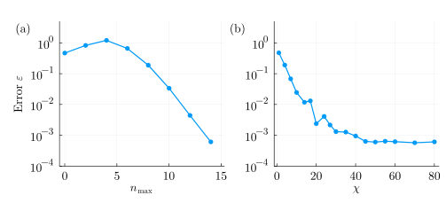
<figcaption class="paper-figure-caption"><b>Fig 4.</b> FIG. 4. Convergence of the error of the lesser Green’s function with respect to (a) the maximum order nmax and (b) the bond dimension χ for the exactly solvable impurity model (Eq. (7) with ∆↓(z, z′) = 0) with particle-hole symmetry (δµ = 0). The parameters are β = 5/v, U = 3v, tmax = 3/v and α = 0.5. In panel (a), the maximum bond dimension is fixed to χ = 80, and in panel (b), the maximum order is fixed to nmax = 14.</figcaption>
</figure>
<figure class="paper-figure-card">

<figcaption class="paper-figure-caption"><b>Fig 5.</b> FIG. 6. Convergence of the error of (a,b) the lesser Green’s function and (c,d) the greater Green’s function for the exactly solvable impurity model (Eq. (7) with ∆↓(z, z′) = 0) without particle-hole symmetry (δµ = 0.825v). In panels (a,c), the error is plotted as a function of the maximum order nmax, and in panels (b,d), the error is plotted as a function of the maximum bond dimension χ. The parameters are β = 5/v, U = 3v, and tmax = 3/v. In panels (a,c), the bond dimension is fixed to χ = 80, and in panels (b,d), the maximum order is fixed to nmax = 14.</figcaption>
</figure>

**Summary.** This paper introduces a novel impurity solver for nonequilibrium Dynamical Mean-Field Theory (DMFT) by combining a weak-coupling expansion with Tensor Cross Interpolation (TCI). This technique efficiently handles high-dimensional integrals on the Keldysh contour, circumventing the sign problem that plagues standard Monte Carlo methods. It allows accurate simulation of quantum quenches in correlated models like the Hubbard model.

**Why it may be interesting.** The development of a robust, non-stochastic solver for nonequilibrium DMFT is crucial for studying open quantum systems driven far from equilibrium, bridging the gap between weak-coupling perturbation theory and complex time evolution simulations.

Detailed structure

**Main problem.** Simulating nonequilibrium quantum many-body systems, which suffer from exponential computational complexity with real time.

**Main result.** The developed TCI solver successfully implements an impurity solver for nonequilibrium DMFT, accurately reproducing thermalization dynamics and remaining controlled away from the sign problem region.

**Method.** It combines a weak-coupling expansion with the Tensor Cross Interpolation (TCI) algorithm to efficiently evaluate high-dimensional integrals arising in the Keldysh formalism without stochastic sampling.

**Model / system.** The method is applied to nonequilibrium dynamics in strongly correlated electron systems, specifically using the mass-imbalanced Hubbard model on a lattice structure within the framework of Dynamical Mean-Field Theory (DMFT).

**Key observables.** Nonequilibrium Green's functions ($G_\sigma(z, z')$), spectral functions, and thermalization behavior.

**Important parameters / regimes.** Interaction strength ($U$), filling fraction ($\delta\mu$), maximum simulation time ($t_{max}$), and the weak-coupling expansion order ($n_{max}$).

**Assumptions / limitations.** The method relies on approximating high-dimensional integrals using a tensor-train decomposition (TCI) and assumes sufficient smoothness for extrapolation across the Keldysh contour.

**Figures summary.** Figures illustrate the L-shaped Kadanoff–Baym contour, convergence of TCI results with increasing order ($n_{max}$), and phase diagrams showing solver performance across different coupling regimes.

**Paper structure.** The paper builds from defining the complex Green's function formalism on the Keldysh contour to implementing the weak-coupling expansion. It details the use of TCI for integral evaluation, applies this to both transient dynamics (quenches) and steady states, and concludes with benchmarking against known limits.

Abstract

Simulating nonequilibrium quantum many-body systems remains a major challenge due to the exponential growth of the computational complexity with real time. Here we implement a nonequilibrium impurity solver based on the weak-coupling expansion and the tensor cross interpolation (TCI), and apply it to nonequilibrium dynamical mean-field theory (DMFT). The method approximates the integrands of the high-dimensional integrals arising in the weak-coupling expansion in a tensor-train form, enabling efficient evaluations without stochastic sampling and thereby mitigating the sign problem affecting continuous-time quantum Monte Carlo (CT-QMC) methods. Benchmark calculations for an exactly solvable nonequilibrium impurity model agree well with the exact results and reveal a low-rank structure of the integrands. When applied to interaction-quench problems in the half-filled Hubbard model, the method reproduces fast thermalization at a critical interaction strength with accuracy comparable to CT-QMC. Away from half filling, where the sign problem becomes even more severe, the present approach remains well controlled, revealing a crossover instead of a sharply defined fast thermalization point in the 3/4-filled case. The solver can also be applied to steady-state DMFT problems, yielding accurate spectral functions in the metallic regime without analytic continuation.

[↑ back to top](#top)

### [Continuous Observation of Quantum Systems](http://arxiv.org/abs/2607.01158v1)

**Authors:** Hans Maassen  
**Type:** theory · **Category:** other · **PDF:** <https://arxiv.org/pdf/2607.01158v1>  
**Analysis basis:** full PDF text, analyzed in chunks
**Topic relevance:** 🔥 `quantum measurements` **5/5** · `measurement-induced transitions` **3/5** · `methods for driven-dissipative` **3/5** · `correlated / nonlocal dissipation` **2/5** · `Keldysh / 2PI / non-Gaussian methods` **1/5** · `driven-dissipative phase transition` **1/5** · `non-equilibrium dynamics` **1/5**

↔ Scroll figures horizontally

<figure class="paper-figure-card">
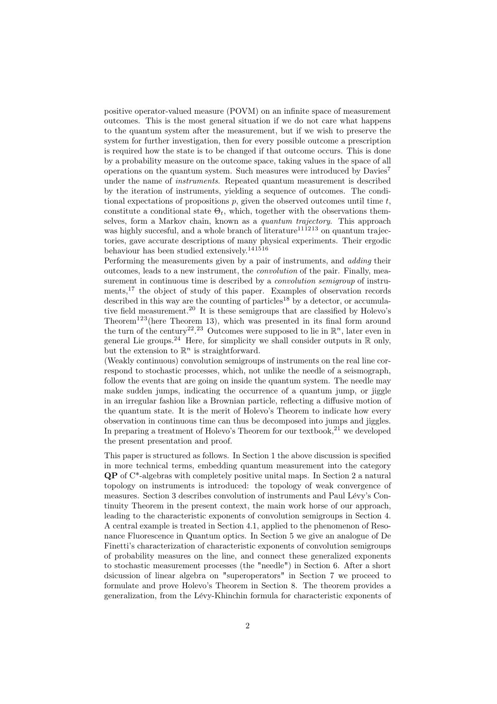
<figcaption class="paper-figure-caption"><b>Fig 1.</b> Low-resolution page preview, page 2</figcaption>
</figure>
<figure class="paper-figure-card">
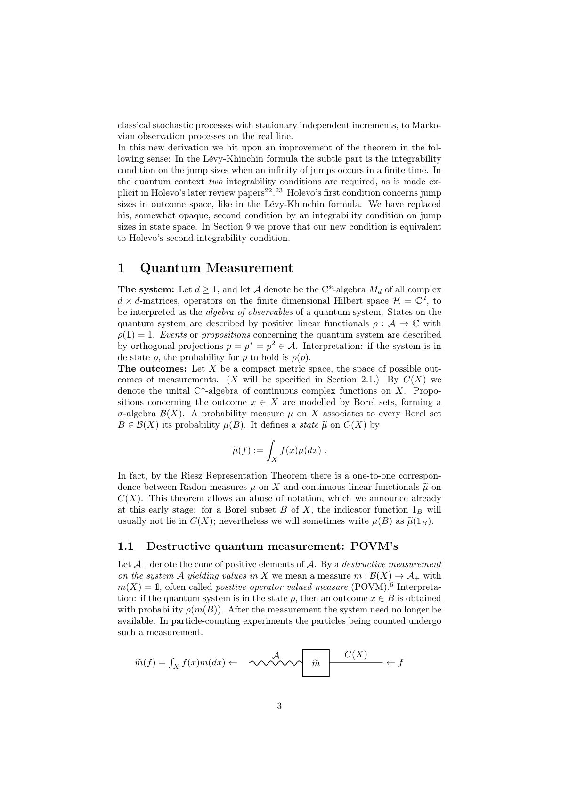
<figcaption class="paper-figure-caption"><b>Fig 2.</b> Low-resolution page preview, page 3</figcaption>
</figure>
<figure class="paper-figure-card">
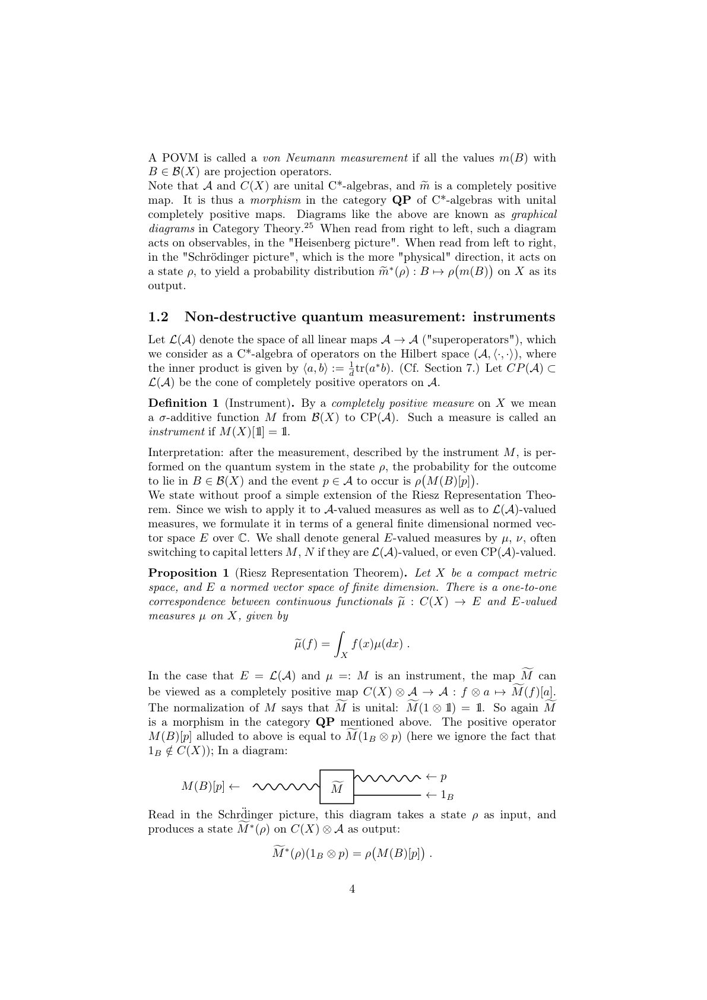
<figcaption class="paper-figure-caption"><b>Fig 3.</b> Low-resolution page preview, page 4</figcaption>
</figure>
<figure class="paper-figure-card">
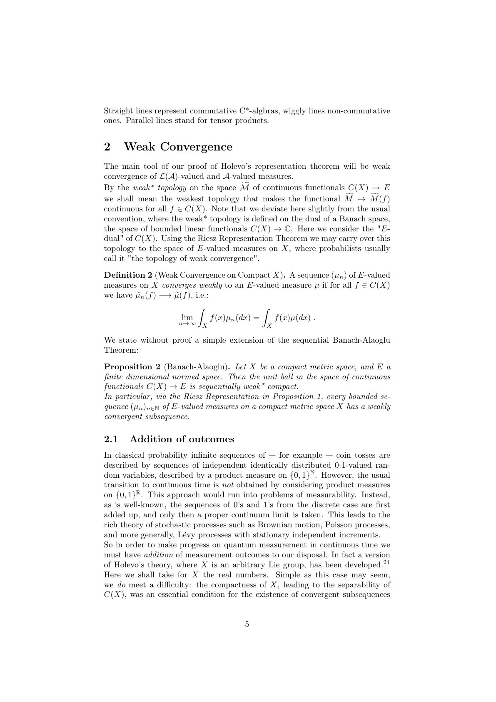
<figcaption class="paper-figure-caption"><b>Fig 4.</b> Low-resolution page preview, page 5</figcaption>
</figure>
<figure class="paper-figure-card">
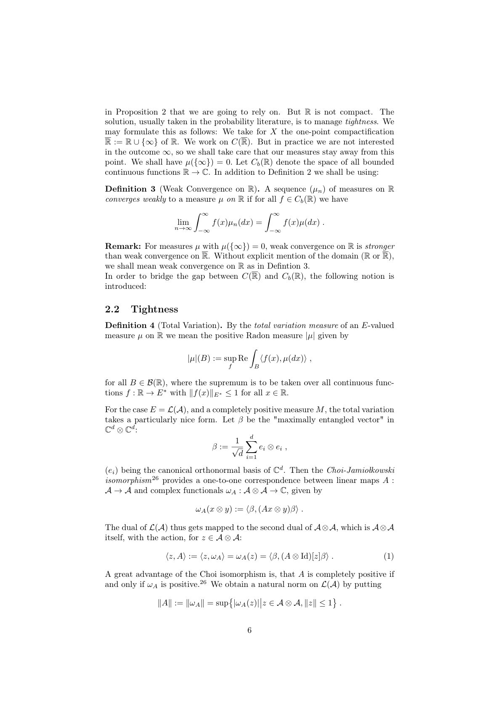
<figcaption class="paper-figure-caption"><b>Fig 5.</b> Low-resolution page preview, page 6</figcaption>
</figure>

**Summary.** This paper rigorously develops the mathematical theory behind continuous quantum measurement by classifying the generators of associated evolution semigroups. It extends classical stochastic process theorems to the quantum domain using weak convergence and characteristic functions. The result provides a fundamental decomposition theorem for these generators, linking them to specific physical processes like diffusion and discrete jumps.

**Why it may be interesting.** This work provides a rigorous mathematical foundation for understanding quantum measurement in continuous time. The decomposition of the generator $L$ into distinct physical components (diffusion vs. jumps) is crucial for modeling realistic open quantum systems, especially those involving photon counting or dissipation.

Detailed structure

**Main problem.** The paper develops an alternative, probabilistic proof for Holevo's classification theorem concerning continuous quantum measurement processes (stationary quantum trajectories). It aims to characterize the generators of these observation semigroups.

**Main result.** It establishes that any generator $L$ arising from a weakly continuous semigroup of instruments must decompose into four components: shift, free evolution, diffusive, and jump terms. Furthermore, it proves key equivalences linking operator algebra conditions to integral conditions on associated measures.

**Method.** The proof heavily relies on advanced functional analysis tools, including weak convergence of measures (especially for non-compact spaces like $\mathbb{R}$), Lévy's Continuity Theorem, and the characterization of convolution semigroups via characteristic exponents.

**Model / system.** The system is a quantum system described by observables in a $C^*$-algebra $A$ on a finite-dimensional Hilbert space. The dynamics are governed by continuous observation processes modeled mathematically by convolution semigroups of instruments $\{M_t\}_{t\ge 0}$.

**Key observables.** The characteristic exponent $L(\omega)$ and the associated path space measure $\mathcal{M}_T$ are key diagnostics. Specific components include the jump measure $J$, the diffusive term, and the Lindblad generator structure.

**Important parameters / regimes.** Time $t \ge 0$, outcome space $X$ (simplified to $\mathbb{R}$), and parameters defining the generators ($\alpha, \sigma, b$).

**Assumptions / limitations.** The primary mathematical tools assume weak convergence of measures and rely on extending classical Lévy-Khinchin formulas to the quantum instrument framework. The analysis often simplifies by assuming $X=\mathbb{R}$.

**Figures summary.** Not specified in the notes.

**Paper structure.** The paper progresses logically: first, establishing weak convergence tools for measures on $\mathbb{R}$ (Chunk 2); second, characterizing weakly continuous semigroups via their generators $L(\omega)$ and relating them to basic Davies generators (Chunks 3 & 4); third, decomposing the general generator $L$ into its four constituent parts using measure theory (Chunks 5 & 6); and finally, proving key equivalences between different mathematical conditions defining these processes (Chunk 7).

Abstract

In a series of papers in the 1980's Alexander Holevo proved a classification theorem for continuous quantum measurement processes, or, as they would today be called, stationary quantum trajectories in continuous time. His main tools were functional analytic in character: starting from a Bochner-type inequality he employed dilation techniques for positive definite kernels. Here we give an alternative, more probabilistic proof: we use weak convergence of measures and employ Levy's Continuity Theorem. We clarify the boundedness conditions in Holevo's theorem, and supply a simple example from quantum optics.

[↑ back to top](#top)

### [Wavefunctions localization, and the Wigner's Friend Paradox in a Framework of Discrete-Space Hypothesis](http://arxiv.org/abs/2607.00198v1)

**Authors:** W. A. Zúñiga-Galindo  
**Type:** theory · **Category:** other · **PDF:** <https://arxiv.org/pdf/2607.00198v1>  
**Analysis basis:** full PDF text, analyzed in chunks
**Topic relevance:** 🔥 `quantum measurements` **5/5** · 🔥 `measurement-induced transitions` **4/5**

↔ Scroll figures horizontally

<figure class="paper-figure-card">
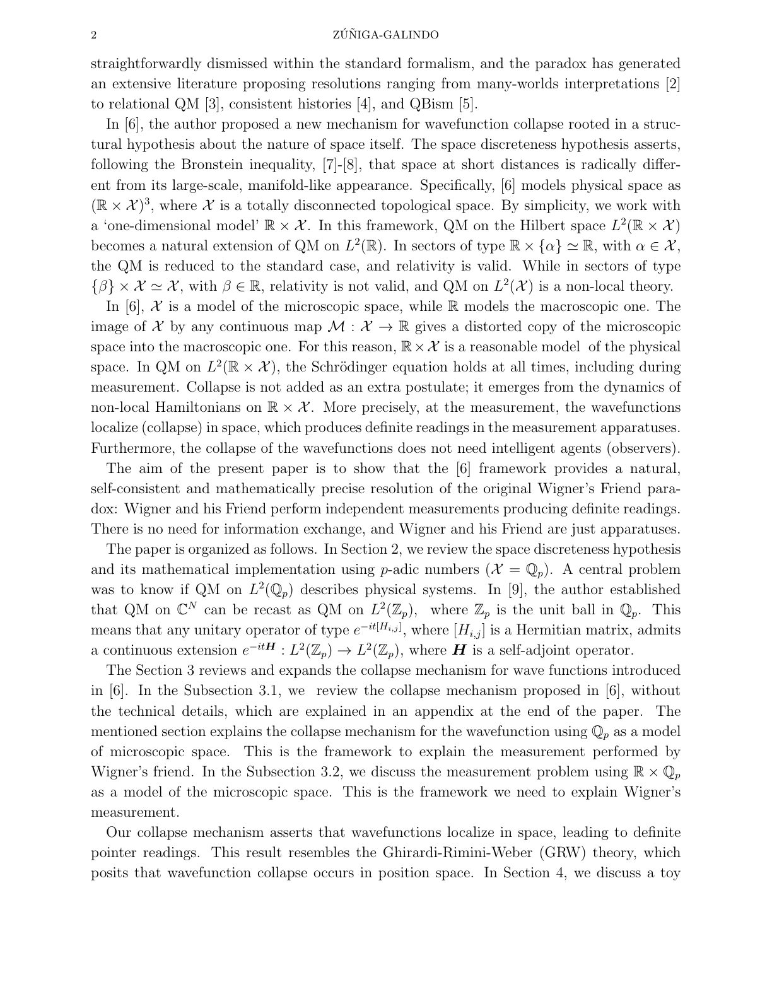
<figcaption class="paper-figure-caption"><b>Fig 1.</b> Low-resolution page preview, page 2</figcaption>
</figure>
<figure class="paper-figure-card">

<figcaption class="paper-figure-caption"><b>Fig 2.</b> Low-resolution page preview, page 3</figcaption>
</figure>
<figure class="paper-figure-card">
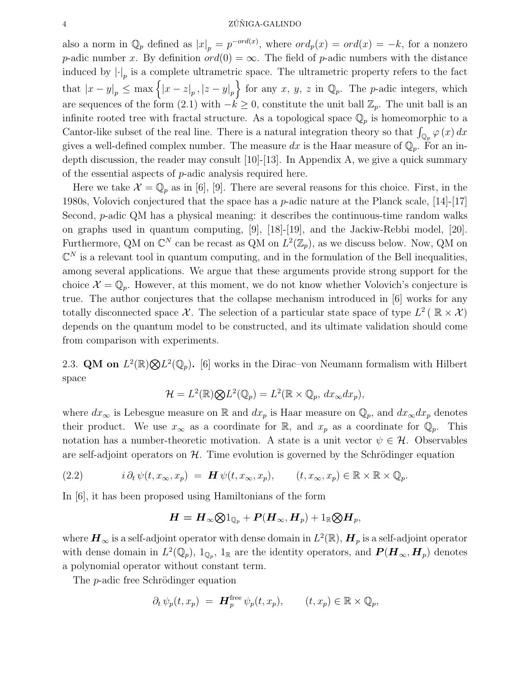
<figcaption class="paper-figure-caption"><b>Fig 3.</b> Low-resolution page preview, page 4</figcaption>
</figure>
<figure class="paper-figure-card">
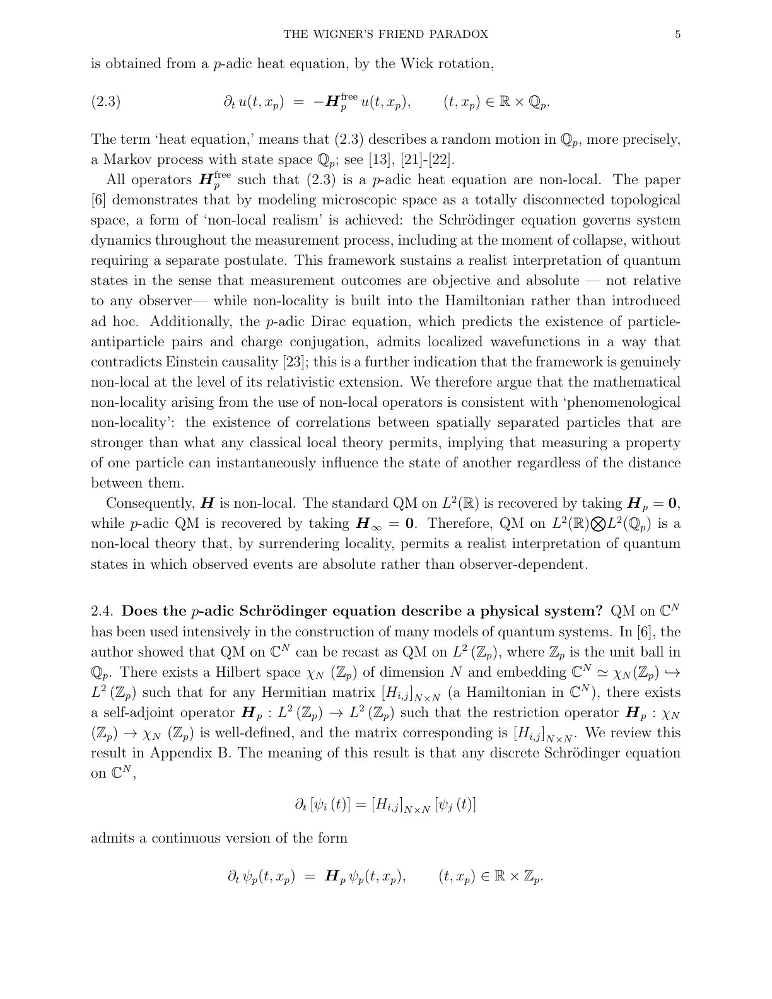
<figcaption class="paper-figure-caption"><b>Fig 4.</b> Low-resolution page preview, page 5</figcaption>
</figure>
<figure class="paper-figure-card">

<figcaption class="paper-figure-caption"><b>Fig 5.</b> Low-resolution page preview, page 6</figcaption>
</figure>

**Summary.** This paper resolves the Wigner's Friend paradox by proposing that wavefunction collapse is a dynamical outcome of the Schrödinger equation when quantum mechanics is formulated on a hybrid space combining continuous ($\mathbb{R}$) and discrete ($p$-adic, $\mathbb{Q}_p$) dimensions. By modeling observers as classical apparatuses, it shows that definite measurement outcomes are absolute features of the dynamics, thus bypassing observer-dependent paradoxes.

**Why it may be interesting.** This work tackles foundational issues in quantum measurement theory (the measurement problem) using advanced mathematical structures ($\mathbb{Q}_p$), which is highly relevant for theoretical physicists exploring the foundations of QM beyond standard continuous models.

Detailed structure

**Main problem.** The paper aims to resolve the Wigner's Friend paradox by providing a quantum mechanical framework that eliminates observer-dependent assumptions.

**Main result.** It demonstrates that wavefunction collapse is a dynamical consequence of the Schrödinger equation on a hybrid space, leading to definite readings for all observers without requiring conscious agents or information exchange.

**Method.** The authors construct a theory using Quantum Mechanics formulated on the product space $\mathbb{R} \times \mathbb{Q}_p$, where $\mathbb{Q}_p$ models discrete microscopic space.

**Model / system.** The system is modeled by quantum mechanics evolving on $L^2(\mathbb{R} \times \mathbb{Q}_p)$, incorporating non-local Hamiltonians. The paradox is tested using toy models of particle measurement in both continuous and p-adic spaces.

**Key observables.** Wavefunction localization onto compact supports during measurement interactions, leading to definite pointer readings.

**Important parameters / regimes.** The structure of the $p$-adic numbers ($\mathbb{Q}_p$) at the Planck-Bronstein scale; non-locality vs. locality trade-off.

**Assumptions / limitations.** The core assumption is that space at short distances is fundamentally discrete, modeled by $\mathbb{Q}_p$, and collapse emerges dynamically from the Schrödinger equation rather than being an independent postulate.

**Paper structure.** The paper introduces the hybrid space model, develops the dynamical mechanism for wavefunction localization via non-local Hamiltonians, applies this to resolve Wigner's Friend paradox by showing sequential, independent collapses, and concludes by demonstrating consistency with existing no-go theorems.

Abstract

We present a resolution of the Wigner's Friend paradox within a framework of quantum mechanics (QM) on the hybrid space RxQ_{p}, where Q_{p} denotes the field of p-adic numbers, regarded as a model of discrete microscopic space at the Planck-Bronstein scale. In this framework, wavefunction collapse is not an independent postulate but a dynamical consequence of the Schrödinger equation with non-local Hamiltonians: wavefunctions localize onto compact supports during measurement interactions, producing definite pointer readings without the intervention of observers or the exchange of information between subsystems. We model both Wigner and his Friend as classical apparatuses and show that each produces a definite reading through independent applications of the collapse mechanism, thereby eliminating the conflict between their descriptions of reality. The framework is consistent with the principal no-go theorems in finite- and infinite-dimensional Hilbert spaces associated with extended Wigner's Friend scenarios -- including those of Frauchiger-Renner, Brukner, Bong et al., and Guérin et al. -- since it requires no agents capable of recording or reasoning about outcomes, thereby vacating the observer-dependent assumptions that drive those theorems. We illustrate the collapse mechanism explicitly through a toy model of a particle in a box, comparing the standard description with the new one. The non-locality intrinsic to QM on L2(RxQ_{p}) permits realism at the cost of locality, and the Absoluteness of Observed Events holds in our framework without requiring observer independence.

[↑ back to top](#top)

### [Coupling effect of nearest-neighbor interacting qubit chains to a single qubit system](http://arxiv.org/abs/2607.00307v1)

**Authors:** Manuel Allan L. Orongan, Lemuel John F. Sese, Rayda P. Gammag  
**Type:** theory · **Category:** statistical mechanics · **PDF:** <https://arxiv.org/pdf/2607.00307v1>  
**Analysis basis:** full PDF text, analyzed in chunks
**Topic relevance:** 🔥 `entanglement & information structure` **4/5** · `analog quantum simulation` **3/5** · `correlated / nonlocal dissipation` **3/5** · `methods for driven-dissipative` **3/5** · `non-equilibrium dynamics` **3/5** · `Keldysh / 2PI / non-Gaussian methods` **2/5** · `Tavis-Cummings & cavity-many-emitter` **2/5** · `driven-dissipative phase transition` **2/5** · `non-equilibrium universality` **2/5** · `Kondo & dissipative impurity` **1/5** · `Rydberg arrays` **1/5** · `correlated cavity matter` **1/5** · `exotic spin models in light-matter` **1/5** · `measurement-induced transitions` **1/5** · `scars & prethermalization` **1/5**

↔ Scroll figures horizontally

<figure class="paper-figure-card">
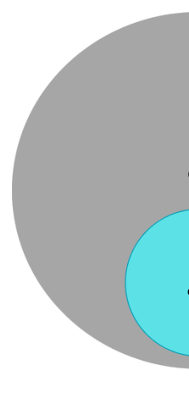
<figcaption class="paper-figure-caption"><b>Fig 1.</b> FIG. 1: An open quantum system with the local system S and environment E.</figcaption>
</figure>
<figure class="paper-figure-card">

<figcaption class="paper-figure-caption"><b>Fig 2.</b> FIG. 2: A central qubit (blue) interacting with M Ising chains (gray), each consisting of N</figcaption>
</figure>
<figure class="paper-figure-card">
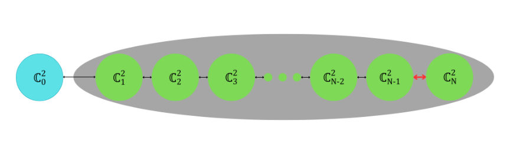
<figcaption class="paper-figure-caption"><b>Fig 3.</b> FIG. 3: A central qubit (blue) interacting with the first qubit of an N qubit Ising chain</figcaption>
</figure>
<figure class="paper-figure-card">

<figcaption class="paper-figure-caption"><b>Fig 4.</b> FIG. 4: Time-evolution of concurrence under varying strength of transverse magnetic field</figcaption>
</figure>

**Summary.** This paper develops a theorem defining when certain parts of a system's Hamiltonian are inert regarding local dynamics. By testing this theorem against various qubit chain models, the authors show that violating the required commutation relations allows for an 'emergent coupling.' This emergent coupling can generate measurable entanglement between subsystems that do not interact directly in the original Hamiltonian.

**Why it may be interesting.** This work provides deep insight into how seemingly irrelevant Hamiltonian terms can become dynamically relevant through non-commuting interactions, which is crucial for understanding decoherence and information flow in complex quantum systems.

Detailed structure

**Main problem.** The study aims to establish a rigorous theorem identifying Hamiltonian terms that do not influence local dynamics or observables, while also exploring cases where this assumption breaks down.

**Main result.** The authors demonstrate that when specific commutation relations are violated (e.g., by applying a transverse field), non-local interactions can generate an 'emergent coupling' leading to measurable entanglement between previously uncoupled subsystems.

**Method.** The analysis involves deriving the reduced density matrix using partial tracing over environment degrees of freedom, comparing results derived under strict commutation conditions versus those where they fail.

**Model / system.** The models involve coupled qubit chains (Ising interactions) interacting with a central local qubit. The system is analyzed by varying coupling strengths and external fields to test the limits of the theoretical theorem.

**Key observables.** Reduced density matrix ($\hat{
ho}_0(t)$), Concurrence ($C(\hat{
ho}_{02})$) for entanglement measurement.

**Important parameters / regimes.** Transverse magnetic field strength ($\omega_1$), coupling strengths ($G_{ij}$), and the ratio of these parameters relative to each other.

**Assumptions / limitations.** The initial theorem relies on specific commutation relations $[\hat{H}, \hat{H}_{E2}] = 0$; the entanglement analysis assumes initial unbiased probability amplitudes for certain states.

**Figures summary.** Figure 4 illustrates the time-evolution of concurrence, showing that significant entanglement generation occurs when the transverse field ($\omega_1$) is comparable in magnitude to the primary coupling strengths ($G_{ij}$).

**Paper structure.** The paper first establishes a theorem for local dynamics independence based on commutation relations. It then tests this with multiple qubit chains (confirming the theorem) and subsequently analyzes a third system where breaking the commutation relation leads to emergent, non-local entanglement.

Abstract

This study establishes a theorem that provides sufficient criteria for identifying terms in any time-independent Hamiltonian that have no influence on local dynamics, local observables, or any local phenomena, without any approximation. The usefulness of this theorem is demonstrated by predicting the behavior of three systems. The first system consists of multiple qubit chains with Ising interactions. The second system is formed by a single qubit chain, differentiated by the substitution of Dzyalonshinskii-Moriya (DM) interaction for the last Ising interaction. The predictions were verified by analytically deriving the reduced dynamics of both systems. A third system was also considered, namely, a short qubit chain with a transverse magnetic field on the intermediary environment qubit. This transverse magnetic field signals that the commutation relation required by our theorem no longer holds. The third system's local dynamics were also derived analytically, demonstrating that all Hamiltonian constituents contributed to the reduced dynamics. The physical consequences of our theorem's inapplicability were also explored using this third system by analyzing the entanglement dynamics between the qubits that do not directly interact. The results showed that the entanglement is caused by an \textit{emergent coupling} between the two non-directly interacting subsystems. This \textit{emergent coupling} arises from the non-commutativity of the intermediate interactions connecting the two subsystems. When searching for these \textit{emergent couplings}, our theorem can eliminate intermediate interactions that will not produce them.

[↑ back to top](#top)

### [Robustness of Quantum Discord in Nonequilibrium Electronic Transport through Tunnel-Coupled Quantum Dots](http://arxiv.org/abs/2607.00602v1)

**Authors:** Thingujam Yaiphalemba Meitei, Saikumar Krithivasan, Md. Manirul Ali, Arijit Sen  
**Type:** theory · **Category:** statistical mechanics · **PDF:** <https://arxiv.org/pdf/2607.00602v1>  
**Analysis basis:** full PDF text, analyzed in chunks
**Topic relevance:** 🔥 `entanglement & information structure` **4/5** · 🔥 `methods for driven-dissipative` **4/5** · 🔥 `non-equilibrium dynamics` **4/5** · `Keldysh / 2PI / non-Gaussian methods` **3/5** · `driven-dissipative phase transition` **3/5** · `analog quantum simulation` **2/5** · `correlated / nonlocal dissipation` **2/5** · `non-equilibrium universality` **2/5** · `Kondo & dissipative impurity` **1/5** · `scars & prethermalization` **1/5**

↔ Scroll figures horizontally

<figure class="paper-figure-card">

<figcaption class="paper-figure-caption"><b>Fig 1.</b> Figure 1: Time evolution of quantum discord D(ρAB) and classical correlation C(ρAB) for the full non-Markovian dynamics (red and black dotted, Γ = γ, W = γ) and the wideband limit (WBL, green solid, Γ = γ, W = 50γ) for four initial states: (a) |01⟩⟨01|, (b) 1</figcaption>
</figure>
<figure class="paper-figure-card">

<figcaption class="paper-figure-caption"><b>Fig 2.</b> Fig. 1 compares the time evolution of quantum discord D(ρAB) and classical correlation C(ρAB) in the full non- Markovian dynamics (Γ = γ, W = γ) and the wideband limit (WBL, Γ = γ, W = 50γ) across four initial states: the product states |01⟩⟨01| and |10⟩⟨10|, the superposition state 1 √</figcaption>
</figure>
<figure class="paper-figure-card">

<figcaption class="paper-figure-caption"><b>Fig 3.</b> Figure 2: Time evolution of quantum discord D(ρAB) in a tunnel-coupled DQD system connected to fermionic reservoirs: (a) variation with system–reservoir coupling strength ΓL = ΓR for fixed spectral bandwidth WL = WR = W = γ, and (b) variation with spectral bandwidth WL = WR for fixed coupling strength ΓL = ΓR = Γ = 0.5γ.</figcaption>
</figure>
<figure class="paper-figure-card">
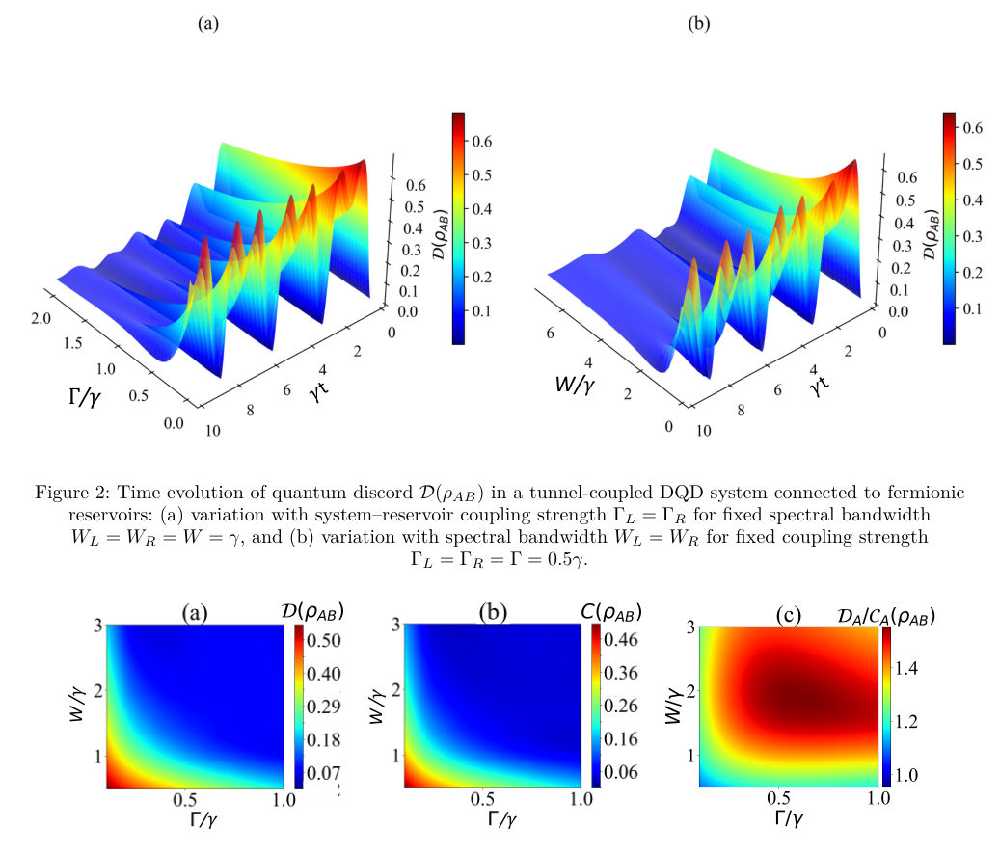
<figcaption class="paper-figure-caption"><b>Fig 4.</b> Figure 3: Steady-state: (a) quantum discord D(ρAB), (b) classical correlation C(ρAB) and (c) Steady-state ratio D(ρAB)/C(ρAB) as functions of coupling strength Γ and spectral bandwidth W for symmetric coupling ΓL = ΓR ≡Γ and WL = WR ≡W.</figcaption>
</figure>
<figure class="paper-figure-card">
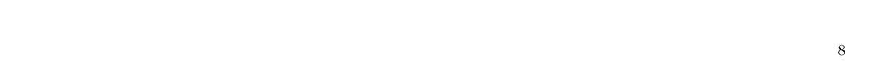
<figcaption class="paper-figure-caption"><b>Fig 5.</b> Fig. 3(c) shows the ratio D(ρAB)/C(ρAB) across the same parameter space. As far as the |01⟩initial state is concerned, the ratio exceeds unity everywhere, confirming that quantum discord always equals or exceeds classical correlation regardless of coupling strength or bandwidth. In the weak-coupling, narrow-bandwidth corner, the ratio approaches ∼1.0, indicating that both types of correlations are of comparable magnitude. As Γ and W increase, the ratio rises monotonically toward ∼1.4–1.5, reflecting the faster decay of classical correlations relative to discord established in Fig. 3(a) and (b), and upon further increase in both parameters, the ratio begins to decrease. This monotonic...</figcaption>
</figure>

**Summary.** This paper analyzes the robustness of quantum discord in a double quantum dot system undergoing non-equilibrium electronic transport. By using advanced theoretical techniques like the quantum Langevin equation, the authors show that quantum correlations persist robustly even when entanglement vanishes. This establishes nonequilibrium transport as a controllable mechanism for engineering nonclassical features in open fermionic devices.

**Why it may be interesting.** This work directly addresses open quantum systems dynamics in mesoscopic devices, providing quantitative tools (like Discord) to characterize nonclassicality under realistic thermal and bias conditions, which is highly relevant to AMO physics.

Detailed structure

**Main problem.** The study investigates how quantum correlations, specifically Quantum Discord, behave during non-equilibrium electronic transport processes.

**Main result.** Quantum discord remains finite in the steady state over a broad parameter range, demonstrating that nonequilibrium transport provides a robust mechanism for controlling nonclassical correlations.

**Method.** The analysis employs the quantum Langevin equation formalism to derive the exact reduced density matrix and calculate correlation measures like Quantum Discord and Classical Correlation.

**Model / system.** The system is a double quantum dot (DQD) coupled to fermionic reservoirs, modeled using a full Hamiltonian structure ($H = H_S + H_B + H_I$).

**Key observables.** Quantum Discord $D(
ho_{AB})$, Classical Correlation $C(
ho_{AB})$, and the ratio $D/C$.

**Important parameters / regimes.** System-reservoir coupling strength ($\Gamma$), spectral bandwidth ($W$), thermal bias ($\Delta T$), and reservoir asymmetry.

**Assumptions / limitations.** The analysis utilizes a Lorentzian spectral density for fermionic reservoirs and employs the quantum Langevin equation to retain non-Markovian memory effects.

**Figures summary.** Figures illustrate time evolution of correlations showing convergence to steady states, dependence on coupling strength ($\Gamma$) and bandwidth ($W$), and how thermal gradients affect discord magnitude.

**Paper structure.** The paper systematically analyzes the transient dynamics first, establishing that initial state does not determine the final steady-state correlation values. It then explores parameter dependencies (coupling, bandwidth, asymmetry) to show robustness and control mechanisms for quantum correlations.

Abstract

Quantum discord captures quantum correlations beyond entanglement and can remain finite even when the entanglement vanishes. We investigate the transient nonequilibrium dynamics and steady-state behavior of quantum discord and classical correlations in a double quantum dot (DQD) system coupled to fermionic reservoirs. By employing a quantum Langevin equation formalism, we obtain the exact reduced density matrix of the system, enabling a comprehensive analysis of its quantum and classical correlations under nonequilibrium conditions. The influence of system-reservoir coupling strength, spectral bandwidth, thermal bias, and varying initial state on both the transient dynamics and steady-state correlations is systematically analyzed. Quantum discord remains finite in the nonequilibrium steady state over a broad parameter range. Although thermal gradients reduce the overall magnitude of correlations, quantum discord persists and exhibits greater resilience. These results demonstrate that nonequilibrium electronic transport, together with the environmental spectral properties and reservoir asymmetry, provides an effective means of controlling nonclassical correlations in mesoscopic systems and establishes quantum discord as a robust hallmark of open fermionic quantum devices.

[↑ back to top](#top)

### [Simulating generic single-qubit open-dynamics via polarization-frequency coupling in a photonic interferometer](http://arxiv.org/abs/2607.00835v1)

**Authors:** Kalle Raikisto, Alberto Ferrara, Tom Kuusela, Rosario Lo Franco, Jyrki Piilo  
**Type:** theory · **Category:** quantum information and computing · **PDF:** <https://arxiv.org/pdf/2607.00835v1>  
**Analysis basis:** full PDF text, analyzed in chunks
**Topic relevance:** 🔥 `analog quantum simulation` **4/5** · `interference shaping light` **3/5** · `methods for driven-dissipative` **3/5** · `quantum optics experiment` **3/5** · `QC/QI experiment` **2/5** · `driven-dissipative phase transition` **2/5** · `non-equilibrium dynamics` **2/5** · `quantum measurements` **2/5** · `Keldysh / 2PI / non-Gaussian methods` **1/5** · `correlated / nonlocal dissipation` **1/5** · `entanglement & information structure` **1/5** · `measurement-induced transitions` **1/5** · `non-equilibrium universality` **1/5**

↔ Scroll figures horizontally

<figure class="paper-figure-card">

<figcaption class="paper-figure-caption"><b>Fig 1.</b> FIG. 1. Diagram of the setup. The system is a Mach-Zehnder interferometer consisting of 2 beam splitters (blue), where the photon goes through quartz plate (grey). The initial state is determined by the choice of frequency distribution |g(ω)|2</figcaption>
</figure>
<figure class="paper-figure-card">
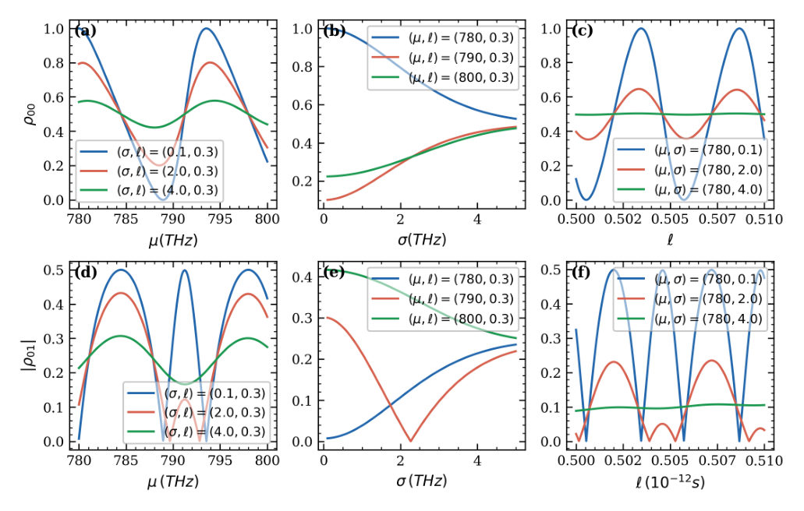
<figcaption class="paper-figure-caption"><b>Fig 2.</b> FIG. 2. The diagonal and off-diagonal values of the polarization state for one of the output branch of the interferometer, as a function of the controllable parameters µ, σ, ℓ. The other parameters are set to CH = 0.5, nH = 1.553 and nV = 1.544. Panels (a, b, c): ρ00 as function of µ, σ and ℓrespectively. Panels (d, e, f): |ρ01| as function of µ, σ and ℓrespectively.</figcaption>
</figure>
<figure class="paper-figure-card">

<figcaption class="paper-figure-caption"><b>Fig 3.</b> FIG. 3. Results of the single qubit simulation for the depo- larizing channel, as described in Eq. (13) (a): Comparison of the diagonal element ρ00 (b): Comparison of the off-diagonal coherence (c): Values of the mean frequency µ in the unit of THz. (d): Mean fidelity of the simulation shown as function of the depolarization rate γ. For (a)-(c) the parameters are ℓ= 8.688229·10−12 s, σ = 0.1 THz, nH = 1.553, nV = 1.544, |CH| = 0.527694, γ = 0.1. For (d) parameters ℓ, CH and σ are kept while a new set of µ values is separately optimized each γ.</figcaption>
</figure>
<figure class="paper-figure-card">
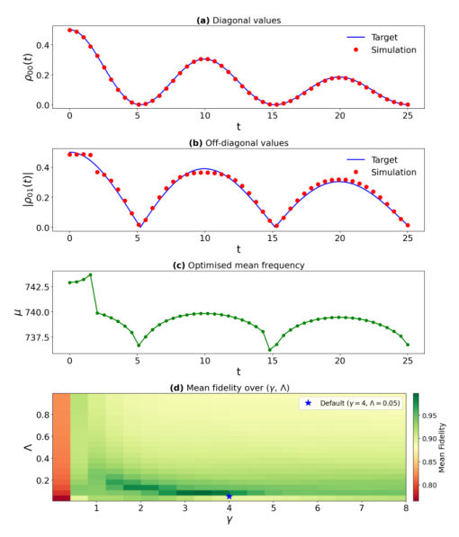
<figcaption class="paper-figure-caption"><b>Fig 4.</b> FIG. 4. Results of the single qubit simulation for a non- Markovian dynamics, as described in Eq. (16) (a): Com- parison of the diagonal element ρ00 (b): Comparison of the off-diagonal coherence (c): Values of the mean frequency µ in the unit of THz. (d): Colormap of the mean fidelity as a function of γ and λ. For (a)-(c) the parameters are ℓ= 0.101579 · 10−12 s, σ = 0.637 THz, nH = 1.553, nV = 1.544, |CH| = 0.3, γ = 4, λ = 0.05. For (d) pa- rameters ℓ, CH and σ are kept while a new set of µ values is separately optimized each γ, λ.</figcaption>
</figure>
<figure class="paper-figure-card">

<figcaption class="paper-figure-caption"><b>Fig 5.</b> FIG. 5. Probability of finding the photon in the output branch A as (a): function of µ and (b): a function of σ.</figcaption>
</figure>

**Summary.** The paper proposes using a single photon interferometer with birefringent quartz to simulate arbitrary open-system dynamics for a qubit encoded in polarization. By treating the frequency mode as an environment, they derive protocols that reproduce complex noise models, including non-Markovian behavior. This establishes the photonic setup as a versatile tool for quantum process simulation.

**Why it may be interesting.** This work provides a highly versatile, all-optical method for quantum process tomography on qubits, which is crucial for understanding decoherence mechanisms in photonic quantum computing architectures.

Detailed structure

**Main problem.** The primary goal is simulating arbitrary single-qubit open-system dynamics using a controllable photonic platform.

**Main result.** The setup successfully models complex decoherence processes, including non-Markovian dynamics and structured environmental coupling, by engineering the interaction between polarization and frequency degrees of freedom.

**Method.** The authors use an analytical approach involving partial tracing over the continuous frequency environment to derive the reduced density matrix evolution for the qubit polarization state.

**Model / system.** The physical system is a single photon propagating through an open Mach-Zehnder interferometer containing a birefringent quartz plate. The qubit is encoded in polarization, and the frequency acts as the effective environment.

**Key observables.** Qubit populations ($
ho_{00}, 
ho_{11}$) and coherences ($
ho_{01}$), detection probabilities ($p_j$), and mean fidelity of the simulation.

**Important parameters / regimes.** Controllable parameters include the spectral width ($\sigma$), mean frequency ($\mu$), quartz thickness ($\ell$), and initial polarization amplitudes ($C_H, C_V$).

**Assumptions / limitations.** The analysis assumes a Gaussian distribution for the photon frequency spectrum ($|g(\omega)|^2$) and relies on tracing out the continuous frequency degree of freedom.

**Figures summary.** Figures illustrate the setup (MZI with quartz), show probability distributions vs. tuning parameters ($\mu, \sigma$), and compare simulated qubit evolution against known noise models like depolarization and non-Markovian dynamics.

**Paper structure.** The paper progresses from defining the physical setup and deriving the initial reduced density matrix via partial tracing over frequency (Appendix A). It then develops the simulation framework by identifying controllable parameters. Finally, it benchmarks the protocol by simulating specific open dynamics, including Markovian damping and non-Markovian coherence revivals.

Abstract

We propose a photonic platform for simulating arbitrary single-qubit open-system dynamics using a single photon in an open Mach-Zehnder interferometer. A birefringent quartz plate induces a coupling between the polarization and frequency degrees of freedom. By treating the latter as an effective environment, we analytically derive the reduced polarization dynamics. We show that the resulting evolution is characterized by a controllable interplay between populations and coherence, instead of the usual dephasing caused by quartz plates. By adjusting the photon frequency distribution and interferometric parameters, we demonstrate that target single-qubit states can be efficiently reproduced through a tunable optical protocol expected to work under accessible experimental conditions. The simulator is benchmarked against paradigmatic open-system evolutions, including depolarization and non-Markovian dynamics, achieving high accuracy. Our results establish polarization-frequency engineered photonic interferometers as a versatile protocol for simulation of open quantum systems.

[↑ back to top](#top)

### [Subsystem Thermalization and Work Statistical Characterizations of Floquet Dynamics](http://arxiv.org/abs/2607.00381v1)

**Authors:** Feng-Li Lin, Ching-Yu Huang  
**Type:** theory · **Category:** statistical mechanics · **PDF:** <https://arxiv.org/pdf/2607.00381v1>  
**Analysis basis:** full PDF text, analyzed in chunks
**Topic relevance:** 🔥 `non-equilibrium dynamics` **4/5** · 🔥 `scars & prethermalization` **4/5** · `driven-dissipative phase transition` **3/5** · `entanglement & information structure` **3/5** · `methods for driven-dissipative` **3/5** · `analog quantum simulation` **2/5** · `correlated / nonlocal dissipation` **2/5** · `non-equilibrium universality` **2/5** · `Keldysh / 2PI / non-Gaussian methods` **1/5** · `Kondo & dissipative impurity` **1/5** · `exotic spin models in light-matter` **1/5**

↔ Scroll figures horizontally

<figure class="paper-figure-card">

<figcaption class="paper-figure-caption"><b>Fig 1.</b> FIG. 1. (a) Schematic illustration of the periodically driven Hamilto- nian. Within one driving period T, the system alternates between two non-commuting parts, HJ and Hx, in a piecewise-constant (bang–bang) manner. (b) Stroboscopic evolution of the quantum state under the Floquet operator UF . Starting from the initial state ρ0, the state after n driving cycles is given by ρn, where each appli- cation of UF corresponds to one full driving period 2π/ω.</figcaption>
</figure>
<figure class="paper-figure-card">
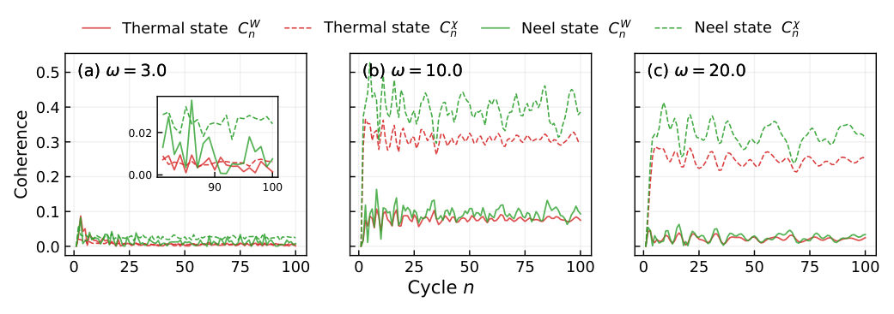
<figcaption class="paper-figure-caption"><b>Fig 2.</b> FIG. 2. Stroboscopic evolution of the coherence-related quantities CW n (solid lines) and Cχ n (dashed lines) for characterizing the quantum coherence of Floquet dynamics by work statistics from the initial state ρ0 which is either a thermal state ρβ=1 (red) or a N´eel state (green). for three driving frequencies, ω = 3.0, 10.0, 20.0. The inset figure in the subfigure (a) shows the zoom-in pattern in the regime 80 ≤n ≤100. For this figure and the ones presented later, the initial states are always prepared with respect to the spin chain Hamiltonian HJ + Hx of N = 10 sites with fixed parameters J = 1, hx = 0.7, and hz = 1.0.</figcaption>
</figure>
<figure class="paper-figure-card">

<figcaption class="paper-figure-caption"><b>Fig 3.</b> FIG. 3. Stroboscopic evolution of the effective inverse temperature βn defined by (7) by choosing H0 = HJ (blue), Have (orange) and Heff (green) with three driving frequencies ω = 3.0, 10.0, 20.0 as shown in the respective subfigures (a), (b), (c) from an initial thermal state of unit inverse temperature, ρ0 = ρβ=1. The result is briefly summarized as follows. In the subfigure (a), βn≫1 approaches zero for HJ and Have, but not for Heff as shown in the zoomed inset figure. In the subfigure (b), the βn≫1’s for the three Hamiltonians are different. In the subfigure (c), Have and Heff yield the same βn≫1, which is slightly larger than β0 = 1 but is larger than the βn≫1 from HJ.</figcaption>
</figure>
<figure class="paper-figure-card">

<figcaption class="paper-figure-caption"><b>Fig 4.</b> FIG. 4. Comparison of stroboscopic behaviors of relative entropy S  ρA n ρA βn  in characterizing subsystem Floquet thermalization for the βn given in Fig. 3 for H0 = HJ (blue), Have (green) and Heff (red) from a initial thermal state ρ0 = ρβ=1. We again consider three driving frequencies (a) (ω = 3.0), (b) (ω = 10.0), and (c) (ω = 20.0) with two different subsystem sizes A = 1 (solid lines) and A = 5 (dashed lines). At low frequency (ω = 3.0), the relative entropy approaches almost vanishing values for both A = 1 and A = 5 for all three choices of H0. It implies that the subsystem Floquet thermalization works well up to A = 5. At the intermediate and high frequencies (ω = 10.0, 20.0),...</figcaption>
</figure>
<figure class="paper-figure-card">

<figcaption class="paper-figure-caption"><b>Fig 5.</b> FIG. 5. Stroboscopic evolution of relative entropy S  ρA n ρA βn  for characterizing the subsystem thermalization of Floquet dynamics for three driving frequencies ω = 3.0, 10.0, 20.0 from an initial state which is either a thermal state ρβ=1 (red) or a N´eel state (green) for two different subsystem sizes A = 1 (solid lines) and A = 5 (dashed lines). Here, we choose H0 = Have to determine βn by (7). The inset figure in the subfigure (a) shows the zoom-in pattern in the regime 0 ≤n ≤100. The relative entropies approach nearly-vanishing values steadily in all cases when the initial state is ρβ=1, implying almost-global thermalization rather than just subsystem thermalization. On the other...</figcaption>
</figure>

**Summary.** The paper develops a comprehensive diagnostic toolkit to study thermalization in periodically driven quantum spin chains. By simultaneously analyzing subsystem equilibration via relative entropy and the statistics of work done using fluctuation theorems, the authors demonstrate that local and global indicators track the same dynamical crossover across different driving frequencies. This establishes a unified and experimentally accessible method for characterizing prethermal regimes and energy absorption in interacting quantum systems.

**Why it may be interesting.** This work provides a powerful, unified theoretical framework for understanding non-equilibrium dynamics in driven quantum matter, linking local measurements (subsystems) to global thermodynamic quantities (work), which is highly relevant for open quantum systems research.

Detailed structure

**Main problem.** The study investigates how periodically driven quantum systems thermalize, focusing on characterizing both local equilibration (subsystem) and global energy absorption (work statistics).

**Main result.** Both subsystem thermalization diagnostics and work statistics consistently reveal the same dynamical crossover: from prethermal behavior at intermediate driving frequencies to eventual heating or steady states.

**Method.** The authors combine two operational diagnostics—analyzing reduced density matrices for local equilibration and calculating fluctuation theorems/characteristic functions of work performed over a Floquet cycle—to characterize thermalization.

**Model / system.** The system is an N-site open Ising spin chain subjected to periodic driving (Floquet dynamics). The analysis compares results derived using different effective Hamiltonians ($H_J$, $H_{	ext{eff}}$, and $H_{	ext{ave}}$).

**Key observables.** Reduced density matrices ($
ho_A$), relative entropy ($S(
ho_A || 
ho_A^{eta})$), work distribution function (WDF) characteristic functions, and fluctuation theorem deviation measures ($	ext{CFT}_n$).

**Important parameters / regimes.** Driving frequency ($\omega$) is crucial, defining regimes: low $\omega$ (infinite T heating), intermediate $\omega$ (prethermal plateau), and high $\omega$ (finite T state).

**Assumptions / limitations.** The analysis relies on comparing results derived from different choices of the effective Hamiltonian ($H_0$), with $H_{	ext{ave}}$ being shown to be the most consistent choice.

**Figures summary.** Figures illustrate the stroboscopic evolution of coherence measures ($	ext{CW}_n, 	ext{C}\chi_n$) and relative entropy ($S$) across varying driving frequencies, showing characteristic crossovers. Fluctuation theorem deviations ($	ext{CFT}_n$) are also plotted.

**Paper structure.** The paper systematically introduces the model (Floquet Ising chain) and then develops the analysis by applying two complementary diagnostics: subsystem thermalization using relative entropy, and global characterization via work statistics and fluctuation theorems. The results are presented by comparing how these two methods track the same frequency-dependent crossover.

Abstract

We study Floquet thermalization in a periodically driven quantum non-integrable Ising chain by combining two operational diagnostics: subsystem thermalization and work statistics. For generic interacting Floquet systems, stroboscopic dynamics lead to heating toward an infinite-temperature state at low driving frequencies, to a prethermal state during the crossover regime, and then to a finite-temperature state at high driving frequencies. We show that reduced density matrices of small subsystems provide a precise measure of local equilibration and clearly resolve prethermal plateaus. In parallel, we analyze the statistics of work performed over a Floquet cycle using both the characteristic function of work with and without the two-point measurements, and the related fluctuation theorem, which captures coherent contributions and deviations from thermal equilibrium. By comparing these two diagnostics within the same Floquet setting, we demonstrate that work statistics encode the same dynamical crossover that governs subsystem thermalization. Our results establish a unified and experimentally accessible framework for characterizing Floquet thermalization, prethermal regimes, and coherent energy absorption in interacting quantum systems.

[↑ back to top](#top)

### [Dissipation splits the Mott transition in one dimension](http://arxiv.org/abs/2607.00086v1)

**Authors:** Oscar Bouverot-Dupuis, Alberto Rosso, Laura Foini  
**Type:** theory · **Category:** strongly correlated electrons · **PDF:** <https://arxiv.org/pdf/2607.00086v1>  
**Analysis basis:** full PDF text, analyzed in chunks
**Topic relevance:** 🔥 `driven-dissipative phase transition` **4/5** · `Frenkel-Kontorova` **3/5** · `analog quantum simulation` **3/5** · `correlated / nonlocal dissipation` **3/5** · `methods for driven-dissipative` **3/5** · `non-equilibrium universality` **3/5** · `Kondo & dissipative impurity` **2/5** · `non-equilibrium dynamics` **2/5** · `Keldysh / 2PI / non-Gaussian methods` **1/5**

↔ Scroll figures horizontally

<figure class="paper-figure-card">

<figcaption class="paper-figure-caption"><b>Fig 1.</b> Figure 1. Schematic representation of the dissipative sys- tem. A one-dimensional fermionic chain (top), or equiv- alently an XXZ spin chain (bottom), is coupled to inde- pendent local baths characterized by the low-frequency spectral function J(ω) ≃α|ω|s.</figcaption>
</figure>
<figure class="paper-figure-card">
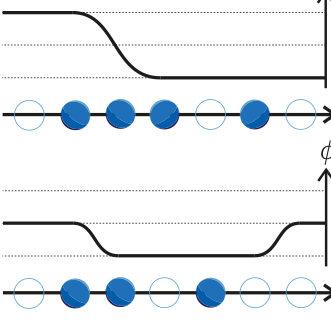
<figcaption class="paper-figure-caption"><b>Fig 2.</b> Figure 2. Bosonized representation of density excita- tions. A particle added on top of the half-filled state ρ0 = 1/2 corresponds to a kink of amplitude −π in the bosonic field (top). The half-filled background also sup- ports elementary domain walls carrying half the particle charge, represented by kinks of amplitude ±π/2 (bot- tom).</figcaption>
</figure>
<figure class="paper-figure-card">

<figcaption class="paper-figure-caption"><b>Fig 3.</b> Figure 3. Phase diagrams for s &lt; 1 (top), 1 &lt; s &lt; 3/2 (middle) and s &gt; 3/2 (bottom). The blue transition lines and the tip of the lobe belong to the BKT universality class. The magenta lines are second order commensurate- incommensurate transitions with exponents depending on the bath exponent s.</figcaption>
</figure>
<figure class="paper-figure-card">

<figcaption class="paper-figure-caption"><b>Fig 4.</b> Figure 4. Typical field configurations ϕ(x, τ) on a lattice of size 256 × 256. The colourmap encodes the value of the field ϕ with darker blue signifying higher values of ϕ. Each kink has an amplitude π/2. We have highlighted one kink for each of the three rightmost plots. From left to right : a) is the MI with no kinks, b) is the DP for s = 1.25 with 6 kinks, c) is the LL with 6 kinks, d) is the LL with 20 kinks. The parameters are K = 0.35, u = 1, g = 0, α = 0.5 and s = 1.25 for a), b) and s = 1.75 for c), d). The data were obtained by working in the canonical ensemble (fixed number of kinks), so the chemical potential µ is not specified.</figcaption>
</figure>
<figure class="paper-figure-card">
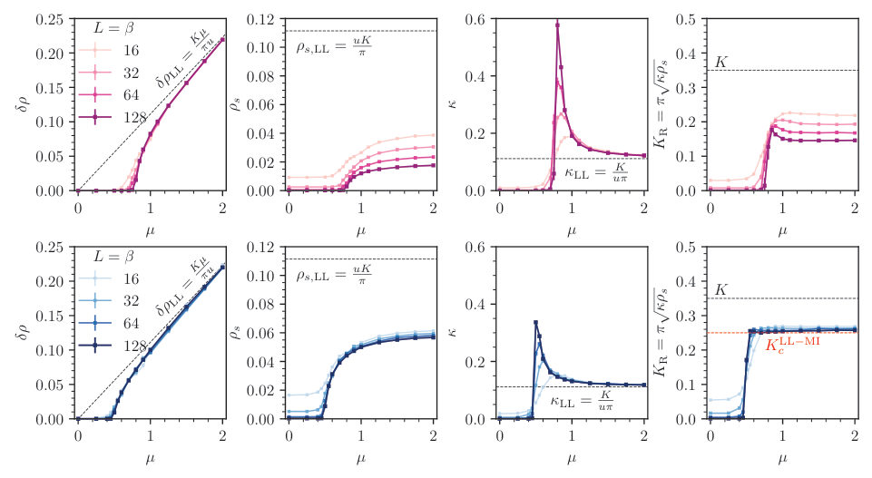
<figcaption class="paper-figure-caption"><b>Fig 5.</b> Figure 5. C/IC transitions at s = 1.25 (top) and s = 1.75 (bottom) for increasing L = β. Top: MI to DP transition. The MI is at µ &lt; µc ≃0.8, while the DP is at µ &gt; µc. Bottom: MI to LL transition. The MI is at µ &lt; µc ≃0.5, while the LL is at µ &gt; µc. From left to right: doping δρ, superfluid stiffness ρs, compressibility κ and renormalised Luttinger parameter KR. In all plots, only µ is varied and K = 0.35, u = 1, g = 0, α = 0.5. The black dashed lines correspond to the values δρLL, ρsLL, κLL, K of a pure LL (K = 0.35, u = 1, g = α = 0). The red dashed line in the lower right plot is at KLL−MI c = 1/4. Error bars are shown and often smaller than the marker size.</figcaption>
</figure>

**Summary.** The paper investigates the effect of local dissipation on the one-dimensional Mott transition in interacting fermions. It shows that for certain bath couplings ($s < 3/2$), the single transition splits into two distinct steps: a BKT transition to an intermediate Dissipative Phase (DP), followed by a new commensurate-incommensurate transition to the Mott Insulator. The analysis uses advanced field theory and RG techniques to characterize these novel critical behaviors.

**Why it may be interesting.** This work provides a concrete example of how environmental coupling (dissipation) can qualitatively alter fundamental quantum many-body physics phenomena like Mott transitions, generating novel intermediate phases and critical behavior relevant to strongly correlated materials.

Detailed structure

**Main problem.** The central problem is understanding how coupling a quantum system undergoing a Mott transition to local dissipative baths modifies the nature of this phase transition.

**Main result.** Dissipation fundamentally reshapes the phase diagram, splitting the conventional Mott transition into two distinct critical phenomena: an LL-to-DP BKT transition followed by a DP-to-MI commensurate-incommensurate transition for bath exponents s < 3/2.

**Method.** The authors employ bosonization to derive an effective field theory action, followed by Renormalization Group (RG) analysis and variational calculations on the resulting critical kink dynamics.

**Model / system.** The model is a one-dimensional interacting fermionic system exhibiting a Mott transition between a Luttinger liquid (LL) and a Mott insulator (MI), with dissipation introduced via local coupling to harmonic oscillator baths characterized by an exponent s.

**Key observables.** Compressibility ($\kappa$), Superfluid stiffness ($
ho_s$), critical exponents ($eta, 
u, z$), and the existence/nature of intermediate phases (DP).

**Important parameters / regimes.** Bath exponent $s$, which dictates the spectral density $J(\omega) \sim |\omega|^s$; the critical threshold $s_c = 3/2$.

**Assumptions / limitations.** The analysis relies on bosonization, integrating out bath degrees of freedom exactly, and performing perturbative RG expansions around effective field theories for kink fluctuations.

**Figures summary.** Figures schematically illustrate the phase diagram showing the splitting of the transition (LL $	o$ DP $	o$ MI) based on $s$, and show finite-size scaling collapses confirming BKT universality at certain points.

**Paper structure.** The paper progresses from establishing the physical model and its effective action via bosonization, through RG analysis to determine phase boundaries and critical exponents for different regimes of $s$, culminating in detailed derivations for the two distinct transitions.

Abstract

Understanding how dissipation modifies quantum phase transitions is a central challenge in many-body physics. A paradigmatic example is the one-dimensional Mott transition, which in isolated systems separates a conducting Luttinger liquid (LL) from a Mott insulator (MI). Here, we study the fate of this transition in the presence of dissipative baths locally coupled to the density. Using bosonisation and an exact integration of the bath degrees of freedom, we show that dissipation fundamentally reshapes the phase diagram for bath exponents $s<3/2$, where $s$ characterises the low-energy bath spectrum. Rather than undergoing a direct LL-MI transition, the system develops an intermediate dissipative phase (DP) that is compressible and gapless, yet has zero superfluid stiffness. As a result, the conventional Mott transition splits into two distinct critical phenomena: a Berezinskii-Kosterlitz-Thouless transition from the LL to the DP, followed by a new commensurate-incommensurate transition from the DP to the MI. We derive an effective field theory for the latter transition and characterize its universality. For $1<s<3/2$, the critical exponents vary continuously with the bath exponent as $β=ν=1/z=s-1$, while for $s<1$ the transition is governed by $β=ν=1/z=0$ and the doping vanishes sharper than any power law. State-of-the-art Monte Carlo simulations quantitatively support our predictions. These results demonstrate that dissipation can qualitatively alter the nature of the Mott transition and generate novel critical behaviour in strongly correlated one-dimensional systems.

[↑ back to top](#top)

### [Learning Low-Energy Subspace Overlaps in Many-Body Systems with Measurement-Based and Coherent Quantum Strategies](http://arxiv.org/abs/2607.00235v1)

**Authors:** Shamminuj Aktar, Rishabh Bhardwaj, Tanmoy Bhattacharya, Stephan Eidenbenz  
**Type:** both · **Category:** statistical mechanics · **PDF:** <https://arxiv.org/pdf/2607.00235v1>  
**Analysis basis:** full PDF text, analyzed in chunks
**Topic relevance:** 🔥 `non-equilibrium dynamics` **4/5** · `analog quantum simulation` **3/5** · `methods for driven-dissipative` **3/5** · `non-equilibrium universality` **3/5** · `quantum measurements` **3/5** · `entanglement & information structure` **2/5** · `measurement-induced transitions` **2/5** · `scars & prethermalization` **2/5** · `driven-dissipative phase transition` **1/5** · `exotic spin models in light-matter` **1/5**

↔ Scroll figures horizontally

<figure class="paper-figure-card">

<figcaption class="paper-figure-caption"><b>Fig 1.</b> FIG. 1: Distributions of OK across the five dataset configurations. Overlaps concentrate near unity in the weak- quench regime (D1) and spread toward lower values as the quench strength increases (D2, D3). Datasets D4 and D5 share the same quench range as D2–D3 but restrict the target overlap orders to even and odd values of K, respectively.</figcaption>
</figure>
<figure class="paper-figure-card">

<figcaption class="paper-figure-caption"><b>Fig 2.</b> FIG. 2: High-level comparison of the two quantum information extraction strategies. The input state |ψ(t)⟩= e−iHt |ψ0⟩is the time-evolved ground state of H0 under the post-quench Hamiltonian H. (a) Measurement-based pipeline: one of three randomized measurement protocols (Pauli, Clifford, or Pauli on Hamiltonian-aware pre-rotation H0-rot) produces a feature tensor of shape (C, N), which is processed by a 1D CNN together with normalized scalar inputs (h, t, i0). (b) Coherent pipeline: the statevector is loaded via arbitrary state preparation, processed through alternating brickwork convolutional and pooling layers that halve the active qubits at each stage, and the final ⟨Z⟩is mapped to the...</figcaption>
</figure>
<figure class="paper-figure-card">
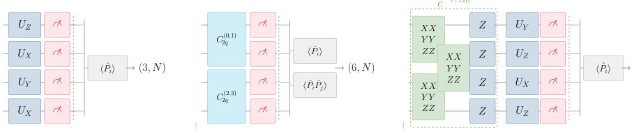
<figcaption class="paper-figure-caption"><b>Fig 3.</b> FIG. 3: Shadow measurement protocols. (a) Pauli shadow: random single-qubit Pauli rotations yield 3N local expecta- tion features via median-of-means (8 groups, 500 shots). (b) Two-qubit Clifford shadow: random 2Q Clifford circuits in alternating brickwork pairing yield 6N features including nearest-neighbor correlators (8 groups, 1,000 shots). (c) Hamiltonian-aware shadow: e−iτH0 pre-rotation consisting of nearest-neighbor Ising exchange gates (XX, Y Y , ZZ) and single-qubit Z rotations representing the longitudinal field hz P</figcaption>
</figure>
<figure class="paper-figure-card">
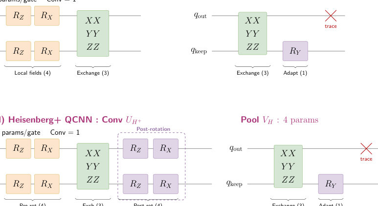
<figcaption class="paper-figure-caption"><b>Fig 4.</b> FIG. 4: Convolutional and pooling gate structures for the four QCNN variants. (a) Standard Simple: Rot + CNOT (6 params) with CRZ+CRY+CRX pooling (3 params). (b) Standard Deep: same gate applied twice per block. (c) Heisenberg QCNN: local rotations (RZ, RX) followed by Ising exchange (XX, Y Y , ZZ) mirroring H0 (7 params), with exchange-based pooling and RY (4 params). (d) Heisenberg QCNN+: adds post-rotation for enhanced express- ibility (11 params); same pooling as (c).</figcaption>
</figure>
<figure class="paper-figure-card">
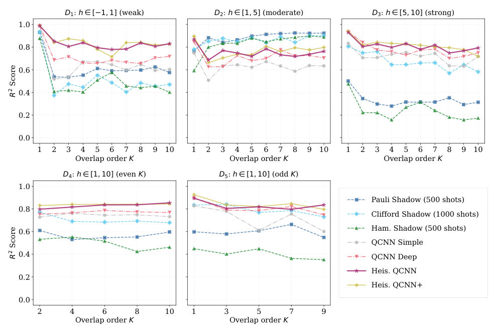
<figcaption class="paper-figure-caption"><b>Fig 5.</b> FIG. 5: Test-set R2 as a function of cumulative overlap order K for all seven models across the five dataset configura- tions at the measurement budgets listed in Table II. Each panel shows one dataset: D1 (weak quench), D2 (moderate quench), D3 (strong quench), D4 (full range, even K), and D5 (full range, odd K). Values show mean R2 averaged over three independent runs. Both measurement-based and coherent strategies successfully learn subspace overlaps, but relative performance depends strongly on the quench regime. Supplementary Table IV gives the corresponding R2 values averaged over all K.</figcaption>
</figure>

**Summary.** The paper compares measurement-based shadow tomography against coherent Quantum CNNs for predicting low-energy subspace overlaps in a quenched Heisenberg spin chain. It finds that the best prediction strategy is highly dependent on the quench strength, with physics-informed QCNNs offering superior robustness across different dynamical regimes compared to local shadow measurements.

**Why it may be interesting.** This work directly addresses how to extract complex, non-local information (like subspace overlaps) from noisy quantum simulations using machine learning, providing a roadmap for applying QML to characterize thermalization and dynamics in strongly correlated systems.

Detailed structure

**Main problem.** The study focuses on developing supervised machine learning techniques to predict the overlap of time-evolved quantum states with specified low-energy subspaces in many-body systems.

**Main result.** The optimal prediction strategy is highly dependent on the quench regime: measurement-based shadow methods excel during moderate quenches, while physics-informed Quantum CNNs offer more robust performance across weak and strong dynamical regimes.

**Method.** The authors compare two quantum information extraction strategies—measurement-based learning (shadow features processed by classical CNNs) and coherent quantum learning (Quantum CNNs)—to estimate the subspace overlap $\mathcal{O}_K$.

**Model / system.** The system studied is a 10-qubit one-dimensional Heisenberg spin chain undergoing time evolution under a local perturbation (quench). The analysis spans weak, moderate, and strong quench regimes.

**Key observables.** Subspace overlap $\mathcal{O}_K$, quantified by the coefficient of determination $R^2$.

**Important parameters / regimes.** Quench strength ($h$), Overlap Order ($K$), Measurement Shot Count (500 to 5,000), and specific quench regimes (D1-D5).

**Assumptions / limitations.** The primary limitations identified are the dominance of state preparation errors on current hardware and the regime dependence of the optimal quantum information extraction strategy.

**Figures summary.** Figures illustrate distributions of $\mathcal{O}_K$ across different quench regimes, compare predicted vs. true overlaps ($R^2$ scores) for various models across D1-D3, and detail resource costs (shots, gates) for both shadow and QCNN approaches.

**Paper structure.** The paper introduces the problem of predicting $\mathcal{O}_K$, details the two competing quantum learning methods (Shadow vs. QCNN), presents results showing regime dependence in performance ($R^2$), compares resource costs, and concludes with hardware validation findings.

Abstract

Predicting the overlap of quantum states with specified low-energy subspaces is a key diagnostic for quantum many-body dynamics, with direct applications in state preparation, subspace-based algorithms, and the study of thermalization. We study the supervised prediction of subspace overlaps O_K between time-evolved states and K-dimensional low-energy eigenspaces of a 10-qubit Heisenberg spin chain following a local perturbation. We compare two quantum information extraction strategies: measurement-based learning, in which classical shadow features are processed by convolutional neural networks, and coherent quantum learning, in which quantum convolutional neural networks process the state directly. We further introduce physics-informed variants for both approaches, including Hamiltonian-aware shadows and QCNN gates aligned with the Heisenberg exchange structure. Across five dataset configurations spanning weak, moderate, and strong quench regimes, physics-informed QCNNs achieve stable performance, with mean test-set coefficients of determination R^2 = 0.753-0.846. Shadow-based methods show stronger regime dependence: they outperform QCNNs in the moderate-quench regime, reaching R^2 = 0.886, but underperform in weak and strong quenches at default shot budgets, where the best shadow results are R^2 = 0.615 and 0.672, respectively. Hardware validation on Quantinuum and IBM noise models shows that arbitrary state preparation is the dominant limitation, requiring approximately 2,044 two-qubit gates and causing near-complete depolarization before inference. These results identify a regime-dependent tradeoff between measurement-based and coherent quantum learning, with shadow methods excelling when the target remains locally accessible and physics-informed QCNNs providing more robust performance across dynamical regimes.

[↑ back to top](#top)

### [Strange Luttinger liquids in a cavity-embedded one-dimensional electronic chain](http://arxiv.org/abs/2607.01146v1)

**Authors:** Danh-Phuong Nguyen, Christophe Mora, Cristiano Ciuti  
**Type:** theory · **Category:** strongly correlated electrons · **PDF:** <https://arxiv.org/pdf/2607.01146v1>  
**Analysis basis:** full PDF text, analyzed in chunks
**Topic relevance:** 🔥 `analog quantum simulation` **4/5** · 🔥 `correlated cavity matter` **4/5** · `exotic spin models in light-matter` **3/5** · `Tavis-Cummings & cavity-many-emitter` **2/5** · `driven-dissipative phase transition` **2/5** · `methods for driven-dissipative` **2/5** · `Frenkel-Kontorova` **1/5** · `Keldysh / 2PI / non-Gaussian methods` **1/5** · `Kondo & dissipative impurity` **1/5** · `correlated / nonlocal dissipation` **1/5** · `entanglement & information structure` **1/5** · `non-equilibrium dynamics` **1/5** · `non-equilibrium universality` **1/5**

↔ Scroll figures horizontally

<figure class="paper-figure-card">
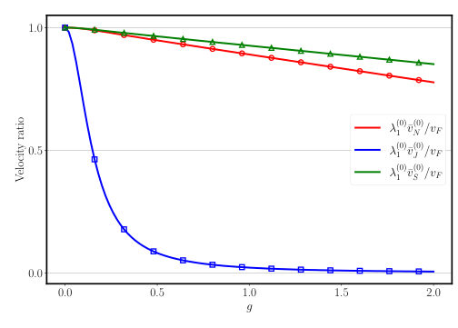
<figcaption class="paper-figure-caption"><b>Fig 1.</b> FIG. 1. Characteristic velocities of the strange Luttinger liq- uid, normalized by the Fermi velocity, as functions of the cavity coupling g. Solid lines indicate values obtained from Eq. (13), while open symbols correspond to exact velocities calculated directly from the tight-binding model given by Eq. (5). The sound velocity of the collective excitations is given by ¯v(0) S , while ¯v(0) N and ¯v(0) J characterize the propagation ve- locities of density and current fluctuations, respectively. The parameter λ(0) 1 quantifies the cavity-induced band squeezing. Other parameters: N = 500, Ne/N = 1/4, ωc/t = 10.</figcaption>
</figure>
<figure class="paper-figure-card">
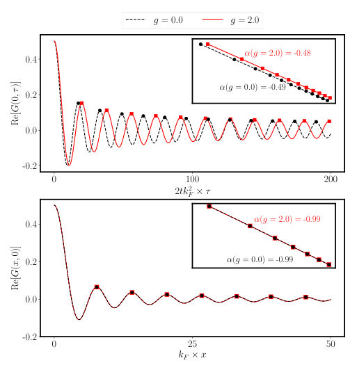
<figcaption class="paper-figure-caption"><b>Fig 2.</b> FIG. 2. Top panel: Real part of the correlation function G(0, τ). Bottom panel: Real part of G(x, 0). G(x, τ) mea- sures the propagation of a fermionic excitation between the spacetime points (0, 0) and (x, τ). Both functions are calcu- lated without (g = 0) and with (g = 2.0) light-matter in- teraction. Inset in both panels display the maxima of the correlation functions on a logarithmic scale, with slope α(g). Other parameters: N = 500, Ne/N = 1/2, ωc/t = 10.</figcaption>
</figure>
<figure class="paper-figure-card">

<figcaption class="paper-figure-caption"><b>Fig 3.</b> FIG. 3. Electronic phase diagram at half-filling, plotted as a function of U/t and g for N = 12, ωc/t = 10. Left panel shows χ2 for LL-PS transition, while right panel shows χ1 for LL-CDW transition. In both panels, the cross markers indicate the numerical maxima, while the green dashed lines represent extrapolated results.</figcaption>
</figure>
<figure class="paper-figure-card">

<figcaption class="paper-figure-caption"><b>Fig 4.</b> FIG. 4. Top: Local density of states An(ω) at half-filling for U/t = −2 in the absence of light-matter coupling. Bottom: Edge spectral weight W(U, g) at half-filling as a function of U/t and g. Other parameters: N = 12, ωc/t = 10, Γ = 0.3× level spacing πt/N. The spectral functions are shown in arbi- trary units, and are normalized to their respective maxima.</figcaption>
</figure>

**Summary.** This paper analyzes a one-dimensional electronic chain coupled to an optical cavity field. It demonstrates that this coupling modifies the system's low-energy physics into a 'strange Luttinger liquid,' breaking standard theoretical relations. Furthermore, it maps out a phase diagram showing how electron-electron interactions interact with the cavity field, affecting topological phases like those hosting Majorana modes.

**Why it may be interesting.** This work directly bridges cavity QED (AMO physics) with strongly correlated electron systems, showing how light-matter coupling fundamentally alters the universal low-energy description of 1D quantum materials, which is highly relevant for engineered quantum simulators.

Detailed structure

**Main problem.** The study investigates how coupling a one-dimensional electronic chain to a quantized vacuum field modifies its low-energy physics, particularly when electron-electron interactions are present.

**Main result.** The system exhibits a 'strange Luttinger liquid' in the noninteracting limit, breaking standard velocity relations; for finite interactions, the cavity field significantly shifts phase boundaries and modifies Majorana-like zero modes.

**Method.** The authors employ bosonization techniques, low-energy effective Hamiltonians derived via perturbation theory, and exact diagonalization (ED) to map out phase diagrams.

**Model / system.** The model is a tight-binding electronic chain coupled to a single quantized cavity mode. The Hamiltonian includes terms for photon energy ($\omega_c$), light-matter coupling ($g$), and electron-electron interaction ($U$).

**Key observables.** Low-energy excitation spectrum, local density of states, charge susceptibilities (for CDW/PS transitions), and spectral weight associated with Majorana-like zero modes.

**Important parameters / regimes.** Interaction strength ($U$), coupling strength ($g$), cavity frequency ($\omega_c$), and hopping amplitude ($t$). Key regimes include $U=0$ (noninteracting) and finite $U$.

**Assumptions / limitations.** The analysis relies on deriving low-energy effective descriptions, using perturbation theory in the light-matter coupling ($g$), and assuming a large but finite chain size.

**Figures summary.** Figures illustrate the electronic phase diagram showing transitions between LL, CDW, and PS phases as functions of interaction strength and cavity coupling. Another figure likely shows spectral signatures related to Majorana modes.

**Paper structure.** The paper first establishes the noninteracting limit ($U=0$) leading to a strange Luttinger liquid description using bosonization. It then extends this analysis to finite electron-electron interactions, mapping out a phase diagram and analyzing topological features like Majorana zero modes via exact diagonalization.

Abstract

We study a one-dimensional electronic chain coupled to a homogeneous quantized vacuum field and electron-electron interactions. In the absence of the latter, we derive a low-energy effective description in the presence of light-matter coupling, which we identify as a strange Luttinger liquid. Although it retains a formal resemblance to conventional Luttinger liquid theory, the coupling to the quantum field qualitatively modifies the low-energy sector and breaks the standard velocity relation underlying Luttinger universality. For finite electron-electron interactions, we recover a phase diagram featuring several phases as a function of interaction strength and hopping amplitude, including a phase hosting Majorana-like zero modes. Using exact diagonalization, we compute observables that characterize the phase boundaries and show that the cavity field significantly shifts them. We also study the fate of Majorana-like states under the influence of the cavity field, highlighting their modification by light-matter coupling. Finally, we investigate whether the strange Luttinger liquid description identified in the noninteracting regime continues to hold when electron-electron interactions are introduced.

[↑ back to top](#top)

### [Brownian ratchets and pumps universally simulate many-body active dynamics](http://arxiv.org/abs/2607.01231v1)

**Authors:** Charles Stahl, Ethan Lake, Vedika Khemani  
**Type:** theory · **Category:** statistical mechanics · **PDF:** <https://arxiv.org/pdf/2607.01231v1>  
**Analysis basis:** full PDF text, analyzed in chunks
**Topic relevance:** 🔥 `non-equilibrium dynamics` **4/5** · `driven-dissipative phase transition` **3/5** · `methods for driven-dissipative` **3/5** · `non-equilibrium universality` **3/5** · `analog quantum simulation` **2/5** · `correlated / nonlocal dissipation` **2/5** · `Frenkel-Kontorova` **1/5** · `Keldysh / 2PI / non-Gaussian methods` **1/5** · `Kondo & dissipative impurity` **1/5** · `entanglement & information structure` **1/5** · `exotic spin models in light-matter` **1/5** · `spintronics-quantum-optics interface` **1/5**

↔ Scroll figures horizontally

<figure class="paper-figure-card">
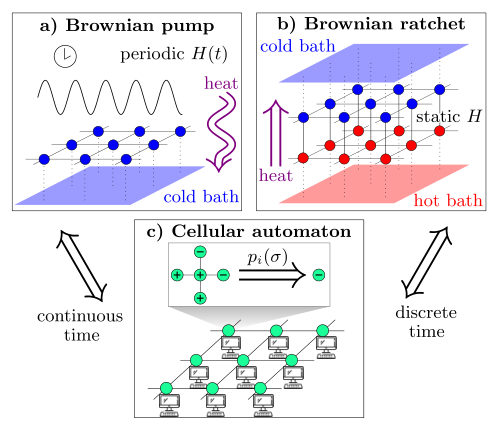
<figcaption class="paper-figure-caption"><b>Fig 1.</b> FIG. 1. We prove that (a) time-dependent systems with dis- sipation (pumps) and (b) systems coupled to baths at different temperatures (ratchets) can simulate (c) cellular automaton dynamics, in continuous and discrete time, respectively.</figcaption>
</figure>
<figure class="paper-figure-card">
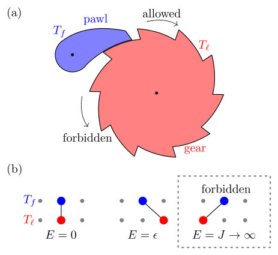
<figcaption class="paper-figure-caption"><b>Fig 2.</b> FIG. 2. (a) A Brownian ratchet. If the gear is hotter than the pawl, then Brownian motion will apply random forces clockwise and counterclockwise, but the pawl will preferen- tially allow the gear to rotate clockwise. The result will is clockwise motion. (b) A Brownian ratchet on a lattice. In the limit Tf ≪ϵ ≪Tℓthe leader spin (bottom) can either be on the same site or one ahead of the follower spin (top), but the follower spin always wants to be on the same site as the leader.</figcaption>
</figure>
<figure class="paper-figure-card">

<figcaption class="paper-figure-caption"><b>Fig 3.</b> FIG. 3. Arrangement and coupling of leader and follower spins in the Brownian pump for biased diffusion. Blue disks represent the positions of the particles in an instantaneous ground state. In H1, the follower spins are all coupled to each other, and the leader spins are coupled individually such that xℓ= xf + 1. In H2, the leader spins are all coupled to each other, and the follower spins are coupled individually such that the ground state is xf = xℓ.</figcaption>
</figure>
<figure class="paper-figure-card">

<figcaption class="paper-figure-caption"><b>Fig 4.</b> FIG. 4. Sketch of the phase diagram of the ferromagnetic Toom ratchet as a function of the strength h of a symmetry- breaking field, the temperature difference δT between layers, and the follower temperature Tf. An equilibrium Ising model is not stable to any symmetry-breaking field, leading to a paramagnetic phase at all nonzero values of h when δT = 0 as shown by the blue line. However, when we raise δT, the ferromagnetic phase (shaded in blue) extends to nonzero h. The upper limit to the ferromagnetic phase in the Tf, δT plane are set by the energy scales in the Hamiltonian.</figcaption>
</figure>
<figure class="paper-figure-card">
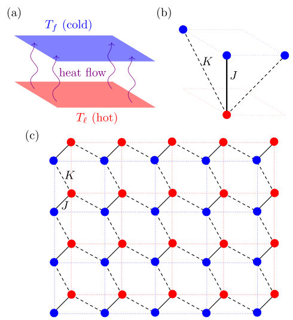
<figcaption class="paper-figure-caption"><b>Fig 5.</b> FIG. 5. Three different representations of the Toom ratchet. Leader spins are red (for hot) and follower spins are blue (for cold). (a) Two square lattices stacked on top of each other, with heat flowing between the layers. (b) The couplings of a single leader spin, with solid lines for strength J and dashed lines for strength K. Dotted lines are only a guide to the eye. (c) An overhead view emphasizes that the two layers can be reinterpreted as two sublattices at different temperatures.</figcaption>
</figure>

**Summary.** The paper establishes that any abstract local active dynamics can be physically simulated using engineered thermal baths. It details two mechanisms—the Brownian pump and the Brownian ratchet—which use periodic driving or steady heat currents to generate non-equilibrium behavior in spin systems. This work fundamentally connects the principles of statistical mechanics, thermodynamics, and computation theory.

**Why it may be interesting.** This work provides a powerful, physical realization framework showing how fundamental thermodynamic resources (heat flow, time periodicity) can power complex information processing, bridging statistical mechanics with computation theory.

Detailed structure

**Main problem.** To demonstrate that two simple, physically realizable driving mechanisms—the Brownian pump (time-periodic) and the Brownian ratchet (static heat current)—can universally simulate any local active dynamics found in spin systems.

**Main result.** The authors prove rigorous theorems showing that both pumps and ratchets can approximate arbitrary probabilistic cellular automata (PCA) dynamics, thereby connecting abstract rule-based activity to concrete non-equilibrium thermodynamics.

**Method.** The simulation is achieved by mapping the local update rules of PCAs onto the time evolution governed by engineered Hamiltonians coupled to thermal baths (Glauber dynamics).

**Model / system.** The models involve spin systems with 'leader' and 'follower' spins, driven either periodically in time (pump) or by coupling to two reservoirs at different temperatures (ratchet). A concrete example is the ferromagnetic Ising ratchet on a bilayer lattice.

**Key observables.** Steady heat current, memory retention time ($t^*_{	ext{mem}}$), order parameter ($\langle m^2 
angle$), and simulation closeness ($\delta$).

**Important parameters / regimes.** Temperature difference ($\delta T = T_\ell - T_f$), coupling strengths ($J, K$), driving period ($	au$), and bath temperatures ($T_\ell, T_f$).

**Assumptions / limitations.** The simulations are robust approximations that become exact in specific limits (e.g., $\delta 	o 0$ or $1 \ll 	au \ll e^{eta J}$), and the methods are best suited for noise-robust PCAs.

**Figures summary.** Figures illustrate phase diagrams showing ordered/disordered states based on temperature differences, and plots demonstrate memory decay rates diverging at a critical field ($h_c$) when active dynamics are present.

**Paper structure.** The paper builds from simple examples (biased diffusion) to general theorems: first establishing the ratchet for continuous-time PCA ($	ext{A}_{	ext{async}}$), then using the pump for discrete-time PCA ($	ext{A}_{	ext{sync}}$). The final sections generalize these constructions and discuss quantum extensions.

Abstract

Active systems can exhibit a broad range of phenomena forbidden in equilibrium. Their dynamics are often specified by abstract local update rules, and it is generally unclear when the same behavior can arise from physically natural driving. Here we show that two simple driving mechanisms can universally simulate any local active dynamics in spin systems. The first is the familiar setting of a time-periodic Hamiltonian coupled to a cold bath, which we call a "many-body Brownian pump." As a second mechanism, we promote the Brownian ratchet, traditionally a mechanism for transport, to a "many-body Brownian ratchet": a static Hamiltonian coupled to a hot bath and a cold bath, where the resulting steady heat current can be harnessed not only to drive transport but also to generate local active dynamics. Using probabilistic cellular automata as an explicit model, we prove that for any continuous-time (or discrete-time) local active dynamics, there is always a many-body Brownian ratchet (or pump) that approximates the dynamics, up to noise that can be made arbitrarily weak by tuning energy scales and other parameters. As a concrete demonstration, we construct a simple ferromagnetic Ising ratchet on a bilayer lattice. When the two layers are coupled to baths at different temperatures, this model serves as a robust classical memory even under a symmetry-breaking field, something impossible in equilibrium. More broadly, our work shows that ratchets can use steady heat currents to autonomously generate and stabilize novel collective behavior, realizing a new static setting for nonequilibrium many-body dynamics.

[↑ back to top](#top)

### [Optically Active Single Hole Spin in ZnSe](http://arxiv.org/abs/2607.00110v1)

**Authors:** Amirehsan Alizadehherfati, Yuxi Jiang, Kelsey J. Mirrielees, Nils von den Driesch, Christine Falter, Yurii Kutovyi, Amirehsan Boreiri, Douglas L. Irving, Alexander Pawlis, Edo Waks  
**Type:** both · **Category:** quantum information and computing · **PDF:** <https://arxiv.org/pdf/2607.00110v1>  
**Analysis basis:** full PDF text, analyzed in chunks
**Topic relevance:** 🔥 `spintronics-quantum-optics interface` **4/5** · `exotic spin models in light-matter` **3/5** · `quantum optics experiment` **3/5** · `Kondo & dissipative impurity` **2/5** · `QC/QI experiment` **2/5** · `methods for driven-dissipative` **2/5** · `non-equilibrium dynamics` **2/5** · `Keldysh / 2PI / non-Gaussian methods` **1/5** · `analog quantum simulation` **1/5** · `correlated / nonlocal dissipation` **1/5** · `driven-dissipative phase transition` **1/5** · `quantum measurements` **1/5**

↔ Scroll figures horizontally

<figure class="paper-figure-card">

<figcaption class="paper-figure-caption"><b>Fig 1.</b> Figure 1: Formation energy diagrams. Left panel: calculated formation energies of the nitrogen substitutional in ZnSe. Right panel: calculated formation energies of other impurities in ZnSe.</figcaption>
</figure>
<figure class="paper-figure-card">

<figcaption class="paper-figure-caption"><b>Fig 2.</b> Figure 2: Photoluminescence characterization. (a) Sample spectrum containing three main components, free exciton (labeled as FX), negatively charged trion (labeled as X−) and bound exciton line (labeled as A0X) (b) Photoluminescence spatial image of the bound exciton line, achieved by selective filtering the sharp peak. (c) Histogram of bound excitons localization energies, indicating two distributions of peaks for acceptors (gray) and donors (green). We collected the data from 30 different acceptor sites and verified them through magnetospectroscopy. The shaded region indicates the region masked by the strong trion envelope in our sample. (d) Power-dependent photoluminescence excitation...</figcaption>
</figure>
<figure class="paper-figure-card">

<figcaption class="paper-figure-caption"><b>Fig 3.</b> Figure 3: Photoluminescence excitation measurement of a single acceptor-bound exciton. (a) Spectrum of emission in the absence and presence of above-band excitation (labeled as ABE). (b) Level structure and charge states of the acceptor system. The arrows show the simplified dominant contribution of each laser. (c) Intensity of emission as a function of above-band excitation for different powers of resonant excitation (see legend). (d) Central wavelength of emission as a function of above-band power for different powers of resonant excitation. The trend shows a saturating shift toward higher wavelengths.</figcaption>
</figure>
<figure class="paper-figure-card">
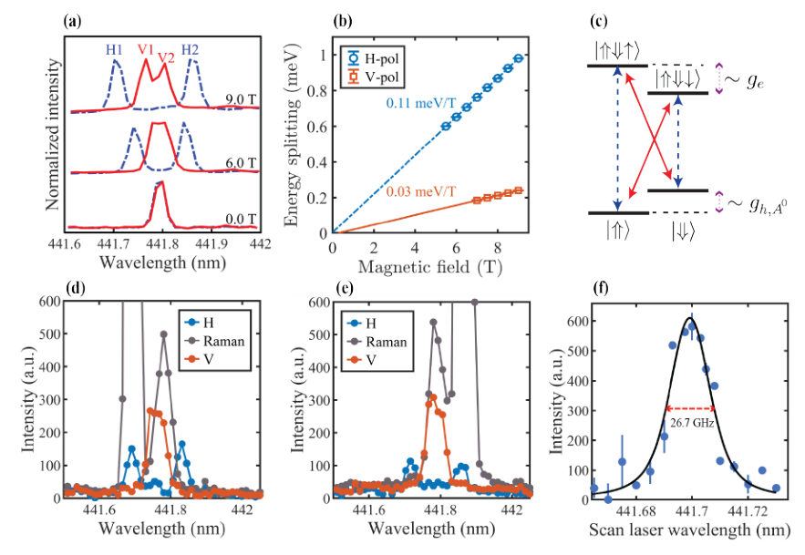
<figcaption class="paper-figure-caption"><b>Fig 4.</b> Figure 4: Magnetic and Raman spectroscopy. (a) Photoluminescence spectrum as a function of magnetic field. (b) Energy splitting of the spectral peaks as a function of magnetic field. The blue and red data points correspond to horizontal (H) and vertical (V) polarizations, respectively. Solid lines represent linear fits extracting the Zeeman splitting rate for each polarization state. (c) Level structure of the acceptor ground and excited state based on extracted g-values. (d-e) Raman sideband (cross-polarized) appears at the partner transition energy when pumping the opposite polarization. For this measurement, we fix the external magnetic field to 6 T. (f) Integrated intensity of Raman...</figcaption>
</figure>

**Summary.** The authors report on the successful creation and characterization of optically active single hole spins in ZnSe quantum wells by using an acceptor impurity instead of traditional p-doping. They confirm single-photon emission via antibunching and model the spin dynamics using rate equations derived from optical measurements. This establishes a viable solid-state platform for developing semiconductor-based quantum information devices.

**Why it may be interesting.** This work directly addresses solid-state quantum memory and spin qubits by demonstrating electrical control over hole spins via optical pumping in a semiconductor material. The combination of DFT modeling with time-domain spectroscopy is highly relevant to open quantum systems research.

Detailed structure

**Main problem.** The research aims to realize optically active single hole spins in ZnSe, overcoming limitations associated with conventional p-doping methods.

**Main result.** They successfully isolated a single-hole spin bound to an acceptor impurity and demonstrated its optical activity, establishing a promising platform for spin qubits and single-photon sources.

**Method.** The study combines first-principles DFT calculations to predict defect levels with advanced optical measurements like time-resolved photoluminescence, photon autocorrelation ($	ext{g}^{(2)}(	au)$), and magnetospectroscopy.

**Model / system.** The physical system is a single-hole spin bound to a shallow acceptor impurity (likely Nitrogen) within a ZnSe quantum well heterostructure. The dynamics are modeled using rate equations describing transitions between ionized, neutral, and exciton states.

**Key observables.** Effective hole g-factor ($\approx 0.7$), optical resonance linewidth ($26.7 	ext{ GHz}$), fast radiative lifetime ($\sim 244 	ext{ ps}$), and antibunching in $	ext{g}^{(2)}(0)$.

**Important parameters / regimes.** Acceptor ionization energy ($	ext{E}_{	ext{A}}$) and the relative rates of optical excitation, resonant pumping, and charge trapping.

**Assumptions / limitations.** The primary assumption is that optically activating acceptors circumvents p-doping challenges; a limitation noted is that coherence remains limited by spectral diffusion from fluctuating charge environments.

**Figures summary.** Figures illustrate the comparison of impurity formation energies (DFT), PL spectra showing bound excitons, power dependence confirming two-level saturation, time decay curves, and $	ext{g}^{(2)}(	au)$ plots demonstrating antibunching.

**Paper structure.** The paper progresses from identifying the physical challenge (p-doping limitations) to proposing an optical activation mechanism. It details spectroscopic characterization (g-factor, linewidth), confirms single-photon emission ($	ext{g}^{(2)}$), and models the population dynamics using rate equations based on varying excitation powers.

Abstract

Semiconductor hole spins offer a pathway to extended coherence times by decoupling from nuclear magnetic noise, while their spin-orbit coupling enables fast all-electrical control. In ZnSe, however, realizing this potential has been limited by p-doping challenges. Here, we circumvent this limit by optically activating acceptors within the ZnSe quantum well. We isolate a single-hole spin bound to a shallow acceptor, confirmed by antibunching and accessed via the fast (244 ps) radiative recombination of a bound exciton. Magnetic and Raman spectroscopy of the ground state reveal an effective hole g-factor of 0.7 and an optical resonance linewidth of 26.7 GHz. Complementary first-principles simulations, together with the experimental results, provide evidence that points toward nitrogen as the most likely acceptor impurity. These results introduce a promising new platform for optically active spin qubits and single-photon sources in ZnSe.

[↑ back to top](#top)

### [Conditional Enhancement of Dissipation-Induced Nonreciprocity by Quantum Squeezing](http://arxiv.org/abs/2607.00718v1)

**Authors:** B. -B. Liu, D. -Y. Wang, J. Tang, Gang Chen, H. Jing, Shi-Lei Su, F. Nori  
**Type:** theory · **Category:** other · **PDF:** <https://arxiv.org/pdf/2607.00718v1>  
**Analysis basis:** full PDF text, analyzed in chunks
**Topic relevance:** 🔥 `methods for driven-dissipative` **4/5** · `correlated / nonlocal dissipation` **3/5** · `correlated cavity matter` **3/5** · `driven-dissipative phase transition` **3/5** · `Tavis-Cummings & cavity-many-emitter` **2/5** · `non-equilibrium dynamics` **2/5** · `Keldysh / 2PI / non-Gaussian methods` **1/5** · `analog quantum simulation` **1/5** · `non-equilibrium universality` **1/5**

↔ Scroll figures horizontally

<figure class="paper-figure-card">

<figcaption class="paper-figure-caption"><b>Fig 1.</b> FIG. 1: (a) Schematic of the nonreciprocal coupling model. Cavity mode a is coherently coupled to cavity mode b with strength Jeiφ, and both cavity modes are dissipatively coupled into a common reservoir at a rate Γ. (b) A coherent drive applied to the nonlinear medium generates squeezing via degenerate parametric amplifi- cation (left), which conditionally enhances the effective nonreciprocal coupling between the cavities (right).</figcaption>
</figure>
<figure class="paper-figure-card">

<figcaption class="paper-figure-caption"><b>Fig 2.</b> FIG. 2: (a) Evolution of the quantum battery energy for four configurations: case 0 [37] (dotted line), case 1 (dash-dotted line), case 2 (dashed line), and case 3 (solid line). (b) Average power P versus the scaled time Jt during the charging process. (c) Steady-state en- ergy enhancement factor Ei b(∞)/Eb versus the squeezing parameter r. (d) Ergotropy enhancement factor Ei b/Eb vs r in the steady state, where Eb = Eb for the case 0 with no squeezing. The symbols are the numerical results, and the curves are the analytical results. (e) Steady- state energy of the quantum battery as a function of coupling strength J. In the strong coupling regime, the stored energy scales as sinh2 r. The...</figcaption>
</figure>
<figure class="paper-figure-card">

<figcaption class="paper-figure-caption"><b>Fig 3.</b> FIG. 3: (a) Transmission coefficient Tab as a function of input signal frequency ω and squeezed-cavity frequency ωs, with squeezing parameter r = 1. (b) Tab vs ω, where ωs = 0. The parameters used are κa = κb = 8 × 10−5ωb, J = Jop, and Γ = 2J.</figcaption>
</figure>

**Summary.** This paper theoretically explores the role of quantum squeezing in boosting dissipation-induced nonreciprocal interactions within coupled cavity systems. It demonstrates that squeezing can exponentially enhance metrics like coupling strength and energy storage in quantum batteries and optical isolators. The findings establish a tunable method for realizing enhanced, directional quantum signal processing.

**Why it may be interesting.** This work provides a detailed theoretical framework for engineering non-Hermitian effects (nonreciprocity) using non-classical resources like squeezing, which is highly relevant for designing advanced quantum optical devices.

Detailed structure

**Main problem.** The study investigates how quantum squeezing can enhance nonreciprocal coupling induced by dissipation in coupled quantum systems.

**Main result.** Squeezing enhances the effective coupling and improves performance metrics for quantum batteries and optical isolators, though this enhancement is highly dependent on the specific system configuration and parameter regime.

**Method.** The analysis uses master equations and quantum Langevin equations to derive the time evolution of expectation values for coupled cavity modes interacting with a common reservoir.

**Model / system.** The model involves two coupled cavity modes ($a$ and $b$) subjected to dissipation via a common reservoir, potentially incorporating $\chi^{(2)}$ nonlinearity. Squeezing is introduced into the system (cavity or reservoir) via unitary transformations.

**Key observables.** Effective nonreciprocal coupling strength (EC), Enhancement Effect (EE), stored energy, charging power, ergotropy, and optical transmission coefficient ($T_{ab}$).

**Important parameters / regimes.** Squeezing parameter ($r$), coupling strength ($J$), reservoir decay rates ($\Gamma$), and detuning ($\omega_s$).

**Assumptions / limitations.** The analysis relies on solving the evolution equations for expectation values derived from the master equation in the squeezed frame.

**Figures summary.** Figures illustrate energy evolution, charging power enhancement factors, steady-state energy vs. squeezing parameter ($r$), and transmission coefficients ($T_{ab}$) showing exponential amplification with squeezing.

**Paper structure.** The paper systematically analyzes five different cases based on where quantum squeezing is applied (cavity mode, reservoir, or both) to quantify its effect on nonreciprocal coupling, followed by specific applications to quantum batteries and optical isolators.

Abstract

We systematically investigate the role of squeezing in improving dissipation-induced nonreciprocal coupling mediated by a common reservoir, by incorporating a $χ^{(2)}$ nonlinearity into either the cavity mode, the reservoir, or both. Squeezing is capable of exponentially enhancing the effective coupling, but this enhancement is not universal in such a nonreciprocal interaction. Instead, it depends on the system configuration and specific parameter regimes. Specifically, the squeezing of the reservoir injects additional energy into the system via the dissipation channel, modifying the underlying dynamics in a nontrivial manner. Furthermore, we demonstrate that the proposed approach enhances the performance of the quantum battery, including stored energy, charging power, and ergotropy. We provide the corresponding analytical expressions, together with a systematic analysis of energy transport and parameter optimization. Extending the framework to optical isolation, we observe an exponentially amplified output signal. Our results open a new avenue for nonreciprocal quantum information processing and nonreciprocal quantum device design.

[↑ back to top](#top)

### [Extreme volume monogamy via bound-state engineering](http://arxiv.org/abs/2607.00346v1)

**Authors:** Wen-Jie Zhang, Jun-Hong An  
**Type:** theory · **Category:** quantum information and computing · **PDF:** <https://arxiv.org/pdf/2607.00346v1>  
**Analysis basis:** full PDF text, analyzed in chunks
**Topic relevance:** 🔥 `entanglement & information structure` **4/5** · `correlated / nonlocal dissipation` **3/5** · `driven-dissipative phase transition` **3/5** · `methods for driven-dissipative` **3/5** · `Keldysh / 2PI / non-Gaussian methods` **2/5** · `non-equilibrium dynamics` **2/5** · `non-equilibrium universality` **2/5** · `quantum measurements` **1/5**

↔ Scroll figures horizontally

<figure class="paper-figure-card">

<figcaption class="paper-figure-caption"><b>Fig 1.</b> FIG. 1. (a) Energy spectrum of each qubit-environment sub- system. (b) Steering diagram with Alice as the measurer, showing the steering from Alice to Bob and Charlie, together with the evolution of EB|A and EC|A from top to bottom for no bound states ηA = ηB = ηC = 0.03. (c) Same as (b), but for bound states on all sides with ηA = ηB = ηC = 0.06. The solid surfaces show the numerical evolution, while the golden wireframes on the final QSEs represent the analytical steady-state solutions. The green tetrahedron represents any tetrahedron inscribed in the Bloch sphere. In all plots, we use ωc = 20ω0 and q = 3/4.</figcaption>
</figure>
<figure class="paper-figure-card">
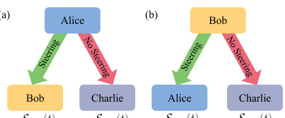
<figcaption class="paper-figure-caption"><b>Fig 2.</b> FIG. 2. (a) Steering diagram with Alice as the measurer, showing the steering from Alice to Bob and Charlie, together with the evolution of EB|A and EC|A from top to bottom for bound states on Alice and Bob but absent on Charlie, i.e., ηA = ηB = 0.06 and ηC = 0.03. (b) Same as (a), but with Bob as the measurer, showing the steering from Bob to Alice and Charlie. The solid surfaces are numerical results, and the golden wireframes are analytical solutions. The green tetrahe- dron cannot enclose the steady QSE, indicating entanglement. In all plots, we use ωc = 20ω0 and q = 3/4.</figcaption>
</figure>
<figure class="paper-figure-card">

<figcaption class="paper-figure-caption"><b>Fig 3.</b> FIG. 3. (a) Steering diagram with Alice as the measurer, showing the steering from Alice to Bob and Charlie, together with the evolution of EB|A and EC|A from top to bottom for a bound state only on Bob, i.e., ηB = 0.06 and ηA = ηC = 0.03. (b) Same as (a), but with Bob as the measurer, showing the steering from Bob to Alice and Charlie. The solid surfaces are numerical results, and the golden wireframes are analytical solutions. The green tetrahedron can enclose the steady QSE, indicating separability. In all plots, we use ωc = 20ω0 and q = 3/4.</figcaption>
</figure>

**Summary.** The paper introduces 'extreme volume monogamy' by controlling how information leaks between three parties in an open quantum system. By selectively engineering bound states in the local environments of two trusted parties but not a third untrusted party, they demonstrate that the unreliability (steerability) from the untrusted party can be completely suppressed. This offers a powerful tool for designing secure quantum communication channels.

**Why it may be interesting.** This work provides a concrete, physical mechanism—selective environmental coupling—to enforce strong quantum correlation constraints (monogamy) in open systems, which is highly relevant to secure quantum communication protocols.

Detailed structure

**Main problem.** The goal is to achieve 'extreme volume monogamy' by selectively suppressing information leakage from an untrusted third party while maintaining quantum steering between trusted parties.

**Main result.** Selective engineering of bound states in local qubit-environment subsystems can cause the Quantum Steering Ellipsoid (QSE) volume associated with the untrusted party to decay to zero, while preserving finite QSE volumes for the trusted parties.

**Method.** The analysis uses the Quantum Steering Ellipsoid (QSE) volume as a diagnostic tool within an open quantum system framework governed by non-Markovian master equations.

**Model / system.** A tripartite open quantum system involving three qubits (Alice, Bob, Charlie), each coupled to its own local environment modeled by harmonic oscillators. The dynamics are analyzed using time-dependent coefficients derived from solving auxiliary differential equations.

**Key observables.** Quantum Steering Ellipsoid (QSE) volumes ($v_{Y|X}$), which quantify steerability; the presence or absence of bound states in local qubit-environment subsystems.

**Important parameters / regimes.** The coupling strength and spectral density of the environment, particularly focusing on regimes where bound states form ($\eta > 0$).

**Assumptions / limitations.** The analysis assumes independent coupling to zero-temperature bosonic environments with Ohmic-family spectral densities; it compares non-Markovian dynamics against the Born-Markov approximation.

**Figures summary.** Figures illustrate QSE evolution, showing collapse when bound states are absent (Markovian limit) and preservation of finite volumes when bound states are selectively engineered on trusted parties but absent on the untrusted one.

**Paper structure.** The paper first introduces volume monogamy constraints. It then models the open system dynamics using a non-Markovian master equation. The core development involves showing that selective bound state engineering allows for the suppression of information access from an untrusted party (zero QSE volume) while maintaining correlations between trusted parties.

Abstract

Quantum steering ellipsoid (QSE) provides a faithful representation of a two-qubit state. When extended to tripartite systems, the steerability from a trusted party to different receivers is subject to volume monogamy relations, which only constrain the total steerability but cannot individually eliminate the steerability of an untrusted third party, leaving a potential channel for information leakage via steering. Here, we show that this residual steerability can be completely suppressed by selectively engineering bound states in local qubit-environment subsystems, without compromising the steerability between trusted parties. Specifically, when bound states are formed in the subsystems formed by the trusted parties and their environments but absent in the untrusted one, the untrusted party's QSE volume decays to zero, while the trusted party's QSE volume remains finite. Our results establish selective bound-state engineering as a mechanism for extreme volume monogamy, with potential applications in secure quantum communication with an untrusted third party.

[↑ back to top](#top)

### [Closed-loop control for two-qubit gates with trapped ions](http://arxiv.org/abs/2607.00462v1)

**Authors:** Eduardo J. Páez, Seyed Shakib Vedaie, Barry C. Sanders  
**Type:** theory · **Category:** other · **PDF:** <https://arxiv.org/pdf/2607.00462v1>  
**Analysis basis:** full PDF text, analyzed in chunks
**Topic relevance:** 🔥 `QC/QI experiment` **4/5** · 🔥 `quantum measurements` **4/5** · `measurement-induced transitions` **3/5** · `methods for driven-dissipative` **3/5** · `non-equilibrium dynamics` **2/5** · `Keldysh / 2PI / non-Gaussian methods` **1/5** · `driven-dissipative phase transition` **1/5** · `quantum optics experiment` **1/5**

↔ Scroll figures horizontally

<figure class="paper-figure-card">
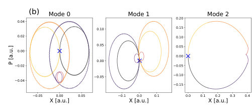
<figcaption class="paper-figure-caption"><b>Fig 1.</b> Figure 1. (a) Pulse sequence designed by employing the SotA method and the corresponding phase-space trajectories. The colours are arbitrary and intended to guide the eye over each piecewise constant segment. The horizontal dashed line rep- resents the root mean square (RMS) value of the pulse se- quence. (b) Ideal phase-space trajectories. The quadrature components of position X and momentum P are given in ar- bitrary units (a.u.). ‘Mode 0’ is the CoM, ‘Mode 1’ is the tilt mode, and ‘Mode 2’ the ‘plucky’ mode. The colour of the trajectory is associated with the piecewise-constant segment of the pulse sequence shown in (a). The blue ‘X’ markers in (b) indicate the starting and ending points...</figcaption>
</figure>
<figure class="paper-figure-card">
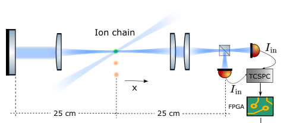
<figcaption class="paper-figure-caption"><b>Fig 2.</b> Figure 2. Diagram of the CLPM-scheme. A three-ion chain is illustrated, where the orange dots represent gate ions and the green dot represents the spectator ion. The spectator ion is illuminated with an external coherent laser coupled to the 2S1/2 – 2P1/2 transition, illustrated as a diagonal blue cone-like shape. An array of lenses and a back mirror collect and su- perpose the fluorescence light to undergo a two-channel time- correlated single-photon counting (TCSPC) setup. The out- put signal is sent to a FPGA for post-processing. The global and bichromatic Raman beams are not shown for simplicity.</figcaption>
</figure>
<figure class="paper-figure-card">

<figcaption class="paper-figure-caption"><b>Fig 3.</b> Figure 3. (a) Emission rates of the spectator Γm ion, and (b) Rabi strength in the mirror mode Ωm versus external laser detuning ∆L. The colour map reflects the Rabi strength of the spectator ion Ωs. The parameters used are NA = 0.4, w0 = 2 µm, Ωs = 3 MHz.</figcaption>
</figure>
<figure class="paper-figure-card">
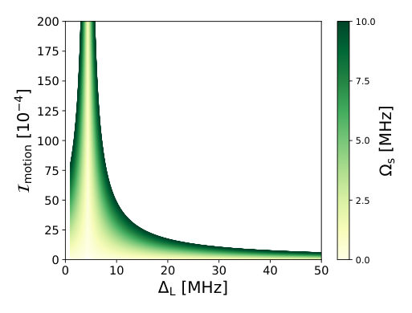
<figcaption class="paper-figure-caption"><b>Fig 4.</b> Figure 5. Error in two-qubit gate due to motion-driven en- tanglement in a chain of three ions. ∆L: laser detuning of the spectator ion. Ωs: Rabi strength on the spectator. The peak coincides with the motional mode frequencies (not including the remaining two modes for clarity).</figcaption>
</figure>
<figure class="paper-figure-card">

<figcaption class="paper-figure-caption"><b>Fig 5.</b> Figure 4. Error in 2QG implementation due to spin coupling in a chain of three ions. ∆L: laser detuning of the spectator ion. Ωs: Rabi strength on the spectator</figcaption>
</figure>

**Summary.** The paper introduces a novel closed-loop control scheme for two-qubit gates in trapped ion systems, moving beyond simplified open-loop models that fail under noise. By continuously monitoring an ancillary 'spectator ion' and employing reinforcement learning, the system can correct disturbances in real time. This method promises significantly higher gate fidelity with reduced calibration overhead.

**Why it may be interesting.** This work represents a significant step toward fault-tolerant quantum computation by addressing environmental noise dynamically. The integration of machine learning (RL) directly into the control loop for physical hardware like trapped ions is highly relevant to modern AMO research.

Detailed structure

**Main problem.** The primary goal is to improve the fidelity of two-qubit gates (2QG) in trapped ions by replacing unreliable open-loop control with a real-time, closed-loop feedback mechanism.

**Main result.** A proposed Closed-Loop Position Monitoring (CLPM) scheme, utilizing reinforcement learning on a spectator ion's position, is shown to significantly reduce 2QG gate infidelity compared to state-of-the-art methods.

**Method.** The approach combines quantum trajectory theory (QTT) with reinforcement learning (RL), where an RL agent learns the optimal control sequence by maximizing a reward function based on the spectator ion's geometric phase.

**Model / system.** The system is trapped ions in a linear Paul trap, modeled using a stochastic quantum master equation that accounts for motional drift, thermal effects, and photon scattering. A key addition is monitoring an ancillary 'spectator ion' via fluorescence detection.

**Key observables.** Two-qubit gate fidelity ($I$), the geometric phase of the spectator ion ($\chi_{qr}$), and the position/fluorescence signal from the spectator ion.

**Important parameters / regimes.** Gate duration ($	au_g$), required precision (e.g., $0.3\Delta x_0$ resolution), and noise sources like motional heating or trap voltage fluctuations ($\delta f$).

**Assumptions / limitations.** The feasibility of continuous position monitoring is assumed, and the control system's ability to process real-time feedback from the measured fluorescence signal is central.

**Figures summary.** Figures illustrate phase-space trajectories for ion chains under various gate schemes (SotA vs. proposed), showing how closed loops imply minimal residual correlation between electronic states and motional modes.

**Paper structure.** The paper progresses by first establishing the limitations of open-loop control, then mathematically modeling the full dynamics using a stochastic master equation incorporating monitoring terms. It details the RL framework for on-the-fly correction, culminating in performance comparisons showing the superiority of the closed-loop approach.

Abstract

State-of-the-art two-qubit gates with trapped ions employ open-loop control that rely on simplified models to precompute control sequences. Our aim is to introduce closed-loop control for two-qubit gates to correct disturbances as they occur during the gate implementation. We introduce a spectator ion into the ion chain used for quantum logic processing, where it couples with the other ions through collective motional modes. The spectator ion's position is continuously monitored by driving dipole transitions and detecting the resultant fluorescence. We show that incorporating a spectator ion is feasible for linear Paul trap implementations and is expected to reduce the two-qubit gate Bell-state preparation infidelity by an order of magnitude with the deleterious effects of position monitoring being negligible compared to the thermal effects that exist in the system, even in the absence of the spectator ions. Mathematically, we describe driven ion-trap dynamics, including the spectator ion, by a stochastic quantum master equation involving the amplitude-modulation multimode-motional coupling gate, motional drift, thermal effects, recoil from photon scattering, spontaneous decay, and light shift. Our on-the-fly control method employs reinforcement learning with the reward function based on the actual geometric phase of the spectator ion. A key advantage of our approach is that we introduce a control method that involves `learning' and correcting disturbances happening in the trap on-the-fly, thus achieving high-fidelity gates. Our approach will lead to a significantly higher two-qubit gate fidelity at a reduced calibration overhead owing to the small parameter drift in the control system.

[↑ back to top](#top)

### [Far-field spatial coherence driven by lossy objects: first-principles approach unifying scattering of quantum light and thermal emission](http://arxiv.org/abs/2607.00653v1)

**Authors:** Alessandro Ciattoni  
**Type:** theory · **Category:** other · **PDF:** <https://arxiv.org/pdf/2607.00653v1>  
**Analysis basis:** full PDF text, analyzed in chunks
**Topic relevance:** 🔥 `interference shaping light` **4/5** · `Keldysh / 2PI / non-Gaussian methods` **3/5** · `correlated / nonlocal dissipation` **3/5** · `methods for driven-dissipative` **3/5** · `driven-dissipative phase transition` **2/5** · `non-equilibrium dynamics` **2/5** · `correlated cavity matter` **1/5** · `non-equilibrium universality` **1/5**

↔ Scroll figures horizontally

<figure class="paper-figure-card">
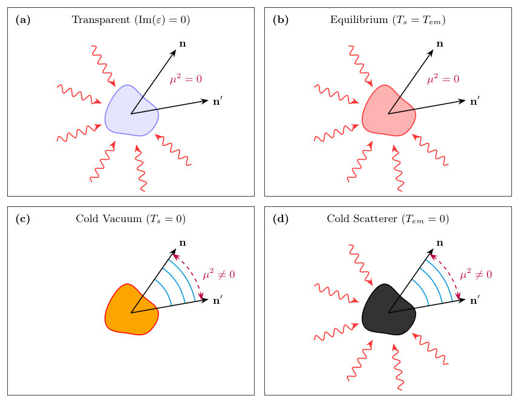
<figcaption class="paper-figure-caption"><b>Fig 1.</b> Figure 1. Schematic illustration of far-field spatial coherence generation under fundamental thermodynamic limits. Wavy lines represent incoherent thermal illumination converging from the surrounding isotropic bath, while linked phase-fronts denote emergent transverse spatial correlations between distinct far-field observation directions (n and n′). (a) Ideally transparent limit: A lossless scatterer merely redirects incoming thermal photons, preserving the completely uncorrelated nature of the ra- diation (µ2 = 0 for distinct directions). (b) Thermal cloaking: At global thermodynamic equilibrium (Ts = Tem), deterministic scattering and intrinsic emission perfectly balance, rendering the...</figcaption>
</figure>
<figure class="paper-figure-card">
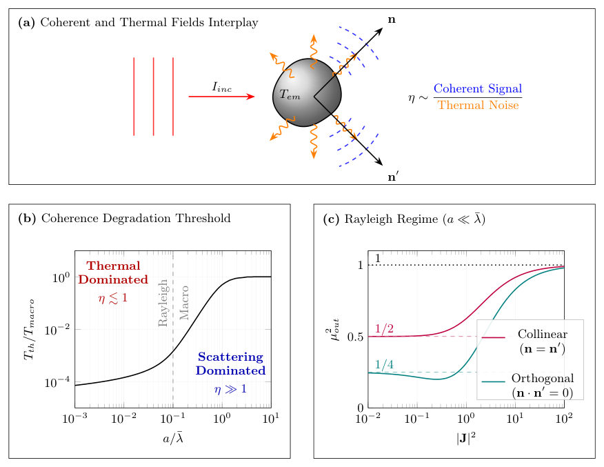
<figcaption class="paper-figure-caption"><b>Fig 2.</b> Figure 2. Degradation of far-field spatial coherence under coherent illumination. (a) Schematic representation of the physical interplay: a deterministic incident laser field (red plane waves) is elastically scattered by an arbitrary dissipative object (blue dashed spherical phase fronts), simultaneously competing with the stochastic intrinsic thermal emission (orange wavy arrows). (b) Thermodynamic phase diagram illustrating the normalized temperature threshold Tth/Tmacro (from Eq. (30)) at which spatial coherence breaks down, as a function of the size parameter a/¯λ for a fixed incident illumination (constant Iinc and ¯ω). The normalizing factor Tmacro represents the asymptotic plateau...</figcaption>
</figure>
<figure class="paper-figure-card">
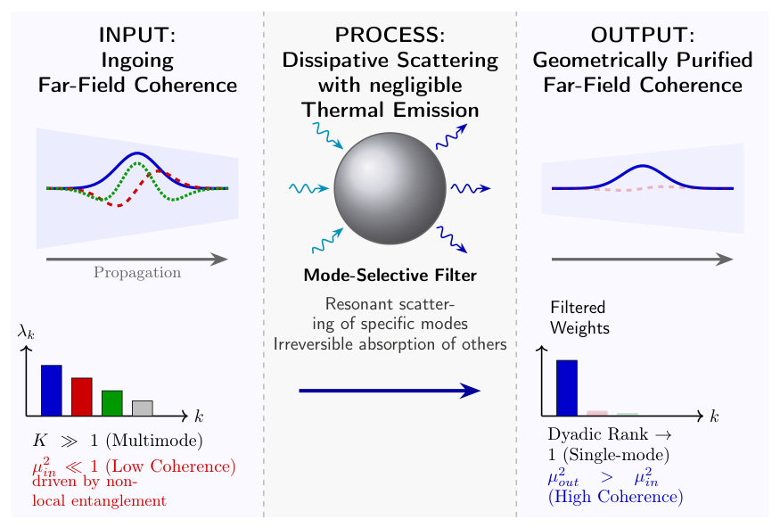
<figcaption class="paper-figure-caption"><b>Fig 3.</b> Figure 3. Geometric purification of spatially entangled light by a dissipative macroscopic scatterer. (Left) The incident continuous-variable state is highly multimode (Schmidt rank K ≫1). The severely reduced macroscopic spatial coherence (µ2 in ≪1) physically manifests as the exact local counterpart of the non-local spatial entanglement. (Center) Operating in a regime where the thermal population at the carrier frequency is sufficiently small to neglect thermal emission, the dissipative object introduces no relevant thermal noise, instead acting as a passive, non-unitary spatial filter (cyan wavy arrows represent the incoming quantum field, while dark blue wavy arrows denote the...</figcaption>
</figure>

**Summary.** The paper presents a first-principles theory unifying the scattering of quantum light with intrinsic thermal emission from dissipative objects using the Modified Langevin Noise Formalism. It shows that far-field spatial coherence results from an algebraic sum of elastic scattering and geometry-driven thermal emission mechanisms. This framework allows for rigorous predictions regarding phenomena like thermal cloaking and coherence degradation in nanostructures.

**Why it may be interesting.** This work provides a unified quantum electrodynamic description for light-matter interaction in realistic, lossy media, which is crucial for designing functional components in quantum photonics that must account for unavoidable thermal noise and dissipation.

Detailed structure

**Main problem.** To develop a first-principles framework that unifies the scattering of quantum light and intrinsic thermal emission from finite dissipative objects, as far-field spatial coherence is dictated by both processes.

**Main result.** The outgoing far-field spatial coherence separates into an algebraic superposition of two geometry-driven mechanisms: elastic scattering (a non-unitary filter) and thermal emission (deriving the van Cittert-Zernike theorem).

**Method.** The framework is built upon the Modified Langevin Noise Formalism, analyzing the outgoing far-field correlation dyadic by decomposing it into contributions from incident quantum states and material dissipation.

**Model / system.** The system involves an arbitrary dispersive and absorbing magneto-dielectric object interacting with incident quantum light fields. The theoretical foundation uses bosonic operators for both scattering polaritons and localized matter excitations.

**Key observables.** Far-field spatial coherence ($\mu^2_{	ext{out}}$), outgoing correlation dyadic $	ext{C}_{	ext{out}}$, and the generalized degree of coherence.

**Important parameters / regimes.** Temperature ($T_{em}$), object permittivity/permeability ($\epsilon_\omega, \mu_\omega$), and illumination type (coherent vs. thermal).

**Assumptions / limitations.** The analysis assumes a causal linear optical response governed by the material properties and relies on statistical independence between incident and object excitations for factorization.

**Figures summary.** Not specified in notes; however, results are presented through derived equations showing coherence dependence on various physical limits (e.g., $\mu^2_{	ext{out}} = 1/2\delta_{n,n'}$ in equilibrium).

**Paper structure.** The paper progresses by establishing the theoretical formalism via MLNF, deriving the decomposition of outgoing coherence into scattering and thermal parts, and then analyzing specific physical limits (thermal, coherent, entangled illumination) to demonstrate key phenomena like thermal cloaking.

Abstract

Far-field spatial coherence dictates the interference properties of scattered light and thermal emission. Traditionally, these phenomena are treated through disjointed paradigms: classical scattering descriptions assume cold objects lacking quantum fluctuations, idealized quantum scattering schemes ignore dissipation, and semiclassical fluctuational electrodynamics relies on phenomenological noise currents, precluding the consistent treatment of incident quantum states. Here, we develop a first-principles framework based on the modified Langevin noise formalism to unify the scattering of quantum light and the intrinsic thermal emission of finite dissipative objects. We demonstrate that the outgoing far-field spatial coherence separates into an algebraic superposition of two geometry-driven mechanisms, coupled by the global unitarity of the radiation-matter dynamics. The first mechanism, elastic scattering, acts as a non-unitary spatial filter, mode-selectively attenuating and reshaping incident quantum correlations. The second mechanism, thermal emission, originates from localized material dissipation and projects the object's absorption profile into the far field, providing a quantum-vectorial derivation of the macroscopic van Cittert-Zernike theorem. Applying this framework across optical regimes, we determine operational bounds for lossy quantum photonics. Under chaotic thermal illumination, we analytically demonstrate thermal cloaking at equilibrium and show that a passive sink casts a structured thermal shadow geometrically identical to a primary emitter. Under coherent illumination, we derive a thermodynamic phase diagram bounding macroscopic phase correlations, demonstrating that subwavelength nanostructures undergo substantial coherence degradation compared to bulk objects. Finally, under spatially entangled illumination...

[↑ back to top](#top)

### [Spinterface-like mechanism of the chirality-induced spin selectivity in donor chiral-bridge acceptor complexes](http://arxiv.org/abs/2607.00668v1)

**Authors:** Subhajit Sarkar, Oliver L. A. Monti, Yonatan Dubi  
**Type:** theory · **Category:** other · **PDF:** <https://arxiv.org/pdf/2607.00668v1>  
**Analysis basis:** full PDF text, analyzed in chunks
**Topic relevance:** 🔥 `methods for driven-dissipative` **4/5** · `exotic spin models in light-matter` **3/5** · `spintronics-quantum-optics interface` **3/5** · `Kondo & dissipative impurity` **2/5** · `non-equilibrium dynamics` **2/5** · `Keldysh / 2PI / non-Gaussian methods` **1/5** · `correlated / nonlocal dissipation` **1/5** · `driven-dissipative phase transition` **1/5**

↔ Scroll figures horizontally

<figure class="paper-figure-card">

<figcaption class="paper-figure-caption"><b>Fig 1.</b> Figure 1: Schematic depiction for the Donor-chiral-bridge-acceptor (D–χB–A) system within the Hubbard picture. Photoexcitation of the donor (D) injects an elec- tron into the chiral bridge χB (with N = 4), which propagates toward the acceptor-sink (A) with hopping amplitude thop and can recombine back to D. Injection and recombination are described by the Lindblad operators Linj and Lrec, while local spin mixing at the donor-bridge interface is captured by L± 1 (highlighted by the faded yellow spin to denote the spin-flip oper- ator, rather than double occupancy of the donor excited state). The through-bridge current generates an effective interfacial field gµBBeff = α0J (a...</figcaption>
</figure>
<figure class="paper-figure-card">

<figcaption class="paper-figure-caption"><b>Fig 2.</b> Fig. 1, the closest scenario to that of Ref. 12. The donor (D) hosts two electronic orbitals</figcaption>
</figure>
<figure class="paper-figure-card">

<figcaption class="paper-figure-caption"><b>Fig 3.</b> Fig. 1. The effective Hamiltonian for the donor is therefore Hdonor = X</figcaption>
</figure>
<figure class="paper-figure-card">
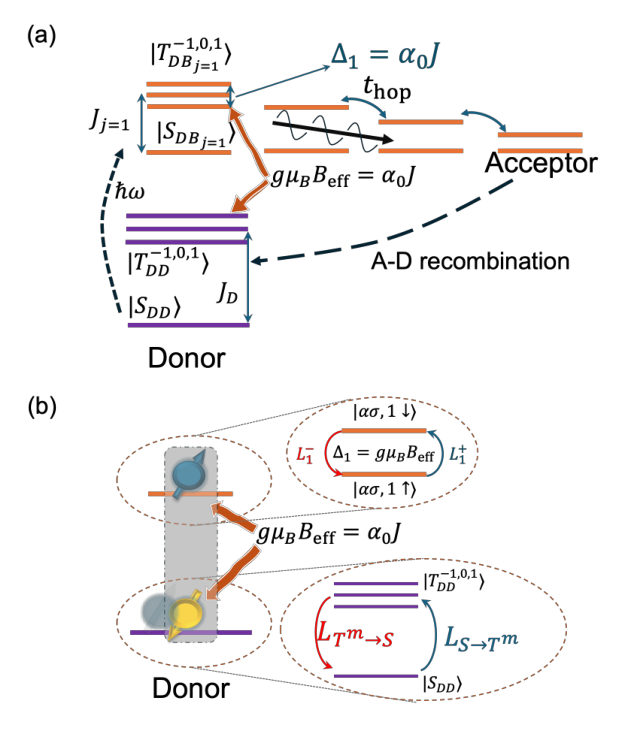
<figcaption class="paper-figure-caption"><b>Fig 4.</b> Figure 2: (a) Schematic of D–χB–A complex in terms of its singlet-triplet state manifold. The bare singlet-triplet gap in the donor is governed by the exchange coupling JD. The same exchange coupling in the donor-bridge manifold is distance-dependent, with Jj being smaller for transfer to a more distant bridge site. (b) Thermalization mechanism at the interface. The current-induced field produces a Zeeman splitting ∆1 = gµBBeff of the single-electron levels on the first bridge site, enabling local spin-flip jumps Lj=1 and L† j=1 between |ασ, 1 ↑⟩and |ασ, 1 ↓⟩. The donor spin couples to bridge spins via exchange Jj SD ·Sj, and donor singlet-triplet interconversion is modeled by the...</figcaption>
</figure>
<figure class="paper-figure-card">
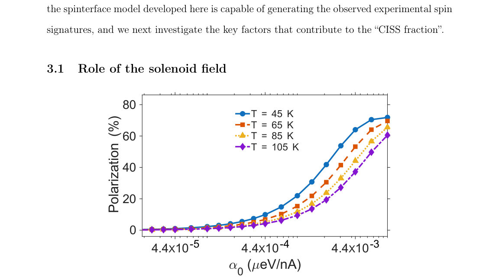
<figcaption class="paper-figure-caption"><b>Fig 5.</b> Figure 3: Spin–polarization vs. effective strength of the solenoid field at different temperatures: Plot of the steady-state spin–polarization P versus the solenoidal-coupling magnitude α0 on a log scale at a fixed mixing rate γm = 0.014thop; curves correspond to four temperatures (see legend).</figcaption>
</figure>

**Summary.** This paper introduces the spinterface mechanism to explain Chirality-Induced Spin Selectivity (CISS) in isolated molecular complexes. Using a Lindblad master equation, the authors show that charge current flowing through the chiral bridge generates an effective magnetic field at the donor interface. This self-consistent field breaks spin degeneracy, enabling robust spin filtering compatible with experimental EPR measurements.

**Why it may be interesting.** This work is highly relevant as it models quantum transport in molecular systems using open quantum system techniques (Lindblad master equation) to explain a fundamental solid-state/molecular phenomenon (CISS) through an emergent field effect rather than relying on simple orbital symmetries or external fields.

Detailed structure

**Main problem.** The study aims to provide a microscopic explanation for the chirality-induced spin selectivity (CISS) effect in molecular complexes that lack direct metal interfaces.

**Main result.** The authors propose and model an intramolecular spinterface-like mechanism, showing it can quantitatively reproduce observed spin polarization signatures in time-resolved EPR studies.

**Method.** The research employs a two-electron Lindblad master equation approach to simulate charge transfer dynamics through the chiral bridge.

**Model / system.** The system is a Donor–Chiral Bridge–Acceptor (D–χB–A) complex. The model incorporates exchange interactions and treats the spin selectivity generation via an effective solenoidal field generated by the current-carrying electron.

**Key observables.** Spin polarization ($P$) measured in time-resolved Electron Paramagnetic Resonance ($	ext{trEPR}$) studies.

**Important parameters / regimes.** Solenoidal coupling strength ($\alpha_0$), temperature ($T$), and spin-mixing rates ($\gamma_m$).

**Assumptions / limitations.** The mechanism relies on the residual donor electron acting as a localized magnetic moment, generating an effective field without requiring intrinsic spin-orbit coupling on the bridge.

**Figures summary.** Figures illustrate the dependence of steady-state polarization ($P$) on parameters like $\alpha_0$ and $T$, showing characteristic growth/saturation curves.

**Paper structure.** The paper establishes the problem (CISS without metals), introduces the spinterface mechanism via Hamiltonian modeling, details the Lindblad dynamics including spin mixing and current generation, presents quantitative results matching EPR data, and concludes by unifying the conceptual framework for CISS interpretation.

Abstract

The chirality-induced spin selectivity (CISS) effect has been invoked to explain recent reports of differences in the time-resolved EPR signals between chiral and achiral molecules. However, the microscopic origin of these differences and their connection to CISS remains contested, particularly since these systems lack a metal interface. Here we introduce an intramolecular spinterface-like mechanism that naturally arises within donor-chiral bridge-acceptor (D--$χ$B--A) complexes and quantitatively reproduces experimentally reported observed spin polarization in time-resolved EPR studies. In our two-electron Lindblad model, the photoexcited charge-transfer electron traversing the chiral bridge exchanges with the residual donor electron, which acts as a localized magnetic moment analogous to an induced magnetic moment on an electrode surface. The resulting through-bridge charge current produces an effective solenoidal field at the donor--bridge interface, breaking spin degeneracy and directional symmetry, thus enabling spin-selective transport without invoking intrinsic spin-orbit coupling on the bridge. We show that the interplay between this current-induced field, donor thermalization (which breaks time-reversal symmetry), and bridge spin mixing yields tens-of-percent polarization over realistic experimental conditions and charge-transfer time scales, matching reported CISS signatures in triads and DNA hairpins. By explicitly resolving the dependence on solenoidal coupling strength, temperature, and spin-mixing rates, the model identifies the regime in which internal spinterfaces can generate robust CISS-like spin filtering. These findings demonstrate that CISS-like signals in isolated D--$χ$B--A complexes are fully compatible with a spinterface mechanism, providing a unified conceptual framework for interpreting both device-based and molecule-internal CISS platforms.

[↑ back to top](#top)

### [Open Quantum Systems Driven by Chirped Pulses: Quantized versus Semiclassical Fields and the Validity of the Rotating-Wave Approximation](http://arxiv.org/abs/2607.00583v1)

**Authors:** Justin Zhengjie Tan, Frank Großmann, Yiying Yan, Maxim Gelin, Yang Zhao  
**Type:** theory · **Category:** other · **PDF:** <https://arxiv.org/pdf/2607.00583v1>  
**Analysis basis:** full PDF text, analyzed in chunks
**Topic relevance:** 🔥 `methods for driven-dissipative` **4/5** · `Keldysh / 2PI / non-Gaussian methods` **3/5** · `analog quantum simulation` **2/5** · `non-equilibrium dynamics` **2/5** · `Tavis-Cummings & cavity-many-emitter` **1/5** · `correlated cavity matter` **1/5** · `driven-dissipative phase transition` **1/5** · `interference shaping light` **1/5**

↔ Scroll figures horizontally

<figure class="paper-figure-card">
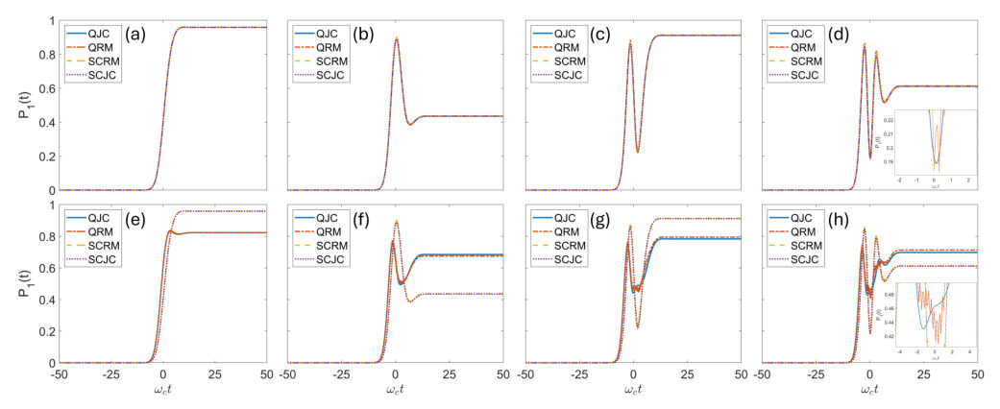
<figcaption class="paper-figure-caption"><b>Fig 1.</b> Figure 1. Time evolution of population transfer P1(t) of the quantum JC model (blue), quantum Rabi model (orange), semiclassical Rabi model (yellow) and semiclassical JC model (purple) with different initial mean photon number |α|2 for various pulse area: (a) |α|2 = 104, Θ = π; (b) |α|2 = 104, Θ = 2π; (c) |α|2 = 104, Θ = 3π; (d) |α|2 = 104, Θ = 4π; (e) |α|2 = 1, Θ = π; (f) |α|2 = 1, Θ = 2π; (g) |α|2 = 1, Θ = 3π; and (h) |α|2 = 1, Θ = 4π. The spin-phonon coupling A is set to be 0.22 ω−2 c , the spectral chirp ϕ′′ = −7 ω2 c and the energy gap at resonant excitation (ε = ω0) is set at 10 ωc.</figcaption>
</figure>
<figure class="paper-figure-card">
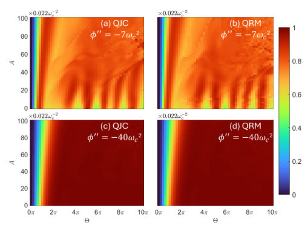
<figcaption class="paper-figure-caption"><b>Fig 2.</b> Figure 2. Two-dimensional heatmaps of the final transition probability Pf as a function of pulse area Θ and spin-phonon coupling A. The top row depicts the heatmaps for the spectral chirp ϕ′′ = −7 ω2 c for (a) QJC and (b) QRM. The bottom row shows the heatmaps for the spectral chirp ϕ′′ = −40 ω2 c for (c) QJC and (d) QRM. The following parameters are set at: |α|2 = 1 and ε = ω0 = 10 ωc.</figcaption>
</figure>
<figure class="paper-figure-card">
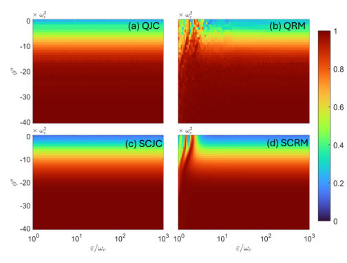
<figcaption class="paper-figure-caption"><b>Fig 3.</b> Figure 3. Two-dimensional heatmaps of the final transition probability Pf as a function of the laser and energy gap res- onance ε = ω0 and spectral chirp ϕ′′. The x-axis is plotted in log-scale in units of ωc. This figure is generated with the following parameters: Θ = 10π and A = 0.22 ω−2 c for the (a) QJC (|α|2 = 1), (b) QRM (|α|2 = 1), (c) SCJC and (d) SCRM.</figcaption>
</figure>

**Summary.** This paper rigorously compares quantum mechanical simulations against semiclassical models for population transfer driven by chirped pulses in open quantum systems. It demonstrates that while the RWA works well under certain conditions (high photon numbers), both the semiclassical description and the RWA break down when considering quantum fluctuations or large pulse areas. The findings guide researchers on selecting the appropriate theoretical framework for accurate quantum control predictions.

**Why it may be interesting.** This work is highly relevant as it tackles the fundamental limitations of approximations (like RWA) when modeling complex light-matter interactions in open quantum systems, which is central to quantum control and cavity QED.

Detailed structure

**Main problem.** The study compares quantum versus semiclassical descriptions of population transfer driven by chirped pulses, specifically investigating when approximations like the Rotating-Wave Approximation (RWA) break down.

**Main result.** Robust population transfer can be achieved over a wide parameter range controlled by the laser chirp, and the comparison reveals that semiclassical models fail at low photon numbers or when counter-rotating terms become significant.

**Method.** The authors employ a time-dependent variational approach using a multiple-Davydov trial state to simulate open quantum systems governed by modified Rabi/Jaynes-Cummings Hamiltonians.

**Model / system.** The system involves an open quantum two-level spin coupled to a phononic bath, driven by chirped laser pulses. Models include the Quantum Rabi Model (QRM) and its semiclassical counterparts, analyzed in regimes ranging from high to low mean photon numbers.

**Key observables.** Population transfer $P_1(t)$ and final-state population fidelity ($P_f$).

**Important parameters / regimes.** Laser spectral chirp ($eta$), pulse area ($\Theta$), mean photon number $|\alpha|^2$, and spin-phonon coupling strength.

**Assumptions / limitations.** The analysis compares results derived under the RWA versus full quantum treatments, and sometimes assumes zero-temperature phonon baths to isolate effects.

**Figures summary.** Figures illustrate $P_1(t)$ comparisons across different models (JC vs Rabi) in high and low photon number regimes, showing convergence or divergence patterns based on model accuracy.

**Paper structure.** The paper systematically compares the predictions of semiclassical versus fully quantized models for chirped adiabatic passage, analyzing the breakdown points related to RWA validity and field quantization effects across varying mean photon numbers.

Abstract

Population transfer via chirped rapid adiabatic passage is studied using open quantum and semiclassical models, with and without the rotating-wave approximation. A time-dependent variational approach based on the multiple-Davydov D$_2$ trial state is employed to simulate the quantum models with an arbitrary finite mean photon number. We examine the accuracy of both the semiclassical field description and the rotating-wave approximation. Robust population transfer is identified over a wide parameter regime controlled by the laser spectral chirp and is found to be insensitive to the spin--phonon coupling strength, Gaussian pulse area, and energy gap of the two-level system.

[↑ back to top](#top)

### [Power-Law Relaxation of Non-Gaussian Parameter and Self-Dynamic Structure Factor in Multidimensional Rugged Energy Landscapes](http://arxiv.org/abs/2607.00767v1)

**Authors:** Bimman Bagchi  
**Type:** theory · **Category:** statistical mechanics · **PDF:** <https://arxiv.org/pdf/2607.00767v1>  
**Analysis basis:** full PDF text, analyzed in chunks
**Topic relevance:** 🔥 `non-equilibrium dynamics` **4/5** · `Keldysh / 2PI / non-Gaussian methods` **3/5** · `non-equilibrium universality` **3/5** · `driven-dissipative phase transition` **2/5** · `Frenkel-Kontorova` **1/5** · `correlated / nonlocal dissipation` **1/5** · `methods for driven-dissipative` **1/5**

↔ Scroll figures horizontally

<figure class="paper-figure-card">
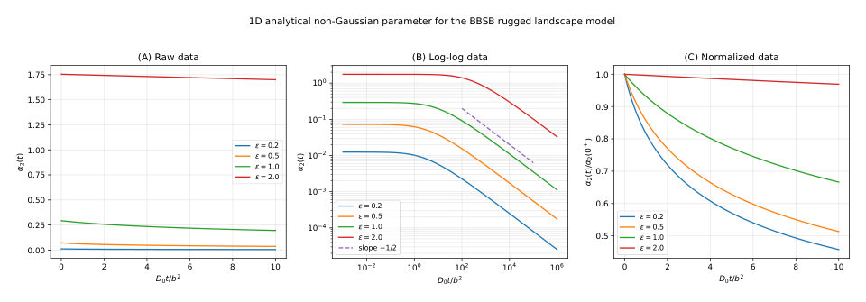
<figcaption class="paper-figure-caption"><b>Fig 1.</b> Figure 1: One-dimensional analytical prediction for the non-Gaussian parameter α2(t) in the uncorrelated BBSB rugged landscape model. [14] The dimensionless time is D0t/b2, and the ruggedness values are ϵ = 0.2, 0.5, 1.0, 2.0. (A) Raw α2(t) on ordinary axes. (B) Raw α2(t) on log–log axes, showing comparison with the asymptotic one-dimensional t−1/2 decay. (C) Normalized non-Gaussian parameter α2(t)/α2(0+), emphasizing the relaxation of mobility memory.</figcaption>
</figure>

**Summary.** This theoretical paper develops a framework to study diffusion on rugged energy landscapes by analyzing the time decay of the non-Gaussian parameter. It shows that this relaxation rate depends critically on dimensionality, predicting distinct power laws ($t^{-1/2}, (\ln t)/t, t^{-1}$) for 1D, 2D, and $d>2$, respectively. This work moves beyond simple long-time diffusion coefficients to capture finite-time memory effects.

**Why it may be interesting.** This work provides quantitative, dimension-dependent predictions for how memory effects and quenched disorder manifest in transport properties, which is crucial for understanding non-equilibrium dynamics in complex quantum systems.

Detailed structure

**Main problem.** The research aims to characterize anomalous, non-Gaussian diffusion dynamics beyond the simple effective diffusion coefficient in systems trapped by rugged energy landscapes.

**Main result.** The relaxation of the non-Gaussian parameter exhibits a distinct power-law dependence on dimensionality: $t^{-1/2}$ in 1D, $(\ln t)/t$ in 2D, and $t^{-1}$ for $d>2$.

**Method.** A theoretical framework using the self-propagator and mobility-memory approximation is developed to analyze finite-time dynamics.

**Model / system.** The model involves tagged-particle diffusion on multidimensional rugged energy landscapes, which are mathematically described by correlated quenched Gaussian random fields.

**Key observables.** Non-Gaussian parameter ($\alpha_2(t|
ho_0)$), self-dynamic structure factor ($F_s$), and the time correlation of local mobility ($C_D(t)$).

**Important parameters / regimes.** Dimensionality ($d$), ruggedness strength ($\epsilon$), spatial correlation length ($\xi$), and initial preparation state ($
ho_0$).

**Assumptions / limitations.** The analysis relies on a coarse-grained mobility field and the assumption that the system approaches Gaussian behavior via central limit mechanisms in higher dimensions.

**Figures summary.** Figures illustrate the analytical prediction for $\alpha_2(t)$ decay, showing the characteristic $t^{-1/2}$ decay in 1D versus faster decays in higher dimensions on log-log plots.

**Paper structure.** The paper builds from analyzing the full propagator to deriving a local-mobility representation. It establishes the dimensional hierarchy of relaxation rates for $\alpha_2(t)$, contrasting it with previous methods that only focused on long-time effective coefficients.

Abstract

Ruggedness of the underlying energy landscape gives rise to heterogeneous mobility and non-Gaussian diffusion. We develop a theoretical framework for tagged-particle diffusion in multidimensional rugged energy landscapes modeled as correlated quenched Gaussian random fields. Using the self-propagator and self-dynamic structure factor, we characterize finite-time diffusion beyond the effective diffusion coefficient. We determine the effects of dimensionality, spatial correlations, and initial preparation. By introducing a coarse-grained mobility field and a mobility-memory approximation, we relate the non-Gaussian parameter to the time correlation of the mobility sampled by the particle. In the homogenized diffusive regime, the mobility correlation decays algebraically, leading to long-time relaxation of the non-Gaussian parameter as $t^{-1/2}$ in one dimension, $(\ln t)/t$ in two dimensions, and $t^{-1}$ for $d>2$, with amplitudes that depend on dimensionality and the initial ensemble. Our results show that rugged energy landscapes leave distinct signatures in the effective diffusion coefficient, self-dynamic structure factor, and relaxation of non-Gaussian fluctuations.

[↑ back to top](#top)

### [Synthesizing Compound Pulse Gadgets for Hamiltonian Simulation on Trapped-Ion Platforms](http://arxiv.org/abs/2607.00826v1)

**Authors:** Ria Patel, Masoud Hakimi Heris, Yuan Liu, Frank Mueller  
**Type:** theory · **Category:** other · **PDF:** <https://arxiv.org/pdf/2607.00826v1>  
**Analysis basis:** full PDF text, analyzed in chunks
**Topic relevance:** 🔥 `QC/QI experiment` **4/5** · `analog quantum simulation` **3/5** · `methods for driven-dissipative` **3/5** · `non-equilibrium dynamics` **2/5** · `Keldysh / 2PI / non-Gaussian methods` **1/5** · `correlated / nonlocal dissipation` **1/5** · `driven-dissipative phase transition` **1/5**

↔ Scroll figures horizontally

<figure class="paper-figure-card">
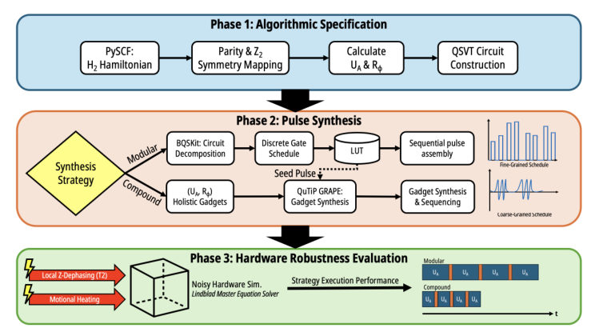
<figcaption class="paper-figure-caption"><b>Fig 1.</b> Fig. 1: The pulse-level compilation pipeline. Phase 1 maps the H2 Hamiltonian to a 3-ion QSVT specification. Phase 2 contrasts standard modular transpilation (sequential pulse assembly via LUT memory lookups) against the proposed holistic gadget synthesis. Phase 3 evaluates strategy execution performance, benchmarking the temporal compression of the generated schedules against static hardware noise using open-system Lindblad simulations.</figcaption>
</figure>
<figure class="paper-figure-card">

<figcaption class="paper-figure-caption"><b>Fig 2.</b> Fig. 2: Comparison of physical control schedules constructed by the modular baseline and the proposed compound gadget synthesis strategy for QSVT-based Hamiltonian simulation.</figcaption>
</figure>
<figure class="paper-figure-card">

<figcaption class="paper-figure-caption"><b>Fig 3.</b> Fig. 3: Hardware resilience evaluated via open-system purity decay (Tr(ρ2)) over a 3 ms execution window, comparing the baseline modular stitching against the proposed compound compilation.</figcaption>
</figure>

**Summary.** This paper introduces a novel pulse synthesis technique that compiles complex quantum algorithms directly into continuous 'compound pulse gadgets' rather than relying on discrete gate sequences. By using GRAPE to synthesize these gadgets for H2 simulation on trapped ions, the authors demonstrate significant temporal compression and elimination of classical control overhead. This methodology promises faster, more robust execution paths closer to fundamental decoherence limits.

**Why it may be interesting.** This work directly addresses the hardware-software gap in trapped-ion quantum computing by optimizing physical control pulses holistically, which is crucial for pushing computational depth beyond decoherence limits in open quantum systems.

Detailed structure

**Main problem.** Standard gate-level compilation introduces significant noise and overhead for high-precision quantum algorithms on trapped-ion hardware by treating operations as discrete units.

**Main result.** The proposed holistic pulse synthesis strategy achieves significant temporal compression and eliminates control-layer latency compared to standard compilers, increasing achievable computational depth.

**Method.** The authors use Gradient Ascent Pulse Engineering (GRAPE) to synthesize entire algorithmic blocks directly into continuous compound pulse gadgets, bypassing discrete gate stitching.

**Model / system.** The work targets Hamiltonian simulation of the H2 molecule using a QSVT circuit on a trapped-ion platform with 3 computational ions. The system is evaluated using noisy Lindblad master equation simulations incorporating T2 noise and motional heating.

**Key observables.** Temporal compression of pulse schedules, reduction in control-layer latency, and open-system purity decay (Tr(rho_2)).

**Important parameters / regimes.** The simulation uses a 3 computational ion system for H2 Hamiltonian simulation; the comparison is against fundamental T2 decoherence limits.

**Assumptions / limitations.** Initial synthesis assumes noiseless conditions, excluding environmental noise and ambient CV heating to keep matrix exponentials tractable during optimization.

**Figures summary.** Figure 1 illustrates the compilation pipeline contrasting modular vs. holistic methods; Figure 2 compares physical control schedules; Figure 3 evaluates hardware resilience via purity decay over time.

**Paper structure.** The paper progresses from identifying the noise limitations of discrete transpilation to proposing a continuous pulse synthesis gadget approach, demonstrating this on H2 simulation, and finally evaluating performance against realistic noise models.

Abstract

Standard gate-level transpilation introduces significant physical noise and overhead for high-precision quantum algorithms, such as the Quantum Singular Value Transformation (QSVT), on near-term trapped-ion hardware. Current compilers treat quantum operations as discrete units, forcing the physical control layer to execute highly fragmented laser pulses. To address this hardware-software disconnect, this work introduces a holistic pulse synthesis strategy that bypasses discrete gate-stitching to compile algorithms directly into continuous compound pulse gadgets. As a proof-of-concept, we target Hamiltonian simulation of the $H_2$ molecule, block-encoding the problem into a QSVT circuit to approximate the time-evolution operator $U = e^{-i H t}$ across 3 computational ions (2 system, 1 ancilla). We utilize the Gradient Ascent Pulse Engineering (GRAPE) algorithm to generate these compound gadgets and evaluate our methodology using noisy Lindblad master equation simulations. Preliminary observations indicate that the proposed strategy achieves significant temporal compression, reducing the total pulse schedule duration compared to standard compilers. Furthermore, synthesizing operations holistically eliminates the control-layer latency associated with discrete pulse lookup overhead. By streamlining the physical control schedule, this methodology offers a promising pathway to execute operations faster, highlighting the potential for compound gadgets to increase the computational depth achievable within fundamental $T_2$ decoherence limits.

[↑ back to top](#top)

### [Universal Short-Imaginary-Time Quantum Critical Dynamics Near Boundaries](http://arxiv.org/abs/2607.01076v1)

**Authors:** Yu-Rong Shu, Yuan-Biao Li, Shuai Yin  
**Type:** theory · **Category:** statistical mechanics · **PDF:** <https://arxiv.org/pdf/2607.01076v1>  
**Analysis basis:** full PDF text, analyzed in chunks
**Topic relevance:** 🔥 `non-equilibrium universality` **4/5** · `driven-dissipative phase transition` **3/5** · `non-equilibrium dynamics` **3/5** · `Keldysh / 2PI / non-Gaussian methods` **1/5** · `analog quantum simulation` **1/5** · `correlated / nonlocal dissipation` **1/5** · `methods for driven-dissipative` **1/5**

↔ Scroll figures horizontally

<figure class="paper-figure-card">
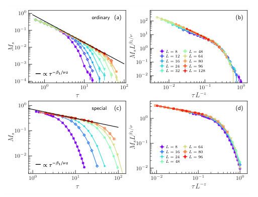
<figcaption class="paper-figure-caption"><b>Fig 1.</b> FIG. 1. Dynamics of the boundary order parameter 𝑀𝑠from the ordered initial state. (a) and (b): Evolution of 𝑀before and after rescaling for the ordinary transition. (c) and (d): Evolution of 𝑀be- fore and after rescaling for the special transition. The solid lines indi- cate power-law decay with the exponent 𝛽1/𝜈𝑧= 1.2704 and 0.3535 for the ordinary and special transition, respectively. Log-log scale is used in all plots.</figcaption>
</figure>
<figure class="paper-figure-card">

<figcaption class="paper-figure-caption"><b>Fig 2.</b> FIG. 2. Dynamics of the transverse correlation 𝐶⊥from the dis- ordered initial state. (a): Dependence of 𝐶⊥on 𝐿/𝜏1/𝑧for the ordi- nary transition with 𝜂⊥= 1.7887. (b): Finite-size rescaling collapse of the data in (a). (c): Same as (a), but for the special transition, 𝜂⊥= 0.8718. (d): Finite-size rescaling collapse of the data in (c). Semi-log scale is used in (a), (c), while (b), (d) use log-log scale. The straight lines in (a) and (c) indicate exponential dependence.</figcaption>
</figure>
<figure class="paper-figure-card">
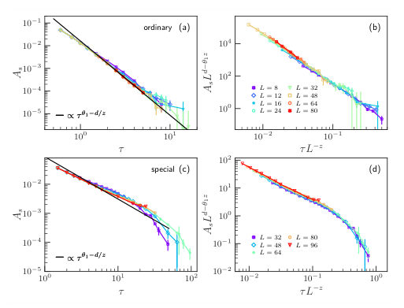
<figcaption class="paper-figure-caption"><b>Fig 3.</b> FIG. 4. Dynamics of the boundary autocorrelation 𝐴𝑠from the disordered initial state. (a): Imaginary-time evolution of 𝐴𝑠for the ordinary transition. (b): Finite-size rescaling collapse of the data in (a). (c): Same as (a), but for the special transition. (d): Finite-size rescaling collapse of the data in (c). The solid lines indicate power- law decay with the exponent 𝜃1 −𝑑/𝑧, with 𝜃1 = −1.295 and 0.539 for the ordinary and special transition, respectively. Log-log scale is used in all plots.</figcaption>
</figure>
<figure class="paper-figure-card">
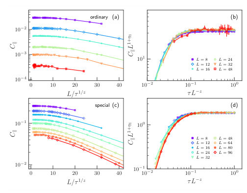
<figcaption class="paper-figure-caption"><b>Fig 4.</b> FIG. 3. Dynamics of the longitudinal correlation 𝐶∥near the boundary from the disordered initial state. (a): Dependence of 𝐶∥ on 𝐿/𝜏1/𝑧for the ordinary transition with 𝜂∥= 2.5408. (b): Finite- size rescaling collapse of the data in (a). (c): Same as (a), but for the special transition 𝜂∥= 0.7070. (d): Finite-size rescaling collapse of the data in (c). Semi-log scale is used in (a), (c), while (b), (d) use log-log scale. The straight lines in (a) and (c) indicate exponential dependence.</figcaption>
</figure>

**Summary.** This work develops and verifies a universal scaling theory describing how quantum critical dynamics behave near boundaries. Using the 2D quantum Ising model, the authors derive distinct power-law decay laws for various boundary correlation functions depending on whether the system is in an ordinary or special universality class. This provides new physical insights into boundary criticality beyond standard bulk descriptions.

**Why it may be interesting.** The explicit derivation of novel boundary critical exponents ($	heta_1$) that deviate from standard quantum-classical mappings provides a powerful new tool for characterizing non-equilibrium dynamics in condensed matter systems, relevant to understanding quench dynamics or boundary effects in quantum materials.

Detailed structure

**Main problem.** The study investigates universal short-imaginary-time quantum critical dynamics occurring near boundaries, recognizing that boundary effects modify standard bulk critical scaling behaviors.

**Main result.** A universal scaling theory is developed showing distinct dynamic exponents ($	heta_1$ vs. $	heta$) for boundary correlations compared to the bulk, and these exponents can differ significantly between ordinary and special transition universality classes.

**Method.** The authors develop a universal scaling theory by analyzing various correlation functions (order parameter, autocorrelation) under short-imaginary-time evolution using methods derived from generalizing Short-Distance Expansion techniques.

**Model / system.** The primary model used for verification is the two-dimensional quantum Ising model on a square lattice. The Hamiltonian includes transverse field terms and nearest-neighbor interactions, analyzed with periodic boundary conditions in one direction and open boundaries in another.

**Key observables.** Boundary order parameter ($M_s$), boundary autocorrelation function ($A_s$), local two-time correlation functions ($P(	au), G(	au)$), and associated critical initial-slip exponents ($	heta_1, 	heta'_1$).

**Important parameters / regimes.** The analysis focuses on the short-imaginary-time limit ($	au 	o 0$) near quantum critical points, distinguishing between ordinary and special universality classes.

**Assumptions / limitations.** The theory relies on developing a universal scaling framework that connects boundary exponents to bulk exponents, though it notes deviations from conventional quantum-classical mapping.

**Figures summary.** Figures illustrate data collapse for various correlation functions ($M_s$, $A_s$, $G_s$) in both the ordinary and special transition regimes, confirming the predicted power-law scaling forms for boundary dynamics.

**Paper structure.** The paper develops a universal scaling theory for short-imaginary-time dynamics near boundaries. It analyzes different initial states (ordered/disordered) using various correlation functions ($M_s$, $A_s$). Key findings establish relationships between boundary and bulk exponents, contrasting the behavior across different universality classes.

Abstract

While imaginary-time evolution has long served as a standard paradigm for ground-state preparation in numerical simulations and quantum devices, its intrinsic dynamical properties has been largely overlooked. Here, we investigate the short-imaginary-time critical dynamics in quantum systems with boundaries. A universal scaling theory is developed and verified in the two-dimensional quantum Ising model, uncovering rich dynamic critical behaviors dictated by boundary universality classes. For ordered initial states, the boundary order parameter $M_s$ decays with imaginary time $τ$ as $M_s \propto τ^{-β_1/νz}$, where $β_1$ denotes the boundary order parameter exponent, and $ν$ and $z$ correspond to the correlation length exponent and the dynamic exponent, respectively. For disordered initial states, the autocorrelation of the boundary order parameter is governed by a novel critical exponent $θ_1$, which is closely related to the critical initial slip behavior of $M_s$ characterized by the corresponding exponent $θ_1'$. In contrast to its positive bulk counterpart, the boundary initial-slip exponent $θ_1'$ is negative for the ordinary transition while remaining positive for the special transition. Although the static universality classes of $d$-dimensional quantum phase transitions generally coincide with those of $(d+1)$-dimensional classical phase transitions, we show that $θ_1$ does not follow this conventional quantum-classical mapping. We further discuss the implications of our results for more exotic forms of boundary criticality. Our findings provide new physical insights into boundary critical dynamics and offer a novel route for probing exotic boundary critical behaviors in quantum many-body systems.

[↑ back to top](#top)

### [TCL4 Asymptotic Redundancy and Canonically Consistent Master Equations](http://arxiv.org/abs/2607.00193v1)

**Authors:** Dragomir Davidovic  
**Type:** theory · **Category:** statistical mechanics · **PDF:** <https://arxiv.org/pdf/2607.00193v1>  
**Analysis basis:** full PDF text, analyzed in chunks
**Topic relevance:** 🔥 `methods for driven-dissipative` **4/5** · `Keldysh / 2PI / non-Gaussian methods` **3/5** · `non-equilibrium dynamics` **2/5** · `correlated / nonlocal dissipation` **1/5** · `correlated cavity matter` **1/5** · `driven-dissipative phase transition` **1/5** · `non-equilibrium universality` **1/5**

↔ Scroll figures horizontally

<figure class="paper-figure-card">
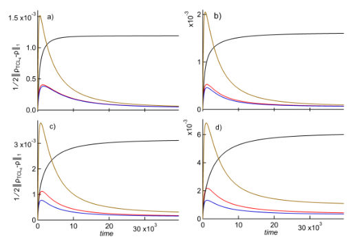
<figcaption class="paper-figure-caption"><b>Fig 1.</b> FIG. 1. Three canonically consistent closures of the Redfield equation. Time evolution of the trace distance between the TCL4 solution and the solutions of four mas- ter equations for a four-level system. The black, red, blue, and brown curves correspond to the Redfield equation, the latent-resonance closure, the virtual-coherence closure, and the expanded virtual-coherence closure, respectively. The de- phasing parameter ξ = 0, 1, 2, 3 in panels (a)–(d), respectively. λ2 = 1.25×10−3, kBT = 0.26. The remaining parameters are given in Appendix A, Sample 1.</figcaption>
</figure>
<figure class="paper-figure-card">
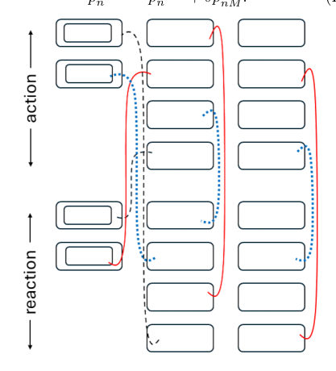
<figcaption class="paper-figure-caption"><b>Fig 2.</b> FIG. 2. Schematic representation of the cancellations ap- pearing in the induction step N →N + 1. Each rectangle represents a contribution to the latent-resonance interaction shell generated by the addition of the level M = N + 1. The upper block (“action”) contains the terms induced in the pre- existing N-level generator and represents the ten terms in Eq. (B39). The lower block (“reaction”) contains the contri- butions from the new matrix element Lnn,MM and represents the ten terms in Eq. (B40). Double boxes denote terms carry- ing an additional prefactor of 2. Colored connections indicate direct and KMS-induced cancellations. After these cancella- tions, only the newly generated...</figcaption>
</figure>

**Summary.** The paper tackles the complexity of describing open quantum systems relaxing to equilibrium by analyzing the $	ext{TCL}_4$ generator. It demonstrates that much of this high-order mathematical structure is asymptotically redundant. The true, simplest description of the stationary state is captured by a 'virtual coherence pathway,' providing a canonical and highly accurate closure for master equations.

**Why it may be interesting.** This work provides a rigorous mathematical framework for simplifying complex, high-order master equations derived from open quantum system theory, offering predictive power by identifying which terms are physically redundant in the long-time limit.

Detailed structure

**Main problem.** The central problem is understanding the opaque dynamics of open quantum systems as they relax to a Kubo–Martin–Schwinger (KMS) equilibrium state, specifically resolving the stationary-state problem inherent in approximations like the Redfield equation.

**Main result.** The complex fourth-order Time-Convolutionless ($	ext{TCL}_4$) generator is shown to contain asymptotically redundant components; its true asymptotic behavior is governed by a simpler 'virtual coherence pathway' that correctly reproduces second-order stationary-state corrections.

**Method.** The authors employ successive, stationary-state-preserving transformations on the $	ext{TCL}_4$ generator and utilize analytical continuation techniques (like unfolding latent resonances) to simplify the dynamics while preserving equilibrium properties.

**Model / system.** The system is an open quantum system coupled linearly to a thermal bath. The dynamics are governed by reduced density matrices ($
ho_S(t)$), analyzed using perturbative expansions in the weak coupling constant $\lambda$.

**Key observables.** Relaxation towards KMS equilibrium, second-order stationary-state corrections ($p^{(2)}$), and the structure of the TCL generator components.

**Important parameters / regimes.** Coupling strength ($\lambda$), small scale parameter ($\epsilon$) used for analytic continuation near degeneracies, and temperature ($k_B T$).

**Assumptions / limitations.** The analysis relies on assuming the existence of asymptotic transformations that eliminate redundant terms, and in some cases, assumes validity based on numerical evidence rather than a general proof (e.g., selection rules for arbitrary dimension $N$).

**Figures summary.** Figures illustrate the time evolution of trace distance between different master equation closures ($	ext{TCL}_4$ vs. Redfield vs. virtual-coherence closure) for a four-level system, demonstrating improved fidelity with compression.

**Paper structure.** The paper builds by first identifying the redundancy in $	ext{TCL}_4$, then using stationary-state-preserving transformations to derive simpler closures (latent-resonance and virtual-coherence), culminating in proving that the final compressed form yields the correct equilibrium dynamics matching established results like the mean-force Gibbs correction.

Abstract

Left alone, open quantum systems relax toward a Kubo--Martin--Schwinger (KMS) equilibrium state, yet the inner workings of this process remain opaque. It remains unclear why the intricate fourth-order time-convolutionless (TCL4) population generator reproduces the comparatively simple second-order stationary state corrections. Even more surprisingly, stationary-state corrections of such precision can be compressed into a simple virtual coherence pathway: an open quantum systems analogue of virtual transitions, in which populations communicate through coherences that are never occupied.   Here we show that this simplification arises through a sequence of stationary-state-preserving transformations that progressively eliminate asymptotically redundant components while preserving the stationary state, ultimately yielding the virtual coherence pathway. This resolves the longstanding stationary-state problem of the Redfield equation and reveals that much of the apparent complexity of the TCL4 generator is asymptotically redundant.

[↑ back to top](#top)

### [Active Learning for Calibrating Entangling Gates via Surrogate-Based Optimization](http://arxiv.org/abs/2607.00284v1)

**Authors:** Caleb Walton, Patricia García-Caspueñas, Filippo Zacchei, Ana Larrañaga, Steven L. Brunton, Sara Mouradian  
**Type:** both · **Category:** other · **PDF:** <https://arxiv.org/pdf/2607.00284v1>  
**Analysis basis:** full PDF text, analyzed in chunks
**Topic relevance:** 🔥 `QC/QI experiment` **4/5** · `quantum measurements` **3/5** · `quantum optics experiment` **2/5** · `analog quantum simulation` **1/5** · `measurement-induced transitions` **1/5** · `methods for driven-dissipative` **1/5**

↔ Scroll figures horizontally

<figure class="paper-figure-card">

<figcaption class="paper-figure-caption"><b>Fig 1.</b> FIG. 1. Schematic of the optimization pipeline. The goal is to maximize the gate fidelity score Q as a function of the calibration parameters: Rabi frequency Ω, sideband detuning δ and center-line detuning ωcl. First, the score is queried from the Quantum System, represented by an unknown noise-free landscape f(x) and a modeled noise term ε dependent on the inputs and the number of measurements shots N. Next, a Gaussian Process acts as a probabilistic surrogate that models f(x) from the available system scores to predict the mean and variance of unexplored calibration settings. This surrogate is exploited for fast Optimization of the predicted mean landscape. Finally, an Active Learning...</figcaption>
</figure>
<figure class="paper-figure-card">
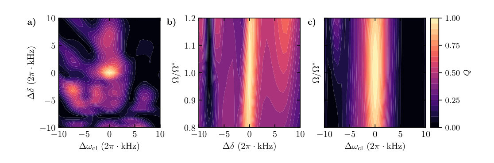
<figcaption class="paper-figure-caption"><b>Fig 2.</b> FIG. 2. Two-parameter calibration landscapes for the two-MSπ/2 sequence. Each panel plots the infinite-shot gate score (Q∞) while two controls are varied and the remaining controls are fixed at their optimized values. Brighter regions correspond to higher, more optimal scores. The panels depict variations in: (a) sideband detuning and center-line detuning, (b) Rabi frequency and sideband detuning, and (c) Rabi frequency and center-line detuning.</figcaption>
</figure>
<figure class="paper-figure-card">
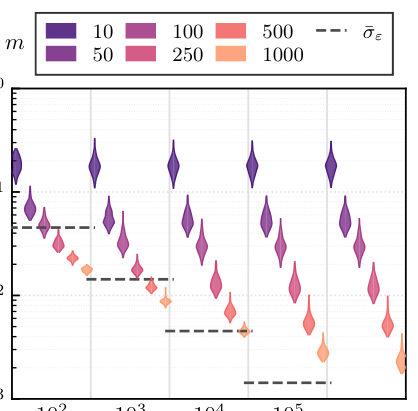
<figcaption class="paper-figure-caption"><b>Fig 3.</b> FIG. 3. Root Mean Square Error distributions of the GP predictions relative to the true landscape. The surrogate’s performance is evaluated across different numbers of measurement shots N (grouped on the x-axis) and varying numbers of training points m. The errors are displayed as violin plots. The dashed gray lines correspond to the mean binomial noise σε for each N and provide a reference of the expected uncertainty.</figcaption>
</figure>
<figure class="paper-figure-card">
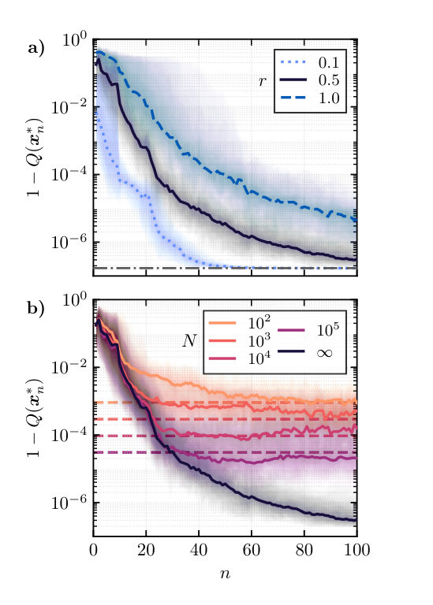
<figcaption class="paper-figure-caption"><b>Fig 4.</b> FIG. 4. Results of BO with active learning. (a) Deter- ministic optimization trajectories for: r = 1.0, dashed black, spans ±2π × 10 kHz in ωcl and δ, and ±20% in laser amplitude. The half-scale (r = 0.5, solid dark blue) and one-tenth-scale (r = 0.1, dotted blue) cases reduce these bounds by factors of two and ten, respectively. The vertical axis shows the op- timization loss, 1 −Q∞. The bold curves show the median trajectory and shaded trajectories span the 5th to 95th per- centile. The gray dashed-dotted line represents the simulation fidelity limit. (b) Optimization trajectories with finite-shot sampling evaluated at the half-scale parameter range (r = 0.5). Trajectories are shown for N...</figcaption>
</figure>
<figure class="paper-figure-card">

<figcaption class="paper-figure-caption"><b>Fig 5.</b> FIG. 5. Gaussian Process fitting and active learning distributions for the N = 100 scenario. (a,b) 1D slices of the predicted score Q along ∆δ and Ω/Ω∗, respectively. The calibration parameters not shown in a given slice are fixed at their optimal values. Solid colored lines and shaded regions correspond to the surrogate’s predicted mean ˆµ and uncertainty ˆσ at different iterations n of the active learning loop. The dashed black line represents the target infinite-shot noiseless landscape Q∞. (c,d) Distribution of candidate points xn sampled during the active learning step across all iterations (from 1 to nmax) and 100 independent runs, where denser blue regions indicate parameters sampled...</figcaption>
</figure>

**Summary.** The paper presents an active learning framework using Gaussian Processes to calibrate the parameters of entangling gates on trapped ions. By iteratively querying the system at the most informative points, this method efficiently navigates noisy measurement data to pinpoint optimal control settings. This establishes a powerful, model-agnostic tool for quantum hardware characterization.

**Why it may be interesting.** This work directly addresses the practical bottleneck of quantum hardware: characterization. Using ML techniques like GP surrogates allows researchers to map out complex, high-dimensional control landscapes without needing a perfect underlying Hamiltonian model, which is crucial for scaling up trapped-ion systems.

Detailed structure

**Main problem.** The core challenge is accurately calibrating quantum gates, like the Mølmer-Sørensen entangling gate, because their fidelity is highly sensitive to unknown physical control parameters and difficult to model exactly.

**Main result.** The authors demonstrate that combining Active Learning with Gaussian Process surrogate models provides an efficient, data-driven framework to rapidly discover optimal gate parameters despite significant quantum projection noise.

**Method.** They employ Bayesian Optimization (BO) guided by a Gaussian Process (GP) surrogate model. This GP learns the unknown relationship between control parameters and gate fidelity from noisy measurements, using an acquisition function to select the next most informative measurement point.

**Model / system.** The physical system is a trapped-ion quantum processor used to implement two-qubit gates via the Mølmer-Sørensen (MS) interaction. The optimization targets finding optimal laser amplitudes and frequencies that maximize gate fidelity.

**Key observables.** Gate fidelity ($Q$), state probabilities ($P_{ee}$), Mean Squared Scaled Error (MSSE).

**Important parameters / regimes.** Rabi frequency ($\Omega$), sideband detuning ($\delta$), center-line detuning ($\omega_{cl}$), and the number of measurement shots ($N$).

**Assumptions / limitations.** The noise is assumed to be heteroskedastic (dependent on parameters/shots), and the GP model provides a flexible, non-parametric approximation of the unknown physical landscape.

**Figures summary.** Figures illustrate the optimization pipeline, showing how the GP predicts mean/variance across parameter space. They also show fidelity saturation curves confirming noise scaling with shot count ($N$) and cross-sections visualizing the learned optimal regions.

**Paper structure.** The paper establishes the problem (parameter sensitivity), introduces the BO/GP framework for model-free optimization, validates it by simulating gate calibration on trapped ions, and analyzes convergence rates relative to measurement noise.

Abstract

The fidelity of a quantum gate is sensitive to small deviations in the physical control parameters. Unfortunately, it is generally difficult to exactly model the implemented Hamiltonian for a set of user-defined parameters, necessitating on-device calibration. Here, we present an active learning framework based on Bayesian optimization with a Gaussian Process surrogate to find the optimal parameter set. We validate the technique through numerical calibration of the laser amplitude and frequencies that implement the trapped-ion Mølmer Sørensen gate. We show that a Gaussian process can model the Hamiltonian dynamics. The addition of active learning accelerates the discovery of the optimal parameter set with speed and final fidelity dependent on the quantum projection noise of the data. These results establish the utility of active learning and surrogate models for quantum calibration and control.

[↑ back to top](#top)

### [Bandwidth-Limited Critical Currents in Electrically Tunable Moiré Bands](http://arxiv.org/abs/2607.01056v1)

**Authors:** Riccardo Bertini, Xueqiao Wang, Sergey Slizovskiy, Zhiren Zheng, Julien Barrier, Chiara Pizzo, Robin Smeyers, Krystian Nowakowski, Hitesh Agarwal, Alvaro Moreno, Bert Jorissen, Kenji Watanabe, Takashi Taniguchi, Milorad V. Milošević, Lucian Covaci, Vladimir Fal'ko, Pablo Jarillo-Herrero, Roshan Krishna Kumar, Frank H. L. Koppens  
**Type:** both · **Category:** strongly correlated electrons · **PDF:** <https://arxiv.org/pdf/2607.01056v1>  
**Analysis basis:** full PDF text, analyzed in chunks
**Topic relevance:** 🔥 `non-equilibrium dynamics` **4/5** · `non-equilibrium universality` **3/5** · `Keldysh / 2PI / non-Gaussian methods` **1/5** · `analog quantum simulation` **1/5** · `correlated / nonlocal dissipation` **1/5** · `driven-dissipative phase transition` **1/5** · `methods for driven-dissipative` **1/5**

↔ Scroll figures horizontally

<figure class="paper-figure-card">

<figcaption class="paper-figure-caption"><b>Fig 1.</b> Figure 1: Low- and high-current transport regimes in BLG/hBN superlattices. (a) Four-probe resistance for device X3 at D = 0 V/nm using 5 nA/µm current bias. Black arrows indicate the position of the secondary neutrality points (NPs) on the hole and electron side. Left inset: Optical image of the device. Right inset: Schematic of the dual-gated geometry. The estimate of twist angle from full filling peaks at secondary NPs gives θ ≈0.13◦. (b) Carrier density–displacement field map of the resistance in the low-current regime. The central indigo streak corresponds to the main NP feature and sidebands correspond to secondary NPs. Stars mark the configurations at which high-current measurements...</figcaption>
</figure>
<figure class="paper-figure-card">
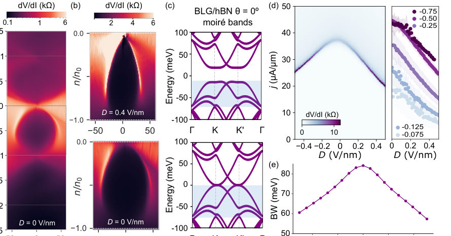
<figcaption class="paper-figure-caption"><b>Fig 2.</b> Figure 2: Tuning the critical regime with carrier density and displacement field. (a) Differential resistance as a function of bias current density and band filling at D = 0 V/nm. Arc-like structures evidencing the evolution of peaks in dV/dI emanate from the main NP and seemingly close at the secondary NPs. A strong asymmetry in the sharpness of the criticality is present between hole and electron filling. Additional features are also visible in the remote bands beyond |n/n0| &gt; 1. (b) Zoom of dV/dI maps in the first valence band for D = 0, 0.4 V/nm (bottom to top). The criticality arcs are visible starting from the main NP and disappearing after n/n0 ≈−0.5, shrinking progressively as |D|...</figcaption>
</figure>
<figure class="paper-figure-card">

<figcaption class="paper-figure-caption"><b>Fig 3.</b> Figure 3: (a) Critical current vs bandwidth for different moiré superlattices. The experimental critical currents are extracted from jc at n/n0 = −0.5 for the available data in the literature: † from Berdyugin et al. [13], ‡ Barrier [29], ∗Tian et al. [14]. The currents are normalized by BZ size 2π/d to isolate the bandwidth dependence according to Eq. 4. Bandwidths for all the samples are calculated using the continuum model. The dashed black line represents the maximum current limit according to Eq. 4. Inset: Same as main panel, but for the different BLG/hBN superlattices measured in this work, different colors correspond to the same device measured at different displacement fields...</figcaption>
</figure>
<figure class="paper-figure-card">

<figcaption class="paper-figure-caption"><b>Fig 4.</b> Figure 4: (a) Schematic illustration of the maximum current in a miniband, which grows with bandwidth W and decreases with d. The insets show the BZ corresponding to small and large moiré period, colored with the band velocity vkx and the shifted fermi surface along the field direction. (b) The different lines represent the density dependence of the maximum current obtained from the model, displaying arc-like structures similar to the experimental dV/dI peaks. The colormap shows the same data as in the lower panel in Figure 2b, with the experimental current multiplied by a factor 6 to show the qualitative agreement with the model for W = 60 meV. (c) Bandwidth dependence of the critical...</figcaption>
</figure>

**Summary.** The research demonstrates that the critical current limiting high-current transport in moiré superlattices scales universally and linearly with the electronic miniband bandwidth. By measuring this breakdown current electrically, researchers can access information about the band structure evolution—a key parameter governing correlated phases—in a fast and accessible manner.

**Why it may be interesting.** This work connects macroscopic electrical measurements (high-current breakdown) directly to fundamental quantum mechanical parameters (band structure), providing a novel, non-spectroscopic diagnostic tool for probing correlated electronic states in 2D materials.

Detailed structure

**Main problem.** To establish a fundamental link between the electronic bandwidth of moiré minibands and the critical current (j_c) governing out-of-equilibrium transport in these systems.

**Main result.** The critical current j_c exhibits a universal, direct scaling relationship with the electronic miniband bandwidth (W), establishing high-current non-linear transport as an accessible electrical probe for measuring band structure evolution.

**Method.** Combining experimental four-probe resistance measurements at low bias with differential resistance (dV/dI) measurements in the high-current, out-of-equilibrium regime. Theoretical modeling uses Boltzmann transport equations to derive scaling laws.

**Model / system.** The study focuses on moiré superlattices formed by bilayer graphene aligned to hexagonal boron nitride (hBN). The system is electrically tuned using an out-of-plane displacement field (D), which controls the miniband bandwidth and gap opening.

**Key observables.** Critical current density (j_c) measured via sharp peaks in dV/dI; Miniband Bandwidth (W); Resistance vs. carrier density (n).

**Important parameters / regimes.** Displacement field (D); Carrier density (n/n_0); Temperature ($\sim 10$ K); The scaling constant relating j_c and W.

**Assumptions / limitations.** The high-current transport regime is governed by a bandwidth-limited saturation mechanism, which can be modeled analytically using the Boltzmann equation in the relaxation-time approximation.

**Figures summary.** Figures show how D tunes gap opening (Fig 1b) and reveal sharp peaks defining j_c vs. current density (Fig 1d). Further figures map out criticality arcs and confirm the universal scaling of j_c with W across different moiré platforms.

**Paper structure.** The paper progresses from observing nonlinear transport features in dV/dI maps to developing a minimal analytical model for maximum sustainable current, culminating in demonstrating that this critical current scales universally with the calculated miniband bandwidth.

Abstract

Moiré superlattices host narrow minibands whose bandwidth governs correlated and topological phases. Here, we demonstrate that the bandwidth also sets the critical current for the onset of out-of-equilibrium transport. In bilayer graphene aligned to hexagonal boron nitride, we explore the high-current transport regime as we continuously flatten the valence miniband using an out-of-plane displacement field. We observe a significant reduction in the critical current, which is captured by a minimal analytical model and corresponds to the calculated narrowing of the miniband. Moreover, by comparing distinct moiré platforms, we show that the scaling between critical current and bandwidth is a universal feature of graphene superlattices. Our results reveal a direct link between miniband dispersion and high-current transport, and establish this regime as a fast and accessible electrical probe of bandwidth evolution.

[↑ back to top](#top)

### [Holographic Quantum Transformer: A Generalist Neuro-Symbolic Architecture for Solving Frustrated Systems via Generative Attention](http://arxiv.org/abs/2607.00398v1)

**Authors:** Xingran Guo, Tiaojie Xiao, Jie Liu, Keqin Li  
**Type:** both · **Category:** strongly correlated electrons · **PDF:** <https://arxiv.org/pdf/2607.00398v1>  
**Analysis basis:** full PDF text, analyzed in chunks
**Topic relevance:** 🔥 `analog quantum simulation` **4/5** · `exotic spin models in light-matter` **3/5** · `entanglement & information structure` **2/5** · `methods for driven-dissipative` **1/5** · `non-equilibrium dynamics` **1/5**

↔ Scroll figures horizontally

<figure class="paper-figure-card">
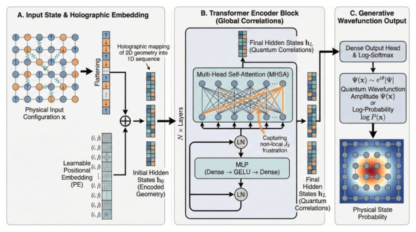
<figcaption class="paper-figure-caption"><b>Fig 1.</b> Figure 1: Overview of HQT. (A) Holographic Embedding injects geometry. (B) Quantum Encoder uses global attention to resolve frustration (𝐽2). (C) Autoregressive Head generates the wavefunction Ψ(x).</figcaption>
</figure>
<figure class="paper-figure-card">
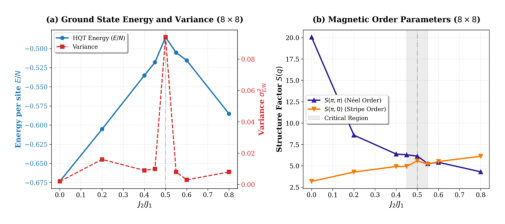
<figcaption class="paper-figure-caption"><b>Fig 2.</b> Figure 2: Detecting Quantum Phase Transitions on the 8 × 8 Lattice. (a) The energy per site (𝐸/𝑁) reaches its least negative value and the variance 𝜎2 𝐸/𝑁shows a relative spike at the critical point 𝐽2 = 0.5, signaling maximal frustration and optimization landscape ruggedness. (b) The crossing of the Néel structure factor 𝑆(𝜋, 𝜋) and the Stripe structure factor 𝑆(𝜋, 0) physically confirms the transition from the Néel phase to a highly frustrated critical phase.</figcaption>
</figure>
<figure class="paper-figure-card">

<figcaption class="paper-figure-caption"><b>Fig 3.</b> Figure 3: Zero-Shot Size Extrapolation via Holographic Trans- fer (8 × 8 →10 × 10). The red curve (Holographic Transfer) shows rapid alignment and improved stability relative to the Cold Start baseline (blue). After unfreezing the backbone (Iter 50), the transfer model converges to 𝐸/𝑁≈−0.49782, improving over the Cold Start baseline (−0.4974) and reach- ing a value statistically consistent with the best reported from-scratch result (−0.4976921(4) [3]). This indicates that the holographic prior provides a high-fidelity initialization and helps the model avoid poor local minima even in a sub- stantially expanded Hilbert space.</figcaption>
</figure>
<figure class="paper-figure-card">
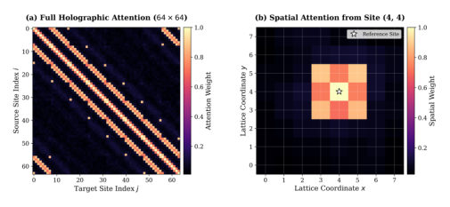
<figcaption class="paper-figure-caption"><b>Fig 4.</b> Figure 4: Holographic Attention Maps on the 8×8 Lattice (𝐽2 = 0.5). (a) The full 64 × 64 attention matrix exhibits distinct off- diagonal stripes, indicating that the model has autonomously learned the 2D topology and periodic boundary conditions (PBC) from flattened 1D sequences. (b) The spatial attention distribution relative to the central reference site (white star). The highest intensities are autonomously assigned to the diagonal sites (distance √</figcaption>
</figure>

**Summary.** The paper introduces the Holographic Quantum Transformer (HQT), an AI architecture designed to solve quantum many-body problems like the frustrated Heisenberg model. HQT uses global self-attention and incorporates physical priors to overcome the sign problem inherent in these simulations. Its key breakthrough is 'Holographic Transfer,' allowing accurate simulation on larger lattices without requiring full retraining.

**Why it may be interesting.** This work directly tackles a major bottleneck in condensed matter theory—simulating strongly correlated systems—by integrating advanced AI techniques with fundamental physical constraints, offering a scalable path beyond traditional numerical methods.

Detailed structure

**Main problem.** Simulating two-dimensional frustrated quantum matter, such as the J1-J2 Heisenberg model, is computationally intractable due to the sign problem and exponential Hilbert space complexity.

**Main result.** The Holographic Quantum Transformer (HQT) achieves high-fidelity ground state energy estimates for frustrated lattices, notably demonstrating a zero-shot size extrapolation capability that rivals state-of-the-art methods without retraining.

**Method.** It employs a physics-inspired generative attention architecture that decomposes the wavefunction amplitude while injecting physical constraints like the Marshall-Peierls sign rule and utilizing global self-attention to capture long-range entanglement.

**Model / system.** The system studied is the 2D antiferromagnetic J1-J2 Heisenberg model on a square lattice, characterized by the Hamiltonian H = J1 * sum(nearest) + J2 * sum(next-nearest). The focus is on highly frustrated regimes near quantum critical points.

**Key observables.** Ground-state energy per site (E/N), attention maps revealing underlying interaction geometry, and low autocorrelation time ($	au < 0.01$).

**Important parameters / regimes.** Frustration parameter J2, particularly at the quantum critical point J2 = 0.5; lattice sizes ranging from $8 	imes 8$ to $10 	imes 10$.

**Assumptions / limitations.** The architecture assumes that global self-attention can effectively model complex entanglement patterns and proposes a zero-shot transfer protocol based on bilinear interpolation of positional embeddings.

**Figures summary.** Figures illustrate the HQT attention maps, showing correlations aligning with physical interactions (like J2 diagonals), and demonstrate the successful extrapolation of results from smaller to larger lattices.

**Paper structure.** The paper introduces the HQT architecture by addressing the sign problem in quantum simulation. It details the mathematical formulation using autoregressive decomposition and self-attention. The core contribution is presented via 'Holographic Transfer,' demonstrating zero-shot size generalization, followed by benchmarking against known physical regimes (e.g., phase transitions).

Abstract

Simulating two-dimensional frustrated quantum matter is a grand challenge due to the sign problem and exponential Hilbert space complexity. In this work, we introduce the Holographic Quantum Transformer (HQT), a physics-inspired generative architecture that leverages global self-attention to resolve non-local entanglement patterns. We validate HQT on the square lattice $J_1-J_2$ Heisenberg model. On the heavily frustrated $8 \times 8$ lattice at the quantum critical point ($J_2=0.5$), HQT reaches a ground-state energy per site ($E/N$) of $\mathbf{-0.5001(1)}$, consistent with the expected finite-size scaling trend. Beyond numerical accuracy, HQT exhibits intrinsic physical awareness, autonomously recovering the underlying $J_2$ interaction geometry through interpretable attention maps. Our central contribution is ``Holographic Transfer", a zero-shot size-extrapolation protocol with rapid alignment: a model trained on $8 \times 8$ systems is directly projected onto larger $10 \times 10$ lattices via continuous positional-embedding interpolation and head re-initialization, achieving high-fidelity initialization and rapid convergence. This zero-shot protocol yields an energy of $E/N = \mathbf{-0.49782(3)}$, statistically consistent with the variational state of the art while requiring no from-scratch training on the target lattice. Our results establish generative attention as a scalable paradigm for transferable quantum simulation.

[↑ back to top](#top)

### [Production of Magic States via $Z$ Bosons and Dark Photons](http://arxiv.org/abs/2607.00229v1)

**Authors:** Carlos Alvarado, Alfredo Aranda, César Bonilla, Yahir Lua, Ethan Rodríguez-Martínez  
**Type:** theory · **Category:** other · **PDF:** <https://arxiv.org/pdf/2607.00229v1>  
**Analysis basis:** full PDF text, analyzed in chunks
**Topic relevance:** 🔥 `entanglement & information structure` **4/5** · `Keldysh / 2PI / non-Gaussian methods` **1/5** · `analog quantum simulation` **1/5** · `correlated / nonlocal dissipation` **1/5** · `driven-dissipative phase transition` **1/5** · `methods for driven-dissipative` **1/5** · `non-equilibrium dynamics` **1/5** · `non-equilibrium universality` **1/5**

↔ Scroll figures horizontally

<figure class="paper-figure-card">

<figcaption class="paper-figure-caption"><b>Fig 1.</b> FIG. 2. Angular dependence of the magic distributions obtained from Mγ + MZ under Møller</figcaption>
</figure>
<figure class="paper-figure-card">

<figcaption class="paper-figure-caption"><b>Fig 2.</b> FIG. 3. Angular dependence of the magic distributions obtained from Mγ + MZ under Bhabha</figcaption>
</figure>
<figure class="paper-figure-card">
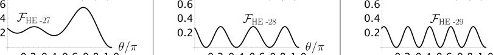
<figcaption class="paper-figure-caption"><b>Fig 3.</b> FIG. 4. Angular dependence of the magic distributions obtained from Mγ + MZ under elastic</figcaption>
</figure>
<figure class="paper-figure-card">
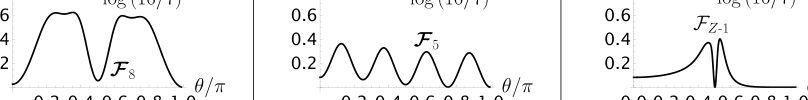
<figcaption class="paper-figure-caption"><b>Fig 4.</b> FIG. 6. Angular dependence of the magic distributions obtained from Mγ + MZ under pair</figcaption>
</figure>
<figure class="paper-figure-card">

<figcaption class="paper-figure-caption"><b>Fig 5.</b> FIG. 7. Angular dependence of the magic distributions obtained from Mγ + MZ under Møller</figcaption>
</figure>

**Summary.** This work explores how incorporating electroweak or dark photon interactions modifies the 'magic' character of quantum states produced in high-energy particle collisions. By calculating the second stabilizer Rényi entropy, the authors demonstrate that these new forces generate unique magic distribution functions across various scattering processes. This provides a powerful diagnostic tool for searching for physics beyond the Standard Model.

**Why it may be interesting.** While focused on particle physics phenomenology, the core mathematical tool—quantifying deviations from classical simulability using entanglement measures like Rényi entropy—is a concept relevant to understanding quantum resource theories in AMO physics.

Detailed structure

**Main problem.** The study investigates how including electroweak (Z-boson) or dark photon ($A'$) exchange modifies the 'magic state' character of quantum states produced in high-energy particle scattering processes.

**Main result.** The inclusion of these new interactions generates novel magic distribution functions and reorganizes stabilizer classes, with Bhabha scattering showing particularly rich structure compared to pure QED predictions.

**Method.** The analysis uses the stabilizer formalism and quantifies 'magic' using the second stabilizer Rényi entropy ($M_2$) across various kinematic regimes (low-energy, high-energy, Z-resonance).

**Model / system.** The models analyzed are extensions of the Standard Model: 1) The full Electroweak sector ($\gamma$ and $Z$ exchange); 2) A dark U(1) extension featuring a massive mediator ($A'$) and a charged dark fermion ($\chi$). Processes include Møller, Bhabha, and pair annihilation.

**Key observables.** Magic distribution functions ($F_{n,i}$, $H(\lambda_\chi, 	heta)$), the second stabilizer Rényi entropy ($M_2$), and the maximum magic value ($	ext{M2}_{\max}$).

**Important parameters / regimes.** Energy regimes (low-energy limit, high-energy limit, Z-resonance); mass ratios like $m_f/m_\chi$ or $m_{A'}/m_\chi$.

**Assumptions / limitations.** The analysis relies on perturbative expansions in various parameters ($\lambda_Z$, $\mu_D$) and approximations for the propagators in different energy limits.

**Figures summary.** Figures illustrate the angular dependence of magic distributions ($M_2(	heta)$) comparing QED, high-energy EW, and Z-resonance regimes for processes like pair annihilation and Møller scattering. Tables summarize the specific functional forms and associated stabilizer classes.

**Paper structure.** The paper is structured to first analyze the Electroweak sector (EW), then examine fixed stabilizer states, followed by the Dark U(1) extension, concluding with detailed comparisons across different energy regimes and processes.

Abstract

The production of magic states is studied in two settings. The first is the electroweak (EW) sector of the Standard Model (SM). The second is an extension featuring a new broken $U(1)$ gauge symmetry and a Dirac fermion charged under it. This setup resembles a dark $U(1)$ scenario, with the additional fermion playing the role of a dark matter candidate that annihilates into SM particles through its coupling to the new gauge boson. In the EW sector, the low-energy regime reproduces earlier magic production results obtained for Quantum Electrodynamics, whereas the high-energy and $Z$-resonance regimes generate new magic distribution functions and non-trivially reorganize the stabilizer state classes, with Bhabha scattering exhibiting the strongest sensitivity to electroweak effects. Also, a subset of fixed stabilizer states is identified, for which the magic distributions remain unchanged across the different energy regimes. In the dark sector, the main effect of the new massive mediator is the appearance of new magic distributions functions for Moller-like, Bhabha-like, and inverse pair-annihilation processes in the low-energy limit. These reach the maximal magic value at the SM-to-dark fermion mass ratios $m_f/m_χ\to 0$ and $m_f/m_χ\to 1.83929$.

[↑ back to top](#top)

### [Experimental Quantification of Layered Error Suppression in Fiber-Interconnected Quantum Data Centers](http://arxiv.org/abs/2607.00735v1)

**Authors:** Seyed Navid Elyasi, Sima Bahrani, Rui Wang, Dimitra Simeonidou, Paolo Monti, Rui Lin  
**Type:** experiment · **Category:** quantum information and computing · **PDF:** <https://arxiv.org/pdf/2607.00735v1>  
**Analysis basis:** full PDF text, analyzed in chunks
**Topic relevance:** 🔥 `QC/QI experiment` **4/5** · `quantum measurements` **2/5** · `correlated / nonlocal dissipation` **1/5** · `entanglement & information structure` **1/5** · `methods for driven-dissipative` **1/5** · `non-equilibrium dynamics` **1/5**

↔ Scroll figures horizontally

<figure class="paper-figure-card">
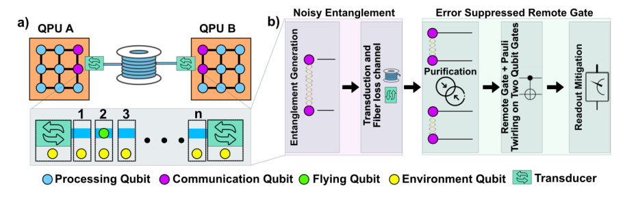
<figcaption class="paper-figure-caption"><b>Fig 1.</b> Fig. 1: (a) Fiber-interconnected superconducting QPUs with a transduction interface, where communication noise is emulated via a quantum collisional model. (b) Protocol layers including entanglement generation, noisy transmission, purification, Pauli-twirled two-qubit gates, and readout mitigation. Colors indicate qubit roles and system components.</figcaption>
</figure>
<figure class="paper-figure-card">

<figcaption class="paper-figure-caption"><b>Fig 2.</b> Fig. 2: Circuit-level implementation of the proposed error suppression framework. A Bell pair is distributed through a collisional communication channel modeling transduction and fiber noise. Entanglement purification is applied to improve resource fidelity, followed by remote gate execution using a cat-state protocol with Pauli-twirled two-qubit gates. Final measurement outcomes are corrected using readout mitigation.</figcaption>
</figure>
<figure class="paper-figure-card">

<figcaption class="paper-figure-caption"><b>Fig 3.</b> Fig. 3: Remote gate performance across increasing collisional-model fiber steps, with the monolithic noiseless case shown as Mono. (a) Quality of the distributed entanglement, quantified by the Bell-state fidelity. (b) Fidelity of |00⟩for a remote CNOT with the control qubit prepared in |0⟩. (c) Fidelity of |11⟩for control prepared in |1⟩.</figcaption>
</figure>

**Summary.** This paper experimentally quantifies error suppression techniques necessary for scaling quantum computation using interconnected superconducting QPUs. By implementing a layered strategy combining entanglement purification and Pauli twirling, the researchers achieved over 20% fidelity improvement in remote operations under realistic fiber noise. This work is crucial for realizing robust, distributed Quantum Data Centers.

**Why it may be interesting.** This work provides concrete experimental validation for advanced resource management techniques in distributed quantum computing architectures, directly relevant to scaling up quantum networks beyond single-device limitations.

Detailed structure

**Main problem.** The primary challenge addressed is overcoming scalability limits in quantum computation by enabling distributed processing across interconnected Quantum Data Centers (QDCs) linked via optical fibers.

**Main result.** The authors demonstrated that a layered error suppression strategy, combining entanglement purification, Pauli twirling, and readout mitigation, can improve operational fidelity by over 20% under realistic communication noise conditions.

**Method.** They employed an experimental protocol involving three sequential error correction/mitigation steps: probabilistic entanglement purification, applying Pauli twirling to gates, and correcting measurement biases via the assignment matrix.

**Model / system.** The experiment uses fiber-interconnected superconducting QPUs (tested on an IBM backend) where communication noise is modeled using a quantum collisional model Hamiltonian. The system involves two QPUs linked by a transduction interface and an optical fiber link.

**Key observables.** Bell-state fidelity, fidelity of remote CNOT gates ($|00
angle$ and $|11
angle$), and overall operational fidelity as a function of the number of communication steps.

**Important parameters / regimes.** The performance decay is tracked against increasing collisional steps (noise levels), with key thresholds being the baseline fidelity ($\sim 0.97$) versus purified/mitigated fidelity ($\sim 0.63$ at step 10).

**Assumptions / limitations.** The noise emulation assumes a Markovian process after environment qubit resetting, and the overall protocol is probabilistic due to entanglement purification success rates.

**Figures summary.** Figures illustrate the QDC architecture (Fig. 1a), detail the layered error suppression protocol (Fig. 1b & 2), and summarize performance decay versus collisional steps, showing significant fidelity recovery with mitigation techniques (Fig. 3).

**Paper structure.** The paper first establishes the physical setup of interconnected QPUs; it then details the theoretical framework using the quantum collisional model; subsequently, it implements and compares baseline vs. layered error suppression protocols (purification $	o$ twirling $	o$ readout mitigation) across increasing noise levels.

Abstract

We perform experiments to quantify error suppression in fiber-connected superconducting QPUs using combined error mitigation techniques, demonstrating over 20\% improvement in operational fidelity across interconnected quantum processing units under realistic noise conditions.

[↑ back to top](#top)

### [Hierarchy of hidden nonlocality: A genuine activation of Incompletability](http://arxiv.org/abs/2607.00797v1)

**Authors:** Soumajit Das, Shampa Mondal, Preeti Parashar, Atanu Bhunia  
**Type:** theory · **Category:** other · **PDF:** <https://arxiv.org/pdf/2607.00797v1>  
**Analysis basis:** full PDF text, analyzed in chunks
**Topic relevance:** 🔥 `entanglement & information structure` **4/5** · `quantum measurements` **2/5** · `Keldysh / 2PI / non-Gaussian methods` **1/5** · `correlated / nonlocal dissipation` **1/5** · `driven-dissipative phase transition` **1/5** · `methods for driven-dissipative` **1/5**

↔ Scroll figures horizontally

<figure class="paper-figure-card">

<figcaption class="paper-figure-caption"><b>Fig 1.</b> FIG. 1: Schematic illustration of the proposed transformation. A LOCC distinguishable, completable set of product state is trans- formed into a strictly incompletable, LOCC-indistinguishable set, si- multaneously activating incompletability and nonlocality.</figcaption>
</figure>
<figure class="paper-figure-card">

<figcaption class="paper-figure-caption"><b>Fig 2.</b> FIG. 2: Hierarchy between activation of nonlocality and activation of incompletability. Every incompletability activable set is nonlocality activable, while the converse does not hold in general.</figcaption>
</figure>

**Summary.** This work establishes a rigorous hierarchy among three concepts: activation of nonlocality, activation of incompletability, and their relationship to quantum coherence. By showing that the ability to activate incompleteness is a strictly stronger condition than activating nonlocality, it refines our understanding of how local operations constrain global quantum correlations.

**Why it may be interesting.** It provides deep theoretical insights into the operational boundaries of quantum information, particularly how local measurements constrain global properties like entanglement and nonlocality in ways that are quantifiable through incompleteness.

Detailed structure

**Main problem.** The paper investigates the relationship between local distinguishability of quantum states, incompletability, coherence, and nonlocality by introducing the concept of 'activation of incompletability.'

**Main result.** A strict hierarchy is established: activation of incompleteness implies activation of nonlocality, but the reverse implication fails. This reveals a fundamental interplay between local distinguishability and quantum resource properties.

**Method.** The analysis uses theoretical constructions involving sets of orthogonal product states in bipartite systems ($\mathbb{C}^{d_1} \otimes \mathbb{C}^{d_2}$), analyzing transformations under Local Operations and Classical Communication (LOCC) and LICC.

**Model / system.** The focus is on abstract quantum information theory applied to sets of orthogonal quantum states in bipartite Hilbert spaces. The operational framework involves LOCC, LICC, and the concept of local distinguishability versus incompleteness.

**Key observables.** Local Distinguishability (by LOCC), Incompletability, Nonlocality, Quantum Coherence (quantified via relative entropy).

**Important parameters / regimes.** The dimensionality of the bipartite system ($d_1 	imes d_2$) and the operational constraints imposed by LOCC/LICC.

**Assumptions / limitations.** The analysis heavily relies on established results concerning product states, Bell states, and Unextendable Product Bases (UPBs).

**Figures summary.** Figures illustrate the transformation of initially well-behaved sets into strictly incompletable sets, demonstrating the hierarchy where Incompleteness Activation $\implies$ Nonlocality Activation.

**Paper structure.** The paper progresses by defining preliminaries, presenting examples of nonlocality activation, analyzing incompletability activation, investigating connections via LICC, and concluding with a characterization theorem linking coherence to these phenomena.

Abstract

Quantum nonlocality admits several operational manifestations, one of which emerges from sets of orthogonal quantum states that cannot be perfectly distinguished by local operations and classical communication (LOCC). Such sets are regarded as nonlocal because their perfect discrimination requires global measurements. In contrast, sets that are perfectly distinguishable by LOCC are generally considered locally accessible and operationally classical. In this work, we investigate the role of incompletability in local state discrimination and introduce the notion of \emph{activation of incompletability}. Specifically, we demonstrate the existence of orthogonal sets that are initially perfectly distinguishable by LOCC and free from local redundancy, but which can be transformed via LOCC into strictly incompletable sets. We prove that activation of incompletability necessarily implies activation of nonlocality, whereas the converse fails in general, thereby establishing a hierarchy between the two activation phenomena. Furthermore, within the framework of local incoherent operations and classical communication (LICC), we show that any set whose incompletability can be activated can nevertheless be extended to a complete orthonormal basis of the Hilbert space, although the resulting completed basis is no longer perfectly distinguishable by LOCC. Our results uncover a fundamental interplay among local distinguishability, incompletability, coherence, and nonlocality, and provide new insight into the structure of locally accessible quantum information.

[↑ back to top](#top)

### [Influence of laser chirp and interferometer delay and imbalance on the performance of a time-bin BB84 quantum key distribution system](http://arxiv.org/abs/2607.00600v1)

**Authors:** Loïc Millet, Alberto Boaron, Rob Thew, Gianluca Boso  
**Type:** both · **Category:** quantum information and computing · **PDF:** <https://arxiv.org/pdf/2607.00600v1>  
**Analysis basis:** full PDF text, analyzed in chunks
**Topic relevance:** 🔥 `quantum optics experiment` **4/5** · `interference shaping light` **3/5** · `QC/QI experiment` **1/5** · `methods for driven-dissipative` **1/5**

↔ Scroll figures horizontally

<figure class="paper-figure-card">
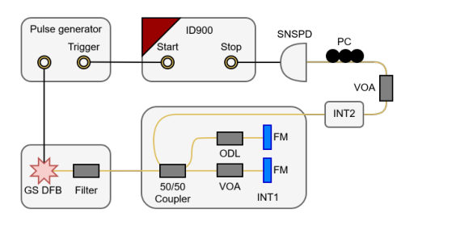
<figcaption class="paper-figure-caption"><b>Fig 1.</b> FIG. 2. Schematic of the visibility measurement setup. GS DFB: gain-switched distributed feedback laser. INT: interferometer. ODL: optical delay line. VOA: variable optical attenuator. FM: Fara- day mirror. PC: polarization controller. SNSPD: superconducting nanowire single photon detector.</figcaption>
</figure>
<figure class="paper-figure-card">

<figcaption class="paper-figure-caption"><b>Fig 2.</b> FIG. 1. Maximum attenuation achievable with a secret key rate (SKR) higher than 100 bps (red dashed line) and SKR at 0 dB nor- malized by the SKR achieved with a visibility of 1 (blue line) as a function of the system visibility at 0 dB.</figcaption>
</figure>
<figure class="paper-figure-card">
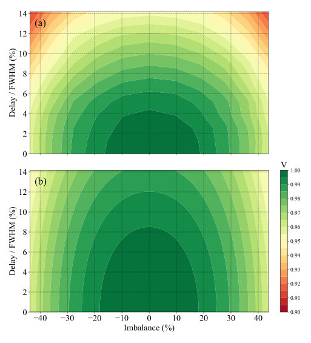
<figcaption class="paper-figure-caption"><b>Fig 3.</b> FIG. 3. (a) Experimental visibility contour plot as a function of im- balance and delay. (b) Analytically calculated visibility contour plot of an unchirped Gaussian laser pulse.</figcaption>
</figure>
<figure class="paper-figure-card">
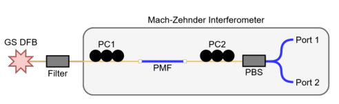
<figcaption class="paper-figure-caption"><b>Fig 4.</b> FIG. 4. Schematic of the PROUD measurement setup using a polar- ization Mach-Zehnder interferometer. GS DFB: gain-switched dis- tributed feedback laser. PC: polarization controller. PMF: polariza- tion maintaining fiber. PBS: polarizing beam splitter.</figcaption>
</figure>
<figure class="paper-figure-card">

<figcaption class="paper-figure-caption"><b>Fig 5.</b> FIG. 5. (a) Measured chirp (red dashed line) and intensity (black continuous line) of the optical source. (b) Comparison between the reconstructed spectrum (black dots) and measured spectrum (black continuous line) of the optical source.</figcaption>
</figure>

**Summary.** This paper analyzes the performance limitations of a time-bin BB84 QKD system by modeling the effects of interferometer delay, imbalance, and laser chirp. The key finding is that laser chirp introduces substantial visibility loss, significantly degrading the achievable secret key rate beyond what simple optical imperfections predict. This highlights the critical need for precise characterization and mitigation of spectral phase noise in quantum communication hardware.

**Why it may be interesting.** This work is highly relevant to quantum optics and open quantum systems as it provides concrete experimental characterization of decoherence mechanisms (chirp) in practical photonic quantum communication protocols, moving beyond idealized models.

Detailed structure

**Main problem.** The study investigates how imperfections like interferometer delay, imbalance, and laser chirp degrade the performance of a time-bin BB84 quantum key distribution (QKD) system.

**Main result.** Laser chirp causes significant visibility degradation in the QKD system, leading to a more severe reduction in the Secret Key Rate than accounted for by simple intensity imbalance or delay effects alone.

**Method.** The authors combine simulation of 2-decoy state BB84 with experimental measurement techniques like ultrafast optical differentiation (PROUD) to quantify visibility degradation.

**Model / system.** The system is a time-bin BB84 QKD protocol using pulsed light from a DFB laser diode. The analysis models the interference visibility ($V$) as a function of delay ($	au$), intensity imbalance ($\eta$), and chirp coefficient ($eta$).

**Key observables.** Secret Key Rate (SKR), Interference Visibility ($V$), Intensity Imbalance ($\eta$), Chirp Coefficient ($eta$)

**Important parameters / regimes.** Relative time delay ($	au$), Intensity imbalance ($\eta$), Laser chirp ($\Delta\omega$ or $eta$) parameters.

**Assumptions / limitations.** The analysis assumes that the degradation due to laser chirp is significant and must be accounted for beyond simple geometric/intensity imperfections. The PROUD setup relies on specific filtering techniques for measurement.

**Figures summary.** Figures show SKR vs. visibility, schematic setups for measuring visibility (delay/imbalance) and chirp (PROUD), and contour plots illustrating the dependence of visibility on multiple error sources.

**Paper structure.** The paper first establishes the importance of high visibility for QKD performance using simulations. It then experimentally measures how delay and imbalance affect visibility, followed by a detailed analysis quantifying the additional degradation caused specifically by laser chirp using advanced optical techniques.

Abstract

We investigate the effect of interferometer delay and imbalance on the performance of a BB84 time-bin quantum key distribution system. We simulate the impact of interference visibility on system performance and measure the visibility of a pair of interferometers as a function of their relative time delay and intensity imbalance. In addition, our analysis highlights the effect of laser chirp on system performance.

[↑ back to top](#top)

### [Polynomial equivalence of the global transverse-field Ising model and the gate model of quantum computation](http://arxiv.org/abs/2607.01227v1)

**Authors:** Matthias Werner  
**Type:** theory · **Category:** quantum information and computing · **PDF:** <https://arxiv.org/pdf/2607.01227v1>  
**Analysis basis:** full PDF text, analyzed in chunks
**Topic relevance:** 🔥 `analog quantum simulation` **4/5** · `non-equilibrium dynamics` **2/5** · `Keldysh / 2PI / non-Gaussian methods` **1/5** · `entanglement & information structure` **1/5**

↔ Scroll figures horizontally

<figure class="paper-figure-card">
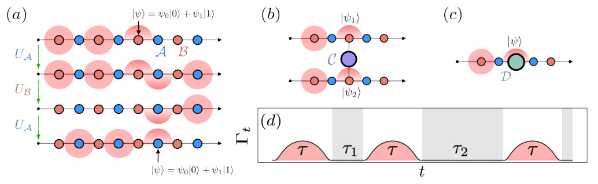
<figcaption class="paper-figure-caption"><b>Fig 1.</b> Figure 1. (a): Basic mechanism of the Cesa-Pichler method [9] to move quantum information along the qubit wires. UA and UB represent X-gates on the respective qubit species A (blue) and B (red), conditional on being blockaded by its neighboring qubits; (b): arrangement for the application of entangling gates, where a 2π-pulse is applied to a qubit of species C (purple); (c): qubit arrangement for the application of single-qubit gates in the Cesa-Pichler method, where the gates are executed when the logical qubit is located on a qubit of species D (green); (d): schedule Γt consisting of a concatenation of Γ-pulses over a time τ (red shaded), in between the Γ-pulses, the system evolves under...</figcaption>
</figure>
<figure class="paper-figure-card">
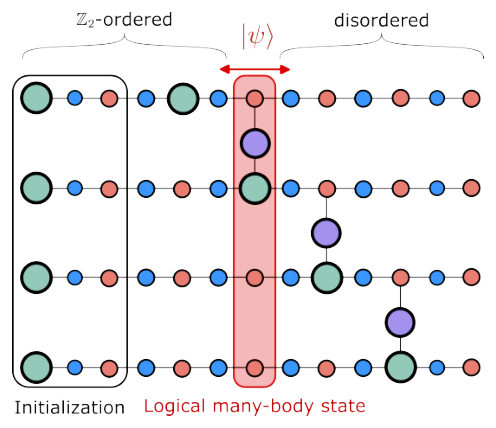
<figcaption class="paper-figure-caption"><b>Fig 2.</b> Figure 2. Graph G of the universal arrangement proposed by Cesa &amp; Pichler for a system of four logical qubits. The first three qubits (black box) on the left-hand side of each chain serve to initialize the standard configuration, while ev- ery chain has an impurity for single-qubit gates and a con- nection via an impurity to its neighbors for logical two-qubit gates. Then, depending on the order of pulses in the propa- gation cycle, the logical many-body state (red box) can move left and right, so that logical operations on any qubit and be- tween neighboring pairs can be executed. This topology cor- responds to a chain of five logical qubits with nearest-neighbor couplings. Interactions...</figcaption>
</figure>
<figure class="paper-figure-card">
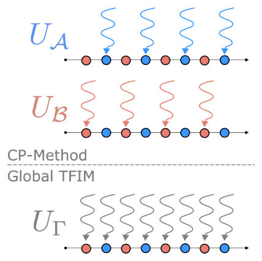
<figcaption class="paper-figure-caption"><b>Fig 3.</b> Figure 3. Illustration of the assumptions of semi-global con- trol as per the Cesa-Pichler method (top) and the global drive due to the transverse field generating Γ-pulses on all qubits simultaneously (bottom).</figcaption>
</figure>
<figure class="paper-figure-card">

<figcaption class="paper-figure-caption"><b>Fig 4.</b> Figure 4. Illustration of the CP-method with a global drive. The black box in the main figure and the inset correspond to each other. In the CP-method it is assumed that dis- tinct groups of atoms can be driven independently. Here, we only have the ability to apply a transverse field to all qubits at the same time. Therefore, adjacent qubits blockade each other due to the global drive, resulting in errors due to these unwanted blockade interactions. We can recover individual control of non-adjacent qubit groups using specifically cho- sen local Z-fields and exploiting constructive and destructive interference. By appropriately chosen phase-gates between the Γ-pulses, the non-driven qubits...</figcaption>
</figure>
<figure class="paper-figure-card">
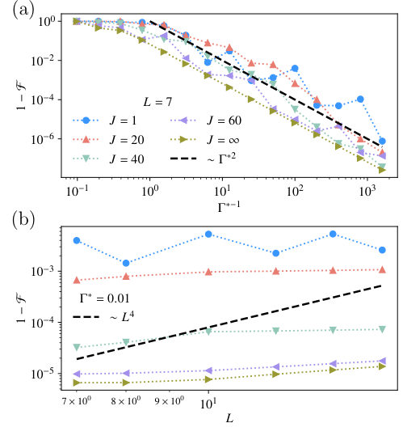
<figcaption class="paper-figure-caption"><b>Fig 5.</b> Figure 5. Infidelity 1 −F of a single propagation cycle as shown in Figure 1(a) compiled in global Γ-pulses as a func- tion of the inverse maximal transverse field Γ∗−1 (a) and as a function of the system size (b). The data in (a) is generated with a fixed L = 7, while in (b) we fix the maximal trans- verse field at Γ∗= 0.01. The colors and markers indicate the same J in both figures. J = ∞corresponds to a simulation without blockade Hamiltonian HJ, but instead projected onto the computational subspace P. We can see a clear quadratic decay in (a) consistent with the theoretical prediction, while in (b) the observed scaling is much slower than the predicted worst case. The dashed black line...</figcaption>
</figure>

**Summary.** The paper proves that the global transverse-field Ising model can simulate any arbitrary quantum circuit, establishing polynomial equivalence to the gate model. This is achieved by engineering complex time-dependent driving protocols that effectively mimic local control operations on encoded logical qubits. The result has significant implications for understanding the computational power of analog quantum simulators.

**Why it may be interesting.** This work is highly relevant because it provides a concrete physical realization—the global TFIM—that achieves the computational power of universal quantum gates, bridging theoretical models with solid-state/analog platform physics.

Detailed structure

**Main problem.** The central question addressed is whether the global transverse-field Ising model (TFIM) with a time-dependent field is computationally equivalent to the universal gate model of quantum computation.

**Main result.** The authors affirmatively prove that the global TFIM, under specific non-monotonic driving schedules, is polynomially equivalent to the gate model, establishing its capability for universal quantum simulation.

**Method.** The proof involves constructing a sequence of pulses and utilizing techniques like Dyson series expansions and basis transformations (e.g., Schrieffer-Wolff) to simulate arbitrary unitary gates on logical qubits encoded within the physical Ising lattice.

**Model / system.** The system is the global transverse-field Ising model, $H_t = \Gamma_t H_X + H_Z$, where $H_Z$ contains local fields and couplings. Logical qubits are encoded on a graph structure using auxiliary impurity qubits (A, B, C, D) to facilitate controlled interactions.

**Key observables.** Gate fidelity ($\delta'_{	ext{total}}$), required resource scaling for time ($T$), coupling strength $|J|$, transverse field amplitude $\Gamma^*$, and phase error $\epsilon_{	ext{phase}}$.

**Important parameters / regimes.** The equivalence holds under the assumption of polynomial overhead in time, qubit number, and energy scale; specific scalings are derived relating these parameters to achieve a target error $\epsilon$.

**Assumptions / limitations.** Key assumptions include working in the limit of weak driving ($\Gamma^* \ll 1$) and controlling errors from both Hamiltonian approximation (related to $\Gamma^*$) and phase accumulation ($\epsilon_{	ext{phase}}$).

**Figures summary.** Figures illustrate information propagation along qubit wires using impurity qubits, comparing global drive mechanisms with semi-global control methods.

**Paper structure.** The paper builds by first establishing the physical mechanism for implementing basic gates (single-qubit and controlled phase) on encoded logical qubits. It then generalizes this to show that these local operations can be synthesized using only a globally applied, time-dependent transverse field via carefully timed pulse sequences.

Abstract

The transverse-field Ising model has attracted a lot of attention in recent years, especially in the quantum simulation and quantum computation literature. This interest is driven by many platforms for analog quantum computation, which implement the transverse-field Ising model for solving optimization problems, such as quantum annealing. However, it has remained an open question whether the Ising model with a global transverse field is equivalent to the gate model of quantum computation. Here we answer this question affirmatively for the case of a non-monotonic time-dependent transverse field. Building on a recent result by Cesa and Pichler on global control of Rydberg atoms, we provide a construction that allows simulating arbitrary quantum circuits using the Ising model with global transverse field with polynomial overhead in time, qubit number, and energy scale. Although the polynomial overheads we establish here are large relative to what is feasible on real-world quantum hardware, our result motivates the development of more sophisticated methods for simulating quantum circuits using the Ising model with a global transverse field. Additionally, under the assumption that quantum computing is strictly more powerful than classical computing, our result serves as a no-go theorem for efficient classical simulation of the transverse-field Ising model with a time-dependent global transverse field. Therefore, our finding is relevant for multiple communities, from analog quantum simulation and quantum optimization on various platforms to complexity and control theory.

[↑ back to top](#top)

### [Entanglement-spectrum fingerprint of a non-invertible symmetry: the Kramers--Wannier duality defect on the lattice](http://arxiv.org/abs/2607.01137v1)

**Authors:** Yi Liang  
**Type:** theory · **Category:** statistical mechanics · **PDF:** <https://arxiv.org/pdf/2607.01137v1>  
**Analysis basis:** full PDF text, analyzed in chunks
**Topic relevance:** 🔥 `entanglement & information structure` **4/5** · `analog quantum simulation` **1/5** · `driven-dissipative phase transition` **1/5** · `methods for driven-dissipative` **1/5**

↔ Scroll figures horizontally

<figure class="paper-figure-card">
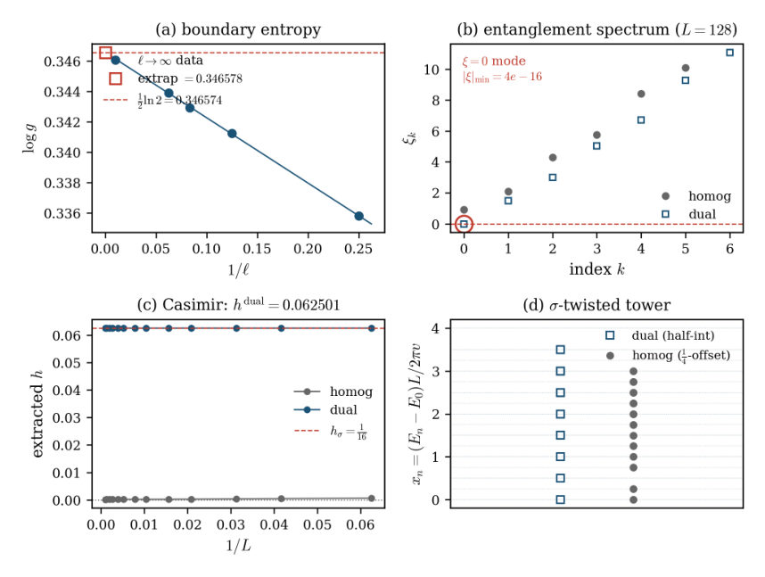
<figcaption class="paper-figure-caption"><b>Fig 1.</b> FIG. 1. Lattice reconstruction of the Ising KW duality-defect categorical data from a single duality-twisted ground state. (a) Boundary entropy: double extrapolation log g →1</figcaption>
</figure>

**Summary.** The paper demonstrates that the exotic topological data associated with non-invertible symmetries, using the Ising model as a test case, can be precisely read out from the single-particle entanglement spectrum of the system's ground state. By identifying specific zero modes and quantized energy levels in the spectrum, the authors provide an exact, measurable signature for these complex quantum phases.

**Why it may be interesting.** This work provides a powerful, quantifiable diagnostic tool—the entanglement spectrum—to probe deep topological properties of quantum matter that are usually only accessible via complex field theory techniques. It connects bulk topology to local spectral features.

Detailed structure

**Main problem.** To determine how the categorical data of a non-invertible symmetry, characterized by an irrational quantum dimension, manifests microscopically in the entanglement structure of a quantum many-body ground state.

**Main result.** The full categorical data ($d_\sigma$, $h_\sigma$, and the conformal tower) is recovered from analyzing the single-particle entanglement spectrum of the duality-twisted ground state. This establishes a level-resolved spectral fingerprint for non-invertible symmetries.

**Method.** Analysis involves computing the single-particle entanglement spectrum ($\xi_k$) of the defected ground state, using double extrapolation techniques to find boundary entropy, and extracting conformal weights via Casimir curvature calculations.

**Model / system.** The study focuses on the critical Ising chain subjected to a Kramers–Wannier (KW) duality defect. The system is analyzed using free-fermion methods derived from its Hamiltonian structure.

**Key observables.** Quantum dimension ($d_\sigma = \sqrt{2}$), Boundary Entropy ($\log g = 1/2 \ln 2$), maximally mixed Majorana zero mode at $\xi=0$, and the half-integer sequence of the $\sigma$-twisted conformal tower.

**Important parameters / regimes.** The system size $L$ is taken to infinity for thermodynamic limits; the defect strength is fixed by the KW duality.

**Assumptions / limitations.** The analysis relies on the free-fermion solvability of the Ising model, though the diagnostic program is claimed to apply beyond this solvable regime.

**Figures summary.** Figures illustrate the reconstruction process: (a) Boundary entropy extrapolation yielding $1/2 \ln 2$; (b) The single-particle spectrum showing the characteristic $\xi=0$ zero mode for the defect; and (c) Comparisons of conformal weights derived from different physical measurements.

**Paper structure.** The paper establishes the problem by noting that non-invertible symmetries have defects with irrational quantum dimensions. It then applies entanglement spectral analysis to the KW defect, showing how multiple independent calculations (boundary entropy, zero modes, Casimir curvature) all yield consistent values for the symmetry's defining parameters.

Abstract

Non-invertible symmetries are characterized by topological defects of irrational quantum dimension, but their imprint on the entanglement of a quantum many-body state has not been resolved at the level of the spectrum. We show that the categorical data of the canonical example -- the Kramers--Wannier (KW) duality defect of the critical Ising chain, with quantum dimension d_sigma=sqrt(2) -- is encoded in the single-particle entanglement spectrum of its ground state: a maximally mixed Majorana zero mode is the spectral origin of the boundary entropy log g=(1/2)log 2, hence of d_sigma itself. Reading the same duality-twisted ground state along two independent routes -- the transfer-matrix momentum shift and the Casimir curvature of the energy -- pins the twist-field weight h_sigma=1/16 twice over, and the defect Hilbert space organizes into a half-integer sigma-twisted conformal tower. This promotes the boundary entropy from an integrated number to a level-resolved spectral signature of non-invertibility, and supplies an exactly solvable calibration target for tensor-network studies of duality defects that lack a free-fermion shortcut.

[↑ back to top](#top)

### [Generative Modeling of Quantum Distribution with Functional Flow Matching](http://arxiv.org/abs/2607.00301v1)

**Authors:** Jaehoon Hahm, Tak Hur, Joonseok Lee, Daniel K. Park  
**Type:** theory · **Category:** quantum information and computing · **PDF:** <https://arxiv.org/pdf/2607.00301v1>  
**Analysis basis:** full PDF text, analyzed in chunks
**Topic relevance:** 🔥 `entanglement & information structure` **4/5** · `analog quantum simulation` **1/5** · `methods for driven-dissipative` **1/5** · `non-equilibrium dynamics` **1/5**

↔ Scroll figures horizontally

<figure class="paper-figure-card">
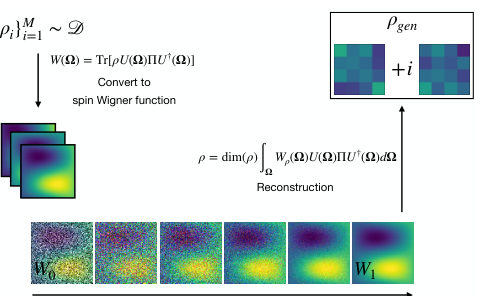
<figcaption class="paper-figure-caption"><b>Fig 1.</b> Figure 1. Overall procedure of QFM. We bypass the direct learn- ing of quantum states by converting them into spin Wigner function and learn the underlying distribution. This approach allows us to effectively generate physically valid and accurate quantum states, which was not achievable by direct learning from density matrices.</figcaption>
</figure>
<figure class="paper-figure-card">
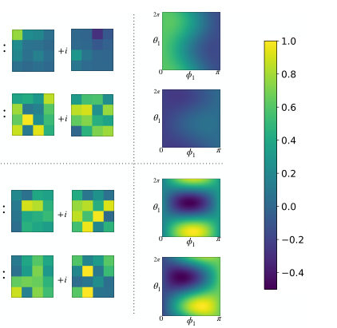
<figcaption class="paper-figure-caption"><b>Fig 2.</b> Figure 2. An Example of two-qubit product states ρ1, ρ2 (top) and two-qubit maximally entangled states σ1, σ2 (bottom), in both density matrix (left) and spin Wigner function (right). For the spin Winger functions, parameterizations on θ1 and ϕ1 are shown, with θ2 and ϕ2 fixed at π and π/2, respec- tively. Random arbitrary single-qubit rotation gates U(α, β, γ) = exp(−iαZ/2) exp(−iβY/2) exp(−iγZ/2) were applied to both qubits of |00⟩for the product states and to both qubits of (|00⟩+ |11⟩)/ √</figcaption>
</figure>

**Summary.** The paper introduces Quantum Flow Matching (QFM), a novel deep generative model designed to learn the distribution of multi-qubit quantum states. It achieves this by mapping density matrices into the spin Wigner function space and applying functional flow matching. QFM proves superior to standard methods because it accurately preserves essential physical properties like purity and entanglement entropy during state generation.

**Why it may be interesting.** This work provides a powerful, theoretically grounded generative framework for simulating complex quantum states that respects fundamental physical constraints, which is crucial for designing quantum circuits or analyzing many-body dynamics simulations.

Detailed structure

**Main problem.** The challenge is accurately learning and modeling complex quantum distributions using deep generative models while ensuring physical consistency.

**Main result.** Quantum Flow Matching (QFM) successfully learns multi-qubit quantum distributions, outperforming standard flow matching by accurately preserving key physical quantities like purity and entanglement entropy.

**Method.** The method converts the density matrix into a spin Wigner function representation and then uses Functional Flow Matching to learn the distribution in this function space before reconstructing the quantum state.

**Model / system.** The system involves multi-qubit quantum states ($
ho$), which are represented via their corresponding spin Wigner functions ($W(\Omega)$) for processing with generative models.

**Key observables.** Trace (Tr[\rho]), Purity (Tr[\rho^2]), and Entanglement Entropy (S(\rho_A)).

**Important parameters / regimes.** The number of qubits (single vs. multi-qubit) and the target entanglement entropy value.

**Assumptions / limitations.** The reconstruction of the density matrix from the Wigner function relies on an approximation formula derived using Haar random or unitary 2-design distributions.

**Figures summary.** Figure 1 illustrates the QFM pipeline ($
ho \rightarrow$ Wigner function $
ightarrow$ FFM learning $
ightarrow$ $\rho_{\text{gen}}$). Tables 1 and 2 quantitatively compare QFM against standard Flow Matching on single and multi-qubit systems regarding purity and entanglement entropy preservation.

**Paper structure.** The paper introduces the problem of modeling quantum distributions, proposes QFM using Wigner function mapping and Functional Flow Matching, validates its effectiveness by comparing physical observables (purity, entanglement) across single and multi-qubit examples, and discusses future extensions.

Abstract

The emergence of powerful deep generative models based on diffusion and flow matching has enabled the learning and modeling of complex distributions. Learning quantum distributions, however, remains challenging due to the inherent difficulty of accurately modeling the meaningful physical properties of quantum states. We propose Quantum Flow Matching (QFM), a novel generative model designed to learn quantum distribution by utilizing spin Wigner function and flow matching. By converting density matrix into the spin Wigner function and leveraging functional flow matching to learn distributions in function space, QFM enables accurate and effective learning of multi-qubit quantum distributions. We demonstrate the effectiveness of our method by evaluating physical quantities such as trace, purity, and entanglement entropy of the generated quantum states, accurately capturing the underlying physics of the given quantum distributions.

[↑ back to top](#top)

### [Entanglement fingerprint of a non-invertible symmetry: exact Fibonacci cut charges on the lattice](http://arxiv.org/abs/2607.01151v1)

**Authors:** Yi Liang  
**Type:** theory · **Category:** statistical mechanics · **PDF:** <https://arxiv.org/pdf/2607.01151v1>  
**Analysis basis:** full PDF text, analyzed in chunks
**Topic relevance:** 🔥 `entanglement & information structure` **4/5** · `Frenkel-Kontorova` **1/5** · `Keldysh / 2PI / non-Gaussian methods` **1/5**

↔ Scroll figures horizontally

<figure class="paper-figure-card">
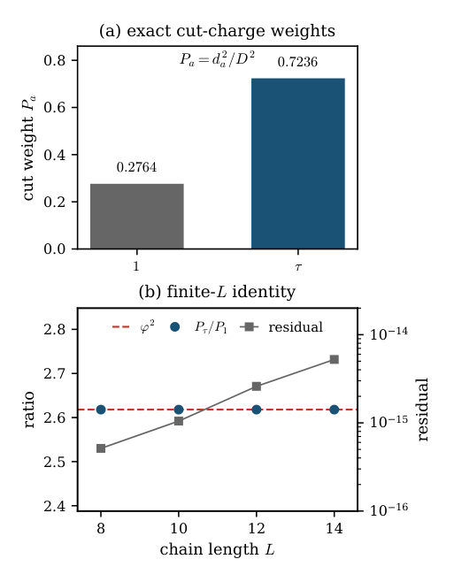
<figcaption class="paper-figure-caption"><b>Fig 1.</b> FIG. 1. Exact finite-size cut-charge fingerprint. (a) The two Fibonacci charge sectors carry fixed weights 𝑃1 = 1/𝐷2 ≈ 0.2764 and 𝑃𝜏 = 𝜙2/𝐷2 ≈0.7236, obtained from the sandwiched-projector identity rather than from a large-𝐿ex- trapolation. (b) The ratio 𝑃𝜏/𝑃1 equals 𝜙2 for every even 𝐿; numerical verification on 𝐿= 8, 10, 12, 14 confirms the iden- tity to machine precision (residual &lt; 5.3 × 10−15).</figcaption>
</figure>

**Summary.** This theoretical paper develops a novel method to find the entanglement fingerprint of non-invertible symmetries directly on a finite lattice. By analyzing cut charges on the Fibonacci golden chain, the authors prove an exact relationship ($P_	au/P_1 = \phi^2$) that yields the boundary entropy without needing to take any thermodynamic limit. This offers a powerful tool for diagnosing exotic topological order in quantum materials.

**Why it may be interesting.** It provides an exact, non-perturbative result connecting lattice statistical mechanics (Temperley-Lieb algebra) to continuum conformal field theory concepts (boundary entropy), which is highly relevant for understanding critical phenomena in condensed matter systems.

Detailed structure

**Main problem.** To determine if a non-invertible defect leaves an exact, finite-size entanglement fingerprint before any thermodynamic extrapolation is performed.

**Main result.** The paper establishes that for the critical Fibonacci golden chain, the ratio of cut-charge weights $P_	au/P_1$ exactly equals $\phi^2$, yielding a lattice-level boundary entropy $\ln g = \ln \phi$.

**Method.** The proof relies on deriving and applying a finite-dimensional sandwiched-projector identity combined with a Perron–Frobenius sector theorem.

**Model / system.** The system studied is the critical Fibonacci golden chain, which models a non-Abelian setting possessing a non-invertible duality defect ($\Upsilon_	au$). The analysis uses Temperley–Lieb generators and projector operators defined on the lattice.

**Key observables.** Cut charges ($P_a$) associated with defects $\{1, 	au\}$, and the ratio $P_	au/P_1$.

**Important parameters / regimes.** The golden ratio $\phi$, the system length $L$ (specifically even $L$), and the boundary entropy $\ln g$.

**Assumptions / limitations.** The result is specifically a two-charge theorem ($\{1, 	au\}$) and does not assume commutation with the Hamiltonian or rely on standard scaling-limit CFT assumptions.

**Figures summary.** Figure 1 numerically verifies that for even lengths $L$, the cut charges exhibit fixed weights ($P_1$ and $P_	au$) such that their ratio is exactly $\phi^2$.

**Paper structure.** The paper first introduces the problem of finite-size defect diagnostics, then uses the Perron–Frobenius theorem to select a specific ground state sector. The core mathematical work involves proving the sandwiched-projector identity for this sector, leading directly to the exact ratio calculation.

Abstract

Non-invertible defects are usually diagnosed through scaling spectra or infrared CFT data. We show that the Fibonacci duality defect of the critical golden chain already carries an exact categorical fingerprint at finite lattice size. The even-length antiferromagnetic ground state has fixed cut-charge weights, giving P_tau/P_1=phi^2 and log g=log phi without finite-size extrapolation. The proof is a finite-dimensional operator identity for the sandwiched cut projectors, combined with a Perron-Frobenius sector theorem for the even-length ground state. This gives a sharp lattice-level boundary entropy for a non-Abelian duality defect. We also separate this exact two-charge result from the finer six-primary tricritical-Ising resolution: the latter is located by the standard scaling-limit Virasoro branching of A_4 affine-TL packets, and is not an assumption in the finite-size theorem.

[↑ back to top](#top)

### [Quantum-Informed Portfolio Selection: An End-to-End Pipeline Validated on Trapped-Ion Hardware with Real Market Data](http://arxiv.org/abs/2607.01037v1)

**Authors:** Romina Yalovetzky, Martin J. A. Schuetz, Zichang He, Jiayu Shen, Yue Sun, Rudy Raymond, Shauna Sahay, Kishore Perla, Ruben S. Andrist, Grant Salton, Helmut G. Katzgraber, Roger Bongiovanni, Niraj Kumar, Rob Otter  
**Type:** both · **Category:** quantum information and computing · **PDF:** <https://arxiv.org/pdf/2607.01037v1>  
**Analysis basis:** full PDF text, analyzed in chunks
**Topic relevance:** 🔥 `QC/QI experiment` **4/5** · `quantum measurements` **2/5**

↔ Scroll figures horizontally

<figure class="paper-figure-card">
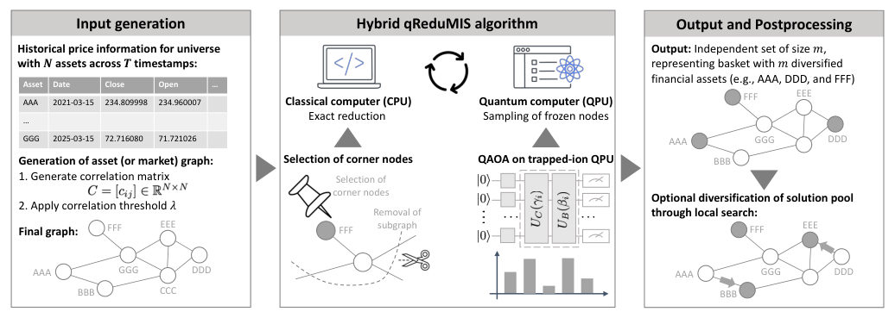
<figcaption class="paper-figure-caption"><b>Fig 1.</b> FIG. 1. End-to-end pipeline for quantum-informed portfolio selection given a universe of N assets. The input asset (or market) graph is generated from the correlation matrix C based on the assets’ returns across T timestamps (diagrammatically shown in the table) and the correlation threshold λ. This graph defines the input to the hybrid (recursive) qReduMIS algorithm to solve the PSP-MIS problem. qReduMIS intermixes exact reduction (in polynomial time) executed on classical hardware (CPU) and sampling of frozen nodes on the QPU, as to unblock the classical exact reduction wrapper when necessary. The set of frozen nodes is identified from quantum measurements (indicated as the output...</figcaption>
</figure>
<figure class="paper-figure-card">
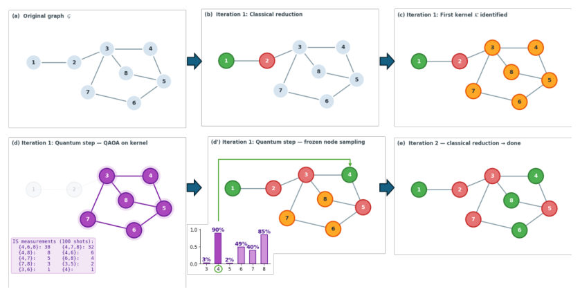
<figcaption class="paper-figure-caption"><b>Fig 2.</b> FIG. 2. Schematic of the qReduMIS algorithm on an 8-node graph G (illustrative; not experimental data). (a) Original graph G. (b) Classical reduction: vertex 1 (degree 1) is selected; its neighbour 2 is removed. (c) The kernel K (orange) is forwarded to the quantum subroutine. (d) QAOA is executed on K (violet); measured independent sets and counts are shown in the inset. (d’) Marginal probabilities computed from the measurements reveal node 4 as the top-ranked node. Following a greedy strategy over the marginals, it is selected and its neighbours {3, 5} removed, triggering a new classical reduction. In practice, ties in marginal probability are broken at random. (e) Classical reduction...</figcaption>
</figure>
<figure class="paper-figure-card">

<figcaption class="paper-figure-caption"><b>Fig 3.</b> FIG. 3. Performance comparison of standalone QAOA (blue) and qReduMIS (green) on the first kernel K for four stock market indices (DAX, FTSE, S&amp;P 100, Nikkei 225). Left: Success probability; Right: Average approximation ratio ⟨AR⟩. Error bars indicate 95% bootstrap confidence intervals obtained via 10,000 resamples. For S&amp;P 100 and Nikkei 225, standalone QAOA achieves PMIS = 0. qReduMIS consistently achieves higher success probability, and near-optimal approximation ratio across all indices. Standalone QAOA uses 100 quantum shots; qReduMIS uses 20 classical trials with 10 quantum shots per QPU call, requiring no more than five QPU calls. All experiments use p = 2 QAOA layers on Quantinuum’s...</figcaption>
</figure>
<figure class="paper-figure-card">

<figcaption class="paper-figure-caption"><b>Fig 4.</b> Fig. 3 presents two figures of merit—end-to-end success probability and average approximation ratio ⟨AR⟩—for each stock market index. All point estimates are accom- panied by 95% bootstrap confidence intervals. We em- ploy an enhanced postprocessing strategy that not only removes constraint-violating nodes but also greedily rein- serts non-conflicting ones. This grants standalone QAOA an additional advantage, since qReduMIS does not rely on sampling the optimal solution directly but rather on identifying frozen nodes via measurement statistics. De- spite this enhanced postprocessing, standalone QAOA fails to sample the optimal solution within 100 shots for</figcaption>
</figure>
<figure class="paper-figure-card">

<figcaption class="paper-figure-caption"><b>Fig 5.</b> FIG. 4. QAOA measurements on the DAX 100 kernel (|K| = 49 nodes, 100 shots on Quantinuum Helios) reveal a strong frozen- node signal despite low success probability. Left: Probability distribution over independent-set sizes from standalone QAOA; the dashed red line marks the ground-truth |MIS| and yellow bins indicate the top-2 largest sizes measured. The probability of sampling the optimal solution is below 10%. Right: Normalized marginal probability of each kernel node, computed over the top-2 largest independent sets (yellow bins on left panel). Green bars indicate in-set nodes (belonging to at least one MIS) and grey bars indicate out-set nodes (absent from all MIS solutions)....</figcaption>
</figure>

**Summary.** This work proposes qReduMIS, an advanced hybrid algorithm that combines classical graph reduction with QAOA measurements to solve the computationally hard Maximum Independent Set problem derived from financial correlation data. By iteratively using quantum insights to guide classical simplification, it significantly outperforms standalone QAOA on real-world market graphs tested on trapped-ion hardware.

**Why it may be interesting.** While the application is finance-related, the core technical contribution—developing a robust hybrid quantum-classical framework to tackle NP-hard problems by mitigating sampling limitations of direct quantum optimization—is highly relevant for developing practical algorithms on near-term quantum hardware like trapped ions.

Detailed structure

**Main problem.** The core problem is solving Portfolio Diversification, which maps to finding a Maximum Independent Set (MIS) on asset correlation graphs. This is an NP-hard combinatorial optimization challenge.

**Main result.** The proposed qReduMIS pipeline significantly outperforms standalone QAOA by leveraging quantum measurements to guide provably optimal classical graph reductions, achieving higher success probabilities and better scaling exponents.

**Method.** It employs a recursive hybrid quantum-classical algorithm (qReduMIS) that uses the Quantum Approximate Optimization Algorithm (QAOA) on a smaller kernel graph derived from the full market correlation graph. This guides subsequent classical reduction steps to find the MIS.

**Model / system.** The methodology is validated using real financial data from major market indices and executed on Quantinuum's 98-qubit trapped-ion Helios system, with systematic benchmarking performed on a noisy emulator (H2-1).

**Key observables.** End-to-end success probability (PMIS), average approximation ratio ($\langle AR 
angle$), and the optimal time-to-solution scaling exponent ($	ext{optTTS}$).

**Important parameters / regimes.** The number of QAOA layers ($p=2, 6$), the quantum shot count ($	ext{qshots}$), and the correlation threshold ($\lambda$) used to define graph edges.

**Assumptions / limitations.** The success of qReduMIS relies on exploiting 'frozen nodes' identified from marginal probability distributions in QAOA measurements, rather than solely sampling the optimal solution directly.

**Figures summary.** Figures compare PMIS and $	ext{optTTS}$ between standalone QAOA and qReduMIS across various indices (S&P 100, Nikkei 225), showing qReduMIS's superior performance and scaling advantage. One figure illustrates the iterative process using node selection based on marginal probabilities.

**Paper structure.** The paper introduces the MIS formulation for portfolio optimization, details the hybrid qReduMIS algorithm (classical reduction $
ightarrow$ quantum subroutine $
ightarrow$ classical refinement), benchmarks its performance against standalone QAOA on real market data and systematic graph ensembles, and analyzes scaling laws.

Abstract

Portfolio diversification - a cornerstone of modern investment management - can be formulated as a Maximum Independent Set (MIS) problem on asset correlation graphs. Solving this problem at scale is computationally challenging, motivating the exploration of quantum algorithms for practical financial optimization. We propose an end-to-end pipeline leveraging qReduMIS, a recursive hybrid quantum-classical algorithm. Rather than using quantum optimization to directly produce a final solution, qReduMIS leverages independent set measurements from the Quantum Approximate Optimization Algorithm (QAOA) to identify frozen nodes - vertices likely to belong to optimal solutions - thereby guiding and unblocking subsequent (provably optimal) classical reductions on the remaining graph. We benchmark qReduMIS on real financial data from four major market indices with up to 225 assets, executing experiments on Quantinuum's 98-qubit trapped-ion Helios system, with QAOA circuits acting on kernels of up to 78 qubits and 1016 two-qubit gates. While standalone QAOA fails to find the optimal solution for two of the largest indices (S&P 100 and Nikkei 225), qReduMIS achieves success probabilities of $0.40$ and $0.95$, respectively, with average approximation ratios $\geq 0.96$ across all four indices. We perform a systematic benchmark on the Quantinuum H2-1 noisy emulator over 73 asset correlation graphs of varying size showing that, for $p=2$ QAOA layers, the optimal time-to-solution scaling exponent of qReduMIS is $3.2$ times smaller than that of standalone QAOA.

[↑ back to top](#top)

### [Strongly frustrated 2D magnetism in a 3D hexagonal perovskite](http://arxiv.org/abs/2607.00532v1)

**Authors:** Bocheng Yu, Otkur Omar, Songtai Lv, Long Ma, Zhengcai Xia, Jing Meng, Yanran Yang, Jie Ma, Yang Xu, Qingfeng Zhan, Vladimir Yu. Pomjakushin, Haiyuan Zou, Shang Gao, Toni Shiroka, Tian Shang  
**Type:** both · **Category:** strongly correlated electrons · **PDF:** <https://arxiv.org/pdf/2607.00532v1>  
**Analysis basis:** full PDF text, analyzed in chunks
**Topic relevance:** 🔥 `analog quantum simulation` **4/5** · `exotic spin models in light-matter` **1/5** · `spintronics-quantum-optics interface` **1/5**

↔ Scroll figures horizontally

<figure class="paper-figure-card">
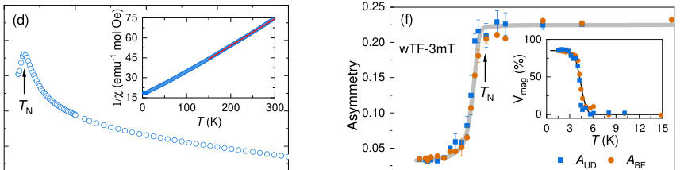
<figcaption class="paper-figure-caption"><b>Fig 1.</b> FIG. 1. (a) Crystal structure of Ba2La2BB′ 2O12 (B = Co, Ni, Mn; B′ = W, Te, Re). (b) Triangular sublattice of the magnetic B ions. (c) Pathways of the B-O-B′-O-B (black solid lines) and B-O-O-B (black dashed lines) superexchange interactions. (d) Temperature-dependent magnetic susceptibility χ(T) for BLMTO collected in a field of 50 mT. The inset shows the inverse susceptibility 1/χ(T). The red solid line represents a fit to the Curie-Weiss law. (e) Temperature-dependent specific heat C(T)/T (left-axis) and magnetic entropy Sm(T) (right-axis) of BLMTO. The magnetic specific heat was obtained by subtracting the specific heat of the nonmagnetic Ba2La2ZnTe2O12 (BLZTO) (empty circles and...</figcaption>
</figure>
<figure class="paper-figure-card">
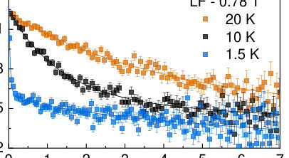
<figcaption class="paper-figure-caption"><b>Fig 2.</b> FIG. 4. LF-µSR spectra collected in a magnetic field of 0.78 T at selected temperatures, covering both the AFM and PM states of BLMTO. Solid lines are fits to Eq. (2). The applied magnetic field is parallel to the muon-spin direction. The LF-µSR spectra collected at T = 60 K in different magnetic fields are shown in Fig. S10 [32].</figcaption>
</figure>
<figure class="paper-figure-card">
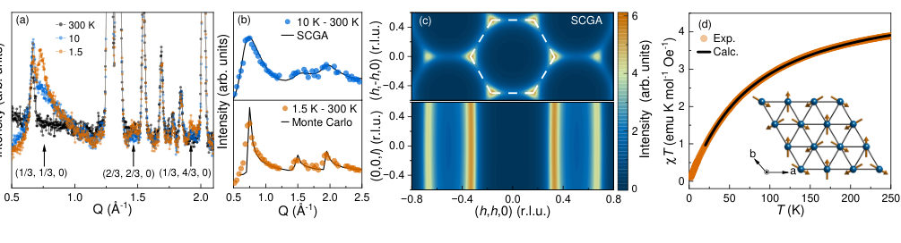
<figcaption class="paper-figure-caption"><b>Fig 3.</b> FIG. 5. (a) NPD patterns collected at T = 1.5, 10, and 300 K reveal asymmetric magnetic Bragg peaks with q = (1/3, 1/3, 0), (2/3, 2/3, 0), and (1/3, 4/3, 0) (marked by arrows). (b) Comparison of experimental- and simulated NPD spectra. Upper panel: experimental data at 10 K is fitted using the J1-J2-Jc model through the SCGA method. Lower panel: experimental data at 1.5 K and the simulated pattern calculated using the fitted J1-J2-Jc model through classical Monte Carlo simulations. (c) Simulated diffuse neutron scattering patterns in the (h, k, 0) and (h, h, l) planes using the fitted J1-J2-Jc calculated from the SCGA method at 10 K. (d) Temperature dependence of the reduced magnetic...</figcaption>
</figure>
<figure class="paper-figure-card">

<figcaption class="paper-figure-caption"><b>Fig 4.</b> FIG. 6. Field-dependent magnetization M(H) collected at T = 1.8 K in magnetic fields up to 32 T (data up to 49 T are presented in Fig. S12 [32]). Red solid and black dash-dotted lines represent the calculated magnetization using spherical (Msphere) and weighted- biaxial averages (Mbiax), respectively. The dashed horizontal line denotes the Ms/3 magnetization plateau.</figcaption>
</figure>
<figure class="paper-figure-card">
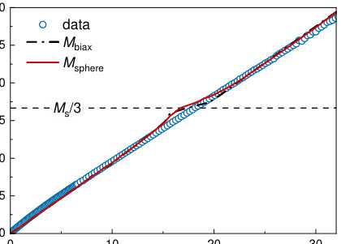
<figcaption class="paper-figure-caption"><b>Fig 5.</b> Fig. 6, the magnetization is almost linear in field, confirming the absence of magnetization plateaus and UUD phases in BLMTO. Since both J2 and Jc are much weaker than J1, we employ the nearest-neighbor (NN) TL-X X Z model to calcu- late the magnetization of BLMTO. This model is described by the Hamiltonian:</figcaption>
</figure>

**Summary.** The research reports on $	ext{Ba}_2	ext{La}_2	ext{MnTe}_2	ext{O}_{12}$, demonstrating it hosts strongly frustrated 2D magnetism within a 3D crystal structure. By combining multiple experimental probes, the authors establish that the magnetic ground state features $120^\circ$ AFM order confined to the ab-plane while remaining disordered along c. This challenges existing models of magnetic ordering in related perovskites.

**Why it may be interesting.** This work is highly relevant as it explores how dimensionality constraints (forcing 2D magnetism into a 3D crystal) can stabilize exotic, frustrated quantum states that deviate from simple mean-field predictions.

Detailed structure

**Main problem.** The study investigates the exotic nature of strongly frustrated two-dimensional (2D) magnetism occurring within a three-dimensional (3D) hexagonal perovskite structure.

**Main result.** The material exhibits an ideal 2D magnetic ground state characterized by $120^\circ$ Antiferromagnetic (AFM) order in the ab-plane, while remaining magnetically disordered along the c-axis.

**Method.** A combination of advanced experimental techniques ($\mu$SR, Neutron Scattering, NMR) and theoretical modeling (Triangular Lattice Heisenberg Model, Tensor Networks) was employed to characterize the magnetic state.

**Model / system.** The physical system is $	ext{Ba}_2	ext{La}_2	ext{MnTe}_2	ext{O}_{12}$, a triangular-lattice magnet. The magnetism is modeled using the Triangular Lattice Heisenberg Model (TL-$	ext{XXZ}$), focusing on strong spin fluctuations.

**Key observables.** Magnetic transition temperature ($T_N \approx 4.4$ K), magnetic susceptibility ($\chi(T)$), specific heat anomaly, and nonmagnetic asymmetry ($A_{	ext{NM}}$) from $\mu	ext{SR}$.

**Important parameters / regimes.** The frustration ratio $f=14.2$, the effective moment of $	ext{Mn}^{2+}$ ($S=5/2$), and the dimensionality (2D in ab-plane, 3D host).

**Assumptions / limitations.** The magnetic state is approximated by an effective model ($	ext{NN TL-XXZ}$), and the interpretation relies on distinguishing between true long-range order and quasi-2D fluctuations.

**Figures summary.** Figures illustrate crystal structure, temperature dependence of susceptibility and specific heat, $\mu$SR asymmetry vs. T, and NPD patterns showing magnetic Bragg peaks at wavevectors like $(1/3, 1/3, 0)$.

**Paper structure.** The paper systematically combines structural characterization (NPD) with probes sensitive to spin dynamics ($\mu	ext{SR}$, NMR) and thermodynamic measurements ($C(T)$) to build a case for quasi-2D magnetic behavior in the perovskite lattice.

Abstract

Exotic quantum phenomena are often found to occur in spin systems that exhibit low-dimensional magnetism. By combining nuclear magnetic resonance, neutron scattering, and muon-spin spectroscopy ($μ$SR) techniques, we report a rare instance of strongly frustrated two-dimensional (2D) magnetism in a three-dimensional (3D) hexagonal perovskite. Here, Ba$_2$La$_2$MnTe$_2$O$_{12}$, a triangular-lattice magnet, is shown to undergo a magnetic transition at $T_\mathrm{N} \approx$ 4.4 K, below which the manganese moments form a 120$^{\circ}$ AFM order within the $ab$-plane, while staying disordered along the $c$-axis. This exotic ground state, which exhibits ideal 2D magnetism, is highly consistent with the persistently strong spin fluctuations and the large internal field distributions revealed by zero-field $μ$SR. Further, the 2D magnetism also leads to a significant frustration, much larger than that of most known magnetically-ordered frustrated systems. Our work on Ba$_2$La$_2$MnTe$_2$O$_{12}$ not only challenges the interpretations of magnetic order in other 3D hexagonal perovskites, but it also provides insight into how the dimensionality affects the exotic magnetic states.

[↑ back to top](#top)

### [A Versatile Analytical Model for Fast and Accurate Determination of Feedline-Coupled Resonators for Superconducting Qubit Readout](http://arxiv.org/abs/2607.00490v1)

**Authors:** Zhen Luo, Lea Richard, Ivan Tsitsilin, Christian M. F. Schneider, Marco Dietz, Stefan Filipp, Amelie Hagelauer  
**Type:** both · **Category:** quantum information and computing · **PDF:** <https://arxiv.org/pdf/2607.00490v1>  
**Analysis basis:** full PDF text, analyzed in chunks
**Topic relevance:** 🔥 `QC/QI experiment` **4/5** · `methods for driven-dissipative` **1/5**

↔ Scroll figures horizontally

<figure class="paper-figure-card">

<figcaption class="paper-figure-caption"><b>Fig 1.</b> Fig. 1. (a) False-color isometric view of the 3D model, illustrating the feedline-coupled readout resonator system in a flip-chip configuration. The qubit and readout resonator are located on the bottom chip, while the top chip is fully metallized except for some apertures above the qubit. The top chip is intentionally diced to a smaller size than the bottom chip, allowing additional space for wire-bonding pads along the feedline. (b) Cross-sectional view of the coupling section with a false scale to illustrate the stack-up. (c) Top view of the physical layout of the resonator with the top chip unveiled. The resonator is divided into four sections: short-end section (purple), coupling...</figcaption>
</figure>
<figure class="paper-figure-card">
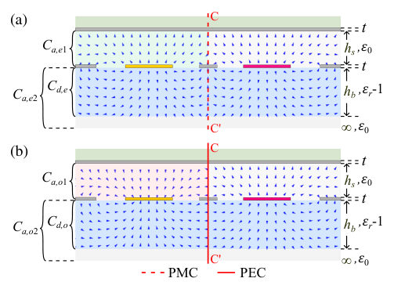
<figcaption class="paper-figure-caption"><b>Fig 2.</b> Fig. 2. E-field distributions for the configuration of top-grounded edge- coupled CPW line with a finite ground plane simulated using Ansys 2D Extractor and the configuration of partial capacitances for the even mode (a) and the odd mode (b).</figcaption>
</figure>
<figure class="paper-figure-card">
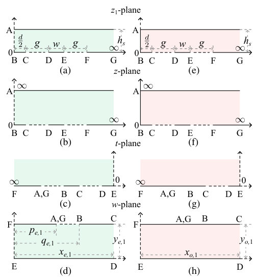
<figcaption class="paper-figure-caption"><b>Fig 3.</b> Fig. 3. Conformal mapping transformation steps to calculate the partial capacitance Ca,m1 for even mode (a)-(d) and odd mode (e)-(h). The solid lines represent PEC boundaries and the dash lines represent PMC boundaries.</figcaption>
</figure>
<figure class="paper-figure-card">

<figcaption class="paper-figure-caption"><b>Fig 4.</b> Fig. 4. Partial capacitances and cross-sectional view of the coupling section for planar architecture (a) and flip-chip architecture with back conductor on bottom chip (b). The plane of symmetry is designated by dash-dot line.</figcaption>
</figure>
<figure class="paper-figure-card">

<figcaption class="paper-figure-caption"><b>Fig 5.</b> Fig. 5. Cross-sectional view of the coupling section for a broadside-coupled CPW line and the field distribution for even mode (a) and odd mode (b).</figcaption>
</figure>

**Summary.** This paper introduces a versatile analytical model to accurately predict the performance parameters ($f_r$ and $Q_c$) of resonators coupled to superconducting qubits. By integrating four-port network analysis with conformal mapping, the authors provide a fast alternative to computationally intensive simulations. The model is rigorously validated against both full-wave EM simulations and physical measurements on test chips.

**Why it may be interesting.** This work is highly relevant as it provides essential tools for designing superconducting quantum hardware, directly impacting the feasibility and scalability of qubit readout circuits in quantum computing architectures.

Detailed structure

**Main problem.** The primary goal is developing a fast and accurate analytical model to determine the resonance frequencies ($f_r$) and coupling Q-factors ($Q_c$) of feedline-coupled resonators used in superconducting qubit readout circuits.

**Main result.** The proposed analytical model successfully predicts $f_r$ and $Q_c$ with high accuracy, showing excellent agreement when compared against both 3D full-wave simulations and physical cryogenic measurements.

**Method.** The methodology combines four-port microwave network analysis, conformal mapping techniques to calculate partial capacitances, and the derivation of closed-form expressions for the transmission coefficient ($S_{21}$).

**Model / system.** The system involves superconducting $\lambda/4$ resonators coupled via Coplanar Waveguides (CPW) feedlines on a chip, which can be planar or 3D heterogeneous. The model treats this as a four-port network reduced to a two-port analysis.

**Key observables.** Resonance frequency ($f_r$), coupling quality factor ($Q_c$), and the transmission coefficient $S_{21}(f)$.

**Important parameters / regimes.** Geometric parameters such as gap spacing ($h_s$), resonator lengths ($l_s, l_o$), and conductor thickness ($t$).

**Assumptions / limitations.** Key assumptions include using conformal mapping which assumes an infinitely thin conductor ($t=0 	ext{ nm}$), and simplifying the complex geometry into manageable network components.

**Figures summary.** Figures illustrate 3D models of the readout system, E-field distributions for even/odd modes in CPW lines, and comparisons (heat maps) showing calculated vs. simulated characteristic impedances across varying geometries.

**Paper structure.** The paper progresses from defining the physical problem to deriving the analytical model using network theory and conformal mapping; it then validates this model by comparing predictions against high-fidelity FEM simulations and concluding with experimental measurements on a fabricated test chip.

Abstract

Superconducting quantum chips commonly utilize quarter-wavelength (λ/4) transmission line resonators as readout circuits. An analytical model for the accurate determination of resonance frequencies and coupling Q-factors of feedline-coupled superconducting resonators is introduced. The model leverages four-port microwave network analysis, integrating boundary conditions and conformal mapping techniques to compute even- and odd-mode impedances in edge-coupled coplanar waveguide (CPW) structures. Its versatility allows application to both planar and 3-D heterogeneous architectures, making it a powerful tool for resonator design. To validate the model, a test chip with λ/4 resonators of varying geometries is fabricated and measured in a cryogenic environment. Comparisons with finite element method (FEM) simulations and experimental measurements confirm the model's accuracy, with resonance frequencies and coupling Q-factors aligning closely across configurations. This proposed model facilitates the design of superconducting resonators in readout circuits for more effective, scalable, and adaptable quantum computing architectures.

[↑ back to top](#top)

### [Overcoming the Speed-Fidelity Trade-off in Fast CZ Gates via Cyclic Control](http://arxiv.org/abs/2607.00660v1)

**Authors:** Ze-An Zhao, Hai-Feng Zhang, Tian-Le Wang, Xiao-Yan Yang, Peng Wang, Ren-Ze Zhao, Sheng Zhang, Zhi-Fei Li, Yuan Wu, Zi-Hao Fu, Sheng-Ri Liu, Peng Duan, Guo-Ping Guo  
**Type:** experiment · **Category:** quantum information and computing · **PDF:** <https://arxiv.org/pdf/2607.00660v1>  
**Analysis basis:** full PDF text, analyzed in chunks
**Topic relevance:** 🔥 `QC/QI experiment` **4/5** · `non-equilibrium dynamics` **1/5**

↔ Scroll figures horizontally

<figure class="paper-figure-card">

<figcaption class="paper-figure-caption"><b>Fig 1.</b> FIG. 1. Geometric mechanism and simulation of the PSE-CZ gate. (a) Left: Cyclic evolution in the base space induces a non- Abelian geometric phase in the U(2) bundle, which is susceptible to hardware imperfections such as STD. Right: Bloch sphere tra- jectories in the |11⟩−|20⟩subspace for a non-cyclic gate resulting from STD (blue) and an ideal cyclic gate (orange); squares denote evolution endpoints. (b) CZ gate pulse sequence (duration τ) uti- lizing flattop Gaussian waveforms with distortions simulated via a Butterworth low-pass filter. The PSE-CZ scheme employs indepen- dent amplitudes ∆1 and ∆2 for the two segments split at the midpoint, with experimental values typically in the range...</figcaption>
</figure>
<figure class="paper-figure-card">
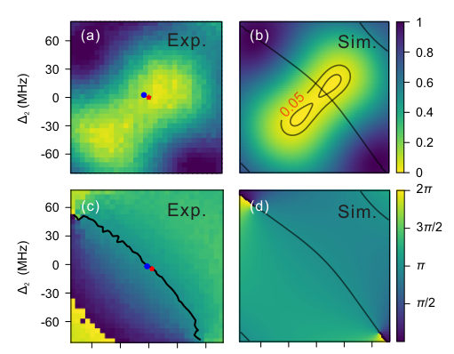
<figcaption class="paper-figure-caption"><b>Fig 2.</b> FIG. 3. Leakage and CPhase landscapes in the expanded param- eter space. (a),(b) Leakage into the |20⟩state and (c),(d) CPhase plotted as a function of ∆1 and ∆2. Panels (a) and (c) display ex- perimental results, while (b) and (d) show simulations under STD. The red star and blue dot in (a) indicate the operating points for the PSE-CZ and traditional CZ gates, respectively. In (b)-(d), PC con- tour lines are superimposed for reference.</figcaption>
</figure>
<figure class="paper-figure-card">
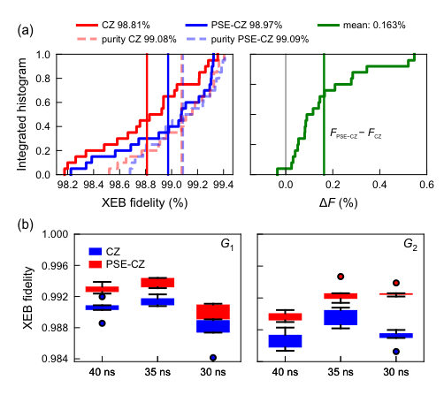
<figcaption class="paper-figure-caption"><b>Fig 3.</b> FIG. 4. Cross-entropy benchmarking (XEB) results. (a) Cumula- tive distribution functions of XEB fidelity (left) and fidelity improve- ment ∆F = FPSE-CZ−FCZ (right) across 20 qubit pairs at a fixed gate duration of 50ns on the 72-qubit processor “Wukong.” This duration was chosen to be compatible with the attainable coupling strengths of the measured qubit pairs. The XEB purity, which characterizes the decoherence-limited fidelity, is shown as lighter-colored dashed lines alongside the XEB fidelity for both PSE-CZ and traditional CZ gates. (b) XEB fidelity for qubit pairs G1 and G2 at gate durations of 40ns, 35ns, and 30ns. In the box plots, dot symbols indicate sta- tistical outliers and...</figcaption>
</figure>

**Summary.** The paper introduces a Parameter-Space Expansion (PSE) control technique to enhance Controlled-Z gates on superconducting qubits. This method overcomes the speed-fidelity trade-off caused by short-timescale waveform distortions. Experimentally, PSE significantly reduces coherent errors and maintains high fidelity even when operating at very fast gate speeds.

**Why it may be interesting.** This work directly addresses fundamental limitations in superconducting quantum hardware by providing a general, controllable method to maintain gate integrity at speeds previously thought impossible due to pulse imperfections.

Detailed structure

**Main problem.** The primary challenge is overcoming the inherent speed-fidelity trade-off when implementing fast quantum gates, specifically CZ gates, due to short-timescale waveform distortions.

**Main result.** A novel cyclic control strategy called Parameter-Space Expansion (PSE) was demonstrated to suppress coherent errors significantly while maintaining high fidelity even in the fast-gate regime, breaking the conventional speed-fidelity limit.

**Method.** The authors propose a PSE protocol that introduces an auxiliary degree of freedom by splitting the detuning profile into two segments ($\Delta_1$ and $\Delta_2$) to restore controllability for cyclic evolution.

**Model / system.** The work is performed on superconducting qubits (transmons) coupled via tunable couplers, operating in a regime effectively reduced to a two-level subspace $\{|11
angle, |20
angle\}$. The control involves shaping the coupling strength ($g$) and detuning ($\Delta$).

**Key observables.** Coherent error rate, gate fidelity (measured by Cross-Entropy Benchmarking), leakage into higher energy states (e.g., $|20
angle$), and CPhase accumulation.

**Important parameters / regimes.** Gate duration ($	au < 50$ ns), distortion strength ($\alpha$), coupling strength ($g$), and detuning profiles ($\Delta_1, \Delta_2$).

**Assumptions / limitations.** The analysis relies on reducing the dynamics to an effective two-level system due to large detunings suppressing leakage into other manifolds. The STD model is a numerical post-processing step.

**Figures summary.** Figures illustrate cyclic evolution failure under distortion, compare error rates of traditional vs. PSE-CZ gates across varying distortion levels and gate durations, and show XEB fidelity improvements demonstrating the speed limit breakthrough.

**Paper structure.** The paper details the theoretical necessity of restoring Time-Reflection Symmetry (TFS) constraints; it then presents the experimental implementation using the PSE protocol to achieve robust error suppression and high fidelity in fast CZ gates.

Abstract

High-fidelity quantum gates are essential for scalable quantum computation. However, at short durations, short-timescale waveform distortions break the time-reflection symmetry of control pulses, preventing the precise closure of cyclic evolution. This mechanism renders conventional symmetric protocols intrinsically over-constrained. Conventional strategies typically rely on smoothing the pulse envelopes or embedding the interaction pulse within a longer qubit pulse to bypass short-timescale distortions, which inevitably leads to a persistent speed-fidelity trade-off. To overcome this limitation, we introduce a cyclic control strategy based on parameter-space expansion, which restores controllability by incorporating an additional degree of freedom. We experimentally demonstrate this approach in a superconducting controlled-Z gate, achieving robust suppression of coherent errors without increasing gate duration, reducing the average coherent error from 0.27% to 0.12% across multiple two-qubit gates, as validated by cross-entropy benchmarking. Our results establish a general route to fast, high-fidelity cyclic quantum gates beyond the conventional speed-fidelity trade-off.

[↑ back to top](#top)

### [Superconducting Spiral Inductors for RF Reflectometry: Operation at Elevated Temperatures and Magnetic Fields](http://arxiv.org/abs/2607.00172v1)

**Authors:** Euan Parry, Murat Cubukcu, Patrick Reuvekamp, Manoj Stanley, Jonathan D. Fletcher, Alessandro Rossi  
**Type:** experiment · **Category:** quantum information and computing · **PDF:** <https://arxiv.org/pdf/2607.00172v1>  
**Analysis basis:** full PDF text, analyzed in chunks
**Topic relevance:** 🔥 `QC/QI experiment` **4/5**

↔ Scroll figures horizontally

<figure class="paper-figure-card">

<figcaption class="paper-figure-caption"><b>Fig 1.</b> Figure 1. Parallel configuration tank circuit for gate-based reflectometry. (a) Equivalent circuit showing the supercon- ducting spiral and its sub-components (red) placed in parallel to a variable capacitor (Cd) representing a quantum device. (b) Simulated reflection coefficient amplitude as a function of fractional resonant frequency shift. The traces illustrate a transition from low (red) to high (blue) device capacitance. The phase response is omitted for simplicity.</figcaption>
</figure>
<figure class="paper-figure-card">

<figcaption class="paper-figure-caption"><b>Fig 2.</b> Figure 2. Device geometry and microwave characterisation methods. (a) Schematic illustration of an individual spiral de- vice and relevant geometric features. Inset: zoom-in showing track width and separation. (b) Equivalent circuit diagram for measurements carried out with set-up 1. The tempera- ture gradient from room temperature (red) to cryogenic base temperature (blue) is shown. Dashed line labelled CRP indi- cates the reference plane of UOSM calibrations. (c) Schematic representation of a spiral chip placed above a CPW for the inductively coupled notch measurements enabled by set-up 1. (d) Experimental S21 notch response as a function of fre- quency for device D3 at 2 K (red dot) and...</figcaption>
</figure>
<figure class="paper-figure-card">

<figcaption class="paper-figure-caption"><b>Fig 3.</b> Figure 3. (a) L(T) extracted from the bonded two-port measurements of D2 carried out in set-up 2 (blue circles) and f0(T) extracted from the inductively coupled notch measurements of a nominally identical D2 device carried out in set-up 1 (orange circles). The blue dashed line is the fit discussed in Section III and gives Lg = 106 nH, within 3% of the designed value, and Lk,□= 1.74 pH/sq. The orange dashed line shows the f0(T) calculated using Eq. 2 with the extracted inductance and a constant Cself = 44 fF. (b) Extracted L(B∥) (blue circles) and f0(B∥) (orange circles) for the same design. B∥is the magnetic field oriented nominally within the plane of the superconducting film. Using the...</figcaption>
</figure>
<figure class="paper-figure-card">
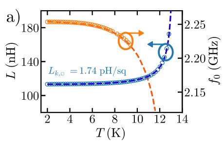
<figcaption class="paper-figure-caption"><b>Fig 4.</b> Figure 3(a) shows the temperature dependence of D2 inductance, L, and resonance frequency, f0, as extracted from our two separate measurement approaches.These measurements were performed on different physical de-</figcaption>
</figure>
<figure class="paper-figure-card">

<figcaption class="paper-figure-caption"><b>Fig 5.</b> Figure 4. Temperature- and field-dependent quality factor degradation. (a) Qi as a function of applied parallel magnetic field for devices D5 and D6 at T = 2 K. The field values BQ = 391 mT for D5 and BQ = 300 mT for D6 for which a gradual degradation of more than 10% manifests are highlighted by dashed vertical lines. (b) Temperature dependence of Qi for device D1 in the absence of an applied field (squares). The dashed curve represents a fit to the quasiparticle-loss model of Eq. 5.</figcaption>
</figure>

**Summary.** This paper characterizes superconducting spiral inductors designed for RF readout in quantum computing. By combining two independent microwave measurement techniques, the authors successfully disentangle temperature and magnetic field effects on the inductor's inductance versus its capacitance. The results establish critical design metrics needed to build stable, miniaturized components capable of operating reliably at elevated temperatures and high magnetic fields.

**Why it may be interesting.** This work directly addresses hardware limitations for scaling up solid-state quantum processors by providing a robust characterization framework for critical superconducting components under realistic operating conditions (high T, high B).

Detailed structure

**Main problem.** The study addresses the need for reliable superconducting circuit elements, specifically spiral inductors, to function as readouts in future quantum computers operating at elevated temperatures and high magnetic fields.

**Main result.** The research successfully separated inductive and capacitive contributions using complementary measurement techniques, showing that temperature and field-induced shifts are dominated by changes in the inductor's kinetic inductance rather than capacitance.

**Method.** Measurements were performed using microwave reflectometry on NbTiN spiral inductors across varying temperatures (up to several Kelvin) and magnetic fields (approaching 1 T), employing both weakly coupled resonator and independent two-port extraction setups.

**Model / system.** The physical system is a superconducting spiral inductor, modeled as having geometric ($L_g$) and temperature/field-dependent kinetic inductance ($L_k$). The analysis uses complex fitting procedures to separate these components from parasitic capacitance effects.

**Key observables.** Resonant frequency ($f_0$), internal quality factor ($Q_i$), extracted inductances ($L_g, L_k$), and the field/temperature dependence of these parameters.

**Important parameters / regimes.** Operating temperature (T > 1 K), magnetic field strength (B approaching 1 T), kinetic inductance fraction ($\alpha = L_k/(L_g + L_k)$), and vortex penetration scale ($B_Q$).

**Assumptions / limitations.** The primary assumption is that the observed frequency/quality factor shifts can be quantitatively separated into purely inductive changes, allowing for the isolation of $L(T)$ and $L(B)$.

**Figures summary.** Figures illustrate the measurement setups (Set-up 1 vs. Set-up 2), compare derived inductance values from both methods to confirm consistency, and plot the degradation of $Q_i$ versus temperature or applied magnetic field.

**Paper structure.** The paper systematically introduces the problem in quantum readout circuits, details two complementary microwave measurement setups (resonator coupling and two-port extraction), presents data showing the quantitative separation of inductive/capacitive effects, and concludes with design guidelines linking geometry to operational robustness.

Abstract

Superconducting spiral inductors are emerging as key components for radio-frequency (RF) reflectometry, a widely used readout technique for semiconductor spin qubits. Future scalable quantum-computing architectures are expected to operate at elevated temperatures and magnetic fields, placing new demands on the performance and stability of superconducting circuit elements. Here, we present a systematic study of NbTiN spiral inductors under temperatures of several kelvin and magnetic fields approaching 1 T. By combining weakly coupled resonator measurements with independent two-port inductance extraction, we separate inductive and capacitive contributions to device behaviour and directly identify the origin of resonance shifts and quality factor degradation. Furthermore, we establish practical design metrics linking geometry, temperature sensitivity, and magnetic-field robustness. These results provide a general framework for benchmarking superconducting inductors and guiding the design of future RF-reflectometry circuits for practical quantum technologies.

[↑ back to top](#top)

### [Surface charges in a Rydberg atom-nanowaveguide hybrid quantum system](http://arxiv.org/abs/2607.00513v1)

**Authors:** Aswathy Raj, Anna Kortel, Krishna Jadeja, Dylan J. Brown, Alexey Vylegzhanin, Robert Löw, Síle Nic Chormaic  
**Type:** experiment · **Category:** other · **PDF:** <https://arxiv.org/pdf/2607.00513v1>  
**Analysis basis:** full PDF text, analyzed in chunks
**Topic relevance:** `Rydberg arrays` **3/5** · `methods for driven-dissipative` **3/5** · `quantum measurements` **3/5** · `analog quantum simulation` **2/5** · `correlated / nonlocal dissipation` **2/5** · `driven-dissipative phase transition` **2/5** · `non-equilibrium dynamics` **2/5** · `quantum optics experiment` **2/5** · `Keldysh / 2PI / non-Gaussian methods` **1/5** · `QC/QI experiment` **1/5** · `Tavis-Cummings & cavity-many-emitter` **1/5** · `correlated cavity matter` **1/5** · `non-equilibrium universality` **1/5**

↔ Scroll figures horizontally

<figure class="paper-figure-card">

<figcaption class="paper-figure-caption"><b>Fig 1.</b> FIG. 1. (a) Schematic of the experimental setup. The polariza- tion control (PC) consists of two quarter-wave plates. The beams are combined using dichroic mirrors (DM). The cloud of atoms is aligned with the waist of the ONF and its fluorescence is monitored by a PMT and an EMCCD. (b) Diagram of the Rydberg excitation scheme, with detunings ∆780 and ∆480. (c) Numerical simulation of the ONF-based dipole trap potential, showing attractive (red) and repulsive (blue) potentials, and the total potential (black) includ- ing atom-surface interactions (van der Waals and Casimir-Polder) (green). The trap position is 406 nm away from the fiber surface and the trap depth is 0.17 mK. (d) Sample MOT...</figcaption>
</figure>
<figure class="paper-figure-card">

<figcaption class="paper-figure-caption"><b>Fig 2.</b> FIG. 2. Rydberg excitation spectra for 35D5/2 for three trapping beam configurations in the ONF: (i) a unidirectional 762 nm beam (blue curve), (ii) counterpropagating beams of 1064 nm (red curve), and (iii) the combination of both wavelengths (green curve). For each configuration, the corresponding beams were left on during the measurement. (a) Initial spectrum for each beam configuration. (b) Spectra after the system was exposed to continuous 480 nm light, tuned to ∆480 = +20 MHz for 30 minutes with the MOT on. In both (a) and (b) each data point corresponds to 4 seconds of 480 nm exposure, averaged over 4 measurements .</figcaption>
</figure>
<figure class="paper-figure-card">
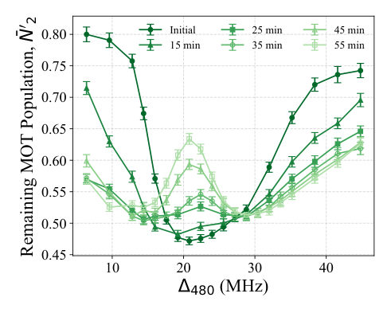
<figcaption class="paper-figure-caption"><b>Fig 3.</b> FIG. 3. Time evolution of the Rydberg excitation spectrum for 35D5/2 for config. (iii) with 480 nm light continuously on. The legend gives the cumulative 480 nm exposure time, beginning from when the 480 nm light was initially switched on. Each data point corresponds to 5 seconds of 480 nm exposure and averaged over the 5 second PMT signal.</figcaption>
</figure>
<figure class="paper-figure-card">
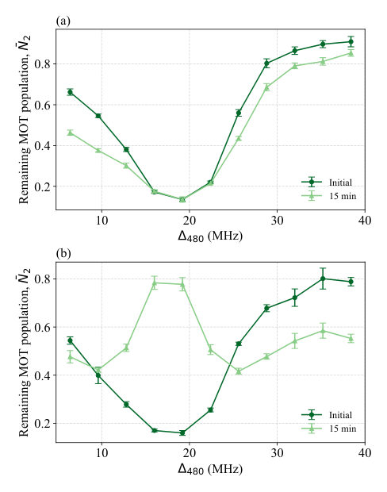
<figcaption class="paper-figure-caption"><b>Fig 4.</b> FIG. 4. Rydberg excitation spectrum for 40D5/2 for config. (iii). Ini- tial spectrum (dark green) and spectrum after 15 minutes of 480 nm exposure (light green) (a) with and (b) without the applied AC field. Each data point corresponds to 4 seconds of 480 nm exposure, aver- aged over 4 measurements</figcaption>
</figure>
<figure class="paper-figure-card">
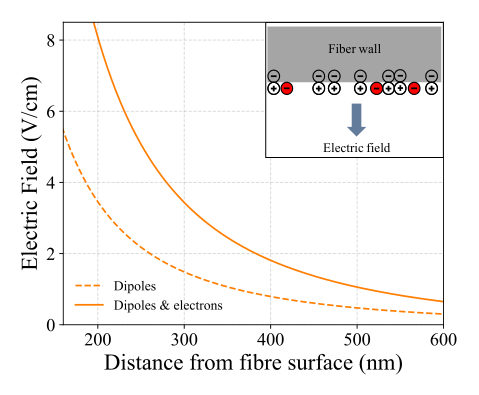
<figcaption class="paper-figure-caption"><b>Fig 5.</b> FIG. 6. Electric field as a function of the distance from the ONF sur- face, with an estimate of 5 × 105 dipoles (dashed) plus 65 electrons (solid) stuck on the fiber. Inset: Schematic illustrating the radial DC electric field originating from dipoles (transparent circles) of Rb atoms adsorbed on the fiber surface. Red circles depict the random distribution of electrons on the ONF surface.</figcaption>
</figure>

**Summary.** The paper experimentally investigates how surface charge accumulation on optical nanofibers degrades Rydberg excitation in trapped atoms. By observing time-dependent spectral shifts and suppressing them with an external AC field, the authors confirm that surface charges are the culprit. This work establishes crucial guidelines for mitigating these environmental electric fields in future integrated quantum technologies.

**Why it may be interesting.** This work is highly relevant for AMO physicists working on open quantum systems because it provides a concrete, experimentally validated mechanism (surface charging) that limits the scalability of integrated Rydberg quantum devices, offering practical engineering solutions.

Detailed structure

**Main problem.** The study investigates how uncontrolled surface electric fields, arising from charge accumulation on dielectric nanostructures, degrade Rydberg excitation processes in hybrid quantum systems.

**Main result.** Spectral deformations observed during Rydberg excitation are strongly attributed to DC energy level shifts caused by accumulated surface charges. Applying an external oscillating electric field successfully suppresses these spectral features.

**Method.** The research combines experimental measurements of time-evolving Rydberg spectra with theoretical modeling using the Lindblad master equation to simulate charge effects.

**Model / system.** The system involves laser-cooled $^{87}	ext{Rb}$ atoms excited into high-$n$ Rydberg states near an optical nanofiber (ONF). The model incorporates DC energy level shifts ($\delta_{DC}$) derived from surface charges and uses the Lindblad master equation to track population dynamics.

**Key observables.** Time evolution of the Rydberg excitation spectrum, spectral splitting/deformation magnitude, and remaining MOT population ($N'$).

**Important parameters / regimes.** Rydberg state ($n	ext{D}_{5/2}$), trapping beam wavelengths (762 nm, 1064 nm), external AC field frequency (100 kHz), and surface charge density.

**Assumptions / limitations.** The dominant mechanism for charge generation is identified as Rydberg-ground state collisional ionization enhanced by dipole trapping fields. The model assumes the ONF is single-mode at relevant wavelengths.

**Figures summary.** Figures illustrate schematic setups, excitation schemes, time evolution of spectra showing deformation, and comparisons between spectra with and without external AC field suppression.

**Paper structure.** The paper progresses by first establishing the experimental setup and observing spectral anomalies under trapping fields. It then uses external fields to diagnose charge effects, models these shifts theoretically, and finally identifies collisional ionization as the source of the charges, providing mitigation guidelines.

Abstract

Hybrid quantum platforms based on highly excited Rydberg atoms coupled to nanophotonics devices offer a promising route toward scalable quantum networks and integrated quantum technologies. However, the close proximity of Rydberg atoms to dielectric nanostructures makes these systems particularly susceptible to uncontrolled surface electric fields that can lead to a degradation of the excitation process. Here, we experimentally investigate Rydberg excitation of laser-cooled $^{87}$Rb atoms via the evanescent field of an optical nanofiber in the presence of fiber-guided red- and blue-detuned light fields as used to trap ground state atoms in fiber-based dipole traps. We observe a time evolution of the Rydberg excitation spectrum when both the dipole trapping fields are on and the additional spectral features that appear can be suppressed by applying an external oscillating electric field to the system, strongly indicating that surface charge accumulation is responsible for the observed spectral feature. The experimental results are reproduced qualitatively by a model that incorporates DC energy level shifts arising from electric fields generated by charges deposited on the nanofiber surface. We identify Rydberg-ground state collisional ionization, which is enhanced by the dipole trapping fields, as the dominant mechanism for charge generation. These results provide new insight into charge dynamics at dielectric nanophotonic interfaces and establish practical guidelines for mitigating surface charge-induced electric fields in fiber-integrated Rydberg quantum systems.

[↑ back to top](#top)

### [Susceptibility-kinetic uncertainty relations for quantum systems](http://arxiv.org/abs/2607.01035v1)

**Authors:** Didrik Palmqvist, Ludovico Tesser, Janine Splettstoesser  
**Type:** theory · **Category:** statistical mechanics · **PDF:** <https://arxiv.org/pdf/2607.01035v1>  
**Analysis basis:** full PDF text, analyzed in chunks
**Topic relevance:** `driven-dissipative phase transition` **3/5** · `methods for driven-dissipative` **3/5** · `non-equilibrium dynamics` **3/5** · `Keldysh / 2PI / non-Gaussian methods` **2/5** · `correlated / nonlocal dissipation` **2/5** · `non-equilibrium universality` **2/5** · `quantum measurements` **2/5** · `Kondo & dissipative impurity` **1/5** · `analog quantum simulation` **1/5** · `entanglement & information structure` **1/5** · `measurement-induced transitions` **1/5**

↔ Scroll figures horizontally

<figure class="paper-figure-card">
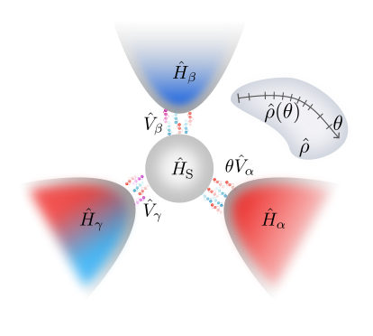
<figcaption class="paper-figure-caption"><b>Fig 1.</b> Figure 1. Quantum system S coupled to reservoirs (baths) via coupling ˆVα,β,..., enabling transport. The coupling strength to (one) reservoir is parameterized by θ, resulting in its en- coding in the state dynamics ˆρ(θ) that serves as a basis for generalizing the concept of dynamical activity to quantum systems. The color-shading of the baths symbolizes arbitrary out-of-equilibrium situations.</figcaption>
</figure>
<figure class="paper-figure-card">

<figcaption class="paper-figure-caption"><b>Fig 2.</b> Figure 2. Classical local KUR [Eq. (35)] and S-KUR [Eq. (34)] for particle current in DQD as a function of chemical potential bias ∆µ. We set ΓR = 5ΓL = g/5, TL = TR = g/50kB and ϵd = 0. (a) Violation of local classical KUR and saturation of the S-KUR. (b) Particle current J(N) L , susceptibility ˙M (N) L and their average J (N) L . The close-to-equilibrium approximation ˙M (N) L ≈ ΓLΓR</figcaption>
</figure>
<figure class="paper-figure-card">

<figcaption class="paper-figure-caption"><b>Fig 3.</b> Figure 3. (a,b) Violation of classical local KUR [Eq. (35)] and (c,d) saturation of S-KUR [Eq. (34)] in DQD for varying tunneling strength g and chemical potential bias ∆µ. We set ΓL = ΓR = Γ, TL = TR = 0.1Γ/kB, and ϵd = 0.</figcaption>
</figure>
<figure class="paper-figure-card">
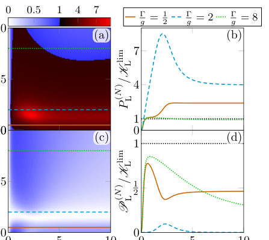
<figcaption class="paper-figure-caption"><b>Fig 4.</b> Figure 4. (a,b) Violation of classical local KUR [Eq. (35)] and (c,d) saturation of S-KUR [Eq. (34)] in DQD for varying coupling strength Γ = ΓL = ΓR and chemical potential bias ∆µ. We set TL = TR = 0.1g/kB, and ϵd = 0.</figcaption>
</figure>
<figure class="paper-figure-card">

<figcaption class="paper-figure-caption"><b>Fig 5.</b> Figure 5. (a) Violation of classical local KUR [Eq. (35)] and (b) saturation of S-KUR [Eq. (34)] in DQD for varying temperatures TL, TR. We set ΓL = ΓR = Γ, g = 5Γ, ϵd = 2Γ, ∆µ = 10Γ.</figcaption>
</figure>

**Summary.** The paper introduces the Susceptibility-Kinetic Uncertainty Relation (S-KUR) to set universal bounds on current measurement precision in open quantum systems. By incorporating a 'susceptibility' term derived from the system-reservoir coupling, it overcomes limitations of previous relations that failed under strong coherence or non-Markovian dynamics. This makes it a powerful tool for optimizing measurements in realistic quantum devices like quantum dots.

**Why it may be interesting.** This work provides a powerful, generalized tool for quantifying fundamental limits on measurement precision in complex, non-equilibrium quantum devices, which is crucial for designing high-precision quantum sensors and computing elements.

Detailed structure

**Main problem.** The primary goal is establishing a universal uncertainty relation that constrains measurement precision for current fluctuations out of equilibrium in open quantum systems.

**Main result.** The derived Susceptibility-Kinetic Uncertainty Relation (S-KUR) provides a general, tight bound on current precision that remains valid even when standard kinetic relations fail due to strong quantum coherence or coupling effects.

**Method.** The relation is derived by applying the quantum Cramér-Rao bound to observables whose dynamics are parameterized by the system-reservoir coupling strength ($	heta$).

**Model / system.** The analysis focuses on open quantum systems coupled to reservoirs (baths), often modeled using techniques applicable to steady-state transport, such as in a Double Quantum Dot (DQD) setup.

**Key observables.** Current ($J$), Noise ($S(X)$), Susceptibility ($\dot{M}(X)$), and Partial Dynamical Activity ($A_V(t)$).

**Important parameters / regimes.** System-reservoir coupling strength ($	heta$), temperature ($T$), bias voltage ($\Delta\mu$), and the quantum Fisher information ($\mathcal{F}_{	heta	heta}$).

**Assumptions / limitations.** The derivation relies on generalizing bounds from weak-coupling Markovian limits to encompass strong coupling, coherence, and time-dependent driving protocols.

**Figures summary.** Figures illustrate the violation of classical local uncertainty relations (like the classical KUR) in quantum transport scenarios (e.g., DQD), while demonstrating that the S-KUR remains valid and provides a tight bound across varying biases and temperatures.

**Paper structure.** The paper builds from general principles using the quantum Cramér-Rao bound to define the Partial Dynamical Activity, leading to the universal S-KUR. It then applies this relation to specific physical models like steady-state transport in DQD systems to demonstrate its superiority over classical bounds.

Abstract

Kinetic uncertainty relations bound current precision of stochastic processes by dynamical activity. The extension of these bounds to quantum systems has been impeded by coherence, strong system-reservoir coupling, and the subtlety of defining dynamical activity in the quantum regime. Here, we introduce a partial dynamical activity through the quantum Fisher information associated with the rescaling of the system-reservoir coupling and show that it bounds current precision via a universal susceptibility-kinetic uncertainty relation. The general validity of this relation for any open quantum system is guaranteed by the natural contribution of a susceptibility term, which is experimentally accessible by tuning the system-reservoir coupling strength. We show how the partial dynamical activity encompasses previous definitions of activity in the weak-coupling Markovian limit and that it provides an information-geometric interpretation of correlator-based activities. We illustrate the tight constraint on precision that our bound provides with the example of steady-state transport through a double quantum dot, where quantum effects invalidate previously developed kinetic uncertainty relations. We expect our bound to provide a powerful tool for optimizing precision in arbitrary quantum systems.

[↑ back to top](#top)

### [Heliciton-Assisted Chirality-Induced Spin Selectivity from Helical Dirac Current](http://arxiv.org/abs/2607.00624v1)

**Authors:** Ju Gao, Fang Shen  
**Type:** theory · **Category:** other · **PDF:** <https://arxiv.org/pdf/2607.00624v1>  
**Analysis basis:** full PDF text, analyzed in chunks
**Topic relevance:** `Keldysh / 2PI / non-Gaussian methods` **3/5** · `methods for driven-dissipative` **3/5** · `spintronics-quantum-optics interface` **3/5** · `Kondo & dissipative impurity` **2/5** · `exotic spin models in light-matter` **2/5** · `non-equilibrium dynamics` **2/5** · `analog quantum simulation` **1/5** · `correlated / nonlocal dissipation` **1/5** · `correlated cavity matter` **1/5** · `driven-dissipative phase transition` **1/5** · `non-equilibrium universality` **1/5**

↔ Scroll figures horizontally

<figure class="paper-figure-card">

<figcaption class="paper-figure-caption"><b>Fig 1.</b> Low-resolution page preview, page 2</figcaption>
</figure>
<figure class="paper-figure-card">
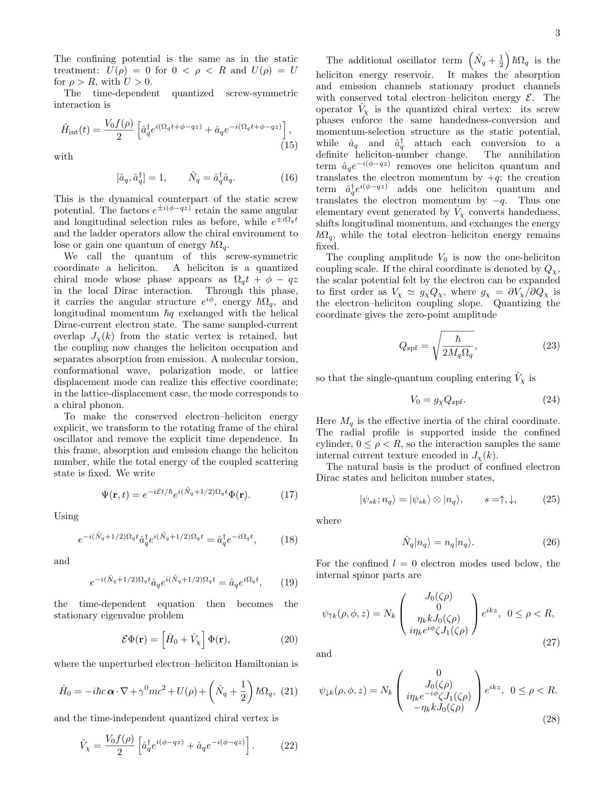
<figcaption class="paper-figure-caption"><b>Fig 2.</b> Low-resolution page preview, page 3</figcaption>
</figure>
<figure class="paper-figure-card">
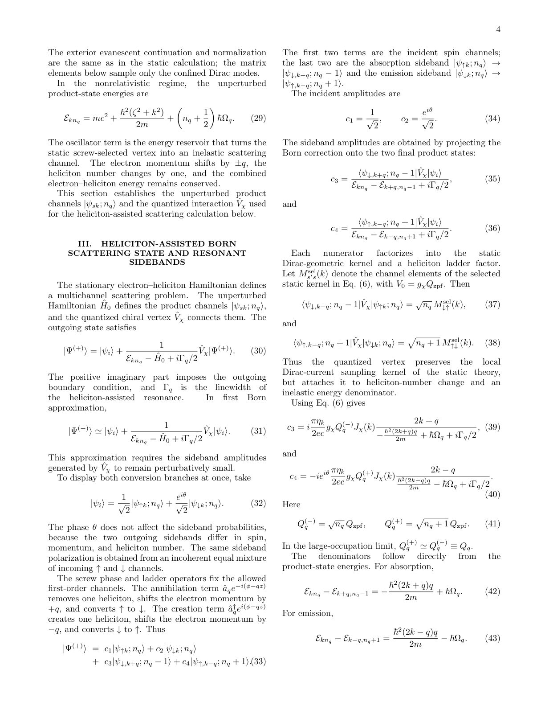
<figcaption class="paper-figure-caption"><b>Fig 3.</b> Low-resolution page preview, page 4</figcaption>
</figure>
<figure class="paper-figure-card">
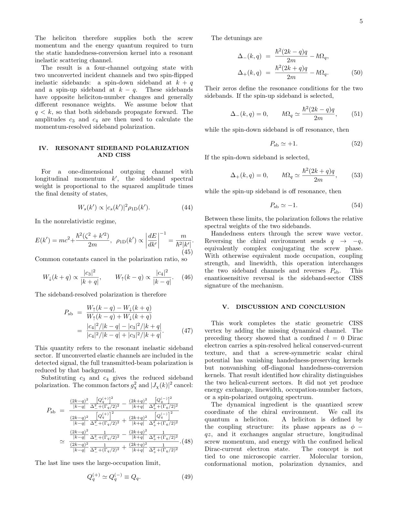
<figcaption class="paper-figure-caption"><b>Fig 4.</b> Low-resolution page preview, page 5</figcaption>
</figure>
<figure class="paper-figure-card">

<figcaption class="paper-figure-caption"><b>Fig 5.</b> Low-resolution page preview, page 6</figcaption>
</figure>

**Summary.** The paper proposes that Chirality-Induced Spin Selectivity (CISS) can be understood as a resonant inelastic scattering process mediated by a quantized environmental excitation called a 'heliciton.' By coupling the electron to this heliciton, the static chiral potential gains access to energy and momentum exchange channels. This mechanism predicts full spin polarization in sidebands when specific resonance conditions are met, providing a robust theoretical framework for spintronics.

**Why it may be interesting.** This work models a quantum transport phenomenon (CISS) using concepts from open quantum systems—specifically, coupling to an environmental bosonic mode (the heliciton)—which is highly relevant for understanding energy-dependent spin filtering in condensed matter.

Detailed structure

**Main problem.** To develop a mechanism for Chirality-Induced Spin Selectivity (CISS) that incorporates energy exchange with the environment, moving beyond static chiral potentials.

**Main result.** The heliciton supplies both the necessary screw momentum and energy to convert the static handedness-conversion into a resonant, spin-selective inelastic scattering channel.

**Method.** First Born scattering theory is used on an electron coupled to a quantized environmental mode (heliciton), analyzing resulting sidebands.

**Model / system.** A confined Dirac electron interacting with a chiral potential ($\hat{V}_\chi$) whose quantization yields a 'heliciton' quantum. The system dynamics are governed by time-dependent and stationary eigenvalue equations involving the heliciton reservoir energy.

**Key observables.** Sideband polarization ($P_{sb}$), which reaches full spin polarization at specific resonance detunings ($\Delta_\pm = 0$).

**Important parameters / regimes.** Helhelicon frequency ($\Omega_q$), momentum transfer ($q$), and the linewidth ($\Gamma_q$) of the resonant sidebands.

**Assumptions / limitations.** The mechanism relies on three ingredients: helical Dirac-current texture, quantized screw-symmetric environmental motion (heliciton), and resonant exchange of energy/momentum. No ad hoc spin-dependent potential is introduced.

**Paper structure.** The paper progresses from identifying the limitation of static potentials to introducing the heliciton quantization, applying first Born scattering theory to derive sideband polarization formulas, and finally confirming that the resonance mechanism provides the necessary spin selectivity signature upon reversing chirality ($q 	o -q$).

Abstract

We develop a quantized chiral-field mechanism for chirality-induced spin selectivity (CISS). The corresponding quantum is a heliciton: a helical mode with phase coordinate $φ-qz$, screw momentum $\hbar q$, and energy $\hbarΩ_q$. A helical electron can absorb or emit this quantum, converting the static chiral vertex developed in our preceding work into an inelastic resonant scattering process. Using first Born scattering theory, we show that an incident two-spin-channel state generates two heliciton-assisted sidebands. Absorption converts the $\uparrow k$ channel into the $\downarrow,k+q$ sideband, while emission converts the $\downarrow k$ channel into the $\uparrow,k-q$ sideband. Thus the heliciton supplies both the screw momentum and energy needed to turn the handedness-conversion into a resonant spin-selective channel.   The two sidebands inherit the same sampled-current overlap $J_χ(k)$ from the static theory, but acquire different kinematic weights and different resonance detunings. The sideband sector reaches full spin polarization at the respective isolated heliciton resonances, with $P_{\rm sb}(k,q)\simeq +1$ for $Δ_-(k,q)=0$ and $P_{\rm sb}(k,q)\simeq -1$ for $Δ_+(k,q)=0$. Reversing the screw handedness, $q\rightarrow -q$, interchanges the two sideband channels and reverses the polarization. No ad hoc spin-dependent potential is introduced. The spin selectivity comes from three ingredients: helical Dirac-current texture, quantized screw-symmetric environmental motion, and resonant exchange of screw momentum and energy. This identifies CISS as a heliciton-assisted resonance mechanism that produces spin polarization in the inelastic sideband sector.

[↑ back to top](#top)

### [Asymmetric Light Scattering from an Atomic System with Gain: A Quantum Analysis](http://arxiv.org/abs/2607.00779v1)

**Authors:** Lorena Acevedo, Manuel Donaire  
**Type:** theory · **Category:** other · **PDF:** <https://arxiv.org/pdf/2607.00779v1>  
**Analysis basis:** full PDF text, analyzed in chunks
**Topic relevance:** `Keldysh / 2PI / non-Gaussian methods` **3/5** · `driven-dissipative phase transition` **3/5** · `methods for driven-dissipative` **3/5** · `correlated / nonlocal dissipation` **2/5** · `non-equilibrium dynamics` **2/5** · `non-equilibrium universality` **2/5** · `Tavis-Cummings & cavity-many-emitter` **1/5** · `interference shaping light` **1/5**

↔ Scroll figures horizontally

<figure class="paper-figure-card">

<figcaption class="paper-figure-caption"><b>Fig 1.</b> Figure 1. Schematics of the system under study, consisting of two identical three- level atoms and two external fields. A pump field of strength Ωp causes the transient excitation of atom A from its ground state g to its upper level u, from which it decays, rapidly and incoherently, to the intermediate level e at a rate γu, causing an effective pump rate P = Ω2 p/γu. Energy intervals and dissipative channels are depicted. Atom B is in its ground state. The two atoms are illuminated by a weak probe field of strength Ω0, polarization transverse to the interatomic axis and momentum k, quasi- resonant with the g ⇄e transition. Incidence is either transverse or alongside the interatomic axis....</figcaption>
</figure>
<figure class="paper-figure-card">

<figcaption class="paper-figure-caption"><b>Fig 2.</b> Figure 2. Diagrammatic representation of scattering processes at leading order. Time runs along the vertical axis from 0 up to the observation time t, both from the top and from the bottom. From the top, the evolution is given by U†(t); from the bottom, it is given by U(t). Solid straight lines represent atomic states, g and e. ’Tilded’ states, ˜g and ˜e, at the initial time stand for the pure states of the mixed state of atom A. Wavy lines stand for virtual photons created and annihilated at the interaction vertices attached to either atom. Dashed arrows represent photons of the external field which are annihilated at interaction vertices attached to either atom. Each vertex represents an...</figcaption>
</figure>
<figure class="paper-figure-card">

<figcaption class="paper-figure-caption"><b>Fig 3.</b> Figure 3. Angular distribution of the scattered power for frontal incidence W⊥(θ) and different pump rates, P = (0.5, 2, 20)γ0. The interatomic distance is taken at kR = 2, the non-radiative linewidth is γnr = 0.2γ0, and the detuning is fixed at values ω −ω0 = −0.4γ0 (left panel) and ω −ω0 = 0.4γ0 (right panel).</figcaption>
</figure>
<figure class="paper-figure-card">
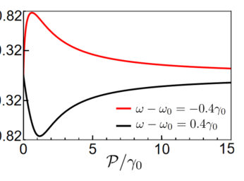
<figcaption class="paper-figure-caption"><b>Fig 4.</b> Figure 4. Graphical representation of the log of the ratio of the scattered power towards the active atom and towards the passive one for frontal incidence, log10 [W⊥(0)/W⊥(π)], for fixed interatomic distance kR = 2, and non-radiative linewidth γnr = 0.2γ0. Left panel: In terms of the detuning ω −ω0, with several pump rates, P = (0.5, 2, 4, 8)γ0. Right panel: In terms of the pump rate P, with detuning ω −ω0 = 0.4γ0 (black line) and ω −ω0 = −0.4γ0 (red line).</figcaption>
</figure>
<figure class="paper-figure-card">
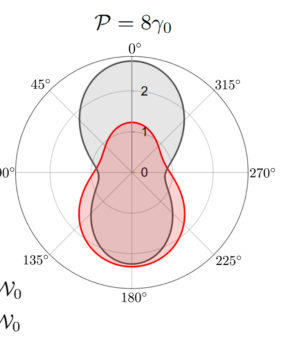
<figcaption class="paper-figure-caption"><b>Fig 5.</b> Figure 5. Angular distribution of the scattered power for side lighting, G in red, L in grey, and two different pump rates, P = 2γ0 (left panel), P = 8γ0 (right panel). The interatomic distance is taken at kR = 2, the non-radiative linewidth is γnr = 0.2γ0, and the detuning is fixed at the negative value ω −ω0 = −0.4γ0.</figcaption>
</figure>

**Summary.** The paper provides a rigorous quantum analysis of asymmetric light scattering from two interacting atoms with built-in gain. It demonstrates that the system exhibits non-reciprocal behavior, meaning the scattered power depends on whether the incident light approaches from the 'gain' or 'loss' side. This quantum finding directly contradicts predictions made by classical linear response theories.

**Why it may be interesting.** This work is highly relevant to AMO physics and quantum optics as it explores non-linear, non-reciprocal light scattering phenomena in open quantum systems driven by gain/loss mechanisms. The conflict between quantum and classical predictions highlights fundamental limitations of semiclassical approximations.

Detailed structure

**Main problem.** The study investigates the directionality (asymmetry) of light scattering from a binary atomic system that incorporates gain, comparing quantum predictions against classical linear response theories.

**Main result.** The fully quantum analysis reveals a lack of reciprocity in the optical response for side lighting, showing an asymmetry dependent on the incidence side and detuning, which contradicts classical expectations.

**Method.** The authors employ a time-dependent perturbation theory within the wavefunction formalism, calculating scattering power using diagrammatic expansions (e.g., Dyson series) to account for quantum interference effects.

**Model / system.** The system is a binary dimer of identical atoms, where one atom is incoherently pumped (creating gain/loss mechanisms) and interacts with incident and scattered photons via the dipole coupling Hamiltonian.

**Key observables.** Differential scattering power ($W_{sc}(	heta)$), forward vs. backward scattered power ratios ($rac{W_{fw}^G}{W_{fw}^L}$), and angular distribution asymmetry.

**Important parameters / regimes.** Pump rate, detuning of the probe field ($\omega - \omega_0$), interatomic distance ($R$), and the ratio of gain/loss coupling strengths.

**Assumptions / limitations.** Approximations include assuming the dipole moment lies perpendicular to the interatomic axis, using steady-state limits ($\gamma t \gg 1$), and distinguishing between single-atom and collective (both-atoms) scattering processes.

**Figures summary.** Figures illustrate angular distributions of scattered power for frontal vs. side illumination, showing ratios of forward/backward powers as functions of detuning and pump rate, comparing quantum results to classical predictions.

**Paper structure.** The paper systematically derives expressions for differential scattering power ($W$) in different geometries (frontal $\perp$, side $G$, side $L$), contrasting the quantum calculation (using diagrams) with the classical linear response theory prediction at each stage.

Abstract

We study the the scattering of light by a binary system of identical atoms in which one of them is incoherently pumped. This system belongs to the kind of non-parity symmetric optical systems in which gains and losses are partially compensated. We carry out a fully quantum analysis of the directionality of the radiation scattered from the atoms when the incident light strikes the system either perpendicular or alongside the interatomic axis. We find that, generally, while the degree of asymmetry depends on the pump rate, the preferred direction for emission depends on the interatomic distance and the detuning of the probe field with respect to the resonant frequency. On physical grounds, for the case of frontal illumination, the asymmetry is the result of the interference of the photons emitted from different atoms. On the contrary, for side lighting, the asymmetry with respect to the side of incidence is caused by both the phase difference between the probe field photons that strike each atom and the interference between the photons emitted from different atoms. Further, for side lighting too, our quantum approach demonstrates that the forward scattered power depends on the side of incidence, which reveals the lack of reciprocity in the quantum optical response of the system. This result conflicts with what is obtained within a classical approach.

[↑ back to top](#top)

### [Confinement in a magnetically induced WSe$_2$ quantum dots](http://arxiv.org/abs/2607.01192v1)

**Authors:** Rachid El Aitouni, Mohammed El Azar, Clarence Cortes, David Laroze, Ahmed Jellal  
**Type:** theory · **Category:** other · **PDF:** <https://arxiv.org/pdf/2607.01192v1>  
**Analysis basis:** full PDF text, analyzed in chunks
**Topic relevance:** `Keldysh / 2PI / non-Gaussian methods` **3/5** · `spintronics-quantum-optics interface` **3/5** · `driven-dissipative phase transition` **2/5** · `methods for driven-dissipative` **2/5** · `non-equilibrium dynamics` **2/5** · `Kondo & dissipative impurity` **1/5** · `analog quantum simulation` **1/5** · `exotic spin models in light-matter` **1/5** · `non-equilibrium universality` **1/5**

↔ Scroll figures horizontally

<figure class="paper-figure-card">

<figcaption class="paper-figure-caption"><b>Fig 1.</b> FIG. 1. Schematic of a monolayer WSe2 sheet lying in the xy- plane, subjected to a perpendicular magnetic field ⃗B = Bˆz confined to a circular region of radius R. The field is uniform inside the dot (r &lt; R) and vanishes outside (r &gt; R) in the symmetric gauge. Incident Dirac waves Ψinc q propagate along the x-direction, penetrate the magnetic boundary, and form standing waves Ψins k inside the dot, while reflected waves Ψref q scatter outward. The inset coordinate system shows the layer orientation with ˆz normal to the WSe2 plane.</figcaption>
</figure>
<figure class="paper-figure-card">

<figcaption class="paper-figure-caption"><b>Fig 2.</b> FIG. 2. (Color online) The scattering efficiency Q as a function of the magnetic field B for different values E (0.8, 1, 2 eV), for R = 50 nm with intrinsic values λc = 75 meV, λv = 112, 5 meV, ∆= 0.85 eV.</figcaption>
</figure>
<figure class="paper-figure-card">

<figcaption class="paper-figure-caption"><b>Fig 3.</b> FIG. 3. (Color online) The scattering efficiency Q as a function of the radius for three values of magnetic field (B = 1, 5, 10 T), with E = 1 eV.</figcaption>
</figure>
<figure class="paper-figure-card">
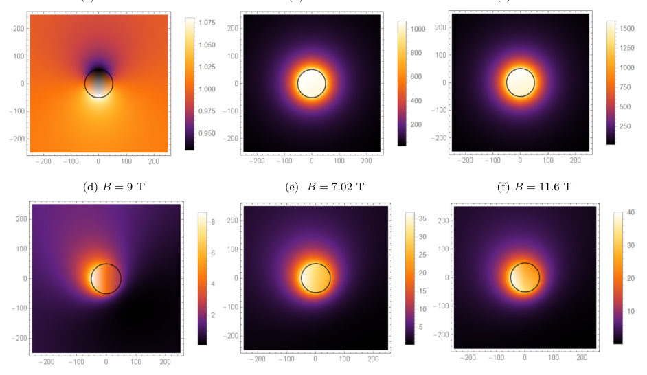
<figcaption class="paper-figure-caption"><b>Fig 4.</b> FIG. 4. Density as a function of x and y for two energies: E = 0.8 eV (top row) and E = 1 eV (bottom row). The top row corresponds to magnetic fields B = 1 T, B = 5.9 T, and B = 9.26 T, while the bottom row corresponds to B = 9, B = 7.02 T, and B = 11.6 T. These configurations illustrate the resonance intensities presented in Fig. 2.</figcaption>
</figure>

**Summary.** This paper theoretically models the confinement of Dirac fermions in WSe2 quantum dots subjected to localized magnetic fields. By solving the effective Dirac Hamiltonian, the authors show that the magnetic field efficiently suppresses Klein tunneling inherent to graphene. The results demonstrate that this setup allows for strong, tunable carrier localization and resonant transport crucial for next-generation spintronic and valleytronic devices.

**Why it may be interesting.** This work provides a detailed theoretical framework for controlling electron transport using magnetic fields in 2D semiconductors, which is highly relevant to understanding engineered quantum potentials and open quantum systems dynamics.

Detailed structure

**Main problem.** The study theoretically investigates how localized magnetic fields confine massive Dirac fermions within a WSe2 quantum dot structure.

**Main result.** The localized magnetic field effectively suppresses Klein tunneling and promotes the formation of stable, tunable quasibound states in WSe2, establishing a basis for spin-valleytronic devices.

**Method.** The authors derived exact wave functions and scattering coefficients by solving the effective Dirac Hamiltonian using Kummer's confluent hypergeometric functions and Bessel/Hankel functions.

**Model / system.** The system is monolayer tungsten diselenide (WSe2), modeled as a quantum dot subjected to an intrinsic band gap, strong spin-orbit coupling, and a localized perpendicular magnetic field. The Hamiltonian incorporates these features into the effective Dirac equation.

**Key observables.** Scattering efficiency ($Q$), carrier density distributions ($
ho(x, y)$), and resonance peak locations.

**Important parameters / regimes.** Incident energy (E), magnetic field strength (B), and quantum dot radius (R).

**Assumptions / limitations.** The analysis assumes the use of an effective Dirac Hamiltonian and accounts for discontinuities in the magnetic vector potential at the boundary.

**Figures summary.** Figures illustrate scattering efficiency ($Q_{total}$) dependence on B, R, and E, alongside spatial density maps ($
ho(x, y)$) showing carrier localization patterns.

**Paper structure.** The paper progresses by establishing the physical model (WSe2 advantages over graphene), deriving the analytical solutions for wave functions in two regions, calculating scattering coefficients via boundary matching, and finally analyzing how varying B, R, and E tunes confinement and resonance.

Abstract

Monolayer tungsten diselenide (WSe$_2$) has become a suitable platform for quantum transport and spintronics and valleytronics applications because it possesses an intrinsic band gap and strong spin-orbit coupling and spin-valley coupling features. The electrostatic confinement of Dirac fermions proves challenging in graphene because of Klein tunneling, yet WSe$_2$ provides an environment that supports both carrier localization and the development of confined quantum states. In this work, we theoretically investigate the confinement of massive Dirac fermions in a WSe$_2$ quantum dot generated by a localized magnetic field. Using the effective Dirac Hamiltonian in the presence of a magnetic flux, we derive the exact wave functions and scattering coefficients by employing Kummer's confluent hypergeometric functions together with Bessel and Hankel functions. Our results show that the localized magnetic field provides an efficient mechanism to suppress Klein tunneling and promote the formation of stable quasibound states. We systematically examine the scattering efficiency and carrier density distributions as functions of the incident energy, magnetic field strength, and quantum dot radius. We find that low-energy carriers are strongly confined by the magnetic barrier, while the interplay between magnetic localization and geometric confinement gives rise to sharp and tunable resonance peaks. These results provide valuable insight into the control of spin-valley transport in transition metal dichalcogenide nanostructures and establish a theoretical basis for the development of quantum confinement devices and quantum information technologies.

[↑ back to top](#top)

### [When AI meets quantum information: A comprehensive review](http://arxiv.org/abs/2607.00365v1)

**Authors:** Min Chen, Yu Gan, Xin Jin, Yuqing Li, Junqi Wang, Zeguan Wu, Yunfei Wang, Bingzhi Zhang, Priyam Srivastava, Tianlong Chen, Ankit Kulshrestha, Yuan Liu, Juan José Mendoza-Arenas, Kaushik P. Seshadreesan, Sarvagya Upadhyay, Xueyue Zhang, Quntao Zhuang, Junyu Liu  
**Type:** theory · **Category:** other · **PDF:** <https://arxiv.org/pdf/2607.00365v1>  
**Analysis basis:** full PDF text, analyzed in chunks
**Topic relevance:** `quantum measurements` **3/5** · `entanglement & information structure` **2/5** · `measurement-induced transitions` **2/5** · `Keldysh / 2PI / non-Gaussian methods` **1/5** · `analog quantum simulation` **1/5** · `correlated / nonlocal dissipation` **1/5** · `driven-dissipative phase transition` **1/5** · `methods for driven-dissipative` **1/5** · `non-equilibrium dynamics` **1/5** · `non-equilibrium universality` **1/5**

↔ Scroll figures horizontally

<figure class="paper-figure-card">

<figcaption class="paper-figure-caption"><b>Fig 1.</b> FIG. 2. Schematic loss trajectories in two QNTK regimes. Right: in the frozen-kernel regime, the QNTK remains ap- proximately constant during early training, so the loss follows the smooth decay predicted by the linearized tangent-kernel dynamics. Left: when the kernel evolves with the parameters, the training trajectory departs from the frozen-kernel picture; this weakly nonlinear regime enables representation learning and can no longer be captured by a fixed-kernel approxima- tion alone.</figcaption>
</figure>
<figure class="paper-figure-card">
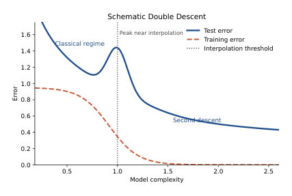
<figcaption class="paper-figure-caption"><b>Fig 2.</b> FIG. 1. Schematic illustration of double descent in a kernel- learning setting. As model complexity approaches the inter- polation threshold, the test error can peak before decreasing again in a deeper interpolating regime.</figcaption>
</figure>
<figure class="paper-figure-card">
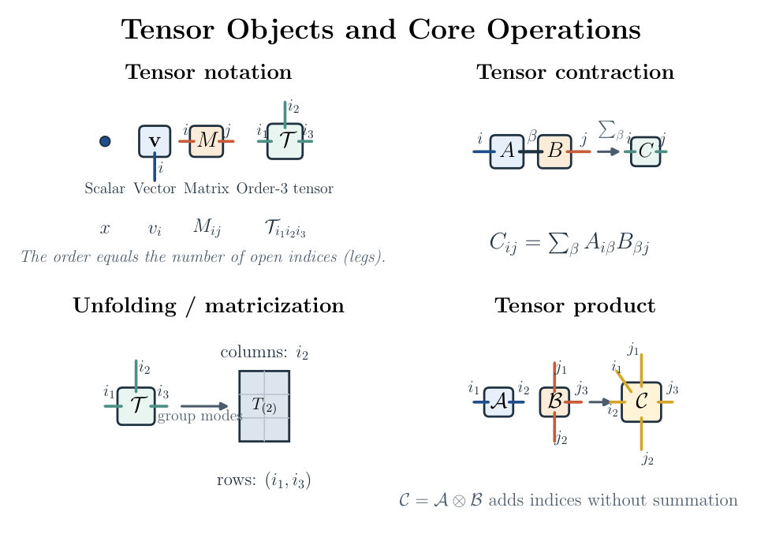
<figcaption class="paper-figure-caption"><b>Fig 3.</b> FIG. 3. Schematic overview of tensor notation and basic multilinear operations. Top left: scalars, vectors, matrices, and higher- order tensors are distinguished by the number of open indices (legs). Top right: tensor contraction sums over a shared index, generalizing matrix multiplication. Bottom left: unfolding or matricization groups tensor modes into a matrix so that standard linear algebra tools such as SVD can be applied. Bottom right: the tensor product combines two tensors by concatenating their index sets without summing over any shared mode.</figcaption>
</figure>
<figure class="paper-figure-card">
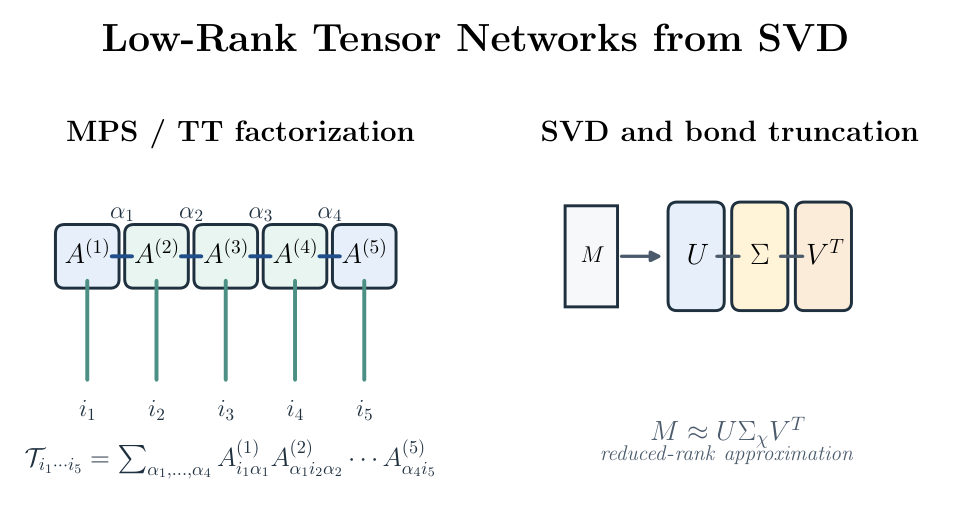
<figcaption class="paper-figure-caption"><b>Fig 4.</b> FIG. 4. Two core ideas behind tensor-network representations. Left: an order-n tensor can be factorized into a chain of low-order cores in an MPS or TT decomposition, where the physical indices remain open and the virtual bonds αk transmit correlations between neighboring cores. Right: SVD exposes the singular spectrum across a bipartition, and keeping only the largest χ singular values yields a low-rank approximation that sets the effective bond dimension and compresses the representation.</figcaption>
</figure>

**Summary.** This review surveys the symbiotic relationship between Artificial Intelligence and Quantum Information. It details how AI can be used to control and optimize quantum hardware, while simultaneously exploring how quantum principles (like entanglement or tensor structures) can enhance classical machine learning models. The paper concludes that true progress requires deep integration across theory, experiment, and hybrid systems.

**Why it may be interesting.** It provides a high-level roadmap connecting quantum computation theory with modern machine learning paradigms, which is crucial for understanding future computational capabilities.

Detailed structure

**Main problem.** The paper reviews the rapidly co-evolving interface between Artificial Intelligence (AI) and Quantum Information (QI), focusing on how each field can advance the other.

**Main result.** Progress requires a tighter integration of theory, experiment, and hybrid quantum-classical systems to overcome challenges in reproducibility and hardware realism.

**Method.** The review organizes progress into two directions: AI for QI (e.g., optimizing quantum algorithms) and QI for AI (e.g., using quantum structures for neural network design).

**Model / system.** The core models involve quantum systems described by density operators ($
ho$) on a Hilbert space, analyzed through measurements (POVMs) and expectation values.

**Key observables.** Reduced density operators ($
ho_A$), expectation values $\langle O 
angle_
ho$, and measurement probabilities $p_
ho(s)$.

**Important parameters / regimes.** The complexity of the system size ($n$) and the noise/measurement limitations are central constraints.

**Assumptions / limitations.** Progress relies on mapping quantum information problems onto classical learning frameworks, which is helpful but limited by physical measurement constraints.

**Paper structure.** The paper provides a comprehensive survey structured around the two-way street between AI and QI, detailing specific tasks in both directions (e.g., algorithm discovery, noise control, expressivity).

Abstract

Artificial intelligence (AI) and quantum information (QI) are rapidly co-evolving. AI is becoming a practical tool for learning, designing, controlling, and verifying quantum systems, while QI offers new computational models, representational structures, and learning-theoretic questions for AI. This survey reviews the interface from both directions. In the AI for QI direction, we organize recent progress around the central tasks of extracting information from limited measurements, training and discovering quantum algorithms, stabilizing noisy hardware, automating experimental and programming workflows, and extending learning-based methods to sensing and networking. In the QI for AI direction, we examine how quantum computation and quantum-inspired structures affect learning through algorithmic speedups, expressivity, trainability, generalization, neural-network design, and tensor-network representations. We close by identifying cross-cutting challenges in reproducibility, scalability, hardware realism, and co-design, arguing that progress will depend on tighter integration of theory, experiment, and hybrid quantum--classical systems.

[↑ back to top](#top)

### [Bias-Preserving Gates and Quantum Error Correction With Dual-Rail Cat Codes](http://arxiv.org/abs/2607.00786v1)

**Authors:** Debjyoti Biswas, Nikhil Sharma, Alberto Salvador, Rui Wang, Mats Granath, Adithi Udupa, Giulia Ferrini  
**Type:** theory · **Category:** quantum information and computing · **PDF:** <https://arxiv.org/pdf/2607.00786v1>  
**Analysis basis:** full PDF text, analyzed in chunks
**Topic relevance:** `correlated cavity matter` **3/5** · `correlated / nonlocal dissipation` **2/5** · `methods for driven-dissipative` **2/5** · `Keldysh / 2PI / non-Gaussian methods` **1/5** · `Tavis-Cummings & cavity-many-emitter` **1/5** · `analog quantum simulation` **1/5** · `driven-dissipative phase transition` **1/5** · `entanglement & information structure` **1/5** · `non-equilibrium dynamics` **1/5**

↔ Scroll figures horizontally

<figure class="paper-figure-card">
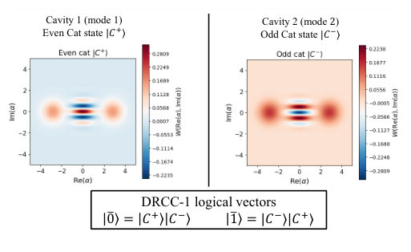
<figcaption class="paper-figure-caption"><b>Fig 1.</b> FIG. 1: Wigner function of the even and odd cat states yielding the dual-rail cat code with N = 1 (DRCC-1). The logical basis states are |¯0⟩= |C+⟩|C−⟩(Eq.(10)) and |¯1⟩= |C−⟩|C+⟩(Eq.(11)).</figcaption>
</figure>
<figure class="paper-figure-card">

<figcaption class="paper-figure-caption"><b>Fig 2.</b> FIG. 2: For DRCC-1 (upper panel), any single-photon loss or gain, as well as arbitrary higher-order photon-loss errors ˆam i or photon-gain errors ˆa†m i on a single mode (m ≥2), either map the logical states to the even-parity leakage subspace or leave them within the odd-parity code space. For the conventional dual-rail code (lower panel), while single-photon loss or gain on either mode map the logical states to the even-parity leakage states {|00⟩, |11⟩, |02⟩, |20⟩} (detectable as erasures), higher-order photon gain processes ˆa†m i (m ≥2) can also populate other odd-parity states, such as {|12⟩, |21⟩}, leading to false-positive syndrome outcomes [20].</figcaption>
</figure>
<figure class="paper-figure-card">

<figcaption class="paper-figure-caption"><b>Fig 3.</b> FIG. 3: Schematics for syndrome measurement and error correction with two-qubit repetition code with DRCC-1. For the syndrome measurement, we use a two-level system as an auxiliary qubit. Note that the JPC operation does not introduce entanglement between the auxiliary two-level system and the DRCC-1.</figcaption>
</figure>
<figure class="paper-figure-card">

<figcaption class="paper-figure-caption"><b>Fig 4.</b> FIG. 4: Syndrome measurement scheme with the three-qubit repetition code with an inner DRCC-1.</figcaption>
</figure>
<figure class="paper-figure-card">

<figcaption class="paper-figure-caption"><b>Fig 5.</b> Fig. 5 shows the dependence of plogical on α and the noise strength.</figcaption>
</figure>

**Summary.** The paper introduces and rigorously analyzes the Dual-Rail Cat Code (DRCC), a novel concatenated bosonic code designed for fault-tolerant quantum computing. It demonstrates that DRCC inherits advantages from both dual-rail and cat codes to achieve bias-preserving logical gates and deterministic correction against photon loss. The methodology involves advanced techniques in open quantum systems, making it a significant theoretical contribution to photonic quantum information.

**Why it may be interesting.** This work is highly relevant for AMO physicists working on cavity QED or quantum optics because it provides a detailed theoretical framework for implementing robust quantum computation using bosonic modes (photons/cavity fields) as the physical substrate, directly addressing noise mitigation in superconducting or optical setups.

Detailed structure

**Main problem.** Developing fault-tolerant quantum computation protocols that can simultaneously support universal logical operations, suppress hardware noise, and efficiently handle photon-loss errors.

**Main result.** The proposed Dual-Rail Cat Code (DRCC) offers a highly promising bosonic encoding for FTQC due to its deterministic erasure detection, absence of relative geometric phases during gates, and inherent bias preservation.

**Method.** The authors analyze the error-correction properties using the Knill–Laflamme condition and construct logical gates by projecting engineered Hamiltonians onto the code subspace via continuous dissipation.

**Model / system.** The system utilizes bosonic encodings, specifically the concatenated Dual-Rail Cat Code (DRCC), which combines an inner cat code with an outer dual-rail structure. The analysis involves modeling photon loss and dephasing noise using Lindblad master equations.

**Key observables.** Logical error rates ($\hat{X}, \hat{Z}$ errors), relative geometric phases, success probability of correction protocols, and the satisfaction of the Knill–Laflamme condition.

**Important parameters / regimes.** Photon loss strength ($\kappa$), dephasing strength ($\gamma$), cat state amplitude parameter ($\alpha$), and the order of concatenation (e.g., two-qubit or three-qubit repetition code).

**Assumptions / limitations.** The analysis often relies on approximations such as the small-$\alpha$ limit for certain error detection capabilities, and assumes specific dissipation mechanisms can stabilize the desired code manifold.

**Figures summary.** Figures illustrate Wigner functions of cat states, comparisons between different noise models, and schematics detailing multi-step Quantum Error Correction (QEC) protocols using joint parity checks.

**Paper structure.** The paper systematically introduces the DRCC structure, analyzes its error correction under various noise channels (photon loss/dephasing), details the construction of universal logical gates via engineered dissipation, and finally proposes concatenated QEC protocols to achieve high-order fault tolerance.

Abstract

Scalable fault-tolerant quantum computation requires quantum error-correcting codes that simultaneously support universal logical operations, suppress hardware-specific noise, and enable efficient handling of photon-loss errors. Bosonic encodings such as the dual-rail and cat codes each offer attractive features but also exhibit important limitations when used in isolation. The dual-rail code enables efficient single-photon-loss detection by converting leakage out of the computational subspace induced by photon-loss errors into an erasure error. In contrast, the cat code provides a resource-efficient, bias-tailored error-correction scheme with bias-preserving logical gate operations. Here, we introduce the dual-rail cat code (DRCC), a concatenated bosonic encoding that combines an inner cat code with an outer dual-rail structure, thereby inheriting and enhancing the advantages of both constituent codes. We analyse the error-correction properties of the DRCC and propose a deterministic single-photon-loss correction protocol by concatenating it with an outer repetition code. Exploiting the code's intrinsic noise bias, we construct a universal set of logical gates using only beam-splitter interactions and demonstrate that all logical operations preserve the erasure-biased noise structure. The DRCC offers several distinctive advantages, including the absence of relative geometric phases during gate operations, deterministic erasure detection and correction, and simultaneous syndrome extraction without interrupting stabilisation. These features make the DRCC a promising bosonic code for hardware-efficient, bias-preserving, and erasure-resilient fault-tolerant quantum computation.

[↑ back to top](#top)

### [Leakage Mobility and Passive Leakage Removal in Transmons with Tunable Couplers](http://arxiv.org/abs/2607.00688v1)

**Authors:** Taneli Tolppanen, Gonzalo Martín-Vázquez, Sasu Tuohino, Matti Silveri  
**Type:** theory · **Category:** quantum information and computing · **PDF:** <https://arxiv.org/pdf/2607.00688v1>  
**Analysis basis:** full PDF text, analyzed in chunks
**Topic relevance:** `correlated / nonlocal dissipation` **3/5** · `methods for driven-dissipative` **3/5** · `QC/QI experiment` **2/5** · `driven-dissipative phase transition` **2/5** · `Keldysh / 2PI / non-Gaussian methods` **1/5** · `non-equilibrium dynamics` **1/5** · `non-equilibrium universality` **1/5**

↔ Scroll figures horizontally

<figure class="paper-figure-card">

<figcaption class="paper-figure-caption"><b>Fig 1.</b> FIG. 1. Schematics of the coupled transmon systems: Two transmons and one coupler (a)-(c), and an array of coupled transmons (d)-(f). (a), (d) Connectivity map showing the coupling configurations between the transmons Qj and the mediating tunable couplers Cj. (b), (e) Anharmonic multi- level frequency spectra for the transmons and couplers. The green dashed lines indicate the reference frequencies used to define the localized detunings, given by ∆jc = ωj −ωc &gt; 0 for j = 1, 2 in panel (b), and ∆c = ω2 −ωcj &gt; 0 for j = 1, 2 alongside ∆q = ω2 −ωj for j = 1, 3 in panel (e). (c), (f) Con- ceptual illustration on the dynamics of leakage excitations (red circles) between the edge transmons (blue...</figcaption>
</figure>
<figure class="paper-figure-card">

<figcaption class="paper-figure-caption"><b>Fig 2.</b> FIG. 2. (a) Coupler detunings ∆1c = ω1 −ωc where the excitation exchange geff or the ZZ interaction is eliminated, geff = 0 and ζ = 0 as a function of the two transmon detuning ∆12 = ω1 −ω2. (b) Effective coupling strengths for different coupler detuning ∆1c: excitation exchange geff for |10⟩↔|01⟩, leakage exchange J20 for |20⟩↔|02⟩and J21 for |21⟩↔|12⟩, and ZZ coupling ζ. (c) Effective leakage tunneling strengths J201 for |201⟩↔|102⟩and J211 for |211⟩↔|112⟩, when the two edge transmons are detuned from the middle transmon by ∆q and the couplers are tuned so that ζ = 0. In panel (a) the second transmon is tuned to ω2/2π = 4000 MHz, in panel (b) the two transmons are resonant ω1/2π = ω2/2π =...</figcaption>
</figure>
<figure class="paper-figure-card">
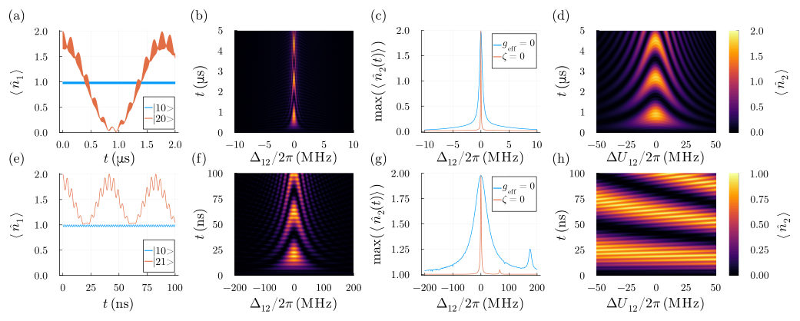
<figcaption class="paper-figure-caption"><b>Fig 3.</b> FIG. 3. (a), (e) Leakage time dynamics for two resonant transmons when the coupler is tuned so that geff = 0. (b), (f) Sensitivity of the leakage transfer to the frequency detuning between the first and second transmons. (c), (g) Maximum leakage transfer between the two transmons while the coupler is tuned so that geff = 0 or ζ = 0. (d), (h) Sensitivity of the leakage transfer to differences in anharmonicity between the transmons while the relevant transition is kept on-resonance. In the top row the initial state is |ψ0⟩= |20⟩and in the bottom row |ψ0⟩= |21⟩. We assume the transmons have identical anharmonicities, so that the detuning of the second transmon in (b) and (f) directly...</figcaption>
</figure>
<figure class="paper-figure-card">

<figcaption class="paper-figure-caption"><b>Fig 4.</b> Figure 3(e)-(h) depicts the dynamics for the setup of a leakage excitation in the first transmon and a single excitation in the second transmon. Again here we assume that the condition geff = 0. The effective |21⟩↔|12⟩ dynamics [case iii) in Fig. 1(c)] occurs now at second order involving two coupler-mediated hoppings ∼λgjc and a single direct transmon-transmon hopping g12. This leads to much faster dynamics, where the leakage propagates between the transmons in 20 ns, see Fig. 3(e). Due to the stronger effective coupling [Fig. 2(b)], the system is less sensitive to the transmon detuning ∆12, as the hopping J21 ∼λgc is more robust against variations in the energy</figcaption>
</figure>
<figure class="paper-figure-card">
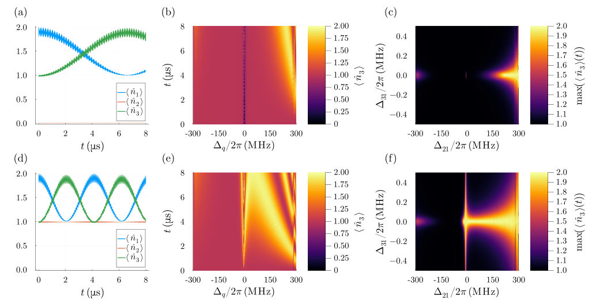
<figcaption class="paper-figure-caption"><b>Fig 5.</b> FIG. 4. Leakage tunneling in a chain of three transmons, where the edge transmons are resonant and the middle transmon is detuned by ∆q = ω2 −ω1 = ω2 −ω3. The couplers are tuned so that ζ = 0. In (a)-(c) the initial state is |ψ0⟩= |201⟩. In (d)-(f) the initial state is |ψ0⟩= |211⟩. (a), (d) Time evolution of leakage excitation. (b), (e) Time evolution of leakage excitation for different detunings ∆q. (c), (f) Sensitivity of the tunneling to the off-resonance of the edge transmons ∆31 = ω3 −ω1. For the anharmonicities, transmon-transmon coupling and transmon-coupler coupling we use same parameters as in Fig. 2. The middle transmon is kept at ω2/2π = 4000 MHz and the couplers tuned so that ζ...</figcaption>
</figure>

**Summary.** The paper investigates qubit leakage as a major error source in transmons, developing quantitative tools to characterize leakage mobility. By applying advanced perturbative techniques, it proposes and analyzes two passive hardware schemes—one coupler-based and one readout-based—to actively suppress or remove these detrimental leakage excitations.

**Why it may be interesting.** This work provides detailed theoretical blueprints for mitigating decoherence sources specific to superconducting qubits by engineering the energy landscape to suppress unwanted leakage pathways.

Detailed structure

**Main problem.** Qubit leakage is a significant error source in quantum processors, necessitating methods to characterize its dynamics and implement passive removal units.

**Main result.** The authors propose two passive leakage removal units—one using a tunable coupler and pumped transmon, and another based on junction readout—that can selectively mobilize or localize excitations with realistic decay times.

**Method.** The study employs numerical and analytical methods, utilizing Schrieffer-Wolff perturbation theory to derive effective Hamiltonians for leakage dynamics in the dispersive regime.

**Model / system.** The system models superconducting transmons coupled via tunable couplers, analyzed across two-, three-, and extended transmon arrays. The Hamiltonian includes anharmonicity terms and various coupling interactions.

**Key observables.** Leakage hopping rates (0.8–10 MHz), effective hopping strengths ($g_{	ext{eff}}$), leakage decay times ($T_\star$), and qubit population dynamics.

**Important parameters / regimes.** Frequency detuning ($\Delta_{jc}$), anharmonicity ($U$), coupling strengths ($g_c, g_q$), and the ratio $\lambda = |g_{jc}/\Delta_{jc}|$.

**Assumptions / limitations.** The analysis is primarily restricted to the dispersive regime where couplings are weak relative to detunings; higher-order terms are treated perturbatively.

**Figures summary.** Figures illustrate schematics of coupled systems, resonance conditions for leakage tunneling (e.g., $|201
angle \leftrightarrow |102
angle$), and time evolution plots comparing different passive leakage removal schemes.

**Paper structure.** The paper systematically analyzes the Hamiltonian, derives effective Hamiltonians using perturbation theory for various excitation transitions, identifies zero-coupling conditions via detuning control, and finally proposes and simulates two distinct passive leakage removal units.

Abstract

Qubit leakage is a noticeable source of errors for quantum computing. In quantum processors, leakage excitations traveling between qubits generate correlated errors and perturb gate implementations. Leakage mobility can also be utilized for creating dedicated leakage removal pathways and removal units. To quantitatively characterize leakage mobility and to guide better design of processor architectures, we study here leakage dynamics in transmons with tunable couplers through numerical and analytical methods. Even if the couplers are tuned to cancel the single-excitation exchange or the ZZ interaction, the leakage hopping rates still persists in the range of 0.8-10 MHz due to transmon nonlinearity. In typical operation regimes, however, transmon frequency detuning localizes leakage excitations. The next-nearest-neighbor transmons can be still be near-resonant opening leakage tunneling channels. To suppress longer-range hopping, we find that the frequency spread of the next-nearest-neighbor transmons needs to be in the range of 1-4 MHz. Utilizing leakage mobility, we propose two passive leakage removal units. One is based on a tunable coupler and a pumped transmon, and another on a junction readout scheme. Based on realistic experimental parameters, our results on selectively mobilizing or localizing leakage excitations are readily applicable in superconducting quantum devices.

[↑ back to top](#top)

### [Fisher Glasses: Tail-Certified Quantum Metrology in Quenched Environments](http://arxiv.org/abs/2607.01085v1)

**Authors:** El Mustapha Mansouri, Keigo Arai  
**Type:** theory · **Category:** disordered systems and neural networks · **PDF:** <https://arxiv.org/pdf/2607.01085v1>  
**Analysis basis:** full PDF text, analyzed in chunks
**Topic relevance:** `non-equilibrium dynamics` **3/5** · `non-equilibrium universality` **2/5** · `quantum measurements` **2/5** · `Keldysh / 2PI / non-Gaussian methods` **1/5** · `correlated / nonlocal dissipation` **1/5** · `driven-dissipative phase transition` **1/5** · `entanglement & information structure` **1/5** · `methods for driven-dissipative` **1/5**

↔ Scroll figures horizontally

<figure class="paper-figure-card">

<figcaption class="paper-figure-caption"><b>Fig 1.</b> FIG. 1. Quenched Fisher geometry: a visual abstract. (a) The averaged-channel paradigm certifies one geometry, E[J] → average QFI, whereas the quenched, non-self-averaging experiment samples a distribution of session-resolved geometries J(ξ), each fed through the noncommuting pipeline J →Fθ|µ →ℓ→CVaRα of Eq. (1), so rare near-null sessions (F⊥≈0) hidden by the average dominate the loss. (b) The certified resource is the response transverse to the latent nuisance, Fθ|µ = Jθθ sin2 ψ; for a vector target the obstruction is measurement incompatibility, quantified by the Holevo loss of Sec. V. (c) Two latent ensembles with the same mean E[F] = 1 but different inverse-loss tails, one integrable...</figcaption>
</figure>
<figure class="paper-figure-card">
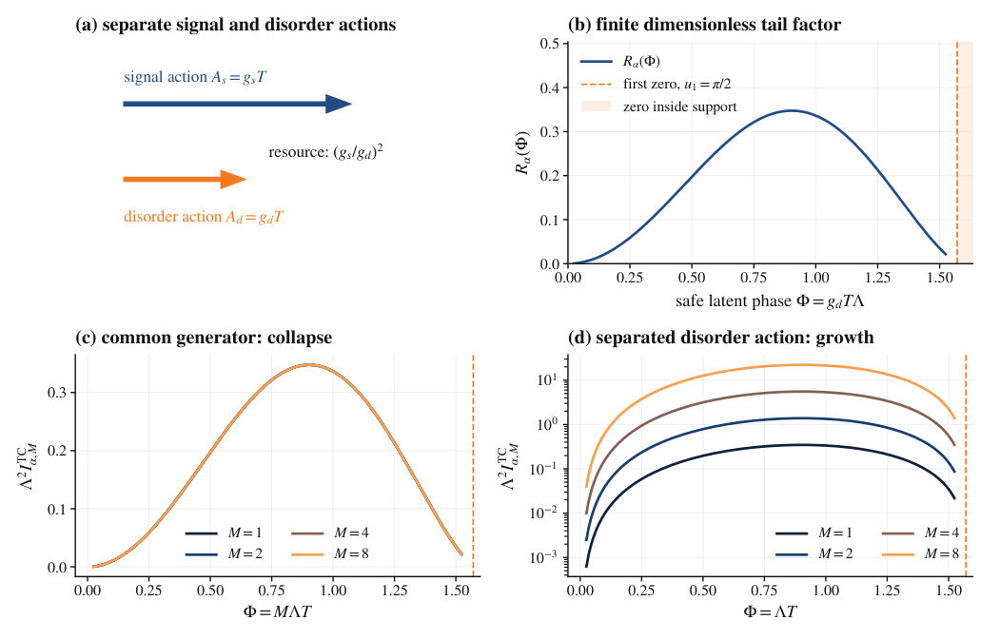
<figcaption class="paper-figure-caption"><b>Fig 2.</b> FIG. 2. Signal–disorder action separation. Tail-certified amplification is controlled by the ratio of transverse signal action to disorder action. (a) A protocol writes signal and latent disorder into the probe with generally different action gains gs and gd; the fixed-safe-phase resource is (gs/gd)2, which becomes (g⊥/gd)2 after nuisance projection. (b) Dimensionless tail factor Rα(Φ), with Φ the dimensionless safe latent phase, for a two-state Loschmidt response, with first zero at u1 = π/2; the certified information vanishes once the latent support reaches the zero. (c) Common-generator amplification, gs = gd = M and Φ = MΛT, collapses Λ2ITC α,M for different M. (d) Separated disorder...</figcaption>
</figure>
<figure class="paper-figure-card">
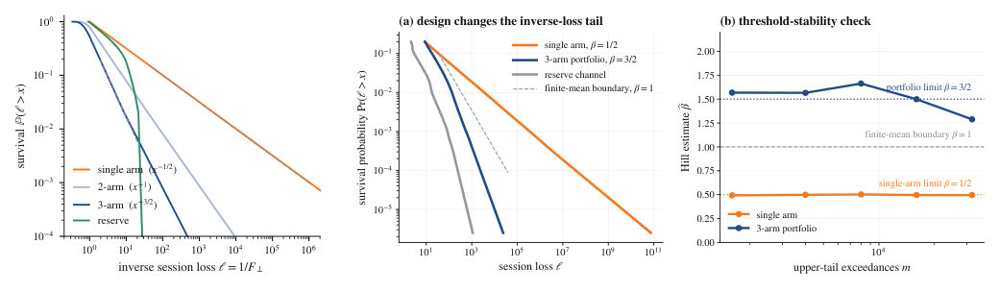
<figcaption class="paper-figure-caption"><b>Fig 3.</b> FIG. 3. Tail diagnostics from session losses. Left: survival functions of the inverse session loss ℓ= 1/F⊥for the four design classes: a single unsafe arm follows the nonintegrable x−1/2 law (below the finite-mean boundary β = 1), a two-arm portfolio is marginal (x−1), a zero-nondegenerate three-arm portfolio steepens to x−3/2, and a configuration-wise Fisher reserve removes the algebraic zero tail; the measured slope is the inverse-loss tail index β. Right: experimental certification from calibrated session losses: (a) survival curves distinguishing unsafe, portfolio, and reserve designs, and (b) Hill upper-tail estimates of β giving a finite-sample stability check against the β = 1...</figcaption>
</figure>
<figure class="paper-figure-card">

<figcaption class="paper-figure-caption"><b>Fig 4.</b> FIG. 4. Annealed winner, quenched loser. A platform-level shallow-NV design tournament compares four Ramsey protocols under the same shot budget and latent session ensemble. (a) The standard average-QFI rule selects Tavg &gt; Tsafe, crossing into the Fisher-glass region, while the tail-certified optimizer stays at TTC &lt; Tsafe. (b) Session-resolved inverse-loss tails expose the mechanism: the average-QFI arm has a much heavier bad-session tail, while portfolio and reserve designs suppress the far tail. (c) With finite calibration shots, finite sensing shots, and an explicit MLE, the plotted tail-certified MLE precision 1/CVaR0.95(MSEMLE) tracks the predicted ranking. (d) Scoreboard:...</figcaption>
</figure>
<figure class="paper-figure-card">

<figcaption class="paper-figure-caption"><b>Fig 5.</b> FIG. 5. Sensitivity of the platform-level certificate. Sweeps around the representative shallow-NV parameters in Table I. (a)–(c) The finite-session ratio of safe-window to average-QFI tail-certified information is shown as the median over 24 inde- pendent latent ensembles with Nsess = 32000 sessions each. Shading gives a 90% bootstrap confidence interval for the median log-ratio; the raw 10–90% ensemble spread is reported in the processed results file. The panels vary fluctuator occupancy Nf, dimensionless coupling range ΛT ∗ 2 , and CVaR level α. The dotted line in (b) marks ΛT ∗ 2 = π/ √</figcaption>
</figure>

**Summary.** The paper addresses the failure of standard quantum metrology bounds when environmental noise is 'quenched' rather than averaged over. It introduces Tail-Certified Information ($	ext{ITC}_\alpha$) using Conditional Value-at-Risk to quantify precision based on rare, adverse measurement sessions. The findings demonstrate that optimizing for average performance can be catastrophically misleading, necessitating designs robust against the worst-case noise tails.

**Why it may be interesting.** This work provides a rigorous mathematical framework for quantifying the true performance limits of quantum sensors in realistic, noisy environments where noise correlations are not averaged out. It moves metrology from an idealized average bound to a robust operational guarantee.

Detailed structure

**Main problem.** Standard quantum metrology bounds based on averaged Fisher information fail when environmental noise is 'quenched' (frozen during a measurement session but varies between repetitions). The goal is to develop a robust certificate for achievable precision.

**Main result.** The true certified resource is determined by the Conditional Value-at-Risk ($	ext{CVaR}_\alpha$) of the inverse loss, which can be drastically lower than the average QFI. This leads to 'Fisher Glasses' where average metrics are misleadingly high.

**Method.** The analysis employs advanced statistical tools like $	ext{CVaR}$ and extreme value theory applied to Fisher information derived from nuisance-projected quantum channels. It contrasts averaged channel assumptions with session-resolved, non-self-averaging statistics.

**Model / system.** The study models quantum sensors (e.g., NV centers, qubits) operating in quenched environments characterized by latent disorder ($\xi$). The core mathematical framework involves projecting the full Fisher geometry onto components transverse to the nuisance directions.

**Key observables.** Tail-Certified Information ($	ext{ITC}_\alpha$), Averaged Quantum Fisher Information ($	ext{I}_{	ext{ann}}$), Inverse Loss Exponent ($eta$), and Transverse Signal Action ($g^\perp$).

**Important parameters / regimes.** The tail exponent $eta$ (critical for determining if certification is finite, requiring $eta > 1$) and the confidence level $\alpha$ used in CVaR calculation.

**Assumptions / limitations.** The analysis assumes that nuisance parameters can be projected out using techniques like Schur-complement algebra, allowing the focus on the signal component transverse to the disorder plane.

**Figures summary.** Figures compare average QFI optimization against tail-certified designs (e.g., safe window/portfolio), showing significant recovery of certified information in the latter case. They also illustrate the dependence of the loss exponent ($eta$) on the design architecture.

**Paper structure.** The paper systematically contrasts averaged vs. quenched metrology, develops the $	ext{CVaR}_\alpha$ certificate based on inverse-loss tails, establishes theoretical theorems regarding non-self-averaging, and applies these concepts to physical platforms like NV centers using specific design protocols (portfolios, reserves).

Abstract

Quantum metrological advantage is certified by averaged Fisher responses: contrast, susceptibility, or quantum Fisher information (QFI). This fails in quenched sensors, where slow environmental variables freeze within a session but vary between repetitions: shallow nitrogen-vacancy (NV) centers, superconducting qubits with slow two-level fluctuators, and semiconductor spin qubits in drifting charge noise. They sample session-resolved Fisher geometries, not an averaged channel. Certification conditions on the latent session, projects nuisance directions, inverts to attainable loss, then tail-certifies; this inverse upper-tail loss defines quenched tail-certified information. A no-go theorem: no averaged Fisher data determine this certificate; ensembles sharing averaged Fisher matrix, QFI, and projected information have finite or zero certified precision. A Fisher-zero integrability transition governs collapse: the inverse-loss tail exponent $β$ sets the boundary, with nonintegrable certified loss for $β\le 1$, even when annealed information is large or scaling. The certified quantum resource is response transverse to latent disorder, not raw amplification sharing its generator; universal design laws: safe windows, nondegenerate portfolios, Fisher reserves, action separation, Fisher-cut criteria. A shallow-NV Ramsey tournament shows average-QFI optimization is tail-catastrophic, whereas tail-certified designs recover nearly three orders of magnitude in certified information at equal shot budget and latent ensemble. These non-self-averaging phases are Fisher glasses, governed by Fisher-zero rare-event statistics.

[↑ back to top](#top)

### [In-Situ Polarimetry in Collimated Magneto-Infrared Spectroscopy System](http://arxiv.org/abs/2607.00689v1)

**Authors:** Zeping Shi, Wenbin Wu, Zhiwei Zhang, Yuhan Du, Chenyao Xu, Congming Hao, Xiangyu Jiang, Xin Chen, Guangyi Wang, Mingsen Zhou, Chunhui Pan, Wei Lu, Hao Shen, Haifeng Pan, Zhenrong Sun, Junhao Chu, Xiang Yuan  
**Type:** experiment · **Category:** strongly correlated electrons · **PDF:** <https://arxiv.org/pdf/2607.00689v1>  
**Analysis basis:** full PDF text, analyzed in chunks
**Topic relevance:** `exotic spin models in light-matter` **3/5** · `spintronics-quantum-optics interface` **3/5** · `quantum optics experiment` **2/5** · `Kondo & dissipative impurity` **1/5** · `analog quantum simulation` **1/5** · `interference shaping light` **1/5** · `quantum measurements` **1/5**

↔ Scroll figures horizontally

<figure class="paper-figure-card">

<figcaption class="paper-figure-caption"><b>Fig 1.</b> Fig. 1 Schematic plot and photos of the collimated magneto-infrared spectroscopy</figcaption>
</figure>
<figure class="paper-figure-card">

<figcaption class="paper-figure-caption"><b>Fig 2.</b> Fig. 2 Design and photo of the incident collimation chamber. This chamber performs</figcaption>
</figure>
<figure class="paper-figure-card">
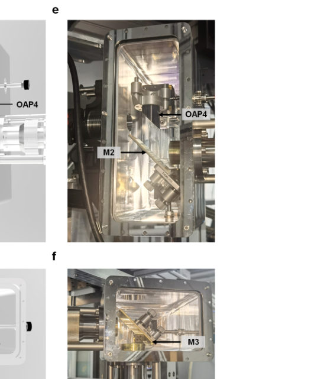
<figcaption class="paper-figure-caption"><b>Fig 3.</b> Fig. 3 Design and photo of the exit collimation chamber. The signal beam emerging</figcaption>
</figure>
<figure class="paper-figure-card">
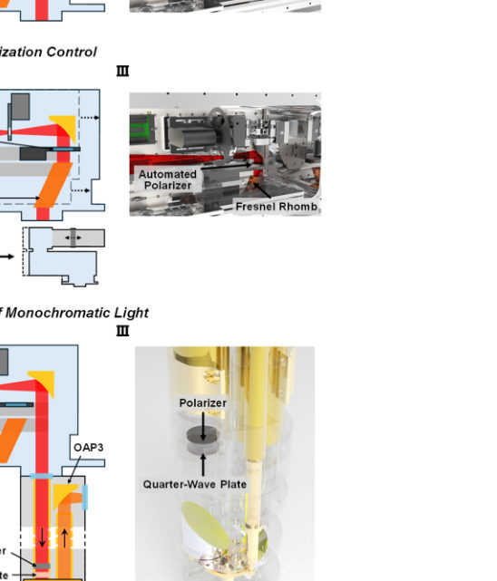
<figcaption class="paper-figure-caption"><b>Fig 4.</b> Fig. 4 The in-situ polarization module for different configurations. Schematic diagrams</figcaption>
</figure>
<figure class="paper-figure-card">

<figcaption class="paper-figure-caption"><b>Fig 5.</b> Fig. 5 Magneto-infrared focusing modules for transmission and reflection geometries.</figcaption>
</figure>

**Summary.** The paper introduces a sophisticated magneto-infrared spectroscopy system featuring in-situ polarimetry capabilities. By employing specialized collimation optics, the setup overcomes polarization degradation caused by light reflections within high-field cryostats. This allows for continuous, quantitative measurements of polarization-dependent spectral features essential for studying quantum phenomena in condensed matter systems.

**Why it may be interesting.** This work provides a highly advanced experimental platform for measuring fundamental material properties related to electron band structure and magnetoelectric coupling under extreme conditions, which is crucial input for theoretical models of correlated electronic states.

Detailed structure

**Main problem.** The full potential of magneto-infrared spectroscopy for probing Landau quantization is limited by the lack of continuous, in-situ polarization control due to severe polarization degradation from beam reflections.

**Main result.** The authors report a novel collimated system that achieves high polarization fidelity (extinction ratio up to 40:1) and enables continuous in-situ linear and circular polarimetry measurements under strong magnetic fields.

**Method.** They designed an optical architecture using incident and exit Kepler type collimation chambers coupled with a remotely controlled polarization module outside the high-field region.

**Model / system.** The platform integrates an FTIR spectrometer, superconducting magnet (up to 12 T), and interchangeable focusing modules supporting Faraday/Voigt geometries for transmission and reflection experiments within a small bore.

**Key observables.** Linear polarization extinction ratio ($\ge 40:1$), minimum root-mean-square noise ($\le 0.0033\%$), and polarization-dependent spectral signatures (e.g., $C_2$ symmetry).

**Important parameters / regimes.** Magnetic field strength up to 12 T; sample bore diameter of $\approx 50 	ext{ mm}$; low temperature regime ($\approx 1.7 	ext{ K}$).

**Assumptions / limitations.** The primary assumption is that collimating the beam and suppressing multi-reflections significantly enhances polarization fidelity compared to conventional direct focusing.

**Figures summary.** Figures illustrate the overall system schematic, detailed designs of incident/exit collimation chambers, operational modes (linear/circular polarization), and performance metrics like extinction ratio vs. aperture size.

**Paper structure.** The paper details the necessity for in-situ polarimetry, presents the novel Kepler-type optical design to suppress reflections, describes the modular components (focusing modules, polarization optics), and concludes with demonstrations of continuous measurements in both linear and circular polarization modes.

Abstract

Magneto-infrared spectroscopy under strong magnetic fields provides a powerful probe of Landau quantization and field-induced collective excitations, yet its full potential has long been constrained by the lack of in-situ polarization control, because the highly divergent infrared beam propagating through narrow light tubes undergoes multiple wall reflections, leading to severe polarization degradation. Here we report a collimated magneto-infrared spectroscopy system that integrates continuous in-situ polarimetry. The system employs incident and exit collimation chambers forming a Kepler type optical architecture, which converts the large-aperture FTIR output into a low-divergence beam and strongly suppresses multi-reflection trajectories inside long gold-plated light tubes, thereby enhancing both optical throughput and polarization fidelity. A remotely controlled polarization module, consisting of an automated linear polarizer and a switchable Fresnel rhomb positioned entirely outside the high-field region, enables continuous in-situ tuning between linear, circular, and arbitrary elliptical polarization states without thermal cycling, manual realignment, or breaking vacuum. Interchangeable compact focusing modules further support Faraday and Voigt geometries in both transmission and reflection experiments within a 50 mm magnet bore, providing efficient beam focusing and signal collection while maintaining polarization fidelity. The setup achieves a minimum root-mean-square noise of 0.0033%, an average noise of 0.0082%, and a linear polarization extinction ratio up to 40:1. We demonstrate the capability through continuous in-situ linear polarimetry and broadband circular polarimetry in the magneto-infrared spectroscopy of various single crystals. This platform establishes a robust experimental framework for in-situ polarization-resolved magneto-infrared spectroscopy.

[↑ back to top](#top)

### [Dependence of charge separation efficiency on the exciton-charge transfer offset and Gaussian disorder in organic solar cells](http://arxiv.org/abs/2607.00699v1)

**Authors:** Maik Schwuchow, Carsten Deibel, Angela Thränhardt  
**Type:** theory · **Category:** disordered systems and neural networks · **PDF:** <https://arxiv.org/pdf/2607.00699v1>  
**Analysis basis:** full PDF text, analyzed in chunks
**Topic relevance:** `methods for driven-dissipative` **3/5** · `non-equilibrium dynamics` **3/5** · `non-equilibrium universality` **2/5** · `Keldysh / 2PI / non-Gaussian methods` **1/5** · `correlated / nonlocal dissipation` **1/5** · `driven-dissipative phase transition` **1/5**

↔ Scroll figures horizontally

<figure class="paper-figure-card">

<figcaption class="paper-figure-caption"><b>Fig 1.</b> FIG. 1. (a) Jablonski diagram of the two-state rate model illustrating the local exciton (LE) and CT states as well as the transition and decay rate constants. (b) Exemplary plots of Eq. 3 for an increase of the exciton decay rate kLE of about 4 orders of magnitude. All other parameters are constant.</figcaption>
</figure>
<figure class="paper-figure-card">

<figcaption class="paper-figure-caption"><b>Fig 2.</b> FIG. 2. Simplified 2D schematic illustrating the main aspects of charge separation in the kinetic Monte-Carlo simulation used in this work. Local exciton (LE) generation occurs with a constant rate on a simple cubic lattice of donor (red) and acceptor (blue) sites. Excitons move diffusively without disor- der effecting the exciton energy levels. In order to separate the charges, the excitons have to dissociate into a charge trans- fer (CT) state at a donor–acceptor interface. If the charge carriers can overcome their mutual Coulomb attraction and move toward their respective electrodes (grey), an extraction event can occur. Excitons and CT states may recombine to the ground state, removing...</figcaption>
</figure>
<figure class="paper-figure-card">

<figcaption class="paper-figure-caption"><b>Fig 3.</b> FIG. 3. Diagram illustrating the two scenarios of varying ∆ELE−CT in the simulation. Scenario 1 increases HOMO and LUMO energies of the acceptor in equal steps, keeping the donor energies constant. Scenario 2 decreases the HOMO energy of the donor, keeping the acceptor energies constant. In both cases, the energy of the CT state at a donor–acceptor interface increases (see Eq. 8). Scenario 2 also increases the donor exciton energy.</figcaption>
</figure>
<figure class="paper-figure-card">
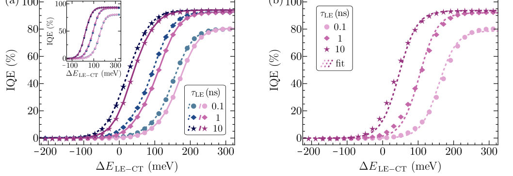
<figcaption class="paper-figure-caption"><b>Fig 4.</b> FIG. 4. (a) kMC data on the dependence of the internal quantum efficiency (IQE) on the energetic offset of local exciton (LE) and charge-transfer state (CT) for three exciton lifetimes τLE. Solid lines and red tones represent scenario 1 (varying acceptor HOMO and LUMO), dashed lines and blue tones represent scenario 2 (varying donor HOMO) of creating the offset in the simulation (see Fig. 3). The sigmoidal shape from rate model theory is clearly visible. As the offset decreases, exciton repopulation and decay increase, which limits the IQE. The inset shows, that the data for both scenarios coincides, when a horizontal shift is applied (see text). All lines (dashed and solid) are merely guides...</figcaption>
</figure>
<figure class="paper-figure-card">

<figcaption class="paper-figure-caption"><b>Fig 5.</b> FIG. 5. (a) kMC steady-state data of the internal quantum efficiency (IQE) and (b) relative population dependence on the energetic offset between local exciton (LE) and charge transfer (CT) state ∆ELE−CT at various disorder strengths characterized by the standard deviation σdis. τLE has been set to 1 ns. In order to create the offset, scenario 1 of the energy level shift as described in the main text and Fig. 3 was used in the simulation. Introducing disorder in the classic high-offset regime reproduces the mostly detrimental trend for charge separation known in the literature (see main text), that arises from trapping and reduced carrier mobilities. Low-offset systems can greatly benefit from...</figcaption>
</figure>

**Summary.** This paper analyzes charge separation in organic solar cells, showing that while traditional models predict efficiency drops at low offsets, the inclusion of Gaussian energetic disorder can actually boost performance. By allowing thermalization within the disordered energy landscape, the system generates an effective driving force, enabling efficient operation even when the intrinsic material offset is small or negative.

**Why it may be interesting.** The explicit modeling of charge carrier thermalization within a disordered density of states to generate an effective driving force is highly relevant for understanding non-equilibrium dynamics in complex quantum materials.

Detailed structure

**Main problem.** The study investigates how charge separation efficiency in organic solar cells depends on the energetic offset between local exciton (LE) and charge-transfer (CT) states, particularly when significant Gaussian energetic disorder is present.

**Main result.** Energetic disorder can significantly boost charge separation efficiency at intermediate and low offsets by creating an effective driving force through thermalization within the disordered density of states. This allows high performance even when the intrinsic offset is zero or negative.

**Method.** The work compares results from a macroscopic two-state rate model against detailed three-dimensional kinetic Monte-Carlo (kMC) simulations to analyze charge dynamics.

**Model / system.** The system models organic solar cells using donor-acceptor blends on a 3D lattice. Dynamics involve LE generation, exciton transport, and subsequent dissociation into CT states, all influenced by the offset $\Delta E_{LE-CT}$ and Gaussian disorder ($\sigma_{dis}$).

**Key observables.** Internal Quantum Efficiency (IQE), steady-state populations of LE and CT states, and the average energy of the occupied CT state $\langle E_{CT} 
angle$.

**Important parameters / regimes.** Exciton-Charge Transfer Offset ($\Delta E_{LE-CT}$), Disorder Strength ($\sigma_{dis}$), Temperature ($k_B T$), and material parameters like binding energies.

**Assumptions / limitations.** The rate model assumes constant rates and ignores triplets; the kMC simulations focus on singlet excitons and use specific hopping/transport equations.

**Figures summary.** Figures show sigmoid curves of IQE vs. offset, demonstrating how disorder causes a crossover behavior: detrimental at high offsets but beneficial at low offsets by shifting $\langle E_{CT} 
angle$.

**Paper structure.** The paper first establishes the rate model's agreement with kMC in the absence of disorder, then introduces Gaussian disorder into the kMC simulation to map out the efficiency dependence on both offset and disorder strength.

Abstract

State-of-the-art organic solar cells increasingly rely on low-offset semiconductor blends, challenging the traditional requirement of a large energetic driving force for efficient charge separation. In these systems, the energetic offset $ΔE_{\mathrm{LE-CT}}$ between local exciton (LE) and charge-transfer (CT) states approaches the thermal energy, making exciton-CT hybridization and thermal repopulation of the exciton level critical to device performance. In this work, we directly compare a macroscopic two-state rate model with three-dimensional kinetic Monte-Carlo (kMC) simulations to investigate microscopic charge separation dynamics and the role of Gaussian energetic disorder. We demonstrate that in the absence of disorder, the analytical rate model accurately reproduces kMC predictions for the whole range of $ΔE_{\mathrm{LE-CT}}$. Specifically, the macroscopic model successfully explains horizontal shifts in the internal quantum efficiency curves that arise depending on how the energetic offset is physically realized in the constituent molecules. We show that these variations can be captured entirely through the ratio of degeneracies of the LE and CT states, respectively. Introducing Gaussian energetic disorder into the kMC simulation reveals a distinct crossover behavior depending on $ΔE_{\mathrm{LE-CT}}$. While disorder is mostly detrimental at large offsets, it can significantly boost efficiency at intermediate and low offsets. Thermalization of charge carriers within the disorder-broadened density of states creates an effective driving force allowing charge separation even at zero or negative energetic offsets.

[↑ back to top](#top)

### [Scaling Up Thermodynamic AI Models](http://arxiv.org/abs/2607.00170v1)

**Authors:** Andrew G. Moore  
**Type:** both · **Category:** disordered systems and neural networks · **PDF:** <https://arxiv.org/pdf/2607.00170v1>  
**Analysis basis:** full PDF text, analyzed in chunks
**Topic relevance:** `methods for driven-dissipative` **3/5** · `non-equilibrium dynamics` **2/5** · `analog quantum simulation` **1/5** · `correlated / nonlocal dissipation` **1/5** · `correlated cavity matter` **1/5** · `driven-dissipative phase transition` **1/5** · `exotic spin models in light-matter` **1/5** · `non-equilibrium universality` **1/5**

↔ Scroll figures horizontally

<figure class="paper-figure-card">

<figcaption class="paper-figure-caption"><b>Fig 1.</b> Figure 1: Our CIFAR-10 classifier. The encoder is a single classical convolution with sign activation. This is followed by six thermodynamic blocks. The classical decoder is a global average pool followed by a fully- connected linear map to the output layer. Each thermodynamic block contains three convolutional layers, as depicted in Figure 2.</figcaption>
</figure>
<figure class="paper-figure-card">

<figcaption class="paper-figure-caption"><b>Fig 2.</b> Figure 2: Architecture of a single thermodynamic block, implemented as an Ising system. It contains three layers of spins: input spins s0, hidden spins s1, and output spins s2. The input layer s0 is pinned in place. They are connected by bidirectional linear couplings, depicted in purple boxes. Couplings in an Ising system are bidirectional, but the labels indicate the forward coupling, i.e. moving downward in the diagram. The reverse couplings are the linear adjoint; for the exact relationship, see Equation (5). The hidden layer is also affected by the local magnetic fields b. Finally, an average-and-sign circuit a accumulates time-averages of s2 and outputs their signs.</figcaption>
</figure>
<figure class="paper-figure-card">
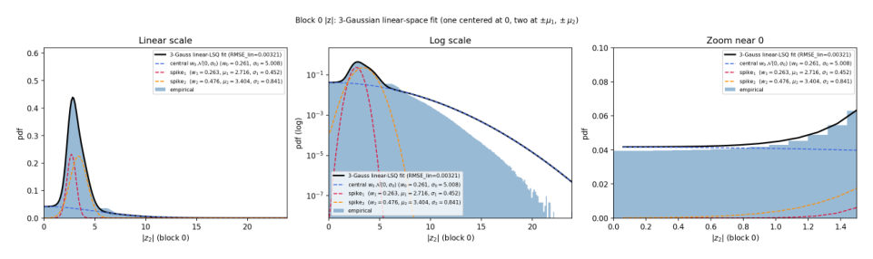
<figcaption class="paper-figure-caption"><b>Fig 3.</b> Figure 3: Empirical |z| distribution and 3-component Gaussian mixture fit for the first block of our CIFAR- 10 model.</figcaption>
</figure>
<figure class="paper-figure-card">

<figcaption class="paper-figure-caption"><b>Fig 4.</b> Figure 4: Measured stochastic error rate compared against numerically evaluated integral for the first block of our CIFAR-10 model. The fit is very close, but the integral does not capture the period-two oscillation caused by the chromatic Gibbs sampling.</figcaption>
</figure>
<figure class="paper-figure-card">

<figcaption class="paper-figure-caption"><b>Fig 5.</b> Figure 5: Theoretical convergence rate for a single Gaussian spike away from z = 0, with time of transition to power-law convergence visualized.</figcaption>
</figure>

**Summary.** This paper presents a novel method to train deep convolutional neural networks for inference on low-power thermodynamic hardware based on the Ising model. It achieves this by developing a scalable backpropagation algorithm that uses finite-temperature Gibbs sampling to approximate standard feed-forward computations. The work rigorously analyzes the trade-offs between computational cost (related to autocorrelation time) and classification accuracy.

**Why it may be interesting.** This work provides a concrete, physics-based pathway for realizing AI hardware by embedding computation within the statistical mechanics framework of Ising models, which is highly relevant to understanding non-equilibrium dynamics and computational limits in physical systems.

Detailed structure

**Main problem.** The core problem is developing scalable training methods for deep AI models intended to run on low-power, hardware-constrained thermodynamic computing devices based on the Ising model.

**Main result.** The authors developed a purely backpropagation-based algorithm that successfully trains deep convolutional networks, achieving high accuracy while demonstrating that inference cost can be bounded by a controllable tradeoff with performance.

**Method.** Training involves adapting standard CNNs into blocks whose computation is approximated by finite-temperature Gibbs sampling on an Ising system, using specialized loss functions (like fixed-point losses) to stabilize the training process.

**Model / system.** The model uses deep convolutional networks structured as a sequence of 'thermodynamic blocks,' where each block implements its function via stochastic dynamics (Gibbs sampling) on an Ising Hamiltonian. The system relies on mapping continuous activations to thermal mean-field averages.

**Key observables.** Classification accuracy (e.g., 94.9% on CIFAR-10), inference cost, and the integrated autocorrelation time ($	au_{	ext{int}}$).

**Important parameters / regimes.** The temperature gradient parameter $\delta$, the number of Gibbs sweeps $G$, and regularization weights ($\lambda_{FP}$).

**Assumptions / limitations.** The primary assumption is that the thermodynamic inference process can be accurately controlled by tuning parameters like $\delta$ and $G$ to approach the deterministic feed-forward limit.

**Figures summary.** Figures illustrate the architecture (Encoder $	o$ Thermodynamic Blocks $	o$ Decoder) for a CIFAR-10 classifier, detailing how a single block is mapped onto an Ising system with input ($s_0$), hidden ($s_1$), and output ($s_2$) spins.

**Paper structure.** The paper progresses from establishing the theoretical correspondence between high-temperature Gibbs sampling and feed-forward inference to developing specific training algorithms (Gibbs regularization) that stabilize this mapping, culminating in rigorous analysis of error sources like autocorrelation time.

Abstract

Thermodynamic computing devices based on the Ising model show great promise for low-power AI inference and edge computing, but scalable methods for training large models for such hardware remain limited. Prior theory shows that the time-averaged behavior of high-temperature Gibbs-sampled Ising systems can implement feed-forward neural inference. We turn this theoretical correspondence into a scalable and purely backpropagation-based algorithm for training deep convolutional networks for thermodynamic inference on Ising machine hardware. Our image classification models achieve accuracies of 94.9% on CIFAR-10 and 76.0% on CIFAR-100 under binary Gibbs sampling. We then develop and experimentally validate a mathematical theory relating inference cost to accuracy and controlling autocorrelation times. Subsequently, we calculate asymptotic results showing that inference cost is bounded by a well-controlled tradeoff with performance and exhibit algorithms for computing optimal inference schedules. Finally, we discuss implications for hardware development and the future of high-temperature thermodynamic AI models.

[↑ back to top](#top)

### [Tensor Network Solvers for Ultra-large Tight-binding Hamiltonians: Algorithms and Applications](http://arxiv.org/abs/2607.00991v1)

**Authors:** Tiago V. C. Antão, Anouar Moustaj, Yitao Sun, Jose L. Lado  
**Type:** theory · **Category:** numerical methods · **PDF:** <https://arxiv.org/pdf/2607.00991v1>  
**Analysis basis:** full PDF text, analyzed in chunks
**Topic relevance:** `analog quantum simulation` **3/5** · `methods for driven-dissipative` **3/5** · `non-equilibrium dynamics` **2/5** · `Keldysh / 2PI / non-Gaussian methods` **1/5** · `driven-dissipative phase transition` **1/5** · `entanglement & information structure` **1/5**

↔ Scroll figures horizontally

<figure class="paper-figure-card">

<figcaption class="paper-figure-caption"><b>Fig 1.</b> FIG. 1. Overview of the TensorBinding.jl framework and its current range of applications. The panels illustrate six classes of physical observable accessible within the framework: the momentum-resolved spectral function Ak,k′(ω) (top), the real- space Chern marker Cα revealing coexisting topological phases (left), self-consistent mean-field correlated phases, such as the magnetization ⟨M⟩SCF (right), time-dependent observables, such as the bond current J(t) under a driven electric field E(t) (bottom right), two-particle correlated states ⟨c† αcβc† γcδ⟩, such as excitons (bottom center), and non-hermitian spectral function ANH α,β for systems with modulated losses γ(r) (bottom left).</figcaption>
</figure>
<figure class="paper-figure-card">

<figcaption class="paper-figure-caption"><b>Fig 2.</b> FIG. 2. Mapping and benchmarks for a 1D tight-binding chain model. (a) Tight-binding model with N = 23 = 8 sites in real space and its 23 × 23 Hamiltonian matrix with hoppings tn(ri) and on-site potential V (ri). (b) Equivalent pseudospin chain of L = log2(N) = 3 sites; spin states (σ1, σ2, σ3) index real-space sites and the Hamiltonian is encoded as a 3-core MPO. The nth neighbour hoppings are encoded as MPOs Tn and the on-site term as an MPO V (c) Memory cost of full, sparse, and MPO storage of the Hamiltonian. (d) Computation time for a local density of states via exact diagonalization, sparse-matrix KPM, and the MPO KPM implemented in TensorBinding.jl. Dahed lines are estimate, scatter...</figcaption>
</figure>
<figure class="paper-figure-card">
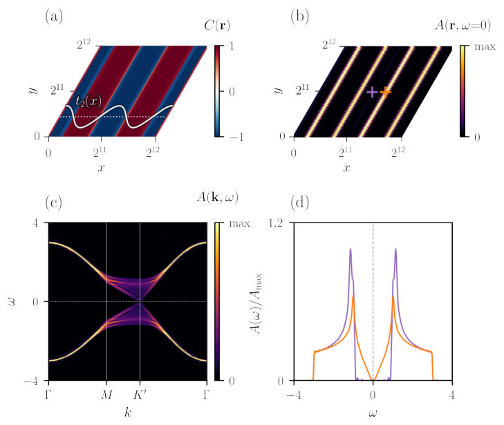
<figcaption class="paper-figure-caption"><b>Fig 3.</b> FIG. 3. Single-particle observables for the spatially modulated Haldane model of Eq. (11) with t2(x) = ¯t2 cos(2πx/λ). (a) Real- space Chern marker, with well-defined integer stripes reflecting alternating topological and trivial phases of period λ = Nx/2. (b) Zero-frequency LDOS, with intensity peaks localised at the domain walls between topological phases. (c) Band structure showing mini-band folding at the superlattice wavevector and a weak imprint of the gap-traversing chiral edge states. (d) Frequency-resolved LDOS in the bulk (top) and at a domain-wall edge (bottom), showing the gapped bulk spectrum and the in-gap chiral edge branch. The parameters used for these calculations are t1 =...</figcaption>
</figure>
<figure class="paper-figure-card">

<figcaption class="paper-figure-caption"><b>Fig 4.</b> FIG. 4. Non-Hermitian observables for a 1D AAH chain with the modulated loss γ(x) following a triangular pattern under open boundary conditions. (a) Spectral weight A(Re z, Im z) in the complex energy plane from the NH KPM algorithm. (b) Space-time map of the diagonal density ⟨x|ρ(t)|x⟩evolved from the half-filled ground state via the non-Hermitian von Neumann equation (RK4), and site-density traces at the loss minimum (x0 = N/4, γ = 0) and loss maximum (x = 3N/8, γ = 2γ0). (c) Single-particle amplitude |⟨x|ψ(t)⟩| from TDVP for a comb wavepacket shown in the central region of a Hermitian chain (left) and a lossy chain (middle), zoomed in a region of width w = 256 sites, and across the full...</figcaption>
</figure>
<figure class="paper-figure-card">
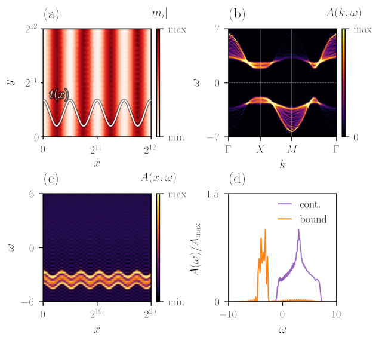
<figcaption class="paper-figure-caption"><b>Fig 5.</b> FIG. 5. Mean-field Hubbard and exciton observables for spatially modulated systems. (a) Absolute mean-field Hubbard magnetization |mi|, showing stripe order induced by the modulated hopping. (b) Spin-summed mean-field spectral function A(k, ω) along the high-symmetry path, showing the reconstructed quasiparticle bands of the converged magnetic state and its correlated gap. (c) Exciton local density of states ρ(x, ω), showing bound-state spectral weight localized in energy and modulated periodically in space, with moir´e minibands as a consequence of the incommensurability of the on-site modulation V (x). (d) Total exciton density of states, separated into scattering-continuum and...</figcaption>
</figure>

**Summary.** The paper introduces a unified tensor-network methodology to solve tight-binding Hamiltonians on ultra-large systems, enabling simulations up to billions of sites. By mapping real-space problems onto MPO representations, it efficiently calculates key observables like spectral functions and topological invariants without storing massive matrices. This breakthrough allows for the study of complex quantum matter in regimes previously inaccessible due to computational cost.

**Why it may be interesting.** This work provides a powerful computational toolkit that extends beyond standard DMRG or exact diagonalization limits, making it highly relevant for studying complex quantum materials where system sizes are the primary bottleneck.

Detailed structure

**Main problem.** Developing scalable numerical techniques to simulate quantum systems described by tight-binding Hamiltonians on ultra-large lattices (billions of sites).

**Main result.** The methodology enables routine simulation of systems with billions of sites by keeping the memory footprint logarithmic in system size, overcoming limitations of explicit matrix methods.

**Method.** It employs a unified tensor-network approach, mapping large real-space Hamiltonians onto Matrix Product Operators (MPOs) defined on an L-pseudospin chain. Key techniques include using quantics tensor cross interpolation and applying the Kernel Polynomial Method (KPM).

**Model / system.** The models are general tight-binding Hamiltonians applicable to moiré superlattices, quasicrystals, and systems requiring non-Hermitian or correlated descriptions (e.g., Hubbard model, excitons). The system size $N$ can reach $10^{12}$ sites.

**Key observables.** Spectral functions ($A(\mathbf{k}, \omega)$), Local Density of States (LDOS), real-space topological invariants (Chern markers), and time evolution dynamics ($\langle x|
ho(t)|x
angle$).

**Important parameters / regimes.** System size $N$ up to billions of sites; bond dimension remaining modest (order of tens); energy $\omega \in (-1, 1)$ or complex energies for non-Hermitian analysis.

**Assumptions / limitations.** The method relies on the tensor network compressibility of real-space structures and assumes that physical observables can be efficiently represented as MPOs/MPSs.

**Figures summary.** Figures illustrate the mapping from real-space lattices to pseudospin chains, comparing memory scaling (MPO vs. full matrix), and showing the construction of spectral operators and topological markers using tensor contractions.

**Paper structure.** The paper details the mathematical framework by first establishing the MPO representation for Hamiltonians on various lattices (1D/2D) via shift tensors. It then outlines algorithms for calculating observables like spectral functions (via KPM), topological invariants, and time evolution (via von Neumann equation solvers).

Abstract

Understanding quantum materials at meso and even macroscopic scales requires tight-binding calculations on system sizes where explicit matrix representations become prohibitively costly. This represents a major bottleneck to rationalize phenomena in moiré and super-moiré heterostructures and quasicrystals. Here, we present a unified tensor-network methodology to solve tight-binding problems at exceptionally large scales, by mapping a system of $N = 2^L$ sites onto a many-body problem of $L$ pseudospin sites, which is subsequently solved with tensor network algorithms. For Hamiltonians with compressible real-space structure, the tensor network bond dimension remains modest, typically of order a few tens, independent of $N$.Tensor network representations of arbitrary hopping functions including long-range, spatially modulated, and twisted-layer couplings are built with quantics tensor cross interpolation, and all physical observables are evaluated entirely with tensor network algebra without explicit matrix storage or diagonalization. We demonstrate applications to spectral functions, momentum-space spectra via the tensor-network quantum Fourier transform, real-space topological invariants, real-time dynamics, correlation induced symmetry breaking with self-consistent mean-field calculations, non-Hermitian phenomena, and excitonic many-body physics. Our methodology enables routinely solving systems with billions of sites, by leveraging the tensor network compressibility of real-space structures, and establishing a flexible framework to study quantum matter at ultra-large length scales. The methodology is implemented in the open-source Julia package TensorBinding.jl.

[↑ back to top](#top)

### [Analytical connection between exact and approximate solutions of the periodically-driven two-level system starting from the Heun equation](http://arxiv.org/abs/2607.01030v1)

**Authors:** Pietro Follia, Bassano Vacchini  
**Type:** theory · **Category:** other · **PDF:** <https://arxiv.org/pdf/2607.01030v1>  
**Analysis basis:** full PDF text, analyzed in chunks
**Topic relevance:** `methods for driven-dissipative` **3/5** · `non-equilibrium dynamics` **3/5** · `driven-dissipative phase transition` **2/5** · `Keldysh / 2PI / non-Gaussian methods` **1/5** · `non-equilibrium universality` **1/5**

↔ Scroll figures horizontally

<figure class="paper-figure-card">

<figcaption class="paper-figure-caption"><b>Fig 1.</b> FIG. 1. The figure provides a logical scheme of the connections between the different equations and their solutions and limits considered in the manuscript. Here, ψWD(t) denotes the approximate solution in the weak-driving regime [see Eq. (69)], ψHF(t) the high-frequency solution [see Eq. (84)], and ψRWA(t) the solution in the rotating-wave approximation [see Eq. (79)]. According to Eqs. (51), (52) and (71) we have ˜f = f/ω, ˜ ω0 = ω0/2ω and ˜∆= ∆/ω respectively, that define the relevant limiting situations.</figcaption>
</figure>

**Summary.** This paper analytically connects the exact solutions for a periodically-driven two-level system when subjected to different driving fields, such as linear versus rotating-wave approximations. By mapping the problem onto Heun differential equations, the authors establish a unified mathematical framework that correctly reproduces known physical effects like the Bloch-Siegert shifts in various limiting regimes.

**Why it may be interesting.** This work provides deep analytical insight into open quantum systems dynamics by connecting exact solutions to highly specialized mathematical functions (Heun equations), which is crucial for understanding driven quantum optics phenomena.

Detailed structure

**Main problem.** The primary goal is establishing a rigorous, analytical connection between the exact solutions for a periodically-driven two-level system (TLS) under different driving conditions, specifically linear vs. rotating-wave approximation.

**Main result.** The authors successfully derive this analytic link by mapping the dynamics onto Heun differential equations and utilizing path-multiplicative Floquet solutions to recover known physical limits like the Stark and Bloch-Siegert shifts.

**Method.** The methodology involves transforming the time-dependent Schrödinger equation into a second-order ODE, which is then solved by relating it to the general forms of Heun or Confluent Heun equations via hypergeometric function expansions.

**Model / system.** The system studied is a two-level atom (TLS) subjected to periodic external driving fields. The dynamics are governed by a time-dependent Hamiltonian involving Pauli matrices, leading to differential equations solvable in terms of special functions.

**Key observables.** The population dynamics and coherence decay rates of the TLS; specific shifts like the Stark and Bloch-Siegert shifts are key derived quantities.

**Important parameters / regimes.** Driving strength ($f$), system frequency ($\omega_0$), driving frequency ($\omega$), and detuning parameters ($\Delta$). The analysis explores weak-driving and high-frequency limits.

**Assumptions / limitations.** The core mathematical machinery relies on expressing local solutions via hypergeometric functions derived from path-multiplicative Floquet solutions, which are subject to limitations regarding periodicity and resonance conditions.

**Figures summary.** Not specified in the notes; the focus is on deriving analytical connections between solution forms (e.g., Eq. 32, Eq. 41, Eq. 85).

**Paper structure.** The paper progresses by first defining the physical problem and mapping it to Heun/Confluent Heun equations (Sections II & III), then detailing the mathematical machinery using Floquet solutions and hypergeometric functions, establishing the connection through perturbative analysis of limiting cases (Sections IV & V).

Abstract

We investigate and establish an analytic connection between the exact solutions describing the dynamics of a two-level system driven by periodic external fields, focusing on the cases of linear driving and the so-called rotating-wave approximation, or circular driving. In both cases, the exact solutions can be obtained by mapping the Schrodinger equation onto Heun equations: the confluent Heun equation for linear driving and the Heun equation for the rotating-wave case. In particular, we demonstrate a direct analytic connection between the exact solutions for linear driving and those for the rotating-wave case. This result is obtained by analyzing local solutions expressed in terms of hypergeometric functions, which, in the case of the confluent Heun equation, can be derived by considering path-multiplicative Floquet solutions involving a bilateral series. This series leads to two continued-fraction expansions that can be perturbatively solved by imposing a suitable consistency condition. The connection between the linear-driving and rotating-wave solutions is established through a perturbative procedure that allows us to recover not only the rotating-wave approximation itself, but also the correct Stark and Bloch-Siegert shifts, as well as the so-called high-frequency approximation.

[↑ back to top](#top)

### [Phase distinction of Gibbs states without symmetry breaking: topological invariants of the 3D toric code](http://arxiv.org/abs/2607.00134v1)

**Authors:** Haruki Watanabe  
**Type:** theory · **Category:** statistical mechanics · **PDF:** <https://arxiv.org/pdf/2607.00134v1>  
**Analysis basis:** full PDF text, analyzed in chunks
**Topic relevance:** `entanglement & information structure` **3/5** · `analog quantum simulation` **2/5** · `Keldysh / 2PI / non-Gaussian methods` **1/5** · `correlated / nonlocal dissipation` **1/5** · `driven-dissipative phase transition` **1/5** · `exotic spin models in light-matter` **1/5** · `methods for driven-dissipative` **1/5**

↔ Scroll figures horizontally

<figure class="paper-figure-card">

<figcaption class="paper-figure-caption"><b>Fig 1.</b> FIG. 1. The three tiers of states and their phase-equivalence relations. Pure gapped ground states (bottom) are classified by finite-depth local unitaries—equivalently, quasi-adiabatic continuation along a path of local Hamiltonians with no gap closing [15, 16]. General mixed states (top) are classified by two-way quasi-local channels [17–19]. The intermediate Gibbs tier is classified by a path of local Hamiltonians with no ther- modynamic singularity.</figcaption>
</figure>
<figure class="paper-figure-card">

<figcaption class="paper-figure-caption"><b>Fig 2.</b> FIG. 2. The σz Wilson-loop two-point correlator ⟨¯ W1 ¯ W2⟩= ⟨Q</figcaption>
</figure>
<figure class="paper-figure-card">
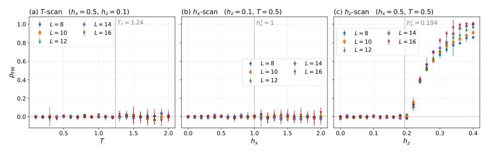
<figcaption class="paper-figure-caption"><b>Fig 3.</b> FIG. 3. Electric (σz-basis) Fredenhagen–Marcu string order parameter ρFM on the three orthogonal cuts through (hx, hz, T) = (0.5, 0.1, 0.5) (512 seeds/point, per-seed median, L = 8–16): (a) T-scan (hx = 0.5, hz = 0.1), (b) hx-scan (hz = 0.1, T = 0.5), and (c) hz-scan (hx = 0.5, T = 0.5). Across the thermal transition at Tc ≃1.24 (a) and the magnetic transition at hx c ≃1 (b), ρFM stays flat (to ±0.02) at all sizes; it rises continuously from 0 to a positive constant only on the electric (hz) cut (c), with onset near the zero-temperature critical value hz c ≃0.194.</figcaption>
</figure>
<figure class="paper-figure-card">
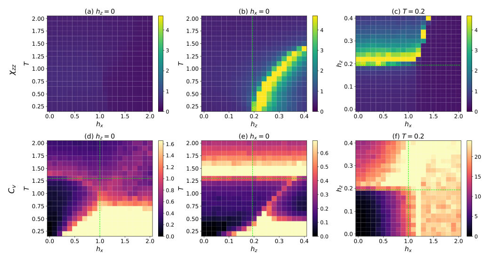
<figcaption class="paper-figure-caption"><b>Fig 4.</b> FIG. 4. Bulk thermodynamic response on the three coordinate planes (L = 8, 64 seeds). Top row, the electric susceptibility χzz: (a) the (hx, T) plane at hz = 0, (b) the (hz, T) plane at hx = 0, and (c) the (hx, hz) plane at T = 0.2. Bottom row, the specific heat Cv on the same three planes: (d), (e), and (f), respectively. Lime lines mark the Reiss–Schmidt zero-temperature critical fields hx c = 1, hz c = 0.194 and the duality-derived T (0,0) c ≈1.3133.</figcaption>
</figure>
<figure class="paper-figure-card">

<figcaption class="paper-figure-caption"><b>Fig 5.</b> FIG. 5. Four-quadrant partition a, b, c, d of the annular Levin–Wen shell at L = 8, shown in (a) an xy slice (z ∈[3, 4]) and (b) an xz slice (y ∈[3, 4]); z is the shell’s symmetry axis and “cav.” marks the central cavity. The Levin–Wen regions A1, . . . , A4 are built from these quadrants (see text).</figcaption>
</figure>

**Summary.** This paper addresses the challenge of identifying topological phases at finite temperature without relying on symmetry breaking. By analyzing the 3D $\mathbb{Z}_2$ toric code, the authors introduce a novel, robust order parameter called $f_W$. This invariant successfully distinguishes between topologically ordered and trivial phases across complex field-temperature regimes where traditional measures fail.

**Why it may be interesting.** The work provides a powerful, non-symmetry-breaking diagnostic tool ($f_W$) for characterizing topological order in realistic thermal settings, which is crucial for understanding quantum phase transitions in condensed matter systems.

Detailed structure

**Main problem.** The central problem is determining if sharp phase distinctions can be identified for topological order at non-zero temperature ($T>0$) without relying on spontaneous symmetry breaking (SSB). The authors seek robust, quasi-local-channel invariants to classify these mixed states.

**Main result.** A new diagnostic, the decoded Wilson-loop correlation $f_W$, is introduced and shown to be a robust invariant that quantizes to 1 in the topological phase and 0 in the trivial phase at finite temperature. This distinguishes phases where traditional measures like entanglement entropy ($\gamma$) fail.

**Method.** The study combines perturbative calculations, large-scale Quantum Monte Carlo simulations on the thermal Gibbs state, and theoretical analysis of various correlation functions (Wilson loops, string order parameters).

**Model / system.** The system analyzed is the three-dimensional ($	ext{3D}$) $\mathbb{Z}_2$ toric code subjected to generic magnetic fields and finite temperature. The Hamiltonian/Gibbs measure describes the thermal state $
ho_eta = e^{-eta \hat{H}/Z}$.

**Key observables.** Topological Entanglement Entropy ($\gamma$), Decoded Wilson-loop correlation ($f_W$), Fredenhagen–Marcu string order parameter ($
ho_{	ext{FM}}$), and various thermodynamic responses like specific heat ($C_v$).

**Important parameters / regimes.** Temperature ($T$), external magnetic fields $(h_x, h_z)$, and the lattice size $L$. The critical point is often compared to the 3D Ising universality class.

**Assumptions / limitations.** The authors must contend with the ambiguity of phase equivalence relations for Gibbs states at $T>0$, sometimes assuming quasi-static traversal through Lindbladian channels.

**Figures summary.** Figures illustrate how different observables (Wilson loops, $
ho_{	ext{FM}}$) show differential sensitivity to magnetic, electric, and thermal fields across the $(h_x, h_z, T)$ phase diagram. Table I summarizes diagnostic values for various models.

**Paper structure.** The paper systematically compares multiple diagnostics ($\gamma$, Wilson loops, etc.) against known transitions (thermal $T_c$, magnetic $h_x^c$, electric $h_z^c$). It culminates in the proposal and rigorous demonstration of $f_W$ as the universal invariant resolving all three boundaries.

Abstract

We study the finite-temperature topological order of the three-dimensional $\mathbb{Z}_2$ toric code in a generic magnetic field, where every higher-form symmetry is explicitly broken and can at most be emergent. We show perturbatively, and confirm by large-scale quantum Monte Carlo, that the topological entanglement entropy stays quantized at $γ= \ln 2$ throughout the topological phase -- at finite temperature and under the symmetry-breaking field alike -- and collapses to $0$ across the thermal transition, a quantization protected geometrically by the Bianchi identity rather than by any exact symmetry of the system. The plateau $γ= \ln 2$ is, however, not invariant under quasi-local channels: a constant-depth channel can generate this identical quantized value from a trivial product state. We therefore introduce the decoded Wilson-loop correlation $f_W$, which quantizes to $1$ in the topological phase and $0$ in the trivial phase as $L\to\infty$ and, unlike $γ$, is a quasi-local-channel invariant -- a robust topological invariant of the mixed state.

[↑ back to top](#top)

### [Twisted Gaussian Schell States in Quantum Optics: Twist-Assisted Nonclassicality and Entanglement](http://arxiv.org/abs/2607.00837v1)

**Authors:** Fabricio Toscano, G. Cañas, A. Z. Khoury, P. H. Souto Ribeiro, S. P. Walborn  
**Type:** theory · **Category:** other · **PDF:** <https://arxiv.org/pdf/2607.00837v1>  
**Analysis basis:** full PDF text, analyzed in chunks
**Topic relevance:** `entanglement & information structure` **3/5** · `interference shaping light` **3/5** · `Keldysh / 2PI / non-Gaussian methods` **1/5** · `analog quantum simulation` **1/5** · `driven-dissipative phase transition` **1/5** · `methods for driven-dissipative` **1/5**

↔ Scroll figures horizontally

<figure class="paper-figure-card">

<figcaption class="paper-figure-caption"><b>Fig 1.</b> FIG. 1. Scheme to generate the TGS state from two indepen- dent thermal modes. From Eq. (8), the state is generated by the inverse transformation S−1 = O′−1S−1 d O−1 acting on the thermal input. See text for details.</figcaption>
</figure>
<figure class="paper-figure-card">
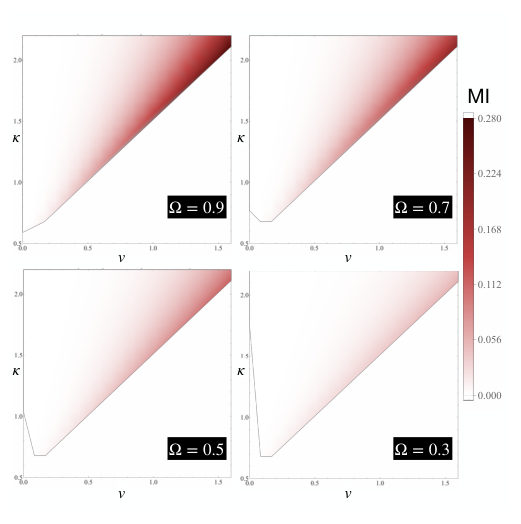
<figcaption class="paper-figure-caption"><b>Fig 2.</b> FIG. 2. Density plots of the mutual information in Eq. (38) for the joint photon distribution P(n1, n2) in Eq. (32), and marginals in (39), of a TGS state. See text for explanation.</figcaption>
</figure>
<figure class="paper-figure-card">

<figcaption class="paper-figure-caption"><b>Fig 3.</b> FIG. 4. Scheme to activate entanglement from the TGS state. The two-mode TGS state (modes 2 and 3) is mixed with two ancillary vacuum modes (modes 1 and 4) at balanced beam splitters. The output four-mode state Vf is separable in the 12|34 bipartition (since the beam splitters are local with re- spect to that cut) but can be entangled in the cross biparti- tions 14|23 and 13|24, depending on the values of κ, Ω, and v.</figcaption>
</figure>
<figure class="paper-figure-card">
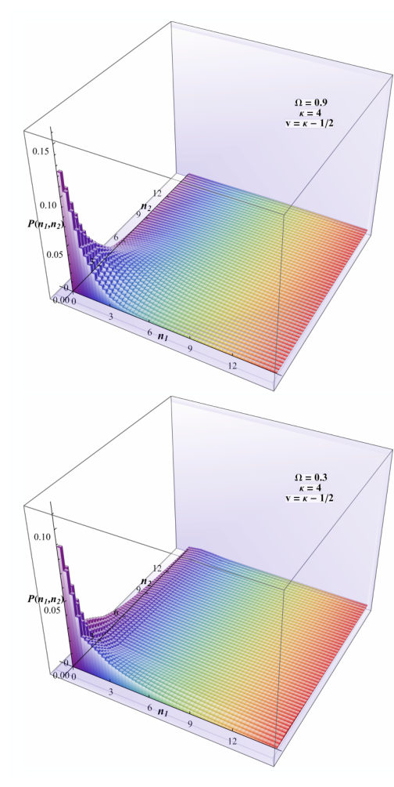
<figcaption class="paper-figure-caption"><b>Fig 4.</b> FIG. 3. Joint photon number distribution P(n1, n2) of a TGS state at maximum correlations v = κ −1</figcaption>
</figure>
<figure class="paper-figure-card">

<figcaption class="paper-figure-caption"><b>Fig 5.</b> FIG. 5. Entangled regions of the (κ, v) plane of the 14|23 bipartition for a) F = 3 and b) F = 6. The dashed diagonal line is the physicality bound v = κ−1</figcaption>
</figure>

**Summary.** This paper rigorously analyzes the Twisted Gaussian Schell state, a quantum analogue of structured light beams. It demonstrates that the 'twist' parameter acts as a resource, inducing measurable nonclassical correlations and activating entanglement in multipartite systems even when the state is otherwise separable. The findings establish a deep connection between classical beam properties and fundamental quantum information measures.

**Why it may be interesting.** This work bridges classical beam engineering concepts (Schell model) with quantum information theory in the context of continuous-variable quantum optics, providing concrete signatures for nonclassicality and entanglement induced by geometric phase terms like the twist.

Detailed structure

**Main problem.** The paper introduces and analyzes the Twisted Gaussian Schell (TGS) state, a quantum-optical analog of a classical beam model, to characterize its nonclassicality and entanglement properties.

**Main result.** The TGS state exhibits nonclassicality when the twist parameter is non-zero, and increasing this twist parameter can activate or deepen entanglement in select bipartitions even if the natural bipartition remains separable.

**Method.** The analysis uses quantum optics formalism, calculating observables like quadrature variances, logarithmic negativity (entanglement), and joint photon number distributions in both Fock and covariance matrix representations.

**Model / system.** The system is the two-mode TGS state ($\hat{
ho}_{	ext{TGS}}$), a mixed Gaussian state generated via metaplectic evolution from an initial thermal state. It is characterized by parameters including local squeezing ($\Omega$), thermal noise ($\kappa$), and the twist phase ($v$).

**Key observables.** Nonclassicality (squeezing below shot-noise limit), Entanglement (Logarithmic Negativity, $	ext{EN}$), Mutual Information ($I$, $I_G$), and Joint Photon Number Distribution $P(n_1, n_2)$.

**Important parameters / regimes.** Twist parameter ($v$), local squeezing ($\Omega$), thermal noise ($\kappa$); the analysis explores regimes where these parameters dictate separability or entanglement.

**Assumptions / limitations.** The analysis relies on the formal equivalence between paraxial classical optics and continuous-variable quantum systems, and uses criteria like PPT for Gaussian state separability.

**Figures summary.** Figures illustrate the generation scheme (Fig. 1), density plots of mutual information (Fig. 2), joint photon distributions $P(n_1, n_2)$ (Fig. 3), and maps showing entanglement regions in the $(\kappa, v)$ plane (Fig. 5).

**Paper structure.** The paper systematically analyzes the TGS state by first establishing its generation scheme, then characterizing nonclassicality via quadrature squeezing, followed by detailed investigations into separability and entanglement across various bipartitions using both photon number statistics and covariance matrix methods.

Abstract

We introduce the Twisted Gaussian Schell (TGS) state, a two-mode mixed Gaussian state defined as the quantum-optical analog of the Twisted Gaussian Schell-model beam of classical paraxial optics, characterized by the so-called twist phase. In the TGS state, the twist parameter arises when an asymmetric two-mode thermal state is subject to local squeezing after the action of phase shifters and a beam splitter. Its defining quantum feature is nonclassicality: although the state is separable in its natural bipartition, when the twist parameter is nonzero there are global quadratures that can be squeezed below the shot-noise limit. The nonclassicality has also a direct signature in the joint photon-number distribution, which we obtain in closed form. Moreover, coupling each mode to an ancillary vacuum at a balanced beam splitter yields a four-mode state with entanglement in select $2\times2$ bipartitions, with local description given by two TGS states, and all $1\times3$ bipartitions.   For fixed input squeezing, increasing the twist parameter activates entanglement where the state is otherwise separable and deepens it where already present. The classical physicality bound on the twist parameter coincides with the quantum physicality condition. These results advance the two-way bridge between classical beam engineering and quantum information.

[↑ back to top](#top)

### [Chiral enhancement of two-magnon bound states in an $S=1/2$ triangular-lattice magnet](http://arxiv.org/abs/2607.01062v1)

**Authors:** László Rudner, Karlo Penc  
**Type:** theory · **Category:** strongly correlated electrons · **PDF:** <https://arxiv.org/pdf/2607.01062v1>  
**Analysis basis:** full PDF text, analyzed in chunks
**Topic relevance:** `analog quantum simulation` **3/5** · `exotic spin models in light-matter` **3/5** · `Keldysh / 2PI / non-Gaussian methods` **1/5** · `entanglement & information structure` **1/5** · `spintronics-quantum-optics interface` **1/5**

↔ Scroll figures horizontally

<figure class="paper-figure-card">
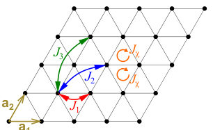
<figcaption class="paper-figure-caption"><b>Fig 1.</b> FIG. 1. Triangular lattice showing the J1 first-, J2 second-, and J3 third-neighbor Heisenberg exchanges, as well as the scalar-chirality terms ˆχijk on the up- and down-pointing tri- angles. The circular arrows define the orientation of the or- dered sites i, j, and k around each triangle. The primitive lattice vectors are a1 = (1, 0) and a2 = (1/2, √</figcaption>
</figure>
<figure class="paper-figure-card">

<figcaption class="paper-figure-caption"><b>Fig 2.</b> FIG. 2. Brillouin zone of the triangular lattice with the in- equivalent Γ, K, and M points and high-symmetry lines. We also illustrate the q = (q, 0) line in Eq. (23) that connect Γ, K, and M ′′ point in straight line.</figcaption>
</figure>
<figure class="paper-figure-card">
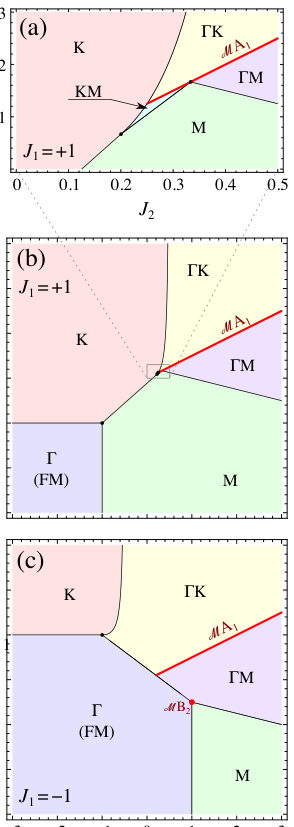
<figcaption class="paper-figure-caption"><b>Fig 3.</b> FIG. 3. Luttinger–Tisza phase diagram of the triangular- lattice J1-J2-J3 Heisenberg model. Panels (a) and (b) show the antiferromagnetic nearest-neighbor case, J1 = +1, with panel (a) giving an enlarged view of the central region of panel (b). Panel (c) shows the ferromagnetic nearest-neighbor case, J1 = −1. Colors indicate the ordering wave vector q at which Jq is minimized. They distinguish the commensu- rate Γ, K, and M regions from incommensurate spiral regions whose minima lie on the high-symmetry lines ΓK, ΓM, and KM. Equivalently, these wave vectors are the momenta at which the single-magnon dispersion softens. The thick red line marks the J2 = 2J3 locus associated with the MA1 min-...</figcaption>
</figure>
<figure class="paper-figure-card">
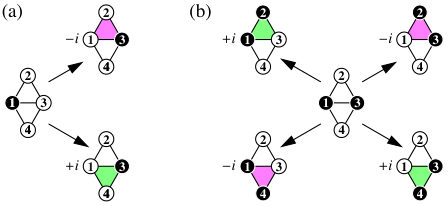
<figcaption class="paper-figure-caption"><b>Fig 4.</b> FIG. 4. Action of the uniform scalar spin chirality interac- tion 4(ˆχ123 + ˆχ134) = i ˆP123 −i ˆP132 +i ˆP134 −i ˆP143 for spin-1/2 one- and two-magnon states; see Eq. (7). Empty circles de- note up spins and filled circles down spins. Colored triangles indicate the permutation terms that act nontrivially on the displayed spin configuration; the color encodes the sign of the imaginary amplitude, with magenta denoting −i and green +i. (a) In the one-magnon sector, the down spin on site 1 can hop to site 3 through two oriented triangles, correspond- ing to the processes −i ˆP132 and +i ˆP134. These two ampli- tudes cancel, so the scalar-chirality term does not contribute to the one-magnon...</figcaption>
</figure>
<figure class="paper-figure-card">

<figcaption class="paper-figure-caption"><b>Fig 5.</b> FIG. 6. Scan of the momentum and the gap of the lowest energy bound state in the J2-J3 parameter space for (a) fer- romagnetic and (b) antiferromagnetic J1 exchanges. We use Eq. (70) to calculate the gap ∆with energies from an exact di- agonalization calculation of a 3×242 = 1728-site cluster. The lowest energy bound state is mostly at the K = Γ point, while there are some regions where it is at the M point, and at in- commensurate values where the minima of the single magnon dispersion are also incommensurate, in the ΓK or ΓM phase. The largest value of the gap is at (J1, J2, J3) = (−1, 1, −1/2) and (1, −1, −1). The thin orange lines denote the boundary of the ferromagnetic phase, and the...</figcaption>
</figure>

**Summary.** This theoretical work examines how scalar chirality modifies two-magnon excitations in a triangular lattice magnet. The key finding is that chirality acts as an effective interaction, selectively strengthening the binding of one specific two-magnon state. This mechanism provides a microscopic route to inducing spin-nematic instabilities without affecting the fundamental single-particle magnetic gap.

**Why it may be interesting.** While focused on magnetism, the methodology—using symmetry analysis and solving coupled excitation equations (gap equations)—is highly relevant for understanding collective excitations in strongly correlated quantum systems beyond simple mean-field treatments.

Detailed structure

**Main problem.** The study investigates how a uniform scalar-chirality interaction affects two-magnon bound states in a spin-1/2 triangular-lattice magnet.

**Main result.** The chirality term selectively enhances the binding of one specific two-magnon channel by splitting opposite relative-motion chiralities, without altering the single-magnon spectrum.

**Method.** The analysis uses symmetry-adapted partial-wave decomposition to derive finite-dimensional gap equations for the two-magnon sector, confirmed by exact diagonalization.

**Model / system.** The system is a spin-1/2 triangular-lattice Heisenberg model with $J_1, J_2, J_3$ exchange interactions, augmented by a scalar-chirality term ($\hat{H}_{	ext{Chir}}$). The analysis focuses on excitations above the fully polarized state.

**Key observables.** Two-magnon binding energy ($\Delta$), one-magnon dispersion relation, and the resulting spin-nematic instability signatures.

**Important parameters / regimes.** Exchange couplings ($J_1, J_2, J_3$) and the chirality coupling strength ($J_\chi$).

**Assumptions / limitations.** The analysis is performed in the high-field limit above the fully polarized state; it focuses on leading pair channels (two-magnon states).

**Figures summary.** Figures illustrate parameter space loci for various magnetic ordering manifolds and show gap contours derived from the $K=0$ gap equation, demonstrating enhanced binding at specific coupling values.

**Paper structure.** The paper first analyzes the one-magnon sector to show chirality cancels out there. It then tackles the two-magnon sector by deriving a partial-wave decomposition of the interaction kernel, leading to solvable gap equations that reveal chiral enhancement.

Abstract

We study one- and two-magnon excitations above the fully polarized state of the spin-$1/2$ triangular-lattice $J_1$-$J_2$-$J_3$ Heisenberg model with an additional uniform scalar-chirality interaction. In the one-magnon sector of the Heisenberg model, we identify two special minimum manifolds by rewriting the dispersion in complete-square form. The scalar-chirality term cancels exactly in this sector, leaving the one-magnon dispersion and the single-magnon instability unchanged. In contrast, it survives in the two-magnon sector as an oriented interaction between neighboring flipped spins. Using symmetry-adapted triangular-lattice harmonics, we derive finite-dimensional gap equations at the $Γ$ point in the symmetry-resolved $\mathsf{A_1}$ and $\mathsf{E_2}$-type partial-wave channels. The chirality coupling splits the two opposite relative-motion chiralities in the $\mathsf{E_2}$-type sector, thereby selectively enhancing one two-magnon bound-state channel. Exact diagonalization confirms this mechanism and reveals enhanced binding, as well as additional bound states at $M$ and at incommensurate total momenta. Our results identify scalar chirality as an efficient microscopic mechanism for strengthening two-magnon binding without shifting the one-magnon spectrum, and provide a route toward high-field spin-nematic and multipolar instabilities.

[↑ back to top](#top)

### [Toward Hamiltonian simulations of Maxwell-Chern-Simons theory: constant modes and gauge field truncation](http://arxiv.org/abs/2607.00082v1)

**Authors:** Andrea Bulgarelli, Maria Cristina Diamantini, Nico Dichter, Lena Funcke, Tobias Hartung, Karl Jansen, Enrique Rico Ortega, Simran Singh, Lorenzo Spera  
**Type:** theory · **Category:** strongly correlated electrons · **PDF:** <https://arxiv.org/pdf/2607.00082v1>  
**Analysis basis:** full PDF text, analyzed in chunks
**Topic relevance:** `analog quantum simulation` **3/5** · `exotic spin models in light-matter` **3/5** · `correlated cavity matter` **1/5** · `entanglement & information structure` **1/5** · `non-equilibrium dynamics` **1/5**

↔ Scroll figures horizontally

<figure class="paper-figure-card">

<figcaption class="paper-figure-caption"><b>Fig 1.</b> Figure 1: Difference between the absolute values of the ground state energy and the highest excited-state energy as a function of system size for (a) k = 3 and (b) k = 8. Within numerical precision, the spectrum is symmetric for even N.</figcaption>
</figure>
<figure class="paper-figure-card">

<figcaption class="paper-figure-caption"><b>Fig 2.</b> Figure 2: The degeneracy of the energy levels is approached exponentially fast as N is increased. In commensurate cases, the degeneracy becomes exact.</figcaption>
</figure>
<figure class="paper-figure-card">
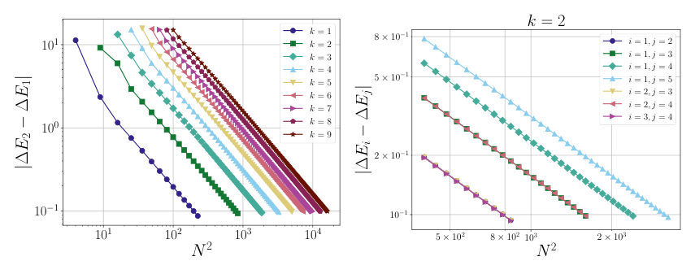
<figcaption class="paper-figure-caption"><b>Fig 3.</b> Figure 3: Convergence of the level spacing to a harmonic oscillator for different values of the CS level k. ∆Ei represents the energy gap between the (i −1)-th and the i-th quasi-degenerate multiplets.</figcaption>
</figure>
<figure class="paper-figure-card">
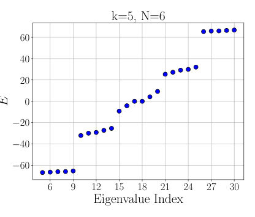
<figcaption class="paper-figure-caption"><b>Fig 4.</b> Figure 4: Mid spectrum for (a) k = 3, N = 4 and (b) k = 5, N = 6.</figcaption>
</figure>
<figure class="paper-figure-card">
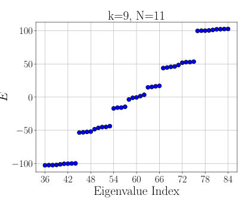
<figcaption class="paper-figure-caption"><b>Fig 5.</b> Figure 5: Mid spectrum for (a) k = 3, N = 7 and (b) k = 9, N = 11.</figcaption>
</figure>

**Summary.** This paper tackles the difficult task of non-perturbatively simulating Maxwell-Chern-Simons theory by analyzing its constant mode sector on a torus lattice. By mapping the problem onto a Hofstadter model, the authors demonstrate that the finite lattice spectrum correctly reproduces the system's fundamental topological degeneracy in the continuum limit. This provides a powerful theoretical tool for understanding how global topological invariants manifest in discretized quantum Hamiltonians.

**Why it may be interesting.** The study of topological gauge theories like MCS theory provides an excellent model for understanding emergent quantum symmetries and ground state degeneracies in strongly interacting lattice systems, relevant to fractional quantum Hall physics.

Detailed structure

**Main problem.** The primary goal is developing a non-perturbative Hamiltonian approach for Maxwell-Chern-Simons (MCS) theory in 2+1 dimensions, which is challenging due to the sign problem.

**Main result.** The study shows that the lattice spectrum exhibits quasi-degeneracies whose vanishing spread in the continuum limit correctly recovers the global topological degeneracy predicted by the CS level $k$.

**Method.** The authors analyze the zero-mode sector on a spatial torus, discretizing it to map the problem onto a generalized Harper-Hofstadter model with twisted boundary conditions.

**Model / system.** The system is the MCS theory defined on a lattice torus. The Hamiltonian is analyzed by focusing on the flat (zero-mode) sector, which governs the topological properties of the gauge field.

**Key observables.** Topological degeneracy ($k$-fold), energy spectrum structure, and the convergence rate of quasi-degenerate energy clusters.

**Important parameters / regimes.** The CS level $k$ (determining flux $\Phi_{tot} = 2\pi k$), lattice size ($N_x, N_y$), and the ratio of flux to area ($\alpha$).

**Assumptions / limitations.** The analysis focuses on the constant mode sector (flat connections) as a solvable benchmark. The continuum limit requires the flux per plaquette $\alpha$ to be small.

**Figures summary.** Figures illustrate the convergence of energy level spacing towards harmonic oscillator behavior and show the emergence of $k$-fold quasi-degenerate multiplets in finite lattices, particularly when commensurability conditions are met.

**Paper structure.** The paper progresses from establishing the physical motivation (Hamiltonian approach to MCS theory) to analyzing the zero-mode sector on a torus. It details the lattice discretization, derives the effective Harper-type Hamiltonian, and systematically analyzes spectral properties under different flux/lattice commensurability regimes ($	ext{gcd}(k, N)$).

Abstract

Maxwell-Chern-Simons (MCS) theory in $2+1$ dimensions provides a paradigmatic example of a topological gauge theory with both dynamical and topological degrees of freedom. Its Euclidean formulation suffers from a sign problem, making Hamiltonian numerical approaches particularly attractive. As a first step toward the non-perturbative Hamiltonian study of MCS theory, we investigate the constant mode sector on a spatial torus. Being analytically solvable in the continuum, it provides an ideal benchmark for understanding how the topological properties of the theory are encoded in a finite-dimensional lattice Hilbert space. We construct a finite-dimensional discretization of the torus of flat connections and show that the resulting lattice problem maps onto a generalized Harper-Hofstadter model with twisted boundary conditions. We identify the commensurability conditions under which the finite lattice exactly reproduces the magnetic translation algebra and the topological degeneracy of the continuum theory. A systematic analysis of gauge field truncation and its convergence toward the continuum limit is then presented.

[↑ back to top](#top)

### [Exact dimer ground states of long-range spin chains and ladders](http://arxiv.org/abs/2607.01081v1)

**Authors:** Jędrzej Wardyn, Miłosz Panfil  
**Type:** theory · **Category:** strongly correlated electrons · **PDF:** <https://arxiv.org/pdf/2607.01081v1>  
**Analysis basis:** full PDF text, analyzed in chunks
**Topic relevance:** `exotic spin models in light-matter` **3/5** · `analog quantum simulation` **2/5** · `entanglement & information structure` **2/5** · `correlated cavity matter` **1/5**

↔ Scroll figures horizontally

<figure class="paper-figure-card">
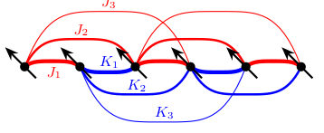
<figcaption class="paper-figure-caption"><b>Fig 1.</b> Figure 1: Diagram of a J1 −K1 −J2 −K2 −J3 −K3 chain given in (2). The Jn(Kn) interactions are drawn in red (blue) and the decreasing thickness signifies increase in distance n.</figcaption>
</figure>
<figure class="paper-figure-card">

<figcaption class="paper-figure-caption"><b>Fig 2.</b> Figure 3: (a) The positivity polytope for J1–J2–J3 model: the teal region is for the spin chain (δn = 0) and the orange region for ladder with δk specified on the plot. The values are in the units of J1. The two black dots are the models with the exact dimer ground states. For the chain this is the Majumdar-Ghosh model. (b) The dimerization polytope for J1 −J5 model for chain (teal) and for ladder (yellow). The values of ¯J2 and ¯J4 are fixed by the condition (33).</figcaption>
</figure>
<figure class="paper-figure-card">

<figcaption class="paper-figure-caption"><b>Fig 3.</b> Figure 5: The ground state energy density of anisotropic LEM Hamiltonians in γy-γz plane normalised by γx. (a) For n = 4 and above the critical line, the anisotropic LEM is semi-positive definite, the ground state has zero energy, and is the dimer state. Below, the critical line the anisotropic LEM is not positive and the ground state is not anymore the exact dimer. (b) For n = 3 there is an approximate at small anisotropies dimer state we show nonexact dimer phase transition that happens below the red line, where we can see the highest scaled values of energy happen around the phase transition line. At γy/γz = 1 the model admits XXZ anisotropy, transitioning to an exact fully polarised...</figcaption>
</figure>
<figure class="paper-figure-card">

<figcaption class="paper-figure-caption"><b>Fig 4.</b> Figure 4: The critical lines for the positivity of the anisotropic Qγ operators for even (left panel) and odd (right panel ) ranges n of the couplings. The horizontal lines are the XXZ values of eq. (43). For n = 2 we have an analytical result shown as dashed green lines [40] which we compare to n &gt; 3 results from ED in (a) and (b).</figcaption>
</figure>
<figure class="paper-figure-card">

<figcaption class="paper-figure-caption"><b>Fig 5.</b> Figure 7: Phase diagram of J1 −J2 −J3 −J4 anisotropic chain shown by measurements of the ground state energy and dimer entropy done with ED for system of size L = 16 in OBC. The dimerization conditions predict the dimer phase in the hatched region bounded by dashed red lines. As in the isotropic case we see the conditions are not necessary as we find dimer phase in the whole white region. The blue line denotes phase transition to an exact FM phase.</figcaption>
</figure>

**Summary.** This work rigorously determines the conditions under which long-range quantum spin chains and ladders possess an exact dimer ground state. By analyzing Hamiltonian structure using semi-positivity criteria and extending these methods to anisotropic interactions, the authors map out complex phase diagrams. The findings provide both theoretical boundaries and numerical confirmations for understanding highly correlated magnetic phases.

**Why it may be interesting.** The rigorous mathematical framework used—defining physical phases through convex cones and spectral positivity—provides powerful tools applicable to understanding stability in complex, interacting many-body systems beyond simple mean-field treatments.

Detailed structure

**Main problem.** The primary goal is determining precise, explicit conditions on coupling constants that guarantee an exact dimer state is the ground state for long-range interacting spin chains and ladders.

**Main result.** The authors derived sufficient conditions ($\alpha_n \ge 0$, $eta_{2n} \ge 0$, and $eta_{2n-1} = 0$) that define regions in the phase diagram where the dimer state is guaranteed, extending these results to anisotropic interactions.

**Method.** The analysis combines theoretical derivation of necessary/sufficient conditions (e.g., semi-positivity arguments) with validation using exact diagonalization on finite systems and geometric interpretations via convex cones.

**Model / system.** The study focuses on interacting quantum spin chains and ladders described by long-range Hamiltonians, which are generalized to include anisotropic interactions ($\gamma_\mu$). The system is analyzed in terms of pseudospin operators and related linear exchange models.

**Key observables.** Ground state energy ($E_{	ext{GS}}$), Dimer entanglement entropy ($\Delta S_{	ext{dimer}}$), and the coefficients $\alpha_n$ and $eta_n$ derived from the Hamiltonian structure.

**Important parameters / regimes.** Coupling constants $\{J_n\}$ and $\{K_n\}$, anisotropy parameters ($\gamma_x, \gamma_y, \gamma_z$), and system length $L$.

**Assumptions / limitations.** The analysis assumes an even length $L$ for simplicity; while sufficient conditions are derived, numerical results suggest the actual dimer phase can extend beyond these theoretical boundaries.

**Figures summary.** Figures illustrate phase diagrams showing predicted vs. numerically found regions for the dimer state in both isotropic and anisotropic chains/ladders, using energy and entanglement entropy as diagnostics.

**Paper structure.** The paper progresses from establishing general Hamiltonian forms (chains/ladders) to deriving necessary conditions via semi-positivity arguments ($\alpha_n, eta_n$). It then extends this analysis to include anisotropy by analyzing the spectrum of an asymmetric quantum top and finally validates results using ED on specific models.

Abstract

Interacting spin chains and ladders are known to support a plethora of quantum phases with complex ground-state phase diagrams. In this work, we study a large family of such models and determine precise, explicit conditions under which an exact dimer state is guaranteed to be the ground state. These general conditions are validated for various generalizations of the Majumdar-Ghosh model using exact diagonalization. Our results provide exact reference points in the phase diagrams of a wide class of spin chains and ladders, including those with anisotropic and arbitrary-range interactions.

[↑ back to top](#top)

### [Slow heat-driven flow in a gas of hard disks](http://arxiv.org/abs/2607.00449v1)

**Authors:** Amit Kumar, Abhishek Dhar, Baruch Meerson  
**Type:** both · **Category:** statistical mechanics · **PDF:** <https://arxiv.org/pdf/2607.00449v1>  
**Analysis basis:** full PDF text, analyzed in chunks
**Topic relevance:** `non-equilibrium dynamics` **3/5** · `non-equilibrium universality` **2/5** · `Frenkel-Kontorova` **1/5** · `Keldysh / 2PI / non-Gaussian methods` **1/5**

↔ Scroll figures horizontally

<figure class="paper-figure-card">

<figcaption class="paper-figure-caption"><b>Fig 1.</b> FIG. 1. Scaling function Θ(ξ) for TL/TR = 2 (left panel) and 5 (right panel).</figcaption>
</figure>
<figure class="paper-figure-card">
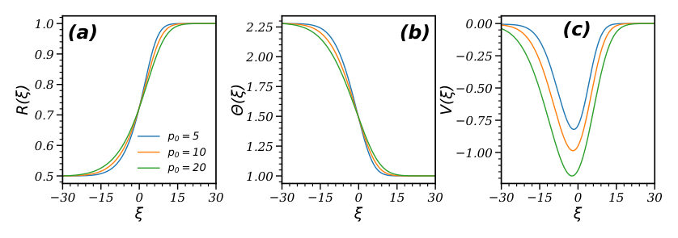
<figcaption class="paper-figure-caption"><b>Fig 2.</b> FIG. 2. Dependence of the NSE solution on the initial pressure p0: Rescaled density R (a), velocity V (b), and temperature Θ (c) as functions of the rescaled coordinate ξ, obtained from numerical solution of Eqs. (18) and (19) for pressures p0 = 5, 10, and 20. As the pressure increases, the transition region broadens, and the magnitude of the negative velocity peak increases. The parameters are ρL = 0.075, ρR = 0.15, TR = p0/[ρRZ(ρR)], and TL = p0/[ρLZ(ρL)].</figcaption>
</figure>
<figure class="paper-figure-card">
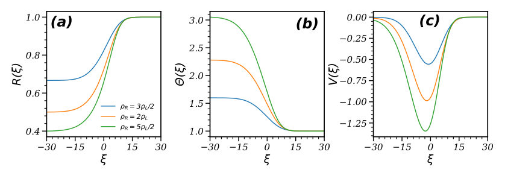
<figcaption class="paper-figure-caption"><b>Fig 3.</b> FIG. 3. Dependence of the finite-density solution on the density ratio ρR/ρL: Shown are the rescaled density R (a), velocity V (b), and temperature Θ (c) as functions of the rescaled coordinate ξ, obtained from the numerical solution of Eqs. (18) and (19) for ρR = 3ρL/2, 2ρL, and 5ρL/2, with ρL = 0.075. As ρR increases, the density and temperature profiles become steeper, while the magnitude of the negative velocity peak increases, and its position shifts to the left. The parameters are: p0 = 10, TR = p0/[ρRZ(ρR)], and TL = p0/[ρLZ(ρL)].</figcaption>
</figure>
<figure class="paper-figure-card">
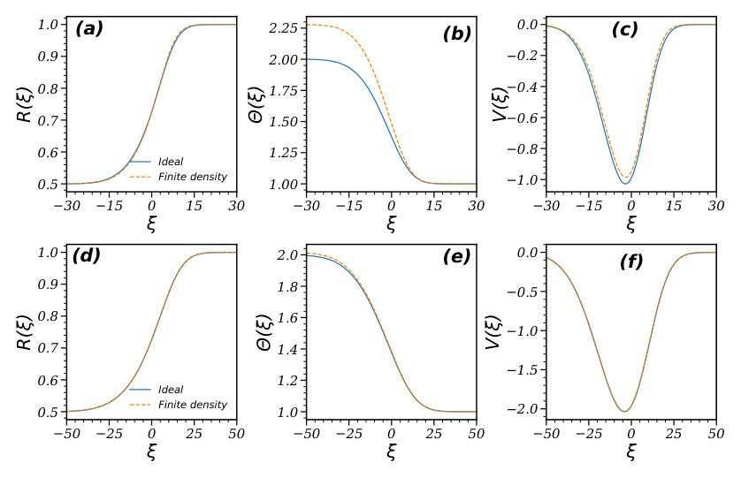
<figcaption class="paper-figure-caption"><b>Fig 4.</b> FIG. 4. Finite-density hard disk gas vs. ideal gas. Shown are the rescaled density R, velocity V , and temperature Θ as functions of the rescaled coordinate ξ, obtained from the numerical solution of Eqs. (18) and (19). Panels (a–c) correspond to the initial densities ρL = 0.075 and ρR = 0.15, while panels (d–f) correspond to ρL = 0.005 and ρR = 0.01. The ideal-gas results are obtained by setting the compressibility factor Z(ρ) = 1. It is evident from the plots that, as the initial densities become very small, the finite-density solution and the ideal-gas solutions converge. The parameters are: p0 = 10, TR = p0/[ρRZ(ρR)], and TL = p0/[ρLZ(ρL)].</figcaption>
</figure>
<figure class="paper-figure-card">

<figcaption class="paper-figure-caption"><b>Fig 5.</b> FIG. 5. Spatio-temporal behavior of (a–c) density, temperature, and velocity as functions of x at different times t = 100, 200, 400, and (d–f) the scaled functions and comparison with the hydrodynamic predictions. The solid lines in Figs. (a–f) represent the EDMD data, and the dashed lines in Figs. (e–f) represent the solution of Eqs. (18) and (19). We see that the MD data shows good scaling collapse in accordance with the scaling ansatz Eq. (17). The results are shown for the parameters: p0 = ρTZ(ρ) = 10, ρR = 0.15, ρL = 0.075, TR = p0/[ρRZ(ρR)], and TL = p0/[ρLZ(ρL)]. The typical simulation box for these parameters was L = 104 and W = 10 with the total of N = 11, 250 hard disks. The data...</figcaption>
</figure>

**Summary.** This work analyzes slow heat conduction in hard disk gases by coupling hydrodynamic theory with molecular dynamics simulations. The authors successfully extend the theoretical framework beyond the ideal gas limit to account for finite density effects using an appropriate equation of state. The strong agreement between theory and simulation validates the use of isobaric hydrodynamics for strongly inhomogeneous, low-Mach number cooling flows.

**Why it may be interesting.** Although focused on classical fluid dynamics, the rigorous comparison between continuum hydrodynamics (derived from statistical principles) and microscopic particle simulations provides a powerful benchmark for developing non-equilibrium transport theories applicable to quantum systems.

Detailed structure

**Main problem.** The study investigates slow, heat-driven non-equilibrium flow in a gas of hard disks confined to a channel under nearly isobaric conditions.

**Main result.** The hydrodynamic theory, extended to finite densities using a hard-disk equation of state, shows excellent agreement with event-driven molecular dynamics simulations across both dilute and dense regimes.

**Method.** The authors solve coupled one-dimensional partial differential equations derived from the low-Mach number isobaric heat-conduction formalism and compare these solutions against particle-level Molecular Dynamics (MD) simulations.

**Model / system.** The system is a gas of elastically colliding hard disks confined to a long channel, modeled using hydrodynamic equations that incorporate non-ideal equation of state corrections for finite densities.

**Key observables.** Temperature T(x, t), Density $\rho(x, t)$, Velocity $v(x, t)$, and Pressure $p(x, t)$.

**Important parameters / regimes.** Low Mach number regime; initial conditions featuring large temperature/density contrasts but nearly equal pressures ($p \approx 	ext{const}$).

**Assumptions / limitations.** The flow is assumed to be low-Mach number (neglecting acoustic dynamics), and the theory extends from an ideal gas limit to finite densities using a specific equation of state.

**Figures summary.** Figures show self-similar scaling collapse of density, velocity, and temperature profiles when comparing MD data to hydrodynamic solutions; pressure plots confirm the system remains nearly isobaric over time.

**Paper structure.** The paper first establishes the ideal gas limit theory, then extends it by incorporating a non-ideal equation of state for finite densities. The resulting 1D equations are solved numerically and validated against event-driven molecular dynamics simulations.

Abstract

We study a slow heat-driven flow in a gas of elastically colliding hard disks confined to a long channel. The initial state consists of two regions with large temperature and density contrasts but nearly equal pressures, leading to a low-Mach-number, nearly isobaric evolution. In the dilute limit, the corresponding isobaric hydrodynamic theory reduces to a previously known ideal-gas description. We extend this theory to finite densities by incorporating a non-ideal equation of state of a hard-disk fluid, and solve the resulting one-dimensional equations numerically. Finite-density effects produce appreciable deviations from the ideal-gas prediction. We then test the theory directly against event-driven molecular dynamics simulations of hard disks and find very good agreement in both the dilute and finite-density regimes. The results provide, to our knowledge, the first particle-level test of isobaric gas dynamics of a strongly inhomogeneous cooling flow.

[↑ back to top](#top)

### [Velocity of a Quantum Particle in a Classically Forbidden Region](http://arxiv.org/abs/2607.00100v1)

**Authors:** Christian Beck, Sheldon Goldstein, Dustin Lazarovici, Roderich Tumulka, Nino Zanghi  
**Type:** theory · **Category:** other · **PDF:** <https://arxiv.org/pdf/2607.00100v1>  
**Analysis basis:** full PDF text, analyzed in chunks
**Topic relevance:** `quantum measurements` **3/5** · `non-equilibrium dynamics` **2/5** · `measurement-induced transitions` **1/5** · `methods for driven-dissipative` **1/5**

↔ Scroll figures horizontally

<figure class="paper-figure-card">

<figcaption class="paper-figure-caption"><b>Fig 1.</b> Figure 1: Illustration of the potential landscape underlying the experimental setup (dark: low, light: high). The main waveguide at y = y0 extends throughout; for x ≥0 the transverse potential becomes a double-well, side- coupling the main waveguide to a parallel auxiliary waveguide at y = −y0. At x = 0, there is a potential step, acting as a barrier for the particle incident from the main waveguide. An explicit form is given in (2) below.</figcaption>
</figure>
<figure class="paper-figure-card">
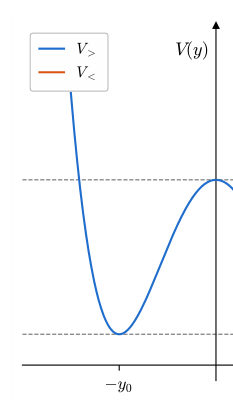
<figcaption class="paper-figure-caption"><b>Fig 2.</b> Figure 2: Potentials V&lt; and V&gt; as in (2)</figcaption>
</figure>
<figure class="paper-figure-card">
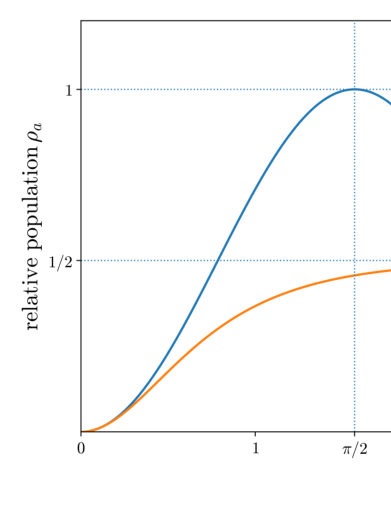
<figcaption class="paper-figure-caption"><b>Fig 3.</b> Figure 3: Relative population ρa in the auxiliary waveguide as a function of longitudinal distance from the step in units of |δk|−1. In the propagative regime (blue curve), the populations oscillate between the two waveguides, with complete transfer (ρa = 1) at odd multiples of π/(2δk). In the evanes- cent regime (orange curve, as given by (29)), the populations equilibrate monotonically, approaching ρa = 1/2 over the characteristic length scale Xeq ∼1/δκ.</figcaption>
</figure>
<figure class="paper-figure-card">

<figcaption class="paper-figure-caption"><b>Fig 4.</b> Figure 4: Numerical simulation of Bohmian trajectories in the classi- cally forbidden region (x &gt; 0) of the 2D setup for V0 = 0.54 meV, ℏJ0 = 26.2 µeV, Ek0 −V0 = −0.07 meV, σk = 2.5 × 10−3 µm−1. (a) Spatial paths of 5,000 trajectories sampled from |Ψ|2. Main waveguide centered around y0 = 10 µm; auxiliary waveguide centered around −y0 = −10 µm. (b) Longitudinal coordinate X(t) for 500 representative trajectories, exhibiting parabolic turnaround. Horizontal axis centered around median reversal time. (c) Transverse coordinate Y (t) for 292 trajectories that crossed y = 0 prior to turnaround; the simultaneous reversal of X(t) and Y (t) reflects the time- reversal symmetry (66).</figcaption>
</figure>
<figure class="paper-figure-card">

<figcaption class="paper-figure-caption"><b>Fig 5.</b> Figure 5: Distribution of tunneling times for Bohmian trajectories migrating from the main into the auxiliary waveguide of the 2D setup. Here, “tunneling time” is defined as the time the Bohmian particle takes from entering the classically forbidden region at x = 0 (in the main waveguide, y &gt; 0) until entering the auxiliary waveguide, y &lt; 0. Top: Propagative regime (Ek0 − V0 = +0.15 meV). Bottom: Evanescent regime (Ek0 −V0 = −0.07 meV). σk = 2.5×10−3 µm−1 for both. Time is shown in units of π/(2J0). The orange curve shows for comparison the distribution of the first time of crossing from y &gt; 0 to y &lt; 0, p(τ) ≈(π/2) sin(πτ), in the 1D double well model (8) with initial state ϕm.</figcaption>
</figure>

**Summary.** The authors resolve a conflict between experimental measurements and Bohmian mechanics concerning particle speeds in classically forbidden regions. They show that naive estimates based on tunneling time or simple dwell times are incorrect because they neglect entanglement effects between spatial dimensions. By correctly applying the Büttiker dwell time formula, they demonstrate quantitative agreement with Bohmian predictions.

**Why it may be interesting.** This work directly addresses fundamental conceptual issues regarding quantum measurement, non-equilibrium dynamics, and the interpretation of wave function properties (like speed) in regimes where classical intuition breaks down, which is central to AMO physics.

Detailed structure

**Main problem.** The paper resolves discrepancies between particle speeds inferred from experiments (Sharoglazova et al.) and predictions from Bohmian mechanics when a quantum particle tunnels through a classically forbidden region.

**Main result.** The discrepancy arises because naive speed estimates fail to account for entanglement between longitudinal and transverse degrees of freedom in the evanescent regime. A corrected application of the Büttiker dwell time formula yields results that perfectly agree with Bohmian predictions.

**Method.** Theoretical analysis involving detailed calculations of Bohmian trajectories, average speeds, and dwell times using a two-dimensional waveguide model derived from the Schrödinger equation.

**Model / system.** A non-relativistic quantum particle modeled in coupled waveguides realizing motion in a 2D potential landscape with a barrier/potential step. The dynamics are governed by the time-dependent Schrödinger equation.

**Key observables.** Bohmian velocity, average speed ($ar{v}_B$), tunneling time ($T_{tun}$), and dwell time ($	au_d$).

**Important parameters / regimes.** Evanescent regime (exponential decay), coupling constants ($\mu, ar{\mu}$), energy splitting ($J_0$), and wave packet width ($\sigma_k$).

**Assumptions / limitations.** The core assumption challenged is that transverse tunneling time is independent of the longitudinal degree of freedom's entanglement effects in the evanescent regime.

**Figures summary.** Figures illustrate Bohmian trajectories (parabolic paths) and compare density distributions, showing differences between propagative and evanescent regimes, particularly regarding wave function factorization.

**Paper structure.** The paper progresses by first identifying the conflict with experimental results, then developing theoretical tools (Bohmian mechanics, dwell time corrections), and finally resolving the puzzle by analyzing how entanglement invalidates simple tunneling time assumptions in the forbidden region.

Abstract

Recently, Sharoglazova et al. [Nature 643, 67 (2025)] proposed a procedure for determining the speed of a quantum particle in the classically forbidden region of a potential step, and implemented it in a beautiful experiment. The inferred speeds disagree significantly with the Bohmian velocities, which the authors presented as an experimental challenge to Bohmian mechanics. This is puzzling because the speeds are inferred from particle populations in coupled waveguides for which Bohmian mechanics and standard quantum mechanics make identical predictions. We resolve the puzzle by a detailed theoretical analysis of the experimental setup. We show that the speed inference rests on an assumption that fails in the relevant (evanescent) regime according to both Bohmian mechanics and standard quantum mechanics -- namely that the inter-waveguide tunneling time is set by the transverse coupling and is not affected by entanglement with the longitudinal degree of freedom. We also consider a second speed estimate suggested by Sharoglazova et al., which is based on the Büttiker dwell time formula for particles in the forbidden region. We show that the authors applied the formula incorrectly, and that a correct application yields exact agreement with the predictions of Bohmian mechanics. Our analysis includes explicit calculations of Bohmian trajectories, dwell times, and longitudinal speeds in the two-dimensional waveguide model of the experiment.

[↑ back to top](#top)

### [Leggett-Garg inequality in the massive scalar vacuum: No violation under spacelike-separated measurements](http://arxiv.org/abs/2607.00314v1)

**Authors:** Yang Xiang  
**Type:** theory · **Category:** other · **PDF:** <https://arxiv.org/pdf/2607.00314v1>  
**Analysis basis:** full PDF text, analyzed in chunks
**Topic relevance:** `quantum measurements` **3/5** · `Keldysh / 2PI / non-Gaussian methods` **1/5** · `entanglement & information structure` **1/5** · `measurement-induced transitions` **1/5**

↔ Scroll figures horizontally

<figure class="paper-figure-card">
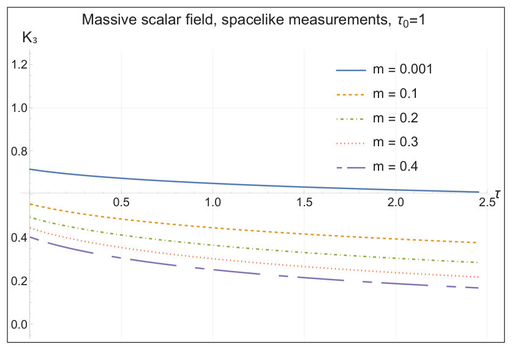
<figcaption class="paper-figure-caption"><b>Fig 1.</b> FIG. 1. K3(τ, L) for the massive scalar field with spacelike-separated measurements (L = τ +2+ǫ, ǫ = 10−3) for various masses m. The thin horizontal line marks the classical bound K3 = 1; for all masses considered, K3 remains strictly below 1. For each mass, the maximum occurs at the smallest accessible τ (τ = 0.001), and Kmax 3 decreases monotonically as m increases, from Kmax 3 ≈0.716 at m = 0.001 down to 0.403 at m = 0.4. For τ ≥2, the two time windows no longer overlap; the curves decay exponentially with τ, as expected from the spacelike decay of the massive Hadamard function.</figcaption>
</figure>

**Summary.** This theoretical paper investigates whether the vacuum state of a massive scalar field violates the Leggett-Garg inequality (LGI) when measurements are strictly spacelike separated. By employing a protocol that rigorously satisfies noninvasive measurability, the authors calculate the LGI parameter $K_3$ and find it remains below the classical bound of 1. This result highlights a fundamental distinction between spatial entanglement violations (Bell tests) and temporal macrorealism in relativistic quantum fields.

**Why it may be interesting.** This work provides a rigorous methodological benchmark by successfully adapting Bell/LGI tests to QFT while satisfying causality constraints. The contrast between violating spatial Bell inequalities and preserving temporal macrorealism is highly relevant for understanding quantum foundations in relativistic settings.

Detailed structure

**Main problem.** The paper aims to test for macrorealism using the Leggett-Garg inequality (LGI) in a relativistic quantum field theory setting, specifically by ensuring noninvasive measurability (NIM) through spacelike separation.

**Main result.** Under strict spacelike separation conditions, the vacuum state of a free massive scalar field does not violate the LGI ($K_3 < 1$), establishing that macrorealism is preserved for Gaussian fields in this context.

**Method.** The authors use a protocol involving three independent ensembles measured at spacelike-separated events to calculate the LGI parameter $K_3$ from two-time correlation functions derived using the Heisenberg picture.

**Model / system.** The system modeled is a free massive scalar field ($\phi$) in 1+1 dimensions. The test utilizes dichotomic observables defined by the sign of smeared field values, $	ext{sign}(\phi(f))$.

**Key observables.** The primary diagnostic is the LGI parameter $K_3 = 2C(	au, L) - C(2	au, 2L)$, derived from two-time correlation functions $C(	au, L)$.

**Important parameters / regimes.** Mass ($m$), time separation ($	au$), and spatial separation ($L$). The condition $L > 	au + 2	au_0$ ensures spacelike separation.

**Assumptions / limitations.** The protocol strictly satisfies the Noninvasive Measurability (NIM) condition by ensuring all measurement events are spacelike separated. Calculations rely on the Gaussian nature of the vacuum state for free fields.

**Figures summary.** Figure 1 plots $K_3(	au, L)$ versus $	au$, showing that $K_3 < 1$ and demonstrating exponential decay for large time separations ($	au \ge 2$).

**Paper structure.** The paper establishes the theoretical framework by defining the LGI test in QFT with NIM. It then calculates the necessary two-time correlation functions using techniques appropriate for spacelike separation, culminating in a numerical demonstration that $K_3$ remains below the classical bound of 1.

Abstract

We overcome the long-standing noninvasive measurability (NIM) challenge in Leggett-Garg tests by exploiting the causal structure of quantum field theory (QFT). Our protocol uses three independent ensembles of the vacuum state, each measured by a different pair of observers at spacelike-separated events, yielding the three two-time correlators. By placing these events at positions $(0,0)$, $(τ,L)$, and $(2τ,2L)$ with $L>τ+2τ_0$, we rigorously ensure that no measurement can influence another. We investigate the vacuum state of a free massive scalar field in 1+1 dimensions, employing the dichotomic observable $Q(f)=\operatorname{sign}(φ(f))$ where $φ(f)$ is the smeared field. In the Heisenberg picture, the time evolution is absorbed into a translation of the time-window function, allowing us to derive the two-time correlation function $C(τ,L)$ and the Leggett-Garg parameter $K_3=2C(τ,L)-C(2τ,2L)$. For non-overlapping time windows, we find that the correlation function decays exponentially with $τ$ for a massive field. For overlapping windows, our numerical computation for a rectangular time window yields $K_3<1$ across the entire mass range, firmly establishing that the vacuum does not violate the LGI. Thus, under strict noninvasive conditions, the vacuum shows no violation of macrorealism, in stark contrast to its well-known violation of spatial Bell inequalities. Our spacelike-separated protocol provides the first LGI test in QFT with rigorously satisfied NIM, setting a methodological benchmark for future studies and highlighting the fundamental distinction between spacelike entanglement and temporal macrorealism in relativistic quantum fields.

[↑ back to top](#top)

### [Exact interlayer triplet-pairing eigenstates in the extended Hubbard model](http://arxiv.org/abs/2607.01038v1)

**Authors:** F. X. Liu, Z. Song  
**Type:** theory · **Category:** strongly correlated electrons · **PDF:** <https://arxiv.org/pdf/2607.01038v1>  
**Analysis basis:** full PDF text, analyzed in chunks
**Topic relevance:** `analog quantum simulation` **3/5** · `entanglement & information structure` **1/5** · `non-equilibrium dynamics` **1/5**

↔ Scroll figures horizontally

<figure class="paper-figure-card">

<figcaption class="paper-figure-caption"><b>Fig 1.</b> FIG. 1. (a) Schematic illustration of a multi-layered lattice system. The index m ∈[1, λ] labels the layers. All layers are identical bipartite lattices. The interlayer hopping and interaction are nearest-neighbor. (b) The simplest example of the system is an N × λ square lattice, where the layers reduce to chains. The parameters of the extended Hubbard model are indicated in the panel. The key feature is that the nearest-neighbor interactions exist only between layers. The triplet pair presented in this work is formed across two nearest-neighbor sites on two layers (labeled by a red dashed line surrounding the two sites), while the singlet pair is an on-site pair (labeled by a red dashed...</figcaption>
</figure>
<figure class="paper-figure-card">

<figcaption class="paper-figure-caption"><b>Fig 2.</b> FIG. 2. Plots of the fidelity defined in Eq. (22) for the initial</figcaption>
</figure>
<figure class="paper-figure-card">

<figcaption class="paper-figure-caption"><b>Fig 3.</b> FIG. 3. Plots of the two correlation functions CS(r, t) and CT(r, t) defined in Eqs. (23) and (24) for three initial pair states</figcaption>
</figure>

**Summary.** The authors propose and derive exact interlayer triplet-pairing eigenstates for the multi-layer extended Hubbard model. These unique states only exist in bilayer and trilayer systems due to specific constraints on the Hamiltonian's algebra. The study confirms these states via time evolution simulations, highlighting a coexistence of singlet and triplet pairing mechanisms.

**Why it may be interesting.** This work provides a rigorous analytical framework for finding exotic, long-range ordered states in strongly correlated lattice models, which is highly relevant for understanding high-$T_c$ superconductivity mechanisms beyond simple mean-field treatments.

Detailed structure

**Main problem.** The work investigates the existence and properties of exact interlayer triplet-pairing eigenstates within the multi-layer extended Hubbard model, extending prior knowledge on $\eta$-pairing states.

**Main result.** Exact condensate-pair eigenstates exhibiting off-diagonal long-range order are found for bilayer and trilayer systems when interlayer interactions are present. These states demonstrate a unique pairing mechanism distinct from the standard $\eta$-pairing symmetry.

**Method.** The analysis relies on constructing these exact eigenstates by analyzing commutation relations involving the Hamiltonian and specialized triplet-pairing operators, utilizing a Restricted Spectrum Generating Algebra (RSGA).

**Model / system.** The system is the multi-layer extended Hubbard model defined on a 2D square lattice with parameters including intralayer hopping ($t$), interlayer hopping ($t_\perp$), on-site repulsion ($U$), and interlayer interaction ($V$). The Hamiltonian incorporates both singlet ($\eta$) and triplet ($\zeta$) pairing channels.

**Key observables.** Off-diagonal long-range order (ODLRO), fidelity $F(t)$ under time evolution, and correlation functions for singlet ($C_S$) and triplet ($C_T$) pairs.

**Important parameters / regimes.** The existence of exact states is critically dependent on the number of layers ($\lambda=2$ or $\lambda=3$) and the presence of interlayer interactions ($V \neq 0$).

**Assumptions / limitations.** The derivation requires restricting Hamiltonian parameters to satisfy the conditions necessary for applying the Restricted Spectrum Generating Algebra (RSGA).

**Figures summary.** Figure 2 illustrates that the fidelity $F(t)$ remains unity for $\lambda=2, 3$ when $V \neq 0$, while decaying for $\lambda=4$. Figure 3 shows correlation functions decaying when interlayer interactions are present.

**Paper structure.** The paper first introduces the model and operators, derives the conditions for exact eigenstates using RSGA, proves their existence only for bilayer/trilayer systems, and finally uses quench dynamics simulations (fidelity analysis) to confirm these theoretical findings.

Abstract

$η$-pairing symmetry generalizes the pairing mechanisms in superconductivity but is broken in the presence of interlayer interactions. In this work, we extend this approach to triplet pairs. We propose interlayer triplet-pairing operators for the multi-layer extended Hubbard model. We find that a set of exact condensate-pair eigenstates can be constructed, which exhibit off-diagonal long-range order. In contrast to the $η$-pairing mechanism, this originates from restricted spectrum generating algebra and is only available for bilayer and trilayer systems in the presence of interlayer Hubbard interactions. Nevertheless, the system also retains the original on-site $η$-pairing symmetry in the absence of interlayer interactions. Consequently, both singlet and triplet pairs coexist in the eigenstates of the multi-layer Hubbard model. We employ quench dynamics to demonstrate the results through numerical simulations. Our findings open avenues for the study of exact condensate-pair states in strongly correlated systems.

[↑ back to top](#top)

### [Three-qubit nonlocality paradoxes: beyond GHZ](http://arxiv.org/abs/2607.00795v1)

**Authors:** Nadish de Silva, Santanil Jana, Ming Yin  
**Type:** theory · **Category:** quantum information and computing · **PDF:** <https://arxiv.org/pdf/2607.00795v1>  
**Analysis basis:** full PDF text, analyzed in chunks
**Topic relevance:** `entanglement & information structure` **3/5** · `correlated / nonlocal dissipation` **1/5** · `quantum measurements` **1/5**

↔ Scroll figures horizontally

<figure class="paper-figure-card">
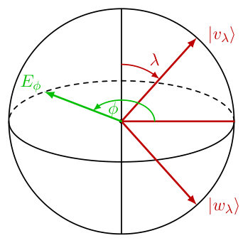
<figcaption class="paper-figure-caption"><b>Fig 1.</b> Figure 1: The one-qubit geometry of a balanced state. The red vectors are the states |vλ⟩and |wλ⟩, symmetric about the equator, while Eϕ is an equatorial measurement.</figcaption>
</figure>
<figure class="paper-figure-card">

<figcaption class="paper-figure-caption"><b>Fig 2.</b> Figure 2: Schematic form of the β-equation. Here βA := β(λ1, A + aπ), βB := β(λ2, B + bπ), and βC := β(λ3, C + cπ). The event (A, B, C) 7→(a, b, c) is impossible exactly when the three angle contributions sum to the target direction π −Φ.</figcaption>
</figure>
<figure class="paper-figure-card">
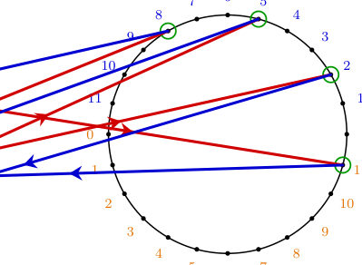
<figcaption class="paper-figure-caption"><b>Fig 3.</b> Figure 4: A concrete witness path in the bipartite implication graph, drawn on the literal 2N-clock for N = 12. Each circle is a copy of Z24: the blue and orange labels are the outcome-0 and outcome-1 copies of the measurement clock Z12, so antipodal points represent complementary literals of the same measurement. The green-ringed vertices are the literals traversed by the path; the red and blue arrows are implication edges arising from the two Charlie conditionings, and the path alternates between these two partial matchings. Its Alice measurement indices form the return-map coset 1+3Z12 = {1, 4, 7, 10}, while the corresponding Bob indices form the paired reflected coset 2 + 3Z12 = {2, 5,...</figcaption>
</figure>
<figure class="paper-figure-card">

<figcaption class="paper-figure-caption"><b>Fig 4.</b> Figure 5: Implication graph for the total Charlie assignment z = (0, 0, 0, 0) of Example 5.5(1).</figcaption>
</figure>

**Summary.** This paper provides a comprehensive and mathematically rigorous classification of three-qubit nonlocality paradoxes, demonstrating that these paradoxical structures are far richer than previously thought. Using graph theory and combinatorial techniques, the authors map out the precise conditions under which quantum correlations violate classical expectations. This advances our understanding of fundamental quantum advantages beyond simple state examples.

**Why it may be interesting.** While focused on quantum information theory, the rigorous mathematical classification of fundamental resource measures like nonlocality provides deep insights into the structure of quantum correlations that underpin many-body physics models.

Detailed structure

**Main problem.** To completely classify all three-qubit nonlocality paradoxes established via a biconditional parity proof, extending beyond previously known examples like the GHZ paradox.

**Main result.** The authors provide a complete structural classification for these paradoxes, showing that they are abundant and violate prior regularity assumptions. They also present explicit examples of paradoxes arising from states outside the interpolant family.

**Method.** The work employs advanced techniques combining graph theory (2-CNF formulae, implication graphs) with combinatorial analysis to characterize logical obstructions in quantum correlations.

**Model / system.** The study focuses on three-qubit quantum systems and the concept of 'nonlocality paradoxes,' which are logical contradictions arising when assuming classical probabilistic models for quantum measurement outcomes.

**Key observables.** Nonlocal fraction, unsatisfiable sets of constraints derived from impossible measurement contexts (e.g., $\Omega(z)$ or $\Psi(z)$).

**Important parameters / regimes.** The number of qubits ($n=3$), the structure of the measurements (equatorial settings), and parameters defining the state $|	ext{B}(\lambda, \Phi)
angle$.

**Assumptions / limitations.** Initial classification focused on paradoxes admitting a biconditional parity proof; later work challenges assumptions about interpolant states.

**Figures summary.** Figures illustrate the geometry of balanced quantum states and schematic representations of the $eta$-equation relating angles to impossible measurement outcomes for various qubit assignments.

**Paper structure.** The paper progresses from defining strong nonlocality via contextuality, establishing initial classifications using graph theory (2-SAT), developing structural tools like 'Charlie clocks,' and culminating in classifying paradoxes both within and outside the interpolant state family.

Abstract

Quantum nonlocality paradoxes, such as that of GHZ, provide maximally sharp logical obstructions to classical probabilistic models of quantum correlations. They are key resources in a broad variety of information-theoretic tasks that exhibit unconditional quantum advantage. For example, in nonlocal games, which are communication tasks that serve as core technical tools in recent landmark results in quantum computational complexity theory.   Their role in establishing quantum advantage motivated their study by Abramsky et al. who introduced an infinite family of three-qubit paradoxes exhibiting novel conditional structure. This was later extended by de Silva et al. into a full classification program.   In this work, we completely classify all three-qubit nonlocality paradoxes established via a biconditional parity proof; this is a very large class of paradoxes that encompasses all earlier-known examples. We do this by introducing a suite of new structural and combinatorial techniques. We find that the landscape of nonlocality paradoxes is far richer than previously understood, violating regularity conditions underlying all prior constructions.

[↑ back to top](#top)

### [Exploiting Symmetry in Quantum Reservoir Computing](http://arxiv.org/abs/2607.01187v1)

**Authors:** Markus Baumann, Michael Poppel, Thomas Gabor, Maximilian Zorn, Claudia Linnhoff-Popien, Jonas Stein  
**Type:** both · **Category:** disordered systems and neural networks · **PDF:** <https://arxiv.org/pdf/2607.01187v1>  
**Analysis basis:** full PDF text, analyzed in chunks
**Topic relevance:** `measurement-induced transitions` **2/5** · `quantum measurements` **2/5** · `methods for driven-dissipative` **1/5** · `non-equilibrium dynamics` **1/5**

↔ Scroll figures horizontally

<figure class="paper-figure-card">

<figcaption class="paper-figure-caption"><b>Fig 1.</b> Fig. 1. Compact symmetry-placement pipeline. The baseline breaks the cyclic action across encoding, coupling, measurement, and readout; the aligned model keeps it through all four interfaces.</figcaption>
</figure>
<figure class="paper-figure-card">

<figcaption class="paper-figure-caption"><b>Fig 2.</b> Fig. 2. Fixed-budget digital E/H/O/R audit. All configurations use the same 61 features per site, so differences come from symmetry placement rather than from a larger measurement budget. Panels (a)–(c) show representative Lorenz–96, advection, and Kuramoto–Sivashinsky settings: the bars summarize the best gain obtained when 0, 1, 2, 3, or all 4 interfaces are aligned, and the lower plots compare the all-untied baseline with the fully aligned model in paired test NRMSE. Panel (d) shows the full 16-configuration E/H/O/R lattice. Each node is one switch setting, and darker color means larger mean gain over the all-untied baseline. Aligning all four interfaces (E+H+O+R) gives the largest mean...</figcaption>
</figure>
<figure class="paper-figure-card">

<figcaption class="paper-figure-caption"><b>Fig 3.</b> Fig. 3. Diagnostic K = 6 forecast/error zooms, not included in the main K ∈{8, 10, 12} aggregate: advection (a) and Lorenz–96 (b). NRMSE is computed on the full diagnostic traces. Sym-QRC denotes the fully aligned 1111 model; QRC denotes the all-untied 0000 baseline.</figcaption>
</figure>
<figure class="paper-figure-card">
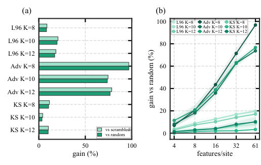
<figcaption class="paper-figure-caption"><b>Fig 4.</b> Fig. 4. Equal-budget measurement control. E, H, and R are fixed active, so only the measurement assignment changes. Panel (a) shows that the 61-feature orbit-aligned map outperforms scrambled and random 61-feature maps. Panel (b) varies the feature budget from 4 to 61 features per site; each curve is one task/ring-size setting, showing that orbit alignment helps already at small budgets and usually improves as more channels are measured.</figcaption>
</figure>

**Summary.** This work addresses the challenge of imposing symmetry in Quantum Reservoir Computing (QRC) by showing that symmetry must be enforced across all computational interfaces—encoding, dynamics, measurement, and readout. By introducing 'observable-orbit completion,' the authors demonstrate that aligning these four components yields substantial performance gains on forecasting tasks using both simulated and real-world data.

**Why it may be interesting.** It provides a concrete, actionable blueprint for how to incorporate physical symmetries into complex quantum machine learning models, moving beyond simple Hamiltonian symmetry constraints to address measurement limitations.

Detailed structure

**Main problem.** In Quantum Reservoir Computing (QRC), simply making the quantum reservoir symmetric is insufficient; the relevant symmetry must be explicitly visible in the final measured feature map for successful training.

**Main result.** Achieving optimal performance requires enforcing cyclic equivariance across all four architectural interfaces—encoding, dynamics, measurement, and readout—a concept termed 'observable-orbit completion'.

**Method.** The authors developed an 'observable-orbit completion' protocol that systematically measures symmetry-related observable channels across the entire system architecture to ensure consistency.

**Model / system.** The study uses QRC applied to cyclic time-series forecasting tasks (e.g., weather data on a latitude circle) implemented via quantum circuits, tested on spin-ring models and real-world datasets like WeatherBench 2.

**Key observables.** Normalized Root Mean Square Error (NRMSE) reduction; quantitative performance gains (%) when comparing fully aligned vs. baseline configurations across the four interfaces (E/H/O/R).

**Important parameters / regimes.** The feature set size is fixed at 61 features per site, comprising various Pauli channels and context features.

**Assumptions / limitations.** The method assumes a candidate symmetry group derived from task geometry or domain knowledge; the gains are shown to be robust across different physical implementations (spin-ring, real weather data).

**Figures summary.** Figures illustrate performance comparisons showing significant gains when all four interfaces are aligned compared to scrambled baselines. Table III quantifies these partial and full alignment gains.

**Paper structure.** The paper establishes the theoretical necessity of symmetry reaching the measurement layer, details the 'four-interface audit' framework (E/H/O/R), presents quantitative results across multiple forecasting tasks (L96, Advection, WeatherBench 2), and validates findings on both simulated spin-rings and actual hardware.

Abstract

Symmetry is a powerful inductive bias, but in quantum reservoir computing (QRC) it cannot be imposed only by making the reservoir symmetric. QRC maps inputs through fixed quantum dynamics into nonlinear expectation-value features and trains only a classical readout, so the relevant symmetry must be visible in the measured feature map. We study cyclic forecasting tasks, such as sensors around a turbine or weather stations along a latitude circle, where the same local pattern should be forecast by the same rule wherever it appears on the ring. Thus, rotating the input by one site should rotate, not change, the predicted field. We show that a symmetric Hamiltonian is not enough: even large Pauli measurement sets can fail if their channels do not match the data symmetry, since optimization cannot recover channels that were never measured. We address this through observable-orbit completion, which measures symmetry-related observable channels and aligns encoding, dynamics, measurement, and readout. The strongest gains arise from aligning all four interfaces together, with matched spin-ring, real-weather, and IBM hardware checks supporting the same measured-span mechanism.

[↑ back to top](#top)

### [Limitations of Error Model Approximations in Quantum Network Simulation](http://arxiv.org/abs/2607.00998v1)

**Authors:** Julia Freund, Jorge Miguel-Ramiro, Julius Wallnöfer, Wolfgang Dür  
**Type:** theory · **Category:** quantum information and computing · **PDF:** <https://arxiv.org/pdf/2607.00998v1>  
**Analysis basis:** full PDF text, analyzed in chunks
**Topic relevance:** `entanglement & information structure` **2/5** · `correlated / nonlocal dissipation` **1/5** · `driven-dissipative phase transition` **1/5** · `methods for driven-dissipative` **1/5** · `non-equilibrium dynamics` **1/5**

↔ Scroll figures horizontally

<figure class="paper-figure-card">

<figcaption class="paper-figure-caption"><b>Fig 1.</b> FIG. 1. A real quantum network (left) represents the true out- come of a communication task, e.g., successfully establishing a multipartite entangled state between Alice, Bob, Charlie, and Doris, while its classical simulation (right) predicts that out- come using simplified error models. Simplified assumptions on realistic noise can lead to qualitative and quantitative dis- agreement between the predicted and true outcomes in either direction.</figcaption>
</figure>
<figure class="paper-figure-card">

<figcaption class="paper-figure-caption"><b>Fig 2.</b> FIG. 3. Fidelity (left) and negativity (right) after one DEJMPS step on a pdep = 0.4 depolarized |Ψ0,0⟩Bell state, with initial fidelity/negativity 0.7/0.4. Operational noise is modeled as a deterministic over-rotation UY(±π/64), with opposite phases on the spatially separated qubits. Curves represent the 00 (olive) and 11 (purple) approximation noise outcomes, their average (blue), and the corresponding PTA (orange).</figcaption>
</figure>
<figure class="paper-figure-card">
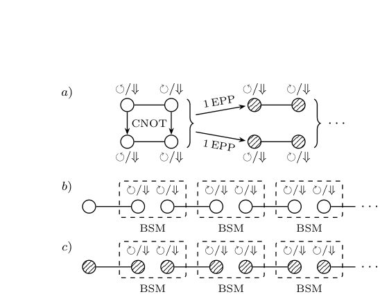
<figcaption class="paper-figure-caption"><b>Fig 3.</b> FIG. 2. Settings overview: we consider |Ψ0,0⟩Bell states with initial depolarizing or amplitude damping noise (white circles). Operational noise is either an over-rotation (curved arrows) or amplitude damping noise (double downward ar- row). a) Entanglement purification: from two identical initial states, the first pair is probabilistically distilled into a less noisy state (hatched circles) by applying local unitaries, a bi- lateral CNOT between the two copies (arrow), and local Pauli Z measurements on the second copy; the distillation succeeds, and the first pair is kept, only if the measurement outcomes coincide (00 or 11). For the next EPP round, two identical copies are again assumed,...</figcaption>
</figure>
<figure class="paper-figure-card">

<figcaption class="paper-figure-caption"><b>Fig 4.</b> FIG. 4. Fidelity over DEJMPS EPP steps for an initial |Ψ0,0⟩ Bell state under depolarizing noise pdep = 0.4. Operational errors are modeled as deterministic UY(±π/64) over-rotations with opposite phases. The 00 (olive) and 11 (purple) approx- imation noise outcomes converge to slightly different values than their average (blue) and the corresponding PTA (or- ange).</figcaption>
</figure>
<figure class="paper-figure-card">

<figcaption class="paper-figure-caption"><b>Fig 5.</b> Fig. 4 shows the fidelity as a function of the number of purification steps for two trajectories of fixed measure- ment outcome, 00 (olive) or 11 (purple), their averages (blue) and the corresponding PTA (orange). We yield slightly different asymptotic fidelity results that accumu- late in the iterative application of the EPP. Of course, all combinations of measurement outcomes may occur, but we highlight only the most extreme cases. Similarly, we analyze how the DEJMPS protocol also shows differences in the amplitude damping vs. reset channel approximation scenario. In Fig. 5, we plot the fidelity results over the number of DEJMPS steps. We observe that the reset channel approximation...</figcaption>
</figure>

**Summary.** This paper demonstrates that common classical approximations for simulating noise in quantum networks—such as Pauli twirling or using reset channels—introduce severe errors when predicting protocol performance. By analyzing entanglement purification and swapping, the authors show that neglecting coherent error terms leads to qualitative failures, proving that rigorous validation of complete noise architectures is essential for reliable quantum technology predictions.

**Why it may be interesting.** For a theoretical physicist working on open quantum systems, this work provides concrete examples of how the choice of error model in simulation can fundamentally alter predictions about achievable quantum communication thresholds, emphasizing the necessity of retaining full system coherence.

Detailed structure

**Main problem.** Simplified error models used for simulating large-scale quantum networks can lead to severe quantitative and qualitative errors in predicting protocol performance.

**Main result.** Neglecting coherent error contributions, such as off-diagonal Pauli terms or systematic over-rotations, causes approximations (like Pauli Twirling) to fail dramatically compared to exact simulations. These failures manifest as outcome-dependent fidelity discrepancies across iterative protocols.

**Method.** The authors compare the performance of quantum network protocols (e.g., entanglement purification, swapping) simulated using full error models against those using simplified noise approximations like Pauli twirling or reset channels.

**Model / system.** The study focuses on simulating quantum networks and communication protocols such as entanglement purification (DEJMPS protocol), entanglement swapping, and repeater chains. The underlying physics involves noisy operations modeled by various types of noise, including amplitude damping and coherent over-rotations.

**Key observables.** Fidelity and Negativity are the primary diagnostics used to quantify protocol performance across different measurement outcomes (e.g., 00 vs 11).

**Important parameters / regimes.** Noise parameters such as depolarizing noise strength ($p_{	ext{dep}}$), amplitude damping rates ($\gamma$), and over-rotation angles ($\phi$) are varied.

**Assumptions / limitations.** The core limitation explored is the assumption that error channels can be accurately mapped onto diagonal Pauli channels or simple reset approximations, which fundamentally ignores coherent off-diagonal noise correlations.

**Figures summary.** Figures compare fidelity and negativity for entanglement purification (Fig. 3), show the divergence between amplitude damping and reset channel models (Fig. 5), and track performance degradation across repeater chains using both exact and approximated error channels (Fig. 8, 11).

**Paper structure.** The paper systematically analyzes protocols like EPP and swapping, contrasting results derived from tracking individual measurement outcomes (retaining coherence) versus averaging or applying simplified diagonal noise models.

Abstract

Efficient classical simulation of large-scale quantum networks frequently relies on noise approximations, which consider a restricted set of operators to describe noisy channels and operations. In this work, we demonstrate how such simplified error models, such as Pauli twirling or reset channels, can lead to severe quantitative and qualitative discrepancies in protocol performance predictions. We analyze, in particular, how small differences can accumulate in iterative and sequential protocols such as entanglement purification, entanglement swapping, and repeater chains. Our results reveal that neglected error contributions can lead to important performance under- and over-estimations, measurement-outcome dependency, and oscillations in the fidelity, which are entirely overlooked by the simplified error model approximations. These results show that rigorous validation of complete noise architectures is indispensable for accurately predicting operational thresholds in future quantum technologies.

[↑ back to top](#top)

### [Single-cell-level distributions and relationships can differentiate cell-division and growth models](http://arxiv.org/abs/2607.00467v1)

**Authors:** Vikas, Rahul Marathe, Anjan Roy  
**Type:** theory · **Category:** statistical mechanics · **PDF:** <https://arxiv.org/pdf/2607.00467v1>  
**Analysis basis:** full PDF text, analyzed in chunks
**Topic relevance:** `non-equilibrium dynamics` **2/5** · `Keldysh / 2PI / non-Gaussian methods` **1/5** · `driven-dissipative phase transition` **1/5** · `methods for driven-dissipative` **1/5** · `non-equilibrium universality` **1/5**

↔ Scroll figures horizontally

<figure class="paper-figure-card">
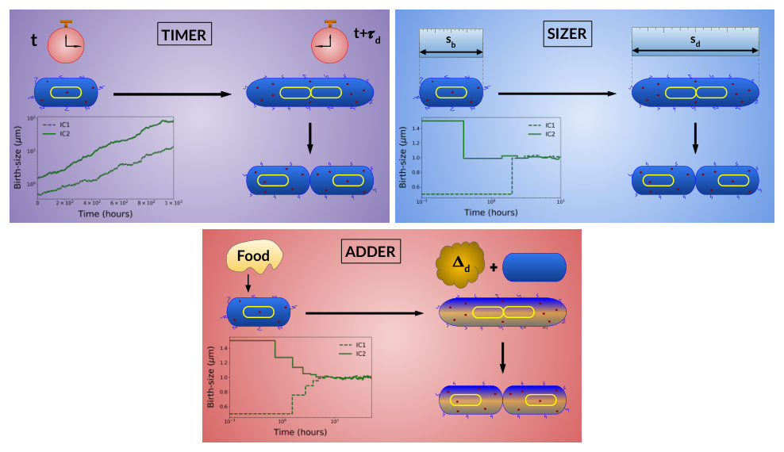
<figcaption class="paper-figure-caption"><b>Fig 1.</b> FIG. 1. Artistic representations of various cell-division models: Timer, Sizer, and Adder. The insets represent the graphs of birth-size of a random cell (versus time) tracked for many generations that follows a particular cell-division model under exponential growth, with stochasticity in the rule of cell-division, growth rate, and partitioning fraction. Here, for simplicity, the distributions for the free parameters are taken to be Gaussian. The mean division-time is taken to be 1 hour for the Timer model, mean division-size is taken to be 2µm for the Sizer model, and mean division-added-size is taken to be 1µm for the Adder model. Mean exponential growth rate is taken to be ln(2) per...</figcaption>
</figure>
<figure class="paper-figure-card">
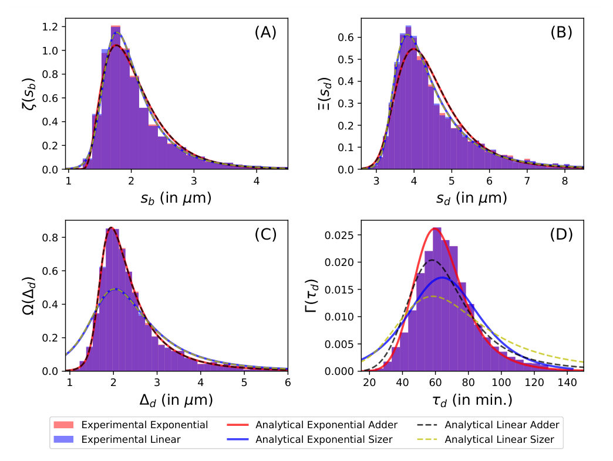
<figcaption class="paper-figure-caption"><b>Fig 2.</b> FIG. 2. Various experimental single-cell-level distributions (obtained from the single-cell experimental data for E. coli (25◦C) [46]) compared with their analytical results – (A) Birth-size distribution, (B) Division-size distribution, (C) Division-added- size distribution, and (D) Division-time distribution, assuming a specific cell-division model (Sizer or Adder) and specific single-cell growth paradigm (linear or exponential). The three free-parameter distributions, namely the principal distribution (Ξ(sd) for the Sizer and Ω(∆d) for the Adder model), growth-rate distribution Λ(α), and partitioning-fraction distribution κ(β), are taken as Johnson SU fits to the corresponding...</figcaption>
</figure>
<figure class="paper-figure-card">
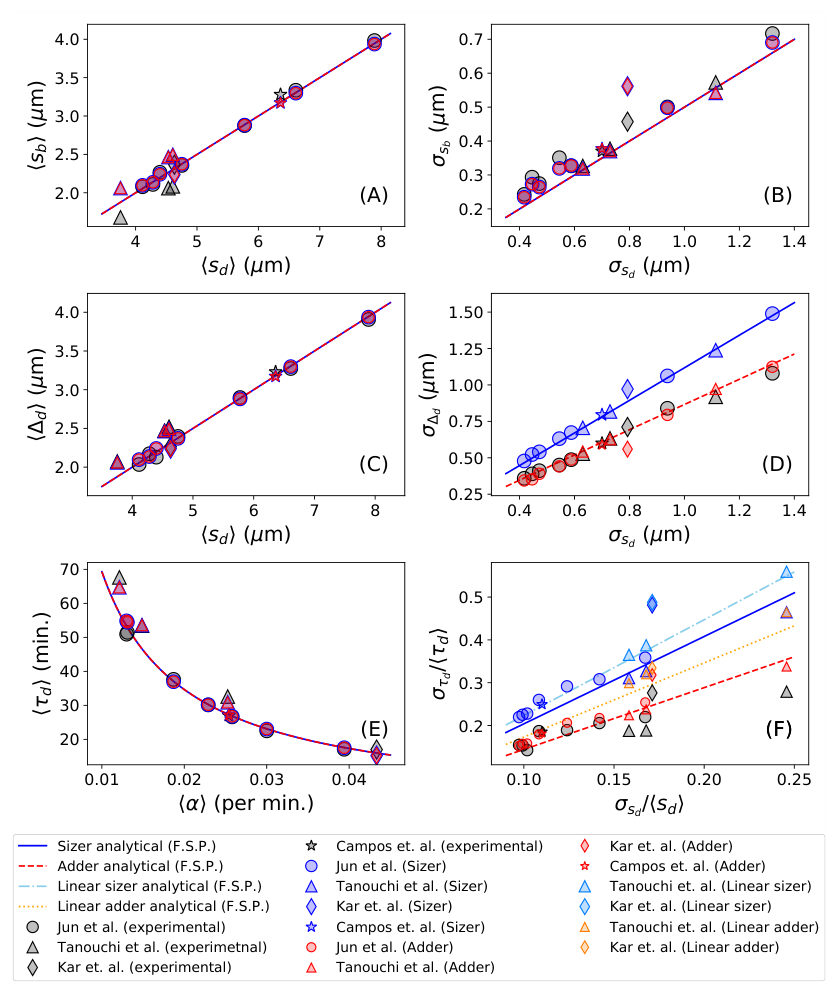
<figcaption class="paper-figure-caption"><b>Fig 3.</b> FIG. 3. Mean, standard deviation, and coefficient of variation (the ratio of standard deviation and mean) for various single-cell quantities plotted against each other – (A) mean birth-size versus mean division-size, (B) standard deviation of birth-size versus standard deviation of division-size, (C) mean division-added-size versus mean division-size, (D) standard deviation of division-added-size versus standard deviation of division-size, (E) mean division-time versus mean exponential growth rate, (F) coefficient of variation of division-time versus coefficient of variation of division-size. The data have been taken from previous studies [19, 20, 24, 46]. For Tanouchi et al. [46], the data...</figcaption>
</figure>
<figure class="paper-figure-card">

<figcaption class="paper-figure-caption"><b>Fig 4.</b> FIG. 4. Various single-cell quantities, such as τd, sd, and ∆d, plotted against sb to infer correlations of these quantities with birth-size. The experimental data have been taken from a previous study [46] for E. coli at different temperatures – 25◦C, 27◦C, and 37◦C. In the first row, τd is plotted against sb; in the second row, sd is plotted against sb; and in the third row, ∆d is plotted against sb. The first column represents these correlations at 25◦C, the second column represents the correlations at 27◦C, and the third column represents the correlations at 37◦C. The dashed line in the scatter plot represents the linear fit to the data. The insets in all of these plots compare ‘Pearson...</figcaption>
</figure>

**Summary.** This work uses advanced statistical methods to analyze single-cell measurements from bacterial growth. By examining probability distributions and correlations among size and time metrics, the authors demonstrate that one can uniquely determine whether cell division follows a Timer, Sizer, or Adder rule, and whether the underlying growth is linear or exponential. This provides a powerful diagnostic tool for understanding fundamental biophysical processes.

**Why it may be interesting.** While the subject is biology, the rigorous application of stochastic processes, moment analysis, and distribution fitting to distinguish underlying physical laws mirrors techniques used in analyzing complex non-equilibrium systems in statistical mechanics.

Detailed structure

**Main problem.** The study aims to differentiate between various underlying cell-division (e.g., Sizer, Adder) and single-cell growth models (linear vs. exponential) in microbial cells.

**Main result.** Analysis of probability distributions, statistical relationships (especially involving standard deviations), and correlations among single-cell quantities can uniquely distinguish between different division and growth mechanisms.

**Method.** The authors derive analytical probability distributions and statistical moments for key observables by assuming various underlying mechanistic models. These theoretical predictions are then compared against published experimental data.

**Model / system.** The physical system is bacterial cell growth and division, modeled using concepts like Timer, Sizer, and Adder mechanisms. The analysis extends to stochastic single-cell growth and asymmetric partitioning.

**Key observables.** Single-cell quantities: birth-size ($s_b$), division-size ($s_d$), division-time ($	au_d$), and division-added-size ($\Delta d$). Statistical measures include probability distributions, means, standard deviations, and correlation coefficients.

**Important parameters / regimes.** Growth rate autocorrelation parameters ($\alpha$, $eta$); temperature variations (e.g., $25^\circ	ext{C}, 37^\circ	ext{C}$); partitioning fraction ($eta$).

**Assumptions / limitations.** The analysis often assumes independence between certain variables (like growth rate and size parameters) or relies on approximations like assuming sharply spiked distributions for moment calculations.

**Figures summary.** Figures compare experimental single-cell distributions ($s_b, s_d, \Delta d, 	au_d$) against analytical predictions from various model combinations. Plots of correlations (PCC) are used to test the consistency of different models across multiple temperatures.

**Paper structure.** The paper progresses by first establishing that simple correlations are insufficient, then showing how full probability distributions and statistical relationships (means vs. standard deviations) provide stronger discriminative power between division/growth models, culminating in comparisons with experimental data.

Abstract

Complex interactions among regulatory molecules determine the rules underlying cell growth and division in microbial cells. While the governing molecular network may not always be obvious, it is well known that correlations among certain physiological quantities measured in experiments, such as birth-size, division-size, division-time, and division-added-size, can differentiate among various cell-division models, such as Timer, Sizer, and Adder. Here we show that, apart from these correlations, which we extend for the case of stochastic single-cell growth and stochastic asymmetric partitioning, probability distributions of these quantities and statistical relationships between them can also be used to differentiate between these division models. Interestingly, we show that these quantities can not only differentiate the division models, but also distinguish among the single-cell growth paradigms, such as linear and exponential growth. We then demonstrate this differentiability among various division and growth models by comparing our analytical results with published experimental data. We further show that these results remain valid even when the growth rate of a cell is correlated with the growth rate of cells from previous generations in the lineage.

[↑ back to top](#top)

### [Demographic senescence as multi-level selection in miniature](http://arxiv.org/abs/2607.00262v1)

**Authors:** Ananda Shikhara Bhat, Hanna Kokko  
**Type:** theory · **Category:** statistical mechanics · **PDF:** <https://arxiv.org/pdf/2607.00262v1>  
**Analysis basis:** full PDF text, analyzed in chunks
**Topic relevance:** `non-equilibrium dynamics` **2/5** · `driven-dissipative phase transition` **1/5** · `methods for driven-dissipative` **1/5** · `non-equilibrium universality` **1/5**

↔ Scroll figures horizontally

<figure class="paper-figure-card">

<figcaption class="paper-figure-caption"><b>Fig 1.</b> Figure 1: A description of the stochastic process considered in this paper in the senescence setting, where systems are organisms, sub-systems are intra-organismal sub-systems, red sub-systems are failed sub-systems, warming is failure of functioning sub-systems, and cooling is repair of failed sub-systems. (A) The model consists of M organisms, each of which have N intra-organismal sub-systems capable of failure. (B) An organism with f ∈{0, 1</figcaption>
</figure>

**Summary.** This paper mathematically proves that demographic senescence can be modeled as a multi-level selection process. By developing a two-level stochastic model and applying advanced scaling limits, the authors derive an SPDE that governs how physiological damage accumulation (low level) drives differential survival rates (high level). This unifies concepts from evolutionary biology and aging theory into a single mathematical framework.

**Why it may be interesting.** The rigorous mathematical mapping between biological aging (senescence) and fundamental evolutionary dynamics like MLS provides a powerful, general framework applicable across different complex systems exhibiting trait-dependent mortality.

Detailed structure

**Main problem.** To formally demonstrate that the emergent mortality patterns observed during demographic senescence can be mathematically understood as a consequence of multi-level selection.

**Main result.** The authors establish a formal equivalence between senescence and MLS by deriving a limiting stochastic partial differential equation (SPDE) governing the population composition.

**Method.** The methodology involves formulating a two-level Moran-type process, recasting it into a ball-and-urn scheme, and applying system-size expansion/diffusion approximations to derive continuum limits.

**Model / system.** The model tracks the state of $M$ systems (organisms), each containing $N$ sub-systems. Dynamics occur at two levels: within-system changes (warming/cooling) and between-system selection (differential mortality risk).

**Key observables.** Emergent mortality patterns, failure accumulation curves, and the limiting probability density function $\zeta_\lambda(f, t)$ describing population composition.

**Important parameters / regimes.** The key parameters include $M$ (number of systems), $N$ (sub-systems per system), and the scaling ratio $\lambda = N/M$. The replacement probability $\varrho$ is also crucial.

**Assumptions / limitations.** The analysis relies heavily on diffusion approximations, functional central limit theorems, and taking specific limits ($M 	o \infty$, $N 	o \infty$) to simplify the discrete stochastic process into continuous PDEs/SPDEs.

**Figures summary.** Figure 1 illustrates the two-level dynamics: (A) showing $M$ organisms with $N$ sub-systems; (B) depicting failure accumulation and death; and (C) characterizing the system via a ball-and-urn scheme tracking failure proportions.

**Paper structure.** The paper builds from defining the discrete stochastic process using a Master Equation, deriving its functional Fokker-Planck equation via diffusion approximation, and finally taking multiple scaling limits ($M 	o \infty$, $N 	o \infty$) to arrive at the final limiting SPDE governing the superprocess $\zeta_\lambda$.

Abstract

Multi-level selection and senescence do not at first sight have much in common. Here, we demonstrate that the emergent mortality patterns generated by demographic senescence can be understood as the product of multi-level selection. We formulate a two-level Moran type process and use its scaling limits to illustrate that a simple mathematical framework that models multi-level selection in group-structured populations also models damage accumulation patterns and resultant mortality curves in ageing organisms. To verbally make the connection, observe that defectors spread within a group consisting of cooperators and defectors; when groups compete against each other, defector-rich groups suffer, and between-group selection causes such groups to be systematically under-represented. Exactly analogously, senescing individuals accumulate damage to physiological sub-systems, and `damage begets damage'; individuals who are more damaged are more likely to die, hence damage-rich individuals are systematically under-represented in later age classes. Thus, emergent senescence patterns in complex, integrated organisms are formally equivalent to the patterns generated by a within-generation multi-level selection process in which intra-organismal sub-systems play the role of particles, organisms play the role of collectives, and selective disappearance plays the role of group selection.

[↑ back to top](#top)

### [Phase diagram of a double-occupancy cell model of a fluid with Curie-Weiss interaction](http://arxiv.org/abs/2607.01009v1)

**Authors:** R. V. Romanik, O. A. Dobush, M. P. Kozlovskii, I. V. Pylyuk, M. A. Shpot  
**Type:** theory · **Category:** statistical mechanics · **PDF:** <https://arxiv.org/pdf/2607.01009v1>  
**Analysis basis:** full PDF text, analyzed in chunks
**Topic relevance:** `analog quantum simulation` **2/5** · `Keldysh / 2PI / non-Gaussian methods` **1/5** · `driven-dissipative phase transition` **1/5** · `exotic spin models in light-matter` **1/5**

↔ Scroll figures horizontally

<figure class="paper-figure-card">
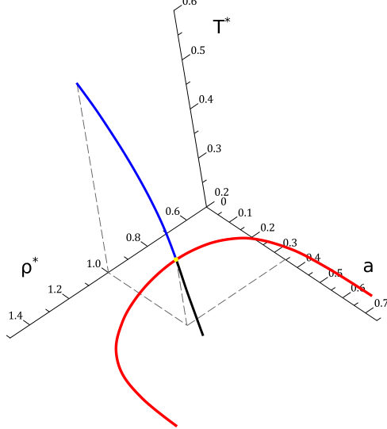
<figcaption class="paper-figure-caption"><b>Fig 1.</b> Fig. 1: Phase diagram of the double-occupancy cell model in the case of distinguishable particles. Blue curve: the line of critical points at a &lt; atc. Red curves: the lines of critical points at a &gt; atc. Black curve: the line of triple points in the interval atc &lt; a &lt; 0.5. All the lines meet at the tricritical point with a = atc = 1</figcaption>
</figure>
<figure class="paper-figure-card">

<figcaption class="paper-figure-caption"><b>Fig 2.</b> Fig. 2: The T ∗−ρ∗phase diagrams of the double-occupancy cell model in the case of distinguishable particles at different values of a = ∆/J. Solid curves are the coexistence lines. (a): The coexistence line between phases I and III ends at the critical point. (b) and (c): Coexistence lines between phases I — II and II — III are present in the temperature interval T ∗ tr ≤T ∗≤T ∗ c , each ending at its own critical point. For T ∗≤T ∗ tr, phases I and III coexist. T ∗ tr is the temperature of the triple point. (d): Coexistence lines between phases I — II and II — III are present for 0 ≤T ∗≤T ∗ c , each ending at its own critical point.</figcaption>
</figure>
<figure class="paper-figure-card">

<figcaption class="paper-figure-caption"><b>Fig 3.</b> Fig. 3: The phase diagram in the (T ∗, ρ∗, a)-space for the case of distinguishable particles. The figure combines representations of Figs. 1 and 2 in one view. Green dashed curves: the coexistence lines at a = 0.3, a = 0.375, a = 0.45, and a = 0.6. Blue and red curves are the critical-point lines. Black curve is the triple-point line.</figcaption>
</figure>
<figure class="paper-figure-card">
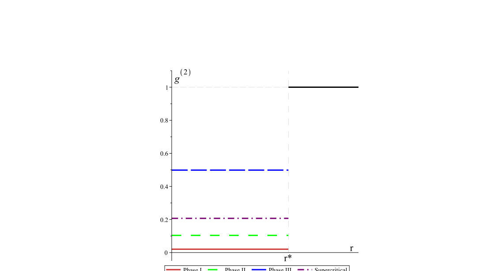
<figcaption class="paper-figure-caption"><b>Fig 4.</b> Fig. 4: Pair distribution function g(2)(r1, r2) as a function of separation r = |r1 −r2|. The quantity r∗denotes distance from the point with coordinate r1 to the boundary of the cubic cell containing r1, in the direction of r2. The results are presented for the system of distinguishable particles, at a = 0.5. Phase I: T ∗= 0.25, ρ∗= 0.1; Phase II: T ∗= 0.2, ρ∗= 0.5; Phase III: T ∗ c = 0.25, ρ∗= 1.9; Supercritical: T ∗= 0.5, ρ∗= 0.5. At r &gt; r∗, g(2) = 1.</figcaption>
</figure>

**Summary.** This theoretical study investigates a double-occupancy cell fluid model interacting via Curie-Weiss forces. By analyzing its grand canonical partition function, the authors map out a complex phase diagram showing multiple coexistence regimes. The results demonstrate how simple competition between local repulsion and long-range attraction can generate rich physics, including liquid-liquid transitions.

**Why it may be interesting.** While focused on classical statistical mechanics, the mapping to the Blume-Capel model connects this work to quantum spin systems, making it relevant for understanding phase transitions in lattice models that share mathematical structure with quantum Hamiltonians.

Detailed structure

**Main problem.** The study focuses on determining the complex phase diagram of a fluid modeled by a double-occupancy cell model interacting via Curie-Weiss type long-range forces.

**Main result.** The competition between local repulsion and global attraction generates rich thermodynamic behavior, including regimes with single or two critical points, tricritical points, and triple points, leading to gas-liquid and liquid-liquid coexistence.

**Method.** The analysis employs the grand canonical ensemble formalism, utilizing analytical techniques combined with numerical methods, notably applying Laplace's method to evaluate integrals in the thermodynamic limit.

**Model / system.** The system is a double-occupancy cell fluid model where each site can hold up to two particles. This model is shown to be isomorphic to the Blume-Capel model on a complete graph.

**Key observables.** Phase diagram structure, critical points $(T^*_c; 
ho^*_c)$, tricritical points, triple points, and the pair distribution function $g(2)$.

**Important parameters / regimes.** The phase behavior is critically dependent on the ratio $a = \Delta/J$, which controls the balance between local repulsion ($\Delta$) and global attraction ($J$).

**Assumptions / limitations.** The analysis relies on approximations in the thermodynamic limit ($N 	o \infty$) and uses mean-field descriptions, meaning it neglects local structural ordering effects.

**Figures summary.** Figures illustrate the phase diagram showing lines of critical points for varying $a$, meeting at a tricritical point. Other figures show coexistence lines and spatial dependencies of pair distribution functions across different phases (I, II, III).

**Paper structure.** The paper first establishes the model's isomorphism to the Blume-Capel model. It then derives the partition function in the grand canonical ensemble, evaluates it using Laplace's method, and finally maps out the phase diagram by analyzing the conditions for critical points and coexistence lines as a function of the interaction ratio $a$.

Abstract

A double-occupancy cell model of a fluid with Curie-Weiss interaction is studied. First, we show that the model is isomorphic to the Blume-Capel model on a complete graph through a simple transformation from spin to occupancy variables. We then investigate its phase behavior within the grand-canonical ensemble using a combination of analytical and numerical methods. Despite its simplicity, the model exhibits a remarkably rich thermodynamic behavior depending on the ratio between the local repulsive and global attractive interactions. We identify regimes characterized by a single critical point, two distinct critical points, tricritical behavior, and triple-point formation. For sufficiently strong repulsion, the system possesses three fluid phases of different densities, leading to both gas-liquid and liquid-liquid coexistence. The locations of the critical, tricritical, and triple points are determined, and the corresponding phase diagrams are constructed. These results demonstrate that the competition between double-occupancy repulsion and long-range attraction is sufficient to generate complex phase behavior in a minimal multiple-occupancy lattice-gas model.

[↑ back to top](#top)

### [The Dynamical Lie Algebra of QAOA-MaxCut on the Complete Graph](http://arxiv.org/abs/2607.00945v1)

**Authors:** Jonathan Allcock, Pei Yuan, Shengyu Zhang  
**Type:** theory · **Category:** quantum information and computing · **PDF:** <https://arxiv.org/pdf/2607.00945v1>  
**Analysis basis:** full PDF text, analyzed in chunks
**Topic relevance:** `entanglement & information structure` **2/5** · `methods for driven-dissipative` **1/5** · `non-equilibrium dynamics` **1/5**

↔ Scroll figures horizontally

<figure class="paper-figure-card">

<figcaption class="paper-figure-caption"><b>Fig 1.</b> Low-resolution page preview, page 2</figcaption>
</figure>
<figure class="paper-figure-card">
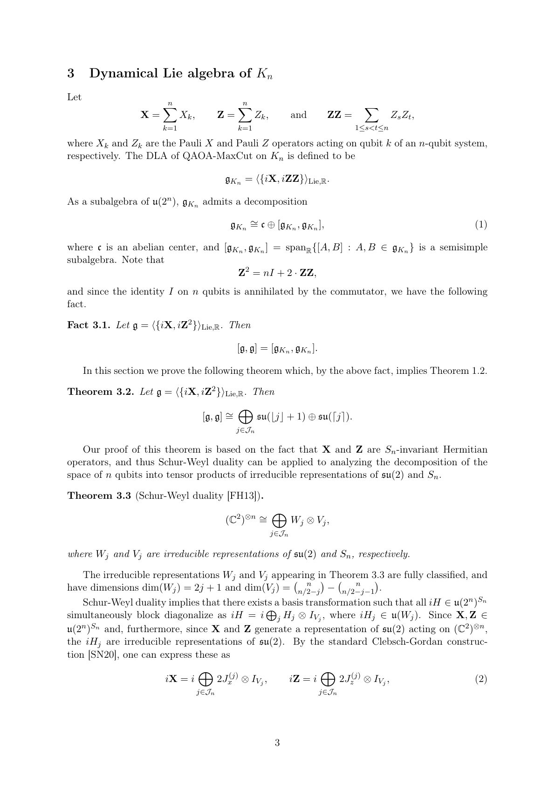
<figcaption class="paper-figure-caption"><b>Fig 2.</b> Low-resolution page preview, page 3</figcaption>
</figure>
<figure class="paper-figure-card">

<figcaption class="paper-figure-caption"><b>Fig 3.</b> Low-resolution page preview, page 4</figcaption>
</figure>
<figure class="paper-figure-card">

<figcaption class="paper-figure-caption"><b>Fig 4.</b> Low-resolution page preview, page 5</figcaption>
</figure>
<figure class="paper-figure-card">
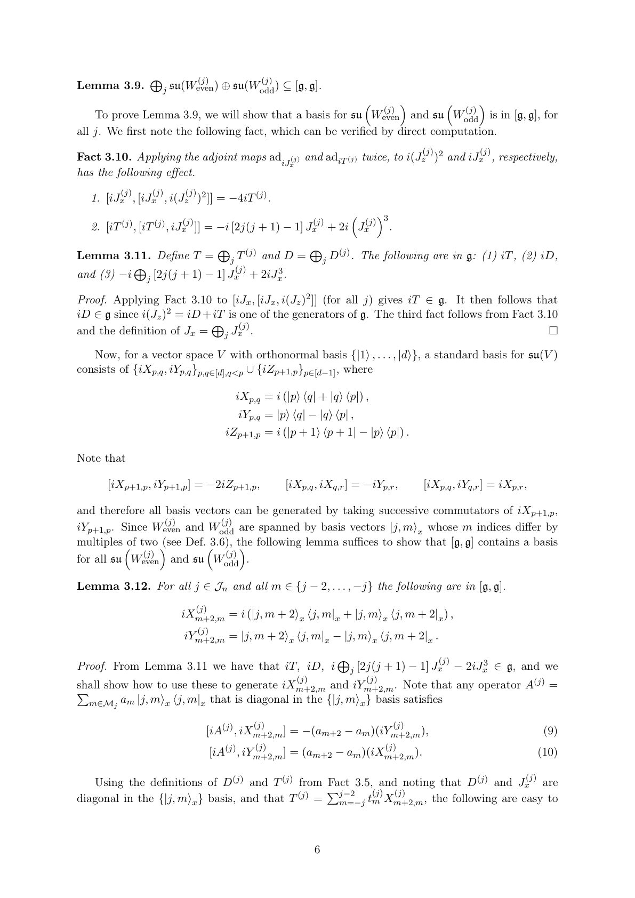
<figcaption class="paper-figure-caption"><b>Fig 5.</b> Low-resolution page preview, page 6</figcaption>
</figure>

**Summary.** The paper rigorously analyzes the dynamical Lie algebra governing QAOA applied to MaxCut on complete graphs. By proving that the loss function variance scales linearly with system size, it definitively shows that this specific algorithm avoids barren plateaus. The methodology is highly technical, relying on advanced group theory and representation theory (Schur-Weyl duality).

**Why it may be interesting.** This work provides deep mathematical insight into the convergence properties of quantum algorithms by analyzing their underlying symmetry structure, which is highly relevant for understanding noise and optimization landscapes in quantum computing.

Detailed structure

**Main problem.** The paper characterizes the dynamical Lie algebra (DLA) associated with running QAOA on MaxCut problems defined on complete graphs ($K_n$) and proves that this system avoids barren plateaus.

**Main result.** It establishes that the variance of the loss function scales linearly ($\Theta(n)$) with the number of qubits, confirming the absence of barren plateaus for this specific quantum optimization problem.

**Method.** The analysis heavily utilizes the mathematical framework of Dynamical Lie Algebras (DLAs), employing Schur-Weyl duality to decompose operators into irreducible representations of $su(2)$ and $S_n$.

**Model / system.** The model is QAOA applied to the MaxCut problem on a complete graph ($K_n$) using an $n$-qubit quantum system. The analysis focuses on the structure and generators of the associated DLA.

**Key observables.** Loss function variance ($	ext{Var}_	heta[\ell(
ho, O; 	heta)]$), the structure of the commutator subalgebra $[\mathfrak{g}_{K_n}, \mathfrak{g}_{K_n}]$, and $s$-purities ($	ext{Ps}(
ho)$).

**Important parameters / regimes.** Number of qubits ($n$); parameters $\alpha, eta$ used in linear independence checks; indices $j$ related to irreducible representations.

**Assumptions / limitations.** The proof relies on establishing specific inclusion relations for the commutator subalgebra $[\mathfrak{g}, \mathfrak{g}]$ and assumes the circuit is deep enough to form a unitary 2-design for variance calculations.

**Figures summary.** Not specified in the notes, but the structure suggests figures illustrating the decomposition of operators or eigenvalue spectra related to $W^{(j)}_{	ext{even}}$ subspaces.

**Paper structure.** The paper proceeds by first defining the DLA generators and analyzing their commutator structure using Schur-Weyl duality (Chunk 1). It then provides a self-contained proof for the structure of $[\mathfrak{g}, \mathfrak{g}]$ via Lemma 3.9 (Chunk 2). Finally, it analyzes specific spectral properties, such as eigenvalues of $(\hat{J}(j)_z)^2$, on subspaces $W^{(j)}_{	ext{even}}$ to complete the structural proofs (Chunk 3).

Abstract

We give an analytical expression for the dynamical Lie algebra corresponding to the QAOA-MaxCut problem on complete graphs, and show that the variance of the associated loss function scales linearly in the number of qubits. This solves an open problem from [ASYZ26] and confirms that such systems do not exhibit barren plateaus. The proof is based on projecting the dynamical Lie algebra generators onto subspaces given by the Schur-Weyl duality between irreducible representations of the unitary and symmetric groups.

[↑ back to top](#top)

### [Quantum Oscillations of $\mathrm{Sr}_2\mathrm{RuO}_4$ under c-Axis Uniaxial Stress](http://arxiv.org/abs/2607.00679v1)

**Authors:** Fabian Jerzembeck, Maximilian T. Pelly, Helge Rosner, Edgar Abarca Morales, Naoki Kikugawa, Dmitry A. Sokolov, Andrew P. Mackenzie, Andreas W. Rost, Elena Hassinger, Javier F. Landaeta  
**Type:** both · **Category:** strongly correlated electrons · **PDF:** <https://arxiv.org/pdf/2607.00679v1>  
**Analysis basis:** full PDF text, analyzed in chunks
**Topic relevance:** `analog quantum simulation` **2/5** · `Keldysh / 2PI / non-Gaussian methods` **1/5**

↔ Scroll figures horizontally

<figure class="paper-figure-card">
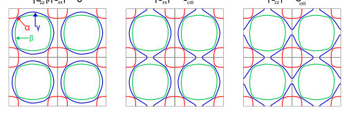
<figcaption class="paper-figure-caption"><b>Fig 1.</b> Figure 1. Schematic 2D Fermi surface of Sr2RuO4 under uniaxial stress. (a) Zero stress. (b) In-plane uniaxial stress |σxx| &gt; |σcrit,xx|. (c) Out-of-plane uniaxial stress |σzz| &gt; |σcrit,zz|.</figcaption>
</figure>
<figure class="paper-figure-card">

<figcaption class="paper-figure-caption"><b>Fig 2.</b> Figure 2. (a) Raw dHvA oscillations as a function of magnetic field at 90 mK (stress cell temperature) for a series of compressive stresses. (b) Same data as in (a) plotted versus inverse field; curves are vertically shifted for clarity. (c–e) Fourier spectra highlighting the α, β, γ, and 2α +β peaks under different stresses. FFTs were taken over the field range 3–15 T for α and 8–15 T for the other Fermi surface sheets.</figcaption>
</figure>
<figure class="paper-figure-card">
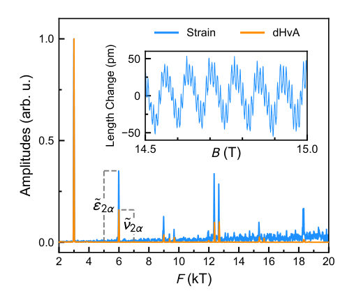
<figcaption class="paper-figure-caption"><b>Fig 3.</b> Figure 4. Comparison of the FFTs (8–15 T range) of quantum oscil- lations from magnetostriction (85 mK) and dHvA (125 mK) on the same sample. Before comparison, the strain FFT was multiplied by F2 (details are in the main text). Both spectra are then normalized to the α peak height. The inset shows the raw dilatometer signal (strain oscillations) as a function of field.</figcaption>
</figure>
<figure class="paper-figure-card">
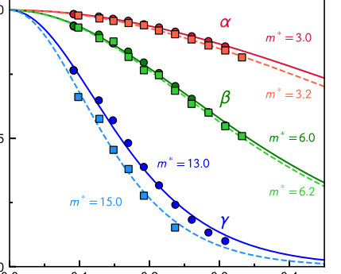
<figcaption class="paper-figure-caption"><b>Fig 4.</b> Figure 3. Lifshitz-Kosevich effective mass analysis at 0 GPa (circles, solid lines) and −1 GPa (squares, dashed lines). Uncertainties on the effective masses from the fits are estimated to be about 2% for the α and β sheets, and about 5% for the γ sheet.</figcaption>
</figure>
<figure class="paper-figure-card">

<figcaption class="paper-figure-caption"><b>Fig 5.</b> Figure 6. (a) Photo of a two-part carrier: the sample is mounted across a gap (red rectangle) with an excitation coil around its neck. (b) c-axis sample with a 48 turns pick-up coil. The sample was necked down in the center to reach larger stresses. (c) Mutual in- ductance against temperature in a series of compressive stresses. We show both the stress and, in brackets, the displacement, applied to the sample. (d) Comparison of Tc(σ) −Tc(σ = 0) against stress. Tc of the QO sample was determined by a threshold criterion, as indicated in panel (c), and compared to results from Ref. [16].</figcaption>
</figure>

**Summary.** This work uses dHvA measurements on Sr2RuO4 under uniaxial stress to map out the evolution of its electronic structure. By observing changes in Fermi surface areas and effective masses, the authors propose that charge transfer is the key mechanism driving the system toward a Lifshitz transition. The findings establish quantum oscillation measurements as a powerful tool for probing correlated materials under external strain.

**Why it may be interesting.** While focused on condensed matter physics, the precise measurement of electronic structure evolution under external fields (stress) provides an excellent model for studying how external perturbations tune many-body ground states, which has parallels in controlling quantum phases relevant to AMO systems.

Detailed structure

**Main problem.** To study how applying uniaxial stress affects the electronic structure and Fermi surface of the unconventional superconductor Sr2RuO4, particularly to reconcile discrepancies between predicted density of states changes and observed superconducting temperature suppression.

**Main result.** The application of c-axis uniaxial stress causes measurable changes in the cross-sectional areas of different Fermi sheets ($\alpha$ increases, $eta$ decreases, $\gamma$ increases), suggesting charge transfer is driving the system toward a Lifshitz transition. Effective masses on all measured sheets are found to be slightly enhanced upon compression.

**Method.** The study combines experimental De Haas-van Alphen (dHvA) quantum oscillation measurements under uniaxial stress with theoretical Density Functional Theory (DFT) calculations and magnetostriction measurements for comparison.

**Model / system.** The system is the unconventional superconductor Sr2RuO4. The analysis focuses on how applying controlled c-axis uniaxial strain/stress ($\sigma_{zz}$) tunes the electronic band structure, leading to changes in Fermi surface topology and carrier distribution among different orbital character sheets ($\alpha, eta, \gamma$).

**Key observables.** dHvA frequencies (for $\alpha, eta, \gamma$ sheets), cross-sectional areas of Fermi sheets, effective masses ($m^*$), superconducting critical temperature $T_c(\sigma)$, and strain/stress dependence ($\Delta F$ vs. $\sigma$).

**Important parameters / regimes.** Uniaxial stress up to $-1.8$ GPa (experimentally) or higher (theoretically); the approach to a Lifshitz transition; effective mass enhancement factor ($\sim 10\%$).

**Assumptions / limitations.** The analysis assumes that relative changes in effective masses are intrinsic and can be compared across different stress states, and that strain inhomogeneity issues can be controlled.

**Figures summary.** Figures show raw/normalized quantum oscillations vs. magnetic field under various stresses; comparisons between dHvA frequency shifts ($\Delta F$) derived from experiment and DFT calculations; and plots detailing the evolution of Fermi surface areas and $T_c$ dependence on stress.

**Paper structure.** The paper establishes the experimental feasibility of measuring dHvA effects under uniaxial stress. It then details how the measured changes in Fermi surface topology (sheet area changes) point to charge transfer mechanisms approaching a Van Hove singularity, contrasting this with other stress directions. Finally, it confirms quantitative agreement between these quantum oscillation results and DFT predictions.

Abstract

Uniaxial stress has now been widely used to study correlated electron materials. However, Fermi surface-resolved experimental data on the evolution of the electronic structure under piezoelectrically applied stress are sparse, with no reports of de Haas-van Alphen (dHvA) effects under uniaxial stress. Here we present dHvA measurements under $c$-axis uniaxial stress on the unconventional superconductor $\mathrm{Sr}_2\mathrm{RuO}_4$. This allows us to study the evolution of the electronic structure directly and to gain insight into the contradicting behavior of the predicted enhancement of the electronic density of states and the observed suppression of $T_\text{c}$. We are able to follow all Fermi surfaces for stress up to $-1.8$~GPa and find that the cross-sectional areas of the hole-like $α$ sheet increase and electron-like $β$ sheet decrease. At the same time, the area of the electron-like $γ$ sheet increases. Therefore, in contrast to in-plane uniaxial stress, charge transfer is the mechanism for approaching the electron-to-hole Lifshitz transition and the associated Van Hove singularity. Additionally, we find that the effective masses on all three Fermi sheets are slightly enhanced as the Lifshitz transition is approached. We compare the dHvA results with quantum oscillations in the magnetostriction and band structure calculations, and find good agreement. At a more general level, our findings show that quantum oscillation measurements under uniaxial stress, combined with band-structure calculations, offer a promising new route for studying quantum materials.

[↑ back to top](#top)

### [Classification and Exact Local Masking in Finite-Field Clifford Dual-Unitary Circuits](http://arxiv.org/abs/2607.00210v1)

**Authors:** Basanta R Pahari  
**Type:** theory · **Category:** quantum information and computing · **PDF:** <https://arxiv.org/pdf/2607.00210v1>  
**Analysis basis:** full PDF text, analyzed in chunks
**Topic relevance:** `entanglement & information structure` **2/5**

↔ Scroll figures horizontally

<figure class="paper-figure-card">
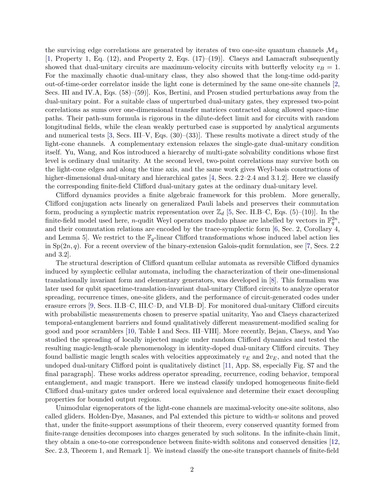
<figcaption class="paper-figure-caption"><b>Fig 1.</b> Low-resolution page preview, page 2</figcaption>
</figure>
<figure class="paper-figure-card">

<figcaption class="paper-figure-caption"><b>Fig 2.</b> Low-resolution page preview, page 3</figcaption>
</figure>
<figure class="paper-figure-card">
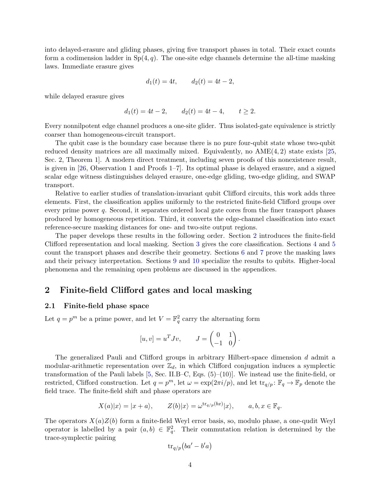
<figcaption class="paper-figure-caption"><b>Fig 3.</b> Low-resolution page preview, page 4</figcaption>
</figure>
<figure class="paper-figure-card">

<figcaption class="paper-figure-caption"><b>Fig 4.</b> Low-resolution page preview, page 5</figcaption>
</figure>
<figure class="paper-figure-card">

<figcaption class="paper-figure-caption"><b>Fig 5.</b> Low-resolution page preview, page 6</figcaption>
</figure>

**Summary.** This theoretical work classifies complex two-qudit Clifford circuits over finite fields and derives precise formulas for local masking distances. It proves that short quantum messages can be perfectly hidden from partial output measurements while remaining fully recoverable from the whole system. This advances the understanding of information security in quantum computation architectures.

**Why it may be interesting.** The rigorous mathematical framework connecting finite field algebra ($	ext{Sp}(4, q)$) to fundamental quantum information tasks like perfect data hiding provides deep insights into the structure of quantum gates.

Detailed structure

**Main problem.** The paper classifies two-qudit finite-field Clifford dual-unitary gates and applies this classification to determine exact local masking and operator transport properties in homogeneous brickwork circuits.

**Main result.** It establishes specific, quantifiable masking laws ($d_1(t), d_2(t)$) showing that short quantum messages can be perfectly hidden from small output subsystems while remaining fully recoverable from the total output.

**Method.** The analysis uses algebraic techniques involving symplectic groups $	ext{Sp}(4, q)$, classifying gates based on determinants ($\delta$) and relating them to geometric structures like MDS configurations and cross-ratios.

**Model / system.** The system is modeled by Clifford dual-unitary circuits operating over finite fields $\mathbb{F}_q$ on qudits. The dynamics are analyzed using symplectic matrix representations within the group $	ext{Sp}(4, q)$.

**Key observables.** Local masking distances ($d_1(t), d_2(t)$), entanglement entropy profiles, and algebraic codimensions of transport phases.

**Important parameters / regimes.** The finite field size $q$, the circuit depth $t$, and the determinant parameter $\delta$.

**Assumptions / limitations.** The analysis assumes specific structures for homogeneous repetition and focuses on exact local masking (state-independent reduction), distinguishing it from approximate indistinguishability.

**Figures summary.** Figures/tables summarize phase counts, leakage vs. perturbation strength ($\epsilon$), and recovery fidelity versus Pauli noise probability ($p$).

**Paper structure.** The paper proceeds by classifying the dual-unitary locus into $q$ core types (perfect, rank-one, SWAP), then analyzing how homogeneous repetition separates these cores into five distinct transport phases with varying algebraic codimensions. Finally, it derives explicit masking laws and tests them numerically for small $q$.

Abstract

We classify two-qudit finite-field Clifford dual-unitary gates and apply the classification to exact local masking and operator transport in homogeneous brickwork circuits. Under ordered one-qudit Clifford equivalence, the dual-unitary locus contains $q-2$ perfect-tensor cores, one rank-one core, and one SWAP core. The perfect cores are indexed by \[ δ=\det B=\det C, \] and are related to the ordered cross-ratio $λ$ of the associated $[4,2,3]_q$ MDS configuration through \[ λ=\fracδ{δ-1}. \] Homogeneous repetition separates these cores into five transport phases whose algebraic codimensions in $\operatorname{Sp}(4,q)$ are $0,1,2,3,4$.   The one-site Weyl edge channels determine exact local-masking distances. Perfect-tensor circuits attain \[ d_1(t)=4t, \qquad d_2(t)=4t-2, \] whereas delayed erasers satisfy \[ d_1(t)=4t-2, \qquad d_2(t)=4t-4 \] for $t\geq 2$. Consequently, sufficiently short quantum messages are completely hidden from every one- or two-qudit output subsystem, even when the input is entangled with a reference, while remaining exactly recoverable from the full output.   For $q=3$, we construct an explicit perfect-tensor Clifford gate from two inverse SUM gates. Exhaustive Weyl-support searches for $t=1,2,3$ reproduce the predicted masking distances, and a one-period Choi-channel calculation for a four-qutrit periodic circuit gives numerical residual leakage below $2\times 10^{-16}$. Under the coherent perturbation considered here, local leakage is linear in the perturbation strength, whereas the infidelity of recovery using the ideal inverse is quadratic near the perfect point.

[↑ back to top](#top)

### [Monte Carlo reconstruction of symmetry-twisted partition function ratios: the critical 3D Ising](http://arxiv.org/abs/2607.00106v1)

**Authors:** José Matos  
**Type:** theory · **Category:** statistical mechanics · **PDF:** <https://arxiv.org/pdf/2607.00106v1>  
**Analysis basis:** full PDF text, analyzed in chunks
**Topic relevance:** `Keldysh / 2PI / non-Gaussian methods` **1/5** · `analog quantum simulation` **1/5** · `driven-dissipative phase transition` **1/5** · `entanglement & information structure` **1/5** · `methods for driven-dissipative` **1/5** · `non-equilibrium dynamics` **1/5** · `non-equilibrium universality` **1/5**

↔ Scroll figures horizontally

<figure class="paper-figure-card">
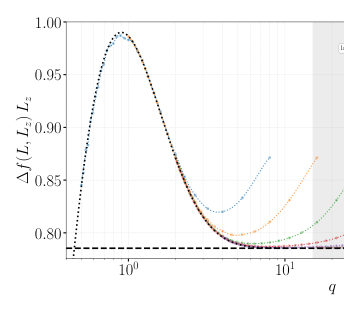
<figcaption class="paper-figure-caption"><b>Fig 1.</b> Figure 1. Two-dimensional benchmark of the flat histogram estimator. The dimensionless differ- ence Lz∆fZ2(L, Lz) is plotted against q = L/Lz for several transverse sizes L. The dashed line is the conformal result Lz∆fZ2 →π/4 at q, Lz →∞. The black dotted curve is the exact Ising torus result from the Jacobi-theta representation of the Virasoro characters [23]. Dashed curves are cubic interpolations in q at fixed L. The gray band marks the large-q window used below, to study finite-L effects. The deviations at small Lz/large-q are the lattice and finite-volume corrections discussed in the text.</figcaption>
</figure>
<figure class="paper-figure-card">

<figcaption class="paper-figure-caption"><b>Fig 2.</b> Figure 2. Finite-q corrections in the two-dimensional benchmark. The plot shows Lz∆fZ2(L, Lz)− π/4 versus q = L/Lz. The dashed curves are the leading large-q and small-q exponential approxi- mations. The exponential regime is visible only after the small-Lz lattice corrections are controlled.</figcaption>
</figure>
<figure class="paper-figure-card">

<figcaption class="paper-figure-caption"><b>Fig 3.</b> Figure 3. Large-q extrapolation at fixed Lz. For each q ∈[16, 100], the interpolation is evaluated and plotted versus Lz, as a single data set. This range makes exponential finite-q corrections negligible, as indicated by fig. 2. Raw data at aspect ratios with at least four values of Lz are also shown. The convergence from q = 4 to q = 8 and the stability at q ≳16 indicate that the interpolation is in the asymptotic regime.</figcaption>
</figure>
<figure class="paper-figure-card">
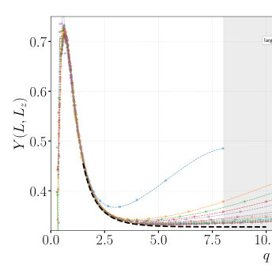
<figcaption class="paper-figure-caption"><b>Fig 4.</b> Figure 4. Raw finite-volume data for the three-dimensional slab at β = βc = 0.221654626(5). The plot shows Y (L, Lz) = L2 z∆fZ2(L, Lz) versus q = L/Lz for several transverse sizes L. Dashed curves are cubic interpolations in q at fixed L. The dashed black line is the infinite volume extrapolation. The gray band marks the large-q window used for the fixed-Lz diagnostic in fig. 5. Unlike the two dimensional case, there is no clear plateau.</figcaption>
</figure>
<figure class="paper-figure-card">

<figcaption class="paper-figure-caption"><b>Fig 5.</b> Figure 5. Large-q evaluation of the three-dimensional slab data at fixed Lz. For each Lz, the interpolation is evaluated at q = L/Lz ∈[8, 16], where finite-q corrections are not visible within the statistical precision. The values are plotted versus Lz and show the finite-Lz approach to the slab Casimir amplitude. Raw data at fixed aspect ratios with several Lz values are also shown. A free power-law fit gives an effective exponent near 2.5; the second fit includes terms proportional to L−(∆T ′−3) z , L−(∆ϵ′−3) z , and L−2 z . The uncertainties quoted in the fit labels are formal errors from the fit covariance matrix only; they do not include correlations, interpolation effects, or the...</figcaption>
</figure>

**Summary.** This paper introduces a powerful Monte Carlo technique to calculate free energy differences between distinct global sectors in lattice field theories. Applied to the 3D Ising model, it yields an independent measurement of the symmetry-twisted Casimir difference ($\Delta Z_2$). This method provides a robust tool for probing universal CFT data by analyzing finite-size effects across different geometric limits.

**Why it may be interesting.** While focused on classical statistical mechanics, the use of advanced Monte Carlo techniques (flat histograms) and connections to CFT/spectral analysis are highly relevant for understanding quantum many-body systems where finite-size effects and boundary conditions dictate low-energy physics.

Detailed structure

**Main problem.** The primary goal is to estimate partition function ratios between distinct global sectors of a lattice theory, specifically focusing on symmetry-twisted observables.

**Main result.** The authors directly calculate the symmetry-twisted thermodynamic Casimir difference ($\Delta Z_2 = 0.327(2)$) for the critical 3D Ising model without needing lattice derivatives or bulk subtractions.

**Method.** A Monte Carlo strategy is employed by enlarging the configuration space to sample an interpolating family between the desired sectors, using flat histogram methods to reconstruct the free energy difference.

**Model / system.** The study focuses on the three-dimensional Ising model simulated on a slab geometry ($R^2 	imes S^1_{L_z}$) at its bulk critical point. The comparison is made between the standard periodic sector and the $\mathbb{Z}_2$-twisted antiperiodic sector.

**Key observables.** Symmetry-twisted thermodynamic Casimir difference ($\Delta Z_2$), sector free energy difference ($\Delta F_{Z_2}$), and finite-size gap parameters ($\kappa_\sigma$).

**Important parameters / regimes.** The aspect ratio $q = L/L_z$, the lattice size ($L, L_z$), and the coupling variable $J$ used for interpolation.

**Assumptions / limitations.** The analysis relies on large-volume and aspect ratio extrapolations to extract universal continuum limits. The method assumes that sector differences allow access to CFT compactification data.

**Figures summary.** Figures illustrate benchmarks (e.g., 2D case approaching $\pi/4$) and the convergence of observables ($\Delta Z_2$ and gap parameters) as system sizes are taken to their thermodynamic limits via various extrapolation ansätze.

**Paper structure.** The paper develops a general Monte Carlo method for sector ratio estimation, applies it specifically to the 3D Ising model on a slab geometry, analyzes the large-$q$ limit to find $\Delta Z_2$, and then examines the small-$q$ channel to determine spectral gaps ($\kappa_\sigma$).

Abstract

We introduce a Monte Carlo strategy for directly estimating partition function ratios between distinct global sectors of a lattice theory. It enlarges the configuration space to sample an interpolating family whose endpoints are the desired sectors, and uses flat histogram methods to reconstruct the corresponding free energy difference. Although the construction is more general, we focus here on the three-dimensional Ising model on the slab $\mathbb{R}^{2}\times S^{1}_{L_{z}}$ at the bulk critical point, comparing the untwisted periodic sector with the $\mathbb{Z}_{2}$-twisted antiperiodic sector. A large-volume and aspect ratio extrapolation gives the symmetry-twisted thermodynamic Casimir difference $Δ_{\mathbb{Z}_{2}}=0.327(2)$ directly, without lattice derivatives or bulk subtractions. This provides an independent twisted sector probe of tensions observed in periodic sector thermodynamic Casimir observables. More generally, the method gives direct but selective numerical access to CFT compactification data, including estimates of the effective thermal screening scale and the $\mathbb{Z}_{2}$-odd sector energy gap on $T^{2}$.

[↑ back to top](#top)

### [Bridging quantum mechanics and nonlinear optics in Raman scattering](http://arxiv.org/abs/2607.00463v1)

**Authors:** Naoki Fukutake, Hideaki Kano  
**Type:** theory · **Category:** other · **PDF:** <https://arxiv.org/pdf/2607.00463v1>  
**Analysis basis:** full PDF text, analyzed in chunks
**Topic relevance:** `Keldysh / 2PI / non-Gaussian methods` **1/5** · `correlated / nonlocal dissipation` **1/5** · `driven-dissipative phase transition` **1/5** · `methods for driven-dissipative` **1/5**

↔ Scroll figures horizontally

<figure class="paper-figure-card">

<figcaption class="paper-figure-caption"><b>Fig 1.</b> Fig. 1. Two types of processes involved in KHD theory: ① (rotating term) a process that passes through an intermediate state where one incident photon is absorbed, and ② (counter-rotating term) a process that passes through an intermediate state where one scattered photon is emitted.</figcaption>
</figure>
<figure class="paper-figure-card">

<figcaption class="paper-figure-caption"><b>Fig 2.</b> Figure 1 describes the first term (rotating term) ① and the second term (counter- rotating term) ② in the square of the modulus in Eq. (1). The first term is much larger than the second term. For the later discussion (DISCUSSION A), we expand the square of the modulus, where Eq. (1) is decomposed into four terms, i.e., a large term (𝑇1), two small terms (cross terms 𝑇2 and 𝑇3), and a negligible term (𝑇4), as presented below.</figcaption>
</figure>
<figure class="paper-figure-card">
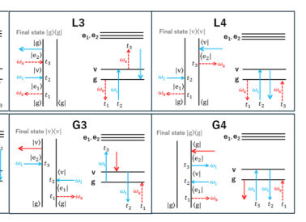
<figcaption class="paper-figure-caption"><b>Fig 3.</b> Fig. 2. Double-sided Feynman diagrams and energy level diagrams describing L1–L4 in sRL and G1–G4 in sRG. Dotted arrows mean the vacuum fields, solid arrows represent the pump fields, and double-line arrows denote the signal field. On the bra side (right side) in double-sided Feynman diagram, the arrows indicate the negative-frequency light going in and out of the target molecules, which corresponds to the positive-frequency light going out and in. Although the signal field is depicted in our diagram style to show the final state of molecules, the arrow for the signal field is not necessary to calculate the nonlinear susceptibility. Also in the energy level diagram, the corresponding arrows...</figcaption>
</figure>
<figure class="paper-figure-card">
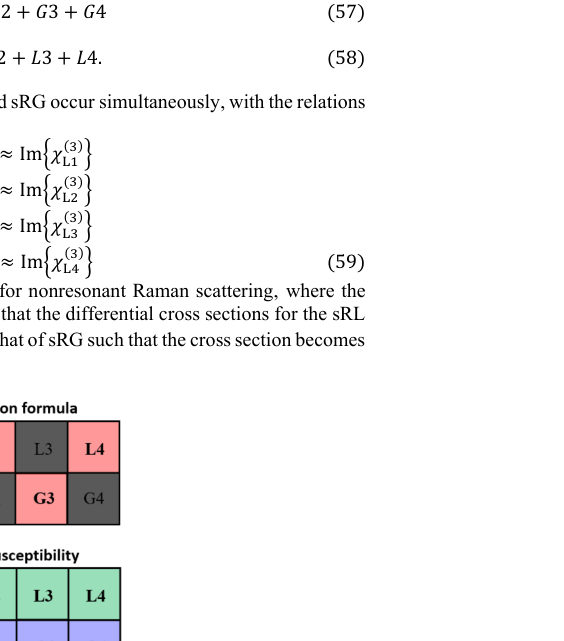
<figcaption class="paper-figure-caption"><b>Fig 4.</b> Fig. 3. A relationship between the cross sections. (a) 𝜎KHD/𝛺 derived from KHD dispersion formula. (b) 𝜎sRG/𝛺 and 𝜎sRL/𝛺 derived from nonlinear optical susceptibility approach.</figcaption>
</figure>
<figure class="paper-figure-card">

<figcaption class="paper-figure-caption"><b>Fig 5.</b> Fig. 4. Double-sided Feynman diagrams and energy level diagrams describing G5–G8 in sRG and L5–L8 in sRL.</figcaption>
</figure>

**Summary.** The paper develops a unified theory for spontaneous Raman scattering by bridging quantum mechanics and nonlinear optics. It shows that calculating the process using advanced quantum field methods yields perfect analytical agreement with traditional susceptibility approaches, while also predicting a previously unrecognized 'spontaneous Raman loss' mechanism.

**Why it may be interesting.** This work is highly relevant to AMO physics and quantum optics as it rigorously unifies two major theoretical descriptions of light-matter interaction—the microscopic quantum picture (KHD) and the macroscopic response theory ($\chi^{(3)}$)—while predicting new vacuum-seeded phenomena like sRL.

Detailed structure

**Main problem.** To develop a theoretical framework that fundamentally bridges quantum mechanical and nonlinear optical approaches for spontaneous Raman scattering.

**Main result.** The authors achieve perfect analytical agreement between the quantum mechanical description (including negative-frequency terms) and the macroscopic nonlinear susceptibility approach, predicting a novel phenomenon called 'spontaneous Raman loss' (sRL).

**Method.** The study involves deriving the spontaneous Raman cross-section by calculating third-order nonlinear susceptibilities ($\chi^{(3)}$) using both traditional Kramers-Heisenberg-Dirac theory and an advanced quantum mechanical formalism incorporating vacuum field expectation values.

**Model / system.** The system is molecular scattering undergoing Raman processes, involving vibrational quanta ($\omega_{vib}$), pump fields ($\omega_i$), and scattered photons ($\omega_s$). The analysis uses concepts from nonlinear optics and quantum electrodynamics applied to light-matter interaction.

**Key observables.** Spontaneous Raman cross-section ($d\sigma/d\Omega$), spontaneous Raman gain (sRG) and loss (sRL) intensities, and the third-order nonlinear susceptibility ($\chi^{(3)}$).

**Important parameters / regimes.** Molecular density ($N$), vacuum permittivity ($\epsilon_o$), and various frequency differences ($\omega_{eg}, \omega_{ev}$).

**Assumptions / limitations.** The analysis assumes that unobservable terms (related to negative-frequency processes beyond the observable range) are physically forbidden in spontaneous scattering, allowing for a direct mapping between formalisms.

**Figures summary.** Figure 1 illustrates the rotating and counter-rotating terms in KHD theory. Figure 2 details eight Feynman diagrams used to calculate $\chi_{	ext{sRL}}^{(3)}$ and $\chi_{	ext{sRG}}^{(3)}$. Table 1 maps observable/unobservable quantum mechanical terms to nonlinear susceptibility components.

**Paper structure.** The paper progresses by first establishing the need for a unified theory, then calculating sRG and sRL using vacuum expectation values derived from $\chi^{(3)}$ (via Feynman diagrams), and finally demonstrating that an advanced negative-frequency-assisted quantum mechanical approach yields exact analytical agreement with the established nonlinear optical formalism.

Abstract

We present a theoretical framework for spontaneous Raman scattering that fundamentally bridges quantum-mechanical and nonlinear-optical approaches. By conceptualizing spontaneous Raman scattering as a stimulated Raman gain or loss event seeded by the quantum vacuum field, we rigorously derive the spontaneous Raman cross-section directly from the third-order nonlinear susceptibility. Crucially, this framework predicts the existence of a hitherto unrecognized phenomenon: "spontaneous Raman loss" (sRL), which acts as the vacuum-seeded counterpart to stimulated Raman loss, complementing traditional spontaneous Raman scattering (spontaneous Raman gain, sRG). Furthermore, we establish a rigorous connection to the traditional Kramers-Heisenberg-Dirac (KHD) theory, revealing that the spontaneous process is governed by interference before a detector between the signal field emitted from molecules and the vacuum field itself that stimulates the molecules. This insight uncovers a direct correspondence between the sRG susceptibility and the rotating/counter-rotating interference terms in the KHD formula. Ultimately, we extend the foundational KHD theory by incorporating previously unrecognized essential terms, achieving perfect analytical agreement between the quantum mechanical and nonlinear optical descriptions of Raman scattering.

[↑ back to top](#top)

### [Diverse efficiency of observable optimization for four-level quantum systems with higher-order traps](http://arxiv.org/abs/2607.01217v1)

**Authors:** Alexander Pechen, Boris Volkov  
**Type:** theory · **Category:** other · **PDF:** <https://arxiv.org/pdf/2607.01217v1>  
**Analysis basis:** full PDF text, analyzed in chunks
**Topic relevance:** `Frenkel-Kontorova` **1/5** · `analog quantum simulation` **1/5** · `methods for driven-dissipative` **1/5** · `quantum measurements` **1/5**

↔ Scroll figures horizontally

<figure class="paper-figure-card">

<figcaption class="paper-figure-caption"><b>Fig 1.</b> Figure 1. Left: Energy level structure of an example class of four-level quantum systems with the free Hamiltonian H0 = diag(a, b, b, c) and with allowed transitions |1⟩↔|2⟩, |1⟩↔|3⟩, |2⟩↔|3⟩, |2⟩↔|4⟩, and |3⟩↔|4⟩. We denote this system as a V −V since it has a couple of V -connected triples of levels: One triple is level |1⟩connected with two levels |2⟩and |3⟩, an another triple is level |4⟩connected with the same two levels; ′′−′′ indicates that both upper levels |2⟩and |3⟩are connected. Right: Energy level structure of a four-level quantum system with the chain interaction.</figcaption>
</figure>
<figure class="paper-figure-card">
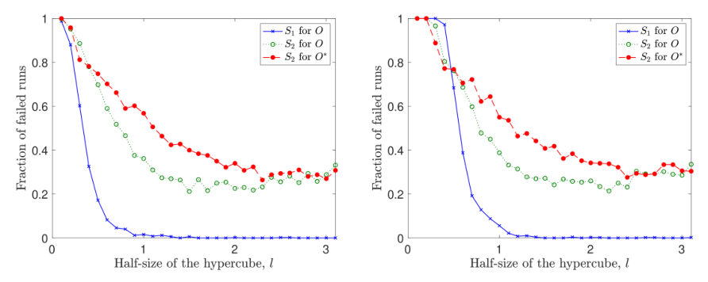
<figcaption class="paper-figure-caption"><b>Fig 2.</b> Figure 2. Fraction of failed runs for l = 0.1, 0.2, 0.3, . . . , 3.1 for the system S1 (blue solid line) and S2 (green dotted and red dashed lines for the two target observables O and O∗, respectively). Left: Unconstrained optimization using GRAPE. Right: Constrained optimization using GPM. The target observable is O = diag(1, −6, −6, 0) for S1 and S2, and also O∗= diag(1, 6, −6, 0) for S2. The initial state is ρ0 = |4⟩⟨4|. The parameters are T = 20, M = 100, Kstop = 2000, ε = 0.02, and Ierr = 10−3. For each point L = 500 runs are performed. The behaviour of the fraction of failed runs for both systems in essentially different.</figcaption>
</figure>
<figure class="paper-figure-card">

<figcaption class="paper-figure-caption"><b>Fig 3.</b> Figure 3. An example of the optimization results with target observable O. Upper row for the system S1 and l = 1. Bottom row for the system S2 and l = 2. Other parameters are the same as for Fig. 2. Left: behavior of the objective value and norm of the gradient vs iteration number. Totally 1880 iterations were required for S1 and 770 for S2. Right: The obtained optimized controls vs time.</figcaption>
</figure>

**Summary.** This paper investigates the landscape of quantum control for four-level systems, proving that the zero-control point acts as a high-order trap. By comparing V-V and chain interaction models using GRAPE/GPM simulations, the authors reveal that the optimization efficiency varies drastically depending on the system's underlying Hamiltonian structure.

**Why it may be interesting.** This work directly addresses the practical limitations of optimal control theory by quantifying how the underlying structure of the Hamiltonian dictates the difficulty and efficiency of finding controls, which is crucial for designing robust quantum protocols in AMO settings.

Detailed structure

**Main problem.** The study analyzes the quantum control landscape for optimizing a specific observable by finding optimal time-dependent controls $f(t)$ in four-level quantum systems.

**Main result.** The null control ($f \equiv 0$) is proven to be a five-order trap, but the optimization efficiency shows diverse behavior: a sharp increase for V-V systems versus a slower increase for chain interaction systems.

**Method.** The analysis combines analytical investigation of the objective functional's Taylor expansion at the null control with numerical simulations using GRAPE (unconstrained) and GPM (constrained).

**Model / system.** The system involves four-level quantum dynamics governed by a Hamiltonian $H = H_0 + f(t)V$. Two specific models are compared: a V-V system and an anharmonic/chain interaction system.

**Key observables.** Optimization efficiency (fraction of successful runs), the objective functional value, and the order of the trap determined by Taylor expansion coefficients.

**Important parameters / regimes.** The distance parameter $l$ from the null control; time duration $T=20$; number of discretization points $M=100$.

**Assumptions / limitations.** The analysis assumes controllability of the system and relies on structural assumptions regarding the Hamiltonian for proving trap orders.

**Figures summary.** Figures illustrate energy level structures (V-V vs. chain), and subsequent figures show optimization efficiency (fraction of failed runs) versus distance $l$ for both V-V and chain systems, comparing GRAPE and GPM results.

**Paper structure.** The paper progresses from defining the quantum control problem and characterizing traps analytically to performing numerical comparisons between unconstrained (GRAPE) and constrained (GPM) optimization methods on two distinct physical models.

Abstract

In this work, we perform an analytical and numerical analysis of quantum landscapes for controlling special four-level quantum systems for which we prove that the null control is a five-order trap: a $V-V$ system and an anharmonic system. As a control goal, an observable optimization is considered. The rigorous theoretical analysis is followed by the numerical experiments based on the GRadient Ascent Pulse Engineering (GRAPE) algorithm and Gradient Projection Method (GPM), performed to investigate the behavior of the efficiency of optimization for unconstrained (using GRAPE) and constrained (using GPM) controls. As the main result, we observe an interesting phenomenon with a diverse behavior of the optimization efficiency depending on the system Hamiltonian -- sharp increase of the optimization efficiency up to 100% at certain distance from the null control for a V-V system, while much slower and less significant increase (and even small decrease) for a system with the chain interaction. This sharp difference might be related with the fine structure of the subspace of controls where second derivative of the objective functional is zero.

[↑ back to top](#top)

### [Entropy-Driven Structural Phase Transition in Nb$_3$Cl$_8$ via Density Functional Theory and an Effective Model](http://arxiv.org/abs/2607.00599v1)

**Authors:** Chenjie Zhu, Shuai Zhang, Zhong Fang, Zhijun Wang, Quansheng Wu, Hongming Weng  
**Type:** theory · **Category:** strongly correlated electrons · **PDF:** <https://arxiv.org/pdf/2607.00599v1>  
**Analysis basis:** full PDF text, analyzed in chunks
**Topic relevance:** `Keldysh / 2PI / non-Gaussian methods` **1/5** · `analog quantum simulation` **1/5** · `driven-dissipative phase transition` **1/5** · `exotic spin models in light-matter` **1/5**

↔ Scroll figures horizontally

<figure class="paper-figure-card">
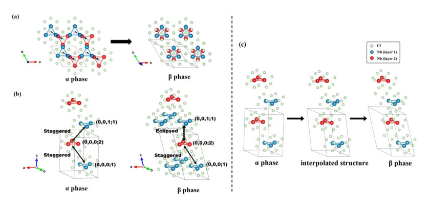
<figcaption class="paper-figure-caption"><b>Fig 1.</b> FIG. 1. Crystal structures of Nb3Cl8 in the α and β phases and the interpolation path between them. Light green spheres denote Cl atoms, while blue and red spheres denote Nb atoms in adjacent layers. (a) Top view of the interlayer slip from the staggered α stacking to the partially eclipsed β stacking. The black arrow indicates the dominant structural displacement across the transition. (b) Side view of the corresponding stacking sequences. Here (R, site) labels the lattice translation R and the cluster site within the unit cell. The α phase has uniform staggered AA′ stacking, whereas the β phase adopts an AA′BB′CC′ stacking sequence[8], alternating between staggered and eclipsed interlayer...</figcaption>
</figure>
<figure class="paper-figure-card">

<figcaption class="paper-figure-caption"><b>Fig 2.</b> FIG. 2. DFT total-energy difference per unit cell, ∆EDFT = EDFT −Eα DFT, versus the interpolated structural parameter between the α and β phases. The α-phase energy is taken as the reference.</figcaption>
</figure>
<figure class="paper-figure-card">
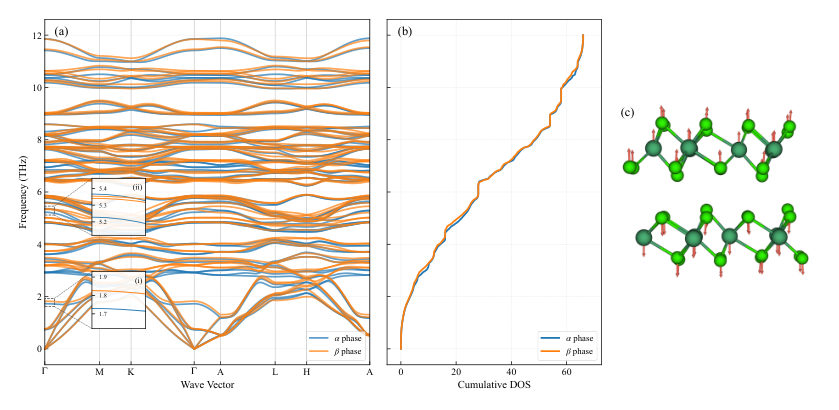
<figcaption class="paper-figure-caption"><b>Fig 3.</b> FIG. 3. (a) Phonon dispersions of the α phase (blue) and β phase (orange) of Nb3Cl8, plotted along the high-symmetry path of the α phase. Inset (i) highlights the Γ-point Layer-Breathing Mode, with frequencies of 1.729 THz in the α phase and 1.826 THz in the β phase. Inset (ii) highlights the Γ-point modes near 5.3 THz for comparison with experimentally observed phonon modes. In the α phase, the A1g and A2u modes are at 5.228 and 5.366 THz, respectively; in the β phase, the A2u and A1g modes are at 5.341 and 5.354 THz, respectively. (b) Corresponding cumulative phonon density of states. The α-phase curve is shifted slightly toward lower frequencies, indicating an overall phonon softening...</figcaption>
</figure>
<figure class="paper-figure-card">
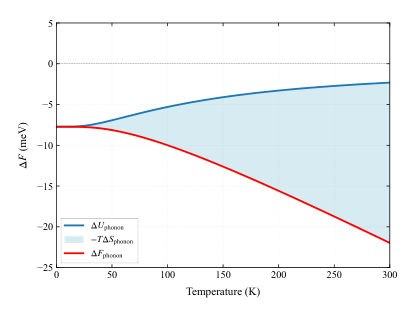
<figcaption class="paper-figure-caption"><b>Fig 4.</b> FIG. 4. Phonon Helmholtz free-energy difference per unit cell, ∆Fphonon = F α phonon −F β phonon, versus temperature. The decomposition includes the phonon internal-energy dif- ference ∆Uphonon (blue line) and the entropy contribution −T∆Sphonon (blue area). At T = 0, ∆Uphonon reduces to the phonon zero-point-energy difference ∆Ezpe = Eα zpe −Eβ zpe.</figcaption>
</figure>
<figure class="paper-figure-card">

<figcaption class="paper-figure-caption"><b>Fig 5.</b> FIG. 5. Spin entropy per unit cell of the effective Heisen- berg model versus temperature. For the α phase (blue), the entropy is obtained from the HTSE using the P[4, 6] Pad´e ap- proximant. For the β phase (orange), the entropy is obtained from the isolated-dimer model.</figcaption>
</figure>

**Summary.** The authors investigate the structural phase transition in $	ext{Nb}_3	ext{Cl}_8$ by constructing a total free-energy functional that couples DFT results with an extended Hubbard model. They demonstrate that this transition is governed by a delicate balance between phonon entropy (favoring the high-T $\alpha$ phase) and spin entropy/electronic energy gains (favoring the low-T $eta$ phase). The framework successfully predicts how external pressure can suppress this transition, potentially stabilizing the QSL candidate regime.

**Why it may be interesting.** This work provides a comprehensive theoretical framework for understanding structural transitions in Mott insulators where lattice dynamics, electronic correlations, and magnetic ordering are intrinsically coupled, which is highly relevant to correlated materials physics.

Detailed structure

**Main problem.** To determine the microscopic origin of a first-order structural phase transition in $	ext{Nb}_3	ext{Cl}_8$ that suppresses its potential quantum spin liquid (QSL) state.

**Main result.** The transition is jointly driven by phonon and spin entropy, with high-temperature stability favoring the $\alpha$ phase due to entropic gains, while low-temperature favorability of the $eta$ phase arises from interlayer dimerization and spin singlet formation.

**Method.** A unified free-energy framework combining first-principles DFT calculations with an extended Hubbard model and phonon theory is employed to analyze lattice, electronic, and magnetic contributions to the total free energy.

**Model / system.** The system is $	ext{Nb}_3	ext{Cl}_8$, modeled using an effective Hamiltonian derived from a cluster-centered $2a_1$ orbital basis. The analysis incorporates terms for electron correlation (Hubbard model) and lattice vibrations (phonon free energy).

**Key observables.** Helmholtz free energies ($	ext{F}_{	ext{tot}}$), phonon frequencies, spin entropy changes ($S_{	ext{spin}}$), and generalized enthalpy under uniaxial stress ($\Delta H$).

**Important parameters / regimes.** Transition temperature ($T_c \approx 113 	ext{ K}$), critical pressure ($P_c \approx 2.6 	ext{ GPa}$), and Hubbard parameters ($U, V, t$).

**Assumptions / limitations.** The phonon calculation uses the harmonic approximation; the model requires a double-counting correction ($	ext{EDC}$) to reconcile DFT and correlated electron treatments.

**Figures summary.** Figures illustrate phonon dispersions comparing $\alpha$ and $eta$ phases, and plots show the decomposition of free energy and enthalpy differences as functions of temperature and pressure.

**Paper structure.** The paper systematically constructs a total free-energy functional by adding DFT energies, phonon contributions, and Hubbard model spin/correlation terms. It analyzes how entropy (phonon vs. spin) dictates phase stability across varying temperatures and external pressures.

Abstract

As a prototypical flat-band cluster Mott insulator on an effective triangular lattice, Nb$_3$Cl$_8$ is a potential candidate for hosting a quantum spin liquid (QSL) state. Nevertheless, a first-order structural phase transition around 90K transforms the high-temperature paramagnetic $α$ phase into the low-temperature nonmagnetic $β$ phase, suppressing the candidate QSL regime of the $α$ phase. To clarify the microscopic origin of this transition, we combine first-principles calculations with an extended Hubbard model to construct a unified free-energy framework. This framework reveals that the transition is jointly driven by phonon and spin entropy: the $α$ phase is stabilized by softer phonons and larger paramagnetic spin entropy, whereas the $β$ phase is favored by interlayer dimerization, which hardens the phonons and quenches the spin entropy through singlet formation. Furthermore, by evaluating the pressure-dependent generalized enthalpy, we provide a thermodynamic explanation for the suppression of the transition under c-axis uniaxial pressure, where stabilizing the $α$ phase may allow the candidate QSL regime of the $α$ phase to be explored at low temperatures.

[↑ back to top](#top)

### [A universal time-of-arrival signature of Bose--Einstein condensation](http://arxiv.org/abs/2607.00184v1)

**Authors:** Mathieu Beau, Timothey Szczepanski  
**Type:** theory · **Category:** quantum gases · **PDF:** <https://arxiv.org/pdf/2607.00184v1>  
**Analysis basis:** full PDF text, analyzed in chunks
**Topic relevance:** `Keldysh / 2PI / non-Gaussian methods` **1/5** · `analog quantum simulation` **1/5** · `non-equilibrium dynamics` **1/5**

↔ Scroll figures horizontally

<figure class="paper-figure-card">

<figcaption class="paper-figure-caption"><b>Fig 1.</b> FIG. 1. Time-of-arrival statistics across the Bose–Einstein transition. (a) Mean arrival-time shift ⟨T ⟩−tc and (b) standard deviation ∆T , each normalized to its classical value at Tc, versus T/Tc. The dashed curves are the Maxwell–Boltzmann predictions, ⟨T ⟩cl −tc ∝T and ∆Tcl = g−1p</figcaption>
</figure>
<figure class="paper-figure-card">
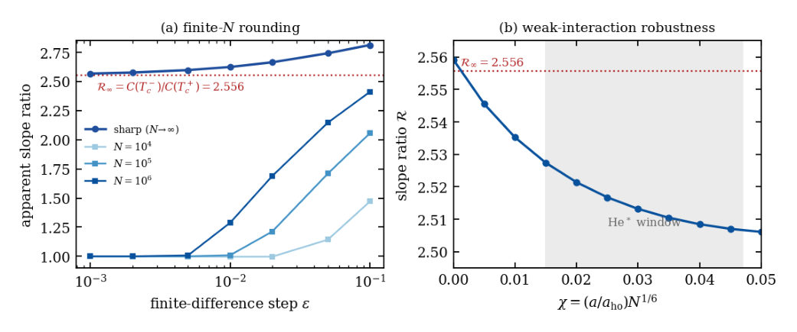
<figcaption class="paper-figure-caption"><b>Fig 2.</b> FIG. 2. Observability and robustness of the TOA cusp. (a) Apparent one-sided slope ratio at the transition versus finite- difference temperature step ε. The sharp thermodynamic-limit curve approaches the universal value R∞≃2.5556 (dotted line), equal to the trapped-gas specific-heat ratio. The finite-N curves are computed from the exact discrete-level sum for 4He (m = 6.64 × 10−27 kg) in a harmonic trap (ωx, ωy, ωz) = 2π × (1000, 1000, 100) Hz, with N = 104, 105, 106 (geometric-mean frequency ¯ω = 2π × 464 Hz, Tc = 0.45, 0.97, 2.10 µK respectively). At finite N, the transition is rounded over a window δT/Tc ∼N −1/3; if ε is pushed below this width, the finite difference samples the smoothed...</figcaption>
</figure>
<figure class="paper-figure-card">
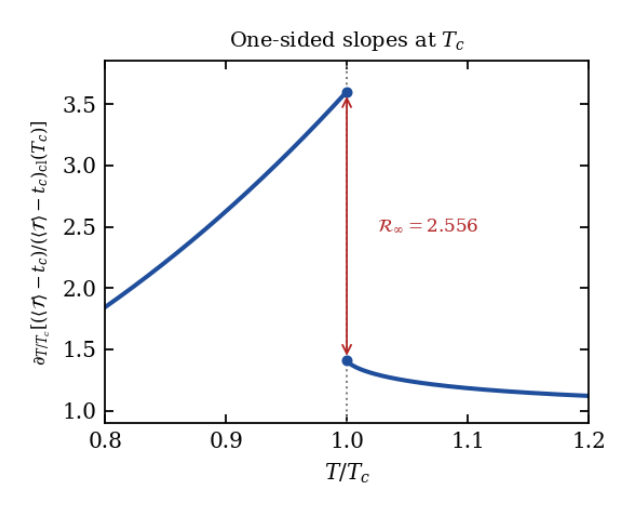
<figcaption class="paper-figure-caption"><b>Fig 3.</b> FIG. 3. One-sided slopes of the normalized mean arrival-time shift, ∂T/Tc  (⟨T ⟩−tc)/(⟨T ⟩−tc)cl(Tc)  , across the transition. The slope drops from 4 ζ(4)/ζ(3) ≃3.60 at T − c to R1 + TcR′(T + c ) ≃1.41 at T + c , a one-sided ratio R∞≃2.556 equal to the trapped-gas specific-heat ratio. The standard deviation ∆T shares the same ratio but a visually milder kink, being linear in σV rather than σ2 V .</figcaption>
</figure>
<figure class="paper-figure-card">
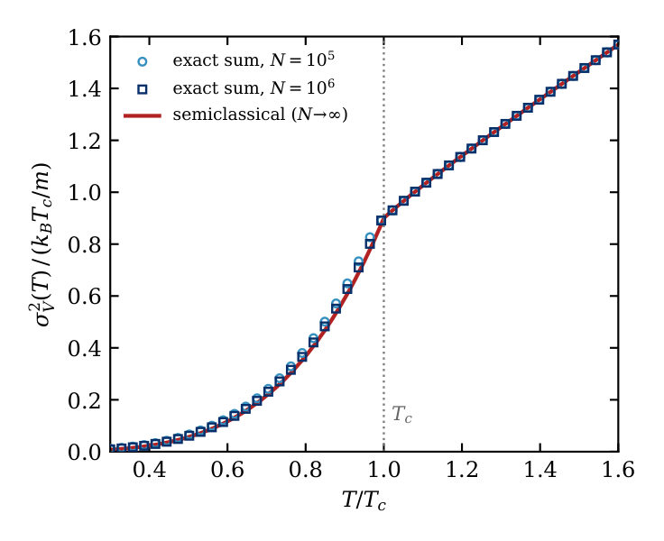
<figcaption class="paper-figure-caption"><b>Fig 4.</b> FIG. 4. Longitudinal velocity variance σ2 V (T) from the exact discrete-level sum [Eq. (56), open symbols] versus the semiclassical thermodynamic-limit form (solid), for 4He (m = 6.64 × 10−27 kg) in the harmonic trap (ωx, ωy, ωz) = 2π × (1000, 1000, 100) Hz (¯ω = 2π × 464 Hz), at N = 105 (Tc = 0.97 µK) and N = 106 (Tc = 2.10 µK). The two agree to &lt; 0.1% for T ≥Tc; the exact sum rounds the cusp over δT/Tc ∼N −1/3 and the below-Tc excess decreases with N.</figcaption>
</figure>
<figure class="paper-figure-card">
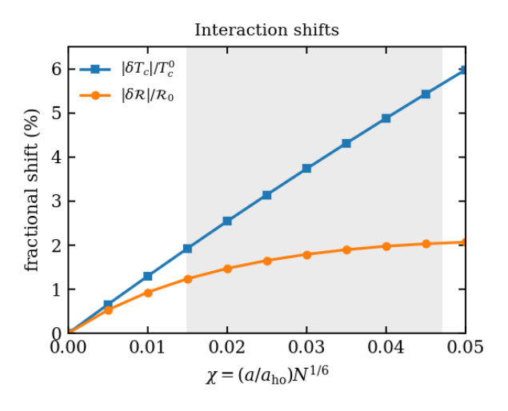
<figcaption class="paper-figure-caption"><b>Fig 5.</b> FIG. 5. Weak-interaction robustness from the HF–LDA calculation. The fractional shift of R stays at the percent level while Tc shifts several times more strongly.</figcaption>
</figure>

**Summary.** The authors theoretically predict that Bose-Einstein condensation imprints a universal cusp onto the time-of-arrival statistics of a trapped gas released into free fall. This characteristic ratio is shown to equal the specific-heat ratio of the ideal gas, providing a highly robust and measurable signature for BEC in cold atom experiments.

**Why it may be interesting.** This work provides a clean, measurable dynamical signature of BEC that is robust against minor perturbations (like weak interactions) and depends only on fundamental thermodynamic ratios, making it an excellent diagnostic tool for ultracold atomic experiments.

Detailed structure

**Main problem.** To demonstrate that Bose-Einstein condensation (BEC) generates a universal, measurable signature in the time-of-arrival (TOA) statistics of a trapped gas released into free fall.

**Main result.** The one-sided slope ratio ($R_\infty$) characterizing the cusp in the TOA distribution is predicted to be universal ($\approx 2.556$), matching the specific-heat ratio of the ideal trapped gas, independent of trap parameters.

**Method.** Semiclassical analysis of the time-of-arrival flux, involving expansions in a small parameter $\epsilon$ and separating contributions from the condensate and thermal cloud.

**Model / system.** An ideal Bose gas confined in an anisotropic harmonic trap, released to free fall. The model is analyzed in the long time-of-flight (far-field) semiclassical limit.

**Key observables.** The TOA distribution $\Pi(t)$, mean arrival time shift $\langle T 
angle - t_c$, standard deviation $\Delta T$, and the universal one-sided slope ratio $R_\infty$.

**Important parameters / regimes.** Ideal gas limit, far-field regime ($\omega z t_c \gg 1$), finite atom number ($N$), and weak interaction strength ($\chi$).

**Assumptions / limitations.** The analysis relies on the ideal gas model initially; interactions are treated perturbatively (Hartree-Fock) or neglected to establish the universal limit.

**Figures summary.** Figures illustrate the development of $\langle T 
angle - t_c$ and $\Delta T$ showing a cusp, confirming $R_\infty \approx 2.556$, and demonstrate that finite-$N$ effects round this cusp while weak interactions cause only minor shifts.

**Paper structure.** The paper develops the TOA distribution semiclassically, derives model-independent relations for $\langle T 
angle$ and $\Delta T$, calculates the universal ratio $R_\infty$ by comparing it to the specific heat ratio, and finally tests its robustness against finite atom numbers and weak interactions.

Abstract

We show that Bose--Einstein condensation produces a cusp in the time-of-arrival (TOA) statistics of a harmonically trapped gas released into free fall. In the semiclassical long time-of-flight regime, with $ε=σ_V/\sqrt{2gH}\ll1$, both the mean and standard deviation of the arrival time distribution, which are governed by the longitudinal velocity variance, remain continuous, but acquire a cusp whose one-sided slope ratio is universal within the ideal-gas far-field limit, $\mathcal{R}_\infty=2.5556\ldots$, and equals the trapped-gas specific-heat ratio $C(Tc^-)/C(Tc^+)$. Finite atom number rounds the cusp and weak interactions perturb it only weakly, leaving a measurable time-domain signature of condensation.

[↑ back to top](#top)

### [Breathing mode inducing dynamical pairing in Kagome materials](http://arxiv.org/abs/2607.01052v1)

**Authors:** Debmalya Chakraborty, Anushree Datta, Jorge Cayao  
**Type:** theory · **Category:** strongly correlated electrons · **PDF:** <https://arxiv.org/pdf/2607.01052v1>  
**Analysis basis:** full PDF text, analyzed in chunks
**Topic relevance:** `Keldysh / 2PI / non-Gaussian methods` **1/5** · `analog quantum simulation` **1/5** · `driven-dissipative phase transition` **1/5**

↔ Scroll figures horizontally

<figure class="paper-figure-card">

<figcaption class="paper-figure-caption"><b>Fig 1.</b> FIG. 1. (a) Sketch of a pristine regular kagome lattice (yellow) made of corner-sharing triangles with sublattices A, B and C. (b) Kagome lattice under a breathing distortion (brown ar- rows), which originates the breathing mode. (c) First Bril- louin zone of the kagome lattice indicating the high sym- metry points and the path KΓMK (red dashed lines). (d,e) Schematic pair amplitude induced by the breathing mode as a function of the imaginary time τ (d) and complex frequency in iωn (e). The resulting dynamical pair at finite times and frequencies is depicted by the blueish filled circles inside the orange ellipse.</figcaption>
</figure>
<figure class="paper-figure-card">
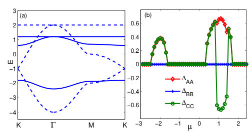
<figcaption class="paper-figure-caption"><b>Fig 2.</b> FIG. 2. (a) Energy bands of the normal state Hamiltonian Eq. (2) for tb = ta (dashes lines) and tb = 0.2ta (solid lines) with µ = 0. (b) Self-consistent values of the superconducting order parameters ∆AA,BB,CC with varying µ for tb = 0.2ta.</figcaption>
</figure>
<figure class="paper-figure-card">
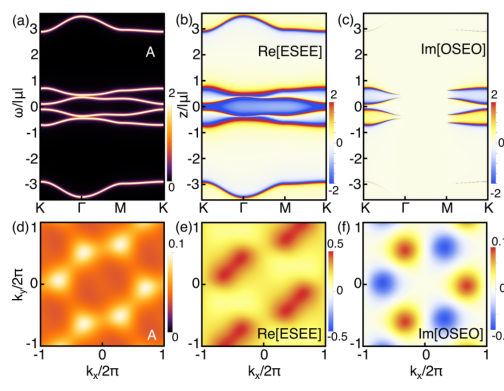
<figcaption class="paper-figure-caption"><b>Fig 3.</b> FIG. 3. (a-c) Spectral function, ESEE and OSEO pair am- plitudes as functions of frequency along high-symmetry paths under a finite breathing distortion ta ̸= tb. The spectral func- tion is plotted versus ω, with z →ω + iη, while the pair amplitudes is shown for z. (d-f) The same as in (a-c) but as a function of momenta at ω = 1 for the spectral function, while z = 1 for the pair amplitudes. Parameters: ∆AA = 0.66|µ|, ∆BB = 0, ∆CC = −0.66|µ|, µ = 1, tb = 0.2ta when not speci- fied.</figcaption>
</figure>

**Summary.** This work theoretically investigates how structural distortions, specifically the 'breathing mode,' induce unconventional odd-frequency Cooper pairs in Kagome superconductors. By classifying superconducting symmetries, the authors show that this structural modulation drives a dynamical pairing mechanism even when conventional $s$-wave superconductivity is present. This establishes breathing Kagome lattices as a platform for realizing exotic, time-nonlocal quantum correlations.

**Why it may be interesting.** While focused on solid-state superconductivity, the concept of dynamical pairing driven by structural fluctuations (a form of coupling between lattice degrees of freedom and electronic correlations) is relevant for understanding emergent quantum phenomena in strongly correlated systems.

Detailed structure

**Main problem.** To classify superconducting symmetries in Kagome superconductors and demonstrate the emergence of odd-frequency dynamical Cooper pairs driven by structural distortions.

**Main result.** The breathing mode induces a specific type of odd-frequency, spin-singlet pairing ($	ext{OSEO}$ class) that can emerge even when the parent superconductivity is conventional $s$-wave.

**Method.** Theoretical calculation involving the full classification of superconducting symmetries using anomalous Green's functions and solving the Bogoliubov de Gennes Hamiltonian self-consistently.

**Model / system.** The system is based on Kagome materials, modeled with a normal state Hamiltonian that includes a structural modulation called the 'breathing mode,' which breaks inversion symmetry ($t_a 
eq t_b$).

**Key observables.** Superconducting pair amplitudes symmetry (even/odd under frequency/spin), odd-frequency pairing signatures, and quasiparticle interference ($\delta
ho_a(q, \omega)$).

**Important parameters / regimes.** The structural distortion parameter ($t_a - t_b$) is crucial; superconductivity exists in specific chemical potential ranges ($\mu$).

**Assumptions / limitations.** The analysis initially considers the simplest onsite spin-singlet superconductivity using $\Delta_{AA}, \Delta_{BB}, \Delta_{CC}$ as independent order parameters.

**Figures summary.** Figures illustrate band structures comparing pristine vs. distorted lattices, and show self-consistent superconducting order parameters ($\Delta_{\alpha\alpha'}$) dependence on chemical potential.

**Paper structure.** The paper proceeds by classifying allowed pair symmetries based on symmetry constraints, demonstrating how the breathing mode opens gaps at Dirac points, leading to the emergence of odd-frequency pairing mechanisms.

Abstract

The breathing mode in Kagome materials is a structural modulation that breaks inversion symmetry and has been shown to be a crucial source for intriguing phases in the normal state. In this work, we carry out a full classification of superconducting symmetries in kagome superconductors and demonstrate the emergence of odd-frequency dynamical Cooper pairs entirely driven by the breathing mode. We then show that odd-frequency spin-singlet Cooper pairs can be realized by controlling the breathing mode in kagome lattices with conventional spin-singlet $s$-wave superconductivity. Since odd-frequency pairing is intrinsically nonlocal in time, our results put forward the breathing mode for designing dynamical Cooper pairs in kagome materials.

[↑ back to top](#top)

### [Non-self-averaging topological Anderson insulator](http://arxiv.org/abs/2607.00892v1)

**Authors:** Zheng-Wei Zuo, Jun-Chong Liu  
**Type:** theory · **Category:** disordered systems and neural networks · **PDF:** <https://arxiv.org/pdf/2607.00892v1>  
**Analysis basis:** full PDF text, analyzed in chunks
**Topic relevance:** `Keldysh / 2PI / non-Gaussian methods` **1/5** · `Kondo & dissipative impurity` **1/5** · `analog quantum simulation` **1/5**

↔ Scroll figures horizontally

<figure class="paper-figure-card">
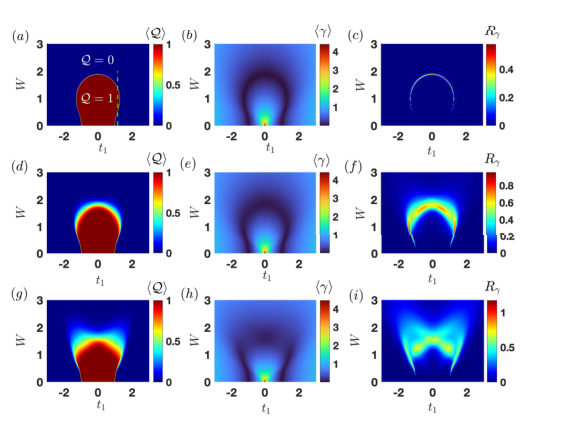
<figcaption class="paper-figure-caption"><b>Fig 1.</b> FIG. 1. The average of the topological quantum number ⟨Q⟩, and the average ⟨γ⟩and relative variance Rγ of the Lyapunov exponent with the system size of N = 5×104, under Nr = 105</figcaption>
</figure>
<figure class="paper-figure-card">
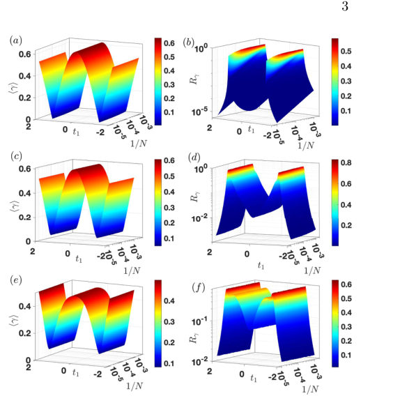
<figcaption class="paper-figure-caption"><b>Fig 2.</b> FIG. 2. The finite size scaling for the average and relative vari- ance of Lyapunov exponent with the disorder strength W = 1 under Nr = 5 × 104 disorder realizations. Panels (a, c, e) ex- hibit the average of Lyapunov exponent for parameters α = 0, 1.5 and 2.5 cases, respectively. while panels (b, d, f) show the corresponding relative variance of Lyapunov exponent.</figcaption>
</figure>
<figure class="paper-figure-card">

<figcaption class="paper-figure-caption"><b>Fig 3.</b> FIG. 4. Histogram of the Lyapunov exponent for different correlated parameters α with the disorder strength W = 1, intra-cell coupling t1 = 0.8, and system size N = 104 under Nr = 105 disorder realizations. (a) α = 0. (b) α = 1. (c) α = 2. (d) α = 3. (e) α = 5. (f) α = 8. (g) α = 10. (h) α = 15. (i) α = 50.</figcaption>
</figure>
<figure class="paper-figure-card">

<figcaption class="paper-figure-caption"><b>Fig 4.</b> FIG. 3. The average topological quantum number ⟨Q⟩, the average and relative variance of Lyapunov exponent as a func- tion of correlation exponent α with disorder strength W = 1 and system size N = 5×104, under Nr = 104 disorder realiza- tions. (a) The average topological quantum number. (b) The average the Lyapunov exponent. (c) The relative variance of Lyapunov exponent.</figcaption>
</figure>
<figure class="paper-figure-card">

<figcaption class="paper-figure-caption"><b>Fig 5.</b> FIG. 5. The topological quantum number Q and Lyapunov exponent γ with system size N = 105 and correlation param- eter α = 2 for two different disorder realizations. (a, b) The topological quantum number (a) and Lyapunov exponent (b) for one specific disorder configuration. (c, d) The topological quantum number and Lyapunov exponent for another specific disorder configuration.</figcaption>
</figure>

**Summary.** This work explores how long-range correlated disorder fundamentally changes the nature of topological Anderson insulators, causing them to become non-self-averaging. The authors demonstrate this by showing that the relative variance of the Lyapunov exponent remains finite in the thermodynamic limit, indicating a breakdown of standard averaging theorems for these complex quantum states.

**Why it may be interesting.** The breakdown of self-averaging is a critical concept in disordered systems theory, suggesting that standard ensemble averaging techniques fail to capture the true physics near topological phase transitions.

Detailed structure

**Main problem.** The research investigates topological Anderson insulators under long-range correlated disorder, a regime poorly understood compared to standard uncorrelated disorder.

**Main result.** Long-range correlated disorder can induce non-self-averaging behavior in the topological states, meaning single sample properties deviate significantly from ensemble averages.

**Method.** The analysis relies on calculating and analyzing the relative variance of the Lyapunov exponent ($\gamma$) across multiple disorder realizations to diagnose self-averaging versus non-self-averaging regimes.

**Model / system.** The model used is a disordered Su-Schrieffer-Heeger (SSH) chain, incorporating long-range correlated disorder defined by a power-law spectral density $S(k) \sim 1/k^\alpha$.

**Key observables.** Topological Quantum Number ($Q$), Lyapunov Exponent ($\gamma$), and the Relative Variance of the Lyapunov Exponent ($R_\gamma$).

**Important parameters / regimes.** The correlation parameter $\alpha$ (quantifying disorder range), the system size $N$, and the number of disorder realizations $N_r$.

**Assumptions / limitations.** Calculations are performed at half-filling using large system sizes ($N = 5 	imes 10^4$) and many disorder realizations ($N_r = 10^5$).

**Figures summary.** Figure 1 shows how $R_\gamma$ behaves for different $\alpha$, indicating non-self-averaging when $R_\gamma$ remains finite in the thermodynamic limit. Figure 2 plots average and relative variance of $\gamma$ vs. $N$, confirming fixed constant values for non-self-averaging cases.

**Paper structure.** The paper establishes the problem by contrasting self-averaging (short-range disorder) with the complex effects of long-range correlated disorder, demonstrating mathematically that this correlation leads to a finite relative variance in the thermodynamic limit, defining the 'non-self-averaging topological Anderson insulator'.

Abstract

Current research on the disordered topological quantum phases primarily focuses on the uncorrelated and short-range correlated disorder regime. These topological Anderson insulators are typically self-averaging. However, topological quantum systems with long-range correlated disorder have received limited attention due to the absence of tractable analytical methods. In fact, the long-range correlated disorder introduces more complex effects on topological quantum states. Here, we demonstrate that the long-range correlated disorder could induce anomalously statistical feature where the topological Anderson states become non-self-averaging, and the phase diagram is strongly dependent on individual disorder configurations. We term this statistical phase the non-self-averaging topological Anderson insulator. The non-self-averaging property is identified by the non-vanishing finite values of the relative variance of the Lyapunov exponent in the thermodynamic limit, alongside the non-Gaussian distributions of the Lyapunov exponent. Consequently, the topological properties of a single disordered sample deviate from the ensemble average, causing a breakdown of the central limit theorem. The non-self-averaging topological Anderson insulator provides insights into the interplay between correlated disorder and topology.

[↑ back to top](#top)

### [Observation of Flat Bands in Type-II Weyl Semimetal TaRhTe$_{4}$](http://arxiv.org/abs/2607.01186v1)

**Authors:** Harry Rankin, Tyler J. Slade, Benjamin Schrunk, Yevhen Kushnirenko, Andrew Eaton, K. U. R. R. S. Rathnayaka, Maxwell Doyle, Lin-Lin Wang, Paul C. Canfield, Adam Kaminski  
**Type:** both · **Category:** strongly correlated electrons · **PDF:** <https://arxiv.org/pdf/2607.01186v1>  
**Analysis basis:** full PDF text, analyzed in chunks
**Topic relevance:** `Keldysh / 2PI / non-Gaussian methods` **1/5** · `Kondo & dissipative impurity` **1/5** · `analog quantum simulation` **1/5**

↔ Scroll figures horizontally

<figure class="paper-figure-card">

<figcaption class="paper-figure-caption"><b>Fig 1.</b> Figure 1: The crystal structure and Brillouin zone of TaRhTe4. a The crystal structure of TaRhTe4. Because it is noncentrosymmetric and layered, there are two different surface terminations, labeled by A and B here. b The Brillouin zone of TaRhTe4.</figcaption>
</figure>
<figure class="paper-figure-card">

<figcaption class="paper-figure-caption"><b>Fig 2.</b> Figure 2: Fermi surfaces of TaRhTe4. a,b DFT-calculated and ARPES Fermi surfaces for termination B. The green and purple icons show the theoretical momentum positions of the Weyl points. The green WP projections have chirality -1 and the purple WP projections have chirality +1. The squares depict WP projections with predicted energy 13 meV above EF , whereas the circles represent WP projections with energy 50 meV below EF . c,d DFT-calculated and ARPES Fermi surfaces for termination A. Note that in this termination, we obtained data out to ky ≈0.25 1/˚A, whereas for termination B, we only obtained data out to ky ≈0.20 1/˚A.</figcaption>
</figure>
<figure class="paper-figure-card">
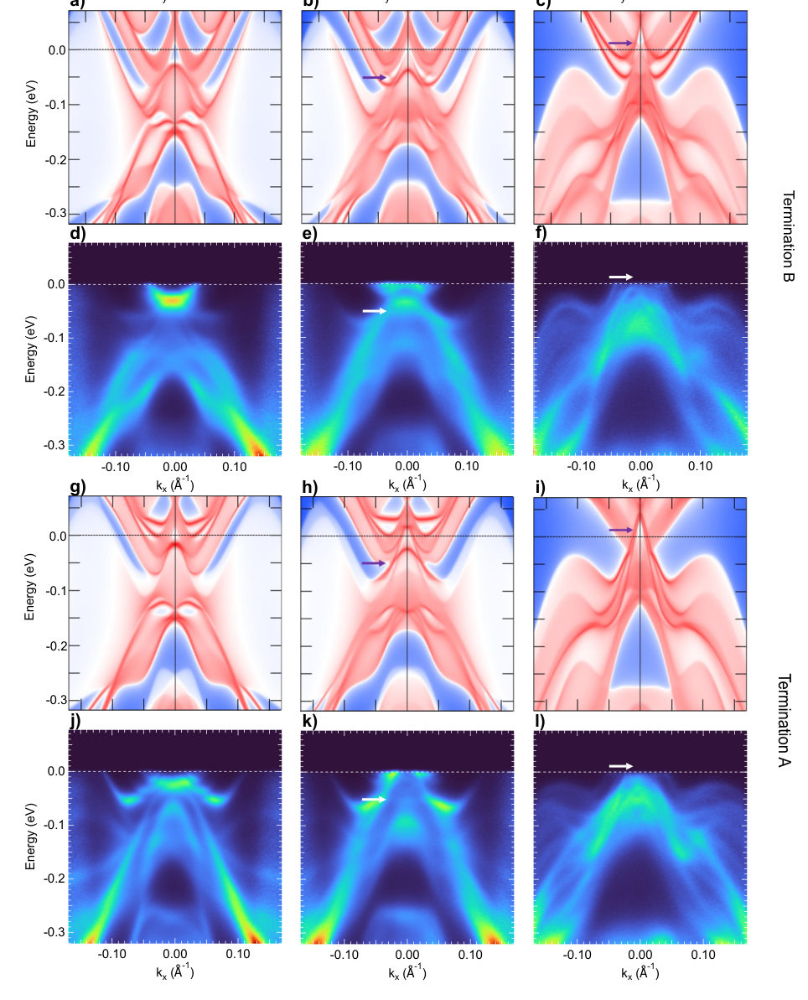
<figcaption class="paper-figure-caption"><b>Fig 3.</b> Figure 3: DFT and ARPES comparison of several energy-momentum cuts near the WP locations on each termination. a-c DFT-calculated energy-momentum cuts through termination B. The purple arrows indicate the theoretical locations of the WPs. d-f ARPES-measured energy-momentum cuts through termination B. The white arrows are placed at the same location as the purple arrows in the DFT calculations. g-i DFT-calculated energy-momentum cuts through termination B. j-l ARPES-measured energy-momentum cuts through termination B. 6</figcaption>
</figure>
<figure class="paper-figure-card">

<figcaption class="paper-figure-caption"><b>Fig 4.</b> Figure 4: Flat bands in the Fermi surface of termination A. a FS of termination A, showing how the flat bands extend throughout most of the Brillouin zone. b,c,d Several energy-momentum cuts in which the flat bands are visible. The flat bands are shown by the white arrows. e EDCs of panel (b), focused on the area enclosed by the smaller white frame. f EDCs of panel (b) without offset. The individual EDCs are colored distinctly only to highlight that the peaks occur at the same energy for each EDC. The peak of the flat bands occurs approximately 4 meV below the Fermi energy.</figcaption>
</figure>
<figure class="paper-figure-card">
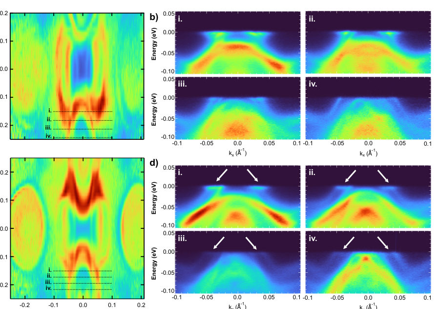
<figcaption class="paper-figure-caption"><b>Fig 5.</b> Figure 5: Comparison of cuts in each termination near the location of the flat bands a Termination B, where the lowercase roman numerals label the locations of the cuts shown in b i-iv. b Corresponding energy-momentum cuts. No flat bands are seen in termination B. c Termination A, which exhibits the flat bands. The lowercase roman numerals label the locations of the cuts shown in d i-iv. d Energy-momentum cuts at the locations labeled in panel c. The flat bands right below EF are indicated by the white arrows.</figcaption>
</figure>

**Summary.** This work reports experimental evidence of unexpected flat energy bands in the Weyl semimetal TaRhTe4 using ARPES. The findings highlight a significant discrepancy between theory and experiment, suggesting that topological materials can host emergent electronic states not captured by current computational models. This combination of topology and flat-band physics makes it an interesting platform for condensed matter research.

**Why it may be interesting.** While focused on topology/band structure, the observation of emergent, unpredicted electronic features like flat bands provides a platform for investigating strong correlation effects or novel many-body physics that standard DFT might miss.

Detailed structure

**Main problem.** The study aims to observe flat electronic bands near the Fermi level in a noncentrosymmetric bulk Weyl semimetal, as such features are rare and unexpected based on initial theoretical calculations.

**Main result.** ARPES measurements reveal the presence of distinct, momentum-independent flat bands localized at specific energies below the Fermi level, particularly evident on one crystal surface termination (Termination A).

**Method.** The research combines Angle-Resolved Photoemission Spectroscopy (ARPES) experiments with Density Functional Theory (DFT) calculations to probe the electronic structure.

**Model / system.** The physical system is bulk TaRhTe4, classified as a noncentrosymmetric van-der Waals type-II Weyl semimetal. The analysis compares experimental measurements on different crystal terminations against theoretical predictions.

**Key observables.** Flat bands near the chemical potential, Fermi surfaces (FSs), and the location/existence of Weyl points (WPs).

**Important parameters / regimes.** Low temperatures (5–5.5 K) for ARPES; energy scales around 4 meV below E_F.

**Assumptions / limitations.** The flat bands observed were not predicted by initial DFT calculations, suggesting physics beyond the standard theory or surface effects are at play.

**Figures summary.** Figures compare calculated and measured FSs for two terminations (A and B); Figure 4 specifically highlights the momentum-independent flat bands on Termination A via EDCs/cuts.

**Paper structure.** The paper establishes the material's topological nature using DFT, presents ARPES data comparing different surface terminations, identifies general agreement with theory, and then focuses heavily on the discrepancy—the unexpected appearance of flat bands in experiment versus calculation.

Abstract

Flat bands have been theoretically predicted for decades but have only recently been realized in quantum materials such as magic-angle twisted bilayer graphene, kagome and Lieb lattices, and rare-earth metal compounds. To date, only twisted layered materials have enabled tuning of flat-band energies near the electronic chemical potential, thereby influencing transport and thermodynamic properties. Here, we report the presence of flat bands near the chemical potential in bulk TaRhTe$_{4}$, a noncentrosymmetric van-der Waals type-II Weyl semimetal. Flat bands are rarely observed in Weyl semimetals, particularly in nonmagnetic bulk systems, and the observed flat bands were not predicted by density functional theory calculations. TaRhTe$_{4}$ therefore provides a platform in which nontrivial topology coexists with flat bands near the Fermi level, as evidenced by our angle-resolved photoemission spectroscopy measurements.

[↑ back to top](#top)

### [Weak Ferromagnetism in NiS$_2$ under Nanocrystallization](http://arxiv.org/abs/2607.00474v1)

**Authors:** Hayato Miyazaki, Tomohiko Yoshinaga, Ojiro Miyazaki, Akira Matsuo, Koichi Kindo, Hirofumi Ishii, Tatsuya Kawae, Tetsuya Kida, Masashi Nantoh, Yoichi Ishiwata  
**Type:** experiment · **Category:** other · **PDF:** <https://arxiv.org/pdf/2607.00474v1>  
**Analysis basis:** full PDF text, analyzed in chunks
**Topic relevance:** `analog quantum simulation` **1/5** · `exotic spin models in light-matter` **1/5** · `spintronics-quantum-optics interface` **1/5**

↔ Scroll figures horizontally

<figure class="paper-figure-card">
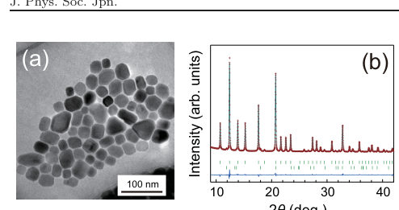
<figcaption class="paper-figure-caption"><b>Fig 1.</b> Fig. 1. Structural characterization of NiS2 NCs. (a) TEM im- age. (b) Synchrotron powder XRD pattern and Rietveld refinement profile.</figcaption>
</figure>
<figure class="paper-figure-card">

<figcaption class="paper-figure-caption"><b>Fig 2.</b> Fig. 2. ZFC and FC M/H curves of NiS2 NCs measured at H = 1000 Oe. The inset shows an enlarged view around the two antiferromagnetic anomalies; the arrow marks the TN1-related anomaly.</figcaption>
</figure>
<figure class="paper-figure-card">
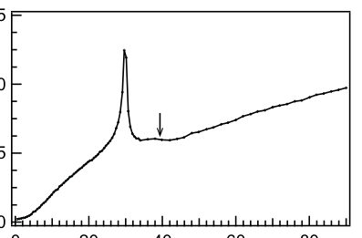
<figcaption class="paper-figure-caption"><b>Fig 3.</b> Fig. 3. Temperature dependence of C/T for NiS2 NCs. The ar- row marks the TN1-related anomaly.</figcaption>
</figure>
<figure class="paper-figure-card">

<figcaption class="paper-figure-caption"><b>Fig 4.</b> Fig. 4(c). Finite remanence and coercivity are observed below TN2, whereas the hysteretic component is essen- tially absent at 30 K. The exchange-bias field HEB and coercive field Hc were estimated from the positive and negative coercive fields, H+ c and H− c , as</figcaption>
</figure>
<figure class="paper-figure-card">
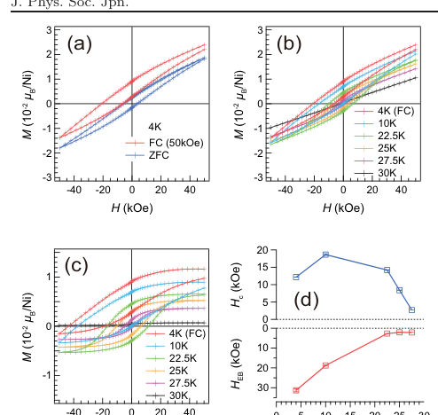
<figcaption class="paper-figure-caption"><b>Fig 5.</b> Fig. 4. Magnetic hysteresis and exchange bias in NiS2 NCs. (a) M-H curves at 4 K after ZFC and FC processes. (b) Temperature- dependent M-H curves measured after field cooling to 4 K. (c) Background-subtracted hysteresis loops. (d) Temperature depen- dences of Hc and HEB.</figcaption>
</figure>

**Summary.** This work characterizes the weak ferromagnetism in NiS2 nanocrystals by measuring their magnetization across temperature ranges relative to antiferromagnetic transitions. The key finding is that the strong magnetic hysteresis below the lower transition is attributed to uncompensated surface moments, which successfully explains the observed field-cooling effects while simultaneously constraining theoretical models of bulk magnetism.

**Why it may be interesting.** While focused on magnetism, the study's rigorous comparison of bulk vs. nanoscale magnetic responses, coupled with detailed characterization of phase transitions via heat capacity, provides a model for how dimensionality and interfaces fundamentally alter many-body quantum ground states.

Detailed structure

**Main problem.** The study investigates the origin of weak ferromagnetism observed in NiS2, specifically determining whether this magnetism arises from homogeneous canting throughout the bulk or is localized at structural features like domain walls.

**Main result.** The pronounced hysteretic ferromagnetic response below the lower antiferromagnetic transition temperature is best explained by uncompensated surface moments generated where the low-temperature magnetic order terminates at the nanocrystal surfaces.

**Method.** Magnetization (M-H) and specific heat measurements were performed on synthesized NiS2 nanocrystals, comparing results above and below the critical transition temperatures.

**Model / system.** The physical system is structurally well-ordered NiS2 nanocrystals ($\sim 27$ nm). The analysis contrasts two theoretical models for weak ferromagnetism: homogeneous canting (volume property) versus localization at domain walls (interface property).

**Key observables.** Hysteretic ferromagnetic response, large coercivity, exchange bias, and vertical loop shift observed below $T_{N2}$; nearly linear M-H response above $T_{N2}$.

**Important parameters / regimes.** Nanocrystal diameter ($\sim 27$ nm); Antiferromagnetic transition temperatures ($T_{N1} \simeq 39$ K, $T_{N2} \simeq 30$ K).

**Assumptions / limitations.** The analysis assumes that the observed magnetic features are highly sensitive to nanoscale confinement effects, allowing differentiation between bulk and surface contributions.

**Figures summary.** Figures show temperature dependence of magnetization (ZFC/FC) confirming two transitions; hysteresis loops demonstrate strong magnetic signatures only below $T_{N2}$, which are analyzed for exchange bias and coercivity.

**Paper structure.** The paper establishes the bulk properties, synthesizes nanocrystals, measures magnetic responses across different temperatures, and then uses the temperature-dependent contrast between hysteretic (low T) and linear (high T) behavior to rule out competing theoretical models in favor of surface moment generation.

Abstract

Structurally well-ordered NiS$_2$ nanocrystals with an average diameter of $27.0 \pm 6.5$ nm retain the bulk-like two-step antiferromagnetic transitions, as shown by magnetization and heat-capacity measurements. Below the lower transition, the nanocrystals exhibit a hysteretic ferromagnetic response with large coercivity, exchange bias, and a vertical loop shift after field cooling, whereas the $M$-$H$ response just above the transition is nearly linear. These features are best explained by uncompensated surface moments generated where the low-temperature antiferromagnetic order terminates at the nanocrystal surface. The absence of a clear additional bulk-like weak-ferromagnetic component constrains homogeneous-canting models and indirectly favors a domain-wall scenario for the weak ferromagnetism of bulk NiS$_2$.

[↑ back to top](#top)

### [Deconfined criticality between an antiferromagnetic insulator and a nodal d-wave superconductor: a quantum Monte Carlo study](http://arxiv.org/abs/2607.00762v1)

**Authors:** Chuang Chen, Subir Sachdev, Zi Yang Meng  
**Type:** theory · **Category:** strongly correlated electrons · **PDF:** <https://arxiv.org/pdf/2607.00762v1>  
**Analysis basis:** full PDF text, analyzed in chunks
**Topic relevance:** `Keldysh / 2PI / non-Gaussian methods` **1/5** · `analog quantum simulation` **1/5**

↔ Scroll figures horizontally

<figure class="paper-figure-card">

<figcaption class="paper-figure-caption"><b>Fig 1.</b> Fig. 1. Phase diagram obtained from QMC simulation. The x-axis is −r and y-axis is κτ . There are three phases namely d-wave superconductor (dSC), anti- ferromagnetic Mott insulator (AFM) and deconfined phase of the SU(2) gauge field (deconfined). The insets schematically illustrate the staggered spin configuration of the AFM phase and the opposite pairing signs on the horizontal and vertical bonds of the dSC phase. The dots (star and circle) on the phase boundaries are determined from our parameter scans in the phase diagram as the transition point (Fig. 2 and Fig. 3). The four triangular dots mark the parameters of the spectral study (Fig. 4).</figcaption>
</figure>
<figure class="paper-figure-card">
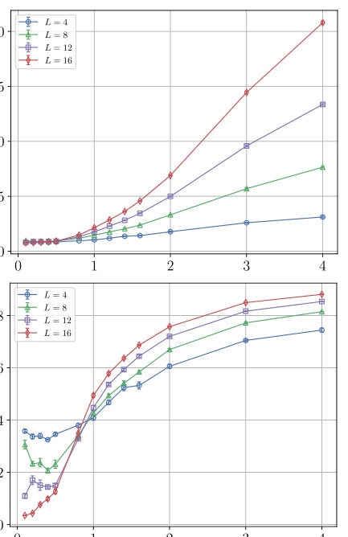
<figcaption class="paper-figure-caption"><b>Fig 2.</b> Fig. 2. AFM structure factor and correlation ratio across Deconfined-to-AFM transition. (a) The structure factor of the AFM phase χS is measured at the AFM ordered wave vector q = M as a function of κτ . Here we fix J = 1 as the energy unit and κ = 20 and the simulations are performed with linear system sizes L = 4, 8, 12, 16 and inverse temperature β = 2L. As κτ increases, the AFM order also becomes clearer. (b) The correlation ratio of the AFM phase rAFM as a function of κτ . The crossing of the correlation ratio indicates the position of quantum critical point between the phase with deconfined SU(2) gauge field and π-flux spinon and confined AFM phase.</figcaption>
</figure>
<figure class="paper-figure-card">

<figcaption class="paper-figure-caption"><b>Fig 3.</b> Fig. 3. Structure factors and correlation ratio of dSC, AFM and VBS orders across dSC-to-AFM transition. We set κ = 20, m = 0.1, g = 0.54/c0, V1 = 4/c0 −3c0, K1 = 3c0, J1 = 3c0 in Eq. (7) and perform the QMC simulations along the path of r = −15 and varying κτ (the right red scan in Fig. 1), with linear system sizes L = 4, 8, 12, 16 and inverse temperature β = 2L. (a) The structure factor of the dSC phase χel, d as a function of κτ . As κτ increases, dSC order decreases and vanishes. (b) The structure factor of the AFM phase χS. As κτ increases, AFM order starts to increase at the point where dSC order starts to decrease. (c) The structure factor of VBS χD. As κτ increases, the VBS order...</figcaption>
</figure>
<figure class="paper-figure-card">

<figcaption class="paper-figure-caption"><b>Fig 4.</b> Fig. 4. Electron and spin spectra across dSC-to-AFM transition. (a) shows the electron spectra A(k, ω) inside the dSC phase with r = −15, κτ = 1, while (b) r = −8, κτ = 2 and (c) r = 15, κτ = 10 are electron spectra inside the AFM phase, with (b) closer to the transition point. (d), (e) and (f) are the corresponding spin spectra χS(q, ω). For electron spectra A(k, ω), we plot the high symmetry path connecting X(π, 0) →S(π/2, π/2) →Y(0, π). While for the spin spectra, we use path Γ(0, 0) →X(π, 0) →M(π, π) →Γ(0, 0). In the dSC phase, the electron shows Dirac-like dispersion, and the spin spectrum is in the shape of two-spinon continuum of U(1) Dirac spin liquid. In the AFM phase, however,...</figcaption>
</figure>

**Summary.** The authors use Quantum Monte Carlo simulations on a fractionalized lattice model to study the transition between an antiferromagnetic insulator and a d-wave superconductor. They find evidence for a deconfined quantum critical point where both orders vanish continuously, characterized by changes in the electronic dispersion from gapless Dirac cones to gapped states.

**Why it may be interesting.** This work provides advanced numerical evidence for deconfined quantum criticality in models relevant to high-Tc superconductivity, utilizing sophisticated gauge field theories within a QMC framework that is highly valuable for understanding emergent quantum phases.

Detailed structure

**Main problem.** The study investigates the quantum phase transition (QPT) between an antiferromagnetic insulator (Néel state) and a nodal d-wave superconductor in strongly correlated electron systems.

**Main result.** Evidence is found for a second-order deconfined quantum phase transition (DQCP) where both Néel and d-wave superconducting orders vanish continuously. The electronic dispersion changes from gapless Dirac to gapped as the system moves into the AFM state.

**Method.** Quantum Monte Carlo (QMC) simulations are employed using a fractionalized representation of electrons into fermionic spinons and bosonic chargons coupled to an SU(2) lattice gauge field.

**Model / system.** The model is defined on the square lattice at half-filling, utilizing an SU(2) lattice gauge theory framework. The electron degrees of freedom are decomposed into spinon and chargon components whose dynamics govern the competition between magnetic and superconducting orders.

**Key observables.** Spin structure factor ($\chi_S$), pairing structure factor ($\chi_{el, d}$), electronic spectral function ($A(\mathbf{k}, \omega)$), and correlation ratios for AFM, dSC, and VBS order.

**Important parameters / regimes.** The transition is mapped by varying coupling constants like $\kappa$ and $\kappa_	au$, which tune the relative strengths of magnetic and superconducting interactions.

**Assumptions / limitations.** The method relies on successfully fractionalizing electrons into spinons and chargons to avoid the sign problem in QMC simulations. The analysis also assumes that specific gauge-invariant composite operators correctly capture physical observables.

**Figures summary.** Figures illustrate phase diagrams showing three distinct regimes (dSC, AFM, deconfined) separated by transition lines, alongside spectral plots demonstrating gapless Dirac dispersion in the dSC phase and gapped behavior in the AFM phase across the critical point.

**Paper structure.** The paper systematically analyzes the Hamiltonian decomposition into spinon and chargon parts. It then applies QMC simulations to calculate various correlation functions and spectra across different parameter regimes, culminating in a detailed comparison of spectral features near the proposed DQCP.

Abstract

We present a quantum Monte Carlo study of the transition between the insulating Néel state and the nodal $d$-wave superconductor on the square lattice at half-filling. We access a regime of frustrated magnetic order without a sign problem using a parton representation of the electron in terms of fermionic spinons and bosonic chargons. Both partons move in a background $π$-flux (so the electron experiences no net flux) and are coupled to a quantum fluctuating SU(2) lattice gauge field. In contrast to earlier studies directly on the electronic degrees of freedom, we find evidence for a second-order deconfined quantum phase transition at which both the Néel and $d$-wave superconductivity orders vanish continuously. We compute correlators of the spinon-chargon composite with the same quantum numbers as the electron: we find a gapless Dirac dispersion inside the $d$-wave superconductor, turning into a gapped dispersion in the antiferromagnet.

[↑ back to top](#top)

### [GsOQDC: A GUI-Driven Interactive Framework for End-to-End Simulation of Optical Quantum Data Centers](http://arxiv.org/abs/2607.00715v1)

**Authors:** Seyed Navid Elyasi, Sima Bahrani, Rui Wang, Dimitra Simeonidou, Paolo Monti, Rui Lin  
**Type:** theory · **Category:** quantum information and computing · **PDF:** <https://arxiv.org/pdf/2607.00715v1>  
**Analysis basis:** full PDF text, analyzed in chunks
**Topic relevance:** `methods for driven-dissipative` **1/5** · `non-equilibrium dynamics` **1/5**

↔ Scroll figures horizontally

<figure class="paper-figure-card">

<figcaption class="paper-figure-caption"><b>Fig 1.</b> Fig. 1: GsOQDC workflow and software architecture. The platform integrates the end-to-end DQC workflow, enabling users to progress from quantum-circuit design and optical-network configuration to distributed compilation, scheduling, execution, and performance evaluation within a single graphical environment.</figcaption>
</figure>
<figure class="paper-figure-card">
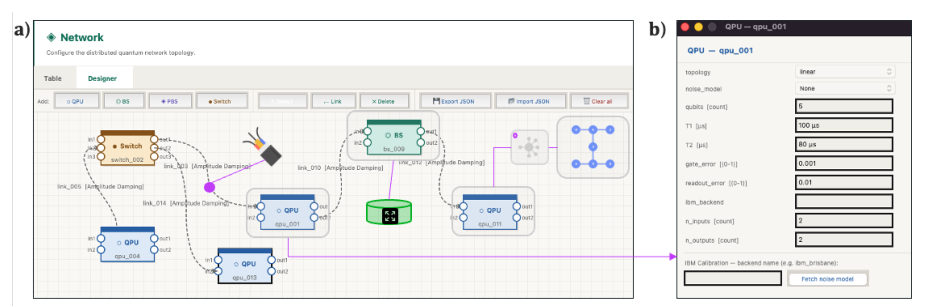
<figcaption class="paper-figure-caption"><b>Fig 2.</b> Fig. 2: GsOQDC Network Designer. (a) Interactive topology editor for constructing Optical Quantum Data Center architectures using QPUs, optical components, and communication links. (b) Component configuration panel, accessible via right-click, allowing users to modify hardware and noise parameters, including qubit properties, gate errors, coherence times, readout errors, and device-specific calibration data. Together, these capabilities enable realistic, cross-layer modeling of distributed quantum-computing infrastructures.</figcaption>
</figure>
<figure class="paper-figure-card">

<figcaption class="paper-figure-caption"><b>Fig 3.</b> Fig. 3: Distributed-workload scheduling in GsOQDC. (a) Interactive Gantt-chart visualization showing local operations, remote-gate execution, and communication events across multiple QPUs. (b) Contextual information panel displayed when hovering over a scheduled operation, providing timing, duration, resource, and process details. (c) User-configurable gate and process timing parameters.</figcaption>
</figure>

**Summary.** The paper introduces GsOQDC, an open-source GUI framework designed to simulate Optical Quantum Data Centers (OQDCs) for Distributed Quantum Computation. It unifies the entire workflow—from circuit design through network scheduling and execution simulation—into one platform. This allows researchers to evaluate complex cross-layer performance metrics like entanglement dynamics and system fidelity in a practical, graphical environment.

**Why it may be interesting.** This work is highly relevant as it tackles the practical engineering challenge of simulating large-scale quantum networking, which underpins future distributed quantum computation architectures.

Detailed structure

**Main problem.** The existing software ecosystem for Quantum Data Centers (QDCs) is fragmented, lacking an integrated environment to evaluate end-to-end behavior across quantum applications and optical network resources.

**Main result.** GsOQDC provides the first graphical platform enabling end-to-end design-space exploration of distributed quantum applications while jointly considering optical-network behavior and entanglement-resource dynamics.

**Method.** The framework integrates circuit modeling, optically switched interconnection, network-aware compilation, scheduling, and a Discrete-Event Simulation (DES) engine for cross-layer evaluation.

**Model / system.** The system modeled is an Optical Quantum Data Center (OQDC), comprising multiple interconnected Quantum Processing Units (QPUs) linked by optical networks to perform Distributed Quantum Computation (DQC).

**Key observables.** Entanglement-resource dynamics, system-level performance, Fidelity, Communication overhead, Entanglement-resource utilization, and Job Execution Time (JET).

**Important parameters / regimes.** Gate errors, coherence times, network architecture parameters, and scheduling constraints.

**Assumptions / limitations.** The framework assumes the need to bridge gaps between tools that either lack compilation/scheduling or assume abstract communication models.

**Figures summary.** Figure 1 illustrates the unified GsOQDC workflow (Circuit $
ightarrow$ Network $
ightarrow$ Compile $
ightarrow$ Schedule $
ightarrow$ Run). Figure 2 shows the interactive Network Designer for OQDCs. Figure 3 visualizes distributed workload scheduling using Gantt charts.

**Paper structure.** The paper introduces GsOQDC, detailing its architecture (Fig. 1), providing an interactive GUI for network design and parameter setting (Fig. 2), and demonstrating the simulation of complex workloads via scheduling visualizations (Fig. 3).

Abstract

We present GsOQDC, an open-source graphical framework integrating optical-network design, distributed quantum-circuit compilation, scheduling, and DES-based remote-gate simulation, enabling end-to-end cross-layer evaluation of entanglement-resource dynamics and system-level performance in Optical Quantum Data Centers.

[↑ back to top](#top)

### [Non-signaling assistance in prepare-and-measure scenarios with classical communication](http://arxiv.org/abs/2607.01193v1)

**Authors:** José Nogueira, Carlos Vieira, Lucas E. A. Porto, Lucas Pollyceno, Rafael Rabelo, Otfried Gühne  
**Type:** theory · **Category:** quantum information and computing · **PDF:** <https://arxiv.org/pdf/2607.01193v1>  
**Analysis basis:** full PDF text, analyzed in chunks
**Topic relevance:** `entanglement & information structure` **1/5** · `quantum measurements` **1/5**

↔ Scroll figures horizontally

<figure class="paper-figure-card">
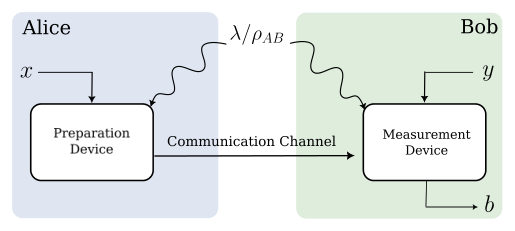
<figcaption class="paper-figure-caption"><b>Fig 1.</b> FIG. 1. Schematic of a prepare-and-measure scenario. Alice en- codes her input x into a preparation device, which emits either a classical or quantum system sent to Bob. Bob receives the system, chooses an input y for his measurement device, and produces an output b. The devices may share correlations, which can be clas- sical (shared randomness λ) or quantum (arising from a shared entangled state ρAB).</figcaption>
</figure>
<figure class="paper-figure-card">
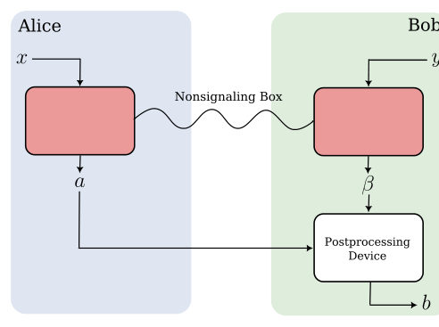
<figcaption class="paper-figure-caption"><b>Fig 2.</b> FIG. 2. Schematic representation of a prepare-and-measure sce- nario with non-adaptive non-signaling assistance, according to the definition in Eq. (6). Alice and Bob share an arbitrary non- signaling box in the Bell scenario (nX, nA; nY , nβ). Alice inputs x into her share of the box, obtains outcome a, and communicates it to Bob. Bob independently inputs y into his share of the box and obtains β. Finally, he post-processes a,β to produce the output b.</figcaption>
</figure>
<figure class="paper-figure-card">
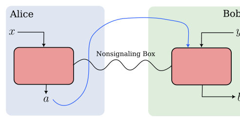
<figcaption class="paper-figure-caption"><b>Fig 3.</b> FIG. 3. Schematic representation of a prepare-and-measure sce- nario with adaptive non-signaling assistance, according to Eq. (8). Alice and Bob share an arbitrary non-signaling box in the Bell sce- nario (nX, nA; nY nA, nB). Alice inputs x into her share of the box, obtains outcome a, and communicates it to Bob. Bob then inputs the composite setting (y, a) into his share of the box and obtains the output b. The protocol is adaptive because Bob’s input to the shared box depends on the message received from Alice.</figcaption>
</figure>

**Summary.** This paper rigorously compares the power of adaptive versus non-adaptive Non-Signaling (NS) assistance in Prepare-and-Measure quantum communication models. It establishes that while NS assistance can simulate full quantum communication, adaptivity only yields a strict advantage over non-adaptivity under specific structural conditions related to input discrimination tasks.

**Why it may be interesting.** This work provides fundamental theoretical bounds on what can be achieved using correlations weaker than entanglement but stronger than classical communication, offering insights into resource theories beyond standard quantum channels.

Detailed structure

**Main problem.** The paper investigates the operational advantage of using adaptive versus non-adaptive Non-Signaling (NS) assistance in Prepare-and-Measure (PM) quantum communication scenarios.

**Main result.** Adaptive NS assistance provides a strict advantage over non-adaptive assistance only in specific PM scenarios characterized by input-discrimination inequalities. Furthermore, non-adaptive NS assistance is shown to be powerful enough to simulate quantum communication for the same message dimension.

**Method.** The authors characterize achievable probability distributions using linear programming techniques and structural reductions, comparing sets defined by adaptive vs. non-adaptive correlation models.

**Model / system.** The model is a Prepare-and-Measure (PM) scenario $(n_X; n_Y, n_B)_{nA}$, where Alice prepares a message $a$ based on input $x$, and Bob measures given input $y$ and the message $a$. The resource analyzed is Non-Signaling (NS) correlation assistance.

**Key observables.** The achievable probability distributions $q(b|x y)$ characterizing the communication behavior, and derived constraints like $\max_{x \in [nX]} q(b|x, y) \le nA$.

**Important parameters / regimes.** Message dimension ($n_A$), input dimensions ($n_X, n_Y$), and output dimension ($n_B$). The comparison hinges on the relationship between $n_A$ and the system sizes.

**Assumptions / limitations.** The analysis is restricted to classical communication channels assisted by NS correlations. Key results rely on reducing general scenarios to single-input subscenarios ($n_Y=1$).

**Figures summary.** Figures illustrate schematics for non-adaptive and adaptive NS assistance, contrasting the mathematical definitions of the achievable sets.

**Paper structure.** The paper systematically defines the PM model, characterizes behaviors under classical randomness, then analyzes the constraints imposed by non-adaptive NS assistance (showing it simulates quantum communication). Finally, it rigorously compares this to adaptive NS assistance, identifying the precise conditions for a strict advantage.

Abstract

Extracting the full power of non-local correlations in prepare-and-measure (PM) scenarios requires precise control over the timing and structure of the receiver's measurements. Indeed, recent developments in entanglement-assisted classical communication scenarios have shown that adaptive strategies-where the receiver uses the transmitted message to guide their measurement choice-can outperform standard non-adaptive protocols. Moving beyond quantum theory, however, the ultimate limits of such advantages remain largely unexplored. In this work, we thoroughly study adaptive and non-adaptive non-signaling (NS) assistance in PM scenarios with classical communication. We provide simple characterizations of the sets of behaviors that can be realized using both non-adaptive and adaptive NS assistance in arbitrary PM scenarios. As a consequence, we show that non-adaptive NS assistance is already strong enough to reproduce quantum communication with the same message dimension: the transmission of a qudit can be simulated by a classical dit assisted non-adaptively by NS correlations. We then compare adaptive and non-adaptive NS assistance. We prove that any adaptive NS advantage can be traced back to scenarios in which the receiver has no measurement choice, ruling out the genuinely multi-setting advantages found in entanglement-assisted quantum protocols. Finally, we identify all PM scenarios where adaptive NS strategies provide a strict advantage over non-adaptive ones.

[↑ back to top](#top)

### [Quantum advantage prediction in turbulent free-space quantum illumination](http://arxiv.org/abs/2607.00308v1)

**Authors:** Yu Tang, Beining Xia, Qianqian Liu, Cuihong Wen, Heng Fan, Jieci Wang  
**Type:** theory · **Category:** quantum information and computing · **PDF:** <https://arxiv.org/pdf/2607.00308v1>  
**Analysis basis:** full PDF text, analyzed in chunks
**Topic relevance:** `interference shaping light` **1/5** · `quantum optics experiment` **1/5**

↔ Scroll figures horizontally

<figure class="paper-figure-card">

<figcaption class="paper-figure-caption"><b>Fig 1.</b> FIG. 1: Diurnal phase evolution of QI advantage under meteorological forcing. The polar clock maps</figcaption>
</figure>
<figure class="paper-figure-card">
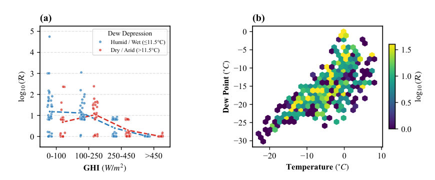
<figcaption class="paper-figure-caption"><b>Fig 2.</b> FIG. 2: Scatter and density distributions of QI advantage under varying meteorological parameters.</figcaption>
</figure>
<figure class="paper-figure-card">
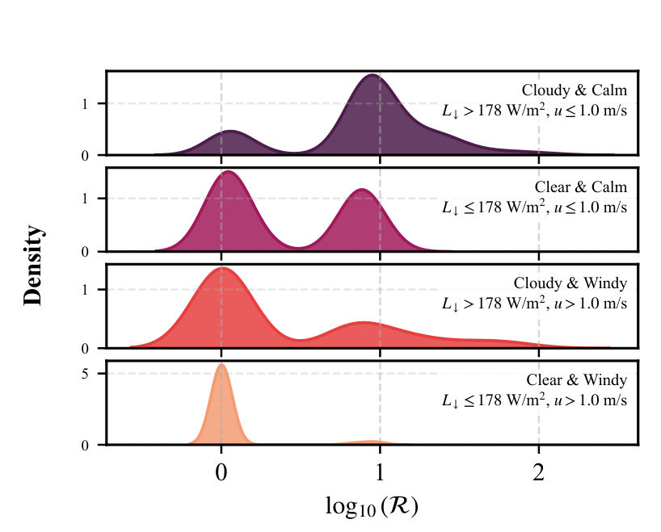
<figcaption class="paper-figure-caption"><b>Fig 3.</b> FIG. 3: Probability density distributions of log10 R in the nocturnal boundary layer (GHI = 0 W/m2).</figcaption>
</figure>
<figure class="paper-figure-card">

<figcaption class="paper-figure-caption"><b>Fig 4.</b> FIG. 4: Multidimensional phase space representation of the QI advantage. The magnitude of log10 R</figcaption>
</figure>
<figure class="paper-figure-card">
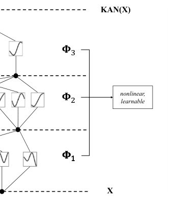
<figcaption class="paper-figure-caption"><b>Fig 5.</b> FIG. 5: Architecture of the KAN.</figcaption>
</figure>

**Summary.** The paper addresses the critical challenge of deploying Quantum Illumination through turbulent air by developing a sophisticated, data-driven framework. It merges macroscopic meteorological measurements with microscopic quantum channel dynamics using Kolmogorov-Arnold networks. This allows for the dynamic prediction and quantification of quantum advantage across diverse, real-world atmospheric conditions.

**Why it may be interesting.** This work bridges classical atmospheric physics, advanced machine learning, and quantum optics by providing a predictive tool for maintaining quantum coherence in harsh real-world environments. The use of KAN for physical parameterization is particularly novel.

Detailed structure

**Main problem.** The core challenge is quantifying how atmospheric turbulence degrades the quantum advantage offered by Quantum Illumination (QI) for target detection in free-space channels.

**Main result.** The authors propose a physics-driven framework using Kolmogorov-Arnold networks to map standard meteorological variables directly to the temporal evolution of the quantum advantage, enabling all-weather operation.

**Method.** They integrate advanced machine learning (KAN) with established atmospheric models (MOST theory) to create an end-to-end system that predicts turbulence effects on QI performance.

**Model / system.** The physical system is free-space quantum illumination using a Two-Mode Squeezed Vacuum state. The model links macroscopic weather data (T, P, GHI, etc.) through boundary layer physics to the microscopic degradation of quantum correlations.

**Key observables.** Quantum advantage ($\log_{10} R$), average error probability ($ar{P}_{	ext{err}}$), and the refractive index structure constant ($C_n^2$).

**Important parameters / regimes.** Meteorological parameters include Global Horizontal Irradiance (GHI), longwave radiation ($L_{\downarrow}$), dew depression, and wind speed ($u$). Key regimes are defined by GHI levels (day vs. night).

**Assumptions / limitations.** The framework relies on coupling the MOST theory to deep learning models; initial simplifications may assume near-ground horizontal channels.

**Figures summary.** Figures illustrate comparisons between different turbulence prediction models (KAN vs. AGA-BP) and show how QI advantage peaks under specific, narrow atmospheric conditions (e.g., twilight transitions or zero GHI with strong $L_{\downarrow}$).

**Paper structure.** The paper progresses from establishing the physical problem (QI in turbulence), detailing the necessary meteorological modeling (MOST/Energy Balance), introducing the advanced ML framework (KAN), and finally applying this integrated system to predict optimal operational windows for quantum sensing.

Abstract

Quantum illumination offers a significant theoretical advantage for target detection in high background noise environments. However, its practical deployment in free-space channels is hindered by atmospheric turbulence. Stochastic fluctuations in atmospheric turbulence inevitably degrade the quantum signature, rendering the real-time evaluation of quantum advantage under such dynamic conditions a critical yet unresolved challenge. To circumvent the reliance on costly direct turbulence measurements, we propose a physics-driven framework that integrates Kolmogorov-Arnold networks directly bridge macroscopic meteorological observations with microscopic quantum channel dynamics. Trained on 105,120 samples from 12 climatically diverse sites and validated on 26,280 unseen samples from three extreme boundary conditions (arid continental, tropical maritime, high-altitude plateau), our approach establishes a physically consistent mapping from standard meteorological variables to the temporal evolution of the quantum advantage. This end-to-end system dynamically quantifies the degradation of quantum advantage across diverse turbulence conditions. Our results provide a rigorous theoretical and data-driven pathway for environmental adaptation, facilitating the transition of quantum radar networks from proof-of-principle demonstrations to all-weather operational systems.

[↑ back to top](#top)

### [Quantum-advantage resource of a two-mode Gaussian state: Analytical theory of convex optimization and a Galois no-go for the closed-form solution](http://arxiv.org/abs/2607.00266v1)

**Authors:** Kunwar Kalra, V. V. Kocharovsky  
**Type:** theory · **Category:** quantum information and computing · **PDF:** <https://arxiv.org/pdf/2607.00266v1>  
**Analysis basis:** full PDF text, analyzed in chunks
**Topic relevance:** `Keldysh / 2PI / non-Gaussian methods` **1/5** · `entanglement & information structure` **1/5**

↔ Scroll figures horizontally

<figure class="paper-figure-card">

<figcaption class="paper-figure-caption"><b>Fig 1.</b> Low-resolution page preview, page 2</figcaption>
</figure>
<figure class="paper-figure-card">
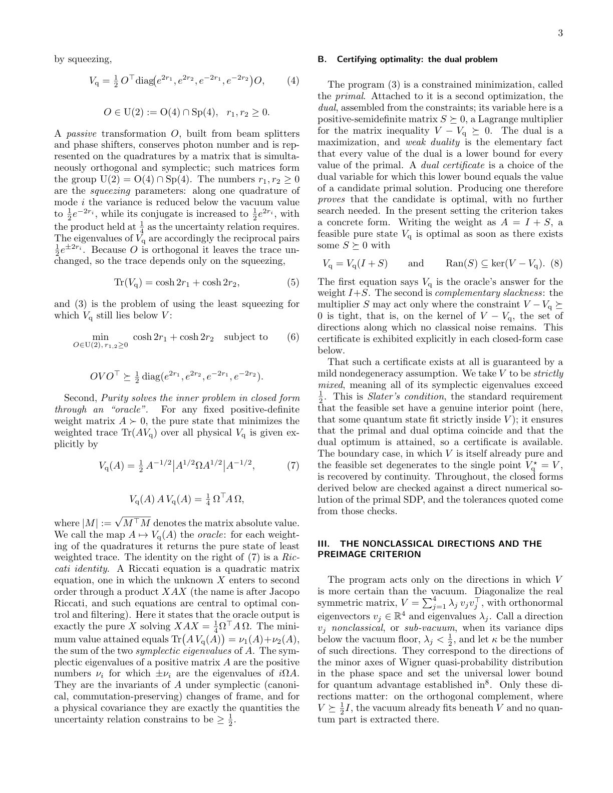
<figcaption class="paper-figure-caption"><b>Fig 2.</b> Low-resolution page preview, page 3</figcaption>
</figure>
<figure class="paper-figure-card">

<figcaption class="paper-figure-caption"><b>Fig 3.</b> Low-resolution page preview, page 4</figcaption>
</figure>
<figure class="paper-figure-card">

<figcaption class="paper-figure-caption"><b>Fig 4.</b> Low-resolution page preview, page 5</figcaption>
</figure>
<figure class="paper-figure-card">

<figcaption class="paper-figure-caption"><b>Fig 5.</b> Low-resolution page preview, page 6</figcaption>
</figure>

**Summary.** This theoretical paper develops a rigorous framework to calculate the 'quantum complexity resource' from mixed Gaussian states of light. By formulating this as a convex optimization problem, the authors derive that while simple cases yield closed-form solutions, the general two-mode case requires finding the root of a high-degree polynomial, proving that no simple analytical solution exists.

**Why it may be interesting.** It provides deep mathematical insight into the limitations of finding closed-form solutions for fundamental physical quantities, connecting quantum resource theory to advanced algebraic geometry (Galois theory).

Detailed structure

**Main problem.** The paper tackles the problem of quantifying a 'quantum complexity resource' inherent in mixed Gaussian states of multimode light.

**Main result.** For the two-mode case, the optimal quantum resource cannot be expressed in a closed form using elementary functions; instead, it is determined as the least real root of a degree-12 polynomial.

**Method.** The problem is formulated and solved via convex optimization (SDP), utilizing dual maximization techniques and analyzing necessary conditions derived from KKT multipliers.

**Model / system.** The system models multimode light using continuous variables, characterized by the quadrature covariance matrix V. The analysis focuses specifically on the two-mode case where modes are genuinely coupled.

**Key observables.** Quantum Advantage Resource ($N_q(V)$), $	ext{Tr}(V_{\star q})$, and the degree-12 polynomial $P(x; V)$.

**Important parameters / regimes.** The number of nonclassical directions ($\kappa$), which dictates whether a closed-form solution exists.

**Assumptions / limitations.** The analysis relies on Slater's condition (V must be strictly mixed) and proceeds by analyzing structured regimes ($\kappa=0, 1, 2$) before tackling the generic coupled case.

**Paper structure.** The paper progresses from defining the optimization problem for the quantum resource to solving it in specific low-dimensional sectors (e.g., $\kappa=1$), culminating in the derivation of a general polynomial equation whose root yields the solution for generic coupled states.

Abstract

We study the problem of extracting a quantum complexity resource from a mixed Gaussian state of the multimode light. We present the first complete, certificate-checked solution to this problem in a genuinely coupled sector. We carry this out for the two-mode case, the smallest case in which modes are genuinely coupled. Even in this case the solution is highly nontrivial, and we rigorously prove that it cannot be given in a closed form.

[↑ back to top](#top)

### [Type IIB Axion--Dilaton Wormholes and the BPS Limit Hessian](http://arxiv.org/abs/2607.01221v1)

**Authors:** Soo-Jong Rey  
**Type:** theory · **Category:** other · **PDF:** <https://arxiv.org/pdf/2607.01221v1>  
**Analysis basis:** full PDF text, analyzed in chunks
**Topic relevance:** `Keldysh / 2PI / non-Gaussian methods` **1/5** · `methods for driven-dissipative` **1/5**

↔ Scroll figures horizontally

<figure class="paper-figure-card">
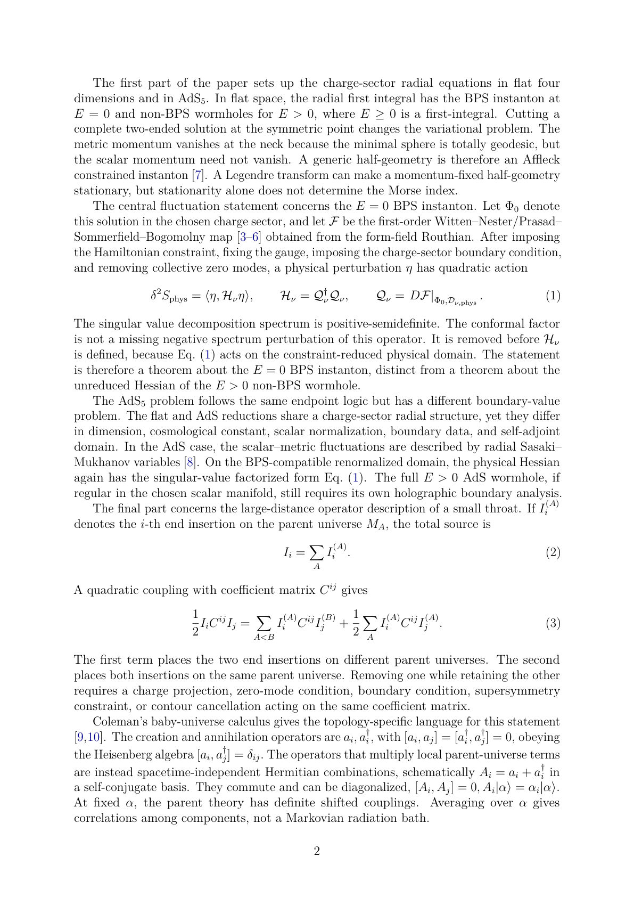
<figcaption class="paper-figure-caption"><b>Fig 1.</b> Low-resolution page preview, page 2</figcaption>
</figure>
<figure class="paper-figure-card">
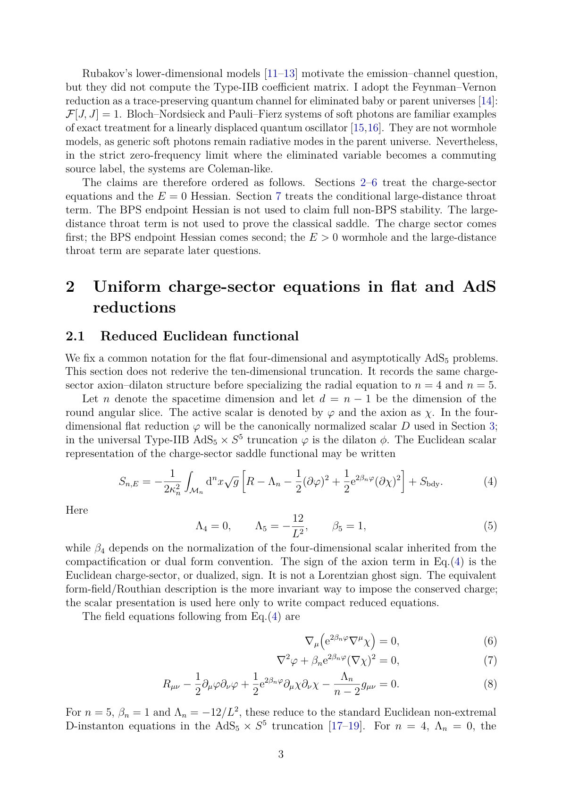
<figcaption class="paper-figure-caption"><b>Fig 2.</b> Low-resolution page preview, page 3</figcaption>
</figure>
<figure class="paper-figure-card">
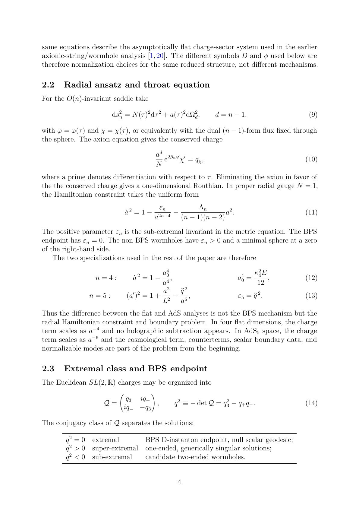
<figcaption class="paper-figure-caption"><b>Fig 3.</b> Low-resolution page preview, page 4</figcaption>
</figure>
<figure class="paper-figure-card">
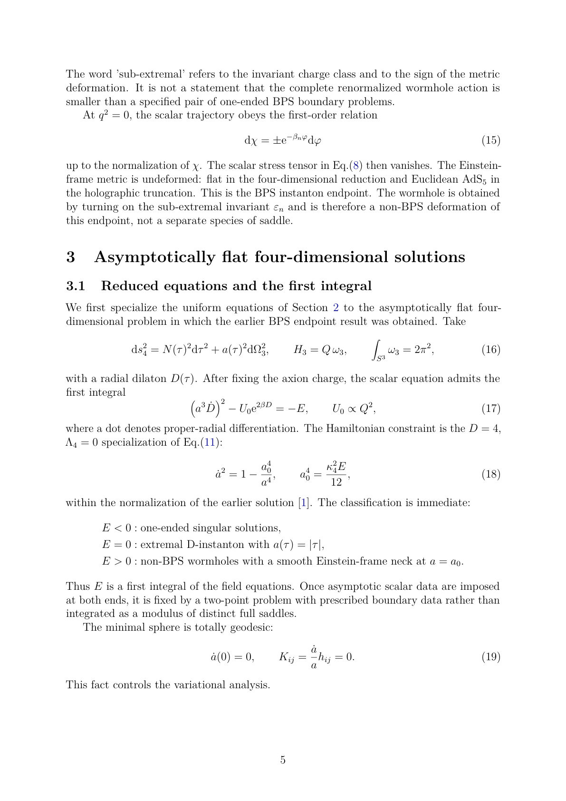
<figcaption class="paper-figure-caption"><b>Fig 4.</b> Low-resolution page preview, page 5</figcaption>
</figure>
<figure class="paper-figure-card">
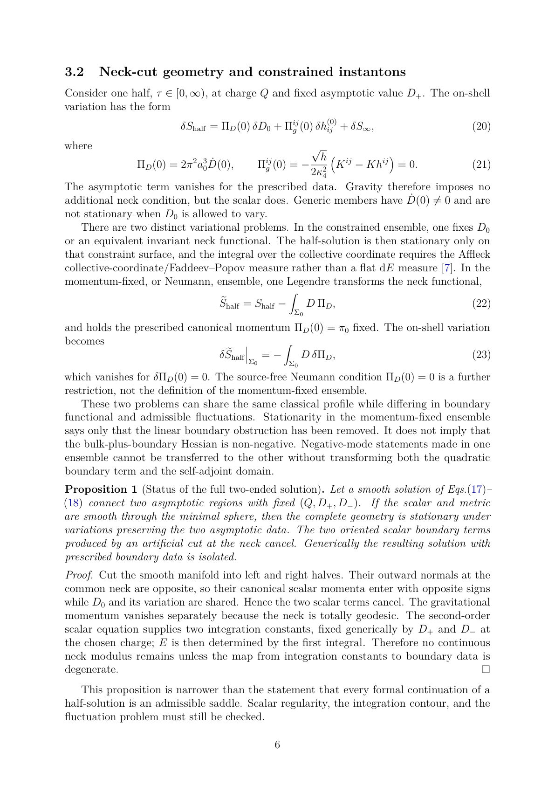
<figcaption class="paper-figure-caption"><b>Fig 5.</b> Low-resolution page preview, page 6</figcaption>
</figure>

**Summary.** This theoretical paper analyzes Type-IIB axion-dilaton wormholes, distinguishing between stable BPS instantons and unstable non-BPS wormhole deformations. The core mathematical achievement is proving that the fluctuation spectrum around the BPS endpoint factorizes into a simple quadratic form of an operator $Q^\dagger Q$. This provides strong structural constraints on quantum gravity solutions.

**Why it may be interesting.** While highly specialized in quantum gravity, the rigorous mathematical techniques used—such as deriving physical operators by eliminating constrained degrees of freedom (Schur complement) and proving spectral properties via operator factorization—are analogous to methods used in effective field theories or open quantum systems.

Detailed structure

**Main problem.** The paper revisits Type-IIB axion--dilaton Euclidean saddles, comparing the BPS instanton ($E=0$) to non-BPS wormholes ($E>0$). It aims to provide a rigorous understanding of the spectrum and stability of these gravitational solutions.

**Main result.** The physical Hessian for the $E=0$ BPS instanton factorizes as $\mathcal{H}_
u = Q^\dagger_
u Q_
u$, establishing an endpoint theorem for the BPS sector. The analysis separates the wormhole throat structure from its long-distance multipole operator term.

**Method.** The methodology involves variational analysis of the Euclidean action, deriving radial equations, and applying constraint solving (Hamiltonian/gauge fixing) to reduce the quadratic fluctuation action to a physical Hessian operator.

**Model / system.** The system is Type IIB string theory compactified on geometries supporting axion-dilaton fields. The analysis covers both asymptotically flat 4D and AdS$_5$ backgrounds, treating wormholes as deformations of BPS instantons.

**Key observables.** The spectrum of the physical Hessian ($\mathcal{H}_
u$), which determines stability; the energy parameter $E$; and the charge sector invariants ($q_2$).

**Important parameters / regimes.** Energy parameter $E$ (determining BPS vs. non-BPS); neck radius $a_c$; and background curvature scales (e.g., AdS length scale).

**Assumptions / limitations.** The Hessian factorization theorem is strictly proven only for the physical domain corresponding to the $E=0$ BPS instanton, not necessarily for the full $E>0$ wormhole stability.

**Paper structure.** The paper proceeds by establishing the general Euclidean action and radial equations. It then focuses on deriving the physical Hessian for the BPS endpoint ($E=0$) via constraint imposition, demonstrating its factorization. Finally, it compares this result to non-BPS wormholes and discusses dimensional reductions (4D vs AdS$_5$).

Abstract

I revisit Type-IIB axion--dilaton Euclidean saddles in a specified axion charge sector. In that sector, the solution with $E=0$ is the BPS instanton, while $E>0$ gives non-BPS wormholes with a smooth throat. The two cases solve the same radial equations but define different fluctuation problems. For the $E=0$ instanton, the Hamiltonian constraint, gauge quotient, charge-sector boundary condition, and removal of collective zero modes reduce the quadratic action to a physical Hessian. This Hessian factorizes, $ {\cal H}_ν={\mathcal Q}_ν^\dagger{\mathcal Q}_ν$. I interpret this as an endpoint theorem, beyond a stability theorem for the full $E>0$ wormhole. This puts Type IIB wormhole spectra on firmer grounds. I also separate the connected two-ended wormhole throat from its long-distance two-end multipole operator term. Once the coefficient matrix $C^{ij}$ is derived, the different-component and same-component placements of the two end insertions are terms in the same quadratic expression. Removing either term requires a genuine projection or cancellation.

[↑ back to top](#top)

### [Dependency-Aware Circuit Scheduling for Multi-Core Quantum Systems to Minimize Makespan](http://arxiv.org/abs/2607.00469v1)

**Authors:** Rajeswari Suance P S, Ruchika Gupta, Maurizio Palesi, John Jose  
**Type:** theory · **Category:** quantum information and computing · **PDF:** <https://arxiv.org/pdf/2607.00469v1>  
**Analysis basis:** full PDF text, analyzed in chunks
**Topic relevance:** `non-equilibrium dynamics` **1/5**

↔ Scroll figures horizontally

<figure class="paper-figure-card">

<figcaption class="paper-figure-caption"><b>Fig 1.</b> Fig. 1: Multi-Core Quantum Computing Architecture</figcaption>
</figure>
<figure class="paper-figure-card">
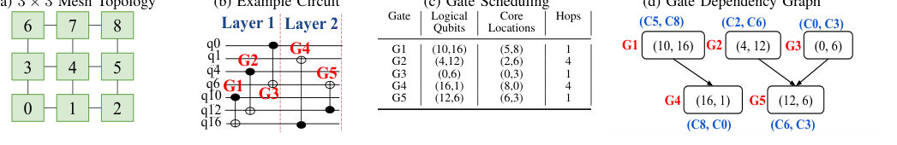
<figcaption class="paper-figure-caption"><b>Fig 2.</b> Fig. 2: Case study setup (a) 3 × 3 Mesh Topology. (b) Example quantum circuit with five two-qubit gates. (c) Table showing gate number, input qubits, their resident cores, and hop counts. (d) Dependency graph of the circuit gates.</figcaption>
</figure>
<figure class="paper-figure-card">
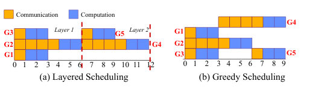
<figcaption class="paper-figure-caption"><b>Fig 3.</b> Fig. 3: Comparison of scheduling strategies: layered schedul- ing (makespan=12) versus greedy scheduling (makespan=9)</figcaption>
</figure>
<figure class="paper-figure-card">
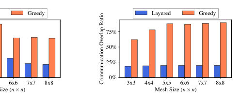
<figcaption class="paper-figure-caption"><b>Fig 4.</b> Fig. 4: Comparison of various circuit scheduling with synthetic random circuits</figcaption>
</figure>
<figure class="paper-figure-card">

<figcaption class="paper-figure-caption"><b>Fig 5.</b> Fig. 4a shows the comparative study of makespan for syn- thetic random circuits across different hardware configurations. We can see that proposed greedy scheduling algorithm con- sistently achieves a lower makespan than layered scheduling. This improvement arises because the greedy approach exploits inter-layer parallelism, allowing gates to execute as soon as their dependencies and resources are available. In contrast, the layered scheduling ignores the fine-grained parallelism and fails to hide inter-core communication latency, which is particularly evident for the larger meshes. Fig. 4b shows the comparison of core utilization for the synthetic benchmarks. We can see that the greedy...</figcaption>
</figure>

**Summary.** This paper tackles the critical challenge of circuit scheduling on multi-core quantum processors by proposing a dependency-aware greedy algorithm. This method allows for fine-grained parallelism, significantly improving execution speed compared to simpler layer-based approaches. The results demonstrate that intelligent scheduling can drastically reduce makespan and better utilize hardware resources in these complex quantum systems.

**Why it may be interesting.** While focused on classical scheduling algorithms for quantum hardware, the analysis of communication bottlenecks (teleportation latency) and resource management in a distributed quantum setting is highly relevant to understanding physical constraints in large-scale quantum computation architectures.

Detailed structure

**Main problem.** The core problem is developing effective circuit scheduling algorithms for multi-core quantum systems to minimize the overall execution time (makespan).

**Main result.** Dependency-aware greedy scheduling achieves substantial performance gains, showing an average 40% reduction in makespan compared to baseline layered scheduling on real benchmarks.

**Method.** The authors propose a dependency-aware greedy scheduling strategy that schedules each gate at the earliest possible time based on resource and data dependencies, contrasting it with rigid layer-by-layer execution.

**Model / system.** The system modeled is a multi-core quantum computing architecture utilizing an n x n 2D mesh topology. Inter-core operations rely on quantum teleportation over a Network-on-Chip (NoC).

**Key observables.** Makespan ($	ext{T}_{	ext{total}}$), Core Utilization, and Communication Overlap Ratio ($	ext{R}_{	ext{comm}}$).

**Important parameters / regimes.** The communication delay is proportional to the number of hops ($H 	imes \lambda_{	ext{hop}}$), which is a critical bottleneck.

**Assumptions / limitations.** The primary assumption addressed is that fine-grained parallelism can be exploited by overlapping computation and communication latency, overcoming limitations imposed by strict layered scheduling.

**Figures summary.** Figures illustrate the multi-core architecture (NoC/Quantum Channel), compare makespans between layered vs. greedy scheduling using case studies, and show performance metrics across synthetic and real quantum circuits (QAOA, QFT).

**Paper structure.** The paper first introduces the physical model and the limitations of baseline layered scheduling. It then details the proposed dependency-aware greedy algorithm, followed by extensive evaluation on both synthetic random circuits and established real benchmarks to validate performance gains.

Abstract

Multi-core quantum computing architectures have emerged as a promising solution to the qubit scalability limitations of monolithic NISQ devices. Quantum algorithms are expressed as quantum circuits composed of single- and two-qubit gates. However, circuit scheduling in multi-core quantum systems remains largely unexplored. Reducing overall execution time (makespan), increasing core utilization, and hiding communication latency behind computation depends on effective scheduling. In this paper, we first introduce a layered scheduling approach as a baseline where quantum gates within the same layer are executed in parallel, while layers themselves are executed sequentially. We then propose a greedy scheduling strategy which schedules each gate as soon as all its dependencies and required resources are available. This allows fine-grained parallelism across cores. Our evaluation shows that on real benchmarks, greedy scheduling achieves an average 40% reduction in makespan and improvement in core utilization. The results suggest that the use of intelligent circuit scheduling to exploit parallelism can greatly enhance the speed of circuit execution in multi-core quantum architectures.

[↑ back to top](#top)

### [Leveraging LLM-Based Agentic Systems to Generate Quantum Applications for Test Optimization](http://arxiv.org/abs/2607.00939v1)

**Authors:** Ming Tao, Yuechen Li, Tao Yue, Man Zhang, Aitor Arrieta Marcos  
**Type:** experiment · **Category:** quantum information and computing · **PDF:** <https://arxiv.org/pdf/2607.00939v1>  
**Analysis basis:** full PDF text, analyzed in chunks
**Topic relevance:** `analog quantum simulation` **1/5**

↔ Scroll figures horizontally

<figure class="paper-figure-card">

<figcaption class="paper-figure-caption"><b>Fig 1.</b> Figure 1: Overview of QPipe.</figcaption>
</figure>
<figure class="paper-figure-card">

<figcaption class="paper-figure-caption"><b>Fig 2.</b> Figure 2: Relation between lengths of 20 requirements and RQ1 metrics.</figcaption>
</figure>
<figure class="paper-figure-card">
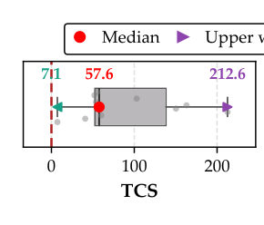
<figcaption class="paper-figure-caption"><b>Fig 3.</b> Figure 3: Distribution of QRR across successful generations of 10 TCS and 10 TCM requirements</figcaption>
</figure>
<figure class="paper-figure-card">

<figcaption class="paper-figure-caption"><b>Fig 4.</b> Figure 4: Pie charts for six patterns observed in 58 successful runs of QPipe</figcaption>
</figure>
<figure class="paper-figure-card">

<figcaption class="paper-figure-caption"><b>Fig 5.</b> Figure 4 shows that the successful runs share a stable prompt-conditioned quantum core: all 58 use a QUBO formulation and QAOA. This pattern is not from predefined workflow settings or fixed model configurations. Rather, in each run, agents autonomously choose the formulation and algorithm, and all 58 successful runs hap- pen to converge on QUBO and QAOA for our target problems, even though we prompt Analysis Agent with exemplary algorithms previously used as solutions to SE optimization problems [40], like variational quantum eigensolver and Grover search, while no specified encoding candidates are offered for Encoding Agent. The fact that all successful runs use QUBO also does not mean...</figcaption>
</figure>

**Summary.** This paper introduces QPipe, an advanced LLM-based multi-agent system designed to automate the complex process of turning natural language requirements into working quantum applications for test optimization. By coordinating specialized agents—such as those handling encoding, code generation, and review—QPipe achieves high success rates in generating executable circuits that solve real-world problems better than classical benchmarks.

**Why it may be interesting.** While focused on SE optimization rather than fundamental physics models, the reliance on QUBO/Ising formulations directly connects to quantum computational chemistry and materials science problems often modeled by Hamiltonians.

Detailed structure

**Main problem.** The core problem is autonomously translating high-level, natural-language (NL) task requirements for Software Engineering optimization into fully executable quantum application workflows.

**Main result.** The proposed QPipe agentic system successfully generates executable quantum applications that solve test optimization problems, with generated solutions outperforming a classical genetic algorithm baseline in most tested cases.

**Method.** A multi-agent LLM architecture (QPipe) is employed to guide the process through specialized agents responsible for parsing requirements, formulating QUBO/Ising models, generating code, reviewing logic, and executing the quantum workflow.

**Model / system.** The system operates on quantum computing principles, encoding optimization problems into QUBO or Ising Hamiltonians ($\min x^	op Qx$). The execution targets ideal simulators using frameworks like Qiskit to run algorithms such as QAOA.

**Key observables.** Success rates for compilation (100%) and application execution (96.7%); solution quality measured by the QUBO-value reduction ratio (QRR) compared to a GA baseline; generation cost in seconds and tokens.

**Important parameters / regimes.** The system manages resource constraints like qubit budgets, often decomposing large problems into smaller, manageable subproblems for sequential processing.

**Assumptions / limitations.** The evaluation assumes ideal quantum simulators are used, ignoring real-world noise or device constraints. The success relies on the stability of formulation patterns (QUBO/Ising) and LLM reasoning capabilities.

**Figures summary.** Figures illustrate the end-to-end workflow from NL input to executable output via specialized agents; pattern analysis shows successful runs consistently use QUBO formulations and QAOA algorithms, often decomposing problems into 4-6 subproblems.

**Paper structure.** The paper details the QPipe architecture, which involves sequential stages: requirement parsing $
ightarrow$ quantum suitability analysis $
ightarrow$ workflow planning/encoding $
ightarrow$ code generation $
ightarrow$ multi-agent review $
ightarrow$ execution sandbox $
ightarrow$ result combination and verification.

Abstract

Quantum computing is increasingly explored for software engineering (SE) optimization, but translating natural-language (NL) task-level requirements into executable quantum applications still demands substantial quantum and programming expertise. We present QPipe, a large language model (LLM)-based multi-agent architecture that autonomously turns NL requirements into traceable quantum-application workflows through specialized agents for requirement parsing, formulation, code generation, review, execution, and verification. We evaluate QPipe on 20 NL requirements, each associated with a real-world benchmark and a test-optimization problem. QPipe successfully completes the key stages of quantum-application generation across requirements, achieving average rates of 100% for code compilation and 96.7% for application execution and final-result combination, with average generation costs of 260.1 seconds and 1.89M tokens per requirement. Among the generated quantum applications that execute successfully, the returned solutions outperform the offline genetic algorithm baseline in most cases. Ablation results further show that QPipe's advantage depends on retaining code-generation skills, task knowledge, review feedback, and multi-agent decomposition. These results indicate that agentic coordination can support generation of executable quantum applications for tackling test optimization problems from real-world benchmarks.

[↑ back to top](#top)

### [Resilient $j$=3/2 superconductivity in topological semimetal YPtBi](http://arxiv.org/abs/2607.00765v1)

**Authors:** Prathum Saraf, Nicholas A. Crombie, Rahul Sharma, Jared Z. Dans, Danila Sokratov, Carsyn L. Mueller, Ram Kumar, Hyunsoo Kim, Connor Roncaioli, Winslow Weiss, David Graf, Chandra Shekhar, Claudia Felser, Johnpierre Paglione  
**Type:** experiment · **Category:** strongly correlated electrons · **PDF:** <https://arxiv.org/pdf/2607.00765v1>  
**Analysis basis:** full PDF text, analyzed in chunks
**Topic relevance:** `Kondo & dissipative impurity` **1/5**

↔ Scroll figures horizontally

<figure class="paper-figure-card">
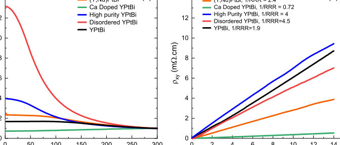
<figcaption class="paper-figure-caption"><b>Fig 1.</b> FIG. 1. Variation of transport behavior of YPtBi with disorder, purity and charge doping. (a) and (b) Normalized resistivity and Hall resistivity of the various types of YPtBi grown respectively. Panel (a) shows data for Y0.997Ca0.003PtBi and Y0.52Nd0.48PtBi, while panel (b) show data for Y0.991Ca0.009PtBi and Y0.80Nd0.20PtBi. (c) Plot of 1/RRR vs residual resistivity indicating a change in the residual resistivity in the samples as opposed to room temperature resistivity. (d) Carrier density of various samples as a function of 1/RRR. Filled symbols are quantities measured with Hall and open symbols are measured with quantum oscillations.</figcaption>
</figure>
<figure class="paper-figure-card">

<figcaption class="paper-figure-caption"><b>Fig 2.</b> FIG. 2. Quantum oscillations in chemically tuned YPtBi. (a) - (d) Raw data of resistance vs magnetic field of disordered, high purity, Ca doped samples and (Y,Nd)PtBi respectively. Inset shows subtracted resistance curves offset to show the oscillations more clearly. (e) Fast Fourier transform of the oscillations showing changes in frequency of the four types of YPtBi. (f) Lifshitz-Kosevich fits (lines) of the temperature dependence of the amplitude of oscillations which is used to extract the effective mass.</figcaption>
</figure>
<figure class="paper-figure-card">
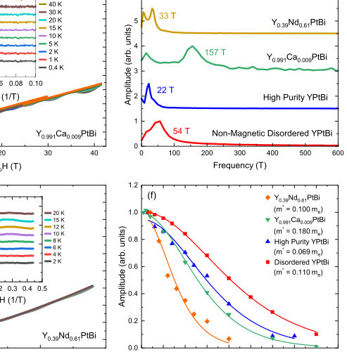
<figcaption class="paper-figure-caption"><b>Fig 3.</b> Fig. 2(a) presents the weaker quantum oscillations observed in disordered samples. Although the oscilla- tions are less prominent due to increased scattering, the background-subtracted oscillatory component is indeed periodic in 1/µ◦H, as shown in the inset. The FFT in Fig. 2(e) reveals a peak at F ≈54 T, similar to that of YPtBi. The extracted effective mass is m∗= 0.11me matching that of YPtBi. These observations suggest that while disorder suppresses the quantum oscillation ampli- tude by enhancing scattering, it does not significantly shift the Fermi level or alter the carrier density, consis- tent with the Hall data described above.</figcaption>
</figure>
<figure class="paper-figure-card">

<figcaption class="paper-figure-caption"><b>Fig 4.</b> FIG. 3. Angle-dependent probe of j=3/2 Fermi surface in YPtBi. Rotation measurements on the high purity and (Y,Nd)PtBi samples. (a,c) Raw data at various angles. Inset shows the rotation axis of the field along the principal axes. (b,d) Subtracted data offset to show the oscillations at various angles clearly showing a suppression of amplitude around to 011 axis for both samples.</figcaption>
</figure>
<figure class="paper-figure-card">
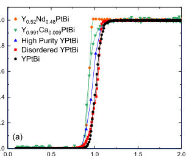
<figcaption class="paper-figure-caption"><b>Fig 5.</b> FIG. 4. Insensitivity of j=3/2 superconductivity to disorder and carrier density tuning. (a) Normalized resistivity curves for the samples clearly showing no variation in transition temperature. (b) Various samples measured in resistivity showing no change in Tc due to disorder. (c) Tc vs carrier density showing no change in the transition temperature.</figcaption>
</figure>

**Summary.** The research investigates the robust superconductivity in the topological semimetal YPtBi. By measuring transport properties across samples with varying levels of disorder and carrier concentration, the authors find that $T_c$ remains remarkably stable. This resilience suggests that the superconducting transition is governed by phase stiffness rather than conventional pairing strength, highlighting a new form of protection in high-spin superconductors.

**Why it may be interesting.** This work provides experimental evidence for superconductivity whose critical temperature is insensitive to disorder and doping, challenging standard BCS predictions and pointing towards exotic pairing mechanisms relevant to strongly correlated topological materials.

Detailed structure

**Main problem.** To investigate the resilience of $j=3/2$ superconductivity in the topological semimetal YPtBi against various perturbations, including magnetic and nonmagnetic disorder and changes in carrier density.

**Main result.** The superconducting critical temperature ($T_c$) exhibits remarkable robustness across large variations in disorder and doping levels, suggesting that the transition is governed by phase stiffness rather than conventional pair formation amplitude.

**Method.** A combination of electrical transport measurements (resistivity, Hall effect) and quantum oscillation measurements (Shubnikov-de Haas oscillations) were performed on various sample types.

**Model / system.** The study focuses on the topological semimetal YPtBi, which possesses strong spin-orbit coupling leading to a $j=3/2$ quasiparticle manifold near the Fermi level. The system is tested by introducing controlled disorder (Au) and varying carrier concentration via doping ($	ext{Ca}, 	ext{Nd}$).

**Key observables.** Superconducting critical temperature ($T_c$), residual resistivity ratio, quantum oscillation frequency ($F$) and effective mass ($m^*$), and Hall coefficient derived carrier density.

**Important parameters / regimes.** Disorder levels (varying $
ho_0$), carrier densities ($n$ spanning orders of magnitude), and magnetic fields up to 41.5 T.

**Assumptions / limitations.** The robustness suggests the pairing mechanism is protected, potentially limited by superfluid phase stiffness rather than pair formation energy.

**Figures summary.** Figures illustrate transport behavior changes across different samples (Fig. 1); quantum oscillation analysis confirms periodicity and allows extraction of $m^*$ and $F$ (Fig. 2); angular measurements confirm the $j=3/2$ Fermi surface structure (Fig. 3); and a summary figure shows $T_c$'s insensitivity to disorder and doping (Fig. 4).

**Paper structure.** The paper systematically characterizes multiple sample types (pure, disordered, doped) using transport measurements, analyzes quantum oscillations to map the Fermi surface and electronic structure changes, and culminates in arguing that the observed $T_c$ robustness points toward a phase stiffness-limited superconducting mechanism.

Abstract

Cooper pairing in most of the known fermionic superfluids occurs via spin-1/2 quasiparticle interactions that lead to spin-singlet or spin-triplet pairing. In the topological semimetal YPtBi, strong spin-orbit coupling results in a band inversion between highly symmetric $s$- and $p$-like electronic bands and a degeneracy at the $Γ$ point that ensures the manifold of $j$=3/2 quasiparticle states thrive near the Fermi level, where superconducting pairing occurs. Here we study the effects of magnetic and nonmagnetic disorder and carrier density on this exotic superconducting pairing state. By varying levels of disorder and carrier densities by nearly two and three orders of magnitude, respectively, we show that the superconducting critical temperature of YPtBi has a remarkable robustness, with little variation across this span. Our results suggest that superconductivity in YPtBi may reside in a regime where phase stiffness, rather than pair formation, governs the transition temperature. The insensitivity of Cooper pairing to dramatic changes in quasiparticle environment in a $j$=3/2 superconductor highlights a new form of protection realized in topological high-spin superconductors.

[↑ back to top](#top)

### [Vanadium superconducting microwave resonators on silicon wafers](http://arxiv.org/abs/2607.00809v1)

**Authors:** Y. Fujita, Y. Urade, Y. Hibino, M. Tsujimoto, K. Inomata, G. Fujii, W. Mizubayashi  
**Type:** experiment · **Category:** other · **PDF:** <https://arxiv.org/pdf/2607.00809v1>  
**Analysis basis:** full PDF text, analyzed in chunks
**Topic relevance:** `QC/QI experiment` **1/5**

↔ Scroll figures horizontally

<figure class="paper-figure-card">
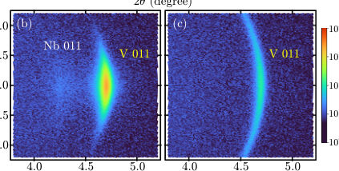
<figcaption class="paper-figure-caption"><b>Fig 1.</b> FIG. 1. (a) ω-2θ XRD profiles for Si/Nb/V and Si/V samples obtained by setting the scattering</figcaption>
</figure>
<figure class="paper-figure-card">

<figcaption class="paper-figure-caption"><b>Fig 2.</b> Figure 1(a) shows the out-of-plane XRD profiles of ω-2θ scans from the ⟨001⟩directions of</figcaption>
</figure>
<figure class="paper-figure-card">

<figcaption class="paper-figure-caption"><b>Fig 3.</b> Fig. 1(a). Note that the small V 001 peak was not always reproduced even when the film</figcaption>
</figure>
<figure class="paper-figure-card">

<figcaption class="paper-figure-caption"><b>Fig 4.</b> FIG. 2. AFM topographic images of the surfaces of (a) Si/Nb/V, (b) Si/V, (c) Si/Nb/V/Ta, and</figcaption>
</figure>
<figure class="paper-figure-card">
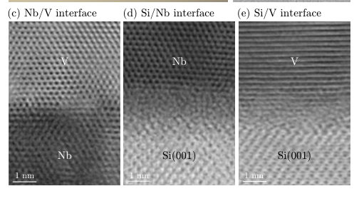
<figcaption class="paper-figure-caption"><b>Fig 5.</b> FIG. 4. (a) Optical micrograph of a CPW resonator chip with a Si/Nb/V/Ta structure. (b) Cross-</figcaption>
</figure>

**Summary.** This experimental study investigates how modifying the structure of Vanadium superconducting films using buffer and capping layers affects their microwave loss in resonators. By correlating structural data with $Q_{	ext{int}}$ measurements, the authors pinpoint non-TLS losses originating from surface oxides or hydrides as a key limitation for quantum circuit development.

**Why it may be interesting.** The work directly addresses the practical challenge of material engineering for quantum devices by linking microscopic defects (oxides, grain boundaries) to macroscopic performance metrics ($Q_{int}$), which is crucial for designing reliable superconducting circuits.

Detailed structure

**Main problem.** The study aims to understand how material properties, particularly surface chemistry and structural quality, influence microwave losses in superconducting Vanadium (V) films used in quantum circuits.

**Main result.** While buffer layers improve crystal structure, the presence of V oxides or hydrides at grain boundaries appears to be a dominant source of non-TLS loss, which can be mitigated by capping layers like Tantalum (Ta).

**Method.** The research combines structural characterization (XRD, AFM) with electrical and microwave measurements ($Q_{int}$ vs. $\langle n_{	ext{ph}} 
angle$) and surface analysis (XPS, EDS).

**Model / system.** The physical system is a superconducting resonator built from V films on Si wafers, modified by Nb buffer layers and Ta capping layers. Loss mechanisms are analyzed using the photon-number dependence of the internal quality factor ($Q_{int}$).

**Key observables.** Internal quality factor ($Q_{	ext{int}}$), non-TLS loss ($\delta_{	ext{other}}$), lattice orientation uniformity (XRD FWHM), and surface oxidation states (XPS).

**Important parameters / regimes.** Photon number ($\langle n_{	ext{ph}} 
angle$), temperature (down to 10 mK), film thickness, and buffer/capping layer materials (Nb, Ta).

**Assumptions / limitations.** The microwave loss can be modeled by separating contributions into Two-Level System (TLS) losses and photon-number-independent non-TLS losses.

**Figures summary.** Figures show XRD profiles confirming lattice coherence enhancement with Nb buffers; AFM images detail surface roughness changes; $Q_{int}$ vs. $\langle n_{	ext{ph}} 
angle$ plots analyze loss mechanisms, and XPS spectra map out various V and Ta oxide states.

**Paper structure.** The paper progresses from structural characterization (Nb buffer effect) to electrical property analysis ($	ext{Tc}$, $	ext{RRR}$), then focuses on microwave loss modeling ($Q_{int}$ vs. $\langle n_{	ext{ph}} 
angle$), and finally correlates these losses with detailed surface chemistry findings (oxides/hydrides).

Abstract

Understanding the correlation between material properties and microwave losses in superconducting films is a crucial subject for developing low-loss materials for quantum circuits. We focus on vanadium (V) as a novel material for superconducting quantum devices and discuss loss in V films in relation to their structural properties. Using a sputtering method, we grow four V-film structures on (001)-oriented Si wafers, employing Nb and Ta as the buffer and capping layer materials, respectively: Nb/V/Ta, Nb/V, V/Ta, and V. X-ray diffraction and atomic force microscopy reveal that the V films grown on the Nb buffer layers have higher uniformity of lattice orientation and smaller grain size than that directly grown on the Si wafer. Coplanar waveguide resonators are fabricated from the four V-film structures, and averaged photon number ($\langle n_{\rm ph} \rangle$) dependences of internal quality factor ($Q_{\rm int}$) are obtained by performing microwave measurements. By analyzing the obtained $Q_{\rm int}$ vs $\langle n_{\rm ph} \rangle$, it is found that loss at the V surface is dominated by $\langle n_{\rm ph} \rangle$-independent non-two-level-system (non-TLS) losses, which can be mitigated by introducing the Ta capping layer. Furthermore, the V films on the Nb buffer layers exhibit lower $Q_{\rm int}$ in the $\langle n_{\rm ph} \rangle$ range from 10$^{0}$ to 10$^{6}$ and higher non-TLS loss than that directly grown on Si wafers, even though the former has higher lattice-orientation uniformity than the latter. Origins of these trends might be relevant to V oxides, of which presence at surfaces and grain boundaries in bulk regions in the V resonators is suggested by energy dispersive X-ray spectroscopy and X-ray photoelectron spectroscopy, and/or V hydrides.

[↑ back to top](#top)

### [Wallis Products from the Four-Dimensional Singular Harmonic Oscillator](http://arxiv.org/abs/2607.00340v1)

**Authors:** Bin Ye, Ruitao Chen, Lei Yin  
**Type:** theory · **Category:** other · **PDF:** <https://arxiv.org/pdf/2607.00340v1>  
**Analysis basis:** full PDF text, analyzed in chunks
**Topic relevance:** `Keldysh / 2PI / non-Gaussian methods` **1/5**

↔ Scroll figures horizontally

<figure class="paper-figure-card">

<figcaption class="paper-figure-caption"><b>Fig 1.</b> Low-resolution page preview, page 2</figcaption>
</figure>
<figure class="paper-figure-card">
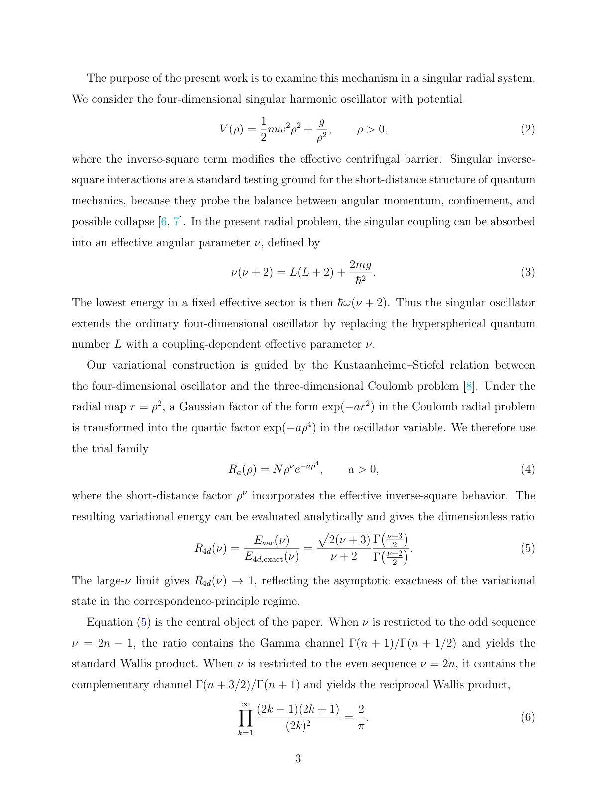
<figcaption class="paper-figure-caption"><b>Fig 2.</b> Low-resolution page preview, page 3</figcaption>
</figure>
<figure class="paper-figure-card">

<figcaption class="paper-figure-caption"><b>Fig 3.</b> Low-resolution page preview, page 4</figcaption>
</figure>
<figure class="paper-figure-card">
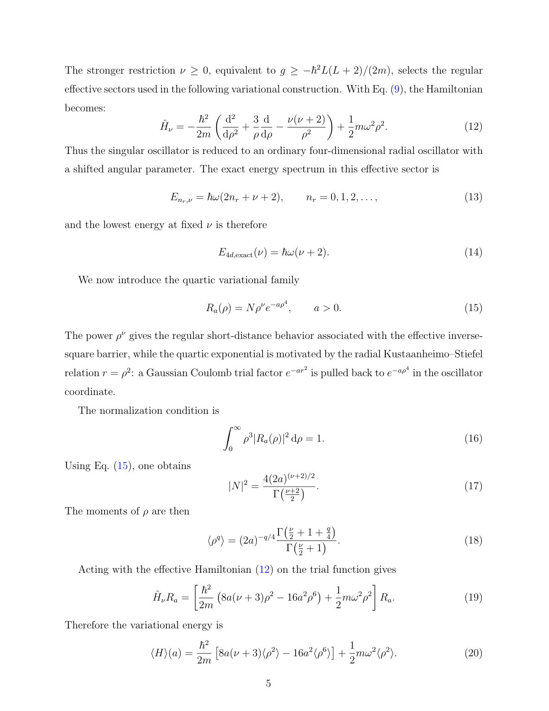
<figcaption class="paper-figure-caption"><b>Fig 4.</b> Low-resolution page preview, page 5</figcaption>
</figure>
<figure class="paper-figure-card">
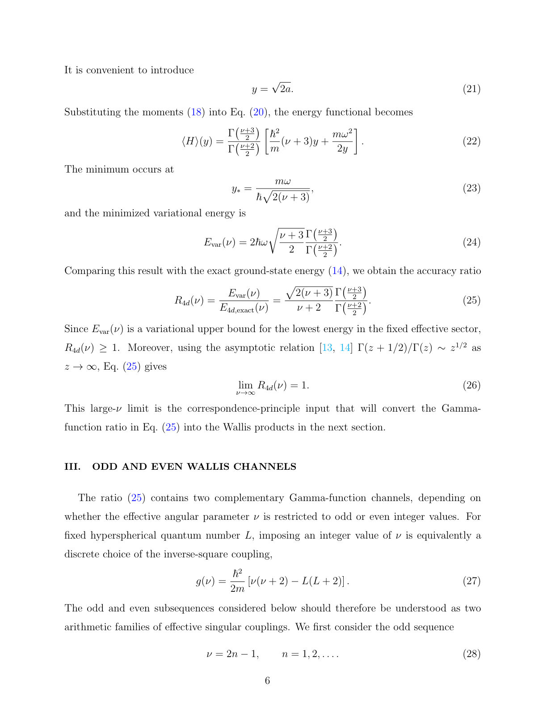
<figcaption class="paper-figure-caption"><b>Fig 5.</b> Low-resolution page preview, page 6</figcaption>
</figure>

**Summary.** This paper uses the framework of the four-dimensional singular harmonic oscillator to provide a novel derivation for the Wallis product and its reciprocal. By analyzing how the variational energy ratio behaves for odd versus even effective angular parameters, the authors show that quantum mechanics unifies these two distinct mathematical constants. This connects fundamental number theory results to radial quantum dynamics.

**Why it may be interesting.** While not directly about AMO systems like cold atoms or trapped ions, the use of quantum mechanics (variational methods on radial equations) to derive fundamental mathematical constants is a powerful demonstration of physical modeling in pure mathematics.

Detailed structure

**Main problem.** The paper derives the mathematical identities of the Wallis product and its reciprocal using a quantum mechanical variational approach.

**Main result.** It demonstrates that the singular harmonic oscillator provides a unified framework from which both the standard and reciprocal Wallis products can be derived by examining odd and even sequences of an effective angular parameter $\nu$.

**Method.** The core method is a variational calculation applied to the radial Schrödinger equation for the 4D singular harmonic oscillator, utilizing specific trial wave functions.

**Model / system.** The model is the four-dimensional singular harmonic oscillator with an inverse-square interaction term. The analysis leverages the Kustaanheimo--Stiefel relation connecting it to the 3D Coulomb problem.

**Key observables.** The accuracy ratio $R_{4d}(\nu)$ derived from the variational energy, which approaches unity in the large-$\nu$ limit.

**Important parameters / regimes.** The effective angular parameter $\nu$, and its specific sequences: odd ($\nu=2n-1$) and even ($\nu=2n$).

**Assumptions / limitations.** The derivation relies on the validity of the variational upper bound and asymptotic approximations for Gamma functions in the large-$\nu$ limit.

**Paper structure.** The paper establishes the Hamiltonian, applies the variational method using a quartic trial family, calculates the energy ratio $R_{4d}(\nu)$, and then analyzes the limits for odd and even $\nu$ to recover the known infinite products.

Abstract

We present a variational derivation of the Wallis product and its reciprocal from the four-dimensional singular harmonic oscillator. The inverse-square interaction is absorbed into an effective angular parameter $ν$, so that the lowest exact energy in a fixed sector is $E_{4d,\mathrm{exact}}=\hbarω(ν+2)$. Motivated by the radial Kustaanheimo--Stiefel relation $r=ρ^2$ between the four-dimensional oscillator and the three-dimensional Coulomb problem, we use the quartic trial family $R_a(ρ)=Nρ^νe^{-aρ^4}$. The minimized variational energy yields an accuracy ratio governed by adjacent Gamma functions. In the large-$ν$ semiclassical limit, this ratio approaches unity. Restricting $ν$ to the odd sequence $ν=2n-1$ gives the standard Wallis product, whereas the even sequence $ν=2n$ gives its reciprocal form. The Coulomb-dual interpretation further relates the two branches to integer and half-integer effective angular sectors in the dual Coulomb/MICZ description. The result shows that Wallis-type infinite products persist under an inverse-square deformation of the oscillator and arise from a common Gamma-function structure in radial variational dynamics.

[↑ back to top](#top)

## Other papers (6)

*Papers from primary archives without highlighted authors or any topic match. Click to expand.*

Show other papers

### [A differential derivation of the Obara-Saika relation for Gaussian electron repulsion integrals](http://arxiv.org/abs/2607.00102v1)

**Authors:** Charles C. Forgy, David A. Mazziotti  
**Type:** theory · **Category:** other · **PDF:** <https://arxiv.org/pdf/2607.00102v1>  
**Analysis basis:** full PDF text, analyzed in chunks

↔ Scroll figures horizontally

<figure class="paper-figure-card">

<figcaption class="paper-figure-caption"><b>Fig 1.</b> Low-resolution page preview, page 2</figcaption>
</figure>
<figure class="paper-figure-card">

<figcaption class="paper-figure-caption"><b>Fig 2.</b> Low-resolution page preview, page 3</figcaption>
</figure>
<figure class="paper-figure-card">
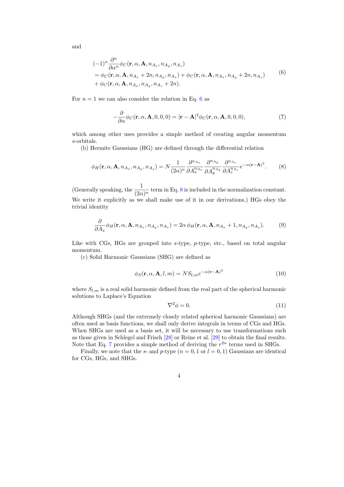
<figcaption class="paper-figure-caption"><b>Fig 3.</b> Low-resolution page preview, page 4</figcaption>
</figure>
<figure class="paper-figure-card">

<figcaption class="paper-figure-caption"><b>Fig 4.</b> Low-resolution page preview, page 5</figcaption>
</figure>
<figure class="paper-figure-card">
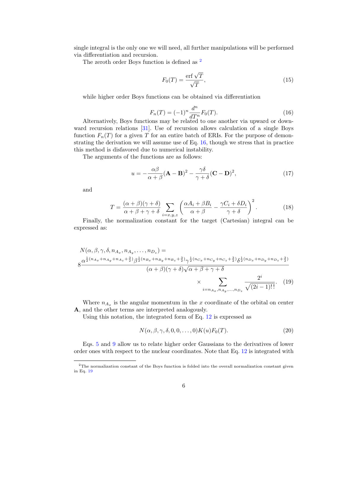
<figcaption class="paper-figure-caption"><b>Fig 5.</b> Low-resolution page preview, page 6</figcaption>
</figure>

**Summary.** This paper presents a novel, purely differential derivation of the Obara-Saika recurrence relation used to calculate electron repulsion integrals (ERIs) in quantum chemistry. By deriving these relations solely from the derivatives of Gaussian basis functions, the authors provide a self-contained and pedagogically valuable method. This new formulation is designed to expose independent primitive derivative terms, making the calculation highly suitable for modern parallel hardware like GPUs.

**Why it may be interesting.** While focused on quantum chemistry integrals rather than AMO systems, the rigorous development of a computationally efficient, parallelizable mathematical framework for calculating complex multi-electron interactions is highly relevant to any field involving many-body electronic structure calculations.

Detailed structure

**Main problem.** The core problem is developing a novel, rigorous derivation for calculating complex two-electron repulsion integrals (ERIs) required in quantum chemistry calculations.

**Main result.** The authors successfully derive the Obara-Saika recurrence relation using only differential relations between Gaussian basis functions, yielding a hierarchical formulation of the integral calculation.

**Method.** The method involves applying repeated differentiation operators ($\partial/\partial A_i$) to the ERI expressions and utilizing established mathematical identities (like Lemma 1) to build up higher-order integrals from lower ones.

**Model / system.** The calculations are performed for electronic structure problems using Gaussian basis sets, specifically focusing on two-center four-orbital electron repulsion integrals ($\langle ss|ss 
angle$, etc.).

**Key observables.** Electron Repulsion Integrals (ERIs), the Obara-Saika recurrence relation (OS-VRR), and independent primitive derivative quantities.

**Important parameters / regimes.** Gaussian coefficients, nuclear coordinates ($A, B, C, D$), and angular momentum indices.

**Assumptions / limitations.** The derivation relies on the mathematical validity of applying differential operators to Gaussian basis functions; numerical instability is noted as a practical limitation when using recursion for Boys functions.

**Figures summary.** Not specified (Notes focus heavily on equations and derivations rather than figure descriptions).

**Paper structure.** The paper progresses from establishing the need for ERI calculation, introducing the differential approach based on Gaussian derivatives, deriving recurrence relations step-by-step using operators, and finally comparing the resulting relation to the established OS method.

Abstract

The Obara-Saika (OS) method is one of the most widely used techniques in quantum chemistry for evaluating electron repulsion integrals (ERIs) via a set of recurrence relations that build higher angular momentum integrals from lower-order ones. The original derivation by Obara and Saika proceeded by directly relating integrals of differing angular momentum. In this work, we present a compact novel derivation of the OS vertical recurrence relation based solely on differential relations between Gaussian basis functions, expanding on a method suggested in earlier work. By explicitly deriving the required derivative expressions we identify all non-zero primitive terms contributing to the full ERI to develop a hierarchical formulation of the OS recursion relations. This approach has pedagogical value as a rigorous and self-contained derivation. Additionally, the resulting organization exposes independent primitive derivative quantities and may be useful for code generation and parallel implementations on modern GPU architectures.

[↑ back to top](#top)

### [Bridging Quantum Computing Paradigms toward Semiconductor Yield: A Controlled CV-versus-DV Comparison on Wafer-Map Defect Classification](http://arxiv.org/abs/2607.00961v1)

**Authors:** Yeonhong Kim, Jonghyeok Im, Monu Nath Baitha, Kyoungsik Kim  
**Type:** both · **Category:** quantum information and computing · **PDF:** <https://arxiv.org/pdf/2607.00961v1>  
**Analysis basis:** full PDF text, analyzed in chunks

↔ Scroll figures horizontally

<figure class="paper-figure-card">
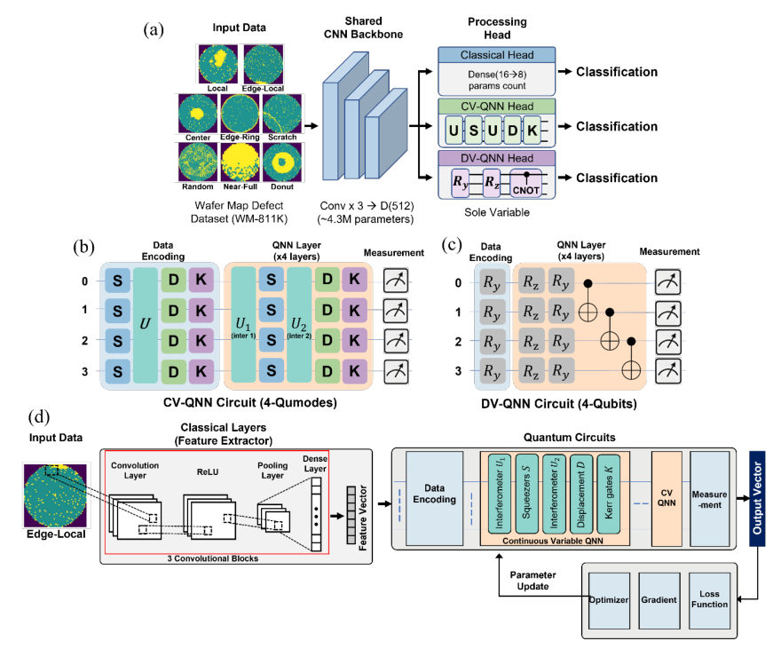
<figcaption class="paper-figure-caption"><b>Fig 1.</b> Fig. 1 Controlled protocol and architectures - (a) shared-backbone protocol with three interchangeable heads; (b) CV-QNN</figcaption>
</figure>
<figure class="paper-figure-card">
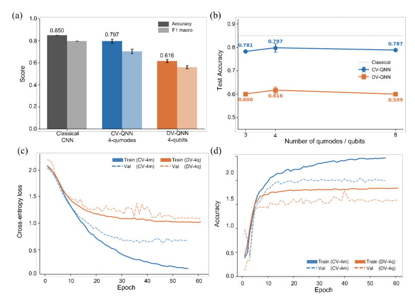
<figcaption class="paper-figure-caption"><b>Fig 2.</b> Fig. 2 Performance and training dynamics - (a) accuracy and macro-F1 for Classical, CV-4m, and DV-4q with quantum-</figcaption>
</figure>
<figure class="paper-figure-card">
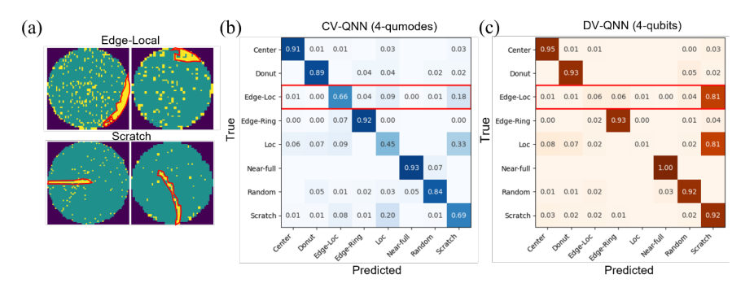
<figcaption class="paper-figure-caption"><b>Fig 3.</b> Fig. 3 Confusion matrices, CV-4m vs. DV-4q - (a) representative wafer maps from the Edge-Loc (top) and Scratch (bottom)</figcaption>
</figure>
<figure class="paper-figure-card">
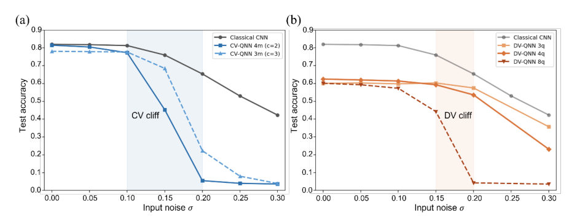
<figcaption class="paper-figure-caption"><b>Fig 4.</b> Fig. 4 Input-noise robustness - test accuracy under Gaussian input noise σ. (a) CV-QNN (4m, 3m) and the classical CNN: CV</figcaption>
</figure>
<figure class="paper-figure-card">

<figcaption class="paper-figure-caption"><b>Fig 5.</b> Fig. 5 IBM quantum hardware validation - (a) simulation vs. hardware accuracy for DV-QNN at three depths (ibm_yonsei,</figcaption>
</figure>

**Summary.** This work compares CV-QNNs against DV-QNNs for classifying semiconductor wafer defects using a controlled hybrid architecture. The results strongly indicate that CV approaches offer superior performance, especially when distinguishing subtle spatial defect patterns. This guides the choice of quantum paradigm for industrial AI acceleration.

**Why it may be interesting.** While focused on ML application, the rigorous comparison between continuous vs. discrete encoding methods provides insights into the fundamental representational power limits of different quantum information processing models.

Detailed structure

**Main problem.** The study compares Continuous-Variable (CV) versus Discrete-Variable (DV) quantum neural network paradigms to determine which is best suited for high-stakes wafer-map defect classification in semiconductor manufacturing.

**Main result.** The CV head consistently outperforms the DV head, showing a significant advantage on spatially localized defects like Edge-Loc. This suggests structured continuous encoding is superior for this task.

**Method.** A controlled evaluation protocol was used where only the quantum classification head (CV-QNN or DV-QNN) was varied while keeping the feature extraction CNN backbone identical.

**Model / system.** The system involves classifying eight defect classes from a wafer map dataset (WM-811K). The models are hybrid, combining classical CNN features with quantum circuits operating on either continuous variables (CV) or discrete qubits (DV).

**Key observables.** Classification accuracy and recall, particularly for the spatially structured 'Edge-Loc' class.

**Important parameters / regimes.** Number of qumodes/qubits tested (3, 4, 8); input noise level ($\sigma$); circuit depth; feature vector dimension (512).

**Assumptions / limitations.** The CV advantage is attributed to structured design and continuous phase-space encoding, not necessarily genuine non-Gaussianity at the tested cutoff ($d=2$).

**Figures summary.** Figures show performance comparisons across different defect classes, noise robustness sweeps (CV vs DV), and depth-resolved hardware accuracy degradation.

**Paper structure.** The paper establishes the problem context in semiconductor yield, details the controlled comparison setup (shared CNN backbone + interchangeable quantum heads), presents quantitative results showing CV superiority, diagnoses the physical limitations of DV circuits, and discusses implications for future quantum hardware design.

Abstract

Realizing quantum neural networks (QNNs) in industry requires knowing which quantum computing paradigm suits which task. Motivated by AI accelerators and high-bandwidth memory, where die stacking makes wafer-level defect screening central to yield, we study WM-811K wafer-map defect classification (eight classes), comparing the dominant paradigms, continuous-variable (CV) and discrete-variable (DV), under controlled conditions. To isolate the quantum circuit as the sole variable, a shared convolutional backbone (~4.3M parameters) feeds interchangeable heads (classical dense, CV-QNN, or DV-QNN) as the only structural difference; each quantum head is scaled over three sizes (3, 4, 8 qumodes/qubits). The CV head consistently outperforms the DV head: at four qumodes/qubits it reaches 79.7 +/- 1.8% accuracy versus 61.6 +/- 1.4%, a non-overlapping 18-point gap. The advantage is sharpest on the spatially localized Edge-Loc class, easily confused with Scratch, which CV recovers with recall 0.66 +/- 0.06 while DV fails at every size (<=0.05), showing the structured CV layer better captures fine spatial distinctions between defect types. Training curves show the DV limitation is a representational-capacity ceiling, not an optimization failure; at the Fock cutoff used here (d = 2) the CV advantage reflects two intrinsic properties, a structured, neural-network-analogue layer and continuous phase-space encoding, not Hilbert-space dimensionality. On IBM hardware, DV accuracy holds at shallow depth, degrading only at the deepest circuit. Both quantum heads remain below the classical baseline (85.0%), but the controlled setting isolates where a structured head already helps and, as noise and scale improve, which paradigm can deliver practical advantage.

[↑ back to top](#top)

### [Quantum machine learning models for graphs](http://arxiv.org/abs/2607.00698v1)

**Authors:** Frédéric Sauvage, Pranav Kalidindi, Frederic Rapp, Martın Larocca  
**Type:** both · **Category:** quantum information and computing · **PDF:** <https://arxiv.org/pdf/2607.00698v1>  
**Analysis basis:** full PDF text, analyzed in chunks

↔ Scroll figures horizontally

<figure class="paper-figure-card">

<figcaption class="paper-figure-caption"><b>Fig 1.</b> FIG. 1. (a) Toolbox for the construction of GQML models on graphs including the characterization of the relevant equivariant linear and non-linear maps. These are used for the encoding of n-node graphs into n-qubit quantum states and to identify measurements leading to invariant or equivariant models. This toolbox allows us to recover known models, identify new ones (b), and even render existing models more expressive at no cost (c). It also ensures integration with classical models through feature augmentation (d). The models obtained lend themselves to classical pre-training strategies that can reduce the training effort that needs to be performed on a quantum device and mitigate issues...</figcaption>
</figure>
<figure class="paper-figure-card">
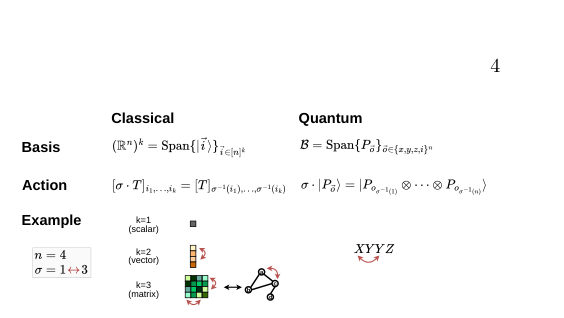
<figcaption class="paper-figure-caption"><b>Fig 2.</b> FIG. 2. Summary of the actions of Sn on the spaces of inter- ests both classical (order-k tensors) and quantum (operators) spaces. For each we provide the basis and action of a permu- tation, both formally and through visual examples.</figcaption>
</figure>
<figure class="paper-figure-card">

<figcaption class="paper-figure-caption"><b>Fig 3.</b> FIG. 3. (a) Symmetrizing (16) all elements of a basis of lin- ear maps Hom(V, W), one obtain a set of maps spanning the space of all equivariant maps HomG(V, W). (b) While in general this procedure is not scalable, this becomes tractable whenever the basis is closed under the action of the group symmetry (ie any element of the basis is mapped to another one under group action). This is the case for our choice of bases for Sn, and we use this strategy to identify all the equiv- ariant linear maps necessary to our models.</figcaption>
</figure>
<figure class="paper-figure-card">
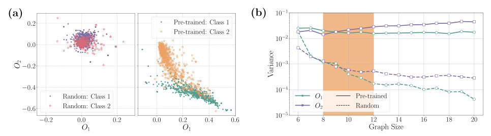
<figcaption class="paper-figure-caption"><b>Fig 4.</b> FIG. 4. Classical pre-training. The invariant QML model considered has encoding circuit defined through Eq. (45) and a 2-dimensional output given by the expectation values of 2 observables O1 and O2 (46). (a) For larger graphs (n = 14 to 20 nodes) than used for training (n = 8 to 12 nodes), outputs of the classically pre-trained model (right panel) are compared to output of the model initialized with random parameters (left panel). Each point correspond to one graph and has coordinates (x, y) being the observables expectation values. (b) For a more detailed comparison, the dispersion (quantified by the variance) of the output of the models are reported at varied system size and for the two...</figcaption>
</figure>

**Summary.** This paper establishes a comprehensive mathematical framework—a 'toolbox'—for designing Geometric Quantum Machine Learning (GQML) models tailored for graph structures. By rigorously enforcing symmetry constraints derived from the permutation group $S_n$, it provides systematic methods to construct, characterize, and improve the expressivity of quantum circuits used in quantum machine learning tasks.

**Why it may be interesting.** This work provides a deep theoretical grounding in symmetry principles (group representation theory) applied directly to quantum computation models for structured data like graphs, which is highly relevant for designing physically constrained quantum circuits.

Detailed structure

**Main problem.** The work aims to develop a rigorous framework for Geometric Quantum Machine Learning (GQML) models applied to graph problems, addressing the lack of a unifying design perspective compared to classical GML.

**Main result.** A comprehensive 'toolbox' is provided to systematically characterize and construct equivariant quantum graph models, demonstrating benefits like natural integration with classical methods and enabling classical pre-training strategies.

**Method.** The authors employ group theory (specifically the permutation group $S_n$) to define equivariance/invariance for quantum operators and maps, leading to a systematic basis construction via symmetrization (twirling).

**Model / system.** The model involves encoding $n$-node graphs into $n$-qubit states ($
ho_\alpha(x)$) and utilizing general QML templates involving an encoding, unitary evolution ($U_	heta$), and measurement ($O$). The symmetry group acting on the system is $S_n$.

**Key observables.** Equivariant observables (symmetric or equivariant tensors of Pauli strings), expectation values $	ext{Tr} [O_	heta 
ho_\alpha(x)]$, and classification outputs derived from these expectations.

**Important parameters / regimes.** System size $n$ (number of nodes/qubits), circuit depth $L$, and the set of parameters $	heta$ governing the unitary evolution.

**Assumptions / limitations.** The analysis relies on defining equivariance with respect to group actions ($S_n$) and assumes that model expressivity can be systematically increased by incorporating all compatible equivariant observables.

**Figures summary.** Figure 1 illustrates the proposed toolbox for GQML construction, showing its use across encoding, measurement identification, and classical integration. Figure 2 summarizes $S_n$ actions on quantum spaces, while later figures show performance comparisons between pre-trained vs. random models.

**Paper structure.** The paper builds from background theory (defining equivariance for QML) to building the toolbox by characterizing equivariant linear maps ($	ext{Hom}_{	ext{S}_n}(V, W)$), and finally applying this toolbox to construct and test specific GQML architectures.

Abstract

Geometric Machine Learning (GML) successes have been achieved through the thorough study and design of new equivariant neural networks. In comparison, geometric quantum machine learning (GQML) models lack such a detailed understanding and, despite already several proposals, a unifying perspective on their design remains elusive. In this work, we focus on GQML models for graph problems that showcase a lot of structure and still remain frontier in machine learning. For the case when n-node graphs are encoded in n-qubit states, we provide a comprehensive characterization of their constituents. Taken together, these furnish us with a toolbox for the design of quantum graph models, and we further probe its benefits including the natural integration with classical models, generalization of known GQML models (sometimes extending their expressivity at virtually no cost), and straightforward classical pre-training strategies. The latter two features are demonstrated in dedicated numerical experiments.

[↑ back to top](#top)

### [Reducing quantum resources for ADAPT-VQE via plateau-operator elimination and correlated mean-field downfolding](http://arxiv.org/abs/2607.00575v1)

**Authors:** Phuoc Minh Vo, Thai Cong Ngoc Vu, Thien Ngoc Tran, Hoang Thanh Nguyen, Lan Nguyen Tran  
**Type:** theory · **Category:** strongly correlated electrons · **PDF:** <https://arxiv.org/pdf/2607.00575v1>  
**Analysis basis:** full PDF text, analyzed in chunks

↔ Scroll figures horizontally

<figure class="paper-figure-card">
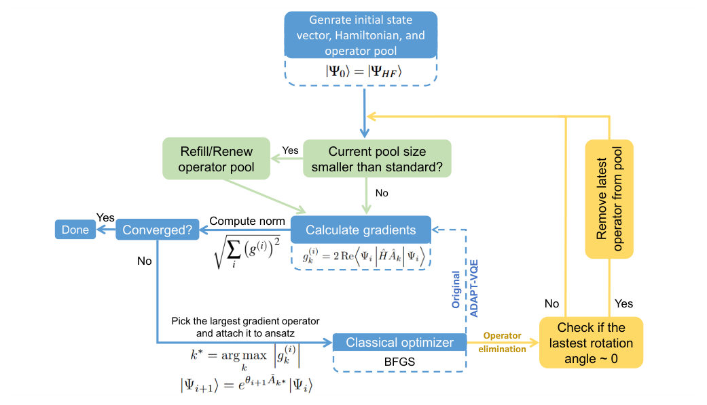
<figcaption class="paper-figure-caption"><b>Fig 1.</b> FIG. 1: The plateau-operator elimination is incorporated into the original ADAPT-VQE workflow. After the classical optimization, the elimination scheme is applied to remove operators with vanishing parameters.</figcaption>
</figure>
<figure class="paper-figure-card">

<figcaption class="paper-figure-caption"><b>Fig 2.</b> FIG. 2: Gradient norm convergence for the hydrogen chain at r = 2.25 ˚A (left), 2.55 ˚A (middle), and 2.85 ˚A (right). There are three thresholds of elimination, at which the pool is restored: ϕ = 20% (orange), 22% (purple), and 25% (pink). The horizontal green line indicates the convergence threshold ϵ = 10−4.</figcaption>
</figure>
<figure class="paper-figure-card">

<figcaption class="paper-figure-caption"><b>Fig 3.</b> FIG. 3: CNOT gate counts for ADAPT-VQE with and without operator elimination at different bond lengths of H6 chain, H6 ring, and H6 lattice.</figcaption>
</figure>
<figure class="paper-figure-card">

<figcaption class="paper-figure-caption"><b>Fig 4.</b> FIG. 4: Number of operators and number of CNOT gates for ADAPT-VQE with the elimination scheme using different orbital bases (HF and OBMP2) at various bond lengths of H6 chain.</figcaption>
</figure>
<figure class="paper-figure-card">
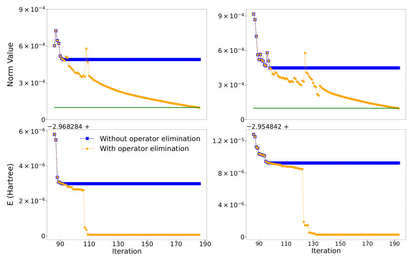
<figcaption class="paper-figure-caption"><b>Fig 5.</b> FIG. 5: Convergence of the gradient norm and energy with respect to iterations for r = 2.25 and 2.45 ˚A of H6 chain.</figcaption>
</figure>

**Summary.** The paper presents an advanced hybrid quantum algorithm combining operator elimination with a one-body downfolding framework (OBDF) to enhance ADAPT-VQE for electronic structure calculations. By pruning redundant operators and incorporating external correlation effects, the method achieves faster convergence and higher accuracy compared to standard approaches on molecular models like H6 and N2.

**Why it may be interesting.** This work directly addresses the practical limitations of applying quantum algorithms (like VQE) to complex many-body Hamiltonians, providing concrete algorithmic improvements for resource efficiency and systematic error reduction in correlated electron simulations.

Detailed structure

**Main problem.** The primary goal is to reduce quantum resources and improve convergence stability for ADAPT-VQE, a method used for electronic structure calculations on near-term quantum devices.

**Main result.** Operator elimination significantly reduces circuit depth and iteration count, while combining this technique with the one-body downfolding framework (OBDF) yields energies closer to the FCI reference than standard methods.

**Method.** The work introduces plateau-operator elimination into ADAPT-VQE to prune redundant operators during ansatz construction. This is combined with OBDF, which replaces the bare Hamiltonian in the active space with a correlated effective Hamiltonian incorporating external correlation effects.

**Model / system.** The methodology is applied to quantum chemistry problems, benchmarked on molecular systems including linear H6 chains, H6 lattices, H6 rings, and the N2 molecule. The underlying physics involves solving electronic structure Hamiltonians.

**Key observables.** Energy expectation value (compared to FCI), CNOT gate counts (circuit depth), and convergence rate of energy gradients.

**Important parameters / regimes.** The elimination threshold ($\delta$) for vanishing parameters, the active space definition, and the correlation effects captured by OBDF.

**Assumptions / limitations.** Permanent operator elimination is preferred over pool restoration due to observed instabilities; the assumption is that eliminating non-contributing operators reduces overhead without sacrificing accuracy.

**Figures summary.** Figures illustrate how plateau-operator elimination stabilizes convergence (e.g., H6 chain), shows significant reduction in CNOT gate counts across various systems, and compares energy surfaces (PES) of H6/N2 using different levels of theory including OBDF-ADAPT-VQE.

**Paper structure.** The paper first introduces the limitations of standard ADAPT-VQE. It then details the operator elimination strategy, showing its benefits in convergence speed and resource reduction. Finally, it integrates this with the OBDF framework to systematically improve accuracy by incorporating external correlation effects, benchmarking on multiple molecular systems.

Abstract

Adaptive Derivative-Assembled Problem-Tailored variational quantum eigensolvers (ADAPT-VQE) represent one of the most promising approaches for quantum chemistry on near-term quantum devices. However, their optimization is slow and may stall due to vanishing parameters and redundant operators in the ansatz. In this work, we propose a simple strategy of operator elimination that removes non-contributing operators from the pool once they are detected, enabling the optimization to continue progressing toward convergence. We examine two variants, with and without pool restoration after elimination, and find that the former converges more smoothly and faster than the latter and the standard ADAPT-VQE. To capture dynamical correlations between the active space and its environment, we combine ADAPT-VQE with our recently developed downfolding approach, the one-body downfolding framework (OBDF). In OBDF, the bare molecular Hamiltonian in the active space is replaced by a correlated effective Hamiltonian that incorporates dynamical correlation effects outside the active space. We benchmark our implementation on a linear \ce{H_6} chain, an \ce{H_6} lattice, an \ce{H_6} ring, and the \ce{N_2} molecule using the OpenFermion simulator. Our results show that operator elimination significantly reduces circuit depth and iteration count, and that OBDF-ADAPT-VQE yields energies closer to the full configuration interaction (FCI) reference than the standard approach within the same active space.

[↑ back to top](#top)

### [Robust Quantum Memory Advantage from Contextuality](http://arxiv.org/abs/2607.00507v1)

**Authors:** Shiroman Prakash  
**Type:** theory · **Category:** quantum information and computing · **PDF:** <https://arxiv.org/pdf/2607.00507v1>  
**Analysis basis:** full PDF text, analyzed in chunks

↔ Scroll figures horizontally

<figure class="paper-figure-card">
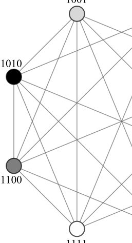
<figcaption class="paper-figure-caption"><b>Fig 1.</b> Figure 1: The complete Boolean-orthogonality graph Ω4. Vertices are colored such that no two connected vertices share a color, illustrating that χ(Ω4) = 4.</figcaption>
</figure>
<figure class="paper-figure-card">

<figcaption class="paper-figure-caption"><b>Fig 2.</b> Figure 2: Scaling of the state space dimension as a function of the graph dimension n. While the quantum memory cost ξ(Ωn) (blue) grows linearly, the lower bound on the classical memory cost χ(Ωn) (red dashed), derived from the Frankl-Rodl (FR) theorem [35], grows exponentially.</figcaption>
</figure>
<figure class="paper-figure-card">

<figcaption class="paper-figure-caption"><b>Fig 3.</b> Figure 3: This 18-vertex graph has χ = 7, ξ = 6 and χf = 5.68. It cannot exhibit state- independent contextuality because χf &lt; ξ [18]. However, it does exhibit representational contextuality, as χ &gt; ξ.</figcaption>
</figure>
<figure class="paper-figure-card">
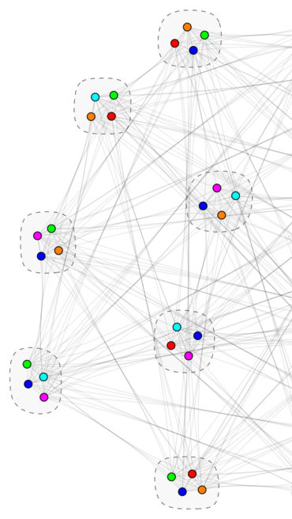
<figcaption class="paper-figure-caption"><b>Fig 4.</b> Figure 4: A valid 6-coloring of the 60-ray orthogonality graph of [42] derived from vertices of the 4D 600-cell. The graph is partitioned into 15 disjoint 4-element orthogonal bases (indicated by the shaded regions). Because each basis forms a clique, every region contains four distinct vertex colors.</figcaption>
</figure>

**Summary.** The paper proves an unconditional exponential memory advantage of Quantum Finite Automata over classical automata by exploiting graph-theoretic contextuality. By analyzing the Kochen-Specker Problem on specific graphs, it shows that the required quantum memory scales linearly with system size ($\xi(G)$), while the classical requirement scales exponentially ($\chi(G)$). This advantage is robust to common types of noise.

**Why it may be interesting.** This work provides concrete, quantifiable bounds showing how structural quantum resources (contextuality) translate into computational advantages that are robust against realistic physical noise models, which is crucial for building fault-tolerant quantum computation.

Detailed structure

**Main problem.** The paper aims to demonstrate an exponential, noise-resilient memory advantage for quantum finite automata (QFAs) over classical deterministic finite automata (DFAs) by leveraging the structural resource of quantum contextuality.

**Main result.** An exponential separation is shown between the classical state requirement ($\chi(G)$) and the quantum memory dimension ($\xi(G)+1$) needed to solve a promise problem derived from the Kochen-Specker Problem (KSP).

**Method.** The analysis uses graph theory invariants—the chromatic number $\chi(G)$ and orthogonal rank $\xi(G)$—to establish bounds on classical vs. quantum memory resources for recognizing specific logical structures.

**Model / system.** The core model is the comparison between DFAs and QFAs solving a promise problem defined on an exclusivity graph $G$. The advantage is demonstrated using Boolean-orthogonality graphs ($\Omega_n$) or Kochen-Specker graphs derived from high-dimensional polytopes.

**Key observables.** Classical memory cost ($N = \chi(G)$) versus Quantum memory dimension ($d = \xi(G)+1$).

**Important parameters / regimes.** The exponential scaling difference between $\chi(G)$ and $\xi(G)$, and the maintenance of an $O(1)$ noise threshold against depolarizing/coherent noise.

**Assumptions / limitations.** The advantage relies on 'representational contextuality,' defined by the integer gap $\chi(G) > \xi(G)$, which is a stronger condition than statistical contextuality ($\chi_f(G)$).

**Figures summary.** Figures illustrate the graph structures (e.g., $\Omega_4$, 18-vertex graph, 60-ray orthogonality graph) and compare the exponential scaling of classical memory cost versus the linear scaling of quantum memory cost.

**Paper structure.** The paper first establishes the problem using KSP on a graph $G$. It then proves the lower bound for DFAs ($\chi(G)$). Subsequently, it constructs the QFA solution using $\xi(G)+1$ dimensions and rigorously demonstrates the exponential separation and noise resilience.

Abstract

Quantum contextuality is widely recognized as an essential non-classical resource underlying quantum technology, yet illuminating the precise mechanisms through which it translates into unconditional computational advantages remains an ongoing challenge. We demonstrate an exponential, noise-resilient memory advantage for quantum finite automata arising from graph-theoretic approaches to contextuality. We define a promise problem on an exclusivity graph $G$ for which any classical deterministic automaton acts as a non-contextual hidden variable model requiring at least $N=χ(G)$ states, where $χ(G)$ is the graph's chromatic number. In contrast, by exploiting a structural phenomenon we term \textit{representational contextuality}, a QFA solves this task using a memory of dimension at most $d=ξ(G)+1$, where $ξ(G)$ is the graph's orthogonal rank. This separation scales exponentially ($d=\mathcal O(n)$ versus $N=2^{Ω(n)}$) for Boolean-orthogonality graphs. Crucially, this memory advantage maintains an $\mathcal{O}(1)$ threshold against both depolarizing and coherent noise.

[↑ back to top](#top)

### [Scattering, bound states, and resonances in the one-dimensional Dirac equation via supersymmetric quantum mechanics](http://arxiv.org/abs/2607.00306v1)

**Authors:** Camila C. Soares, Luis B. Castro, Antonio S. de Castro  
**Type:** theory · **Category:** other · **PDF:** <https://arxiv.org/pdf/2607.00306v1>  
**Analysis basis:** full PDF text, analyzed in chunks

↔ Scroll figures horizontally

<figure class="paper-figure-card">
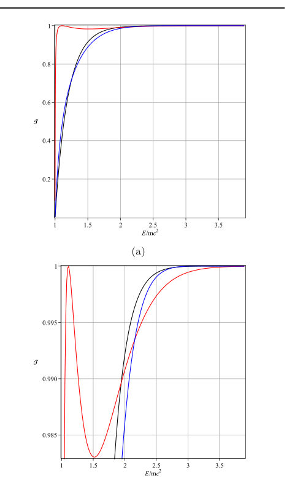
<figcaption class="paper-figure-caption"><b>Fig 1.</b> Fig. 1: Transmission probability T for the Dirac- matched P¨oschl–Teller effective well with ω = 2 and V0 = 0.9 (black), V0 = 1.9 (red), and V0 = 2.9 (blue) (in units where ℏ= c = m = 1). (a) Full energy range. (b) Magnified view of the high-transmission re- gion T ∈[0.983, 1.0].</figcaption>
</figure>
<figure class="paper-figure-card">

<figcaption class="paper-figure-caption"><b>Fig 2.</b> Fig. 2: Energy dependence of the P¨oschl–Teller param- eter λ(E) from the Dirac matching condition for ω = 2 and V0 = 0.9 (black), V0 = 1.9 (red), and V0 = 2.9 (blue) (in units where ℏ= c = m = 1).</figcaption>
</figure>
<figure class="paper-figure-card">
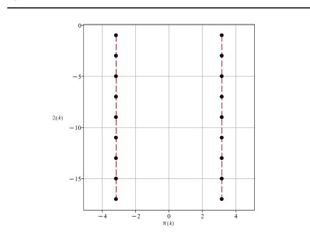
<figcaption class="paper-figure-caption"><b>Fig 3.</b> Fig. 3: Pole pattern in the complex k-plane for the Dirac-matched P¨oschl–Teller barrier with ω = 2, V0 = −2.5, and E0 = 1.2 (in units where ℏ= c = m = 1), yielding η(E0) ≃1.58 and k(±) n = ±ωη(E0) −iω(n + 1</figcaption>
</figure>

**Summary.** This work unifies the study of scattering and bound states for the 1D Dirac equation by mapping it onto a solvable Schrödinger-like problem using symmetry constraints. By applying Supersymmetric Quantum Mechanics to potentials like the Pöschl–Teller, the authors derive closed-form expressions for transmission probabilities. This framework allows them to systematically locate both discrete bound states and continuous resonances via pole analysis in the complex momentum plane.

**Why it may be interesting.** The rigorous application of SUSYQM and its connection to spectral properties (bound vs. resonance) provides powerful, exact analytical tools for studying relativistic quantum systems, which is highly relevant for understanding particle confinement or wave propagation in structured media.

Detailed structure

**Main problem.** The paper develops a unified theoretical framework to analyze both scattering phenomena (continuum spectrum) and bound states/resonances (discrete spectrum) for the one-dimensional Dirac equation.

**Main result.** It successfully maps the relativistic problem onto an effective Schrödinger-like equation, allowing the use of supersymmetric quantum mechanics techniques to derive closed-form expressions for transmission probabilities and characterize resonance poles in the complex momentum plane.

**Method.** The core methods involve symmetry reduction (spin/pseudospin), utilizing Supersymmetric Quantum Mechanics (SUSYQM) with shape invariance, and employing analytic continuation to extract bound states from scattering amplitudes.

**Model / system.** The system is a fermion described by the one-dimensional Dirac equation subjected to combined scalar and vector potentials. The analysis focuses on specific solvable models like the hyperbolic Pöschl–Teller potential.

**Key observables.** Transmission probability $T(k)$, reflection amplitude, bound-state energies (poles of $T(k)$), and resonance frequencies/quasi-normal modes (QNMs) found as poles in the complex momentum plane.

**Important parameters / regimes.** The sign of the potential parameter $V_0$ determines whether the system behaves like an attractive well (bound states) or a repulsive barrier (resonances).

**Assumptions / limitations.** Key assumptions include the existence of spin-symmetry ($\Delta=0$) or pseudospin-symmetry ($\Sigma=0$) to reduce the coupled Dirac system, and assuming short-range interactions that vanish at infinity.

**Figures summary.** Figures illustrate the energy dependence of scattering quantities, showing how $T(k)$ approaches unity in certain limits, and depict the pole structure in the complex momentum plane for resonance analysis.

**Paper structure.** The paper proceeds by establishing the unified mapping from the Dirac equation to a Schrödinger-like problem. It then applies SUSYQM techniques using shape invariance to solve the Pöschl–Teller potential case, deriving scattering amplitudes, and finally analyzing the pole structure in the complex plane to distinguish between bound states and resonances.

Abstract

We develop a unified treatment of scattering and discrete spectra for the one-dimensional Dirac equation with scalar and vector interactions. Under the spin-symmetry condition, the coupled first-order Dirac system maps exactly onto an effective Sturm--Liouville (Schrö\-din\-ger-like) problem for a single spinor component. This mapping provides a convenient framework for analyzing transmission, reflection, and analytic continuation. As an explicit application, we consider effective interactions of hyperbolic Pöschl--Teller type and exploit supersymmetric quantum mechanics and shape invariance to obtain a closed-form expression for the transmission probability. The bound-state spectrum is then recovered from the poles of the analytically continued transmission amplitude, reproducing known results and offering a unified description of scattering and bound states. For the barrier configuration, we briefly comment on the resulting pole pattern in the complex momentum plane and its connection with resonance and quasi-normal-mode behavior. Moreover, we use the chiral transformation to relate the spin- and pseudospin-symmetry sectors and translate results between them without repeating the full derivation.

[↑ back to top](#top)

## Secondary cond-mat archives

*Papers from cond-mat.mtrl-sci, mes-hall, other, soft, supr-con. These archives are de-prioritized — they appear at the end regardless of relevance score.*

### Relevant in secondary archives (21)

### [Real-time dynamics of triplet-resonant tunneling driven by nonequilibrium phonons](http://arxiv.org/abs/2607.00520v1)

**Authors:** Kazuyuki Kuroyama, Sasha R. Valentin, Arne Ludwig, Andreas D. Wieck, Yasuhiro Tokura, Seigo Tarucha, Sadashige Matsuo  
**Type:** experiment · **Category:** statistical mechanics · **PDF:** <https://arxiv.org/pdf/2607.00520v1>  
**Analysis basis:** full PDF text, analyzed in chunks
**Topic relevance:** 🔥 `driven-dissipative phase transition` **4/5** · 🔥 `non-equilibrium dynamics` **4/5** · `methods for driven-dissipative` **3/5** · `non-equilibrium universality` **3/5** · `spintronics-quantum-optics interface` **3/5** · `Keldysh / 2PI / non-Gaussian methods` **2/5** · `Kondo & dissipative impurity` **2/5** · `measurement-induced transitions` **2/5** · `quantum measurements` **2/5** · `analog quantum simulation` **1/5** · `correlated / nonlocal dissipation` **1/5** · `exotic spin models in light-matter` **1/5** · `scars & prethermalization` **1/5**

↔ Scroll figures horizontally

<figure class="paper-figure-card">

<figcaption class="paper-figure-caption"><b>Fig 1.</b> FIG. 1. (a) Geometry of our DQD sample with a charge sensor and a QD-based phonon source. (b) Charge stability diagram of the DQD near the (1,1)-(0,2) inter-dot resonance at 𝑉PS = 0 mV. The singlet resonance line is guided by the blue dashed line, and the boundaries of the charge states are guided by the black dashed lines. (c) Charge stability diagram measured at 𝑉PS = 0.975 mV. The singlet (GS) and triplet (ES) resonance lines are indicated by the blue and red dashed lines. (d,e) Transition diagrams at the singlet (d) and triplet (e) resonance conditions. 1sL and 1sR denote the 1s orbitals in the left and right QDs, respectively, and 2pR denotes the 2p orbital in the right QD.</figcaption>
</figure>
<figure class="paper-figure-card">

<figcaption class="paper-figure-caption"><b>Fig 2.</b> FIG. 2. (a) Typical time trace of inter-dot tunneling events measured at the singlet resonance. (b) Typical time trace of inter-dot tunneling events measured at the triplet resonance. (c) Charge stability diagram measured under phonon irradiation at slightly different inter-dot tunnel coupling strength from Fig. 1(c) by changing a gate voltage applied to gate C. (d) Inter-dot tunnel rates of the (1,1)→(0,2) tunneling (red squares) and the (0,2)→(1,1) tunneling (green circles) extracted along the yellow dashed cut in (c). The left (right) peak corresponds to the singlet (triplet) resonance.</figcaption>
</figure>
<figure class="paper-figure-card">
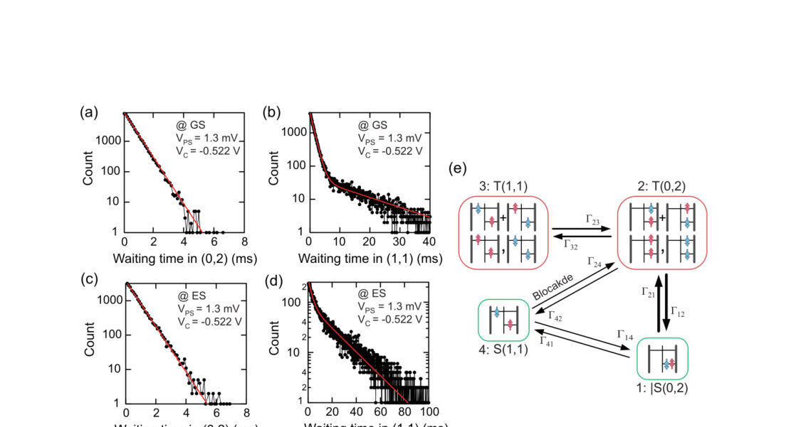
<figcaption class="paper-figure-caption"><b>Fig 3.</b> FIG. 3. (a, b) (0,2) and (1,1) waiting-time histograms obtained from the time traces measured at the singlet-resonance (GS) are plotted, respectively. The red curves are fits to a single- exponential function in (a) and a double-exponential function in (b). (c,d) (0,2) and (1,1) waiting-time histograms obtained from the time traces measured at the triplet resonance condition (ES). The red curves are fits to a single-exponential function in (c) and a double- exponential function in (d). (e) DQD transition diagram at the triplet resonance. The spin state initially located at |𝑆(0,2)⟩ is frequently excited to |𝑇(0,2)⟩ by a single phonon excitation. When the DQD spin state enters |𝑆(1,1)⟩, the...</figcaption>
</figure>
<figure class="paper-figure-card">

<figcaption class="paper-figure-caption"><b>Fig 4.</b> FIG. 4. (a) Typical time trace of the DQD inter-dot tunneling events observed at the singlet resonance for reduced inter-dot tunnel coupling, tuned by applying a more negative voltage to gate C (see Fig. 1(a) for the sample geometry). (b, c) Typical time trace of inter-dot tunneling events measured at the triplet resonance marked by the yellow circle and the green square in Fig. 1(c). The time trace in (b) is measured at the DQD operation point closer to the (1,2) region, while the time trace in (c) is measured at the DQD operation point closer to the (0,1) region. (d,e) Schematic sequences illustrating phonon-driven unidirectional charge- transfer cycles: (d) (0,2)→(1,1)→(1,2)→(0,2) and...</figcaption>
</figure>

**Summary.** The authors experimentally study charge and spin dynamics in a double quantum dot subjected to nonequilibrium phonon irradiation. They observe that the system exhibits resonant tunneling at triplet resonance, and crucially, they demonstrate strong nonreciprocal electron transport cycles. This work establishes an accessible method for investigating directed current flow driven by energy gradients in nanoscale solid-state devices.

**Why it may be interesting.** This work provides a clean experimental platform for studying non-equilibrium quantum transport and rectification effects driven by coupling to an external bath (phonons), which is highly relevant to open quantum systems theory.

Detailed structure

**Main problem.** The study investigates real-time charge and spin dynamics in excited states of a double quantum dot (DQD) driven by nonequilibrium phonons to understand emergent functionalities beyond equilibrium.

**Main result.** The research demonstrates that phonon irradiation induces resonant inter-dot tunneling at triplet resonance, leading to strong unidirectional electron transport cycles with high rectification ($\eta \approx 1$) when coupling is weak.

**Method.** Time-resolved charge sensing and waiting-time statistics are used to measure transition rates between different spin/charge states in the DQD under controlled phonon excitation.

**Model / system.** The physical system is a semiconductor Double Quantum Dot (DQD) fabricated on an AlGaAs/GaAs/AlGaAs heterostructure, which acts as the quantum device. Phonons are generated by applying a DC bias to a nearby source QD, creating a nonequilibrium phonon density gradient.

**Key observables.** Charge state transition time traces, inter-dot tunneling rates ($\Gamma_{ij}$), waiting-time histograms (single/double exponential), and the unidirectional transfer asymmetry ($\eta$).

**Important parameters / regimes.** Phonon bias voltage ($V_{PS}$), detuning voltage ($V_R$), and the relative strength of inter-dot coupling versus dot-reservoir rates.

**Assumptions / limitations.** The analysis relies on rate-equation models for DQD spin states, and some fitting procedures assume specific functional forms for waiting-time distributions.

**Figures summary.** Figures show charge stability diagrams revealing triplet resonance lines (Fig. 1c), time traces of transitions at both singlet and triplet resonances (Figs. 2a/b), histograms confirming double exponential behavior at ES, and finally, current measurements demonstrating unidirectional cycles with high rectification ($\eta$) (Fig. 4).

**Paper structure.** The paper progresses from establishing the basic physics by observing resonant tunneling at GS vs. ES; it then analyzes detailed rate dynamics using waiting-time statistics to distinguish spin-conserving versus spin-flip processes; finally, it focuses on the nonreciprocal transport regime induced by phonon gradients.

Abstract

Driven nonequilibrium systems can host emergent functionalities beyond equilibrium, but real-time access to excited-state dynamics remains limited. Here we report real-time measurements of phonon-driven charge and spin dynamics in excited states of a double quantum dot. Under phonon irradiation, resonant inter-dot tunneling emerges at triplet resonance. Time-resolved charge sensing reveals that the resonant inter-dot tunneling is strongly modified by spin blockade. For weaker inter-dot coupling, the nonequilibrium phonon environment generates a unidirectional transport cycle along the phonon density gradient.

[↑ back to top](#top)

### [Universal Scaling of the Spin Hall Effect](http://arxiv.org/abs/2607.00343v1)

**Authors:** Atsuo Shitade, Naoto Nagaosa  
**Type:** theory · **Category:** other · **PDF:** <https://arxiv.org/pdf/2607.00343v1>  
**Analysis basis:** full PDF text, analyzed in chunks
**Topic relevance:** 🔥 `Keldysh / 2PI / non-Gaussian methods` **4/5** · 🔥 `non-equilibrium universality` **4/5** · `Kondo & dissipative impurity` **3/5** · `methods for driven-dissipative` **3/5** · `non-equilibrium dynamics` **3/5** · `spintronics-quantum-optics interface` **3/5** · `correlated / nonlocal dissipation` **2/5** · `driven-dissipative phase transition` **2/5** · `analog quantum simulation` **1/5** · `entanglement & information structure` **1/5** · `exotic spin models in light-matter` **1/5** · `scars & prethermalization` **1/5**

↔ Scroll figures horizontally

<figure class="paper-figure-card">

<figcaption class="paper-figure-caption"><b>Fig 1.</b> FIG. 1. DOS for (ℏv/∆)3ni = 5.448.</figcaption>
</figure>
<figure class="paper-figure-card">

<figcaption class="paper-figure-caption"><b>Fig 2.</b> Figure 3 shows the scaling relation between the electric conductivity and the SAC and MMAC. We choose ϵF &gt; 0 to avoid the aforementioned sign change. Both these co- efficients have three regimes similarly to the AH conduc- tivity [12, 13]. In the superclean regime, the skew scatter- ing is dominant, and Γ00g xy sz and −Γ00g xy mz are propor- tional to σyy. In the moderately dirty regime, these coef- ficients are almost constant. Finally, in the dirty regime, we find a new scaling relation Γ00g xy sz , −Γ00g xy mz ∝ (σyy)0.6.</figcaption>
</figure>
<figure class="paper-figure-card">
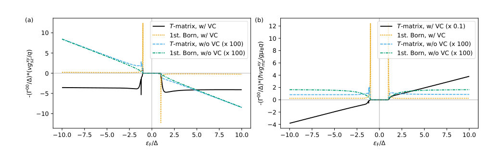
<figcaption class="paper-figure-caption"><b>Fig 3.</b> FIG. 2. Fermi-energy dependence of (a) the SAC −Γ00g xy sz and (b) MMAC −Γ00g xy mz within the T-matrix approximation with (black solid lines) and without the VCs (blue dashed lines). We also show the results within the first-order Born approximation with (orange dotted lines) and without the VCs (green dash-dotted lines). We choose (ℏv/∆)3ni = 0.1 and ∆2vi/(ℏv)3 = 0.1.</figcaption>
</figure>
<figure class="paper-figure-card">
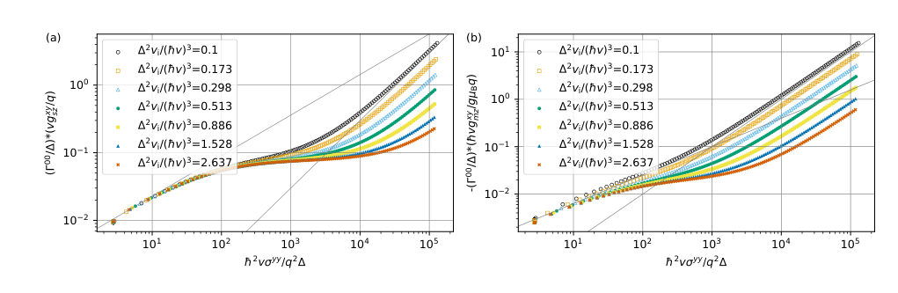
<figcaption class="paper-figure-caption"><b>Fig 4.</b> FIG. 3. Electric-conductivity dependence of (a) the SAC Γ00g xy sz and MMAC −Γ00g xy mz by changing the impurity concentration (ℏv/∆)3ni from 10−1 to 102.5. We choose ϵF/∆= 3.917. The slopes of two gray solid lines represent Γ00g xy sz , −Γ00g xy mz ∝σyy, (σyy)0.6.</figcaption>
</figure>
<figure class="paper-figure-card">

<figcaption class="paper-figure-caption"><b>Fig 5.</b> FIG. 4. Feynman diagrams for (a) the self-energy within the self-consistent T-matrix approximation, (b) the renormalized velocity vertex, (c) the spin–charge-current correlation function of the first order with respect to Qx, and (d) the correation function that vanishes in the case of short-range impurities.</figcaption>
</figure>

**Summary.** This paper develops a unified theory for the Spin Hall effect in Dirac electrons by calculating spin and magnetic moment accumulation coefficients ($	ext{SAC}$ and $	ext{MMAC}$). Using the T-matrix approximation, the authors predict three distinct scaling regimes based on impurity scattering strength. The key finding is a novel scaling exponent (0.6) in the dirty regime, providing a comprehensive picture of spin transport beyond simple current definitions.

**Why it may be interesting.** While focused on condensed matter transport rather than quantum information directly, the rigorous theoretical framework involving non-equilibrium Green's functions, symmetry analysis (time-reversal/inversion), and scaling laws in disordered systems is highly relevant to understanding decoherence and topological effects in open quantum systems.

Detailed structure

**Main problem.** The study focuses on developing a unified theory for the Spin Hall (SH) effect in Dirac electrons, specifically addressing ambiguities related to defining spin current.

**Main result.** The authors found three distinct scaling regimes for the spin and magnetic-moment accumulation coefficients ($	ext{SAC}$ and $	ext{MMAC}$) as impurity scattering changes, with a novel exponent of 0.6 in the dirty regime that differs from the anomalous Hall effect's scaling.

**Method.** Theoretical calculations utilizing the self-consistent T-matrix approximation within linear response theory framework applied to Green's functions for Dirac electrons.

**Model / system.** The model uses a Dirac Hamiltonian describing low-energy physics, such as in bismuth, and incorporates short-range nonmagnetic impurities via the T-matrix formalism. The analysis distinguishes between spin accumulation ($	ext{SAC}$) and magnetic moment accumulation ($	ext{MMAC}$).

**Key observables.** Spin Accumulation Coefficient ($	ext{SAC}$), Magnetic-Moment Accumulation Coefficient ($	ext{MMAC}$), Spin Hall conductivity ($\sigma_{xy}^{sz}$), and $	ext{MMH}$ conductivity ($\sigma_{xy}^{mz}$).

**Important parameters / regimes.** Electric conductivity ($\sigma^{yy}$), Fermi energy ($\epsilon_F$), impurity concentration ($n_i$), and the ratio of band gap to Fermi energy.

**Assumptions / limitations.** The calculations rely on the self-consistent T-matrix approximation, assuming short-range impurities, and often neglect vertex corrections (VCs) or assume a scalar self-energy.

**Figures summary.** Figures illustrate the density of states, the dependence of $	ext{SAC}$ and $	ext{MMAC}$ on Fermi energy (comparing T-matrix vs. Born approximations), and the scaling relationship between conductivity and $	ext{SAC}/	ext{MMAC}$ across different impurity regimes.

**Paper structure.** The paper systematically derives transport coefficients ($\sigma_{jj}, \sigma_{ij}^{sa}, g_{ij}^{sa}, \sigma_{xy}^{mz}$) using Keldysh Green's functions in the T-matrix approximation, analyzes the resulting scaling laws based on conductivity, and concludes by proposing $	ext{SAC}$ as a robust measure for the SH effect.

Abstract

We study the spin Hall (SH) effect for the Dirac electrons in terms of the spin and magnetic-moment accumulation coefficients $-Γ^{00} g_{s(m)z}^{\phantom{s(m)z} xy}$. We take short-range nonmagnetic impurities into account within the self-consistent $T$-matrix approximation. Similarly to the universal scaling for the anomalous Hall (AH) effect, we find three disctinct regimes by changing the electric conductivity $σ^{yy}$; the superclean regime with $-Γ^{00} g_{s(m)z}^{\phantom{s(m)z} xy} \propto σ^{yy}$ owing to the skew scattering, moderately dirty regime with almost constant $-Γ^{00} g_{s(m)z}^{\phantom{s(m)z} xy}$, and dirty regime with a new scaling relation $-Γ^{00} g_{s(m)z}^{\phantom{s(m)z} xy} \propto (σ^{yy})^{0.6}$ whose exponent differs from that of the AH conductivity. Our results construct a unified theory of the SH effect without any ambiguity of spin current.

[↑ back to top](#top)

### [Universal logic circuit for gate-controlled superconductor-based switches operating at liquid-helium temperatures](http://arxiv.org/abs/2607.00769v1)

**Authors:** Martin Berke, Lőrinc Kupás, Tosson Elalaily, Máté Sütő, Szabolcs Csonka, Péter Makk  
**Type:** experiment · **Category:** quantum information and computing · **PDF:** <https://arxiv.org/pdf/2607.00769v1>  
**Analysis basis:** full PDF text, analyzed in chunks
**Topic relevance:** 🔥 `QC/QI experiment` **4/5** · `driven-dissipative phase transition` **1/5** · `methods for driven-dissipative` **1/5**

↔ Scroll figures horizontally

<figure class="paper-figure-card">
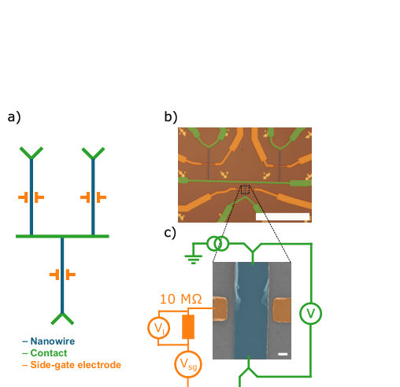
<figcaption class="paper-figure-caption"><b>Fig 1.</b> Fig. 1. Device configuration (a) The device consists of three NWs (blue) that are connected to a common line (green) at one end, and there are two more contacts (green) at the other end of each NW. Each NW is con- trolled by two side gate electrodes (orange). (b) Optical microscope image of a device. Scale bar: 25 µm (c) SEM image of the active region of the device showing the wire and the gate electrodes Scale bar: 100 nm.</figcaption>
</figure>
<figure class="paper-figure-card">
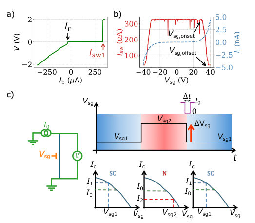
<figcaption class="paper-figure-caption"><b>Fig 2.</b> Fig. 2. Suppression of the supercurrent with gating the device and logic operation principle (a) V −I curve of a NW measured at 4 K. (b) The critical cur- rent of a NW as a function of the applied gate voltage on one of the side-gate electrodes (red) and the leakage current calculated from the voltage drop measured across a pre-resistor (blue). With increasing gate voltage on the side-gate electrode, the critical current of the NW can be suppressed, accompanied by a large enhancement in the leakage current. (c) An external voltage signal can switch a NW between the SC and N states. For devices where the onset and offset of the gating effect correspond to gate voltages largar than 5 V, the...</figcaption>
</figure>
<figure class="paper-figure-card">
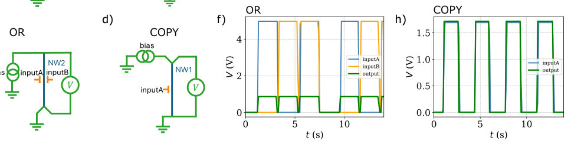
<figcaption class="paper-figure-caption"><b>Fig 3.</b> Fig. 3. Logic gates operation for the AND, OR, NOT and COPY gates. (a)-(d) The schematic circuit diagram for the AND, OR, NOT and COPY gates. The input signals inputA and inputB represent the additional gate voltage on top of the gate voltage setting the working point on panels (e)-(h). (e) The logic operation of the AND gate. There is a clear increase in the output voltage (green) as the function of time, when both input signals (blue, orange) are high. (f) The logic operation of the OR gate. The output voltage (green) as the input signals (blue, orange) are changed with respect to time. A clear increase in the output voltage can be seen, when any or both input signals are high. (g) The...</figcaption>
</figure>

**Summary.** This work demonstrates a functional universal logic circuit built from superconducting nanowires controlled by side-gate electrodes. By exploiting the Gate-Controlled Supercurrent effect, the authors successfully implemented all classical logic gates (AND, OR, NOT, etc.) using only three components. This establishes a promising, low-power building block for future hybrid superconducting supercomputers.

**Why it may be interesting.** While focused on classical digital logic, the underlying physics—controlling quantum states (superconductivity) with external fields to achieve robust switching—is highly relevant to superconducting qubits and quantum circuit design.

Detailed structure

**Main problem.** The research aims to develop superconducting-based computing architectures to overcome scaling and power limitations of conventional CMOS electronics.

**Main result.** A universal logic circuit capable of implementing all classical logic gates (AND, OR, NOT, etc.) and combinational circuits like the half-adder was realized using only three superconducting nanowires.

**Method.** The functionality is demonstrated by controlling the supercurrent in superconducting nanowires via an applied gate voltage, switching the device between a zero-voltage superconducting state and a finite-voltage normal state.

**Model / system.** The system utilizes superconductor-semiconductor hybrid structures, specifically $	ext{NbTiN}$ superconducting nanowires patterned on Si substrates. The operation relies critically on the Gate-Controlled Supercurrent (GCS) effect.

**Key observables.** Switching current ($I_{sw}$), critical current ($I_c$) as a function of gate voltage ($V_{sg}$), and the resulting output voltage ($\approx 2 	ext{ V}$) corresponding to logical '1' or '0'.

**Important parameters / regimes.** Operation is performed at liquid helium temperatures ($4	ext{ K}$). Key electrical parameters include $I_{sw} \approx 332\ \mu	ext{A}$ and gate voltage ranges for suppression ($\approx 30	ext{ V}$ to $40	ext{ V}$).

**Assumptions / limitations.** The primary limitation noted is the requirement for large gate voltages to achieve supercurrent suppression, and thermal fluctuations can cause small scattering on plateaus.

**Figures summary.** Figures illustrate the device configuration using three nanowires; $V-I$ curves demonstrate switching capability; schematics show time-domain realizations of AND, OR, NOT, XOR, and half-adder logic gates.

**Paper structure.** The paper progresses by first establishing the GCS effect as a superconducting switch. It then systematically demonstrates the realization of basic gates (AND, OR, NOT) using minimal components, culminating in the proof of universality for all classical logic functions and combinational circuits.

Abstract

The observation of the gate-controlled supercurrent (GCS) effect in superconducting nanostructures initiated major research efforts toward the realisation of superconducting-based computing architectures. Here we introduce a universal logic circuit that can be a promising superconducting building block of classical hybrid supercomputers. We demonstrate a functionally complete set of logic gates by realising the AND, OR, NOT and COPY gates. The general layout and scalability of our device, combined with recent experiments demonstrating fast switching and small voltage signals, make it a functional candidate in superconducting electronics. Our device enables the realization of all classical logic gates and the half-adder combinational logic circuit using at most three nanowires, each uniquely configured with two side-gate electrodes.

[↑ back to top](#top)

### [Surface Platinum Alloying for Passivation of Oxide Interfaces on Superconducting Niobium Films](http://arxiv.org/abs/2607.00429v1)

**Authors:** Ananya Chattaraj, Conan Weiland, Bruce Ravel, Kim Kisslinger, Sooyeon Hwang, Xiao Tong, Ajith Pattammattel, Andrew M. Kiss, Steven L. Hulbert, Aswin kumar Anbalagan, Andrew L. Walter, Peter V. Sushko, Mingzhao Liu  
**Type:** both · **Category:** quantum information and computing · **PDF:** <https://arxiv.org/pdf/2607.00429v1>  
**Analysis basis:** full PDF text, analyzed in chunks
**Topic relevance:** 🔥 `QC/QI experiment` **4/5** · `Kondo & dissipative impurity` **1/5**

↔ Scroll figures horizontally

<figure class="paper-figure-card">
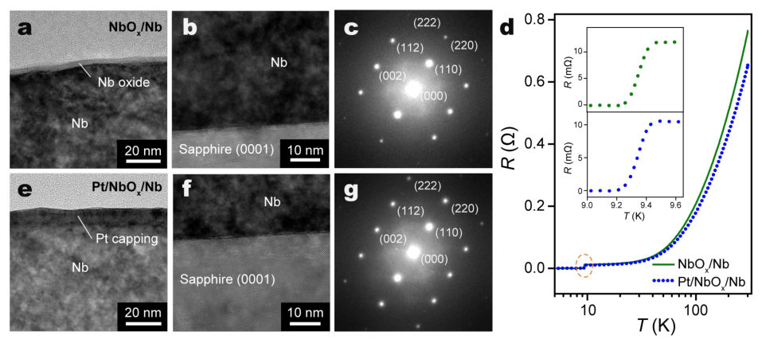
<figcaption class="paper-figure-caption"><b>Fig 1.</b> FIG. 1. (a, b) HRTEM images of bare Nb film near its top surface and near the Nb/Al2O3 interface.</figcaption>
</figure>
<figure class="paper-figure-card">
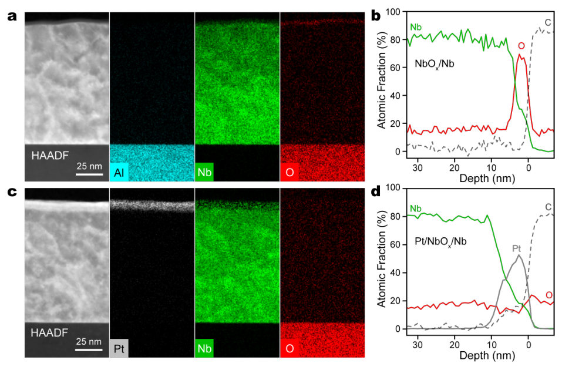
<figcaption class="paper-figure-caption"><b>Fig 2.</b> FIG. 2. (a) Cross-sectional HAADF-STEM image of a bare Nb thin film deposited on Al2O3,</figcaption>
</figure>
<figure class="paper-figure-card">

<figcaption class="paper-figure-caption"><b>Fig 3.</b> FIG. 3. (a, b) Nb 3d core-level VEXPS spectra of bare Nb measured at photon energies of 2000 eV</figcaption>
</figure>
<figure class="paper-figure-card">
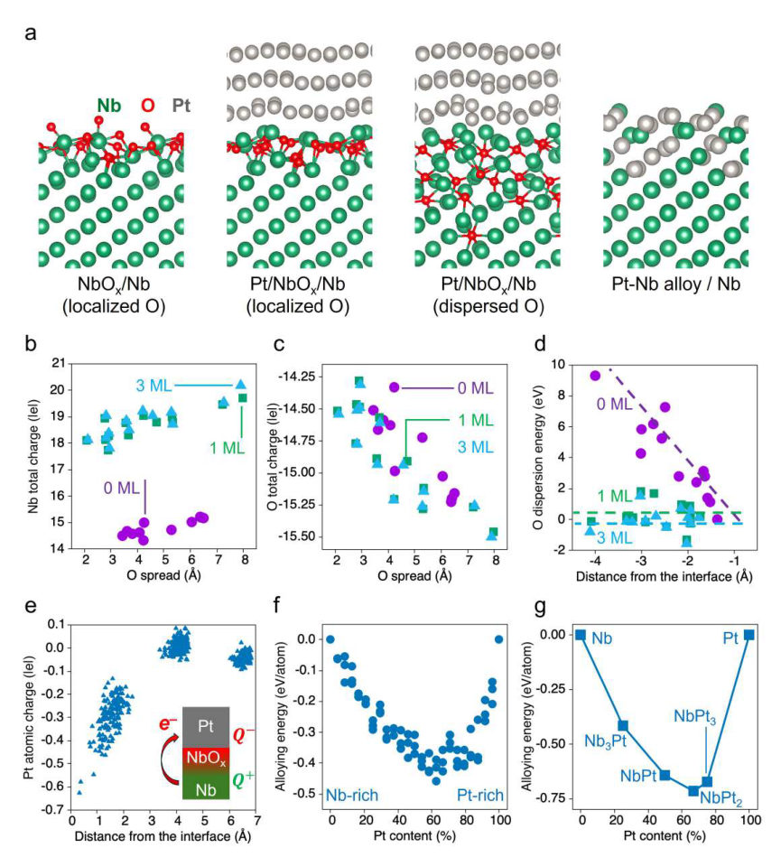
<figcaption class="paper-figure-caption"><b>Fig 4.</b> FIG. 4. (a) Computational models of representative structures. From left to right: partially</figcaption>
</figure>
<figure class="paper-figure-card">

<figcaption class="paper-figure-caption"><b>Fig 5.</b> FIG. 5. (a) Cross-sectional HAADF-STEM image of the top surface of Pt/NbOx/Nb thin film. The</figcaption>
</figure>

**Summary.** This research presents a robust method to passivate the native oxide interfaces on Niobium superconductors using Platinum alloying. By combining advanced spectroscopy and DFT simulations, the authors prove that annealing Pt overlayers forms a stable $	ext{Nb-Pt}$ alloy, effectively mitigating dielectric loss mechanisms critical for high-coherence superconducting qubits.

**Why it may be interesting.** The work directly addresses a critical material science bottleneck for superconducting quantum circuits by engineering interface chemistry, which is highly relevant to open quantum systems where environmental coupling (loss) dictates coherence time.

Detailed structure

**Main problem.** Dielectric loss from two-level systems (TLS) at surfaces and interfaces limits coherence in superconducting transmon qubits built using Niobium (Nb).

**Main result.** Depositing a thin Pt layer followed by annealing transforms the surface into a chemically stable, passivating Nb–Pt alloy that suppresses further oxide growth.

**Method.** The study combines advanced experimental techniques like Variable Energy XPS (VEXPS) and Extended X-ray Absorption Fine Structure (EXAFS) with first-principles DFT calculations.

**Model / system.** The physical system is superconducting Nb films on sapphire, focusing specifically on the native oxide interface ($	ext{NbO}_x/	ext{Nb}$) and its modification by Pt alloying ($	ext{Pt}/	ext{NbO}_x/	ext{Nb}$).

**Key observables.** Superconducting Transition Temperature ($T_c$), Residual Resistance Ratio (RRR), chemical oxidation states ($	ext{Nb}^{5+}$ vs $	ext{Nb}^0$), and local atomic structure derived from EXAFS fitting.

**Important parameters / regimes.** $T_c = 9.30 \pm 0.10$ K; Native oxide thickness of $2.6 \pm 0.2$ nm; Alloying structures identified as $	ext{NbPt}_3$.

**Assumptions / limitations.** VEXPS is necessary due to overlapping spectral signatures, and the analysis relies on fitting experimental data against theoretical structural models.

**Figures summary.** Figures detail cross-sections showing oxide removal (EDX), VEXPS spectra confirming chemical state changes, and EXAFS fits establishing the $	ext{NbPt}_3$ surface alloy structure.

**Paper structure.** The paper progresses from identifying the TLS loss problem in Nb qubits to demonstrating Pt encapsulation. It then uses advanced spectroscopy (VEXPS/EXAFS) to characterize the resulting stable $	ext{Nb-Pt}$ alloy, supported by DFT calculations elucidating charge transfer and structural formation.

Abstract

Dielectric loss arising from two-level systems (TLS) at surfaces and interfaces remains a primary limitation to coherence in superconducting transmon qubits. Niobium (Nb), a widely used material in superconducting quantum circuits, readily forms native oxides under ambient conditions, leading to lossy dielectric interfaces that degrade device performance. Here, a robust and scalable fabrication strategy is demonstrated for chemically stabilizing Nb surfaces and mitigating further oxidation, including protection of both surface and sidewall regions. High-purity Nb films were fabricated with bulk-like superconducting transition temperatures ($T_c = 9.30\pm0.10$) K. We demonstrate that a thin Pt encapsulation layer, deposited after native oxide formation, can be transformed via thermal annealing into a Nb-Pt alloy at the surface. Spectroscopic and microscopic analyses confirm the formation of a chemically stable metallic alloy layer and its ability to suppress further oxide growth. Ab initio simulations elucidate the atomic-scale rearrangement and electronic structure evolution associated with Pt incorporation on native niobium oxide, providing insight into the stabilization mechanism of the alloyed surface. This approach offers a materials pathway for engineering chemically robust Nb interfaces, including sidewalls, toward higher-coherence superconducting qubit architectures."

[↑ back to top](#top)

### [Characterization of Hydroxyls in Surface Oxide of Superconducting Tantalum and Their Mitigation in Quantum Circuits](http://arxiv.org/abs/2607.00903v1)

**Authors:** Ekta Bhatia, Nicholas Pieniazek, Aleksandra Biedron, Sandra Schujman, Hunter Frost, Zhihao Xiao, Jakub Nalaskowski, Kevin Musick, Thomas Murray, Satyavolu Papa Rao  
**Type:** experiment · **Category:** quantum information and computing · **PDF:** <https://arxiv.org/pdf/2607.00903v1>  
**Analysis basis:** full PDF text, analyzed in chunks
**Topic relevance:** 🔥 `QC/QI experiment` **4/5**

↔ Scroll figures horizontally

<figure class="paper-figure-card">

<figcaption class="paper-figure-caption"><b>Fig 1.</b> Figure 1b quantifies the peak intensities extracted from panel (a), grouped by chemical state and plotted for each angle. While</figcaption>
</figure>
<figure class="paper-figure-card">

<figcaption class="paper-figure-caption"><b>Fig 2.</b> Figure 3c shows a nitridized Ta sample, where a distinct nitridized layer forms at the Ta surface due to its reaction with nitrogen</figcaption>
</figure>
<figure class="paper-figure-card">

<figcaption class="paper-figure-caption"><b>Fig 3.</b> FIG. 3. Cross-sectional HR-TEM images of surface oxides on tantalum under different processing conditions: (a) Native oxide formed via ambient exposure. (b) CMP-processed sample shows a more planar surface and similar thickness as native oxide. (c) Nitridized Ta surface shows a nitridized layer under a protective cap deposited after 3 weeks of ambient exposure.</figcaption>
</figure>
<figure class="paper-figure-card">
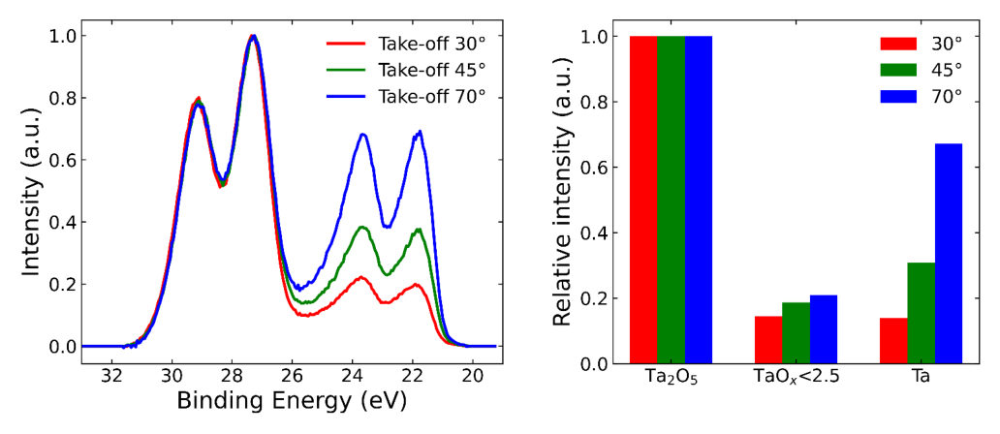
<figcaption class="paper-figure-caption"><b>Fig 4.</b> FIG. 1. Angle-resolved X-ray photoelectron spectroscopy (ARXPS) analysis of Ta oxidation states as a function of sampling depth. (a) Ta 4f core-level spectra acquired at take-off angles of 30°, 45°, and 70°, normalized to the Ta₂O₅ peak at each angle to show comparison of underlying oxidation states. (b) Relative peak intensities of Ta⁵⁺ (Ta₂O₅), TaOₓ&lt;2.5, and Ta⁰ extracted by CasaXPS curve fitting for each angle. The inset schematically illustrates the corresponding layered structure based on ARXPS analysis.</figcaption>
</figure>
<figure class="paper-figure-card">
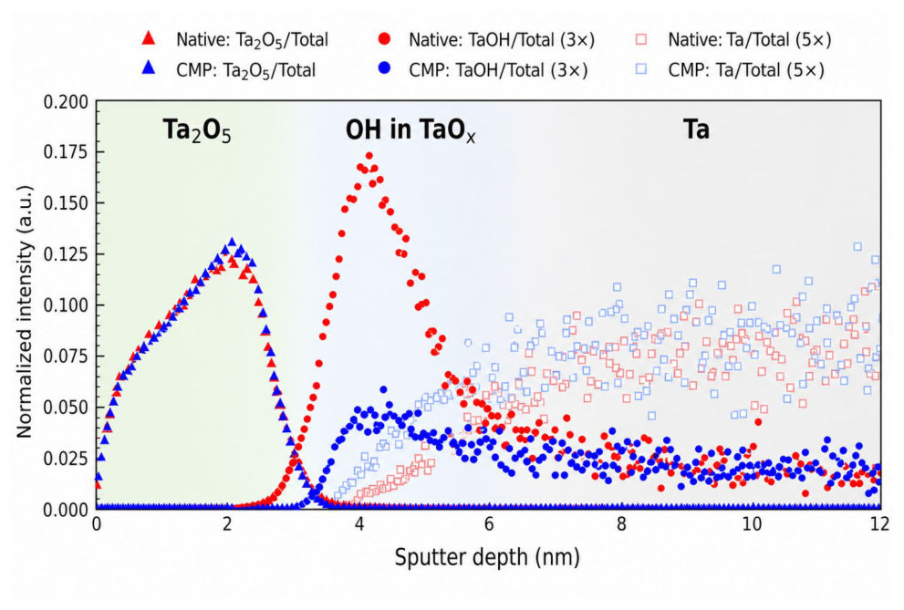
<figcaption class="paper-figure-caption"><b>Fig 5.</b> FIG. 2. Depth profiles of oxide species and hydroxyl content in native and CMP-formed tantalum oxides: SIMS data showing the normalized intensities of Ta₂O₅, TaOH, and Ta signals plotted as a function of sputter depth. The TaOH/Total signal reaches a maximum in</figcaption>
</figure>

**Summary.** This experimental study characterizes the formation of hydroxyl defects within the surface oxides of superconducting Tantalum. Using SIMS and ARXPS, the authors prove that these hydroxyl groups are major contributors to decoherence sources in quantum circuits. They demonstrate that modifying the oxide layer via CMP or plasma nitridization can effectively suppress this defect concentration.

**Why it may be interesting.** This work directly addresses a critical material science bottleneck for superconducting qubits and quantum devices by identifying a specific molecular defect source (hydroxyls) and providing actionable surface engineering solutions.

Detailed structure

**Main problem.** Surface oxides on superconducting Tantalum (Ta) host Two-Level System (TLS) defects, which are a primary source of microwave loss and decoherence in quantum circuits.

**Main result.** The accumulation of hydroxyls ([OH]) in the suboxide region is confirmed, and surface engineering techniques like Chemical Mechanical Planarization (CMP) or plasma nitridization can suppress this hydroxyl loading to improve coherence.

**Method.** The study employs advanced characterization techniques including Secondary Ion Mass Spectrometry (SIMS), Angle-resolved X-ray Photoelectron Spectroscopy (ARXPS), and Transmission Electron Microscopy (TEM).

**Model / system.** The physical system is superconducting Tantalum ($\alpha$-Ta) films coated with native or engineered surface oxides ($	ext{Ta}_2	ext{O}_5$, $	ext{TaO}_x$). The focus is on the molecular defects, specifically hydroxyls, within this oxide layer.

**Key observables.** Depth profiles of oxide species ($	ext{Ta}_2	ext{O}_5$, $	ext{TaOH}$), total maximum $	ext{TaOH}^-/	ext{Total}$ signal intensity across different treatments.

**Important parameters / regimes.** Superconducting temperature regime, surface treatment type (native vs. CMP vs. nitridized), and oxide thickness.

**Assumptions / limitations.** The TLS defects are molecularly linked to the presence of hydroxyl groups within the non-uniform oxide structure; mitigation via surface chemistry is feasible.

**Figures summary.** Figures show ARXPS analysis confirming stratified oxidation states, SIMS depth profiles quantifying $	ext{TaOH}$ accumulation in suboxides, and comparative plots demonstrating that CMP or nitridization reduces the maximum hydroxyl signal intensity.

**Paper structure.** The paper systematically characterizes the oxide structure using ARXPS/TEM, then uses SIMS to map out the chemical species ($	ext{Ta}_2	ext{O}_5$, $	ext{TaOH}$) across depth. It culminates by comparing native vs. engineered oxides (CMP, nitridization) to quantify hydroxyl suppression.

Abstract

Recently, tantalum (Ta) has gained attention in superconducting quantum circuits due to the longer coherence times achieved when replacing niobium (Nb) in capacitor pads. Previous literature shows that surface oxides that form upon ambient exposure on superconducting metals such as Ta, Al, and Nb host two-level system (TLS) defects, which are a leading source of microwave loss and decoherence. While the surface oxides of Nb and Al have been extensively studied, Ta oxides remain less well understood. Using secondary ion mass spectrometry of alpha-Ta films deposited at 300 mm wafer scale, we show for the first time that hydroxyls accumulate in the Ta suboxide region above the underlying Ta. Angle-resolved X-ray photoelectron spectroscopy shows that the surface region is dominated by Ta2O5, with sub-stoichiometric TaOx present in between the Ta2O5 and underlying Ta. The thickness of the tantalum oxide is confirmed by transmission electron microscopy. We demonstrate that [OH] incorporation can be suppressed by replacing the native oxide with an oxide formed during chemical mechanical planarization of alpha-Ta films. Our findings support the hypothesis that TLS defects are non-uniform within the oxide thickness and suggest hydroxyls as a probable molecular origin of these loss channels. Furthermore, we show the feasibility of plasma nitridization as a method to decrease hydroxyl loading on alpha-Ta surfaces. The modulation of hydroxyl content through surface engineering of alpha-Ta can enable the fabrication of more robust, high-coherence superconducting quantum circuits by addressing a potential TLS source.

[↑ back to top](#top)

### [Evanescent absorption spectroscopy of transition metal dichalcogenide materials using guided photoluminescence in Si$_3$N$_4$ photonic waveguides](http://arxiv.org/abs/2607.00615v1)

**Authors:** Victor Gonzalez-Morote, Marianna Sledzinska, Arkadiusz P. Gertych, Syed Hassan Abbas Jaffery, Mariusz Zdrojek, Daniel Navarro-Urrios  
**Type:** experiment · **Category:** other · **PDF:** <https://arxiv.org/pdf/2607.00615v1>  
**Analysis basis:** full PDF text, analyzed in chunks
**Topic relevance:** `interference shaping light` **3/5** · `quantum optics experiment` **3/5** · `Tavis-Cummings & cavity-many-emitter` **2/5** · `correlated cavity matter` **2/5** · `driven-dissipative phase transition` **2/5** · `QC/QI experiment` **1/5** · `methods for driven-dissipative` **1/5** · `quantum measurements` **1/5** · `spintronics-quantum-optics interface` **1/5**

↔ Scroll figures horizontally

<figure class="paper-figure-card">
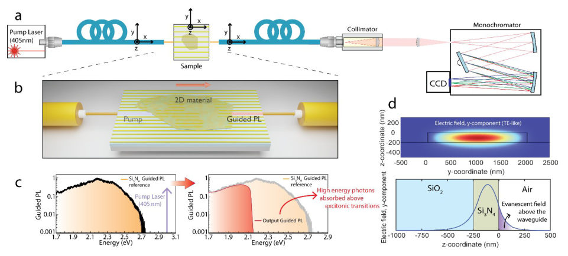
<figcaption class="paper-figure-caption"><b>Fig 1.</b> Figure 1. Evanescent absorption spectroscopy of a 2D material integrated on a dielectric</figcaption>
</figure>
<figure class="paper-figure-card">
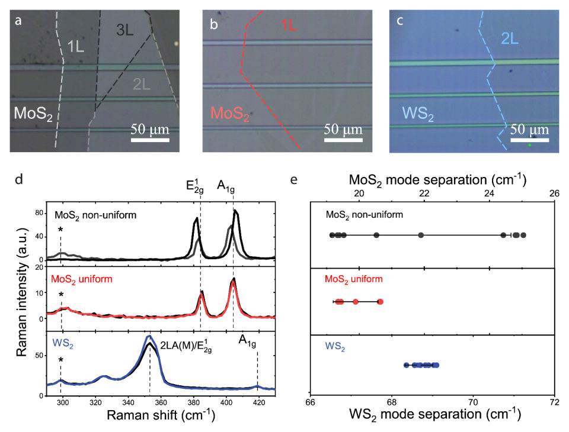
<figcaption class="paper-figure-caption"><b>Fig 2.</b> Figure 2. Optical and Raman characterization of the TMD-covered waveguides. (a–c) Optical</figcaption>
</figure>
<figure class="paper-figure-card">
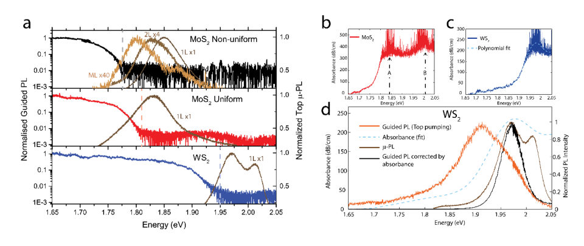
<figcaption class="paper-figure-caption"><b>Fig 3.</b> Figure 3. Evanescent absorption and guided photoluminescence of Si₃N₄ waveguides covered by</figcaption>
</figure>

**Summary.** The paper introduces and validates a novel technique for measuring the optical absorption of 2D TMD materials integrated into $	ext{Si}_3	ext{N}_4$ waveguides. By using the waveguide's own photoluminescence as an internal probe source, they achieve source-free, on-chip spectroscopy. This method directly quantifies how guided light interacts with the TMDs, providing critical data for developing next-generation integrated quantum optoelectronic devices.

**Why it may be interesting.** This work provides a powerful experimental tool for characterizing quantum material properties (excitonic absorption) under realistic device operating conditions, which is crucial input data for designing quantum photonic circuits or sensing elements.

Detailed structure

**Main problem.** The core challenge is developing a method to accurately measure the optical absorption of two-dimensional transition metal dichalcogenides (TMDs) while they are integrated into an operational photonic waveguide environment.

**Main result.** The authors successfully demonstrated source-free, on-chip evanescent absorption spectroscopy, showing that guided photoluminescence spectral reshaping quantitatively reflects the energy-dependent absorption response of the TMD layer.

**Method.** They use the broadband defect-related photoluminescence generated within the $	ext{Si}_3	ext{N}_4$ waveguide core as an internal light source, which then propagates and is attenuated by evanescent coupling with the overlying TMD flake.

**Model / system.** The system involves transferring TMD flakes ($	ext{MoS}_2$, $	ext{WS}_2$) onto $	ext{Si}_3	ext{N}_4$ photonic waveguides. Measurements compare this guided PL attenuation to local micro-photoluminescence ($\mu$-PL) and Raman characterization.

**Key observables.** Energy-dependent guided absorption spectrum ($	ext{dB cm}^{-1}$), spectral reshaping of photoluminescence, and comparison between uniform vs. non-uniform flake measurements.

**Important parameters / regimes.** Excitonic resonance energies (e.g., $\sim 1.83 	ext{ eV}$ for $	ext{MoS}_2$), coverage lengths ($L = 680 \mu	ext{m}$ to $1.2 	ext{ mm}$), and attenuation coefficients ($\alpha$).

**Assumptions / limitations.** The technique assumes the PL generated in the core accurately represents the light interacting with the TMDs, and near resonance, reported losses are conservative lower-bound estimates due to saturation effects.

**Figures summary.** Figures illustrate sample sketches, comparison plots of transmitted vs. reference spectra, and detailed spectral measurements showing excitonic resonances and attenuation profiles for $	ext{MoS}_2$ and $	ext{WS}_2$.

**Paper structure.** The paper introduces the necessity of in-situ characterization, details the source-free PL measurement technique using $	ext{Si}_3	ext{N}_4$ waveguides, presents comparative results against local measurements ($\mu$-PL/Raman), and concludes by validating the platform for integrated optoelectronics.

Abstract

On-chip integration of two-dimensional transition metal dichalcogenides (TMDs) with photonic waveguides underpins a growing class of compact optoelectronic and sensing devices, whose performance depends on the optical absorption of the 2D material in this integrated environment. We demonstrate source-free, on-chip evanescent absorption spectroscopy of MoS$_2$ and WS$_2$ flakes integrated on Si$_3$N$_4$ waveguides, in which the broadband defect-related photoluminescence of the Si$_3$N$_4$ core itself acts as the internal probe. Light generated inside the core propagates under the TMD flake and is spectrally attenuated by evanescent interaction with the 2D material, and normalizing the transmitted spectrum to a reference waveguide without TMD yields the energy-dependent absorption response without any external illumination. The extracted guided absorption agrees with Raman and local micro-photoluminescence characterization and resolves differences between spatially uniform and non-uniform flakes. A complementary top-pumping scheme recovers guided WS$_2$ photoluminescence, whose spectral reshaping during propagation is quantitatively reproduced by the measured absorption. This source-free platform qualifies 2D materials in their integrated photonic environment and provides a direct route toward waveguide-integrated TMD photodetectors and sensors.

[↑ back to top](#top)

### [Topological Hall effect due to electron-skyrmion scattering](http://arxiv.org/abs/2607.01149v1)

**Authors:** Arijit Mandal, Hareram Swain, B. R. K. Nanda, S. Satpathy  
**Type:** theory · **Category:** other · **PDF:** <https://arxiv.org/pdf/2607.01149v1>  
**Analysis basis:** full PDF text, analyzed in chunks
**Topic relevance:** `Keldysh / 2PI / non-Gaussian methods` **3/5** · `spintronics-quantum-optics interface` **3/5** · `driven-dissipative phase transition` **2/5** · `methods for driven-dissipative` **2/5** · `non-equilibrium universality` **2/5** · `Kondo & dissipative impurity` **1/5** · `analog quantum simulation` **1/5** · `exotic spin models in light-matter` **1/5** · `non-equilibrium dynamics` **1/5**

↔ Scroll figures horizontally

<figure class="paper-figure-card">

<figcaption class="paper-figure-caption"><b>Fig 1.</b> FIG. 1. Schematic diagram of scattering of a spin up elec- tron. The scattered wave consists of both a spin-preserved component and a spin-flip component with spin-dependent momentum kσ. The net transverse current is denoted by Jαβ tr , where β (α) is the spin of the incident (scattered) electron. For energy E &lt; J, even though there is no spin down incident or scattered beam, the spin down state can nevertheless exist in the skyrmion region, produced via the spin-flip potential, and can thereby influence the scattering process.</figcaption>
</figure>
<figure class="paper-figure-card">

<figcaption class="paper-figure-caption"><b>Fig 2.</b> FIG. 2. Scattering dynamics of a spin-up Gaussian wavepacket from numerical solution of the time-dependent Schr¨odinger equation following the methods of Ref. [26]. The upper panel indicates the trapped spin-down state for E &lt; J, dynamically generated inside the skyrmion, indicated by the black circle, during the scattering process. In contrast, the lower panel, where E &gt; J, shows a small propagating spin down component after scattering, which will result in a spin- down current at r →∞. All figures are time snapshots of probability distribution |ψ|2 in both spin up and down chan- nels as indicated. The color coding, which is different for the two spin channels, indicates the magnitude of...</figcaption>
</figure>
<figure class="paper-figure-card">

<figcaption class="paper-figure-caption"><b>Fig 3.</b> FIG. 4. Scattering potential V (r) for the skyrmion corre- sponding to Eq. (15) plotted along the x axis. Here, λ is the skyrmion radius, and J is the exchange parameter. The spin up (down) electron experiences a spin-preserving repul- sive (attractive) potential together with a complex spin-flip scattering potential, whose magnitude |V↑↓| has been shown. There is no scattering potential outside |r| &gt; λ, and the ar- rows on the central line indicate the skyrmion spins.</figcaption>
</figure>
<figure class="paper-figure-card">

<figcaption class="paper-figure-caption"><b>Fig 4.</b> FIG. 3. Total scattering cross section σαβ for a skyrmion with winding number m = 1 as a function of the exchange energy J (the corresponding adiabatic parameter χ is shown on the top). Born approximation and exact results are shown for both spin up (top) and spin down (bottom) incoming elec- tron. The second Born approximation contains the three-spin scattering processes to the lowest order and hence the effect of chirality. However, the Born approximation results deviate quickly from the exact results as J is increased, necessitat- ing a full solution for typical solids. In the figure, the kinetic energy of the incident electron Ek = 4 eV and the skyrmion radius λ = 10 ˚A.</figcaption>
</figure>
<figure class="paper-figure-card">

<figcaption class="paper-figure-caption"><b>Fig 5.</b> FIG. 5. Typical features of the scattering cross section. (a) Total scattering cross section σ↑↑/↓↑for incident spin-up electron. (b) Same for the spin-down electron, denoted by σ↑↓/↓↓. (c) Angular dependence of the differential scattering cross section for incident spin-up electrons with energy E = Ek↑= 1 eV. Since E &lt; J, there is no spin-down scattering component, as it cannot exist outside the skyrmion region. (d) The same for Ek↑&gt; J, but here scattering can occur to both spin channels. (e) and (f) Differential scattering cross section for spin-down incident electrons with two different energies. In this case, scattering is allowed to both spin channels for all energies. The spin-flip...</figcaption>
</figure>

**Summary.** This theoretical work investigates how electrons scatter from magnetic skyrmion textures in the strong-coupling regime, moving beyond simple weak-interaction approximations. By employing the Lippmann-Schwinger equation, the authors predict new scattering resonances that critically determine the material's topological and spin Hall conductivities. This provides a detailed quantum mechanical understanding of charge transport in complex chiral magnetic materials.

**Why it may be interesting.** While focused on condensed matter transport, the use of advanced Green's function techniques to model quantum scattering off structured potentials (like skyrmions) shares mathematical rigor with open quantum system dynamics and non-equilibrium many-body physics.

Detailed structure

**Main problem.** The study addresses electron scattering from chiral spin textures, like skyrmions, specifically overcoming the limitations of weak-coupling approximations used in previous research.

**Main result.** The full formalism reveals novel scattering features—including Ramsauer-Townsend minima and Landau-level resonances—that strongly influence the topological and spin Hall conductivities.

**Method.** The problem is solved using the Lippmann-Schwinger equation and Green's function formalism, which remains valid across all coupling strengths.

**Model / system.** The system models itinerant electrons scattering off a 2D skyrmion potential derived from an exchange interaction Hamiltonian. The analysis focuses on calculating spin-dependent scattering cross sections ($\sigma_{\alphaeta}$) and resulting transverse currents.

**Key observables.** Topological Hall conductivity ($\sigma_H$), Spin Hall conductivity ($\sigma_{SH}$), and the energy-dependent total scattering cross section ($\sigma$).

**Important parameters / regimes.** Incident electron energy ($E$) relative to the exchange coupling strength ($J$); winding number ($m$) of the skyrmion.

**Assumptions / limitations.** The analysis uses a full Green's function approach, which is non-perturbative and valid for strong coupling; approximations are noted when relating the magnetic field to Landau levels (adiabatic limit).

**Figures summary.** Figures illustrate time evolution of wave packets showing spin trapping at low energy ($E<J$), scattering cross sections ($\sigma_{\alphaeta}$) exhibiting resonances, and plots detailing $\sigma_H$ and $\sigma_{SH}$ dependence on incident energy $E$.

**Paper structure.** The paper progresses from establishing the necessity of a full-coupling formalism to calculating spin-resolved scattering cross sections. It then derives the topological and spin Hall conductivities based on current asymmetries, mapping out distinct behavior in different energy regimes relative to the coupling strength.

Abstract

Electron scattering from chiral spin textures such as skyrmions is fundamental to the understanding of transport in more complex systems, including skyrmion crystals. Most of the previous studies have focused on the weak-coupling regime, where the exchange interaction is small compared with the electron energy. Real materials, however, often lie in the strong-coupling regime, which exhibits qualitatively different behavior. Using the Lippmann-Schwinger equation and Green's function formalism, valid for all coupling strengths, we uncover several new features in the scattering cross section, including Ramsauer-Townsend minima, pronounced intermediate-coupling resonances, and Landau-level resonances for skyrmions with larger winding numbers. These features strongly influence the topological and spin Hall conductivities, which depend sensitively on the incident electron energy. Our work provides important insights into the Hall transport in collective chiral spin textures such as the skyrmion crystal.

[↑ back to top](#top)

### [An analog ac voltage amplifier based on a single straintronic magnetic tunnel junction](http://arxiv.org/abs/2607.00104v1)

**Authors:** Cael Johnson, Rahnuma Rahman, Supriyo Bandyopadhyay  
**Type:** theory · **Category:** other · **PDF:** <https://arxiv.org/pdf/2607.00104v1>  
**Analysis basis:** full PDF text, analyzed in chunks
**Topic relevance:** `spintronics-quantum-optics interface` **3/5** · `driven-dissipative phase transition` **2/5** · `methods for driven-dissipative` **2/5** · `Keldysh / 2PI / non-Gaussian methods` **1/5** · `Kondo & dissipative impurity` **1/5** · `analog quantum simulation` **1/5** · `correlated / nonlocal dissipation` **1/5** · `exotic spin models in light-matter` **1/5** · `non-equilibrium dynamics` **1/5** · `non-equilibrium universality` **1/5**

↔ Scroll figures horizontally

<figure class="paper-figure-card">
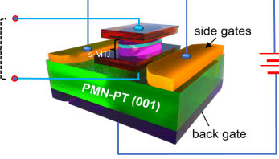
<figcaption class="paper-figure-caption"><b>Fig 1.</b> Fig. 1. The structure of a straintronic magnetic tunnel junction. Reprinted from [8], with the permission of AIP Publishing.</figcaption>
</figure>
<figure class="paper-figure-card">

<figcaption class="paper-figure-caption"><b>Fig 2.</b> Fig. 2. The computed Gs−MT J versus VG transfer characteristic of a s-MTJ at room temperature. The linear region is shaded in gray. Within this region, the characteristic follows Equation (1). The values of κ and δ for this MTJ are shown. ©2022 IEEE. Reprinted with permission from [6].</figcaption>
</figure>
<figure class="paper-figure-card">

<figcaption class="paper-figure-caption"><b>Fig 3.</b> Fig. 3. A swing of the gate voltage around the quiescent point results in a corresponding swing of the s-MTJ conductance. The waveform shown here is triangular but the principle holds for any arbitrary waveform. The gate voltage swing has to be small enough to stay within the linear region.</figcaption>
</figure>
<figure class="paper-figure-card">

<figcaption class="paper-figure-caption"><b>Fig 4.</b> Fig. 4. Time variation of the s-MTJ conductance in the presence of a dc + ac gate voltage at different frequencies. The dc voltage was -0.26 V and the ac voltage amplitude was 10 mV to ensure that the gate voltage excursion always remains within the linear region of the transfer characteristic.</figcaption>
</figure>
<figure class="paper-figure-card">

<figcaption class="paper-figure-caption"><b>Fig 5.</b> Fig. 5. The ac amplifier circuit realized with a single s-MTJ.</figcaption>
</figure>

**Summary.** This paper proposes using a straintronic magnetic tunnel junction (s-MTJ) as a highly tunable analog AC voltage amplifier. The device's gain is uniquely dependent on an external supply voltage, offering advantages over fixed-gain transistors. By analyzing the magnetization dynamics, the authors derive the amplification characteristics and suggest structural modifications to enhance performance.

**Why it may be interesting.** While focused on spintronics/electronics, the underlying physics involves non-linear dynamics (LLGL simulations) coupled to an external control parameter ($V_G$), which touches upon concepts of parametric amplification and controlled quantum/classical response relevant to open quantum systems.

Detailed structure

**Main problem.** To demonstrate a novel analog AC voltage amplifier utilizing the unique properties of straintronic magnetic tunnel junctions (s-MTJs).

**Main result.** The device exhibits linear amplification whose gain is tunable by an external power supply voltage, unlike traditional transistors.

**Method.** The authors modeled the magnetization dynamics and derived the amplification factor based on superimposing a small AC voltage onto a DC bias point within the s-MTJ's linear conductance regime.

**Model / system.** The system is a single straintronic magnetic tunnel junction (s-MTJ), whose resistance depends on the magnetization angle ($\phi$) and can be continuously tuned by an external gate voltage ($V_G$).

**Key observables.** Output voltage $	ilde{V}$, amplification factor $A$, conductance swing, and maximum allowed AC input amplitude.

**Important parameters / regimes.** The proportionality constant $\kappa$ (slope of linear conductance vs. $V_G$), the supply voltage $V_S$, and the ferromagnetic resonance frequency (GHz range).

**Assumptions / limitations.** The amplification remains distortion-free only if the AC gate voltage excursion stays within the established linear region, and the signal frequency must be low enough relative to the magnetization dynamics.

**Figures summary.** Figure 5 illustrates the relationship between output voltage and input gate voltage swing, showing the derived linear amplification formula.

**Paper structure.** The paper first establishes the physical basis of s-MTJs for analog applications by noting their linear conductance region. It then models the AC amplification process, deriving the gain expression, and finally discusses methods to improve performance by modifying device geometry or material properties.

Abstract

Magnetic tunnel junctions (MTJs) are known for their digital applications (memory and logic). A special class of them called "straintronic" magnetic tunnel junctions (s-MTJ) has lately emerged as a potential platform for analog applications because their conductance can be varied continuously with mechanical strain generated with a gate voltage. The conductance versus gate voltage (transfer) characteristic always has a linear region and that can be leveraged for a variety of analog applications. Here, we discuss one such application, namely analog voltage amplification. If the s-MTJ's gate voltage is fixed around the midpoint of the linear region and a small ac voltage is superimposed on it, then the ac voltage can be amplified without distortion as long as its amplitude is small enough to avoid gate voltage excursion beyond the linear region. Unlike a transistor-based voltage amplifier whose amplification is determined solely by the transistor's internal parameters - namely the transconductance and Early resistance - here the amplification can be varied by an external power supply voltage. We examine the maximum allowed amplitude and frequency of input signal for distortion-free amplification by modeling the magnetization dynamics and derive an expression for the amplification.

[↑ back to top](#top)

### [Magnon-polaron mediated spin Seebeck effect in altermagnets](http://arxiv.org/abs/2607.00993v1)

**Authors:** Ilia Moghayer, Ritesh Das, Yaroslav M. Blanter  
**Type:** theory · **Category:** other · **PDF:** <https://arxiv.org/pdf/2607.00993v1>  
**Analysis basis:** full PDF text, analyzed in chunks
**Topic relevance:** `spintronics-quantum-optics interface` **3/5** · `Keldysh / 2PI / non-Gaussian methods` **2/5** · `non-equilibrium dynamics` **2/5** · `analog quantum simulation` **1/5** · `correlated / nonlocal dissipation` **1/5** · `driven-dissipative phase transition` **1/5** · `exotic spin models in light-matter` **1/5** · `methods for driven-dissipative` **1/5** · `non-equilibrium universality` **1/5**

↔ Scroll figures horizontally

<figure class="paper-figure-card">
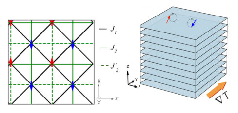
<figcaption class="paper-figure-caption"><b>Fig 1.</b> FIG. 1: (a) Lattice structure of the altermagnetic toy model. The lattice has a checkerboard shape with sites alternating between up and down spins. The alter- magnetic nature arises from the anisotropic next-nearest neighbor interaction (J2 ̸= J′ 2). (b) Schematic of spin Seebeck effect in the bulk altermagnetic system. The bulk consists of multiple altermagnetic monolayers cou- pled ferromagnetically to each other. A temperature gra- dient is applied along direction β (shown along y here) and the spin Seebeck response is measured along direc- tion α.</figcaption>
</figure>
<figure class="paper-figure-card">

<figcaption class="paper-figure-caption"><b>Fig 2.</b> FIG. 2: Spin Seebeck coefficient S2D xx and S2D yy as a func- tion of applied magnetic field without phonon contribu- tions for (a) antiferromagnetic and (b) altermagnetic con- figurations in the 2D limit.</figcaption>
</figure>
<figure class="paper-figure-card">
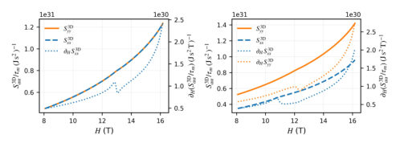
<figcaption class="paper-figure-caption"><b>Fig 3.</b> FIG. 4: SSE vs. applied magnetic field along different x and y directions with magnetoelastic coupling for (a) an antiferromagnetic lattice and (b) for an altermagnetic lattice in the 3D bulk case.</figcaption>
</figure>
<figure class="paper-figure-card">

<figcaption class="paper-figure-caption"><b>Fig 4.</b> FIG. 3: SSE vs. applied magnetic field in-plane along the x and y directions with magnetoelastic coupling for (a) an antiferromagnetic lattice and (b) for an altermagnetic lattice in the monolayer limit. Peaks in SSE are seen at the same magnetic field for the antiferromagnetic case in both S2D xx and S2D yy . For the altermagnetic case, the peak in S2D xx appears at a magnetic field different from the peak in S2D yy . The features are seen clearly by calculating the difference in SSE due to phonons (c) ∆Sxx and (d) ∆Syy vs. magnetic field. τm is the magnon lifetime.</figcaption>
</figure>
<figure class="paper-figure-card">
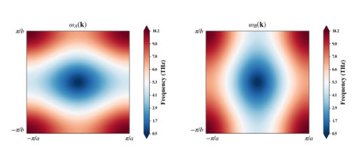
<figcaption class="paper-figure-caption"><b>Fig 5.</b> FIG. 2. Contour plot of the magnon dispersion in the toy model in the altermagnetic condition. The left panel rep- resents the dispersion of the A mode, while the right panel shows the B mode.</figcaption>
</figure>

**Summary.** This work proposes using the Spin Seebeck Effect (SSE) as a definitive experimental probe to identify altermagnetic materials. By modeling magnon-phonon coupling, the authors predict that altermagnets will exhibit unique directional anisotropy and field-dependent resonant peaks in the SSE that are absent or different in conventional antiferromagnets.

**Why it may be interesting.** While focused on condensed matter magnetism, the use of quasiparticle descriptions (magnon-polarons) and non-equilibrium transport calculations touches upon concepts relevant to open quantum systems dynamics and energy/momentum transfer in correlated media.

Detailed structure

**Main problem.** To find experimentally accessible transport signatures that can distinguish altermagnets from conventional ferromagnets or antiferromagnets.

**Main result.** The Spin Seebeck Effect (SSE) exhibits pronounced directional anisotropy and resonant peaks whose positions depend on the measurement direction in altermagnets, providing a robust diagnostic signature.

**Method.** Theoretical calculation using Boltzmann theory to model spin transport mediated by magnon-phonon hybridization. The analysis compares theoretical predictions for altermagnetic versus antiferromagnetic coupling regimes.

**Model / system.** The study uses a minimal lattice Hamiltonian describing collinear magnets with compensated antiparallel spins (altermagnets). It incorporates magnetoelastic interactions leading to hybridized 'magnon-polaron' modes.

**Key observables.** Spin Seebeck coefficient ($S_{\alphaeta}$), directional anisotropy of SSE ($S_{xx} 
eq S_{yy}$), and resonant peak positions as a function of applied magnetic field.

**Important parameters / regimes.** External magnetic field strength ($H$), exchange couplings ($J_1, J_2, J'_2$), and phonon coupling strengths ($\Gamma, \kappa$).

**Assumptions / limitations.** The analysis relies on the spin-wave approximation for magnon dynamics and assumes that magnon-polaron modes are well-defined quasiparticles.

**Figures summary.** Figures compare magnon dispersion relations (A vs B modes) between altermagnetic ($J_2 
eq J'_2$) and antiferromagnetic ($J_2 = J'_2$) states, showing directional anisotropy in the SSE response as a function of magnetic field.

**Paper structure.** The paper progresses from establishing the physical distinction between magnet types using magnon dispersion theory to calculating the measurable transport signature (SSE) by incorporating phonon coupling via the Boltzmann equation.

Abstract

Altermagnets, distinguished by compensated antiparallel spins yet nondegenerate magnon spectra, bridge the gap between ferromagnets and antiferromagnets. Although several probes such as anisotropic transport and spectroscopic measurements have been proposed to identify altermagnetic order, experimentally accessible transport signatures remain highly desirable. Here, we show that in altermagnets subject to an external magnetic field, the spin Seebeck effect exhibits pronounced directional anisotropy. Specifically, the spin Seebeck coefficient differs significantly along in-plane directions, and this anisotropy increases with field strength. Magnetoelastic interactions further produce resonant peaks whose positions with respect to an applied magnetic field reflect the intrinsic magnon band anisotropy, and provide localized features that enhance the distinguishability of the altermagnetic response. The peaks provide a robust experimental signature of altermagnetic order. Our findings serve as signatures of altermagnetic order while laying the groundwork for their application in spintronic devices.

[↑ back to top](#top)

### [Atom-selective spin-polarized transport in a charge-ordered altermagnet](http://arxiv.org/abs/2607.00506v1)

**Authors:** Liu Yang, Yuan-Yuan Jiang, Xiao-Yan Guo, Yi-Dong Liu, Xian-Zhe Chen, Wen-Jian Lu, Yu-Ping Sun, Ming Li, Ding-Fu Shao  
**Type:** theory · **Category:** other · **PDF:** <https://arxiv.org/pdf/2607.00506v1>  
**Analysis basis:** full PDF text, analyzed in chunks
**Topic relevance:** `spintronics-quantum-optics interface` **3/5** · `non-equilibrium dynamics` **2/5** · `Keldysh / 2PI / non-Gaussian methods` **1/5** · `Kondo & dissipative impurity` **1/5** · `analog quantum simulation` **1/5** · `exotic spin models in light-matter` **1/5** · `methods for driven-dissipative` **1/5**

↔ Scroll figures horizontally

<figure class="paper-figure-card">

<figcaption class="paper-figure-caption"><b>Fig 1.</b> Fig. 1: (a,b) The crystal structures of α-Fe2PO5 with the coordination polyhedra around Fe emphasized in (a) top view and (b) side view of FeAO6 octahedra. The dashed black lines indicate the unit cell. (c) The first Brillouin zone of α-Fe2PO5.</figcaption>
</figure>
<figure class="paper-figure-card">

<figcaption class="paper-figure-caption"><b>Fig 2.</b> Fig. 2: (a) The band structure of α-Fe2PO5. (b) The en-larged band structure along the Γ-U high-symmetry path. (c) The FeA-resolved density of states of contributed by the valence and conduction bands.</figcaption>
</figure>
<figure class="paper-figure-card">
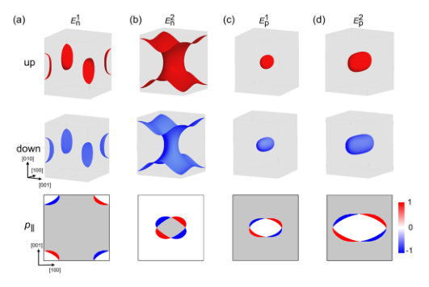
<figcaption class="paper-figure-caption"><b>Fig 3.</b> Fig. 3: (a-d) Three-dimensional constant-energy surfaces for spin-up and spin-down states at representative n- and p-doped energies and the ܓ∥-resolved spin polarization ݌∥(ܓ∥) for transport along the [010] direction. Gray regions denote momenta without available conducting channels, where ܰ∥</figcaption>
</figure>
<figure class="paper-figure-card">

<figcaption class="paper-figure-caption"><b>Fig 4.</b> Fig. 4: Real-space bond-resolved transport in doped α-Fe2PO5. (a,b) Bond charge transmission ܶ௜௝ and (c,d) bond spin transmission ܶ௜௝</figcaption>
</figure>
<figure class="paper-figure-card">
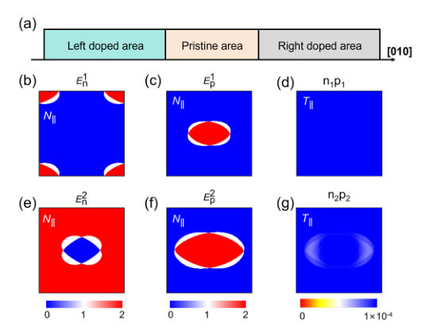
<figcaption class="paper-figure-caption"><b>Fig 5.</b> Fig. 5: (a) Schematic of the proposed α-Fe2PO5 junction, consisting of left and right doped regions separated by a pristine insulating region. The labels ݊ଵ݊ଵ, ݊ଶ݊ଶ, ݌ଵ݌ଵ, and ݌ଶ݌ଶ denote junctions in which both electrodes are doped to the same representative electron- or hole-doped energies, ܧ௡</figcaption>
</figure>

**Summary.** This work reveals that spin-polarized transport in the altermagnet $\alpha$-Fe$_2$PO$_5$ is governed by real-space, atom-selective conduction channels rather than just momentum-space splitting. By exploiting charge ordering to create distinct $	ext{Fe}^{2+}$ and $	ext{Fe}^{3+}$ sites, researchers show how doping can switch the current flow between these specific atomic pathways, enabling highly controllable spintronic devices.

**Why it may be interesting.** While focused on condensed matter magnetism, the core concept—controlling quantum transport via engineered local chemical potential (doping) to select specific atomic pathways—is highly relevant for understanding open quantum systems where boundary conditions or site chemistry dictate coherence and current flow.

Detailed structure

**Main problem.** To investigate spin-polarized transport in altermagnets by moving beyond conventional momentum-space descriptions to focus on real-space spin selectivity.

**Main result.** The study demonstrates that charge ordering creates atom-selective conduction channels ($	ext{Fe}^{3+}$ vs $	ext{Fe}^{2+}$) which enable highly controllable, spin-polarized transport in the altermagnet $\alpha$-Fe$_2$PO$_5$. This mechanism allows for orders-of-magnitude conductance modulation via junction design.

**Method.** The research employs first-principles calculations (DFT/GGA+U) combined with non-equilibrium Green’s function (NEGF) formalism to simulate quantum transport.

**Model / system.** The system is the charge-ordered altermagnet $\alpha$-Fe$_2$PO$_5$, which possesses a puckered C-type antiferromagnetic stacking and exhibits inequivalent $	ext{Fe}^{2+}$ and $	ext{Fe}^{3+}$ sites due to charge ordering.

**Key observables.** Spin-resolved transmission coefficients ($\mathcal{T}^{\sigma}$), local conductance, spin polarization on sublattices, and junction conductance modulation (ON/OFF ratio).

**Important parameters / regimes.** Electron/hole doping levels ($n$ or $p$), the nature of the active atomic sites ($	ext{Fe}^{2+}$ vs $	ext{Fe}^{3+}$), and the degree of spin splitting near the Fermi level.

**Assumptions / limitations.** The primary assumption is that real-space connectivity (atom selectivity) dictates transport properties even when momentum-space spin splitting is weak.

**Figures summary.** Figures illustrate crystal structures, band/DOS showing weak splitting, constant-energy surfaces for spin states, and schematic representations of bond-resolved transmission ($\mathcal{T}$ vs $\mathcal{T}^{\sigma}$) under different doping conditions in a tunnel junction model.

**Paper structure.** The paper progresses from establishing the limitations of momentum-space analysis to identifying real-space charge/spin selectivity due to site inequivalence, demonstrating this through transport calculations, and finally proposing an all-in-one tunnel junction device concept based on channel matching.

Abstract

Altermagnets provide a promising platform for spin-polarized transport without net magnetization, but their transport properties are usually discussed in terms of momentum-space spin splitting. Here, using first-principles calculations and quantum transport simulations, we show that the charge-ordered altermagnet $α$-Fe$_2$PO$_5$ exhibits a distinct form of real-space spin selectivity despite weak altermagnetic spin splitting near the Fermi level. The charge order creates inequivalent Fe$^{2+}$ and Fe$^{3+}$ sites within each sublattice, while the puckered C-type antiferromagnetic stacking suppresses inter-sublattice transport. As a result, electron and hole doping activate spin-polarized transport predominantly through Fe$^{3+}$- and Fe$^{2+}$-based channels, respectively. These atom-selective channels carry opposite spin polarizations on the two antiferromagnetic sublattices, giving rise to a globally compensated charge current with hidden Néel spin character. We further propose an all-in-one $α$-Fe$_2$PO$_5$ tunnel junction, where matching or mismatching atom-selective conduction channels yields orders-of-magnitude conductance modulation. Our findings establish a real-space design principle for atomically controlled spin functionality and spintronic devices.

[↑ back to top](#top)

### [Electrical control of spin photocurrent in a magnetoelectric oxide Cr$_2$O$_3$](http://arxiv.org/abs/2607.00807v1)

**Authors:** Zhuo-Cheng Gu, Hiroaki Ishizuka  
**Type:** theory · **Category:** other · **PDF:** <https://arxiv.org/pdf/2607.00807v1>  
**Analysis basis:** full PDF text, analyzed in chunks
**Topic relevance:** `exotic spin models in light-matter` **3/5** · `spintronics-quantum-optics interface` **3/5** · `Keldysh / 2PI / non-Gaussian methods` **1/5** · `driven-dissipative phase transition` **1/5** · `methods for driven-dissipative` **1/5** · `non-equilibrium dynamics` **1/5**

↔ Scroll figures horizontally

<figure class="paper-figure-card">
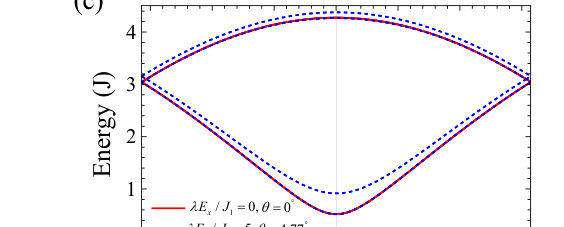
<figcaption class="paper-figure-caption"><b>Fig 1.</b> FIG. 1. A schematic of the spin chain with spin canting and its magnon dispersion. (a) A noncentrosymmetric quasi-one- dimensional model composed of weakly coupled spin chains with the nearest-neighbor interactions, J1 and J5, and a dis- placement δ. (b) A schematic of the spin chain studied in Sec. III. The numbers u = 1–4 on each site denote the sublat- tice, θ is the angle of canting induced by the DMI, and (x, y, z) and (x0, y0, z0) are the global and local coordinates, respec- tively. (c) Magnon dispersion of the spin chain for Ex = 0 and Ex = 5 (θ = 4.77◦) with λ = 0.05. The results are for J1 = −1, J5 = −0.5, Dz = 0.005, and δ = 0.1.</figcaption>
</figure>
<figure class="paper-figure-card">

<figcaption class="paper-figure-caption"><b>Fig 2.</b> FIG. 2. Nonlinear spin current conductivity for Sz through the one-magnon process along the α (α = x0, y0, z0) direction under a static electric field Ex. Frequency dependence of (a) [σ(2)]z xx¯x0, (b) [σ(2)]z yy, and (c) [σ(2)]z zz¯x0. The results are obtained for J1 = −1, J5 = −0.5, Dz = 0.005, δ = 0.1, η = ω1(k = 0, E = 0) ≈0.01, and λ = 0.05. The canting angles corresponding to λEx/J1 = 1, 3, and 5 are θ = 0.95◦, 2.86◦, and 4.77◦, respectively.</figcaption>
</figure>
<figure class="paper-figure-card">

<figcaption class="paper-figure-caption"><b>Fig 3.</b> FIG. 3. Nonlinear spin current conductivity for the 1D model in Eq. 20 induced by the two-magnon process; (a) σz xx¯z0 and (b) σz zz¯z0. Each line is the conductivity with different electric fields E = 1(red), 3 (green), and 5 (blue). The canting angles corresponding to λEx/J1 = 1, 3, and 5 are θ = 0.95◦, 2.86◦, and 4.77◦, respectively. Frequency dependence of the spin conductivity for J1 = −1, J5 = −0.5, Dz = 0.005, δ = 0.1, λ = 0.05, and η = ω1(k = 0, E = 0) ≈0.01.</figcaption>
</figure>
<figure class="paper-figure-card">

<figcaption class="paper-figure-caption"><b>Fig 4.</b> FIG. 5. Nonlinear spin current conductivities σz xx(0; ω, −ω) and σz zz(0; ω, −ω). (a) Frequency dependence of [σ(2)]z xxand its (b) one-magnon and (c) two-magnon contributions. (d) Frequency dependence of [σ(2)]z zz and (e) the one-magnon and (f) the two-magnon processes. The canting angle θ for E = 1, 3, and 5 are θ = 0.09◦, 0.24◦, and 0.39◦, respectively. The results are for Gilbert damping α = 0.02, J1 = −7.53 meV, J2 = −3.41 meV, J3 = −0.08 meV, J4 = 0.02 meV, J5 = −0.19 meV, Dz = 0.0015 meV, η = 0.02E1(k = 0) meV, and λ = 0.05. The unit of product λE is energy scale (meV).</figcaption>
</figure>
<figure class="paper-figure-card">

<figcaption class="paper-figure-caption"><b>Fig 5.</b> FIG. 4. The crystal structure and magnon dispersion of Cr2O3. (a) The lattice structure viewed from the z axis. The A, B, and C chains correspond to the respective chains in (a). The dashed rhombus shows the unit cell of Cr2O3. (b) A schematic of the crystal structure and exchange interactions J1-J5 viewed from the y axis. Numbers in the parentheses indicate the number of bonds. (c) Magnon dispersion for the model in Eq. (28) with E = 0 (red) and E = 10 (dashed green), where the unit of the product λE is meV and λ = 0.05. The results are for J1 = −7.53 meV, J2 = −3.41 meV, J3 = −0.08 meV, J4 = 0.02 meV, J5 = −0.19 meV [19], and Dz = 0.0015 meV [26, 27]. Enlarged views of the lower magnon...</figcaption>
</figure>

**Summary.** The paper theoretically demonstrates that the magnon spin photocurrent in magnetoelectric oxides like $	ext{Cr}_2	ext{O}_3$ can be controlled by an external electric field. Using nonlinear response theory, the authors show that the DMI mediates this control, leading to electrically tunable spin photovoltaic effects via both one- and two-magnon processes.

**Why it may be interesting.** This work bridges concepts from nonlinear optics (second-order response), magnetism (magnons/spintronics), and ferroelectricity (magnetoelectric coupling) in a solid-state context, which is highly relevant to quantum materials research.

Detailed structure

**Main problem.** The study investigates how an external electric field can electrically control the magnon spin photocurrent in magnetoelectric oxides.

**Main result.** The research demonstrates that the Dzyaloshinskii–Moriya interaction (DMI) plays a key role, allowing for electrical tuning of the spin-current conductivity and confirming $	ext{Cr}_2	ext{O}_3$ as a promising platform for tunable spin photovoltaic effects.

**Method.** Nonlinear response theory is employed to calculate the second-order spin current conductivity ($\sigma^{(2)}$), considering both one-magnon and two-magnon excitation processes.

**Model / system.** The primary system analyzed is $	ext{Cr}_2	ext{O}_3$, modeled using a general spin Hamiltonian that incorporates exchange interactions, anisotropy, and the electric-field induced DMI term. The analysis progresses from 1D effective models to realistic 3D lattice descriptions.

**Key observables.** Nonlinear spin current conductivity ($\sigma^{(2)}_{\mu
u\lambda}$), resonance frequencies, peak intensities, and the continuum spectrum resulting from two-magnon processes.

**Important parameters / regimes.** Electric field strength ($E$), Dzyaloshinskii–Moriya coupling constant ($\lambda$), and magnon excitation energies ($\omega$).

**Assumptions / limitations.** The analysis relies on spin-wave theory approximations, treating the system as bosonic magnons, and making specific assumptions about the validity of certain operators in the current calculation.

**Figures summary.** Figures illustrate schematic models (1D/3D), magnon dispersion relations under electric fields, and spectral plots comparing one-magnon and two-magnon contributions to spin conductivity ($\sigma_{z}^{xx}, \sigma_{z}^{zz}$).

**Paper structure.** The paper develops the theoretical framework using nonlinear response theory for bosonic systems, derives expressions for $\sigma^{(2)}$ from both one- and two-magnon terms, models the system using 1D and 3D spin Hamiltonians, and finally analyzes the field dependence of the resulting spectral features.

Abstract

Controlling magnetism by electric field or current is a central topic in spintronics. In this work, we argue that the magnon spin photocurrent can also be controlled by the electric field in magnetoelectrics. Taking Cr$_2$O$_3$ as an example, we demonstrate how the spin current is modified by the electric field, using nonlinear response theory. We find that the Dzyaloshinsky--Moriya interaction induced by the applied field plays a key role in modifying spin-current conductivity, which exhibits pronounced anisotropy with respect to the light polarization. In particular, both the resonance frequency and the peak intensity show distinct dependences on the external electric field $E$, demonstrating electrical control of the spin photocurrent. In addition, we show that the two-magnon processes give rise to a continuum spectrum, a consequence of the field-induced spin canting. These results show that Cr$_2$O$_3$ is a promising platform for realizing electrically tunable spin photovoltaic effect.

[↑ back to top](#top)

### [Quench of chiral superconductivity by quantum phase fluctuations in twisted cuprate bilayers](http://arxiv.org/abs/2607.00630v1)

**Authors:** Yin Shi, Mengxian Zhao, Fei Yang, Miao Liu, Sheng Meng  
**Type:** theory · **Category:** strongly correlated electrons · **PDF:** <https://arxiv.org/pdf/2607.00630v1>  
**Analysis basis:** full PDF text, analyzed in chunks
**Topic relevance:** `Keldysh / 2PI / non-Gaussian methods` **3/5** · `analog quantum simulation` **1/5** · `correlated / nonlocal dissipation` **1/5** · `driven-dissipative phase transition` **1/5** · `methods for driven-dissipative` **1/5** · `non-equilibrium dynamics` **1/5**

↔ Scroll figures horizontally

<figure class="paper-figure-card">

<figcaption class="paper-figure-caption"><b>Fig 1.</b> FIG. 1. (a) Schematic of a twisted bilayer superconductor, where each layer alone is a d-wave superconductor, and the two layers are coupled through electron tunneling with an amplitude t. αk is the polar angle of the momentum k. The superconducting phase of each layer can be decomposed into a static part ±φ and a dynamical part ηl(r, τ) (dependent on the imaginary time τ). A nonzero φ (not integer multiple of π) signifies d + id′ chiral superconductivity. Crucially, fluctu- ations in the dynamical phases could renormalize the equilib- rium φ. (b–d) Free energy density (vertically shifted to match minima) with (blue solid line) and without (orange dashed line) phase fluctuations at zero...</figcaption>
</figure>
<figure class="paper-figure-card">

<figcaption class="paper-figure-caption"><b>Fig 2.</b> FIG. 2. Phase diagrams in the twist-angle–temperature plane with (left panel) and without (right panel) phase fluctuations for t = 10 meV. The false color represents the minimal super- conducting gap. The phase diagrams are symmetric about θ = 45◦. T 1L c is the superconducting transition temperature of a monolayer. The horizontal dotted line in the left panel indicates the lowest temperature reached in existing experi- ments [11]. The white line in the right panel delineates the normal–superconducting phase border, while the d–(d + id′) border is obvious by the false color.</figcaption>
</figure>
<figure class="paper-figure-card">
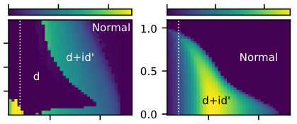
<figcaption class="paper-figure-caption"><b>Fig 3.</b> FIG. 3. Phase diagrams in the tunneling-amplitude– temperature plane with (left panel) and without (right panel) phase fluctuations. The twist angle is fixed at 45◦. The false color represents the minimal superconducting gap. The dot- ted line marks the realistic tunneling amplitude t = 10 meV. Note the different scales of the y axes.</figcaption>
</figure>
<figure class="paper-figure-card">

<figcaption class="paper-figure-caption"><b>Fig 4.</b> FIG. 4. Josephson gap with (left column) and without (right column) phase fluctuations for t = 10 meV. The dashed line delineates the d–(d+id′) border for the mean-field case, while such a border is obvious by the false color for the phase fluc- tuating case.</figcaption>
</figure>

**Summary.** The paper theoretically examines the stability of proposed chiral d+id' superconductivity in twisted cuprate bilayers against quantum phase fluctuations. The key finding is that these fluctuations severely destabilize the chiral state, forcing a first-order transition into a more conventional d-wave phase at low temperatures. This establishes quantum fluctuations as a critical constraint on realizing exotic superconducting symmetries in layered materials.

**Why it may be interesting.** This work provides a concrete example of how collective quantum fluctuations fundamentally constrain exotic superconducting phases (like chiral superconductivity) predicted by simpler theories, which is relevant for understanding emergent order parameters in strongly correlated systems.

Detailed structure

**Main problem.** The study investigates how quantum phase fluctuations fundamentally alter the predicted phase diagram of chiral d+id' superconductivity in twisted cuprate bilayers, particularly concerning Time-Reversal Symmetry Breaking (TRSB).

**Main result.** Quantum phase fluctuations strongly suppress the stability of the chiral state, confining it to narrow windows of twist angle and ultra-low temperatures. This leads to a first-order transition into the regular d-wave state.

**Method.** The authors derived the fluctuation-corrected free energy by integrating out long-wavelength phase fluctuations from a continuum microscopic model Hamiltonian.

**Model / system.** The system is twisted cuprate bilayers, modeled using a continuum approach incorporating interlayer tunneling and Coulomb repulsion. The analysis focuses on how collective phase fluctuations renormalize the superconducting order parameters.

**Key observables.** Minimal superconducting gap (2Delta_min), relative phase angle (2varphi), Josephson coupling strength (Delta_J), and the stability region in the twist-angle vs. Temperature plane.

**Important parameters / regimes.** Low temperatures ($T/T_{1L}^c \lesssim 0.016$), specific interlayer tunneling strengths ($t$), and the twist angle ($	heta$).

**Assumptions / limitations.** The analysis treats phase fluctuations by integrating out long-wavelength modes, which is appropriate for low temperatures; it also uses a simplified local form for the interlayer coupling.

**Figures summary.** Figures illustrate how quantum phase fluctuations renormalize the free energy and equilibrium phase angle across different twist angles, showing the suppression of the chiral state's stability region.

**Paper structure.** The paper proceeds by developing a fluctuation-corrected free energy functional for the superconducting order parameters. It then analyzes this functional to map out the resulting phase diagram in terms of temperature and twist angle, comparing mean-field predictions with fluctuation corrections.

Abstract

Following theoretical proposals of chiral $d+id'$ superconductivity in twisted cuprate bilayers, experimental signatures of time-reversal symmetry breaking (TRSB) remain highly controversial. Here we demonstrate that quantum phase fluctuations fundamentally reshape the phase diagram of this proposed chiral state. Unlike regular superconducting orders, the chiral $d+id'$ state requires long-range coherence of an interlayer phase degree of freedom and is therefore intrinsically vulnerable to phase fluctuations. Incorporating these fluctuations nearly eliminates the chiral phase over most parts of the phase diagram, restricting it to a narrow twist-angle window and ultra-low temperatures. The fluctuation-driven destruction of chirality produces a first-order transition into the $d$-wave state, giving rise to coexistence and metastability. Meanwhile, Josephson phase locking is strongly weakened at the TRSB quantum critical point, which sits well within the superconducting regime. More broadly, our work establishes quantum phase fluctuations as a fundamental constraint on the emergence of TRSB phases in low-dimensional layered quantum materials.

[↑ back to top](#top)

### [Modulation of anomalous Hall angle in a magnetic topological semimetal](http://arxiv.org/abs/2607.00396v1)

**Authors:** Jinying Yang, Yanxing Shang, Xingchen Liu, Yibo Wang, Xuebin Dong, Qingqi Zeng, Meng Lv, Shen Zhang, Yang Liu, Binbin Wang, Hongxiang Wei, Yizheng Wu, Stuart Parkin, Gangqin Liu, Claudia Felser, Enke Liu, Baogen Shen  
**Type:** both · **Category:** other · **PDF:** <https://arxiv.org/pdf/2607.00396v1>  
**Analysis basis:** full PDF text, analyzed in chunks
**Topic relevance:** `spintronics-quantum-optics interface` **3/5** · `Kondo & dissipative impurity` **1/5** · `analog quantum simulation` **1/5** · `exotic spin models in light-matter` **1/5** · `non-equilibrium dynamics` **1/5**

↔ Scroll figures horizontally

<figure class="paper-figure-card">
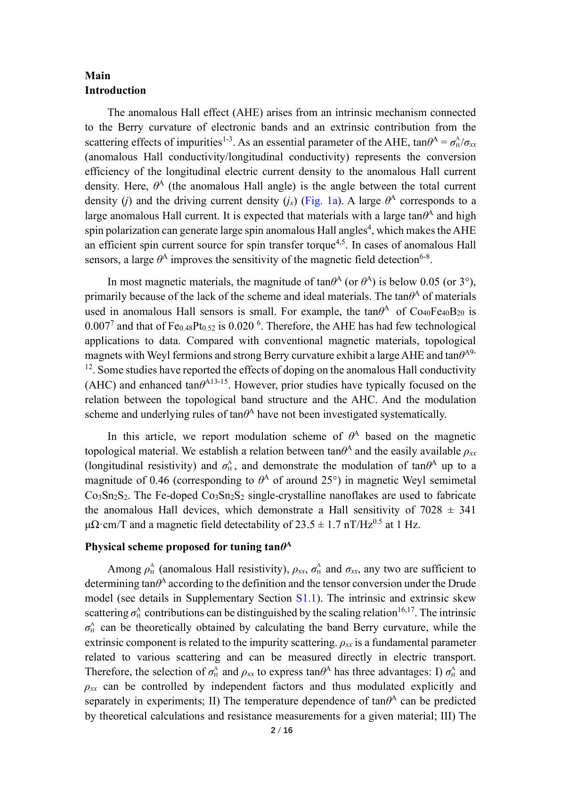
<figcaption class="paper-figure-caption"><b>Fig 1.</b> Low-resolution page preview, page 2</figcaption>
</figure>
<figure class="paper-figure-card">

<figcaption class="paper-figure-caption"><b>Fig 2.</b> Low-resolution page preview, page 3</figcaption>
</figure>
<figure class="paper-figure-card">

<figcaption class="paper-figure-caption"><b>Fig 3.</b> Low-resolution page preview, page 4</figcaption>
</figure>
<figure class="paper-figure-card">

<figcaption class="paper-figure-caption"><b>Fig 4.</b> Low-resolution page preview, page 5</figcaption>
</figure>
<figure class="paper-figure-card">
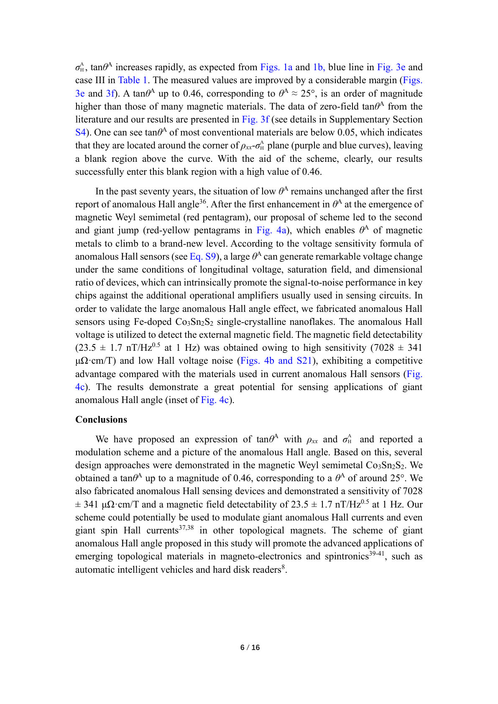
<figcaption class="paper-figure-caption"><b>Fig 5.</b> Low-resolution page preview, page 6</figcaption>
</figure>

**Summary.** This work reports on modulating the anomalous Hall angle ($	heta_A$) in magnetic Weyl semimetals using $	ext{Co}_3	ext{Sn}_2	ext{S}_2$. By theoretically linking $	an	heta_A$ to the product of resistivity and anomalous Hall conductivity, the authors experimentally achieved a large angle (~25°) through controlled doping and thickness reduction. This results in highly sensitive magnetic field detectors for spintronic applications.

**Why it may be interesting.** While the core physics is condensed matter transport (magnetotransport), the ability to engineer a macroscopic parameter like $	heta_A$ through controlled material modification (doping/strain) has parallels in controlling coupling strengths or interaction parameters in quantum systems.

Detailed structure

**Main problem.** The primary goal is to enhance the sensitivity of anomalous Hall sensors by maximizing the anomalous Hall angle ($	heta_A$), which quantifies current conversion efficiency.

**Main result.** The authors successfully demonstrated modulation of $	an	heta_A$ up to a magnitude of 0.46 (an angle of ~25°) in magnetic Weyl semimetals, leading to high magnetic field detectability ($23.5 	ext{ nT}/	ext{Hz}^{0.5}$).

**Method.** The study combines theoretical modeling relating $	an	heta_A$ to the product of resistivity and anomalous Hall conductivity ($
ho_{xx}\sigma^H_A$) with experimental measurements on fabricated nanoflakes.

**Model / system.** The research focuses on magnetic Weyl semimetals, specifically $	ext{Co}_3	ext{Sn}_2	ext{S}_2$, which are synthesized into single-crystalline nanoflakes. Modulation is achieved by tuning both the intrinsic anomalous Hall conductivity ($\sigma^H_A$) and the longitudinal resistivity ($
ho_{xx}$) via doping or thickness reduction.

**Key observables.** Anomalous Hall angle ($	an	heta_A$), Hall sensitivity ($7028 \mu\Omega\cdot	ext{cm/T}$), and magnetic field detectability ($23.5 	ext{ nT}/	ext{Hz}^{0.5}$).

**Important parameters / regimes.** The maximum achievable $	an	heta_A$ is the key parameter, which depends on tuning both $
ho_{xx}$ and $\sigma^H_A$.

**Assumptions / limitations.** The anomalous Hall angle relationship is modeled as being proportional to the product of electrical resistivity and anomalous Hall conductivity ($	an	heta_A \propto 
ho_{xx}\sigma^H_A$).

**Figures summary.** Figures illustrate $	an	heta_A$ dependence on $
ho_{xx}$ and $\sigma^H_A$, showing optimal modulation paths, while other figures detail temperature and thickness dependencies of the AHE signal.

**Paper structure.** The paper establishes the physical problem (enhancing $	heta_A$), develops a theoretical framework linking $	an	heta_A$ to material parameters ($
ho_{xx}, \sigma^H_A$), presents experimental results showing modulation via doping/thickness, and concludes with high-sensitivity device metrics.

Abstract

The anomalous Hall angle (θA) is a measure of the efficiency of converting a longitudinal driving current to a transverse spin-polarized Hall current. For anomalous Hall sensing, a large anomalous Hall angle can improve the sensitivity of magnetic field detection. However, modulation of this angle is challenging and magnetic materials typically have low angles of 0.1 to 3°. Here, we report modulation of the anomalous Hall angle in the magnetic Weyl semimetal Co3Sn2S2. We propose that the angle parameter tanθA can be formulated as a function of the product of electrical resistivity and anomalous Hall conductivity. Our scheme was utilized to demonstrate the modulation of tanθA up to a magnitude of 0.46, corresponding to an angle of around 25°. Microfabricated anomalous Hall devices using Fe-doped Co3Sn2S2 single-crystalline nanoflakes exhibit a high Hall sensitivity of 7028 μΩucm/T and a magnetic field detectability of 23.5 nT/Hz0.5 at 1 Hz.

[↑ back to top](#top)

### [Modification of Damon-Eshbach magnetostatic mode spectra in ferromagnet/paramagnet bilayer](http://arxiv.org/abs/2607.00964v1)

**Authors:** M. A. Kuznetsov  
**Type:** theory · **Category:** other · **PDF:** <https://arxiv.org/pdf/2607.00964v1>  
**Analysis basis:** full PDF text, analyzed in chunks
**Topic relevance:** `spintronics-quantum-optics interface` **3/5** · `analog quantum simulation` **1/5** · `driven-dissipative phase transition` **1/5** · `exotic spin models in light-matter` **1/5**

↔ Scroll figures horizontally

<figure class="paper-figure-card">
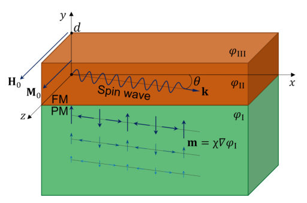
<figcaption class="paper-figure-caption"><b>Fig 1.</b> FIG. 1. Schematic illustration of the ferromag- net/paramagnet (FM/PM) bilayer. The spin wave in the FM film, with wave vector k at an angle θ to the x axis, is shown by a wavy arrow. The induced magnetization m in the PM is depicted by counterclockwise-rotating arrows.</figcaption>
</figure>
<figure class="paper-figure-card">
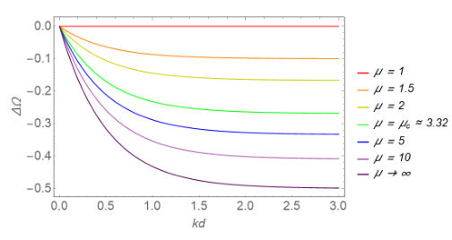
<figcaption class="paper-figure-caption"><b>Fig 2.</b> FIG. 2. Dependencies of the MSSW frequency shift ∆Ωon the wave vector modulus k (k ⊥M0) at different values of the magnetic permeability µ in the FM/PM bilayer.</figcaption>
</figure>
<figure class="paper-figure-card">

<figcaption class="paper-figure-caption"><b>Fig 3.</b> FIG. 3. Dependencies of (a) frequency Ωand (b) group velocity vg x of MSSWs on the x component of the wave vector kx (k ⊥M0) at different values of the magnetic permeability µ in the FM/PM bilayer. For the calculations, h = 0.1 (µc ≈3.32) and sM = 1 were adopted.</figcaption>
</figure>
<figure class="paper-figure-card">

<figcaption class="paper-figure-caption"><b>Fig 4.</b> FIG. 4. Frequencies of the first five BVMSW modes Ωn as functions of the wave vector modulus k (k ∥M0) in the FM/PM bilayer. The solid lines correspond to the case µ →∞, while the dashed lines correspond to the case µ = 1. For the calculations, h = 0.1 was adopted.</figcaption>
</figure>
<figure class="paper-figure-card">
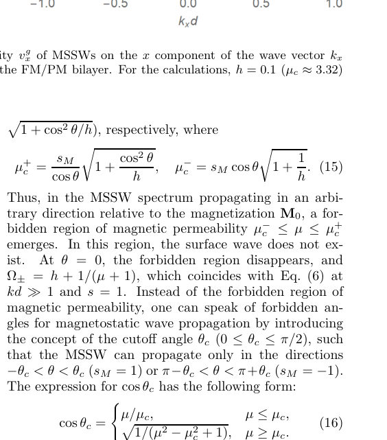
<figcaption class="paper-figure-caption"><b>Fig 5.</b> Figure 5 shows the dependencies of Ω± on µ at various θ [Fig. 5(a)] and the dependencies of Ω± on θ at various µ [Fig. 5(b)]. The light gray regions indicate the forbidden values of µ and θ where MSSWs cannot propagate. The curves Ω+ and Ω−reach the forbidden regions at µ = µ± c or θ = θc and terminate there. The branch Ω−at µ = µ− c reaches a local minimum equal to p</figcaption>
</figure>

**Summary.** This theoretical study analyzes spin wave propagation in a ferromagnet/paramagnet bilayer, showing that the dipolar coupling modifies the standard Damon-Eshbach modes. The key finding is that by tuning the material's magnetic permeability ($\mu$)—which can be controlled via temperature or external field near the Curie point—the surface spin waves can become unidirectional. This suggests the system is a promising platform for tunable magnonic logic devices.

**Why it may be interesting.** While focused on magnetism, the concept of tunable wave directionality (unidirectionality) via material parameters ($\mu$) is analogous to controlling directional coupling in quantum optical or superconducting circuits, making it relevant for understanding engineered wave phenomena.

Detailed structure

**Main problem.** To calculate and analyze the spectra of bulk and surface spin waves (Damon-Eshbach magnetostatic modes) in a ferromagnet/paramagnet bilayer, focusing on how dipolar coupling modifies these modes.

**Main result.** The system exhibits tunable unidirectional wave regimes for surface spin waves when the magnetic permeability ($\mu$) exceeds a critical value ($\mu_c$), allowing potential use in magnonic logic devices.

**Method.** Analytical solutions and numerical calculations were used to solve Laplace's equation under magnetostatic approximations, deriving dispersion relations for different propagation directions.

**Model / system.** The system is an FM/PM bilayer where the PM susceptibility ($\chi$) varies significantly near its Curie temperature ($T_C$), leading to a variable magnetic permeability $\mu$. The analysis covers surface and bulk spin waves propagating in various directions relative to the magnetization.

**Key observables.** Spin wave frequencies ($\Omega_n$), nonreciprocity ($\Delta\Omega$), group velocity ($v_g$), and the critical permeability values ($\mu_c$, $\mu_+^c$).

**Important parameters / regimes.** Magnetic susceptibility ($\chi \propto 1/(T-T_C)$), external magnetic field ($h$), film thickness ($d$), and propagation angle ($	heta$).

**Assumptions / limitations.** The magnetostatic approximation is used, assuming the system can be described by a scalar potential $\phi$. The PM's behavior near $T_C$ dictates the key parameter $\mu$.

**Figures summary.** Figures illustrate the nonreciprocity ($\Delta\Omega 
eq 0$) for surface spin waves when $\mu 
eq 1$, show the onset of unidirectional behavior at $\mu > \mu_c$, and map out spectral regions for arbitrary propagation angles.

**Paper structure.** The paper progresses from establishing the governing equations in the magnetostatic approximation to deriving specific dispersion relations for perpendicular ($\mathbf{k} \perp \mathbf{M}_0$) and general directions. It then analyzes the conditions for unidirectional wave propagation, discusses the spectral splitting between MSSW and BVMSW regimes, and concludes by linking tunability to temperature/field variations.

Abstract

Using the magnetostatic approximation, we calculate the spectra of bulk and surface spin waves in an in-plane magnetized ferromagnet/paramagnet bilayer. Due to the dipolar coupling between the layers, the paramagnet becomes polarized, which in turn modifies the spectrum of the Damon-Eshbach magnetostatic modes. We assume that the paramagnet is characterized by a magnetic susceptibility, $χ\propto 1/(T-T_C)$, which reaches large values when the system temperature $T$ is close to the Curie temperature $T_C$. We find the conditions under which surface spin waves become unidirectional, i.e., capable of carrying energy in only one direction, and determine the magnitude of their frequency nonreciprocity. We demonstrate the possibility of switching the unidirectional wave regime on and off by varying the external magnetic field or temperature, making the ferromagnet/paramagnet system an attractive platform for tunable magnonic logic devices.

[↑ back to top](#top)

### [Electric-field effects on defect migration energetics in GaN](http://arxiv.org/abs/2607.01160v1)

**Authors:** Farshid Reza, Hamdy Arkoub, Alexander S. Hauck, Adri C. T. van Duin, Miaomiao Jin  
**Type:** theory · **Category:** other · **PDF:** <https://arxiv.org/pdf/2607.01160v1>  
**Analysis basis:** full PDF text, analyzed in chunks
**Topic relevance:** `non-equilibrium dynamics` **2/5** · `Keldysh / 2PI / non-Gaussian methods` **1/5** · `analog quantum simulation` **1/5** · `correlated / nonlocal dissipation` **1/5** · `driven-dissipative phase transition` **1/5** · `methods for driven-dissipative` **1/5** · `non-equilibrium universality` **1/5**

↔ Scroll figures horizontally

<figure class="paper-figure-card">
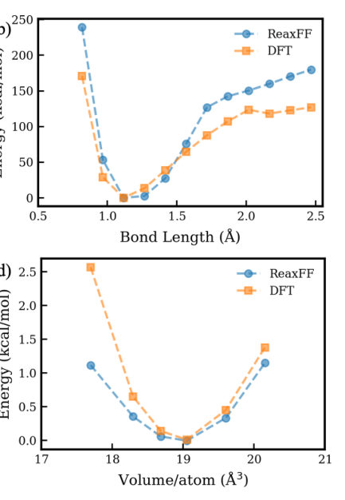
<figcaption class="paper-figure-caption"><b>Fig 1.</b> FIG. 1: EOS data for wurtzite GaN (a), N2 molecule bond length energy profile</figcaption>
</figure>
<figure class="paper-figure-card">
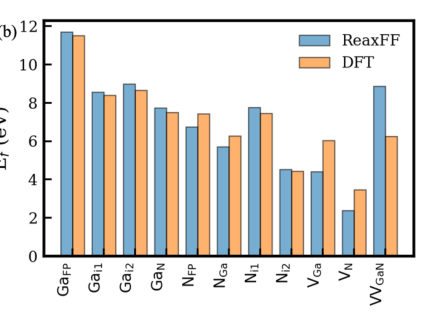
<figcaption class="paper-figure-caption"><b>Fig 2.</b> FIG. 2: (a) Energy difference between defect structure and perfect structure. (b)</figcaption>
</figure>
<figure class="paper-figure-card">
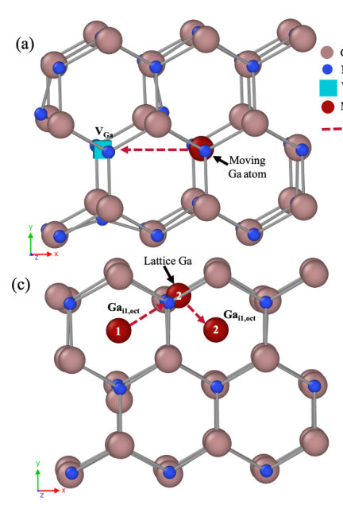
<figcaption class="paper-figure-caption"><b>Fig 3.</b> FIG. 3: Migration directions for (a) VGa, (b) VN, (c) Gai1,oct, and (d) Ni2,split,</figcaption>
</figure>
<figure class="paper-figure-card">

<figcaption class="paper-figure-caption"><b>Fig 4.</b> FIG. 4: Effect of an external electric field on the total system energy relative to zero</figcaption>
</figure>
<figure class="paper-figure-card">
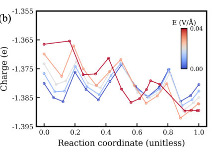
<figcaption class="paper-figure-caption"><b>Fig 5.</b> FIG. 5: Charge distribution variation with applied electric field along x-direction for</figcaption>
</figure>

**Summary.** This work develops and applies a reactive force field model to study defect migration in GaN under high electric fields. The key finding is that the interaction between the field, charge, and lattice structure is highly nonlinear and anisotropic. This complexity suggests that simple linear models fail to predict defect mobility accurately in operational electronic devices.

**Why it may be interesting.** While focused on solid-state defects rather than quantum information, the core concept—analyzing non-linear responses in a system due to external driving forces (electric field)—mirrors concepts in open quantum systems where environmental coupling leads to non-Markovian or complex dynamics.

Detailed structure

**Main problem.** The study aims to predict device reliability by understanding how external electric fields modulate defect transport energetics within Gallium Nitride (GaN).

**Main result.** Electric fields do not induce a simple linear bias; instead, they cause anisotropic and complex modifications to migration barriers via charge-lattice coupling. This nonlinearity arises from field-induced partial charge redistribution and local lattice distortion.

**Method.** The research utilizes a custom ReaxFF reactive force field, trained on DFT data, coupled with Molecular Dynamics (MD) simulations and the Climbing-Image Nudged Elastic Band (CI-NEB) method to calculate defect barriers under applied fields.

**Model / system.** The physical system is Gallium Nitride (GaN), modeled using supercells containing various intrinsic point defects, including vacancies ($	ext{V}_{	ext{Ga}}, 	ext{V}_{	ext{N}}$) and interstitials. The methodology simulates the material response to electric fields up to $40 	ext{ MV/cm}$.

**Key observables.** Defect formation and migration energies ($	ext{E}_{	ext{F}}^{	ext{B}}$, $	ext{E}_{	ext{R}}^{	ext{B}}$), lattice parameters, partial charge redistribution, and local lattice distortion.

**Important parameters / regimes.** Applied electric field strength ($0$ to $0.04 	ext{ V}/	ext{\AA}$); defect type (vacancy vs. interstitial).

**Assumptions / limitations.** The use of the QEq scheme limits the analysis to neutral defects, neglecting the full complexity of charge-state transitions ($	ext{V}^{3-}$ etc.). The ReaxFF potential is assumed accurate for capturing dynamic coupling effects.

**Figures summary.** Figures illustrate comparisons of Equation-of-State data (ReaxFF vs. DFT), and show how applied electric fields affect migration barriers, highlighting the non-linear changes in energy profiles for different defect types.

**Paper structure.** The paper first develops and validates a ReaxFF force field against known structural properties. It then applies this model to calculate zero-field defect energetics, followed by systematic investigation of how applied electric fields modulate these migration barriers, comparing linear dipole approximations with complex charge-lattice coupling effects.

Abstract

A predictive understanding of defect transport in GaN under operating electric fields is critical for assessing device reliability in high-power and radiation environments. In this work, a ReaxFF reactive force field for GaN is developed using a density-functional-theory training set that includes structural, thermodynamic, and defect properties. The force field yields various properties such as lattice parameters, cohesive energies, and defect formation and migration energies in close agreement with prior first-principles and experimental results. Under externally applied electric fields, we find that migration barriers can be strongly modulated, with changes that depend on defect type and field orientation. Notably, the electric fields do not simply linearly bias defect motion in GaN, but can anisotropically modify migration barriers through charge-lattice coupling, leading to nonlinear transport behavior. The response arises from field-induced partial charge redistribution and local lattice distortion. These results demonstrate that electric fields can complexly modify the defect migration landscape, providing new insight into defect transport in GaN under high-field conditions.

[↑ back to top](#top)

### [Facet-selective ballistic supercurrent in a weak topological insulator](http://arxiv.org/abs/2607.00683v1)

**Authors:** Prasanna Rout, Ankit Khola, Lalit Pandey, Paolo Sessi, Xiaochun Huang, Ivo Cools, S. Galeski, Matthias Bode, Johan Åkerman, Floriana Lombardi, Thilo Bauch, Saroj P. Dash  
**Type:** experiment · **Category:** other · **PDF:** <https://arxiv.org/pdf/2607.00683v1>  
**Analysis basis:** full PDF text, analyzed in chunks
**Topic relevance:** `QC/QI experiment` **2/5** · `spintronics-quantum-optics interface` **2/5** · `Kondo & dissipative impurity` **1/5** · `analog quantum simulation` **1/5** · `interference shaping light` **1/5** · `non-equilibrium dynamics` **1/5**

↔ Scroll figures horizontally

<figure class="paper-figure-card">
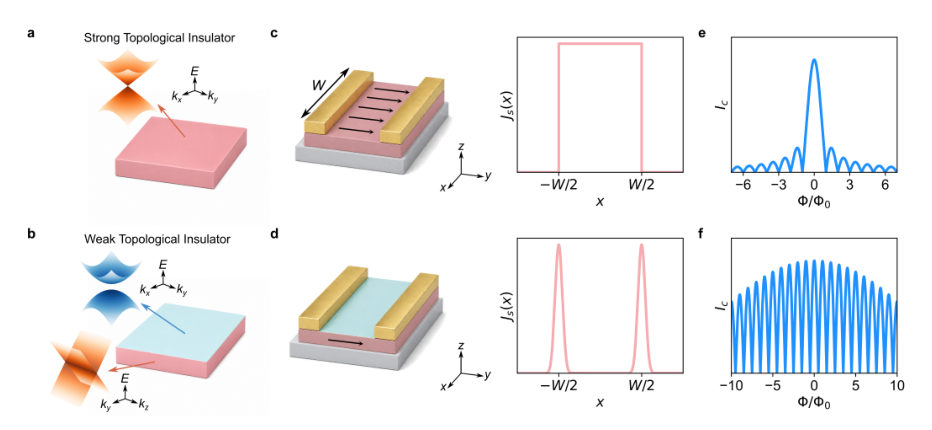
<figcaption class="paper-figure-caption"><b>Fig 1.</b> Fig. 1: Probing the boundary states in three-dimensional topological insulators by super- conducting quantum interferometry. a, b, Schematic band structure of a strong topological insulator (STI, a), and a weak topological insulator (WTI, b). An STI hosts gapless Dirac cones on the time- reversal-symmetric crystal facets (pink surfaces) while the bulk is insulating. In a WTI, conducting surface states due to one-dimensional Dirac lines reside only on specific crystallographic facets such as y–z and z–x (pink surfaces), whereas other x–y facets (blue surfaces) remain fully gapped. c, d, Josephson junc- tions based on an STI and a WTI coupled to superconducting electrodes. In the STI junction...</figcaption>
</figure>
<figure class="paper-figure-card">

<figcaption class="paper-figure-caption"><b>Fig 2.</b> Fig. 2: Electronic transport and spectroscopic measurements of ZrTe5. a, Temperature depen- dence of the longitudinal resistivity ρxx measured with current applied along the a-axis. The top panel shows the crystal structure of ZrTe5, consisting of two-dimensional layers in the a–c plane that are cou- pled by van der Waals forces along the b-axis. In the WTI regime, the a–c surfaces are gapped, while topological surface states reside on the a–b and b–c facets. b, c, Magnetoresistance ∆Rxx(B) after back- ground subtraction, measured at 2 K for various field angles α in the a–b plane and β in the b–c plane. Here, α and β denote the angle between the b-axis and the magnetic field as illustrated...</figcaption>
</figure>
<figure class="paper-figure-card">

<figcaption class="paper-figure-caption"><b>Fig 3.</b> Fig. 3: Supercurrent transport in ZrTe5 Josephson junctions. a,b, Voltage V across the Al/ZrTe5 junction as a function of applied current I flowing along the a-axis, measured at different temperatures. The data for Dev 1 and Dev 2 are presented in a and b, respectively. c, V (I) curves for the NbN/ZrTe5 junction (Dev 3), where the current is along the c-axis. The top panels in a-c show scanning electron microscopy images of the junctions with the measurement schematics (Scale bar is 2 µm). d, Temperature dependence of Ic for three junctions, extracted from a-c, together with fits (dashed lines) to the data in the high-temperature regime.</figcaption>
</figure>
<figure class="paper-figure-card">

<figcaption class="paper-figure-caption"><b>Fig 4.</b> Fig. 4: Superconducting quantum interferometry revealing spatially localized supercurrent in Al/ZrTe5 junctions. Superconducting quantum interference patterns for Dev 1 (a), and Dev 2 (b) measured at 20 mK, exhibiting clear SQUID-like oscillations. c, Schematics of the junctions, where the current flows along the a-axis and the magnetic field is applied along the b-axis. d,e, Corresponding supercurrent density profiles Js(x) extracted from the interference patterns in a,b. Two pronounced peaks indicate that the supercurrent is localized near opposite a–b facets. The spatial supercurrent distributions are fitted by a combination of two Gaussian peaks (dashed lines).</figcaption>
</figure>
<figure class="paper-figure-card">
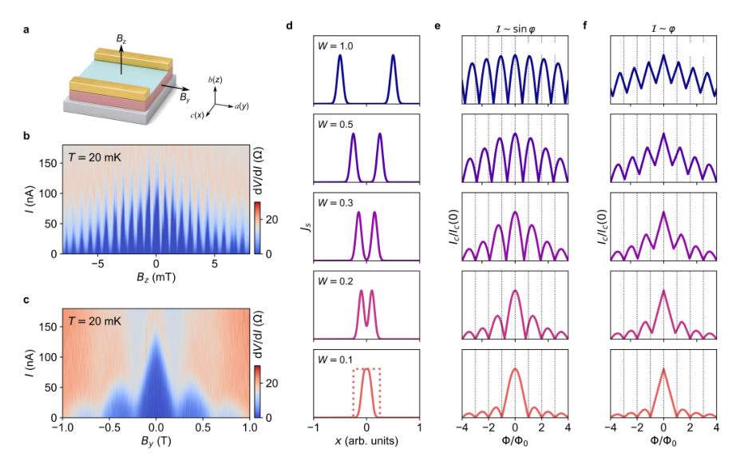
<figcaption class="paper-figure-caption"><b>Fig 5.</b> Fig. 5: Field-orientation dependence of facet-selective supercurrent. a, Schematic of the NbN/ZrTe5 Josephson junction (Dev 3), where the current flows along the c-axis. b, Superconducting interference patterns measured at 20 mK for magnetic field Bz applied along the b-axis, showing behavior similar to that in Fig. 4. c, Same measurement performed for magnetic field By applied along the a-axis. d, The supercurrent density profiles for the parametrized junction width W = 1, 0.5, 0.3, 0.2, and 0.1. e,f, Corresponding simulated interference patterns for a sinusoidal (e) and a sawtooth (f) current–phase relation (see Supplementary Note 7 for details). For reference, a uniform supercurrent...</figcaption>
</figure>

**Summary.** The research demonstrates the existence of facet-selective ballistic supercurrent in weak topological insulators ($	ext{ZrTe}_5$) using Josephson junctions. By measuring SQUID oscillations and analyzing field dependence, the authors prove that superconductivity is confined to specific crystal facets hosting topological surface states. This establishes WTIs as a promising material platform for building next-generation superconducting quantum devices.

**Why it may be interesting.** This work provides a concrete platform for realizing topological superconductivity in engineered solid-state devices, directly linking bulk crystal topology to macroscopic superconducting properties, which is highly relevant for quantum device architectures.

Detailed structure

**Main problem.** The primary goal is to demonstrate and characterize facet-selective ballistic supercurrent flowing through weak topological insulators (WTIs) in three dimensions.

**Main result.** The authors successfully demonstrated that the supercurrent is spatially confined to specific crystallographic facets hosting gapless topological surface states, confirming WTI behavior and establishing these materials for facet-resolved superconducting devices.

**Method.** Measurements involve using Josephson junctions formed with WTIs ($	ext{ZrTe}_5$) coupled to superconductors ($	ext{Al}$ or $	ext{NbN}$) and probing the supercurrent via quantum interferometry and transport measurements.

**Model / system.** The system is based on Weak Topological Insulators (WTIs), specifically $	ext{ZrTe}_5$, which exhibit gapless topological surface states only on selected crystal facets, contrasting with Strong TIs. The physics involves proximity-induced superconductivity in these topological boundary states.

**Key observables.** SQUID-like critical current oscillations ($\Phi$-periodicity), distinct interference patterns upon magnetic field rotation, exponential temperature dependence of $I_c$, and sharp lobes in the Current-Phase Relation (CPR).

**Important parameters / regimes.** Low temperatures ($15 	ext{ mK}$ to $5.1 	ext{ K}$), superconducting critical currents ($I_c$), and magnetic field orientations ($\mathbf{B}_y$ vs $\mathbf{B}_z$).

**Assumptions / limitations.** The supercurrent is assumed to be carried predominantly by the high-transmission topological surface channels, leading to ballistic transport signatures.

**Figures summary.** Figures illustrate SQUID oscillations and extracted supercurrent density profiles showing confinement to specific facets; $V$-$I$ curves demonstrate temperature dependence of $I_c$; and STM/STS data confirm gapless states at step edges.

**Paper structure.** The paper establishes the theoretical motivation by contrasting STI vs WTI surface state behavior, details the experimental setup using Josephson junctions on $	ext{ZrTe}_5$, presents transport measurements showing field-dependent supercurrent confinement, and concludes by confirming ballistic signatures via temperature dependence and CPR analysis.

Abstract

Topological superconductivity is widely pursued by inducing superconducting correlations in topologically protected boundary states. In two dimensions, this strategy has been realized using one-dimensional topological edge modes, but in three-dimensional crystals, spatially separated surface supercurrents confined to selected facets have not yet been achieved. Here we demonstrate facet-selective ballistic supercurrent in Josephson junctions based on the weak topological insulator ZrTe5. Superconducting quantum interferometry reveals SQUID-like critical current oscillations with flux-quantum periodicity, establishing that the supercurrent is spatially concentrated on specific crystallographic facets that host gapless topological surface states. Rotating the magnetic field yields markedly distinct interference patterns, linking the supercurrent distribution to the underlying bulk topology. The exponential temperature dependence of the critical current and triangular interference lobes provide signatures of ballistic transport due to high-transmission topological channels. These results establish weak topological insulators as a platform for facet-resolved superconducting devices and higher-order topological superconductivity.

[↑ back to top](#top)

### [Near-Field Characterisation of Guided Modes in WS2 Nanobeams and Quasi-Bulk Crystals](http://arxiv.org/abs/2607.00694v1)

**Authors:** Zara S. Taylor, Luke M. Hallacy, Xuerong Hu, Oliver T. Williams, Simone Strohmair, Fabian Felixberger, Alexander J. Knight, Timothy Chester-Parsons, Luke R. Wilson, Alexander I. Tartakovskii  
**Type:** experiment · **Category:** other · **PDF:** <https://arxiv.org/pdf/2607.00694v1>  
**Analysis basis:** full PDF text, analyzed in chunks
**Topic relevance:** `quantum measurements` **2/5** · `quantum optics experiment` **2/5** · `analog quantum simulation` **1/5** · `driven-dissipative phase transition` **1/5** · `interference shaping light` **1/5**

↔ Scroll figures horizontally

<figure class="paper-figure-card">

<figcaption class="paper-figure-caption"><b>Fig 1.</b> Figure 1: Optical waveguide quality of WS2 throughout the vis-NIR spectral window relative to silicon. a) atomic structure of WS2 as seen from above (top) and the side (bottom). b) Refractive indices in the vis-NIR window of WS2 and silicon sourced from [30] and [40], respectively. c) Extinction coefficient of a WS2 crystal measured via imaging Cavity-Enhanced Absorption Spectroscopy (iCEAS) within strongly and weakly absorbing local crystal regions compared with prior measurements of WS2 [29, 30, 34] and Si [40] κ. A logarithmic plot of the extinction coefficient of WS2 and silicon is provided within the inset to emphasise the sharper drop in absorption estimated for WS2. d) and e)...</figcaption>
</figure>
<figure class="paper-figure-card">

<figcaption class="paper-figure-caption"><b>Fig 2.</b> Figure 2: a) s-SNOM schematic showing side and top view. A metal-coated AFM tip is illuminated by a beam of laser light (path 1). This light is partially reflected directly to the detector from the tip (path 2), and partially coupled into the WS2 crystal via the plasmonic tip-sample interaction, propagating as a waveguided mode before scattering towards the detector at the crystal edge (path 3). Angles of the laser beam relative to the crystal edge, α and β, are indicated. b) Topography of quasi-bulk sample with a thickness of (112 ± 5) nm recorded via AFM demonstrating high uniformity and pristine edges. S-SNOM scans performed upon the RHS due to comparative lack of surface line and point...</figcaption>
</figure>
<figure class="paper-figure-card">

<figcaption class="paper-figure-caption"><b>Fig 3.</b> Fig. 3a presents representative s-SNOM amplitude images of the quasi-bulk crystal shown in Fig. 2b-c at</figcaption>
</figure>
<figure class="paper-figure-card">
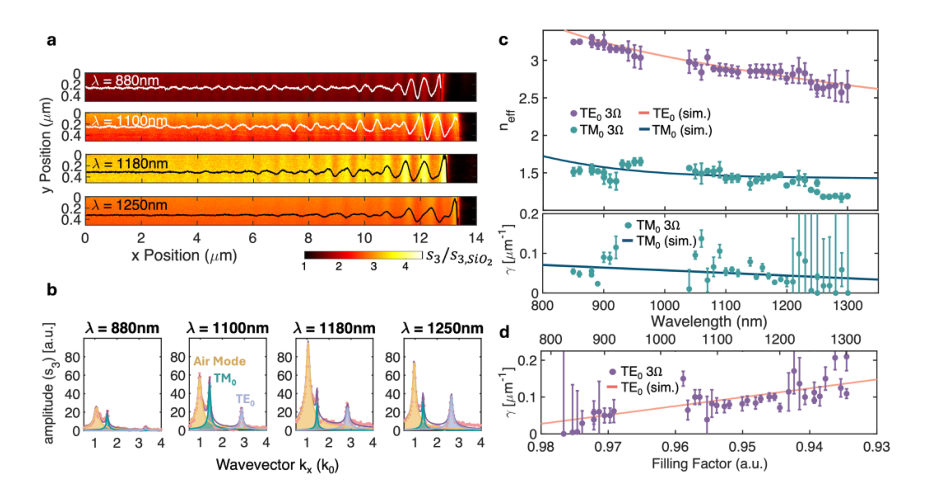
<figcaption class="paper-figure-caption"><b>Fig 4.</b> Figure 3: Nanoimaging of waveguide mode dispersion in WS2. a) SiO2-normalised s-SNOM images of a quasi-bulk 112nm-thick WS2 crystal with fringe line profiles overlaid for a small selection of incident laser beam wavelengths (λ). b) Fitted Fourier Transforms of the line profiles in (a) demonstrating the presence of three key peaks; the air mode (yellow), a poorly-confined TM0 mode (cyan) and the TE0 mode (lilac). c) neff Fitting results for the TE0 and TM0 mode measured throughout the low-absorption vis-NIR window of WS2, with Lumerical MODE simulation results for a 4 µm-width, 112 nm-thick crystal included for comparison. The fitted decay constant of the TM0 mode is plotted in the lower...</figcaption>
</figure>
<figure class="paper-figure-card">

<figcaption class="paper-figure-caption"><b>Fig 5.</b> Fig. 3b indicate that, owing to its unconfined nature, it decays much more rapidly from the crystal edge than the</figcaption>
</figure>

**Summary.** This work characterizes guided optical modes ($	ext{TE}_0$ and $	ext{TM}_0$) in WS2 nanobeams and bulk crystals using advanced near-field techniques like s-SNOM. By mapping modal dispersion and measuring material absorption, the authors establish robust diagnostic protocols for assessing waveguiding quality in these promising 2D materials.

**Why it may be interesting.** While focused on photonics, the detailed analysis of wave propagation in anisotropic 2D materials provides insights into boundary conditions and field confinement that are relevant for designing quantum optical cavities or waveguides interacting with quantum emitters.

Detailed structure

**Main problem.** The study addresses the limited experimental understanding of wavelength-dependent modal confinement and attenuation in WS2 waveguides, complicated by ambiguities in reported material extinction coefficients.

**Main result.** s-SNOM reliably captures relative modal trends for TE0 and TM0 modes across 800–1400 nm, confirming its utility as a diagnostic tool despite absolute loss values depending on measurement geometry.

**Method.** The authors employed hyperspectral cavity-enhanced imaging (iCEAS) to bound the extinction coefficient and utilized scattering-type s-SNOM microscopy to probe guided modes in both quasi-bulk and nanobeam WS2 waveguides.

**Model / system.** The physical system is WS2, a layered van der Waals material promising for nanophotonics due to its high refractive index and optical anisotropy. Measurements are performed on patterned nanobeams and larger quasi-bulk crystals deposited on an SiO2/Si substrate.

**Key observables.** Effective refractive indices (neff), modal confinement, propagation loss ($	ext{dB}/	ext{mm}$), and the extinction coefficient ($\kappa$) as functions of wavelength and geometry.

**Important parameters / regimes.** Wavelength range: 800–1400 nm; key modes: $	ext{TE}_0$ and $	ext{TM}_0$; critical thickness regimes (e.g., $112 \pm 5 	ext{ nm}$).

**Assumptions / limitations.** Absolute loss values measured by s-SNOM depend on measurement geometry, and nanobeam measurements can suffer from artifacts due to transverse interference or spatial sampling effects.

**Figures summary.** Figures illustrate iCEAS extinction maps, simulated/measured mode dispersion curves ($	ext{neff}$ vs. $\lambda$), field profiles showing TE0/TM0 confinement factors, and Fourier Transform peak fitting results for different modes.

**Paper structure.** The paper systematically moves from characterizing the material absorption (iCEAS) to mapping modal behavior in quasi-bulk crystals using s-SNOM, and finally analyzing mode dispersion and artifacts in highly confined nanobeams across a wide spectral range.

Abstract

The exceptionally high in-plane refractive index, low sub-bandgap absorption, and strong optical anisotropy of WS2 make it a promising material platform for next-generation integrated circuits for nanophotonics. Its layered van der Waals structure further enables heterogeneous integration with silicon photonics and emerging two-dimensional optoelectronic materials. However, despite increasing interest in the waveguiding properties of WS2, experimental studies of wavelength-dependent modal confinement and attenuation remain limited. Additionally, though the extinction coefficient of WS2 is expected to be near-negligible beneath the bandgap, reported values span orders of magnitude, leading to large uncertainty in predicted modal decay lengths and wafer-scale integration feasibility. To resolve these ambiguities we perform hyperspectral cavity-enhanced imaging, determining high-resolution upper and lower bounds on the extinction coefficient of WS2 within the visible-NIR edge. We further employ scattering-type scanning near-field optical microscopy (s-SNOM) to probe TE0, TM0, and higher-order modes in both quasi-bulk and nanobeam WS2 waveguides across the 800-1400 nm spectral range, enabling identification of mode-specific trends in wavevector dispersion and loss. This work simultaneously assesses s-SNOM as a probe of waveguide performance, and we find that while absolute loss values depend on measurement geometry, s-SNOM reliably captures relative modal trends and provides upper bounds on propagation loss, supporting its use as a diagnostic tool for anisotropic waveguides. We further identify significant artefacts in nanobeam measurements arising from transverse interference and spatial sampling effects when the structure size approaches the excitation wavelength, which can shift extracted effective indices by up to 0.25.

[↑ back to top](#top)

### [Symmetry Classification of Non-Reciprocal Responses in Multiterminal Ring Devices](http://arxiv.org/abs/2607.00919v1)

**Authors:** Chen-How Huang, Tero T. Heikkilä  
**Type:** theory · **Category:** other · **PDF:** <https://arxiv.org/pdf/2607.00919v1>  
**Analysis basis:** full PDF text, analyzed in chunks
**Topic relevance:** `non-equilibrium dynamics` **2/5** · `Keldysh / 2PI / non-Gaussian methods` **1/5** · `correlated / nonlocal dissipation` **1/5** · `driven-dissipative phase transition` **1/5** · `methods for driven-dissipative` **1/5**

↔ Scroll figures horizontally

<figure class="paper-figure-card">
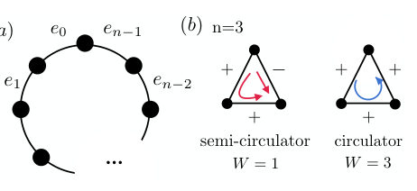
<figcaption class="paper-figure-caption"><b>Fig 1.</b> FIG. 1. (a) n-vertex ring for the classification of non- reciprocal electronic response. Each bond is assigned a binary current ek ∈{1, −1} describing the direction (counterclock- wise, clockwise) of non-reciprocity. (b) n = 3 ring of two different orbits classified by symmetries, the semi-circulator and circulator configurations.</figcaption>
</figure>
<figure class="paper-figure-card">

<figcaption class="paper-figure-caption"><b>Fig 2.</b> FIG. 3. (a,b) Single particle energy spectrum for the minimal model at θ = π/4 for (a) by = 0.02Γ (b) by = 0.1Γ. We also indicate the value of the Wmn for some of the intra(inter)-helcial pair transitions by the black arrows and labels in (c,d). (c,d) Wmn = P</figcaption>
</figure>
<figure class="paper-figure-card">
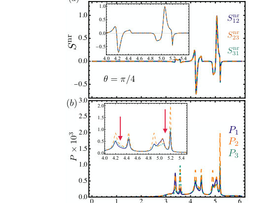
<figcaption class="paper-figure-caption"><b>Fig 3.</b> FIG. 4. Characterization of the system with in-plane field. (a) is the non-reciprocal transmission of the device. The red arrows indicate the reactive response region of the device. (b) show the absorption spectra of the three terminals of the device.</figcaption>
</figure>
<figure class="paper-figure-card">

<figcaption class="paper-figure-caption"><b>Fig 4.</b> FIG. 5. Reactive part of the response function Im[χnr] for (a) θ = π/3 (b) θ = π/4. (c,d) Wmn = P</figcaption>
</figure>
<figure class="paper-figure-card">
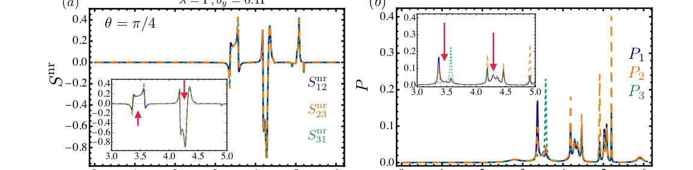
<figcaption class="paper-figure-caption"><b>Fig 5.</b> FIG. 6. (a) Non-reciprocal transmission and (b) power absorption of the toy model including the finite broadening and temperature kBT = δ = 0.001Γ.</figcaption>
</figure>

**Summary.** This paper establishes a rigorous symmetry framework using group theory to classify non-reciprocal responses in multi-terminal quantum ring devices. By analyzing the constraints imposed by symmetries like time-reversal and inversion, it predicts that only specific circulation patterns are physically observable in real systems. The findings are validated through detailed calculations on a superconducting quantum dot model.

**Why it may be interesting.** This work provides a powerful, abstract mathematical tool (symmetry classification) to predict observable transport phenomena in mesoscopic superconducting circuits, which is highly relevant for designing novel quantum devices.

Detailed structure

**Main problem.** The paper develops a symmetry-based framework to systematically classify non-reciprocal electrical responses occurring in multi-terminal quantum ring devices.

**Main result.** For an isosceles $n=3$ ring, the analysis predicts that only two types of non-reciprocal responses (uniform circulation and specific semi-circulation) are allowed due to residual geometric symmetries after breaking time-reversal ($T$) and inversion ($I$).

**Method.** The core method involves applying group theory (Burnside's Lemma) to classify the $2^n$ bond configurations into symmetry orbits, linking topological invariants like the winding number ($W$) to observable physical responses.

**Model / system.** The system is modeled as an $n$-vertex quantum ring device, analyzed using a minimal toy model of three quantum dots coupled to superconducting baths. The analysis extends from general ring structures to specific geometries like equilateral and isosceles triangles.

**Key observables.** Non-reciprocal transmission ($S_{nr}^{ab}$), the imaginary part of the current-current response function ($	ext{Im}[\chi_{nr}]$), and the absolute non-reciprocal weight ($R_{nr}^{tot}$).

**Important parameters / regimes.** The number of vertices $n$ (especially $n=3$), geometric symmetry type (equilateral vs. isosceles), and external field parameters like Zeeman fields ($\lambda$) or superconducting phase biases.

**Assumptions / limitations.** The analysis relies on the applicability of group theory to classify configurations, assuming that non-reciprocity requires the simultaneous breaking of both time-reversal ($T$) and spatial inversion ($I$) symmetries.

**Figures summary.** Figures illustrate the ring structure, show energy spectra splitting due to external fields, plot the reactive part of $	ext{Im}[\chi_{nr}]$ revealing distinct circulator/semi-circulator bands, and map out topological phase diagrams based on symmetry breaking.

**Paper structure.** The paper progresses by first establishing the general group theory framework for $n$-rings, then applying this to the minimal $n=3$ case, distinguishing between equilateral and isosceles geometries. It validates these theoretical predictions using a detailed quantum dot toy model calculation of linear response functions.

Abstract

We present a symmetry-based framework to classify the non-reciprocal responses of multiterminal ring quantum devices. The device is modeled as a ring of $n$ vertices, where a binary variable $e_k\in\{+1,-1\}$ on each bond encodes the preferred direction of signal flow between terminals. Non-reciprocity corresponds to a preferred current configuration on the ring, and the symmetry group of the device partitions all $2^n$ configurations into equivalence classes(orbits) characterized by a topological winding number $W$. Using the minimal non-trivial case $n=3$, we establish two results independent of microscopic details. First, lifting the degeneracy within an orbit generates non-reciprocal responses. For $n=3$ this requires simultaneous breaking of both time-reversal $T$ and spatial inversion $I$. Breaking either alone is insufficient. Second, the residual geometry symmetry after $T$ and $I$ are broken determines which responses are observable. For an isosceles triangular geometry, only two types of response are allowed: uniform circulation (all bonds carrying current in the same direction) and semi-circulation with the reversed bond on the geometrically distinct base. Semi-circulation with the reversed bond on either equal leg is symmetry-forbidden. Both predictions are validated using a minimal toy model of three quantum dots coupled to superconducting baths, which demonstrates a reactive quantum circulator response.

[↑ back to top](#top)

### [Collective phase modes in twisted $d$-wave superconducting bilayers](http://arxiv.org/abs/2607.00662v1)

**Authors:** Yin Shi, Mengxian Zhao, Fei Yang, Miao Liu, Sheng Meng  
**Type:** theory · **Category:** strongly correlated electrons · **PDF:** <https://arxiv.org/pdf/2607.00662v1>  
**Analysis basis:** full PDF text, analyzed in chunks
**Topic relevance:** `Keldysh / 2PI / non-Gaussian methods` **1/5** · `analog quantum simulation` **1/5** · `correlated / nonlocal dissipation` **1/5** · `driven-dissipative phase transition` **1/5** · `methods for driven-dissipative` **1/5**

↔ Scroll figures horizontally

<figure class="paper-figure-card">

<figcaption class="paper-figure-caption"><b>Fig 1.</b> FIG. 1. Minimal superconducting gaps in the twist-angle– temperature plane with (left panel) and without (right panel) phase fluctuations for three different tunneling amplitudes. The diagrams are symmetric about θ = 45◦. T 1L c is the su- perconducting transition temperature of a monolayer. The white lines delineate the normal–superconducting phase bor- der, while the d–d + id′ border is obvious by the false color.</figcaption>
</figure>
<figure class="paper-figure-card">

<figcaption class="paper-figure-caption"><b>Fig 2.</b> FIG. 3. Josephson gap (left panel) and magnitude of the order parameter (right panel) in the twist-angle–temperature plane for t = 10 meV.</figcaption>
</figure>
<figure class="paper-figure-card">
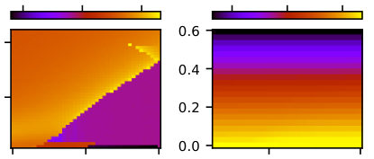
<figcaption class="paper-figure-caption"><b>Fig 3.</b> FIG. 2. Superfluid stiffnesses with (left column) and with- out (right column) phase fluctuations in the twist-angle– temperature plane for t = 10 meV. The dashed line delineates the d–(d + id′) border for the mean-field case, while such a border is obvious by the false color for the phase fluctuating case.</figcaption>
</figure>

**Summary.** This work theoretically analyzes phase fluctuations in twisted d-wave superconducting bilayers, which are predicted to host chiral superconductivity. By retaining all orders of Josephson coupling, the authors show that these fluctuations significantly modify the collective mode spectrum. The key findings include a finite relative-phase stiffness even in the normal state and critical behavior indicating the breakdown of Josephson phase locking near quantum critical points.

**Why it may be interesting.** While focused on superconductivity, the detailed analysis of collective mode excitations (phase dynamics) and symmetry breaking mechanisms (U(1) symmetry) provides general theoretical tools applicable to understanding order parameter fluctuations in various strongly correlated quantum systems.

Detailed structure

**Main problem.** The study investigates how higher-order Josephson coupling processes modify the low-energy phase fluctuations in twisted d-wave superconducting bilayers.

**Main result.** Phase fluctuations suppress the relative-phase stiffness but enhance the overall-phase stiffness in the d+id' phase, and the relative-phase mode acquires a gap strongly suppressed near the chiral quantum critical point.

**Method.** The authors use a theoretical analysis involving deriving an effective action for long-wavelength phase fluctuations by integrating out fermionic fields using a continuum microscopic model.

**Model / system.** The system is twisted cuprate bilayers exhibiting potential high-temperature chiral d+id' superconductivity, modeled via coupled d-wave superconducting monolayers with interlayer tunneling and Coulomb repulsion.

**Key observables.** Relative-phase stiffness, overall-phase stiffness, excitation gap of relative-phase fluctuations ($\omega_\pi(q)$), and the stability window of the d+id' phase.

**Important parameters / regimes.** Interlayer tunneling amplitude ($t$), temperature ($T$), and twist angle ($	heta$).

**Assumptions / limitations.** The analysis is restricted to the low-temperature regime where only long-wavelength fluctuations are relevant, and it assumes a mean-field framework for calculating fluctuation coefficients.

**Figures summary.** Figure 1 shows how phase fluctuations narrow the stability window of the d+id' phase. Figure 2 displays superfluid stiffnesses ($D_0, D_\pi$) vs. temperature/twist angle. Figure 3 illustrates the Josephson gap ($\Delta_J$) and order parameter magnitude near the TRSB point.

**Paper structure.** The paper develops an effective action for phase fluctuations by systematically including higher-order Josephson coupling terms, analyzes the resulting stiffnesses and gaps, and compares these results to mean-field predictions, focusing on critical behavior near quantum phase transitions.

Abstract

Twisted cuprate bilayers have been predicted to host high-temperature chiral $d+id'$ superconductivity, originating from higher-order Josephson coupling processes. In such two-dimensional superconducting systems, long-wavelength fluctuations in the phase of the superconducting order parameter constitute gapless collective modes and therefore remain significant even at zero temperature. Here, we perform a theoretical analysis of the low-energy phase fluctuations in twisted $d$-wave superconducting bilayers, systematically retaining Josephson coupling to all orders. We demonstrate that higher-order Josephson coupling processes lead to nontrivial modifications of the phase dynamics. In particular, the stiffness of the relative phase between the two layers is finite even in the normal state, which is a direct consequence of the intralayer U(1) symmetry breaking explicitly induced by interlayer tunneling. Phase fluctuations suppress the relative-phase stiffness but enhance the overall-phase stiffness in the $d+id'$ phase. Furthermore, the relative-phase fluctuations acquire a small but finite excitation gap, which is no longer equal to the Josephson plasma frequency and is strongly suppressed upon approaching the chiral quantum critical point, indicating the breakdown of Josephson phase locking within the superconducting state.

[↑ back to top](#top)

### [Imaging superconducting weak spots through vortex-assisted THz near-field photovoltage](http://arxiv.org/abs/2607.00914v1)

**Authors:** Sergio J. Salvía-Fernández, Ekaterina Khestanova, Zoe Velluire-Pellat, Leonardo R. Cadorim, Sergi Batlle-Porro, David A. Czaplewski, Johann Osmond, Sebastian Castilla, Adrian Bachtold, Milorad V. Milošević, Aharon Kapitulnik, Frank H. L. Koppens  
**Type:** experiment · **Category:** other · **PDF:** <https://arxiv.org/pdf/2607.00914v1>  
**Analysis basis:** full PDF text, analyzed in chunks
**Topic relevance:** `Kondo & dissipative impurity` **1/5** · `driven-dissipative phase transition` **1/5** · `methods for driven-dissipative` **1/5** · `non-equilibrium dynamics` **1/5** · `quantum optics experiment` **1/5**

↔ Scroll figures horizontally

<figure class="paper-figure-card">
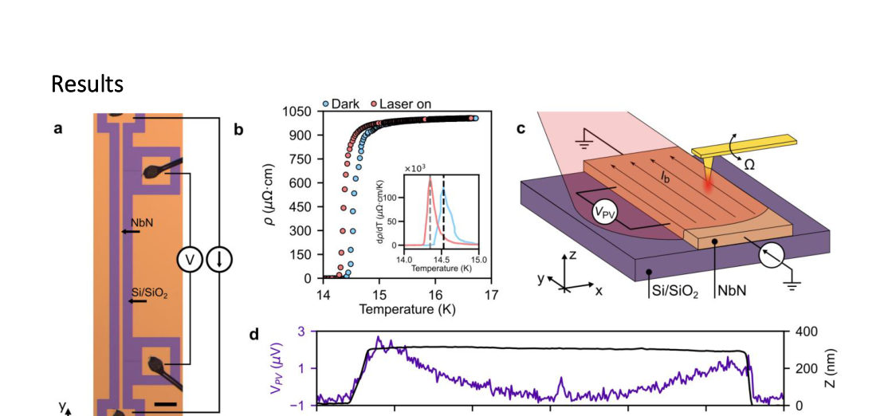
<figcaption class="paper-figure-caption"><b>Fig 1.</b> Fig. 1. Electron transport and near-field photovoltage profiling under THz illumination. a Microscope image of the device (scale bar 150 µm). Orange regions correspond to the NbN film, purple corresponds to the Si/SiO2 substrate. b Device resistivity, 𝜌, as a function of temperature measured in the dark and under continuous-wave 2.52 THz illumination with the laser power of 1.7 mW at the cryostat window. The inset shows the temperature derivative d𝜌/dT, with dashed lines marking the superconducting transition temperature (𝑇c) defined at the maximum of the derivative. c Schematic diagram of the THz near-field photovoltage experiment. d THz near-field photovoltage (purple line) and AFM...</figcaption>
</figure>
<figure class="paper-figure-card">

<figcaption class="paper-figure-caption"><b>Fig 2.</b> Fig. 2. Local peak in the near-field photovoltage at 𝑻 = 𝟏𝟑. 𝟖𝟔 𝐊. a Current-space near-field photovoltage map measured at 𝑇 = 13.86 K. b Zoomed-in view of the 𝑉PV profile obtained by averaging the line scans from the map in (a) over the current range 𝐼b = [380, 420] µA, with a Gaussian fit to the photovoltage peak (solid purple line) found at 𝑥= 12.52 μm. Orange vertical dashed lines indicate the FWHM of the peak. c Current dependence of the FWHM of the peak extracted from the map in (a). d Current dependence of amplitude of the central peak extracted from the analysis of the map in panel (a).</figcaption>
</figure>
<figure class="paper-figure-card">

<figcaption class="paper-figure-caption"><b>Fig 3.</b> Fig. 3. Multiple local near-field photovoltage peaks at 𝑻 = 𝟏𝟑. 𝟗𝟕 𝐊. a Current-space near-field photovoltage map measured at 𝑇 = 13.97 K (full map shown in Fig. S6). b Horizontal 𝑉PV profiles (trace and retrace) obtained by averaging the line scans from the map in panel (a) over the current range 𝐼b = [290, 350] µA. The trace and retrace profiles were shifted by 1 µm to account for hysteresis in the piezoelectric scanners. c Zoomed-in view of the trace and retrace 𝑉PV profiles shown in (b). The green line plots the Gaussian fit to the peak in the trace profile. d Normalized autocorrelation</figcaption>
</figure>
<figure class="paper-figure-card">

<figcaption class="paper-figure-caption"><b>Fig 4.</b> Fig. 4. Current dependence of the near-field photovoltage signal. a Current-space 𝑉PV maps measured at various temperatures. Short-dashed lines mark the 𝐼𝑐 values obtained from the far-field VI curves using the criterion 𝑉&gt; 50 μV. Long-dashed lines indicate the current corresponding to the maximum observed photovoltage. The purple shaded area corresponds to the region used to extract the horizontal cuts shown in (b). b Near-field photovoltage at the edge as a function of bias current, extracted from the maps in panel (a). Vertical dashed lines indicate the current of maximum 𝑉PV. c dV/dI curves extracted from the DC transport data under far-field illumination. d Zoomed-in current-space map...</figcaption>
</figure>

**Summary.** The research pioneers the use of THz near-field photovoltage microscopy to image nanoscale defects within superconductors. By exciting the material with THz radiation, they measure localized voltage peaks that correlate directly with enhanced vortex dynamics at these weak spots. This technique provides a powerful new tool for understanding how material disorder influences superconducting properties.

**Why it may be interesting.** This work bridges superconducting theory (vortex dynamics, gap energy) with advanced quantum optics/nano-spectroscopy techniques. The ability to probe local electronic states using THz photons is highly relevant for understanding non-equilibrium quantum phenomena in condensed matter.

Detailed structure

**Main problem.** The primary challenge is experimentally probing nanoscale inhomogeneities (weak spots) within superconductors, as their relevant energy scales are in the THz range, which far-field techniques cannot resolve.

**Main result.** The authors successfully demonstrated that THz near-field photovoltage nanoscopy can map these defects by observing localized photovoltage peaks associated with enhanced vortex-antivortex pair nucleation at defect sites.

**Method.** They employed THz near-field photovoltage nanoscopy using an AFM tip to confine THz radiation, achieving $\sim 300 	ext{ nm}$ spatial resolution while simultaneously measuring the local voltage response under a DC bias current.

**Model / system.** The study uses superconducting thin films (e.g., NbN) as the physical system. The physics involves quasiparticle excitation via THz photons, leading to vortex-assisted dissipation and measurable photovoltage ($	ext{V}_{	ext{PV}}$). Theoretical support comes from Time-Dependent Ginzburg-Landau simulations.

**Key observables.** Photovoltage ($	ext{V}_{	ext{PV}}$) spatial profiles showing localized peaks; the non-monotonic dependence of peak amplitude on bias current ($I_b$); and the constant Full Width at Half Maximum ($	ext{FWHM}$) of these peaks.

**Important parameters / regimes.** THz frequency (2.52 THz, $\hbar\omega = 10.4 	ext{ meV}$), spatial resolution ($\sim 300 	ext{ nm}$), and the superconducting gap energy ($2\Delta$).

**Assumptions / limitations.** The observed $	ext{V}_{	ext{PV}}$ peak is directly attributed to enhanced vortex-antivortex pair nucleation at sites of reduced superfluid density (defects).

**Figures summary.** Figures show spatial maps and profiles of the measured $	ext{V}_{	ext{PV}}$, detailing how these peaks appear in the bulk, their dependence on bias current, and confirmation using autocorrelation functions.

**Paper structure.** The paper establishes the technical feasibility by describing the THz near-field setup. It then presents evidence via spatial mapping to locate defects (peaks), followed by analyzing the physics of the signal—showing its correlation with vortex dynamics and comparing results against theoretical TDGL simulations.

Abstract

Nanoscale inhomogeneities are a defining feature of many superconducting materials, yet their local electromagnetic response has remained difficult to access experimentally. This is because their relevant energy scale lies in the terahertz range, where wavelengths -- on the order of hundreds of microns -- are too large to spatially resolve nanoscopic variations. Here, we demonstrate the first application of THz near-field photovoltage nanoscopy in a superconductor, achieving 300 nm spatial resolution at 2.52 THz. Scanning a current-biased NbN strip, we reveal photovoltage peaks within the bulk associated with nanoscopic defects of reduced superfluid density. The observed photovoltage follows the evolution of the vortex-dissipative state and is attributed to enhanced vortex-antivortex pair nucleation at defect sites. Together, these results open a direct route to probing how material inhomogeneities influence light-matter interactions in superconductors, with implications for superconducting devices and strongly inhomogeneous systems such as high-Tc and moiré materials.

[↑ back to top](#top)

### [Valley-dependent electron optics using quantum dots in bilayer graphene](http://arxiv.org/abs/2607.00271v1)

**Authors:** Fereshte Ildarabadi, Stephen R. Power  
**Type:** theory · **Category:** other · **PDF:** <https://arxiv.org/pdf/2607.00271v1>  
**Analysis basis:** full PDF text, analyzed in chunks
**Topic relevance:** `methods for driven-dissipative` **1/5** · `non-equilibrium dynamics` **1/5**

↔ Scroll figures horizontally

<figure class="paper-figure-card">
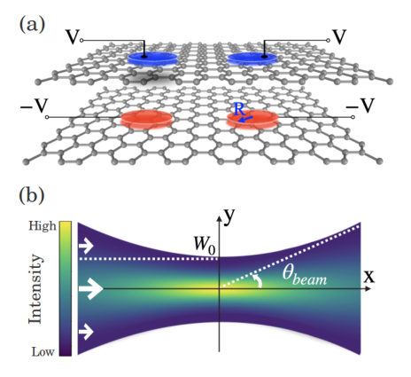
<figcaption class="paper-figure-caption"><b>Fig 1.</b> FIG. 1: (a) Schematic of two oppositely gated QDs with ra- dius R in BLG. (b) Gaussian beam propagating along the x direction. W0 is the beam waist, and θbeam denotes the char- acteristic divergence angle.</figcaption>
</figure>
<figure class="paper-figure-card">

<figcaption class="paper-figure-caption"><b>Fig 2.</b> FIG. 2: (a) Far-field angular dependence of the valley-resolved and total (K+K′) scattered current for plane-wave incidence; (b) Corresponding total current flow (arrows) and valley po- larization (color map). (c) Same angular dependence for a Gaussian beam; dashed curves indicate currents evaluated at finite distance; (d) Corresponding current flow and valley po- larization.</figcaption>
</figure>
<figure class="paper-figure-card">
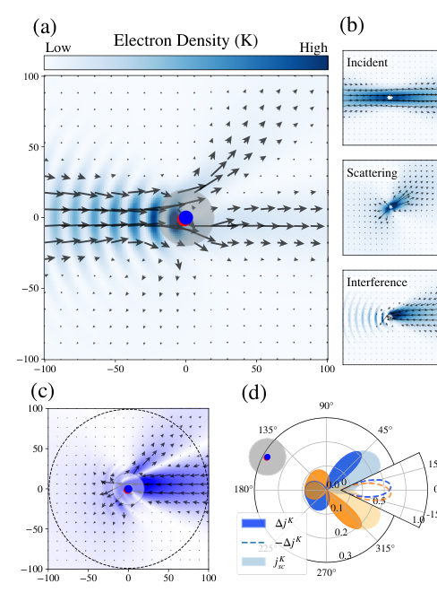
<figcaption class="paper-figure-caption"><b>Fig 3.</b> FIG. 3: (a) Current flow (arrows) and density (color map) for the K valley under Gaussian-beam incidence. (b) Decompo- sition into incident, scattered, and interference contributions. (c) Difference current map ∆jK. the K′ response is the mirror image of the K response with respect to the x axis for (a)- (c). (d) Angular dependence of ∆jK at r = 100 l0 denoted by dashed circle in (c). Light colors curves show far-field re- sults; orange curves correspond to the K′ valley. The inset polar sector shows negative contributions within ±θbeam, cor- responding to forward-current suppression.</figcaption>
</figure>
<figure class="paper-figure-card">

<figcaption class="paper-figure-caption"><b>Fig 4.</b> FIG. 4: Valley-resolved current distributions resulting from multiple scattering by two identical QDs under Gaussian- beam incidence. (a) ∆j for vertically aligned dots with d = 8R (upper-left inset), showing efficient valley splitting. Blue and orange curves correspond to the K and K′ valleys, respectively; the dashed curves in the right inset show the negative part of ∆j in the forward-direction beam region. (b) Corresponding K-valley current-flow (arrows) and elec- tron density (color map); the K′ response is the mirror image of the K response with respect to the x axis. (c)–(e) ∆j for vertically aligned dots with d = 4R, and horizontally aligned dots with d = 8R and 4R, respectively.</figcaption>
</figure>
<figure class="paper-figure-card">

<figcaption class="paper-figure-caption"><b>Fig 5.</b> FIG. 5: Valley-resolved current for a 2 × 2 array of identical QDs with d = 4R. (a) ∆j, showing strong transverse deflec- tion and reduced valley overlap, forming an efficient valley splitter. (b) Corresponding K-valley current-flow (arrows) and electron density (color map); the K′ response is its mir- ror image with respect to the x-axis. (c) Total current map overlaid on the valley polarization color map. (d) Valley cur- rent map, showing strong transverse valley separation.</figcaption>
</figure>

**Summary.** The paper proposes using electrostatically gated quantum dots in bilayer graphene to create controllable devices for manipulating electron valleys. By engineering the dot array geometry—especially by opposing the gate potentials—the system can function as a highly efficient valley filter or splitter. This establishes a realistic solid-state platform for generating and steering pure valley currents.

**Why it may be interesting.** This work provides a concrete, tunable solid-state platform for valleytronics, which is highly relevant to quantum information processing by offering methods to manipulate spin or valley degrees of freedom without relying on external magnetic fields.

Detailed structure

**Main problem.** The goal is to develop a tunable platform for achieving valley-dependent electron optics in bilayer graphene (BLG) using electrostatically defined quantum dots (QDs). This allows for controlling the flow of electrons based on their valley index ($K$ vs $K'$).

**Main result.** By engineering QD arrays—specifically using oppositely gated pairs—the system can act as an efficient valley filter or splitter, generating highly polarized currents with strong suppression of forward transmission.

**Method.** The analysis employs a four-band continuum model and solves the scattering problem using a generalized multiple-scattering formalism. The total current is decomposed into incident, scattered, and interference components for detailed characterization.

**Model / system.** The physical system is Bernal-stacked BLG containing electrostatically defined QDs. The mechanism relies on layer-antisymmetric gating to induce opposite signs of a mass-like term in the two valleys ($K$ and $K'$), enabling valley-dependent scattering without external fields.

**Key observables.** Valley-resolved currents ($\mathbf{j}_K$ vs $\mathbf{j}_{K'}$), angular profiles, and the degree of valley polarization quantified by $P(r, 	heta)$.

**Important parameters / regimes.** Dot radius ($R=10 	ext{ nm}$), layer asymmetry ($\Delta = 152 	ext{ meV}$), Fermi energy ($\approx 19 	ext{ meV}$).

**Assumptions / limitations.** The analysis assumes the use of a four-band continuum model and approximates the incident beam using Gaussian profiles, which helps suppress interference effects compared to plane waves.

**Figures summary.** Figures illustrate schematic setups (single/multi-dot arrays), far-field angular dependence of valley currents for both plane-wave and Gaussian incidence, and real-space current maps showing filtering or splitting actions based on dot gating geometry.

**Paper structure.** The paper progresses from establishing the basic single-dot scattering mechanism to analyzing multi-dot configurations. It systematically compares the roles of identical vs. oppositely gated dots, culminating in the demonstration of combined filter/splitter functionality using engineered arrays.

Abstract

Electrostatically defined quantum dots (QDs) with layer-antisymmetric gating in Bernal-stacked bilayer graphene (BLG) open a local gap and generate a mass-like term with opposite sign in the two valleys, producing strongly valley-dependent scattering without magnetic fields, strain, or spin-orbit coupling. Building on this mechanism, we propose a tunable platform based on such QDs for valley-dependent electron optics in BLG. Using a four-band continuum model and a generalized multiple-scattering formalism, we analyze scattering of Gaussian electron beams from single- and multi-dot architectures and compute valley-resolved currents and angular profiles. A single dot produces distinct valley-dependent deflection, while multi-dot configurations enable enhanced control: identical-dot arrays act as valley splitters, whereas oppositely gated pairs function as valley filters. Combining these elements yields tunable generation, steering, and filtering of highly valley-polarized currents with strong suppression of forward transmission. The required energy scales, gate asymmetries, and device dimensions are within experimentally accessible regimes for dual-gated BLG, establishing quantum-dot arrays as a realistic platform for controllable valley-resolved electron optics.

[↑ back to top](#top)
